# Excel Ayarları

## Excele veri çözücü ekleme 

Eğer veri çözücü excelde gözükmüyorsa Dosya > Seçenekler > Eklentiler > Yönet: Excel eklentiler > Git > Çöz.. ile başlayan 3 eklentiyi aktifleştir. 

Veri çözüsü ile temel istatistik deyince kip değeri modu verir. Ek olarak yinelenenleri kaldırarak frekans sütun elde edilir ve veri çözümleme > histogram seçilerek Veri aralığı tüm veri, bin aralığı frekans sütunu seçilerek çıktı istenen yer belirlenir. Grafik istenirse grafik çıktısı seçilir.)

## Excelde normal dağılımda veri oluşturmak

Normal dağılımda veri oluşturmak için Veri çözümleme > Rastgele sayı üretimi > Değişken sayısı: istediğimiz sütun miktarı, rastgele sayı adedi: istediğimiz sütun adedi, dağılım: dağılım türü seçip histogramını alırsak çan eğrisi gibi bir grafik çıkıyor.

# Ölçek türleri

- **Nominal:** Herhangi bir önem sıralaması yoktur. Kadın, Erkek gibi.
- **Ordinal:** Önem derecesi olan ölçek. Çok Soğuk, Soğuk, Serin, Sıcak, Çok Sıcak gibi.
- **Metric:** Sayısal işlem yapabildiğimiz türler. Termometre sonucu gibi. Pozitif veya negatif olur.
- **Oran:** Metric ölçeğinin başlangıç oranı sıfır olan pozitif sayılardan oluşan versiyonu. Uzunluk, Hız

# 1 Betimsel istatistik

## 1.1 Merkezi eğilim ölçüleri

Verinin hangi değerler etrafında toplandığını ifade eden yapıdır. 

### Aritmetik ortalama

Bütün değerleri toplayıp değer sayısına böler. Uç değerlere hassastır. Excelde ortalama fonksiyonu ile kullanılır.

### Medyan

Uç değer varsa medyan kullanılır. n tekse n+1/2 inci değer, n çiftse n/2. değer ve n/2+1.inci değerin ortalaması ile bulunur. Excelde Ortanca fonksiyonu ile kullanılır.

### Mod

Bir değişken içindeki verilerin en çok tekrar edenidir, yani en büyük frekansa sahip olanıdır. 

### Frekans

Bir gözlemden kaç tane olduğunu gösterir.

### Kartiller

Veriyi 4 eşit parçaya bölen değerlerdir. Dağılımdaki bir değerin bu 4 eşit parçanın herhangi birinde olma olasılığı %25'tir. 

Excelde kartilleri dörttebirlik fonksiyonu ile çağırıyoruz. Eğer min maks noktalarını istiyorsak DörttebirlikDHL, direk hesaplanması için DörttebirlikHRC fonksiyonunu seçiyoruz.

## 1.2 Merkezi dağılım ölçüleri

Veri kümesinin nasıl bir alanda oluştuğunu gösterir.

### Değişim aralığı (Ranj)

Maksimum değer ile minimum değer arasındaki fark. Ranjın yüksek olması bize o verinin daha ayırt edici olduğunu gösterir.

### Standart sapma

Veri setindeki her gözlemin ortalamayla olan farkının ortalamasıdır. Hem riskin ölçüsüdür, hem de veri setindeki değerlerin ortalamadan ne kadar uzaklıkta dağıldığını gösterir. Standart sapma çok yüksekse veriler ortalamadan aşırı sapmıştır. Standart sapmadaki yükseklik verideki oynaklığın da fazla olduğunu gösterir.  

Excelde standart sapma S ve standart sapma P seçenekleri var. Tüm popülasyonun standart sapmasıysa standart sapma P, örneklem standart sapmasıysa standart sapma S kullanılır.

2 x Standart sapma'dan daha fazla olan veriler uç değer olarak görülür. Bazı kaynaklara göre 3 standart sapma. Mesela, standart sapma 10 ise 20 (veya 30) dan büyük değerler aykırı değerlerdir.

### Varyans

Yaklaşık olarak standart sapmanın karesidir. Eğer popülasyon varyansıysa bütün değişkenlerin ortalamadan farkının karesinin adetine bölünmesiyle hesaplanır. Eğer örneklem için kullanılıyorsa adet - 1 e bölünür. 

Excelde tüm popülasyonun varyansıysa var P, örneklem ise var S kullanılır.

### Çarpıklık (Skewness)

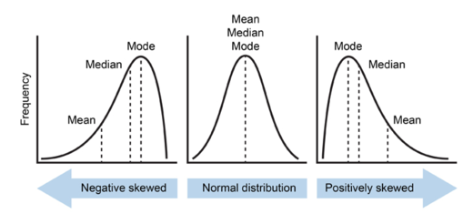

Ortadaki veri simetrik dağılım. Simetrik dağılımda uç değer olmaz. Ortalama, Medyan ve Mode çok yakın veya eşit.
Negatif yönde çarpık olursa ortalama < medyan < mode şeklinde bir dağılım olur.
Pozitif yönde çarpık olursa mode < medyan < ortalama şeklinde bir dağılım olur.

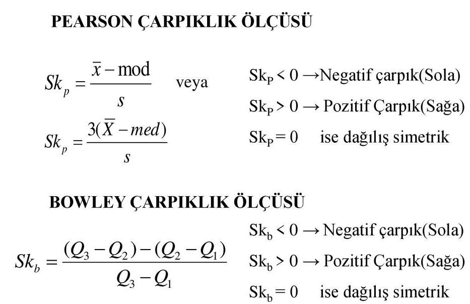

Pearson çarpıklık ölçüsü, Xort ile mod değerinin farkının standart sapmaya bölümü veya Xort ile medyan değerinin farkının 3 katının standart sapmaya bölümü ile bulunur.
Pearson çarpıklık ölçüsü pozitif ise sağa çarpık negatif ise sola çarpıktır.
Excelde çarpıklık fonksiyonuyla bulunabilir.

### Basıklık (Kurtosis)

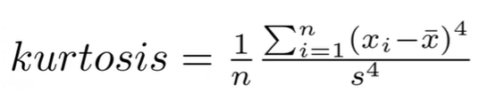

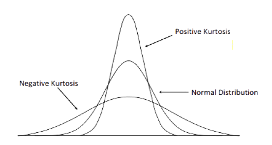

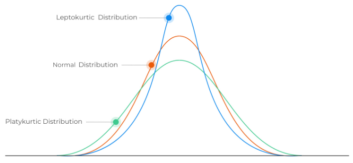

Kurtosis değerinin sınırı 3 olarak kabul edilir.

[Normal dağılım hesaplamak için site](https://www.desmos.com/calculator/jxzs8fz9qr?lang=tr)

Excelde basıklık fonksiyonuyla kullanılır. 3'ten büyükse sivri bir dağılım küçükse basık bir dağılım var deriz.

## 1.3 Ek bilgi

Python kullanım fonksiyonları;

- ortalama: veri.mean()
- medyan: veri.median()
- %25 quantile: veri.quantile(q=0.25)
- Medyan %50 quantile: veri.quantile(q=0.50)
- %75 quantile: veri.quantile(q=0.75)
- standart sapma: veri.std()
- varyans: veri.var()
- basıklık: veri.kurtosis()
- çarpıklık: veri.skew()

Eğer dağılımını bilmediğin bir Tarih sıralı verinin histogramıyla karşılaşırsan, her satırın bir öncekiyle olan farkını bulabilirsin. Farklarını gösterince normal dağılıma benzer bir dağılıma ulaşırsın.

## 1.4 Örnekler

```Python
import pandas as pd
import matplotlib.pyplot as plt

veri = pd.read_excel("/kaggle/input/satis-deneme/Satis.xlsx")

veri.describe()
```


```Python
veri["Cinsiyet"].describe()
```

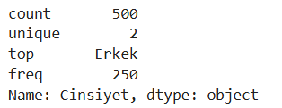

```Python
veri["Cinsiyet"].value_counts()
```

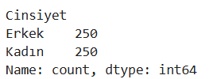

```Python
veri["Cinsiyet"].value_counts(normalize = True) *100
```

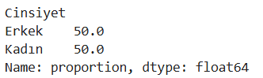

```Python
plt.hist(veri["Yaş"], bins = 50)
plt.show()
```

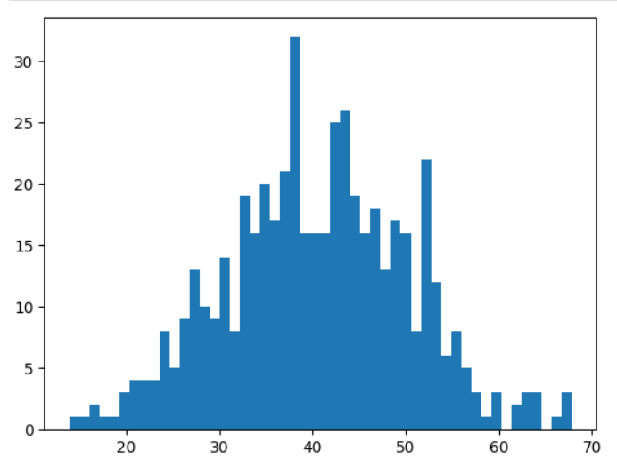

```Python
veri["Yaş"].skew()

# 0.024461786786661114
```

```Python
veri["Yaş"].kurtosis()

# -0.18269821709302603
```

```Python
veri.groupby("Cinsiyet").mean()
```

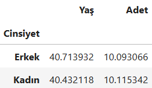

# 2 Çıkarımsal istatistik

Örnekleme yapılarak popülasyon için çıkarım yapılan istatistik türüdür. 

## 2.1 Merkezi limit teoremi

Uygun bir şekilde seçilen örneklem yapısı tüm popülasyona benzeyecektir.

Eğer bir popülasyonda anket almak gibi defalarca veri almaya devam edersek örneklemin ortalamasının dağılımı bizi normal dağılıma götürür.

Popülasyondan 30 adet örneklemin ortalamasını alırsak normal dağılıma ulaşırız.

### Örnekler

```Python
import numpy as np
import matplotlib.pyplot as plt

# Uniform bir dağılım elde etmek
yas = np.random.uniform(low = 18, high = 72, size = 40000)
yas 

# array([69.06428513, 35.3954505 , 21.27415043, ..., 49.2332403 ,
#        42.29571594, 20.79167345])
```

```Python
yas.mean()

# 44.96710755555197
```

```Python
plt.hist(yas)
plt.show()
```

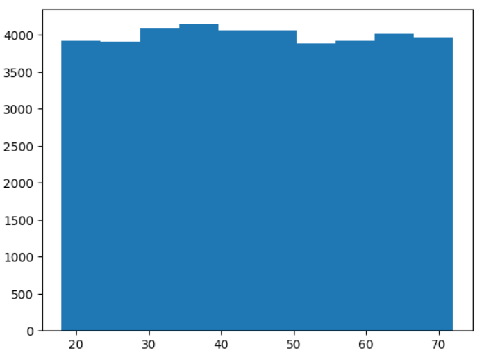

```Python
import random
orneklem = random.choices(yas,k=5)
orneklem

# [34.32305248567211,
#  64.0623590234868,
#  33.06747583685961,
#  56.207328531842954,
#  59.87675708682805]
```

```Python
import random
orneklem = [np.mean(random.choices(yas, k=1)) for _ in range(1000)] # 1000 kez 1 örneklem çekiyor. 
plt.hist(orneklem)
plt.show()
```
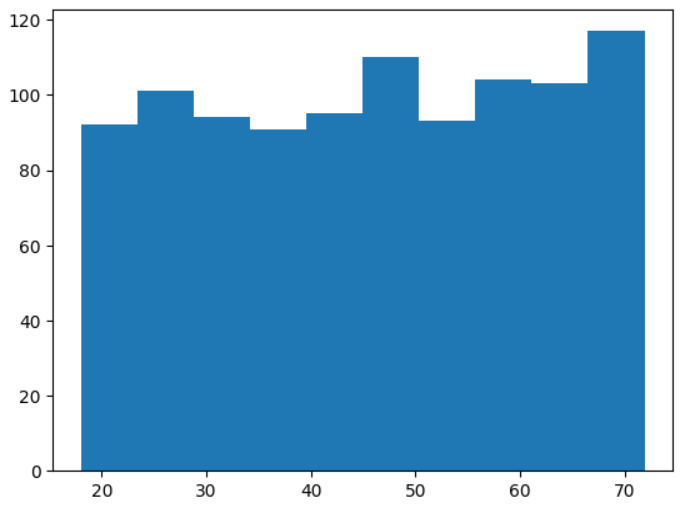

```Python
import random
orneklem = [np.mean(random.choices(yas, k=2)) for _ in range(1000)] # 1000 kez 2 örneklem çekiyor. 
plt.hist(orneklem)
plt.show()
```

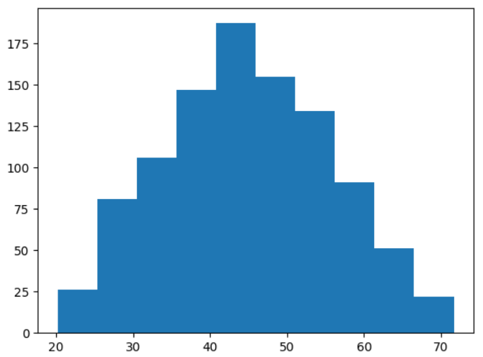

```Python
import random
orneklem = [np.mean(random.choices(yas, k=10)) for _ in range(1000)] # 1000 kez 10 örneklem çekiyor. 
plt.hist(orneklem)
plt.show()
```

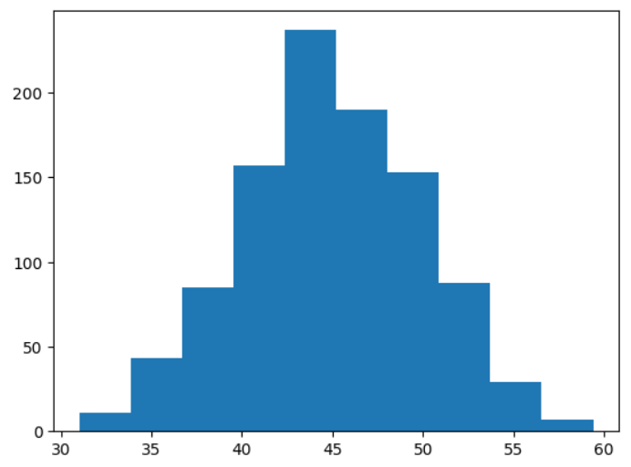

```Python
import random
orneklem = [np.mean(random.choices(yas, k=30)) for _ in range(1000)] # 1000 kez 30 örneklem çekiyor. 
plt.hist(orneklem)
plt.show()
```

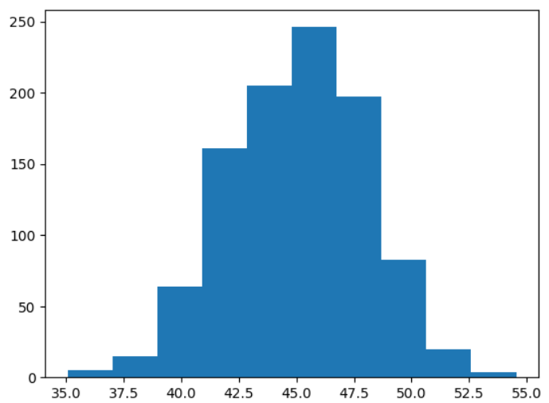

## 2.2 Standart hata nedir?

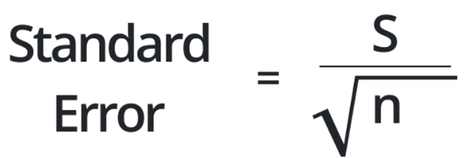

Çekilen örneklemlerin sayısı arttıkça örneklem kümesinin ortalaması popülasyon ortalamasına yakınsar. Örneklem çektikçe örneklem kümesinin ortalaması ile popülasyon ortalamasına yaklaşır. Bir popülasyondan seçilebilecek olası örneklemlerin ortalamalarınının standart sapmasına standart hata denir.

Düşük standart sapma ve düşük standart hata isteniyor.

[Dağılım oluşturma sitesi](https://onlinestatbook.com/stat_sim/sampling_dist/index.html)

## 2.3 Seaborn kütüphanesi

```Python
import seaborn as sns
import matplotlib.pyplot as plt
import numpy as np

x = np.random.normal(35,1,10000) #ortalama, standart sapma, adet

sns.histplot(x)
plt.show()
```
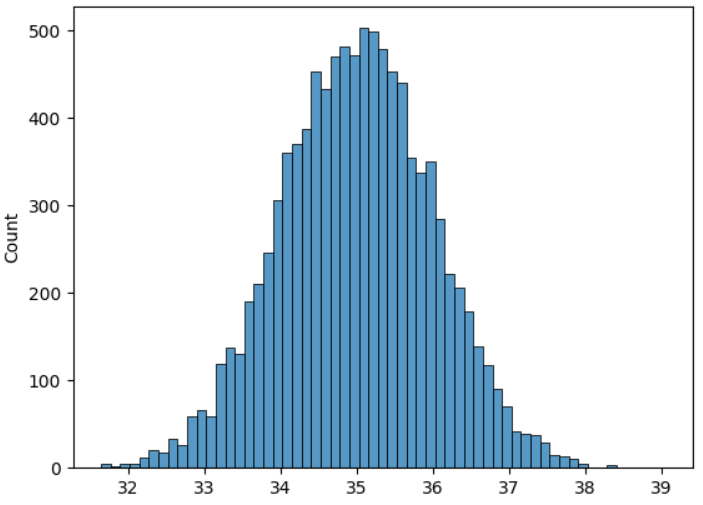

```Python
sns.displot(x, kde = True, color = "r")
plt.show()
```

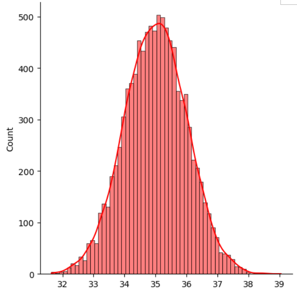

```Python
sns.kdeplot(x, color = "g")
plt.show()
```

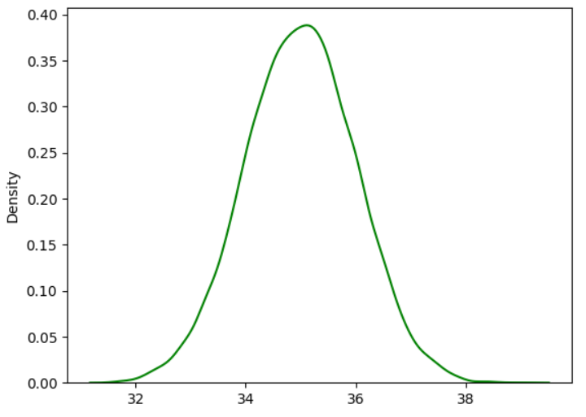

```Python
sns.boxplot(x=x, color="g")
plt.show()
```

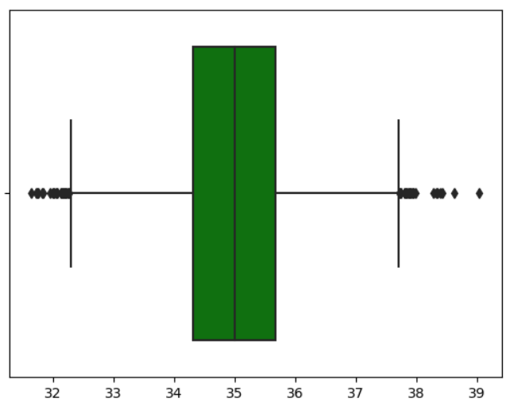

```Python
sns.lineplot(x=np.arange(len(x)), y=x)
plt.show()
```

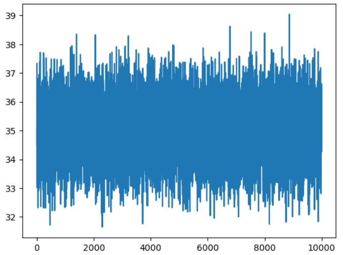

## 2.4 z-score

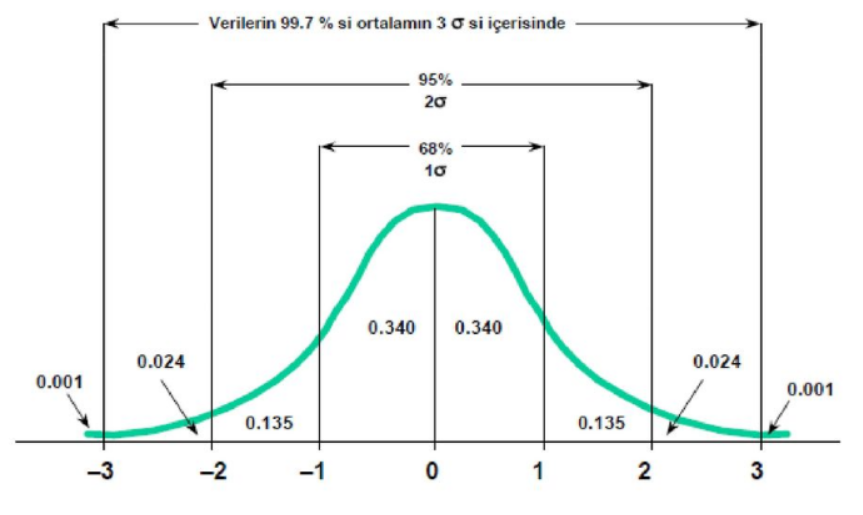

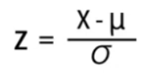

Excelde z-score çevirimini standartlaştırma formülü ile yapıyoruz. **Standartlastırma exceli var.**

### Örnekler

```Python
import numpy as np
import matplotlib.pyplot as plt
import seaborn as sns

np.random.seed(35)

veri = np.random.normal(35,2,40000)
veri

# array([31.22052658, 34.17281564, 33.46794798, ..., 30.91770669,
#        36.07625002, 31.63870381])

```

```Python
sns.displot(veri, kde = True, height=8, aspect=1.5)
plt.title("Veri Dağılım Grafiği", fontsize=15, loc="right", c="red")
plt.xlabel("Veriler", fontsize=15, c="red")
plt.ylabel("Frekanslar", fontsize=15, c="red")
plt.axvline(x=np.mean(veri), linestyle = "--", linewidth = 2.5, label = "Ortalama", c="red")
plt.axvline(x=np.mean(veri) - np.std(veri), linestyle = "--", linewidth = 2.5, label = "Ortalama - 1 Standart Sapma", c="orange")
plt.axvline(x=np.mean(veri) + np.std(veri), linestyle = "--", linewidth = 2.5, label = "Ortalama + 1 Standart Sapma", c="orange")
plt.legend() # axvline çizgi için gerekli
plt.show()
```

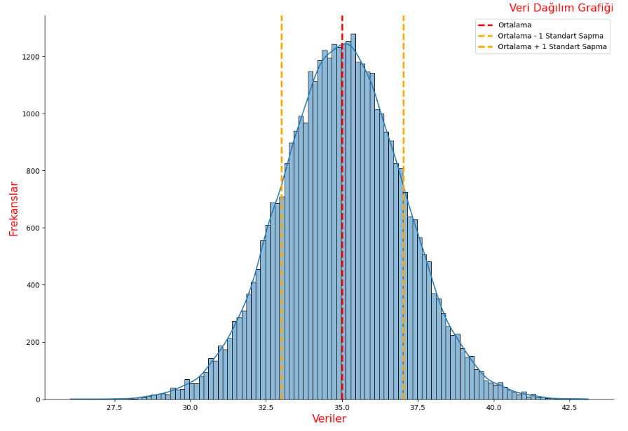

```Python
veriz = (veri - np.mean(veri)) / np.std(veri)

sns.displot(veriz, kde = True, height=8, aspect=1.5)
plt.title("Veri Dağılım Grafiği", fontsize=15, loc="right", c="red")
plt.xlabel("Veriler", fontsize=15, c="red")
plt.ylabel("Frekanslar", fontsize=15, c="red")
plt.xlim(-3,3)
plt.axvline(x=np.mean(veriz), linestyle = "--", linewidth = 2.5, label = "Ortalama", c="red")
plt.axvline(x=np.mean(veriz) - np.std(veriz), linestyle = "--", linewidth = 2.5, label = "1 Standart Sapma", c="black")
plt.axvline(x=np.mean(veriz) + np.std(veriz), linestyle = "--", linewidth = 2.5, c="black")
plt.axvline(x=np.mean(veriz) - 2*np.std(veriz), linestyle = "--", linewidth = 2.5, label = "2 Standart Sapma", c="blue")
plt.axvline(x=np.mean(veriz) + 2*np.std(veriz), linestyle = "--", linewidth = 2.5, c="blue")
plt.legend() # axvline çizgi için gerekli
plt.tight_layout()
plt.show()
```

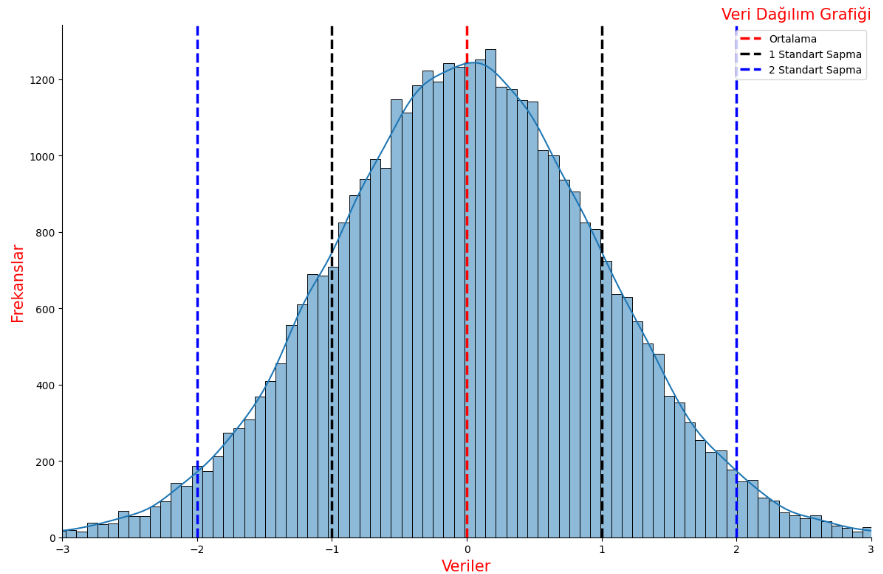

## 2.5 z-table

z-score tablosu;

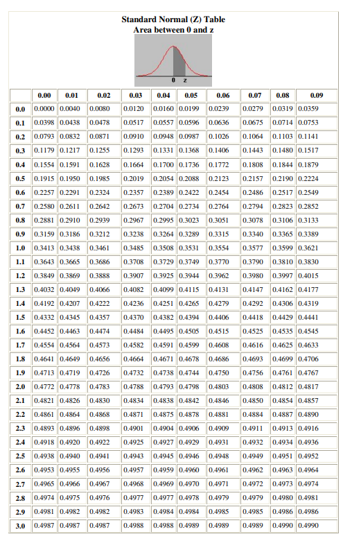

[Z skor online hesaplayıcı](https://homepage.divms.uiowa.edu/~mbognar/applets/normal.html)

### Örnekler

Ortalaması 5,3 ve sapması 1 olan normal dağılımda P(x<4.5) olasılğını arıyoruz.

z-score = (4,5-5,3)/1 = -0,8

4,5 değerinin ortalama değeri olan 5,3 ile arasındaki yüzde %28,81 olarak bulunur. %50 den bu değer çıkarılırsa %21,19 olarak olasılığı bulunur.

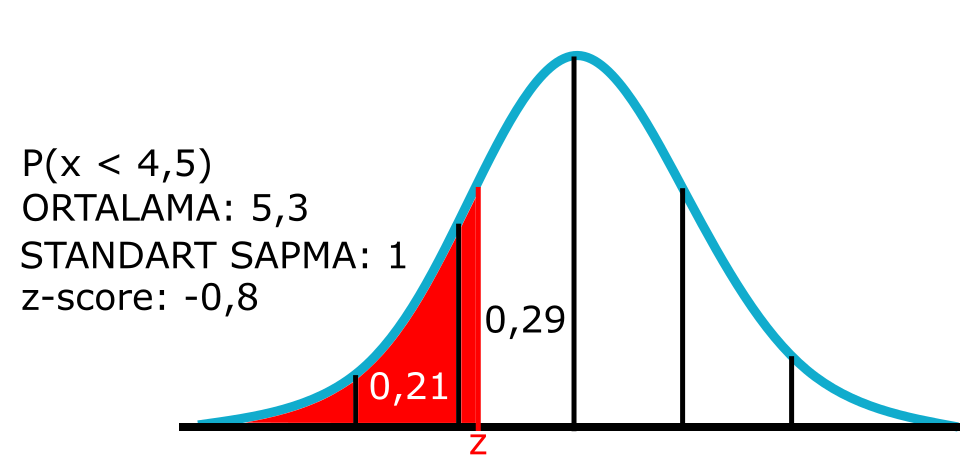

```Python
from scipy.stats import norm

olasılık = norm(loc=5.3, scale=1).cdf(4.5)
olasılık

# 0.21185539858339675
```

4.5 ile 6.5 arasında olma olasılığı;

```Python
from scipy.stats import norm

olasılık = norm(loc=5.3, scale=1).cdf(6.5) - norm(loc=5.3, scale=1).cdf(4.5)
olasılık

# 0.673074931194895
```

⚠⚠⚠ cdf hep sol tarafta kalan alanın olasılığını verir.

-----

Bir kamu bankası personel alımı için ilana çıkmış ve iş için başvuran çok sayıda adaya, ekonomi, maliye, finans, işletme, hukuk alanlarında hazırlanan bir test uygulamıştır. Adayların uygulanan testte aldıkları puanların ortalaması 60 ve standart sapması 12 hesaplanmıştır. Adayların aldıkları puanların normal dağıldığı bilindiğine göre;

1. Tesadüfen seçilecek bir adayın 60-70 arasında puan almış olma olasılığı nedir?

Ortalama 60 olduğuna göre;
* 60'ın z-score değeri (60-60) / 12 ile 0 bulunur.
* 70'ın z-score değeri (70-60) / 12 ile 0,83 bulunur.

0,83 z-score için tablodaki değer % 29,67 bulunmuştur.

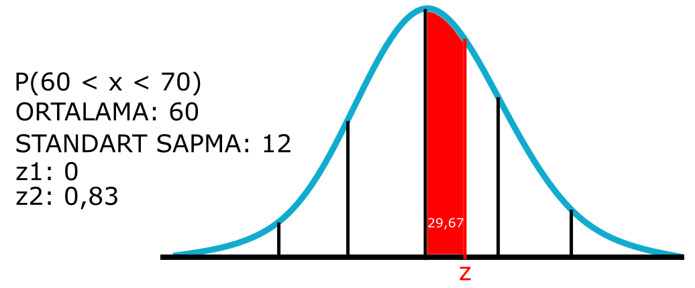

```Python
from scipy.stats import norm

olasılık = norm(loc=60, scale=12).cdf(70) - 0.5
olasılık

# 0.29767161903635686
```

2. Tesadüfen seçilecek bir adayın 45-60 arasında puan almış olması olasılığı nedir?

* 60'ın z-score değeri (60-60) / 12 ile 0 bulunur.
* 70'ın z-score değeri (45-60) / 12 ile -1,25 bulunur.

1,25 z-score  için tablodan % 39,44 olarak bulunmuştur.

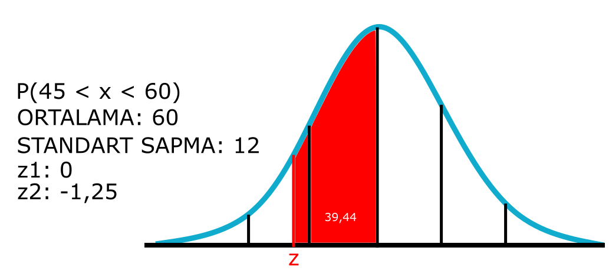

```Python
from scipy.stats import norm

olasılık = 0.5 - norm(loc=60, scale=12).cdf(45)
olasılık

# 0.39435022633314465
```

3. Tesadüfen seçilecek bir adayın 45'den az puan alma olasılığı nedir?

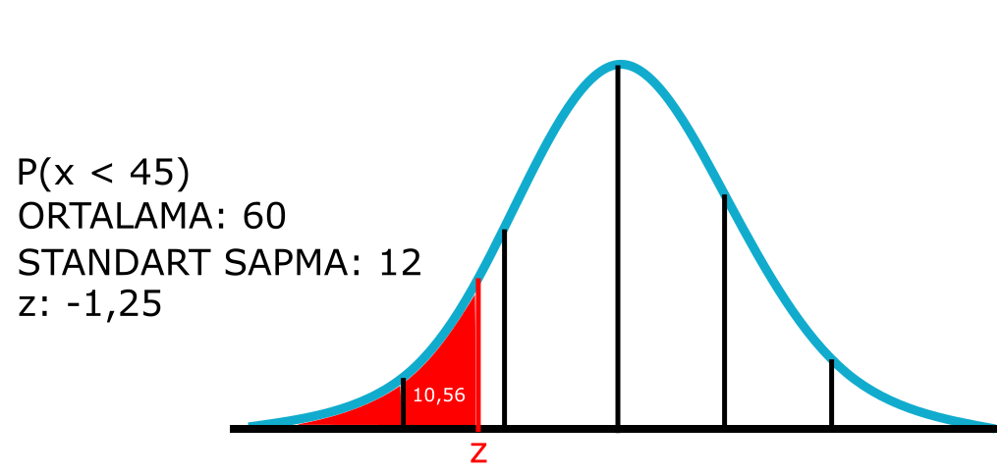

```Python
from scipy.stats import norm

olasılık = norm(loc=60, scale=12).cdf(45)
olasılık

# 0.10564977366685535
```

-----

İmal edilen ampullerin ortalama ömrü 800 saat, standart sapması 40 saattir. Ampulün ömrünün normal dağılım gösterdiği bilindiğine göre bir ampulün;

⚠⚠⚠ DİKKAT bu tarz sorularda birimler aynı olmalı.

1. 778 saatten daha fazla bir ömre sahip olması olasılığını bulunuz?

778'in z-score değeri (778-800) / 40 ile -0,55 bulunur. Tablodan 0,55 z-score değerinin yüzdesi %21 olarak bulunur. %21 + %50 = %71 bulunur.

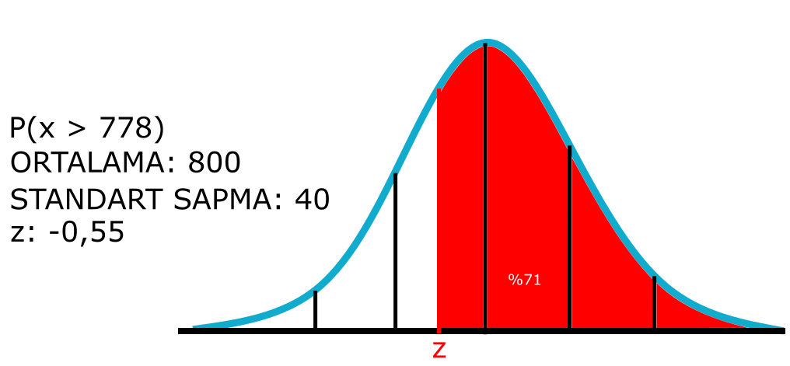

```Python
from scipy.stats import norm

ust = norm(loc=800, scale=40).cdf(1600) # 1600 1, 800 0
alt = norm(loc=800, scale=40).cdf(778)
olasılık = ust - alt
olasılık

# 0.7088403132116536
```

2. 834 saatten daha az bir ömre sahip olması olasılığını bulunuz?

834'ün z-score değeri (834-800) / 40 ile 0,85 bulunur. Tablodan 0,85 z-score değerinin yüzdesi %30 olarak bulunur. %30 + %50 = %80 bulunur.

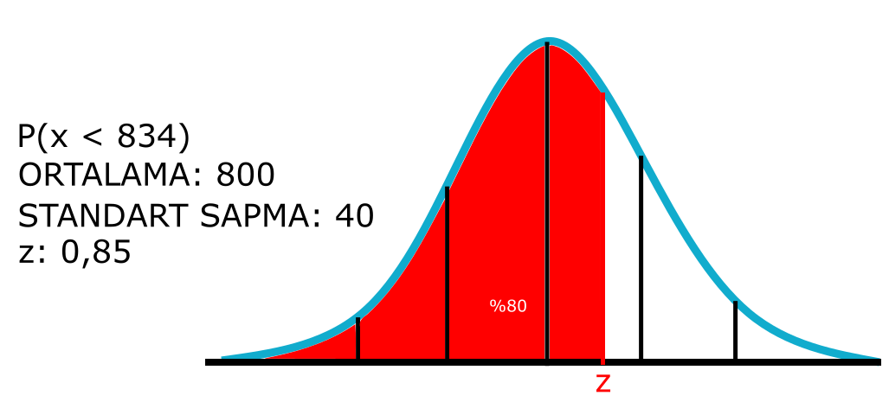

```Python
from scipy.stats import norm

olasılık = norm(loc=800, scale=40).cdf(834)
olasılık

# 0.8023374568773076
```

3. 778 saat ile 834 saat arasında bir ömre sahip olması olasılığını bulunuz?

778'in z-score değeri (778-800) / 40 ile -0,55 bulunur.
834'ın z-score değeri (45-60) / 12 ile 0,85 bulunur.

Tabloda karşılıkları toplanarak %21 + %30 = %51 bulunur.

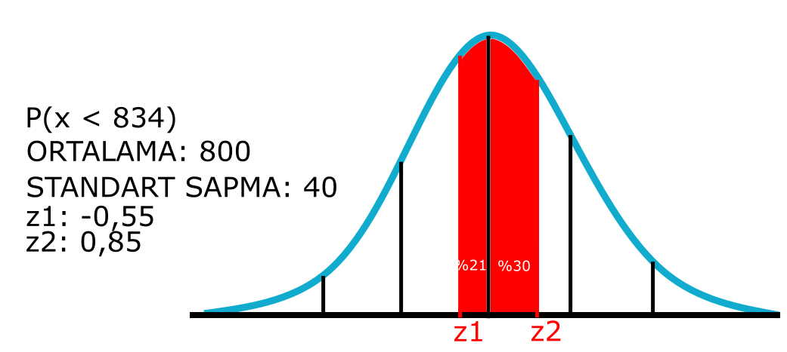

```Python
from scipy.stats import norm

ust = norm(loc=800, scale=40).cdf(834) # 1600 1, 800 0
alt = norm(loc=800, scale=40).cdf(778)
olasılık = ust - alt
olasılık

# 0.5111777700889613
```

-----

Bir imalathanede üretilen millerin çaplarının ortalaması 3.0005 inç ve standart sapmalarının ise 0.001 inç olan normal dağılıma uyduğu tespit edilmiştir. Üretilen miller eğer 3.000 +- 0,002 inç aralığının dışında iseler bu miller hatalı Üretim kabul edilmektedir. Buna göre toplam Üretimdeki hatalı ürün miktarım bulunuz?

Ortalama = 3.0005

Sapma = 0.001

z-score1 = (3,002 - 3,0005) / 0.001 = 0.0015 / 0.001 = 1,5

z-score2 = (2,998 - 3,0005) / 0.001 = -0.0025 / 0.001 = -2,5

Doğru ürün oranı %49,38 + %43,32 = % 92,7

Hatalı ürün oranı 100 - 92,7 = %7,3

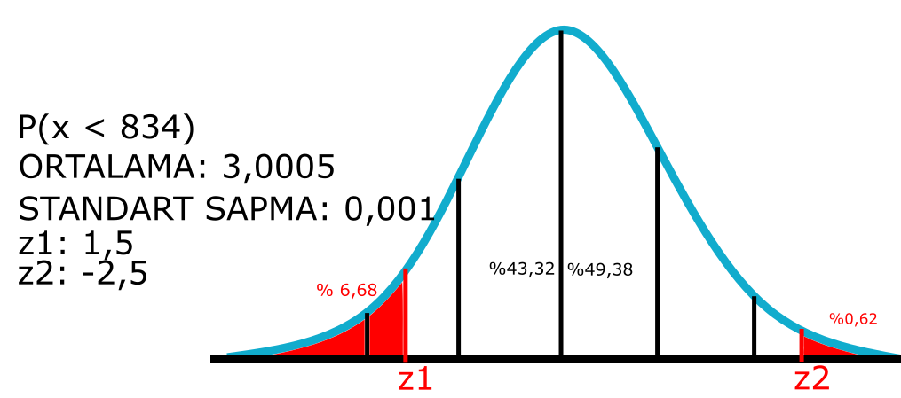

```Python
from scipy.stats import norm

ust = norm(loc=3.0005, scale=0.001).cdf(3.002)
alt = norm(loc=3.0005, scale=0.001).cdf(2.998)

olasılık = ust - alt
olasılık

# 0.9269831334053148
```

%92,69 ürünler doğru olduğuna göre hatalı ürün yüzdesi %7,31'dir.

## 2.6 Serbestlik derecesi

toplamları 15 olan 3 sayı seçin denildiğinde 2 sayı seçebiliriz ve 3. sayı otamatik olarak belli olur. Benzer şekilde ortalama alırken popülasyonu da örneklemi de n'e bölerken, standart sapma alırken popülasyonu n'e bölerken örneklemi n-1'e bölmemizin sebebi bütün değerlerden ortalamayı çıkarıptoplarsak sonuç hep sıfırdır. (Bu aynı zamanda neden karelerini alıp karekökünü aldığımızın da cevabıdır.) Bu yüzden son rakamı hep tahmin edebiliriz. Bunun için örneklem standart sapmasında n-1 ile formulü oluştururuz.

## 2.7 Student'in t dağılımı

Örneklem sayısı 30'un altında kaldığında t dağılım yapısı kullanılır. T dağılımında serbestlik derecesi yükseldikçe normal dağılıma yakınsar.

```Python
import numpy as np
from scipy import stats
import matplotlib.pyplot as plt
import seaborn as sns

np.random.seed(0)

veri1t=stats.t.rvs(loc=0,df=1,size=15)
veri2t=stats.t.rvs(loc=0,df=2,size=15)
veri5t=stats.t.rvs(loc=0,df=5,size=15)
veri20t=stats.t.rvs(loc=0,df=20,size=15)

sns.distplot(veri1t,color="red",hist=False)
sns.distplot(veri2t,color="blue",hist=False)
sns.distplot(veri5t,color="green",hist=False)
sns.distplot(veri20t,color="black",hist=False)
plt.xlim(-5,5)
plt.show()

sns.displot(veri1t,color="green",kde=True)
plt.xlim(-5,5)
plt.show()
```

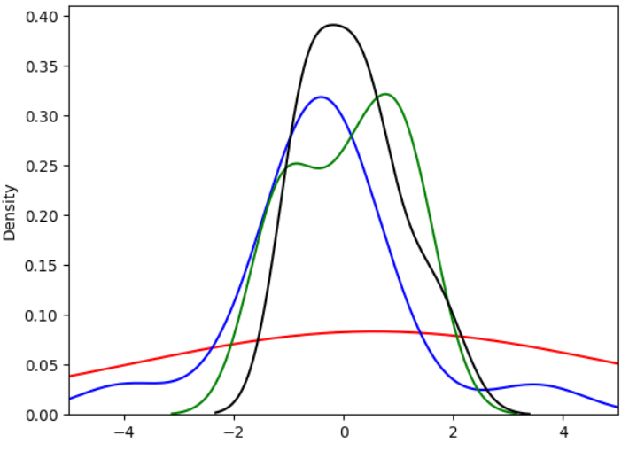

## 2.8 Tahmin teorisi

- Nokta tahmin: sonucu direk bir sayıyla tahmin etmek.
- Aralık tahmini: sonucu bir aralık olarak tahmin etmek. İki türü vardır:
  - Güven aralığı
  - Bayes tipi güvenilir aralık
 
Aralık Tahmini
- Tek popülasyon
  - Ortalama tahmini için;
    - Popülasyon standart sapması biliniyorsa Z tablosu
    - Popülasyon standart sapması bilinmiyorsa ve n>30 ise Z tablosu
    - Popülasyon standart sapması bilinmiyorsa ve n<=30 ise T tablosu
  - Standart Sapma tahmini için;
    - Ki Kare Tablosu
  - Oran tahmini için;
    - Z tablo
- İki popülasyon
  - Ortalama farkı tahmini için;
    - Popülasyon standart sapması biliniyorsa Z tablosu
    - Popülasyon standart sapması bilinmiyorsa varyans testleri

## 2.9 Normal dağılım ortalama güven aralığı

$$
P\left( \bar{X} - Z_{score} \cdot \frac{\theta}{\sqrt{n}} < \mu < \bar{X} + Z_{score} \cdot \frac{\theta}{\sqrt{n}} \right) = 1 - \alpha
$$

Açıklamalar:

* $$\bar{X}$$: Örneklem ortalaması
* $$\mu$$: Popülasyon ortalaması (bilinmeyen parametre)
* $$\theta$$: Anakütle standart sapması
* $$n$$: Örneklem büyüklüğü
* $$\alpha$$: Anlamlılık düzeyi (örneğin $$\alpha = 0.05$$)
* $$Z_{score}$$: Standart normal dağılımdan yüzdelik değeri (örneğin %95 güven düzeyi için 1.96)

Genelde kullanılan 3 çeşit güven aralığı vardır;
- %99
- %95
- %90

⚠⚠⚠ En çok kullanılan %95'dir.

z-score değerleri;

- %99 için 2,58
- %95 için 1,96
- %90 için 1,65

### Örnekler 

Rassal olarak seçilen fabrikadaki 100 ürünün (n 30 dan büyükse z tablosu kullanılır) ortalama ağırlık 1040 gr, standart sapması ise 25 gr'dır. Fabrikadaki tüm ürünlerin (popülasyon) ortalama ağırlıkları %95 güven aralığında kaçtır?

$$1040 - 1.96 \cdot \frac{25}{\sqrt{100}} < \mu < 1040 + 1.96 \cdot \frac{25}{\sqrt{100}}$$

$$1040 - 1.96 \cdot 2.5 < \mu < 1040 + 1.96 \cdot 2.5$$

$$1040 - 4.9 < \mu < 1040 + 4.9$$

$$1035.1 < \mu < 1044.9$$

```Python
import numpy as np
from scipy import stats

n=100
xort=1040
xstandart=25
guven=0.95

aralık=stats.norm.interval(confidence=guven, loc=xort, scale=xstandart/np.sqrt(n))
aralık

# (1035.1000900386498, 1044.8999099613502)
```

---

85 ev sahibi ile yapılan bir ankette, ev bakımına aylık olarak ortalama 67$$ (standart sapma = 14$$) harcadıkları tespit edilmiştir. Tum ev sahiplerinin aylık ev bakım harcamaları için %95 güven aralığını oluşturunuz.

```Python
import numpy as np
from scipy import stats

n=85
xort=67
xstandart=14
guven=0.95

aralik = stats.norm.interval(confidence=guven, loc=xort, scale=xstandart/np.sqrt(n))
aralik

# (64.02376880867953, 69.97623119132047)
```

---

Piyasaya yeni sürülen bir ürünün uzunluğunun standart sapması 2cm'dir. Rastgele seçilen 16 ürünün ortalama uzunluğu 4 cm olarak hesaplanmıştır.%95 güvenle anakütle ortalamasını tahmin ediniz?

```Python
import numpy as np
from scipy import stats

n=16
xort=4
xstandart=2 
guven=0.95

# n 30'dan küçük ve normalde T tablosu kullanmak gerekir. 
# Ama popülasyonun sapması (fabrika çıkışlı bütün ürünlerin) bilindiği için Z tablosu kullanılır.

aralik = stats.norm.interval(loc=xort, confidence=guven, scale=xstandart/np.sqrt(n))
aralik

# (3.020018007729973, 4.979981992270027)
```
---

Bir fabrikada üretilen margarin paketlerinin ağırlığının varyansı 100 gr'dır. Rastgele seçilen 25 paketin ağırlığının ortalaması 120 gr'dır. Ana kütle ortalamasını %90 ve %99 guvenle tahmin ediniz.

```Python
import numpy as np
from scipy import stats

n=25
xort=120
xstandart=np.sqrt(100) # varyans standart sapmanın karesidir. 
guven1=0.90
guven2=0.99

# n 30'dan küçük ve normalde T tablosu kullanmak gerekir. 
# Ama popülasyonun varyansı (fabrika çıkışlı bütün ürünlerin) bilindiği için Z tablosu kullanılır.

aralik1 = stats.norm.interval(loc=xort, confidence=guven1, scale=xstandart/np.sqrt(n))
print(aralik1)
aralik2 = stats.norm.interval(loc=xort, confidence=guven2, scale=xstandart/np.sqrt(n))
print(aralik2)

# (116.71029274609705, 123.28970725390295)
# (114.8483413929022, 125.1516586070978)
```
---

Bir firmanın ürettiği ürünlerin 100 tanesi rassal örneklem olarak seçilmiştir. Ortalama ağırlık 385gr ve standart sapması 12gr olarak hesaplanmıştır. Üretilen ürünlerin ortalama ağırlığını %95 güven düzeyi ile belirleyiniz?

```Python
import numpy as np
from scipy import stats

n=100
xort=385
xstandart=12 
guven=0.95

aralik = stats.norm.interval(loc=xort, confidence=guven, scale=xstandart/np.sqrt(n))
aralik

# (382.64804321855195, 387.35195678144805)
```

## 2.10 t dağılım ortalama güven aralığı

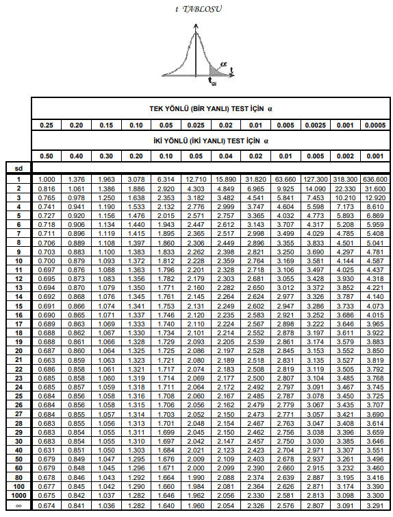

n = 30 

ortalama =140 

standart sapma = 25 

güven aralığı = %95 

serbestlik derecesi = 29 ve standart sapması bilinmiyor. (n 30 a eşit veya daha küçükse ve popülasyon sapması bilinmiyorsa t tablosu kullanılır.)

Öncelikle serbestlik derecesiyle güven aralığının 1 değerinden çıkarılmasıyla elde edilen 0,05 alfa değeri kullanılarak tablodan t değeri 2,045 bulunur.

Xort - t * (sapma / sqrt(n)) < M < Xort + t * (sapma / sqrt(n)) 

140 - 2,045 * (25 / sqrt(30)) < M < 140 + 2,045 * (25 / sqrt(30))

130,666 < M < 149,334

```Python
import numpy as np
from scipy import stats

n=30
xort=140
xssapma=25
guven=0.95
sderecesi = n-1

aralik = stats.t.interval(confidence=guven, loc=xort, df=sderecesi, scale=xssapma/np.sqrt(n))
aralik

# (130.6648465810475, 149.3351534189525)
```
---

Rassal olarak seçilen 20 bilgisayarın tamirat maliyetleri kaydedilmiştir. Ortalama 216,53$$ örneklemin standart sapması 15.86$$. Tüm bilgisayarların ortalama tamirat maliyetlerini %95 güven ile tahmin ediniz diyor

```Python
import numpy as np
from scipy import stats

n=20
xort=216.53
xssapma=15.86
guven=0.95
sderecesi = n-1

aralik = stats.t.interval(confidence=guven, loc=xort, df=sderecesi, scale=xssapma/np.sqrt(n))
aralik

(209.10729151418025, 223.95270848581976)
```

## 2.11 İki popülasyon ortalama farkı güven aralığı

Bir fabrikada A ve B ürünlerinin ağırlıklarının varyansları sırasıyla 164gr ve 216gr. A ürününden 28 adet, B ürününden 30 adet örneklem alındığında A ürününün ortalama ağırlığı 32gr B ürününün ortalama ağırlığı 26gr çıkmıştır. Bu verilere göre A ve B ürünlerinin ortalama ağırhklarının farkını %95 güven aralığında bulunuz?

```Python
# Ürünlerin (popülasyonun) varyansı verilmiş. Z tablosu kullanılacak.
import numpy as np
from scipy import stats

na=28
nb=30

vara=164
varb=216

orta=32
ortb=26

guven=0.95

aralik=stats.norm.interval(confidence=guven,loc=(orta-ortb),scale=np.sqrt((vara/na)+(varb/nb)))
aralik

# (-1.0822649344425628, 13.082264934442563)
```
---

İngilizce ve Fransızca eğitim alan iki öğrenci grubundan sırasıyla 30 ve 40 öğrenci seçiliyor. İngilizce grubu öğrencilerinin dil öğrenme süre ortalaması 182 gün, Fransızca grubu için 176 gün olarak hesaplanıyor. Aynı gruplar için varyanslar sırasıyla 196 gün ve 144 gün olarak hesaplanıyor. Bu iki farklı dil kursuna giden ekiplerin öğrenme süreleri arasındaki fark %95 güven ile kaç gündür?

```Python
# Öğrenci sayısı 30'a eşit veya 30'dan büyük olduğu için z tablosu kullanılacak.
import numpy as np
from scipy import stats

na=30
nb=40

vara=196
varb=144

orta=182
ortb=176

guven=0.95

aralik=stats.norm.interval(confidence=guven,loc=(orta-ortb),scale=np.sqrt((vara/na)+(varb/nb)))
aralik

# (-0.2391331702703008, 12.2391331702703)
```
---

2 farklı hasta grubu arasında 8 ve 10 bireylerden oluşan örneklemler çekilmiştir. Bu iki grubun bir virüse karşı reaksiyon verme zaman ortalamaları sırasıyla 3 ve 2.7'dir. Birleştirilmiş varyans 0.05 olarak hesaplandığına göre bu iki farklı hasta grubunun virüse karşı verdiği reaksiyon zaman farklarını %95 güven ile bulunuz?

Birleştirilmiş varyans formülü;

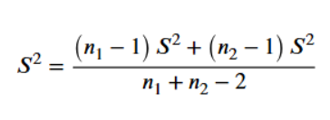

```Python
import numpy as np
from scipy import stats

na=8
nb=10

birvar = 0.05

orta=3
ortb=2.7

guven=0.95

n = (1/na) + (1/nb)

aralik=stats.t.interval(confidence=guven, df=(na+nb-2), loc=(orta-ortb), scale=np.sqrt(n*birvar))
aralik

# (0.07515008811712867, 0.524849911882871)
```

# 3 Dağılımlar

## 3.1 Rassal değişken 

Olasılık: bir şeyin olmasının veya olmamasının matematiksel değeridir.

Olasılık dağılımı: bütün potansiyel sonuçları x eksenine yerleştirip olasılık değerlerini y eksenine yerleştiren bir dağılımdır.

Bir zarın olasılık dağılımı (uniform);

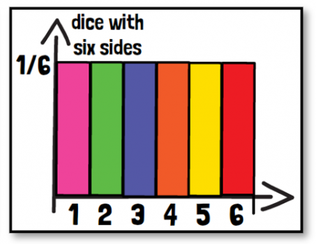

## 3.2 Beklenen değer

Kesikli veri için;

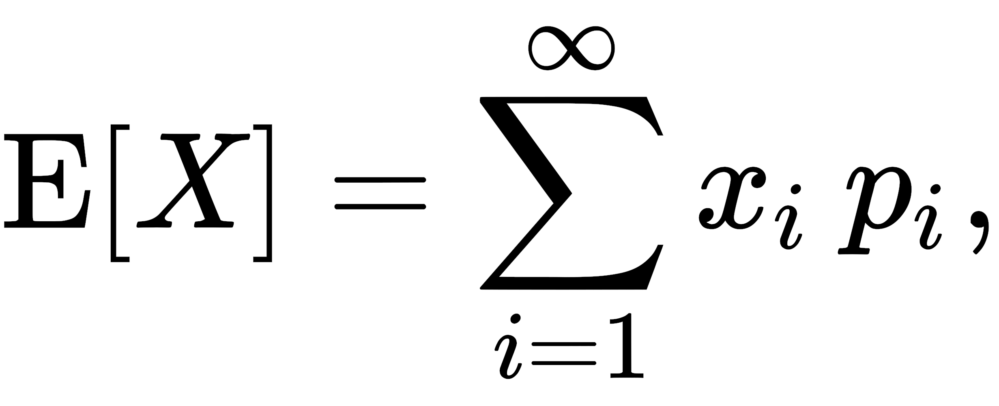

Sürekli veri için

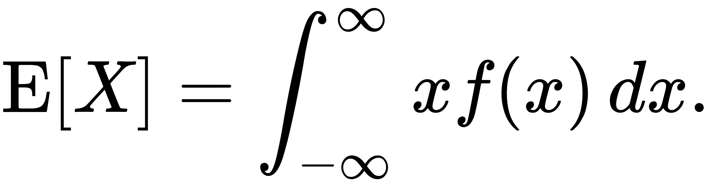

hilesiz bir zar bir defa havaya atıldığını varsayalım. Zar üzerinden gelecek değerin beklenen değeri kaçtır?

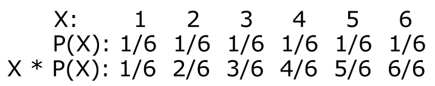

E(X) = 1/6 + 2/6 + 3/6 + 4/6 + 5/6 + 6/6 = 21/6 = 3,5

```Python
from scipy import stats

x=[1,2,3,4,5,6]

p=[1/6,1/6,1/6,1/6,1/6,1/6]

beklenendeg=stats.rv_discrete(values=([x],[p])).expect()
beklenendeg

# 3.5
```

---

Hilesiz bir madeni parayı üç kez havaya attığımızı varsayıyoruz. Bu üç atışta yazı gelme olasılığının beklenen değerini hesaplayalım.


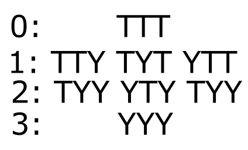

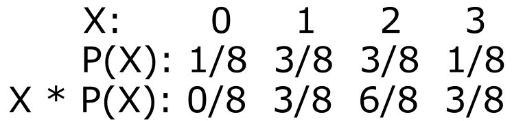

E(X) = 0 + 3/8 + 6/8 + 3/8 = 1,5

```Python
from scipy import stats

x=[0,1,2,3]

p=[1/8,3/8,3/8,1/8]

beklenendeg=stats.rv_discrete(values=([x],[p])).expect()
beklenendeg

# 1.5
```

---

Sürekli veri için;

$$F(x) = 3/7 \cdot X^2$$
$$E(x) = \int_1^2 x \cdot F(x) \,dx$$
$$E(x) = \int_1^2 x \cdot \frac37  \cdot  x^2 \,dx$$
$$E(x) = \frac37  \cdot \int_1^2 x \cdot  x^2 \,dx$$
$$E(x) = \frac37  \cdot \int_1^2 x^3 \,dx$$
$$E(x) = \frac37  \cdot \int_1^2 \frac{x^4}4$$
$$E(x) = \frac37  \cdot \int_1^2 \frac{x^4}4$$
$$E(x) = \frac37  \cdot (\frac{2^4}4 - \frac{1^4}4)$$
$$E(x) = \frac37  \cdot \frac{15}4$$
$$E(x) = \frac{45}{28}$$
$$E(x) = 1,607$$

```Python
from scipy import stats
import scipy.integrate

def f(x):
    return (3/7)*x**3 # x * 3/7 x**2

beklenendeg=scipy.integrate.quad (f,1,2)
beklenendeg[0]

# 1.6071428571428572
```
---

| İkramiye Adeti | İkramiye Miktarı (TL) |
|---------------:|----------------------:|
|            160 |               200000  |
|           1761 |                10000  |
|          17245 |                 1000  |
|          54061 |                  200  |
|         740386 |                  100  |
|        2768685 |                   50  |
|       11557684 |                   20  |
|       15933969 |                   10  |
|       19586461 |                    5  |

İkramiye Olan Bilet Sayısı: 50.660.412

Toplam Bilet Sayısı: 240.937.000

İkramiye Olmayan Bilet Sayısı: 190.276.588

Bilet Fiyatı: 5 TL

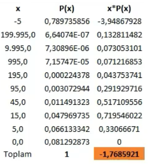

Sürekli bu oyunu oynarsak kazancımız -1,76 TL'dir.

## 3.3 Büyük sayılar yasası

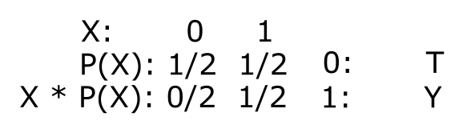
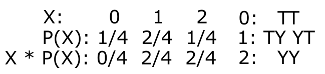
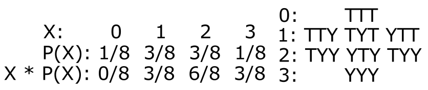

100 atış yazılsa beklenen değer 50 gelecektir.

$$E(x) = n \cdot P(x)$$
$$E(x) = 100 \cdot 0.5$$
$$E(x) = 50$$

Yukarıdaki gibi atış yapmaya devam edersek beklenen değerlerin ortalaması %50'ye (beklenen değere yani olasılığa) yaklaşacaktır.

```Python
import numpy as np
import matplotlib.pyplot as plt
import seaborn as sns

liste=[]

for i in np.arange(0,5):
  denemesayisi=i+1
  yt=np.random.randint(0,2,size=denemesayisi)
  yolasilik=np.mean(yt)
  liste.append(denemesayisi)
  print("Deneme Sayısı: {}--------Ortalama: {}".format(denemesayisi,yolasilik))

Deneme Sayısı: 1--------Ortalama: 0.0
Deneme Sayısı: 2--------Ortalama: 0.5
Deneme Sayısı: 3--------Ortalama: 0.6666666666666666
Deneme Sayısı: 4--------Ortalama: 0.5
Deneme Sayısı: 5--------Ortalama: 0.8
```

```Python
import numpy as np
import matplotlib.pyplot as plt
import seaborn as sns

liste=[]

for i in np.arange(0,101):
    denemesayisi=i+1
    yt=np.random.randint(0,2,size=denemesayisi)
    yolasilik=np.mean(yt)
    liste.append(yolasilik)

sns.lineplot(data=liste,linewidth=2)
plt.xlabel("Deneme Sayısı")
plt.ylabel("Ortalama")
plt.ylim(0,1)
plt.axhline(0.5,linestyle="--",linewidth=1.5,color="red")
plt.show()
```

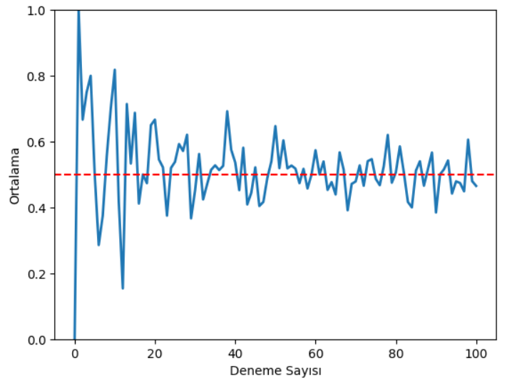

```Python
import numpy as np
import matplotlib.pyplot as plt
import seaborn as sns

liste=[]

for i in np.arange(0,101):
    denemesayisi=i**3
    yt=np.random.randint(0,2,size=denemesayisi)
    yolasilik=np.mean(yt)
    liste.append(yolasilik)

sns.lineplot(data=liste,linewidth=2)
plt.xlabel("Deneme Sayısı")
plt.ylabel("Ortalama")
plt.ylim(0,1)
plt.axhline(0.5,linestyle="--",linewidth=1.5,color="red")
plt.show()
```

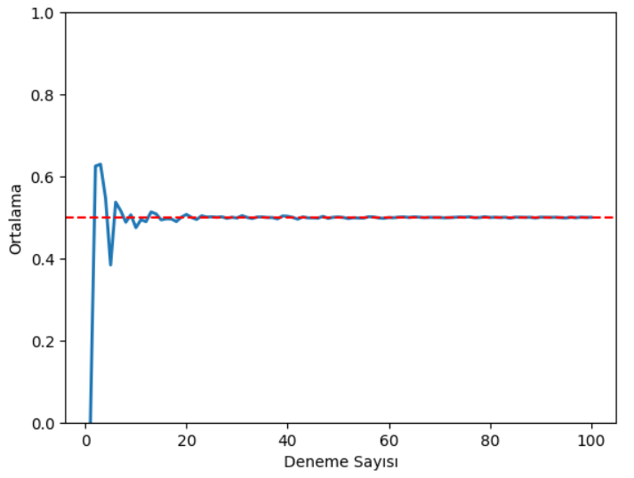

## 3.4 Olasılık dağılımı

Kesikli değişkenlerde olasılık dağılımı

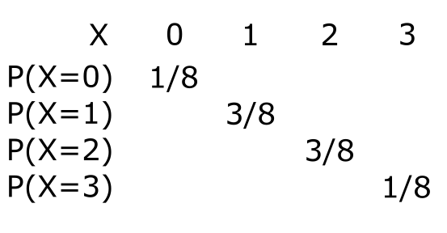

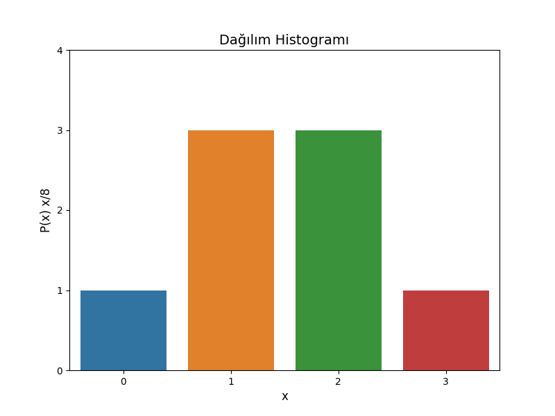


## 3.5 Olasılık kütle ve yoğunluk fonksiyonları


Yukardaki yapıya olasılık kütle fonksiyonu **(PMF)** diyoruz. Kesikli Olasılık dağılımı gösteren bir örnektir.


$$
E(x) = \int_{-\infty}^{\infty} x \cdot F(x) \, dx
$$

Sürekli değişkenlerde ise bu şekilde olasılık değeri yoktur. İntegral alan hesabı ile olasılık değeri bulunur. Grafikteki sol eksen asla sürekli değişkenlerde olasılık değeri vermez, frekansı verir. $-\infty$ ile $\infty$ arası olasılık değeri hesaplanırsa bütün olasılıkları kapsadığı için sonuç 1 olur.

Sürekli değişken yapısında bu yapıya Olasılık yoğunluk fonksiyonu **(PDF)** denir.

## 3.6 Birikimli dağılım fonksiyonu

Bir hastanede belirli bir hastalıkla ilgili bulunan hastaların tansiyonlarının ortalaması 15, varyansları ise 9 olduğu biliniyor ve bu yapının normal dağılıma sahip olduğu biliniyor. Bu hastalar içerisinden rastgele seçilen bir hastanın tansiyonunun 11'den küçük olma olasılığı nedir?

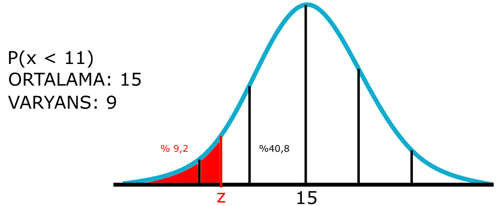

$$ z = \frac{11 - 15}{\sqrt{9}} $$
$$ z = \frac{-4}{3} $$
$$ z = -1,333 $$
$$ P(x) = \\% 9.2 $$

```Python
from scipy import stats

olasılık=stats.norm.pdf(x=11, loc=15, scale=3)
olasılık

# 0.05467002489199788
```
Bu değer olasılığı vermez. Normal dağılım sürekli olduğundan 11 değerinin F(x) karşılığını verir. Bu yüzden sürekli yapılarda pdf fonksiyonunun cdf fonksiyonuyla integralini almamız gerekir.

```Python
from scipy import stats

olasılık=stats.norm.cdf(x=11, loc=15, scale=3)
olasılık

# 0.09121121972586788
```

⚠️⚠️⚠️F(x) kümülatif (birikimli) fonksiyon **(CDF)**, f(x) **(PMF)** gösteriminde kullanılır.


```Python
from scipy import stats
import matplotlib.pyplot as plt
import seaborn as sns

x=[0,1,2,3]
p=[1/8,3/8,3/8,1/8]

plt.bar(x,p)
plt.show()
```


Bu dağılımı kümülatif göstermek için;

```Python
from scipy import stats
import matplotlib.pyplot as plt
import seaborn as sns

x=[0,1,2,3]
p=[1/8,3/8,3/8,1/8]

cum=[]

for i in range(0,len(p)):
    if len(cum) == 0:
        cum.append(p[0])
    else:
        cum.append(p[i]+cum[i-1])

cum

# [0.125, 0.5, 0.875, 1.0]
```

```Python
from scipy import stats
import matplotlib.pyplot as plt
import seaborn as sns

x=[0,1,2,3]
p=[1/8,3/8,3/8,1/8]

cum=[]

for i in range(0,len(p)):
    if len(cum) == 0:
        cum.append(p[0])
    else:
        cum.append(p[i]+cum[i-1])

plt.plot(x,cum,drawstyle="steps")
plt.show()
```
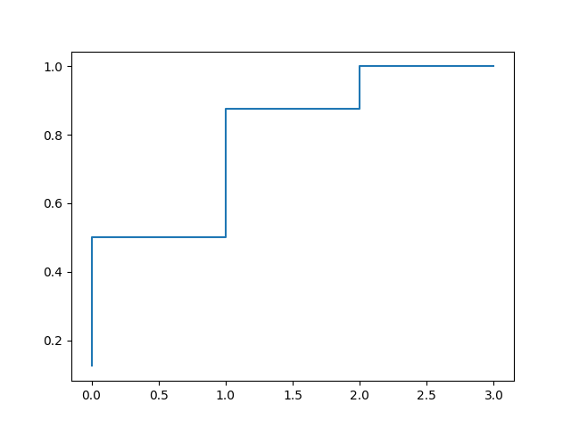

```Python
from scipy import stats
import matplotlib.pyplot as plt
import seaborn as sns
import numpy as np

x=np.random.randn(10000)
pdf=stats.norm.pdf(x)
cdf=stats.norm.cdf(x)
sns.lineplot(x=x,y=pdf)
sns.lineplot(x=x,y=cdf)
plt.show()
```
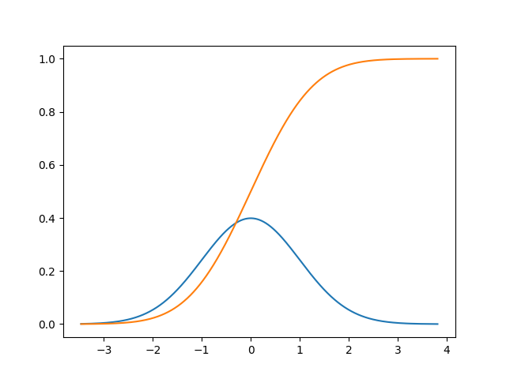

## 3.7 Bernoulli dağılımı

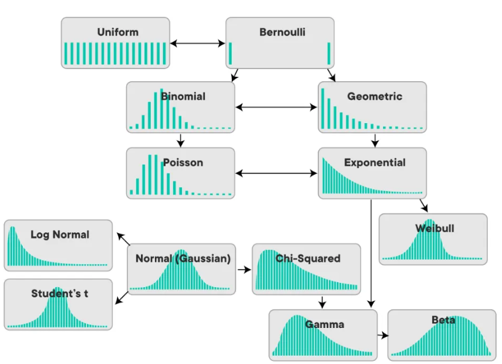

Bernoulli dağılımı bir deney sonucunda başarılı ve başarısız olmak üzere bize sadece iki olası sonuç veren yapılardır.

Mesela, bir madeni parayı bir defa havaya attığımızda iki olası sonuç vardır. Ya yazı gelir yada tura gelir.

Bernoulli dağılımı kesikli bir dağılım olduğu için olasılık kütle fonksiyonudur. **(PMF)** 

$$ F(x) = P^x \cdot (1-P)^{1-x} $$
$$ P(x = 0) = 1 - P $$
$$ P(x = 1) = P $$
$$ E(x) = P $$
$$ \sigma^2_x = P \cdot (1 - P) $$

Parayı atınca yazı gelme ihtimali;
$$ Y = 1/2 \rightarrow 1/2 = P \rightarrow x = 1 $$
$$ T = 1/2 \rightarrow 1/2 = 1-P \rightarrow x = 0 $$

$$ F(x) = P^x \cdot (1-P)^{1-x} $$
$$ Y \rightarrow (1/2)^1 \cdot (1/2)^0 = 0,5 $$
$$ T \rightarrow (1/2)^0 \cdot (1/2)^1 = 0,5 $$
$$ E(X) = P = 0,5 $$
$$ \sigma^2_x = P \cdot (1 - P) = 0,5 \cdot 0,5 = 0,25 $$

```Python
from scipy import stats

p=0.5

dagilim=stats.bernoulli(p)

tolasılık=dagilim.pmf(k=0)
yolasılık=dagilim.pmf(k=1)

print("Tura gelme olasılığı: {:.2f}".format(tolasılık))
print("Yazı gelme olasılığı: {:.2f}".format(yolasılık))
print("Beklenen değer: {:.2f}".format(dagilim.expect()))
print("Varyans: {:.2f}".format(dagilim.var()))

# Tura gelme olasılığı: 0.50
# Yazı gelme olasılığı: 0.50
# Beklenen değer: 0.50
# Varyans: 0.25
```

---

Bir iskambil setinde papaz gelme olasılığı;

Kart sayısı: 52

Papaz sayısı: 4

$$ P = \frac4{52} = 0,076 $$

$ x = 1 $ papaz gelme ihtimalini gösterir.

$$ x = 0 \rightarrow (\frac4{52})^0 \cdot (\frac{48}{52})^1 = \frac{48}{52} = 0,923 $$
$$ x = 1 \rightarrow (\frac{48}{52})^0 \cdot (\frac{4}{52})^1 = \frac{4}{52} = 0,076 $$

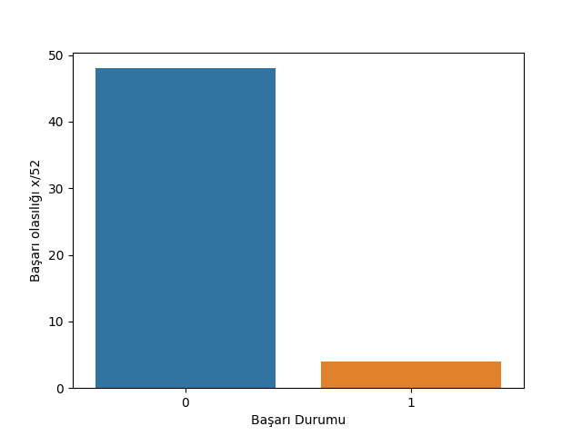

$$ E(X) = P = \frac4{52} = 0,076 $$
$$ \sigma^2_x = P \cdot (1 - P) = \frac{4}{52} \cdot \frac{48}{52} = 0,076 $$

```Python
from scipy import stats

p = 4/52

dagilim = stats.bernoulli(p)

papazgelmeme = dagilim.pmf(k=0)
papazgelme = dagilim.pmf(k=1)

print("Papaz gelmeme olasılığı: {:.2f}".format(papazgelmeme))
print("Papaz gelme olasılığı: {:.2f}".format(papazgelme))
print("Beklenen değer: {:.2f}".format(dagilim.expect()))
print("Varyans: {:.2f}".format(dagilim.var()))

# Papaz gelmeme olasılığı: 0.9231
# Papaz gelme olasılığı: 0.0769
# Beklenen değer: 0.0769
# Varyans: 0.0710
```

## 3.8 Binom dağılımı


$$ f(x) = \binom{n}{x} \cdot P^x \cdot (1-P)^{(n-x)}$$

$n$: deneme sayısı

$$E(x) = n \cdot P$$
$$\sigma^2_x = n \cdot P \cdot (1-P)$$

$$ Y \rightarrow 0,5 \rightarrow P $$
$$ T \rightarrow 0,5 \rightarrow 1-P $$

Bernolli üzerinden incelersek;

$$ P ( x = 1 ) = 0,5^1 \cdot 0,5^0 = 0,5 $$

Binom üzerinden incelersek;

$$ P ( x = 1 ) = \binom{1}{1} \cdot 0,5^1 \cdot 0,5^0 = 0,5 $$

```Python
from scipy import stats

p=0.5
n=1

dagilim=stats.binom(n,p)
yazi=dagilim.pmf(k=1)
yazi

# 0.5
```

Bir deneme için Bernolli ve Binom üzerinden sonuç bulunabilir ama birden fazla deneme için sadece Binom kullanılır.

Mesela $n$ = 3 için;

$$ P ( x = 1 ) = \binom{3}{1} \cdot 0,5^1 \cdot 0,5^(3-1) $$
$$ P ( x = 1 ) = 3 \cdot 0,5 \cdot 0,5^2 = 0,5 $$
$$ P ( x = 1 ) = 0,375 = 3/8 $$

3 para atma testinde de bu şekilde bulmuştuk.


---

Parayı 7 defa havaya attığımızda 3 defa yazı gelme olasılığı;

$$ P = 0,5 $$
$$ (1-P) = 0,5 $$
$$ x = 3 $$
$$ n = 7 $$

$$ P ( x = 3 ) = \binom{7}{3} \cdot 0,5^3 \cdot 0,5^{(7-3)} $$
$$ P ( x = 3 ) = 35 \cdot 0,125 \cdot 0,0625 $$
$$ P ( x = 3 ) = 0,273 $$

```Python
from scipy import stats

p=0.5
n=7

dagilim=stats.binom(n,p)
yazi=dagilim.pmf(k=3)
yazi

# 0.2734374999999999 %27,3
```

Bir futbol takımının penaltı vuruşunu gole çevirme yüzdesinin %80 olduğunu biliyoruz. Bundan sonraki 5 penaltıdan 3 ünü 

$$ P = 0,8 $$
$$ n = 5 $$
$$ x = 3 $$

```Python
from scipy import stats

p=0.8
n=5

dagilim=stats.binom(n,p)
gol=dagilim.pmf(k=3)
gol

# 0.2047 %20,47
```

---

Bir fabrikada üretilen bir ürünün her yüz tanesinin bir tanesinin kusurlu olarak üretildiği tespit edilmiştir. 10 tane ürünün tamamının kusursuz olması veya en fazla iki tanesinin kusurlu olması 

$$ P = 0,01 $$

```Python
from scipy import stats

p=0.01
n=10

dagilim=stats.binom(n,p)
urun=dagilim.pmf(k=0)
print(urun)

# 0.9043820750088045
```
$$ P (X = 0) = 0.9043820750088045 = %90,43 $$

```Python
from scipy import stats

p=0.01
n=10

dagilim=stats.binom(n,p)
ürün0=dagilim.pmf(k=0)
ürün1=dagilim.pmf(k=1)
ürün2=dagilim.pmf(k=2)

toplam= dagilim.cdf(x=2) # alternatif olarak kolay yol
toplam 

ürün0 + ürün1 + ürün2

# 0.9998861508820942

toplam

# 0.9998861508820942
```

$$ P (X < 2) = P (X = 0) + P (X = 1) + P (X = 2) = 0.9998861508820942 = \% 99,98 $$

en az 2 tane olma olasılığını sorsaydı 1-toplam üzerinden hesaplanır.

---

Mağazamızda haftalık olarak ürün iadesi konusunda bir olasılık modellemesi yapmak istiyoruz. Elimizdeki verilere göre haftalık ortalama her yüz satışın 10 tanesi iade ediliyor. Haftalık satış miktarı 50'dir. Bu durumda;

$$ P = 0,10 $$
$$ n = 50 $$

- 50 satışta 5 tane iade gelme ihtimali nedir?
$$ P (X = 5) = ? $$

```Python
from scipy import stats

p=0.1
n=50

dagilim=stats.binom(n,p)
olasılık=dagilim.pmf(k=5)
olasılık

# 0.18492460089521545 %18.50
```

>- 50 satışta 15 taneden az iade gelme ihtimali nedir?
$$ P (X < 15) = ? $$

```Python
from scipy import stats

p=0.1
n=50

dagilim=stats.binom(n,p)
olasılık=dagilim.cdf(x=15)
olasılık

# 0.9999825030783145 %99,99
```

>- 50 satışta en az 10 adet iade gelme ihtimali nedir?
$$ P (10 < X) = ? $$

```Python
from scipy import stats

p=0.1
n=50

dagilim=stats.binom(n,p)
olasılık=1-dagilim.cdf(x=10)
olasılık

# 0.009354601587329037 %0,93
```

## 3.9 Poisson Dağılımı


Bir saat içinde yoldan geçen araba sayısı veya üç sene içinde hastalığa yakalanma sayısı veya deprem, sel gibi nadir gerçekleşebilecek olaylar veya bir çağrı merkezine yarım saat içerisinde gelebilecek arama sayısı gibi bazı zaman dilimleri içerisinde saklı kalmış nadir gerçekleşebilecek olaylar için kullandığımız bir dağılım yapısıdır.

Poisson dağılımı kullanabilmek için $\lambda$ denilen bir ortalama parametresine ihtiyacımız var.

$ n>=50 $ ve $ P \cdot n < 5 $ olan olaylara **nadir olay** denir. 

>Poisson dağılımı formülü;

$$ f(x) = \frac{\lambda^x \cdot e^{-\lambda}}{x!} \\[1em]

\lambda \rightarrow \text{ ortalama} \\[1em]

x \rightarrow \text{ deneme sayısı} \\[1em]

E(x) = \lambda \\[1em]

\sigma^2_x = \lambda\\[1em]
 
n \cdot p = \lambda \\[1em]

p = \frac{\lambda}{n} \\[1em]
$$

### Örnekler

>Bir çağrı merkezine 1 dakika içinde gelen araması sayısı ortalama 10 adettir.
>1 dk içinde hiç arama gelmemesi ihtimali;
$$
f(x) = \frac{\lambda^x \cdot e^{-\lambda}}{x!} \\[1em]
\lambda = 10 \qquad x=0 \\[1em]
P(x=0) = \frac{10^0 \cdot 2,71^{-10}}{0!} \\[1em]
P(x=0) = 2,71^{-10} \\[1em]
P(x=0) = 0,00004 = \%0,004 \\[1em]
$$

```Python
from scipy import stats

ortalama = 10
dagilim = stats.poisson(ortalama)
p0 = dagilim.pmf(k=0)
p0 * 100

# 0.004539992976248485 = % 0,004
```

---

>Elektrik ürünler satılan bir mağazada bir ürün üzerinden olasılık modelleme yapılmak isteniyor. Yapılan çalışmalara göre satışı nadir yapılan bir ürün. 1 yılda ortalama 1825 adet satılmış. Herhangi bir günde bu televizyondan 9 adet satılma ihtimali kaçtır?

Öncelikle yıllık ortalamayı günlük ortalamaya çevireceğiz. 

$$
\frac{1825}{365} = 5 
$$

$$
P( x = 9 ) = ?
$$

```Python
from scipy import stats

ortalama = 5
dagilim = stats.poisson(ortalama)
p0 = dagilim.pmf(k=9)
p0 * 100

# 3.6265577415643713 = % 3,626
```

---

> Bir X ülkesine çatı malzemesi satacağız. Ama bu ülkenin meteorolojik durumu bize sorun çıkartır mı bilmiyoruz. Ama garanti süresi bulmamız lazım. Ülke değerlerini incelediğimizde satacağımız ülkede 1 yılda ortalama 2 fırtına çıktığını gördük. 1 yılda 1 fırtına, 4 fırtına ve 5 fırtına olması ihtimalini ayrı ayrı bulunuz.

```Python
from scipy import stats

ortalama = 2
dagilim = stats.poisson(ortalama)
p0 = dagilim.pmf(k=1)
p0 * 100

# 27.06705664732254 = % 27,067
```

```Python
from scipy import stats

ortalama = 2
dagilim = stats.poisson(ortalama)
p0 = dagilim.pmf(k=3)
p0 * 100

# 18.044704431548357 = % 18,044
```

```Python
from scipy import stats

ortalama = 2
dagilim = stats.poisson(ortalama)
p0 = dagilim.pmf(k=5)
p0 * 100

# 3.6089408863096724 = % 3,608
```

---

>Marmara Bölgesi ile ilgili yaptığımız araştırmada bir yılda ortalama 6 deprem olduğu tespit edilmiştir. Önümüzdeki 1 yılda en fazla ve en az 3 deprem olma olasılığı nedir?

P(x <= 3) = ?

```Python
from scipy import stats

ortalama=6
dagilim=stats.poisson(ortalama)

p0=dagilim.cdf(x=3)
p0 * 100

# 15.120388277664784 = % 15,12
```


P(x > 3) = ?

100 - 15,12 = % 84,88

---

> X ülkesinin Borsası incelediğimizde o borsanın endeksinin bir yılda Ortalama olarak 2 defa %10'dan daha fazla yükseldiği tespit edilmiştir. Önümüzdeki yılda bir defadan fazla %10'dan fazla yükselme olasılığı nedir?

P (x > 1) = 1 - P(x <= 1) =?

```Python
from scipy import stats

ortalama=2

dagilim=stats.poisson(ortalama)
p0=dagilim.cdf(x=1)

(1-p0)*100

# 59.3994150290162 = % 59,39
```

## 3.10 Kesikli Uniform Dağılımı


Uniform dağılım kesikli ve sürekli yapılar için farklı hesaplanır.

$$ f(x) = \frac{1}{n} $$

$$ E(x) = \frac{n+1}{2} $$

$$ \sigma^2_x = \frac{n^2-1}{12} $$

|X|P(X)|
|:---:|:---:|
|1|1/6|
|2|1/6|
|3|1/6|
|4|1/6|
|5|1/6|
|6|1/6|

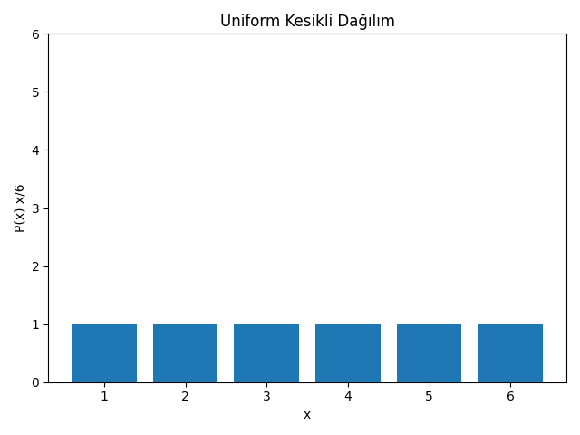

$$
E(X) = \frac{n+1}{2} = \frac{7}{2} = 3,5
$$

$$
\sigma^2_x = \frac{n^2-1}{12} = \frac{35}{12} = 2,91
$$

> Bir zar atışında 5 gelme olasılığını bulalım. (Bu adım bütün sayılar için aynıdır.) Daha sonra beklenen değeri ve varyansı bulalım.

```Python
from scipy import stats

n=6
dagilim=stats.randint(1,n+1)

olasılık=dagilim.pmf(k=5)
olasılık

# 0.16666666666666666 = % 16,66

beklenen=dagilim.expect()
beklenen

# 3.5

varyans = dagilim.var()
varyans

# 2.9166666666666665 = 2.91
```

> Attığımız bir zarın 3 ten küçük olma olasılığı nedir?

P(x<3)=?

```Python
from scipy import stats

n=6


dagilim=stats.randint(1,n+1)
olasılık=dagilim.cdf(x=3)
olasılık

# 0.5
```

P(x<2)=?

```Python
from scipy import stats

n=6


dagilim=stats.randint(1,n+1)
olasılık=dagilim.cdf(x=2)
olasılık

# 0.3333333333333333 = 0.33
```

## 3.11 Sürekli Uniform Dağılımı


Sürekli üniform aralığında noktalar değil aralıklar bulunur. Yani, Q1 < x < Q2 şeklinde bir dağılım gözlemlenir.Olasılık değil fonksiyon değeri kullanılır.

$a < x < b$ için;

$$
f(x) = \frac{1}{b-a}
$$

$$
E(x) = \frac{a+b}{2}
$$

$$
\sigma^2_x = \frac{(b-a)^2}{12}
$$

### Örnekler

> Bir otobüs durağında x numaralı bir otobüsü bekliyoruz ve bu otobüsün 15 dk bir geldiğini görüyoruz.

$$
f(x) = \frac{1}{b-a} = \frac{1}{15-0} = \frac{1}{15}  
$$

$$
E(x) = \frac{a+b}{2} = \frac{0+15}{2} = 7,5
$$

```Python
from scipy import stats

a=0
b=15

dagilim=stats.uniform(a,b)

beklenen=dagilim.expect()

beklenen

# 7.5
```

---

> Bir kişinin bu otobüs durağında otobüsü 12,5 dakikadan daha az bekleme olasılığı nedir?

$$P(X <= 12.5) = ?$$

```Python
from scipy import stats

a=0
b=15

dagilim=stats.uniform(a,b)

olasılık=dagilim.cdf(12.5)

olasılık

# 0.8333333333333334 = % 83,33
```
--- 

> Bir ürünün tamir süresi hakkında bir modelleme yapmak istiyoruz ve bu ürünün tamir süresine baktığımız zaman bir buçuk saat ile dört saat arasında değişen bir yapıya uyduduğunu görüyoruz. Rastgele se ilen arızalı bir ürünün tamir süresinin İki saatten fazla olma olasılığı nedir?

$$
1,5 < x < 4 \\
$$

$$
P(X>2) = 1 - P(X<2) 
$$

```Python
from scipy import stats 

a=1.5  
b=4 

dagilim=stats.uniform(a,b) 

olasilik=dagilim.cdf(x=2) 
1-olasilik

# 0.875 = % 87,5
```

## 3.12 Normal (Gauss) Dağılımı 

Binom açılımı;

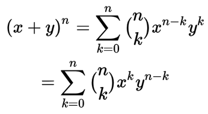

Pascal Üçgeni;

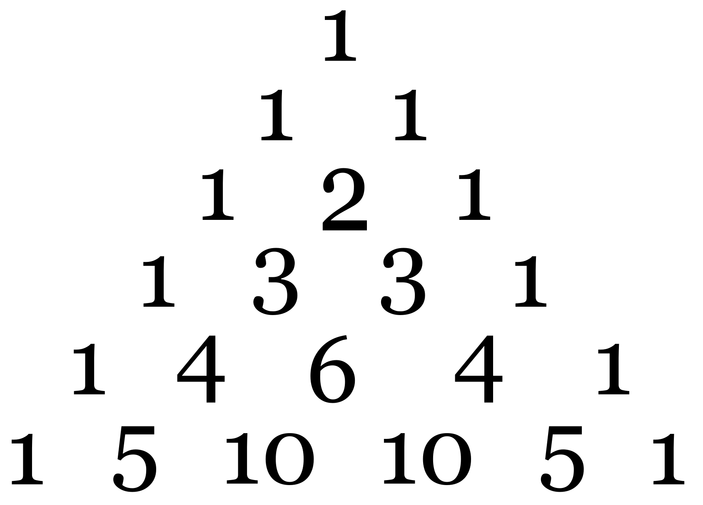

## 3.13 Normal Dağılım Özellikleri

Olasılık Fonksiyon Formülü;

$$
f(x) = \frac{1}{\sigma \cdot \sqrt{2 \cdot \pi}} \cdot e^{-\frac{1}{2} \cdot (\frac{x-\mu}{\sigma_x})^2}
$$
$$
-\infty < x < \infty
$$
$$
E(x) = \mu
$$
$$
\text{Varyans} = \sigma^2_x
$$
$$
\int_{-\infty}^{\infty} =  f(x)\,dx = 1
$$

### Örnekler

> Bir fabrikada üretilen bir ürünün ortalama ağırlığı 500 gr, varyansı da 100 gramdır. Verinin normal dağıldığı bilindiğine göre; rassal olarak seçilen bir ürünün ağırlığının 518 gr'dan az olma ihtimali nedir?

xort = 500
P(x<518) = ?

⚠⚠⚠ x<518 ve xort<518 olduğu için olasılık 0,5'ten fazla olmalı.

```Python
from scipy import stats
import numpy as np

ortalama=500
varyans=100

dagilim=stats.norm(orta1ama,np.sqrt(varyans))
olasılık=dagilim.cdf(x=518)
olasılık*100

# 96.40696808870743 = %96,40
```

### Örnekler 2

>Ürüne gelen günlük talep miktarı 100 ve varyans değeri 3000 adettir. Verinin normal dağıldığı bilindiğine göre; 3500 adet stoğu bulunan ürünün bir ay içerisinde bitme ihtimali nedir?

X = Ürün sayısı

Ortalama = 3000

E(x) = 30 gün * 100 ortalama adedi = 3000

$\sigma^2_x$ = 90000


```Python
from scipy import stats
import numpy as np

ortalama=3000
varyans=90000

dagilim=stats.norm(ortalama,np.sqrt(varyans))
olas1l1k=dagilim.cdf(x=3500)

(1-olasılık)*100

# 4.77903522728147 = %4,77
```

---

> Yıllık ortalama yangından dolayı ortalama 4300 dönüm yandığı belirtiliyor. Varyans değeri 562500 ve dağılımın normal dağılım olduğu biliniyor. P(2500 < X < 4000)=?

```Python
from scipy import stats
import numpy as np

ortalama=4300
varyans=562500

dagilim=stats.norm(ortalama,np.sqrt(varyans))

olasilik1=dagilim.cdf(x=4200)
olasilik2=dagilim.cdf(x=2500)

(olasilik1-olasilik2)*100

# 43.876734745178986 = % 43,87
```

> P(3000 < X)=?

```Python
from scipy import stats
import numpy as np

ortalama=4300
varyans=562500

dagilim=stats.norm(ortalama,np.sqrt(varyans))

olasilik1=dagilim.cdf(x=3000)
olasilik2=dagilim.sf(x=3000)

(1-olasilik1)*100

# 55.3035116623614 = % 55,30

olasilik2

# 55.3035116623614 = % 55,30
```

---

> Ürettiğimiz bir ürünün ömrü 58 aydır. varyans değeri ise 100 aydır. Bu ürün için verilen garanti süresi 3 yıldır. Bir yılda 1.000.000 adet ürün üretiliyor. Bir yıllık süre içerisinde kaç tane ürün garantiye gelir? Dağılımın normal dağılım olduğu varsayılıyor.

P(X<36)=?

```Python
from scipy import stats
import numpy as np

ortalama=58
varyans=100

dagilim=stats.norm(ortalama,np.sqrt(varyans))

olasilik1=dagilim.cdf(x=3*12)

olasilik1*100

# 1.3903447513498595 = % 1,39

olasilik1 * 1000000

# 13903.447513498595 adet ütün garantiy gelir.
```

---

> Bir yemek şirketindeki şikayetten sonra geçen teslimat süresi inceleniyor. Geçmiş verilere göre ortalama olarak bu süre 30 dakikadır. Varyans değeri ise 25 dakikadır. Verilerin normal dağıldığı tespit edildiğine göre teslimatın 22 ile 40 dakika arasında olma ihtimali nedir?

P(20 < X < 40)=?

```Python
from scipy import stats
import numpy as np

ortalama=30
varyans=25

dagilim=stats.norm(ortalama,np.sqrt(varyans))

olasilik1=dagilim.cdf(x=20)
olasilik2=dagilim.cdf(x=40)

(olasilik2 - olasilik1)*100
# 95.44997361036415 = %95
```

# 4 Hipotez Testi

**Hipotez Testinin 3 adımı;**
1. Varsayımda Bulunma
1. Veri Toplama
1. Kabul veya Ret

**Örneklem hatası**, örnekten elde edilen sonuçlarla tüm evrenden elde edilmesi beklenen gerçek sonuçlar arasındaki farktır.

Aşağıdaki tablo, istatistikte yaygın olarak kullanılan **popülasyon parametreleri** ve **örneklem parametreleri** arasındaki farkları kısa ve net şekilde göstermektedir:

| **Tanım** | **Popülasyon Parametresi** | **Örneklem Parametresi** |
| --- | --- | --- |
| Ortalama | $\mu$ | $\bar{X}$ |
| Standart Sapma | $\sigma_x$ | $s$ |

Yukarıdaki tabloda verilen değerlerin birbiriyle uyumlu olması gerekmektedir.
Hipotez testi bu iki parametre arasındaki örneklem hatasının şans eseri mi ortala çıktı yoksa böyle bir hata var mı onu açıklar.

## 4.1 Boş ve Alternatif Hipotezler

1. Hipotez kurulur; Boş hipotez $H_0$ ve Alternatif hipotez $H_1$ belirlenir.
1. Anlamlılık seviyesinin belirlenmesi ($\alpha$)
1. Olasılık dağılımının belirlenmesi (Merkezi limit teoremi)
1. İstatistiksel testler (p değeri)
1. $\alpha$ ve p değerleri karşılaştırarak hipotezin doğrulu yorumlanır.

### Örnekler

Aşı denediğimiz hastalarda fark olduğunu araştırıyoruz. Kan değeri 15'ten 20'nin üzerine çıkarsa fark olduğunu düşünüyoruz. Hipotezler;

$H_0$: Fark Yok $\quad$ $H_1$: Fark Var

$H_0$: $\mu$ = 20

$H_1$: $\mu$ > 20

## 4.2 Hipotez Testinde Anlamlılık Düzeyi ($\alpha$)

$H_0$ hipotezini reddedebileceğimiz bir yapıdır. 

### Örnekler

>Bir fabrikanın üretim bandındaki her bir ürünün ağırlığını ölçüyoruz Elinizdeki ağırlığı ölçen tartının %99'luk bir doğrulukla doğru ölçüm yapıyor.

P = 0,99 $\qquad$ 1-P = 0,01

100 tane örnek seçerek olasılığı belirliyoruz.

$$ P(X=x) = \binom{n}{x} \cdot P^x \cdot (1-P)^{(n-x)}$$

Olasılık Başarı dağılımına bakalım;

```Python
from scipy import stats

p=0.99
n=100

dagilim=stats.binom(n,p).pmf(k=100)
dagilim*100

# 36.60323412732292

dagilim=stats.binom(n,p).pmf(k=99)
dagilim*100

# 36.97296376497267

dagilim=stats.binom(n,p).pmf(k=98)
dagilim*100

# 18.48648188248636

dagilim=stats.binom(n,p).pmf(k=97)
dagilim*100

# 6.0999165807530735

dagilim=stats.binom(n,p).pmf(k=96)
dagilim*100

# 1.494171485689519

dagilim=stats.binom(n,p).pmf(k=95)
dagilim*100

# 0.2897787123761487
```

$H_0$ : $\mu$ = %99 $\qquad$
$H_1$ : $\mu$ =! %99

Cihaz 100 üründen 95 tanesini doğru ölçtü. Bu da %99 doğruluk bilgisinin doğru olması ihtimalinin %0,28 olduğunu gösterir.

---

> Bir seçim anketi yapıyorsunuz ve A partisinin önceki seçimdeki oy oranının %10 olduğunu biliyorsunuz. Ancak biz seçim anketinde bu durumun değişikliğe gidip gitmediği hakkında bilgi sahibi olmak istiyoruz. Bu yüzden 5 bin kişilik örnekten anket aldık ve oy verme oranı üzerinden ilerlediğimizde ortalamanın %20 olduğunu söylüyoruz. Değişiklik olup olmadığını inceleyeceğiz.

$$H_0 : \mu = \%10$$
$$H_1 : \mu =! \%10$$ 

%95 bir güven aralığı ile işlem yapacağız. $\alpha = 0,05$

**P değeri** bulunarak %20'lik oranın nereye düştüğünü bulabiliriz.

## 4.3 Hipotez Testinde Tek ve Çift Kuyruk Yapısı

Aşağıdaki gibi yapılara çif kuruk yapısı deniyor.

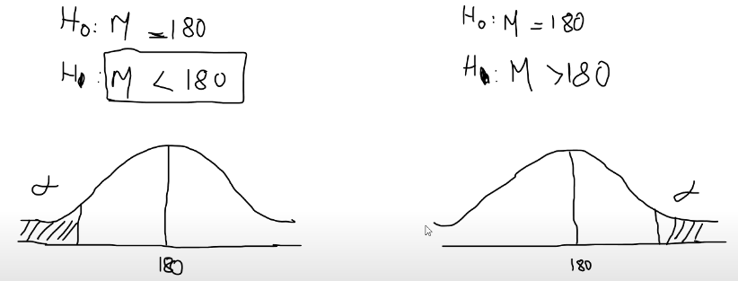

### Örnekler

>Bir araştırma sonucunda öğrencilerin okula gidip geldiği sürenin bir saatten fazla olduğu iddia edilmektedir. Güven yapısı %95 ise

$$H_0 : \mu = 60$$
$$H_1 : \mu > 60$$ 


---

>Ülkemize gelen turistlerin otelde konaklama sürelerinin on günden daha az olduğu iddia ediliyor.

$$H_0 : \mu = 10$$
$$H_1 : \mu < 10$$ 

---

>Marketlerde bulunan bir sütü ürünün 300 gram'dan farklı olduğu iddia ediliyor.

$$H_0 : \mu = 300$$
$$H_1 : \mu =! 300$$ 
Çift kuyruk

## 4.4 Hipotez Testinde Tip I ve Tip II Hatalar

| Test Sonucu   | Gerçekte Doğru   | Gerçekte Yanlış    |
| :-----------: | :--------------: | :----------------: |
| **H₀ Doğru**  | Doğru Kabul      | Tip I Hata (α)     |
| **H₀ Yanlış** | Tip II Hata (β)  | Doğru Reddetme     |

### Örnekler

>Bir kişinin suçlu olduğunu düşünüyoruz. Amacımız bu kişinin suçlu olduğunu ispat etmek. 

$$H_0 : \text{suçlu} $$
$$H_1 : \text{suçsuz}$$ 

## 4.5 Hipotez Testinde P Değeri

$$
P < \alpha \quad \text{ ise } \quad H_0 \text{ reddedilir. } \\[2mm]
P >= \alpha \quad \text{ ise } \quad H_0 \text{ reddedilemez. }
$$

Bu yüzden %95 güven aralığındaki olasılık alanını alfa değeriyle hesaplarız. Z tablosundan z score değerinin 1,96 olduğu bulunur. 

$z_{istatistik} = \frac{X_{ort} - \mu}{\frac{\sigma}{\sqrt{n}}}$

### Örnekler

>Bir fabrikada üretilmekte olan vidaların boylarının ortalama olarak yüz milimetre olduğu tespit edilmiştir. Standart sapması 2 milimetredir. Normal dağılım gösterdiği varsayılmaktadır. Makinalardaki bir arıza giderildikten sonra tekrardan bir ölçüm yapılıyor. 9 vidalık bir örneklem seçiliyor ve örneklem ortalaması yapısı 302 milimetre olarak tespit ediliyor. %95 güven aralığında makinalarda herhangi bir sıkıntı olup olmadığını hipotez testiyle test ediniz.  


$\sigma = 2$

$n = 9$

$\bar{x} = 102$

1. adım

$\alpha = 1 - 0,95 = 0,05$

2. adım

$H_0: \mu = 100 \qquad H_1: \mu =! 100$  

3. adım

$z = \frac{102 - 100}{\frac{2}{\sqrt{9}}}$

$z = \frac{2}{\frac{2}{3}}$

$z_{Hesap} = 3$

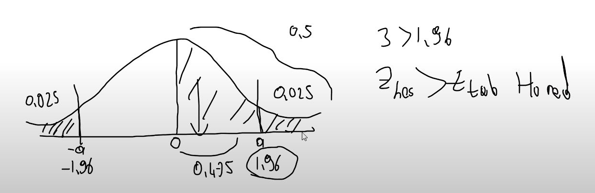

3 değeri 1,96 değerinden büyük olduğu için $H_0$ reddedilir.

> Bir üretim bandındaki ürünün ağırlığının 368 gramdan fazla olduğu iddia edilmektedir. 25 tane örneklem alıyoruz ve bu örneklemin ortalamasının 372,5 gram olduğunu buluyoruz. Bu durumda hesaplanan standart sapmanın ise 15 gram olduğu bulunduğuna göre %95 güven aralığında iddiayı test ediniz. Normal dağılım gösterdiği varsayılmaktadır.

1. adım

$\alpha = 1 - 0,95 = 0,05$

2. adım

Tek kuyruk yapısı;

$H_0: \mu = 368 \qquad H_1: \mu =! 100$  

3. adım

$z = \frac{372,5 - 368}{\frac{15}{\sqrt{25}}}$

$z_{Hesap} = 1,5$

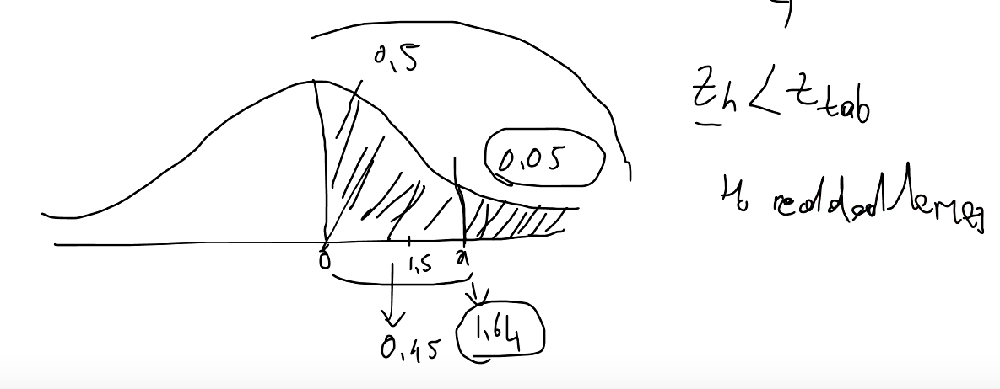

0,45 in $z_{tablo}$ değeri 1,64 olduğu ve $z_{hesap} < z_{tablo}$ olduğu için $H_0$ reddedilemez. 

# 5 Test İstatistiği

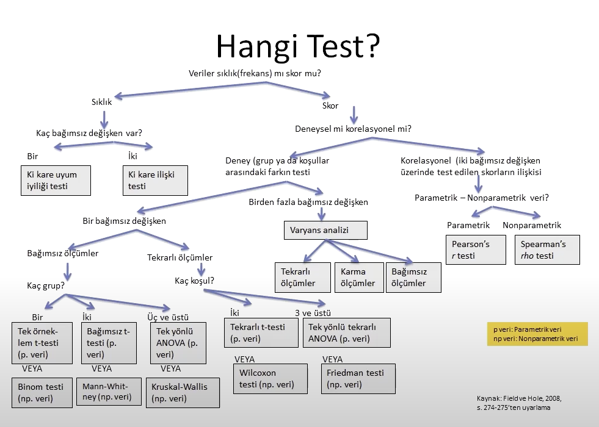

Test çeşitleri aşağıdaki gibidir;

- **Parametrik Test:** 
- **Non-parametrik Test:**

Her testin hem parametrik hem de non-parametrik versiyonu vardır. Parametrik test şartlarını karşılıyorsa parametrik, karşılamıyorsa non-parametrik test kullanılır.

Parametrik test şartları;

1. Verilerimizin normal dağıldığını bilmemiz gerekiyor.Bunu basıklık, çarpıklık, grafik gösterimi veya bazı istatistiksel testler ile anlayabiliriz. Normal dağılım değilse normal dağılıma çevirip çeviremeyeceğimizi inceleriz.

2. Veriler normal dağılım göstermese bile Merkezi limit teoremi ile örneklemin çoğalmasıyla örneklemin dağılımının ortalamaları normal dağılım gösterir.

3. Verilerin sürekli olması gerekiyor.

Gruplar 2 veya daha fazlaysa (evli-bekar; ilkokul-ortaokul-lise-üniversite)

4. Gruplar arası varyans (Varyans homojenliği veya varyans eşitliği de denir)

Parametrik testler non-parametrik testlere göre daha güçlü bir test sonucu sunar.

## 5.1 Normallik Varsayımı Testleri


```python
import numpy as np
from scipy import stats
import matplotlib.pyplot as plt
import seaborn as sns

np.random.seed(10)

# veri=stats.norm.rvs(loc=38, scale=1, size=509)
veri=stats.norm.rvs(loc=38,size=509)
veri

# array([39.3315865 , 38.71527897, 36.45459971, 37.99161615, 38.62133597, ... , 39.2750491 , 37.67116796, 37.85365919, 39.05843664, 37.88891956])

# Çarpıklık, basıklık

stats.kurtosis(veri)
# 0.18786659023941032

stats.skew(veri)
# -0.07830984534404266

# Grafikler
sns.distplot(veri)
plt.show()
```

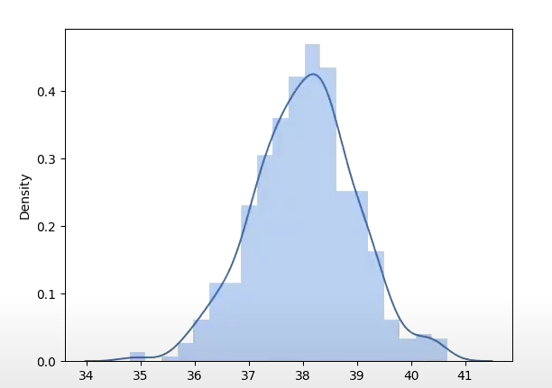

```python
import numpy as np
from scipy import stats
import matplotlib.pyplot as plt
import seaborn as sns

np.random.seed(10)
veri=stats.norm.rvs(1oc=38,size=500)

stats.probplot(yeri,dist="norm",plot=plt)

plt.show()
```

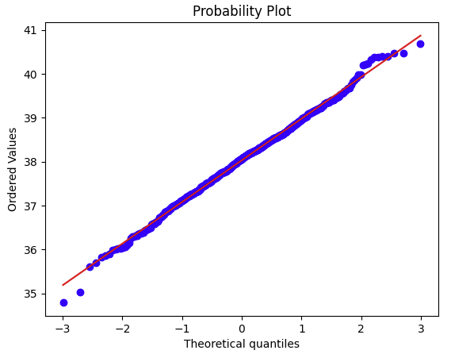

## 5.2 Kolmogorov-Smirnov tek örneklem sınaması

$H_0 = $ Normal Dağılım

$H_1 = $ Normal Dağılım değil

```python
import numpy as np
from scipy import stats
import matplotlib.pyplot as plt
import seaborn as sns

np.random.seed(10)

veri=stats.norm.rvs(loc=38,size=500)

ks=stats.kstest(veri,cdf="norm",args=(veri.mean(),veri.std()))
ks

# KstestResult(statistic=np.float64(0.024206764619964294), pvalue=np.float64(0.9243169445892152), statistic_location=np.float64(38.62133597389048), statistic_sign=np.int8(1))

print(f"{ks.pvalue:5f}")
# 0.924317
```

0,92 > 0,05 

P değeri, alpha değerinden büyük olduğu için H0 reddedilemez. Normal dağılımdır.

## 5.3 Shapiro—Wilk sınaması

$H_0 = $ Normal Dağılım

$H_1 = $ Normal Dağılım değil

```python
import numpy as np
from scipy import stats
import matplotlib.pyplot as plt
import seaborn as sns

np.random.seed(10)

veri=stats.norm.rvs(loc=38,size=500)
sw=stats.shapiro(veri)

print(f"{sw.pvalue:5f}")

# 0.509577
```

0.50 > 0,05 

P değeri, alpha değerinden büyük olduğu için H0 reddedilemez. Normal dağılımdır.

## 5.4 Tek Örneklem Z Testi

 Tek örneklem Z testi, üzerinden popülasyon parametresi olan ortalama ( $\mu$ ) hakkında bilgi sahibi olmak için kullandığımız bir örneklem Yapısıdır.

 Genel olarak çok fazla kullanılmaz.

Amaç bir örneklem grubunun ortalamasının herhangi bir değerle karşılaştırılması üzerinedir. ( $\mu < a, \mu > b$ veya $\mu = 0$ gibi yapılarda kullanılır.)

Kullanıldığı şartlar;

- n > 30
- Popülasyon standart sapmasını veya varyansını bilmek (Gerçek hayatta çok zor)


> Bir ilde öğrencilerin okula okula gidiş dönüşte öğrencilerin harcadığı süre üzerinde hipotez testi oluşturuyoruz. Bu sürenin 80 dakikadan fazla olduğu iddia ediliyor. Popülasyonun standart sapmasının 21 dakika olduğu söyleniyor. 9 tane örneklem seçiliyor; 95, 70, 120, 65, 138, 38, 110, 90, 60. Bunun %95 güven ile test edilmesi isteniyor.

9 örneklem sayısı 30'dan küçük ama şimdi kafaya takmayın dedi.

$H_0: \mu = 80 \quad H_1 : \mu > 80 $

9 Örneklemin ortalaması $\bar{x} = 86,44$

Popülasyonun standart sapması $\sigma = 21$

$z_t = \frac{\bar{x} - \mu}{\frac{\sigma}{\sqrt{n}}}$

$z_t = \frac{86,44 - 80}{\frac{21}{\sqrt{9}}}$

$z_t = \frac{6,44}{\frac{21}{3}}$

$z_t = \frac{6,44}{7}$

$z_t = 0,92$

Tek kuyruk için 0,45 için $z_{tablo}$ = 1,64 

$z_{tablo} > z_{hesap}$ olduğu için $H_0$ reddedilemez.

```python
# !pip install statsmodels

from statsmodels.stats.weightstats import ztest

veri=[95,70,120,65,130,38,110,90,60]

alfa=0.05

zhesap,p=ztest(veri,value=80,alternative="larger") # "smaller","two sided"

print(zhesap,p)

# 0.6339555069870142 0.26305492964421917

if p<alfa:

  print("Ho Reddedilir")

else:
  
  print("Ho Reddedilemez")

# Ho Reddedilemez

```

## 5.5 Tek Örneklem T Testi

$t_t = \frac{\bar{x} - \mu}{\frac{s}{\sqrt{n}}}$

s: Örneklem standart sapmasıdır.

$H_0$ ve $H_1$ yapısı kurulur.

$H_0: \mu=a \qquad H_1: \mu!=a$ yapısı kurulur. 

Varsayımları;

- Örneklem rassal olarak seçilir.
- n<30 şartında güçlü sonuç verir.
- uç değer barındırmamalı

> Bir doktor kandaki x değerinin 200 den farklı olması gerektiğini öneriyor. Bunun için rassal 20 hasta seçiliyor. Bu hastaların kanındaki x değerlerinin ortalaması 311,2 olduğu biliniyor. Örneklem standart sapmasının 64,4 olduğu söyleniyor. Bu öneri %95 güvenle test ediniz.

Popülasyon sapması $\mu$ değil örneklem sapması $s$ verildiği için t testi uygularız. 

$H_0 : \mu = 200 \qquad H_1 : \mu =!\ 200$ 

$t_t = \frac{\bar{x} - \mu}{\frac{s}{\sqrt{n}}}$

$t_t = \frac{311,2 - 200}{\frac{64,4}{\sqrt{20}}}$

$t_t = \frac{111,2}{14,40}$

$t_t = 7,72$

$\alpha = 0,05$

Serbestlik derecesi = n - 1 = 19

Çift yönlü,

$t_{\frac{\alpha}{2}, n-1} = t_{0,025,\ 19} $

Tablodan 19 ve 0,05 olan değer 2,093 olarak bulunur. 

$t_{tablo} < t_{hesap}\ $ olduğu için $H_0$ reddedilir. Doktor yorumu geçerlidir.


> Bir sınavda geçmiş veriler değerlendirilmiştir ve ortalamasının 28 olduğu görülmektedir. Bu sene yeni bir sınav sistemi deneniyor ve geçmiş senelerdeki sonuçlardan farklılık yaratıp yaratmadığını araştırıyoruz.  Rassal olarak 12 öğrenci seçilmiştir ve bu öğrencilere sınav yapılıyor. %95 güvenle test ediniz.

$H_0 : \mu = 28 \\ H_1: \mu\ != 28 \\ \alpha = 0,05 $
Sonuclar = [28, 29, 35, 37, 32, 26, 37, 39, 22, 29, 36, 38]

```Python
from scipy import stats
import pandas as pd

veri = [28, 29, 35, 37, 32, 26, 37, 39, 22, 29, 36, 38]

alfa=0.05

thesap,p=stats.ttest_1samp(veri,popmean=28,alternative="two-sided")

thesap,p

# 2.746194120979329, 0.019019642553313558

if p<alfa:
  print("Ho Reddedilir")
else:
  print("Ho Reddedilemez")

# Ho Reddedilir
```

> Rapora göre günlük hata oranının ortalama 20 tane olduğu gözüküyor. Bunun doğru olup olmadığını bulmak çin 25 gün veri topluyoruz. %95 güvenle test ediniz.

n = 25

$H_0 : \mu = 20 \\ H_1: \mu\ != 20 \\ \alpha = 0,05 $


```Python
from scipy import stats
import pandas as pd


veri=[25, 26, 25, 20, 18, 29, 30, 32, 17, 23, 34, 27, 26, 30, 33, 32, 21, 21, 20, 11, 16, 14, 15, 18, 19]

alfa=0.05

thesap,p=stats.ttest_1samp(veri,popmean=20,alternative="two-sided")

thesap,p

# 2.5119047177847493, 0.019139687648655326

if p<alfa:
  print("Ho Reddedilir")
else:
  print("Ho Reddedilemez")

# Ho Reddedilir
```

## 5.6 Bağımsız İki Örneklem T Testi

Bu testi kullanmaktaki amacımız bir olgunun bu iki grubun üzerindeki etkileri arasında herhangi bir fark var mı yok mu incelemektir. Örneğin bir sınavda bu sınava giren öğrencilerden erkek ve kadın olan öğrencilerin aldığı puanların ortalamasının 30'dan farklı olup olmadığını incelersek 2 örneklem olur. **Bağımsız** kelimesi iki grup içerisinden çekilen örneklem yapılarının birbirleri ile bir ilgisinin olmaması durumunu söylüyor. **Bağımlı** olması için mesela bir diyet programının işe yarayıp yaramadığı hakkında bilgi sahibi olmak istiyorsanız bir örneklem grubu seçersiniz ve kadın ve erkek bu grup içerisinde bulunurlar. Bunları diyetten önce belli bir ölçüm yaparsınız daha sonra diyet uygularsanız diyetten sonra yine aynı örneklemlerle ikinci bir test daha yaparsınız ve öncesi ve sonrası arasındaki ortalamada fark var mı bunu tespit etmeye çalışırsınız.

$H_0: \mu=10 \qquad H_1: \mu!=10$ yerine; 
$H_0: \mu_1=\mu_2 \qquad H_1: \mu_1\ !=\mu_2$

yani $H_0$ gruplar arası fark yok der. $H_1$ gruplar arası fark var der. 

$t_{hesap} = \frac{\bar{x}_1 - \bar{x}_2}{\sqrt{s^2 \cdot (\frac{1}{n_1} + \frac{1}{n_2})}}$

Bu  formüldeki $s^2$;

$s^2 = \frac{(n_1-1) \cdot s_1^2 + (n_2-1) \cdot s_2^2}{n_1+n_2-2} $

$n_1+n_2-2 \quad$ t tablosunda istenen serbestlik derecesidir. Tabloda $t_{\alpha, n_1 + n_2 -2}$ arayacağız.

Bu yapının varsayımları;

- Çekilen örneklemler rassal olmalı.
- Bağımlı değişken sürekli olmalı.
- Bağımsız değişkenler kategorik olmalı.
- Her bağısız değişken için normal dağılım olmalı.
- n1 ve n2 bazı kaynaklara göre 25'ten bazılarına göre ise 15'ten büyük olmalıdır.
- Aykırı değer olmamalıdır.
- Varyansların eşitliği varsayımı (Eğer varyansların homojenliği dağılımı geçerli değilse yukarıda verilen $\ t_{hesap}\ $ formülü geçerli olacaktır, Eğer geçerli değilse Welch'in T testi kullanılacaktır)

T tablosu;
| df  | Tek Kuyruk α=0.05 | Tek Kuyruk α=0.01 | İki Kuyruk α=0.05 | İki Kuyruk α=0.01 |
|:---:|:------------------:|:------------------:|:-------------------:|:-------------------:|
| 1   | 6.314              | 31.821             | 12.706              | 63.657              |
| 2   | 2.920              | 6.965              | 4.303               | 9.925               |
| 3   | 2.353              | 4.541              | 3.182               | 5.841               |
| 4   | 2.132              | 3.747              | 2.776               | 4.604               |
| 5   | 2.015              | 3.365              | 2.571               | 4.032               |
| 6   | 1.943              | 3.143              | 2.447               | 3.707               |
| 7   | 1.895              | 2.998              | 2.365               | 3.499               |
| 8   | 1.860              | 2.896              | 2.306               | 3.355               |
| 9   | 1.833              | 2.821              | 2.262               | 3.250               |
| 10  | 1.812              | 2.764              | 2.228               | 3.169               |
| 11  | 1.796              | 2.718              | 2.201               | 3.106               |
| 12  | 1.782              | 2.681              | 2.179               | 3.055               |
| 13  | 1.771              | 2.650              | 2.160               | 3.012               |
| 14  | 1.761              | 2.624              | 2.145               | 2.977               |
| 15  | 1.753              | 2.602              | 2.131               | 2.947               |
| 16  | 1.746              | 2.583              | 2.120               | 2.921               |
| 17  | 1.740              | 2.567              | 2.110               | 2.898               |
| 18  | 1.734              | 2.552              | 2.101               | 2.878               |
| 19  | 1.729              | 2.539              | 2.093               | 2.861               |
| 20  | 1.725              | 2.528              | 2.086               | 2.845               |
| 21  | 1.721              | 2.518              | 2.080               | 2.831               |
| 22  | 1.717              | 2.508              | 2.074               | 2.819               |
| 23  | 1.714              | 2.500              | 2.069               | 2.807               |
| 24  | 1.711              | 2.492              | 2.064               | 2.797               |
| 25  | 1.708              | 2.485              | 2.060               | 2.787               |
| 26  | 1.706              | 2.479              | 2.056               | 2.779               |
| 27  | 1.703              | 2.473              | 2.052               | 2.771               |
| 28  | 1.701              | 2.467              | 2.048               | 2.763               |
| 29  | 1.699              | 2.462              | 2.045               | 2.756               |
| 30  | 1.697              | 2.457              | 2.042               | 2.750               |
| 40  | 1.684              | 2.423              | 2.021               | 2.704               |
| 50  | 1.676              | 2.403              | 2.009               | 2.678               |
| 60  | 1.671              | 2.390              | 2.000               | 2.660               |
| 80  | 1.664              | 2.374              | 1.990               | 2.639               |
| 100 | 1.660              | 2.364              | 1.984               | 2.626               |
| 120 | 1.658              | 2.358              | 1.980               | 2.617               |
| ∞   | 1.645              | 2.326              | 1.960               | 2.576               |


### Örnekler

A_Okulu = [280, 287, 280, 275, 279, 278, 289, 284, 288]
B_Okulu = [281, 274, 270, 273, 276, 273, 281, 282, 284]

> Aynı öğrenciler olmadığı için tekrarlı t testi yerine bağımsız t testi yapıyoruz. 9'ar örneklem alınmış. Varsayımların hepsinin geçerli olduğunu varsayıyoruz. %95 güven ile test ediniz.

$H_0: \mu_A = \mu_B \\ H_1: \mu_A\ != \mu_B$

$t_{hesap} = \frac{\bar{x}_1 - \bar{x}_2}{\sqrt{s^2 \cdot (\frac{1}{n_1} + \frac{1}{n_2})}}$

$s^2 = \frac{(n_1-1) \cdot s_1^2 + (n_2-1) \cdot s_2^2}{n_1+n_2-2} $

$s^2 = \frac{(9-1) \cdot 24,44^2 + (9-1) \cdot 24,61^2}{9+9-2} $

$s^2 = \frac{8 \cdot 24,44^2 + 8 \cdot 24,61^2}{16} $

$s^2 = 24,52 $

$t_{hesap} = \frac{282,22 - 277,11}{\sqrt{24,52 \cdot (\frac{1}{9} + \frac{1}{9})}}$

$t_{hesap} = 2,18$

$t_{tablo} = 2,12$

$t_{hesap} > t_{tablo} \\[3mm] H_0\ $ reddedilir. Bu iki okul sonuçları arasında fark vardır. 

```Python
from scipy import stats
import pandas as pd

A_Okulu = [280, 287, 280, 275, 279, 278, 289, 284, 288]
B_Okulu = [281, 274, 270, 273, 276, 273, 281, 282, 284]

veri=pd.DataFrame({"A Okulu":A_Okulu, "B Okulu":B_Okulu})
alfa=0.05

thesap,p=stats.ttest_ind(veri["A Okulu"],veri["B Okulu"],alternative="two-sided")

print(thesap,p)
# 2.1892354788555783 0.043749510241205485

if p<alfa:
    print("Ho Red")
else:
    print("Ho Reddedilemez")
# Ho Red
```

## 5.7 Varyansların Homojenliği 

```python
from scipy import stats
import matplotlib.pyplot as plt
import seaborn as sns
import numpy as np

np.random.seed(0)

x1 = stats.norm.rvs(loc=0, scale=1, size=1000)
x2 = stats.norm.rvs(loc=0, scale=5, size=1000)
x3 = stats.norm.rvs(loc=0, scale=10, size=1000)

sns.set_theme() 
sns.kdeplot(x1, label="x1")
sns.kdeplot(x2, label="x2")
sns.kdeplot(x3, label="x3")
plt.legend(loc="upper right")
 
plt.show()
```

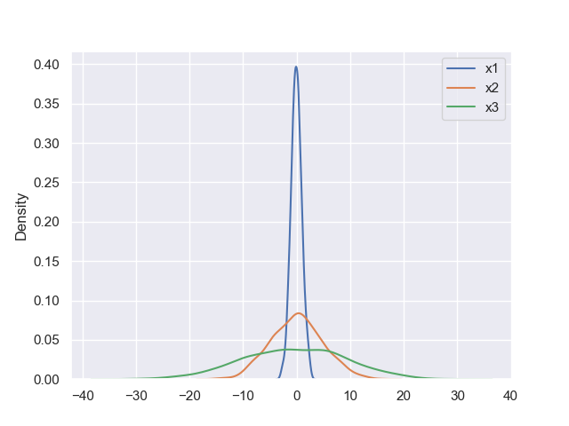

```python
from scipy import stats
import matplotlib.pyplot as plt
import seaborn as sns
import numpy as np

x1=stats.norm.rvs(loc=0,scale=1,size=1000)
x11=np.random.choice(x1,size=750)
x12=np.random.choice(x1,size=250)

x1var=np.var(x1)
x11var=np.var(x11)
x12var=np.var(x12)

sns.set_theme()

sns.kdeplot(x1,label="x1"+str(x1var))
sns.kdeplot(x11,label="x11"+str(x11var))
sns.kdeplotgxız,label="x12"+str(x12var))

plt.legend(loc="upper right")
plt.show()
```

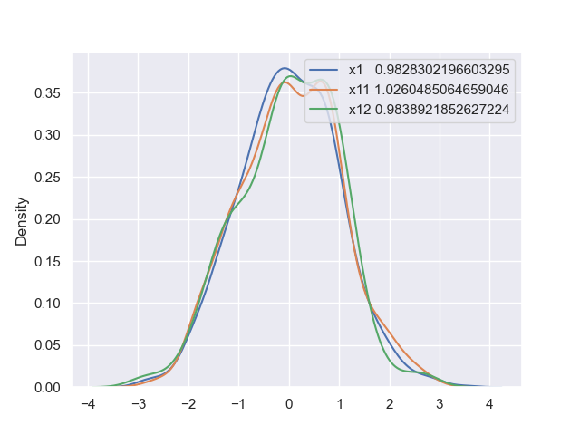

>Bir örneklem yapısını birden fazla grup halinde bir popülasyondan çekiyorsam her iki grubun varyansları ile birlikte popülasyonun varyansına benzerlik gösterecektir. (Yani grubun varyansı hem popülasyon varyansına hem de diğer grupların varyansına yakın olacaktır.) Bu yüzden varyansların homojenliğini kontrol ederiz. Ortalama ve varyans yakınsa aynı popülasyondan çekilmiş denebilir. 

```python
from scipy import stats
import matplotlib.pyplot as plt
import seaborn as sns
import numpy as np

x1=stats.norm.rvs(loc=0,scale=1,size=1000)
x11=np.random.choice(x1,size=750)
x12=np.random.choice(x1,size=250)
y=stats.norm.rvs(loc=0,scale=10,size=1000)

x1var=np.var(x1)
x11var=np.var(x11)
x12var=np.var(x12)
yvar=np.var(y)

sns.set_theme()

sns.kdeplot(x1,label="x1"+str(x1var))
sns.kdeplot(x11,label="x11"+str(x11var))
sns.kdeplot(x12,label="x12"+str(x12var))
sns.kdeplot(y,label="y"+str(yvar))

plt.legend(loc="upper right")
plt.show()
```

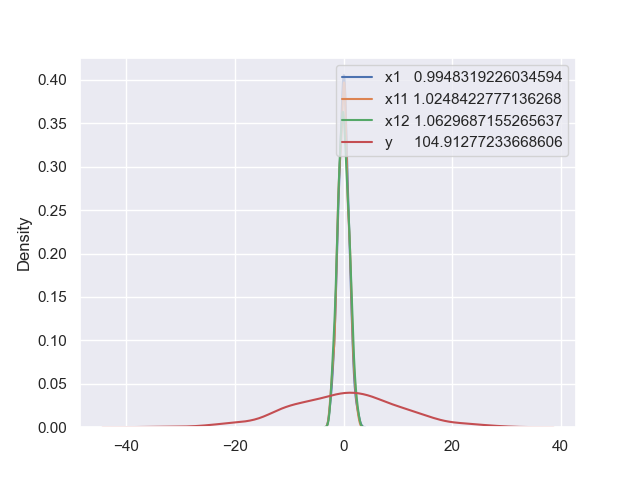

## 5.8 Bartlett ve Levene Testleri 

İki veya daha fazla grubun varyanslarının eşit olup olmadığını değerlendirir. Levene testi f tablosunu kullanır, Bartlett testi ki-kare tablosunu kullanır. Normallik varsayımı varsa Bartlett yoksa Levene kullanır. 

$H_0 : \sigma^2_A = \sigma^2_B \\[3mm] H_1 : \sigma^2_A\ != \sigma^2_B$

### Örnekler


```python

import pandas as pd
from scipy import stats

veri = pd.DataFrame({
    "Cinsiyet": [
    "Kadın", "Kadın", "Erkek", "Erkek", "Erkek", "Erkek", "Kadın", "Erkek", "Erkek", "Kadın",
    "Erkek", "Kadın", "Kadın", "Erkek", "Erkek", "Erkek", "Kadın", "Kadın", "Kadın", "Kadın",
    "Erkek", "Erkek", "Kadın", "Erkek", "Erkek", "Kadın", "Kadın", "Kadın", "Kadın", "Erkek",
    "Kadın", "Erkek", "Kadın", "Kadın"
],
    "Harcama": [
    1252.717, 1249.566, 1250.583, 1250.592, 1250.141, 1249.533, 1250.713, 1251.465, 1249.569, 1249.546,
    1250.560, 1249.411, 1250.794, 1252.109, 1249.228, 1250.150, 1249.454, 1250.298, 1249.297, 1250.168,
    1250.559, 1250.760, 1249.573, 1251.547, 1248.559, 1248.735, 1249.523, 1249.246, 1249.534, 1248.553,
    1249.588, 1250.058, 1248.554, 1248.514
]
})

erkek=veri[veri["Cinsiyet"]=="Erkek"]
kadın=veri[veri["Cinsiyet"]=="Kadın"]

p1=stats.shapiro(erkek["Harcama"])
p2=stats.shapiro(kadın["Harcama"])

print(p1)
print(p2)

# ShapiroResult(statistic=np.float64(0.9637624469211384), pvalue=np.float64(0.7302480962555515))
# ShapiroResult(statistic=np.float64(0.8334973947524276), pvalue=np.float64(0.004702334663604679))

# İki p değeri de 0,05'ten büyük. Yani H0 hipotezinin reddedilemeyeceğini gösteriyor.

h1=stats.levene(erkek["Harcama"],kadın["Harcama"])
print(h1)

# LeveneResult(statistic=np.float64(0.5406539502499811), pvalue=np.float64(0.4675170403804729))

# Normallik varsayımı olduğu için levene değil bartlett kullanılmalı. Levene pythonda normal olmadığını varsayarak direk median değerine göre hesaplar. Ama normallik varsayımı varsa mean değerine göre hesaplanır.

h1=stats.levene(erkek["Harcama"],kadın["Harcama"], center="mean")
print(h1)

# LeveneResult(statistic=np.float64(0.2216499933145069), pvalue=np.float64(0.6409791293233547))

h2=stats.bartlett(erkek["Harcama"],kadın["Harcama"])
print(h2)

# BartlettResult(statistic=np.float64(0.012771315178131173), pvalue=np.float64(0.9100224339557562))

```

Bütün p değerleri 0,05'ten büyük olduğu için H0 reddedilemez. Varyanslar homojen.


>Sigara içme durumu ile nefes tutma süreleri kıyaslanıyor.

```python
Sigara = ["Hayır","Hayır","Hayır","Evet","Evet","Evet","Evet","Evet","Hayır","Evet",
          "Hayır","Hayır","Hayır","Evet","Evet","Evet","Hayır","Hayır","Evet","Evet",
          "Hayır","Evet","Hayır","Hayır","Evet","Hayır","Hayır","Evet","Evet","Hayır",
          "Evet","Hayır","Evet","Evet","Evet","Evet","Evet","Evet","Evet","Evet",
          "Evet","Evet","Evet","Evet","Evet","Evet","Hayır","Hayır","Hayır","Hayır",
          "Hayır","Hayır","Hayır","Hayır","Hayır","Hayır","Hayır","Hayır","Hayır","Hayır",
          "Hayır"]

Zaman = [15.06358,15.77698,15.34883,13.6725,12.02749,18.77513,17.25964,17.66879,14.5384,12.06482,
         12.22138,12.4567,13.58266,15.0689,10.82145,18.34378,10.24611,15.01522,16.78425,15.81457,
         16.84685,15.8199,14.50865,13.18201,19.63606,12.51304,16.10257,16.74138,19.86994,17.56927,
         15.40599,14.81622,12.87322,14.08156,20.84376,13.39095,16.22823,15.44857,15.48347,16.8586,
         17.71843,13.7556,10.38391,17.06556,13.0717,12.21937,12.55556,11.88787,15.24795,13.64029,
         15.59742,16.09101,16.09101,15.3031,19.70871,13.01566,14.89676,17.56927,14.57556,13.94187,
         15.35008]

import pandas as pd
from scipy import stats

veri = pd.DataFrame({
  "Sigara": Sigara, 
  "Zaman":Zaman
})

icen=veri[veri["Sigara"]=="Evet"]
icmeyen=veri[veri["Sigara"]=="Hayır"]

normicen=stats.shapiro(icen["Zaman"])
normicmeyen=stats.shapiro(icmeyen["Zaman"])

print(normicen,normicmeyen)
# ShapiroResult(statistic=0.9823920122280293, pvalue=0.8849548009303411) 
# ShapiroResult(statistic=0.9805439050132948, pvalue=0.8276780947961337)
```

Her iki p değeri de alfa değeri olan 0.05'ten büyük olduğu için normal dağılım sergilenir.

Varyansların homojenliği;


```python
homojen=stats.bartlett(icen["Zaman"], icmeyen["Zaman"])
homojen

# BartlettResult(statistic=3.253657343839216, pvalue=0.07126427845558947)
```

0,05'ten büyük olduğu için varyans homojenliği var.

```python
test=stats.ttest_ind(icen["Zaman"],icmeyen["Zaman"],alternative="Two—Sided")
test

# TtestResult(statistic=1.3649261283323062, pvalue=0.17745895971860212, df=59.0)
```

0,17 0,05 değerinden büyük olduğu için H0  reddedilemez. İçen ile içmeyen arasında ortalama olarak herhangi bir fark yok.

Hiçbir H0 hipotezini reddedemediğimiz için %95 güven aralığında içen ile içmeyen arasında bir fark yoktur. 


### Örnekler
## 5.9 
# 6

https://www.youtube.com/watch?v=WaJ9jfmf27I&list=PLK8LlaNiWQOvAYUMGMTFeZIOo0oKmZhdw&index=65
00:00
