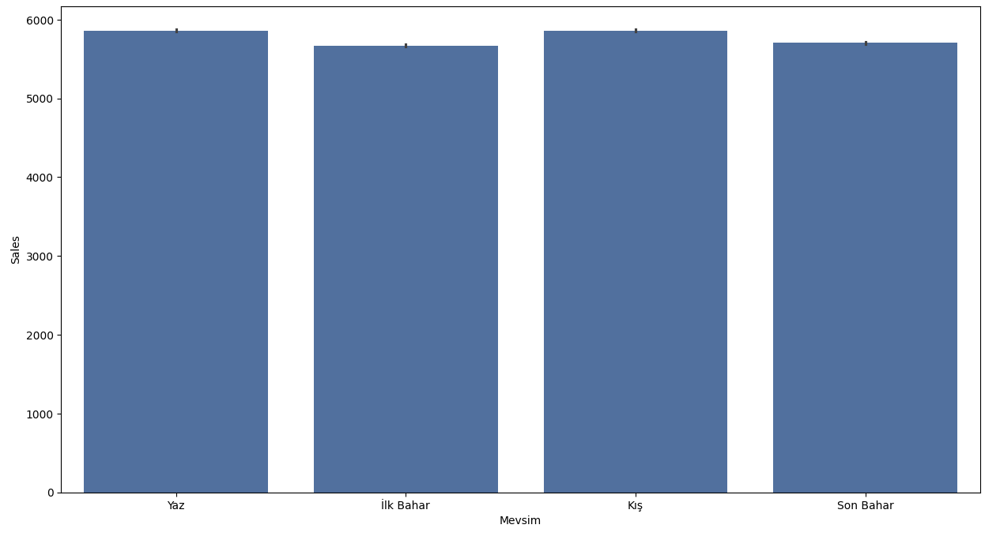
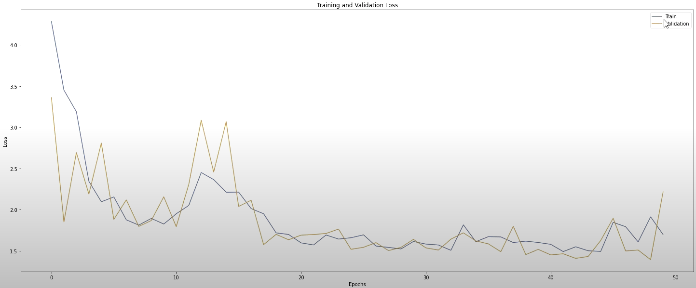
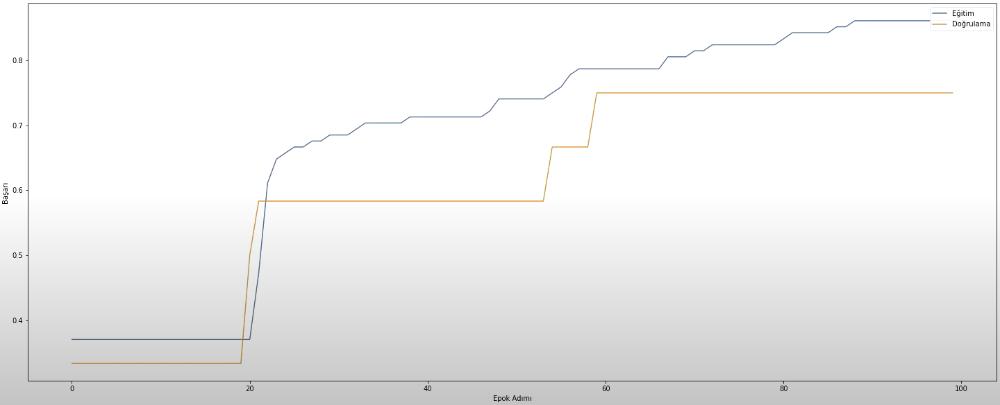
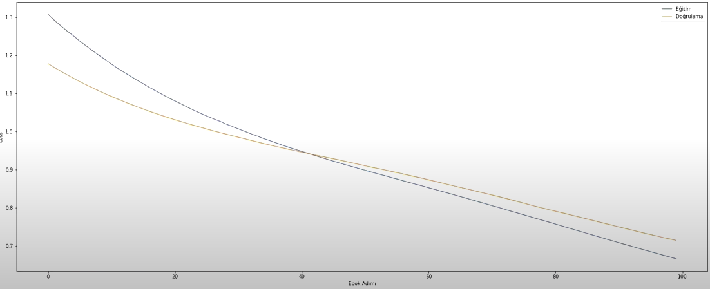
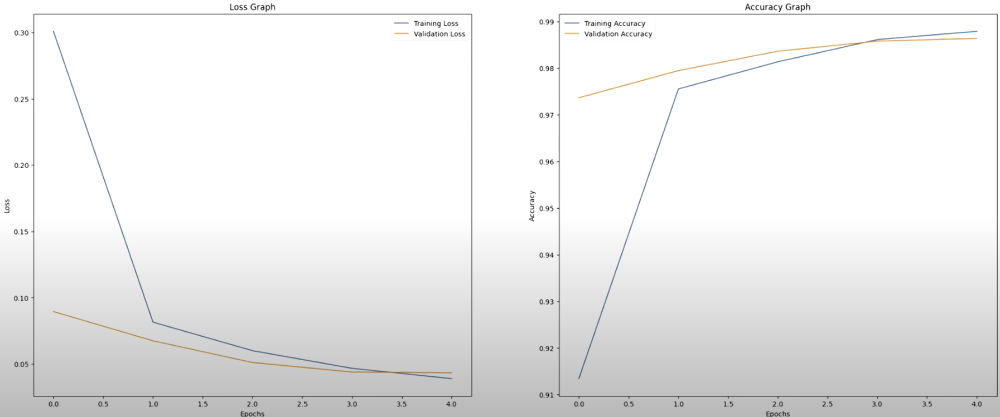
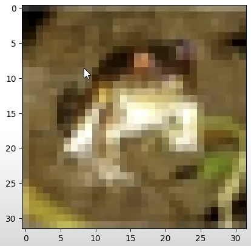

# Derin Öğrenme

`!cat /proc/cpuinfo` Colabda cpu bilgisi görme
`!cat /proc/meminfo` Colabda RAM bilgisi görme

```Python
from google.colab import drive
drive.mount('/gdrive')
%cd /gdrive

# Mounted at /gdrive
# /gdrive


from tensorflow.python.client import device_lib
device_lib.list_local_devices()

# [name: "/device:CPU:0"
#  device_type: "CPU"
#  memory_limit: 268435456
#  locality {
#  }
#  incarnation: 1585669663075618386
#  xla_global_id: -1]
```

GPU ya bağlandıktan sonra device_type değişkeninin GPU olduğunu görebiliriz;

```Python
from tensorflow.python.client import device_lib
device_lib.list_local_devices()

# [name: "/device:CPU:0"
#  device_type: "CPU"
#  memory_limit: 268435456
#  locality {
#  }
#  incarnation: 4876834698346401635
#  xla_global_id: -1
# , name: "/device:GPU:0"
#  device_type: "GPU"
#  memory_limit: 14417788928
#  locality {
#    bus_id: 
#    links {
#    }
#  }
#  incarnation: 15679932945741647813
#  physical_device_desc: "device: 0, name: Tesla T4, pci bus id: 0000:00:04.0, compute capability: 7.5"
#  xla_global_id: 4610904319
# ]

```

En yaygın kullanılan aktivasyon fonksiyonları:

> 🔹 1. **Sigmoid Fonksiyonu**

**Formül:**

$$
f(x) = \frac{1}{1 + e^{-x}}
$$

**Özellikler:**

* Çıktı aralığı: (0, 1)
* Genellikle binary sınıflandırma problemlerinde kullanılır.
* Küçük türev değerleri nedeniyle **vanishing gradient** (kaybolan gradyan) problemi yaşatabilir.

---

> 🔹 2. **Tanh (Hiperbolik Tanjant) Fonksiyonu**

**Formül:**

$$
f(x) = \frac{e^x - e^{-x}}{e^x + e^{-x}}
$$

**Özellikler:**

* Çıktı aralığı: (-1, 1)
* Sigmoid'e göre merkezlidir (0 etrafında simetriktir).
* Yine de kaybolan gradyan problemi yaşanabilir.

---

> 🔹 3. **ReLU (Rectified Linear Unit)**

**Formül:**

$$
f(x) = \max(0, x)
$$

**Özellikler:**

* Pozitif girişler için doğrusal, negatifler için sıfır.
* Hızlı öğrenme sağlar.
* Negatif değerlerde türev sıfır olduğundan "ölü nöron" problemi olabilir.

---

> 🔹 4. **Leaky ReLU**

**Formül:**

$$
f(x) = \begin{cases}
x & x > 0 \\
\alpha x & x \leq 0
\end{cases}
$$

**Özellikler:**

* ReLU'nun geliştirilmiş halidir.
* Negatif değerlerde küçük bir eğim ($\alpha \approx 0.01$) ile "ölü nöron" problemi azaltılır.

---

> 🔹 5. **ELU (Exponential Linear Unit)**

**Formül:**

$$
f(x) = \begin{cases}
x & x > 0 \\
\alpha (e^x - 1) & x \leq 0
\end{cases}
$$

**Özellikler:**

* ReLU'ya benzer ama negatif tarafta daha yumuşak geçiş sağlar.
* Gradyan sorunlarını azaltabilir.

---

> 🔹 6. **Softmax Fonksiyonu**

**Formül:**

$$
f(x_i) = \frac{e^{x_i}}{\sum_{j} e^{x_j}}
$$

**Özellikler:**

* Genellikle **çok sınıflı sınıflandırma** problemlerinde **çıkış katmanında** kullanılır.
* Girdileri olasılık dağılımına dönüştürür (toplam 1 olacak şekilde normalize eder).

---

> 📌 Hangi Durumda Hangi Fonksiyon Kullanılır?

| Durum             | Kullanılabilecek Aktivasyon                         |
| ----------------- | --------------------------------------------------- |
| Gizli katman      | ReLU, Leaky ReLU, ELU, tanh                         |
| Binary çıktı      | Sigmoid                                             |
| Çok sınıflı çıktı | Softmax                                             |
| Derin ağlarda     | ReLU veya türevleri (daha stabil gradyanlar sağlar) |

```Python
import numpy as np
import matplotlib.pyplot as plt

# Giriş değerleri
x = np.linspace(-10, 10, 400)

# Aktivasyon fonksiyonları
sigmoid = 1 / (1 + np.exp(-x))
tanh = np.tanh(x)
relu = np.maximum(0, x)
leaky_relu = np.where(x > 0, x, 0.01 * x)
elu = np.where(x > 0, x, 1 * (np.exp(x) - 1))

# Softmax için örnek vektör
x_softmax = np.array([1.0, 2.0, 3.0])
softmax = np.exp(x_softmax) / np.sum(np.exp(x_softmax))

# Grafik çizimi
fig, axs = plt.subplots(3, 2, figsize=(12, 12))
axs = axs.ravel()

axs[0].plot(x, sigmoid, label='Sigmoid', color='blue')
axs[0].set_title('Sigmoid')
axs[0].grid(True)

axs[1].plot(x, tanh, label='Tanh', color='orange')
axs[1].set_title('Tanh')
axs[1].grid(True)

axs[2].plot(x, relu, label='ReLU', color='green')
axs[2].set_title('ReLU')
axs[2].grid(True)

axs[3].plot(x, leaky_relu, label='Leaky ReLU', color='red')
axs[3].set_title('Leaky ReLU')
axs[3].grid(True)

axs[4].plot(x, elu, label='ELU', color='purple')
axs[4].set_title('ELU')
axs[4].grid(True)

axs[5].bar(['x1', 'x2', 'x3'], softmax, color='cyan')
axs[5].set_title('Softmax (örnek: [1, 2, 3])')
axs[5].set_ylim(0, 1)
axs[5].grid(True)

plt.tight_layout()
plt.show()
```


Önceki fonksiyonlara ek olarak step fonksiyonu var. x 0 değerine kadar y=0 x sıfırdan büyük değerlerde y=1. 

# Keras ile Model Oluşturma

```Python
import pandas as pd 

data = pd.DataFrame(
    {

        "TV":[230.1, 44.5, 17.2, 151.5, 180.8, 8.7, 57.5, 120.2, 8.6, 199.8, 66.1, 214.7, 23.8, 97.5, 204.1, 195.4, 67.8, 281.4, 69.2, 147.3, 218.4, 237.4, 13.2, 228.3, 62.3, 262.9, 142.9, 240.1, 248.8, 70.6, 292.9, 112.9, 97.2, 265.6, 95.7, 290.7, 266.9, 74.7, 43.1, 228, 202.5, 177, 293.6, 206.9, 25.1, 175.1, 89.7, 239.9, 227.2, 66.9, 199.8, 100.4, 216.4, 182.6, 262.7, 198.9, 7.3, 136.2, 210.8, 210.7, 53.5, 261.3, 239.3, 102.7, 131.1, 69, 31.5, 139.3, 237.4, 216.8, 199.1, 109.8, 26.8, 129.4, 213.4, 16.9, 27.5, 120.5, 5.4, 116, 76.4, 239.8, 75.3, 68.4, 213.5, 193.2, 76.3, 110.7, 88.3, 109.8, 134.3, 28.6, 217.7, 250.9, 107.4, 163.3, 197.6, 184.9, 289.7, 135.2, 222.4, 296.4, 280.2, 187.9, 238.2, 137.9, 25, 90.4, 13.1, 255.4, 225.8, 241.7, 175.7, 209.6, 78.2, 75.1, 139.2, 76.4, 125.7, 19.4, 141.3, 18.8, 224, 123.1, 229.5, 87.2, 7.8, 80.2, 220.3, 59.6, 0.7, 265.2, 8.4, 219.8, 36.9, 48.3, 25.6, 273.7, 43, 184.9, 73.4, 193.7, 220.5, 104.6, 96.2, 140.3, 240.1, 243.2, 38, 44.7, 280.7, 121, 197.6, 171.3, 187.8, 4.1, 93.9, 149.8, 11.7, 131.7, 172.5, 85.7, 188.4, 163.5, 117.2, 234.5, 17.9, 206.8, 215.4, 284.3, 50, 164.5, 19.6, 168.4, 222.4, 276.9, 248.4, 170.2, 276.7, 165.6, 156.6, 218.5, 56.2, 287.6, 253.8, 205, 139.5, 191.1, 286, 18.7, 39.5, 75.5, 17.2, 166.8, 149.7, 38.2, 94.2, 177, 283.6, 232.1],
        "Radio":[37.8, 39.3, 45.9, 41.3, 10.8, 48.9, 32.8, 19.6, 2.1, 2.6, 5.8, 24, 35.1, 7.6, 32.9, 47.7, 36.6, 39.6, 20.5, 23.9, 27.7, 5.1, 15.9, 16.9, 12.6, 3.5, 29.3, 16.7, 27.1, 16, 28.3, 17.4, 1.5, 20, 1.4, 4.1, 43.8, 49.4, 26.7, 37.7, 22.3, 33.4, 27.7, 8.4, 25.7, 22.5, 9.9, 41.5, 15.8, 11.7, 3.1, 9.6, 41.7, 46.2, 28.8, 49.4, 28.1, 19.2, 49.6, 29.5, 2, 42.7, 15.5, 29.6, 42.8, 9.3, 24.6, 14.5, 27.5, 43.9, 30.6, 14.3, 33, 5.7, 24.6, 43.7, 1.6, 28.5, 29.9, 7.7, 26.7, 4.1, 20.3, 44.5, 43, 18.4, 27.5, 40.6, 25.5, 47.8, 4.9, 1.5, 33.5, 36.5, 14, 31.6, 3.5, 21, 42.3, 41.7, 4.3, 36.3, 10.1, 17.2, 34.3, 46.4, 11, 0.3, 0.4, 26.9, 8.2, 38, 15.4, 20.6, 46.8, 35, 14.3, 0.8, 36.9, 16, 26.8, 21.7, 2.4, 34.6, 32.3, 11.8, 38.9, 0, 49, 12, 39.6, 2.9, 27.2, 33.5, 38.6, 47, 39, 28.9, 25.9, 43.9, 17, 35.4, 33.2, 5.7, 14.8, 1.9, 7.3, 49, 40.3, 25.8, 13.9, 8.4, 23.3, 39.7, 21.1, 11.6, 43.5, 1.3, 36.9, 18.4, 18.1, 35.8, 18.1, 36.8, 14.7, 3.4, 37.6, 5.2, 23.6, 10.6, 11.6, 20.9, 20.1, 7.1, 3.4, 48.9, 30.2, 7.8, 2.3, 10, 2.6, 5.4, 5.7, 43, 21.3, 45.1, 2.1, 28.7, 13.9, 12.1, 41.1, 10.8, 4.1, 42, 35.6, 3.7, 4.9, 9.3, 42, 8.6],
        "Newspaper":[69.2, 45.1, 69.3, 58.5, 58.4, 75, 23.5, 11.6, 1, 21.2, 24.2, 4, 65.9, 7.2, 46, 52.9, 114, 55.8, 18.3, 19.1, 53.4, 23.5, 49.6, 26.2, 18.3, 19.5, 12.6, 22.9, 22.9, 40.8, 43.2, 38.6, 30, 0.3, 7.4, 8.5, 5, 45.7, 35.1, 32, 31.6, 38.7, 1.8, 26.4, 43.3, 31.5, 35.7, 18.5, 49.9, 36.8, 34.6, 3.6, 39.6, 58.7, 15.9, 60, 41.4, 16.6, 37.7, 9.3, 21.4, 54.7, 27.3, 8.4, 28.9, 0.9, 2.2, 10.2, 11, 27.2, 38.7, 31.7, 19.3, 31.3, 13.1, 89.4, 20.7, 14.2, 9.4, 23.1, 22.3, 36.9, 32.5, 35.6, 33.8, 65.7, 16, 63.2, 73.4, 51.4, 9.3, 33, 59, 72.3, 10.9, 52.9, 5.9, 22, 51.2, 45.9, 49.8, 100.9, 21.4, 17.9, 5.3, 59, 29.7, 23.2, 25.6, 5.5, 56.5, 23.2, 2.4, 10.7, 34.5, 52.7, 25.6, 14.8, 79.2, 22.3, 46.2, 50.4, 15.6, 12.4, 74.2, 25.9, 50.6, 9.2, 3.2, 43.1, 8.7, 43, 2.1, 45.1, 65.6, 8.5, 9.3, 59.7, 20.5, 1.7, 12.9, 75.6, 37.9, 34.4, 38.9, 9, 8.7, 44.3, 11.9, 20.6, 37, 48.7, 14.2, 37.7, 9.5, 5.7, 50.5, 24.3, 45.2, 34.6, 30.7, 49.3, 25.6, 7.4, 5.4, 84.8, 21.6, 19.4, 57.6, 6.4, 18.4, 47.4, 17, 12.8, 13.1, 41.8, 20.3, 35.2, 23.7, 17.6, 8.3, 27.4, 29.7, 71.8, 30, 19.6, 26.6, 18.2, 3.7, 23.4, 5.8, 6, 31.6, 3.6, 6, 13.8, 8.1, 6.4, 66.2, 8.7],
        "Sales":[22.1, 10.4, 12, 16.5, 17.9, 7.2, 11.8, 13.2, 4.8, 15.6, 12.6, 17.4, 9.2, 13.7, 19, 22.4, 12.5, 24.4, 11.3, 14.6, 18, 17.5, 5.6, 20.5, 9.7, 17, 15, 20.9, 18.9, 10.5, 21.4, 11.9, 13.2, 17.4, 11.9, 17.8, 25.4, 14.7, 10.1, 21.5, 16.6, 17.1, 20.7, 17.9, 8.5, 16.1, 10.6, 23.2, 19.8, 9.7, 16.4, 10.7, 22.6, 21.2, 20.2, 23.7, 5.5, 13.2, 23.8, 18.4, 8.1, 24.2, 20.7, 14, 16, 11.3, 11, 13.4, 18.9, 22.3, 18.3, 12.4, 8.8, 11, 17, 8.7, 6.9, 14.2, 5.3, 11, 11.8, 17.3, 11.3, 13.6, 21.7, 20.2, 12, 16, 12.9, 16.7, 14, 7.3, 19.4, 22.2, 11.5, 16.9, 16.7, 20.5, 25.4, 17.2, 16.7, 23.8, 19.8, 19.7, 20.7, 15, 7.2, 12, 5.3, 19.8, 18.4, 21.8, 17.1, 20.9, 14.6, 12.6, 12.2, 9.4, 15.9, 6.6, 15.5, 7, 16.6, 15.2, 19.7, 10.6, 6.6, 11.9, 24.7, 9.7, 1.6, 17.7, 5.7, 19.6, 10.8, 11.6, 9.5, 20.8, 9.6, 20.7, 10.9, 19.2, 20.1, 10.4, 12.3, 10.3, 18.2, 25.4, 10.9, 10.1, 16.1, 11.6, 16.6, 16, 20.6, 3.2, 15.3, 10.1, 7.3, 12.9, 16.4, 13.3, 19.9, 18, 11.9, 16.9, 8, 17.2, 17.1, 20, 8.4, 17.5, 7.6, 16.7, 16.5, 27, 20.2, 16.7, 16.8, 17.6, 15.5, 17.2, 8.7, 26.2, 17.6, 22.6, 10.3, 17.3, 20.9, 6.7, 10.8, 11.9, 5.9, 19.6, 17.3, 7.6, 14, 14.8, 25.5, 18.4]
  
    }
)

veri=data.copy()

y = veri["Sales"]
X = veri.drop(columns="Sales")

from sklearn.model_selection import train_test_split

X_train, X_test,y_train,y_test=train_test_split(X, y, test_size=0.2, random_state=42)

from sklearn.preprocessing import StandardScaler

sc=StandardScaler()
X_train=sc.fit_transform(X_train)
X_test=sc.transform(X_test)

import keras
from keras.models import Sequential
from keras.layers import Dense
from keras.optimizers import SGD

model = Sequential()
model.add(Dense(64, activation="relu", input_dim=3))
model.add(Dense(64, activation="relu"))
model.add(Dense(1))

sgd = SGD(0.01)
model.compile(optimizer=sgd, loss="mse", metrics=["mean_squared_error"])

model.fit(x_train, y_train, epochs=500)
tahmin=model.predict(X_test)
```

---

```Python
from keras.datasets import boston_housing
import numpy as np
from keras.models import Sequential
from keras.layers import Dense, Activation
from sklearn.preprocessing import StandardScaler

(x_train, y_train), (x_test, y_test) = boston_housing.load_data()

x_val = x_train[204:]
y_val = y_train[204:]

sc = StandardScaler()

x_train = sc.fit_transform(x_train)
x_test = sc.fit_transform(x_test)
x_val = sc.fit_transform(x_val)

model = Sequential()

model.add(Dense(13, input_dim=x_train.shape[1], activation="relu", kernel_initializer="normal"))
model.add(Dense(6, activation="relu", kernel_initializer="normal"))
model.add(Dense(1, kernel_initializer="normal"))

model.compile(loss="mse", optimizer="adam", metrics=["mean_squared_error"])
model.fit(x_train, y_train, epochs=100, validation_data=(x_val, y_val), verbose=0) # verbose epoch bilgilerini görmemek için

sonuc = model.evaluate(x_test, y_test)
# print('{}:{}'.format(model.metrics_names[1], sonuc[1]))
# mean_squared_error:21.768083572387695
```

# Rossmann Satış Örneği (Veri Mühendisliği)

Dataset:https://www.kaggle.com/search?q=rossmann+store+sales+in%3Adatasets

```python
# import zipfile
#df_zip = zipfile.ZipFile("/content/archive.zip")
#train = pd.read_csv(df_zip.open("train.csv"), low_memory=False)

import pandas as pd
import numpy as np

train = pd.read_csv("train.csv",low_memory=False)
store = pd.read_csv("store.csv",low_memory=False)

veri = train.merge(store, on=["Store"], how="inner")

# print("Toplam Mağaza Sayısı:%d" % (len(veri["Store"].unique())) )
# Toplam Mağaza Sayısı:1115
# print("Günlük Ortalama Satış:%.2f" % (veri["Sales"].mean()) )
# Günlük Ortalama Satış:5773.82

# veri.info()
# <class 'pandas.core.frame.DataFrame'>
# RangeIndex: 1017209 entries, 0 to 1017208
# Data columns (total 18 columns):
#  #   Column                     Non-Null Count    Dtype  
# ---  ------                     --------------    -----  
#  0   Store                      1017209 non-null  int64  
#  1   DayOfWeek                  1017209 non-null  int64  
#  2   Date                       1017209 non-null  object 
#  3   Sales                      1017209 non-null  int64  
#  4   Customers                  1017209 non-null  int64  
#  5   Open                       1017209 non-null  int64  
#  6   Promo                      1017209 non-null  int64  
#  7   StateHoliday               1017209 non-null  object 
#  8   SchoolHoliday              1017209 non-null  int64  
#  9   StoreType                  1017209 non-null  object 
#  10  Assortment                 1017209 non-null  object 
#  11  CompetitionDistance        1014567 non-null  float64
#  12  CompetitionOpenSinceMonth  693861 non-null   float64
#  13  CompetitionOpenSinceYear   693861 non-null   float64
#  14  Promo2                     1017209 non-null  int64  
#  15  Promo2SinceWeek            509178 non-null   float64
#  16  Promo2SinceYear            509178 non-null   float64
#  17  PromoInterval              509178 non-null   object 
# dtypes: float64(5), int64(8), object(5)
# memory usage: 139.7+ MB

veri["Date"] = pd.to_datetime(veri["Date"],infer_datetime_format=True)

veri["Gün"] = veri["Date"].dt.day
veri["Hafta"] = veri["Date"].dt.isocalendar().week
veri["Ay"] = veri["Date"].dt.month
veri["Yıl"] = veri["Date"].dt.year

veri["Mevsim"] = np.where(veri["Ay"].isin([3, 4, 5]), "İlk Bahar",
                  np.where(veri["Ay"].isin([6, 7, 8]), "Yaz",
                  np.where(veri["Ay"].isin([9, 10, 11]), "Son Bahar",
                  np.where(veri["Ay"].isin([12, 1, 2]), "Kış", "None"))))

import matplotlib.pyplot as plt
import seaborn as sns

plt.figure(figsize=(15,8))
plt.hist(veri["Sales"])
plt.title("Mağaza Satış Histogramı")
plt.xlabel("Frekans")
plt.show()
```

 

```Python
plt.figure(figsize=(15,8))
sns.barplot(data=veri, x="Mevsim", y="Sales")
plt.show()
```



```Python
# veri.isnull().sum()
# Store                             0
# DayOfWeek                         0
# Date                              0
# Sales                             0
# Customers                         0
# Open                              0
# Promo                             0
# StateHoliday                      0
# SchoolHoliday                     0
# StoreType                         0
# Assortment                        0
# CompetitionDistance            2642
# CompetitionOpenSinceMonth    323348
# CompetitionOpenSinceYear     323348
# Promo2                            0
# Promo2SinceWeek              508031
# Promo2SinceYear              508031
# PromoInterval                508031
# Gün                               0
# Hafta                             0
# Ay                                0
# Yıl                               0
# Mevsim                            0
# dtype: int64

# veri.isnull().sum()/veri.shape[0]*100
# Store                         0.000000
# DayOfWeek                     0.000000
# Date                          0.000000
# Sales                         0.000000
# Customers                     0.000000
# Open                          0.000000
# Promo                         0.000000
# StateHoliday                  0.000000
# SchoolHoliday                 0.000000
# StoreType                     0.000000
# Assortment                    0.000000
# CompetitionDistance           0.259730
# CompetitionOpenSinceMonth    31.787764
# CompetitionOpenSinceYear     31.787764
# Promo2                        0.000000
# Promo2SinceWeek              49.943620
# Promo2SinceYear              49.943620
# PromoInterval                49.943620
# Gün                           0.000000
# Hafta                         0.000000
# Ay                            0.000000
# Yıl                           0.000000
# Mevsim                        0.000000
# dtype: float64

veri["CompetitionDistance"] = veri["CompetitionDistance"].fillna(veri["CompetitionDistance"].mode()[0])

# veri.info()
# <class 'pandas.core.frame.DataFrame'>
# RangeIndex: 1017209 entries, 0 to 1017208
# Data columns (total 23 columns):
#  #   Column                     Non-Null Count    Dtype         
# ---  ------                     --------------    -----         
#  0   Store                      1017209 non-null  int64         
#  1   DayOfWeek                  1017209 non-null  int64         
#  2   Date                       1017209 non-null  datetime64[ns]
#  3   Sales                      1017209 non-null  int64         
#  4   Customers                  1017209 non-null  int64         
#  5   Open                       1017209 non-null  int64         
#  6   Promo                      1017209 non-null  int64         
#  7   StateHoliday               1017209 non-null  object        
#  8   SchoolHoliday              1017209 non-null  int64         
#  9   StoreType                  1017209 non-null  object        
#  10  Assortment                 1017209 non-null  object        
#  11  CompetitionDistance        1017209 non-null  float64       
#  12  CompetitionOpenSinceMonth  693861 non-null   float64       
#  13  CompetitionOpenSinceYear   693861 non-null   float64       
#  14  Promo2                     1017209 non-null  int64         
#  15  Promo2SinceWeek            509178 non-null   float64       
#  16  Promo2SinceYear            509178 non-null   float64       
#  17  PromoInterval              509178 non-null   object        
#  18  Gün                        1017209 non-null  int32         
#  19  Hafta                      1017209 non-null  UInt32        
#  20  Ay                         1017209 non-null  int32         
#  21  Yıl                        1017209 non-null  int32         
#  22  Mevsim                     1017209 non-null  object        
# dtypes: UInt32(1), datetime64[ns](1), float64(5), int32(3), int64(8), object(5)
# memory usage: 163.9+ MB

from sklearn.preprocessing import LabelEncoder, OneHotEncoder

y=veri["Sales"]

nc = ["Customers", "Open", "Promo", "SchoolHoliday", "CompetitionDistance", "Promo2"]
kc = ["DayOfWeek", "StateHoliday", "StoreType", "Assortment", "Hafta", "Ay", "Yıl", "Mevsim"]

def kategori(df, col):
    le = LabelEncoder()
    le1 = le.fit_transform(veri[col]).reshape(-1,1)
    oh = OneHotEncoder(sparse_output=False)
    sutunad = [col + "_" + str(i) for i in le.classes_]
    return pd.DataFrame(oh.fit_transform(le1), columns=sutunad)

t = veri[nc]

for column in kc:
    t_df = kategori(veri, column)
    t = pd.concat([t, t_df], axis=1)

# t.columns[t.dtypes == "object"]
# Index([], dtype='object')

# print(t)
#          Customers  Open  Promo  SchoolHoliday  CompetitionDistance  Promo2  \
# 0              555     1      1              1               1270.0       0   
# 1              625     1      1              1                570.0       1   
# 2              821     1      1              1              14130.0       1   
# 3             1498     1      1              1                620.0       0   
# 4              559     1      1              1              29910.0       0   
# ...            ...   ...    ...            ...                  ...     ...   
# 1017204          0     0      0              1               1900.0       1   
# 1017205          0     0      0              1               1880.0       0   
# 1017206          0     0      0              1               9260.0       0   
# 1017207          0     0      0              1                870.0       0   
# 1017208          0     0      0              1               5350.0       1   

#          DayOfWeek_1  DayOfWeek_2  DayOfWeek_3  DayOfWeek_4  ...  Ay_10  \
# 0                0.0          0.0          0.0          0.0  ...    0.0   
# 1                0.0          0.0          0.0          0.0  ...    0.0   
# 2                0.0          0.0          0.0          0.0  ...    0.0   
# 3                0.0          0.0          0.0          0.0  ...    0.0   
# 4                0.0          0.0          0.0          0.0  ...    0.0   
# ...              ...          ...          ...          ...  ...    ...   
# 1017204          0.0          1.0          0.0          0.0  ...    0.0   
# 1017205          0.0          1.0          0.0          0.0  ...    0.0   
# 1017206          0.0          1.0          0.0          0.0  ...    0.0   
# 1017207          0.0          1.0          0.0          0.0  ...    0.0   
# 1017208          0.0          1.0          0.0          0.0  ...    0.0   

#          Ay_11  Ay_12  Yıl_2013  Yıl_2014  Yıl_2015  Mevsim_Kış  \
# 0          0.0    0.0       0.0       0.0       1.0         0.0   
# 1          0.0    0.0       0.0       0.0       1.0         0.0   
# 2          0.0    0.0       0.0       0.0       1.0         0.0   
# 3          0.0    0.0       0.0       0.0       1.0         0.0   
# 4          0.0    0.0       0.0       0.0       1.0         0.0   
# ...        ...    ...       ...       ...       ...         ...   
# 1017204    0.0    0.0       1.0       0.0       0.0         1.0   
# 1017205    0.0    0.0       1.0       0.0       0.0         1.0   
# 1017206    0.0    0.0       1.0       0.0       0.0         1.0   
# 1017207    0.0    0.0       1.0       0.0       0.0         1.0   
# 1017208    0.0    0.0       1.0       0.0       0.0         1.0   

#          Mevsim_Son Bahar  Mevsim_Yaz  Mevsim_İlk Bahar  
# 0                     0.0         1.0               0.0  
# 1                     0.0         1.0               0.0  
# 2                     0.0         1.0               0.0  
# 3                     0.0         1.0               0.0  
# 4                     0.0         1.0               0.0  
# ...                   ...         ...               ...  
# 1017204               0.0         0.0               0.0  
# 1017205               0.0         0.0               0.0  
# 1017206               0.0         0.0               0.0  
# 1017207               0.0         0.0               0.0  
# 1017208               0.0         0.0               0.0  

# [1017209 rows x 95 columns]

from sklearn.model_selection import train_test_split

X_train, X_test, y_train, y_test = train_test_split(t, y, test_size=0.2, random_state=0)

X_train,X_val,y_train,y_val=train_test_split(X_train,y_train,test_size=0.1,random_state=0)

from keras.models import Sequential
from keras.layers import Dense, Activation

model = Sequential()
model.add(Dense(64, input_dim=x_train.shape[1], activation="relu"))
model.add(Dense(64, activation="relu"))
model.add(Dense(1, activation="relu"))

model.compile(optimizer="adam", loss="mae", metrics=["mean_absolute_error"])
model.fit(x_train, y_train, validation_data=(x_val, y_val), epochs=10)
```

# History Objesi

```Python
import pandas as pd
from sklearn.model_selection import train_test_split
import matplotlib.pyplot as plt
from keras.models import Sequential
from keras.layers import Dense

veri = pd.read_csv("/content/Reklam.csv")
y = veri["Sales"]
x = veri.drop(columns="Sales")

x_train, x_test, y_train, y_test = train_test_split(x, y, test_size=0.2, random_state=0)
x_train, x_val, y_train, y_val = train_test_split(x_train, y_train, test_size=0.1, random_state=0)

model = Sequential()
model.add(Dense(64, input_dim=x_train.shape[1], activation="relu"))
model.add(Dense(64, activation="relu"))
model.add(Dense(1, activation="relu"))

model.compile(optimizer="adam", loss="mae", metrics=["mean_absolute_error"])
model.fit(x_train, y_train, validation_data=(x_val, y_val), epochs=20)
# Epoch 20/20
# 5/5 [==============================] - 0s 11ms/step - loss: 15.3632 - mean_absolute_error: 15.3632 - val_loss: 15.2875 - val_mean_absolute_error: 15.2875
# <keras.callbacks.History at 0x7ff434c4a3b0>

cikti = model.fit(x_train, y_train, validation_data=(x_val, y_val), epochs=50, verbose=0)

# print(cikti.history.keys())
# dict_keys(['loss', 'mean_absolute_error', 'val_loss', 'val_mean_absolute_error'])

loss = cikti.history["loss"]
val_loss = cikti.history["val_loss"]
metric = cikti.history["mean_absolute_error"]
val_metric = cikti.history["val_mean_absolute_error"]

plt.figure(figsize=(25,10))
plt.plot(loss)
plt.plot(val_loss)
plt.title("Training and Validation Loss")
plt.ylabel("Loss")
plt.xlabel("Epochs")
plt.legend(["Train", "Validation"], loc="upper right")
plt.show()
```



```Python
plt.figure(figsize=(25,10))
plt.plot(metric)
plt.plot(val_metric)
plt.title("Training and Validation Metrics")
plt.ylabel("Metrics")
plt.xlabel("Epochs")
plt.legend(["Train", "Validation"], loc="upper right")
plt.show()
```


Eğer model doğruysa train ve validation benzer şekilde aşağı düşmelidir. Eğer train düşerken validation düşmüyorsa aşırı uyum vardır.

# DropOut Regülasyonu


```Python
from sklearn.datasets import fetch_california_housing
from sklearn.model_selection import train_test_split
from sklearn.preprocessing import StandardScaler
from keras.models import Sequential
from keras.layers import Dense, Dropout

veri = fetch_california_housing()

x = veri.data
y = veri.target.reshape(-1, 1)

x_train, x_test, y_train, y_test = train_test_split(x, y, test_size=0.2, random_state=0)
x_train, x_val, y_train, y_val = train_test_split(x_train, y_train, test_size=0.1, random_state=0)

sc = StandardScaler()

x_train = sc.fit_transform(x_train)
x_val = sc.transform(x_val)
x_test = sc.transform(x_test)

model = Sequential()
model.add(Dense(20, input_dim=x_train.shape[1], activation="relu"))
model.add(Dense(10, activation="relu"))
model.add(Dense(10, activation="relu"))
model.add(Dense(1, activation="linear"))

model.compile(loss="mse", optimizer="adam", metrics=["mse"])
m1 = model.fit(x_train, y_train, validation_data=(x_val, y_val), epochs=100, verbose=0)

import matplotlib.pyplot as plt

plt.figure(figsize=(40,25))
plt.plot(m1.history["mse"])
plt.plot(m1.history["val_mse"])
plt.title("Model MSE Without DropOut")
plt.ylabel("MSE")
plt.xlabel("Epoch")
plt.legend(["Train", "Validation"], loc="upper right")
plt.show()
```


Validation devamlı training değerlerinin üzerinde. Bu modelde overfitting var.

```Python
model = Sequential()
model.add(Dense(20, input_dim=x_train.shape[1], activation="relu"))
model.add(Dropout(0.2))
model.add(Dense(10, activation="relu"))
model.add(Dropout(0.2))
model.add(Dense(5, activation="relu"))
model.add(Dropout(0.2))
model.add(Dense(1, activation="linear"))

model.compile(loss="mse", optimizer="adam", metrics=["mse"])
m1 = model.fit(x_train, y_train, validation_data=(x_val, y_val), epochs=100, verbose=0)

plt.figure(figsize=(40,25))
plt.plot(m1.history["mse"])
plt.plot(m1.history["val_mse"])
plt.title("Model MSE With DropOut")
plt.ylabel("MSE")
plt.xlabel("Epoch")
plt.legend(["Train", "Validation"], loc="upper right")
plt.show()
```


Dropout tan sonra aşırı öğrenme giderilmiştir. Dropouttaki 0.2 değeri nöronların % 20'sini kapatması içindir.

# Early Stopping

```Python
from keras.callbacks import EarlyStopping
from sklearn.datasets import fetch_california_housing
from sklearn.model_selection import train_test_split
from sklearn.preprocessing import StandardScaler
from keras.models import Sequential
from keras.layers import Dense, Dropout

veri = fetch_california_housing()

x = veri.data
y = veri.target.reshape(-1, 1)

x_train, x_test, y_train, y_test = train_test_split(x, y, test_size=0.2, random_state=0)
x_train, x_val, y_train, y_val = train_test_split(x_train, y_train, test_size=0.1, random_state=0)

sc = StandardScaler()

x_train = sc.fit_transform(x_train)
x_val = sc.transform(x_val)
x_test = sc.transform(x_test)

model = Sequential()
model.add(Dense(20, input_dim=x_train.shape[1], activation="relu"))
model.add(Dense(10, activation="relu"))
model.add(Dense(10, activation="relu"))
model.add(Dense(1, activation="linear"))

model.compile(loss="mse", optimizer="adam", metrics=["mse"])
m1 = model.fit(x_train, y_train, validation_data=(x_val, y_val), epochs=100, verbose=0)

import matplotlib.pyplot as plt

model = Sequential()
model.add(Dense(20, input_dim=x_train.shape[1], activation="relu"))
model.add(Dropout(0.2))
model.add(Dense(10, activation="relu"))
model.add(Dropout(0.2))
model.add(Dense(5, activation="relu"))
model.add(Dropout(0.2))
model.add(Dense(1, activation="linear"))

model.compile(loss="mse", optimizer="adam", metrics=["mse"])
es = EarlyStopping(monitor="val_loss", patience=5, mode="min", verbose=1) # Mode sınıflamada accuracy olduğu için max olarak seçilir.
m1 = model.fit(x_train, y_train, validation_data=(x_val, y_val), epochs=100, verbose=0, callbacks=[es])

plt.figure(figsize=(40,25))
plt.plot(m1.history["mse"])
plt.plot(m1.history["val_mse"])
plt.title("Model MSE With DropOut")
plt.ylabel("MSE")
plt.xlabel("Epoch")
plt.legend(["Train", "Validation"], loc="upper right")
plt.show()
```

# Batch Size 

Modelin epochları gösterilirken x_train satır sayısının 32'ye bölünmüş hali (7200 için 225 gibi) her epochtaki işlem sayısı (iş yükü) vardır.  Gerektiğinde integer girerek batch size değeri değiştirilebilir.

```Python
import numpy as np
from sklearn.model_selection import train_test_split
from keras.models import Sequential
from keras.layers import Dense

x = np.random.rand(10000, 10)
y = np.random.rand(10000, 1)

x_train, x_test, y_train, y_test = train_test_split(x, y, test_size=0.2, random_state=0)
x_train, x_val, y_train, y_val = train_test_split(x_train, y_train, test_size=0.1, random_state=0)

model = Sequential()
model.add(Dense(10, input_dim=10, activation="relu"))
model.add(Dense(6, activation="relu"))
model.add(Dense(1, activation="linear"))

model.compile(loss="mse", optimizer="adam", metrics=["mse"])

model.fit(x_train, y_train, validation_data=(x_val, y_val), epochs=100)
```

# Sınıflandırma

```Python
import pandas as pd
from sklearn.preprocessing import LabelEncoder, StandardS
from sklearn.model_selection import train_test_split

veri = pd.read_csv("/content/iris.csv")
veri = veri.drop(columns="Id")

y = veri["Species"]
x = veri.drop(columns="Species")

lb = LabelEncoder()
y = lb.fit_transform(y)

x_train, x_test, y_train, y_test = train_test_split(x, y, test_size=0.2, random_state=0)
x_train, x_val, y_train, y_val = train_test_split(x_train, y_train, test_size=0.1, random_state=0)

from sklearn.preprocessing import StandardScaler
sc = StandardScaler()
x_train = sc.fit_transform(x_train)
x_val = sc.transform(x_val)

from keras.models import Sequential
from keras.layers import Dense

model = Sequential()

model.add(Dense(10, input_dim=x_train.shape[1], activation="relu"))
model.add(Dense(6, activation="sigmoid"))
model.add(Dense(3, activation="softmax"))

model.compile(loss="sparse_categorical_crossentropy", optimizer="adam", metrics=["accuracy"])

cikti = model.fit(x_train, y_train, validation_data=(x_val, y_val), epochs=100, verbose=0)

plt.figure(figsize=(25,10))
plt.plot(cikt1.history["accuracy"])
plt.plot(cikt1.history["val_accuracy"])
plt.ylabel("Başarı")
plt.xlabel("Epok Adımı")
plt.legend(["Eğitim", "Doğrulama"], loc="upper right")
plt.show()
```

 

```Python
plt.figure(figsize=(25,10))
plt.plot(cikt1.history["loss"])
plt.plot(cikt1.history["val_loss"])
plt.ylabel("Loss")
plt.xlabel("Epok Adımı")
plt.legend(["Eğitim", "Doğrulama"], loc="upper right")
plt.show()
```



# Titanik Örneği

```Python
import zipfile
import pandas as pd

df_zip = zipfile.ZipFile("/content/titanic.zip")

veri = pd.read_csv(df_zip.open("train.csv"))
veri = veri.drop(columns="PassengerId")

# veri.isnull().sum()
# Survived      0
# Pclass        0
# Name          0
# Sex           0
# Age         177
# SibSp         0
# Parch         0
# Ticket        0
# Fare          0
# Cabin       687
# Embarked      2
# dtype: int64

# veri.isnull().mean()*100
# Survived     0.000000
# Pclass       0.000000
# Name         0.000000
# Sex          0.000000
# Age         19.865320
# SibSp        0.000000
# Parch        0.000000
# Ticket       0.000000
# Fare         0.000000
# Cabin       77.104377
# Embarked     0.224467
# dtype: float64

veri = veri.drop(columns="Cabin")
# veri.isnull().mean()*100
# Survived     0.000000
# Pclass       0.000000
# Name         0.000000
# Sex          0.000000
# Age         19.865320
# SibSp        0.000000
# Parch        0.000000
# Ticket       0.000000
# Fare         0.000000
# Embarked     0.224467
# dtype: float64

veri["Age"] = veri["Age"].fillna(veri["Age"].mean())
# veri.isnull().mean()*100
# Survived     0.000000
# Pclass       0.000000
# Name         0.000000
# Sex          0.000000
# Age          0.000000
# SibSp        0.000000
# Parch        0.000000
# Ticket       0.000000
# Fare         0.000000
# Embarked     0.224467
# dtype: float64

veri["Embarked"] = veri["Embarked"].fillna(veri["Embarked"].mode()[0])
# veri.isnull().mean()*100
# Survived    0.0
# Pclass      0.0
# Name        0.0
# Sex         0.0
# Age         0.0
# SibSp       0.0
# Parch       0.0
# Ticket      0.0
# Fare        0.0
# Embarked    0.0
# dtype: float64

# veri.info()
# <class 'pandas.core.frame.DataFrame'>
# RangeIndex: 891 entries, 0 to 890
# Data columns (total 10 columns):
#  #   Column    Non-Null Count  Dtype  
# ---  ------    --------------  -----  
#  0   Survived  891 non-null    int64  
#  1   Pclass    891 non-null    int64  
#  2   Name      891 non-null    object 
#  3   Sex       891 non-null    object 
#  4   Age       891 non-null    float64
#  5   SibSp     891 non-null    int64  
#  6   Parch     891 non-null    int64  
#  7   Ticket    891 non-null    object 
#  8   Fare      891 non-null    float64
#  9   Embarked  891 non-null    object 
# dtypes: float64(2), int64(4), object(4)
# memory usage: 69.7+ KB

# veri["Name"].str.split(".")
# 0      [Braund, Mr, Owen Harris]
# 1    [Cumings, Mrs, John Bradley (Florence Briggs ...
# 2          [Heikkinen, Miss, Laina]
# 3    [Futrelle, Mrs, Jacques Heath (Lily May Peel)]
# 4           [Allen, Mr, William Henry]
# ...
# 886         [Montvila, Rev, Juozas]
# 887    [Graham, Miss, Margaret Edith]
# 888      [Johnston, Miss, Catherine Helen "Carrie"]
# 889           [Behr, Mr, Karl Howell]
# 890               [Dooley, Mr, Patrick]
# Name: Name, Length: 891, dtype: object

# veri["Name"].str.split(".").str.get(0)
# 0        Braund, Mr
# 1       Cumings, Mrs
# 2      Heikkinen, Miss
# 3      Futrelle, Mrs
# 4         Allen, Mr
# ...
# 886       Montvila, Rev
# 887       Graham, Miss
# 888    Johnston, Miss
# 889         Behr, Mr
# 890       Dooley, Mr
# Name: Name, Length: 891, dtype: object

veri["Title"] = veri["Name"].str.split(".").str.get(0)
veri["Title"] = veri["Title"].str.split(",").str.get(1)
veri["Title"] = veri["Title"].str.strip()

# veri["Title"]
# 0       Mr  
# 1      Mrs  
# 2     Miss  
# 3      Mrs  
# 4       Mr  
#        ...  
# 886    Rev  
# 887   Miss  
# 888   Miss  
# 889     Mr  
# 890     Mr  
# Name: Title, Length: 891, dtype: object

# veri.groupby("Title").count()
# veri["Title"].value_counts() # alternatif
# Title         Survived  Pclass  Name  Sex  Age  SibSp  Parch  Ticket  Fare  Embarked
# Capt                1       1     1    1    1      1      1       1     1         1
# Col                 2       2     2    2    2      2      2       2     2         2
# Don                 1       1     1    1    1      1      1       1     1         1
# Dr                  7       7     7    7    7      7      7       7     7         7
# Jonkheer            1       1     1    1    1      1      1       1     1         1
# Lady                1       1     1    1    1      1      1       1     1         1
# Major               2       2     2    2    2      2      2       2     2         2
# Master             40      40    40   40   40     40     40      40    40        40
# Miss              182     182   182  182  182    182    182     182   182       182
# Mlle                2       2     2    2    2      2      2       2     2         2
# Mme                 1       1     1    1    1      1      1       1     1         1
# Mr                517     517   517  517  517    517    517     517   517       517
# Mrs               125     125   125  125  125    125    125     125   125       125
# Ms                  1       1     1    1    1      1      1       1     1         1
# Rev                 6       6     6    6    6      6      6       6     6         6
# Sir                 1       1     1    1    1      1      1       1     1         1
# the Countess        1       1     1    1    1      1      1       1     1         1

ftitle = ["Don", "Dona", "Mme", "Ms", "Mra", "Mlle"]
etitle = ["Mr", "Mrs", "Mrs", "Mrs", "Mrs", "Miss"]

for i in range(len(ftitle)):
    for j in range(len(etitle)):
        if i == j:
            veri["Title"] = veri["Title"].str.replace(ftitle[i], etitle[j])

veri.groupby("Title").count()
# Title         Survived  Pclass  Name  Sex  Age  SibSp  Parch  Ticket  Fare  Embarked
# Capt                1       1     1    1    1      1      1       1     1         1
# Col                 2       2     2    2    2      2      2       2     2         2
# Dr                  7       7     7    7    7      7      7       7     7         7
# Jonkheer            1       1     1    1    1      1      1       1     1         1
# Lady                1       1     1    1    1      1      1       1     1         1
# Major               2       2     2    2    2      2      2       2     2         2
# Master             40      40    40   40   40     40     40      40    40        40
# Miss              184     184   184  184  184    184    184     184   184       184
# Mr                518     518   518  518  518    518    518     518   518       518
# Mrs               127     127   127  127  127    127    127     127   127       127
# Rev                 6       6     6    6    6      6      6       6     6         6
# Sir                 1       1     1    1    1      1      1       1     1         1
# the Countess        1       1     1    1    1      1      1       1     1         1

veri["Title"] = veri["Title"].apply(lambda x: x if x in ["Mr", "Miss", "Mrs", "Master"] else "Others")
# veri.groupby("Title").count()
# Title     Survived  Pclass  Name  Sex  Age  SibSp  Parch  Ticket  Fare  Embarked
# Master           40      40    40   40   40     40     40      40    40        40
# Miss            184     184   184  184  184    184    184     184   184       184
# Mr              518     518   518  518  518    518    518     518   518       518
# Mrs             127     127   127  127  127    127    127     127   127       127
# Others           22      22    22   22   22     22     22      22    22        22

veri = veri.drop(columns=["Name","Ticket"])

from sklearn.preprocessing import LabelEncoder

le = LabelEncoder()

for i in kat:
    le.fit(veri[i])
    veri[i] = le.transform(veri[i])

y = veri["Survived"]
x = veri.drop(columns="Survived")

from sklearn.preprocessing import StandardScaler

sc=StandardScaler()
x = sc.fit_transform(x)

from sklearn.model_selection import train_test_split

x_train, x_test, y_train, y_test = train_test_split(x, y, test_size=0.2, random_state=0)
x_train, x_val, y_train, y_val = train_test_split(x_train, y_train, test_size=0.1, random_state=0)

from keras.models import Sequential
from keras.layers import Dense, Dropout
import matplotlib.pyplot as plt

model = Sequential()

model.add(Dense(64, input_dim=x_train.shape[1], activation="relu"))
model.add(Dropout(0.2))
model.add(Dense(32, activation="relu"))
model.add(Dropout(0.2))
model.add(Dense(1, activation="sigmoid"))

model.compile(optimizer="Adam", loss="binary_crossentropy", metrics=["accuracy"])
cikti = model.fit(x_train, y_train, validation_data=(x_val, y_val), epochs=50, verbose=0)

plt.figure(figsize=(25,10))
plt.plot(cikti.history["accuracy"])
plt.plot(cikti.history["val_accuracy"])
plt.title("Başarı Grafiği")
plt.ylabel("Başarı")
plt.xlabel("Epoklar")
plt.legend(["Train", "Validation"], loc="upper right")
plt.show()
```

 

```Python
plt.figure(figsize=(25,10))
plt.plot(cikti.history["loss"])
plt.plot(cikti.history["val_loss"])
plt.title("Loss Grafiği")
plt.ylabel("Loss")
plt.xlabel("Epoklar")
plt.legend(["Train", "Validation"], loc="upper right")
plt.show()
```


# Hiperparametre Optimizasyonu ve Regülasyon

Eğer modelin performansını daha iyiye götürmek istersek Hiperparametre Optimizasyonu kullanırız. Eğer Model başarılı olduğu halde aşırı uyum söz konusuysa Regülasyon uygularız.

## Hiperparametre Optimizasyonu Yöntemleri

Genellikle kullanılan Hiperparametre Optimizasyonu Yöntemleri şunlardır:

* Manual Search
* Grid Search CV
* Random Search CV
* Bayesian Optimization

# KerasRegressor

```Python
import pandas as pd
from sklearn.preprocessing import StandardScaler
from sklearn.model_selection import train_test_split
import matplotlib.pyplot as plt
from keras.models import Sequential
from keras.layers import Dense

veri = pd.read_csv("/content/Reklam.csv")
veri
#        TV    Radio   Newspaper  Sales  
# ---------------------------------------
#   0  230.1   37.8    69.2       22.1   
#   1   44.5   39.3    45.1       10.4   
#   2   17.2   45.9    69.3       12.0   
#   3  151.5   41.3    58.5       16.5   
#   4  180.8   10.8    58.4       17.9   
# ...
# 195   38.2    3.7    13.8        7.6   
# 196   94.2    4.9     8.1       14.0   
# 197  177.0    9.3     6.4       14.8   
# 198  283.6   42.0    66.2       25.5   
# 199  232.1    8.6     8.7       18.4   

# [200 rows × 4 columns]

y = veri["Sales"]
x = veri.drop(columns="Sales")

x_train, x_test, y_train, y_test = train_test_split(x, y, test_size=0.2, random_state=0)
x_train, x_val, y_train, y_val = train_test_split(x_train, y_train, test_size=0.1, random_state=0)

model = Sequential()

model.add(Dense(64, input_dim=x_train.shape[1], activation="linear"))
model.add(Dense(32, activation="linear"))
model.add(Dense(1, activation="linear"))

model.compile(optimizer="adam", loss="mae", metrics=["mae"])
cikti = model.fit(x_train, y_train, validation_data=(x_val, y_val), epochs=20, verbose=0)

plt.figure(figsize=(25,10))
plt.plot(cikti.history["loss"])
plt.plot(cikti.history["val_loss"])
plt.title("Model Loss")
plt.ylabel("Loss")
plt.xlabel("Epok")
plt.legend(["Eğitim", "Doğrulama"], loc="upper right")
plt.show()
```


Bu kadar çok yukarı aşağı hareket olmasının sebebi standartlaştırma yapmamamızdır.

```Python
import pandas as pd
from sklearn.preprocessing import StandardScaler
from sklearn.model_selection import train_test_split
import matplotlib.pyplot as plt
from keras.models import Sequential
from keras.layers import Dense

veri = pd.read_csv("/content/Reklam.csv")
veri
#        TV    Radio   Newspaper  Sales  
# ---------------------------------------
#   0  230.1   37.8    69.2       22.1   
#   1   44.5   39.3    45.1       10.4   
#   2   17.2   45.9    69.3       12.0   
#   3  151.5   41.3    58.5       16.5   
#   4  180.8   10.8    58.4       17.9   
# ...
# 195   38.2    3.7    13.8        7.6   
# 196   94.2    4.9     8.1       14.0   
# 197  177.0    9.3     6.4       14.8   
# 198  283.6   42.0    66.2       25.5   
# 199  232.1    8.6     8.7       18.4   

# [200 rows × 4 columns]

y = veri["Sales"]
x = veri.drop(columns="Sales")

sc = StandardScaler()
x = sc.fit_transform(x)

x_train, x_test, y_train, y_test = train_test_split(x, y, test_size=0.2, random_state=0)
x_train, x_val, y_train, y_val = train_test_split(x_train, y_train, test_size=0.1, random_state=0)

model = Sequential()

model.add(Dense(64, input_dim=x_train.shape[1], activation="linear"))
model.add(Dense(32, activation="linear"))
model.add(Dense(1, activation="linear"))

model.compile(optimizer="adam", loss="mae", metrics=["mae"])
cikti = model.fit(x_train, y_train, validation_data=(x_val, y_val), epochs=20, verbose=0)

plt.figure(figsize=(25,10))
plt.plot(cikti.history["loss"])
plt.plot(cikti.history["val_loss"])
plt.title("Model Loss")
plt.ylabel("Loss")
plt.xlabel("Epok")
plt.legend(["Eğitim", "Doğrulama"], loc="upper right")
plt.show()
```


```python
import pandas as pd
from sklearn.preprocessing import StandardScaler
from sklearn.model_selection import train_test_split
import matplotlib.pyplot as plt
from keras.models import Sequential
from keras.layers import Dense

veri = pd.read_csv("/content/Reklam.csv")
veri
#        TV    Radio   Newspaper  Sales  
# ---------------------------------------
#   0  230.1   37.8    69.2       22.1   
#   1   44.5   39.3    45.1       10.4   
#   2   17.2   45.9    69.3       12.0   
#   3  151.5   41.3    58.5       16.5   
#   4  180.8   10.8    58.4       17.9   
# ...
# 195   38.2    3.7    13.8        7.6   
# 196   94.2    4.9     8.1       14.0   
# 197  177.0    9.3     6.4       14.8   
# 198  283.6   42.0    66.2       25.5   
# 199  232.1    8.6     8.7       18.4   

# [200 rows × 4 columns]

y = veri["Sales"]
x = veri.drop(columns="Sales")

sc = StandardScaler()
x = sc.fit_transform(x)

x_train, x_test, y_train, y_test = train_test_split(x, y, test_size=0.2, random_state=0)
x_train, x_val, y_train, y_val = train_test_split(x_train, y_train, test_size=0.1, random_state=0)

from sklearn.model_selection import GridSearchCV
from keras.optimizers import Adam
from keras.models import Sequential
from keras.layers import Dense, Dropout
from keras.optimizers import Adam

def modelkur(units=64, activation="relu", learning_rate=0.001, hidden_layers=2, dropout_rate=0.2):
    model = Sequential()
    model.add(Dense(units, input_dim=x_train.shape[1], activation=activation))

    for _ in range(hidden_layers):
        model.add(Dense(units, activation=activation))
        if dropout_rate > 0:
            model.add(Dropout(dropout_rate))

    model.add(Dense(1, activation='linear'))

    optimizer = Adam(learning_rate=learning_rate)
    model.compile(optimizer=optimizer, loss='mae', metrics=['mae'])
    
    return model

parametreler={
    "units":[16,32,64],
    "activation":["linear","relu"],
    "learning_rate":[0.001,0.01],
    "epochs":[20,50,100]
}

regres=KerasRegressor(build_fn=modelkur, verbose=0)
grid=GridSearchCV(estimator=regres, param_grid=parametreler, cv=5)
gridsonuc=grid.fit(x_train, y_train)

bestparam=gridsonuc.best_params_
bestmodel=modelkur(units=bestparam["units"], activation=bestparam["activation"], learning_rate=bestparam["learning_rate"])
cikti=bestmodel.fit(x_train, y_train, validation_data=(x_val, y_val), epochs=bestparam["epochs"], verbose=0)

plt.figure(figsize=(25,10))
plt.plot(cikti.history["loss"])
plt.plot(cikti.history["val_loss"])
plt.title("Model Loss")
plt.ylabel("Loss")
plt.xlabel("Epok")
plt.legend(["Eğitim", "Doğrulama"], loc="upper right")
plt.show()
```


# KerasClassifier

```python
import pandas as pd

veri = pd.read_csv("/content/diyabet.csv")
veri
#  Pregnancies  Glucose  BloodPressure  SkinThickness  Insulin  BMI   DiabetesPedigreeFunction  Age  Outcome 
#  -----------  -------  -------------  -------------  -------  ----  ------------------------  ---  ------- 
#  6            148      72             35             0        33.6  0.627                     50   1       
#  1            85       66             29             0        26.6  0.351                     31   0       
#  8            183      64             0              0        23.3  0.672                     32   1       
#  1            89       66             23             94       28.1  0.167                     21   0       
#  0            137      40             35             168      43.1  2.288                     33   1       
#  ...          ...      ...            ...            ...      ...   ...                       ...  ...     
#  1            93       70             31             0        30.4  0.315                     23   0       

from sklearn.preprocessing import LabelEncoder
le = LabelEncoder()
veri["Outcome"] = le.fit_transform(veri["Outcome"])

y = veri["Outcome"]
x = veri.drop(columns="Outcome")

from sklearn.preprocessing import StandartScaler
sc=StandartScaler()
x=sc.fit_transform(x)

from sklearn.model_selection import train_test_split
x_train, x_test, y_train, y_test = train_test_split(x, y, test_size=0.2, random_state=0)
x_train, x_val, y_train, y_val = train_test_split(x_train, y_train, test_size=0.1, random_state=0)

from keras.models import Sequential
from keras.layers import Dense

model = Sequential()

model.add(Dense(64, input_dim=x_train.shape[1], activation="relu"))
model.add(Dense(32, activation="relu"))
model.add(Dense(1, activation="sigmoid"))

model.compile(loss="binary_crossentropy", optimizer="adam", metrics=["accuracy"])

cikti = model.fit(x_train, y_train, validation_data=(x_val, y_val), epochs=20, verbose=0)

import matplotlib.pyplot as plt

fig, ax = plt.subplots(1, 2, figsize=(25, 10))

ax[0].plot(cikti.history["loss"], label="Training Loss")
ax[0].plot(cikti.history["val_loss"], label="Validation Loss")
ax[0].set_title("Loss Grafiği")
ax[0].set_ylabel("Loss")
ax[0].set_xlabel("Epok")
ax[0].legend()

ax[1].plot(cikti.history["accuracy"], label="Training Accuracy")
ax[1].plot(cikti.history["val_accuracy"], label="Validation Accuracy")
ax[1].set_title("Accuracy Grafiği")
ax[1].set_ylabel("Accuracy")
ax[1].set_xlabel("Epok")
ax[1].legend()
```


```python
from keras.layers import Dropout
from scikeras.wrappers import KerasClassifier
from sklearn.model_selection import GridSearchCV
from keras.optimizers import Adam
from keras.regularizers import L2

def modelkur(units=64, learning_rate=0.01, hidden_layers=2, reg=L2(0.01), dropout_rate=0.2):
    model = Sequential()
    model.add(Dense(units=units, input_dim=x_train.shape[1], activation="relu", kernel_regularizer=reg))
    
    for i in range(hidden_layers):
        model.add(Dense(units, activation="relu", kernel_regularizer=reg))
        model.add(Dropout(dropout_rate))
    
    model.add(Dense(1, activation="sigmoid"))
    model.compile(loss="binary_crossentropy", optimizer=Adam(learning_rate), metrics=["accuracy"])
    
    return model

parametreler = {
    "units": [16, 32, 64],
    "learning_rate": [0.001, 0.01],
    "hidden_layers": [2, 3],
    "reg": [None, L2(0.001), L2(0.01)],
    "dropout_rate": [0.0, 0.2],
    "epochs": [20, 50]
}

model = KerasClassifier(build_fn=modelkur, verbose=0)

grid = GridSearchCV(estimator=model, param_grid=parametreler, cv=5)
gridsonuc = grid.fit(x_train, y_train)
bestparam = gridsonuc.best_params_


bestmodel = modelkur(units=bestparam["units"], learning_rate=bestparam["learning_rate"],
                    hidden_layers=bestparam["hidden_layers"], reg=bestparam["reg"], dropout_rate=bestparam["dropout_rate"])

cikti = bestmodel.fit(x_train, y_train, validation_data=(x_val, y_val), epochs=bestparam["epochs"], verbose=0)

fig, ax = plt.subplots(1, 2, figsize=(25, 10))

ax[0].plot(cikti.history["loss"], label="Training Loss")
ax[0].plot(cikti.history["val_loss"], label="Validation Loss")
ax[0].set_title("Loss Grafiği")
ax[0].set_ylabel("Loss")
ax[0].set_xlabel("Epok")
ax[0].legend()

ax[1].plot(cikti.history["accuracy"], label="Training Accuracy")
ax[1].plot(cikti.history["val_accuracy"], label="Validation Accuracy")
ax[1].set_title("Accuracy Grafiği")
ax[1].set_ylabel("Accuracy")
ax[1].set_xlabel("Epok")
ax[1].legend()

plt.show()
```


# Araç Fiyat Tahmin

```python
data=pd.read_csv("car_price_prediction.csv")
veri=data.copy()
# veri
#       ID          Price  Levy  Manufacturer  Model     Prod. year  Category    Leather interior  Fuel type  Engine volume  Mileage      Cylinders  Gear box type  Drive wheels  Doors    Wheel           Color  Airbags 
# -----------------------------------------------------------------------------------------------------------------------------------------------------------------------------------------------------------------------------
#  0    45654403    13328  1399  LEXUS         RX 450    2010         Jeep        Yes               Hybrid     3.5             186000 km    6.0        Automatic        4x4            04-May   Left wheel      Silver  12      
#  1    44731507    16621  1018  CHEVROLET     Equinox   2011         Jeep        No                Petrol     3               192000 km    6.0        Tiptronic        4x4            04-May   Left wheel      Black   8       
#  2    45774419    8467   -     HONDA         FIT       2006         Hatchback   No                Petrol     1.3             200000 km    4.0        Variator         Front          04-May   Right-hand drive  Black  2       
#  3    45679185    3607   862   FORD          Escape    2011         Jeep        Yes               Hybrid     2.5             168966 km    4.0        Automatic        4x4            04-May   Left wheel      White   0       
#  4    45809263    11726  446   HONDA         FIT       2014         Hatchback   Yes               Petrol     1.3             91901 km     4.0        Automatic        Front          04-May   Left wheel      Silver  4       
#  ...  ...         ...    ...   ...           ...       ...          ...         ...               ...        ...             ...          ...        ...             ...            ...      ...             ...     ...     
#  19232  45798355  8467   -     MERCEDES-BENZ CLK 200   1999         Coupe       Yes               CNG        2.0 Turbo       300000 km    4.0        Manual           Rear           02-Mar   Left wheel      Silver  5       
#  19233  45778856  15681  831   HYUNDAI       Sonata    2011         Sedan       Yes               Petrol     2.4             161600 km    4.0        Tiptronic        Front          04-May   Left wheel      Red     8       
#  19234  45804997  26108  836   HYUNDAI       Tucson    2010         Jeep        Yes               Diesel     2               116365 km    4.0        Automatic        4x4            04-May   Left wheel      Grey    4       
#  19235  45793526  5331   1288  CHEVROLET     Captiva   2007         Jeep        Yes               Diesel     2               51258 km     4.0        Automatic        Front          04-May   Left wheel      Black   4       
#  19236  45813273  470    753   HYUNDAI       Sonata    2012         Sedan       Yes               Hybrid     2.4             186923 km    4.0        Automatic        Front          04-May   Left wheel      White   12      

veri=veri.drop(columns="ID")
# veri.isnull().sum()
# Price               0  
# Levy                0  
# Manufacturer        0  
# Model               0  
# Prod. year          0  
# Category            0  
# Leather interior    0  
# Fuel type           0  
# Engine volume       0  
# Mileage             0  
# Cylinders           0  
# Gear box type       0  
# Drive wheels        0  
# Doors               0  
# Wheel               0  
# Color               0  
# Airbags             0  
# dtype: int64

import numpy as np

veri["Levy"] = veri["Levy"].replace("-", np.nan)
veri["Levy"] = veri["Levy"].fillna(0)
veri["Levy"] = veri["Levy"].astype(int)

veri["Turbo"] = veri["Engine volume"].apply(lambda x: "Turbo" if "Turbo" in str(x) else "Non Turbo")
veri["Engine volume"] = veri["Engine volume"].apply(lambda x: str(x).replace("Turbo", "")).astype(float)
veri["Mileage"] = veri["Mileage"].apply(lambda x: x.split(" ")[0]).astype(int)
veri["Cylinders"] = veri["Cylinders"].astype(int)

veri["Doors"] = np.where(veri["Doors"] == "04-May", 4, veri["Doors"])
veri["Doors"] = np.where(veri["Doors"] == "02-Mar", 2, veri["Doors"])
veri["Doors"] = np.where(veri["Doors"] == ">5", 5, veri["Doors"])
veri["Doors"] = veri["Doors"].astype(int)

cat = []

for i in veri.columns:
    if veri[i].dtypes == "object":
        cat.append(i)

from sklearn.preprocessing import LabelEncoder

le = LabelEncoder()

for i in cat:
    veri[i] = le.fit_transform(veri[i])

y = veri["Price"]
x = veri.drop(columns="Price")

from sklearn.preprocessing import StandardScaler

sc = StandardScaler()
x = sc.fit_transform(x)

from sklearn.model_selection import train_test_split

x_train, x_test, y_train, y_test = train_test_split(x, y, test_size=0.2, random_state=0)
x_train, x_val, y_train, y_val = train_test_split(x_train, y_train, test_size=0.1, random_state=0)

from keras.models import Sequential
from keras.layers import Dense
import matplotlib.pyplot as plt

model = Sequential()

model.add(Dense(64, input_dim=x_train.shape[1], activation="linear"))
model.add(Dense(32, activation="linear"))
model.add(Dense(1, activation="linear"))

model.compile(optimizer="adam", loss="mae", metrics=["mae"])
cikti = model.fit(x_train, y_train, validation_data=(x_val, y_val), epochs=50, verbose=0)

plt.figure(figsize=(25,10))
plt.plot(cikti.history["loss"])
plt.plot(cikti.history["val_loss"])
plt.title("Loss Grafiği")
plt.ylabel("Loss")
plt.xlabel("Epochs")
plt.legend(["Training", "Validation"], loc="upper right")
plt.show()
```


```python
tahmin = model.predict(x_test)

plt.figure(figsize=(25,10))
plt.plot(range(len(y_test[:50])), y_test[:50], label="Gerçek")
plt.plot(range(len(y_test[:50])), tahmin[:50], label="Tahmin")
plt.title("Araç Fiyat Tahmini")
plt.xlabel("Gözlem No")
plt.ylabel("Fiyat")
plt.legend()
plt.show()
```


Çok sağlıklı bir model değil.

```python
data=pd.read_csv("car_price_prediction.csv")
veri=data.copy()
# veri
#       ID          Price  Levy  Manufacturer  Model     Prod. year  Category    Leather interior  Fuel type  Engine volume  Mileage      Cylinders  Gear box type  Drive wheels  Doors    Wheel           Color  Airbags 
# -----------------------------------------------------------------------------------------------------------------------------------------------------------------------------------------------------------------------------
#  0    45654403    13328  1399  LEXUS         RX 450    2010         Jeep        Yes               Hybrid     3.5             186000 km    6.0        Automatic        4x4            04-May   Left wheel      Silver  12      
#  1    44731507    16621  1018  CHEVROLET     Equinox   2011         Jeep        No                Petrol     3               192000 km    6.0        Tiptronic        4x4            04-May   Left wheel      Black   8       
#  2    45774419    8467   -     HONDA         FIT       2006         Hatchback   No                Petrol     1.3             200000 km    4.0        Variator         Front          04-May   Right-hand drive  Black  2       
#  3    45679185    3607   862   FORD          Escape    2011         Jeep        Yes               Hybrid     2.5             168966 km    4.0        Automatic        4x4            04-May   Left wheel      White   0       
#  4    45809263    11726  446   HONDA         FIT       2014         Hatchback   Yes               Petrol     1.3             91901 km     4.0        Automatic        Front          04-May   Left wheel      Silver  4       
#  ...  ...         ...    ...   ...           ...       ...          ...         ...               ...        ...             ...          ...        ...             ...            ...      ...             ...     ...     
#  19232  45798355  8467   -     MERCEDES-BENZ CLK 200   1999         Coupe       Yes               CNG        2.0 Turbo       300000 km    4.0        Manual           Rear           02-Mar   Left wheel      Silver  5       
#  19233  45778856  15681  831   HYUNDAI       Sonata    2011         Sedan       Yes               Petrol     2.4             161600 km    4.0        Tiptronic        Front          04-May   Left wheel      Red     8       
#  19234  45804997  26108  836   HYUNDAI       Tucson    2010         Jeep        Yes               Diesel     2               116365 km    4.0        Automatic        4x4            04-May   Left wheel      Grey    4       
#  19235  45793526  5331   1288  CHEVROLET     Captiva   2007         Jeep        Yes               Diesel     2               51258 km     4.0        Automatic        Front          04-May   Left wheel      Black   4       
#  19236  45813273  470    753   HYUNDAI       Sonata    2012         Sedan       Yes               Hybrid     2.4             186923 km    4.0        Automatic        Front          04-May   Left wheel      White   12      

veri=veri.drop(columns="ID")
# veri.isnull().sum()
# Price               0  
# Levy                0  
# Manufacturer        0  
# Model               0  
# Prod. year          0  
# Category            0  
# Leather interior    0  
# Fuel type           0  
# Engine volume       0  
# Mileage             0  
# Cylinders           0  
# Gear box type       0  
# Drive wheels        0  
# Doors               0  
# Wheel               0  
# Color               0  
# Airbags             0  
# dtype: int64

import numpy as np

veri["Levy"] = veri["Levy"].replace("-", np.nan)
veri["Levy"] = veri["Levy"].fillna(0)
veri["Levy"] = veri["Levy"].astype(int)

veri["Turbo"] = veri["Engine volume"].apply(lambda x: "Turbo" if "Turbo" in str(x) else "Non Turbo")
veri["Engine volume"] = veri["Engine volume"].apply(lambda x: str(x).replace("Turbo", "")).astype(float)
veri["Mileage"] = veri["Mileage"].apply(lambda x: x.split(" ")[0]).astype(int)
veri["Cylinders"] = veri["Cylinders"].astype(int)

veri["Doors"] = np.where(veri["Doors"] == "04-May", 4, veri["Doors"])
veri["Doors"] = np.where(veri["Doors"] == "02-Mar", 2, veri["Doors"])
veri["Doors"] = np.where(veri["Doors"] == ">5", 5, veri["Doors"])
veri["Doors"] = veri["Doors"].astype(int)

cat = []

for i in veri.columns:
    if veri[i].dtypes == "object":
        cat.append(i)

from sklearn.preprocessing import LabelEncoder

le = LabelEncoder()

for i in cat:
    veri[i] = le.fit_transform(veri[i])

y = veri["Price"]
x = veri.drop(columns="Price")

from sklearn.preprocessing import StandardScaler

sc = StandardScaler()
x = sc.fit_transform(x)

from sklearn.model_selection import train_test_split

x_train, x_test, y_train, y_test = train_test_split(x, y, test_size=0.2, random_state=0)
x_train, x_val, y_train, y_val = train_test_split(x_train, y_train, test_size=0.1, random_state=0)

from keras.models import Sequential
from keras.layers import Dense
import matplotlib.pyplot as plt
from keras.layers import Dropout
from scikeras.wrappers import KerasClassifier
from sklearn.model_selection import GridSearchCV
from keras.optimizers import Adam
from keras.regularizers import L2

def modelkur(units=64, activation="linear", learning_rate=0.01, hidden_layers=2, dropout_rate=0.2):

    model = Sequential()
    model.add(Dense(units=units, input_dim=x_train.shape[1], activation=activation))

    for i in range(hidden_layers):
        model.add(Dense(units=units, activation=activation))
        model.add(Dropout(dropout_rate))

    model.add(Dense(1, activation=activation))
    model.compile(optimizer=Adam(learning_rate), loss="mae", metrics=["mae"])
    return model

parametreler = {
    "units": [32, 64],
    "activation": ["linear", "relu"],
    "learning_rate": [0.001,0.01],
    "hidden_layers": [2, 3],
    "dropout_rate": [0.0, 0.2],
    "epochs": [50, 100]
}

regres = KerasRegressor(build_fn=modelkur, verbose=0)
grid = GridSearchCV(estimator=regres, param_grid=parametreler, cv=3)
gridsonuc = grid.fit(x_train, y_train)
bestparam = gridsonuc.best_params_

bestmodel = modelkur(
    units=bestparam["units"],
    activation=bestparam["activation"],
    learning_rate=bestparam["learning_rate"],
    hidden_layers=bestparam["hidden_layers"],
    dropout_rate=bestparam["dropout_rate"]
)

cikti = bestmodel.fit(x_train, y_train, validation_data=(x_val, y_val), epochs=bestparam["epochs"], verbose=0, batch_size=64) # batch_size hızlandırmak için

tahmin = bestmodel.predict(x_test)

fig, ax = plt.subplots(1, 2, figsize=(25, 10))

ax[0].plot(cikti.history["loss"], label="Training Loss")
ax[0].plot(cikti.history["val_loss"], label="Validation Loss")
ax[0].set_title("Loss Grafiği")
ax[0].set_ylabel("Loss")
ax[0].set_xlabel("Epochs")
ax[0].legend()

ax[1].plot(range(len(y_test[:50])), y_test[:50], label="Gerçek")
ax[1].plot(range(len(y_test[:50])), tahmin[:50], label="Tahmin")
ax[1].set_title("Araç Fiyat Tahmini")
ax[1].set_xlabel("Gözlem No")
ax[1].set_ylabel("Fiyat")
ax[1].legend()

plt.show()
```


Bu da çok iyi bir model değil ama eskiye göre iyi.

# CNN Algoritması

Pikselleri sayısal verilere dönüştürerek tanımlama yapan bir model.

| 1     | 2       | 3     |
| ----- | ------- | ----- |
| Siyah | Kırmızı | Yeşil |
| Beyaz | Mavi    | Sarı  |
| Yeşil | Beyaz   | Mavi  |

| 1             | 2             | 3           |
| ------------- | ------------- | ----------- |
| (0,0,0)       | (255,0,0)     | (0,255,0)   |
| (255,255,255) | (0,0,255)     | (255,255,0) |
| (0,255,0)     | (255,255,255) | (0,0,255)   |

```Python
import numpy as np
import matplotlib.pyplot as plt

R = np.array([[0, 255, 0], [255, 0, 255], [0, 255, 0]])
G = np.array([[0, 0, 255], [255, 0, 255], [255, 255, 0]])
B = np.array([[0, 0, 0], [255, 255, 0], [0, 255, 255]])

tensör = np.stack([R, G, B], axis=2)
# print(tensör)
# [[[  0   0   0]
#   [255   0 255]
#   [  0 255   0]]

#  [[255 255 255]
#   [  0   0 255]
#   [255 255   0]]

#  [[  0 255   0]
#   [255 255 255]
#   [  0   0 255]]]

plt.imshow(tensör)
plt.show()
```


# Evrişim Matrisi


| 1 | 2 | 3 | 4 | 
| - | - | - | - | 
| 0 | 1 | 0 | 0 | 
| 1 | 1 | 0 | 0 | 
| 1 | 0 | 1 | 0 | 
| 1 | 1 | 1 | 0 | 
| 1 | 0 | 0 | 0 |

Evrişim matrisi;

| 1 | 2 | 3 |
| - | - | - |
| 1 | 0 | 1 |
| 0 | 1 | 0 |
| 1 | 0 | 1 |

```Python
import numpy as np
from scipy.signal import convolve2d

input = np.array([[0, 1, 0, 0],
                  [1, 1, 0, 0],
                  [1, 0, 1, 0],
                  [1, 1, 1, 0],
                  [1, 0, 0, 0]])

filtre = np.array([[1, 0, 1],
                   [0, 1, 0],
                   [1, 0, 1]])

out = convolve2d(input, filtre, mode="valid")

# print(out)
# [[3 1]
#  [3 3]
#  [4 1]]

import matplotlib.pyplot as plt

fig, ax = plt.subplots(1, 2)
ax[0].imshow(input, cmap="gray")
ax[1].imshow(out, cmap="gray")
plt.show()
```


# Filtre Çeşitleri

```Python
import cv2
import matplotlib.pyplot as plt
from scipy.signal import convolve2d

resim = cv2.imread("C:/Users/90506/Desktop/ornek.jpg")
resim = cv2.cvtColor(resim, cv2.COLOR_BGR2RGB)
resimgri = cv2.cvtColor(resim, cv2.COLOR_BGR2GRAY)

plt.imshow(resim)
plt.show()
```


```Python
inputmat = np.asarray(resimgri)
# print(inputmat.shape)
# (1024,1126)

# print(inputmat)
# [[57 57 57 ... 17 17 16]
#  [58 58 58 ... 19 18 18]
#  [59 59 59 ... 16 16 15]
#  ...
#  [37 38 39 ... 55 55 55]
#  [36 36 37 ... 53 54 54]
#  [34 33 33 ... 52 53 53]]

inputmat = np.asarray(resim)
inputmat2 = np.asarray(resimgri)

prewittX = np.array([[-1, 0, 1],
                     [-1, 0, 1],
                     [-1, 0, 1]])

prewittY = np.array([[1, 1, 1],
                     [0, 0, 0],
                     [-1, -1, -1]])

out = convolve2d(inputmat2, prewittX)
out2 = convolve2d(inputmat2, prewittY)

fig, ax = plt.subplots(1, 4)

ax[0].imshow(inputmat)
ax[0].set_title("Orjinal Resim")

ax[1].imshow(inputmat2)
ax[1].set_title("Grileme Resim")

ax[2].imshow(out)
ax[2].set_title("X Eksen Filtre")

ax[3].imshow(out2)
ax[3].set_title("Y Eksen Filtre")

plt.show()
```


```Python
sobelX = np.array([[-1, 0, 1],
                   [-2, 0, 2],
                   [-1, 0, 1]])

sobelY = np.array([[1, 2, 1],
                   [0, 0, 0],
                   [-1, -2, -1]])

out = convolve2d(inputmat2, prewittX)
out2 = convolve2d(inputmat2, prewittY)
out3 = convolve2d(inputmat2, sobelX)
out4 = convolve2d(inputmat2, sobelY)

fig, ax = plt.subplots(1, 4)

ax[0].imshow(out, cmap="gray")
ax[0].set_title("Prewitt X")

ax[1].imshow(out2, cmap="gray")
ax[1].set_title("Prewitt Y")

ax[2].imshow(out3, cmap="gray")
ax[2].set_title("Sobel X")

ax[3].imshow(out4, cmap="gray")
ax[3].set_title("Sobel Y")

plt.show()
```


# ReLu Katmanı 

```Python
import numpy as np
import cv2

resim = cv2.imread("C:/Users/90506/Desktop/ornek.jpg")
cv2.imshow("Ornek Resim", resim)
cv2.waitKey(0)
```


```Python
import numpy as np
import cv2

resim = cv2.imread("C:/Users/90506/Desktop/ornek.jpg")
giris_mat = np.asarray(resim)
filtre = cv2.Laplacian(resim, cv2.CV_64F)
cv2.imshow("Orjinal Resim", resim)
cv2.imshow("Filtreli Resim", filtre)
cv2.waitKey(0)
```


# Pooling Katmanı

En çok kullanılan pooling yapıları;

- Max Pooling (Genellikle en çok bu yapı kullanılır)
- Ortalama Pooling

```Python
import numpy as np
import cv2
from skimage.measure import block_reduce

resim = cv2.imread("C:/Users/90506/Desktop/ornek.jpg")
resim = cv2.cvtColor(resim, cv2.COLOR_BGR2GRAY)

filtre = np.array([[0,1,0], [1,-5,1], [0,1,0]])
filtre_resim = cv2.filter2D(resim, -1, filtre)
relu = np.maximum(filtre_resim, 0)

pool_size = (2, 2)
pool_resim = block_reduce(relu, pool_size, np.max)

cv2.imshow("Orjinal Resim", resim)
cv2.imshow("Relu Resim", relu)
cv2.imshow("Pooling Resim", pool_resim)
cv2.waitKey(0)
```


# Flatten Katmanı


# CNN Model Kodlama

```Python
from keras.models import Sequential
from keras.layers import Dense, Conv2D, MaxPooling2D, Flatten

CNN = Sequential()

CNN.add(Conv2D(filters=32, kernel_size=(3,3), input_shape=(28,28,1), activation="relu"))
CNN.add(MaxPooling2D(pool_size=(2,2)))
CNN.add(Conv2D(filters=64, kernel_size=(3,3), activation="relu"))
CNN.add(MaxPooling2D(pool_size=(2,2)))

CNN.add(Flatten())

CNN.add(Dense(32, activation="relu"))
CNN.add(Dense(1, activation="softmax"))

CNN.summary()

# Model: "sequential"
# _________________________________________________________________
# Layer (type)                Output Shape              Param #   
# =================================================================
# conv2d (Conv2D)             (None, 26, 26, 32)        320       
# _________________________________________________________________
# max_pooling2d (MaxPooling2D) (None, 13, 13, 32)       0         
# _________________________________________________________________
# conv2d_1 (Conv2D)           (None, 11, 11, 64)        18496     
# _________________________________________________________________
# max_pooling2d_1 (MaxPooling2D) (None, 5, 5, 64)        0         
# _________________________________________________________________
# flatten (Flatten)           (None, 1600)              0         
# _________________________________________________________________
# dense (Dense)               (None, 32)                51232     
# _________________________________________________________________
# dense_1 (Dense)             (None, 1)                 33        
# =================================================================
# Total params: 70,081
# Trainable params: 70,081
# Non-trainable params: 0
```

# MNIST Örneği

```Python
from keras.datasets import mnist
(x_train, y_train), (x_test, y_test) = mnist.load_data()

# print("Eğitim Seti Boyutu {}".format(x_train.shape))
# print("Test Seti Boyutu {}".format(x_test.shape))
# Eğitim Seti Boyutu (60000, 28, 28)
# Test Seti Boyutu (10000, 28, 28)

import matplotlib.pyplot as plt

plt.imshow(x_train[150])
plt.show()
```


```Python
print("Etiket {}".format(y_train[150]))
# Etiket 4

for row in x_train[150]:
    for i in row:
        print("%3s" % i, end="")
    print()
```


```Python
x_train = x_train.reshape(60000, 28, 28, 1)
x_test = x_test.reshape(10000, 28, 28, 1)

x_train = x_train.astype("float32") / 255
x_test = x_test.astype("float32") / 255

from keras.utils import to_categorical

# print(y_train[0])
# 5

y_train = to_categorical(y_train, 10)
y_test = to_categorical(y_test, 10)

# print(y_train[0])
# [0. 0. 0. 0. 0. 1. 0. 0. 0. 0.]

from sklearn.model_selection import train_test_split

x_train, x_val, y_train, y_val = train_test_split(x_train, y_train, test_size=0.2, random_state=0)

import numpy as np
from keras.models import Sequential
from keras.layers import Conv2D, MaxPooling2D, Flatten, Dense

model = Sequential()
model.add(Conv2D(filters=32, kernel_size=(3,3), input_shape=(28,28,1), activation="relu"))
model.add(MaxPooling2D(pool_size=(2,2)))
model.add(Conv2D(filters=64, kernel_size=(3,3), activation="relu"))
model.add(MaxPooling2D(pool_size=(2,2)))

model.add(Flatten())

model.add(Dense(32, activation="relu"))
model.add(Dense(10, activation="softmax"))

model.compile(optimizer='adam', loss='categorical_crossentropy', metrics=["accuracy"])

model.fit(x_train, y_train, validation_data=(x_val, y_val), epochs=5, batch_size=128, verbose=0)

fig, ax = plt.subplots(1, 2, figsize=(15,10))

ax[0].plot(cktn1.history["loss"], label="Training Loss")
ax[0].plot(cktn1.history["val_loss"], label="Validation Loss")
ax[0].set_title("Loss Graph")
ax[0].set_xlabel("Epochs")
ax[0].set_ylabel("Loss")
ax[0].legend()

ax[1].plot(cktn1.history["accuracy"], label="Training Accuracy")
ax[1].plot(cktn1.history["val_accuracy"], label="Validation Accuracy")
ax[1].set_title("Accuracy Graph")
ax[1].set_xlabel("Epochs")
ax[1].set_ylabel("Accuracy")
ax[1].legend()

plt.show()
```



```Python
from keras.datasets import mnist
(x_train, y_train), (x_test, y_test) = mnist.load_data()

# print("Eğitim Seti Boyutu {}".format(x_train.shape))
# print("Test Seti Boyutu {}".format(x_test.shape))
# Eğitim Seti Boyutu (60000, 28, 28)
# Test Seti Boyutu (10000, 28, 28)

x_train = x_train.reshape(60000, 28, 28, 1)
x_test = x_test.reshape(10000, 28, 28, 1)

x_train = x_train.astype("float32") / 255
x_test = x_test.astype("float32") / 255

from keras.utils import to_categorical

# print(y_train[0])
# 5

y_train = to_categorical(y_train, 10)
y_test = to_categorical(y_test, 10)

# print(y_train[0])
# [0. 0. 0. 0. 0. 1. 0. 0. 0. 0.]

from sklearn.model_selection import train_test_split

x_train, x_val, y_train, y_val = train_test_split(x_train, y_train, test_size=0.2, random_state=0)

import numpy as np
from keras.models import Sequential
from keras.layers import Conv2D, MaxPooling2D, Flatten, Dense
from sklearn.model_selection import train_test_split, GridSearchCV
from keras.wrappers.scikit_learn import KerasClassifier
from keras.optimizers import Adam
from keras.layers import Dropout

def modelkur(filtre=32, kernel=3, conv_layer=3, dense_layer=2, units=32, learning_rate=0.01, dropout_rate=0.2):
    model = Sequential()
    model.add(Conv2D(filters=filtre, kernel_size=(kernel, kernel), input_shape=(28,28,1), activation="relu"))
    model.add(MaxPooling2D(pool_size=(2,2)))
    
    for i in range(conv_layer):
        model.add(Conv2D(filters=filtre, kernel_size=(kernel, kernel), activation="relu", padding="same"))
        model.add(MaxPooling2D(pool_size=(2,2), padding="same"))
    
    model.add(Flatten())
    
    for j in range(dense_layer):
        model.add(Dense(units, activation="relu"))
        model.add(Dropout(dropout_rate))
    
    model.add(Dense(10, activation="softmax"))
    model.compile(optimizer=Adam(learning_rate), loss="categorical_crossentropy", metrics=["accuracy"])

    return model

parameterler = {
    "filtre": [32, 64],
    "kernel": [3, 5],
    "conv_layer": [3, 5],
    "dense_layer": [2, 3],
    "units": [32, 64],
    "learning_rate": [0.001, 0.01],
    "dropout_rate": [0.0, 0.2],
    "epochs": [20, 30]
}

sınıf = KerasClassifier(build_fn=modelkur, verbose=0)
grid = GridSearchCV(estimator=sınıf, param_grid=parameterler, cv=3)
gridsonuc = grid.fit(x_train, y_train)
bestparam = gridsonuc.best_params_

bestmodel = modelkur(filtre=bestparam["filtre"], kernel=bestparam["kernel"], conv_layer=bestparam["conv_layer"], 
                     dense_layer=bestparam["dense_layer"], units=bestparam["units"], learning_rate=bestparam["learning_rate"], 
                     dropout_rate=bestparam["dropout_rate"])

cikti = bestmodel.fit(x_train, y_train, validation_data=(x_val, y_val), epochs=bestparam["epochs"], batch_size=128, verbose=0)


fig, ax = plt.subplots(1, 2, figsize=(15,10))

ax[0].plot(cikti.history["loss"], label="Training Loss")
ax[0].plot(cikti.history["val_loss"], label="Validation Loss")
ax[0].set_title("Loss Graph")
ax[0].set_xlabel("Epochs")
ax[0].set_ylabel("Loss")
ax[0].legend()

ax[1].plot(cikti.history["accuracy"], label="Training Accuracy")
ax[1].plot(cikti.history["val_accuracy"], label="Validation Accuracy")
ax[1].set_title("Accuracy Graph")
ax[1].set_xlabel("Epochs")
ax[1].set_ylabel("Accuracy")
ax[1].legend()

plt.show()
```

# Model Kaydetme

```Python
from keras.datasets import mnist
import matplotlib.pyplot as plt
from keras.utils import to_categorical
from sklearn.model_selection import train_test_split
import numpy as np as np
from keras.models import Sequential
from keras.layers import Conv2D, MaxPooling2D, Flatten, Dense, Dropout, BatchNormalization

# Load dataset
(x_train, y_train), (x_test, y_test) = mnist.load_data()

# Reshape datasets
x_train = x_train.reshape(60000, 28, 28, 1)
x_test = x_test.reshape(10000, 28, 28, 1)

# Normalize data
x_train = x_train.astype('float32') / 255
x_test = x_test.astype('float32') / 255

# Convert labels to categorical
y_train = to_categorical(y_train, 10)
y_test = to_categorical(y_test, 10)

# Split the data
x_train, x_val, y_train, y_val = train_test_split(x_train, y_train, test_size=0.2, random_state=0)

# Build model
model = Sequential()

# Add layers
model.add(Conv2D(filters=32, kernel_size=(3,3), input_shape=(28,28,1), activation="relu"))
model.add(BatchNormalization())

model.add(Conv2D(filters=32, kernel_size=(3,3), activation="relu"))
model.add(BatchNormalization())
model.add(MaxPooling2D(pool_size=(2,2)))
model.add(Dropout(0.25))

model.add(Conv2D(filters=64, kernel_size=(3,3), activation="relu"))
model.add(BatchNormalization())
model.add(Dropout(0.25))

model.add(Conv2D(filters=128, kernel_size=(3,3), activation="relu"))
model.add(MaxPooling2D(pool_size=(2,2)))
model.add(Dropout(0.25))

model.add(Flatten())

model.add(Dense(512, activation="relu"))
model.add(BatchNormalization())
model.add(Dropout(0.5))

model.add(Dense(128, activation="relu"))
model.add(BatchNormalization())
model.add(Dropout(0.5))

model.add(Dense(10, activation="softmax"))

model.compile(optimizer="adam", loss="categorical_crossentropy", metrics=["accuracy"])

cikti = model.fit(x_train, y_train, validation_data=(x_val, y_val), epochs=35, verbose=0)

model.save("/content/drive/MyDrive/modelim.h5")

fig, ax = plt.subplots(1, 2, figsize=(25,10))

# Plot for training and validation loss
ax[0].plot(cikti.history["loss"], label="Training Loss")
ax[0].plot(cikti.history["val_loss"], label="Validation Loss")
ax[0].set_title("Loss Graph")
ax[0].set_xlabel("Epochs")
ax[0].set_ylabel("Loss")
ax[0].legend()

# Plot for training and validation accuracy
ax[1].plot(cikti.history["accuracy"], label="Training Accuracy")
ax[1].plot(cikti.history["val_accuracy"], label="Validation Accuracy")
ax[1].set_title("Accuracy Graph")
ax[1].set_xlabel("Epochs")
ax[1].set_ylabel("Accuracy")
ax[1].legend()

plt.show()
```


yüklemek için
```Python
from keras.models import load_model
from keras.datasets import mnist
import numpy as np as np
import matplotlib.pyplot as plt

# Load the saved model
model = load_model("/content/drive/MyDrive/modelim.h5")

(x_train, y_train), (x_test, y_test) = mnist.load_data()

x_test = x_test.reshape(10000, 28, 28, 1)
x_test = x_test.astype("float32") / 255

tahmin = model.predict(x_test)

i = 40
plt.imshow(x_test[i].reshape(28, 28), cmap="gray")
plt.title("Gerçek Etiket: {}\nTahmin Etiket: {}".format(y_test[i], np.argmax(tahmin[i])))
plt.show()
```


# K-Fold

```Python
from keras.datasets import cifar10

(x_train, y_train), (x_test, y_test) = cifar10.load_data()

# print("Eğitim Boyut: {}".format(x_train.shape))
# Eğitim Boyut: (50000, 32, 32, 3)

# print("Test Boyut: {}".format(x_test.shape))
# Test Boyut: (10000, 32, 32, 3)

import matplotlib.pyplot as plt

plt.imshow(x_train[0])
plt.show()
```



```Python
plt.imshow(x_train[0])
plt.title(y_train[0])
plt.show()
```


```Python
import numpy as np as np

np.unique(y_train)
# array([0, 1, 2, 3, 4, 5, 6, 7, 8, 9], dtype=uint8)

from keras.utils import to_categorical

x_train = x_train.astype("float32") / 255
x_test = x_test.astype("float32") / 255

y_train = to_categorical(y_train, 10)
y_test = to_categorical(y_test, 10)

from sklearn.model_selection import train_test_split

x_train, x_val, y_train, y_val = train_test_split(x_train, y_train, test_size=0.2, random_state=0)

satir, sutun, katman = x_train.shape[1:]
# print(satir, sutun, katman)
# 32 32 3

from keras.models import Sequential
from keras.layers import Conv2D, MaxPooling2D, Flatten, Dense

model = Sequential()
model.add(Conv2D(32, kernel_size=(3,3), input_shape=(satur, sütün, katman), padding="same", activation="relu"))
model.add(MaxPooling2D(pool_size=(2,2)))
model.add(Conv2D(32, kernel_size=(3,3), padding="same", activation="relu"))
model.add(MaxPooling2D(pool_size=(2,2)))

model.add(Flatten())
model.add(Dense(64, activation="relu"))
model.add(Dense(10, activation="softmax"))

model.compile(optimizer="adam", loss="categorical_crossentropy", metrics=["accuracy"])

cikti = model.fit(x_train, y_train, validation_data=(x_val, y_val), epochs=3, batch_size=128, verbose=0)
 
def modelkur():
    model = Sequential()
    model.add(Conv2D(32, kernel_size=(3,3), input_shape=(satur, sütün, katman), padding="same", activation="relu"))
    model.add(MaxPooling2D(pool_size=(2,2)))
    model.add(Conv2D(32, kernel_size=(3,3), padding="same", activation="relu"))
    model.add(MaxPooling2D(pool_size=(2,2)))
    
    model.add(Flatten())
    model.add(Dense(64, activation="relu"))
    model.add(Dense(10, activation="softmax"))
    
    model.compile(optimizer="adam", loss="categorical_crossentropy", metrics=["accuracy"])
    
    return model

all_train_loss = []
all_train_acc = []
all_val_loss = []
all_val_acc = []
all_test_loss = []
all_test_acc = []

kfold = KFold(n_splits=5, shuffle=True, random_state=42)

for i, j in kfold.split(x_train, y_train):
    x_train_fold = x_train[i]
    y_train_fold = y_train[i]
    x_val_fold = x_train[j]
    y_val_fold = y_train[j]

    model = modelkur
    cikti = model.fit(x_train_fold, y_train_fold, validation_data=(x_val_fold, y_val_fold), epochs=3, batch_size=1024, verbose=0)

    train_loss, train_acc = model.evaluate(x_train_fold, y_train_fold, verbose=0)
    all_train_loss.append(train_loss)
    all_train_acc.append(train_acc)

    val_loss, val_acc = model.evaluate(x_val_fold, y_val_fold, verbose=0)
    all_val_loss.append(val_loss)
    all_val_acc.append(val_acc)

    test_loss, test_acc = model.evaluate(x_test, y_test, verbose=0)
    all_test_loss.append(test_loss)
    all_test_acc.append(test_acc)

print("Ortalama Training Loss: {}".format(np.mean(all_train_loss)))
print("Ortalama Training Accuracy: {}".format(np.mean(all_train_acc)))
print("Ortalama Validation Loss: {}".format(np.mean(all_val_loss)))
print("Ortalama Validation Accuracy: {}".format(np.mean(all_val_acc)))
print("Ortalama Test Loss: {}".format(np.mean(all_test_loss)))
print("Ortalama Test Accuracy: {}".format(np.mean(all_test_acc)))
# Ortalama Training Loss: 1.4078378080955504
# Ortalama Training Accuracy: nan
# Ortalama Validation Loss: 1.4072132828585444
# Ortalama Validation Accuracy: 0.5027199939292157
# Ortalama Test Loss: 1.4098392879878677
# Ortalama Test Accuracy: 0.49949250522125244
```

# KerasTuner

```Python
from keras.datasets import cifar10
import matplotlib.pyplot as plt
import numpy as np
from keras.utils import to_categorical
from sklearn.model_selection import train_test_split
from keras.models import Sequential
from keras.layers import Conv2D, MaxPooling2D, Flatten, Dense, Dropout
from keras.optimizers import Adam
from kerastuner.tuners import RandomSearch

(x_train, y_train), (x_test, y_test) = cifar10.load_data()

x_train = x_train.astype('float32') / 255
x_test = x_test.astype('float32') / 255

y_train = to_categorical(y_train, 10)
y_test = to_categorical(y_test, 10)

x_train, x_val, y_train, y_val = train_test_split(x_train, y_train, test_size=0.2, random_state=0)

satir, sutun, katman = x_train.shape[1:]

def build_model(hp):
    model = Sequential()

    model.add(Conv2D(filters=hp.Int("filter_1", min_value=32, max_value=128, step=16),
                     kernel_size=hp.Choice("kernel_1", values=[3, 5]),
                     activation="relu",
                     input_shape=(satir, sutun, katman)))

    model.add(Dropout(hp.Float("dropout_1", min_value=0.0, max_value=0.5, step=0.1)))

    model.add(Conv2D(filters=hp.Int("filter_2", min_value=32, max_value=128, step=16),
                     kernel_size=hp.Choice("kernel_2", values=[3, 5]),
                     activation="relu"))

    model.add(MaxPooling2D(pool_size=(2, 2)))

    model.add(Dropout(hp.Float("dropout_2", min_value=0.0, max_value=0.5, step=0.1)))

    model.add(Flatten())

    model.add(Dense(hp.Int("unit_1", min_value=16, max_value=256, step=16), activation="relu"))
    model.add(Dense(hp.Int("unit_2", min_value=16, max_value=32, step=16), activation="relu"))
    model.add(Dense(10, activation="softmax"))

    model.compile(
    optimizer=Adam(hp.Choice("learning_rate", values=[0.01, 0.001])),
    loss="categorical_crossentropy",
    metrics=["accuracy"]
)

    return model

tuner = RandomSearch(
    build_model,
    objective="val_accuracy",
    max_trials=5,
)

tuner.search(x_train, y_train, epochs=3, validation_data=(x_val, y_val))

best_model = tuner.get_best_models()[0]

cikti = best_model.fit(x_train, y_train, epochs=20, validation_data=(x_val, y_val), verbose=0)

fig, ax = plt.subplots(1, 2, figsize=(25, 10))

ax[0].plot(cikti.history["loss"], label="Training Loss")
ax[0].plot(cikti.history["val_loss"], label="Validation Loss")
ax[0].set_title("Loss Graph")
ax[0].set_xlabel("Epochs")
ax[0].set_ylabel("Loss")
ax[0].legend()

ax[1].plot(cikti.history["accuracy"], label="Training Accuracy")
ax[1].plot(cikti.history["val_accuracy"], label="Validation Accuracy")
ax[1].set_title("Accuracy Graph")
ax[1].set_xlabel("Epochs")
ax[1].set_ylabel("Accuracy")
ax[1].legend()

plt.show()
```


# Cifar10 Örnek

```python
from keras.datasets import cifar10
import matplotlib.pyplot as plt
import numpy as np
from keras.utils import to_categorical
from sklearn.model_selection import train_test_split
from keras.models import Sequential
from keras.layers import Conv2D, MaxPooling2D, Flatten, Dense, Dropout, BatchNormalization
from keras.optimizers import Adam
from keras.regularizers import l1_l2

(x_train, y_train), (x_test, y_test) = cifar10.load_data()

x_train = x_train.astype("float32") / 255
x_test = x_test.astype("float32") / 255

y_train = to_categorical(y_train, 10)
y_test = to_categorical(y_test, 10)

x_train, x_val, y_train, y_val = train_test_split(x_train, y_train, test_size=0.2, random_state=0)

satır, sütun, katman = x_train.shape[1:]

model = Sequential()

model.add(Conv2D(32, (3, 3), activation="relu", padding="same", 
                 input_shape=(satır, sütun, katman), 
                 kernel_regularizer=l1_l2(0.0001, 0.0001)))
model.add(BatchNormalization())

model.add(Conv2D(32, (3, 3), activation="relu", padding="same", 
                 kernel_regularizer=l1_l2(0.0001, 0.0001)))
model.add(BatchNormalization())
model.add(MaxPooling2D((2, 2)))
model.add(Dropout(0.2))

model.add(Conv2D(64, (3, 3), activation="relu", padding="same", 
                 kernel_regularizer=l1_l2(0.0001, 0.0001)))
model.add(BatchNormalization())

model.add(Conv2D(64, (3, 3), activation="relu", padding="same", 
                 kernel_regularizer=l1_l2(0.0001, 0.0001)))
model.add(BatchNormalization())
model.add(MaxPooling2D((2, 2)))
model.add(Dropout(0.3))

model.add(Conv2D(128, (3, 3), activation="relu", padding="same", 
                 kernel_regularizer=l1_l2(0.0001, 0.0001)))
model.add(BatchNormalization())

model.add(Conv2D(128, (3, 3), activation="relu", padding="same", 
                 kernel_regularizer=l1_l2(0.0001, 0.0001)))
model.add(MaxPooling2D((2, 2)))
model.add(Dropout(0.35))

model.add(Flatten())

model.add(Dense(512, activation="relu"))
model.add(BatchNormalization())
model.add(Dropout(0.5))

model.add(Dense(10, activation="softmax"))

model.compile(Adam(0.001), loss="categorical_crossentropy", metrics=["accuracy"])

çıktı = model.fit(x_train, y_train, epochs=100, validation_data=(x_val, y_val))

model.save("/content/drive/Model/Modelim.h5")
```

```python
from keras.models import load_model
from keras.datasets import cifar10
import numpy as np
import matplotlib.pyplot as plt

model = load_model("/content/drive/Model/Modelim.h5")

fig, ax = plt.subplots(1, 2, figsize=(25, 10))

ax[0].plot(çıktı.history["loss"], label="Training Loss")
ax[0].plot(çıktı.history["val_loss"], label="Val Loss")
ax[0].set_title("Loss Graph")
ax[0].set_xlabel("Epochs")
ax[0].set_ylabel("Loss")
ax[0].legend()

ax[1].plot(çıktı.history["accuracy"], label="Training Accuracy")
ax[1].plot(çıktı.history["val_accuracy"], label="Val Accuracy")
ax[1].set_title("Accuracy Graph")
ax[1].set_xlabel("Epochs")
ax[1].set_ylabel("Accuracy")
ax[1].legend()

plt.show()
```


```python
x_test = x_test.astype("float32") / 255

tahmin = model.predict(x_test)

i = 30
plt.imshow(x_test[i])
plt.title("Gerçek Etiket: {}\nTahmin Etiket: {}".format(y_test[i], np.argmax(tahmin[i])))
plt.show()
```


```python
(x_train, y_train), (x_test, y_test) = cifar10.load_data()

x_train = x_train.astype("float32") / 255
x_test = x_test.astype("float32") / 255

etiket = ["Uçak", "Otomobil", "Kuş", "Kedi", "Geyik", "Köpek", "Kurbağa", "At", "Gemi", "Kamyon"]

y_test = [etiket[label[0]] for label in y_test]

tahmin = model.predict(x_test)

for j in range(50):
    i = np.random.randint(0, x_test.shape[0], 1)[0]
    plt.imshow(x_test[i])
    plt.title("Gerçek Etiket: {}\nTahmin Etiket: {}".format(y_test[i], etiket[tahmin[i].argmax()]))
    plt.show()
```


# CNN Mimarileri


# VGG-16


```python
from keras.applications.vgg16 import VGG16, preprocess_input, decode_predictions
from tensorflow.keras.preprocessing import image
import numpy as np

resim = image.load_img("/content/1.jpg", color_mode="rgb", target_size=(224, 224))
resim = image.img_to_array(resim)
resim = np.expand_dims(resim, axis=0)

model = VGG16()
tahmin = model.predict(resim)
p = decode_predictions(tahmin)
p
# 1/1 [==============================] - 1s 679ms/step
# [[('n03929660', 'pick', 0.4578936), 
#   ('n04357314', 'sunscreen', 0.22737008), 
#   ('n04509495', 'tennis_ball', 0.06562053), 
#   ('n02782093', 'balloon', 0.05188464), 
#   ('n03690938', 'lotion', 0.0460982)]]

import matplotlib.pyplot as plt

etiket = [i[1] for i in p[0]]
olasılık = [i[2] for i in p[0]]

plt.bar(etiket, olasılık)
plt.title("Tahmin")
plt.xticks(rotation=90)
plt.show()
```


```python
from keras.applications.vgg16 import VGG16, preprocess_input, decode_predictions
from tensorflow.keras.preprocessing import image
import numpy as np

resim = image.load_img("/content/1.jpg", color_mode="rgb", target_size=(224, 224))
resim = image.img_to_array(resim)
resim = np.expand_dims(resim, axis=0)

model = VGG16()
resim = preprocess_input(resim)
tahmin = model.predict(resim)
p = decode_predictions(tahmin)

import matplotlib.pyplot as plt

etiket = [i[1] for i in p[0]]
olasılık = [i[2] for i in p[0]]

plt.bar(etiket, olasılık)
plt.title("Tahmin")
plt.xticks(rotation=90)
plt.show()
```


Görüldüğü gibi preprocess_inut eklendiğinde doğruluk oranı çok artmıştır.


# VGG-16 Transfer Learning

```python
from keras.datasets import cifar10
from keras.applications.vgg16 import VGG16, preprocess_input
from keras.utils import to_categorical
from sklearn.model_selection import train_test_split
from keras.models import Model
from keras.layers import Flatten, Dense, Dropout
from keras.optimizers import Adam

(x_train, y_train), (x_test, y_test) = cifar10.load_data()

x_train = preprocess_input(x_train)
x_test = preprocess_input(x_test)

y_train = to_categorical(y_train, 10)
y_test = to_categorical(y_test, 10)

x_train, x_val, y_train, y_val = train_test_split(x_train, y_train, test_size=0.2, random_state=0)

vggmodel = VGG16(include_top=False, input_shape=(32, 32, 3), classes=10)

for i in vggmodel.layers:
    i.trainable = False

fully = vggmodel.output
fully = Flatten()(fully)
fully = Dense(512, activation="relu")(fully)
fully = Dropout(0.5)(fully)
fully = Dense(256, activation="relu")(fully)
fully = Dropout(0.3)(fully)
fully = Dense(10, activation="softmax")(fully)

model = Model(inputs=vggmodel.input, outputs=fully)

model.compile(optimizer=Adam(0.0001), loss="categorical_crossentropy", metrics=["accuracy"])

cikti = model.fit(x_train, y_train, validation_data=(x_val, y_val), epochs=15, verbose=0)
```

# Veri Etiketleme

Dataset: https://www.kaggle.com/datasets/cashutosh/gender-classification-dataset

Verileri erkek ve kadın olarak ayıracağımız datasettir.

```python
import cv2
import numpy as np
import os
import pandas as pd

veriler = []
etiketler = []
konum = "/content/Cinsiyet"

print(os.listdir(konum))
# ['Erkek', 'Kadın']

print(os.listdir(konum + "/" + "Erkek"))
# ['606991.jpg', '149981.jpg', '134531.jpg', '117927.jpg', ...]

for sınıf in os.listdir(konum):
    for dizin in os.listdir(konum + "/" + sınıf):
        if sınıf == "Erkek":
            etiketler.append(0)
        else:
            etiketler.append(1)
        veriler.append(os.path.join(konum, sınıf, dizin))

df = pd.DataFrame()
df["Resim"], df["Etiket"] = veriler, etiketler

df
#  Resim                               Etiket 
#  ----------------------------------  ------ 
#  /content/Cinsiyet/Erkek/069091.jpg  0      
#  /content/Cinsiyet/Erkek/149981.jpg  0      
#  /content/Cinsiyet/Erkek/134531.jpg  0      
#  /content/Cinsiyet/Erkek/117927.jpg  0      
#  /content/Cinsiyet/Erkek/180401.jpg  0      
#  ...                                 ...    
#  /content/Cinsiyet/Kadın/161723.jpg  1      
#  /content/Cinsiyet/Kadın/143680.jpg  1      
#  /content/Cinsiyet/Kadın/125675.jpg  1      
#  /content/Cinsiyet/Kadın/147325.jpg  1      
#  /content/Cinsiyet/Kadın/126144.jpg  1      

import matplotlib.pyplot as plt
from keras.utils import load_img

for i, j in enumerate(aralık):
    plt.subplot(10, 10, i + 1)
    resim = load_img(j)
    resim = np.array(resim)
    plt.imshow(resim)
    plt.title("Kadın")
    plt.axis("off")
```


Resimlerin tamamını alamadım.

```python
for sınıf in os.listdir(konum):
    for dizin in os.listdir(konum + "/" + sınıf):
        resim = cv2.imread(os.path.join(konum, sınıf, dizin))
        resim = cv2.resize(resim, (50, 50))
        resim = resim.astype("float32")
        resim = resim / 255
        veriler.append(resim)

        if sınıf == "Erkek":
            etiketler.append(0)
        else:
            etiketler.append(1)

veriler = np.array(veriler)
etiketler = np.array(etiketler)

np.savez("/content/drive/MyDrive/Colab Notebooks/Veriler.npz", veriler) # Arrayları kaydetme
np.savez("/content/drive/MyDrive/Colab Notebooks/Etiketler.npz", etiketler) # Arrayları kaydetme

```


# 


https://www.youtube.com/watch?v=6y8yoh3uIwA&list=PLK8LlaNiWQOuTQisICOV6kAL4uoerdFs7&index=188