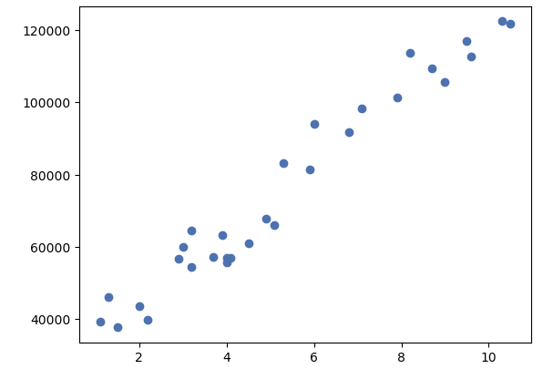

# Makine Öğrenmesi

Computer Vision: Bilgisayarların fotoğraf veya videolardan nesneleri tanıma ve takip etmelerini sağlayan bir kavram.

Denetimli Öğrenme;

- Regresyon
- Sınıflama

Denetimsiz Öğrenme;

- Kümeleme
- Boyut İndirgeme

Aşağıdaki kavramlar da ihtiyaç halinde öğrenilebilir. 

- Yarı-Denetimli Öğrenme
- Takviyeli Öğrenme

# Eğitim ve Test Verisi Ayırma

Genel olarak %80 veya %70 eğitim seti olacak şekilde ayırılır.

```Python
import pandas as pd
from sklearn.model_selection import train_test_split

veri=pd.read_excel("C:/Users/90506/Desktop/Ornek.xlsx")

y=veri["Y"]
X=veri[["X1", "X2"]]

X_train, X_test, y_train, y_test = train_test_split(X, y, test_size=0.2, random_state=42)
```

# Regresyon Model Başarısı

$R^2$ Bağımsız değişkenin bağımlı değişkeni ne kadar açıklayadığını gösterir. Düzeltilmiş $R^2$ ise birden çok bağımsız değişken olduğunda kullanılır. 

Başarı değerlendirmesinde kullanılan yapılar;

## Mean Square Error (MSE)

$$
MSE = \frac{1}{n} \sum_{i=1}^{n} e_i^2
$$

Hataların karesi alındığı için aykırı değerlerin tespiti kolaylaşır.

## Root Mean Square Error (RMSE)

$$
RMSE = \sqrt{\frac{1}{n} \sum_{i=1}^{n} e_i^2}
$$

Hataların nasıl bir dağılım gösterdiğine dair bilgi verir.

## Mean Absolute Error (MAE)

$$
MAE = \frac{1}{n} \sum_{i=1}^{n} |e_i|
$$

Kare olmadığı için uçdeğerler hakkında sapmalı bir sonuç çıkarmayacaktır. Sadece mesafe bazında ölçüm yapacaktır.

## Örnekler

```Python
import pandas as pd
import statsmodels.api as sm

veri=pd.read_excel("C:/Users/90506/Desktop/Ornek.xlsx")

y=veri ["Y"]
X=veri [["X1", "X2"]]

sabit=sm.add_constant(X)
model=sm.OLS(y, sabit).fit()

print(model.summary())

# OLS Regression Results
# ==============================================================================
# Dep. Variable:                      Y   R-squared:                       0.002
# Model:                            OLS   Adj. R-squared:                 -0.000
# Method:                 Least Squares   F-statistic:                    0.8301
# Date:                Wed, 17 Aug 2022   Prob (F-statistic):              0.436
# Time:                        13:48:23   Log-Likelihood:               -6182.7
# No. Observations:                 1000   AIC:                        1.237e+04
# Df Residuals:                      997   BIC:                        1.239e+04
# Df Model:                           2   Covariance Type:             nonrobust
# ==============================================================================
#                    coef    std err          t      P>|t|      [0.025   0.975]
# ---------------------------------------------------------------------
# const          294.6826     13.597     21.672      0.000     268.000    321.365
# X1               0.0326      0.032      1.018      0.309      -0.030     0.096
# X2              -0.0272      0.032     -0.843      0.399      -0.091     0.036
# ==============================================================================
# Omnibus:          996.319                Durbin-Watson:                  2.071
# Prob(Omnibus):      0.000                Jarque-Bera (JB):              63.904
# Skew:               0.045                Prob(JB):                    1.33e-14
# Kurtosis:           1.765                Cond. No.                    1.59e+03
# ==============================================================================

from sklearn.metrics import mean_squared_error, mean_squared_error

mse=mean_squared_error(y, tahmin)
rmse=mean_squared_error (y, tahmin, squared=False)
mae=mean_absolute_error(y, tahmin)
```

# Hata Matrisi (Confusion matrix)

|               | Tahmin Doğru   | Tahmin Yanlış   |
| ------------- | :------------: | :-------------: |
| Gerçek Doğru  |  TP            | FN              |
| Gerçek Yanlış |  FP            | TN              |

Bu yapı üzerinden bazı performans değerleri hesaplanır;

1. Doğruluk (Accuracy): Yüzde kaç doğru tahmin ettiğini gösterir (TP + TN) / Toplam
1. Hata Oranı: Yüzde kaç hatalı tahmin ettiğini gösterir (FP + FN) / Toplam
1. Kesinlik (Precision): Yüzde kaç hatalı tahmin ettiğini gösterir TP / (TP + FP)
1. Duyarlılık (Recall): Modelin yüzde kaç oranla yanlış tahmin ettiğini verir TP / (TP + FN)

> Burada yanlış olan bir değeri doğru olarak tahmin etmemiz riskliyse kesinlik, doğru bir değere yanlış denilmesi riskliyse duyarlılık a bakılır.

F1 score bize hme kesinlik hem de duyarlılık üzerinden işlem gerçekleştiriyor ve bize kesinlik ve duyarlılık değerlerinin harmonik ortalamasını verir.

$$
\text{Harmonik ortalama} = \frac{n}{\frac{1}{x_1}+\frac{1}{x_2}+ \cdot\cdot\cdot\frac{1}{x_k}}
$$

$$
\text{F1 score} = \frac{2}{\frac{1}{\text{Kesinlik}}+\frac{1}{\text{Duyarlılık}}}
$$

Ek olarak ROC eğrisi bize True pozitif ve false pozitif oranlarını kıyaslamamıza izin veren bir eğri grafiğidir.

# Basit Doğrusal Regresyon

```Python
import pandas as pd 

data = pd.DataFrame(
    {

        "YearsExperience":[1.1, 1.3, 1.5, 2.0, 2.2, 2.9, 3.0, 3.2, 3.2, 3.7, 3.9, 4.0, 4.0, 4.1, 4.5, 4.9, 5.1, 5.3, 5.9, 6.0, 6.8, 7.1, 7.9, 8.2, 8.7, 9.0, 9.5, 9.6, 10.3, 10.5],
        "Salary":[39343.00, 46205.00, 37731.00, 43525.00, 39891.00, 56642.00, 60150.00, 54445.00, 64445.00, 57189.00, 63218.00, 55794.00, 56957.00, 57081.00, 61111.00, 67938.00, 66029.00, 83088.00, 81363.00, 93940.00, 91738.00, 98273.00, 101302.00, 113812.00, 109431.00, 105582.00, 116969.00, 112635.00, 122391.00, 121872.00]

    }
)

veri = data.copy()

print(veri.isnull().sum())

# YearsExperience    0
# Salary             0
# dtype: int64

import matplotlib.pyplot as plt

y=veri ["Salary"]
X=veri ["YearsExperience"]

plt.scatter(X,y)
plt.show()

```


```Python
import statsmodels.api as sm

sabit=sm.add_constant(X)
model=sm.OLS(y, sabit).fit()

print(model.summary())

#                             OLS Regression Results                            
# ==============================================================================
# Dep. Variable:                 Salary   R-squared:                       0.957
# Model:                            OLS   Adj. R-squared:                  0.955
# Method:                 Least Squares   F-statistic:                     622.5
# Date:                Wed, 27 Aug 2025   Prob (F-statistic):           1.14e-20
# Time:                        09:49:28   Log-Likelihood:                -301.44
# No. Observations:                  30   AIC:                             606.9
# Df Residuals:                      28   BIC:                             609.7
# Df Model:                           1                                         
# Covariance Type:            nonrobust                                         
# ===================================================================================
#                       coef    std err          t      P>|t|      [0.025      0.975]
# -----------------------------------------------------------------------------------
# const            2.579e+04   2273.053     11.347      0.000    2.11e+04    3.04e+04
# YearsExperience  9449.9623    378.755     24.950      0.000    8674.119    1.02e+04
# ==============================================================================
# Omnibus:                        2.140   Durbin-Watson:                   1.648
# Prob(Omnibus):                  0.343   Jarque-Bera (JB):                1.569
# Skew:                           0.363   Prob(JB):                        0.456
# Kurtosis:                       2.147   Cond. No.                         13.2
# ==============================================================================

# Notes:
# [1] Standard Errors assume that the covariance matrix of the errors is correctly specified.
```

P>|t| kısmına bakıldığında sabit ve değişken katsayısı anlamlı çıkmıştır. Prob (F-statistic) kısmı incelendiğinde model anlamlı çıkmıştır. R-squared 0,957 ile gayet uyumlu gözükmektedir.


# 



https://www.youtube.com/watch?v=ZD5A-XLDiKY&list=PLK8LlaNiWQOuTQisICOV6kAL4uoerdFs7&index=14