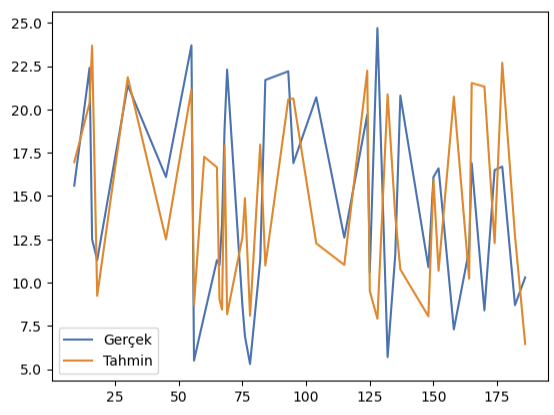

# Makine Öğrenmesi

Computer Vision: Bilgisayarların fotoğraf veya videolardan nesneleri tanıma ve takip etmelerini sağlayan bir kavram.

Denetimli Öğrenme;

- Regresyon
- Sınıflama

Denetimsiz Öğrenme;

- Kümeleme
- Boyut İndirgeme

Aşağıdaki kavramlar da ihtiyaç halinde öğrenilebilir. 

- Yarı-Denetimli Öğrenme
- Takviyeli Öğrenme

# Eğitim ve Test Verisi Ayırma

Genel olarak %80 veya %70 eğitim seti olacak şekilde ayırılır.

```Python
import pandas as pd
from sklearn.model_selection import train_test_split

veri=pd.read_excel("C:/Users/90506/Desktop/Ornek.xlsx")

y=veri["Y"]
X=veri[["X1", "X2"]]

X_train, X_test, y_train, y_test = train_test_split(X, y, test_size=0.2, random_state=42)
```

# Regresyon Model Başarısı

$R^2$ Bağımsız değişkenin bağımlı değişkeni ne kadar açıklayadığını gösterir. Düzeltilmiş $R^2$ ise birden çok bağımsız değişken olduğunda kullanılır. 

Başarı değerlendirmesinde kullanılan yapılar;

## Mean Square Error (MSE)

$$
MSE = \frac{1}{n} \sum_{i=1}^{n} e_i^2
$$

Hataların karesi alındığı için aykırı değerlerin tespiti kolaylaşır.

## Root Mean Square Error (RMSE)

$$
RMSE = \sqrt{\frac{1}{n} \sum_{i=1}^{n} e_i^2}
$$

Hataların nasıl bir dağılım gösterdiğine dair bilgi verir.

## Mean Absolute Error (MAE)

$$
MAE = \frac{1}{n} \sum_{i=1}^{n} |e_i|
$$

Kare olmadığı için uçdeğerler hakkında sapmalı bir sonuç çıkarmayacaktır. Sadece mesafe bazında ölçüm yapacaktır.

## Örnekler

```Python
import pandas as pd
import statsmodels.api as sm

veri=pd.read_excel("C:/Users/90506/Desktop/Ornek.xlsx")

y=veri ["Y"]
X=veri [["X1", "X2"]]

sabit=sm.add_constant(X)
model=sm.OLS(y, sabit).fit()

print(model.summary())

# OLS Regression Results
# ==============================================================================
# Dep. Variable:                      Y   R-squared:                       0.002
# Model:                            OLS   Adj. R-squared:                 -0.000
# Method:                 Least Squares   F-statistic:                    0.8301
# Date:                Wed, 17 Aug 2022   Prob (F-statistic):              0.436
# Time:                        13:48:23   Log-Likelihood:               -6182.7
# No. Observations:                 1000   AIC:                        1.237e+04
# Df Residuals:                      997   BIC:                        1.239e+04
# Df Model:                           2   Covariance Type:             nonrobust
# ==============================================================================
#                    coef    std err          t      P>|t|      [0.025   0.975]
# ---------------------------------------------------------------------
# const          294.6826     13.597     21.672      0.000     268.000    321.365
# X1               0.0326      0.032      1.018      0.309      -0.030     0.096
# X2              -0.0272      0.032     -0.843      0.399      -0.091     0.036
# ==============================================================================
# Omnibus:          996.319                Durbin-Watson:                  2.071
# Prob(Omnibus):      0.000                Jarque-Bera (JB):              63.904
# Skew:               0.045                Prob(JB):                    1.33e-14
# Kurtosis:           1.765                Cond. No.                    1.59e+03
# ==============================================================================

from sklearn.metrics import mean_squared_error, mean_squared_error

mse=mean_squared_error(y, tahmin)
rmse=mean_squared_error (y, tahmin, squared=False)
mae=mean_absolute_error(y, tahmin)
```

# Hata Matrisi (Confusion matrix)

|               | Tahmin Doğru   | Tahmin Yanlış   |
| ------------- | :------------: | :-------------: |
| Gerçek Doğru  |  TP            | FN              |
| Gerçek Yanlış |  FP            | TN              |

Bu yapı üzerinden bazı performans değerleri hesaplanır;

1. Doğruluk (Accuracy): Yüzde kaç doğru tahmin ettiğini gösterir (TP + TN) / Toplam
1. Hata Oranı: Yüzde kaç hatalı tahmin ettiğini gösterir (FP + FN) / Toplam
1. Kesinlik (Precision): Yüzde kaç hatalı tahmin ettiğini gösterir TP / (TP + FP)
1. Duyarlılık (Recall): Modelin yüzde kaç oranla yanlış tahmin ettiğini verir TP / (TP + FN)

> Burada yanlış olan bir değeri doğru olarak tahmin etmemiz riskliyse kesinlik, doğru bir değere yanlış denilmesi riskliyse duyarlılık a bakılır.

F1 score bize hme kesinlik hem de duyarlılık üzerinden işlem gerçekleştiriyor ve bize kesinlik ve duyarlılık değerlerinin harmonik ortalamasını verir.

$$
\text{Harmonik ortalama} = \frac{n}{\frac{1}{x_1}+\frac{1}{x_2}+ \cdot\cdot\cdot\frac{1}{x_k}}
$$

$$
\text{F1 score} = \frac{2}{\frac{1}{\text{Kesinlik}}+\frac{1}{\text{Duyarlılık}}}
$$

Ek olarak ROC eğrisi bize True pozitif ve false pozitif oranlarını kıyaslamamıza izin veren bir eğri grafiğidir.

# Basit Doğrusal Regresyon

$$
\hat{y} = \beta_0 + \beta_1 \cdot x + \epsilon
$$

```Python
import pandas as pd 

data = pd.DataFrame(
    {

        "YearsExperience":[1.1, 1.3, 1.5, 2.0, 2.2, 2.9, 3.0, 3.2, 3.2, 3.7, 3.9, 4.0, 4.0, 4.1, 4.5, 4.9, 5.1, 5.3, 5.9, 6.0, 6.8, 7.1, 7.9, 8.2, 8.7, 9.0, 9.5, 9.6, 10.3, 10.5],
        "Salary":[39343.00, 46205.00, 37731.00, 43525.00, 39891.00, 56642.00, 60150.00, 54445.00, 64445.00, 57189.00, 63218.00, 55794.00, 56957.00, 57081.00, 61111.00, 67938.00, 66029.00, 83088.00, 81363.00, 93940.00, 91738.00, 98273.00, 101302.00, 113812.00, 109431.00, 105582.00, 116969.00, 112635.00, 122391.00, 121872.00]

    }
)

veri = data.copy()

print(veri.isnull().sum())

# YearsExperience    0
# Salary             0
# dtype: int64

import matplotlib.pyplot as plt

y=veri ["Salary"]
X=veri ["YearsExperience"]

plt.scatter(X,y)
plt.show()

```


```Python
import statsmodels.api as sm

sabit=sm.add_constant(X)
model=sm.OLS(y, sabit).fit()

print(model.summary())

#                             OLS Regression Results                            
# ==============================================================================
# Dep. Variable:                 Salary   R-squared:                       0.957
# Model:                            OLS   Adj. R-squared:                  0.955
# Method:                 Least Squares   F-statistic:                     622.5
# Date:                Wed, 27 Aug 2025   Prob (F-statistic):           1.14e-20
# Time:                        09:49:28   Log-Likelihood:                -301.44
# No. Observations:                  30   AIC:                             606.9
# Df Residuals:                      28   BIC:                             609.7
# Df Model:                           1                                         
# Covariance Type:            nonrobust                                         
# ===================================================================================
#                       coef    std err          t      P>|t|      [0.025      0.975]
# -----------------------------------------------------------------------------------
# const            2.579e+04   2273.053     11.347      0.000    2.11e+04    3.04e+04
# YearsExperience  9449.9623    378.755     24.950      0.000    8674.119    1.02e+04
# ==============================================================================
# Omnibus:                        2.140   Durbin-Watson:                   1.648
# Prob(Omnibus):                  0.343   Jarque-Bera (JB):                1.569
# Skew:                           0.363   Prob(JB):                        0.456
# Kurtosis:                       2.147   Cond. No.                         13.2
# ==============================================================================

# Notes:
# [1] Standard Errors assume that the covariance matrix of the errors is correctly specified.
```

P>|t| kısmına bakıldığında sabit ve değişken katsayısı anlamlı çıkmıştır. Prob (F-statistic) kısmı incelendiğinde model anlamlı çıkmıştır. R-squared 0,957 ile gayet uyumlu gözükmektedir.

Sklearn ile model oluşturalım;

```Python
from sklearn.linear_model import LinearRegression

lr=LinearRegression()
lr.fit(X.values.reshape(-1,1), y.values.reshape(-1,1)) # .values.reshape(-1,1) array olması gerektiği için yapıldı.
print(lr.coef_, lr.intercept_) # [[9449.96232146]] [25792.20019867]

print(lr.predict(X.values.reshape(-1,1)))

# [[ 36187.15875227]
#  [ 38077.15121656]
#  [ 39967.14368085]
#  [ 44692.12484158]
#  [ 46582.11730587]
#  [ 53197.09093089]
#  [ 54142.08716303]
#  [ 56032.07962732]
#  [ 56032.07962732]
#  [ 60757.06078805]
#  [ 62647.05325234]
#  [ 63592.04948449]
#  [ 63592.04948449]
#  [ 64537.04571663]
#  [ 68317.03064522]
#  [ 72097.0155738 ]
#  [ 73987.00803809]
#  [ 75877.00050238]
#  [ 81546.97789525]
#  [ 82491.9741274 ]
#  [ 90051.94398456]
#  [ 92886.932681  ]
#  [100446.90253816]
#  [103281.8912346 ]
#  [108006.87239533]
#  [110841.86109176]
#  [115566.84225249]
#  [116511.83848464]
#  [123126.81210966]
#  [125016.80457395]]
```

# Çoklu Doğrusal Regresyon

$$
\hat{y} = \beta_0 + \beta_1 \cdot x_1 + \beta_2 \cdot x_2 + \cdot\cdot\cdot + \beta_k \cdot x_k + \epsilon
$$

```Python
import pandas as pd 

data = pd.DataFrame(
    {

        "TV":[230.1, 44.5, 17.2, 151.5, 180.8, 8.7, 57.5, 120.2, 8.6, 199.8, 66.1, 214.7, 23.8, 97.5, 204.1, 195.4, 67.8, 281.4, 69.2, 147.3, 218.4, 237.4, 13.2, 228.3, 62.3, 262.9, 142.9, 240.1, 248.8, 70.6, 292.9, 112.9, 97.2, 265.6, 95.7, 290.7, 266.9, 74.7, 43.1, 228, 202.5, 177, 293.6, 206.9, 25.1, 175.1, 89.7, 239.9, 227.2, 66.9, 199.8, 100.4, 216.4, 182.6, 262.7, 198.9, 7.3, 136.2, 210.8, 210.7, 53.5, 261.3, 239.3, 102.7, 131.1, 69, 31.5, 139.3, 237.4, 216.8, 199.1, 109.8, 26.8, 129.4, 213.4, 16.9, 27.5, 120.5, 5.4, 116, 76.4, 239.8, 75.3, 68.4, 213.5, 193.2, 76.3, 110.7, 88.3, 109.8, 134.3, 28.6, 217.7, 250.9, 107.4, 163.3, 197.6, 184.9, 289.7, 135.2, 222.4, 296.4, 280.2, 187.9, 238.2, 137.9, 25, 90.4, 13.1, 255.4, 225.8, 241.7, 175.7, 209.6, 78.2, 75.1, 139.2, 76.4, 125.7, 19.4, 141.3, 18.8, 224, 123.1, 229.5, 87.2, 7.8, 80.2, 220.3, 59.6, 0.7, 265.2, 8.4, 219.8, 36.9, 48.3, 25.6, 273.7, 43, 184.9, 73.4, 193.7, 220.5, 104.6, 96.2, 140.3, 240.1, 243.2, 38, 44.7, 280.7, 121, 197.6, 171.3, 187.8, 4.1, 93.9, 149.8, 11.7, 131.7, 172.5, 85.7, 188.4, 163.5, 117.2, 234.5, 17.9, 206.8, 215.4, 284.3, 50, 164.5, 19.6, 168.4, 222.4, 276.9, 248.4, 170.2, 276.7, 165.6, 156.6, 218.5, 56.2, 287.6, 253.8, 205, 139.5, 191.1, 286, 18.7, 39.5, 75.5, 17.2, 166.8, 149.7, 38.2, 94.2, 177, 283.6, 232.1],
        "Radio":[37.8, 39.3, 45.9, 41.3, 10.8, 48.9, 32.8, 19.6, 2.1, 2.6, 5.8, 24, 35.1, 7.6, 32.9, 47.7, 36.6, 39.6, 20.5, 23.9, 27.7, 5.1, 15.9, 16.9, 12.6, 3.5, 29.3, 16.7, 27.1, 16, 28.3, 17.4, 1.5, 20, 1.4, 4.1, 43.8, 49.4, 26.7, 37.7, 22.3, 33.4, 27.7, 8.4, 25.7, 22.5, 9.9, 41.5, 15.8, 11.7, 3.1, 9.6, 41.7, 46.2, 28.8, 49.4, 28.1, 19.2, 49.6, 29.5, 2, 42.7, 15.5, 29.6, 42.8, 9.3, 24.6, 14.5, 27.5, 43.9, 30.6, 14.3, 33, 5.7, 24.6, 43.7, 1.6, 28.5, 29.9, 7.7, 26.7, 4.1, 20.3, 44.5, 43, 18.4, 27.5, 40.6, 25.5, 47.8, 4.9, 1.5, 33.5, 36.5, 14, 31.6, 3.5, 21, 42.3, 41.7, 4.3, 36.3, 10.1, 17.2, 34.3, 46.4, 11, 0.3, 0.4, 26.9, 8.2, 38, 15.4, 20.6, 46.8, 35, 14.3, 0.8, 36.9, 16, 26.8, 21.7, 2.4, 34.6, 32.3, 11.8, 38.9, 0, 49, 12, 39.6, 2.9, 27.2, 33.5, 38.6, 47, 39, 28.9, 25.9, 43.9, 17, 35.4, 33.2, 5.7, 14.8, 1.9, 7.3, 49, 40.3, 25.8, 13.9, 8.4, 23.3, 39.7, 21.1, 11.6, 43.5, 1.3, 36.9, 18.4, 18.1, 35.8, 18.1, 36.8, 14.7, 3.4, 37.6, 5.2, 23.6, 10.6, 11.6, 20.9, 20.1, 7.1, 3.4, 48.9, 30.2, 7.8, 2.3, 10, 2.6, 5.4, 5.7, 43, 21.3, 45.1, 2.1, 28.7, 13.9, 12.1, 41.1, 10.8, 4.1, 42, 35.6, 3.7, 4.9, 9.3, 42, 8.6],
        "Newspaper":[69.2, 45.1, 69.3, 58.5, 58.4, 75, 23.5, 11.6, 1, 21.2, 24.2, 4, 65.9, 7.2, 46, 52.9, 114, 55.8, 18.3, 19.1, 53.4, 23.5, 49.6, 26.2, 18.3, 19.5, 12.6, 22.9, 22.9, 40.8, 43.2, 38.6, 30, 0.3, 7.4, 8.5, 5, 45.7, 35.1, 32, 31.6, 38.7, 1.8, 26.4, 43.3, 31.5, 35.7, 18.5, 49.9, 36.8, 34.6, 3.6, 39.6, 58.7, 15.9, 60, 41.4, 16.6, 37.7, 9.3, 21.4, 54.7, 27.3, 8.4, 28.9, 0.9, 2.2, 10.2, 11, 27.2, 38.7, 31.7, 19.3, 31.3, 13.1, 89.4, 20.7, 14.2, 9.4, 23.1, 22.3, 36.9, 32.5, 35.6, 33.8, 65.7, 16, 63.2, 73.4, 51.4, 9.3, 33, 59, 72.3, 10.9, 52.9, 5.9, 22, 51.2, 45.9, 49.8, 100.9, 21.4, 17.9, 5.3, 59, 29.7, 23.2, 25.6, 5.5, 56.5, 23.2, 2.4, 10.7, 34.5, 52.7, 25.6, 14.8, 79.2, 22.3, 46.2, 50.4, 15.6, 12.4, 74.2, 25.9, 50.6, 9.2, 3.2, 43.1, 8.7, 43, 2.1, 45.1, 65.6, 8.5, 9.3, 59.7, 20.5, 1.7, 12.9, 75.6, 37.9, 34.4, 38.9, 9, 8.7, 44.3, 11.9, 20.6, 37, 48.7, 14.2, 37.7, 9.5, 5.7, 50.5, 24.3, 45.2, 34.6, 30.7, 49.3, 25.6, 7.4, 5.4, 84.8, 21.6, 19.4, 57.6, 6.4, 18.4, 47.4, 17, 12.8, 13.1, 41.8, 20.3, 35.2, 23.7, 17.6, 8.3, 27.4, 29.7, 71.8, 30, 19.6, 26.6, 18.2, 3.7, 23.4, 5.8, 6, 31.6, 3.6, 6, 13.8, 8.1, 6.4, 66.2, 8.7],
        "Sales":[22.1, 10.4, 12, 16.5, 17.9, 7.2, 11.8, 13.2, 4.8, 15.6, 12.6, 17.4, 9.2, 13.7, 19, 22.4, 12.5, 24.4, 11.3, 14.6, 18, 17.5, 5.6, 20.5, 9.7, 17, 15, 20.9, 18.9, 10.5, 21.4, 11.9, 13.2, 17.4, 11.9, 17.8, 25.4, 14.7, 10.1, 21.5, 16.6, 17.1, 20.7, 17.9, 8.5, 16.1, 10.6, 23.2, 19.8, 9.7, 16.4, 10.7, 22.6, 21.2, 20.2, 23.7, 5.5, 13.2, 23.8, 18.4, 8.1, 24.2, 20.7, 14, 16, 11.3, 11, 13.4, 18.9, 22.3, 18.3, 12.4, 8.8, 11, 17, 8.7, 6.9, 14.2, 5.3, 11, 11.8, 17.3, 11.3, 13.6, 21.7, 20.2, 12, 16, 12.9, 16.7, 14, 7.3, 19.4, 22.2, 11.5, 16.9, 16.7, 20.5, 25.4, 17.2, 16.7, 23.8, 19.8, 19.7, 20.7, 15, 7.2, 12, 5.3, 19.8, 18.4, 21.8, 17.1, 20.9, 14.6, 12.6, 12.2, 9.4, 15.9, 6.6, 15.5, 7, 16.6, 15.2, 19.7, 10.6, 6.6, 11.9, 24.7, 9.7, 1.6, 17.7, 5.7, 19.6, 10.8, 11.6, 9.5, 20.8, 9.6, 20.7, 10.9, 19.2, 20.1, 10.4, 12.3, 10.3, 18.2, 25.4, 10.9, 10.1, 16.1, 11.6, 16.6, 16, 20.6, 3.2, 15.3, 10.1, 7.3, 12.9, 16.4, 13.3, 19.9, 18, 11.9, 16.9, 8, 17.2, 17.1, 20, 8.4, 17.5, 7.6, 16.7, 16.5, 27, 20.2, 16.7, 16.8, 17.6, 15.5, 17.2, 8.7, 26.2, 17.6, 22.6, 10.3, 17.3, 20.9, 6.7, 10.8, 11.9, 5.9, 19.6, 17.3, 7.6, 14, 14.8, 25.5, 18.4]
  
    }
)

veri=data.copy()

print(veri.corr()["Sales"])

# TV           0.901208
# Radio        0.349631
# Newspaper    0.157960
# Sales        1.000000

import matplotlib.pyplot as plt
import seaborn as sns

sns.pairplot(veri, kind="reg")
plt.show()
```

 

- TV düşündüğümüz gibi çok iyi bir ilişki sergiliyor.
- Radio iyi bir ilişki sergiliyor ama TV kadar iyi değil.
- Newspaper iyi bir ilişki sergilemiyor.

```Python
sns.boxplot(veri["TV"])
plt.show()
```

 

```Python
sns.boxplot(veri["Radio"])
plt.show()
```


```Python
sns.boxplot(veri["Newspaper"])
plt.show()
```

 

TV ve Radio'da uç değer yokken Newspaper değişkeninde bulunmaktadır. Baskılama işlemi yapalım;

```Python
Q1=veri ["Newspaper"].quantile(0.25)
Q3=veri["Newspaper"].quantile(0.75)
IQR=Q3-Q1
ustsınır=Q3+1.5*IQR
aykırı = veri["Newspaper"]>ustsınır

veri.loc[aykırı, "Newspaper"]=ustsınır
sns.boxplot(veri["Newspaper"])
plt.show()
```


```Python
import statsmodels.api as sm

y=veri ["Sales"]
X=veri [["TV", "Radio", "Newspaper"]]

sabit=sm.add_constant(X)
model=sm.OLS(y, sabit).fit()
print(model.summary())

#                             OLS Regression Results                            
# ==============================================================================
# Dep. Variable:                  Sales   R-squared:                       0.903
# Model:                            OLS   Adj. R-squared:                  0.901
# Method:                 Least Squares   F-statistic:                     605.4
# Date:                Wed, 27 Aug 2025   Prob (F-statistic):           8.13e-99
# Time:                        11:59:52   Log-Likelihood:                -383.33
# No. Observations:                 200   AIC:                             774.7
# Df Residuals:                     196   BIC:                             787.9
# Df Model:                           3                                         
# Covariance Type:            nonrobust                                         
# ==============================================================================
#                  coef    std err          t      P>|t|      [0.025      0.975]
# ------------------------------------------------------------------------------
# const          4.6246      0.308     15.004      0.000       4.017       5.232
# TV             0.0544      0.001     39.587      0.000       0.052       0.057
# Radio          0.1070      0.008     12.594      0.000       0.090       0.124
# Newspaper      0.0004      0.006      0.062      0.951      -0.011       0.012
# ==============================================================================
# Omnibus:                       16.072   Durbin-Watson:                   2.250
# Prob(Omnibus):                  0.000   Jarque-Bera (JB):               27.634
# Skew:                          -0.431   Prob(JB):                     9.99e-07
# Kurtosis:                       4.604   Cond. No.                         455.
# ==============================================================================

# Notes:
# [1] Standard Errors assume that the covariance matrix of the errors is correctly specified.

import statsmodels.api as sm

y=veri ["Sales"]
X=veri [["TV", "Radio"]]

sabit=sm.add_constant(X)
model=sm.OLS(y, sabit).fit()
print(model.summary())

#                             OLS Regression Results                             
# ==============================================================================
# Dep. Variable:                  Sales   R-squared:                       0.903
# Model:                            OLS   Adj. R-squared:                  0.902
# Method:                 Least Squares   F-statistic:                     912.7
# Date:                Wed, 27 Aug 2025   Prob (F-statistic):          2.39e-100
# Time:                        12:01:06   Log-Likelihood:                -383.34
# No. Observations:                 200   AIC:                             772.7
# Df Residuals:                     197   BIC:                             782.6
# Df Model:                           2                                         
# Covariance Type:            nonrobust                                         
# ==============================================================================
#                  coef    std err          t      P>|t|      [0.025      0.975]
# ------------------------------------------------------------------------------
# const          4.6309      0.290     15.952      0.000       4.058       5.203
# TV             0.0544      0.001     39.726      0.000       0.052       0.057
# Radio          0.1072      0.008     13.522      0.000       0.092       0.123
# ==============================================================================
# Omnibus:                       16.227   Durbin-Watson:                   2.252
# Prob(Omnibus):                  0.000   Jarque-Bera (JB):               27.973
# Skew:                          -0.434   Prob(JB):                     8.43e-07
# Kurtosis:                       4.613   Cond. No.                         425.
# ==============================================================================

# Notes:
# [1] Standard Errors assume that the covariance matrix of the errors is correctly specified.

from sklearn.model_selection import train_test_split

X_train, X_test,y_train,y_test=train_test_split(X, y, test_size=0.2, random_state=42)

from sklearn.linear_model import LinearRegression

lr=LinearRegression()
lr.fit(X_train, y_train)
print(lr.coef_) # [0.05450736 0.10325764]

tahmin=lr.predict(X_test)
y_test=y_test.sort_index()

df=pd.DataFrame({"Gerçek":y_test, "Tahmin": tahmin})
df.plot(kind="line")
plt.show()
```


```Python
tahmin=lr.predict(X_test)
y_test=y_test.sort_index() # düzenli gösterim için

df=pd.DataFrame({"Gerçek":y_test, "Tahmin": tahmin})
df.plot(kind="line")
plt.show()
```

 

Veride eksik değerler yok. Eğer nan değerleri olsaydı;

```Python
from sklearn.impute import SimpleImputer
import numpy as np

imputer=SimpleImputer (missing_values=np.nan, strategy="mean") # eksik değerler NaN olarak gözüktüğü için
imputer=imputer.fit(veri)
veri.iloc[:,:]=imputer.transform(veri)
```

```Python
import sklearn.metrics as mt

r2=mt.r2_score (y_test, tahmin)
mse=mt.mean_squared_error(y_test, tahmin)
rmse=np.sqrt(mse) # mt.mean_squared_error(y_test, tahmin, squared=False)
mae=mt.mean_absolute_error(y_test, tahmin)
print(r2, mse, rmse, mae) # -0.5917637530745343 49.18725091013148 7.013362311340509 5.448564072450313
```
## Kategorik değişkenler

```Python
import pandas as pd
import matplotlib.pyplot as plt
import seaborn as sns

data=sns.load_dataset("tips")
veri=data.copy()
print(veri)

# total_bill   tip   sex    smoker   day    time   size
# 16.99        1.01  Female No      Sun    Dinner 2
# 10.34        1.66  Male   No      Sun    Dinner 3
# 21.01        3.50  Male   No      Sun    Dinner 3
# 23.68        3.31  Male   No      Sun    Dinner 2
# 24.59        3.61  Female No      Sun    Dinner 4
# ...
# 29.03        5.92  Male   No      Sat    Dinner 3
# 27.18        2.00  Female Yes     Sat    Dinner 2
# 22.67        2.00  Male   Yes     Sat    Dinner 2
# 17.82        1.75  Male   No      Sat    Dinner 2
# 18.78        3.00  Female No      Thur   Dinner 2

```

# 


https://www.youtube.com/watch?v=ZD5A-XLDiKY&list=PLK8LlaNiWQOuTQisICOV6kAL4uoerdFs7&index=14