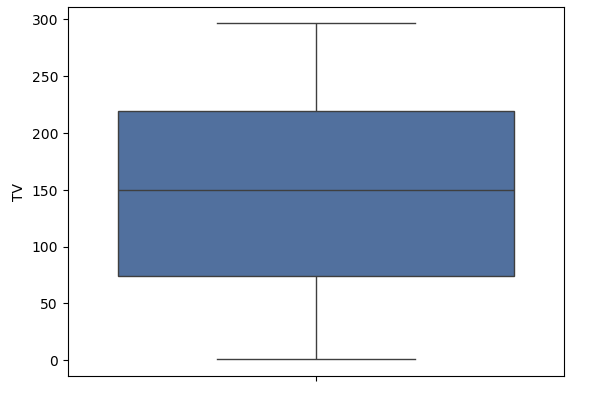
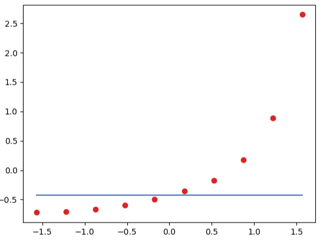
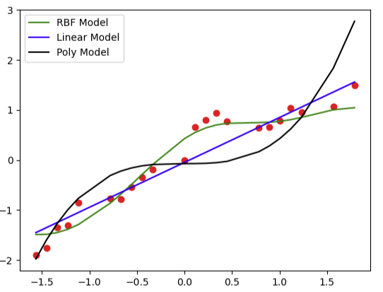
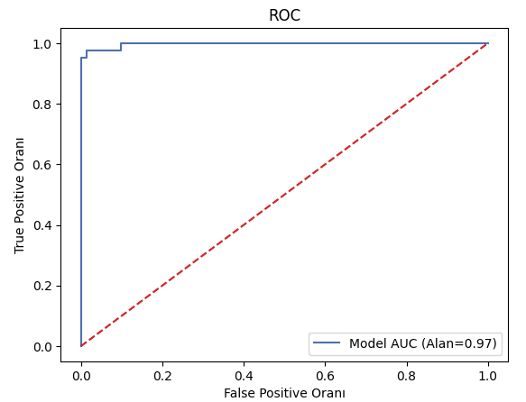
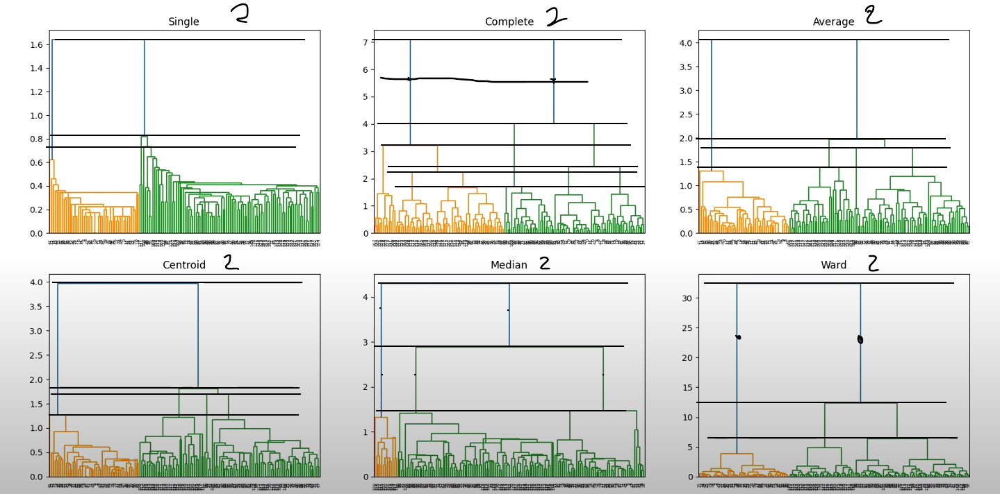
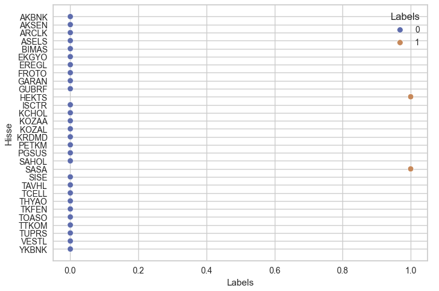
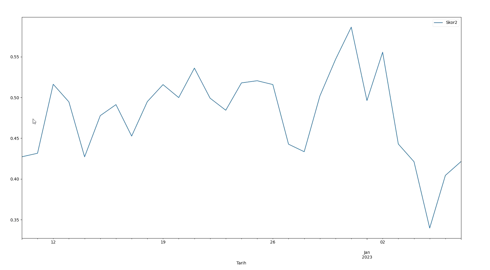

# Makine Öğrenmesi

Computer Vision: Bilgisayarların fotoğraf veya videolardan nesneleri tanıma ve takip etmelerini sağlayan bir kavram.

Denetimli Öğrenme;

- Regresyon
- Sınıflama

Denetimsiz Öğrenme;

- Kümeleme
- Boyut İndirgeme

Aşağıdaki kavramlar da ihtiyaç halinde öğrenilebilir. 

- Yarı-Denetimli Öğrenme
- Takviyeli Öğrenme

# Eğitim ve Test Verisi Ayırma

Genel olarak %80 veya %70 eğitim seti olacak şekilde ayırılır.

```Python
import pandas as pd
from sklearn.model_selection import train_test_split

veri=pd.read_excel("C:/Users/90506/Desktop/Ornek.xlsx")

y=veri["Y"]
X=veri[["X1", "X2"]]

X_train, X_test, y_train, y_test = train_test_split(X, y, test_size=0.2, random_state=42)
```

# Regresyon Model Başarısı

$R^2$ Bağımsız değişkenin bağımlı değişkeni ne kadar açıklayadığını gösterir. Düzeltilmiş $R^2$ ise birden çok bağımsız değişken olduğunda kullanılır. 

Başarı değerlendirmesinde kullanılan yapılar;

## Mean Square Error (MSE)

$$
MSE = \frac{1}{n} \sum_{i=1}^{n} e_i^2
$$

Hataların karesi alındığı için aykırı değerlerin tespiti kolaylaşır.

## Root Mean Square Error (RMSE)

$$
RMSE = \sqrt{\frac{1}{n} \sum_{i=1}^{n} e_i^2}
$$

Hataların nasıl bir dağılım gösterdiğine dair bilgi verir.

## Mean Absolute Error (MAE)

$$
MAE = \frac{1}{n} \sum_{i=1}^{n} |e_i|
$$

Kare olmadığı için uçdeğerler hakkında sapmalı bir sonuç çıkarmayacaktır. Sadece mesafe bazında ölçüm yapacaktır.

## Örnekler

```Python
import pandas as pd
import statsmodels.api as sm

veri=pd.read_excel("C:/Users/90506/Desktop/Ornek.xlsx")

y=veri ["Y"]
X=veri [["X1", "X2"]]

sabit=sm.add_constant(X)
model=sm.OLS(y, sabit).fit()

print(model.summary())

# OLS Regression Results
# ==============================================================================
# Dep. Variable:                      Y   R-squared:                       0.002
# Model:                            OLS   Adj. R-squared:                 -0.000
# Method:                 Least Squares   F-statistic:                    0.8301
# Date:                Wed, 17 Aug 2022   Prob (F-statistic):              0.436
# Time:                        13:48:23   Log-Likelihood:               -6182.7
# No. Observations:                 1000   AIC:                        1.237e+04
# Df Residuals:                      997   BIC:                        1.239e+04
# Df Model:                           2   Covariance Type:             nonrobust
# ==============================================================================
#                    coef    std err          t      P>|t|      [0.025   0.975]
# ---------------------------------------------------------------------
# const          294.6826     13.597     21.672      0.000     268.000    321.365
# X1               0.0326      0.032      1.018      0.309      -0.030     0.096
# X2              -0.0272      0.032     -0.843      0.399      -0.091     0.036
# ==============================================================================
# Omnibus:          996.319                Durbin-Watson:                  2.071
# Prob(Omnibus):      0.000                Jarque-Bera (JB):              63.904
# Skew:               0.045                Prob(JB):                    1.33e-14
# Kurtosis:           1.765                Cond. No.                    1.59e+03
# ==============================================================================

from sklearn.metrics import mean_squared_error

mse=mean_squared_error(y, tahmin)
rmse=mean_squared_error (y, tahmin, squared=False)
mae=mean_absolute_error(y, tahmin)
```

# Hata Matrisi (Confusion matrix)

|               | Tahmin Doğru   | Tahmin Yanlış   |
| ------------- | :------------: | :-------------: |
| Gerçek Doğru  |  TP            | FN              |
| Gerçek Yanlış |  FP            | TN              |

Bu yapı üzerinden bazı performans değerleri hesaplanır;

1. Doğruluk (Accuracy): Yüzde kaç doğru tahmin ettiğini gösterir (TP + TN) / Toplam
1. Hata Oranı: Yüzde kaç hatalı tahmin ettiğini gösterir (FP + FN) / Toplam
1. Kesinlik (Precision): Yüzde kaç hatalı tahmin ettiğini gösterir TP / (TP + FP)
1. Duyarlılık (Recall): Modelin yüzde kaç oranla yanlış tahmin ettiğini verir TP / (TP + FN)

> Burada yanlış olan bir değeri doğru olarak tahmin etmemiz riskliyse kesinlik, doğru bir değere yanlış denilmesi riskliyse duyarlılık a bakılır.

F1 score bize hme kesinlik hem de duyarlılık üzerinden işlem gerçekleştiriyor ve bize kesinlik ve duyarlılık değerlerinin harmonik ortalamasını verir.

$$
\text{Harmonik ortalama} = \frac{n}{\frac{1}{x_1}+\frac{1}{x_2}+ \cdot\cdot\cdot\frac{1}{x_k}}
$$

$$
\text{F1 score} = \frac{2}{\frac{1}{\text{Kesinlik}}+\frac{1}{\text{Duyarlılık}}}
$$

Ek olarak ROC eğrisi bize True pozitif ve false pozitif oranlarını kıyaslamamıza izin veren bir eğri grafiğidir.

# Basit Doğrusal Regresyon

$$
\hat{y} = \beta_0 + \beta_1 \cdot x + \epsilon
$$

```Python
import pandas as pd 

data = pd.DataFrame(
    {

        "YearsExperience":[1.1, 1.3, 1.5, 2.0, 2.2, 2.9, 3.0, 3.2, 3.2, 3.7, 3.9, 4.0, 4.0, 4.1, 4.5, 4.9, 5.1, 5.3, 5.9, 6.0, 6.8, 7.1, 7.9, 8.2, 8.7, 9.0, 9.5, 9.6, 10.3, 10.5],
        "Salary":[39343.00, 46205.00, 37731.00, 43525.00, 39891.00, 56642.00, 60150.00, 54445.00, 64445.00, 57189.00, 63218.00, 55794.00, 56957.00, 57081.00, 61111.00, 67938.00, 66029.00, 83088.00, 81363.00, 93940.00, 91738.00, 98273.00, 101302.00, 113812.00, 109431.00, 105582.00, 116969.00, 112635.00, 122391.00, 121872.00]

    }
)

veri = data.copy()

print(veri.isnull().sum())

# YearsExperience    0
# Salary             0
# dtype: int64

import matplotlib.pyplot as plt

y=veri ["Salary"]
X=veri ["YearsExperience"]

plt.scatter(X,y)
plt.show()

```


```Python
import statsmodels.api as sm

sabit=sm.add_constant(X)
model=sm.OLS(y, sabit).fit()

print(model.summary())

#                             OLS Regression Results                            
# ==============================================================================
# Dep. Variable:                 Salary   R-squared:                       0.957
# Model:                            OLS   Adj. R-squared:                  0.955
# Method:                 Least Squares   F-statistic:                     622.5
# Date:                Wed, 27 Aug 2025   Prob (F-statistic):           1.14e-20
# Time:                        09:49:28   Log-Likelihood:                -301.44
# No. Observations:                  30   AIC:                             606.9
# Df Residuals:                      28   BIC:                             609.7
# Df Model:                           1                                         
# Covariance Type:            nonrobust                                         
# ===================================================================================
#                       coef    std err          t      P>|t|      [0.025      0.975]
# -----------------------------------------------------------------------------------
# const            2.579e+04   2273.053     11.347      0.000    2.11e+04    3.04e+04
# YearsExperience  9449.9623    378.755     24.950      0.000    8674.119    1.02e+04
# ==============================================================================
# Omnibus:                        2.140   Durbin-Watson:                   1.648
# Prob(Omnibus):                  0.343   Jarque-Bera (JB):                1.569
# Skew:                           0.363   Prob(JB):                        0.456
# Kurtosis:                       2.147   Cond. No.                         13.2
# ==============================================================================

# Notes:
# [1] Standard Errors assume that the covariance matrix of the errors is correctly specified.
```

P>|t| kısmına bakıldığında sabit ve değişken katsayısı anlamlı çıkmıştır. Prob (F-statistic) kısmı incelendiğinde model anlamlı çıkmıştır. R-squared 0,957 ile gayet uyumlu gözükmektedir.

Sklearn ile model oluşturalım;

```Python
from sklearn.linear_model import LinearRegression

lr=LinearRegression()
lr.fit(X.values.reshape(-1,1), y.values.reshape(-1,1)) # .values.reshape(-1,1) array olması gerektiği için yapıldı.
print(lr.coef_, lr.intercept_) # [[9449.96232146]] [25792.20019867]

print(lr.predict(X.values.reshape(-1,1)))

# [[ 36187.15875227]
#  [ 38077.15121656]
#  [ 39967.14368085]
#  [ 44692.12484158]
#  [ 46582.11730587]
#  [ 53197.09093089]
#  [ 54142.08716303]
#  [ 56032.07962732]
#  [ 56032.07962732]
#  [ 60757.06078805]
#  [ 62647.05325234]
#  [ 63592.04948449]
#  [ 63592.04948449]
#  [ 64537.04571663]
#  [ 68317.03064522]
#  [ 72097.0155738 ]
#  [ 73987.00803809]
#  [ 75877.00050238]
#  [ 81546.97789525]
#  [ 82491.9741274 ]
#  [ 90051.94398456]
#  [ 92886.932681  ]
#  [100446.90253816]
#  [103281.8912346 ]
#  [108006.87239533]
#  [110841.86109176]
#  [115566.84225249]
#  [116511.83848464]
#  [123126.81210966]
#  [125016.80457395]]
```

# Çoklu Doğrusal Regresyon

$$
\hat{y} = \beta_0 + \beta_1 \cdot x_1 + \beta_2 \cdot x_2 + \cdot\cdot\cdot + \beta_k \cdot x_k + \epsilon
$$

```Python
import pandas as pd 

data = pd.DataFrame(
    {

        "TV":[230.1, 44.5, 17.2, 151.5, 180.8, 8.7, 57.5, 120.2, 8.6, 199.8, 66.1, 214.7, 23.8, 97.5, 204.1, 195.4, 67.8, 281.4, 69.2, 147.3, 218.4, 237.4, 13.2, 228.3, 62.3, 262.9, 142.9, 240.1, 248.8, 70.6, 292.9, 112.9, 97.2, 265.6, 95.7, 290.7, 266.9, 74.7, 43.1, 228, 202.5, 177, 293.6, 206.9, 25.1, 175.1, 89.7, 239.9, 227.2, 66.9, 199.8, 100.4, 216.4, 182.6, 262.7, 198.9, 7.3, 136.2, 210.8, 210.7, 53.5, 261.3, 239.3, 102.7, 131.1, 69, 31.5, 139.3, 237.4, 216.8, 199.1, 109.8, 26.8, 129.4, 213.4, 16.9, 27.5, 120.5, 5.4, 116, 76.4, 239.8, 75.3, 68.4, 213.5, 193.2, 76.3, 110.7, 88.3, 109.8, 134.3, 28.6, 217.7, 250.9, 107.4, 163.3, 197.6, 184.9, 289.7, 135.2, 222.4, 296.4, 280.2, 187.9, 238.2, 137.9, 25, 90.4, 13.1, 255.4, 225.8, 241.7, 175.7, 209.6, 78.2, 75.1, 139.2, 76.4, 125.7, 19.4, 141.3, 18.8, 224, 123.1, 229.5, 87.2, 7.8, 80.2, 220.3, 59.6, 0.7, 265.2, 8.4, 219.8, 36.9, 48.3, 25.6, 273.7, 43, 184.9, 73.4, 193.7, 220.5, 104.6, 96.2, 140.3, 240.1, 243.2, 38, 44.7, 280.7, 121, 197.6, 171.3, 187.8, 4.1, 93.9, 149.8, 11.7, 131.7, 172.5, 85.7, 188.4, 163.5, 117.2, 234.5, 17.9, 206.8, 215.4, 284.3, 50, 164.5, 19.6, 168.4, 222.4, 276.9, 248.4, 170.2, 276.7, 165.6, 156.6, 218.5, 56.2, 287.6, 253.8, 205, 139.5, 191.1, 286, 18.7, 39.5, 75.5, 17.2, 166.8, 149.7, 38.2, 94.2, 177, 283.6, 232.1],
        "Radio":[37.8, 39.3, 45.9, 41.3, 10.8, 48.9, 32.8, 19.6, 2.1, 2.6, 5.8, 24, 35.1, 7.6, 32.9, 47.7, 36.6, 39.6, 20.5, 23.9, 27.7, 5.1, 15.9, 16.9, 12.6, 3.5, 29.3, 16.7, 27.1, 16, 28.3, 17.4, 1.5, 20, 1.4, 4.1, 43.8, 49.4, 26.7, 37.7, 22.3, 33.4, 27.7, 8.4, 25.7, 22.5, 9.9, 41.5, 15.8, 11.7, 3.1, 9.6, 41.7, 46.2, 28.8, 49.4, 28.1, 19.2, 49.6, 29.5, 2, 42.7, 15.5, 29.6, 42.8, 9.3, 24.6, 14.5, 27.5, 43.9, 30.6, 14.3, 33, 5.7, 24.6, 43.7, 1.6, 28.5, 29.9, 7.7, 26.7, 4.1, 20.3, 44.5, 43, 18.4, 27.5, 40.6, 25.5, 47.8, 4.9, 1.5, 33.5, 36.5, 14, 31.6, 3.5, 21, 42.3, 41.7, 4.3, 36.3, 10.1, 17.2, 34.3, 46.4, 11, 0.3, 0.4, 26.9, 8.2, 38, 15.4, 20.6, 46.8, 35, 14.3, 0.8, 36.9, 16, 26.8, 21.7, 2.4, 34.6, 32.3, 11.8, 38.9, 0, 49, 12, 39.6, 2.9, 27.2, 33.5, 38.6, 47, 39, 28.9, 25.9, 43.9, 17, 35.4, 33.2, 5.7, 14.8, 1.9, 7.3, 49, 40.3, 25.8, 13.9, 8.4, 23.3, 39.7, 21.1, 11.6, 43.5, 1.3, 36.9, 18.4, 18.1, 35.8, 18.1, 36.8, 14.7, 3.4, 37.6, 5.2, 23.6, 10.6, 11.6, 20.9, 20.1, 7.1, 3.4, 48.9, 30.2, 7.8, 2.3, 10, 2.6, 5.4, 5.7, 43, 21.3, 45.1, 2.1, 28.7, 13.9, 12.1, 41.1, 10.8, 4.1, 42, 35.6, 3.7, 4.9, 9.3, 42, 8.6],
        "Newspaper":[69.2, 45.1, 69.3, 58.5, 58.4, 75, 23.5, 11.6, 1, 21.2, 24.2, 4, 65.9, 7.2, 46, 52.9, 114, 55.8, 18.3, 19.1, 53.4, 23.5, 49.6, 26.2, 18.3, 19.5, 12.6, 22.9, 22.9, 40.8, 43.2, 38.6, 30, 0.3, 7.4, 8.5, 5, 45.7, 35.1, 32, 31.6, 38.7, 1.8, 26.4, 43.3, 31.5, 35.7, 18.5, 49.9, 36.8, 34.6, 3.6, 39.6, 58.7, 15.9, 60, 41.4, 16.6, 37.7, 9.3, 21.4, 54.7, 27.3, 8.4, 28.9, 0.9, 2.2, 10.2, 11, 27.2, 38.7, 31.7, 19.3, 31.3, 13.1, 89.4, 20.7, 14.2, 9.4, 23.1, 22.3, 36.9, 32.5, 35.6, 33.8, 65.7, 16, 63.2, 73.4, 51.4, 9.3, 33, 59, 72.3, 10.9, 52.9, 5.9, 22, 51.2, 45.9, 49.8, 100.9, 21.4, 17.9, 5.3, 59, 29.7, 23.2, 25.6, 5.5, 56.5, 23.2, 2.4, 10.7, 34.5, 52.7, 25.6, 14.8, 79.2, 22.3, 46.2, 50.4, 15.6, 12.4, 74.2, 25.9, 50.6, 9.2, 3.2, 43.1, 8.7, 43, 2.1, 45.1, 65.6, 8.5, 9.3, 59.7, 20.5, 1.7, 12.9, 75.6, 37.9, 34.4, 38.9, 9, 8.7, 44.3, 11.9, 20.6, 37, 48.7, 14.2, 37.7, 9.5, 5.7, 50.5, 24.3, 45.2, 34.6, 30.7, 49.3, 25.6, 7.4, 5.4, 84.8, 21.6, 19.4, 57.6, 6.4, 18.4, 47.4, 17, 12.8, 13.1, 41.8, 20.3, 35.2, 23.7, 17.6, 8.3, 27.4, 29.7, 71.8, 30, 19.6, 26.6, 18.2, 3.7, 23.4, 5.8, 6, 31.6, 3.6, 6, 13.8, 8.1, 6.4, 66.2, 8.7],
        "Sales":[22.1, 10.4, 12, 16.5, 17.9, 7.2, 11.8, 13.2, 4.8, 15.6, 12.6, 17.4, 9.2, 13.7, 19, 22.4, 12.5, 24.4, 11.3, 14.6, 18, 17.5, 5.6, 20.5, 9.7, 17, 15, 20.9, 18.9, 10.5, 21.4, 11.9, 13.2, 17.4, 11.9, 17.8, 25.4, 14.7, 10.1, 21.5, 16.6, 17.1, 20.7, 17.9, 8.5, 16.1, 10.6, 23.2, 19.8, 9.7, 16.4, 10.7, 22.6, 21.2, 20.2, 23.7, 5.5, 13.2, 23.8, 18.4, 8.1, 24.2, 20.7, 14, 16, 11.3, 11, 13.4, 18.9, 22.3, 18.3, 12.4, 8.8, 11, 17, 8.7, 6.9, 14.2, 5.3, 11, 11.8, 17.3, 11.3, 13.6, 21.7, 20.2, 12, 16, 12.9, 16.7, 14, 7.3, 19.4, 22.2, 11.5, 16.9, 16.7, 20.5, 25.4, 17.2, 16.7, 23.8, 19.8, 19.7, 20.7, 15, 7.2, 12, 5.3, 19.8, 18.4, 21.8, 17.1, 20.9, 14.6, 12.6, 12.2, 9.4, 15.9, 6.6, 15.5, 7, 16.6, 15.2, 19.7, 10.6, 6.6, 11.9, 24.7, 9.7, 1.6, 17.7, 5.7, 19.6, 10.8, 11.6, 9.5, 20.8, 9.6, 20.7, 10.9, 19.2, 20.1, 10.4, 12.3, 10.3, 18.2, 25.4, 10.9, 10.1, 16.1, 11.6, 16.6, 16, 20.6, 3.2, 15.3, 10.1, 7.3, 12.9, 16.4, 13.3, 19.9, 18, 11.9, 16.9, 8, 17.2, 17.1, 20, 8.4, 17.5, 7.6, 16.7, 16.5, 27, 20.2, 16.7, 16.8, 17.6, 15.5, 17.2, 8.7, 26.2, 17.6, 22.6, 10.3, 17.3, 20.9, 6.7, 10.8, 11.9, 5.9, 19.6, 17.3, 7.6, 14, 14.8, 25.5, 18.4]
  
    }
)

veri=data.copy()

print(veri.corr()["Sales"])

# TV           0.901208
# Radio        0.349631
# Newspaper    0.157960
# Sales        1.000000

import matplotlib.pyplot as plt
import seaborn as sns

sns.pairplot(veri, kind="reg")
plt.show()
```

 

- TV düşündüğümüz gibi çok iyi bir ilişki sergiliyor.
- Radio iyi bir ilişki sergiliyor ama TV kadar iyi değil.
- Newspaper iyi bir ilişki sergilemiyor.

```Python
sns.boxplot(veri["TV"])
plt.show()
```

 

```Python
sns.boxplot(veri["Radio"])
plt.show()
```


```Python
sns.boxplot(veri["Newspaper"])
plt.show()
```

 

TV ve Radio'da uç değer yokken Newspaper değişkeninde bulunmaktadır. Baskılama işlemi yapalım;

```Python
Q1=veri ["Newspaper"].quantile(0.25)
Q3=veri["Newspaper"].quantile(0.75)
IQR=Q3-Q1
ustsınır=Q3+1.5*IQR
aykırı = veri["Newspaper"]>ustsınır

veri.loc[aykırı, "Newspaper"]=ustsınır
sns.boxplot(veri["Newspaper"])
plt.show()
```


```Python
import statsmodels.api as sm

y=veri ["Sales"]
X=veri [["TV", "Radio", "Newspaper"]]

sabit=sm.add_constant(X)
model=sm.OLS(y, sabit).fit()
print(model.summary())

#                             OLS Regression Results                            
# ==============================================================================
# Dep. Variable:                  Sales   R-squared:                       0.903
# Model:                            OLS   Adj. R-squared:                  0.901
# Method:                 Least Squares   F-statistic:                     605.4
# Date:                Wed, 27 Aug 2025   Prob (F-statistic):           8.13e-99
# Time:                        11:59:52   Log-Likelihood:                -383.33
# No. Observations:                 200   AIC:                             774.7
# Df Residuals:                     196   BIC:                             787.9
# Df Model:                           3                                         
# Covariance Type:            nonrobust                                         
# ==============================================================================
#                  coef    std err          t      P>|t|      [0.025      0.975]
# ------------------------------------------------------------------------------
# const          4.6246      0.308     15.004      0.000       4.017       5.232
# TV             0.0544      0.001     39.587      0.000       0.052       0.057
# Radio          0.1070      0.008     12.594      0.000       0.090       0.124
# Newspaper      0.0004      0.006      0.062      0.951      -0.011       0.012
# ==============================================================================
# Omnibus:                       16.072   Durbin-Watson:                   2.250
# Prob(Omnibus):                  0.000   Jarque-Bera (JB):               27.634
# Skew:                          -0.431   Prob(JB):                     9.99e-07
# Kurtosis:                       4.604   Cond. No.                         455.
# ==============================================================================

# Notes:
# [1] Standard Errors assume that the covariance matrix of the errors is correctly specified.

import statsmodels.api as sm

y=veri ["Sales"]
X=veri [["TV", "Radio"]]

sabit=sm.add_constant(X)
model=sm.OLS(y, sabit).fit()
print(model.summary())

#                             OLS Regression Results                             
# ==============================================================================
# Dep. Variable:                  Sales   R-squared:                       0.903
# Model:                            OLS   Adj. R-squared:                  0.902
# Method:                 Least Squares   F-statistic:                     912.7
# Date:                Wed, 27 Aug 2025   Prob (F-statistic):          2.39e-100
# Time:                        12:01:06   Log-Likelihood:                -383.34
# No. Observations:                 200   AIC:                             772.7
# Df Residuals:                     197   BIC:                             782.6
# Df Model:                           2                                         
# Covariance Type:            nonrobust                                         
# ==============================================================================
#                  coef    std err          t      P>|t|      [0.025      0.975]
# ------------------------------------------------------------------------------
# const          4.6309      0.290     15.952      0.000       4.058       5.203
# TV             0.0544      0.001     39.726      0.000       0.052       0.057
# Radio          0.1072      0.008     13.522      0.000       0.092       0.123
# ==============================================================================
# Omnibus:                       16.227   Durbin-Watson:                   2.252
# Prob(Omnibus):                  0.000   Jarque-Bera (JB):               27.973
# Skew:                          -0.434   Prob(JB):                     8.43e-07
# Kurtosis:                       4.613   Cond. No.                         425.
# ==============================================================================

# Notes:
# [1] Standard Errors assume that the covariance matrix of the errors is correctly specified.

from sklearn.model_selection import train_test_split

X_train, X_test,y_train,y_test=train_test_split(X, y, test_size=0.2, random_state=42)

from sklearn.linear_model import LinearRegression

lr=LinearRegression()
lr.fit(X_train, y_train)
print(lr.coef_) # [0.05450736 0.10325764]

tahmin=lr.predict(X_test)
y_test=y_test.sort_index()

df=pd.DataFrame({"Gerçek":y_test, "Tahmin": tahmin})
df.plot(kind="line")
plt.show()
```


```Python
tahmin=lr.predict(X_test)
y_test=y_test.sort_index() # düzenli gösterim için

df=pd.DataFrame({"Gerçek":y_test, "Tahmin": tahmin})
df.plot(kind="line")
plt.show()
```

 

Veride eksik değerler yok. Eğer nan değerleri olsaydı;

```Python
from sklearn.impute import SimpleImputer
import numpy as np

imputer=SimpleImputer (missing_values=np.nan, strategy="mean") # eksik değerler NaN olarak gözüktüğü için
imputer=imputer.fit(veri)
veri.iloc[:,:]=imputer.transform(veri)
```

```Python
import sklearn.metrics as mt

r2=mt.r2_score (y_test, tahmin)
mse=mt.mean_squared_error(y_test, tahmin)
rmse=np.sqrt(mse) # mt.mean_squared_error(y_test, tahmin, squared=False)
mae=mt.mean_absolute_error(y_test, tahmin)
print(r2, mse, rmse, mae) # -0.5917637530745343 49.18725091013148 7.013362311340509 5.448564072450313
```
## Kategorik değişkenler

```Python
import pandas as pd
import matplotlib.pyplot as plt
import seaborn as sns

data=sns.load_dataset("tips")
veri=data.copy()
print(veri)

# total_bill   tip   sex    smoker   day    time   size
# 16.99        1.01  Female No      Sun    Dinner 2
# 10.34        1.66  Male   No      Sun    Dinner 3
# 21.01        3.50  Male   No      Sun    Dinner 3
# 23.68        3.31  Male   No      Sun    Dinner 2
# 24.59        3.61  Female No      Sun    Dinner 4
# ...
# 29.03        5.92  Male   No      Sat    Dinner 3
# 27.18        2.00  Female Yes     Sat    Dinner 2
# 22.67        2.00  Male   Yes     Sat    Dinner 2
# 17.82        1.75  Male   No      Sat    Dinner 2
# 18.78        3.00  Female No      Thur   Dinner 2

print(veri.isnull().sum())

# total_bill   0
# tip          0
# sex          0
# smoker       0
# day          0
# time         0
# size         0
# dtype: int64

print(veri.dtypes)

# total_bill   float64
# tip          float64
# sex          category
# smoker       category
# day          category
# time         category
# size         int64
# dtype: object

kategori=[]
kategorik=veri.select_dtypes (include=["category"])

for i in kategorik.columns:
    kategori.append(i)
print(kategori) # ['sex' 'smoker', 'day', 'time']

veri=pd.get_dummies(veri, columns=kategori, drop_first=True)

y=veri["tip"]
X=veri.drop(columns="tip", axis=1)

from sklearn.model_selection import train_test_split

X_train, X_test, y_train, y_test = train_test_split(X, y, test_size=0.2, random_state=42)

from sklearn.linear_model import LinearRegression

lr=LinearRegression()
lr.fit(X_train, y_train)

tahmin=lr.predict(X_test)
y_test=y_test.sort_index()

df=pd.DataFrame({"Gerçek":y_test, "Tahmin": tahmin})
df.plot(kind="line")
plt.show()
```


>Model kötü bir sonuç verdi. Bazı şeyleri yapmayıo atlamış olabiliriz veya model bu veri için uygun olmayabilir. 

```Python
import sklearn.metrics as mt

print(mt.r2_score (y_test, tahmin)) # -1.0084298085720063
```

Buna göre doğrusal modele göre çok uyumsuz bir yapı olduğunu düşünebiliriz.

# Model Tuning

```Python
import pandas as pd
from sklearn.model_selection import train_test_split,KFold
from sklearn.linear_model import LinearRegression
import sklearn.metrics as mt

data=pd.read_csv("C:/Users/90506/Desktop/Reklam.csv")
veri=data.copy()

y=veri ["Sales"]
X=veri.drop(columns="Sales", axis=1)

X_train, X_test,y_train,y_test=train_test_split(X, y, test_size=0.2, random_state=42)

lr=LinearRegression()
model=lr.fit(X_train, y_train)

def skor(model, x_train, x_test,y_train,y_test):
    egitimtahmin=model.predict(x_train)
    testtahmin=model.predict(x_test)

    r2_egitim=mt.r2_score(y_train, egitimtahmin)
    r2_test=mt.r2_score(y_test, testtahmin)

    mse_egitim=mt.mean_squared_error(y_train, egitimtahmin)
    mse_test=mt.mean_squared_error(y_test, testtahmin)

    return [r2_egitim, r2_test, mse_egitim, mse_test]

print("Eğitim R2= {} Eğitim MSE= {}".format(sonuc1[0], sonuc1[2]))
print("Test R2= {} Test MSE= {}".format(sonuc1 [1], sonuc1[3]))

# Eğitim R2= 0.8957008271017818 Eğitim MSE= 2.705129423081414
# Test R2= 0.899438024100912 Test MSE= 3.1740973539761033

lr_cv=LinearRegression()
k=5
iterasyon=1
cv=KFold(n_splits=k)

for egitimindex, testindex in cv.split(x):
    X_train, X_test=X.loc[egitimindex], X.loc[testindex]
    y_train, y_test=y.loc[egitimindex], y.loc[testindex]
    lr_cv.fit(X_train, y_train)

    sonuc2=skor(model=lr_cv,x_train=X_train,x_test=X_test,y_train=y_train,y_test=y_test)

    print("İterasyon:{}".format(iterasyon))
    print("Eğitim R2= {} Eğitim MSE= {}".format(sonuc2 [0], sonuc2[2]))
    print("Test R2= {} Test MSE= {}".format(sonuc2[1], sonuc2[3]))
    iterasyon +=1   

# İterasyon: 1
# Eğitim R2 = 0.9010130247585829 Eğitim MSE= 2.7115931715887225 
# Test R2 = 6.8786519804831341 Test MSE= 3.1365399007617047
# İterasyon: 2
# Eğitim R2 = 0.8903959783952622 Eğitim MSE 2.889696157849928
# Test R2 = 0.9176321165614462 Test MSE= 2.4256677581593875
# İterasyon: 3
# Eğitim R2 = 0.8896931584883978
# Eğitim MSE= 3.104396076662706
# Test R2 = 0.9293303235799653 Test MSE= 1.5852250798740997
# İterasyon: 4
# Eğitim R2= 0.9145880146193406 Eğitim nMSE = 2.241641526638164
# Test R2 = 8.8144396391722338 Test MSE= 5.4261550604294575
# İterasyon: 5
# Eğitim R2= 0.8961523241120161 Eğitim MSE= 2.82179249487708
# Test R2= 0.8954782879224387 Test MSE= 2.7911451862763954
```

# Polinomal Regresyon

Basit polinomsal regresyon denklemi;

$$
\hat{y} = \beta_0 + \beta_1 \cdot x + \beta_2 \cdot x^2 + \beta_3 \cdot x^3 +  \cdot  \cdot + \beta_k \cdot x^k + \epsilon
$$

X1 ve X2 değişkenleri olan çoklu polinomsal regresyon denklemi;

$$
y = \beta_0 + \beta_1 x_1 + \beta_2 x_2 + \dots + \beta_n x_n + \beta_{n+1} x_1^2 + \beta_{n+2} x_2^2 + \dots + \beta_{2n} x_n^2 + \epsilon
$$

FOrmüldeki üst yapısına polinomun derecesi denir. 

```Python
import pandas as pd
import matplotlib.pyplot as plt

data = pd.DataFrame(
    {
        "Sıcaklık":[50, 50, 50, 70, 70, 70, 80, 80, 80, 90, 90, 90, 100, 100, 100],
        "Verim":[3.3, 2.8, 2.9, 2.3, 2.6, 2.1, 2.5, 2.9, 2.4, 3.0, 3.1, 2.8, 3.3, 3.5, 3.0]
    }
)

veri=data.copy()
print(veri)

y=veri["Verim"]
X=veri["Sıcaklık"]

plt.scatter(X,y)
plt.show()
```


```Python
from sklearn.linear_model import LinearRegression

y=y.values.reshape(-1,1)
X=X.values.reshape(-1,1)

lr=LinearRegression()
lr.fit(X,y)

import sklearn.metrics as mt

tahmin=lr.predict(X)

r2dog=mt.r2_score(y,tahmin)
mse=mt.mean_squared_error(y,tahmin)

print("Doğrusal R2= {} Doğrusal MSE= {}".format(r2dog,mse))
# Doğrusal R2= 0.09241764560913446 Doğrusal MSE= 0.13270870870870877

from sklearn.preprocessing import Polynomial Features

pol=PolynomialFeatures(degree=2) # 2 ile başla arttır
X_pol=pol.fit_transform(X)

lr2=LinearRegression()
lr2.fit(X_pol,y)

tahmin2=lr2.predict(X_pol)
r2pol=mt.r2_score(y, tahmin2)
msepol=mt.mean_squared_error(y, tahmin2)
print("Doğrusal R2= {} Doğrusal MSE= {}".format(r2pol,msepol))

# Pol R2= 0.6732052768464262 Pol MSE= 0.04778465063001146

pol=PolynomialFeatures(degree=3) # 2 ile başla arttır
X_pol=pol.fit_transform(X)

lr2=LinearRegression()
lr2.fit(X_pol,y)

tahmin2=lr2.predict(X_pol)
r2pol=mt.r2_score(y, tahmin2)
msepol=mt.mean_squared_error(y, tahmin2)
print("Pol R2= {} Pol MSE= {}".format(r2pol,msepol))
# Pol R2= 0.7354619487297125 Pol MSE= 0.03868134171907758

plt.scatter(X, y, color="red")
plt.show()
```


```python
plt.scatter(x, y, color="red")
plt.plot(X, tahmin, color="blue")
plt.show()
```

 

```python
plt.scatter(X, y, color="red")
plt.plot(X, tahmin2, color="blue")
plt.show()
```

 

---

dataset: https://www.kaggle.com/datasets/quantbruce/real-estate-price-prediction?resource=download

```python
import pandas as pd

data=pd.read_csv("C:/Users/90506/Desktop/Ev.csv")
veri=data.copy()

veri.drop(columns=["No", "X1 transaction date", "X5 latitude", "X6 longitude"], axis=1,inplace=True)

veri=veri.rename(columns={"X2 house age": "Ev Yaşı",
"X3 distance to the nearest MRT station": "Metro Uzaklık",
"X4 number of convenience stores": "Market Sayısı",
"Y house price of unit area": "Ev Fiyatı"})

import matplotlib.pyplot as plt
import seaborn as sns

sns.pairplot(veri)
plt.show()
```


```python
y=veri["Ev Fiyatı"]
X=veri.drop(columns="Ev Fiyatı", axis=1)

xcol = X.columns.to_list()

for i in xcol:
    sns.boxplot(X[i])
    plt.show()
```

 

```python
Q1=X["Metro Uzaklık"].quantile(0.25)
Q3=X["Metro Uzaklık"].quantile(0.75)
IQR=Q3-Q1
ustsınır=Q3+1.5*IQR
aykırı = X["Metro Uzaklık"]>ustsınır

X.loc[aykırı, "Metro Uzaklık"]=ustsınır
sns.boxplot(X["Metro Uzaklık"])
plt.show()
```


```python
from sklearn.linear_model import LinearRegression
from sklearn.model_selection import train_test_split
from sklearn.preprocessing import Polynomial Features
import sklearn.metrics as mt

pol=Polynomial Features (degree=3)
X_pol=pol.fit_transform(X)

X_train,X_test,y_train,y_test=train_test_split(X_pol, y, test_size=0.2, random_state=42)

pol_reg=LinearRegression()
pol_reg.fit(X_train,y_train)
tahmin=pol_reg.predict(X_test)
r2=mt.r2_score (y_test, tahmin)
Mse=mt.mean_squared_error(y_test, tahmin)
print("R2: {} MSE: {}".format(r2, Mse))
# R2: 0.7084828465358102 MSE: 48.904843188422916 3 ten sonra düştü yine

plt.scatter(X_pol, y, color="red")
plt.plot(X, tahmin, color="blue")
plt.show()
```

# Ridge Regresyon

Ridge regresyon, bağımsız değişkenlerin yüksek oranda korelasyon gösterdiği
senaryolarda çoklu regresyon modellerinin katsayılarını tahmin etme yöntemidir.

$$
\hat{\beta} = (X^T X + \lambda I)^{-1} X^T y
$$

Burada:

* $\hat{\beta}$: Regresyon katsayıları (beta değerleri)
* $X$: Bağımsız değişkenlerin (girdi özellikleri) matrisi
* $y$: Bağımlı değişken (hedef) vektörü
* $\lambda$: Regülerizasyon parametresi (pozitif bir değer)
* $I$: Birim matris (özellikle $X^T X$'in tersini alırken düzenlemeyi sağlar)
* $X^T$: $X$ matrisinin transpozu

- Aşırı öğrenmeye dirençli bir yapıdır. 
- Çoklu doğrusal bağlantı veya aykırı gözlem değerlerine dirençli bir yapıdır.
- Anlamsız değerleri kaldırmaz, katsayılarını sıfıra yakın bir değer belirleyerek etkilerini azaltır.

## Örnekler

```Python
import pandas as pd 

data = pd.DataFrame(
    {

        "TV":[230.1, 44.5, 17.2, 151.5, 180.8, 8.7, 57.5, 120.2, 8.6, 199.8, 66.1, 214.7, 23.8, 97.5, 204.1, 195.4, 67.8, 281.4, 69.2, 147.3, 218.4, 237.4, 13.2, 228.3, 62.3, 262.9, 142.9, 240.1, 248.8, 70.6, 292.9, 112.9, 97.2, 265.6, 95.7, 290.7, 266.9, 74.7, 43.1, 228, 202.5, 177, 293.6, 206.9, 25.1, 175.1, 89.7, 239.9, 227.2, 66.9, 199.8, 100.4, 216.4, 182.6, 262.7, 198.9, 7.3, 136.2, 210.8, 210.7, 53.5, 261.3, 239.3, 102.7, 131.1, 69, 31.5, 139.3, 237.4, 216.8, 199.1, 109.8, 26.8, 129.4, 213.4, 16.9, 27.5, 120.5, 5.4, 116, 76.4, 239.8, 75.3, 68.4, 213.5, 193.2, 76.3, 110.7, 88.3, 109.8, 134.3, 28.6, 217.7, 250.9, 107.4, 163.3, 197.6, 184.9, 289.7, 135.2, 222.4, 296.4, 280.2, 187.9, 238.2, 137.9, 25, 90.4, 13.1, 255.4, 225.8, 241.7, 175.7, 209.6, 78.2, 75.1, 139.2, 76.4, 125.7, 19.4, 141.3, 18.8, 224, 123.1, 229.5, 87.2, 7.8, 80.2, 220.3, 59.6, 0.7, 265.2, 8.4, 219.8, 36.9, 48.3, 25.6, 273.7, 43, 184.9, 73.4, 193.7, 220.5, 104.6, 96.2, 140.3, 240.1, 243.2, 38, 44.7, 280.7, 121, 197.6, 171.3, 187.8, 4.1, 93.9, 149.8, 11.7, 131.7, 172.5, 85.7, 188.4, 163.5, 117.2, 234.5, 17.9, 206.8, 215.4, 284.3, 50, 164.5, 19.6, 168.4, 222.4, 276.9, 248.4, 170.2, 276.7, 165.6, 156.6, 218.5, 56.2, 287.6, 253.8, 205, 139.5, 191.1, 286, 18.7, 39.5, 75.5, 17.2, 166.8, 149.7, 38.2, 94.2, 177, 283.6, 232.1],
        "Radio":[37.8, 39.3, 45.9, 41.3, 10.8, 48.9, 32.8, 19.6, 2.1, 2.6, 5.8, 24, 35.1, 7.6, 32.9, 47.7, 36.6, 39.6, 20.5, 23.9, 27.7, 5.1, 15.9, 16.9, 12.6, 3.5, 29.3, 16.7, 27.1, 16, 28.3, 17.4, 1.5, 20, 1.4, 4.1, 43.8, 49.4, 26.7, 37.7, 22.3, 33.4, 27.7, 8.4, 25.7, 22.5, 9.9, 41.5, 15.8, 11.7, 3.1, 9.6, 41.7, 46.2, 28.8, 49.4, 28.1, 19.2, 49.6, 29.5, 2, 42.7, 15.5, 29.6, 42.8, 9.3, 24.6, 14.5, 27.5, 43.9, 30.6, 14.3, 33, 5.7, 24.6, 43.7, 1.6, 28.5, 29.9, 7.7, 26.7, 4.1, 20.3, 44.5, 43, 18.4, 27.5, 40.6, 25.5, 47.8, 4.9, 1.5, 33.5, 36.5, 14, 31.6, 3.5, 21, 42.3, 41.7, 4.3, 36.3, 10.1, 17.2, 34.3, 46.4, 11, 0.3, 0.4, 26.9, 8.2, 38, 15.4, 20.6, 46.8, 35, 14.3, 0.8, 36.9, 16, 26.8, 21.7, 2.4, 34.6, 32.3, 11.8, 38.9, 0, 49, 12, 39.6, 2.9, 27.2, 33.5, 38.6, 47, 39, 28.9, 25.9, 43.9, 17, 35.4, 33.2, 5.7, 14.8, 1.9, 7.3, 49, 40.3, 25.8, 13.9, 8.4, 23.3, 39.7, 21.1, 11.6, 43.5, 1.3, 36.9, 18.4, 18.1, 35.8, 18.1, 36.8, 14.7, 3.4, 37.6, 5.2, 23.6, 10.6, 11.6, 20.9, 20.1, 7.1, 3.4, 48.9, 30.2, 7.8, 2.3, 10, 2.6, 5.4, 5.7, 43, 21.3, 45.1, 2.1, 28.7, 13.9, 12.1, 41.1, 10.8, 4.1, 42, 35.6, 3.7, 4.9, 9.3, 42, 8.6],
        "Newspaper":[69.2, 45.1, 69.3, 58.5, 58.4, 75, 23.5, 11.6, 1, 21.2, 24.2, 4, 65.9, 7.2, 46, 52.9, 114, 55.8, 18.3, 19.1, 53.4, 23.5, 49.6, 26.2, 18.3, 19.5, 12.6, 22.9, 22.9, 40.8, 43.2, 38.6, 30, 0.3, 7.4, 8.5, 5, 45.7, 35.1, 32, 31.6, 38.7, 1.8, 26.4, 43.3, 31.5, 35.7, 18.5, 49.9, 36.8, 34.6, 3.6, 39.6, 58.7, 15.9, 60, 41.4, 16.6, 37.7, 9.3, 21.4, 54.7, 27.3, 8.4, 28.9, 0.9, 2.2, 10.2, 11, 27.2, 38.7, 31.7, 19.3, 31.3, 13.1, 89.4, 20.7, 14.2, 9.4, 23.1, 22.3, 36.9, 32.5, 35.6, 33.8, 65.7, 16, 63.2, 73.4, 51.4, 9.3, 33, 59, 72.3, 10.9, 52.9, 5.9, 22, 51.2, 45.9, 49.8, 100.9, 21.4, 17.9, 5.3, 59, 29.7, 23.2, 25.6, 5.5, 56.5, 23.2, 2.4, 10.7, 34.5, 52.7, 25.6, 14.8, 79.2, 22.3, 46.2, 50.4, 15.6, 12.4, 74.2, 25.9, 50.6, 9.2, 3.2, 43.1, 8.7, 43, 2.1, 45.1, 65.6, 8.5, 9.3, 59.7, 20.5, 1.7, 12.9, 75.6, 37.9, 34.4, 38.9, 9, 8.7, 44.3, 11.9, 20.6, 37, 48.7, 14.2, 37.7, 9.5, 5.7, 50.5, 24.3, 45.2, 34.6, 30.7, 49.3, 25.6, 7.4, 5.4, 84.8, 21.6, 19.4, 57.6, 6.4, 18.4, 47.4, 17, 12.8, 13.1, 41.8, 20.3, 35.2, 23.7, 17.6, 8.3, 27.4, 29.7, 71.8, 30, 19.6, 26.6, 18.2, 3.7, 23.4, 5.8, 6, 31.6, 3.6, 6, 13.8, 8.1, 6.4, 66.2, 8.7],
        "Sales":[22.1, 10.4, 12, 16.5, 17.9, 7.2, 11.8, 13.2, 4.8, 15.6, 12.6, 17.4, 9.2, 13.7, 19, 22.4, 12.5, 24.4, 11.3, 14.6, 18, 17.5, 5.6, 20.5, 9.7, 17, 15, 20.9, 18.9, 10.5, 21.4, 11.9, 13.2, 17.4, 11.9, 17.8, 25.4, 14.7, 10.1, 21.5, 16.6, 17.1, 20.7, 17.9, 8.5, 16.1, 10.6, 23.2, 19.8, 9.7, 16.4, 10.7, 22.6, 21.2, 20.2, 23.7, 5.5, 13.2, 23.8, 18.4, 8.1, 24.2, 20.7, 14, 16, 11.3, 11, 13.4, 18.9, 22.3, 18.3, 12.4, 8.8, 11, 17, 8.7, 6.9, 14.2, 5.3, 11, 11.8, 17.3, 11.3, 13.6, 21.7, 20.2, 12, 16, 12.9, 16.7, 14, 7.3, 19.4, 22.2, 11.5, 16.9, 16.7, 20.5, 25.4, 17.2, 16.7, 23.8, 19.8, 19.7, 20.7, 15, 7.2, 12, 5.3, 19.8, 18.4, 21.8, 17.1, 20.9, 14.6, 12.6, 12.2, 9.4, 15.9, 6.6, 15.5, 7, 16.6, 15.2, 19.7, 10.6, 6.6, 11.9, 24.7, 9.7, 1.6, 17.7, 5.7, 19.6, 10.8, 11.6, 9.5, 20.8, 9.6, 20.7, 10.9, 19.2, 20.1, 10.4, 12.3, 10.3, 18.2, 25.4, 10.9, 10.1, 16.1, 11.6, 16.6, 16, 20.6, 3.2, 15.3, 10.1, 7.3, 12.9, 16.4, 13.3, 19.9, 18, 11.9, 16.9, 8, 17.2, 17.1, 20, 8.4, 17.5, 7.6, 16.7, 16.5, 27, 20.2, 16.7, 16.8, 17.6, 15.5, 17.2, 8.7, 26.2, 17.6, 22.6, 10.3, 17.3, 20.9, 6.7, 10.8, 11.9, 5.9, 19.6, 17.3, 7.6, 14, 14.8, 25.5, 18.4]
  
    }
)

veri=data.copy()

y=veri["Sales"]
X=veri.drop(columns="Sales", axis = 1)

from sklearn.model_selection import train_test_split
from sklearn.linear_model import LinearRegression, Ridge
import sklearn.metrics as mt

X_train, X_test, y_train, y_test=train_test_split(X,y, test_size=0.2, random_state=42)

lr=LinearRegression()
lr.fit(X_train, y_train)

tahmin=lr.predict(X_test)

r2=mt.r2_score(y_test, tahmin)
mse=mt.mean_squared_error(y_test, tahmin)
print("R2: {} MSE: {}".format(r2,mse)) # R2: 0.9059011844150826 MSE: 2.907756910271091

ridge_model=Ridge(alpha=0.1)
ridge_model.fit(X_train,y_train)

tahmin2=ridge_model.predict(X_test)

r2rid=mt.r2_score (y_test, tahmin2)
mserid=mt.mean_squared_error(y_test, tahmin2)

print("R2 {} MSE: {}".format(r2rid, mserid)) # R2 0.9059010575706533 MSE: 2.9077608299034856

import matplotlib.pyplot as plt
import numpy as np

katsayılar=[]
lambdalar=10*np.linspace(10,-2,-100)*0.5

for i in lambdalar:
    ridmodel=Ridge(alpha=i)
    ridmodel.fit(X_train, y_train)
    katsayılar.append(ridmodel.coef_)

ax=plt.gca()
ax.plot(katsayılar, lambdalar)
ax.set_xscale("log")

plt.xlabel("Lambda")
plt.ylabel("Katsayılar")
plt.show()
```


Lambda değeri arttıkça katsayılar 0 a yakınsar.

```Python
import pandas as pd 
import matplotlib.pyplot as plt
import seaborn as sns

data = pd.DataFrame(
    {
        "x1": [1948, 2261, 1989, 1999, 2086, 1717, 1383, 1470, 1350, 1602, 1417, 1662, 1955, 1974, 2094, 3149, 1471, 1691, 2373], 
        "x2": [4177, 3670, 4353, 3307, 4230, 2714, 2357, 3004, 2446, 4188, 3631, 4683, 4553, 3836, 4183, 6128, 2952, 3711, 4836],
        "x3": [5496, 7797, 7392, 7061, 6564, 5919, 5053, 3951, 4280, 5910, 5145, 6384, 5679, 6021, 6733, 8151, 4151, 4200, 6704],
        "x4": [2922, 3327, 2837, 3439, 2987, 3394, 2958, 2691, 2397, 3619, 3282, 6376, 6141, 5646, 6720, 9048, 4975, 4962, 6563],
        "x5": [5713, 6934, 6275, 6641, 6675, 5605, 5144, 5116, 4722, 6869, 5226, 7313, 6068, 5876, 6044, 8384, 5149, 5359, 6197],
        "x6": [3640, 4424, 4827, 4815, 3959, 3648, 3106, 3557, 3556, 5142, 3793, 4679, 3651, 4026, 6573, 7467, 4733, 3782, 5001],
        "x7": [3203, 3692, 4476, 4256, 3900, 3085, 4052, 2775, 2818, 3190, 2663, 3037, 2601, 3037, 2465, 2888, 2603, 3185, 3902],
        "x8": [2739, 3451, 4403, 4129, 3559, 2440, 3006, 1909, 2945, 3660, 3017, 3666, 2791, 3920, 3406, 3522, 3493, 3099, 3685],
        "x9": [2167, 2866, 3568, 3447, 4078, 2631, 3049, 1952, 2931, 3964, 2579, 3142, 2148, 2583, 2410, 2496, 3396, 3381, 3636],
        "x10": [2299, 2653, 3241, 3046, 3583, 2587, 2890, 1723, 2733, 3107, 3367, 2621, 2448, 2742, 2539, 2895, 3554, 2938, 3365],
        "y": [3255.2, 3682.7, 3921.9, 3909.3, 3768.9, 3106.4, 3069.4, 2940.2, 3015.3, 3953.2, 3172.4, 3791.0, 3344.8, 3650.3, 3878.7, 4606.2, 3498.8, 3241.0, 4013.5]
    }
)

veri = data.copy()

sns.heatmap(veri.corr(), annot=True)
plt.show()
```

 

```Python
y = veri["y"]
X = veri.drop(columns="y", axis=1)

from sklearn.model_selection import train_test_split
from sklearn.linear_model import LinearRegression, Ridge, RidgeCV
import sklearn.metrics as mt

LinearRegression()
lr.fit(X_train, y_train)

X_train, X_test, y_train, y_test = train_test_split(X, y, test_size=0.2, random_state=42)

tahmin = lr.predict(X_test)

r2 = mt.r2_score(y_test, tahmin)
print("R2: {}".format(r2)) # R2: 0.8980834625627182

ridge_model = Ridge(alpha=0)
ridge_model.fit(X_train, y_train)
tahmin2 = ridge_model.predict(X_test)

r2rid = mt.r2_score(y_test, tahmin2)
print("R2 Rid: {}".format(r2rid)) # R2 Rid: 0.8980834625627178

import numpy as np

lambdalar = 10**np.linspace(10, -2, 100) * 0.5

ridge_cv = RidgeCV(alphas=lambdalar, scoring="r2")
ridge_cv.fit(X_train, y_train)
print(ridge_cv.alpha_) # 2018508.6292982749

ridge_model = Ridge(alpha=2018508.6292982749)
ridge_model.fit(X_train, y_train)
tahmin2 = ridge_model.predict(X_test)

r2rid = mt.r2_score(y_test, tahmin2)
print("R2 Rid: {}".format(r2rid)) # R2 Rid: 0.8584004563372055
```

Çoklu doğrusal bağlantının etkilerinin giderildiğinde  R2 değeri 0.89 değerinden 0.85 değerine düştü.

# Lasso Regresyon

Ridge regresyon anlamsız değişkenleri sıfıra yakınlaştırırken Lasso katsayıyı sıfır yaparak modelden dışlar. 

```Python
import pandas as pd
from sklearn.datasets import load_boston

df = load_boston()

data = pd.DataFrame(df.data, columns=df.feature_names)

veri=data.copy()

veri["PRICE"] = df.target

y = veri["PRICE"]
X = veri.drop(columns="PRICE", axis=1)

from sklearn.model_selection import train_test_split
from sklearn.linear_model import Ridge,Lasso,LassoCV
import sklearn.metrics as mt

X_train, X_test, y_train, y_test = train_test_split(X, y, test_size=0.2, random_state=42)

ridge_model = Ridge(alpha=0.1)
ridge_model.fit(X_train, y_train)
tahmin = ridge_model.predict(X_test)

print(ridge_model.score(X_train, y_train))
print(ridge_model.score(X_test, y_test))
print(mt.r2_score(y_test, tahmin))
# 0.750827350977196
# 0.6686244122021412
# 0.6686244122021412

lasso_model=Lasso (alpha=0.1)
lasso_model.fit(X_train,y_train)

print(lasso_model.score (X_train, y_train))
print(lasso_model.score(X_test,y_test))

# 0.7382419735910875
# 0.6569712802223936

print(ridge_model.coef_)
print(lasso_model.coef_)

[-1.12399694e-01
3.04593914e-02
3.48958400e-02
2.75033318e+00
-1.59244585e+01
4.44577949e+00
-7.30474388e-03
-1.42960751e+00
2.60042840e-01-1.07802286e-02
-9.00771040e-01
1.24004789e-02
-5.10902332e-01]

[-0.10415691
0.03489335
-0.01678527
0.91995182
-0
4.31168655
-0.01512583
-1.15148729
0.23923695
-0.01296223
-0.73224678
0.01309057
-0.56467442]

lamb=LassoCV(cv = 10 max_iter=10000).fit(X_train,y_train).alpha_

lasso_model2=Lasso(alpha=lamb)
lasso_model2.fit(X_train,y_train)

print(lasso_model2.score (X_train, y_train))
print(lasso_model2.score (X_test,y_test))
# 0.7157406210167571
# 0.6706431115795963

```

Görüldüğü gibi cv ile arttırılmıştır.

# ElasticNet Regresyon

Ridge ve Lasso modellerinin karışımıdır.

```Python
import pandas as pd
from sklearn.datasets import load_boston
from sklearn.model_selection import train_test_split
from sklearn.linear_model import Ridge, Lasso, ElasticNet

df=load_boston()
data=pd.DataFrame(df.data, columns=df.feature_names)
veri=data.copy()

veri["PRICE"]=df.target

y=veri ["PRICE"]
X=veri.drop(columns="PRICE", axis=1)

X_train, X_test, y_train, y_test=train_test_split(x,y, test_size=0.2, random_state=42)

ridge_model=Ridge (alpha=0.1)
ridge_model.fit(X_train,y_train)

lasso_model=Lasso (alpha=0.1)
lasso_model.fit(X_train,y_train)

elas_model=ElasticNet (alpha=0.1)
elas_model.fit(X_train, y_train)

print(ridge_model.score(X_train,y_train)) 
print(lasso_model.score(X_train,y_train))
print(elas_model.score(X_train,y_train))

print(ridge_model.score(X_test,y_test)) 
print(lasso_model.score(X_test,y_test))
print(elas_model.score(X_test,y_test))

# 0.750827350977196
# 0.7382419735910875
# 0.7365251888690172

# 0.6686244122021412
# 0.6569712802223936
# 0.6667328308555568

import sklearn.metrics as mt

tahminrid=ridge_model.predict(X_test)
tahminlasso=lasso_model.predict(X_test)
tahminelas=elas_model.predict(X_test)

print(mt.mean_squared_error(y_test, tahminrid))
print(mt.mean_squared_error(y_test, tahminlasso))
print(mt.mean_squared_error(y_test, tahminelas))

# 24.301025500192736
# 25.155593753934173
# 24.43974231649327

lamb=ElasticNetCV(cv=10,max_iter=10000).fit(X_train,y_train).alpha_

elas_model2=ElasticNet(alpha=lamb)
elas_model2.fit(X_train,y_train)

print(elas_model2.score(X_train, y_train))
print(elas_model2.score(X_test,y_test))

tahminelas2=elas_model2.predict(X_test)
print(mt.mean_squared_error(y_test, tahminelas2))

# 0.6751044230261126
# 0.6651210319978071
# 24.55794162442554
```

# Doğrusal Regresyon Örnek

dataset: https://www.kaggle.com/datasets/vedavyasv/usa-housing

```Python
import pandas as pd

df = pd.read_csv("ev.csv")

veri=data.copy()

veri=veri.drop(columns="Address", axis=1)

import matplotlib.pyplot as plt
import seaborn as sns

sns.pairplot(veri)
plt.show()
```

 
 
```Python
kor=veri.corr()
sns.heatmap(kor, annot=True)
plt.show()
```

 

```Python
import statsmodels.api as sm
from statsmodels.stats.outliers_influence import variance_inflation_factor

y=veri["Price"]
X=veri.drop(columns="Price", axis=1)

sabit=sm.add_constant(X)

vif=pd.DataFrame()
vif["Değişkenler"]=X.columns
vif["VIF"]=[variance_inflation_factor(sabit, i+1) for i in range(X.shape[1])]
```

| Değişkenler                      |    VIF    |
|----------------------------------|-----------|
| Avg. Area Income                 | 1.001159  |
| Avg. Area House Age              | 1.000577  |
| Avg. Area Number of Rooms        | 1.273535  |
| Avg. Area Number of Bedrooms     | 1.274413  |
| Area Population                  | 1.001266  |

Bütün değerler 5'ten küçük. Çoklu bağlantı sorunu gözükmüyor.

```Python
from sklearn.model_selection import train_test_split, cross_val_score
import sklearn.metrics as mt

X_train, X_test,y_train, y_test=train_test_split(X,y,test_size=0.2,random_state=42)

def caprazdog(model):
    dogruluk=cross_val_score (model, X, y, cv=10)
    return dogruluk.mean()

def basarı (gercek, tahmin):
    rmse=mt.mean_squared_error(gercek, tahmin, squared=True)
    r2=mt.r2_score (gercek, tahmin)
    return [rmse,r2]

from sklearn.linear_model import LinearRegression, Ridge, Lasso, ElasticNet

lin_model=LinearRegression()
lin_model.fit(X_train,y_train)
lin_tahmin=lin_model.predict(X_test)

ridge_model=Ridge (alpha=0.1)
ridge_model.fit(X_train,y_train)
ridge_tahmin=ridge_model.predict(X_test)

lasso_model=Lasso (alpha=0.1)
lasso_model.fit(X_train,y_train)
lasso_tahmin=lasso_model.predict(X_test)

elas_model=Lasso (alpha=0.1)
elas_model.fit(X_train,y_train)
elas_tahmin=elas_model.predict(X_test)

sonuclar=[
    ["Linear Model", basarı(y_test, lin_tahmin)[0], basarı(y_test, lin_tahmin)[1], caprazdog(lin_model)],
    ["Ridge Model", basarı(y_test, ridge_tahmin)[0], basarı(y_test, ridge_tahmin)[1], caprazdog(ridge_model)],
    ["Lasso Model", basarı(y_test, lasso_tahmin)[0], basarı(y_test, lasso_tahmin)[1], caprazdog(lasso_model)],
    ["Elastic Net Model", basarı(y_test, elas_tahmin)[0], basarı(y_test, elas_tahmin)[1], caprazdog(elas_model)]
]

sonuclar = pd.DataFrame(sonuclar, columns=["Model", "RMSE", "R2", "Doğrulama"])
```

| Model             | RMSE      | R²       | Doğrulama |
| ----------------- | --------- | -------- | --------- |
| Linear Model      | 91.156062 | 0.898083 | 0.917379  |
| Ridge Model       | 91.156072 | 0.898083 | 0.917379  |
| Lasso Model       | 91.155747 | 0.898084 | 0.917379  |
| Elastic Net Model | 91.155939 | 0.898084 | 0.916542  |

En düşük RMSE değerine lineer model sahiptir.

# Temel Bileşenler Analizi

Bu analiz için önemli olan kavramlar;

- Öznitelik (Bağımsız değişken yapıları)
- Özdeğer
- Özvektör


Yalnızca sayıysa skaler, sütun gibi sıralı değerler vektör, bir kaç sütunun oluşturduğu yapı matris. Bir matrisi bir özvektör ile çarptığımızda aynı özvektörün ve skaler bir yapıda özdeğeri çıkması gerekir.

## Örnekler

dataset: https://www.kaggle.com/datasets/uciml/red-wine-quality-cortez-et-al-2009

```Python
import pandas as pd

data=pd.read_csv("winequality-red.csv")

veri=data.copy()

print(veri.isnull().sum())
# fixed acidity           0
# volatile acidity        0
# citric acid             0
# residual sugar          0
# chlorides               0
# free sulfur dioxide     0
# total sulfur dioxide    0
# density                 0
# pH                      0
# sulphates               0
# alcohol                 0
# quality                 0
# dtype: int64

veri.info()
# <class 'pandas.core.frame.DataFrame'>
# RangeIndex: 1599 entries, 0 to 1598
# Data columns (total 12 columns):
#  #   Column                Non-Null Count  Dtype  
# ---  ------                --------------  -----  
#  0   fixed acidity         1599 non-null   float64
#  1   volatile acidity      1599 non-null   float64
#  2   citric acid           1599 non-null   float64
#  3   residual sugar        1599 non-null   float64
#  4   chlorides             1599 non-null   float64
#  5   free sulfur dioxide   1599 non-null   float64
#  6   total sulfur dioxide  1599 non-null   float64
#  7   density               1599 non-null   float64
#  8   pH                    1599 non-null   float64
#  9   sulphates             1599 non-null   float64
#  10  alcohol               1599 non-null   float64
#  11  quality               1599 non-null   int64  
# dtypes: float64(11), int64(1)
# memory usage: 150.0 KB

import matplotlib.pyplot as plt
import seaborn as sns

sns.pairplot(veri)
plt.show()
```


Çok karmaşık bir yapı görülüyor.

```Python
kor=veri.corr()
sns.heatmap(kor, annot=True, cbar=True)
plt.show()
```


```Python
y=veri["quality"]
X=veri.drop(columns="quality",axis=1)

from sklearn.model_selection import train_test_split

X_train, x_test, y_train, y_test=train_test_split(X,y,test_size=0.2,random_state=42)

from sklearn.preprocessing import StandardScaler

sc=StandardScaler()
X_train=sc.fit_transform(X_train)
X_test=sc.transform(X_test)

from sklearn.decomposition import PCA

pca=PCA()
X_train2=pca.fit_transform(X_train)
X_test=pca.transform(X_test) 

X_train2.shape # (1279, 11)
X_train.shape # (1279, 11)

# bağımsız değişken sayısı azalmamış

pca=PCA(n_components=2)

X_train2=pca.fit_transform(X_train) 
X_test=pca.transform(X_test)
print(X_train.shape) 
print(X_train2.shape)
# (1279, 11)
# (1279, 2) n_components e 2 yazınca değişken sayısını ikiye indirdi.

import numpy as np

pca = PCA()
X_train2 = pca.fit_transform(X_train)
X_test2 = pca.transform(X_test)

print(np.cumsum(pca.explained_variance_ratio_) * 100)
# [ 28.01769042  45.58168574  59.53932155  70.62114399  79.6423922  85.55109031  90.81771725  94.70160536  97.83107305  99.43207028 100.        ]

# Eğer 1 taneye indirgersek %28 2 taneye indirgersek %45 gibi.
```


```Python
from sklearn.linear_model import LinearRegression
import sklearn.metrics as mt

pca = PCA()
X_train2 = pca.fit_transform(X_train)
X_test2 = pca.transform(X_test)

print(np.cumsum(pca.explained_variance_ratio_) * 100)

lm = LinearRegression()
lm.fit(X_train2, y_train)
tahmin = lm.predict(X_test2)

r2 = mt.r2_score(y_test, tahmin)
rmse = mt.mean_squared_error(y_test, tahmin, squared=True)
print("R2: {}  RMSE: {}".format(r2, rmse))
# R2: 0.403180341279622  RMSE: 0.390025143639549

from sklearn.model_selection import KFold, cross_val_score

cv = KFold(n_splits=10, shuffle=True, random_state=1)

lm2 = LinearRegression()
RMSE = []

for i in range(1, X_train2.shape[1] + 1):
    hata = np.sqrt(-1 * cross_val_score(lm2, X_train2[:, :i], y_train.ravel(), cv=cv, scoring="neg_mean_squared_error").mean())
    RMSE.append(hata)

plt.plot(RMSE, "-x")
plt.xlabel("Bileşen Sayısı")
plt.ylabel("RMSE")
plt.show()
```


3te hata azaldığı için 3 ü kullanıyoruz.

# PCA Geometrisi

Temel bileşen analizi bir verinin en güzel şekilde ele alınabileceği açıyı bulmaya yarar. Doğru açıyı maksimum varyans sağlar. 

```python
import pandas as pd

data=pd.DataFrame(
    {
        "Y":[1, 2, 3, 8, 10, 11],
        "X":[1, 2.8, 3, 5, 6, 4]
    }
)

data.mean()

# Y    5.833333
# X    3.633333
# dtype: float64
```

Ortalamalarının kesiştiği noktayı orjin olarak belirliyoruz. Orijinden geçen doğrulardan hangisinin noktaların orijine olan uzaklıkları en yüksekse bu doğruya **1. bileşen yapısı (özvektör)** diyoruz. Bu mesafelerin karelerinin toplamına da **özdeğer** diyoruz. Mesela bulduğumuz açıya göre x 4 birim gittiğinde y 1 birim gitmelidir. pisagordan $1^2 + 4^2 = a^2$ bağlantısıyla $a=\sqrt{17}=4,12$ bulunur. a yı standartlaştırarak 1 e eşitlemeye çalışırız. a 1 olduğunda b 4 / 4.12'den 0,97 olur c 1 / 4,12 den 0,24 olur.

# LDA

Veri sınıfları arasındaki varyansı maksimize eden yöntemdir. Sınıflama yapısıdır.

dataset: https://www.kaggle.com/datasets/uciml/red-wine-quality-cortez-et-al-2009

```python
import pandas as pd

from sklearn.model_selection import train_test_split
from sklearn.preprocessing import StandardScaler

data=pd.read_csv("C:/Usens/90506/Desktop/sarap.csv")
veri=data.copy()

y=veri["quality"] 
X=veri.drop(columns="quality",axis=1)

X_train,X_test,y_train,y_test=train_test_split(X,y,test_size=0.2,random_state=42)

sc=StandardScaler()
X_train=sc.fit_transform(x_train)
X_test=sc.transform(x_test)

from sklearn.discriminant_analysis import LinearDiscriminantAnalysis

lda=LineanDiscriminantAnalysis()

X_train2=lda.fit_transform(x_train,y_train)
X_test2=lda.transform(x_test)

import numpy as np

print(np.cumsum(lda.explained_variance_ratio_)*100)

[85.03158458 94.47170698 98.20710389 99.56831945 100.]
```

# Support Vector Regression

Hataları en aza indirmek yerine marjin aralığını en aza indiren doğruyu bularak çalışır.


EKK'ya göre daha dirençli bir yapıdır. Hatalara göre daha esnektir.

## Örnekler

dataset: https://www.kaggle.com/datasets/mariospirito/position-salariescsv

```Python
import pandas as pd

data=pd.DataFrame({
    "Position":["Business Analyst", "Junior Consultant", "Senior Consultant", "Manager", "Country Manager", "Region Manager", "Partner", "Senior Partner", "C-level", "CEO"],
    "Level":[1, 2, 3, 4, 5, 6, 7, 8, 9, 10],
    "Salary":[45000, 50000, 60000, 80000, 110000, 150000, 200000, 300000, 500000, 1000000]
})

veri = data.copy()

# Data küçük olduğu için eğitim ve test olarak ayırmayacağız.

y=veri["Salary"]
X=veri["Level"]

# Eğitim test olarak ayrılmadığı için veriler dataframe formatında. Ama array olmadan modele sokamayız. O yüzden aşağıda array a çevireceğiz.

import numpy as np

y = np.array(y).reshape(-1, 1)
X = np.array(X).reshape(-1, 1)

from sklearn.preprocessing import StandardScaler

scx = StandardScaler()
scy = StandardScaler()

y = scy.fit_transform(y)
X = scx.fit_transform(X)

from sklearn.svm import SVR

svrmodel = SVR()
svrmodel.fit(X, y)
tahmin = svrmodel.predict(X)

import matplotlib.pyplot as plt

plt.scatter(X, y, color="red")
plt.show()
```


```Python
plt.scatter(X, y, color="red")
plt.plot(X, tahmin)
plt.show()
```

 

```Python
svrmodel = SVR(kernel="linear")
svrmodel.fit(X, y)
tahmin = svrmodel.predict(X)

plt.scatter(X, y, color="red")
plt.plot(X, tahmin)
plt.show()
```

 

```Python
svrmodel = SVR(kernel="poly")
svrmodel.fit(X, y)
tahmin = svrmodel.predict(X)

plt.scatter(X, y, color="red")
plt.plot(X, tahmin)
plt.show()
```

 

```Python
svrmodel = SVR(kernel="poly", degree=2)
svrmodel.fit(X, y)
tahmin = svrmodel.predict(X)

plt.scatter(X, y, color="red")
plt.plot(X, tahmin)
plt.show()
```

 

```Python
svrmodel = SVR(kernel="rbf")
svrmodel.fit(X, y)
tahmin = svrmodel.predict(X)

plt.scatter(X, y, color="red")
plt.plot(X, tahmin)
plt.show()
```


---

```Python
import yfinance as yf

data = yf.download("THYAO.IS", start="2022-08-01", end="2022-09-01")
veri = data.copy()
veri = veri.reset_index()
print(veri)
```
| Date       | Open  | High  | Low   | Close | Adj Close | Volume      |
| ---------- | ----- | ----- | ----- | ----- | --------- | ----------- |
| 2022-08-01 | 50.75 | 51.60 | 50.65 | 51.50 | 50.83     | 71,659,508  |
| 2022-08-02 | 51.80 | 53.20 | 51.65 | 52.35 | 51.67     | 137,217,705 |
| 2022-08-03 | 52.95 | 55.00 | 52.80 | 55.00 | 54.28     | 133,031,485 |
| 2022-08-04 | 55.70 | 56.35 | 55.10 | 55.30 | 54.58     | 108,646,850 |
| 2022-08-05 | 55.65 | 58.40 | 55.20 | 58.20 | 57.44     | 99,647,394  |
| 2022-08-08 | 58.40 | 59.00 | 57.60 | 58.75 | 57.98     | 87,925,247  |
| 2022-08-09 | 58.75 | 59.65 | 57.90 | 58.60 | 57.84     | 102,076,610 |
| 2022-08-10 | 58.80 | 60.35 | 58.60 | 60.15 | 59.37     | 92,599,249  |
| 2022-08-11 | 61.90 | 62.45 | 60.10 | 61.40 | 60.60     | 136,866,004 |
| 2022-08-12 | 61.85 | 63.35 | 61.25 | 62.40 | 61.59     | 101,328,664 |
| 2022-08-15 | 62.60 | 63.65 | 62.10 | 63.60 | 62.77     | 84,075,886  |
| 2022-08-16 | 63.70 | 68.05 | 61.70 | 67.85 | 66.96     | 144,211,535 |
| 2022-08-17 | 68.00 | 69.10 | 66.00 | 68.70 | 67.80     | 140,910,417 |
| 2022-08-18 | 68.80 | 70.05 | 66.80 | 69.65 | 68.74     | 99,352,988  |
| 2022-08-19 | 69.55 | 70.20 | 68.15 | 68.50 | 67.61     | 78,852,077  |
| 2022-08-22 | 68.50 | 69.35 | 67.50 | 67.75 | 66.87     | 76,273,653  |
| 2022-08-23 | 67.80 | 69.05 | 67.00 | 67.80 | 66.92     | 77,832,215  |
| 2022-08-24 | 68.20 | 71.70 | 68.10 | 68.65 | 67.75     | 158,320,953 |
| 2022-08-25 | 69.30 | 71.00 | 68.80 | 70.30 | 69.38     | 100,888,883 |
| 2022-08-26 | 70.90 | 71.15 | 67.40 | 69.70 | 68.79     | 93,635,673  |
| 2022-08-29 | 69.40 | 70.85 | 68.50 | 70.45 | 69.53     | 86,908,068  |
| 2022-08-31 | 71.00 | 73.40 | 70.70 | 73.10 | 72.15     | 105,936,916 |

```Python
import pandas as pd

data=pd.DataFrame(
   {
    "Date": ["2022-08-01", "2022-08-02", "2022-08-03", "2022-08-04", "2022-08-05", "2022-08-08", "2022-08-09", "2022-08-10", "2022-08-11", "2022-08-12", "2022-08-15", "2022-08-16", "2022-08-17", "2022-08-18", "2022-08-19", "2022-08-22", "2022-08-23", "2022-08-24", "2022-08-25", "2022-08-26", "2022-08-29", "2022-08-31"],
    "Open":[50.75, 51.80, 52.95, 55.70, 55.65, 58.40, 58.75, 58.80, 61.90, 61.85, 62.60, 63.70, 68.00, 68.80, 69.55, 68.50, 67.80, 68.20, 69.30, 70.90, 69.40, 71.00],
    "High":[51.60, 53.20, 55.00, 56.35, 58.40, 59.00, 59.65, 60.35, 62.45, 63.35, 63.65, 68.05, 69.10, 70.05, 70.20, 69.35, 69.05, 71.70, 71.00, 71.15, 70.85, 73.40],
    "Low":[50.65, 51.65, 52.80, 55.10, 55.20, 57.60, 57.90, 58.60, 60.10, 61.25, 62.10, 61.70, 66.00, 66.80, 68.15, 67.50, 67.00, 68.10, 68.80, 67.40, 68.50, 70.70],
    "Close":[51.50, 52.35, 55.00, 55.30, 58.20, 58.75, 58.60, 60.15, 61.40, 62.40, 63.60, 67.85, 68.70, 69.65, 68.50, 67.75, 67.80, 68.65, 70.30, 69.70, 70.45, 73.10],
    "Adj Close":[50.83, 51.67, 54.28, 54.58, 57.44, 57.98, 57.84, 59.37, 60.60, 61.59, 62.77, 66.96, 67.80, 68.74, 67.61, 66.87, 66.92, 67.75, 69.38, 68.79, 69.53, 72.15],
    "Volume":[71659508, 137217705, 133031485, 108646850, 99647394, 87925247, 102076610, 92599249, 136866004, 101328664, 84075886, 144211535, 140910417, 99352988, 78852077, 76273653, 77832215, 158320953, 100888883, 93635673, 86908068, 105936916]
   } 
)

veri=data.copy()

veri["Day"] = veri["Date"].astype(str).str.split("-").str[2]

y = veri["Adj Close"]
X = veri["Day"]

y = np.array(y).reshape(-1, 1)
X = np.array(X).reshape(-1, 1)

from sklearn.preprocessing import StandardScaler

scy = StandardScaler()
scx = StandardScaler()

X = scx.fit_transform(X)
y = scy.fit_transform(y)

from sklearn.svm import SVR

# RBF kernel
svr_rbf = SVR(kernel="rbf")
svr_rbf.fit(X, y)
tahminrbf = svr_rbf.predict(X)

# Linear kernel
svr_lin = SVR(kernel="linear")
svr_lin.fit(X, y)
tahminlin = svr_lin.predict(X)

# Poly kernel
svrpoly=SVR(kernel="poly")
svrpoly.fit(X,y)
tahminpoly=svrpoly.predict(X)

import matplotlib.pyplot as plt

plt.scatter(X, y, color="red")
plt.plot(X, tahminrbf, color="green", label="RBF Model")
plt.plot(X, tahminlin, color="blue", label="Linear Model")
plt.plot(X, tahminpoly, color="black", label="Poly Model")
plt.legend()
plt.show()
```



Modele en uygun olan kernel rbf'tir.

```Python
import sklearn.metrics as mt

r2 = mt.r2_score(y, tahminrbf)
rmse = np.sqrt(mt.mean_squared_error(y, tahminrbf))

print("R2: {}   RMSE: {}".format(r2, rmse))
# R2: 0.951723235923062   RMSE: 0.21971973984359727

svrrbf = SVR(kernel="rbf", C=10000)
svrrbf.fit(X, y)
tahminrbf = svrrbf.predict(X)

plt.scatter(X, y, color="red")
plt.plot(X, tahminrbf, color="green", label="RBF Model")
plt.show()
```


```Python
r2 = mt.r2_score(y, tahminrbf)
rmse = np.sqrt(mt.mean_squared_error(y, tahminrbf))

print("R2: {}   RMSE: {}".format(r2, rmse))
# R2: 0.9862387371531867   RMSE: 0.11730840910528659
```

```Python
svrrbf = SVR()
svrrbf.fit(X, y)
tahminrbf = svrrbf.predict(X)

from sklearn.model_selection import GridSearchCV

parametreler = {
    "C": [1, 10, 100, 1000, 10000],
    "gamma": [1, 0.1, 0.001],
    "kernel": ["rbf", "linear", "poly"]
}

tuning = GridSearchCV(estimator=SVR(), param_grid=parametreler, cv=10)

tuning.fit(X, y)

print(tuning.best_params_) # {'C': 100, 'gamma': 1, 'kernel': 'rbf'}

svrrbf = SVR(kernel="rbf", C=100, gamma=1)
svrrbf.fit(X, y)
tahminrbf = svrrbf.predict(X)

r2 = mt.r2_score(y, tahminrbf)
rmse = np.sqrt(mt.mean_squared_error(y, tahminrbf))

print("R2: {}   RMSE: {}".format(r2, rmse)) # R2: 0.9829947573169796   RMSE: 0.13040415132586977
```

R2 0,95'ten 0,98'e çıkarken RMSE 0,21'den 0,13'e düştü.

 

# Karar Ağacı Regresyonu

```python
import pandas as pd

data=pd.DataFrame({
    "Position":["Business Analyst", "Junior Consultant", "Senior Consultant", "Manager", "Country Manager", "Region Manager", "Partner", "Senior Partner", "C-level", "CEO"],
    "Level":[1, 2, 3, 4, 5, 6, 7, 8, 9, 10],
    "Salary":[45000, 50000, 60000, 80000, 110000, 150000, 200000, 300000, 500000, 1000000]
})

veri = data.copy()

y=veri["Salary"]
X=veri["Level"]

# Eğitim test olarak ayrılmadığı için veriler dataframe formatında. Ama array olmadan modele sokamayız. O yüzden aşağıda array a çevireceğiz.

import numpy as np

y = np.array(y).reshape(-1, 1)
X = np.array(X).reshape(-1, 1)

from sklearn.preprocessing import StandardScaler

scx = StandardScaler()
scy = StandardScaler()

y = scy.fit_transform(y)
X = scx.fit_transform(X)

from sklearn.tree import DecisionTreeRegressor

dtr = DecisionTreeRegressor(random_state=0)
dtr.fit(X, y)
tahmin = dtr.predict(X)

import matplotlib.pyplot as plt

plt.scatter(X, y, color="red")
plt.plot(X, tahmin)
plt.show()

```

 

Aşırı uyum gözükmektedir. Burada makina ezberlemiş, öğrenmemiştir.

```python
from sklearn.tree import plot_tree

dtr = DecisionTreeRegressor(random_state=0, max_leaf_nodes=3)
dtr.fit(X, y)
tahmin = dtr.predict(X)

plt.figure(figsize=(20,10), dpi=100)
plot_tree(dtr, feature_names="Level", class_names="Salary", rounded=True, filled=True)
plt.show()
```

 

---

Dataset:https://raw.githubusercontent.com/mk-gurucharan/Regression/master/IceCreamData.csv

```Python
import pandas as pd

data=pd.read_csv("IceCreamData.csv")

veri=data.copy()

y=veri["Revenue"]
X=veri["Temperature"]

from sklearn.model_selection import train_test_split

X_train,X_test,y_train,y_test=train_test_split(X,y,test_size=0.1,random_state=42)

from sklearn.tree import DecisionTreeRegressor

model=DecisionTreeRegressor(random_state=0)
model.fit(X_train.values.reshape(-1,1),y_train.values.reshape(-1,1))
tahmin=model.predict(X_test.values.reshape(-1,1))

import sklearn.metrics as mt

r2=mt.r2_score(y_test, tahmin) 
mse=mt.mean_squared_error(y_test, tahmin)
print("R2: {} MSE: {}".format(r2,mse)) #R2: 0.96447587862359 MSE: 1333.2485215987253

model=DecisionTreeRegressor(random_state=0,max_leaf_nodes=20) # max leaf eklendi.
model.fit(X_train.values.reshape(-1,1),y_train.values.reshape(-1,1))
tahmin=model.predict(X_test.values.reshape(-1,1))

r2=mt.r2_score(y_test, tahmin) 
mse=mt.mean_squared_error(y_test, tahmin)
print("R2: {} MSE: {}".format(r2,mse)) # R2: 0.9781967895258501 MSE: 818.291825510698 R2nin arttığı görülüyor.

from sklearn.model_selection import GridSearchCV

parametreler={"min_samples_ split":range(2,50), "max_leaf_nodes":range(2, 50)}
grid=GridSearchCV(estimator=model, param_grid=parametreler, cv=10)
# {'max_leaf_nodes': 21, 'min_samples_split': 17}

model=DecisionTreeRegressor(random_state=0,max_leaf_nodes=21,min_samples_split=17)
model.fit(X_train.values.reshape(-1,1),y_train.values.reshape(-1,1))
tahmin=model.predict(X_test.values.reshape(-1,1))

r2=mt.r2_score(y_test, tahmin) 
mse=mt.mean_squared_error(y_test, tahmin)
print("R2: {} MSE: {}".format(r2,mse)) # R2: 0.9789043773351418 MSE: 791.7354924027405
```

R2 0.96'dan 0.97'ye çıktı. MSE 1333'den 791'e düştü.

# Bagging Karar Ağacı Regresyonu

Datayı parçalayarak birden fazla karar ağacı üretmeye çalışıyor.

```Python
import pandas as pd 

data = pd.DataFrame({
        "TV":[230.1, 44.5, 17.2, 151.5, 180.8, 8.7, 57.5, 120.2, 8.6, 199.8, 66.1, 214.7, 23.8, 97.5, 204.1, 195.4, 67.8, 281.4, 69.2, 147.3, 218.4, 237.4, 13.2, 228.3, 62.3, 262.9, 142.9, 240.1, 248.8, 70.6, 292.9, 112.9, 97.2, 265.6, 95.7, 290.7, 266.9, 74.7, 43.1, 228, 202.5, 177, 293.6, 206.9, 25.1, 175.1, 89.7, 239.9, 227.2, 66.9, 199.8, 100.4, 216.4, 182.6, 262.7, 198.9, 7.3, 136.2, 210.8, 210.7, 53.5, 261.3, 239.3, 102.7, 131.1, 69, 31.5, 139.3, 237.4, 216.8, 199.1, 109.8, 26.8, 129.4, 213.4, 16.9, 27.5, 120.5, 5.4, 116, 76.4, 239.8, 75.3, 68.4, 213.5, 193.2, 76.3, 110.7, 88.3, 109.8, 134.3, 28.6, 217.7, 250.9, 107.4, 163.3, 197.6, 184.9, 289.7, 135.2, 222.4, 296.4, 280.2, 187.9, 238.2, 137.9, 25, 90.4, 13.1, 255.4, 225.8, 241.7, 175.7, 209.6, 78.2, 75.1, 139.2, 76.4, 125.7, 19.4, 141.3, 18.8, 224, 123.1, 229.5, 87.2, 7.8, 80.2, 220.3, 59.6, 0.7, 265.2, 8.4, 219.8, 36.9, 48.3, 25.6, 273.7, 43, 184.9, 73.4, 193.7, 220.5, 104.6, 96.2, 140.3, 240.1, 243.2, 38, 44.7, 280.7, 121, 197.6, 171.3, 187.8, 4.1, 93.9, 149.8, 11.7, 131.7, 172.5, 85.7, 188.4, 163.5, 117.2, 234.5, 17.9, 206.8, 215.4, 284.3, 50, 164.5, 19.6, 168.4, 222.4, 276.9, 248.4, 170.2, 276.7, 165.6, 156.6, 218.5, 56.2, 287.6, 253.8, 205, 139.5, 191.1, 286, 18.7, 39.5, 75.5, 17.2, 166.8, 149.7, 38.2, 94.2, 177, 283.6, 232.1],
        "Radio":[37.8, 39.3, 45.9, 41.3, 10.8, 48.9, 32.8, 19.6, 2.1, 2.6, 5.8, 24, 35.1, 7.6, 32.9, 47.7, 36.6, 39.6, 20.5, 23.9, 27.7, 5.1, 15.9, 16.9, 12.6, 3.5, 29.3, 16.7, 27.1, 16, 28.3, 17.4, 1.5, 20, 1.4, 4.1, 43.8, 49.4, 26.7, 37.7, 22.3, 33.4, 27.7, 8.4, 25.7, 22.5, 9.9, 41.5, 15.8, 11.7, 3.1, 9.6, 41.7, 46.2, 28.8, 49.4, 28.1, 19.2, 49.6, 29.5, 2, 42.7, 15.5, 29.6, 42.8, 9.3, 24.6, 14.5, 27.5, 43.9, 30.6, 14.3, 33, 5.7, 24.6, 43.7, 1.6, 28.5, 29.9, 7.7, 26.7, 4.1, 20.3, 44.5, 43, 18.4, 27.5, 40.6, 25.5, 47.8, 4.9, 1.5, 33.5, 36.5, 14, 31.6, 3.5, 21, 42.3, 41.7, 4.3, 36.3, 10.1, 17.2, 34.3, 46.4, 11, 0.3, 0.4, 26.9, 8.2, 38, 15.4, 20.6, 46.8, 35, 14.3, 0.8, 36.9, 16, 26.8, 21.7, 2.4, 34.6, 32.3, 11.8, 38.9, 0, 49, 12, 39.6, 2.9, 27.2, 33.5, 38.6, 47, 39, 28.9, 25.9, 43.9, 17, 35.4, 33.2, 5.7, 14.8, 1.9, 7.3, 49, 40.3, 25.8, 13.9, 8.4, 23.3, 39.7, 21.1, 11.6, 43.5, 1.3, 36.9, 18.4, 18.1, 35.8, 18.1, 36.8, 14.7, 3.4, 37.6, 5.2, 23.6, 10.6, 11.6, 20.9, 20.1, 7.1, 3.4, 48.9, 30.2, 7.8, 2.3, 10, 2.6, 5.4, 5.7, 43, 21.3, 45.1, 2.1, 28.7, 13.9, 12.1, 41.1, 10.8, 4.1, 42, 35.6, 3.7, 4.9, 9.3, 42, 8.6],
        "Newspaper":[69.2, 45.1, 69.3, 58.5, 58.4, 75, 23.5, 11.6, 1, 21.2, 24.2, 4, 65.9, 7.2, 46, 52.9, 114, 55.8, 18.3, 19.1, 53.4, 23.5, 49.6, 26.2, 18.3, 19.5, 12.6, 22.9, 22.9, 40.8, 43.2, 38.6, 30, 0.3, 7.4, 8.5, 5, 45.7, 35.1, 32, 31.6, 38.7, 1.8, 26.4, 43.3, 31.5, 35.7, 18.5, 49.9, 36.8, 34.6, 3.6, 39.6, 58.7, 15.9, 60, 41.4, 16.6, 37.7, 9.3, 21.4, 54.7, 27.3, 8.4, 28.9, 0.9, 2.2, 10.2, 11, 27.2, 38.7, 31.7, 19.3, 31.3, 13.1, 89.4, 20.7, 14.2, 9.4, 23.1, 22.3, 36.9, 32.5, 35.6, 33.8, 65.7, 16, 63.2, 73.4, 51.4, 9.3, 33, 59, 72.3, 10.9, 52.9, 5.9, 22, 51.2, 45.9, 49.8, 100.9, 21.4, 17.9, 5.3, 59, 29.7, 23.2, 25.6, 5.5, 56.5, 23.2, 2.4, 10.7, 34.5, 52.7, 25.6, 14.8, 79.2, 22.3, 46.2, 50.4, 15.6, 12.4, 74.2, 25.9, 50.6, 9.2, 3.2, 43.1, 8.7, 43, 2.1, 45.1, 65.6, 8.5, 9.3, 59.7, 20.5, 1.7, 12.9, 75.6, 37.9, 34.4, 38.9, 9, 8.7, 44.3, 11.9, 20.6, 37, 48.7, 14.2, 37.7, 9.5, 5.7, 50.5, 24.3, 45.2, 34.6, 30.7, 49.3, 25.6, 7.4, 5.4, 84.8, 21.6, 19.4, 57.6, 6.4, 18.4, 47.4, 17, 12.8, 13.1, 41.8, 20.3, 35.2, 23.7, 17.6, 8.3, 27.4, 29.7, 71.8, 30, 19.6, 26.6, 18.2, 3.7, 23.4, 5.8, 6, 31.6, 3.6, 6, 13.8, 8.1, 6.4, 66.2, 8.7],
        "Sales":[22.1, 10.4, 12, 16.5, 17.9, 7.2, 11.8, 13.2, 4.8, 15.6, 12.6, 17.4, 9.2, 13.7, 19, 22.4, 12.5, 24.4, 11.3, 14.6, 18, 17.5, 5.6, 20.5, 9.7, 17, 15, 20.9, 18.9, 10.5, 21.4, 11.9, 13.2, 17.4, 11.9, 17.8, 25.4, 14.7, 10.1, 21.5, 16.6, 17.1, 20.7, 17.9, 8.5, 16.1, 10.6, 23.2, 19.8, 9.7, 16.4, 10.7, 22.6, 21.2, 20.2, 23.7, 5.5, 13.2, 23.8, 18.4, 8.1, 24.2, 20.7, 14, 16, 11.3, 11, 13.4, 18.9, 22.3, 18.3, 12.4, 8.8, 11, 17, 8.7, 6.9, 14.2, 5.3, 11, 11.8, 17.3, 11.3, 13.6, 21.7, 20.2, 12, 16, 12.9, 16.7, 14, 7.3, 19.4, 22.2, 11.5, 16.9, 16.7, 20.5, 25.4, 17.2, 16.7, 23.8, 19.8, 19.7, 20.7, 15, 7.2, 12, 5.3, 19.8, 18.4, 21.8, 17.1, 20.9, 14.6, 12.6, 12.2, 9.4, 15.9, 6.6, 15.5, 7, 16.6, 15.2, 19.7, 10.6, 6.6, 11.9, 24.7, 9.7, 1.6, 17.7, 5.7, 19.6, 10.8, 11.6, 9.5, 20.8, 9.6, 20.7, 10.9, 19.2, 20.1, 10.4, 12.3, 10.3, 18.2, 25.4, 10.9, 10.1, 16.1, 11.6, 16.6, 16, 20.6, 3.2, 15.3, 10.1, 7.3, 12.9, 16.4, 13.3, 19.9, 18, 11.9, 16.9, 8, 17.2, 17.1, 20, 8.4, 17.5, 7.6, 16.7, 16.5, 27, 20.2, 16.7, 16.8, 17.6, 15.5, 17.2, 8.7, 26.2, 17.6, 22.6, 10.3, 17.3, 20.9, 6.7, 10.8, 11.9, 5.9, 19.6, 17.3, 7.6, 14, 14.8, 25.5, 18.4]
    })

y=veri["Sales"]
X=veri.drop(columns="Sales",axis=1)

from sklearn.model_selection import train_test_split
X_train,X_test,y_train,y_test=train_test_split(X,y,test_size=0.2,random_state=42)

from sklearn.tree import DecisionTreeRegressor
dtmodel=DecisionTreeRegressor(random_state=0)
dtmodel.fit(X_train,y_train)
dttahmin=dtmodel.predict(X_test)

import sklearn.metrics as mt
import numpy as np

r2=mt.r2_score(y_test,dttahmin) 
rmse=np.sqrt(mt.mean_squared_error(y_test,dttahmin))

import sklearn.metrics as mt
import numpy as np

r2=mt.r2_score(y_test,dttahmin) 
rmse=np.sqrt(mt.mean_squared_error(y_test,dttahmin))
print("Karar Ağacı R2: {} Karar Ağacı RMSE: {}".format(r2, rmse))
# Karar Ağacı R2: 0.879284232600134 Karar Ağacı RMSE: 1.9313855130449744

from sklearn.ensemble import BaggingRegressor

bgmodel=BaggingRegressor(random_state=0)
bgmodel.fit(X_train,y_train)
bgtahmin=bgmodel.predict(X_test)

r22=mt.r2_score(y_test, bgtahmin)
rmse2=np.sqrt(mt.mean_squared_error(y_test,bgtahmin))

print( "Bagging R2: {} Bagging RMSE: {}".format(r22,rmse2))
# Bagging R2: 0.9512905689441477 Bagging RMSE: 1.2268557372405282

from sklearn.model_selection import GridSearchCV

parametreler1={"min_samples_split":range(2,25),"max_leaf_nodes":range(2,25)}
grid1=GridSearchCV(estimator=dtmodel, param_grid=parametreler1, cv=10)
grid1.fit(X_train,y_train)
print(grid1.best_params_)

# {'max_leaf_nodes': 18, 'min_samples_split': 4}

parametreler2={"n_estimators":range(2,25)}
grid2=GridSearchCV(estimator=bgmodel, param_grid=parametreler2,cv=10)
grid2.fit(X_train,y_train)
print(grid2.best_params_)

# {'n_estimators': 23}

dtmodel=DecisionTreeRegressor(random_state=0, max_leaf_nodes=18, min_samples_split=4)
dtmodel.fit(X_train,y_train)
dttahmin=dtmodel.predict(X_test)

r2=mt.r2_score(y_test,dttahmin) 
rmse=np.sqrt(mt.mean_squared_error(y_test,dttahmin))
print("Karar Ağacı R2: {} Karar Ağacı RMSE: {}".format(r2, rmse))

# Karar Ağacı R2: 0.8944127560700043 Karar Ağacı RMSE: 1.8063117071549948

bgmodel=BaggingRegressor(random_state=0,n_estimators=23)
bgmodel.fit(X_train,y_train)
bgtahmin=bgmodel.predict(X_test)

r22=mt.r2_score(y_test, bgtahmin)
rmse2=np.sqrt(mt.mean_squared_error(y_test,bgtahmin))

print( "Bagging R2: {} Bagging RMSE: {}".format(r22,rmse2))

# Bagging R2: 0.9568205184197045 Bagging RMSE: 1.1551162185082802
```

# Random Forest Regresyon

```Python
import pandas as pd 

data = pd.DataFrame({
    "Gözlem":[1, 2, 3, 4, 5],
    "X1":[3, 2, 5, 6, 4],
    "X2":[2, 6, 1, 3, 6],
    "X3":[2, 6, 1, 1, 2],
    "X4":[3, 5, 2, 1, 6],
    "Y":[3, 2, 1, 3, 1]
    })
```

Bagging bütün sütunları tutarken Random Forest Sample alırken sütunlarda da eksiltme yapıyor. Mesela X2 ve X5'in olmadığı durumu da model oluştururken değerlendiriyor. Bütün değişkenleri kullanmak yerine bazı değişkenleri kullanarak değerlendiriyor. (X1, X3 ve Y değişkenlerini kullanıyor ve diğer denemede X2,X3 ve Y değişkenlerini kullanıyor gibi.)

```Python
import pandas as pd

data=pd.DataFrame({
    "Position":["Business Analyst", "Junior Consultant", "Senior Consultant", "Manager", "Country Manager", "Region Manager", "Partner", "Senior Partner", "C-level", "CEO"],
    "Level":[1, 2, 3, 4, 5, 6, 7, 8, 9, 10],
    "Salary":[45000, 50000, 60000, 80000, 110000, 150000, 200000, 300000, 500000, 1000000]
})

veri=data.copy()

y=veri["Salary"]
X=veri["Level"]

y=np.array(y).reshape(-1,1)
X=np.array(X).reshape(-1,1)

from sklearn.tree import DecisionTreeRegressor
from sklearn.ensemble import RandomForestRegressor

dtmodel=DecisionTreeRegressor(random_state=0)
dtmodel.fit(X,y)
dttahmin=dtmodel.predict(X)


rfmodel=RandomForestRegressor(random_state=0)
rfmodel.fit(X,y)
rftahmin=rfmodel.predict(X)

import matplotlib.pyplot as plt

plt.scatter(X,y,color="red")
plt.show()
```

 

```Python
plt.scatter(X,y,color="red")
plt.plot(X,dttahmin, color="blue")
plt.show()
```


Karar ağacı görüldüğü gibi yapıyı ezberlemiştir. Random forest değerlerine bakalım;

```Python
plt.scatter(X,y,color="red")
plt.plot(X,rftahmin, color="blue")
plt.show()
```

 

---

```Python
import pandas as pd 

data = pd.DataFrame({
        "TV":[230.1, 44.5, 17.2, 151.5, 180.8, 8.7, 57.5, 120.2, 8.6, 199.8, 66.1, 214.7, 23.8, 97.5, 204.1, 195.4, 67.8, 281.4, 69.2, 147.3, 218.4, 237.4, 13.2, 228.3, 62.3, 262.9, 142.9, 240.1, 248.8, 70.6, 292.9, 112.9, 97.2, 265.6, 95.7, 290.7, 266.9, 74.7, 43.1, 228, 202.5, 177, 293.6, 206.9, 25.1, 175.1, 89.7, 239.9, 227.2, 66.9, 199.8, 100.4, 216.4, 182.6, 262.7, 198.9, 7.3, 136.2, 210.8, 210.7, 53.5, 261.3, 239.3, 102.7, 131.1, 69, 31.5, 139.3, 237.4, 216.8, 199.1, 109.8, 26.8, 129.4, 213.4, 16.9, 27.5, 120.5, 5.4, 116, 76.4, 239.8, 75.3, 68.4, 213.5, 193.2, 76.3, 110.7, 88.3, 109.8, 134.3, 28.6, 217.7, 250.9, 107.4, 163.3, 197.6, 184.9, 289.7, 135.2, 222.4, 296.4, 280.2, 187.9, 238.2, 137.9, 25, 90.4, 13.1, 255.4, 225.8, 241.7, 175.7, 209.6, 78.2, 75.1, 139.2, 76.4, 125.7, 19.4, 141.3, 18.8, 224, 123.1, 229.5, 87.2, 7.8, 80.2, 220.3, 59.6, 0.7, 265.2, 8.4, 219.8, 36.9, 48.3, 25.6, 273.7, 43, 184.9, 73.4, 193.7, 220.5, 104.6, 96.2, 140.3, 240.1, 243.2, 38, 44.7, 280.7, 121, 197.6, 171.3, 187.8, 4.1, 93.9, 149.8, 11.7, 131.7, 172.5, 85.7, 188.4, 163.5, 117.2, 234.5, 17.9, 206.8, 215.4, 284.3, 50, 164.5, 19.6, 168.4, 222.4, 276.9, 248.4, 170.2, 276.7, 165.6, 156.6, 218.5, 56.2, 287.6, 253.8, 205, 139.5, 191.1, 286, 18.7, 39.5, 75.5, 17.2, 166.8, 149.7, 38.2, 94.2, 177, 283.6, 232.1],
        "Radio":[37.8, 39.3, 45.9, 41.3, 10.8, 48.9, 32.8, 19.6, 2.1, 2.6, 5.8, 24, 35.1, 7.6, 32.9, 47.7, 36.6, 39.6, 20.5, 23.9, 27.7, 5.1, 15.9, 16.9, 12.6, 3.5, 29.3, 16.7, 27.1, 16, 28.3, 17.4, 1.5, 20, 1.4, 4.1, 43.8, 49.4, 26.7, 37.7, 22.3, 33.4, 27.7, 8.4, 25.7, 22.5, 9.9, 41.5, 15.8, 11.7, 3.1, 9.6, 41.7, 46.2, 28.8, 49.4, 28.1, 19.2, 49.6, 29.5, 2, 42.7, 15.5, 29.6, 42.8, 9.3, 24.6, 14.5, 27.5, 43.9, 30.6, 14.3, 33, 5.7, 24.6, 43.7, 1.6, 28.5, 29.9, 7.7, 26.7, 4.1, 20.3, 44.5, 43, 18.4, 27.5, 40.6, 25.5, 47.8, 4.9, 1.5, 33.5, 36.5, 14, 31.6, 3.5, 21, 42.3, 41.7, 4.3, 36.3, 10.1, 17.2, 34.3, 46.4, 11, 0.3, 0.4, 26.9, 8.2, 38, 15.4, 20.6, 46.8, 35, 14.3, 0.8, 36.9, 16, 26.8, 21.7, 2.4, 34.6, 32.3, 11.8, 38.9, 0, 49, 12, 39.6, 2.9, 27.2, 33.5, 38.6, 47, 39, 28.9, 25.9, 43.9, 17, 35.4, 33.2, 5.7, 14.8, 1.9, 7.3, 49, 40.3, 25.8, 13.9, 8.4, 23.3, 39.7, 21.1, 11.6, 43.5, 1.3, 36.9, 18.4, 18.1, 35.8, 18.1, 36.8, 14.7, 3.4, 37.6, 5.2, 23.6, 10.6, 11.6, 20.9, 20.1, 7.1, 3.4, 48.9, 30.2, 7.8, 2.3, 10, 2.6, 5.4, 5.7, 43, 21.3, 45.1, 2.1, 28.7, 13.9, 12.1, 41.1, 10.8, 4.1, 42, 35.6, 3.7, 4.9, 9.3, 42, 8.6],
        "Newspaper":[69.2, 45.1, 69.3, 58.5, 58.4, 75, 23.5, 11.6, 1, 21.2, 24.2, 4, 65.9, 7.2, 46, 52.9, 114, 55.8, 18.3, 19.1, 53.4, 23.5, 49.6, 26.2, 18.3, 19.5, 12.6, 22.9, 22.9, 40.8, 43.2, 38.6, 30, 0.3, 7.4, 8.5, 5, 45.7, 35.1, 32, 31.6, 38.7, 1.8, 26.4, 43.3, 31.5, 35.7, 18.5, 49.9, 36.8, 34.6, 3.6, 39.6, 58.7, 15.9, 60, 41.4, 16.6, 37.7, 9.3, 21.4, 54.7, 27.3, 8.4, 28.9, 0.9, 2.2, 10.2, 11, 27.2, 38.7, 31.7, 19.3, 31.3, 13.1, 89.4, 20.7, 14.2, 9.4, 23.1, 22.3, 36.9, 32.5, 35.6, 33.8, 65.7, 16, 63.2, 73.4, 51.4, 9.3, 33, 59, 72.3, 10.9, 52.9, 5.9, 22, 51.2, 45.9, 49.8, 100.9, 21.4, 17.9, 5.3, 59, 29.7, 23.2, 25.6, 5.5, 56.5, 23.2, 2.4, 10.7, 34.5, 52.7, 25.6, 14.8, 79.2, 22.3, 46.2, 50.4, 15.6, 12.4, 74.2, 25.9, 50.6, 9.2, 3.2, 43.1, 8.7, 43, 2.1, 45.1, 65.6, 8.5, 9.3, 59.7, 20.5, 1.7, 12.9, 75.6, 37.9, 34.4, 38.9, 9, 8.7, 44.3, 11.9, 20.6, 37, 48.7, 14.2, 37.7, 9.5, 5.7, 50.5, 24.3, 45.2, 34.6, 30.7, 49.3, 25.6, 7.4, 5.4, 84.8, 21.6, 19.4, 57.6, 6.4, 18.4, 47.4, 17, 12.8, 13.1, 41.8, 20.3, 35.2, 23.7, 17.6, 8.3, 27.4, 29.7, 71.8, 30, 19.6, 26.6, 18.2, 3.7, 23.4, 5.8, 6, 31.6, 3.6, 6, 13.8, 8.1, 6.4, 66.2, 8.7],
        "Sales":[22.1, 10.4, 12, 16.5, 17.9, 7.2, 11.8, 13.2, 4.8, 15.6, 12.6, 17.4, 9.2, 13.7, 19, 22.4, 12.5, 24.4, 11.3, 14.6, 18, 17.5, 5.6, 20.5, 9.7, 17, 15, 20.9, 18.9, 10.5, 21.4, 11.9, 13.2, 17.4, 11.9, 17.8, 25.4, 14.7, 10.1, 21.5, 16.6, 17.1, 20.7, 17.9, 8.5, 16.1, 10.6, 23.2, 19.8, 9.7, 16.4, 10.7, 22.6, 21.2, 20.2, 23.7, 5.5, 13.2, 23.8, 18.4, 8.1, 24.2, 20.7, 14, 16, 11.3, 11, 13.4, 18.9, 22.3, 18.3, 12.4, 8.8, 11, 17, 8.7, 6.9, 14.2, 5.3, 11, 11.8, 17.3, 11.3, 13.6, 21.7, 20.2, 12, 16, 12.9, 16.7, 14, 7.3, 19.4, 22.2, 11.5, 16.9, 16.7, 20.5, 25.4, 17.2, 16.7, 23.8, 19.8, 19.7, 20.7, 15, 7.2, 12, 5.3, 19.8, 18.4, 21.8, 17.1, 20.9, 14.6, 12.6, 12.2, 9.4, 15.9, 6.6, 15.5, 7, 16.6, 15.2, 19.7, 10.6, 6.6, 11.9, 24.7, 9.7, 1.6, 17.7, 5.7, 19.6, 10.8, 11.6, 9.5, 20.8, 9.6, 20.7, 10.9, 19.2, 20.1, 10.4, 12.3, 10.3, 18.2, 25.4, 10.9, 10.1, 16.1, 11.6, 16.6, 16, 20.6, 3.2, 15.3, 10.1, 7.3, 12.9, 16.4, 13.3, 19.9, 18, 11.9, 16.9, 8, 17.2, 17.1, 20, 8.4, 17.5, 7.6, 16.7, 16.5, 27, 20.2, 16.7, 16.8, 17.6, 15.5, 17.2, 8.7, 26.2, 17.6, 22.6, 10.3, 17.3, 20.9, 6.7, 10.8, 11.9, 5.9, 19.6, 17.3, 7.6, 14, 14.8, 25.5, 18.4]
    })

y=veri["Sales"]
X=veri.drop(columns="Sales",axis=1)

from sklearn.model_selection import train_test_split
X_train,X_test,y_train,y_test=train_test_split(X,y,test_size=0.2,random_state=42)

from sklearn.tree import DecisionTreeRegressor
from sklearn.ensemble import BaggingRegressor, RandomForestRegressor
import sklearn.metrics as mt
import numpy as np

# Decision Tree Regressor
dtmodel = DecisionTreeRegressor(random_state=0)
dtmodel.fit(X_train, y_train)
dttahmin = dtmodel.predict(X_test)

# Bagging Regressor
bgmodel = BaggingRegressor(random_state=0)
bgmodel.fit(X_train, y_train)
bgtahmin = bgmodel.predict(X_test)

# Random Forest Regressor
rfmodel = RandomForestRegressor(random_state=0)
rfmodel.fit(X_train, y_train)
rftahmin = rfmodel.predict(X_test)

r2dt = mt.r2_score(y_test, dttahmin)
r2bg = mt.r2_score(y_test, bgtahmin)
r2rf = mt.r2_score(y_test, rftahmin)

rmsetd = np.sqrt(mt.mean_squared_error(y_test, dttahmin))
rmsebg = np.sqrt(mt.mean_squared_error(y_test, bgtahmin))
rmserf = np.sqrt(mt.mean_squared_error(y_test, rftahmin))

print("Karar Ağacı Modeli R2: {} RMSE: {}".format(r2dt, rmsetd))
print("Bag Modeli R2: {} RMSE: {}".format(r2bg, rmsebg))
print("Random Forest Modeli R2: {} RMSE: {}".format(r2rf, rmserf))

# Karar Ağacı Modeli R2: 0.94549137316456 RMSE: 1.3347284367990366
# Bag Modeli R2: 0.958059260347154 RMSE: 1.1707881960457234
# Random Forest Modeli R2: 0.9570119634426565 RMSE: 1.185315865075636

from sklearn.model_selection import GridSearchCV

dtparametreler = {"min_samples_split": range(2, 20), "max_leaf_nodes": range(2, 20)}
dtgrid = GridSearchCV(estimator=dtmodel, param_grid=dtparametreler, cv=10)
dtgrid.fit(X_train, y_train)
print(dtgrid.best_params_)
# {'max_leaf_nodes': 19, 'min_samples_split': 6}

bgparametreler = {"n_estimators": range(2, 20)}
bggrid = GridSearchCV(estimator=bgmodel, param_grid=bgparametreler, cv=10)
bggrid.fit(X_train, y_train)
print(bggrid.best_params_)
# {'n_estimators': 13}

rfparametreler = {"max_depth": range(2, 20), "max_features": range(2, 20), "n_estimators": range(2, 20)}
# rfgrid = GridSearchCV(estimator=rfmodel, param_grid=rfparametreler, cv=10)
# rfgrid.fit(X_train, y_train)
# print(rfgrid.best_params_) çok uzun sürüyor

# %100 CPU kullanımı ve süreyi azaltmak için;

dtparametreler = {"min_samples_split": range(2, 20), "max_leaf_nodes": range(2, 20)}
dtgrid = GridSearchCV(estimator=dtmodel, param_grid=dtparametreler, cv=10, n_jobs=-1)
dtgrid.fit(X_train, y_train)
print(dtgrid.best_params_)
# {'max_leaf_nodes': 19, 'min_samples_split': 6}

bgparametreler = {"n_estimators": range(2, 20)}
bggrid = GridSearchCV(estimator=bgmodel, param_grid=bgparametreler, cv=10, n_jobs=-1)
bggrid.fit(X_train, y_train)
print(bggrid.best_params_)
# {'n_estimators': 13}

rfparametreler = {"max_depth": range(2, 20), "max_features": range(2, 20), "n_estimators": range(2, 20)}
rfgrid = GridSearchCV(estimator=rfmodel, param_grid=rfparametreler, cv=10, n_jobs=-1)
rfgrid.fit(X_train, y_train)
print(rfgrid.best_params_)
# {'max_depth': 13, 'max_features': 2, 'n_estimators': 19}

# Karar Ağacı Modeli R2: 0.93453209257754829 RMSE: 1.4627849453010757
# Bag Modeli R2: 0.9562521167856068 RMSE: 1.1957456637210488
# Random Forest Modeli R2: 0.9639233775870784 RMSE: 1.085858481874723
```

Karar ağacının ve Bag modelinin R2 değeri düşmüş. Demek ki tanımlarken kurduğumuz Range fonksiyonu daha geniş olmalı. 

# Toplu Model Çözümü

```Python
import pandas as pd 

data = pd.DataFrame({
        "TV":[230.1, 44.5, 17.2, 151.5, 180.8, 8.7, 57.5, 120.2, 8.6, 199.8, 66.1, 214.7, 23.8, 97.5, 204.1, 195.4, 67.8, 281.4, 69.2, 147.3, 218.4, 237.4, 13.2, 228.3, 62.3, 262.9, 142.9, 240.1, 248.8, 70.6, 292.9, 112.9, 97.2, 265.6, 95.7, 290.7, 266.9, 74.7, 43.1, 228, 202.5, 177, 293.6, 206.9, 25.1, 175.1, 89.7, 239.9, 227.2, 66.9, 199.8, 100.4, 216.4, 182.6, 262.7, 198.9, 7.3, 136.2, 210.8, 210.7, 53.5, 261.3, 239.3, 102.7, 131.1, 69, 31.5, 139.3, 237.4, 216.8, 199.1, 109.8, 26.8, 129.4, 213.4, 16.9, 27.5, 120.5, 5.4, 116, 76.4, 239.8, 75.3, 68.4, 213.5, 193.2, 76.3, 110.7, 88.3, 109.8, 134.3, 28.6, 217.7, 250.9, 107.4, 163.3, 197.6, 184.9, 289.7, 135.2, 222.4, 296.4, 280.2, 187.9, 238.2, 137.9, 25, 90.4, 13.1, 255.4, 225.8, 241.7, 175.7, 209.6, 78.2, 75.1, 139.2, 76.4, 125.7, 19.4, 141.3, 18.8, 224, 123.1, 229.5, 87.2, 7.8, 80.2, 220.3, 59.6, 0.7, 265.2, 8.4, 219.8, 36.9, 48.3, 25.6, 273.7, 43, 184.9, 73.4, 193.7, 220.5, 104.6, 96.2, 140.3, 240.1, 243.2, 38, 44.7, 280.7, 121, 197.6, 171.3, 187.8, 4.1, 93.9, 149.8, 11.7, 131.7, 172.5, 85.7, 188.4, 163.5, 117.2, 234.5, 17.9, 206.8, 215.4, 284.3, 50, 164.5, 19.6, 168.4, 222.4, 276.9, 248.4, 170.2, 276.7, 165.6, 156.6, 218.5, 56.2, 287.6, 253.8, 205, 139.5, 191.1, 286, 18.7, 39.5, 75.5, 17.2, 166.8, 149.7, 38.2, 94.2, 177, 283.6, 232.1],
        "Radio":[37.8, 39.3, 45.9, 41.3, 10.8, 48.9, 32.8, 19.6, 2.1, 2.6, 5.8, 24, 35.1, 7.6, 32.9, 47.7, 36.6, 39.6, 20.5, 23.9, 27.7, 5.1, 15.9, 16.9, 12.6, 3.5, 29.3, 16.7, 27.1, 16, 28.3, 17.4, 1.5, 20, 1.4, 4.1, 43.8, 49.4, 26.7, 37.7, 22.3, 33.4, 27.7, 8.4, 25.7, 22.5, 9.9, 41.5, 15.8, 11.7, 3.1, 9.6, 41.7, 46.2, 28.8, 49.4, 28.1, 19.2, 49.6, 29.5, 2, 42.7, 15.5, 29.6, 42.8, 9.3, 24.6, 14.5, 27.5, 43.9, 30.6, 14.3, 33, 5.7, 24.6, 43.7, 1.6, 28.5, 29.9, 7.7, 26.7, 4.1, 20.3, 44.5, 43, 18.4, 27.5, 40.6, 25.5, 47.8, 4.9, 1.5, 33.5, 36.5, 14, 31.6, 3.5, 21, 42.3, 41.7, 4.3, 36.3, 10.1, 17.2, 34.3, 46.4, 11, 0.3, 0.4, 26.9, 8.2, 38, 15.4, 20.6, 46.8, 35, 14.3, 0.8, 36.9, 16, 26.8, 21.7, 2.4, 34.6, 32.3, 11.8, 38.9, 0, 49, 12, 39.6, 2.9, 27.2, 33.5, 38.6, 47, 39, 28.9, 25.9, 43.9, 17, 35.4, 33.2, 5.7, 14.8, 1.9, 7.3, 49, 40.3, 25.8, 13.9, 8.4, 23.3, 39.7, 21.1, 11.6, 43.5, 1.3, 36.9, 18.4, 18.1, 35.8, 18.1, 36.8, 14.7, 3.4, 37.6, 5.2, 23.6, 10.6, 11.6, 20.9, 20.1, 7.1, 3.4, 48.9, 30.2, 7.8, 2.3, 10, 2.6, 5.4, 5.7, 43, 21.3, 45.1, 2.1, 28.7, 13.9, 12.1, 41.1, 10.8, 4.1, 42, 35.6, 3.7, 4.9, 9.3, 42, 8.6],
        "Newspaper":[69.2, 45.1, 69.3, 58.5, 58.4, 75, 23.5, 11.6, 1, 21.2, 24.2, 4, 65.9, 7.2, 46, 52.9, 114, 55.8, 18.3, 19.1, 53.4, 23.5, 49.6, 26.2, 18.3, 19.5, 12.6, 22.9, 22.9, 40.8, 43.2, 38.6, 30, 0.3, 7.4, 8.5, 5, 45.7, 35.1, 32, 31.6, 38.7, 1.8, 26.4, 43.3, 31.5, 35.7, 18.5, 49.9, 36.8, 34.6, 3.6, 39.6, 58.7, 15.9, 60, 41.4, 16.6, 37.7, 9.3, 21.4, 54.7, 27.3, 8.4, 28.9, 0.9, 2.2, 10.2, 11, 27.2, 38.7, 31.7, 19.3, 31.3, 13.1, 89.4, 20.7, 14.2, 9.4, 23.1, 22.3, 36.9, 32.5, 35.6, 33.8, 65.7, 16, 63.2, 73.4, 51.4, 9.3, 33, 59, 72.3, 10.9, 52.9, 5.9, 22, 51.2, 45.9, 49.8, 100.9, 21.4, 17.9, 5.3, 59, 29.7, 23.2, 25.6, 5.5, 56.5, 23.2, 2.4, 10.7, 34.5, 52.7, 25.6, 14.8, 79.2, 22.3, 46.2, 50.4, 15.6, 12.4, 74.2, 25.9, 50.6, 9.2, 3.2, 43.1, 8.7, 43, 2.1, 45.1, 65.6, 8.5, 9.3, 59.7, 20.5, 1.7, 12.9, 75.6, 37.9, 34.4, 38.9, 9, 8.7, 44.3, 11.9, 20.6, 37, 48.7, 14.2, 37.7, 9.5, 5.7, 50.5, 24.3, 45.2, 34.6, 30.7, 49.3, 25.6, 7.4, 5.4, 84.8, 21.6, 19.4, 57.6, 6.4, 18.4, 47.4, 17, 12.8, 13.1, 41.8, 20.3, 35.2, 23.7, 17.6, 8.3, 27.4, 29.7, 71.8, 30, 19.6, 26.6, 18.2, 3.7, 23.4, 5.8, 6, 31.6, 3.6, 6, 13.8, 8.1, 6.4, 66.2, 8.7],
        "Sales":[22.1, 10.4, 12, 16.5, 17.9, 7.2, 11.8, 13.2, 4.8, 15.6, 12.6, 17.4, 9.2, 13.7, 19, 22.4, 12.5, 24.4, 11.3, 14.6, 18, 17.5, 5.6, 20.5, 9.7, 17, 15, 20.9, 18.9, 10.5, 21.4, 11.9, 13.2, 17.4, 11.9, 17.8, 25.4, 14.7, 10.1, 21.5, 16.6, 17.1, 20.7, 17.9, 8.5, 16.1, 10.6, 23.2, 19.8, 9.7, 16.4, 10.7, 22.6, 21.2, 20.2, 23.7, 5.5, 13.2, 23.8, 18.4, 8.1, 24.2, 20.7, 14, 16, 11.3, 11, 13.4, 18.9, 22.3, 18.3, 12.4, 8.8, 11, 17, 8.7, 6.9, 14.2, 5.3, 11, 11.8, 17.3, 11.3, 13.6, 21.7, 20.2, 12, 16, 12.9, 16.7, 14, 7.3, 19.4, 22.2, 11.5, 16.9, 16.7, 20.5, 25.4, 17.2, 16.7, 23.8, 19.8, 19.7, 20.7, 15, 7.2, 12, 5.3, 19.8, 18.4, 21.8, 17.1, 20.9, 14.6, 12.6, 12.2, 9.4, 15.9, 6.6, 15.5, 7, 16.6, 15.2, 19.7, 10.6, 6.6, 11.9, 24.7, 9.7, 1.6, 17.7, 5.7, 19.6, 10.8, 11.6, 9.5, 20.8, 9.6, 20.7, 10.9, 19.2, 20.1, 10.4, 12.3, 10.3, 18.2, 25.4, 10.9, 10.1, 16.1, 11.6, 16.6, 16, 20.6, 3.2, 15.3, 10.1, 7.3, 12.9, 16.4, 13.3, 19.9, 18, 11.9, 16.9, 8, 17.2, 17.1, 20, 8.4, 17.5, 7.6, 16.7, 16.5, 27, 20.2, 16.7, 16.8, 17.6, 15.5, 17.2, 8.7, 26.2, 17.6, 22.6, 10.3, 17.3, 20.9, 6.7, 10.8, 11.9, 5.9, 19.6, 17.3, 7.6, 14, 14.8, 25.5, 18.4]
    })

veri=data.copy()

print(veri.isnull().sum())

# TV           0
# Radio        0
# Newspaper    0
# Sales        0
# dtype: int64

y=veri["Sales"]
X=veri.drop(columns="Sales",axis=1)

from sklearn.model_selection import train_test_split
X_train,X_test,y_train,y_test=train_test_split(X,y,test_size=0.1,random_state=42)

# Polinomsal yapıyı almıyoruz. Transform olması gerekiyor. Ama sonra deneyebilirim.

from sklearn.linear_model import LinearRegression, Ridge, Lasso, ElasticNet
from sklearn.svm import SVR
from sklearn.tree import DecisionTreeRegressor
from sklearn.ensemble import BaggingRegressor, RandomForestRegressor
import sklearn.metrics as mt
import numpy as np

def modeltahmin(model):
    model.fit(X_train, y_train)  # Train the model
    tahmin = model.predict(X_test)  # Make predictions
    r2 = mt.r2_score(y_test, tahmin)  # Calculate R² score
    rmse = np.sqrt(mt.mean_squared_error(y_test, tahmin))  # Calculate RMSE
    return [r2, rmse]

modeller = [
    LinearRegression(), 
    Ridge(), 
    Lasso(), 
    ElasticNet(),
    SVR(),
    DecisionTreeRegressor(random_state=0),
    BaggingRegressor(random_state=0),
    RandomForestRegressor(random_state=0)
]

ad = [
    "Linear Model", 
    "Ridge Model", 
    "Lasso Model", 
    "ElasticNet Model", 
    "SVR Model", 
    "Karar Ağacı Modeli", 
    "Bag Model", 
    "Random Forest Model"
]

sonuc = [modeltahmin(i) for i in modeller]

df = pd.DataFrame(ad, columns=["Model Adı"])
df2 = pd.DataFrame(sonuc, columns=["R2", "RMSE"])

df = df.join(df2)
df

#              Model Adı        R2      RMSE
# 0         Linear Model  0.912542  1.690675
# 1          Ridge Model  0.912541  1.690689
# 2          Lasso Model  0.911034  1.705185
# 3     ElasticNet Model  0.911678  1.699006
# 4            SVR Model  0.883462  1.951614
# 5   Karar Ağacı Modeli  0.945491  1.334728
# 6            Bag Model  0.958059  1.170788
# 7  Random Forest Model  0.957012  1.185316
```

Grid search ile en iyi parametreleri bulalım (Chatgpt ile);

```Python
from sklearn.model_selection import GridSearchCV

# Define parameter grids for each model
param_grids = {
    'LinearRegression': {},
    'Ridge': {
        'alpha': [0.1, 1, 10, 100],
        'max_iter': [100, 200, 300]
    },
    'Lasso': {
        'alpha': [0.1, 1, 10, 100]
    },
    'ElasticNet': {
        'alpha': [0.1, 1, 10, 100],
        'l1_ratio': [0.1, 0.2, 0.3]
    },
    'SVR': {
        'kernel': ['linear', 'rbf'],
        'C': [1, 10, 100],
        'gamma': ['scale', 'auto']
    },
    'DecisionTreeRegressor': {
        'max_depth': [3, 5, 7],
        'min_samples_split': [2, 5, 10]
    },
    'BaggingRegressor': {
        'n_estimators': [10, 50, 100],
        'max_features': [0.5, 1.0]
    },
    'RandomForestRegressor': {
        'n_estimators': [10, 50, 100],
        'max_depth': [5, 10, 15],
        'min_samples_split': [2, 5, 10]
    }
}

# Initialize models
modeller = [
    LinearRegression(),
    Ridge(),
    Lasso(),
    ElasticNet(),
    SVR(),
    DecisionTreeRegressor(random_state=0),
    BaggingRegressor(random_state=0),
    RandomForestRegressor(random_state=0)
]

# Define model names
ad = [
    "Linear Model", 
    "Ridge Model", 
    "Lasso Model", 
    "ElasticNet Model", 
    "SVR Model", 
    "Karar Ağacı Modeli", 
    "Bag Model", 
    "Random Forest Model"
]

# Function to use GridSearchCV to get the best model
def modeltahmin(model, param_grid):
    grid_search = GridSearchCV(model, param_grid, cv=5, n_jobs=-1, verbose=1)
    grid_search.fit(X_train, y_train)
    best_model = grid_search.best_estimator_
    tahmin = best_model.predict(X_test)
    r2 = mt.r2_score(y_test, tahmin)
    rmse = np.sqrt(mt.mean_squared_error(y_test, tahmin))
    return [r2, rmse, grid_search.best_params_]

# Split data
X = data.drop(columns="Sales", axis=1)
y = data["Sales"]

from sklearn.model_selection import train_test_split
X_train, X_test, y_train, y_test = train_test_split(X, y, test_size=0.1, random_state=42)

# Get results for each model
sonuc = [modeltahmin(modeller[i], param_grids[model.__class__.__name__]) for i, model in enumerate(modeller)]

# Create DataFrame with model names, R2, RMSE, and best params
df = pd.DataFrame(ad, columns=["Model Adı"])
df2 = pd.DataFrame(sonuc, columns=["R2", "RMSE", "Best Params"])

# Join the results
df = df.join(df2)

# Print the result
print(df)

#              Model Adı        R2      RMSE  \
# 0         Linear Model  0.912542  1.690675   
# 1          Ridge Model  0.912393  1.692115   
# 2          Lasso Model  0.911034  1.705185   
# 3     ElasticNet Model  0.911922  1.696657   
# 4            SVR Model  0.963607  1.090607   
# 5   Karar Ağacı Modeli  0.931355  1.497834   
# 6            Bag Model  0.957974  1.171981   
# 7  Random Forest Model  0.957187  1.182901   

#                                          Best Params  
# 0                                                 {}  
# 1                    {'alpha': 100, 'max_iter': 100}  
# 2                                       {'alpha': 1}  
# 3                      {'alpha': 1, 'l1_ratio': 0.3}  
# 4      {'C': 100, 'gamma': 'scale', 'kernel': 'rbf'}  
# 5          {'max_depth': 5, 'min_samples_split': 10}  
# 6         {'max_features': 1.0, 'n_estimators': 100}  
# 7  {'max_depth': 15, 'min_samples_split': 2, 'n_e... 
```

# Lojistik Regresyon

Lojistik Regresyon formülü;

$$
\sigma(y) = \frac{1}{1 + e^{-y}}
$$

$ y = \beta_0 + \beta_1 \cdot x $ formülünden yola çıkarak;

$$
\sigma(y) = \frac{1}{1 + e^{-(\beta_0 + \beta_1 \cdot x)}}
$$

Sigmoid fonksiyonunu görelim. 

```Python
import pandas as pd
import numpy as np

sig = pd.DataFrame({"y":range(-10, 11)})

# DataFrame oluşturuluyor
sig = pd.DataFrame({"y": range(-10, 11)})

# Sigmoid fonksiyonu
sig['Fonk'] = 1 / (1 + np.exp(-sig['y']))

import matplotlib.pyplot as plt

plt.scatter(sig['y'], sig['Fonk'])
plt.xlabel('y')  # x eksenine label ekliyoruz
plt.ylabel('Fonk')  # y eksenine label ekliyoruz
plt.title('Sigmoid Fonksiyonu Grafiği')  # Başlık ekliyoruz
plt.show()
```

 

Bu fonksiyonda en küçük kareler yöntemini kullanamayız. Maksimum olabilirlik tahmini (MLE) yapısı kullanılır.

Lojistik regresyon 3 çeşittir;

- İkili Lojistik Regresyon (Erkek, Kadın gibi)
- Çoklu Lojistik Regresyon (Birden fazla Kategorik değişken)
- Çoklu Lojistik Regresyon (İyi, Orta, Kötü gibi sıralı)

## Örnekler

Dataset: [Kanser dataset](https://www.kaggle.com/code/kanncaa1/logistic-regression-implementation/data)

```Python
import pandas as pd

data=pd.read_csv("data.csv")
veri=data.copy()

# id                           0
# diagnosis                    0
# radius_mean                  0
# texture_mean                 0
# perimeter_mean               0
# area_mean                    0
# smoothness_mean              0
# compactness_mean             0
# concavity_mean               0
# concave points_mean          0
# symmetry_mean                0
# fractal_dimension_mean       0
# radius_se                    0
# texture_se                   0
# perimeter_se                 0
# area_se                      0
# smoothness_se                0
# compactness_se               0
# concavity_se                 0
# concave points_se            0
# symmetry_se                  0
# fractal_dimension_se         0
# radius_worst                 0
# texture_worst                0
# perimeter_worst              0
# area_worst                   0
# smoothness_worst             0
# compactness_worst            0
# concavity_worst              0
# concave points_worst         0
# symmetry_worst               0
# fractal_dimension_worst      0
# Unnamed: 32                569
# dtype: int64

veri = veri.drop(columns=["id", "Unnamed: 32"], axis=1)

y = veri["diagnosis"]
X = veri.drop(columns="diagnosis", axis=1)

from sklearn.model_selection import train_test_split

X_train, X_test, y_train, y_test = train_test_split(X, y, test_size=0.2, random_state=42)

from sklearn.preprocessing import StandardScaler

sc=StandardScaler()
X_train=sc.fit_transform(X_train)
X_test=sc.transform(X_test)

from sklearn.linear_model import LogisticRegression

model = LogisticRegression(random_state=0)
model.fit(X_train, y_train)
tahmin = model.predict(X_test)
print(tahmin)

# ['B' 'M' 'M' 'B' 'B' 'M' 'M' 'M' 'B' 'B' 'B' 'M' 'B' 'M' 'B' 'M' 'B' 'B' 'B' 'M' 'B' 'B' 'M' 'B' 'B' 'B' 'B' 'B' 'B' 'M' 'B' 'B' 'B' 'B' 'B' 'B' 'M' 'B' 'M' 'B' 'B' 'M' 'B' 'B' 'B' 'B' 'B' 'B' 'B' 'B' 'M' 'M' 'B' 'B' 'B' 'B' 'B' 'M' 'M' 'B' 'B' 'M' 'M' 'B' 'B' 'B' 'M' 'M' 'B' 'B' 'M' 'M' 'B' 'M' 'B' 'B' 'B' 'B' 'B' 'B' 'M' 'B' 'M' 'M' 'M' 'M' 'M' 'M' 'B' 'B' 'B' 'B' 'B' 'B' 'B' 'B' 'M' 'M' 'B' 'M' 'M' 'B' 'M' 'M' 'B' 'B' 'B' 'M' 'B' 'B' 'M' 'B' 'M' 'M']
```

---

```Python
import pandas as pd

data=pd.read_csv("data.csv")
veri=data.copy()

veri.diagnosis = [1 if kod == "M" else 0 for kod in veri.diagnosis]

y = veri["diagnosis"]
X = veri.drop(columns="diagnosis", axis=1)

from sklearn.model_selection import train_test_split

X_train, X_test, y_train, y_test = train_test_split(X, y, test_size=0.2, random_state=42)

from sklearn.linear_model import LogisticRegression

model = LogisticRegression(random_state=0)
model.fit(X_train, y_train)
tahmin = model.predict(X_test)
print(tahmin)

# [0 1 1 0 0 1 1 1 0 0 0 1 0 1 0 1 0 0 0 1 0 0 1 0 0 0 0 0 0 1 0 0 0 0 0 0 1 0 1 0 0 1 0 0 0 0 0 0 0 0 1 1 0 0 0 0 0 1 1 0 0 1 1 0 0 0 1 1 0 0 1 1 0 1 0 0 0 0 0 0 1 0 1 1 1 1 1 1 0 0 0 0 0 0 0 0 1 1 0 1 1 0 1 1 0 0 0 1 0 0 1 0 1 1]

from sklearn.metrics import confusion_matrix, accuracy_score, classification_report, roc_curve, roc_auc_score
import matplotlib.pyplot as plt

cm = confusion_matrix(y_test, tahmin)
print(cm)
# [[70  1]
#  [ 2 41]]

acs = accuracy_score(y_test, tahmin)
print(acs) # 0.9736842105263158

cr = classification_report(y_test, tahmin)
print(cr)
#               precision    recall  f1-score   support

#            0       0.97      0.99      0.98        71
#            1       0.98      0.95      0.96        43

#     accuracy                           0.97       114
#    macro avg       0.97      0.97      0.97       114
# weighted avg       0.97      0.97      0.97       114

auc = roc_auc_score(y_test, tahmin)

fpr, tpr, threshold = roc_curve(y_test, model.predict_proba(X_test)[:, 1])
plt.plot(fpr, tpr, label="Model AUC (Alan=%0.2f)" % auc)
plt.plot([0, 1], [0, 1], "r--")
plt.show()
```

 

---

dataset: kaggle iris species

```Python
import pandas as pd

data=pd.read_csv("Iris.csv")
veri=data.copy()

print(veri.isnull().sum())
# Id               0
# SepalLengthCm    0
# SepalWidthCm     0
# PetalLengthCm    0
# PetalWidthCm     0
# Species          0
# dtype: int64

veri=veri.drop("Id",axis=1)

print(veri)
#      SepalLengthCm  SepalWidthCm  PetalLengthCm  PetalWidthCm         Species
# 0              5.1           3.5            1.4           0.2     Iris-setosa
# 1              4.9           3.0            1.4           0.2     Iris-setosa
# 2              4.7           3.2            1.3           0.2     Iris-setosa
# 3              4.6           3.1            1.5           0.2     Iris-setosa
# 4              5.0           3.6            1.4           0.2     Iris-setosa
# ..             ...           ...            ...           ...             ...
# 145            6.7           3.0            5.2           2.3  Iris-virginica
# 146            6.3           2.5            5.0           1.9  Iris-virginica
# 147            6.5           3.0            5.2           2.0  Iris-virginica
# 148            6.2           3.4            5.4           2.3  Iris-virginica
# 149            5.9           3.0            5.1           1.8  Iris-virginica

# [150 rows x 5 columns]

veri["Species"].unique()
# ['Iris-setosa', 'Iris-versicolor', 'Iris-virginica']
```

2 den fazla grup olduğu için method çoklu sınıflandırmaya girer.

```Python
from sklearn.preprocessing import LabelEncoder

le = LabelEncoder()
veri["Species"] = le.fit_transform(veri["Species"])
print(veri)
#      SepalLengthCm  SepalWidthCm  PetalLengthCm  PetalWidthCm  Species
# 0              5.1           3.5            1.4           0.2        0
# 1              4.9           3.0            1.4           0.2        0
# 2              4.7           3.2            1.3           0.2        0
# 3              4.6           3.1            1.5           0.2        0
# 4              5.0           3.6            1.4           0.2        0
# ..             ...           ...            ...           ...      ...
# 145            6.7           3.0            5.2           2.3        2
# 146            6.3           2.5            5.0           1.9        2
# 147            6.5           3.0            5.2           2.0        2
# 148            6.2           3.4            5.4           2.3        2
# 149            5.9           3.0            5.1           1.8        2

y = veri["Species"]
X = veri.drop(columns="Species", axis=1)

from sklearn.model_selection import train_test_split

X_train, X_test, y_train, y_test = train_test_split(X, y, test_size=0.2, random_state=42)

from sklearn.preprocessing import StandardScaler

sc=StandardScaler()
X_train=sc.fit_transform(X_train)
X_test=sc.transform(X_test)

from sklearn.linear_model import LogisticRegression

model = LogisticRegression(random_state=0)
model.fit(X_train, y_train)
tahmin = model.predict(X_test)
print(tahmin) # [1 0 2 1 1 0 1 2 1 1 2 0 0 0 0 1 2 1 1 2 0 2 0 2 2 2 2 2 0 0]

from sklearn.metrics import confusion_matrix, accuracy_score

cm = confusion_matrix(y_test, tahmin)
acs = accuracy_score(y_test, tahmin)

print(cm)
# [[10  0  0]
#  [ 0  9  0]
#  [ 0  0 11]]

print(acs)
# 1.0
```

Başarı %100 çıktı. Şüphelenmeliyiz.

```Python
from sklearn.model_selection import cross_val_score

cv = cross_val_score(model, X_test, y_test, cv=10)
print(cv) # [1.         1.         1.         1.         1.         1.  0.66666667 1.         1.         0.66666667]

```

```python
import pandas as pd

data=pd.read_csv("WineQT.csv")
veri=data.copy()

print(veri.isnull().sum())
# fixed acidity           0
# volatile acidity        0
# citric acid             0
# residual sugar          0
# chlorides               0
# free sulfur dioxide     0
# total sulfur dioxide    0
# density                 0
# pH                      0
# sulphates               0
# alcohol                 0
# quality                 0
# Id                      0
# dtype: int64

veri["quality"].unique()
# [5, 6, 7, 4, 8, 3]
```

En yüksek 8 ve en düşük kalite 3 olacak şekilde sıralı değerlerdir.

```python
from sklearn.preprocessing import OrdinalEncoder

kategori = ["3", "4", "5", "6", "7", "8"]

oe = OrdinalEncoder(categories=[kategori])
veri["Kalite"] = oe.fit_transform(veri[["quality"]].values.reshape(-1, 1))

veri = veri.drop(columns=["quality","id"], axis=1)

y = veri["Kalite"]
X = veri.drop(columns="Kalite", axis=1)

from sklearn.model_selection import train_test_split

X_train, X_test, y_train, y_test = train_test_split(X, y, test_size=0.2, random_state=42)

from sklearn.preprocessing import StandardScaler

sc=StandardScaler()
X_train=sc.fit_transform(X_train)
X_test=sc.transform(X_test)

from sklearn.linear_model import LogisticRegression

model = LogisticRegression(random_state=0, max_iter=1000)
model.fit(X_train, y_train)
tahmin = model.predict(X_test)

from sklearn.metrics import confusion_matrix, accuracy_score

cm = confusion_matrix(y_test, tahmin)
print(cm)
# [[ 0  3  3  0  0]
#  [ 1 70 23  2  0]
#  [ 0 28 63  8  0]
#  [ 0  2 11 13  0]
#  [ 0  0  0  2  0]]

acs = accuracy_score(y_test, tahmin)
print(acs) # 0.6375545851528385
```

# KKN 

Dataset: [Kanser dataset](https://www.kaggle.com/code/kanncaa1/logistic-regression-implementation/data)

```python
import pandas as pd

data=pd.read_csv("data.csv")
veri=data.copy()

M=veri[veri[ "diagnosis" ]=="M"]
B=veri[veri[ "diagnosis" ]=="B"]

import matplotlib.pyplot as plt

plt.scatter(M.radius_mean, M.texture_mean, color="red", label="Kötü Huylu")
plt.scatter(B.radius_mean, B.texture_mean, color="green", label="İyi Huylu")
plt.legend()
plt.show()
```

 

---

```Python
import pandas as pd

data=pd.read_csv("data.csv")
veri=data.copy()

veri = veri.drop(columns=["id", "Unnamed: 32"], axis=1)

veri.diagnosis = [1 if i == "M" else 0 for i in veri.diagnosis]

from sklearn.model_selection import train_test_split

X_train, X_test, y_train, y_test = train_test_split(X, y, test_size=0.2, random_state=42)

from sklearn.preprocessing import StandardScaler

sc=StandardScaler()
X_train=sc.fit_transform(X_train)
X_test=sc.transform(X_test)

from sklearn.neighbors import KNeighborsClassifier

model = KNeighborsClassifier()
model.fit(X_train, y_train)
tahmin = model.predict(X_test)

from sklearn.metrics import confusion_matrix, accuracy_score

cm = confusion_matrix(y_test, tahmin)
print(cm)
# [[68  3]
#  [ 3 40]]

acs = accuracy_score(y_test, tahmin)
print(acs) # 0.9473684210526315

import matplotlib.pyplot as plt

basari = []

for k in range(1, 20):
    knn = KNeighborsClassifier(n_neighbors=k)
    knn.fit(X_train, y_train)
    tahmin2 = knn.predict(X_test)
    basari.append(accuracy_score(y_test, tahmin2))

print(max(basari)) # 0.9649122807017544

plt.plot(range(1, 20), basari)
plt.xlabel("K")
plt.ylabel("Başarı")
plt.show()
```


9 değerinin en yüksek başarıyı verdiği görülür.

```Python
knn = KNeighborsClassifier(n_neighbors=9)
knn.fit(X_train, y_train)
tahmin2 = knn.predict(X_test)
print(accuracy_score(y_test, tahmin2)) # 0.9649122807017544
```

Görüldüğü gibi en yüksek başarı puanına ulaşıldığı görülür.

# SVM (Support Vector Classifier/Machine)

 

```Python
import pandas as pd

data=pd.read_csv("data.csv")
veri=data.copy()

veri = veri.drop(columns=["id", "Unnamed: 32"], axis=1)

veri.diagnosis = [1 if kod == "M" else 0 for kod in veri.diagnosis]

y = veri["diagnosis"]
X = veri.drop(columns="diagnosis", axis=1)

from sklearn.model_selection import train_test_split

X_train, X_test, y_train, y_test = train_test_split(X, y, test_size=0.2, random_state=42, stratify=y)

from sklearn.preprocessing import StandardScaler

sc=StandardScaler()
X_train=sc.fit_transform(X_train)
X_test=sc.transform(X_test)

from sklearn.svm import SVC

svm = SVC(random_state=0)
svm.fit(X_train, y_train)
tahmin = svm.predict(X_test)

from sklearn.metrics import confusion_matrix, accuracy_score

cm = confusion_matrix(y_test, tahmin)
print(cm)
# [[72  0]
#  [ 3 39]]

acs = accuracy_score(y_test, tahmin)
print(acs) # 0.9736842105263158

from sklearn.model_selection import GridSearchCV

parametreler = {"C": range(1, 20), "kernel": ["linear", "poly", "rbf"]}
grid = GridSearchCV(estimator=svm, param_grid=parametreler, cv=10, n_jobs=-1)
grid.fit(X_train, y_train)
print(grid.best_params_) # {'C': 9, 'kernel': 'rbf'}

svm = SVC(random_state=0, C=9, kernel="rbf")
svm.fit(X_train, y_train)
tahmin = svm.predict(X_test)

cm = confusion_matrix(y_test, tahmin)
print(cm)
# [[72  0]
#  [ 3 39]]

acs = accuracy_score(y_test, tahmin)
print(acs) # 0.9736842105263158
```

Sonuç değişmedi.

# Bayes Teoremi

Ders Notları;

https://web.cs.hacettepe.edu.tr/~pinar/teaching.html
https://web.cs.hacettepe.edu.tr/~pinar/courses/BBS654/index.html

🔷 **Temel Bayes Teoremi**

Temel haliyle şu şekilde tanımlanır:

$$
P(A|B) = \frac{P(B|A) \cdot P(A)}{P(B)}
$$

* **P(A|B)**: B gözlemi verildiğinde A olayının olasılığı (posterior)
* **P(B|A)**: A olayı gerçekleştiğinde B’nin olasılığı (likelihood)
* **P(A)**: A olayının ön olasılığı (prior)
* **P(B)**: B olayının toplam olasılığı (evidence)

---

🔷 **Bayes Sınıflandırıcıları (Bayesian Classifiers)**

Bayes Teoremi, özellikle **makine öğrenmesinde** çok kullanılır. Bu kullanım türleri:

- **Naive Bayes Sınıflandırıcı**

    * Özelliklerin birbirinden bağımsız olduğu varsayılır.
    * Hızlı ve basit bir sınıflandırıcıdır.
    * Metin sınıflandırma (spam filtresi gibi) alanında yaygındır.

- **Gaussian Naive Bayes**

    * Sürekli değişkenler için kullanılır.
    * Verilerin **normal dağıldığı** varsayılır.

- **Multinomial Naive Bayes**

    * Genellikle kelime sayımlarına dayalı veriyle çalışır (metin madenciliği).
    * Özellikle belge sınıflandırmada yaygındır.

- **Bernoulli Naive Bayes**

    * Özellikler ikili (0 veya 1) olduğunda kullanılır.
    * Genellikle "kelime var mı, yok mu" gibi durumlar için.

## Örnekler

```Python
import pandas as pd

data=pd.read_csv("data.csv")
veri=data.copy()

veri = veri.drop(columns=["id", "Unnamed: 32"], axis=1)

veri.diagnosis = [1 if kod == "M" else 0 for kod in veri.diagnosis]

y = veri["diagnosis"]
X = veri.drop(columns="diagnosis", axis=1)


from sklearn.model_selection import train_test_split

X_train, X_test, y_train, y_test = train_test_split(X, y, test_size=0.2, random_state=42, stratify=y)


from sklearn.preprocessing import StandardScaler

sc=StandardScaler()
X_train=sc.fit_transform(X_train)
X_test=sc.transform(X_test)


from sklearn.naive_bayes import GaussianNB, BernoulliNB, MultinomialNB

nbg = GaussianNB()
nbg.fit(X_train, y_train)
tahmin = nbg.predict(X_test)


from sklearn.metrics import confusion_matrix, accuracy_score

cm = confusion_matrix(y_test, tahmin)
print(cm)
# [[72  0]
#  [ 7 35]]

acs = accuracy_score(y_test, tahmin)
print(acs) # 0.9385964912280702
```

# Sms Spam Detection

```Python
import pandas as pd

data=pd.read_csv("spam.csv") # Hata aldık 

import chardet

with open("spam.csv", "rb") as x:
    sonuc = chardet.detect(x.read())

print(sonuc) # {'encoding': 'Windows-1252', 'confidence': 0.7269493857068697, 'language': ''}


import pandas as pd

data=pd.read_csv("spam.csv", encoding="Windows-1252") 
veri=data.copy()


veri = veri.drop(columns=["Unnamed: 2", "Unnamed: 3", "Unnamed: 4"], axis=1)
veri = veri.rename(columns={"v1": "Etiket", "v2": "Sms"})

print(veri.groupby("Etiket").count())

#          Sms
# Etiket      
# ham     4825
# spam     747

print(veri.describe())

#        Etiket                     Sms
# count    5572                    5572
# unique      2                    5169
# top       ham  Sorry, I'll call later
# freq     4825                      30


veri=veri.drop_duplicates()
print(veri.describe())

#        Etiket                                                Sms
# count    5169                                               5169
# unique      2                                               5169
# top       ham  Go until jurong point, crazy.. Available only ...
# freq     4516                                                  1


print(veri.isnull().sum())

# Etiket    0
# Sms       0
# dtype: int64

veri["Karakter Sayısı"]=veri["Sms"].apply(len) 

import matplotlib.pyplot as plt

veri.hist(column="Karakter Sayısı",by="Etiket",bins=50)
plt.show()
```


```Python
veri.Etiket = [1 if i=="spam" else 0 for i in veri.Etiket]
veri

#        Etiket  Sms                                                 Karakter Sayısı 
#  0     0       Go until jurong point, crazy.. Available only ...   111             
#  1     0       Ok lar... Joking wif u oni...                       29              
#  2     1       Free entry in 2 a wkly comp to win FA Cup fina...   155             
#  3     0       U dun say so early hor... U c already then say...   49              
#  4     0       Nah I don't think he goes to usf, he lives aro...   61              
#  ...   ...     ...                                                 ...             
#  5567  1       This is the 2nd time we have tried 2 contact u...   161             
#  5568  0       Will l\_b going to esplanade fr home?               37              
#  5569  0       Pity, \* was in mood for that. So...any other s...  57              
#  5570  0       The guy did some bitching but I acted like i'd...   125             
#  5571  0       Rofl. Its true to its name                          26              

import re

mesaj=re.sub("[^a-zA-Z]", " ", veri["Sms"][0]) 
print(veri["Sms"][0]) # Go until jurong point, crazy.. Available only in bugis n great world la e buffet... Cine there got amore wat...
print(mesaj) # Go until jurong point  crazy   Available only in bugis n great world la e buffet    Cine there got amore wat   

def harfler(cumle):
    yer=re.compile("[^a-zA-Z]")
    return re.sub(yer, " ", cumle)

print(harfler("tuyRTF11")) # tuyRTF  

print(veri["Sms"][0]) # Go until jurong point, crazy.. Available only in bugis n great world la e buffet... Cine there got amore wat...
print(harfler(veri["Sms"][0])) # Go until jurong point  crazy   Available only in bugis n great world la e buffet    Cine there got amore wat   

def harfler(cumle):
    yer = re.compile("[^a-zA-Z]")
    temiz = re.sub(yer, " ", cumle)         # Harf olmayanları boşluk yap
    return re.sub(r"\s+", " ", temiz).strip()

print(veri["Sms"][0]) # Go until jurong point, crazy.. Available only in bugis n great world la e buffet... Cine there got amore wat...
print(harfler(veri["Sms"][0])) # Go until jurong point crazy Available only in bugis n great world la e buffet Cine there got amore wat

import nltk
nltk.download("stopwords")
from nltk.corpus import stopwords

durdurma = stopwords.words("english")
print(durdurma)
# ['a', 'about', 'above', 'after', 'again', 'against', 'ain', 'all', 'am', 'an', 'and', 'any', 'are', 'aren', "aren't", 'as', 'at', 'be', 'because', 'been', 'before', 'being', 'below', 'between', 'both', 'but', 'by', 'can', 'couldn', "couldn't", 'd', 'did', 'didn', "didn't", 'do', 'does', 'doesn', "doesn't", 'doing', 'don', "don't", 'down', 'during', 'each', 'few', 'for', 'from', 'further', 'had', 'hadn', "hadn't", 'has', 'hasn', "hasn't", 'have', 'haven', "haven't", 'having', 'he', "he'd", "he'll", 'her', 'here', 'hers', 'herself', "he's", 'him', 'himself', 'his', 'how', 'i', "i'd", 'if', "i'll", "i'm", 'in', 'into', 'is', 'isn', "isn't", 'it', "it'd", "it'll", "it's", 'its', 'itself', "i've", 'just', 'll', 'm', 'ma', 'me', 'mightn', "mightn't", 'more', 'most', 'mustn', "mustn't", 'my', 'myself', 'needn', "needn't", 'no', 'nor', 'not', 'now', 'o', 'of', 'off', 'on', 'once', 'only', 'or', 'other', 'our', 'ours', 'ourselves', 'out', 'over', 'own', 're', 's', 'same', 'shan', "shan't", 'she', "she'd", "she'll", "she's", 'should', 'shouldn', "shouldn't", "should've", 'so', 'some', 'such', 't', 'than', 'that', "that'll", 'the', 'their', 'theirs', 'them', 'themselves', 'then', 'there', 'these', 'they', "they'd", "they'll", "they're", "they've", 'this', 'those', 'through', 'to', 'too', 'under', 'until', 'up', 've', 'very', 'was', 'wasn', "wasn't", 'we', "we'd", "we'll", "we're", 'were', 'weren', "weren't", "we've", 'what', 'when', 'where', 'which', 'while', 'who', 'whom', 'why', 'will', 'with', 'won', "won't", 'wouldn', "wouldn't", 'y', 'you', "you'd", "you'll", 'your', "you're", 'yours', 'yourself', 'yourselves', "you've"]

spam = []
ham = []
tumcumleler = []

for i in range(len(veri["Sms"].values)):
    r1 = veri["Sms"].values[i]
    r2 = veri["Etiket"].values[i]

    temizcumle = []
    cumleler = harfler(r1)
    cumleler = cumleler.lower()

    for kelimeler in cumleler.split():
        temizcumle.append(kelimeler)

    if r2 == 1:
        spam.append(cumleler)
    else:
        ham.append(cumleler)
        
    tumcumleler.append(" ".join(temizcumle))

veri["Yeni Sms"] = tumcumleler

veri

#  Etiket  Sms                                                 Karakter Sayısı  Yeni Sms                                          
#  ------  --------------------------------------------------  ---------------  ------------------------------------------------- 
#  0       Go until jurong point, crazy.. Available only ...   111              go until jurong point crazy available only in ... 
#  1       Ok lar... Joking wif u oni...                       29               ok lar joking wif u oni                           
#  2       Free entry in 2 a wkly comp to win FA Cup fina...   155              free entry in a wkly comp to win fa cup final ... 
#  3       U dun say so early hor... U c already then say...   49               u dun say so early hor u c already then say       
#  4       Nah I don't think he goes to usf, he lives aro...   61               nah i don t think he goes to usf he lives arou    
#  ...     ...                                                 ...              ...                                               
#  5567    This is the 2nd time we have tried 2 contact u...   161              this is the nd time we have tried contact u u     
#  5568    Will l\_b going to esplanade fr home?               37               will b going to esplanade fr home                 
#  5569    Pity, \* was in mood for that. So...any other s...  57               pity was in mood for that so any other suggest    
#  5570    The guy did some bitching but I acted like i'd...   125              the guy did some bitching but i acted like i d    
#  5571    Rofl. Its true to its name                          26               rofl its true to its name                         

veri = veri.drop(columns=["Sms", "Karakter Sayısı"], axis=1)
veri

#  Etiket  Yeni Sms                                           
#  ------  -------------------------------------------------- 
#  0       go until jurong point crazy available only in ...  
#  1       ok lar joking wif u oni                            
#  2       free entry in a wkly comp to win fa cup final ...  
#  3       u dun say so early hor u c already then say        
#  4       nah i don t think he goes to usf he lives arou ... 
#  ...     ...                                                
#  5567    this is the nd time we have tried contact u u ...  
#  5568    will b going to esplanade fr home                  
#  5569    pity was in mood for that so any other suggest ... 
#  5570    the guy did some bitching but i acted like i d ... 
#  5571    rofl its true to its name                          

from sklearn.feature_extraction.text import CountVectorizer

cv = CountVectorizer()
x = cv.fit_transform(veri["Yeni Sms"]).toarray()

y = veri["Etiket"]
X = x

from sklearn.model_selection import train_test_split

X_train, X_test, y_train, y_test = train_test_split(X, y, test_size=0.2, random_state=42)

from sklearn.naive_bayes import MultinomialNB

model = MultinomialNB()
model.fit(X_train, y_train)
tahmin = model.predict(X_test)

from sklearn.metrics import confusion_matrix, accuracy_score

cm = confusion_matrix(y_test, tahmin)
print(cm)
# [[874  15]
#  [  7 138]]

acs = accuracy_score(y_test, tahmin)
print(acs) # 0.9787234042553191

import numpy as np

for i in np.arange(0.0, 1.1, 0.1):
    model = MultinomialNB(alpha=i)
    model.fit(X_train, y_train)
    tahmin = model.predict(X_test)
    skor = accuracy_score(y_test, tahmin)
    print("Alfa {} değeri için Skor: {}".format(round(i, 1), round(skor * 100, 2)))

# Alfa 0.0 değeri için Skor: 85.98
# Alfa 0.1 değeri için Skor: 98.07
# Alfa 0.2 değeri için Skor: 97.97
# Alfa 0.3 değeri için Skor: 97.97
# Alfa 0.4 değeri için Skor: 97.87
# Alfa 0.5 değeri için Skor: 97.87
# Alfa 0.6 değeri için Skor: 97.87
# Alfa 0.7 değeri için Skor: 97.78
# Alfa 0.8 değeri için Skor: 97.87
# Alfa 0.9 değeri için Skor: 97.87
# Alfa 1.0 değeri için Skor: 97.87

import numpy as np

for i in np.arange(0.0, 0.2, 0.01):
    model = MultinomialNB(alpha=i)
    model.fit(X_train, y_train)
    tahmin = model.predict(X_test)
    skor = accuracy_score(y_test, tahmin)
    print("Alfa {} değeri için Skor: {}".format(i, skor * 100))

# Alfa 0.0 değeri için Skor: 85.97678916827853
# Alfa 0.01 değeri için Skor: 97.48549323017409
# Alfa 0.02 değeri için Skor: 97.678916827853
# Alfa 0.03 değeri için Skor: 97.87234042553192
# Alfa 0.04 değeri için Skor: 97.87234042553192
# Alfa 0.05 değeri için Skor: 98.06576402321083
# Alfa 0.06 değeri için Skor: 98.16247582205028
# Alfa 0.07 değeri için Skor: 98.16247582205028
# Alfa 0.08 değeri için Skor: 98.16247582205028
# Alfa 0.09 değeri için Skor: 98.16247582205028
# Alfa 0.1 değeri için Skor: 98.06576402321083
# Alfa 0.11 değeri için Skor: 98.06576402321083
# Alfa 0.12 değeri için Skor: 98.06576402321083
# Alfa 0.13 değeri için Skor: 98.06576402321083
# Alfa 0.14 değeri için Skor: 98.06576402321083
# Alfa 0.15 değeri için Skor: 97.96905222437138
# Alfa 0.16 değeri için Skor: 98.06576402321083
# Alfa 0.17 değeri için Skor: 98.06576402321083
# Alfa 0.18 değeri için Skor: 98.06576402321083
# Alfa 0.19 değeri için Skor: 97.96905222437138

model = MultinomialNB(alpha=0.06)
model.fit(X_train, y_train)
tahmin = model.predict(X_test)

cm = confusion_matrix(y_test, tahmin)
print(cm)
# [[875  14]
#  [  5 140]]

acs = accuracy_score(y_test, tahmin)
print(acs) # 0.9816247582205029
```

# Karar Ağacı

Dataset: [Kanser dataset](https://www.kaggle.com/code/kanncaa1/logistic-regression-implementation/data)

```Python
import pandas as pd

data=pd.read_csv("data.csv")
veri=data.copy()

veri = veri.drop(columns=["id", "Unnamed: 32"], axis=1)

veri.diagnosis = [1 if kod == "M" else 0 for kod in veri.diagnosis]

y = veri["diagnosis"]
X = veri.drop(columns="diagnosis", axis=1)


from sklearn.model_selection import train_test_split

X_train, X_test, y_train, y_test = train_test_split(X, y, test_size=0.2, random_state=42, stratify=y)


from sklearn.preprocessing import StandardScaler

sc=StandardScaler()
X_train=sc.fit_transform(X_train)
X_test=sc.transform(X_test)


from sklearn.tree import DecisionTreeClassifier

model = DecisionTreeClassifier()
model.fit(X_train, y_train)
tahmin = model.predict(X_test)


from sklearn.metrics import confusion_matrix, accuracy_score, classification_report, roc_curve, roc_auc_score
import matplotlib.pyplot as plt

cm = confusion_matrix(y_test, tahmin)
print(cm)
# [[69  3]
#  [ 6 36]]

acs = accuracy_score(y_test, tahmin)
print(acs) # 0.9210526315789473
```

 

```Python
from sklearn.tree import plot_tree
import matplotlib.pyplot as plt

plt.figure(figsize=(40, 20))
plot_tree(model, filled=True, fontsize=15)
plt.show()
```


```Python
parametreler = {
    "criterion": ["gini", "entropy", "log_loss"],            # Hedef fonksiyonu
    "max_leaf_nodes": range(2, 10),                          # Maksimum yaprak sayısı
    "max_depth": range(2, 10),                               # Maksimum derinlik
    "min_samples_split": range(2, 10),                       # Dallanma için min örnek sayısı
    "min_samples_leaf": range(2, 10)                         # Yaprakta kalması gereken min örnek sayısı
}

grid = GridSearchCV(model, param_grid=parametreler, cv=10, n_jobs=-1)

grid.fit(X_train, y_train)
print(grid.best_params_) # {'criterion': 'entropy', 'max_depth': 4, 'max_leaf_nodes': 8, 'min_samples_leaf': 6, 'min_samples_split': 2}


model = DecisionTreeClassifier(random_state=0, criterion='entropy', max_depth=4, max_leaf_nodes=8, min_samples_leaf=6, min_samples_split=2)
model.fit(X_train, y_train)
tahmin = model.predict(X_test)


from sklearn.metrics import confusion_matrix, accuracy_score, classification_report, roc_curve, roc_auc_score
import matplotlib.pyplot as plt

cm = confusion_matrix(y_test, tahmin)
print(cm)
# [[72  0]
#  [ 8 34]]

acs = accuracy_score(y_test, tahmin)
print(acs) # 0.9298245614035088
```

---

Dataset kaggle diabetes Mehmet Aktürk

```Python
import pandas as pd

data=pd.read_csv("diabetes.csv")
veri=data.copy()
veri

#  Index  Pregnancies  Glucose  BloodPressure  SkinThickness  Insulin   BMI   DiabetesPedigreeFunction  Age  Outcome 
# ----------------------------------------------------------------------------------------------------------------------
#    0         6         148          72              35           0     33.6             0.627             50     1    
#    1         1         85           66              29           0     26.6             0.351             31     0    
#    2         8         183          64               0           0     23.3             0.672             32     1    
#    3         1         89           66              23          94     28.1             0.167             21     0    
#    4         0         137          40              35         168     43.1             2.288             33     1    
#   ...       ...        ...         ...             ...         ...     ...              ...              ...    ...   
#  763        10         101          76              48         180     32.9             0.171             63     0    
#  764         2         122          70              27           0     36.8             0.340             27     0    
#  765         5         121          72              23         112     26.2             0.245             30     0    
#  766         1         126          60               0           0     30.1             0.349             47     1    
#  767         1         93           70              31           0     30.4             0.315             23     0    

veri.info()

# <class 'pandas.core.frame.DataFrame'>
# RangeIndex: 768 entries, 0 to 767
# Data columns (total 9 columns):
#  #   Column                    Non-Null Count  Dtype  
# ---  ------                    --------------  -----  
#  0   Pregnancies               768 non-null    int64  
#  1   Glucose                   768 non-null    int64  
#  2   BloodPressure             768 non-null    int64  
#  3   SkinThickness             768 non-null    int64  
#  4   Insulin                   768 non-null    int64  
#  5   BMI                       768 non-null    float64
#  6   DiabetesPedigreeFunction  768 non-null    float64
#  7   Age                       768 non-null    int64  
#  8   Outcome                   768 non-null    int64  
# dtypes: float64(2), int64(7)
# memory usage: 54.1 KB

y = veri["Outcome"]
X = veri.drop(columns="Outcome", axis=1)

from sklearn.model_selection import train_test_split

X_train, X_test, y_train, y_test = train_test_split(X, y, test_size=0.2, random_state=42)

from sklearn.preprocessing import StandardScaler

sc=StandardScaler()
X_train=sc.fit_transform(X_train)
X_test=sc.transform(X_test)

from sklearn.linear_model import LogisticRegression
from sklearn.neighbors import KNeighborsClassifier
from sklearn.svm import SVC
from sklearn.naive_bayes import GaussianNB
from sklearn.tree import DecisionTreeClassifier
from sklearn.metrics import accuracy_score

def modeller(model):
    model.fit(X_train, y_train)
    tahmin = model.predict(X_test)
    skor = accuracy_score(y_test, tahmin)
    return round(skor * 100, 2)

models = []

models.append(("Log Regresyon", LogisticRegression(random_state=0)))
models.append(("KNN", KNeighborsClassifier()))
models.append(("SVC", SVC(random_state=0)))
models.append(("Bayes", GaussianNB()))
models.append(("Karar Ağacı", DecisionTreeClassifier(random_state=0)))

modelad = []
basari = []

for i in models:
    modelad.append(i[0])
    basari.append(modeller(i[1]))

a = list(zip(modelad, basari))
sonuc = pd.DataFrame(a, columns=["Model", "Skor"])
sonuc

#  Model          Skor  
#  -------------  ----- 
#  Log Regresyon  97.37 
#  KNN            94.74 
#  SVC            98.25 
#  Bayes          96.49 
#  Karar Ağacı    93.86 


```

# Random Forest

```Python
import pandas as pd

data=pd.read_csv("diabetes.csv")
veri=data.copy()

veri.info()

y = veri["Outcome"]
X = veri.drop(columns="Outcome", axis=1)

from sklearn.model_selection import train_test_split

X_train, X_test, y_train, y_test = train_test_split(X, y, test_size=0.2, random_state=42)

from sklearn.preprocessing import StandardScaler

sc=StandardScaler()
X_train=sc.fit_transform(X_train)
X_test=sc.transform(X_test)

from sklearn.ensemble import RandomForestClassifier

model=RandomForestClassifier(random_state=0)
model.fit(X_train, y_train)
tahmin=model.predict(X_test)

from sklearn.metrics import confusion_matrix, accuracy_score

cm = confusion_matrix(y_test, tahmin)
print(cm)
# [[81 18]
#  [18 37]]

accuracy_score(y_test, tahmin) # 0.7662337662337663


from sklearn.model_selection import GridSearchCV

parametreler = {
    "criterion": ["gini", "entropy"],
    "max_depth": [2, 5, 10],
    "min_samples_split": [2, 5, 10],
    "n_estimators": [50, 200, 500, 1000]
}

grid = GridSearchCV(model, param_grid=parametreler, cv=10, n_jobs=-1)
grid.fit(X_train,y_train)
grid.best_params_ {'criterion': 'entropy', 'max_depth': 10, 'min_samples_split': 5, 'n_estimators': 1000}

model=RandomForestClassifier(random_state=0, criterion='entropy', max_depth=10, min_samples_split=5, n_estimators=1000)
model.fit(X_train, y_train)
tahmin=model.predict(X_test)

cm = confusion_matrix(y_test, tahmin)
print(cm)
# [[80 19]
#  [19 36]]

accuracy_score(y_test, tahmin) # 0.7532467532467533
```


```Python
önem = pd.DataFrame({"Önem": model.feature_importances_}, index=X.columns)
önem.sort_values(by="Önem", axis=0, ascending=True).plot(kind="barh", color="blue")
plt.title("Değişken Önem Seviyeleri")
plt.show()
```

 

# XGBoost 

```Python
from xgboost import XGBClassifier
import pandas as pd

data=pd.read_csv("diabetes.csv")
veri=data.copy()

y = veri["Outcome"]
X = veri.drop(columns="Outcome", axis=1)

from sklearn.model_selection import train_test_split

X_train, X_test, y_train, y_test = train_test_split(X, y, test_size=0.2, random_state=42)

from sklearn.preprocessing import StandardScaler

sc=StandardScaler()
X_train=sc.fit_transform(X_train)
X_test=sc.transform(X_test)

modelxgb = XGBClassifier()
modelxgb.fit(X_train, y_train)
tahminxgb = modelxgb.predict(X_test)

from sklearn.metrics import confusion_matrix, accuracy_score

cm = confusion_matrix(y_test, tahminxgb)
print(cm)
# [[72 27]
#  [16 39]]

accuracy_score(y_test, tahminxgb) # 0.7207792207792207

from sklearn.naive_bayes import GaussianNB

nbg = GaussianNB()
nbg.fit(X_train, y_train)
tahminnbg = nbg.predict(X_test)

cm = confusion_matrix(y_test, tahminnbg)
print(cm)
# [[79 20]
#  [16 39]]

accuracy_score(y_test, tahminnbg) # 0.7662337662337663

from sklearn.model_selection import GridSearchCV

parametreler = {
    "max_depth": [3, 5, 7],
    "subsample": [0.2, 0.5, 0.7],
    "n_estimators": [500, 1000, 2000],
    "learning_rate": [0.2, 0.5, 0.7]
}

grid = GridSearchCV(modelxgb, param_grid=parametreler, cv=10, n_jobs=-1)
grid.fit(X_train, y_train)
print(grid.best_params_) # {'learning_rate': 0.7, 'max_depth': 7, 'n_estimators': 500, 'subsample': 0.7}

modelxgb = XGBClassifier(learning_rate=0.7, max_depth=7, n_estimators=500, subsample=0.7)
modelxgb.fit(X_train, y_train)
tahminxgb = modelxgb.predict(X_test)

cm = confusion_matrix(y_test, tahminxgb)
print(cm)
# [[71 28]
#  [18 37]]

accuracy_score(y_test, tahminxgb) # 0.7012987012987013
```

# LightGBM 

Satır sayısı 10000 ve üzeri olduğunda genellikle tercih edilir. Veri seti az satırlıysa genelde performansı düştüğü için tercih edilmez.

```Python
from lightgbm import LGBMClassifier
import pandas as pd

data=pd.read_csv("diabetes.csv")
veri=data.copy()

y = veri["Outcome"]
X = veri.drop(columns="Outcome", axis=1)

from sklearn.model_selection import train_test_split

X_train, X_test, y_train, y_test = train_test_split(X, y, test_size=0.2, random_state=42)

from sklearn.preprocessing import StandardScaler

sc=StandardScaler()
X_train=sc.fit_transform(X_train)
X_test=sc.transform(X_test)

modellgbm = LGBMClassifier()
modellgbm.fit(X_train, y_train)
tahmin = modellgbm.predict(X_test)

from sklearn.metrics import confusion_matrix, accuracy_score

cm = confusion_matrix(y_test, tahmin)
print(cm)
# [[72 27]
#  [18 37]]

accuracy_score(y_test, tahmin) # 0.7077922077922078

parametreler = {
    "learning_rate": [0.001, 0.01, 0.1],
    "n_estimators": [200, 500, 1000],
    "max_depth": [3, 5, 7],
    "subsample": [0.6, 0.8, 1.0]
}

from sklearn.model_selection import GridSearchCV

grid = GridSearchCV(modellgbm, param_grid=parametreler, cv=10, n_jobs=-1)
grid.fit(X_train, y_train)
print(grid.best_params_) # {'learning_rate': 0.01, 'max_depth': 3, 'n_estimators': 1000, 'subsample': 0.6}

modellgbm = LGBMClassifier(learning_rate=0.01, max_depth=3, n_estimators=1000, subsample=0.6)
modellgbm.fit(X_train, y_train)
tahmin = modellgbm.predict(X_test)

modellgbm = LGBMClassifier(learning_rate=0.01, max_depth=3, n_estimators=1000, subsample=0.6)
modellgbm.fit(X_train, y_train)
tahmin = modellgbm.predict(X_test)

cm = confusion_matrix(y_test, tahmin)
print(cm)
# [[79 20]
#  [18 37]]

accuracy_score(y_test, tahmin) # 0.7532467532467533
```

Doğruluk skoru 70'ten 75'e çıkarılmıştır. 

# Accuracy Paradox

Eğer TP veya TN üzerinde tahminler yoğunlaşıyorsa bu istenmeyen şekilde bizi yönlendirir.

# Müşteri Kayıp Analiz Modeli

Dataset: Telco Customer Churn Kaggle

```Python
import pandas as pd

data=pd.read_csv("telco.csv")
veri=data.copy()

veri = veri.drop(columns="customerID", axis=1)

veri = veri.rename({
    "gender": "Cinsiyet",
    "SeniorCitizen": "65 Yaş Üstü",
    "Partner": "Medeni Durum",
    "Dependents": "Bakma Sorumluluğu",
    "tenure": "Müşteri Olma Süresi (Ay)",
    "PhoneService": "Ev Telefonu Aboneliği",
    "MultipleLines": "Birden Fazla Abonelik Durumu",
    "InternetService": "İnternet Aboneliği",
    "OnlineSecurity": "Güvenlik Hizmeti Aboneliği",
    "OnlineBackup": "Yedekleme Hizmeti Aboneliği",
    "DeviceProtection": "Ekipman Güvenlik Aboneliği",
    "TechSupport": "Teknik Destek Aboneliği",
    "StreamingTV": "IP Tv Aboneliği",
    "StreamingMovies": "Film Aboneliği",
    "Contract": "Sözleşme Süresi",
    "PaperlessBilling": "Online Fatura (Kağıtsız)",
    "PaymentMethod": "Ödeme Şekli",
    "MonthlyCharges": "Aylık Ücret",
    "TotalCharges": "Toplam Ücret",
    "Churn": "Kayıp Durumu"
},axis=1)

for i in veri.columns:
    print(i)
    print(veri[i].dtype)
    print(veri[i].unique())
    print()

# Cinsiyet
# object
# ['Female' 'Male']

# 65 Yaş Üstü
# int64
# [0 1]

# Medeni Durum
# object
# ['Yes' 'No']

# Bakma Sorumluluğu
# object
# ['No' 'Yes']

# Müşteri Olma Süresi (Ay)
# int64
# [ 1 34  2 45  8 22 10 28 62 13 16 58 49 25 69 52 71 21 12 30 47 72 17 27
#   5 46 11 70 63 43 15 60 18 66  9  3 31 50 64 56  7 42 35 48 29 65 38 68
#  32 55 37 36 41  6  4 33 67 23 57 61 14 20 53 40 59 24 44 19 54 51 26  0
#  39]

# Ev Telefonu Aboneliği
# object
# ['No' 'Yes']

# Birden Fazla Abonelik Durumu
# object
# ['No phone service' 'No' 'Yes']

# İnternet Aboneliği
# object
# ['DSL' 'Fiber optic' 'No']

# Güvenlik Hizmeti Aboneliği
# object
# ['No' 'Yes' 'No internet service']

# Yedekleme Hizmeti Aboneliği
# object
# ['Yes' 'No' 'No internet service']

# Ekipman Güvenlik Aboneliği
# object
# ['No' 'Yes' 'No internet service']

# Teknik Destek Aboneliği
# object
# ['No' 'Yes' 'No internet service']

# IP Tv Aboneliği
# object
# ['No' 'Yes' 'No internet service']

# Film Aboneliği
# object
# ['No' 'Yes' 'No internet service']

# Sözleşme Süresi
# object
# ['Month-to-month' 'One year' 'Two year']

# Online Fatura (Kağıtsız)
# object
# ['Yes' 'No']

# Ödeme Şekli
# object
# ['Electronic check' 'Mailed check' 'Bank transfer (automatic)'
#  'Credit card (automatic)']

# Aylık Ücret
# float64
# [29.85 56.95 53.85 ... 63.1  44.2  78.7 ]

# Toplam Ücret
# object
# ['29.85' '1889.5' '108.15' ... '346.45' '306.6' '6844.5']

# Kayıp Durumu
# object
# ['No' 'Yes']

# Cinsiyet
veri["Cinsiyet"] = veri["Cinsiyet"].map({"Male": "Erkek", "Female": "Kadın"})

# 65 Yaş Üstü
veri["65 Yaş Üstü"] = veri["65 Yaş Üstü"].map({1: "Evet", 0: "Hayır"})

# Medeni Durum
veri["Medeni Durum"] = veri["Medeni Durum"].map({"Yes": "Evli", "No": "Bekar"})

# Bakma Sorumluluğu
veri["Bakma Sorumluluğu"] = veri["Bakma Sorumluluğu"].map({"Yes": "Var", "No": "Yok"})

# Ev Telefonu Aboneliği
veri["Ev Telefonu Aboneliği"] = veri["Ev Telefonu Aboneliği"].map({"Yes": "Var", "No": "Yok"})

# Birden Fazla Abonelik Durumu
veri["Birden Fazla Abonelik Durumu"] = veri["Birden Fazla Abonelik Durumu"].map({"Yes": "Var", "No": "Yok", "No phone service": "Yok"})

# İnternet Aboneliği
veri["İnternet Aboneliği"] = veri["İnternet Aboneliği"].map({'DSL': "Var", 'Fiber optic': "Var",  "No": "Yok"})

# Güvenlik Hizmeti Aboneliği
veri["Güvenlik Hizmeti Aboneliği"] = veri["Güvenlik Hizmeti Aboneliği"].map({"Yes": "Var", "No internet service":"Yok", "No": "Yok"})

# Yedekleme Hizmeti Aboneliği
veri["Yedekleme Hizmeti Aboneliği"] = veri["Yedekleme Hizmeti Aboneliği"].map({"Yes": "Var", "No": "Yok", "No internet service": "Yok"})

# Ekipman Güvenlik Aboneliği
veri["Ekipman Güvenlik Aboneliği"] = veri["Ekipman Güvenlik Aboneliği"].map({"Yes": "Var", "No": "Yok", "No internet service": "Yok"})

# Teknik Destek Aboneliği
veri["Teknik Destek Aboneliği"] = veri["Teknik Destek Aboneliği"].map({"Yes": "Var", "No": "Yok", "No internet service": "Yok"})

# IP Tv Aboneliği
veri["IP Tv Aboneliği"] = veri["IP Tv Aboneliği"].map({"Yes": "Var", "No": "Yok", "No internet service": "Yok"})

# Film Aboneliği
veri["Film Aboneliği"] = veri["Film Aboneliği"].map({"Yes": "Var", "No": "Yok", "No internet service": "Yok"})

# Sözleşme Süresi
veri["Sözleşme Süresi"] = veri["Sözleşme Süresi"].map({
    "One year": "1 Yıllık",
    "Two year": "2 Yıllık",
    "Month-to-month": "1 Aylık"
})

# Online Fatura (Kağıtsız)
veri["Online Fatura (Kağıtsız)"] = veri["Online Fatura (Kağıtsız)"].map({"Yes": "Evet", "No": "Hayır"})

# Ödeme Şekli
veri["Ödeme Şekli"] = veri["Ödeme Şekli"].map({
    "Electronic check": "Elektronik",
    "Mailed check": "Mail",
    "Bank transfer (automatic)": "Havale",
    "Credit card (automatic)": "Kredi Kartı"
})

# Kayıp Durumu
veri["Kayıp Durumu"] = veri["Kayıp Durumu"].map({"Yes": "Evet", "No": "Hayır"})


for i in veri.columns:
    print(i)
    print(veri[i].dtype)
    print(veri[i].unique())
    print()

# Cinsiyet
# object
# ['Kadın' 'Erkek']

# 65 Yaş Üstü
# object
# ['Hayır' 'Evet']

# Medeni Durum
# object
# ['Evli' 'Bekar']

# Bakma Sorumluluğu
# object
# ['Yok' 'Var']

# Müşteri Olma Süresi (Ay)
# int64
# [ 1 34  2 45  8 22 10 28 62 13 16 58 49 25 69 52 71 21 12 30 47 72 17 27
#   5 46 11 70 63 43 15 60 18 66  9  3 31 50 64 56  7 42 35 48 29 65 38 68
#  32 55 37 36 41  6  4 33 67 23 57 61 14 20 53 40 59 24 44 19 54 51 26  0
#  39]

# Ev Telefonu Aboneliği
# object
# ['Yok' 'Var']

# Birden Fazla Abonelik Durumu
# object
# ['Yok' 'Var']

# İnternet Aboneliği
# object
# ['Var' 'Yok']

# Güvenlik Hizmeti Aboneliği
# object
# ['Yok' 'Var']

# Yedekleme Hizmeti Aboneliği
# object
# ['Var' 'Yok']

# Ekipman Güvenlik Aboneliği
# object
# ['Yok' 'Var']

# Teknik Destek Aboneliği
# object
# ['Yok' 'Var']

# IP Tv Aboneliği
# object
# ['Yok' 'Var']

# Film Aboneliği
# object
# ['Yok' 'Var']

# Sözleşme Süresi
# object
# ['1 Aylık' '1 Yıllık' '2 Yıllık']

# Online Fatura (Kağıtsız)
# object
# ['Evet' 'Hayır']

# Ödeme Şekli
# object
# ['Elektronik' 'Mail' 'Havale' 'Kredi Kartı']

# Aylık Ücret
# float64
# [29.85 56.95 53.85 ... 63.1  44.2  78.7 ]

# Toplam Ücret
# object
# ['29.85' '1889.5' '108.15' ... '346.45' '306.6' '6844.5']

# Kayıp Durumu
# object
# ['Hayır' 'Evet']

veri["Toplam Ücret"] = pd.to_numeric(veri["Toplam Ücret"], errors="coerce")

veri.info()

# <class 'pandas.core.frame.DataFrame'>
# RangeIndex: 7043 entries, 0 to 7042
# Data columns (total 20 columns):
#  #   Column                        Non-Null Count  Dtype  
# ---  ------                        --------------  -----  
#  0   Cinsiyet                      7043 non-null   object 
#  1   65 Yaş Üstü                   7043 non-null   object 
#  2   Medeni Durum                  7043 non-null   object 
#  3   Bakma Sorumluluğu             7043 non-null   object 
#  4   Müşteri Olma Süresi (Ay)      7043 non-null   int64  
#  5   Ev Telefonu Aboneliği         7043 non-null   object 
#  6   Birden Fazla Abonelik Durumu  7043 non-null   object 
#  7   İnternet Aboneliği            7043 non-null   object 
#  8   Güvenlik Hizmeti Aboneliği    7043 non-null   object 
#  9   Yedekleme Hizmeti Aboneliği   7043 non-null   object 
#  10  Ekipman Güvenlik Aboneliği    7043 non-null   object 
#  11  Teknik Destek Aboneliği       7043 non-null   object 
#  12  IP Tv Aboneliği               7043 non-null   object 
#  13  Film Aboneliği                7043 non-null   object 
#  14  Sözleşme Süresi               7043 non-null   object 
#  15  Online Fatura (Kağıtsız)      7043 non-null   object 
#  16  Ödeme Şekli                   7043 non-null   object 
#  17  Aylık Ücret                   7043 non-null   float64
#  18  Toplam Ücret                  7032 non-null   float64
#  19  Kayıp Durumu                  7043 non-null   object 
# dtypes: float64(2), int64(1), object(17)
# memory usage: 1.1+ MB

veri.isnull().sum()

# Cinsiyet                         0
# 65 Yaş Üstü                      0
# Medeni Durum                     0
# Bakma Sorumluluğu                0
# Müşteri Olma Süresi (Ay)         0
# Ev Telefonu Aboneliği            0
# Birden Fazla Abonelik Durumu     0
# İnternet Aboneliği               0
# Güvenlik Hizmeti Aboneliği       0
# Yedekleme Hizmeti Aboneliği      0
# Ekipman Güvenlik Aboneliği       0
# Teknik Destek Aboneliği          0
# IP Tv Aboneliği                  0
# Film Aboneliği                   0
# Sözleşme Süresi                  0
# Online Fatura (Kağıtsız)         0
# Ödeme Şekli                      0
# Aylık Ücret                      0
# Toplam Ücret                    11
# Kayıp Durumu                     0
# dtype: int64

# Toplam ücretin aylık ücret ile müşteri olma süresi çarpımıyla doldurabilir miyiz diye düşünüyoruz. 

(veri["Toplam Ücret"] - veri["Müşteri Olma Süresi (Ay)"]*veri["Aylık Ücret"]).max() # 373.2500000000009
(veri["Toplam Ücret"] - veri["Müşteri Olma Süresi (Ay)"]*veri["Aylık Ücret"]).min() # -370.84999999999945

# Müşteri olma süresi 0 olursa hesabımızı yanlış etkileyebilir.

veri[veri["Müşteri Olma Süresi (Ay)"] == 0]
```

|      | Cinsiyet | 65 Yaş Üstü | Medeni Durum | Bakma Sorumluluğu | Müşteri Olma Süresi (Ay) | Ev Telefonu Aboneliği | Birden Fazla Abonelik Durumu | İnternet Aboneliği | Güvenlik Hizmeti Aboneliği | Yedekleme Hizmeti Aboneliği | Ekipman Güvenlik Aboneliği | Teknik Destek Aboneliği | IP Tv Aboneliği | Film Aboneliği | Sözleşme Süresi | Online Fatura (Kağıtsız) | Ödeme Şekli | Aylık Ücret | Toplam Ücret | Kayıp Durumu |
| ---- | -------- | ----------- | ------------ | ----------------- | ------------------------ | --------------------- | ---------------------------- | ------------------ | -------------------------- | --------------------------- | -------------------------- | ----------------------- | --------------- | -------------- | --------------- | ------------------------ | ----------- | ----------- | ------------ | ------------ |
| 488  | Kadın    | Hayır       | Evli         | Var               | 0                        | Yok                   | Yok                          | Var                | Yok                        | Yok                         | Yok                        | Var                     | Var             | Yok            | 2 Yıllık        | Evet                     | Havale      | 52.55       | NaN          | Hayır        |
| 753  | Erkek    | Hayır       | Bekar        | Var               | 0                        | Var                   | Yok                          | Yok                | Yok                        | Yok                         | Yok                        | Yok                     | Yok             | Yok            | 2 Yıllık        | Hayır                    | Mail        | 20.25       | NaN          | Hayır        |
| 936  | Kadın    | Hayır       | Evli         | Var               | 0                        | Yok                   | Yok                          | Var                | Var                        | Yok                         | Var                        | Yok                     | Yok             | Yok            | 2 Yıllık        | Hayır                    | Mail        | 80.85       | NaN          | Hayır        |
| 1082 | Erkek    | Hayır       | Evli         | Var               | 0                        | Var                   | Yok                          | Yok                | Yok                        | Yok                         | Yok                        | Var                     | Yok             | Yok            | 2 Yıllık        | Hayır                    | Mail        | 23.75       | NaN          | Hayır        |
| 1340 | Kadın    | Hayır       | Evli         | Var               | 0                        | Yok                   | Yok                          | Yok                | Yok                        | Yok                         | Yok                        | Var                     | Yok             | Yok            | 2 Yıllık        | Hayır                    | Kredi Kartı | 56.05       | NaN          | Hayır        |
| 3331 | Erkek    | Hayır       | Evli         | Var               | 0                        | Yok                   | Yok                          | Yok                | Yok                        | Yok                         | Yok                        | Yok                     | Yok             | Yok            | 2 Yıllık        | Hayır                    | Mail        | 19.85       | NaN          | Hayır        |
| 3826 | Erkek    | Hayır       | Evli         | Var               | 0                        | Yok                   | Yok                          | Yok                | Yok                        | Yok                         | Yok                        | Yok                     | Yok             | Yok            | 2 Yıllık        | Hayır                    | Mail        | 25.35       | NaN          | Hayır        |
| 4380 | Erkek    | Hayır       | Evli         | Var               | 0                        | Yok                   | Yok                          | Yok                | Yok                        | Yok                         | Yok                        | Yok                     | Yok             | Yok            | 2 Yıllık        | Hayır                    | Mail        | 20.00       | NaN          | Hayır        |
| 5218 | Erkek    | Hayır       | Evli         | Var               | 0                        | Yok                   | Yok                          | Yok                | Yok                        | Yok                         | Yok                        | Yok                     | Yok             | Yok            | 2 Yıllık        | Hayır                    | Mail        | 19.75       | NaN          | Hayır        |
| 6670 | Kadın    | Hayır       | Evli         | Var               | 0                        | Yok                   | Yok                          | Yok                | Yok                        | Yok                         | Yok                        | Yok                     | Yok             | Yok            | 2 Yıllık        | Hayır                    | Mail        | 33.45       | NaN          | Hayır        |
| 6754 | Erkek    | Hayır       | Bekar        | Var               | 0                        | Yok                   | Yok                          | Yok                | Yok                        | Yok                         | Yok                        | Yok                     | Yok             | Yok            | 2 Yıllık        | Evet                     | Havale      | 61.90       | NaN          | Hayır        |

Aylık ücreti 0 olanlar da hesaplamada sorun çıkartabilir. Onlara bakalım;

```Python
veri[veri["Aylık Ücret"] == 0]

# yok

# Eksik değerleri 0 ay abonelikle alakalı olduğu için ve çok az kayıtta olduğu için siliyoruz.
veri = veri.dropna()
veri.isnull().sum()

import matplotlib.pyplot as plt

plt.boxplot(veri["Müşteri Olma Süresi (Ay)"])
plt.show()
```

 

```Python
from sklearn.preprocessing import LabelEncoder

le = LabelEncoder()
degisken = veri.select_dtypes(include="object").columns
veri.update(veri[degisken].apply(le.fit_transform))

veri["Kayıp Durumu"] = [1 if kod == 0 else 0 for kod in veri["Kayıp Durumu"]]

y = veri["Kayıp Durumu"]
X = veri.drop(columns="Kayıp Durumu", axis=1)


from sklearn.model_selection import train_test_split

X_train, X_test, y_train, y_test = train_test_split(X, y, test_size=0.2, random_state=42)

from sklearn.preprocessing import StandardScaler

sc=StandardScaler()
X_train=sc.fit_transform(X_train)
X_test=sc.transform(X_test)

from lazypredict.Supervised import LazyClassifier

clf = LazyClassifier()
modeller, tahmin = clf.fit(X_train, X_test, y_train, y_test)
modeller

#  Model                          Accuracy  Balanced Accuracy  ROC AUC  F1 Score  Time Taken 
#  -----------------------------  --------  -----------------  -------  --------  ---------- 
#  NearestCentroid                0.71      0.74               0.74     0.73      0.05       
#  SGDClassifier                  0.76      0.74               0.74     0.77      0.14       
#  GaussianNB                     0.72      0.74               0.74     0.74      0.07       
#  BernoulliNB                    0.74      0.73               0.73     0.75      0.06       
#  LogisticRegression             0.80      0.73               0.73     0.80      0.08       
#  PassiveAggressiveClassifier    0.70      0.73               0.73     0.72      0.06       
#  LinearSVC                      0.80      0.72               0.72     0.79      0.07       
#  LinearDiscriminantAnalysis     0.79      0.72               0.72     0.79      0.08       
#  CalibratedClassifierCV         0.80      0.72               0.72     0.80      0.14       
#  RidgeClassifier                0.79      0.71               0.71     0.79      0.07       
#  RidgeClassifierCV              0.79      0.71               0.71     0.79      0.06       
#  AdaBoostClassifier             0.79      0.71               0.71     0.79      0.45       
#  KNeighborsClassifier           0.76      0.70               0.70     0.76      0.08       
#  LGBMClassifier                 0.78      0.70               0.70     0.77      0.31       
#  SVC                            0.79      0.70               0.70     0.78      1.52       
#  XGBClassifier                  0.76      0.69               0.69     0.76      0.18       
#  RandomForestClassifier         0.79      0.69               0.69     0.78      0.87       
#  NuSVC                          0.79      0.68               0.68     0.78      1.77       
#  ExtraTreesClassifier           0.77      0.68               0.68     0.76      0.90       
#  BaggingClassifier              0.77      0.67               0.67     0.76      0.36       
#  QuadraticDiscriminantAnalysis  0.64      0.67               0.67     0.67      0.06       
#  LabelPropagation               0.73      0.66               0.66     0.73      1.04       
#  LabelSpreading                 0.73      0.66               0.66     0.73      1.49       
#  ExtraTreeClassifier            0.72      0.65               0.65     0.72      0.07       
#  DecisionTreeClassifier         0.71      0.64               0.64     0.71      0.09       
#  Perceptron                     0.76      0.60               0.60     0.72      0.07       
#  DummyClassifier                0.73      0.50               0.50     0.62      0.06       

sıra=modeller.sort_values(by="Accuracy", ascending=True)
sıra
#tablo sırası farklı

#  Model                          Accuracy  Balanced Accuracy  ROC AUC  F1 Score  Time Taken 
#  -----------------------------  --------  -----------------  -------  --------  ---------- 
#  CalibratedClassifierCV         0.80      0.72               0.72     0.80      0.14       
#  LogisticRegression             0.80      0.73               0.73     0.80      0.08       
#  LinearSVC                      0.80      0.72               0.72     0.79      0.07       
#  RidgeClassifier                0.79      0.71               0.71     0.79      0.07       
#  RidgeClassifierCV              0.79      0.71               0.71     0.79      0.06       
#  LinearDiscriminantAnalysis     0.79      0.72               0.72     0.79      0.08       
#  NuSVC                          0.79      0.68               0.68     0.78      1.77       
#  AdaBoostClassifier             0.79      0.71               0.71     0.79      0.45       
#  SVC                            0.79      0.70               0.70     0.78      1.52       
#  RandomForestClassifier         0.79      0.69               0.69     0.78      0.87       
#  LGBMClassifier                 0.78      0.70               0.70     0.77      0.31       
#  BaggingClassifier              0.77      0.67               0.67     0.76      0.36       
#  ExtraTreesClassifier           0.77      0.68               0.68     0.76      0.90       
#  Perceptron                     0.76      0.60               0.60     0.72      0.07       
#  XGBClassifier                  0.76      0.69               0.69     0.76      0.18       
#  KNeighborsClassifier           0.76      0.70               0.70     0.76      0.08       
#  SGDClassifier                  0.76      0.74               0.74     0.77      0.14       
#  BernoulliNB                    0.74      0.73               0.73     0.75      0.06       
#  DummyClassifier                0.73      0.50               0.50     0.62      0.06       
#  LabelPropagation               0.73      0.66               0.66     0.73      1.04       
#  LabelSpreading                 0.73      0.66               0.66     0.73      1.49       
#  GaussianNB                     0.72      0.74               0.74     0.74      0.07       
#  ExtraTreeClassifier            0.72      0.65               0.65     0.72      0.07       
#  DecisionTreeClassifier         0.71      0.64               0.64     0.71      0.09       
#  NearestCentroid                0.71      0.74               0.74     0.73      0.05       
#  PassiveAggressiveClassifier    0.70      0.73               0.73     0.72      0.06       
#  QuadraticDiscriminantAnalysis  0.64      0.67               0.67     0.67      0.06       

plt.barh(sıra.index, sıra["Accuracy"])
plt.show()
```


```Python
from sklearn.svm import LinearSVC, SVC
from sklearn.linear_model import RidgeClassifier, LogisticRegression
from sklearn.ensemble import RandomForestClassifier
from lightgbm import LGBMClassifier
from xgboost import XGBClassifier
from sklearn.model_selection import GridSearchCV
from sklearn.metrics import accuracy_score

models=["LinearSVC","SVC","Ridge","Logistic","RandomForest","LGBM","XGBM"]

sınıflar=[LinearSVC(random_state=0),SVC(random_state=0),RidgeClassifier(random_state=0),LogisticRegression(random_state=0),RandomForestClassifier(random_state=0),LGBMClassifier(random_state=0),XGBClassifier()]

parametreler={
    models[0]:{"C":[0.1,1,10,100],"penalty":["l1","l2"]},
    models[1]:{"kernel":["linear","rbf"],"C":[0.1,1],"gamma":[0.01,0.001]},
    models[2]:{"alpha":[0.1,1.0]},
    models[3]:{"C":[0.1,1],"penalty":["l1","l2"]},
    models[4]:{"n_estimators":[1000,2000],"max_depth":[4,10],"min_samples_split":[2,5]},
    models[5]:{"learning_rate":[0.001,0.01],"n_estimators":[1000,2000],"max_depth":[4,10],"subsample":[0.6,0.8]},
    models[6]:{"learning_rate":[0.001,0.01],"n_estimators":[1000,2000],"max_depth":[4,10],"subsample":[0.6,0.8]}
}

def cozum(model):
    model.fit(X_train,y_train)
    return model

def skor(model2):
    tahmin=cozum(model2).predict(X_test)
    acs=accuracy_score(y_test,tahmin)
    return acs*100

for i,j in zip(models,sınıflar):
    print(i)
    grid=GridSearchCV(cozum(j),parametreler[i],cv=10,n_jobs=-1)
    grid.fit(X_train,y_train)
    print(grid.best_params_)
    print()

# LinearSVC
# {'C': 0.1, 'penalty': 'l1'}

# SVC
# {'C': 1, 'gamma': 0.01, 'kernel': 'rbf'}

# Ridge
# {'alpha': 0.1}

# Logistic
# {'C': 0.1, 'penalty': 'l2'}

# RandomForest
# {'max_depth': 10, 'min_samples_split': 2, 'n_estimators': 2000}

# LGBM
# {'learning_rate': 0.01, 'max_depth': 4, 'n_estimators': 1000, 'subsample': 0.6}

# XGBM
# {'learning_rate': 0.001, 'max_depth': 4, 'n_estimators': 2000, 'subsample': 0.6}

sınıflar=[
    LinearSVC(random_state=0, C=0.1, penalty="l1",dual=False),
    SVC(random_state=0, C=1, gamma=0.01, kernel='rbf'),
    RidgeClassifier(random_state=0, alpha=0.1),
    LogisticRegression(random_state=0, C=0.1, penalty="l2",dual=False),
    RandomForestClassifier(random_state=0, max_depth=10, min_samples_split=2, n_estimators=2000),
    LGBMClassifier(random_state=0, learning_rate=0.01, max_depth=4, n_estimators=1000, subsample=0.6),
    XGBClassifier(learning_rate=0.001, max_depth=4, n_estimators=2000, subsample=0.6)
]

basari = []

for i in sınıflar:
    basari.append(skor(i))

a = list(zip(models, basari))
sonuc = pd.DataFrame(a, columns=["Model", "Başarı"])
sonuc.sort_values("Başarı", ascending=False)

#  Model         Başarı 
#  ------------  ------ 
#  LinearSVC     79.67  
#  Ridge         79.46  
#  RandomForest  79.46  
#  LGBM          79.18  
#  SVC           79.10  
#  XGBM          79.03  
#  Logistic      78.96  
```

# Denetimsiz Öğrenme Algoritmaları

Algoritma ile veriyi bölen ve bağımlı değişkeni olmayan yapılardır.

# K-Means Algoritması

Noktalar arasında küme içi benzerliklerin maksimum olacağı şekilde kümeleme yapar. Kümeleme sayısı olan k yi bizim vermemiz gerekir.

## Örnek

```python
import pandas as pd

data=pd.read_csv("customers.csv")
veri=data.copy()

veri = veri.drop(columns="CustomerID", axis=1)

print(veri.info())

# <class 'pandas.core.frame.DataFrame'>
# RangeIndex: 200 entries, 0 to 199
# Data columns (total 4 columns):
#  #   Column                  Non-Null Count  Dtype 
# ---  ------                  --------------  ----- 
#  0   Gender                  200 non-null    object
#  1   Age                     200 non-null    int64 
#  2   Annual Income (k$)      200 non-null    int64 
#  3   Spending Score (1-100)  200 non-null    int64 
# dtypes: int64(3), object(1)
# memory usage: 6.4+ KB
# None

veri.describe()

#                       Age     Annual Income (k\$)  Spending Score (1-100) 
#  -------------------  ------  -------------------  ---------------------- 
#  **count**            200.00  200.00               200.00                 
#  **mean**             38.85   60.56                50.20                  
#  **std**              13.97   26.26                25.82                  
#  **min**              18.00   15.00                1.00                   
#  **25%** (1. çeyrek)  28.75   41.50                34.75                  
#  **50%** (medyan)     36.00   61.50                50.00                  
#  **75%** (3. çeyrek)  49.00   78.00                73.00                  
#  **max**              70.00   137.00               99.00                  

X = veri.iloc[:, 1:3]

import matplotlib.pyplot as plt
import seaborn as sns

plt.scatter(X.iloc[:, 0], X.iloc[:, 1], color="black")
plt.show()
```
 

```python
from sklearn.cluster import KMeans

kmodel = KMeans(n_clusters=2, random_state=0)
kfit = kmodel.fit(X)
kumeler = kfit.labels_
merkezler = kfit.cluster_centers_

figure, axis = plt.subplots(1, 2)
axis[0].scatter(X.iloc[:, 0], X.iloc[:, 1], color="black")
axis[1].scatter(X.iloc[:, 0], X.iloc[:, 1], c=kumeler, cmap="winter")
axis[1].scatter(merkezler[:, 0], merkezler[:, 1], c="red", s=200)
plt.show()
```

 

K sayısı kaç olmalı ona bakalım;

```python
wcss = []

for k in range(1, 20):
    kmodel = KMeans(n_clusters=k, random_state=0)
    kmodel.fit(X)
    wcss.append(kmodel.inertia_)

plt.plot(range(1, 20), wcss)
plt.xlabel("Küme Sayısı")
plt.ylabel("WCSS")
plt.show()
```

 

En son görülen belirgin kırılım 6 değerinde olduğu için 6 olarak belirleyebiliriz. Başka bir yöntem;

```python
from yellowbrick.cluster import KElbowVisualizer

kmodel = KMeans(random_state=0)
grafik = KElbowVisualizer(kmodel, k=(1, 20))
grafik.fit(X)
grafik.poof()
```

 

Olması gereken değerin 4 olduğunu bize gösteriyor.

```python
from sklearn.cluster import KMeans

kmodel = KMeans(n_clusters=4, random_state=0)
kfit = kmodel.fit(X)
kumeler = kfit.labels_
merkezler = kfit.cluster_centers_

figure, axis = plt.subplots(1, 2)
axis[0].scatter(X.iloc[:, 0], X.iloc[:, 1], color="black")
axis[1].scatter(X.iloc[:, 0], X.iloc[:, 1], c=kumeler, cmap="winter")
axis[1].scatter(merkezler[:, 0], merkezler[:, 1], c="red", s=200)
plt.show()
```


# Hiyerarşik Kümeleme Algoritması (HCA)

İki çeşittir;

- Birleştirici (Agglomerative): Bu, "aşağıdan yukarıya" bir yaklaşımdır: Her gözlem kendi kümesinde başlar ve kümeler yukarı doğru ilerledikçe birleştirilir.

- Bölücü (Divisive): Bu, "yukarıdan aşağıya" bir yaklaşımdır: Tüm gözlemler tek bir kümede başlar ve aşağı doğru ilerledikçe kümeler tekrar tekrar bölünür.

```python
import pandas as pd

data=pd.read_csv("customers.csv")
veri=data.copy()

veri = veri.drop(columns="CustomerID", axis=1)

X = veri.iloc[:, 1:3]

from sklearn.cluster import AgglomerativeClustering

model = AgglomerativeClustering()
tahmin = model.fit_predict(X)
print(tahmin)

# [1 1 1 1 1 1 1 1 1 1 1 1 1 1 1 1 1 1 1 1 1 1 1 1 1 1 1 1 1 1 1 1 1 1 1 1 1 1 1 1 1 1 1 1 1 1 1 1 1 1 1 1 1 1 1 1 1 1 1 1 1 1 1 1 1 1 0 1 1 1 1 0 1 1 1 0 0 0 0 0 1 0 1 0 0 0 1 0 0 0 1 0 0 0 0 0 0 0 0 0 0 0 1 0 0 0 1 0 1 1 1 0 0 0 0 0 1 0 0 0 0 0 0 0 0 0 0 0 0 0 0 0 0 0 0 0 0 0 0 0 0 0 0 0 0 0 0 0 0 0 0 0 0 0 0 0 0 0 0 0 0 0 0 0 0 0 0 0 0 0 0 0 0 0 0 0 0 0 0 0 0 0 0 0 0 0 0 0 0 0 0 0 0 0 0 0 0 0 0 0]

model = AgglomerativeClustering(n_clusters=3)
tahmin = model.fit_predict(X)
print(tahmin)

# [0 0 0 0 0 0 0 0 0 0 0 0 0 0 0 0 0 0 0 0 0 0 0 0 0 0 0 0 0 0 0 0 0 0 0 0 0 0 0 0 0 0 0 0 0 0 0 0 0 0 0 0 0 0 0 0 0 0 0 0 0 0 0 0 0 0 1 0 0 0 0 1 0 0 0 1 1 1 1 1 0 1 0 1 1 1 0 1 1 1 0 1 1 1 1 1 1 1 1 1 1 1 0 1 1 1 0 1 0 0 0 1 1 1 1 1 0 1 1 1 1 1 1 1 1 1 1 1 1 1 1 1 1 1 1 1 1 1 1 1 1 1 1 1 1 1 1 1 1 1 1 1 1 1 1 1 1 1 1 1 1 1 1 1 1 2 2 2 2 2 2 2 2 2 1 2 1 2 1 2 2 2 2 2 2 2 2 2 2 2 2 2 2 2 2 2 2 2 2 2]

import matplotlib.pyplot as plt

model = AgglomerativeClustering()
tahmin = model.fit_predict(X)

X["Label"] = tahmin
print(X)

#      Age  Annual Income (k$)  Label
# 0     19                  15      1
# 1     21                  15      1
# 2     20                  16      1
# 3     23                  16      1
# 4     31                  17      1
# ..   ...                 ...    ...
# 195   35                 120      0
# 196   45                 126      0
# 197   32                 126      0
# 198   32                 137      0
# 199   30                 137      0

print(X["Age"][X["Label"] == 0])
# 66     43
# 71     47
# 75     26
# 76     45
# 77     40
#        ..
# 195    35
# 196    45
# 197    32
# 198    32
# 199    30
# Name: Age, Length: 117, dtype: int64

print(X["Age"][X["Label"] == 1])
# 0      19
# 1      21
# 2      20
# 3      23
# 4      31
#        ..
# 106    66
# 108    68
# 109    66
# 110    65
# 116    63
# Name: Age, Length: 83, dtype: int64

plt.scatter(X["Age"][X["Label"] == 0], X["Annual Income (k$)"][X["Label"] == 0], c="red")
plt.scatter(X["Age"][X["Label"] == 1], X["Annual Income (k$)"][X["Label"] == 1], c="black")
plt.show()

 

from scipy.cluster.hierarchy import dendrogram, linkage

link = linkage(X)
dendrogram(link)
plt.xlabel("Veri Noktaları")
plt.ylabel("Mesafe")
plt.show()
```

---

```python
import pandas as pd

data=pd.read_csv("iris.csv")
veri=data.copy()

X = veri.drop(columns=["Id", "Species"], axis=1)

from scipy.cluster.hierarchy import linkage, dendrogram
import matplotlib.pyplot as plt
import seaborn as sns

hcsingle = linkage(X, method="single")
hccomplete = linkage(X, method="complete")
hcaverage = linkage(X, method="average")
hccentroid = linkage(X, method="centroid")
hcmedian = linkage(X, method="median")
hcward = linkage(X, method="ward")

fig, axes = plt.subplots(2, 3)
dendrogram(hcsingle, ax=axes[0, 0])
axes[0, 0].set_title("Single")
dendrogram(hccomplete, ax=axes[0, 1])
axes[0, 1].set_title("Complete")
dendrogram(hcaverage, ax=axes[0, 2])
axes[0, 2].set_title("Average")
dendrogram(hccentroid, ax=axes[1, 0])
axes[1, 0].set_title("Centroid")
dendrogram(hcmedian, ax=axes[1, 1])
axes[1, 1].set_title("Median")
dendrogram(hcward, ax=axes[1, 2])
axes[1, 2].set_title("Ward")
plt.show()

```

 

Aşağıdaki gibi incelendğinde en uygun bölünebileceği uzun alan 2 kez kestiği yerdir. En çok kullanılan modeller ward ile single'dır

 

```python
from sklearn.cluster import AgglomerativeClustering

model = AgglomerativeClustering(n_clusters=2, linkage="ward")
tahmin = model.fit_predict(X)
labels = model.labels_

sns.scatterplot(x="SepalLengthCm", y="SepalWidthCm", data=X, hue=labels, palette="deep")
plt.show()
```


# Bist30 Kümeleme Analizi

```python
import requests
from bs4 import BeautifulSoup
import pandas as pd

url = "https://www.isyatirim.com.tr/tr-tr/analiz/hisse/Sayfalar/Temel-Degerler-Ve-Oranlar.aspx?endeks=03#page-1"
r = requests.get(url)
s = BeautifulSoup(r.text, "html.parser")

tablo = s.find("table", {"id": "summaryBasicData"})
tablo = pd.read_html(str(tablo), flavor="bs4")[0]


hisseler=[
    'AKBNK', 'AKSEN', 'ARCLK', 'ASELS', 'BIMAS', 'EKGYO', 'EREGL',
    'FROTO', 'GARAN', 'GUBRF', 'HEKTS', 'ISCTR', 'KCHOL', 'KOZAA',
    'KOZAL', 'KRDMD', 'PETKM', 'PGSUS', 'SAHOL', 'SASA', 'SISE',
    'TAVHL', 'TCELL', 'THYAO', 'TKFEN', 'TOASO', 'TTKOM', 'TUPRS',
    'VESTL', 'YKBNK'
]

# hisseler=[i for i in tablo["Kod"]]
# print(hisseler)
# ['AEFES', 'AKBNK', 'ASELS', 'ASTOR', 'BIMAS', 'CIMSA', 'EKGYO', 'ENKAI', 'EREGL', 'FROTO', 'GARAN', 'GUBRF', 'ISCTR', 'KCHOL', 'KOZAL', 'KRDMD', 'MGROS', 'PETKM', 'PGSUS', 'SAHOL', 'SASA', 'SISE', 'TAVHL', 'TCELL', 'THYAO', 'TOASO', 'TTKOM', 'TUPRS', 'ULKER', 'YKBNK']

# print(len(hisseler)) 
# 30

# ⚠️⚠️⚠️ https://www.isyatirim.com.tr/tr-tr/analiz/hisse/Sayfalar/Tarihsel-Fiyat-Bilgileri.aspx linkinde hisse seçince link değişmiyor ama veri değişiyor. İncele deyip tekrar veri talep edince ağ kısmında bir link görülecektir;
# https://www.isyatirim.com.tr/_layouts/15/Isyatirim.Website/Common/Data.aspx/HisseTekil?hisse=AKBNK&startdate=07-09-2023&enddate=07-09-2025
# Bu linki "https://www.isyatirim.com.tr/_layouts/15/Isyatirim.Website/Common/Data.aspx/HisseTekil?" ve hisse=AKBNK&startdate=07-09-2023&enddate=07-09-2025 olarak ikiye ayırıyoruz.

parametreler = (
    ("hisse", "AKBNK"),
    ("startdate", "28-11-2020"),
    ("enddate", "28-11-2022")
)

url2 = "https://www.isyatirim.com.tr/_layouts/15/Isyatirim.Website/Common/Data.aspx/HisseTekil?"

# Linkte bilgiler value sözlüğünde olduğu için ["value"] ile bitiriyoruz.  
r2 = requests.get(url2, params=parametreler).json()["value"]
veri = pd.DataFrame.from_dict(r2)

# print(veri)
#     HGDG_HS_KODU  HGDG_TARIH  HGDG_KAPANIS   HGDG_AOF   HGDG_MIN   HGDG_MAX  \
# 0          AKBNK  30-11-2020        4.8341   4.965814   4.834120   5.042903   
# 1          AKBNK  01-12-2020        5.0670   4.948148   4.842151   5.066993   
# 2          AKBNK  02-12-2020        5.0188   5.040494   4.970632   5.099113   
# 3          AKBNK  03-12-2020        5.0028   4.989904   4.914421   5.058964   
# 4          AKBNK  04-12-2020        4.9626   4.968223   4.938512   5.026843   
# ..           ...         ...           ...        ...        ...        ...   
# 496        AKBNK  22-11-2022       14.4321  14.231405  13.930346  14.517156   
# 497        AKBNK  23-11-2022       14.9934  14.700002  14.296040  15.120976   
# 498        AKBNK  24-11-2022       14.6277  14.934728  14.500146  15.197515   
# 499        AKBNK  25-11-2022       14.3045  14.461876  14.287535  14.687246   
# 500        AKBNK  28-11-2022       14.8743  14.782496  14.355571  15.052939   

#        HGDG_HACIM END_ENDEKS_KODU      END_TARIH  END_SEANS  ...  HG_MIN  \
# 0    9.761698e+08              01  1606683600000          2  ...    6.02   
# 1    7.437196e+08              01  1606770000000          2  ...    6.03   
# 2    5.958969e+08              01  1606856400000          2  ...    6.19   
# 3    6.962983e+08              01  1606942800000          2  ...    6.12   
# 4    3.508742e+08              01  1607029200000          2  ...    6.15   
# ..            ...             ...            ...        ...  ...     ...   
# 496  4.193727e+09              01  1669064400000          2  ...   16.38   
# 497  4.581212e+09              01  1669150800000          2  ...   16.81   
# 498  4.967338e+09              01  1669237200000          2  ...   17.05   
# 499  2.567450e+09              01  1669323600000          2  ...   16.80   
# 500  3.301224e+09              01  1669582800000          2  ...   16.88   

#     HG_MAX            PD        PD_USD        HAO_PD    HAO_PD_USD  \
# 0     6.28  3.130400e+10  4.011688e+09  1.583669e+10  2.029513e+09   
# 1     6.31  3.281200e+10  4.177052e+09  1.659959e+10  2.113171e+09   
# 2     6.35  3.250000e+10  4.154894e+09  1.644175e+10  2.101961e+09   
# 3     6.30  3.239600e+10  4.120895e+09  1.638914e+10  2.084761e+09   
# 4     6.26  3.213600e+10  4.123383e+09  1.625760e+10  2.086020e+09   
# ..     ...           ...           ...           ...           ...   
# 496  17.07  8.824400e+10  4.734907e+09  4.479265e+10  2.403439e+09   
# 497  17.78  9.167600e+10  4.918319e+09  4.653474e+10  2.496539e+09   
# 498  17.87  8.944000e+10  4.798798e+09  4.539975e+10  2.435870e+09   
# 499  17.27  8.746400e+10  4.692124e+09  4.439673e+10  2.381722e+09   
# 500  17.70  9.094800e+10  4.879080e+09  4.616520e+10  2.476621e+09   

#          HG_HACIM  DOLAR_BAZLI_MIN  DOLAR_BAZLI_MAX  DOLAR_BAZLI_AOF  
# 0    9.761698e+08           0.6195           0.6463           0.6364  
# 1    7.437196e+08           0.6164           0.6450           0.6299  
# 2    5.958969e+08           0.6355           0.6519           0.6444  
# 3    6.962983e+08           0.6251           0.6435           0.6347  
# 4    3.508742e+08           0.6337           0.6450           0.6375  
# ..            ...              ...              ...              ...  
# 496  4.193727e+09           0.7475           0.7789           0.7636  
# 497  4.581212e+09           0.7670           0.8112           0.7886  
# 498  4.967338e+09           0.7780           0.8154           0.8013  
# 499  2.567450e+09           0.7665           0.7879           0.7758  
# 500  3.301224e+09           0.7701           0.8075           0.7930

veri=veri[["HGDG_HS_KODU", "HGDG_TARIH", "HGDG_KAPANIS"]]
# print(veri)

#     HGDG_HS_KODU  HGDG_TARIH  HGDG_KAPANIS
# 0          AKBNK  30-11-2020        4.8341
# 1          AKBNK  01-12-2020        5.0670
# 2          AKBNK  02-12-2020        5.0188
# 3          AKBNK  03-12-2020        5.0028
# 4          AKBNK  04-12-2020        4.9626
# ..           ...         ...           ...
# 496        AKBNK  22-11-2022       14.4321
# 497        AKBNK  23-11-2022       14.9934
# 498        AKBNK  24-11-2022       14.6277
# 499        AKBNK  25-11-2022       14.3045
# 500        AKBNK  28-11-2022       14.8743

data = {"Tarih": veri["HGDG_TARIH"], veri["HGDG_HS_KODU"][0]: veri["HGDG_KAPANIS"]}
veri=pd.DataFrame(data)
# print(veri)
#           Tarih    AKBNK
# 0    30-11-2020   4.8341
# 1    01-12-2020   5.0670
# 2    02-12-2020   5.0188
# 3    03-12-2020   5.0028
# 4    04-12-2020   4.9626
# ..          ...      ...
# 496  22-11-2022  14.4321
# 497  23-11-2022  14.9934
# 498  24-11-2022  14.6277
# 499  25-11-2022  14.3045
# 500  28-11-2022  14.8743

# print(hisseler[0])
# AKBNK

hisseler = [h for h in hisseler if h not in ["AKBNK"]]

# print(hisseler)
# ['AKSEN', 'ARCLK', 'ASELS', 'BIMAS', 'EKGYO', 'EREGL', 'FROTO', 'GARAN', 'GUBRF', 'HEKTS', 'ISCTR', 'KCHOL', 'KOZAA', 'KOZAL', 'KRDMD', 'PETKM', 'PGSUS', 'SAHOL', 'SASA', 'SISE', 'TAVHL', 'TCELL', 'THYAO', 'TKFEN', 'TOASO', 'TTKOM', 'TUPRS', 'VESTL', 'YKBNK']

tumveri=[veri]

# print(tumveri)
# [          Tarih    AKBNK
# 0    30-11-2020   4.8341
# 1    01-12-2020   5.0670
# 2    02-12-2020   5.0188
# 3    03-12-2020   5.0028
# 4    04-12-2020   4.9626
# ..          ...      ...
# 496  22-11-2022  14.4321
# 497  23-11-2022  14.9934
# 498  24-11-2022  14.6277
# 499  25-11-2022  14.3045
# 500  28-11-2022  14.8743

# [501 rows x 2 columns]]

for j in hisseler:
    parametreler = (
        ("hisse", j),
        ("startdate", "28-11-2020"),
        ("enddate", "28-11-2022")
    )

    url2 = "https://www.isyatirim.com.tr/_layouts/15/Isyatirim.Website/Common/Data.aspx/HisseTekil?"
    r2 = requests.get(url2, params=parametreler).json()["value"]
    veri = pd.DataFrame.from_dict(r2)
    veri = veri.iloc[:, 0:3]
    
    data = {"Tarih": veri["HGDG_TARIH"], veri["HGDG_HS_KODU"][0]: veri["HGDG_KAPANIS"]}
    veri = pd.DataFrame(data)
    
    tumveri.append(veri)

# print(tumveri)
# [          Tarih    AKBNK
# 0    30-11-2020   4.8341
# 1    01-12-2020   5.0670
# 2    02-12-2020   5.0188
# 3    03-12-2020   5.0028
# 4    04-12-2020   4.9626
# ..          ...      ...
# 496  22-11-2022  14.4321
# 497  23-11-2022  14.9934
# 498  24-11-2022  14.6277
# 499  25-11-2022  14.3045
# 500  28-11-2022  14.8743

# [501 rows x 2 columns],           Tarih    AKSEN
# 0    30-11-2020   3.2387
# 1    01-12-2020   3.3359
# 2    02-12-2020   3.3775
# 3    03-12-2020   3.4284
# 4    04-12-2020   3.4007
# ..          ...      ...
# 496  22-11-2022  46.9622
# 497  23-11-2022  46.4144
# 498  24-11-2022  47.2739
# 499  25-11-2022  50.1075
# 500  28-11-2022  48.1712

# [501 rows x 2 columns],           Tarih    ARCLK
# 0    30-11-2020  24.1219
# 1    01-12-2020  24.9006
# 2    02-12-2020  24.8121
# 3    03-12-2020  25.4669
# 4    04-12-2020  25.1661
# ..          ...      ...
# 496  22-11-2022  86.9464
# 497  23-11-2022  88.8141
# 498  24-11-2022  89.8463
# 499  25-11-2022  90.3378
# 500  28-11-2022  90.6818

# [501 rows x 2 columns],           Tarih    ASELS
# 0    30-11-2020   8.4684
# 1    01-12-2020   8.8112
# 2    02-12-2020   8.7328
# 3    03-12-2020   8.7328
# 4    04-12-2020   8.6741
# ..          ...      ...
# 496  22-11-2022  21.2251
# 497  23-11-2022  21.9126
# 498  24-11-2022  22.8693
# 499  25-11-2022  24.0152
# 500  28-11-2022  23.4273

# [501 rows x 2 columns],           Tarih     BIMAS
# 0    30-11-2020   59.2427
# 1    01-12-2020   59.5389
# 2    02-12-2020   58.9888
# 3    03-12-2020   60.1737
# 4    04-12-2020   59.8351
# ..          ...       ...
# 496  22-11-2022  123.9258
# 497  23-11-2022  122.3262
# 498  24-11-2022  124.7727
# 499  25-11-2022  124.4904
# 500  28-11-2022  125.4314

# [501 rows x 2 columns],           Tarih   EKGYO
# 0    30-11-2020  1.9390
# 1    01-12-2020  1.9659
# 2    02-12-2020  1.9480
# 3    03-12-2020  1.9480
# 4    04-12-2020  1.9121
# ..          ...     ...
# 496  22-11-2022  5.7349
# 497  23-11-2022  5.7254
# 498  24-11-2022  5.9609
# 499  25-11-2022  6.5070
# 500  28-11-2022  6.5165

# [501 rows x 2 columns],           Tarih    EREGL
# 0    30-11-2020   4.1551
# 1    01-12-2020   4.2684
# 2    02-12-2020   4.3817
# 3    03-12-2020   4.3893
# 4    04-12-2020   4.3893
# ..          ...      ...
# 496  22-11-2022  19.9155
# 497  23-11-2022  20.2776
# 498  24-11-2022  20.2972
# 499  25-11-2022  20.4929
# 500  28-11-2022  20.5027

# [501 rows x 2 columns],           Tarih    FROTO
# 0    30-11-2020   8.5744
# 1    01-12-2020   9.1391
# 2    02-12-2020   9.3459
# 3    03-12-2020   9.1709
# 4    04-12-2020   9.7277
# ..          ...      ...
# 496  22-11-2022  38.5454
# 497  23-11-2022  38.7891
# 498  24-11-2022  38.4496
# 499  25-11-2022  38.9544
# 500  28-11-2022  38.8065

# [501 rows x 2 columns],           Tarih    GARAN
# 0    30-11-2020   7.1880
# 1    01-12-2020   7.5823
# 2    02-12-2020   7.5741
# 3    03-12-2020   7.5577
# 4    04-12-2020   7.4838
# ..          ...      ...
# 496  22-11-2022  22.9638
# 497  23-11-2022  23.6836
# 498  24-11-2022  23.2209
# 499  25-11-2022  22.6039
# 500  28-11-2022  23.1523

# [501 rows x 2 columns],           Tarih   GUBRF
# 0    30-11-2020   51.70
# 1    01-12-2020   51.40
# 2    02-12-2020   49.80
# 3    03-12-2020   49.82
# 4    04-12-2020   51.10
# ..          ...     ...
# 496  22-11-2022  171.80
# 497  23-11-2022  177.30
# 498  24-11-2022  191.00
# 499  25-11-2022  187.40
# 500  28-11-2022  192.60

# [501 rows x 2 columns],           Tarih    HEKTS
# 0    30-11-2020   0.4411
# 1    01-12-2020   0.4495
# 2    02-12-2020   0.4554
# 3    03-12-2020   0.4611
# 4    04-12-2020   0.4547
# ..          ...      ...
# 496  22-11-2022  14.7890
# 497  23-11-2022  14.5805
# 498  24-11-2022  13.6459
# 499  25-11-2022  12.5746
# 500  28-11-2022  13.0851

# [501 rows x 2 columns],           Tarih   ISCTR
# 0    30-11-2020  0.9789
# 1    01-12-2020  1.0210
# 2    02-12-2020  1.0119
# 3    03-12-2020  1.0089
# 4    04-12-2020  0.9939
# ..          ...     ...
# 496  22-11-2022  3.6112
# 497  23-11-2022  3.8038
# 498  24-11-2022  3.7646
# 499  25-11-2022  3.6575
# 500  28-11-2022  3.6861

# [501 rows x 2 columns],           Tarih    KCHOL
# 0    30-11-2020  15.0226
# 1    01-12-2020  15.6102
# 2    02-12-2020  15.7124
# 3    03-12-2020  15.9168
# 4    04-12-2020  15.7464
# ..          ...      ...
# 496  22-11-2022  61.3667
# 497  23-11-2022  61.5017
# 498  24-11-2022  61.7266
# 499  25-11-2022  63.3463
# 500  28-11-2022  63.8412

# [501 rows x 2 columns],           Tarih  KOZAA
# 0    30-11-2020  12.67
# 1    01-12-2020  12.95
# 2    02-12-2020  13.22
# 3    03-12-2020  13.12
# 4    04-12-2020  13.13
# ..          ...    ...
# 496  22-11-2022  40.74
# 497  23-11-2022  40.72
# 498  24-11-2022  44.78
# 499  25-11-2022  44.90
# 500  28-11-2022  44.44

# [501 rows x 2 columns],           Tarih    KOZAL
# 0    30-11-2020   3.5419
# 1    01-12-2020   3.6156
# 2    02-12-2020   3.6870
# 3    03-12-2020   3.7251
# 4    04-12-2020   3.6965
# ..          ...      ...
# 496  22-11-2022  13.8238
# 497  23-11-2022  13.7238
# 498  24-11-2022  15.0952
# 499  25-11-2022  16.2714
# 500  28-11-2022  15.8762

# [501 rows x 2 columns],           Tarih    KRDMD
# 0    30-11-2020   4.5456
# 1    01-12-2020   4.5827
# 2    02-12-2020   4.6848
# 3    03-12-2020   4.6569
# 4    04-12-2020   4.5549
# ..          ...      ...
# 496  22-11-2022  13.0947
# 497  23-11-2022  13.3541
# 498  24-11-2022  13.8440
# 499  25-11-2022  14.2379
# 500  28-11-2022  14.1673

# [501 rows x 2 columns],           Tarih  PETKM
# 0    30-11-2020   4.19
# 1    01-12-2020   4.26
# 2    02-12-2020   4.23
# 3    03-12-2020   4.26
# 4    04-12-2020   4.64
# ..          ...    ...
# 496  22-11-2022  16.19
# 497  23-11-2022  16.83
# 498  24-11-2022  16.70
# 499  25-11-2022  17.35
# 500  28-11-2022  18.25

# [501 rows x 2 columns],           Tarih    PGSUS
# 0    30-11-2020  11.7031
# 1    01-12-2020  12.8693
# 2    02-12-2020  13.0023
# 3    03-12-2020  12.9307
# 4    04-12-2020  12.9409
# ..          ...      ...
# 496  22-11-2022  70.6891
# 497  23-11-2022  74.9857
# 498  24-11-2022  75.8655
# 499  25-11-2022  77.9115
# 500  28-11-2022  77.2977

# [501 rows x 2 columns],           Tarih    SAHOL
# 0    30-11-2020   7.9219
# 1    01-12-2020   8.3739
# 2    02-12-2020   8.4232
# 3    03-12-2020   8.3821
# 4    04-12-2020   8.3821
# ..          ...      ...
# 496  22-11-2022  35.4228
# 497  23-11-2022  35.7619
# 498  24-11-2022  35.2979
# 499  25-11-2022  35.8689
# 500  28-11-2022  36.4578

# [501 rows x 2 columns],           Tarih    SASA
# 0    30-11-2020  0.3284
# 1    01-12-2020  0.3498
# 2    02-12-2020  0.3460
# 3    03-12-2020  0.3425
# 4    04-12-2020  0.3768
# ..          ...     ...
# 496  22-11-2022  8.1196
# 497  23-11-2022  8.2174
# 498  24-11-2022  7.7391
# 499  25-11-2022  7.0761
# 500  28-11-2022  7.2337

# [501 rows x 2 columns],           Tarih     SISE
# 0    30-11-2020   6.2171
# 1    01-12-2020   6.3268
# 2    02-12-2020   6.2994
# 3    03-12-2020   6.3908
# 4    04-12-2020   6.3999
# ..          ...      ...
# 496  22-11-2022  35.5453
# 497  23-11-2022  36.6495
# 498  24-11-2022  36.3639
# 499  25-11-2022  38.0393
# 500  28-11-2022  38.3820

# [501 rows x 2 columns],           Tarih  TAVHL
# 0    30-11-2020  18.99
# 1    01-12-2020  20.40
# 2    02-12-2020  20.00
# 3    03-12-2020  19.95
# 4    04-12-2020  20.08
# ..          ...    ...
# 496  22-11-2022  81.30
# 497  23-11-2022  82.70
# 498  24-11-2022  84.10
# 499  25-11-2022  86.35
# 500  28-11-2022  86.25

# [501 rows x 2 columns],           Tarih    TCELL
# 0    30-11-2020  12.3670
# 1    01-12-2020  12.7765
# 2    02-12-2020  12.6595
# 3    03-12-2020  13.1441
# 4    04-12-2020  13.0773
# ..          ...      ...
# 496  22-11-2022  30.4915
# 497  23-11-2022  30.6593
# 498  24-11-2022  31.9639
# 499  25-11-2022  32.1690
# 500  28-11-2022  32.7094

# [501 rows x 2 columns],           Tarih     THYAO
# 0    30-11-2020   11.1365
# 1    01-12-2020   12.2111
# 2    02-12-2020   11.9668
# 3    03-12-2020   11.9082
# 4    04-12-2020   11.8887
# ..          ...       ...
# 496  22-11-2022  108.6295
# 497  23-11-2022  109.8995
# 498  24-11-2022  109.0203
# 499  25-11-2022  111.1694
# 500  28-11-2022  112.4394

# [501 rows x 2 columns],           Tarih    TKFEN
# 0    30-11-2020  12.7372
# 1    01-12-2020  13.1836
# 2    02-12-2020  13.2624
# 3    03-12-2020  13.1749
# 4    04-12-2020  13.1661
# ..          ...      ...
# 496  22-11-2022  35.2458
# 497  23-11-2022  35.9398
# 498  24-11-2022  37.1816
# 499  25-11-2022  37.1268
# 500  28-11-2022  36.6155

# [501 rows x 2 columns],           Tarih     TOASO
# 0    30-11-2020   20.0022
# 1    01-12-2020   20.4795
# 2    02-12-2020   20.6900
# 3    03-12-2020   20.4795
# 4    04-12-2020   20.7602
# ..          ...       ...
# 496  22-11-2022  107.7684
# 497  23-11-2022  112.9560
# 498  24-11-2022  112.1193
# 499  25-11-2022  112.2030
# 500  28-11-2022  115.8008

# [501 rows x 2 columns],           Tarih    TTKOM
# 0    30-11-2020   6.2962
# 1    01-12-2020   6.3699
# 2    02-12-2020   6.3043
# 3    03-12-2020   6.2798
# 4    04-12-2020   6.4601
# ..          ...      ...
# 496  22-11-2022  15.1700
# 497  23-11-2022  15.5700
# 498  24-11-2022  17.1200
# 499  25-11-2022  17.1000
# 500  28-11-2022  17.2100

# [501 rows x 2 columns],           Tarih    TUPRS
# 0    30-11-2020   9.5233
# 1    01-12-2020   9.7484
# 2    02-12-2020   9.7118
# 3    03-12-2020   9.6647
# 4    04-12-2020   9.8008
# ..          ...      ...
# 496  22-11-2022  49.3181
# 497  23-11-2022  49.3285
# 498  24-11-2022  48.9725
# 499  25-11-2022  49.6008
# 500  28-11-2022  49.2971

# [501 rows x 2 columns],           Tarih    VESTL
# 0    30-11-2020  15.7493
# 1    01-12-2020  15.9068
# 2    02-12-2020  15.9068
# 3    03-12-2020  16.0800
# 4    04-12-2020  16.0170
# ..          ...      ...
# 496  22-11-2022  45.3600
# 497  23-11-2022  46.9200
# 498  24-11-2022  49.7200
# 499  25-11-2022  50.6000
# 500  28-11-2022  52.3000

# [501 rows x 2 columns],           Tarih    YKBNK
# 0    30-11-2020   2.3893
# 1    01-12-2020   2.4979
# 2    02-12-2020   2.4896
# 3    03-12-2020   2.4645
# 4    04-12-2020   2.4311
# ..          ...      ...
# 496  22-11-2022  10.1303
# 497  23-11-2022  10.5608
# 498  24-11-2022  10.3060
# 499  25-11-2022  10.0600
# 500  28-11-2022  10.4554

# [501 rows x 2 columns]]

df = tumveri[0]

for son in tumveri[1:]:
    df = df.merge(son, on="Tarih")

# print(df)
#           Tarih    AKBNK    AKSEN    ARCLK    ASELS     BIMAS   EKGYO  \
# 0    30-11-2020   4.8341   3.2387  24.1219   8.4684   59.2427  1.9390   
# 1    01-12-2020   5.0670   3.3359  24.9006   8.8112   59.5389  1.9659   
# 2    02-12-2020   5.0188   3.3775  24.8121   8.7328   58.9888  1.9480   
# 3    03-12-2020   5.0028   3.4284  25.4669   8.7328   60.1737  1.9480   
# 4    04-12-2020   4.9626   3.4007  25.1661   8.6741   59.8351  1.9121   
# ..          ...      ...      ...      ...      ...       ...     ...   
# 496  22-11-2022  14.4321  46.9622  86.9464  21.2251  123.9258  5.7349   
# 497  23-11-2022  14.9934  46.4144  88.8141  21.9126  122.3262  5.7254   
# 498  24-11-2022  14.6277  47.2739  89.8463  22.8693  124.7727  5.9609   
# 499  25-11-2022  14.3045  50.1075  90.3378  24.0152  124.4904  6.5070   
# 500  28-11-2022  14.8743  48.1712  90.6818  23.4273  125.4314  6.5165   

#        EREGL    FROTO    GARAN  ...     SISE  TAVHL    TCELL     THYAO  \
# 0     4.1551   8.5744   7.1880  ...   6.2171  18.99  12.3670   11.1365   
# 1     4.2684   9.1391   7.5823  ...   6.3268  20.40  12.7765   12.2111   
# 2     4.3817   9.3459   7.5741  ...   6.2994  20.00  12.6595   11.9668   
# 3     4.3893   9.1709   7.5577  ...   6.3908  19.95  13.1441   11.9082   
# 4     4.3893   9.7277   7.4838  ...   6.3999  20.08  13.0773   11.8887   
# ..       ...      ...      ...  ...      ...    ...      ...       ...   
# 496  19.9155  38.5454  22.9638  ...  35.5453  81.30  30.4915  108.6295   
# 497  20.2776  38.7891  23.6836  ...  36.6495  82.70  30.6593  109.8995   
# 498  20.2972  38.4496  23.2209  ...  36.3639  84.10  31.9639  109.0203   
# 499  20.4929  38.9544  22.6039  ...  38.0393  86.35  32.1690  111.1694   
# 500  20.5027  38.8065  23.1523  ...  38.3820  86.25  32.7094  112.4394   

#        TKFEN     TOASO    TTKOM    TUPRS    VESTL    YKBNK  
# 0    12.7372   20.0022   6.2962   9.5233  15.7493   2.3893  
# 1    13.1836   20.4795   6.3699   9.7484  15.9068   2.4979  
# 2    13.2624   20.6900   6.3043   9.7118  15.9068   2.4896  
# 3    13.1749   20.4795   6.2798   9.6647  16.0800   2.4645  
# 4    13.1661   20.7602   6.4601   9.8008  16.0170   2.4311  
# ..       ...       ...      ...      ...      ...      ...  
# 496  35.2458  107.7684  15.1700  49.3181  45.3600  10.1303  
# 497  35.9398  112.9560  15.5700  49.3285  46.9200  10.5608  
# 498  37.1816  112.1193  17.1200  48.9725  49.7200  10.3060  
# 499  37.1268  112.2030  17.1000  49.6008  50.6000  10.0600  
# 500  36.6155  115.8008  17.2100  49.2971  52.3000  10.4554  

veri = df.drop(columns="Tarih", axis=1)
# print(veri)
#        AKBNK    AKSEN    ARCLK    ASELS     BIMAS   EKGYO    EREGL    FROTO  \
# 0     4.8341   3.2387  24.1219   8.4684   59.2427  1.9390   4.1551   8.5744   
# 1     5.0670   3.3359  24.9006   8.8112   59.5389  1.9659   4.2684   9.1391   
# 2     5.0188   3.3775  24.8121   8.7328   58.9888  1.9480   4.3817   9.3459   
# 3     5.0028   3.4284  25.4669   8.7328   60.1737  1.9480   4.3893   9.1709   
# 4     4.9626   3.4007  25.1661   8.6741   59.8351  1.9121   4.3893   9.7277   
# ..       ...      ...      ...      ...       ...     ...      ...      ...   
# 496  14.4321  46.9622  86.9464  21.2251  123.9258  5.7349  19.9155  38.5454   
# 497  14.9934  46.4144  88.8141  21.9126  122.3262  5.7254  20.2776  38.7891   
# 498  14.6277  47.2739  89.8463  22.8693  124.7727  5.9609  20.2972  38.4496   
# 499  14.3045  50.1075  90.3378  24.0152  124.4904  6.5070  20.4929  38.9544   
# 500  14.8743  48.1712  90.6818  23.4273  125.4314  6.5165  20.5027  38.8065   

#        GARAN   GUBRF  ...     SISE  TAVHL    TCELL     THYAO    TKFEN  \
# 0     7.1880   51.70  ...   6.2171  18.99  12.3670   11.1365  12.7372   
# 1     7.5823   51.40  ...   6.3268  20.40  12.7765   12.2111  13.1836   
# 2     7.5741   49.80  ...   6.2994  20.00  12.6595   11.9668  13.2624   
# 3     7.5577   49.82  ...   6.3908  19.95  13.1441   11.9082  13.1749   
# 4     7.4838   51.10  ...   6.3999  20.08  13.0773   11.8887  13.1661   
# ..       ...     ...  ...      ...    ...      ...       ...      ...   
# 496  22.9638  171.80  ...  35.5453  81.30  30.4915  108.6295  35.2458   
# 497  23.6836  177.30  ...  36.6495  82.70  30.6593  109.8995  35.9398   
# 498  23.2209  191.00  ...  36.3639  84.10  31.9639  109.0203  37.1816   
# 499  22.6039  187.40  ...  38.0393  86.35  32.1690  111.1694  37.1268   
# 500  23.1523  192.60  ...  38.3820  86.25  32.7094  112.4394  36.6155   

#         TOASO    TTKOM    TUPRS    VESTL    YKBNK  
# 0     20.0022   6.2962   9.5233  15.7493   2.3893  
# 1     20.4795   6.3699   9.7484  15.9068   2.4979  
# 2     20.6900   6.3043   9.7118  15.9068   2.4896  
# 3     20.4795   6.2798   9.6647  16.0800   2.4645  
# 4     20.7602   6.4601   9.8008  16.0170   2.4311  
# ..        ...      ...      ...      ...      ...  
# 496  107.7684  15.1700  49.3181  45.3600  10.1303  
# 497  112.9560  15.5700  49.3285  46.9200  10.5608  
# 498  112.1193  17.1200  48.9725  49.7200  10.3060  
# 499  112.2030  17.1000  49.6008  50.6000  10.0600  
# 500  115.8008  17.2100  49.2971  52.3000  10.4554 

gelir = veri.pct_change().mean() * 252
sonuc = pd.DataFrame(gelir)
sonuc.columns = ["Gelir"]

import numpy as np
sonuc["Oynaklık"] = veri.pct_change().std() * np.sqrt(252)
sonuc = sonuc.reset_index()
sonuc = sonuc.rename({"index":"Hisse"},axis=1)
# print(sonuc)
#     Hisse     Gelir  Oynaklık
# 0   AKBNK  0.662954  0.438267
# 1   AKSEN  1.461318  0.442212
# 2   ARCLK  0.734791  0.365845
# 3   ASELS  0.599736  0.416809
# 4   BIMAS  0.433783  0.332923
# 5   EKGYO  0.721017  0.468984
# 6   EREGL  0.900761  0.438097
# 7   FROTO  0.882042  0.492344
# 8   GARAN  0.681301  0.428096
# 9   GUBRF  0.789535  0.504619
# 10  HEKTS  1.882756  0.585034
# 11  ISCTR  0.773748  0.458313
# 12  KCHOL  0.808473  0.395130
# 13  KOZAA  0.748871  0.482213
# 14  KOZAL  0.872406  0.481678
# 15  KRDMD  0.682948  0.469010
# 16  PETKM  0.839628  0.440136
# 17  PGSUS  1.075582  0.497158
# 18  SAHOL  0.844788  0.386068
# 19   SASA  1.733621  0.588744
# 20   SISE  0.992491  0.383484
# 21  TAVHL  0.865711  0.452449
# 22  TCELL  0.563173  0.380947
# 23  THYAO  1.264411  0.440684
# 24  TKFEN  0.616058  0.407903
# 25  TOASO  0.985238  0.444968
# 26  TTKOM  0.588538  0.403197
# 27  TUPRS  0.916426  0.416672
# 28  VESTL  0.691594  0.415665
# 29  YKBNK  0.851200  0.461357

from sklearn.preprocessing import MinMaxScaler

ms = MinMaxScaler()
X = ms.fit_transform(sonuc.iloc[:, [1, 2]])
X = pd.DataFrame(X, columns=["Gelir", "Oynaklık"])
# print(X.describe())
#            Gelir   Oynaklık
# count  30.000000  30.000000
# mean    0.309447   0.434068
# std     0.224518   0.219957
# min     0.000000   0.000000
# 25%     0.173452   0.300679
# 50%     0.269341   0.420165
# 75%     0.330391   0.531936
# max     1.000000   1.000000

from yellowbrick.cluster import KElbowVisualizer
from sklearn.cluster import KMeans
import matplotlib.pyplot as plt
import seaborn as sns

kmodel = KMeans(random_state=0)
grafik = KElbowVisualizer(kmodel, k=(2, 20))
grafik.fit(X)
grafik.poof()
```
 

```Python
kmodel = KMeans(n_clusters=6, random_state=0)
kfit = kmodel.fit(X)
labels = kfit.labels_

sns.scatterplot(x="Gelir", y="Oynaklık", data=X, hue=labels, palette="deep")
plt.show()
```


```Python
sonuc["Labels"] = labels

sns.scatterplot(x="Labels", y="Hisse", data=sonuc, hue=labels, palette="deep")
plt.show()
```

 

```Python
from sklearn.cluster import AgglomerativeClustering
from scipy.cluster.hierarchy import linkage, dendrogram

hc = linkage(X, method="single")
dendrogram(hc)
plt.show()
```

 

2 ve 4 nokta geçen kümelemeler önemli gibi gözüküyor.

```Python
model = AgglomerativeClustering(n_clusters=4, linkage="single")
tahmin = model.fit_predict(X)
labels = model.labels_
sonuc["Labels"] = labels

sns.scatterplot(x="Labels", y="Hisse", data=sonuc, hue="Labels", palette="deep")
plt.show()
```

 

```Python
model = AgglomerativeClustering(n_clusters=2, linkage="single")
tahmin = model.fit_predict(X)
labels = model.labels_
sonuc["Labels"] = labels

sns.scatterplot(x="Labels", y="Hisse", data=sonuc, hue="Labels", palette="deep")
plt.show()
```



# RFM 

RFM, pazarlama ve müşteri ilişkileri yönetiminde kullanılan bir müşteri segmentasyon yöntemidir. RFM, üç temel ölçüme dayanır:

RFM Açılımı:

- R - Recency (En Son Ne Zaman Alışveriş Yaptı?)

    - Müşterinin en son alışveriş yaptığı tarih.

    - Ne kadar yakınsa, müşteri o kadar aktif kabul edilir.

- F - Frequency (Ne Sıklıkla Alışveriş Yaptı?)

    - Müşterinin belirli bir zaman aralığında kaç kez alışveriş yaptığı.

    - Daha sık alışveriş yapan müşteriler, daha sadık sayılır.

- M - Monetary (Ne Kadar Harcama Yaptı?)

    - Müşterinin toplam harcama miktarı.

    - En çok harcama yapan müşteriler genellikle en değerli müşterilerdir


## Örnek

| **Değişken Adı** | **Rolü** | **Türü**  | **Açıklama**                                                                                                                        | **Birim** | **Eksik Değerler** |
| ---------------- | -------- | --------- | ----------------------------------------------------------------------------------------------------------------------------------- | --------- | ------------------ |
| **InvoiceNo**    | Kimlik   | Kategorik | Her işleme benzersiz olarak atanmış 6 basamaklı tamsayı bir numara. Bu kod 'C' harfi ile başlıyorsa, iptal edildiği anlamına gelir. | -         | hayır              |
| **StockCode**    | Kimlik   | Kategorik | Her ürüne benzersiz olarak atanmış 5 basamaklı tamsayı bir numara.                                                                  | -         | hayır              |
| **Description**  | Özellik  | Kategorik | Ürün adı                                                                                                                            | -         | hayır              |
| **Quantity**     | Özellik  | Tamsayı   | Her işlemdeki her ürünün (öğe) miktarı                                                                                              | -         | hayır              |
| **InvoiceDate**  | Özellik  | Tarih     | Her işlemin ne zaman gerçekleştiğini gösteren tarih ve saat                                                                         | -         | hayır              |
| **UnitPrice**    | Özellik  | Sürekli   | Birim ürün fiyatı                                                                                                                   | Sterlin   | hayır              |
| **CustomerID**   | Özellik  | Kategorik | Her müşteriye benzersiz olarak atanmış 5 basamaklı tamsayı bir numara                                                               | -         | hayır              |
| **Country**      | Özellik  | Kategorik | Her müşterinin ikamet ettiği ülkenin adı                                                                                            | -         | hayır              |

```Python
import pandas as pd
import numpy as np

data=pd.read_csv("Online Retail.csv")

veri=data.copy()

# print(veri)
#         Unnamed: 0 InvoiceNo StockCode                          Description  \
# 0                0    536365    85123A   WHITE HANGING HEART T-LIGHT HOLDER   
# 1                1    536365     71053                  WHITE METAL LANTERN   
# 2                2    536365    84406B       CREAM CUPID HEARTS COAT HANGER   
# 3                3    536365    84029G  KNITTED UNION FLAG HOT WATER BOTTLE   
# 4                4    536365    84029E       RED WOOLLY HOTTIE WHITE HEART.   
# ...            ...       ...       ...                                  ...   
# 541904      541904    581587     22613          PACK OF 20 SPACEBOY NAPKINS   
# 541905      541905    581587     22899         CHILDREN'S APRON DOLLY GIRL    
# 541906      541906    581587     23254        CHILDRENS CUTLERY DOLLY GIRL    
# 541907      541907    581587     23255      CHILDRENS CUTLERY CIRCUS PARADE   
# 541908      541908    581587     22138        BAKING SET 9 PIECE RETROSPOT    

#         Quantity          InvoiceDate  UnitPrice  CustomerID         Country  
# 0              6  2010-12-01 08:26:00       2.55     17850.0  United Kingdom  
# 1              6  2010-12-01 08:26:00       3.39     17850.0  United Kingdom  
# 2              8  2010-12-01 08:26:00       2.75     17850.0  United Kingdom  
# 3              6  2010-12-01 08:26:00       3.39     17850.0  United Kingdom  
# 4              6  2010-12-01 08:26:00       3.39     17850.0  United Kingdom  
# ...          ...                  ...        ...         ...             ...  
# 541904        12  2011-12-09 12:50:00       0.85     12680.0          France  
# 541905         6  2011-12-09 12:50:00       2.10     12680.0          France  
# 541906         4  2011-12-09 12:50:00       4.15     12680.0          France  
# 541907         4  2011-12-09 12:50:00       4.15     12680.0          France  
# 541908         3  2011-12-09 12:50:00       4.95     12680.0          France  

# print(veri.isnull().sum())
# Unnamed: 0          0
# InvoiceNo           0
# StockCode           0
# Description      1454
# Quantity            0
# InvoiceDate         0
# UnitPrice           0
# CustomerID     135080
# Country             0
# dtype: int64

veri=veri.dropna()
# print(veri.isnull().sum())
# Unnamed: 0     0
# InvoiceNo      0
# StockCode      0
# Description    0
# Quantity       0
# InvoiceDate    0
# UnitPrice      0
# CustomerID     0
# Country        0
# dtype: int64

veri["Total"] = veri["Quantity"] * veri["UnitPrice"]
# print(veri)
#         Unnamed: 0 InvoiceNo StockCode                          Description  \
# 0                0    536365    85123A   WHITE HANGING HEART T-LIGHT HOLDER   
# 1                1    536365     71053                  WHITE METAL LANTERN   
# 2                2    536365    84406B       CREAM CUPID HEARTS COAT HANGER   
# 3                3    536365    84029G  KNITTED UNION FLAG HOT WATER BOTTLE   
# 4                4    536365    84029E       RED WOOLLY HOTTIE WHITE HEART.   
# ...            ...       ...       ...                                  ...   
# 541904      541904    581587     22613          PACK OF 20 SPACEBOY NAPKINS   
# 541905      541905    581587     22899         CHILDREN'S APRON DOLLY GIRL    
# 541906      541906    581587     23254        CHILDRENS CUTLERY DOLLY GIRL    
# 541907      541907    581587     23255      CHILDRENS CUTLERY CIRCUS PARADE   
# 541908      541908    581587     22138        BAKING SET 9 PIECE RETROSPOT    

#         Quantity          InvoiceDate  UnitPrice  CustomerID         Country  \
# 0              6  2010-12-01 08:26:00       2.55     17850.0  United Kingdom   
# 1              6  2010-12-01 08:26:00       3.39     17850.0  United Kingdom   
# 2              8  2010-12-01 08:26:00       2.75     17850.0  United Kingdom   
# 3              6  2010-12-01 08:26:00       3.39     17850.0  United Kingdom   
# 4              6  2010-12-01 08:26:00       3.39     17850.0  United Kingdom   
# ...          ...                  ...        ...         ...             ...   
# 541904        12  2011-12-09 12:50:00       0.85     12680.0          France   
# 541905         6  2011-12-09 12:50:00       2.10     12680.0          France   
# 541906         4  2011-12-09 12:50:00       4.15     12680.0          France   
# 541907         4  2011-12-09 12:50:00       4.15     12680.0          France   
# 541908         3  2011-12-09 12:50:00       4.95     12680.0          France   

#         Total  
# 0       15.30  
# 1       20.34  
# 2       22.00  
# 3       20.34  
# 4       20.34  
# ...       ...  
# 541904  10.20  
# 541905  12.60  
# 541906  16.60  
# 541907  16.60  
# 541908  14.85 

# print(veri[veri["Total"] <= 0])
#         Unnamed: 0 InvoiceNo StockCode                       Description  \
# 141            141   C536379         D                          Discount   
# 154            154   C536383    35004C   SET OF 3 COLOURED  FLYING DUCKS   
# 235            235   C536391     22556    PLASTERS IN TIN CIRCUS PARADE    
# 236            236   C536391     21984  PACK OF 12 PINK PAISLEY TISSUES    
# 237            237   C536391     21983  PACK OF 12 BLUE PAISLEY TISSUES    
# ...            ...       ...       ...                               ...   
# 540449      540449   C581490     23144   ZINC T-LIGHT HOLDER STARS SMALL   
# 541541      541541   C581499         M                            Manual   
# 541715      541715   C581568     21258        VICTORIAN SEWING BOX LARGE   
# 541716      541716   C581569     84978  HANGING HEART JAR T-LIGHT HOLDER   
# 541717      541717   C581569     20979     36 PENCILS TUBE RED RETROSPOT   

#         Quantity          InvoiceDate  UnitPrice  CustomerID         Country  \
# 141           -1  2010-12-01 09:41:00      27.50     14527.0  United Kingdom   
# 154           -1  2010-12-01 09:49:00       4.65     15311.0  United Kingdom   
# 235          -12  2010-12-01 10:24:00       1.65     17548.0  United Kingdom   
# 236          -24  2010-12-01 10:24:00       0.29     17548.0  United Kingdom   
# 237          -24  2010-12-01 10:24:00       0.29     17548.0  United Kingdom   
# ...          ...                  ...        ...         ...             ...   
# 540449       -11  2011-12-09 09:57:00       0.83     14397.0  United Kingdom   
# 541541        -1  2011-12-09 10:28:00     224.69     15498.0  United Kingdom   
# 541715        -5  2011-12-09 11:57:00      10.95     15311.0  United Kingdom   
# 541716        -1  2011-12-09 11:58:00       1.25     17315.0  United Kingdom   
# 541717        -5  2011-12-09 11:58:00       1.25     17315.0  United Kingdom   

#          Total  
# 141     -27.50  
# 154      -4.65  
# 235     -19.80  
# 236      -6.96  
# 237      -6.96  
# ...        ...  
# 540449   -9.13  
# 541541 -224.69  
# 541715  -54.75  
# 541716   -1.25  
# 541717   -6.25  

# Total sütununda 0 dan küçük olan değerler var. Bunların InvoiceNo  değeri C ile başlıyor.

veri = veri.drop(veri[veri["Total"] <= 0].index)
# print(veri[veri["Total"] <= 0])
# Empty DataFrame
# Columns: [Unnamed: 0, InvoiceNo, StockCode, Description, Quantity, InvoiceDate, UnitPrice, CustomerID, Country, Total]
# Index: []

# Total sütunu 0 dan küçük değer içeren verileri kaldırdık.

import matplotlib.pyplot as plt
import seaborn as sns

sns.boxplot(veri["Total"])
plt.show()
```

 

```Python
Q1 = veri["Total"].quantile(0.25)
Q3 = veri["Total"].quantile(0.75)

IQR = Q3 - Q1

altsınır = Q1 - 1.5 * IQR
ustsınır = Q3 + 1.5 * IQR

veri = veri[~((veri["Total"] > ustsınır) | (veri["Total"] < altsınır))]
# veri.shape
# (366643, 10)

# print(veri)
#         Unnamed: 0 InvoiceNo StockCode                          Description  \
# 0                0    536365    85123A   WHITE HANGING HEART T-LIGHT HOLDER   
# 1                1    536365     71053                  WHITE METAL LANTERN   
# 2                2    536365    84406B       CREAM CUPID HEARTS COAT HANGER   
# 3                3    536365    84029G  KNITTED UNION FLAG HOT WATER BOTTLE   
# 4                4    536365    84029E       RED WOOLLY HOTTIE WHITE HEART.   
# ...            ...       ...       ...                                  ...   
# 541904      541904    581587     22613          PACK OF 20 SPACEBOY NAPKINS   
# 541905      541905    581587     22899         CHILDREN'S APRON DOLLY GIRL    
# 541906      541906    581587     23254        CHILDRENS CUTLERY DOLLY GIRL    
# 541907      541907    581587     23255      CHILDRENS CUTLERY CIRCUS PARADE   
# 541908      541908    581587     22138        BAKING SET 9 PIECE RETROSPOT    

#         Quantity          InvoiceDate  UnitPrice  CustomerID         Country  \
# 0              6  2010-12-01 08:26:00       2.55     17850.0  United Kingdom   
# 1              6  2010-12-01 08:26:00       3.39     17850.0  United Kingdom   
# 2              8  2010-12-01 08:26:00       2.75     17850.0  United Kingdom   
# 3              6  2010-12-01 08:26:00       3.39     17850.0  United Kingdom   
# 4              6  2010-12-01 08:26:00       3.39     17850.0  United Kingdom   
# ...          ...                  ...        ...         ...             ...   
# 541904        12  2011-12-09 12:50:00       0.85     12680.0          France   
# 541905         6  2011-12-09 12:50:00       2.10     12680.0          France   
# 541906         4  2011-12-09 12:50:00       4.15     12680.0          France   
# 541907         4  2011-12-09 12:50:00       4.15     12680.0          France   
# 541908         3  2011-12-09 12:50:00       4.95     12680.0          France   

#         Total  
# 0       15.30  
# 1       20.34  
# 2       22.00  
# 3       20.34  
# 4       20.34  
# ...       ...  
# 541904  10.20  
# 541905  12.60  
# 541906  16.60  
# 541907  16.60  
# 541908  14.85  

# veri indexlerini resetleyelim;
veri = veri.reset_index()
# print(veri)
#          index  Unnamed: 0 InvoiceNo StockCode  \
# 0            0           0    536365    85123A   
# 1            1           1    536365     71053   
# 2            2           2    536365    84406B   
# 3            3           3    536365    84029G   
# 4            4           4    536365    84029E   
# ...        ...         ...       ...       ...   
# 360169  541904      541904    581587     22613   
# 360170  541905      541905    581587     22899   
# 360171  541906      541906    581587     23254   
# 360172  541907      541907    581587     23255   
# 360173  541908      541908    581587     22138   

#                                 Description  Quantity          InvoiceDate  \
# 0        WHITE HANGING HEART T-LIGHT HOLDER         6  2010-12-01 08:26:00   
# 1                       WHITE METAL LANTERN         6  2010-12-01 08:26:00   
# 2            CREAM CUPID HEARTS COAT HANGER         8  2010-12-01 08:26:00   
# 3       KNITTED UNION FLAG HOT WATER BOTTLE         6  2010-12-01 08:26:00   
# 4            RED WOOLLY HOTTIE WHITE HEART.         6  2010-12-01 08:26:00   
# ...                                     ...       ...                  ...   
# 360169          PACK OF 20 SPACEBOY NAPKINS        12  2011-12-09 12:50:00   
# 360170         CHILDREN'S APRON DOLLY GIRL          6  2011-12-09 12:50:00   
# 360171        CHILDRENS CUTLERY DOLLY GIRL          4  2011-12-09 12:50:00   
# 360172      CHILDRENS CUTLERY CIRCUS PARADE         4  2011-12-09 12:50:00   
# 360173        BAKING SET 9 PIECE RETROSPOT          3  2011-12-09 12:50:00   

#         UnitPrice  CustomerID         Country  Total  
# 0            2.55     17850.0  United Kingdom  15.30  
# 1            3.39     17850.0  United Kingdom  20.34  
# 2            2.75     17850.0  United Kingdom  22.00  
# 3            3.39     17850.0  United Kingdom  20.34  
# 4            3.39     17850.0  United Kingdom  20.34  
# ...           ...         ...             ...    ...  
# 360169       0.85     12680.0          France  10.20  
# 360170       2.10     12680.0          France  12.60  
# 360171       4.15     12680.0          France  16.60  
# 360172       4.15     12680.0          France  16.60  
# 360173       4.95     12680.0          France  14.85 

# print(len(veri["CustomerID"].unique()))
# 4194

# print(veri["CustomerID"].nunique()) # Boş değerleri saymaz
# 4194

# print(veri["InvoiceNo"].nunique())
# 16806

veri["CustomerID"] = veri["CustomerID"].astype("int")
# print(veri)
#          index  Unnamed: 0 InvoiceNo StockCode  \
# 0            0           0    536365    85123A   
# 1            1           1    536365     71053   
# 2            2           2    536365    84406B   
# 3            3           3    536365    84029G   
# 4            4           4    536365    84029E   
# ...        ...         ...       ...       ...   
# 366638  541904      541904    581587     22613   
# 366639  541905      541905    581587     22899   
# 366640  541906      541906    581587     23254   
# 366641  541907      541907    581587     23255   
# 366642  541908      541908    581587     22138   

#                                 Description  Quantity          InvoiceDate  \
# 0        WHITE HANGING HEART T-LIGHT HOLDER         6  2010-12-01 08:26:00   
# 1                       WHITE METAL LANTERN         6  2010-12-01 08:26:00   
# 2            CREAM CUPID HEARTS COAT HANGER         8  2010-12-01 08:26:00   
# 3       KNITTED UNION FLAG HOT WATER BOTTLE         6  2010-12-01 08:26:00   
# 4            RED WOOLLY HOTTIE WHITE HEART.         6  2010-12-01 08:26:00   
# ...                                     ...       ...                  ...   
# 366638          PACK OF 20 SPACEBOY NAPKINS        12  2011-12-09 12:50:00   
# 366639         CHILDREN'S APRON DOLLY GIRL          6  2011-12-09 12:50:00   
# 366640        CHILDRENS CUTLERY DOLLY GIRL          4  2011-12-09 12:50:00   
# 366641      CHILDRENS CUTLERY CIRCUS PARADE         4  2011-12-09 12:50:00   
# 366642        BAKING SET 9 PIECE RETROSPOT          3  2011-12-09 12:50:00   

#         UnitPrice  CustomerID         Country  Total  
# 0            2.55       17850  United Kingdom  15.30  
# 1            3.39       17850  United Kingdom  20.34  
# 2            2.75       17850  United Kingdom  22.00  
# 3            3.39       17850  United Kingdom  20.34  
# 4            3.39       17850  United Kingdom  20.34  
# ...           ...         ...             ...    ...  
# 366638       0.85       12680          France  10.20  
# 366639       2.10       12680          France  12.60  
# 366640       4.15       12680          France  16.60  
# 366641       4.15       12680          France  16.60  
# 366642       4.95       12680          France  14.85 

# print(veri.info())
# <class 'pandas.core.frame.DataFrame'>
# RangeIndex: 366643 entries, 0 to 366642
# Data columns (total 11 columns):
#  #   Column       Non-Null Count   Dtype  
# ---  ------       --------------   -----  
#  0   index        366643 non-null  int64  
#  1   Unnamed: 0   366643 non-null  int64  
#  2   InvoiceNo    366643 non-null  object 
#  3   StockCode    366643 non-null  object 
#  4   Description  366643 non-null  object 
#  5   Quantity     366643 non-null  int64  
#  6   InvoiceDate  366643 non-null  object 
#  7   UnitPrice    366643 non-null  float64
#  8   CustomerID   366643 non-null  int32  
#  9   Country      366643 non-null  object 
#  10  Total        366643 non-null  float64
# dtypes: float64(2), int32(1), int64(3), object(5)
# memory usage: 29.4+ MB
# None

veri["InvoiceDate"]=pd.to_datetime(veri["InvoiceDate"])
# print(veri.info())
# <class 'pandas.core.frame.DataFrame'>
# RangeIndex: 366643 entries, 0 to 366642
# Data columns (total 11 columns):
#  #   Column       Non-Null Count   Dtype         
# ---  ------       --------------   -----         
#  0   index        366643 non-null  int64         
#  1   Unnamed: 0   366643 non-null  int64         
#  2   InvoiceNo    366643 non-null  object        
#  3   StockCode    366643 non-null  object        
#  4   Description  366643 non-null  object        
#  5   Quantity     366643 non-null  int64         
#  6   InvoiceDate  366643 non-null  datetime64[ns]
#  7   UnitPrice    366643 non-null  float64       
#  8   CustomerID   366643 non-null  int32         
#  9   Country      366643 non-null  object        
#  10  Total        366643 non-null  float64       
# dtypes: datetime64[ns](1), float64(2), int32(1), int64(3), object(4)
# memory usage: 29.4+ MB
# None

# Normalde güncel verilerle çalışıyor olsaydık bugünün tarihini alırdık. Ama veriler güncel tarihli olmadığı için son işlem yapılan tarihi alacağız.
bugün=veri["InvoiceDate"].max()
# print(bugün)
# 2011-12-09 12:50:00

import datetime as dt
bugün=dt.datetime(2011,12,9,12,50,0)
# print(bugün)
# 2011-12-09 12:50:00

r = (bugün - veri.groupby("CustomerID").agg({"InvoiceDate": "max"})).apply(lambda x: x.dt.days)
# print(r)
#             InvoiceDate
# CustomerID             
# 12347                 1
# 12348                74
# 12349                18
# 12350               309
# 12352                35
# ...                 ...
# 18280               277
# 18281               180
# 18282                 7
# 18283                 3
# 18287                42

f = veri.groupby(["CustomerID", "InvoiceNo"]).agg({"InvoiceNo": "count"})
# print(f)
#                       InvoiceNo
# CustomerID InvoiceNo           
# 12347      537626            29
#            542237            29
#            549222            23
#            556201            17
#            562032            20
# ...                         ...
# 18283      579673            52
#            580872            50
# 18287      554065            25
#            570715            31
#            573167             2

f = veri.groupby(["CustomerID", "InvoiceNo"]).agg({"InvoiceNo": "count"})
f = f.groupby("CustomerID").agg({"InvoiceNo": "count"})
# print(f)
#             InvoiceNo
# CustomerID           
# 12347               7
# 12348               4
# 12349               1
# 12350               1
# 12352               7
# ...               ...
# 18280               1
# 18281               1
# 18282               2
# 18283              16
# 18287               3

m = veri.groupby("CustomerID").agg({"Total": "sum"})
# print(m)
#               Total
# CustomerID         
# 12347       3174.62
# 12348        601.64
# 12349       1145.35
# 12350        334.40
# 12352       1505.74
# ...             ...
# 18280        180.60
# 18281         80.82
# 18282        178.05
# 18283       2094.88
# 18287       1068.74

RFM = r.merge(f, on="CustomerID").merge(m, on="CustomerID")
# print(RFM)
#             InvoiceDate  InvoiceNo    Total
# CustomerID                                 
# 12347                 1          7  3174.62
# 12348                74          4   601.64
# 12349                18          1  1145.35
# 12350               309          1   334.40
# 12352                35          7  1505.74
# ...                 ...        ...      ...
# 18280               277          1   180.60
# 18281               180          1    80.82
# 18282                 7          2   178.05
# 18283                 3         16  2094.88
# 18287                42          3  1068.74

RFM=RFM.reset_index()
# print(RFM)
#       CustomerID  InvoiceDate  InvoiceNo    Total
# 0          12347            1          7  3174.62
# 1          12348           74          4   601.64
# 2          12349           18          1  1145.35
# 3          12350          309          1   334.40
# 4          12352           35          7  1505.74
# ...          ...          ...        ...      ...
# 4189       18280          277          1   180.60
# 4190       18281          180          1    80.82
# 4191       18282            7          2   178.05
# 4192       18283            3         16  2094.88
# 4193       18287           42          3  1068.74

RFM = RFM.rename(columns={
    "CustomerID": "Customer",
    "InvoiceDate": "Recency",
    "InvoiceNo": "Frequency",
    "Total": "Monetary"
})
# print(RFM)
#       Customer  Recency  Frequency  Monetary
# 0        12347        1          7   3174.62
# 1        12348       74          4    601.64
# 2        12349       18          1   1145.35
# 3        12350      309          1    334.40
# 4        12352       35          7   1505.74
# ...        ...      ...        ...       ...
# 4189     18280      277          1    180.60
# 4190     18281      180          1     80.82
# 4191     18282        7          2    178.05
# 4192     18283        3         16   2094.88
# 4193     18287       42          3   1068.74

df = RFM.iloc[:, 1:]
# print(df)
#       Recency  Frequency  Monetary
# 0           1          7   3174.62
# 1          74          4    601.64
# 2          18          1   1145.35
# 3         309          1    334.40
# 4          35          7   1505.74
# ...       ...        ...       ...
# 4189      277          1    180.60
# 4190      180          1     80.82
# 4191        7          2    178.05
# 4192        3         16   2094.88
# 4193       42          3   1068.74

from sklearn.preprocessing import MinMaxScaler
sc = MinMaxScaler()
dfnorm = sc.fit_transform(df)
dfnorm = pd.DataFrame(dfnorm, columns=df.columns)
# print(dfnorm)
#        Recency  Frequency  Monetary
# 0     0.002681      0.030  0.035451
# 1     0.198391      0.015  0.006701
# 2     0.048257      0.000  0.012777
# 3     0.828418      0.000  0.003715
# 4     0.093834      0.030  0.016804
# ...        ...        ...       ...
# 4189  0.742627      0.000  0.001997
# 4190  0.482574      0.000  0.000882
# 4191  0.018767      0.005  0.001968
# 4192  0.008043      0.075  0.023386
# 4193  0.112601      0.010  0.011921

# print(dfnorm.describe())
#            Recency    Frequency     Monetary
# count  4194.000000  4194.000000  4194.000000
# mean      0.245479     0.015036     0.011691
# std       0.267357     0.035127     0.024861
# min       0.000000     0.000000     0.000000
# 25%       0.045576     0.000000     0.002481
# 50%       0.134048     0.005000     0.005537
# 75%       0.383378     0.015000     0.013299
# max       1.000000     1.000000     1.000000

from yellowbrick.cluster import KElbowVisualizer
from sklearn.cluster import KMeans

kmodel = KMeans(random_state=0)
grafik = KElbowVisualizer(kmodel, k=(2, 10))
grafik.fit(dfnorm)
grafik.poof()
```


```Python
kmodel = KMeans(random_state=0, n_clusters=4, init="k-means++")
kfit = kmodel.fit(dfnorm)
labels = kfit.labels_

sns.scatterplot(x="Recency", y="Frequency", data=dfnorm, hue=labels, palette="deep")
plt.show()
```


```Python
RFM["Labels"] = labels
# print(RFM)
#       Customer  Recency  Frequency  Monetary  Labels
# 0        12347        1          7   3174.62       0
# 1        12348       74          4    601.64       3
# 2        12349       18          1   1145.35       0
# 3        12350      309          1    334.40       2
# 4        12352       35          7   1505.74       0
# ...        ...      ...        ...       ...     ...
# 4189     18280      277          1    180.60       2
# 4190     18281      180          1     80.82       1
# 4191     18282        7          2    178.05       0
# 4192     18283        3         16   2094.88       0
# 4193     18287       42          3   1068.74       0

sns.scatterplot(x="Labels", y="Customer", data=RFM, hue=labels, palette="deep")
plt.show()
```


```Python
sns.scatterplot(x="Labels", y="Customer", data=RFM, hue=labels, palette="deep")
plt.xlim(-1,5)
plt.show()
```


```Python
# print(RFM.groupby("Labels")["Customer"].count())
# Labels
# 0    2047
# 1     613
# 2     480
# 3    1054
# Name: Customer, dtype: int64

# print(RFM.groupby("Labels").mean())
#             Customer     Recency  Frequency     Monetary
# Labels                                                  
# 0       15311.653151   18.258915   6.033708  1600.294378
# 1       15467.446982  189.349103   1.849918   414.972073
# 2       15213.558333  307.245833   1.327083   278.799083
# 3       15200.811195   78.835863   2.546490   694.622583

# print(RFM.groupby("Labels").mean().iloc[:,1:])
#            Recency  Frequency     Monetary
# Labels                                    
# 0        18.258915   6.033708  1600.294378
# 1       189.349103   1.849918   414.972073
# 2       307.245833   1.327083   278.799083
# 3        78.835863   2.546490   694.622583
```

# Birliktelik Kuralları Analizi

Temel amacı, büyük veri setleri içerisindeki öğeler arasında anlamlı ilişkiler veya kurallar keşfetmektir.

## Ne İşe Yarar?

Özellikle perakende satış, pazarlama, e-ticaret gibi alanlarda, müşterilerin satın aldığı ürünler arasındaki ortaklıkları bulmak için kullanılır. Örneğin; “Bir müşteri ekmek alıyorsa, büyük ihtimalle tereyağı da alır” gibi.

Temel Kavramlar:

- Öğe (Item): Analiz edilen veri setindeki temel birim (örneğin bir ürün).

- Öğe Seti (Itemset): Bir arada bulunan birden fazla öğe.

- Destek (Support): Bir öğe setinin toplam veri içindeki görülme sıklığı. (Örneğin, alışverişlerin %10'unda ekmek ve tereyağı birlikte alınmışsa destek %10’dur.)

- Güven (Confidence): Bir kurala bağlı olarak, koşulun gerçekleştiği durumda sonuç öğesinin görülme olasılığı. (Örneğin, ekmek alanların %70’i tereyağı da alıyorsa, kuralın güveni %70’tir.)

- Kaldıraç (Lift): Kuralın rastlantısal olmayan gücünü gösterir; iki öğenin birlikte görülme olasılığının bağımsızlıktan ne kadar saptığını belirtir.

Örnek Kural;

- Kural: Ekmek → Tereyağı

- Destek: %10 (Ekmek ve tereyağı birlikte alınan alışverişlerin oranı)

- Güven: %70 (Ekmek alanların %70’i tereyağı da alıyor)

- Lift: 1.5 (Bu birlikte almanın rastgele olmaktan 1.5 kat daha fazla gerçekleştiği anlamına gelir)

Destek formülü = birinci ve ikinci grubun olduğu eylem sayısı / toplam eylem sayısı

Güven formülü = birinci ve ikinci grubun olduğu eylem sayısı / birinci  grubun olduğu eylem sayısı

|MID | Alışveriş|
|---|---|
| 1 |Ekmek, Süt|
| 2 |Ekmek, Çay, Kahve, Yumurta|
| 3 |Süt, Çay, Kahve, Kola|
| 4 |Ekmek, Süt, Çay, Kahve|
| 5 |Ekmek, Süt, Çay, Kola|

x(süt ve çay)'dan y(kahve)'ye;

D(x,y) = 2 (3,4 satırlar) / 5 = 0,4
G(x,y) = 2 (3,4 satırlar) / 3 (2,3,4 satırlar) = 0,66

## Apriori Algoritması

| ID | Ürün                          |
| -- | ----------------------------- |
| 1  | Ekmek-Süt-Çay-Salça           |
| 2  | Su-Bebek Bezi-Ekmek-Yumurta   |
| 3  | Su-Kola-Bebek Bezi-Süt        |
| 4  | Su-Ekmek-Bebek Bezi-Çay       |
| 5  | Kola-Ekmek-Bebek Bezi-Süt     |
| 6  | Su-Ekmek-Bebek Bezi-Süt-Salça |
| 7  | Kola-Ekmek-Bebek Bezi-Süt     |

| ID | Ekmek | Süt | Çay | Salça | Su | Bebek Bezi | Yumurta | Kola |
| -- | ----- | --- | --- | ----- | -- | ---------- | ------- | ---- |
| 1  | 1     | 1   | 1   | 1     | 0  | 0          | 0       | 0    |
| 2  | 1     | 0   | 0   | 0     | 1  | 1          | 1       | 0    |
| 3  | 0     | 1   | 0   | 0     | 1  | 1          | 0       | 1    |
| 4  | 1     | 0   | 1   | 0     | 1  | 1          | 0       | 0    |
| 5  | 1     | 1   | 0   | 0     | 0  | 1          | 0       | 1    |
| 6  | 1     | 1   | 0   | 1     | 1  | 1          | 0       | 0    |
| 7  | 1     | 1   | 0   | 0     | 0  | 1          | 0       | 1    |

```Python
import pandas as pd

data = {
    "ID": [1, 2, 3, 4, 5, 6, 7],
    "Ekmek": [1, 1, 0, 1, 1, 1, 1],
    "Süt": [1, 0, 1, 0, 1, 1, 1],
    "Çay": [1, 0, 0, 1, 0, 0, 0],
    "Salça": [1, 0, 0, 0, 0, 1, 0],
    "Su": [0, 1, 1, 1, 0, 1, 0],
    "Bebek Bezi": [0, 1, 1, 1, 1, 1, 1],
    "Yumurta": [0, 1, 0, 0, 0, 0, 0],
    "Kola": [0, 0, 1, 0, 1, 0, 1]
}

df = pd.DataFrame(data)

# print(df)
#    ID  Ekmek  Süt  Çay  Salça  Su  Bebek Bezi  Yumurta  Kola
# 0   1      1    1    1      1   0           0        0     0
# 1   2      1    0    0      0   1           1        1     0
# 2   3      0    1    0      0   1           1        0     1
# 3   4      1    0    1      0   1           1        0     0
# 4   5      1    1    0      0   0           1        0     1
# 5   6      1    1    0      1   1           1        0     0
# 6   7      1    1    0      0   0           1        0     1

import pandas as pd

data = {
    "ID": [1, 2, 3, 4, 5, 6, 7],
    "Ekmek": [1, 1, 0, 1, 1, 1, 1],
    "Süt": [1, 0, 1, 0, 1, 1, 1],
    "Çay": [1, 0, 0, 1, 0, 0, 0],
    "Salça": [1, 0, 0, 0, 0, 1, 0],
    "Su": [0, 1, 1, 1, 0, 1, 0],
    "Bebek Bezi": [0, 1, 1, 1, 1, 1, 1],
    "Yumurta": [0, 1, 0, 0, 0, 0, 0],
    "Kola": [0, 0, 1, 0, 1, 0, 1]
}

df = pd.DataFrame(data)

# print(df)
#    ID  Ekmek  Süt  Çay  Salça  Su  Bebek Bezi  Yumurta  Kola
# 0   1      1    1    1      1   0           0        0     0
# 1   2      1    0    0      0   1           1        1     0
# 2   3      0    1    0      0   1           1        0     1
# 3   4      1    0    1      0   1           1        0     0
# 4   5      1    1    0      0   0           1        0     1
# 5   6      1    1    0      1   1           1        0     0
# 6   7      1    1    0      0   0           1        0     1

df2 = df.sum().iloc[1:]
# Ekmek         6
# Süt           5
# Çay           2
# Salça         2
# Su            4
# Bebek Bezi    6
# Yumurta       1
# Kola          3
# dtype: int64

df2=df2.reset_index()
df2=df2.rename(columns={"index":"Ürünler",0:"Frekans"})
df2["Destek"] = df2["Frekans"] / 7
# print(df2)
#       Ürünler  Frekans    Destek
# 0       Ekmek        6  0.857143
# 1         Süt        5  0.714286
# 2         Çay        2  0.285714
# 3       Salça        2  0.285714
# 4          Su        4  0.571429
# 5  Bebek Bezi        6  0.857143
# 6     Yumurta        1  0.142857
# 7        Kola        3  0.428571
```

Destek seviyesi 0,50'nin altında olanlarla işimiz yok. Olmayanların ikili frekanslarını bulalım;

| Ürün             | Frekans | Destek   |
| ---------------- | ------- | -------- |
| Ekmek-Süt        | 5       | 0.714286 |
| **Ekmek-Su**     | 3       | 0.428571 |
| Ekmek-Bebek Bezi | 5       | 0.714286 |
| **Süt-Su**       | 3       | 0.428571 |
| Süt-Bebek Bezi   | 5       | 0.714286 |
| Su-Bebek Bezi    | 4       | 0.571429 |

Yine 0,5'ten küçük olanlar elenecek.

| Ürün             | Frekans | Destek   |
| ---------------- | ------- | -------- |
| Ekmek-Süt        | 5       | 0.714286 |
| Ekmek-Bebek Bezi | 5       | 0.714286 |
| Süt-Bebek Bezi   | 5       | 0.714286 |
| Su-Bebek Bezi    | 4       | 0.571429 |

Ekmek, Süt, Su ve Bebek Bezi 3 olarak bakılır;

| Ürün                 | Frekans | Destek   |
| -------------------- | ------- | -------- |
| Ekmek-Süt-Su         | 2       | 0.285714 |
| Ekmek-Süt-Bebek Bezi | 4       | 0.571429 |
| Ekmek-Su-Bebek Bezi  | 3       | 0.428571 |
| Süt-Su-Bebek Bezi    | 3       | 0.428571 |

Yine 0,5'ten küçük olanlar elenecek.

| Ürün                 | Frekans | Destek   |
| -------------------- | ------- | -------- |
| Ekmek-Süt-Bebek Bezi | 4       | 0.571429 |

Ekmek, Süt ve Bebek Bezi için kural uygulanır. Bunu python'da yapacağız.

```Python
import pandas as pd

data=pd.read_csv("grocery.csv")
veri=data.copy()
# print(veri)
#                 MILK,BREAD,BISCUIT
# 0    BREAD,MILK,BISCUIT,CORNFLAKES
# 1              BREAD,TEA,BOURNVITA
# 2             JAM,MAGGI,BREAD,MILK
# 3                MAGGI,TEA,BISCUIT
# 4              BREAD,TEA,BOURNVITA
# 5             MAGGI,TEA,CORNFLAKES
# 6          MAGGI,BREAD,TEA,BISCUIT
# 7              JAM,MAGGI,BREAD,TEA
# 8                       BREAD,MILK
# 9   COFFEE,COCK,BISCUIT,CORNFLAKES
# 10  COFFEE,COCK,BISCUIT,CORNFLAKES
# 11          COFFEE,SUGER,BOURNVITA
# 12               BREAD,COFFEE,COCK
# 13             BREAD,SUGER,BISCUIT
# 14         COFFEE,SUGER,CORNFLAKES
# 15           BREAD,SUGER,BOURNVITA
# 16              BREAD,COFFEE,SUGER
# 17              BREAD,COFFEE,SUGER
# 18      TEA,MILK,COFFEE,CORNFLAKES

data=pd.read_csv("grocery.csv",header=None)
veri=data.copy()
# print(veri)
#     0
# 0               MILK,BREAD,BISCUIT
# 1    BREAD,MILK,BISCUIT,CORNFLAKES
# 2              BREAD,TEA,BOURNVITA
# 3             JAM,MAGGI,BREAD,MILK
# 4                MAGGI,TEA,BISCUIT
# 5              BREAD,TEA,BOURNVITA
# 6             MAGGI,TEA,CORNFLAKES
# 7          MAGGI,BREAD,TEA,BISCUIT
# 8              JAM,MAGGI,BREAD,TEA
# 9                       BREAD,MILK
# 10  COFFEE,COCK,BISCUIT,CORNFLAKES
# 11  COFFEE,COCK,BISCUIT,CORNFLAKES
# 12          COFFEE,SUGER,BOURNVITA
# 13               BREAD,COFFEE,COCK
# 14             BREAD,SUGER,BISCUIT
# 15         COFFEE,SUGER,CORNFLAKES
# 16           BREAD,SUGER,BOURNVITA
# 17              BREAD,COFFEE,SUGER
# 18              BREAD,COFFEE,SUGER
# 19      TEA,MILK,COFFEE,CORNFLAKES

veri.columns=["Ürün"]
# print(veri)
#                               Ürün
# 0               MILK,BREAD,BISCUIT
# 1    BREAD,MILK,BISCUIT,CORNFLAKES
# 2              BREAD,TEA,BOURNVITA
# 3             JAM,MAGGI,BREAD,MILK
# 4                MAGGI,TEA,BISCUIT
# 5              BREAD,TEA,BOURNVITA
# 6             MAGGI,TEA,CORNFLAKES
# 7          MAGGI,BREAD,TEA,BISCUIT
# 8              JAM,MAGGI,BREAD,TEA
# 9                       BREAD,MILK
# 10  COFFEE,COCK,BISCUIT,CORNFLAKES
# 11  COFFEE,COCK,BISCUIT,CORNFLAKES
# 12          COFFEE,SUGER,BOURNVITA
# 13               BREAD,COFFEE,COCK
# 14             BREAD,SUGER,BISCUIT
# 15         COFFEE,SUGER,CORNFLAKES
# 16           BREAD,SUGER,BOURNVITA
# 17              BREAD,COFFEE,SUGER
# 18              BREAD,COFFEE,SUGER
# 19      TEA,MILK,COFFEE,CORNFLAKES

veri = list(veri["Ürün"].apply(lambda x: x.split(",")))
# print(veri)
# [['MILK', 'BREAD', 'BISCUIT'], ['BREAD', 'MILK', 'BISCUIT', 'CORNFLAKES'], ['BREAD', 'TEA', 'BOURNVITA'], ['JAM', 'MAGGI', 'BREAD', 'MILK'], ['MAGGI', 'TEA', 'BISCUIT'], ['BREAD', 'TEA', 'BOURNVITA'], ['MAGGI', 'TEA', 'CORNFLAKES'], ['MAGGI', 'BREAD', 'TEA', 'BISCUIT'], ['JAM', 'MAGGI', 'BREAD', 'TEA'], ['BREAD', 'MILK'], ['COFFEE', 'COCK', 'BISCUIT', 'CORNFLAKES'], ['COFFEE', 'COCK', 'BISCUIT', 'CORNFLAKES'], ['COFFEE', 'SUGER', 'BOURNVITA'], ['BREAD', 'COFFEE', 'COCK'], ['BREAD', 'SUGER', 'BISCUIT'], ['COFFEE', 'SUGER', 'CORNFLAKES'], ['BREAD', 'SUGER', 'BOURNVITA'], ['BREAD', 'COFFEE', 'SUGER'], ['BREAD', 'COFFEE', 'SUGER'], ['TEA', 'MILK', 'COFFEE', 'CORNFLAKES']]

from mlxtend.preprocessing import TransactionEncoder

te = TransactionEncoder()
teveri = te.fit_transform(veri)
veri = pd.DataFrame(teveri, columns=te.columns_)
# print(veri)
#     BISCUIT  BOURNVITA  BREAD   COCK  COFFEE  CORNFLAKES    JAM  MAGGI   MILK  \
# 0      True      False   True  False   False       False  False  False   True   
# 1      True      False   True  False   False        True  False  False   True   
# 2     False       True   True  False   False       False  False  False  False   
# 3     False      False   True  False   False       False   True   True   True   
# 4      True      False  False  False   False       False  False   True  False   
# 5     False       True   True  False   False       False  False  False  False   
# 6     False      False  False  False   False        True  False   True  False   
# 7      True      False   True  False   False       False  False   True  False   
# 8     False      False   True  False   False       False   True   True  False   
# 9     False      False   True  False   False       False  False  False   True   
# 10     True      False  False   True    True        True  False  False  False   
# 11     True      False  False   True    True        True  False  False  False   
# 12    False       True  False  False    True       False  False  False  False   
# 13    False      False   True   True    True       False  False  False  False   
# 14     True      False   True  False   False       False  False  False  False   
# 15    False      False  False  False    True        True  False  False  False   
# 16    False       True   True  False   False       False  False  False  False   
# 17    False      False   True  False    True       False  False  False  False   
# 18    False      False   True  False    True       False  False  False  False   
# 19    False      False  False  False    True        True  False  False   True   

#     SUGER    TEA  
# 0   False  False  
# 1   False  False  
# 2   False   True  
# 3   False  False  
# 4   False   True  
# 5   False   True  
# 6   False   True  
# 7   False   True  
# 8   False   True  
# 9   False  False  
# 10  False  False  
# 11  False  False  
# 12   True  False  
# 13  False  False  
# 14   True  False  
# 15   True  False  
# 16   True  False  
# 17   True  False  
# 18   True  False  
# 19  False   True 

from mlxtend.frequent_patterns import apriori
df1 = apriori(veri, min_support=0.05)
# print(df1)
#     support       itemsets
# 0      0.35            (0)
# 1      0.20            (1)
# 2      0.65            (2)
# 3      0.15            (3)
# 4      0.40            (4)
# ..      ...            ...
# 78     0.05  (0, 2, 10, 7)
# 79     0.10   (0, 3, 4, 5)
# 80     0.05   (8, 2, 6, 7)
# 81     0.05  (2, 10, 6, 7)
# 82     0.05  (8, 10, 4, 5)

df1 = apriori(veri, min_support=0.05,use_colnames=True)
# print(df1)
#     support                             itemsets
# 0      0.35                            (BISCUIT)
# 1      0.20                          (BOURNVITA)
# 2      0.65                              (BREAD)
# 3      0.15                               (COCK)
# 4      0.40                             (COFFEE)
# ..      ...                                  ...
# 78     0.05         (BREAD, TEA, BISCUIT, MAGGI)
# 79     0.10  (COCK, COFFEE, CORNFLAKES, BISCUIT)
# 80     0.05            (MILK, JAM, BREAD, MAGGI)
# 81     0.05             (BREAD, TEA, JAM, MAGGI)
# 82     0.05      (MILK, TEA, COFFEE, CORNFLAKES)

from mlxtend.frequent_patterns import association_rules

df2=association_rules(df1,metric="confidence",min_threshold=0.5)
# print(df2)
#             antecedents           consequents  antecedent support  \
# 0             (BISCUIT)               (BREAD)                0.35   
# 1                (COCK)             (BISCUIT)                0.15   
# 2          (CORNFLAKES)             (BISCUIT)                0.30   
# 3           (BOURNVITA)               (BREAD)                0.20   
# 4           (BOURNVITA)               (SUGER)                0.20   
# ..                  ...                   ...                 ...   
# 141         (MILK, TEA)  (COFFEE, CORNFLAKES)                0.05   
# 142      (MILK, COFFEE)     (TEA, CORNFLAKES)                0.05   
# 143  (MILK, CORNFLAKES)         (TEA, COFFEE)                0.10   
# 144       (TEA, COFFEE)    (MILK, CORNFLAKES)                0.05   
# 145   (TEA, CORNFLAKES)        (MILK, COFFEE)                0.10   

#      consequent support  support  confidence       lift  leverage  conviction  \
# 0                  0.65     0.20    0.571429   0.879121   -0.0275    0.816667   
# 1                  0.35     0.10    0.666667   1.904762    0.0475    1.950000   
# 2                  0.35     0.15    0.500000   1.428571    0.0450    1.300000   
# 3                  0.65     0.15    0.750000   1.153846    0.0200    1.400000   
# 4                  0.30     0.10    0.500000   1.666667    0.0400    1.400000   
# ..                  ...      ...         ...        ...       ...         ...   
# 141                0.20     0.05    1.000000   5.000000    0.0400         inf   
# 142                0.10     0.05    1.000000  10.000000    0.0450         inf   
# 143                0.05     0.05    0.500000  10.000000    0.0450    1.900000   
# 144                0.10     0.05    1.000000  10.000000    0.0450         inf   
# 145                0.05     0.05    0.500000  10.000000    0.0450    1.900000   

#      zhangs_metric  
# 0        -0.174603  
# 1         0.558824  
# 2         0.428571  
# 3         0.166667  
# 4         0.500000  
# ..             ...  
# 141       0.842105  
# 142       0.947368  
# 143       1.000000  
# 144       0.947368  
# 145       1.000000 
```

antecedent support ve consequent support kuralı çalıştırdığımız antecedents ve consequents frekans değerleridir. Birden fazla değer varsa bunların birlikte görülme frekansı. Burada okumamız gereken en önemli kısım support. support ilk satırda bisküvi ve ekmeğin birlikte görülme olasılığını gösterir. confidence, antecedents alındığında consequents in de alınma olasılığını bize verir. Metric olarak ilk kısımda confidence yerine lift de belirtilebilir. lift antecedents satıldığında consequents in satılma olasılığının artış katsayısıdır. 

# Eclat Algoritması

| ID | Ürün    |
| -- | ------- |
| 1  | A-C-D   |
| 2  | B-C-E   |
| 3  | A-B-C-E |
| 4  | B-C     |
| 5  | A-C-E   |
| 6  | C-E     |

| A | B | C | D | E |
| - | - | - | - | - |
| 1 |   | 1 | 1 |   |
|   | 2 | 2 |   | 2 |
| 3 | 3 | 3 |   | 3 |
|   | 4 | 4 |   |   |
| 5 |   | 5 |   | 5 |
|   |   | 6 |   | 6 |

Support %50 verilirse 6 ID olduğundan 3 ID'den az ID'si kalanlar elenerek ikili kısma geçilir.

| A | B | C | E |
| - | - | - | - |
| 1 |   | 1 |   |
|   | 2 | 2 | 2 |
| 3 | 3 | 3 | 3 |
|   | 4 | 4 |   |
| 5 |   | 5 | 5 |
|   |   | 6 | 6 |

İkili kısım;

| A-B | A-C | A-E | B-C | B-E | C-E |
| --- | --- | --- | --- | --- | --- |
|     | 1   |     |     |     |     |
|     |     |     | 2   | 2   | 2   |
| 3   | 3   | 3   | 3   | 3   | 3   |
|     |     |     | 4   |     |     |
|     | 5   | 5   |     |     | 5   |
|     |     |     |     |     | 6   |


support 0.5 olduğu için yine 3 ten az olanları eleyelim;

| A-C | B-C | C-E |
| --- | --- | --- |
| 1   |     |     |
|     | 2   | 2   |
| 3   | 3   | 3   |
|     | 4   |     |
| 5   |     | 5   |
|     |     | 6   |

A, B, C, E için üçlü yapalım;

| A-B-C | A-B-E | A-C-E | B-C-E |
| ----- | ----- | ----- | ----- |
|       |       |       |       |
|       |       |       | 2     |
| 3     | 3     | 3     | 3     |
|       |       |       |       |
|       |       | 5     |       |
|       |       |       |       |

Hepsi elenir.

```Python
import pandas as pd

data=pd.read_csv("grocery.csv")
veri=data.copy()
# print(veri)
#                 MILK,BREAD,BISCUIT
# 0    BREAD,MILK,BISCUIT,CORNFLAKES
# 1              BREAD,TEA,BOURNVITA
# 2             JAM,MAGGI,BREAD,MILK
# 3                MAGGI,TEA,BISCUIT
# 4              BREAD,TEA,BOURNVITA
# 5             MAGGI,TEA,CORNFLAKES
# 6          MAGGI,BREAD,TEA,BISCUIT
# 7              JAM,MAGGI,BREAD,TEA
# 8                       BREAD,MILK
# 9   COFFEE,COCK,BISCUIT,CORNFLAKES
# 10  COFFEE,COCK,BISCUIT,CORNFLAKES
# 11          COFFEE,SUGER,BOURNVITA
# 12               BREAD,COFFEE,COCK
# 13             BREAD,SUGER,BISCUIT
# 14         COFFEE,SUGER,CORNFLAKES
# 15           BREAD,SUGER,BOURNVITA
# 16              BREAD,COFFEE,SUGER
# 17              BREAD,COFFEE,SUGER
# 18      TEA,MILK,COFFEE,CORNFLAKES

data=pd.read_csv("grocery.csv",header=None)
veri=data.copy()
# print(veri)
#     0
# 0               MILK,BREAD,BISCUIT
# 1    BREAD,MILK,BISCUIT,CORNFLAKES
# 2              BREAD,TEA,BOURNVITA
# 3             JAM,MAGGI,BREAD,MILK
# 4                MAGGI,TEA,BISCUIT
# 5              BREAD,TEA,BOURNVITA
# 6             MAGGI,TEA,CORNFLAKES
# 7          MAGGI,BREAD,TEA,BISCUIT
# 8              JAM,MAGGI,BREAD,TEA
# 9                       BREAD,MILK
# 10  COFFEE,COCK,BISCUIT,CORNFLAKES
# 11  COFFEE,COCK,BISCUIT,CORNFLAKES
# 12          COFFEE,SUGER,BOURNVITA
# 13               BREAD,COFFEE,COCK
# 14             BREAD,SUGER,BISCUIT
# 15         COFFEE,SUGER,CORNFLAKES
# 16           BREAD,SUGER,BOURNVITA
# 17              BREAD,COFFEE,SUGER
# 18              BREAD,COFFEE,SUGER
# 19      TEA,MILK,COFFEE,CORNFLAKES

veri.columns=["Ürün"]
# print(veri)
#                               Ürün
# 0               MILK,BREAD,BISCUIT
# 1    BREAD,MILK,BISCUIT,CORNFLAKES
# 2              BREAD,TEA,BOURNVITA
# 3             JAM,MAGGI,BREAD,MILK
# 4                MAGGI,TEA,BISCUIT
# 5              BREAD,TEA,BOURNVITA
# 6             MAGGI,TEA,CORNFLAKES
# 7          MAGGI,BREAD,TEA,BISCUIT
# 8              JAM,MAGGI,BREAD,TEA
# 9                       BREAD,MILK
# 10  COFFEE,COCK,BISCUIT,CORNFLAKES
# 11  COFFEE,COCK,BISCUIT,CORNFLAKES
# 12          COFFEE,SUGER,BOURNVITA
# 13               BREAD,COFFEE,COCK
# 14             BREAD,SUGER,BISCUIT
# 15         COFFEE,SUGER,CORNFLAKES
# 16           BREAD,SUGER,BOURNVITA
# 17              BREAD,COFFEE,SUGER
# 18              BREAD,COFFEE,SUGER
# 19      TEA,MILK,COFFEE,CORNFLAKES

veri = list(veri["Ürün"].apply(lambda x: x.split(",")))
# print(veri)
# [['MILK', 'BREAD', 'BISCUIT'], ['BREAD', 'MILK', 'BISCUIT', 'CORNFLAKES'], ['BREAD', 'TEA', 'BOURNVITA'], ['JAM', 'MAGGI', 'BREAD', 'MILK'], ['MAGGI', 'TEA', 'BISCUIT'], ['BREAD', 'TEA', 'BOURNVITA'], ['MAGGI', 'TEA', 'CORNFLAKES'], ['MAGGI', 'BREAD', 'TEA', 'BISCUIT'], ['JAM', 'MAGGI', 'BREAD', 'TEA'], ['BREAD', 'MILK'], ['COFFEE', 'COCK', 'BISCUIT', 'CORNFLAKES'], ['COFFEE', 'COCK', 'BISCUIT', 'CORNFLAKES'], ['COFFEE', 'SUGER', 'BOURNVITA'], ['BREAD', 'COFFEE', 'COCK'], ['BREAD', 'SUGER', 'BISCUIT'], ['COFFEE', 'SUGER', 'CORNFLAKES'], ['BREAD', 'SUGER', 'BOURNVITA'], ['BREAD', 'COFFEE', 'SUGER'], ['BREAD', 'COFFEE', 'SUGER'], ['TEA', 'MILK', 'COFFEE', 'CORNFLAKES']]

veri2=pd.DataFrame(veri)

# print(veri2)
#          0       1           2           3
# 0     MILK   BREAD     BISCUIT        None
# 1    BREAD    MILK     BISCUIT  CORNFLAKES
# 2    BREAD     TEA   BOURNVITA        None
# 3      JAM   MAGGI       BREAD        MILK
# 4    MAGGI     TEA     BISCUIT        None
# 5    BREAD     TEA   BOURNVITA        None
# 6    MAGGI     TEA  CORNFLAKES        None
# 7    MAGGI   BREAD         TEA     BISCUIT
# 8      JAM   MAGGI       BREAD         TEA
# 9    BREAD    MILK        None        None
# 10  COFFEE    COCK     BISCUIT  CORNFLAKES
# 11  COFFEE    COCK     BISCUIT  CORNFLAKES
# 12  COFFEE   SUGER   BOURNVITA        None
# 13   BREAD  COFFEE        COCK        None
# 14   BREAD   SUGER     BISCUIT        None
# 15  COFFEE   SUGER  CORNFLAKES        None
# 16   BREAD   SUGER   BOURNVITA        None
# 17   BREAD  COFFEE       SUGER        None
# 18   BREAD  COFFEE       SUGER        None
# 19     TEA    MILK      COFFEE  CORNFLAKES

from mlxtend.preprocessing import TransactionEncoder

te = TransactionEncoder()
teveri = te.fit_transform(veri)
veri = pd.DataFrame(teveri, columns=te.columns_)
# print(veri)
#     BISCUIT  BOURNVITA  BREAD   COCK  COFFEE  CORNFLAKES    JAM  MAGGI   MILK  \
# 0      True      False   True  False   False       False  False  False   True   
# 1      True      False   True  False   False        True  False  False   True   
# 2     False       True   True  False   False       False  False  False  False   
# 3     False      False   True  False   False       False   True   True   True   
# 4      True      False  False  False   False       False  False   True  False   
# 5     False       True   True  False   False       False  False  False  False   
# 6     False      False  False  False   False        True  False   True  False   
# 7      True      False   True  False   False       False  False   True  False   
# 8     False      False   True  False   False       False   True   True  False   
# 9     False      False   True  False   False       False  False  False   True   
# 10     True      False  False   True    True        True  False  False  False   
# 11     True      False  False   True    True        True  False  False  False   
# 12    False       True  False  False    True       False  False  False  False   
# 13    False      False   True   True    True       False  False  False  False   
# 14     True      False   True  False   False       False  False  False  False   
# 15    False      False  False  False    True        True  False  False  False   
# 16    False       True   True  False   False       False  False  False  False   
# 17    False      False   True  False    True       False  False  False  False   
# 18    False      False   True  False    True       False  False  False  False   
# 19    False      False  False  False    True        True  False  False   True   

#     SUGER    TEA  
# 0   False  False  
# 1   False  False  
# 2   False   True  
# 3   False  False  
# 4   False   True  
# 5   False   True  
# 6   False   True  
# 7   False   True  
# 8   False   True  
# 9   False  False  
# 10  False  False  
# 11  False  False  
# 12   True  False  
# 13  False  False  
# 14   True  False  
# 15   True  False  
# 16   True  False  
# 17   True  False  
# 18   True  False  
# 19  False   True 

from mlxtend.frequent_patterns import apriori
df1 = apriori(veri, min_support=0.05)
# print(df1)
#     support       itemsets
# 0      0.35            (0)
# 1      0.20            (1)
# 2      0.65            (2)
# 3      0.15            (3)
# 4      0.40            (4)
# ..      ...            ...
# 78     0.05  (0, 2, 10, 7)
# 79     0.10   (0, 3, 4, 5)
# 80     0.05   (8, 2, 6, 7)
# 81     0.05  (2, 10, 6, 7)
# 82     0.05  (8, 10, 4, 5)

df1 = apriori(veri, min_support=0.05,use_colnames=True)
# print(df1)
#     support                             itemsets
# 0      0.35                            (BISCUIT)
# 1      0.20                          (BOURNVITA)
# 2      0.65                              (BREAD)
# 3      0.15                               (COCK)
# 4      0.40                             (COFFEE)
# ..      ...                                  ...
# 78     0.05         (BREAD, TEA, BISCUIT, MAGGI)
# 79     0.10  (COCK, COFFEE, CORNFLAKES, BISCUIT)
# 80     0.05            (MILK, JAM, BREAD, MAGGI)
# 81     0.05             (BREAD, TEA, JAM, MAGGI)
# 82     0.05      (MILK, TEA, COFFEE, CORNFLAKES)

from mlxtend.frequent_patterns import association_rules

df2=association_rules(df1,metric="confidence",min_threshold=0.5)
# print(df2)
#             antecedents           consequents  antecedent support  \
# 0             (BISCUIT)               (BREAD)                0.35   
# 1                (COCK)             (BISCUIT)                0.15   
# 2          (CORNFLAKES)             (BISCUIT)                0.30   
# 3           (BOURNVITA)               (BREAD)                0.20   
# 4           (BOURNVITA)               (SUGER)                0.20   
# ..                  ...                   ...                 ...   
# 141         (MILK, TEA)  (COFFEE, CORNFLAKES)                0.05   
# 142      (MILK, COFFEE)     (TEA, CORNFLAKES)                0.05   
# 143  (MILK, CORNFLAKES)         (TEA, COFFEE)                0.10   
# 144       (TEA, COFFEE)    (MILK, CORNFLAKES)                0.05   
# 145   (TEA, CORNFLAKES)        (MILK, COFFEE)                0.10   

#      consequent support  support  confidence       lift  leverage  conviction  \
# 0                  0.65     0.20    0.571429   0.879121   -0.0275    0.816667   
# 1                  0.35     0.10    0.666667   1.904762    0.0475    1.950000   
# 2                  0.35     0.15    0.500000   1.428571    0.0450    1.300000   
# 3                  0.65     0.15    0.750000   1.153846    0.0200    1.400000   
# 4                  0.30     0.10    0.500000   1.666667    0.0400    1.400000   
# ..                  ...      ...         ...        ...       ...         ...   
# 141                0.20     0.05    1.000000   5.000000    0.0400         inf   
# 142                0.10     0.05    1.000000  10.000000    0.0450         inf   
# 143                0.05     0.05    0.500000  10.000000    0.0450    1.900000   
# 144                0.10     0.05    1.000000  10.000000    0.0450         inf   
# 145                0.05     0.05    0.500000  10.000000    0.0450    1.900000   

#      zhangs_metric  
# 0        -0.174603  
# 1         0.558824  
# 2         0.428571  
# 3         0.166667  
# 4         0.500000  
# ..             ...  
# 141       0.842105  
# 142       0.947368  
# 143       1.000000  
# 144       0.947368  
# 145       1.000000 

minürün = 2
mindestek = 0.2
maxürün = max([len(x) for x in veri])

from pyECLAT import ECLAT

ec = ECLAT(veri2, verbose=True)

a, b = ec.fit(
    min_support=mindestek,
    min_combination=minürün,
    max_combination=maxürün
)

# print(b)
# {'BISCUIT & BREAD': 0.2, 'MILK & BREAD': 0.2, 'BREAD & TEA': 0.2, 'BREAD & SUGER': 0.2, 'COFFEE & SUGER': 0.2, 'COFFEE & CORNFLAKES': 0.2, 'TEA & MAGGI': 0.2}
```

# Birliktelik Analizi E-Ticaret Örneği

```Python
import pandas as pd

data=pd.read_csv("Online Retail.csv")
veri=data.copy()
veri.dropna()
# print(veri)
#         Unnamed: 0 InvoiceNo StockCode  ... UnitPrice  CustomerID         Country
# 0                0    536365    85123A  ...      2.55     17850.0  United Kingdom
# 1                1    536365     71053  ...      3.39     17850.0  United Kingdom
# 2                2    536365    84406B  ...      2.75     17850.0  United Kingdom
# 3                3    536365    84029G  ...      3.39     17850.0  United Kingdom
# 4                4    536365    84029E  ...      3.39     17850.0  United Kingdom
# ...            ...       ...       ...  ...       ...         ...             ...
# 541904      541904    581587     22613  ...      0.85     12680.0          France
# 541905      541905    581587     22899  ...      2.10     12680.0          France
# 541906      541906    581587     23254  ...      4.15     12680.0          France
# 541907      541907    581587     23255  ...      4.15     12680.0          France
# 541908      541908    581587     22138  ...      4.95     12680.0          France

# print(veri.isnull().sum())
# Unnamed: 0          0
# InvoiceNo           0
# StockCode           0
# Description      1454
# Quantity            0
# InvoiceDate         0
# UnitPrice           0
# CustomerID     135080
# Country             0

# veri = veri.dropna()
# print(veri.isnull().sum())
# Unnamed: 0     0
# InvoiceNo      0
# StockCode      0
# Description    0
# Quantity       0
# InvoiceDate    0
# UnitPrice      0
# CustomerID     0
# Country        0
# dtype: int64

# print(veri.shape)
# (541909, 9)
veri = veri[~veri["InvoiceNo"].str.contains("C")]
# print(veri.shape)
# (532621, 9)

# print(veri)
#         Unnamed: 0 InvoiceNo StockCode  ... UnitPrice  CustomerID         Country
# 0                0    536365    85123A  ...      2.55     17850.0  United Kingdom
# 1                1    536365     71053  ...      3.39     17850.0  United Kingdom
# 2                2    536365    84406B  ...      2.75     17850.0  United Kingdom
# 3                3    536365    84029G  ...      3.39     17850.0  United Kingdom
# 4                4    536365    84029E  ...      3.39     17850.0  United Kingdom
# ...            ...       ...       ...  ...       ...         ...             ...
# 541904      541904    581587     22613  ...      0.85     12680.0          France
# 541905      541905    581587     22899  ...      2.10     12680.0          France
# 541906      541906    581587     23254  ...      4.15     12680.0          France
# 541907      541907    581587     23255  ...      4.15     12680.0          France
# 541908      541908    581587     22138  ...      4.95     12680.0          France

# print(veri["Country"].value_counts())
# Country
# United Kingdom          487622
# Germany                   9042
# France                    8408
# EIRE                      7894
# Spain                     2485
# Netherlands               2363
# Belgium                   2031
# Switzerland               1967
# Portugal                  1501
# Australia                 1185
# Norway                    1072
# Italy                      758
# Channel Islands            748
# Finland                    685
# Cyprus                     614
# Sweden                     451
# Unspecified                446
# Austria                    398
# Denmark                    380
# Poland                     330
# Japan                      321
# Israel                     295
# Hong Kong                  284
# Singapore                  222
# Iceland                    182
# USA                        179
# Canada                     151
# Greece                     145
# Malta                      112
# United Arab Emirates        68
# European Community          60
# RSA                         58
# Lebanon                     45
# Lithuania                   35
# Brazil                      32
# Czech Republic              25
# Bahrain                     18
# Saudi Arabia                 9
# Name: count, dtype: int64

ulke = veri[veri["Country"] == "United Kingdom"]
# print(ulke)
#         Unnamed: 0 InvoiceNo StockCode  ... UnitPrice  CustomerID         Country
# 0                0    536365    85123A  ...      2.55     17850.0  United Kingdom
# 1                1    536365     71053  ...      3.39     17850.0  United Kingdom
# 2                2    536365    84406B  ...      2.75     17850.0  United Kingdom
# 3                3    536365    84029G  ...      3.39     17850.0  United Kingdom
# 4                4    536365    84029E  ...      3.39     17850.0  United Kingdom
# ...            ...       ...       ...  ...       ...         ...             ...
# 541889      541889    581585     22466  ...      1.95     15804.0  United Kingdom
# 541890      541890    581586     22061  ...      2.95     13113.0  United Kingdom
# 541891      541891    581586     23275  ...      1.25     13113.0  United Kingdom
# 541892      541892    581586     21217  ...      8.95     13113.0  United Kingdom
# 541893      541893    581586     20685  ...      7.08     13113.0  United Kingdom

# [487622 rows x 9 columns]

sepet = ulke.iloc[:, [1, 3, 4]]
# print(sepet)
#        InvoiceNo                          Description  Quantity
# 0         536365   WHITE HANGING HEART T-LIGHT HOLDER         6
# 1         536365                  WHITE METAL LANTERN         6
# 2         536365       CREAM CUPID HEARTS COAT HANGER         8
# 3         536365  KNITTED UNION FLAG HOT WATER BOTTLE         6
# 4         536365       RED WOOLLY HOTTIE WHITE HEART.         6
# ...          ...                                  ...       ...
# 541889    581585       FAIRY TALE COTTAGE NIGHT LIGHT        12
# 541890    581586  LARGE CAKE STAND  HANGING STRAWBERY         8
# 541891    581586     SET OF 3 HANGING OWLS OLLIE BEAK        24
# 541892    581586        RED RETROSPOT ROUND CAKE TINS        24
# 541893    581586                DOORMAT RED RETROSPOT        10

# [487622 rows x 3 columns]

sepet = sepet.groupby(["InvoiceNo", "Description"])["Quantity"].sum().unstack().reset_index().fillna(0).set_index("InvoiceNo")
# print(sepet)
# Description InvoiceNo   4 PURPLE FLOCK DINNER CANDLES  ...  wrongly sold as sets  wrongly sold sets
# 0              536365                             0.0  ...                   0.0                0.0
# 1              536366                             0.0  ...                   0.0                0.0
# 2              536367                             0.0  ...                   0.0                0.0
# 3              536368                             0.0  ...                   0.0                0.0
# 4              536369                             0.0  ...                   0.0                0.0
# ...               ...                             ...  ...                   ...                ...
# 18663          581585                             0.0  ...                   0.0                0.0
# 18664          581586                             0.0  ...                   0.0                0.0
# 18665         A563185                             0.0  ...                   0.0                0.0
# 18666         A563186                             0.0  ...                   0.0                0.0
# 18667         A563187                             0.0  ...                   0.0                0.0

# [18668 rows x 4189 columns]

def num(x):
    if x <= 0:
        return 0
    if x >= 1:
        return 1

sepetson = sepet.map(num)
# print(sepetson)
# Description   4 PURPLE FLOCK DINNER CANDLES   50'S CHRISTMAS GIFT BAG LARGE  ...  wrongly sold as sets  wrongly sold sets
# InvoiceNo                                                                    ...                                         
# 536365                                    0                               0  ...                     0                  0
# 536366                                    0                               0  ...                     0                  0
# 536367                                    0                               0  ...                     0                  0
# 536368                                    0                               0  ...                     0                  0
# 536369                                    0                               0  ...                     0                  0
# ...                                     ...                             ...  ...                   ...                ...
# 581585                                    0                               0  ...                     0                  0
# 581586                                    0                               0  ...                     0                  0
# A563185                                   0                               0  ...                     0                  0
# A563186                                   0                               0  ...                     0                  0
# A563187                                   0                               0  ...                     0                  0

# [18668 rows x 4188 columns]

from mlxtend.frequent_patterns import apriori, association_rules

df1 = apriori(sepetson.astype("bool"), min_support=0.02, use_colnames=True)
df2 = association_rules(df1, metric="confidence")
# print(df2)
#                                          antecedents                         consequents  ...  conviction  zhangs_metric
# 0                   (PINK REGENCY TEACUP AND SAUCER)   (GREEN REGENCY TEACUP AND SAUCER)  ...    5.300218       0.975789
# 1  (PINK REGENCY TEACUP AND SAUCER, ROSES REGENCY...   (GREEN REGENCY TEACUP AND SAUCER)  ...    9.786461       0.973049
# 2  (PINK REGENCY TEACUP AND SAUCER, GREEN REGENCY...  (ROSES REGENCY TEACUP AND SAUCER )  ...    6.516911       0.969982
# 3  (JUMBO BAG PINK POLKADOT, JUMBO STORAGE BAG SUKI)           (JUMBO BAG RED RETROSPOT)  ...    4.525739       0.894758

# [4 rows x 10 columns]

# print(df2.iloc[0])
# antecedents            (PINK REGENCY TEACUP AND SAUCER)
# consequents           (GREEN REGENCY TEACUP AND SAUCER)
# antecedent support                             0.037658
# consequent support                             0.050032
# support                                        0.030909
# confidence                                     0.820768
# lift                                          16.404818
# leverage                                       0.029024
# conviction                                     5.300218
# zhangs_metric                                  0.975789
# Name: 0, dtype: object

df2 = association_rules(df1, metric="lift", min_threshold=1)
# print(df2.iloc[0])
# antecedents           (PACK OF 72 RETROSPOT CAKE CASES)
# consequents               (60 TEATIME FAIRY CAKE CASES)
# antecedent support                             0.060478
# consequent support                             0.040336
# support                                        0.021909
# confidence                                     0.362267
# lift                                           8.981155
# leverage                                        0.01947
# conviction                                     1.504806
# zhangs_metric                                  0.945859
# Name: 0, dtype: object

```

# Doğal Dil İşleme-NLP

```Python
metin="Anlaşılır Ekonomi"
# print(metin*2)
# Anlaşılır EkonomiAnlaşılır Ekonomi

# print(metin+"Merhaba")
# Anlaşılır EkonomiMerhaba

# print(metin+" "+"Merhaba")
# Anlaşılır Ekonomi Merhaba

# print(len(metin))
# 17

# print(metin[0])
# A

# print(metin[-1])
# i

# print(metin[0:5])
# Anlaş

# print(metin[0:5:2])
# Alş

metin="anLaşıLır EkoNoMi"

# print(metin.capitalize())
# Anlaşılır ekonomi

# print(metin.title())
# Anlaşılır Ekonomi

# print(metin.lower())
# anlaşılır ekonomi

# print(metin.upper())
# ANLAŞILIR EKONOMI

# print(metin.swapcase())
# ANlAŞIlIR eKOnOmI

# print(metin.replace("a","A"))
# AnLAşıLır EkoNoMi

metin="Anlaşılır Ekonomi"


# print(metin.startswith("A"))
# True

# print(metin.startswith("C"))
# False

# print(metin.endswith("nomi"))
# True

# print(metin.endswith("u"))
# False

# print(metin.find("ı"))
# 5

# print(metin.find("x")) # Olmayan değer
# -1

# print(metin.rfind("ı")) # Sondan arama
# 7

# print(metin.count("o"))
# 2

# print(metin.isalpha()) # boşluk var False
# False

# print(metin.isalnum()) # boşluk var, harf ve rakam arıyor
# False

# print(metin.isdigit()) # False rakam arıyor
# False

# print(metin.isspace()) # yalnızca boşluk arıyor
# False

# print(metin.islower()) # hepsi küçük harf mi diye bakıyor
# False

# print(metin.upper()) # hepsi küçük harf mi diye bakıyor
# False

# print(metin.istitle())
# True

metin="Ahmet-Can-28-İstanbul"

# print(metin.split("-"))
# ['Ahmet', 'Can', '28', 'İstanbul']

# print("---".join(metin.split("-")))
# Ahmet---Can---28---İstanbul

metin="Anlaşılır Ekonomi"

# print(metin.strip(" "))
# Anlaşılır Ekonomi

# print(metin.rstrip(" ")) # Sadece sondaki boşluğu siliyor
     # Anlaşılır Ekonomi

# print([i for i in metin]) 
# ['A', 'n', 'l', 'a', 'ş', 'ı', 'l', 'ı', 'r', ' ', 'E', 'k', 'o', 'n', 'o', 'm', 'i']
```

---
```python
import requests
import pdfplumber

# https://ankaenstitusu.com/wp-content/uploads/2016/06/Gen%C3%A7li%C4%9Fe-hitabe.pdf

with pdfplumber.open("genclige_hitabe.pdf") as pdf:
    metin = "\n\n\n".join(page.extract_text() for page in pdf.pages if page.extract_text())

# print(metin)
# ATATÜRK'ün Gençliğe Hitabesi
# Ey Türk gençliği!
# Birinci vazifen, Türk istiklalini, Türk Cumhuriyeti'ni, ilelebet, muhafaza ve müdafaa etmektir.
# Mevcudiyetinin ve istikbalinin yegâne temeli budur. Bu temel, senin, en kıymetli hazinendir.
# İstikbalde dahi, seni, bu hazineden mahrum etmek isteyecek, dâhilî ve harici, bedhahların
# olacaktır. Bir gün, istiklal ve cumhuriyeti müdafaa mecburiyetine düşersen, vazifeye atılmak için,
# içinde bulunacağın vaziyetin imkân ve şeraitini düşünmeyeceksin! Bu imkân ve şerait, çok
# namüsait bir mahiyette tezahür edebilir. İstiklal ve cumhuriyetine kastedecek düşmanlar, bütün
# dünyada emsali görülmemiş bir galibiyetin mümessili olabilirler. Cebren ve hile ile aziz vatanın
# bütün kaleleri zapt edilmiş, bütün tersanelerine girilmiş, bütün orduları dağıtılmış ve memleketin
# her köşesi bilfiil işgal edilmiş olabilir. Bütün bu şeraitten daha elim ve daha vahim olmak üzere,
# memleketin dâhilinde iktidara sahip olanlar gaflet ve dalalet ve hatta hıyanet içinde bulunabilirler.
# Hatta bu iktidar sahipleri şahsi menfaatlerini, müstevlilerin siyasi emelleriyle tevhit edebilirler.
# Millet, fakr ü zaruret içinde harap ve bitap düşmüş olabilir.
# Ey Türk istikbalinin evladı!
# İşte; bu ahval ve şerait içinde dahi, vazifen, Türk istiklal ve cumhuriyetini kurtarmaktır! Muhtaç
# olduğun kudret, damarlarındaki asil kanda mevcuttur.
# Ankara, 1927


# print(metin.split())
# ["ATATÜRK'ün", 'Gençliğe', 'Hitabesi', 'Ey', 'Türk', 'gençliği!', 'Birinci', 'vazifen,', 'Türk', 'istiklalini,', 'Türk', "Cumhuriyeti'ni,", 'ilelebet,', 'muhafaza', 've', 'müdafaa', 'etmektir.', 'Mevcudiyetinin', 've', 'istikbalinin', 'yegâne', 'temeli', 'budur.', 'Bu', 'temel,', 'senin,', 'en', 'kıymetli', 'hazinendir.', 'İstikbalde', 'dahi,', 'seni,', 'bu', 'hazineden', 'mahrum', 'etmek', 'isteyecek,', 'dâhilî', 've', 'harici,', 'bedhahların', 'olacaktır.', 'Bir', 'gün,', 'istiklal', 've', 'cumhuriyeti', 'müdafaa', 'mecburiyetine', 'düşersen,', 'vazifeye', 'atılmak', 'için,', 'içinde', 'bulunacağın', 'vaziyetin', 'imkân', 've', 'şeraitini', 'düşünmeyeceksin!', 'Bu', 'imkân', 've', 'şerait,', 'çok', 'namüsait', 'bir', 'mahiyette', 'tezahür', 'edebilir.', 'İstiklal', 've', 'cumhuriyetine', 'kastedecek', 'düşmanlar,', 'bütün', 'dünyada', 'emsali', 'görülmemiş', 'bir', 'galibiyetin', 'mümessili', 'olabilirler.', 'Cebren', 've', 'hile', 'ile', 'aziz', 'vatanın', 'bütün', 'kaleleri', 'zapt', 'edilmiş,', 'bütün', 'tersanelerine', 'girilmiş,', 'bütün', 'orduları', 'dağıtılmış', 've', 'memleketin', 'her', 'köşesi', 'bilfiil', 'işgal', 'edilmiş', 'olabilir.', 'Bütün', 'bu', 'şeraitten', 'daha', 'elim', 've', 'daha', 'vahim', 'olmak', 'üzere,', 'memleketin', 'dâhilinde', 'iktidara', 'sahip', 'olanlar', 'gaflet', 've', 'dalalet', 've', 'hatta', 'hıyanet', 'içinde', 'bulunabilirler.', 'Hatta', 'bu', 'iktidar', 'sahipleri', 'şahsi', 'menfaatlerini,', 'müstevlilerin', 'siyasi', 'emelleriyle', 'tevhit', 'edebilirler.', 'Millet,', 'fakr', 'ü', 'zaruret', 'içinde', 'harap', 've', 'bitap', 'düşmüş', 'olabilir.', 'Ey', 'Türk', 'istikbalinin', 'evladı!', 'İşte;', 'bu', 'ahval', 've', 'şerait', 'içinde', 'dahi,', 'vazifen,', 'Türk', 'istiklal', 've', 'cumhuriyetini', 'kurtarmaktır!', 'Muhtaç', 'olduğun', 'kudret,', 'damarlarındaki', 'asil', 'kanda', 'mevcuttur.', 'Ankara,', '1927']

# print(metin.split("\n"))
# ["ATATÜRK'ün Gençliğe Hitabesi", 'Ey Türk gençliği!', "Birinci vazifen, Türk istiklalini, Türk Cumhuriyeti'ni, ilelebet, muhafaza ve müdafaa etmektir.", 'Mevcudiyetinin ve istikbalinin yegâne temeli budur. Bu temel, senin, en kıymetli hazinendir.', 'İstikbalde dahi, seni, bu hazineden mahrum etmek isteyecek, dâhilî ve harici, bedhahların', 'olacaktır. Bir gün, istiklal ve cumhuriyeti müdafaa mecburiyetine düşersen, vazifeye atılmak için,', 'içinde bulunacağın vaziyetin imkân ve şeraitini düşünmeyeceksin! Bu imkân ve şerait, çok', 'namüsait bir mahiyette tezahür edebilir. İstiklal ve cumhuriyetine kastedecek düşmanlar, bütün', 'dünyada emsali görülmemiş bir galibiyetin mümessili olabilirler. Cebren ve hile ile aziz vatanın', 'bütün kaleleri zapt edilmiş, bütün tersanelerine girilmiş, bütün orduları dağıtılmış ve memleketin', 'her köşesi bilfiil işgal edilmiş olabilir. Bütün bu şeraitten daha elim ve daha vahim olmak üzere,', 'memleketin dâhilinde iktidara sahip olanlar gaflet ve dalalet ve hatta hıyanet içinde bulunabilirler.', 'Hatta bu iktidar sahipleri şahsi menfaatlerini, müstevlilerin siyasi emelleriyle tevhit edebilirler.', 'Millet, fakr ü zaruret içinde harap ve bitap düşmüş olabilir.', 'Ey Türk istikbalinin evladı!', 'İşte; bu ahval ve şerait içinde dahi, vazifen, Türk istiklal ve cumhuriyetini kurtarmaktır! Muhtaç', 'olduğun kudret, damarlarındaki asil kanda mevcuttur.', 'Ankara, 1927']

d1=metin.split(".")
d2=[i.replace("\n","").strip(" ") for i in d1]
# print(d2)
# ["ATATÜRK'ün Gençliğe HitabesiEy Türk gençliği!Birinci vazifen, Türk istiklalini, Türk Cumhuriyeti'ni, ilelebet, muhafaza ve müdafaa etmektir", 'Mevcudiyetinin ve istikbalinin yegâne temeli budur', 'Bu temel, senin, en kıymetli hazinendir', 'İstikbalde dahi, seni, bu hazineden mahrum etmek isteyecek, dâhilî ve harici, bedhahlarınolacaktır', 'Bir gün, istiklal ve cumhuriyeti müdafaa mecburiyetine düşersen, vazifeye atılmak için,içinde bulunacağın vaziyetin imkân ve şeraitini düşünmeyeceksin! Bu imkân ve şerait, çoknamüsait bir mahiyette tezahür edebilir', 'İstiklal ve cumhuriyetine kastedecek düşmanlar, bütündünyada emsali görülmemiş bir galibiyetin mümessili olabilirler', 'Cebren ve hile ile aziz vatanınbütün kaleleri zapt edilmiş, bütün tersanelerine girilmiş, bütün orduları dağıtılmış ve memleketinher köşesi bilfiil işgal edilmiş olabilir', 'Bütün bu şeraitten daha elim ve daha vahim olmak üzere,memleketin dâhilinde iktidara sahip olanlar gaflet ve dalalet ve hatta hıyanet içinde bulunabilirler', 'Hatta bu iktidar sahipleri şahsi menfaatlerini, müstevlilerin siyasi emelleriyle tevhit edebilirler', 'Millet, fakr ü zaruret içinde harap ve bitap düşmüş olabilir', 'Ey Türk istikbalinin evladı!İşte; bu ahval ve şerait içinde dahi, vazifen, Türk istiklal ve cumhuriyetini kurtarmaktır! Muhtaçolduğun kudret, damarlarındaki asil kanda mevcuttur', 'Ankara, 1927']

d1=metin.replace("!",".").split(".")
d2=[i.replace("\n","").strip(" ") for i in d1]
# print(d2)
# ["ATATÜRK'ün Gençliğe HitabesiEy Türk gençliği", "Birinci vazifen, Türk istiklalini, Türk Cumhuriyeti'ni, ilelebet, muhafaza ve müdafaa etmektir", 'Mevcudiyetinin ve istikbalinin yegâne temeli budur', 'Bu temel, senin, en kıymetli hazinendir', 'İstikbalde dahi, seni, bu hazineden mahrum etmek isteyecek, dâhilî ve harici, bedhahlarınolacaktır', 'Bir gün, istiklal ve cumhuriyeti müdafaa mecburiyetine düşersen, vazifeye atılmak için,içinde bulunacağın vaziyetin imkân ve şeraitini düşünmeyeceksin', 'Bu imkân ve şerait, çoknamüsait bir mahiyette tezahür edebilir', 'İstiklal ve cumhuriyetine kastedecek düşmanlar, bütündünyada emsali görülmemiş bir galibiyetin mümessili olabilirler', 'Cebren ve hile ile aziz vatanınbütün kaleleri zapt edilmiş, bütün tersanelerine girilmiş, bütün orduları dağıtılmış ve memleketinher köşesi bilfiil işgal edilmiş olabilir', 'Bütün bu şeraitten daha elim ve daha vahim olmak üzere,memleketin dâhilinde iktidara sahip olanlar gaflet ve dalalet ve hatta hıyanet içinde bulunabilirler', 'Hatta bu iktidar sahipleri şahsi menfaatlerini, müstevlilerin siyasi emelleriyle tevhit edebilirler', 'Millet, fakr ü zaruret içinde harap ve bitap düşmüş olabilir', 'Ey Türk istikbalinin evladı', 'İşte; bu ahval ve şerait içinde dahi, vazifen, Türk istiklal ve cumhuriyetini kurtarmaktır', 'Muhtaçolduğun kudret, damarlarındaki asil kanda mevcuttur', 'Ankara, 1927']

import pandas as pd

df=pd.DataFrame(d2, columns=["Cümleler"])
# print(df)
#     Cümleler
# 0        ATATÜRK'ün Gençliğe HitabesiEy Türk gençliği
# 1   Birinci vazifen, Türk istiklalini, Türk Cumhur...
# 2   Mevcudiyetinin ve istikbalinin yegâne temeli b...
# 3             Bu temel, senin, en kıymetli hazinendir
# 4   İstikbalde dahi, seni, bu hazineden mahrum etm...
# 5   Bir gün, istiklal ve cumhuriyeti müdafaa mecbu...
# 6   Bu imkân ve şerait, çoknamüsait bir mahiyette ...
# 7   İstiklal ve cumhuriyetine kastedecek düşmanlar...
# 8   Cebren ve hile ile aziz vatanınbütün kaleleri ...
# 9   Bütün bu şeraitten daha elim ve daha vahim olm...
# 10  Hatta bu iktidar sahipleri şahsi menfaatlerini...
# 11  Millet, fakr ü zaruret içinde harap ve bitap d...
# 12                        Ey Türk istikbalinin evladı
# 13  İşte; bu ahval ve şerait içinde dahi, vazifen,...
# 14  Muhtaçolduğun kudret, damarlarındaki asil kand...
# 15                                       Ankara, 1927

---

```python
import pandas as pd

data=pd.read_csv("spam.csv", encoding="Windows-1252")
veri=data.copy()
veri=veri.iloc[:,:2]

# print(veri)
#         v1                                                 v2
# 0      ham  Go until jurong point, crazy.. Available only ...
# 1      ham                      Ok lar... Joking wif u oni...
# 2     spam  Free entry in 2 a wkly comp to win FA Cup fina...
# 3      ham  U dun say so early hor... U c already then say...
# 4      ham  Nah I don't think he goes to usf, he lives aro...
# ...    ...                                                ...
# 5567  spam  This is the 2nd time we have tried 2 contact u...
# 5568   ham              Will Ì_ b going to esplanade fr home?
# 5569   ham  Pity, * was in mood for that. So...any other s...
# 5570   ham  The guy did some bitching but I acted like i'd...
# 5571   ham                         Rofl. Its true to its name

veri = veri.rename(columns={"v1": "Etiket", "v2": "Sms"})

# print(veri)
#      Etiket                                                Sms
# 0       ham  Go until jurong point, crazy.. Available only ...
# 1       ham                      Ok lar... Joking wif u oni...
# 2      spam  Free entry in 2 a wkly comp to win FA Cup fina...
# 3       ham  U dun say so early hor... U c already then say...
# 4       ham  Nah I don't think he goes to usf, he lives aro...
# ...     ...                                                ...
# 5567   spam  This is the 2nd time we have tried 2 contact u...
# 5568    ham              Will Ì_ b going to esplanade fr home?
# 5569    ham  Pity, * was in mood for that. So...any other s...
# 5570    ham  The guy did some bitching but I acted like i'd...
# 5571    ham                         Rofl. Its true to its name

veri2=veri["Sms"].str.replace("[^\w\s]","",regex=True)
# print(veri2)
# 0       Go until jurong point crazy Available only in ...
# 1                                 Ok lar Joking wif u oni
# 2       Free entry in 2 a wkly comp to win FA Cup fina...
# 3             U dun say so early hor U c already then say
# 4       Nah I dont think he goes to usf he lives aroun...
#                               ...                        
# 5567    This is the 2nd time we have tried 2 contact u...
# 5568                 Will Ì_ b going to esplanade fr home
# 5569    Pity  was in mood for that Soany other suggest...
# 5570    The guy did some bitching but I acted like id ...
# 5571                            Rofl Its true to its name
# Name: Sms, Length: 5572, dtype: object

import re

veri3=re.sub("[^a-zA-Z]"," ",veri["Sms"][0])
# print(veri3)
# Go until jurong point  crazy   Available only in bugis n great world la e buffet    Cine there got amore wat   

veri2=veri2.str.lower()
# print(veri2)
# 0       go until jurong point crazy available only in ...
# 1                                 ok lar joking wif u oni
# 2       free entry in 2 a wkly comp to win fa cup fina...
# 3             u dun say so early hor u c already then say
# 4       nah i dont think he goes to usf he lives aroun...
#                               ...                        
# 5567    this is the 2nd time we have tried 2 contact u...
# 5568                 will ì_ b going to esplanade fr home
# 5569    pity  was in mood for that soany other suggest...
# 5570    the guy did some bitching but i acted like id ...
# 5571                            rofl its true to its name
# Name: Sms, Length: 5572, dtype: object

veri4=veri2.str.replace("[\d]","",regex=True)
print(veri4)
# 0       go until jurong point crazy available only in ...
# 1                                 ok lar joking wif u oni
# 2       free entry in  a wkly comp to win fa cup final...
# 3             u dun say so early hor u c already then say
# 4       nah i dont think he goes to usf he lives aroun...
#                               ...                        
# 5567    this is the nd time we have tried  contact u u...
# 5568                 will ì_ b going to esplanade fr home
# 5569    pity  was in mood for that soany other suggest...
# 5570    the guy did some bitching but i acted like id ...
# 5571                            rofl its true to its name

import nltk
nltk.download("stopwords")
from nltk.corpus import stopwords

etkisiz = stopwords.words("english")
# print(etkisiz)
# ['a', 'about', 'above', 'after', 'again', 'against', 'ain', 'all', 'am', 'an', 'and', 'any', 'are', 'aren', "aren't", 'as', 'at', 'be', 'because', 'been', 'before', 'being', 'below', 'between', 'both', 'but', 'by', 'can', 'couldn', "couldn't", 'd', 'did', 'didn', "didn't", 'do', 'does', 'doesn', "doesn't", 'doing', 'don', "don't", 'down', 'during', 'each', 'few', 'for', 'from', 'further', 'had', 'hadn', "hadn't", 'has', 'hasn', "hasn't", 'have', 'haven', "haven't", 'having', 'he', "he'd", "he'll", 'her', 'here', 'hers', 'herself', "he's", 'him', 'himself', 'his', 'how', 'i', "i'd", 'if', "i'll", "i'm", 'in', 'into', 'is', 'isn', "isn't", 'it', "it'd", "it'll", "it's", 'its', 'itself', "i've", 'just', 'll', 'm', 'ma', 'me', 'mightn', "mightn't", 'more', 'most', 'mustn', "mustn't", 'my', 'myself', 'needn', "needn't", 'no', 'nor', 'not', 'now', 'o', 'of', 'off', 'on', 'once', 'only', 'or', 'other', 'our', 'ours', 'ourselves', 'out', 'over', 'own', 're', 's', 'same', 'shan', "shan't", 'she', "she'd", "she'll", "she's", 'should', 'shouldn', "shouldn't", "should've", 'so', 'some', 'such', 't', 'than', 'that', "that'll", 'the', 'their', 'theirs', 'them', 'themselves', 'then', 'there', 'these', 'they', "they'd", "they'll", "they're", "they've", 'this', 'those', 'through', 'to', 'too', 'under', 'until', 'up', 've', 'very', 'was', 'wasn', "wasn't", 'we', "we'd", "we'll", "we're", 'were', 'weren', "weren't", "we've", 'what', 'when', 'where', 'which', 'while', 'who', 'whom', 'why', 'will', 'with', 'won', "won't", 'wouldn', "wouldn't", 'y', 'you', "you'd", "you'll", 'your', "you're", 'yours', 'yourself', 'yourselves', "you've"]

veri5 = veri4.apply(lambda x: " ".join(x for x in x.split() if x not in etkisiz))
# print(veri5)
# 0       go jurong point crazy available bugis n great ...
# 1                                 ok lar joking wif u oni
# 2       free entry wkly comp win fa cup final tkts st ...
# 3                     u dun say early hor u c already say
# 4             nah dont think goes usf lives around though
#                               ...                        
# 5567    nd time tried contact u u å pound prize claim ...
# 5568                         ì_ b going esplanade fr home
# 5569                          pity mood soany suggestions
# 5570    guy bitching acted like id interested buying s...
# 5571                                       rofl true name

```

---

```python
import pandas as pd
import nltk
nltk.download("stopwords")
from nltk.corpus import stopwords
from nltk.stem.porter import PorterStemmer
import re

data = pd.read_csv("spam.csv", encoding="Windows-1252")
veri = data.copy()

veri = veri.drop(columns=["Unnamed: 2", "Unnamed: 3", "Unnamed: 4"], axis=1)
veri = veri.rename(columns={"v1": "Etiket", "v2": "Sms"})
# print(veri)
#      Etiket                                                Sms
# 0       ham  Go until jurong point, crazy.. Available only ...
# 1       ham                      Ok lar... Joking wif u oni...
# 2      spam  Free entry in 2 a wkly comp to win FA Cup fina...
# 3       ham  U dun say so early hor... U c already then say...
# 4       ham  Nah I don't think he goes to usf, he lives aro...
# ...     ...                                                ...
# 5567   spam  This is the 2nd time we have tried 2 contact u...
# 5568    ham              Will Ì_ b going to esplanade fr home?
# 5569    ham  Pity, * was in mood for that. So...any other s...
# 5570    ham  The guy did some bitching but I acted like i'd...
# 5571    ham                         Rofl. Its true to its name

ps = PorterStemmer()

temiz = []

for i in range(len(veri)):
    duzenle = re.sub('[^a-zA-Z]', ' ', veri["Sms"][i])
    duzenle = duzenle.lower()
    duzenle = duzenle.split()
    duzenle = [ps.stem(kelime) for kelime in duzenle if not kelime in set(stopwords.words("english"))]
    duzenle = " ".join(duzenle)
    temiz.append(duzenle)

# print(veri["Sms"][20])
# Is that seriously how you spell his name?

# print(temiz[20])
# serious spell name

df = pd.DataFrame(list(zip(veri["Sms"], temiz)), columns=["Orjinal Sms", "Temiz Sms"])
# print(df)
#                                             Orjinal Sms                                          Temiz Sms
# 0     Go until jurong point, crazy.. Available only ...  go jurong point crazi avail bugi n great world...
# 1                         Ok lar... Joking wif u oni...                              ok lar joke wif u oni
# 2     Free entry in 2 a wkly comp to win FA Cup fina...  free entri wkli comp win fa cup final tkt st m...
# 3     U dun say so early hor... U c already then say...                u dun say earli hor u c alreadi say
# 4     Nah I don't think he goes to usf, he lives aro...               nah think goe usf live around though
# ...                                                 ...                                                ...
# 5567  This is the 2nd time we have tried 2 contact u...  nd time tri contact u u pound prize claim easi...
# 5568              Will Ì_ b going to esplanade fr home?                              b go esplanad fr home
# 5569  Pity, * was in mood for that. So...any other s...                                  piti mood suggest
# 5570  The guy did some bitching but I acted like i'd...  guy bitch act like interest buy someth els nex...
# 5571                         Rofl. Its true to its name                                     rofl true name
```

---

```python
# print(df.iloc[0])
# Orjinal Sms    Go until jurong point, crazy.. Available only ...
# Temiz Sms      go jurong point crazi avail bugi n great world...
# Name: 0, dtype: object
# crazy crazi ye dönüşmüş....

import nltk
nltk.download("wordnet")
lema = nltk.WordNetLemmatizer()

temiz = []

for i in range(len(veri)):
    duzenle = re.sub('[^a-zA-Z]', ' ', veri["Sms"][i])
    duzenle = duzenle.lower()
    duzenle = duzenle.split()
    duzenle = [lema.lemmatize(kelime) for kelime in duzenle if not kelime in set(stopwords.words("english"))]
    duzenle = " ".join(duzenle)
    temiz.append(duzenle)

# print(veri["Sms"][20])
# Is that seriously how you spell his name?

# print(temiz[20])
# serious spell name

df = pd.DataFrame(list(zip(veri["Sms"], temiz)), columns=["Orjinal Sms", "Temiz Sms"])
# print(df)
#                                             Orjinal Sms                                          Temiz Sms
# 0     Go until jurong point, crazy.. Available only ...  go jurong point crazy available bugis n great ...
# 1                         Ok lar... Joking wif u oni...                            ok lar joking wif u oni
# 2     Free entry in 2 a wkly comp to win FA Cup fina...  free entry wkly comp win fa cup final tkts st ...
# 3     U dun say so early hor... U c already then say...                u dun say early hor u c already say
# 4     Nah I don't think he goes to usf, he lives aro...                nah think go usf life around though
# ...                                                 ...                                                ...
# 5567  This is the 2nd time we have tried 2 contact u...  nd time tried contact u u pound prize claim ea...
# 5568              Will Ì_ b going to esplanade fr home?                          b going esplanade fr home
# 5569  Pity, * was in mood for that. So...any other s...                               pity mood suggestion
# 5570  The guy did some bitching but I acted like i'd...  guy bitching acted like interested buying some...
# 5571                         Rofl. Its true to its name                                     rofl true name

frekans = (df["Temiz Sms"]
           .apply(lambda x: pd.value_counts(x.split(" ")))
           .sum(axis=0)
           .reset_index())
frekans.columns=["Kelimeler","Frekans"]
# print(frekans)
#       Kelimeler     Frekans
# 0            go       313.0
# 1        jurong         1.0
# 2         point        33.0
# 3         crazy        15.0
# 4     available        18.0
# ...         ...         ...
# 7039       heap         1.0
# 7040      lowes         1.0
# 7041   salesman         1.0
# 7042       pity         1.0
# 7043   bitching         1.0

# print(frekans.info())
# <class 'pandas.core.frame.DataFrame'>
# RangeIndex: 7044 entries, 0 to 7043
# Data columns (total 2 columns):
#  #   Column      Non-Null Count  Dtype  
# ---  ------      --------------  -----  
#  0   Kelimeler   7044 non-null   object 
#  1   Frekans     7044 non-null   float64
# dtypes: float64(1), object(1)
# memory usage: 110.2+ KB
# None

# print(frekans.nunique())
# Kelimeler     7044
# Frekans        150
# dtype: int64

import matplotlib.pyplot as plt

filtre = frekans[frekans["Frekanslar"] > 250]
filtre.plot.bar(x="Kelimeler", y="Frekans")
plt.show()
```

 

pythondaki kütüphanelerle versiyon sorunu yaşamamak için aşağıdaki linkten import edeceğiz.

lfd.uci.edu/~gohlke/pythonlibs/

```Python
from wordcloud import WordCloud

# Örneğin ilk temiz SMS'i alalım
text = df["Temiz Sms"][0]

# WordCloud nesnesini oluştur ve metni işle
bulut = WordCloud().generate(text)

# print(df["Temiz Sms"][0])
# go jurong point crazy available bugis n great world la e buffet cine got amore wat

# Görselleştir
plt.figure(figsize=(5, 5))
plt.imshow(bulut, interpolation='bilinear')
plt.axis("off")
plt.show()
```

 

```Python
from wordcloud import WordCloud

# Örneğin ilk temiz SMS'i alalım
text = df["Temiz Sms"][0]

# WordCloud nesnesini oluştur ve metni işle
bulut = WordCloud(background_color="white").generate(text)

print(df["Temiz Sms"][0])

# Görselleştir
plt.figure(figsize=(5, 5))
plt.imshow(bulut, interpolation='bilinear')
plt.axis("off")
plt.show()
```

 

```Python
from wordcloud import WordCloud

# Örneğin ilk temiz SMS'i alalım
text = df["Temiz Sms"][0]

# WordCloud nesnesini oluştur ve metni işle
bulut = WordCloud(background_color="white", max_words=3).generate(text)

print(df["Temiz Sms"][0])

# Görselleştir
plt.figure(figsize=(5, 5))
plt.imshow(bulut, interpolation='bilinear')
plt.axis("off")
plt.show()
```


```Python
from wordcloud import WordCloud

# Örneğin ilk temiz SMS'i alalım
text = df["Temiz Sms"][0]

# WordCloud nesnesini oluştur ve metni işle
bulut = WordCloud(background_color="white", max_words=3, max_font_size=15).generate(text)

print(df["Temiz Sms"][0])

# Görselleştir
plt.figure(figsize=(5, 5))
plt.imshow(bulut, interpolation='bilinear')
plt.axis("off")
plt.show()
```

 

```Python
from wordcloud import WordCloud

# Örneğin ilk temiz SMS'i alalım
text = df["Temiz Sms"][0]

# WordCloud nesnesini oluştur ve metni işle
bulut = WordCloud(background_color="white", max_words=3, max_font_size=15, colormap="Pastel1").generate(text)

print(df["Temiz Sms"][0])

# Görselleştir
plt.figure(figsize=(5, 5))
plt.imshow(bulut, interpolation='bilinear')
plt.axis("off")
plt.show()
```


```Python
from wordcloud import WordCloud

# Örneğin ilk temiz SMS'i alalım
text = df["Temiz Sms"][0]

# WordCloud nesnesini oluştur ve metni işle
bulut = WordCloud(background_color="white", colormap="Pastel1").generate(text)

print(df["Temiz Sms"][0])

# Görselleştir
plt.figure(figsize=(5, 5))
plt.imshow(bulut, interpolation='bilinear')
plt.axis("off")
plt.show()
```


```Python
from wordcloud import WordCloud

# Örneğin ilk temiz SMS'i alalım
text = df["Temiz Sms"][0]

# WordCloud nesnesini oluştur ve metni işle
bulut = WordCloud(background_color="black", colormap="rainbow").generate(text)

print(df["Temiz Sms"][0])

# Görselleştir
plt.figure(figsize=(5, 5))
plt.imshow(bulut, interpolation='bilinear')
plt.axis("off")
plt.show()
```


```Python
import numpy as np
from PIL import Image

resim = np.array(Image.open("logo.png"))

from wordcloud import WordCloud

# Örneğin ilk temiz SMS'i alalım
text = df["Temiz Sms"][0]

# WordCloud nesnesini oluştur ve metni işle
bulut = WordCloud(background_color="white", mask=resim).generate(text)

print(df["Temiz Sms"][0])

# Görselleştir
plt.figure(figsize=(5, 5))
plt.imshow(bulut, interpolation='bilinear')
plt.axis("off")
plt.show()
```


```Python
import numpy as np
from PIL import Image

resim = np.array(Image.open("logo.png"))

from wordcloud import WordCloud

# Örneğin ilk temiz SMS'i alalım
text = df["Temiz Sms"][0]

# WordCloud nesnesini oluştur ve metni işle
bulut = WordCloud(background_color="white", mask=resim, contour_width=3, contour_color="red").generate(text)

print(df["Temiz Sms"][0])

# Görselleştir
plt.figure(figsize=(5, 5))
plt.imshow(bulut, interpolation='bilinear')
plt.axis("off")
plt.show()
```


```Python
import numpy as np
from PIL import Image

resim = np.array(Image.open("logo.png"))

from wordcloud import WordCloud

# Örneğin ilk temiz SMS'i alalım
text = df["Temiz Sms"][0]

kelimeler=dict(frekans.values)

# WordCloud nesnesini oluştur ve metni işle
bulut = WordCloud(background_color="black", mask=resim, contour_color="white", contour_width=3, max_words=250).generate_from_frequencies(kelimeler)

# Görselleştir
plt.figure(figsize=(5, 5))
plt.imshow(bulut, interpolation='bilinear')
plt.axis("off")
plt.show()
```


---

```Python
import pandas as pd

data = pd.read_csv("spam.csv", encoding="Windows-1252")
veri = data.copy()

veri = veri.drop(columns=["Unnamed: 2", "Unnamed: 3", "Unnamed: 4"], axis=1)
veri = veri.rename(columns={"v1": "Etiket", "v2": "Sms"})

import nltk
nltk.download("wordnet")
lema = nltk.WordNetLemmatizer()

temiz = []

for i in range(len(veri)):
    duzenle = re.sub('[^a-zA-Z]', ' ', veri["Sms"][i])
    duzenle = duzenle.lower()
    duzenle = duzenle.split()
    duzenle = [lema.lemmatize(kelime) for kelime in duzenle if not kelime in set(stopwords.words("english"))]
    duzenle = " ".join(duzenle)
    temiz.append(duzenle)

from sklearn.feature_extraction.text import CountVectorizer

cv = CountVectorizer()
matrix=cv.fit_transform(temiz)
# print(matrix)
#   (0, 2448)	1
#   (0, 3163)	1
#   (0, 4546)	1
#   :	:
#   (5571, 3948)	1
#   (5571, 6331)	1
#   (5571, 5092)	1

matrix=cv.fit_transform(temiz).toarray()
# print(matrix)
# [[0 0 0 ... 0 0 0]
#  [0 0 0 ... 0 0 0]
#  [0 0 0 ... 0 0 0]
#  ...
#  [0 0 0 ... 0 0 0]
#  [0 0 0 ... 0 0 0]
#  [0 0 0 ... 0 0 0]]

matrixdf=pd.DataFrame(matrix,columns=cv.get_feature_names_out())
# print(matrixdf)
#       aa  aah  aaniye  aaooooright  aathi  ab  abbey  abdomen  abeg  abel  \
# 0      0    0       0            0      0   0      0        0     0     0   
# 1      0    0       0            0      0   0      0        0     0     0   
# 2      0    0       0            0      0   0      0        0     0     0   
# 3      0    0       0            0      0   0      0        0     0     0   
# 4      0    0       0            0      0   0      0        0     0     0   
# ...   ..  ...     ...          ...    ...  ..    ...      ...   ...   ...   
# 5567   0    0       0            0      0   0      0        0     0     0   
# 5568   0    0       0            0      0   0      0        0     0     0   
# 5569   0    0       0            0      0   0      0        0     0     0   
# 5570   0    0       0            0      0   0      0        0     0     0   
# 5571   0    0       0            0      0   0      0        0     0     0   

#       ...  zed  zero  zf  zhong  zindgi  zoe  zogtorius  zoom  zouk  zyada  
# 0     ...    0     0   0      0       0    0          0     0     0      0  
# 1     ...    0     0   0      0       0    0          0     0     0      0  
# 2     ...    0     0   0      0       0    0          0     0     0      0  
# 3     ...    0     0   0      0       0    0          0     0     0      0  
# 4     ...    0     0   0      0       0    0          0     0     0      0  
# ...   ...  ...   ...  ..    ...     ...  ...        ...   ...   ...    ...  
# 5567  ...    0     0   0      0       0    0          0     0     0      0  
# 5568  ...    0     0   0      0       0    0          0     0     0      0  
# 5569  ...    0     0   0      0       0    0          0     0     0      0  
# 5570  ...    0     0   0      0       0    0          0     0     0      0  
# 5571  ...    0     0   0      0       0    0          0     0     0      0  

# [5572 rows x 7021 columns]

cv = CountVectorizer(max_features=500)
matrix=cv.fit_transform(temiz).toarray()
matrixdf=pd.DataFrame(matrix,columns=cv.get_feature_names_out())
# print(matrixdf)
#       able  abt  account  actually  address  aft  afternoon  age  ah  aight  \
# 0        0    0        0         0        0    0          0    0   0      0   
# 1        0    0        0         0        0    0          0    0   0      0   
# 2        0    0        0         0        0    0          0    0   0      0   
# 3        0    0        0         0        0    0          0    0   0      0   
# 4        0    0        0         0        0    0          0    0   0      0   
# ...    ...  ...      ...       ...      ...  ...        ...  ...  ..    ...   
# 5567     0    0        0         0        0    0          0    0   0      0   
# 5568     0    0        0         0        0    0          0    0   0      0   
# 5569     0    0        0         0        0    0          0    0   0      0   
# 5570     0    0        0         0        0    0          0    0   0      0   
# 5571     0    0        0         0        0    0          0    0   0      0   

#       ...  xxx  ya  yeah  year  yes  yesterday  yet  yo  yr  yup  
# 0     ...    0   0     0     0    0          0    0   0   0    0  
# 1     ...    0   0     0     0    0          0    0   0   0    0  
# 2     ...    0   0     0     0    0          0    0   0   0    0  
# 3     ...    0   0     0     0    0          0    0   0   0    0  
# 4     ...    0   0     0     0    0          0    0   0   0    0  
# ...   ...  ...  ..   ...   ...  ...        ...  ...  ..  ..  ...  
# 5567  ...    0   0     0     0    0          0    0   0   0    0  
# 5568  ...    0   0     0     0    0          0    0   0   0    0  
# 5569  ...    0   0     0     0    0          0    0   0   0    0  
# 5570  ...    0   0     0     0    0          0    0   0   0    0  
# 5571  ...    0   0     0     0    0          0    0   0   0    0  

# [5572 rows x 500 columns]
```

Max features 7000 den 500 e sayıyı indirdi.

# NLP-Restoran Yorum Analizi 

```Python
import pandas as pd

data = pd.read_csv("restoran.tsv", delimiter="\t")
veri=data.copy()
# print(veri)
#                                                 Review  Liked
# 0                             Wow... Loved this place.      1
# 1                                   Crust is not good.      0
# 2            Not tasty and the texture was just nasty.      0
# 3    Stopped by during the late May bank holiday of...      1
# 4    The selection on the menu was great and so wer...      1
# ..                                                 ...    ...
# 995  I think food should have flavor and texture an...      0
# 996                           Appetite instantly gone.      0
# 997  Overall I was not impressed and would not go b...      0
# 998  The whole experience was underwhelming, and I ...      0
# 999  Then, as if I hadn't wasted enough of my life ...      0

import re
import nltk
nltk.download("stopwords")
from nltk.corpus import stopwords
nltk.download("wordnet")
lema = nltk.WordNetLemmatizer()

temiz=[]

for i in veri["Review"]:
    duzenle = re.sub('[^a-zA-Z]', ' ', i)
    duzenle = duzenle.lower()
    duzenle = duzenle.split()
    duzenle = [lema.lemmatize(kelime) for kelime in duzenle if not kelime in set(stopwords.words("english"))]
    duzenle = " ".join(duzenle)
    temiz.append(duzenle)

df = pd.DataFrame(list(zip(veri["Review"], temiz)), columns=["Orjinal Yorum", "Temiz Yorum"])
# print(df)
#                                          Orjinal Yorum  \
# 0                             Wow... Loved this place.   
# 1                                   Crust is not good.   
# 2            Not tasty and the texture was just nasty.   
# 3    Stopped by during the late May bank holiday of...   
# 4    The selection on the menu was great and so wer...   
# ..                                                 ...   
# 995  I think food should have flavor and texture an...   
# 996                           Appetite instantly gone.   
# 997  Overall I was not impressed and would not go b...   
# 998  The whole experience was underwhelming, and I ...   
# 999  Then, as if I hadn't wasted enough of my life ...   

#                                            Temiz Yorum  
# 0                                      wow loved place  
# 1                                           crust good  
# 2                                  tasty texture nasty  
# 3    stopped late may bank holiday rick steve recom...  
# 4                           selection menu great price  
# ..                                                 ...  
# 995                  think food flavor texture lacking  
# 996                            appetite instantly gone  
# 997                    overall impressed would go back  
# 998  whole experience underwhelming think go ninja ...  
# 999  wasted enough life poured salt wound drawing t...

frekans = df["Temiz Yorum"].apply(lambda x: pd.value_counts(x.split(" "))).sum(axis=0).reset_index()
frekans.columns=["Kelimeler","Frekans"]
# print(frekans)
#      Kelimeler  Frekans
# 0          wow      3.0
# 1        loved     10.0
# 2        place    111.0
# 3        crust      2.0
# 4         good     95.0
# ...        ...      ...
# 1764     ninja      1.0
# 1765    wasted      1.0
# 1766    poured      1.0
# 1767     wound      1.0
# 1768   drawing      1.0

# [1769 rows x 2 columns]

import matplotlib.pyplot as plt

filtre = frekans[frekans["Frekans"] > 10]
filtre.plot.bar(x="Kelimeler", y="Frekans")
plt.show()
```


```Python
from sklearn.feature_extraction.text import CountVectorizer

cv = CountVectorizer(max_features=1500)
matrix = cv.fit_transform(temiz).toarray()
matrixdf=pd.DataFrame(matrix,columns=cv.get_feature_names_out())
# print(matrixdf)
#      absolute  absolutely  absolutley  accident  accommodation  accomodate  \
# 0           0           0           0         0              0           0   
# 1           0           0           0         0              0           0   
# 2           0           0           0         0              0           0   
# 3           0           0           0         0              0           0   
# 4           0           0           0         0              0           0   
# ..        ...         ...         ...       ...            ...         ...   
# 995         0           0           0         0              0           0   
# 996         0           0           0         0              0           0   
# 997         0           0           0         0              0           0   
# 998         0           0           0         0              0           0   
# 999         0           0           0         0              0           0   

#      accordingly  accountant  ache  acknowledged  ...  year  yellow  \
# 0              0           0     0             0  ...     0       0   
# 1              0           0     0             0  ...     0       0   
# 2              0           0     0             0  ...     0       0   
# 3              0           0     0             0  ...     0       0   
# 4              0           0     0             0  ...     0       0   
# ..           ...         ...   ...           ...  ...   ...     ...   
# 995            0           0     0             0  ...     0       0   
# 996            0           0     0             0  ...     0       0   
# 997            0           0     0             0  ...     0       0   
# 998            0           0     0             0  ...     0       0   
# 999            0           0     0             0  ...     0       0   

#      yellowtail  yelpers  yet  yucky  yukon  yum  yummy  zero  
# 0             0        0    0      0      0    0      0     0  
# 1             0        0    0      0      0    0      0     0  
# 2             0        0    0      0      0    0      0     0  
# 3             0        0    0      0      0    0      0     0  
# 4             0        0    0      0      0    0      0     0  
# ..          ...      ...  ...    ...    ...  ...    ...   ...  
# 995           0        0    0      0      0    0      0     0  
# 996           0        0    0      0      0    0      0     0  
# 997           0        0    0      0      0    0      0     0  
# 998           0        0    0      0      0    0      0     0  
# 999           0        0    0      0      0    0      0     0  

# [1000 rows x 1500 columns]

print(veri["Liked"].unique()) #[1 0]

# print(veri.iloc[:,1].values)
# array([1, 0, 0, 1, 1, 0, 0, 0, 1, 1, 1, 0, 0, 1, 0, 0, 1, 0, 0, 0, 0, 1,
#        1, 1, 1, 1, 0, 1, 0, 0, 1, 0, 1, 0, 1, 1, 1, 0, 1, 0, 1, 0, 0, 1,
#        0, 1, 0, 1, 1, 1, 1, 1, 1, 0, 1, 1, 0, 0, 1, 0, 0, 1, 1, 1, 1, 1,
#        1, 1, 0, 1, 1, 1, 0, 0, 0, 0, 0, 1, 1, 0, 0, 0, 0, 1, 0, 1, 0, 1,
#        1, 1, 0, 1, 0, 1, 0, 0, 1, 1, 0, 1, 1, 1, 1, 1, 1, 1, 1, 1, 1, 1,
#        0, 0, 1, 1, 1, 1, 0, 0, 0, 0, 0, 0, 1, 1, 1, 0, 0, 1, 0, 1, 0, 1,
#        1, 0, 1, 1, 1, 1, 0, 1, 0, 0, 0, 0, 1, 1, 0, 0, 0, 0, 1, 1, 0, 0,
#        1, 1, 1, 1, 1, 0, 0, 1, 1, 0, 1, 1, 1, 0, 0, 1, 0, 1, 1, 1, 1, 0,
#        0, 1, 1, 0, 0, 0, 0, 0, 1, 1, 0, 1, 1, 1, 1, 1, 0, 1, 0, 1, 0, 0,
#        1, 1, 1, 1, 0, 1, 1, 1, 0, 0, 0, 1, 0, 0, 1, 0, 1, 1, 0, 1, 0, 1,
#        0, 0, 0, 0, 0, 1, 1, 1, 0, 1, 1, 0, 1, 0, 1, 0, 0, 1, 0, 1, 0, 1,
#        0, 0, 0, 0, 1, 1, 1, 0, 1, 0, 1, 0, 1, 1, 1, 0, 1, 0, 1, 0, 1, 1,
#        1, 1, 0, 1, 1, 0, 1, 1, 1, 1, 1, 0, 1, 1, 0, 0, 1, 0, 0, 0, 1, 1,
#        0, 0, 1, 0, 0, 0, 1, 0, 1, 1, 0, 1, 0, 1, 1, 0, 0, 0, 1, 0, 0, 0,
#        1, 1, 1, 0, 1, 0, 1, 0, 0, 1, 1, 1, 0, 0, 1, 1, 1, 1, 1, 1, 0, 0,
#        0, 1, 1, 0, 1, 1, 0, 0, 1, 0, 0, 1, 1, 1, 0, 1, 1, 1, 1, 1, 0, 0,
#        1, 0, 1, 1, 0, 1, 1, 1, 0, 1, 1, 0, 1, 0, 0, 1, 1, 1, 0, 0, 1, 1,
#        0, 1, 0, 1, 0, 0, 0, 1, 1, 0, 0, 0, 1, 0, 0, 1, 1, 1, 1, 1, 1, 1,
#        0, 1, 1, 1, 0, 0, 0, 1, 1, 0, 1, 1, 1, 0, 1, 1, 0, 1, 0, 0, 0, 1,
#        1, 1, 1, 0, 0, 0, 0, 1, 1, 0, 0, 1, 0, 1, 1, 0, 1, 0, 1, 1, 1, 1,
#        0, 1, 1, 0, 1, 1, 0, 0, 1, 1, 0, 1, 0, 0, 0, 0, 1, 1, 1, 1, 0, 1,
#        1, 0, 1, 1, 0, 0, 1, 1, 1, 0, 1, 0, 0, 0, 1, 1, 1, 1, 0, 1, 0, 0,
#        1, 1, 1, 0, 0, 1, 1, 1, 0, 1, 1, 0, 1, 1, 1, 1, 1, 0, 1, 1, 1, 0,
#        0, 0, 0, 0, 1, 1, 1, 1, 1, 1, 0, 1, 0, 1, 1, 1, 0, 0, 1, 0, 0, 1,
#        1, 1, 1, 1, 1, 1, 0, 1, 0, 1, 0, 1, 1, 0, 1, 0, 0, 1, 1, 0, 0, 1,
#        1, 1, 1, 0, 0, 0, 0, 0, 1, 1, 0, 0, 1, 1, 1, 0, 0, 1, 0, 0, 0, 0,
#        0, 1, 1, 0, 0, 1, 1, 1, 0, 0, 0, 1, 0, 1, 1, 0, 1, 0, 1, 1, 1, 0,
#        0, 1, 0, 1, 1, 0, 1, 0, 1, 1, 1, 1, 1, 0, 1, 0, 0, 0, 0, 0, 1, 1,
#        0, 0, 1, 0, 0, 0, 1, 0, 1, 1, 0, 0, 0, 1, 1, 1, 0, 1, 0, 1, 0, 1,
#        0, 1, 1, 0, 1, 0, 0, 0, 0, 0, 1, 0, 0, 1, 1, 0, 1, 0, 1, 1, 1, 1,
#        1, 1, 1, 1, 1, 1, 1, 1, 1, 0, 0, 1, 0, 1, 1, 1, 1, 0, 1, 0, 1, 0,
#        1, 1, 1, 0, 1, 1, 1, 1, 1, 0, 1, 1, 1, 0, 0, 0, 0, 0, 0, 0, 1, 1,
#        1, 0, 1, 0, 1, 0, 1, 0, 1, 0, 1, 1, 1, 0, 1, 0, 1, 1, 1, 1, 1, 1,
#        1, 0, 1, 1, 0, 0, 1, 1, 1, 0, 0, 1, 1, 1, 1, 0, 0, 0, 0, 1, 1, 1,
#        0, 1, 1, 1, 1, 1, 0, 1, 0, 1, 1, 0, 1, 0, 0, 0, 1, 0, 1, 1, 1, 1,
#        0, 1, 0, 0, 1, 0, 1, 0, 0, 0, 1, 1, 1, 0, 0, 1, 0, 1, 1, 1, 1, 0,
#        0, 1, 0, 1, 1, 1, 0, 1, 0, 1, 0, 1, 1, 0, 1, 0, 1, 1, 0, 0, 0, 0,
#        1, 1, 0, 1, 0, 0, 0, 0, 1, 1, 0, 0, 0, 0, 0, 0, 0, 0, 0, 1, 1, 0,
#        1, 0, 0, 1, 0, 1, 1, 0, 0, 0, 0, 1, 0, 0, 1, 0, 1, 1, 0, 0, 1, 1,
#        0, 0, 1, 1, 0, 1, 1, 1, 1, 1, 1, 0, 0, 0, 1, 1, 0, 0, 0, 1, 1, 0,
#        0, 0, 1, 0, 0, 0, 0, 0, 1, 0, 1, 1, 0, 0, 1, 1, 1, 1, 0, 1, 0, 1,
#        0, 0, 0, 0, 0, 1, 0, 1, 0, 0, 0, 0, 0, 0, 0, 0, 0, 0, 0, 0, 1, 0,
#        0, 0, 0, 0, 0, 0, 0, 0, 0, 0, 0, 0, 0, 0, 0, 0, 0, 0, 0, 0, 0, 0,
#        0, 0, 0, 0, 0, 0, 0, 0, 0, 0, 0, 0, 0, 0, 0, 0, 0, 0, 0, 0, 0, 0,
#        0, 0, 0, 0, 0, 0, 0, 0, 0, 0, 0, 0, 0, 0, 0, 0, 0, 0, 0, 0, 0, 0,
#        0, 0, 0, 0, 0, 0, 0, 0, 0, 0], dtype=int64)

from sklearn.model_selection import train_test_split

X_train, X_test, y_train, y_test = train_test_split(matrix, y, test_size=0.2, random_state=0)

from sklearn.naive_bayes import GaussianNB

model = GaussianNB()
model.fit(X_train, y_train)
tahmin = model.predict(X_test)

from sklearn.naive_bayes import GaussianNB
from sklearn.metrics import confusion_matrix, accuracy_score
from sklearn.ensemble import RandomForestClassifier

model = GaussianNB()
model.fit(X_train, y_train)
tahmin = model.predict(X_test)

model2 = RandomForestClassifier(random_state=0)
model2.fit(X_train, y_train)
tahmin2 = model2.predict(X_test)

skor = accuracy_score(y_test, tahmin)
print(skor * 100) #69.0

skor2 = accuracy_score(y_test, tahmin2)
print(skor2 * 100) #68.0
```

# Twitter Analizi

```Python
import snscrape.modules.twitter as sntwitter
import pandas as pd
from itertools import islice

df = pd.DataFrame(islice(sntwitter.TwitterSearchScraper("Borsa").get_items(), 1))

veri = sntwitter.TwitterSearchScraper("Borsa").get_items()

icerik = []

for i in veri:
    if len(icerik) == 50:
        break
    else:
        icerik.append(i.content)


icerik = []

for i in veri:
    if len(icerik) == 50:
        break
    else:
        icerik.append([i.url, i.date, i.content])

df = pd.DataFrame(icerik, columns=["Link", "Tarih", "Tweetler"])
print(df)


tarih = df.select_dtypes(include=['datetime64[ns, UTC]']).columns

for i in tarih:
    df[i] = df[i].dt.date
```

---

```Python
import snscrape.modules.twitter as sntwitter
import pandas as pd

liste = []

veri = sntwitter.TwitterSearchScraper("Türkiye").get_items()
veri = sntwitter.TwitterSearchScraper("Türkiye Turkey").get_items() # Hem Türkiye hem Turkey
veri = sntwitter.TwitterSearchScraper("Türkiye -Turkey").get_items() # Türkiye içerip Turkey içermeyen
veri = sntwitter.TwitterSearchScraper("Turkiye lang:en").get_items() # Turkiye içeren ingilizce tweetler
veri = sntwitter.TwitterSearchScraper("from:Merkez_Bankasi").get_items() # Merkez Bankası hesabından tweetler
veri = sntwitter.TwitterSearchScraper("to:Merkez_Bankasi").get_items() # Merkez Bankası hesabına atılan tweetler
veri = sntwitter.TwitterSearchScraper("from:AnlasEkonomi to:sarigulhalill").get_items() # Merkez Bankası hesabına atılan tweetler
veri = sntwitter.TwitterSearchScraper("from:AnlasEkonomi since:2023-01-01 until:2023-01-05").get_items() # Merkez Bankası hesabına atılan tweetler
veri = sntwitter.TwitterSearchScraper("Samsung min_faves:10000").get_items() # Samsung içeren ve en az 10000 beğeni alan tweetler
veri = sntwitter.TwitterSearchScraper("Samsung min_retweets:10000").get_items() # Samsung içeren ve en az 10000 retweet alan tweetler
veri = sntwitter.TwitterSearchScraper("Samsung near:Ankara").get_items() # Samsung içeren ve ANkaradan atılan tweetler

for i in veri:
    if len(liste) == 20:
        break
    else:
        liste.append(i.content)

df = pd.DataFrame(liste, columns=["Tweetler"])
```

---

```Python
import snscrape.modules.twitter as sntwitter
import pandas as pd

liste = []

veri = sntwitter.TwitterSearchScraper("Borsa lang:tr").get_items()

for i in veri:
    if len(liste) == 100000:
        break
    else:
        liste.append([i.date, i.content])

df = pd.DataFrame(liste, columns=["Tarih", "Tweetler"])

tarihduzelt = df.select_dtypes(include=['datetime64[ns, UTC]']).columns

for i in tarihduzelt:
    df[i] = df[i].dt.date

df.to_csv("Tweet.csv", index=False)

data=pd.read_csv("Tweet.csv")
veri=data.copy()

import pandas as pd
from textblob import TextBlob

metin = [
    "Ben elmayı çok severim.",
    "Ben elmadan nefret ederim.",
    "Elma bir meyvedir."
]

for i in metin:
    blob = TextBlob(i)  # Türkçe cümle TextBlob nesnesine çevriliyor
    ingblob = blob.translate(from_lang="tr", to="en")  # Türkçe'den İngilizce'ye çeviri
    print(ingblob.sentiment)  # İngilizce metnin duygu analizi sonucu yazdırılıyor

# Sentiment(polarity=0.5, subjectivity=0.6)
# Sentiment(polarity=-0.8, subjectivity=0.9)
# Sentiment(polarity=0.0, subjectivity=0.0)

# Pozitifse olumlu negatifse olumsuz 0 ise nötr.
```

---

```Python
import pandas as pd
import re

data = pd.read_csv("Tweet.csv")
veri = data.copy()

def temizle(tweet):
    tweet = re.sub(r'#[a-zA-ZçÇğĞıİöÖşŞüÜ0-9]+', ' ', tweet)
    tweet = re.sub('\\n', ' ', tweet)
    tweet = re.sub('@[\S]*', ' ', tweet)
    tweet = re.sub("https?:\/\/\S+", " ", tweet)
    tweet = tweet.lower()
    tweet = re.sub('[^a-zA-ZçÇşŞğĞüÜöÖıİ0-9]+', ' ', tweet)
    tweet = re.sub(r'^[\s]+|[\s]+$', ' ', tweet)
    return tweet

veri["Temiz Tweet"] = veri["Tweetler"].apply(temizle)

from googletrans import Translator, LANGUAGES

print(LANGUAGES) # Dili öğrenmek için

ceviri = Translator()
metin = "Merhaba, benim adım Ali"
sonuc = ceviri.translate(metin, src="tr", dest="en")
print(sonuc.text)

from time import sleep

def ceviri(tweet):
    try:
        t = Translator()
        sonuc = t.translate(tweet, src="tr", dest="en")
        sleep(0.5)
        return sonuc.text
    except TypeError:
        return "Hata"

veri2["Çeviri"] = veri2["Temiz Tweet"].apply(ceviri)

from textblob import TextBlob

def duygu_skor(tweet):
    blob = TextBlob(tweet)
    return blob.sentiment.polarity

veri2["Duygu Skor"] = veri2["Çeviri"].apply(duyguskor)

def duygudurum(durum):
    if durum < 0:
        return "Negatif"
    elif durum > 0:
        return "Pozitif"
    else:
        return "Nötr"

veri2["Duygu Durumu"] = veri2["Duygu Skor"].apply(duygudurum)

import matplotlib.pyplot as plt

veri2["Duygu Durumu"].value_counts().plot(kind="bar")
plt.show()


```

---

Türkçe için kaynak;

https://github.com/akoksal/BERT-Sentiment-Analysis-Turkish
https://myweb.sabanciuniv.edu/rdehkharghani/sentiturknet-3/

Sentitürkün içindeki exceli alıp tanıtıyoruz.

```Python
import pandas as pd
import re

data = pd.read_csv("Tweet.csv")
veri = data.copy()

def temizle(tweet):
    tweet = re.sub(r'#[a-zA-ZçÇğĞıİöÖşŞüÜ0-9]+', ' ', tweet)
    tweet = re.sub('\\n', ' ', tweet)
    tweet = re.sub('@[\S]*', ' ', tweet)
    tweet = re.sub("https?:\/\/\S+", " ", tweet)
    tweet = tweet.lower()
    tweet = re.sub('[^a-zA-ZçÇşŞğĞüÜöÖıİ0-9]+', ' ', tweet)
    tweet = re.sub(r'^[\s]+|[\s]+$', ' ', tweet)
    return tweet

veri["Temiz Tweet"] = veri["Tweetler"].apply(temizle)

senturk = pd.read_excel("STN.xlsx")
v = senturk.iloc[:, [0, 4, 5, 6]]
# print(v)
#    synonyms                       neg value  obj value  pos value
# 0  ayva reçeli                        0.060      0.872      0.068
# 1  gül reçeli                         0.060      0.872      0.068
# 2  incir reçeli                       0.060      0.872      0.068
# 3  iştah                              0.060      0.872      0.068
# 4  iştahlı                            0.060      0.462      0.478
# ...
# 14790 kritik                          0.060      0.872      0.068
# 14791 sönük , loş                     0.125      0.818      0.057
# 14792 fok , fok balığı                0.060      0.872      0.068
# 14793 örtü , battaniye                0.060      0.872      0.068
# 14794 litre , desimetreküp , desimetre küp , l , 1 ... 0.060 0.872 0.068

# print(v[v["synonyms"] == "güzel"])
#    synonyms  neg value  obj value  pos value
# 886 güzel      0.0       0.0        1.0
# print(v[v["synonyms"] == "çirkin"])
#    synonyms  neg value  obj value  pos value
# 893 çirkin     0.731     0.208      0.062
# print(v[v["synonyms"] == "amca"])
#    synonyms  neg value  obj value  pos value
# 25  amca      0.06      0.872      0.068

v = v.drop_duplicates(["synonyms"]).set_index("synonyms")
# print(v)
# synonyms                       neg value  obj value  pos value
# ayva reçeli                        0.060      0.872      0.068
# gül reçeli                         0.060      0.872      0.068
# incir reçeli                       0.060      0.872      0.068
# iştah                              0.060      0.872      0.068
# iştahlı                            0.060      0.462      0.478
# ...       
# kritik                             0.060      0.872      0.068
# sönük , loş                        0.125      0.818      0.057
# fok , fok balığı                   0.060      0.872      0.068
# örtü , battaniye                   0.060      0.872      0.068

son_v = {}

import numpy as np

for kelimeler in v.index:
    if kelimeler is np.nan:
        continue
    for kelime in kelimeler.split(","):
        son_v[kelime.strip()] = {
            "pozitif": v.loc[kelimeler]["pos value"],
            "negatif": v.loc[kelimeler]["neg value"],
            "nötr": v.loc[kelimeler]["obj value"]
        }

def skor(tweet):
    pozitif = 0
    negatif = 0
    nötr = 0

    for metin in tweet.split(" "):
        if metin in son_v:
            pozitif += son_v[metin]["pozitif"]
            negatif += son_v[metin]["negatif"]
            nötr += son_v[metin]["nötr"]
    return [pozitif, negatif, nötr]

veri["Skor"] = veri["Temiz Tweet"].apply(skor)
# print(veri)
#  Tarih       ...                    Skor
# 0  2023-01-07 ... [1.5600000000000005, 0.6600000000000001, 8.78]
# 1  2023-01-07 ... [0.272, 0.24, 3.488]
# 2  2023-01-07 ... [1.4920000000000004, 0.6000000000000001, 7.907...]
# 3  2023-01-07 ... [3.1170000000000002, 1.8250000000000002, 40.058]
# 4  2023-01-07 ... [2.209, 1.2520000000000002, 16.538999999999998]
# ...
# 99995 2022-12-10 ... [3.5550000000000001, 2.3100000000000001, 21.1349]
# 99996 2022-12-10 ... [0.8160000000000003, 1.1400000000000003, 10.044]
# 99997 2022-12-10 ... [2.1670000000000007, 1.8800000000000008, 19.953]
# 99998 2022-12-10 ... [0.40800000000000003, 0.36, 5.232]
# 99999 2022-12-10 ... [0.34, 0.3, 4.36]

def durum(skor):
    if max(skor) == skor[0] and max(skor) != skor[1] and max(skor) != skor[2]:
        return "Pozitif"
    elif max(skor) == skor[1] and max(skor) != skor[0] and max(skor) != skor[2]:
        return "Negatif"
    else:
        return "Nötr"

veri["Durum"] = veri["Skor"].apply(durum)
print(veri)
#       Tarih                          Tweetler                         ...                  Skor                               Durum
# 0  2023-01-07      Velhasıl sözün özeti borsa matematiksel olarak...  ...  [1.5600000000000005, 0.6600000000000001, 8.78]     Nötr
# 1  2023-01-07      #tcell\n\nHaftalık logo grafik son görüntü ; \n... ...                        [0.272, 0.24, 3.488]         Nötr
# 2  2023-01-07      @AdnanAk86466060 Yapılan işlerle kaplarda smar...  ...  [1.4920000000000004, 0.6000000000000001, 7.907...] Nötr
# 3  2023-01-07      Anket Borsa İstanbul Ana Pazar ın gelecek v...     ...  [3.1170000000000002, 2.8250000000000002, 40.058]   Nötr
# 4  2023-01-07      Arkadaşlar kirada olan, #memur, #işçi aylık ge...  ...  [2.209, 1.2520000000000002, 16.538999999999999]    Nötr
# ...
# 99995  2022-12-10  Ttkom, \n\n üretim, tüketim, taşımacılık, pera...  ...  [3.5550000000000001, 2.3100000000000001, 21.1349]  Nötr
# 99996  2022-12-10  #Borsa #Bist100 #XU100 (Saatlik) Grafik:\n\nTe...  ...  [0.8160000000000003, 1.1400000000000003, 10.044]   Nötr
# 99997  2022-12-10  @oktymc @spkgovtr @omergonul Onlar benim para...   ...  [2.1670000000000007, 1.8800000000000008, 19.953]   Nötr
# 99998  2022-12-10  "ÜCRETSİZ" CANLI BORSA VERİSİ İÇİN TIKLAYIN! h...  ...  [0.40800000000000003, 0.36, 5.232]                 Nötr
# 99999  2022-12-10  @ALSoydan13 Borsa oynanmaz paşam yatırım amacı...  ...  [0.34, 0.3, 4.36]                                  Nötr
```

---

```Python
import pandas as pd
import re

data = pd.read_csv("Tweet.csv")
veri = data.copy()

def temizle(tweet):
    tweet = re.sub(r'#[a-zA-ZçÇğĞıİöÖşŞüÜ0-9]+', ' ', tweet)
    tweet = re.sub('\\n', ' ', tweet)
    tweet = re.sub('@[\S]*', ' ', tweet)
    tweet = re.sub("https?:\/\/\S+", " ", tweet)
    tweet = tweet.lower()
    tweet = re.sub('[^a-zA-ZçÇşŞğĞüÜöÖıİ0-9]+', ' ', tweet)
    tweet = re.sub(r'^[\s]+|[\s]+$', ' ', tweet)
    return tweet

veri["Temiz Tweet"] = veri["Tweetler"].apply(temizle)

from transformers import AutoModelForSequenceClassification, AutoTokenizer, pipeline

model = AutoModelForSequenceClassification.from_pretrained("savasy/bert-base-turkish-sentiment-cam")
tokenizer = AutoTokenizer.from_pretrained("savasy/bert-base-turkish-sentiment-cam")
sa = pipeline('sentiment-analysis', tokenizer=tokenizer, model=model)

veri2 = veri.iloc[0:10, :]

def skor(tweet):
    return sa(tweet)


veri2["Skor"] = veri2["Temiz Tweet"].apply(skor)

# veri2

#      Tarih       Tweetler                                           Temiz Tweet                                       Skor
# 0    2023-01-07  Velhasıl sözün özeti borsa matematiksel olarak...  velhası sözün özeti borsa matematiksel olarak...  {'label': 'negative', 'score': 0.6548815369060...
# 1    2023-01-07  #tcell\n\nHaftalık log grafik son görüntü ; \n...  haftalık log grafik son görüntü ;                 {'label': 'positive', 'score': 0.866255769233...
# 2    2023-01-07  @AdnanAk86466060 Yapılan işlerle kaplarda smar...  yapı lan işlerle kaplarda smartg gerekeni yapa... {'label': 'negative', 'score': 0.958139836788...
# 3    2023-01-07  Anket Borsa İstanbul Ana Pazar ın gelecek v...     anket borsa istanbul ana pazarın gelecek ...      {'label': 'positive', 'score': 0.66198482222...
# 4    2023-01-07  Arkadaşlar kirada olan, #memur, #işçi aylık ge...  arkadaşlar kirada olan aylık gelirli devl...      {'label': 'negative', 'score': 0.984765887260...
# 5    2023-01-07  @louclark_borsa Bende olmayan bir hostadmis, t...  bende olmayan bir hostadmis teşekkürler ...       {'label': 'negative', 'score': 0.993367493152...
# 6    2023-01-07  @AzizzPetro Hocam cumartesi nasıl batıyor Bors...  hocam cumartesi nasıl batıyor borsa kapal yke...  {'label': 'positive', 'score': 0.6360675984616...
# 7    2023-01-07  @louclark_borsa Çok iyi ya iyi akşam lar Har...    çok iyi ya iyi akşam lar harika ya                {'label': 'positive', 'score': 0.991190671920...
# 8    2023-01-07  @Sedefci @binance Boş bir cümle olmuş hoca, d...   boş bir cümle olmuş hoca daha gerçekçi ve a...    {'label': 'positive', 'score': 0.994123399257...
# 9    2023-01-07  @Kartalavseren @MustafaKemal619 @louclark_bors...  evet bende etmiyorumuşum                          {'label': 'positive', 'score': 0.538648545742...

def skor(tweet):
    return sa(tweet)[0].get("Label)


veri2["Skor"] = veri2["Temiz Tweet"].apply(skor)

# veri2

#      Tarih       Tweetler                                           Temiz Tweet                                       Skor
# 0    2023-01-07  Velhasıl sözün özeti borsa matematiksel olarak...  velhası sözün özeti borsa matematiksel olarak...  negative
# 1    2023-01-07  #tcell\n\nHaftalık log grafik son görüntü ; \n...  haftalık log grafik son görüntü ;                 positive
# 2    2023-01-07  @AdnanAk86466060 Yapılan işlerle kaplarda smar...  yapı lan işlerle kaplarda smartg gerekeni yapa... negative
# 3    2023-01-07  Anket Borsa İstanbul Ana Pazar ın gelecek v...     anket borsa istanbul ana pazarın gelecek ...      positive
# 4    2023-01-07  Arkadaşlar kirada olan, #memur, #işçi aylık ge...  arkadaşlar kirada olan aylık gelirli devl...      negative
# 5    2023-01-07  @louclark_borsa Bende olmayan bir hostadmis, t...  bende olmayan bir hostadmis teşekkürler ...       negative
# 6    2023-01-07  @AzizzPetro Hocam cumartesi nasıl batıyor Bors...  hocam cumartesi nasıl batıyor borsa kapal yke...  positive
# 7    2023-01-07  @louclark_borsa Çok iyi ya iyi akşam lar Har...    çok iyi ya iyi akşam lar harika ya                positive
# 8    2023-01-07  @Sedefci @binance Boş bir cümle olmuş hoca, d...   boş bir cümle olmuş hoca daha gerçekçi ve a...    positive
# 9    2023-01-07  @Kartalavseren @MustafaKemal619 @louclark_bors...  evet bende etmiyorumuşum                          positive

# tüm veri için yapalım;
veri["Skor"] = veri["Temiz Tweet"].apply(skor)

```

---

```python
import pandas as pd

data = pd.read_csv("C:/Users/90506/Desktop/Data/sontweet.csv")
veri = data.copy()
veri = veri.dropna()
veri = veri.drop("Unnamed: 0", axis=1).reset_index(drop=True)

def skor2(tweet):
    if tweet == "positive":
        return 1
    else:
        return 0

veri["Skor2"] = veri["Skor"].apply(skor2)
# print(veri)
#  Tarih       Tweetler                                  Skor      Skor2 
#  ----------  ----------------------------------------  --------  ----- 
#  2023-01-07  Velhasıl sözün özeti borsa matematiksel…  negative  0     
#  2023-01-07  #tcell Haftalık log grafik son görüntü…   positive  1     
#  2023-01-07  @AdnanAk… Yapılan işlerle kaplarda smar…  negative  0     
#  2023-01-07  Anket Borsa İstanbul Ana Pazar…           positive  1     
#  …           …                                         …         …     
#  2022-12-10  Ttkom üretim, tüketim, taşımacılık…       negative  0     
#  2022-12-10  #Borsa #Bist100 #XU100…                   negative  0     
#  2022-12-10  @oktymc… Onlar benim para…                negative  0     
#  2022-12-10  "ÜCRETSİZ" CANLI BORSA VERİSİ…            positive  1     
#  2022-12-10  @ALSoydan13 Borsa oynanmaz paşam…         positive  1     

grupla = veri["Skor2"].groupby(veri["Tarih"]).mean().reset_index()
# print(grupla.head())
#   Tarih         Skor2   
# ------------------------
#  2022-12-10    0.427226 
#  2022-12-11    0.431560 
#  2022-12-12    0.516213 
#  2022-12-13    0.494579 
#  2022-12-14    0.427167 
#  2022-12-15    0.477730 
#  2022-12-16    0.491233 
#  2022-12-17    0.452598 
#  2022-12-18    0.494912 
#  2022-12-19    0.515787 
#  2022-12-20    0.499856 
#  2022-12-21    0.536021 

grupla["Tarih"] = pd.to_datetime(grupla["Tarih"])

grupla.plot(kind="line", x="Tarih")
plt.show()
```



```python
endeks = yf.download("XU100.IS", start=min(grupla["Tarih"]), end=max(grupla["Tarih"])).reset_index()
endeks = endeks.rename(columns={"Date": "Tarih"})

df = pd.merge(endeks, grupla, on="Tarih")
df
#     Tarih       Open         High         Low          Close        Adj Close    Volume     Skor2    
#  -  ----------  -----------  -----------  -----------  -----------  -----------  ---------  -------- 
#  0  2022-12-12  5057.500000  5222.600098  5057.500000  5193.299805  5193.299805  691207610  0.516213 
#  1  2022-12-13  5212.600098  5299.299805  5179.799805  5256.200195  5256.200195  623443000  0.494579 
#  2  2022-12-14  5274.899902  5302.100098  5041.700195  5066.500000  5066.500000  835564760  0.427167 
#  3  2022-12-15  5174.399902  5247.799805  5050.399902  5188.799805  5188.799805  652048220  0.477730 
#  4  2022-12-16  5211.799805  5259.000000  5154.600098  5214.299805  5214.299805  629149800  0.491233 
#  5  2022-12-19  5270.600098  5404.000000  5267.700195  5391.899902  5391.899902  719519350  0.515787 
#  6  2022-12-20  5480.799805  5445.899902  5344.299805  5419.000000  5419.000000  691291700  0.499856 
#  7  2022-12-21  5449.299805  5491.100098  5412.700195  5429.100098  5429.100098  594396900  0.536021 
#  8  2022-12-22  5426.200195  5515.700195  5398.399902  5447.200195  5447.200195  475588900  0.499131 

from sklearn.preprocessing import StandardScaler

df2 = df[["Close", "Skor2"]]
sc = StandardScaler()
dfstan = pd.DataFrame(sc.fit_transform(df2), columns=["Bist100", "Duygu Skor"])
print(dfstan)
#     Bist100    Duygu Skor 
#  -  ---------  ---------- 
#  0  -1.176823  0.740204   
#  1  -0.780451  0.328411   
#  2  -1.975864  -0.954741  
#  3  -1.205181  0.007689   
#  4  -1.044490  0.264726   
#  5  0.074673   0.732083   
#  6  0.245447   0.428857   
#  7  0.309094   1.117237   
#  8  0.423153   0.415050   

dfstan["Tarih"] = df["Tarih"]
print(dfstan)

#     Bist100    Duygu Skor  Tarih      
#  -  ---------  ----------  ---------- 
#  0  -1.176823  0.740204    2022-12-12 
#  1  -0.780451  0.328411    2022-12-13 
#  2  -1.975864  -0.954741   2022-12-14 
#  3  -1.205181  0.007689    2022-12-15 
#  4  -1.044490  0.264726    2022-12-16 
#  5  0.074673   0.732083    2022-12-19 
#  6  0.245447   0.428857    2022-12-20 
#  7  0.309094   1.117237    2022-12-21 
#  8  0.423153   0.415050    2022-12-22 

import matplotlib.pyplot as plt
import matplotlib.dates as dt

plt.plot(dfstan["Tarih"], dfstan["Bist100"], color="Red")
plt.plot(dfstan["Tarih"], dfstan["Duygu Skor"], color="Blue")
plt.gca().xaxis.set_major_locator(dt.DayLocator(interval=1))
plt.gcf().autofmt_xdate()
plt.legend(["Bist100", "Duygu Skor"])
plt.show()
```


# Öneri Sistemleri

Öneri sistemi, kullanıcıların tercihlerine veya geçmiş davranışlarına dayalı olarak onlara uygun içerik, ürün veya hizmetler sunmayı amaçlayan bir yazılım sistemidir. Özellikle dijital platformlarda (örneğin e-ticaret siteleri, müzik servisleri, film öneri platformları gibi) yaygın olarak kullanılır. Temelde, kullanıcı deneyimini kişiselleştirerek, kullanıcıların ilgisini çekebilecek şeyleri önermeye çalışır.

Öneri sistemleri genellikle üç ana yaklaşımdan birini veya bir kombinasyonunu kullanır:

1. İçerik Tabanlı Filtreleme (Content-Based Filtering):

    Kullanıcılara, geçmişte beğendikleri veya ilgi gösterdikleri içeriklere benzer yeni içerikler önerilir.

    Örneğin, bir kullanıcı bir film izlediğinde, sistem bu filmin türünü, oyuncularını, yönetmeni vb. özelliklerini analiz eder ve benzer özelliklere sahip diğer filmleri önerir.

    Kullanıcı profilleri oluşturularak, öneriler kişiselleştirilir.

2. İşbirlikçi Filtreleme (Collaborative Filtering):

    Bu yöntem, benzer zevklere sahip kullanıcılar arasındaki ilişkiyi kullanarak önerilerde bulunur. Yani, bir kullanıcı neyi beğendiyse, aynı zevklere sahip diğer kullanıcıların beğendiği içerikler önerilir.

    Kullanıcı-temelli işbirlikçi filtreleme: Benzer kullanıcıların beğendiği içerikler önerilir.

    Öğe-temelli işbirlikçi filtreleme: Kullanıcıların geçmişte tercih ettiği öğelere benzer diğer öğeler önerilir.

    Bu tür sistemler, genellikle büyük veri kümeleri üzerinde çalışarak doğru önerilerde bulunabilir.

3. Hibrid Yöntemler:

    Hem içerik tabanlı filtreleme hem de işbirlikçi filtreleme yöntemlerinin bir kombinasyonudur.

    Bu yaklaşım, her iki yöntemin de güçlü yönlerini birleştirerek daha doğru ve çeşitli öneriler sunmayı hedefler.

    Örneğin, içerik tabanlı filtreleme, kullanıcının geçmiş tercihleriyle ilgili önerilerde bulunurken, işbirlikçi filtreleme de benzer kullanıcıların tercihlerine göre önerilerde bulunabilir.

4. Derin Öğrenme ve Yapay Zeka Yöntemleri:

    Modern öneri sistemlerinde, derin öğrenme (deep learning) ve yapay zeka (AI) algoritmaları da kullanılmaktadır. Bu, daha karmaşık ilişkileri keşfetmeye ve daha doğru, kişiselleştirilmiş önerilerde bulunmaya olanak tanır.

    Bu tür sistemler, kullanıcıların davranışlarını zaman içinde izleyerek ve büyük veri analizleri yaparak daha isabetli sonuçlar elde edebilir.


Dataset: https://files.grouplens.org/datasets/movielens/ml-latest-small.zip

```Python
import pandas as pd

links=pd.read_csv("links.csv")
movies=pd.read_csv("movies.csv")
ratings=pd.read_csv("ratings.csv")
tags=pd.read_csv("tags.csv")

df = pd.merge(movies, ratings, on="movieId")

df = df[["userId", "title", "rating"]]
# print(df)
#         userId                                      title  rating
# 0            1                           Toy Story (1995)     4.0
# 1            5                           Toy Story (1995)     4.0
# 2            7                           Toy Story (1995)     4.5
# 3           15                           Toy Story (1995)     2.5
# 4           17                           Toy Story (1995)     4.5
# ...        ...                                        ...     ...
# 100831     184  Black Butler: Book of the Atlantic (2017)     4.0
# 100832     184               No Game No Life: Zero (2017)     3.5
# 100833     184                               Flint (2017)     3.5
# 100834     184        Bungo Stray Dogs: Dead Apple (2018)     3.5
# 100835     331        Andrew Dice Clay: Dice Rules (1991)     4.0

# [100836 rows x 3 columns]

pivot = df.pivot_table(index="title", columns="userId", values="rating")
# print(pivot)
# userId                                     1    2    3    4    5    6    7    \
# title                                                                          
# '71 (2014)                                 NaN  NaN  NaN  NaN  NaN  NaN  NaN   
# 'Hellboy': The Seeds of Creation (2004)    NaN  NaN  NaN  NaN  NaN  NaN  NaN   
# 'Round Midnight (1986)                     NaN  NaN  NaN  NaN  NaN  NaN  NaN   
# 'Salem's Lot (2004)                        NaN  NaN  NaN  NaN  NaN  NaN  NaN   
# 'Til There Was You (1997)                  NaN  NaN  NaN  NaN  NaN  NaN  NaN   
# ...                                        ...  ...  ...  ...  ...  ...  ...   
# eXistenZ (1999)                            NaN  NaN  NaN  NaN  NaN  NaN  NaN   
# xXx (2002)                                 NaN  NaN  NaN  NaN  NaN  NaN  NaN   
# xXx: State of the Union (2005)             NaN  NaN  NaN  NaN  NaN  NaN  NaN   
# ¡Three Amigos! (1986)                      4.0  NaN  NaN  NaN  NaN  NaN  NaN   
# À nous la liberté (Freedom for Us) (1931)  NaN  NaN  NaN  NaN  NaN  NaN  NaN   

# userId                                     8    9    10   ...  601  602  603  \
# title                                                     ...                  
# '71 (2014)                                 NaN  NaN  NaN  ...  NaN  NaN  NaN   
# 'Hellboy': The Seeds of Creation (2004)    NaN  NaN  NaN  ...  NaN  NaN  NaN   
# 'Round Midnight (1986)                     NaN  NaN  NaN  ...  NaN  NaN  NaN   
# 'Salem's Lot (2004)                        NaN  NaN  NaN  ...  NaN  NaN  NaN   
# 'Til There Was You (1997)                  NaN  NaN  NaN  ...  NaN  NaN  NaN   
# ...                                        ...  ...  ...  ...  ...  ...  ...   
# eXistenZ (1999)                            NaN  NaN  NaN  ...  NaN  NaN  5.0   
# xXx (2002)                                 NaN  1.0  NaN  ...  NaN  NaN  NaN   
# xXx: State of the Union (2005)             NaN  NaN  NaN  ...  NaN  NaN  NaN   
# ¡Three Amigos! (1986)                      NaN  NaN  NaN  ...  NaN  NaN  NaN   
# À nous la liberté (Freedom for Us) (1931)  NaN  NaN  NaN  ...  NaN  NaN  NaN   

# userId                                     604  605  606  607  608  609  610  
# title                                                                         
# '71 (2014)                                 NaN  NaN  NaN  NaN  NaN  NaN  4.0  
# 'Hellboy': The Seeds of Creation (2004)    NaN  NaN  NaN  NaN  NaN  NaN  NaN  
# 'Round Midnight (1986)                     NaN  NaN  NaN  NaN  NaN  NaN  NaN  
# 'Salem's Lot (2004)                        NaN  NaN  NaN  NaN  NaN  NaN  NaN  
# 'Til There Was You (1997)                  NaN  NaN  NaN  NaN  NaN  NaN  NaN  
# ...                                        ...  ...  ...  ...  ...  ...  ...  
# eXistenZ (1999)                            NaN  NaN  NaN  NaN  4.5  NaN  NaN  
# xXx (2002)                                 NaN  NaN  NaN  NaN  3.5  NaN  2.0  
# xXx: State of the Union (2005)             NaN  NaN  NaN  NaN  NaN  NaN  1.5  
# ¡Three Amigos! (1986)                      NaN  NaN  NaN  NaN  NaN  NaN  NaN  
# À nous la liberté (Freedom for Us) (1931)  NaN  NaN  NaN  NaN  NaN  NaN  NaN  

# [9719 rows x 610 columns]

pivot = df.pivot_table(index="title", columns="userId", values="rating", fill_value=0)
# print(pivot)
# userId                                     1    2    3    4    5    6    7    \
# title                                                                          
# '71 (2014)                                 0.0  0.0  0.0  0.0  0.0  0.0  0.0   
# 'Hellboy': The Seeds of Creation (2004)    0.0  0.0  0.0  0.0  0.0  0.0  0.0   
# 'Round Midnight (1986)                     0.0  0.0  0.0  0.0  0.0  0.0  0.0   
# 'Salem's Lot (2004)                        0.0  0.0  0.0  0.0  0.0  0.0  0.0   
# 'Til There Was You (1997)                  0.0  0.0  0.0  0.0  0.0  0.0  0.0   
# ...                                        ...  ...  ...  ...  ...  ...  ...   
# eXistenZ (1999)                            0.0  0.0  0.0  0.0  0.0  0.0  0.0   
# xXx (2002)                                 0.0  0.0  0.0  0.0  0.0  0.0  0.0   
# xXx: State of the Union (2005)             0.0  0.0  0.0  0.0  0.0  0.0  0.0   
# ¡Three Amigos! (1986)                      4.0  0.0  0.0  0.0  0.0  0.0  0.0   
# À nous la liberté (Freedom for Us) (1931)  0.0  0.0  0.0  0.0  0.0  0.0  0.0   

# userId                                     8    9    10   ...  601  602  603  \
# title                                                     ...                  
# '71 (2014)                                 0.0  0.0  0.0  ...  0.0  0.0  0.0   
# 'Hellboy': The Seeds of Creation (2004)    0.0  0.0  0.0  ...  0.0  0.0  0.0   
# 'Round Midnight (1986)                     0.0  0.0  0.0  ...  0.0  0.0  0.0   
# 'Salem's Lot (2004)                        0.0  0.0  0.0  ...  0.0  0.0  0.0   
# 'Til There Was You (1997)                  0.0  0.0  0.0  ...  0.0  0.0  0.0   
# ...                                        ...  ...  ...  ...  ...  ...  ...   
# eXistenZ (1999)                            0.0  0.0  0.0  ...  0.0  0.0  5.0   
# xXx (2002)                                 0.0  1.0  0.0  ...  0.0  0.0  0.0   
# xXx: State of the Union (2005)             0.0  0.0  0.0  ...  0.0  0.0  0.0   
# ¡Three Amigos! (1986)                      0.0  0.0  0.0  ...  0.0  0.0  0.0   
# À nous la liberté (Freedom for Us) (1931)  0.0  0.0  0.0  ...  0.0  0.0  0.0   

# userId                                     604  605  606  607  608  609  610  
# title                                                                         
# '71 (2014)                                 0.0  0.0  0.0  0.0  0.0  0.0  4.0  
# 'Hellboy': The Seeds of Creation (2004)    0.0  0.0  0.0  0.0  0.0  0.0  0.0  
# 'Round Midnight (1986)                     0.0  0.0  0.0  0.0  0.0  0.0  0.0  
# 'Salem's Lot (2004)                        0.0  0.0  0.0  0.0  0.0  0.0  0.0  
# 'Til There Was You (1997)                  0.0  0.0  0.0  0.0  0.0  0.0  0.0  
# ...                                        ...  ...  ...  ...  ...  ...  ...  
# eXistenZ (1999)                            0.0  0.0  0.0  0.0  4.5  0.0  0.0  
# xXx (2002)                                 0.0  0.0  0.0  0.0  3.5  0.0  2.0  
# xXx: State of the Union (2005)             0.0  0.0  0.0  0.0  0.0  0.0  1.5  
# ¡Three Amigos! (1986)                      0.0  0.0  0.0  0.0  0.0  0.0  0.0  
# À nous la liberté (Freedom for Us) (1931)  0.0  0.0  0.0  0.0  0.0  0.0  0.0  

# [9719 rows x 610 columns]

from sklearn.metrics import pairwise_distances

benzerlik_matrisi = pairwise_distances(pivot, metric="correlation")
# print(benzerlik_matrisi)
# [[0.         1.00164204 1.0023241  ... 0.67471266 1.00818543 1.00164204]
#  [1.00164204 0.         0.293474   ... 1.00359434 1.00818543 1.00164204]
#  [1.0023241  0.293474   0.         ... 1.00508734 1.01158546 1.0023241 ]
#  ...
#  [0.67471266 1.00359434 1.00508734 ... 0.         1.0179175  1.00359434]
#  [1.00818543 1.00818543 1.01158546 ... 1.0179175  0.         1.00818543]
#  [1.00164204 1.00164204 1.0023241  ... 1.00359434 1.00818543 0.        ]]

indexler = list(pivot.index)
film_indexes = indexler.index("Godfather, The (1972)")
# print(film_indexes)
# 3499
```

---

Dataset Movies_metadata Fahim ishrak kaggle

```Python
import pandas as pd

data=pd.read_csv("movies_metadata.csv")
veri=data.copy()
# print(veri)
#        adult                              belongs_to_collection    budget  \
# 0      False  {'id': 10194, 'name': 'Toy Story Collection', ...  30000000   
# 1      False                                                NaN  65000000   
# 2      False  {'id': 119050, 'name': 'Grumpy Old Men Collect...         0   
# 3      False                                                NaN  16000000   
# 4      False  {'id': 96871, 'name': 'Father of the Bride Col...         0   
# ...      ...                                                ...       ...   
# 45461  False                                                NaN         0   
# 45462  False                                                NaN         0   
# 45463  False                                                NaN         0   
# 45464  False                                                NaN         0   
# 45465  False                                                NaN         0   

#                                                   genres  \
# 0      [{'id': 16, 'name': 'Animation'}, {'id': 35, '...   
# 1      [{'id': 12, 'name': 'Adventure'}, {'id': 14, '...   
# 2      [{'id': 10749, 'name': 'Romance'}, {'id': 35, ...   
# 3      [{'id': 35, 'name': 'Comedy'}, {'id': 18, 'nam...   
# 4                         [{'id': 35, 'name': 'Comedy'}]   
# ...                                                  ...   
# 45461  [{'id': 18, 'name': 'Drama'}, {'id': 10751, 'n...   
# 45462                      [{'id': 18, 'name': 'Drama'}]   
# 45463  [{'id': 28, 'name': 'Action'}, {'id': 18, 'nam...   
# 45464                                                 []   
# 45465                                                 []   

#                                    homepage      id    imdb_id  \
# 0      http://toystory.disney.com/toy-story     862  tt0114709   
# 1                                       NaN    8844  tt0113497   
# 2                                       NaN   15602  tt0113228   
# 3                                       NaN   31357  tt0114885   
# 4                                       NaN   11862  tt0113041   
# ...                                     ...     ...        ...   
# 45461  http://www.imdb.com/title/tt6209470/  439050  tt6209470   
# 45462                                   NaN  111109  tt2028550   
# 45463                                   NaN   67758  tt0303758   
# 45464                                   NaN  227506  tt0008536   
# 45465                                   NaN  461257  tt6980792   

#       original_language               original_title  \
# 0                    en                    Toy Story   
# 1                    en                      Jumanji   
# 2                    en             Grumpier Old Men   
# 3                    en            Waiting to Exhale   
# 4                    en  Father of the Bride Part II   
# ...                 ...                          ...   
# 45461                fa                      رگ خواب   
# 45462                tl          Siglo ng Pagluluwal   
# 45463                en                     Betrayal   
# 45464                en          Satana likuyushchiy   
# 45465                en                     Queerama   

#                                                 overview  ... release_date  \
# 0      Led by Woody, Andy's toys live happily in his ...  ...   1995-10-30   
# 1      When siblings Judy and Peter discover an encha...  ...   1995-12-15   
# 2      A family wedding reignites the ancient feud be...  ...   1995-12-22   
# 3      Cheated on, mistreated and stepped on, the wom...  ...   1995-12-22   
# 4      Just when George Banks has recovered from his ...  ...   1995-02-10   
# ...                                                  ...  ...          ...   
# 45461        Rising and falling between a man and woman.  ...          NaN   
# 45462  An artist struggles to finish his work while a...  ...   2011-11-17   
# 45463  When one of her hits goes wrong, a professiona...  ...   2003-08-01   
# 45464  In a small town live two brothers, one a minis...  ...   1917-10-21   
# 45465  50 years after decriminalisation of homosexual...  ...   2017-06-09   

#            revenue runtime                                   spoken_languages  \
# 0      373554033.0    81.0           [{'iso_639_1': 'en', 'name': 'English'}]   
# 1      262797249.0   104.0  [{'iso_639_1': 'en', 'name': 'English'}, {'iso...   
# 2              0.0   101.0           [{'iso_639_1': 'en', 'name': 'English'}]   
# 3       81452156.0   127.0           [{'iso_639_1': 'en', 'name': 'English'}]   
# 4       76578911.0   106.0           [{'iso_639_1': 'en', 'name': 'English'}]   
# ...            ...     ...                                                ...   
# 45461          0.0    90.0             [{'iso_639_1': 'fa', 'name': 'فارسی'}]   
# 45462          0.0   360.0                  [{'iso_639_1': 'tl', 'name': ''}]   
# 45463          0.0    90.0           [{'iso_639_1': 'en', 'name': 'English'}]   
# 45464          0.0    87.0                                                 []   
# 45465          0.0    75.0           [{'iso_639_1': 'en', 'name': 'English'}]   

#          status                                            tagline  \
# 0      Released                                                NaN   
# 1      Released          Roll the dice and unleash the excitement!   
# 2      Released  Still Yelling. Still Fighting. Still Ready for...   
# 3      Released  Friends are the people who let you be yourself...   
# 4      Released  Just When His World Is Back To Normal... He's ...   
# ...         ...                                                ...   
# 45461  Released         Rising and falling between a man and woman   
# 45462  Released                                                NaN   
# 45463  Released                             A deadly game of wits.   
# 45464  Released                                                NaN   
# 45465  Released                                                NaN   

#                              title  video vote_average vote_count  
# 0                        Toy Story  False          7.7     5415.0  
# 1                          Jumanji  False          6.9     2413.0  
# 2                 Grumpier Old Men  False          6.5       92.0  
# 3                Waiting to Exhale  False          6.1       34.0  
# 4      Father of the Bride Part II  False          5.7      173.0  
# ...                            ...    ...          ...        ...  
# 45461                       Subdue  False          4.0        1.0  
# 45462          Century of Birthing  False          9.0        3.0  
# 45463                     Betrayal  False          3.8        6.0  
# 45464             Satan Triumphant  False          0.0        0.0  
# 45465                     Queerama  False          0.0        0.0  

# [45466 rows x 24 columns]

df=veri[["id","title","overview"]]
# print(df)
#            id                        title  \
# 0         862                    Toy Story   
# 1        8844                      Jumanji   
# 2       15602             Grumpier Old Men   
# 3       31357            Waiting to Exhale   
# 4       11862  Father of the Bride Part II   
# ...       ...                          ...   
# 45461  439050                       Subdue   
# 45462  111109          Century of Birthing   
# 45463   67758                     Betrayal   
# 45464  227506             Satan Triumphant   
# 45465  461257                     Queerama   

#                                                 overview  
# 0      Led by Woody, Andy's toys live happily in his ...  
# 1      When siblings Judy and Peter discover an encha...  
# 2      A family wedding reignites the ancient feud be...  
# 3      Cheated on, mistreated and stepped on, the wom...  
# 4      Just when George Banks has recovered from his ...  
# ...                                                  ...  
# 45461        Rising and falling between a man and woman.  
# 45462  An artist struggles to finish his work while a...  
# 45463  When one of her hits goes wrong, a professiona...  
# 45464  In a small town live two brothers, one a minis...  
# 45465  50 years after decriminalisation of homosexual...  

# [45466 rows x 3 columns]

# Filmin içeriği başka bir filmin içeriği ile ne kadar benzerlik içeriyor ona bakacağız.

from sklearn.feature_extraction.text import TfidfVectorizer

df = veri[["id", "title", "overview"]]
tdidf = TfidfVectorizer(stop_words="english")
df["overview"] = df["overview"].fillna(" ")
tdidf_matris = tdidf.fit_transform(df["overview"])
# print(tdidf_matris.shape)
# (45466, 75827)

from sklearn.metrics.pairwise import linear_kernel

benzerlik_matrisi = linear_kernel(tdidf_matris, tdidf_matris)

indeksler = pd.Series(df.index, index=df["title"]).drop_duplicates()

film_indeks = indeksler["Toy Story"]

filmbenzerleri = list(enumerate(benzerlik_matrisi[film_indeks]))

siralama = sorted(filmbenzerleri, key=lambda x: x[1], reverse=True)

siralamapuan = siralama[1:6]

siralamaindeks = [i[0] for i in siralamapuan]

sonuc = df["title"].iloc[siralamaindeks]

# print(sonuc)
# 15348                    Toy Story 3
# 2997                     Toy Story 2
# 10301         The 40 Year Old Virgin
# 24523                      Small Fry
# 23843    Andy Hardy's Blonde Trouble
# Name: title, dtype: object
```

---

Dataset: https://files.grouplens.org/datasets/movielens/ml-100k.zip

```Python
import pandas as pd
import numpy as np

from lightfm import LightFM
from lightfm.datasets import fetch_movielens
from lightfm.evaluation import precision_at_k

data = fetch_movielens()

model = LightFM(loss="warp")

model.fit(data["train"], item_features=data["item_features"])

perf = precision_at_k(model, data["test"], k=5).mean()
perf
# 0.11049841

kullanicisay, itemsay = data["train"].shape

kullanicigorus = data["item_labels"][data["train"].tocrs()[2].indices]

skor = model.predict(2, np.arange(itemsay))

eniyiskor = data["item_labels"][np.argsort(-skor)]

eniyiskor
# array(['Liar Liar (1997)', 'English Patient, The (1996)',
#        'Air Force One (1997)', ..., 
#        'Promise, The (Versprechen, Das) (1994)',
#        'Getting Even with Dad (1994)',
#        'Spirits of the Dead (Tre passi nel delirio) (1968)'], dtype=object)

def oneri(model, data, kullaniciidler):
    kullanicisay, itemsay = data["train"].shape

    for i in kullaniciidler:
        kullanicigorus = data["item_labels"][data["train"].tocsr()[i].indices]

        skor = model.predict(i, np.arange(itemsay))
        eniyiskor = data["item_labels"][np.argsort(-skor)]

        print("Kullanıcı:{}".format(i))
        print("En Sevdiği Filmler:...")

        for j in kullanicigorus[:3]:
            print("  {}".format(j))

        print("Önerilen Filmler:...")

        for k in eniyiskor[:3]:
            print("  {}".format(k))

oneri(model, data, [1, 100, 500])
# Kullanıcı:1
# En Sevdiği Filmler:...
#   Toy Story (1995)
#   Richard III (1995)
#   Postino, Il (1994)
# Önerilen Filmler:...
#   Scream (1996)
#   English Patient, The (1996)
#   Contact (1997)

# Kullanıcı:100
# En Sevdiği Filmler:...
#   Toy Story (1995)
#   Twelve Monkeys (1995)
#   Rumble in the Bronx (1995)
# Önerilen Filmler:...
#   Scream (1996)
#   Liar Liar (1997)
#   Contact (1997)

# Kullanıcı:500
# En Sevdiği Filmler:...
#   Twelve Monkeys (1995)
#   Mighty Aphrodite (1995)
#   Rumble in the Bronx (1995)
# Önerilen Filmler:...
#   Scream (1996)
#   Return of the Jedi (1983)
#   Star Wars (1977)

# Hiperparametre ayarları yapılmadı. Yapılması gerekir.
```

# Derin Öğrenme

`!cat /proc/cpuinfo` Colabda cpu bilgisi görme
`!cat /proc/meminfo` Colabda RAM bilgisi görme

```Python
from google.colab import drive
drive.mount('/gdrive')
%cd /gdrive

# Mounted at /gdrive
# /gdrive


from tensorflow.python.client import device_lib
device_lib.list_local_devices()

# [name: "/device:CPU:0"
#  device_type: "CPU"
#  memory_limit: 268435456
#  locality {
#  }
#  incarnation: 1585669663075618386
#  xla_global_id: -1]
```

GPU ya bağlandıktan sonra device_type değişkeninin GPU olduğunu görebiliriz;

```Python
from tensorflow.python.client import device_lib
device_lib.list_local_devices()

# [name: "/device:CPU:0"
#  device_type: "CPU"
#  memory_limit: 268435456
#  locality {
#  }
#  incarnation: 4876834698346401635
#  xla_global_id: -1
# , name: "/device:GPU:0"
#  device_type: "GPU"
#  memory_limit: 14417788928
#  locality {
#    bus_id: 
#    links {
#    }
#  }
#  incarnation: 15679932945741647813
#  physical_device_desc: "device: 0, name: Tesla T4, pci bus id: 0000:00:04.0, compute capability: 7.5"
#  xla_global_id: 4610904319
# ]

```

En yaygın kullanılan aktivasyon fonksiyonları:

> 🔹 1. **Sigmoid Fonksiyonu**

**Formül:**

$$
f(x) = \frac{1}{1 + e^{-x}}
$$

**Özellikler:**

* Çıktı aralığı: (0, 1)
* Genellikle binary sınıflandırma problemlerinde kullanılır.
* Küçük türev değerleri nedeniyle **vanishing gradient** (kaybolan gradyan) problemi yaşatabilir.

---

> 🔹 2. **Tanh (Hiperbolik Tanjant) Fonksiyonu**

**Formül:**

$$
f(x) = \frac{e^x - e^{-x}}{e^x + e^{-x}}
$$

**Özellikler:**

* Çıktı aralığı: (-1, 1)
* Sigmoid'e göre merkezlidir (0 etrafında simetriktir).
* Yine de kaybolan gradyan problemi yaşanabilir.

---

> 🔹 3. **ReLU (Rectified Linear Unit)**

**Formül:**

$$
f(x) = \max(0, x)
$$

**Özellikler:**

* Pozitif girişler için doğrusal, negatifler için sıfır.
* Hızlı öğrenme sağlar.
* Negatif değerlerde türev sıfır olduğundan "ölü nöron" problemi olabilir.

---

> 🔹 4. **Leaky ReLU**

**Formül:**

$$
f(x) = \begin{cases}
x & x > 0 \\
\alpha x & x \leq 0
\end{cases}
$$

**Özellikler:**

* ReLU'nun geliştirilmiş halidir.
* Negatif değerlerde küçük bir eğim ($\alpha \approx 0.01$) ile "ölü nöron" problemi azaltılır.

---

> 🔹 5. **ELU (Exponential Linear Unit)**

**Formül:**

$$
f(x) = \begin{cases}
x & x > 0 \\
\alpha (e^x - 1) & x \leq 0
\end{cases}
$$

**Özellikler:**

* ReLU'ya benzer ama negatif tarafta daha yumuşak geçiş sağlar.
* Gradyan sorunlarını azaltabilir.

---

> 🔹 6. **Softmax Fonksiyonu**

**Formül:**

$$
f(x_i) = \frac{e^{x_i}}{\sum_{j} e^{x_j}}
$$

**Özellikler:**

* Genellikle **çok sınıflı sınıflandırma** problemlerinde **çıkış katmanında** kullanılır.
* Girdileri olasılık dağılımına dönüştürür (toplam 1 olacak şekilde normalize eder).

---

> 📌 Hangi Durumda Hangi Fonksiyon Kullanılır?

| Durum             | Kullanılabilecek Aktivasyon                         |
| ----------------- | --------------------------------------------------- |
| Gizli katman      | ReLU, Leaky ReLU, ELU, tanh                         |
| Binary çıktı      | Sigmoid                                             |
| Çok sınıflı çıktı | Softmax                                             |
| Derin ağlarda     | ReLU veya türevleri (daha stabil gradyanlar sağlar) |

```Python
import numpy as np
import matplotlib.pyplot as plt

# Giriş değerleri
x = np.linspace(-10, 10, 400)

# Aktivasyon fonksiyonları
sigmoid = 1 / (1 + np.exp(-x))
tanh = np.tanh(x)
relu = np.maximum(0, x)
leaky_relu = np.where(x > 0, x, 0.01 * x)
elu = np.where(x > 0, x, 1 * (np.exp(x) - 1))

# Softmax için örnek vektör
x_softmax = np.array([1.0, 2.0, 3.0])
softmax = np.exp(x_softmax) / np.sum(np.exp(x_softmax))

# Grafik çizimi
fig, axs = plt.subplots(3, 2, figsize=(12, 12))
axs = axs.ravel()

axs[0].plot(x, sigmoid, label='Sigmoid', color='blue')
axs[0].set_title('Sigmoid')
axs[0].grid(True)

axs[1].plot(x, tanh, label='Tanh', color='orange')
axs[1].set_title('Tanh')
axs[1].grid(True)

axs[2].plot(x, relu, label='ReLU', color='green')
axs[2].set_title('ReLU')
axs[2].grid(True)

axs[3].plot(x, leaky_relu, label='Leaky ReLU', color='red')
axs[3].set_title('Leaky ReLU')
axs[3].grid(True)

axs[4].plot(x, elu, label='ELU', color='purple')
axs[4].set_title('ELU')
axs[4].grid(True)

axs[5].bar(['x1', 'x2', 'x3'], softmax, color='cyan')
axs[5].set_title('Softmax (örnek: [1, 2, 3])')
axs[5].set_ylim(0, 1)
axs[5].grid(True)

plt.tight_layout()
plt.show()
```


Önceki fonksiyonlara ek olarak step fonksiyonu var. x 0 değerine kadar y=0 x sıfırdan büyük değerlerde y=1. 

# Keras ile Model Oluşturma

```Python
import pandas as pd 

data = pd.DataFrame(
    {

        "TV":[230.1, 44.5, 17.2, 151.5, 180.8, 8.7, 57.5, 120.2, 8.6, 199.8, 66.1, 214.7, 23.8, 97.5, 204.1, 195.4, 67.8, 281.4, 69.2, 147.3, 218.4, 237.4, 13.2, 228.3, 62.3, 262.9, 142.9, 240.1, 248.8, 70.6, 292.9, 112.9, 97.2, 265.6, 95.7, 290.7, 266.9, 74.7, 43.1, 228, 202.5, 177, 293.6, 206.9, 25.1, 175.1, 89.7, 239.9, 227.2, 66.9, 199.8, 100.4, 216.4, 182.6, 262.7, 198.9, 7.3, 136.2, 210.8, 210.7, 53.5, 261.3, 239.3, 102.7, 131.1, 69, 31.5, 139.3, 237.4, 216.8, 199.1, 109.8, 26.8, 129.4, 213.4, 16.9, 27.5, 120.5, 5.4, 116, 76.4, 239.8, 75.3, 68.4, 213.5, 193.2, 76.3, 110.7, 88.3, 109.8, 134.3, 28.6, 217.7, 250.9, 107.4, 163.3, 197.6, 184.9, 289.7, 135.2, 222.4, 296.4, 280.2, 187.9, 238.2, 137.9, 25, 90.4, 13.1, 255.4, 225.8, 241.7, 175.7, 209.6, 78.2, 75.1, 139.2, 76.4, 125.7, 19.4, 141.3, 18.8, 224, 123.1, 229.5, 87.2, 7.8, 80.2, 220.3, 59.6, 0.7, 265.2, 8.4, 219.8, 36.9, 48.3, 25.6, 273.7, 43, 184.9, 73.4, 193.7, 220.5, 104.6, 96.2, 140.3, 240.1, 243.2, 38, 44.7, 280.7, 121, 197.6, 171.3, 187.8, 4.1, 93.9, 149.8, 11.7, 131.7, 172.5, 85.7, 188.4, 163.5, 117.2, 234.5, 17.9, 206.8, 215.4, 284.3, 50, 164.5, 19.6, 168.4, 222.4, 276.9, 248.4, 170.2, 276.7, 165.6, 156.6, 218.5, 56.2, 287.6, 253.8, 205, 139.5, 191.1, 286, 18.7, 39.5, 75.5, 17.2, 166.8, 149.7, 38.2, 94.2, 177, 283.6, 232.1],
        "Radio":[37.8, 39.3, 45.9, 41.3, 10.8, 48.9, 32.8, 19.6, 2.1, 2.6, 5.8, 24, 35.1, 7.6, 32.9, 47.7, 36.6, 39.6, 20.5, 23.9, 27.7, 5.1, 15.9, 16.9, 12.6, 3.5, 29.3, 16.7, 27.1, 16, 28.3, 17.4, 1.5, 20, 1.4, 4.1, 43.8, 49.4, 26.7, 37.7, 22.3, 33.4, 27.7, 8.4, 25.7, 22.5, 9.9, 41.5, 15.8, 11.7, 3.1, 9.6, 41.7, 46.2, 28.8, 49.4, 28.1, 19.2, 49.6, 29.5, 2, 42.7, 15.5, 29.6, 42.8, 9.3, 24.6, 14.5, 27.5, 43.9, 30.6, 14.3, 33, 5.7, 24.6, 43.7, 1.6, 28.5, 29.9, 7.7, 26.7, 4.1, 20.3, 44.5, 43, 18.4, 27.5, 40.6, 25.5, 47.8, 4.9, 1.5, 33.5, 36.5, 14, 31.6, 3.5, 21, 42.3, 41.7, 4.3, 36.3, 10.1, 17.2, 34.3, 46.4, 11, 0.3, 0.4, 26.9, 8.2, 38, 15.4, 20.6, 46.8, 35, 14.3, 0.8, 36.9, 16, 26.8, 21.7, 2.4, 34.6, 32.3, 11.8, 38.9, 0, 49, 12, 39.6, 2.9, 27.2, 33.5, 38.6, 47, 39, 28.9, 25.9, 43.9, 17, 35.4, 33.2, 5.7, 14.8, 1.9, 7.3, 49, 40.3, 25.8, 13.9, 8.4, 23.3, 39.7, 21.1, 11.6, 43.5, 1.3, 36.9, 18.4, 18.1, 35.8, 18.1, 36.8, 14.7, 3.4, 37.6, 5.2, 23.6, 10.6, 11.6, 20.9, 20.1, 7.1, 3.4, 48.9, 30.2, 7.8, 2.3, 10, 2.6, 5.4, 5.7, 43, 21.3, 45.1, 2.1, 28.7, 13.9, 12.1, 41.1, 10.8, 4.1, 42, 35.6, 3.7, 4.9, 9.3, 42, 8.6],
        "Newspaper":[69.2, 45.1, 69.3, 58.5, 58.4, 75, 23.5, 11.6, 1, 21.2, 24.2, 4, 65.9, 7.2, 46, 52.9, 114, 55.8, 18.3, 19.1, 53.4, 23.5, 49.6, 26.2, 18.3, 19.5, 12.6, 22.9, 22.9, 40.8, 43.2, 38.6, 30, 0.3, 7.4, 8.5, 5, 45.7, 35.1, 32, 31.6, 38.7, 1.8, 26.4, 43.3, 31.5, 35.7, 18.5, 49.9, 36.8, 34.6, 3.6, 39.6, 58.7, 15.9, 60, 41.4, 16.6, 37.7, 9.3, 21.4, 54.7, 27.3, 8.4, 28.9, 0.9, 2.2, 10.2, 11, 27.2, 38.7, 31.7, 19.3, 31.3, 13.1, 89.4, 20.7, 14.2, 9.4, 23.1, 22.3, 36.9, 32.5, 35.6, 33.8, 65.7, 16, 63.2, 73.4, 51.4, 9.3, 33, 59, 72.3, 10.9, 52.9, 5.9, 22, 51.2, 45.9, 49.8, 100.9, 21.4, 17.9, 5.3, 59, 29.7, 23.2, 25.6, 5.5, 56.5, 23.2, 2.4, 10.7, 34.5, 52.7, 25.6, 14.8, 79.2, 22.3, 46.2, 50.4, 15.6, 12.4, 74.2, 25.9, 50.6, 9.2, 3.2, 43.1, 8.7, 43, 2.1, 45.1, 65.6, 8.5, 9.3, 59.7, 20.5, 1.7, 12.9, 75.6, 37.9, 34.4, 38.9, 9, 8.7, 44.3, 11.9, 20.6, 37, 48.7, 14.2, 37.7, 9.5, 5.7, 50.5, 24.3, 45.2, 34.6, 30.7, 49.3, 25.6, 7.4, 5.4, 84.8, 21.6, 19.4, 57.6, 6.4, 18.4, 47.4, 17, 12.8, 13.1, 41.8, 20.3, 35.2, 23.7, 17.6, 8.3, 27.4, 29.7, 71.8, 30, 19.6, 26.6, 18.2, 3.7, 23.4, 5.8, 6, 31.6, 3.6, 6, 13.8, 8.1, 6.4, 66.2, 8.7],
        "Sales":[22.1, 10.4, 12, 16.5, 17.9, 7.2, 11.8, 13.2, 4.8, 15.6, 12.6, 17.4, 9.2, 13.7, 19, 22.4, 12.5, 24.4, 11.3, 14.6, 18, 17.5, 5.6, 20.5, 9.7, 17, 15, 20.9, 18.9, 10.5, 21.4, 11.9, 13.2, 17.4, 11.9, 17.8, 25.4, 14.7, 10.1, 21.5, 16.6, 17.1, 20.7, 17.9, 8.5, 16.1, 10.6, 23.2, 19.8, 9.7, 16.4, 10.7, 22.6, 21.2, 20.2, 23.7, 5.5, 13.2, 23.8, 18.4, 8.1, 24.2, 20.7, 14, 16, 11.3, 11, 13.4, 18.9, 22.3, 18.3, 12.4, 8.8, 11, 17, 8.7, 6.9, 14.2, 5.3, 11, 11.8, 17.3, 11.3, 13.6, 21.7, 20.2, 12, 16, 12.9, 16.7, 14, 7.3, 19.4, 22.2, 11.5, 16.9, 16.7, 20.5, 25.4, 17.2, 16.7, 23.8, 19.8, 19.7, 20.7, 15, 7.2, 12, 5.3, 19.8, 18.4, 21.8, 17.1, 20.9, 14.6, 12.6, 12.2, 9.4, 15.9, 6.6, 15.5, 7, 16.6, 15.2, 19.7, 10.6, 6.6, 11.9, 24.7, 9.7, 1.6, 17.7, 5.7, 19.6, 10.8, 11.6, 9.5, 20.8, 9.6, 20.7, 10.9, 19.2, 20.1, 10.4, 12.3, 10.3, 18.2, 25.4, 10.9, 10.1, 16.1, 11.6, 16.6, 16, 20.6, 3.2, 15.3, 10.1, 7.3, 12.9, 16.4, 13.3, 19.9, 18, 11.9, 16.9, 8, 17.2, 17.1, 20, 8.4, 17.5, 7.6, 16.7, 16.5, 27, 20.2, 16.7, 16.8, 17.6, 15.5, 17.2, 8.7, 26.2, 17.6, 22.6, 10.3, 17.3, 20.9, 6.7, 10.8, 11.9, 5.9, 19.6, 17.3, 7.6, 14, 14.8, 25.5, 18.4]
  
    }
)

veri=data.copy()

y = veri["Sales"]
X = veri.drop(columns="Sales")

from sklearn.model_selection import train_test_split

X_train, X_test,y_train,y_test=train_test_split(X, y, test_size=0.2, random_state=42)

from sklearn.preprocessing import StandardScaler

sc=StandardScaler()
X_train=sc.fit_transform(X_train)
X_test=sc.transform(X_test)

import keras
from keras.models import Sequential
from keras.layers import Dense
from keras.optimizers import SGD

model = Sequential()
model.add(Dense(64, activation="relu", input_dim=3))
model.add(Dense(64, activation="relu"))
model.add(Dense(1))

sgd = SGD(0.01)
model.compile(optimizer=sgd, loss="mse", metrics=["mean_squared_error"])

model.fit(x_train, y_train, epochs=500)
tahmin=model.predict(X_test)
```

---

```Python
from keras.datasets import boston_housing
import numpy as np
from keras.models import Sequential
from keras.layers import Dense, Activation
from sklearn.preprocessing import StandardScaler

(x_train, y_train), (x_test, y_test) = boston_housing.load_data()

x_val = x_train[204:]
y_val = y_train[204:]

sc = StandardScaler()

x_train = sc.fit_transform(x_train)
x_test = sc.fit_transform(x_test)
x_val = sc.fit_transform(x_val)

model = Sequential()

model.add(Dense(13, input_dim=x_train.shape[1], activation="relu", kernel_initializer="normal"))
model.add(Dense(6, activation="relu", kernel_initializer="normal"))
model.add(Dense(1, kernel_initializer="normal"))

model.compile(loss="mse", optimizer="adam", metrics=["mean_squared_error"])
model.fit(x_train, y_train, epochs=100, validation_data=(x_val, y_val), verbose=0) # verbose epoch bilgilerini görmemek için

sonuc = model.evaluate(x_test, y_test)
# print('{}:{}'.format(model.metrics_names[1], sonuc[1]))
# mean_squared_error:21.768083572387695
```

# Rossmann Satış Örneği (Veri Mühendisliği)

Dataset:https://www.kaggle.com/search?q=rossmann+store+sales+in%3Adatasets

```python
# import zipfile
#df_zip = zipfile.ZipFile("/content/archive.zip")
#train = pd.read_csv(df_zip.open("train.csv"), low_memory=False)

import pandas as pd
import numpy as np

train = pd.read_csv("train.csv",low_memory=False)
store = pd.read_csv("store.csv",low_memory=False)

veri = train.merge(store, on=["Store"], how="inner")

# print("Toplam Mağaza Sayısı:%d" % (len(veri["Store"].unique())) )
# Toplam Mağaza Sayısı:1115
# print("Günlük Ortalama Satış:%.2f" % (veri["Sales"].mean()) )
# Günlük Ortalama Satış:5773.82

# veri.info()
# <class 'pandas.core.frame.DataFrame'>
# RangeIndex: 1017209 entries, 0 to 1017208
# Data columns (total 18 columns):
#  #   Column                     Non-Null Count    Dtype  
# ---  ------                     --------------    -----  
#  0   Store                      1017209 non-null  int64  
#  1   DayOfWeek                  1017209 non-null  int64  
#  2   Date                       1017209 non-null  object 
#  3   Sales                      1017209 non-null  int64  
#  4   Customers                  1017209 non-null  int64  
#  5   Open                       1017209 non-null  int64  
#  6   Promo                      1017209 non-null  int64  
#  7   StateHoliday               1017209 non-null  object 
#  8   SchoolHoliday              1017209 non-null  int64  
#  9   StoreType                  1017209 non-null  object 
#  10  Assortment                 1017209 non-null  object 
#  11  CompetitionDistance        1014567 non-null  float64
#  12  CompetitionOpenSinceMonth  693861 non-null   float64
#  13  CompetitionOpenSinceYear   693861 non-null   float64
#  14  Promo2                     1017209 non-null  int64  
#  15  Promo2SinceWeek            509178 non-null   float64
#  16  Promo2SinceYear            509178 non-null   float64
#  17  PromoInterval              509178 non-null   object 
# dtypes: float64(5), int64(8), object(5)
# memory usage: 139.7+ MB

veri["Date"] = pd.to_datetime(veri["Date"],infer_datetime_format=True)

veri["Gün"] = veri["Date"].dt.day
veri["Hafta"] = veri["Date"].dt.isocalendar().week
veri["Ay"] = veri["Date"].dt.month
veri["Yıl"] = veri["Date"].dt.year

veri["Mevsim"] = np.where(veri["Ay"].isin([3, 4, 5]), "İlk Bahar",
                  np.where(veri["Ay"].isin([6, 7, 8]), "Yaz",
                  np.where(veri["Ay"].isin([9, 10, 11]), "Son Bahar",
                  np.where(veri["Ay"].isin([12, 1, 2]), "Kış", "None"))))

import matplotlib.pyplot as plt
import seaborn as sns

plt.figure(figsize=(15,8))
plt.hist(veri["Sales"])
plt.title("Mağaza Satış Histogramı")
plt.xlabel("Frekans")
plt.show()
```

 

```Python
plt.figure(figsize=(15,8))
sns.barplot(data=veri, x="Mevsim", y="Sales")
plt.show()
```


```Python
# veri.isnull().sum()
# Store                             0
# DayOfWeek                         0
# Date                              0
# Sales                             0
# Customers                         0
# Open                              0
# Promo                             0
# StateHoliday                      0
# SchoolHoliday                     0
# StoreType                         0
# Assortment                        0
# CompetitionDistance            2642
# CompetitionOpenSinceMonth    323348
# CompetitionOpenSinceYear     323348
# Promo2                            0
# Promo2SinceWeek              508031
# Promo2SinceYear              508031
# PromoInterval                508031
# Gün                               0
# Hafta                             0
# Ay                                0
# Yıl                               0
# Mevsim                            0
# dtype: int64

# veri.isnull().sum()/veri.shape[0]*100
# Store                         0.000000
# DayOfWeek                     0.000000
# Date                          0.000000
# Sales                         0.000000
# Customers                     0.000000
# Open                          0.000000
# Promo                         0.000000
# StateHoliday                  0.000000
# SchoolHoliday                 0.000000
# StoreType                     0.000000
# Assortment                    0.000000
# CompetitionDistance           0.259730
# CompetitionOpenSinceMonth    31.787764
# CompetitionOpenSinceYear     31.787764
# Promo2                        0.000000
# Promo2SinceWeek              49.943620
# Promo2SinceYear              49.943620
# PromoInterval                49.943620
# Gün                           0.000000
# Hafta                         0.000000
# Ay                            0.000000
# Yıl                           0.000000
# Mevsim                        0.000000
# dtype: float64

veri["CompetitionDistance"] = veri["CompetitionDistance"].fillna(veri["CompetitionDistance"].mode()[0])

# veri.info()
# <class 'pandas.core.frame.DataFrame'>
# RangeIndex: 1017209 entries, 0 to 1017208
# Data columns (total 23 columns):
#  #   Column                     Non-Null Count    Dtype         
# ---  ------                     --------------    -----         
#  0   Store                      1017209 non-null  int64         
#  1   DayOfWeek                  1017209 non-null  int64         
#  2   Date                       1017209 non-null  datetime64[ns]
#  3   Sales                      1017209 non-null  int64         
#  4   Customers                  1017209 non-null  int64         
#  5   Open                       1017209 non-null  int64         
#  6   Promo                      1017209 non-null  int64         
#  7   StateHoliday               1017209 non-null  object        
#  8   SchoolHoliday              1017209 non-null  int64         
#  9   StoreType                  1017209 non-null  object        
#  10  Assortment                 1017209 non-null  object        
#  11  CompetitionDistance        1017209 non-null  float64       
#  12  CompetitionOpenSinceMonth  693861 non-null   float64       
#  13  CompetitionOpenSinceYear   693861 non-null   float64       
#  14  Promo2                     1017209 non-null  int64         
#  15  Promo2SinceWeek            509178 non-null   float64       
#  16  Promo2SinceYear            509178 non-null   float64       
#  17  PromoInterval              509178 non-null   object        
#  18  Gün                        1017209 non-null  int32         
#  19  Hafta                      1017209 non-null  UInt32        
#  20  Ay                         1017209 non-null  int32         
#  21  Yıl                        1017209 non-null  int32         
#  22  Mevsim                     1017209 non-null  object        
# dtypes: UInt32(1), datetime64[ns](1), float64(5), int32(3), int64(8), object(5)
# memory usage: 163.9+ MB

from sklearn.preprocessing import LabelEncoder, OneHotEncoder

y=veri["Sales"]

nc = ["Customers", "Open", "Promo", "SchoolHoliday", "CompetitionDistance", "Promo2"]
kc = ["DayOfWeek", "StateHoliday", "StoreType", "Assortment", "Hafta", "Ay", "Yıl", "Mevsim"]

def kategori(df, col):
    le = LabelEncoder()
    le1 = le.fit_transform(veri[col]).reshape(-1,1)
    oh = OneHotEncoder(sparse_output=False)
    sutunad = [col + "_" + str(i) for i in le.classes_]
    return pd.DataFrame(oh.fit_transform(le1), columns=sutunad)

t = veri[nc]

for column in kc:
    t_df = kategori(veri, column)
    t = pd.concat([t, t_df], axis=1)

# t.columns[t.dtypes == "object"]
# Index([], dtype='object')

# print(t)
#          Customers  Open  Promo  SchoolHoliday  CompetitionDistance  Promo2  \
# 0              555     1      1              1               1270.0       0   
# 1              625     1      1              1                570.0       1   
# 2              821     1      1              1              14130.0       1   
# 3             1498     1      1              1                620.0       0   
# 4              559     1      1              1              29910.0       0   
# ...            ...   ...    ...            ...                  ...     ...   
# 1017204          0     0      0              1               1900.0       1   
# 1017205          0     0      0              1               1880.0       0   
# 1017206          0     0      0              1               9260.0       0   
# 1017207          0     0      0              1                870.0       0   
# 1017208          0     0      0              1               5350.0       1   

#          DayOfWeek_1  DayOfWeek_2  DayOfWeek_3  DayOfWeek_4  ...  Ay_10  \
# 0                0.0          0.0          0.0          0.0  ...    0.0   
# 1                0.0          0.0          0.0          0.0  ...    0.0   
# 2                0.0          0.0          0.0          0.0  ...    0.0   
# 3                0.0          0.0          0.0          0.0  ...    0.0   
# 4                0.0          0.0          0.0          0.0  ...    0.0   
# ...              ...          ...          ...          ...  ...    ...   
# 1017204          0.0          1.0          0.0          0.0  ...    0.0   
# 1017205          0.0          1.0          0.0          0.0  ...    0.0   
# 1017206          0.0          1.0          0.0          0.0  ...    0.0   
# 1017207          0.0          1.0          0.0          0.0  ...    0.0   
# 1017208          0.0          1.0          0.0          0.0  ...    0.0   

#          Ay_11  Ay_12  Yıl_2013  Yıl_2014  Yıl_2015  Mevsim_Kış  \
# 0          0.0    0.0       0.0       0.0       1.0         0.0   
# 1          0.0    0.0       0.0       0.0       1.0         0.0   
# 2          0.0    0.0       0.0       0.0       1.0         0.0   
# 3          0.0    0.0       0.0       0.0       1.0         0.0   
# 4          0.0    0.0       0.0       0.0       1.0         0.0   
# ...        ...    ...       ...       ...       ...         ...   
# 1017204    0.0    0.0       1.0       0.0       0.0         1.0   
# 1017205    0.0    0.0       1.0       0.0       0.0         1.0   
# 1017206    0.0    0.0       1.0       0.0       0.0         1.0   
# 1017207    0.0    0.0       1.0       0.0       0.0         1.0   
# 1017208    0.0    0.0       1.0       0.0       0.0         1.0   

#          Mevsim_Son Bahar  Mevsim_Yaz  Mevsim_İlk Bahar  
# 0                     0.0         1.0               0.0  
# 1                     0.0         1.0               0.0  
# 2                     0.0         1.0               0.0  
# 3                     0.0         1.0               0.0  
# 4                     0.0         1.0               0.0  
# ...                   ...         ...               ...  
# 1017204               0.0         0.0               0.0  
# 1017205               0.0         0.0               0.0  
# 1017206               0.0         0.0               0.0  
# 1017207               0.0         0.0               0.0  
# 1017208               0.0         0.0               0.0  

# [1017209 rows x 95 columns]

from sklearn.model_selection import train_test_split

X_train, X_test, y_train, y_test = train_test_split(t, y, test_size=0.2, random_state=0)

X_train,X_val,y_train,y_val=train_test_split(X_train,y_train,test_size=0.1,random_state=0)

from keras.models import Sequential
from keras.layers import Dense, Activation

model = Sequential()
model.add(Dense(64, input_dim=x_train.shape[1], activation="relu"))
model.add(Dense(64, activation="relu"))
model.add(Dense(1, activation="relu"))

model.compile(optimizer="adam", loss="mae", metrics=["mean_absolute_error"])
model.fit(x_train, y_train, validation_data=(x_val, y_val), epochs=10)
```

# History Objesi

```Python
import pandas as pd
from sklearn.model_selection import train_test_split
import matplotlib.pyplot as plt
from keras.models import Sequential
from keras.layers import Dense

veri = pd.read_csv("/content/Reklam.csv")
y = veri["Sales"]
x = veri.drop(columns="Sales")

x_train, x_test, y_train, y_test = train_test_split(x, y, test_size=0.2, random_state=0)
x_train, x_val, y_train, y_val = train_test_split(x_train, y_train, test_size=0.1, random_state=0)

model = Sequential()
model.add(Dense(64, input_dim=x_train.shape[1], activation="relu"))
model.add(Dense(64, activation="relu"))
model.add(Dense(1, activation="relu"))

model.compile(optimizer="adam", loss="mae", metrics=["mean_absolute_error"])
model.fit(x_train, y_train, validation_data=(x_val, y_val), epochs=20)
# Epoch 20/20
# 5/5 [==============================] - 0s 11ms/step - loss: 15.3632 - mean_absolute_error: 15.3632 - val_loss: 15.2875 - val_mean_absolute_error: 15.2875
# <keras.callbacks.History at 0x7ff434c4a3b0>

cikti = model.fit(x_train, y_train, validation_data=(x_val, y_val), epochs=50, verbose=0)

# print(cikti.history.keys())
# dict_keys(['loss', 'mean_absolute_error', 'val_loss', 'val_mean_absolute_error'])

loss = cikti.history["loss"]
val_loss = cikti.history["val_loss"]
metric = cikti.history["mean_absolute_error"]
val_metric = cikti.history["val_mean_absolute_error"]

plt.figure(figsize=(25,10))
plt.plot(loss)
plt.plot(val_loss)
plt.title("Training and Validation Loss")
plt.ylabel("Loss")
plt.xlabel("Epochs")
plt.legend(["Train", "Validation"], loc="upper right")
plt.show()
```


```Python
plt.figure(figsize=(25,10))
plt.plot(metric)
plt.plot(val_metric)
plt.title("Training and Validation Metrics")
plt.ylabel("Metrics")
plt.xlabel("Epochs")
plt.legend(["Train", "Validation"], loc="upper right")
plt.show()
```


Eğer model doğruysa train ve validation benzer şekilde aşağı düşmelidir. Eğer train düşerken validation düşmüyorsa aşırı uyum vardır.

# DropOut Regülasyonu


```Python
from sklearn.datasets import fetch_california_housing
from sklearn.model_selection import train_test_split
from sklearn.preprocessing import StandardScaler
from keras.models import Sequential
from keras.layers import Dense, Dropout

veri = fetch_california_housing()

x = veri.data
y = veri.target.reshape(-1, 1)

x_train, x_test, y_train, y_test = train_test_split(x, y, test_size=0.2, random_state=0)
x_train, x_val, y_train, y_val = train_test_split(x_train, y_train, test_size=0.1, random_state=0)

sc = StandardScaler()

x_train = sc.fit_transform(x_train)
x_val = sc.transform(x_val)
x_test = sc.transform(x_test)

model = Sequential()
model.add(Dense(20, input_dim=x_train.shape[1], activation="relu"))
model.add(Dense(10, activation="relu"))
model.add(Dense(10, activation="relu"))
model.add(Dense(1, activation="linear"))

model.compile(loss="mse", optimizer="adam", metrics=["mse"])
m1 = model.fit(x_train, y_train, validation_data=(x_val, y_val), epochs=100, verbose=0)

import matplotlib.pyplot as plt

plt.figure(figsize=(40,25))
plt.plot(m1.history["mse"])
plt.plot(m1.history["val_mse"])
plt.title("Model MSE Without DropOut")
plt.ylabel("MSE")
plt.xlabel("Epoch")
plt.legend(["Train", "Validation"], loc="upper right")
plt.show()
```


Validation devamlı training değerlerinin üzerinde. Bu modelde overfitting var.

```Python
model = Sequential()
model.add(Dense(20, input_dim=x_train.shape[1], activation="relu"))
model.add(Dropout(0.2))
model.add(Dense(10, activation="relu"))
model.add(Dropout(0.2))
model.add(Dense(5, activation="relu"))
model.add(Dropout(0.2))
model.add(Dense(1, activation="linear"))

model.compile(loss="mse", optimizer="adam", metrics=["mse"])
m1 = model.fit(x_train, y_train, validation_data=(x_val, y_val), epochs=100, verbose=0)

plt.figure(figsize=(40,25))
plt.plot(m1.history["mse"])
plt.plot(m1.history["val_mse"])
plt.title("Model MSE With DropOut")
plt.ylabel("MSE")
plt.xlabel("Epoch")
plt.legend(["Train", "Validation"], loc="upper right")
plt.show()
```


Dropout tan sonra aşırı öğrenme giderilmiştir. Dropouttaki 0.2 değeri nöronların % 20'sini kapatması içindir.

# Early Stopping

```Python
from keras.callbacks import EarlyStopping
from sklearn.datasets import fetch_california_housing
from sklearn.model_selection import train_test_split
from sklearn.preprocessing import StandardScaler
from keras.models import Sequential
from keras.layers import Dense, Dropout

veri = fetch_california_housing()

x = veri.data
y = veri.target.reshape(-1, 1)

x_train, x_test, y_train, y_test = train_test_split(x, y, test_size=0.2, random_state=0)
x_train, x_val, y_train, y_val = train_test_split(x_train, y_train, test_size=0.1, random_state=0)

sc = StandardScaler()

x_train = sc.fit_transform(x_train)
x_val = sc.transform(x_val)
x_test = sc.transform(x_test)

model = Sequential()
model.add(Dense(20, input_dim=x_train.shape[1], activation="relu"))
model.add(Dense(10, activation="relu"))
model.add(Dense(10, activation="relu"))
model.add(Dense(1, activation="linear"))

model.compile(loss="mse", optimizer="adam", metrics=["mse"])
m1 = model.fit(x_train, y_train, validation_data=(x_val, y_val), epochs=100, verbose=0)

import matplotlib.pyplot as plt

model = Sequential()
model.add(Dense(20, input_dim=x_train.shape[1], activation="relu"))
model.add(Dropout(0.2))
model.add(Dense(10, activation="relu"))
model.add(Dropout(0.2))
model.add(Dense(5, activation="relu"))
model.add(Dropout(0.2))
model.add(Dense(1, activation="linear"))

model.compile(loss="mse", optimizer="adam", metrics=["mse"])
es = EarlyStopping(monitor="val_loss", patience=5, mode="min", verbose=1) # Mode sınıflamada accuracy olduğu için max olarak seçilir.
m1 = model.fit(x_train, y_train, validation_data=(x_val, y_val), epochs=100, verbose=0, callbacks=[es])

plt.figure(figsize=(40,25))
plt.plot(m1.history["mse"])
plt.plot(m1.history["val_mse"])
plt.title("Model MSE With DropOut")
plt.ylabel("MSE")
plt.xlabel("Epoch")
plt.legend(["Train", "Validation"], loc="upper right")
plt.show()
```

# Batch Size 

Modelin epochları gösterilirken x_train satır sayısının 32'ye bölünmüş hali (7200 için 225 gibi) her epochtaki işlem sayısı (iş yükü) vardır.  Gerektiğinde integer girerek batch size değeri değiştirilebilir.

```Python
import numpy as np
from sklearn.model_selection import train_test_split
from keras.models import Sequential
from keras.layers import Dense

x = np.random.rand(10000, 10)
y = np.random.rand(10000, 1)

x_train, x_test, y_train, y_test = train_test_split(x, y, test_size=0.2, random_state=0)
x_train, x_val, y_train, y_val = train_test_split(x_train, y_train, test_size=0.1, random_state=0)

model = Sequential()
model.add(Dense(10, input_dim=10, activation="relu"))
model.add(Dense(6, activation="relu"))
model.add(Dense(1, activation="linear"))

model.compile(loss="mse", optimizer="adam", metrics=["mse"])

model.fit(x_train, y_train, validation_data=(x_val, y_val), epochs=100)
```

# Sınıflandırma

```Python
import pandas as pd
from sklearn.preprocessing import LabelEncoder, StandardS
from sklearn.model_selection import train_test_split

veri = pd.read_csv("/content/iris.csv")
veri = veri.drop(columns="Id")

y = veri["Species"]
x = veri.drop(columns="Species")

lb = LabelEncoder()
y = lb.fit_transform(y)

x_train, x_test, y_train, y_test = train_test_split(x, y, test_size=0.2, random_state=0)
x_train, x_val, y_train, y_val = train_test_split(x_train, y_train, test_size=0.1, random_state=0)

from sklearn.preprocessing import StandardScaler
sc = StandardScaler()
x_train = sc.fit_transform(x_train)
x_val = sc.transform(x_val)

from keras.models import Sequential
from keras.layers import Dense

model = Sequential()

model.add(Dense(10, input_dim=x_train.shape[1], activation="relu"))
model.add(Dense(6, activation="sigmoid"))
model.add(Dense(3, activation="softmax"))

model.compile(loss="sparse_categorical_crossentropy", optimizer="adam", metrics=["accuracy"])

cikti = model.fit(x_train, y_train, validation_data=(x_val, y_val), epochs=100, verbose=0)

plt.figure(figsize=(25,10))
plt.plot(cikt1.history["accuracy"])
plt.plot(cikt1.history["val_accuracy"])
plt.ylabel("Başarı")
plt.xlabel("Epok Adımı")
plt.legend(["Eğitim", "Doğrulama"], loc="upper right")
plt.show()
```

 

```Python
plt.figure(figsize=(25,10))
plt.plot(cikt1.history["loss"])
plt.plot(cikt1.history["val_loss"])
plt.ylabel("Loss")
plt.xlabel("Epok Adımı")
plt.legend(["Eğitim", "Doğrulama"], loc="upper right")
plt.show()
```


# Titanik Örneği

```Python
import zipfile
import pandas as pd

df_zip = zipfile.ZipFile("/content/titanic.zip")

veri = pd.read_csv(df_zip.open("train.csv"))
veri = veri.drop(columns="PassengerId")

# veri.isnull().sum()
# Survived      0
# Pclass        0
# Name          0
# Sex           0
# Age         177
# SibSp         0
# Parch         0
# Ticket        0
# Fare          0
# Cabin       687
# Embarked      2
# dtype: int64

# veri.isnull().mean()*100
# Survived     0.000000
# Pclass       0.000000
# Name         0.000000
# Sex          0.000000
# Age         19.865320
# SibSp        0.000000
# Parch        0.000000
# Ticket       0.000000
# Fare         0.000000
# Cabin       77.104377
# Embarked     0.224467
# dtype: float64

veri = veri.drop(columns="Cabin")
# veri.isnull().mean()*100
# Survived     0.000000
# Pclass       0.000000
# Name         0.000000
# Sex          0.000000
# Age         19.865320
# SibSp        0.000000
# Parch        0.000000
# Ticket       0.000000
# Fare         0.000000
# Embarked     0.224467
# dtype: float64

veri["Age"] = veri["Age"].fillna(veri["Age"].mean())
# veri.isnull().mean()*100
# Survived     0.000000
# Pclass       0.000000
# Name         0.000000
# Sex          0.000000
# Age          0.000000
# SibSp        0.000000
# Parch        0.000000
# Ticket       0.000000
# Fare         0.000000
# Embarked     0.224467
# dtype: float64

veri["Embarked"] = veri["Embarked"].fillna(veri["Embarked"].mode()[0])
# veri.isnull().mean()*100
# Survived    0.0
# Pclass      0.0
# Name        0.0
# Sex         0.0
# Age         0.0
# SibSp       0.0
# Parch       0.0
# Ticket      0.0
# Fare        0.0
# Embarked    0.0
# dtype: float64


```


# 


https://www.youtube.com/watch?v=JSIS_geXleA&list=PLK8LlaNiWQOuTQisICOV6kAL4uoerdFs7&index=154