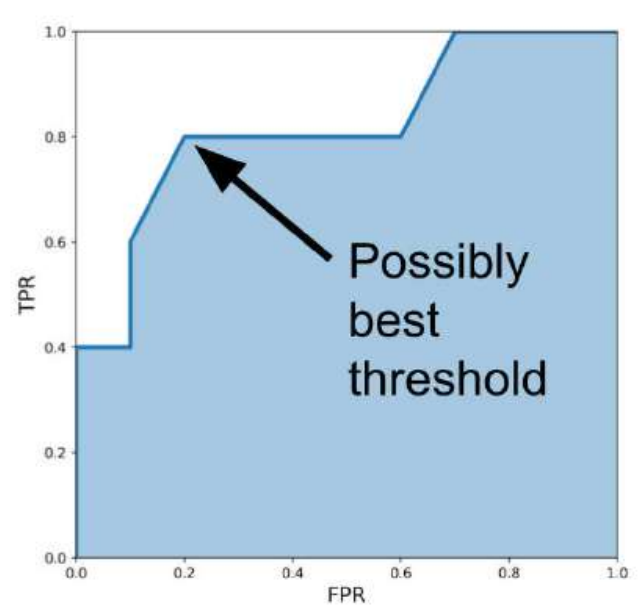
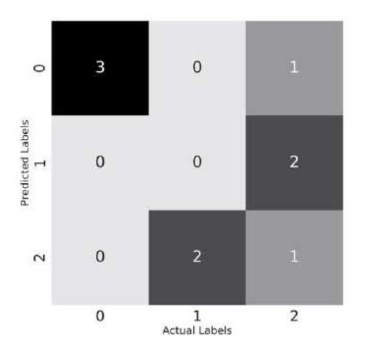

## MNIST El Yazısı Rakamları Üzerine İnceleme

```python
import matplotlib.pyplot as plt
import numpy as np
import pandas as pd
import seaborn as sns
from sklearn import datasets
from sklearn import manifold
%matplotlib inline

data = datasets.fetch_openml(
 'mnist_784',
 version=1,
 return_X_y=True
)
pixel_values, targets = data
targets = targets.astype(int)

single_image = pixel_values[1, :].reshape(28, 28)
plt.imshow(single_image, cmap='gray')

tsne = manifold.TSNE(n_components=2, random_state=42)
transformed_data = tsne.fit_transform(pixel_values[:3000, :])

tsne_df = pd.DataFrame(
np.column_stack((transformed_data, targets[:3000])),
columns=["x", "y", "targets"]
)
tsne_df.loc[:, "targets"] = tsne_df.targets.astype(int)

grid = sns.FacetGrid(tsne_df, hue="targets", size=8)
grid.map(plt.scatter, "x", "y").add_legend()
```

## Çapraz Doğrulama

```python
import pandas as pd
df = pd.read_csv("winequality-red.csv")

# a mapping dictionary that maps the quality values from 0 to 5
quality_mapping = {
 3: 0,
 4: 1,
 5: 2,
 6: 3,
 7: 4,
 8: 5
}
# you can use the map function of pandas with
# any dictionary to convert the values in a given
# column to values in the dictionary
df.loc[:, "quality"] = df.quality.map(quality_mapping)

# use sample with frac=1 to shuffle the dataframe
# we reset the indices since they change after
# shuffling the dataframe
df = df.sample(frac=1).reset_index(drop=True)
# top 1000 rows are selected
# for training
df_train = df.head(1000)
# bottom 599 values are selected
# for testing/validation
df_test = df.tail(599)

# import from scikit-learn
from sklearn import tree
from sklearn import metrics
# initialize decision tree classifier class
# with a max_depth of 3
clf = tree.DecisionTreeClassifier(max_depth=3)
# choose the columns you want to train on
# these are the features for the model
cols = ['fixed acidity',
 'volatile acidity',
 'citric acid',
 'residual sugar',
 'chlorides',
 'free sulfur dioxide',
 'total sulfur dioxide',
 'density',
 'pH',
 'sulphates',
 'alcohol']
# train the model on the provided features
# and mapped quality from before
clf.fit(df_train[cols], df_test.quality)

# generate predictions on the training set
train_predictions = clf.predict(df_train[cols])
# generate predictions on the test set
test_predictions = clf.predict(df_test[cols])
# calculate the accuracy of predictions on
# training data set
train_accuracy = metrics.accuracy_score(
 df_train.quality, train_predictions
)
# calculate the accuracy of predictions on
# test data set
test_accuracy = metrics.accuracy_score(
 df_test.quality, test_predictions
)
```
Sonuçlar;

max_depth = 3
Training accuracy: %58,9
Test accuracy: %54,25


max_depth = 7
Training accuracy: %76,6
Test accuracy: %57,3

Ağaç daha karmaşık hale geldikçe training performansı ciddi şekilde artıyor, fakat test performansı yalnızca biraz artıyor.

Bu nedenle aşırı öğrenmiş olduğu görülmektedir.


Aşağıda tüm derinlik değerlerini bulan kod verilmiştir;

```python
# NOTE: this code is written in a jupyter notebook
# import scikit-learn tree and metrics
from sklearn import tree
from sklearn import metrics
# import matplotlib and seaborn
# for plotting
import matplotlib
import matplotlib.pyplot as plt
import seaborn as sns
# this is our global size of label text
# on the plots
matplotlib.rc('xtick', labelsize=20)
matplotlib.rc('ytick', labelsize=20)
# This line ensures that the plot is displayed
# inside the notebook
%matplotlib inline
# initialize lists to store accuracies
# for training and test data
# we start with 50% accuracy
train_accuracies = [0.5]
test_accuracies = [0.5]

# iterate over a few depth values
for depth in range(1, 25):

    # init the model
    clf = tree.DecisionTreeClassifier(max_depth=depth)

    # columns/features for training
    # note that, this can be done outside
    # the loop
    cols = [
    'fixed acidity',
    'volatile acidity',
    'citric acid',
    'residual sugar',
    'chlorides',
    'free sulfur dioxide',
    'total sulfur dioxide',
    'density',
    'pH',
    'sulphates',
    'alcohol'
    ]

    # fit the model on given features
    clf.fit(df_train[cols], df_train.quality)
    # create training & test predictions
    train_predictions = clf.predict(df_train[cols])
    test_predictions = clf.predict(df_test[cols])
    # calculate training & test accuracies
    train_accuracy = metrics.accuracy_score(
    df_train.quality, train_predictions
    )
    test_accuracy = metrics.accuracy_score(
    df_test.quality, test_predictions
    )

    # append accuracies
    train_accuracies.append(train_accuracy)
    test_accuracies.append(test_accuracy)
# create two plots using matplotlib
# and seaborn
plt.figure(figsize=(10, 5))
sns.set_style("whitegrid")
plt.plot(train_accuracies, label="train accuracy")
plt.plot(test_accuracies, label="test accuracy")
plt.legend(loc="upper left", prop={'size': 15})
plt.xticks(range(0, 26, 5))
plt.xlabel("max_depth", size=20)
plt.ylabel("accuracy", size=20)
plt.show()
```


En popüler ve yaygın olarak kullanılan birkaç çapraz doğrulama tekniği:

k-fold cross-validation (k-katlı çapraz doğrulama)
stratified k-fold cross-validation (tabakalı k-katlı çapraz doğrulama)
hold-out based validation (hold-out tabanlı doğrulama)
leave-one-out cross-validation (birini dışarıda bırakma çapraz doğrulaması)
group k-fold cross-validation (grup k-katlı çapraz doğrulama)

Scikit-learn'deki KFold kullanılarak herhangi bir veri, k eşit parçaya bölünebilir.
k-fold çapraz doğrulama kullanıldığında, her örneğe 0'dan k-1'e kadar bir değer atanır.

```python
# import pandas and model_selection module of scikit-learn
import pandas as pd
from sklearn import model_selection
if __name__ == "__main__":
    # Training data is in a CSV file called train.csv
    df = pd.read_csv("train.csv")

    # we create a new column called kfold and fill it with -1
    df["kfold"] = -1

    # the next step is to randomize the rows of the data
    df = df.sample(frac=1).reset_index(drop=True)

    # initiate the kfold class from model_selection module
    kf = model_selection.KFold(n_splits=5)

    # fill the new kfold column
    for fold, (trn_, val_) in enumerate(kf.split(X=df)):
        df.loc[val_, 'kfold'] = fold
        # save the new csv with kfold column
        df.to_csv("train_folds.csv", index=False)
```

Normal K-Fold, verileri katmanlara rastgele böler; Stratified K-Fold ise her katmanda sınıfların oranını mümkün olduğunca aynı tutar. Özellikle dengesiz veri kümelerinde Stratified K-Fold çok daha güvenlidir.

```python
# import pandas and model_selection module of scikit-learn
import pandas as pd
from sklearn import model_selection
if __name__ == "__main__":
    # Training data is in a csv file called train.csv
    df = pd.read_csv("train.csv")
    # we create a new column called kfold and fill it with -1
    df["kfold"] = -1
    # the next step is to randomize the rows of the data
    df = df.sample(frac=1).reset_index(drop=True)
    # fetch targets
    y = df.target.values
    # initiate the kfold class from model_selection module
    kf = model_selection.StratifiedKFold(n_splits=5)
    # fill the new kfold column
    for f, (t_, v_) in enumerate(kf.split(X=df, y=y)):
    df.loc[v_, 'kfold'] = f
    # save the new csv with kfold column
    df.to_csv("train_folds.csv", index=False)
```

```python
b = sns.countplot(x='quality', data=df)
b.set_xlabel("quality", fontsize=20)
b.set_ylabel("count", fontsize=20)
```


Az örnekli regresyon problemlerinde aşağıdaki tabloya göre kaç bins'e bölünerek hedef binlere ayrılır bakılır ve oluşturulan bins değişkenine göre stratified k-fold yapılır. Direk k-fold da kullanılabilir.


```python
# stratified-kfold for regression

import numpy as np
import pandas as pd
from sklearn import datasets
from sklearn import model_selection


def create_folds(data):
    # kfold adında yeni bir sütun oluşturuyoruz ve başlangıçta -1 veriyoruz
    data["kfold"] = -1

    # Verinin satırlarını rastgele karıştırıyoruz
    data = data.sample(frac=1).reset_index(drop=True)

    # Sturges kuralına göre bin sayısını hesaplıyoruz
    num_bins = np.floor(1 + np.log2(len(data)))

    # Target değerlerini bin'lere ayırıyoruz
    data.loc[:, "bins"] = pd.cut(
        data["target"],
        bins=num_bins,
        labels=False
    )

    # 5 katlı Stratified K-Fold oluşturuyoruz
    kf = model_selection.StratifiedKFold(n_splits=5)

    # Fold'ları oluşturuyoruz
    # Burada target yerine bins kullanıyoruz
    for f, (t_, v_) in enumerate(
        kf.split(X=data, y=data.bins.values)
    ):
        data.loc[v_, "kfold"] = f

    # Geçici olarak oluşturduğumuz bins sütununu siliyoruz
    data = data.drop("bins", axis=1)

    # Fold bilgileri eklenmiş DataFrame'i döndürüyoruz
    return data


if __name__ == "__main__":
    # 15000 örnek, 100 feature ve 1 target içeren
    # yapay bir regresyon veri seti oluşturuyoruz
    X, y = datasets.make_regression(
        n_samples=15000,
        n_features=100,
        n_targets=1
    )

    # NumPy dizisini DataFrame'e dönüştürüyoruz
    df = pd.DataFrame(
        X,
        columns=[f"f_{i}" for i in range(X.shape[1])]
    )

    # Target sütununu ekliyoruz
    df.loc[:, "target"] = y

    # Stratified K-Fold'ları oluşturuyoruz
    df = create_folds(df)

    # Sonucu görmek için ilk 10 satırı yazdırıyoruz
    print(df.head(10))

```

## Değerlendirme Metrikleri

Sınıflandırma problemlerinde en yaygın kullanılan metrikler şunlardır:

* Accuracy (Doğruluk)
* Precision (Kesinlik) — P
* Recall (Duyarlılık) — R
* F1 Score — F1
* ROC (Receiver Operating Characteristic) eğrisinin altında kalan alan — AUC
* Log Loss
* Precision at k — P@k
* Average Precision at k — AP@k
* Mean Average Precision at k — MAP@k
* Regresyon problemlerinde kullanılan metrikler

Regresyon problemlerinde en yaygın kullanılan değerlendirme metrikleri ise şunlardır:

* Mean Absolute Error (MAE) — Ortalama Mutlak Hata
* Mean Squared Error (MSE) — Ortalama Kare Hata
* Root Mean Squared Error (RMSE) — Kök Ortalama Kare Hata
* Root Mean Squared Logarithmic Error (RMSLE) — Kök Ortalama Kare Logaritmik Hata
* Mean Percentage Error (MPE) — Ortalama Yüzde Hata
* Mean Absolute Percentage Error (MAPE) — Ortalama Mutlak * Yüzde Hata
* R² — R-kare

```python
def accuracy(y_true, y_pred):
    """
    Function to calculate accuracy
    :param y_true: list of true values
    :param y_pred: list of predicted values
    :return: accuracy score
    """
    # initialize a simple counter for correct predictions
    correct_counter = 0
    # loop over all elements of y_true
    # and y_pred "together"
    for yt, yp in zip(y_true, y_pred):
        if yt == yp:
        # if prediction is equal to truth, increase the counter
        correct_counter += 1
        # return accuracy
        # which is correct predictions over the number of samples
    return correct_counter / len(y_true)

from sklearn import metrics
l1 = [0,1,1,1,0,0,0,1]
l2 = [0,1,0,1,0,1,0,0]
metrics.accuracy_score(l1, l2)
# 0.625
accuracy(l1, l2)
# 0.625
```

```python
def true_positive(y_true, y_pred):
    """
    True Positive sayısını hesaplar.
    y_true: Gerçek değerler
    y_pred: Modelin tahminleri
    """
    tp = 0

    for yt, yp in zip(y_true, y_pred):
        if yt == 1 and yp == 1:
            tp += 1

    return tp


def true_negative(y_true, y_pred):
    """
    True Negative sayısını hesaplar.
    """
    tn = 0

    for yt, yp in zip(y_true, y_pred):
        if yt == 0 and yp == 0:
            tn += 1

    return tn


def false_positive(y_true, y_pred):
    """
    False Positive sayısını hesaplar.
    """
    fp = 0

    for yt, yp in zip(y_true, y_pred):
        if yt == 0 and yp == 1:
            fp += 1

    return fp


def false_negative(y_true, y_pred):
    """
    False Negative sayısını hesaplar.
    """
    fn = 0

    for yt, yp in zip(y_true, y_pred):
        if yt == 1 and yp == 0:
            fn += 1

    return fn

l1 = [0,1,1,1,0,0,0,1]
l2 = [0,1,0,1,0,1,0,0]

true_positive(l1, l2)
# 2
false_positive(l1, l2)
# 1
false_negative(l1, l2)
# 2
true_negative(l1, l2)
# 3

def accuracy_v2(y_true, y_pred):
    """
    TP/TN/FP/FN kullanarak accuracy hesaplayan fonksiyon.
    
    y_true: Gerçek değerler
    y_pred: Modelin tahminleri
    """
    
    tp = true_positive(y_true, y_pred)
    fp = false_positive(y_true, y_pred)
    fn = false_negative(y_true, y_pred)
    tn = true_negative(y_true, y_pred)

    accuracy_score = (tp + tn) / (tp + tn + fp + fn)

    return accuracy_score

l1 = [0, 1, 1, 1, 0, 0, 0, 1]
l2 = [0, 1, 0, 1, 0, 1, 0, 0]

accuracy(l1, l2)
# 0.625

accuracy_v2(l1, l2)
# 0.625

metrics.accuracy_score(l1, l2)
# 0.625
```

```python
def precision(y_true, y_pred):
    """
    Precision hesaplayan fonksiyon.
    y_true: Gerçek değerler
    y_pred: Modelin tahminleri
    return: precision skoru
    """

    tp = true_positive(y_true, y_pred)
    fp = false_positive(y_true, y_pred)

    precision = tp / (tp + fp)

    return precision

l1 = [0, 1, 1, 1, 0, 0, 0, 1]  # gerçek değerler
l2 = [0, 1, 0, 1, 0, 1, 0, 0]  # tahminler

precision(l1, l2)
# 0.6666666666666666

def recall(y_true, y_pred):
    """
    Recall hesaplayan fonksiyon.
    y_true: Gerçek değerler
    y_pred: Modelin tahminleri
    return: recall skoru
    """

    tp = true_positive(y_true, y_pred)
    fn = false_negative(y_true, y_pred)

    recall = tp / (tp + fn)

    return recall

l1 = [0, 1, 1, 1, 0, 0, 0, 1]
l2 = [0, 1, 0, 1, 0, 1, 0, 0]

recall(l1, l2)
# 0.5


import matplotlib.pyplot as plt

# Gerçek değerler
y_true = [
    0, 0, 0, 1, 0, 0, 0, 0, 0, 0,
    1, 0, 0, 0, 0, 0, 0, 0, 1, 0
]

# Modelin tahmin ettiği olasılıklar
y_pred = [
    0.02638412, 0.11114267, 0.31620708,
    0.0490937, 0.0191491, 0.17554844,
    0.15952202, 0.03819563, 0.11639273,
    0.079377, 0.08584789, 0.39095342,
    0.27259048, 0.03447096, 0.04644807,
    0.03543574, 0.18521942, 0.05934905,
    0.61977213, 0.33056815
]

# Listeler
precisions = []
recalls = []

# Threshold değerleri
thresholds = [
    0.0490937,
    0.05934905,
    0.079377,
    0.08584789,
    0.11114267,
    0.11639273,
    0.15952202,
    0.17554844,
    0.18521942,
    0.27259048,
    0.31620708,
    0.33056815,
    0.39095342,
    0.61977213
]

# Her threshold için precision ve recall hesapla
for i in thresholds:

    # Olasılıkları 0 veya 1'e dönüştür
    temp_prediction = [
        1 if x >= i else 0
        for x in y_pred
    ]

    # Precision hesapla
    p = precision(y_true, temp_prediction)

    # Recall hesapla
    r = recall(y_true, temp_prediction)

    # Sonuçları listelere ekle
    precisions.append(p)
    recalls.append(r)


# Precision-Recall grafiği
plt.figure(figsize=(7, 7))
plt.plot(recalls, precisions, marker="o")
plt.xlabel("Recall", fontsize=15)
plt.ylabel("Precision", fontsize=15)
plt.title("Precision-Recall Curve")
plt.grid()
plt.show()
```


```python
def f1(y_true, y_pred):
    """
    Function to calculate f1 score
    :param y_true: list of true values
    :param y_pred: list of predicted values
    :return: f1 score
    """
    p = precision(y_true, y_pred)
    r = recall(y_true, y_pred)
    score = 2 * p * r / (p + r)
    return score
```

```python
y_true = [0, 0, 0, 1, 0, 0, 0, 0, 0, 0,
          1, 0, 0, 0, 0, 0, 0, 0, 1, 0]

y_pred = [0, 0, 1, 0, 0, 0, 1, 0, 0, 0,
          1, 0, 0, 0, 0, 0, 0, 0, 1, 0]

f1(y_true, y_pred)
0.5714285714285715
```

```python
from sklearn import metrics

metrics.f1_score(y_true, y_pred)

0.5714285714285715
```

```python
def tpr(y_true, y_pred):
    """
    Function to calculate tpr
    :param y_true: list of true values
    :param y_pred: list of predicted values
    :return: tpr/recall
    """
    return recall(y_true, y_pred)
```

```python
def fpr(y_true, y_pred):
    """
    Function to calculate fpr
    :param y_true: list of true values
    :param y_pred: list of predicted values
    :return: fpr
    """
    fp = false_positive(y_true, y_pred)
    tn = true_negative(y_true, y_pred)
    return fp / (tn + fp)
```

```python
# TPR ve FPR değerlerini saklamak için boş listeler
tpr_list = []
fpr_list = []

# Gerçek hedefler
y_true = [0, 0, 0, 0, 1, 0, 1,
          0, 0, 1, 0, 1, 0, 0, 1]

# Bir örneğin 1 olma olasılığına dair tahminler
y_pred = [0.1, 0.3, 0.2, 0.6, 0.8, 0.05,
          0.9, 0.5, 0.3, 0.66, 0.3, 0.2,
          0.85, 0.15, 0.99]

# Elle belirlenmiş threshold (eşik) değerleri
thresholds = [0, 0.1, 0.2, 0.3, 0.4, 0.5,
              0.6, 0.7, 0.8, 0.85, 0.9, 0.99, 1.0]

# Tüm threshold değerleri üzerinde döngü
for thresh in thresholds:

    # Belirli bir threshold için tahminleri hesapla
    temp_pred = [1 if x >= thresh else 0 for x in y_pred]

    # TPR hesapla
    temp_tpr = tpr(y_true, temp_pred)

    # FPR hesapla
    temp_fpr = fpr(y_true, temp_pred)

    # TPR ve FPR değerlerini listelere ekle
    tpr_list.append(temp_tpr)
    fpr_list.append(temp_fpr)
```


```python
plt.figure(figsize=(7, 7))

plt.fill_between(fpr_list, tpr_list, alpha=0.4)
plt.plot(fpr_list, tpr_list, lw=3)

plt.xlim(0, 1.0)
plt.ylim(0, 1.0)

plt.xlabel('FPR', fontsize=15)
plt.ylabel('TPR', fontsize=15)

plt.show()
```


```python
from sklearn import metrics

y_true = [0, 0, 0, 0, 1, 0, 1,
          0, 0, 1, 0, 1, 0, 0, 1]

y_pred = [0.1, 0.3, 0.2, 0.6, 0.8, 0.05,
          0.9, 0.5, 0.3, 0.66, 0.3, 0.2,
          0.85, 0.15, 0.99]

metrics.roc_auc_score(y_true, y_pred)
0.8300000000000001
```

```python
# True Positive ve False Positive değerlerini saklamak için boş listeler
tp_list = []
fp_list = []

# Gerçek hedefler
y_true = [0, 0, 0, 0, 1, 0, 1,
          0, 0, 1, 0, 1, 0, 0, 1]

# Bir örneğin 1 olma olasılığına dair tahminler
y_pred = [0.1, 0.3, 0.2, 0.6, 0.8, 0.05,
          0.9, 0.5, 0.3, 0.66, 0.3, 0.2,
          0.85, 0.15, 0.99]

# Elle belirlenmiş threshold (eşik) değerleri
thresholds = [0, 0.1, 0.2, 0.3, 0.4, 0.5,
              0.6, 0.7, 0.8, 0.85, 0.9, 0.99, 1.0]

# Tüm threshold değerleri üzerinde döngü
for thresh in thresholds:

    # Belirli bir threshold için tahminleri hesapla
    temp_pred = [1 if x >= thresh else 0 for x in y_pred]

    # True Positive hesapla
    temp_tp = true_positive(y_true, temp_pred)

    # False Positive hesapla
    temp_fp = false_positive(y_true, temp_pred)

    # TP ve FP değerlerini listelere ekle
    tp_list.append(temp_tp)
    fp_list.append(temp_fp)
```




```python
import numpy as np

def log_loss(y_true, y_proba):
    """
    Function to calculate log loss
    :param y_true: list of true values
    :param y_proba: list of probabilities for 1
    :return: overall log loss
    """

    # epsilon değerini tanımla
    epsilon = 1e-15

    # Bireysel loss değerlerini saklamak için boş liste
    loss = []

    # Gerçek değerler ve tahmin olasılıkları üzerinde dolaş
    for yt, yp in zip(y_true, y_proba):

        # Olasılığı sınırla
        yp = np.clip(yp, epsilon, 1 - epsilon)

        # Tek bir örnek için loss hesapla
        temp_loss = -1.0 * (
            yt * np.log(yp)
            + (1 - yt) * np.log(1 - yp)
        )

        # Loss değerini listeye ekle
        loss.append(temp_loss)

    # Tüm örneklerin ortalama loss değerini döndür
    return np.mean(loss)
```

```python
y_true = [0, 0, 0, 0, 1, 0, 1,
          0, 0, 1, 0, 1, 0, 0, 1]

y_proba = [0.1, 0.3, 0.2, 0.6, 0.8, 0.05,
           0.9, 0.5, 0.3, 0.66, 0.3, 0.2,
           0.85, 0.15, 0.99]

log_loss(y_true, y_proba)
0.49882711861432294

from sklearn import metrics
metrics.log_loss(y_true, y_proba)
0.49882711861432294

```

```python
import numpy as np

def macro_precision(y_true, y_pred):
    """
    Function to calculate macro averaged precision
    :param y_true: list of true values
    :param y_pred: list of predicted values
    :return: macro precision score
    """

    # unique değerlerin uzunluğunu alarak
    # sınıf sayısını bul
    num_classes = len(np.unique(y_true))

    # precision değerini 0 olarak başlat
    precision = 0

    # tüm sınıflar üzerinde döngü
    for class_ in range(num_classes):

        # Mevcut sınıf dışındaki tüm sınıflar negatif kabul edilir
        temp_true = [1 if p == class_ else 0 for p in y_true]
        temp_pred = [1 if p == class_ else 0 for p in y_pred]

        # Mevcut sınıf için True Positive hesapla
        tp = true_positive(temp_true, temp_pred)

        # Mevcut sınıf için False Positive hesapla
        fp = false_positive(temp_true, temp_pred)

        # Mevcut sınıf için precision hesapla
        temp_precision = tp / (tp + fp)

        # Tüm sınıfların precision değerlerini topla
        precision += temp_precision

    # Sınıfların ortalama precision değerini hesapla ve döndür
    precision /= num_classes

    return precision
```

```python
import numpy as np

def micro_precision(y_true, y_pred):
    """
    Function to calculate micro averaged precision
    :param y_true: list of true values
    :param y_pred: list of predicted values
    :return: micro precision score
    """

    # Unique değerlerin uzunluğunu alarak
    # sınıf sayısını bul
    num_classes = len(np.unique(y_true))

    # TP ve FP değerlerini 0 olarak başlat
    tp = 0
    fp = 0

    # Tüm sınıflar üzerinde döngü
    for class_ in range(num_classes):

        # Mevcut sınıf dışındaki tüm sınıflar negatif kabul edilir
        temp_true = [1 if p == class_ else 0 for p in y_true]
        temp_pred = [1 if p == class_ else 0 for p in y_pred]

        # Mevcut sınıf için True Positive hesapla
        # ve toplam TP'ye ekle
        tp += true_positive(temp_true, temp_pred)

        # Mevcut sınıf için False Positive hesapla
        # ve toplam FP'ye ekle
        fp += false_positive(temp_true, temp_pred)

    # Genel precision değerini hesapla ve döndür
    precision = tp / (tp + fp)

    return precision
```

```python
from collections import Counter
import numpy as np

def weighted_precision(y_true, y_pred):
    """
    Function to calculate weighted averaged precision
    :param y_true: list of true values
    :param y_pred: list of predicted values
    :return: weighted precision score
    """

    # Unique değerlerin uzunluğunu alarak
    # sınıf sayısını bul
    num_classes = len(np.unique(y_true))

    # Sınıf: örnek sayısı sözlüğü oluştur
    # Örneğin: {0: 20, 1: 15, 2: 21}
    class_counts = Counter(y_true)

    # Precision değerini 0 olarak başlat
    precision = 0

    # Tüm sınıflar üzerinde döngü
    for class_ in range(num_classes):

        # Mevcut sınıf dışındaki tüm sınıflar negatif kabul edilir
        temp_true = [1 if p == class_ else 0 for p in y_true]
        temp_pred = [1 if p == class_ else 0 for p in y_pred]

        # Sınıf için TP ve FP hesapla
        tp = true_positive(temp_true, temp_pred)
        fp = false_positive(temp_true, temp_pred)

        # Sınıfın precision değerini hesapla
        temp_precision = tp / (tp + fp)

        # Precision değerini sınıftaki örnek sayısıyla çarp
        weighted_precision = class_counts[class_] * temp_precision

        # Genel precision değerine ekle
        precision += weighted_precision

    # Toplam örnek sayısına bölerek
    # genel weighted precision değerini hesapla
    overall_precision = precision / len(y_true)

    return overall_precision
```

```python
from sklearn import metrics

y_true = [0, 1, 2, 0, 1, 2, 0, 2, 2]
y_pred = [0, 2, 1, 0, 2, 1, 0, 0, 2]

# Macro Precision
print("Macro Precision:")
print("Bizim:", macro_precision(y_true, y_pred))
print("sklearn:", metrics.precision_score(y_true, y_pred, average="macro"))

# Micro Precision
print("\nMicro Precision:")
print("Bizim:", micro_precision(y_true, y_pred))
print("sklearn:", metrics.precision_score(y_true, y_pred, average="micro"))

# Weighted Precision
print("\nWeighted Precision:")
print("Bizim:", weighted_precision(y_true, y_pred))
print("sklearn:", metrics.precision_score(y_true, y_pred, average="weighted"))
```


```python
from collections import Counter
import numpy as np


def weighted_f1(y_true, y_pred):
    """
    Function to calculate weighted F1 score

    :param y_true: list of true values
    :param y_pred: list of predicted values
    :return: weighted F1 score
    """

    # Find the number of classes by taking
    # length of unique values in true list
    num_classes = len(np.unique(y_true))

    # Create class:sample count dictionary
    # Example: {0: 20, 1: 15, 2: 21}
    class_counts = Counter(y_true)

    # Initialize F1 to 0
    f1 = 0

    # Loop over all classes
    for class_ in range(num_classes):

        # All classes except current are considered negative
        temp_true = [1 if p == class_ else 0 for p in y_true]
        temp_pred = [1 if p == class_ else 0 for p in y_pred]

        # Calculate precision and recall for class
        p = precision(temp_true, temp_pred)
        r = recall(temp_true, temp_pred)

        # Calculate F1 of class
        if p + r != 0:
            temp_f1 = 2 * p * r / (p + r)
        else:
            temp_f1 = 0

        # Multiply F1 with count of samples in class
        weighted_f1 = class_counts[class_] * temp_f1

        # Add to F1
        f1 += weighted_f1

    # Calculate overall F1 by dividing by
    # total number of samples
    overall_f1 = f1 / len(y_true)

    return overall_f1
```

```python
from sklearn import metrics

y_true = [0, 1, 2, 0, 1, 2, 0, 2, 2]
y_pred = [0, 2, 1, 0, 2, 1, 0, 0, 2]

print(weighted_f1(y_true, y_pred))

0.41269841269841273

print(metrics.f1_score(
    y_true,
    y_pred,
    average="weighted"
))

0.41269841269841273
```

```python
import matplotlib.pyplot as plt
import seaborn as sns
from sklearn import metrics

# Gerçek sınıflar
y_true = [0, 1, 2, 0, 1, 2, 0, 2, 2]

# Tahminler
y_pred = [0, 2, 1, 0, 2, 1, 0, 0, 2]

# Confusion matrix
cm = metrics.confusion_matrix(y_true, y_pred)

# Grafik
plt.figure(figsize=(10, 10))

cmap = sns.cubehelix_palette(
    50,
    hue=0.05,
    rot=0,
    light=0.9,
    dark=0,
    as_cmap=True
)

sns.set(font_scale=2.5)

sns.heatmap(
    cm,
    annot=True,
    cmap=cmap,
    cbar=False
)

plt.ylabel("Actual Labels", fontsize=20)
plt.xlabel("Predicted Labels", fontsize=20)

plt.show()
```



```python
def pk(y_true, y_pred, k):
    """
    This function calculates precision at k
    for a single sample

    :param y_true: list of values, actual classes
    :param y_pred: list of values, predicted classes
    :return: precision at a given value k
    """

    # If k is 0, return 0.
    # We should never have this as k is always >= 1
    if k == 0:
        return 0

    # We are interested only in top-k predictions
    y_pred = y_pred[:k]

    # Convert predictions to set
    pred_set = set(y_pred)

    # Convert actual values to set
    true_set = set(y_true)

    # Find common values
    common_values = pred_set.intersection(true_set)

    # Return length of common values over k
    return len(common_values) / len(y_pred[:k])
```

```python
def apk(y_true, y_pred, k):
    """
    This function calculates average precision at k
    for a single sample

    :param y_true: list of values, actual classes
    :param y_pred: list of values, predicted classes
    :return: average precision at a given value k
    """

    # Initialize P@k list of values
    pk_values = []

    # Loop over all k, from 1 to k + 1
    for i in range(1, k + 1):

        # Calculate P@i and append to list
        pk_values.append(pk(y_true, y_pred, i))

    # If we have no values in the list, return 0
    if len(pk_values) == 0:
        return 0

    # Return the sum of the list divided by its length
    return sum(pk_values) / len(pk_values)
```

```python
def mapk(y_true, y_pred, k):
    """
    This function calculates mean average precision at k
    for multiple samples.

    :param y_true: list of values, actual classes
    :param y_pred: list of values, predicted classes
    :param k: number of predictions to consider
    :return: mean average precision at k
    """

    # initialize empty list for apk values
    apk_values = []

    # loop over all samples
    for i in range(len(y_true)):

        # store AP@k value for every sample
        apk_values.append(
            apk(y_true[i], y_pred[i], k=k)
        )

    # return mean of AP@k values
    return sum(apk_values) / len(apk_values)
```

### Regresyon

```python
import numpy as np
def mean_absolute_error(y_true, y_pred):
 """
 This function calculates mae
 :param y_true: list of real numbers, true values
 :param y_pred: list of real numbers, predicted values
 :return: mean absolute error
 """
 # initialize error at 0
 error = 0
 # loop over all samples in the true and predicted list
 for yt, yp in zip(y_true, y_pred):
 # calculate absolute error
 # and add to error
 error += np.abs(yt - yp)
 # return mean error
 return error / len(y_true)
```

```python
def mean_squared_error(y_true, y_pred):
    """
    Bu fonksiyon MSE hesaplar.

    :param y_true: gerçek değerlerin listesi
    :param y_pred: tahmin edilen değerlerin listesi
    :return: ortalama karesel hata
    """

    # Hatayı 0 olarak başlat
    error = 0

    # Gerçek ve tahmin edilen değerler üzerinde dolaş
    for yt, yp in zip(y_true, y_pred):

        # Karesel hatayı hesapla
        # ve toplam hataya ekle
        error += (yt - yp) ** 2

    # Ortalama hatayı döndür
    return error / len(y_true)
```

```python
import numpy as np

def mean_squared_log_error(y_true, y_pred):
    """
    Bu fonksiyon MSLE hesaplar.

    :param y_true: gerçek değerlerin listesi
    :param y_pred: tahmin edilen değerlerin listesi
    :return: ortalama karesel logaritmik hata
    """

    # Hatayı 0 olarak başlat
    error = 0

    # Gerçek ve tahmin edilen değerler üzerinde dolaş
    for yt, yp in zip(y_true, y_pred):

        # Karesel logaritmik hatayı hesapla
        # ve toplam hataya ekle
        error += (np.log(1 + yt) - np.log(1 + yp)) ** 2

    # Ortalama hatayı döndür
    return error / len(y_true)
```

```python
def mean_percentage_error(y_true, y_pred):
    """
    This function calculates MPE.

    :param y_true: list of real numbers, true values
    :param y_pred: list of real numbers, predicted values
    :return: mean percentage error
    """

    # initialize error at 0
    error = 0

    # loop over all samples in true and predicted list
    for yt, yp in zip(y_true, y_pred):

        # calculate percentage error
        # and add to error
        error += (yt - yp) / yt

    # return mean percentage error
    return error / len(y_true)
```

```python
import numpy as np

def mean_abs_percentage_error(y_true, y_pred):
    """
    This function calculates MAPE.

    :param y_true: list of real numbers, true values
    :param y_pred: list of real numbers, predicted values
    :return: mean absolute percentage error
    """

    # initialize error at 0
    error = 0

    # loop over all samples in true and predicted list
    for yt, yp in zip(y_true, y_pred):

        # calculate absolute percentage error
        # and add to error
        error += np.abs(yt - yp) / yt

    # return mean absolute percentage error
    return error / len(y_true)
```

```python
import numpy as np

def r2(y_true, y_pred):
    """
    This function calculates R-squared score.

    :param y_true: list of real numbers, true values
    :param y_pred: list of real numbers, predicted values
    :return: R2 score
    """

    # calculate the mean value of true values
    mean_true_value = np.mean(y_true)

    # initialize numerator with 0
    numerator = 0

    # initialize denominator with 0
    denominator = 0

    # loop over all true and predicted values
    for yt, yp in zip(y_true, y_pred):

        # update numerator
        numerator += (yt - yp) ** 2

        # update denominator
        denominator += (yt - mean_true_value) ** 2

    # calculate the ratio
    ratio = numerator / denominator

    # return 1 - ratio
    return 1 - ratio
```

```python
import numpy as np

def mae_np(y_true, y_pred):
    return np.mean(np.abs(y_true - y_pred))
```

```python
from sklearn import metrics

y_true = [1, 2, 3, 1, 2, 3, 1, 2, 3]

y_pred = [2, 1, 3, 1, 2, 3, 3, 1, 2]

metrics.cohen_kappa_score(
    y_true,
    y_pred,
    weights="quadratic"
)

0.33333333333333337

metrics.accuracy_score(y_true, y_pred)

0.4444444444444444
```

```python
def mcc(y_true, y_pred):
    """
    This function calculates Matthew's Correlation Coefficient
    for binary classification.

    :param y_true: list of true values
    :param y_pred: list of predicted values
    :return: MCC score
    """

    tp = true_positive(y_true, y_pred)
    tn = true_negative(y_true, y_pred)
    fp = false_positive(y_true, y_pred)
    fn = false_negative(y_true, y_pred)

    numerator = (tp * tn) - (fp * fn)

    denominator = (
        (tp + fp) *
        (fn + tn) *
        (fp + tn) *
        (tp + fn)
    )

    denominator = denominator ** 0.5

    return numerator / denominator
```

## Makine öğrenmesi projelerini organize etmek

```python
# src/train.py

import joblib
import pandas as pd
from sklearn import metrics
from sklearn import tree


def run(fold):
    # read the training data with folds
    df = pd.read_csv("../input/mnist_train_folds.csv")

    # training data is where kfold is not equal to provided fold
    # also, note that we reset the index
    df_train = df[df.kfold != fold].reset_index(drop=True)

    # validation data is where kfold is equal to provided fold
    df_valid = df[df.kfold == fold].reset_index(drop=True)

    # drop the label column from dataframe and convert it to
    # a numpy array by using .values.
    # target is label column in the dataframe
    x_train = df_train.drop("label", axis=1).values
    y_train = df_train.label.values

    # similarly, for validation, we have
    x_valid = df_valid.drop("label", axis=1).values
    y_valid = df_valid.label.values

    # initialize simple decision tree classifier from sklearn
    clf = tree.DecisionTreeClassifier()

    # fit the model on training data
    clf.fit(x_train, y_train)

    # create predictions for validation samples
    preds = clf.predict(x_valid)

    # calculate & print accuracy
    accuracy = metrics.accuracy_score(y_valid, preds)
    print(f"Fold={fold}, Accuracy={accuracy}")

    # save the model
    joblib.dump(clf, f"../models/dt_{fold}.bin")


if __name__ == "__main__":
    run(fold=0)
    run(fold=1)
    run(fold=2)
    run(fold=3)
    run(fold=4)

❯ python train.py
Fold=0, Accuracy=0.8680833333333333
Fold=1, Accuracy=0.8685
Fold=2, Accuracy=0.8674166666666666
Fold=3, Accuracy=0.8703333333333333
Fold=4, Accuracy=0.8699166666666667
```

Elle yazılan kısımları koddan ayırmak için;

```python
# config.py
TRAINING_FILE = "../input/mnist_train_folds.csv"
MODEL_OUTPUT = "../models/"
```

Düzeltilmiş train.py;

```python
# train.py

import os
import config
import joblib
import pandas as pd
from sklearn import metrics
from sklearn import tree


def run(fold):
    # read the training data with folds
    df = pd.read_csv(config.TRAINING_FILE)

    # training data is where kfold is not equal to provided fold
    # also, note that we reset the index
    df_train = df[df.kfold != fold].reset_index(drop=True)

    # validation data is where kfold is equal to provided fold
    df_valid = df[df.kfold == fold].reset_index(drop=True)

    # drop the label column from dataframe and convert it to
    # a numpy array by using .values.
    # target is label column in the dataframe
    x_train = df_train.drop("label", axis=1).values
    y_train = df_train.label.values

    # similarly, for validation, we have
    x_valid = df_valid.drop("label", axis=1).values
    y_valid = df_valid.label.values

    # initialize simple decision tree classifier from sklearn
    clf = tree.DecisionTreeClassifier()

    # fit the model on training data
    clf.fit(x_train, y_train)

    # create predictions for validation samples
    preds = clf.predict(x_valid)

    # calculate & print accuracy
    accuracy = metrics.accuracy_score(y_valid, preds)

    print(f"Fold={fold}, Accuracy={accuracy}")

    # save the model
    joblib.dump(
        clf,
        os.path.join(config.MODEL_OUTPUT, f"dt_{fold}.bin")
    )


if __name__ == "__main__":
    run(fold=0)
    run(fold=1)
    run(fold=2)
    run(fold=3)
    run(fold=4)
```

argparser ile her foldu çalıştırma;

```python
# train.py

import argparse

# Diğer importlar ve kodlar
# ...
# ...

def run(fold):
    # Training kodları burada
    # ...
    pass


if __name__ == "__main__":
    # initialize ArgumentParser class of argparse
    parser = argparse.ArgumentParser()

    # add the different arguments you need and their type
    # currently, we only need fold
    parser.add_argument(
        "--fold",
        type=int
    )

    # read the arguments from the command line
    args = parser.parse_args()

    # run the fold specified by command line arguments
    run(fold=args.fold)
```

Shell üzerinde çalıştırma;

```shell    
#!/bin/sh
python train.py --fold 0
python train.py --fold 1
python train.py --fold 2
python train.py --fold 3
python train.py --fold 4

sh run.sh
Fold=0, Accuracy=0.8675
Fold=1, Accuracy=0.8693333333333333
Fold=2, Accuracy=0.8683333333333333
Fold=3, Accuracy=0.8704166666666666
Fold=4, Accuracy=0.8685
```

Model yönlendirme;

```python
# model_dispatcher.py
from sklearn import tree
models = {
 "decision_tree_gini": tree.DecisionTreeClassifier(
 criterion="gini"
 ),
 "decision_tree_entropy": tree.DecisionTreeClassifier(
 criterion="entropy"
 ),
}
```

```python
# train.py

import argparse
import os
import joblib
import pandas as pd
from sklearn import metrics

import config
import model_dispatcher


def run(fold, model):
    # Read the training data with folds
    df = pd.read_csv(config.TRAINING_FILE)

    # Training data is where kfold is not equal to provided fold
    df_train = df[df.kfold != fold].reset_index(drop=True)

    # Validation data is where kfold is equal to provided fold
    df_valid = df[df.kfold == fold].reset_index(drop=True)

    # Drop the label column and convert to numpy array
    x_train = df_train.drop("label", axis=1).values
    y_train = df_train.label.values

    # Validation data
    x_valid = df_valid.drop("label", axis=1).values
    y_valid = df_valid.label.values

    # Fetch the model from model_dispatcher
    clf = model_dispatcher.models[model]

    # Fit the model on training data
    clf.fit(x_train, y_train)

    # Create predictions for validation samples
    preds = clf.predict(x_valid)

    # Calculate and print accuracy
    accuracy = metrics.accuracy_score(y_valid, preds)

    print(f"Fold={fold}, Accuracy={accuracy}")

    # Save the model
    joblib.dump(
        clf,
        os.path.join(config.MODEL_OUTPUT, f"dt_{fold}.bin")
    )


if __name__ == "__main__":
    parser = argparse.ArgumentParser()

    parser.add_argument(
        "--fold",
        type=int
    )

    parser.add_argument(
        "--model",
        type=str
    )

    args = parser.parse_args()

    run(
        fold=args.fold,
        model=args.model
    )
```

Modeli çalıştırabiliriz;

```python
python train.py --fold 0 --model decision_tree_gini
Fold=0, Accuracy=0.8665833333333334
```

## Kategorik Değişkenlere Yaklaşım

```python
mapping = {
 "Freezing": 0,
 "Warm": 1,
 "Cold": 2,
 "Boiling Hot": 3,
 "Hot": 4,
 "Lava Hot": 5
}

import pandas as pd

df = pd.read_csv("../input/cat_train.csv")
df.loc[:, "ord_2"] = df.ord_2.map(mapping)
```

scikit ile uygulama;

```python
import pandas as pd
from sklearn import preprocessing
# read the data
df = pd.read_csv("../input/cat_train.csv")
# fill NaN values in ord_2 column
df.loc[:, "ord_2"] = df.ord_2.fillna("NONE")
# initialize LabelEncoder
lbl_enc = preprocessing.LabelEncoder()
# fit label encoder and transform values on ord_2 column
# P.S: do not use this directly. fit first, then transform
df.loc[:, "ord_2"] = lbl_enc.fit_transform(df.ord_2.values)
```

> Ancak bu tür bir encoding, linear models (doğrusal modeller), Support Vector Machines (SVM) veya neural networks (sinir ağları) için kullanılamaz. Çünkü bu modeller verilerin normalize edilmesini veya standardize edilmesini bekler.

Binarize de yapılabilir;

Freezing    --> 0 --> 0 0 0
Warm        --> 1 --> 0 0 1
Cold        --> 2 --> 0 1 0
Boiling Hot --> 3 --> 0 1 1
Hot         --> 4 --> 1 0 0
Lava Hot    --> 5 --> 1 0 1

Bu olsıfırlı bir tablo oluşturur.

Örneğin ilk üç satırın ne kadar hafıza tuttuğuna bakalım;

```python
import numpy as np

# Örnek feature matrix oluşturuyoruz
example = np.array(
    [
        [0, 0, 1],
        [1, 0, 0],
        [1, 0, 1]
    ]
)

# Bellekte kapladığı alanı byte cinsinden yazdır
print(example.nbytes)

72
```

Boyut azaltmak için sadece 1 bulunan konumları saklarız;

(0, 2) 1
(1, 0) 1
(2, 0) 1
(2, 2) 1

Numpy ile sparse yaparak aynı veri ne kadar yer kaplıyor bakalım;

```python
import numpy as np
from scipy import sparse

# Örnek feature matrix oluştur
example = np.array(
    [
        [0, 0, 1],
        [1, 0, 0],
        [1, 0, 1]
    ]
)

# NumPy array'i sparse CSR matrix'e dönüştür
sparse_example = sparse.csr_matrix(example)

# Sparse matrix'in data kısmının bellekte kapladığı alanı yazdır
print(sparse_example.data.nbytes)

32
```

```python
print(
    sparse_example.data.nbytes +
    sparse_example.indptr.nbytes +
    sparse_example.indices.nbytes
)

64
```

```python
import numpy as np
from scipy import sparse

# number of rows
n_rows = 10000

# number of columns
n_cols = 100000

# create random binary matrix
# with only 5% values as 1s
example = np.random.binomial(
    1,
    p=0.05,
    size=(n_rows, n_cols)
)

# print size in bytes
print(f"Size of dense array: {example.nbytes}")

# convert numpy array to sparse CSR matrix
sparse_example = sparse.csr_matrix(example)

# print size of this sparse matrix
print(
    f"Size of sparse array: "
    f"{sparse_example.data.nbytes}"
)

# calculate full size of sparse matrix
full_size = (
    sparse_example.data.nbytes
    + sparse_example.indptr.nbytes
    + sparse_example.indices.nbytes
)

# print full size of sparse matrix
print(f"Full size of sparse array: {full_size}")

Size of dense array: 8000000000
Size of sparse array: 399932496
Full size of sparse array: 599938748
```
One Hot ile 6 özellikli bir özellikten gelen değerlerin sparse karşılaştırması;

```python
import numpy as np
from scipy import sparse

# Binary matrix oluştur
example = np.array(
    [
        [0, 0, 0, 0, 1, 0],
        [0, 1, 0, 0, 0, 0],
        [1, 0, 0, 0, 0, 0]
    ]
)

# Dense array'in bellekte kapladığı alan
print(f"Size of dense array: {example.nbytes}")

# NumPy array'i sparse CSR matrix'e dönüştür
sparse_example = sparse.csr_matrix(example)

# Sadece sıfır olmayan değerlerin boyutu
print(f"Size of sparse array: {sparse_example.data.nbytes}")

# Sparse matrix'in toplam boyutu
full_size = (
    sparse_example.data.nbytes
    + sparse_example.indptr.nbytes
    + sparse_example.indices.nbytes
)

# Sparse matrix'in toplam bellekte kapladığı alan
print(f"Full size of sparse array: {full_size}")

Size of dense array: 144
Size of sparse array: 24
Full size of sparse array: 52
```

```python
import numpy as np
from sklearn import preprocessing

# 1001 farklı kategori içeren
# 1 boyutlu rastgele array oluştur
example = np.random.randint(
    1000,
    size=1000000
)

# OneHotEncoder oluştur
# sparse_output=False -> dense array
ohe = preprocessing.OneHotEncoder(
    sparse_output=False
)

# Veriyi dense One-Hot Encoding ile dönüştür
ohe_example = ohe.fit_transform(
    example.reshape(-1, 1)
)

# Dense array'in bellekte kapladığı alan
print(
    f"Size of dense array: {ohe_example.nbytes}"
)

# OneHotEncoder oluştur
# sparse_output=True -> sparse array
ohe = preprocessing.OneHotEncoder(
    sparse_output=True
)

# Veriyi sparse One-Hot Encoding ile dönüştür
ohe_example = ohe.fit_transform(
    example.reshape(-1, 1)
)

# Sparse matrix'in data kısmının boyutu
print(
    f"Size of sparse array: "
    f"{ohe_example.data.nbytes}"
)

# Sparse matrix'in toplam boyutu
full_size = (
    ohe_example.data.nbytes
    + ohe_example.indptr.nbytes
    + ohe_example.indices.nbytes
)

# Sparse matrix'in toplam bellekte kapladığı alan
print(
    f"Full size of sparse array: {full_size}"
)

Size of dense array: 8000000000
Size of sparse array: 8000000
Full size of sparse array: 16000004
```

```python
df[df.ord_2 == "Boiling Hot"].shape

(84790, 25)


df.groupby(["ord_2"])["id"].count()

ord_2
Boiling Hot 84790
Cold 97822
Freezing 142726
Hot 67508
Lava Hot 64840
Warm 124239
Name: id, dtype: int64


df.groupby(["ord_2"])["id"].transform("count")
0 67508.0
1 124239.0
2 142726.0
3 64840.0
4 97822.0
 ...
599995 142726.0
599996 84790.0
599997 142726.0
599998 124239.0
599999 84790.0
Name: id, Length: 600000, dtype: float64


df.groupby(
    [
    "ord_1",
    "ord_2"
    ]
    )["id"].count().reset_index(name="count")

     ord_1          ord_2         count
0    Contributor    Boiling Hot   15634
1    Contributor    Cold          17734
2    Contributor    Freezing 26082
3    Contributor    Hot 12428
4    Contributor    Lava Hot 11919
5    Contributor    Warm 22774
6    Expert         Boiling Hot 19477
7    Expert         Cold 22956
8    Expert         Freezing 33249
9    Expert         Hot 15792
10   Expert         Lava Hot 15078
11   Expert         Warm 28900
12   Grandmaster    Boiling Hot 13623
13   Grandmaster    Cold 15464
14   Grandmaster    Freezing 22818
15   Grandmaster    Hot 10805
16   Grandmaster    Lava Hot 10363
17   Grandmaster    Warm 19899
18   Master Boiling Hot 10800
.
.
.
.
```

```python
df["new_feature"] = (
    df.ord_1.astype(str)
    + "_"
    + df.ord_2.astype(str)
    )
df.new_feature

0      Contributor_Hot
1      Grandmaster_Warm
2      nan_Freezing
3      Novice_Lava Hot
4      Grandmaster_Cold
 ...
599995 Novice_Freezing
599996 Novice_Boiling Hot
599997 Contributor_Freezing
599998 Master_Warm
599999 Contributor_Boiling Hot
Name: new_feature, Length: 600000, dtype: object
```

```py
df["new_feature"] = (
    df.ord_1.astype(str)
    + "_"
    + df.ord_2.astype(str)
    + "_"
    + df.ord_3.astype(str)
    )
df.new_feature

0      Contributor_Hot_c
1      Grandmaster_Warm_e
2      nan_Freezing_n
3      Novice_Lava Hot_a
4      Grandmaster_Cold_h
 ...
599995 Novice_Freezing_a
599996 Novice_Boiling Hot_n
599997 Contributor_Freezing_n
599998 Master_Warm_m
599999 Contributor_Boiling Hot_b
Name: new_feature, Length: 600000, dtype: object
```

```py
df.ord_2.value_counts()

Freezing    142726
Warm        124239
Cold         97822
Boiling Hot  84790
Hot          67508
Lava Hot     64840

df.ord_2.fillna("NONE").value_counts()
 
Freezing     142726
Warm         124239
Cold          97822
Boiling Hot   84790
Hot           67508
Lava Hot      64840
NONE          18075
Name: ord_2, dtype: int64
```

Training ve test verilerini geçici olarak birleştirip kategorik değişkenleri birlikte encode etme yöntemi;

```python
import pandas as pd
from sklearn import preprocessing

# Training verisini oku
train = pd.read_csv("../input/cat_train.csv")

# Test verisini oku
test = pd.read_csv("../input/cat_test.csv")

# Test verisinde target olmadığı için sahte bir target sütunu oluştur
test.loc[:, "target"] = -1

# Training ve test verilerini birleştir
data = pd.concat([train, test]).reset_index(drop=True)

# Encode etmek istediğimiz feature'ları belirle
# id ve target encode edilmeyecek
features = [
    x for x in train.columns
    if x not in ["id", "target"]
]

# Feature'lar üzerinde tek tek dolaş
for feat in features:

    # Her feature için yeni bir LabelEncoder oluştur
    lbl_enc = preprocessing.LabelEncoder()

    # NaN değerleri "NONE" ile doldur
    # Daha sonra bütün değerleri string'e çevir
    temp_col = (
        data[feat]
        .fillna("NONE")
        .astype(str)
        .values
    )

    # Encoding işlemini gerçekleştir
    data.loc[:, feat] = lbl_enc.fit_transform(temp_col)

# Training ve test verilerini tekrar ayır
train = data[data.target != -1].reset_index(drop=True)

test = data[data.target == -1].reset_index(drop=True)
```

```python
df.ord_4.fillna("NONE").value_counts()
N    39978
P    37890
Y    36657
A    36633
R    33045
U    32897
.   
.   
.   
K    21676
I    19805
NONE 17930
D    17284
F    16721
W     8268
Z     5790
S     4595
G     3404
V     3107
J     1950
L     1657
Name: ord_4, dtype: int64
```

```python
df.ord_4 = df.ord_4.fillna("NONE")
df.loc[
    df["ord_4"].value_counts()[df["ord_4"]].values < 2000,
    "ord_4"
    ] = "RARE"
df.ord_4.value_counts()

N 39978
P 37890
Y 36657
A 36633
R 33045
U 32897
M 32504
.
.
.
B 25212
E 21871
K 21676
I 19805
NONE 17930
D 17284
F 16721
W 8268
Z 5790
S 4595
RARE 3607
G 3404
V 3107
Name: ord_4, dtype: int64
```

```python
# create_folds.py

# pandas ve scikit-learn model_selection modülünü import et
import pandas as pd
from sklearn import model_selection


if __name__ == "__main__":

    # Training verisini oku
    df = pd.read_csv("../input/cat_train.csv")

    # kfold adında yeni bir sütun oluştur ve -1 ile doldur
    df["kfold"] = -1

    # Verinin satırlarını rastgele karıştır
    df = df.sample(frac=1).reset_index(drop=True)

    # Target değerlerini al
    y = df.target.values

    # 5 fold'lu StratifiedKFold oluştur
    kf = model_selection.StratifiedKFold(
        n_splits=5
    )

    # kfold sütununu doldur
    for f, (t_, v_) in enumerate(
        kf.split(X=df, y=y)
    ):
        df.loc[v_, "kfold"] = f

    # kfold sütununu içeren yeni CSV dosyasını kaydet
    df.to_csv(
        "../input/cat_train_folds.csv",
        index=False
    )
```

```python
import pandas as pd
df = pd.read_csv("../input/cat_train_folds.csv")
df.kfold.value_counts()

4 120000
3 120000
2 120000
1 120000
0 120000
Name: kfold, dtype: int64
```

```python

df[df.kfold==0].target.value_counts()

0 97536
1 22464
Name: target, dtype: int64

df[df.kfold==1].target.value_counts()

0 97536
1 22464
Name: target, dtype: int64

df[df.kfold==2].target.value_counts()

0 97535
1 22465
Name: target, dtype: int64

df[df.kfold==3].target.value_counts()

0 97535
1 22465
Name: target, dtype: int64

df[df.kfold==4].target.value_counts()

0 97535
1 22465
Name: target, dtype: int64
```

Dağılım korunarak foldlar ayrılmış Basit bir model ile deneme yapalım;

```python
# ohe_logres.py

import pandas as pd
from sklearn import linear_model
from sklearn import metrics
from sklearn import preprocessing


def run(fold):
    # Load the full training data with folds
    df = pd.read_csv("../input/cat_train_folds.csv")

    # All columns are features except id, target and kfold columns
    features = [
        f for f in df.columns
        if f not in ("id", "target", "kfold")
    ]

    # Fill all NaN values with "NONE"
    # Convert all columns to strings because they are categorical
    for col in features:
        df.loc[:, col] = df[col].astype(str).fillna("NONE")

    # Get training data using folds
    df_train = df[df.kfold != fold].reset_index(drop=True)

    # Get validation data using folds
    df_valid = df[df.kfold == fold].reset_index(drop=True)

    # Initialize OneHotEncoder
    ohe = preprocessing.OneHotEncoder()

    # Fit OHE on training + validation features
    full_data = pd.concat(
        [df_train[features], df_valid[features]],
        axis=0
    )

    ohe.fit(full_data[features])

    # Transform training data
    x_train = ohe.transform(df_train[features])

    # Transform validation data
    x_valid = ohe.transform(df_valid[features])

    # Initialize Logistic Regression model
    model = linear_model.LogisticRegression()

    # Fit model on training data
    model.fit(x_train, df_train.target.values)

    # Predict probabilities on validation data
    # We use the probability of class 1 for AUC
    valid_preds = model.predict_proba(x_valid)[:, 1]

    # Calculate ROC-AUC score
    auc = metrics.roc_auc_score(
        df_valid.target.values,
        valid_preds
    )

    # Print AUC
    print(auc)


if __name__ == "__main__":
    # Run function for fold = 0
    run(0)
```

```bash
python ohe_logres.py
/home/abhishek/miniconda3/envs/ml/lib/python3.7/sitepackages/sklearn/linear_model/_logistic.py:939: ConvergenceWarning: lbfgs
failed to converge (status=1):
STOP: TOTAL NO. of ITERATIONS REACHED LIMIT.
Increase the number of iterations (max_iter) or scale the data as shown
in:
https://scikit-learn.org/stable/modules/preprocessing.html.
Please also refer to the documentation for alternative solver options:
https://scikit-learn.org/stable/modules/linear_model.html#logisticregression
 extra_warning_msg=_LOGISTIC_SOLVER_CONVERGENCE_MSG)
0.7847865042255127
```

Değer 0,78 fakat converge olmadı uyarısı var. Bütün foldları çalıştıralım;

```python
# ohe_logres.py
.
.
.
    # initialize Logistic Regression model
    model = linear_model.LogisticRegression()
    # fit model on training data (ohe)
    model.fit(x_train, df_train.target.values)
    # predict on validation data
    # we need the probability values as we are calculating AUC
    # we will use the probability of 1s
    valid_preds = model.predict_proba(x_valid)[:, 1]
    # get roc auc score
    auc = metrics.roc_auc_score(df_valid.target.values, valid_preds)
    # print auc
    print(f"Fold = {fold}, AUC = {auc}")

if __name__ == "__main__":
    for fold_ in range(5):
        run(fold_)
```

```bash
> python -W ignore ohe_logres.py
Fold = 0, AUC = 0.7847865042255127
Fold = 1, AUC = 0.7853553605899214
Fold = 2, AUC = 0.7879321942914885
Fold = 3, AUC = 0.7870315929550808
Fold = 4, AUC = 0.7864668243125608
```

```python
# lbl_rf.py

import pandas as pd
from sklearn import ensemble
from sklearn import metrics
from sklearn import preprocessing


def run(fold):

    # Load the full training data with folds
    df = pd.read_csv("../input/cat_train_folds.csv")

    # All columns are features except id, target and kfold
    features = [
        f for f in df.columns
        if f not in ("id", "target", "kfold")
    ]

    # Fill all NaN values with "NONE"
    # Convert all columns to strings
    for col in features:
        df.loc[:, col] = df[col].astype(str).fillna("NONE")

    # Label encode the features
    for col in features:

        # Initialize LabelEncoder for each feature column
        lbl = preprocessing.LabelEncoder()

        # Fit label encoder on all data
        lbl.fit(df[col])

        # Transform all data
        df.loc[:, col] = lbl.transform(df[col])

    # Get training data using folds
    df_train = df[df.kfold != fold].reset_index(drop=True)

    # Get validation data using folds
    df_valid = df[df.kfold == fold].reset_index(drop=True)

    # Get training features
    x_train = df_train[features].values

    # Get validation features
    x_valid = df_valid[features].values

    # Initialize Random Forest model
    model = ensemble.RandomForestClassifier(
        n_jobs=-1
    )

    # Fit model on training data
    model.fit(
        x_train,
        df_train.target.values
    )

    # Predict probabilities on validation data
    # We use the probability of class 1 for AUC
    valid_preds = model.predict_proba(x_valid)[:, 1]

    # Calculate ROC-AUC
    auc = metrics.roc_auc_score(
        df_valid.target.values,
        valid_preds
    )

    # Print AUC
    print(f"Fold = {fold}, AUC = {auc}")


if __name__ == "__main__":

    # Run for all 5 folds
    for fold_ in range(5):
        run(fold_)
```

```bash
❯ python lbl_rf.py
Fold = 0, AUC = 0.7167390828113697
Fold = 1, AUC = 0.7165459672958506
Fold = 2, AUC = 0.7159709909587376
Fold = 3, AUC = 0.7161589664189556
Fold = 4, AUC = 0.7156020216155978
```

```python
# ohe_svd_rf.py

import pandas as pd
from scipy import sparse
from sklearn import decomposition
from sklearn import ensemble
from sklearn import metrics
from sklearn import preprocessing


def run(fold):

    # Load the full training data with folds
    df = pd.read_csv("../input/cat_train_folds.csv")

    # All columns are features except id, target and kfold
    features = [
        f for f in df.columns
        if f not in ("id", "target", "kfold")
    ]

    # Fill all NaN values with "NONE"
    # Convert all columns to strings
    for col in features:
        df.loc[:, col] = df[col].astype(str).fillna("NONE")

    # Get training data using folds
    df_train = df[df.kfold != fold].reset_index(drop=True)

    # Get validation data using folds
    df_valid = df[df.kfold == fold].reset_index(drop=True)

    # Initialize OneHotEncoder
    ohe = preprocessing.OneHotEncoder()

    # Fit OHE on training + validation features
    full_data = pd.concat(
        [df_train[features], df_valid[features]],
        axis=0
    )

    ohe.fit(full_data[features])

    # Transform training data
    x_train = ohe.transform(df_train[features])

    # Transform validation data
    x_valid = ohe.transform(df_valid[features])

    # Initialize Truncated SVD
    # Reduce the data to 120 components
    svd = decomposition.TruncatedSVD(
        n_components=120
    )

    # Fit SVD on full sparse data
    full_sparse = sparse.vstack(
        (x_train, x_valid)
    )

    svd.fit(full_sparse)

    # Transform training data
    x_train = svd.transform(x_train)

    # Transform validation data
    x_valid = svd.transform(x_valid)

    # Initialize Random Forest model
    model = ensemble.RandomForestClassifier(
        n_jobs=-1
    )

    # Fit model on training data
    model.fit(
        x_train,
        df_train.target.values
    )

    # Predict probability of class 1
    valid_preds = model.predict_proba(
        x_valid
    )[:, 1]

    # Calculate ROC-AUC
    auc = metrics.roc_auc_score(
        df_valid.target.values,
        valid_preds
    )

    # Print AUC
    print(f"Fold = {fold}, AUC = {auc}")


if __name__ == "__main__":

    # Run for all 5 folds
    for fold_ in range(5):
        run(fold_)


❯ python ohe_svd_rf.py
Fold = 0, AUC = 0.7064863038754249
Fold = 1, AUC = 0.706050102937374
Fold = 2, AUC = 0.7086069243167242
Fold = 3, AUC = 0.7066819080085971
Fold = 4, AUC = 0.7058154015055585
```

```python
# lbl_xgb.py

import pandas as pd
import xgboost as xgb
from sklearn import metrics
from sklearn import preprocessing


def run(fold):

    # Load the full training data with folds
    df = pd.read_csv("../input/cat_train_folds.csv")

    # All columns are features except id, target and kfold
    features = [
        f for f in df.columns
        if f not in ("id", "target", "kfold")
    ]

    # Fill all NaN values with "NONE"
    # Convert all columns to strings
    for col in features:
        df.loc[:, col] = df[col].astype(str).fillna("NONE")

    # Label encode the features
    for col in features:

        # Initialize LabelEncoder for each feature column
        lbl = preprocessing.LabelEncoder()

        # Fit label encoder on all data
        lbl.fit(df[col])

        # Transform all data
        df.loc[:, col] = lbl.transform(df[col])

    # Get training data using folds
    df_train = df[df.kfold != fold].reset_index(drop=True)

    # Get validation data using folds
    df_valid = df[df.kfold == fold].reset_index(drop=True)

    # Get training features
    x_train = df_train[features].values

    # Get validation features
    x_valid = df_valid[features].values

    # Initialize XGBoost model
    model = xgb.XGBClassifier(
        n_jobs=-1,
        max_depth=7,
        n_estimators=200
    )

    # Fit model on training data
    model.fit(
        x_train,
        df_train.target.values
    )

    # Predict probability of class 1
    valid_preds = model.predict_proba(
        x_valid
    )[:, 1]

    # Calculate ROC-AUC
    auc = metrics.roc_auc_score(
        df_valid.target.values,
        valid_preds
    )

    # Print AUC
    print(f"Fold = {fold}, AUC = {auc}")


if __name__ == "__main__":

    # Run for all 5 folds
    for fold_ in range(5):
        run(fold_)


❯ python lbl_xgb.py
Fold = 0, AUC = 0.7656768851999011
Fold = 1, AUC = 0.7633006564148015
Fold = 2, AUC = 0.7654277821434345
Fold = 3, AUC = 0.7663609758878182
Fold = 4, AUC = 0.764914671468069
```

Yeni veri ile deneme yapalım;

```python
import pandas as pd
df = pd.read_csv("../input/adult.csv")
df.income.value_counts()

<=50K 24720
>50K   7841
```

```python
# ohe_logres.py

import pandas as pd
from sklearn import linear_model
from sklearn import metrics
from sklearn import preprocessing


def run(fold):

    # Load the full training data with folds
    df = pd.read_csv("../input/adult_folds.csv")

    # List of numerical columns
    num_cols = [
        "fnlwgt",
        "age",
        "capital.gain",
        "capital.loss",
        "hours.per.week"
    ]

    # Drop numerical columns
    df = df.drop(num_cols, axis=1)

    # Map targets to 0s and 1s
    target_mapping = {
        "<=50K": 0,
        ">50K": 1
    }

    df.loc[:, "income"] = df.income.map(target_mapping)

    # All columns are features except income and kfold
    features = [
        f for f in df.columns
        if f not in ("kfold", "income")
    ]

    # Fill all NaN values with "NONE"
    # Convert all columns to strings
    for col in features:
        df.loc[:, col] = df[col].astype(str).fillna("NONE")

    # Get training data using folds
    df_train = df[df.kfold != fold].reset_index(drop=True)

    # Get validation data using folds
    df_valid = df[df.kfold == fold].reset_index(drop=True)

    # Initialize OneHotEncoder
    ohe = preprocessing.OneHotEncoder()

    # Fit OHE on training + validation features
    full_data = pd.concat(
        [df_train[features], df_valid[features]],
        axis=0
    )

    ohe.fit(full_data[features])

    # Transform training data
    x_train = ohe.transform(df_train[features])

    # Transform validation data
    x_valid = ohe.transform(df_valid[features])

    # Initialize Logistic Regression model
    model = linear_model.LogisticRegression()

    # Fit model on training data
    model.fit(
        x_train,
        df_train.income.values
    )

    # Predict probability of class 1
    valid_preds = model.predict_proba(
        x_valid
    )[:, 1]

    # Calculate ROC-AUC
    auc = metrics.roc_auc_score(
        df_valid.income.values,
        valid_preds
    )

    # Print AUC
    print(f"Fold = {fold}, AUC = {auc}")


if __name__ == "__main__":

    # Run for all 5 folds
    for fold_ in range(5):
        run(fold_)

❯ python -W ignore ohe_logres.py
Fold = 0, AUC = 0.8794809708119079
Fold = 1, AUC = 0.8875785068274882
Fold = 2, AUC = 0.8852609687685753
Fold = 3, AUC = 0.8681236223251438
Fold = 4, AUC = 0.8728581541840037
```

```python
# lbl_xgb.py

import pandas as pd
import xgboost as xgb
from sklearn import metrics
from sklearn import preprocessing


def run(fold):

    # Load the full training data with folds
    df = pd.read_csv("../input/adult_folds.csv")

    # List of numerical columns
    num_cols = [
        "fnlwgt",
        "age",
        "capital.gain",
        "capital.loss",
        "hours.per.week"
    ]

    # Drop numerical columns
    df = df.drop(num_cols, axis=1)

    # Map targets to 0s and 1s
    target_mapping = {
        "<=50K": 0,
        ">50K": 1
    }

    df.loc[:, "income"] = df.income.map(target_mapping)

    # All columns are features except kfold and income
    features = [
        f for f in df.columns
        if f not in ("kfold", "income")
    ]

    # Fill all NaN values with "NONE"
    # Convert all columns to strings
    for col in features:
        df.loc[:, col] = df[col].astype(str).fillna("NONE")

    # Label encode the features
    for col in features:

        # Initialize LabelEncoder
        lbl = preprocessing.LabelEncoder()

        # Fit label encoder on all data
        lbl.fit(df[col])

        # Transform all data
        df.loc[:, col] = lbl.transform(df[col])

    # Get training data using folds
    df_train = df[df.kfold != fold].reset_index(drop=True)

    # Get validation data using folds
    df_valid = df[df.kfold == fold].reset_index(drop=True)

    # Get training features
    x_train = df_train[features].values

    # Get validation features
    x_valid = df_valid[features].values

    # Initialize XGBoost model
    model = xgb.XGBClassifier(
        n_jobs=-1
    )

    # Fit model on training data
    model.fit(
        x_train,
        df_train.income.values
    )

    # Predict probability of class 1
    valid_preds = model.predict_proba(
        x_valid
    )[:, 1]

    # Calculate ROC-AUC
    auc = metrics.roc_auc_score(
        df_valid.income.values,
        valid_preds
    )

    # Print AUC
    print(f"Fold = {fold}, AUC = {auc}")


if __name__ == "__main__":

    # Run for all 5 folds
    for fold_ in range(5):
        run(fold_)

❯ python lbl_xgb.py
Fold = 0, AUC = 0.8800810634234078
Fold = 1, AUC = 0.886811884948154
Fold = 2, AUC = 0.8854421433318472
Fold = 3, AUC = 0.8676319549361007
Fold = 4, AUC = 0.8714450054900602
```

max_depth = 7  n_estimators = 200;

```python
❯ python lbl_xgb.py
Fold = 0, AUC = 0.8764108944332032
Fold = 1, AUC = 0.8840708537662638
Fold = 2, AUC = 0.8816601162613102
Fold = 3, AUC = 0.8662335762581732
Fold = 4, AUC = 0.8698983461709926
```

gelişme yok. sayısal özelliklerle birlikte deneyelim;

```python
# lbl_xgb_num.py

import pandas as pd
import xgboost as xgb
from sklearn import metrics
from sklearn import preprocessing


def run(fold):

    # Load the full training data with folds
    df = pd.read_csv("../input/adult_folds.csv")

    # List of numerical columns
    num_cols = [
        "fnlwgt",
        "age",
        "capital.gain",
        "capital.loss",
        "hours.per.week"
    ]

    # Map targets to 0s and 1s
    target_mapping = {
        "<=50K": 0,
        ">50K": 1
    }

    df.loc[:, "income"] = df.income.map(target_mapping)

    # All columns are features except kfold and income
    features = [
        f for f in df.columns
        if f not in ("kfold", "income")
    ]

    # Fill NaN values for categorical columns
    # Do not modify numerical columns
    for col in features:
        if col not in num_cols:
            df.loc[:, col] = (
                df[col]
                .astype(str)
                .fillna("NONE")
            )

    # Label encode categorical features
    for col in features:

        if col not in num_cols:

            # Initialize LabelEncoder
            lbl = preprocessing.LabelEncoder()

            # Fit label encoder on all data
            lbl.fit(df[col])

            # Transform all data
            df.loc[:, col] = lbl.transform(df[col])

    # Get training data using folds
    df_train = df[df.kfold != fold].reset_index(drop=True)

    # Get validation data using folds
    df_valid = df[df.kfold == fold].reset_index(drop=True)

    # Get training features
    x_train = df_train[features].values

    # Get validation features
    x_valid = df_valid[features].values

    # Initialize XGBoost model
    model = xgb.XGBClassifier(
        n_jobs=-1
    )

    # Fit model on training data
    model.fit(
        x_train,
        df_train.income.values
    )

    # Predict probability of class 1
    valid_preds = model.predict_proba(
        x_valid
    )[:, 1]

    # Calculate ROC-AUC
    auc = metrics.roc_auc_score(
        df_valid.income.values,
        valid_preds
    )

    # Print AUC
    print(f"Fold = {fold}, AUC = {auc}")


if __name__ == "__main__":

    # Run for all 5 folds
    for fold_ in range(5):
        run(fold_)

❯ python lbl_xgb_num.py
Fold = 0, AUC = 0.9209790185449889
Fold = 1, AUC = 0.9247157449144706
Fold = 2, AUC = 0.9269329887598243
Fold = 3, AUC = 0.9119349082169275
Fold = 4, AUC = 0.9166408030141667
```

Mükemmel bir skor.

130