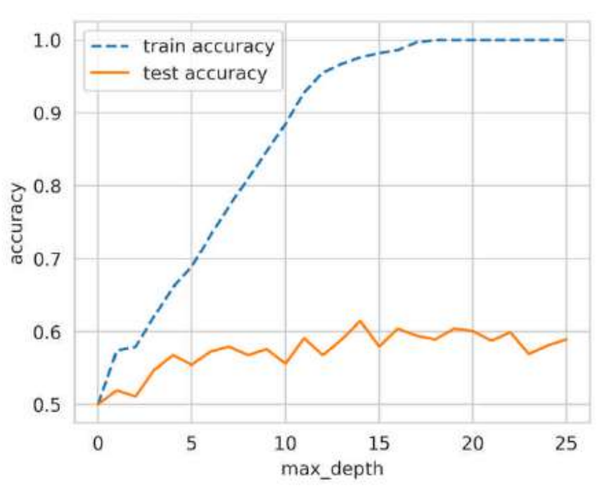
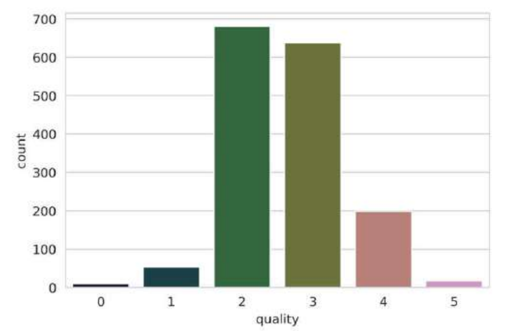
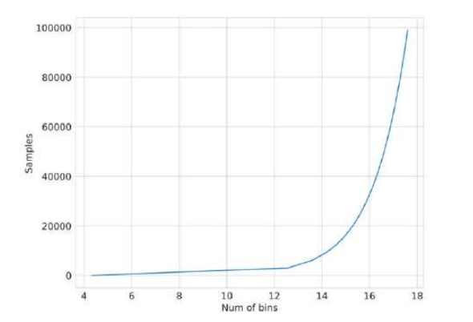
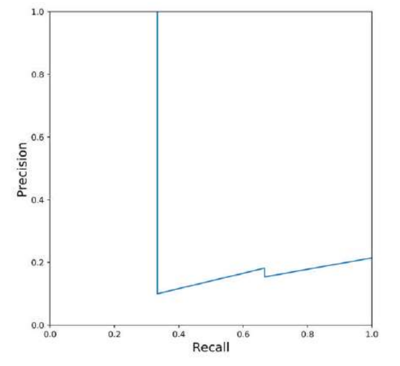
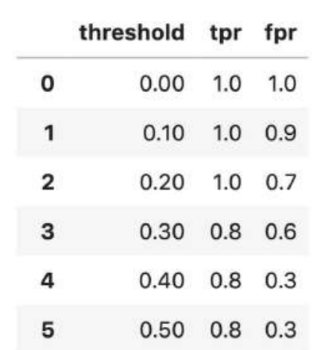
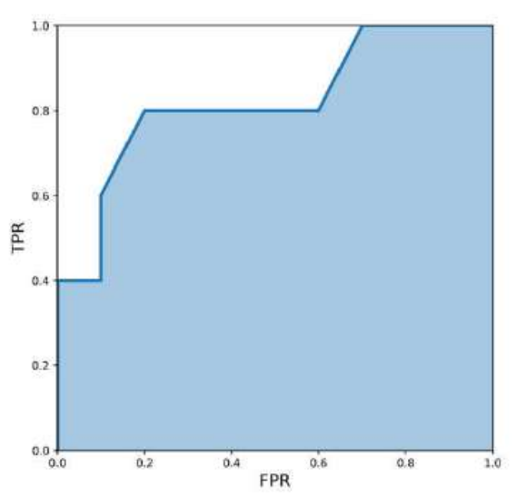
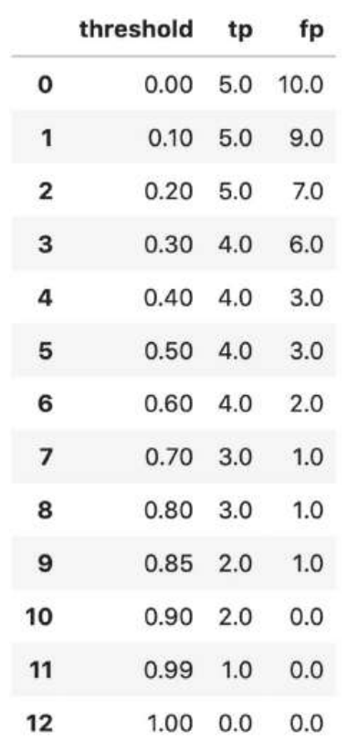

## MNIST El Yazısı Rakamları Üzerine İnceleme

```python
import matplotlib.pyplot as plt
import numpy as np
import pandas as pd
import seaborn as sns
from sklearn import datasets
from sklearn import manifold
%matplotlib inline

data = datasets.fetch_openml(
 'mnist_784',
 version=1,
 return_X_y=True
)
pixel_values, targets = data
targets = targets.astype(int)

single_image = pixel_values[1, :].reshape(28, 28)
plt.imshow(single_image, cmap='gray')

tsne = manifold.TSNE(n_components=2, random_state=42)
transformed_data = tsne.fit_transform(pixel_values[:3000, :])

tsne_df = pd.DataFrame(
np.column_stack((transformed_data, targets[:3000])),
columns=["x", "y", "targets"]
)
tsne_df.loc[:, "targets"] = tsne_df.targets.astype(int)

grid = sns.FacetGrid(tsne_df, hue="targets", size=8)
grid.map(plt.scatter, "x", "y").add_legend()
```

## Çapraz Doğrulama

```python
import pandas as pd
df = pd.read_csv("winequality-red.csv")

# a mapping dictionary that maps the quality values from 0 to 5
quality_mapping = {
 3: 0,
 4: 1,
 5: 2,
 6: 3,
 7: 4,
 8: 5
}
# you can use the map function of pandas with
# any dictionary to convert the values in a given
# column to values in the dictionary
df.loc[:, "quality"] = df.quality.map(quality_mapping)

# use sample with frac=1 to shuffle the dataframe
# we reset the indices since they change after
# shuffling the dataframe
df = df.sample(frac=1).reset_index(drop=True)
# top 1000 rows are selected
# for training
df_train = df.head(1000)
# bottom 599 values are selected
# for testing/validation
df_test = df.tail(599)

# import from scikit-learn
from sklearn import tree
from sklearn import metrics
# initialize decision tree classifier class
# with a max_depth of 3
clf = tree.DecisionTreeClassifier(max_depth=3)
# choose the columns you want to train on
# these are the features for the model
cols = ['fixed acidity',
 'volatile acidity',
 'citric acid',
 'residual sugar',
 'chlorides',
 'free sulfur dioxide',
 'total sulfur dioxide',
 'density',
 'pH',
 'sulphates',
 'alcohol']
# train the model on the provided features
# and mapped quality from before
clf.fit(df_train[cols], df_test.quality)

# generate predictions on the training set
train_predictions = clf.predict(df_train[cols])
# generate predictions on the test set
test_predictions = clf.predict(df_test[cols])
# calculate the accuracy of predictions on
# training data set
train_accuracy = metrics.accuracy_score(
 df_train.quality, train_predictions
)
# calculate the accuracy of predictions on
# test data set
test_accuracy = metrics.accuracy_score(
 df_test.quality, test_predictions
)
```
Sonuçlar;

max_depth = 3
Training accuracy: %58,9
Test accuracy: %54,25


max_depth = 7
Training accuracy: %76,6
Test accuracy: %57,3

Ağaç daha karmaşık hale geldikçe training performansı ciddi şekilde artıyor, fakat test performansı yalnızca biraz artıyor.

Bu nedenle aşırı öğrenmiş olduğu görülmektedir.


Aşağıda tüm derinlik değerlerini bulan kod verilmiştir;

```python
# NOTE: this code is written in a jupyter notebook
# import scikit-learn tree and metrics
from sklearn import tree
from sklearn import metrics
# import matplotlib and seaborn
# for plotting
import matplotlib
import matplotlib.pyplot as plt
import seaborn as sns
# this is our global size of label text
# on the plots
matplotlib.rc('xtick', labelsize=20)
matplotlib.rc('ytick', labelsize=20)
# This line ensures that the plot is displayed
# inside the notebook
%matplotlib inline
# initialize lists to store accuracies
# for training and test data
# we start with 50% accuracy
train_accuracies = [0.5]
test_accuracies = [0.5]

# iterate over a few depth values
for depth in range(1, 25):

    # init the model
    clf = tree.DecisionTreeClassifier(max_depth=depth)

    # columns/features for training
    # note that, this can be done outside
    # the loop
    cols = [
    'fixed acidity',
    'volatile acidity',
    'citric acid',
    'residual sugar',
    'chlorides',
    'free sulfur dioxide',
    'total sulfur dioxide',
    'density',
    'pH',
    'sulphates',
    'alcohol'
    ]

    # fit the model on given features
    clf.fit(df_train[cols], df_train.quality)
    # create training & test predictions
    train_predictions = clf.predict(df_train[cols])
    test_predictions = clf.predict(df_test[cols])
    # calculate training & test accuracies
    train_accuracy = metrics.accuracy_score(
    df_train.quality, train_predictions
    )
    test_accuracy = metrics.accuracy_score(
    df_test.quality, test_predictions
    )

    # append accuracies
    train_accuracies.append(train_accuracy)
    test_accuracies.append(test_accuracy)
# create two plots using matplotlib
# and seaborn
plt.figure(figsize=(10, 5))
sns.set_style("whitegrid")
plt.plot(train_accuracies, label="train accuracy")
plt.plot(test_accuracies, label="test accuracy")
plt.legend(loc="upper left", prop={'size': 15})
plt.xticks(range(0, 26, 5))
plt.xlabel("max_depth", size=20)
plt.ylabel("accuracy", size=20)
plt.show()
```



En popüler ve yaygın olarak kullanılan birkaç çapraz doğrulama tekniği:

k-fold cross-validation (k-katlı çapraz doğrulama)
stratified k-fold cross-validation (tabakalı k-katlı çapraz doğrulama)
hold-out based validation (hold-out tabanlı doğrulama)
leave-one-out cross-validation (birini dışarıda bırakma çapraz doğrulaması)
group k-fold cross-validation (grup k-katlı çapraz doğrulama)

Scikit-learn'deki KFold kullanılarak herhangi bir veri, k eşit parçaya bölünebilir.
k-fold çapraz doğrulama kullanıldığında, her örneğe 0'dan k-1'e kadar bir değer atanır.

```python
# import pandas and model_selection module of scikit-learn
import pandas as pd
from sklearn import model_selection
if __name__ == "__main__":
    # Training data is in a CSV file called train.csv
    df = pd.read_csv("train.csv")

    # we create a new column called kfold and fill it with -1
    df["kfold"] = -1

    # the next step is to randomize the rows of the data
    df = df.sample(frac=1).reset_index(drop=True)

    # initiate the kfold class from model_selection module
    kf = model_selection.KFold(n_splits=5)

    # fill the new kfold column
    for fold, (trn_, val_) in enumerate(kf.split(X=df)):
        df.loc[val_, 'kfold'] = fold
        # save the new csv with kfold column
        df.to_csv("train_folds.csv", index=False)
```

Normal K-Fold, verileri katmanlara rastgele böler; Stratified K-Fold ise her katmanda sınıfların oranını mümkün olduğunca aynı tutar. Özellikle dengesiz veri kümelerinde Stratified K-Fold çok daha güvenlidir.

```python
# import pandas and model_selection module of scikit-learn
import pandas as pd
from sklearn import model_selection
if __name__ == "__main__":
    # Training data is in a csv file called train.csv
    df = pd.read_csv("train.csv")
    # we create a new column called kfold and fill it with -1
    df["kfold"] = -1
    # the next step is to randomize the rows of the data
    df = df.sample(frac=1).reset_index(drop=True)
    # fetch targets
    y = df.target.values
    # initiate the kfold class from model_selection module
    kf = model_selection.StratifiedKFold(n_splits=5)
    # fill the new kfold column
    for f, (t_, v_) in enumerate(kf.split(X=df, y=y)):
    df.loc[v_, 'kfold'] = f
    # save the new csv with kfold column
    df.to_csv("train_folds.csv", index=False)
```

```python
b = sns.countplot(x='quality', data=df)
b.set_xlabel("quality", fontsize=20)
b.set_ylabel("count", fontsize=20)
```



Az örnekli regresyon problemlerinde aşağıdaki tabloya göre kaç bins'e bölünerek hedef binlere ayrılır bakılır ve oluşturulan bins değişkenine göre stratified k-fold yapılır. Direk k-fold da kullanılabilir.



```python
# stratified-kfold for regression

import numpy as np
import pandas as pd
from sklearn import datasets
from sklearn import model_selection


def create_folds(data):
    # kfold adında yeni bir sütun oluşturuyoruz ve başlangıçta -1 veriyoruz
    data["kfold"] = -1

    # Verinin satırlarını rastgele karıştırıyoruz
    data = data.sample(frac=1).reset_index(drop=True)

    # Sturges kuralına göre bin sayısını hesaplıyoruz
    num_bins = np.floor(1 + np.log2(len(data)))

    # Target değerlerini bin'lere ayırıyoruz
    data.loc[:, "bins"] = pd.cut(
        data["target"],
        bins=num_bins,
        labels=False
    )

    # 5 katlı Stratified K-Fold oluşturuyoruz
    kf = model_selection.StratifiedKFold(n_splits=5)

    # Fold'ları oluşturuyoruz
    # Burada target yerine bins kullanıyoruz
    for f, (t_, v_) in enumerate(
        kf.split(X=data, y=data.bins.values)
    ):
        data.loc[v_, "kfold"] = f

    # Geçici olarak oluşturduğumuz bins sütununu siliyoruz
    data = data.drop("bins", axis=1)

    # Fold bilgileri eklenmiş DataFrame'i döndürüyoruz
    return data


if __name__ == "__main__":
    # 15000 örnek, 100 feature ve 1 target içeren
    # yapay bir regresyon veri seti oluşturuyoruz
    X, y = datasets.make_regression(
        n_samples=15000,
        n_features=100,
        n_targets=1
    )

    # NumPy dizisini DataFrame'e dönüştürüyoruz
    df = pd.DataFrame(
        X,
        columns=[f"f_{i}" for i in range(X.shape[1])]
    )

    # Target sütununu ekliyoruz
    df.loc[:, "target"] = y

    # Stratified K-Fold'ları oluşturuyoruz
    df = create_folds(df)

    # Sonucu görmek için ilk 10 satırı yazdırıyoruz
    print(df.head(10))

```

## Değerlendirme Metrikleri

Sınıflandırma problemlerinde en yaygın kullanılan metrikler şunlardır:

* Accuracy (Doğruluk)
* Precision (Kesinlik) — P
* Recall (Duyarlılık) — R
* F1 Score — F1
* ROC (Receiver Operating Characteristic) eğrisinin altında kalan alan — AUC
* Log Loss
* Precision at k — P@k
* Average Precision at k — AP@k
* Mean Average Precision at k — MAP@k
* Regresyon problemlerinde kullanılan metrikler

Regresyon problemlerinde en yaygın kullanılan değerlendirme metrikleri ise şunlardır:

* Mean Absolute Error (MAE) — Ortalama Mutlak Hata
* Mean Squared Error (MSE) — Ortalama Kare Hata
* Root Mean Squared Error (RMSE) — Kök Ortalama Kare Hata
* Root Mean Squared Logarithmic Error (RMSLE) — Kök Ortalama Kare Logaritmik Hata
* Mean Percentage Error (MPE) — Ortalama Yüzde Hata
* Mean Absolute Percentage Error (MAPE) — Ortalama Mutlak * Yüzde Hata
* R² — R-kare

```python
def accuracy(y_true, y_pred):
    """
    Function to calculate accuracy
    :param y_true: list of true values
    :param y_pred: list of predicted values
    :return: accuracy score
    """
    # initialize a simple counter for correct predictions
    correct_counter = 0
    # loop over all elements of y_true
    # and y_pred "together"
    for yt, yp in zip(y_true, y_pred):
        if yt == yp:
        # if prediction is equal to truth, increase the counter
        correct_counter += 1
        # return accuracy
        # which is correct predictions over the number of samples
    return correct_counter / len(y_true)

from sklearn import metrics
l1 = [0,1,1,1,0,0,0,1]
l2 = [0,1,0,1,0,1,0,0]
metrics.accuracy_score(l1, l2)
# 0.625
accuracy(l1, l2)
# 0.625
```

```python
def true_positive(y_true, y_pred):
    """
    True Positive sayısını hesaplar.
    y_true: Gerçek değerler
    y_pred: Modelin tahminleri
    """
    tp = 0

    for yt, yp in zip(y_true, y_pred):
        if yt == 1 and yp == 1:
            tp += 1

    return tp


def true_negative(y_true, y_pred):
    """
    True Negative sayısını hesaplar.
    """
    tn = 0

    for yt, yp in zip(y_true, y_pred):
        if yt == 0 and yp == 0:
            tn += 1

    return tn


def false_positive(y_true, y_pred):
    """
    False Positive sayısını hesaplar.
    """
    fp = 0

    for yt, yp in zip(y_true, y_pred):
        if yt == 0 and yp == 1:
            fp += 1

    return fp


def false_negative(y_true, y_pred):
    """
    False Negative sayısını hesaplar.
    """
    fn = 0

    for yt, yp in zip(y_true, y_pred):
        if yt == 1 and yp == 0:
            fn += 1

    return fn

l1 = [0,1,1,1,0,0,0,1]
l2 = [0,1,0,1,0,1,0,0]

true_positive(l1, l2)
# 2
false_positive(l1, l2)
# 1
false_negative(l1, l2)
# 2
true_negative(l1, l2)
# 3

def accuracy_v2(y_true, y_pred):
    """
    TP/TN/FP/FN kullanarak accuracy hesaplayan fonksiyon.
    
    y_true: Gerçek değerler
    y_pred: Modelin tahminleri
    """
    
    tp = true_positive(y_true, y_pred)
    fp = false_positive(y_true, y_pred)
    fn = false_negative(y_true, y_pred)
    tn = true_negative(y_true, y_pred)

    accuracy_score = (tp + tn) / (tp + tn + fp + fn)

    return accuracy_score

l1 = [0, 1, 1, 1, 0, 0, 0, 1]
l2 = [0, 1, 0, 1, 0, 1, 0, 0]

accuracy(l1, l2)
# 0.625

accuracy_v2(l1, l2)
# 0.625

metrics.accuracy_score(l1, l2)
# 0.625
```

```python
def precision(y_true, y_pred):
    """
    Precision hesaplayan fonksiyon.
    y_true: Gerçek değerler
    y_pred: Modelin tahminleri
    return: precision skoru
    """

    tp = true_positive(y_true, y_pred)
    fp = false_positive(y_true, y_pred)

    precision = tp / (tp + fp)

    return precision

l1 = [0, 1, 1, 1, 0, 0, 0, 1]  # gerçek değerler
l2 = [0, 1, 0, 1, 0, 1, 0, 0]  # tahminler

precision(l1, l2)
# 0.6666666666666666

def recall(y_true, y_pred):
    """
    Recall hesaplayan fonksiyon.
    y_true: Gerçek değerler
    y_pred: Modelin tahminleri
    return: recall skoru
    """

    tp = true_positive(y_true, y_pred)
    fn = false_negative(y_true, y_pred)

    recall = tp / (tp + fn)

    return recall

l1 = [0, 1, 1, 1, 0, 0, 0, 1]
l2 = [0, 1, 0, 1, 0, 1, 0, 0]

recall(l1, l2)
# 0.5


import matplotlib.pyplot as plt

# Gerçek değerler
y_true = [
    0, 0, 0, 1, 0, 0, 0, 0, 0, 0,
    1, 0, 0, 0, 0, 0, 0, 0, 1, 0
]

# Modelin tahmin ettiği olasılıklar
y_pred = [
    0.02638412, 0.11114267, 0.31620708,
    0.0490937, 0.0191491, 0.17554844,
    0.15952202, 0.03819563, 0.11639273,
    0.079377, 0.08584789, 0.39095342,
    0.27259048, 0.03447096, 0.04644807,
    0.03543574, 0.18521942, 0.05934905,
    0.61977213, 0.33056815
]

# Listeler
precisions = []
recalls = []

# Threshold değerleri
thresholds = [
    0.0490937,
    0.05934905,
    0.079377,
    0.08584789,
    0.11114267,
    0.11639273,
    0.15952202,
    0.17554844,
    0.18521942,
    0.27259048,
    0.31620708,
    0.33056815,
    0.39095342,
    0.61977213
]

# Her threshold için precision ve recall hesapla
for i in thresholds:

    # Olasılıkları 0 veya 1'e dönüştür
    temp_prediction = [
        1 if x >= i else 0
        for x in y_pred
    ]

    # Precision hesapla
    p = precision(y_true, temp_prediction)

    # Recall hesapla
    r = recall(y_true, temp_prediction)

    # Sonuçları listelere ekle
    precisions.append(p)
    recalls.append(r)


# Precision-Recall grafiği
plt.figure(figsize=(7, 7))
plt.plot(recalls, precisions, marker="o")
plt.xlabel("Recall", fontsize=15)
plt.ylabel("Precision", fontsize=15)
plt.title("Precision-Recall Curve")
plt.grid()
plt.show()
```



```python
def f1(y_true, y_pred):
    """
    Function to calculate f1 score
    :param y_true: list of true values
    :param y_pred: list of predicted values
    :return: f1 score
    """
    p = precision(y_true, y_pred)
    r = recall(y_true, y_pred)
    score = 2 * p * r / (p + r)
    return score
```

```python
y_true = [0, 0, 0, 1, 0, 0, 0, 0, 0, 0,
          1, 0, 0, 0, 0, 0, 0, 0, 1, 0]

y_pred = [0, 0, 1, 0, 0, 0, 1, 0, 0, 0,
          1, 0, 0, 0, 0, 0, 0, 0, 1, 0]

f1(y_true, y_pred)
0.5714285714285715
```

```python
from sklearn import metrics

metrics.f1_score(y_true, y_pred)

0.5714285714285715
```

```python
def tpr(y_true, y_pred):
    """
    Function to calculate tpr
    :param y_true: list of true values
    :param y_pred: list of predicted values
    :return: tpr/recall
    """
    return recall(y_true, y_pred)
```

```python
def fpr(y_true, y_pred):
    """
    Function to calculate fpr
    :param y_true: list of true values
    :param y_pred: list of predicted values
    :return: fpr
    """
    fp = false_positive(y_true, y_pred)
    tn = true_negative(y_true, y_pred)
    return fp / (tn + fp)
```

```python
# TPR ve FPR değerlerini saklamak için boş listeler
tpr_list = []
fpr_list = []

# Gerçek hedefler
y_true = [0, 0, 0, 0, 1, 0, 1,
          0, 0, 1, 0, 1, 0, 0, 1]

# Bir örneğin 1 olma olasılığına dair tahminler
y_pred = [0.1, 0.3, 0.2, 0.6, 0.8, 0.05,
          0.9, 0.5, 0.3, 0.66, 0.3, 0.2,
          0.85, 0.15, 0.99]

# Elle belirlenmiş threshold (eşik) değerleri
thresholds = [0, 0.1, 0.2, 0.3, 0.4, 0.5,
              0.6, 0.7, 0.8, 0.85, 0.9, 0.99, 1.0]

# Tüm threshold değerleri üzerinde döngü
for thresh in thresholds:

    # Belirli bir threshold için tahminleri hesapla
    temp_pred = [1 if x >= thresh else 0 for x in y_pred]

    # TPR hesapla
    temp_tpr = tpr(y_true, temp_pred)

    # FPR hesapla
    temp_fpr = fpr(y_true, temp_pred)

    # TPR ve FPR değerlerini listelere ekle
    tpr_list.append(temp_tpr)
    fpr_list.append(temp_fpr)
```



```python
plt.figure(figsize=(7, 7))

plt.fill_between(fpr_list, tpr_list, alpha=0.4)
plt.plot(fpr_list, tpr_list, lw=3)

plt.xlim(0, 1.0)
plt.ylim(0, 1.0)

plt.xlabel('FPR', fontsize=15)
plt.ylabel('TPR', fontsize=15)

plt.show()
```



```python
from sklearn import metrics

y_true = [0, 0, 0, 0, 1, 0, 1,
          0, 0, 1, 0, 1, 0, 0, 1]

y_pred = [0.1, 0.3, 0.2, 0.6, 0.8, 0.05,
          0.9, 0.5, 0.3, 0.66, 0.3, 0.2,
          0.85, 0.15, 0.99]

metrics.roc_auc_score(y_true, y_pred)
0.8300000000000001
```

```python
# True Positive ve False Positive değerlerini saklamak için boş listeler
tp_list = []
fp_list = []

# Gerçek hedefler
y_true = [0, 0, 0, 0, 1, 0, 1,
          0, 0, 1, 0, 1, 0, 0, 1]

# Bir örneğin 1 olma olasılığına dair tahminler
y_pred = [0.1, 0.3, 0.2, 0.6, 0.8, 0.05,
          0.9, 0.5, 0.3, 0.66, 0.3, 0.2,
          0.85, 0.15, 0.99]

# Elle belirlenmiş threshold (eşik) değerleri
thresholds = [0, 0.1, 0.2, 0.3, 0.4, 0.5,
              0.6, 0.7, 0.8, 0.85, 0.9, 0.99, 1.0]

# Tüm threshold değerleri üzerinde döngü
for thresh in thresholds:

    # Belirli bir threshold için tahminleri hesapla
    temp_pred = [1 if x >= thresh else 0 for x in y_pred]

    # True Positive hesapla
    temp_tp = true_positive(y_true, temp_pred)

    # False Positive hesapla
    temp_fp = false_positive(y_true, temp_pred)

    # TP ve FP değerlerini listelere ekle
    tp_list.append(temp_tp)
    fp_list.append(temp_fp)
```



