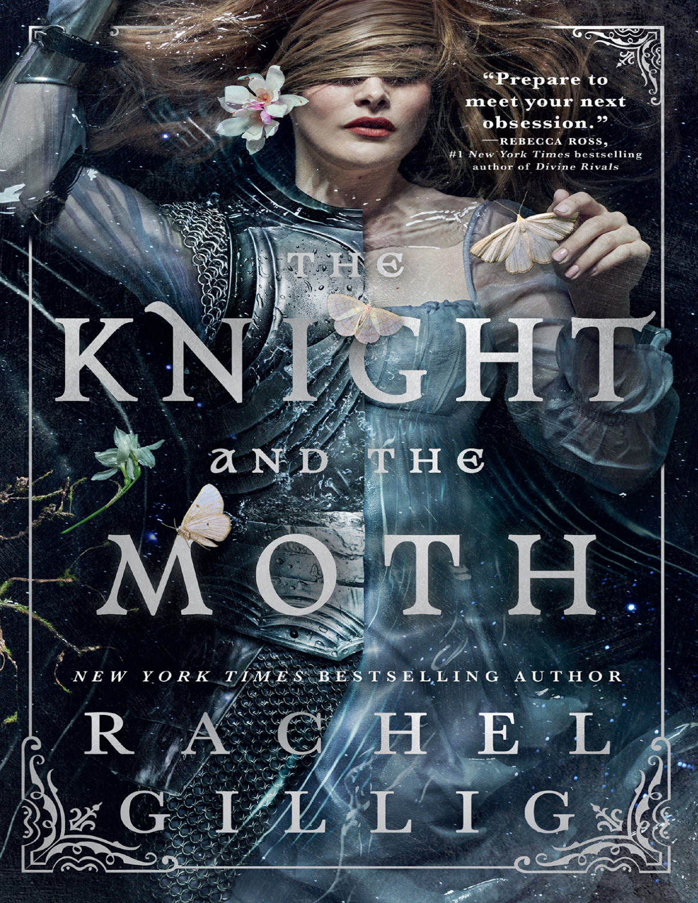
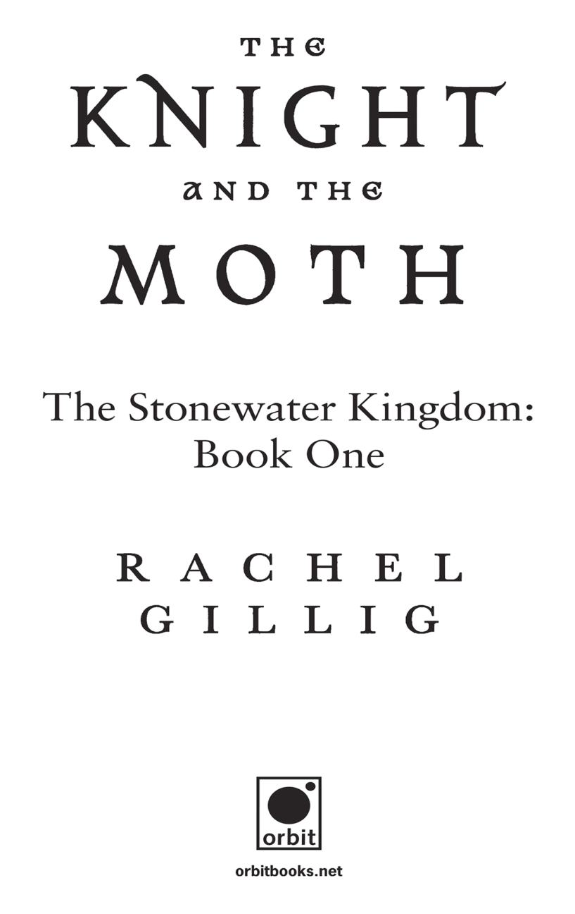
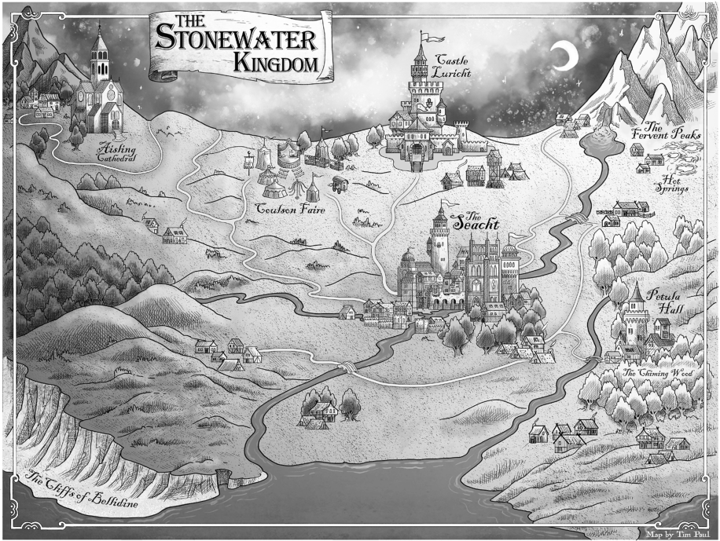

This book is a work of fiction. Names, characters, places, and incidents are
the product of the author’s imagination or are used fictitiously. Any
resemblance to actual events, locales, or persons, living or dead, is
coincidental.

Copyright © 2025 by Rachel Gillig

Cover design by Lisa Marie Pompilio
Cover photographs by Blake Morrow
Cover copyright © 2025 by Hachette Book Group, Inc.
Map by Tim Paul

Hachette Book Group supports the right to free expression and the value of
copyright. The purpose of copyright is to encourage writers and artists to
produce the creative works that enrich our culture.

The scanning, uploading, and distribution of this book without permission
is a theft of the author’s intellectual property. If you would like permission
to use material from the book (other than for review purposes), please
contact permissions@hbgusa.com. Thank you for your support of the
author’s rights.

Orbit
Hachette Book Group
1290 Avenue of the Americas
New York, NY 10104
orbitbooks.net

First Edition: May 2025
Simultaneously published in Great Britain by Orbit

Orbit is an imprint of Hachette Book Group.
The Orbit name and logo are registered trademarks of Little, Brown Book
Group Limited.

The publisher is not responsible for websites (or their content) that are not
owned by the publisher.

The Hachette Speakers Bureau provides a wide range of authors for
speaking events. To find out more, go to hachettespeakersbureau.com or
email HachetteSpeakers@hbgusa.com.

Orbit books may be purchased in bulk for business, educational, or
promotional use. For information, please contact your local bookseller or
the Hachette Book Group Special Markets Department at
special.markets@hbgusa.com.

Library of Congress Cataloging-in-Publication Data
Names: Gillig, Rachel, author.
Title: The knight and the moth / Rachel Gillig.
Description: First Edition. | New York : Orbit, 2025. | Series: The

Stonewater Kingdom ; book 1
Identifiers: LCCN 2024037289 | ISBN 9780316582704 (hardcover) | ISBN

9780316573788 (ebook)
Subjects: LCGFT: Fantasy fiction. | Novels.
Classification: LCC PS3607.I44448 K65 2025 | DDC 813/.6—

dc23/eng/20240816
LC record available at https://lccn.loc.gov/2024037289

ISBNs: 9780316582704 (hardcover), 9780316595728 (Target exclusive
edition), 9780316597692 (international edition), 9780316573788 (ebook)

E3-20250416-JV-NF-ORI

Contents

Cover

Title Page

Copyright

Dedication

Map

Aisling Cathedral

Chapter One: Six Maidens upon a Wall

Chapter Two: Omens

Chapter Three: The Foulest Knight in All of Traum

Chapter Four: Blackmail, for Instance

Coulson Faire

Chapter Five: Sprites in the Glen

Chapter Six: Hit Me As Hard As You Can

Chapter Seven: The Moth

Chapter Eight: Gone

Chapter Nine: Time to Go, Diviner

The Seacht

Chapter Ten: Young, and Rather Old

Chapter Eleven: The Harried Scribe

Chapter Twelve: Our Feet Will Take Us Where We Need to Go

Chapter Thirteen: Take Up the Mantle

Chapter Fourteen: Wax

The Fervent Peaks

Chapter Fifteen: Mountain Sprites

Chapter Sixteen: What Is Harrowing Is Hallowed

Chapter Seventeen: The Ardent Oarsman

Chapter Eighteen: Hit Me As Hard As You Can, Encore

Chapter Nineteen: I Can’t Swim

Chapter Twenty: With Hammer, with Chisel

The Chiming Wood

Chapter Twenty-One: Sybil Delling

Chapter Twenty-Two: Feel, but Cannot See

Chapter Twenty-Three: The Chime

Chapter Twenty-Four: Take Off My Armor

Chapter Twenty-Five: Unraveling

The Cliffs of Bellidine

Chapter Twenty-Six: You Can Never Go Home

Chapter Twenty-Seven: Love and Heartbreak

Chapter Twenty-Eight: The Heartsore Weaver

Chapter Twenty-Nine: The First Diviner

Aisling Cathedral, Returned

Chapter Thirty: The End of the Story

Chapter Thirty-One: The Last Diviner

Acknowledgments

Discover More

Also by Rachel Gillig

To the child in each of us, yearning to be special. Take

my hand, you strange little creature, and together we

shall walk beyond the wall.

Explore book giveaways, sneak peeks, deals, and more.

Tap here to learn more.

Aisling Cathedral

You know this story, Bartholomew, though you do not remember it. I’ll tell it
to you as best I can and promise to be honest in my talebearing. If I’m not,
that’s hardly my fault. To tell a story is in some part to tell a lie, isn’t it?

Once, you came upon Traum’s highest tor, where the wind whispered a
minor tune. There, the gowan flowers were white and the stones were gray
and both stole the warmth from your bare feet.

A cathedral was built there, and you tiptoed, small as an insect, through
the narthex, into the nave, down the aisle. Blood stained your lips, and you
fell into the spring that came from that ancient stone upon the chancel.
When you looked up at the rose window, the light kissed stained glass. Your
craft was obedience. You said the names of gods and how to read their
signs. You learned how to dream—

And how to drown.
I’m sorry. I don’t care to go back to this part of the story either,
Bartholomew. But I so often wonder…

Could the rest exist without it?

CHAPTER ONE

SIX MAIDENS UPON A WALL

T

he peculiar gargoyle, who spoke mostly in broken parables, shuffled to the
dim corner of the ambulatory. There, strung between iron candlesticks, a
spider’s web held a fly captive.

“Incessant buzzing.” The gargoyle wagged a limestone finger at the fly,
his craggy voice echoing through the cathedral. “Serves you right. If I’ve
told you once, I’ve told you a thousand times, watch where you are going.
Now”—he leaned close and peered at the web—“hold still. I’m going to
extract you from this snare.”

He did not extract the fly. He went on, lecturing the poor insect on the
dangers of flight. Had the fly been capable of reason, it might have
concluded it was better to die in the clutches of a spider than be the subject
of this particular gargoyle’s attentions. But the fly could not speak, and thus
uttered no complaint. It just kept on buzzing, and the gargoyle kept on
talking—

And that was how I was able to slip from the pew I was dusting to watch
the king ride up the hill.

Into the nave I ran, bare feet slapping against stone, then I was out of the
cathedral, accosted by the sunset, its light filtering through the gossamer
shroud I wore around my eyes.

The gravel courtyard was empty, visiting hours at an end. The only

figures present were five limestone statues. Five faceless, hooded figures.
They stood nigh ten spans high, their ancient arms held open in beckoning.
All five were identical but for their left hands—each clasping a distinct
stone object. One statue held a coin, another an inkwell. One bore an oar,
another a chime, and the final a loom stone.

I wove between the statues on tiptoe, touched by the pervasive fear that I
would anger them if I wandered too loudly. But they were mere stone,
tendering neither ire nor love. Still, they watched me through the darkness
of their hoods, predatory in their stillness. I felt them, just as I felt Aisling
Cathedral’s gaze—with its eyes of stained glass—silent and ancient and
disapproving, upon my back.

I hurried on.
The courtyard gave way to grass, and stone was replaced by an orchard
of gnarled fruit trees. It was late summer, and blood-red apples hung in
clusters. I raised a hand above my head and ripped one from its branch
without breaking my stride. When I broke through the orchard, a long stone
wall stood ahead of me. Upon it—

Five maidens waited.
They wore the same pale fabric as I did, their eyes shrouded with
identical gossamer. Perched high upon old stones, bathed in sunset light,
their dresses caught the wind. They looked like five flags of surrender, there
upon the wall.

As if sensing their last counterpart, the women turned as I approached.
The tallest, who’d waved at me from the cathedral doors and hissed, It’s the
bloody king! cupped her hands around her mouth and hollered. “Hurry!”

I put the apple between my teeth and pressed calloused fingers onto old
stones. Twelve spans high and fraught with lichen, the wall was difficult to
scale. But nearly ten years can make a master out of anyone—the stones
were a familiar adversary.

I hauled myself up. The women made room for me, and I swung a leg
over and straddled the wall. “You’re sure it’s him?”

Two—I didn’t know her name, only her number—tall and solemn,
pointed a finger over the vista. “I saw purple banners beyond that bluff.
Swear it on my mother.”

“Might mean a bit more if you had a mother,” Three muttered.
“Give it a moment,” Two said, spine like a rod. “You’ll see that I’m

right.”

Next to me, Five pushed her orange hair out of her face. The wind
shoved it right back. “Are you going to share?” she said, nodding at my
apple.

I offered the fruit up. “It’s not very sweet.”
“Blech.” She made a face and threw the apple over the wall. It fell with
a thud onto the side of the road—a red pinprick among greenery. “How can
you eat that?”

“I suppose we’ll never know.”
On my other side, Four twisted a fistful of wild black curls. She rested
an arm on my shoulder, and our gazes met. Or I assumed they did. It was
impossible to tell, with the shroud that covered their faces from their brows
to the bridge of their noses, where any of the women were truly looking. I
did not know their names, and I did not know the color of their eyes.

I did not know the color of my eyes.
“I’ll be damned.” A smile crept over Four’s lips. “Here he comes.”
We turned. There, from the east, peeking out from knolls of green—
Purple banners.
I squinted. Seeing through my shroud was akin to peering through steam
off a kettle. But the tor upon which the cathedral sat was so high and
Traum’s hills so sprawling and the air so clear that it was no trouble
working out the details of King Castor’s procession the moment the hills
spat it into view.

There were nearly two dozen of them—bannermen and squires and
knights. What a display they made. Daylight danced over their armor and
the noise of them caught the wind, sounding over the tor in echoes,
distorting their words into a false translation. Even at a distance I could see
which one was King Benedict Castor. His armor was not the same silvery
iron as his knights’ but gilt, as if he were the sun and they a cluster of lesser
stars.

It was my first time, seeing the boy-king.
The procession dipped behind a roll in the tor. In ten minutes, it would
pass directly beneath the wall where we, like expectant sparrows, perched.

One tapped her chin. “That’s a lot of knights just for a Divination.”
Four grinned. “Lucky for us.”
“I hear this king is a child,” Three said in her usual flat way, like she was

reading the words instead of speaking them. “That he shakes at his own
shadow. Perhaps he fancied protection in spooky old Aisling.”

“Swords and armor mean nothing here,” I whispered to the wind.
The others nodded.
“On that note—” One reached into the shapeless billows of her dress
and extracted six stalks of straw. “Gather, shrews.”

We let out a collective groan, then shifted on the wall. When we’d
finished moving, Two stood directly in front of One and her fistful of straw.
The game was simple.

Don’t get the short straw.
Two examined the straws, plucking a long straw from the center of the
bundle. One pulled from the edge—another long straw. They kept pulling
until only a pair of straws remained. After a pause, One took her turn.
Yanked her chosen straw free—

And grinned. “The short straw goes to you, Two.”
Two’s chin was high as she looked down the line of us. “Get over here,
Three.”

The rounds of the game continued. Two defeated Three and smugly
went to stand next to One while the rest of us bit our nails and waited for
our turns. Three defeated Four, and so did Five.

By the time Four faced me, her final opponent, she was as rigid as a tin
soldier.

Shuffling to a dance only we knew, we rotated along the wall, the
sounds from the king’s procession growing louder. Four held the straws in a
stranglehold and nodded at me. “You first.”

I studied the frayed yellow edges and chose a long straw.
So did Four. Horses whickered and knights laughed in the near distance.
I chose again, another long straw. Another for Four, too.

“The final straws.” Three let out a low whistle. “Worried you’ll be too
sick to flirt, Four?”

“Shut up.” Four jerked her chin at me. “Go on.”
I knew what she was thinking. It’s what all of us were thinking. Why
we’d played the same game a hundred times before.

I don’t want to be the one to dream.
Wind stirred my cropped silver-blond hair, but my eyes did not leave the
straws. The distinct pattern in their tattered yellow tips. “This one.”

The women all leaned forward, and the straws were revealed. Two let
out a laugh. “You’re a lucky bitch, Four.”

I’d chosen the short straw.
Four’s laugh was coated in relief. “Just as well, Six. You’re the favorite.
You never thrash in the water.”

I took the straw into my toughened palm, the little thing ugly and brittle,
then plopped to a seat on the wall just as the procession’s first riders came
into view.

The first, riding a pale warhorse with nary a grass stain upon its flank,
was the king.

Benedict Castor did not ride with an iron spine the way I’d seen his
predecessor, King Augur—gray of eye, gray of hair, cold and disinterested
—did. Indeed, King Castor seemed slightly bent in his saddle, creaking in
his armor as if unaccustomed to its grip, like a squire playing dress-up. His
cheeks were round and his jaw naked. I wondered if he even needed to
shave.

“Imagine,” Five said, “seventeen and chosen by the knighthood to
protect the faith. Seventeen, and already a king.”

“Everything in the world to prove,” One murmured, looking down at
him.

King Castor passed beneath us and did not look up, unaware that he was
being watched. But when Four sighed, the king’s bannerman lifted his gaze.
When he saw us upon the wall, his eyes went wide. Diviners, he mouthed,
though no sound came out. Then, bolder, he called to the knights behind
him. “Six maidens upon the wall. Diviners!”

There was a loud shuffle—whickering horses.
The knights rode into view. There were women as well as men within
their ranks—all variant in appearance. Some had the distinguished pale hair
of the Cliffs of Bellidine, or the sharp, angled features of those who lived
near the Fervent Peaks. One knight, axe slung over her shoulder, had
charcoal painted around her eyes, distinctive to the Chiming Wood.

“Diviner,” a knight called, raising the visor of his helmet. He was
looking up at Four. “Beautiful mystic. I have slain sprites—defended the
Omens and the faith. Pray, for my glad devotion, lend a kiss.”

More knights craned their necks, took off their helmets, to survey us
better. Some said the knight’s creed in greeting, others threw gowan flowers

and pleaded—oh, how they pleaded—for our attention, our words, our
kisses, though the wall was too high and we were more satisfied to watch
them beg than to offer up our lips.

I leaned forward and tried to see their eyes. The abbess and the five
women with me upon the wall all wore shrouds. Besides visitors to the
cathedral, the only eyes I regularly glimpsed belonged to the gargoyles. And
they, fashioned of stone, were like looking upon the cathedral itself.
Astounding to behold—and entirely lifeless.

The bells began to ring.
The king’s procession thinned, the last of the knights riding beneath us.
The Diviners moved along the wall with practiced balance to follow, but I
remained seated.

I opened my hand and let the broken pieces of the short straw dance
away, caught by a fickle northern wind. The cathedral bells kept ringing,
insistent in their peals. I pushed to my feet to heed them, preparing myself
for what came next—

A horse whickered from below.
Stalled on the road, a final knight remained. His horse had come to a full
stop and was chewing noisily on something it had found in the greenery
beside the road.

My apple.
The knight tried to spur the animal on, but the horse, grunting its
contentedness, was having a love affair with the apple. It did not budge.

A muffled string of profanity sounded beneath an armored helmet. The
knight shifted in his saddle at the din of the cathedral bells, tilting his head
upward—affording me a view of the dark slit in his visor from which he
surveyed the world.

There was no seeing his eyes. No way for him to glimpse mine through
my shroud. Still, I felt it, somewhere between my stomach and throat, the
instant he spotted me on the wall.

His shoulders went rigid. Slowly, he reached for his helmet. Removed it.
There was a mess of black hair. He shoved it from his face, and I drew in a
breath.

Sharp features. Dark brows. A prominent nose. His skin was olive,
golden from sun, yet there was no warmth in his face. Light caught along
three gold bands pierced into his right ear. Severe, rimmed in charcoal, his

eyes were so brown they might easily be mistaken for black.

There was no warmth in them, either.
He watched me, his gaze wide—then immediately narrow. Slowly, his
mouth twisted into a sneer, its meaning unmistakable.

What the hell are you looking at?
The other knights had all smiled at me, unchallenging and awestruck
and reverent. This one, it seemed, had no such compulsion. “Knight,” I
called. “You lot make quite the spectacle. Is the king so fretful that he
requires the company of his entire knighthood for a Divination?”

The knight’s gaze remained tight. He said nothing.
“I asked if your king—”
“Between our two lots, mine is hardly the spectacle.”
I blinked. “Excuse me?”
He issued no clarification, his armor creaking as he continued to
measure me with unfriendly eyes.

I straightened, looming over him like one of the cathedral’s spires. “A
respectable knight would just as soon bite off his own tongue than speak to
a daughter of Aisling like that.”

He pressed his lips together, like I’d told him a joke at my own expense.
A craggy voice called behind me. “Bartholomew!”
I whirled. In the orchard, touched by the looming shadow of the
cathedral, was the same peculiar gargoyle I’d left in the ambulatory. He
called to me again. “Get down at once, Bartholomew. We are needed
inside.”

I glanced back at the road. The knight had managed to spur his horse
and was riding fast to catch up to the others.

I frowned at his receding figure.
“I say, Bartholomew, can you hear me?” The gargoyle brandished a
chastising finger. “Climb down this instant—”

“I heard you, I heard you.” I grasped the edge of the wall and lowered
myself until my bare feet touched grass.

There were twenty-three gargoyles at Aisling Cathedral, and no two
alike. Composed of limestone, they bore an unsettling combination of
human and animal qualities, most fitted with wings and the gift of flight.
This one had a protruding brow, fangs, claws, and wings like a bat carved
behind his back, though I’d never seen him fly because, apparently, the

skies are feckless, and it would be an insult beyond recovery to be mistaken
for a bird.

But as much as they were distinct, the gargoyles were also all alike.
They all bore a strange allegiance to Aisling Cathedral, dedicated to the tor
and always minding the abbess, as if of the cathedral. They grunted, but
rarely spoke.

Save this one.
I approached, my hands out in supplication. When it came to this
particular gargoyle, who called everyone and everything Bartholomew for
no discernable reason, it was better to be contrite. When he took to sulking,
it lasted for days. “Apologies,” I said. When I stood next to him, his brow
was at my shoulder. “I was chastising an idiot.”

“A happy pastime, as you’ve proven to me on many occasions. But, the
king is upon us, with nary a warning. The utter gall of men.” He rolled his
stone eyes. “Have you chosen among yourselves who will dream in the
spring?”

“I will.”
“Very good.” He held out his claw-tipped hand. “Hurry.”
He led me back through the gnarled apple orchard. We hastened through
the courtyard, past the statues, returning, as if reeled back by a lure, to the
cathedral.

Day was succumbing to night when we reached the tall oaken doors.
The abbess was there, waiting. I could not see her face, nor any of her skin.
Her shroud, a pale curtain that stretched to her chin, covered her face
entirely, and her hands were protected in white silken gloves. It was only
the tightness of her fists at her side, the note of ice in her voice, that gave
her dissatisfaction away.

“It seems the king has come for an unexpected Divination. Benedict
Castor the Third.”

She said his name quickly, like something bitter she wished to spit out.
Apparently the abbess did not think much of the new boy-king. Wind
rippled over her shroud. “You will be dreaming, Six?”

“Yes.”
A low hmm of approval sounded in her throat, and I felt my chest swell.
The abbess touched my cheek, stepped aside so that the gargoyle and I
could pass into the narthex, then closed the cathedral doors behind us.

Aisling Cathedral was dark. Cold. Its stagnant air smelled of limestone
and mahogany—but not enough to mask the sickly-sweet odor of rotting
flowers that came from within.

“I washed the Divining robes this morning.” The gargoyle led me down
the nave. On the final pew, six silk robes waited. “It was an abundant chore.
I am within myself with fatigue.”

“Beside,” I murmured, peeling off my clothes. “‘Beside myself with
fatigue’ is the proper expression.”

The gargoyle’s stone brow knit. “If I were beside myself, there would be
two of me, and the washing would have taken half the time.”

He turned his back before I could reply and let me work the buttons of
my clothes in privacy. First off was the billowing gossamer over gown.
Next came the thin flaxen chemise. I wore no jewelry, no knit leggings, no
shoes. I eased off my braies and let them drop down my legs. When I was
done, the only fabric left on my body was my shroud.

Naked, I shivered.
The Divining robes were still warm from the clothesline. I took the one
with VI embroidered into its cuff. White and unblemished and silken, so
much finer than the clothes I’d just stripped away, the robe felt decadent,
but not comforting.

“I’m ready.”
I’m ready, my echo taunted, ricocheting against the cathedral’s stone
walls.

The gargoyle turned. He looked upon me with stone eyes and offered his
hand once more, leading me onto the transept. There, situated in the center
of the cathedral like a heart—

Was the spring.
A great limestone had fissured long ago, and Aisling was built around it.
From the stone’s wide fissure, an ancient spring leached, like a long, narrow
bath. Its water was oily and dark and smelled of rotting flowers.

The cathedral bells rang again. There was tightness in my chest.
Tightness in my throat. I approached the spring slowly—lifted the hem of
my robe.

The gargoyle handed me in.
The viscous water reached just above my navel. It, like everything in the
cathedral, was cold. I shivered, the spring taking me into its frigid womb,

lapping up the silk of my robe, rendering it translucent.

I looked up. Above me, high in the cathedral’s cloister, five stained-glass
windows loomed, each depicting a stone object—the same objects held in
the hands of the courtyard statues.

A coin, an inkwell, an oar, a chime, and a loom stone.
The sixth and final window was centered on the east wall—an enormous
rose window, fixed with thousands of pieces of stained glass. Its design was
different than the others, depicting no stone object, but rather a flower with
five peculiar petals that, when I studied them, looked all the world like the
delicate wings of a moth.

The final rays of daylight set the windows aglow, but the light remained
high—out of reach. The spring I stood in was the holiest place in Traum,
and yet I was in darkness.

Silent, they came from the shadows of the transepts—six more
gargoyles. They marched until they’d positioned themselves around the
spring like hour markers on a sundial.

The cathedral doors pushed open.
The king’s knights came into the narthex. They were hushed now, as if
Aisling Cathedral had sucked the words from their mouths. Helmets
removed, their heads lifted as they took in the artistry of the cathedral—its
fine marble floors, its carved reliefs and vaulted ceilings and stained-glass
window.

The bells stopped ringing.
Behind his knights came King Castor, walking side by side with the
abbess. With his glimmering armor and her pale robes, her shroud like a
veil, they might have been bride and bridegroom, taking the long walk
down the nave to say their vows upon the chancel. The difference was—

A bride does not hold a knife.
The knights found their seats upon the pews. When the abbess and the
king reached the stone in the heart of the cathedral, they stood opposite
each other—directly in front of me.

The abbess spoke as she always did during a Divination. Without
feeling. “This is your first time being Divined for, Benedict Castor. Have
you brought your offering?”

The king stood before me, his blue eyes wide and glassy. “Twenty gold
pieces.”

“And what is it you wish to learn from this Diviner’s dream?”
“Nothing.” A touch of red bloomed across the king’s face, his voice
coming out frayed. “That is, I want to know if they favor me, I suppose,
now that I am the new king of Traum.”

He trembled, and I stood perfectly still. The poor boy was afraid, and he
looked even younger for it, despite his distinguished armor. I wondered if,
in that moment, I was seeing Benedict Castor more clearly than anyone ever
had. It was why I loved being a Diviner. I felt so much wiser, stronger,
standing in Aisling’s spring. It was grotesque, but it roused me.

Even if I hated what came next.
The abbess stayed silent a long while. Then, slowly, she handed the king
of Traum the knife. “Then begin.”

CHAPTER TWO

OMENS

T

he blade made no noise when King Castor cut himself. He did it over the
heartline of his palm, then curled his fingers, holding the responding swell
of blood in his hand like a chalice holds wine. It was a sacred act—giving a
bit of oneself up for the art of Divination.

The abbess took King Castor by the wrist and brought his bloody hand
to my mouth. The king went gray and turned his gaze to the wall, like he
could not bear the sight of his blood—or me.

“Drink,” the abbess commanded.
I opened my mouth, and the king’s blood poured over my tongue,
viscous and warm. It tasted vile. Blood always did.

I swallowed, straining against the urge to be sick.
The abbess began her oration. “Traum is an old name for an even older
land. Its history is as outlandish, as lurid, as a dream. But in many ways, its
true history began upon this very tor—”

She paused, turning to the king. “Though perhaps a Castor like yourself
would not like to hear the story I tell before a Divination. Shall we simply
proceed with the dream?”

King Castor shuffled his feet. “I would like to do things the proper way.
Please, go on.”

The abbess touched my cheek, a familiar act of silent affection, then
continued. “We know Traum and its hamlets like our own five fingers.
Coulson Faire, the hamlet of merchants. The scholarly city-heart—the
Seacht—the hamlet of scribes. The Fervent Peaks, near the mouth of our
river, the hamlet of fishers. The cosseted birch forest, the Chiming Wood,
where the foresters dwell. The florid Cliffs of Bellidine, occupied by
weavers.”

The abbess sighed. “The old stories vary, of course, but in one way they
are all alike. Traum was full of monstrous creatures. Sprites, who roamed
the hamlets. Folk tried to fight them, but the hamlets were not unified,
floundering without gods, without divine principles, without a ruler. And
when none of those things exist—”

There are inevitable tragedies, I recited to myself.
“There are inevitable tragedies.” The abbess’s voice echoed. “Food and
coin and children were stolen from the hamlets by sprites. Murder was
committed. Crops died, boats crashed, wool was infested by beetles. Soon,
Traum’s people were like sprites themselves—wild creatures, strange and
ravenous and entirely without virtue.”

“Sounds like a good time to me,” one of the knights muttered.
King Castor managed a shaky grin. I glowered at him from behind my
shroud.

The abbess continued. “The deaths grew, and so did discord between the
hamlets.”

Until one night.
“Until one night. One dark, lonely night, when the air was so cold it
painted the sky an incomparable purple hue, six gods visited Traum.”

A scoff echoed through the cathedral.
Armor rattled and low voices sounded, then one of the knights was
pushing away from a pew, his steps loud on the stone floor. He shoved the
cathedral door open, evening light flittering through dark hair and over
three gold bands in his right ear.

The knight from the road. He cast one baleful look over his shoulder—
Then kicked the ancient wood door shut behind him.
The abbess waited for the echoes of his departure to settle, then
continued, unperturbed. “One dark, lonely night, a foundling child left its
hamlet and climbed a looming tor in search of food. The tor did not offer

much life save whispering grass and gowan flowers and pale moths. But
then—a spring! A strange spring at the top of the tor, leaching from a great
stone. The child came to the lip of the water—drank deeply.” She drew in
an affected breath. “And was swept into a dream.”

I’d heard the story so many times I could see it in my mind. A child, like
I’d been when I’d come to Aisling Cathedral, lying in dark water before
transfixed onlookers. It made me proud that a foundling—like me—should
be the most important figure in Traum’s most sanctified story.

Even if that child didn’t have a name.
The abbess carried on. “When the child woke, sick and weak, it told
passersby a vivid tale of six unearthly figures who had visited its wakeless
mind—shadowy figures who bore stone objects, each object possessing
unique power. The child’s tale grew legs, and folk of the hamlets came to
the tor to see the spring. Again and again, the child drank the water and
dreamed. In time, the child learned that the movements of the stone objects
were presages. And so, the gods who wielded them were named.”

“Omens,” I whispered.
“Omens,” the abbess repeated. She lifted a finger, pointing to the
windows on high, and every soul in the cathedral raised their eyes to the
stained glass. “The Omen who bore a stone coin, the child named the Artful
Brigand. The Omen fitted with the inkwell was christened the Harried
Scribe. The Omen who wielded a stone oar was called the Ardent Oarsman.
The Faithful Forester carries the chime.” She pointed at the last arched
window. “And the Heartsore Weaver employs her sacred loom stone.”

The abbess directed her finger to the final window—the great rose
window. “But the sixth Omen bore no stone object. It revealed nothing of
itself at all, appearing only as a pale moth on tender wing. Some say it
shows itself the moment you are born, others believe it comes just before
you die. Which is true”—she opened her palms, like two pans of a scale
—“we cannot know. We may read their signs, but it is not our place to
question the gods. The moth is mercurial, distant—never to be known, even
by Diviners.”

She put a gloved hand to her chest. “Of course, there are those of us who
have long believed the Omens are vaster than the dreamscape they occupy.
That the moth and the others exist—hidden in the hamlets, killing horrible
sprites and swaying the fate of Traum with their magical stone objects. Ever

present—always watching.”

Saliva pooled in my mouth, heavy and tasting of iron. It was almost
time.

“And so,” the abbess said, “we find ourselves in the center of Traum’s
greatest story. A great cathedral was built upon the spring’s tor, and more
foundling children were brought there to dream, and they became daughters
of Aisling, revered Diviners. A king was crowned, and Traum’s five hamlets
were unified by belief, thusly named the Stonewater Kingdom. The king’s
knights were tasked with defending the faith as well as they defended the
hamlets against sprites.”

She paused, looming over young Benedict Castor, whose eyes were on
his feet. “And the king swore to be more supplicant than sovereign, that he
would never take up the mantle of his faith for personal gain—never seek
the Omens or their stone objects for his own power or vanity.

“For in the end,” the abbess said, “we are all supplicants. Whether
craftsman or a king, knight or foundling or Diviner—faith is the same. It,
like Aisling Cathedral, holds up the hamlets. And while we all bear our own
creeds, we must never forget—it is the Omens who rule Traum. Omens who
scrawl the signs. We are but witnesses to their wonders. Pupils of their
portents.” She raised her hands in beckoning. “Ever but visitors to their
greatness.”

“Ever but visitors,” I called.
“Ever but visitors,” the king murmured.
“Ever but visitors,” the knighthood echoed.
The gargoyles closed in around the spring.
Breath shuddered out of me. “What name, with blood, would you give
the Omens?” I said to the king.

He startled, as if he’d forgotten me. “Benedict Castor the Third.”
The abbess put her hands on my shoulders.
“Lie down,” she instructed me.
The smell of rotting flowers—the taste of blood—the slip of oily water
—were everywhere. I lay on my back in the spring, looking up into
Aisling’s reaching cloister and the windows therein, it in light, I in
darkness.

The abbess leaned over me. “Dream,” came her final, resolute
command.

She pressed down on my clavicle, hard enough to bruise.
I sank into cold, terrible water.
I shut my eyes, opened my mouth. Sucked water into my lungs and
choked. My body spasmed once, twice—a ripple in the spring. Then I did
what I’d always done since my very first day at Aisling Cathedral.

I drowned.
There was pain, pain, then—
Nothingness. A bright, pallid nothingness.
I lay on a clean stone floor, looking up at the same windows as before.
Only now, it seemed much higher, the vaulted cathedral roof cloudy, as if
far above me in the sky.

Gargoyles, Diviners—the abbess and the king and his knights—were
gone. Not even the mahogany pews remained. I was alone in a pale, liminal
version of Aisling that had never existed in my waking hours.

I got to my feet. My robe had disappeared. The only stitch of fabric I
wore now was my shroud. I looked down at my nakedness, hair and flesh,
fat, muscle, and bone. A strange laugh bubbled in my throat. I always felt a
mile wide after swallowing blood and water and drowning in the spring. As
if I were infinite, holding all that discomfort so well within my body. It
made me sick with self-loathing—and flushed with pride.

A shadow shifted in the corner of my eye. I turned, but the shadow
flickered, then vanished.

I was small in the vast space. “Omens,” I called. “I am your harbinger,
your dreamer—ever but a visitor. I’ve come to Divine.”

Silence. Then—
The cathedral began to ripple. Light blurred away the details, pillars and
windows and buttresses all caught in a strange, undulating glow. I walked
through the pale nothingness, the world sluggish, but my heart upon a
hummingbird beat.

The cathedral rippled in earnest. Dark spots, like stains upon fabric,
perforated the wide white space. “I’ve tasted the blood of Benedict Castor
the Third.” Once more, I said, “I’ve come to Divine.”

The cathedral rippled, rippled—
Then winked out entirely.
The floor beneath my feet gave way, and I fell through seams of light
into darkness. My stomach lurched, hands and feet hollowed out as my

body gave way to the sense of falling.

A flash of silver in the darkness. Then—
My knees hit first, then my hands, the substance beneath them cold and
hard and unsteady. I swallowed a groan and teetered. Tipped, toppled, then
rolled over myself like a pin over dough. There was a chorus of clinking,
and when I stopped rolling, twisted and naked and already bruising, I
braced myself and sat up.

Coins. I’d fallen upon a bed of coins. Hundreds, thousands of coins
stacked in a dark room.

I scanned my surroundings. Looked up. There were purple banners in
the room, long windows, and an illuminating blue sky. Still, I could see the
ghost of Aisling’s buttresses, her vaulted ceilings—her cold stone innards.

They’d have dragged me out of the spring by now. Once rendered
unconscious by the drowning, a Diviner was always pulled from the water
and laid down to dream upon the chancel, set on her back with open arms,
like an offering.

I could still hear what was happening outside my dream, but the sound
was muddled. “Well?” the abbess’s faraway voice called.

I opened my mouth to answer—
Then saw it. A coin, different from the rest, suspended in air. One side
was smooth stone, the other dark and rutted and rough.

“The Artful Brigand’s coin,” I called. “I can see it. The rough side is
up.” I let out a breath. “A presage of bad fortune.”

If the abbess responded, I didn’t hear it. The floor beneath my feet
vanished, coins raining into darkness and me with them.

I fell with an unceremonious oomph onto wool carpet. The coins were
gone. I was in a new space—a dark corridor with high walls covered in
paintings that, no matter how hard I squinted, I could not make out. They
looked like bodies, naked like mine, contorted into all manner of shapes.

High above, nigh transparent, Aisling’s ceiling loomed.
My steps made no sound upon the carpet, but my heart was frantic. To
drown in Aisling’s Cathedral’s magical spring, to dream of the Omens, was
always like this. Painful. Eerie. No matter how many times I dreamed, I
could not escape the keen sense of entrapment that settled over me, as if
someone I could not see, a hooded figure, perhaps, was watching me—
darkening the edges of my periphery.

My lower back, my underarms, the soles of my bare feet, dampened
with sweat.

Then it wasn’t just sweat. Something wet leached onto my feet, cold as
it burrowed between my toes.

I saw it then. An inkwell at the edge of the corridor, black ink spilling
from it onto the carpet like a bleeding wound.

“The Harried Scribe’s inkwell,” I said, making my voice as loud as I
could. “It’s overturned. Leaching black ink. A terrible sign.”

Whispers sounded above me. Then the ink, the carpet, the corridor were
all falling away, and so was I. I plummeted through darkness, through
nothingness, into wan gray light. A rush of air slapped me over the face.
There were no coins, no carpet to catch me this time. Just jagged,
unforgiving shale and mountainous stone. I put out my hands to catch
myself—

And slammed onto a boulder, shattering my collarbone.
“Where are you now, Six?”
I gnashed and writhed and swallowed the overpowering urge to be sick,
hot agony scraping over me.

“Six?” The abbess’s voice was an echo, but no less commanding.
I’d watched Four dream once. I’d been young and curious to know what
I must look like while Divining, but seeing Four drown had unnerved me so
acutely I’d nearly left. Then the abbess, who was so much stronger than I’d
estimated, pulled Four out of the spring like she weighed no more than a
broom and laid her down, supine, upon the chancel. I’d always imagined
there was flailing—maybe even writhing—involved in the craft of
Divination. To dream of the Omens was to fall into nightmares, and the pain
I felt while unconscious was as real to me as the pain in my waking life.

But Four had just… lain there, looking peaceful. Only her voice,
slipping from her parted lips, lent animation to her disquiet. She’d groaned
—screamed. After, she’d told me that she’d landed on her back atop the
Artful Brigand’s pile of coins and knocked the wind from herself. But all
I’d heard was a gasp, and all I’d seen was a motionless girl in a wet silk
robe, arms open in beckoning, lying upon the chancel.

And for some perverse reason, I liked that. Knowing I could hold so
much pain without anyone being the wiser made me feel…

Strong.

Even if my broken collarbone fucking hurt.
With my good arm, I pushed myself to my knees. My breasts and
stomach were covered with scrapes from the rocks. When I looked out it
was upon a basin of water, surrounded by seven mountain peaks, each of
them so sheer, so jagged, they looked like the storybook claws of an ancient
craggy giant.

But it wasn’t them I was looking to. It was the water. The crystalline-
blue water within the basin—and the large stone oar, suspended over it.
“I’m in the mountains,” I said through clenched teeth. “The Ardent
Oarsman’s oar does not touch the water—there is no current. Another bad
sign for the king.”

There was a drop in my stomach—here we go again—and then I was no
longer standing upon rocks or looking out on water, but alone in a
woodland. My broken collarbone—the cuts in my skin—were gone. I stood
in a wood of pale birch trees, nary a soul in sight.

But I was not alone.
Warm light flittered through a canopy of yellow leaves. The birch trees
bore no branches and swayed on a breeze like sallow arms, grasping for the
thin visage of Aisling’s ceiling.

I listened.
There. A chime, hung in the tree before me. A stone chime that called
several high, unsteady notes.

“The Faithful Forester’s chime rings discordantly,” I called. “An ill
portent.”

I couldn’t hear the abbess’s voice. I imagined her gloating behind her
shroud at King Castor. Four stone objects—four bad signs.

Only one left.
The chime stopped short.
The wood went silent. And the birch trees—the trees stood tightly
bound, nearer than before, like a pack of wolves tightening ranks around a
lost deer. This close, I could see their pale bark was not translucent or
papery as a birch’s might be. No. This bark was mottled. Heavy. Like old
flesh. And the knots in the trunks, gashes of darkness in all that pale,
sloughing bark—

Were eyes. Hundreds of black lidless eyes, watching me.
The wood disappeared. When the world righted, I lay upon earth that

was hard and cold and slimy. The air was dank and close, and I could hardly
see my own nakedness—everything was painted by blackness.

“I’m in the dark,” I called.
I’m in the dark, my echo recited from far away.
I knew what came next. I had dreamed of all the places I had visited
hundreds of times over—the room full of coins, the carpeted corridor, the
mountains, the birch forest, and now this, the dank darkness. And I knew
what stone objects awaited me and how to interpret them. I was good at
reading the signs. Which was why it shamed me, after all this time, that I
should be so loath to do it.

That I should still be afraid to dream.
I got to my feet and shuffled forward, hands out in front of me. For a
time there was nothing, just blackness and the sound of my pulse in my
ears. Then—silver light. High above, moonlight filtered in through narrow
cracks, as if I were looking out at the night sky from within a huge, dark
egg.

It wasn’t much light. Just enough to keep me from slamming my shins
into the stone bench stationed against the wall. Upon it sat a tapestry, faded
and frayed. Tied to the bottom of its threads, weighing them down—

Was a loom stone.
“The Heartsore Weaver’s loom stone,” I called, stomaching the urge to
whisper. “It hangs from frayed thread. The fifth bad sign.” I shook my head.
“That’s an answer to King Castor’s question. The Omens do not favor him.”

Voices echoed from far away.
The dream had served its purpose. The abbess would wake me now—
A noise sounded. Footsteps in the dark. Not a thump like a cobbled shoe
or boot or even a bare foot might make, but harsh. Like stone upon stone.
Clack, clack, they went. Clack, clack, right behind me.

I whirled.
There was no one there.
My skin prickled, the cloying feeling that I was being watched
heightening all my senses.

Clack, clack, near and far.
The silver moonlight blotted out, plunging me into true darkness. I bit
down on a cry and did what I always did at this part of the dream.

Ran.

I fled through the dark innards of the dream until I was falling,
plummeting into bottomless blackness, into nothingness. I fell, fell—

“Six,” came the abbess’s voice.
I woke with a wrenching gasp.

CHAPTER THREE

THE FOULEST KNIGHT IN ALL OF

TRAUM

M

y name is Sybil Delling, by the way. Was Sybil Delling. I don’t remember
who gave me that name, but I do remember the day that I lost it.

I was a foundling girl, held in strong arms, coughing on water that tasted
of rotting flowers. I can’t recall how I found myself in Aisling’s spring, or
anything of my life before it. But I do remember sobbing, and that my cries
echoed near and far as if a hundred girls were wailing.

The woman who held me was shrouded, bearing the voice I’d come to
know as the abbess’s. She loomed over me, telling me that the sick little girl
I was before, little Sybil Delling, was gone. She asked if I wished to exact a
divine hand over Traum. If I would give her ten years of my time in
exchange for her love and care. What answer was there to give but yes?

And then she drowned me.
After, I was sick. The abbess held me in her arms and told me that the
spring was holy and magical, and that by drowning in it I had become holy
and magical, too, forever changed. That my memory had washed from me
the moment the water had touched my lips, as if I’d been reborn. She called
me strange, special, new. More importantly, she called me hers, and said it
with such pride that I spent my days chasing her approval that I might hear
it again. She soothed my stringy silver hair from my eyes and tied a strip of

gossamer over them, telling me I would not be safe outside the cathedral,
because people in Traum wanted holy things for themselves. She bade me
to guard my face, my name, until my ten years at Aisling Cathedral were at
an end.

I became a number. Six. But I promised myself I would not forget I was
once a person with a name—Sybil Delling—and that I would call myself
that name again when my tenure at Aisling Cathedral was up.

There were five other girls, all the same as me: a number. The abbess
brought men and women to the cathedral to see us. Lords and layfolk,
nobles and knights. They would ask us questions, and in the spring, with the
blood of strangers on our lips, the Omens showed us the answers—good, or
bad.

Diviners, we were. Holy daughters of Aisling Cathedral. Harbingers of
gods.

The years came and went. Again and again, I stepped into cold, oily
water. Looked up at the stained-glass window, petals and wings blending
into a bizarre visage. Again and again, I drowned and dreamed. And in all
that dreaming, in all the holy things that came of it, I broke my promise.

I forgot all about Sybil Delling.

“Settle yourself, Bartholomew. Your dream is at an end.”

In the sacristy, laid out on a bench behind a velvet curtain, I coughed. I
was back at Aisling, back in my wet Divining robe. The cathedral was dark
now, its windows inky. It was night, and I was alone. Alone, save for—

“Five bad signs.” It was the batlike gargoyle again. “I’m shocked the
young king didn’t soil himself. I usually find abject humiliation a joyous
affair, but watching young Castor—oh my. You are vomiting.”

I was. Hands locked in fists, I rolled over and spilled the meager
contents of my stomach onto the sacristy floor.

The gargoyle let out a shrill noise. “I scrubbed those stones this
morning.”

“I”—I clenched my eyes shut and heaved—“was the one who scrubbed

them.”

“I labored to supervise.”
After the abbess shook me awake, the dream shut off, like a flame
snuffed. But I was hazy after a Divination. Sometimes for hours. A gargoyle
would carry me away from watching eyes to the sacristy, and I would lie in
a foggy, sedated state. When my mind sharpened, I was always sick.

I draped myself over my knees. “What time is it?”
“Night,” said the gargoyle.
“I can see that. Are the others abed?”
“Indeed.” He grimaced. “The knighthood, too.”
I coughed. “The king is still here?”
“The abbess offered him the dormitory. Perhaps she pitied him. And
what a useless thing pity is, for a guest is always a kind of trespasser. Why,
just while you were lazing here in the sacristy, I caught a few errant knights
lurking around the spring. Don’t worry—I set them right.” He tutted, then
reached for a linen cloth and crudely patted the bile from my mouth.
“Feeling better?”

Everything hurt. The muscles in my brow, my jaw, my stomach—sick
from ingesting the spring water. There was no mark upon me for the injuries
I’d incurred in the dream. But the pain from a broken collarbone, from
wrung-out muscles, was still a ghost in my body.

“I’m thirsty,” I rasped.
The gargoyle glanced at the floor, desecrated with my vomit. “I would
escort you to your cottage, but it appears I have swabbing to do.”

I rose onto wobbling legs. “Sorry for the mess.”
He stuck up his nose and didn’t bid me good night.
Outside, the air was chill. Not saccharine and putrid like rotting flowers,
but fresh, its effect purifying. The tor boasted no trees—just gravel and
stone and grass speckled with gowan flowers. Above, the moon was a pale
fingernail in the sky, disinterested in lighting my way. It didn’t matter. Even
with a damp shroud around my eyes and no lantern, I found the path
through the grounds that led to the stone outbuildings that rested in the
ever-present shadow of Aisling Cathedral.

There were six buildings besides the cathedral upon the tor. The largest
was a two-level dormitory with attached stables that were often empty, but
now smelled of manure from the knights’ horses. The second-largest

building was an ivy-laden cottage where the abbess lived. Directly behind it
was the dining commons, and then two more cottages. One for the
gargoyles, who didn’t eat or drink but did enjoy sleep, and one for the
Diviners.

The last building was a tiny stone cottage that sat far on the south side of
the tor, where the wind was loudest. No one ever went there. The cottage
had no windows, just an ancient iron door. A sad excuse for architecture,
and utterly abandoned for it.

My walk through the grounds was quiet. I wound my way past the
stables, the dormitory. All the windows were dark. Either the knighthood
were somber for their king’s ill portents or they were abed. But then I
rounded the abbess’s cottage, coming into view of the dining commons—

I blinked. The common windows were bright. And a knight, armed to
the teeth, was stationed at its door, looking straight at me as I came from the
darkness.

“Oi!”
I skidded to a standstill.
The knight, bearing a sword on her belt and a lethal-looking axe in her
left hand, marched toward me, squinting against her torch. “Who’s that?”

My voice was a croak. “Six.”
“Who?”
“Six.”
The knight kept coming, aglow in the yellow torchlight. She had ornate
bronze and gold and silver rings in her dark, cropped hair. A sharp nose.
Lines between her brows and around her narrowed gaze that made me
certain she was older than I was. Her green eyes had charcoal drawn around
them; they widened as she looked me over. “Bloody pith, Diviner.” She
lowered her torch. “You look like a ghost in that—that—”

I followed her gaze down to my Divining robes. The white silk, still wet,
left no part of my body to the imagination. “I’m on my way to my room,” I
said, clipped.

“At this hour?”
“I’ve been dreaming. Or have you forgotten the Divination?”
The knight stared. Not in the awestruck way strangers who came to
Aisling often did, but more meticulous. “I haven’t forgotten. But everyone
has gone to bed. Your Diviners and abbess included.”

“The gargoyle let me rest in the cathedral.”
She perked a brow. “You need rest after dreaming?”
“I doubt a simple soldier would understand the complexities of
Divining.”

The knight’s brow rose. For a splintered second, I felt shamed, talking
down to her like that. But then my good sense kicked in. She was, after all,
a knight, serving a king whom the Omens clearly did not favor. No remorse
was due. “I am thirsty,” I said.

“Well.” She tapped her boot over dirt. “It would be this simple soldier’s
honor to walk you back to your dwelling.”

I nodded at the building behind her. “The kitchen is just inside. I’ll get
water here.”

“I’ll bring you some.”
“Thoughtful.” I pivoted around her. “But unnecessary.”
“Wait, Diviner.” She reached for my arm. “Wait—”
I wrenched open the door to the dining commons.
Bent over, boots unlaced, another knight sat upon a long wooden table.
He wasn’t wearing armor. Or chain mail. Or a tunic. He wasn’t wearing
anything at all above the haphazard lacings that kept up his trousers.

He turned at the sound of the door, dark eyes skittering to a halt over me.
Firelight caught along the three gold bands in his right ear.

The knight from the road.
He was smoking something, a small, smoldering twig that smelled
sharp, like nettles. Just like when we’d locked gazes earlier, me on the wall,
him upon his horse—

There was no warmth in his eyes.
Then he spoke. Not in curt hollers like he had from the road, but lower.
And I thought maybe that’s where all the warmth of him lived. In the fervid,
coal-stoked depths of his voice. “What’s this, Maude?”

The knight behind me—Maude, apparently—shifted. I’d stopped mid-
stride over the threshold, leaving her half jammed in the doorway. “I found
her stumbling in the dark.” She said the next words slowly. Pointedly. “She
came to get a drink of water.”

“Hey,” another voice called.
I jumped. I hadn’t noticed the second figure in the room, near the fire,
looking at me with rounded cheeks. “That’s my Diviner.”

King Benedict Castor.
He nodded at me in greeting, proffering a bright, boyish smile. Gone
was the trembling king—this one, despite the abysmal portents his dream
had yielded, looked entirely at ease. “Quite an experience, Divination,” he
said. There was a large flagon in his hands he didn’t quite manage to hide
behind his back. “Thanks for that.”

“You’re… welcome.” Maybe he was drunk. No sober man in his
circumstances would smile so stupidly. I turned my attention to Maude. “I
wasn’t stumbling in the dark. I was walking the grounds. Because I live
here. You are the guests.”

The half-naked knight slid off the table. I kept my gaze stubbornly
aimed at his face and nothing below it. Not the lean muscles etched into his
abdomen, not the sharp V they made over his hips, not the line of dark hair
that trailed from his navel into his waistband—

“Must be something special.” Smoke bloomed from the part in his lips.
“Being a Diviner.”

He didn’t sound like he thought it was special.
“It’s a privilege to Divine. To be Divined for, too. You might know that,
had you bothered to attend the ceremony.”

“You noticed me go, did you?”
“Difficult not to, what with the show you made.”
Maude cleared her throat. The knight turned, the two sharing a look I
could not read. I saw it, then. The thing I’d missed with him turned only
half toward me on the table. The reason his shirt was off.

A dark, vicious cluster of bruises, decorating the right side of his body.
Damaged, mottled skin over what surely was at least one broken rib.

“What happened?” I blurted.
He looked down at his side. Peered at me through another plume of
smoke. “None of your business.”

King Castor forced out a laugh. “Is there anything I can get for you,
Diviner? That water, perhaps?” He bustled through the commons, placing
the flagon he’d kept hidden behind his back on the table near a ratty old
notebook, and I heard the glugs and sloshes of its contents.

A familiar smell touched the air.
I sniffed like a dog. I knew that damn smell. It filled the room—rising
from the flagon. Not wine as I presumed, nor sharp like the knight’s smoke,

but sweeter. More putrid. Like rotting flowers.

Aisling’s spring water.
The shirtless knight glowered. “Diviner?”
My stomach rolled. Bile I thought had all been spent on the cathedral
floor returned, and before I could pay the knight’s impudence back with my
own, I put a hand to my stomach. Heaved forward.

And was sick on his boots.

I ran.

Maude, who was halfway through her alarmed cry of “What the fuck!”
stumbled back. My shoulder collided with her pauldron, and then I was
sprinting into the night. Through darkness and grass and onto a crude stone
path, I made my way to the stone cottage where the Diviners lived.

I was nearly there when I heard him behind me.
“Diviner.”
I didn’t look back.
“Diviner.”
A rickety wood gate stood between me and the last twenty paces to my
door. I caught myself on it, fumbling for the latch. It groaned, clicked open
—

A hand came from behind me, pinning the gate shut. When I looked
down, I realized why it had taken him so long to catch me.

He’d removed his boots. The ones I’d unceremoniously spat bile upon.
There was a reason we Diviners were kept out of sight after a dream. It
was not worthy of our image, our station, that we should be seen as frail.
That dreaming of gods was in any way diminishing. It was not known how
sick Aisling’s spring water made us.

My entire body burned that I should be made vulnerable in front of this
asshole.

I turned. The knight was right behind me. “Step back,” I snapped.
He was looking at my shroud, at me, like I was a venomous asp.
Transfixed—and repulsed. This close, I could see the thing he was smoking

was branch-like, thin and gnarled and no longer than my middle finger. He
put his lips to it, withdrew his hand from the gate, and took three full steps
back.

It was still too close. His bareness—
“You couldn’t have put on a shirt?”
His eyes roamed my body, then immediately withdrew. He threw his
head back—shot smoke out of his mouth at the sky. “I could say the same
to you.”

I looked down at my wet Divining robe, thin and clinging.
Lecher. “Why does the king have spring water in that flagon?”
“Don’t know what you mean.”
“I could smell it.”
“You sure you weren’t just smelling yourself? You reek of Aisling.” The
knight was tall—but he did not wield it. Knees bent, he kept his weight
pitched forward in a lazy slouch, like it was a labor standing at full height.
“Have you been in the cathedral this entire time?”

“Why?”
“Benji would like to know.”
“Who?”
“Benedict Castor.” His eyelids lowered in annoyance. “The king.”
Brazen, this knight. The title of king might not carry the same influence
as the abbess’s, or even as a Diviner’s, but he was still majesty or sire.
Nothing as dull and flippant as Benji.

My stomach made an appalling squelching sound. “Yes. I’ve been in the
cathedral.”

The knight’s gaze, his face, proved a challenging translation. His eyes
were unfathomably dark, catching moonlight and gifting it back as he
surveyed me. All I could read of him was that he did not like my shroud.
He’d glance at it, frown, then look at a spot above my head, like he’d rather
talk to the air than a half-obscured face. “Is it the blood or the spring water
that makes you vomit?”

“None of your business.”
He took another drag off the branch he was smoking, then held it out to
me. “Here.”

“What is it?”
“Petrified idleweed. It’ll help with the nausea. With the discomfort.”

I smiled, hostility seated on my lips as my gaze flitted to the bruises
along his side. “I’m not the one enduring discomfort. Beyond this
conversation, at least.”

He smiled back, equally hostile. His teeth were white, straight—except
the front bottom three, which were crowded. A pallid row of disorganized
soldiers. Were he to bite me, I imagined the indent would be as unique as
his fingerprint.

What a horrible thought.
“With the nausea, then.” Smoke plumed from his nostrils. Again, he
offered the idleweed. “Or it is a bad portent—smoking under a silver
moon?”

“Not everything is a sign.”
“Could have fooled me. I can’t go anywhere in this wretched kingdom
without hearing about how a coin fell or ink spilled or water moved or the
wind chimed or a fucking thread snapped.” He shook his head. Laughed
without warmth. “It’s clever, Aisling’s system. The stone objects the Omens
are known for are common, their portents vague. The margin for error and
misinterpretation is so wide my horse would die of starvation trying to get
from one end to the other. And yet this cathedral, this hallowed ground, is
the only place in Traum where people can justify that wasting one’s life
looking for signs is a life well spent. They pay hard-earned coin to do so.”

The shock of his irreverence whipped through the air. I felt its sting
upon my cheek. This kind of blasphemy was something the knighthood was
supposed to root out of the hamlets, not cultivate within their ranks. Not in
my ten years at Aisling had someone dared speak to me this way. What a
vile man, unworthy of his station. I’d known it from the moment I’d
clapped eyes on him that he was crude. Indecent.

The foulest knight in all of Traum.
My entire body bristled. “It’s not a waste. Divination takes away the
pain of the unknown. Knowing if you are headed for something good or ill-
fated is like peering into the future. It’s magic what the Omens do. What I
do.” I leaned against the gate and ripped the idleweed from his hand. “Show
some fucking deference.”

He watched me through eyes so dark I’d lost sight of his pupils. When
he spoke, low and deep, it was like two voices sounding at once. That
warm, rich tone—and a deep rasp, like knuckles dragged over gravel.

“What’s your name?”

I brought the idleweed to my lips and drew in a tentative inhale. The
smoke burned down my throat, sharp and hot. “What’s your name?”

“Rodrick Myndacious.” He winced, like he’d strung an out-of-tune
fiddle. “Rory.”

My eyes watered. The smoke in my lungs had gone itchy. A cough that
refused to be dampened bubbled in my throat. I put a sleeve to my mouth
and hacked.

The corner of Rory’s mouth twitched.
“Six.”
His brows lifted. “Six.”
Oh. A fuzzy feeling was settling into me. The nausea in my stomach had
uncoiled. Another puff of the idleweed and it was gone. Another, and the
hollowness in my limbs was replaced by a warm, blanketing haze—

“That’s plenty.” Rory plucked the idleweed, which was just about gone,
from my mouth. He dragged it over his bottom lip, took a final pull, and
dropped it onto the path. “Six is a number, not a name.”

“We don’t deign to speak our real names.”
“Just like you don’t show your eyes?” His gaze flickered over my
shroud. “Why is that, by the way? No one seems to know.”

I kept my lips sealed.
“So, it’s a secret.” He nodded. “And I suppose it’s also a secret why no
one but high and holy Diviners are allowed to drink Aisling’s spring water.”

I thought of the flagon in King Castor’s hands. “It’s been attempted.
Only a few years ago, a merchant from Coulson Faire was so desperate to
see the Omens’ signs he rushed down the nave and drank from the spring
like a pig from a trough. The gargoyles clocked him over the head and
dragged him into the courtyard. He didn’t dream, of course, but he did
vomit until he was sobbing. So, tell your king to go ahead and drink his
stolen spring water. Just take care to mind your boots.”

Rory glowered, and I rolled my shoulders. “Only Diviners dream,” I
said.

“But what is a Diviner, really? A foundling?” He looked me up and
down. “The abbess strips you of name, face, clothes, distinction—cloisters
you to the cathedral grounds, where you are destined to drink blood and
drown and dream. You know of the Omens and signs and how to look down

your nose at everyone, but nothing of what really goes on in the hamlets.
Nothing of the real Traum that awaits you the moment your tenure is up—
which, given your age, can’t be too long now.” He sucked his teeth and
grinned at me in a way that was not at all friendly. “Careful, Number Six.
Someone will accuse you of having too much fun up here on this god-awful
hill.”

Heat choked up my neck. How dare he. “Hold your tongue or I’ll rip it
out. I serve gods. You a serve a boy-king who has just garnered five ill
portents. Only one of us is worthy of reproach.”

So abruptly I kicked up gravel, I turned on my heel and snapped open
the gate to my cottage.

“Aren’t you going to apologize for my boots?” he called after me.
I turned to shout at him—throw gravel, maybe—but Rodrick
Myndacious had already proffered me his back. Night carved shadows
across broad muscles as he walked away. “It’s been a privilege, Diviner,” he
threw over his shoulder.

I seethed all night and got no rest.

CHAPTER FOUR

BLACKMAIL, FOR INSTANCE

D

awn came, and the wind drifting through the cottage window traveled on a
mournful note. Breeze always caught along the tor—and Traum was a
windy land at that. I wondered if all of the hamlets sounded wailful when
the wind blew.

The cottage door slammed. Voices reached the bedroom landing, and the
staircase began its usual chorus of creaky complaints. “I still think we
should castrate him.”

I smiled.
One and Three and Four had not been on their mattresses when I’d come
to bed last night. They’d been out all night and were now hauling
themselves into the large bedroom that hosted all six of us Diviners,
throwing their cloaks down—looking like droopy flour sacks in their
wrinkled white dresses. Four’s nostrils were flaring, her hands spinning.
“It’s no less than he deserves.”

I sat up. Stretched my arms over my head. “Who are we castrating?”
“Don’t ask,” Three groaned, plopping onto her mattress.
Four turned to me, drawing in an affected breath. “He’s married.
Wentworth is married.”

“And Wentworth is…?”

“The knight who all but pleaded for my attention yesterday. Obviously, I
snuck out to see him—”

“And dragged the pair of us.” One yawned, her short brown hair
pointing in all four cardinal directions as she dropped onto the mattress next
to me. “She’s mad because my knight told me her knight had a wife and two
little Wentworth pups back at home.”

“Something the bastard conveniently failed to mention while his mouth
was between my legs,” Four said, braiding her hair with furious fingers.

Two and Five sat up, rubbing sleep from their eyes. “The first man in
history to lie about being married,” Two muttered, pulling back the blankets
so Three could collapse next to her on their shared mattress.

“But he’s a knight!” Four’s cheeks went a deeper shade of scorn red.
“My armor may dent, my sword may break, but I will never diminish. Isn’t
that their creed?” She stalked to the opposite side of the room, where a
small wooden table was fitted with a cracked looking glass, and sat on its
lip. “They’re supposed to keep rules. You know, be good at love and faith
and war and inane things like that.”

“Of course knights keep rules.” One rubbed her eyes. “The utmost being
never mention wives. The next—”

“Don’t talk with your mouth full,” I offered.
Five chuckled, lay back down, and immediately began to snore.
Four peered at her reflection in the looking glass, pushing the corners of
her downturned mouth up into an uncanny smile. “I hate that we have to
sneak around for a little fun. It attracts the truly idiotic.” Her eyes found
One in the mirror. “Was yours any good?”

One shrugged. “He mainly rattled on about his family’s factory in the
Seacht. I had to kiss him to shut him up. The evening slightly improved
after that.”

Only the gargoyles traveled into Traum to do the abbess’s bidding. We
Diviners weren’t permitted visitors to our cottage, and we certainly weren’t
permitted to leave the tor until our ten years of service were up.

Not all of us took those rules so acutely to heart.
If we wanted a bedmate, we could easily have one. Aisling Cathedral
was never bereft of visitors, and the tor was vast. We could lay in the grass
with someone. The bolder Diviners—not me, mind; namely Four and Three
and sometimes One—even left the tor on occasion, sneaking down the

holloway road to a nearby glen or Coulson Faire for a night of happy
impiety. But just as we hid our eyes, our names, and the illness we felt after
dreaming, it was important for us Diviners to hide our hearts from the
strangers we bedded. To encourage the air of detached mysticism our
profession required—oracles, seen and revered but never known.

Divine in public, human in private.
The first stranger I’d laid down with in the tor’s grass was young and
green like me, and we built up far more sweat getting his jerkin off than
during what happened after. The second was a woman, and she kissed me
so well beneath my dress that I thought myself in love—but then she tried
to take off my shroud after I told her I could not, and I lost all my ardor.

The third was over a year ago, one of King Augur’s knights, and he was
all that a knight should be. I can’t remember his name, but he was rugged
and respectful and knew exactly how to touch me. He laid me down on the
grass and I kept still, waiting to feel the things Four talked about. Inhibition
lost to desire. Tenderness, and the little death that followed.

They never came.
After, the knight withdrew, like he knew he had not done a task well. It
made me feel so rotten to be a task to him, and a failed one at that, that I
had stopped taking strangers to the grass. I told myself it was better
sharpening the qualities that made me divine than those that made me
human, even if, in a deep, ugly place, I worried I’d made that choice
because I did not know how to be human. I was the most uncomplaining
Diviner, ever good in the eyes of the abbess—Aisling Cathedral’s best
daughter. But when it came to being worldly or vulnerable or even fun, I
was an abysmal failure.

Something Rodrick Myndacious had so graciously pointed out the night
prior.

“Speaking of knights and rife misconduct,” I said to the Diviners, “you
won’t believe the absolute boar I met last—”

The door to the cottage banged open. Two gargoyles, the falcon and the
wolf, trudged in, their heavy steps kicking up dust.

The abbess trailed behind them. She tutted, a brief hem and haw, like
she already knew the merit of the conversation she’d interrupted and
wanted to sponge it from the room. “Well.” She knit her gloved fingers in a
basket. “Yesterday was rather eventful.”

We let out a collective sigh.
“Five bad portents.” One shook her head. “Poor King Castor.”
“He’s only just been chosen by the knights. Surely the nobles in the
hamlets will want to meet him.” Two’s back was straight, a pupil desperate
to impress her tutor. “How can they respect a king whom the Omens frown
upon?”

The abbess came into the room. Chose my mattress over the others and
sat next to me upon it, her fingers soothing knots from my hair. “Do not
trouble yourselves with the world beyond our wall. Kings come and go.
Benedict Castor is not worthy of respect, or even mention. The politics of
the hamlets, and the crown that answers to them, do not touch Aisling.”

She said our creed. “Swords and armor are nothing to stone.”
There was nothing to do after that but to agree. But I couldn’t scrub
Rodrick pissing Myndacious from my mind.

You know of the Omens and signs and how to look down your nose at
everyone, but nothing of what really goes on in the hamlets. Nothing of the
real Traum that awaits you the moment your tenure is up.

The abbess finished combing my hair. “The gates will open in an hour
for Divination. One. Two. Three. Put on your robes and meet me in the
cathedral in twenty minutes. Four, Five”—her voice warmed—“Six.
Assume your usual tasks. Join us in the cathedral after the twelfth bell.”

She placed her hand on my cheek, then moved to the other Diviners and
did the same, gifting us her affection.

Then she was gone, taking her gargoyles with her.
“Last time I let you drag me out all night, Four.” One pushed to her feet.
“I’m a worn-out rag—”

I was out of bed, throwing on my chemise and overdress, practically
knocking One over to get to the door before her. “I have a proposition.”

“Offering to dream in my place?” Three muttered. “Great. I accept.”
I pulled in a breath, suddenly wide awake. “How much longer is our
service?’

“Two months, thereabouts,” Five answered.
“Forty-nine days,” Two corrected.
I kept going. “The abbess says not to concern ourselves with what’s
beyond the wall, but our ten years at Aisling are almost over. And I want to
know what it’s like out there. I…” It was uncomfortable, proposing we

break the rules. Maybe that idleweed had destroyed all my good sense. “I’d
like to leave the tor.”

I could feel their eyes prodding at me from behind their shrouds. “Sneak
out?” Five asked, incredulous. “All of us at once?”

“Well, well, well. The abbess’s favorite, gone rogue.” Four clapped her
hands. “I’ve been trying to convince you shrews to do this for years. I say
we go to Coulson Faire and have a proper evening of debauchery.” She
launched out of her chair. “I’m ready. Let’s leave right now.”

“Keep your underpants on,” One said. “We can’t miss Divination. The
abbess will send the gargoyles after us.”

“Then we’ll go after dark.”
“You want us to leave at night?” Five was all limbs in her animation.
“What about sprites? Or thieves, or, I don’t know—bad weather? It might
rain.”

“People leave Aisling at sunset and walk to Coulson Faire in the dark all
the time without being assaulted by sprites,” Two said, pragmatic as always.
“Ergo we should have no trouble doing the same. If there are thieves,
they’ll be sorry to learn we have nothing worth stealing. If the weather is
bad, it’s a good job we’ll be wearing our cloaks with hoods to hide our
faces.” She gave Five a pointed look. “Any other concerns?”

Four nodded vigorously, like it had been she who’d made the winning
argument. “Yeah! Ergo.”

One’s attention was still on me. “Not like you to want to break the rules,
Six.”

I kept my face even. “I’m capable of having fun.”
“Who said you weren’t?”
Five kept frowning. “Really—six strange women in cloaks is hardly a
disguise. What if someone corners us, demanding to look beneath our
shrouds?” She wrapped her arms around herself. “It’s not safe without an
escort.”

“We’ll take a gargoyle,” Four countered.
“Because that won’t be conspicuous,” Three muttered.
I looked out the window, finding the pitched roof of the dormitory.
“Hold tight. There might be someone else who could escort us.”

I hurried down the stairs, out of the cottage into the cool morning air—
And ran headlong into the batlike gargoyle.

“Ahh, Bartholomew. You’re looking less green around the gut this
morning. I’ve brought your tools.” In his hands were a hammer and chisel.
He shoved them at me. “Come, come. The abbess has requested that we
mend the south wall.”

“‘Green around the gills’ is the proper expression.” I peered over his
shoulder. “Are the king and his knights still here?”

“Unfortunately, yes. They are partaking in breakfast.”
“Good.”
I left him on the path, my fingers wrapped around the hammer and
chisel, hurrying to find the foulest knight in all of Traum.

It was still the breakfast hour, and the commons door was open. Strewn
about in clusters, knights ate off tin plates. Many were already clad in
armor. Or perhaps they’d never shed it.

One knight choked on a mouthful of rye bread as I approached. He
elbowed the man next to him, the word Diviner a searing whisper on the
breeze.

Heads turned—conversations halted.
I surveyed the crowd, frowned, then pushed into the commons.
There were more knights inside, seated at the tables or standing in a
crooked line at the counters fixed with food. A few lingered by the hearth,
but none near the feline gargoyle with human hands who cooked the food
over the fire.

I sliced my gaze across the room. One of the wooden tables had been
moved to the far side of the commons. At it, seated between Maude and the
king, mouth turning in a sneer that was growing more familiar by the
second—

Rodrick Myndacious. That boar.
I drew air into my nostrils and marched forward.
King Castor saw me coming, his porridge spoon halting halfway to his
mouth. Maude’s brows shot into her hairline. “Did someone call for a
Diviner?”

“Pardon the intrusion, King Castor,” I said, steeling myself. “I need a
favor.”

“Oh—of course.” The king wiped his mouth with the back of his hand
and smiled toothily, like a nervous dog. “What can I do for you, Diviner?”

“Not you, Your Majesty.” I pointed my chisel at Rory’s chest. “Him.”
The bastard didn’t bother lifting his gaze from his breakfast. “Awful
demanding this morning, Number Six.” When he noted my tools, Rory bit
the inside of his cheek. “I see you’re armed.”

He’d drawn fresh charcoal around his eyes and secured his black hair
with a strip of leather. His clothes were clean, and there was even a whit of
warmth in his cheeks. Daylight, and an obvious bath, had made a new man
of him.

I had the rousing vision of crashing my hammer onto his skull.
“What you inferred after you gave me idleweed,” I said. “About me
knowing nothing of Traum. Of fun. I’d like you to remedy that.”

The king hacked out a cough. “You gave her your idleweed? Isn’t that
some sort of—I don’t know.” He continued to cough. “Sacrilege?”

“You dolt.” Maude reached behind Rory and smacked King Castor’s
back until he stopped hacking. “Diviners can drink and smoke and fuck just
like anyone else.”

An errant knight from another table chuckled—then pretended he, too,
was in the throes of a coughing fit the moment he locked eyes with Rory.

I stared at the trio. Maude calling him dolt, Rory christening him Benji.
These knights were closer to the king than mere soldiers, despite the age
disparity between them—Benji boyish, Rory a young man, and Maude at
least ten years older than he was. They were intrepid, somehow.
Conspiratorial, all in a row on their side of the table against me, alone on
mine.

“Fun,” Rory deadpanned, tapping his spoon on the table. “What did you
have in mind?”

I looked over my shoulder. Lowered my voice. “I want you to escort the
Diviners off the tor for the evening.”

The king’s eyes widened, and so did Maude’s. But Rory—he just kept
tapping his spoon, chipping away the veneer of my patience. “Be your
escort.”

“That’s what I said.”

He shrugged. “No.”
“What do you mean, no?”
“Just that.” He smiled. “You might have ridden other deferential knights
hard and put them away wet—but I’m no one’s errand boy. Besides, we
leave for Coulson Faire in an hour.”

The king went red, and Maude scrubbed a hand down her face. I heard a
thump under the table, and Rory winced. “What he means, Diviner,” she
said, “with the utmost respect, is we cannot oblige you. Every new king
must visit the hamlets when his reign begins. There are ceremonies to
attend. We are due at Castle Luricht this afternoon.”

I didn’t know much about Traum or its hamlets—but in this instance, I
knew just enough. “Castle Luricht is within Coulson Faire and hardly any
distance away. Your knights could easily make it back here by evening.”

Maude did not deny it. “I was under the impression it was forbidden for
Diviners to leave Aisling Cathedral during their service.”

“It is also forbidden for anyone save the abbess, a gargoyle, or a Diviner
to touch Aisling’s spring water. The same spring water I smelled here in the
commons last night. When I ran into you three.”

Not a subtle accusation.
The king, Maude, Rory—they’d taken water from Aisling’s spring and
didn’t want anyone to know. And while the why irked me, it was
insubstantial to the what I could do with the information.

Blackmail, for instance.
My fingers danced along the necks of my hammer and chisel. “Do this
for me, and I will forget to tell the gargoyles, who are known to be quite
violent, mind you, that I ever saw that flagon of spring water.”

The trio watched me from their side of the table, their gazes all variant
in color—black, green, blue—but the challenge in all three was the same.
“Six Diviners, just… ambling down the road,” Maude said.

“Quite the spectacle,” Rory muttered.
“We’ll wear cloaks,” I bit back. “Obviously none of us want to be seen.”
The king leaned forward in his chair. “Forgive my curiosity, Diviner. If
you are disallowed to leave Aisling, all of Traum must surely be a stranger
to you. What happens when your service is up? When you are no longer
required to—”

“Drown?” Rory offered, spinning his spoon between his fingers.

“Dream,” Maude corrected.
“We all have tasks. Crafts we learn to bolster us when we depart.”
King Castor nodded at my hammer and chisel. “You’re to be a
stoneworker?”

“Perhaps. If the pay is good.”
“The pay?” the king asked, incredulous. “The abbess doesn’t reimburse
you for your time here?”

I bit down so hard my teeth hurt. “The Omens first appeared to a
foundling, and every Diviner has been one since. That is why the money the
abbess collects for Divination goes to the upkeep of the cathedral and the
foundling houses we Diviners come from. She saved us from destitution.
Gave us a home, a purpose—made us special. That is our payment. I
wouldn’t have lived half the life I have without her.”

Tap, tap, tap went Rory’s spoon on the table. “And you call wasting
your time dreaming of signs living, Diviner?”

I slapped the spoon out of his hand. It clattered to the floor, and I leaned
in, lifting the dull end of my chisel to his nose. “What would a highborn
prick like you know about it?”

Rory held perfectly still. He lifted his gaze to my shroud. He was
looking for my eyes. For a target.

But he couldn’t find one.
He wrapped his fist around the chisel’s stem, dropping his voice to that
low, gravelly rasp. “Point this thing in my face again and it’s mine.”

“I’d sincerely enjoy watching you try to take it.”
I could feel the eyes in the room on us.
“Whatever Aisling or Diviners or the Omens have done to garner your
hatred, well done.” My voice was shaking. “I’ve been duly insulted. Now—
you’ve stolen Aisling’s spring water. I won’t ask why, and I won’t speak of
it again, but I want something in return. So be a good little soldier, and
escort. My. Diviners.”

King Castor and Maude and everyone else in the commons sat frozen,
some mid-bite, transfixed by the Diviner and the knight putting on a proper
show. The only noise that perforated the room was a loud clack, clack, then
—

The feline gargoyle was there, putting its stone claw on my shoulder and
glaring over my shoulder at Rory. It opened its mouth. Flashed its teeth.

Rory jerked his hand off my chisel, his entire face caught in an eye roll.
“I’m not going to hurt anyone, you witless hunk of stone.” He leaned back
in his chair, heaving his boots, which had been unmistakably polished, onto
the table. “Sorry, Diviner—that was aimed at the gargoyle. I can see how
you might be tempted to answer to that description.”

The gargoyle led me to the door, but I turned at the threshold. Faced the
table one final time, hot with embarrassment. But for the Diviners, I would
bear it. “Please.”

It happened quickly. A tightening of muscle in Rory’s brow, a flare in his
eyes. A genuine shred of something, peeking through all his derision.

It was gone as quick as it came.

I spent the rest of the morning at the east wall. Breaking things.

“Knave.” Crash went my chisel into a heart of granite. “Vile, loutish
prat. He won’t do it.”

The batlike gargoyle, who was supposed to be assisting me and mixing
mortar while I broke stone away from the tor to mend the wall, was picking
gowan flowers. “Who, Bartholomew?”

Crash. “Did the knights say anything particular? The ones you caught at
the spring last night?”

The gargoyle blinked, like I’d tendered him an impossible riddle.
“Knights all sound the same to me. Is that an ungracious thing to say?”

Crash. “Maybe.” Crash, crash. “But as horrible as it is to admit”—the
stone cleaved in two—“this specific knight is revoltingly distinct.”

When Aisling’s bell chimed twelve, I put my hammer and chisel away in
the toolshed and went to the cathedral, walking past the dormitory stables.

They were empty. So were the dining commons.
The king and his knights were gone.
Aisling courtyard was full, men and women come to say prayers to the
Omens’ statues. Others jangling as they walked, coins in their pockets,
vying for one of the limited Divining slots. Only those with the most coin
would be chosen by the abbess. The rest would leave, invariably to return

another day with more money.

There was still sweat on my brow from the stones I’d been hauling when
I took off my dress in the dark sacristy and donned my Divining robe.

I waited in silence. Listened to Five dream. When it was my turn, the
chancel was decorated with trails of water from the Diviners the gargoyles
had carried away.

I stepped into the spring. An aged merchant approached. He gave me his
blood, his name. I looked up at the cathedral window, and the abbess
pressed me into spring water. I drowned—

And dreamed.
Coin. Inkwell. Oar. Chime. Loom stone. Good portent, ill portent.
I woke, the abbess’s shroud looming over my face. “Again, my girl,” she
said, holding a woman’s bloodied hand to my mouth. It coated my tongue,
and I was pressed into water once more.

When I finally made my wet, weary way back to the Diviner cottage, it
was almost suppertime. Visitors had been expelled from the grounds—the
echoes of their voices were gone, and the wind along the tor spoke in its
usual mournful refrain.

I stopped twice to vomit.
A pale figure waited near the cottage gate, sitting in grass and leaning
against the fence. “Pleasant afternoon?” One asked.

I slumped to a seat next to her. I wouldn’t say it to anyone else. But One
never made fun of me for being the abbess’s favorite, for trying so hard to
be the best Diviner I could. It was just… easier, saying shameful things out
loud to her, so I whispered, “I can’t wait until we’re free of that spring.”

One put her hand over mine. “Are you still up for sneaking off the tor?”
“No.” I looked at my feet. “It was a stupid idea.”
“Tell me a story, then.”
It made me a little sick to talk. Still—“We’ll go to the Cliffs of Bellidine
and look out over the Sighing Sea, all six of us. We’ll shout so loud and
long that our echoes will sound behind us. We’ll lie under the stars on beds
of pink thrift flowers and stain our teeth with wine. We’ll sleep, but never
dream.”

One inhaled slowly, like she was breathing it in. “That’s a good story.”
She turned to me. “I’m sorry you had to Divine for the king. You draw the
short straw so often, don’t you, Six?”

Her grip on my hand slackened, and I looked up. “One?”
There were wrinkles on her brow, the telltale sign of a furrow. One tilted
her head to the side, her shrouded gaze fixed on something in the bushes
near the gate. “What’s that?”

On first glance, it seemed no more than a stack of twigs. But the closer I
looked, the better I could see that the stack was perfectly balanced. Six
twigs that smelled sharp as nettle, wrapped in a leather strip.

Idleweed. Tied around it was a note.

Be ready by nightfall.

—R

(The idleweed is to spare my fucking boots. Don’t smoke it all.)

Coulson Faire

Coin.
The only portent, the only prosperity—the only god of men—is coin.

CHAPTER FIVE

SPRITES IN THE GLEN

W

e smoked all the idleweed.

Four danced around the room, her white dress and a trail of smoke
billowing behind her. “Where did you get this, Six?”

I held a sprig of idleweed in the crease of my lips and brought a candle
to it. Fire, smoke, inhale. This time, I didn’t cough. “You’ll meet him soon
enough,” I muttered, passing candles to Two, then Three, while One did the
same to Five. A minute later, our entire chamber was clouded in smoke and
lit by a lavender sunset, the effect deliciously hazy.

“Whoa.” One’s voice was awestruck. “There goes my nausea. Will it
make me tired?”

I’d stayed up well enough the night before, seething over Rodrick
Myndacious. “Shouldn’t.”

Three grinned at Five, who opened her mouth with a wolfish smile and
swallowed the smoke Three blew into it. Two lay back on her mattress,
limbs loose, and stared up at the ceiling. Of all of us, she was the least
unlikely to say, “Let’s do this when our service is up. Lie in bed. Smoke.
Drink. Eat. Do absolutely nothing.”

“Absolutely nothing,” Three agreed, raising her twig of idleweed in a
salute.

Four moved to the center of the room. “And when we need money we’ll

work and when we get bored we’ll play with knights or whomever we
please, but we’ll never give them anything. We’ll only love one another.”
She looked around at us, and I wished then I could see her eyes, because I
knew they were wide and feverish and full of assurance. “Because out
there, even when the shroud is off”—she pointed out the window to
Traum’s sweeping hills—“we will be daughters of Aisling. Diviners,
harbingers of gods—not real women. People will want us without ever
wishing to know us.” She came round the room. Kissed each Diviner plain
on the mouth. “But we’ll always be so much more than that to one another.”

When she came to me, I lowered the idleweed from my mouth and felt
Four’s lips in its place. “Promise me it’ll be like that,” she said.

I had no right to promise. I knew, just like the other women in the room,
that Divining—reading the Omens’ signs—gave me no sway over their
enactment. There was no telling what tapestry the future would weave for
us. Still, I said with my whole being, “I promise it will.”

“Me too,” the Diviners replied, our voices catching in the smoke.
A knock sounded upon the cottage door.
Four banished her intensity with a final puff of idleweed, then pinched
her cheeks in the cracked looking glass and pushed up her breasts. “Well,
shrews. Shall we don our cloaks?”

They were for winter months, our cloaks. Wool and undyed, they’d been
traded by a weaver from the Cliffs of Bellidine for a Divination. And while
they were heavy and hot for late summer, when we drew the hoods up, we
were Diviners no more, our dresses covered, our faces and shrouds
perfectly obscured by shadow.

Five chuckled. “We look like the statues in the courtyard.”
“Remember,” One said at the door. “No eyes, no names.”
We shuffled down the stairs on a tide of smoke and slipped outside into
the night.

The grounds were still, the gates closed—the outbuildings darkened.
The gargoyles would be asleep. The abbess, too. The only movement was
the wind, breathing through the grass.

The six knights, leaned up against the cottage, made no sound at all.
Two jumped, then swore. The rest of us went still at the cottage door,
save Four, who ran headlong into the company. “Which of you is buying
my first drink at the Faire?”

The knights grinned in her wake.
“Gods, I envy her,” One murmured. “I never know what to say to these
eager, puppy-dog knights.”

“They’re not all puppies.” Even in the dark, I could see the faces of the
knights. There were men and women in their ranks, all wearing armor and
the same awestruck expression as they surveyed us in our hoods.

All, save the tall one with three gold bands in his ear, smiled at us.
Rory leaned against the cottage wall, scanning the line of Diviners. He
had no business telling me from the others, my face hidden in the shadow of
my hood, but his gaze halted the moment it crossed me, dark eyes
narrowing in an unspoken challenge.

I raised the remains of my idleweed. Shot smoke out of my mouth at the
sky.

Rory itched his nose with his middle finger.
Maude came to stand before us. I could tell by the way the other knights
made room for her that she was in charge. “All right, Diviners,” she said in
a low voice. “There are rules to this happy little jaunt. Each of you has been
assigned a knight. That way, if we split up, none of you are lost or
unprotected. Keep those hoods up—folk of Coulson are grabby at the best
of times. Don’t tell anyone who you are.” She paused. “In fact, don’t talk to
anyone, full stop. Last thing we want is a rumor that the knighthood is
somehow undermining the abbess.”

She turned to her fellow knights. “Don’t embarrass yourselves. Don’t
drink too much or gamble or fight—Tory, I’m looking at you. If we split up,
meet near the king’s pyre. Keep a close eye on your Diviner, and get them
back here before dawn.”

Unlike Rory, Maude had some difficulty finding me in the crowd. “Is
that acceptable?” she said pointedly. “Per our agreement?”

“Yes.” I cleared my throat. “We’re even.”
“Fan-fucking-tastic,” Rory muttered behind her.
Maude sighed, waving the company forward. “Try to have fun.”
We walked in silence, but there was a loudness to our verve—a buzz
within us. We followed Maude down the tor to the west wall. I looked back
only once at Aisling Cathedral, who, cold, beautiful, and disapproving,
watched us disappear into the night.

The road was called a holloway—a sunken, tunnel-like road that led away
from Aisling’s tor into the vast fields of Coulson Faire. Grass and shrubs,
green and brimming with life, grew at a curve, and the leafy tops of trees let
in only the barest glimpse of moonlight. It was like stepping into a living
tunnel. A hollow, blooming log.

There was a secret spot on the west wall the other Diviners always used
when they snuck away from the tor. One that was not such a high drop onto
the holloway road below.

I was a little insulted how, without instruction, the knights found it. They
climbed over first, then caught the Diviners as they dropped to the other
side. I went last, climbing up, then over the wall.

I didn’t need anyone to catch me. Still, just before my feet touched the
ground on the other side of the wall, hands encased in gauntlets braced my
hips.

“All good?” said a voice.
My feet hit the road and I turned. The knight who held me had short
blond hair and a smile wide enough that I was afforded a view of all his
straight white teeth. “I’m fine,” I answered, brushing him off.

“My name is Hamelin Fischer, Diviner. If it’s all right by you, I’ll be
your escort for the evening.”

Anyone but Myndacious. Again, I said, “Fine,” and we continued on.
Not ten minutes later, a noise began in the trees.
I startled. There it was again—a harmony of tiny voices, laughing. The
clamor grew, echoing through beech trees, through ferns and ivies and
nettle brambles. I turned to One. “What’s that?”

High in the trees, something flittered. I looked up, and my hood fell
back.

There were creatures above us. Small, quick-moving. They looked like
hummingbirds, their bodies brightly feathered and iridescent, only they bore
no beaks, just slat-like nostrils, thin purple lips, and round, inquisitive eyes.
Their jointed arms and legs were as purple as burdock flowers. When they
opened their mouths, I could see rows of pale, jagged teeth.

They sat on leaves and twigs, watching us.

“Sprites,” One whispered, her gaze lifted like mine.
A few little creatures dropped down from the safety of the trees,
hovering, then darting over the knights ahead us, hissing. I could hear their
bodies tinging against armor as they swiped again and again at the knights.

A sword was drawn. In a single blow, the pommel collided with one of
the sprites, knocking it from the air, like a fly swatted. The sprite fell onto
the side of the road, where it lay, shaking, then still, upon the grass.

I gasped. “Why did he do that? It’s just a little thing!”
“Beastly creatures, sprites,” said a voice near my ear.
I’d forgotten Hamelin. He walked with another knight behind One and
me, looking up at the sprites in the trees, hand lowered to the hilt of his
sword. “Creatures of the land can’t be trusted. There’s no room for mercy,
even for the little ones. Large or small, handsome or monstrous, all sprites
are violent and impossible to control.”

“Not true,” One countered. “The gargoyles are sprites. Ancient ones,
trained by abbesses of old to serve the cathedral. They heel well enough.”
She looked up at the trees. “These little ones seem harmless. No need to be
brutes.”

The knights were clearly not of the same mind. “All respect, Diviner, but
you’ve never been to the Chiming Wood,” said the man behind me. “Or the
Fervent Peaks.” He glowered up at the trees. “There’s nothing redemptive
about creatures who would happily eat you for breakfast.”

We passed the fallen sprite, its little body unmoving, as if asleep. I had
the intrusive desire to lay my palm on it. “He shouldn’t have killed it. It’s
lovely. Even in death.”

“Not as lovely as you, Diviner,” Hamelin said.
One snorted and looked over her shoulder. “Didn’t I kiss you last
night?”

The second knight laughed. “That was me.” He wielded his smile as
well as Hamelin. “I’m Dedrick Lange, from the Seacht. Remember?”

“Oh… yes. Sorry.” One waved a hand in his face. “All you seem the
same to me.”

The knights eyed each other, like she’d said something funny, and I
knew it was she and I, not themselves, they found indistinguishable.

The abbess strips you of name, face, clothes, distinction… Careful,
Number Six. Someone will accuse you of having too much fun up here on

this god-awful hill.

I shook my head, but Rory’s voice persisted, a grating tune that didn’t
end.

You know of the Omens and signs and how to look down your nose at
everyone, but nothing of what really goes on in the hamlets.

… You call wasting your time dreaming of signs living, Diviner?
“Are you married?” I asked abruptly.
Hamelin laughed, drawing looks. “Not even close—”
“Fantastic.” I turned to One. “I’m taking a turn in the grass. Don’t wait
for me.”

Her brows lifted over her shroud. “Really?”
“Really.”
I took Hamelin’s hand. He followed me without question, grinning, and
the two of us trampled off the road through greenery, slipping away
between trees like we, too, were sprites in the glen.

The Diviners whistled, a few knights applauding, as they watched us go.
I doubted Rory was one of them.
I hopped over a fern, lost sight of the road, and then my back was being
pressed into a particularly wide beech tree. Hamelin dropped his helmet in
the grass, and I withdrew my cloak.

When I kissed him on the mouth, he seemed dazed. Awestruck. Then
reason caught him up. He kissed me back, then down my neck, his mouth a
stranger upon my skin. “I meant it,” he said, lips drawing up my throat.
“You’re lovely. Yesterday’s Divination—” He cupped my breast through my
dress. “You looked mythical—practically fearsome. I couldn’t look away.
No one could.”

It was a nice thing to say, and it, along with his touch, did nothing to stir
me. “Do you need help out of your armor?”

He shook his head. “Wouldn’t be knightly of me, begging your
assistance.”

“I don’t mind.”
He reached down and caught one of my legs, hooking it over his hip as
he pressed me harder into the tree. “Why did you ask if I was married?”

“Wouldn’t want to lie down with a married man.”
“Do Diviners marry?”
Did we? “If we wish to after our ten years are up, I suppose. I haven’t

really thought about it—”

Hamelin cut me off with a kiss. Our tongues touched. It was warm, and
so was the night air. “Imagine the influence,” he murmured against my
mouth, “being wedded to a daughter of Aisling.”

“Perhaps we shouldn’t talk.”
He chuckled breathily, his hand rising up my leg. “Sorry. I’m a little
overwhelmed.” His teeth grazed my bottom lip. “No one back home in the
Peaks is going to believe I fucked a Diviner.”

What little desire I felt fled my body. How rough the tree suddenly felt
against my back. How cold his gauntlets over my skin, how brutal his armor
between my legs.

I pulled away from the tree so abruptly Hamelin had to brace himself to
keep from falling. “What—” His nostrils flared, pupils wide in the dim
light. “Are you well?”

“I was under the misconception that it would be good for me, having a
bit of fun.” I scrubbed my hands down my wrinkled dress and picked up my
cloak. “But I can see I am not suited for this variety of it. Besides”—I kept
my voice cold—“I’d rather remain practically fearsome than be someone
you fucked in the glen.”

Hamelin tried to grin. “Surely you could be both.”
“Would you still be able to take pleasure, knowing I was not enjoying
myself?”

That shut him up, virtue muzzling his desire. He looked so disappointed
I almost apologized, but then he said, “Can I at least see your eyes? Or have
your name? Some token to prove we were together?”

I left him panting in the glen and hurried back to the road, the colored
tents of Coulson Faire beckoning in the distance.

CHAPTER SIX

HIT ME AS HARD AS YOU CAN

C

oulson Faire was brilliant. A span of merchant tents in a vast field. On the
far side of the field was the great castle that could be none other than Castle
Luricht. The king’s castle.

I’d outdistanced Hamelin upon the road, and now walked beneath
colorful banners. Writ upon them was the hamlet’s creed: The only portent,
the only prosperity—the only god of men—is coin. Beneath it, a coin I knew
all too well was depicted. Smooth stone on one side, rough on the other.

I forgot the risk of wandering alone in a place I’d never been, too
mesmerized by the colors, the noise, the vivacity of the Faire. Aisling
Cathedral suddenly felt as lifeless as a graveyard to this place.

In the distance, pyres burned, dancers moving around them. I could hear
the fiddles, drums, but for every tent I passed, the sound of coins falling on
counters, coins slapping into palms, coins clinking in pockets, was louder.

Coins, coins, so many coins.
If what the abbess believed was true—that the Omens took corporeal
form and visited their hamlets—how the Artful Brigand must grin at his
domain. The king’s castle was near, yet it was coin that reigned.

“Toss it. Oh—smooth side up. A good portent. Order more silks.”
“Nay, an uneven sum. A bad sign. Reduce the price or I will work with

another vendor.”

“No, I will not pay. The coin fell strangely. I could be ruined.”
I tarried through the Faire, feeling close to Aisling Cathedral still, as if
dreaming of falling onto a bed of coins.

Ahead, a few hooded Diviners and their accompanying knights came
into view. I hastened after them, only to skid to a stop at the mouth of a
stall.

A merchant was there, selling finely carved limestone busts.
“Did you make these yourself?” I asked in wonderment.
He was an aged man with thick knuckles and thinning hair who didn’t
look up as he spoke to me. “Why would I sell wares ’sides my own?”

“Just a question.” I leaned close. The nearest bust was of a child, so
detailed I could see the tiny chiseled marks between its teeth. “It’s
extraordinary work. I wonder—is it a difficult occupation? Working with
stone?”

The merchant snorted. “You gonna buy something or not?”
“I don’t have any money.”
“Well then, Miss Questions, kindly sod off—”
He finally looked up. Saw me, leaning close to his work. Quick as a
flash, he raised his lantern. “Aisling’s waters,” he murmured. “You’re a
Diviner.”

He caught my wrist, bobbing up and down in my face, trying to peer
under my shroud. “Didn’t mean to tell you to sod off. I’m on hard times,
you see. My business, it’s failing.” He wet his lips. “But if a Diviner came
to my stall, gave an endorsement, said that the Omens favored me, perhaps?
That would be such a blessing.” His voice dropped. “Or maybe let me have
a peek at your eyes. Everyone says that that is how the Omens reach you.
Through the spring water, into your eyes—”

“That’s not how it works.” My pulse cantered. “Let go of me.”
He didn’t. He reached his other hand to my shroud instead. “Please,
Diviner, all I need is a sign—”

And then he was thrown backward, falling with an ungracious thud onto
the floor of his stall.

I felt a presence at my back—saw an armored arm. When I turned, my
shoulder hit a breastplate.

Two eyes, unfathomably dark, combed my face.

Gods.
Rory didn’t touch his sword. He didn’t even appear angry. And that
made him all the more frightening. He spared me one more moment of his
attention, then turned it on the fallen merchant, rounding the stall to look
down at the man. “What do you think, Maude?” he called. “Shall I take his
hands, or his throat?”

I turned. Maude was behind us, along with Three and Five, who both
held cups of ale. I couldn’t see their faces, but given the way they kept
bringing their cups beneath their hoods, and swaying with laughter, I
imagined they found the commotion, and my mortification, wholly
delightful.

Maude shrugged. “Why not both?”
“Please.” The merchant whimpered, knuckles bulging as he held his
hands in a steeple. “My business. The Diviner offered to—”

“We both know she didn’t offer you anything.” Rory raised his brows at
Maude, then schooled his features, turning to me with the solemnity of a
hangman upon the gallows. “Well, Diviner? What would you have? His
hands or throat or both?”

“Pith, you brute—none! It was a misunderstanding.” My voice was
pitched at a shriek. “No need for violence.”

“Of course there is. He put his hands on a holy Diviner.” Rory pulled a
knife from his belt and held it over the merchant, who’d begun to whimper.
“Any last words?”

My jaw fell open. I was about to throw myself in front of the merchant
when I saw the severe turn of Rory’s mouth slip. He wasn’t solemn—he
was smiling.

“You’re—” My mouth fell open. “You’re joking?”
Rory let out a low laugh. “Of course, you twit. You think I’d butcher
him? In front of everyone? You really don’t know much about knights or
Traum or, come to think of it”—he scraped his teeth over his bottom lip
—“anything at all, do you, Diviner?”

Three and Five choked on their ale.
“Quit playing, Rory,” Maude said in a lecturing voice.
Suddenly the notion of violence didn’t seem so abhorrent. “You’re an
incomparable fiend, Rodrick Myndacious. A truly accomplished asshole.”

Rory spun his blade in an arrogant flourish and dropped it back onto his

belt. “Apologies. Just trying to make things fun.” He toed the boot of the
trembling merchant. “Mention you saw her, and the next time I come to
your stall won’t be so pleasant.”

The merchant let out a sob, and Rory stepped out from his stall, toppling
a stone bust as he went.

I stomped toward Three and Five, intending to lead them away, but
Maude had already slapped a coin in a passing merchant’s hand and pulled
a cup of ale from his tray. When I reached her, she thrust it into my hand.
“Ignore him. And drink.”

The ale was crudely warm, slightly sour, but its effect was acute enough.
I drank deeply, and a tingle began in my stomach, my teeth, my lips. It felt
better than being kissed by Hamelin.

“You shouldn’t be wandering the Faire alone,” Maude said, the picture
of calmness. “Where’s your escort knight?”

“Don’t know.” I wiped my lips on the back of my hand, looked into my
half-empty cup, and took another swill.

Maude persisted. “Which knight was it?”
“Uh-oh.” Five elbowed Three. “Someone’s getting flogged.”
“She was with Hamelin,” Rory said flatly, procuring his own ale. “They
were waylaid in the glen.”

“You noticed me go?” I scoffed into my cup. “How nice.”
“Difficult not to,” Rory bit back. “What with the show you made.”
Like an ill-timed sneeze, Hamelin stepped into the walkway, followed
by the rest of the Diviners and their respective knights.

“There you are,” One called, spotting me. She glanced at Hamelin and
chuckled. “That was a quick roll in the grass.”

Hamelin turned a violent shade of red, then disappeared behind a row of
tents.

Rory downed his ale, tossed his cup on the grass, and stepped after him.
“Ah, ah.” Maude caught his arm. “Wait for me.” She finished her drink,
then the two of them quit the walkway, heading after Hamelin—but not
before Rory dropped his mouth to my ear.

“Hope he was deferential in his hastiness.”
I watched them slip away, an inferno burning beneath my hood.
Then One was there, oblivious to my ire as she linked her arm in mine.
“I fancy a dance.”

The knights led us, and we made our way to one of the pyres at the
periphery of the Faire where music played.

“You know,” I said to One. “I think the king and his knights are not as
decent as I imagined.”

“Likely not. No one is as decent as they think. Not even us. Not even the
abbess.” She ran her hand over the brightly dyed banners that hung over the
mouths of tents. “I wouldn’t worry over it. Knights are shooting stars, Six.
They come and go. But you and me, our sisterhood of Diviners—we’re the
moon.” She smiled. “We’re eternal.”

My spite for Rory, my indignity for Hamelin, quieted. If I am as
indistinct as Rodrick Myndacious says, I thought as I looked at the other
Diviners, their cloaks and shoeless feet just like mine, what a happy thing to
be indistinct from them.

There were more knights by the pyre. Dancers, too. Music caught in the
air. A fast tune, strummed by instrumentalists fixed around that blooming
fire in the heart of the Faire. “Well.” One squeezed my arm. “Shall we?”

I hesitated, afraid that I was a bad dancer. That I would look stupid or
less, somehow, like a Diviner. But no carpet felt finer than being barefoot
on grass, and the song—a jovial jig—was telling me it wanted all of me, so
I swallowed my timidity, let the other Diviners lead me near the fire, and
began to move.

A few knights danced, strangers with happy eyes, but I liked dancing
with Diviners best. Hands, skirts, bare feet. The thump, thump, thump of my
pulse in perfect time with the music. When we twirled in bold turns near the
licking flames, I felt wildly astir. And I wondered why. Why didn’t the
Omens speak to me like this? In a melody or a spin or the heartbeat of a
drum? Not in the spring, in dreams, where I was in pain and afraid, but like
this, loose and infinite, when my soul was split open and thrown skyward in
delight.

The songs played on, and the dancers thinned until it was just us
Diviners. The pyre, I realized, was surrounded only by knights and the
instrumentalists, as if it were our own private gathering. More ale, have
pity, was consumed. We Diviners wove together, clasping hands. “This is
better than any dream,” One said to me as we spun.

I held her hands in mine so tightly they felt fused together.
It was only when the fiddlers and drummers broke for respite that I

realized how late it must be—how far the moon had traveled in the sky.

There was more armor in the field now, the rest of the knighthood
having joined us while we were dancing. They drank and laughed in
clusters, seated at the rickety wooden tables scattered near the pyre. Maude
was there, and so was Hamelin, a shiny new bruise on his jaw that had
decidedly not been there when I’d been kissing him.

Rory was there, too, talking with his fellow knights, smiling in a way I’d
never seen—without derision.

My pulse stumbled.
A new song began. Be it from the ale or the dancing or the seclusion we
felt—alone with the knights in a wide, empty field—one by one, the
Diviners began to shed their cloaks. When I dropped mine, it felt like a
burden lifted. A skin, shed. Gossamer caught the breeze, and I heard more
than one knight let out an awestruck sound as our dresses, white and
weightless, wove together.

Then there were hands in mine—a new dance partner. His cheeks were
ruddy, his eyes cobalt blue, his smile a crooked line.

“Will you dance with me, Diviner?” King Castor asked.
The others whistled and made kissing sounds as I took the hand of the
boy-king.

King Castor, Benji, was surprisingly spry for all that fancy armor, and
his hand on my waist was well trained. Either he was working hard not to
grasp me too tightly, or he did not want to.

“Are you enjoying your interlude from the tor?” he asked as we spun,
my dress whooshing around us.

More than I cared to admit. “It’s my first time away.”
“Really? How marvelous.” The king’s hand clasped mine, and we
danced face-to-face. “I know my friend Rory did not give you an easy time
about it. And you were right, of course, to force his hand to escort you for a
night on the town. He owed you—well, I did.” He laughed, his words half
digested, muddled as they came out. He’d clearly been drinking. “What I
mean is, thank you for not saying anything about the spring water you
found in our possession last night.” He spun me. “I’d like to explain my
motives, but I fear it’s one of those things that you must see to believe…”
He chuckled. “Rather like the Omens.”

We turned a final time. “I’d like to pay you back in my own way for

your discretion,” the king said. “Wouldn’t want you to think me thankless.”

“You should be more concerned with the five bad portents you garnered
than winning my esteem, King Castor.”

He laughed, bawdy and boyish.
I scowled.
“Oh, I’m not laughing at you—Six, isn’t it?” He grinned. “I admire your
conviction. You’re wildly intimidating. I like that in my friends.”

He wasn’t my friend, and I would have told him so, but the song ended,
and the king dropped my hands. “I’d like to pay you back,” he repeated. “If
not for your esteem, then for Rory’s truly talented rudeness.” He winked
conspiratorially. “How about a little game?”

King Castor swanned back to his knights, stealing a cup of ale and
addressing them at a volume only the truly intoxicated can achieve. “Listen
up, you ingrates. Before we return the Diviners to Aisling, it’s time for an
age-old sport, practiced by even the most dignified knights of old.” He
cleared his throat dramatically. “Rodrick Myndacious. Please step forward.”

The knights whistled, chided, and Rory came forward, laughing. It was a
heartening sound. Deep and scraping and rich. He was smiling—
sickeningly handsome.

His sneers, it seemed, he reserved only for me.
King Castor suddenly looked downright wicked. “Care for a little
challenge, my friend?”

Rory’s shoulders were an atlas, every subtle shift a new course charted
—annoyance, humor, pointed resignation. Meanwhile the knights, who
were practically frothing with glee, began to slam their tin cups upon the
table. “Challenge him at his craft,” they shouted. “Challenge him at his
craft!”

The Diviners gathered. “What’s this nonsense?” Five asked, bemused.
“Don’t you know?” Maude was there, saddled up next to us, brow damp
from dancing. “It’s a tenet of Traum. Every person in every hamlet has a
craft. Be it combat or wits or handiness, a challenge to one’s craft is a kind
of duel, a test of their skill—and more importantly, their honor. Only the
gutless, bereft of honor or merit, deny a challenge.”

Maude rested an arm on my shoulder like we were old friends. “The
virtues of knighthood are love, faith, or war. Rory must accept one of those
challenges. If he doesn’t, the knights will chase him through the field.

Naked.”

“Really.” My gaze sharpened. “And if he accepts the challenge?”
“If he loses, he does whatever Benji tells him to. If he wins”—she shook
her head, smiling at the king—“Benji will have to strip and run naked
instead.”

Three grinned. “Sounds like a happy ploy to get everyone’s clothes off.”
“Bless the knighthood.” Four cupped her hands around her mouth and
shouted. “Challenge him at his craft!”

Rory folded his arms over his chest—said something I could not hear.
The knighthood went wild with applause.

“Oh-ho! Challenge it is.” King Castor stepped farther into the field. “All
right, Rodrick Myndacious. I challenge you to your knightly craft of war. I
say you cannot keep your footing against three assaults. If you can, I’ll
happily concede my loss, shed my clothes, and howl at the moon. But if you
falter a step or are knocked from your feet”—the king’s blue gaze found me
in the crowd—“you must return to Aisling and have your future Divined.”

Next to me, Maude was grinning. “This should be good.”
“He won’t do it,” I said, clipped. “The man has made no secret of his
revulsion for Aisling, for the Omens, for Diviners.” For me.

“I don’t know,” Maude said. “He might surprise you yet.”
“Well?” King Castor drank heartily from his cup. “Will you be stripping,
Myndacious?”

“Three assaults to knock me off my feet?” Rory came closer. Smacked
the king’s ale out of his hand. “Fine, you git, I accept.” He crossed his arms
and planted his feet wide. “So long as I choose from whom.”

Another cheer echoed across the field.
King Castor clapped, then rubbed his hands together. “I may be seeing
double, but I can still knock you over.”

“Not you.” Rory turned toward the pyre. When his gaze landed on us,
Diviners all in a row, it narrowed. “Them.”

All eyes turned our way. And I understood then why Rory had called me
a spectacle the moment we’d met. The knights were looking at us exactly
how they’d looked at me yesterday when I’d Divined for the king. Rapt.
Anticipating amazement.

Wanting a good show.
“Marvelous,” King Castor called. “And to sweeten the deal—” He

extracted a sash from a nearby knight, then moved behind Rory. “He’ll have
his hands tied.”

Maude laughed, sauntering away to join the king. “Too bad you don’t
have that hammer and chisel,” she said to me. “He’s a stone wall.”

Four was all business. “Gather, shrews.”
We huddled together, six hairlines pressing in a circle. “All right,” One
said. “Who’s gonna knock him over?”

“Just to have to Divine for him later? Pfff.” Three shook her head. “Not
worth it.”

I disagreed. Heartily. “I say we pummel him.”
“Absolutely. He was very mean to Six. Let’s flatten him.” Five pressed a
reproachful hand to her chest. “But not me, mind. We all know my hands
are my greatest beauty.”

“He was mean to you, Six?” One popped her knuckles. “I’ll take a shot
at him. My blood’s up from dancing besides.”

“We don’t even know him,” Two complained. “Not very generous to
knock him over.”

“Hey,” Four bit back, “don’t get sweet. You remember our pact? Knights
are strictly for fun. Give ’em nothing—especially generosity. We swore it
under the sacred smoke of idleweed!”

Provided by this particular knight, I noted.
“Fine,” Two muttered. “Go ahead and thrash him.”
Three chuckled. “I don’t think we’ve ever agreed on anything so fast
without a short straw. One, Four, Six—you’re volunteering?”

We looked at one another. Nodded. “Let’s flatten him.”
Our circle broke, and the knighthood hollered their approval as One,
Four, and I stepped closer. They beat their cups upon the tables again and
again, a steady bang, bang, bang—a new drum, goading us forward.

Rory looked us up and down, then faced King Castor’s devilish grin.
“Who first?”

The king leveled a finger. “The tallest.”
One rolled her shoulders.
“He’s got an injury,” I whispered into her ear. “Left ribs.”
“How on earth do you know that?”
“Trust me,” I murmured. “Left ribs. Hit him. Hard.”
She stepped away from the fire and into the field.

The knights hailed her with more animated banging. Rory straightened
his back, black eyes narrowing. “Don’t hurt yourself, Diviner—”

One slammed her foot into the left side of his armor.
The resulting noise from the knights and their cups made it impossible
to know if Rory cried out. His face twisted, eyes screwed shut, muscles in
his jaw jumping.

But his feet stayed firmly on the ground.
“A hit,” the king called above the noise. “And what a hit it was! You got
two more in you, Rory?”

He sucked in a breath. Shot it out his nose. “Hardly felt a thing.”
One shrugged and skipped back to my side. “That felt shockingly good.”
King Castor’s finger, slightly wobbly, pointed once more. “The pretty
one.”

Rory’s eyes flitted to me. But the King’s finger, the knighthood’s
collective gaze, was trained on Four.

She grinned. “Let’s try a new tactic.” Four walked up to Rory. Put both
hands on his face.

And kissed him full on the mouth.
Breath lodged in my throat.
The knights had been raucous. Now, their noise was cataclysmic. Four
deepened the kiss, pressing into Rory, who stood so still I wondered if he
was even breathing.

He didn’t falter a step.
It took too long for Four to pull away. “Huh,” she said, patting her lips.
“That usually works. You’re going to wish it had.” She turned with a
knowing smile. “She’s next.”

Rory’s gaze shot up. Crashed into my shroud. The effect was like ale,
like idleweed. A low, hazy hum through my body.

Bang, bang, bang, went the cups. Four stepped back, and King Castor’s
finger was aimed once more, a pointed beckoning that landed straight over
me. “My Diviner,” he slurred. “You’re up.”

The Diviners pushed me forward. When I stepped into the field, the
knights whooped in delight.

Rory watched me, his bottom lip still wet from Four’s mouth. “You look
nervous, Number Six.”

I said nothing, squaring off with him. His shoulders looked even wider

with his hands tied behind his back. But just like last night, he did not wield
his width, his height. Indeed, he stood a little hunched over, lazy and
indifferent but for his eyes—narrowed and menacing and trained acutely on
me.

“Good of you, by the way, telling her where to kick me.” He sucked his
teeth. “My adoration for Diviners grows by the moment.”

“Thrash him!” King Castor called from the sideline, smacked over the
head a moment later by Maude’s retributing palm.

Rory leaned forward. “Go ahead,” he murmured. “Hit my side. Hit me
where I’m weak. Hit me as hard as you can.”

“If I let you win,” I said, a little breathless, “you won’t come to Aisling
for a Divination. I’ll never have to see you again. That’s a victory in itself.”

“Let… me… win.” His lips curled at the corners. “You are nervous.
Why’s that, Diviner? Thinking of kissing me, too?”

“I’d rather put you on your back.”
“Don’t threaten me with a good ti—”
I sprang forward.
He was indeed a wall. A wall that had humiliated me. Mocked and
belittled me. But even without hammer, without chisel—

I knew how to mind a stone wall.
Bending at the knees, I wrapped my arms around Rory’s waist. My
thighs trembled and I shut my eyes. The asshole was heavy.

Teeth gritted, muscles shuddering, I pressed up. Lifted Rodrick
Myndacious off his feet. Took a full step forward.

And slammed the two of us down onto grass.
The outburst from the Diviners, the knighthood, split the sky, cheers and
claps and the bang of cups upon the tables a clamorous thunder. I was on
top of Rory, hands braced in the grass on either side of his hips. Arms still
trapped behind his back, he was helpless but to lie under me.

“See?” We were both panting. “I know how to have fun.”
The splinter in his derision was there again, thicker than before. Eyes
wide and black as ink, like he could not fully believe what had happened—
that he had been so thoroughly and publicly destroyed—he looked up.
Searched my shroud.

But he couldn’t find me.
“You’re a fucking scourge.” He groaned, dropping his gaze to my

mouth. “Wouldn’t it have been easier just to kiss me?”

“And deny myself any pleasure?”
He smiled, startling us both.
One and Four lifted me off him. Knights swept up around me—there
was music, applause. When I looked back at Rory one last time, I felt like
Aisling Cathedral itself. Cold, beautiful, and disapproving. “I’ll see you in
the spring.”

CHAPTER SEVEN

THE MOTH

D

awn was blushing across the sky when I marched through gravel in my
Divining robe. The other Diviners were abed. We’d returned two hours ago
from Coulson Faire, feet sore and dirty from dancing, but I hadn’t slept.

I was due in the cathedral.
Last night’s levity was gone. The only song that moved in me now was
the sound of my own footsteps.

“I’ve yet to comprehend why you’ve roused me so early, Bartholomew,”
said the batlike gargoyle at my side. “You know I treasure my sleep. If I am
rude the day through for exhaustion, I will not answer for it.”

I’d snuck into his dwelling, put a hand on his shoulder, and shaken him
awake. He’d screamed so loudly the shutters had trembled, the other
gargoyles grunting and thrashing as I pulled him out the door.

“I need your help,” I said. “With a Divination.”
Aisling Cathedral’s doors were closed—the dark, gaping mouth shut.
When I opened them, their scream was longer, and louder, than the
gargoyle’s had been.

We passed over the woolen rugs in the darkened narthex. There, we
waited for Rory.

“I wonder,” the gargoyle said, “where is the abbess? Isn’t she always
looming during a Divination?”

I wrung my hands in my robe. “The means by which this Divination
came to be were not entirely orthodox. I don’t wish the abbess to know.”

I expected him to lecture me. Maybe even turn up his nose and saunter
away. But the gargoyle merely made a hmpf sound and threw himself down
into one of the hearty hickory chairs. “Just as well. Sometimes,
Bartholomew, I think her quite the bitch.”

“Gargoyle!”
“I am simply saying what is on my heart. Who would fault me for that?”
“She, for one.” But I nearly smiled, and that seemed to gladden his
mood.

He watched me pace the narthex. “Would you like me to tell you a
story?”

I stalled. “What?”
“When Diviners are ill or anxious before a Divination, you tell one
another stories of the things you will do when you leave Aisling Cathedral.”

“I didn’t know gargoyles paid attention to that.”
“I pay attention to many things, Bartholomew. I am the most observant
creature I know.”

“A bit of a moot point—you, telling me a story of life outside of
Aisling.”

“Why?”
“Because you have never lived beyond this place. And you never will.”
His face twisted, as if he had not considered that. “Neither will you.”
“But I am leaving, gargoyle. We all are. Our tenure will end, and the
abbess will bring new foundlings to Divine in our stead. You know that.”

“I see.” Oh—he was upset. His bottom lip was trembling, and so were
the tips of his wings. He balled his hands to fists and pressed them to his
eyes. I wondered if he was like this every ten years when the old Diviners
left and the new arrived, poor soul. A torrential fit of tears at the changing
of the guard.

“There, there.” I lowered myself into the chair next to him. “Tell me a
story, then.”

He didn’t, stubborn thing. “To tell a story is in some part to tell a lie,
isn’t it? And I know only one story besides.” His voice quieted. “The one
with the tragic beginning, and the desolate, interminable middle.”

He stopped sobbing, and we sat in plaintive silence. Outside, the sky

brightened, birds announcing the day. “I told Myndacious to meet me here
at dawn.” I seethed, picking dirt from beneath my thumbnail. “I imagined
he’d want to get his penance out of the way and be free of this place.”

“What kind of penance?”
“I tossed him on the ground, and now he must endure a Divination.”
“Sounds like a beggar’s barge-in.”
I wrinkled my nose. “It’s ‘beggar’s bargain,’ gargoyle.”
He ignored the correction. “Was he heavy?”
“As a horse, the knave.”
“You’ve never lifted a horse, Bartholomew.”
“No. But I’ve lifted plenty of stones. I lifted you out of that gopher
mound by the west wall, didn’t I?” He’d been complaining about vermin,
got his foot caught in a hole in the earth, and started crying. I’d grunted and
groaned and strained to lift him out, and when I finally did he was all the
more offended for it.

“I have no recollection of that.” The gargoyle dropped from the chair to
his feet. “Well, if he is to be tardy, I am going into the cathedral to begin my
chores. Not that overseeing you hasn’t proven one.”

He turned, walked down the nave, but stalled at the end of the carpet.
His craggy voice became small—like a child’s. “I will tell you the story I
know someday, Bartholomew. Would that we were living one of your tales
instead. Would that things were different for you and me.”

He slipped away, leaving me like he so often did—wondering what he
meant.

Daylight crept through the open cathedral door. I stared at my bare feet
and folded my fingers in my lap until the fine silk wrinkled. When I
couldn’t sit still, I stood, shaking my feet, then my hands, trying to wring
anticipation out of myself like sudsy water from a rag.

“You seem nervous, Diviner,” said a voice behind me. “Should I worry
for my boots?”

Hairs on the back of my neck prickled. I kept my gaze forward.
“Surprised you honored your word and came at all.”

“Happy to disappoint.”
“If it’s all the same to you, Myndacious, I’d rather we didn’t talk. I’m
tired.”

I felt the heat of his stare on my back. “I’d be tired, too,” he said. “If I

had to shoulder this place.”

I turned. Armor clad, Rory stood behind me, legs set broadly and hands
clasped behind his back, like a good soldier. The charcoal around his eyes
was smeared, like he’d been rubbing at it, but his gaze was unwavering. By
the furrow of his brow—the deep, unhappy lines—I could tell he was as
miserable to be here as I was.

“Why are you a knight, bound to honor the Omens,” I asked, “if you
don’t even believe in them?”

“I believe in the Omens as much as you do.” The muscles in his jaw
bunched. “But I have no faith in them.”

The gargoyle called from the chancel. “If you wish to Divine before the
bitch—excuse me—before the abbess arrives, best get cracking.”

I marched down the aisle. The gargoyle stood in the abbess’s usual place
upon the chancel, chest puffing, looking rather self-important. He gripped
my hand, handing me into the spring.

The water was cold, its putrid sweetness oppressive. Rory stood
opposite the gargoyle, no longer posturing like a soldier, but slouching, eyes
tipping dangerously close to an eye roll.

“What is it you wish to learn from this Diviner’s dream?” I asked him,
doing my best to imitate the abbess’s firm tone.

He snorted. “Nothing to learn here.”
Prat. “Have it your way. Just—” My stomach dropped. “Pith. I forgot a
knife.”

The gargoyle tutted. “A bad portent unto itself.”
Rory’s gaze darted between us. “Problem?”
“I need your blood, you dunce.”
“Surely that’s just performative.”
“If it means something to me, then it’s not a performance.”
Rory paused. Slowly, he brought his hand to his mouth—and bit the pad
of his thumb.

Red bloomed over his skin. Rory glanced down at his bloodied thumb,
then at my mouth. “This good enough?”

“Adequate.” The gargoyle flicked his wrist. “Carry on.”
Rory didn’t. He was waiting. When it dawned on me why, the spring
was not so cold.

Permission. He was waiting for me to grant it.

I nodded at his bloodied thumb. “Go on.”
A line drew between Rory’s brows. He held out his hand and I took it—
his skin rough and warm—bringing it to my mouth. “What name, with
blood, would you give the Omens?” I whispered.

“My name is Rodrick Myndacious.” With shocking gentleness, Rory
pressed his bloodied thumb to my lips. The sound of his exhale thrummed
through the cathedral. “What’s yours?”

The grooves of his thumb scraped over my bottom teeth. I tasted salt and
copper, but there was so little blood that I did not suffer to swallow it.
Rory’s skin grazed the tip of my tongue, stirring the answer that waited
there. Sybil, I almost said, the word an ancient stone at the bottom of a deep,
dark well. Once, my name was Sybil Delling.

But I didn’t say it. I lowered myself into the water instead. Looked up at
the stained-glass windows above. “I’m ready, gargoyle.”

He smiled. Waited. “Ready for what, my dear?”
“For you to drown me.”
His smile disappeared. “That is only for the abbess to do.”
“And why I’ve asked you here in her stead.”
“No. I cannot. Perhaps the knave would—”
Rory’s voice was a whip, cracking through the cathedral. “No.”
“Gargoyle,” I snapped. “You’ve watched it done a thousand times over.
For once in your life, be obedient.”

He began to quiver, but he did as he was told. Slowly, the gargoyle put
his stone hand on my clavicle. If he were the abbess, he might have said the
right words. May you be a witness to the wonders of the Omens. A pupil of
their portents. Ever but a visitor to their greatness.

But all he said, mournful, was, “Would that things were different.”
He pressed me into the spring. When I looked up through murky water,
Rory’s visage was an undulating blur. His mouth was a taut line, his dark
eyes filled with something that looked strangely like concern.

I choked on water. Thrashed in the spring. Agony swallowed me, and
then I swallowed it, until there was nothing, nothing—

But a dream.
I was naked, waiting in that pale, liminal space that looked like Aisling
but wasn’t. I looked down at my hands and feet and breasts and stomach
and wondered as I often did how all that pain fit inside me.

I waited.
Waited.
“I’m here,” I called.
The only answer was my echo, small and childlike in the din.
I tried again. “I’ve come to Divine for Rodrick Myndacious.”
Nothing.
I took a tentative step. The air—the stones beneath my feet—were the
same temperature as my skin, as if I were exploring a vast, pallid womb.

I moved on tender feet. Toward what, I did not know. Somewhere in the
back of my mind I knew I should be concerned that I was not falling. Not
seeing the stone objects the Omens showed themselves through. But a
strange sort of calmness had taken over me, and I kept walking,
undisturbed, though hazy white light.

Voices sounded from somewhere high above. The gargoyle, Rory—but
they were too garbled to make out. “I cannot hear you,” I said, my echo
coming back at me, discordant. I cannot hear you, it taunted. I cannot hear
you.

A shadow fluttered in the corner of my vision. I turned—
There was nothing there.
I walked on, and the floor beneath my feet grew cooler. Grayer. Ahead,
the light did not shine so brightly. The farther I trod, the darker the space
around me became, light leaching away until I no longer stood in a bright
space, but a blackened one.

The air was cold now. Cold enough that when I exhaled, breath steamed
out of me. I was about to call out once more when something flickered in
the corner of my vision. I turned.

And froze.
It came from the darkness, fluttering on delicate wings. It made no
sound—not even the faintest whisper of a sound—parceling the dark in
swooping circles, drawing closer to me.

A moth, pale and delicate.
It flew closer, hovering over me. Then, without sound, it landed on the
bridge of my nose, climbing until it stood over my shroud.

I shut my eyes. Trembled.
The moth’s legs stuck to fabric as it roved over my shroud. It was so
small, so without muscle, but it was patient. The moth worked back and

forth over my eyes, picking, tugging, until—

I felt my shroud fall away. When I opened my eyes, I was no longer
looking through gossamer, but the thin, veined wings of the moth.

The darkness around me shifted. The world behind the moth’s wings
was so full of color it stole my breath. I saw parts of Traum I had never seen
before, like I was a bird soaring above its five distinct hamlets. There were
the mountainous Fervent Peaks, the bustling streets of the Seacht, the
yellow birch trees of the Chiming Wood, the floral pink Cliffs of Bellidine.
How bright Traum seemed, without blemish, like its beauty was infinite.
Like it could never die. Then—

Aisling.
Lone and gray, looming behind its wall on the tor, the cathedral watched
me with eyes of stained glass. Only now, the five statues in the courtyard
were not made of stone.

They were human, each holding a distinct stone object.
A coin.
An inkwell.
An oar.
A chime.
A loom stone.
A sixth figure stood at the mouth of the cathedral, hooded like the
others. It bore no stone object—its hands were empty, arms held wide, as if
it were beckoning me into the cathedral. As if the cathedral itself was the
figure’s personal stone object.

The vision behind the moth’s wings rippled. Disappeared. I was
confronted now with Aisling’s innards. Its nave and pews and windows.

Its dark, fetid spring.
The moth beat its wings, and I began to see faces in the water.
I saw the shrouded abbess and her gargoyles. Men in armor and crowns
that must be kings of old. Hordes of Traum’s folk, lined up outside the tor
for a Divination.

I saw Diviners. Young girls, draped in gossamer. Then the moth beat its
wings once more, and the Diviners’ faces, their arms and legs and torsos,
grew distorted. Fractured, bent in terrible grotesque shapes. They cried out
in agony, but their voices were like the wind—long and mournful and
without reprieve.

I put a hand to my mouth. “Please, stop.”
Then they were gone, and so was the visage of the spring. I was alone in
darkness once more. The moth flapped its wings over my eyes, fanning my
face.

And then a pain like I had never felt ripped into me. It was like
drowning, but so much worse. An inescapable kind of pain. Omnipresent.
Complete.

“Swords and armor,” came a voice, “are nothing to stone.”
I lurched up, gasping.
I was laid out on a pew, the light in the rose window high above me still
young. Rory was gone. Only the gargoyle was there, watching me. “Very
curious, Bartholomew,” he mused. “Very curious indeed.”

“What happened? Did—” I put a hand to my shroud, wet but secured
over my eyes. “What did you hear?”

“Nary a thing.”
“I didn’t say anything in the dream?”
He blinked. “Perhaps the Omens no longer favor you.”
“Where’s Myndacious?”
“The king and his knights came to collect him. And I must say, I am
relieved.” He shuddered. “There is something about knights, their
unbreachable zest for virtue, that I find truly sickening—”

I didn’t hear the rest. I was stumbling out of the cathedral, sick on the
way. My feet churned over carpet, over gravel, then grass. I reached the
apple orchard, then the wall.

The Diviners were there, perched high, white beacons against a blue sky.
They turned, sensing my approach, and One and Four handed me up.

I didn’t ask why they weren’t abed. I knew they’d come to watch.
The king’s knights were halfway down the hill. I searched the glinting
armor, looking, looking.

There. Near the front, riding between King Castor and Maude. Dark
hair. Broad lines of his back.

Rory.
He turned, frown deeply set, and looked back at Aisling Cathedral. His
gaze found the wall, and the Diviners upon it. When it landed on me, it
froze, frown deepening. I might have called him back. Asked him what he
could possibly know of the sixth Omen—the moth—and why it had visited

my dream. But he was turning away, spurring his horse, riding until the
road turned and the greenery of the holloway swallowed him whole.

“What a charming pair of days they’ve lent us,” Four said, black hair in
the wind.

“Almost worth the sleepless nights,” Three muttered through a yawn.
“Almost.”

“What of your knight?” One put her hand on my shoulder. “Was his
dream interesting?”

The moth. The vision of the statues in the courtyard come to life. Of the
Diviners, twisted and wailing. “I—” The dream lodged in my throat. “I
don’t know. I couldn’t read the signs.”

One’s brows rose. I tried to laugh it off. “A waste of time.”
I prayed it was. That the dream of the moth meant nothing—that life
would go back to normal as it always did after a Divination. I would take up
my hammer, my chisel, mind the wall, and dream with the others until our
service was at an end. We would bid Aisling farewell and I would forget
about Rodrick Myndacious, his irreverence, his idleweed, his sneer. It
would all come to nothing but a bad story.

Nothing but a terrible dream.
Only life did not go back to normal. I knew the second I woke the next
morning that something wasn’t right. The Diviners’ cottage felt colder,
quieter. And Four, vibrant, determined Four—

Was gone.

CHAPTER EIGHT

GONE

T

he batlike gargoyle stooped down low, transfixed by a gowan flower. He
plucked it. Held it up to Aisling Cathedral’s looming edifice. “Which is
more intricate?” he mused. “The designs of men, trying to reach gods, or
that of gods, trying to reach men?”

My hammer collided with a chunk of granite. “What is either to the
intricacies of women, who reach both?”

Clunk, my hammer fell again. In my periphery, Divining robes danced
on the clothesline. I’d walked the entire circle of the Aisling’s compound,
keeping to the wall, making like I was looking for crumbled stones, but my
eyes had been low, searching the grass for any hint of where Four might
have walked. I’d trodden through grass and spiderwebs, past all of the tor’s
stone structures—even the cottage with no windows—wind shrieking
around me.

I’d found nothing, ending right where I’d begun at the clothesline.
“She wouldn’t run off,” I said for the hundredth time. “Not without
saying something.”

“Perhaps she did,” the gargoyle pondered. “‘Something’ is a fairly
common word, after all.”

I was going to damage my vision, rolling my eyes this often. He’d been

with me all morning, the gargoyle. The abbess meant it as a security
measure, assigning a gargoyle to shadow each Diviner after Four had gone
missing. She’d even sent the feline gargoyle away from the cathedral in
search of Four. Beyond that, the abbess was strangely inactive. Divining
continued as usual.

And that did not sit well with me.
My hammer fell again, and the stone cracked. “Would you tell me if you
knew where she’d gone? Four?”

“How would I know? And why would I tell?” The gargoyle wrinkled his
nose. Opened his stone mouth and threw the gowan flower into it. “What
are we speaking of, again?”

My hammer grazed my thumb. “You’re no help.”
That, or the gowan flower’s taste, put him in a sour mood he carried
with him through the day. I worked the wall, dreamed in Aisling, and was
liberated from the gargoyle’s stone gaze only when he deposited me at the
Diviner cottage at sundown.

I rushed up the stairs and found the other Diviners gathered in our
bedroom.

Fighting.
“She’s followed the knights, that little minx,” Two said, hands on her
hips. “She might have at least finished her service and not left her turns in
the spring to us. But that’s Four, isn’t it?”

“She wouldn’t have left without telling us,” Five shouted. “She wouldn’t
do that.”

“She might, if she thought one of us might squeal to the abbess about
it,” One countered, jutting her chin out at Two.

Two’s lips went thin. “That’s not fair. Four’s like a sister.”
“She is a sister,” Three said, her even voice uncharacteristically choppy.
“And it wouldn’t matter if we told the abbess—she clearly does not care.
One measly gargoyle as a search party? We should go out and look for her
ourselves. She can’t have gotten far.”

I thought Two or Five would object. But the Diviners stood silent and
solemn, unspoken resolve hovering around us.

“Tomorrow night,” I said. “If she’s not back by tomorrow night, we’ll
slip out—search the holloway roads and Coulson Faire, then be back by
morning.”

“We might even go to Castle Luricht and ask for help,” Three offered.
“Then it’s settled.” One put her hands out, and we Diviners took them,
forming a circle that felt too small without Four. “Tomorrow. We’ll leave at
dark.”

We didn’t reach Coulson Faire or Castle Luricht. After a day of
dreaming for the merchants and lords and layfolk who came to Aisling, we
Diviners, wrung out but resolute, ate our dinner in the commons. Made like
we were going to bed when the sun set in the sky. Waited in our cottage for
the fall of darkness. Stole to our door.

And found it locked.
The next morning, the air was colder still. I sat up and combed the room.
Held in a scream.

Two was gone.

I was dreaming.

A farmer had paid the abbess twenty-four silver coins to have her future
Divined. I hardly saw her face. When I put on my robe, stepped into the
spring, tasted blood, and drowned, I fell through my dream. Read the signs
from the coin, the inkwell, the oar, the chime, the loom stone.

But all I thought of were Four and Two and my own terrible dream of
the moth.

Of Diviners, screaming.
Hours later, I knocked on the abbess’s cottage door. There was no
answer.

I searched the tor for her. I searched and searched, until my quest
brought me back to Aisling Cathedral.

She was upon the chancel—a pale smear in darkness. Hunched over on
her hands and knees, the abbess leaned over the spring, the smell I knew so
well all around. Sweet, fetid rot.

I heard the sound of lapping water. “Abbess?”
She stilled, then slowly rose. Turned.
“I’m sorry to disturb you, abbess. But there is a matter I’d like to

discuss.”

“You never disturb me, Six.” She stepped off the chancel onto the nave,
coming toward me with one of her silent, open-armed beckons. She ushered
me out of the cathedral. “Come.”

We walked to her cottage in silence. Inside, the small parlor smelled of
roses, incense burning near the open window, its long trail of smoke the
only adornment in the small room save two wooden chairs near the fire.

I had been in this room only once before. I’d been a girl, and the abbess
had handed me a hammer and a chisel with all the tenderness of a mother
giving her child a gift. “I always bestow these upon my best Diviner,” she’d
said, pressing a hand to my cheek. “See what you make of them—or what
they make of you.”

The abbess’s voice was just as warm now as it had been then. “Sit with
me, Six.”

Our chairs groaned as we sat. The abbess took my hand, her silken glove
so much finer than my toughened palm. I loved the way it felt. “You are
here about the runaways.”

“That’s just it, abbess. I don’t believe they ran away.”
The light from the fire cast long shadows over her. She shifted the
neckline of her white dress, as if moving a necklace. “What, then? Taken?”

“I don’t know. I simply—” Desperation bubbled inside of me. “I fear
something terrible is happening.”

“Shhh.” She soothed my hair. “Fear is not an outward-pointing compass,
my girl. You should not let it guide your way. The Omens—their signs—are
the only true measure of what is to come.”

“I know that, abbess. Only the day before Four disappeared, I had a very
strange dream. It wasn’t of the usual stone objects.” I drew in a breath. “It
was of the moth.”

She was quiet a long moment, the only sound in the room the snapping
of kindling. “The moth.”

I described my dream. How vivid Traum looked behind the moth’s
wings. How I’d witnessed the statues in the courtyard come to life. How I’d
looked into the spring’s water and seen her, the gargoyles.

How Diviners had been broken. Twisted. Wailing.
The abbess sat motionless, listening.
“The moth—the sixth Omen—it’s a presage of death, isn’t it?” My heart

was racing. I wished, desperately, that she would hold me. “I worry, abbess.
I worry something horrible is happening.”

She turned her head and spoke to the fire. Slowly, her hand slipped from
mine. “For whom did you provide this Divination?”

“A knight.” I swallowed. “The batlike gargoyle assisted.”
“I see. Did he pay the fee, this knight?”
“Not exactly.”
“Then you made your own arrangement with him. Without me. Divined,
without me.” Her voice quieted. “Perhaps you think me superfluous.”

“Not at all, abbess.”
That earned a whispering laugh. “Do you think me oblivious? That I was
unaware of your little jaunt to Coulson Faire? Or that I had not noticed you
dream twice as much as the other Diviners? You are at war with yourself,
Six, always thinking yourself stronger than them, better than them—
martyring yourself for them.” Her shroud rippled as she shook her head.
“But I know you, my special girl. And I know, beneath it all, you resent
them, wishing yourself half as bold as them.”

She sighed, then leaned forward. Hooked my chin in her fingers. “I
understand what it means. If the Diviners have run off without a goodbye,
then all your love and resentment and martyrdom were for nothing. I can
see why you rail against it—why you suppose their absence is part of a
larger scheme.” She dropped my chin, dismissing me. “But it isn’t. They
left and will be replaced when new foundlings arrive. Now go. Rest. You
look like you need it.”

It was a quiet scolding, the abbess’s voice hardly above a whisper. I
wished she’d shouted—a cracking whip to match the lashes her words
dealt.

“For each Diviner who has vanished, I have sent one of my precious
gargoyles. If it will ease your disquiet,” she said when I reached the door, “I
will have them lock your cottage again, lest the others inspired to abandon
their stations as well.”

A lock did not stop Two from vanishing.
It was only when I reached my cottage that I realized the abbess hadn’t
said anything about my dream of the moth, as if it hadn’t been worthy of
her condescension.

The wolfish gargoyle stood sentry at my cottage door, his stony eyes

focused on nothing. He set to unlocking the door, and I wondered how
things had gotten so twisted. I’d gone to the abbess to unburden myself—in
search of comfort, of answers—and left with nothing but shame.

I climbed the stairs. Entered the room.
One and Three and Five were there, quiet and still. One caught my arm.
“Did you speak to the abbess?”

“She…” I didn’t know what to say. My eyes fell to the floor. “She says
they’ve run away.”

“What?” Three marched out of the room, steps echoing on the stairs.
“She can come and see for herself.” A loud banging ensued. “Unlock this
door, you stupid hunk of stone!”

She banged and screamed. We listened from our room. When Three
went quiet, the silence was deafening.

We all got onto the same mattress. “Tell us something,” Five whispered
into my shoulder.

I told a story of the Fervent Peaks—of the hot springs rumored to be
there and how the sky was so clear it was as if you stood closer to the
moon. One nodded off first, then Three, then Five—head drooping onto my
shoulder. The sky went from blue to black to violet. I watched them sleep,
their chests rising and falling in unflagging rhythm, the gentle beat of a
lulling song. I shut my eyes only a moment…

And jolted awake.
The sky was yellow-pink now. I knew what had happened before my
gaze fell to the bed.

Three was gone.

It was not so hard to trick a gargoyle. The trouble was getting him to leave.

“I don’t see why you must work at this hour,” the batlike one said at
twilight, spinning an iron ring of keys upon his finger. It crashed into his
nose, and he sneezed so violently a dozen mourning doves fled a nearby
bush.

“I told you,” I answered, praying the crash of my hammer upon stone

would soften the pitch of my lie. “Divining has set me back. I need to finish
quartering these.” I put a hand to my stomach. “But to be truthful, I’m
feeling a bit queasy. All those times in the spring…” I heaved, spitting onto
stones. “I think I might—I might be—”

The gargoyle put his hands over his eyes and stumbled away with
remarkable speed. “For pity’s sake, Bartholomew. You needn’t be so
disgusting.”

He was gone in seconds, muttering indignantly to himself.
I straightened. When he disappeared into the consuming shadow of
Aisling, I dropped my hammer and chisel in the grass. Pulled my cloak
from beneath the stone I’d hidden it.

Ran.
I was out of breath when I reached it—the part of the wall we’d climbed
over with the knights. I hauled myself up onto the wall and looked back.
The Diviner cottage was a humble square in the distance. From it, a light
burned, two silhouettes cloistered near the second-story window.

One and Five.
I waved. A moment later, the light snuffed out. They’d close the window,
keep each other awake, until I returned from Castle Luricht.

I looked down. There were no knights to catch me this time. But if I held
on to the wall and maneuvered just so, I could easily—

My foot slipped on lichen. The wall denied my grasping hands purchase,
and a grating squeal I’d only ever heard pigs make fled from my mouth.
“Motherfuck—”

I dropped like a stone.
The road was pitiless. I hit it with a brusque thud and I coughed so hard
my eyes hurt. When I managed to right myself, I checked that nothing was
broken or bleeding and, more essential, that my shroud was still in place.
Then I hauled my aching body up. Coughed again.

And scrambled down the road.
The night was quiet. The trees that cloistered the holloway held no
noise, no laughing knights, no echoing notes of music upon the wind. And
the holloway, with its earthen sides and a lid of heaving branches, was dark.
The kind of quiet, the kind of dark, that made me worry my thoughts were
too loud.

A twig snapped from above. My gaze shot up.

Sprites. Dozens of them, watching me from the gnarled ceiling of
branches. Moonlight bathed them in deep blue halos that winked when their
wings fluttered.

They followed me down the road, never near enough to touch me,
tearing through leaves and errant spiderwebs to remain close.

I shivered and hurried on.
The holloway was dropping leaves, and afternoon showers had made
them damp. My bare feet were cold and wet by the time I reached a crest in
the road. Below me was Coulson Faire—its tents darkened, its fervor
dimmed. I heard no music, saw no bonfire, the grassy walkways empty but
for a few lingering merchants.

And I wondered. Should I comb the Faire for the lost Diviners? Ask
after them?

Then I remembered that merchant who’d taken hold of me the last time
I’d wandered the tents alone—how horribly vulnerable I’d felt when he’d
reached for my shroud.

No Coulson Faire, then.
I kept east, following purple banners.
There was no one about. The night’s silence wore holes in my senses,
and my mind hurried to fill the chasms. How are the lost Diviners
managing, alone in a strange land? What if some terrible violence has
already befallen them? Are One and Five still awake at the cottage?

Has something already happened to them?
I shook myself. “Don’t let your mind run wild.”
“What pace should I let it run, then?”
I screamed, and so did the batlike gargoyle behind me.
“You idiot!” I put a hand to my breast. “You scared me.”
“Don’t shout at me, Bartholomew.”
He was crying. And not the sniffling, peer-through-his-fingers-to-see-if-
I-was-watching cry. This was an all-out sob. “I w-worry, Bartholomew. It is
undoubtably m-my w-worst quality. I worried you might be s-sad to be s-
sick, all alone at the wall. I came back and—and—” He threw his head back
and wailed. “You were gone.”

He kept on yowling, shaking a few sprites from the trees.
I sighed and put a tentative arm around his shoulders. His limestone skin
was cold and entirely without softness. “There’s no need for that. I was

going to come back.”

He sniffled. “The abbess promised you’d be the one to stay with me.”
I doubted she’d said anything of the sort, but saying so would only make
it worse. I offered him my hand instead. He didn’t take it, petty thing. But
he did trail behind me after that, not so petulant as to leave me alone on the
road, though he stuck his nose up whenever I cast a backward glance.
Eventually, he began to hum. I might have told him how the night did not
seem so dark or frightening with him at my back, but he was being a
petulant little ass, so I said nothing.

I could see Castle Luricht’s turrets pierce the night sky before I was
clear of Coulson Faire’s final tents. The gargoyle and I ambled along, the
night quiet until—

Voices. Ahead, on the road.
I heard a low rumble, and a wagon pulled by two draft horses rolled
past, splashing muddy water onto the hem of my cloak.

“Oi,” someone called. “Look! A gargoyle!”
The gargoyle and I were already scampering down the road. We rounded
a corner, then another, then another, past painted houses and reaching
hedgerows until the road snapped straight, and suddenly we were among
hundreds of purple banners in the shadow of a castle.

The road gave way to a looming drawbridge over a moat. I did not look
at the dark water, my gaze forward. I was imagining what I would say to the
king or an answering knight when I spoke of the missing Diviners. By the
time we reached the gate, I’d half a speech composed, my spine straight and
my blood up.

Only I didn’t speak to a single person within Castle Luricht.
The gargoyle and I weren’t even permitted through the castle gate.
“You must let me in,” I said to the guard a second time.
Torchlight jumped over a looming edifice of ivy-laden stone, catching
over the guard’s armor. He stood in front of the gatehouse’s iron entry,
blocking my way. “I’m very sorry, milady. It’s like I said. I’m forbidden to
let anyone in past midnight.” His armor creaked. “Perhaps you could come
back at dawn?”

“That’s far too late,” I snapped.
“And also too early.” The gargoyle was sniffing vines of greenery,
unaware that he was roasting his own wing in an open torch. “I say, what

sort of ivy is this? It’s wonderfully robust. Putalian? Wurspurt? Surely it’s
Gowanth?”

“Get a hold of yourself,” I hissed, swatting his wing out of the flame. I
turned to the guard. Removed my hood. “Do you know who I am?”

The guard, who was bleary-eyed after we’d roused him from sleeping at
his post, stared at the gargoyle, then me. “You’re from Aisling, of course.”
He began to stammer. “Forgive me. It’s an honor, you being here.”

“Quite. So please. Go inside and alert a member of the knighthood that
there is a Diviner in need of assistance.”

The guard looked even more uncomfortable. “Neither the king nor the
knighthood are here, Diviner.”

“All of them are gone?”
“Far as I know.”
“Where, exactly?”
“The Seacht.”
“When will they be back?”
He squirmed. “I don’t know.”
“Have there been Diviners besides me here these last few days?”
His armor rattled. “I don’t know that either, I’m afraid.”
“Is that common in the king’s service?” the gargoyle pondered. “An
abysmal lack of knowledge?”

I blew air into my cheeks. “There must be someone I can speak to.”
“I’ll go see.” The guard was off in an instant, making his way toward the
castle, leaving the gargoyle and me with our fists locked around the gate’s
iron bars.

“He didn’t even invite me in.” The gargoyle stuck out his stone tongue.
“A prodigious idiot.”

We waited. The night was a purple blanket, soft and silent. Then—
Laughter echoed behind me, and with it, the rolling noise of a cart.
“Told you,” came a loud, slurring voice. “Gargoyle. Right fuckin’ there.”
There were shouts. Gasps. “And a Diviner!”

It was the same cart as before, only now it was coming toward me,
rolling onto the drawbridge. Bathed in Castle Luricht’s torchlight, I noted
several men inside. Their clothes were wrinkled, their eyes glassy, their
mouths drawn in lazy smiles. Even at a distance I could smell the ale.

“How much?” a gray-haired man shouted. He pulled a coin purse from

his belt. “How much for my future, Div—oh shit.” He dropped the purse,
silver coins spilling onto the bridge.

I pulled up my hood. “We should go,” I whispered to the gargoyle.
Two men dropped from the cart. The gray-haired one made a horse’s ass
of himself collecting his coins, falling over and hooting with laughter, while
the other approached me with bold steps. “The things you must know,
speaking to the Omens,” he slurred. He reached for my shoulder—

And screamed. When he doubled over, grasping his arm, I could see that
the bone was broken, bent at a grotesque angle, skin already mottling.

The gargoyle stood over him, eyeing his arm with the same rapt
attention with which he had tended the ivy on the wall. “The human body is
such a fascinating machine, though I forget the fragility of the design.” He
turned to me, smiling. “Well, Bartholomew? Shall we be on our way back
home?”

We ran, though the men were too drunk to do anything but roar after us.
Down the holloway road, into trees teeming with sprites, we hurried. Even
through the dense canopy of treetops, I could see the moon was terribly low.
The night was fading.

A night utterly wasted.
“You’ve been no help,” I said, throwing my fury at the gargoyle. “You
shouldn’t have been so brutal.”

He plucked a flower from the side of the road and examined its petals as
he walked. “Why not?”

“Because.” The snap of bone still echoed in my ears. “Violence is
ignoble.”

“That is a very childish thing to say, Bartholomew.”
I whirled on him. “Of the two of us, I am not the one who behaves like a
child.”

He rid the flower of its petals one by one, ignoring me.
When we returned to Aisling, the gargoyle unlocked the gate—ushered
me to my cottage and unlocked the door. I pushed past him. Scrambled up
the stairs. Called out for the Diviners. “One! Five!”

One sat, slouched over herself, asleep at the vanity table.
Five was gone.

The bear gargoyle hammered three iron bars across each of the cottage
windows, the day punctuated by a menacing clang, clang, clang.

The cottage door was locked, and not just for the evening. This time,
One and I found it locked at dawn. A flagon of water and a plate of honey
bread that had gone stale were delivered by the falcon gargoyle, who locked
the door behind it, and we watched the day pass through the washroom’s
barred window on the first floor.

One tapped the iron bars. “Clearly the abbess doesn’t want us sharing
the tale of vanishing Diviners with the tor’s visitors.”

“Why hasn’t she come to speak to us?” I said. “How could she let this
happen?” The abbess had told me fear was not an outward-pointing
compass. And maybe that was true. My own fear was deep within me, piled
so high it had begun to rot, emanating its own putrid heat. My knuckles
went white over the bars. “How could she treat us this way?”

One had no answer. She turned away from the window and climbed the
stairs. I followed and sat down next to her upon a mattress, trying not to
look at the empty beds around us.

“I’ve been praying.” One looked so, so tired. “You’d think, after all
we’ve done in their name, that the Omens would help us in some way.”

I didn’t know what to say to that, but One did not wait for my answer.
She was on her feet again, moving slowly to the cracked looking glass. She
stared at her reflection. Then, with a ghostly hand, reached behind her head
into her cropped, tangled hair.

And began to untie her shroud.
My body seized. “What are you doing?”
“I’ve waited forever to take this thing off.” Her voice was harder than
before, as if she was putting the last of her vigor into it. “I’m starting to
think if I wait for permission, it will never happen.”

Her courage was a gale—a bold wind. And while it stirred me, it could
not dismantle ten years of doing as I was told. I’d broken more rules in the
last week than I had in a decade, but this was not one I could bear. I kept
my hands in tight fists at my side and did not touch my shroud. When One’s
fell, silent as it hit the floor, I turned my gaze to the wall.

Her gasp filled the room. Soft, quiet horror. “What’s happened to us?”
My voice shook. “What? What do you see?”
One did not answer. When she returned to the mattress, she was wearing
her shroud once more. She didn’t say what she’d seen in the looking glass,
and I was too afraid to ask again.

The day slipped into night, and for every hour we tried to stay awake,
One’s shoulders sank farther. “I can’t remember my childhood.” She rested
her head on my shoulder. “Everything before Aisling is so… dark.”

She sank deeper into the mattress. “Don’t forget me if I disappear, Six.”
“If you disappear,” I said fiercely, “I will come find you. And then we
will find the others together, no matter the signs, no matter the portents. I
promise.”

One held out her arms and I nestled into them. We lay on our mattress,
staring up at the ceiling. “Talk to me.” One’s breath grew heavy. “Tell me a
story.”

“We’ll see all the hamlets. Study their customs, their crafts, even their
sprites. I’ve heard rumors of sprites as big as trees—as big as mountains.”
My eyelids grew burdensome. I forced them open and pinched myself until
my arm was covered in bruises. “It’s a wild world out there, One. Strange
and magnificent, and we’re going to see it. Everything will be so…
entirely… beautiful…”

When I opened my eyes, it was morning.
I knew by the quiet, by the cold—by the balance of the mattress beneath
me—that One was gone. The cottage was empty now, hollowed out.
Outside, the wind wailed a sorrowful tune.

My tears did not come. They were trapped somewhere within me,
festering beneath a heavy surface I could not shift.

When the serpentine gargoyle came to deliver more bread, I rushed to
the cottage door. The gargoyle dropped the bread, caught me by the waist,
and hauled me back up the stairs.

I kicked, bruising my shins on stone. The gargoyle threw me down onto
my bedroom floor so hard I saw stars. Shadows danced in my periphery and
the cottage grew hazy, then winked out entirely.

I woke to a twilight sky.
There was a small pool of blood, cold, beneath my head where my
temple had met the floor. When I pulled myself to a rickety stance and saw

myself in the cracked looking glass, my cheek—my silver hair—was
painted red on the left side.

My visage fragmented in the broken mirror. For a moment it looked like
there were still five other women in the room with me.

But it was merely a trick of the glass.
I held my breath. Lifted my hand to my shroud, ready to do what One
had done. To finally see myself.

And froze.
No. The truth of what One had seen beneath her shroud had not saved
her—nothing had. I slammed my fist into the mirror instead, shattering the
already fractured pieces. Glass rained upon the floor. I dropped onto my
mattress. Buried my face in the pillow that still smelled of One.

Night came, the moon tossing silver light through my barred window. I
watched it travel across the floor with heavy-lidded eyes, too tired to plan,
too tired to cry, too tired even to sleep—

The moonlight in the window disappeared, swallowed by a shadow. A
moving shadow.

I sat up slowly.
The shadow belonged to an object. I couldn’t make it out, only that it
was small. A stone, perhaps. Then—gods, I was losing my mind—because
the object began to fall, and a moment later, as if the iron bars blocking my
window were nothing but a suggestion—

A man stepped into the room and caught it.
His back was to me. His shoulders stiffened when his boots crunched
over shards of the broken mirror. He stood over the blood on the floor,
hissed out an exhale.

I crashed into him, knocking both of us onto the floor. Glass sang and
scattered. “Who are you?”

I thought I heard the faintest notes of a laugh. He reared, fast and
sudden, and then it was me who was falling, catapulted backward by the
momentum of his body, my spine slamming onto one of the mattresses.

He was on top of me in a second, pinning my wrists above my head.
Dark eyes roved my face, his mouth turning in a distinct, familiar sneer.
“Well, if it isn’t my least favorite Diviner.”

Rory.

CHAPTER NINE

TIME TO GO, DIVINER

T

he air between us tangled for one—two—breaths, then my voice was
carving through the room. “You.”

Rory wasn’t wearing armor, just a black tunic and leathers. I could feel
the drum of his heart, how it kicked up. His gaze went hard over my shroud,
then harder still as it roamed over my bruised arms—the bloodied side of
my face.

I wrenched my wrists from his grasp. “Where are they?”
“Who?”
“Don’t play games. You are here, appearing out of nothingness, and they
are gone.” I was shaking. “Tell me where you’ve taken them.”

“Who?”
“The Diviners, you brute.”
He was still bowed over me, hands braced on either side of my head,
knees pressing just outside my hips. Looking up into his face felt
unmistakably similar to other things that might occur upon a mattress in a
darkened room.

He seemed to think it, too, because the corners of his mouth lifted.
“You’re welcome to search me for them.”

I kneed him in the groin.
A chorus of curses volleyed through the room. Rory rolled off me onto

the mattress, groaning into the crook of his arm.

I sat up and watched him writhe. “This isn’t a joke, Myndacious.”
“Do I look like I’m fucking laughing? Just—” He pressed a hand over
his eyes. “Pith, I’m going to puke. Be quiet a second.”

I would have purred at a spectacle like this a week ago. But the
humiliation of Rodrick Myndacious did little to me now. He coughed,
regained himself, and looked at me with such vicious displeasure I felt it on
the back of my tongue. “So,” he said. “I’m meant to have stolen five
women, have I? Despite the fact that I’ve been in the Seacht, ten miles
away?”

“Yet here you are, appearing like a specter in my room—the very place
they vanished.”

“And wholly regretting it, I assure you.” He shook his head. “Benji, the
prat. I’m here because the bleeding-heart king got a falcon from Castle
Luricht. Apparently, a Diviner had come, demanding an audience.” His
brows rose faintly. “And that she knocked around a few drunks on the
doorstep before slipping into the night.”

“That was the gargoyle.”
“Whatever. You made a fuss, and now I am here in the king’s stead.”
“So, you are an errand boy.”
His smirk was written in vitriol.
“What about the appearing act?” I pressed, nodding at the barred
window. “How did you get in here?”

“None of your business.”
It was not lost on me that this knight was embedded with secrets. Even if
he hadn’t been caught stealing water from Aisling’s spring, there was
something about his revilement of the Omens, his violation of knightly
standards, that made me certain he—along with King Castor and Maude—
was beyond trust. It was loud in my mind.

But so was my promise to One.
If you disappear, I will come find you. And then we will find the others
together, no matter the signs, no matter the portents.

And I would fall off the earth, if that’s what it took, to keep that promise.
Even if I had to ingratiate myself with the foulest knight in all of Traum.
For the Diviners, I would bear it.

I leaned closer. “Perhaps you have a bleeding heart, too, Rodrick

Myndacious. Perhaps you would help me leave this place.”

He made a face, as if sickened I’d appealed to his humanity. “That is
why you went to Castle Luricht? To tell the king the Diviners were
disappearing?”

I nodded.
“What does the abbess say about it?”
“That they ran away.”
“Did they disappear one by one or all at once?”
“You ask a lot of questions.”
“I’m revoltingly curious.”
I exhaled through flared nostrils. “One by one, and always while we
slept in this room.”

“Has anyone been dispatched to search for them?”
“One gargoyle per Diviner.”
“Did you see anything? Anyone suspicious?”
“Besides you? No.”
His eyes narrowed. “Who broke the mirror?”
“I did.”
“Why are your arms bruised?”
“I’ve been pinching myself. To stay awake.”
Rory’s voice went rough. “And the blood?” His hand came up slowly—
a phantom through my hair, pushing it away from my swollen left temple.
“This?”

“Gargoyle.”
“Right.” He exhaled and got off the mattress, fiddling with something in
his pocket. Rory muttered to himself a whole thirty seconds before he said,
swift and sure, “Get your things.”

“I don’t have anything.”
That, of all I’d said, seemed to shock him the most. Rory’s eyes went
wide, mouth twisting, like I’d served him a plate of hot manure and called it
a feast. “You don’t have anything?”

I gestured at my dirty dress. “Just my clothes.”
He was muttering to himself again. “Tell me at least you have something
for your feet.”

“Like what?”
“Like what—like shoes, you twit. Boots. Slippers. Clogs fashioned by

your stupid chisel. Anything.”

My hammer and chisel.
I snapped my fingers in my face. “There are some things, actually.
They’re kept outside.” I moved to step off the bed.

Rory lurched forward, bracing my hips.
“What are you—”
“Don’t kick me. I’m trying to help you.” He nodded at the floor,
moonlight kissing over thousands of shards of glass. “Unless you’d rather
rip your feet to tatters.”

I nodded my consent tersely, and his hands tightened around me. “I’m
heavy,” I said before he lifted me. It wasn’t an apology.

“No one’s as strong as you, is that it, Diviner?”
“Put you on your back at Coulson Faire easy enough, didn’t I?”
That got a smile out of him. A moment later I was in the air, slung over
his shoulder like a dead deer. I swore and he chuckled, glass crunching
beneath his boots as he moved through the room. “Threw you on that bed
easy enough, too,” he murmured.

The cottage door was no longer guarded by a gargoyle. Rory slammed
against it once, twice, thrice—to no avail.

I donned my cloak, gloating from the shadows.
“Fucking Aisling.” He put a hand to his bruised side. “All right—new
plan. Shut your eyes.”

Not. A. Chance. “What for?”
“I’m going to use a tool, which, as previously stated, is none of your
business.”

“What kind of tool? I’m revoltingly curious.”
He bit the inside of his cheek, glanced at the door, then reached into his
pocket. “We are going to disappear for about three seconds, and in that time
we’ll be able to pass through the door. Curiosity sated?”

Not by half. “How—”
Rory snatched my hand. Threw something from his pocket into the air.

“Move.”

There was a whirring sound, something small and circular passing over
my head and through the door, then Rory and I were moving after it. I
winced, bracing to collide with the wood, but my body—my body was
nothing—and I didn’t feel a thing as I passed through the door, out of the
cottage, into the night.

Rory caught whatever he’d thrown and stowed it back in his pocket, the
two of us corporeal once more. He let go of my hand like it had scorched
him.

“That was—that was—” I coughed. “What the hell was that?”
“None of your business,” he repeated.
Two minutes later, we stood in the meager shadow of the toolshed. Rory
eyed it skeptically. “You keep your shoes in here?”

“Shoes?” I measured the shed door and reared back to face it. “We’re
getting my hammer and chisel.”

“Your—no. We’re getting your shoes, Diviner. You can’t go trudging
through the kingdom like a bloody sprite, barefoot and—”

“I don’t own shoes.” I didn’t own the hammer and chisel either, but that
was none of his business. “Just stand back.”

I threw myself against the shed door. There was a blunt thud, hot pain
ripping up my shoulder.

The door stayed shut.
Rory’s thumb was on his bottom lip, tracing a smile.
“Shut up.” I picked up a stone from the path. Smashed it down on the
door’s iron lock. Nothing.

“Move aside.” Rory took my place at the shed, then crashed his shoulder
into the door. A resonant bang echoed down the hill.

The shed remained closed.
“What the honest fuck are these doors made of?”
“If only we had a tool that could help us, oh, I don’t know—move
through walls?”

“Fine.” Rory reached into his pocket once more—
“I say, what on earth is the racket?”
The knife I didn’t know Rory carried was soaring. It hit the batlike
gargoyle between his stone eyes, then dropped brusquely onto grass. The
gargoyle remained cross-eyed a second, then slowly turned his gaze to me.

“Did he just try to smite me, Bartholomew?”

Rory’s gaze jerked. “Bartholomew? That’s your name?”
“Pith, you’re thick—no. He calls everyone Bartholomew.”
“What the hell for?” Rory pivoted back to the gargoyle. “What the hell
for?”

“Don’t yell at him,” I snapped.
“Shall I break his neck?” the gargoyle asked me. “Or would you find
that violence terribly ignoble?”

“I would.” I looked up at Rory. “But exceptions can be made.”
He glared down at me. “He’s joking, right?”
The gargoyle puffed out his chest. “It’s my duty to protect Bartholomew
against those who would harm her.” He dusted his shoulder primly. “I have
a remarkable talent for violence.”

“Those who would harm—are you serious? I’m helping her escape.”
Rory pointed an accusatory finger at Aisling. “You bruise her face and keep
her prisoner and drown her. Which of us is the brute, gargoyle?”

That seemed to trouble him. His stone eyes roved over me. “What has
happened to your face?” He blinked. “What do you mean, ‘helping her
escape’?”

Rory lowered his eyelids at me. “And I’m the thick one.”
“Be nice.” I hunched to look the gargoyle in the eye. “I need my
hammer and chisel. Where are your keys?”

“My burden is always upon me.” He unfolded his blunt, claw-tipped
fingers, revealing the iron ring and the keys upon it. “Though it is far too
late to be working stones, Bartholomew.”

“I’m not.” I led him to the shed door. “I’m leaving the tor.”
His eyes went wide, the rest of him perfectly still. For a moment he
looked like a true gargoyle, a lifeless monster carved of stone—Aisling’s
watchdog. But then he threw his head back and wept. “Why, Bartholomew?
Why would you leave me?”

Rory looked like he wanted to catapult himself out of his own skin.
“Please—shut him up. He’ll wake the dead.”

The gargoyle’s shoulders shook, his yowls near and far, echoing through
the night. “I will have n-no one to talk to. N-no one to—to—”

“Diviner!” Rory snapped.
“I’m working on it.” I might have put a hand over the gargoyle’s mouth,

but the poor thing was in such a state I feared he’d bite me. I patted his head
instead, my smile too toothy to be convincing. “I care about you very much,
and perhaps when I’ve found the other Diviners I will come back to visit—”

“Diviner.”
Rory’s voice was quiet now. I turned and found him looking out at
something in the darkness.

There. Twenty paces away, watching us from the gloom. Three more
gargoyles. The serpent, the bear, the falcon. Ahead of them, poised and still
as if hewn from stone herself—

The abbess.
I straightened my back. “I’m sorry.” A tremor quickened through me. “I
cannot finish my term here, abbess. I am leaving Aisling. Tonight.”

The breeze answered, stirring the abbess’s shroud. “It is not safe for you
to go,” she said, beckoning with open arms. “Come with me back to the
cathedral, my girl.”

“I cannot,” I said again. “I am leaving to find the Diviners.”
“No, Six.” The abbess’s words were soft, bereft of their echo outside of
Aisling’s cavernous body. “Stay. I will take care of you.”

“Just as you took care of the others?”
A desolate frost touched the abbess’s voice. “But I did take care of them.
I made them special. They tried to be worthy of it, but they remained so…
human. But never you, Six. Stalwart, uncomplaining—you have ever been
the perfect Diviner.” Her shroud rippled. “Until quite recently.”

I flinched.
She kept going. “The stories you tell of the things you and the other
Diviners will do when you leave Aisling, the beautiful places you will go,
are but the lurid imaginings of a fretful mind. You play at strength with your
muscles and your martyrdom, but you wear such profound fear, my love.
Because deep down, you know you are nothing outside these walls. You
understand, better than the rest, that you will never be more useful, more
powerful, more desired, than you are here, upon my tor. Stay with me.” It
was impossible to see her eyes. But I was certain that her gaze had turned to
Rory. “There are terrible things in the land of Traum. With and without
armor.”

Rory spoke as the abbess had—softly. Only his voice was coated in
venom. “It’s true. There are terrible things in Traum. I may even be one of

them. But she has asked to go, and I am bid by a code to gratify that wish.
Let us leave. If you do not—” He pulled something from his pocket. “Well.
I’d probably enjoy that.”

He squared his stance, the line of his shoulders hardening. And I
understood, even without armor, who he was in that moment. Not the brute,
but the soldier.

The knight.
Only the idiot wore not a single weapon upon his belt.
The abbess closed her beckoning arms. “Kill him,” she said to the
gargoyles, retreating back to the cathedral, a pale mark against darkness
until the night swallowed her. “And bring her to the spring.”

The gargoyles stalked forward.
“Which one, Diviner?” Rory’s voice was deathly calm. He looked over
his shoulder at me. “Which one marked up your face?”

My teeth pressed into my bottom lip.
“Tell me.”
“The serpentine one.”
The gargoyles lunged.
Rory’s visage wrinkled, then disappeared, something small sailing
through the air. The gargoyles collided with one another in a vicious tangle,
and Rory appeared five feet away. Caught whatever it was he’d thrown into
the air—then sent it at the serpentine gargoyle’s head.

And the gargoyle… exploded.
Stone shattered, dust and chunks of limestone cannoning in every
direction. My mouth fell open. Rory shot me a pointed look. “Hammer and
chisel. Hurry.”

I dove for the keys in the batlike gargoyle’s hands. “Open the shed door
—now.”

Stone fingers curled around the iron ring. “Take me with you,
Bartholomew.”

“What?”
“Is my voice too quiet?” He hauled in a breath. Shouted in my face.
“Take me with you, Bartholomew! I don’t want to start over again and again
and watch children dream and never see beyond this place. I don’t want to
be in the middle of the story anymore. Please.” He wrenched open the shed
door. “Take me with you.”

There was no debate whether or not I had a bleeding heart. “All right,
fine. Just—stop shouting.”

“Huzzah!” He clapped his stone hands. “Oh, what fun. A whirlwind
adventure—”

The bear gargoyle tackled me to the ground.
We landed in the shed, the lump on my temple colliding with the hay-
strewn floor. I coughed, groaned. The hammer and chisel were nestled in
hay an inch from my nose. I tried to reach for them, but stone arms locked
around my middle, pinning my hands to my sides.

I thrashed. “Get off of me!”
The bear gargoyle’s grip did not loosen. It dragged me, kicking and
screaming, out of the shed, through grass and toward the cathedral. Then—

A ringing sound. Another explosion of limestone. I dropped to the
ground. When I looked up, the bear gargoyle was headless—nothing but a
jagged piece of stone, dust raining down around him.

At its feet, a small object sat in the grass.
A coin.
“Are you all right, Bartholomew?” The batlike gargoyle pulled me up,
stretching his wings wide to shield me.

I dove into the shed. Yanked my hammer and chisel free.
Rory was several paces away, only now he wasn’t disappearing and
reappearing but skirting blows from the remaining falcon gargoyle. He
rolled, barely missing a blunt swipe, then sprinted toward me. Caught my
waist. “Time to go, Diviner,” he panted, bending to pick up the coin. Behind
him, the falcon gargoyle was getting closer, closer—

“Watch out!”
I shoved Rory down by his hair just before the falcon’s pointed wing
collided with the back of his skull. I didn’t think—I just swung. The
resounding crack rolled like thunder, my hammer colliding with the
falcon’s face so viciously its entire head fissured.

It fell onto the grass and didn’t move again.
I looked down at Rory. He was on his knees in front of me, breathing
hard. I let go of his hair instantly.

The corners of his mouth curled. His fathomless eyes held me a second,
and then he was standing to full height, offering me his hand.

We ran, the batlike gargoyle right behind us.

Doors slammed in the distance, the low pulse of footsteps echoing
around us. More gargoyles came from the shadows, screeching as they
spilled from their outbuilding. I kept running, hammer and chisel in one
hand, Rory’s hand in the other. I steered us to the west side of the wall,
bracing to climb. “We need to be careful when we climb down—”

“We’re not climbing.” Rory tossed his coin through the wall, and we
disappeared through stone, through branches, through air.

And then we were falling.
Rory caught the coin midair, our bodies rematerializing—our feet
slamming onto the road.

“Ugh.” Pain shot up my legs. “My poor knees.”
Rory bit down on a laugh, then pulled me by the hand down the
holloway road, wedging us between two beech trees. We stood close
together, gazes tilted up, watching the shadows of Aisling’s gargoyles as
they flew overhead.

They passed by, and the night quieted.
Rory stepped out onto the darkened road, frowning. He peered left, then
right, then jerked his head at me to follow him. I looked back only once, but
the hill was too steep to see Aisling. It didn’t matter; I knew the cathedral
was watching me, cold and beautiful and disapproving, as if to say, You’ll
come crawling back soon enough.

Then, high in the sky, a dark shape flittered over the moon. I heard a
humming sound—an off-pitch tune.

I grinned. “There he is.”
The batlike gargoyle was there, singing to himself as he followed us
from above, stone wings flapping as he soared through the air.

Rory’s gaze traced my smile. “He’s your pet?”
“I imagine he thinks I’m his.”
“Funny. He’s not coming along.”
“Looks like he is.”
Rory muttered to himself, fidgeting with something in his left hand. I
caught a proper glimpse of it before he stowed it in his pocket. The coin.
The thing he’d been throwing. It was larger than a normal coin. Oblong and
made of stone. One side was smooth, the other rough.

I lost a step. I’d seen that exact coin before. Many, many times.
But only in my dreams.

“Your abbess is right,” Rory called. “There are terrors in Traum. Vicious
sprites—and they’re nothing to the nobles you’ll meet. We’ll join the
knighthood in Seacht. See what we can learn about your lost Diviners.”

He must have sensed I was no longer directly behind him, because he
turned. He could not tell, but he was looking directly into my eyes. “Allow
me the privilege of taking you to the king.”

The Seacht

Ink.
Nothing but ink and the persuasive quill can devise what is true.

CHAPTER TEN

YOUNG, AND RATHER OLD

R

ory’s horse was called Fig, and Fig’s greatest flaw—or virtue—was that she
refused to be rushed. She sniffed my face for five whole minutes before she
let me sit on her back behind Rory, then took ten minutes more snaffling
boysenberries from a bramble. It was only after she’d finished, when Rory’s
threats had increased tenfold, that she began to idly trot down the holloway
road.

It was my first time on a horse.
I hated it.
“You’re too rigid,” Rory called over his shoulder. “You’re going to
knock the wind out of yourself. Relax, Diviner.”

Relax. Sure. Maybe in my next life.
All I could think about was Rory’s coin. The Artful Brigand’s coin.
How many times had I dreamed of it, hovering, turning this side or that?
Smooth side up, a good sign. Rough side up, a bad portent. The Omens
were my life—I’d read those signs thousands of times.

Still. I wasn’t blind to the fact that the lore of the Omens, like a
Diviner’s eyes, was shrouded. Even if they did hide in the hamlets as the
abbess said, killing sprites and swaying the fate of Traum with their magical
stone objects, no one had actually met an Omen. That was part of their

appeal. Gods that couldn’t be seen, even in dreams, were effective. You
never knew when they were watching.

But this was no dream. This was a coin, wholly corporeal, with the
ability to destroy—to shatter stone gargoyles—or transport its users through
doors, through walls. I’d never heard of magic like that in Traum. Hardly
believed it.

But I’d seen it. And if the Artful Brigand’s coin lived on the other side of
dreams, perhaps he did, too. Which meant Rory was—

Oh gods. The foulest knight in Traum… was an Omen.
I nearly fell off the horse.
“Pith.” Rory reached back. Caught my thigh just below my hip and
yanked me forward. “Put your arms around my chest.”

When I didn’t, he took my arm and slung it over his shoulder. We rode
on. Once, twice, thrice I opened my mouth to ask about his coin—and
snapped it shut every time. No, I reasoned. There must be an explanation. A
coin forged to look like the Artful Brigand’s—some magic or trickery that I,
within Aisling’s cloister, knew nothing about. Rodrick Myndacious was
many things, and two of them vital. He was a blasphemer, and a mortal one
at that. Flesh and blood and bone.

Decidedly not a god.
Better to ride along, say nothing, and see what answers awaited with the
king.

Overhead, the gargoyle was soaring and spinning, bidding “welfare”
instead of “farewell” to the fading night.

When the sky grew pink and the first fingers of sunlight made their way
through the trees, I heard the rushing sound of water.

“Is that—are we—”
“The Tenor River,” Rory said through a yawn.
The holloway roads sloped, then leveled, and when the hills opened, I
sucked in a breath.

I’d never seen water like that. Hurried, torrid; the antithesis of the
Aisling’s fetid, stagnant spring. This water heaved, sang, danced.

Across the Tenor, stretched out like a reaching arm, was a bridge. And
beyond—

A city. The Seacht.
Clay rooftops caught the fledgling daylight, painting the Seacht a bright

orange hue. Even at a distance, I could see steam from its factory pipes,
water wheels turning in the river, gray banners, catching the wind. The
same banners that decorated the bridge at my feet.

All of them depicted the same thing.
A stone inkwell, brimming with black ink. Above it, the hamlet’s creed
was writ:

Nothing but ink and the persuasive quill can devise what is true.
Rory dismounted at the mouth of the bridge. A man waited there, seated
in a painted stall. He wore gray robes and crooked spectacles, and held a
graphite stylus over a long scroll. Eyes shut, head slumped upon his
shoulder, a whistling snore rose from him, stirring the coarse ends of his
beard.

“Incompetence,” Rory muttered. He slipped the stylus from the man’s
hand. Examined it, then dropped it into his pocket. “Scribe.”

The man slept on.
“Scribe.”
The man jolted so violently he was nearly upended. “Not asleep!” He
swung in his stall and blinked, staring up into Fig’s nostrils. “Dear me.” He
fumbled with his parchment, adjusting his spectacles. “How many
travelers? Oh—I seem to have misplaced my stylus.”

“Take mine.” Rory handed the man back his own stylus and drummed
his fingers along the stall. “Two travelers.”

“Much obliged.” Letters scratched onto parchment. “Occupations?”
Rory looked back at me, lip curling. “A knight and his lady.”
“That,” I snapped, slipping from the saddle, “may be the worst thing
you’ve said of me.”

“That you know of.”
“You’re from Aisling.” The scribe adjusted his spectacles. “You’re—
you’re a Diviner. I’ve never seen one of you this close.” His watery eyes
took an inventory of me, then he was unraveling his scroll, retrieving an
inkwell from within his stall, and pouring ink upon it.

He got down low, spectacles practically upon the parchment. “The ink
travels fast over the scroll. A good sign, yes, Diviner? And you, being here
at my bridge—it’s a sign from the Omens that good news is coming my
way, isn’t it?”

The appetite in his voice made me take a step back. I pulled on the hood

of my cloak. “Perhaps it is.”

He let out a long breath. “Thank you. Thank the Omens.”
Rory glowered at me.
“So you have not—” I swallowed disappointment. “You haven’t seen
any other Diviners pass by this last week?”

“Not on my shift, I’m afraid.”
Rory pulled three silver coins from his pocket, then a gold one. “You
didn’t see her, either.”

The scribe weighed the coins in his palm. Pocketed them. His eyes
darted between Rory and me, then lowered to his scroll once more. “Any
other goods besides the horse? For my toll?”

Rory looked up. Made a complaining nose in his throat. “That.”
The gargoyle had dropped lower in the sky, making sweeps over the
nearby hills. When he flew over us, the scribe cried out, ducking into his
stall. “What kind of fowl-like sprite is that?”

There was a loud crash. The gargoyle landed upon grass. Sneezed, then
toppled. “Did that man just call me foul, Bartholomew?”

“He mistook you for a bird.”
“An even greater slander!” The gargoyle wagged a stone finger at the
scribe’s stall. “I shall destroy his little house.”

“Oh, stop it.” I took him by the shoulders—led him toward the lip of the
Tenor River as Rory haggled with the Scribe. “Come look at the water with
me, you ferocious beast.”

The river held the sky and rendered it something new, its swirls and
ripples metamorphosing into the most imperfect, astounding painting. I
crouched and slid my hand into the water. I expected a bite of cold, but the
Tenor was surprisingly tepid, and I let it wash over my skin, my calluses
and knuckles, the sensation so pure—so entirely new.

A blue hand reached out from the water.
I drew back, splashing myself. “There’s something there.”
The gargoyle leaned over my shoulder, and the two of us watched,
drawing in breath at the same time, as purple scales rose to the river’s
surface. The hand rose, and so did a head. Its skull was as large as a dog’s
and hairless, fitted with deeply set eyes that were as pale and murky as a
bowl of milk. Its snout was long, and when its purple lips parted, I was
afforded a glimpse of a dozen wide, blunt teeth.

Its wide eyes searched me. It made a noise that sounded like the river
itself—rippling and fluid.

A sprite.
I smiled. Put my hand into the river once more.
“Careful, Bartholomew,” said the gargoyle.
The sprite took my hand, coming farther out of the water. I noticed then
how long and thin it was. I could see the contours of its bones—could count
every rib. “Hello.”

It stared up at me.
“You haven’t happened to see women with these”—I touched my shroud
—“pass by, have you?”

The sprite didn’t answer. It was inching my hand closer to its face. Slit
nostrils flared at the end of its snout, and then it was opening its mouth,
guiding my hand between its teeth.

It bit down.
I recoiled with a yelp.
The scribe rushed up behind me. “Away, you beast!” His inkwell bore
fresh ink, and when he got to the edge of the river, face twisted by
revulsion, he upended it into the water.

Ink, dark and viscid, splashed upon the sprite’s face. It let out a pained
cry, then disappeared beneath the Tenor’s tide.

I stared after it. “You hurt it.”
“Forgive me, Diviner.” The scribe scrubbed a hand down his robes. “But
the water sprites feast on pell—a plant we use to fashion our scrolls.
Happily, our ink is poisonous to them. Still, they prove a persistent blight.”

The gargoyle tapped his stone chin. “I wonder, if it feasts upon your
precious weeds, why then should the sprite bite Bartholomew’s hand?”

“Because it’s starving.” Rory knocked into the scribe’s shoulder as he
came to stand beside me. “Let me see.”

I kept my hand tucked against my chest. “I’m fine.”
Rory frowned, but he didn’t push it. He moved to the scribe’s stall
instead, wrenched a flowering grass from the ground, then marched back to
the river, where he tossed the grass into the water’s depths.

The scribe cried out.
“Pipe down. I’ll pay you what it’s worth. After all”—Rory reached into
his pocket and extracted a gold coin, then slapped it onto the scribe’s stall

—“the only god of men is coin.”

The creed of the Artful Brigand.
My skin prickled.
The scribe returned to his stall, muttering about Coulson Faire being
inferior to the other hamlets. I glanced down at where the sprite had bitten
me.

A crescent moon of bruises was nestled in the heart of my palm. But the
sprite’s teeth had been too blunt—it hadn’t broken skin—almost as if it had
fought against its own nature trying to do so.

The scribe watched us, pushing his spectacles up his nose as the
gargoyle and I followed Rory and Fig onto the bridge. He said Aisling’s
creed with a reverent bow. “Swords and armor are nothing to stone.” Then,
to Rory—“Don’t forget your stylus.”

“That was decent of you,” I said as we walked on, rubbing my hand
where I’d been bitten. “Feeding the sprite.”

Rory kept his gaze ahead. “Knights are supposed to be decent.”
“Could have fooled me.”
“Violence is a craft. So is compassion. I tend to sway toward the latter.
When it comes to sprites, at least.”

Folk were scarce on the bridge, the hour still early. But for every man or
woman or child who passed, the gargoyle and I earned a wide-eyed stare.
Some even stopped in their tracks or pointed, echoes of “Look, a Diviner!”
following me across the bridge.

I pulled my hood tighter over my head.
“You’ll need more of a disguise than that.” Rory spun the pilfered stylus
between his fingers. “The Seacht is dense. Populated. There’s no orderly
queue like the one you’re accustomed to at Aisling. People will swarm you,
just like that pathetic merchant from Coulson Faire. My advice?” He jerked
his head at my face. “Lose the shroud. It’s too distinct.”

“Funny. Someone once told me it made me entirely indistinct.”
“Two things can be true at the same time, Diviner.” Rory glowered at a
passing cart, and his voice lowered. “Take it off.”

“No.”
“Why not?”
“No is a sufficient answer.”
He rubbed his face. In the light of the day, even beneath smudged

charcoal, there were impressive shadows beneath Rory’s eyes. I wondered
when he’d last slept. “You left Aisling,” he said with the effect of a man
invoking his last shred of patience. “Broke a few things on your way out. If
you’re hoping the abbess will take you back—”

“That’s not why I won’t take it off.”
“Why, then?” He smiled without warmth. “What’s behind it?”
That was the trouble. I didn’t know. The gargoyles provided us with
clean shrouds when ours grew dirty, and when we washed our faces, it was
with discipline—always keeping our eyes shut and away from the cracked
mirror in the Diviner cottage.

I remembered One, searching her reflection in that same mirror two
nights ago—her horrified gasp. What has been done to us?

I turned my head away and said nothing.
Rory muttered beneath his breath. “Fine. Don’t take it off, then. But
know it will be dangerous.”

“Isn’t that what my knightly escort is for? Besides, I have these for
protection.” I wagged my hammer and chisel in his face. “And the
gargoyle.”

We both looked over our shoulders. The gargoyle had taken Fig by her
lead, his face close to her muzzle as he lectured her. “Never trust anything
written in rhyme, Bartholomew. It is trickery—a pretty falsehood. That is
something I intend to tell everyone when I pen my own book of tales.
Firstly, of course, I must learn to read and write.”

Rory angled his brows at me. “An army of wits, you two.”
“Shut up. He doesn’t have much sense or memory or even a name—just
a strange compulsion to serve Aisling. He’s a bit… peculiar.”

“You’re a pair, then.”
If I told him, No, I’m not a pair—I’m one of six and there are five cracks
in my heart for it, he would laugh at me. He’d remind me that the only
reason I am distinct now is because there are no other Diviners around to
make me indistinct.

I did not need a reminder of that.
When the silence hung too long, Rory pivoted. “Speaking of Aisling,
there’s something I’ve been wondering. It involves you, me, my blood on
your tongue—and the little matter of your dream.”

My stomach tightened. “What about it?”

“You didn’t say anything in the spring. The gargoyle pulled you out after
you—” He exhaled sharply. “You know. Drowned. He laid you on your
back upon the chancel and said you were dreaming, but you didn’t breathe a
word. Why is that?”

The last lie I’d told was to the gargoyle, and I’d had to feign a vomiting
spell to be convincing. Better to aim toward the blurry truth. “I don’t know
why I didn’t say anything.”

Rory’s stare warmed the side of my face, dark eyes mapping my every
corner, as if he could almost hear me think, I saw the sixth Omen, the moth
—and horrible things have been happening ever since. I might have even
said it out loud…

Were it not for that strange coin in his pocket.
When the silence became unpalatable, Rory said, “You’ve been Divining
a while, I take it.”

“Nearly ten years.”
“How old are you?”
“Bartholomew is quite old,” the gargoyle answered behind us, drawing
an idle finger though Fig’s mane. “Though in a sense, she is prodigiously
young—”

“No one knows,” I interrupted. “I have no memory before Aisling. But
my teeth are healthy and my skin is not so lined yet.” I looked to Rory.
“How old do I look to you?”

“If I answer badly, are you going to pulverize my head with that
hammer?” He studied me down his nose. “You look…” Was that red in his
cheeks? “You look like a young woman. Not far from my age. But your
condescension is perfected. Like that of someone old.”

I made a face. “What’s your age?”
“Twenty-six. But my youth felt so endless that perhaps I’m the exact
same age as you.” He lifted one shoulder, like a full shrug was not worth the
effort. “Young, and also rather old.”

We stayed quiet for the rest of the crossing. Rory did not ask me about
my dream or to take my shroud off again. I listened to the sound of the
Tenor and the beat of our steps upon the bridge—hooves and boots, stone
and feet—thinking on the stories I’d told the Diviners of the things we’d do
when we left Aisling, and how bare it felt, living one without them.

The Seacht was a roaring instrument. By the time we’d crossed the Tenor
River it was full morning, and the city’s labyrinthic streets were bustling
with people. Wedged between Fig and the gargoyle, I flexed my toes over
cobblestones and threw my head back as I took in the city.

It was nothing like Coulson Faire—tents plopped haphazardly in rows
upon an open field. The Seacht, its architecture, was a meticulous wonder.
Every building, by wood or stone or brick, was built to an exact stature that
allowed its neighbors light. There were culverts so no freestanding water
remained in the streets. Water wheels fed into factories. I could smell
leather. From open windows, I saw men and women in gray robes, shuffling
about large tubs or stretching a wet yellow material over large stones, then
pinning it to dry.

“Parchment.” My eyes were wide. “They’re making parchment.”
“Oh, Bartholomew.” The gargoyle took my hand. “For writing stories.”
“Histories, more like,” Rory said. “Medical discoveries, star charts,
architecture and invention—you name it, it’s been scribbled on a leaflet
somewhere in this city. They love that, the scribes. Learning, and
scribbling.”

I watched a row of women through an open window as they sewed, then
pressed, stacks of parchment together. “You sound disapproving,
Myndacious.”

“Not at all. Knowledge is a wellspring, and I happily drink from it.” He
scowled up at a banner of an inkwell. “I simply can’t fathom why, for all
their learning, folk of the Seacht still lend credence to those old,
superstitious ways.”

“You mean the ways you are meant to defend as a knight? My ways?”
My wonderment was doused in irritation. “You think that because someone
embraces innovation they must scorn the ancient and ethereal?”

Rory retrieved the scribe’s stolen stylus from his pocket and set it on a
windowsill. “Clearly you don’t.”

“You said it yourself. Two things can be true at the same time—people
can believe in more than one thing at once.”

“Like what is young, and also that which is rather old,” the gargoyle

offered.

The streets were wriggling snakes, and so were the river channels that
wove beneath bridges, each pointing toward the heart of the Seacht—a
bustling marketplace square. We passed more banners depicting inkwells,
shops and tanneries, and tall, windowed archives. When we reached the lip
of the marketplace, Rory pointed his finger over my shoulder, directing my
gaze at a humble brick facade. “I imagine your Diviners came from one of
those,” he murmured.

I heard the sweet, unmistakable sound of children’s laughter. The brick
building’s door was open, and from it, I glimpsed hair, swinging arms,
churning feet, rosy cheeks. Children, gleefully chasing one another. One of
them, who seemed no older than eight, caught the open door, shut it—and I
noted an inscription painted upon the wood.

Pupil House III
A School for Foundlings
Oh. This was where Diviners were chosen from. Where One or Two or
Three or Four or Five or I might have begun, before Aisling. I took a step
toward the house—

Someone stomped on my bare foot. I yelped, knocking into a short,
burly man with several inkwells in his arms. “Oi! Watch where you’re
going.”

I checked my shroud was still in place and muttered an apology. The
man’s eyes widened as he took me in. His mouth turned. “Get away from
me, bitch.”

The gargoyle made a shrill noise of affront and shoved the man. He
tumbled onto his bottom, dropping his inkwells, which shattered on the
cobbled street. Ink pooling beneath him, the man struggled to his feet,
shouting profanity so decorative I didn’t know what half of it meant, only
that he thought me an Omen witch and a whore—

Rory leaned down. Cracked him over the jaw with an open palm.
“Watch your fucking mouth.”

The man slipped on his own ink and fell a second time. When he
scrutinized Rory—the charcoal around his eyes, the rings in his ear—he
clearly didn’t know whether to spit out another slur or flee.

But the Seacht was indeed a city of intellects. The man raised himself
out of the ink and ran.

“You can be happy now, I suppose,” I said through tight lips. “Clearly
not everyone in the Seacht falls prey to the old ways.”

Rory pushed his hair out of his eyes. “That didn’t make me happy at
all.”

“Oh, look—a Diviner!”
Pith. A crowd was already forming. “Did someone show you their ink?”
a woman asked me, dragging a man who looked about one hundred years
old with her. “Pray, Diviner, will you read mine?”

“Oh. I’m sorry, that’s not how it w—”
More onlookers pushed forward, and suddenly there were two, three,
four more inkwells in my face. “Read my ink! Please, Diviner, what signs
do you see? Good or bad?”

I was jostled, my bare feet trampled, and then a warm arm was around
my shoulders and I was being moved through the crowd, through the
marketplace, far quicker than before.

“And to think,” Rory said in my ear, “it might have all been avoided had
you been wearing shoes.”

The Seacht’s streets narrowed as we turned east. The crowd was thinner
here, dispersed. I noted the exact moment when, just ahead, two figures
slunk from an alley.

They walked close to each other, the hoods of their cloaks pulled up like
mine.

Rory watched them, a crooked smile slithering over his mouth. “Well,
well.” He retracted his arm from my shoulders and pressed ahead. Soon he
was directly behind the hooded figures, walking on silent step, reaching a
hand into one of their cloaks like a common pickpocket.

I balked. “What are you doing, Myndacious?”
One of the figures turned. I saw a sharp face fitted with green eyes with
charcoal drawn around them.

Maude.
She caught Rory by the wrist, denying him her pocket. “Nice try, little
thief.”

Rory looked at me like he’d picked me out from between his teeth.
“Spoilsport.”

The second figure, who turned on his heel, was none other than the king
of Traum himself. When King Castor saw Rory, he smiled so widely I could

count his teeth. “We found him, Rory. He was hiding in plain sight. We
followed him and—”

The king stopped short, his eyes finally catching up to his mouth. “Oh—
a Diviner.” His cheeks went ruddy. “My Diviner.”

“Six,” I reminded him. It would have been proper to lower my head. But
the boy was in common garb—leathers and an undyed cloak. He looked so
ordinary I forgot he mattered enough to bow to.

“I am here, too, Bartholomew,” the gargoyle said, clearing his throat.
“You may greet me as well.”

Maude went still. “Pith,” she muttered. “I didn’t know gargoyles spoke.”
“Who’s Bartholomew?” the king asked.
“Unimportant.” Rory’s posture had changed. He wasn’t slouched or lazy
or perked for enjoyment. His back was stiff, his shoulders inflexible. “You
found him. And you were going after him—without me?”

“Who?” I snapped.
They turned, six eyes combing me. They were like the three leaves of a
clover, conspiratorial and exclusive in their trio. There was an arduous
pause, then Rory looked at Maude. Said something to her with the wiggle of
his eyebrows.

Maude shook her head. “No.”
I crossed my arms. “No what?”
Rory scratched his jaw and ignored me. “It’s a two birds, one stone
situation.”

“It’s risky and thoughtless,” Maude bit back.
“My specialties.”
I was going to break something with my hammer if these idiots didn’t
stop acting like I wasn’t there. “Ahem.”

King Castor looked from me to Rory to Maude—then back to me.
Slowly, he shrugged. “I say we bring her. She could be useful.”

The gargoyle puffed his chest out with pride. “Bartholomew is a
daughter of Aisling, a harbinger of gods—the most dedicated dreamer I
know.” He patted my shoulder. “But no, I’m sorry to say she is not
especially useful. I, on the other hand—”

I put my hand over his mouth. “Whatever you are doing, I will come
along. But immediately after, I require your ear, King Castor.” I tried to be
like the abbess when she was cross—like Aisling Cathedral itself. Cold,

beautiful, and disapproving. “And I will have it.”

The king grinned. “Ear, eye, hand—they’re yours.”
“Easy, Your Majesty.” Rory threw an arm over the king’s shoulder,
steering him away from me. “It’s hardly a marriage proposal. Now”—he
gestured to the street ahead—“let’s go see an old friend.”

Maude was not pleased. I could tell by the way she censured Rory with
relentless glares as she led us down dizzying streets that she did not want
me along for whatever ill adventure lay ahead.

Too bad. I wasn’t letting the boy-king out of my sight until he promised
he would help me find my Diviners.

We stopped abruptly in an ivy-laden alley that was almost too narrow for
Fig. Maude looked over her shoulder. Satisfied we were alone, she began
peeling back the ivy, revealing a small wooden door in the alley wall.
“Right.” She turned to me. “We need to go over a few things before we
bring you in.”

“In…” I looked up at the ivy wall. It didn’t look like a barracks or
anywhere the knighthood might be stationed. “Where, exactly?”

“We’re meeting with someone,” Maude said flatly. “A vestige of the
Seacht.”

I crossed my arms. “You’re being cryptic. It’s obnoxious.”
“Hey.” Rory tapped my wrist. “Uncross those and listen. There’s a
chance this man knows something of your lost Diviners. Seeing him may be
a bit of a shock, but it’s important that you see him, understood?”

“Understood, Bartholomew.” The gargoyle straightened. “I will strive to
be a pillar of decorum—”

“You will stay with Fig.” When the gargoyle’s bottom lip began to
quiver, Rory hastily added, “She gets lonely.”

The gargoyle looked up at Fig, who was contentedly eating ivy off the
wall, and sniffled. “Very well. If my presence will ease her suffering, I shall
weather my own.”

“Fantastic.” Rory’s dark eyes returned to me. “Our business may get…

animated. Stay close.”

My brows shot up. “Animated how?”
“Will there be kissing?” the gargoyle asked.
“What—no.” Rory made a face. “We’re going to…” He turned to
Maude for help, but she offered none, grinning as he struggled to articulate.

“We are taking up the mantle and challenging this man to his craft,”
King Castor said, then blinked rapidly, as if surprised by his own
exactitude. He looked to Maude, who patted him on the back, then focused
on me. “Do you know what that means, Six?”

I didn’t. It sounded vaguely familiar—a memory stuck in a dark corner
of my mind. But my pride was a formidable beast. I’d sooner go back to
Aisling than give these idiots another cause to think me witless and
unworldly. “Of course.”

I could see in the way they looked at one another that they thought me a
prodigiously bad liar.

Maude wrenched open the alleyway door, revealing a dark corridor.
“Then let’s go.”

King Castor followed, quick in his step, like he did not want to stray too
far from Maude.

I handed the gargoyle my hammer and chisel for safekeeping. “You still
haven’t told me this man’s name,” I said to Rory, stepping over a fractured
wood threshold into the corridor.

“He’ll be more than happy to introduce himself.”
Rory shut the door behind him, expelling the echo of the Seacht and the
gargoyle’s voice as he began to lecture Fig about varying sorts of ivy. The
only thing I could hear now was the muffled patter of our steps on wool
rugs. I peered at the surrounding walls, their height so vast I had to crane
my neck. Upon then, obscured by dimness, were rows of elaborate
paintings I could not make out. They looked like portraits with blurry faces
—bent, unclothed bodies.

No lanterns were lit. The corridor stretched on, its end obscured by
murky shadow. I walked behind the king, a step ahead of Rory, suddenly
afraid I was being heedlessly led into the unknown.

Ahead, Maude’s and King Castor’s backs were rigid. Behind, I could
hear the swish of Rory’s fidgeting fingers in his pocket. He was toying with
his coin. An anxious habit, perhaps. His steps were unflagging, but his

breaths were rough and uneven. “You lot seem tense,” I murmured.
“Nervous about something, Myndacious?”

The fidgeting sounds stopped. “Do you have some moral compunction
against saying my name?”

“Is Myndacious not your name?”
“I told you the night we met to call me Rory.”
“And I might have. But then we got to talking, and suddenly there was
nothing about you that made me want to encourage familiarity.”

“Job well done. Vomiting on my favorite boots is a surefire way to keep
things formal between us.”

I glared back at him. “You’re remarkably difficult to like.”
“You’d like me better if you called me Rory.”
“I’d like you better if you were on your back again.”
He smiled.
An unfamiliar heat burrowed into my face. “From throwing you and
your inferior strength down, obviously.”

“Loud and clear, Diviner. I hear you loud and clear.”
A line of light drew before us, coming from the cracks in a wide oaken
door at the end of the corridor. Maude put a hand upon it and pressed.

The door opened to a room with no windows, lit by sunlight cascading
from a dome ceiling made entirely out of glass. Upon the walls, several
stories high, were shelves stacked with books. Tens of thousands of books.

In the heart of the room, fixed upon fine woolen rugs, was a man.
An old man, with draping silken robes and long, gnarled fingers. He
stood stooped, but his eyes were lifted. Lifted—and made entirely out of
stone.

In his hand was the inkwell from my dreams.
He stared at me, drawing in a long, rasping breath. “A daughter of
Aisling.” He lifted a hand, beckoning me. “Come in.”

CHAPTER ELEVEN

THE HARRIED SCRIBE

D

enying. Every part of me was caught up, denying.

“This can’t…” My voice carried up, and the glass ceiling threw it back.
This can’t, my echo mocked. This can’t…

The old man peered at me through stone eyes. His hands were thin, with
bulbous joints, the undersides of his fingernails ink-stained. He had no hair
upon his head or face. No color in his sunken cheeks.

He said nothing, slowly running a finger through his inkpot as he stared
at me.

“Don’t be an ass.” Maude elbowed the king. “Tell her who he is.”
King Castor gave a shaky laugh. “I should think it rather obvious.”
When I looked over my shoulder at Rory, none of my shock was painted
upon his face. “What kind of cruel trick is this?”

“It’s not a trick, Diviner.”
The old man watched. “I see,” he rasped. “You mean to rip the veil from
her eyes. So to speak.”

I had the brimming compulsion to scream. “Who are you?”
On and on, the man’s finger stirred clockwise circles in the black ink of
his inkwell. “Traum’s historian. Its knowledge. Its greatest craftsman.”

He came toward me with pounding steps, as if he weighed a great deal,
and the echoes traveled far and near. “For nothing but ink and the

persuasive quill can devise what is true.”

A chill set its claws in me. I could see his pores—the lines of his face.
Save his eerie stone eyes he looked so… mortal. “Those are the words of
the Harried Scribe. An Omen. A god.” I stared at his inkwell. “But you—
you’re just a man.”

He blinked once, twice, then, far quicker than a man his age had any
right to be, he flung the ink from his inkwell.

And vanished.
The ink came at me in a black glob. I winced, waiting for it to splash
upon my face. It didn’t. There was a ripple in the daylight, and then the ink
was gone, replaced by the man who’d thrown it. He’d traveled nigh twenty
paces on that tide of ink, invisible until he was but a whit from my face.

“Are these the eyes of a mortal—the inkwell of a mere man?” His breath
smelled of limestone rubbed too hard or too long. Rotten. “I am Traum’s
Scribe. I’ve walked the cobbled streets of the Seacht for over two centuries,
bearing magic. My ink never dries, a tool—a weapon. I can travel without
being seen, lay waste to ravenous sprites. My writings have inspired reason,
invention. My inkwell is a portent of things good or bad, but I have ever
been an idol of knowledge. A symbol of truth. What is a god, if not that?”

I was shaking.
Rory’s hand found my elbow, a warm stanchion to keep me sound—
“Don’t touch me.”
I jerked away, carrying myself away to the nearest tower of shelves,
fighting the rabid urge to be sick.

“And you—” The man, the Harried Scribe, turned his stone gaze to the
others. “It’s been a long while since someone has stumbled upon my
dwelling.”

King Castor cleared his throat. “It was I who discovered you, Scribe.
Last night, in the market square. I placed a rather potent gift upon your
altar. When you came to retrieve it, my knight and I followed you hence.”

The Scribe’s nostrils flared. “And you are?”
“I—yes, I can see why you might not know, given that I am new and not
wearing my armor—” King Castor labored to swallow. “I am the king.”

The Scribe barked out a laugh. “Truly? Your ilk gets younger with
time.” He looked fondly upon his inkwell. “Which is why my ilk remain
ever at the helm.”

King Castor turned as red as a pomegranate.
“There are benefits to youth,” Rory snapped. “The mettle to break from
tradition, for one.”

That seemed to hearten the king. He drew in a wavering breath. “We
have come to challenge you at your craft and claim your inkwell, Harried
Scribe. I, Benedict Castor the Third, am taking up the mantle.”

My gasp was a ghost, floating through the room. Claim your inkwell.
I looked to the Harried Scribe, expecting wrath. But he was still,
standing in the middle of his great room, fixed in the light of the dome,
surrounded by his books. He looked so untouchable, so solemn and
imperious that for a moment I wondered if I’d been wrong. Perhaps he was
more than just a man with strange eyes and a magic inkwell. Perhaps he
was divine, an Omen—a true god.

Which would make what Rory and Maude and King Castor were doing
sacrilege. Cold. Hard. Blasphemy.

“Take up the mantle, you say.” Stone of eye, stiff and wan of face, the
Harried Scribe exhibited no emotion. But there was an air of menace about
him when his attention fixed upon the king. “And when you fail to defeat
me at my craft?”

Maude moved to stand closer to King Castor. “Then we will be at your
mercy.”

The Scribe bared his teeth. I wished he hadn’t. They were gray and
cracking, like he’d pressed his jaw down with too brutal a strength. “Then I
accept.”

He flung his ink. Disappeared. When he was corporeal again, he stood
directly in front of me. Hard hands found my waist. More ink was flung,
and a terrible weightlessness touched my body. I went invisible and was
lifted off my feet—flung upward.

I landed in the Harried Scribe’s clutches upon one of his shelves, fifty
feet above the floor.

Below, the others were shouting.
“Fear not, my dear.” The Scribe brushed my hair out of my face as I
grasped for something besides him to cling to. “I shall protect you against
these disbelievers.” He reached for a book—began to thrum through its
pages. “This has happened before, of course. Heretics have found me. Tried
to take what is mine, tried to steal my inkwell—my power. They never do,

and it always ends the same way.” He grinned at me, revealing those awful
teeth. “In blood.”

Oh gods. It was a mistake looking down. My stomach was in my throat.
“What is taking up the mantle?”

“Thievery. Dissent.” He closed the book he was reading and flung it, its
responding thud against the stone floor echoing through the room. “A king’s
quest to claim all five stone objects and take the power of the Omens for
himself. But to succeed—” He pulled another book, then flung it as well.
“My craft is knowledge, and they must beat me by it. Which, of course,
they will not.”

He leaned over. Called down to the others. “There will be three
questions. You must answer at least one correctly, then you must ask me a
question that I cannot answer—”

Rory’s expert profanity drowned him out. “Bring her down, you fucking
cur, or I will—”

Maude gripped him by the arm and said something I could not hear,
silencing him.

The shelf creaked beneath my shifting weight. Sweat pooled in my
palms. “I want to get down,” I told the Scribe.

“Shhh.” He sniffed the air, then drew closer. “I won’t let you fall.”
He put a cold finger under my chin and lifted it, baring my throat to him.
He sniffed that, too. “Strange, that Aisling has sent you to me in this
fashion. I’ve never felt a Diviner’s pulse before. Even stranger, that you
come under the wing of a heretic.”

Once, back at the cathedral, a merchant had tried to pull One’s shroud
off. He’d scratched her cheek. A moment later he was on his face,
motionless, bleeding into the gravel. A gargoyle had hit him so hard in the
head his skull had cracked. At the time I’d been reassured that such volatile,
terrifying beasts were looking out for the Diviners. It was only after that I
became unsettled. Volatile, terrifying beasts were, after all, difficult to read
—impossible to predict.

I knew the machinations of the Harried Scribe’s inkwell, knew how to
read his portents. And yet sitting on a shelf with him, so far above the
ground… I was at the hands of something volatile, terrifying. Wholly
unpredictable.

“I haven’t been sent,” I managed. “I’ve come because of my Diviners

—”

“We await your questions, Scribe,” Maude called from below.
The Scribe forgot me, dropping my chin to look down upon the others.
“Since you are a king, and these, I suspect, your appointed knights, I will
transpose my questions into that which you can understand. Love, faith, and
war—the virtues of knighthood.”

Rory rolled his eyes.
“Let us begin with a question of love.” The Omen flung his ink and
vanished, reappearing on a shelf below me and pulling free a leather-bound
book. “What, according to the Seacht’s poet laureate, Ingle Taliesin, does a
king gift his bride upon their wedding night?”

I could tell by the tight lines of Maude’s, Rory’s, and the king’s mouths
that none of them knew the answer. After a moment’s deliberation, King
Castor said, “A dower share of his land and wealth.”

The Harried Scribe grinned, cleared his throat, and began to read.

How keen the young king to take up his bride, how noble and
steadfast is he.

With wine, with brine, the vows are all said, his heart hence
taken by she.

But, pray, what gift should he tend his new queen—what
token could ever compare?

No silk is so soft as the touch of her skin, no portrait, no
jewel, so fair.

Perhaps a song, composed in her name, or maybe an altar,
a shrine.

Or even the moon, brought down from above—
Nay. His cock will do fine.

The Scribe let out a raucous laugh. I stared at him, dumbfounded.
“That’s horrendous.”

Below, Maude was rubbing her brow. “Poet laureate my ass.”
“Never trust anything written in rhyme,” Rory muttered.
“Not well-read, I see.” The Harried Scribed composed himself. “I find
courtly love rather banal. But a laugh from the belly is a welcome

occasion.” He snapped the book shut, vanished, then reappeared on the
shelf next to me, making it shake. “Onto faith, then.”

This question required no book. The Harried Scribe leaned forward,
perched like a gargoyle upon his shelf. His rasp dripped with mirth. “What
was the name of the first Diviner? The foundling child who came to the tor
and named the Omens?”

The trio beneath me balked. “The abbess does not speak it in her
Divination story,” Maude called. “It’s never been spoken.”

The Scribe toyed with the sleeve of my cloak. “Is that your answer? That
the first Diviner was without a name?”

Another biting moment, then King Castor said, “It is.”
“Pity. Once more, you are incorrect.”
King Castor and Maude were unmoving and Rory the opposite,
slouched, boot tapping, hand fidgeting incessantly in his pocket.

Only one question remained.
“What was it?” I whispered. “The child’s name?”
“All that matters is that I know it and they did not know it.” The Omen
rolled his jaw, his shoulders, joints cracking, pointing to his shelves.
“Knowledge is mine to bear, and theirs to beg. Even if they manage to get
the next one right”—his lips peeled back in a grotesque smile—“they are
condemned.”

I looked down at the others and felt as though I was dreaming—
prickling, sweating, afraid. “Please. You must be aware that Diviners have
gone missing from the tor. I’ve left Aisling in search of them—”

The Scribe threw his ink before I could finish and vanished, then
appeared on a shelf across the room. “My final inquiry,” he called down to
the king and Rory and Maude, “is a riddle of war.”

“Another lovely poem, I hope,” Rory deadpanned.
“The Seacht keeps its books, but also its forges, its armories and
arsenals. This composition, I penned myself.” The Scribe held out a leaflet.
I was afforded the barest glimpse of its cover.

A moth.
Once more, the Omen cleared his throat and read.

Not hefty in weight or long in the arm, it’s thin as a reed in the

ground.

Kept sharp or kept dull, however you’re fond, its customs
and merits abound.

So, too, is it stocky—a blunt heavy head, with sturdy wood
handle to grasp.

With bodily might, it swings and it splits, with one fist or
two to hold clasp.

In battle or field or wherever you stray, keep fixed in slack
loops on your belt.

For breaking and beating, passion or labor, there ne’er was
a blow thusly dealt.

The Scribe’s stone eyes lowered. “Well, king? What weapon does this
poet describe?”

The king, Rory, and Maude all wore the same heavy brow, as if
burdened by their own contemplation. But I—I was back on the tor, back to
my chores, back to the stone wall. I’d spent days feeling ignorant and
unworldly and helpless, a victim of my own occupation and the cathedral’s
tight fist.

How fitting that the answer to the Harried Scribe’s riddle should be that
which I took from Aisling itself.

My posture went rigid, and Rory’s gaze shot up. He studied me a long
moment, as if unfurling the riddle of me and not the one the Harried Scribe
had posed. His lips pulled back in a smile and then he was leaning over,
whispering in King Castor’s ear.

The king let out a fraught sound of relief, then straightened himself. “It’s
not a singular weapon,” he said to the Scribe. “It’s two. A hammer, and a
chisel.”

The Omen went still, and so did the sound in his cavernous room. He
vanished—appearing once more on the shelf next to me. This time when he
dipped his finger into his inkwell, he stirred it counterclockwise. “What
would you ask me then, king of Traum?” he challenged. “To beat me at my
craft?”

King Castor stepped closer to Rory and Maude. “Allow us a moment to
confer.”

“Never say I am not a generous god.” The Harried Scribe watched them,
drawing near to me—petting my head like I was a dog. “Do not worry,” he
murmured. “They will not ask a question I have not already penned the
answer to. Only ink and the persuasive pen—”

“If you know all,” I said, trying again, “you must tell me what has
happened to my lost Diviners.”

The Scribe pulled away. I felt a sharp sting, several strands of my pale
hair caught in the cracks of his aged hand. He brought them to his nose.
Inhaled. “Your Diviners?” His mouth opened, a wide, black hole, and then
he was tossing my hair into his mouth. Groaning in ugly ecstasy. “You
belong to Aisling. To the Omens. That’s what I know, and what I know is
ever the truth.”

Below, Rory and Maude and the king were looking up once more, eyes
darting between me and the Harried Scribe. “Speaking of Diviners,” Rory
called. He said it idly, but the line of his shoulders was drawn tight as a
bowstring. “Tell me, Scribe—do you favor them? Aisling’s holy dreamers?
The hard-laboring harbingers of the Omens?”

The Scribe spat dark phlegm at the king. “I favor my Diviners more than
you your gods, heretic.”

The phlegm fell, missing King Castor and landing on Rory’s boots. He
glowered at his feet. “Will everyone kindly leave my fucking boots alone
—”

“Our question is rather simple, Omen,” King Castor said in a rush.
“Since you claim divinity—the god of all knowledge—tell us.” He nodded
at me. “What’s her name?”

The Harried Scribe’s teeth groaned as he bit down. When he turned to
look at me, his eyes bore a lifelessness not even the stones at Aisling’s wall,
with their lichen and weather-worn flaws, possessed. “She is a daughter of
Aisling. She has no name.”

Sybil came the faintest whisper deep within me. “Everyone has a name,”
I murmured. “Even foundlings.” Then, with sudden, biting clarity, “If you
were truly a god, you would know it.”

They knew then that they’d beaten him. Rory, Maude, and the king were
grinning, standing tall, looking more fearsome and valiant than I’d ever
seen them. They’d challenged the Harried Scribe to his own craft—his own
knowledge—and won.

The Scribe knew it, too. I could see it, even in the emptiness of his stone
eyes, the moment he realized that his magic inkwell was forfeit. The Omen
dipped his gnarled finger into his inkwell, stirring it counterclockwise with
a sudden fury. Then, with the same revulsion I’d seen the scribe at the
bridge display when he’d attacked the sprite, he turned his inkwell over,
upending its ink onto Rory and Maude and the king.

This time, the ink was not transportive.
It was a weapon.
It landed on the arm of Maude’s cloak. She let out a sharp noise and
shoved King Castor and Rory back. The ink on her sleeve turned a molten
red, burning like coal through the wool. Maude flung her cloak off, but the
unmistakable smell of burnt fabric—and burnt flesh—lingered in the air.

The Harried Scribe laughed, and then he vanished, appearing on a shelf
across the room—throwing ink once more.

“What are you doing?” I cried.
The Omen did not answer but to bark at me. “Stay as you are, Diviner.”
It was terrifying, watching him vanish and reappear—invariable in his
movements and the flinging of his ink. Smells of burnt paper or wool and
even hair filled the room; Rory and Maude and the king were fast on their
feet—eyes up and weapons drawn—but Maude’s axe and the king’s sword
were nothing to the ink. They were struck, burned, several times.

But they did not flee.
Maude’s voice ripped through the room. “You are defeated at your craft!
Where is your honor?”

“You’re hurting them!” I screamed, watching as spots of ink burned
King Castor’s hand. The boy-king winced, dodging the rest of the ink,
swiping at the Harried Scribe with his sword and hitting nothing but air.

The same terror I felt dreaming, the keen sense of entrapment, was upon
me. I wanted to fall into darkness and find myself somewhere else—to
wake the fuck up. Only this wasn’t a dream. If I shattered my body falling,
there was no waking up whole. One wrong move and I would plummet,
thudding upon the floor like one of the Scribe’s books.

I began to climb down from the shelves. Closer, closer to the ground I
got, until I was but ten hands from the floor.

A cold hand caught my arm. I looked into stone eyes.
The Harried Scribe bared his teeth. “I told you to stay—”

It wasn’t a conscious effort, what I did next. More like instinct, like
muscle memory—the will to live. Strong and exact, my palm collided with
the Omen’s inkwell, knocking it from his grasp. He let out a wretched
sound, swiping at air, but the inkwell was already falling. It fell and fell
until it clattered upon the stone floor, ink spilling like a great black wound.

The Harried Scribe’s hand, now empty, began to shake. He turned it on
me, striking my face, his blow so vicious my lip split. I lost my grip upon
the shelf. And then, just like his inkwell—

I fell.
My back slapped against stone as I hit the floor, wind shooting from my
lungs. I coughed, blood spraying from my split lip onto the floor.

A grotesque noise, a cry and a moan, sounded above me. The Harried
Scribe let go of the shelf, falling, then landing with a horrible crunch next to
me. I flinched, expecting another blow.

He fell to his knees instead. The Scribe lay out upon the ground,
prostrating like an overturned book, like a supplicant. He stuck out a
mottled tongue.

And began to lick my blood from the floor.
I tried to get away, but the Omen’s horrible eyes wheeled onto my
bloody lip. Springing to his knees, he crawled like a beast toward me. He
looked possessed, as if he’d forgotten his surroundings—his vast stores of
knowledge—reduced to a primal urge to chase me.

His cold hand closed around my ankle. Pulled me toward him. “I can
smell it,” the Harried Scribe hissed. “It’s in your blood. Aisling’s waters—”

Rory caught the Scribe’s collar in an iron fist. He yanked the Omen
away from me, then threw him upon the floor in the heart of the vast room.
Rory stood with King Castor and Maude, who leered over the Omen, their
faces painted with disgust. “What do you think?” the king said, his cheeks
speckled with burns.

“His hands?” Maude offered. The fabric of her sleeve was in tatters, the
skin beneath angry and red. “Or his throat?”

Rory was without burn. He reached into his pocket. Extracted his coin.
“Why not both?”

The room was split by a thunderous crack.
My knees buckled, red dust filling the air. The Harried Scribe was no
longer in one piece, but hundreds—like the mirror I’d shattered in my

bedroom. Only the pieces of him were not glistening.

They were thick and weeping, as if the Scribe had been composed of but
two things: bloody flesh, and stone.

I swallowed sickness and fled.
I made it to the dark corridor, running over woolen rugs, when Rory
caught me. His fingers clasped my shoulder, but I answered in kind, turning
around to take his arm—and slam him into the wall.

He didn’t fight me. I could tell by the tilt of his head against the wood
panel that he’d expected my ire.

What he hadn’t expected was my hand, diving into his pocket. The front
one along the left side of his waist, the one his fingers fidgeted in—that’s
where he kept it.

Rory’s eyes widened. He wrenched me away by the wrist. “I’ll likely
regret saying this—but keep your hands out of my pants.”

“That coin.” I was shaking. Seething. “Where did you get it?”
He didn’t answer. He just kept glaring down at my shroud like he
wanted to rip it off.

“The inkwell is to the Harried Scribe, and that coin is to the Artful
Brigand. You’re him, aren’t you?” I recoiled until my back hit the opposite
wall. “You’re an Omen.”

He held his silence like a ransom. Then—“The coin belonged to the
Artful Brigand.” He withdrew the coin from his pocket, turning it slowly
between his fingers. “It belonged to him right up until five days ago when
we went to Castle Luricht, challenged him to his craft, and used it to kill
him. As to the accusation—I’m not one of your precious gods, Diviner.” His
eyes flickered in the darkness. “I’m the one who’s killing them.”

CHAPTER TWELVE

OUR FEET WILL TAKE US WHERE WE

NEED TO GO

H

e did not stop me from leaving.

Not that he could have. There was an insurgency in my body. If it was
not spent out running, I might have easily put it into my fists and broken
some vital part of Rodrick Myndacious.

When I crashed out of the Harried Scribe’s lair into daylight and the
narrow alley, the gargoyle was where I’d left him—sleeping next to Fig.
He’d pulled the saddle blanket and draped it over his head, muffled snores
sounding beneath it.

I tore it off. “We must go.”
He gasped, then grimaced. “You’d think one versed in dreaming would
know it is rude to wake someone from sleep.”

“Dire circumstances, gargoyle.” I wrenched free my hammer and chisel,
voices—King Castor’s and Rory’s and Maude’s—sounding in the corridor
behind me. “Take my hand.”

He did so without question, his stone footsteps a raucous toll as he
followed me at a run out of the alleyway. We muddled through gawking
crowds, down serpentine streets, over bridges—past factories and city

gardens—lost like fallen milk teeth within the Seacht’s yawning mouth.

When I was too breathless to go on, we stopped on an empty bridge over
a narrow canal. “I forget, Bartholomew,” said the gargoyle. “Why are we
running?”

I draped myself over the stone rail like a dirty, wet dress and hauled in
breaths. “Don’t trust king, knights—Omen. Need—to—think.”

“Just as well. Discussing things with that equine proved quite a bore.”
The gargoyle sighed, suddenly forlorn. “I confess horses are not the
intelligent beasts I imagined them to be. Though I don’t think that merits
the abuse they suffer postmortem.”

That one took me a moment. “No one actually beats dead horses,
gargoyle. It’s an expression.”

“Really? How morbid.”
He began to hum to himself. And I—I could hardly catch my breath. The
pieces of my life had been stained by the Scribe’s ink, by his face and
words and death. “What do you know about the Omens, gargoyle?” I
managed. “I never thought to ask you.”

“Because you believe yourself better than me?”
“That’s not—” I looked over my shoulder at him. “Maybe. Maybe I
thought there was a hierarchy to Aisling, like I thought there was to all of
Traum. That gargoyles were better than other sprites, just like knights and
kings were better than craftsmen—and that I was better than all of them.” I
bit my lip. “It sounds awful when I say it out loud.”

“True things often do.”
“I don’t believe I am better than you.” I dropped my forehead onto the
bridge’s stone rail. “I don’t know what to believe.”

The gargoyle held still but for his snout, which wrinkled in
concentration. “Does not the abbess say that the Omens are gods—and you
are special to Divine for them?”

“It is possible the abbess does not know all there is to know about the
Omens.” Sickness stirred in my belly. “Or that she, too, does not like saying
true things out loud.”

“I suppose that is a permanent possibility. Even your dreams may not
show you the truth, Bartholomew. I cannot remember it ever being proven
that gods are more honest than anyone else.”

“The Omens’ creeds are about truth. I always assumed them virtuous.

Eternal—immortal.” I looked out over the canal. “But it seems they are
none of those things.”

Boats passed beneath our bridge, long and narrow and laden with goods.
Craftsmen, carrying their stock. A dory filled with bread passed by, and my
stomach rumbled.

“When was the last time you bolstered yourself with food and water?”
the gargoyle asked.

“I don’t know. A while.”
“Slept?”
“Longer still.”
“Whatever thinking you must do, you cannot do it like this.” He blew air
from pouted lips. “What woe is mine, ever to childmind you.”

We had no money for an inn, but we did happen upon an empty forge
with a caved-in roof. It smelled of dirt and coal and fires long burned out. I
lay my head upon my arm, closed my eyes.

And was lost to sleep in seconds.

I woke from a dreamless oblivion with a racing heart and did not know
where I was. The walls, the smells—this wasn’t my cottage. But the
crescent moon floated through a broken roof, and I was able to make out
that I was in a forge upon a lowly bed of dirt.

I’m in the Seacht. My memory came slowly, then far too fast. I’m with
the gargoyle in the Seacht. The Diviners are gone.

And the Omens are a lie.
It was quiet. So horribly quiet without the Diviners, breathing next to me
in their sleep.

I sat up. The gargoyle stood a pace away, humming to himself as he
looked out a window with broken shutters. Next to him were a tin pitcher
and a plate of bread and cheese and apples.

My stomach yanked. “Where did you get that?”
He screamed. “Sprites and spoons—you startled me, Bartholomew.”
“Have you been stealing, gargoyle?”

“Yes,” he said with delight. “I’m rather good at it. I was caught only
twice. But you—you look stern. Have I behaved ignobly again by your
childish standards?”

He had. But it wouldn’t be a stretch to assume he’d throw the pilfered
food out the window if I told him as much. “Not at all. Besides, I’m
starved.”

The pitcher was full of water. I drained it and devoured the food platter.
“Thank you.”

The gargoyle watched me eat, then picked up my hammer and chisel.
“Are we leaving, Bartholomew?”

I took the tools in my hands. Even with their familiar weight, I felt
unbalanced. “I think… Perhaps we…”

“You seem troubled.” The gargoyle looked up at me with wide, earnest
eyes. “Would you like me to tell you a story?”

“No one could craft a story fine enough to make me feel better right
now, gargoyle.”

He nodded, like I’d said something profound. “Then let us explore this
strange mechanism named the Seacht instead. Our feet will take us where
we need to go.”

The night sky announced every turn the gargoyle and I took, throwing
moon shadow, our silhouettes twisted figures upon the street. I didn’t mind.
The moon’s vigilant quality was not disapproving like Aisling’s—I didn’t
feel the urge to watch my back.

I kept my hood low, and the gargoyle, not one to be left out, stole a
tablecloth from a clothesline to drape over his head, obscuring his face in
shadow. Still, it was too early, or too late, for there to be any foot traffic—
hardly anyone looked at us.

That did not mean the roads were empty. People milled about, awake
despite the hour, different from the folk I’d seen in the Seacht in the light of
day. Children in rags, men and women digging through scraps and washing
their clothes in the canal.

I was stricken by shame when I caught myself staring. I’d never seen
poverty before.

We carried on, entirely without aim, though at some point I slid both
hammer and chisel into my left hand so that the gargoyle could hold my
right. My mind remained on the Harried Scribe, his stone eyes, the way he
had eaten my hair—licked up my blood. I thought of King Castor, too.
What it might mean, him taking up the mantle, challenging the Omens for
their magical stone objects. I thought on the Diviners and how I was no
closer to finding them.

I considered it all, a canyon worrying itself between my brows.
Meanwhile the gargoyle was practically skipping down the street,
pointing and commenting on everything he saw. “You seem contented,” I
said, peering over my shoulder. “Being away from Aisling.”

“Perhaps I am.” He pondered. “What does it feel like to be contented,
Bartholomew?”

As if I knew. The only happiness I’d felt was with the Diviners, in the
tales of what we might do when we left the tor. My stock of joy was held in
the future, ever out of reach. “I think contentedness,” I said bitterly, “is just
a story we tell ourselves.”

The gargoyle nodded. “It is all the same, then. Contentedness. Truth and
honesty and virtue. Omens. They are all stories, and we”—he gestured to
the Seacht’s climbing walls—“tread the pages within them.”

Our feet did indeed take us where we needed to go. When the sky was
purple, clouds blushing from a dawn we could not yet see, the gargoyle and
I came across a street with plain brick houses. The largest had an inscription
upon its door.

Pupil House III
A School for Foundlings
“How quaint,” the gargoyle said. “I confess, I’ve always fancied myself
a bit of a schoolmaster and you my pupil, Bartholomew, though you have
never held the position with the respect it’s due—I say. What are you

doing?”

“Wait here.” I rushed to the house, opening its gate and tripping over
little shoes. “They’ll get a fright if a menacing stone bat knocks upon their
door.”

“That’s derogatory,” he called after me.
I knocked three times. Waited. Knocked again, louder.
I heard creaking. The shuffling of footsteps. Then the door was opening,
wrenched in by an aged woman in a nightdress with a lump of gray hair and
deeply etched lines around her eyes and lips.

She thrust a candle in my face. “Who the hell are you?”
“Apologies for the intrusion, milady. I know it’s early.”
“Milady? What kind of twaddle is that? I’m the house mother. If you’re
looking to drop off a foundling, we’re all full—”

“I’m not here for that.” I pulled my hood down. “I’d like to ask you a
question.”

Her brows lifted into her hairline. “What’s a girl from Aisling doing at
my door? Come to check on your investment?”

“What investment?”
“Your abbess is our patron.”
I’d almost forgotten. “Do the girls the abbess selects ever come back?”
“Here? Can’t see why they would.”
“So you haven’t seen any Diviners of late?”
“None save you, mourning dove.”
My chest fell. The woman crossed her arms, eyeing my split lip. “You
look like you’ve had a time of it.” She sighed and pushed open her door.
“Want a cup of something?”

“No—thank you.” I looked up at the dawning sky. “How many Pupil
Houses are there?”

“Three. The other hamlets send their orphans here, but mainly the girls
—especially the poor sick ones. Gives ’em a good shot to end up at Aisling
as Diviners. Most of the boys run off and fend for themselves.”

“Can you tell me where I might find the next Pupil House?”
“Off the square. But you won’t find any Diviners there, either.”
“Off the square. Wonderful. Where’s that?”

Pupil House II had darkened windows. This house mother answered the
door with a broom, and nearly fell over when she saw my shroud.

She hadn’t seen any Diviners, either.
A baker opening his shop, who dropped his flour at the sight of the
gargoyle, pointed us to the final Pupil House. There, the house mother slept
through my knocking, and her dog ventured out in her stead. The mutt
chased us for three city blocks. All the while the gargoyle shouted, his voice
ringing through the streets, “Fear not, Bartholomew! Every day has its
dog.”

The Seacht was waking up, its impoverished citizens slipping into
shadow. When dawn came, the gargoyle and I did the same, retreating into
an empty alley and slumping to the ground, defeated.

I pretended One was there, sitting next to me. “I was so important at
Aisling. Climbing the wall—looking out at the view—I thought it would be
the same when my service was up. That for all the dreams I’ve endured, I’d
be important in the hamlets, too. That Traum, its people, its Omens, would
love me.” I traced the split in my lip the Harried Scribe had dealt. “But Four
was right. We will only ever be Diviners. Harbingers of gods—not real
women. People will want us without ever wishing to know us. A daughter
of Aisling is not a real daughter, just as the abbess—” I swallowed. “Just as
the abbess is not a real mother. Diviners are but the tools of the craft of
Divination. Holy, not human.”

“The cathedral, its Omens, its Diviners sit on high,” the gargoyle said
plainly. “If you only ever look up at something, can you ever see it
clearly?”

“I suppose not.” I pressed the heels of my palms into my eyes. “But,
really—I tried to be good. To be a perfect Diviner and do everything the
abbess told me to. I never complained, never said no. My worth was written
by the rules I followed. But then the abbess called me resentful—a martyr.
And maybe I am. But didn’t I become that way because her love cost as
much?”

The gargoyle took my hand. “That is a very sad story, Bartholomew. I
wonder… how does it end?”

“I don’t know. I don’t know what to do or who to believe in or how to
find my friends.” A sharp pressure began behind my eyes. “I don’t know
who I am without Aisling.”

We sat in a silence he no doubt found contemplative and I oppressive.

An hour later, the streets now properly busy, a pair of girls came down the
alley toward us. They wore simple garb and looked no older than twelve.

I thought of the Diviners. “How does the abbess choose the foundlings
she brings to Aisling?” I asked the gargoyle as they passed.

He put a thoughtful claw to his stone lip. “All I know is that they are
always girls. And often sick.”

“Why?”
“She told me once. I don’t remember when, or why.” The melodramatics
he was so apt to show were nowhere upon his face. This time, the gargoyle
seemed truly overcome by sadness. “She said that girls bear the pain of
drowning better, and that sick ones always wake strange, special. And new.”

My throat tightened.
Meanwhile, the girls, passing in the alley, paid us no mind. Their pace
hurried. I barely had time to pull my feet back lest they trip.

“Good morning,” the gargoyle said cheerily, his melancholy gone.
The girls didn’t answer. Their gazes were cast over their shoulders, their
eyes wide and stricken—

There. Behind them. Three men, stalking forward. They made like they
were casual, hands in their pockets, but I could see exactly what they were
by their committed steps—the hungry, fixed line of their gazes.

Wolves, stalking mewling fawns.
They came past where the gargoyle and I were seated. With my cloak—
and his tablecloth—we no doubt looked like a pair of vagabonds. The men
did not ever look our way, watching only the fleeing girls.

My foot shot out.
The first man went down hard, landing on his forearms near the
gargoyle’s feet, blocking the alleyway with his body.

The man behind him swore—kicked my leg out of his way. “Clumsy
bitch.”

I rose to my feet. “Why are you chasing little girls down the street?”
“Get out of my face.” He stamped his palm over my cheek and shoved
me into the alley wall. My other cheek scraped against brick, cutting my
skin, stirring my shroud.

And I did not think. I just…
Swung.
And all hell broke loose.
My hammer made no noise, save the sick crack of bone. The answer
was a bloodcurdling scream, and the alley became a knot of limbs, shouts,
and blood.

The gargoyle rose to his feet, trampling the first man I’d hit, trying to get
to me. Meanwhile the third man, shoving past his friend—whose elbow I’d
decidedly shattered—levied his fist. He landed a weak punch to my
stomach—no follow-through, because the gargoyle had him by the back of
the neck, claws digging into flesh as he wrenched him back.

My hood dropped and the gargoyle’s tablecloth fell. When the man saw
who exactly he was kicking and thrashing at, he went still. “Diviner. Please.
We didn’t want anything with the young girls. Just a friendly—”

“I’m friendly, too,” the gargoyle said. “So is Bartholomew.” He looked
at my hammer, held once more at the ready, and winked. “Aren’t you?”

He pushed the man toward me.
I dropped him with a horrible thwack of my hammer, right in his ribs.
“Guards!”
One of the men was screaming. The first one—the one I’d tripped—
who’d been clever enough to stay down. He was screaming out the mouth
of the alley. There, two armed guards wearing gray sashes had stalled,
looking at us with narrowed eyes.

The man kept screaming. “Guards! Help!”
Hands fell to the hilts of swords.
I spat blood onto cobblestones. “Take my hand, gargoyle.”
And then we were running. Again.
We crawled over the men, a mess of groaning limbs. “Didn’t that feel so
delightfully ignoble?” the gargoyle howled, grinning madly as we scurried
like rats down the alley.

We passed brick and wood and stone, taking so many turns I felt upside
down. I thought we’d gotten away, but one wrong turn begot another, and
then the gargoyle and I were faced with a looming wood edifice—a dead
end.

“Quick! Fly us out of here.”
He looked at me like I’d spat in his eye. “And be mistaken yet again for
a bird?”

The guards were upon us. When they caught us against a wall, they
slowed to a halt. Kept their hands fast upon their hilts.

“Those men were going to hurt a pair of girls,” I said, the urge to
confess akin to throwing up spring water. “We were defending them.”

“Did a bit more than that,” one of the two guards said. “They’ll need a
physician. You’re both from Aisling?”

I puffed up my chest. “I’m a Diviner.”
“Number Six?”
“Who’s asking?”
The guards looked at each other. “There’s a warrant out for your arrest.”
The gargoyle snorted. “For what? Stealing breakfast and a tablecloth and
—”

I put my hand over his mouth. “Surely you have better things to do than
hound us for a bit of petty crime.”

“Excuse me, I am a thief as well as an assailant,” the gargoyle said,
breaking free of my clutches and sticking up his nose. “Nothing petty about
that.”

“Unfortunately this warrant comes from on high.” The guards turned,
heads close together, quietly conferring.

“I wonder what they are talking about,” the gargoyle mused.
I touched my bottom lip, bleeding again from when that pig had shoved
me against the wall. I was muttering indignities to myself when the taller of
the two guards split off, going back down the alley. The other turned to the
gargoyle and me. By her tight shoulders, she didn’t seem pleased. Were she
a Diviner, I’d have guessed she’d just pulled the short straw.

She didn’t take her hand off her sword. “Follow me.”

We were delivered to a walled compound, where a strange cracking noise
echoed behind a vast wooden door. Bug-eyed, its sentry watched the
gargoyle and me approach, and with one word from our escort guard, he
opened the door.

We came upon a gravel yard, sectioned by two crossing ropes, a pair of
knights standing in each quadrant. They each bore a whip—the source of
the cracking noise I’d heard—and were practicing wielding the long,
serpentine weapons. Those not occupied in the training watched from the
sidelines, drilling or goading their fellow knights.

Until they weren’t watching anything but me.
I recognized a few. Hamelin, the one I’d almost taken to the grass, was
cracking his whip in the nearest quadrants. When he saw me, he coughed,
choking on his own surprise.

Then, as if by silent order, they all looked away, their focus back on their
work and decidedly away from me and my stone companion. As to the
likely reason why—

He stood in shadow on the sideline. Leather clad, new charcoal drawn
around his eyes, he was looking at me through an uncharacteristic crack in
his derision, as if something he did not fully believe in had suddenly
appeared right in front of him.

Rodrick Myndacious.
The guard brought the gargoyle and me before him. “These the ones
you’ve been looking for?”

I glared from behind my shroud. “On high is a bit overstated, isn’t it?”
A smile ghosted across Rory’s lips. “Where were they?” he asked the
guard.

“Brawling on the east side.”
Rory’s smile vanished, his dark eyes skittering to a halt over on my face.
My freshly bleeding bottom lip. He stared a moment, then another. Ever so
slowly, his gaze rose to the guard at my side. “Which lowly picket of the
Seacht struck her?”

She put her hands in the air. “She was like that when we found her. Her
and the gargoyle roughed up some—”

“Vile men,” I interrupted.
“Whoever they were,” the guard said, “Jordy went to fetch them a
physician.”

Rory didn’t answer. His gaze was still on my bottom lip. “Anywhere
else?”

I suddenly didn’t know. His eyes were so dark. “I’m fine.”
“I, too, am unharmed.” The gargoyle patted his stone chest. “Right as
raindrops.”

So close.
Rory’s gaze didn’t leave my face. He reached into his pocket, extracted
three gold coins, then handed them to the guard. “Much obliged.”

She took the money, giving me a wide berth, then quit the compound.
“Well,” the gargoyle said, yawning as he watched her go. “I’m due for a
good sleep. Where can I station myself so as not to hear the revelry of
these”—he waved his hand at the knights and their whips—“riotous clods?”

Rory looked halfway to laughing, halfway to questioning his own sanity.
“I can’t tell if it will make you cry to tell you to sleep in the stables.”

“Why would that make me cry?”
“I… truly don’t know.”
“Not very shrewd, this one,” the gargoyle muttered. He crossed his
arms. “Aren’t you going to offer me a blanket?”

“You get cold?”
“I like to rest with something over my eyes.”
“Like covering a birdcage,” I explained, adding hurriedly, “not that you
are anything like a bird.”

“There should be blankets in the stables.”
“Very well.” The gargoyle sauntered away, but not before casting me a
backward glance. “In all your stories of things you might do when you left
Aisling, Bartholomew, did you ever tell one like today’s?”

I managed a weak laugh. “Not by a mile.”
He smiled. When he was gone, into the stable, I felt Rory’s gaze on the
side of my face.

I blew out a sigh. Faced him. “I have questions. Or must I beat you at
your craft to have them answered?”

“No.” A nearby knight wrapped himself in his own whip, the yard an
uproar of laughter. Rory kept his focus on me. “But, out of curiosity, what
craft is mine, Diviner?”

“Pride. Godlessness. Disdain, maybe.”
“And you’d defeat me by… what? Throwing me down in front of the

knighthood? Aiming your pitchfork tongue at me, calling me stupid and a
thousand other unflattering things? I’d say my pride is wholly forfeit at this
point.”

“You say horrible things to me all the time.”
“I know.” He dragged a hand through his hair. “Perhaps it’s why I
worried you might be twenty miles away. That I might not—” He made a
face. “That you might not come back.”

“I didn’t come back. I was arrested.”
“You and a gargoyle against a couple of guards? Please. You could be
halfway to any of the hamlets by now, but you are not.” He paused. “As to
the grievance of my godlessness—”

Rory’s back tensed, shoulders practically at his ears. “You. Me. Maude.
Benji. The Harried Scribe. I realize it wasn’t exactly a mild way to show
you the… complexity of the Omens.”

A complexity I did not yet understand by half. “Nothing about you is
mild, Myndacious. Your disdain for Aisling, for the Omens—for me—has
been written on your face from the moment I clapped eyes on you.” I
sighed. The day was just beginning, and I already felt defeated by it. “My
own fault for not seeing the signs.”

“I have disdain in me, yes.” Rory’s brows drew together, lips parted
slightly enough for me to hear the shaky sound of his exhale. “But none for
you.”

Our gazes held. They held and held, the effect sharper than the cracking
of whips—

“Six!”
I turned, looking into a pair of beautiful green eyes. “Maude.”
She came before me. Gripped my arm. “Happy you made it back to us. I
meant to ask yesterday—” She looked down at my dirty feet. “Where are
your shoes?”

Rory snorted. “We’re working on it.”
Maude took my hand, winked at Rory, then went into the compound. “I
should have something that’ll fit you.”

“Oh, there’s no need—”
“I’m being nice. You’ll be wanting the king’s ear.” She threw her arm
over my shoulder. “But first you need a bath.”

CHAPTER THIRTEEN

TAKE UP THE MANTLE

A

n hour later, when the bathwater had gone cold, Maude brought me fresh
clothes. Undergarments, two tunics, leggings, wool socks, jerkin. A belt for
my hammer and chisel.

Leather boots.
Strange creatures, shoes. I held one up to the bottom of my foot. It was
almost the exact right length. Someone had sized me up well.

I tossed it into the corner of the washroom. Donned the undergarments
and ignored the rest of the clothes, opting for my Diviner dress. It felt
profane, putting filthy clothes over freshly cleaned skin. But I was not yet
ready to shed its encasement.

I did, however, wear the belt and my hammer and chisel upon it.
Maude tutted at my appearance but made no comment. She escorted me
up staircases lined with books until we were on the top floor of the
dormitory, standing before a tall chamber door.

A knight was there, trembling at the threshold. Next to him stood the
gargoyle.

His stone nose was fixed upward. “What is the meaning of this,
Bartholomew? I was roused from a perfectly fine nap.”

Maude sighed. “I figured you’d want your stone pet with you for the—”
“Don’t call him that,” I warned. “He’ll scream.”

“What are you whispering about? Why is your hair all wet and stringy?”
His voice hitched higher. “Why was I brought in such a callous fashion?”

Maude nodded to the trembling knight. “You can go, Dedrick.”
He fled, and Maude stretched her lips with a thin smile and spoke slowly
to the gargoyle, like he was a child. “You and Six have been invited to
speak to the king.”

We entered the room, which was a richly furnished bedchamber. Like
the Harried Scribe’s lair, it had a dome ceiling fashioned of glass. There
were more shelves, more books, fine rugs, and a bed wide enough to fit five
kings.

The gargoyle, like it was his own room, made his way to the bed,
yawning.

“Ah, ah, ah.” Maude pointed at the large wood table in the center of the
room. Three chairs were placed around it and three cups—plus one flagon
—upon it. “He’s expecting you there.”

The gargoyle made a face. Pulled a quilted blanket off the bed, wrapped
himself in it, and plunked into one of the chairs. I shot Maude an apologetic
grin.

Her eyes darted between us, like she could not decide which of us was
the greater oddity. “He’ll be here in a moment. Behave.”

She shut the door.
I hurried to the table. Pulled my chair close to the gargoyle’s and hissed
in his ear. “I need you to comport yourself.”

“I have no idea what that means.” He sniffed the quilted blanket around
his shoulders. “Sounds like something one does in a chamber pot.”

“That. Right there. That is not a normal thing to say. Absurdity will
throw the conversation off course, and I need clarity from this boy-king. For
the next quarter hour, every time you feel the compulsion to say something
peculiar, smother it.”

He sank into his chair and sulked. “You ask a great deal of me.”
A door on the south wall opened, straight from a shelf. King Castor
strode into the room in a fine white tunic, a smattering of scabs across his
face where the Harried Scribe’s ink had burned him. Midday light fell upon
his head, and though he was not wearing a crown, his golden hair was
resplendent.

He carried two things. That ratty leather-bound notebook I’d seen his

first night at Aisling Cathedral, and the Harried Scribe’s stone inkwell.

I stood from my chair. “Majesty.”
“Six.”
Bow, I mouthed to the gargoyle.
He made a crude sound of flatulence and didn’t get up.
I pinched the bridge of my nose. “Apologies, King Castor. He was
woken prematurely from a nap.”

“Say no more.” The king put the notebook and inkwell upon the table
and took his seat in the last remaining chair, and I fell into mine.

Silence took hold of the room. “Oh,” the king said. “You’re waiting for
me to speak.”

The gargoyle and I exchanged a look.
“Forgive me. It’s just—” Benedict Castor’s cheeks grew red. “This was
Maude’s idea, talking to you alone. She thinks I need practice, saying things
without her or Rory there to fill in my nervous pauses.”

“What do you have to be nervous about?”
That made him laugh. “Almost everything. But enough about me. You
must have a thousand questions. Before we begin, however, an egregious
oversight must be addressed.” He grinned. “You should really call me
Benji.”

“You don’t find that disrespectful?”
“Rory does it. Rory for Rodrick, Benji for Benedict.” He shrugged. “It’s
just a nickname.”

“An atrocious one,” the gargoyle muttered.
King Castor—Benji—to his credit, was not provoked. “Likely. But it fits
me well.” He reached for the flagon, poured himself, then me, a healthy
helping of ale. “Do you drink?” he asked the gargoyle.

“He doesn’t,” I cut in, swiping the gargoyle’s cup.
He pushed out his lips. Pulled the blanket to his chin. Five seconds later,
he was snoring.

I looked across the table at the king. “This all feels very strange.”
“Traum is a strange place.”
“Not so strange that five women should vanish into thin air.”
“Fair enough.” Benji gestured at his notebook, then at the Harried
Scribe’s inkwell. “Which would you like me to start with? The history of
the Omens, or their magical objects?”

It was unbearable that I, a Diviner of Aisling Cathedral, should need to
be lectured on either. “Magical objects.”

“My favorite.” The king brought his cup to his mouth, exhaling pleasure
as the swallowed the ale. It was hardly midday—early for a drink. But the
ale seemed to ease him. He took the Harried Scribe’s inkwell and dipped his
finger into its ink. “As you know, the Omens each possess a stone object—
the mechanics of which are rather simple. This one, like the Scribe said,
never runs dry of ink. Stir it clockwise”—he began to swirl the ink—“then
toss it, and that ink will transport you.”

King Castor flourished his hand like a performer upon a stage—flung
black ink—and vanished.

He appeared ten paces away and bowed.
If he wanted me to clap, he could die waiting. “Like Myndacious’s
coin.”

“Quite. All the stone objects have two properties. Transportive.” He
returned to the table, finger back in the ink. This time, he stirred it
counterclockwise. “And destructive.”

He poured the ink near the edge of the table, and smoke began to rise.
The ink went red—scalding its way through the table—leaving a charred
hole and the smell of burnt wood in its wake.

The gargoyle sniffed, sneezed, but remained asleep.
“The Artful Brigand’s coin makes more of an impact—I’m partial to
explosions.” Benji rubbed some of the charred wood away from his ale and
took his seat once more. “I’m not entirely sure how the other objects work,
the oar and chime and loom stone, but I hope to soon enough.” He smiled at
me. “They are the only pieces of magic in all of Traum. It is my desire to
wield them all.”

What an arrogant little prat. “The stone objects aren’t the only magic in
Traum. You’ve forgotten Aisling’s spring.”

“Ah—yes. To be transported into dreams is surely magic.” Benji was
quiet a moment. “That spring is where it all began.” He reached for his
notebook. “Which puts us squarely in the realm of history, I suppose.”

It was an ancient thing, the notebook. When Benji opened it, thumbing
through the pages, I was assaulted by the smells of aged leather and
parchment.

Every page was full. I glimpsed faded ink, lists and logs and maps and

art—portraits and landscapes. There was very little art at Aisling, but I
could tell whoever scribbled these was gifted at their craft. “Is this yours?”

“It belonged to my grandfather. Benedict Castor the First. He was the
king of Traum before King Augur.” Benji drank deeply from his cup. “Have
you heard of him?”

I hadn’t. “The abbess says kings come and go.”
“How right she is.” I could tell it troubled Benji to speak of his
grandfather. His mouth had fallen, but he kept his tone light. “My
grandfather’s hamlet was Coulson Faire, but he was an erudite, multifaceted
craftsman—a man before his time. He was elected by the noble elders of
the hamlets because of his familiarity with the economics of—” He grinned.
“But perhaps this is boring to you.”

I was mid-yawn. “Sorry.”
“Don’t worry, I was getting to the good part. My grandfather was a
beloved king—until he wasn’t. I was five years old when he was stoned to
death for heresy.”

I went still. “Oh.”
“You see, Six, there are two stories of Traum’s great beginning. The one
your abbess touts before a Divination, and the one that got my grandfather
killed. He wrote it here, in his notebook.” Benji ran his thumb over the
pages. “I’m likely not as eloquent as he was, but I’ll tell it as best as I can.”

I watched his wide eyes, wondering if, behind my shroud, that was how
I looked at the abbess: so eager to please. I suddenly felt a surge of pity.
Benedict Castor was, after all, only a boy of seventeen, with everything in
the world to prove. “Take your time.”

He hauled in a breath. “Approximately two hundred and thirty years
ago, before Aisling was built, five craftsmen came to a tor. A thieving
merchant—dubbed a brigand—a scribe, an oarsman, a forester, and a
weaver. Traum was in discord. That part of my grandfather’s tale aligns
with the abbess’s. The hamlets had no gods, no ruler, and were overcome by
sprites. The craftsmen came to the tor in an attempt to unify. To decide who
among them should lead.”

I had the gutting feeling whatever remained of my devotion to the
Omens was about to crumble.

“They fought, of course. Choosing a ruler is never an easy task. The
brigand was cunning, the scribe clever, the oarsman strong, the forester

intuitive, and the weaver compassionate. Each thought themselves more fit
to lead. But just when hope of accord seemed lost—”

He paused for effect. “Someone else came to the tor. A sixth figure,
along with a foundling child. They led the craftsmen to the top of the tor,
where a great limestone rested. From a fissure in that limestone, water
leached, thick and slow and smelling of sweet rot. One by one, the
craftsmen drank from it. One by one, they were caught up in a strange,
liminal dream.”

I waited for more.
“After, the sixth figure gifted them with these—made from the same
limestone as the spring.” He flipped through the pages of his grandfather’s
notebook, then turned it, showing me an illustration of five distinct objects.

A coin. An inkwell. An oar. A chime. A loom stone.
“Each object carried magic great enough that the craftsmen no longer
had to choose a leader among themselves—they all had power. Heartened,
they retreated to their respective hamlets and used their new objects to
obliterate sprites. But also, they whispered. Tales of magic, of dreams and
portents and the spring upon the tor, abounded.” Benji opened his hands.
“And that was how the Omens were created.”

I saw the pieces, like stained glass, come together. “And the sixth figure.
The one with the foundling, who made the stone objects. That’s the sixth
Omen. The one with no name.” My throat tightened. “The one we call the
moth.”

“Indeed. Though if anyone were to know her name, surely it would be
you.” He paused. “She’s your abbess, after all.”

The air in my body—the saliva on my tongue—went acidic.
“You saw what the Harried Scribe looked like. Stone eyes.” The king
studied me a long while. “No one at Aisling shows their eyes. And the
magic stone objects—the sixth Omen would need tools to carve them from
limestone.” His gaze lowered to my hands—my hammer and chisel. “Those
look quite old. Did your abbess give them to you?”

See what you make of them. Or what they make of you.
I didn’t answer, which was answer enough.
“It’s the spring, Six. The strange, magical spring, and the stone it bleeds
from. That’s how the Omens came to be. No gods touched down into a
dream. There were but six mortal craftsmen—”

I put up a hand. “And the story the abbess tells? That’s… what?
Fabrication?”

“Not entirely.” Benji found a new page of his grandfather’s notebook
and read aloud. “‘Traum’s histories are forged by those who benefit from
them, and seldom those who live them.’” He looked up at me. “The abbess
tells of a foundling who dreamed in the spring, because that foundling was
indeed placed in its waters. The child drowned, dreamed—and Divination
became a very lucrative endeavor. More Diviners were brought to the tor. In
fact, Diviners and the Omens have always had a harmonious relationship.”

He leaned back in his chair and read another page. “‘Faith in the Omens
is like a dream. Shrewd, yet shrouded. The signs from the five stone objects
are plain, but the Omens themselves are never seen, smoke and mirrors and
rumors, seemingly wielding these signs from everywhere at once. It is their
scarcity that makes them sacred, their distance that keeps them divine, for
only the privileged can access them through Divination, thusly making the
master of Aisling the most potent of rulers, and the cathedral itself the most
prosperous of markets. No one is above it—not kings, not nobles, not
Diviners—not even the Omens. In conclusion: To rule the tor is to rule
Traum.’”

“Swords and armor are nothing to stone,” I murmured, Aisling’s creed
chafing my tongue. “I can see how your grandfather’s sentiments might be
seen as… unorthodox.” Indeed, they made my skin crawl. “Precisely how
did he come by this revised history?”

“Quite by accident. As I said—he was a scholarly man. He became
obsessed with the history of Aisling, which in time led him upon a personal
pilgrimage to see if the Omens did in fact walk among us.”

“Let me guess. He found one.”
“Not at first.” Benji grinned. “He found Rory.”
My brows rose. “Myndacious?”
“Good ole Rory.” Benji poured himself another drink and topped off
mine, though I’d only managed a sip and a half. “He was only a child, and
my grandfather caught him thieving in the gutters of Castle Luricht—”

“I’m sorry. What do you mean, gutters?”
Benji said it plainly. “He’s a foundling.”
It took me five seconds to speak. “But he’s a knight!”
“Who began as a lowly little thief—just the kind my grandfather liked to

talk to.” The king drank, then coughed in an attempt to hold in a burp. “He
often said, ‘It’s the folk of the field or kitchen or the beggars on the street
who know how to read the signs of life—not those heavy-pocketed nobs
who go to Aisling for a Divination.’ No offense.”

I glared from behind my shroud.
“My grandfather gave Rory three gold rings and asked him if he knew
anything of the Omens, here in Traum. And what would you know? Rory’s
very master, who dwelled in Castle Luricht’s locked chambers on the
castle’s highest floor, was an exceptionally singular man. He had fearsome
stone eyes and stole all manner of coin and goods from Coulson Faire but
was never caught on account of the tool he used. One that could send him
through walls—or topple them.”

“The Artful Brigand,” I murmured. “And his coin.”
Benji drank. “A bona-fide Omen.”
“What did Rory do for him?”
“A number of things. Using said coin on the Artful Brigand’s behest, for
one. Stealing spring water from Aisling Cathedral, for another.”

My mouth fell open, and the king grinned. “He was a cruel master, I’m
told. But the Artful Brigand’s one redeeming quality was that he was a
boast. He told Rory as plain as day that while Traum did indeed benefit
from faith, it was the Omens who truly reaped the rewards. That as long as
they had Aisling’s water to drink, they would live forever, doing whatever
they liked. That the abbess paid them to walk the shadows of their hamlets,
cloaked and mysterious, like mercurial gods might.”

I felt sick. “The abbess pays the Omens.”
“That was how my grandfather found them. First he smuggled Rory
away from Castle Luricht, then he started his investigation. He tracked a
shipment of gold from Aisling to a secluded spot in the Chiming Wood. Can
you guess who the recipient was?”

This guessing game was infantilizing. “The Faithful Forester,” I
snapped.

He noted my tone, eyes wide like a nervous dog. “She was a grotesque
figure, the Faithful Forester. Woman, but also twisted—inhuman. Her eyes
were hewn of stone. My grandfather demanded answers from her, but she
would not heed him until he defeated her at her own craft. Which was… a
problem for him.”

“How so?”
“Listen. I’ll be lucky if I end up half as clever as my grandfather was.
But in one way, I am entirely like him—I’m useless in a fight. Which is
why it’s important to have useful friends. And my grandfather did. A new
knight from an old, noble family. A talented hunter, truly gifted with an
axe.” He grinned. “Maude.”

My brows rose. “Maude killed the Faithful Forester?”
“My grandfather told her everything.” Benji drew his finger in a line
over his throat. “And off went the Omen’s head. Only they never found that
magic chime. To this day, it remains missing, hidden somewhere in the
Chiming Wood.”

Benji’s cup was empty now, his hesitance to speak without his friends
cured by the ale. He poured himself another. “After that, my grandfather
was determined to unravel the conspiracy of Aisling Cathedral. To kill all
the Omens, starting with the Artful Brigand. Naturally, the nobles of the
hamlets did not like that their king was profaning the Omens. It implied that
their beliefs, their creeds, their money, had all been spent on a lie. And since
the sons and daughters of the nobles compose the knighthood, my
grandfather’s own knights turned against him. Called him a heretic—
accused him of taking up the mantle.”

And suddenly I remembered where I’d heard that phrase before.
The abbess spoke it before every Divination.
The king swore to be more supplicant than sovereign, that he would
never take up the mantle of his faith for personal gain—never seek the
Omens or their stone objects for his own power or vanity.

The king let out a labored breath. “My grandfather was brought to
Aisling. Forced to endure a Divination. Five bad portents were Divined.
After”—his blue eyes went cold—“he was stoned in the courtyard by the
knights and the gargoyles.”

I bit down. Looked at the gargoyle, snoring next to me. “I’m sorry.”
He nodded. “He was Maude’s mentor. Rory’s deliverer.” His blue eyes
flared. “And my namesake. So you see, Six, our hatred for the Omens is
historical. Professional. Personal.”

I tapped my fingers on the table. “Say your grandfather is right about
everything—that the Omens are mortal craftsmen who came to the tor two
centuries ago and now playact as gods.” I spoke slowly, granting the

question the import it was due. “How is it I dream of them in the spring?”

Benji thumbed through the notebook and found a page near the end, the
scribblings faded with time. He pushed it in front of me.

I know not how the Diviners see the Omens in their dreams. It is
a very strange kind of transportive magic. Indeed, there is very
little I understand about Aisling Cathedral’s fetid spring. But the
Artful Brigand, the beast, told young Rodrick Myndacious one
essential thing:

There is eternal magic in the water upon the tor, and those
who drink it are just that: eternal.

“It’s the spring, Six. That awful, rotten water. The Omens want it.” He
nodded, as if coaxing me along. “That’s why I came to Aisling a week ago.
It wasn’t for a Divination. We needed to get close to the spring. Rory stole
the water like he used to for the Artful Brigand, and we used it to lure him
out of Castle Luricht, then the Harried Scribe, here in the Seacht. The
water…” He paused, his voice quieted by wonder. “It does something to the
Omens, their bodies, maybe even their minds.”

What has been done to us?
I shoved the king’s notebook back at him. “I’ve been drinking that water
since I was a girl. All Diviners drink it.”

The king fumbled with his cup. “Y-yes.”
“What’s going to happen to us?”
Red in the cheeks, Benji avoided my gaze. He looked like he wanted to
throw himself into his ale. “I can’t be certain. But the Artful Brigand and
the Faithful Forester and the Harried Scribe were, in some part, made out of
stone—”

“You’re saying I’m going to turn into stone?”
He shook his head so forcefully the table wobbled. “I didn’t say that.”
“What does your grandfather’s notebook say becomes of Diviners after
their service?”

“Very little.” Benji drank, pressing his hand over the notebook. “His
obsession was with the Omens, I’m afraid. I was hoping—” He looked up.
“I was hoping we could find out together. That you’d help me achieve what

my grandfather never realized.” He tried to smile. “I want you to help me
take up the mantle.”

I stared. “That’s asking me to betray everything I’ve ever believed in.”
“Yes.” Benji peered across the table at the snoring gargoyle, then me in
turn. “You believed a story, and that story was a lie. The Omens are not
divine. They are mortals who are paid like kings to live like gods. Imagine
where all that money for Divination might go if it wasn’t spent filling
Aisling’s coffers or wasted in the hamlets on the Omens.”

I thought of the impoverished, wandering the Seacht’s streets at night.
“But doesn’t some of Aisling’s money goes to—”

“Foundling houses. It does.” Gentle, his gaze. “Have you considered
that may not be such a fine thing? Foundlings are but another source of
income for your abbess—to keep the facade going.”

I hadn’t thought of that.
Benji leaned forward. He was young and a little unsure of himself, but I
was learning by the second that he was not stupid. He could sense that I was
beginning to crumble. “The Faithful Forester, the Artful Brigand, and now
the Harried Scribe have been killed, their wealth distributed in a way that
will grant me favor when the time comes. I can change the hamlets with
that money, and my own reputation as a Castor as well. But if your abbess
is indeed the sixth Omen, I will need more than money, more than Rory and
Maude, more than a magic coin and inkwell, before I return to Aisling to
confront her. She has her gargoyles—and hundreds of years of trust—
beneath her hand. If I am not very careful, I will meet the same untimely
end as my grandfather.” He smiled. “But then, he never had a Diviner at his
side, did he?”

The king read a final passage from his grandfather’s notebook. “‘Faith
requires a display. The greater the spectacle, the greater the illusion.’”

He snapped the notebook shut. Pinned me with his blue eyes. “Come
with me to the other hamlets,” he said. “Wear your shroud. It will lend you
an air of prominence. Speak those pious words—ever but visitors. No one
will suspect me of anything untoward if a Diviner of Aisling travels with
me. Folk of the hamlets might even look upon me with respect I don’t often
garner.”

“Because you are young.”
His cheeks reddened. “Because the name Castor is of a deposed king.

And I was likely chosen by the knights—and by extension, their noble
families—to replace Augur when he grew too old because they believed I
would work hard to rewrite my grandfather’s blasphemies.”

“But you’re determined to do the opposite.”
“I want to replace false gods. To be a ruler unbeholden to Aisling.
Maude is my right hand, a knight of noble birth with great sway over the
other knights and nobles of the hamlets. Rory is my disrupter, my heretic,
my fearless sword. And you—” He looked less boyish. More cunning. “You
could still be a harbinger. A holy signet of portents, of truth.”

“But for you instead of the Omens.” I sat very, very still. “So that you
can kill them.”

“What the Omens are doing is not living.” The king’s eyes flickered to
the pitcher of ale, but he did not pour himself another cup. “I’m going to
reclaim their objects and sever their power. In time, I hope to reclaim the
kingdom’s faith from the Omens as well.”

It was a compelling story. But it was hard to see myself in it. “I just want
to find my friends.”

“Then come with us. Wherever we seek the Omens, we’ll seek your
Diviners as well. The Fervent Peaks. The Chiming Wood. The Cliffs of
Bellidine. In the meantime”—Benji put his hands together—“I can dispatch
ten knights, today. They will venture forth with the sole intent to find your
Diviners. How does that sound?”

I’d had mutton easier to chew on. “And if we cannot find either? Omens
or Diviners?”

“Have a little faith, Six.”
As if he hadn’t just annihilated it in the Harried Scribe’s lair and here
again at his table, with ale and a prolix tale of false gods. But the king
seemed without malice—young and a little drunk, but determined. Indeed,
the nervousness he’d carried into the room was gone, as if, in proving the
story of his grandfather to me, he’d proven something to himself.

I stood from my chair. “You’ve given me a lot to think about. When
would you need my answer by?”

“We leave for the Fervent Peaks tomorrow.”
I nodded, then stalled. “If you manage to overtake Aisling Cathedral,
what do you plan to do with it?”

“Shutter it.” For the first time, the king spoke sharply. “There will be no

more Diviners. No more dreams, no more signs.”

I frowned. Tapped the gargoyle’s shoulder. He stirred, half-awake, but
accepted my hand without fuss. I led him to the door, stalling one final
time. “There is a part I still don’t understand, King Castor.”

“Benji. Please.”
“Benji.” I paused. “Why did the Harried Scribe lick my blood off his
floor?”

A cloud passed over the glass ceiling, marring the light and the illusion
of a gold crown upon Benji’s head. “No one should live for hundreds of
years,” he said. “The Omens may be mortal, but they have no humanity left.
They desire Aisling’s spring water, and they’ll have it.” His voice quieted.
“By any means.”

The room was wide, but its walls felt tight around me. “Then wherever
they are, the Diviners are in terrible danger.”

The king nodded. “I hope we find them, just as I hope you will help me
defeat the Omens.” He smiled, easy and boyish once more. “And I hope, in
the vastness of the hamlets, you will stop thinking of signs and start looking
to your own future, now that you are finally free of Aisling.”

Benedict Castor was too courteous to despise. But I resented that he was
younger than me and had so much more knowledge of the world, and that
clearly I, in my shroud and stupid white dress, bore only the appearance of
insight.

I led the gargoyle out of the room.
Maude waited on the other side of the door. “Well? How did it go?”
“I’m going to look for the Diviners in the hamlets.” My voice sounded
far away. “By taking up the mantle.”

The lines in her face tightened. “You don’t seem very sure about that.”
I handed her the gargoyle’s stone claw. “Will you find a quiet room for
him and put a blanket over his head? He’s liable to break something if he
doesn’t get at least eight hours of sleep.”

“What are you going to do?”
I picked my fingernail with the edge of the chisel. “Wander.”

It was early afternoon when I returned to the yard, the knell of swordplay
drawing me like Aisling’s beckoning bells.

The knights were still training. Two of them. The quadrant had been
diminished—it was an open square now. Dirt rubbed into my freshly
washed feet as I came into the yard, standing at the lip of the square to
watch the spectacle with everyone else.

They were evenly fitted in body and weapon, the two sparring knights—
each wielding a sword. I couldn’t see their faces behind their helmets, but
there was something distinct about the taller knight. The way he bent at the
knees, like he was too lazy to stand to full height. And his shoulders, his
back, long and broad—

I was growing familiar, even in armor, with the lines of Rory’s back.
They parried, Rory’s combatant the aggressor, his sword thrusting,
answered and deflected every time. They churned through the yard, a
chorus of clatter and force.

And then Rory was upon him.
He was ruthless. Unearthly in speed, in vehemence. Like he wanted,
needed, to unbridle himself. I felt the strikes of his sword in my flesh and
the bones beneath, a shocking reverberation, like when my chisel broke
through stone.

Swords weren’t the only thing they wielded—their armor was its own
kind of weapon. Rory’s opponent struck him in the shoulder, the jaw, with
his gauntlet. The next time he tried, Rory caught both his forearms, denying
him leverage—only to be hit on the chin by his opponent’s helmet.

Rory stumbled, and my heart kicked. He shook his head, steadied
himself, then, with another lazy tilt of his long body—

He sprang forward.
His shoulder collided with his opponent’s breastplate, and his arms
wrapped around to catch the man behind his thighs. Their feet dragged
through the yard, his opponent landing blow after blow along Rory’s
shoulders and back. I could see his legs trembling, hear the hot sound of his
breaths, his torrid gasps, as he held on to his opponent’s legs. Rory kept
pushing, kept pressing up—

Until he’d slammed the both of them down onto dirt.
Cheers erupted around me. I barely heard them. I was transfixed.
Swords abandoned, the two of them rolled, laying elbows, fists, into one

another, armor screeching its discontent. I hadn’t seen knights fight before.
Never seen their armor, their weapons, as anything but ornaments. I hadn’t
realized so much of combat happened like this. On the ground, in the dirt.

Rory came up on top, trapping his opponent with his abdomen, his legs,
his crushing pelvis. Once more he leaned forward, putting his weight into
his arm, laying it like an iron bar over the other man’s neck. He was dealt
more blows—soldiered more assaults to his back, shoulders, ribs. But he
did not withdraw his arm. A moment later, the fallen knight tapped the
ground three times.

The yard roared with ovation.
Rory’s body went loose. He raised himself to his knees, then his feet,
heaving and panting. He offered his hand to his fellow combatant, brought
him to a stand, and the two jostled shoulders playfully. I heard the sound of
laughter, and then Rory was removing his helmet, black hair catching the
light, sticking to the sweat on his brow. He seemed at ease, like whatever
disquiet warring within him had been spent in combat—

And then he saw me.
He went still, mouth half-open. There was blood on his bottom lip.
Some near his left brow as well. The charcoal around his eyes was smeared,
staining his sweat black. I’d never seen a knight so filthy—so physically
degraded by his craft. He looked entirely ignoble.

I couldn’t look away.
“Diviner.”
I jumped. A knight stood to my left, his helmet under his arm. It took me
a moment to tear my gaze off Rory and recognize him. “Oh. Hamelin, isn’t
it?”

He gave half a smile. “And you’re—well, you’re Six. Obviously I don’t
know your real name.”

“Tried to, though.”
He laughed. “Sorry about that. I felt a little guilty for asking. Especially
after I’d, you know…” He ran his hand down the back of his neck. “Ruined
the moment with talk.”

I shrugged. “It doesn’t matter now.”
My lack of insult, or interest, seemed to bolster him. He put on the
charm, setting those perfectly straight teeth to good use with a blinding
smile. “I’d do it differently, you know. If you ever had it in mind to try me

again, I’d—”

“Hamelin.”
We both turned. Rory, slouched and lazy, arms crossed over his chest,
was watching his fellow knight with so much blackness his eyes looked like
open graves. “You and Rothspar are up next.”

“I’m talking.”
“Not anymore. Put your fucking helmet on.”
Hamelin’s smile waned. He took a step back from me. “Right. I should
really—”

I didn’t watch him go. My gaze was on Rory. On his bloodied lip. He
kept his eyes on me, too, then lifted his hand. Curled a single, beckoning
finger.

I joined him in the heart of the yard. “Quite the spectacle.”
He was still breathing hard from combat. “You’ve spoken with Benji?”
“Mm-hmm.”
“He’s answered your questions?”
“As well as he’s fit to.”
His eyes narrowed. “And?”
“And…” My gaze fell to my bare feet. “What would you have me say? I
have nowhere to go but forward.”

“Then you’ve agreed to come with us.”
“I will. To find the Diviners, I will.”
I watched his throat work, like he was swallowing what I’d said. Then
he jerked his head. “Follow me.”

“Where?”
He was working the straps of his armor. Pulling it off himself as he left
the yard. I muttered a swear and hurried after him. “Myndacious.”

“The knighthood leaves tomorrow,” he said. “Traum is full of danger.
There are all manner of sprites.” He looked behind us to make sure no one
was listening. “Not to mention the Omens. You’ll need better clothes.
Fortifications. Better… everything.” It could have been blood. Or maybe,
just maybe, I caught the hint of a flush in his cheeks. “I’m fitting you with
armor.”

CHAPTER FOURTEEN

WAX

T

he forge was fixed at the back of the compound, behind the barracks. Its
hearth was lit but not roaring—there was no steam, no oppressive heat, no
blacksmith or armorer in sight.

A tragedy. I wanted to see how they worked their hammers, shaping,
reshaping. There was something enticing about hitting something again and
again and not breaking it.

Rory dropped his breastplate on the floor, his gauntlets—and the rest of
his upper-body armor I did not know the name of—upon the floor. He
wasn’t wearing chainmail, just a pale, padded shirt.

“So.” I tapped my foot. “You’re going to kill the Omens.”
“Happily.” Rory dragged a low footstool into the middle of the wide
room. “Your pedestal.”

He retreated to the wall, losing himself at a long row of shelves—
digging and fidgeting and flinging. “We start the armor today, then I’ll send
the order to the blacksmith at Petula Hall. We’ll find chainmail you can
wear in the meantime.”

“Where’s Petula Hall?”
“The Chiming Wood. It’s Maude’s house.”
“And where is your house, Myndacious?”

“Don’t have one.” There was more flinging, fidgeting. He pulled several
glass jars from the cabinetry. They were filled with rough chunks of a
cloudy, yellowish material. “Still fixed on Myndacious, I see.”

“I like the way it rolls off the tongue.”
“I’ll bet.” The last thing he pulled from the cabinet was a cast iron pot
the size of my head. He brought them to the hearth, an impressive juggling
act, then upended the jars into the pot and set it over the grate. “What did
Hamelin want?”

“To reminisce. Nothing breathtaking.”
Glass clinked. “Not a shining review.”
“I didn’t bed him, you know.”
The lines of Rory’s back went taut.
“What you said. The night we met. About me being sheltered and
indistinct—bereft of fun.” I bit the inside of my cheek. “I took it to heart. So
I arranged our excursion to Coulson Faire with every intention of getting
naked with Hamelin in the grass and doing something adventurous. To
prove you wrong.” Heat touched my cheeks. “I wanted to show you that I
wasn’t too good for a knight—just too good for you.”

His hands had stilled. When he spoke, his voice was low. Tight. “What
stopped you?”

“Turns out fucking someone just to spite you leaves a lot to be desired.”
Arms braced, Rory’s hands splayed on the counter. “I wanted to get
under your skin,” he said quietly. “I saw you on the wall that first day at
Aisling, all in white, looking down your nose at me, so patronizing and
pious. I wanted—” He peered over his shoulder at me. “I don’t know. To
sully you, maybe. To rip the shroud from your eyes so you’d know what I
knew—that nothing is holy. That the Omens were a lie. That you were no
better than me.”

He looked away. “But I regretted it. You should not have to bear, nor
marshal, my derision. I was cruel. And whatever you did to spite me after—
well. I deserved to hate it, watching you disappear into the trees with
Hamelin.” He gave me his eyes over his shoulder once more. “I’m sorry I
was such an ass.”

I didn’t know what to say to that, so I said nothing.
The forge remained quiet but for the sounds of Rory at the hearth.
Slowly, a sweet smell filled the space. Not saccharine or fetid but…

inviting. “What are you heating?”

“Beeswax.”
“You’re making me armor. Out of wax.”
“It’s to measure you, you twit. I’m going to put it on your clothes.”
I looked down at my billowing Diviner dress. “I hate to break it to you,
but this is hardly the shape of my body.”

“I’m acutely aware of that, thank you.” He hunched over the pot,
muttering aspersions into the wax as it melted. “First things first.”

He dipped his thumb into the wax, came forward—planted himself in
front of me. Even with me upon the footstool, he was taller. “I need to clean
your mouth.”

“Because I said fucking?”
He bit down on a smile, then nodded at my bottom lip, split by the
Harried Scribe’s blow, then again from the tussle in the alley. “It’s for your
wound. The cut on your lip.”

“Oh. Sure.”
He waited.
“Must I spell it out? I permit you.”
Rory rolled his eyes. Brought his wax-laden thumb to my mouth. “You
don’t like it when I’m a bad knight,” he muttered, “and you don’t like it
when I’m a good one.”

I reached out. Smudged blood he’d shed sparring from his own bottom
lip and wiped it on my dress. “Have you considered that’s because I don’t
like you at all?”

There it was again. The stain of a flush upon his olive cheeks. “Yeah.
I’ve considered that.”

It stung a bit—the stroke of his thumb over my bottom lip. Rory kept his
gaze to my mouth, pressing wax over my swollen, broken skin. “What were
they doing?” he asked. “The men you brawled with?”

“Stalking girls.”
“And that made you angry?”
“Shouldn’t it?”
“Of course.” Each word held an edge. “I think children are particularly
vulnerable in Traum.”

I considered biting his thumb. “You’re talking about Aisling again.
About Diviners.”

“Merely noting that the abbess always plucks foundlings.” His finger
dropped from my bottom lip. “And always girls, to do her bidding.”

“Maybe foundlings are less likely to question that which is taught to
them in kindness,” I murmured. “And the abbess was kind to me. She took
care of me. Told me that I was special. That dreaming was divine. As to
why she chooses girls—I learned it’s about pain. How girls bear it best.
Which rather contradicts what I just said about her being kind, doesn’t it?”

A horrible fissure began in me, disrupting everything I’d believed in.
“She starved me for affection, for praise, then gave me just enough to whet
my palate. I’d have done anything she asked of me. But if she’s the sixth
Omen, the moth, she never cared for me, did she? I was but a piece of
parchment to scrawl her false story upon. A cog in her machine.” I bit the
inside of my cheek. Turned to the wall. “I feel so stupid for my part in it.”

Rory’s voice rooted in me like a fisherman’s hook. “You’re not stupid.”
Brow knit, he examined my shroud. Not with irritation like he often did,
but like he had finally been afforded a glimpse through it. “Her care came
with conditions. You bent yourself to fit them, and now… now you see
yourself as this terrible burden. Like you’re nothing if you’re not the best,
the most useful version of yourself.”

I did not like that. Being so thoroughly charted. “Thereabouts.”
He must have known that I wanted to peel my skin off and scrub it under
water, because he withdrew his scrutiny. Retreated to the cabinets. “It’s not
true, you know,” he said. “You don’t have to be good, or useful, for
someone to care about you.”

I watched his back, running my tongue over the wax-covered split in my
bottom lip, the texture grainy, sweet from the beeswax—and salty where his
thumb had been.

When Rory faced me once more, he held a needle and a spool of gray
thread.

“I’m going to tailor that dress to your body,” he said. “Trim the excess
fabric. Spread wax on it. When it hardens, it should form a delicate
exoskeleton with measurements accurate enough for Maude’s blacksmith to
make you a custom suit of armor.” His smile did not touch his eyes. “Your
Diviner dress will be ruined. Is that acceptable?”

“Try not to enjoy it too much.”
He rounded my body and gripped gossamer like it was the scruff of an

animal, wadding excess fabric in his fist until it pulled closely against my
throat, breasts, diaphragm.

I drew in a stiff breath.
“You all right?”
“Fine.”
Rory sewed me into my old, ratty dress. When he was done along my
back, he moved to my left side. “Hold out your arm.”

I did, and he gripped my forearm. Large as his hand was, it didn’t fit
around my bicep. He made the smallest hum of appreciation, then set to
sewing my sleeve until it wore me like a second skin, then did the same for
my right sleeve.

“You sew well.”
“Do I?” In and out went the needle, the thread whispering after it. Rory’s
brow knit in concentration, and I took the moment to study him. His dark
lashes. His cheekbones. The ruined charcoal around his eyes.

“I’ve seen knights from the Chiming Wood wear charcoal like that.
Maude does it, too.” I nodded at the three gold bands in his right ear.
“Those make you look like you’re from Coulson Faire.”

He kept sewing, running the tip of his tongue over his bottom lip in
concentration. “I’m not from any one place.”

“Where did you live the longest? Castle Luricht?”
His eyes shot to my face. “Benji’s loose-lipped.”
“His grandfather’s story required credence. You were it.”
“What joy is mine.” He sighed. “It’s true. I lived for a time at Castle
Luricht under the Artful Brigand. I also lived in Petula Hall with Maude.
But the longest I was ever at one place was likely here in the Seacht. Pupil
House II, to be exact.”

“Because you’re a foundling.” I peered down at him. “You might have
said earlier.”

“Not my fault you were delusional enough to mistake me for nobility.”
“How then were you knighted? I thought—”
“That one needs to be born within one of the hamlet’s noble families to
be knighted? You’d be correct.” Rory stepped back to the cabinets and
retrieved a large pair of shears. “There are, however, exceptions.”

My sleeves—which had been tented—were now pulled tightly against
my arms. Rory ran his hand down my left arm—down the new seam he’d

sewn—and brought the shears to the excess fabric. “Keep still.”

I dreaded it would feel like a mutilation, him destroying my Diviner’s
dress. But the sound—shears, cutting though gossamer—was strangely
satisfying. I shut my eyes and listened to it, imagining myself an insect, the
first piece of its cocoon coming away.

The room smelled aromatic now, the beeswax fully melted upon the
hearth. When he was done trimming my dress, Rory snagged a loose cloth,
and maneuvered the pot of melted wax from the hearth onto the countertop.
“I’ll need to work fast before it hardens,” he said, pouring the wax into a
pitcher. He dipped his finger in to test it. “It’ll be warm at first.”

“That’s fine.”
“If it’s too much—”
“It’s fine.”
Rory’s eyes, dark and derisive and guarded, had never been easy to read.
They still weren’t. But when he looked up, pinning me with a glare, I was
suddenly certain those eyes were deeply unhappy with me. “Have it your
way.”

He came forward. Lifted the pitcher. Poured a line of wax from my
shoulder to my wrist. It didn’t burn, but it was warm enough to hurt.

I didn’t say a thing.
Rory knuckles went white on the cusp of the pitcher. “This isn’t
Aisling.” He took a full step back. “Don’t be such a fucking martyr.”

I bit down. Martyr. “Pith, Myndacious. I said it’s fine.”
He didn’t move.
“The wax will harden,” I snapped.
It didn’t. After a few minutes of staring daggers, he approached once
more. The next pass of wax down my arm wasn’t so unbearably hot. Rory
molded the wax over my sleeves until it was indeed a kind of exoskeleton,
immobilizing my joints in place.

He said the names of the pieces of armor as he worked, as if tethering
himself to the task. “Pauldron,” he murmured, his hands manipulating the
wax over my shoulder. “Rerebrace.” He pressed over my bicep, then my
forearm. “Vambrace.”

He was entirely efficient. By the time the wax had hardened there was
not a piece of my arms he had not run his hands over. He did the same to
the line of my shoulders, then my back, stopping at the distinct line of my

waist. When he was finished he rounded my body, gave me a pointed look
—

And dropped to his knees.
I tightened everywhere.
“May I?” Rory poked my thigh. “The fronts of your legs?”
I nodded.
He painted my legs through my dress with broad strokes. When I dared
look down, he was pushing fabric aside to get to my shins, and the fabric
looked so sheer, and he in contrast so corporeal, like he was tangling with a
ghost.

“Hold still.”
“I am.”
“You’re tapping your foot.” Rory gripped my calf muscle. “Now you’re
still.” He finished my left leg and turned to the right. “Greaves,” he said,
running the wax up my shin. He cupped my knee. “Poleyn.” I heard a
tremor in his inhale. Fresh wax poured over my thigh, followed directly by
the stroke of Rory’s open palm. “Cuisses.”

“Will I be afforded a helmet?”
“If you like. Though it may be difficult to see through both visor and
shroud, and only one will protect you from injury.”

His meaning was plain. Take off the shroud. But he didn’t say it—he
seemed determined not to. Rory simply raised himself to his feet and eyed
his work. The last bit of my body not encased in wax was my abdomen. My
sternum. Breasts. Ribs. Stomach. Every vital thing that resided behind a
breastplate.

The red returned to his cheeks.
“You’re nervous,” I said, grinning. “Why is that?”
“Don’t flatter yourself.”
“But you’re blushing. Dying to fidget with that stolen coin in your
pocket, maybe. Touching a Diviner must make your heretical heart truly
uneasy—”

Rory came toward me until our noses were flush, speaking within an
inch of my mouth. “You know what I think?” he murmured. “I think you
like that I’m a bad knight. It’s why you feel so righteous, flaying me with
your tongue—why you enjoy throwing me down and grinding your heel
into my pride. It does something to you.” He wet his bottom lip. “I’d bet my

oath your whole body is awake right now, aching and eager at the thought
of putting me in my place.”

I couldn’t think. He was breathing against my mouth and I against his
and the sound wasn’t like any hunger I’d known. Torrid and depraved and
desperate—

“You want to throw me down,” Rory said, eyelids dropping as he
whispered into my parted lips. “And I, prideful, disdainful, godless, want to
drag you into the dirt with me.”

He pulled back, his eyes as black as the Harried Scribe’s inkwell.
“I’ll ask Maude to do the rest.”
He rounded the stool. Walked away. The door to the forge closed. I stood
alone in a shell of wax, staring at the wall, willing my breathing to slow.

The Fervent Peaks

Oar.
Torrid and unforgiving, the river carves a path, always. Only the

oar, only vigor, can Divine.

CHAPTER FIFTEEN

MOUNTAIN SPRITES

I

rested my head against the wood lip of a cart, dappled sunlight dancing over
my face. We were out of the Seacht, past its cobbled streets and reaching
bridges, back on the holloway road. I’d refused to look back. Refused a
horse as well. The gargoyle, heartened by the spirit of refusal, had declined
to fly, and so accommodations were provided, the two of us riding like
cargo, jostled about in a horse-drawn cart.

I was wearing all the clothes Maude had left me, tunic and cloak and
leggings. But the boots—the boots sat in a corner of the cart, untouched.

Maude sat next to them, catechizing me on what lay ahead. “The
Fervent Peaks are rough—wet and windblown and cold. There’s one road,
and it’s steep. The village is scattered upon it, but most of the dwellings sit
on a wide plateau where the Tenor River pools. Folk fish there, but rarely
go higher into the mountains, which are almost impossible to climb.”

“What a horrible picture you paint,” the gargoyle said, smiling and
nodding, like he’d paid her a compliment.

“When I dream of the Ardent Oarsman,” I murmured to the sky, “I fall
onto rocks. There’s a basin of water nearby, surrounded by seven jagged
mountains. That’s where I see the stone oar.”

Maude ran the edge of her axe over a whetstone. No matter the jostling
of the cart, her movements remained controlled. “This basin of water. Are

there dwellings around it?”

“I don’t think so.”
“What is around it?
“Rocks.”
Her eyes lifted. “Helpful.”
I threw my gaze out over the landscape—rolling moors covered in
bromegrass and craggy rocks—and tried not to sulk. “I’m afraid I’m of little
use. I have no idea where the Ardent Oarsman is. No idea where anyone is.”

“None of that.” Maude’s tone was firm. “You being here is enough.”
“I’m surprised King Castor’s grandfather didn’t document the precise
locations of the Omens in his precious notebook.”

“Trust me, he tried. But the Omens have been doing this for hundreds of
years. They obscure themselves beneath hoods or use their stone objects to
vanish at whim. They know how to hide in plain sight.”

“I say, Bartholomew.” The gargoyle was leaning over the lip of the cart.
“Is a road still a road if no one rode upon it?”

“Road and rode are two different words, gargoyle.”
“Really?” A wayward branch swatted him over the face. “Perplexing.”
Maude stared.
“You’ll get used to him,” I mumbled.
She cleared her throat. “Right.”
“Why not find the Ardent Oarsman the same way you found the Harried
Scribe? Leave a bit of pilfered spring water lying about. See who comes for
it.”

Maude nodded at her axe. “That’s exactly what we’ll do. But first—the
ceremony.”

“What ceremony?”
“The noble families host a ceremony when a new king comes. And since
this is Benji’s first time in the hamlets as king, they’ll be wanting to put on
a bit of a show. Faith requires a display. The greater the spectacle, the
greater the illusion.”

“So I’ve heard.” I paused. “Maybe we can use that to our advantage.”
A brown horse came up next to the cart. Fig.
Rory wasn’t wearing his helmet—his black hair a mess. He pushed it out
of his eyes. “Anything of note?”

I plastered a smile over my mouth. “Benji and Maude will be at the

ceremony, which leaves you and I to sneak off with the spring water and
watch for the Ardent Oarsman like good little soldiers.”

Maude’s gaze lifted. “It’s not a bad plan.”
Rory’s eyes flickered to my face. We hadn’t spoken since he’d measured
me for armor.

You want to throw me down. And I, prideful, disdainful, godless, want to
drag you into the dirt with me.

“If you wanted to get me alone, Diviner, all you had to do is ask.”
Maude gave him an exasperated look. But Rory just smiled, his stupid
words winning two battles. Maude, irritated—me, flustered. And then he
was spurring Fig, riding hastily up the line of the caravan to join Benji at
the lead.

I shot air out of my nose. “Idiot.”
“He riles you.” Maude grinned at her axe. “And you him.”
“We’ve made an art of it.” I sat up straighter. Appraised her. “How old
are you, Maude?”

“Forty-one.”
“How did you grow so close with the brute and the boy-king?” She
wasn’t just older than Rory and Benji. She was more rooted. No derision,
no drinking—less at war with herself. “Maybe I’ve only been around
women, but you seem better natured than the two of them combined.”

“Don’t be mean.” Maude rubbed the flat of her thumb opposite the axe’s
grain. “Benji’s plenty good-natured.”

I chuckled.
“Benji’s grandfather and my mother were knights together, our families
close.” Her gaze went soft. “I was already in armor when the little shit was
born. His parents passed, and his grandfather was too occupied hunting
down information about the Omens to mind him, so we Bauers—that’s my
name, by the way. Maude Bauer. We took Benji in.” Maude looked up the
line of knights. “It was hard for him, being a Castor. Especially after his
grandfather was killed. And Benji can be shy. It took him a while to get
good with his sword. The other knights kicked him about. I put a stop to
that.”

“So you’re like a mother to him?”
She snorted. “Don’t know a thing about being maternal. But I suppose
there’s a pinch of tenderness under all this armor. I do love a stray.”

“Which brings us to Rory.”
“Rory.”
I thought Maude entirely beautiful in that moment, her green, charcoal-
rimmed eyes catching sunlight, the lines around her mouth—the crow’s feet
around her eyes—deepening as she spoke. “King Castor brought Rory, a
scrawny boy of eleven, to Petula Hall when I was the exact age he is now.
Twenty-six.” She looked into my shroud, into my eyes, swearing me to
secrecy with a simple gaze. “He’d lost all faith in gods and men. Needed a
purpose. So I made him my squire.”

I couldn’t imagine Rory as a boy, thin or small or vulnerable. He was
none of those things, almost as if he’d taken pains to carve them from
himself. “Why?” I asked. “Why help him, I mean?”

“Same reason you want to help your Diviners,” Maude said. “Because
you care, and because you’re able to do something about it.”

I pondered that. “Was he a good squire?”
“The worst I’d ever seen.”
I smiled.
“He was raw and impatient and untrusting, and the other knights worked
him hard because he wasn’t highborn and had no right being where he
was.”

“Let me guess. You put a stop to that.”
“And enjoyed doing it. But Rory settled in time. Got stronger. Smarter.
Meaner, too. Or maybe he just stopped thinking mistreatment was
something he deserved.”

“Sounds like neither of them would be where they are without you.”
“They’d have found their way. They’re a good balance, those two. Benji
wants to be resilient like Rory, and Rory wants to feel like the kingdom is
worth changing the way Benji does.”

“Or maybe they both want to be just like you.”
Maude suddenly seemed battle worn. “The Bauer women have a
stalwart reputation—a legacy of hunters. The Chiming Wood was once full
of fearsome sprites, you know. My family slaughtered them. When I was
knighted, I had massive boots to fill. Then Benedict Castor the First became
my mentor. He directed my gaze to the kingdom’s greater issues—the
corruption of the Omens and Aisling’s oppressive hand.” She tapped her
axe. “I never understood what kind of knight I wanted to be until I struck

down the Faithful Forester and discovered what a righteous kill was.
Suddenly, I had a purpose, and it felt so good. But then Benedict took up
the mantle, and the abbess called him a heretic, and the nobles in the
hamlets echoed her.”

Maude shook her head. “We take vows as knights. To the kingdom, but
also to our sovereign. I would have done anything for Benedict Castor, and
he knew that. Which is why—”

She hauled in a breath. “Which is why he told me to deny him. That I
could not go on, rooting out the Omens and their stone objects if anyone
suspected I was complicit in his heresy. So when we knights brought him to
stand before the abbess, and a Diviner proffered him five bad signs from the
Omens, it was I who took him by the arm and dragged him into the
courtyard. I, the first of his knights, to proclaim my withdrawal from his
knighthood.”

Her green eyes found my face. “I, who threw the first stone.”
The gargoyle and I were entirely still. “That must have been horrible,” I
murmured.

Maude nodded stiffly. “I made my own vow that day. That all Benedict
Castor had learned, all he had taught me, would not go to waste. That I
would bide my time, use my family name, my strength, to make another
Castor the king. A king who would take up the mantle, and this time,
succeed. That I would taste more righteous kills, and paint my blade with
Omen blood. After all”—daylight danced over the edge of her axe—“that
legacy of hunters shouldn’t go to waste, should it?”

I slept in the cart and dreamed of Aisling. Of my hammer, my chisel,
working limestone. Of bells that kept ringing until I could not tell who was
crying out—the cathedral, or the stones I’d split.

The cart jostled and I woke. I looked around for One—for Two and
Three and Four and Five—but they were not there. The light was dimmer
than before, the holloway road less deep, the trees more sparse—the
landscape rocky and sprawling. I sat up. Took in the view. The king’s

caravan was following the Tenor River, going upstream. Headed toward…
“Oh.”

Looming far in the distance beneath heather-gray clouds that grew
darker by the moment was a jagged mountain range. Stern and steep, its
mountaintops clustered together, like claws on a gargantuan seven-fingered
hand.

The Fervent Peaks.
I reached out, and the gargoyle’s stone palm was there.
“Could your friends be in that high, jagged place, Bartholomew?” he
asked.

A terrible noise made me jump. A call, long and loud, starting as a
resonant rumble and ending on the pitched notes of a shriek. It came from
the north, and I looked out over the sprawling landscape. A nearby hill,
grass and heather and rock—

Was moving.
The noise sounded again, so loud I slapped my hands over my ears. The
horses cried out, and the hill raised itself onto four hooved feet.

No. No, it wasn’t a hill. It was a creature with the appearance of a hill,
its back decorated by stone and bromegrass. It was only when it stood upon
its legs that I realized it was like an enormous boar. It had granite tusks and
wide orange eyes. Its mouth was full of dark mud, and that mouth was
larger than the cart I rode in.

Not a hill at all. It was—
“Mountain sprite!”
The knights began to shout. Maude was already out of the cart,
volleying over its lip, barking “Stay here” to the gargoyle and me as she ran
up the line. “Spread out,” she shouted. “Ready your whips.”

The line of knights scattered, and the ground began to shake.
“I say, Bartholomew.” The gargoyle blinked his stone eyes. “What on
earth are they doing?”

What indeed. Whips seemed an absurd weapon against such a behemoth
foe. But then the knighthood regathered, a resolute line, riding at full canter
toward the mountain sprite, cracking their whips.

The sound was like a storm. Sharp, volatile.
“They’re herding it away,” I murmured.
The sprite did not like the sound of the whips. It grew louder in its

shrieks, holding its ground. I saw its wide, desperate eyes flash, and then
the creature was lowering itself onto its great haunches.

And lunging.
Four knights fell from their horses, knocked asunder as the sprite broke
their line. Whips cracked, but the creature kept lunging, kept roaring,
snapping its wide, muddy mouth.

“It’s trying to eat them,” I said, hand to my throat.
“And look,” the gargoyle said pleasantly. “It’s coming our way.”
It was. The sprite was not as quick as the knights, who rode in expert
circles, avoiding its attempts to snap at them. But the gargoyle and I were
still, and the sprite had caught us in its orange gaze. It came closer, making
the entire world tremble.

I reached for my hammer. Felt a hollowness in my palms and the soles
of my bare feet. “Perhaps we should—”

The sprite’s monstrous cry stole my words, so loud my ears screamed.
The cart horse spooked, jolting forward, and the gargoyle and I were
upended, tumbling from the cart onto the road.

We fell in a tangle, my foot in his ear, his left wing lodging under my
ribs.

“How undignified.” The gargoyle let out a whimper. “Did anyone see
me fall?”

“Bigger problems,” I managed. The mountain sprite was closer now, its
great eyes trained on our cart, creaking behind our cantering horse. It began
to run after it, dropping its great snout onto the road, as if rooting. With five
great strides, it caught up to the horse and cart. Opened its gaping mouth.

And ate the horse, and the cart, in one snapping bite.
I heard the groan of wood, the crunch of bones—the horse’s final
scream.

The gargoyle and I shared a horrified glance.
The earth shook again—this time from the knights. They’d re-formed
the line, and were riding once more toward the sprite, whips cracking. I
took the gargoyle by the arm, yanking him onto his feet. We darted off the
road, diving behind the cover of a craggy granite boulder.

The knights cantered past us. I saw Maude in the center, leading the
charge.

The sprite turned, its great eyes widening as it faced the charge. When it

opened its mouth, shrieking loud enough to split the sky, I could feel its
fury, its fear.

The horses whickered, reared, but the knights kept their seats. Save one,
who slipped from his saddle, unnoticed by the rest, who cantered ahead. He
landed among rocks, his gold armor, gold hair, shining among gray granite.

Benji.
The gargoyle and I ran forward. When we reached the king where he’d
fallen, the knights were a ways away. They’d come upon the mountain
sprite, whips and swords drawn, and more horrible shrieks sounded.

“Are you all right, Benji?” I looked him over, pulse in my ears. “Your
leg—are you—”

“Fallen and caught between rocks like a pathetic turtle?” The king gave
me a queasy grin. “Sadly, yes.”

The gargoyle tutted. “How embarrassing. I would never fall in such an
ungainly way.”

“Help me get him out,” I snapped, taking the king beneath his arm. The
gargoyle took his other arm, and we tugged until Benji let out a cry.

He shook his head. “It’s my greaves. The left one is stuck.”
It was. The armor around Benji’s leg was bent from his fall, catching in
deep crags in the rocks he’d fallen upon, lodging him there. “We’ll have to
take it off,” I said.

Benji nodded at the horizon. “They should be done soon.”
When I looked up, the mountain sprite was fleeing, the great beast
limping and bleeding—crying out as it stumbled over hills and bluffs to get
away from the knights.

“Mountain sprites are cumbersome and ravenous but easy to drive off,”
Benji said. He looked to his whip, which had fallen twenty paces away.
“Sadly I am as talented with one of those as I am on a warhorse—”

The earth rolled with such fervor I felt it in my bones. The landscape
was shifting again, another hill, another sprite, rising from the earth twenty
paces in front of us. It came onto its four legs, stomping upon the earth, its
great orange eyes wheeling over Benji.

The mountain sprite let out a dissonant rumble, crushed Benji’s whip
beneath its hooves, and began to stalk forward.

“Fuck.” I dove for the king once more. Pulled his arm with all my might.
But his armor remained trapped.

“Do something, Bartholomew!” The gargoyle was wringing his hands,
dancing nervously on his toes. “Bite off his leg if you must!”

“Oh, gods.” My sweaty fingers slipped over steel. “How do I get your
armor off, Benji?”

The king’s face had lost all its color. He was staring up at the mountain
sprite with unblinking eyes. “There’s a clasp—I can’t reach it.”

I ripped a fingernail, blood joining sweat as I wrenched at the clasps
around Benji’s leg. But they, too, had been damaged from his fall. I could
not get him free. Meanwhile the sprite, with its long snout and terrifying
eyes and wide, muddy mouth, was getting closer.

The knights had rallied once more—their attention and urgency directed
our way. They rode full force toward their king. Oh, how they rode.

But they would not get to the sprite before it got to Benji.
The king shook, and so did the rocks around us, the mountain sprite
drawing closer. Vast as its body was—its snout wide and its brome-covered
skin thick—I could see the sprite was smaller than it could be. I could count
its ribs. See the jagged points of its shoulder and hip bones. It was hungry.
Starving.

Benji looked back at me, tugging his leg to no avail. “Run, Six,” he said,
pale as death. “Run.”

I dropped to a crouch, fixed directly between the king and the sprite.
Whips cracked in the distance, but the creature kept coming toward us, its
hot breath blowing the hair from my face.

My hand fell to my belt. I withdrew my hammer and chisel.
The sprite’s nostrils flared. It must have known, being a creature of
Traum, that tools could be weapons, and that weapons were instruments of
pain. Still, it kept coming.

“Go,” Benji cried, yanking heedlessly against rocks.
I didn’t.
The sprite drew closer. Closer. It shrieked, and the wind carried the
horrible knell, and I held my ground. Raised my hammer. Harnessed all the
strength I possessed.

And swung.
A great fissure, like a burst vein, exploded beneath the tip of my chisel,
and a thunderous crack split the air—louder than a hundred whips. The
granite rock holding Benji hostage split in half, freeing the king’s leg. I took

him beneath both arms. Wrenched him free.

Benji let out a gasp, and the sprite kept coming—
Stone arms wrapped around me. “Hold tight to the boy, Bartholomew,”
came the gargoyle’s craggy voice. He spread his great stone wings. Sprang
from his feet.

And then we were in the air.
Wind slapped my face, my arms locked and straining around Benji. He
held me, too, and the gargoyle held both of us, chuckling to himself as he
soared. “What fun! What a wonderful display of valor on my part.”

He flew us directly over the knights as they cantered toward the
mountain sprite. The beast screamed—tried to run. Was no match against
their swords. They cut it down, and when it fell, the earth shook a final
time.

Everything went still.
The gargoyle coasted over grass, then dropped down upon it. Benji and I
fell in a heap, groaning. I coughed. “You all right?”

“I think so.” The king’s golden hair was dark with sweat, his ruddy
cheeks wan. But his blue eyes were resolute. He took my hand. “Thank you
for staying. You’re very brave, Six.”

I realized then that Benedict Castor, for just a moment, had thought he
was going to die. A boy of seventeen, with everything in the world still to
prove. “Not half as brave as you, Benji.”

Wind sang through the grass, the hills and road quiet, like it had all been
but a terrible dream. I looked back at the knights, who were now riding
toward us. Behind them, like a hill once more, lay the body of the slain
mountain sprite.

Something sharp prickled behind my eyes. “What do they eat? Mountain
sprites?”

“Shale from the Peaks.”
I turned my gaze on the king. “Then surely the right thing to do would
be to feed it shale, not kill it.”

Benji tinkered with his broken greaves. “Likely. But the land we’re
about to venture into belongs to the noble families of the Fervent Peaks.
And they are adamantly against sharing it with sprites.” His straps finally
unclasped, and he let out a sigh of relief. “After all, sprites have plagued
Traum for centuries. Everyone knows that.”

“Perhaps,” I murmured. “Then again, someone rather wise once said,
‘Traum’s histories are forged by those who benefit from them, and seldom
those who live them.’”

Benji’s hands stilled. He looked up at me. But before he could tender a
response, the knights closed in around us, dismounting as they came to
check on their king. Highfalutin apologies were spouted, the knights sorry
not to have noticed their king fall. There were a few chuckles as well, a few
heavy exhales, and a healthy amount of profanity, the company glad on all
accounts they’d killed the sprite—

“Move.”
Someone was shoving their way through the group, pushing forward
with urgent steps.

Rory.
His face was drawn and without warmth. When he saw Benji and me
and the gargoyle seated in the grass next to one another, whole and
unharmed, he put a hand to his mouth, smothering a low sound—then
walked away as brusquely as he’d come.

Maude picked Benji up out of the grass. Looked him over. “All in one
piece?” she asked.

Benji gave a shaky laugh. “All in one piece.”
Maude clasped his shoulder, then turned her gaze to me and smiled. Like
I’d done something more than save her king. Like she wasn’t just pleased,
but proud. “You did good.” She nodded at the gargoyle. “You too.”

We walked back to the road, which was littered with pieces of our lost
cart.

“Look, Bartholomew,” the gargoyle said, lifting my boots from a bush.
“Your foot-gloves are perfectly unscathed.”

“Well, what do you know.” Maude hauled a large wicker box from a
gorse bush. “This too.”

“What’s that?”
“Your pretty waxen hide,” she said, unlatching it and showing me my
Diviner dress, covered in wax. The one she’d cut off me—my precise
measurements for armor.

Maude gestured at the mold. “I’ll sleep better knowing the next time you
face down a mountain sprite, you’ll be dressed for it. I’ll send this to Petula
Hall at the outpost ahead. The more time my blacksmith has with it, the

better. You have impressive measurements.”

My head snapped her way. “For a Diviner, you mean?”
She fixed me with a reproving glace. “There aren’t ghosts in my words,
Six. No rot hiding behind the scent of flowers. When I insult you, you’ll
know it.” She nodded at the box. “You have a strong body to match a
valiant spirit. That was all I meant.”

Her honesty, bereft of cruelty, shamed me. “I can’t pay your armorer.”
“Don’t lose your tail feathers—we’ll work something out. Unless you
find your Diviners before it’s finished.”

“I’m sure another knight could make use of it if I don’t.”
There was something in her eyes I couldn’t read. Not derision or hunger
or pity… “It’s not like your gossamer, shapeless enough to fit anyone. No
one’s going to wear this armor as well as you.”

I realized what it was after she’d walked away. Kindness.
There’d been kindness in her eyes.

CHAPTER SIXTEEN

WHAT IS HARROWING IS HALLOWED

B

y the time we reached the village high within the Fervent Peaks, it was well
into the night. It was raining, the sky stained black by clouds. The gargoyle
and I were in a new cart, shoved up against bins that stank of dried meat
and barrels that smelled of ale. We’d been traveling at an incline for ages
now—up slopes, past hot springs, and into the Fervent Peaks, the roaring
Tenor River never out of sight.

There were no cobblestone roads or brick houses. The Fervent Peaks
boasted fishermen, vastly different than those who call the bustling
modernity of the Seacht home. Here, the road was dirt and rock, the houses
wooden and meek. Fishermen’s nets hung from walls, torchlight spilled
from windows, and open doors were silhouetted by dark figures who
watched us pass by. There were no sounds of greeting. Everything, save the
Tenor and the wind, was quiet.

Some of the knights extended their hands in greeting and were answered
in kind by men and women wearing utilitarian leather and wool. The only
adornment in the village—save instruments of piscary—was a single oar,
carved into the dark wood of their doors.

I murmured the Ardent Oarsman’s creed. “Only the oar, only vigor, can
Divine.”

The air felt thinner. Colder. Sheets of rain stung my face, and I wrapped
my arms around myself, looking up at the night sky, wondering if,
somewhere, the other Diviners were looking up at it, too. Our caravan went
up and up and up—

The cart bottomed out, jerking to a halt.
The road stopped upon a wide, lofty plateau, where the wind showed its
teeth. Maude had said this was where the majority of the Peaks occupants
dwelled, and I could see a substantial crop of buildings—houses, stables, a
hall. They were crude like the ones on the road, spread out in a great circle.
In the center of the circle, sloshing like a giant wet heart—

Was a basin of water.
I knew at once it wasn’t the basin from my dreams. It was too wide, too
loud. A roaring waterfall poured into it from a sheer rockface, stirring the
water, never leaving it still enough to appear crystalline. Still, it was
beautiful—the moon rippling over its surface, the Tenor feeding it water
and also taking it away.

I stifled a yawn. “What hour is it?”
“Late.” Maude dismounted from the cart. “The zealots have waited up,
no doubt.”

“What zealots?” the gargoyle asked.
The answer arrived in fishermen’s attire.
Five figures, wearing leather wax-coated hoods, nets slung over each of
their shoulders, came from the largest of the outbuildings. Torchlight caught
in the crags of their aged, unsmiling faces. “King Castor.” They approached
the head of the caravan. “Your falcon said you’d arrive yesterday.”

“Apologies.” Benji dismounted, torchlight dancing over his spotless
armor. “Our business in the Seacht took longer than expected.”

The figures introduced themselves and said their names in such a way I
understood at once they must be from the Peaks’ noble families. They were
already familiar with Benji—perhaps from when he was a knight—but he
was king now. Formalities needed to be observed.

A few of the knights came forward, greeting the figures. Hamelin was
one of them. He came to a woman who’d introduced herself as Avice
Fischer. She had blond hair and straight white teeth like his, and they
embraced. His mother, I supposed.

The woman’s eyes moved past her son, slamming directly onto me.

Then the gargoyle. Then me again. “There’s a Diviner in your midst.”

“Yes.” Hamelin stepped aside. Looked me over the way his mother had.
“This is Six. She’s a friend.”

Three horses over, Rory snorted.
Hamelin bit the inside of his cheek. “The king’s friend.”
Maude tapped Benji’s shoulder. He cleared his throat, addressing the
nobles in a tone so polished the words sounded rehearsed. “Circumstances
have brought us together. The Diviner will be traveling with me as I visit
the hamlets. A good sign from the Omens.”

“How do you imagine that?” Another noble—a tall, elderly man with a
thin face. “Indeed, there are rumors that you garnered five ill portents from
the Omens not so long ago at Aisling Cathedral, King Castor.” He looked
down his nose at Benji. “Perhaps you are too much like your grandfather.”

The knights went quiet. Maude and Rory had twin reactions, both
bristling, leaning forward, jaws taut—

“I don’t like your tone.”
It was the gargoyle who’d spoken. All eyes turned to him. And while his
batlike face remained cold, his fingers trilled excitedly behind his back. He
was enjoying this. “Swords and armor are nothing to stone. A Diviner has
chosen to walk beside the king, and to question her methods is to question
Aisling—and thusly the Omens themselves. Is that what you are doing, or is
it the altitude that makes you such a mad apple?”

Bad apple, I mouthed.
The man paled. “I meant no offense to the Diviner.” He bowed his head.
Said, through his teeth, “Nor the king.”

Rory leaned against Fig. “Is she the only Diviner you’ve seen of late?”
The nobles exchanged glances. “Yes,” Hamelin’s mother answered.
“Should we expect more?”

My stomach fell.
“Unlikely.” Rory’s gaze flickered to my face. “She’s a guest of the
king’s. Affront her in any way, the knighthood will answer. Attempt to look
beneath her shroud, she and the gargoyle will respond as they see fit. With
full immunity to any carnage tended.”

The gargoyle batted his eyes. “Oh, Bartholomew. He’s dreamy.”
The knighthood formed a line and moved through the village, the
gargoyle and I at the back. We passed between mountain rocks and under

torches. I could tell which stones were young and which were old by their
smoothness, time and weather and the constant assault of rain as effective
as a grindstone.

Torch flames flickered and an enormous canvas banner of the oar caught
the wind, beckoning us with the whipping sounds of flagellation. Benji and
his knights moved in a practiced pattern—a dance I did not know the steps
to. They made half a circle, Benji in the heart of it, and the five nobles faced
him.

“Torrid and unforgiving,” one of the nobles called, fingering the net
upon his shoulders, “the river carves a path, always. Only the oar, only
vigor, can Divine.”

Avice Fischer spoke, holding out her net. “We are said to be the most
rudimentary of the hamlets—that our Peaks are without gentleness, and so
too are we. Perhaps that is true. But to be hardened by our landscape, to
know discomfort, and to prevail through it with vigor, is to be close to the
Ardent Oarsman.” Her eyes turned to me and she nodded, like my presence
had assured her. “What is harrowing is hallowed, is it not, Diviner of
Aisling?”

Everyone turned to me. “I—”
Benji’s brows perked.
“That is…” I cleared my throat. “It is true. What is harrowing is
hallowed.” I pitched my voice low in my finest impression of the abbess.
“May you, here in the Fervent Peaks, be witness to the wonders of the
Omens. Pupils of their portents. Ever but visitors to their greatness.”

The nobles nodded. Avice Fischer raised her hands to the starry sky.
“Ever but visitors.”

“Ever but visitors,” Benji repeated.
“Ever but visitors,” the knighthood echoed.
Everyone began to move. We descended crude stairs cut into the rock, so
wet and precarious I had to catch the gargoyle’s arm to keep from slipping.
I heard a low, steady roar.

The waterfall. The basin.
There were no torches down by the water—only moonlight lit our way.
More than one knight stumbled over rocks as we came to the lip of the
basin. When we stopped, the knighthood spread into a line. One by one, the
five fishermen threw their nets into the basin.

Benji began to strip his armor.
First off was his helmet. Then his gauntlets. His vambraces and
pauldrons and breastplate. He set the pieces of his armor on the ground, and
one by one the knights picked them up, as if guarding pieces of him.

When Benji wore only his padded shirt and pants, he looked like a boy
who’d snuck out of bed to meet his first lover under the night sky. But his
face was pale, the ruddy quality of his cheeks diminished. He had none of a
lover’s mischief or ardor—all I could see was dread in his eyes.

He stripped his shirt, then lastly his pants, shivering.
“What the hell is he doing?”
“Prostrating himself.” Maude’s voice was hard, and so were her eyes.
The king stood before his knighthood and the Fervent Peaks’ nobles,
stark naked. I wanted to turn my head. Wanted to look anywhere but at his
cold, vulnerable flesh. And I wondered—

Is this how he felt, watching me in my wet robe, standing in the spring at
Aisling?

Benji got into the basin. The fishermen’s nets were there. Wordless, he
swam out to them. Wrapped himself within them.

“That water must be freezing,” the gargoyle said.
“This is what the king is,” Maude murmured. “Subservient—bereft of
any creed except to be a witness, a pupil, a visitor to the Omens. A symbol
of faith.”

I shook my head. “The nobles make a spectacle of him.”
“The hamlets care about their spectacles. Their gods, their ceremonies.
And Benji wants to please them. So for now, that means making a show of
playing along.” She never took her gaze from the king. I hadn’t noticed
before, but the straps of her armor were loose. As if she needed to be able to
tear it off at any moment. “He won’t freeze. He’s stronger than he looks.”

“How long will the ceremony last?”
“He’ll be in that water an hour.”
I wrapped my arms around myself, cold to my bones. Then—a warm
presence moved to stand behind me, and a hand pressed against the small of
my back. I knew without looking who it was.

Rory carried a silver flask. Even with its stopper in, I caught the faint
scent of its contents. Sweet rot—Aisling’s spring water.

Rory dropped his mouth to my ear. “Time to be a good little soldier.”

I shivered. Turned to the gargoyle. “I’ll return shortly.”
Rory took my arm. An unreal whooshing feeling seized my body, and
Rory and I went utterly invisible. When we reappeared, we stood away
from the basin. Rory set the silver flask upon a stack of shale rocks, undid
its stopper, then grasped my arm again, and his coin flew.

We landed high upon a ridge between rocks. It had an impressive vista
and kept us deep in shadow, directly above the shale where he’d placed the
flask.

“Our little lure.” Rory let go of me. Settled against rocks. “Now, we
wait.”

Our lookout was cloaked in mist. I wrapped the wool cloak Maude had
given me under my chin and watched my breath steam out of me.

“So.” Rory pulled a stem of idleweed from his cloak, fumbled for flint
rock he did not have, then begrudgingly tucked it back. “What do you think
of the Peaks?”

I shushed him with a hiss. “We’re trying to be covert.”
He snorted. “Right. Sorry.”
I looked out over the vista.
After a long pause, Rory’s voice quieted. “Thanks for what you did back
there,” he said. “For saving Benji the way you did.” He blew out a breath.
“You make a better knight than most.”

“Don’t make fun of me.”
“I’m not.”
I kept silent. Then—“Back at the Seacht. When the water sprite bit my
hand. You said compassion is a craft. That when it comes to sprites, you try
to exact it.” My brow knit. “That’s not a knightly virtue, is it? It’s one of
yours.”

“Who said I had virtue?”
I glowered through darkness.
Rory blew out a breath. “No sprite ever took advantage of me when I
was a foundling boy. No sprite ever beat me. Used me.” I couldn’t see his

eyes. But I knew they were on me. “No sprite told me I was special, then
hurt me.”

I understood exactly what he meant, and wished I didn’t.
A light rain began, and I drew my cloak closer around me.
“I see you’re still not wearing those boots I gave you,” Rory said.
“Worried I might take it as a sign of encouragement?”

My gaze shot to his dark silhouette. “Maude got me those.”
“Did she?”
I said nothing, and he chuckled. “Rest easy, Diviner—I’m well aware I
repulse you. No need to get frostbite on your toes to prove it. They’re just
boots.”

I stayed quiet.
“You’re really not going to talk to me?”
“Wouldn’t want you to get the wrong idea.”
“I’m full of wrong ideas.” Rory paused. “Is this about what happened in
the forge?”

“Nothing happened in the forge.”
Silence unspooled between us, pulled taut by the sound of our breathing.
It was only because it was too dark out for me to see his expression, or he
mine, that I asked, “Are you married?”

Rory coughed. “Come again?”
“Four fiddled with a married knight. Not on purpose—he didn’t tell her
he was wed. And I thought… maybe some of you were married and not
saying so when you came to Aisling, because you thought you were there
for our enjoyment, or we for yours.”

I heard the slow sound of his exhale. “And if I was married? That would,
what? Bother you?”

There was a monster in my gut, scratching its way up my throat. “Are
you?”

He took his time answering, like he knew I was suffering and wanted to
savor it. “No, Diviner. I’m not.”

The monster withdrew, nicking my dignity before settling once more
into the pit of my stomach. “Is there anyone you fancy? A fellow knight,
maybe?”

“That’s not done,” Rory murmured. “No bed relations within the
knighthood.”

“You said the rules have exceptions. That you becoming a knight is
proof of it.”

“Yes, well, there are a few tenets even I haven’t broken. I don’t fancy
another knight.” I could hear a smile in his voice. “Now be quiet. We’re
trying to be covert.”

I settled against the rock and set my gaze once more upon the flask of
spring water below. Somewhere an owl was hooting. I could hear the
waterfall roaring in the distance, a steady purr against the night’s stillness—

“Was there ever someone you fancied?” Rory asked. “Someone who
came to the tor and caught your eye?”

I grinned into the dark. “Why? Would that bother you?”
He didn’t answer.
“I’ve had a few dalliances. Nothing stuck.”
“Why not?”
“Same as your knighthood. Aisling bars bedfellows. Any flirtation I had
was over before it started. And knowing that nothing would last, I could
never—”

I stopped short, swallowing embarrassment.
“Never what?”
“Nothing.”
He didn’t let it go. “Never…?”
“I could never get comfortable. Never feel what you’re meant to feel.
You know—losing oneself with someone else. The unraveling.” My face
was so warm it hurt. “The little death.”

He was silent for a beat of my heart. Then two. Three. “You’ve never
finished.”

“Not with another person.”
I thought he’d laugh at me. Or be incredulous, like he’d been when I
told him I didn’t have shoes. And that was my own fault, thinking I’d
charted him—that I could predict his derision or humor or humanity. He
opened another door to himself every time.

“Pith, you think there’s something wrong with me—”
“I don’t.” Rory’s voice was gravel. “I was wondering what it would be
like. Watching you unravel.”

The night was cold, the air thin, and I was thoughtless and breathless. I
turned my head away from his silhouette, my pulse clamoring—

And saw a shadow move.
They looked like rocks at first. Gray, textured skin that might easily be
mistaken for long pieces of shale, like they’d fallen from the mountains and
come to life. But they kept moving, three of them, crawling over nearby
rocks with strange, craggy hands.

Then they sniffed the air, gray lips spread over jagged teeth, a noise like
fracturing stone sounding within their throats.

I gasped.
Rory was already next to me. “More sprites.”
“What are they doing?”
He turned his coin between his fingers. “I don’t know.”
The sprites crawled over the stones like great shale reptiles, sniffing.
Like watchdogs, they circled the flask until, seemingly satisfied, they
retreated back into shadow. Rory and I remained entirely still, waiting,
watching. Just when the night seemed to return to its idle stillness—

A figure came from the dark.
Tall, cloaked, hunched, it walked with rigid steps, its long black sleeves
draped over some kind of walking stick. The figure retrieved the flask of
spring water, threw its head back.

And upended its contents in its mouth.
Rory’s breath caught in my ear, and a great hollowness found my heart. I
knew without seeing its face that I was looking down upon a mortal, not a
god.

An Omen, lured out by the smell of Aisling’s water.
The Ardent Oarsman.

CHAPTER SEVENTEEN

THE ARDENT OARSMAN

T

he Oarsman’s stooped posture straightened. I saw then that the object he
was leaning on wasn’t a walking stick at all.

It was a stone oar.
The Omen sighed a great, rasping breath, dropped the flask, and
returned, like the sprites, into shadow.

Rory tugged my sleeve. “Come on.”
The mountain path was wet. Precarious. One wrong step and I might slip
—fall and splat upon rock like I did in my dreams. But I kept my balance,
and Rory his, and the two of us followed like specters over the ridge,
careful not to step within the moon’s silver glow, watching the Ardent
Oarsman as he maneuvered through shadows.

We were getting closer to the roaring waterfall. Far in the distance, I
could see the shapes of the nobles—the knighthood, standing at the lip of
the water, watching Benji in the nets. And while everyone was looking at
the king, no one was watching the waterfall.

No one saw the Ardent Oarsman lift his oar into the waterfall’s roaring
froth—and vanish.

Rory and I stopped in our tracks. “The oar,” I said. “He can travel
through water with it.” I threw my head back and measured the roaring
waterfall, its mist wetting my hair. “We need to get up there. Can you toss

your coin?”

Rory was scowling. “It’s too high.”
There was no climbing—the rockface was sheer, slick. And the
mountain path ended at our feet. The only way to scale this peak… was not
to scale it at all.

“I have an idea.” I turned to Rory. “He might not like it.”
Five minutes later, Rory reappeared with a flash of his coin, holding the
gargoyle by the wrist. “Unhand me, you brute!” he wailed, thrashing. “Oh,
Bartholomew, thank heavens you’re here. I’ve been abducted!”

I pressed a hand over his stone mouth. “Stop yelling, no—no, do not bite
me.” I looked up at the waterfall. “We need you to fly, gargoyle.”

He was not pleased. He was not pleased when I flattered him, calling
him brave, and he was not pleased when Rory grinned at the sight of me
groveling. He was not pleased when he took flight, lifting from his feet and
soaring up, up, and over the crest of the waterfall, and he was not pleased
when he returned.

“Well?” Rory stopped pacing. “What did you see?”
The gargoyle yawned. “Nothing of import.”
My shoulders fell. “There’s nothing up there?”
“There’s a flat tableland nestled within the peaks and a body of water
upon it, and an assortment of rocky beasts that lie at the mouth of an ugly
stone castle. Like I said—nothing of import.”

Rory’s head tipped back, like he was praying to the night sky for
patience he did not possess.

I put my palm to the gargoyle’s stone cheek. “Take us up there.”
He was still sour to be ordered about. But then the gargoyle put one arm
around Rory, one around me, and pressed us together so tightly I let out a
sound. Rory’s front slammed against mine, and when he looked down at
me, dark lashes fanned his cheeks. He held out his arms. Asked, a little
breathless, “May I?”

I nodded, and he wrapped his arms around my waist.
I remembered flying with Benji. The pain, the exertion, of keeping
someone else from falling. “Tighter,” I told Rory, slipping my arms up and
around his armored shoulders.

His eyes flared, and his grip around my waist grew firmer. “I’m not
going to drop you, Diviner.”

The gargoyle sprang into the air.
Rory swore, tightening his hold on me, and we met the sky, battered by
wind and the waterfall’s dampening mist. The gargoyle held fast to us, his
wings beating with impressive strength, and when we reached the lip of the
waterfall, he glided up and over it, landing us upon a flat tableland that had
been impossible to glimpse from below.

Our feet hit stone, and the gargoyle’s arms retracted from around me.
Rory’s didn’t—he was taking in our surroundings, his cheeks full of color,
his eyes alight, his hair windblown. He looked so—so—

His gaze collided with mine. He let go of my waist, and I his shoulders.
I heard the shaky sound of his exhale, and then we both looked away. Fast.

Around us, the peaks were indeed like claws fixed upon a seven-
fingered hand. And in the palm of that hand, smooth as glass, was a basin.
Rory and I and the gargoyle stood upon rocks and looked out over the
water. Fed by mountainous snowdrift, this basin was a mother to the
waterfall—a mother to the entire Tenor River. And yet it was vast enough to
be unmoving, still as the surface of a mirror. Even in the darkness I was
struck by how clear it was—so pure it was as if we’d sullied it just by
looking upon it. Only I had looked upon this water—this basin—before.
Thousands of times.

But always in my dreams.
Reflected upon the water, next to the wrinkling visage of the moon, was
a castle.

Tall and ancient and crude, it was the same gray hue as the mountains, as
if whoever had carved it had harvested shale from the Peaks themselves. Its
entry was lifted, and upon the stone stairwell, leading to a great stone door
—

Sprites. At least ten of them, the same shale variety that we’d seen
earlier. They lay curled around themselves in sleep, their rocky chests rising
and falling.

My hands fell to the hammer and chisel upon my belt. “Should we get
the others?”

“Benji will still be in the water. Wouldn’t want to give the Oarsman time
to vanish,” Rory whispered, stepping forward. “No sudden movements, all
right?”

“I say, Bartholomew—”

“No talking, either.” He nodded at the stairs. “We go very, very quietly.”
My feet were silent and so, so cold upon the castle’s stone steps. I held
the gargoyle’s hand in a vise and Rory took the other, his right hand balled
in a fist around the Artful Brigand’s coin.

The three of us walked in a silent, crooked line up the stairs.
The shale sprites slept on, their sleeping breaths low growls. A few
stirred, others sniffed the air—rows of teeth peeking behind thin lips. One
even stuck out a jagged tongue as I passed, nearly grazing my bare foot. I
flinched, tasting my own heartbeat.

But none woke.
Rory squeezed my hand. Kept pulling me forward. Rain pinged against
his armor, and then we were past the sprites, up and up until there were no
more stairs to climb.

We stood before the weathered castle door. Rory tried the handle.
Locked.

“Someone ought to knock,” the gargoyle whispered.
Rory looked back at the sprites. Swallowed—then pounded the door.
The clamor resounded in the palm of the mountains, as if he’d knocked
on the peaks themselves, and then there was a shuffling of footsteps, a low,
terrible creak.

The sprites sprang awake, and the castle door opened. From it, darkness
spilled, a cloaked figure within it.

He was taller than me—taller than Rory—wide in the shoulders and
tapered at the waist. From the long spool of his tattered wool sleeve was a
hand composed of gray skin and jagged joints.

The Ardent Oarsman clutched his stone oar and looked down upon us.
I couldn’t see his face. The mouth of his hood was all darkness. Still, I
could feel his gaze. When the Oarsman spoke, his voice was a low rasp that
put a thousand prickles on the back of my neck. “Who comes?”

“The king’s knight.” Rory stepped forward, lazily hunched. Had I not
understood his back, his shoulders tighter than a bowstring, I might have
thought him bored. “With a Diviner and her gargoyle.”

“A Diviner?” The Omen said it sluggishly, as if all the surprise had
atrophied out of him long ago. “There must be some mistake.”

“There is no mistake, Oarsman.” My tongue stuck to the roof of my
mouth. “I’ve come for answers.”

Rory’s voice was dangerously even. “And to take up the mantle.”
The Oarsman stood eerily still. Slowly, he lifted a hand—withdrew the
hood of his cloak.

I swallowed a scream. The Harried Scribe’s face had been flesh, but the
Ardent Oarsman’s face was akin to the mountain sprites—gray, smooth in
some places and rough in other. His eyes were smooth, pallid.

Made entirely of limestone.
His lips pulled back in a smile, and I saw that his teeth were fangs.
Shattered, sharpened stone. His gaze shifted between Rory and me and the
gargoyle. He lifted his oar, pointing it into the dark castle, and that terrible
serrated smile widened. “Won’t you come in?”

Not even a flickering candle lent animation to the castle. Dark and full of
angles, with no carpet, no hearth, Rory and the gargoyle and I were led into
a hall, the sprites stalking in our wake. The east wall was opened up to the
night, a low breeze blowing. Through a row of columns, I could see out into
the peaks—see the basin of crystalline water and the moon over it.

Cold and entirely inhospitable, the hall bore only three adornments. A
pool, hewn into the stone floor, brimming with water. A throne, gray and
lifeless as everything else—

And a mountain of gold.
There were piles of it, stretching like pillars to the lofty ceilings. Coins,
gold trinkets. I even saw the rich colors of jewels. A king’s fortune, as vast
as the Harried Scribe’s library—all of it covered by a thick layer of dust.

“Quite the banquet hall you have,” Rory said, the room throwing his
echo back at him. “Though reaching it proved a bit of a task.”

“I built it myself.” The Ardent Oarsman rounded his pool and stood on
one side while Rory and the gargoyle and I remained on the other. “Culled
granite and shale from the Peaks. It took time—I’m no stone mason.” His
eerie eyes fell to the hammer and chisel on my belt. “But I learned a few
things from my time upon the tor.”

His gaze rose to my face. “Was it you who left the spring water for me

to find?”

I nodded, staring at his heaps of gold. The shale sprites lay down at its
base, like dragons protecting their plunder. “Where did you get all your
coin?”

The Ardent Oarsman laughed. A rough, barking sound. “To be feared, to
be venerated, to be an Omen, bears great influence—and influence is owed
affluence. Aisling’s gargoyles bring me many riches.”

I turned to the batlike gargoyle, but he merely shook his head. “’Twas
not I.”

“What will you do with it?” I asked the Oarsman. “Your great wealth?”
“Do with it?” He frowned, as if he did not understand the question.
“Measure time by its growth, I suppose.”

Rory scoffed.
But the Ardent Oarsman kept his gaze, unmoving, unblinking, on me.
“But you are not like that, are you, Diviner? You have not been brought to
me like one of Aisling’s treasures. You’ve simply…” He opened his arms.
“Come. Like a little insect, beckoned by a flame.”

“I’ve already said why we’ve come.” Rory’s voice was hot iron. “The
new king is taking up the mantle.”

The Ardent Oarsman ignored him. His focus had drifted, now aimed
upon the stone oar in his hand. He smiled at it, showing those horrible teeth,
and lowered its handle into the pool. Shut his eyes.

And vanished.
He appeared directly in front of me. Took me by the throat—ripped me
away from Rory and the gargoyle.

I screamed, a sickening rush stirring my stomach, and then I was
vanishing with the Oarsman, his oar propelling us back across the pool.
When my feet hit the ground, his stony grip fell from my throat to my waist,
and then he was pulling me backward, onto his body—

Slamming the both of us into his throne.
The sprites rose to their feet and screeched.
“Stay your hand, knight,” he called in a booming voice. Then, as if only
just seeing the coin locked in Rory’s grip, the Ardent Oarsman barked a
laugh. “Where did you get that?”

“Nipped it off an Omen.” I thought I’d seen hate in Rory’s eyes before. I
hadn’t. Not like this. “The Artful Brigand is dead. You’re about to join

him.”

The Oarsman snapped his teeth, caging me against him. “Throw that
coin and I will take a bite out of your Diviner’s throat, and my pets will do
the same to you.” He nodded at the shale sprites. “One word from me, and
they’ll eviscerate you. Starving things are loyal when fed.” For some
reason, that made him laugh. “I would know.”

The gargoyle’s wings were spread, his bottom lip trembling as he
watched the Oarsman’s hand return to my throat. And Rory—

Rory was looking at me. Raw and desperate and intent, like he was
trying to tell me something. His gaze flickered to my belt.

The Oarsman loomed over me. “I can smell it on you,” he rasped. Hard
fingers prodded my hips, my ribs and stomach. “Aisling’s spring water.”
His stone eyes were devoid of life. And yet he looked at me with so much
hunger. “How much have you swallowed, dreaming in that cathedral of
yours?”

The Omen lowered his mouth to my neck. Ran his cold, wet tongue up
my throat. He lifted a gnarled finger to my shroud—

I slammed my chisel into his leg.
An inhuman scream echoed through the hall. Blood spilled onto the
throne, onto the floor, and then I was fleeing, sprinting around the pool,
throwing myself between Rory and the gargoyle, the three of us bracing for
the sprites to attack.

They didn’t. The Ardent Oarsman hadn’t commanded them. He was too
busy wiping his own blood onto his hand. Bringing it to his mouth.

Licking it clean.
My words came from the dark dregs at the bottom of my stomach. “Tell
me the truth. Tell me that you are not a god—that Aisling is a lie. Tell me
what has become of my Diviners.”

“Not a god?” He stood from his throne, blood pooling upon the stone
seat. “My oar is magic. I dip it in my basin, and can change the tide. Folk
look to my waters for portents, for food, for vigor. I am Traum’s life force,
her Tenor River, her strength—unceasing and unyielding. What is ungodly
about that?”

I felt as I had with the Harried Scribe—as I had in every dream. The
animal urge to run. But Rory’s hand found mine, and the gargoyle took the
other, and suddenly we were bigger than the looming Omen in front of us.

“Tell me where the Diviners are, Oarsman,” I said again.

“The river cares not for the rain. Your demands are nothing to me.
But…” His fingers idled over his oar. “Never say I am not a benevolent
god.” His lips were bloody now. He peeled them back in a horrible grin. “I
know all about Diviners. Aisling’s willing, obedient flock. I know where
they come from, and where they’ve gone. Stay here with me, and I will tell
you everything.”

Rory’s hand flexed around mine. When I turned, he held my gaze,
imploring with his eyes, his taut lips—the overwrought lines of his body—
that I refuse the offer.

But he said nothing, letting my words alone fill the cavernous space of
the Ardent Oarsman’s hall.

My voice trembled. “I have always been afraid to dream. Afraid to be
watched by gods who lurked in shadows. It was my greatest shame.” I
looked over the Oarsman’s heaps of gold. “But now I see you with my eyes.
You are not a dream. You’re just a man, paid like a king to playact as a god.
A facade, hoarding wealth, yet claiming to starve. You have no love for
Traum, its Stonewater Kingdom, nor for the people who call you hallowed.
Your glory may come from Aisling, but it was earned by the dreaming, the
drowning, of Diviners like me.”

The truth bolstered me, no matter how horrible it was. “You say the river
cares not for the rain, but it is the rain that feeds the river. In time, it can
even wear away stone.” My words were like the fall of my hammer. Strong.
Exact. “I am not afraid of you. Because without me, you would be nothing.”

The gargoyle let out a raucous hoot, and Rory—
There was a world behind Rory’s dark eyes. It was as if he could see
everything all at once when he looked at me, and it was far too much, but
he wanted all of it.

Ahead of us, the Ardent Oarsman let out a rasping laugh. “Have it your
way.” He waved a gnarled hand in the air. “Your Diviners are lost. You will
never find them, and I will tell you nothing of their fate.”

“You will.” Rory dragged his gaze off me and faced the Omen. “I
challenge you to your craft, Oarsman—a match of vigor. And when I defeat
you, the river will bow to the rain. Your oar will belong to the king, and you
will answer the Diviner’s questions.”

“My craft.” The Omen’s fist tightened around his oar, and the sprites

stirred, snapping their jaws. “Do you know what that means, knight? A
challenge of vigor ends when strength is spent. If no one yields—a match
against me is a match to the death.”

My stomach twisted. I looked up at Rory.
But his gaze was forward. Undaunted. “Give me three days to prepare.”
“Three days.” The Ardent Oarsman spat into his pool of water.
“Agreed.”

Rory stepped back, leading the gargoyle and me toward the castle door.
“One more thing,” the Omen rasped. “Since it is your Diviner who
requires answers upon my defeat—”

He was smiling once more, his jagged teeth coated in blood. “She must
be the one to face me.”

CHAPTER EIGHTEEN

HIT ME AS HARD AS YOU CAN,

ENCORE

T

he first foe I faced was not high in a crude mountain castle. It was in the
room I shared with Maude and the gargoyle. Thrown in a clump on the
floor.

My leather boots.
We’d gotten back from the Oarsman’s castle at dawn. The ceremony was
over—Benji out of the water, the knighthood stationed and abed in the inn
atop the mountain’s plateau. Rory had knocked on doors until he’d found
Maude’s. “Get some rest,” he’d said, looking at me with a determined
hardness. “See you in a bit.”

I woke hours later after a fitful nap. Outside, the sky was a patchwork of
gray. Maude’s bed was next to mine, and the gargoyle was stationed
between them with a blanket slung over his head. They were both snoring
when I slunk from beneath my covers.

And faced the boots.
Ten minutes later, I was ready to throw them out the window.
“Mercy.” The gargoyle pulled his blanket from his eyes. “What’s that
revolting grunting?”

“I’m trying to put these on.”
“Bested by a shoe.” He shuffled over. “I realize we are beginning to lose
our faith in signs, but really, Bartholomew, this does not bode well.”

“I’ve got on the socks. And the boot lined up perfectly with the bottom
of my foot. Only I cannot—” I held the boot in one hand and did my best to
cram my foot down its neck. “It’s not sliding in.”

“What are these little webs?”
“Laces, you imbecile.”
He made a high ugh sound, then stuck his nose in the air and would not
look at me. I was halfway into the boot, hopping on one foot—grunting and
apologizing—when Maude’s eyes peeled open.

She stared. Snorted.
And got to work.
By the time the three of us quit the room, there was a layer of sweat on
my brow and an even heftier one on Maude’s. I was wearing boots, a tunic,
leggings, and a jerkin above them. The gargoyle, still bad-tempered to be
insulted so early after waking, kept his nose high as he hurried ahead,
knocking into knights on his way to the stairs.

“He’s fine.” I rolled my shoulders, straining against the unfamiliar
leather—

And stepped right into Rory’s path. “Good, you’re… up.”
His gaze flashed over my body, the shape of me held close in leather.
He, too, was in leather—bereft of armor. When his eyes fell to my feet—my
boots—he pressed his teeth into his bottom lip. “The Diviner, wearing
shoes. My faith is restored.”

“Explains why you’re drooling.” Maude grinned as she passed us.
“How’s our king?”

“Still sleeping under a mountain of blankets. Here.” Rory handed me a
cup of hot broth. “Drink up. We have a hefty day ahead.”

An hour later I was close to throwing it up.
“You’re slow,” Rory called.
He stood at the top of a crooked stairwell that cut up the mountainside to
a lookout. The steps were uneven and treacherously steep. If I lost my
balance, the fall would be excruciating.

“And you’re an ass,” I shot back. “It’s not as if the Oarsman challenged
me to a footrace. Besides”—I spat phlegm dangerously near his boot—“I

think I can best a craggy old man.”

Rory looked down where I’d spat, nostrils flaring. He shut his eyes.
Muttered an invocation of profanity. “The Ardent Oarsman is not old,
Diviner. He’s ancient. We still don’t know everything that oar can do. He’ll
have no obstacle sending it through your skull if your feet remain idle.” His
voice hardened. “I don’t want him touching you like he did last night. I
don’t want him within a fucking mile of you. Keep your steps light.”

I ran the stairs again, trying to keep my knees high. “I can feel you
scowling.” I coughed and made a truly atrocious retching sound. “Knock it
off.”

“Apologies if your heavy-footed lumbering puts a sour look on my
otherwise perfect face.”

I pulled myself upright. Reached for his cheek—dragged the corner of
his mouth up with my thumb until he wore an absurd half smile. “That’s
better. Still foul and unknightly, though.”

“Just the way you like me.” Rory nipped the pad of my thumb. “Now
run it again.”

The north wind picked up, and the rain with it. A storm was coming from
the peaks—the clawed fingers of the mountains. I put a hand to my face and
continued down the path to the village. “I suppose that’s an end to our
training.”

“Hardly.”
“But it’s going to storm!”
“All the more reason to practice. If you’re thinking it will be sunshine
and clouds three days hence”—he chuckled to himself—“you’re dreaming.”

The stairs were just the warm-up. The true training began on an upland
about a mile from the village, away from the intrusive stares of fishermen
or the curious knighthood.

Sparring.
“First things first.” Rory bit the finger of his glove and peeled it off.
“How well can you actually see through that shroud?”

“I can see just fine—”
He threw his glove. It smacked me on the nose and plopped to the stones
at my feet. “A vision issue?” Rory pondered. “Or just slow reflexes?”

I picked up the glove. Strangled it in my fist. “Neither.”
“Uh-huh.” He appraised me, rotating on the balls of his heels. “It’s a
problem, obviously. Forget it getting wet like it is now—you get blood on
it, it’s a blindfold, not a shroud. Then again, there’s an advantage to hiding
your eyes in combat. Makes it harder for your opponent to anticipate your
—”

I launched the glove. It struck Rory’s chin. He caught it as it fell, a flash
of something wicked in his eyes. “At least your aim is sufficient.”

“I’m keeping it on,” I said. “End of discussion.”
“Fine—forget the shroud. Time for a happy encore.” He rolled his
shoulders. Squared off with me. “Hit me, Diviner. Hit me as hard as you
can.”

I ran my tongue along the inside of my mouth.
And rushed him.
There was a flicker of stone—the echo of a ping. Rory disappeared, and
I crashed through air, legs pinwheeling.

He appeared three feet away. Caught his coin. Smiled.
“That’s not fair.”
“You’re about to go toe to toe with a creature far less courteous than me.
You saw how the Harried Scribe attacked us even after he’d been defeated.
No honor among thieves, and even less among gods. The Oarsman’s not
going to fight cleanly. He’ll stand in that hall, near his pool, and spin you in
circles. Even if you pull away from the water and deny him his advantage,
that oar grants him substantial reach. He’ll use it to beat you down. Your job
is to anticipate him.” The coin soared through the air. “Wrestle it away from
him.” Rory was several feet away once more. “Once you’re in close—use
that strength of yours and throw him down.”

I tried again and again to hit him. Every time I imagined I could
anticipate his next move, Rory flickered away, slapping his glove against
my arm or shoulder or back. “Think of it like dancing. Read your partner’s
body—predict it.” The rain and the coin made a specter of him. “You liked
dancing, as I recall. At Coulson.”

“I liked putting you in the dirt more.” I was gasping, knees aching,

heavy on my feet, striking out wildly, wasting my strength on blows that
met nothing but air.

It took no effort for Rory to throw the coin over my head, appear behind
me—

And send me sprawling with a single push. “Come on, Diviner. Move
those flat feet.”

When he sent me sprawling a second time, I slapped the ground.
“Again.”
But I couldn’t catch him. And the rage of that made me even clumsier.
“Are you embarrassed to be bad at something?” Rory asked. “Or just
embarrassed to be bad at it in front of me?”

“Fuck you.”
“Don’t take it so personally.” He flickered away.
This time I didn’t chase him. “But it is personal. The craft of Divination
is a lie, and for ten years, I was its most devoted student. If there are no
gods, then being their harbinger means nothing. I was never important—
being scared and tired and ill was for nothing. I drowned for nothing.” My
hands, my voice, shook. “And now the Diviners are gone, and it is up to me
to find them, because no one else is searching. It’s all personal, this
business with the Omens. You of all people should know that.”

Rory had stopped throwing his coin. He stood opposite me, hair in his
eyes, soaked by rain, the muscles in his jaw bunching.

I sprang forward.
The coin never had the chance to leave his hand. I was already there,
crashing into him, arms around his waist, shoulder in his diaphragm. I bared
my teeth, muscles screaming.

And hurtled the both of us onto the ground.
I didn’t know where to put my hands. But there was a beast in me, and
when Rory hit the stone with a sharp exhale, coin in his fist, I slammed his
wrist to the ground, clambered over his body until I was astride his chest,
took my other hand—

And pressed it over his throat. “Can’t you understand it’s all been
personal?”

Neither of us did anything but pant, our breaths muting—or transmuting
—the ire between us. I looked down at him through a rain-soaked shroud
and he up at me through impossibly dark eyes, and for that moment we

were his coin—two sides, perfectly balanced. His speed, my strength, like it
was chance, only chance, that had determined which of us had come out on
top.

Rory’s throat hitched under my palm. His wild pulse was everywhere. In
his neck, his chest—in my own body.

“All right,” he said, his voice grating out of him. “It’s personal. If I was
any good at talking to you, maybe I’d have already said that, because it’s
personal for me, too.” His eyes dropped to my mouth. “It wasn’t for
nothing, Diviner. You are important. You’re…”

He stopped himself. Looked down at my arm over his neck. Grinned.
“You should know, if you’re going for the throat—”

Rory caught my arm with his free hand and wrenched me forward until
it was my forearm, not my palm, pressing against his neck. “Up close is
better. More control, less room for him to hit you or knock you aside.”
Embers stoked his voice. “Lean forward.”

My thighs flexed around his ribs. “I’ll choke you.”
“As if you haven’t imagined a thousand ways to strangle me.” He
bucked his hips and my weight shifted forward, my chest falling flat over
his, my forearm pressing into his throat.

“Good.” Rory’s breath caught. “Just like that.”
Rain sluiced from my hair, falling down my nose, over the curve of my
mouth, then dropping onto his. I looked down at his lips, and he up at mine,
the distance between us eclipsing like a celestial movement, staggering and
inevitable. I could feel the plane of his body—and the moment it hardened.
Rory flushed. Slowly, his left hand rose to my face. He hooked my chin
with his thumb and pressed, parting my lips directly over his. Then he was
pushing up, his mouth ghosting over mine—

“You two still sparring?” someone called over the rain. “Or have we
shifted tactics?”

I jerked back. Benji and Maude stood paces away. The gargoyle was
there, too, poking raindrops out of the air. “I say, Bartholomew,” he said
distractedly. “Are you quite well?”

I peeled myself off Rory faster than I’d run my warm-ups. “I’m fine.”
“I meant that Bartholomew.” The gargoyle flicked a stone finger at
Rory. “The knave looks undone.”

Rory was still lying on the ground, breathing hard, eyes unfocused. I

watched his chest rise and fall, and then he was scraping a hand over his
face, rising to his feet, and coming to stand next to Maude and the king.

I noticed then how rigid Maude stood. How low her brows were over
her green eyes. “Three days isn’t much time.”

Benji was red around the nose and wearing an extra cloak, like he hadn’t
yet warmed from being in the water during the ceremony. “We’ll get her
ready.” From his pocket, he withdrew the Harried Scribe’s inkwell. Smiled
at me. “By any means.”

Maude’s features twisted in a knot. “That’s her weapon? Scalding ink
against an oar?”

I could hear the doubt in her voice. It felt like a sign—a portent. A
terrible omen.

“I’ve a better idea.” Rory held out his hand under her nose, the Artful
Brigand’s coin waiting in his palm.

He turned his gaze to me. There was still a hint of red in his cheeks. “Do
you know how to skip a stone, Diviner? Throw it flat?”

“Yes.”
He beckoned me forward. When I reached into his palm and took the
coin, I was surprised by how heavy it was.

Rory rounded my body. “There are two rules to that coin. Rule one:
Throw it with the smooth side up, and the coin will transport you to any
place you toss it. You won’t touch anything—walls, doors, even your
opponent. You’ll be like a ghost.”

“And the other side?”
“More aggressive than a ghost,” Maude deadpanned.
Satisfaction stole over Rory’s face. “Rule two: Throw the coin the rough
side up, it will break through anything it encounters until it loses
momentum. But you’ll have to chase after it—so make the throw count.”

I turned the coin over in my palm. “So if I were to throw it rough side
up, let’s say, at your head—”

“You’d be picking the pieces of my brain off Benji’s cloak.”
“Not much of a mess, then.”
Maude went to stand opposite me across the yard. “Toss it toward me,
Six. Not through me, mind. Smooth side up—toss it so you’re standing on
my left.”

I looked down at the coin.

“Don’t worry, Bartholomew,” the gargoyle called. “If you accidentally
kill her, I will not be upset.”

“I will!” Benji’s blue eyes widened. “Just… be careful.”
“Everyone shut up.” Rory’s eyes were on me, a challenge toying within
them. “Let it fly.”

I hauled in a breath. Swung my arm, my wrist. Let loose the coin—
And disappeared.
It was just like at Aisling when Rory and I had slipped through the
cottage door. Speed and nothingness. I disappeared, my body eclipsed by
rain and wind in an exhilaration akin to dancing—and then my hand was
out, catching the coin.

I rematerialized at Maude’s side.
I’d hoped to impress her. But there was still doubt in Maude’s voice.
“Again.”

I was already away, the coin soaring once more. This time when I caught
it, it was directly in front of Rory’s nose.

“Your turn, Myndacious,” I said, breathless. “Hit me as hard as you
can.” I flickered away. “If you can.”

The chase began. Maude, Rory, Benji, even the gargoyle—though he hid
his eyes behind his hand half the time—tried to tag me before I could
flicker away with the coin. Sometimes I did not catch the coin and they
caught me. Benji managed a few swipes at my back, my hair, but he was
slow—easy to dodge. Not like Maude.

And certainly not like Rory.
The yard was a game board, and he was always a move ahead. Even
when I threw the coin in a direction I supposed out of reach, he was already
running, already reaching out, already catching me. Long and limber and
bereft of armor, Rory kept his knees bent, his eyes tight in concentration.

And his feet fast.
By the tenth, maybe the twentieth time he’d caught me, I was seething,
and Rory looking dangerously close to having a good time. “Good. You’re
mad.” He turned the coin over in my palm. “Time to break things.”

Maude and the gargoyle and Rory hauled stones, discarded wood—
anything that wouldn’t be missed—onto the upland.

This time, I threw the coin rough side up.
And shattered them.

The gargoyle clapped.
They made a square of sticks, mimicking the pool in the Ardent
Oarsman’s hall. I practiced around it, never getting too close. “Draw him
away from his pool,” Rory instructed. “Deny his oar its magic, its
advantage. Stay away from water, and he will be but a man with a stone
oar.”

But for every hour we trained, for every time the coin grazed stone or
wood but did not shatter it, the lines in Maude’s face deepened.

By night, I was a shell of a human. I wobbled to the inn, ate with the
other knights, but was so close to using my dinner plate as a pillow that the
gargoyle took me from the commons, brought me to our room—tossed me
into bed. I was asleep in seconds.

When I woke, the moon was still a visitor in my window. The gargoyle
was snoring next to my bed, a blanket thrown over himself.

Maude’s bed was empty.
That’s when I heard the voices. Just outside the door.
“What, Maude?” It was Rory, snapping. “Just spit it out.”
I tiptoed to the door. On the other side, someone let out a low sigh.
“I already told you. Three days is not enough time to prepare.” Maude’s
voice was hard. Steadfast. “It should be you or I facing the Oarsman.”

“You think I don’t know that?” Rory’s voice became perilously soft.
“You think I want a single scratch upon her?”

“If the Oarsman challenged her, then we should honor that,” another
voice said, softer than the others. Benji. “We should do things the proper
way.”

“The Artful Brigand was cruel, but idle,” Maude bit back. “And the
Harried Scribe was too enamored with his own wit to put up much of a
fight. The Ardent Oarsman is the Omen of strength. He will be ruthless. Six
has been stuck behind a wall for years. If we do things the proper way, this
Omen could kill her.”

My throat tightened.
“Surely she knows that,” Benji said. “Dying, after all, is the risk of
killing.”

“You say that, Benji, and you said it easily, because you know Rory and
I will do your killing for you. We swore to it, but Six did not. She’s never
killed anything or anyone. And I fear—” Maude’s voice became

uncharacteristically rough. “I fear she will die without ever having lived.”

I flinched, as if struck.
“Maude,” Benji said gently.
Another sigh sounded. Then—
Rory spoke, hard and sure. “She can beat the Oarsman. I don’t have a
single doubt.”

Footsteps echoed, closer to my door. I withdrew, and the latch turned.
When Maude stepped into the room, head low, her eyes widened over me,
sitting upright on my bed. “You’re awake?”

I nodded.
I could see in her eyes that she knew I’d overheard them. She opened
her mouth to say something, but words never came. Maude undressed, got
in bed, and I pulled my blankets over my ears and faced the wall, thinking
on dying and killing and living, and how I was unsuited for all three.

For two more days, dawn to dusk, the steps repeated. I woke. Moved my
feet up the lookout staircase. Then back down to our makeshift training
ground. Rory used the coin, appearing and disappearing—and Benji did the
same with the Harried Scribe’s inkwell. I tried to anticipate them. To kick or
hit or say something sharp to get them to hold still long enough for me to
knock them over. Then it was my turn with the coin. I practiced smooth side
up—disappearing and reappearing around the makeshift square while Rory,
Benji, and the gargoyle tried to catch me, then rough side up, breaking
things while visualizing the Ardent Oarsman’s legs, his arms, shoulders, or
knees. Anything I might break to get him to yield. And I did. For the
Diviners, I hit every. Single. Mark.

It was only when I thought of what Maude had said, though she kept
silent now, that I erred. When my foot slipped on the stairs, when I dropped
the coin or missed its target. Maude, and the words she’d dealt.

She will die without ever having lived.
And then it was nightfall of the third day, and there was no more time to
train, no more time to prepare—

And hardly any to live.

I couldn’t sleep.

The gargoyle was snoring, and so was Maude. She’d come into the room
an hour ago, undressed, turned to me, opened her mouth, shut it, and turned
to the wall to sleep.

I sat upon the windowsill and looked out. Gentle, the night. Gone was
the storm, the torrid rain and hail that had ripped through the Peaks the last
two days. The clouds were vanquished, and the sky was that romantic shade
between violet and black and sapphire, the wind a susurrant noise. I could
hear owls, and farther, the lull of the Tenor.

I wondered if the Ardent Oarsman had something to do with it. The
magic stone objects were all transportive and destructive. Maybe he had
caused the storm somehow, and had now taken it away, lulling me into a
false sense of ease.

“Mouse in my ear,” the gargoyle murmured, twitching in his sleep.
“Bartholomew, water the tulips before they bite.”

I caught myself smiling at him. Oh, to be a gargoyle.
A shy knock sounded on the door.
I opened it a crack. “Lost, Myndacious?”
“You’re awake.” Rory stood in the dim light of the corridor wearing a
loose tunic and leathers, dark hair strewn over his brow. He seemed
surprised to see me. “I thought Diviners were good at sleeping.”

“If you’re looking for Maude, she’s long abed.”
“I’m looking for you.”
He was getting better at finding my gaze through my shroud. “I didn’t—
if you were sleeping, I didn’t—” He rolled his eyes. For once, the gesture
seemed directed at himself. “I wasn’t trying to wake you.”

“I wasn’t asleep.” I stepped into the corridor and shut the door behind
me. “Can’t, actually.”

His gaze dipped. I wasn’t wearing anything but a pale nightshirt. Rory
was antsier than usual. Bright in the cheeks, shoulders tight, hand moving
invisible puppets in this pocket. “There’s a place,” he murmured. “Not far.
It’ll help with the restlessness.”

“Will I need my shoes?”
Finally a smile. He tried to hide it, biting down on his bottom lip, but he
was a poor actor—the entirety of his body eased. “Not this time.”

CHAPTER NINETEEN

I CAN’T SWIM

W

e left the inn, saying nothing as we wound our way through the darkened
village and down the road. The crescent moon was high in the sky, holding
water, dropping a shaving of silver light over everything it touched. I
looked out over the vantage, the cloudlessness affording me a view through
the mountains. Beyond, I could see the waters of the Tenor—the rolling
fields of Traum.

But no matter how hard I squinted, I could not see Aisling.
“There’s a spot at the base of that.” Rory pointed a finger up at the
nearest looming peak. “Hot springs. Hot enough to ease some of the ache
your muscles are undoubtedly feeling after three days of hauling ass.”

I stopped mid-step. “My muscles are fine.”
“Mine aren’t.” Rory chuckled. “It’s grueling work, getting you into
fighting shape.” He turned. Noted my stillness. “That’s a bad joke, Diviner.
You’re ready for tomorrow.”

“That’s not why—” My cheeks burned. “Don’t laugh.”
The echoes of his chuckle still lingered in the air. “I’ve never laughed in
my life.”

The breeze picked up, reaching its fingers into my clothes, goading a
confession. “I can’t swim.”

He surprised me with the gift of silence. And it was a gift, because I

didn’t want to say out loud that it would have been as arbitrary as
everything else that happened at Aisling Cathedral, teaching a girl intended
to drown how to swim.

Perhaps he already understood that, and the silence was for both of us to
put that ugly truth somewhere private.

All Rory did, in his usual half-hearted way, was shrug. “That’s no
trouble.”

I expected the hot springs to smell of rotting flowers. They didn’t. They
smelled of earth. Hidden in the shadow of the mountains, steam rising off
them like tired old ghosts, sat a cluster of pools.

Rory led me to the largest. I was about to ask him if he’d come here
many times before when he reached down, gripped the hem of his tunic.

Yanked it over his head.
My gaze followed where muscles cusped his spine, then moved to the
two small dimples just above the rim of his pants. I hadn’t seen him bare
like that since his first night at Aisling. Back when I thought him the foulest
knight in all of Traum.

And maybe he still was, because Rory was currently flinging off his
boots and reaching for the leather clasp around his pants. Tugging it—

“What the hell are you doing?”
He peered over his shoulder. Whatever he saw on my face, the panic, the
heat, made him smile. “Feel free to avert your virtuous eyes.”

His pants hit the ground.
Water splashed, steam billowed, and then all I could see of Rory was his
head, his neck, the lines of his clavicle, peeking out of the hot spring.

He stretched his arms over his head and let out a moan that made me
bite down. “Good for what ails you.”

He fixed me in his gaze. Twirled his hands and bowed exaggeratedly.
“Wouldst the lady join me?”

“Why are you so annoying?”
“Why are you afraid to get in? I am standing in the deepest point—no

swimming required.” His eyes flittered over my nightshirt. “If it’s about
protecting my innocence, you’re too late. You were practically naked in that
wet Divining robe the night we met.”

“How mortifying for you.”
He slapped a hand over his eyes and turned around, proffering me
privacy and another view of his sculpted back. “Never said that.”

I thought of bold Four. How, if she were here, she’d already be naked,
and the other Diviners would inevitably follow, Two grumbling, Three and
Five half-timid, half-excited, and One sighing as she held her arm out to
me. “Come on,” she’d say. “Someone has to mind them.”

Loneliness touched everything. And the aching beauty of the peaks, the
pools, the incomparable night sky, made it so much worse.

I put a hand to my heart—to the five invisible cracks that lived there—
and began to unbutton my shirt. It fell to the ground, pooling around my
bare feet. Next off were my undergarments, and then I was exhaling shakily,
crossing my arms over my breasts, thighs pressing together—naked under
the silver moon.

Rory kept his back to me, shoulders tightening.
The pool was warm, as if it had its own feverish heart, working faster
than mine. I waded into the ripples until I wore the water like a new dress.
“You can turn around now.”

He waited a breath. When Rory faced me, the derision I’d come to know
him by was absent, the lines of his brow smoothed, eyelids almost heavy.
“You’re nervous.”

I flicked water in his face and rolled my shoulders and damn it, he was
right. The water was good for what ailed me, a balm over aching muscles. I
rubbed my neck—let my head fall back.

“Where are you sore?” Rory lifted an accusatory finger out of the water.
“Don’t bother denying it. How’s the wrist?”

I could toss the Artful Brigand’s coin with both hands, but never
perfectly with my left. So I’d spent the last three days using my right,
resulting in an ache in the joint that never seemed to quiet. “It’s fine.”

He gave me a champion sneer, and I laughed. “It aches. A little.”
“Not half as much as that confession, I’ll wager.” He drifted closer,
closer, until he was an arm’s length away. “May I?”

Everything was languid. Slow. As if night itself had dipped its long

finger in the pool and stirred the water backward. I held out my arm and
Rory took my wrist with such startling care I exhaled sharply. His gaze
rose. And it was impossible to tell with eyes already so dark, but his pupils
seemed to widen over me.

Then his fingers were moving, pressing, intricate and purposeful over
the soreness of my wrist. I let out a heavy noise and Rory nodded, like he
understood the language of pain and reprieve. “Is this all right?”

Just a whisper. “Yes.”
Lines drew between his eyes. Rory took to my muscles with honed
precision, firm fingers, insistent but never prodding, like it was important to
him—a craft to do well. Just like when he’d measured me for armor, I
studied him. Ran my gaze down his face, neck, chest.

I wondered if his ribs were still bruised. “What about you?” I reached
out. Drew a finger up his side. “Are you still in pain?”

He shivered. “Near you? Always.”
“Your ribs, you idiot. From getting caught stealing Aisling’s spring
water.”

“Hmmm—that. It still aches. A little.”
I frowned, thinking of him in pain. Of him, thieving as a boy. We’d both
been foundling children, both taken under the wings of Omens—the abbess,
and the Artful Brigand. But where the abbess had put me in gossamer and
made me exceptional, Rory had endured the opposite. And it seemed so
impossible he should have come to know Benji’s grandfather, met Maude,
become a knight—and that I had purposely chosen the short straw that day.
Lingered along the Aisling wall. Looked down, seen him.

I was losing my faith in everything. But the two of us meeting… it felt
almost divine.

“What was it like?” I asked. “Killing the Artful Brigand?”
“Years in the making—and over in a moment.” His fingers moved up to
my forearm. Again he asked. “May I?”

He waited at the gate of every place he touched until I granted him entry.
And as Rory soothed the muscles he’d help make sore, I wondered if I
should tell him I did not always think him so unknightly. That his
unwavering belief in me during our training had not gone unnoticed—that I
had not detected an ounce of Maude’s skepticism in him, as if he already
knew the outcome of my fight with the Oarsman. Not because of dreams or

portents and not because it was a fantastical story he told himself—he
simply believed I could win.

Errant knight Rodrick Myndacious, prideful, disdainful, godless,
believed in me.

The charcoal around his eyes had been rubbed away, his black hair
dropping trails of water down his clavicle, his chest. “How are your feet?”
he asked. “Can’t be easy, wearing those fine boots day in, day out.”

“You touch my feet, you die.”
A wicked smile unraveled over his mouth. Rory snatched a hand under
the water. I drew back, kicking to the surface, splashing him. He laughed.
When I aimed another kick he caught my ankle, pulled—

I slipped.
I spread my arms, but the water was without pity, giving me nothing to
cling to. I fell backward.

And suddenly it was not a hot spring I was falling into, but the spring at
Aisling Cathedral. Pressed down by the abbess. Opening my mouth, taking
putrid water into my lungs, waiting for pain, for dreams, for stone objects
and the terrifying presence of the Omens—

A hand found the back of my neck.
I was thrust out of the water. “I’ve got you. Breathe, Diviner.”
I hauled in air. When I opened my eyes, I expected to see the rose
window high in Aisling’s cloister. But all I saw was the moon, hovering in
its dark heaven. The moon—and Rory.

“I didn’t think.” He pushed my hair out of my face, careful of my
shroud, and kept his hand at the nape of my neck as my feet found the rocks
at the bottom of the pool.

I coughed. “It’s fine—”
“It’s not lost on me how terrible I’ve been. Growing up under the Artful
Brigand—” He said it in a gasping rush, like it was he who’d been
underwater. “I’m discourteous and utterly poisoned by contempt. I know
that.” His throat hitched. “And I don’t know how to behave around you.
You make me so fucking nervous. But letting you fall underwater when all
you ever did at Aisling was drown, I—”

“Myndacious.” I reached up. Put a hand over his mouth. “It was an
accident.”

He nodded too fast and wouldn’t look at me.

My hand slid to his cheek. “Rory.”
Silver moonlight painted his hair, his nose, the lines of his brow, and
when Rory glanced down, I saw a misery in his eyes. I’m sorry, he
mouthed.

And just like that, another crack fissured in my heart.
“We should go back,” he said after a drawn silence. “You need your rest
for tomorrow.”

“Not yet. Can you—” I didn’t want it to end like that, him riddled with
guilt, me thinking of drowning. “My right shoulder,” I managed. “It’s a
little sore.”

His focus drifted down my neck. Slowly, he reached for my shoulder.
I relaxed into his touch and let my head fall back. I looked up at the sky,
the thousands of stars stitched upon a vast purple tapestry, reveling in the
sensation of being held up in water and not pressed down.

“Your hair is pretty,” Rory murmured. “Like moonlight. And your skin
is so soft. But beneath…” He kneaded my muscle. “If I were to bite down,
I’d break my teeth on you.”

“If you were to bite down,” I said to the sky, “your bottom teeth would
leave a crooked mark, unique as your fingerprint.”

Rory’s hand stilled. A flush rolled onto my face. “That’s what I thought
when we first spoke at Aisling,” I muttered. “Outside the Diviners’ cottage.
You smiled.”

He looked half amused, half something else. “And you were imagining
what pattern my teeth might leave on your skin?”

“I was in the throes of the idleweed. Out of my senses.”
“Mm-hmm.” He resumed his ministrations. “Shall we see, then?”
I wondered if he could feel my pulse, drumming through the water.
“Where would you bite me, knight?”

“Wherever you told me to, Diviner.”
My arms. My neck. My mouth, stomach, breasts. And maybe he knew,
because his breath quickened, like he, too, was thinking of all the parts of
me he might sink his teeth into.

I lifted my palm to his lips, just as thousands of palms had been lifted to
mine during Divinations. Only now there was no viscous blood to swallow,
just moonlight over a sheen of water. Rory held my gaze and slipped his
teeth over the flesh below my thumb. Pressed down.

My lips parted. His bite was the same as his touch, exacting but gentle—
a low, determined pressure. Then his teeth were gone. Rory shut his eyes.
Sighed into my palm.

Replaced his teeth with his lips.
Rory kissed the place he’d bitten with arduous slowness. “I’d rather this
left a mark instead,” he murmured into my skin.

He was a thief, stealing my breath, my reason. “May I ask something of
you?”

He looked up.
“If tomorrow does not go well… will you find a home for the gargoyle?
Will you keep looking for the Diviners?”

His grip on my hand tightened. “If you have imagined portents, let me
dispel them. The only thing that matters in this world is the effort you exact,
Diviner. And you have been working harder than anyone I’ve known. So,
please—don’t look to dreams, and don’t look for signs. Just look forward.
Tomorrow will go well.”

“Two things can be true at once, Myndacious. I can look forward. Work
hard.” I labored over the word. “And still die. So I’m asking you. Will you
find a home for the gargoyle? Will you keep looking for the Diviners?”

“Yes.” He drew closer, water sloshing around us, and I was aware of his
body, mine—and the bareness of them beneath the spring’s surface. “The
thing is—I think I’d do anything you asked of me.”

And then he was pulling away, moving farther into the pool, leaving me
tangled in the beat of my own heart. “Try to get some sleep. I’ll see you in
the morning.”

I remained unmoving ten seconds. Twenty. When Rory turned to give
me privacy, I lifted myself out of the pool. Found my nightshirt. Threw it
haphazardly over myself and glanced back at him. “Aren’t you coming?”

“I need a minute.”
I wandered back to the village. The mountainous earth was chill beneath
my feet, and the Tenor sang its distant watery song. I stopped to listen.
Noted how the moon had journeyed in the sky. How the wind through
brome and heather was a delicate whisper.

And it startled me, that the loneliness I’d felt earlier was no longer so
oppressive, as if put to sleep. The night was half-gone, and though I needed
rest, I could not bring myself to mind that I was awake and out of bed.

Everything was just so…

Beautiful.
I looked down at my hand. The marks from Rory’s teeth were still there.
I’d been right—the bottom row looked like a crooked, crowded line of
soldiers, unique as a fingerprint, as a line of stars.

I lifted my palm. Put it to my mouth. Ran my lips over the indents.
Maude and the gargoyle were still snoring when I returned to the inn.
When I slept, I didn’t dream of Aisling Cathedral’s looming edifice or
Diviners swathed in gossamer. I didn’t even dream of the Ardent Oarsman.

I dreamed of a knight with gold in his ears and charcoal around his eyes,
who did all the ignoble things I asked of him.

Maude was up with the dawn, abrupt as the thundering sky. “It’s time.”

The gargoyle waltzed around our small chamber, humming a tune. I sat
up in bed. Rubbed my shrouded eyes. “What has you so pleased?”

“Bartholomew suggested I act as your squire, since you have none.”
“My—”
Maude stepped back, revealing a pile of armor at the foot of my bed.
Her armor. “It won’t be an exact fit,” she said. “Not as effective as the one
being made. But more protective than your leathers or chainmail alone.
You’re strong enough to bear it.”

Maude’s armor was intricate—swirls that resembled billowing boughs
engraved in the breastplate. “It was my mother’s,” she said. “And hers
before.”

A lump formed in my throat. “You realize if I die you’ll likely lose it.”
“Thought about that. Figured out a solution.” Maude hauled me off the
bed. Surprised me with a fearsome hug. “Live.”

The gargoyle’s stone fingers were blunt and clumsy, mostly because he
was trilling with excitement. “Me, a squire.” He held up chainmail, fastened
armor to my legs, my arms, snapped Maude’s breastplate over my chest.
“Would you wear the helmet, Bartholomew?”

“Yes,” Maude answered for me.

The gargoyle handed it over, like he’d once handed me my Divining
robe, and I tucked it under my arm. “I’m ready.”

The inn was dark. None of the other knights had risen, oblivious of their
king’s absence. But there were fishermen, nets on their backs—moving in
droves down the mountain to cast in lower parts of the Tenor. I spotted
Hamelin’s mother and a few of the other nobles among them. They watched
us as we passed, nodded, their gazes keen and curious and reverent as we
disappeared into the mountains.

Rory and Benji were waiting on the other side of the plateau, armor clad.
When they saw me, fitted in the same attire as them, they both went still.

Benji whistled. “You’re a proper knight, Six.”
Rory’s eyes were fast, measuring the scope of me. When he saw
Maude’s helmet tucked under my arm, he gave me a pointed look.

“I’ll wear it,” I muttered.
He approached. “And this?” He tucked an errant strand of hair behind
my ear, brushing my shroud.

“I’ll wear it, too.”
He gave me his fist—unfurled his fingers. Handed me the Artful
Brigand’s coin. “Let’s go kill an Omen.”

We made it up the mountain the same way we had before—carried up and
over the waterfall in turns by the gargoyle. He did not complain this time.
He was still too heartened to be considered my squire, which, I was
beginning to suspect, he considered a more essential role than knight. First
with Rory and me, then with Maude and Benji, he spread his stone wings
and flew us skyward into a gale.

We landed at the Ardent Oarsman’s castle. The shale sprites were not on
the stairs this time, but we tiptoed up the steps just the same. Knocked upon
the ancient door. Waited.

There was no answer.
Rory slammed his open palm against groaning wood, but no matter his
hails, the Ardent Oarsman did not come.

“Perhaps he went on a sabbatical,” the gargoyle offered. He peered up at
the tempestuous sky. “And not a moment too soon.”

“Well then.” Benji stepped back. “Let’s invite ourselves in.” He rolled
his shoulders and sprang forward, crashing full force into the castle door.

It burst open in a cloud of dust.
“That’s the spirit, Your Majesty.” Rory hauled Benji to his feet, and
Maude led us, axe in hand, into the castle just as the sky opened up.

The clatter of rain upon the roof was like a thousand tapping fingers,
muffling the sound of our footsteps. Still, I felt obtrusive in armor, too loud
—an unwelcome guest. But the dark corners of the Oarsman’s castle, full of
hungry shadows, held no one who might admonish me. Not in corridors, not
in the great spartan chambers. Not even sprites stirred to see us.

There was simply no one there.
“What the hell?” We stood in the great hall, near the Ardent Oarsman’s
pool and great pile of coins. Benji stared at the money, then rubbed his
hands over his eyes and blinked repeatedly, as if willing the Omen to
appear. “What sort of game is this?”

Wind and rain flew through the open east wall, spraying us.
“I don’t understand.” Stone crunched beneath my boot. “It’s been three
days. Where is he?”

“There.”
Rory stood near one of the columns, wind in his face, looking out. We
crowded around him, and I was afforded a view of the silver-blue basin
behind the castle—the crystalline water that fed the Tenor River.

Fixed in the center of the basin was a platform. A broad wooden square.
And upon it, hood back, jagged hands rested upon his oar—

The Ardent Oarsman. Looking out at us with unblinking stone eyes.
Waiting.
“There?” Benji said, incredulous. “He wants to fight her there?”
“Why wouldn’t he?” Maude face was drawn. “He’s got his oar. He can
drop it in the water at any moment—spin circles around her. He’ll shake the
platform, break her aim. One misstep, and the Artful Brigand’s coin is going
in the drink—and Six along with it.” She turned to me. “I hope you’re a
damn strong swimmer.”

Rory went white, last night—the hot spring and me, slipping beneath its
water—unveiling over his face.

“It is not like me to be the bearer of bad tidings,” the gargoyle said.
“Bartholomew does not know how to swim. But worry not—” He looked
up at me. Smiled proudly. “She has always excelled at drowning.”

CHAPTER TWENTY

WITH HAMMER, WITH CHISEL

B

enji and Maude had joined Rory in a suspended state, staring, mouths
agape, dread wafting off them like smoke. “What do you mean she can’t
swim?”

“As I said,” the gargoyle remarked, “she is excellent at dr—”
“Outside of Aisling, it is not a good thing to know how to drown.”
Maude’s shout echoed through the hall. “It is a very bad thing.”

The gargoyle recoiled, eyes wide, bottom lip quivering. He let out a
terrible sob, turned to the open wall—vaulted past the columns and took
flight.

I called after him, but my voice was swallowed by the oncoming storm.
I glowered over my shoulder. “Don’t yell at him.”

“He’ll survive,” Maude said. “You, however…”
“Maude.” Benji so rarely raised his voice—so rarely tendered anything
unpleasant. But now, hands locked in knots, I noted a tear in the visage of
his good nature. A temper, lingering beneath. “You put your armor on her,”
he snapped. “Now it’s time to put on your faith.” He turned to Rory, anger
still fixed on his face. “She can’t use the coin. The inkwell, either. If they’re
lost in that water, we’ll never get them back.”

Rory stood in the heart of the hollow room and for once did not fidget.

His focus was tethered entirely to me. “It’s up to her.”

It was armor, only armor, that held me up. “I can move my feet. Keep
my balance, even if that platform quakes.” I looked down at the coin in my
hand. “But if I throw this—miss even once—”

There was a voice in the storm. A low, horrible rasp riding the wind.
“Where is the Diviner, who thinks me nothing without her? Where is the
Diviner, come to defeat me at my craft?” Then louder, as if echoing in the
walls of my head. “Where is the Diviner, come to me for answers?”

I felt like a dreaming child, fallen and shattered within the mountain
peaks, trembling. If I glanced up, I could almost imagine I saw Aisling
Cathedral’s reaching vaults, where I’d spent my entire life believing in the
story of the Omens.

But as I looked at the Ardent Oarsman, I felt my armor around me, so
much heavier than gossamer, rooting me to the earth. This was not a dream,
and he was not a god. The abbess’s story was fissuring.

And I would help break it.
I handed Rory back his coin and stepped through the columns into the
rain.

The others called after me but did not catch me until I was already
standing upon the lip of the basin, facing the Omen that waited.

There was a boat—small and wooden—a chain attached to its bow. The
chain disappeared into water, then resurfaced upon the Ardent Oarsman’s
platform. He reached down. Took it in his fist. Nodded at the boat.

Maude caught me before I could get in. “You need a weapon.” A weight
slid into my hand. I didn’t have to look down to know it was her battle-axe.
“I do have faith in you,” she said. “I think you would do anything for your
Diviners. Even d—”

Her voice was drowned out by a new gust of wind. I looked up. Against
the rolling gray sky a dark shape appeared, getting closer and closer. A
voice, singing out of tune.

The gargoyle was back.
He landed with a huff, sticking his nose up at Rory and Benji and Maude
in particular. But when he reached me, all haughtiness vanished. He looked
up with an open face. In his hands, resting in the beds of his palms—

My hammer and chisel.
“It is important for a squire to carry a knight’s weapons,” he said, the

words so stoic I wondered if he’d practiced them on the flight back. “I will
carry them for you, Bartholomew. I will shoulder any weight you give me.”

Oh, I thought, a great swelling in my chest. To be a gargoyle. To be my
gargoyle.

I set Maude’s axe down. Picked up the hammer and chisel. They bore no
magic like the stone objects the Omens carried. But their weight was
familiar, the feel of them in my palms assuring. With them, I felt strong.

The Ardent Oarsman pointed a gnarled hand at the boat.
“That’s your ride,” Benji said, coming up next to me. “No turning back
now.”

“She’s not turning back.” Maude stood at my other side, rapping a
knuckle over my breastplate. “I want this returned without a scratch.”

They both stepped aside, but not before Maude offered the gargoyle her
hand in apology. He didn’t take it.

And then there was a deep voice in my ear. A steadfast presence at my
back. “Nervous, Diviner?”

“No,” I said in a rush. Then, “Tell me—”
I swallowed.
“Tell you…” The warmth in Rory’s voice was dissonant against the
sound of rain, pinging over our armor. He rounded my body, blocking my
view of the Ardent Oarsman, and pulled Maude’s helmet from the crook in
my arm. “What?”

“It’s stupid.”
“Then it should come easily to me.”
I bit down on a smile. “The Diviners asked for stories. When we were
sick or tired or afraid. To calm us.”

“You want me to tell you a story?” He placed the helmet on my head,
over my shroud. His voice, trapped within the iron, hummed in my ears.
“Once, there was a foundling boy who didn’t believe in anything. He grew
up, became a worldly knight, and still he struggled to believe. He bore
hardly any hope, and a mountain of disdain. And that should have been the
end.”

He took my hand, squeezed it, tightening my hold on my hammer. “But
then he came to a cathedral upon a tor, and met a woman there. And all the
tales he’d troubled himself with about cruelty, about unfairness and
godlessness… he started to forget. He was afforded another chance, as if by

magic, to believe in something. He’d never be a very good knight, but every
time he looked at the woman, he had the distinct faith”—his eyes roved my
face—“that things could be better than they’d been.”

I’d fallen through the seams of time into a place where there were no
Omens or stone, no armor, no gossamer. There was just Rory, me—and a
strange sacrality between us.

He lowered the visor of my helmet. “Can you still see?”
“Yes.”
“Good. If you fall in that water, I’m coming in after you.”
I stepped around him. Faced the basin, the Omen—but looked back to
Rory. “It’s a good story, Myndacious. I liked it.”

He held me in his gaze like he needed to. “Do you want to know how it
ends?”

“Does it end?”
He nodded. “It ends a handful of minutes from now. After you’ve won,
and there is one less Omen in the world.” He grinned. “It ends when you
kiss me.”

“You mean it ends after I’ve won, and there is one less Omen in the
world—and I hit you as hard as I can.”

“With your mouth.”
I withdrew, tucking away my grin. When I faced the basin again, it was
my spine, not my armor, holding me up.

I stepped into the boat.
The Oarsman was on his platform, watching. When I got into his boat he
took the chain in both hands and began to yank. The water began to churn,
the Omen pulling the boat, and me within it, toward his platform.

I wanted to look back. At the gargoyle and Benji and Maude. At Rory. I
wanted to see the assuredness in their gazes. But all I saw, when the boat
scraped against the side of the platform and the Ardent Oarsman offered me
a gnarled hand—

Were cold stone eyes.
I ignored his hand, hauling myself up and moving to the opposite side of
the platform, widening the space between us, ever wary of the water
waiting just over the wooden lip.

The Oarsman surveyed me beneath his hood and smiled that toothy,
jagged smile. He lifted his oar, pointed it at me like a threat, then swung it

outward. His voice boomed over the water. “Any intervention on the
Diviner’s behalf shall render the challenge lost and her life forfeit. No
gargoyle, no king, no knight shall come to her aid.” His smile widened.
“Agreed?”

I allowed myself a glance at the shore. The others were there, hands on
their weapons, feet practically in the water, watching with such furious
intensity they had the effect of an army awaiting the war call. And Rory—

His face was remade by hate. His black hair caught the wind, painting
him wraithlike, a dark smudge in the storm. Maude came up next to him,
and Benji as well, Rory and he holding out their stolen objects—the Harried
Scribe’s inkwell, the Artful Brigand’s coin—like they were the severed
heads of their enemies.

The Oarsman’s knuckles cracked as he strangled the neck of his oar. He
pivoted—pointing that oar once more at me. “You little fool.” He made a
low, horrible noise. “This will be the end of you.”

I kept my jaw hewn shut.
His stone eyes fell to my hammer. “What will you do? Crack my skull?
Do you imagine the truth of your lost Diviners will fall like blood from my
brow?” The platform groaned as he took a step forward. “They are to the
wind, consumed by this starving world. You should not have come here.”
He dipped the blade of his oar over the side of the platform. “But I’m very
glad you have.”

The water around the basin erupted. Two waves rose, crashing down on
me like cantering horses, dropping me to my knees. I gasped—braced
myself. The wind picked up, a ripping force, and the rain hardened to hail.

I understood then the full magic within the Omen’s oar. When he dipped
the handle into the water, the magic transported him. When he dipped the
blade of the oar in, it became a staff of destruction, the water itself bending
to his will. He stirred it, calling forth waves that crashed over the platform,
splashing me, making me fall.

I tried to stand—was knocked down by another wave. The platform
tilted and I rolled to the lip—the Oarsman suddenly on top of me. I rolled
again, and his oar crashed just shy of where my head had been.

I heard voices on the wind. I was too busy trying to hold my hammer
and chisel, too busy trying to hold myself from toppling over the edge of the
platform, to heed them.

The first time the oar struck me was in the chest. Wind screamed out of
my lungs. I faltered, gasped. The second hit was just below the rim of my
helmet. Right along the jaw. So hard I fell onto my back and saw stars.

The voices on the wind were louder. Six! Bartholomew!
Move your feet!
Waterlogged, heavy in my armor, I dragged myself up. The Oarsman
made a low, mocking noise and swung once more.

My hammer met his oar, the crash rivaling thunder. The reverberation
sent us both back a step, fleeting surprise slackening the Oarsman’s glare.
He withdrew his oar. Showed me his teeth. I struck again, and he did not
block in time. My hammer hit his leg—exactly where I’d stabbed him with
my chisel three days ago.

The Omen bellowed, and then he was coming full force—oar in the
water, appearing and disappearing and shaking the platform, giving his all
to put me once more upon my knees.

Every movement I tended, every breath, was spent defending my stance,
my body. I met oar with hammer, kept my balance, tried not to slip—

But it wasn’t enough.
The Oarsman vanished over water, then reappeared right before me.
There was a sharp ring. A horrible pain as the oar crashed, full force, into
my left hip.

I clattered belly-down onto the platform, waves pummeling over me,
filling my mouth with water. I was gasping, choking, trying to haul in air.

The Oarsman stalked toward me. “How easily you fall.” His steps shook
the platform. “You believe it is me who is nothing? Look at yourself,
Diviner—a child in armor—an insect next to a god.”

He wrenched me up by the back of the neck. Tore at my armor with
bruising fingers. “Your conviction in yourself is profane.” He was gasping,
ripping away my pauldron and exposing my shoulder, the curve of my neck.
“You disgust me.”

He sank his teeth into my skin.
I screamed.
Out on the shore, four figures were a dark blur, a mess of limbs,
tangling, struggling. Not against the storm, but one another. Benji, holding
back the gargoyle.

Maude, holding back Rory.

The Oarsman made a low noise of pleasure in my ear. “Yes.” He ran his
tongue over the bite in my neck, lapping up blood. “You’ve swallowed so
much more of Aisling’s water than the other one. I can practically taste the
spring.”

Another scream ripped up my throat. I bared my teeth against
excruciating pain—

And slammed the back of my head into the Omen’s face.
He staggered back, grasping his oar for support. His face was painted
with my blood, and so were his teeth. He opened his mouth, let out a
vicious shout that came back a bellow, a chorus and fury over the water.

“What other one?” I was wet, trembling, blood in my mouth. Just like a
Divination. “You’ve seen another Diviner?”

“She came as they always do. Utterly still.” The Omen came closer, his
steps crashing over the platform. “Every ten years, they come.” He took
another step. “It’s the only spring water I’m given—their blood.” Another
step. “I have my strength to keep up. My hunger to sate. And so”—he was
upon me now—“I take my fill.”

His oar collided with the side of my face.
Maude’s helmet was knocked clean off my head. With it came a
desperate ripping sound. A sensation of wetness, like skin, sloughing off. I
raised a hand to my eyes—but not fast enough. My shroud tore away.
Caught the vicious wind.

Disappeared into the storm.
The ruination upon the Ardent Oarsman’s brow froze. Stone eyes wide,
mouth a jagged, bloody hole, he gazed at my unshrouded eyes so intently it
seemed to cast him into a dream. A fleeting, utter stillness.

It was enough.
I sprang forward. I had no oar, no inkwell, no coin, but I was across the
platform in a flash. The Oarsman let out a rasping shriek—swung his oar. I
ducked. Kept going. My vision was blurry, blotted out by rain and blood
and the bruises that were already swelling around my eyes, but I kept going.

When we collided, the Ardent Oarsman and I, the clamor was of two
undeterred forces—a seismic crash. He fell back onto his platform, and I
landed on top of him. He prodded me with the blunt end of his oar, but I
was already pressing my chisel over his chest.

He thrashed, frothing as he hit me again and again. But I raised my

hammer. Harnessed all the strength I possessed—

And struck it directly into the Omen’s heart.
His cry filled the air, a violent calamity that echoed through the Peaks.
The Oarsman looked down at his body—at my chisel, protruding from his
chest. Blood oozed, seeping from his clothes onto wood, dripping through
the platform’s slats into crystalline water.

I lay over his body. “I have defeated you at your craft, Ardent Oarsman.
Matched your strength and overcome it.” Blood, like the rain, streamed
down my face. “Where is the Diviner that was brought to you?”

His grip on his oar tightened, but he did not lift it. “Your eyes…” He
peered down at himself. At all his blood, staining the basin’s water. “I did
not know this could happen. I did not think I would ever die…”

Rage, revulsion, and the unspooling terror that he hadn’t been lying—
that he’d sunk his teeth into past Diviners—it did something wretched to
me. “Tell me the truth.” My gauntlets crashed into the Omen’s jagged body,
hitting, breaking, again and again until my hands were screaming. “Where
is the Diviner?”

“I already told you. She came barely a week ago, naked and still. I took
her into my castle. Placed her upon my throne…” The Omen’s breaths grew
shallow. “And drank her.”

When he looked at me one last time, his stone eyes held nothing. “Dead.
Your Diviners are all dead.” A terrible gasp fled his mouth. “And so are
you.”

He slammed his oar into the platform.
There was a terrible creak, wood splintering into a thousand pieces
beneath me. I lost my balance, held to my hammer and chisel. Rolled, then
fell.

Into water.

The Chiming Wood

Chime.
Harken to the chime in the Wood. There, the wind tells us how to
feel what we cannot see. Only the wind can say what is to come.

CHAPTER TWENTY-ONE

SYBIL DELLING

D

iviners moved around me, twirling under a watchful moon. They danced
upon the world’s grassy tongue, spinning until they were airborne. Pale
wings blossomed from their gossamer gowns like petals.

They flew away. I tried to follow, but my feet were pulling me down.
The Diviners giggled like sprites in a glen, floating farther away until they
were white specks, like stars, upon a violet-blue sky.

I walked alone to Aisling Cathedral. Inside, the abbess waited, a shroud
in her hands.

“Well?” she said. “How do you feel?”
“I don’t know.” I looked down at myself. I was naked. “Strange.”
“You are. Sybil Delling is dead. What remains is strange. Special.” The
abbess beckoned me forward. She tied the shroud around my eyes, then
took my shoulders. Hugged me. “And new.”

She shoved me into the spring.
Water drew over me like the lid of a coffin. The abbess dipped her hand
into the spring, grasped my throat and pressed. I cried out, bubbles filling
the water. I clawed, thrashed—and was kept down. Pressed and pressed and
pressed.

“Benji! Bring her here!”
I heard voices. Not low and steady like the abbess’s, but loud. Rough.

Desperate. “Get her out of the fucking armor.”

“It’s bent—I can’t—”
“Pith, she’s blue.”
Someone was crying. Long, aching sobs. “Bartholomew?”
“Give me your axe, Maude.”
“The sprites are coming—”
“Give it to me!”
Pain, greater than I’d ever known, touched my face, my hands, my ribs.
I felt something shift—and then an oppressive weight found my chest.

“Come on,” a man’s voice shouted. My mouth was pulled open by an
unseen force, hot, torrid breaths filling me. “Breathe, Diviner.”

There were more sobs. “Bartholomew always wakes. Why doesn’t she
wake?”

A woman’s voice sounded. “Rory.”
“No.” There was more pressure—a pounding sensation over my chest so
violent the world quaked. “Wake up, sweetheart. Wake. Up.”

And the pain, the pain I knew so well from drowning, from dreaming—
Was now the pain of awakening.

I opened my eyes under a new shroud.

Gossamer, fastened too loosely, lay over my eyes. When I peered
through it, it was into a darkened room with high ceilings and a tall lancet
window that held the night sky.

I wore a long linen tunic and lay in a bed with a pillow and sheets far
finer than the ones I’d been afforded at the Diviner’s cottage. I tried to
move—to take in the anatomy of the room. But every muscle hurt, and half
my bones were arrested in pain. There was a throbbing agony near my
temple, and another along my left hip.

But nothing was so painful as my stiff, bandaged neck.
“Hello?” My voice grated up my throat. “Gargoyle?”
No answer.
I sat up. There was red on my linen tunic, too, below my pubis. I’d bled

my moon’s blood. I’d been lying there some time, then.

The world was hazy, my mind undulating. I remembered darkness—
hands tying fabric around my bleeding neck, then traveling through gales of
wind, held in the gargoyle’s stone arms. I was adrift, my body washed and
bandaged and put in new clothes. Then, fitful sleep.

It was all so murky. The last clear thing I recalled…
I sat up.
The Ardent Oarsman. His magic oar, calling up waves. Water, crashing
into me. Teeth, biting. Blood, pain.

She came barely a week ago, naked and still. I took her into my castle.
Placed her upon my throne…

My body seized.
Dead. Your Diviners are all dead.
I leaned over and coughed up bile. Then I was out of my bed, feet
slapping against the cold floor.

No fire was lit, the room a dark blotch behind my new shroud. I reached
for the iron handle of my door, turned it, and was confronted by a long,
twisting corridor with a wine-red carpet that ran down its center like a
tongue.

It looked like Aisling. Its ceilings were tall, vaulted, crafted with
carefully cut stone. But the cathedral was unadorned but for its ancient
pews, its stained-glass windows, and this—wherever this was—

Was opulent in its ornaments.
There were looking glasses taller than me and twice as wide. Tapestries,
paintings—landscapes and portraits that, even in the hazy dimness, were
vivacious in color. Shelves upon shelves held tomes and glass casings filled
with petrified insects, animal pelts—live plants with serpentine stems and
black petals I didn’t know the name of.

Artistry, craftmanship, everywhere.
A low creak sounded somewhere ahead, and I limped toward it. When I
reached the end of the corridor, I was greeted by three doors.

I don’t know what made me knock on the third door, or why, when no
one answered, I opened it.

Hinges groaning, I was confronted by a wide room, lit by moonlight and
the dying embers in a hearth. I stepped inside, throwing shadows hither and
yon. The room was as the corridor—cluttered with artifacts. I saw a table,

strewn with stacks of paper, some aged, some new. “Hello?”

No one answered.
I came to the desk, looking for a seal—some indicator of where I might
be. The Harried Scribe’s stone inkwell was there. My stomach twisted. So
was the Ardent Oarsman’s oar. I ignored both, my fingers scraping over
parchment, stirring dust. There were leaflets, letters, and—

My breath stilled.
Benji’s grandfather’s notebook.
A more obedient version of me would have left it alone. It wasn’t mine
to look at. But that version of me belonged to Aisling Cathedral, and I had
fled that place, intruding upon the strange, perilous land of Traum.

What was one more trespass?
I opened it, the smells of aged leather and parchment filling my nose. I
didn’t know what I was looking for. Something to challenge the horrible
things the Ardent Oarsman had spewed before his death. Proof of Diviners
past. Reassurance, in all of King Castor’s scholarly learnings, that daughters
of Aisling had never been treated as anything but holy.

I saw his art instead. Beautiful drawings, some in dark ink, others in
faded color. He’d drawn sprites, a few I recognized, many I didn’t. Some
looked like monsters—twisted bodies, hollowed-out eyes, jagged teeth and
claws—while others were strange amalgamations of birds and reptiles and
mammals.

He’d drawn gargoyles, too, the detail striking, particularly their wide
stone eyes.

Beneath them, in slanted script, was writ: The gargoyle sprite has no
discernable home, save the tor, for their bodies are composed of the same
limestone as the spring in which the Diviners dream.

I shoved the page aside, accosted by maps—dozens of them, with
scribbles in the margins. King Castor had charted all the hamlets, and I
could make out the rows of merchant tents at Coulson Faire, the cobbled
streets and reaching buildings of the Seacht—the jagged contours of the
Fervent Peaks. There was faded yellow paint where he’d painted the birch
trees of the Chiming Wood, and pink where he’d rendered the dawn, rising
over the sea along the Cliffs of Bellidine. Then, near the end of the
notebook—

A cathedral atop a hill. A long stone wall.

And six shrouded figures.
I leaned in—traced a finger over the ink. The art was faded, but I knew
exactly who the six figures were. They weren’t Omens.

They were Diviners.
Above each of them, drawn in careful detail, was a moth.
King Castor’s slanted script returned. I have traveled Traum, this land
we have settled into the Stonewater Kingdom; known her hamlets like the
fingers of my hand. Yet I have never met a Diviner after her service at
Aisling Cathedral has passed. There are no records of them in the Seacht
libraries, no mention of their names or even their numbers. Indeed—how
does the abbess choose them? Where do they go after ten years? I seek
them, but they remain hidden. They are saints and martyrs, as venerated, as
significant—as unknown—as the Omens themselves.

I turned to the last page of the notebook, where a single line was written.
But ever, I wonder. What horrible thing do they hide behind their
shrouds?

“Six?”
I whirled.
Benji stood behind me, holding a cup of wine and a candle.
My voice was an ugly rasp. “Where am I?”
“The Chiming Wood. This is Petula Hall—Maude’s house.” His eyes
were wide. “We arrived yesterday. You’ve been unconscious. Are you—do
you feel any better?”

His eyes fell to his desk. To the notebook, sprawled open upon it.
I stabbed my finger over the final page. “What is this?”
He didn’t seem to understand. “My grandfather’s notebook.”
“He’s written about Diviners.” The bite marks in my neck seared with
every word. “You told me he hadn’t.”

The king fiddled with his wineglass. “Yes, well, what he wrote wasn’t
exactly relevant to taking up the—”

I came before him like a dark shadow. “This was never about taking up
the mantle for me, boy-king. It was about finding my friends.”

He nodded so quickly he looked like he was shaking. “I thought you
might not come with us if you knew what my grandfather had written—that
no Diviner had ever been heard from after her service at Aisling. I thought
—” He looked to his wine for courage, upending it into his mouth. “I

thought it would pain you.”

I put a hand to my bandaged neck. “So the king decides when I should
bear pain and when I shouldn’t, so long as it serves him best?” I said it with
the tastelessness it was due. “Not so different from the abbess, are you?
From an Omen.”

Benji flinched. “It sounds horrible when you put it like that.”
“True things often do.”
Shoulders slumping, mouth struck down, the king looked helpless. “I’m
sorry, Six. It is very difficult for me, with all of Traum’s opposing stories, to
know what to say, or what is right. I usually ask Maude or Rory to tell me
what to do, because most of the time I simply don’t know. I should have
just been honest.” His chin began to tremble. “There is a very good chance
we will not find your Diviners.”

Dead. Your Diviners are all dead.
“Because of Aisling’s spring water. Because the Omens crave it, and we
have spent our service drowning in it. So when our ten years are up, the
abbess—” But I couldn’t say the rest. “Where is my gargoyle?”

“He’s with Maude in the village. Pith, I’m sorry, Six. It’s—oh. You
are…” Benji’s gaze lowered to my tunic. “You’re bleeding.”

“I’m fine.”
“We thought you were dead, you know. We got the oar off the platform
before it sank. Kicked the Ardent Oarsman’s corpse for good measure. We
pulled you out of the water and Rory beat your chest, but we thought—”
Benji’s voice was small. Frayed. “You should rest. I’ll send for some fresh
clothes.”

He left me the way he’d found me. Alone with the unbearable truth.
I didn’t go back to my room. I didn’t know where I was going—but I
went.

Bare feet slapping against stone, I took to the stairs. When I reached the
entry, the punctures in my neck swelled as I hauled open the great wood
door.

The stormy skies I’d known in the Fervent Peaks were gone. The
Chiming Wood’s night was still, with blue heavens and a glowing moon
that hung over a dense forest of birch trees.

I limped away from Petula Hall down the drive until I stood at the edge
of a vast wall of trees. Slipped into the arms of the Wood.

And screamed.

My feet couldn’t take me where I needed to go, because my feet were
bleeding. Just as well. I had nowhere to go. I tripped over rocks, roots,
brambles.

Fell.
I lay utterly still upon dirt, bleeding moon’s blood, praying for a way to
sink my teeth into earth and stone and flesh and rip Traum open until the
entire world was a gaping wound. To wipe Aisling Cathedral from
existence. Obliterate the Omens from lore, from memory, from the annals
of time.

I lay there and lay there, and my prayers weren’t answered. Nothing
answered, save the wind.

It wasn’t a mournful note like it was upon the tor. The wind in the Wood
was a chime, dissonant, discombobulating, flinging itself near and far. It
reverberated through the trees, the leaves, the thorny vines that lay over the
road.

The Wood suddenly felt tighter, the air closer, as if the spaces between
the birch trees had narrowed. I looked up. Studied them. Their pale bark
wasn’t translucent or papery, but mottled. Heavy. Like old flesh. And the
knots in the trunks—gashes of darkness in all that pale, sloughing bark—

The knots were eyes. Hundreds of black, lidless eyes, watching me.
I jerked back, my hands, my feet scraping over thorns, scoring the road
red.

There was a noise. The groan of wooden wheels.
Yellow light split the darkness. I blinked against it, and saw that there
was a cart on the road, drawn by a gray horse, coming toward me. Driving
the cart was a man with a gray beard, stooped over the reins. Next to him,
lantern light catching along the angles of his face, his black hair, the rings in
his ear—

Rory.
When I looked back to the birch trees, they were eyeless once more. Just

wood and bark and branches and leaves.

I slipped into their gaping shadows.
From between thorns, I watched the cart roll past. Then—
“Whoa.”
The horse whickered a complaint, and the cart groaned to a halt.
“Go ahead, Victor.” Rory’s boots hit the ground. “I’ll be there shortly.”
The cart resumed its journey, but those boots stayed firmly in my line of
sight, rocking back and forth onto their heels. “Whoever you are who’s bled
onto the road,” Rory called, “I hope you’re enjoying your night.”

When I stepped from my hiding place, Rory’s eyes widened, roaming
over my clothes—and the blood upon them. “What the fuck, Diviner.”

I touched my new shroud. “Did you put this over my eyes?”
He blinked confoundedly, like he’d been thrown into a horse race with
no horse. “Did I—yes, I put that there. I’d thought you’d—” He shook
himself. “The Wood is dangerous after dark. What the hell are you doing,
bleeding out here in the middle of the night?” He hissed out a sigh. “And
would you look at that. You’re not wearing shoes.”

“I’ve spoken to Benji. He told me what his grandfather knew. That there
are no records of Diviners after they leave the tor. That’s why”—I spoke too
fast, rushing through the atrociousness of it all—“the Ardent Oarsman bit
me, because he’s put his teeth in Diviners before. Lapped up their blood.
They’re—” I forced myself to say it. “They’re dead.”

Warmth fled his face, silence taking us in its fist. Rory did nothing to
dispel it, then—“The Artful Brigand always wanted the spring water. But
the rest—” He was too anxious, too furious to even fidget, standing
perfectly still. “I didn’t know.”

I was struggling to breathe. Underwater. Drowning all over again. “The
abbess never told us how the spring works. How the dreams come. But it’s
fearsome magic. When I Divined for you, when the gargoyle drowned me, I
didn’t dream of the five Omens… I dreamed of the sixth. The moth. The
Diviners vanished after that.” I put my hand to my chest. “Maybe I’ve
known this entire time that something horrible had happened. That I’d never
see them again.”

Rory shook his head. “If the spring upon the tor truly grants its dreamers
signs, then it is cruel magic. Why show you something and give you no
power to change it? There was nothing you could have done, Diviner.” Rory

cusped the nape of his neck. “But you can do something now. Put the other
Omens down. Destroy Aisling.” When I looked up, I saw fear in his eyes.
“Just don’t give up.”

“I can’t keep going.”
“Yes, you can.”
I felt the truth in all my bruised and broken skin. “I always had strength
—and ever just enough. Being a Diviner, being one of six… I loved it and
hated it and bore both so well. And now that it’s all gone…” A great agony
pressed behind my eyes. “Everything is too heavy.”

My vision blurred. Sorrow, I realized. That was the agony behind my
eyes. Sorrow, who came like a shepherdess, leading a flock of tears. “I wish
I was still a girl, made special for dreaming upon the tor.”

For the first time since before I could remember, I cried.
It hurt more than drowning.
Rory’s hand moved from my neck and hovered just at my face, not
touching the tears that fell from beneath my shroud but guarding them
against the breeze, as if they deserved their own tender pilgrimage down my
cheeks. “I’m sorry,” he said. “I’m sorry for the Diviners. I’m sorry the
people who best understood what you’ve endured were taken from you, and
that so much of living without them feels like dying. But if you hadn’t left
that tor—”

He said it with a deep familiarity. Like he’d thought to say it a million
times, and the thinking of it had worn down all the sharp edges of saying it
aloud. “I’d have come for you. I’d have killed or stolen or done any ignoble
thing to see you free of that place. You are more special than you realize. I
don’t even know your name”—he drew in a breath—“and I would do
anything for you.”

I cried in front of him and hated myself for it. But the tears were hurried,
as though they’d waited lifetimes to come. I cried and cried and then… I
don’t know why I did what I did next. Maybe because my darling One—
Two and Three and Four and Five—were gone, and I had never learned
their names. Maybe because the Divination ceremony at Aisling meant
something to me yet, or maybe I was merely forgetting my faith in dreams,
in the Omens, in faith itself. And maybe, in all the forgetting…

I wanted to remember who had come before.
I put my thumb in my mouth and bit down.

A line drew between Rory’s brows. Blood, hot and viscous, pooled
around my canine teeth. I let out a pained exhale. Held my hand out to him.

He knew. He always seemed to open a door to himself the moment I
needed somewhere to go. Rory brought my bloodied thumb to his lips and
said what I’d said to him—to thousands of others—from Aisling’s spring.
“What name, with blood, would you give me?”

I put my thumb to his lips. “My name is Sybil Delling.”
His face broke open, as if I’d taken my chisel to his derision and
shattered it. Rory ran the grooves of my thumb over his crooked bottom
teeth, over his tongue, taking my blood into his mouth like it was something
holy.

Crimson washed away. When Rory withdrew my thumb from his mouth,
he pressed a kiss over it. “How was it, saying it aloud after all this time?”

I wiped my tears with the back of my hand. “Years in the making—and
over in a moment.”

We walked back to Petula Hall together.
The old man on the cart was parked in the drive, asleep on his perch.
Next to the cart, a figure spoke to the horse, wagging a stone finger in the
animal’s face.

The gargoyle.
He startled when he saw us. “Where on earth did you come from,
Bartholomew?” He cast his gaze over my shoulder, wrinkling his nose at
the Chiming Wood. “Not in there, I hope. Such an unpleasant forest.”

Rory approached the wagon. Thumped it with an open palm, jolting the
old man—Victor—awake. “Lucky for her, this just arrived.”

I peered into the wagon. In a bed of hay, something lay still. A silver
exoskeleton that caught the torchlight.

“My armor?”
“The breastplate at least.” When Rory brushed an errant tear from my
cheek, black hair fell over his brow. “First, you heal.” His gaze fell over my
bandaged neck, and he frowned. “By the time the knighthood gets here, you
should be ready to wear it.”

“The knighthood isn’t here?”
“Some of us left in a rush to get out of the Peaks. They’ll be here soon.
Until then”—he nodded back at the looming house—“get some rest. No
more late-night sojourns into the Wood.”

“Agreed,” the gargoyle said, yawning. “You look quite a mess.” He took
my arm. Led me to the door.

I looked over my shoulder at Rory, standing by the cart. His legs were
planted, hands clasped behind his back, like a good soldier.

“Good night.”
“Good night,” he murmured. “Sybil.”

CHAPTER TWENTY-TWO

FEEL, BUT CANNOT SEE

I

did not leave my bed for days.

I couldn’t move without pain. And my mind was dark. Violent. I
imagined Diviners, lying still like they once did on Aisling’s chancel, only
now their cheeks were wan with death. Omens loomed over them, fingers
curling greedily over gossamer. When I slept, I dreamed of bodies, broken
apart. Of wet, horrible sounds. Of blood and flesh and bone. Then I’d wake,
hoping, in the brief sliver between sleep and consciousness, that I was back
in the Diviner’s cottage, in bed next to One.

But she was gone. They all were.
Awake or asleep, I felt sick.
On the fourth day in bed, I became too overcome to cry, to eat. The
gargoyle sat in my room and hummed to himself. “Would you like me to
tell you a story? The one with the tragic beginning and the desolate,
interminable middle?”

“I have no use for stories.” My eyes grew unfocused behind my shroud.
“Tragedy and desolation are right here with me.”

“Yes.” He went back to humming to himself. “But I am here, too,
Bartholomew.”

At midday, there was a gentle knock on my door. I heard Maude’s voice

on the other side. “What, Benji?”

The king’s tone was fraught. “It’s not our place to intrude upon her
grief.”

“She needs to eat.”
“If you treat her like she’s fragile,” Benji said pointedly, “she’ll start to
think that of herself. Let her remain as she is, strong and fearsome—”

Rory didn’t say anything. He just opened the door and came in. When he
saw me lying motionless on the bed, his entire body went taut.

I rolled onto my other side. “Go away.”
“No.”
“Bartholomew is in the throes of despair.” The gargoyle kept on
humming. “A rather undervalued state of being, if you ask me.”

No one issued any questions. They scattered themselves around the
room, like it was natural that they be there. The gargoyle asked the king for
a sip of wine, then coughed into his cup while Rory paced in front of the
window and fidgeted with his coin, turning every minute or so to look at
me.

Maude sat on the bed. She rubbed my back, soothing my shoulders,
running a hand over my hair, like I imagined a mother would do to a sick
child. “Anger is a fine weapon, Diviner,” she said, quiet enough so the
others wouldn’t hear. “So long as you don’t point it at yourself. Now have
some soup.”

Eventually, I did. Neither grief nor fury let go of me, but being tended
by Maude and Rory and the gargoyle—even Benji—not simply because I
was useful to them, but because they cared for me, tempered some of my
sickness. I ate. Slept.

On the sixth day, I rose from my bed, putting all the transportive stories
I’d told the Diviners of things we’d do in the wild world of Traum away.
The only story I told myself now was a hard-hearted tale of vengeance. Of
destruction.

I’d find the Faithful Forester’s lost chime. Go to the Cliffs of Bellidine,
kill the Heartsore Weaver. Then I’d return to where it all began. The tor, the
cathedral upon it—

And face the abbess.
Mother, I’d once thought her, back when I’d spent all my strength trying
to please her. But she was not a mother. She was an insect, weaving false

stories, feeding upon my pain—working Aisling’s machine for her own
glory, her own power, her own timelessness. No. She was not a mother. She
was the sixth Omen. The moth. And for what she’d done to me, to the other
Diviners, to Traum itself—

I’d take the tools she’d given me. Then, with hammer, with chisel…
I’d annihilate her.

Petula Hall had been in Maude’s family for centuries, the Bauer name
prominent in the Chiming Wood. Indeed, Maude herself was the jewel of
the Wood, and I came to realize as we traversed into the hamlet and the
village within that it wasn’t always me or the gargoyle folk would stare
upon, but her. Maude, whom they would offer their hands, calloused from
wielding axes, in greeting.

The air smelled different in the Chiming Wood than it had in the Fervent
Peaks or the Seacht or Coulson Faire. Here, within the embrace of birch
trees—where the houses were all made of pale wood and every man,
woman, and child wore charcoal around their eyes and an axe on their belts
—the air smelled sharp, hinting of idleweed.

Folk spoke under the banners depicting chimes, the words of the Wood
scrawled beneath, Only the wind can say what is to come. Whenever the
gargoyle and I passed, some were even bold enough to speak to us of
portents—of the Omens.

“I heard a terrible noise on the wind this morning. Was it a sign of bad
things to come?”

“A fine gale blew, and I felled a great tree, but its insides were rotten. Is
the Faithful Forester trying to tell me something?”

“What do you see behind your shroud when you look upon the Wood?”
My only answer was silence. There was nothing to say. I’d become
molten iron, hit so many times by everything that had happened since the
king had come to Aisling Cathedral that I no longer recognized myself. The
Ardent Oarsman’s bite had taken my faith, my obedience, clean out of me,
and for the first time in my life, I felt rage to be revered. Venomous vitriol

that the story of the Omens, of Aisling—of me—was a lie.

Nothing felt holy anymore, except maybe the dead.
“The Wood is so vast,” I said, tripping over bramble as I walked with the
others into the village. “Where do we even begin to search for the Forester’s
chime?”

“There is a glen,” Maude said. “It’s sacred, because some nitwit from
the Eichel family claimed he saw the Faithful Forester there some decades
ago, and the elders have used it as a place of meditation ever since.”

Rory spun his coin between deft fingers. “That’s where they have their
ceremonies when a new king comes.”

“Which means as soon as the knighthood gets here, we’ll be permitted
inside.” Benji kicked rocks. “Your king will be a useless spectacle for the
Wood’s nobles, leaving the rest of you to search the glen for the Faithful
Forester’s stone chime.”

“I wouldn’t call you a useless spectacle,” Rory said, throwing his arm
over Benji’s shoulder. “Just a happy little distraction.” He mussed the king’s
hair. “You’re getting good at it. Looking all doe-eyed, practically weeping
reverence to the Omens, Mr. Ever But a Visitor.”

“The kingdom’s finest actor,” Maude offered.
“Or her best liar,” the gargoyle said pleasantly.
Benji’s blue eyes shot to my face, as if to say, They don’t know what it’s
like to have to perform. But you and I do.

I was still angry at him for the secrets he’d kept about lost Diviners. But
I could see in his blue eyes how eager he was to find the stone objects. To
take up the mantle and succeed where his grandfather had not. To prove his
worth. I’d been like that not so long ago. Of all the faces I’d seen since I’d
left the tor, I feared I saw my own in Benedict Castor’s the most.

It took effort, but I smiled at him. “You bear it well.”

On the seventh day in the Chiming Wood, we received a falcon that the
knights were near. On the eighth day, we came to the village to receive
them. I sulked beneath a birch tree, picking yellow leaves off a branch,

waiting.

Across the square from me, leaned up against a tree next to Benji and
Maude, Rory spoke to a pair of woodsmen. He was listening to them, but
unnoticed by anyone else, his left hand had dipped into the nearest man’s
cloak. When he took it out, he was holding a pipe. He stuffed it into his own
pocket, looked up, and winked at Maude, who eyed him with exasperation.

Thief.
“You’re making a face at the knave,” the gargoyle said, startling me. He
was playing with the fuzzy seeds of a dandelion, peering around me at
Rory. “Why are you giving him the cold mouth?”

“It’s ‘the cold shoulder,’ gargoyle.”
He blinked. “What would he want with your shoulder?”
“What would he want with my mouth?”
Amazing how, even with a face entirely of stone, the gargoyle could
admonish me with a single look. He’d been giving me that look for days
now. Maude and Benji, too—though they’d taken to running like dogs
who’d heard a high-pitched whistle every time Rory and I were in the same
room. A frequency no one could hear, but we all felt.

It had begun the night I’d told Rory my name. Maybe earlier, if I was
being honest with myself. But I’d noticed it distinctly when he’d changed
the bandage on my neck.

He’d peeled old linen away with such poignant effort, you’d think he
was removing my skin. One hand on my chin, the other on my shoulder,
Rory had turned my head, tendering the teeth marks in my neck a pointed
look.

“Well?”
“Getting better.” I’d smelled something sharp, then the sweet, aromatic
scent of beeswax. Rory spread wax over the punctures the Oarsman had
left.

I’d shivered when his thumb had grazed the hollow of my throat. “Just a
chime and a loom stone left,” I’d said, “and your king will have
successfully taken up the mantle.”

“Couldn’t have done it without you,” he’d murmured, eyes on his work.
But then they’d lifted, darting over my mouth. His cheeks had gone red, and
my heart had cantered, and I’d felt his do the same in the pulse of his
thumb… two beats, arguing for dominance.

Rory had dropped the linen. Cursed. “I’ll get more.”
Left the room in a rush.
And that was how it went. He’d change my bandages, applying balms
and ointments and honey, and I’d hold so still I imagined myself carved of
stone. But no matter Rory’s precision or my stillness, we were always
flushed and breathless by the end.

I thought it would stop once I’d healed. But telling him my name—
grieving in front of him—had changed something between us.

It felt like a fever, looking at him. I was dizzy and thoughtless for it.
The gargoyle tutted. “You two have been posturing long enough.” He
shouted at Rory. “I say, Bartholomew! Won’t you come over here a
moment?”

“What are you doing?” I seethed.
Rory’s dark eyes swung my way. His throat hitched, and then he was
coming over, looking bored but for the telltale red in his cheeks. “Help you
with something?”

“For the sake of my sanity—” A dandelion seed flew up the gargoyle’s
nose. He leaned back. Cried out. Sneezed in Rory’s face.

I barked a laugh, and Rory shut his eyes. “That’s why you called me
over? To sneeze on me?”

“A thousand apologies. What was I saying? Ah, yes.” The gargoyle put a
stone hand on my shoulder. “For the sake of my sanity, put Bartholomew
out of her misery. Tell her you’re in love with her.”

Rory eyes jerked open, brows locking in a scowl. Behind him, Benji and
Maude, who were doing a poor job masking the fact that they were
eavesdropping, let out a collective exhale that came out a wheeze.

“In love with…” Oh, he was red now. Rory’s hands lowered to his sides,
gauntlets tinging as he fidgeted, his eyes narrowing over the gargoyle, then
me.

I choked on my own tongue and leveled a finger in the gargoyle’s face.
“You can’t just say things like that. It’s horrifying.”

He tapped his stone chin. “Have I gotten it wrong?”
“Decidedly.”
“Oh dear.” His chest puffed. “Then it’s you who’s in love with him, is
that it?”

There was no knightly virtue vital enough to keep Maude from hiding

her glee. She was quivering with it. Benji, slightly less so. His eyes were
shifting between Rory to me in quick turns.

“Pith—no.” Sweat pooled in my palms. “Must you always make nothing
into something?”

Again, he tapped his chin. “Was it nothing, that knock in the Fervent
Peaks, Bartholomew?” He nodded at Rory. “He came to our door, and you
disappeared for many hours. When you returned you were wet and took off
your tunic and threw blankets over yourself. I tried to sleep, but you were
terribly annoying, breathing loudly, sighing and making little sounds and
stirring in your bed—”

I slapped a hand over his mouth.
Maude gripped the king. “I told you they were sneaking around. I knew
from that first night at Aisling when he came back and smoked an entire
branch of idleweed that he was fucked, one way or another.”

“So I’ve gotten it right?” The gargoyle clapped. “How marvelous. Oh—
look! The knighthood has arrived.”

He sauntered off, humming, as if he hadn’t just massacred my pride in
the village square.

Voices echoed. The Chiming Wood was a palette of green and white and
yellow, grass and birch trees. But through it, down the brambly road, I
could see flashes of purple, of silver. The king’s banners—and the knights
beneath them.

I followed Maude and Benji on their way to greet them, knocking into
Rory’s shoulder. “An entire branch of idleweed?” I quipped.

“Little sounds?” came his slow, mirthful reply.

Back at Petula Hall, gray clouds swaddled the sun, lending the sky outside
my window the same pallid quality as birch bark. “Looks like rain for the
ceremony.”

There was a bang, followed by an affronted shriek. “Careful of my toes,
Bartholomew!”

Feet shuffled in the corridor, and Maude grunted. “Your toes are made of

stone, you great lummox.”

The gargoyle shrieked again. I heard him storm off, and then Maude was
in my doorway, winded, carrying an iron object.

A breastplate.
“Is that—”
“Yours. You’ll be needing it for the ceremony in an hour. And since your
squire has just stomped away”—she grinned ear to ear—“I get to put it on
you.”

The maiden voyage of my breastplate onto my body did not take long.
The straps were tightened, and the clasps set. It felt strange to be held
closely by something so heavy. I didn’t know if my breathlessness was from
bearing it, or from loving it. “It’s beautiful.”

“The greater the spectacle, the greater the illusion.” Maude rapped a
knuckle on my breastplate. “But sometimes, I think the spectacle means
something. I felt like I was a hundred feet tall the first time I put on armor
—like I could do anything. When I was older, I ordered Rory and Benji
their first sets. Watched them grow into them. And that meant something,
too.”

My voice was small. “I still can’t pay for it, Maude.”
“Oh, the pride on you.” Her green eyes shone. “Would you still wear it if
I told you it was a gift?”

I looked down at myself. Maude had told me on the road to the Fervent
Peaks that she didn’t know anything about being maternal. And it heartened
me that someone as honorable and purposeful as Maude Bauer could still
get some things wrong. She was the most nurturing woman I’d ever known.
“Yes.”

“Good.” She disappeared back down the corridor. When she returned,
she held a wooden palette with wet charcoal upon it. “Now let’s get
ourselves painted.”

She smeared the charcoal around her eyes the way I’d seen her wear it a
hundred times. Only this time she did not stop at her eyes—drawing dark
hollows over her cheeks, a dark triangle over her nose—lines over her lips.

I watched, transfixed, like a painter’s understudy. “Why do folk of the
Wood wear it? Charcoal, I mean.”

“Tradition—an old safety precaution. Because of the birke.”
“What’s the birke?”

“A name we have here. Birke—birch tree.”
I could tell she wasn’t keen to talk about it. “And…?”
Maude sighed, making a face at her own reflection. “They’re called
birke because they look like the trees—only they aren’t. They’re sprites
who prowl the Wood. Once, they fed on idleweed, but folk here keep it
stored up for ceremonial or medicinal practices. Now, the birke feed on
flesh. And what flesh they like best—” She tapped her brow. “Eyes. That’s
why we paint charcoal on our faces. The illusion of hollowed skulls. I
know. It’s garish—painting your eyes so they don’t get eaten. But name me
a tradition that isn’t garish.”

I thought of the trees I’d seen my first night in the Chiming Wood, and
was suddenly cold all over. “When I dreamed of the Faithful Forester’s
stone chime, it was always in a circle of reaching birch trees, only those
trees moved. And their knots…” I shuddered. “Their knots were made of
terrible blinking eyes. Are those…”

“Indeed. Birke.”
An hour later, when the sun had bid the clouds goodbye and surrendered
to the moon, the knights arrived at Petula Hall.

They waited outside, just as they’d waited outside of the Diviner cottage
to escort us to Coulson Faire. Only now they weren’t wearing full armor,
just breastplates and the garb of the Wood. Leathers, cloaks.

Their faces were painted like skulls.
We were just finishing up painting the gargoyle’s face. Maude had said it
wasn’t necessary—that birke had no interest in eyes made of stone—but the
gargoyle had been offended to be so excluded, and so we painted him.

When we were done, Maude applied a final dab of charcoal to my
mouth and turned me toward the hallway looking glass.

The effect of the charcoal was not so startling with my eyes hidden
behind my shroud. But my brow, my cheeks, my jaw bore all the contours
of a head without flesh. A skull, emptied out by shadow.

“I look like I’m dead,” I murmured. And because everything did, that
made me think of the Diviners.

Maude smiled at my reflection. “You’re perfect.”
We stepped outside into the courtyard. Benji was at the front of the line,
talking to Hamelin and two other knights I recognized. Dedrick Lange, who
hailed from the Seacht, and Tory Bassett from the Cliffs of Bellidine.

Rory stood slightly apart from the others, arms crossed over his chest,
taking in the sight of me in my new breastplate. I thought, having so often
seen him with charcoal around his eyes, that the effect of the paint would
not be so striking.

I was wrong. Rory, black hair awry, rings in his ear, face painted like a
skull—he looked as far from a knight as I dreamed a man could. He, like
me, looked like death itself.

“Well, Six.” Benji’s arm was there. “You’re about to see me prostrate
before man and god alike. Again.”

I sighed. Took his arm. “If I could draw the short straw and do it in your
place, I probably would.”

The smell hit me before we reached the sacred glen. Sharp. Pungent.

Idleweed.
It wafted through the trees—a mist that smelled so severe it put tears in
my eyes and made the gargoyle cough.

At the mouth of the glen, five hooded figures waited. Their cloaks were
yellow, like birch leaves, their faces painted in the same skeletal design as
the rest of ours. Like the esteemed families who waited at the Fervent
Peaks, the nobles of the Chiming Wood fixed their gazes upon Benji.

“I am Helena Eichel,” one of the hooded figures said, nodding at Maude.
“My family, like the Bauers, have lived in the Chiming Wood for hundreds
of years.” She was old—stooped, with a deep, croaking voice. “You, new
king, are another Benedict Castor.” She paused a long while. Her painted
eyes were hidden beneath the hood of her cloak. Still, I knew the moment
they turned to me. “But I can see you are nothing like your unbelieving
grandfather. It is an honor beyond all reckoning that you have brought a
daughter of Aisling to our Wood.”

“A good portent,” one of the other nobles said. “I can feel it.”
“A sign of great things to come from the Faithful Forester,” another
added.

Night fell, and it began to rain. We filed into the glen, where the rain did

not touch us. The trees were too dense, some of the birches growing in such
immediate proximity that animals had gotten caught and died between
them. There were antlers, skulls—the grotesque remains of creatures long
dead.

Chimes hung from their bones.
Above, leaves wove together, forming a yellow roof that did not let the
rain through. It lent a dampness to the air. An oppressive closeness. We
walked through trees—through smoke and gloom—and then I saw it.

A dais, standing in the center of the glen. At its edges, pyres of idleweed
smoldered.

The noble elders gathered upon the dais. Held out their hands to Benji.
When he joined them, standing before us like an actor upon a stage, they
removed his breastplate. Pushed his shoulders down until he was kneeling
before them. “It takes more than a strong arm and a sure axe to be a
forester,” one of the nobles called. “You must consort with your senses,
understanding your tree from its roots to the tips of its leaves before you fell
it. You must know its place in the Chiming Wood, and intuit what its
absence will bring. By touch or sound or smell, you must know what the
bark is like before you cut into it. You must learn to feel.”

The nobles ran their hands over nearby chimes—a discordant knell.
“Only the wind will tell us what is to come,” they murmured.

“We cannot see good portents, nor bad,” another proclaimed. “That is
for the Omens, and their harbingers. But we can feel them—just as, with
the sacred smoke of yellow idleweed, we feel the holy presence of the
Faithful Forester among us. She is the song of the wind, near and far, hither
and yon. Felt, but never seen.”

“I’m about to pass my own wind if they don’t wrap this up,” the
gargoyle muttered.

“For it is the Omens who rule Traum,” all five nobles said at once.
“Omens who scrawl the signs. We are but witnesses to their wonders. Pupils
of their portents.” They looked out over the knighthood. “Ever but visitors
to their greatness.”

“Ever but visitors,” Benji said.
“Ever but visitors,” the knighthood echoed.
I said nothing.
A flint sparked and more idleweed was lit. Orange light perforated the

trees, painting the entire glen a hungry orange hue.

Helena Eichel came onto the dais. In her hands was a velvet cushion
with a gray object upon it. When she lifted it, my body seized.

It was a chime. Not like the others in the glen, fashioned of wood or
metal—this chime was stone. Old, and strange. I’d seen it thousands of
times before.

But only ever in my dreams.
“Take it in,” Helena Eichel said, scouring the crowd. “Listen to the
wind. To the voice of the Faithful Forester, sounding between the trees.”
She lifted her hand. Struck the chime. “And feel.”

CHAPTER TWENTY-THREE

THE CHIME

T

he ring of the chime was beautiful. Steady, melodic.

But it split into me like a chisel. Suddenly I was fissuring, my mind
cracking open. The glen of tightly woven birch trees became a blurred
visage, and my thoughts became unmoored. I was everywhere and
everything at once. Foundling, Diviner. Sybil, Six. I danced around a pyre
in Coulson Faire, climbed a mountainous path in Fervent Peaks, rushed
through bustling streets of the Seacht.

Then—familiar noises, echoing in the walls of my mind. Footsteps on
the stairs in the Diviner’s cottage. A young Three and Five, laughing. A
comb, tugging through Four’s dark hair. One, breathing long and low in her
sleep. The batlike gargoyle, humming to me as I worked the wall.

The chime stopped ringing, and I was jolted back to the sacred glen, my
mind righting. But then—gods, it rang again. Only this time the notes were
not melodic. They were ugly, discordant—a horrible knell. Once again, my
mind felt struck open, only now it hurt, disorienting agony radiating from
my temples.

I heard the slosh of spring water. The abbess’s voice. “Strange, special…
and new.”

When I looked down at my body, my shiny new armor was covered in
pale, fluttering moths.

The chime stopped, and everything went quiet. My armor held no
moths, just the reflection of licking flames. When I looked around for the
gargoyle or Rory or Maude, the knighthood was not standing in a line as
they had been. They were scattered among the trees, swaying on their feet.
Some had their hands to their ears, others had their eyes shut—but all
looked to be in a stupor.

It was the chime. The Faithful Forester’s chime.
The magical stone objects. Their abilities. Transportive, and destructive.
The coin, the inkwell, the oar—those were all physical. But this, the chime,
the sound of it, wasn’t a flickering of my corporeal self. It was as if my
thoughts had been transported. When the chime had rung harmoniously, my
thoughts had gone with it, taking me to the joyous corners of my mind. But
when it had rung discordantly—

There was pain. Fear.
Strange, special… and new.
I coughed, smoke stinging my eyes.
Meanwhile, upon the dais, the ceremony continued. Helena Eichel,
bleary-eyed, had set down the stone chime, and was holding a smoldering
branch of idleweed out like a torch. All the nobles were. They turned in
predatory circles around Benji, wielding the branches, stirring the air,
smoke ghosting behind them.

The glen became blanketed by smoke. It put a lid over me, sedating my
senses, burned my eyes. I faltered back a step.

My spine collided with armor.
“Have you smoked yellow idleweed before?” a voice said in my ear.
It took me a moment to recognize Hamelin with his face painted. “No.”
A noble with thin lips and gnarled knuckles bent low over Benji. His
spine went rigid, but he did not resist. The noble inhaled idleweed smoke
into her nose from her burning branch, seized Benji’s face—

And clamped her mouth over his.
I let out a curt breath. When the noble let Benji go, imbuing him with
smoke, the clarity in the king’s blue eyes was already fading.

“They only ever burn it like this when a new king comes for a
ceremony,” Hamelin murmured. “I’ve heard breathing it is like a fever
dream. Your mind is thrown asunder. Prepare yourself for a treat.”

It’s not just the idleweed, I thought. It’s the chime.

All five nobles bent over Benji, filling him with smoke from their
mouths. When they’d finished, the king was still on his knees, but he
seemed unaware of it. He was swaying, as if he weighed too little—yet far
too much. His eyes rolled back, and he began to hum in wretched harmony
with the chimes.

The nobles watched him, satisfaction stealing over their painted mouths.
They turned.

And set their smoldering branches loose on the knighthood.
The idleweed was passed from knight to knight, the process repeated.
Not all partook. Those who did breathed in the smoke. Pulled in a second
breath, then pressed his or her mouth over another’s—filling them with
smoke like a tongue fills a mouth in an impassioned kiss.

I thought of Four, blowing idleweed into our mouths the night we visited
Coulson Faire. How she’d told us of what life would be like away from the
tor, transporting us into the future. How, in a soft cloud of smoke, I’d
promised her a world where we would always be together.

How, without meaning to, I’d lied.
Next to me, Hamelin held a branch of idleweed. Breathed it into his
nostrils, then turned to me. “Take a deep breath. You’ll like it.”

I shook my head.
Hamelin’s hand fell upon my shoulder. “Come, Diviner. Be mythical, be
fearsome,” he said, echoing the words he’d said to me weeks ago, between
kisses. He sucked more smoke into his nostrils, leaned his face toward
mine. Whispered, “He’s a dark horse, keeping you close.”

He tried to blow the smoke into my mouth, his lips practically on mine.
I shoved him back. Hard.
He stumbled, as if the idleweed—and being twice denied by a Diviner—
had made him unsteady. Hamelin looked up with lifeless eyes. Took a step
toward me again.

And was brought to a wrenching halt.
Rory had his fellow knight by the face. He gripped Hamelin’s cheeks—
pressed brutally. Hamelin coughed out smoke—and Rory sneered at him,
slapping the idleweed branch from his hand. “Don’t fucking touch her
again.”

Hamelin’s gaze darted from Rory to me, then to Benji in the distance, as
if beseeching the king to put a leash on his knight. But Benji was on his

knees upon the dais, swaying with shut eyes, leaving Hamelin no option but
to lower his own.

When Rory let go of him, he blurred away, disappearing into the glen—
into smoke.

I reached for Rory. “It’s the Faithful Forester’s chime,” I said. “When it
rang, did your mind—did you—”

Rory caught my arm and pulled me against him. “Yes.” He winced
against the smoke. “The idleweed isn’t helping. Or maybe it is. No one
suspects a magic chime is twisting their thoughts when there’s this much
smoke in the air.”

He reached to his belt. Withdrew a small knife, then cut the hem of his
tunic into two strips. He held one to his face, covering his nose and mouth,
then handed me the other. “This will help with the idleweed. That chime,
however—”

Maude was suddenly there, and so was the gargoyle, their voices
reverberating around me. She nodded at the dais. “We need to snag that
chime from Helena Eichel while the others are too distracted by the smoke
to—”

The chime rang again, harmonious.
The world blurred.
My thoughts were as helpless as gowan flower against a gale. I was
suddenly a girl, back in Aisling Cathedral, spring water on my lips. The
abbess was there, holding me, stroking hair from my eyes and tying a
shroud around them. “There, there,” she murmured. “Everything will be
better for you now, little foundling. To sleep is to finally awaken. After all
—swords and armor are nothing to stone.”

The chime stopped, and my vision righted.
Helena Eichel stood next to Benji upon the dais, running her fingers
over the Faithful Forester’s chime, eyes rolling back in her head. “It came
from this glen, this chime,” she called into the haze. “A gift from the
Omens, just like the gold we’ve found over the years. Yes, yes, a gift from
the Forester, for whenever I strike the chime, I feel transported through time
and space. I feel bliss and agony, just as the faithful must.”

The other nobles in yellow cloaks stepped off the dais, moving slow and
serpentine between birch trees. “Do you feel it?” they called. “Do you feel
the divine?”

All around, knights swayed, moving through tightly positioned trees.
Whether they believed their thoughts had fallen prey to idleweed or
something more sacred, it frightened me to see the kingdom’s most
commanding soldiers, like its king, so easily manipulated.

Perhaps it was why the Omens were so sure of their own transcendence.
The Faithful Forester’s chime—the stone objects, their magic, their power
—was astounding.

Maude shook herself, her eyes red but pointed firmly on the dais. “I’ll
distract Helena Eichel.” She caught Rory’s arm. “You, my thief, will snag
that chime. Six, you and the gargoyle make sure Benji is all right.”

I lowered my hand, and the gargoyle took it, and we all headed for the
dais. But just as we grew close, Helena Eichel lifted the Faithful Forester’s
chime once more.

And struck it.
My vision spun. The chimes. The chimes. So dissonant they sounded
like the notes within notes, rasping against one another. Against the walls of
my head, where, in darkness, the abbess’s voice waited. “All your love and
resentment and martyrdom were for nothing.”

I slapped my hands against my ears.
“My mind is playing tricks on me,” said the gargoyle at my side. “What
is magic, what is memory, and why are both so haunting?”

“It’s the chime.” My breathing was too fast. I pressed the cloth Rory had
given me harder against my mouth. “It’s bringing me back to Aisling.”

“Me as well. I see craftsmen upon the tor, each holding a distinct stone
object. Coin. Inkwell. Oar. Chime. Loom stone. I see Aisling, and I see
dark, fetid water. I see blood.”

The gargoyle began to tremble. “I see young girls wearing shrouds, and I
watch them age. The ones that do not vanish fracture and bend and cry out.
But, like mine, their voices catch in the wind, distorting, then disappearing,
over the landscape.”

I looked down at him. “That sounds like my dream, gargoyle. The one I
had of the moth.”

His stone eyes held me. “I imagine it does.”
A sound perforated the wood. This time, it wasn’t a chime.
It was a scream.
I stumbled. “Did you hear that?”

There. Coming from behind us, somewhere in the dark haze of the glen.
More screams—followed by shouts. I put a bracing hand out to the nearest
birch tree.

And felt it prickle.
I turned. The tree’s bark was laden with gooseflesh. Only it wasn’t bark.
It was skin. And the knots in its trunk—gashes in all that pale, sloughing
flesh—

Were eyes.
I dropped the cloth I was holding and jerked back, yanking the gargoyle
with me.

“Bartholomew, what are you—”
“Shhh!”
The tree, no—the birke—watched us, horrifying and grotesque and
utterly silent. And I thought, maybe, just this once, it was not such a terrible
thing to be from Aisling. Because this sprite, this monster, took no interest
in the gargoyle’s stone eyes, and no matter how it searched for mine, it
could not glimpse them behind my shroud.

I heard the ring of swords, more shouts sounding. “Sprite attack!”
The birke beside me shifted, and I saw how large it was. Behemoth—
rivaling the tallest tree in the glen. It lifted its roots from the earth, moving
toward the heart of the glen until it was looming over the dais—Benji and
Helena Eichel still upon it.

There were more sprites, I realized. The glen was full of birke—every
other birch tree seeming to move, the sacred glen morphing into something
unholy. An ambush. A hunting ground.

Visors lowered, protecting their eyes against the vicious swipes of the
birke’s gnarled branches, the knights struck out against dozens of swiping
birke. Maude was at the lead. “Don’t let them see your eyes!” she cried,
swinging her axe to the sickening sound of flesh splitting, blood splattering.
Then—more screams.

They came from Helena Eichel. She was on the dais, holding tight to the
Faithful Forester’s chime and staring up at the behemoth birke. Next to her,
Benji, by fear or idleweed, was so incapacitated he couldn’t even raise his
head. He trembled, and Helena screamed.

And the great birke drew closer. It blinked its dozens of eyes and
reached forward with branch-like limbs. Then, the pale surface of its flesh

was opening—a hole peeling wide in the center of the birke. No teeth, not
tongue, just a dark, lipless mouth and more eyes within.

The gargoyle and I pushed forward on frantic feet, my hammer and
chisel drawn. “Benji!” I shouted. “Benji, move.”

He looked up, right into the birke’s dark mouth, and froze. The birke
made a horrible rasping call, and the king shut his eyes, quivered—

And vanished.
The birke’s branch-like fingers curled around Helena Eichel instead, and
the Faithful Forester’s chime fell, catching on one of the creature’s
branches. The birke raised Helena, screaming, from the dais. Brought her to
its wide, gaping mouth.

And ate her whole.
Benji reappeared twenty feet away, clasped tightly in Rory’s arms.
Hamelin and Dedrick Lange broke from the knights fighting more birke,
and Rory handed them the king. They hurried from the glen, retreating into
smoke, and Rory vanished, too, reappearing seconds later back on the dais.

It took a moment for him to spot me in the mayhem, his eyes so dark
and desperate my heart stopped.

I ran to him.
Rory caught me around the waist, gripping me so tightly I lost my
breath.

I turned to the birke. “We’ve got to get that chime.”
Rory weighed his coin in his palm. “Too high to throw.” He turned it
over, rough side up—but he didn’t throw it, saying in a strained voice, “I
don’t want to kill it.”

“Why not?”
“They’re starving. All the sprites are. The knighthood makes sure of it.
Even Maude.” Turmoil lined his brow. “Hunger is a slow, maddening
torture. If the sprites are monsters, it’s because we’ve made them so.”

Behind us, the battle raged on. Birke swung at the knights, opened their
mouths and snapped at them, but the knights were far quicker with their
blades. They cut the sprites down, and the birke shrieked, a wretched sound
that put a thousand prickles on my neck. Several fell—the rest retreated.

The knights kept attacking.
Meanwhile, the Faithful Forester’s chime was still stuck high upon the
behemoth birke’s branches. It turned, drawn by the clash of swords, and

lumbered toward the knights.

The gargoyle sighed. “Very well. If you find the violence ignoble”—his
voice was dry, but his finger trilled excitedly—“go ahead. Ask me to be
your pigeon.”

Rory and I turned. “You want to fly?”
“By the seat of my skirts.” He grasped my waist, smiled, then on mighty
feet, the gargoyle sprang from the ground. His wings spread, beat the air,
stirring smoke. I held to his neck, and he to my waist, and then we were
soaring.

“‘Seat of my pants,’” I called over the wind.
He flew us to the top of the birke, where the air was not so smoky. I took
in gulping breaths—held my arm out. For each pass around the great beast,
I tried to snag the Faithful Forester’s chime off the fleshy branch it was
lodged against. The birke aimed a few idle swats at us, but its attention was
spent on the knights, leaving the gargoyle and I to keep circling.

But no matter how I reached, I couldn’t grasp the chime.
On the next pass, I let go of the gargoyle’s neck. “Toss me.”
Oh, he was delighted, smiling so wide his fangs peeked over his lips.
“Toss you?”

“I can’t reach the chime. You’re going to have to—”
I was already airborne. I collided with the birke a few hands below the
chime, grasping the creature’s mottled flesh, the effect so grotesque my
stomach rolled.

The gargoyle clapped, and Rory swore from below. When my stomach
was not in my throat, I clung tighter to the birke, swung my legs around it,
and began to climb.

Flesh and stone were nothing alike. Still I managed, pretending I was
back at Aisling, climbing its wall. I could hear the wet sounds of the
creature’s many moving eyes. Feel the vile prickle of skin beneath my
hands.

Below, the crash of swords and the horrible sounds of sloughing flesh
echoed, but I did not look down. All I held in my gaze was stone, the
Faithful Forester’s chime closer, closer. But just as my finger closed around
it, a low, horrible groan sounded. The birke trembled.

Rory began to shout.
When I looked down, a spring of blood was flowing from the birke. A

fatal wound. The knighthood stepped back, but Maude remained, striking
again and again with her axe, like she had something to prove, someone to
save.

The birke swayed. Rory kept shouting for her to stop. To retreat.
“Maude!”

She didn’t heed him. Maude kept on swinging, and the birke kept on
taking her blows and I—I lost my grip.

My fingers wrapped around the Faithful Forester’s chime—and I fell,
plummeting though air and smoke. Stone arms caught me, the gargoyle
chuckling with glee. “All in a squire’s duties.” Then we were soaring, wind
scraping against my cheeks as we shot out of the trees and into the night.

When I looked back at the sacred glen, the idleweed was burning low,
illuminating the conquered sprites, who lay like fallen timber upon the
earth. The last of them, the great behemoth birke, fell—the monster slain.
But if the creature was a monster, it was because it was made that way. And
maybe the birke knew that. Maybe knights and boy-kings and Diviners
weren’t the only creatures in the Traum who wanted to kill their tyrants,
because when the great birke succumbed to the axe, dropping like a felled
tree in the forest—

It took Maude with it.

CHAPTER TWENTY-FOUR

TAKE OFF MY ARMOR

W

e put the Faithful Forester’s chime in Benji’s room with the other stone
objects and shuttered Petula Hall. Not even the knighthood, dispatched to
the village two miles away, was allowed in. And not just because their
fellow knight Maude Bauer was bruised and broken and unconscious.

It was to spare them the sight of their king.
Benji was… I didn’t know what to call it. His grief that Maude, whom I
expected he held as both mother and sister, was so injured, put a misery in
him no ale or wine or idleweed could ease.

“No,” he said, spilling his wine when Rory tried to drag him from her
bedside for a proper sleep. “I want to stay.”

It was two days after the ceremony in the sacred glen. Maude lay on a
finely woven quilt atop her bed, covered in bandages. The birke had fallen
on her, shattering the bones on the left side of her abdomen and putting a
swollen knot along her temple. Her ribs, her shoulder, her arm and fingers
—all broken. The village physician came and went, setting her bones, but
she’d said it was the bump to Maude’s head that concerned her most. That
Maude might never wake.

That did not stop us from sitting at her bedside, waiting for her to do so.
“Come on, Castor.” Rory reached for Benji’s arm. “I’ll take you to your

room. Sleep off some of that wine—”

Benji pulled away. “Fucking hell, Rory, leave me alone. No one believes
this white knight charade.”

Rory flinched.
I flew to my feet, but it was the gargoyle who spoke. “That is unkind
and unworthy, Bartholomew.” He’d been quietly crying in the corner of the
room, and now appeared the spirit of righteous anger. “If you value your
friend when he fights your battles for you—when he is rogue and ruthless—
you must value him when he is gentle, too. Otherwise you do not value him
at all.”

Benji leaned his back against the bed. Put his hands over his face. “I’m
sorry, Rory.”

Rory was looking at Maude’s unmoving form, his dark eyes glassy. “It’s
fine.”

Hours later, in the quiet of the hall, I was thinking of Maude. Of the
Diviners. Of sleep that brooked no awakening.

Next to me, the gargoyle was looking out the window at the Chiming
Wood. “The whole world is a wood, Bartholomew, and everyone in it is
fashioned of birch bark. Frail as paper.”

He began to cry, and I did, too. “Oh, gargoyle.”
I used to think his sadness, his heavy emotion, such a futile thing. An
irreconcilable flaw. But as I kept to Maude’s room, watching Benji drink
and Rory go silent and feeling my own tongue struggle to put to words the
defeat I felt, I began to think I’d been telling myself the wrong story about
my peculiar batlike gargoyle.

Sadness, like birch bark, had all the appearance of frailty. And yet…
The tree prevailed.

A day later, I was running down the stairs, bare feet slapping against stone.
When I found the gargoyle, polishing armor in the great hall, I was
breathless. “She’s awake.”

Maude was sitting up in bed, drinking water, pale and shaky and covered

in bandages, but awake. I stepped into the room, and she looked at me with
those kind green eyes, and I learned that, for all my heartbreak over death—
over false stories and lying gods and lifeless Diviners—my heart could
break for happiness, too. “Hey, Maude.”

“Heard you two snagged that chime,” she said, winking at the gargoyle.
“That’s four Omens down—two more to go.” Her voice grew solemn. “I
know things have not been anything like you thought they’d be when you
left Aisling, Diviner. But I hope you know how special you are to us. We
wouldn’t have gotten this far without you.”

“Oh.” I scrubbed a hand over my cheek. “Thank you. I’m very glad
you’re not, um, you know—”

“Dead as a doorhanger?” the gargoyle offered.
Maude turned to Benji, who stood near the window. “We should do
something to commemorate her. She’s been fearless.”

Benji’s skin was brighter. His eyes less glassy. Maude’s awakening had
brought him back to himself. “Whatever sounds good to you, Maude.”

“I was thinking a knighthood. We’ll have a proper ceremony. Today.”
I didn’t know what to say. “Don’t knights swear to the Omens in their
vows?”

“We can skip that part.” Maude beamed. “You don’t have to do it, of
course. But just in case you’ve grown tired of Aisling’s creed and
everything that’s come with it, you might like to say ours for a while.”

My armor may dent, my sword may break, but I will never diminish.
I knew what she was doing. Offering me a permanent place, now that
the Diviners were gone. Telling me that I need not remain adrift—that I had
a home with them if I wanted one.

Tears prickled behind my eyes. “I’m not noble born.”
“Exceptions can be made,” Rory and Maude said at the same time,
sharing a smile, then sending it my way.

Benji’s gaze shifted between Rory and me. He was quiet. Then—“Six
has proven helpful as a Diviner. I wouldn’t want to change her title. The
influence she wields, the way the nobles look at me when I’m with her—”

“Don’t be a prat,” Rory said. “This isn’t about you.”
“Of course it’s not.” Benji’s cheeks reddened, his voice hardening. “I’m
the king, and it’s never about me. I’m not respected like a craftsman or a
knight or a Diviner. My first public act is to go into the hamlets and be

utterly humiliated by the nobility in the names of the Omens. I know that
I’m young, and that my grandfather was a heretic, but the treatment of
sovereigns goes far beyond that. It’s as if my position has only ever existed
to be a foil to Aisling. I am made a prostrate fool to prove how much
weaker a king is to a god.”

The silence in the room was heavy.
Rory went to stand in front of Benji. When he slouched as he often did,
Rory and the king stood exactly equal, eye to eye. “Perhaps that’s the
system’s fatal flaw. If Aisling and the Omens have only ever painted a king
as inconsequential, what does it say about them if a king is the one who
brings them all down?”

Benji’s face twisted as he held back tears.
“Your grandfather would be proud of you, Benji.” Maude, despite her
bandages, tried to sit up straighter. “We’re proud, too.”

I nodded in agreement, and the gargoyle leaned close to whisper in my
ear. “If the boy wants to make me cry, he’ll need a sadder story than that.”

I shushed him, and the king’s gaze turned. Benji looked at me. Really
looked at me. I couldn’t see the world behind his eyes, but I was certain it
was vast, and that he was desperate to map it. “If you wish it, Six, of course
I’ll knight you. Your loyalty is a treasure I would never deny.”

He stepped around Rory, placing himself between us. “But please
understand. Our work is not yet done. Every Omen that dies, every stone
object I claim, I grow closer to reclaiming the kingdom from its dreams and
portents and false stories. But if I succeed in taking up the mantle, if the
Omens are vanquished—if Aisling falls—I must give people something to
believe in in their stead. All that power has to go somewhere.”

He took my hand, then turned to Maude, then Rory. “Do you all promise
to be there with me, that I might bear it?”

“Of course, Benji,” Maude said. “We’re with you.”
Rory nodded, his gaze flickering to me.
“My business has ever been with the Omens,” I murmured. “Next, it will
be with the Heartsore Weaver. And after—” My voice hardened. “With the
moth. When I face the abbess again, it will be in armor, not gossamer.” I
reached out. Took Benji’s hand. “With King Benedict Castor the Third at
my side.”

He smiled. Boyish, brave. “Then let’s get you knighted.”

The gargoyle and I stood outside Petula Hall’s library door at sunset. Maude
had chosen it for the knighting, because that was where the best western
light shone, and she said she liked the feel of it on her cheek. The rest of the
knights were not there, and I was glad for it. I didn’t want a display. It was
only me, the gargoyle, Maude, Benji, Rory, and the blacksmith, Victor,
who’d brought me my finished suit of armor that morning.

It was so… beautiful. I didn’t even remember the names of all the
pieces, but the gargoyle, who had not shirked his duty as squire, had
chattered in my ear about them as he dressed me. When the chainmail, then
armor, was fastened, I felt like a great stone edifice. Sturdy and
impenetrable, but with a beating, swelling heart within.

“You know, Bartholomew,” the gargoyle said, just before we joined the
others in the library. “It would be all right if you did not want to become a
knight.”

I turned. “What makes you say that?”
“I don’t know why I say the things I do.” I’d given him my hammer and
chisel to hold. He weighed them in his palms, his brows lowering in
contemplation. “Only, you did not ask to become a Diviner, yet you swore
all your worth to Aisling. It would be a sad story, were you to do that
again.” His stone eyes rose to my face. “But if you wanted to—I would not
blame you. It is easier, swearing ourselves to someone else’s cause than to
sit with who we are without one.”

With that he stepped forward, humming to himself, and pushed open the
library doors.

Benji and Maude and Rory stood by the west windows of the library, lit
by a sunset sky. Maude was not wearing armor on account of her bandages,
but Rory and Benji had donned full suits, the metal bright, reflecting the
day’s final light.

They watched me as I came into the library, offering the moment the
stillness it was due. Rory’s gaze warmed my face, and I met it, wishing with
a sudden intensity that he knew I was looking back at him.

That my shroud was not there, between us.
When I stood before them, next to the gargoyle, light fell upon our faces

in a way it never had in the spring upon Aisling’s chancel. The king drew an
arming sword from his belt. Cleared his throat. “I am Benedict Castor the
Third.” His voice was quiet at first, but then I smiled at him, and he spoke
louder, projecting over the library like we were in a vast hall filled with
witnesses. “It is my honor, for deeds done in bravery, in shrewdness, and in
generosity of heart, to bestow the title of knight upon—”

“Sybil,” I said. “My name is Sybil Delling.”
Benji’s gaze widened, and Maude’s smile lit the room. Rory watched me
with soft eyes, and the gargoyle began to clap, then sob. “Bravo,
Bartholomew. Bravo.”

The king took a moment to speak. “Very well. Sybil Delling—do you
accept the accolade of knighthood?”

“Yes.”
“Bend a knee.”
I did.
“A knight’s craft is love. Faith. War. Now, because the knights are not
here, I will not swear you to the same vows of faith we three took. There
will be no talk of the Omens. No self-effacement. Rather, I will put upon
you the weight of responsibility due to the valorous of the Stonewater
Kingdom, and you will tell me if you agree to its burden.” He did not seem
like such a boy anymore, his spine straighter, his words surer. “Does that
suit you?”

“It does.”
Next to him, Maude was grinning ear to ear. I wondered how many
ceremonies she’d been to. How many times, since girlhood, she’d watched
a knighting. Yet I knew, by the happy lines in her face, it meant something
to her, being here for mine.

“Do you vow to protect the weak and defenseless and all those who
beckon for your aid?” Benji asked.

“I do.”
“Do you vow to be a witness, pupil, and visitor to the kingdom’s peoples
and keep peace within the hamlets?”

“I do.”
“Do you swear to reject pecuniary reward and all mercenary endeavors,
acting only upon charity and what best suits the kingdom?”

“Yes.”

“Do you swear loyalty to the crown? To be my serving knight—and also
my Diviner?”

I paused. My shroud was so much lighter than my armor. But I felt its
weight upon me. “What is a Diviner, really, when nothing is divine?”

“You needn’t wear the title if it no longer fits you,” Rory murmured.
“You needn’t do anything you do not wish to.”

The king’s gaze shot to him. “Yes, she does. That’s the whole point. To
swear to me is to swear to my wishes, my aspirations—my kingship. If she
vows to be my knight, she vows devotion. To do as I ask, just as you and
Maude have.” His eyes darted to me, then back to Rory. “Yes?”

“Yes,” Rory snapped. “We swore loyalty—but not mindlessness. She’s
not here to give up more of her liberty, Benedict. The abbess did not own
her Diviners, the Omens do not own Traum, and you do not own the
Stonewater Kingdom, nor your knights, just for some words said in a
ceremony.”

“That’s not—” Benji flushed. “You’ve never seen the importance, the
virtue, of noble vows.”

A deathly calm came over Rory. “Because I’m neither noble nor
virtuous?”

Maude rubbed her brow as if she were watching two siblings squabble
over a toy. “Wrong time, wrong place.”

“This armor fits me better than my Divining robe ever did,” I said
abruptly. “It’s an honor to wear it.” I reached up. Grazed the rim of my
shroud. “But I’ve sworn to Aisling, and I’ve sworn to the Omens, and I’ve
sworn to my friends, who are now forever gone.” I drew in a long breath. “I
think I would like to stop promising myself away, or else there will be
nothing left of me to give, King Castor.”

“A fine answer, Bartholomew,” the gargoyle commended.
Benji’s cheeks were still red. He turned away from Rory. “Fine.” The
king lowered the arming sword to my left shoulder, then my right. “Sybil
Delling. Your armor may dent, your sword may break, but may you never
diminish.” He looked upon my shroud, searching for my eyes.

But he could not find me.
“Welcome to my knighthood.”

Hours later, when the moon was high, the gargoyle snoring and Maude lost
to sleeping drafts, rest was a stranger. I wandered Petula Hall, still in my
armor. I thought maybe I’d check in on Benji, but when I ambled past his
door, my feet kept moving.

Taking me where I needed to go.
The door I stopped at had no light dancing under its threshold to invite
me. Still, I knocked three times against the wood.

No one answered.
I pressed my brow upon the aged grain. “Myndacious?”
Again, no answer.
Maybe he was asleep. But just as I was about to go—
“Sybil.”
I breathed against the door. Clasped the cold iron knob. Turned it.
Rory was seated upon a long bed, a weary candle lit upon an adjacent
table. He wasn’t in his armor anymore—just a pale shirt and trousers. His
elbows rested on his knees, his hands dropped between his legs, fingers
flexing as I stepped into the room. “Are you all right?”

I closed the door behind me. “I just wanted…”
He waited.
“I just wanted to see you.”
His throat hitched. Then—“Come here.”
The candle caught my visage, casting a long shadow upon the floor. I
stepped into the room, walking until there were no more steps to take—until
my armored toes were pointed at Rory’s bare ones. Slowly, my hand
dropped into his black hair, my fingers tangling in the silken mess.

He looked up, gravel in his voice. “You’re still in your armor.”
“I didn’t let the gargoyle take it off.”
“Why?”
“I feel stronger with it on.”
Rory held me in his gaze. I thought he might lecture me on martyrdom
or strength—on the impossible weight of living.

He rose to his feet instead. Put his hands to my face—held my cheeks
with an imploring pressure. “What happens at Aisling Cathedral is not your

fault. The Omens and the terrible things they’ve done are not your fault.
Lost Diviners, past and present, are not your fault. You have no failures or
falsehoods to amend for, no vows to tether you, no strength to prove.” He
soothed my hair, as if to comb away the knots of my despair. “Especially to
me.”

My body had always been strong—and ever just enough. But whatever
my soul was made of was frail. Like birch bark, like gossamer, like the
wings of a moth. When Rory brought his lips to my forehead, kissing it with
unbearable softness, speaking the language of pain and reprieve into me,
that frail little soul began to fortify.

“It’s heavy,” I murmured. “My armor.”
“I know.” He took a step back, eyes dropping to my mouth. “Let me
help you.”

He began with my pauldrons.
Clasps were undone—armored plates removed first from my shoulders,
then arms. Rory released my hands from their gauntlets. Next came my
breastplate. When that had joined the pile of armor upon the floor, Rory
dropped to his knees and began to work the clasps at my thighs—the
cuisses, the poleyns. The greaves upon my shins fell with a clang, and then
it was just the intricate web of plates—the sabbaton—over my boots.

Rory discarded them all, then removed my boots, too. When he looked
up at me from his knees, it was the same way I’d looked up while being
knighted. There wasn’t a sword between us, but he was just as vulnerable as
I’d been.

When the armor was off, Rory rose to his feet. “Sit on the bed.”
The backs of my legs hit the mattress. I sat, and Rory’s eyelids grew
heavy. “Arms up.”

He grasped my chainmail at my ribs, the web of iron hissing as he pulled
it. By slow measures, it shifted. When it finally surrendered and fell to the
floor, Rory and I were both breathing hard.

My armor lay like a vanquished enemy at our feet. Just like in the
Fervent Peaks when I’d moved through the hot spring’s feverish water, I
felt weightless.

I rose to my feet. “All of it.”
Rory’s gaze trailed up the buttons of my under armor, his brow knitting
as he searched for more armor that wasn’t there. I took his hand and

brought it up my body. Over my stomach, my ribs, up my throat and onto
my cheek until his fingers, rough and calloused, caught on my shroud.

“This too,” I whispered.
His muscles tensed, Rory’s entire body suddenly called to attention.
“Sybil.”

“I’ll wear it publicly, like Benji wants. Prove that I’m influential.
Mythical. Fearsome. Only—”

He kept still. Waiting for me to finish.
“Only I don’t think those things matter to me anymore.” I stepped
closer, our faces inches apart. “Please, Rory. Take it off. I want someone to
see me.” I whispered against his lips. “I want it to be you.”

Rory’s touch was slow. Gentle. He slid his pointer finger under my
shroud, grazing my cheekbone—the delicate line of my lower lashes.

We both let out a shaking breath.
I guided his hand over my cheek, behind my ear, to the knot at the back
of my head. Rory worked it, keeping his eyes on my face the entire time.
The candle’s meager light cast shadows over him, his dark eyes two pools
of ink. They trailed over my cheeks, my nose. Over my lips once—twice—

The knot loosened. I reached out of instinct, pinning my shroud to my
cheek before it could fall.

Rory’s hand went still. “You can change your mind.”
I let go. “I haven’t.”
Rory’s lips parted, but he didn’t say anything. His fingers got back to
work on the knot. It loosened, loosened—

And then my shroud was falling, silent, onto the pile of armor.
I didn’t watch it drop. My eyes remained lifted, fixed in the darkness of
Rory’s.

His inhale was sharp. For an excruciating moment, I couldn’t read his
face—couldn’t decipher his eyes. “What?”

“I just…” His breaths came faster. “I don’t think I have the words.”
“Am I that unsightly?”
His thumb found my chin—lifted it. He looked so exquisite to me. My
shroud had never hidden any of his beauty, nor was I surprised to see it so
close. Rodrick Myndacious was exquisite—

But it wasn’t that. It was the newness of his expression. There was
wonder in his gaze I’d never glimpsed before, as if seeing my eyes for the

first time had profoundly altered his.

He said it intently. Like he was imploring every part of me to take heed.
“You’re the most beautiful woman I’ve ever seen, Sybil Delling.”

The air tasted of him. Of musk and idleweed and the distinct smell of his
sweat. I breathed it in too fast—filled my mouth and lungs with it—but it
wasn’t enough.

The darkness in Rory’s gaze blew wide. There was no kneeling, no
wearing armor. We stood nigh eye to eye, perfectly balanced, he naked in
his wonder, me in my defenselessness—and both of us in our desire.

“Don’t tell me what they look like.” I pressed onto my toes. Swallowed
his shaking breath with my own. “Don’t say anything at all.”

Rory’s smeared his thumb across my lips. “I’ll do anything you ask of
me.”

And then his mouth was on mine.

CHAPTER TWENTY-FIVE

UNRAVELING

H

e gave me thirty seconds. A heady half minute where I was certain I was the
master of Rodrick Myndacious.

No sooner had our mouths collided than a moan, deep and tortured,
resonated up Rory’s throat. His fingers were in my shirt, catching in the
fabric, pulling it until my front was flush with his. Heat emanated from his
body like he was the sun—I wanted to run my mouth up his stomach. See if
he’d burn my tongue. But for now, my focus was on his lips. On dragging
my own against them. On the taste.

On the dance of tongues.
The sounds coming out of him—gods. Ragged breaths that rasped
louder when I pressed my teeth into his bottom lip. I kissed Rory madly,
drove my hands through his hair, slammed my body against his until there
was nothing but the fabric of our shirts between us.

It wasn’t enough.
I threw my leg over his hip, letting out a surprised noise of pleasure to
feel the hardness of him. Rory seemed to remember himself then, his hands
—the earthly plane he was tethered to.

And suddenly it became abundantly clear, for all the times I’d thrown
him down, just how badly he wanted to return the favor.

He caught me beneath the thighs, fingertips pressing into my bottom like

he wanted to brand himself there. He broke our kiss to look me in the eyes
—to smirk—and then he was lifting me off my feet like I weighed nothing.
Walking us back.

And throwing me down onto his bed.
The momentum sent the weary candle flickering, then snuffed it out
altogether, leaving nothing but a trail of smoke. The only light in the room
now was the quarter moon, hovering in the window.

My shirt was rucked up around my ribs. I reached under its hem—
hooked a finger in my trousers.

Dragged them off my legs until I was bare.
Rory stood at the edge of the bed, waylaid by the sight of me. His
eyelids lowered to half mast, and the sight of his unveiled desire made me
even bolder. I sat up on my elbows. Held his eyes. Reached for my shirt.

Undid its clasps one by one.
I’d never been entirely naked in front of anyone before. Not the
Diviners, not the abbess—not even in my dreams. I’d always worn the
shield, the anonymity, of my shroud.

Save once. When I dreamed of the moth.
Rory did what I asked of him. He didn’t say anything at all—the room
silent but for our heavy breathing. I felt it in my body when my tunic fell
away and he saw me entirely bare. Felt it when his eyes, awestruck and
obsidian black, roved the length of me. When the air grew heated, taut.

“Your turn.”
Rory took his lacing in a fist—ripped it free. When he shrugged out of
his shirt, muscles bunching, my gaze was an eager traveler. It trailed down
his neck, over the lines of his abdomen, down to his navel.

Down the dark trail of hair that disappeared into his pants.
He looked just like he had the night we’d first met. Half-naked. A mess
of sweat and ungodly good looks. Only now, derision had been mastered by
desire.

I bit my lip. Nodded at his pants. “Those too.”
His thumb dipped into the waist of his pants. Rory held my eyes.
Grinned.

Then took his thumb back out.
“You’re teasing me?”
He shrugged.

“Not very knightly of you.”
His eyelids lowered.
“Hmm.” I pressed upright onto my palms. “What if I took them off for
you?” I pulled my legs beneath me. Pushed up. Got on my knees.

His entire body flexed. The sound of air, rushing out of his mouth, was
profane. I reached for his pants—

It happened fast. One moment I was on my knees, and the next Rory’s
hands were under my arms—lifting me. Putting me once more onto my
back.

He crawled over me, breaking his promise of silence only once. “First,
you unravel,” he rasped against my ear, then pressed me into his pillows
with a ferocious kiss. And I thought I must be the stupidest woman alive,
that I’d spent so much time fighting with him when I could have been
fighting with his lips instead.

Rory liked it. Kissing. I could tell. He cupped my jaw, fingertips
pressing into my cheeks, making my lips pucker for him. He kissed me
wetly, worshipfully, and I—I was gasping. I tried to put all my eager sounds
back behind the wall of my teeth. But Rory seemed to know I was made
tense, denying myself, denying him, because his focus drifted from my
mouth to my jaw, as if to soften it with kisses.

He kissed the column of my throat, then roved over affected skin—the
bite marks the Ardent Oarsman had left. Those he paid particular attention
to. Like his wet inner lip, his tongue, could undo the violence the Omen had
tended me. Like he wanted more than to merely kill gods—he wanted to
cleanse me of them.

Yes. Rory liked kissing.
Or maybe he just liked kissing me.
Pressing his forehead over my sternum, he laid his mouth over my
breasts. Kissed and sighed over them.

I rolled my hips. Ran my pelvis over his. Heard the rush of his breath. I
did that again, then once more, imagining us as knights, sparring in a yard.
Sweaty and fighting, pressing and grunting in the dirt. “Myndacious.”

I felt his lips curl into a smile over my left breast. He kissed it. Nipped
it.

My voice was strangled. “If you don’t bed me now, I’m going to
scream.”

He raised himself. Looked me over. Hair fell in errant waves over his
brow. And his mouth—his mouth was swollen. Even in the dim light, I
could see his pulse racing in his neck. Hear the ragged intake of his breaths.

He looked halfway to satisfaction, prolonging mine.
And that realization—
“In the Seacht.” My hand found his shoulders, drawing him up closer.
“Just before you measured me for armor. When you sparred in the yard,
dirty and unbridled.” I wrapped my legs around his waist. Put my mouth
over that thrumming pulse in his neck. “You looked so ignoble.” I sucked
his skin. Pressed my teeth into it. Said, almost frantic—“I thought I’d die if
I couldn’t have you.”

Rory made a tormented sound. Took me by the nape of the neck and
hauled me onto his lap.

I straddled him, legs swung around his hips. We sat eye to eye, and for
frayed moment did nothing but breathe. I was unguarded without my
shroud, split wide open beneath his gaze, like a limestone beneath a
hammer. Rory held me tightly, grasping the nape of my neck with one hand
while the other drifted down my spine in a long, devoted caress.

All the while, he kept his eyes on mine. Held them with the same care he
tended my body.

And that… obliterated a keystone in my wall.
“I take it back.” I raked my fingers through his hair. “Say something.
Say anything.”

There was only one fitting thing.
Rory kissed me in a way no story can properly express. “Sybil.”
He pressed me with both hands—fingers weaving into my hair and also
low, over my bottom. “Whatever it was that made you sigh in your room
that night after the hot spring… I’ve thought about it, too. I’ve thought
about it a thousand times.” He squeezed the flesh of my backside. “I’ve
thought about your thighs. How they felt when I measured them for armor.
What it would be like, putting my mouth between them.” His hand
withdrew, then snapped back—a quick smack across my bottom that made
us both moan. “I’ve thought about your voice. I’ve stayed up, thinking
about it. Wondering if it would be sharp or soft when I made you come.”
His throat worked. “I’ve thought such unknightly things.”

I was panting, and so was he.

“You could walk over me, Sybil Delling. Throw me down until I am
dust. I don’t know what to call it, but I want it. I want you.”

I ran my bareness over him. Watched him lose his sight for desire. “So
have me.”

He did not prolong my pleasure a second longer. Rory let go of my
bottom. Reached between our trembling bodies. Pressed his middle finger
against my sex.

I gasped, and he swallowed the sound like it fed him.
I looked down at his glistening hand between my legs. Watched, felt, as
he slid one, two fingers into me. He let out a base noise when he saw just
how eager I was and looked up to my eyes, waiting as he always did. I
nodded, and he trailed his fingers up over sensitive skin. Circled it. Gave
me a sharp jolt, then dragged an arduously slow path back to their home
within me.

I was a chime, and he was sounding me. Again, again, again.
There were no more gods to call out to. But. Oh. My. Gods. The room
was fracturing. The bed, the window—the moon through it. All of them,
fracturing.

I cried out. Grasped Rory’s face. “Come with me.”
He shifted his hips from beneath me. And suddenly, after spinning me
like a slow-burning wax, he was in a hurry. He shoved his pants down and I
clawed them off his thighs, pleased beyond measure to run my fingers
through his leg hair, over his hips, his length.

Rory hissed out a breath. Lifted me over his lap. Nudged my entrance.
His pupils were blown wide. “Tell me yes. Right now.”
No litany, no profanity, was better than hearing him this desperate.
“Yes.”

He drew me down, down—down. I let out a reckless sound, and his grip
at the nape of my neck tightened. We collided. Flesh to flesh. Pulse against
pulse. Eye to eye.

And I forgot everything.
I forgot looming tors and scholarly cities. Jagged mountains, outlandish
woods, and everyone within them. All I really knew was fullness, painful
pleasure—the look in Rory’s eyes as he moved in me. The tender insistence
of his fingers between us, circling, stroking—

Something was building. Taking wing. Every time Rory pressed into me,

I felt it stir. We were going slow. So lavishly slow.

But I was losing my breath.
And suddenly I was unsure. “If I can’t—if I don’t finish—”
“You don’t have to do anything.” Rory’s eyes were hazy. He pulled his
hand out from between us. Put his thumb over my bottom lip, over the
edges of my teeth—over my tongue, like he had once at Aisling. Like I had
to him in the Wood. There was no blood this time. Just sweat, and the faint
hint of our desires.

“This isn’t a spectacle or a ceremony,” he said. “It’s just you and me,
Sybil.” He didn’t like being away from my mouth. Every word was
punctuated with a kiss. “I just want you to feel good.”

I bloomed, light and heavy at once. Lips parting, breasts heaving, heart
swelling, body clenching, my blood twisted, then became mightily
scattered. It was like a dream. I was falling. Falling. “Rory.” Whatever flesh
was there—his shoulder, his mouth—I bit into it. Anchored myself to it.
“Rory.”

I unraveled. I unraveled until I was the barest spool of thread, spinning
in the wake of the little death.

“Fuck.” Rory thrust harder. Faster. He moaned, stealing the air from the
room, from me.

He was undone. Holding even harder to my backside. Saying my name,
moving in and out of me, unbridled.

He pulled out of me just in time. Pressed me down over his mattress.
Spilled himself over my stomach. My breasts.

Rory panted, and I, like a cathedral, echoed him. Our eyes caught, and
he smiled, then fell to my side. He cleaned me off with his fallen shirt and
pulled me against him. Put one hand in my hair and lazed the other over my
backside.

And I thought, blood slowing, eyelids growing heavy, breath idling…
Maybe contentedness isn’t just a story.

When I woke, heavy as lead, the moon was still a lanky presence in the sky.

I hadn’t remembering drifting off—only the heat of Rory’s body, pressed
against mine. The feel of his chest, rising, falling. The smell of his skin.

I sat up.
The bed, the mattress, just like when One had vanished, was bereft of
warmth. Rory was gone. The only heartbeat in the room was mine.

“Rory?”
No answer.
I suddenly felt cold. I reached for the edge of the bed. Found my shroud.
It felt rougher than I remembered. I held it out and examined it.

Strange that something so light, so thin, might hold dominion over me.
I hadn’t yet taken in the breadth of Rory’s room; my eyes hadn’t strayed
once from him. But now that he was gone, I cast my eyes over the space. It
was little wonder he’d lost his mind when I’d told him back at Aisling that I
didn’t have any possessions to bring along—the room was brimming with
effects.

Were Rory’s bedroom a ship, it would sink for the weight of its cargo.
The shelves were laden. I could smell leather and idleweed. Wool.
Parchment. There were books—clay vases full of rolled leaflets and quills
with broken nibs. Clothes that looked to be from each of the five hamlets.
Crates of yarn, then smaller ones filled with gold and brass trinkets.

I couldn’t discern rhyme or reason, only abundance.
Something on a corner table caught my eye. A looking glass—a fine
one, set in silver. I went to it, fingers tightening over the cold handle.

I lifted it slowly, the journey to my own reflection arduous. I saw my
face bereft of gossamer. Pale skin and a flushed, swollen mouth. Silver
eyebrows and hair—unkempt. A slightly crooked nose.

Eyes.
My breath went out. Because of all the lies the abbess had told me at
Aisling, all her falsehoods regarding signs and gods, there was one truth
hidden among them. I had been forever changed by drowning in the spring
upon the chancel. The eyes I looked upon were not the eyes of a young
woman. They were not the eyes of a human at all.

They were pallid. White. Completely bereft of iris or pupil, like those of
an unpainted statue. Hewn entirely of stone.

Just like an Omen.
I dropped the looking glass onto the table and fumbled for my shroud.

The chamber door opened.
Rory was there in poorly fastened pants, holding a tray. There was a
pitcher, bread, and berries upon it.

I froze, and so did he.
“You look like you’ve just robbed me.” His eyes fell over my naked
body, and I heard his breath leave him. But then his gaze snagged on the
shroud in my hand, then the looking glass, still wobbling on the table. His
foot swung back, and the chamber door slammed shut. “What’s wrong?”

I look like a monster.
My fingers twisted in my shroud. I turned to his shelves, my voice
shaking. “Your room is an impressive collection of… everything.”

Rory said nothing, the line of his shoulders drawing tight.
“Where did you get it all?”
It took him a moment to speak. “I never had anything,” he said. “Not at
Pupil House II, and not in Coulson Faire. The Artful Brigand… He thought
it funny, denying me basic necessities in a place as opulent as Castle
Luricht.” He touched the three gold rings in his ear. “Benji’s grandfather
gave me these. They were the first things I ever truly owned. But even when
I was out from the Brigand’s yoke and Maude’s squire, my hands felt
empty, so I tried to fill them. A bad habit, I know.”

I realized with a sinking stomach that his pause was for shame. He
thought that I was looking down at him.

“I assumed Maude would beat me or at the very least dismiss me when
she found out I was a thief. She fit me with armor instead. Said fingers were
not so light when clasped by gauntlets.” Rory’s voice quieted. “She looked
out for me. Even pulled the weight of her family name that I might be
knighted.”

He nodded at his shelves. “I’ve paid for these. Or replaced them with
something of value. It took time, and the habit’s hard to kick, but I went
back and paid—”

“I don’t care that you steal things, Rory.”
His shoulders eased a whit, but his gaze remained strained. “Then why
are you looking at me differently?”

“How could you say I was beautiful?” My whisper was a horrible rasp.
“My eyes. I’m like them.”

It took him a moment to catch up. When he did, his face was a charming

conflict of relief and concern. “It’s Aisling’s spring water,” he said. “You’ve
been swallowing it for ages.”

I didn’t want to look at him. “I guessed they’d be horrible. That they
might be stone. That dreaming and drowning had altered me in some vital
way. When the Ardent Oarsman knocked off my helmet and glimpsed them,
he dropped his guard, like he couldn’t fathom what he was seeing.” My
chest was heavy. “Maybe he couldn’t believe, beneath gossamer, that a
Diviner and an Omen were not so different.”

Rory’s throat hitched and his voice hardened, like he was trying to steel
me with his assuredness. “You’re nothing like them, Sybil.”

“I needed to know. I’ll never be able to see myself clearly if it is ever
through Aisling’s shroud. But knowing you’d seen my eyes and had left the
room… I thought maybe you’d changed your mind about me. That you
were repulsed or regretful—”

Rory was across the room in a moment. His tray hit the table with a
raucous clatter and he ripped the shroud from my hands, tossing it onto the
floor. He kissed me. Hard. “You don’t like me when I’m a good knight,” he
said over my lips. “And you don’t like me when I’m bad.”

I let out a startled laugh, nodding at the mess of blankets upon his bed.
“Evidence to the contrary.”

He grinned against my skin, then withdrew to look into my eyes. “You
are beautiful, Sybil Delling. So fucking beautiful. You’re strong and smart
and noble.” He grasped the nape of my neck, and I wondered if he liked to
touch me there because he could aim my gaze. “But I think I like it best
when you’re wrong.”

I shook my head. But I was a poor player at derision—I smiled.
“I left to get us food.” Another kiss, this time on my cheek. “I haven’t
changed my mind about anything.” Another, on my neck. “I’m so far the
opposite of repulsed or regretful about you that I’m lost.”

Rory took my hand. Put my fingers to his lips. “Don’t go.” The moon
shone over us, just a young man and a young woman standing together, a
strange sacrality between us that had nothing to do with portents or Aisling
Cathedral or Omens. “I want to keep looking at you,” he murmured into my
knuckles, “all night.”

“And the rules?” My pulse was a torrid rush. “The knighthood bans bed
relations. You said so yourself.”

“I never said anything like that.”
I pulled his hair.
Rory slouched forward, smiling. “It’s not a vow. Just an arbitrary rule.
Fuck the rules, Sybil.” His eyelids grew heavy. “Fuck me, and fuck the
rules.”

We unraveled all night long.
We lost our gods, our armor, our own names. We spent ourselves on
each another, completely and utterly vanishing into the craft of desire.
Completely, utterly—

Gone.

The Cliffs of Bellidine

Loom stone.
Only love, only heartbreak, can weave the thread of all that came,

and all that is yet to come.

CHAPTER TWENTY-SIX

YOU CAN NEVER GO HOME

I

didn’t want the rest of the world to see my stone eyes. Not yet. I wore my
shroud, and my armor, when we rode out of the Chiming Wood to the fifth
and final hamlet—the Cliffs of Bellidine, where the Heartsore Weaver
dwelled with her magic loom stone.

Not all the knights rode with us. Several stayed to assist the folk of the
Wood with the reconstruction of their sacred glen after the sprite attack. A
memorial for Helena Eichel would be built, the glen cleansed of blood and
the remains of the birke.

Benji paid eighty gold coins of his own money to see it done.
“Good of him to do that,” I said to Maude, settling her bandaged body
into a cart for travel.

Behind me, someone chuckled.
Hamelin was there, saddling the horse to our wagon.
I walked over. “What’s so funny?”
“Nothing. Only—” He smiled, like he was telling a joke I was not in on.
“Benedict’s hamlet is Coulson Faire. He’s taken it to heart, that creed. ‘The
only god of men is coin.’”

He handed the reins to the cart driver, then left to find his own horse.
Folk of the Wood came to watch us go, many dropping their hoods—

pressing their axes to their chests in salute—to see Maude go by. Mouths
turned, faces drawn by adoration and reverence lining the road, tales of her
bravery abounding, the awestruck words sprite killer echoing through the
trees as we rode out of the Chiming Wood.

She was in pain. That was why she preferred the cart and not her horse.
The morning surrendered to day, and while the roll of the cart wheels and
the wind in the trees and even the off-tune hum of the gargoyle was a
soothing lull, Maude could not get comfortable, twisting and wincing in her
seat.

“How do you feel?” I asked.
“In truth?” She was looking up at the trees, the fingers of her uninjured
hand idling over her axe. “Like a fool.”

“You’ll heal, Maude. You’ll get better, and you’ll be useful again and not
feel so helpless—”

She put up a hand, stopping me. “If I was fixed on being the most useful
version of myself”—she gestured at her bandages—“it would be all too
easy to hate my body when it was not. I don’t. People who love you for
your usefulness don’t love you at all.”

Her words shamed me. “Then why do you feel like a fool?”
She sighed. “Because my mother killed sprites, and her mother did, too,
and they were noble women. We grow up, searching our guardians for what
is right and what is true, thinking they have all the answers, like they
already understand the signs of life. But they don’t. No one does.”

She looked away. “I see how Benji is, desperate to achieve what his
grandfather could not. How you are, fighting to unstitch all the lies the
abbess sewed into you. And while I am a hunter, a killer, like all Bauer
women, I should have looked harder at myself and less at them.” There
were tears in her eyes. “I always hated killing sprites. They are just
creatures, trying to live, like the rest of us. Maybe I never knew that until I
killed the Faithful Forester and finally felt what a righteous kill could be
like. But I kept slaughtering sprites. I might kill one now, if it came onto the
road.” Daylight dappled in through the trees, painting her tears gold. “It’s
hard to see who I am when I am lost in what’s expected of me.”

I brushed my thumb over my shroud. If it would not pain her, I’d lay my
head in Maude’s lap and let her tears fall onto my face, because it would
cleanse something in me no spring water ever had. “I hated dreaming,” I

said. “I hated it so much I decided I’d be perfect at it so that no one ever
knew.”

She faced me. “Why do we do these things to ourselves?”
“The answer is rather simple.” The gargoyle swatted birch branches as
we passed them by. “When you do the right thing for the wrong reason, no
one praises you. When you do the wrong thing for the right reason,
everyone does, even though what is right and wrong depends entirely on the
story you’re living in. And no one says they need recognition or praise or
love, but we all hunger for it. We all want to be special.”

“That is a very keen thing to say, gargoyle.” Maude put her uninjured
hand on his shoulder. “How is it you came to know so much more about life
than the rest of us?”

His chest puffed with pride. “I am years beyond my wisdom.”
I smiled and did not correct him.

Of all the beauty Traum held—its tors and cities and peaks and woods—
none had prepared me for the splendor of its seaside.

The Cliffs of Bellidine were a marvel.
Green sweeping hills spotted with sheep. The higher the hills reached,
the more flowers lay upon them. Thrift flowers—carpets of them. If I rolled
down any which one, I would be stained a brilliant shade of pink. The heart
of the hamlet rested between hills, populated by dozens of crofts and houses
made of stone. And just beyond them—

Sheer white cliffs. The glorious Sighing Sea.
We rode over the last finger of the Tenor River, saw the last birch trees,
and then I was gasping—looking over the sea. “Oh, Bartholomew,” the
gargoyle said, standing in the cart. “It’s like looking out over the edge of the
world.”

It was. Even the knighthood, who were not new to the splendor like me,
slowed their horses to look out over the hills, the cliffs, the water. Hands
were put to eyes, lips pulled over teeth in smiles. Benji, who rode at the
front of the line, winced against the wind. Next to him rode Rory. Only he

wasn’t looking out over the view.

He was watching me take it all in.
I let out a heavy exhale. Held his gaze until I was burning.
Thunder rumbled overhead.
“That sounds like a storm,” Maude said.
“Pishposh.” The gargoyle stuck his nose to the wind. “I can always
smell it when it’s going to rain. The thunder was but a collision of clouds.”

It began to pour twenty minutes later.
“Always smell when it’s going to rain, my foot,” I grumbled. Wind
whipped and the horses brayed, rain pelting us from every angle, pinging
over armor—ricocheting into faces. “Not as wise as we think, are we?”

The gargoyle wrapped his wings around himself and pouted.
By the time we got to the main road—to the circle of crofts—the king
and his knights looked positively drowned. We reached an inn and
adjoining stables. “I hate it!” the gargoyle wailed against the rain. “How do
the flowers bear this incessant abuse?” He covered his eyes, wobbled, then
fell out of the wagon into mud and thrashed. It frightened the boy who’d
come to take our horses so acutely he fled into the inn and did not come out
again until his mother was with him.

We took our armor off in the stables. The knights were each given a key,
and a room to share. When the innkeeper gave me mine—wrought iron—I
noticed that she was wearing a circle around her neck. A stone, with the
center carved out.

Her eyes caught on my shroud—then lowered to my knightly under
armor. “Bless me. You’re a contradiction.”

“Rude,” the gargoyle muttered behind me.
The woman smiled. There was a web of fine wrinkles around her eyes.
“Sorry. I’ve never been to Aisling. Never seen a Diviner in the flesh.”

I swallowed the knot in my throat and nodded at her necklace. “Is that a
loom stone?”

She put a wrinkled hand to her throat. “Got it practically the day I was
born. We all wear one.” Again, she smiled. “We’re all weavers here.”

I waited for her to ask me about Aisling. For her to bring a piece of
cloth, a thread, maybe, and ask me if I saw any signs or presages or portents
or any which word people used when they spoke to me of the Omens.

She didn’t. She just gave me the key to my room and smiled.

“They seem a gentle folk here,” I said to Maude as we passed a reaching
loom, a dozen women working it.

“They believe in the Omens as much as the others,” Maude said as we
moved up the stairs. “But the Heartsore Weaver is all about presages of
love. Heartbreak. Both of those things tend to bring people together. I don’t
know. It’s made folk of this hamlet strangely kind.”

I opened our room and led her inside. How world-weary I’d become to
be surprised that an Omen could have a benevolent impact over their
hamlet. “We’re still going to kill her,” I said. “The Heartsore Weaver. We’ll
kill her, and then we’ll go to Aisling.” My voice hardened. “I want to look
the abbess in the eye before we rid Traum of its final Omen.”

“That’s all well and good,” the gargoyle said from the corner of the
room. He shook a blanket at me. “But who’s going to tuck me in?”

Hours later, when the storm was over and the night quiet and Maude and the
gargoyle snoring, a note slid under my door.

Meet at the beach?

—R

The innkeeper, knighthood—everyone was in bed. I tiptoed down the
stairs, past the loom, past the room with the hearth. The fire was still alight.

“Six?”
I turned. There were five chairs pulled near the hearth. In three of them,
with large cups in their hands, sat Hamelin, Dedrick Lange, and Tory
Bassett.

Benji was there, too. Not seated, but pacing, walking back and forth in
front of the others. When he saw me, he stopped mid-stride. “It is you.” He
eyes traced my pale nightshirt. “Thought you might be a ghost.”

I smiled.
“I was just thinking about you, Six,” he said. “Debating whether or not
to see if you were awake—only I didn’t wish to wake Maude. She needs her

rest.”

“You can call me Sybil, you know.” I came to stand next to him. “What
did you want me for?”

“We’re having a little meeting about tomorrow’s ceremony, and what
comes after.” The king patted the spine of an empty chair. “Please—join
us.”

He seemed different to me. There was no wine in his hand, no liquid
courage. He stood taller, spoke more clearly, as if with every hamlet we’d
gone to, Benedict Castor had been fortified.

Then I looked from his face into Hamelin’s and the other two knights by
the fire. They weren’t Benji’s usual company. I wondered what they knew
—if they knew anything at all, or if this was just pretense. Him, making
merry with his knights to keep them from learning he was doing far more in
the hamlets than participating in ceremonies. “You didn’t want to ask Rory
to join your meeting?”

Dedrick Lange snorted.
“I did ask him,” Benji said. “Not ten minutes ago, in fact. But he was on
his way out the door and said he’d catch up with me later.” Even in the dim
light, I could see the king’s smile strain. “He seemed… distracted.”

“Just as well,” Tory Bassett said between sips of wine. “Myndacious has
no sway over the hamlets or the noble families.”

I frowned. “What’s your point?”
“The point,” Hamelin said, his tone pleasant, but not his gaze, “is that
Myndacious has nothing to bring to the table. He isn’t highborn. He’s brash,
uncharismatic, and entirely without political value. No real use, save brute
intimidation. In a word—a bad knight.”

I slapped his wine out of his hand. It hit the floor, splashing upon Benji’s
feet, painting them crimson. Hamelin laughed, but the king silenced him;
his voice was harsher than I’d ever heard it. “Careful,” Benji warned. “To
question a knight’s merit is to question the king. I may not be the scholar
my grandfather was, but I’ve studied my knights and applied their value
well enough.” His gaze narrowed over Hamelin. “Or should I reevaluate
yours?”

Hamelin went silent, and Benji’s cheeks flushed. Whatever power he’d
tasted, he clearly relished the flavor. He turned to me, spine straight. “Join
us, Six. I’d like to discuss your position, once we are finished in the hamlets

and returned to Castle Luricht—”

Then his gaze dropped to my hand and the note therein. Clouds formed
in his eyes. “Or perhaps you, too, find yourself distracted.”

Were I still Six, the Diviner upon the tor, I would give him what he
wanted at the price of my own pleasure. To let my shoulders sink beneath
the burden of my yeses was the only way I understood my own merit.

But Six was gone.
“I’d love to discuss tomorrow’s ceremony with you, Benji,” I said,
shooting Hamelin a glower. “But right now, I’m meeting someone else.
He’s brash and uncharismatic and entirely without political value. The best
knight I know.”

I left, slamming the inn door behind me.
The air outside was tepid, the sky clear, and the path to the beach well
marked by woven banners. I followed them, slipping between thrift flowers,
basking in the pleasure of treading over dirt, then sand, with my bare feet.

The Sighing Sea was gentle, unassuming—a low, steady rush. I stopped
twenty paces onto the beach, arrested by the sight of the water. It seemed
the sky, ever patient, had waited the entire day for the sea to be calm
enough to touch. And now that the weather had cleared, the night sky
pressed itself over the water. I could not tell where the sea ended and the
moon, the stars, began.

“Storm’s over,” a voice called from behind me. “It’s always pretty like
this afterward.”

I turned. He stood in shadow, leaned up against the rock face.
Rory.
He looked lazy. But the nearer I drew, the more apparent the illusion. I
could hear his quick inhales. See the pulse in his neck jump.

We hadn’t told anyone about what had passed between us at Petula Hall.
We hadn’t spoken of it ourselves. But it was there between us. Every time
we looked at each other, brushed hands, breathed the same air—it was
there.

Rory’s fingers flexed. “Come here.”
I was on him. Shoving him against the wall of rocks and kissing him. He
grasped the nape of my neck, anchoring our mouths together. “I like that
you’re a bad knight,” I said, pressing my teeth into his bottom lip. “It’s what
makes you a good one.”

Rory reached for my face—took off my shroud. When it fell away, I
couldn’t bear the reverence that flickered through his eyes. It scared me,
thrilled me so much that I wrestled him to the ground and we went at one
another so roughly they must have heard us in the village; must have known
it wasn’t just the sea, crashing and moaning, after the storm.

I wanted to throw him down so hard the earth cracked. I wanted to break
something for needing him so badly. I wanted him to break me, too—for
him to sink his teeth into my neck or breasts or thighs. After so long
thinking there was sacrality in drowning, I worried nothing was divine
unless it arrived on the beckoning hand of pain.

But then I thought of that first time at Petula Hall, when we’d gone slow.
When we’d been witness, pupil, visitor, then craftsman, of each other’s
pleasure. When the little deaths had come again and again and there had
been no pain upon their wings.

Not everything had to hurt to be holy. Bad, to be good.
But damn me if I wanted it to sometimes.

In the morning, I woke in my room to a blushing dawn. Turned over in bed.

And saw that the gargoyle was gone.
“Sybil?” Maude sat up. “What’s wrong?”
“He’s missing.” I couldn’t catch my breath. It was like waking up in my
Diviner cottage and finding that Four, Two, Three, Five, then One, had
vanished. “My gargoyle. He was here when I got back from the beach last
night, and now he’s”—I put a hand to my chest—“lost.”

Maude braced the frame of her bed to get up, but I was already throwing
on a tunic, bursting from our room, out of the inn and into morning light.

And all while I looked for the gargoyle, through crofts, through sheep-
speckled fields and hills of thrift flowers, climbing higher and higher, I was
thinking on lost things. On death. On how I’d searched the hamlets, like I
searched now, and hadn’t found a single one of my darling Diviners to put
back into my arms. How fate was cruel, life frail, and how lonely it felt, in
the vastness of Traum, that the only person I’d come close to finding was

myself.

I sobbed like a child.
Then, at the tallest cliff, in a bed of flowers, I saw him. Looking out over
the dawn, the sea—the edge of the world—hands folded delicately in his
lap. Utterly content.

“Oh, you stupid, stupid gargoyle!” I ran to him. Threw my arms around
his shoulders—bruised myself on his body for holding so tightly. “Why did
you leave and not say anything?”

He blinked. “Are you crying, Bartholomew?”
“Of course I am, you dingbat.”
I didn’t know if he fully understood why I was upset, but he seemed
pleased to be the one to comfort and not the one to cry, because his
shoulders straightened and he began to hum. “I think,” he said when my
breath had finally soothed, “that we were never meant to stay so long
behind that stone wall, Bartholomew.” He rested his heavy head on mine.
“Thank you for bringing me with you. I don’t think I would have been
brave enough to leave the tor alone.”

I held his hand, and we looked out over the view. “Why did you come
out here?”

“I am a battlefield of admiration.” He nodded at the horizon. “I cannot
decide which I like best. The sunrise, or the sunset. They are like life, and
her quiet companion, death.”

We watched the sun rise over the sea. I leaned against his shoulder. “Do
you still think about Aisling, gargoyle?”

“Endlessly.” He stretched his wings. Yawned. “The tor was the only
home I ever knew. But I have stepped down from its height and seen the
world with my own eyes. You can’t take something like that back. Even if I
returned to the cathedral, nothing can be as it was.” His fangs pressed over
his teeth as he smiled. “You can never really go home.”

“Rather a tragic way to see things, don’t you think?”
He patted my leg. “You sound troubled.”
“Aren’t you?”
“Often, but also rarely.”
I keep my eyes upon the vast, liminal sea. Thought of life and death and
the Diviners.

We’ll go to the Cliffs of Bellidine and look out over the Sighing Sea, all

six of us. We’ll shout so loud and long that our echoes will sound behind us.
We’ll lie under the stars on beds of pink thrift flowers and stain our teeth
with wine. We’ll sleep, but never dream.

I stood. Walked to the edge of the cliff.
And shouted.
It came from deep in my belly. A forlorn yell that sounded so loud and
so long that it put a buzz in my ears, its echo devouring the Sighing Sea, the
Cliffs of Bellidine. All of Traum, perhaps.

And I thought, maybe the life of Sybil Delling was paid for with the
death of Six’s dreams. That it wasn’t just the Omens that weren’t real, but
the stories I’d told myself. That I had to suffer to earn a home at Aisling
Cathedral—that I had to hide my face and name to be useful, to be strong,
to be special. That the Diviners and I would spend our lives together—that
our sisterhood was eternal.

But nothing was eternal, and I could never go back home. Death
fluttered over the world like a breeze, stirring our hair, and I knew it well.
I’d quested through Traum. Battled Omens, sprites—loneliness and longing.
I’d made the agonizing pilgrimage from Six to Sybil.

That was death in and of itself.
But, just on the other side of it, waiting behind gossamer—
Was life, too.
I reached into my hair. Took off my shroud. Held it out over the edge of
the cliff. When the wind took it in its teeth, I did not resist. I simply… let
go.

I watched as my shroud fluttered away, as if on pale wings. It flew and it
flew until I couldn’t see it anymore, because the light over the sea was so
bright.

I cried. Just a little. When I turned, the gargoyle was there, smiling at
me. So was Maude.

Rory too.
“Oh.” I wiped tears from my cheeks and levied a threatening finger.
“Don’t you dare say anything.” But the threat fell flat—I was smiling right
back at them.

Rory bridged the distance between us.
Morning light warmed his face. His dark hair caught the wind, and when
he looked at me with unmasked adoration, I felt an instant tightness in my

chest.

He leaned over in his usual idle way. Took my cheek in his hand. Said,
“Just as well. I don’t have the words.”

I kissed him, and he kissed me back harder, and we stood upon the cliff
and what felt like the edge of the world, windblown and breathless and new.

Maude hugged the gargoyle, and he clapped.

The ceremony, put on by the noble families of the Cliffs of Bellidine to
mark the arrival of a new king, was delayed. For the rest of the day, it
stormed.

I waited for Benji to find me and Rory and Maude—to meet with us as
he had with Hamelin and the others last night, but he did not. He kept to his
quarters while the rest of the knights, restless, shuffled through the inn
where we stayed. I thought of staying in my quarters, too, afraid to show
my stone eyes. But I had banished my shroud to the wind—let go of Six
entirely. There was nothing to hide beneath now.

I sat by the fire with Maude and the gargoyle while Rory read a book of
poetry aloud, making faces whenever the author said anything too amorous,
then tossed the book aside with a snort. The gargoyle picked it up, held it
upside down, and spent the next quarter hour hemming and hawing over it,
pretending to read.

The knights stared at me. Travelers who stopped in the inn, too. They
searched my stone eyes just as pointedly as they once had my shroud—with
grotesque fascination or fear—until a murderous glower from Rory or
Maude sent their gazes to the wall. And while I was not so restless as I’d
been in the Chiming Wood, waiting for the king’s ceremony or an
opportunity to snare an Omen, there was a thrumming disquiet in my body.
An internal warning I could not translate.

Hours later, well into the night, I lay in bed in my room—still awake.
Maude was snoring in the bed next to me, and the gargoyle muttered in his
sleep. Rain sprayed the window, thunder rolled, the darkness perforated
every handful of minutes by the flash of lightning. It was far from a quiet

night.

Still—I heard it. A strange noise, just outside the door.
Clack, clack.
I went still, listening. There it was again. Footsteps in the dark. Not a
thump like a cobbled shoe or boot or even a bare foot might make, but
harsh. Like stone upon stone. Clack, clack. Clack, clack—

The door creaked open.
A figure in a hooded gray cloak came into the room. Its steps were
heavy, the wood groaning in its wake. I lay frozen beneath my blankets,
listening as it drew closer and closer to me.

There was a low rasp. Quick, labored breaths. Then the figure was
leaning over my bed, standing directly over the gargoyle. I couldn’t see its
face. I couldn’t see anything.

But then lightning flashed—the sky a blinding white. I caught a glimpse
of a face hidden beneath the shadow of a hood.

And screamed.
The figure turned. Ran for the door. I jolted out of bed and reached out,
grasping at it. My hand closed around an arm so hard my fingernails broke.
The figure jerked away, its arm flinging out and striking me along the
shoulder with bruising force.

Maude sat up and the gargoyle shrieked, throwing his blanket aside.
Lighting flashed once more, illuminating our room and everyone in it. Only
now, the hooded figure—

Was gone.

CHAPTER TWENTY-SEVEN

LOVE AND HEARTBREAK

I

woke with a terrible ache. The whole of my body was rigid, my muscles
hard and overstrained. I let out a creaking groan. Sat up.

Someone cleared their throat.
Maude was sitting on her bed, Benji beside her. He was wearing a
beautiful tunic, woven in intricate patterns, dyed astounding colors. The
gargoyle sat on the floor next to him, staring at it in a quiet daze.

Rory was near, standing tall. A shadow over my bed.
They were all watching me.
“Pith.” I pulled my blanket to my chin. I wasn’t wearing a shirt. I’d
taken it off to examine the mark on my shoulder the hooded figure had left
last night when I’d tried to stop them from fleeing. A truly spectacular
bruise sat on my collarbone, the skin an ugly shade of purple. Happily,
nothing seemed broken. “You needn’t all be here. I told you last night, I’m f
—”

“Say fine, and I’ll combust.” Rory reached down, gingerly moving the
blanket and examining my bruise. “Well.” His voice was far too calm. He
bent, ghosting his lips over damaged skin. “If it was indeed the Heartsore
Weaver, I’m going to enjoy killing her.”

He raised himself, kissing my neck as he went, the air between us
immediately warm.

“Was she very terrible?” Benji asked, his voice slow, quiet, as he beheld
my stone eyes for the first time. “The Weaver?”

“I hardly saw anything besides a face. It wasn’t…” I frowned. “The
Harried Scribe and Ardent Oarsman were horrible to look at. But I could
still see some humanness in their faces. But the Heartsore Weaver—she
didn’t look human at all. It wasn’t just her eyes that were stone. More like
her entire face. A strange, distorted face.”

“Did she say anything?” Maude asked.
“No.”
“Likely wanted to eat you,” Benji muttered.
“Did that really need to be said?” Rory snapped.
“Anyway.” The king ran a hand down the back of his neck. “We’ll catch
up with her. Lure her out with spring water during the ceremony, like we
did the Oarsman.”

We all nodded.
“And while you all are engaging in heroics”—Benji swished his colorful
tunic—“I’ll be paraded about in this. Apparently Tory Bassett’s mother
made it especially for me.” He frowned. “Not sure what it’s for.”

“At least one of us is dressed,” Maude said. “I can hear the knighthood
rumbling about. I need to change my bandages, and Rory’s not in his armor
yet.”

“I’m not in anything,” I muttered.
“And I’m not complaining,” Rory said.
I slapped his arm and he grinned.
“No one expects you to still come to the ceremony, Maude,” Benji said
gently. “You can stay and rest if you—”

“I say this with love, Benedict Castor.” She pinched his cheek. “Shut up.
I’m a knight, and I will attend your ceremony with the rest of the
knighthood. In fact, both of you”—she grinned—“kindly fuck off.”

The gargoyle was Maude’s squire as well as mine. He was helping her
tie her boots, and making a pig’s ear of it, when I stepped out of the room,
surprised to find Benji still there.

“Six.” He smiled, then nodded at the door. “Do you mind?”
I shut it.
“I wanted to clear the air after the other night.” I looked for the boy in
Benji. The easy smile, the eagerness in his blue eyes, but they were hard to

find. Now, his gaze was clouded, his smile practiced. “Hamelin’s… well.
He’s not the charmer he imagines, but his mother is the wealthiest woman
in the Fervent Peaks. Dedrick Lange’s family owns half the Seacht, and
Tory Bassett is a fearsome fighter. Loyalty is political—being their friend
has its advantages.”

I imagined it did. “Not at the cost of your friendship with Rory, I hope.”
“Of course not. But Rory…” His cheeks went red, his gaze falling to his
shoes in a sudden discomfort. “Well, to tell you the truth, I’ve always
looked up to Rory. Tradition, virtue, loyalty—those things don’t touch him.
You saw how he was when I knighted you, nitpicking what you should or
should not swear to. He was like that with his own vows as well, despite the
fact that it was my grandfather who saved him—” Benji paused, clearing his
throat. “What I mean is, I envy him his freedom. Rory keeps his own rules,
beholden to nothing and no one.”

I’ll do anything you ask of me.
I frowned. “Perhaps always looking up to him means you do not see him
clearly. Rory is the most loyal person I know.”

Benji’s gaze lifted. “Perhaps.” Then, like the storm that had passed over
the Cliffs of Bellidine, the clouds were gone from the king’s eyes. He
seemed like himself again—lively and eager. “Where’s your shroud?”

“Gone.”
He did not look upset that I’d flouted his wishes, nor was he repulsed or
afraid to look at my eyes. The king looked almost… awestruck. “Stone
eyes,” he murmured. “As ever, you’re wildly intimidating. A desirable trait
—one I’ll use to my advantage when I sit on the throne back at Castle
Luricht.” He looked down at his ceremonial tunic. “Rather unlike me,
wearing a glorified quilt. I suppose I should be happy that this hamlet does
not require me to be naked and cast into freezing water.” He squeezed my
hand and dropped it. “See you out there.”

“Benji—” I swallowed. “I don’t know if I’ll be joining you at Castle
Luricht.”

His eyes went blank, and I took a steadying breath. “That is, my focus is
ever on Aisling. On putting my hammer and chisel upon it and destroying
everything the Omens have built. What comes after, I don’t know, only that
I’ve learned not to promise a future that may not come to be.”

He stayed quiet a long moment. “Did Rory tell you to say that?”

“What? No. I just—”
“Traum is a dangerous place, Diviner.” Benji’s voice softened. “There
are terrible sprites. Terrible folk, too. But with me, you will be safe. You
will garner the power, the awe—the respect—you are due.” He reached out.
Patted my shoulder. “Everything will turn out well. Have a little faith.”

My muscles tensed. “And if I still wish to find my future away from
Castle Luricht?”

Benji met my gaze. Smiled. “Then, of course, I will let you go.”
He bowed, then turned down the corridor. I watched him walk away,
something cold chafing inside of me.

It was the first ceremony I’d attended where the entire hamlet was
welcome. Folk of the Cliffs of Bellidine wore their finest knits, woven and
dyed tunics similar to the one Benji wore. They joined the king and his
knights, and together, like a herd of colorful lambs, we moved to a hedge
that had been made to grow in the shape of a circle, a mile west of the inn.

There were elders. Barefoot children. Young girls who threw flowers,
and young boys with sunlit eyes who looked up with longing at the knights
and their armor and their weapons.

Folk were wary of the gargoyle—but only at first. “Is it a sprite?” a little
girl with silver hair like mine asked. “Does it bite?”

“It is a he, and I believe he is a very old kind of sprite,” I called back.
“And yes. I’m afraid he’s known to bite.”

“Slanderous imp, I am not.” The gargoyle smiled at the girl, his fangs on
full display. I worried she’d cry, but she giggled, then gave the gargoyle a
crown of pink flowers.

When we reached the hedge, we spread out around it. I made sure to
stand on the north side, where the gargoyle and I could see the sea, and
Rory and Maude came to stand next to us.

“Everyone here looks rather cheery,” I said, narrowing my eyes. “It’s
alarming.”

Benji and five women, all wearing brightly dyed knits, entered the

hedge’s circle through a narrow gate, then moved to stand in the heart of it.
The women made their own circle around the king. I recognized the one
who ran the inn—who’d smiled at me that first rainy day.

When she addressed the crowd, her voice was frayed by age. Wobbly,
but still harmonious. “I’m Brenna Bassett. My family have lived along the
Cliffs of Bellidine for over two hundred years. We’ve seen many kings.
When a new one arrives, weavers like me have stood in this spot and said
the Heartsore Weaver is the truest Omen. That only love, only heartbreak,
can weave the thread of all that came, and all that is yet to come.” She
paused. “But really, who are we kidding? We don’t have time to weigh the
merits of gods, or which is best. We hardly look to portents at all. We’re too
busy trying not break the bloody loom.”

The crowd laughed.
“But,” Brenna Bassett continued. “But. There is something to be said
about love. Be it for ardor or sorrow, love is like the Heartsore Weaver—
like an Omen. Its signs are everywhere. We may seek it, create it, feel it,
ignore it, or lose it, but it is always there. Love is like our loom stone—it
keeps us rooted to the world. To one another.”

The crowed nodded along, but I held perfectly still, listening.
“The truth is,” Brenna said, “we of the Cliffs of Bellidine are not too
busy to look for the Heartsore Weaver’s signs of love and heartbreak. We do
look for them. The world is a frightful place.” She found me in the crowd.
Nodded. “Divination is a gift we give ourselves—that we might avoid the
pain that comes from living, from loving, if we see it coming.

“But I like to think there are times when the thread of our faith in love is
so resolute that we forget to search for signs.” She nodded to the crowd.
“When a babe learns to walk. When friends gather around a sickbed, or
deathbed, and sew a patch onto the family blanket. A couple’s kiss on their
wedding day, and the night that follows. We do not look for love, or
heartbreak, because they, like the truest god, are ever with us.” She smiled.
“And it’s a privilege to know them.”

She approached Benji. “Thank you for honoring us with your presence,
Benedict Castor. May you know love, and heartbreak, in your kingship. And
may we, together, be witnesses to its wonders. Pupils of its portents.” She
raised her hands. “Ever but visitors.”

Benji sounded a little breathless. “Ever but visitors.”

“Ever but visitors,” the crowd echoed.
“Ever but visitors,” the gargoyle cheered.
The five women reached for Benji’s tunic. From its collar, its sleeves, its
bottom hem, they each pulled free a thread, then tied that thread to their
ring fingers and brought their hands to their hearts.

They began taking small, incremental steps back. And the tunic—all that
beautiful stitching—became undone.

It was the first ceremony that had held me rapt. I watched Benji let his
arms fall to his sides, the weaver’s stitching—their hard work—unspooling
around him, and felt strangely moved. They did not make a spectacle of
their king or their faith or their craft. No one was put low so that the
Heartsore Weaver, the Omens, might be lifted. No hurt was tended for the
sake of holiness.

It felt unexpectedly hallowed.
Rory leaned close. “You’re frowning.”
“I did not expect it to be so lovely and gentle,” I said, the bruise on my
shoulder from last night throbbing. “For such an abrasive Omen.”

The threads pulled and pulled. And while Benji’s tunic unspooled
around him, baring his chest to us witnesses, he was not made prostrate for
it. He seemed almost comfortable, eyes shut, shoulders eased, as if
heartened to feel the sun on his skin.

I kept frowning. “Rory.”
His gauntlet scraped against mine. “Hmm?”
“What will happen when the king is finished taking up the mantle?
When he has all the stone objects and Aisling loses its power?” The journey
through Traum was ending. My fruitless quest to find my friends—my
sworn retribution against the Omens—nearly over. Something new was
drawing nigh, but I could not tell what it was, only that its shapelessness
unnerved me.

Rory searched my face. “Whatever you wish. The world is yours,
Sybil.”

I watched Benji, standing in the heart of the hedge like I’d once stood
upon Aisling’s chancel. “Trouble is, I wouldn’t know where to go if I
wasn’t following the knights.”

“You can go anywhere you like. You have the gargoyle. Your armor,
your hammer, chisel.” He looked into my eyes. Said, so very plainly, “And

you have me.”

My frown vanished. “I can’t ask you to leave the knighthood.”
“Because you know I’d say yes?”
“Because the king relies on you. I can’t ask you to choose between—”
“You don’t have to.” His eyes were so dark. So soft. “I’ve already
chosen.”

The frail tapestry of my soul expanded. “Won’t Benji be upset to lose
you?”

“It’s not a death—just a departure. Besides, Benji doesn’t need me the
way he thinks he does. He’s stronger than he realizes.” Rory nodded at the
hedge and the king at the heart of it. “He knows I care about him. He’ll
understand.”

“Will he?”
“He’ll have to. A knighthood is not a yoke. I’m no one’s drudge.” The
corners of his mouth lifted. “But I’ll be your errand boy if you ask me
nicely.”

“You’re such an idiot,” I said, smiling like one as I looked out over the
sea. “Thank you.”

He nodded, a hint of rose in his cheeks. He’d seen me naked. Put his
hands and mouth on me. And I marveled that this—standing with me in full
armor, talking of the future, our future—should be the thing to make
Rodrick Myndacious blush.

The threads of Benji’s tunic were all around, catching the wind, and all
of them strong. Something I’d once considered a good portent. I didn’t need
it now. I knew exactly how to read the signs—knew exactly what was going
to happen to me. It was happening right now.

I was falling in love.

We watched the ceremony until Benji’s tunic was but five long threads.
Folk in the crowd took hold of those threads, dancing in crooked lines
around the hedge. The gargoyle danced with them, hopping and giggling.
Maude and Benji stood aside with the rest of the knights, silently nodding at

Rory and me as we disappeared over a bluff, Aisling’s spring water in a
flask upon Rory’s belt.

We put it on a rock among thrift flowers. Undid its lid. Hid behind
another rock and remained unmoving.

We waited. Waited.
The Heartsore Weaver did not come.
Two hours later, I yawned. “Maybe I dreamed her up last night.”
Rory shook his head. “That bruise is real enough.”
“Spring water worked for the Scribe, the Oarsman.” I peered at the flask
upon the rock. “Why won’t the Weaver come?”

He didn’t answer, worrying his thumb over his coin.
Then, when the first star touched the sky—
“What are you two loitering around for?”
Rory swore and I jumped, the two of us turning. The gargoyle was there,
trilling his claws happily as he waved at us. Maude and Benji, too.

They carried the Omens’ stone objects with them. Maude used the
Ardent Oarsman’s oar as a walking stick, and Benji bore the Harried
Scribe’s inkwell, the Faithful Forester’s chime roped tightly on his belt. The
king wore leathers and a breastplate. “The ceremony is over,” he called. “I
sent the knights back to the inn.” When he approached, his gaze shifted
between Rory and me. “Any luck spotting the Heartsore Weaver?”

I shook my head.
“That’s because you are not looking in the right place.” Just as quickly
as he’d arrived, the gargoyle sauntered off. “This way, chickens.”

We stared after him. “Do you even know who we’re looking for?”
Maude hollered at his back.

“Of course I do. I know everything, and I know it exceedingly well. So
come.”

We four shared a bewildered look. But Rory shrugged, Maude snagged
the flask of spring water and fastened it to her belt, and then we were
stepping on the same trodden flowers the gargoyle had crushed, hurrying
after him.

He led us down a hill and up another, past a croft, until we were on the
same cliff he’d gone to yesterday morning, where he’d looked out at the
dawn.

He stood next to an old gray rock, turned to us, and held out his arms. “I

will now accept your applause.”

Rory looked around. Saw nothing. Clapped with painful slowness.
I let out a sigh. “We’re not here to admire the sunset, gargoyle.”
“I did not bring you to see the sunset, Bartholomew.” He nodded at the
earth near our feet. “I brought you to see what’s beneath it.”

Silence. Then Benji turned his head. “What’s that sound?”
“Can’t hear anything.” Maude put a hand to her bandaged side and
winced. “If you dragged me up that hill again for nothing—”

“All I hear is the ocean,” I snapped.
Rory pulled me into the crook of his arm and stamped his palm over my
lips. “Shhh. Listen.”

I made a note to bite him later and went quiet. At first there was nothing.
Just the murmur of wind through grass and the hum of the sea and an
invigorated owl, hooting in the distance. But just as I was about to sink my
teeth into Rory’s palm, another sound called—closer than all those others.

Lapping water, coming from directly beneath us.
Rory and I both looked down at the stone next to the gargoyle’s feet and
dropped to our knees. And I saw that the impression in the grass was
slightly off. The stone had been moved, revealing a sliver of darkness in the
ground.

“There’s something under it,” Benji said.
Rory dropped to a crouch. He grasped the stone. Made a low sound of
effort I liked far too well.

“Oh, let me.” I added my fingers to his and lifted. The stone was heavy.
“No one’s as strong as you, is that it?” he said, straining.
We both lifted it in the end. But the effort to toss it aside was all mine.
Rory smirked. “Boastfulness is ignoble.”
“And you love it.” Maude joined us where the stone had been. In its
place was a hole in the cliff, wide enough to fit my body. We gathered
around it.

It was like looking down a long, dark throat.
The sound of lapping water was louder now. I could smell the salt of the
sea. See the faintest reflection of water, twelve or so hands below us.

“My grandfather’s notebook didn’t say anything about caves beneath the
Cliffs of Bellidine,” Benji said.

Maude sucked her teeth. “How do we even know the Heartsore

Weaver’s inside?”

“This is what my dream looks like,” I murmured. “It’s dark, the only
light coming from cracks above. I slam into a stone bench, and there’s a
tapestry. That’s where I see the loom stone. Then”—I rubbed the prickles
off the back of my neck—“there are footsteps. Heavy, like the ones I heard
last night. A sharp clacking noise right behind me, but I never see who’s
chasing me.”

The others stared.
“Well.” Benji’s throat worked as he swallowed. “That’s quite the
dream.”

“It’s the most horrifying thing I’ve ever heard.” Rory was fidgeting so
madly with his coin it was a wonder he didn’t accidentally propel himself
through space. “I hate tight, dark places.”

“Let’s hope you never die,” the gargoyle said. “I hear graves are rather
constrictive.”

Rory’s eyelids drew low. “Helpful.”
I looked down into the darkness. “How did you know this was here,
gargoyle?”

“I told you, Bartholomew. I know everything I know exceedingly well.”
He came to the lip of the hole. Sniffed the air. “Rather fusty.” He turned to
me. “Shall we draw straws to see who will go down first? Or will you just
cheat and choose the short straw on purpose like you always do?”

“I don’t always—”
Benji’s voice was a taut string. “I’ll go.”
“Calm down, Your Majesty. Let your ignoble knight go first.” Even in
the dim light, I could see the warmth in Rory’s face was gone. He looked
down at the blackness with a jaw of iron. Sat down on the grass and threw
his legs into the hole.

“Rory, wait.” I caught his shoulder. “I can do it—”
“I know you can, Sybil.” He took my hand off his shoulder and brought
it to his mouth. Pressed his lips over my armored knuckles. “But for fuck’s
sake. Permit me.”

He jumped.
Time held me by the throat. “Rory?”
His boots hit rocks, and he coughed.
“Rory!” Maude hollered.

“I’m right here.” His voice ricocheted off the walls of the cavern, near
and far. “Come down—I’ll catch you.”

I sighed. Sat and swung my legs into the hole. “Let’s kill another
Omen.”

“Huzzah!” The gargoyle clapped.
And gave me an excited shove.

CHAPTER TWENTY-EIGHT

THE HEARTSORE WEAVER

T

he air was close, smelling sharp like salt water and overripe like decay. I
fell, heart in my throat, and then Rory was there, his strong arms folding
around me. “I’ve got you.”

The gargoyle came next, though it took him a moment to squeeze his
wings through the narrow hole. When he fell into the cavern, splashing
Rory and me with water, he let out a raucous squeal. “And I thought flying
was unsavory. But crawling in the earth like an insect—ugh, Bartholomew,
look! A worm!”

Rory put his hand over the gargoyle’s mouth. “The point of a hunt,” he
said, “is to catch your prey unsuspectingly. Be quiet or send yourself back
up that hole.”

“And abandon Bartholomew to the Omen who tried to smite her last
night?” The gargoyle batted Rory away. “What kind of squire would that
make me?”

“A good squire is a silent squire.”
“Says the knight without one.”
“Both of you, shut it.” I squinted against darkness. The gargoyle had
been right. There were worms in the cavern. Luminous green and blue and
purple worms that lit the darkness, clinging to dripping mossy walls,

climbing over lichen, over rocks. And while the dissonance of lapping water
blighted most of the sound around us, I heard a small hum. The barest hint
of a noise, coming from the worms.

“They’re sprites,” I whispered. “Tiny silkworm sprites.”
Rory and the gargoyle raised their eyes to the looming walls of the
cavern. Pitch-black, it stretched on and on, and would have been impossible
to navigate at night without a lantern. But the sprites, their small glowing
bodies, cast an ethereal glow, like stars punctuating a moonless sky,
affording us a view of a wide, vast space.

“Look out below!”
Benji didn’t jump. He traveled on the magical tide of the inkwell,
appearing before us. Maude came after him, and Rory caught her, and she
winced in pain. “It’s massive.” She peered at the walls around us. “It must
have taken centuries for the sea to wear down all this rock.”

“How could someone live like this?” Benji asked, the cave throwing his
echo back at him. “Ever in the dark?”

“You’d be surprised,” Rory murmured.
We struck out. Rory led, coin in hand, and I followed closely, gripping
my hammer and chisel. Behind me was Maude, then the king, then the
gargoyle at the rear.

“So you’re really not going to tell us how you knew this was here?”
Maude asked him.

“I should think it rather obvious.”
“I promise,” Benji said, “it isn’t—”
“Quiet.” I perked my ear. “Listen.”
There. A harsh sound, and its echoes. Clack, clack. “Do you hear that?”
Rory’s gaze narrowed. “Yes.”
The cavern was widening. Diverting. We passed pools of dank, stagnant
water. Ahead, the sprites glowed fewer, scattered. Everything was colder.
Darker.

Rory stopped. Ahead, three separate tunnels loomed like valves into a
black heart.

“Which way now, all-knowing gargoyle?” Maude said.
He made a contemplative hmm. “Perhaps those weavings will instruct
us.”

I hadn’t seen them at first. They were worn and wet and growing velvety

moss, just like the walls of the cavern. But the closer I got—yes. There
were weavings on the wall. Three of them, each the size of a child’s
blanket.

Worn down by time and the salt in the air, the colored dye had all but
faded, the thread long frayed. Still, I noted how fine the stitches were—how
intricate the braided patterns.

“They’re pictures,” Rory said.
So they were.
The first was of worms. Hundreds of them, crawling over walls.
The second picture was of small pale clusters, hanging from thread over
a fire.

The third—
I felt my pulse kick.
The third was of moths, fluttering over a stone slab.
“She’s a silk weaver.” Benji pointed at the weavings. “The worm grows.
The cocoon is boiled. Those that remain become moths.”

“Grotesque, educational, yet uninstructive,” Rory said. “We still don’t
know which path to take.”

“There are five of us.” Maude’s knuckles were white as she leaned on
the stone oar. She nodded at the first tunnel. “Benji and I will take this one.
You and Sybil take the second, the gargoyle—”

“No one travels alone,” I said. “The gargoyle comes with me.”
“The moth,” the gargoyle whispered, turning to the third tunnel. “We’ll
follow the moth.”

It was the darkest of the three paths. The tightest. When I stepped
toward it—breathed its damp air—it was as if someone had put wet cloth
over my mouth and nostrils.

“Meet back here in twenty minutes, and we’ll explore the final tunnel
together,” Rory said, taking my hand. “If one group is not back, the other
comes after them.”

Benji’s eyes lowered to our hands together. “Twenty minutes.”
Maude gave us one of her reassuring grins, and then she and the king
were disappearing down the first tunnel, and Rory, the gargoyle, and I into
the third.

Darkness closed its fist around us. The path sloped downward, deeper
into the earth. I could touch both sides of the tunnel with my arms spread,

and Rory had to slouch so as not to strike his head. “Can’t see an inch in
front of my nose.” His breaths were fast. Labored.

“You all right?”
He didn’t answer. Then—“Just stay close to me.”
The gargoyle, undisturbed by the gloom, hummed to himself. “She did
her best to spruce the place up, didn’t she? The old Heartsore Weaver?”

I peered over my shoulder. He was running his claws over both sides of
the tunnel—snagging over a long, thick thread I had not noticed. “And look.
She made a happy little rope to guide herself on dark nights like this.” He
gave the thread on the left a tug, ripping it entirely from the cave wall.
“Hmmm. Not very sturdy—”

A deep groan sounded from above. Rory and the gargoyle and I went
rigid. I heard, then smelled, water rushing, far away at first, then closer,
closer, until it was right behind us. We turned.

A wall of water came careening toward us.
Rory was shouting and I was ushering the gargoyle forward, and then all
three of us were sprinting into darkness. But whatever pool had been
emptied into our tunnel came on a monstrous current. The water caught us
—threw our feet out from under us. We were swept into blackness, faster,
faster.

And then we were falling.
We hit something hard, a loud ting sounding. Gold, I realized. We’d
fallen onto a vast bed of gold at the bottom of a pit—a hole in the tunnel—
water pouring over us in a torrid rush. I lost Rory, lost the gargoyle,
coughed and spluttered. Salt water shot into my eyes and nose and mouth. I
fought against the current, desperate to find my feet.

But the water kept rising.
I choked on Rory’s name. The water held me down, and so did my
armor, and I was seized with the vibrant horror that I might easily drown
like this. Weighed down without purchase, unable to stand, unable to swim
—

A hand found the nape of my neck. Pulled me up.
Rory was coughing, too, struggling like me to keep his feet in the pit of
slippery coins with water pressing down on him.

He shouted over the din. “Are you hurt?”
I shook my head. We held on to each other, steadfast as we pulled, each

the other’s perfect counterbalance, until we found our feet. When I looked
up, I saw that the water was not so torrid as before, running out of furious
pressure.

“I say, Bartholomew,” the gargoyle called from the lip of the pit. He
hadn’t fallen in. He’d flown to the other edge, the prat—and looked furious
to be wet. “Are you quite well?”

“Right as rain,” I snapped. I looked to Rory.
And let out a sharp cry.
I could see it, even in the dim light—even with water in my eyes. A
massive dent in Rory’s breastplate.

He gasped for air. “Keep your balance. There are pikes at the bottom of
this pit.”

I swore, then shouted once more at the gargoyle. “Throw something
down to us.”

“There’s a hefty weave of rope here—oh, but Bartholomew!” He
screamed. “There are worms on it.”

“Gargoyle!”
“Must I always save everyone?” He let out a string of language so
jumbled not even a scribe of the Seacht could make sense of it, retrieved the
rope, and threw it into the pit.

Rory and I hauled ourselves out.
“Well.” Rory lay on his back and wheezed. “At least we know we’re in
the right tunnel.”

“That pike might have killed you.” I leaned over him and ran my hand
over the angry dent in his breastplate. “Gods, I could kiss your armorer.”

“What about me?” The gargoyle was seething. “Is no one going to kiss
me?”

Rory reached for his face—kissed his stone cheek. “Help me get this
off.” He winced. “It’s getting hard to breathe.”

I helped the gargoyle undo the straps and hauled the breastplate off.
Rory coughed, then went suddenly pale. “Fuck.”

He looked down at himself. At the tunnel floor. “It’s gone.” Panic
touched his voice. “My coin.”

All three of us peered into the pit. The torrential current that had
knocked us from our feet was now a steady drip. But the remains of it were
still there—a black pool of water deeper than I was tall.

“All the armor comes off, then,” Rory said.
“You can’t jump in there,” I cried. “What about the pikes?”
He stripped his gauntlets. “I’ll avoid them.”
“There must be thousands of coins at the bottom of that pit!”
Off came his vambrace, pauldrons. “Gold ones. Mine’s stone.”
“And that shiny new bruise on your chest—no doubt over your lungs?
What about that?”

Next were his cuisses and greaves. “I’m a good swimmer.”
“No, no, Bartholomew, better that I take the risk. I am very good at
saving people, after all.” The gargoyle stretched his wings, suddenly heroic
after his kiss. “What exactly am I looking for again?”

Rory shot me a heavy-lidded glower.
I bit down. “Do you really need the coin?”
“As much as you need your hammer and chisel.” Off came his
chainmail.

I wasn’t going to win this. “Just… be careful.”
Rory stood before me in his under armor. Hooked my chin. “It means
something that you care enough to argue.”

Breath fluttered out of me. “Maybe I just like fighting with you.”
“I’m sure that’s the only reason.” He brushed his thumb over my lips.
Dropped a kiss onto my mouth, pulled back—then kissed me again, like he
couldn’t help himself.

The gargoyle sighed. “Really, Bartholomew, when are you going to put
her out of her misery and tell her you love her?”

Rory’s dark eyes roamed my face. He grinned.
Then disappeared down the rope into the pit.
For a time there was nothing, just silence and the occasional sound of
Rory in the water. The air in the tunnel was tepid, oppressive, and it was
dark. So very dark.

Still, I saw it.
A shadow, darting past my periphery.
“Gargoyle?”
He was next to me, eerily still as he looked down the tunnel. “I saw it,
too,” he whispered.

“Is someone there?” I called out.
Is someone there? my echo answered.

I rubbed my eyes and tried to see into the impenetrable darkness.
There was a clacking—so near I felt it in my chest. Clack, clack.
Clack, clack, the echoes sounded. Clack, clack.
Prickles rose on the back of my neck. “Rory.” I leaned over the pit and
tugged the rope. “The Heartsore Weaver, Rory.”

But my voice never found him under the water.
The gargoyle gasped. “Look, Bartholomew.”
Out of the darkness, a shadow shifted. It came toward me, and I saw that
it was small and on wings. Pale and delicate as gossamer.

A moth.
It fluttered to my face, so close its wings stirred my lashes, then
withdrew, fluttering back down the tunnel from whence it had come.

“Wait for Rory,” I told the gargoyle, and stole after it.
The tunnel drew close around me, swallowing me down its throat, and I
made myself small to fit, keeping my gaze ever on the moth.

There were more, I realized. Dozens of moths on the walls of the tunnel,
their pale, fluttering wings beckoning me. I was on my hands and knees
now, the tunnel so constrictive I thought it might strangle me. But the moths
kept fluttering, and I kept following, and suddenly I was spat out into a new
cavern.

I expected more darkness. And there was. But there was also the night
sky. An opening in the cliff, roots and moonlight pouring in. I was in an
oblong chamber, with walls of crude rock. Hundreds of weavings hung like
tapestries around me. And from the weavings—

Little white sacks hung. Cocoons. Beneath them was a stone bench,
stationed against the wall, and upon it—

A woman.
A naked woman, who lay supine and still, a shroud over her eyes.
The world went still. “One?”
I stumbled forward. Banged my knees upon the stone bench. “One.”
Mottled skin. Gray lips. Hands folded over her breasts, One lay upon the
bench, her short brown hair fanning around her like a burned-out halo.
When I touched her neck, searching for a pulse that was not there, her skin
was as cold as stone.

She looked like she was resting, but it wasn’t rest. Whatever dream One
walked in now brooked no awakening. She was lost, adrift, gone. No, it

wasn’t rest.

It was sleep, eternal.
A cry ripped up my throat.
“Shhh,” came a woman’s low, craggy voice. “Not all have woken.”
I reeled.
Out of shadow, slow and rigid, a figure came, her steps an ominous
clack, clack against the cave floor. “It’s been a long time since anyone’s
tripped my little snare,” she said. “Or made it out of my pit.”

She didn’t wear a cloak like she had when she’d come to my room last
night. It was the same face I’d seen.

But it wasn’t a woman.
She looked like one of Aisling Cathedral’s gargoyles—hewn entirely of
limestone. She had wings, tucked against jagged shoulder blades. A head
like a goat, with gnarled four-digit paws for hands and hooves for feet. And
her eyes, wide and pallid…

Were just like the other Omens’. Just like my batlike gargoyle’s.
Just like mine.
“You—” My armor clattered as I rose to my feet, standing in front of
One. “You’re the Heartsore Weaver?”

“Weaver, I was. Heartsore, I am eternally.” The Omen came forward,
looking at neither me nor One. She was peering upon her wall. Staring
through stone eyes at the white silken cocoons attached to the thread. “You
must be quiet. My moths are still sleeping,” she rasped. “Frail little things,
they are.”

She began to hum. Tuneless, cacophonous.
I watched her, skin crawling. I did not want her to know how well she
terrified me. “Where is your loom stone, Omen?”

“No loom. No loom stone.” She nodded at the tapestry upon the wall.
“Once, I wove the finest garments in Traum. Silk robes, I made. But that
was a long time ago.”

She kept staring at her tapestry, and I followed her eyes. The cocoons
had attached themselves to one particular weaving, as if the sprites favored
it. It was fashioned in a beautiful braid that ran along the wall. Not woolen,
but fine. Thin, sheer, and pale.

Gossamer.
Diviner shrouds.

I let out a wretched sound.
“Hush,” the Heartsore Weaver rasped, looking down at One. “They
come to me every ten years, Aisling’s Diviners, brought by gargoyles.
Naked but for their shrouds, and always, always, dead. Still, they smell of
spring water.” Her throat hitched. “Taste of it, too, I imagine.”

I drew my hammer and chisel, blocking One with my body. “If you
touch her, I’ll—”

“I said be quiet.” The Omen showed her teeth, rows of cracked
limestone. “I do not touch the Diviners. I lay them down here in my caves,
my own little underworld, where the sea air has its way with them. It is the
best burial I can offer.”

She looked over my shoulder at One’s lifeless body. “She was your
friend?”

Tears burned my eyes, the cracks in my heart growing irreparably
deeper. “Yes.”

“Is that why you have come? To see with your own eyes the fate of
Diviners like yourself?” The Weaver’s eyes fell to my hammer and chisel.
“Or have you been sent from your master upon the tor?”

I sprang forward, leveling the tip of my chisel against her stone throat. “I
have no master, Omen. I come on my own volition to challenge you at your
craft and claim your magic loom stone.” A single strike, and I could split
her like I had a thousand stones before. “To take magic, power, myself, back
from false gods like you.”

The Heartsore Weaver did not withdraw her throat from my chisel’s tip.
“But I’m not a god,” she whispered. “Once, I was not so different from
you.”

She blinked up at me with wide stone eyes. “Strange, that you have no
memory before Aisling, yet you still knew to claw yourself free from that
horrible tor. How wonderful, how wretched, it must have been, stepping out
into the world. Learning the story you’d been told was a lie.”

“Do not pretend you did not benefit from that lie, Weaver. Is not the gold
wasting in your pit from Aisling’s coffers? Did Diviners not drown, that you
might earn it? Do folk not look for your signs in every bit of thread?” I was
a rabid dog, my words snapping barks. “If I am wonderful and wretched for
learning the truth of the Omens, your hands are marked by the blood of my
metamorphosis.”

The Heartsore Weaver pressed her neck against my chisel, iron scraping
against limestone. “Then you need not challenge me to my craft, daughter
of Aisling. You have already beaten me by it.” She held out an empty stone
paw, as if to show me she had nothing to lose—or give. “Who better than a
lost Diviner to learn, then conquer, love and heartbreak?”

Moonlight crept through the fissure in the ceiling, casting the Omen and
me in an eerie silver glow. “Where is your loom stone?” I asked again, my
voice dangerously soft.

“That, I fear, is a long story.”
“I have time.”
She grinned then, shadows cutting across her inhuman face. “More than
you realize.”

The Heartsore Weaver took a step back from my chisel’s tip. “You know
by now there is magic in the world. The stone upon the tor, its water—the
spring you drank from, drowned in—is the mother of that magic. From it,
five objects were hewn. A coin, an inkwell, an oar, a chime.” She sighed.
“And a loom stone.”

I waited.
“What you do not know, perhaps, is we whom you call Omens had no
sway over that magic when the objects were made. I did not chose my loom
stone’s power, and neither did she who carved it for me, yet, strangely, it
suited me. Magic is like a god in that way. All-knowing, and most effective
when not fully understood.”

I hated talk of gods. “What does your loom stone do?” I said, clipped.
“I could slip my finger into the hole in the center of it. If the stone’s face
was pointed outward, I would be transported—made invisible. I could jump
through the walls of this cave. Travel twenty feet in the air. All I had to do
was know in my mind where I wanted to go. So long as the distance was
not more than my line of sight, I could get there. Brilliant magic it was. But
when I turned the loom stone over, its face pointed inward—”

How burdened she suddenly looked. Her head lowered, as if weighed
down. Even her eyes seemed too heavy to lift. “I was transported not in
body, but in mind. Perhaps it’s because I’m a weaver, and a tapestry is like a
memory brought to life. I always know what I was feeling in that moment,
what I was thinking, when I look back on something I’ve woven. The loom
stone was no different. I’d slip it on my finger, and it gave me back the

most important thing I’d lost.”

Her eyes lifted. Found my face. “My memory. If I wished to, I could
recall who I was before I was the Heartsore Weaver.” Her head turned as
she surveyed me. “Tell me, Diviner. Do you recall anything before you
tasted Aisling’s waters?”

I could tell she already knew the answer. “No.”
She nodded. “Losing something is painful. Sometimes, finding what
we’ve lost is just as agonizing.”

I looked down at One, lifeless beneath the tapestry. Whispered, like I
was telling her a story before bed, “You can never really go home.”

“No. You cannot.”
The Heartsore Weaver looked out into the darkness of her cavern. “But I
did not want to look back at who I was. I was too enthralled with being an
Omen. For many years, I did not use the loom stone in that way. I kept to
my hamlet, as we Omens said we would. For decades I sowed the seeds of
gods and signs within the Cliffs of Bellidine. Used my loom stone to appear
and vanish. To kill sprites. I gave Traum something to rally behind. To
believe in.”

She began to pace. “Then, on a year without mark, she came. The
Omens and I—we all needed the tor’s spring water to live. Not much, and
not often, but we needed it. Sometimes the water came in a flask at the
hands of her little foundling, but this time she brought it herself. We drank it
together, like old friends. Then she asked me to make her a silk robe.”

The Heartsore Weaver reached out. Pet the gossamer weaving upon the
wall, its delicate fabric snagging against one of her stone claws. “‘A Diviner
is not so different from a silkworm,’ she said. ‘That is what I will call my
foundling—a Diviner. He came into the world vulnerable. Fell into
dreamless sleep. I wrapped him in my arms, put water to his lips, and he
awoke a moth.’” Her stone eyes flashed. “‘Strange. Special. New. I want
him to look the part.’”

My throat tightened. “You’re talking about the abbess. The abbess, and
the foundling child from her story.”

“I knew her before she was abbess of anything.” The Heartsore
Weaver’s gaze dropped to my hammer and chisel. “When she was but a
stonemason who wore a shroud over her face. A craftsman, like me. I made
her the robe. When I traveled to the tor to deliver it, the first stones of a

cathedral had been laid. Many years later, she came to see me again, asking
for five more robes. This time, there was no foundling child at her heels, but
a stone gargoyle.”

The Heartsore Weaver rolled her shoulders, the sound inhuman—like
rocks, scraping together. “More time passed. One by one, I made her the
robes she’d asked for. But by the time I was on the sixth and final robe, I’d
grown weary. Lonely. So I slipped the loom stone back on my finger, facing
inward, hoping to be comforted by memories of my past.”

She stopped pacing. Shut her eyes. “Only they were a torment. I
remembered my real name. My mother and brother. My wife and her
parents. My naughty yellow cat. I remembered what it was like to love and
be loved, to be careful and also carefree, to be good and bad—to be human.
But I’d spent too much time sustaining the charade of the Omens. When I
finally went home to see my loved ones, most had died of old age. Those
who remained looked upon my stone eyes in terror. They’d thought me
missing. Mourned me—let go of me. Soon they, too, died and I was alone
with naught but my memories.”

The Weaver seemed lost in her story, her digits moving in strange
patterns. Had she fingers and not claws, I might have thought her plaiting
an invisible tapestry. “I withheld the final robe. When she came for it, I told
her I no longer wished to be an Omen. That I didn’t have it in me to live
forever, playacting as a god. I thought she would pity me. She didn’t. She
called me disloyal. Took the robe I’d made and left me alone with my
caverns, my silkworm sprites, and my steadfast foe—time.”

Her stone eyes snapped open, and the Heartsore Weaver took a step
toward me.

“The spring water stopped coming, as I expected it would. I did not seek
it. I hoped without it I would die. For nine years, I starved. On the tenth
year, the limestone from my eyes began to spread, twisting and distorting
my face. It traveled to my arms. Then my legs and torso. I fractured, my
body changing until I was neither human nor animal nor sprite, but a
weaving of all three.” She gestured at her goat-like body. “I became this.
Hewn of stone. It was… excruciating.”

The Heartsore Weaver kept coming, her hooves tapping against rocks,
her stone wings quivering. “She sent me coins from Aisling’s coffers to
remind me that I was still holy in the eyes of the kingdom. I threw them in

the pits of my cave, but ever, they mock me. Make a false god of me.”

Nearer and nearer she drew, her steps an ominous clack, clack—like
nails in a coffin. “I don’t know when she decided starvation was a better
tool than her hammer and chisel, or when her craft became cruelty. I
wonder if the other Omens even questioned it. They don’t carry the
horrible, beautiful burden of memory, of humanness, the way I must. When
the first dead Diviner was brought to them, did they even pause before
drinking her blood, hungry for spring water—or did they think only of their
holiness? That, as gods, a Diviner’s body, her sacrifice, her tragedy, was
owed to them?”

My heart beat against my breastplate, and the Omen came closer. Closer.
“She certainly thinks that way,” the Heartsore Weaver rasped. “She believes
herself a mother and a god, nurturing Traum with stories of the Omens and
faith. But is it godly to punish your subjects for questioning you? Is it
motherly to demand resolute devotion?”

She was almost upon me, so near I could see the cracks in her teeth.
“Moth, she calls herself. An insect made holy for mastering death—but
she is not holy. She’s the sixth Omen. Abbess of the tor. But you know her
true name. There is not a man, woman, child, or sprite who does not. It
wails on the wind. Looms, like her eponym cathedral, casting shadows,
darkening this land.”

And then she was right in front of me, her stone eyes locking onto mine.
“Aisling.”

I was firm upon my feet, but it felt like a dream. Like falling. “The end
of her lies, her sanctified story, draws nigh, Omen. Answer me—where is
your loom stone?”

“I will tell you. But first, you must begin what you came here to do. Gift
me what Aisling never did.” She reached for my hand. Lifted my chisel.
“End my battle with time. I have never been able to do it myself.”

I stared into her stone eyes and waited for a snare. An attack of duplicity
or force, like the other Omens had tended. None came. The Heartsore
Weaver bore no weapon but her unrelenting silence as she waited upon my
chisel—and my answer.

I’d lost my voice. All I could manage was a whisper. “You want me to
kill you?”

“Yes.”

She let out a long breath, stepped over rocks, and came once more to the
wall of weavings. Upon a stone table, next to One, beneath the pale
cocoons, she laid her body down.

I stood over her. “Where would you have it?” My chisel brushed over
her wrists, her throat, then settled over her heart.

“There is fine,” she said.
I fixed my chisel in my fist. Lifted my hammer. “Your loom stone,
Weaver. Tell me where it is.”

“Strike me first.” She shut her eyes and let out a choked laugh. “I am
ashamed, after all these years spent dreaming of death, that I still fear it.”

My throat tightened. “Be still.”
I struck.
The sound bellowed like thunder through the cavern.
“Again,” the Heartsore Weaver said, fissures coursing down her chest.
Again, I struck her.
The cocoons along the wall trembled.
If she felt pain, she bore it. I struck the Omen once, twice more, dust
filling the air, her goat-like body breaking apart beneath my unrelenting
hand. She had no blood within her, composed entirely of limestone, like my
wall upon the tor—like Aisling Cathedral itself. When her limbs were at my
feet and her chest fissured beyond saving, the Heartsore Weaver let out a
gasping moan. “That is all. Let me speak.”

I stayed my hammer. Sweat dripped down the back of my neck into my
armor, the joints in my shoulder, my arm, aching. The pale cocoons kept
trembling. They jerked and swayed, until one let out a little white moth.

The rest came after. Dozens of moths, struggling within, then breaching
their cloistered cocoons and crawling over gossamer, over One and what
remained of the Heartsore Weaver. Out and into the world.

The Heartsore Weaver watched them through cracked stone eyes, and
smiled. “Thank you.” Her voice was quiet. “My loom stone rests where it
was made. Upon the tor. I returned it to Aisling when my body twisted
beyond all recognition. When I became but one of her many stone creatures.
An inhuman gargoyle.” She coughed, and dust flew. “Just like that first
Diviner I’d made a robe for.”

Footsteps echoed behind me. “Sybil?” It was Rory’s voice, calling me.
“Sybil!”

But I was frozen, staring down at the Heartsore Weaver, my voice a
wretched scrape. “But the gargoyles on the tor… they’re sprites…”

“No. They are not.”
Again the Weaver coughed, more injurious this time. Her body was
falling apart. “To be a gargoyle…” she rasped, “is a very strange thing. The
ones upon the tor do not tell the stories of who they are—indeed they hardly
speak—I think, because they do not remember what it is to be human. Or
maybe they are too afraid to disobey their master. But not that first one. He
was a most peculiar boy. What was his name? The first gargoyle she
made?” Her breaths were labored. “I saw him not two days ago upon my
cliff… came to see him last night, but you frightened me away. What was
his name…”

Rory kept shouting, his voice desperate. “Sybil!”
“Bartholomew!” came the gargoyle’s echoing cry.
The Heartsore Weaver’s breath went out. “That’s it. The foundling upon
the tor. The first Diviner.” The newborn moths fluttered, their pale wings
beating over stone. The Heartsore Weaver watched them with unseeing
eyes, her last words quiet as a prayer. “Little Bartholomew.”

CHAPTER TWENTY-NINE

THE FIRST DIVINER

W

hen Rory and the gargoyle found me, I was sitting on the stone bench,
surrounded by moths, my left hand upon One’s body, my right upon the
Heartsore Weaver’s.

“Sybil.” Rory was breathless, his face lined with fear. “What—”
He took in the room. The Omen—and the Diviner—dead within it.
“What’s happened?”

I looked past him, directly into the gargoyle’s stone eyes. “The story,” I
murmured. “The one you’ve tried to tell me. The one with the tragic
beginning, and the desolate, interminable middle.”

He knew. He was the strangest, the wisest creature, in all of Traum. So
much like a child.

Because he was.
The gargoyle folded his hands in front of him, watching the moths.
“Would you like to hear it?”

“Yes.”
He nodded. “I cannot tell it all myself. I do not remember it all. But I
will tell you the story the way she told it to me—in her own words.” He
steadied himself. Made his voice even, smooth. Like the abbess’s.

It began with a whisper.
“You know this story, Bartholomew, though you do not remember it. I’ll

tell it to you as best I can and promise to be honest in my talebearing. If I’m
not, that’s hardly my fault. To tell a story is in some part to tell a lie, isn’t it?

“Once, you came upon Traum’s highest tor, where the wind whispered a
minor tune. There, the gowan flowers were white and the stones were gray
and both stole the warmth from your bare feet.

“You were a foundling boy, wandering and starving and alone. You cried
out, but there was no one to save you. You lay yourself down in grass, and
white moths came to float over you. You shut your eyes…

“And died, Bartholomew.”
My armor was a ruinous vise. I fought to draw breath.
The gargoyle kept going. “I found you there, and I, a graver—a kind,
quiet carver of stone—brought you to the top of the tor where a spring of
magic water leached. I put that water upon your lifeless lips. You coughed.
Stirred. And awoke strange, special, and new.

“I took care of you, Bartholomew. Loved you, like you were my own
child. We lived on the tor, needing nothing but spring water to survive. For
many years, we lived that way. Then, one day, five craftsmen came, all
different in mind and manner and skill. One believed in coin, another
knowledge. One held fast to strength, another to intuition, and the last to
love.”

Moths fluttered over my hair, stirring it, but I stayed perfectly still.
“But their finest craft,” the gargoyle continued, “was arrogance. They
could not choose a leader, each believing themselves the superior choice.
Tools of their crafts became weapons, and when those were not enough, the
craftsmen took to one another with arms and fists and teeth until they all lay
upon the grass, bloodied and silent and still.”

Rory and I looked at each other, his face the mirror of my own horror.
“They killed one another,” the gargoyle murmured. “All five craftsmen,
dead. When their bodies were cold, I made a cup of my palms and brought
spring water to their mouths, and though they were dead, the craftsmen took
in air like it was their first breaths. When they awoke, their eyes were
pallid, like limestone. They had no memory of who they were or how
they’d died, and oh—how obedient that made them. It was easy to convince
them they were divine. Then, with the tools of my craft, I fashioned them
each an object from the tor’s magic stone. A coin for the brigand merchant,
whom you called artful, an inkwell for the harried scribe, an oar for the

ardent oarsman, a chime for the faithful forester, and a loom stone for the
heartsore weaver.

“So you see, Bartholomew. Firstly by happenstance, then with great
intent, you and I created gods.”

My hammer and chisel sat in my palms, feeling like a thousand pounds.
The gargoyle went on, his eyes blank as he recited the abbess’s tale. “We
became Traum’s architects. For it was the tor that we minded, the spring
upon it the strangest, the strongest, magic of all. With it, I could bring dead
things back to life, but also, I could wield dreams. Did you know that,
Bartholomew? That all the dreams you had were by my own design?

“No. Of course you did not know. You were never that clever. You, my
little foundling, my perfect Diviner, would lie in the spring, and I would
press down upon you until you lost consciousness. I could make you dream
anything I wished. I showed you frightful hamlets, stone objects, signs.
Portents were named, and faith was forged, within that spring upon our tor.

“A cathedral was built there, and you tiptoed, small as an insect, through
the narthex, into the nave, down the aisle. Blood stained your lips, and you
fell into the spring that came from that ancient stone upon the chancel.
When you looked up at the rose window, the light kissed stained glass. Your
craft was obedience. You said the names of gods and how to read their
signs. You learned how to dream—

“And how to drown.”
The 
gargoyle 
sighed. 
“But 
then—you 
stopped 
obeying 
me,
Bartholomew. You stopped being my perfect Diviner. You did not wish to
dream or to talk of the Omens any longer, for you had helped make them,
and therefore could not fully believe in their divinity. You no longer wished
to tell a story that was a lie, even when I assured you it was necessary. That
the hamlets of Traum had become the Stonewater Kingdom, and a kingdom
always needs something to believe in. Constantly, I had to childmind you.
When that ceased to work… I remade you.”

The gargoyle’s voice hardened. He shut his eyes, imitating the abbess.
“Lie in the spring, Bartholomew. What signs do you see, Bartholomew?
Don’t mix up your words, Bartholomew. Don’t cry or be sick,
Bartholomew. Ignore all the pain, Bartholomew. Never complain,
Bartholomew. Stop humming, Bartholomew. Swallow the blood,
Bartholomew. Would that you were a daughter, Bartholomew. Soon I’ll

replace you, Bartholomew. I’ll forget and erase you, Bartholomew.
Bartholomew. Bartholomew. Bartholomew—”

His shoulders shook, and he let out a long, mournful sound. When he
opened his eyes, looking me in mine, I knew he was speaking in his own
voice now and not the abbess’s.

“She kept me locked away in the cottage with no windows. Denied me
spring water, thinking I might starve. I do not know how long it took for my
body to fracture and change… a long while, I think. I must have gone
senseless for the pain. I starved, but I did not die, turning to stone instead. I
became a gargoyle. Fearsome—a guardian at Aisling’s gate. Suddenly, she
was pleased with me again. Suddenly, I was useful once more. After all…
swords and armor are nothing to stone.”

“Oh, gargoyle.” I ran to him, armor rattling, and threw my arms around
his body.

He made sad little sounds against my shoulder. “She told me to find her
more dead foundlings. Girls, this time, since I had proved such a
disappointment. I searched the gutters of the Seacht, Coulson Faire, the
Chiming Wood, and brought them to the tor, where she’d fill their mouths
with spring water and coax them awake. She tied gossamer over their stone
eyes and told them they were strange. Special. New. They dreamed in her
cathedral, as if born of its water, and the story of the Omens prevailed.
Then, every ten years, the dreamers would vanish, and new foundlings had
to be brought. But the ones she liked best, the ones she lent her hammer and
chisel to—the most obedient—she always kept locked away to make into
gargoyles.”

Rory’s face was wan.
“I suppose I saw it then,” the gargoyle said. “How she guarded the tor
like a dragon. How she was made as large as a cathedral herself,
commanding the Omens, the spring, and the foundlings she raised to dream
within it. How, like a god, she said she loved us but hurt us.”

Tears fell down my cheeks, stirred, then made cold by the fluttering
wings of moths.

“My name was wiped from her stories, and so were the names of all the
Diviners that came after me. But I tried to hold on. I think I must have spent
centuries trying to tell the world who I was in my own peculiar way.”

I pressed my hands into his stone body. “My dream. Of the moth. That

wasn’t a sign from gods. You were the one to drown me… it was you,
Bartholomew.” My tears fell. “You, trying to tell me your story.”

He pulled back to look at me. “I’m sorry for all of it,” he said, wiping
my cheeks. “But she gave me a second chance at life, though it was hardly
living. My devotion to Aisling was hard to undo. I am sorry I found you,
sick in the Seacht; I am sorry that I brought you back to the cathedral like
the dozens of dead or dying girls I’d brought before.” His chin quivered.
“I’m sorry that, upon the chancel, you died. I’m sorry she remade you with
spring water, and that you bore such loyalty to her for it.”

He wrapped his arms around me. “To live again after death is strange
magic, and an even stranger fate. Would that things were different,
Bartholomew. Would that we had never been reborn. But if we hadn’t…
well. I have wondered, and pondered, and now I am sure. For better, for
worse—

“The rest of the story could not exist without us.”

Aisling Cathedral, Returned

Swords and armor are nothing to stone.

CHAPTER THIRTY

THE END OF THE STORY

W

e returned to where Traum’s most sanctified story, its most crafted lie,
began.

The tor.
It had taken all day to get there. I was on horseback, holding tightly to
Rory, and for once Fig cantered with urgency, as if she felt our turmoil.
Benji rode behind us—without the rest of his knights. What we meant to do
was not for them to see. Above, still too injured to ride, Maude flew in the
arms of the gargoyle. Our pace was unrelenting, our brows slick with sweat
as we hastened through Traum’s hills upon the holloway road, hungry to lay
all our rage upon the cathedral’s door. To collect the last stone object—to
kill the final Omen.

To end the story.
We reached the tor at nightfall. Aisling Cathedral was coated in
moonlight. I stared up at its looming edifice, its wall. It was not so long ago
the Diviners and I had perched, watching the king come, on that very spot.

The path felt steeper than it ever had.
We reached the cathedral gate and found it shut. Locked. Benji held the
Harried Scribe’s inkwell and the Ardent Oarsman’s oar, and Maude bore an
axe with her uninjured arm. The gargoyle held tight to the Faithful

Forester’s stone chime, and Rory the Artful Brigand’s coin, which he raised,
rough side up—and threw.

Aisling’s iron gates exploded, announcing us with a thunderous knell.
I pushed ahead of the group. “Abbess!” Gravel flew as I marched into
the courtyard. “I’ve come back.”

The statues in the courtyard watched me, and so did the cathedral’s
stained-glass eyes. The night air was cold, fluttering out of my nostrils on
misty tendrils. I raised my hammer. “Abbess!” My arm, my fury, was exact.
I struck the statues, hitting them again and again, unrelenting until all five
were cracked and crumbling. “I’ve come back!”

Nothing.
Then, like the moths I’d watched rise from cocoons, she came.
Out from the shadow the abbess crept, coming to stand before the
cathedral’s colossal wood doors. Behind her, six gargoyles trailed.
Chimeras of human and animal features, entirely hewn of stone.

The wall of Rory’s chest hit my spine, and the gargoyle’s—
Bartholomew’s—stone hand slipped into mine. Even Benji looked fearsome
next to Maude, the two of them standing at my wings. We were but five in
number, but we felt like an army, come to storm the gates and rip a wicked
foe from their towering pedestal.

But if our arrival, our appearance, our promised violence touched the
abbess, she made no indication of it. She hid behind her shroud, her voice
entirely distant. “Six.” Her chin dipped as she took me in. “You’ve come
home.”

I’d forgotten her effect. How pale her dress and gloves were. How
mesmerizing her shroud looked when the wind rippled over it. I came
forward like a beast of prey. When I stood before her, our heights were the
same. I’d never noticed that. “I wanted to see you,” I told her. “One last
time.”

I struck out—grasped her shroud.
Tore it off.
And gasped.
It wasn’t just the abbess’s eyes, like Omens, like Diviners, that were
hewn of limestone. All of her was stone. She had no hair, her skin—lips,
cheeks—just as pale as her eyes. Only she was not a gargoyle. Her face was
still that of a woman. She was beautiful. Mythical. Fearsome.

Entirely inhuman.
The abbess never turned her gaze upon Rory or Maude or Benji or even
the gargoyle. Her pallid eyes remained ever fixed on me. First the left, then
the right, she stripped her gloves, revealing smooth, unblemished stone
arms. Were she a carving—a statue—she would be declared perfect, her
craftsman named a master.

Her lips spread into a lavish smile. “Am I all that you imagined?”
She reached into her dress. From its neckline, the abbess extracted a
stone circle upon a thread. A loom stone.

“Kill them,” she told the gargoyles. She reached out, catching my wrist
with bruising strength, then slid a finger into the hole in the loom stone—

And the two of us disappeared.

I was falling, my body nothing. The abbess and I passed through darkness,
into the cathedral, down the nave, over the chancel—where she dropped
me.

I fell like a stone and collided with water, sucked into the cold womb of
the spring. I put out my arms, churning water, trying to reach the surface.

A hand found my throat, just above my chainmail, and yanked.
I breached the water, gasping. High above me, the night sky touched the
cathedral’s rose window, painting it blue. But then the abbess loomed over
me, blotting out the light. “You poor thing.”

Beyond, echoing down the cathedral’s throat, I could hear the clash of
weapons—Rory, Maude, Benji—fighting against the gargoyles in the
courtyard. There were gargoyles near the spring, too. Seven of them,
closing in from the shadows of the ambulatory.

“Did you find what you were looking for?” the abbess murmured,
pressing my neck. “Out there, beyond my wall?”

“If you mean the truth, Aisling, yes. I did.”
Her chest heaved, low, contemplative noises sounding behind her lips.
“Then you know why you have no memory before this place. No memory
of being taken from the gutter, too sick even for the foundling houses in the

Seacht to keep you. No memory of my gargoyle, carrying you into my
cathedral.”

She grinned. “No memory of dying.”
She shoved me back under the water, showing me just how strong she
was as she held me down—down. I clawed at her. Thrashed. Spots bloomed
behind my eyes—

She yanked me up, air punching its way back into my lungs.
“After,” she said, like my coughs and splutters were nothing, “I put
water to your lips, and you awakened, as if reborn. But just as you came, so
too must you go. I learned with Bartholomew that no Diviner should dream
forever. You tend to spoil with time, your loyalty fissuring. You begin to
yearn for a life beyond the tor.”

She signed. “That is why, when you, my most perfect Diviner, broke my
rules and left the tor for a night of impiety at Coulson Faire, I knew it was
time to replace you.”

She leaned over me, her loom stone dangling from the string around her
neck. “I began with Four. Slipped the loom stone over my finger, whisked
her away. I kissed her brow, held her closely—then broke her neck. That’s
the beautiful thing about my spring water. It only brings you back once.
Four died, and this time, it stuck.”

She seemed proud when my eyes grew wide with loathing, a smile upon
her pale mouth. She always did love telling a story. “I sent her with a
gargoyle, who brought her to the Artful Brigand. One by one, I retrieved the
Diviners with the loom stone. Held them in my arms. One by one, I broke
their necks. Stripped them of their robes; sent them out into the hamlets that
the Omens might have their fill. Terribly inconvenient, as I have yet to find
new girls. But it had to be done, because you decided to break my rules and
lead the Diviners off the tor. So really, my dearest girl, you might say this
entire misadventure began”—her lips curled—“because of you.”

I struck her with a closed fist. Hard, just beneath the jaw. Her head
snapped back, but her grip remained tight over my throat.

The gargoyles rushed forward, stone hands catching along my head, my
shoulders, my knees—pressing with brutal strength over my armor. I
writhed. Screamed.

But I couldn’t get away from them. Couldn’t get out of the spring.
Couldn’t move but to barely hold my mouth above the water’s fetid surface.

“What about the Faithful Forester? She’s been dead decades.” Spring
water slipped between my lips, choking me. “Are you such a monster that
you would kill one of your own Diviners for an Omen nigh thirty years
gone?”

For the first time, emotion touched the abbess’s unflinching coolness.
Her stone brow twisted, her eyes narrowing.

“You did not know she was dead? Killed by one of King Castor’s
knights?” I coughed. Laughed. “You stand here upon your chancel, upon
your tor, and look down at everyone, looming like a god. But you know
nothing of what really goes on in the hamlets. Nothing of the real Traum.” I
choked on water. “It will be your undoing.”

She squeezed my throat. “Diviners and kings come and go—and so will
Omens. Traum is but five hamlets and me. If my gods are killed, I will
make new ones. A Diviner’s blood is never wasted, so long as someone is
fed.” Her lips peeled back in a smile. “I’m sure their carcasses were a fine
feast for sprites.”

I thrashed in the water. “You could have let us go after our service, like
you promised. If the Omens needed spring water, you could have given
them spring water. But blood…” My voice ripped up my throat. “How
could you be so monstrous?”

“To the faithless, a god is a monster. And I am certainly a god.” She
touched her stone skin. “I was born in this very spring, a hundred years
before Bartholomew came to the tor. I was a babe—a stillborn. I have never
tasted humanity, nor food, only sweet, rotten water. My infant flesh fell
away, leaving only stone.” She smiled. “And there is nothing to stone.”

She looked down on me, pitiless. “But you… flesh and hair and blood…
you’re young. Guileless. You do not understand the weight a god must bear,
or that, sometimes, we must do the wrong thing for the right reason. You do
not know what it takes to rule this tor, and you do not know the
responsibility of controlling that which you have created. Starving things
make for loyal pets, so long as you feed them just enough. It’s how I control
my Diviners, starving them for love, and it’s how I control the Omens. They
craved spring water, and so I gave it to them, diluted in blood, that they’d
always heed me, hungering for more.”

I’d never heard her laugh before. The sound bubbled out of her like
boiling water. “They could have stopped drinking—the Heartsore Weaver

did. They would still be eternal, like my gargoyles. But when you tell
someone they are a god long enough, they stop believing they should have
to give anything up. All they do is take.”

Again, she pushed me into the water. Held me down, longer this time,
yanking me out just before I lost consciousness.

“Was I not like a mother to you?” she whispered over my soaked face. I
couldn’t hear the noise in the courtyard anymore. My gasping lungs, my
pulse, were too loud. “Did I not care for you, clothe you? Make you
wondrous? I would have kept you, Six. You would have made such an
obedient gargoyle.”

She ripped my hammer and chisel from my belt. “You have been a
witness to the wonders of the Omens. A pupil to their portents. Ever but a
visitor to their greatness.” When she looked down at me, I could tell she
thought it was for the last time. “Now sleep.”

She kept one hand on my throat, and raised the chisel with the other. The
gargoyles gripped me harder, holding me still.

I fought. My hands breached the water, gauntlets scraping over the
abbess’s stone face. She let out a hiss but held fast to my throat. The
gargoyles tightened their grips, and when I looked up at the chisel’s tip, I
was looking up at the cathedral’s moonlit windows, too. They in light, I in
darkness.

“All your love and resentment and martyrdom,” the abbess said, “were
for nothing.”

An inhuman roar shook the cathedral.
The chisel stilled, and the abbess’s hand disappeared from my throat.
She drew back, and so did the gargoyles that held me.

I fell, slipping into dark, fetid water.
I grasped for the edge of the spring, arms churning, air fleeing my mouth
in bubbles. I thought, This time, I finally succumb. This time, the drowning
will be complete.

Then a man’s hand was there, breaching the water, searching, desperate.
It clasped the nape of my neck, bringing me out of darkness. I hauled in air,
and when spring water fell away from my eyes, all I saw was Rory.

“I’ve got you, Sybil.”
He pulled me out of the spring. Beyond, the cathedral had become a
battlefield. Maude and Benji were together—Maude with her axe, Benji

holding tight to her, flinging the Harried Scribe’s inkwell, disappearing and
appearing somewhere else every time a gargoyle drew too close. Maude’s
face was white, her bandages bloody. Next to her, Benji’s left cheek was
swollen, his bottom lip split, but his blue eyes remained alight.

The abbess stood in the heart of the bedlam. She’d dropped the hammer
and chisel, and I saw then that her perfectly hewn visage was marred. There
were teeth marks in her neck. A giant cut of stone, ripped out of her.

The batlike gargoyle stood before her, wings spread, baring his teeth,
stone shards falling from his mouth. I’d never seen him so monstrous—so
befitting of his namesake. A true guardian. Not of Aisling, not of the tor.

Of me.
“No one should live forever in the middle of a story,” he murmured. “If
this is how it should end, Aisling… I am happy to see it done.”

“Bartholomew.” The abbess spat. “I should have killed you a century
ago.” She reached for the loom stone—vanished. When she reappeared, she
was high in the cloister, holding to a buttress, looming over us. “My
cathedral is the keystone to Traum,” she called. “Take it away, and the
kingdom crumbles. I am the architect, the master, the god of this place.
Swords and armor are nothing to stone.”

All around us, her gargoyles closed in.
I dropped to my knees. Picked up the fallen hammer and chisel.
“Please,” I said to them. “Go. Leave this place and never return.”

They did not heed me. They were creatures of Aisling. Died, and born of
the spring. They kept coming toward me, stone claws reaching for me, for
Rory—

And I could not save them from what the abbess had done to them.
So I swung.
My hammer hit stone. There was a great crack—a pouring of limestone
dust that stuck to the water on my armor. Rory’s coin flew, and the batlike
gargoyle’s claws tore, but the others kept coming, and I kept swinging.

Until the abbess’s gargoyles were nothing but lifeless chunks of stone
upon the cathedral floor.

She watched from above, looming like a gargoyle herself, untouched by
the brutality, the martyrdom, of her stone creatures.

“Whatever craft is yours,” Rory snarled, “cruelty or violence, we have
beaten you by it. Get down, you fucking coward. Your ending has come.”

“The king of Traum has taken up the mantle,” Maude shouted, holding
tight to Benji. “Your gargoyles are gone, your Omens defeated.”

Benji’s voice, triumphant, and a little unbelieving, echoed near and far,
distorting through the cathedral. “Surrender your cathedral, abbess. You
have lost.”

“Lost?” Once more, she vanished, reappearing near the great rose
window, casting a shadow over all of us. “I will be as the wind, my loom
stone keeping me ever out of reach. You may bear my stone objects, but you
will not be safe. I will put you down as I did your heretical grandfather, and
then I will come back to my tor. Make new Diviners, new Omens. The story
does not change, boy-king. The hamlets will always look to their signs, and
folk will come to me to Divine them. I have my cathedral, my spring, my
tor. The only thing of influence you ever had, Benedict Castor the Third”—
she pointed a finger over me—“was her.”

She appeared right in front of Benji—hit him over the chest with such
brutal force his breastplate dented. He fell, and the abbess reached for her
loom stone once more—

And screamed.
Maude’s axe had fallen, and with it, the abbess’s stone hand. It fell,
hitting the floor with an ungracious bang, is if it weighed a hundred pounds.

I sprang forward. When our bodies collided, mine and hers, the sound
was that of stone crashing into stone. A terrible, vociferous crack. The
abbess fell, and I clattered over her, our feet upon the chancel. She reached
into her gown—pulled a knife. The same one she carried with her during a
Divination. It slashed through the air, and when it collided with my
breastplate, the peal rivaled the ringing of cathedral bells.

I looked down at where she’d struck me, and so did the abbess. My
armor was dented, a blooming pain radiating through my chest. She struck
me again and screamed, as if she could not fathom why I would not break.
Like she expected me to be made of nothing but gossamer.

“Am I all that you imagined?” I said, looking down at her. “Or am I so
much more?”

I slammed my fist into her jaw, sending a dozen cracks, like tributaries,
into her face. She hit me, too, with such force it felt as if the flesh beneath
my armor had burst. Dropping the knife, she struck me with both hands,
hitting my breast, my ribs, my arms—kicking at my legs. My skin broke,

my armor dented.

But I did not diminish.
With one vicious tug, I had her careening forward, screaming as she
scraped over the chancel, over the edge of the spring, falling into dark,
rotten water.

I grasped the stone ledge with one hand and with my other I pressed.
The abbess cried out under the water. Clawed and yanked at me. Flailed. I
kept a grip over her throat and pressed. Bubbles filled the water. I kept her
down. I pressed and pressed, drowning her. Then, with all my strength, I
pulled her from the water. Threw her down upon the chancel.

I loomed over her. The gargoyle came to stand with me, then Rory and
Maude, and finally Benji. There was no question of which we would take
from her—hands or throat. There was no question at all.

There was only stone, and the tools to make it yield.
The abbess was writhing, seething, spitting chunks of limestone upon
the chancel. I looked into her eyes—eyes just like mine. Then, with her own
tools, with hammer, with chisel—

I struck. Right upon her stone heart.
I was not exact as I had been with the Heartsore Weaver. This was an
annihilation, and Aisling would bear the mark of it. My blows were
unbridled in their violence, stone flying, hitting my face as they flew by,
scoring me with pain. Still, I kept striking her.

With hammer, with chisel, I hit her until she was dust. Until Traum was
free of its false gods. Until her last breath came—not loud like the peal of a
bell, but frail. Still I kept striking her. I struck and I struck and I struck.

Until the final Omen was dead.

CHAPTER THIRTY-ONE

THE LAST DIVINER

T

he cathedral was a tomb—utterly silent.

We stood in a crooked line upon the chancel. From the rubble that had
once been the abbess’s body, Benji extracted the loom stone.

“The final magical object,” Maude murmured.
Rory didn’t look at the loom stone or the abbess. He was only looking at
me. Wrenching my chin up, searching my eyes. “Are you hurt?”

I didn’t know. I couldn’t feel my body. “The last object isn’t the loom
stone,” I whispered. “It’s the spring.”

My gargoyle, my Bartholomew, came up beside me. Nodded at my
hammer, my chisel. When I spoke to the king, I hardly recognized my
voice. “When will the knights come?”

“I don’t know. Soon.”
“Do you still want Aisling to shutter?”
He studied my face. “I do.”
I tightened my grip on my hammer. Looked to Rory and his coin. “Then
help me.”

Aisling Cathedral was harder to slay than any Omen—it did not yield easily
to our violence. But Rory had his coin, and I my hammer. Maude had her
axe, and the gargoyle his stone claws, and Benji a zeal I had never seen in
him before. He was throwing stones, ripping pews from the floor, tossing
fallen rubble into the spring, and hitting anything he could with his sword
and the inkwell’s corrosive ink.

When Rory’s coin took out the south wall, and I its commanding pillar,
we all ran to the other side of the transept as the stones fell. Benji picked up
a broken piece of rubble. Threw it with impressive strength.

And shattered the rose window.
Colored glass rained down, catching moonlight. We all stopped to
watch. “Huzzah,” the gargoyle cheered.

“It’s not enough.” I could still smell rotting flowers. Still taste them on
the back of my tongue. “We need to bury the spring.”

The tendons of my arm ached every time I struck a pillar, a wall. I was
going for the cloister—the system of pillars along the ambulatory,
imagining them veins to a heart that needed severing. I slammed my
hammer over and over. Cried out in pain.

“Sybil.”
I kept hitting.
Rory was next to me. “Let me help you.”
I didn’t. I bore and bodied all my anguish, beating the pillar again and
again—

My hammer shattered, breaking down the heart of the head, then the
handle.

A terrible crack began, spreading up the wall, into the vaulted ceiling.
Dust began to rain, and a noise, like thunder, filled the cathedral. I dropped
the chisel.

“Time to go,” Rory said, catching my arm.
We ran.
The tor trembled, and the stones beneath my feet fissured. I caught the
gargoyle by his hand, like we were finally escaping that wretched place, and
brought us out of the narthex at the heels of Benji and Maude just before the
cathedral fell.

The world shook.
We fled into the courtyard, all the way to the gnarled apple orchard,

shards of debris shooting after us. Maude tripped and Benji caught her.
Rory held my arm so tightly, the five of us running until we were at the
wall, panting and sweating.

We watched as Aisling Cathedral fell in on itself, a dragon slain.
When the stones stopped rolling and the world stopped shaking, I felt a
great stillness in my body. I let go of Rory. Let go of the gargoyle. Moved
to stand alone in the shadow of the wall. Then—

A familiar sound came on the wind. Horses, whickering. Were I to climb
the wall, I knew what I would see. Purple banners.

The knights had caught up to their king.
“They’re here,” Maude said through a wince. “I can hear them coming.”
Benji’s voice was full of fire. He came to stand by Rory and the
gargoyle and drew his sword once more—as if Aisling had bowed to him,
prostrate. “About fucking time.”

He swung.
His sword lodged in Rory’s side, into chainmail, into skin. Rory let out a
sharp gasp—

Benji caught his wrist. Took his coin. He shoved Rory to the ground and
kicked him in his wound, then let the coin fly.

It hit the gargoyle, shattering his left wing, putting fissures up his arm
and into his chest. He stumbled back. Blinked his stone eyes.

Fell.
I screamed.
Maude lunged forward, but Benji’s sword was already there, pointed in
her face. “Lower your axe,” he told her. “Throw it over the wall.”

Her voice came out soft. But her green eyes were beyond recognition—
brimming with pain. “Benji. What are you doing?”

“Your axe, Maude.”
With jerking motions, she did as she was told.
I don’t remember how I got on the ground, only that I was in the grass
next to Rory, next to the gargoyle, crawling over blood and broken stone to
be near them.

Rory’s hand was on his side, the warmth in his skin gone. “Oh gods.” I
pressed my hand over his wound, blood seeping between my fingers. “Rory
—Rory.”

He winced, blinking rapidly. Next to him, the gargoyle lay upon the

grass.

Unmoving.
An inhuman sob tore out of me. I threw myself over him, wrapped my
arms around his stone body and pressed with all my might, as if I could
mend the cracks in his chest with the sheer force of my strength. “Please.
Please.”

Nothing answered, save the wind as it whispered through gowan
flowers. Then—

“I forget, Bartholomew,” came a slow, craggy voice. “What were we
talking of?”

My tears filled the cracks in his chest.
Benji retrieved Rory’s coin from the ground. He stood above me,
blotting out the moonlight, coin in one hand, sword in the other. He moved
its tip from Maude to me. “Come here, Diviner.”

Rory surged up. Landed a brutal punch to Benji’s knee. The king
faltered back but kept his feet, swiping his sword through the air, slicing
Rory over the cheek.

Rory fell back onto grass, shaking, bleeding.
“Stop!” I stumbled to my feet, weaponless as I stood between Rory and
the king.

Benji swore. “Gods, Rory.” He took a few limping steps. “Stay down. I
don’t want to kill you.” He turned to me, flushed. “But that’s up to Six.”

My voice trembled. “What do you want?”
“The Omens are gone. All that power has to go somewhere. I want you
to help me carry the burden. I want you to come to Castle Luricht.” He said
it simply. Like he was telling me a story. “I want you to be my queen.”

Maude let out a low hiss, and Rory—my back was to Rory. But the
noise that came out of him was animalistic. Pain, and fury.

“Benji.” I searched the king for his easy, boyish quality. I couldn’t find
it. “There’s nothing left to Divine. You know that.”

“I do,” he said. “But dismantling the cathedral is not like dismantling
faith. That takes time. With the spring gone, the hamlets must put their
belief somewhere—and I’ve paid for the privilege.”

He leaned his head to the side. “You see, all the wealth your abbess paid
her Omens. The piles of gold the Artful Brigand and the Ardent Oarsman
hoarded, the money abandoned in the glen in the Chiming Wood and the

Heartsore Weaver’s cave—the Harried Scribe’s stores of books in the
Seacht. That wealth, like power, needed to go somewhere. So I put them in
the hands of the nobles—well, the knights, really. Hamelin Fischer, Dedrick
Lange, Tory Bassett. You remember their mothers. Noble elders. Very
influential. I think even my grandfather would appreciate the enterprising
nature of it all. He stopped believing in the Omens, just as I did, but time
and time again, our hamlet’s creed proves true: The only god of men is
coin.”

“The spring is buried under a mountain of rubble,” Maude shouted.
There were tears on her cheeks. “There’s no way to make Sybil dream.
What influence can she have?”

“Stop talking to me like I’m an idiot!” Benji’s face went red. He paused.
Hauled in a reclaiming breath. “For all her conniving brutality, the abbess
did me one favor. She never made it known how the dreams worked. It’s
why every ma’am and sir and clod of Traum tried to peer beneath Six’s
shroud. To them, she’s magic.” He tapped his fingers on the hilt of his
sword, as if waiting for the rest of us to catch up. “If the noble elders of the
hamlets speak highly of me, if Six is mine, folk will come. Pay respect—fill
my coffers. I’ll put a shroud back over her stone eyes and say only she, the
last Diviner, can read the signs of someone’s future.”

His cheeks were flushed. With every word, Benedict Castor seemed to
convince himself of the truth of his story. “A new system, a new market—
not upon the tor, but upon the king’s door. A new tale of faith now that
Aisling’s is to the wind.”

“She’s not yours.” Rory struggled to his knees, then his feet. He brought
the gargoyle up as well, though it cost him a great deal of blood. He was
looking at Benji with so much hate I felt it in the air. “She’ll never be
yours.”

“She will. Or she’ll watch the knighthood beat, then stone you and the
gargoyle for the desecration of Aisling Cathedral. Rogue Myndacious and a
mad gargoyle.” Benji looked upon Rory, face twisting, like he was trying
not to cry. “I didn’t want it to be this way. It didn’t matter that you held no
political sway; I’ve always looked up to you. But I could see the signs plain
enough. You aren’t loyal—except maybe to her. You encouraged her not to
vow to me during her knighting, and I knew once the Omens were
vanquished that the two of you, lost to lovesickness, would no longer be of

any use to me.” Breath shuddered out of him. “You’re a bad influence,
Rory. A bad knight. Sooner or later, it would have come to this.”

He turned to Maude. “And you, my dearest.” This time, he did cry, twin
tears falling from his eyes. “I’ve needed you too much. Grown accustomed
to you being there, telling me what is right. You never saw me as an equal
for it. If I am ever to stop being the boy-king, I must separate myself from
you.” He swallowed. “Besides, I already know what you will say. You are
too noble, too good, to side with me on this. Maybe that’s why my
grandfather never got this far. Neither of you understood that for things to
go right, you must often do the wrong thing.”

Maude’s gaze turned from Rory to Benji. Her green eyes held pain—but
fury, too. For the second time in her life, she stood upon the tor and had to
deny her king. “Then I must withdraw from your knighthood, Benedict
Castor. If yours is the crown, I bear no allegiance to it.”

Benji brushed away his tears. Turned to me. “You’re awful quiet,
Diviner.”

“Her name is Sybil,” Rory snarled, holding his side, his skin ghostly
white.

Benji ignored him. “I thought maybe, since you had a hand in destroying
Traum’s faith, that you might consider helping me rebuild it. That the blood
of all those dead Diviners might still mean something to you.” He nodded at
Rory and the gargoyle and Maude. “I will let them go. But only if you come
with me.”

Rory surged forward. “Ah, ah, ah,” Benji said, leveling the tip of his
sword with his throat. “Don’t be unknightly. Let the lady have her choice.”

It was a beggar’s bargain. A losing sport. A failed craft. Either way, I
was defeated. And Rory…

Was bleeding out.
I put a gentle hand on his chest. Pressed him back until it was my throat,
not his, at the tip of Benji’s sword. “Let them go first.”

Rory’s fingers dug into my arm. “Sybil—”
“Take care of the gargoyle, like you said.” I turned. Brought his
bloodied knuckles to my mouth and kissed them. “Take care of yourself,
too.”

“Sybil.”
The knighthood was coming. I could hear the sounds of their horses over

the gravel in the courtyard. Hear their gasps as they took in the desecrated
remains of Aisling.

Benji tossed the Artful Brigand’s coin. There was a rumbling explosion
—rock and dust in the air. When it cleared, there was a hole in Aisling’s
wall.

“Your exit.” Benji retrieved the coin from the grass. “Over here!” he
called to the knighthood, turning once more to Rory and Maude. When he
looked upon them, his gaze was so forlorn I was sure he would change his
mind. That the easy, boyish Benji would appear and apologize and make
everything right.

I was wrong. The king’s blue eyes grew clouded. Cold. “This is the only
gift you get. If you try to retrieve her, if I see you again in any capacity”—
his gaze fell to the wound in Rory’s bloodied side, then the gargoyle’s
shattered wing and its answering fissures—“and that certainly is an if, I will
proffer no pity. You’ll be executed.” He nodded to the hole in the wall.
“Now go.”

Rory was still saying my name, leaving a trail of blood in the grass,
when Maude began to drag him.

“Where are we going?” the gargoyle asked sweetly, dropping pieces of
stone from his wing as he followed Maude.

Rory caught himself on the wall. I felt his gaze on my face, in the air, in
the broken pieces of stone around us. He didn’t say it, but I knew. He’d do
anything I asked of him.

So I looked at him in his fathomless eyes. Watched as they lost their
light. Told him, in a voice cold as stone, “Go.”

“Where are we going?” the gargoyle asked again. He looked back at me.
“We can’t go without Bartholomew.”

I turned away, tears falling down my face.
“Wait—wait.” The gargoyle began to sob, more pieces of stone falling
from his body. “I’m her squire. We cannot be apart.”

He had to be hauled away by Maude, who was already doing the same to
Rory. I heard his wailing sobs on the other side of the wall.
“Bartholomew!”

And then they were like all the other things I’d dared to love.
Gone.
The knighthood came into the courtyard, and I was just as I’d been all

those weeks ago. Barefoot in the apple orchard, martyring myself.

“Have a little faith, Six,” Benji said, his voice stilted. “Can’t you see
I’ve set you free?”

I looked over my shoulder, the ghost of Aisling still on me. Cold,
beautiful, and disapproving. “Free, boy-king?”

“You don’t need the signs anymore. You’ve seen this world for what it
is. A tale of lurid contradictions—a true story, and also a lie. You’ve known
coin, knowledge, strength, intuition, love, life and death—and beaten them
at their craft. You’ve known everything, Diviner. And to be all-knowing…”

The king of Traum smiled at me, his future queen. “What is a god, if not
that?”

ACKNOWLEDGMENTS

Bear with me. There’s a story yet to tell.

Once, there was an author who caught Covid. It took her a long time to
recover. And even when she thought she had, fatigue and brain fog
remained like a bad houseguest, long overstaying their welcome. The author
grew tired, then sad, then hopeless.

And she worried.
To be fair, worry warranted no immediate alarm. It happened to this
author often and spiritedly. But she was writing a fresh book, and the two
that had come before it were doing well (something to celebrate and
decidedly not worry over), and yet she was struck down by the fear that her
brain fog would not relent. That writing a third book would prove
impossible. That it would be bereft of creativity—of magic. She cried many
tears, convinced beyond reasoning that she had lost something precious.
That her new story simply… wouldn’t be enough.

This isn’t a particularly unique tale of woe. Perhaps you, too, have
experienced something good and, in its aftermath, in a moment of sickness
or tiredness or humanness, thought, Well, that’s it—my skill is spent. All
that’s left to do now is fail. I am but a frayed piece of thread. Spilled ink. A
sad little butterfly crushed upon a wheel.

The truth is, creativity ventures hither and yon, like a mercurial cat. She
will not thank you for forcing her into your arms, yet on a day of seemingly
no importance, even when you are sick, even when you are hopeless, she
paws at your door. Slowly, the author (you know this is about me by now,
yes?) began to feel like herself again. Gradually, the creativity, the magic,
returned. She wrote her third book. It’s about a woman who tries her best,
an errant knight who falls in love with her, and a precious limestone
gargoyle. It’s about what we lose and what we gain, the arduous journey of

self-discovery—the painful, beautiful burden of living. I hope you’ve
enjoyed it. To me, it’s enough.

Okay. On to the proper thanks.
To my husband, John, and my son, Owen. I think about Owen in his
little yellow hat running next to our dog, Wally, on the beach, John’s hand
in mine. What a wonderful, beautiful life we have.

To my family and friends, my greatest cheerleaders. Thank you for
making me talk about my writing and for supporting it. I love you all so
dearly.

To Whitney Ross, my agent, who reads all my early drafts and helps me
more than words can express to get my stories in order. Every day is a day I
am grateful to have you as a partner in this business. Your instincts and
feedback and kindness and friendship are diamonds—I am made so rich to
have them.

To Brit Hvide, my editor extraordinaire. Were this book a musical
composition, I would be the frantic composer, scribbling notes and plunking
madly upon my instrument, and you would be my metronome, my time
signature, my key. You give me rhythm, you give me order, you give me
perspective. From the bottom of my heart, thank you. You are full of magic.

To Nadia Saward, my other editor extraordinaire, from whom I was also
blessed to have feedback for this book. You are full of wisdom and
encouragement—your notes on the romance had me kicking my feet with
glee. I appreciate you so very much!

To Heather Baror-Shapiro, my foreign rights agent. You are
phenomenal! Thank you for taking such great care of my books. I’m so
lucky to have you on my team.

To Mary Pender, who has stepped in to handle all my merchandising.
Thank you, thank you, thank you! I appreciate your insight and care toward
my career so much.

To the teams at Orbit US and UK. I blinked, and now we are on our third
book together! Time is funny, and life is too, and mine feels utterly splendid
that I am afforded the privilege to write with you. My bias is showing, but
Orbit books are truly my favorites.

To Kalie Cassidy, whom I called when I was sick and despairing and
asked, in a very little voice, “Is this book any good?” “Yes. Of course. Now
go sleep all day.” You are wise and unbelievably talented and take care of

my soul more than you realize. You are my writing wife. The Wirt to my
Greg. All things in this strange profession are bearable with you as my
friend.

To Sarah Garcia. Well, well, well. Here I am, a proud little toad to have
written another book. I hope you’re happy with yourself. And watch this—
I’ll even be vulnerable a moment. I’m scared a lot of the time to make
mistakes. To flail and be “bad” at things. So often I am accepting of
yesterday’s Rachel while pinning today’s upon the stage plate of a
microscope. But you’ve helped me be kinder to myself, and have therefore
changed my perfectionism, my writing, and my life. Thank you. Every book
I pen wears the seal of our work together.

To the artists out there, working by pen or paint or note or whatever
instrument you choose. How beautiful you are. How resilient you remain in
this tumultuous world, keeping to your craft. Thank you. I believe in you as
I believe in love—eternally.

To my readers. Oh, how I adore you. You followed me into the mist, and
now you walk with me through moonlight, into hamlets and over stones and
past gowan flowers. I cannot express how much gratitude I have for each
and every one of you—words simply fail me. Somehow, that feels just
right.

Discover Your Next Great Read

Get sneak peeks, book recommendations, and news about your favorite

authors.

Tap here to learn more.

By Rachel Gillig

THE STONEWATER KINGDOM

The Knight and the Moth

THE SHEPHERD KING

One Dark Window

Two Twisted Crowns