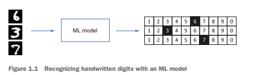
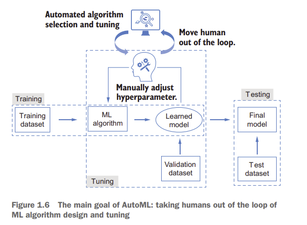
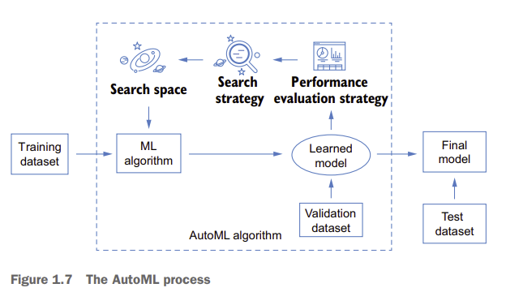
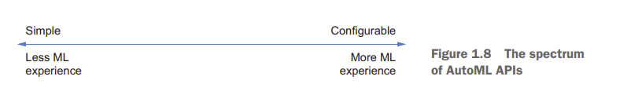
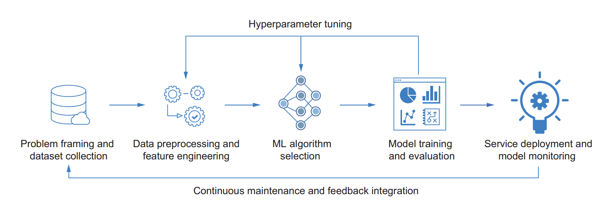
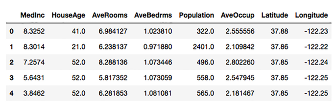
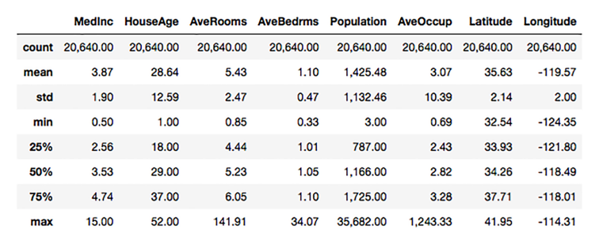
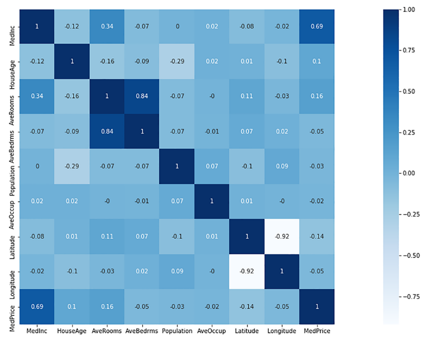
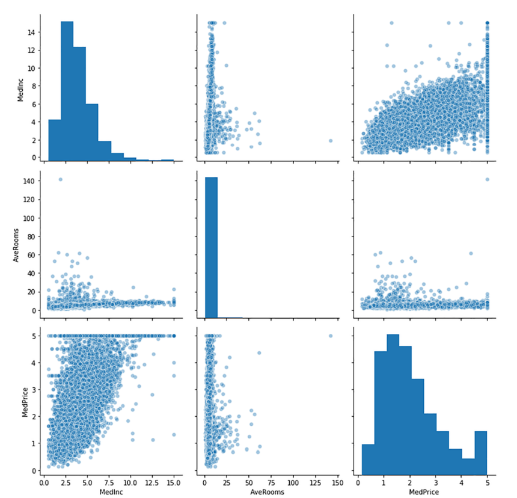
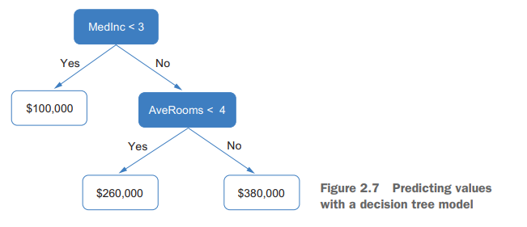

# Part 1: Fundamentals of AutoML

Kitabın ilk üç bölümü, AutoML öğrenimine temel oluşturmak amacıyla, makine öğreniminin bazı temel kavramlarını ve modellerini tanıtarak temel yapı taşlarını anlamanıza yardımcı olur.

1. bölümde AutoML’nin genel kavramlarını, ne olduğunu ve genel makine öğrenimiyle olan bağlantısını görmeye başlayacaksınız. Ayrıca AutoML’nin araştırma açısından değerini ve pratik faydalarını öğreneceksiniz.

2. bölüm, bir makine öğrenimi problemini çözmek için kullanılan klasik makine öğrenimi işlem hattını (pipeline) tanıtır.

Yapay zekâ topluluğunda ve ötesinde derin öğrenme modellerinin popülerliği göz önüne alındığında, 3. bölümde üç yaygın model türü üzerinden derin öğrenmenin temel bilgilerini ele alıyoruz. Bu bölümde karmaşık derin öğrenme kavramlarına girmiyoruz; sadece temel yapı taşlarını ve farklı veri türlerinde uygulanan üç klasik modeli tanıtıyoruz.

Eğer makine öğrenimi, derin öğrenme veya bunların Python ile nasıl uygulanacağı konusunda fazla deneyiminiz yoksa, AutoML’nin pratik uygulamalarına geçmeden önce mutlaka 1. bölümü baştan sona okumanız tavsiye edilir.

Ayrıca bu bölümün ardından, ek B kısmında temel makine öğrenimi işlem hattına daha aşina olmanıza yardımcı olacak ek örnekler de bulabilirsiniz.

## 1. From machine learning to automated machine learning

Yapay zekâ (YZ), günlük yaşamın birçok yönüne ulaşan bir alan olarak, son yıllarda kapsamlı bir şekilde araştırılmaktadır. YZ, bilgisayarların tıpkı insanlar gibi çevreyi algılayarak görevleri otomatikleştirmesini sağlamaya çalışır.

YZ’nin bir alt dalı olan **makine öğrenimi (ML)**, bilgisayarın verileri kendi kendine keşfederek bir görevi yerine getirmesini sağlar. Bu sayede bilgisayar, yalnızca kendisine açıkça ne yapması gerektiği söylenmiş görevleri değil, kendi öğrendikleriyle daha fazlasını da yapabilir.

Ancak, bu alana girmek oldukça zordur: kullanılan teknikleri öğrenmenin maliyeti ve uygulamalarda gerekli deneyimi kazanmanın güçlüğü nedeniyle, yeterli uzmanlığa sahip olmayan kişiler ML’yi kolayca kullanamazlar. Bu nedenle, makine öğrenimi tekniklerini “fildişi kulelerinden” çıkarıp daha fazla insana erişilebilir hale getirmek hem araştırma dünyasının hem de endüstrinin önemli bir hedefi hâline gelmiştir.

Bu amaç doğrultusunda, **otomatik makine öğrenimi (AutoML)** öne çıkan bir araştırma alanı olarak ortaya çıkmıştır. AutoML’nin hedefi, insan uzmanların makine öğrenimi problemlerini nasıl çözdüklerini taklit ederek belirli bir problem için **en uygun ML çözümlerini otomatik olarak keşfetmek** ve böylece derin teknik bilgiye sahip olmayan kişilerin de kullanabileceği hazır ML teknikleri sunmaktır.

AutoML yalnızca yeni başlayanlar için faydalı değildir; aynı zamanda uzmanların ve veri bilimcilerin ML modellerini tasarlama ve yapılandırma yükünü de hafifletir.

Henüz yeni ve ileri düzey bir konu olduğu için çoğu insan için yabancıdır ve mevcut yetenekleri genellikle kitle iletişim araçları tarafından abartılı şekilde sunulmaktadır.

Bu bölümde AutoML’nin ne olduğuna kısa bir bakış sunulmakta, temel kavramları tanıtılmakta ve araştırma değeri ile pratik faydalarına giriş yapılmaktadır.

Haydi, basit bir örnekle başlayalım.


### 1.1 A glimpse of automated machine learning – 4

Diyelim ki, el yazısı ile yazılmış rakamları resimlerden tanıyacak bir makine öğrenimi (ML) modeli tasarlamak istiyorsunuz.
Bu ML modeli, giriş olarak resimleri alacak ve her bir resimdeki rakamı çıktı olarak üretecektir (bkz. şekil 1.1).



Eğer makine öğrenimi konusunda deneyiminiz yoksa, bu hedefe pratikte nasıl ulaşabileceğimizi **Python tarzında programatik bir örnek** üzerinden açıklayalım.
Burada bir ML modelini, bir sınıftan (class) türetilmiş bir nesne (object) olarak ele alıyoruz (bkz. listeleme 1.1). Bu sınıf, modelimizde kullanmak istediğimiz belirli bir **ML algoritması türüne** (bir dizi işlem adımına) karşılık gelir.

Bir modeli oluşturmak (örneğini yaratmak) için, kullanılacak algoritma sınıfını seçmenin yanı sıra, algoritmaya **bazı geçmiş veriler** ve **parametreler (arg1 ve arg2)** de sağlamamız gerekir.
Burada kullanılan geçmiş veriler, **el yazısı rakamların görüntülerinden** oluşur ve bu görüntülerin etiketleri (yani hangi rakam oldukları) zaten bilinir.
Bu, makinenin (veya ML algoritmasının) öğrenme sürecini gerçekleştirmesine yardımcı olur — yani, tıpkı bir çocuğun resimlerden nesneleri tanımayı öğrenmesi gibi, model de rakamları nasıl tanıyacağını öğrenir.
(Bu sürecin ayrıntılarını ilerleyen bölümlerde göreceksiniz.)

Burada bahsedilen parametreler, algoritmanın nasıl çalışacağını belirleyen ayarlardır — yani sürecin nasıl yürütüleceğini kontrol ederler.
Sonuçta elde edilen ML modeli, **daha önce hiç görmediği resimlerdeki rakamları** tahmin edebilecektir (bkz. şekil 1.1), ki bu işlem sonraki listelemede yer alan ikinci kod satırıyla gerçekleştirilecektir.

```Python
ml_model = MachineLearningAlgorithm1(
    arg1=..., arg2=..., data=historical_images
)  # Bir ML modeli oluşturur

digits = [ml_model.predict_image_digit(image) for image in new_images]
# ML modeliyle tahminler yapar
```

Koddaki örnekte de görebileceğiniz gibi, verisetini (ki bunu kendimiz hazırlamamız gerekebilir) sağlamanın yanı sıra, görevi çözmek için önceden sahip olduğumuz bilgiye dayanarak iki şeyi daha belirlememiz gerekir:

* Kullanılacak **ML algoritması (veya yöntemi)** — yani *MachineLearningAlgorithm1*
* Algoritmanın **parametreleri (argümanları)**

Algoritmayı seçmek ve bu parametreleri yapılandırmak, pratikte oldukça zor olabilir.

Örneğin, algoritma seçimini ele alalım:
Yeni başlayan biri olarak tipik yaklaşım, bazı öğrenme kaynaklarını toplamak, benzer görevlerde kullanılan kodları incelemek ve elinizdeki problem için kullanabileceğiniz bir grup ML algoritmasını belirlemektir.
Daha sonra bu algoritmaları (listeleme 1.1’de yaptığımız gibi) geçmiş verileriniz üzerinde tek tek deneyebilir ve **görsellerdeki rakamları tanıma başarısına** göre en iyi performans göstereni seçebilirsiniz.

Bu tekrarlayıcı süreç, bir sonraki kod örneğinde özetlenmiştir.

```Python
ml_algorithm_pool = [
    MachineLearningAlgorithm1,
    MachineLearningAlgorithm2,
    ...,
    MachineLearningAlgorithmN,
]
# Test edilecek ML algoritmalarının bir havuzu

for ml_algorithm in ml_algorithm_pool:
    model = ml_algorithm(
        arg1=..., arg2=...,
        data=historical_images
    )
    # Tüm aday ML algoritmalarını döngüye sokar
    # Her ML algoritmasına göre bir model oluşturur ve değerlendirir
    
    result = evaluate(model)
    push result into the result_pool
    push model into the model_pool

best_ml_model = pick_the_best(result_pool, ml_model_pool)
# Performansa göre en iyi ML modelini seçer

return best_ml_model
```

Bu süreç ilk bakışta sezgisel görünebilir, ancak yeterli makine öğrenimi (ML) bilgisi veya deneyiminiz yoksa **saatlerce hatta günlerce** sürebilir — bunun birkaç nedeni vardır:

Birincisi, uygun ML algoritmalarından oluşan bir **havuz oluşturmak** oldukça zordur.
Literatürü incelemeniz, en son (state-of-the-art) algoritmaları belirlemeniz ve bunların nasıl uygulanacağını öğrenmeniz gerekebilir.

İkincisi, kullanılabilir ML algoritmalarının sayısı çok fazla olabilir.
Bunları **teker teker denemek** hem verimsiz olabilir hem de zaman açısından neredeyse imkânsız hale gelebilir.

Üçüncüsü, her algoritmanın kendine özgü **parametreleri (argümanları)** vardır.
Bu parametreleri doğru şekilde yapılandırmak; uzmanlık, deneyim ve bazen de biraz şans gerektirir.

---

Peki, bunu yapmanın **daha iyi bir yolu** olabilir mi?
Makinenin bu süreci **kendiliğinden (otomatik olarak)** yürütmesi mümkün mü?

Eğer benzer sorunlarla karşılaştıysanız ve ML’yi daha az emek harcayarak uygulamak istiyorsanız, **AutoML** aradığınız araç olabilir.

Basitçe söylemek gerekirse, **AutoML**, yukarıdaki sözde kodda (pseudocode) anlatılan **manuel süreci taklit eder**.
Yani, ML algoritmalarını seçme ve yapılandırma sürecini **otomatikleştirmeye** çalışır.
Bu sayede, varlıklarından bile haberdar olmadığınız **ileri düzey algoritmalara** kolayca erişmenizi sağlar.

---

Aşağıdaki iki satırlık sözde kod, bir AutoML algoritmasını kullanarak nasıl bir ML çözümü elde edebileceğinizi gösterir:

```python
automl_model = AutoMLAlgorithm()
best_ml_model = automl_model.generate_model(data=historical_images)
```

Bir **AutoML algoritmasından bir AutoML model nesnesi** oluşturmak, test edilecek ML algoritmalarının havuzunu sizin belirlemenize gerek kalmadığı anlamına gelir.
Yalnızca veriyi sağlayarak istediğiniz modeli otomatik olarak oluşturabilirsiniz.

---

Ama şu sorular hâlâ geçerlidir:

* Hangi **AutoML algoritmasını** seçmelisiniz?
* Bu AutoML sistemi, hangi ML algoritmaları arasından seçim yapıyor?
* Onları nasıl değerlendiriyor ve en iyi modeli nasıl belirliyor?

Bunlara geçmeden önce, size **ML hakkında temel bir arka plan** sunacağım; böylece AutoML’nin **neyi otomatikleştirdiğini** ve onu **pratikte nasıl zaman ve emek tasarrufu sağlayacak şekilde kullanabileceğinizi** daha iyi anlayabilirsiniz.

Buradaki odak, **AutoML’yi öğrenmek ve kullanmak için bilmeniz gerekenleri** açıklamak olacak.
Bu algoritmalar hakkında daha derin bilgi edinmek isterseniz şu kaynaklara başvurabilirsiniz:

* *Machine Learning in Action* — Peter Harrington (Manning, 2012)
* *Deep Learning with Python*, 2. baskı — François Chollet (Manning, 2021)

Makine öğreniminin temellerine zaten aşina olan okuyucular için ise sonraki bölüm bir **özet** niteliğinde olacak; terimleri netleştirecek ve AutoML’ye yapılacak giriş için **temel motivasyonu** oluşturacaktır.

### 1.2 Getting started with machine learning – 6

Bu bölüm, makine öğrenimine (ML) kısa bir giriş sunar — **ML’nin ne olduğunu**, bir **ML algoritmasının temel bileşenlerini** ve **seçilen algoritma ile veri girdisine dayalı olarak bir ML modelinin nasıl oluşturulduğunu** açıklar.

Bu temel bilgileri öğrenmek, sonraki bölümlerde tanıtılacak **AutoML kavramlarını** anlamak için oldukça önemlidir.

#### *What is machine learning?* – 6

Makine öğreniminin (ML) ortaya çıkışından önce, yapay zekâ (YZ) araştırmalarında baskın paradigma **sembolik yapay zekâ (symbolic AI)** idi. Bu yaklaşımda bilgisayar, yalnızca insanlar tarafından **önceden tanımlanmış kurallar** aracılığıyla verileri işleyebiliyordu.

ML’nin ortaya çıkışıyla birlikte programlama paradigması kökten değişti — bilgisayarlara bilgiyi **verilerden dolaylı olarak öğrenme** yeteneği kazandırıldı.

Örneğin, bir makinenin elma ve muz görüntülerini otomatik olarak tanımasını istediğinizi düşünün.
Sembolik YZ yaklaşımında, bu görevi gerçekleştirebilmesi için yapay zekâya **renk** ve **şekil** gibi özellikleri tanımlayan, insan tarafından okunabilir **mantıksal kurallar** vermeniz gerekirdi.

Buna karşılık, bir ML algoritması yalnızca bir dizi **görüntü** ve bunlara karşılık gelen **etiketleri** (“elma” veya “muz”) alır ve bunlardan **öğrenilmiş kurallar** üretir. Bu kurallar daha sonra **etiketi bilinmeyen yeni görüntüleri** tahmin etmek için kullanılabilir (bkz. şekil 1.2).

 

ML’nin temel amaçları **otomasyon** ve **genelleme**dir.

* **Otomasyon**, bir ML algoritmasının kendisine verilen veriler üzerinde **insan müdahalesi olmadan kurallar (veya örüntüler) çıkarmayı** öğrenmesi anlamına gelir.
  Algoritma, insan düşünme biçimini taklit eder ve kendisine sağlanan geçmiş verilerle etkileşime girerek kendini geliştirir — bu sürece **eğitim (training)** ya da **öğrenme (learning)** denir.

* Bu kurallar daha sonra **insan müdahalesine gerek kalmadan yeni veriler üzerinde tekrarlayan tahminler** yapmak için kullanılır.

Örneğin, şekil 1.2’de ML algoritması elma ve muz görüntüleriyle etkileşime girer ve **renge dayalı bir kural** çıkarır; bu sayede eğitimi sırasında onları tanımayı öğrenir.
Bu kurallar, makinenin **yeni görüntüleri insan denetimi olmadan sınıflandırmasına** olanak tanır — bu yeteneğe **yeni verilere genelleme (generalization)** denir.

Bir ML algoritmasının iyi olup olmadığını değerlendirmenin en önemli kriterlerinden biri, **genelleme yeteneğidir**.

Örneğin, sisteme **sarı bir elma** görüntüsü verildiğini varsayalım.
Eğer algoritma yalnızca renge dayalı bir kural öğrenmişse, bunun elma mı yoksa muz mu olduğunu doğru bir şekilde ayırt edemeyecektir.
Buna karşılık, **şekil özelliğini** de öğrenip tahminlerinde kullanan bir ML algoritması **daha doğru tahminler** üretebilir.


#### *The machine learning process* – 7

Bir makine öğrenimi (ML) algoritması, **çıktıları bilinen örneklere maruz kalarak** kuralları öğrenir.
Bu kuralların amacı, **girdileri anlamlı çıktılara dönüştürmeyi** mümkün kılmaktır — örneğin, el yazısı rakamların görüntülerini ilgili sayılara çevirmek gibi.
Bu nedenle öğrenmenin hedefi, **veri dönüşümünü (data transformation)** mümkün kılmak olarak da düşünülebilir.

Öğrenme süreci genellikle aşağıdaki iki bileşeni gerektirir:

---

* **Veri girdileri (Data inputs):**
  ML algoritmasına beslenecek, hedef göreve ait veri örnekleridir.
  Örneğin, görüntü tanıma probleminde (bkz. Şekil 1.2) bir grup **elma ve muz resmi** ile bunlara karşılık gelen **etiketler** (“elma” veya “muz”) bu girdilerdir.

* **Öğrenme algoritması (Learning algorithm):**
  Verilen veriye dayalı olarak bir **model** türeten matematiksel bir süreçtir ve şu dört unsuru içerir:

  * Veriden öğrenilecek **parametrelere sahip bir ML modeli**
  * Modelin mevcut parametrelerle performansını ölçmek için bir **ölçüm yöntemi** (örneğin tahmin doğruluğu)
  * Modeli güncellemenin bir yolu — buna **optimizasyon yöntemi** denir
  * Öğrenme sürecinin **ne zaman duracağını belirleyen bir durdurma ölçütü (stop criterion)**

---

Modelin parametreleri ilk kez başlatıldıktan sonra (örneğin rastgele veya benzer modellerden öğrenilmiş “warm start” parametreleriyle), öğrenme algoritması **parametreleri ölçüm sonucuna göre adım adım güncelleyerek** modeli iteratif biçimde geliştirir.
Bu ölçüm, **eğitim aşamasında “kayıp fonksiyonu” (loss function)** veya **amaç fonksiyonu (objective function)** olarak adlandırılır ve modelin tahminleriyle gerçek (ground-truth) hedefler arasındaki farkı ölçer.
Bu süreç Şekil 1.3’te gösterilmektedir.

---

Öğrenme sürecini daha iyi anlamak için bir örnek düşünelim:
İki boyutlu bir uzayda bir grup veri noktamız olduğunu varsayalım (bkz. Şekil 1.4).
Her nokta **siyah** veya **beyaz** renktedir.
Amacımız, yeni bir nokta geldiğinde konumuna göre bunun siyah mı yoksa beyaz mı olduğunu belirleyebilen bir ML modeli oluşturmak.

Bu hedefe ulaşmanın basit bir yolu, elimizdeki noktalara bakarak iki boyutlu uzayı ikiye ayıran **yatay bir çizgi** çizmektir.
Bu çizgi, bir ML modeli olarak düşünülebilir.
Çizginin **parametresi**, yatay konumudur ve bu parametre veri noktalarına göre **öğrenilebilir ve güncellenebilir**.

Şekil 1.3’te açıklanan öğrenme süreciyle birlikte, gerekli bileşenleri şu şekilde tanımlayabiliriz:


* **Veri girdileri:**
  İki boyutlu uzayda konumlarıyla tanımlanan siyah ve beyaz noktalardan oluşur.

* **Öğrenme algoritması:**
  Aşağıdaki dört bileşenden oluşur:

  * **ML modeli:**  y = a şeklinde formüle edilen yatay bir çizgi; burada *a*, algoritma tarafından güncellenebilen parametredir.
  * **Doğruluk ölçümü:**  Modelin doğru etiketlediği noktaların yüzdesi.
  * **Optimizasyon yöntemi:**  Çizgiyi her yinelemede belirli bir mesafe yukarı veya aşağı kaydırmak.
    Bu mesafe, her adımda doğruluk ölçümünün değerine bağlıdır. Durdurma koşulu sağlanana kadar devam eder.
  * **Durdurma ölçütü (stop criterion):**  Ölçüm %100’e ulaştığında, yani tüm noktalar mevcut çizgiye göre doğru etiketlendiğinde süreci durdurur.


Şekil 1.4’teki örnekte, öğrenme algoritması iki yinelemeden sonra tüm noktaları doğru şekilde ayıran çizgiyi elde eder.
Ancak pratikte bu koşul her zaman sağlanmayabilir.
Bu durum, **girdi verilerinin dağılımına**, **seçilen model türüne** ve **modelin nasıl ölçülüp güncellendiğine** bağlıdır.

Çoğu zaman farklı bileşenler seçmemiz ve farklı kombinasyonları denememiz gerekir ki öğrenme süreci beklenen ML çözümüne yaklaşsın.

Ayrıca, öğrenilmiş model tüm eğitim verilerini doğru şekilde etiketlese bile, **görülmemiş yeni verilerde** aynı başarıyı garanti etmez.
Yani modelin **genelleme yeteneği** zayıf olabilir (bu konuyu bir sonraki bölümde daha detaylı ele alacağız).

Bu nedenle, öğrenme bileşenlerini dikkatli seçmek ve öğrenme sürecini doğru şekilde ayarlamak son derece önemlidir.

#### *Hyperparameter tuning* – 9

Öğrenme sürecini ayarlayarak beklenen modeli elde edebilmek için uygun bileşenleri nasıl seçeriz?
Bu soruyu yanıtlamak için **hiperparametreler (hyperparameters)** adı verilen bir kavramı tanıtmamız ve bunların, şimdiye kadar bahsettiğimiz **parametrelerle** ilişkisini açıklamamız gerekir:

---

* **Parametreler**, öğrenme süreci sırasında makine öğrenimi (ML) algoritması tarafından güncellenebilen değişkenlerdir.
  Bu değişkenler, veriden kuralları öğrenmek için kullanılır.
  Örneğin, önceki örneğimizdeki (Şekil 1.4) yatay çizginin konumu, noktaları sınıflandırmaya yardımcı olan tek parametredir.
  Bu parametre, optimizasyon yöntemi tarafından eğitim süreci boyunca ayarlanarak farklı renklerdeki noktaları ayırmak için gereken konum kuralını öğrenir.
  Parametreleri ayarlayarak, verilen girdi verisinin çıktısını doğru bir şekilde tahmin edebilen bir ML modeli elde edebiliriz.

---

Şekil 1.4

**Öğrenme süreci örneği:** Beyaz ve siyah noktaları ayıran yatay bir çizginin öğrenilmesi

---

* **Hiperparametreler** de bir tür parametredir; ancak bunlar öğrenme süreci başlamadan **önce** algoritma için tanımlanır ve sürecin tamamı boyunca sabit kalır.
  Bunlara ölçüm yöntemi, optimizasyon metodu, öğrenme hızı, durdurma kriteri gibi unsurlar dahildir.
  Bir ML algoritmasının genellikle birden fazla hiperparametresi vardır.
  Bu hiperparametrelerin farklı kombinasyonları, öğrenme süreci üzerinde farklı etkiler yaratır ve farklı performanslara sahip modellerin ortaya çıkmasına neden olur.
  Ayrıca, algoritma türünü (veya ML modeli türünü) de bir hiperparametre olarak düşünebiliriz; çünkü bu seçimi biz yaparız ve bu seçim süreç boyunca sabit kalır.

---

Bir ML algoritması için en uygun hiperparametre kombinasyonunun seçilmesine **hiperparametre ayarlaması (hyperparameter tuning)** denir.
Bu işlem genellikle **yinelemeli (iteratif)** bir süreçtir.
Her yinelemede, belirli bir hiperparametre kümesi seçilir ve bu küme kullanılarak eğitim veri kümesiyle bir ML modeli eğitilir.
Şekil 1.5’teki “ML algoritması” bloğu, Şekil 1.3’te açıklanan öğrenme sürecini temsil eder.
Her öğrenilen model, **doğrulama kümesi (validation set)** adı verilen ayrı bir veri kümesinde değerlendirilir ve en iyi performans gösteren model, **nihai model (final model)** olarak seçilir.
Bu modelin **genellenebilirliği (generalizability)** ise, **test kümesi (test set)** adı verilen başka bir veri kümesi üzerinde test edilerek ölçülür.
Bu aşama, tüm ML iş akışını tamamlar.


---

Genel olarak, ML iş akışında üç farklı veri kümesi bulunur ve her biri diğerlerinden farklıdır:

* **Eğitim kümesi (training set):**
  Belirli bir hiperparametre kombinasyonu ile modeli eğitmek için kullanılır.

* **Doğrulama kümesi (validation set):**
  Eğitilen modelleri değerlendirmek ve en iyi hiperparametreleri seçmek için kullanılır.

* **Test kümesi (test set):**
  Ayarlama süreci tamamlandıktan sonra, son modeli test etmek için yalnızca bir kez kullanılır.
  Bu küme, **eğitim veya ayarlama** aşamalarında kullanılmamalıdır.

---

Eğitim ve test kümeleri genellikle kolay anlaşılır.
Ek bir doğrulama kümesi kullanmamızın nedeni, ayarlama aşamalarında algoritmanın tüm eğitim verisine maruz kalmasını önlemektir.
Bu sayede **nihai modelin, daha önce görülmemiş veriler (unseen data)** üzerinde genellenebilirliği artar.

Eğer doğrulama kümesi kullanılmazsa, ayarlama aşamasında seçilen “en iyi” model yalnızca eğitim verisindeki küçük ayrıntıları yakalamaya odaklanır ve sürekli artan eğitim doğruluğuna rağmen, farklı veriler üzerinde kötü performans gösterir.
Modelin, test (veya doğrulama) kümesinde eğitim kümesine göre daha kötü performans göstermesi durumuna **aşırı uyum (overfitting)** denir.

Bu, ML alanında çok iyi bilinen bir problemdir ve genellikle modelin öğrenme kapasitesi çok yüksek, eğitim veri kümesi ise sınırlı olduğunda ortaya çıkar.

---

**Örnek:**
İlk üç sayısı verilen bir dizide dördüncü sayıyı tahmin etmek istediğimizi varsayalım:
a₁ = 1, a₂ = 2, a₃ = 3, a₄ = ?
(Burada a₄ doğrulama kümesidir; a₅ ve sonrakiler test kümeleridir.)
Doğru cevap a₄ = 4’tür.
Basit bir model olan **aᵢ = i**, doğru sonucu verir.
Ancak üçüncü dereceden bir polinomla diziyi uydurursak:
**aᵢ = i³ – 6i² + 12i – 6**
modeli, a₄ için 10 sonucunu tahmin eder.

Doğrulama süreci, bir modelin **genelleme yeteneğinin** değerlendirme sırasında daha doğru bir şekilde yansıtılmasını sağlar ve böylece daha uygun modellerin seçilmesine olanak tanır.

---

**NOT:**
**Aşırı uyum (overfitting)**, ML alanında en önemli problemlerden biridir.
Ayarlama süreci sırasında doğrulama yapmak dışında, bu sorunu çözmenin başka yolları da vardır; örneğin:

* veri kümesini genişletmek (data augmentation),
* modele **regularization (düzenleme)** ekleyerek öğrenme kapasitesini sınırlamak, vb.

Bu konunun ayrıntılarına burada girmeyeceğiz.
Daha fazla bilgi için **François Chollet’in *Deep Learning with Python*** adlı kitabına başvurabilirsiniz.

#### *The obstacles to applying machine learning* – 11

Bu noktada, makine öğreniminin (ML) ne olduğunu ve nasıl işlediğini temel düzeyde anlamış olmalısınız.
Birçok gelişmiş ML araç setinden yararlanabilseniz de, uygulamada hâlâ bazı zorluklarla karşılaşabilirsiniz.
Bu bölümde, bu zorluklardan bazıları açıklanmaktadır — amaç sizi korkutmak değil, ilerleyen kısımlarda anlatılacak **Otomatik Makine Öğrenimi (AutoML)** teknikleri için bir bağlam sağlamaktır.

Karşılaşabileceğiniz başlıca engeller şunlardır:

---

* **ML tekniklerini öğrenmenin maliyeti:**
  Temel bilgileri ele aldık, ancak ML’i gerçek bir probleme uygulamak için çok daha fazla bilgi gerekir.
  Örneğin, probleminizi bir ML problemi olarak nasıl formüle edeceğinizi, hangi ML algoritmalarını kullanabileceğinizi ve bunların nasıl çalıştığını,
  veriyi ML algoritmasına girdi olarak verebilmek için nasıl temizleyip ön işlemeden geçirmeniz gerektiğini,
  model eğitimi ve hiperparametre ayarlaması (tuning) için hangi değerlendirme kriterlerini seçmeniz gerektiğini düşünmelisiniz.
  Tüm bu soruların önceden yanıtlanması gerekir ve bu da önemli bir zaman yatırımı gerektirir.

---

* **Uygulama karmaşıklığı:**
  Gerekli bilgi ve deneyime sahip olsanız bile, bir ML algoritması seçtikten sonra iş akışını uygulamak karmaşık bir iştir.
  Daha gelişmiş algoritmalar benimsendikçe, uygulama ve hata ayıklama (debugging) için gereken zaman da artar.

---

* **Teori ile pratik arasındaki fark:**
  Öğrenme süreci çoğu zaman yorumlanması zor bir yapıya sahiptir ve performans büyük ölçüde veriye bağlıdır.
  Ayrıca, ML’de kullanılan veri kümeleri genellikle karmaşık, gürültülü (noisy) ve yorumlanması, temizlenmesi, kontrol edilmesi zor yapılardır.
  Bu nedenle ayarlama (tuning) süreci çoğunlukla analitik olmaktan çok deneysel (ampirik) bir karakter taşır.
  Hatta ML uzmanları bile bazen istenilen sonuçlara ulaşamayabilirler.

---

Bu zorluklar, ML’in sınırlı deneyime sahip kişiler tarafından yaygın şekilde kullanılmasını önemli ölçüde zorlaştırır
ve aynı zamanda ML uzmanlarının üzerindeki yükü artırır.
Bu durum, araştırmacıların ve uygulayıcıların; engelleri azaltacak, gereksiz adımları ortadan kaldıracak
ve algoritmaların manuel tasarımı ile ayarlama sürecindeki yükü hafifletecek bir çözüm arayışına girmesine neden olmuştur —
işte bu çözüm **AutoML (Otomatik Makine Öğrenimi)**’dir.


### 1.3 AutoML: The automation of automation – 12

AutoML’in amacı, bir makinenin insanların ML algoritmalarını tasarlama, ayarlama ve uygulama biçimini taklit etmesini sağlayarak makine öğrenimini (ML) daha kolay benimsememizi mümkün kılmaktır (bkz. Şekil 1.6).
Makine öğreniminin temel özelliklerinden biri **otomasyon** olduğundan, **AutoML**, “otomasyonun otomatikleştirilmesi” olarak da görülebilir.

 

AutoML’in nasıl çalıştığını anlamanıza yardımcı olmak için, önce temel bileşenlerini gözden geçirelim.

#### *Three key components of AutoML* – 12
İşte, Bölüm 1.1’de tanıtılan sözde kodun (pseudocode) kısa bir özeti:

```
ml_algorithm_pool = [
 MachineLearningAlgorithm1,
 MachineLearningAlgorithm2,
 ...
 MachineLearningAlgorithmN,
]

for ml_algorithm in ml_algorithm_pool:
 model = ml_algorithm(arg1=..., arg2=..., data=historical_images)
 result = evaluate(model)
 push result into the result_pool
 push model into the model_pool

best_ml_model = pick_the_best(result_pool, ml_model_pool)
return best_ml_model
```

Bu sözde kod, bir **AutoML algoritması**nın basit bir örneği olarak görülebilir.
Bu algoritma, bir grup ML algoritmasını girdi olarak alır, her birini sırayla değerlendirir ve en iyi sonucu veren algoritmadan öğrenilmiş modeli çıktı olarak verir.

Her AutoML algoritması, aşağıdaki **üç temel bileşenden** oluşur (bkz. Şekil 1.7):

 

---

##### 1. **Arama uzayı (Search space)**

Bu, seçilecek hiperparametreler kümesini ve her bir hiperparametrenin alabileceği değer aralığını ifade eder.
Her hiperparametrenin aralığı, kullanıcının bilgi birikimine ve gereksinimlerine göre tanımlanabilir.

Örneğin, sözde kodda gösterildiği gibi arama uzayı bir **ML algoritmaları havuzu** olabilir.
Bu durumda, **ML algoritmasının türü** seçilecek bir hiperparametre olarak kabul edilir.

Arama uzayı aynı zamanda belirli bir ML algoritmasının hiperparametrelerinden (örneğin modelin yapısı gibi) de oluşabilir.
Arama uzayının tasarımı büyük ölçüde göreve bağlıdır, çünkü farklı görevler için farklı ML algoritmalarının benimsenmesi gerekebilir.
Ayrıca kullanıcının ilgisi, uzmanlığı ve deneyim düzeyiyle de kişiselleşmiş bir yapıya sahip olabilir.

Burada her zaman bir denge vardır:

* Geniş bir arama uzayı tanımlamak, daha fazla olasılığı değerlendirmenizi sağlar ama
* iyi bir model bulmak için harcanacak süreyi ve hesaplama maliyetini artırır.

Yeni başlayanlar için, tüm ML algoritmalarını içeren çok geniş bir arama uzayı tanımlamak cazip gelebilir.
Ancak bu yaklaşım, **zaman** ve **hesaplama maliyeti** açısından verimsizdir.

Bu kitapta, ikinci bölümde bu konuyu daha ayrıntılı ele alacak ve farklı gereksinimler doğrultusunda arama uzayınızı nasıl özelleştirebileceğinizi öğreneceksiniz.


---

##### 2. **Arama stratejisi (Search strategy)**

Bu, arama uzayından **en uygun hiperparametre setini** seçme stratejisidir.
AutoML genellikle **yinelemeli bir deneme-yanılma süreci** olduğundan, strateji çoğunlukla hiperparametreleri sırayla seçip performanslarını değerlendirir.

Strateji, arama uzayındaki tüm hiperparametreleri tek tek deneyebilir (sözde kodda olduğu gibi)
ya da daha önce denenen hiperparametrelerin sonuçlarına göre sonraki denemeleri optimize edecek şekilde **uyarlanabilir (adaptive)** bir yapı izleyebilir.

Daha iyi bir arama stratejisi, aynı sürede **daha iyi bir ML çözümü** elde etmenizi sağlar.
Ayrıca, arama süresini ve hesaplama maliyetini azaltarak daha büyük bir arama uzayını kullanmanıza da olanak tanır.

Bu kitapta, üçüncü bölümde farklı **arama algoritmalarını** nasıl benimseyeceğinizi, karşılaştıracağınızı ve uygulayacağınızı öğreneceksiniz.

---

##### 3. **Performans değerlendirme stratejisi (Performance evaluation strategy)**

Bu strateji, seçilen hiperparametrelerle oluşturulan bir ML algoritmasının performansını değerlendirmek için kullanılır.
Değerlendirme kriterleri genellikle manuel ayarlama sürecinde kullanılanlarla aynıdır — örneğin, seçilen ML algoritmasıyla eğitilen modelin **doğrulama performansı**.

Bu kitapta, farklı türde ML görevlerini çözmek için AutoML kullanırken uygulanabilecek çeşitli değerlendirme stratejilerini tartışacağız.

---

AutoML algoritmalarının benimsenmesini kolaylaştırmak için, bir **AutoML araç kiti (toolkit)** genellikle bu üç bileşeni bir araya getirir
ve **varsayılan bir arama uzayı** ile **arama algoritması** içeren genel API’ler (Application Programming Interfaces) sağlar.
Böylece kullanıcı, bu bileşenleri elle seçmek zorunda kalmaz.

Kullanıcı açısından, en basit durumda yapılması gereken tek şey veriyi sağlamaktır — veriyi eğitim ve doğrulama kümelerine ayırmaya bile gerek yoktur:

```python
automl_model = AutoMLAlgorithm()
best_ml_model = automl_model.generate_model(data=...)
```

Ancak farklı kullanıcıların farklı kullanım senaryoları ve ML uzmanlık düzeyleri olabileceği için,
kendi **arama uzaylarını**, **değerlendirme stratejilerini** ve hatta **arama stratejilerini** tasarlamaları gerekebilir.

Bu nedenle, mevcut AutoML sistemleri genellikle bu bileşenlerin yapılandırılabilir (configurable) biçimde özelleştirilmesine izin veren API’ler sunar.
Bu API’ler, **en basitinden en gelişmişine kadar geniş bir yelpazede** çözümler sağlar (bkz. Şekil 1.8).



Bu sayede, kendi kullanım durumunuza en uygun olan API’yi seçebilirsiniz.
Bu kitapta, farklı AutoML uygulamaları için gelişmiş bir AutoML araç kiti olan **AutoKeras**’ta doğru API’yi nasıl seçeceğinizi
ve **KerasTuner** yardımıyla kendi AutoML algoritmanızı nasıl oluşturabileceğinizi öğreneceksiniz.

#### *Are we able to achieve full automation?* – 15

AutoML alanı, endüstri ve açık kaynak topluluğunun katılımıyla **yaklaşık otuz yıldır gelişmektedir.**
Bu süreçte birçok başarılı uygulama ve umut verici gelişme görülmüştür. Bunlardan bazıları şunlardır:

---

* **Birçok şirket içi araç ve açık kaynak platformu** geliştirildi.
  Bu araçlar, ML modellerinin **hiperparametre ayarlamasını** ve **model seçimini** kolaylaştırmak için kullanılır.
  (Örneğin: *Google Vizier*, *Facebook Ax* vb.)

* **AutoML çözümleri**, birçok **Kaggle veri bilimi yarışmasında** insan seviyesine yakın performans göstermiştir.

* **Auto-sklearn**, **AutoKeras** gibi geniş kapsamlı açık kaynak ML paketleri geliştirildi.
  Bu paketler, hiperparametre ayarlamasını iyileştirmek ve ML iş akışlarını (pipeline) otomatikleştirmek için tasarlanmıştır.

* **Ticari AutoML ürünleri**, küçükten büyüğe birçok şirketin üretim ortamında ML’i benimsemesine yardımcı olmaktadır.
  Örneğin, **Disney**, herhangi bir ML mühendisi ekibi tutmadan, **Google Cloud AutoML** kullanarak çevrimiçi mağazası için ML çözümleri geliştirmiştir.
  (Kaynak: [Google Cloud AutoML Blogu](https://blog.google/products/google-cloud/cloud-automlmaking-ai-accessible-every-business/))

* **Bilgisayar bilimi dışındaki alanlardaki araştırmacılar** da AutoML’in gücünden yararlanmaktadır.
  Artık **tıp**, **nörobilim** ve **ekonomi** gibi alanlardaki araştırmacılar, ML ve programlama konularında uzun öğrenme süreçlerinden geçmeden,
  **tıbbi görüntü segmentasyonu**, **genomik araştırma** veya **hayvan tanıma ve koruma** gibi alanlara özel ML çözümleri geliştirebilmektedirler.
  *(Örnek çalışmalar: Weng et al., 2019; Liu et al., 2019; Liu & Luo, 2019)*

---

##### AutoML’in Geleceği ve Devam Eden Zorluklar

AutoML’in **makine öğrenimini demokratikleştirme** potansiyelinin tümünü hâlâ keşfetme aşamasındayız.
Şimdiye kadar pek çok başarılı uygulama görülmüş olsa da, çözülmesi gereken önemli zorluklar ve sınırlamalar hâlâ bulunmaktadır:

---

* **AutoML sistemlerinin inşa edilme zorluğu:**
  Sıfırdan bir AutoML sistemi kurmak, bir ML sistemini kurmaktan çok daha karmaşık ve kapsamlı bir süreçtir.

* **Veri toplama ve temizlemenin otomatikleştirilmesi:**
  AutoML hâlen **verinin toplanması, temizlenmesi ve etiketlenmesi** için insan müdahalesine ihtiyaç duyar.
  Bu işlemler genellikle ML algoritmalarının tasarımından bile daha karmaşıktır ve günümüzde AutoML tarafından tam olarak otomatikleştirilememektedir.
  Günümüzde bir AutoML sisteminin çalışabilmesi için, **açık bir görev tanımı** ve **yüksek kaliteli bir veri kümesi** gereklidir.

* **AutoML algoritmasının seçimi ve ayarlanmasının maliyeti:**
  “**No Free Lunch (Bedava Öğle Yemeği Yok)**” teoremi bize her duruma uygun tek bir AutoML algoritmasının olmadığını söyler.
  ML algoritmalarını seçme ve ayarlama sürecinde tasarruf ettiğiniz çaba, bazen AutoML algoritmasını seçmek ve ayarlamak için harcayacağınız çabayla **eşitlenebilir veya aşılabilir.**

* **Kaynak maliyetleri:**
  AutoML süreci, **zaman** ve **hesaplama kaynakları** açısından oldukça maliyetlidir.
  Mevcut AutoML sistemleri, benzer sonuçlara ulaşmak için genellikle insan uzmanlardan **daha fazla hiperparametre kombinasyonu** denemek zorundadır.

* **İnsan–bilgisayar etkileşiminin maliyeti:**
  AutoML’in ürettiği çözümleri ve ayarlama süreçlerini yorumlamak kolay değildir.
  Sistemler karmaşıklaştıkça, insanların sürece müdahil olması ve modelin nasıl oluşturulduğunu anlaması daha da zorlaşmaktadır.

---

##### AutoML’in Gelişim Aşaması

AutoML hâlâ **gelişiminin erken safhasındadır.**
Bu alandaki ilerleme, farklı disiplinlerden **araştırmacıların, geliştiricilerin ve uygulayıcıların** katılımına bağlıdır.

Bir gün siz de bu gelişime katkıda bulunabilirsiniz; ancak bu kitabın amacı bundan daha mütevazıdır.
Bu kitap, özellikle:

* Makine öğreniminde sınırlı deneyime sahip uygulayıcılara
* Ya da temel bilgiye sahip olup ML çözümlerini daha az çabayla geliştirmek isteyenlere yöneliktir.

Kitap, yalnızca **beş satır kodla** bir ML problemini otomatik olarak çözmeyi öğretecek
ve giderek daha karmaşık veri türleri (örneğin **görseller**, **metinler** vb.) için gelişmiş AutoML çözümlerine doğru ilerleyecektir.

Bir sonraki bölümde, ML’in temellerine daha derinlemesine dalacak ve bir ML projesinin **uçtan uca (end-to-end)** iş akışını inceleyeceğiz.
Bu, ilerleyen bölümlerde AutoML tekniklerini daha iyi anlamanıza ve etkili biçimde kullanmanıza yardımcı olacaktır.

---

### Özet

* **Makine öğrenimi**, bilgisayarların açıkça programlanmadan, verilerle etkileşime girerek işlem biçimlerini değiştirebilme yeteneğidir.
* ML süreci, modelin parametrelerini veriye ve ölçümlere göre ayarlayan yinelemeli bir algoritmik süreçtir.
  Süreç, model beklenen çıktıları üretebildiğinde veya kullanıcı tarafından tanımlanan bir kriter sağlandığında durur.
* Bir ML algoritmasındaki **hiperparametrelerin ayarlanması**, öğrenme sürecini kontrol etmenizi ve probleme özel bileşenler seçmenizi sağlar.
* **AutoML**, ML modellerinin tasarlanması ve uygulanmasından elde edilen deneyimden yararlanarak ayarlama sürecini otomatikleştirir.
  Böylece veri bilimcilerin üzerindeki yükü azaltır ve kapsamlı deneyim gerektirmeyen, kullanıma hazır ML tekniklerini erişilebilir kılar.
* Bir AutoML algoritması üç temel bileşenden oluşur:
  **arama uzayı**, **arama stratejisi** ve **değerlendirme stratejisi**.
  Farklı AutoML sistemleri, bu bileşenleri sizin için yapılandıran veya özelleştirmenize izin veren farklı düzeylerde API’ler sağlar.
* AutoML hâlen çözülmemiş pek çok zorluk barındırmaktadır.
  Gerçek anlamda **tam otomatik makine öğrenimi** hedefine ulaşmak zordur.
  Bu nedenle **iyimser** olmalı, ancak AutoML’in mevcut yeteneklerini **abartmamaya** da özen göstermeliyiz.


## 2. The end-to-end pipeline of an ML project

İlk bölüm sahneyi hazırladığına göre, artık **ML (Makine Öğrenimi) ve AutoML (Otomatik Makine Öğrenimi)**'nin temel kavramlarına aşina olma zamanı. AutoML, ML üzerine kurulu olduğu için, ML'nin temellerini öğrenmek, AutoML tekniklerini daha iyi anlamanıza ve kullanmanıza yardımcı olacaktır. Bu durum, özellikle bir AutoML algoritmasında, kullanılacak ML bileşenlerini ve bunların hiperparametre aralıklarını belirleyen **arama uzayını tasarlama** söz konusu olduğunda geçerlidir.

Bu bölümde, somut bir ML problemini çözme örneği üzerinden ilerleyeceğiz. Bu, özellikle ML projelerinde az deneyiminiz varsa, bir ML boru hattını (pipeline) oluşturmanın genel sürecini daha derinlemesine anlamanıza yardımcı olacaktır. Ayrıca, bir ML modelinin **hiperparametrelerini ayarlamanın basit bir yolunu** da öğreneceksiniz. Bu, AutoML'nin en basit uygulamalarından biri olarak düşünülebilir ve daha iyi bir ML çözümü bulmanıza nasıl yardımcı olabileceğini gösterir. Daha gelişmiş AutoML görevleri ve çözümleri kitabın ikinci bölümünde tanıtılacaktır.

-----

**NOT:** Bu ve sonraki bölümlerde yer alan tüm kod parçacıkları, **Python** dilinde ve **Jupyter Notebook** biçiminde yazılmıştır. Bunların tamamı, etkileşimli kod tasarımı, veri işleme ve görselleştirme, anlatı metni gibi özellikler sunan açık kaynaklı bir web uygulaması olan **Jupyter Notebook** ([https://jupyter.org](https://jupyter.org)) tarafından oluşturulmuştur. Bu, makine öğrenimi ve veri bilimi topluluklarında yaygın olarak popülerdir. Çevresel kuruluma aşina değilseniz veya yeterli donanım kaynağınız yoksa, kodu herkesin ML deneyleri yapabileceği ücretsiz bir Jupyter Notebook ortamı olan **Google Colaboratory** ([http://colab.research.google.com/](https://www.google.com/search?q=http://colab.research.google.com/%24)) (kısaca **Colab**) içinde de çalıştırabilirsiniz. Google Colaboratory'de ortam kurulumuna ilişkin ayrıntılı talimatlar **ek A**'da sunulmuştur. Notebook'lara ise [https://github.com/datamllab/automl-in-action-notebooks](https://www.google.com/search?q=https://github.com/datamllab/automl-in-action-notebooks%24) adresinden ulaşılabilir.

### 2.1 An overview of the end-to-end pipeline – 18

Bir ML (Makine Öğrenimi) boru hattı (pipeline), bir ML projesini yürütmek için gereken bir dizi ardışık adımdır.

---

## Makine Öğrenimi Boru Hattının Adımları

1.  **Problemi Çerçeveleme ve Veri Toplama** 💡:
    * İlgili sorunu bir **ML problemi** olarak tanımlayın.
    * Bu çözüme ulaşmak için ihtiyaç duyduğunuz veriyi toplayın.

2.  **Veri Ön İşleme ve Özellik Mühendisliği** ⚙️:
    * Veriyi, ML algoritmalarına girdi olarak verilebilecek uygun bir formata dönüştürün.
    * Algoritmaların performansını artırmak amacıyla, hedef çıktı ile ilişkili olan **özellikleri (features)** seçin veya yeni özellikler üretin.
    * Bu adım, veri kümesinin özelliklerini anlamak için öncelikle **keşifsel veri analizi (EDA)** yaparak gerçekleştirilir.
    * Yapılan işlemler, göz önünde bulundurduğunuz belirli ML algoritmalarına uyumlu olmalıdır.

3.  **ML Algoritması Seçimi** 🧠:
    * Probleme dair önceki bilginize ve deneyiminize dayanarak, test etmek istediğiniz görev için **uygun ML algoritmalarını** seçin.

4.  **Model Eğitimi ve Değerlendirme** 📊:
    * Seçilen ML algoritmasını (veya algoritmalarını) uygulayarak eğitim verinizle bir ML modeli **eğitin**.
    * Modelin performansını **doğrulama (validation) veri kümesi** üzerinde değerlendirin.

5.  **Hiperparametre Ayarlama** 🔬:
    * Modelin **hiperparametrelerini** sürekli (tekrarlı, *iteratively*) olarak ayarlayarak daha iyi bir performans elde etmeye çalışın.

6.  **Hizmet Dağıtımı ve Model İzleme** 🛰️:
    * Nihai ML çözümünü **devreye alın (deploy)**.
    * Boru hattını sürekli sürdürebilmek ve iyileştirebilmek için modelin performansını **izleyin (monitor)**.

---

Gördüğünüz gibi, bir ML projesi **insan döngüsü (human-in-the-loop)** içeren bir süreçtir. Problemi çerçeveleme ve veri toplamayla başlayan bu boru hattı, genellikle **eş zamansız (asynchronously)** gerçekleşen birden fazla veri işleme adımını içerir (bkz. şekil 2.1).

Kitabın geri kalanında, hizmet dağıtımı ve izleme adımları öncesindeki adımlara odaklanılacaktır. Modellerin devreye alınması ve hizmet sunumu hakkında daha fazla bilgi edinmek için Jeff Smith'in *Machine Learning Systems* (Manning, 2018) veya Doug Hudgeon ve Richard Nichol'un *Machine Learning for Business* (Manning, 2019) gibi kaynaklara başvurabilirsiniz.

 

Hadi, boru hattındaki her bir bileşene aşina olmanız için **gerçek bir problem** üzerinde çalışmaya başlayalım.

Burada inceleyeceğimiz problem, evlerin konumları ve oda sayıları gibi özellikler verildiğinde, belirli bir konut bloğundaki **ortalama ev fiyatını tahmin etmektir**.

Kullanacağımız veri seti, R. Kelley Pace ve Ronald Barry'nin 1997 tarihli "Sparse Spatial Autoregressions" adlı makalesinde yer alan ve 1990 nüfus sayımı aracılığıyla toplanan **Kaliforniya Konut veri setidir**. Bu veri seti, küçük ölçekli olması ve veri hazırlığının basitliği nedeniyle, birçok pratik ML kitabında başlangıç problemi olarak kullanılan temsili bir örnektir.

---

**NOT:** Üzerinde çalışılacak doğru problemi seçmek zor olabilir. Bu, iş ihtiyaçlarınız ve araştırma hedefleriniz gibi birden fazla faktöre bağlıdır. Bir probleme gerçekten dahil olmadan önce, kendinize şu soruları sorun:
* "Hangi çözümlere ulaşmayı bekliyorum?"
* "Bu çözümler, sonraki (downstream) uygulamalarıma ne gibi faydalar sağlayacak?"
* "Mevcut çalışmalar bu ihtiyacı zaten karşıladı mı?"

Bu sorular, probleme **yatırım yapmaya değip değmeyeceğine** karar vermenize yardımcı olacaktır.

### 2.2 Framing the problem and assembling the dataset – 19

Bir ML projesinde yapmanız gereken ilk şey, **problemi çerçevelemek** ve buna karşılık gelen **veriyi toplamaktır**.

### 1\. Problemi Çerçeveleme ve Veri Toplama

Problemi çerçevelemek, ML modelinin **girdilerini** ve **çıktılarını** açıkça belirtmenizi gerektirir. Kaliforniya konut probleminde:

  * **Girdiler** (Özellikler): Konut bloklarını tanımlayan özellikler kümesidir. Bu veri setinde bir konut bloğu, coğrafi olarak kompakt bir alanda yaşayan ve ortalama **1.425 bireyden** oluşan bir gruptur. Özellikler, konut bloğundaki ev başına düşen ortalama oda sayısı, bloğun merkezinin enlem (latitude) ve boylamı (longitude) gibi bilgileri içerir.
  * **Çıktılar** (Hedefler/Targetlar): Blokların **ortalama konut fiyatları** olmalıdır.

Amacımız, medyan fiyatları bilinen konut bloklarını kullanarak bir ML modeli eğitmek ve özelliklerine göre medyan fiyatı **bilinmeyen** konut bloklarının fiyatlarını tahmin etmektir. Döndürülen tahmin edilen bu değerlere aynı zamanda modelin **hedefleri** (veya **etiketleri/annotations**) de denir.

Genel olarak, mevcut etiketlenmiş örneklere dayanarak **veri girdileri ile hedefler arasındaki ilişkiyi öğrenmeyi** amaçlayan her problem, bir **gözetimli öğrenme (supervised learning)** problemi olarak adlandırılır. Bu, ML'nin en çok çalışılan dalıdır ve kitabın geri kalanında ana odak noktamız olacaktır.

-----

### Gözetimli Öğrenme Türleri

Gözetimli öğrenme problemlerini, hedef değerinin türüne göre alt kategorilere ayırabiliriz:

  * **Regresyon (Regression):** Sürekli (continuous) hedeflere sahip olan gözetimli öğrenme problemleri regresyon olarak sınıflandırılır. Fiyat sürekli bir değişken olduğu için, Kaliforniya konut fiyatlarını tahmin etmek esasen bir **regresyon problemidir**.
  * **Sınıflandırma (Classification):** Bir gözetimli öğrenme probleminde hedef değerler, sınırlı sayıda kategoriye sahip **ayrık değerler** (discrete values) ise, bu probleme **sınıflandırma problemi** denir. Sınıflandırma problemlerine bazı örnekleri ek B'de bulabilirsiniz ve bunları bir sonraki bölümde de inceleyeceğiz.

-----

### Veri Setini Yükleme

Problemi çerçeveledikten sonraki adım veriyi toplamaktır. Kaliforniya konut veri seti, en çok kullanılan ML veri setlerinden biri olduğu için, popüler bir ML kütüphanesi olan **scikit-learn** ile kolayca erişilebilir. Ancak gerçek hayatta, veri setlerini bulmak ve edinmek önemsiz bir faaliyet değildir ve Structured Query Language (SQL) bilgisi gibi ek beceriler gerektirebilir (bu, bu kitabın kapsamı dışındadır. Daha fazla bilgi için Jeff Smith'in *Machine Learning Systems* kitabına bakabilirsiniz).

Problemimiz için veri setini yükleyen kod aşağıdadır:

```python
from sklearn.datasets import fetch_california_housing # scikit-learn kütüphanesinden veri yükleme fonksiyonunu içe aktarır
house_dataset = fetch_california_housing()           # Kaliforniya konut veri setini yükler
```

Orijinal veri, veri noktalarını **örnek-özellik matrisi** olarak biçimlendirilmiş bir sözlüktür (*dictionary*). Her bir veri noktası, matrisin bir satırındaki özelliklerle tanımlanan bir konut bloğudur. Hedefleri ise bir vektör olarak biçimlendirilmiştir. Sözlük, ayrıca özellik adlarını ve veri setinin anlamına ve oluşturulma bilgilerine işaret eden açıklamaları içerir:

```python
>>> house_dataset.keys()
dict_keys(['data', 'target', 'feature_names', 'DESCR'])
```

Orijinal veri setini yükledikten sonra, veri noktalarını ayıklayarak onları **pandas** kütüphanesinin temel yapılarından biri olan bir **DataFrame**'e dönüştürüyoruz. Pandas, Python'da veri analizi ve manipülasyonu için güçlü bir araçtır. Aşağıdaki kodda gösterildiği gibi, hedefler, milyon dolar cinsinden konut bloğunun medyan fiyatını temsil eden **"MedPrice"** etiketine sahip bir **Series** nesnesi (yani bir vektör) olarak biçimlendirilmiştir.

```python
import pandas as pd # pandas paketini içe aktarır

data = pd.DataFrame(house_dataset.data, columns=house_dataset.feature_names) # Özellikleri adlarıyla birlikte bir DataFrame'e ayıklar
target = pd.Series(house_dataset.target, name = 'MedPrice')                 # Hedefleri "MedPrice" adıyla bir Series nesnesine ayıklar
```

Verinin ilk beş örneğini yazdıralım (şekil 2.2'de gösterilmiştir). İlk satır, özellikleri belirtir (ayrıntıları $[https://scikit-learn.org/stable/datasets.html$](https://www.google.com/search?q=https://scikit-learn.org/stable/datasets.html%24) adresinde bulunabilir). Örneğin, **"AveRooms"** özelliği, bir konut bloğu içindeki ev başına düşen ortalama oda sayısını gösterir. Hedef verilerin değerlerini de aynı şekilde kontrol edebiliriz:

```python
>>> data.head(5)
```



Veri ön işleme adımına geçmeden önce, **eğitim verisi (training data)** ve **test seti (test set)** olarak ayırmak için öncelikle bir **veri bölme (data split)** işlemi yapalım.

Önceki bölümde öğrendiğiniz gibi, bu işlemin temel amacı, analiz yapmak ve modelinizi eğitmek için kullandığınız verinin aynısıyla modelinizi test etmekten kaçınmaktır.

Veriyi eğitim ve test setlerine ayırma kodu aşağıda gösterilmiştir:

```python
from sklearn.model_selection import train_test_split # scikit-learn'den veri bölme fonksiyonunu içe aktarır

X_train, X_test, y_train, y_test = train_test_split(
 data, target,
 test_size=0.2,    # Verinin rastgele %20'sini test seti olarak ayırır
 random_state=42)  # Tekrarlanabilirlik için
```

Verinin rastgele **%20**'sini test seti olarak ayırdık. Şimdi bu bölme işlemini hızlıca kontrol edelim. Tüm veri setine baktığınızda, 20.640 veri noktası içerdiğini göreceksiniz. Her bir konut bloğu için özellik sayısı sekizdir. Eğitim seti **16.512** örnek, test seti ise **4.128** örnek içerir, bu durum aşağıdaki kod parçasında tasvir edilmiştir:

```python
>>> (data.shape, target.shape), (X_train.shape, y_train.shape), (X_test.shape, y_test.shape)
(((20640, 8), (20640,)), ((16512, 8), (16512,)), ((4128, 8), (4128,)))
```

Nihai ML çözümünüzü elde edene kadar **test setindeki hedef verilere (y\_test)** dokunmamalısınız. Aksi takdirde, veri hazırlama ve model eğitimi dahil olmak üzere tüm analizleriniz **test verisine aşırı uyum sağlayabilir (overfit)** ve bu da çözüm devreye alındığında görülmemiş veriler üzerinde kötü performans göstermesine neden olur.

Ancak, aşağıdaki bölümlerde yapacağımız gibi, veri ön işleme ve özellik mühendisliği aşamalarında **test setindeki özellikleri (X\_test)** eğitim özellikleriyle birleştirmek mümkündür. Özellikle veri seti boyutu küçük olduğunda, bu, özellik bilgisini bir araya getirmeye yardımcı olabilir.

### 2.3 Data preprocessing – 22

Bir sonraki adımımız, veriyi ML algoritmalarına beslemek için uygun bir formata dönüştürmek amacıyla **ön işleme (preprocessing)** yapmaktır. Bu prosedür genellikle, veriye dair ön kabullere veya sorulara dayalı **keşifsel veri analizi (EDA)** içerir. EDA, veri setine aşina olmamıza ve daha iyi veri hazırlığı yapmamızı sağlayacak ek içgörüler kazanmamıza yardımcı olur.

Yaygın olarak sorulan bazı sorular şunlardır:

  * **Veri Tipleri:** Her bir özellikteki değerlerin veri tipleri nelerdir? Bunlar, boru hattının sonraki adımlarında doğrudan kullanılabilecek dizeler (string) veya başka nesneler mi, yoksa dönüştürülmeleri mi gerekiyor?
  * **Ayrık Değerler:** Her bir özellik kaç farklı (distinct) değere sahip? Bunlar sayısal (numerical) değerler mi, kategorik (categorical) değerler mi, yoksa başka bir şey mi?
  * **Ölçekler ve İstatistikler:** Her bir özelliğin ölçekleri ve temel istatistikleri nelerdir? Değerlerin dağılımını veya aralarındaki korelasyonları görselleştirerek bazı içgörüler elde edebilir miyiz?
  * **Eksik Değerler:** Veride eksik değerler var mı? Varsa, bunları kaldırmalı mıyız yoksa doldurmalı mıyız?

Pratikte, farklı veriler genellikle formatına ve özelliklerine, ilgilendiğimiz problemlere, seçilen ML modellerine ve benzeri faktörlere bağlı olarak **özel olarak hazırlanmış** veri ön işleme teknikleri gerektirir. Bu genellikle, çeşitli geçici (ad hoc) işlemlerin önerilmesiyle sonuçlanan sezgisel ve ampirik bir süreçtir.

Bu örnekte, az önce bahsedilen dört soruyu ön hazırlık veri ön işleme işlemlerimizin temeli olarak kullanacağız. Daha fazla örneği ek B'de bulabilirsiniz.

-----

#### 1\. Veri Tiplerini Kontrol Etme

İlgilendiğimiz ilk soru, özellik değerlerinin veri tipleridir. Bu örnekte, tüm özellikler ve hedefleri **kayan nokta (floating-point)** değerleridir ve bu nedenle ek bir manipülasyona gerek kalmadan doğrudan ML algoritmalarına beslenebilirler:

```python
>>> data.dtypes
MedInc       float64
HouseAge     float64
AveRooms     float64
AveBedrms    float64
Population   float64
AveOccup     float64
Latitude     float64
Longitude    float64
dtype: object
>>> target.dtypes
dtype('float64')
```

#### 2\. Ayrık Değer Sayısını Kontrol Etme

İkinci olarak, özelliklerdeki ayrık değerlerin sayısı ile ilgileniyoruz. Ayrık değerleri saymak, özellik türlerini ayırt etmek için faydalı olabilir, böylece onlara özel işleme stratejileri tasarlayabiliriz. Bu aynı zamanda gereksiz özellikleri kaldırmamıza da yardımcı olabilir. Örneğin, bir özellik için tüm veri örnekleri aynı değere sahipse, o özellik tahmin için yararlı herhangi bir bilgi sağlayamaz.

Ayrıca, her veri noktasının bir özellik için benzersiz bir değere sahip olması da mümkündür, ancak bu değerlerin sınıflandırma için yardımcı olmayacağından eminizdir. Bu durum, yalnızca veri örneklerinin sırasını belirten veri noktalarının **ID** özelliği için sıklıkla geçerlidir.

Aşağıdaki kodda, bu veri setinde tüm noktalar için değeri aynı olan hiçbir özellik olmadığını ve her veri noktasının benzersiz bir değere sahip olduğu hiçbir özellik olmadığını görebiliriz:

```python
>>> data.nunique()
MedInc       12928
HouseAge        52
AveRooms     19392
AveBedrms    14233
Population    3888
AveOccup     18841
Latitude       862
Longitude      844
dtype: int64
```

"MedInc", "AveRooms" ve "AveBedrms" gibi bazı özellikler yüksek sayıda ayrık değere sahip olsa da, bunlar konut bloklarını karşılaştırmak ve fiyatı tahmin etmek için değerleri yararlı olan **sayısal özellikler** olduğu için bunları kaldırmamalıyız.

#### 3\. Temel İstatistikleri Görüntüleme

Daha fazla içgörü kazanmak için özelliklerin bazı temel istatistiklerini de görüntüleyebiliriz (şekil 2.3'te gösterildiği gibi). Örneğin, bir konut bloğundaki ortalama nüfus 1.425'tir, ancak bu veri setindeki en yoğun nüfuslu blokta 35.000'den fazla, en seyrek nüfuslu blokta ise sadece 3 kişi yaşamaktadır.



Gerçek dünya uygulamalarındaki temel zorluklardan biri, verideki **eksik değerlerdir**. Bu sorun, verilerin toplanması veya iletilmesi sırasında ortaya çıkabilir veya bozulma, verinin doğru yüklenememesi gibi nedenlerden kaynaklanabilir. Uygun şekilde ele alınmadığı takdirde, eksik değerler ML çözümünün performansını etkileyebilir ve hatta programın çökmesine neden olabilir.

Verideki eksik ve geçersiz değerlerin yerine ikame değerler konulması işlemine **imputasyon (imputation)** denir.

Aşağıdaki kod, eğitim ve test veri setlerimizde eksik değer olup olmadığını kontrol eder:

```python
train_data = X_train.copy()          # Eğitim verisini, yerinde değişikliği önlemek için kopyalar
train_data['MedPrice'] = y_train     # Özellikleri ve hedefi, 'MedPrice' sütununu ekleyerek birleştirir

print(f'-- eğitim verisindeki eksik değer kontrolü --\n{train_data.isnull().any()}') # Eğitim setinde eksik değer olup olmadığını kontrol eder
print(f'-- test verisindeki eksik değer kontrolü --\n{X_test.isnull().any()}')      # Test setinde eksik değer olup olmadığını kontrol eder
```

Aşağıdaki sonuçlar, veri setinde eksik değer olmadığını gösterir, bu nedenle bu problemi daha fazla düşünmeden analizimize devam edebiliriz (eksik değerlerle başa çıkma örneğini 3. bölümde göreceksiniz):

```
-- eğitim verisindeki eksik değer kontrolü --
MedInc       False
HouseAge     False
AveRooms     False
AveBedrms    False
Population   False
AveOccup     False
Latitude     False
Longitude    False
MedPrice     False
dtype: bool
-- test verisindeki eksik değer kontrolü --
MedInc       False
HouseAge     False
AveRooms     False
AveBedrms    False
Population   False
AveOccup     False
Latitude     False
Longitude    False
dtype: bool
```

Basitlik açısından, burada ek bir veri ön işleme yapmayacağız. Genellikle, ML modellerinin eğitimini etkileyebilecek aykırı değerleri (outliers) kontrol etmek ve verinizde varsa bunları kaldırmak gibi diğer yaygın adımları atmak isteyebilirsiniz. Ayrıca, gerçek dünya veri setleri genellikle bu örnekte kullanılan kadar iyi biçimlendirilmiş olmaz. Farklı veri tipleriyle başa çıkan veri ön işleme tekniklerinin daha fazla örneği Ek B'de verilmiştir; bu konuya aşina değilseniz bir sonraki bölüme geçmeden önce bu örnekleri gözden geçirmenizi tavsiye ederim.

Şimdi, genellikle veri ön işleme ile eş zamanlı olarak yürütülen **özellik mühendisliği (feature engineering)** adımına geçeceğiz.

### 2.4 Feature engineering – 25

Ham veriyi kullanışlı veya verimli bir formata dönüştürmeye odaklanan **veri ön işlemeden** farklı olarak, **özellik mühendisliği (feature engineering)**, ML algoritmalarının performansını artırmak için bir dizi iyi özellik **üretmeyi ve seçmeyi** amaçlar. Bu süreç genellikle belirli alan bilgisine (*domain knowledge*) dayanır ve aşağıdaki iki adımla **tekrarlı (iteratively)** ilerler:

-----

## Özellik Mühendisliğinin Adımları

### 1\. Özellik Üretimi (Feature Generation)

Mevcut özellikleri dönüştürerek **yeni özellikler** oluşturmayı hedefler.

  * **Tek bir özellik** üzerinde yapılabilir: Örneğin, ölçülebilir sayısal bir özellik elde etmek için kategorik bir özelliği her kategorideki sıklık sayısıyla ikame etmek gibi.
  * **Birden fazla özellik** üzerinde yapılabilir: Örneğin, farklı mesleklerdeki erkek ve kadın çalışan sayısını sayarak, farklı sektörlerdeki işe alım adaletini analiz etmek için daha açıklayıcı bir özellik elde edebiliriz.

### 2\. Özellik Seçimi (Feature Selection)

ML algoritmalarının verimliliğini ve doğruluğunu artırmak için **mevcut özelliklerin en faydalı alt kümesini** seçmeyi amaçlar.

Özellik seçimi ve üretimi genellikle, üretilen özelliklerin hedeflerle olan korelasyonu gibi anlık geri bildirimlerden veya eğitilmiş ML modelinin değerlendirme veri setindeki performansına dayalı gecikmeli geri bildirimlerden yararlanılarak **tekrarlı bir şekilde** yapılır.

-----

### Korelasyon Matrisi ile Özellik Seçimi

Aşağıdaki kodda (Liste 2.6), **Pearson Korelasyon Katsayısı** kullanarak her bir özellik ile hedef arasındaki korelasyonu ölçerek basit bir özellik seçimi gerçekleştiriyoruz.

**Pearson Korelasyon Katsayısı**, iki değişken arasındaki **doğrusal korelasyonu** ölçer (özellik ve hedef). Değer, **-1** ile **1** arasında değişebilir; burada -1 mükemmel bir negatif doğrusal ilişkiyi, 1 ise mükemmel bir pozitif doğrusal ilişkiyi gösterir. 0 katsayısı ise hiçbir ilişki olmadığını belirtir.

```python
import matplotlib.pyplot as plt # Genel çizim konfigürasyonu için kütüphaneyi içe aktarır
import seaborn as sns           # Isı haritasını (heatmap) çizmek için seaborn kütüphanesini içe aktarır
%matplotlib inline              # Jupyter notebook'larda şekil gösterimini düzenler

plt.figure(figsize=(30,10))     # Şekil boyutunu ayarlar
correlation_matrix = train_data.corr().round(2) # Pearson korelasyon katsayısı matrisini hesaplar
sns.heatmap(data=correlation_matrix, square= True, # Tüm özellikler ve hedef arasındaki korelasyonları çizer
            annot=True, cmap='Blues')
```

Matrisin (bkz. şekil 2.4) **en son satırına** odaklanacağız. Bu satır, hedef konut fiyatı ile her bir özellik arasındaki ikili korelasyonu göstermektedir. Ardından, seçtiğimiz iki özelliği tartışacağız.



Katsayı matrisine ve aşağıdaki varsayımlara dayanarak, en yüksek korelasyona sahip iki özelliği seçiyoruz:

  * **MedInc (Medyan Gelir)** 💰: Konut bloğu içindeki hane halkları için medyan geliri gösteren bu özellik, hedef değerlerle **yüksek pozitif doğrusal korelasyon** göstermektedir. Bu, sezgisel olarak yüksek gelirli insanların daha yüksek konut fiyatlarına sahip bloklarda yaşama olasılığının daha yüksek olduğu fikriyle (pozitif korelasyon) uyumludur.
  * **AveRooms (Ortalama Oda Sayısı)** 🏠: Bu özellik, bir bloktaki her evdeki ortalama oda sayısını gösterir. Daha fazla odaya sahip evlerin fiyatlarının daha yüksek olma olasılığı daha fazladır (**pozitif korelasyon**).

Basitlik için burada yalnızca iki özellik seçiyoruz. Özellik seçimi aşağıdaki kodda uygulanmıştır:

```python
selected_feature_set = ['MedInc', 'AveRooms',]
sub_train_data = train_data[
 selected_feature_set + ['MedPrice']] # Seçilen özellikleri ve hedefi içeren alt eğitim veri setini oluşturur.
X_train = sub_train_data.drop(['MedPrice'], axis=1) # Yeni X_train'i oluşturur.
X_test = X_test[selected_feature_set] # X_test'i de seçilen özelliklerle sınırlar.
```

**Not:** Özellik seçimini, görsel incelemeye dayandırmak yerine, hesaplanan Pearson korelasyon katsayıları için bir eşik değeri (örneğin 0.5) seçerek otomatikleştirmek de mümkündür. Seçilecek özellik sayısı, dikkatlice karar vermemiz gereken bir **hiperparametre**dir. ML modelimizi eğitmek için farklı özellik kombinasyonlarını deneyebilir ve deneme yanılma yoluyla en iyi olanı seçebiliriz.

-----

## Seçilen Özelliklerin Görselleştirilmesi

İki özelliği seçtikten sonra, bunlar ve hedef arasındaki ikili korelasyonları göstermek için dağılım grafikleri (*scatterplots*) çizebiliriz. Dağılımları aşağıdaki kod kullanılarak histogram grafikleri aracılığıyla birlikte gösterilebilir:

```python
sns.pairplot(sub_train_data, height=3.5, plot_kws={'alpha': 0.4})
```

Dağılım grafikleri, "MedInc" özelliği ile hedef "MedPrice" arasında **güçlü bir pozitif korelasyon** olduğunu göstermektedir. "AveRooms" özelliği ile "MedPrice" arasındaki korelasyon ise, özellikler arasındaki ölçek farkları ve aykırı değerler (*outliers*) nedeniyle nispeten **daha az belirgindir** (bkz. şekil 2.5).

-----

## Özellik Seçiminin Sınırlamaları

Özellik seçimi için Pearson korelasyon katsayısını kullanmak kolaydır, ancak pratikte her zaman etkili olmayabilir. Çünkü bu yöntem:

1.  Özellikler ile hedef arasındaki **doğrusal olmayan (nonlinear) ilişkileri** göz ardı eder.
2.  Özelliklerin kendi aralarındaki korelasyonları da dikkate almaz.
3.  Değerleri sıralı olmayan **kategorik özellikler** için, özellik ile hedef arasındaki korelasyon anlamlı olmayabilir.

Giderek daha fazla özellik mühendisliği tekniği önerildiği için, en iyi olanı nasıl seçeceğimize karar vermek zor bir nokta haline gelmiştir. Bu durum, AutoML'de önemli bir konu olan **otomatik özellik seçimi ve dönüşümü** konusunu gündeme getirir; ancak bunun tartışmasını kitabın ikinci kısmına bırakacak ve şimdilik elimizdeki problemi çözmeye devam edeceğiz.

Artık eğitim verimizi hazırladığımıza ve özelliklerimizi seçtiğimize göre, önceden işlenmiş verilerle bir ML modeli eğitmek için kullanacağımız algoritmaları seçmeye hazırız. (Pratikte, daha özel bir veri hazırlama süreci izlemek için ML algoritmalarını veri ön işleme ve özellik mühendisliği adımlarından **önce** de seçebilirsiniz.)



### 2.5 ML algorithm selection – 28

Unutmayın ki, her bir ML algoritması için seçmemiz gereken dört temel bileşen vardır:

1.  Eğitilecek bir **ML Modeli**.
2.  Modelin etkinliğini ölçmek için bir **Metrik**.
3.  O metriğe dayanarak modelin parametrelerini güncellemek için bir **Optimizasyon Yöntemi**.
4.  Güncelleme sürecini sonlandırmak için bir **Durdurma Kriteri**.

Ana odak noktamız optimizasyon olmadığı için, seçilen her model için optimizasyon yönteminden ve durdurma kriterinden sadece kısaca bahsedeceğiz.

Bu örnek için, iki basit ve klasik model kullanacağız. Birincisi **Doğrusal Regresyon (Linear Regression)** modeli, ikincisi ise **Karar Ağacı (Decision Tree)** modelidir.

Öncelikle, doğrusal regresyon modelinin temel fikrini ve bu modeli oluşturma, eğitme ve değerlendirme sürecini kısaca hatırlayarak başlayacağız. Modeli, eğitim verisini hiperparametre ayarı için ayrıca eğitim ve doğrulama setlerine bölmeksizin, **tüm eğitim setini kullanarak eğitecek** ve **test seti üzerinde değerlendireceğiz**.

Hiperparametre ayarlama adımını ise, karar ağacı modelinin tanıtımından sonra tartışacağız.

#### *Building the linear regression model* – 29

Doğrusal regresyon, gözetimli makine öğrenimindeki en basit modellerden biridir ve muhtemelen öğrendiğiniz ilk ML modelidir. Bir veri noktasının hedef değerini, özelliklerinin **ağırlıklı toplamını** hesaplayarak tahmin etmeye çalışır:

$$\text{Tahmin} = w_0 + w_1 x_1 + w_2 x_2 + \dots + w_m x_m$$

Burada $m$ özellik sayısını gösterir. Mevcut örnekte $m=2$'dir, çünkü sadece iki özellik ("MedInc" ve "AveRooms") seçtik. $w_i$'ler veriden öğrenilecek **parametrelerdir** (veya ağırlıklar); $w_0$ **kesişim (intercept)** olarak adlandırılır ve $w_i$, $x_i$ özelliği için bir **katsayıdır (coefficient)**. Parametreler, özellikler ve hedef arasındaki **doğrusal ilişkiyi** yakalamak için eğitim verisine göre öğrenilir.

Scikit-learn ile bir doğrusal regresyon modeli oluşturma kodu şöyledir:

```python
from sklearn.linear_model import LinearRegression
linear_regressor = LinearRegression()
```

-----

##### Metrik ve Optimizasyon: Ortalama Karesel Hata (MSE)

Ağırlıkları öğrenmek için bir optimizasyon yöntemi ve performanslarını ölçmek için bir metrik seçmemiz gerekir. **Ortalama Karesel Hata (Mean Squared Error - MSE)**, regresyon problemleri için yaygın olarak kullanılan bir kayıp fonksiyonu ve değerlendirme metriğidir; modelin tahminleri ile hedefler arasındaki **ortalama karesel farkı** ölçer.

  * **Eğitim aşamasında** modeli öğrenmek için MSE'yi **kayıp fonksiyonu** olarak kullanacağız.
  * **Test aşamasında** ise modelin test seti üzerindeki tahmin gücünü ölçmek için **değerlendirme metriği** olarak kullanacağız.

Nasıl hesaplandığını anlamanıza yardımcı olmak için, bir kod örneği aşağıda verilmiştir (Liste 2.8). Eğitim aşamasında `true_target_values`, eğitim veri setindeki tüm hedef değerlerin (evlerin gerçek fiyatları) bir listesidir ve `predictions`, model tarafından tahmin edilen tüm konut fiyatlarıdır.

```python
def mean_squared_error(predictions, true_target_values):
 mse = 0
 for prediction, target_value in zip(predictions, true_target_values):
 mse += (prediction - target_value) ** 2 # Karesel hataları toplar
 mse /= len(predictions)                  # Karesel hataların toplamının ortalamasını alır
 return mse
```

Şekil 2.6'da tek bir değişkenli (veya özellikli) doğrusal regresyon modelinin basit bir çizimi yer almaktadır. Öğrenme süreci, veri noktaları ile regresyon çizgisi arasındaki kesikli çizgilerle gösterilen **karesel hataların ortalamasını en aza indirmek** için en iyi eğimi ve kesişimi bulmayı amaçlar.


Scikit-learn yardımıyla, `fit` fonksiyonunu çağırarak ve eğitim verisini besleyerek ağırlıkları kolayca optimize edebiliriz. MSE, varsayılan olarak kayıp fonksiyonu olarak kullanılır:

```python
linear_regressor.fit(X_train, y_train)
```

-----

##### Öğrenilen Parametrelerin İncelenmesi

Öğrenilen ağırlıkları aşağıdaki kodla yazdırabiliriz:

```python
>>> coefficients = pd.DataFrame(
... linear_regressor.coef_,
... X_train.columns,
... columns=['Coefficient'])
>>> print(f'Kesişim (Intercept): {linear_regressor.intercept_:.2f}\n')
>>> print(coefficients)
```

**Öğrenilen Kesişim:** $0.60$

| | Katsayı (Coefficient) |
|---|---|
| MedInc | $0.44$ |
| AveRooms | $-0.04$ |

Öğrenilen katsayılar, "MedInc" özelliğinin ve hedefin pozitif doğrusal bir korelasyona sahip olduğunu gösteriyor ($0.44$). Ancak, **"AveRooms"** özelliğinin, beklentilerimizin aksine, **negatif bir korelasyona** sahip olması şaşırtıcıdır ($-0.04$). Bu durum, aşağıdaki iki olası faktörden kaynaklanabilir:

1.  **Aykırı Değerler:** Eğitim verisindeki aykırı değerler (bazı yüksek fiyatlı konut bloklarının daha az odaya sahip olması gibi) eğitim sürecini etkiliyor olabilir.
2.  **Özellikler Arasındaki Korelasyon (Çoklu Doğrusallık):** Seçtiğimiz iki özellik pozitif olarak doğrusal birbiriyle ilişkilidir (Hedefi tahmin etmede ortak bilgi paylaşıyorlar). "MedInc" zaten "AveRooms" tarafından sağlanan bilginin bir kısmını kapsadığı için, "AveRooms"un etkisi azalmış ve bu da hafif bir negatif korelasyonla sonuçlanmıştır.

İdeal olarak, doğrusal regresyon için iyi bir özellik kümesi, birbiriyle yalnızca **zayıf** bir şekilde ilişkili olmalı ancak hedefle **yüksek** bir korelasyona sahip olmalıdır. Bu aşamada, farklı özellik kümelerini denemek ve iyi bir kombinasyon seçmek için özellik seçimi ve model eğitimi ile **tekrarlı bir şekilde** ilerleyebiliriz. Bu süreci, denemeniz için bir alıştırma olarak bırakıp doğrudan test aşamasına geçeceğiz.

-----

##### Test Sonuçları

Öğrenilen modelin test seti üzerindeki MSE'si aşağıdaki kodla hesaplanabilir ve yazdırılabilir:

```python
>>> from sklearn.metrics import mean_squared_error
>>> y_pred_test = linear_regressor.predict(X_test)
>>> print(f'Test MSE: {mean_squared_error(y_test, y_pred_test):.2f}')
Test MSE: 0.70
```

**Test MSE'si $0.70$'tir.** Bu, ortalama olarak, modelin tahminleri ile test verisinin gerçek hedef değerleri arasındaki karesel farkın $0.70$ olduğu anlamına gelir. MSE için daha düşük bir değer daha iyidir; ideal olarak, bu değerin $0$'a olabildiğince yakın olmasını istersiniz.

Sırada bir karar ağacı modelini deneyecek ve ikisinin performansını karşılaştıracağız.

#### *Building the decision tree model* – 31

Karar ağacının (Decision Tree) temel fikri, **Şekil 2.7**'de gösterildiği gibi, veriyi bir dizi (genellikle ikili/binary) **koşula** dayalı olarak farklı gruplara ayırmaktır.


Bir karar ağacındaki yaprak olmayan her bir düğüm (non-leaf node), her bir veri örneğinin alt düğümlerden (*child nodes*) birine yerleştirilmesine neden olan bir **koşuldur**. Her **yaprak düğüm (leaf node)** ise tahmin olarak kullanılan belirli bir değere sahiptir.

Her bir veri örneği, ağacın kökünden (en üstten) başlayarak yaprak düğümlerden birine doğru ilerler ve bu da bize o örnek için tahmini verir.

**Örneğin**, "MedInc=5" ve "AveRooms=3" özelliklerine sahip bir evimiz olduğunu varsayalım. Kök düğümden başlayıp "Hayır" yolu ve "Evet" yolu üzerinden ilerleyerek, o ev için tahmin edilen fiyat olan **$260.000** değerine sahip bir yaprak düğüme ulaşırız.



### 2.6 Fine-tuning the ML model: Introduction to grid search – 34

## 3. Deep learning in a nutshell

* 3.1 What is deep learning? – 42
* 3.2 TensorFlow and Keras – 43
* 3.3 California housing price prediction with a multilayer perceptron – 43

  * *Assembling and preparing the data* – 44
  * *Building up the multilayer perceptron* – 45
  * *Training and testing the neural network* – 49
  * *Tuning the number of epochs* – 52
* 3.4 Classifying handwritten digits with convolutional neural networks – 55

  * *Assembling and preparing the dataset* – 55
  * *Addressing the problem with an MLP* – 57
  * *Addressing the problem with a CNN* – 59
* 3.5 IMDB review classification with recurrent neural networks – 64

  * *Preparing the data* – 65
  * *Building up the RNN* – 67
  * *Training and validating the RNN* – 69

---

# Part 2: AutoML in Practice

## 4. Automated generation of end-to-end ML solutions

* 4.1 Preparing the AutoML toolkit: AutoKeras – 73
* 4.2 Automated image classification – 76

  * *Attacking the problem with five lines of code* – 76
  * *Dealing with different data formats* – 80
  * *Configuring the tuning process* – 81
* 4.3 End-to-end AutoML solutions for four supervised learning problems – 83

  * *Text classification with the 20 newsgroups dataset* – 83
  * *Structured data classification with the Titanic dataset* – 85
  * *Structured data regression with the California housing dataset* – 88
  * *Multilabel image classification* – 89
* 4.4 Addressing tasks with multiple inputs or outputs – 91

  * *Automated image classification with the AutoKeras IO API* – 91
  * *Automated multi-input learning* – 93
  * *Automated multi-output learning* – 94

## 5. Customizing the search space by creating AutoML pipelines

* 5.1 Working with sequential AutoML pipelines – 100
* 5.2 Creating a sequential AutoML pipeline for automated hyperparameter tuning – 102

  * *Tuning MLPs for structured data regression* – 103
  * *Tuning CNNs for image classification* – 109
* 5.3 Automated pipeline search with hyperblocks – 111

  * *Automated model selection for image classification* – 112
  * *Automated selection of image preprocessing methods* – 117
* 5.4 Designing a graph-structured AutoML pipeline – 121
* 5.5 Designing custom AutoML blocks – 125

  * *Tuning MLPs with a custom MLP block* – 125
  * *Designing a hyperblock for model selection* – 132

## 6. AutoML with a fully customized search space

* 6.1 Customizing the search space in a layerwise fashion – 139

  * *Tuning an MLP for regression with KerasTuner* – 139
  * *Tuning an autoencoder model for unsupervised learning* – 147
* 6.2 Tuning the autoencoder model – 151
* 6.3 Tuning shallow models with different search methods – 154

  * *Selecting and tuning shallow models* – 154
  * *Tuning a shallow model pipeline* – 157
  * *Trying out different search methods* – 158
  * *Automated feature engineering* – 159
* 6.4 Controlling the AutoML process by customizing tuners – 169

  * *Creating a tuner for tuning scikit-learn models* – 170
  * *Creating a tuner for tuning Keras models* – 174
  * *Jointly tuning and selection among deep learning and shallow models* – 176
  * *Hyperparameter tuning beyond Keras and scikit-learn models* – 179

# Part 3 – Advanced Topics in AutoML

## 7. Customizing the Search Method of AutoML
### 7.1 Sequential Search Methods
### 7.2 Getting Started with a Random Search Method
### 7.3 Customizing a Bayesian Optimization Search Method
- Vectorizing the hyperparameters
- Updating the surrogate function based on historical model evaluations
- Designing the acquisition function
- Sampling the new hyperparameters via the acquisition function
- Tuning the GBDT model with the Bayesian optimization method
- Resuming the search process and recovering the search method
### 7.4 Customizing an Evolutionary Search Method
- Selection strategies in the evolutionary search method
- The aging evolutionary search method
- Implementing a simple mutation operation
- Evaluating the aging evolutionary search method

## 8. Scaling up AutoML
### 8.1 Handling Large-Scale Datasets
- Loading an image-classification dataset
- Splitting the loaded dataset
- Loading a text-classification dataset
- Handling large datasets in general
### 8.2 Parallelization on Multiple GPUs
- Data parallelism
- Model parallelism
- Parallel tuning
### 8.3 Search Speedup Strategies
- Model scheduling with Hyperband
- Faster convergence with pretrained weights in the search space
- Warm-starting the search space

## 9. Wrapping Up
### 9.1 Key Concepts in Review
- The AutoML process and its key components
- The machine learning pipeline
- The taxonomy of AutoML
- Applications of AutoML
- Automated deep learning with AutoKeras
- Fully personalized AutoML with KerasTuner
- Implementing search techniques
- Scaling up the AutoML process
