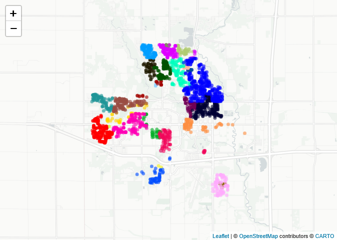
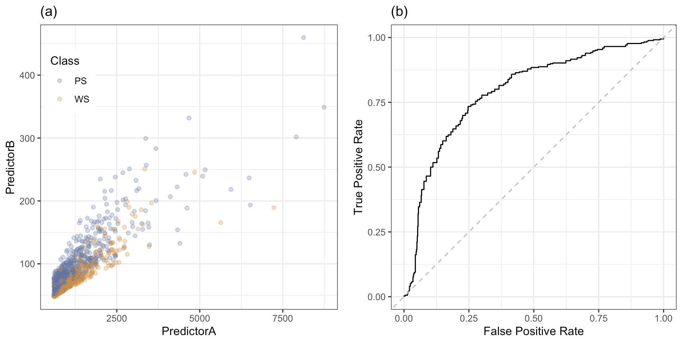
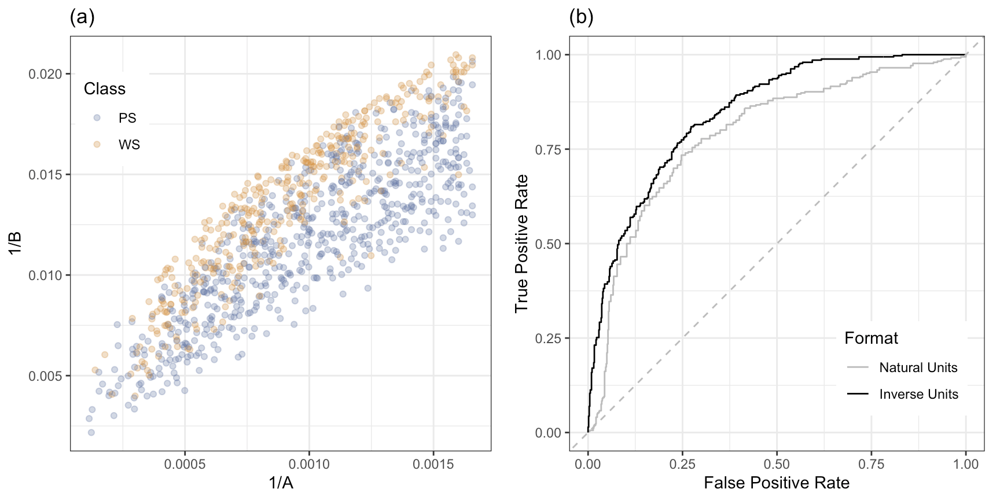
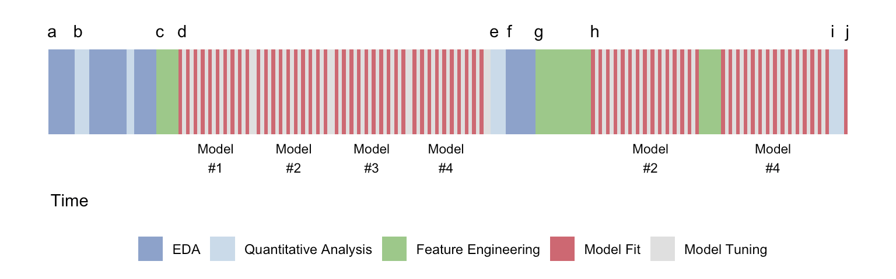
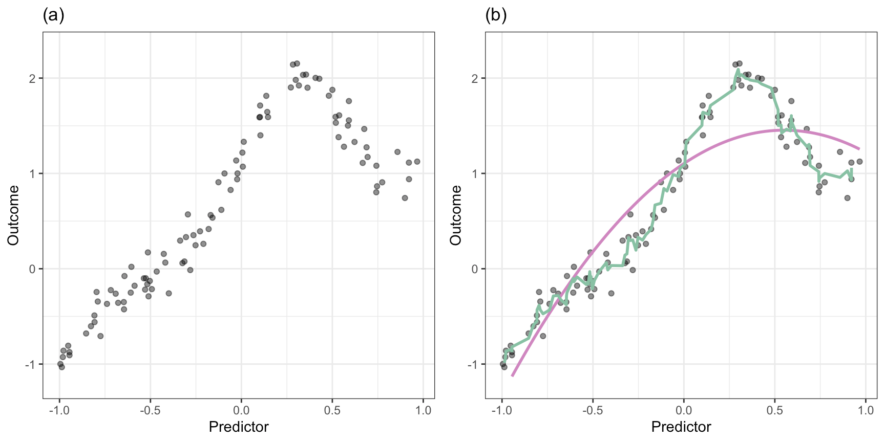

**Özellik Mühendisliği ve Seçimi: Öngörücü Modeller İçin Pratik Bir Yaklaşım**

**Yazarlar**
Max Kuhn
Kjell Johnson

**Yayın Tarihi**
18 Şubat 2026

# **Önsöz**

Önceki çalışmamız *Applied Predictive Modeling*’in amacı, gelecekteki, henüz görülmemiş veriler için doğru tahminler üretebilecek modellerin nasıl inşa edileceğini açıklayan bir çerçeve sunmaktı. Bu çerçeve; verilerin ön işlenmesini, verinin eğitim ve test setlerine ayrılmasını, optimal ayar parametrelerini belirlemek için bir yaklaşım seçmeyi, modellerin kurulmasını ve tahmin performansının değerlendirilmesini içerir. Bu yaklaşım, eğitim verisine aşırı uyum sağlamayı (overfitting) önler ve modellerin gelecekteki verilere genellenebilir, gerçekten öngörücü desenleri tanımlamasına yardımcı olur, böylece bu veriler için doğru tahminler yapılabilir. Yazarlar ve model geliştiriciler, bu çerçeveyi kullanarak Kaggle yarışmalarını kazanan modeller geliştirmiş (Raimondi 2010), tanı araçlarında uygulanmış (Luo 2016), yatırım algoritmalarının temelini oluşturmuş (Stanković, Marković ve Stojanović 2015) ve yeni ilaç ürünlerinin güvenliğini değerlendirmek için tarama aracı olarak kullanılmıştır (Thomson vd. 2011).

Etkili bir öngörücü model inşa etmek, iyi bir modelleme süreci yaklaşımına sahip olmanın ötesinde bazı iyi uygulamaları da gerektirir. Bu uygulamalar, modellenen süreç hakkında uzman bilgisi toplamak, doğru veriyi toplamak, yanıt değişkenindeki doğal varyasyonu anlamak ve mümkünse bu varyasyonu minimize etmek, toplanan öngörücülerin problem için uygun olmasını sağlamak ve öngörücüler ile yanıt arasındaki ilişkileri ortaya çıkarma şansını artırmak için farklı model türlerini kullanmayı içerir.

Bu iyi uygulamaları takip etmeye çalışmamıza rağmen, bazen en iyi modellerin beklenenden daha düşük, kullanışlı olmayan tahmin performansı sergilediğini görmek hayal kırıklığı yaratabilir. Bu performans eksikliği, açıklaması basit ama belirlenmesi zor bir nedenden kaynaklanabilir: toplanan ilgili öngörücüler, modellerin iyi performans elde etmekte zorlandığı şekilde temsil edilmiştir. Doğrudan öngörücü olarak mevcut olmayan temel ilişkiler şunlar olabilir:

* Bir öngörücünün dönüşümü,
* İki veya daha fazla öngörücünün etkileşimi (çarpım veya oran gibi),
* Öngörücüler arasında fonksiyonel bir ilişki veya
* Öngörücünün eşdeğer yeniden temsili.

Öngörücüleri, modellerin öngörücü-yanıt ilişkilerini daha iyi keşfetmesini sağlayacak şekilde ayarlama ve yeniden işleme süreci *özellik mühendisliği (feature engineering)* olarak adlandırılır. Mühendislik terimi, kötü performansı düzeltmek ve tahmin geliştirmeyi yönlendirmek için hangi adımların atılacağını bildiğimiz izlenimini verir. Ancak çoğu zaman öngörücülerin performansı artıracak en iyi yeniden temsili bilinmez. Bunun yerine öngörücülerin yeniden işlenmesi daha çok bir sanat gibidir ve doğru araçlar ile deneyim gerektirir. Ayrıca model performansını artırmak için birçok alternatif öngörücü temsili araştırmak gerekebilir. Bu süreç, alternatif temsillerin çokluğu nedeniyle aşırı uyuma (overfitting) yol açabilir. Bu nedenle öngörücü oluşturma sürecinde aşırı uyumdan kaçınmak için dikkatli olunmalıdır.

*Feature Engineering and Selection*’ın amaçları; öngörücüleri yeniden temsil etmek için araçlar sağlamak, bu araçları iyi bir öngörücü modelleme çerçevesi bağlamına yerleştirmek ve bu araçları pratikte kullanma deneyimlerimizi aktarmaktır. Sonuç olarak, bu araçlar ve deneyimlerimizin, daha iyi modeller oluşturmanıza yardımcı olacağını umuyoruz. Kitabı yazmaya başladığımızda, yalnızca görüntü ve metin üzerine odaklanmamış şekilde, öngörücü temsillerine odaklanarak modelleri iyileştirmek için kullanılabilecek taktik ve stratejileri kapsamlı şekilde açıklayan bir kaynak bulamadık.

*Tıpkı Applied Predictive Modeling’de olduğu gibi, bu kitapta da hesaplama motoru olarak R kullanılmıştır.* Bunun birkaç nedeni vardır. Birincisi, R tek seçenek olmasa da modern veri analizinde popüler ve etkili bir araç olarak gösterilmiştir. İkincisi, R ücretsiz ve açık kaynaklıdır. Her yerde kurulabilir, kodu değiştirilebilir ve hesaplamaların tam olarak nasıl yapıldığını görebilirsiniz. Üçüncüsü, canonical R mailing listeleri ve daha önemlisi StackOverflow ile Posit Community aracılığıyla mükemmel topluluk desteğine sahiptir. Mantıklı ve çoğaltılabilir bir soru soran herkesin cevap alma olasılığı yüksektir.

Ayrıca, önceki çalışmamızda olduğu gibi, tüm yazılım ve verilerin ücretsiz olarak erişilebilir olması bizim için kritik öneme sahiptir. Bu sayede herkes çalışmamızı çoğaltabilir, hata/bulgu bulabilir ve yaklaşımlarımızı geliştirebilir. Veri setleri ve R kodları GitHub deposunda mevcuttur: [https://github.com/topepo/FES](https://github.com/topepo/FES)

Kitap yazılırken geri bildirim, yazım hatası veya tartışmalara katkıda bulunan herkese teşekkür ederiz. 22 Şubat 2019 itibarıyla GitHub katkıcıları şunlardır: @alexpghayes, @AllardJM, @AndrewKostandy, @danielwo, @draben, @eddelbuettel, @endore, @feinmann, @gtesei, @ifellows, @JohnMount, @jonimatix, @juliasilge, @jwillage, @kaliszp, @KevinBretonnelCohen, @KnightAdz, @kransom14, @LG-1, @LluisRamon, @LoweCoryr, @monogenea, @mpettis, @Nathan-Furnal, @nazareno, @PedramNavid, @r0f1, @ronencozen, @shinhongwu, @stecaron, @StefanZaaiman, ve @uwesterr.

© 2018 Taylor & Francis Group, LLC. ABD telif hakkı yasalarının izin verdiği durumlar dışında, bu kitabın hiçbir bölümü yayınevinin yazılı izni olmadan elektronik, mekanik veya başka yollarla, fotokopi, mikrofilm, kayıt veya herhangi bir bilgi depolama/erişim sistemi aracılığıyla çoğaltılamaz, iletilemez veya kullanılamaz.

**Kaynaklar**

* Jahani, M., & Mahdavi, M. (2016). “Comparison of Predictive Models for the Early Diagnosis of Diabetes.” *Healthcare Informatics Research*, 22(2), 95–100.
* Luo, G. (2016). “Automatically Explaining Machine Learning Prediction Results: A Demonstration on Type 2 Diabetes Risk Prediction.” *Health Information Science and Systems*, 4(1), 2.
* Raimondi, C. (2010). “How I Won the Predict HIV Progression Data Mining Competition.” [http://blog.kaggle.com/2010/08/09/how-i-won-the-hiv-progression-prediction-data-mining-competition/](http://blog.kaggle.com/2010/08/09/how-i-won-the-hiv-progression-prediction-data-mining-competition/)
* Stanković, J., Marković, I., & Stojanović, M. (2015). “Investment Strategy Optimization Using Technical Analysis and Predictive Modeling in Emerging Markets.” *Procedia Economics and Finance*, 19, 51–62.
* Thomson, J., Johnson, K., Chapin, R., Stedman, D., Kumpf, S., & Ozolinš, T. (2011). “Not a Walk in the Park: The ECVAM Whole Embryo Culture Model Challenged with Pharmaceuticals and Attempted Improvements with Random Forest Design.” *Birth Defects Research Part B: Developmental and Reproductive Toxicology*, 92(2), 111–21.

---

# **1. Giriş**

İstatistiksel modeller, modern toplumda her yerde kullanılabilir hale geldikçe önem kazanmıştır. Bu modeller, günlük yaşamımızda çeşitli türde tahminler üretebilmemizi sağlar. Örneğin, doktorlar, belirli hasta gruplarının belirli bir hastalık veya olay için artmış risk taşıdığını gösteren modellerden türetilmiş genel kurallara güvenirler. Bir uçağın varış saatine dair sayısal bir tahmin, uçağımızın gecikip gecikmeyeceğini anlamamıza yardımcı olabilir. Diğer durumlarda, modeller, hangi bilgilerin önemli veya somut olduğunu belirlemede etkilidir. Örneğin, bir avukat, potansiyel işe alım önyargısının tesadüfen mi yoksa sistematik bir sorun olarak mı meydana geldiğini ölçmek için istatistiksel bir model kullanabilir.

Bu durumların her birinde, modeller mevcut veriler alınarak ve bu verilere yeterli derecede uygun bir matematiksel temsil bulunarak oluşturulur. Bu tür bir modelden önemli istatistikler tahmin edilebilir. Hava yolu gecikmelerinde, ilgi duyulan miktar (varış zamanı) tahmin edilirken, olası bir işe alım önyargısı tahmini belirli bir model parametresi aracılığıyla ortaya çıkarılabilir. Bu ikinci durumda, işe alım önyargısı tahmini genellikle verideki tahmini belirsizlikle (gürültü) karşılaştırılır ve böyle bir sonucun ne kadar nadir olduğu değerlendirilir; bu kavram genellikle “istatistiksel anlamlılık” olarak adlandırılır. Bu tür modeller genellikle çıkarımsal (inferential) olarak düşünülür: doğanın durumu hakkında bir anlayışa ulaşmak amacıyla sonuç çıkarılır. Buna karşılık, belirli bir değerin (örneğin varış saati) tahmini, bir trendin veya gerçeğin gerçek olup olmadığını anlamaya değil, o değeri en doğru şekilde belirlemeye odaklanan bir tahmin problemidir. Tahmindeki belirsizlik, özellikle modelin ürettiği değerin güvenilirliğini değerlendirmek açısından başka bir önemli ölçüttür.

Modelin çıkarım veya tahmin amacıyla (ve nadir durumlarda her ikisi için) kullanılacağına bakılmaksızın, dikkate alınması gereken bazı önemli özellikler vardır. Bunlardan biri de **basitlik (parsimony)**tir. Basit modeller, özellikle çıkarım amaçlı kullanıldığında, genellikle karmaşık modellere tercih edilir. Örneğin, daha az parametreye sahip modellerde gerçekçi dağılımsal varsayımları belirtmek daha kolaydır. Basitlik, aynı zamanda bir modelin yorumlanabilirliğini artırır. Örneğin, bir ekonomist, yüksek lisans eğitiminin maaşlar üzerindeki faydasını nicel olarak ölçmek isteyebilir. Basit bir model, eğitim yılı ile iş maaşı arasındaki ilişkiyi doğrusal olarak temsil edebilir. Bu parametrizasyon, söz konusu eğitimin potansiyel faydası hakkında istatistiksel çıkarımlar yapılmasını kolaylaştırır. Ancak, bu ilişkinin meslekler arasında önemli ölçüde farklı olduğunu veya doğrusal olmadığını varsayalım. Daha karmaşık bir model, veri desenlerini daha iyi yakalayabilir, ancak yorumlanabilirlik önemli ölçüde azalır.

Bununla birlikte, doğruluk ciddi şekilde basitlik uğruna feda edilmemelidir. Basit bir model yorumlanması kolay olabilir ancak veriye yeterli düzeyde uygunluk sağlamıyorsa başarılı olamaz; eğer bir model sadece %50 doğruysa, çıkarım veya tahmin yapmak için kullanılmalı mıdır? Genellikle düşük doğruluk için çözüm **karmaşıklık**tır. Ek parametreler kullanarak veya doğası gereği doğrusal olmayan bir model seçerek doğruluğu artırabiliriz, ancak yorumlanabilirlik büyük ölçüde azalabilir. Bu denge, model kurarken dikkate alınması gereken temel bir konudur.

Şimdiye kadar tartışma daha çok modelin kendisine odaklanmıştır. Ancak, modele giren değişkenler (ve bunların nasıl temsil edildiği) başarının kritik bir parçasıdır. Modellerden bahsetmeden modellemeden söz etmek imkânsızdır, fakat bu kitabın amaçlarından biri, bir modelde öngörücülere verilen önemi artırmaktır.

Terminoloji açısından, modellenen veya tahmin edilen nicelik, **çıktı (outcome), yanıt (response) veya bağımlı değişken (dependent variable)** olarak adlandırılır. Çıktıyı modellemek için kullanılan değişkenler ise bağlama bağlı olarak **öngörücüler (predictors), özellikler (features) veya bağımsız değişkenler (independent variables)** olarak adlandırılır. Örneğin, bir evin satış fiyatını (çıktı) modellediğimizde, mülkün özellikleri (örneğin metrekare, yatak odası ve banyo sayısı) öngörücü olarak kullanılabilir (özellikler terimi de uygun olur). Ancak, birden fazla değişkeden türetilmiş yapay model terimlerini düşünelim; örneğin, her banyoya düşen yatak odası sayısı. Bu tür bir değişken daha uygun olarak bir **özellik (feature)** veya **türetilmiş özellik (derived feature)** olarak adlandırılabilir. Her durumda, özellikler ve öngörücüler, bir modelde çıktıyı açıklamak için kullanılır.

Şekil 1.1: Ames, Iowa’daki satılık evler, mahallelere göre renklendirilmiş. Leaflet © OpenStreetMap © CartoDB

Beklendiği gibi, bir modele değişken (predictor) eklemenin iyi ve kötü yolları vardır. Birçok durumda, temel bir bilginin birden fazla şekilde temsil edilmesi veya kodlanması mümkündür. Örneğin, bir mülkün satış fiyatını tahmin eden bir modeli ele alalım. Konum büyük olasılıkla çok önemlidir ve farklı şekillerde temsil edilebilir. Şekil 1.1, 2006 ile 2010 yılları arasında Ames, Iowa ve çevresinde satılan mülklerin konumlarını göstermektedir. Bu görselde renkler, bildirilen mahalleleri temsil etmektedir. Toplamda 29 mahalle yer almakta olup, mahalle başına düşen mülk sayısı Landmark’da bir adetken, North Ames’te 443’e kadar çıkmaktadır. Veride konumu temsil etmenin ikinci bir yolu ise boylam ve enlemdir. Bir emlakçı, okul bölgesinin önemli olabileceği düşünüldüğünde, modelde tahmin edici olarak posta kodunun (ZIP code) kullanılmasını önerebilir. Ancak bilgi kuramı açısından bakıldığında, boylam ve enlem fiziksel konumu ölçmek için en fazla özgüllüğü sağlar ve bu temsili bilgilerin daha yüksek içerikli olduğunu savunmak mümkün olabilir (tabii bu bilginin öngörücü olduğunu varsayarsak).

Bir modelde değişkenlerin farklı şekillerde temsil edilebileceği ve bazı temsil biçimlerinin diğerlerinden daha iyi olabileceği fikri, özellik mühendisliği (feature engineering) kavramına götürür — bu, modelin etkinliğini artıracak veri temsillerini oluşturma sürecidir.

Model etkinliği birçok faktörden etkilenir. Tahmin edicinin sonuçla ilişkisi yoksa, temsil şekli önemsiz olur. Ancak, çok çeşitli model türlerinin olduğunu ve her birinin kendine özgü hassasiyet ve gereksinimleri bulunduğunu anlamak çok önemlidir. Örneğin:

* Bazı modeller, aynı temel büyüklüğü ölçen tahminicilere (yani çoklu doğrusal bağlantı veya tahminiciler arası korelasyon) tahammül edemez.
* Birçok model eksik veri içeren örnekleri kullanamaz.
* Bazı modellerde, ilgisiz tahminiciler model performansını ciddi şekilde bozabilir.

Özellik mühendisliği ve değişken seçimi, bu tür sorunların çoğunu azaltmaya yardımcı olabilir. Bu kitabın amacı, uygulayıcıların değişkenlere odaklanarak daha iyi modeller kurmasına yardımcı olmaktır. “Daha iyi” tanımı probleme göre değişir ama genellikle doğruluk, sadelik ve sağlamlık gibi faktörleri içerir. Bu özelliklere ulaşmak ya da bunlar arasında iyi bir denge kurmak için modelde kullanılan tahminicilerle model türü arasındaki etkileşimi anlamak kritik önemdedir. Doğruluk ve/veya sadelik, verilerin modele daha uygun biçimlerde temsil edilmesi ya da kullanılan değişken sayısının azaltılması ile zaman zaman artırılabilir. Bu noktayı göstermek için bir sonraki bölümde iki tahminicili basit bir örnek sunulacaktır. Ayrıca Bölüm 1.3’te, uygulamadaki modelleme sürecine daha yakın daha kapsamlı bir örnek tartışılacaktır.

### 1.1 Basit Bir Örnek

Özellik mühendisliğinin modeller üzerindeki etkisini göstermek için basit bir örnek olarak Şekil 1.2 (a) ele alınabilir. Bu şekilde, iki ilişkili tahminci değişkenin (A ve B olarak etiketlenmiş) bir grafiği gösterilmektedir. Veri noktaları, sonuç değişkenine göre renklendirilmiştir; sonuç, iki olası değeri olan ayrık bir değişkendir (“PS” ve “WS”). Bu veriler, Hill ve arkadaşlarının (2007) yaptığı ve daha geniş bir tahminci seti içeren bir deneyden gelmektedir.

Bu görev için model yüksek doğruluk gerektirse de çıkarım (inference) amacıyla kullanılmayacaktır. Bu gösterim için yalnızca bu iki tahminci dikkate alınacaktır. Şekilde, iki sınıf arasında açık bir çapraz (diagonal) ayrım görülmektedir.

Burada, bu iki değişkenden bir tahmin denklemi oluşturmak için basit bir lojistik regresyon modeli (Hosmer ve Lemeshow 2000) kullanılacaktır. Model, aşağıdaki denklemle çalışır:

$\log\left(\frac{p}{1-p}\right) = \beta_0 + \beta_1 A + \beta_2 B$

Burada (p), bir örneğin "PS" sınıfına ait olma olasılığıdır ve değerler, verilerden tahmin edilmesi gereken model parametreleridir.

Şekil 1.2: (a) Bir örnek veri seti ve (b) basit bir lojistik regresyon modelinden ROC eğrisi.

Standart bir yöntem (maksimum olabilirlik tahmini), verilerden üç regresyon parametresini tahmin etmek için kullanılır. Yazarlar, parametreleri tahmin etmek için 1009 veri noktası (yani bir eğitim seti) kullanmış ve performansı değerlendirmek için 1010 örneği kesinlikle ayırmışlardır (bir test seti). Eğitim seti kullanılarak parametreler sırasıyla şu şekilde tahmin edilmiştir:
$\hat{\beta}_0 = 1.73$, $\hat{\beta}_1 = 0.00262$ ve $\hat{\beta}_2 = -0.0644$.

Modeli değerlendirmek için tahminler test seti üzerinde yapılır. Lojistik regresyon doğal olarak her sınıf için olasılık tahminleri üretir ve bu, her sınıfın gerçekleşme ihtimalini gösterir. Genellikle sınıflandırmada %50 eşik değeri kullanılarak kesin sınıf tahmini yapılır; ancak bu varsayılan eşik üzerinden elde edilen performans yanıltıcı olabilir. Bu nedenle, olasılık eşiği uygulamaktan kaçınmak için burada ROC (Receiver Operating Characteristic) eğrisi adı verilen bir yöntem kullanılır. ROC eğrisi, tüm olası eşik değerlerinde sonuçları değerlendirir ve gerçek pozitif oran ile yanlış pozitif oranı grafik üzerinde gösterir. Bu örneğe ait eğri Şekil 1.2 (b)’de gösterilmiştir. En iyi eğri, mümkün olduğunca sol üst köşeye yakın olan eğridir; etkisiz bir model ise kesikli çapraz çizgi boyunca kalır. Bu yöntemin yaygın bir özet değeri, ROC eğrisi altındaki alandır (AUC). AUC değeri 1.0 olan mükemmel modeli, 0.5’e yakın değerler ise tahmin gücü olmayan bir modeli ifade eder. Mevcut lojistik regresyon modeli için ROC eğrisi altındaki alan 0.794 olup, yanıtı sınıflandırmada orta düzeyde bir doğruluğu göstermektedir.

Bu iki tahmin değişkeni göz önüne alındığında, ROC eğrisi altındaki alanı artırmak amacıyla farklı dönüşümler ve kodlamalar denemek mantıklı olacaktır. Tahmin değişkenlerinin her ikisi de sıfırdan büyük ve sağa çarpık dağılımlar sergilediğinden, A/B oranını alıp sadece bu terimi modele sokmak tercih edilebilir. Alternatif olarak, her bir tahmin değişkenine uygulanacak basit dönüşümlerin faydalı olup olmadığını da değerlendirebiliriz. Bunlardan biri Box-Cox dönüşümüdür; bu dönüşüm lojistik regresyon modelinden önce ayrı bir tahmin yöntemi kullanarak tahmin değişkenlerini yeni bir ölçeğe taşıyabilir. Bu yöntemi kullanarak yapılan Box-Cox tahmini, her iki tahmin değişkeninin ters ölçek (yani A yerine 1/A) kullanılması gerektiğini önermiştir. Bu verilerin dönüşmüş hali Şekil 1.3 (a)’da gösterilmiştir. Bu dönüşmüş değerler orijinal değerlerin yerine lojistik regresyon modeline girildiğinde, ROC eğrisi altındaki alan 0.794’ten 0.848’e yükselmiş ve bu önemli bir artıştır. Şekil 1.3 (b) her iki eğriyi göstermektedir. Bu durumda, dönüşmüş tahmin değişkenlerine karşılık gelen ROC eğrisi orijinal sonuçtan kesinlikle daha iyidir.

Şekil 1.3: (a) Dönüştürülmüş değişkenler ve (b) her iki lojistik regresyon modeline ait ROC eğrisi.

Bu örnek, değişkenlerde yapılan bir değişikliğin — bu durumda basit bir dönüşümün — modelin etkinliğini nasıl artırabileceğini göstermektedir. Şekil 1.2 (a) ve Şekil 1.3 (a)’daki veriler karşılaştırıldığında, iki veri grubunu görsel olarak ayırt etmek daha kolaydır. Veriler bireysel olarak dönüştürüldüğünde, lojistik regresyon modelinin sınıfları daha iyi ayırabilmesi sağlanmıştır. Ancak, değişkenlerin doğasına bağlı olarak, orijinal verilerin tersini kullanmak çıkarımsal analizleri zorlaştırabilir.

Fakat farklı modellerin veriden farklı beklentileri vardır. Eğer orijinal değişkenlerin çarpıklığı lojistik regresyon modelini etkileyen sorun ise, bu özelliğe aynı şekilde duyarlı olmayan başka modeller de vardır. Örneğin, sinir ağları bu verileri değişkenlerin ters dönüşümünü kullanmadan da uyarlayabilir. Bu model, ROC eğrisi altındaki alanı 0.848 olarak elde etmiş ve bu da geliştirilmiş lojistik model sonuçlarına yaklaşık olarak eşdeğerdir. Buradan sinir ağlarının lojistik regresyondan her zaman daha iyi olduğu sonucu çıkarılmamalıdır; çünkü “Ücretsiz Yemek Yok” teoremi (bkz. Bölüm 1.2.3) bu tür genellemelere karşı uyarır. Ayrıca sinir ağlarının kendi dezavantajları vardır: tamamen yorumlanamazdır ve iyi sonuçlar için yoğun parametre ayarlaması gerektirir. Modelin nasıl kullanılacağına bağlı olarak, bu iki modelden biri veriler için diğerine göre daha avantajlı olabilir.

Farklı özelliklerin modelleri nasıl farklı şekillerde etkileyebileceğine dair daha kapsamlı bir özet, Bölüm 1.3’te verilecektir. Bu örneğin öncesinde, bir sonraki bölümde bu metin boyunca kullanılacak birkaç temel kavram ele alınmıştır.

---

### 1.2 Önemli Kavramlar

Belirli strateji ve yöntemlere geçmeden önce tartışılması gereken bazı temel kavramlar vardır. Bu kavramlar hem modellemenin teorik yönlerini hem de model oluşturma uygulamasını içerir. Burada bazıları ele alınacak, detaylar sonraki bölümlerde ve kaynaklarda verilecektir.

#### 1.2.1 Aşırı Öğrenme (Overfitting)

Aşırı öğrenme, bir modelin mevcut verilere çok iyi uyum sağlarken yeni örneklerde başarısız olması durumudur. Genellikle modelin mevcut veri setindeki belirli örüntü ve trendlere aşırı bağımlı hale gelmesiyle ortaya çıkar. Model sadece mevcut veri setine erişebildiğinden, bu örüntülerin anormal olduğunu anlayamaz. Örneğin, Şekil 1.1’deki konut verisinde, belirli bir metrekare aralığında ve üç yatak odalı evlerin satış fiyatlarının gerçeğe çok yakın tahmin edildiği görülebilir; ancak bu koşulları sağlayan başka evlerde model başarısız olabilir. Bu, yeni verilere genellenemeyen bir eğilimin örneğidir.

Çok esnek modeller (Bölüm 1.2.5’te “düşük yanlı” modeller olarak adlandırılanlar) aşırı öğrenmeye daha yatkındır. Bu modeller mevcut veri setinde mükemmel sonuçlar verebilir ancak önlem alınmazsa yeni verilere genelleme yapamayabilir. İlerleyen bölümlerde, özellikle Bölüm 3.5’te, aşırı öğrenmenin modellemede temel risklerden biri olduğu vurgulanacaktır.

Model aşırı öğrenebildiği gibi, değişken seçimi teknikleri de tahmin edicilere aşırı öğrenme yapabilir. Bu, bir değişkenin mevcut veri setinde ilgili görünmesi ancak yeni verilerle ilişkisinin kaybolması durumunda olur. Bu durum özellikle veri sayısı (n) az ve potansiyel değişken sayısı (p) çok fazla olduğunda risklidir. Bu sorun, oluştuğunda uyarı veren metodolojilerle azaltılabilir.

#### 1.2.2 Denetimli ve Denetimsiz Yöntemler

Denetimli analiz, tahmin ediciler ile modellenmesi ya da tahmin edilmesi gereken belirlenmiş sonuç arasındaki ilişkilerin bulunmasını amaçlarken, denetimsiz teknikler yalnızca tahmin ediciler arasındaki örüntüleri bulmaya odaklanır.

Her iki analiz türü de keşifsel veri analizi (EDA) içerir. EDA, değişkenlerin ve sonuçların temel özelliklerini anlamak, korelasyon yapıları, eksik veri örüntüleri ve anormal motifleri keşfetmek için kullanılır.

Tahmin modelleri kesinlikle denetimlidir çünkü doğrudan tahmin edici ve sonuç ilişkisi aranır. Denetimsiz analizler ise kümeleme, temel bileşen analizi gibi yöntemleri kapsar.

Her iki tür analiz de aşırı öğrenmeye açıktır ancak denetimli analizler özellikle sonuç tahmini için yanlış örüntüler bulmaya eğilimlidir. Bu teknikler bazen kendini gerçekleştiren kehanet yaratabilir. Örneğin, bir analist önemli tahmin edicileri tespit etmek için denetimli analiz yapar ve aynı veriyle bu önemli tahmin edicilerin görselleştirmesini yaparsa, görselleştirme güçlü ilişkiler gösterir ancak bu ilişkiler sadece mevcut veriye özgüdür ve yeni veriye genellenmeyebilir (bkz. Bölüm 3.8).

#### 1.2.3 Ücretsiz Yemek Yok (No Free Lunch) Teoremi

“Ücretsiz Yemek Yok” Teoremi (Wolpert 1996), problem ya da veri hakkında özel bir bilgi olmadan en iyi tahmin modelinin olmadığı fikridir. Bazı modeller belirli veri özelliklerine (eksik değerler, çoklu bağlantı gibi) optimize edilmiş olabilir. Ancak genel olarak en iyi modelin önceden bilinmesi zordur.

Demsar (2006) ve Fernandez-Delgado vd. (2014) gibi çalışmalar, bazı modellerin daha iyi sonuç verme eğiliminde olduğunu gösterse de, bir modelin her zaman en iyi olduğu söylenemez.

Pratikte, farklı model türlerini denemek ve veri setinize en uygun olanı bulmak akıllıca olur.

#### 1.2.4 Model ve Modelleme Süreci

Etkili model geliştirme süreci hem yinelemeli hem sezgiseldir. Veri setinin ihtiyaçlarını önceden bilmek zordur ve model nihai hale gelmeden önce birçok yaklaşım denenip değiştirilir. Çoğu kaynak sadece modelleme tekniğine odaklanırken, bu etkinlik genellikle tüm sürecin küçük bir parçasıdır. Şekil 1.4, tipik bir problem için model oluşturma sürecinin genel bir şemasını göstermektedir.

Şekil 1.4: Tipik bir modelleme sürecinin şeması.

Başlangıç etkinliği, (a) işaretinde başlar; burada keşifsel veri analizi (Exploratory Data Analysis, EDA) kullanılarak veriler incelenir. İlk keşiflerden sonra, (b) işareti erken veri analizinin yapılabileceği noktayı gösterir. Bu, basit özet ölçümleri değerlendirmek veya sonuçla güçlü korelasyona sahip öngörücüleri (predictor) belirlemek gibi işlemleri içerebilir. Süreç, modelleyici verilerin iyi anlaşıldığını hissedene kadar görselleştirme ve analiz arasında yinelenebilir. (c) işaretinde, önceki analizler temel alınarak öngörücülerin modelde nasıl temsil edileceğine dair ilk taslak oluşturulur.

Bu noktada, ilk özellik setiyle çeşitli modelleme yöntemleri değerlendirilebilir. Ancak birçok model, ayarlanması gereken hiperparametreler içerebilir (d). Dört model kümesi, kırmızı ince işaretlerle gösterilmiştir ve her biri, aday hiperparametre değerleri üzerinde birden çok kez değerlendirilir. Bu model ayarlama süreci Bölüm 3.6’da ele alınmış ve sonraki bölümlerde birkaç kez gösterilmiştir. Dört model ayarlandıktan sonra, performans özelliklerini anlamak için sayısal olarak değerlendirilir (e). Her modelin doğruluk gibi özet ölçümleri, problemin zorluk seviyesini anlamak ve hangi modellerin veriye en uygun olduğunu belirlemek için kullanılır. Bu sonuçlara dayanarak, model sonuçları üzerinde daha fazla EDA yapılabilir (f), örneğin artık analizi (residual analysis). Önceki ev satış fiyatlarını tahmin etme örneğinde, kötü tahmin edilen mülkler incelenerek modelde sistematik bir sorun olup olmadığı anlaşılabilir. Örneğin, belirli posta kodları doğru tahmin edilemeyebilir. Bu nedenle, bu engelleri telafi etmek için başka bir özellik mühendisliği turu (g) uygulanabilir. Bu noktada, hangi modellerin probleme daha uygun olduğunu anlamak mümkün olabilir ve daha az sayıda model üzerinde daha kapsamlı bir ayarlama turu yapılabilir (h). Daha fazla ayarlama ve öngörücü temsilinin modifikasyonundan sonra, iki aday model (#2 ve #4) finalize edilir. Bu modeller, nihai “test” için dış bir test setinde değerlendirilebilir (i). Son model seçildikten sonra (j), bu uyarlanmış model, yeni örnekleri tahmin etmek veya çıkarım yapmak için kullanılacaktır.

Bu şemanın amacı, sürecin yalnızca tek bir matematiksel modelin uydurulmasından ibaret olmadığını göstermektir. Çoğu problemde, herhangi bir model/özellik seti kombinasyonunun performansını değerlendiren ve yeniden değerlendiren geri besleme döngüleri bulunur.

#### 1.2.5 Model Sapması ve Varyansı

Varyans (variance), iyi bilinen bir kavramdır. Veri bağlamında kullanıldığında, değerlerin ne ölçüde değişebileceğini açıklar. Aynı nesne birden fazla ölçüldüğünde, gözlemlenen değerler bir dereceye kadar farklı olacaktır. İstatistikte, sapma (bias) genellikle bir şeyin gerçek temel değerinden ne ölçüde sapmış olduğunu ifade eder. Örneğin, bir konu hakkında kamuoyu tahmini yapmak isteyen bir anket, belirli bir demografiyi aşırı temsil ediyorsa sistematik olarak yanlı olabilir ve sapma oluşur.

Modeller, varyans ve sapma açısından da değerlendirilebilir (Geman, Bienenstock ve Doursat 1992). Eğer küçük veri değişiklikleri model parametrelerinde büyük değişiklikler yaratıyorsa, model yüksek varyansa sahiptir. Örneğin, bir veri setinin örnek ortalaması, örnek medyanına göre daha yüksek varyansa sahiptir. Düşük varyanslı modeller, lineer regresyon, lojistik regresyon ve kısmi en küçük kareler (PLS) gibi yöntemleri içerir. Yüksek varyanslı modeller ise, parametrelerini belirlemek için tek tek veri noktalarına aşırı bağımlı olan sınıflandırma veya regresyon ağaçları, en yakın komşu ve sinir ağı modellerini içerir. Örneğin, lineer regresyon ve en yakın komşu modelleri karşılaştırılabilir: lineer regresyon, tüm verileri kullanarak eğim parametrelerini tahmin eder ve uç değerlere karşı hassas olmasına rağmen, en yakın komşu model kadar hassas değildir.

Model sapması, bir modelin verinin temel teorik yapısına ne kadar uyum sağlayabildiğini gösterir. Düşük sapmalı bir model, yüksek esneklik sağlayabilir ve farklı şekil ve desenleri uydurabilir. Yüksek sapmalı bir model, değerleri gerçek teorik karşılıklarına yakın tahmin edemez. Lineer yöntemler genellikle yüksek sapmaya sahiptir çünkü öngörücü değişkenlerdeki doğrusal olmayan desenleri açıklayamazlar. Ağaç tabanlı modeller, destek vektör makineleri ve sinir ağları gibi yöntemler veriye oldukça uyum sağlayabilir ve düşük sapmaya sahiptir.

Beklendiği gibi, model sapması ve varyans genellikle birbirine karşıt olabilir; düşük sapma elde etmek için modeller yüksek varyans gösterme eğilimindedir ve bunun tersi de geçerlidir. Varyans-sapma (variance-bias) takası, istatistikte sıkça karşılaşılan bir konudur. Çoğu model, modelin esnekliğini kontrol eden parametrelere sahiptir ve bu parametreler sonuçların varyans ve sapma özelliklerini etkiler. Örneğin, günlük bir hisse senedi fiyatı veri dizisini ele alalım. Hareketli ortalama modeli, belirli bir günün fiyatını, gün içindeki veri noktalarının ortalaması ile tahmin eder. Pencere boyutu, varyans ve sapmayı etkiler: küçük pencere, verilere daha duyarlıdır ve temel trendle eşleşme olasılığı yüksektir, fakat aynı zamanda pencere içi verilere yüksek duyarlılık kazandırır ve varyansı artırır. Pencereyi genişletmek, daha fazla nokta ortalaması alarak varyansı azaltır ancak veri düzleştirme nedeniyle sapmayı artırabilir.

Şekil 1.5 (a), tek bir öngörücü ve sonuç içeren ve doğrusal olmayan ilişkiyi gösteren bir örnek sunar. Sağ panel (b), iki model uyumunu gösterir. Yeşil çizgi, üç noktalı basit hareketli ortalama ile çizilen eğriyi gösterir. Bu trend çizgisi düzensizdir ancak verideki doğrusal olmayan trendi iyi takip eder. Mor çizgi ise öngörücü değeri ve öngörücü karesini içeren standart bir lineer regresyon modelinin sonuçlarını gösterir. Lineer regresyon model parametrelerinde lineerdir ve polinom terimleri eklemek, modelin doğrusal olmayan desenleri tanımlamasına olanak sağlar. Veri noktaları y ekseninde düşükten başlasa, 0.3 değerine yaklaşsa ve ardından düşse, kuadratik regresyon modeli bu verileri modellemek için makul bir ilk denemedir. Bu model oldukça düzgün (düşük varyans gösterir) ancak veri trendine uymakta çok iyi değildir (yüksek sapma gösterir).

