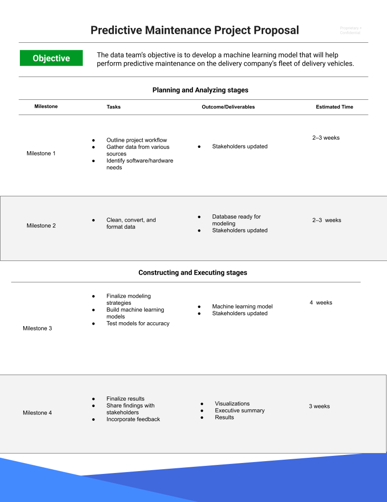

# PACE Aşamaları

Şimdiye kadar PACE çerçevesiyle tanıştınız ve bu çerçevenin veri analizi projeleri için nasıl net bir temel ve yapı sunduğunu öğrendiniz. Ayrıca PACE'in bir kısaltma olduğunu ve her harfin bir projedeki uygulanabilir bir aşamayı temsil ettiğini öğrendiniz: planla (plan), analiz et (analyze), inşa et (construct), ve yürüt (execute). Bu yazıda, PACE iş akışını daha ayrıntılı inceleyecek ve her aşamanın veri analizinde nasıl rehberlik edebileceğini keşfedeceksiniz.

## Neden bir iş akışı yapısı kullanıyoruz?

Genel olarak, veri profesyonelleri, veri projelerinin süresi boyunca rehberlik etmesi için iş akışı yapılarından faydalanır. Büyük ölçekli bir projede, belirli bir sıra ile gerçekleştirilmesi gereken birçok görev olabilir. Karmaşıklıkları tanımlamak ve birlikte çalışmak için tutarlı yollar bulmak projeleri daha verimli hale getirebilir ve daha üretken iletişim kurulmasını sağlayabilir. Bu ve benzeri potansiyel engelleri erken tespit etmek, projeyi olumsuz etkilemeden önce kaynakları önceden planlamanıza ve hazırlamanıza yardımcı olabilir.

Bu programın geliştirilmesinde görev alan veri profesyonelleri, PACE'i esnek bir model olarak geliştirdi; bu sayede tüm iş akışını kesintiye uğratmadan her aşamaya geri dönmeniz teşvik edilmektedir. PACE aracılığıyla, hangi eylemlerin hangi bağlamda ele alınması gerektiğini belirleyeceksiniz. Genel olarak, PACE veri projelerinin her aşamasında profesyonellere destek sağlayabilecek özelleştirilebilir bir yapı sunar.

## PACE Modeline Yakından Bakış

Şimdi PACE modelinin her aşamasına yakından bakalım.

### **Planla (Plan)**

Bir projenin başında, başarı için sağlam bir temel oluşturmak önemlidir. Bu aşamada, projenizin kapsamını tanımlarsınız. Kuruluşun bilgi ihtiyaçlarını belirleyerek işe başlarsınız. Planlama aşamasında, projeye en geniş bakış açısıyla yaklaşırsınız. Tüm faktörleri ve süreçleri değerlendirerek, bir tamamlanma yol haritası çizersiniz ve yaratıcı düşünceyle bir eylem planı oluşturursunuz. Ayrıca iş akışınızda yenilikçi bir yaklaşım gerektiren görevleri de bu aşamada belirlemeniz gerekir.

**Özet**: Planlama aşaması, projenin kapsamını kavramsallaştırdığınız ve tamamlamaya yönelik adımları oluşturduğunuz aşamadır.

Planlama aşamasında yapılabilecek bazı görevler:

* İş verilerini araştırmak
* Proje kapsamını tanımlamak
* İş akışı geliştirmek
* Proje ve/veya paydaş ihtiyaçlarını değerlendirmek

### **Analiz Et (Analyze)**

Analiz aşamasında verilerle ilk kez etkileşim kurarsınız. Bu aşamada, proje için gerekli tüm verileri temin edersiniz. Bazı veri setleri kurum içi kaynaklardan gelirken, bazıları dış kaynaklardan toplanabilir. Hatta kamuya açık ya da açık kaynaklı veriler de gerekebilir. Bu aşama, aynı zamanda keşifsel veri analizi (EDA) yaptığınız bölümdür. Bu analiz sürecinde verileri temizler, yeniden düzenler ve projeye uygun hale getirirsiniz.

**Özet**: Analiz aşaması, proje için gerekli verilerin toplandığı, hazırlandığı ve analiz edildiği aşamadır.

Analiz aşamasındaki bazı görevler:

* Veritabanı biçimlendirme
* Verileri temizleme
* Verileri kullanılabilir formatlara dönüştürme

### **İnşa Et (Construct)**

Adından da anlaşılacağı gibi, inşa aşaması bir şeyleri "inşa etmekle" ilgilidir. Bu aşamada, modeller oluşturur, yorumlar ve gerekirse revize edersiniz. Bazı projeler, verilerdeki ilişkileri ortaya çıkarmak için makine öğrenimi algoritmalarına ihtiyaç duyabilir. Bu ilişkiler, verilerde aksi takdirde fark edilmeyecek bilgileri ortaya çıkarır ve kurumun geleceğe yönelik bilinçli kararlar almasına yardımcı olur.

**Özet**: İnşa aşamasında, verilerdeki gizli ilişkileri açığa çıkaran modeller kurarsınız.

İnşa aşamasındaki bazı görevler:

* Modelleme yaklaşımını belirlemek
* Modeller inşa etmek
* Makine öğrenmesi algoritmaları geliştirmek

### **Yürüt (Execute)**

Yürütme aşamasında analiz ve inşa süreçleri hayata geçirilir. Bulgular, kurum içi (iç paydaşlar) ve kurum dışı (dış paydaşlar) taraflara sunulur. Genellikle iş tarafındaki paydaşlarla da çalışılır. Bulguların sunulması yürütme aşamasının sadece bir parçasıdır. Paydaşlar geri bildirim verir, sorular sorar ve önerilerde bulunur. Bu geri bildirimleri toplayıp uygulamanız gerekir.

**Özet**: Yürütme aşamasında analiz sonuçlarını sunar, geri bildirim alır ve gerekli revizyonları yaparsınız.

Yürütme aşamasındaki bazı görevler:

* Sonuçları paylaşmak
* Bulguları paydaşlara sunmak
* Geri bildirimlere yanıt vermek

## İletişim ve PACE

PACE iş akışının neresinde olursanız olun, iletişim projenin hayata geçmesi için kritik öneme sahiptir. Bunu, PACE’in dört aşamasını bir devre olarak ve iletişimi bu devrede akan elektrik gibi düşünerek hayal edebilirsiniz.

Her aşamada, iş akışını geliştirmek için iletişime ihtiyaç duyarsınız. Bu iletişim; veriler hakkında soru sormak, ek kaynaklar toplamak, paydaşları ilerleme hakkında bilgilendirmek veya bulguları sunup geri bildirim almak şeklinde olabilir.

## PACE’in Uyarlanabilirliği

Bir projenin başında, PACE modeli size rehberlik edecek iyi bir yapı sunar. Planlama aşamasında ihtiyaç duyulan bilgi ve araçları toplar, projenizi yönlendirecek bir çerçeve oluşturursunuz. Veri analizi ve modelleme sırasında analiz ve inşa aşamaları devreye girer. Sonrasında yürütme aşamasında sonuçlar sunulur ve geri bildirim toplanır.

PACE modeli ilk olarak belirli bir sıra ile sunulsa da, iletişimin açık olması bu aşamalar arasında rahatça geçiş yapılmasını sağlar. Yeni bilgiler veya geri bildirimler sürecin herhangi bir aşamasında dahil edilebilir. Örneğin, verinin belirli bir yönünü netleştirmek için analiz aşamasına geri dönüp ardından bunu paydaşlara sunmak için yürütme aşamasına geçebilirsiniz. Yeni model inşa etmeniz gerekmez. PACE çerçevesi her projeye uyarlanabilir. Bu uyarlanabilirlik, profesyonel esneklik ve iletişim becerisi gerektiren dinamik bir mesleğe sizi hazırlar.

## Önemli Noktalar

* Veri profesyonelleri, projelerdeki çok sayıda görevi yönetebilmek için yapılandırılmış iş akışlarına ihtiyaç duyar.
* PACE profesyonel iş akışı, bu program kapsamında size mesleki yapı ve pratikler geliştirmeniz için özel olarak tasarlanmıştır.
* PACE, iletişimin her aşamadan geçtiği tamamlanmış bir devre gibi çalışır.
* Modelin tasarımı esneklik sunar ve ihtiyaç duyuldukça aşamalar arasında serbest geçiş yapılmasını mümkün kılar.

# Veri Profesyonelleri İçin En İyi İletişim Uygulamaları

## Etkili İletişim PACE’i Harekete Geçirir

PACE’in tüm aşamalarında, paydaşlar geri bildirimde bulunabilir, sorular sorabilir ya da açıklama talep edebilir. Bu yüzden iletişim kurabilmek çok önemlidir; bir projenin yaşam döngüsünün her aşamasında, karşılaşılan engelleri ve elde edilen sonuçları paylaşmanız ve karar alma süreçlerine rehberlik edecek bilgileri sunmanız gerekir. İletişim, verilerin toplanmasından modellemelerin inşasına ve sonuçların paylaşılmasına kadar PACE’in her aşamasını yönlendirir. Başarılı bir veri profesyoneli olmak için güçlü teknik becerilerin yanı sıra etkili iletişim becerilerine de sahip olmanız gerekir. Bu yazıda, PACE’in her aşamasında uygulayabileceğiniz bazı etkili iletişim ipuçlarını öğrenecek ve analiz sonuçlarınızı sunarken kullanabileceğiniz en iyi sunum uygulamalarını keşfedeceksiniz.

* * *

## Etkili İletişim İçin 7 İpucu

Günlük çalışma süresince, paydaşlarla birçok farklı şekilde etkileşimde bulunursunuz. Bu etkileşimler; e-posta, mesajlaşma, toplantılar, birebir görüşmeler ya da resmi sunumlar şeklinde olabilir. Her bir etkileşim, mesajınızın doğru anlaşılması için özel bir yaklaşım gerektirir. Aşağıdaki yedi ipucu, iletişiminiz hangi biçimde olursa olsun veya projeniz PACE’in hangi aşamasında bulunursa bulunsun size rehberlik edebilir:

* * *

### 1\. Hedef Kitlenizin Dilinde Konuşun

İletişimde bulunduğunuz kişinin ihtiyaçlarını belirleyin. Bu kişinin hedeflerini bilmek, iletişiminizin teknik seviyesini belirlemenizi sağlar. Şu soruları düşünün:

-   Bu kişi neden benimle iletişime geçti?
    
-   Bu etkileşimden ne bekliyor?
    
-   Kendisi, takımı veya kurumu için ne önemli?
    

Farklı bilgi seviyelerine sahip paydaşlarla çalışacaksınız. Bu yüzden onların ne bildiklerini, neye ihtiyaç duyduklarını ve proje kapsamı dışındaki konuları ayırt etmeniz önemlidir.

-   Teknik kavramları basit terimlerle açıklayın.
    
-   Ana fikirlerin daha kolay anlaşılması için kısa cümleler kullanın.
    
-   Doğrudan, sade bir dil kullanın; süslü veya gereksiz ayrıntılardan kaçının.
    
-   Farklı geçmişlere ve yaşanmışlıklara saygı gösterin.
    

**İpucu**: Kısaltmalar, teknik jargonlar ve moda deyimlerden kaçının; kafa karışıklığı yaratabilir.

* * *

### 2\. Soruları Davet Edin, Geri Bildirimi Memnuniyetle Karşılayın

Geri bildirim herkes için faydalıdır—ister olumlu pekiştirme isterse gelişim alanı olsun. Göreve odaklandığınızda bazı detayları gözden kaçırabilirsiniz. Bu yüzden başka birinin geri bildirimi sizin için değerli bir gelişim fırsatı sunar.

-   Sorunlara çözüm bulma tutkunuzu proje hedefleriyle birleştirin.
    
-   Sonuçları daha iyi anlamaya çalışın.
    
-   Projeler hakkında iletişimi geliştirmek için geri bildirim ve soru isteyin.
    
-   Kendi iletişim becerilerinizi değerlendirme fırsatları yaratın.
    

**İpucu**: Geri bildirimi analiz edin. Geçerli mi? Kişi projenin veya veri analizi sürecinin hedeflerini tam olarak anlıyor mu? Anlamıyorsa, açıklayıcı bir görüşme düzenleyin.

* * *

### 3\. Veriye Bağlantı Noktası Sizsiniz

Takımınız için veriden gelen içgörülere doğrudan siz erişirsiniz. Hedef, paydaşların süreci ve sürecin onların ihtiyaçlarına nasıl yanıt verdiğini anlamasını sağlamaktır. Herkes süreci anlarsa, iletişim çok daha etkili olur.

-   Hedeflere odaklanarak verileri daha anlaşılır hale getirin.
    
-   Veriyi bir hikâye gibi, tutarlı ve ilgi çekici biçimde anlatın.
    
-   Sorulara zamanında yanıt verin.
    
-   Takıma değer kattığınızı gösterin.
    
-   Paydaşların sorularını ele almak için fırsatlar yaratın.
    

**İpucu**: Sahip olduğunuz veri ve araçların takım hedeflerini nasıl destekleyebileceğini ve yeni içgörüler üretebileceğini proaktif olarak belirleyin.

* * *

### 4\. Görselleştirmelerle Hikâyenizi Anlatın

Görselleştirmeler, özellikle büyük veri ile çalışırken fikirleri iletmenin en etkili yollarından biridir. Grafikler, tablolar ve infografikler verilerdeki ayrıntıları ortaya koyar ve genel anlayışı artırır. Daha sonra, Tableau gibi güçlü görselleştirme araçlarını nasıl kullanacağınızı da öğreneceksiniz.

-   Görsellerinizin verinin hikâyesini anlatmasını sağlayın.
    
-   Herkesin anlayabileceği şekilde tasarlayın.
    
-   Açıklayıcı etiket ve metinler kullanın; ekranı kalabalıklaştırmayın.
    
-   Kolay okunur yazı tipleri seçin.
    
-   Yüksek kontrast, gölgeleme ve diğer görsel tekniklerle mesajınızı açık şekilde iletin.
    
-   El broşürleri, slaytlar gibi materyalleri erişilebilir formatlarda sunun.
    

**İpucu**: Görselleştirmeyi sade tutun. Sunumlarda az ama öz içerik daha etkilidir.

* * *

### 5\. Olumlu Profesyonel İlişkiler Kurun

Karşı tarafın sorumluluklarını ve hedeflerini dikkate almak, iletişiminizin güvenilir ve saygılı olmasını sağlar. Bu yaklaşım size iş yerinde itibar kazandırır ve kariyerinizde gelişiminizin önünü açar.

-   Hedef kitlenizin değer verdiği konulara odaklanın.
    
-   Geri bildirime açık olun.
    
-   Net ve kapsayıcı bir biçimde iletişim kuran bir uzman olun.
    
-   Pozitif etkileşimlerle iş ilişkilerini güçlendirin, moral ve motivasyonu artırın.
    

**İpucu**: Paydaşlar sizinle iletişime geçtiğinde ulaşılabilir ve ilgili olun.

* * *

### 6\. Veri Hakkındaki Varsayımları Belirleyin

İnsanların geçmişleri, deneyimleri, inançları ve dünya görüşleri verinin içeriğini etkileyebilir. Bu faktörlerin önyargıya neden olabileceğini göz önünde bulundurun.

Varsayımlar fark edilmezse, analizlerinizi büyük ölçüde etkileyebilir. Boşluklar olduğunda insanlar bunları varsayımlarla doldurabilir. Aktif dinleme ve doğru sorular sorma bu etkiyi azaltmanın en iyi yollarındandır:

-   Acaba farkında olmadan bir şeyi varsayıyor muyum?
    
-   Bu varsayım gerçekten doğru mu?
    
-   Bu varsayımı kanıtlayabilir miyim?
    

**İpucu**: Sadece başkalarının değil, kendi varsayımlarınızı da belirleyin. Kendi önyargılarınızı da göz önünde bulundurun!

* * *

### 7\. Verideki Sınırlamaları Belirleyin

Veri profesyonelleri, analiz sürecini etkileyebilecek sınırlamalarla karşılaşabilir. Bu sınırlamaların çözülmesi gerekir. Kendinize şu soruları sorarak sınırlamaları belirleyebilirsiniz:

-   Veri eksiksiz mi? Eksik değerler veya bölümler var mı?
    
-   Veri setleri doğru biçimde mi düzenlenmiş?
    
-   Bu örneklem, tüm grup veya nüfusu temsil edecek büyüklükte mi?
    
-   Veri setinde önyargı var mı?
    
-   Kişisel olarak tanımlanabilir bilgi içeriyor mu? Bu bilgiyi korumak için ne yapmalıyım?
    

**İpucu**: Verideki sınırlamaları analiz öncesinde belirlemek ve paydaşları sonuçlar üzerinde etkili olan sınırlamalar konusunda bilgilendirmek çok önemlidir.

* * *

## Bulguları Paylaşmak

Paydaşlarla yapacağınız en önemli iletişimlerden biri analiz sonuçlarını paylaşmak olacaktır. Bu genellikle sunumlar yoluyla gerçekleşir. Analizinizi herkesin anlayabileceği bir dille anlatmanız gerekir. İşte bunu yaparken dikkat etmeniz gereken bazı en iyi uygulamalar:

-   Sonuçları, paydaşların hedeflerine uygun şekilde sunun. Bu verinin onlara nasıl yardımcı olacağını açıklayın.
    
-   En etkili görselleştirme ve/veya panoları belirleyin. Hangi verileri göstereceksiniz ve paydaşlar bu verilerle nasıl etkileşime girecek?
    
-   Tasarıma dikkat edin. Basit ama etkileyici bir tasarım her zaman en iyisidir.
    
-   Görsel sunumlarda bilgi hiyerarşisi kullanın. En önemli bilgi kolayca ulaşılabilir olmalı, ancak detaylara ulaşmak için bir yol da sunulmalıdır.
    

### Sonuçları Paylaşırken Neleri Unutmamalıyım?

-   Hedef kitlem için en önemli bilgi nedir?
    
-   Kullanılabilir araçlar ve zaman içinde en verimli paylaşım yolu nedir?
    
-   Ana noktaları etkili biçimde nasıl vurgulayabilirim?
    

* * *

## Sunumlar

Bilgiyi açık ve etkili bir biçimde sunmak, bir veri bilimcisinin iş akışında kritik bir beceridir. Sunum becerileri; sunum yapısı, slayt tasarımı, ses tonu, beden dili gibi pek çok unsuru kapsar. Ayrıca erişilebilirlik de önemli bir konudur. Organizasyonunuzun erişilebilirlik yönergelerini kontrol edin veya [W3C Web Erişilebilirlik Girişimi](https://www.w3.org/WAI/) gibi kaynaklara başvurun.

### Sunumlar İçin İpuçları

-   Sunumun yapısı olsun: giriş, gelişme, sonuç.
    
-   Slaytlar senaryo değildir—paragraflar yazmaktan kaçının.
    
-   Veriyi görsel olarak anlaşılır kılın, erişilebilirlik engellerini düşünün.
    
-   Verinizin anlattığı noktaya odaklanın.
    
-   Her grafik sadece bir ana fikir içersin.
    
-   Grafik öğelerini net şekilde etiketleyin.
    
-   “Aha!” anlarını vurgulayan görsel işaretler ekleyin.
    
-   Slayt başlıkları verinin ana mesajını pekiştirsin.
    

* * *

## Önemli Noktalar

Etkili iletişim, veri profesyonelleri için hayati önemdedir. Projenin hangi aşamasında olursanız olun, doğru iletişim paydaşları bilgilendirir ve güçlendirir. Hedef kitlenizin ihtiyaçlarını belirleyin ve geri bildirime açık olun. Unutmayın: sizin rolünüz, veriler, teknolojiler ve paydaşlar arasında bir köprü kurmaktır. Analiz sonuçlarını paylaşırken sunumlarınız net, odaklı, erişilebilir ve veri kaynaklı varsayım ya da sınırlamaları göz önünde bulunduracak şekilde olmalıdır. Ulaşılabilir olun, içgörüleri sade ve anlaşılır biçimde sunarak değer yaratın.

# Başarılı İletişimin Temel Unsurları

Daha önce de öğrendiğiniz gibi, iletişim PACE’in itici gücüdür çünkü veri profesyonellerinin, bir projenin farklı aşamalarında çalışırken paydaşlarla etkili bir şekilde iletişim kurabilmesi gerekir. Etkili iletişim için bazı önemli ipuçlarını zaten öğrendiniz. Ancak, başarılı iletişimi sağlamanın birkaç temel unsuru daha vardır. Bu metinde, iş yerinizdeki iletişimlerde uygulayabileceğiniz başarılı iletişim için en iyi uygulamalar sunulmaktadır.

* * *

## “Neden”i Anlamak

İletişim kurarken neden iletişim kurduğunuzu net olarak bilmek ilk düşünmeniz gereken şeydir. “Neden”iniz; çalıştığınız işletme ya da kurumun belirlediği bağlam ve projenin hedeflerine göre şekillenir. Hangi iletişim türünü oluşturuyor olursanız olun, “neden”inizi ana fikirlerinizi yönlendirmek için kullanmalısınız ki hedef kitleniz bu doğrultuda nasıl hareket edeceğini veya nasıl yanıt vereceğini anlayabilsin.

İletişime hazırlanırken aşağıdaki gibi önemli hedefleri ve beklentileri belirlemeye zaman ayırın:

-   İletişimini kurduğunuz projenin hedefleri
    
-   Bu iletişimden ne kazanmayı umuyorsunuz?
    
-   Hedef kitlenizden ne yapmalarını istiyorsunuz?
    
-   Hedef kitlenizin neyi anlamasını istiyorsunuz?
    

İletişiminizin arkasındaki “neden”i anlamak, düşüncelerinizi daha iyi organize etmenize ve daha net, doğrudan bir iletişim geliştirmenize yardımcı olur.

* * *

## Ortamı Belirleyin

Etkili iletişim geliştirirken yalnızca “neden”i değil, **iletişimin nerede** gerçekleşeceğini de düşünmelisiniz. Ortam, mesajınızın nasıl iletileceğini ve sizin bu mesajı nasıl şekillendireceğinizi doğrudan etkiler. İletişime hazırlanırken, içinde bulunacağınız ortama en uygun iletişim yolunu seçmeye özen gösterin.

İş hayatında, çeşitli ortamlarda iletişim kurmanız gerekebilir. Ne paylaştığınız, nasıl paylaştığınız ve sonrasında nasıl takip ettiğiniz, bu bağlama göre değişecektir. Örneğin:

-   Öğle arasında bir iş arkadaşınızdan yaşadığınız bir zorlukla ilgili tavsiye isteyebilirsiniz
    
-   Tüm paydaşlara önemli bir projeyle ilgili güncelleme e-postası atabilirsiniz
    
-   Haftalık takım toplantısında ilerlemeleri paylaşabilirsiniz
    
-   Analiz sonuçlarını bir yönetici kuruluna sunabilirsiniz
    

Bu ortamların her biri, nasıl iletişim kurduğunuzu, hedef kitlenizin neleri bilmesi gerektiğini ve sizin onlardan ne beklediğinizi düşünmenizi gerektirir. İletişim becerilerinizi geliştirirken, ortamın da iletişimin kendisi kadar önemli olabileceğini unutmayın.

* * *

### Bire Bir ve Küçük Gruplarla Nasıl Çalışılır?

Bir veri profesyoneli olarak en sık karşılaşacağınız ortamlardan biri bire bir veya küçük grup toplantılarıdır. Bu ortamlarda iletişim kurarken şunlara dikkat edin:

-   Zamanı verimli kullanmak için toplantıyı önceden planlayın
    
-   Etkin bir dinleyici olarak ilginizi gösterin
    
-   Karşılıklı anlayışı sağlamak için sorular sorun
    

* * *

## Zaman Her Şeydir

Profesyonel dünyada zaman bir para birimi gibidir. Bu yüzden **etkili ve verimli olmak çok önemlidir**—buna iletişiminizin anlaşılır olması da dahildir. Paydaşlarınızın mesajınızı hızlıca kavrayabilmesi için iletişiminiz net ve öz olmalıdır. Bunu sağlamak için şunlara dikkat edin:

-   Doğrudan ve sade bir dil kullanın
    
-   Gereksiz kelimelerden kaçının
    
-   Detaylarla boğmayın
    
-   Her zaman netlik için çaba gösterin
    
-   Doğru dilbilgisi ve noktalama kullanın
    
-   Basit kelimeler seçin, teknik terimlerden kaçının
    
-   Karmaşık fikirleri kısa cümlelere bölün ki daha anlaşılır ve akılda kalıcı olsun
    

Bu öneriler, iletişiminizi yalnızca daha verimli ve anlaşılır kılmakla kalmaz, aynı zamanda size önemli kavramları tekrar açıklamak zorunda kalmaktan da zaman kazandırır. Ayrıca, bu sayede iş arkadaşlarınız zamanlarına gösterdiğiniz saygıyı takdir ederler.

* * *

## Etkin Dinleme

Veri profesyoneli olarak kariyerinize başlarken çok sayıda toplantıya katılacak ve birçok kişiyle konuşacaksınız. Bu paydaşlar, kurumunuzun içindeki veya dışındaki farklı departmanlardan olabilir. Bu görüşmeler sırasında paylaşılan bilgiler oldukça değerlidir. Genellikle bu etkileşimler; işletmenin nasıl çalıştığını, hedeflerini, önemli dönüm noktalarını ve projelerin sınırlarını anlamanızı sağlar.

Etkin dinlediğinizde:

-   Karşınızdaki kişiyi anlamaya çalışırsınız
    
-   Diğer kişilere ve sorumluluklarına karşı empati geliştirirsiniz
    
-   İş arkadaşlarınızla bağ kurarsınız
    
-   Güven ortamı oluşturursunuz
    

Etkin dinleme, konuşmacının bakış açısını anlamaya yönelik çaba göstermek anlamına gelir. Bu, başkalarının neyi ifade etmeye çalıştığını kavramanıza yardımcı olur ve daha iyi, daha anlamlı sorular sormanızı sağlar.

* * *

## Soru Sormak

Veri profesyonelleri çözümü otomatik olarak oluşturmaz. Etkili bir veri analizi için **doğru soruları sormak** gerekir. Aslında, veri analiz süreci tamamen bu sorular etrafında döner.

Soru sormak güçlü bir iletişim aracıdır. Doğru sorular kurumsal öğrenmeye, fikir alışverişine ve inovasyona zemin hazırlar. Çoğu zaman, bu sorular yeni projelere ilham verir ve iş akışlarını iyileştirmeye yardımcı olur.

Ayrıca, soru sormak ekip içinde güven ve uyum oluşturur. Doğru sorular, iş risklerini azaltarak öngörülemeyen tehlikeleri ortaya çıkarabilir. Soru sormaya dair bazı ipuçları:

-   Daha önce cevaplanmamış sorular sorun
    
-   Büyük resmi görebilecek sorular sorun
    
-   Bilgi toplayan ya da takımın bilgisini artıran sorular sorun
    
-   Anlaşılmayan konuları netleştiren sorular sorun
    

Etkili sorular, size en doğru cevapları sunarak en iyi işi çıkarmanızı sağlar—bu da tüm ekip için bir avantajdır.

* * *

## Temel Çıkarımlar

Bu metinde, iletişimin veri profesyonellerinin yaptığı tüm işlerin içinde yer aldığını öğrendiniz. Daha başarılı iletişim için amaca, ortama ve zamana odaklanmanız gerekir. Ayrıca, etkin bir dinleyici olmanız ve anlamlı sorular sormanız daha verimli bir iletişim sağlar ve paydaşların bakış açılarını anlamanıza yardımcı olur. Tüm bu faktörler bir araya geldiğinde, veri profesyoneli olarak ne kadar etkili iletişim kurduğunuzda büyük bir fark yaratır.

# PACE Strateji Belgesinin Değeri

PACE iş akışını ve bunun veri analizi sürecine nasıl yapı kazandırdığını öğrendiniz. Bu okumada, PACE strateji belgesi tanıtılmaktadır. Bu belge, bu program boyunca ve veri analitiği profesyoneli olarak kariyeriniz boyunca size yardımcı olacak bir kaynaktır.

## Neden PACE strateji belgesine ihtiyacım var?

Bu programdaki videolar, okumalar, etkinlikler ve projeler, veri becerilerinizi ve bilginizi geliştirmeniz için bir temel oluşturur. Ancak, veri kariyerinde başarılı olmak sadece analitik becerilere sahip olmakla sınırlı değildir. Veri profesyonelleri, genellikle kurumsal karar alma süreçlerine dahil olur. Bu da onları, veri ve analiz sonuçlarını farklı paydaşlarla etkili şekilde paylaşma sorumluluğuna taşır.

İleri düzey veri analizi programında, veri analitiği uzmanlarının karşılaştığı alanın farklı yönleriyle tanışacaksınız. Kavramlar ve beceriler mantıklı bir sırayla düzenlenmiş ve daha ileri düzey analiz görevlerine hazırlanmanız için kurslara ayrılmıştır.

Her kurstan sonra, beklenen veri profesyoneli becerilerinizi (analitik ve iletişim becerileri gibi) sergilemenizi isteyen bir bitirme projesi geliştirmeniz istenir. Bu süreçte size her kurs projesi için bireysel bir PACE strateji belgesi sağlanacaktır. Bu belgelerde, öğrendiklerinizi yansıtma fırsatları, işe uygulama önerileri ve faydalı ipuçları bulacaksınız. Ayrıca, bu belgelere verdiğiniz yanıtlar, proje ilerlemesini karar vericilere ve paydaşlara aktaracak yönetici özetlerini oluşturmanıza yardımcı olacaktır.

PACE strateji belgeleri, edindiğiniz bilgilerin kanıtı niteliğinde olup, yeni beceriler kazanırken güçlü bir motivasyon kaynağı olabilir. Bir eğitim programına bağlı kalmak özveri ve sabır gerektirir. Bu süreç boyunca bilgi tabanınız ve teknik yeterliliğiniz genişleyecek. Kişisel gelişim aşamalı olduğu için günlük ilerlemeyi takip etmek zor olabilir. Her bir PACE strateji belgesi, yeni veri analitiği becerilerini geliştirirken ilerlemenizi kaydetmenizi sağlayacak şekilde tasarlanmıştır. Bu belgeler aynı zamanda iletişim becerilerinizi geliştirmenize de yardımcı olacak; her analiz adımını belirlemenize ve detaylandırmanıza yardımcı olacak düşünmeye teşvik edici sorular içerir.

## PACE strateji belgesine bir bakış

Bu programdaki her kursun bitirme projesi ile birlikte bir PACE strateji belgesi sağlanacaktır. Bu belgeler her kursun özel ihtiyaçlarına göre tasarlanmış olsa da, her birinde ortak bazı bölümler bulunur:

### Talimatlar

PACE strateji belgesinin "Talimatlar" bölümünde, belgeyi tamamlarken dikkate almanız gereken genel yönergeler ve özel hususlar bulunur.

### Kurs Projesi Özeti

Bu bölümde, her kursun bitirme projesi için hedefler özetlenir. Her görevi ve proje gereksinimini tamamladığınızda bu hedeflere ulaşmış olursunuz. Hangi iş senaryosunu seçerseniz seçin, proje hedefleri o kursta edindiğiniz bilgilerle uyumludur.

### İlgili Mülakat Soruları

Bu bölüm, veri görevlerinizin bağlamını oluşturur. Bu sorular, veri analitiği konusunda daha derin bir anlayış kazandırır ve her kursu ve projeyi tamamladıktan sonra nasıl konuşabileceğinizi önizlemenizi sağlar. İş arama sürecinde bu sorular, teknik mülakatlara hazırlanmanızda yardımcı olabilir.

### İlgili Ders Materyallerini Gözden Geçirme

Bu bölümde, projeyi tamamlarken göz atabileceğiniz ilgili kurs materyallerine bağlantılar yer alır. Hızlı erişim sağlayarak projeyi tamamlarken ihtiyacınız olan bilgilere kolayca ulaşabilirsiniz.

### Referans Kılavuzu

"Referans Kılavuzu" bölümünde, bitirme projesini tamamlamak için gereken görevlerin bir özeti ve her görevin hangi PACE aşamasına karşılık geldiği yer alır. Ayrıca bu materyaller, kariyerinizde benzer görevleri tamamlarken başvurabileceğiniz bir kaynak olarak kullanılabilir.

### Veri Projesi Soruları ve Hususları

Bu bölümdeki sorular, PACE iş akışının farklı aşamalarına özgüdür. Bu "Veri Projesi Soruları ve Hususları", Kurs 2 - 6’daki Jupyter defterlerinde karşılaşacağınız sorularla doğrudan örtüşür. Bu sorulara verdiğiniz yanıtlar, proje boyunca düşünce sürecinizi haritalandırmanıza yardımcı olur.

## PACE strateji belgeleri ve Jupyter defterleri

Her kursun bitirme projesiyle birlikte, projede programlama yaparken size yardımcı olacak özel olarak hazırlanmış bir Jupyter defteri de sunulacaktır. Strateji belgelerine benzer şekilde, bu defterlerde de size rehberlik edecek sorular ve ipuçları yer alır. Bazı sorular hem strateji belgelerinde hem de defterlerde bulunabilir; bu da onların projenin her iki alanında da önemli olduğunu gösterir. Bu iki belgeyi birlikte kullanarak, yürütme aşamasında ekip üyelerinize ve paydaşlarınıza bilgi verecek yönetici özetleri hazırlayabilirsiniz.

## PACE strateji belgelerinin faydaları

Bir portföy oluşturmak, doğru kaynaklar olmadan oldukça zor olabilir. Bu noktada, karar alma sürecinizi detaylı şekilde belgelemek fayda sağlayabilir. Projenin her aşamasında sorulan soruları düşünüp anlamlı yanıtlar verdiğinizde, bu strateji belgeleri gelecekte sizin için çok daha değerli hale gelir. Her bir PACE strateji belgesi, düşüncelerinizi ve içsel süreçlerinizi yansıtan zengin içerikler sunar. Böylece kariyeriniz boyunca başvurabileceğiniz kapsamlı ve özgün bir kaynak oluşturabilirsiniz.

## Temel çıkarımlar

PACE strateji belgesi, bitirme projelerini tamamlamanızı kolaylaştırmak için veri analiz sürecine dair anlayışınızı derinleştiren sorular içerir. Bu belgeler, kişisel iş akışınıza dair önemli bilgiler sunar ve özgeçmişinizi, portföyünüzü ve iş görüşmesine hazırlığınızı güçlendirir.

# Bir Proje Teklifi ile Hedefleri İletmek

Bu okumada, veri çalışma alanındaki iletişimi incelemeye devam edeceksiniz. Daha önce öğrendiğiniz gibi, iletişim veri profesyonellerinin işinin her yönünde önemli bir yer tutar. Bir veri ekibinde, proje görevleri ve sorumluluklar farklı veri profesyonelleri arasında paylaşılır. Tüm ekip üyeleri ve paydaşlar arasında etkili iletişim ve iş birliği, herhangi bir veri projesinin başarısı için kritik öneme sahiptir.

Bir **proje teklifi**, görevlerin takibini sağlamak için yapı ve iletişim sunabilir. Ayrıca proje teklifleri, yüksek düzeyde esneklik gerektiren zorluklarla karşılaşan ekipler için faydalıdır. Projeler ilerledikçe, beklentiler, kaynaklar hatta ekip üyeleri değişebilir. Bu durumlar projenin genel iş akışını ve teslim tarihini etkileyebilecek ayarlamaları gerektirebilir.

* * *

## Proje Teklifleri

Bir proje teklifinin temel işlevi, hedefleri ve gereksinimleri tanımlamaktır. Proje teklifleri, genellikle **kilometre taşları** olarak adlandırılan daha ayrıntılı ve eyleme geçirilebilir bölümler halinde fikirleri sunar. Bu teklifler, ekip üyeleri ve diğer paydaşların katkılarıyla hazırlanır. Ayrıca, onay almak ve bir projenin tamamlanma yolunu bildirmek amacıyla müşterilerle veya yöneticilerle de paylaşılabilirler. Proje teklifleri, pek çok sektör ve organizasyonda kullanılır. Tasarımı ve düzeni değişiklik gösterebilse de, çoğunda ortak bazı temel öğeler bulunur.

* * *

### Bir Proje Teklifinin Öğeleri

Her proje teklifi, işe başlamadan önce ekibin dikkate alması gereken önemli bilgileri içerir. Aşağıda, proje tekliflerinde yaygın olarak yer alan bazı bölümlerin kısa açıklamaları yer alıyor. Unutmayın ki proje tekliflerinin biçimi değişebilir; burada açıklanan her bölüm her teklifte bulunmayabilir.

-   **Proje Başlığı:** Genellikle belgenin üst kısmında yer alır. Etkili başlıklar kısa ve amaca yöneliktir. Projenin bağlamına ve koşullarına göre zaman içinde değişebilir.
    
-   **Proje Hedefi:** Projenin neyi başarmayı amaçladığını 1 ila 3 cümleyle açıklayan ifadedir.
    
-   **Kilometre Taşları:** Projede yapılması gereken işleri daha küçük ve yönetilebilir hedeflere ayıran görev gruplarıdır. İşlerin delege edilmesini ve zamanlamasını kolaylaştırır.
    
    > Verilen örnekteki kilometre taşları, ileride yapacağınız bitirme projelerini temsil etmektedir.
    
-   **Görevler:** Her bir kilometre taşı içinde tamamlanması gereken işleri detaylandırır.
    
    > Verilen örnekteki görevler, yakında yapacağınız bitirme projelerindeki çalışmalara paralel olarak tasarlanmıştır.
    
-   **Sonuçlar (Outcomes):** Projenin ilerleyebilmesini sağlayan tamamlanmış eylemler veya çıktılardır.
    
-   **Teslimatlar (Deliverables):** Ekip üyeleri veya paydaşlarla paylaşılabilir olan, projede yapılan çalışmalardan doğan nihai ürünlerdir.
    
-   **Paydaşlar:** Projeye doğrudan dahil olan ve başarısıyla ilgilenen bireyler veya gruplardır. Paydaşlardan gelen geri bildirimler, proje boyunca alınacak kararlar için temel teşkil edebilir.
    
-   **Tahmini Süre:** Projenin başlangıcında kilometre taşlarının tamamlanması için gerekli süre tahmin edilir. Proje geliştikçe bu tahminler, zaman çizelgeleri veya ekip değişiklikleri nedeniyle güncellenmelidir.
    

* * *

### Örnek Proje Teklifi

Aşağıdaki bağlantıda yer alan örnek proje teklifi, ABD Ulusal Park Servisi (NPS) tarafından yürütülen hayali bir ziyaretçi tahmin projesine aittir. Aşağıdaki bölümleri incelerken bu belgeyi referans olarak kullanabilirsiniz.

Bu teklifin hedef kitlesi NPS veri ekibidir. Amaç, proje görevlerinin kapsamlı bir listesini toplamak ve bunları daha küçük ve eyleme geçirilebilir gruplara (kilometre taşlarına) ayırmaktır. Proje teklifleri, proje yöneticilerine görev takibi, zamanlama ve kaynak tahsisi konularında yardımcı olur. Ayrıca, ekip için bir başvuru kaynağı ve yeni üyeler projeye dahil olduğunda değerli bir araç olarak hizmet eder.

Örnek proje teklifi;

* * *

## PACE ve Proje Teklifleri

Bu derste, PACE’in (Planla, Analiz Et, Oluştur, Yürüt) ölçeklenebilirliğini öğrendiniz. PACE çerçevesi sayesinde, projeler ana görevler ve teslimatlar temelinde küresel olarak organize edilebilir. Aynı zamanda, her bir görev daha küçük adımlara bölünebilir.

Proje teklifleri hazırlarken PACE strateji belgelerinin harika bir referans olduğunu göreceksiniz. Bitirme projeleri süresince, planlama, analiz, oluşturma ve yürütme aşamalarını belirlemenize yardımcı olacak sorularla karşılaşacaksınız. Bu sorular üzerinde ne kadar çok düşünür ve yanıt verirseniz, proje tekliflerinizi oluştururken o kadar fazla bilgiye sahip olursunuz.

* * *

## Temel Çıkarımlar

Bir proje teklifi, neyin başarılması gerektiğini ve bu hedeflere nasıl ulaşılacağını ortaya koyan bir eylem planıdır. Projenin amacını ve kapsamını tanımlar, önemli kilometre taşlarını, teslimatları, zaman çizelgelerini ve programları listeler. Projeler ilerledikçe, kapsam, hedefler ve paydaşlar değişebileceğinden, tekliflerin güncellenmesi önemlidir.

# PACE ile Yönetici Özetlerini Bağlantılandırmak

Bu okumada, veri profesyonellerinin çalışma ortamında iletişimi incelemeye devam edeceksiniz. İş akışından bağımsız olarak, veri profesyonellerinin projelerle ilgili planları, güncellemeleri ve özetleri paylaşmalarının yollarına ihtiyaçları vardır. **Yönetici özeti** adı verilen bir belge, proje görevlerine doğrudan dahil olmayan karar vericilere güncelleme sağlamak için kullanılır. Veri profesyoneli rolünüzde, sık sık yönetici özeti hazırlama sürecine dahil olacaksınız.

* * *

## Yönetici Özetleri

Yönetici özetleri, bir projenin en önemli noktalarını özetleyen belgelerdir ve karar vericilere en ilgili bilgiler hakkında kısa bir genel bakış sunar. Ayrıca, yeni ekip üyelerinin bir projeye hızlıca alışmasına yardımcı olmak için de kullanılabilir. Bu format, tüm raporu okuyacak zamanı olmayan yöneticilerin sorumluluklarına saygı gösterecek şekilde tasarlanmıştır.

Yönetici özetleri, birçok sektör ve organizasyonda yaygın olarak kullanılır. Bu belgelerde bilgiyi sunmanın çeşitli yolları vardır ve bu amaç için özel olarak geliştirilmiş yazılımlar da mevcuttur. Bu programda, ağırlıklı olarak bir slayt içinde tek sayfalık formatı dikkate alacaksınız. Tasarım ve düzen değişiklik gösterebilir, ancak genellikle yönetici özetlerinde yer alan bazı ortak öğeler vardır:

* * *

### Bir Yönetici Özetinin Öğeleri

Yönetici özetleri, birçok farklı sektörde kullanılır ve genellikle aşağıdaki öğeleri içerir:

-   **Proje Başlığı:** Projenin teması başlığa dahil edilerek hedef kitleyle doğrudan bir bağ kurulur.
    
-   **Sorun (Problem):** Projenin ele aldığı ihtiyaç veya endişeye odaklanan bir açıklamadır. Bu sorun, veri analiziyle kanıtlamaya çalıştığınız bir hipotez olarak da görülebilir.
    
-   **Çözüm:** Bu açıklama, projenin ana hedefini özetler. Sorun ifadesinde belirtilen endişeleri ele alan eylemler burada anlatılır.
    
-   **Detaylar / Temel İçgörüler:** Bu bölüm, hedef kitlenin projenin hedeflerini daha iyi anlamasına yardımcı olabilecek ek arka plan bilgilerini sağlar. Hangi detayların ekleneceği, hedef kitlenin kim olduğuna bağlıdır.
    
-   **Sonraki Adımlar / Öneriler:** Ekibin atmayı planladığı adımları destekleyen bilgiler sunar. Ayrıca, proje süresince elde edilen içgörülere dayalı olarak karar vericilere yönelik önerileri de içerebilir. Bu bölümde, genel proje değerlendirmeleri de yer alabilir. Bu bölüme en az bir öneri ve bir sonraki adımla ilgili bir nokta eklenmelidir.
    

* * *

### Örnek Yönetici Özeti

Aşağıdaki bağlantıda yer alan örnek yönetici özeti, ABD Ulusal Park Servisi (NPS) tarafından yürütülen hayali bir ziyaretçi tahmin projesiyle ilgilidir. Bu özetin hedef kitlesi, NPS liderliğinde yer alan karar verici bir gruptur. Özetin amacı, rekreasyonel park ziyaretlerine ilişkin veri analiziyle elde edilen içgörüleri paylaşmaktır. Her bölüm süssüz, kısa açıklamalar sunar. Bu sayede karar vericiler projenin en önemli noktalarını hızla anlayabilir. Her bir bölümü incelerken bu belgeyi referans olarak kullanabilirsiniz.

Örnek yönetici özeti;

* * *

## PACE ve Yönetici Özetleri

Bu derste, projelere rehberlik etmede yardımcı olan PACE (Planla, Analiz Et, Oluştur, Yürüt) iş akışını incelediniz. PACE sayesinde, projeye ait görevler ve teslimatlar açıkça tanımlanır ve bir PACE strateji belgesine kaydedilir.

Yönetici özetleri hazırlarken PACE strateji belgeleri harika bir başvuru kaynağıdır. Bitirme ve proje çalışmalarınızı planlarken, analiz ederken, inşa ederken ve yürütürken, PACE strateji belgelerinde yer alan sorular size rehberlik eder. Bu sorular üzerinde ne kadar çok düşünür ve yanıt verirseniz, yönetici özetlerini oluştururken o kadar fazla bilgiye sahip olursunuz.

* * *

## Temel Çıkarımlar

Yönetici özetleri, karar vericiler, müşteriler ve yöneticilerle bilgi paylaşmak için etkili bir yoldur. Bu belgeler, bir projedeki veya eylem planındaki en önemli bilgileri özetler ve temel içgörüleri ile sonuçları paylaşır. Genellikle, yönetici özetleri tanımlanmış bir sorunu raporlar ve bu sorunu ele almak için kullanılan çözümleri açıklar.

# Etkinlik Örneği: Bir proje teklifi oluşturma

İşte tamamlanmış bir örnek ve bu örneğin etkinlik beklentilerini nasıl karşıladığını açıklayan bir metin.

## Tamamlanmış Örnek

* * *

## Örnek Değerlendirmesi

Örneği tamamladığınız etkinlikle karşılaştırın. Örnek içindeki her kriteri gözden geçirerek kendi çalışmanızı değerlendirin. Neleri iyi yaptınız? Nerelerde gelişebilirsiniz? Bu sorulara verdiğiniz yanıtları, kurs boyunca ilerlerken rehber olarak kullanın.

_**Not:**_ _Bu örnek, proje teklifinin tamamlanması için olası bir yaklaşımdır. Proje teklifiniz bazı açılardan farklılık gösterebilir. Önemli olan, proje teklifinizin veri ekibinin projeyi başarıyla tamamlamasına yardımcı olacak bilgileri düzenlemesi ve iletmesidir._

Proje teklifi şunları sağlamaktadır:

-   Kısa ve amaçlı bir proje başlığı
    
-   Projenin amacını açık ve öz biçimde anlatan bir hedef beyanı
    
-   Her kilometre taşı içinde tamamlanması gereken işleri detaylandıran önemli görevlerin listesi
    
-   Takım üyeleri veya paydaşlarla paylaşılacak tamamlanmış öğeleri gösteren teslimatlar listesi
    
-   Her proje kilometre taşının gerçekleştirilmesi için tahmini zaman
