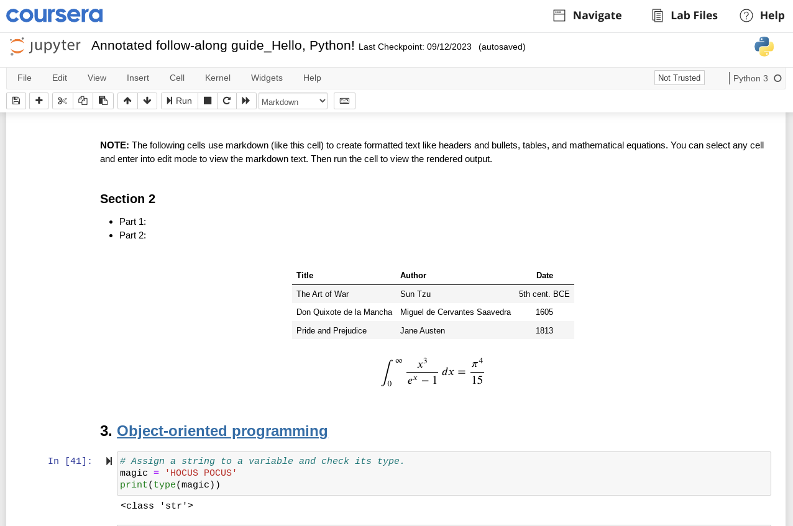

# Python ve Diğer Programlama Dilleri

Python, veri profesyonelleri arasında en popüler programlama dillerinden biridir ve bu da onu veri analitiği araç kutunuza eklemek için harika bir seçenek yapar! Daha önce incelediğimiz gibi, Python’un komutları iletmek ve görevleri gerçekleştirmek için kullandığı sözdizimi (syntax), konuşulan dile benzer. Bu da Python’u öğrenmesi çok daha kolay bir programlama dili yapar. Python’un yapısı birçok başka programlama diline benzese de, dikkate alınması gereken bazı önemli farklılıklar vardır.

Bu okuma materyalinde, Python’un veri profesyonellerinin kullandığı diğer programlama dilleri olan R, Java ve C++ ile nasıl karşılaştırıldığını öğreneceksiniz.

## Programlama Dillerinde Beş Önemli Nokta

Python, veri analizi için kullanılan tek programlama dili değildir, ancak en yaygın ve en güçlü olanlardan biridir. Birçok veri profesyoneli birden fazla programlama dili kullanır. Her dilin avantajları ve dezavantajları vardır. Bu kurs kapsamında, şu beş noktayı inceleyeceğiz: hız, erişilebilirlik, değişkenler, veri bilimi odaklılık ve programlama paradigması.

### **Hız**

Bir programın çalıştırılma hızına etki eden birçok faktör vardır; derleme süresi, çalışma zamanı, donanım, yüklü bağımlılıklar ve kodun verimliliği bunlardan bazılarıdır. Genel olarak, düşük seviyeli programlama dilleri daha hızlıdır ancak öğrenmesi ve kullanması daha zordur.

### **Erişilebilirlik**

Erişilebilirlik, yeni başlayanların bir dili ne kadar kolay kullanmaya başlayabildiğini ifade eder. Yeni programlama dillerini öğrenmek, sözdizimi ve genel yapıya bağlı olarak zor olabilir. **Sözdizimi (syntax)**, kod kelimeleri, semboller, yerleşim ve noktalama işaretlerinin yapısıdır. Semantik ise bu yapılar içinde değişkenler ve nesneler kullanarak anlam oluşturur. Ayrıca, bu değişkenler programlara esneklik katarken, nesneler verilerin tutulduğu yerlerdir.

### **Değişkenler**

Kod içindeki bilgiler değişkenlerde saklanır. **Değişken**, bilgisayarın hafızasında ayrılmış bir alanda değerleri saklayan isimlendirilmiş bir kutudur. Programlama dillerinin değişkenleri kullanma biçimi, bir sistemin temel işlemlerini veya çekirdek hızını etkiler. Bazı diller, programın tamamı boyunca değer koruyan statik değişkenler kullanır. Diğerleri ise değişkenleri dinamik olarak ele alır, böylece değerler program çalışırken belirlenebilir. Bazı diller ise deklaratif değişkenlere izin verir, bu da programın değişkenin nerede tutulacağını belirlemesine olanak tanır.

### **Veri Bilimi Odaklılık**

Programlama dillerinin kendine özgü özellikleri vardır ve veri analizindeki farklı görevlerde daha iyi hizmet verebilirler; bu yüzden programcılar onları belirli veri bilimi görevleri için tercih eder.

### **Programlama Paradigması**

Programlama dilleri nesne yönelimli, fonksiyonel veya emirsel olabilir. Nesne yönelimli programlama dilleri veri nesneleri etrafında modellenir. Fonksiyonel programlama dilleri fonksiyonlar etrafında modellenirken, emirsel diller programın durumunu değiştirebilen kod ifadeleri etrafında modellenir.

## Programlama Dili Karşılaştırmaları

Python, R, Java ve C++, veri analizi için en yaygın kullanılan dört programlama dilidir. Aşağıdaki tablo, bu dilleri hız, erişilebilirlik, değişken kullanımı, veri bilimi odaklılık ve programlama paradigması açısından karşılaştırmaktadır.

| Özellikler                  | Python                             | R                                                       | Java                                           | C++                                          |
| --------------------------- | ---------------------------------- | ------------------------------------------------------- | ---------------------------------------------- | -------------------------------------------- |
| **Hız**                     | Daha yavaş                         | Yapılandırma ve eklentilere bağlı                       | Daha hızlı                                     | Çok hızlı                                    |
| **Erişilebilirlik**         | Öğrenmesi kolay                    | Karmaşık                                                | Öğrenmesi kolay                                | Karmaşık                                     |
| **Değişken**                | Dinamik                            | Dinamik                                                 | Statik                                         | Deklaratif                                   |
| **Veri Bilimi Odaklılık**   | Makine öğrenimi ve otomatik analiz | Keşifsel veri analizi ve geniş istatistik kütüphaneleri | Açık kaynak varlıklarla proje bazlı kullanılır | Yaygın kullanılmasa da çok güçlü uygulamalar |
| **Programlama Paradigması** | Nesne yönelimli                    | Fonksiyonel dil                                         | Nesne yönelimli                                | Çok paradigmalı (emirsel & nesne yönelimli)  |

## Önemli Noktalar

Veri analizi için kullanılabilecek birçok farklı programlama dili vardır. Her dilin kendi avantajları ve dezavantajları bulunur. Farklı dilleri öğrenmek, veri becerilerinizi genişletme ve analizleriniz için yeni araçlara erişim fırsatı sunar. Ancak bu sertifika programında odak noktanız yalnızca Python olacaktır. Daha önce belirtildiği gibi, Python öğrenmesi kolay, nesne yönelimli ve dinamik değişken kullanan bir programlama dilidir; bazen çalışması daha uzun sürebilir ama makine öğrenimi ve otomatik analiz için mükemmel bir araçtır.

# Jupyter Notebooks Nasıl Kullanılır

Jupyter Notebook, canlı kod, matematiksel formüller, görselleştirmeler ve metin içeren belgeler oluşturup paylaşmak için açık kaynaklı bir web uygulamasıdır. Standartlaştırılmış, etkileşimli ve paylaşılabilir bir metin blok formatında kod geliştirmek ve sunmak için harika bir araçtır. Jupyter notebook’larda kod yazabilir, matematiksel formüller oluşturabilir, veri görselleştirmeleri yapabilir ve serbest biçimli metinler ekleyebilirsiniz!

Bu program boyunca kendi kodunuzu yazmak, çalıştırmak ve sunmak için Jupyter notebook’ları kullanacaksınız. Bu okuma materyali, kendi notebook’unuzu nasıl kullanacağınızı adım adım anlatacak. Ancak, bu sertifika programı için herhangi bir yazılım indirmenize gerek yoktur. Tüm aktiviteleri Coursera platformunda sunulan araçlarla tamamlayabilirsiniz.

## Jupyter Notebook

Jupyter Notebook’a doğrudan tarayıcınızdan erişebilir veya masaüstü uygulamasını indirip cihazınıza kurabilirsiniz. Bu uygulama, R ve Python gibi 100’den fazla programlama dili ile çalışmanıza olanak tanır. Ayrıca, hesaplama notebook’larıyla çalışmak için tam bir araç seti sunan [JupyterLab](https://jupyterlab.readthedocs.io/en/latest/) ve daha sade ama güçlü bir araç olan [Jupyter Notebook](https://jupyter-notebook.readthedocs.io/en/stable/) seçenekleri mevcuttur. Bu sertifika programı için Coursera tarafından sağlanan Jupyter Notebook arayüzünü kullanmanız önerilir. Jupyter notebook’ları gerektiren aktiviteler “lab” olarak etiketlenir ve her aktivite sayfasında ilgili yönergeler bulunur.

## Neden Jupyter Notebook?

Notebook’lar veri ile çalışmak için özellikle faydalıdır. İşte Jupyter notebook’ların öne çıktığı bazı noktalar:

1. **Modüler/etkileşimli programlama:** Kod parçalarını “hücre” (cell) adı verilen küçük, yönetilebilir bölümlerde yazabilir ve çalıştırabilirsiniz. Bir hücreyi çalıştırmak için tüm notebook’u çalıştırmanız gerekmez. Bu özellik, veri keşfi ve deney yaparken çok faydalıdır. Hücreler aynı zamanda hata ayıklama için uygundur; hatanızı fark edip düzeltmek için tüm betiği yeniden çalıştırmak zorunda kalmazsınız.

2. **Kod ve dokümantasyonun entegrasyonu:** Kod, metinsel açıklamalar ve grafik, tablo gibi görselleştirmeleri tek bir belgede birleştirmenizi sağlar.

3. **Çoklu dil desteği:** İleri Veri Analitiği programında Python kullanacağız, ancak Jupyter birçok farklı dili destekleyerek güçlü ve çok yönlü bir ortam sunar.

4. **Veri keşfi ve analizi:** Veriyi yüklemek, temizlemek, analiz etmek ve incelemek için sade ve şık araçlar sağlar.

5. **Bulut tabanlı hizmetler:** Birçok bulut platformu Jupyter notebook’ları barındırır, böylece yerel ortam kurmadan kolayca çalıştırıp paylaşabilirsiniz. Bu işbirliği için çok kullanışlıdır.

6. **Kütüphaneler ve eklentiler:** Projelerinizin ihtiyaçlarına göre işlevselliği artıran zengin bir eklenti ve uzantı ekosistemi vardır.

## Jupyter notebook’ları nasıl kullanılır?

Bir Jupyter notebook açtıktan sonra kullanmaya başlayabilirsiniz! İşte başlangıç için bazı ipuçları.

### Komut/Düzenleme Modu

Notebook’ların iki çalışma modu vardır: komut modu ve düzenleme modu. Komut modu, notebook’u bütün olarak kontrol etmek, hücre eklemek, taşımak ve silmek için kullanılır. Düzenleme modu ise bir hücreye kod veya markdown metni yazmak içindir.

Komut modu, aktif hücrenin solunda mavi bir çubuk ile gösterilir.


Düzenleme modu, aktif hücrenin solunda yeşil çubuk ve ince yeşil bir kenarlık ile belirtilir.


Düzenleme moduna girmek için bir hücreye tıklayın ya da klavyenizle hücre seçip Enter tuşuna basın. Komut moduna dönmek için hücre dışına tıklayın veya Escape tuşuna basın.

### Markdown Modu

Jupyter notebook’larda hücreleri kod modundan Markdown moduna geçirebilirsiniz. Markdown, düz metne biçimlendirme eklemenizi sağlayan bir işaretleme dilidir. Yaygın, geleceğe dönük ve platformdan bağımsız olması sebebiyle çok kullanışlıdır. Jupyter’de Markdown, kodun ve çıktısının açıklanması için yazılı metin oluşturmanızı sağlar. Örneğin, “In \[41]:” üstündeki tüm metin Markdown kullanılarak yazılmıştır ve biçimlendirilmiştir.



Kod ile Markdown arasında geçiş yapmak için sayfanın üstündeki menüde “Code” yazan yere tıklayın, açılan menüden “Markdown” seçeneğini işaretleyin.


Markdown kullanımı hakkında daha fazla bilgi için [Markdown temel sözdizimi rehberi](https://www.markdownguide.org/basic-syntax/) ve [Markdown genişletilmiş sözdizimi rehberi](https://www.markdownguide.org/extended-syntax/) sayfalarına bakabilirsiniz.

### Yaygın işlemler

Çoğu işlem hem fare/grafik arayüzü hem de klavye kısayollarıyla yapılabilir. İşte en yaygın işlemler:

### Yeni hücre ekleme

* Notebook üst menüsünde “Insert”e tıklayın. Mevcut hücrenin üstüne ya da altına yeni hücre ekleyebilirsiniz.

* Klavye kısayolları (komut modundayken):

  * **a:** Mevcut hücrenin üstüne hücre ekler
  * **b:** Mevcut hücrenin altına hücre ekler

### Hücre silme

* Komut modunda hücre veya hücreleri seçin.

* Üst menüden “Edit” → “Delete Cells” seçeneğine tıklayın.

* Klavye kısayolu (komut modundayken):

  * **dd** (D tuşuna iki kez basın)

### Hücre taşıma

* Komut modunda hücre veya hücreleri seçin.

* Üst menüdeki yukarı veya aşağı ok butonlarına tıklayarak seçili hücreleri yukarı veya aşağı taşıyın.

### Hücreyi çalıştırma

* Bir hücre seçip üst menüdeki **Run** butonuna tıklayın.

* Klavye kısayolları:

  * **Ctrl + Enter:** Seçili hücreyi çalıştırır
  * **Shift + Enter:** Seçili hücreyi çalıştırır ve bir sonraki hücreyi seçer
  * **Alt + Enter:** Seçili hücreyi çalıştırır ve altına yeni hücre ekler

* Hücreleri hem komut modunda hem de düzenleme modunda çalıştırabilirsiniz.

Komut modundayken **h** tuşuna basarsanız, tüm klavye kısayollarının listelendiği bir pencere açılır. Daha detaylı özellikler için [Jupyter Notebook arayüz bileşenleri](https://jupyter-notebook.readthedocs.io/en/stable/ui_components.html) sayfasına bakabilirsiniz.

## Sorun Giderme

İleri Veri Analitiği sertifika programı boyunca Jupyter notebook’ları kullanacaksınız. Bazen notebook’a erişirken veya çalıştırırken sorun yaşayabilirsiniz. İşte bazı çözüm önerileri.

### Tarayıcı uyumluluğu

Tarayıcınızın güncel olduğundan emin olun. Google Chrome, Firefox veya Microsoft Edge’in en son sürümlerini kullanmanız en iyisidir. Eğer eski bir tarayıcı kullanıyorsanız veya Coursera tarafından desteklenmeyen bir tarayıcı kullanıyorsanız sorun yaşayabilirsiniz. Tarayıcınız güncelyse ve yine de sorun yaşıyorsanız, tarayıcınızı yeniden başlatın veya önbellek ile çerezleri temizleyin. Gizli mod (incognito) kullanmak da çerezlerin kaydedilmesini önler.

### İnternet bağlantısı

Coursera stabil internet bağlantısı gerektirir. Jupyter notebook açarken veya çalıştırırken sorun yaşıyorsanız internet bağlantınız yavaş ya da kararsız olabilir. Sayfaların yüklenmemesi, laboratuvarların donması ya da komut yazamamak kararsız bağlantı belirtileridir.

**İpucu:** Bir cihazda laboratuvarı tamamlayamıyorsanız başka bir cihaz deneyin.

### Sorun giderme adımları

Özetle, Jupyter notebook ile ilgili sorun yaşarsanız şu adımları deneyin:

1. Desteklenen tarayıcıların en güncel sürümlerini (Chrome, Firefox, Edge) kullandığınızdan emin olun.
2. Tarayıcınızı yeniden başlatın ve önbellek ile çerezleri temizleyin. Gizli modu deneyin.
3. İnternet bağlantınızı kontrol edin ve gerekirse modem/router’ınızı yeniden başlatın.
4. Laboratuvarı yeniden başlatmayı deneyin.

Eğer bunlar işe yaramazsa, Coursera bakım yapıyor ya da hizmet kesintisi yaşıyor olabilir. Bir süre bekleyip tekrar deneyin.

## Özet

Jupyter Notebook, kendi kodunuzu geliştirebileceğiniz ve hata ayıklayabileceğiniz bir platform sağlar. Notebook’ları kullanmayı bilmek, yeni Python becerilerini deneyeceğiniz ve kurs sonu projesine hazırlanacağınız aktiviteler için sizi hazırlar. Python, makine öğrenimi ve otomatik analiz gibi ileri analiz araçlarını açacak mükemmel bir araçtır. Jupyter Notebook kullanmak ise Python bilginizi artırmak için harika bir yoldur!

## Daha fazla bilgi için kaynaklar

* [Jupyter Notebook arayüz eğitimi](https://jupyter-notebook.readthedocs.io/en/stable/ui_components.html)
* [Jupyter yazılım ana sayfası](https://jupyter.org/)
* [Jupyter dokümantasyonu](https://docs.jupyter.org/en/latest/)
* [Jupyter Notebooks bulut ortamı (çevrimiçi)](https://jupyter.org/try-jupyter/notebooks/?path=notebooks/Intro.ipynb)
* [Jupyter topluluk forumu](https://discourse.jupyter.org/)
* [Jupyter notebook topluluk forumu](https://discourse.jupyter.org/c/notebook/3)
* [Python topluluk forumu](https://www.python.org/community/forums/)
* [StackOverflow (soru-cevap platformu)](https://stackoverflow.com/)
* [Jupyter Notebooks kurulumu](https://test-jupyter.readthedocs.io/en/latest/install.html)

# Nesne Yönelimli Programlama Hakkında Daha Fazlası

**Not:** Bu okuma, nesne yönelimli programlamaya yalnızca kısa bir giriş sunar. Nesne yönelimli programlamanın tüm ayrıntılarını ele almak, bu kursun kapsamı dışındadır.

Daha önce, nesne yönelimli programlamayı, hem verileri hem de bu verileri işleyen kodu içerebilen **nesneler** etrafında yapılandırılmış bir programlama paradigması olarak tanımlamıştık. Hatırlarsanız, sınıf (class), verileri ve işlevselliği bir arada tutan bir veri türüdür ve bu sınıfa ait işlevselliğin örneklerini **yöntemler (methods)** ve **özellikler (attributes)** şeklinde görmüştünüz. Bu okumada, nesne yönelimli programlamayı biraz daha ayrıntılı inceleyeceksiniz. Bu sertifika programı boyunca kendi sınıflarınızı tanımlamanız gerekmeyecek, ancak bu sürecin nasıl çalıştığını temel düzeyde anlamanız, öğrenme süreciniz boyunca karşılaşacağınız bu kavramlar açısından size oldukça yardımcı olacaktır.

---

## Gözden Geçirme: Özellikler ve Yöntemler

Python sınıfları, yerleşik (built-in) özellikler sayesinde güçlü ve kullanışlıdır. Bu özellikler, veri analizinde sık karşılaşılan görevleri kolaylaştırır ve iki ana kategoriye ayrılır:

* **Özellik (Attribute):** Bir nesneye veya sınıfa ait, nokta gösterimi (dot notation) kullanılarak erişilen değerdir.
* **Yöntem (Method):** Bir sınıfa ait olan ve genellikle bir işlem gerçekleştiren fonksiyondur.

Bunları ayırt etmenin daha basit bir yolu şudur:
**Özellikler**, nesnenin *karakteristikleri* (örneğin adı, türü, hızı),
**Yöntemler** ise nesnenin *eylemleri* veya \_işlemleri\_dir (örneğin hareket etme, ışınlama).

Örneğin, sınıfımız “Spaceship” (Uzay Gemisi) olsun. Bu sınıfın özellikleri şunlar olabilir:

* name (isim)
* kind (tür)
* speed (hız)
* tractor\_beam (çekici ışın)

Bu özelliklere şu şekilde erişebilirsiniz:

```python
Spaceship.name  
Spaceship.kind  
Spaceship.speed  
Spaceship.tractor_beam
```

Gördüğünüz gibi sadece bir **nokta** kullanılarak erişilir.

Öte yandan, Spaceship sınıfının bazı yöntemleri şunlar olabilir:

* warp()
* tractor()

Bu yöntemleri şu şekilde kullanabilirsiniz:

```python
Spaceship.warp()  
Spaceship.tractor()
```

Dikkat ederseniz, yöntemler **parantez** ile çağrılır ve genellikle **argüman** alabilirler. Örneğin:

```python
Spaceship.warp(7)
```

Bu, geminin hızını "warp 7"ye ayarlayabilir.

---

## Benzersiz Özellik ve Yöntemlerle Sınıf Tanımlamak

Python’da kendi sınıflarınızı tanımlayabilir, bunlara özgü özellikler ve yöntemler ekleyebilirsiniz. Bu, geliştiricilerin yeniden kullanılabilir kodlar yazmasına ve işlerini daha verimli hale getirmelerine olanak tanır. Yukarıda bahsettiğimiz “Spaceship” sınıfını kendiniz de oluşturabilirsiniz. Aşağıdaki örnek bunu göstermektedir.

**Not:** Aşağıdaki kod bloğu etkileşimli değildir.

```python
class Spaceship:
    # Sınıf özelliği
    tractor_beam = 'off'

    # Örnek özellikleri
    def __init__(self, name, kind):
        self.name = name
        self.kind = kind
        self.speed = None

    # Örnek yöntemler
    def warp(self, warp):
        self.speed = warp
        print(f'Warp {warp}, engage!')

    def tractor(self):
        if self.tractor_beam == 'off':
            self.tractor_beam = 'on'
            print('Tractor beam on.')
        else:
            self.tractor_beam = 'off'
            print('Tractor beam off')
```

Bu kurs için kendi sınıflarınızı oluşturacak sözdizimini ezberlemeniz gerekmez. Sadece şunu fark etmeniz yeterlidir: sınıf tanımlandıktan sonra, ona ait özellikler ve yöntemler **girintili olarak** (indent) yazılır. Bir özelliğin veya yöntemin bir sınıfa “ait” olması işte bunu ifade eder.

Bir sınıf, belirli ortak **özellikleri** ve **davranışları** olan her şey için bir **şablon** gibidir. Burada sınıfımız `Spaceship`. Farklı türde birçok uzay gemisi olabilir. Hepsinin adı, türü, amacı farklı olabilir.

Bir sınıfa ait nesne oluşturduğunuzda, o sınıfın bir **örneğini (instance)** oluşturmuş olursunuz. Buna **class instantiation** (sınıf örnekleme) denir.

Aşağıdaki kod, `Spaceship` sınıfının bir örneğini oluşturur ve bazı özelliklerini kontrol eder:

```python
# Spaceship sınıfının bir örneğini oluştur
ship = Spaceship('Mockingbird', 'rescue frigate')

# Geminin adını yazdır
print(ship.name)

# Gemi türünü yazdır
print(ship.kind)

# Çekici ışın durumu
print(ship.tractor_beam)

# Çıktı:
# Mockingbird
# rescue frigate
# off
```

Sonraki kod bloğu `warp()` yöntemini kullanarak warp hızını 7 olarak ayarlar ve geminin hızını kontrol eder:

```python
# Warp hızını ayarla
ship.warp(7)

# Hızı kontrol et
ship.speed

# Çıktı:
# Warp 7, engage!
# 7
```

Son örnek `tractor()` yöntemini kullanarak çekici ışını açıp kapatır ve son durumu kontrol eder:

```python
# Çekici ışını aç/kapat
ship.tractor()

# Durumu kontrol et
print(ship.tractor_beam)

# Çıktı:
# Tractor beam on.
# on
```

Bu sadece sınıfların, özelliklerin ve yöntemlerin temel çalışma şeklini göstermek için verilmiş basit bir örnektir. Gerçek dünyada sınıflar çok daha karmaşık olabilir ve çok sayıda özellik ve yöntem içerebilir.

Bir veri analisti olarak çalışırken, sınıf tanımlama, özellik ve yöntemler oluşturma bilgisi; verideki desenleri, ilişkileri ve anlamları araştırmak için oldukça yararlı olacaktır.

---

## Temel Bilgiler – Özet

Sınıflar, Python’un temel nesnelerinden biridir ve bu nedenle Python bir **nesne yönelimli programlama dili** olarak bilinir. Sınıf nesneleri güçlüdür çünkü kendi sınıflarına özgü araçları (özellik ve yöntemleri) içlerinde barındırırlar.

* **Yöntemler**, bir sınıfa ait olan ve bir işlem gerçekleştiren fonksiyonlardır. Parantez kullanılır.
* **Özellikler**, bir sınıf ya da sınıf örneğine ait olan değer veya karakteristiklerdir. Parantez **kullanılmaz**.

Python’da pek çok yerleşik sınıf, özellik ve yöntem vardır; ancak nesne yönelimli programlama, yüksek düzeyde **özelleştirme** olanağı da sağlar.

