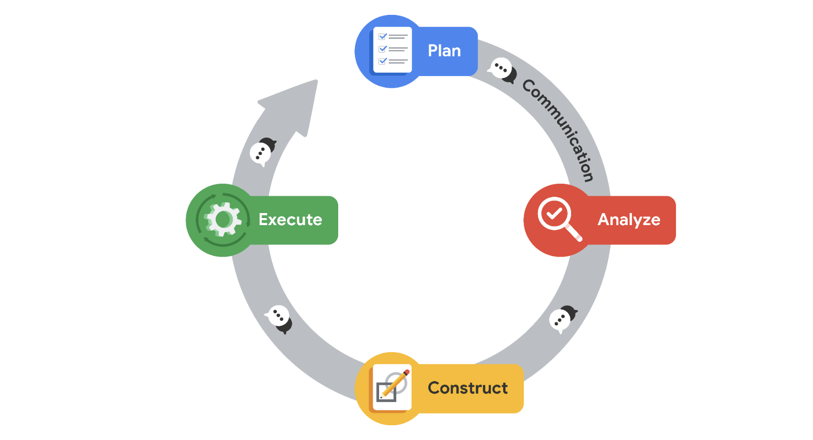

# Vaka analizi: Deloitte

Keşifsel veri analizinin (EDA) altı uygulamasının her biri için tanımları öğrendiniz - keşfetme, yapılandırma, temizleme, birleştirme, doğrulama ve sunma. Daha sonra, bu uygulamaların veri kariyeri alanına nasıl uygulandığını keşfedeceksiniz. Aşağıdaki vaka çalışmasında, Deloitte'un veri ekibinin üyeleri, müşterilerinin metrik ve gösterge paneli ihtiyaçlarını karşılamak için EDA'nın altı uygulamasını kullanmıştır. Deloitte ekibinin deneyimleri hakkında daha fazla bilgi edindikten sonra, bu uygulamaların ne kadar yararlı ve güçlendirici olabileceğine dair somut bir örneğe sahip olacaksınız. 

## Deloitte'u tanıyın

[Deloitte](https://www2.deloitte.com/us/en.html) bir denetim, danışmanlık, vergi ve danışmanlık hizmetidir. Şirketin dünya çapında 100.000'den fazla çalışanı ve iş ortağı var ve dünyanın en büyük şirketlerinin birçoğuyla çalışıyorlar. Hizmetleri vergi ve muhasebe çözümlerinden yapay zeka ve siber güvenlik risk programlarına kadar uzanmaktadır. 

Çok uluslu şirketin işletmeden işletmeye (B2B) modeli, müşterileriyle onların bireysel ihtiyaçlarına göre bir dizi stratejik ve finansal cephede çalışmaya odaklanmalarını sağlar. [Deloitte, müşteri projeleri için denetim, danışmanlık, mali müşavirlik, risk danışmanlığı, vergi, veri analizi ve düzenleme gibi](https://youtu.be/8Gg5BsFexOU?list=PLl4by_vVwv0zjE2FRD7BMwI2lpaMCAgHh) bir dizi hizmet sunmaktadır. Deloitte, 2008 yılından bu yana profesyonel iş hizmetlerinde mükemmellik standardı olmayı vizyon haline getirmiştir. Bu odaklanma sayesinde Deloitte, müşterileri için gerçek zamanlı ölçümlerin kullanılması da dahil olmak üzere teknolojik gelişmelerin ön saflarında yer almıştır. 

Deloitte, birçok başarı öyküsünden yalnızca birinde, kısa süre önce milyar dolarlık bulut tabanlı analiz ve yazılım şirketinin pazarlama potansiyellerinin takibini ve organizasyonunu ve performans verilerinin stratejik analizini kolaylaştırmasına yardımcı oldu. Bu okumada, Deloitte'un bugün hala kullandıkları kapsamlı bir çözümü önermek ve uygulamak amacıyla müşterinin verilerini analiz etmek için EDA'yı nasıl kullandığını göreceksiniz.    

## Zorluklar 

Deloitte'un en önemli bulut tabanlı yazılım çözümü müşterilerinden biri, pazarlama ve performans verileriyle ilgili çeşitli zorluklarla karşılaşıyordu. Hepsi için Deloitte'tan yardım istediler. İşte müşterinin Deloitte'a sunduğu özel zorluklar:  

-   Pazarlama potansiyel müşterilerinin takibinde zorluk 
    
-   Pazarlama kampanyalarının performansını anında takip etmekte zorlananlar
    
-   Stratejik şirket ölçümlerini gösteren kişiselleştirilmiş veri panolarının eksikliği
    

### **Pazarlama potansiyellerinin takibi**

Deloitte'un müşterisi, dünyanın dört bir yanındaki işletmelere bir dizi bulut tabanlı analiz hizmeti ve yazılım ürünü sunuyor ve bu da aylık olarak aldıkları binlerce soru ve potansiyel satış potansiyelinin her birini takip etmeyi muazzam bir görev haline getiriyor. Sonuç olarak, Deloitte'un müşterisi bu potansiyel müşterileri daha iyi takip etmelerine ve harekete geçmelerine yardımcı olacak bir çözüm arıyordu.   

### **Pazarlama kampanyası performansının izlenmesi**

Çok uluslu 1 milyar dolarlık bir şirketin pazarlama kampanyası performansının analizi için sadece dört veri analistine güvenmek, hızla sürdürülemez hale geliyordu. Deloitte yardım için devreye girmeden önce müşterinin performans takip sistemi, manuel olarak güncellenen ve bir elektronik tablo sekmesinde tutulan bir dizi veri tablosundan oluşuyordu. Her bölge kendi performans verilerini tutuyor, bu da tutarlılık sorunları yaratıyor ve şirket çapında bir performans resmi elde etmek için verileri derlemek ve birleştirmek zorunda kalan analistler için saatlerce boşa enerji harcanmasına neden oluyordu.  

### **Veri panolarını kişiselleştirme**

Her yönetim seviyesi için farklı ihtiyaçlar ve dünya genelinde farklı pazarlama bölgeleri nedeniyle, müşterinin şirket genelinde çalışanlarının ihtiyaçlarına özel verileri kolayca ayrıştırabilmesi ve gruplandırabilmesi gerekiyordu. Birkaç farklı departman ve bölgede birden fazla elektronik tablo üzerinden çalıştıkları için müşteri, verileri ihtiyaçlarına göre kolayca filtreleyemediğini ve bu nedenle performansı artırmak için stratejiyi yeterince değiştiremediğini fark etti. 

## Yaklaşım

Deloitte yeni müşterisiyle çalışmaya başladığında, müşterisinin önerdiği her bir ihtiyacı karşılayacak bir yaklaşım tasarladı. Bu yaklaşımı ayrıntılı olarak incelemek için aşağıdaki PACE girişlerine bakın.

## Plan

Başlangıç olarak Deloitte'un müşteri paydaşlarıyla bir araya gelmesi ve yukarıda belirtilen üç alana göre geleceğe yönelik vizyonlarını geliştirmelerine yardımcı olması gerekiyordu: **Pazarlama potansiyelleri, pazarlama kampanyası performansının ölçülmesi** ve **veri panolarının kişiselleştirilmesi**. 

Süreçlerini, hedeflerini ve temel sonuçlarını (OKR'ler) ve müşteri ve potansiyel müşteri verilerine nasıl yaklaştığını ve bunları nasıl kullandığını öğrenerek müşterinin işini anlamaları gerekiyordu. 

Projenin kilit kilometre taşları erkenden belirlenmiş ve edinilen yeni bilgilere göre ayarlanmıştır. Bu kilometre taşları şunlardı: 

-   Veri mimarisi ve gösterge tablolarının gelecek vizyonu konusunda müşteri ile uyum
    
-   Yeni veri mimarisinin oluşturulması
    
-   Tanımlayıcı ve teşhis araçlarının piyasaya sürülmesi
    
-   Tahmine dayalı modellerin başlatılması
    
-   Küresel satış ekibinin yeni takımlar konusunda eğitilmesi
    

Deloitte, proje planının, müşterinin şirket genelindeki performans verileri üzerinde EDA'nın keşfedilmesi, yapılandırılması ve temizlenmesi uygulamalarıyla başlayacağını belirledi.  

Deloitte, kişiselleştirilmiş gösterge tabloları tamamlandığında müşterinin hangi OKR'lere kolayca erişmek istediğini hızla öğrendi ve bu sonuca ulaşmak için planlar hazırladı. Bu OKR'ler aşağıdaki sorular şeklinde geldi: 

-   Belirli bir pazarlama kampanyasından ne kadar gelir elde edildi? 
    
-   Yeni müşteri hangi endüstriye, bölgeye, sektöre ve şirket büyüklüğüne dahil oldu? 
    
-   İlk temas noktasından sonra satışın sonuçlandırılması ne kadar sürdü? 
    
-   Farklı kampanya türlerinin başarı oranı neydi (örneğin, yüz yüze etkinliklere karşı çevrimiçi web seminerleri)? 
    
-   Kazanılan müşteri başına ortalama pazarlama maliyeti neydi?
    

## Analiz

Müşterinin verilerinin ilk analizinin çerçevesinin bir parçası olarak, müşterinin kullanımı kolay Tableau gösterge paneli araçları gibi varlıklar da dahil olmak üzere Deloitte'un ürün hizmetleri tekliflerine aşina olmadığı anlaşıldı. Bu nedenle, müşterinin mümkün olana ilişkin varsayımları ve talepleri Deloitte'un gerçek kapasitesinin çok altında kalmıştır. Bu, müşterinin projeden beklentilerini sadece karşılamakla kalmayıp, aslında aşmak için bir fırsattı. 

Analizin ilk zorlukları, verilerin nereden geldiğini ve her bir veri değişkeninin ne anlama geldiğini anlamaktı. Müşteri, verilerinde standart olmayan adlandırma kuralları ve tanımlar kullanıyordu, bu nedenle Deloitte'un müşterinin verilerini tam olarak anlamak ve bunları kullanmalarına nasıl yardımcı olacağını planlamak için dillerini öğrenmek üzere keşif uygulamalarını kullanması gerekiyordu. 

Deloitte, müşterinin o zamanki performans izleme yaklaşımının en iyi ihtimalle hantal ve aşırı geniş olduğunu tespit etti. Topladıkları performans verileri, şirket çapındaki stratejik eylemlerin değerini belirlemek için genel ortalamaların kullanılmasından oluşuyordu. Bölge başına belirli performans verileri olmadan, şirketin bölgesel performansı izlemenin basit bir yolu yoktu.  

-   Müşterinin o dönemdeki aşırı kapsamlı veri takibine bir örnek olarak, pazarlama kampanyası başına elde ettikleri ortalama geliri elde etmek için kullandıkları formül buydu: 
    
$$
\frac{\textit{average customer contract value}}{\textit{average cost of marketing campaigns}} = \textit{average revenue gained per campaign}
$$

Deloitte, müşterinin dahili pazarlama ve satış ekiplerinin coğrafi bölgelere, sektörlere ve müşteri hesabı büyüklüğüne göre organize edildiğini öğrendi. Bölgesel liderler pazarlama araştırmalarını ve kampanyalarını kendi başlarına yürütme yetkisine ve özerkliğine sahipti, ancak küresel ekipten rehberlik ve zaman zaman talimat alıyorlardı. Deloitte analistleri, müşterinin verilerinin EDA'sının bir parçası olarak verileri şirket genelinde tutarlı bir şekilde yapılandırmaya başladı.

Müşteri yaşam döngüsü açısından Deloitte, müşterinin pazarlama potansiyel müşterilerinin pazarlama kampanyaları oluşturacağını ve ardından bölgelerindeki satış ortaklarını bilgilendireceğini öğrendi. Saha satış temsilcileri, kampanyalardan elde edilen tüm potansiyel müşterileri takip edecek ve ek müşteriler bulmak için mevcut kampanyaların dışında da ağ kuracaklardı. EDA'nın bu keşif kısmı, Deloitte ekibini müşterinin ihtiyaçlarını karşılayabilecek daha spesifik ve makul çözümler konusunda bilgilendirdi. 

Deloitte ekibi, müşterinin Salesforce ve pazarlama kampanyalarındaki mevcut tüm verileri gözden geçirmek için elektronik tablolarda EDA'nın keşif ve yapılandırma uygulamalarını kullandı. Müşterilerinin satış sisteminde var olan her veri değişkenini belirlemeye ve tanımlamaya başladılar. Veri değişkenlerinin envanteri yapılandırıldıktan, temizlendikten ve doğrulandıktan sonra Deloitte ekibi bu bilgilerden ne tür içgörüler elde edebilecekleri konusunda beyin fırtınası yaptı. 

İncelemenin ardından Deloitte, topladığı bilgileri müşteriyle paylaşmak için EDA'nın sunum uygulamasından yararlandı. Müşterinin kendi işini nasıl gördüğünü ve verilere göre onlar için hangi faktörlerin önemli olduğunu daha iyi anlamak için dinlediler ve sorular sordular.  

Yapılandırma Deloitte, müşterinin sistemlerine ilişkin analizlerinden ve müşterinin performans verileri üzerinde yaptıkları EDA'nın keşif, yapılandırma ve temizleme uygulamalarından, müşterinin analitik süreçlerinin

gerektiğini öğrendi; çok daha fazla ayrıntı sağlayan ve darboğazları, kârsız kampanyaları ve verimsiz müşteri segmentlerini belirlemelerine ve ele almalarına olanak tanıyan bir süreç

Müşterinin onayıyla Deloitte, analizi daha akıcı hale getirmek için müşterinin veri iç altyapısını tamamen yeniden inşa etti.  

Altyapı revizyonunun yanı sıra, müşteri için en pratik çözüm, belirli paydaşlar için özelleştirilmiş ve dinamik gösterge tabloları oluşturmaktı. 

-   Deloitte ekibi, ihtiyaçlarını ve OKR'lerini anlamak için her bir müşteri paydaş grubuyla birlikte çalıştı. 
    
-   Daha sonra, her bir değişkenin neyi temsil ettiğini ve nasıl kullanılıp kullanılmaması gerektiğini tanımlamak için bir veri sözlüğü gibi destekleyici teminat kaynakları oluşturarak müşteriye özel çözümler geliştirilmesine yardımcı oldular. 
    

Deloitte, müşterilerinin verilerinden topladıkları bilgileri kullanarak OKR'leri üzerinde tahmine dayalı analiz yapan otomasyonlar ve araçlar geliştirdi. Bu da müşterinin gelecek için uygulanabilir ancak agresif hedefler belirlemesini sağladı.

## Execute

Deloitte'un müşterisinin veri altyapısını elden geçirmesi, küresel veri toplamaya yönelik modern ve katmanlı bir yaklaşımın ortaya çıkmasını sağladı. Daha önce performans ölçümlerini formüle etmek için bölgesel olarak toplanmış ve tutarsız bir şekilde yapılandırılmış elektronik tablolara güvenmek zorunda kalan müşteri, artık küresel, şirket genelindeki performanstan bölgesel bir satış ekibi üyesinin belirli ürünler ve müşteri alt kümeleri üzerindeki performansına kadar her şeyi kolayca ölçebilmektedir.

Kişiselleştirilmiş gösterge tablolarının uygulanmasından sonra, Kıdemli Başkan Yardımcıları OKR'lerin durumunu ve performansını sorumlu oldukları tüm departmanlara ve bölgelere göre filtreleyebilmektedir. Ayrıca, bölgesel potansiyel müşteriler, pazarlama potansiyel müşterileri ve hatta yerel satış potansiyel müşterileri, ilgili alanlarına göre filtrelenmiş verileri görüntüleyebildi. 

Uygulamanın bir parçası olarak Deloitte ekip üyeleri, kişiselleştirilmiş gösterge tablolarının nasıl kullanılacağından yeni veri altyapısının bakımının nasıl yapılacağına kadar her konuda müşterilerinin ihtiyaçlarına göre eğitim oturumları oluşturdu.  

Deloitte tarafından tasarlanan gösterge tabloları ve veri altyapısı, müşterinin küresel ekibindeki çok sayıda paydaş için anında değerli varlıklar haline geldi. 

**Not**: Deloitte, müşteriyle yaptığı çalışmalarda yukarıda listelenen PACE iş akışını takip etmemiştir; bunun yerine, çalışmalarının ayrıntılarını bu vaka çalışmasında belgelendirirken, Deloitte'un müşteri için yaptığı çalışmalar, uygulamanın çok yönlülüğünü göstermek için PACE iş akışına göre düzenlenmiştir. 

## Sonuçların özetlenmesi

Deloitte yeni müşterisiyle çalışmaya başladığında, pazarlama ve satış ekipleri arasındaki standardizasyon eksikliği nedeniyle şirketin mevcut verilerinin doğruluğuna güvenmekte tereddüt ediyordu. Bu tutarlılık eksikliği, belirli bir satışı belirli bir kampanyayla ilişkilendirmeyi zorlaştırdı. Müşterinin satış ve pazarlama süreçlerini ve verilerinin EDA'sını birkaç hafta inceledikten sonra Deloitte, veri altyapısını tüm satışları geçerli pazarlama kampanyalarına doğrudan bağlayacak şekilde yeniden oluşturdu. Bu satışları, kolayca sıralanabilen bir dizi veri tablosunda hizalanmış birincil anahtarlar kullanarak pazarlama kampanyalarına bağladılar. Bu, Deloitte analistlerine verilerle nelerin mümkün olabileceği konusunda bir fikir verdi ve müşterinin başlangıçta mümkün olduğunu düşündüğü şeyleri aşan nihai ürünler oluşturmalarına yol açtı.

Altyapı elden geçirildikten sonra, Deloitte'un EDA performansı, müşterinin mevcut müşteri ilişkilerine zarar verecek şekilde yeni müşteriler kazanmaya çok fazla odaklandığını ortaya çıkardı. OKR'lere odaklanılması nedeniyle yeni müşterilere yapılan satışlar artarken, mevcut müşterilere yapılan satışlar düştü. Bu sonuç daha önce müşteri tarafından bilinmiyordu. Sonuç olarak müşteri, stratejisini hem satış bölgesi hem de ürün bazında değiştirebildi. Deloitte'un oluşturduğu dinamik gösterge tabloları, müşterinin performansı ölçme ve izlemenin yanı sıra strateji belirlemede de en etkili aracı haline geldi.  

## Sonuç

Deloitte, hem müşterinin iş uygulamalarını değerlendirirken hem de verilerinin EDA'sını yaparken müşterinin iş sorununa odaklandığı için, daha önce yapılandırılmamış verilerde saklı olan gerçekleri ortaya çıkarabilmiştir. Deloitte, müşterinin gelecekte bu gerçekleri kendi başına keşfedebilmesi için şirketteki herhangi bir satış bölgesine veya ürüne kadar filtreleyecek şekilde tasarlanmış etkileşimli, dinamik veri panoları oluşturdu. Bu çözümlerin en büyük faydası, müşterinin liderlik ve pazarlama liderlerinin çok daha çevik bir ekip haline gelmesi oldu. Gelirlerini doğrudan artıran etkili iş kararlarını daha iyi alabildiler. Veri altyapısının elden geçirilmesi ve veri gösterge paneli çözümleri, analistlerinin iş-yaşam dengesinin iyileştirilmesine de yardımcı oldu. Tüm bu sonuçlar sadece müşteri için değil Deloitte için de kayda değerdi çünkü müşteri firma için kilit bir ortak ve müşteriydi. Verilere odaklanmaları sayesinde Deloitte, müşterinin beklentilerini aşan bir çözüm sunabildi ve bunun karşılığında dünyanın dört bir yanındaki müşterilerine daha iyi hizmet vermelerine yardımcı oldu.