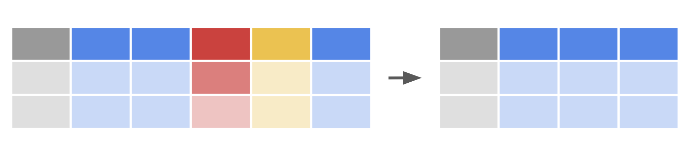
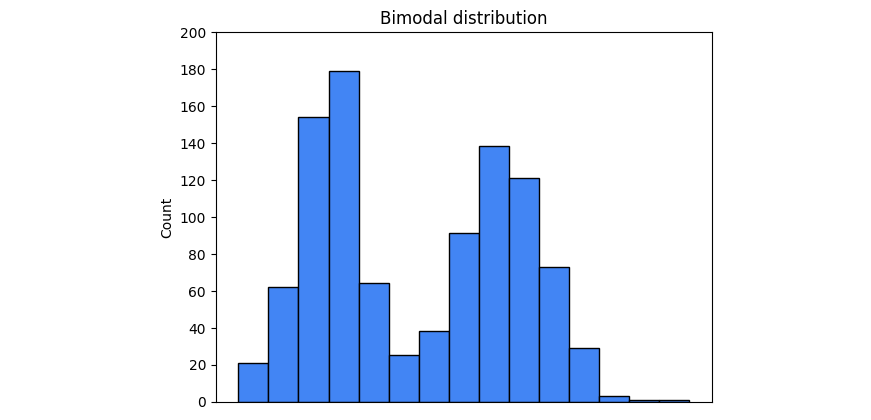
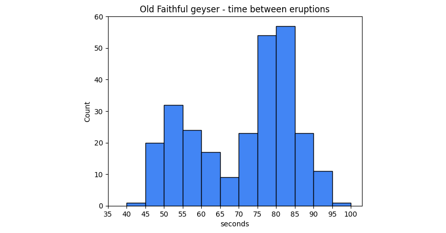
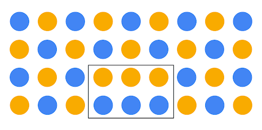
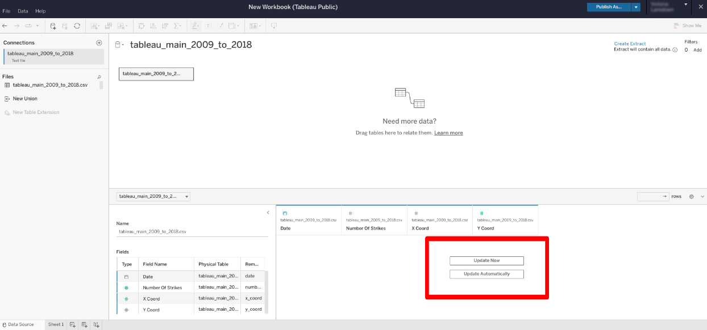
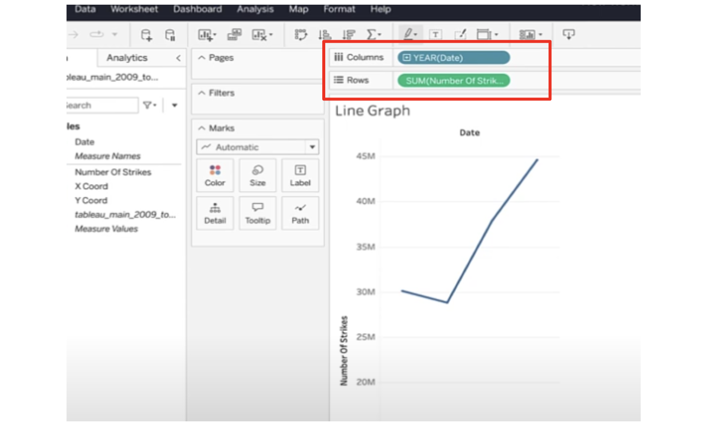
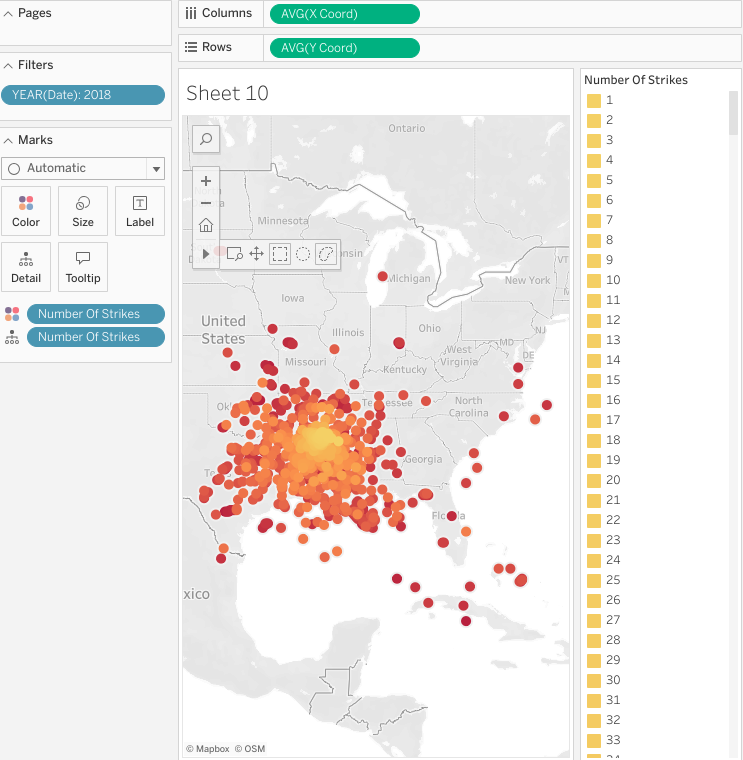
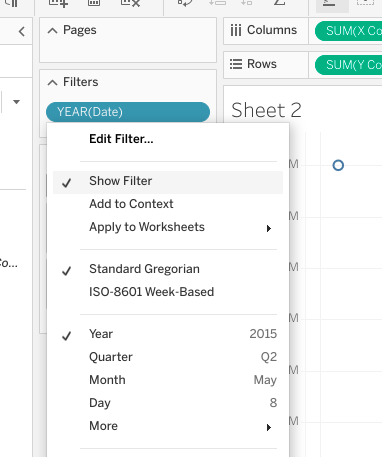
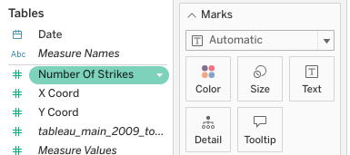
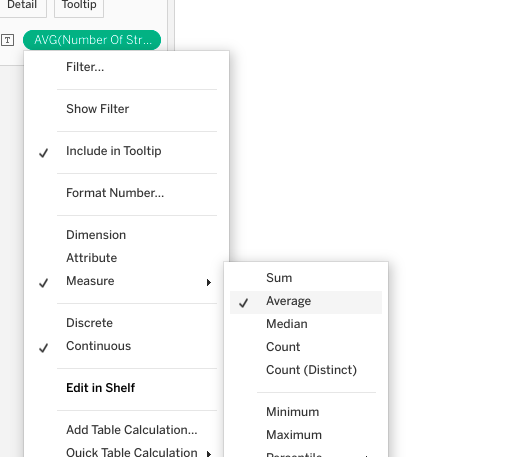

# Vaka analizi: Deloitte

Keşifsel veri analizinin (EDA) altı uygulamasının her biri için tanımları öğrendiniz - keşfetme, yapılandırma, temizleme, birleştirme, doğrulama ve sunma. Daha sonra, bu uygulamaların veri kariyeri alanına nasıl uygulandığını keşfedeceksiniz. Aşağıdaki vaka çalışmasında, Deloitte'un veri ekibinin üyeleri, müşterilerinin metrik ve gösterge paneli ihtiyaçlarını karşılamak için EDA'nın altı uygulamasını kullanmıştır. Deloitte ekibinin deneyimleri hakkında daha fazla bilgi edindikten sonra, bu uygulamaların ne kadar yararlı ve güçlendirici olabileceğine dair somut bir örneğe sahip olacaksınız. 


## Deloitte'u tanıyın

[Deloitte](https://www2.deloitte.com/us/en.html) bir denetim, danışmanlık, vergi ve danışmanlık hizmetidir. Şirketin dünya çapında 100.000'den fazla çalışanı ve iş ortağı var ve dünyanın en büyük şirketlerinin birçoğuyla çalışıyorlar. Hizmetleri vergi ve muhasebe çözümlerinden yapay zeka ve siber güvenlik risk programlarına kadar uzanmaktadır. 


Çok uluslu şirketin işletmeden işletmeye (B2B) modeli, müşterileriyle onların bireysel ihtiyaçlarına göre bir dizi stratejik ve finansal cephede çalışmaya odaklanmalarını sağlar. [Deloitte, müşteri projeleri için denetim, danışmanlık, mali müşavirlik, risk danışmanlığı, vergi, veri analizi ve düzenleme gibi](https://youtu.be/8Gg5BsFexOU?list=PLl4by_vVwv0zjE2FRD7BMwI2lpaMCAgHh) bir dizi hizmet sunmaktadır. Deloitte, 2008 yılından bu yana profesyonel iş hizmetlerinde mükemmellik standardı olmayı vizyon haline getirmiştir. Bu odaklanma sayesinde Deloitte, müşterileri için gerçek zamanlı ölçümlerin kullanılması da dahil olmak üzere teknolojik gelişmelerin ön saflarında yer almıştır. 

Deloitte, birçok başarı öyküsünden yalnızca birinde, kısa süre önce milyar dolarlık bulut tabanlı analiz ve yazılım şirketinin pazarlama potansiyellerinin takibini ve organizasyonunu ve performans verilerinin stratejik analizini kolaylaştırmasına yardımcı oldu. Bu okumada, Deloitte'un bugün hala kullandıkları kapsamlı bir çözümü önermek ve uygulamak amacıyla müşterinin verilerini analiz etmek için EDA'yı nasıl kullandığını göreceksiniz.    

## Zorluklar 


Deloitte'un en önemli bulut tabanlı yazılım çözümü müşterilerinden biri, pazarlama ve performans verileriyle ilgili çeşitli zorluklarla karşılaşıyordu. Hepsi için Deloitte'tan yardım istediler. İşte müşterinin Deloitte'a sunduğu özel zorluklar:  

-   Pazarlama potansiyel müşterilerinin takibinde zorluk 
    
-   Pazarlama kampanyalarının performansını anında takip etmekte zorlananlar
    
-   Stratejik şirket ölçümlerini gösteren kişiselleştirilmiş veri panolarının eksikliği
    

### **Pazarlama potansiyellerinin takibi**

Deloitte'un müşterisi, dünyanın dört bir yanındaki işletmelere bir dizi bulut tabanlı analiz hizmeti ve yazılım ürünü sunuyor ve bu da aylık olarak aldıkları binlerce soru ve potansiyel satış potansiyelinin her birini takip etmeyi muazzam bir görev haline getiriyor. Sonuç olarak, Deloitte'un müşterisi bu potansiyel müşterileri daha iyi takip etmelerine ve harekete geçmelerine yardımcı olacak bir çözüm arıyordu.   

### **Pazarlama kampanyası performansının izlenmesi**

Çok uluslu 1 milyar dolarlık bir şirketin pazarlama kampanyası performansının analizi için sadece dört veri analistine güvenmek, hızla sürdürülemez hale geliyordu. Deloitte yardım için devreye girmeden önce müşterinin performans takip sistemi, manuel olarak güncellenen ve bir elektronik tablo sekmesinde tutulan bir dizi veri tablosundan oluşuyordu. Her bölge kendi performans verilerini tutuyor, bu da tutarlılık sorunları yaratıyor ve şirket çapında bir performans resmi elde etmek için verileri derlemek ve birleştirmek zorunda kalan analistler için saatlerce boşa enerji harcanmasına neden oluyordu.  

### **Veri panolarını kişiselleştirme**

Her yönetim seviyesi için farklı ihtiyaçlar ve dünya genelinde farklı pazarlama bölgeleri nedeniyle, müşterinin şirket genelinde çalışanlarının ihtiyaçlarına özel verileri kolayca ayrıştırabilmesi ve gruplandırabilmesi gerekiyordu. Birkaç farklı departman ve bölgede birden fazla elektronik tablo üzerinden çalıştıkları için müşteri, verileri ihtiyaçlarına göre kolayca filtreleyemediğini ve bu nedenle performansı artırmak için stratejiyi yeterince değiştiremediğini fark etti. 

## Yaklaşım

Deloitte yeni müşterisiyle çalışmaya başladığında, müşterisinin önerdiği her bir ihtiyacı karşılayacak bir yaklaşım tasarladı. Bu yaklaşımı ayrıntılı olarak incelemek için aşağıdaki PACE girişlerine bakın.


## Plan

Başlangıç olarak Deloitte'un müşteri paydaşlarıyla bir araya gelmesi ve yukarıda belirtilen üç alana göre geleceğe yönelik vizyonlarını geliştirmelerine yardımcı olması gerekiyordu: **Pazarlama potansiyelleri, pazarlama kampanyası performansının ölçülmesi** ve **veri panolarının kişiselleştirilmesi**. 

Süreçlerini, hedeflerini ve temel sonuçlarını (OKR'ler) ve müşteri ve potansiyel müşteri verilerine nasıl yaklaştığını ve bunları nasıl kullandığını öğrenerek müşterinin işini anlamaları gerekiyordu. 

Projenin kilit kilometre taşları erkenden belirlenmiş ve edinilen yeni bilgilere göre ayarlanmıştır. Bu kilometre taşları şunlardı: 

-   Veri mimarisi ve gösterge tablolarının gelecek vizyonu konusunda müşteri ile uyum
    
-   Yeni veri mimarisinin oluşturulması
    
-   Tanımlayıcı ve teşhis araçlarının piyasaya sürülmesi
    
-   Tahmine dayalı modellerin başlatılması
    
-   Küresel satış ekibinin yeni takımlar konusunda eğitilmesi
    

Deloitte, proje planının, müşterinin şirket genelindeki performans verileri üzerinde EDA'nın keşfedilmesi, yapılandırılması ve temizlenmesi uygulamalarıyla başlayacağını belirledi.  

Deloitte, kişiselleştirilmiş gösterge tabloları tamamlandığında müşterinin hangi OKR'lere kolayca erişmek istediğini hızla öğrendi ve bu sonuca ulaşmak için planlar hazırladı. Bu OKR'ler aşağıdaki sorular şeklinde geldi: 

-   Belirli bir pazarlama kampanyasından ne kadar gelir elde edildi? 
    
-   Yeni müşteri hangi endüstriye, bölgeye, sektöre ve şirket büyüklüğüne dahil oldu? 
    
-   İlk temas noktasından sonra satışın sonuçlandırılması ne kadar sürdü? 
    
-   Farklı kampanya türlerinin başarı oranı neydi (örneğin, yüz yüze etkinliklere karşı çevrimiçi web seminerleri)? 
    
-   Kazanılan müşteri başına ortalama pazarlama maliyeti neydi?
    

## Analiz

Müşterinin verilerinin ilk analizinin çerçevesinin bir parçası olarak, müşterinin kullanımı kolay Tableau gösterge paneli araçları gibi varlıklar da dahil olmak üzere Deloitte'un ürün hizmetleri tekliflerine aşina olmadığı anlaşıldı. Bu nedenle, müşterinin mümkün olana ilişkin varsayımları ve talepleri Deloitte'un gerçek kapasitesinin çok altında kalmıştır. Bu, müşterinin projeden beklentilerini sadece karşılamakla kalmayıp, aslında aşmak için bir fırsattı. 

Analizin ilk zorlukları, verilerin nereden geldiğini ve her bir veri değişkeninin ne anlama geldiğini anlamaktı. Müşteri, verilerinde standart olmayan adlandırma kuralları ve tanımlar kullanıyordu, bu nedenle Deloitte'un müşterinin verilerini tam olarak anlamak ve bunları kullanmalarına nasıl yardımcı olacağını planlamak için dillerini öğrenmek üzere keşif uygulamalarını kullanması gerekiyordu. 

Deloitte, müşterinin o zamanki performans izleme yaklaşımının en iyi ihtimalle hantal ve aşırı geniş olduğunu tespit etti. Topladıkları performans verileri, şirket çapındaki stratejik eylemlerin değerini belirlemek için genel ortalamaların kullanılmasından oluşuyordu. Bölge başına belirli performans verileri olmadan, şirketin bölgesel performansı izlemenin basit bir yolu yoktu.  

-   Müşterinin o dönemdeki aşırı kapsamlı veri takibine bir örnek olarak, pazarlama kampanyası başına elde ettikleri ortalama geliri elde etmek için kullandıkları formül buydu: 
    
$$
\frac{\textit{average customer contract value}}{\textit{average cost of marketing campaigns}} = \textit{average revenue gained per campaign}
$$

Deloitte, müşterinin dahili pazarlama ve satış ekiplerinin coğrafi bölgelere, sektörlere ve müşteri hesabı büyüklüğüne göre organize edildiğini öğrendi. Bölgesel liderler pazarlama araştırmalarını ve kampanyalarını kendi başlarına yürütme yetkisine ve özerkliğine sahipti, ancak küresel ekipten rehberlik ve zaman zaman talimat alıyorlardı. Deloitte analistleri, müşterinin verilerinin EDA'sının bir parçası olarak verileri şirket genelinde tutarlı bir şekilde yapılandırmaya başladı.

Müşteri yaşam döngüsü açısından Deloitte, müşterinin pazarlama potansiyel müşterilerinin pazarlama kampanyaları oluşturacağını ve ardından bölgelerindeki satış ortaklarını bilgilendireceğini öğrendi. Saha satış temsilcileri, kampanyalardan elde edilen tüm potansiyel müşterileri takip edecek ve ek müşteriler bulmak için mevcut kampanyaların dışında da ağ kuracaklardı. EDA'nın bu keşif kısmı, Deloitte ekibini müşterinin ihtiyaçlarını karşılayabilecek daha spesifik ve makul çözümler konusunda bilgilendirdi. 

Deloitte ekibi, müşterinin Salesforce ve pazarlama kampanyalarındaki mevcut tüm verileri gözden geçirmek için elektronik tablolarda EDA'nın keşif ve yapılandırma uygulamalarını kullandı. Müşterilerinin satış sisteminde var olan her veri değişkenini belirlemeye ve tanımlamaya başladılar. Veri değişkenlerinin envanteri yapılandırıldıktan, temizlendikten ve doğrulandıktan sonra Deloitte ekibi bu bilgilerden ne tür içgörüler elde edebilecekleri konusunda beyin fırtınası yaptı. 

İncelemenin ardından Deloitte, topladığı bilgileri müşteriyle paylaşmak için EDA'nın sunum uygulamasından yararlandı. Müşterinin kendi işini nasıl gördüğünü ve verilere göre onlar için hangi faktörlerin önemli olduğunu daha iyi anlamak için dinlediler ve sorular sordular.  

Yapılandırma Deloitte, müşterinin sistemlerine ilişkin analizlerinden ve müşterinin performans verileri üzerinde yaptıkları EDA'nın keşif, yapılandırma ve temizleme uygulamalarından, müşterinin analitik süreçlerinin

gerektiğini öğrendi; çok daha fazla ayrıntı sağlayan ve darboğazları, kârsız kampanyaları ve verimsiz müşteri segmentlerini belirlemelerine ve ele almalarına olanak tanıyan bir süreç

Müşterinin onayıyla Deloitte, analizi daha akıcı hale getirmek için müşterinin veri iç altyapısını tamamen yeniden inşa etti.  

Altyapı revizyonunun yanı sıra, müşteri için en pratik çözüm, belirli paydaşlar için özelleştirilmiş ve dinamik gösterge tabloları oluşturmaktı. 

-   Deloitte ekibi, ihtiyaçlarını ve OKR'lerini anlamak için her bir müşteri paydaş grubuyla birlikte çalıştı. 
    
-   Daha sonra, her bir değişkenin neyi temsil ettiğini ve nasıl kullanılıp kullanılmaması gerektiğini tanımlamak için bir veri sözlüğü gibi destekleyici teminat kaynakları oluşturarak müşteriye özel çözümler geliştirilmesine yardımcı oldular. 
    

Deloitte, müşterilerinin verilerinden topladıkları bilgileri kullanarak OKR'leri üzerinde tahmine dayalı analiz yapan otomasyonlar ve araçlar geliştirdi. Bu da müşterinin gelecek için uygulanabilir ancak agresif hedefler belirlemesini sağladı.

## Execute

Deloitte'un müşterisinin veri altyapısını elden geçirmesi, küresel veri toplamaya yönelik modern ve katmanlı bir yaklaşımın ortaya çıkmasını sağladı. Daha önce performans ölçümlerini formüle etmek için bölgesel olarak toplanmış ve tutarsız bir şekilde yapılandırılmış elektronik tablolara güvenmek zorunda kalan müşteri, artık küresel, şirket genelindeki performanstan bölgesel bir satış ekibi üyesinin belirli ürünler ve müşteri alt kümeleri üzerindeki performansına kadar her şeyi kolayca ölçebilmektedir.

Kişiselleştirilmiş gösterge tablolarının uygulanmasından sonra, Kıdemli Başkan Yardımcıları OKR'lerin durumunu ve performansını sorumlu oldukları tüm departmanlara ve bölgelere göre filtreleyebilmektedir. Ayrıca, bölgesel potansiyel müşteriler, pazarlama potansiyel müşterileri ve hatta yerel satış potansiyel müşterileri, ilgili alanlarına göre filtrelenmiş verileri görüntüleyebildi. 

Uygulamanın bir parçası olarak Deloitte ekip üyeleri, kişiselleştirilmiş gösterge tablolarının nasıl kullanılacağından yeni veri altyapısının bakımının nasıl yapılacağına kadar her konuda müşterilerinin ihtiyaçlarına göre eğitim oturumları oluşturdu.  

Deloitte tarafından tasarlanan gösterge tabloları ve veri altyapısı, müşterinin küresel ekibindeki çok sayıda paydaş için anında değerli varlıklar haline geldi. 

**Not**: Deloitte, müşteriyle yaptığı çalışmalarda yukarıda listelenen PACE iş akışını takip etmemiştir; bunun yerine, çalışmalarının ayrıntılarını bu vaka çalışmasında belgelendirirken, Deloitte'un müşteri için yaptığı çalışmalar, uygulamanın çok yönlülüğünü göstermek için PACE iş akışına göre düzenlenmiştir. 

## Sonuçların özetlenmesi

Deloitte yeni müşterisiyle çalışmaya başladığında, pazarlama ve satış ekipleri arasındaki standardizasyon eksikliği nedeniyle şirketin mevcut verilerinin doğruluğuna güvenmekte tereddüt ediyordu. Bu tutarlılık eksikliği, belirli bir satışı belirli bir kampanyayla ilişkilendirmeyi zorlaştırdı. Müşterinin satış ve pazarlama süreçlerini ve verilerinin EDA'sını birkaç hafta inceledikten sonra Deloitte, veri altyapısını tüm satışları geçerli pazarlama kampanyalarına doğrudan bağlayacak şekilde yeniden oluşturdu. Bu satışları, kolayca sıralanabilen bir dizi veri tablosunda hizalanmış birincil anahtarlar kullanarak pazarlama kampanyalarına bağladılar. Bu, Deloitte analistlerine verilerle nelerin mümkün olabileceği konusunda bir fikir verdi ve müşterinin başlangıçta mümkün olduğunu düşündüğü şeyleri aşan nihai ürünler oluşturmalarına yol açtı.

Altyapı elden geçirildikten sonra, Deloitte'un EDA performansı, müşterinin mevcut müşteri ilişkilerine zarar verecek şekilde yeni müşteriler kazanmaya çok fazla odaklandığını ortaya çıkardı. OKR'lere odaklanılması nedeniyle yeni müşterilere yapılan satışlar artarken, mevcut müşterilere yapılan satışlar düştü. Bu sonuç daha önce müşteri tarafından bilinmiyordu. Sonuç olarak müşteri, stratejisini hem satış bölgesi hem de ürün bazında değiştirebildi. Deloitte'un oluşturduğu dinamik gösterge tabloları, müşterinin performansı ölçme ve izlemenin yanı sıra strateji belirlemede de en etkili aracı haline geldi.  

## Sonuç

Deloitte, hem müşterinin iş uygulamalarını değerlendirirken hem de verilerinin EDA'sını yaparken müşterinin iş sorununa odaklandığı için, daha önce yapılandırılmamış verilerde saklı olan gerçekleri ortaya çıkarabilmiştir. Deloitte, müşterinin gelecekte bu gerçekleri kendi başına keşfedebilmesi için şirketteki herhangi bir satış bölgesine veya ürüne kadar filtreleyecek şekilde tasarlanmış etkileşimli, dinamik veri panoları oluşturdu. Bu çözümlerin en büyük faydası, müşterinin liderlik ve pazarlama liderlerinin çok daha çevik bir ekip haline gelmesi oldu. Gelirlerini doğrudan artıran etkili iş kararlarını daha iyi alabildiler. Veri altyapısının elden geçirilmesi ve veri gösterge paneli çözümleri, analistlerinin iş-yaşam dengesinin iyileştirilmesine de yardımcı oldu. Tüm bu sonuçlar sadece müşteri için değil Deloitte için de kayda değerdi çünkü müşteri firma için kilit bir ortak ve müşteriydi. Verilere odaklanmaları sayesinde Deloitte, müşterinin beklentilerini aşan bir çözüm sunabildi ve bunun karşılığında dünyanın dört bir yanındaki müşterilerine daha iyi hizmet vermelerine yardımcı oldu.

# Referans kılavuzu: EDA süreci

## EDA'nın altı uygulaması yinelemeli ve sıralı değildir

Keşifsel veri analizi (EDA) bir kek tarifi gibi değildir. Bu _**değil**_ adım adım takip ettiğiniz bir süreç. Bunun yerine, EDA'nın altı uygulaması yinelemeli ve sıralı değildir. 

-   **Yinelemeli**: Bir sürecin tekrarlanması ile ilgili veya tekrarlanmasını içeren
    
-   **Sıralamasız**: Bir düzen veya sıraya göre düzenlenmemiş veya bu sırayı takip etmeyen. 
    

Veri kümelerinin değişken doğası nedeniyle, bu verileri keşfetme yaklaşımı her seferinde farklı olacaktır. Bu, altı uygulamadan hangilerini kullanacağınızı, bunları kaç kez uygulayacağınızı ve süreçte ne zaman uygulamanız gerektiğini belirlemek için EDA süreci boyunca mantığınızı ve deneyiminizi kullanmanız gerekeceği anlamına gelir. 

## **Görsel örnek**

Norveç'teki iğne yapraklı bir ormandaki ağaçlar hakkında sadece 200 satır ve beş sütundan oluşan bir veri kümesine atandığınızı düşünün. Tam analizinizi tamamlamak için 1.000'den fazla satıra ve en az iki sütuna daha ihtiyacınız olacağını biliyorsunuz. Bundan daha fazla ayrıntı olmasa bile, tüm EDA süreciniz buna benzer bir şeye benzeyebilir:  


1.  **Keşfetme**: Veri kümesinin genel şeklini, boyutunu ve içeriğini kontrol edersiniz. Verilerin yetersiz olduğunu görüyorsunuz. 
    
2.  **Katılıyorum**: Daha fazla veri eklersiniz.
    
3.  **Onaylama**: Yeni verilerde hata veya yazım yanlışı olup olmadığını hızlıca kontrol edersiniz. 
    
4.  **Yapılandırma**: Eğilimleri anlamak için verileri farklı zaman dilimlerinde ve segmentlerde yapılandırırsınız. 
    
5.  **Onaylama:** Yapılandırmada yaptığınız yeni sütunların doğru tasarlandığından emin olmak için hızlı bir kontrol daha yaparsınız. 
    
6.  **Temizleme**: Aykırı değerleri, eksik verileri ve dönüştürme veya dönüştürme ihtiyaçlarını kontrol edersiniz. 
    
7.  **Onaylama**: Temizledikten sonra, yaptığınız değişikliklerin doğru ve hatasız olduğunu iki kez kontrol edersiniz. 
    
8.  **Sunma**: Veri setinizi bir meslektaşınızla paylaşırsınız.

Verilerde yaptığınız değişikliklerin farkında olmadan hatalara yol açmadığından emin olmak için "doğrulama" uygulamasını yinelemeli olarak veya birden çok kez gerçekleştirdiğinize dikkat edin. Ayrıca, daha fazla veriye olan ihtiyacı önceden fark ettiğiniz için, "keşfetme" uygulamasının hemen ardından "birleştirme" uygulaması gerçekleştirildi. 

Temizlenmiş veri setinizi bir meslektaşınıza sunduktan sonra, daha fazla araştırma ve/veya temizlik için notlar veya fikirler alma şansınız yüksektir. Bu nedenle, daha da fazla yineleme göreceksiniz. 

**Profesyonel ipucu**: Veri bilimciler, bir veri kümesini "temiz" ve modelleme ya da makine öğrenimi algoritmaları için hazır ilan etmeden önce bu veri kümesi üzerinde birçok kez EDA uygulamalarını gerçekleştirmeyi beklemektedir. 

## Etik makine öğreniminde EDA'nın önemi

Algoritmalar ve makine ağları bireyler, şirketler ve hatta hükümetler adına giderek daha fazla karar almaya başladıkça, etik ve düzenleme tartışmaları da giderek daha önemli hale gelmektedir. [Institute for Ethical AI & Machine Learning](https://ethical.institute/principles.html)'e göre, makine öğrenimi sistemlerini sorumlu bir şekilde geliştirmek için sekiz ilke vardır. 

**EDA sürecinin temel ilkeleri**

Aşağıdaki iki ilke EDA sürecinin doğal bir parçasıdır:

-   **İnsan büyütme**: Bu ilke, gözetim için yapay zeka veya makine öğrenimi algoritma sistemlerine insanların eklenmesini sağlar. Veri bilimcileri tarafından gerçekleştirilen kapsamlı EDA, bir algoritmaya beslenen önyargı, dengesizlik ve yanlışlıkları sınırlamanın belki de en iyi yollarından biridir. 
    
-   **Yanlılık değerlendirmesi**: İnsan müdahalesi olmadan, makine öğrenimi modellerine önyargı çok kolay bir şekilde enjekte edilebilir ve yeniden üretilebilir. Metodik EDA süreçlerinin gerçekleştirilmesi, veri bilimcilerin verilerdeki önyargıların ve dengesizliklerin farkında olmalarını ve bunlara göre hareket etmelerini sağlayacaktır. 

**Profesyonel ipucu**: Veri kariyeri alanında etik standartlara uyulmasını sağlamanın önemi yadsınamaz. Veri uzmanlarının, EDA çalışmalarına sürekli olarak etik bir zihniyet uygulayarak önyargı ve ayrımcılığı fark etme kapasitelerini sürekli olarak geliştirmeleri gerekir.  

Makine öğreniminin ötesinde, EDA neredeyse tüm önemli veri tabanlı kararlara uygulanabilir. İleride, EDA'nın birçok uygulaması ve yinelemeli ve sıralı olmayan bir yaklaşımın gerekliliği hakkında bilgi edineceksiniz.

# Referans kılavuzu: Python ile veri kümelerini içe aktarma

Bir veri uzmanı olarak kariyerinizde, farklı dosya türlerine sahip veya çeşitli veritabanlarında depolanan çeşitli veri kümeleriyle karşılaşacaksınız. Daha önce öğrendiğiniz gibi, bu veri türlerinin ne olduğunu ve Python kullanarak verileri nasıl içe aktaracağınızı bilmeniz çok önemlidir. Aşağıda hem veritabanlarını bağlantılar aracılığıyla hem de veri dosyalarını Python'a aktarma örneklerini bulacaksınız.   

Python kodlaması için Coursera platformunu kullanacak olsanız da, CSV dosyalarını Coursera dışında indirmek ve açmak istiyorsanız bu dosyalarla nasıl çalışacağınızı ve içe aktaracağınızı bilmeniz gerekecektir.

## CSV dosyasından bir veri kümesi nasıl içe aktarılır

Bu örnek için bilgisayarınızda bir CSV dosyası bulun. Eğer bir tane yoksa, bu kursun Kurs kaynaklarına bağlantı[](https://www.coursera.org/learn/go-beyond-the-numbers-translate-data-into-insight/resources/9mSWv "Kaynaklar") bölümünden unicorn (1 milyar USD değerine ulaşan) şirketlerin bir veri kümesini kullanabilirsiniz.

Bir CSV dosyasını Python'a aktarmanın birkaç farklı yolu vardır, ancak biz sadece daha yaygın yollardan bazılarını inceleyeceğiz. Bir with deyimi ve open() fonksiyonu kullanarak başlayın. CSV dosyasının **dosya adını (veya dosya yolunu)** open() fonksiyonuna, fonksiyonun mode parametresi için bir argümanla birlikte iletin.

open("dosya yolu/dosya adı", mode=) ile

sözdizimi şöyledir:

**Not**: Aşağıdaki kod bloğu etkileşimli değildir.

```python
with open('file_path/file_name', mode=)
```

Mod, Python kütüphanesine dosya ile ne yapması gerektiğini söyler. **Modu** tanımlarken aşağıdaki seçeneklerden birini kullanırsınız: 

-   'r' - oku
    
-   'w' - yaz
    
-   'a' - ekle
    
-   '+' - yeni dosya oluştur
    

Tipik olarak, Python'un CSV dosyasını açmasını ve okumasını istediğiniz için with open() argüman alanının içindeki modu 'r' olarak tanımlayacaksınız. 

Daha sonra, sonucu bir değişken adına atayan as file sonuna ekleyeceğiz. Bu durumda, buna data adını vereceğiz. 

**Not:** Aşağıdaki kod bloğu etkileşimli değildir.

```python
with open('example_filepath/file', mode='r') as file:

    data = file.read()
```

### **Pandas kullanarak bir CSV dosyasını içe aktarma**

Bir dosyayı okumak için Python'un standart kütüphanesini kullanmak yerine, CSV dosyasını bir veri çerçevesine aktarmak için pandas'ı kullanabilirsiniz. İlk olarak, elbette, pandas kütüphanesini Python not defterinize aktarmak isteyeceksiniz.

```python
import pandas as pd
```

Daha sonra, verileri bir veri çerçevesine yüklemek için read_csv() fonksiyonu kullanacaksınız. Dosya yolu daha sonra argüman alanına gider.

```python
df = pd.read_csv("filepath/filename")
```

```python
import pandas as pd

df = pd.read_csv('example_filepath/file')
```

_**Not:**_ _Aynı sözdizimini internette depolanan bir CSV dosyasını içe aktarmak için de kullanabilirsiniz. Dosya adı yerine, basitçe url'yi kopyalayıp yapıştırırsınız._ 

## Bir veritabanına bağlanarak veriler nasıl içe aktarılır

Python ile bağlanabileceğiniz BigQuery, MySQL, SQLite ve Oracle gibi bir dizi veritabanı çözümü vardır. Veritabanları, şirketler ve kuruluşlar için büyük miktarda veriyi depolamanın uygun bir yoludur. 

Veri kümesi yeterince küçükse, bilgisayarınıza indirilebilir ve yerel olarak değiştirilebilir. Ancak, veri tabanlarında tutulan veri kümeleri genellikle kişisel bir bilgisayarda tamamına erişilemeyecek kadar büyüktür. Bu durumda, çoğu ilgilenilen belirli tabloları elde etmek için veritabanını SQL ile sorgulamayı içeren bir dizi farklı seçeneğiniz vardır. Başka bir deyişle, tüm veri kümesinden seçilen parçaları (genellikle belirli satırlar ve/veya sütunlar) ayıklarsınız. Sorgulamanın yapılma şekli sistemlere, platformlara ve arayüzlere göre değişebilir. Bu değişkenlik nedeniyle, bu başvuru kılavuzu veritabanlarını sorgulamak için yalnızca birkaç farklı yol sunacaktır. Özellikle, analizi kolaylaştırmak için çok çeşitli araçlar ve hizmetler sağlayan Google'ın veri ambarı BigQuery'yi keşfedecek.

### **BigQuery'den veri indirme**

#### **Adım 1: BigQuery'ye erişin**

BigQuery, depolama için veri yüklemenize olanak tanır ve ayrıca keşfedebileceğiniz halka açık bir dizi veri kümesine sahiptir. Ücretsiz bir Google hesabı gerektiren [BigQuery Sandbox](https://cloud.google.com/bigquery/docs/sandbox) adresini kullanarak bu herkese açık veri kümelerine ücretsiz olarak erişebilirsiniz. Sandbox size her ay ücretsiz olarak 10 GB aktif depolama alanı ve 1 TB işlenmiş sorgu verisi sağlar.

#### **Adım 2: Bir sorgu gerçekleştirin**

Hesabınızın kimliğini doğruladıktan ve birinci adımda bağlantılı talimatlarda belirtildiği gibi yeni bir proje oluşturduktan sonra, bir veritabanını sorgulamaya hazırsınız demektir. İlk kez oturum açıyorsanız, hızlı başlangıç kılavuzuna bir bağlantıyla birlikte "BigQueryUI'de yeni misiniz?" diye soran bir pencereyle karşılaşabileceğinizi unutmayın.


Hızlı başlangıç kılavuzu, burada size sunulanlarla aynı adımlar boyunca size rehberlik edecektir.

"SQL Çalışma Alanınıza Hoş Geldiniz!" sayfasından "Yeni bir sorgu oluştur" düğmesine tıklayın.


Sayfanın sol tarafındaki Explorer'da bulunan arama çubuğuna tıklayın. Örneğin, "ağaçlar" için arama yapabilirsiniz. Başlangıçta, bu sıfır sonuç döndürecektir. Ancak, "Tüm projeleri ara" seçeneğine tıkladığınızda bigquery-public-data projesinden uygulanabilir veri kümeleri ve bu veri kümelerinden önceden hazırlanmış tablolar döndürülecektir. 

san_francisco veri kümesindeki street_trees tablosuna tıklayın. Bu tablonun meta verileri sağdaki bir panelde görünecektir. Ardından, meta veri panelinin üst kısmındaki menüden "Sorgu "ya tıklayın. Sorgulamayı yeni bir sekmede veya geçerli pencerenin bölünmüş bir bölmesinde yapmayı tercih edebilirsiniz.


Şimdi, SQL kullanarak tabloyu sorgulayabilirsiniz. Örneğin, aşağıdaki ekran görüntüsündeki sorgu, tree_id, plant_type, species, plant_date ve dbh - "derinlik, yükseklik" olarak tanımlanan sütunlarıyla 5.000 satır seçer.


Sorgunuzdan memnun kaldığınızda, SQL sorgu panelinin üst kısmındaki "Çalıştır" düğmesine tıklayın. Sonuçlar aşağıda görüntülenecektir ve ortaya çıkan tabloyu farklı konum ve biçimlerde kaydetmenize olanak tanıyan "Sonuçları kaydet" düğmesi bulunmaktadır. Buradan, verileri not defterinize okuyabilirsiniz.

### **BigQuery içinde not defterlerini kullanma**

BigQuery'deki verilere erişmenin bir başka yolu da BigQuery platformunun kendi içindeki araçları kullanmaktır. Bu iş akışı, veri uzmanlarının bulutta depolanan çok büyük veri kümeleriyle çalışırken kullanacakları iş akışına daha çok benzemektedir. Esasen, BigQuery üzerinde bir sanal makine kurarsınız. Sanal makine, tıpkı diğer bilgisayarlar gibi kendi CPU'su, belleği, yazılımı vb. olan bir bilgisayardır, ancak kendi özel donanımı yoktur; çoğunlukla bir sunucuda bir bölüm olarak bulunurlar. BigQuery platformundaki sanal makinede bir Jupyter not defterinde çalışabilir, buradan doğrudan verileri sorgulayabilir ve çekebilirsiniz. 

Bu işlem, bir ödeme yöntemi ayarlamanızı gerektirir. Bununla birlikte, yeni kullanıcılar 300 $ kredi alır ve ML örneğinin dakikası yalnızca birkaç senttir, bu nedenle herhangi bir ücret ödemeden önce yaklaşık 2.000 saat ücretsiz kullanım elde edersiniz. Bunu kurmak için pek çok harika eğitim var. Örneğin, "Google Cloud AI'da Jupyter not defteri nasıl kullanılır?" diye aratırsanız konuyla ilgili çok sayıda faydalı video ve blog bulabilirsiniz.

### **Not defterlerini BigQuery dışında kullanma**

BigQuery platformunda olmayan not defterlerinden BigQuery'deki verileri sorgulamak da mümkündür. Ancak bu sürecin ayrıntıları, dizüstü bilgisayarı barındıran platform, işletim ortamı ve erişilen verilerin belirli konumu da dahil olmak üzere bir dizi faktöre bağlıdır. Bu nedenle, bu yöntem üzerinde derinlemesine durmayacağız. Yine de bunu kendi başınıza keşfetmekten çekinmeyin. Sadece bir arama uzaklığında birçok yararlı çevrimiçi kaynak bulacaksınız.

## Temel çıkarımlar

Çok sayıda farklı veri türü vardır, bu da verileri içe aktarmanın çok sayıda yolu olduğu anlamına gelir. İster bir veri dosyasından ister bir veritabanından olsun, verileri içe aktarmak için çeşitli yöntemler öğrenmek, bir veri uzmanı olarak kariyeriniz için sağlam bir temel oluşturacaktır.

## Daha fazla bilgi için kaynaklar

Python'a veri aktarma hakkında daha fazla bilgi edinmek için aşağıdaki bağlantılara başvurabilirsiniz:

-   [Python'da veri içe aktarmaya genel bir bakış](https://towardsdatascience.com/an-overview-of-importing-data-in-python-ac6aa46e0889)
    
-   [Bir Colab'dan BigQuery'ye nasıl bağlanılır](https://colab.sandbox.google.com/notebooks/bigquery.ipynb#scrollTo=fkhbyGaXKs_6)

# Referans kılavuzu: Bir veri kümesinin keşfi için Pandas yöntemleri

## EDA için Python referans kılavuzu: Keşfetme

Bir veri kümesiyle ilk kez karşılaştığınızda bu veri kümesi hakkında bilgi edinmenize yardımcı olması için aşağıdaki pandas yöntemlerini ve niteliklerini kullanın.

**DataFrame.head()**

-   head() yöntemi, veri çerçevesinin ilk _n_ satırını görüntüler. 
    
-   Bağımsız değişken alanına, Python not defterinde görüntülenmesini istediğiniz satır sayısını girin. Varsayılan değer 5 satırdır. 
    
-   Çalıştırıldığında, head() yöntemi aşağıdaki gibi bir sonuç döndürür: 
    
```python
df.head(10)
```

| index |    date    | number of strikes | center point geom |
|-------|------------|-------------------|-------------------|
|   0   | 2018-01-03 |        194        |   POINT(-75 27)   |
|   1   | 2018-01-03 |        41         |  POINT(-78.4 29)  |
|   2   | 2018-01-03 |        33         |  POINT(-73.9 27)  |
|   3   | 2018-01-03 |        38         |  POINT(-73.8 27)  |
|   4   | 2018-01-03 |        92         |   POINT(-79 28)   |
|   5   | 2018-01-03 |        119        |   POINT(-78 28)   |
|   6   | 2018-01-03 |        35         |  POINT(-79.3 28)  |
|   7   | 2018-01-03 |        60         |  POINT(-79.1 28)  |
|   8   | 2018-01-03 |        41         |  POINT(-78.7 28)  |
|   9   | 2018-01-03 |        119        |  POINT(-78.6 28)  |

**Not**: Bir Python not defterinde, head() fonksiyonun sonuçları görünür kılavuz çizgileri olan bir tablo içermeyecektir. 

### **DataFrame.info(X)**

-   info() yöntemi, aralık dizini, dtipleri, sütun başlıkları ve bellek kullanımı dahil olmak üzere veri çerçevesinin bir özetini görüntüler.
    
-   Bağımsız değişken alanının boş bırakılması tam bir özet döndürecektir. Bir seçenek olarak, bağımsız değişken alanına show_counts=True yazabilirsiniz; bu, her sütun için boş olmayan değerlerin sayısını döndürecektir. 
    
-   Çalıştırıldıktan sonra info() yöntemi aşağıdaki gibi bir sonuç döndürür:

**Not:** Aşağıdaki kod bloğu etkileşimli değildir.

```python
df.info()

# <class ‘pandas.core.frame.DataFrame’>
# RangeIndex:3401012 entries, 0 to 3401011
# Data columns (total 3 columns):
# #     Column                   Dtype
# --    ----                     ----- 
# 0     date                     object
# 1     number_of_strikes        int64
# 2     center_point_geom        object
# Dtypes: int64(1), object(2)
# Memory usage 77.8+ MB
```

-   describe() yöntemi, toplam sayı, ortalama, minimum, maksimum, dağılım ve dağılım dahil olmak üzere tüm veri kümesinin tanımlayıcı istatistiklerini döndürür. 
    
-   Bağımsız değişken alanının boş bırakılması, varsayılan olarak veri çerçevesinin istatistiklerinin bir özetini döndürür. Bir seçenek olarak, parantez içine ne girdiğinize bağlı olarak sonuçları belirli veri türleriyle sınırlayacak "include=[X]" ve "exclude=[X]" kullanabilirsiniz. 
    
-   Çalıştırıldığında, describe() yöntemi aşağıdaki gibi bir sonuç döndürür:
    
```python
df_joined.describe()
```

|  N/A  |  longitude  | latitude  | number_of_strikes_x | number_of_strikes_y |
|-------|-------------|-----------|----------------------|----------------------|
| count |  717530.00  | 717530.00 |      717530.00       |     323700.00000     |
| mean  | -90.875445 | 33.328572 |      21.637081       |      25.410587       |
|  std  |  13.648429  | 7.938831  |       48.02952       |      57.421824       |
|  min  | -133.9000  | 16.600000 |       1.00000        |       1.000000       |
|  25%  | -102.80000 | 26.900000 |       3.00000        |       3.000000       |
|  50%  | -90.300000 | 33.200000 |       6.00000        |       8.000000       |
|  75%  | -80.900000 | 39.400000 |       21.00000       |      24.000000       |
|  max  | -43.800000 | 51.700000 |      2211.00000      |     2211.000000      |

**Not**: Bir Python not defterinde, describe() fonksiyonun sonuçları görünür kılavuz çizgileri olan bir tablo içermeyecektir. 

-   shape, satır ve sütun sayısına göre veri çerçevesinin boyutlarını temsil eden bir tuple döndüren bir özniteliktir. Nitelikleri parantezlerin takip etmediğini unutmayın. Kod aşağıdaki gibi görünecektir: 
    
**Not:** Aşağıdaki kod bloğu etkileşimli değildir.

```python
df.shape
(3401012, 3)
```

head(), info(), describe() ve shape, veri bilimcilerin bir veri kümesini yüksek düzeyde anlamak için kullanabilecekleri pandas araçlarıdır. Bu araçları kullanarak öğrendiğiniz bilgiler, kariyeriniz boyunca verileri analiz etmek için pandas kullandığınızda EDA çalışmanızın geri kalanını bilgilendirmeye hizmet edecektir.

Yukarıdaki EDA keşfetme işlevleri ve benzerleri hakkında daha fazla bilgi için çevrimiçi Pandas referans kılavuzunu kullanabilirsiniz:

-   [Pandas veri çerçevesi işlevlerinin bir listesi](https://pandas.pydata.org/docs/reference/frame.html)

# Referans Kılavuzu: Datetime (Tarih-Zaman) İşlemleri

Aşağıdaki tablolar, tarih-zaman (datetime) ifadelerini bireysel nesnelere dönüştürmek için kullanılan kısa kodları hatırlamak amacıyla referans kılavuzu olarak kullanılabilir.

---

## Python'da Tarih-Zaman (Datetime) İfadeleriyle Çalışmak

Aşağıda, tarih-zaman nesneleriyle farklı şekillerde çalışmanıza yardımcı olacak datetime fonksiyonlarını içeren bir tablo bulacaksınız:

| Kod | Biçim                                  | Örnek                                    |
| --- | -------------------------------------- | ---------------------------------------- |
| %a  | Kısaltılmış hafta günü adı             | Sun                                      |
| %A  | Hafta günü adı                         | Sunday                                   |
| %b  | Kısaltılmış ay adı                     | Jan                                      |
| %B  | Ay adı                                 | January                                  |
| %c  | Tarih ve saat                          | Sun Jan 1 00:00:00 2021                  |
| %d  | Gün (başında sıfır olan)               | 01 ila 31                                |
| %H  | 24 saatlik formatta saat               | 00 ila 23                                |
| %I  | 12 saatlik formatta saat               | 01 ila 12                                |
| %j  | Yılın günü                             | 001 ila 366                              |
| %m  | Ay                                     | 01 ila 12                                |
| %M  | Dakika                                 | 00 ila 59                                |
| %p  | AM veya PM                             | AM/PM                                    |
| %S  | Saniye                                 | 00 ila 61                                |
| %U  | Hafta numarası (Pazar başlangıçlı)     | 00 ila 53                                |
| %W  | Hafta numarası (Pazartesi başlangıçlı) | 00 ila 53                                |
| %w  | Haftanın günü (0: Pazar, 6: Cumartesi) | 0 ila 6                                  |
| %x  | Yerel tarih gösterimi                  | 16.08.1988 (de\_DE), 08/16/1988 (en\_US) |
| %X  | Yerel saat gösterimi                   | 21:30:00                                 |
| %y  | Yüzyılsız yıl                          | 00 ila 99                                |
| %Y  | Yıl                                    | 2022                                     |
| %z  | Zaman dilimi farkı                     | +0900                                    |
| %Z  | Zaman dilimi adı                       | EDT, JST, WET vb. (GMT)                  |

---

## Hatırlanması Gereken Datetime Fonksiyonları

Aşağıdaki tüm tarih stringi işlemleri için `datetime` modülünün içe aktarılması gerekir.

(`from datetime import datetime`)


| Kod                                                                                     | Girdi Türü                        | Girdi Örneği                        | Çıktı Türü          | Çıktı Örneği                                               |
|------------------------------------------------------------------------------------------|-----------------------------------|-------------------------------------|----------------------|------------------------------------------------------------|
| datetime.strptime("25/11/2022", "%d/%m/%Y")                                              | string                            | "25/11/2022"                        | DateTime             | "2022-11-25 00:00:00"                                      |
| datetime.strftime(dt_object, "%d/%m/%Y")                                                 | DateTime                          | "2022-11-25 00:00:00"               | string               | "25/11/2022"                                               |
| dt_object = datetime.strptime("25/11/2022", "%d/%m/%Y")                                  | string                            | "25/11/2022"                        | DateTime             | "2022-11-25 00:00:00"                                      |
| datetime.timestamp(dt_object)                                                           | DateTime                          | dt_object                           | float (timestamp)    | 1617836400.0                                               |
| datetime.strptime("25/11/2022", "%d/%m/%Y").strftime("%Y-%m-%d")                         | string                            | "25/11/2022"                        | string               | "2022-11-25"                                               |
| datetime.fromtimestamp(1617836400.0)                                                    | float (timestamp)                 | 1617836400.0                        | DateTime             | datetime.datetime(2021, 4, 7, 23, 0)                        |
| datetime.fromtimestamp(1617836400.0).strftime("%d/%m/%Y")                                | float (timestamp)                 | 1617836400.0                        | string               | "07/04/2021"                                               |
| from pytz import timezone                                                                | -                                 | -                                   | -                    | -                                                          |
| ny_time = datetime.strptime("25-11-2022 09:34:00-0700", "%d-%m-%Y %H:%M:%S%z")           | string                            | "25-11-2022 09:34:00-0700"          | DateTime             | NewYork timezone                                           |
| Tokyo_time = ny_time.astimezone(timezone('Asia/Tokyo'))                                  | DateTime (zaman dilimli)          | NewYork zamanı                      | DateTime             | Tokyo timezone 2022, 11, 26, 1, 34, JST+9:00:00 STD>        |
| datetime.strptime("20:00", "%H:%M").strftime("%I:%M %p")                                 | string                            | "20:00"                             | string               | "08:00 PM"                                                |
| datetime.strptime("08:00 PM", "%I:%M %p").strftime("%H:%M")                              | string                            | "08:00 PM"                          | string               | "20:00"                                                   |

---

## NumPy ve pandas'ta Datetime

Bu bölümdeki "datetime" terimi, ya Python'un standart kütüphanesindeki `datetime` modülünü ya da bu modüldeki sınıflardan birini ifade eder. Küçük harfle "datetime" ise, herhangi bir kütüphane veya dildeki tarih/zamanla ilgili tüm nesneleri kapsar.

Python’un standart kütüphanesindeki [`datetime` modülü](https://docs.python.org/3/library/datetime.html), zaman verileriyle çalışmak için kullanılan `date`, `time`, `datetime`, `timedelta`, `timezone` ve `tzinfo` gibi çeşitli sınıflar içerir. Modüller, kütüphanelere benzer şekilde, ilgili sınıf ve fonksiyon gruplarından oluşur ama genellikle daha küçük yapıdadır.

**NumPy** ve **pandas**, büyük veri kümeleriyle çalışırken daha yüksek performans sağlayan kendi datetime sınıflarına sahiptir. Pandas datetime sınıfları, pandas kütüphanesinin geri kalanı gibi NumPy üzerine inşa edilmiştir. Bu sınıflar, Python'un yerel datetime sınıflarına oldukça benzer işlevsellik sunar ancak vektörleştirme özellikleri sayesinde daha hızlı çalışır.

Bu nedenle pandas içinde çalışırken mümkünse pandas veya NumPy datetime nesneleri kullanmak daha verimlidir.

### NumPy datetime sınıfları:

* [`datetime64`](https://numpy.org/doc/stable/reference/arrays.datetime.html): tarih ve saati tek yapıda tutar.
* `timedelta64`: zaman aralıklarını tutar.

### pandas datetime sınıfları:

* [`Timestamp`](https://pandas.pydata.org/docs/user_guide/timeseries.html)
* `Timedelta`
* `Period`
* `DateOffset`

Pandas bu sınıfları otomatik olarak tanır ve çoğu zaman datetime modülünü ayrıca içe aktarmanız gerekmez.

### Örnek:

```python
import pandas as pd
data = ['2023-01-20', '2023-04-27', '2023-06-15']
my_series = pd.Series(data)

# 0    2023-01-20
# 1    2023-04-27
# 2    2023-06-15
# dtype: object
```

Bu serideki veriler string (metin) formatındadır. Aşağıdaki gibi `datetime64` formatına dönüştürülebilir:

```python
my_series = pd.to_datetime(my_series)

# 0   2023-01-20
# 1   2023-04-27
# 2   2023-06-15
# dtype: datetime64[ns]
```

Daha fazla bilgi için: [pandas to\_datetime() dökümantasyonu](https://pandas.pydata.org/docs/reference/api/pandas.to_datetime.html)

Datetime verileri içeren bir Series nesnesinde, `.dt` özelliği ile çeşitli verilere erişebilirsiniz:

```python
print(my_series.dt.year)
print(my_series.dt.month)
print(my_series.dt.day)

# 0    2023
# 1    2023
# 2    2023
# dtype: int64

# 0    1
# 1    4
# 2    6
# dtype: int64

# 0    20
# 1   
```

Not: Python standart kütüphanesinden `datetime` modülünü sıklıkla `import datetime as dt` şeklinde içe aktardığınızı görebilirsiniz. Buradaki `dt`, bir takma addır (alias). Ancak pandas’ta kullanılan `.dt`, farklı bir işlevsel yapıdır ve bir accessor (özellik erişim arayüzü) olarak işlev görür. Daha fazla bilgi için: [pandas dt accessor dökümantasyonu](https://pandas.pydata.org/pandas-docs/stable/user_guide/basics.html#dt-accessor)

---

## Önemli Noktalar

Yukarıdaki tablolar gibi referans kılavuzlarını kariyeriniz boyunca sık sık kullanacaksınız. Bu tür bilgileri ezberlemek zorunda değilsiniz; alanında uzman kişiler bile genellikle bu bilgileri referanslarla kontrol eder. Bu kılavuzlara alışmak, bir veri uzmanı olarak kariyerinizde size sürekli fayda sağlayacaktır.

İşte metnin Türkçeye çevrilmiş hali:

---

# Referans Kılavuzu: Verisetini Yapılandırmak İçin Pandas Araçları

Daha önce öğrendiğin gibi, Python’daki tüm fonksiyonları ezberlemek imkânsız. Bu yüzden her veri uzmanının söylediği gibi, veri analizi çalışmalarında neredeyse her gün referans tabloları ve kod kütüphaneleri kullanacaksın.

Aşağıdaki referans kılavuzu, veriyi yapılandırmak için en sık kullanılan **Pandas araçlarını** tanıtır. Bu sadece bir özet niteliğindedir. Her yöntemin nasıl çalıştığını, parametre açıklamalarını ve örneklerini öğrenmek için bağlantılı dokümantasyona göz at.

---

## **Verileri Birleştirme (Combine data)**

Verileri birleştirmen gereken çoğu durumda birden fazla yöntem/fonksiyon kullanabilirsin. Genellikle tek bir “doğru” yöntem yoktur. Eğer bu fonksiyonlar birbirine çok benziyormuş gibi görünüyorsa endişelenme! Gerçekten de benzerler. Hangisinin sana uygun olduğunu öğrenmenin en iyi yolu onları denemek ve kullanmaktır.

---

### [`df.merge()`](https://pandas.pydata.org/docs/reference/api/pandas.DataFrame.merge.html)

* DataFrame sınıfına ait bir metottur.
* Başka veri çerçevelerinin sütunlarını veya indekslerini alıp, mevcut veri çerçevesiyle birleştirmek için `df.merge()` kullanılır.

```python
df1.merge(df2, how="inner", on=["month", "year"])
```

---

### [`pd.concat()`](https://pandas.pydata.org/docs/reference/api/pandas.concat.html)

* Pandas'a ait bir fonksiyondur.
* Belirli bir eksen boyunca sütun, satır veya veri çerçevelerini birleştirmek için `pd.concat()` kullanılır.

```python
df3 = pd.concat([df1.drop(['column_1','column_2'], axis=1), df2])
```

---

### [`df.join()`](https://pandas.pydata.org/docs/reference/api/pandas.DataFrame.join.html)

* DataFrame sınıfına ait bir metottur.
* Bir başka DataFrame ile indeks ya da anahtar sütun üzerinden sütunları birleştirmek için `df.join()` kullanılır. Birden fazla DataFrame’i aynı anda indeks ile birleştirmek için liste verilebilir.

```python
df1.set_index('key').join(df2.set_index('key'))
```


---

## **Veri Seçme veya Ayıklama (Extract or select data)**

### `df[[columns]]`

Bir DataFrame’den belirli sütunları seçmek için kullanılır:

```python
df[['animal', 'legs']]
```

---

### [`df.select_dtypes()`](https://pandas.pydata.org/docs/reference/api/pandas.DataFrame.select_dtypes.html)

* DataFrame sınıfına ait bir metottur.
* Sütun veri türlerine (`float64`, `int64`, `bool`, `object` vb.) göre belirli sütunları filtrelemek için kullanılır.

```python
df2 = df.select_dtypes(include=['int64'])
```



---

## **Veri Filtreleme (Filter data)**

Daha önceki derslerde öğrendiğin gibi, Boolean maskeleri filtreleme için kullanılır:

```python
df[df['class'] == 'Aves']
```

Bu ifade, “class” sütununda "Aves" olan satırları döndürür.


---

## **Veri Sıralama (Sort data)**

### [`df.sort_values()`](https://pandas.pydata.org/docs/reference/api/pandas.DataFrame.sort_values.html)

* DataFrame sınıfına ait bir metottur.
* Verileri belirli parametrelere göre sıralamak için `df.sort_values()` kullanılır.

```python
df.sort_values(by=['legs'], ascending=False)
```


---

## **Veri Dilimleme (Slice data)**

### [`df.iloc[]`](https://pandas.pydata.org/docs/reference/api/pandas.DataFrame.iloc.html)

* Satır/sütunlara **indeks numarasıyla** erişmek için kullanılır.

```python
df.iloc[5:10, 2:]         # 5–9. satırlar ve 2. sütundan itibaren
df.iloc[1, 2]             # 1. satır, 2. sütundaki değer
df.iloc[[0, 2], [2, 4]]   # 0. ve 2. satırlar, 2. ve 4. sütunlar
```

---

### [`df.loc[]`](https://pandas.pydata.org/docs/reference/api/pandas.DataFrame.loc.html)

* Etiket isimleri veya boolean dizilerle dilimleme yapmak için kullanılır.

```python
df.loc[:, ['color', 'class']]
```

Bu örnek, tüm satırlardaki `"color"` ve `"class"` sütunlarını seçer.

---

## 🔑 Önemli Noktalar

Bu referans kılavuzundaki araçlar — filtreleme, sıralama, birleştirme ve dilimleme — veri yapılandırmanın temelidir. Veri uzmanı olarak kariyerin boyunca bu araçları sürekli kullanacaksın.

---

## 📚 Daha Fazla Bilgi Kaynağı

Aşağıdaki kaynaklar fonksiyon detayları ve parametre açıklamaları için yararlıdır:

* [Pandas dökümantasyonu](https://pandas.pydata.org/docs/index.html)
* [W3Schools Python kaynakları](https://www.w3schools.com/)

# Histogramlar

Öğrendiğin gibi, keşifsel veri analizinin (Exploratory Data Analysis - EDA) amacı tam da adından anlaşıldığı gibi: **veriyi keşfetmek ve analiz etmek**. Veri profesyoneli olarak genellikle bir yönlendirici soru ya da hedefle işe başlarsın. Örneğin:
**“En fazla karbondioksit salımı yapan ülkeler nerede bulunuyor?”**
veya
**“X ürününü satın alma olasılığı en yüksek kişiler hangi özelliklere sahip?”**

Bu tür bir amacı analiz süreci boyunca aklında tutmak, odaklanmanı ve ilerlemeni sağlar.

Veriyi keşfederken kullanabileceğin en önemli araçlardan biri **histogramdır**. Histogram, bir frekans dağılımının grafiksel bir temsilidir ve bir veri kümesindeki değerlerin ne sıklıkla tekrar ettiğini gösterir. Veri profesyonellerinin veri dağılımlarını anlaması hayati önem taşır çünkü bu bilgi; deney tasarımı, modelleme ve sonraki analiz kararlarını etkiler.

Bu içerikte histogramların ne olduğunu, nasıl oluşturulacağını ve nasıl yorumlanacağını öğreneceksin.

---

## **Histogramlara Giriş**

Histogramlar, bir dağılımın şeklini görselleştirmek için sıkça kullanılır. Özellikle:

* Aykırı değerler (outliers) var mı?
* Dağılımın merkezi nerede?
* Veri nasıl yayılmış?

Bu gibi sorulara cevap verir. Histogramlar genellikle bir **çubuk grafik** şeklinde gösterilir. Her çubuk belirli bir değer aralığını temsil eder ve çubuğun yüksekliği, o aralıktaki veri sayısını (frekansı) gösterir.

Aşağıda, ABD Wyoming eyaletindeki **Yellowstone Ulusal Parkı’ndaki Old Faithful gayzeri** için yapılan bir histogram örneği yer alıyor. Bu grafik, patlamalar arasındaki saniye cinsinden bekleme süresini gösterir.


🟦 Yatay eksen: Patlamalar arasındaki süre (saniye)
🟩 Dikey eksen: Patlama sayısı

Örneğin, grafikteki ikinci çubuk 45-49 saniyelik bekleme süresi için **20 patlamayı** göstermektedir.

---

## **Histogramların Önemi**

Histogramlar bir veri kümesinin karakteristik özelliklerini anlamak için çok önemlidir. Görsel bir dağılım sunarak:

* Kalıpları ve eğilimleri görmeni sağlar.
* Aykırı değerleri kolayca fark ettirir.
* Doğru istatistiksel testleri ve model seçimlerini yapmana yardımcı olur.
* Verinin analiz için gerekli varsayımları sağlayıp sağlamadığını değerlendirmeni sağlar.

Histogramlar; finans, sağlık, mühendislik, sosyal bilimler gibi veri analizinin kullanıldığı her alanda yaygın olarak kullanılır.

---

## **Histogramlar Nasıl Yorumlanır?**

Histogramları yorumlarken dikkat etmen gereken üç temel unsur vardır:

* **Şekil (Shape)**
* **Merkez (Center)**
* **Yayılım (Spread)**

### Yaygın histogram türleri:

---

### 1. **Simetrik (Symmetric)**

* Çan eğrisi şeklinde bir yapı.
* Tepe noktası ortada.
* Veri, ortalama etrafında dengeli dağılmış.
* Buna **normal dağılım (Gaussian distribution)** da denir.


---

### 2. **Sağa Çarpık (Right-Skewed)**

* Sağ tarafta uzun bir kuyruk.
* Yani **daha düşük değerler** daha sık görülüyor, **yüksek değerler** seyrek.


---

### 3. **Sola Çarpık (Left-Skewed)**

* Sol tarafta uzun bir kuyruk.
* Yani **yüksek değerler** daha sık, **düşük değerler** seyrek.


---

### 4. **İki Modlu (Bimodal)**

* İki farklı tepe noktası vardır.
* Veri iki ayrı grupta yoğunlaşmıştır.



---

### 5. **Düzgün (Uniform)**

* Tüm çubuklar benzer yükseklikte.
* Her değer aralığı eşit sıklıkta görülüyor.


---

Bu türler dışında da birçok dağılım şekli vardır. Ancak bu şekiller, en yaygın olanlardır.

### 📌 Dağılımın Merkezi ve Yayılımı

* **Merkez:** Ortalama (mean) ya da medyan (median)
* **Yayılım:** Standart sapma (standard deviation) ya da aralık (range)

Bu ölçüler, verinin ne kadar yoğunlaştığını ve çeşitlilik gösterdiğini anlamana yardımcı olur.

---

## **Histogram Nasıl Oluşturulur?**

### Matplotlib ile:

Python’da `matplotlib` kütüphanesiyle histogram oluşturmak için `plt.hist()` fonksiyonu kullanılır:

```python
plt.hist(df['seconds'], bins=range(40, 101, 5))
plt.xticks(range(35, 101, 5))
plt.yticks(range(0, 61, 10))
plt.xlabel('saniye')
plt.ylabel('sayı')
plt.title('Old Faithful gayzeri - patlamalar arası süre')
plt.show()
```


* `x`: Gösterilecek veri (liste, numpy array, pandas series olabilir)
* `bins`: Verinin kaç aralığa (kutucuğa) ayrılacağı

  * Örn: `range(40, 101, 5)` → 40’tan 100’e, 5’er saniyelik aralıklar

---

### Seaborn ile:

`seaborn` kütüphanesinde `sns.histplot()` fonksiyonu kullanılır.

```python
ax = sns.histplot(
    df['seconds'],
    binrange=(40, 100),
    binwidth=5,
    color='#4285F4',
    alpha=1
)

ax.set_xticks(range(35, 101, 5))
ax.set_yticks(range(0, 61, 10))
plt.title('Old Faithful gayzeri - patlamalar arası süre')
plt.show()
```



Parametreler:

* `x`: Veri
* `binrange`: Minimum ve maksimum değer aralığı
* `binwidth`: Her kutunun genişliği (örneğin 5 saniye)
* `color`: Renk (hex kodla)
* `alpha`: Saydamlık (1 = tamamen opak)

Bu örnek, matplotlib ile yaptığımız grafiğin aynısını oluşturur.

---

## **Özet - Ana Fikirler**

* Histogramlar, bir veri kümesindeki **frekans dağılımlarını** anlamak için kullanılır.
* Verinin şekli (simetrik, çarpık, vb.) birçok istatistiksel karar üzerinde belirleyici olur.
* Doğru dağılımı anlamak, verinin ne anlattığını kavramana yardımcı olur.

İşte metnin Türkçeye çevrilmiş hali:

---

# Python ile Veri Tekilleştirme (Deduplication)

Öğrendiğin gibi, veri temizleme ve doğrulama uygulamaları; eksik verilerin, aykırı değerlerin ve etiket kodlamalarının (label encoding) ele alınması, yazım hatalarının kontrol edilmesi ve **veri tekrarlarının (kopyaların)** yönetilmesi gibi çeşitli adımları içerir. Bir veri profesyoneli olarak bu kategorilerdeki veri değerleriyle **nasıl başa çıkılacağını bilmek senin sorumluluğundadır**.

Bu içerikte, **tekrarlı verileri** (duplicates) nasıl yöneteceğini daha ayrıntılı öğreneceksin. Ayrıca bir veri kümesi için **tekilleştirme** (deduplication) stratejisinin doğru olup olmadığına nasıl karar vereceğini de göreceksin. Python'da tekrarları yönetmek için yaygın olarak kullanılan bazı fonksiyonlara da yer verilecektir.

---

## **Tekrar Eden Verilerin Tespiti**

Tekrarlı verileri kaldırıp kaldırmayacağımıza karar vermeden önce, önce veri kümesinde gerçekten tekrar eden değerler olup olmadığını belirlemeliyiz.

Pandas kütüphanesindeki `duplicated()` fonksiyonu, bu amaçla basit ve etkili bir yoldur. Bu fonksiyon, bir **DataFrame** yöntemidir.

Bu fonksiyon, **True/False** (doğru/yanlış) değerleri döndürür:

* `True`: Bu satır bir tekrardır (daha önce aynısı vardı)
* `False`: Bu satır benzersizdir

### Örnek tablo:

```python
df

#      brand    style  rating
# 0   Wowyow  cistern     4.0
# 1   Wowyow  cistern     4.0
# 2  Splaysh      jug     5.5
# 3  Splaysh    stock     3.3
# 4  Pipplee    stock     3.0
```

`duplicated()` fonksiyonu uygulandığında:

```python
print(df)
print()
print(df.duplicated())

# 0    False
# 1     True
# 2    False
# 3    False
# 4    False
```

### Dikkat edilmesi gerekenler:

* `duplicated()` fonksiyonu **sadece tüm satırı** tekrar eden satırları bulur.
* Sadece belirli sütunlarda tekrar kontrol etmek istersen, `subset` parametresi kullanılır.
* Hangi tekrarın "orijinal" olarak tutulacağını belirlemek için `keep` parametresi kullanılır (`'first'`, `'last'`, `False` gibi).

### Örnek: Yalnızca belirli bir sütunda tekrar kontrolü

```python
print(df)

print(df.duplicated(subset=['type'], keep='last'))

#     color  rating     type
# 0   olive     9.0    rinds
# 1   olive     9.0    rinds
# 2    gray     4.5  pellets
# 3  salmon    11.0  pellets
# 4  salmon     7.0  pellets

# 0     True
# 1    False
# 2     True
# 3     True
# 4    False
```

---

## **Karar Zamanı: Silmeli miyim, Silmemeli miyim?**

Her veri kümesi benzersizdir; dolayısıyla tekrar eden verilerin silinip silinmemesi kararı **veri kümesine ve analiz amacına bağlı olarak değişir**.

### 🔴 **Silme Kararı (drop):**

Veri tekrarları **açıkça hatalıysa** veya veri analizinde yanlış yönlendirme yapıyorsa, silinmeleri gerekir.


🧱 **Örnek:**
Ev adresleri ve fiyatlarından oluşan bir veri kümesinde, aynı evin iki kez yer alması ortalama fiyatı, toplam ev sayısını ve toplam değeri yanlış gösterebilir. Bu gibi durumlarda tekrarlar neredeyse kesinlikle silinmelidir.

---

### 🟢 **Silmeme Kararı (keep):**

Eğer tekrar eden değerler **doğal olarak** oluşmuşsa ve hatalı değilse, bu veriler korunmalıdır.


💪 **Örnek:**
Bir gülle atıcısının antrenman mesafeleri içeren bir veri kümesinde aynı mesafe defalarca ölçülmüş olabilir. Bu durumda tekrar eden değerler, **gerçek ölçümleri** temsil eder ve analizde kullanılmalıdır.

---

## **Kandırılma! Tekilleştirme Nedir?**

**Tekilleştirme (Deduplication):**
Veri kümesinde aynı olan değerlerin/satırların silinmesi veya kaldırılması işlemidir.

Python'da bunu yapmanın birkaç farklı yolu vardır; en yaygın yöntem **Pandas kütüphanesindeki `drop_duplicates()` fonksiyonudur.**

### Örnek tablo:

```python
df

#      brand    style  rating
# 0   Wowyow  cistern     4.0
# 1   Wowyow  cistern     4.0
# 2  Splaysh      jug     5.5
# 3  Splaysh    stock     3.3
# 4  Pipplee    stock     3.0
```

### Uygulama:

```python
df.drop_duplicates()

#     brand    style  rating
# 0   Wowyow  cistern     4.0
# 2  Splaysh      jug     5.5
# 3  Splaysh    stock     3.3
# 4  Pipplee    stock     3.0
```

Burada **tam olarak aynı olan satırlar** kaldırılır, diğer benzersiz satırlar korunur.

🔔 **Not:**
Sadece belirli sütunlarda tekrar kontrol etmek istersen, `subset` parametresini kullanmalısın.

---

### Örnek: `style` sütunundaki tekrarlar siliniyor

```python
print(df)

df = df.drop_duplicates(subset='style')

print(df)

#     brand    style  rating
# 0   Wowyow  cistern     4.0
# 2  Splaysh      jug     5.5
# 3  Splaysh    stock     3.3
```

### Örnek: `style` ve `rating` sütunlarında birlikte tekrar kontrolü

```python
df = df.drop_duplicates(subset=['style', 'rating'])

print(df)

#     brand    style  rating
# 0   Wowyow  cistern     4.0
# 2  Splaysh      jug     5.5
# 3  Splaysh    stock     3.3
# 4  Pipplee    stock     3.0
```

---

## 🎯 Özet - Ana Noktalar

* Tekrarlayan veri değerlerini belirlemek, keşifsel veri analizinin (EDA) önemli bir parçasıdır.
* Tekrarlanan veriler silinmeden önce, **veri kümesine ve analiz amacına** göre değerlendirme yapılmalıdır.
* Pandas’ta `duplicated()` fonksiyonu ile tekrarlar tespit edilir, `drop_duplicates()` fonksiyonu ile silinir.

---

## 📚 Ek Kaynaklar

* [Pandas: drop\_duplicates() dökümantasyonu](https://pandas.pydata.org/docs/reference/api/pandas.DataFrame.drop_duplicates.html)
* [W3Schools: Pandas - Duplicate Silme](https://www.w3schools.com/python/pandas/pandas_cleaning_duplicates.asp)

İşte metnin **Markdown formatında Türkçe çevirisi**:

---

# Verilerin Arkasındaki İnsanları Koru

## Hepimiz bu durumu yaşadık…

İster işte ister okulda olun, üzerinde çalıştığınız bir makale ya da projede bir hata yaptığınızı fark ettiğiniz o an…
Ve bir anda bu hatanın düzeltilmesi gerektiğini anlarsınız.

“Bu ne kadar çok soruna yol açacak,” diye düşünürsünüz. “Proje gecikecek ve herkes hatayı benim yaptığımı öğrenecek.”

Bu süreç durdurulup hata gerçekten düzeltilmeli mi?

Bir veri profesyoneli için cevabın her zaman ***EVET*** olması gerekir.

## Büyük Resim

Tecrübeli veri uzmanları bile bazen büyük resmi göremeyebilir. Ne kadar sezgisel düşünürsek düşünelim, küçük bir hata, ufacık bir değişiklik veya önemsiz gibi görünen bir analiz tercihi; tüm bir süreci, işletmeyi ya da hatta bir nüfusu etkileyebilir.

Bunu anlatmak için şöyle hayal edin: Turuncu ve mavi dairelerden oluşan bir ızgara var. Ve bir kişi sadece altı dairenin bulunduğu küçük bir bölgeyi görebiliyor. Bu kişi dairelerin düzenini değiştirmeye karar verirse — örneğin turuncular üstte, maviler altta olacak şekilde — bu değişiklik küçük bölmede mantıklı görünse de, aslında tüm deseni bozmuş olur. Altı dairelik bu dikdörtgen bir departmansa, tüm ızgara da bir şirkettir.



## Etik Bir Zihniyet

Bu örnek, veriyle çalışırken bağlamın ve kapsamın önemini anlamanıza yardımcı olur umarız. Veriyi bağlamda tutmak için etik ilkelere ve etik bir zihniyet geliştirmeye ihtiyaç vardır.

Veriyle hikâye anlatırken etik zihniyeti geliştirmenize yardımcı olacak üç temel kavram:

* Modeller sadece kod ve veri dizilerinden ibaret değildir.
* Veri bilimi, yasal düzenlemelere uymalıdır.
* Müşteriler, verilerinin nasıl kullanılacağını seçebilmelidir.

---

### **Modeller sadece kod blokları ve veri dizilerinden ibaret değildir**

Verilerin yalnızca sayı ve matematikten ibaret olduğunu düşünme eğiliminde olabiliriz. Oysa veriler, insanların sağladığı girdilerdir.
Veri uzmanları; görselleştirmeler, modeller, kararlar ve stratejiler gibi analiz türlerinin **insanları etkilediğini** unutmamalıdır.

Tüm veri bilimi ve analiz çalışmalarının nihai hedefi, bireylerin ve toplulukların hayatlarını iyileştirmek olmalıdır. Bir gösterge paneli tasarlarken ya da karmaşık bir algoritma kodlarken, verinin insanlar üzerindeki etkisini düşünün ve kararlarınızın bu etkiyi olumlu yönde değiştirip değiştirmediğini sorgulayın.
Unutmayın, kendi önyargılarınız bazı etkileri fark etmenizi engelleyebilir. Bu yüzden farklı bakış açılarından gelen ekip üyelerinin görüşlerini almak, önyargılarınızı azaltmaya yardımcı olur.


**Örnek:**
Bir veri uzmanı, büyük bir şehrin yol genişletme projesi için trafik akışı verilerini analiz ediyor. İlk analiz, maliyet açısından en uygun bölgenin engebeli bir arazi olduğunu gösteriyor. Ancak daha sonra, tüm mevsimlerde yol güvenliği dikkate alındığında, bu bölgede kazaların daha fazla olduğu fark ediliyor. Bu yüzden veri uzmanı, daha düz bir alanı önermeye karar veriyor.
Görüldüğü gibi analiz, insanların güvenliğini gözeterek şekilleniyor.

---

### **Veri bilimi yasal uyumluluk gerektirir**

Çalıştığınız sektördeki yasa ve düzenlemelere aşina değilseniz, hem işleriniz zorlaşır hem de yasal sorunlarla karşılaşabilirsiniz. Veri uzmanları, kendi alanlarındaki veri yönetişimi ve yasal gerekliliklere daima uymalıdır.

Yeni bir işe başladığınızda şunları yapabilirsiniz:

* Yöneticinizden yasal uyum konusunda rehberlik isteyin.
* Veri yönetişimi politikalarını araştırın.
* Sektörünüzdeki düzenleyici kurumları ve politikalarını öğrenin.

Veri yönetişimi henüz genç bir alandır ve düzenlemeler hızla değişebilir. Bu değişimleri takip etmek önemlidir.

Kurallara uymak sadece "kural olduğu için" değil, şu nedenlerle önemlidir:

* Müşteri ve şirket verilerini güvenlik tehditlerinden korur.
* Müşteri ve kamuoyunda güven sağlar.
* Verilerin kaybolma veya yanlış yönetilme riskini azaltır.
* Kritik verilerin erişilebilir, kullanılabilir ve güvenli kalmasını sağlar.

---

### **Müşteriler verilerinin nasıl kullanılacağını seçebilmelidir**

Teknoloji geliştikçe veriler daha güçlü ve değerli hale geliyor. Bu yüzden veri gizliliği ve güvenliği artık müşteriler ve vatandaşlar için hayati önem taşıyor.

Veri uzmanları olarak müşteri verilerine saygı ve özenle yaklaşmak etik bir zorunluluktur. Verilere dayalı hizmet sunan şirketler, süreçlerini şeffaf ve yasalara uygun hale getirmelidir.
Müşteriler, hizmet almak için paylaştıkları kişisel bilgilerin gizli tutulacağına ve kötüye kullanılmayacağına güvenebilmelidir.

Günümüzde pek çok şirket, müşteri verilerini daha iyi korumak için:

* Çalışan eğitimlerini artırıyor,
* Çok faktörlü kimlik doğrulama sistemleri kuruyor,
* Dış hizmet sağlayıcılarını denetliyor,
* Siber güvenlik seviyesini yükseltiyor.

**Örnek:**
Home Depot (2014), Uber (2017), Instagram (2020) gibi büyük veri ihlallerinin ardından pek çok şirket veri güvenliğine yatırım yaptı.
Home Depot, risk yönetim planına veri güvenliğini dahil etti ve hangi verileri topladığını, nasıl kullandığını açıklayan bir web sayfası hazırladı.

**Veri şeffaflığı sadece iyi bir iş uygulaması değil, aynı zamanda etik olanıdır.**
Veri profesyonelleri bunu herkesten iyi anlamalıdır.

---

## Özet Bilgiler (Key Takeaways)

Veri etiği, büyüyen bir alandır ve veri uzmanlarının günlük çalışmalarında kritik bir rol oynar.
Verilerle çalışırken unutmayın:

* Modeller sadece kod değil, insanları etkiler.
* Veri bilimi yasal düzenlemelere uymalıdır.
* Müşteriler, verilerinin nasıl kullanılacağına karar verme hakkına sahiptir.

---

### Daha Fazla Bilgi İçin Kaynaklar

Veri yönetişimi ve veri etiği hakkında daha fazlasını öğrenmek isterseniz şu kaynaklara göz atabilirsiniz:

* [Harvard Business School: İşletmeler için 5 Veri Etiği İlkesi](https://online.hbs.edu/blog/post/data-ethics)
* [Dataversity: Veri Yönetişimi ve Veri Kalitesi](https://www.dataversity.net/category/data-topics/data-governance/)

İşte “How to handle outliers” başlıklı metnin **Türkçeye çevrilmiş Markdown formatı**:

---

# Başvuru Rehberi: Aykırı Değerlerle Nasıl Başa Çıkılır?

Önceki videolarda aykırı değerlerin nasıl tespit edileceğini ve neden temizleme sürecinde önemli olduklarını öğrenmiştiniz. Artık aykırı değerleri tespit etmenin yanında, onlarla **nasıl başa çıkacağınızı** bilmek de önemlidir.

Bu okumada, aykırı değerlerle nasıl başa çıkılacağını gözden geçireceksiniz. Veri kümenizde **küresel (global), bağlamsal (contextual) veya toplu (collective)** aykırı değerler tespit ettikten sonra ne yapmalısınız?

**Keşifsel veri analizi (EDA)** kapsamında aykırı değerlerle başa çıkmanın üç temel yolu vardır:

* **Silmek**
* **Yeniden atamak (değer değiştirmek)**
* **Olduğu gibi bırakmak**

Bu üç yöntemden hangisini kullanacağınız, analiz ettiğiniz veri kümesine göre değişir. İşte karar verirken kullanabileceğiniz bazı genel yönergeler:

* 🔴 **Silmek**: Eğer aykırı değerlerin açıkça hata, yazım hatası veya ölçüm hatası olduğunu biliyorsanız ve veriyi modelleme veya makine öğrenmesi için kullanacaksanız, silmeyi düşünebilirsiniz. Bu en az kullanılan yaklaşımdır.
* 🟡 **Yeniden atamak**: Veri kümesi küçükse ve modelleme ya da makine öğrenmesi için kullanılacaksa, aykırı değerleri daha uygun yeni değerlerle değiştirmek yaygındır.
* 🟢 **Olduğu gibi bırakmak**: Sadece analiz yapılacak bir veri kümesiyse ya da modeliniz aykırı değerlere karşı dayanıklıysa, değerleri değiştirmeden bırakmak daha iyi olabilir.

Aykırı değerleri silmeden bırakma süreci videolarda detaylıca anlatıldı. Bu okumada ise **silme** ve **yeniden atama** yöntemlerine odaklanacağız.

---

## 1. **Silmek**

Aykırı değerleri silmek için, kutu grafiği (boxplot) gibi görsellerden ve istatistiksel eşiklerden faydalanabilirsiniz. Örneğin:

```python
box = sns.boxplot(x=df['number_of_strikes'])
g = plt.gca()
box.set_xticklabels(np.array([readable_numbers(x) for x in g.get_xticks()]))
plt.xlabel('Yıldırım Sayısı')
plt.title('Yıllık Yıldırım Sayısı')
```


### Alt sınırı ve üst sınırı hesaplama:

```python
percentile25 = df['number_of_strikes'].quantile(0.25)
percentile75 = df['number_of_strikes'].quantile(0.75)
iqr = percentile75 - percentile25
upper_limit = percentile75 + 1.5 * iqr
lower_limit = percentile25 - 1.5 * iqr
print('Alt sınır: ', lower_limit)

# Çıktı örneği:
# Alt sınır:  8585016.625
```

### Sadece geçerli aralıktaki değerleri filtreleme:

```python
mask = (df['number_of_strikes'] >= lower_limit) & (df['number_of_strikes'] <= upper_limit)
df = df[mask].copy()
print(df)

#     number_of_strikes  year
# 0            15620068  2020
# 2            44600989  2018
# 3            35095195  2017
# 4            41582229  2016
# 5            37894191  2015
# 6            34919173  2014
# 7            27600898  2013
# 8            28807552  2012
# 9            31392058  2011
# 10           29068965  2010
# 11           30100585  2009
# 12           29790934  2008
# 13           30529064  2007
# 14           33292382  2006
# 15           38168699  2005
# 16           40023951  2004
# 17           39092327  2003
# 18           29916767  2002
# 19           25470095  2001
# 20           26276135  2000
# 21           27758681  1999
# 22           28802221  1998
# 23           26986915  1997
# 24           26190094  1996
# 25           22763540  1995
# 26           25094010  1994
# 27           24206929  1993
# 28           16371876  1992
# 29           16900934  1991
# 30           15839052  1990
# 31           14245186  1989
# 32            9150440  1988
```

---

## 2. **Yeniden Atamak (Değerleri Değiştirmek)**

Silmek yerine, aykırı değerleri dağılımın genel yapısına uyan daha uygun değerlerle değiştirebilirsiniz. İki yaygın yöntem şunlardır:

### Yöntem 1: **Alt ve üst sınır (floor-ceiling) uygulama**

Örneğin, %10 ve %90 yüzdelik (percentile) değerleri arasında bir eşik belirleyerek dışındaki değerleri bu eşiklere eşitleyebilirsiniz:

```python
tenth_percentile = np.percentile(df['number_of_strikes'], 10)
ninetieth_percentile = np.percentile(df['number_of_strikes'], 90)

df['number_of_strikes'] = df['number_of_strikes'].apply(lambda x:
    tenth_percentile if x < tenth_percentile
    else ninetieth_percentile if x > ninetieth_percentile
    else x
)

# 0     15620068.0
# 1     14657650.6
# 2     38815238.6
# 3     35095195.0
# 4     38815238.6
# 5     37894191.0
# 6     34919173.0
# 7     27600898.0
# 8     28807552.0
# 9     31392058.0
# 10    29068965.0
# 11    30100585.0
# 12    29790934.0
# 13    30529064.0
# 14    33292382.0
# 15    38168699.0
# 16    38815238.6
# 17    38815238.6
# 18    29916767.0
# 19    25470095.0
# 20    26276135.0
# 21    27758681.0
# 22    28802221.0
# 23    26986915.0
# 24    26190094.0
# 25    22763540.0
# 26    25094010.0
# 27    24206929.0
# 28    16371876.0
# 29    16900934.0
# 30    15839052.0
# 31    14657650.6
# 32    14657650.6
# 33    14657650.6
# Name: number_of_strikes, dtype: float64
```

Bu, aşırı küçük ve büyük değerleri bastırarak veriyi daha dengeli hale getirir.

### Yöntem 2: **Ortalama (mean) veya medyan (median) ile atama**

Eğer alt sınırdan düşük değerler varsa, bu değerlere medyan atayabilirsiniz:

```python
median = np.median(df['number_of_strikes'][df['number_of_strikes'] >= lower_limit])
df['number_of_strikes'] = np.where(
    df['number_of_strikes'] < lower_limit,
    median,
    df['number_of_strikes']
)

# [ 15620068.   28804886.5  44600989.   35095195.   41582229.   37894191.
#   34919173.   27600898.   28807552.   31392058.   29068965.   30100585.
#   29790934.   30529064.   33292382.   38168699.   40023951.   39092327.
#   29916767.   25470095.   26276135.   27758681.   28802221.   26986915.
#   26190094.   22763540.   25094010.   24206929.   16371876.   16900934.
#   15839052.   14245186.    9150440.   28804886.5]
```

> 💡 **Not:** EDA dışında, makine öğrenmesi ve regresyon modellemesi daha karmaşık yöntemlerle aykırı değerleri işler. Bu konulara ilerleyen derslerde değinilecektir.

---

## 🎯 Özet: Anahtar Noktalar

* Aykırı değerleri tespit ettikten sonra onlarla nasıl başa çıkacağınızı belirlemek önemlidir.
* Her veri kümesi farklı olduğu için stratejiniz de değişebilir.
* En yaygın üç seçenek: **Silmek**, **Yeniden Atamak**, ya da **Olduğu Gibi Bırakmak**.

# Veri Dönüştürmeye Yönelik Diğer Yaklaşımlar

Bildiğiniz gibi, veriler bize birçok farklı biçimde gelir. Özellikle **kategorik (niteliksel)** veri türlerinde, veri profesyonelleri bu verileri analizlerini tamamlayabilmek, veri görselleştirmeleri tasarlayabilmek veya makine öğrenmesi algoritmaları oluşturabilmek için **sayısal** değerlere dönüştürmek zorunda kalırlar.

Bu yazıda, iki temel **kategorik veri kodlama (encoding)** türünü ve her birinin ne zaman kullanılacağını öğreneceksiniz.

---

## Etiket Kodlama (Label Encoding)

**Etiket kodlamayı** daha önce öğrenmiştiniz. Bu dönüşüm tekniğinde, her kategorik veri değeri kendine özgü bir **sayı** ile temsil edilir.

[Bu videoda](https://www.coursera.org/learn/go-beyond-the-numbers-translate-data-into-insight/lecture/BrCPD/sort-numbers-versus-names) örnek olarak **mantarlara** etiket kodlama uygulanmıştı:

| **Mantar Türü**     | **Kod** |
| ------------------- | ------- |
| Siyah trüf          | 0       |
| Düğme (Button)      | 1       |
| Cremini             | 2       |
| Kirpi (Hedgehog)    | 3       |
| Kral Trompeti       | 4       |
| Morel               | 5       |
| Portobello          | 6       |
| Shiitake            | 7       |
| Zehirli (Toadstool) | 8       |

Bu örnek veri kümesinde her mantar türüne sıfırdan başlayarak bir sayı atanmıştır.

---

## Etiket Kodlamayla İlgili Olası Sorunlar

Diyelim ki müzik türlerini içeren bir veri kümesini analiz ediyorsunuz. “Blues”, “EDM”, “Hip Hop”, “Jazz”, “K-Pop”, “Metal” ve “Rock” kategorilerine sırasıyla 1’den 7’ye kadar sayılar atadınız.

Bu durumda, makine öğrenmesi modeli **sayıların yakınlığına** göre müzik türleri arasında **anlamlı olmayan ilişkiler** kurabilir. Örneğin, “Blues (1)” ve “EDM (2)” birbirine yakınken, “Jazz (4)” daha uzakmış gibi algılanabilir. Fakat bu sayısal yakınlık, gerçekte türler arasında bir yakınlık olduğu anlamına gelmeyebilir.

Aynı durum mantar örneği için de geçerli. Düğme mantarı 1, toadstool 8 olduğunda, sanki bu mantarlar arasında sıralı bir ilişki varmış gibi görünür.

👉 **Özetle**, etiket kodlama **istenmeyen anlamlar** veya **sıralamalar** yaratabilir. Bu yüzden kullanacağınız algoritmanın etiket kodlamayı nasıl işlediğini göz önünde bulundurmalısınız.

---

## One-Hot Kodlama

Önceki [videoda](https://www.coursera.org/learn/go-beyond-the-numbers-translate-data-into-insight/lecture/BrCPD/sort-numbers-versus-names) öğrendiğiniz gibi, Python’da **dummy değişkenler** oluşturabilirsiniz. Dummy değişkenler, bir şeyin **varlığı veya yokluğunu** belirten 0 ya da 1 değerleri alır.

Bu tekniğe **One-Hot Encoding** denir. Her bir kategori için ayrı bir sütun oluşturulur ve o kategorinin var olup olmadığı belirtilir:

| **N/A** | **Hafif** | **Dağınık** | **Yoğun** | **Şiddetli** |
| ------- | --------- | ----------- | --------- | ------------ |
| 0       | 1         | 0           | 0         | 0            |
| 1       | 1         | 0           | 0         | 0            |
| 2       | 0         | 1           | 0         | 0            |
| 3       | 0         | 0           | 1         | 0            |
| 4       | 0         | 0           | 0         | 1            |
| 5       | 0         | 0           | 0         | 1            |
| 6       | 0         | 0           | 0         | 1            |
| 7       | 0         | 0           | 0         | 1            |
| 8       | 0         | 0           | 1         | 0            |
| 9       | 0         | 1           | 0         | 0            |
| 10      | 1         | 0           | 0         | 0            |
| 11      | 1         | 0           | 0         | 0            |
| 12      | 0         | 1           | 0         | 0            |

Örneğin “hafif” sütunu, yıldırım verilerinde en düşük çeyrekte yer alanları belirtir. Bu sütunda yalnızca “hafif” kategorisine ait olanlara 1 değeri verilir, diğerleri 0 olur.

Bu yöntem sayesinde etiket kodlamadaki sıralama veya anlamlılık **yanılgısından** kaçınılır.

> ⚠️ Ancak, one-hot encoding özellikle **lojistik** ve **doğrusal regresyon** gibi yöntemlerde veri boyutunu artırarak bazı sorunlara neden olabilir. Bu konuları ilerleyen kurslarda detaylıca öğreneceksiniz.

---

## **Etiket Kodlama mı, One-Hot Kodlama mı?**

Bu sorunun tek bir doğru cevabı yoktur. Karar verirken veri kümenizin yapısına ve analiz hedefinize göre düşünmelisiniz.

### Etiket kodlama kullanın:

* Çok sayıda kategorik değişken varsa (etiket kodlama, one-hot’tan daha az yer kaplar)
* Kategorilerin doğal bir sıralaması varsa (örneğin yaş grupları)
* Karar ağacı veya rastgele orman (random forest) gibi algoritmalar kullanılacaksa

### One-hot kodlama kullanın:

* Az sayıda kategorik değişken varsa (one-hot veri boyutunu artırır)
* Kategoriler arasında doğal bir sıralama yoksa
* Boyut indirgeme (ör. **PCA**) ile birlikte bir model uygulanacaksa

---

## 🎯 Önemli Noktalar

* **Etiket kodlama** ve **one-hot kodlama**, kategorik verileri sayısal verilere dönüştürmek için kullanılan iki farklı yöntemdir.
* Etiket kodlama, çok sayıda kategori içeren veriler ve sıralı kategoriler için uygundur.
* One-hot kodlama, az sayıda ve sırasız kategorik değişkenlerde daha iyi sonuç verir.

# Başvuru Kılavuzu: Python'da Veri Temizleme

Bu başvuru kılavuzu, veri profesyonellerinin verileri temizlerken kullandığı yaygın fonksiyon ve yöntemleri içerir. Kılavuz, her biri farklı temizlik kategorisine (eksik veriler, aykırı değerler ve etiket kodlama) göre gruplanmış üç tablo şeklinde kullanışlı araçlar sunar.

## Eksik Veriler

Aşağıdaki `pandas` fonksiyonları ve yöntemleri, eksik verilerle çalışırken oldukça yararlıdır:

### [`df.info()`](https://pandas.pydata.org/docs/reference/api/pandas.DataFrame.info.html)

* **Açıklama:** Veri çerçevesi hakkında özet bilgi döndürür. "non-null count" sayesinde eksik değerleri fark edebilirsiniz.

### [`pd.isna()` / `pd.isnull()`](https://pandas.pydata.org/docs/reference/api/pandas.isna.html)

* **Açıklama:** Her hücre için `NaN` olup olmadığını kontrol eden boolean bir dizi döndürür.

### [`pd.notna()` / `pd.notnull()`](https://pandas.pydata.org/docs/reference/api/pandas.notna.html)

* **Açıklama:** `NaN` olmayan hücreleri kontrol eder ve boolean bir dizi döndürür.

### [`df.fillna()`](https://pandas.pydata.org/docs/reference/api/pandas.DataFrame.fillna.html)

* **Açıklama:** Belirtilen bir değer veya yöntemle eksik verileri doldurur.

### [`df.replace()`](https://pandas.pydata.org/docs/reference/api/pandas.DataFrame.replace.html)

* **Açıklama:** Belirtilen değerleri başka bir değerle değiştirir.

### [`df.dropna()`](https://pandas.pydata.org/docs/reference/api/pandas.DataFrame.dropna.html)

* **Açıklama:** Eksik değer içeren satır veya sütunları kaldırır (`axis=0` satır, `axis=1` sütun).

---

## Aykırı Değerler

Aşağıdaki araçlar aykırı değerleri belirlemek için kullanılır:

### [`df.describe()`](https://pandas.pydata.org/docs/reference/api/pandas.DataFrame.describe.html)

* **Açıklama:** İstatistiksel özet döndürür (ortalama, standart sapma, min/max, çeyrekler).

### [`sns.boxplot()`](https://seaborn.pydata.org/generated/seaborn.boxplot.html)

* **Açıklama:** Kutu grafiği oluşturur. 1.5 IQR dışındaki veriler aykırı kabul edilir.

---

## Etiket Kodlama

Etiket (kategori) kodlama işlemleri için aşağıdaki araçlar kullanılır:

### [`df.astype()`](https://pandas.pydata.org/docs/reference/api/pandas.DataFrame.astype.html)

* **Açıklama:** Veri tiplerini dönüştürmek için kullanılır (örneğin, `object` → `category`).

### [`Series.cat.codes`](https://pandas.pydata.org/docs/reference/api/pandas.Series.cat.codes.html)

* **Açıklama:** Kategorik veriler için sayısal kodlar döndürür.

### [`pd.get_dummies()`](https://pandas.pydata.org/docs/reference/api/pandas.get_dummies.html)

* **Açıklama:** Kategorik verileri ikili sütunlara çevirir (one-hot encoding).

### [`LabelEncoder()` (scikit-learn)](https://scikit-learn.org/stable/modules/generated/sklearn.preprocessing.LabelEncoder.html)

* **Açıklama:** Etiketleri sayısal değerlere dönüştürür. Genelde hedef değişken (`y`) için kullanılır.

**Örnek Kullanım:**

```python
from sklearn.preprocessing import LabelEncoder

encoder = LabelEncoder()
data = ['paris', 'paris', 'tokyo', 'amsterdam']

encoder.fit(data)
transformed = encoder.transform(data)

print("Sınıflar:", encoder.classes_)
print("Kodlanmış:", transformed)
```

---

## 🎯 Temel Bilgiler

* Eksik veriler, aykırı değerler ve kategorik verileri sayısal değerlere dönüştürmek için birçok araç vardır.
* `label encoding`, `one-hot encoding`, eksik verileri doldurma veya silme gibi işlemler, daha sağlıklı analizler yapabilmek için veriyi temizlemede kullanılır.
* Bu araçlar, veri bilimi kariyeriniz boyunca karşılaşacağınız pek çok veri kümesini analiz etmeye hazırlanmanıza yardımcı olur.

# Tableau Public Genel Bakış

Daha önce öğrendiğiniz gibi Tableau, dünya genelindeki veri profesyonelleri tarafından tablo verilerinden oluşturulan görselleştirmeleri oluşturmak, sunmak ve paylaşmak için kullanılan güçlü bir araçtır. Eğer Google Veri Analizi Profesyonel Sertifikası’nı aldıysanız Tableau ile zaten tanışmışsınızdır. Sertifikayı henüz tamamlamadıysanız, aşağıda ve diğer videolarda yer alan kaynak materyalleri inceleyebilirsiniz. Tableau yazılımının tarayıcı üzerinden çalışan ücretsiz bir sürümü olan **Tableau Public**, bu yazılımın temel özelliklerini sınırlı ölçüde test etmenize olanak tanır. Bu içerikte, Tableau Public’in genel özelliklerine göz atacağız.

## Tableau Public’in Temel Yapısını Gözden Geçirme

Bu içerikte, Tableau Public’te bulunan **veri kaynağı** ve **tasarım ekranlarının** temel yapısını öğreneceksiniz. Veri kaynağı sayfası, verilerin yüklenmesi ya da bağlanması için; tasarım sayfası ise veri görselleştirmelerinin oluşturulması için kullanılır. Etkili ve anlamlı görselleştirmeler oluşturmak için her iki ekran da gereklidir.

**Not:** Tableau Public kurulum sürecini gözden geçirmek için [Tableau Public'e nasıl giriş yapılır](https://www.coursera.org/learn/go-beyond-the-numbers-translate-data-into-insight/supplement/muYtK/how-to-sign-on-to-tableau-public) başlıklı içeriğe göz atabilirsiniz.

### **Veri Kaynağı Sayfası**

Görselleştirme oluşturmadan önce, verilerinizi yüklemeniz gerekir. Tableau Public profilinizi daha önce oluşturduğunuz için tek yapmanız gereken oturum açmak ve gezinme çubuğundaki **Oluştur** bölümünden **Web Authoring** seçeneğini tıklamak.

**Not:** Bu kurs kapsamında Tableau ile yapılması gereken tüm işlemler Web Authoring özelliğiyle yapılabilir; yazılımı indirmenize gerek yoktur.

#### **Tableau Public Web Authoring**

Web Authoring, doğrudan tarayıcınızdan görselleştirme oluşturmanıza olanak tanır. Yani herhangi bir yazılım indirmeden “viz” (görselleştirme) oluşturabilir misiniz? Evet! Tableau Public profilinizi oluşturduğunuz için tek yapmanız gereken giriş yaparak **Oluştur > Web Authoring** seçeneğini seçmek. Bu sertifika programı kapsamında ihtiyaç duyduğunuz tüm işlemleri Tableau Public ile gerçekleştirebilirsiniz. Anlatımlar Tableau Public sürümünü baz alır.

#### **Tableau Desktop Public Edition**

Yazılımı ayrıca bilgisayarınıza [indirebilirsiniz](https://www.tableau.com/products/public/download). Public web sitesinde **Oluştur > Tableau Desktop Public Edition** seçeneğini tıklayarak kuruluma başlayabilirsiniz.

***Uyarı: Tableau Public yalnızca kamuya açık verilerin analiz edilmesi ve paylaşılması amacıyla kullanılmalıdır.** Yayınlanan tüm çalışma kitapları ve veri setleri herkes tarafından erişilebilir olacaktır.*

Veri setinizi yükledikten sonra, aşağıda numaralandırılmış adımları takip edebilirsiniz:


Yukarıdaki görseldeki numaralar aşağıdaki açıklamalara karşılık gelir:

1. **Sol panel**, veri bağlantılarınızı ve yüklediğiniz dosyaları listeler. Burada, farklı dosyaları ve veritabanı bağlantılarını takip edebilirsiniz.
2. **Veri alanları listesi**: Yüklediğiniz dosyalardaki sütunlar burada otomatik olarak tespit edilir. Tableau bu alanları "boyut" ya da "ölçüm", "ayrık" ya da "sürekli" değişken olarak sınıflandırır.
3. **Ana veri görünümü paneli**, verilerinizin birkaç satırını ve alanlarını gösterir. Bu alanda yeni hesaplamalar, gruplar, setler veya parametreler gibi yeni alanlar da oluşturabilirsiniz. “Şimdi güncelle” veya “Otomatik güncelle” seçenekleriyle paneli veriyle doldurabilirsiniz.
4. **“Yayınla” butonu (sağ üstte)**, çalışmalarınızı kaydetmenizi sağlar. Yayınlanan içerik Tableau Public profilinize kaydedilir. Yayınladıktan sonra tasarım sayfanıza yönlendirilebilirsiniz. Kayıplar olmaz, tasarımınıza kaldığınız yerden devam edebilirsiniz.
5. **Alt sol köşedeki butonlar**, yeni çalışma sayfası, gösterge paneli (dashboard) ve hikaye oluşturmak için kullanılır. Bu özellikler bir sonraki bölümde açıklanacaktır.



### **Veri Tasarımı Sayfası**

Veri tasarımı sayfası, veri görselleştirmelerinin oluşturulduğu alandır. Bu sayfaya gitmek için “Sheet 1” sekmesini tıklayın ya da önceki bölümde #5 numaralı adımda belirtildiği gibi yeni bir sayfa oluşturun. İlk kez açtığınızda Tableau’nun “Extract Oluşturuluyor” mesajını gösterdiğini görebilirsiniz. Bu, verilerin görselleştirmeye hazır hale getirildiğini belirtir.


Aşağıdaki numaralar, yukarıdaki görseldeki karşılıklarını açıklar:

1. **Sol panel**, ayrık ve sürekli boyutlar ile ölçümleri içerir. Bu değişkenleri sayfanın farklı alanlarına sürükleyerek görselleştirmeler oluşturabilirsiniz.
2. **“Pages”, “Filters” ve “Marks”** panelleriyle veri görselleştirmelerini filtreleyebilir veya biçimlendirebilirsiniz.
3. **Sütunlar ve Satırlar rafları**: Değişken alanlarınızı sürükleyip bırakabileceğiniz alanlardır. Üst menüde ayrıca araç çubuğu ve diğer düzenleme seçenekleri bulunur.
4. **Ana görselleştirme paneli**, yaptığınız değişikliklerin anlık etkisini gösterir. Sağ üstte “Yayınla” butonu ve “Show Me” menüsü bulunur. “Show Me” bölümü, hazır grafik türleri sunar.
5. **Yayınlama**: Çalışmanızı Tableau Public profilinize yayınlamak için üst menüdeki “Yayınla” butonunun yanındaki aşağı ok simgesine tıklayın. Alternatif yayınlama seçeneklerini görüntüleyebilirsiniz.

## Tableau Araçlarını Gözden Geçirmenin Diğer Yolları

### **Google Veri Analitiği Profesyonel Sertifikası**

Daha önce bahsedildiği gibi, [Google Veri Analitiği Profesyonel Sertifikası](https://www.coursera.org/professional-certificates/google-data-analytics) programına katıldıysanız Tableau ve Tableau Public hakkında temel bilgiye sahipsinizdir. Öğrendiklerinizi [Tableau ile Başlangıç](https://www.coursera.org/learn/visualize-data/lecture/sLxV4/data-visualizations-with-tableau) dersi ile gözden geçirebilirsiniz.

### **Tableau.com**

[Tableau.com](https://www.tableau.com/) web sitesinde, Tableau Public’ten Tableau Desktop, Mobile ve Server’a kadar birçok ürün olduğunu görebilirsiniz. Her ürünün farklı kullanım alanları olsa da veri görselleştirme temelleri aynıdır. Ayrıca [Tableau Yardım Sayfası](https://www.tableau.com/support/help?_ga=2.3466357.45238129.1654614666-316280037.1654614666) üzerinden aradığınız konulara dair kaynaklara ulaşabilirsiniz.

## Öne Çıkan Noktalar

Tableau güçlü bir veri görselleştirme aracıdır; ancak etkin kullanım için pratik ve deneyim gerektirir. İki temel sayfa olan **veri kaynağı** ve **veri tasarımı** sayfalarını etkin şekilde kullanmak, başarılı görselleştirmeler için önemlidir. Yardımcı kaynaklar arasında Tableau Yardım Merkezi ve Google Veri Analitiği Sertifika Programı da bulunmaktadır.

## Daha Fazla Bilgi için Kaynaklar

Aşağıdaki bağlantılarla sorun çözme ve daha fazlasını öğrenme şansı elde edebilirsiniz:

* [Veri kaynaklarını yapılandırma rehberi](https://help.tableau.com/current/pro/desktop/en-us/datasource_prepare.htm)
* [Grafik tasarımı ve analiz rehberi](https://help.tableau.com/current/pro/desktop/en-us/design_and_analyze.htm)
* [Tableau Public Keşfet Sayfası (Günün Viz’i dahil)](https://public.tableau.com/app/discover)
* [Tableau Public Başlangıç Rehberi (Adım adım)](https://www.tableau.com/blog/beginners-guide-tableau-public?_gl=1*uv0ojo*_ga*MjU5NjUyMzcuMTY1NDMwMDM4MQ..*_ga_8YLN0SNXVS*MTY5MTE4NzA1Mi4xMC4xLjE2OTExODcwNzcuMC4wLjA)
* [İlk veri görselleştirmenizi yayınlamaya hazırlık](https://www.tableau.com/blog/getting-ready-publish-your-first-data-visualization)

# Tableau Public'e Nasıl Giriş Yapılır

Daha önce öğrendiğiniz gibi, Tableau dünya genelindeki veri profesyonelleri tarafından kullanılan güçlü bir veri görselleştirme aracıdır. Tableau, yazılımının ücretsiz tarayıcı tabanlı sürümü olan **Tableau Public** ile kullanıcıların sınırlı ölçüde yeteneklerini test etmesine olanak tanır. Bu kurs boyunca kullanacağınız yazılım Tableau Public olacak. Bu içerikte, Tableau Public’e nasıl kaydolacağınız adım adım anlatılacak ve karşılaşabileceğiniz olası sorunlar için çözüm kaynakları sunulacaktır.

---

## Tableau Public’e Giriş Yapma

### **Mevcut Tableau.com Hesabıyla Giriş Yapma**

Eğer halihazırda bir Tableau.com hesabınız varsa, Tableau Public’e [mevcut giriş bilgilerinizle](https://identity.idp.tableau.com/login) giriş yapabilirsiniz. Daha fazla bilgi almak için [buraya tıklayın](https://community.tableau.com/s/tableau-public-faq#subhead6). Bu, Tableau.com hesabınızla Tableau Public’e ilk kez girişiniz olacaksa, şifrenizi sıfırlayarak yeni bir parola belirlemeniz gerekir. Bunun için “[şifre sıfırla](https://id.tableau.com/resetPassword)” bağlantısını kullanabilirsiniz.

---

### **İlk Kez Kayıt Olma**

Daha önce bir Tableau.com ya da Tableau Public hesabınız yoksa, aşağıdaki adımları takip ederek ilk kez kayıt olabilirsiniz.

1. [Tableau Public ana sayfasına](https://public.tableau.com/) gidin. Eğer bağlantı çalışmazsa tarayıcınıza `public.tableau.com` adresini manuel olarak yazın.

   ***Not:** Tableau Public en iyi Chrome (Windows, Mac, Android), Edge (Windows), Firefox (Windows ve Mac) ve Safari (Mac ve iOS) tarayıcılarında çalışır.*

2. Sayfanın sağ üst köşesindeki **"Sign Up"** (Kaydol) butonuna tıklayın.

   

3. Gerekli tüm alanları doldurun ve **"Create My Account"** (Hesabımı Oluştur) butonuna tıklayın.

---

## Tableau Public’te Gezinme

Tableau Public ana sayfası, veri profesyonellerine ilham verecek görselleştirmeleri inceleyebilecekleri ve yeni bilgiler öğrenebilecekleri kaynaklar sunar. Ana sayfadaki tüm bağlantıları keşfedebilirsiniz. Eğer Tableau’ya yeniyseniz, başlamak için en faydalı yer [Kaynaklar sayfasıdır](https://public.tableau.com/en-us/s/resources). Burada nasıl yapılır videoları, topluluk kaynakları ve kullanıcı forumları yer alır.


---

## Kendi Görselleştirmelerinizi Oluşturmaya Başlamak

Eğitim videoları sırasında eğitmen sizden Tableau Public’e giriş yapmanızı ve veri görselleştirmesi oluşturma sürecine eşlik etmenizi isteyecektir.

Tableau Public profilinizi oluşturduktan sonra, tek yapmanız gereken giriş yapmak ve gezinme çubuğundaki **Create > Web Authoring** seçeneğini tıklamak.


---

### **Başlayın**

Tableau Public profiliniz içinde şu sekmeleri göreceksiniz:

* **Vizzes** (Görselleştirmeler)
* **Favorites** (Favoriler)
* **Following** (Takip Ettikleriniz)
* **Followers** (Takipçileriniz)

Eğitmen talimat verdiğinde **Create a Viz** (Görselleştirme Oluştur) butonuna tıklayın.


---

## Temel Çıkarımlar

Tableau Public’e erişmek ve bir profil oluşturmak, bir veri profesyoneli gibi görselleştirme tasarlamayı öğrenmenin ilk adımıdır.

---

## Daha Fazla Bilgi İçin Kaynaklar

Karşılaşabileceğiniz sorunları çözmek ya da daha fazla bilgi edinmek için aşağıdaki bağlantılara göz atabilirsiniz:

* Tableau Public çalışmıyor mu? [Teknik gereksinimler ve depolama bilgileri](https://www.tableau.com/products/techspecs#public)
* [Tableau Public Discover sayfası](https://public.tableau.com/app/discover): “Günün Viz’i” ve diğer etkileyici görselleştirmeleri içerir.
* [Tableau Public Blogu](https://public.tableau.com/en-us/s/blog): Tableau Public ekibinden güncel içerikler ve haberler.


# Veri Setlerinizi İndirin ve Tableau ile Sunum Yapmaya Başlayın

## Bu Bölümdeki Kaynaklara Erişim ve Kullanım

Bu bölümde öğreniminizi desteklemek için, her videoda eğitmeni Tableau üzerinde adım adım takip edin.

**Tamamlanması gereken adımlar:**

1. [Tableau Public](https://public.tableau.com/app/discover) sayfasını açın.

2. Tableau Public profilinizi zaten oluşturduğunuz için, giriş yapın ve gezinme çubuğundaki **Create > Web Authoring** seçeneğini tıklayın.

3. Aşağıda ekli veri seti dosyalarını indirin ve Tableau'ya yükleyin.
   **\*Ayrıntılı talimatlar aşağıda verilmiştir.**

4. Aşağıdaki Tableau uygulamalı rehberlerini açın. Bu rehberler, video başlıkları ve kavramlarıyla eşleştirilmiştir.

* [Tableau Uygulamalı Rehber: Tableau ile Çalışmak - Bölüm 1](https://www.coursera.org/learn/go-beyond-the-numbers-translate-data-into-insight/supplement/PJNUB/follow-along-guide-work-with-tableau-part-1)
* [Tableau Uygulamalı Rehber: Tableau ile Çalışmak - Bölüm 2](https://www.coursera.org/learn/go-beyond-the-numbers-translate-data-into-insight/supplement/EnfzQ/follow-along-guide-work-with-tableau-part-2)
* [Tableau Uygulamalı Rehber: Tableau ile Etkileyici Hikayeler Oluşturmak](https://www.coursera.org/learn/go-beyond-the-numbers-translate-data-into-insight/supplement/iJKtd/follow-along-guide-craft-compelling-stories-with-tableau)
* [Tableau Uygulamalı Rehber: Tableau ile Profesyonel Gibi Sunum Yapmak](https://www.coursera.org/learn/go-beyond-the-numbers-translate-data-into-insight/supplement/pvIZR/follow-along-guide-present-like-a-pro-with-tableau)

5. Eğitmenin Tableau’da veri görselleştirmeleri oluştururken yaptığı adımları her videoda takip edin.

---

## Veri Seti Dosyalarını İndirme ve Tableau’ya Yükleme Talimatları

Aşağıdaki videolarda eğitmeni takip edebilmek ve Tableau ile etkileşimde bulunabilmek için sağlanan .csv dosyalarını indirip Tableau Public’e yüklemeniz gerekmektedir.

### Adımlar:

1. Ekteki .csv uzantılı .zip dosyasını cihazınıza indirin.

2. İndirme tamamlandıktan sonra zip dosyasının içeriğini çıkarın.

   * Yalnızca belirli veri dosyalarını Tableau’ya yüklemeniz gerekir. Tüm zip klasörünü yüklemeyin.
   * Bu sayfadan zip klasörünü indirdiğinizde, bilgisayarınız otomatik olarak harf ve rakamlardan oluşan bir adla .zip dosyası oluşturur.
   * Bu .zip klasörünü açın ve içindeki veri seti dosyalarını kaydedin. İki dosya bulunur:

     * `tableau_main_2009_to_2018.csv`
     * `tableau_dataset.csv`
   * Bireysel veri dosyalarını gördüğünüzde, bu dosyaları Tableau Public’e yüklemeye hazırsınız demektir.

3. Çıkardığınız .csv dosyalarını Tableau’ya yükleyin.

   * [Tableau Uygulamalı Rehber: Tableau ile Çalışmak - Bölüm 1](https://www.coursera.org/learn/go-beyond-the-numbers-translate-data-into-insight/supplement/PJNUB/follow-along-guide-work-with-tableau-part-1) rehberini inceleyin ve/veya eğitmenin anlattığı [Tableau ile Çalışmak - Bölüm 1](https://www.coursera.org/learn/go-beyond-the-numbers-translate-data-into-insight/lecture/RpCfi/work-with-tableau-part-1) videosunu izleyin.
   * Kullanılacak iki veri seti:

     * `tableau_main_2009_to_2018.csv`
     * `tableau_dataset.csv`
   * Eğitmenin videosunda gösterdiğiyle aynı dosyayı yüklediğinizden emin olun, böylece aynı görselleştirmeleri oluşturabilirsiniz.

---

## Veri Sözlüğü

Yukarıdaki veri setleri, Amerika Birleşik Devletleri'ndeki yıldırım çarpma sayılarını temsil eder. Dört veri sütunu içerir: enlem, boylam, tarih ve yıldırım çarpma sayısı. Her satır, belirli bir konumda belirli bir tarihte meydana gelen toplam yıldırım çarpma sayısını gösterir.

| **Sütun Adı**     | **Türü** | **Açıklama**                                             |
| ----------------- | -------- | -------------------------------------------------------- |
| number of strikes | int64    | Belirli bir günde meydana gelen toplam yıldırım çarpması |
| X Coor            | object   | Boylam bilgisi                                           |
| Y Coor            | object   | Enlem bilgisi                                            |
| date              | string   | Kayıt tarihi (format: GG/AA/YYYY)                        |


# Uygulamalı Rehber: Tableau ile Çalışmak, Bölüm 1

Bu doküman, “Tableau ile Çalışmak, Bölüm 1” adlı videoda gösterilen veri görselleştirmelerini nasıl gerçekleştireceğinizi adım adım anlatır.

Aşağıdaki rehber, videoda dikkat edilmesi gereken noktaları ve Tableau kullanırken işinize yarayacak bazı ipuçlarını içerir. Bu referans rehberler, Tableau'yu ileride profesyonel hayatınızda kullanırken hatırlamanız gereken kullanışlı hatırlatmalar olarak da işlev görebilir.

---

## 🛠️ Talimatlar

* [Tableau Public profilinizi](https://www.tableau.com/community/blog/2022/9/beginners-guide-tableau-public) zaten oluşturduğunuz için, yalnızca oturum açmanız ve gezinme çubuğunda **Create > Web Authoring** seçeneğini seçmeniz yeterlidir.

* **Veri setinizi bilgisayarınızdan yükleyin.** Aşağıdaki [talimatlarda](https://www.coursera.org/learn/go-beyond-the-numbers-translate-data-into-insight/supplement/hSNPT/follow-along-instructions-data-visualizations-and-presentations-with-tableau) belirtilen uygun `.csv` dosyasını seçin. Bu video için kullanacağınız veri seti:
  **`tableau_main_2009_to_2018.csv`**

> **Not:** Tableau Public'e veri yüklemenin birkaç dakika sürebileceğini unutmayın.

### 📁 Veri Yükleme

* Öncelikle verilerinizi yüklemeniz gerekir. `.zip` dosyasının tamamını değil, içindeki `.csv` dosyalarını yüklemelisiniz.
* `.zip` klasörünü açtıktan sonra iki dosya göreceksiniz:

  * `tableau_main_2009_to_2018.csv`
  * `tableau_dataset.csv`
* Bu videoda kullanılacak dosya: **`tableau_main_2009_to_2018.csv`**

### 📊 Veri Kaynağı Sekmesi

* Veri kaynağı sekmesinde tüm sütun başlıklarını ve veri türlerini gösteren Tableau simgelerini göreceksiniz. Örneğin: Takvim simgesi (tarih) ve `#` işaretleri (sayılar).


---

## 📄 Yeni Bir Çalışma Sayfası Oluşturun

* **New Worksheet** (Yeni Çalışma Sayfası) butonuna tıklayın.

> **Not:** Verinin yeni çalışma sayfasına aktarılması birkaç dakika sürebilir.


* Yeşil ve mavi alanlar ile bunları ayıran gri çizgiye dikkat edin.

  * **Mavi:** Ayrık (discrete) alan
  * **Yeşil:** Sürekli (continuous) alan
  * Gri çizginin üstü: Boyutlar (Dimensions)
  * Altı: Ölçümler (Measures)

---

## 📅 Grafik Oluşturma

1. **Date** alanını **Columns** rafına sürükleyin.


2. **Date** alanının açılır menüsüne tıklayın. **Year** seçeneğinin işaretli olduğundan emin olun.


3. **Number Of Strikes** alanını **Rows** rafına sürükleyin. Bir çizgi grafiği oluşacaktır.


---

## 📊 Çubuk Grafiği (Bar Chart)

1. Araç çubuğundan **Duplicate Worksheet** (Sayfayı Kopyala) seçeneğini tıklayın.

2. **Marks** alanındaki açılır menüden **Bar** (Çubuk) seçeneğini seçin.


3. **Filters** (Filtreler) butonuna tıklayın.

4. Açılan pencerede **Years** öğesini seçin ve **Next** butonuna tıklayın.


5. Sadece **2009** ve **2018** yıllarını seçin, ardından **OK** tıklayın.


6. **Number Of Strikes** alanını **Label** kutusuna sürükleyerek çubuklara etiket ekleyin.


---

## 📅 Çeyrek Bazlı Renkli Grafik

1. **Duplicate Worksheet** seçeneğini yeniden tıklayın.

2. **Date** alanını **Columns** rafına sürükleyin (veri çeyreklere ayrılacaktır).


3. **Date** alanını **Color** kutusuna sürükleyin.


4. **Color** alanındaki **YEAR(Date)** mavi ok simgesine tıklayın ve **Quarter** seçeneğini seçin.

---

🎉 **Tebrikler! Tüm adımları tamamladınız.**

> **Not:** Çalışmanızı **“Publish”** butonuna tıklayarak Tableau Public profilinize kaydetmeyi unutmayın.


# Uygulamalı Rehber: Tableau ile Çalışmak, Bölüm 2

Bu doküman, “Tableau ile Çalışmak, Bölüm 2” adlı videoda anlatılan veri görselleştirme adımlarını nasıl gerçekleştireceğinize dair ayrıntılı talimatlar içerir.

Aşağıdaki rehberde, videoda düzeltme gerektirebilecek bazı alanlara dikkat çekilmiştir. Bu referans kılavuzu, Tableau kullanırken işinize yarayacak bir dizi pratik hatırlatıcı olarak da kullanılabilir.

---

## 🛠️ Talimatlar

* [https://public.tableau.com/s/](https://public.tableau.com/s/) adresine gidin.
* [Tableau Public profilinizi](https://www.tableau.com/community/blog/2022/9/beginners-guide-tableau-public) önceden oluşturduysanız, oturum açın ve gezinme çubuğunda **Create > Web Authoring** seçeneğini tıklayın.
* Aşağıdaki bağlantıda sağlanan uygun **CSV dosyasını** seçin:
  [Veri seti talimatları](https://www.coursera.org/learn/go-beyond-the-numbers-translate-data-into-insight/supplement/hSNPT/follow-along-instructions-data-visualizations-and-presentations-with-tableau)
  Kullanılacak veri seti: **`tableau_dataset.csv`**

> **Not:** `.zip` dosyası indirildiğinde bilgisayar otomatik olarak uzun harf ve rakamlardan oluşan bir ad verir. Bu klasörü açın ve içindeki dosyaları (örneğin: `tableau_dataset.csv`, `tableau_main_2009_to_2018.csv`) tek tek Tableau'ya yükleyin. Tüm `.zip` dosyasını yüklemeyin.

### 📁 Veri Kaynağı Sekmesi

* Veri kaynağı sekmesinde sütun başlıklarını ve veri türlerini gösteren Tableau simgelerini göreceksiniz: takvim ikonları, küre ikonları, `#` sembolleri.


---

## 📍 Coğrafi Harita Oluşturma

1. **NEW WORKSHEET** butonuna tıklayın.


2. **LONGITUDE** sütunlara, **LATITUDE** satırlara sürükleyin.

> **Not:** Latitude ve Longitude alanlarının “continuous” olduğundan emin olun.


3. **DATE** alanını **Filters** bölümüne sürükleyin, sadece **2018** yılını seçin.


4. **NUMBER OF STRIKES** alanının açılır menüsüne tıklayın, **Convert to Dimension** seçeneğini seçin.


5. **NUMBER OF STRIKES** alanını **COLOR** kutusuna sürükleyin.


6. **MARKS** menüsünden **Density (Yoğunluk)** seçeneğini seçin.


7. Renk kutusundan dilediğiniz rengi seçin.


📌 Artık 2018 yılındaki yıldırım düşme konumlarını gösteren bir coğrafi harita oluşturmuş oldunuz.


---

## 📅 Isı Haritası (Heatmap)

1. **NEW WORKSHEET** tıklayın.

2. **DATE** alanını **ROWS** kısmına sürükleyin, **YEAR** seçin.


3. **Tables** menüsünde **DATE** açılır menüsüne tıklayın > **CREATE > Calculated Field** seçin.


4. Alan adı: **Month**
   Formül:

   ```
   LEFT(DATENAME('month',[date]), 3)
   ```

   * Uygula (Apply) > Tamam (OK)

5. **Month** alanını **COLUMNS** alanına sürükleyin.


6. **NUMBER OF STRIKES** alanını **MARKS > COLOR** kutusuna sürükleyin.

7. Eğer gerekli ise, **NUMBER OF STRIKES** alanını sağ tıklayın > **Convert to Measure** seçin.


8. **MARKS** açılır menüsünden **SQUARE** (Kare) seçin.


🎉 Artık bir **ısı haritası** (heatmap) oluşturdunuz.

---

## 🔵 Boxplot (Kutu Grafiği)

1. **NEW WORKSHEET** tıklayın.

2. **NUMBER OF STRIKES** → **ROWS**


3. **DATE** → **COLUMNS** ve **YEAR** seçin.


> **Not:** Eğer hiçbir şey görünmüyorsa **YEAR**’ı tekrar sürükleyin.

4. **MARKS** açılır menüsünden **CIRCLE** (Daire) seçin.


5. **Show Me** sekmesinden **Box and Whisker Plot** seçin.


6. **DATE** alanını tekrar **DETAILS** kutusuna sürükleyin ve **DAY** seçin.

> **Not:** Bu işlem YEAR(Date)’i QUARTER(Date)’e çevirerek daha ayrıntılı bir görünüm sağlar.

🎉 Şimdi bir **boxplot** oluşturmuş oldunuz.

---

## 📊 Histogram

1. **NEW WORKSHEET** tıklayın.

2. **NUMBER OF STRIKES** açılır menüsü > **CREATE > BINS**


3. Bin adı: **BIN STRIKES**
   Bin boyutu: **5 ile 10** arasında bir sayı seçin.

4. **BIN STRIKES** → **COLUMNS**


5. **NUMBER OF STRIKES** → **ROWS**

6. **NUMBER OF STRIKES** açılır menüsünde **COUNT** seçili olduğundan emin olun.


7. **NUMBER OF STRIKES** → **FILTERS** → Aralık: **1-200**

8. **NUMBER OF STRIKES** → **LABELS**, ardından **COUNT** seçin.

9. Renkleri isteğe göre değiştirin.

🎉 Artık bir **histogram** oluşturmayı da öğrendiniz.


# Etkinlik Örneği: Tableau Public'te Hikâye Anlatan Bir Çubuk Grafik Tasarlayın

Aşağıda, bu etkinlik için tamamlanmış bir örnek ve bu örneğin etkinlik beklentilerini nasıl karşıladığının bir açıklaması yer almaktadır.

## Tamamlanmış Örnek

Bu kurs öğesine ait örneği incelemek için aşağıdaki bağlantıya tıklayın.

Örnek bağlantısı: [2018 Yılında Hafta İçi Günlerde Seul'de Mevsimsel Ortalama Bisiklet Kiralamaları](https://public.tableau.com/app/profile/grow.with.google/viz/SeoulAverageBikeRentalsperHouronWeekdaysin2018/Sheet12)

## Örneğin Değerlendirilmesi

Örneği kendi tamamladığınız etkinlikle karşılaştırın. Örnekteki her ölçütü kullanarak çalışmanızı gözden geçirin. Neyi iyi yaptınız? Nerelerde gelişebilirsiniz? Bu sorulara verdiğiniz yanıtları, kurs boyunca ilerlerken rehber olarak kullanın.

***Not:*** *Örnek, veri görselleştirmesini tamamlama konusunda olası yollardan sadece birini temsil eder. Sizin görselleştirmeniz bazı yönlerden farklı olabilir. Önemli olan, veri görselleştirmenizin iş senaryosunun ölçütlerini karşılamasıdır.*

### Örneğin Ölçütleri Karşılama Şekli

Tableau Public'te paylaşılan örneğin, verilen senaryodaki ayrıntılardan yararlanarak aşağıdaki kurallara nasıl uyduğuna dikkat edin:

**Veri görselleştirmesi yalnızca 2018 yılına ait verileri içeriyor.**

* “YEAR(Date)” değişkeni filtre alanında ve yalnızca 2018 yılı işaretlenmiş.

**Veri görselleştirmesi yalnızca hafta içi günlerini (Pazartesi-Cuma) kapsıyor.**

* “WEEKDAY(Date)” değişkeni filtre alanında ve sadece Pazartesi'den Cuma'ya kadar olan günler işaretli.

* “Saat (Hour)” değişkeni filtre alanında ve yalnızca 8:00–17:00 saatleri işaretlenmiş.

**Veri görselleştirme türü, gösterilen veriler için uygundur ve renk, kontrast, etiketleme ve vurgulama gibi ögelerle en ilgili veriye odaklanır.**

* Seçilen grafik türü çubuk grafiktir. Serpilme grafiği (scatter plot) veya kutu grafiği (box plot) yardımcı olabilir ancak bu görselleştirme amacı için muhtemelen çok karmaşık olurdu. Coğrafi harita ise coğrafi veri olmadığı için hiç uygun olmazdı.

* Mavi renkli çubuklar, uygun saatleri temsil ederken, koyu turuncu olanlar bakım için uygun olmayan, aşırı yoğun kiralama saatlerini gösteriyor.

* İlgili bilgileri vurgulamak için açıklamalar (annotations) eklenmiştir.

* Bir başlık eklenmiştir.

* “Mevsimler (Seasons)” değişkeni, daha kapsamlı bir yanıt sunmak amacıyla eklenmiştir.

**Veri görselleştirmesi, kaydırma veya yakınlaştırma yapmadan izlenebilir.**

* Yukarıda belirtilen filtreleme (2018 verisi, hafta sonları ve mesai dışı saatler hariç) sayesinde, görselleştirme tek bir ekran veya çıktı üzerinde görüntülenebilir.


# Uygulamalı Kılavuz: Tableau ile Etkileyici Hikâyeler Yaratın

Bu belge, “Tableau ile Etkileyici Hikâyeler Yaratın” başlıklı videoda anlatılan veri görselleştirmelerini nasıl gerçekleştireceğinize dair ayrıntılı talimatlar içerir.

Bu kılavuz, videodaki bazı bölümlerde yapılması gereken olası ayarlamalara dikkat çeker. Ayrıca bu kaynak kılavuzları, Tableau'yu gelecekteki kariyerinizde kullanırken hatırlamanız gereken bazı kullanım ipuçları olarak da hizmet edebilir.

---

### **Talimatlar**

* [https://public.tableau.com/s/](https://public.tableau.com/s/) adresine gidin.

* Daha önce [Tableau Public profilinizi oluşturduğunuzdan](https://www.tableau.com/community/blog/2022/9/beginners-guide-tableau-public) dolayı, sadece giriş yapın ve üst gezinme çubuğunda **Create** altında **Web Authoring** seçeneğini tıklayın.

* [Talimatlarda](https://www.coursera.org/learn/go-beyond-the-numbers-translate-data-into-insight/supplement/hSNPT/follow-along-instructions-data-visualizations-and-presentations-with-tableau) sağlanan uygun CSV dosyasını seçin. Bu video için kullanılacak veri seti: `tableau_main_2009_to_2018.csv`

  * **Not:** Zip dosyasını indirdiğinizde, bilgisayar bu klasöre otomatik olarak uzun ve karışık bir ad verir. O klasörü açıp, içerideki dosyaları videoda gösterildiği gibi doğru adlandırılmış olanlardan yüklemeniz gerekir.

* **NEW WORKSHEET**'e tıklayın.

> **Not:** Yeni çalışma sayfasına veri aktarımı birkaç dakika sürebilir.

* Mavi **Date** alanını sütun alanına sürükleyin.

* Açılır menüden **YEAR**’ı seçin.

* **NUMBER OF STRIKES** alanını satır (row) alanına taşıyın.



* Grafik varsayılan olarak çizgi grafiği olarak gelmezse, ekranın sağ üst köşesindeki **SHOW ME** butonuna tıklayın ve **Lines (discrete)** seçeneğini seçin.


* Çizginin her iki ucuna sağ tıklayarak **Annotate mark** ile açıklama ekleyin.

* “Number of Strikes” için ilk açıklamaya “30.1M” yazın.

* Son işarete de aynı şekilde açıklama ekleyin ve “45M” yazın.


* Yeni bir çalışma sayfası oluşturun.

* **X-coord** alanını sütunlara, **Y-coord** alanını satırlara sürükleyin.

> **Not:** X ve Y koordinatlarının kesintisiz ölçüler (continuous dimension) olduğundan ve Y için **latitude**, X için **longitude** coğrafi rolünün seçildiğinden emin olun.


* Her iki koordinat için açılır menüden **MEASURE > AVERAGE** seçin.


* **DATE** alanını filtreye sürükleyin.


* **DATE** alanını ayrıca **Pages** alanına sürükleyin ve açılır menüden **YEAR**'ı seçin.


* **NUMBER OF STRIKES** alanını **Detail** alanına taşıyın.

> **Not:** “Number of Strikes” üzerine tıklayın ve bunu bir **dimension** (boyut) olarak değiştirin.


* Yeni bir çalışma sayfası oluşturun.

* **X-coord** ve **Y-coord** alanlarını sırasıyla sütun ve satır alanlarına sürükleyin.

* **Number of Strikes** alanını **Detail** alanına, sonra da **Color** alanına taşıyın.

> **Not:** “Number of Strikes” ölçüsünün **Discrete** (kesikli) olduğundan emin olun. Sağ tıklayıp **Convert to Discrete** seçin.

* **Automatic** renk seçeneklerinden **Red-Gold** seçeneğini tercih edin.


* **Date** alanını filtre alanına taşıyın ve **Year**’ı seçin.


* Harita görselleştirmenizin üzerinde farenizi gezdirin, solda çıkan küçük araç çubuğunda **lasso** simgesine tıklayın.



* Fare imlecini **Teksas** sınırları üzerine sürükleyerek seçin, **Keep Only** seçeneğini seçin ve ardından **Create Set**'e tıklayın.

* Yeni oluşturduğunuz seti filtre alanına sürükleyin ve **In** seçeneğini işaretleyin.


> **Not:** Videonun sonundaki **dashboard (kontrol paneli)** bölümü kendi başınıza tamamlamanız içindir. Oklahoma ve Kansas için aynı adımları tekrar edin.


* Sayfanın alt kısmından **New Dashboard** oluşturun.

* Oluşturduğunuz üç eyalet çalışma sayfasını panoya ekleyin.


* Yeni bir dashboard daha oluşturun ve **USA haritasını** yerleştirin.


* Ardından **New Story** sekmesine tıklayın.


1. **Sayfa 1:** Çizgi grafik dashboard’unu seçin

   * Açıklama: “Son on yılda ABD’deki yıldırım sayısı %50 arttı.”

2. **Sayfa 2:** USA haritasını içeren dashboard’u seçin

   * Açıklama: “Son on yılda yıldırım vakaları Doğu Kıyısı’ndan Orta ABD’ye kaydı.”


3. **Sayfa 3:** Üç eyaletin yer aldığı son dashboard’u seçin

   * Açıklama: “2018’de en çok yıldırım olayı yoğun yerleşim bölgelerinde gerçekleşti.”

Tebrikler! Artık panolar (dashboards) ve çalışma sayfalarını (worksheets) kullanarak bir **veri hikâyesi** oluşturdunuz.


# En İyi Beş Veri Görselleştirme Kaynağı

## Veri Profesyonelleri için En İyi Beş Veri Görselleştirme Kaynağı

Artık veri görselleştirme konusunda oldukça fazla deneyim kazandınız; bu deneyim, veri profesyoneli kariyerinizde çok önemli olacak. Veri sektöründe yeni rollere adım atarken, görselleştirme (“viz”) topluluklarına katılarak ve görselleştirme kaynaklarına erişerek bu alandaki trendleri takip etmek önemlidir.

Aşağıda, veri profesyonelleri için en iyi beş veri görselleştirme kaynağını bulacaksınız. Bu sitelerde hem harika eğitim materyalleri hem de becerilerinizi sürdürmenize ve geliştirmenize yardımcı olacak aktif topluluklar bulunuyor. Ayrıca bu kaynaklar, veri görselleştirme etiği ve erişilebilirlik konularında bilgi sahibi olmaya devam etmeniz açısından da faydalıdır.

Her kaynağı keşfetmek için zaman ayırın. Özellikle sundukları eğitim, öğretim ve topluluk katılım fırsatlarına dikkat edin.

---

_“Kendi veri görselleştirmelerime yardımcı olacak eğitim materyallerini ve örnek görselleri nerede bulabilirim?”_

### **Tableau**

Zaten Tableau’nun ücretsiz tarayıcı yazılımı olan [**Tableau Public**](https://public.tableau.com/app/discover) ile oldukça tanışmış olmalısınız. Elbette, Tableau her düzeydeki veri profesyoneline hitap eden çeşitli yazılım paketleri sunuyor.

Ama Tableau’nun aynı zamanda hem yazılım kullanıcıları hem de eğitmenler için eğitim odaklı kapsamlı bir platform sunduğunu biliyor muydunuz? [Resources](https://www.tableau.com/resources) sekmesinde, video eğitimleri, e-öğrenme kursları ve web seminerleri gibi içerikler mevcut. Ayrıca makaleler, bloglar ve teknik dökümanlarla birlikte [Viz of the Day](https://public.tableau.com/app/discover/viz-of-the-day) gibi ilham verici örnek görselleştirmelerle dolu büyük bir koleksiyon sunuluyor.


---

_“İşletmeler için etkili veri görselleştirmeleri oluşturmaya odaklı bir veri profesyonelleri topluluğunu nerede bulabilirim?”_

### **PowerBI**

[PowerBI](https://powerbi.microsoft.com/en-us/) dünya çapında işletmelerin veri görselleştirmede kullandığı popüler bir yazılım olarak bilinir. Premium ürünün ücretsiz çevrimiçi sürümünün yanı sıra, kullanıcıların etkili görselleştirmeler oluşturmasını sağlamak için [rehberli öğrenim](https://docs.microsoft.com/en-us/learn/powerplatform/power-bi?WT.mc_id=sitertzn_learntab_guidedlearning-card-powerbi) ve [çevrimiçi atölyeler](https://www.microsoft.com/en-us/store/workshops-training-and-events/) sunar.

Ayrıca [PowerBI veri görselleştirme topluluğu](https://community.powerbi.com/) büyümeye devam ediyor. Bu toplulukta kullanıcılar, dünya çapındaki farklı sektörlerdeki kuruluşlara (Associated Press, Nokia, Real Madrid, Toyota, UNICEF gibi) yönelik etkili görseller oluşturma konusunda fikir alışverişi yapıyorlar.

---

_“Veri görselleştirmelerinin oluşturulduğu veri setleriyle birlikte paylaşıldığı bir yer neresi?”_

### **Information is Beautiful**

Yazar ve veri görselleştirme uzmanı David McCandless tarafından kurulan [Information is Beautiful](https://informationisbeautiful.net/), insanların daha net ve bilinçli kararlar almasına yardımcı olmak isteyen veri profesyonelleri için bir buluşma noktasıdır.

Site; çeşitli konularda etkileyici görselleştirmeler, bloglar, bültenler ve hem canlı hem de [çevrimiçi atölyeler](https://informationisbeautiful.net/workshops/) ile doludur. En önemlisi, şeffaflık ilkesiyle tüm görselleştirmelerde kullanılan veri setleri açıkça paylaşılır.


---

_“Veri görselleştirmelerimi etkili bir şekilde nasıl iletebileceğim konusunda nereden daha fazla bilgi edinebilirim?”_

### **Storytelling with Data**

[Storytelling with Data](https://www.storytellingwithdata.com/) ismiyle de anlaşılacağı gibi, değişimi tetikleyen etkili veri iletişimine odaklanan bir organizasyondur. Eğitimler, atölye çalışmaları ve araçlar yoluyla hem görselleştirme hem de hikâye anlatımını bir araya getirir.

Oldukça aktif bir [toplulukları](https://community.storytellingwithdata.com/) vardır. Bu toplulukta veri profesyonelleri pratik yapar, geri bildirim alır ve başkalarına yardımcı olur. Kendi yazılımları olmasa da farklı seviyelerde eğitim kaynakları, danışmanlık hizmetleri ve "ofis saatleri" gibi destekler sunarlar.


---

_“Python ile oluşturulan veri görselleştirmeleri hakkında daha fazla bilgiyi nereden edinebilirim?”_

### **Python Graph Gallery**

Python’da veri görselleştirme becerilerinizi geliştirmek istiyorsanız, [Python Graph Gallery](https://www.python-graph-gallery.com/) harika bir kaynaktır. [Yan Holtz](https://www.yan-holtz.com/) tarafından oluşturulan bu site; çubuk grafikler, çizgi grafikleri, zaman serileri, haritalar ve daha fazlasını içerir. Her grafikle birlikte, kullanılan Python kodları da sunulmaktadır.

Site öncelikle grafik türüne göre sınıflandırılmıştır, ancak seaborn, matplotlib ve plotly gibi kullanılan Python kütüphanelerine göre de filtrelenebilir. Ayrıca ipuçları, püf noktaları ve [Dataviz Inspiration](https://www.dataviz-inspiration.com/) adlı ilham bölümü de bulunmaktadır.


---

## Ana Çıkarımlar

Veri görselleştirme konusundaki eğitiminiz bu programla sona ermez. Tasarım, etik, erişilebilirlik ve etkili iletişim ilkeleriyle ilgili en yeni trendleri takip edebileceğiniz ve sürekli güncellenen harika kaynaklar vardır.

# Follow-along guide: Present like a pro with Tableau

This document includes detailed instructions for how to perform the data visualizations described in the video “Present like a pro with Tableau.” 

The following guide points out areas of the video that may require adjustment. These resource guides can also serve as a set of usability reminders for you to recall when using Tableau in your future career.

**Instructions** 

-   Go to  [https://public.tableau.com/s/](https://public.tableau.com/s/)
    
-   Since you’ve already [set up your Tableau Public profile](https://www.tableau.com/community/blog/2022/9/beginners-guide-tableau-public), all you need to do is log in and select **Web Authoring** under **Create** in the navigation bar.
    
-   Select the appropriate CSV file provided in the [instructions](https://www.coursera.org/learn/go-beyond-the-numbers-translate-data-into-insight/supplement/hSNPT/follow-along-instructions-data-visualizations-and-presentations-with-tableau).  Use the same data source as the previous video. The dataset you’ll use with this instructional video is: tableau\_main\_2009\_to\_2018.csv 
    
    -   Please be aware that when you download the zip file folder provided, the computer automatically names that zip file folder with a long string of numbers and letters. You have to open that folder and then upload the individual files that are named correctly and match what's shown in the video
        
-   Click on NEW WORKSHEET. 
    

**Note**: Please allow several minutes for data import into a new worksheet.

## Sheet 1- Map

-   Set the geographic role of the X coord to Longitude
    
-   Set the geographic role of the Y coord to Latitude
    


-   Drag X coord to Column field. Drag Y coord to Row field. 
    
-   Drag DATE to FILTERS.  
    


-   Select **Years**. This will be a filter. Select All.
    


-   Click on DATE dropdown, select SHOW FILTER. 
    


-   Click on NUMBER of STRIKES and select CONVERT to DIMENSION
    


-   Drag NUMBER of STRIKES into both the COLOR square and DETAIL square inside the MARKS box. 
    


-   Click on dropdown of NUMBER OF STRIKES, select CONTINUOUS.
    


-   Before moving on to the next Sheet, title Sheet 1 Map. You can do this under Rows between <> by clicking in that space. 
    


## Sheet 2

-   In the same Tableau Workbook, Click on NEW WORKSHEET. 
    
-   Click dropdown of NUMBER of STRIKES field.
    
-   Select CREATE and CALCULATED FIELD. 
    
-   TYPE “Strikes” for the title.
    
-   Click OK.
    
-   Drag calculation into TOOLTIP field. 
    


-   In the Strikes drop down, Select MEASURE, then AVERAGE.
    


-   Drag calculation field  to TOOLTIP again. Select MEASURE, then MAXIMUM. 
    


-   Drag calculation to TOOLTIP, select MEASURE, then SUM.
    


-   Click on WORKSHEET and select SHOW TITLE. 
    


-   Type in ‘Metrics for the Year’ in title field. 
    
-   Then add the following beneath it:
    

\*Total: <SUM(Strikes)>

\* Average: <AVG(Strikes)>

\* Maximum: <MAX(Strikes)>’.

-   Click OK. 
    


## Sheet 3

-   Click on NEW WORKSHEET. 
    
-   Drag NUMBER of STRIKES to the TEXT square in the MARKS field. 
    


-   From dropdown, select MEASURE and AVERAGE.
    


-   Click on NEW DASHBOARD. 
    
-   Drag USA map worksheet to empty dashboard.
    


-   Drag your other two worksheets to the dashboard.
    


-   Click map, then select WORKSHEET and ACTIONS. 
    


-   Select ADD ACTION and FILTER.
    


-   Under SOURCE SHEETS, select the dashboard you created from the dropdown. 
    
-   Check the box for the map worksheet, and then choose SELECT under the RUN ACTION ON list. 
    


-   Next, under the TARGET SHEETS list, select dashboard from the drop down, then check box for the other two worksheets you created. 
    
-   Select SHOW ALL VALUES. 
    
-   Select ALL FIELDS, under Filter.  
    
-   Click OK.
    


-   Type in ‘Interactive Filter’ in Legend title field. 
    
-   Type in ‘Location Metrics’ in title field. 
    
-   Now you’ve created an interactive geographic dashboard that adjusts metrics each time a year or location is changed or selected. Well done!


# Takip Rehberi: Tableau ile Profesyonel Sunum Yapın

Bu belge, “Tableau ile Profesyonel Sunum Yapın” adlı videoda anlatılan veri görselleştirmelerini nasıl gerçekleştireceğinize dair detaylı talimatlar içerir.

Aşağıdaki rehber, videoda düzenleme gerektirebilecek alanları işaret eder. Bu kaynak rehberleri ayrıca Tableau'yu gelecekteki kariyerinizde kullanırken size yardımcı olacak kullanılabilirlik hatırlatmaları olarak da hizmet edebilir.

## **Talimatlar**

* [https://public.tableau.com/s/](https://public.tableau.com/s/) adresine gidin.

* Tableau Public profilinizi zaten [oluşturduğunuz](https://www.tableau.com/community/blog/2022/9/beginners-guide-tableau-public) için, sadece oturum açın ve gezinme çubuğunda **Create** altında **Web Authoring** seçeneğini seçin.

* [Bu bağlantıda](https://www.coursera.org/learn/go-beyond-the-numbers-translate-data-into-insight/supplement/hSNPT/follow-along-instructions-data-visualizations-and-presentations-with-tableau) verilen talimatlardaki ilgili CSV dosyasını seçin. Önceki videoyla aynı veri kaynağını kullanın. Bu video için kullanılacak veri kümesi: `tableau_main_2009_to_2018.csv`

  * ZIP dosyasını indirdiğinizde, bilgisayar bu klasöre otomatik olarak uzun bir harf/rakam dizisi verir. Bu klasörü açın ve videoda gösterilenlerle eşleşen şekilde adlandırılmış dosyaları tek tek yükleyin.

* **NEW WORKSHEET** seçeneğine tıklayın.

**Not**: Yeni çalışma sayfasına veri aktarımı birkaç dakika sürebilir.

---

## Sayfa 1 - Harita

* X coord (koordinat) alanının coğrafi rolünü **Longitude** (Boylam) olarak ayarlayın.
* Y coord alanının coğrafi rolünü **Latitude** (Enlem) olarak ayarlayın.


* X coord'u **Columns** alanına, Y coord'u **Rows** alanına sürükleyin.
* **DATE** alanını **FILTERS** (Filtreler) bölümüne sürükleyin.


* **Years (Yıllar)** seçeneğini işaretleyin ve **Tümünü Seçin**.


* DATE açılır menüsünden **SHOW FILTER** (Filtreyi Göster) seçeneğini seçin.



* **NUMBER of STRIKES** üzerine tıklayıp **CONVERT to DIMENSION** seçin.


* **NUMBER of STRIKES**’i **MARKS** kutusundaki **COLOR** ve **DETAIL** alanlarına sürükleyin.


* Bu alanın açılır menüsünden **CONTINUOUS** (Sürekli) seçeneğini seçin.


* Sayfanın adını **Map** olarak belirleyin.


---

## Sayfa 2

* Aynı Tableau çalışma kitabında, **NEW WORKSHEET** seçeneğine tıklayın.
* **NUMBER of STRIKES** alanının açılır menüsünden **CREATE** > **CALCULATED FIELD** seçeneğini seçin.
* Başlık olarak **Strikes** yazın ve **OK** butonuna tıklayın.
* Oluşturduğunuz bu hesaplamayı **TOOLTIP** alanına sürükleyin.


* Açılır menüden **MEASURE** > **AVERAGE** seçin.


* Tekrar **TOOLTIP** alanına sürükleyin ve **MAXIMUM** seçeneğini işaretleyin.


* Üçüncü kez sürükleyin ve **SUM** seçeneğini seçin.


* Menüden **WORKSHEET** > **SHOW TITLE** seçin.


* Başlığa şu metni yazın:

```
Metrics for the Year

*Total: <SUM(Strikes)>
*Average: <AVG(Strikes)>
*Maximum: <MAX(Strikes)>
```

* **OK** butonuna tıklayın.


---

## Sayfa 3

* **NEW WORKSHEET** seçeneğine tıklayın.
* **NUMBER of STRIKES** alanını **MARKS** kutusundaki **TEXT** kutucuğuna sürükleyin.



* Açılır menüden **MEASURE** > **AVERAGE** seçin.



* Ardından **NEW DASHBOARD** oluşturun.
* **USA map** çalışma sayfasını boş panoya sürükleyin.


* Diğer iki çalışma sayfasını da panoya ekleyin.


* Harita üzerine tıklayın. Menüden **WORKSHEET** > **ACTIONS** seçin.


* **ADD ACTION** > **FILTER** seçeneğini seçin.


* **SOURCE SHEETS** altında oluşturduğunuz panoyu seçin.
* Harita çalışma sayfası kutusunu işaretleyin ve **RUN ACTION ON** listesinden **SELECT** seçin.


* **TARGET SHEETS** listesinden panoyu tekrar seçin ve diğer iki çalışma sayfasını işaretleyin.
* **SHOW ALL VALUES** kutusunu işaretleyin.
* Filtre türü olarak **ALL FIELDS**’i seçin.
* **OK** butonuna tıklayın.


* **Legend title** alanına `Interactive Filter` yazın.
* Başlık alanına `Location Metrics` yazın.

---

Artık yıl veya konum değiştikçe metrikleri dinamik olarak güncelleyen etkileşimli bir coğrafi pano oluşturdunuz. **Tebrikler!** 🎉
