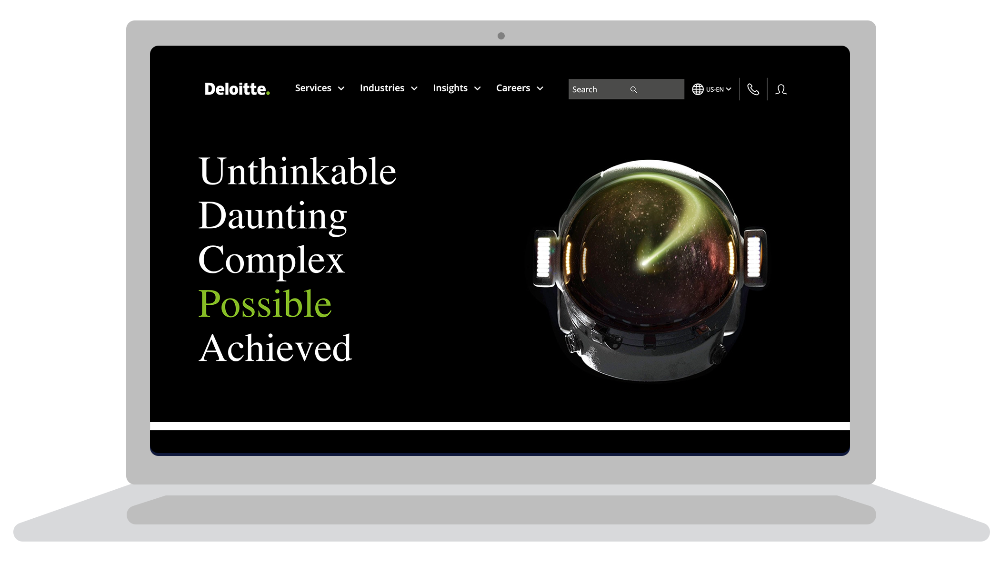
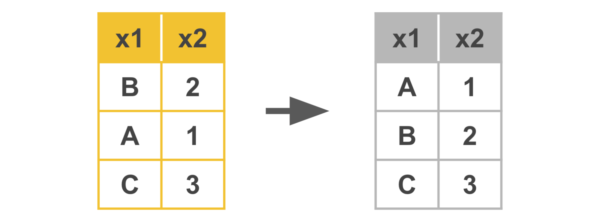
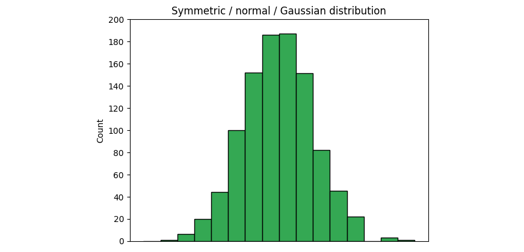

# Vaka analizi: Deloitte

Keşifsel veri analizinin (EDA) altı uygulamasının her biri için tanımları öğrendiniz - keşfetme, yapılandırma, temizleme, birleştirme, doğrulama ve sunma. Daha sonra, bu uygulamaların veri kariyeri alanına nasıl uygulandığını keşfedeceksiniz. Aşağıdaki vaka çalışmasında, Deloitte'un veri ekibinin üyeleri, müşterilerinin metrik ve gösterge paneli ihtiyaçlarını karşılamak için EDA'nın altı uygulamasını kullanmıştır. Deloitte ekibinin deneyimleri hakkında daha fazla bilgi edindikten sonra, bu uygulamaların ne kadar yararlı ve güçlendirici olabileceğine dair somut bir örneğe sahip olacaksınız. 


## Deloitte'u tanıyın

[Deloitte](https://www2.deloitte.com/us/en.html) bir denetim, danışmanlık, vergi ve danışmanlık hizmetidir. Şirketin dünya çapında 100.000'den fazla çalışanı ve iş ortağı var ve dünyanın en büyük şirketlerinin birçoğuyla çalışıyorlar. Hizmetleri vergi ve muhasebe çözümlerinden yapay zeka ve siber güvenlik risk programlarına kadar uzanmaktadır. 



Çok uluslu şirketin işletmeden işletmeye (B2B) modeli, müşterileriyle onların bireysel ihtiyaçlarına göre bir dizi stratejik ve finansal cephede çalışmaya odaklanmalarını sağlar. [Deloitte, müşteri projeleri için denetim, danışmanlık, mali müşavirlik, risk danışmanlığı, vergi, veri analizi ve düzenleme gibi](https://youtu.be/8Gg5BsFexOU?list=PLl4by_vVwv0zjE2FRD7BMwI2lpaMCAgHh) bir dizi hizmet sunmaktadır. Deloitte, 2008 yılından bu yana profesyonel iş hizmetlerinde mükemmellik standardı olmayı vizyon haline getirmiştir. Bu odaklanma sayesinde Deloitte, müşterileri için gerçek zamanlı ölçümlerin kullanılması da dahil olmak üzere teknolojik gelişmelerin ön saflarında yer almıştır. 

Deloitte, birçok başarı öyküsünden yalnızca birinde, kısa süre önce milyar dolarlık bulut tabanlı analiz ve yazılım şirketinin pazarlama potansiyellerinin takibini ve organizasyonunu ve performans verilerinin stratejik analizini kolaylaştırmasına yardımcı oldu. Bu okumada, Deloitte'un bugün hala kullandıkları kapsamlı bir çözümü önermek ve uygulamak amacıyla müşterinin verilerini analiz etmek için EDA'yı nasıl kullandığını göreceksiniz.    

## Zorluklar 


Deloitte'un en önemli bulut tabanlı yazılım çözümü müşterilerinden biri, pazarlama ve performans verileriyle ilgili çeşitli zorluklarla karşılaşıyordu. Hepsi için Deloitte'tan yardım istediler. İşte müşterinin Deloitte'a sunduğu özel zorluklar:  

-   Pazarlama potansiyel müşterilerinin takibinde zorluk 
    
-   Pazarlama kampanyalarının performansını anında takip etmekte zorlananlar
    
-   Stratejik şirket ölçümlerini gösteren kişiselleştirilmiş veri panolarının eksikliği
    

### **Pazarlama potansiyellerinin takibi**

Deloitte'un müşterisi, dünyanın dört bir yanındaki işletmelere bir dizi bulut tabanlı analiz hizmeti ve yazılım ürünü sunuyor ve bu da aylık olarak aldıkları binlerce soru ve potansiyel satış potansiyelinin her birini takip etmeyi muazzam bir görev haline getiriyor. Sonuç olarak, Deloitte'un müşterisi bu potansiyel müşterileri daha iyi takip etmelerine ve harekete geçmelerine yardımcı olacak bir çözüm arıyordu.   

### **Pazarlama kampanyası performansının izlenmesi**

Çok uluslu 1 milyar dolarlık bir şirketin pazarlama kampanyası performansının analizi için sadece dört veri analistine güvenmek, hızla sürdürülemez hale geliyordu. Deloitte yardım için devreye girmeden önce müşterinin performans takip sistemi, manuel olarak güncellenen ve bir elektronik tablo sekmesinde tutulan bir dizi veri tablosundan oluşuyordu. Her bölge kendi performans verilerini tutuyor, bu da tutarlılık sorunları yaratıyor ve şirket çapında bir performans resmi elde etmek için verileri derlemek ve birleştirmek zorunda kalan analistler için saatlerce boşa enerji harcanmasına neden oluyordu.  

### **Veri panolarını kişiselleştirme**

Her yönetim seviyesi için farklı ihtiyaçlar ve dünya genelinde farklı pazarlama bölgeleri nedeniyle, müşterinin şirket genelinde çalışanlarının ihtiyaçlarına özel verileri kolayca ayrıştırabilmesi ve gruplandırabilmesi gerekiyordu. Birkaç farklı departman ve bölgede birden fazla elektronik tablo üzerinden çalıştıkları için müşteri, verileri ihtiyaçlarına göre kolayca filtreleyemediğini ve bu nedenle performansı artırmak için stratejiyi yeterince değiştiremediğini fark etti. 

## Yaklaşım

Deloitte yeni müşterisiyle çalışmaya başladığında, müşterisinin önerdiği her bir ihtiyacı karşılayacak bir yaklaşım tasarladı. Bu yaklaşımı ayrıntılı olarak incelemek için aşağıdaki PACE girişlerine bakın.


## Plan

Başlangıç olarak Deloitte'un müşteri paydaşlarıyla bir araya gelmesi ve yukarıda belirtilen üç alana göre geleceğe yönelik vizyonlarını geliştirmelerine yardımcı olması gerekiyordu: **Pazarlama potansiyelleri, pazarlama kampanyası performansının ölçülmesi** ve **veri panolarının kişiselleştirilmesi**. 

Süreçlerini, hedeflerini ve temel sonuçlarını (OKR'ler) ve müşteri ve potansiyel müşteri verilerine nasıl yaklaştığını ve bunları nasıl kullandığını öğrenerek müşterinin işini anlamaları gerekiyordu. 

Projenin kilit kilometre taşları erkenden belirlenmiş ve edinilen yeni bilgilere göre ayarlanmıştır. Bu kilometre taşları şunlardı: 

-   Veri mimarisi ve gösterge tablolarının gelecek vizyonu konusunda müşteri ile uyum
    
-   Yeni veri mimarisinin oluşturulması
    
-   Tanımlayıcı ve teşhis araçlarının piyasaya sürülmesi
    
-   Tahmine dayalı modellerin başlatılması
    
-   Küresel satış ekibinin yeni takımlar konusunda eğitilmesi
    

Deloitte, proje planının, müşterinin şirket genelindeki performans verileri üzerinde EDA'nın keşfedilmesi, yapılandırılması ve temizlenmesi uygulamalarıyla başlayacağını belirledi.  

Deloitte, kişiselleştirilmiş gösterge tabloları tamamlandığında müşterinin hangi OKR'lere kolayca erişmek istediğini hızla öğrendi ve bu sonuca ulaşmak için planlar hazırladı. Bu OKR'ler aşağıdaki sorular şeklinde geldi: 

-   Belirli bir pazarlama kampanyasından ne kadar gelir elde edildi? 
    
-   Yeni müşteri hangi endüstriye, bölgeye, sektöre ve şirket büyüklüğüne dahil oldu? 
    
-   İlk temas noktasından sonra satışın sonuçlandırılması ne kadar sürdü? 
    
-   Farklı kampanya türlerinin başarı oranı neydi (örneğin, yüz yüze etkinliklere karşı çevrimiçi web seminerleri)? 
    
-   Kazanılan müşteri başına ortalama pazarlama maliyeti neydi?
    

## Analiz

Müşterinin verilerinin ilk analizinin çerçevesinin bir parçası olarak, müşterinin kullanımı kolay Tableau gösterge paneli araçları gibi varlıklar da dahil olmak üzere Deloitte'un ürün hizmetleri tekliflerine aşina olmadığı anlaşıldı. Bu nedenle, müşterinin mümkün olana ilişkin varsayımları ve talepleri Deloitte'un gerçek kapasitesinin çok altında kalmıştır. Bu, müşterinin projeden beklentilerini sadece karşılamakla kalmayıp, aslında aşmak için bir fırsattı. 

Analizin ilk zorlukları, verilerin nereden geldiğini ve her bir veri değişkeninin ne anlama geldiğini anlamaktı. Müşteri, verilerinde standart olmayan adlandırma kuralları ve tanımlar kullanıyordu, bu nedenle Deloitte'un müşterinin verilerini tam olarak anlamak ve bunları kullanmalarına nasıl yardımcı olacağını planlamak için dillerini öğrenmek üzere keşif uygulamalarını kullanması gerekiyordu. 

Deloitte, müşterinin o zamanki performans izleme yaklaşımının en iyi ihtimalle hantal ve aşırı geniş olduğunu tespit etti. Topladıkları performans verileri, şirket çapındaki stratejik eylemlerin değerini belirlemek için genel ortalamaların kullanılmasından oluşuyordu. Bölge başına belirli performans verileri olmadan, şirketin bölgesel performansı izlemenin basit bir yolu yoktu.  

-   Müşterinin o dönemdeki aşırı kapsamlı veri takibine bir örnek olarak, pazarlama kampanyası başına elde ettikleri ortalama geliri elde etmek için kullandıkları formül buydu: 
    
$$
\frac{\textit{average customer contract value}}{\textit{average cost of marketing campaigns}} = \textit{average revenue gained per campaign}
$$

Deloitte, müşterinin dahili pazarlama ve satış ekiplerinin coğrafi bölgelere, sektörlere ve müşteri hesabı büyüklüğüne göre organize edildiğini öğrendi. Bölgesel liderler pazarlama araştırmalarını ve kampanyalarını kendi başlarına yürütme yetkisine ve özerkliğine sahipti, ancak küresel ekipten rehberlik ve zaman zaman talimat alıyorlardı. Deloitte analistleri, müşterinin verilerinin EDA'sının bir parçası olarak verileri şirket genelinde tutarlı bir şekilde yapılandırmaya başladı.

Müşteri yaşam döngüsü açısından Deloitte, müşterinin pazarlama potansiyel müşterilerinin pazarlama kampanyaları oluşturacağını ve ardından bölgelerindeki satış ortaklarını bilgilendireceğini öğrendi. Saha satış temsilcileri, kampanyalardan elde edilen tüm potansiyel müşterileri takip edecek ve ek müşteriler bulmak için mevcut kampanyaların dışında da ağ kuracaklardı. EDA'nın bu keşif kısmı, Deloitte ekibini müşterinin ihtiyaçlarını karşılayabilecek daha spesifik ve makul çözümler konusunda bilgilendirdi. 

Deloitte ekibi, müşterinin Salesforce ve pazarlama kampanyalarındaki mevcut tüm verileri gözden geçirmek için elektronik tablolarda EDA'nın keşif ve yapılandırma uygulamalarını kullandı. Müşterilerinin satış sisteminde var olan her veri değişkenini belirlemeye ve tanımlamaya başladılar. Veri değişkenlerinin envanteri yapılandırıldıktan, temizlendikten ve doğrulandıktan sonra Deloitte ekibi bu bilgilerden ne tür içgörüler elde edebilecekleri konusunda beyin fırtınası yaptı. 

İncelemenin ardından Deloitte, topladığı bilgileri müşteriyle paylaşmak için EDA'nın sunum uygulamasından yararlandı. Müşterinin kendi işini nasıl gördüğünü ve verilere göre onlar için hangi faktörlerin önemli olduğunu daha iyi anlamak için dinlediler ve sorular sordular.  

Yapılandırma Deloitte, müşterinin sistemlerine ilişkin analizlerinden ve müşterinin performans verileri üzerinde yaptıkları EDA'nın keşif, yapılandırma ve temizleme uygulamalarından, müşterinin analitik süreçlerinin

gerektiğini öğrendi; çok daha fazla ayrıntı sağlayan ve darboğazları, kârsız kampanyaları ve verimsiz müşteri segmentlerini belirlemelerine ve ele almalarına olanak tanıyan bir süreç

Müşterinin onayıyla Deloitte, analizi daha akıcı hale getirmek için müşterinin veri iç altyapısını tamamen yeniden inşa etti.  

Altyapı revizyonunun yanı sıra, müşteri için en pratik çözüm, belirli paydaşlar için özelleştirilmiş ve dinamik gösterge tabloları oluşturmaktı. 

-   Deloitte ekibi, ihtiyaçlarını ve OKR'lerini anlamak için her bir müşteri paydaş grubuyla birlikte çalıştı. 
    
-   Daha sonra, her bir değişkenin neyi temsil ettiğini ve nasıl kullanılıp kullanılmaması gerektiğini tanımlamak için bir veri sözlüğü gibi destekleyici teminat kaynakları oluşturarak müşteriye özel çözümler geliştirilmesine yardımcı oldular. 
    

Deloitte, müşterilerinin verilerinden topladıkları bilgileri kullanarak OKR'leri üzerinde tahmine dayalı analiz yapan otomasyonlar ve araçlar geliştirdi. Bu da müşterinin gelecek için uygulanabilir ancak agresif hedefler belirlemesini sağladı.

## Execute

Deloitte'un müşterisinin veri altyapısını elden geçirmesi, küresel veri toplamaya yönelik modern ve katmanlı bir yaklaşımın ortaya çıkmasını sağladı. Daha önce performans ölçümlerini formüle etmek için bölgesel olarak toplanmış ve tutarsız bir şekilde yapılandırılmış elektronik tablolara güvenmek zorunda kalan müşteri, artık küresel, şirket genelindeki performanstan bölgesel bir satış ekibi üyesinin belirli ürünler ve müşteri alt kümeleri üzerindeki performansına kadar her şeyi kolayca ölçebilmektedir.

Kişiselleştirilmiş gösterge tablolarının uygulanmasından sonra, Kıdemli Başkan Yardımcıları OKR'lerin durumunu ve performansını sorumlu oldukları tüm departmanlara ve bölgelere göre filtreleyebilmektedir. Ayrıca, bölgesel potansiyel müşteriler, pazarlama potansiyel müşterileri ve hatta yerel satış potansiyel müşterileri, ilgili alanlarına göre filtrelenmiş verileri görüntüleyebildi. 

Uygulamanın bir parçası olarak Deloitte ekip üyeleri, kişiselleştirilmiş gösterge tablolarının nasıl kullanılacağından yeni veri altyapısının bakımının nasıl yapılacağına kadar her konuda müşterilerinin ihtiyaçlarına göre eğitim oturumları oluşturdu.  

Deloitte tarafından tasarlanan gösterge tabloları ve veri altyapısı, müşterinin küresel ekibindeki çok sayıda paydaş için anında değerli varlıklar haline geldi. 

**Not**: Deloitte, müşteriyle yaptığı çalışmalarda yukarıda listelenen PACE iş akışını takip etmemiştir; bunun yerine, çalışmalarının ayrıntılarını bu vaka çalışmasında belgelendirirken, Deloitte'un müşteri için yaptığı çalışmalar, uygulamanın çok yönlülüğünü göstermek için PACE iş akışına göre düzenlenmiştir. 

## Sonuçların özetlenmesi

Deloitte yeni müşterisiyle çalışmaya başladığında, pazarlama ve satış ekipleri arasındaki standardizasyon eksikliği nedeniyle şirketin mevcut verilerinin doğruluğuna güvenmekte tereddüt ediyordu. Bu tutarlılık eksikliği, belirli bir satışı belirli bir kampanyayla ilişkilendirmeyi zorlaştırdı. Müşterinin satış ve pazarlama süreçlerini ve verilerinin EDA'sını birkaç hafta inceledikten sonra Deloitte, veri altyapısını tüm satışları geçerli pazarlama kampanyalarına doğrudan bağlayacak şekilde yeniden oluşturdu. Bu satışları, kolayca sıralanabilen bir dizi veri tablosunda hizalanmış birincil anahtarlar kullanarak pazarlama kampanyalarına bağladılar. Bu, Deloitte analistlerine verilerle nelerin mümkün olabileceği konusunda bir fikir verdi ve müşterinin başlangıçta mümkün olduğunu düşündüğü şeyleri aşan nihai ürünler oluşturmalarına yol açtı.

Altyapı elden geçirildikten sonra, Deloitte'un EDA performansı, müşterinin mevcut müşteri ilişkilerine zarar verecek şekilde yeni müşteriler kazanmaya çok fazla odaklandığını ortaya çıkardı. OKR'lere odaklanılması nedeniyle yeni müşterilere yapılan satışlar artarken, mevcut müşterilere yapılan satışlar düştü. Bu sonuç daha önce müşteri tarafından bilinmiyordu. Sonuç olarak müşteri, stratejisini hem satış bölgesi hem de ürün bazında değiştirebildi. Deloitte'un oluşturduğu dinamik gösterge tabloları, müşterinin performansı ölçme ve izlemenin yanı sıra strateji belirlemede de en etkili aracı haline geldi.  

## Sonuç

Deloitte, hem müşterinin iş uygulamalarını değerlendirirken hem de verilerinin EDA'sını yaparken müşterinin iş sorununa odaklandığı için, daha önce yapılandırılmamış verilerde saklı olan gerçekleri ortaya çıkarabilmiştir. Deloitte, müşterinin gelecekte bu gerçekleri kendi başına keşfedebilmesi için şirketteki herhangi bir satış bölgesine veya ürüne kadar filtreleyecek şekilde tasarlanmış etkileşimli, dinamik veri panoları oluşturdu. Bu çözümlerin en büyük faydası, müşterinin liderlik ve pazarlama liderlerinin çok daha çevik bir ekip haline gelmesi oldu. Gelirlerini doğrudan artıran etkili iş kararlarını daha iyi alabildiler. Veri altyapısının elden geçirilmesi ve veri gösterge paneli çözümleri, analistlerinin iş-yaşam dengesinin iyileştirilmesine de yardımcı oldu. Tüm bu sonuçlar sadece müşteri için değil Deloitte için de kayda değerdi çünkü müşteri firma için kilit bir ortak ve müşteriydi. Verilere odaklanmaları sayesinde Deloitte, müşterinin beklentilerini aşan bir çözüm sunabildi ve bunun karşılığında dünyanın dört bir yanındaki müşterilerine daha iyi hizmet vermelerine yardımcı oldu.

# Referans kılavuzu: EDA süreci

## EDA'nın altı uygulaması yinelemeli ve sıralı değildir

Keşifsel veri analizi (EDA) bir kek tarifi gibi değildir. Bu _**değil**_ adım adım takip ettiğiniz bir süreç. Bunun yerine, EDA'nın altı uygulaması yinelemeli ve sıralı değildir. 

-   **Yinelemeli**: Bir sürecin tekrarlanması ile ilgili veya tekrarlanmasını içeren
    
-   **Sıralamasız**: Bir düzen veya sıraya göre düzenlenmemiş veya bu sırayı takip etmeyen. 
    

Veri kümelerinin değişken doğası nedeniyle, bu verileri keşfetme yaklaşımı her seferinde farklı olacaktır. Bu, altı uygulamadan hangilerini kullanacağınızı, bunları kaç kez uygulayacağınızı ve süreçte ne zaman uygulamanız gerektiğini belirlemek için EDA süreci boyunca mantığınızı ve deneyiminizi kullanmanız gerekeceği anlamına gelir. 

## **Görsel örnek**

Norveç'teki iğne yapraklı bir ormandaki ağaçlar hakkında sadece 200 satır ve beş sütundan oluşan bir veri kümesine atandığınızı düşünün. Tam analizinizi tamamlamak için 1.000'den fazla satıra ve en az iki sütuna daha ihtiyacınız olacağını biliyorsunuz. Bundan daha fazla ayrıntı olmasa bile, tüm EDA süreciniz buna benzer bir şeye benzeyebilir:  


1.  **Keşfetme**: Veri kümesinin genel şeklini, boyutunu ve içeriğini kontrol edersiniz. Verilerin yetersiz olduğunu görüyorsunuz. 
    
2.  **Katılıyorum**: Daha fazla veri eklersiniz.
    
3.  **Onaylama**: Yeni verilerde hata veya yazım yanlışı olup olmadığını hızlıca kontrol edersiniz. 
    
4.  **Yapılandırma**: Eğilimleri anlamak için verileri farklı zaman dilimlerinde ve segmentlerde yapılandırırsınız. 
    
5.  **Onaylama:** Yapılandırmada yaptığınız yeni sütunların doğru tasarlandığından emin olmak için hızlı bir kontrol daha yaparsınız. 
    
6.  **Temizleme**: Aykırı değerleri, eksik verileri ve dönüştürme veya dönüştürme ihtiyaçlarını kontrol edersiniz. 
    
7.  **Onaylama**: Temizledikten sonra, yaptığınız değişikliklerin doğru ve hatasız olduğunu iki kez kontrol edersiniz. 
    
8.  **Sunma**: Veri setinizi bir meslektaşınızla paylaşırsınız.

Verilerde yaptığınız değişikliklerin farkında olmadan hatalara yol açmadığından emin olmak için "doğrulama" uygulamasını yinelemeli olarak veya birden çok kez gerçekleştirdiğinize dikkat edin. Ayrıca, daha fazla veriye olan ihtiyacı önceden fark ettiğiniz için, "keşfetme" uygulamasının hemen ardından "birleştirme" uygulaması gerçekleştirildi. 

Temizlenmiş veri setinizi bir meslektaşınıza sunduktan sonra, daha fazla araştırma ve/veya temizlik için notlar veya fikirler alma şansınız yüksektir. Bu nedenle, daha da fazla yineleme göreceksiniz. 

**Profesyonel ipucu**: Veri bilimciler, bir veri kümesini "temiz" ve modelleme ya da makine öğrenimi algoritmaları için hazır ilan etmeden önce bu veri kümesi üzerinde birçok kez EDA uygulamalarını gerçekleştirmeyi beklemektedir. 

## Etik makine öğreniminde EDA'nın önemi

Algoritmalar ve makine ağları bireyler, şirketler ve hatta hükümetler adına giderek daha fazla karar almaya başladıkça, etik ve düzenleme tartışmaları da giderek daha önemli hale gelmektedir. [Institute for Ethical AI & Machine Learning](https://ethical.institute/principles.html)'e göre, makine öğrenimi sistemlerini sorumlu bir şekilde geliştirmek için sekiz ilke vardır. 

**EDA sürecinin temel ilkeleri**

Aşağıdaki iki ilke EDA sürecinin doğal bir parçasıdır:

-   **İnsan büyütme**: Bu ilke, gözetim için yapay zeka veya makine öğrenimi algoritma sistemlerine insanların eklenmesini sağlar. Veri bilimcileri tarafından gerçekleştirilen kapsamlı EDA, bir algoritmaya beslenen önyargı, dengesizlik ve yanlışlıkları sınırlamanın belki de en iyi yollarından biridir. 
    
-   **Yanlılık değerlendirmesi**: İnsan müdahalesi olmadan, makine öğrenimi modellerine önyargı çok kolay bir şekilde enjekte edilebilir ve yeniden üretilebilir. Metodik EDA süreçlerinin gerçekleştirilmesi, veri bilimcilerin verilerdeki önyargıların ve dengesizliklerin farkında olmalarını ve bunlara göre hareket etmelerini sağlayacaktır. 

**Profesyonel ipucu**: Veri kariyeri alanında etik standartlara uyulmasını sağlamanın önemi yadsınamaz. Veri uzmanlarının, EDA çalışmalarına sürekli olarak etik bir zihniyet uygulayarak önyargı ve ayrımcılığı fark etme kapasitelerini sürekli olarak geliştirmeleri gerekir.  

Makine öğreniminin ötesinde, EDA neredeyse tüm önemli veri tabanlı kararlara uygulanabilir. İleride, EDA'nın birçok uygulaması ve yinelemeli ve sıralı olmayan bir yaklaşımın gerekliliği hakkında bilgi edineceksiniz.

# Referans kılavuzu: Python ile veri kümelerini içe aktarma

Bir veri uzmanı olarak kariyerinizde, farklı dosya türlerine sahip veya çeşitli veritabanlarında depolanan çeşitli veri kümeleriyle karşılaşacaksınız. Daha önce öğrendiğiniz gibi, bu veri türlerinin ne olduğunu ve Python kullanarak verileri nasıl içe aktaracağınızı bilmeniz çok önemlidir. Aşağıda hem veritabanlarını bağlantılar aracılığıyla hem de veri dosyalarını Python'a aktarma örneklerini bulacaksınız.   

Python kodlaması için Coursera platformunu kullanacak olsanız da, CSV dosyalarını Coursera dışında indirmek ve açmak istiyorsanız bu dosyalarla nasıl çalışacağınızı ve içe aktaracağınızı bilmeniz gerekecektir.

## CSV dosyasından bir veri kümesi nasıl içe aktarılır

Bu örnek için bilgisayarınızda bir CSV dosyası bulun. Eğer bir tane yoksa, bu kursun Kurs kaynaklarına bağlantı[](https://www.coursera.org/learn/go-beyond-the-numbers-translate-data-into-insight/resources/9mSWv "Kaynaklar") bölümünden unicorn (1 milyar USD değerine ulaşan) şirketlerin bir veri kümesini kullanabilirsiniz.

Bir CSV dosyasını Python'a aktarmanın birkaç farklı yolu vardır, ancak biz sadece daha yaygın yollardan bazılarını inceleyeceğiz. Bir with deyimi ve open() fonksiyonu kullanarak başlayın. CSV dosyasının **dosya adını (veya dosya yolunu)** open() fonksiyonuna, fonksiyonun mode parametresi için bir argümanla birlikte iletin.

open("dosya yolu/dosya adı", mode=) ile

sözdizimi şöyledir:

**Not**: Aşağıdaki kod bloğu etkileşimli değildir.

```python
with open('file_path/file_name', mode=)
```

Mod, Python kütüphanesine dosya ile ne yapması gerektiğini söyler. **Modu** tanımlarken aşağıdaki seçeneklerden birini kullanırsınız: 

-   'r' - oku
    
-   'w' - yaz
    
-   'a' - ekle
    
-   '+' - yeni dosya oluştur
    

Tipik olarak, Python'un CSV dosyasını açmasını ve okumasını istediğiniz için with open() argüman alanının içindeki modu 'r' olarak tanımlayacaksınız. 

Daha sonra, sonucu bir değişken adına atayan as file sonuna ekleyeceğiz. Bu durumda, buna data adını vereceğiz. 

**Not:** Aşağıdaki kod bloğu etkileşimli değildir.

```python
with open('example_filepath/file', mode='r') as file:

    data = file.read()
```

### **Pandas kullanarak bir CSV dosyasını içe aktarma**

Bir dosyayı okumak için Python'un standart kütüphanesini kullanmak yerine, CSV dosyasını bir veri çerçevesine aktarmak için pandas'ı kullanabilirsiniz. İlk olarak, elbette, pandas kütüphanesini Python not defterinize aktarmak isteyeceksiniz.

```python
import pandas as pd
```

Daha sonra, verileri bir veri çerçevesine yüklemek için read_csv() fonksiyonu kullanacaksınız. Dosya yolu daha sonra argüman alanına gider.

```python
df = pd.read_csv("filepath/filename")
```

```python
import pandas as pd

df = pd.read_csv('example_filepath/file')
```

_**Not:**_ _Aynı sözdizimini internette depolanan bir CSV dosyasını içe aktarmak için de kullanabilirsiniz. Dosya adı yerine, basitçe url'yi kopyalayıp yapıştırırsınız._ 

## Bir veritabanına bağlanarak veriler nasıl içe aktarılır

Python ile bağlanabileceğiniz BigQuery, MySQL, SQLite ve Oracle gibi bir dizi veritabanı çözümü vardır. Veritabanları, şirketler ve kuruluşlar için büyük miktarda veriyi depolamanın uygun bir yoludur. 

Veri kümesi yeterince küçükse, bilgisayarınıza indirilebilir ve yerel olarak değiştirilebilir. Ancak, veri tabanlarında tutulan veri kümeleri genellikle kişisel bir bilgisayarda tamamına erişilemeyecek kadar büyüktür. Bu durumda, çoğu ilgilenilen belirli tabloları elde etmek için veritabanını SQL ile sorgulamayı içeren bir dizi farklı seçeneğiniz vardır. Başka bir deyişle, tüm veri kümesinden seçilen parçaları (genellikle belirli satırlar ve/veya sütunlar) ayıklarsınız. Sorgulamanın yapılma şekli sistemlere, platformlara ve arayüzlere göre değişebilir. Bu değişkenlik nedeniyle, bu başvuru kılavuzu veritabanlarını sorgulamak için yalnızca birkaç farklı yol sunacaktır. Özellikle, analizi kolaylaştırmak için çok çeşitli araçlar ve hizmetler sağlayan Google'ın veri ambarı BigQuery'yi keşfedecek.

### **BigQuery'den veri indirme**

#### **Adım 1: BigQuery'ye erişin**

BigQuery, depolama için veri yüklemenize olanak tanır ve ayrıca keşfedebileceğiniz halka açık bir dizi veri kümesine sahiptir. Ücretsiz bir Google hesabı gerektiren [BigQuery Sandbox](https://cloud.google.com/bigquery/docs/sandbox) adresini kullanarak bu herkese açık veri kümelerine ücretsiz olarak erişebilirsiniz. Sandbox size her ay ücretsiz olarak 10 GB aktif depolama alanı ve 1 TB işlenmiş sorgu verisi sağlar.

#### **Adım 2: Bir sorgu gerçekleştirin**

Hesabınızın kimliğini doğruladıktan ve birinci adımda bağlantılı talimatlarda belirtildiği gibi yeni bir proje oluşturduktan sonra, bir veritabanını sorgulamaya hazırsınız demektir. İlk kez oturum açıyorsanız, hızlı başlangıç kılavuzuna bir bağlantıyla birlikte "BigQueryUI'de yeni misiniz?" diye soran bir pencereyle karşılaşabileceğinizi unutmayın.


Hızlı başlangıç kılavuzu, burada size sunulanlarla aynı adımlar boyunca size rehberlik edecektir.

"SQL Çalışma Alanınıza Hoş Geldiniz!" sayfasından "Yeni bir sorgu oluştur" düğmesine tıklayın.


Sayfanın sol tarafındaki Explorer'da bulunan arama çubuğuna tıklayın. Örneğin, "ağaçlar" için arama yapabilirsiniz. Başlangıçta, bu sıfır sonuç döndürecektir. Ancak, "Tüm projeleri ara" seçeneğine tıkladığınızda bigquery-public-data projesinden uygulanabilir veri kümeleri ve bu veri kümelerinden önceden hazırlanmış tablolar döndürülecektir. 

san_francisco veri kümesindeki street_trees tablosuna tıklayın. Bu tablonun meta verileri sağdaki bir panelde görünecektir. Ardından, meta veri panelinin üst kısmındaki menüden "Sorgu "ya tıklayın. Sorgulamayı yeni bir sekmede veya geçerli pencerenin bölünmüş bir bölmesinde yapmayı tercih edebilirsiniz.


Şimdi, SQL kullanarak tabloyu sorgulayabilirsiniz. Örneğin, aşağıdaki ekran görüntüsündeki sorgu, tree_id, plant_type, species, plant_date ve dbh - "derinlik, yükseklik" olarak tanımlanan sütunlarıyla 5.000 satır seçer.


Sorgunuzdan memnun kaldığınızda, SQL sorgu panelinin üst kısmındaki "Çalıştır" düğmesine tıklayın. Sonuçlar aşağıda görüntülenecektir ve ortaya çıkan tabloyu farklı konum ve biçimlerde kaydetmenize olanak tanıyan "Sonuçları kaydet" düğmesi bulunmaktadır. Buradan, verileri not defterinize okuyabilirsiniz.

### **BigQuery içinde not defterlerini kullanma**

BigQuery'deki verilere erişmenin bir başka yolu da BigQuery platformunun kendi içindeki araçları kullanmaktır. Bu iş akışı, veri uzmanlarının bulutta depolanan çok büyük veri kümeleriyle çalışırken kullanacakları iş akışına daha çok benzemektedir. Esasen, BigQuery üzerinde bir sanal makine kurarsınız. Sanal makine, tıpkı diğer bilgisayarlar gibi kendi CPU'su, belleği, yazılımı vb. olan bir bilgisayardır, ancak kendi özel donanımı yoktur; çoğunlukla bir sunucuda bir bölüm olarak bulunurlar. BigQuery platformundaki sanal makinede bir Jupyter not defterinde çalışabilir, buradan doğrudan verileri sorgulayabilir ve çekebilirsiniz. 

Bu işlem, bir ödeme yöntemi ayarlamanızı gerektirir. Bununla birlikte, yeni kullanıcılar 300 $ kredi alır ve ML örneğinin dakikası yalnızca birkaç senttir, bu nedenle herhangi bir ücret ödemeden önce yaklaşık 2.000 saat ücretsiz kullanım elde edersiniz. Bunu kurmak için pek çok harika eğitim var. Örneğin, "Google Cloud AI'da Jupyter not defteri nasıl kullanılır?" diye aratırsanız konuyla ilgili çok sayıda faydalı video ve blog bulabilirsiniz.

### **Not defterlerini BigQuery dışında kullanma**

BigQuery platformunda olmayan not defterlerinden BigQuery'deki verileri sorgulamak da mümkündür. Ancak bu sürecin ayrıntıları, dizüstü bilgisayarı barındıran platform, işletim ortamı ve erişilen verilerin belirli konumu da dahil olmak üzere bir dizi faktöre bağlıdır. Bu nedenle, bu yöntem üzerinde derinlemesine durmayacağız. Yine de bunu kendi başınıza keşfetmekten çekinmeyin. Sadece bir arama uzaklığında birçok yararlı çevrimiçi kaynak bulacaksınız.

## Temel çıkarımlar

Çok sayıda farklı veri türü vardır, bu da verileri içe aktarmanın çok sayıda yolu olduğu anlamına gelir. İster bir veri dosyasından ister bir veritabanından olsun, verileri içe aktarmak için çeşitli yöntemler öğrenmek, bir veri uzmanı olarak kariyeriniz için sağlam bir temel oluşturacaktır.

## Daha fazla bilgi için kaynaklar

Python'a veri aktarma hakkında daha fazla bilgi edinmek için aşağıdaki bağlantılara başvurabilirsiniz:

-   [Python'da veri içe aktarmaya genel bir bakış](https://towardsdatascience.com/an-overview-of-importing-data-in-python-ac6aa46e0889)
    
-   [Bir Colab'dan BigQuery'ye nasıl bağlanılır](https://colab.sandbox.google.com/notebooks/bigquery.ipynb#scrollTo=fkhbyGaXKs_6)

# Referans kılavuzu: Bir veri kümesinin keşfi için Pandas yöntemleri

## EDA için Python referans kılavuzu: Keşfetme

Bir veri kümesiyle ilk kez karşılaştığınızda bu veri kümesi hakkında bilgi edinmenize yardımcı olması için aşağıdaki pandas yöntemlerini ve niteliklerini kullanın.

**DataFrame.head()**

-   head() yöntemi, veri çerçevesinin ilk _n_ satırını görüntüler. 
    
-   Bağımsız değişken alanına, Python not defterinde görüntülenmesini istediğiniz satır sayısını girin. Varsayılan değer 5 satırdır. 
    
-   Çalıştırıldığında, head() yöntemi aşağıdaki gibi bir sonuç döndürür: 
    
```python
df.head(10)
```

| index |    date    | number of strikes | center point geom |
|-------|------------|-------------------|-------------------|
|   0   | 2018-01-03 |        194        |   POINT(-75 27)   |
|   1   | 2018-01-03 |        41         |  POINT(-78.4 29)  |
|   2   | 2018-01-03 |        33         |  POINT(-73.9 27)  |
|   3   | 2018-01-03 |        38         |  POINT(-73.8 27)  |
|   4   | 2018-01-03 |        92         |   POINT(-79 28)   |
|   5   | 2018-01-03 |        119        |   POINT(-78 28)   |
|   6   | 2018-01-03 |        35         |  POINT(-79.3 28)  |
|   7   | 2018-01-03 |        60         |  POINT(-79.1 28)  |
|   8   | 2018-01-03 |        41         |  POINT(-78.7 28)  |
|   9   | 2018-01-03 |        119        |  POINT(-78.6 28)  |

**Not**: Bir Python not defterinde, head() fonksiyonun sonuçları görünür kılavuz çizgileri olan bir tablo içermeyecektir. 

### **DataFrame.info(X)**

-   info() yöntemi, aralık dizini, dtipleri, sütun başlıkları ve bellek kullanımı dahil olmak üzere veri çerçevesinin bir özetini görüntüler.
    
-   Bağımsız değişken alanının boş bırakılması tam bir özet döndürecektir. Bir seçenek olarak, bağımsız değişken alanına show_counts=True yazabilirsiniz; bu, her sütun için boş olmayan değerlerin sayısını döndürecektir. 
    
-   Çalıştırıldıktan sonra info() yöntemi aşağıdaki gibi bir sonuç döndürür:

**Not:** Aşağıdaki kod bloğu etkileşimli değildir.

```python
df.info()

# <class ‘pandas.core.frame.DataFrame’>
# RangeIndex:3401012 entries, 0 to 3401011
# Data columns (total 3 columns):
# #     Column                   Dtype
# --    ----                     ----- 
# 0     date                     object
# 1     number_of_strikes        int64
# 2     center_point_geom        object
# Dtypes: int64(1), object(2)
# Memory usage 77.8+ MB
```

-   describe() yöntemi, toplam sayı, ortalama, minimum, maksimum, dağılım ve dağılım dahil olmak üzere tüm veri kümesinin tanımlayıcı istatistiklerini döndürür. 
    
-   Bağımsız değişken alanının boş bırakılması, varsayılan olarak veri çerçevesinin istatistiklerinin bir özetini döndürür. Bir seçenek olarak, parantez içine ne girdiğinize bağlı olarak sonuçları belirli veri türleriyle sınırlayacak "include=[X]" ve "exclude=[X]" kullanabilirsiniz. 
    
-   Çalıştırıldığında, describe() yöntemi aşağıdaki gibi bir sonuç döndürür:
    
```python
df_joined.describe()
```

|  N/A  |  longitude  | latitude  | number_of_strikes_x | number_of_strikes_y |
|-------|-------------|-----------|----------------------|----------------------|
| count |  717530.00  | 717530.00 |      717530.00       |     323700.00000     |
| mean  | -90.875445 | 33.328572 |      21.637081       |      25.410587       |
|  std  |  13.648429  | 7.938831  |       48.02952       |      57.421824       |
|  min  | -133.9000  | 16.600000 |       1.00000        |       1.000000       |
|  25%  | -102.80000 | 26.900000 |       3.00000        |       3.000000       |
|  50%  | -90.300000 | 33.200000 |       6.00000        |       8.000000       |
|  75%  | -80.900000 | 39.400000 |       21.00000       |      24.000000       |
|  max  | -43.800000 | 51.700000 |      2211.00000      |     2211.000000      |

**Not**: Bir Python not defterinde, describe() fonksiyonun sonuçları görünür kılavuz çizgileri olan bir tablo içermeyecektir. 

-   shape, satır ve sütun sayısına göre veri çerçevesinin boyutlarını temsil eden bir tuple döndüren bir özniteliktir. Nitelikleri parantezlerin takip etmediğini unutmayın. Kod aşağıdaki gibi görünecektir: 
    
**Not:** Aşağıdaki kod bloğu etkileşimli değildir.

```python
df.shape
(3401012, 3)
```

head(), info(), describe() ve shape, veri bilimcilerin bir veri kümesini yüksek düzeyde anlamak için kullanabilecekleri pandas araçlarıdır. Bu araçları kullanarak öğrendiğiniz bilgiler, kariyeriniz boyunca verileri analiz etmek için pandas kullandığınızda EDA çalışmanızın geri kalanını bilgilendirmeye hizmet edecektir.

Yukarıdaki EDA keşfetme işlevleri ve benzerleri hakkında daha fazla bilgi için çevrimiçi Pandas referans kılavuzunu kullanabilirsiniz:

-   [Pandas veri çerçevesi işlevlerinin bir listesi](https://pandas.pydata.org/docs/reference/frame.html)

# Referans Kılavuzu: Datetime (Tarih-Zaman) İşlemleri

Aşağıdaki tablolar, tarih-zaman (datetime) ifadelerini bireysel nesnelere dönüştürmek için kullanılan kısa kodları hatırlamak amacıyla referans kılavuzu olarak kullanılabilir.

---

## Python'da Tarih-Zaman (Datetime) İfadeleriyle Çalışmak

Aşağıda, tarih-zaman nesneleriyle farklı şekillerde çalışmanıza yardımcı olacak datetime fonksiyonlarını içeren bir tablo bulacaksınız:

| Kod | Biçim                                  | Örnek                                    |
| --- | -------------------------------------- | ---------------------------------------- |
| %a  | Kısaltılmış hafta günü adı             | Sun                                      |
| %A  | Hafta günü adı                         | Sunday                                   |
| %b  | Kısaltılmış ay adı                     | Jan                                      |
| %B  | Ay adı                                 | January                                  |
| %c  | Tarih ve saat                          | Sun Jan 1 00:00:00 2021                  |
| %d  | Gün (başında sıfır olan)               | 01 ila 31                                |
| %H  | 24 saatlik formatta saat               | 00 ila 23                                |
| %I  | 12 saatlik formatta saat               | 01 ila 12                                |
| %j  | Yılın günü                             | 001 ila 366                              |
| %m  | Ay                                     | 01 ila 12                                |
| %M  | Dakika                                 | 00 ila 59                                |
| %p  | AM veya PM                             | AM/PM                                    |
| %S  | Saniye                                 | 00 ila 61                                |
| %U  | Hafta numarası (Pazar başlangıçlı)     | 00 ila 53                                |
| %W  | Hafta numarası (Pazartesi başlangıçlı) | 00 ila 53                                |
| %w  | Haftanın günü (0: Pazar, 6: Cumartesi) | 0 ila 6                                  |
| %x  | Yerel tarih gösterimi                  | 16.08.1988 (de\_DE), 08/16/1988 (en\_US) |
| %X  | Yerel saat gösterimi                   | 21:30:00                                 |
| %y  | Yüzyılsız yıl                          | 00 ila 99                                |
| %Y  | Yıl                                    | 2022                                     |
| %z  | Zaman dilimi farkı                     | +0900                                    |
| %Z  | Zaman dilimi adı                       | EDT, JST, WET vb. (GMT)                  |

---

## Hatırlanması Gereken Datetime Fonksiyonları

Aşağıdaki tüm tarih stringi işlemleri için `datetime` modülünün içe aktarılması gerekir.

(`from datetime import datetime`)


| Kod                                                                                     | Girdi Türü                        | Girdi Örneği                        | Çıktı Türü          | Çıktı Örneği                                               |
|------------------------------------------------------------------------------------------|-----------------------------------|-------------------------------------|----------------------|------------------------------------------------------------|
| datetime.strptime("25/11/2022", "%d/%m/%Y")                                              | string                            | "25/11/2022"                        | DateTime             | "2022-11-25 00:00:00"                                      |
| datetime.strftime(dt_object, "%d/%m/%Y")                                                 | DateTime                          | "2022-11-25 00:00:00"               | string               | "25/11/2022"                                               |
| dt_object = datetime.strptime("25/11/2022", "%d/%m/%Y")                                  | string                            | "25/11/2022"                        | DateTime             | "2022-11-25 00:00:00"                                      |
| datetime.timestamp(dt_object)                                                           | DateTime                          | dt_object                           | float (timestamp)    | 1617836400.0                                               |
| datetime.strptime("25/11/2022", "%d/%m/%Y").strftime("%Y-%m-%d")                         | string                            | "25/11/2022"                        | string               | "2022-11-25"                                               |
| datetime.fromtimestamp(1617836400.0)                                                    | float (timestamp)                 | 1617836400.0                        | DateTime             | datetime.datetime(2021, 4, 7, 23, 0)                        |
| datetime.fromtimestamp(1617836400.0).strftime("%d/%m/%Y")                                | float (timestamp)                 | 1617836400.0                        | string               | "07/04/2021"                                               |
| from pytz import timezone                                                                | -                                 | -                                   | -                    | -                                                          |
| ny_time = datetime.strptime("25-11-2022 09:34:00-0700", "%d-%m-%Y %H:%M:%S%z")           | string                            | "25-11-2022 09:34:00-0700"          | DateTime             | NewYork timezone                                           |
| Tokyo_time = ny_time.astimezone(timezone('Asia/Tokyo'))                                  | DateTime (zaman dilimli)          | NewYork zamanı                      | DateTime             | Tokyo timezone 2022, 11, 26, 1, 34, JST+9:00:00 STD>        |
| datetime.strptime("20:00", "%H:%M").strftime("%I:%M %p")                                 | string                            | "20:00"                             | string               | "08:00 PM"                                                |
| datetime.strptime("08:00 PM", "%I:%M %p").strftime("%H:%M")                              | string                            | "08:00 PM"                          | string               | "20:00"                                                   |

---

## NumPy ve pandas'ta Datetime

Bu bölümdeki "datetime" terimi, ya Python'un standart kütüphanesindeki `datetime` modülünü ya da bu modüldeki sınıflardan birini ifade eder. Küçük harfle "datetime" ise, herhangi bir kütüphane veya dildeki tarih/zamanla ilgili tüm nesneleri kapsar.

Python’un standart kütüphanesindeki [`datetime` modülü](https://docs.python.org/3/library/datetime.html), zaman verileriyle çalışmak için kullanılan `date`, `time`, `datetime`, `timedelta`, `timezone` ve `tzinfo` gibi çeşitli sınıflar içerir. Modüller, kütüphanelere benzer şekilde, ilgili sınıf ve fonksiyon gruplarından oluşur ama genellikle daha küçük yapıdadır.

**NumPy** ve **pandas**, büyük veri kümeleriyle çalışırken daha yüksek performans sağlayan kendi datetime sınıflarına sahiptir. Pandas datetime sınıfları, pandas kütüphanesinin geri kalanı gibi NumPy üzerine inşa edilmiştir. Bu sınıflar, Python'un yerel datetime sınıflarına oldukça benzer işlevsellik sunar ancak vektörleştirme özellikleri sayesinde daha hızlı çalışır.

Bu nedenle pandas içinde çalışırken mümkünse pandas veya NumPy datetime nesneleri kullanmak daha verimlidir.

### NumPy datetime sınıfları:

* [`datetime64`](https://numpy.org/doc/stable/reference/arrays.datetime.html): tarih ve saati tek yapıda tutar.
* `timedelta64`: zaman aralıklarını tutar.

### pandas datetime sınıfları:

* [`Timestamp`](https://pandas.pydata.org/docs/user_guide/timeseries.html)
* `Timedelta`
* `Period`
* `DateOffset`

Pandas bu sınıfları otomatik olarak tanır ve çoğu zaman datetime modülünü ayrıca içe aktarmanız gerekmez.

### Örnek:

```python
import pandas as pd
data = ['2023-01-20', '2023-04-27', '2023-06-15']
my_series = pd.Series(data)

# 0    2023-01-20
# 1    2023-04-27
# 2    2023-06-15
# dtype: object
```

Bu serideki veriler string (metin) formatındadır. Aşağıdaki gibi `datetime64` formatına dönüştürülebilir:

```python
my_series = pd.to_datetime(my_series)

# 0   2023-01-20
# 1   2023-04-27
# 2   2023-06-15
# dtype: datetime64[ns]
```

Daha fazla bilgi için: [pandas to\_datetime() dökümantasyonu](https://pandas.pydata.org/docs/reference/api/pandas.to_datetime.html)

Datetime verileri içeren bir Series nesnesinde, `.dt` özelliği ile çeşitli verilere erişebilirsiniz:

```python
print(my_series.dt.year)
print(my_series.dt.month)
print(my_series.dt.day)

# 0    2023
# 1    2023
# 2    2023
# dtype: int64

# 0    1
# 1    4
# 2    6
# dtype: int64

# 0    20
# 1   
```

Not: Python standart kütüphanesinden `datetime` modülünü sıklıkla `import datetime as dt` şeklinde içe aktardığınızı görebilirsiniz. Buradaki `dt`, bir takma addır (alias). Ancak pandas’ta kullanılan `.dt`, farklı bir işlevsel yapıdır ve bir accessor (özellik erişim arayüzü) olarak işlev görür. Daha fazla bilgi için: [pandas dt accessor dökümantasyonu](https://pandas.pydata.org/pandas-docs/stable/user_guide/basics.html#dt-accessor)

---

## Önemli Noktalar

Yukarıdaki tablolar gibi referans kılavuzlarını kariyeriniz boyunca sık sık kullanacaksınız. Bu tür bilgileri ezberlemek zorunda değilsiniz; alanında uzman kişiler bile genellikle bu bilgileri referanslarla kontrol eder. Bu kılavuzlara alışmak, bir veri uzmanı olarak kariyerinizde size sürekli fayda sağlayacaktır.

İşte metnin Türkçeye çevrilmiş hali:

---

# Referans Kılavuzu: Verisetini Yapılandırmak İçin Pandas Araçları

Daha önce öğrendiğin gibi, Python’daki tüm fonksiyonları ezberlemek imkânsız. Bu yüzden her veri uzmanının söylediği gibi, veri analizi çalışmalarında neredeyse her gün referans tabloları ve kod kütüphaneleri kullanacaksın.

Aşağıdaki referans kılavuzu, veriyi yapılandırmak için en sık kullanılan **Pandas araçlarını** tanıtır. Bu sadece bir özet niteliğindedir. Her yöntemin nasıl çalıştığını, parametre açıklamalarını ve örneklerini öğrenmek için bağlantılı dokümantasyona göz at.

---

## **Verileri Birleştirme (Combine data)**

Verileri birleştirmen gereken çoğu durumda birden fazla yöntem/fonksiyon kullanabilirsin. Genellikle tek bir “doğru” yöntem yoktur. Eğer bu fonksiyonlar birbirine çok benziyormuş gibi görünüyorsa endişelenme! Gerçekten de benzerler. Hangisinin sana uygun olduğunu öğrenmenin en iyi yolu onları denemek ve kullanmaktır.

---

### [`df.merge()`](https://pandas.pydata.org/docs/reference/api/pandas.DataFrame.merge.html)

* DataFrame sınıfına ait bir metottur.
* Başka veri çerçevelerinin sütunlarını veya indekslerini alıp, mevcut veri çerçevesiyle birleştirmek için `df.merge()` kullanılır.

```python
df1.merge(df2, how="inner", on=["month", "year"])
```

---

### [`pd.concat()`](https://pandas.pydata.org/docs/reference/api/pandas.concat.html)

* Pandas'a ait bir fonksiyondur.
* Belirli bir eksen boyunca sütun, satır veya veri çerçevelerini birleştirmek için `pd.concat()` kullanılır.

```python
df3 = pd.concat([df1.drop(['column_1','column_2'], axis=1), df2])
```

---

### [`df.join()`](https://pandas.pydata.org/docs/reference/api/pandas.DataFrame.join.html)

* DataFrame sınıfına ait bir metottur.
* Bir başka DataFrame ile indeks ya da anahtar sütun üzerinden sütunları birleştirmek için `df.join()` kullanılır. Birden fazla DataFrame’i aynı anda indeks ile birleştirmek için liste verilebilir.

```python
df1.set_index('key').join(df2.set_index('key'))
```


---

## **Veri Seçme veya Ayıklama (Extract or select data)**

### `df[[columns]]`

Bir DataFrame’den belirli sütunları seçmek için kullanılır:

```python
df[['animal', 'legs']]
```

---

### [`df.select_dtypes()`](https://pandas.pydata.org/docs/reference/api/pandas.DataFrame.select_dtypes.html)

* DataFrame sınıfına ait bir metottur.
* Sütun veri türlerine (`float64`, `int64`, `bool`, `object` vb.) göre belirli sütunları filtrelemek için kullanılır.

```python
df2 = df.select_dtypes(include=['int64'])
```


---

## **Veri Filtreleme (Filter data)**

Daha önceki derslerde öğrendiğin gibi, Boolean maskeleri filtreleme için kullanılır:

```python
df[df['class'] == 'Aves']
```

Bu ifade, “class” sütununda "Aves" olan satırları döndürür.


---

## **Veri Sıralama (Sort data)**

### [`df.sort_values()`](https://pandas.pydata.org/docs/reference/api/pandas.DataFrame.sort_values.html)

* DataFrame sınıfına ait bir metottur.
* Verileri belirli parametrelere göre sıralamak için `df.sort_values()` kullanılır.

```python
df.sort_values(by=['legs'], ascending=False)
```



---

## **Veri Dilimleme (Slice data)**

### [`df.iloc[]`](https://pandas.pydata.org/docs/reference/api/pandas.DataFrame.iloc.html)

* Satır/sütunlara **indeks numarasıyla** erişmek için kullanılır.

```python
df.iloc[5:10, 2:]         # 5–9. satırlar ve 2. sütundan itibaren
df.iloc[1, 2]             # 1. satır, 2. sütundaki değer
df.iloc[[0, 2], [2, 4]]   # 0. ve 2. satırlar, 2. ve 4. sütunlar
```

---

### [`df.loc[]`](https://pandas.pydata.org/docs/reference/api/pandas.DataFrame.loc.html)

* Etiket isimleri veya boolean dizilerle dilimleme yapmak için kullanılır.

```python
df.loc[:, ['color', 'class']]
```

Bu örnek, tüm satırlardaki `"color"` ve `"class"` sütunlarını seçer.

---

## 🔑 Önemli Noktalar

Bu referans kılavuzundaki araçlar — filtreleme, sıralama, birleştirme ve dilimleme — veri yapılandırmanın temelidir. Veri uzmanı olarak kariyerin boyunca bu araçları sürekli kullanacaksın.

---

## 📚 Daha Fazla Bilgi Kaynağı

Aşağıdaki kaynaklar fonksiyon detayları ve parametre açıklamaları için yararlıdır:

* [Pandas dökümantasyonu](https://pandas.pydata.org/docs/index.html)
* [W3Schools Python kaynakları](https://www.w3schools.com/)

# Histogramlar

Öğrendiğin gibi, keşifsel veri analizinin (Exploratory Data Analysis - EDA) amacı tam da adından anlaşıldığı gibi: **veriyi keşfetmek ve analiz etmek**. Veri profesyoneli olarak genellikle bir yönlendirici soru ya da hedefle işe başlarsın. Örneğin:
**“En fazla karbondioksit salımı yapan ülkeler nerede bulunuyor?”**
veya
**“X ürününü satın alma olasılığı en yüksek kişiler hangi özelliklere sahip?”**

Bu tür bir amacı analiz süreci boyunca aklında tutmak, odaklanmanı ve ilerlemeni sağlar.

Veriyi keşfederken kullanabileceğin en önemli araçlardan biri **histogramdır**. Histogram, bir frekans dağılımının grafiksel bir temsilidir ve bir veri kümesindeki değerlerin ne sıklıkla tekrar ettiğini gösterir. Veri profesyonellerinin veri dağılımlarını anlaması hayati önem taşır çünkü bu bilgi; deney tasarımı, modelleme ve sonraki analiz kararlarını etkiler.

Bu içerikte histogramların ne olduğunu, nasıl oluşturulacağını ve nasıl yorumlanacağını öğreneceksin.

---

## **Histogramlara Giriş**

Histogramlar, bir dağılımın şeklini görselleştirmek için sıkça kullanılır. Özellikle:

* Aykırı değerler (outliers) var mı?
* Dağılımın merkezi nerede?
* Veri nasıl yayılmış?

Bu gibi sorulara cevap verir. Histogramlar genellikle bir **çubuk grafik** şeklinde gösterilir. Her çubuk belirli bir değer aralığını temsil eder ve çubuğun yüksekliği, o aralıktaki veri sayısını (frekansı) gösterir.

Aşağıda, ABD Wyoming eyaletindeki **Yellowstone Ulusal Parkı’ndaki Old Faithful gayzeri** için yapılan bir histogram örneği yer alıyor. Bu grafik, patlamalar arasındaki saniye cinsinden bekleme süresini gösterir.


🟦 Yatay eksen: Patlamalar arasındaki süre (saniye)
🟩 Dikey eksen: Patlama sayısı

Örneğin, grafikteki ikinci çubuk 45-49 saniyelik bekleme süresi için **20 patlamayı** göstermektedir.

---

## **Histogramların Önemi**

Histogramlar bir veri kümesinin karakteristik özelliklerini anlamak için çok önemlidir. Görsel bir dağılım sunarak:

* Kalıpları ve eğilimleri görmeni sağlar.
* Aykırı değerleri kolayca fark ettirir.
* Doğru istatistiksel testleri ve model seçimlerini yapmana yardımcı olur.
* Verinin analiz için gerekli varsayımları sağlayıp sağlamadığını değerlendirmeni sağlar.

Histogramlar; finans, sağlık, mühendislik, sosyal bilimler gibi veri analizinin kullanıldığı her alanda yaygın olarak kullanılır.

---

## **Histogramlar Nasıl Yorumlanır?**

Histogramları yorumlarken dikkat etmen gereken üç temel unsur vardır:

* **Şekil (Shape)**
* **Merkez (Center)**
* **Yayılım (Spread)**

### Yaygın histogram türleri:

---

### 1. **Simetrik (Symmetric)**

* Çan eğrisi şeklinde bir yapı.
* Tepe noktası ortada.
* Veri, ortalama etrafında dengeli dağılmış.
* Buna **normal dağılım (Gaussian distribution)** da denir.



---

### 2. **Sağa Çarpık (Right-Skewed)**

* Sağ tarafta uzun bir kuyruk.
* Yani **daha düşük değerler** daha sık görülüyor, **yüksek değerler** seyrek.


---

### 3. **Sola Çarpık (Left-Skewed)**

* Sol tarafta uzun bir kuyruk.
* Yani **yüksek değerler** daha sık, **düşük değerler** seyrek.


---

### 4. **İki Modlu (Bimodal)**

* İki farklı tepe noktası vardır.
* Veri iki ayrı grupta yoğunlaşmıştır.


---

### 5. **Düzgün (Uniform)**

* Tüm çubuklar benzer yükseklikte.
* Her değer aralığı eşit sıklıkta görülüyor.


---

Bu türler dışında da birçok dağılım şekli vardır. Ancak bu şekiller, en yaygın olanlardır.

### 📌 Dağılımın Merkezi ve Yayılımı

* **Merkez:** Ortalama (mean) ya da medyan (median)
* **Yayılım:** Standart sapma (standard deviation) ya da aralık (range)

Bu ölçüler, verinin ne kadar yoğunlaştığını ve çeşitlilik gösterdiğini anlamana yardımcı olur.

---

## **Histogram Nasıl Oluşturulur?**

### Matplotlib ile:

Python’da `matplotlib` kütüphanesiyle histogram oluşturmak için `plt.hist()` fonksiyonu kullanılır:

```python
plt.hist(df['seconds'], bins=range(40, 101, 5))
plt.xticks(range(35, 101, 5))
plt.yticks(range(0, 61, 10))
plt.xlabel('saniye')
plt.ylabel('sayı')
plt.title('Old Faithful gayzeri - patlamalar arası süre')
plt.show()
```


* `x`: Gösterilecek veri (liste, numpy array, pandas series olabilir)
* `bins`: Verinin kaç aralığa (kutucuğa) ayrılacağı

  * Örn: `range(40, 101, 5)` → 40’tan 100’e, 5’er saniyelik aralıklar

---

### Seaborn ile:

`seaborn` kütüphanesinde `sns.histplot()` fonksiyonu kullanılır.

```python
ax = sns.histplot(
    df['seconds'],
    binrange=(40, 100),
    binwidth=5,
    color='#4285F4',
    alpha=1
)

ax.set_xticks(range(35, 101, 5))
ax.set_yticks(range(0, 61, 10))
plt.title('Old Faithful gayzeri - patlamalar arası süre')
plt.show()
```


Parametreler:

* `x`: Veri
* `binrange`: Minimum ve maksimum değer aralığı
* `binwidth`: Her kutunun genişliği (örneğin 5 saniye)
* `color`: Renk (hex kodla)
* `alpha`: Saydamlık (1 = tamamen opak)

Bu örnek, matplotlib ile yaptığımız grafiğin aynısını oluşturur.

---

## **Özet - Ana Fikirler**

* Histogramlar, bir veri kümesindeki **frekans dağılımlarını** anlamak için kullanılır.
* Verinin şekli (simetrik, çarpık, vb.) birçok istatistiksel karar üzerinde belirleyici olur.
* Doğru dağılımı anlamak, verinin ne anlattığını kavramana yardımcı olur.

İşte metnin Türkçeye çevrilmiş hali:

---

# Python ile Veri Tekilleştirme (Deduplication)

Öğrendiğin gibi, veri temizleme ve doğrulama uygulamaları; eksik verilerin, aykırı değerlerin ve etiket kodlamalarının (label encoding) ele alınması, yazım hatalarının kontrol edilmesi ve **veri tekrarlarının (kopyaların)** yönetilmesi gibi çeşitli adımları içerir. Bir veri profesyoneli olarak bu kategorilerdeki veri değerleriyle **nasıl başa çıkılacağını bilmek senin sorumluluğundadır**.

Bu içerikte, **tekrarlı verileri** (duplicates) nasıl yöneteceğini daha ayrıntılı öğreneceksin. Ayrıca bir veri kümesi için **tekilleştirme** (deduplication) stratejisinin doğru olup olmadığına nasıl karar vereceğini de göreceksin. Python'da tekrarları yönetmek için yaygın olarak kullanılan bazı fonksiyonlara da yer verilecektir.

---

## **Tekrar Eden Verilerin Tespiti**

Tekrarlı verileri kaldırıp kaldırmayacağımıza karar vermeden önce, önce veri kümesinde gerçekten tekrar eden değerler olup olmadığını belirlemeliyiz.

Pandas kütüphanesindeki `duplicated()` fonksiyonu, bu amaçla basit ve etkili bir yoldur. Bu fonksiyon, bir **DataFrame** yöntemidir.

Bu fonksiyon, **True/False** (doğru/yanlış) değerleri döndürür:

* `True`: Bu satır bir tekrardır (daha önce aynısı vardı)
* `False`: Bu satır benzersizdir

### Örnek tablo:

```python
df

#      brand    style  rating
# 0   Wowyow  cistern     4.0
# 1   Wowyow  cistern     4.0
# 2  Splaysh      jug     5.5
# 3  Splaysh    stock     3.3
# 4  Pipplee    stock     3.0
```

`duplicated()` fonksiyonu uygulandığında:

```python
print(df)
print()
print(df.duplicated())

# 0    False
# 1     True
# 2    False
# 3    False
# 4    False
```

### Dikkat edilmesi gerekenler:

* `duplicated()` fonksiyonu **sadece tüm satırı** tekrar eden satırları bulur.
* Sadece belirli sütunlarda tekrar kontrol etmek istersen, `subset` parametresi kullanılır.
* Hangi tekrarın "orijinal" olarak tutulacağını belirlemek için `keep` parametresi kullanılır (`'first'`, `'last'`, `False` gibi).

### Örnek: Yalnızca belirli bir sütunda tekrar kontrolü

```python
print(df)

print(df.duplicated(subset=['type'], keep='last'))

#     color  rating     type
# 0   olive     9.0    rinds
# 1   olive     9.0    rinds
# 2    gray     4.5  pellets
# 3  salmon    11.0  pellets
# 4  salmon     7.0  pellets

# 0     True
# 1    False
# 2     True
# 3     True
# 4    False
```

---

## **Karar Zamanı: Silmeli miyim, Silmemeli miyim?**

Her veri kümesi benzersizdir; dolayısıyla tekrar eden verilerin silinip silinmemesi kararı **veri kümesine ve analiz amacına bağlı olarak değişir**.

### 🔴 **Silme Kararı (drop):**

Veri tekrarları **açıkça hatalıysa** veya veri analizinde yanlış yönlendirme yapıyorsa, silinmeleri gerekir.


🧱 **Örnek:**
Ev adresleri ve fiyatlarından oluşan bir veri kümesinde, aynı evin iki kez yer alması ortalama fiyatı, toplam ev sayısını ve toplam değeri yanlış gösterebilir. Bu gibi durumlarda tekrarlar neredeyse kesinlikle silinmelidir.

---

### 🟢 **Silmeme Kararı (keep):**

Eğer tekrar eden değerler **doğal olarak** oluşmuşsa ve hatalı değilse, bu veriler korunmalıdır.


💪 **Örnek:**
Bir gülle atıcısının antrenman mesafeleri içeren bir veri kümesinde aynı mesafe defalarca ölçülmüş olabilir. Bu durumda tekrar eden değerler, **gerçek ölçümleri** temsil eder ve analizde kullanılmalıdır.

---

## **Kandırılma! Tekilleştirme Nedir?**

**Tekilleştirme (Deduplication):**
Veri kümesinde aynı olan değerlerin/satırların silinmesi veya kaldırılması işlemidir.

Python'da bunu yapmanın birkaç farklı yolu vardır; en yaygın yöntem **Pandas kütüphanesindeki `drop_duplicates()` fonksiyonudur.**

### Örnek tablo:

```python
df

#      brand    style  rating
# 0   Wowyow  cistern     4.0
# 1   Wowyow  cistern     4.0
# 2  Splaysh      jug     5.5
# 3  Splaysh    stock     3.3
# 4  Pipplee    stock     3.0
```

### Uygulama:

```python
df.drop_duplicates()

#     brand    style  rating
# 0   Wowyow  cistern     4.0
# 2  Splaysh      jug     5.5
# 3  Splaysh    stock     3.3
# 4  Pipplee    stock     3.0
```

Burada **tam olarak aynı olan satırlar** kaldırılır, diğer benzersiz satırlar korunur.

🔔 **Not:**
Sadece belirli sütunlarda tekrar kontrol etmek istersen, `subset` parametresini kullanmalısın.

---

### Örnek: `style` sütunundaki tekrarlar siliniyor

```python
print(df)

df = df.drop_duplicates(subset='style')

print(df)

#     brand    style  rating
# 0   Wowyow  cistern     4.0
# 2  Splaysh      jug     5.5
# 3  Splaysh    stock     3.3
```

### Örnek: `style` ve `rating` sütunlarında birlikte tekrar kontrolü

```python
df = df.drop_duplicates(subset=['style', 'rating'])

print(df)

#     brand    style  rating
# 0   Wowyow  cistern     4.0
# 2  Splaysh      jug     5.5
# 3  Splaysh    stock     3.3
# 4  Pipplee    stock     3.0
```

---

## 🎯 Özet - Ana Noktalar

* Tekrarlayan veri değerlerini belirlemek, keşifsel veri analizinin (EDA) önemli bir parçasıdır.
* Tekrarlanan veriler silinmeden önce, **veri kümesine ve analiz amacına** göre değerlendirme yapılmalıdır.
* Pandas’ta `duplicated()` fonksiyonu ile tekrarlar tespit edilir, `drop_duplicates()` fonksiyonu ile silinir.

---

## 📚 Ek Kaynaklar

* [Pandas: drop\_duplicates() dökümantasyonu](https://pandas.pydata.org/docs/reference/api/pandas.DataFrame.drop_duplicates.html)
* [W3Schools: Pandas - Duplicate Silme](https://www.w3schools.com/python/pandas/pandas_cleaning_duplicates.asp)

İşte metnin **Markdown formatında Türkçe çevirisi**:

---

# Verilerin Arkasındaki İnsanları Koru

## Hepimiz bu durumu yaşadık…

İster işte ister okulda olun, üzerinde çalıştığınız bir makale ya da projede bir hata yaptığınızı fark ettiğiniz o an…
Ve bir anda bu hatanın düzeltilmesi gerektiğini anlarsınız.

“Bu ne kadar çok soruna yol açacak,” diye düşünürsünüz. “Proje gecikecek ve herkes hatayı benim yaptığımı öğrenecek.”

Bu süreç durdurulup hata gerçekten düzeltilmeli mi?

Bir veri profesyoneli için cevabın her zaman ***EVET*** olması gerekir.

## Büyük Resim

Tecrübeli veri uzmanları bile bazen büyük resmi göremeyebilir. Ne kadar sezgisel düşünürsek düşünelim, küçük bir hata, ufacık bir değişiklik veya önemsiz gibi görünen bir analiz tercihi; tüm bir süreci, işletmeyi ya da hatta bir nüfusu etkileyebilir.

Bunu anlatmak için şöyle hayal edin: Turuncu ve mavi dairelerden oluşan bir ızgara var. Ve bir kişi sadece altı dairenin bulunduğu küçük bir bölgeyi görebiliyor. Bu kişi dairelerin düzenini değiştirmeye karar verirse — örneğin turuncular üstte, maviler altta olacak şekilde — bu değişiklik küçük bölmede mantıklı görünse de, aslında tüm deseni bozmuş olur. Altı dairelik bu dikdörtgen bir departmansa, tüm ızgara da bir şirkettir.


## Etik Bir Zihniyet

Bu örnek, veriyle çalışırken bağlamın ve kapsamın önemini anlamanıza yardımcı olur umarız. Veriyi bağlamda tutmak için etik ilkelere ve etik bir zihniyet geliştirmeye ihtiyaç vardır.

Veriyle hikâye anlatırken etik zihniyeti geliştirmenize yardımcı olacak üç temel kavram:

* Modeller sadece kod ve veri dizilerinden ibaret değildir.
* Veri bilimi, yasal düzenlemelere uymalıdır.
* Müşteriler, verilerinin nasıl kullanılacağını seçebilmelidir.

---

### **Modeller sadece kod blokları ve veri dizilerinden ibaret değildir**

Verilerin yalnızca sayı ve matematikten ibaret olduğunu düşünme eğiliminde olabiliriz. Oysa veriler, insanların sağladığı girdilerdir.
Veri uzmanları; görselleştirmeler, modeller, kararlar ve stratejiler gibi analiz türlerinin **insanları etkilediğini** unutmamalıdır.

Tüm veri bilimi ve analiz çalışmalarının nihai hedefi, bireylerin ve toplulukların hayatlarını iyileştirmek olmalıdır. Bir gösterge paneli tasarlarken ya da karmaşık bir algoritma kodlarken, verinin insanlar üzerindeki etkisini düşünün ve kararlarınızın bu etkiyi olumlu yönde değiştirip değiştirmediğini sorgulayın.
Unutmayın, kendi önyargılarınız bazı etkileri fark etmenizi engelleyebilir. Bu yüzden farklı bakış açılarından gelen ekip üyelerinin görüşlerini almak, önyargılarınızı azaltmaya yardımcı olur.


**Örnek:**
Bir veri uzmanı, büyük bir şehrin yol genişletme projesi için trafik akışı verilerini analiz ediyor. İlk analiz, maliyet açısından en uygun bölgenin engebeli bir arazi olduğunu gösteriyor. Ancak daha sonra, tüm mevsimlerde yol güvenliği dikkate alındığında, bu bölgede kazaların daha fazla olduğu fark ediliyor. Bu yüzden veri uzmanı, daha düz bir alanı önermeye karar veriyor.
Görüldüğü gibi analiz, insanların güvenliğini gözeterek şekilleniyor.

---

### **Veri bilimi yasal uyumluluk gerektirir**

Çalıştığınız sektördeki yasa ve düzenlemelere aşina değilseniz, hem işleriniz zorlaşır hem de yasal sorunlarla karşılaşabilirsiniz. Veri uzmanları, kendi alanlarındaki veri yönetişimi ve yasal gerekliliklere daima uymalıdır.

Yeni bir işe başladığınızda şunları yapabilirsiniz:

* Yöneticinizden yasal uyum konusunda rehberlik isteyin.
* Veri yönetişimi politikalarını araştırın.
* Sektörünüzdeki düzenleyici kurumları ve politikalarını öğrenin.

Veri yönetişimi henüz genç bir alandır ve düzenlemeler hızla değişebilir. Bu değişimleri takip etmek önemlidir.

Kurallara uymak sadece "kural olduğu için" değil, şu nedenlerle önemlidir:

* Müşteri ve şirket verilerini güvenlik tehditlerinden korur.
* Müşteri ve kamuoyunda güven sağlar.
* Verilerin kaybolma veya yanlış yönetilme riskini azaltır.
* Kritik verilerin erişilebilir, kullanılabilir ve güvenli kalmasını sağlar.

---

### **Müşteriler verilerinin nasıl kullanılacağını seçebilmelidir**

Teknoloji geliştikçe veriler daha güçlü ve değerli hale geliyor. Bu yüzden veri gizliliği ve güvenliği artık müşteriler ve vatandaşlar için hayati önem taşıyor.

Veri uzmanları olarak müşteri verilerine saygı ve özenle yaklaşmak etik bir zorunluluktur. Verilere dayalı hizmet sunan şirketler, süreçlerini şeffaf ve yasalara uygun hale getirmelidir.
Müşteriler, hizmet almak için paylaştıkları kişisel bilgilerin gizli tutulacağına ve kötüye kullanılmayacağına güvenebilmelidir.

Günümüzde pek çok şirket, müşteri verilerini daha iyi korumak için:

* Çalışan eğitimlerini artırıyor,
* Çok faktörlü kimlik doğrulama sistemleri kuruyor,
* Dış hizmet sağlayıcılarını denetliyor,
* Siber güvenlik seviyesini yükseltiyor.

**Örnek:**
Home Depot (2014), Uber (2017), Instagram (2020) gibi büyük veri ihlallerinin ardından pek çok şirket veri güvenliğine yatırım yaptı.
Home Depot, risk yönetim planına veri güvenliğini dahil etti ve hangi verileri topladığını, nasıl kullandığını açıklayan bir web sayfası hazırladı.

**Veri şeffaflığı sadece iyi bir iş uygulaması değil, aynı zamanda etik olanıdır.**
Veri profesyonelleri bunu herkesten iyi anlamalıdır.

---

## Özet Bilgiler (Key Takeaways)

Veri etiği, büyüyen bir alandır ve veri uzmanlarının günlük çalışmalarında kritik bir rol oynar.
Verilerle çalışırken unutmayın:

* Modeller sadece kod değil, insanları etkiler.
* Veri bilimi yasal düzenlemelere uymalıdır.
* Müşteriler, verilerinin nasıl kullanılacağına karar verme hakkına sahiptir.

---

### Daha Fazla Bilgi İçin Kaynaklar

Veri yönetişimi ve veri etiği hakkında daha fazlasını öğrenmek isterseniz şu kaynaklara göz atabilirsiniz:

* [Harvard Business School: İşletmeler için 5 Veri Etiği İlkesi](https://online.hbs.edu/blog/post/data-ethics)
* [Dataversity: Veri Yönetişimi ve Veri Kalitesi](https://www.dataversity.net/category/data-topics/data-governance/)

