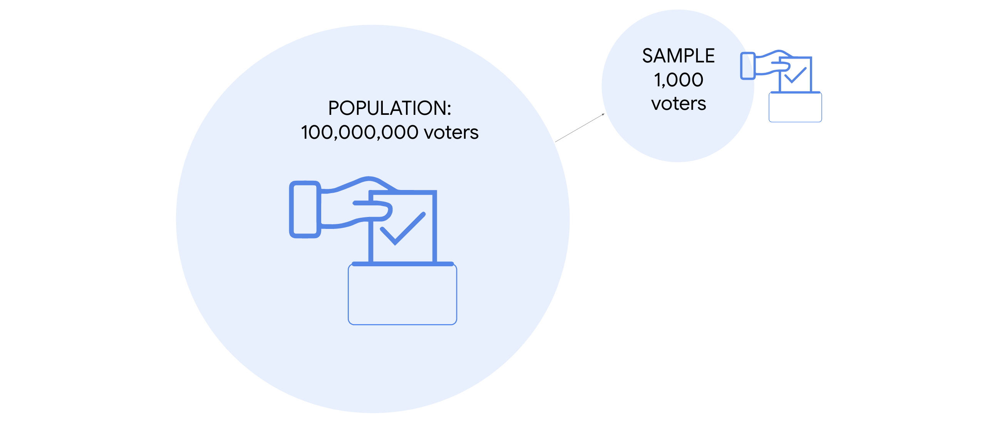
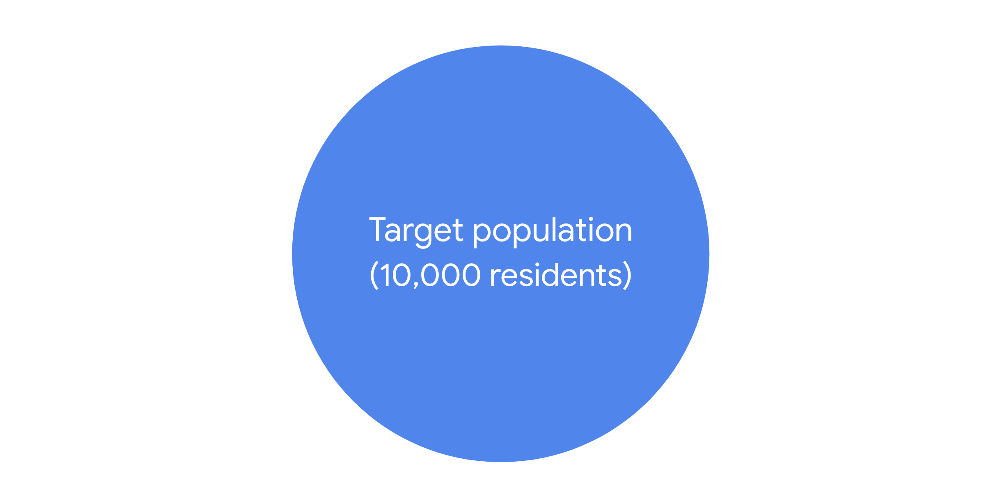
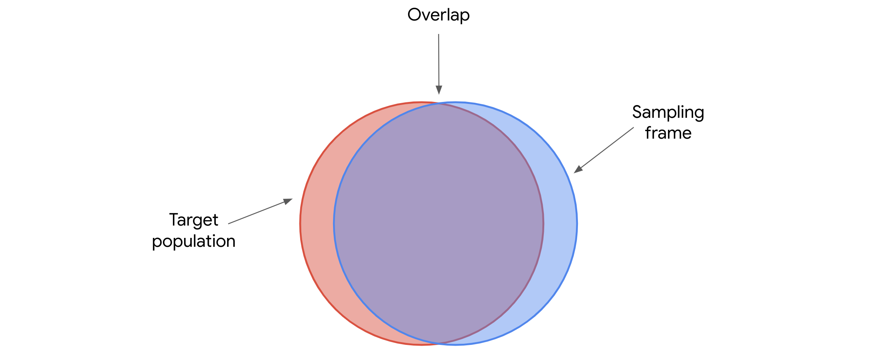
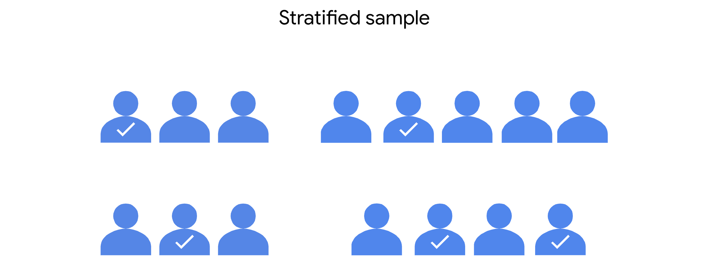
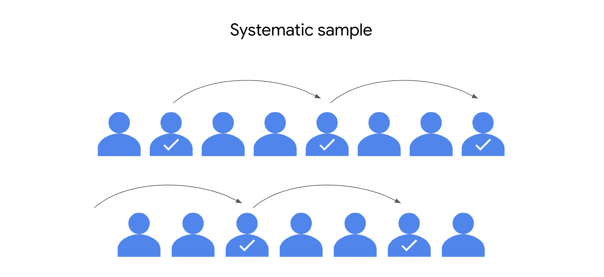
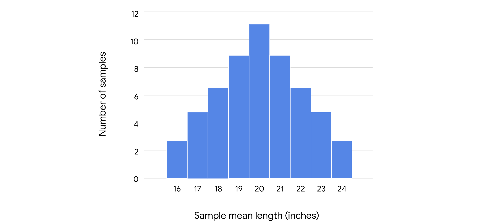
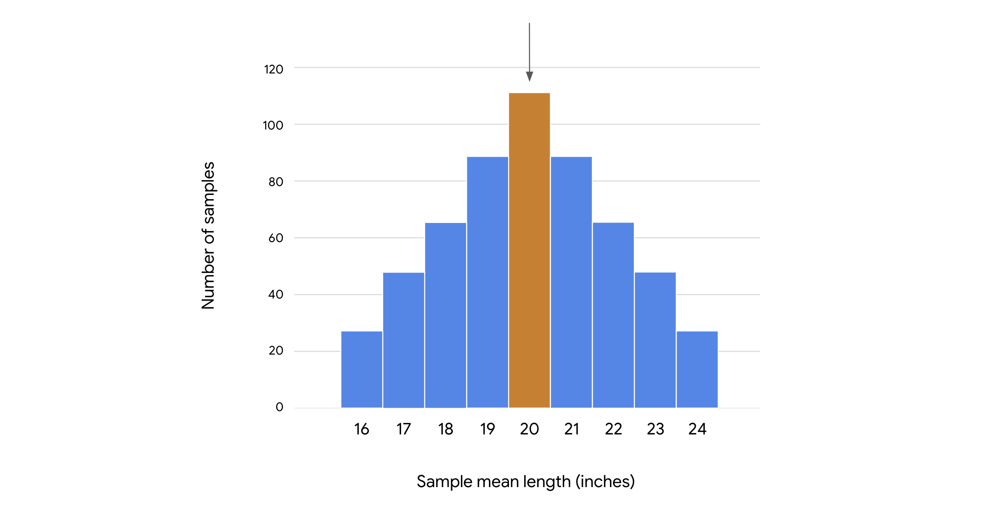
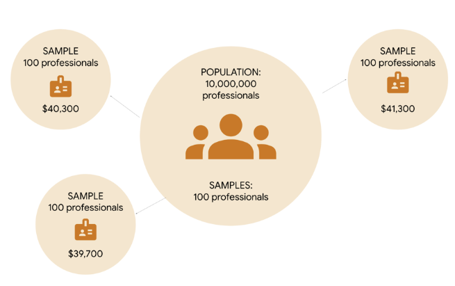
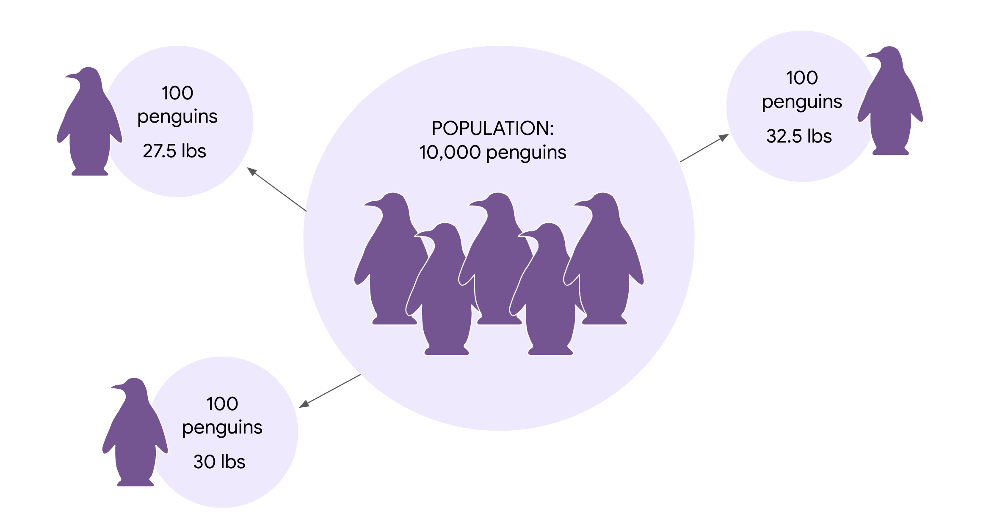

# Merkezi Eğilim Ölçüleri

Aritmetik ortalama, medyan ve mod; bir veri kümesinin merkezini farklı şekillerde tanımlar:

* **Aritmetik ortalama**: Bir veri kümesindeki ortalama değerdir.
* **Medyan**: Veri kümesindeki ortanca (tam orta) değerdir.
* **Mod**: Bir veri kümesinde en sık görülen değerdir.

Şimdi her bir merkezi eğilim ölçüsünün nasıl hesaplandığını inceleyelim.

---

## Aritmetik Ortalama, Medyan ve Mod Nasıl Hesaplanır?

### Aritmetik Ortalama

**Aritmetik ortalama**, bir veri kümesindeki tüm değerlerin toplanıp, değer sayısına bölünmesiyle hesaplanır.

Örneğin: 10, 5, 3, 50, 12 sayılarına sahipsiniz. Toplamı 80 eder. Bu toplamı, 5’e böldüğümüzde:

$$
(10 + 5 + 3 + 50 + 12) ÷ 5 = 80 ÷ 5 = 16
$$

Aritmetik ortalama yani ortalama değer 16’dır.

---

### Medyan

**Medyan**, bir veri kümesinin ortanca değeridir. Yani, veri kümesindeki değerlerin yarısı medyandan büyük, yarısı küçüktür.

Değerleri küçükten büyüğe sıralayın: 3, 5, 10, 12, 50. Ortadaki değer 10’dur, yani medyan 10’dur.

Veri kümesinde çift sayıda değer varsa, ortadaki iki sayının ortalaması alınır. Örneğin, 8 sayısını ekleyelim: 3, 5, 8, 10, 12, 50.

Ortadaki iki sayı 8 ve 10’dur. Medyan şöyle hesaplanır:

$$
(8 + 10) ÷ 2 = 18 ÷ 2 = 9
$$

Bu durumda medyan 9’dur.

---

### Mod

**Mod**, veri kümesinde en sık görülen değerdir. Bir veri kümesinin hiç modu olmayabilir, birden fazla modu da olabilir.

* Örneğin: 1, 12, 33, 54, 75 → mod yok (tekrar eden yok).
* 2, 7, 7, 11, 20 → mod = 7
* 3, 12, 12, 40, 40 → iki mod: 12 ve 40

---

## Aritmetik Ortalama, Medyan ve Mod Ne Zaman Kullanılır?

Veri kümenizin merkezini açıklamak için hangi ölçüyü kullanacağınız; verinizin yapısına ve elde etmek istediğiniz içgörüye bağlıdır. Aşağıda bazı genel kurallar verilmiştir:

---

### Aritmetik Ortalama ve Medyan

Her ikisi de veri kümesinin merkezi konumunu gösterir. Ancak, bazı verilerde biri diğerine göre daha uygundur.

**Aritmetik ortalamanın en büyük dezavantajı**, aykırı değerlerden (outlier) çok etkilenmesidir. Aykırı değer, veri kümesinin geri kalanından çok farklı olan değerdir.

Veri kümenizde aykırı değerler varsa, **medyan** genellikle daha iyi bir seçimdir. Aykırı değer yoksa, **aritmetik ortalama** da iyi sonuç verir.

#### Örnek:

Bir startup’taki çalışanların maaşlarını ele alalım:

| **Çalışan** | #1        | #2        | #3        | #4        | #5        | #6        | #7         |
| ----------- | --------- | --------- | --------- | --------- | --------- | --------- | ---------- |
| **Maaş**    | 40.000 \$ | 45.000 \$ | 45.000 \$ | 45.000 \$ | 45.000 \$ | 50.000 \$ | 500.000 \$ |

Toplam maaş: 770.000 \$

Çalışan sayısı: 7

$$
770.000 ÷ 7 = 110.000 \$
$$

Aritmetik ortalama 110.000 \$’dır. Ancak bu ortalama, çalışanların maaş dağılımını doğru şekilde temsil etmez. Çünkü yalnızca bir kişi 500.000 \$ kazanıyor — bu bir **aykırı değerdir** ve ortalamayı yukarı çeker.

Bu nedenle, bu durumda **medyan** daha doğru bir ölçüdür. Ortadaki değer:

```text
Medyan = 45.000 $
```

Medyan, tipik bir çalışanın maaşı hakkında daha gerçekçi bir fikir verir.

---

### Mod

**Mod**, kategorik verilerle çalışırken oldukça faydalıdır çünkü en sık görülen kategoriyi net biçimde gösterir.

Örneğin, bir şirket çalışan memnuniyet anketi yapar:

> "Şirkette gelişme fırsatlarından memnunum."
> Cevaplar: "Kesinlikle katılıyorum", "Katılıyorum", "Katılmıyorum", "Kesinlikle katılmıyorum"

Sonuçlar çubuk grafikle özetlenmiştir:


Grafikte en yüksek çubuk "Kesinlikle katılıyorum" ifadesini gösteriyor. Bu da bu kategorinin **mod** olduğunu ve çalışanlar arasında en yaygın görüş olduğunu gösteriyor — bu durumda pozitif bir geri bildirim.

---

## Önemli Noktalar

Aritmetik ortalama, medyan ve mod gibi merkezi eğilim ölçüleri; veri kümenizin merkezini tek bir değerle tanımlamanızı sağlar. Bir veri uzmanı olarak, veri kümenizin merkezini bilmek onun yapısını hızlıca anlamanıza ve analizinizde sonraki adımları belirlemenize yardımcı olur.

---

## Daha Fazla Bilgi İçin Kaynaklar

Aritmetik ortalama, medyan ve mod gibi merkezi eğilim ölçüleri hakkında daha fazla bilgi için aşağıdaki kaynağa göz atabilirsiniz:

* [Avustralya İstatistik Bürosu’ndan bu makale](https://www.abs.gov.au/websitedbs/D3310114.nsf/Home/Statistical+Language+-+measures+of+central+tendency#:~:text=There%20are%20three%20main%20measures,central%20value%20in%20the%20distribution.), merkezi eğilim ölçülerine genel bir bakış sunar ve aykırı değerlerin bu ölçüler üzerindeki etkisini açıklar.

# Dağılım Ölçüleri: Aralık, Varyans ve Standart Sapma

Kısa süre önce, **dağılım ölçülerinin**, veri kümenizin yayılımını veya veri değerlerindeki değişim miktarını tanımlamanıza yardımcı olduğunu öğrendiniz. Standart sapma gibi dağılım ölçüleri, verinizin dağılımı hakkında ilk anlayışı sağlar ve hangi istatistiksel yöntemleri uygulayacağınızı belirlemenize yardımcı olur.

Bu yazıda üç dağılım ölçüsünü daha detaylı öğreneceksiniz: aralık (range), varyans ve standart sapma. Bu okuma özellikle standart sapmanın temel kavramına odaklanır. Bir veri uzmanı olarak, sık sık standart sapma hesaplayacak ve bunu daha karmaşık veri analizlerinde kullanacaksınız.

---

## Dağılım Ölçüleri

Şimdi aralık, varyans ve standart sapma tanımlarını inceleyelim.

### **Aralık (Range)**

**Aralık**, bir veri kümesindeki en büyük ve en küçük değer arasındaki farktır.

Örneğin, bir biyoloji öğretmeni olduğunuzu ve final sınavı puanlarını analiz ettiğinizi düşünün. En yüksek puan 99/100 (%99), en düşük puan 62/100 (%62) ise:

$$
99 - 62 = 37
$$

**Aralık = 37 yüzde puanı**

Aralık, kolay hesaplanabilir olması nedeniyle kullanışlıdır ve veri kümenizin genel yayılımını hızlıca anlamanızı sağlar.

---

### **Varyans**

Yayılımı ölçmenin başka bir yolu da **varyans**tır. Varyans, her veri noktasının ortalamadan farkının karesinin ortalamasıdır. Temelde, varyans **standart sapmanın karesidir**. Varyans ve nasıl kullanıldığı hakkında daha fazla bilgiyi ilerleyen derslerde öğreneceksiniz.

---

### **Standart Sapma**

Şimdi standart sapma kavramını daha iyi anlamak için tanımına, görselleştirmesine ve istatistiksel formülüne bakalım.

#### **Tanım**

**Standart sapma**, değerlerinizin ortalamadan ne kadar uzaklaştığını ölçer. Bir veri noktasının ortalamaya olan tipik uzaklığını hesaplar.

* Standart sapma **büyükse**, veriler ortalamadan çok dağılmıştır.
* Standart sapma **küçükse**, veriler ortalamaya yakın toplanmıştır.

---

#### **Görselleştirme**

Aşağıdaki üç normal dağılım eğrisine bakalım. Daha sonra dağılımlar hakkında daha fazlasını öğreneceksiniz, ancak şimdilik sadece şunu bilin: eğrilerin tepe noktası **ortalama**yı temsil eder.


* Mavi noktalı eğrinin standart sapması **1**
* Yeşil düz eğrininki **2**
* Kırmızı kesikli eğrininki **3**

Mavi eğrinin yayılımı en azdır, çünkü verilerin çoğu ortalamaya yakındır. Bu nedenle mavi eğrinin standart sapması en küçüktür. Kırmızı eğri en geniş yayılıma sahiptir, çünkü verilerin çoğu ortalamadan daha uzaktadır. Bu nedenle kırmızı eğrinin standart sapması en büyüktür.

---

#### **Formül**

Standart sapma şu formülle hesaplanır (örneklem için):

```math
s = √[ Σ(x - x̄)² / (n - 1) ]
```

Burada:

* `n`: veri sayısı
* `x`: her bir veri değeri
* `x̄`: veri kümesinin ortalaması
* `Σ`: toplam işareti

> **Not:** Veri uzmanları genellikle hesaplamaları bilgisayar yardımıyla yapar. Ancak, hesaplamaların arkasındaki kavramları bilmek, istatistiksel yöntemleri gerçek dünya problemlerine uygulamanıza yardımcı olur.

---

Örneğin küçük bir veri kümesinin standart sapmasını hesaplayalım: **2, 3, 10**

**1. Ortalama (x̄) hesapla:**

$$
(2 + 3 + 10) ÷ 3 = 15 ÷ 3 = 5
$$

**2. Her değerden ortalamayı çıkar:**

$$
2 - 5 = -3
$$

$$
3 - 5 = -2
$$

$$
10 - 5 = 5
$$

**3. Bu farkların karesini al:**

$$
(-3)² = 9
$$

$$
(-2)² = 4
$$

$$
5² = 25
$$

**4. Karelerin toplamını (varyans) hesapla:**

$$
(9 + 4 + 25) ÷ (3 - 1) = 38 ÷ 2 = 19
$$

**5. Varyansın karekökünü al (standart sapma):**

$$
√19 ≈ 4.36
$$

**Standart sapma ≈ 4.36**

---

### **Örnek: Emlak Fiyatları**

Bir emlak şirketinde çalıştığınızı hayal edin. Ekip arkadaşlarınız, müşterilerine farklı semtlerdeki kira fiyatlarındaki değişkenlik hakkında bilgi vermek istiyor. Göreviniz, belirli semtlerdeki 1+1 dairelerin aylık kira fiyatlarının standart sapmasını hesaplamak.

#### **Emerald Woods**

| **Daire**    | #1  | #2  | #3    | #4    | #5    |
| ------------ | --- | --- | ----- | ----- | ----- |
| **Kira (₺)** | 900 | 950 | 1,000 | 1,050 | 1,100 |

* Ortalama: 1,000 ₺
* Standart sapma: 79.05 ₺

#### **Rock Park**

| **Daire**    | #1  | #2  | #3    | #4    | #5    |
| ------------ | --- | --- | ----- | ----- | ----- |
| **Kira (₺)** | 500 | 650 | 1,000 | 1,350 | 1,500 |

* Ortalama: 1,000 ₺
* Standart sapma: 431.56 ₺

Her iki semtte de ortalama kira 1,000 ₺ olsa da, **Rock Park**’taki standart sapma çok daha büyüktür. Bu, kira fiyatlarının bu bölgede çok daha değişken olduğunu gösterir. Örneğin, müşterilere bu bölgede ortalamanın çok altında uygun fiyatlı daire bulma olasılığının daha yüksek olduğunu söyleyebilirsiniz.

---

## Önemli Noktalar

Veri uzmanları, reklam geliri, hisse fiyatları, çalışan maaşları gibi birçok farklı veri türünde değişkenliği ölçmek için **standart sapma**yı kullanır. Standart sapma, varyans ve aralık gibi dağılım ölçüleri, verinizdeki değişimi hızlıca tespit etmenizi sağlar ve verinizin temel yapısını daha iyi anlamanıza yardımcı olur.

---

## Daha Fazla Bilgi İçin Kaynaklar

Dağılım ölçüleri hakkında daha fazla bilgi edinmek için şu kaynağa göz atabilirsiniz:

* [Statistics Canada’dan bu makale](https://www150.statcan.gc.ca/n1/edu/power-pouvoir/ch12/5214891-eng.htm), varyans ve standart sapmanın özetini sunar ve standart sapmanın dağılım ölçüsü olarak ne kadar kullanışlı olduğunu açıklar.

# Konum Ölçüleri: Yüzdelikler ve Çeyrekler

Kısa süre önce, **konum ölçülerinin** bir değerin, veri kümesindeki diğer değerlere göre konumunu belirlemenize yardımcı olduğunu öğrendiniz. Merkezi eğilim ve yayılım ölçülerine ek olarak, değerlerinizin göreli konumunu bilmek de faydalıdır. Örneğin, bir değerin diğerinden yüksek mi düşük mü olduğunu veya veri kümesinin alt, orta ya da üst kısmına mı düştüğünü bilmek önemlidir.

Bu yazıda, en yaygın konum ölçüleri olan **yüzdelikler (percentiles)** ve **çeyrekler (quartiles)** hakkında daha fazla bilgi edineceksiniz. Ayrıca **çeyrekler arası açıklık (interquartile range - IQR)** hesaplamayı ve verinizi özetlemek için **beş sayı özeti** kullanmayı öğreneceksiniz.

---

## Konum Ölçüleri

### **Yüzdelik (Percentile)**

**Yüzdelik**, belirli bir yüzdelik dilimin altında kalan veri değerini ifade eder. Yüzdelikler, verinizi 100 eşit parçaya böler. Böylece belirli bir değerin göreli konumunu veya sırasını belirlemiş olursunuz.

Örneğin, yüzdelikler okul sınavlarındaki puanları sıralamak için yaygın olarak kullanılır:

* Bir öğrenci %99’luk yüzdelikte yer alıyorsa, tüm sınav puanlarının %99’undan daha yüksek bir puan almıştır.
* %75’lik yüzdelikte yer alıyorsa, puanı sınava girenlerin %75’inden daha yüksektir.
* %50 yüzdelik, puanın ortada olduğunu, yani sınavı geçenlerin yarısından daha yüksek olduğunu gösterir.


> **Not:** *Yüzdelikler* ile *yüzde (%) puan* karıştırılmamalıdır. Örneğin, bir testten 90/100 alırsanız (%90), bu sizin %90’lık yüzdelikte olduğunuz anlamına gelmez. Eğer tüm katılımcıların yarısı 90’dan yüksek aldıysa, bu puan %50 yüzdelikte olabilir. Yani yüzdelik, puanınızın diğerlerine göre konumunu gösterir.

Yüzdelikler, değerleri karşılaştırmak ve verileri bağlama oturtmak için kullanışlıdır. Örneğin:

ABD’de yakıt tüketimi mil/gallon (mpg) ile ölçülür. Almayı düşündüğünüz bir araç 23 mpg değerine sahip. Bu iyi mi kötü mü? Bilinmez. Ancak bu aracın, orta boy sedanlar arasında %25’lik yüzdelikte olduğu belirtilirse, bu, araçların %75’inin daha iyi mpg’ye sahip olduğunu gösterir.

---

### **Çeyrek (Quartile)**

**Çeyrekler**, bir veri kümesini dört eşit parçaya ayıran ölçülerdir. Her çeyrek %25’lik bir dilimi temsil eder.

Üç adet çeyrek değeri (Q1, Q2, Q3) vardır:

* **Birinci çeyrek (Q1):** Veri kümesinin ilk yarısının ortanca değeri. %25 yüzdelik. Verilerin %25’i bu değerin altındadır.
* **İkinci çeyrek (Q2):** Tüm veri kümesinin ortanca değeri, yani medyan. %50 yüzdelik.
* **Üçüncü çeyrek (Q3):** Veri kümesinin ikinci yarısının ortanca değeri. %75 yüzdelik. Verilerin %75’i bu değerin altındadır.


---

### **Örnek: Araba Satışları**

Bir oto galeride çalıştığınızı düşünün. Satış yöneticisi, ekibin her bir satış temsilcisinin performansını karşılaştırmak istiyor. Son ayda satılan araç sayılarını içeren verileri inceleyelim:

| **Satış Temsilcisi**    | #1 | #2 | #3 | #4 | #5 | #6 | #7 | #8 |
| ----------------------- | -- | -- | -- | -- | -- | -- | -- | -- |
| **Satılan Araç Sayısı** | 18 | 13 | 6  | 10 | 15 | 7  | 10 | 9  |

**Adım adım çeyrekleri hesaplayalım:**

**1.** Verileri küçükten büyüğe sırala:

[6, 7, 9, 10, 10, 13, 15, 18]

**2.** Ortanca değeri (Q2) bul:

Veri sayısı çift olduğu için ortadaki iki değerin ortalamasını alıyoruz:

(10 + 10) ÷ 2 = 10 → Q2

**3.** Alt yarının ortancasını bul (Q1):

Alt yarı: [6, 7, 9, 10]

(7 + 9) ÷ 2 = 8 → Q1

**4.** Üst yarının ortancasını bul (Q3):

Üst yarı: [10, 13, 15, 18]

(13 + 15) ÷ 2 = 14 → Q3

**Sonuç:**

* Q1 = 8
* Q2 (medyan) = 10
* Q3 = 14

Yani:

* Alt %25’lik dilim 8 veya daha az araç sattı.
* Üst %25’lik dilim 14 veya daha fazla araç sattı.
* Ortadaki %50’lik dilim 8 ila 14 araç sattı.

> **Not:** Çeyrek değerler farklı yöntemlerle hesaplanabilir. Büyük veri kümelerinde bu fark önemsizdir, ancak küçük veri kümelerinde hesaplama yöntemine göre çeyrekler farklılık gösterebilir. Örneğin, NumPy’nin [`percentile()`](https://numpy.org/doc/stable/reference/generated/numpy.percentile.html) fonksiyonu 9 farklı yöntem sunar.

---

### **Çeyrekler Arası Açıklık (IQR)**

Veri kümenizin ortadaki %50’lik kısmı, yani Q1 ile Q3 arasındaki mesafe **çeyrekler arası açıklık (IQR)** olarak adlandırılır.

**Formül:**

$$
\text{IQR} = Q3 - Q1
$$

Yukarıdaki örnekte:

$$
\text{IQR} = 14 - 8 = 6
$$

IQR, verinin merkezine odaklanır ve aykırı değerlerden daha az etkilenir. Aşağıdaki gibi aykırı değerler genellikle IQR’nin 1.5 katından fazla uzaklıktaki değerlerdir:

$$
\text{* Alt sınır: } Q_1 - 1.5 \cdot \text{IQR}
$$

$$
\text{* Üst sınır: } Q_3 + 1.5 \cdot \text{IQR}
$$

> **Not:** IQR teknik olarak bir **dağılım ölçüsüdür** çünkü verilerin orta %50’sinin yayılımını gösterir.

---

### **Beş Sayı Özeti (Five Number Summary)**

Veri kümenizi özetlemenin bir yolu da **beş sayı özeti**dir. Bu özet aşağıdaki değerlerden oluşur:

* En küçük değer (min)
* Q1
* Medyan (Q2)
* Q3
* En büyük değer (max)

Beş sayı özeti, verinin dağılımını genel hatlarıyla gösterir. Bu özet genellikle **kutu grafiği (box plot)** ile görselleştirilir.

* Kutu kısmı Q1 ile Q3 arasını gösterir.
* Kutunun içindeki dikey çizgi Q2’dir.
* "Bıyıklar", yani kutunun dışındaki çizgiler minimum ve maksimum değerleri gösterir.

Aşağıdaki kutu grafiği araba satış verilerini göstermektedir:


---

## Önemli Noktalar


Veri uzmanları, ürün satışlarından hane gelirine kadar her türlü veriyi daha iyi anlamak için yüzdelikler ve çeyrekler gibi **konum ölçüleri**ni kullanır. Bu ölçüler:

* Veri değerlerinin göreli konumunu hızlıca tanımlamaya yardımcı olur.
* Verinin dağılımını daha hassas şekilde analiz etmeyi sağlar.

---

## Daha Fazla Bilgi İçin Kaynak

Konum ölçüleri (yüzdelikler, çeyrekler, beş sayı özeti) hakkında daha fazla bilgi için şu kaynağa göz atabilirsiniz:

* [Freie Universität Berlin – İstatistik Sözlüğü](https://www.geo.fu-berlin.de/en/v/soga-py/Basics-of-statistics/index.html)

# Olasılığın Temel Kavramları

Kısa süre önce, **olasılık** kavramının belirsizliği nicelleştirmek ya da bir olayın gerçekleşme olasılığını tanımlamak için matematiği kullandığını öğrendiniz. Örneğin, yarın yağmur yağma olasılığı %80 olabilir veya belirli bir adayın seçimi kazanma şansı %20 olabilir.

Bu yazıda, olasılığın temel kavramları hakkında daha fazla bilgi edineceksiniz. Rastgele deney kavramını, bir olayın olasılığının nasıl temsil edileceğini ve hesaplanacağını, ayrıca temel olasılık gösterimini ele alacağız.

---

## Olasılığın Temelleri

### **Temel Kavramlar: Rastgele Deney, Sonuç, Olay**

Olasılık kuramının üç temel kavramıyla başlayalım:

* Rastgele deney
* Sonuç
* Olay

Olasılık, istatistikçilerin **rastgele deney** (veya istatistiksel deney) olarak adlandırdığı durumlarla ilgilenir. **Rastgele deney**, sonucunun kesin olarak tahmin edilemediği bir süreçtir.

Örneğin, bir madeni para atmadan veya zar atmadan önce sonucu bilemezsiniz. Para atıldığında yazı veya tura gelebilir. Zar atıldığında 3 ya da 6 gelebilir.

Tüm rastgele deneylerin üç ortak özelliği vardır:

* Deneyin birden fazla olası sonucu vardır.
* Tüm olası sonuçlar önceden belirtilebilir.
* Sonuç tamamen şansa bağlıdır.

İstatistikte, bir rastgele deneyin sonucu **sonuç (outcome)** olarak adlandırılır. Örneğin, bir zar attığınızda, olası sonuçlar şunlardır: 1, 2, 3, 4, 5, 6.

**Olay (event)** ise bir veya daha fazla sonuçtan oluşan bir kümedir. Örneğin, bir zar atıldığında çift sayı gelmesi bir olaydır. Bu olayın sonuçları: 2, 4, 6’dır. Tek sayı gelmesi de bir başka olaydır ve sonuçları: 1, 3, 5’tir.

Rastgele bir deneyde her olaya bir olasılık atanır. Şimdi bir olayın olasılığı nasıl temsil edilir ve hesaplanır, bunu inceleyelim.

---

### **Bir Olayın Olasılığı**

Bir olayın gerçekleşme olasılığı **0 ile 1 arasında bir sayı** olarak ifade edilir. Olasılık ayrıca yüzde olarak da ifade edilebilir.

* Bir olayın olasılığı 0 ise, bu olayın gerçekleşme şansı %0’dır.
* Bir olayın olasılığı 1 ise, bu olayın gerçekleşme şansı %100’dür.

Bu aralıkta (0 ile 1 arasında) farklı olasılık dereceleri bulunur. Örneğin:

* Bir olayın olasılığı 0.05 (veya %5) ise, bu olayın gerçekleşme şansı düşüktür.
* Bir olayın olasılığı 0.95 (veya %95) ise, bu olayın gerçekleşme şansı yüksektir.
* Bir olayın olasılığı 0.5 (veya %50) ise, olayın gerçekleşme ve gerçekleşmeme olasılığı eşittir.

Bir olayın olasılığını bilmek, belirsizlik içeren durumlarda bilinçli kararlar vermenize yardımcı olur. Örneğin, yarın yağmur yağma olasılığı 0.1 (%10) ise, açık hava pikniği planınız için endişelenmenize gerek yoktur. Ancak yağmur ihtimali 0.9 (%90) ise, başka bir gün için plan yapmanız mantıklı olabilir.

---

### **Bir Olayın Olasılığı Nasıl Hesaplanır?**

Tüm olası sonuçların eşit olasılıkla gerçekleştiği bir olayda, olasılığı hesaplamak için şu formülü kullanabilirsiniz:

**İstenen sonuç sayısı** ÷ **Toplam olası sonuç sayısı**

Bu formül, klasik olasılık tanımını da verir.

Şimdi para atma ve zar atma örnekleriyle bu hesaplamayı daha iyi anlayalım.

---

#### **Örnek: Para Atma**

Adil bir para atmak, klasik bir rastgele deney örneğidir:

* Birden fazla olası sonuç vardır.
* Olası sonuçlar önceden bilinir: yazı ya da tura.
* Sonuç şansa bağlıdır.

Tek bir atışta **yazı gelme olasılığını** hesaplamak istiyoruz. Bu durumda:

```
1 ÷ 2 = 0.5 veya %50
```

Eğer her iki yüzü de yazı olan özel bir para atsaydınız, her atışta yazı gelirdi. Bu durumda:

* Yazı gelme olasılığı = %100
* Tura gelme olasılığı = %0

> Not: “Yazı gelme olasılığı %50” demek, her 10 atıştan tam olarak 5’inin yazı geleceği anlamına gelmez. Örneğin, 10 atışta 4 yazı ve 6 tura gelebilir. Ancak uzun vadede yazıların oranı %50’ye yaklaşır.

---

#### **Örnek: Zar Atma**

Altı yüzlü bir zar atmak da klasik bir rastgele deneydir:

* Birden fazla olası sonuç vardır.
* Olası sonuçlar önceden bilinir: 1, 2, 3, 4, 5, 6
* Sonuç tamamen şansa bağlıdır.

Bir zar atışında **3 gelme olasılığı**:

```
1 ÷ 6 = 0.1666 → Yaklaşık %16.7
```

---

### **Olasılık Gösterimi**

Olasılığı temsil etmek için kullanılan bazı sembolleri bilmek faydalıdır; bu semboller eğitimde ve teknik belgelerde sıkça kullanılır.

* **P**, bir olayın olasılığını ifade eder.
* **A** ve **B**, olayları temsil eden harflerdir.

Örneğin, iki farklı olayla çalışıyorsanız, şu şekilde gösterim yapılır:

* Olay A'nın olasılığı: `P(A)`
* Olay B'nin olasılığı: `P(B)`
* Her olay için 0 ≤ P(A) ≤ 1
* Eğer `P(A) > P(B)` ise, A olayının gerçekleşme olasılığı B olayından yüksektir.
* Eğer `P(A) = P(B)` ise, A ve B olaylarının gerçekleşme olasılıkları eşittir.

---

## Önemli Noktalar

Veri uzmanları, belirsizlik içeren durumlarda paydaşlara bilinçli kararlar vermelerinde yardımcı olmak için olasılıktan faydalanır. Olasılığın temel kavramları konusundaki bilginiz, daha karmaşık olasılık hesaplamaları için bir temel oluşturacaktır.

---

## Daha Fazla Bilgi İçin Kaynak

Olasılığın temel kavramları hakkında daha fazla bilgi için şu kaynağa göz atabilirsiniz:

* [Richland Community College Ders Notları](https://people.richland.edu/james/lecture/m116/sequences/probability.html): Olasılığın temel kavramlarını ve temel kurallarını özetleyen faydalı bir kaynaktır.

# Birden Fazla Olayın Olasılığı

Şimdiye kadar, tekil olayların olasılıklarının nasıl hesaplandığını öğrendiniz. Ancak hem günlük hayatta hem de veriyle ilgili çalışmalarda birçok durum birden fazla olayı kapsar. Gelecekte bir veri profesyoneli olarak, birden fazla olayın olasılığıyla sıkça ilgileneceksiniz.

Bu yazıda, birden fazla olayı kapsayan olasılık konusunu daha detaylı inceleyeceksiniz. Üç temel olasılık kuralını öğreneceksiniz: tamamlayıcı (complement) kuralı, toplama (addition) kuralı ve çarpma (multiplication) kuralı. Bu kurallar, birden fazla olayın olasılığını daha iyi anlamanıza yardımcı olur. Öncelikle bu kuralların uygulandığı iki olay türünü inceleyeceğiz: **birbirini dışlayan (mutually exclusive)** ve **bağımsız (independent)** olaylar. Ardından her iki tür olay için olasılık hesaplamayı öğreneceksiniz.

---

## İki Tür Olay

Üç temel olasılık kuralı, farklı türdeki olaylara uygulanır:

* **Tamamlayıcı kuralı** ve **toplama kuralı**, birbirini dışlayan olaylara uygulanır.
* **Çarpma kuralı**, bağımsız olaylara uygulanır.

---

### **Birbirini Dışlayan (Mutually Exclusive) Olaylar**

İki olay **birbirini dışlıyorsa**, aynı anda gerçekleşemezler.

Örneğin, aynı anda hem Dünya'da hem Ay'da olamazsınız. Aynı anda hem oturup hem ayakta duramazsınız.

Klasik olasılık örneklerinde:

* Bir madeni para attığınızda hem yazı hem tura gelmesi mümkün değildir.
* Bir zar attığınızda aynı anda hem 2 hem 4 gelmesi imkânsızdır.

---

### **Bağımsız (Independent) Olaylar**

İki olay **bağımsızsa**, birinin gerçekleşmesi diğerinin olasılığını değiştirmez. Yani bir olay, diğerinin sonucunu etkilemez.

Örneğin:

* Sabah film izlemeniz, öğleden sonra havanın nasıl olacağını etkilemez.
* Radyoda müzik dinlemeniz, yeni buzdolabınızın teslimatını etkilemez.

İki ardışık para atışı ya da zar atışı da bu duruma örnektir:

* İlk atışta yazı gelmesi, ikinci atışın sonucunu değiştirmez.
* İlk zar atışında 2 gelmesi, ikinci zar atışının sonucunu etkilemez.

---

## Üç Temel Kural

Artık birbirini dışlayan ve bağımsız olaylar arasındaki farkı biliyorsunuz. Şimdi üç temel olasılık kuralını inceleyelim:

* **Tamamlayıcı kuralı**
* **Toplama kuralı**
* **Çarpma kuralı**

---

### **Tamamlayıcı Kuralı**

Tamamlayıcı kural, birbirini dışlayan olaylarla ilgilidir. İstatistikte, bir olayın tamamlayıcısı, o olayın **gerçekleşmemesidir**.

Örneğin:

* Ya kar yağar ya da yağmaz.
* Takımınız ya şampiyon olur ya da olmaz.

Bir olayın olma ve olmama olasılıklarının toplamı daima 1'dir (veya %100).

**Tamamlayıcı kural** şu şekilde ifade edilir:

```markdown
P(A') = 1 - P(A)
```

> **Not:** Olasılık gösteriminde `’` (kesme işareti), olumsuzluğu simgeler. `P(A')` ifadesi "A olayının olmama olasılığı" anlamına gelir.

Örnek:
Yarın kar yağma olasılığı %40 ise (P(kar) = 0.4), kar yağmama olasılığı şöyle hesaplanır:

```markdown
P(kar yağmaz) = 1 - P(kar) = 1 - 0.4 = 0.6
```

Yani, yarın kar yağmama olasılığı **%60**’tır.

---

### **Toplama Kuralı (Birbirini Dışlayan Olaylar İçin)**

**Toplama kuralı**, birbirini dışlayan iki olayın **birlikte** olma olasılığını hesaplamaya yarar:

```markdown
P(A veya B) = P(A) + P(B)
```

> Not: Birbirini dışlamayan olaylar için de bir toplama kuralı vardır, ancak bu içerikte yalnızca **birbirini dışlayan olaylar** ele alınmaktadır.

#### **Zar Atma (2 veya 4 gelme olasılığı)**

Tek bir zar atışında, 2 veya 4 gelme olasılığı nedir?

Bu iki olay birbirini dışladığı için toplama kuralı uygulanabilir:

```markdown
P(2 veya 4) = P(2) + P(4) = 1/6 + 1/6 = 2/6 = 1/3
```

Yani, 2 veya 4 gelme olasılığı **1/3** ya da **%33**’tür.

---

### **Çarpma Kuralı (Bağımsız Olaylar İçin)**

**Çarpma kuralı**, iki bağımsız olayın **birlikte** gerçekleşme olasılığını hesaplar:

```markdown
P(A ve B) = P(A) × P(B)
```

> Not: Bağımlı olaylar için de çarpma kuralı vardır, ancak bu içerikte sadece **bağımsız olaylar** ele alınmaktadır.

#### **Zar Atma (Önce 1, sonra 6 gelme olasılığı)**

İki ardışık zar atışında önce 1, sonra 6 gelme olasılığı:

Bu olaylar bağımsızdır. Her zar atışında bir sayı gelme olasılığı 1/6’dır.

```markdown
P(1 ve 6) = P(1) × P(6) = 1/6 × 1/6 = 1/36
```

Yani, önce 1, sonra 6 gelme olasılığı **1/36** ya da yaklaşık **%2.8**’dir.

---

## Önemli Noktalar

Temel olasılık kuralları, birbirini dışlayan ve bağımsız olayların tanımlanmasında kullanılır. Bu kuralları anlamak, gelecekte veri profesyoneli olarak gerçekleştireceğiniz daha karmaşık analizler için sağlam bir temel oluşturur.

---

## Daha Fazla Bilgi İçin Kaynak

Olasılık hakkında daha fazla bilgi edinmek için bu etkileşimli rehbere göz atabilirsiniz:
👉 [Seeing Theory](https://seeing-theory.brown.edu/index.html#secondPage)

# Bağımlı Olaylar İçin Koşullu Olasılığı Hesaplama

Son zamanlarda **koşullu olasılığın**, bir olayın gerçekleşme olasılığının başka bir olayın gerçekleşmiş olması durumunda nasıl değiştiğini ifade ettiğini öğrendiniz. Koşullu olasılık, **bağımlı olaylar** arasındaki ilişkiyi, yani ilk olayın ikinci olayın olasılığı üzerindeki etkisini tanımlamanızı sağlar.

Bu yazıda, iki veya daha fazla bağımlı olay için koşullu olasılığın nasıl hesaplandığını öğreneceksiniz. Hesaplamaya geçmeden önce bağımlılık kavramını gözden geçirelim.

---

## Koşullu Olasılık

Daha önce, tek bir olayın ya da birbirinden bağımsız iki veya daha fazla olayın (örneğin ardışık iki para atışı) olasılığını hesaplamayı öğrendiniz. Koşullu olasılık ise **iki veya daha fazla bağımlı olay** için geçerlidir.

---

### **Bağımlı Olaylar**

İki olay **bağımsızsa**, birinin gerçekleşmesi diğerinin olasılığını değiştirmez. Örneğin, iki ardışık para atışı bağımsız olaylardır. İlkinde yazı gelmesi, ikinci atışın sonucunu etkilemez.

Buna karşılık, iki olay **bağımlıysa**, birinin gerçekleşmesi diğerinin olasılığını değiştirir. Yani ilk olay, ikinci olayın sonucunu etkiler.

Örneğin:

* Sınavdan iyi bir not almak istiyorsanız, öncesinde ders çalışmanız gerekir.
* Popüler bir restoranda sıra beklemeden yemek yemek istiyorsanız, erken gitmeniz gerekir.

Bu durumlarda ikinci olay, birinci olaya **bağımlı** ya da **koşullu** olarak tanımlanabilir.

---

## Koşullu Olasılık Formülü

İki bağımlı olay olan A ve B için, her ikisinin gerçekleşme olasılığı şu şekilde hesaplanır:

```markdown
P(A ve B) = P(A) × P(B|A)
```

Burada `P(B|A)`, "A gerçekleştiği durumda B'nin olasılığı" anlamına gelir. Bu, **koşullu olasılığı** ifade eder.

Ayrıca formül şu şekilde de yazılabilir:

```markdown
P(B|A) = P(A ve B) / P(A)
```

> **Not:** Bu formül, bağımsız olaylar için de geçerlidir. Eğer A ve B bağımsızsa, `P(B|A) = P(B)` olur. Bu durumda formül, daha önce öğrendiğiniz çarpma kuralına dönüşür:
> `P(A ve B) = P(A) × P(B)`

---

### **Örnek: Oyun Kartları**

Koşullu olasılığa dair klasik bir örnek: 52 kartlık standart bir desteden iki kalp kartı çekme durumu.

* **Olay A**: İlk çekilen kartın kalp olması.
* **Olay B**: İlk kart kalp ise, ikinci kartın da kalp olması.

Standart bir destede 4 tür (kalp, karo, sinek, maça) ve her türden 13 kart bulunur.

* İlk çekilişte kalp gelme olasılığı: `13/52 = 0.25` (yani %25)
* İlk kart kalp çıktıysa, destede 12 kalp kaldı ve kart sayısı 51 oldu.
  İkinci kartın kalp olma olasılığı: `12/51 ≈ 0.235` (yaklaşık %23.5)

Formüle uygulayalım:

```markdown
P(1. kalp ve 2. kalp) = P(1. kalp) × P(2. kalp | 1. kalp)
                      = 13/52 × 12/51
                      = 1/17 ≈ 0.0588 (yaklaşık %5.9)
```

Yani, iki kalp kartını art arda çekme olasılığı yaklaşık **%5.9**’dur.

---

### **Örnek: Online Alışveriş**

Başka bir örnek: Bir e-ticaret sitesinde çalışan bir veri uzmanı olduğunuzu düşünün.

* Ziyaretçilerin %20’si 100\$ veya daha fazla alışveriş yapıyor.
* 100\$’lık alışveriş yapan müşterilerin %10’una rastgele hediye kartı veriliyor.

**Olay A**: 100\$ veya daha fazla alışveriş yapmak.
**Olay B**: Hediye kartı kazanmak (sadece 100\$ veya üzeri alışveriş yapanlar için geçerli).

Bu olaylar bağımlıdır; çünkü hediye kartı kazanmak, alışveriş yapmaya bağlıdır.

Formüle uygulayalım:

```markdown
P($100 ve hediye kartı) = P($100) × P(hediye kartı | $100)
                        = 0.2 × 0.1
                        = 0.02 (yani %2)
```

Yani, bir müşterinin 100\$ veya daha fazla harcayıp hediye kartı kazanma olasılığı **%2**’dir.

---

## Önemli Noktalar

Koşullu olasılık, **bağımlı olaylar arasındaki ilişkiyi** açıklamak için kullanılır. Veri uzmanları, bu kavramı özellikle iş dünyasında yaygın olarak kullanır. Örneğin, bir reklam kampanyasının satış gelirini nasıl etkileyeceğini öngörmek için koşullu olasılıklar hesaplanabilir. Bu tür analizler, paydaşlara kaynakları en verimli şekilde nasıl kullanacaklarına dair bilgi sağlar.

---

## Daha Fazla Bilgi İçin Kaynak

Koşullu olasılık hakkında daha fazla bilgi edinmek için şu kaynağa göz atabilirsiniz:

* [Investopedia'dan bu makale, iş bağlamında koşullu olasılığı açıklar](https://www.investopedia.com/terms/c/conditional_probability.asp#:~:text=Conditional%20probability%20is%20defined%20as,succeeding%2C%20or%20conditional%2C%20event.)

# Bayes Teoremi ile Koşullu Olasılık Hesaplama

Son zamanlarda, **Bayes teoremi**nin koşullu olasılığı belirlemek için kullanılan matematiksel bir formül olduğunu öğrendin. Bu teorem, 18. yüzyılda İngiltere, Londra'da yaşamış matematikçi Thomas Bayes’in adını taşır. Hatırla, **koşullu olasılık** bir olayın, başka bir olayın zaten gerçekleştiği durumda gerçekleşme olasılığıdır. Örneğin, bir deste iskambil kartından bir as çektiğinde, aynı desteden ikinci bir as çekme olasılığı değişir.

Bu bölümde, Bayes teoreminin farklı parçalarını ve bu teoremi koşullu olasılık hesaplamak için nasıl kullanabileceğini öğreneceksin.

## Bayes Teoremi

Bayes teoremi, bir olayın olasılığını yeni bilgiler ışığında güncellemenin bir yolunu sağlar.

### **Öncelikli (prior) ve Sonralık (posterior) olasılık**

Bayesian istatistikte, **öncelikli olasılık** yeni veri toplanmadan önceki olay olasılığıdır. **Sonralık olasılık** ise yeni verilere dayanarak güncellenmiş olay olasılığıdır.

Bayes teoremi, öncelikli olasılığı verilerle güncelleyerek sonralık olasılığı hesaplamanı sağlar.

Örneğin, bir tıbbi durumun yaşla ilişkili olduğunu düşünelim. Bayes teoremi, bir kişinin bu duruma sahip olma olasılığını yaşına göre daha doğru belirlemene yardımcı olur. Öncelikli olasılık, kişinin duruma sahip olma olasılığıdır. Sonralık (güncellenmiş) olasılık ise, kişinin belirli bir yaş grubundaysa duruma sahip olma olasılığıdır.

### **Teorem**

Teoreme bakalım:

**Bayes teoremi**, A ve B iki olaysa, B gerçekleştiğinde A’nın olasılığı, A’nın olasılığı ile B’nin A’ya bağlı olasılığının çarpımının B’nin olasılığına bölünmesiyle bulunur.

**Bayes Teoremi**

```math
P(A|B) = \frac{P(B|A) * P(A)}{P(B)}
````

Teoremde, öncelikli olasılık A olayının olasılığıdır. Hesaplamaya çalıştığın sonralık olasılık ise B olayının gerçekleştiği durumda A olayının olasılığıdır.

* **P(A)**: Öncelikli olasılık
* **P(A|B)**: Sonralıklı olasılık

Bazı durumlarda istatistikçiler ve veri profesyonelleri, B olayının A’ya bağlı olasılığı için “olasılık (likelihood)”, B olayının olasılığı için ise “kanıt (evidence)” terimlerini kullanır.

* **P(B|A)**: Olasılık (Likelihood)
* **P(B)**: Kanıt (Evidence)

Bu terimleri kullanarak Bayes teoremini şu şekilde ifade edebiliriz:


Hesaplamayı farklı açılardan düşünmek ve problemini denkleme uyarlamak faydalı olabilir.

Bayes teoremini şöyle düşünebilirsin: Önceden sahip olduğun inanç (P(A)) yeni veriler (olasılık P(B|A) ve kanıt P(B)) kullanılarak sonralık olasılığa (P(A|B)) dönüştürülür.

***Not:*** *Bu bölüm Bayes teoremi ile ilgili temel kavram ve terimlerin tanıtımını yapar. Bayesian istatistiğin detaylı incelenmesi bu kursun kapsamı dışındadır. Kariyerin ilerledikçe Bayes teoremini ve uygulamalarını daha derinlemesine öğrenme fırsatı bulacaksın.*

Şimdilik hatırlanması gereken önemli nokta, Bayes teoreminde hem B’nin A’ya bağlı koşullu olasılığı hem de A’nın B’ye bağlı koşullu olasılığının bulunduğudur. Bu olasılıklardan birini bilirsen, Bayes teoremi diğerini bulmana yardımcı olur.

### **Örnek: spam filtresi**

Bayes teoreminin dijital dünyadaki bilinen uygulamalarından biri spam filtrelemedir; yani bir e-postanın spam olup olmadığını tahmin etmek. Pratikte karmaşık spam filtreleri, e-postanın içeriği, başlığı, ek dosya olup olmadığı, gönderen adresin alan adı türü (.edu veya .org) gibi birçok değişkenle çalışır. Ancak örneğimiz için basitleştirilmiş bir Bayesian spam filtresi kullanacağız.

Diyelim ki, bir e-postanın spam olma olasılığını, e-postada belirli bir kelimenin (örneğin “money”) geçip geçmemesine bağlı olarak hesaplamak istiyorsun.

Elinde şu bilgiler var:

* Bir e-postanın spam olma olasılığı %20.
* Bir e-postada “money” kelimesinin geçme olasılığı %15.
* Spam e-postalarda “money” kelimesinin geçme olasılığı %40.

Bu örnekte öncelikli olasılığın, bir e-postanın spam olma olasılığıdır. Sonralık olasılık ise, e-postada “money” kelimesi varsa spam olma olasılığıdır. Öncelikli olasılığını güncellemek için kullanacağın yeni veriler, “money” kelimesinin e-postada geçme olasılığı ve spam e-postada geçme olasılığıdır.

Bayes teoremiyle çalışırken, önce A olayının ne olduğunu, B olayının ne olduğunu belirlemek faydalıdır. Böylece olaylar arasındaki ilişkiyi anlamak ve formülü kullanmak kolaylaşır.

Burada A olayını “spam e-posta”, B olayını ise “e-postada money kelimesinin geçmesi” olarak adlandıralım. Bayes teoremini şimdi şu şekilde yazabilirsin:

```math
P(A|B) = \frac{P(B|A) * P(A)}{P(B)}
```

Yani,

P(Spam | Money) = P(Money | Spam) \* P(Spam) / P(Money)

Aşağıdakini bulmak istiyorsun:

* **P(Spam | Money), yani sonralık olasılık:** E-postada “money” kelimesi varsa spam olma olasılığı.

Şimdi verilerini formüle yerleştir:

* **P(Spam), yani öncelikli olasılık:** E-postanın spam olma olasılığı = 0.2, yani %20
* **P(Money), yani kanıt:** E-postada “money” kelimesinin geçme olasılığı = 0.15, yani %15
* **P(Money | Spam), yani olasılık:** E-posta spam ise “money” kelimesinin geçme olasılığı = 0.4, yani %40

```math
P(Spam | Money) = \frac{0.4 * 0.2}{0.15} = 0.53333
```

Yani, e-postada “money” kelimesi varsa spam olma olasılığı yaklaşık %53.3’tür.

## Önemli Noktalar

Bayes teoremi, Bayesian istatistik alanının temelidir. Bayesian çıkarım olarak da bilinen bu alan, modern veri analizinde verileri analiz etmek ve yorumlamak için güçlü bir yöntemdir. Veri profesyonelleri, Bayes teoremini yapay zekadan tıbbi testlere kadar çok çeşitli alanlarda kullanırlar.

Bayes teoremi hakkında temel bilgi sahibi olmak, veri profesyoneli olarak kariyerinde Bayesian istatistiği daha iyi öğrenmeni sağlar.

## Daha Fazla Bilgi İçin Kaynaklar

Bayes Teoremi hakkında daha fazla bilgi için aşağıdaki kaynağa bakabilirsin:

* [Pennsylvania State University tarafından Bayes Teoremi açıklaması](https://online.stat.psu.edu/stat500/lesson/2/2.7)

“Savcı yanılgısı” (prosecutor's fallacy) hakkında ilginç bir tartışma için şu sayfaya göz atabilirsin:

* [American Journal of Epidemiology tarafından savcı yanılgısının açıklaması](https://academic.oup.com/aje/article/179/9/1125/103523)

# Ayrık olasılık dağılımları

Son zamanlarda, veri profesyonellerinin farklı veri setlerini modellemek ve verilerinde anlamlı desenleri tespit etmek için olasılık dağılımlarını kullandığını öğrendiniz. Hatırlayalım ki, **olasılık dağılımı** rastgele bir olayın olası sonuçlarının olasılıklarını tanımlar. Ayrık olasılık dağılımları, ayrık rastgele değişkenleri veya ayrık olayları temsil eder. Genellikle, ayrık olayların sonuçları sayılabilen tam sayılar olarak ifade edilir. Örneğin, bir zar atıldığında sonuç 2 veya 3 olabilir, ancak 2.575 ya da 3.184 gibi kesirli bir değer olamaz.

Bu okumada, dört yaygın ayrık olasılık dağılımının temel özelliklerine genel bir bakış sunulacak:

-   Uniform (Eşit olasılıklı) dağılım
-   Binom dağılımı
-   Bernoulli dağılımı
-   Poisson dağılımı

## Ayrık olasılık dağılımları

### **Uniform dağılım**

Uniform dağılım, tüm sonuçların eşit olasılığa sahip olduğu olayları tanımlar.

Örneğin, bir zar atıldığında altı farklı sonuç olabilir: 1, 2, 3, 4, 5 veya 6. Her sonucun olasılığı aynıdır: 6’da 1, yani yaklaşık %16.7.

Bir dağılımı görselleştirmek için grafik kullanabilirsiniz, örneğin histogram. Ayrık dağılımlarda rastgele değişken x ekseninde, karşılık gelen olasılık ise y ekseninde gösterilir. Burada, x ekseni tek bir zar atışının olası sonuçlarını, y ekseni ise her sonucun olasılığını temsil eder.


_**Not:**_ _Veri profesyonelleri, uniform dağılımı genellikle Monte Carlo simülasyonları gibi daha karmaşık istatistiksel yöntemlerin bir parçası olarak kullanır. Bu yöntemlerin detaylı incelenmesi bu kursun kapsamı dışındadır._

_**Not:**_ _Uniform dağılım, hem ayrık hem de sürekli rastgele değişkenler için geçerlidir._

### **Binom dağılımı**

**Binom dağılımı**, sadece iki olası sonuçlu olayların olasılığını modellemek için kullanılır: başarı veya başarısızlık. Bu sonuçlar birbirini dışlar ve aynı anda gerçekleşemez.

Bu tanım şu varsayımlara dayanır:

-   Her olay bağımsızdır, yani diğerlerinin olasılığını etkilemez.
-   Her olayın başarı olasılığı aynıdır.

Başarı ve başarısızlık sadece kolaylık için kullanılan etiketlerdir. Örneğin, bir madeni para atıldığında sadece iki olası sonuç vardır: yazı veya tura. Analizin ihtiyaçlarına göre, yazı ya da tura başarı olarak tanımlanabilir.

Binom dağılımı, binom deneyi denilen bir rastgele olayı temsil eder. Binom deneyinin özellikleri şunlardır:

-   Deney birden çok tekrar edilen denemeden oluşur.
-   Her denemenin sadece iki olası sonucu vardır.
-   Başarı olasılığı her denemede aynıdır.
-   Her deneme bağımsızdır.

Bir örnek: 10 kez art arda madeni para atmak. Bu bir binom deneyidir çünkü:

-   Deney 10 tekrarlı denemeden (madeni para atışları) oluşur.
-   Her denemenin iki olası sonucu vardır: yazı veya tura.
-   Başarı olasılığı aynıdır. Eğer başarı yazı olarak tanımlanırsa, başarı olasılığı %50’dir.
-   Denemeler birbirinden bağımsızdır.

Histogramda x ekseni yazı sayısını, y ekseni ise her sonucun olasılığını gösterir.


Veri profesyonelleri binom dağılımını, örneğin aşağıdakilerin olasılığını modellemek için kullanabilir:

-   Yeni bir ilacın yan etki oluşturma olasılığı
-   Kredi kartı işleminin dolandırıcılık olma ihtimali
-   Bir hisse senedinin değer kazanma olasılığı

Makine öğreniminde binom dağılımı genellikle verileri sınıflandırmak için kullanılır. Örneğin, bir veri uzmanı bir algoritmayı dijital bir görüntünün belirli bir hayvan türü (kedi veya köpek gibi) olup olmadığını tanıyacak şekilde eğitebilir.

### **Bernoulli dağılımı**

Bernoulli dağılımı, iki olası sonuçlu olayları modellemek açısından binom dağılımına benzer. Tek fark, Bernoulli dağılımının sadece tek bir denemeyi, binomun ise tekrar eden denemeleri kapsamasıdır. Bernoulli deneyi için klasik örnek tek bir madeni para atışıdır.

Histogramda x ekseni madeni para atışının olası sonuçlarını, y ekseni ise her sonucun olasılığını gösterir.


### **Poisson dağılımı**

**Poisson dağılımı**, belirli bir zaman diliminde belli sayıda olayın gerçekleşme olasılığını modellemek için kullanılır.

_**Not:**_ _Poisson dağılımı aynı zamanda belli bir mesafe, alan veya hacim içinde gerçekleşen olayların sayısını da modelleyebilir. Bu kursta zaman odaklıyız._

Poisson dağılımı, Poisson deneyi denilen rastgele deneyleri temsil eder. Poisson deneyinin özellikleri:

-   Deneydeki olay sayısı sayılabilir.
-   Belirli bir zaman diliminde gerçekleşen olayların ortalama sayısı bilinir.
-   Her olay bağımsızdır.

Örneğin, içerik paylaştığınız bir internet siteniz olduğunu düşünün. Siteniz ortalama saatte iki görüntülenme alıyor. Bir saatte sitenizin kaç kez görüntüleneceğinin olasılığını bulmak istiyorsunuz.

Bu bir Poisson deneyidir çünkü:

-   Olay sayısı sayılabilir. Görüntülenme sayısını sayabilirsiniz.
-   Belirli zaman diliminde ortalama olay sayısı bilinir (saatte 2 görüntülenme).
-   Olaylar bağımsızdır. Bir kişinin sitenizi görüntüleme olasılığı başka bir kişinin görüntüleme olasılığını etkilemez.

Histogramda x ekseni saat başına görüntülenme sayısını, y ekseni gerçekleşme olasılığını gösterir.


Veri profesyonelleri Poisson dağılımını aşağıdaki gibi verileri modellemek için kullanır:

-   Müşteri hizmetleri çağrı merkezindeki saatlik çağrı sayısı
-   Bir mağazadaki günlük müşteri sayısı
-   Bir şehirdeki aylık gök gürültülü fırtına sayısı
-   Bir bankadaki saniyedeki finansal işlem sayısı

## Önemli noktalar

Verinizin dağılımını belirlemek analizde önemli bir adımdır ve gelecekteki sonuçlar hakkında bilinçli tahminler yapmanızı sağlar. Gelecekte veri profesyoneli olarak binom ve Poisson gibi ayrık dağılımları kullanarak verilerinizi daha iyi anlayacaksınız. Verinizin olasılık dağılımını bilmek, analiziniz için en uygun istatistiksel yöntem veya makine öğrenimi modelini seçmenize yardımcı olur.

## Daha fazla bilgi için kaynaklar

Ayrık olasılık dağılımları hakkında daha fazla bilgi edinmek için aşağıdaki kaynaklara bakabilirsiniz:

-   [Statistics How To sitesindeki bu makale](https://www.statisticshowto.com/discrete-probability-distribution/) ayrık olasılık dağılımı kavramını genel hatlarıyla açıklar ve binom ile Poisson gibi dağılımlar hakkında daha fazla bilgi için bağlantılar sunar.

# Veriyi Normal Dağılımla Modelleme

Son zamanlarda sürekli olasılık dağılımlarını ve veri profesyonellerinin verilerini modellemek için nasıl kullandıklarını öğrendiniz. Hatırlayın, sürekli olasılık dağılımları sürekli rastgele değişkenleri temsil eder; bu değişkenler bir sayı aralığındaki tüm olası değerleri alabilir. Genellikle, bunlar boy, kilo, zaman veya sıcaklık gibi ölçülebilen ondalık değerlerdir. Örneğin, zamanı giderek daha hassas şekilde ölçebilirsiniz: 1.1 saniye, 1.12 saniye, 1.1257 saniye gibi.

Bu kursta, tek bir sürekli olasılık dağılımına odaklanıyoruz: normal dağılım. Bu okuma ile normal dağılımın temel özelliklerini ve bu dağılımla verinizi nasıl modelleyebileceğinizi öğreneceksiniz.

## Sürekli Olasılık Dağılımları

Normal dağılımın özel özelliklerine geçmeden önce, tüm sürekli olasılık dağılımlarının genel özelliklerine bakalım.

### **Olasılık Yoğunluğu ve Olasılık**

Olasılık fonksiyonu, bir rastgele değişkenin olası sonuçları için olasılıkları veren matematiksel bir fonksiyondur.

İki tür olasılık fonksiyonu vardır:

- Olasılık Kütle Fonksiyonları (PMF): Ayrık rastgele değişkenleri temsil eder
- Olasılık Yoğunluk Fonksiyonları (PDF): Sürekli rastgele değişkenleri temsil eder

Olasılık fonksiyonu, bir denklem veya grafik olarak gösterilebilir. Olasılık fonksiyonlarındaki matematik bu kursun kapsamı dışındadır. Şimdilik bilmeniz gereken, PDF grafiğinin bir eğri şeklinde göründüğüdür. Normal dağılım grafiği ise çan eğrisi olarak bilinir.

Örneğin, kiraz ağaçlarının rastgele bir örneklemine ait veriniz olduğunu varsayalım. Kiraz ağaçlarının boylarının ortalama 15 feet ve standart sapması 2 feet olan yaklaşık normal dağılıma sahip olduğunu düşünelim.


Sürekli dağılımda, x ekseni ölçtüğünüz değişkenin değerini (burada kiraz ağacı yüksekliği), y ekseni ise olasılık yoğunluğunu gösterir. Olasılık yoğunluğu, olasılıktan farklıdır.

Sürekli rastgele değişken için olasılık, değişkenin bir değer aralığında (interval) olma ihtimalini gösterir. Çünkü sürekli değişken sonsuz sayıda olası değere sahip olabilir. Örneğin, rastgele seçilen bir kiraz ağacının yüksekliği 15 feet, ya da 15.1 feet, ya da 15.175 feet ya da 15.175245 feet olabilir.

Diyelim ki, rastgele seçilen bir kiraz ağacının yüksekliğinin tam olarak 15.1 feet olma olasılığını öğrenmek istiyorsunuz. Bir sürekli değişken için tam bir değerin olasılığı neredeyse sıfırdır.

Bu nedenle, sürekli dağılımlarda sadece aralıkların (örneğin 14.5 ile 15.5 feet arası) olasılığından bahsetmek mantıklıdır.

Bir aralığın olasılığını bulmak için, o aralığa karşılık gelen eğrinin altındaki alanı hesaplarız. Örneğin, kiraz ağacının yüksekliğinin 14.5 ile 15.5 feet arasında olma olasılığı, x ekseninde 14.5 ile 15.5 arasındaki alanın eğrinin altında kalan kısmına eşittir. Bu alan, grafikte gölgeli dikdörtgen olarak gösterilmiştir.


Bu durumda, bu alan yaklaşık 0.20'dir. Yani rastgele seçilen kiraz ağacının yüksekliğinin 14.5 ile 15.5 feet arasında olma olasılığı %20’dir.

**Not:** Veri profesyonelleri sürekli dağılımlardaki olasılıkları hesaplamak için genellikle istatistik yazılımları kullanırlar.

### **Normal Dağılım**

Normal dağılım, ortalaması etrafında simetrik ve çan şeklinde olan sürekli bir olasılık dağılımıdır. Alman matematikçi Carl Gauss’un formülünü ilk tarif etmesi nedeniyle Gaussian dağılımı olarak da bilinir. Grafiği çan şeklinde olduğundan genellikle çan eğrisi olarak adlandırılır; merkezde bir zirve ve iki yanda aşağı doğru eğim vardır.

Normal dağılım, birçok farklı türde veri setinde çan eğrisi görüldüğü için istatistikte en yaygın olasılık dağılımıdır. Örneğin, rastgele seçilen 100 kişi için sürekli değişkenler (boy, kilo, kan basıncı, ayakkabı numarası, sınav puanları vb.) normal dağılım gösterir.

Tüm normal dağılımların ortak özellikleri şunlardır:

- Şekli çan eğrisidir
- Ortalama eğrinin merkezindedir
- Eğri ortalama etrafında simetriktir
- Eğrinin altındaki toplam alan 1’e eşittir

Kiraz ağacı örneğimizle normal dağılım özelliklerini açıklayalım. Ortalama yükseklik 15 feet, standart sapma 2 feet idi.


Normal eğrinin şu özelliklerini fark edebilirsiniz:

- Ortalama eğrinin tam ortasında ve zirvesindedir. Ortalama 15 feet, veri setindeki en olası sonucu temsil eder
- Eğri ortalama etrafında simetriktir. Verinin %50’si ortalamanın üstünde, %50’si altındadır
- Ortalama noktadan ne kadar uzaklaşılırsa olasılık o kadar azalır. Ortalama noktanın en uzaklarındaki noktalar en düşük olasılıklı değerlerdir (çok kısa veya çok uzun ağaçlar)
- Eğrinin altındaki alan toplamda 1’e eşittir, yani olası tüm sonuçların toplamı %100’dür

### **Ampirik Kural**

Normal eğrideki değerler, ortalamadan uzaklıklarına göre düzenli bir dağılım gösterir. Buna **ampirik kural** denir. Kural şunu söyler:

- Değerlerin %68’i ortalamadan 1 standart sapma içinde yer alır
- Değerlerin %95’i ortalamadan 2 standart sapma içinde yer alır
- Değerlerin %99.7’si ortalamadan 3 standart sapma içinde yer alır


Kiraz ağacı örneğine ampirik kuralı uygularsak:

- Ağaçların %68’i ortalama 15 feet’in 1 standart sapma aralığında, yani 13 ile 17 feet arasında olacaktır
- %95’i ortalama 15 feet’in 2 standart sapma aralığında, yani 11 ile 19 feet arasında olacaktır
- %99.7’si ortalama 15 feet’in 3 standart sapma aralığında, yani 9 ile 21 feet arasında olacaktır

Ampirik kural, büyük veri setindeki değerlerin dağılımı hakkında hızlı bir tahmin sağlar. Bu, zaman kazandırır ve veriyi daha iyi anlamanızı sağlar.

Normal dağılımdaki değerlerin yerini bilmek, aykırı değerlerin tespiti için de faydalıdır. Aykırı değer, veri setinden anlamlı şekilde farklı olan değerdir. Veri profesyonelleri genellikle ortalamanın 3 standart sapmadan daha fazla altında veya üstünde olan değerleri aykırı olarak kabul eder. Aykırı değerlerin tespiti önemlidir çünkü bazı aşırı değerler veri toplama veya işleme hatalarından kaynaklanabilir ve bu yanlış değerler sonuçları bozabilir.

### Özet

Bir veri profesyoneli olarak, çok çeşitli veri setlerinde anlamlı desenleri belirlemek için normal dağılımı kullanacaksınız. Normal dağılımı anlamak, ileride öğreneceğiniz hipotez testi ve regresyon analizi gibi daha gelişmiş istatistik yöntemleri için de önemlidir.

### Daha Fazla Bilgi İçin Kaynaklar

Sürekli olasılık dağılımları ve normal dağılım hakkında daha fazla bilgi için aşağıdaki kaynağa göz atabilirsiniz:

- [Duke Üniversitesi tarafından hazırlanmış, normal dağılımın temel özelliklerini özetleyen makale](https://sites.nicholas.duke.edu/statsreview/continuous-probability-distributions/)

# Örneklem ve Anakütle Arasındaki İlişki

Daha önce, **çıkarımsal istatistiklerin** örneklem verilerini kullanarak daha büyük bir anakütle hakkında sonuçlar çıkarmak veya tahminler yapmak için kullanıldığını öğrenmiştiniz. Veri profesyonelleri, verileri hakkında değerli içgörüler elde etmek için çıkarımsal istatistikleri kullanırlar.

Bu okumada, örneklem ile anakütle arasındaki ilişkiyi daha ayrıntılı inceleyeceksiniz. Ayrıca veri profesyonellerinin veri çalışmalarında örnekleme nasıl kullandığını ve anakütleyi temsil eden bir örneklemle çalışmanın önemini tartışacağız.

## Anakütle ve Örneklem

### **Anakütle ve Örneklem Arasındaki Fark**

İstatistikte, **anakütle**, ölçmekle ilgilendiğiniz her bir olası elemanı veya üzerinde sonuç çıkarmak istediğiniz tüm veri kümesini içerir. İstatistiksel anakütle aşağıdakiler dahil her türlü veriyi ifade edebilir:

- İnsanlar  
- Kuruluşlar  
- Nesneler  
- Olaylar  
- Ve daha fazlası  

Örneğin, bir anakütle şu kümeler olabilir:

- Bir üniversitedeki tüm öğrenciler  
- Bir şirketin şimdiye kadar ürettiği tüm cep telefonları  
- Dünyadaki tüm ormanlar  

**Örneklem**, anakütlenin bir alt kümesidir.

Yukarıdaki anakütlelerden alınan örneklemler şunlar olabilir:

- Üniversitedeki matematik bölümü öğrencileri  
- Şirketin geçen hafta ürettiği cep telefonları  
- Kanada’daki ormanlar  

Veri profesyonelleri, anakütle hakkında çıkarım yapmak için örneklemleri kullanırlar. Yani, anakütlenin küçük bir kısmından topladıkları verilerle anakütle hakkında sonuçlar çıkarırlar.


### **Örnekleme**

**Örnekleme**, bir anakütleden veri alt kümesi seçme sürecidir.

Pratikte, tüm anakütledeki her üye veya eleman hakkında veri toplamak genellikle zordur. Anakütle çok büyük olabilir, coğrafi olarak yaygın olabilir ya da başka şekillerde erişimi zor olabilir. Bunun yerine, anakütle hakkında sonuç çıkarmak, tahmin yapmak veya hipotez test etmek için örneklem verileri kullanabilirsiniz.

Veri profesyonelleri örneklemeyi şu nedenlerle kullanır:

- Anakütlenin tamamı hakkında veri toplamak boyut, karmaşıklık veya erişim zorlukları nedeniyle genellikle imkansız veya pratik değildir  
- Örneklemden veri toplamak daha kolay, hızlı ve etkilidir  
- Örneklem kullanmak para ve kaynak tasarrufu sağlar  
- Daha küçük veri kümelerini depolamak, organize etmek ve analiz etmek genellikle çok büyük veri kümelerine göre daha kolay, hızlı ve güvenilirdir  

#### Örnek: seçim anketi

Bir veri profesyoneli olduğunuzu ve Hindistan, Endonezya, ABD veya Brezilya gibi büyük nüfuslu bir ülkede çalıştığınızı hayal edin. Yaklaşan bir ulusal başkanlık seçimi var. Seçmenlerin hangi adayı tercih ettiğini görmek için bir seçim anketi yapmak istiyorsunuz. Diyelim ki seçmen nüfusu 100 milyon kişi. 100 milyon kişiye oy tercihleri hakkında anket yapmak, tüm seçmenleri bulup iletişime geçmek ve katılımlarını sağlamak mümkün olsa bile, muazzam zaman, para ve kaynak gerektirir.

Ancak, daha büyük seçmen nüfusundan alınan 100 veya 1000 kişilik bir örneklemle anket yapmak gerçekte mümkündür. Büyük bir anakütleyle uğraşırken, örnekleme anakütle hakkında geçerli çıkarımlar yapmanıza yardımcı olur.



### **Temsili Örneklem**

Bir anakütle hakkında geçerli çıkarımlar yapmak veya doğru tahminlerde bulunmak için, örnekleminiz anakütleyi bütünüyle temsil etmelidir. Hatırlayın, **temsili örneklem** anakütlenin özelliklerini doğru şekilde yansıtır. Anakütle hakkında yaptığınız çıkarımlar ve tahminler örneklem verilerine dayanır. Örnekleminiz anakütleyi doğru şekilde yansıtmıyorsa, çıkarımlarınız güvenilir olmaz ve tahminleriniz doğru olmaz. Bu da paydaşlar ve organizasyonlar için olumsuz sonuçlara yol açabilir.

Olasılık örneklemesi gibi istatistiksel yöntemler, anakütledeki çeşitli gruplardan rastgele örnekler toplayarak örnekleminizin temsili olmasını sağlar. Bu yöntemler, örnekleme yanlılığını azaltmaya ve sonuçların geçerliliğini artırmaya yardımcı olur. Örnekleme yöntemlerini daha sonra detaylı öğreneceksiniz.

#### Örnek: seçim anketi

İdeal olarak, seçim anketinizin örneklemi genel seçmen nüfusunun özelliklerini doğru yansıtmalıdır. Büyük bir ülkedeki seçmen nüfusu, siyasi görüşler, coğrafi konum, yaş, cinsiyet, ırk, eğitim seviyesi, sosyoekonomik durum vb. açısından çeşitlidir. Eğer sadece belirli gruplara ait insanlardan veri toplarsanız, örneğiniz temsili olmaz. Örneğin, sadece bir siyasi partiden olanlardan, sadece ileri derecelere sahiplerden veya sadece 70 yaş üstü kişilerden anket yaparsanız, seçim anketinizin sonuçları doğru olmaz. Genel olarak, herhangi bir anakütle hakkında yaptığınız iddialar veya çıkarımlar temsili bir örnekleme dayandığında daha geçerlidir.

## Temel Noktalar

Veri profesyonelleri, karmaşık veri kümelerini modelleyebilen ve değerli içgörüler üretebilen güçlü istatistiksel araçlarla çalışırlar. Ancak, çalıştığınız örneklem verisi anakütleyi doğru şekilde yansıtmıyorsa — yani örnekleminiz temsili değilse — modeliniz ne kadar iyi olursa olsun, tahminleriniz doğru olmaz.

Sonuçta, örnekleminizin kalitesi, paydaşlarla paylaştığınız içgörülerin kalitesini belirler. Bir anakütle hakkında güvenilir çıkarımlar yapmak için örnekleminizin anakütleyi temsil ettiğinden emin olun.

# Örnekleme Sürecinin Aşamaları

Son zamanlarda örnekleme hakkında öğreniyorsunuz. Bir veri profesyoneli olarak, sürekli olarak örneklem verileriyle çalışacaksınız. Çoğu zaman, bu veriler daha önce diğer araştırmacılar tarafından toplanmış olur; bazen ise ekibiniz kendi verilerini toplayabilir. Her iki durumda da, örnekleme sürecinin nasıl işlediğini bilmek önemlidir çünkü bu, örnekleminizin anakütleyi temsil edip etmediğini ve örnekleminizin yanlı olup olmadığını belirlemenize yardımcı olur.

Bu okumada, örnekleme sürecinin ana aşamalarını daha ayrıntılı olarak inceleyeceğiz. Bu, örnekleme sürecinin nasıl işlediğini ve sürecin her adımının örneklem verilerinizi nasıl etkileyebileceğini daha iyi anlamanızı sağlayacak.

## Örnekleme Süreci

İlk olarak, örnekleme sürecinin ana adımlarını gözden geçirelim:

1.  Hedef anakütleyi belirleme  
2.  Örnekleme çerçevesini seçme  
3.  Örnekleme yöntemini belirleme  
4.  Örneklem büyüklüğünü kararlaştırma  
5.  Örneklem verilerini toplama  

Her adımı bir örnekle daha detaylı inceleyelim. Bir beyaz eşya üreticisi olan bir şirkette çalışan bir veri profesyoneli olduğunuzu hayal edin. Şirket, müşterilerin en yeni buzdolabı modelindeki yenilikçi dijital özellikler hakkında ne düşündüğünü öğrenmek istiyor. Buzdolabı piyasada iki yıldır ve 10.000 kişi tarafından satın alındı. Yöneticiniz sizden bir müşteri memnuniyeti anketi yapmanızı ve sonuçları paydaşlarla paylaşmanızı istiyor.

### **Adım 1: Hedef anakütleyi belirleme**

Örnekleme sürecinin ilk adımı hedef anakütleyi tanımlamaktır. **Hedef anakütle**, hakkında daha fazla bilgi edinmek istediğiniz tüm elemanların tam kümesidir. Araştırmanızın bağlamına göre, anakütleniz bireyleri, kuruluşları, nesneleri, olayları veya araştırmak istediğiniz diğer veri türlerini içerebilir.

İyi tanımlanmış bir anakütle, araştırmanızın kapsamına uymayan katılımcıların dahil edilme olasılığını azaltır. Örneğin, tüm şirket müşterilerini veya şirketin diğer buzdolabı modellerini satın alan müşterileri dahil etmek istemezsiniz.

Bu durumda, hedef anakütleniz şirketin en yeni buzdolabı modelini satın alan 10.000 müşteri olacaktır. Bu müşteriler, en yeni model hakkındaki deneyimlerini öğrenmek istediğiniz kitledir.



### **Adım 2: Örnekleme çerçevesini seçme**

Örnekleme sürecinin bir sonraki adımı örnekleme çerçevesini oluşturmaktır. **Örnekleme çerçevesi**, hedef anakütledeki tüm bireylerin veya öğelerin listesidir.

Hedef anakütle ile örnekleme çerçevesi arasındaki fark, anakütlenin genel olması, çerçevenin ise spesifik olmasıdır. Eğer hedef anakütleniz buzdolabını satın alan tüm müşterilerse, örnekleme çerçeveniz bu müşterilerin isimlerinin alfabetik listesi olabilir. Örnekleminizde yer alacak müşteriler bu listeden seçilecektir.

İdeal olarak, örnekleme çerçeveniz hedef anakütleyi tamamen içermelidir. Ancak pratik nedenlerle, örnekleme çerçeveniz hedef anakütleyle tam olarak örtüşmeyebilir çünkü anakütledeki her üye erişilebilir olmayabilir. Örneğin, şirketin müşteri veri tabanı eksik olabilir ya da veri işleme hataları içerebilir. Bazı müşteriler satın alma sonrası iletişim bilgilerini değiştirmiş olabilir ve onlara ulaşılamayabilir. Ayrıca, bazen örnekleme çerçevesi tesadüfen veya anakütleyi kesin olarak bilmenin imkansız olması nedeniyle hedef anakütle dışındaki öğeleri içerebilir.



Bu nedenle, genel olarak örnekleme çerçeveniz hedef anakütlenizin _erişilebilir_ kısmıdır, ancak bazen bu kümenin dışındaki öğeleri de içerebilir.

### **Adım 3: Örnekleme yöntemini belirleme**

Örnekleme sürecinin üçüncü adımı örnekleme yöntemini seçmektir.

İki ana örnekleme yöntemi vardır: **olasılık örneklemesi** ve **olasılık dışı örnekleme**. Daha sonra bu yöntemleri detaylı inceleyeceğiz. Şimdilik, olasılık örneklemesinin rastgele seçimle örnek oluşturduğunu bilin. Olasılık dışı örnekleme ise genellikle kolaylık ya da araştırmacının kişisel tercihlerine dayanır, rastgele seçim yapılmaz. Genellikle olasılık örneklemesi, olasılık dışı örneklemeye göre daha fazla zaman ve kaynak gerektirir.

İdeal olarak, örnekleminiz anakütleyi temsil etmelidir. Bunu sağlamanın bir yolu doğru örnekleme yöntemini seçmektir. Çünkü olasılık örneklemesi rastgele seçimlere dayanır ve anakütledeki her elemanın örnekleme dahil edilme şansı eşittir. Bu, sonuçlarınızın anakütleyi daha doğru yansıtması için en iyi şansı verir.

Yani, bütçeniz, kaynaklarınız ve zamanınız varsa, anketiniz için olasılık örneklemesi yöntemini kullanmalısınız.

### **Adım 4: Örneklem büyüklüğünü kararlaştırma**

Örnekleme sürecinin dördüncü adımı, örnekleminizin en uygun büyüklüğünü belirlemektir çünkü örnekleme çerçevenizdeki herkesi anket yapacak kaynaklara sahip değilsiniz. İstatistikte, örneklem büyüklüğü, bir çalışma veya deney için seçilen birey veya öğe sayısını ifade eder.

Örneklem büyüklüğü, anakütle hakkında yaptığınız tahminlerin doğruluğunu etkiler. Genel olarak, örneklem büyüklüğü arttıkça tahminleriniz daha kesin olur. Ancak daha büyük örneklemler genellikle daha fazla kaynak gerektirir.

Seçeceğiniz örneklem büyüklüğü, örnekleme yöntemi, hedef anakütlenin büyüklüğü ve karmaşıklığı, kaynaklarınızın sınırları, zaman çizelgeniz ve araştırma amacınıza bağlıdır.

Bu faktörlere dayanarak, örnekleminize kaç müşteri dahil edeceğinize karar verebilirsiniz.

### **Adım 5: Örneklem verilerini toplama**

Artık örneklem verilerinizi toplamaya hazırsınız, bu örnekleme sürecinin son adımıdır.

Örnekleminize seçilen müşterilere bir müşteri memnuniyeti anketi verirsiniz. Anket yanıtları, müşterilerin buzdolabının dijital özellikleri hakkında ne düşündükleri konusunda faydalı veriler sağlar. Ardından, bu sonuçları paydaşlarla paylaşarak, gelecekte bu özelliklere yatırım yapmaya devam edip etmeme ve benzer özellikleri diğer modellerde geliştirip geliştirmeme kararlarında daha bilinçli olmalarını sağlarsınız.

## Temel Noktalar

Etkili örnekleme, örneklem verilerinizin anakütleyi temsil etmesini sağlar. Böylece, örneklem verilerini kullanarak anakütle hakkında çıkarım yaptığınızda, çıkarımlarınızın güvenilir olduğundan makul ölçüde emin olabilirsiniz.

Örnekleme sürecinin her adımında verdiğiniz kararlar, örneklem verilerinizin kalitesini etkileyebilir. Örnekleme sürecini anlamak, ister diğer araştırmacılar tarafından toplanan verileri analiz edin, ister kendi anketinizi yapın, sizi daha iyi bir veri profesyoneli yapacaktır.

# Olasılık Örnekleme Yöntemleri

Daha önce, iki ana örnekleme yöntemi olduğunu öğrendiniz: olasılık örneklemesi ve olasılık dışı örnekleme. **Olasılık örneklemesi**, rastgele seçim kullanarak bir [örneklem](https://www.statisticshowto.com/sample/) oluşturur. **Olasılık dışı örnekleme** ise genellikle kolaylık veya araştırmacının kişisel tercihlerine dayanır, rastgele seçim yapılmaz. Kullandığınız örnekleme yöntemi, örnekleminizin anakütleyi temsil edip etmediğini ve örnekleminizin yanlı olup olmadığını belirlemenize yardımcı olur. Olasılık örneklemesi, anakütleyi temsil eden bir örneklem oluşturma şansınızı en üst düzeye çıkarır.

Bu okumada, olasılık örneklemesinin farklı yöntemlerini ve her bir yöntemin avantajları ile dezavantajlarını öğreneceksiniz.

## Olasılık Örnekleme Yöntemleri

Dört farklı olasılık örnekleme yöntemi vardır:

- Basit rastgele örnekleme  
- Tabakalı rastgele örnekleme  
- Küme rastgele örnekleme  
- Sistematik rastgele örnekleme  

Her yöntemi daha detaylı inceleyelim.

### **Basit rastgele örnekleme**

**Basit rastgele örneklemde**, bir anakütledeki her üye rastgele seçilir ve seçilme şansı eşittir. Üyeleri rastgele sayı üreteci veya başka bir rastgele seçim yöntemiyle seçebilirsiniz.


Örneğin, bir şirkette çalışanların iş deneyimleri hakkında anket yapmak istediğinizi düşünün. Şirkette 10.000 kişi çalışıyor. Şirket veri tabanındaki her çalışana 1’den 10.000’e kadar numara atayabilir ve ardından rastgele sayı üreteci ile 100 kişiyi örneklem olarak seçebilirsiniz. Bu durumda, tüm çalışanların örnekleme seçilme şansı eşittir.

Basit rastgele örneklemin en büyük avantajı, genellikle anakütleyi temsil etmesidir çünkü herkesin seçilme şansı eşittir. Rastgele örneklem yanlılıktan kaçınır ve böyle anketler daha güvenilir sonuçlar verir.

Ancak, uygulamada büyük basit rastgele örneklemler toplamak maliyetli ve zaman alıcı olabilir. Örneklem büyüklüğünüz yeterince büyük değilse, anakütledeki belirli bir grup örneklemde az temsil edilebilir. Daha büyük örneklem büyüklüğü, örneklemin anakütleyi daha doğru yansıtmasını sağlar.

### **Tabakalı rastgele örnekleme**

**Tabakalı rastgele örneklemede**, anakütleyi gruplara (tabakalara) ayırır ve her gruptan rastgele bazı üyeleri örnekleme dahil edersiniz. Bu gruplara tabaka denir. Tabakalar yaş, cinsiyet, gelir gibi istediğiniz kategoriye göre düzenlenebilir.



Örneğin, yeni bir ürün için pazar araştırması yapıyorsunuz ve farklı yaş gruplarındaki tüketici tercihlerini analiz etmek istiyorsunuz. Hedef anakütleyi yaşa göre tabakalara ayırabilirsiniz: 20-29, 30-39, 40-49, 50-59, vb. Sonra her yaş grubundan eşit sayıda kişiyi anketlersiniz ve her grubun tercihleri hakkında çıkarım yaparsınız. Sonuçlar, pazarlamacıların hangi yaş gruplarına odaklanacaklarına karar vermesine yardımcı olur.

Tabakalı rastgele örnekleme, anakütledeki her grubun ankete dahil edilmesini sağlar. Bu yöntem, az temsil edilen gruplara eşit temsil sağlar ve tabakalar hakkında daha kesin çıkarımlar yapmanıza olanak tanır. Örneğin, 21 yaşındaki biri ile 51 yaşındaki birinin satın alma alışkanlıkları farklı olabilir; tabakalı örnekleme her iki perspektifi de yakalar.

Tabakalı örneklemenin dezavantajı, anakütleyi iyi tanımıyorsanız uygun tabakaları belirlemenin zor olmasıdır. Örneğin, ortalama geliri incelemek istiyorsanız, iş türüne, sektöre, bölgeye veya eğitim seviyesine göre tabakalaştırma yapabilirsiniz. Ancak bu kategorilerin gelire etkisini bilmiyorsanız en uygun tabakayı seçmek zorlaşır.

### **Küme rastgele örnekleme**

**Küme rastgele örneklemede**, anakütleyi kümelere ayırır, rastgele bazı kümeleri seçer ve seçilen kümelerdeki tüm üyeleri örnekleminize dahil edersiniz.

Küme örnekleme, tabakalı rastgele örneklemeye benzer ancak tabakalı örneklemede her gruptan _bazı_ üyeler seçilirken, küme örneklemede tüm grup üyeleri seçilir. Kümeler yaş, cinsiyet, yer gibi belirleyici özelliklere göre oluşturulur.


Örneğin, global bir restoran zincirinde çalışan memnuniyeti anketi yapıyorsunuz. Zincirin dünyada 40 restoranı var. Her restoran benzer sayıda ve rolde çalışan personel barındırıyor. 4 restoran rastgele seçilir ve bu restoranlardaki tüm çalışanlar örnekleme dahil edilir.

Bu yöntemin avantajı, seçilen kümelerdeki tüm üyeleri kapsaması ve her kümenin anakütleyi temsil etmesi durumunda kullanışlı olmasıdır. Bu yöntem, büyük ve çeşitli anakütlelerde belirgin alt gruplar olduğunda faydalıdır. Örneğin, Auckland, Yeni Zelanda banliyölerindeki konut sahipliğini incelemek isteyen araştırmacılar, birkaç iyi seçilmiş banliyüyü tüm banliyölerin temsili örneği olarak kullanabilirler.

Küme örneklemenin temel dezavantajı, kümelerin anakütleyi doğru yansıtacak şekilde oluşturulmasının zor olmasıdır. Örneğin, pratik nedenlerle sadece İngiltere’deki restoranlara erişiminiz varsa, İngiltere çalışanları diğer ülkelerdekilerden farklı olabilir.

### **Sistematik rastgele örnekleme**

**Sistematik rastgele örneklemede**, anakütledeki tüm üyeleri sıralı bir diziye koyarsınız. Sonra dizide rastgele bir başlangıç noktası seçer ve düzenli aralıklarla örneklem üyelerini seçersiniz.



Örneğin, bir lisede öğrencilerin çalışma alışkanlıkları üzerine anket yapmak istiyorsunuz. Sistematik örneklem için öğrencilerin isimlerini alfabetik sıraya koyar ve rastgele başlangıç noktası seçersiniz; diyelim ki 4. isim. 4. isimden başlayarak her 10. ismi seçersiniz (4, 14, 24, 34, …) ve 100 öğrencilik örneklem oluşturana kadar devam edersiniz.

Sistematik örneklemin avantajı, genellikle anakütleyi temsil etmesidir çünkü her üyenin örnekleme dahil edilme şansı eşittir. Soyadı L veya Q ile başlayan bir öğrencinin özellikleri farklı değildir. Ayrıca, sistematik örnekleme, anakütledeki tüm üyelerin listesini bildiğinizde hızlı ve pratiktir.

Dezavantajı ise, anakütle büyüklüğünü önceden bilmeniz gerektiğidir. Bunu bilmiyorsanız tutarlı aralıklar seçmek zordur. Ayrıca, dizide gizli bir desen varsa örneklem temsil edici olmayabilir. Örneğin, her 10. isim onur öğrencisi ise, sadece onur öğrencilerinin çalışma alışkanlıkları hakkında geri bildirim alabilirsiniz, tüm öğrenciler hakkında değil.

## Özet

Ele aldığımız dört olasılık örnekleme yöntemi—basit, tabakalı, küme ve sistematik—hepsi rastgele seçime dayanır ve çoğu veri profesyoneli tarafından tercih edilen yöntemlerdir. Olasılık örneklemesi, anakütleyi bütün olarak temsil eden bir örneklem oluşturma şansınızı en üst düzeye çıkarır. Temsili bir örneklemle çalışmak, araştırdığınız anakütle hakkında güvenilir çıkarımlar yapmanıza ve doğru tahminlerde bulunmanıza olanak sağlar.

# Olasılık Dışı Örnekleme Yöntemleri

Yakın zamanda, olasılık örnekleme yöntemlerinin rastgele seçim kullandığını ve bu sayede örnekleme yanlılığını önlemeye yardımcı olduğunu öğrendiniz. Rastgele seçilen bir örneklem, anakütledeki tüm üyelerin seçilme şansının eşit olduğu anlamına gelir. Buna karşılık, olasılık dışı örnekleme yöntemleri rastgele seçim kullanmaz, bu yüzden genellikle temsil edici örneklemler oluşturmazlar. Aslında, olasılık dışı yöntemler çoğunlukla yanlı örneklemlerle sonuçlanır. **Örnekleme yanlılığı**, anakütledeki bazı üyelerin diğerlerine göre seçilme olasılığının daha yüksek olması durumunda ortaya çıkar.

Bu okumada, dört farklı olasılık dışı örnekleme yöntemini daha ayrıntılı öğrenip, örnekleme yanlılığının her yöntemi nasıl etkileyebileceğini göreceksiniz. Ayrıca, olasılık dışı örneklemenin belirli durumlarda neden faydalı olabileceğini tartışacağız.

## Olasılık Dışı Örnekleme Yöntemleri

Olasılık dışı örneklemler rastgele olmayan seçim yöntemleri kullanır, bu yüzden anakütledeki tüm üyelerin seçilme şansı eşit değildir. Bu nedenle, olasılık dışı yöntemlerde örnekleme yanlılığı riski yüksektir. Ancak, olasılık dışı yöntemler araştırmacılar için genellikle daha az maliyetli ve daha pratiktir. Bazen zaman, para veya diğer kaynakların kısıtlı olması nedeniyle olasılık örneklemesi yapmak mümkün olmaz. Ayrıca, olasılık dışı yöntemler, anakütle hakkında genellemeler yapmak yerine, anakütleye dair ilk anlayışı geliştirmeyi amaçlayan keşifsel çalışmalar için faydalı olabilir.

Dört olasılık dışı örnekleme yöntemi şunlardır:

- Kolayda örnekleme  
- Gönüllü yanıt örneklemesi  
- Kartopu örnekleme  
- Amaçlı örnekleme  

Her yöntemi daha detaylı inceleyelim.

### **Kolayda örnekleme**

Kolayda örneklemede, anakütleden iletişimi kolay veya ulaşımı pratik olan üyeler seçilir. İsminin de gösterdiği gibi, kolayda örnekleme araştırmacı için kolay bir yerden, örneğin işyeri, yerel bir okul veya halka açık bir parktan örneklem toplamak anlamına gelir.

Örneğin, bir fikir araştırması yapmak isteyen bir araştırmacı, bir alışveriş merkezinin girişinde durup o sırada oradan geçen insanlara anket uygulayabilir.


Bu örneklem, araştırmacı için kolay olan kişilere dayandığından ve anakütleyi geniş şekilde temsil etmediğinden, kolayda örneklemler genellikle yetersiz kapsama yanlılığı (undercoverage bias) yaşar. Yetersiz kapsama yanlılığı, anakütledeki bazı üyelerin örneklemde yeterince temsil edilmemesi durumudur. Örneğin, yukarıdaki örneklemde, alışveriş merkezlerine gitmeyi sevmeyen, başka alışveriş merkezlerini tercih eden veya ulaşım imkanı olmayan kişiler az temsil edilecektir.

Kolayda örnekleme genellikle hızlı ve ucuzdur, ancak temsil edici bir örneklem elde etmek için güvenilir bir yöntem değildir.

### **Gönüllü yanıt örneklemesi**

Gönüllü yanıt örneklemesi, bir çalışmaya katılmak için kendi istekleriyle başvuran anakütle üyelerinden oluşur. Kolayda örnekleme gibi, gönüllü yanıt örneklemi de genellikle popülasyona kolay erişime dayanır. Ancak burada katılımcıları araştırmacı seçmez; katılımcılar kendi istekleriyle gönüllü olurlar.

Örneğin, üniversite yöneticileri öğrencilerin kampüste sunulan yemekler hakkındaki görüşlerini öğrenmek istiyor olsun. Öğrencilere yemek kalitesiyle ilgili çevrimiçi bir ankete katılmaları için bir bağlantı içeren e-posta gönderilir ve zamanları varsa anketi doldurmaları istenir.


Gönüllü yanıt örneklemleri genellikle yanıt vermeme yanlılığına (nonresponse bias) maruz kalır; bu, bazı grup üyelerinin yanıt verme olasılığının daha düşük olmasıdır. Gönüllü olarak yanıt verenler, genellikle popülasyonun geri kalanından daha güçlü olumlu ya da olumsuz görüşlere sahiptir. Bu durumda, sadece yemekleri gerçekten çok seven ya da nefret eden öğrenciler anketi doldurmaya motive olabilir. Daha ılımlı ya da tarafsız görüşlere sahip öğrenciler ankete katılmayabilir. Bu durum, gönüllü öğrencilerin tüm öğrenci popülasyonunu temsil etmemesine yol açar.

### **Kartopu örnekleme**

Kartopu örneklemede, araştırmacılar önce çalışmaya katılacak birkaç kişiyi bulur, sonra onları başka kişileri davet etmeleri için teşvik eder. Tıpkı yuvarlanan bir kartopu gibi, örneklem büyüdükçe büyür. Kartopu örnekleme, erişimi zor olan popülasyonlarda yaygın olarak kullanılır.

Örneğin, nadir görülen bir hastalığı olan kişileri inceleyen bir araştırmacı düşünün. Gizlilik nedeniyle hastaların iletişim bilgilerine hastanelerden veya resmi kaynaklardan ulaşmak zor olabilir. Ancak, araştırmacı birkaç gönüllü bulursa, bu kişiler aynı durumu paylaşan diğer insanları tanıyor olabilir. İlk katılımcılar, çalışmanın potansiyel faydalarını anlatarak diğerlerini davet edebilir.


Kartopu örnekleme zaman alabilir ve araştırmacılar, “kartopunun” büyüyebilmesi için katılımcıların başarılı bir şekilde yeni katılımcılar bulmasına bağlıdır. Bu tür bir işe alım aynı zamanda örnekleme yanlılığına da yol açabilir. Çünkü ilk katılımcılar kendi benzer özelliklerine sahip diğer kişileri davet etme eğiliminde olabilir; bu özellikler anakütleyi doğru temsil etmeyebilir.

### **Amaçlı örnekleme**

Amaçlı örneklemede, araştırmacılar katılımcıları çalışmalarının amacına göre seçer. Örnekleme, çalışma ihtiyaçlarına göre yapıldığından, profile uymayan adaylar reddedilir.

Örneğin, bir oyun geliştirme şirketi, yeni bir video oyununun halka açılmadan önce pazar araştırmasını yapmak istiyor. Araştırma ekibi sadece oyun uzmanlarını örneklemine dahil etmek ister. Bu yüzden, potansiyel geliştirmeler hakkında geri bildirim almak için profesyonel oyuncuları anketler.


Amaçlı örneklemede, araştırmacılar genellikle çalışmaları için en ilgili olduğunu düşündükleri belirli bir gruba odaklanmak amacıyla bazı grupları bilerek dışlar. Bu örnekte, amatör oyuncular dışlanır. Amatör oyuncular oyunu profesyonellerden farklı sebeplerle satın alabilir ve profesyonellerin ilgilenmediği oyun özelliklerinden hoşlanabilir. Bu durum, örneklemdeki profesyoneller genel oyuncu popülasyonunu temsil etmediği için yanlı sonuçlara yol açabilir.

Amaçlı örnekleme, araştırmacının anakütlenin belirli bir kısmı hakkında ayrıntılı bilgi edinmek istediği ya da anakütlenin çok küçük olduğu ve üyelerin benzer özelliklere sahip olduğu durumlarda kullanılır. Büyük ve çeşitli anakütleler hakkında genelleme yapmak için etkili değildir.

## Özet

Olasılık dışı örnekleme, zaman, bütçe ve diğer kaynakların sınırlı olduğu durumlarda veri toplamak için faydalıdır. Ayrıca, anakütle hakkında genellemeler yapmak yerine, anakütle hakkında ilk anlayışı geliştirmeyi amaçlayan keşifsel araştırmalar için uygundur. Ancak, olasılık dışı örnekleme yöntemlerinin yüksek örnekleme yanlılığı riski taşıdığını unutmamak önemlidir.

Bir veri uzmanı olarak, örnek veri toplamaya başladığınız andan sonuçlarınızı sunana kadar yanlılık ve adalet konularını düşünmelisiniz. Yaygın yanlılık türlerinin farkına vardığınızda, her türlü yanlılığa karşı uyanık kalabilirsiniz.

# Merkezi Limit Teoremi ile Anakütle Parametrelerini Tahmin Etme

Yakın zamanda merkezi limit teoremini ve bunun çeşitli veri setleriyle nasıl çalışmanıza yardımcı olabileceğini öğrendiniz. Veri uzmanları, ekonomi, bilim, iş dünyası ve birçok farklı alandaki veriler için anakütle parametrelerini tahmin etmek amacıyla merkezi limit teoremini kullanırlar.

Bu okumada, merkezi limit teoremi hakkında daha fazla bilgi edinecek ve farklı veri türleri için anakütle ortalamasını nasıl tahmin edebileceğinizi öğreneceksiniz. Teoremin tanımını, uygulanabilmesi için gereken koşulları inceleyecek ve teoremin uygulamada nasıl işlediğine dair bir örnek göreceksiniz.

## Merkezi Limit Teoremi

### **Tanım**

**Merkezi limit teoremi**, örneklem ortalamalarının dağılımının, örneklem büyüklüğü arttıkça normal dağılıma yaklaşacağını ifade eder. Başka bir deyişle, örneklem sayısı arttıkça örneklem dağılımı çan eğrisi şeklini alır. Ayrıca, bir anakütleden daha çok gözlem seçtikçe, örneklem ortalaması anakütle ortalamasına yaklaşır. Yeterince büyük bir örneklem alınırsa, örneklem ortalaması yaklaşık olarak anakütle ortalamasına eşit olur.

Örneğin, hafif ticari kamyonetlerin ortalama ağırlığını tahmin etmek istediğinizi düşünün. Milyonlarca kamyonetin ağırlığını ölçmek yerine, temsil edici bir kamyonet örneklemi üzerinden veri alabilirsiniz. Eğer örneklem büyüklüğünüz yeterince büyükse, örneklem ağırlık ortalaması anakütle ağırlık ortalamasına yaklaşık eşit olacaktır (büyük sayılar kanununa uygun olarak).


**Not:** Merkezi limit teoremi herhangi bir anakütle için geçerlidir. Teoremi uygulamak için anakütle dağılımınızın şeklini önceden bilmeniz gerekmez — dağılım çan eğrisi, çarpık ya da farklı bir şekle sahip olabilir. Yeterince büyük ve yeterince sayıda örneklem toplandığında, örneklem ortalamalarının dağılımı normal dağılımı takip eder.

### **Koşullar**

Merkezi limit teoremini uygulayabilmek için şu koşulların sağlanması gerekir:

- **Rastgelelik**: Örneklem verileriniz rastgele seçim sonucu olmalıdır. Rastgele seçim, anakütledeki her bireyin örnekleme seçilme şansının eşit olması anlamına gelir.

- **Bağımsızlık**: Örneklemdeki değerler birbirinden bağımsız olmalıdır. Bağımsızlık, bir gözlemin değerinin diğer gözlemin değerini etkilemediği anlamına gelir. Genellikle, bireylerin rastgele seçildiğini biliyorsanız bağımsızlık varsayılabilir.

    - **%10 Kuralı**: Bağımsızlık koşulunu sağlamak için, örneklem büyüklüğü anakütlenin %10’undan fazla olmamalıdır (örneklem değiştirmeden çekiliyorsa, ki genelde durum budur).

        - **Not**: Genellikle örneklem değiştirmeli ya da değiştirimsiz alınabilir. Bir popülasyon elemanı yalnızca bir kez seçilebiliyorsa değiştirimsiz örnekleme yapılır. Bir eleman birden fazla kez seçilebiliyorsa, değiştirerek örnekleme yapılır. Bu konuyu kursta ilerleyen bölümlerde daha detaylı öğreneceksiniz.

- **Örneklem Büyüklüğü**: Örneklem büyüklüğünün yeterince büyük olması gerekir.

Örneklem büyüklüğü koşulunu biraz daha detaylı inceleyelim. Merkezi limit teoreminin geçerli olması için örneklem büyüklüğünün ne kadar olması gerektiğine dair kesin bir kural yoktur. Bu, şu faktörlere bağlıdır:

- **Kesinlik Gereksinimleri**: Örneklem büyüklüğü arttıkça, örneklem dağılımınız normal dağılıma daha çok yaklaşır ve anakütle ortalamasını tahmininiz daha kesin olur.

- **Anakütle Şekli**: Eğer anakütle dağılımınız yaklaşık olarak çan eğrisi şeklindeyse ve normal dağılıma benziyorsa, örneklem ortalamasının dağılımı küçük örneklem büyüklüğünde bile normal dağılıma yakın olur.

Genel olarak, birçok istatistikçi ve veri uzmanı, anakütle dağılımı yaklaşık normal ise 30 örneklem büyüklüğünün yeterli olduğunu düşünür. Ancak, orijinal anakütle normal değilse — örneğin aşırı çarpık ya da çok sayıda aykırı değer içeriyorsa — veri uzmanları genellikle biraz daha büyük örneklem büyüklüğü tercih eder. Keşifsel veri analizi, belirli bir veri seti için ne kadar büyük bir örneklem gerektiğini anlamanıza yardımcı olabilir.

### **Örnek: Yıllık Maaş**

Merkezi limit teoreminin nasıl çalıştığını daha iyi anlamak için bir örnek inceleyelim.

Büyük bir şehirde, örneğin Buenos Aires, Kahire, Delhi veya Seul’de çalışan profesyonellerin yıllık maaş verilerini incelediğinizi düşünün. İlgilendiğiniz profesyonel nüfus 10 milyon kişi olsun. Şehirde yaşayan bir profesyonelin ortalama yıllık maaşını bilmek istiyorsunuz. Ancak, milyonlarca profesyoneli anket yapmak için zamanınız veya bütçeniz yok.

Bunun yerine, 100 profesyonelden oluşan rastgele örneklemler alarak anket verisi topluyorsunuz. Bu verilerle, ilk örneklem için ortalama maaş $40,300, ikinci örneklem için $41,100, üçüncü örneklem için $39,700 olarak hesaplanıyor. Örneklem değişkenliği nedeniyle her örneklemin ortalaması biraz farklı olacaktır.


Teoride, çok büyük bir örneklem alabilir ve örneklem büyüklüğünü 10 milyon kişiye ulaşana kadar artırabilirsiniz. Merkezi limit teoremi, örneklem büyüklüğünüz arttıkça örneklem dağılımınızın şeklinin giderek bir çan eğrisine benzeyeceğini söyler.

Yeterince büyük bir örneklem alınırsa, örneklem dağılımının ortalaması anakütle ortalamasına yaklaşık eşit olur. Bu örneklem sayesinde tüm profesyonel nüfusun ortalama yıllık maaşını hassas şekilde tahmin edebilirsiniz.

**Not:** Pratikte, veri uzmanları genellikle tek bir örneklem alır. Seçilen örneklem büyüklüğü; bütçe, zaman, kaynaklar ve istenen güven düzeyi gibi faktörlere bağlıdır.

## Özet

Merkezi limit teoremi, anakütlenin yalnızca bir kısmına ait verilere sahip olsanız bile anakütle parametrelerini, özellikle ortalamayı, tahmin etmenize yardımcı olur. Örneklem büyüklüğünüz ne kadar büyük olursa, anakütle ortalaması tahmininiz o kadar kesin olur. Araç ağırlığı veya yıllık maaş gibi ölçümler yaparken, merkezi limit teoremi verilerinizi daha iyi anlamak için faydalı bir yöntemdir.

# Ortalama için Örnekleme Dağılımı

Son zamanlarda, veri uzmanlarının örnek istatistiklerini kullanarak popülasyon parametrelerini nasıl tahmin ettiğini öğrendiniz. Örneğin, bir veri uzmanı perakende bir web sitesinde müşterilerin harcadığı ortalama süreyi ya da eğlence sektöründe çalışan tüm insanların ortalama maaşını tahmin edebilir.

Bu okumada, örnekleme dağılımı kavramını ve bunun rastgele bir örneklemin olası sonuçlarını nasıl temsil etmeye yardımcı olabileceğini daha ayrıntılı öğreneceksiniz. Ayrıca, örneklem ortalamasının örnekleme dağılımının popülasyon ortalamasını tahmin etmenize nasıl yardımcı olabileceğini tartışacağız.

## Örneklem Ortalamasının Örnekleme Dağılımı

**Örnekleme dağılımı**, bir örnek istatistiğinin olasılık dağılımıdır. Olasılık dağılımı, bir madeni para atışı veya zar atışı gibi rastgele bir değişkenin olası sonuçlarını temsil eder. Aynı şekilde, örnekleme dağılımı da bir örnek istatistiğinin olası sonuçlarını gösterir. Örnek istatistikleri, rastgele seçilmiş verilere dayanır ve sonuçları kesin olarak tahmin edilemez. Ortalama, medyan, standart sapma, aralık gibi istatistikleri temsil etmek için örnekleme dağılımı kullanılabilir.

Genellikle veri uzmanları, karşılık gelen popülasyon parametrelerini tahmin etmek için ortalama gibi örnek istatistiklerini hesaplar.

Diyelim ki bir popülasyonun ortalamasını, örneğin bir grup insanın, hayvanın veya bitkinin ortalama boyunu tahmin etmek istiyorsunuz. Örnekleme dağılımı kavramını anlamanın iyi bir yolu, popülasyondan aynı büyüklükte tekrar tekrar örnekler aldığınızı ve her örneğin ortalamasını hesapladığınızı hayal etmektir. Örnekleme değişkenliği nedeniyle, örnek ortalamaları örnekten örneğe değişir ve bu değişim kesin olarak tahmin edilemez. Tüm örnek ortalamalarınızın dağılımı esasen örnekleme dağılımıdır. Örnek ortalamalarının dağılımını bir histogramda gösterebilirsiniz. İstatistikçiler buna "ortalamanın örnekleme dağılımı" der.

**Not:** Pratikte, sınırlı zaman ve kaynaklar nedeniyle veri uzmanları genellikle tek bir örnek toplar ve popülasyon ortalamasını tahmin etmek için bu örneğin ortalamasını hesaplar.

Daha somut bir fikir edinmek için bir örneği inceleyelim.

### **Örnek: Göl Alabalığının Ortalama Uzunluğu**

Bir çevre bilimciler ekibiyle çalışan bir veri uzmanısınız. Ekibiniz su kirliliğinin balık türleri üzerindeki etkilerini inceliyor. Şu anda ekibiniz Kuzey Amerika’daki Büyük Göller’den biri olan Superior Gölü’ndeki alabalık popülasyonundaki kirliliğin etkilerini araştırıyor. Bu araştırma kapsamında sizden bir alabalığın ortalama uzunluğunu tahmin etmeniz isteniyor. Göldeki alabalık sayısının 10 milyon olduğunu varsayalım. Milyonlarca alabalığı toplayıp ölçmek yerine, popülasyondan örnek veri alıyorsunuz.

Diyelim ki popülasyondan 100 alabalıktan oluşan basit rastgele örnekleri tekrar tekrar alıyorsunuz. Yani gölden rastgele 100 alabalık seçip ölçüyorsunuz, sonra farklı bir 100 alabalıktan oluşan başka bir örnek alıyorsunuz. İlk 100 alabalık örneğinizde ortalama uzunluğun 20.2 inç olduğunu buluyorsunuz. İkinci örnekte ortalama uzunluk 20.5 inç, üçüncüde ise 19.7 inç. Bu şekilde devam ediyor. Örnekleme değişkenliği nedeniyle ortalama uzunluk örnekten örneğe rastgele değişecektir.

Bu örnek için, popülasyondaki gerçek bir alabalığın ortalama uzunluğunun 20 inç olduğunu varsayalım. Pratikte ise bunu, göldeki her bir alabalığı ölçmedikçe bilemezsiniz.

Her 100 alabalıktan oluşan örnek aldığınızda, örneğinizdeki ortalama uzunluğun popülasyon ortalaması olan 20 inçe yakın, ama tam olarak 20 inç olmayacağını düşünebilirsiniz. Zaman zaman, ortalaması 16 inç veya daha az olan, ortalamadan kısa alabalıklardan oluşan bir örnek alabilirsiniz. Ya da ortalaması 24 inç veya daha fazla olan, ortalamadan uzun alabalıklardan oluşan bir örnek alabilirsiniz.

Örnekleme dağılımını, farklı örnek ortalamalarının frekansını göstermek için kullanabilirsiniz. Örneğin, popülasyondan 10’ar alabalıktan oluşan 10 basit rastgele örnek alırsanız, ortalamanın örnekleme dağılımını bir histogram olarak gösterebilirsiniz. Örnek veri setinizde en sık görülen değer yaklaşık 20 inç civarında olacaktır. En az görülen değerler ise 16 inç veya 24 inç gibi uç uzunluklar olacaktır.



Örnek büyüklüğünü artırdıkça, örnek verilerinizin ortalama uzunluğu popülasyon ortalamasına yaklaşacaktır. Eğer tüm popülasyonu örneklemiş olsaydınız—yani göldeki her bir alabalığı ölçmüş olsaydınız—örnek ortalamanız popülasyon ortalaması ile aynı olurdu.

Ancak, doğru bir popülasyon ortalaması tahmini yapmak için milyonlarca balığı ölçmenize gerek yoktur. Popülasyondan yeterince büyük bir örnek alırsanız — örneğin 1000 alabalık — örnek ortalamanız popülasyon ortalaması (20 inç) için kesin bir tahmin olur.



### **Standart Hata**

Örnek verilerinizi kullanarak herhangi bir örneğin ortalama uzunluğunun popülasyon ortalamasını ne kadar hassas temsil ettiğini de tahmin edebilirsiniz.

Bunu bilmek önemlidir çünkü örnek ortalamaları örnekten örneğe değişir ve herhangi bir örnek ortalaması gerçek popülasyon ortalamasından farklı olabilir. Örneğin, alabalık popülasyonunun ortalama uzunluğu 20 inç olabilir. Herhangi bir örneğin ortalama uzunluğu ise 20.2 inç, 20.5 inç, 19.7 inç gibi farklı olabilir.

Veri uzmanları, bu değişkenliği ölçmek için örnek ortalamalarının standart sapmasını kullanır. İstatistikte, bir örnek istatistiğinin standart sapmasına **standart hata** denir. Standart hata, örnekleme değişkenliğinin sayısal bir ölçüsünü sağlar. Ortalama standart hatası, tüm örnek ortalamaları arasındaki değişkenliği ölçer. Daha büyük bir standart hata, örnek ortalamalarının daha yaygın dağıldığını veya daha fazla değişkenlik olduğunu gösterir. Daha küçük standart hata, örnek ortalamalarının daha birbirine yakın olduğunu veya daha az değişkenlik olduğunu gösterir.

Pratikte, tek bir örnekle şu formül kullanılarak örnek ortalamasının tahmini standart hatası hesaplanabilir: s / √n. Burada s, örnek standart sapmasını, n ise örnek büyüklüğünü ifade eder.

Örneğin, alabalık uzunlukları çalışmanızda 100 alabalıktan oluşan bir örneğin ortalama uzunluğu 20 inç ve standart sapması 2 inç olsun. Tahmini standart hatayı hesaplamak için örnek standart sapması olan 2’yi örnek büyüklüğünün karekökü olan √100’e bölersiniz:

2 ÷ √100 = 2 ÷ 10 = 0.2

Bu, bir örnekten diğerine ortalama uzunluğun yaklaşık 0.2 inç standart sapma ile değişmesini beklersiniz demektir.

Standart hata, tahmininizin hassasiyetini anlamanıza yardımcı olur. Genel olarak, örnek büyüklüğü arttıkça ve standart hata küçüldükçe tahminlerinize olan güveniniz artar. Çünkü örnek büyüdükçe, örnek ortalaması popülasyon ortalamasına daha da yaklaşır.

## Önemli Noktalar

Örnekleme yoluyla popülasyon parametrelerini tahmin etmek, güçlü bir istatistiksel çıkarım yöntemidir. Örnekleme dağılımları, bir örnek istatistiği ile ilişkili belirsizliği tanımlar ve doğru istatistiksel çıkarımlar yapmanıza yardımcı olur. Bu önemlidir çünkü paydaşların kararları genellikle sizin sağladığınız tahminlere dayanır.

# Güven Aralıkları: Doğru ve Yanlış Yorumlamalar

Kısa süre önce, veri uzmanlarının tahminle ilgili belirsizliği tanımlamak için güven aralıklarını nasıl kullandığını öğrendiniz. Verilerinizi daha iyi anlamak ve sonuçlarınızı paydaşlara etkili şekilde iletmek için güven aralığını doğru yorumlamayı bilmek önemlidir.

Bu okumada, bir güven aralığının nasıl doğru şekilde yorumlanması gerektiğini inceleyeceğiz. Ayrıca, sık karşılaşılan bazı yanlış yorumlama türlerinden ve bunlardan nasıl kaçınılması gerektiğinden de bahsedeceğiz.

## Doğru Yorumlama

### **Örnek: Ortalama Ağırlık**

Bir güven aralığının nasıl yorumlanacağını daha iyi anlamak için bir örnek üzerinden gidelim. 10.000 penguenden oluşan bir popülasyonun ortalama ağırlığını tahmin etmek istediğinizi düşünün. Tüm penguenleri tartmak yerine, 100 penguenlik bir örnek seçiyorsunuz. Bu örnekteki ortalama ağırlık 30 pound. Bu örnek veriye dayanarak, 28 ile 32 pound arasında bir **%95 güven aralığı** oluşturuyorsunuz.

**%95 GA [28, 32]**

### **Güven aralığını yorumlama**

Daha önce öğrendiğiniz gibi, güven düzeyi tahmin sürecinin belirsizliğini ifade eder. Şimdi %95 güvenin teknik olarak ne anlama geldiğini tartışalım.

Teknik olarak, %95 güven; eğer popülasyondan tekrar tekrar rastgele örnekler alırsanız ve her örnek için aynı yöntemle bir güven aralığı oluşturursanız, bu aralıkların %95’inin popülasyon ortalamasını içereceğini ifade eder. Geriye kalan %5’i ise popülasyon ortalamasını **içermeyecektir**.

Güven düzeyi, kullanılan **yöntemin** uzun vadeli başarı oranını ifade eder; yani rastgele örnekleme sürecine dayalı tahmin yönteminin güvenilirliğidir.

Örneğimiz için, tüm 10.000 penguenin gerçek ortalama ağırlığının 31 pound olduğunu varsayalım (her pengueni tartmadığınız sürece bunu bilemezsiniz). Popülasyondan bir örnek alırsınız.

Diyelim ki 100 penguenlik 20 farklı rastgele örnek alıyorsunuz ve her biri için %95 güven aralığı hesaplıyorsunuz. Bu durumda, yaklaşık 20 aralığın 19’u (yani %95’i), gerçek popülasyon ortalaması olan 31 pound’u kapsayacaktır. Bu aralıklardan biri, 28 ile 32 pound arasında olabilir.



Pratikte, veri uzmanları genellikle sadece bir rastgele örnek alır ve yalnızca bir güven aralığı hesaplar. Bu aralık, popülasyon ortalamasını içerebilir de, içermeyebilir de. Çünkü tekrar tekrar örnekleme yapmak genellikle zor, pahalı ve zaman alıcıdır. Güven aralıkları, rastgele örneklemeden kaynaklanan belirsizliği sayısal olarak ifade etmenin bir yoludur.

## Yanlış Yorumlamalar

Artık güven aralığının doğru nasıl yorumlanacağını daha iyi anladığınıza göre, bazı yaygın yanlış yorumlamaları ve bunlardan nasıl kaçınılacağını inceleyelim.

### **Yanlış Yorum 1: %95, popülasyon ortalamasının bu aralıkta olma olasılığıdır**

%95 güven düzeyine sahip bir güven aralığı için sık yapılan bir yanlış yorumlama, **popülasyon ortalamasının bu aralıkta yer alma olasılığının %95 olduğu** ifadesidir.

Örneğimizde bu, penguen popülasyonunun ortalama ağırlığının 28 ile 32 pound arasında olma olasılığının %95 olduğu anlamına gelir.

Bu yanlıştır. Popülasyon ortalaması sabittir.

Tüm popülasyon parametreleri gibi popülasyon ortalaması da sabittir, yani rastgele bir değişken değildir. Örnek ortalamaları örnekten örneğe değişebilirken, popülasyon ortalaması değişmez. Sabit bir değerin belli bir aralıkta yer alma **olasılığı ya %0’dır ya da %100’dür**. Ya aralıkta yer alır, ya da almaz.

Örneğin, herhangi bir rastgele örnekten elde edilen ortalama ağırlık 32.8, 27.3 veya 29.6 pound olabilir. Bunlar rastgele değişkenler olduğu için olasılık dağılımı tanımlanabilir. Ancak popülasyon ortalaması sabit bir değerdir. Tüm 10.000 pengueni tartarsanız bu değerin 31 pound olduğunu bulursunuz. Bu değer değişmez.

| **Örnek Ortalaması (100 penguen)** | **Popülasyon Ortalaması (10.000 penguen)** |
|-----------------------------------|---------------------------------------------|
|             32.8 lbs              |                 31 lbs                      |
|             27.3 lbs              |                 31 lbs                      |
|             29.6 lbs              |                 31 lbs                      |

Bu nedenle, güven aralığınızın popülasyon ortalamasını içerme olasılığı %95 demek teknik olarak doğru değildir. Bu, popülasyon ortalamasının değişken olduğu izlenimini verir. Oysa aslında **aralıklar değişir, popülasyon ortalaması değişmez**.

**İfade edilmesi gereken doğru yorum:** Popülasyondan tekrar tekrar örnek alır ve her biri için aynı yöntemle güven aralığı oluşturursanız, aralıkların %95’inin popülasyon ortalamasını kapsamasını bekleyebilirsiniz.

**İpucu:** %95 güven düzeyi, tahmin yönteminin başarı oranına işaret eder.

### **Yanlış Yorum 2: %95, tüm veri değerlerinin bu aralıkta olma oranıdır**

Bir diğer yaygın yanlış anlama, %95 güven aralığının popülasyondaki tüm veri değerlerinin %95’ini kapsadığını düşünmektir. Bu doğru değildir. %95 güven aralığı, popülasyon ortalamasını büyük olasılıkla içeren değer aralığını gösterir. Bu, popülasyondaki veri değerlerinin %95’inin bu aralıkta yer aldığı anlamına gelmez.

Örneğin, penguenlerin ortalama ağırlığı için oluşturduğunuz %95 güven aralığı 28 ile 32 pound arasındadır. Ancak, bu değer aralığında popülasyonun %95’inin yer aldığını söylemek doğru olmayabilir. Popülasyonun %5’inden fazlası bu aralığın dışında yer alabilir — örneğin, 28 pound'dan az veya 32 pound'dan fazla olabilir.


### **Yanlış Yorum 3: %95, örnek ortalamalarının bu aralıkta olma oranıdır**

Üçüncü bir yanlış yorumlama, %95 güven aralığının tüm örnek **ortalamalarının** %95’inin bu aralıkta yer aldığını ima ettiğidir. Bu da doğru değildir.

Örneğin, ortalama penguen ağırlığı için %95 güven aralığınız 28 ile 32 pound arasıdır. 100 penguenlik örnekleri tekrar tekrar alıp her biri için ortalama hesaplarsanız, bu örnek ortalamalarının %5’inden fazlası 28’in altında veya 32’nin üstünde olabilir.



## Önemli Noktalar

Güven aralıklarını doğru yorumlayabilmek, tahmininizi daha iyi anlamanızı sağlar ve paydaşlara doğru bilgi aktarmanıza yardımcı olur. Gerekirse, yaygın yanlış yorumlamaları ve neden yanlış olduklarını da açıklaman

