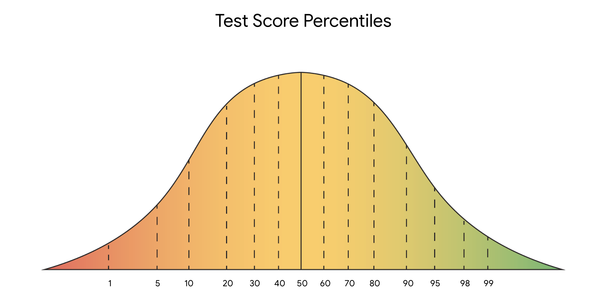
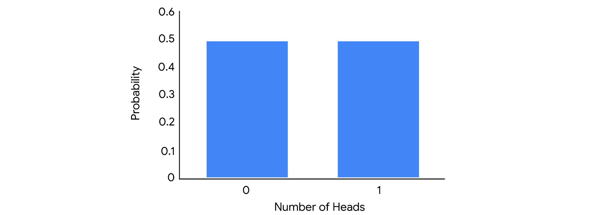

# Merkezi Eğilim Ölçüleri

Aritmetik ortalama, medyan ve mod; bir veri kümesinin merkezini farklı şekillerde tanımlar:

* **Aritmetik ortalama**: Bir veri kümesindeki ortalama değerdir.
* **Medyan**: Veri kümesindeki ortanca (tam orta) değerdir.
* **Mod**: Bir veri kümesinde en sık görülen değerdir.

Şimdi her bir merkezi eğilim ölçüsünün nasıl hesaplandığını inceleyelim.

---

## Aritmetik Ortalama, Medyan ve Mod Nasıl Hesaplanır?

### Aritmetik Ortalama

**Aritmetik ortalama**, bir veri kümesindeki tüm değerlerin toplanıp, değer sayısına bölünmesiyle hesaplanır.

Örneğin: 10, 5, 3, 50, 12 sayılarına sahipsiniz. Toplamı 80 eder. Bu toplamı, 5’e böldüğümüzde:

$$
(10 + 5 + 3 + 50 + 12) ÷ 5 = 80 ÷ 5 = 16
$$

Aritmetik ortalama yani ortalama değer 16’dır.

---

### Medyan

**Medyan**, bir veri kümesinin ortanca değeridir. Yani, veri kümesindeki değerlerin yarısı medyandan büyük, yarısı küçüktür.

Değerleri küçükten büyüğe sıralayın: 3, 5, 10, 12, 50. Ortadaki değer 10’dur, yani medyan 10’dur.

Veri kümesinde çift sayıda değer varsa, ortadaki iki sayının ortalaması alınır. Örneğin, 8 sayısını ekleyelim: 3, 5, 8, 10, 12, 50.

Ortadaki iki sayı 8 ve 10’dur. Medyan şöyle hesaplanır:

$$
(8 + 10) ÷ 2 = 18 ÷ 2 = 9
$$

Bu durumda medyan 9’dur.

---

### Mod

**Mod**, veri kümesinde en sık görülen değerdir. Bir veri kümesinin hiç modu olmayabilir, birden fazla modu da olabilir.

* Örneğin: 1, 12, 33, 54, 75 → mod yok (tekrar eden yok).
* 2, 7, 7, 11, 20 → mod = 7
* 3, 12, 12, 40, 40 → iki mod: 12 ve 40

---

## Aritmetik Ortalama, Medyan ve Mod Ne Zaman Kullanılır?

Veri kümenizin merkezini açıklamak için hangi ölçüyü kullanacağınız; verinizin yapısına ve elde etmek istediğiniz içgörüye bağlıdır. Aşağıda bazı genel kurallar verilmiştir:

---

### Aritmetik Ortalama ve Medyan

Her ikisi de veri kümesinin merkezi konumunu gösterir. Ancak, bazı verilerde biri diğerine göre daha uygundur.

**Aritmetik ortalamanın en büyük dezavantajı**, aykırı değerlerden (outlier) çok etkilenmesidir. Aykırı değer, veri kümesinin geri kalanından çok farklı olan değerdir.

Veri kümenizde aykırı değerler varsa, **medyan** genellikle daha iyi bir seçimdir. Aykırı değer yoksa, **aritmetik ortalama** da iyi sonuç verir.

#### Örnek:

Bir startup’taki çalışanların maaşlarını ele alalım:

| **Çalışan** | #1        | #2        | #3        | #4        | #5        | #6        | #7         |
| ----------- | --------- | --------- | --------- | --------- | --------- | --------- | ---------- |
| **Maaş**    | 40.000 \$ | 45.000 \$ | 45.000 \$ | 45.000 \$ | 45.000 \$ | 50.000 \$ | 500.000 \$ |

Toplam maaş: 770.000 \$

Çalışan sayısı: 7

$$
770.000 ÷ 7 = 110.000 \$
$$

Aritmetik ortalama 110.000 \$’dır. Ancak bu ortalama, çalışanların maaş dağılımını doğru şekilde temsil etmez. Çünkü yalnızca bir kişi 500.000 \$ kazanıyor — bu bir **aykırı değerdir** ve ortalamayı yukarı çeker.

Bu nedenle, bu durumda **medyan** daha doğru bir ölçüdür. Ortadaki değer:

```text
Medyan = 45.000 $
```

Medyan, tipik bir çalışanın maaşı hakkında daha gerçekçi bir fikir verir.

---

### Mod

**Mod**, kategorik verilerle çalışırken oldukça faydalıdır çünkü en sık görülen kategoriyi net biçimde gösterir.

Örneğin, bir şirket çalışan memnuniyet anketi yapar:

> "Şirkette gelişme fırsatlarından memnunum."
> Cevaplar: "Kesinlikle katılıyorum", "Katılıyorum", "Katılmıyorum", "Kesinlikle katılmıyorum"

Sonuçlar çubuk grafikle özetlenmiştir:


Grafikte en yüksek çubuk "Kesinlikle katılıyorum" ifadesini gösteriyor. Bu da bu kategorinin **mod** olduğunu ve çalışanlar arasında en yaygın görüş olduğunu gösteriyor — bu durumda pozitif bir geri bildirim.

---

## Önemli Noktalar

Aritmetik ortalama, medyan ve mod gibi merkezi eğilim ölçüleri; veri kümenizin merkezini tek bir değerle tanımlamanızı sağlar. Bir veri uzmanı olarak, veri kümenizin merkezini bilmek onun yapısını hızlıca anlamanıza ve analizinizde sonraki adımları belirlemenize yardımcı olur.

---

## Daha Fazla Bilgi İçin Kaynaklar

Aritmetik ortalama, medyan ve mod gibi merkezi eğilim ölçüleri hakkında daha fazla bilgi için aşağıdaki kaynağa göz atabilirsiniz:

* [Avustralya İstatistik Bürosu’ndan bu makale](https://www.abs.gov.au/websitedbs/D3310114.nsf/Home/Statistical+Language+-+measures+of+central+tendency#:~:text=There%20are%20three%20main%20measures,central%20value%20in%20the%20distribution.), merkezi eğilim ölçülerine genel bir bakış sunar ve aykırı değerlerin bu ölçüler üzerindeki etkisini açıklar.

# Dağılım Ölçüleri: Aralık, Varyans ve Standart Sapma

Kısa süre önce, **dağılım ölçülerinin**, veri kümenizin yayılımını veya veri değerlerindeki değişim miktarını tanımlamanıza yardımcı olduğunu öğrendiniz. Standart sapma gibi dağılım ölçüleri, verinizin dağılımı hakkında ilk anlayışı sağlar ve hangi istatistiksel yöntemleri uygulayacağınızı belirlemenize yardımcı olur.

Bu yazıda üç dağılım ölçüsünü daha detaylı öğreneceksiniz: aralık (range), varyans ve standart sapma. Bu okuma özellikle standart sapmanın temel kavramına odaklanır. Bir veri uzmanı olarak, sık sık standart sapma hesaplayacak ve bunu daha karmaşık veri analizlerinde kullanacaksınız.

---

## Dağılım Ölçüleri

Şimdi aralık, varyans ve standart sapma tanımlarını inceleyelim.

### **Aralık (Range)**

**Aralık**, bir veri kümesindeki en büyük ve en küçük değer arasındaki farktır.

Örneğin, bir biyoloji öğretmeni olduğunuzu ve final sınavı puanlarını analiz ettiğinizi düşünün. En yüksek puan 99/100 (%99), en düşük puan 62/100 (%62) ise:

$$
99 - 62 = 37
$$

**Aralık = 37 yüzde puanı**

Aralık, kolay hesaplanabilir olması nedeniyle kullanışlıdır ve veri kümenizin genel yayılımını hızlıca anlamanızı sağlar.

---

### **Varyans**

Yayılımı ölçmenin başka bir yolu da **varyans**tır. Varyans, her veri noktasının ortalamadan farkının karesinin ortalamasıdır. Temelde, varyans **standart sapmanın karesidir**. Varyans ve nasıl kullanıldığı hakkında daha fazla bilgiyi ilerleyen derslerde öğreneceksiniz.

---

### **Standart Sapma**

Şimdi standart sapma kavramını daha iyi anlamak için tanımına, görselleştirmesine ve istatistiksel formülüne bakalım.

#### **Tanım**

**Standart sapma**, değerlerinizin ortalamadan ne kadar uzaklaştığını ölçer. Bir veri noktasının ortalamaya olan tipik uzaklığını hesaplar.

* Standart sapma **büyükse**, veriler ortalamadan çok dağılmıştır.
* Standart sapma **küçükse**, veriler ortalamaya yakın toplanmıştır.

---

#### **Görselleştirme**

Aşağıdaki üç normal dağılım eğrisine bakalım. Daha sonra dağılımlar hakkında daha fazlasını öğreneceksiniz, ancak şimdilik sadece şunu bilin: eğrilerin tepe noktası **ortalama**yı temsil eder.


* Mavi noktalı eğrinin standart sapması **1**
* Yeşil düz eğrininki **2**
* Kırmızı kesikli eğrininki **3**

Mavi eğrinin yayılımı en azdır, çünkü verilerin çoğu ortalamaya yakındır. Bu nedenle mavi eğrinin standart sapması en küçüktür. Kırmızı eğri en geniş yayılıma sahiptir, çünkü verilerin çoğu ortalamadan daha uzaktadır. Bu nedenle kırmızı eğrinin standart sapması en büyüktür.

---

#### **Formül**

Standart sapma şu formülle hesaplanır (örneklem için):

```math
s = √[ Σ(x - x̄)² / (n - 1) ]
```

Burada:

* `n`: veri sayısı
* `x`: her bir veri değeri
* `x̄`: veri kümesinin ortalaması
* `Σ`: toplam işareti

> **Not:** Veri uzmanları genellikle hesaplamaları bilgisayar yardımıyla yapar. Ancak, hesaplamaların arkasındaki kavramları bilmek, istatistiksel yöntemleri gerçek dünya problemlerine uygulamanıza yardımcı olur.

---

Örneğin küçük bir veri kümesinin standart sapmasını hesaplayalım: **2, 3, 10**

**1. Ortalama (x̄) hesapla:**

$$
(2 + 3 + 10) ÷ 3 = 15 ÷ 3 = 5
$$

**2. Her değerden ortalamayı çıkar:**

$$
2 - 5 = -3
$$

$$
3 - 5 = -2
$$

$$
10 - 5 = 5
$$

**3. Bu farkların karesini al:**

$$
(-3)² = 9
$$

$$
(-2)² = 4
$$

$$
5² = 25
$$

**4. Karelerin toplamını (varyans) hesapla:**

$$
(9 + 4 + 25) ÷ (3 - 1) = 38 ÷ 2 = 19
$$

**5. Varyansın karekökünü al (standart sapma):**

$$
√19 ≈ 4.36
$$

**Standart sapma ≈ 4.36**

---

### **Örnek: Emlak Fiyatları**

Bir emlak şirketinde çalıştığınızı hayal edin. Ekip arkadaşlarınız, müşterilerine farklı semtlerdeki kira fiyatlarındaki değişkenlik hakkında bilgi vermek istiyor. Göreviniz, belirli semtlerdeki 1+1 dairelerin aylık kira fiyatlarının standart sapmasını hesaplamak.

#### **Emerald Woods**

| **Daire**    | #1  | #2  | #3    | #4    | #5    |
| ------------ | --- | --- | ----- | ----- | ----- |
| **Kira (₺)** | 900 | 950 | 1,000 | 1,050 | 1,100 |

* Ortalama: 1,000 ₺
* Standart sapma: 79.05 ₺

#### **Rock Park**

| **Daire**    | #1  | #2  | #3    | #4    | #5    |
| ------------ | --- | --- | ----- | ----- | ----- |
| **Kira (₺)** | 500 | 650 | 1,000 | 1,350 | 1,500 |

* Ortalama: 1,000 ₺
* Standart sapma: 431.56 ₺

Her iki semtte de ortalama kira 1,000 ₺ olsa da, **Rock Park**’taki standart sapma çok daha büyüktür. Bu, kira fiyatlarının bu bölgede çok daha değişken olduğunu gösterir. Örneğin, müşterilere bu bölgede ortalamanın çok altında uygun fiyatlı daire bulma olasılığının daha yüksek olduğunu söyleyebilirsiniz.

---

## Önemli Noktalar

Veri uzmanları, reklam geliri, hisse fiyatları, çalışan maaşları gibi birçok farklı veri türünde değişkenliği ölçmek için **standart sapma**yı kullanır. Standart sapma, varyans ve aralık gibi dağılım ölçüleri, verinizdeki değişimi hızlıca tespit etmenizi sağlar ve verinizin temel yapısını daha iyi anlamanıza yardımcı olur.

---

## Daha Fazla Bilgi İçin Kaynaklar

Dağılım ölçüleri hakkında daha fazla bilgi edinmek için şu kaynağa göz atabilirsiniz:

* [Statistics Canada’dan bu makale](https://www150.statcan.gc.ca/n1/edu/power-pouvoir/ch12/5214891-eng.htm), varyans ve standart sapmanın özetini sunar ve standart sapmanın dağılım ölçüsü olarak ne kadar kullanışlı olduğunu açıklar.

# Konum Ölçüleri: Yüzdelikler ve Çeyrekler

Kısa süre önce, **konum ölçülerinin** bir değerin, veri kümesindeki diğer değerlere göre konumunu belirlemenize yardımcı olduğunu öğrendiniz. Merkezi eğilim ve yayılım ölçülerine ek olarak, değerlerinizin göreli konumunu bilmek de faydalıdır. Örneğin, bir değerin diğerinden yüksek mi düşük mü olduğunu veya veri kümesinin alt, orta ya da üst kısmına mı düştüğünü bilmek önemlidir.

Bu yazıda, en yaygın konum ölçüleri olan **yüzdelikler (percentiles)** ve **çeyrekler (quartiles)** hakkında daha fazla bilgi edineceksiniz. Ayrıca **çeyrekler arası açıklık (interquartile range - IQR)** hesaplamayı ve verinizi özetlemek için **beş sayı özeti** kullanmayı öğreneceksiniz.

---

## Konum Ölçüleri

### **Yüzdelik (Percentile)**

**Yüzdelik**, belirli bir yüzdelik dilimin altında kalan veri değerini ifade eder. Yüzdelikler, verinizi 100 eşit parçaya böler. Böylece belirli bir değerin göreli konumunu veya sırasını belirlemiş olursunuz.

Örneğin, yüzdelikler okul sınavlarındaki puanları sıralamak için yaygın olarak kullanılır:

* Bir öğrenci %99’luk yüzdelikte yer alıyorsa, tüm sınav puanlarının %99’undan daha yüksek bir puan almıştır.
* %75’lik yüzdelikte yer alıyorsa, puanı sınava girenlerin %75’inden daha yüksektir.
* %50 yüzdelik, puanın ortada olduğunu, yani sınavı geçenlerin yarısından daha yüksek olduğunu gösterir.



> **Not:** *Yüzdelikler* ile *yüzde (%) puan* karıştırılmamalıdır. Örneğin, bir testten 90/100 alırsanız (%90), bu sizin %90’lık yüzdelikte olduğunuz anlamına gelmez. Eğer tüm katılımcıların yarısı 90’dan yüksek aldıysa, bu puan %50 yüzdelikte olabilir. Yani yüzdelik, puanınızın diğerlerine göre konumunu gösterir.

Yüzdelikler, değerleri karşılaştırmak ve verileri bağlama oturtmak için kullanışlıdır. Örneğin:

ABD’de yakıt tüketimi mil/gallon (mpg) ile ölçülür. Almayı düşündüğünüz bir araç 23 mpg değerine sahip. Bu iyi mi kötü mü? Bilinmez. Ancak bu aracın, orta boy sedanlar arasında %25’lik yüzdelikte olduğu belirtilirse, bu, araçların %75’inin daha iyi mpg’ye sahip olduğunu gösterir.

---

### **Çeyrek (Quartile)**

**Çeyrekler**, bir veri kümesini dört eşit parçaya ayıran ölçülerdir. Her çeyrek %25’lik bir dilimi temsil eder.

Üç adet çeyrek değeri (Q1, Q2, Q3) vardır:

* **Birinci çeyrek (Q1):** Veri kümesinin ilk yarısının ortanca değeri. %25 yüzdelik. Verilerin %25’i bu değerin altındadır.
* **İkinci çeyrek (Q2):** Tüm veri kümesinin ortanca değeri, yani medyan. %50 yüzdelik.
* **Üçüncü çeyrek (Q3):** Veri kümesinin ikinci yarısının ortanca değeri. %75 yüzdelik. Verilerin %75’i bu değerin altındadır.


---

### **Örnek: Araba Satışları**

Bir oto galeride çalıştığınızı düşünün. Satış yöneticisi, ekibin her bir satış temsilcisinin performansını karşılaştırmak istiyor. Son ayda satılan araç sayılarını içeren verileri inceleyelim:

| **Satış Temsilcisi**    | #1 | #2 | #3 | #4 | #5 | #6 | #7 | #8 |
| ----------------------- | -- | -- | -- | -- | -- | -- | -- | -- |
| **Satılan Araç Sayısı** | 18 | 13 | 6  | 10 | 15 | 7  | 10 | 9  |

**Adım adım çeyrekleri hesaplayalım:**

**1.** Verileri küçükten büyüğe sırala:

[6, 7, 9, 10, 10, 13, 15, 18]

**2.** Ortanca değeri (Q2) bul:

Veri sayısı çift olduğu için ortadaki iki değerin ortalamasını alıyoruz:

(10 + 10) ÷ 2 = 10 → Q2

**3.** Alt yarının ortancasını bul (Q1):

Alt yarı: [6, 7, 9, 10]

(7 + 9) ÷ 2 = 8 → Q1

**4.** Üst yarının ortancasını bul (Q3):

Üst yarı: [10, 13, 15, 18]

(13 + 15) ÷ 2 = 14 → Q3

**Sonuç:**

* Q1 = 8
* Q2 (medyan) = 10
* Q3 = 14

Yani:

* Alt %25’lik dilim 8 veya daha az araç sattı.
* Üst %25’lik dilim 14 veya daha fazla araç sattı.
* Ortadaki %50’lik dilim 8 ila 14 araç sattı.

> **Not:** Çeyrek değerler farklı yöntemlerle hesaplanabilir. Büyük veri kümelerinde bu fark önemsizdir, ancak küçük veri kümelerinde hesaplama yöntemine göre çeyrekler farklılık gösterebilir. Örneğin, NumPy’nin [`percentile()`](https://numpy.org/doc/stable/reference/generated/numpy.percentile.html) fonksiyonu 9 farklı yöntem sunar.

---

### **Çeyrekler Arası Açıklık (IQR)**

Veri kümenizin ortadaki %50’lik kısmı, yani Q1 ile Q3 arasındaki mesafe **çeyrekler arası açıklık (IQR)** olarak adlandırılır.

**Formül:**

$$
\text{IQR} = Q3 - Q1
$$

Yukarıdaki örnekte:

$$
\text{IQR} = 14 - 8 = 6
$$

IQR, verinin merkezine odaklanır ve aykırı değerlerden daha az etkilenir. Aşağıdaki gibi aykırı değerler genellikle IQR’nin 1.5 katından fazla uzaklıktaki değerlerdir:

$$
\text{* Alt sınır: } Q_1 - 1.5 \cdot \text{IQR}
$$

$$
\text{* Üst sınır: } Q_3 + 1.5 \cdot \text{IQR}
$$

> **Not:** IQR teknik olarak bir **dağılım ölçüsüdür** çünkü verilerin orta %50’sinin yayılımını gösterir.

---

### **Beş Sayı Özeti (Five Number Summary)**

Veri kümenizi özetlemenin bir yolu da **beş sayı özeti**dir. Bu özet aşağıdaki değerlerden oluşur:

* En küçük değer (min)
* Q1
* Medyan (Q2)
* Q3
* En büyük değer (max)

Beş sayı özeti, verinin dağılımını genel hatlarıyla gösterir. Bu özet genellikle **kutu grafiği (box plot)** ile görselleştirilir.

* Kutu kısmı Q1 ile Q3 arasını gösterir.
* Kutunun içindeki dikey çizgi Q2’dir.
* "Bıyıklar", yani kutunun dışındaki çizgiler minimum ve maksimum değerleri gösterir.

Aşağıdaki kutu grafiği araba satış verilerini göstermektedir:


---

## Önemli Noktalar


Veri uzmanları, ürün satışlarından hane gelirine kadar her türlü veriyi daha iyi anlamak için yüzdelikler ve çeyrekler gibi **konum ölçüleri**ni kullanır. Bu ölçüler:

* Veri değerlerinin göreli konumunu hızlıca tanımlamaya yardımcı olur.
* Verinin dağılımını daha hassas şekilde analiz etmeyi sağlar.

---

## Daha Fazla Bilgi İçin Kaynak

Konum ölçüleri (yüzdelikler, çeyrekler, beş sayı özeti) hakkında daha fazla bilgi için şu kaynağa göz atabilirsiniz:

* [Freie Universität Berlin – İstatistik Sözlüğü](https://www.geo.fu-berlin.de/en/v/soga-py/Basics-of-statistics/index.html)

# Olasılığın Temel Kavramları

Kısa süre önce, **olasılık** kavramının belirsizliği nicelleştirmek ya da bir olayın gerçekleşme olasılığını tanımlamak için matematiği kullandığını öğrendiniz. Örneğin, yarın yağmur yağma olasılığı %80 olabilir veya belirli bir adayın seçimi kazanma şansı %20 olabilir.

Bu yazıda, olasılığın temel kavramları hakkında daha fazla bilgi edineceksiniz. Rastgele deney kavramını, bir olayın olasılığının nasıl temsil edileceğini ve hesaplanacağını, ayrıca temel olasılık gösterimini ele alacağız.

---

## Olasılığın Temelleri

### **Temel Kavramlar: Rastgele Deney, Sonuç, Olay**

Olasılık kuramının üç temel kavramıyla başlayalım:

* Rastgele deney
* Sonuç
* Olay

Olasılık, istatistikçilerin **rastgele deney** (veya istatistiksel deney) olarak adlandırdığı durumlarla ilgilenir. **Rastgele deney**, sonucunun kesin olarak tahmin edilemediği bir süreçtir.

Örneğin, bir madeni para atmadan veya zar atmadan önce sonucu bilemezsiniz. Para atıldığında yazı veya tura gelebilir. Zar atıldığında 3 ya da 6 gelebilir.

Tüm rastgele deneylerin üç ortak özelliği vardır:

* Deneyin birden fazla olası sonucu vardır.
* Tüm olası sonuçlar önceden belirtilebilir.
* Sonuç tamamen şansa bağlıdır.

İstatistikte, bir rastgele deneyin sonucu **sonuç (outcome)** olarak adlandırılır. Örneğin, bir zar attığınızda, olası sonuçlar şunlardır: 1, 2, 3, 4, 5, 6.

**Olay (event)** ise bir veya daha fazla sonuçtan oluşan bir kümedir. Örneğin, bir zar atıldığında çift sayı gelmesi bir olaydır. Bu olayın sonuçları: 2, 4, 6’dır. Tek sayı gelmesi de bir başka olaydır ve sonuçları: 1, 3, 5’tir.

Rastgele bir deneyde her olaya bir olasılık atanır. Şimdi bir olayın olasılığı nasıl temsil edilir ve hesaplanır, bunu inceleyelim.

---

### **Bir Olayın Olasılığı**

Bir olayın gerçekleşme olasılığı **0 ile 1 arasında bir sayı** olarak ifade edilir. Olasılık ayrıca yüzde olarak da ifade edilebilir.

* Bir olayın olasılığı 0 ise, bu olayın gerçekleşme şansı %0’dır.
* Bir olayın olasılığı 1 ise, bu olayın gerçekleşme şansı %100’dür.

Bu aralıkta (0 ile 1 arasında) farklı olasılık dereceleri bulunur. Örneğin:

* Bir olayın olasılığı 0.05 (veya %5) ise, bu olayın gerçekleşme şansı düşüktür.
* Bir olayın olasılığı 0.95 (veya %95) ise, bu olayın gerçekleşme şansı yüksektir.
* Bir olayın olasılığı 0.5 (veya %50) ise, olayın gerçekleşme ve gerçekleşmeme olasılığı eşittir.

Bir olayın olasılığını bilmek, belirsizlik içeren durumlarda bilinçli kararlar vermenize yardımcı olur. Örneğin, yarın yağmur yağma olasılığı 0.1 (%10) ise, açık hava pikniği planınız için endişelenmenize gerek yoktur. Ancak yağmur ihtimali 0.9 (%90) ise, başka bir gün için plan yapmanız mantıklı olabilir.

---

### **Bir Olayın Olasılığı Nasıl Hesaplanır?**

Tüm olası sonuçların eşit olasılıkla gerçekleştiği bir olayda, olasılığı hesaplamak için şu formülü kullanabilirsiniz:

**İstenen sonuç sayısı** ÷ **Toplam olası sonuç sayısı**

Bu formül, klasik olasılık tanımını da verir.

Şimdi para atma ve zar atma örnekleriyle bu hesaplamayı daha iyi anlayalım.

---

#### **Örnek: Para Atma**

Adil bir para atmak, klasik bir rastgele deney örneğidir:

* Birden fazla olası sonuç vardır.
* Olası sonuçlar önceden bilinir: yazı ya da tura.
* Sonuç şansa bağlıdır.

Tek bir atışta **yazı gelme olasılığını** hesaplamak istiyoruz. Bu durumda:

```
1 ÷ 2 = 0.5 veya %50
```

Eğer her iki yüzü de yazı olan özel bir para atsaydınız, her atışta yazı gelirdi. Bu durumda:

* Yazı gelme olasılığı = %100
* Tura gelme olasılığı = %0

> Not: “Yazı gelme olasılığı %50” demek, her 10 atıştan tam olarak 5’inin yazı geleceği anlamına gelmez. Örneğin, 10 atışta 4 yazı ve 6 tura gelebilir. Ancak uzun vadede yazıların oranı %50’ye yaklaşır.

---

#### **Örnek: Zar Atma**

Altı yüzlü bir zar atmak da klasik bir rastgele deneydir:

* Birden fazla olası sonuç vardır.
* Olası sonuçlar önceden bilinir: 1, 2, 3, 4, 5, 6
* Sonuç tamamen şansa bağlıdır.

Bir zar atışında **3 gelme olasılığı**:

```
1 ÷ 6 = 0.1666 → Yaklaşık %16.7
```

---

### **Olasılık Gösterimi**

Olasılığı temsil etmek için kullanılan bazı sembolleri bilmek faydalıdır; bu semboller eğitimde ve teknik belgelerde sıkça kullanılır.

* **P**, bir olayın olasılığını ifade eder.
* **A** ve **B**, olayları temsil eden harflerdir.

Örneğin, iki farklı olayla çalışıyorsanız, şu şekilde gösterim yapılır:

* Olay A'nın olasılığı: `P(A)`
* Olay B'nin olasılığı: `P(B)`
* Her olay için 0 ≤ P(A) ≤ 1
* Eğer `P(A) > P(B)` ise, A olayının gerçekleşme olasılığı B olayından yüksektir.
* Eğer `P(A) = P(B)` ise, A ve B olaylarının gerçekleşme olasılıkları eşittir.

---

## Önemli Noktalar

Veri uzmanları, belirsizlik içeren durumlarda paydaşlara bilinçli kararlar vermelerinde yardımcı olmak için olasılıktan faydalanır. Olasılığın temel kavramları konusundaki bilginiz, daha karmaşık olasılık hesaplamaları için bir temel oluşturacaktır.

---

## Daha Fazla Bilgi İçin Kaynak

Olasılığın temel kavramları hakkında daha fazla bilgi için şu kaynağa göz atabilirsiniz:

* [Richland Community College Ders Notları](https://people.richland.edu/james/lecture/m116/sequences/probability.html): Olasılığın temel kavramlarını ve temel kurallarını özetleyen faydalı bir kaynaktır.

# Birden Fazla Olayın Olasılığı

Şimdiye kadar, tekil olayların olasılıklarının nasıl hesaplandığını öğrendiniz. Ancak hem günlük hayatta hem de veriyle ilgili çalışmalarda birçok durum birden fazla olayı kapsar. Gelecekte bir veri profesyoneli olarak, birden fazla olayın olasılığıyla sıkça ilgileneceksiniz.

Bu yazıda, birden fazla olayı kapsayan olasılık konusunu daha detaylı inceleyeceksiniz. Üç temel olasılık kuralını öğreneceksiniz: tamamlayıcı (complement) kuralı, toplama (addition) kuralı ve çarpma (multiplication) kuralı. Bu kurallar, birden fazla olayın olasılığını daha iyi anlamanıza yardımcı olur. Öncelikle bu kuralların uygulandığı iki olay türünü inceleyeceğiz: **birbirini dışlayan (mutually exclusive)** ve **bağımsız (independent)** olaylar. Ardından her iki tür olay için olasılık hesaplamayı öğreneceksiniz.

---

## İki Tür Olay

Üç temel olasılık kuralı, farklı türdeki olaylara uygulanır:

* **Tamamlayıcı kuralı** ve **toplama kuralı**, birbirini dışlayan olaylara uygulanır.
* **Çarpma kuralı**, bağımsız olaylara uygulanır.

---

### **Birbirini Dışlayan (Mutually Exclusive) Olaylar**

İki olay **birbirini dışlıyorsa**, aynı anda gerçekleşemezler.

Örneğin, aynı anda hem Dünya'da hem Ay'da olamazsınız. Aynı anda hem oturup hem ayakta duramazsınız.

Klasik olasılık örneklerinde:

* Bir madeni para attığınızda hem yazı hem tura gelmesi mümkün değildir.
* Bir zar attığınızda aynı anda hem 2 hem 4 gelmesi imkânsızdır.

---

### **Bağımsız (Independent) Olaylar**

İki olay **bağımsızsa**, birinin gerçekleşmesi diğerinin olasılığını değiştirmez. Yani bir olay, diğerinin sonucunu etkilemez.

Örneğin:

* Sabah film izlemeniz, öğleden sonra havanın nasıl olacağını etkilemez.
* Radyoda müzik dinlemeniz, yeni buzdolabınızın teslimatını etkilemez.

İki ardışık para atışı ya da zar atışı da bu duruma örnektir:

* İlk atışta yazı gelmesi, ikinci atışın sonucunu değiştirmez.
* İlk zar atışında 2 gelmesi, ikinci zar atışının sonucunu etkilemez.

---

## Üç Temel Kural

Artık birbirini dışlayan ve bağımsız olaylar arasındaki farkı biliyorsunuz. Şimdi üç temel olasılık kuralını inceleyelim:

* **Tamamlayıcı kuralı**
* **Toplama kuralı**
* **Çarpma kuralı**

---

### **Tamamlayıcı Kuralı**

Tamamlayıcı kural, birbirini dışlayan olaylarla ilgilidir. İstatistikte, bir olayın tamamlayıcısı, o olayın **gerçekleşmemesidir**.

Örneğin:

* Ya kar yağar ya da yağmaz.
* Takımınız ya şampiyon olur ya da olmaz.

Bir olayın olma ve olmama olasılıklarının toplamı daima 1'dir (veya %100).

**Tamamlayıcı kural** şu şekilde ifade edilir:

```markdown
P(A') = 1 - P(A)
```

> **Not:** Olasılık gösteriminde `’` (kesme işareti), olumsuzluğu simgeler. `P(A')` ifadesi "A olayının olmama olasılığı" anlamına gelir.

Örnek:
Yarın kar yağma olasılığı %40 ise (P(kar) = 0.4), kar yağmama olasılığı şöyle hesaplanır:

```markdown
P(kar yağmaz) = 1 - P(kar) = 1 - 0.4 = 0.6
```

Yani, yarın kar yağmama olasılığı **%60**’tır.

---

### **Toplama Kuralı (Birbirini Dışlayan Olaylar İçin)**

**Toplama kuralı**, birbirini dışlayan iki olayın **birlikte** olma olasılığını hesaplamaya yarar:

```markdown
P(A veya B) = P(A) + P(B)
```

> Not: Birbirini dışlamayan olaylar için de bir toplama kuralı vardır, ancak bu içerikte yalnızca **birbirini dışlayan olaylar** ele alınmaktadır.

#### **Zar Atma (2 veya 4 gelme olasılığı)**

Tek bir zar atışında, 2 veya 4 gelme olasılığı nedir?

Bu iki olay birbirini dışladığı için toplama kuralı uygulanabilir:

```markdown
P(2 veya 4) = P(2) + P(4) = 1/6 + 1/6 = 2/6 = 1/3
```

Yani, 2 veya 4 gelme olasılığı **1/3** ya da **%33**’tür.

---

### **Çarpma Kuralı (Bağımsız Olaylar İçin)**

**Çarpma kuralı**, iki bağımsız olayın **birlikte** gerçekleşme olasılığını hesaplar:

```markdown
P(A ve B) = P(A) × P(B)
```

> Not: Bağımlı olaylar için de çarpma kuralı vardır, ancak bu içerikte sadece **bağımsız olaylar** ele alınmaktadır.

#### **Zar Atma (Önce 1, sonra 6 gelme olasılığı)**

İki ardışık zar atışında önce 1, sonra 6 gelme olasılığı:

Bu olaylar bağımsızdır. Her zar atışında bir sayı gelme olasılığı 1/6’dır.

```markdown
P(1 ve 6) = P(1) × P(6) = 1/6 × 1/6 = 1/36
```

Yani, önce 1, sonra 6 gelme olasılığı **1/36** ya da yaklaşık **%2.8**’dir.

---

## Önemli Noktalar

Temel olasılık kuralları, birbirini dışlayan ve bağımsız olayların tanımlanmasında kullanılır. Bu kuralları anlamak, gelecekte veri profesyoneli olarak gerçekleştireceğiniz daha karmaşık analizler için sağlam bir temel oluşturur.

---

## Daha Fazla Bilgi İçin Kaynak

Olasılık hakkında daha fazla bilgi edinmek için bu etkileşimli rehbere göz atabilirsiniz:
👉 [Seeing Theory](https://seeing-theory.brown.edu/index.html#secondPage)

# Bağımlı Olaylar İçin Koşullu Olasılığı Hesaplama

Son zamanlarda **koşullu olasılığın**, bir olayın gerçekleşme olasılığının başka bir olayın gerçekleşmiş olması durumunda nasıl değiştiğini ifade ettiğini öğrendiniz. Koşullu olasılık, **bağımlı olaylar** arasındaki ilişkiyi, yani ilk olayın ikinci olayın olasılığı üzerindeki etkisini tanımlamanızı sağlar.

Bu yazıda, iki veya daha fazla bağımlı olay için koşullu olasılığın nasıl hesaplandığını öğreneceksiniz. Hesaplamaya geçmeden önce bağımlılık kavramını gözden geçirelim.

---

## Koşullu Olasılık

Daha önce, tek bir olayın ya da birbirinden bağımsız iki veya daha fazla olayın (örneğin ardışık iki para atışı) olasılığını hesaplamayı öğrendiniz. Koşullu olasılık ise **iki veya daha fazla bağımlı olay** için geçerlidir.

---

### **Bağımlı Olaylar**

İki olay **bağımsızsa**, birinin gerçekleşmesi diğerinin olasılığını değiştirmez. Örneğin, iki ardışık para atışı bağımsız olaylardır. İlkinde yazı gelmesi, ikinci atışın sonucunu etkilemez.

Buna karşılık, iki olay **bağımlıysa**, birinin gerçekleşmesi diğerinin olasılığını değiştirir. Yani ilk olay, ikinci olayın sonucunu etkiler.

Örneğin:

* Sınavdan iyi bir not almak istiyorsanız, öncesinde ders çalışmanız gerekir.
* Popüler bir restoranda sıra beklemeden yemek yemek istiyorsanız, erken gitmeniz gerekir.

Bu durumlarda ikinci olay, birinci olaya **bağımlı** ya da **koşullu** olarak tanımlanabilir.

---

## Koşullu Olasılık Formülü

İki bağımlı olay olan A ve B için, her ikisinin gerçekleşme olasılığı şu şekilde hesaplanır:

```markdown
P(A ve B) = P(A) × P(B|A)
```

Burada `P(B|A)`, "A gerçekleştiği durumda B'nin olasılığı" anlamına gelir. Bu, **koşullu olasılığı** ifade eder.

Ayrıca formül şu şekilde de yazılabilir:

```markdown
P(B|A) = P(A ve B) / P(A)
```

> **Not:** Bu formül, bağımsız olaylar için de geçerlidir. Eğer A ve B bağımsızsa, `P(B|A) = P(B)` olur. Bu durumda formül, daha önce öğrendiğiniz çarpma kuralına dönüşür:
> `P(A ve B) = P(A) × P(B)`

---

### **Örnek: Oyun Kartları**

Koşullu olasılığa dair klasik bir örnek: 52 kartlık standart bir desteden iki kalp kartı çekme durumu.

* **Olay A**: İlk çekilen kartın kalp olması.
* **Olay B**: İlk kart kalp ise, ikinci kartın da kalp olması.

Standart bir destede 4 tür (kalp, karo, sinek, maça) ve her türden 13 kart bulunur.

* İlk çekilişte kalp gelme olasılığı: `13/52 = 0.25` (yani %25)
* İlk kart kalp çıktıysa, destede 12 kalp kaldı ve kart sayısı 51 oldu.
  İkinci kartın kalp olma olasılığı: `12/51 ≈ 0.235` (yaklaşık %23.5)

Formüle uygulayalım:

```markdown
P(1. kalp ve 2. kalp) = P(1. kalp) × P(2. kalp | 1. kalp)
                      = 13/52 × 12/51
                      = 1/17 ≈ 0.0588 (yaklaşık %5.9)
```

Yani, iki kalp kartını art arda çekme olasılığı yaklaşık **%5.9**’dur.

---

### **Örnek: Online Alışveriş**

Başka bir örnek: Bir e-ticaret sitesinde çalışan bir veri uzmanı olduğunuzu düşünün.

* Ziyaretçilerin %20’si 100\$ veya daha fazla alışveriş yapıyor.
* 100\$’lık alışveriş yapan müşterilerin %10’una rastgele hediye kartı veriliyor.

**Olay A**: 100\$ veya daha fazla alışveriş yapmak.
**Olay B**: Hediye kartı kazanmak (sadece 100\$ veya üzeri alışveriş yapanlar için geçerli).

Bu olaylar bağımlıdır; çünkü hediye kartı kazanmak, alışveriş yapmaya bağlıdır.

Formüle uygulayalım:

```markdown
P($100 ve hediye kartı) = P($100) × P(hediye kartı | $100)
                        = 0.2 × 0.1
                        = 0.02 (yani %2)
```

Yani, bir müşterinin 100\$ veya daha fazla harcayıp hediye kartı kazanma olasılığı **%2**’dir.

---

## Önemli Noktalar

Koşullu olasılık, **bağımlı olaylar arasındaki ilişkiyi** açıklamak için kullanılır. Veri uzmanları, bu kavramı özellikle iş dünyasında yaygın olarak kullanır. Örneğin, bir reklam kampanyasının satış gelirini nasıl etkileyeceğini öngörmek için koşullu olasılıklar hesaplanabilir. Bu tür analizler, paydaşlara kaynakları en verimli şekilde nasıl kullanacaklarına dair bilgi sağlar.

---

## Daha Fazla Bilgi İçin Kaynak

Koşullu olasılık hakkında daha fazla bilgi edinmek için şu kaynağa göz atabilirsiniz:

* [Investopedia'dan bu makale, iş bağlamında koşullu olasılığı açıklar](https://www.investopedia.com/terms/c/conditional_probability.asp#:~:text=Conditional%20probability%20is%20defined%20as,succeeding%2C%20or%20conditional%2C%20event.)

# Bayes Teoremi ile Koşullu Olasılık Hesaplama

Son zamanlarda, **Bayes teoremi**nin koşullu olasılığı belirlemek için kullanılan matematiksel bir formül olduğunu öğrendin. Bu teorem, 18. yüzyılda İngiltere, Londra'da yaşamış matematikçi Thomas Bayes’in adını taşır. Hatırla, **koşullu olasılık** bir olayın, başka bir olayın zaten gerçekleştiği durumda gerçekleşme olasılığıdır. Örneğin, bir deste iskambil kartından bir as çektiğinde, aynı desteden ikinci bir as çekme olasılığı değişir.

Bu bölümde, Bayes teoreminin farklı parçalarını ve bu teoremi koşullu olasılık hesaplamak için nasıl kullanabileceğini öğreneceksin.

## Bayes Teoremi

Bayes teoremi, bir olayın olasılığını yeni bilgiler ışığında güncellemenin bir yolunu sağlar.

### **Öncelikli (prior) ve Sonralık (posterior) olasılık**

Bayesian istatistikte, **öncelikli olasılık** yeni veri toplanmadan önceki olay olasılığıdır. **Sonralık olasılık** ise yeni verilere dayanarak güncellenmiş olay olasılığıdır.

Bayes teoremi, öncelikli olasılığı verilerle güncelleyerek sonralık olasılığı hesaplamanı sağlar.

Örneğin, bir tıbbi durumun yaşla ilişkili olduğunu düşünelim. Bayes teoremi, bir kişinin bu duruma sahip olma olasılığını yaşına göre daha doğru belirlemene yardımcı olur. Öncelikli olasılık, kişinin duruma sahip olma olasılığıdır. Sonralık (güncellenmiş) olasılık ise, kişinin belirli bir yaş grubundaysa duruma sahip olma olasılığıdır.

### **Teorem**

Teoreme bakalım:

**Bayes teoremi**, A ve B iki olaysa, B gerçekleştiğinde A’nın olasılığı, A’nın olasılığı ile B’nin A’ya bağlı olasılığının çarpımının B’nin olasılığına bölünmesiyle bulunur.

**Bayes Teoremi**

```math
P(A|B) = \frac{P(B|A) * P(A)}{P(B)}
````

Teoremde, öncelikli olasılık A olayının olasılığıdır. Hesaplamaya çalıştığın sonralık olasılık ise B olayının gerçekleştiği durumda A olayının olasılığıdır.

* **P(A)**: Öncelikli olasılık
* **P(A|B)**: Sonralıklı olasılık

Bazı durumlarda istatistikçiler ve veri profesyonelleri, B olayının A’ya bağlı olasılığı için “olasılık (likelihood)”, B olayının olasılığı için ise “kanıt (evidence)” terimlerini kullanır.

* **P(B|A)**: Olasılık (Likelihood)
* **P(B)**: Kanıt (Evidence)

Bu terimleri kullanarak Bayes teoremini şu şekilde ifade edebiliriz:


Hesaplamayı farklı açılardan düşünmek ve problemini denkleme uyarlamak faydalı olabilir.

Bayes teoremini şöyle düşünebilirsin: Önceden sahip olduğun inanç (P(A)) yeni veriler (olasılık P(B|A) ve kanıt P(B)) kullanılarak sonralık olasılığa (P(A|B)) dönüştürülür.

***Not:*** *Bu bölüm Bayes teoremi ile ilgili temel kavram ve terimlerin tanıtımını yapar. Bayesian istatistiğin detaylı incelenmesi bu kursun kapsamı dışındadır. Kariyerin ilerledikçe Bayes teoremini ve uygulamalarını daha derinlemesine öğrenme fırsatı bulacaksın.*

Şimdilik hatırlanması gereken önemli nokta, Bayes teoreminde hem B’nin A’ya bağlı koşullu olasılığı hem de A’nın B’ye bağlı koşullu olasılığının bulunduğudur. Bu olasılıklardan birini bilirsen, Bayes teoremi diğerini bulmana yardımcı olur.

### **Örnek: spam filtresi**

Bayes teoreminin dijital dünyadaki bilinen uygulamalarından biri spam filtrelemedir; yani bir e-postanın spam olup olmadığını tahmin etmek. Pratikte karmaşık spam filtreleri, e-postanın içeriği, başlığı, ek dosya olup olmadığı, gönderen adresin alan adı türü (.edu veya .org) gibi birçok değişkenle çalışır. Ancak örneğimiz için basitleştirilmiş bir Bayesian spam filtresi kullanacağız.

Diyelim ki, bir e-postanın spam olma olasılığını, e-postada belirli bir kelimenin (örneğin “money”) geçip geçmemesine bağlı olarak hesaplamak istiyorsun.

Elinde şu bilgiler var:

* Bir e-postanın spam olma olasılığı %20.
* Bir e-postada “money” kelimesinin geçme olasılığı %15.
* Spam e-postalarda “money” kelimesinin geçme olasılığı %40.

Bu örnekte öncelikli olasılığın, bir e-postanın spam olma olasılığıdır. Sonralık olasılık ise, e-postada “money” kelimesi varsa spam olma olasılığıdır. Öncelikli olasılığını güncellemek için kullanacağın yeni veriler, “money” kelimesinin e-postada geçme olasılığı ve spam e-postada geçme olasılığıdır.

Bayes teoremiyle çalışırken, önce A olayının ne olduğunu, B olayının ne olduğunu belirlemek faydalıdır. Böylece olaylar arasındaki ilişkiyi anlamak ve formülü kullanmak kolaylaşır.

Burada A olayını “spam e-posta”, B olayını ise “e-postada money kelimesinin geçmesi” olarak adlandıralım. Bayes teoremini şimdi şu şekilde yazabilirsin:

```math
P(A|B) = \frac{P(B|A) * P(A)}{P(B)}
```

Yani,

P(Spam | Money) = P(Money | Spam) \* P(Spam) / P(Money)

Aşağıdakini bulmak istiyorsun:

* **P(Spam | Money), yani sonralık olasılık:** E-postada “money” kelimesi varsa spam olma olasılığı.

Şimdi verilerini formüle yerleştir:

* **P(Spam), yani öncelikli olasılık:** E-postanın spam olma olasılığı = 0.2, yani %20
* **P(Money), yani kanıt:** E-postada “money” kelimesinin geçme olasılığı = 0.15, yani %15
* **P(Money | Spam), yani olasılık:** E-posta spam ise “money” kelimesinin geçme olasılığı = 0.4, yani %40

```math
P(Spam | Money) = \frac{0.4 * 0.2}{0.15} = 0.53333
```

Yani, e-postada “money” kelimesi varsa spam olma olasılığı yaklaşık %53.3’tür.

## Önemli Noktalar

Bayes teoremi, Bayesian istatistik alanının temelidir. Bayesian çıkarım olarak da bilinen bu alan, modern veri analizinde verileri analiz etmek ve yorumlamak için güçlü bir yöntemdir. Veri profesyonelleri, Bayes teoremini yapay zekadan tıbbi testlere kadar çok çeşitli alanlarda kullanırlar.

Bayes teoremi hakkında temel bilgi sahibi olmak, veri profesyoneli olarak kariyerinde Bayesian istatistiği daha iyi öğrenmeni sağlar.

## Daha Fazla Bilgi İçin Kaynaklar

Bayes Teoremi hakkında daha fazla bilgi için aşağıdaki kaynağa bakabilirsin:

* [Pennsylvania State University tarafından Bayes Teoremi açıklaması](https://online.stat.psu.edu/stat500/lesson/2/2.7)

“Savcı yanılgısı” (prosecutor's fallacy) hakkında ilginç bir tartışma için şu sayfaya göz atabilirsin:

* [American Journal of Epidemiology tarafından savcı yanılgısının açıklaması](https://academic.oup.com/aje/article/179/9/1125/103523)

# Ayrık olasılık dağılımları

Son zamanlarda, veri profesyonellerinin farklı veri setlerini modellemek ve verilerinde anlamlı desenleri tespit etmek için olasılık dağılımlarını kullandığını öğrendiniz. Hatırlayalım ki, **olasılık dağılımı** rastgele bir olayın olası sonuçlarının olasılıklarını tanımlar. Ayrık olasılık dağılımları, ayrık rastgele değişkenleri veya ayrık olayları temsil eder. Genellikle, ayrık olayların sonuçları sayılabilen tam sayılar olarak ifade edilir. Örneğin, bir zar atıldığında sonuç 2 veya 3 olabilir, ancak 2.575 ya da 3.184 gibi kesirli bir değer olamaz.

Bu okumada, dört yaygın ayrık olasılık dağılımının temel özelliklerine genel bir bakış sunulacak:

-   Uniform (Eşit olasılıklı) dağılım
-   Binom dağılımı
-   Bernoulli dağılımı
-   Poisson dağılımı

## Ayrık olasılık dağılımları

### **Uniform dağılım**

Uniform dağılım, tüm sonuçların eşit olasılığa sahip olduğu olayları tanımlar.

Örneğin, bir zar atıldığında altı farklı sonuç olabilir: 1, 2, 3, 4, 5 veya 6. Her sonucun olasılığı aynıdır: 6’da 1, yani yaklaşık %16.7.

Bir dağılımı görselleştirmek için grafik kullanabilirsiniz, örneğin histogram. Ayrık dağılımlarda rastgele değişken x ekseninde, karşılık gelen olasılık ise y ekseninde gösterilir. Burada, x ekseni tek bir zar atışının olası sonuçlarını, y ekseni ise her sonucun olasılığını temsil eder.


_**Not:**_ _Veri profesyonelleri, uniform dağılımı genellikle Monte Carlo simülasyonları gibi daha karmaşık istatistiksel yöntemlerin bir parçası olarak kullanır. Bu yöntemlerin detaylı incelenmesi bu kursun kapsamı dışındadır._

_**Not:**_ _Uniform dağılım, hem ayrık hem de sürekli rastgele değişkenler için geçerlidir._

### **Binom dağılımı**

**Binom dağılımı**, sadece iki olası sonuçlu olayların olasılığını modellemek için kullanılır: başarı veya başarısızlık. Bu sonuçlar birbirini dışlar ve aynı anda gerçekleşemez.

Bu tanım şu varsayımlara dayanır:

-   Her olay bağımsızdır, yani diğerlerinin olasılığını etkilemez.
-   Her olayın başarı olasılığı aynıdır.

Başarı ve başarısızlık sadece kolaylık için kullanılan etiketlerdir. Örneğin, bir madeni para atıldığında sadece iki olası sonuç vardır: yazı veya tura. Analizin ihtiyaçlarına göre, yazı ya da tura başarı olarak tanımlanabilir.

Binom dağılımı, binom deneyi denilen bir rastgele olayı temsil eder. Binom deneyinin özellikleri şunlardır:

-   Deney birden çok tekrar edilen denemeden oluşur.
-   Her denemenin sadece iki olası sonucu vardır.
-   Başarı olasılığı her denemede aynıdır.
-   Her deneme bağımsızdır.

Bir örnek: 10 kez art arda madeni para atmak. Bu bir binom deneyidir çünkü:

-   Deney 10 tekrarlı denemeden (madeni para atışları) oluşur.
-   Her denemenin iki olası sonucu vardır: yazı veya tura.
-   Başarı olasılığı aynıdır. Eğer başarı yazı olarak tanımlanırsa, başarı olasılığı %50’dir.
-   Denemeler birbirinden bağımsızdır.

Histogramda x ekseni yazı sayısını, y ekseni ise her sonucun olasılığını gösterir.


Veri profesyonelleri binom dağılımını, örneğin aşağıdakilerin olasılığını modellemek için kullanabilir:

-   Yeni bir ilacın yan etki oluşturma olasılığı
-   Kredi kartı işleminin dolandırıcılık olma ihtimali
-   Bir hisse senedinin değer kazanma olasılığı

Makine öğreniminde binom dağılımı genellikle verileri sınıflandırmak için kullanılır. Örneğin, bir veri uzmanı bir algoritmayı dijital bir görüntünün belirli bir hayvan türü (kedi veya köpek gibi) olup olmadığını tanıyacak şekilde eğitebilir.

### **Bernoulli dağılımı**

Bernoulli dağılımı, iki olası sonuçlu olayları modellemek açısından binom dağılımına benzer. Tek fark, Bernoulli dağılımının sadece tek bir denemeyi, binomun ise tekrar eden denemeleri kapsamasıdır. Bernoulli deneyi için klasik örnek tek bir madeni para atışıdır.

Histogramda x ekseni madeni para atışının olası sonuçlarını, y ekseni ise her sonucun olasılığını gösterir.



### **Poisson dağılımı**

**Poisson dağılımı**, belirli bir zaman diliminde belli sayıda olayın gerçekleşme olasılığını modellemek için kullanılır.

_**Not:**_ _Poisson dağılımı aynı zamanda belli bir mesafe, alan veya hacim içinde gerçekleşen olayların sayısını da modelleyebilir. Bu kursta zaman odaklıyız._

Poisson dağılımı, Poisson deneyi denilen rastgele deneyleri temsil eder. Poisson deneyinin özellikleri:

-   Deneydeki olay sayısı sayılabilir.
-   Belirli bir zaman diliminde gerçekleşen olayların ortalama sayısı bilinir.
-   Her olay bağımsızdır.

Örneğin, içerik paylaştığınız bir internet siteniz olduğunu düşünün. Siteniz ortalama saatte iki görüntülenme alıyor. Bir saatte sitenizin kaç kez görüntüleneceğinin olasılığını bulmak istiyorsunuz.

Bu bir Poisson deneyidir çünkü:

-   Olay sayısı sayılabilir. Görüntülenme sayısını sayabilirsiniz.
-   Belirli zaman diliminde ortalama olay sayısı bilinir (saatte 2 görüntülenme).
-   Olaylar bağımsızdır. Bir kişinin sitenizi görüntüleme olasılığı başka bir kişinin görüntüleme olasılığını etkilemez.

Histogramda x ekseni saat başına görüntülenme sayısını, y ekseni gerçekleşme olasılığını gösterir.


Veri profesyonelleri Poisson dağılımını aşağıdaki gibi verileri modellemek için kullanır:

-   Müşteri hizmetleri çağrı merkezindeki saatlik çağrı sayısı
-   Bir mağazadaki günlük müşteri sayısı
-   Bir şehirdeki aylık gök gürültülü fırtına sayısı
-   Bir bankadaki saniyedeki finansal işlem sayısı

## Önemli noktalar

Verinizin dağılımını belirlemek analizde önemli bir adımdır ve gelecekteki sonuçlar hakkında bilinçli tahminler yapmanızı sağlar. Gelecekte veri profesyoneli olarak binom ve Poisson gibi ayrık dağılımları kullanarak verilerinizi daha iyi anlayacaksınız. Verinizin olasılık dağılımını bilmek, analiziniz için en uygun istatistiksel yöntem veya makine öğrenimi modelini seçmenize yardımcı olur.

## Daha fazla bilgi için kaynaklar

Ayrık olasılık dağılımları hakkında daha fazla bilgi edinmek için aşağıdaki kaynaklara bakabilirsiniz:

-   [Statistics How To sitesindeki bu makale](https://www.statisticshowto.com/discrete-probability-distribution/) ayrık olasılık dağılımı kavramını genel hatlarıyla açıklar ve binom ile Poisson gibi dağılımlar hakkında daha fazla bilgi için bağlantılar sunar.
