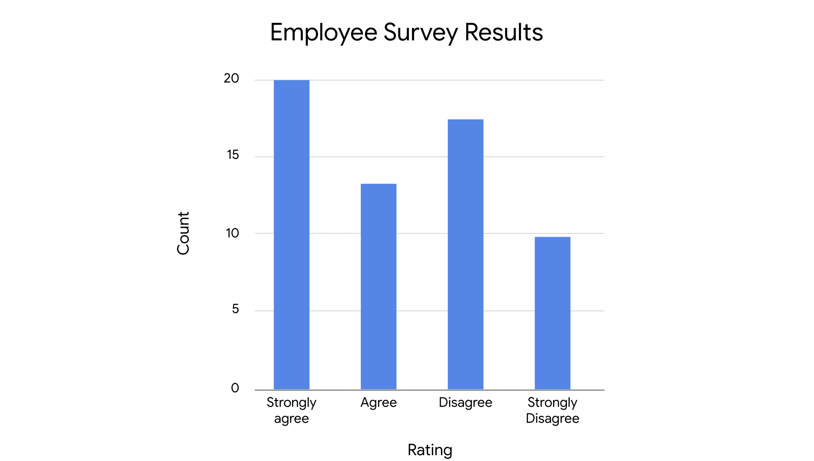

# Merkezi Eğilim Ölçüleri

Aritmetik ortalama, medyan ve mod; bir veri kümesinin merkezini farklı şekillerde tanımlar:

* **Aritmetik ortalama**: Bir veri kümesindeki ortalama değerdir.
* **Medyan**: Veri kümesindeki ortanca (tam orta) değerdir.
* **Mod**: Bir veri kümesinde en sık görülen değerdir.

Şimdi her bir merkezi eğilim ölçüsünün nasıl hesaplandığını inceleyelim.

---

## Aritmetik Ortalama, Medyan ve Mod Nasıl Hesaplanır?

### Aritmetik Ortalama

**Aritmetik ortalama**, bir veri kümesindeki tüm değerlerin toplanıp, değer sayısına bölünmesiyle hesaplanır.

Örneğin: 10, 5, 3, 50, 12 sayılarına sahipsiniz. Toplamı 80 eder. Bu toplamı, 5’e böldüğümüzde:

$$
(10 + 5 + 3 + 50 + 12) ÷ 5 = 80 ÷ 5 = 16
$$

Aritmetik ortalama yani ortalama değer 16’dır.

---

### Medyan

**Medyan**, bir veri kümesinin ortanca değeridir. Yani, veri kümesindeki değerlerin yarısı medyandan büyük, yarısı küçüktür.

Değerleri küçükten büyüğe sıralayın: 3, 5, 10, 12, 50. Ortadaki değer 10’dur, yani medyan 10’dur.

Veri kümesinde çift sayıda değer varsa, ortadaki iki sayının ortalaması alınır. Örneğin, 8 sayısını ekleyelim: 3, 5, 8, 10, 12, 50.

Ortadaki iki sayı 8 ve 10’dur. Medyan şöyle hesaplanır:

$$
(8 + 10) ÷ 2 = 18 ÷ 2 = 9
$$

Bu durumda medyan 9’dur.

---

### Mod

**Mod**, veri kümesinde en sık görülen değerdir. Bir veri kümesinin hiç modu olmayabilir, birden fazla modu da olabilir.

* Örneğin: 1, 12, 33, 54, 75 → mod yok (tekrar eden yok).
* 2, 7, 7, 11, 20 → mod = 7
* 3, 12, 12, 40, 40 → iki mod: 12 ve 40

---

## Aritmetik Ortalama, Medyan ve Mod Ne Zaman Kullanılır?

Veri kümenizin merkezini açıklamak için hangi ölçüyü kullanacağınız; verinizin yapısına ve elde etmek istediğiniz içgörüye bağlıdır. Aşağıda bazı genel kurallar verilmiştir:

---

### Aritmetik Ortalama ve Medyan

Her ikisi de veri kümesinin merkezi konumunu gösterir. Ancak, bazı verilerde biri diğerine göre daha uygundur.

**Aritmetik ortalamanın en büyük dezavantajı**, aykırı değerlerden (outlier) çok etkilenmesidir. Aykırı değer, veri kümesinin geri kalanından çok farklı olan değerdir.

Veri kümenizde aykırı değerler varsa, **medyan** genellikle daha iyi bir seçimdir. Aykırı değer yoksa, **aritmetik ortalama** da iyi sonuç verir.

#### Örnek:

Bir startup’taki çalışanların maaşlarını ele alalım:

| **Çalışan** | #1        | #2        | #3        | #4        | #5        | #6        | #7         |
| ----------- | --------- | --------- | --------- | --------- | --------- | --------- | ---------- |
| **Maaş**    | 40.000 \$ | 45.000 \$ | 45.000 \$ | 45.000 \$ | 45.000 \$ | 50.000 \$ | 500.000 \$ |

Toplam maaş: 770.000 \$

Çalışan sayısı: 7

$$
770.000 ÷ 7 = 110.000 \$
$$

Aritmetik ortalama 110.000 \$’dır. Ancak bu ortalama, çalışanların maaş dağılımını doğru şekilde temsil etmez. Çünkü yalnızca bir kişi 500.000 \$ kazanıyor — bu bir **aykırı değerdir** ve ortalamayı yukarı çeker.

Bu nedenle, bu durumda **medyan** daha doğru bir ölçüdür. Ortadaki değer:

```text
Medyan = 45.000 $
```

Medyan, tipik bir çalışanın maaşı hakkında daha gerçekçi bir fikir verir.

---

### Mod

**Mod**, kategorik verilerle çalışırken oldukça faydalıdır çünkü en sık görülen kategoriyi net biçimde gösterir.

Örneğin, bir şirket çalışan memnuniyet anketi yapar:

> "Şirkette gelişme fırsatlarından memnunum."
> Cevaplar: "Kesinlikle katılıyorum", "Katılıyorum", "Katılmıyorum", "Kesinlikle katılmıyorum"

Sonuçlar çubuk grafikle özetlenmiştir:



Grafikte en yüksek çubuk "Kesinlikle katılıyorum" ifadesini gösteriyor. Bu da bu kategorinin **mod** olduğunu ve çalışanlar arasında en yaygın görüş olduğunu gösteriyor — bu durumda pozitif bir geri bildirim.

---

## Önemli Noktalar

Aritmetik ortalama, medyan ve mod gibi merkezi eğilim ölçüleri; veri kümenizin merkezini tek bir değerle tanımlamanızı sağlar. Bir veri uzmanı olarak, veri kümenizin merkezini bilmek onun yapısını hızlıca anlamanıza ve analizinizde sonraki adımları belirlemenize yardımcı olur.

---

## Daha Fazla Bilgi İçin Kaynaklar

Aritmetik ortalama, medyan ve mod gibi merkezi eğilim ölçüleri hakkında daha fazla bilgi için aşağıdaki kaynağa göz atabilirsiniz:

* [Avustralya İstatistik Bürosu’ndan bu makale](https://www.abs.gov.au/websitedbs/D3310114.nsf/Home/Statistical+Language+-+measures+of+central+tendency#:~:text=There%20are%20three%20main%20measures,central%20value%20in%20the%20distribution.), merkezi eğilim ölçülerine genel bir bakış sunar ve aykırı değerlerin bu ölçüler üzerindeki etkisini açıklar.

# Dağılım Ölçüleri: Aralık, Varyans ve Standart Sapma

Kısa süre önce, **dağılım ölçülerinin**, veri kümenizin yayılımını veya veri değerlerindeki değişim miktarını tanımlamanıza yardımcı olduğunu öğrendiniz. Standart sapma gibi dağılım ölçüleri, verinizin dağılımı hakkında ilk anlayışı sağlar ve hangi istatistiksel yöntemleri uygulayacağınızı belirlemenize yardımcı olur.

Bu yazıda üç dağılım ölçüsünü daha detaylı öğreneceksiniz: aralık (range), varyans ve standart sapma. Bu okuma özellikle standart sapmanın temel kavramına odaklanır. Bir veri uzmanı olarak, sık sık standart sapma hesaplayacak ve bunu daha karmaşık veri analizlerinde kullanacaksınız.

---

## Dağılım Ölçüleri

Şimdi aralık, varyans ve standart sapma tanımlarını inceleyelim.

### **Aralık (Range)**

**Aralık**, bir veri kümesindeki en büyük ve en küçük değer arasındaki farktır.

Örneğin, bir biyoloji öğretmeni olduğunuzu ve final sınavı puanlarını analiz ettiğinizi düşünün. En yüksek puan 99/100 (%99), en düşük puan 62/100 (%62) ise:

$$
99 - 62 = 37
$$

**Aralık = 37 yüzde puanı**

Aralık, kolay hesaplanabilir olması nedeniyle kullanışlıdır ve veri kümenizin genel yayılımını hızlıca anlamanızı sağlar.

---

### **Varyans**

Yayılımı ölçmenin başka bir yolu da **varyans**tır. Varyans, her veri noktasının ortalamadan farkının karesinin ortalamasıdır. Temelde, varyans **standart sapmanın karesidir**. Varyans ve nasıl kullanıldığı hakkında daha fazla bilgiyi ilerleyen derslerde öğreneceksiniz.

---

### **Standart Sapma**

Şimdi standart sapma kavramını daha iyi anlamak için tanımına, görselleştirmesine ve istatistiksel formülüne bakalım.

#### **Tanım**

**Standart sapma**, değerlerinizin ortalamadan ne kadar uzaklaştığını ölçer. Bir veri noktasının ortalamaya olan tipik uzaklığını hesaplar.

* Standart sapma **büyükse**, veriler ortalamadan çok dağılmıştır.
* Standart sapma **küçükse**, veriler ortalamaya yakın toplanmıştır.

---

#### **Görselleştirme**

Aşağıdaki üç normal dağılım eğrisine bakalım. Daha sonra dağılımlar hakkında daha fazlasını öğreneceksiniz, ancak şimdilik sadece şunu bilin: eğrilerin tepe noktası **ortalama**yı temsil eder.


* Mavi noktalı eğrinin standart sapması **1**
* Yeşil düz eğrininki **2**
* Kırmızı kesikli eğrininki **3**

Mavi eğrinin yayılımı en azdır, çünkü verilerin çoğu ortalamaya yakındır. Bu nedenle mavi eğrinin standart sapması en küçüktür. Kırmızı eğri en geniş yayılıma sahiptir, çünkü verilerin çoğu ortalamadan daha uzaktadır. Bu nedenle kırmızı eğrinin standart sapması en büyüktür.

---

#### **Formül**

Standart sapma şu formülle hesaplanır (örneklem için):

```math
s = √[ Σ(x - x̄)² / (n - 1) ]
```

Burada:

* `n`: veri sayısı
* `x`: her bir veri değeri
* `x̄`: veri kümesinin ortalaması
* `Σ`: toplam işareti

> **Not:** Veri uzmanları genellikle hesaplamaları bilgisayar yardımıyla yapar. Ancak, hesaplamaların arkasındaki kavramları bilmek, istatistiksel yöntemleri gerçek dünya problemlerine uygulamanıza yardımcı olur.

---

Örneğin küçük bir veri kümesinin standart sapmasını hesaplayalım: **2, 3, 10**

**1. Ortalama (x̄) hesapla:**

$$
(2 + 3 + 10) ÷ 3 = 15 ÷ 3 = 5
$$

**2. Her değerden ortalamayı çıkar:**

$$
2 - 5 = -3
$$

$$
3 - 5 = -2
$$

$$
10 - 5 = 5
$$

**3. Bu farkların karesini al:**

$$
(-3)² = 9
$$

$$
(-2)² = 4
$$

$$
5² = 25
$$

**4. Karelerin toplamını (varyans) hesapla:**

$$
(9 + 4 + 25) ÷ (3 - 1) = 38 ÷ 2 = 19
$$

**5. Varyansın karekökünü al (standart sapma):**

$$
√19 ≈ 4.36
$$

**Standart sapma ≈ 4.36**

---

### **Örnek: Emlak Fiyatları**

Bir emlak şirketinde çalıştığınızı hayal edin. Ekip arkadaşlarınız, müşterilerine farklı semtlerdeki kira fiyatlarındaki değişkenlik hakkında bilgi vermek istiyor. Göreviniz, belirli semtlerdeki 1+1 dairelerin aylık kira fiyatlarının standart sapmasını hesaplamak.

#### **Emerald Woods**

| **Daire**    | #1  | #2  | #3    | #4    | #5    |
| ------------ | --- | --- | ----- | ----- | ----- |
| **Kira (₺)** | 900 | 950 | 1,000 | 1,050 | 1,100 |

* Ortalama: 1,000 ₺
* Standart sapma: 79.05 ₺

#### **Rock Park**

| **Daire**    | #1  | #2  | #3    | #4    | #5    |
| ------------ | --- | --- | ----- | ----- | ----- |
| **Kira (₺)** | 500 | 650 | 1,000 | 1,350 | 1,500 |

* Ortalama: 1,000 ₺
* Standart sapma: 431.56 ₺

Her iki semtte de ortalama kira 1,000 ₺ olsa da, **Rock Park**’taki standart sapma çok daha büyüktür. Bu, kira fiyatlarının bu bölgede çok daha değişken olduğunu gösterir. Örneğin, müşterilere bu bölgede ortalamanın çok altında uygun fiyatlı daire bulma olasılığının daha yüksek olduğunu söyleyebilirsiniz.

---

## Önemli Noktalar

Veri uzmanları, reklam geliri, hisse fiyatları, çalışan maaşları gibi birçok farklı veri türünde değişkenliği ölçmek için **standart sapma**yı kullanır. Standart sapma, varyans ve aralık gibi dağılım ölçüleri, verinizdeki değişimi hızlıca tespit etmenizi sağlar ve verinizin temel yapısını daha iyi anlamanıza yardımcı olur.

---

## Daha Fazla Bilgi İçin Kaynaklar

Dağılım ölçüleri hakkında daha fazla bilgi edinmek için şu kaynağa göz atabilirsiniz:

* [Statistics Canada’dan bu makale](https://www150.statcan.gc.ca/n1/edu/power-pouvoir/ch12/5214891-eng.htm), varyans ve standart sapmanın özetini sunar ve standart sapmanın dağılım ölçüsü olarak ne kadar kullanışlı olduğunu açıklar.

