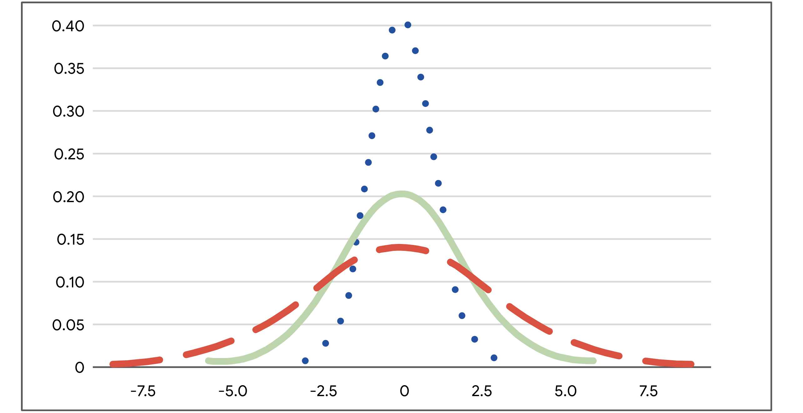

# Merkezi Eğilim Ölçüleri

Aritmetik ortalama, medyan ve mod; bir veri kümesinin merkezini farklı şekillerde tanımlar:

* **Aritmetik ortalama**: Bir veri kümesindeki ortalama değerdir.
* **Medyan**: Veri kümesindeki ortanca (tam orta) değerdir.
* **Mod**: Bir veri kümesinde en sık görülen değerdir.

Şimdi her bir merkezi eğilim ölçüsünün nasıl hesaplandığını inceleyelim.

---

## Aritmetik Ortalama, Medyan ve Mod Nasıl Hesaplanır?

### Aritmetik Ortalama

**Aritmetik ortalama**, bir veri kümesindeki tüm değerlerin toplanıp, değer sayısına bölünmesiyle hesaplanır.

Örneğin: 10, 5, 3, 50, 12 sayılarına sahipsiniz. Toplamı 80 eder. Bu toplamı, 5’e böldüğümüzde:

$$
(10 + 5 + 3 + 50 + 12) ÷ 5 = 80 ÷ 5 = 16
$$

Aritmetik ortalama yani ortalama değer 16’dır.

---

### Medyan

**Medyan**, bir veri kümesinin ortanca değeridir. Yani, veri kümesindeki değerlerin yarısı medyandan büyük, yarısı küçüktür.

Değerleri küçükten büyüğe sıralayın: 3, 5, 10, 12, 50. Ortadaki değer 10’dur, yani medyan 10’dur.

Veri kümesinde çift sayıda değer varsa, ortadaki iki sayının ortalaması alınır. Örneğin, 8 sayısını ekleyelim: 3, 5, 8, 10, 12, 50.

Ortadaki iki sayı 8 ve 10’dur. Medyan şöyle hesaplanır:

$$
(8 + 10) ÷ 2 = 18 ÷ 2 = 9
$$

Bu durumda medyan 9’dur.

---

### Mod

**Mod**, veri kümesinde en sık görülen değerdir. Bir veri kümesinin hiç modu olmayabilir, birden fazla modu da olabilir.

* Örneğin: 1, 12, 33, 54, 75 → mod yok (tekrar eden yok).
* 2, 7, 7, 11, 20 → mod = 7
* 3, 12, 12, 40, 40 → iki mod: 12 ve 40

---

## Aritmetik Ortalama, Medyan ve Mod Ne Zaman Kullanılır?

Veri kümenizin merkezini açıklamak için hangi ölçüyü kullanacağınız; verinizin yapısına ve elde etmek istediğiniz içgörüye bağlıdır. Aşağıda bazı genel kurallar verilmiştir:

---

### Aritmetik Ortalama ve Medyan

Her ikisi de veri kümesinin merkezi konumunu gösterir. Ancak, bazı verilerde biri diğerine göre daha uygundur.

**Aritmetik ortalamanın en büyük dezavantajı**, aykırı değerlerden (outlier) çok etkilenmesidir. Aykırı değer, veri kümesinin geri kalanından çok farklı olan değerdir.

Veri kümenizde aykırı değerler varsa, **medyan** genellikle daha iyi bir seçimdir. Aykırı değer yoksa, **aritmetik ortalama** da iyi sonuç verir.

#### Örnek:

Bir startup’taki çalışanların maaşlarını ele alalım:

| **Çalışan** | #1        | #2        | #3        | #4        | #5        | #6        | #7         |
| ----------- | --------- | --------- | --------- | --------- | --------- | --------- | ---------- |
| **Maaş**    | 40.000 \$ | 45.000 \$ | 45.000 \$ | 45.000 \$ | 45.000 \$ | 50.000 \$ | 500.000 \$ |

Toplam maaş: 770.000 \$

Çalışan sayısı: 7

$$
770.000 ÷ 7 = 110.000 \$
$$

Aritmetik ortalama 110.000 \$’dır. Ancak bu ortalama, çalışanların maaş dağılımını doğru şekilde temsil etmez. Çünkü yalnızca bir kişi 500.000 \$ kazanıyor — bu bir **aykırı değerdir** ve ortalamayı yukarı çeker.

Bu nedenle, bu durumda **medyan** daha doğru bir ölçüdür. Ortadaki değer:

```text
Medyan = 45.000 $
```

Medyan, tipik bir çalışanın maaşı hakkında daha gerçekçi bir fikir verir.

---

### Mod

**Mod**, kategorik verilerle çalışırken oldukça faydalıdır çünkü en sık görülen kategoriyi net biçimde gösterir.

Örneğin, bir şirket çalışan memnuniyet anketi yapar:

> "Şirkette gelişme fırsatlarından memnunum."
> Cevaplar: "Kesinlikle katılıyorum", "Katılıyorum", "Katılmıyorum", "Kesinlikle katılmıyorum"

Sonuçlar çubuk grafikle özetlenmiştir:


Grafikte en yüksek çubuk "Kesinlikle katılıyorum" ifadesini gösteriyor. Bu da bu kategorinin **mod** olduğunu ve çalışanlar arasında en yaygın görüş olduğunu gösteriyor — bu durumda pozitif bir geri bildirim.

---

## Önemli Noktalar

Aritmetik ortalama, medyan ve mod gibi merkezi eğilim ölçüleri; veri kümenizin merkezini tek bir değerle tanımlamanızı sağlar. Bir veri uzmanı olarak, veri kümenizin merkezini bilmek onun yapısını hızlıca anlamanıza ve analizinizde sonraki adımları belirlemenize yardımcı olur.

---

## Daha Fazla Bilgi İçin Kaynaklar

Aritmetik ortalama, medyan ve mod gibi merkezi eğilim ölçüleri hakkında daha fazla bilgi için aşağıdaki kaynağa göz atabilirsiniz:

* [Avustralya İstatistik Bürosu’ndan bu makale](https://www.abs.gov.au/websitedbs/D3310114.nsf/Home/Statistical+Language+-+measures+of+central+tendency#:~:text=There%20are%20three%20main%20measures,central%20value%20in%20the%20distribution.), merkezi eğilim ölçülerine genel bir bakış sunar ve aykırı değerlerin bu ölçüler üzerindeki etkisini açıklar.

# Dağılım Ölçüleri: Aralık, Varyans ve Standart Sapma

Kısa süre önce, **dağılım ölçülerinin**, veri kümenizin yayılımını veya veri değerlerindeki değişim miktarını tanımlamanıza yardımcı olduğunu öğrendiniz. Standart sapma gibi dağılım ölçüleri, verinizin dağılımı hakkında ilk anlayışı sağlar ve hangi istatistiksel yöntemleri uygulayacağınızı belirlemenize yardımcı olur.

Bu yazıda üç dağılım ölçüsünü daha detaylı öğreneceksiniz: aralık (range), varyans ve standart sapma. Bu okuma özellikle standart sapmanın temel kavramına odaklanır. Bir veri uzmanı olarak, sık sık standart sapma hesaplayacak ve bunu daha karmaşık veri analizlerinde kullanacaksınız.

---

## Dağılım Ölçüleri

Şimdi aralık, varyans ve standart sapma tanımlarını inceleyelim.

### **Aralık (Range)**

**Aralık**, bir veri kümesindeki en büyük ve en küçük değer arasındaki farktır.

Örneğin, bir biyoloji öğretmeni olduğunuzu ve final sınavı puanlarını analiz ettiğinizi düşünün. En yüksek puan 99/100 (%99), en düşük puan 62/100 (%62) ise:

$$
99 - 62 = 37
$$

**Aralık = 37 yüzde puanı**

Aralık, kolay hesaplanabilir olması nedeniyle kullanışlıdır ve veri kümenizin genel yayılımını hızlıca anlamanızı sağlar.

---

### **Varyans**

Yayılımı ölçmenin başka bir yolu da **varyans**tır. Varyans, her veri noktasının ortalamadan farkının karesinin ortalamasıdır. Temelde, varyans **standart sapmanın karesidir**. Varyans ve nasıl kullanıldığı hakkında daha fazla bilgiyi ilerleyen derslerde öğreneceksiniz.

---

### **Standart Sapma**

Şimdi standart sapma kavramını daha iyi anlamak için tanımına, görselleştirmesine ve istatistiksel formülüne bakalım.

#### **Tanım**

**Standart sapma**, değerlerinizin ortalamadan ne kadar uzaklaştığını ölçer. Bir veri noktasının ortalamaya olan tipik uzaklığını hesaplar.

* Standart sapma **büyükse**, veriler ortalamadan çok dağılmıştır.
* Standart sapma **küçükse**, veriler ortalamaya yakın toplanmıştır.

---

#### **Görselleştirme**

Aşağıdaki üç normal dağılım eğrisine bakalım. Daha sonra dağılımlar hakkında daha fazlasını öğreneceksiniz, ancak şimdilik sadece şunu bilin: eğrilerin tepe noktası **ortalama**yı temsil eder.



* Mavi noktalı eğrinin standart sapması **1**
* Yeşil düz eğrininki **2**
* Kırmızı kesikli eğrininki **3**

Mavi eğrinin yayılımı en azdır, çünkü verilerin çoğu ortalamaya yakındır. Bu nedenle mavi eğrinin standart sapması en küçüktür. Kırmızı eğri en geniş yayılıma sahiptir, çünkü verilerin çoğu ortalamadan daha uzaktadır. Bu nedenle kırmızı eğrinin standart sapması en büyüktür.

---

#### **Formül**

Standart sapma şu formülle hesaplanır (örneklem için):

```math
s = √[ Σ(x - x̄)² / (n - 1) ]
```

Burada:

* `n`: veri sayısı
* `x`: her bir veri değeri
* `x̄`: veri kümesinin ortalaması
* `Σ`: toplam işareti

> **Not:** Veri uzmanları genellikle hesaplamaları bilgisayar yardımıyla yapar. Ancak, hesaplamaların arkasındaki kavramları bilmek, istatistiksel yöntemleri gerçek dünya problemlerine uygulamanıza yardımcı olur.

---

Örneğin küçük bir veri kümesinin standart sapmasını hesaplayalım: **2, 3, 10**

**1. Ortalama (x̄) hesapla:**

$$
(2 + 3 + 10) ÷ 3 = 15 ÷ 3 = 5
$$

**2. Her değerden ortalamayı çıkar:**

$$
2 - 5 = -3
$$

$$
3 - 5 = -2
$$

$$
10 - 5 = 5
$$

**3. Bu farkların karesini al:**

$$
(-3)² = 9
$$

$$
(-2)² = 4
$$

$$
5² = 25
$$

**4. Karelerin toplamını (varyans) hesapla:**

$$
(9 + 4 + 25) ÷ (3 - 1) = 38 ÷ 2 = 19
$$

**5. Varyansın karekökünü al (standart sapma):**

$$
√19 ≈ 4.36
$$

**Standart sapma ≈ 4.36**

---

### **Örnek: Emlak Fiyatları**

Bir emlak şirketinde çalıştığınızı hayal edin. Ekip arkadaşlarınız, müşterilerine farklı semtlerdeki kira fiyatlarındaki değişkenlik hakkında bilgi vermek istiyor. Göreviniz, belirli semtlerdeki 1+1 dairelerin aylık kira fiyatlarının standart sapmasını hesaplamak.

#### **Emerald Woods**

| **Daire**    | #1  | #2  | #3    | #4    | #5    |
| ------------ | --- | --- | ----- | ----- | ----- |
| **Kira (₺)** | 900 | 950 | 1,000 | 1,050 | 1,100 |

* Ortalama: 1,000 ₺
* Standart sapma: 79.05 ₺

#### **Rock Park**

| **Daire**    | #1  | #2  | #3    | #4    | #5    |
| ------------ | --- | --- | ----- | ----- | ----- |
| **Kira (₺)** | 500 | 650 | 1,000 | 1,350 | 1,500 |

* Ortalama: 1,000 ₺
* Standart sapma: 431.56 ₺

Her iki semtte de ortalama kira 1,000 ₺ olsa da, **Rock Park**’taki standart sapma çok daha büyüktür. Bu, kira fiyatlarının bu bölgede çok daha değişken olduğunu gösterir. Örneğin, müşterilere bu bölgede ortalamanın çok altında uygun fiyatlı daire bulma olasılığının daha yüksek olduğunu söyleyebilirsiniz.

---

## Önemli Noktalar

Veri uzmanları, reklam geliri, hisse fiyatları, çalışan maaşları gibi birçok farklı veri türünde değişkenliği ölçmek için **standart sapma**yı kullanır. Standart sapma, varyans ve aralık gibi dağılım ölçüleri, verinizdeki değişimi hızlıca tespit etmenizi sağlar ve verinizin temel yapısını daha iyi anlamanıza yardımcı olur.

---

## Daha Fazla Bilgi İçin Kaynaklar

Dağılım ölçüleri hakkında daha fazla bilgi edinmek için şu kaynağa göz atabilirsiniz:

* [Statistics Canada’dan bu makale](https://www150.statcan.gc.ca/n1/edu/power-pouvoir/ch12/5214891-eng.htm), varyans ve standart sapmanın özetini sunar ve standart sapmanın dağılım ölçüsü olarak ne kadar kullanışlı olduğunu açıklar.

# Konum Ölçüleri: Yüzdelikler ve Çeyrekler

Kısa süre önce, **konum ölçülerinin** bir değerin, veri kümesindeki diğer değerlere göre konumunu belirlemenize yardımcı olduğunu öğrendiniz. Merkezi eğilim ve yayılım ölçülerine ek olarak, değerlerinizin göreli konumunu bilmek de faydalıdır. Örneğin, bir değerin diğerinden yüksek mi düşük mü olduğunu veya veri kümesinin alt, orta ya da üst kısmına mı düştüğünü bilmek önemlidir.

Bu yazıda, en yaygın konum ölçüleri olan **yüzdelikler (percentiles)** ve **çeyrekler (quartiles)** hakkında daha fazla bilgi edineceksiniz. Ayrıca **çeyrekler arası açıklık (interquartile range - IQR)** hesaplamayı ve verinizi özetlemek için **beş sayı özeti** kullanmayı öğreneceksiniz.

---

## Konum Ölçüleri

### **Yüzdelik (Percentile)**

**Yüzdelik**, belirli bir yüzdelik dilimin altında kalan veri değerini ifade eder. Yüzdelikler, verinizi 100 eşit parçaya böler. Böylece belirli bir değerin göreli konumunu veya sırasını belirlemiş olursunuz.

Örneğin, yüzdelikler okul sınavlarındaki puanları sıralamak için yaygın olarak kullanılır:

* Bir öğrenci %99’luk yüzdelikte yer alıyorsa, tüm sınav puanlarının %99’undan daha yüksek bir puan almıştır.
* %75’lik yüzdelikte yer alıyorsa, puanı sınava girenlerin %75’inden daha yüksektir.
* %50 yüzdelik, puanın ortada olduğunu, yani sınavı geçenlerin yarısından daha yüksek olduğunu gösterir.


> **Not:** *Yüzdelikler* ile *yüzde (%) puan* karıştırılmamalıdır. Örneğin, bir testten 90/100 alırsanız (%90), bu sizin %90’lık yüzdelikte olduğunuz anlamına gelmez. Eğer tüm katılımcıların yarısı 90’dan yüksek aldıysa, bu puan %50 yüzdelikte olabilir. Yani yüzdelik, puanınızın diğerlerine göre konumunu gösterir.

Yüzdelikler, değerleri karşılaştırmak ve verileri bağlama oturtmak için kullanışlıdır. Örneğin:

ABD’de yakıt tüketimi mil/gallon (mpg) ile ölçülür. Almayı düşündüğünüz bir araç 23 mpg değerine sahip. Bu iyi mi kötü mü? Bilinmez. Ancak bu aracın, orta boy sedanlar arasında %25’lik yüzdelikte olduğu belirtilirse, bu, araçların %75’inin daha iyi mpg’ye sahip olduğunu gösterir.

---

### **Çeyrek (Quartile)**

**Çeyrekler**, bir veri kümesini dört eşit parçaya ayıran ölçülerdir. Her çeyrek %25’lik bir dilimi temsil eder.

Üç adet çeyrek değeri (Q1, Q2, Q3) vardır:

* **Birinci çeyrek (Q1):** Veri kümesinin ilk yarısının ortanca değeri. %25 yüzdelik. Verilerin %25’i bu değerin altındadır.
* **İkinci çeyrek (Q2):** Tüm veri kümesinin ortanca değeri, yani medyan. %50 yüzdelik.
* **Üçüncü çeyrek (Q3):** Veri kümesinin ikinci yarısının ortanca değeri. %75 yüzdelik. Verilerin %75’i bu değerin altındadır.


---

### **Örnek: Araba Satışları**

Bir oto galeride çalıştığınızı düşünün. Satış yöneticisi, ekibin her bir satış temsilcisinin performansını karşılaştırmak istiyor. Son ayda satılan araç sayılarını içeren verileri inceleyelim:

| **Satış Temsilcisi**    | #1 | #2 | #3 | #4 | #5 | #6 | #7 | #8 |
| ----------------------- | -- | -- | -- | -- | -- | -- | -- | -- |
| **Satılan Araç Sayısı** | 18 | 13 | 6  | 10 | 15 | 7  | 10 | 9  |

**Adım adım çeyrekleri hesaplayalım:**

**1.** Verileri küçükten büyüğe sırala:

[6, 7, 9, 10, 10, 13, 15, 18]

**2.** Ortanca değeri (Q2) bul:

Veri sayısı çift olduğu için ortadaki iki değerin ortalamasını alıyoruz:

(10 + 10) ÷ 2 = 10 → Q2

**3.** Alt yarının ortancasını bul (Q1):

Alt yarı: [6, 7, 9, 10]

(7 + 9) ÷ 2 = 8 → Q1

**4.** Üst yarının ortancasını bul (Q3):

Üst yarı: [10, 13, 15, 18]

(13 + 15) ÷ 2 = 14 → Q3

**Sonuç:**

* Q1 = 8
* Q2 (medyan) = 10
* Q3 = 14

Yani:

* Alt %25’lik dilim 8 veya daha az araç sattı.
* Üst %25’lik dilim 14 veya daha fazla araç sattı.
* Ortadaki %50’lik dilim 8 ila 14 araç sattı.

> **Not:** Çeyrek değerler farklı yöntemlerle hesaplanabilir. Büyük veri kümelerinde bu fark önemsizdir, ancak küçük veri kümelerinde hesaplama yöntemine göre çeyrekler farklılık gösterebilir. Örneğin, NumPy’nin [`percentile()`](https://numpy.org/doc/stable/reference/generated/numpy.percentile.html) fonksiyonu 9 farklı yöntem sunar.

---

### **Çeyrekler Arası Açıklık (IQR)**

Veri kümenizin ortadaki %50’lik kısmı, yani Q1 ile Q3 arasındaki mesafe **çeyrekler arası açıklık (IQR)** olarak adlandırılır.

**Formül:**

$$
\text{IQR} = Q3 - Q1
$$

Yukarıdaki örnekte:

$$
\text{IQR} = 14 - 8 = 6
$$

IQR, verinin merkezine odaklanır ve aykırı değerlerden daha az etkilenir. Aşağıdaki gibi aykırı değerler genellikle IQR’nin 1.5 katından fazla uzaklıktaki değerlerdir:

$$
\text{* Alt sınır: } Q_1 - 1.5 \cdot \text{IQR}
$$

$$
\text{* Üst sınır: } Q_3 + 1.5 \cdot \text{IQR}
$$

> **Not:** IQR teknik olarak bir **dağılım ölçüsüdür** çünkü verilerin orta %50’sinin yayılımını gösterir.

---

### **Beş Sayı Özeti (Five Number Summary)**

Veri kümenizi özetlemenin bir yolu da **beş sayı özeti**dir. Bu özet aşağıdaki değerlerden oluşur:

* En küçük değer (min)
* Q1
* Medyan (Q2)
* Q3
* En büyük değer (max)

Beş sayı özeti, verinin dağılımını genel hatlarıyla gösterir. Bu özet genellikle **kutu grafiği (box plot)** ile görselleştirilir.

* Kutu kısmı Q1 ile Q3 arasını gösterir.
* Kutunun içindeki dikey çizgi Q2’dir.
* "Bıyıklar", yani kutunun dışındaki çizgiler minimum ve maksimum değerleri gösterir.

Aşağıdaki kutu grafiği araba satış verilerini göstermektedir:


---

## Önemli Noktalar


Veri uzmanları, ürün satışlarından hane gelirine kadar her türlü veriyi daha iyi anlamak için yüzdelikler ve çeyrekler gibi **konum ölçüleri**ni kullanır. Bu ölçüler:

* Veri değerlerinin göreli konumunu hızlıca tanımlamaya yardımcı olur.
* Verinin dağılımını daha hassas şekilde analiz etmeyi sağlar.

---

## Daha Fazla Bilgi İçin Kaynak

Konum ölçüleri (yüzdelikler, çeyrekler, beş sayı özeti) hakkında daha fazla bilgi için şu kaynağa göz atabilirsiniz:

* [Freie Universität Berlin – İstatistik Sözlüğü](https://www.geo.fu-berlin.de/en/v/soga-py/Basics-of-statistics/index.html)

# Olasılığın Temel Kavramları

Kısa süre önce, **olasılık** kavramının belirsizliği nicelleştirmek ya da bir olayın gerçekleşme olasılığını tanımlamak için matematiği kullandığını öğrendiniz. Örneğin, yarın yağmur yağma olasılığı %80 olabilir veya belirli bir adayın seçimi kazanma şansı %20 olabilir.

Bu yazıda, olasılığın temel kavramları hakkında daha fazla bilgi edineceksiniz. Rastgele deney kavramını, bir olayın olasılığının nasıl temsil edileceğini ve hesaplanacağını, ayrıca temel olasılık gösterimini ele alacağız.

---

## Olasılığın Temelleri

### **Temel Kavramlar: Rastgele Deney, Sonuç, Olay**

Olasılık kuramının üç temel kavramıyla başlayalım:

* Rastgele deney
* Sonuç
* Olay

Olasılık, istatistikçilerin **rastgele deney** (veya istatistiksel deney) olarak adlandırdığı durumlarla ilgilenir. **Rastgele deney**, sonucunun kesin olarak tahmin edilemediği bir süreçtir.

Örneğin, bir madeni para atmadan veya zar atmadan önce sonucu bilemezsiniz. Para atıldığında yazı veya tura gelebilir. Zar atıldığında 3 ya da 6 gelebilir.

Tüm rastgele deneylerin üç ortak özelliği vardır:

* Deneyin birden fazla olası sonucu vardır.
* Tüm olası sonuçlar önceden belirtilebilir.
* Sonuç tamamen şansa bağlıdır.

İstatistikte, bir rastgele deneyin sonucu **sonuç (outcome)** olarak adlandırılır. Örneğin, bir zar attığınızda, olası sonuçlar şunlardır: 1, 2, 3, 4, 5, 6.

**Olay (event)** ise bir veya daha fazla sonuçtan oluşan bir kümedir. Örneğin, bir zar atıldığında çift sayı gelmesi bir olaydır. Bu olayın sonuçları: 2, 4, 6’dır. Tek sayı gelmesi de bir başka olaydır ve sonuçları: 1, 3, 5’tir.

Rastgele bir deneyde her olaya bir olasılık atanır. Şimdi bir olayın olasılığı nasıl temsil edilir ve hesaplanır, bunu inceleyelim.

---

### **Bir Olayın Olasılığı**

Bir olayın gerçekleşme olasılığı **0 ile 1 arasında bir sayı** olarak ifade edilir. Olasılık ayrıca yüzde olarak da ifade edilebilir.

* Bir olayın olasılığı 0 ise, bu olayın gerçekleşme şansı %0’dır.
* Bir olayın olasılığı 1 ise, bu olayın gerçekleşme şansı %100’dür.

Bu aralıkta (0 ile 1 arasında) farklı olasılık dereceleri bulunur. Örneğin:

* Bir olayın olasılığı 0.05 (veya %5) ise, bu olayın gerçekleşme şansı düşüktür.
* Bir olayın olasılığı 0.95 (veya %95) ise, bu olayın gerçekleşme şansı yüksektir.
* Bir olayın olasılığı 0.5 (veya %50) ise, olayın gerçekleşme ve gerçekleşmeme olasılığı eşittir.

Bir olayın olasılığını bilmek, belirsizlik içeren durumlarda bilinçli kararlar vermenize yardımcı olur. Örneğin, yarın yağmur yağma olasılığı 0.1 (%10) ise, açık hava pikniği planınız için endişelenmenize gerek yoktur. Ancak yağmur ihtimali 0.9 (%90) ise, başka bir gün için plan yapmanız mantıklı olabilir.

---

### **Bir Olayın Olasılığı Nasıl Hesaplanır?**

Tüm olası sonuçların eşit olasılıkla gerçekleştiği bir olayda, olasılığı hesaplamak için şu formülü kullanabilirsiniz:

**İstenen sonuç sayısı** ÷ **Toplam olası sonuç sayısı**

Bu formül, klasik olasılık tanımını da verir.

Şimdi para atma ve zar atma örnekleriyle bu hesaplamayı daha iyi anlayalım.

---

#### **Örnek: Para Atma**

Adil bir para atmak, klasik bir rastgele deney örneğidir:

* Birden fazla olası sonuç vardır.
* Olası sonuçlar önceden bilinir: yazı ya da tura.
* Sonuç şansa bağlıdır.

Tek bir atışta **yazı gelme olasılığını** hesaplamak istiyoruz. Bu durumda:

```
1 ÷ 2 = 0.5 veya %50
```

Eğer her iki yüzü de yazı olan özel bir para atsaydınız, her atışta yazı gelirdi. Bu durumda:

* Yazı gelme olasılığı = %100
* Tura gelme olasılığı = %0

> Not: “Yazı gelme olasılığı %50” demek, her 10 atıştan tam olarak 5’inin yazı geleceği anlamına gelmez. Örneğin, 10 atışta 4 yazı ve 6 tura gelebilir. Ancak uzun vadede yazıların oranı %50’ye yaklaşır.

---

#### **Örnek: Zar Atma**

Altı yüzlü bir zar atmak da klasik bir rastgele deneydir:

* Birden fazla olası sonuç vardır.
* Olası sonuçlar önceden bilinir: 1, 2, 3, 4, 5, 6
* Sonuç tamamen şansa bağlıdır.

Bir zar atışında **3 gelme olasılığı**:

```
1 ÷ 6 = 0.1666 → Yaklaşık %16.7
```

---

### **Olasılık Gösterimi**

Olasılığı temsil etmek için kullanılan bazı sembolleri bilmek faydalıdır; bu semboller eğitimde ve teknik belgelerde sıkça kullanılır.

* **P**, bir olayın olasılığını ifade eder.
* **A** ve **B**, olayları temsil eden harflerdir.

Örneğin, iki farklı olayla çalışıyorsanız, şu şekilde gösterim yapılır:

* Olay A'nın olasılığı: `P(A)`
* Olay B'nin olasılığı: `P(B)`
* Her olay için 0 ≤ P(A) ≤ 1
* Eğer `P(A) > P(B)` ise, A olayının gerçekleşme olasılığı B olayından yüksektir.
* Eğer `P(A) = P(B)` ise, A ve B olaylarının gerçekleşme olasılıkları eşittir.

---

## Önemli Noktalar

Veri uzmanları, belirsizlik içeren durumlarda paydaşlara bilinçli kararlar vermelerinde yardımcı olmak için olasılıktan faydalanır. Olasılığın temel kavramları konusundaki bilginiz, daha karmaşık olasılık hesaplamaları için bir temel oluşturacaktır.

---

## Daha Fazla Bilgi İçin Kaynak

Olasılığın temel kavramları hakkında daha fazla bilgi için şu kaynağa göz atabilirsiniz:

* [Richland Community College Ders Notları](https://people.richland.edu/james/lecture/m116/sequences/probability.html): Olasılığın temel kavramlarını ve temel kurallarını özetleyen faydalı bir kaynaktır.

