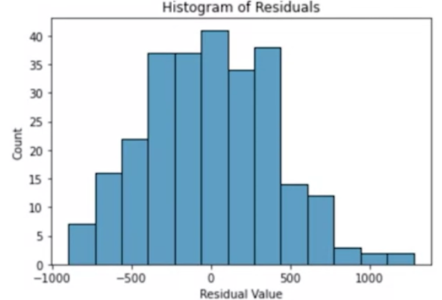
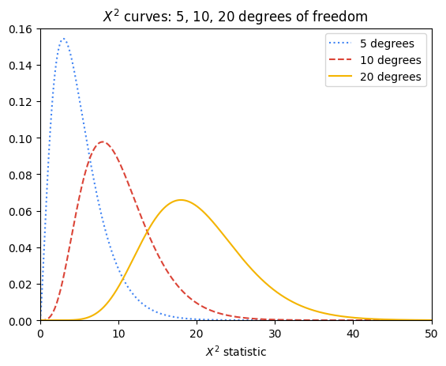
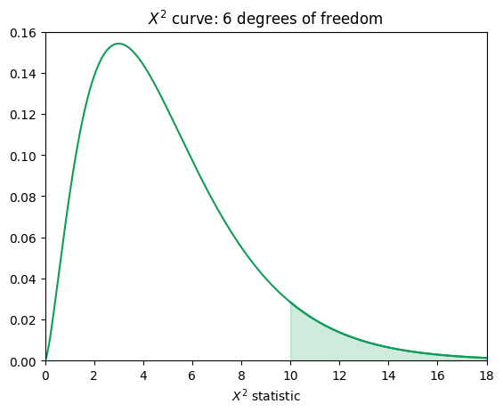
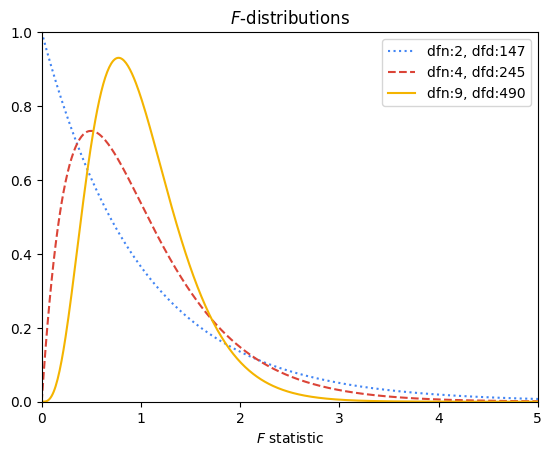
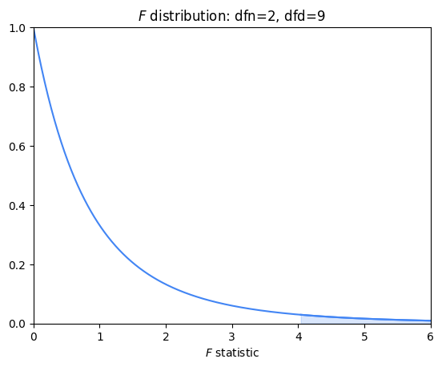

# Sıradan En Küçük Kareler (OLS) Yöntemini Keşfet

Daha önce belirtildiği gibi, regresyon modellemesinde en iyi uyum sağlayan doğruyu bulmanın bir yolu, farklı modelleri deneyip en iyi olanı seçmektir. Ancak basit doğrusal regresyonda, en iyi beta katsayılarının formülleri türetilmiştir. Bu bölümde, kareler toplamı artıkların (residuals) beta katsayıları β₀ ve β₁ değiştikçe nasıl değiştiğini daha iyi anlamanızı sağlayacak bir örnekten geçeceksiniz. Katsayı tahmini için sıradan en küçük kareler yönteminin formüllerini türetmeye ilgi duyuyorsanız, ileride daha fazla kaynak da bulacaksınız. Bu bölümde şu konular ele alınacak:

- Formül ve gösterimlerin gözden geçirilmesi  
- Kareler toplamı artıkların (SSR) en aza indirilmesi  
- Beta katsayılarının tahmini  

## Formül ve Gösterimlerin Gözden Geçirilmesi

Basit doğrusal regresyon, sürekli bir bağımlı değişken ile bir bağımsız değişken arasındaki doğrusal ilişkiyi tahmin etmek için kullanılan bir yöntemdir. Bu tahmin şu şekilde ifade edilir:

$$ŷ = β₀ + β₁ \cdot X$$


Burada şapkalı (^) simgesi, beta katsayılarının sadece tahmin olduğunu gösterir. Dolayısıyla regresyon modelinden elde edilen **ŷ** değerleri de sadece tahmindir.

Katsayıları hesaplamak için yaygın bir teknik, sıradan en küçük kareler (OLS) yöntemidir. Bu yöntem, gözlemlenen ve tahmin edilen değerler arasındaki hatayı (artıkları) karelerine alıp toplayarak (SSR) beta katsayılarını tahmin eder.

SSR şu formülle hesaplanabilir:

$$∑(Observed - Predicted)²$$

ya da matematiksel gösterimle:  

$$∑(yᵢ - ŷᵢ)²$$

Buradaki ∑ (sigma), toplamı ifade eder. Yani bu formül, gözlemlenen değerler ile modelin tahmin ettiği değerler arasındaki farkların karelerinin toplamını ifade eder.

## Kareler Toplamı Artıkların (SSR) En Aza İndirilmesi

6 gözlem içeren bir veri kümesi olduğunu varsayalım:

| **X (gözlemlenen)** | **Y (gözlemlenen)** |
|---------------------|---------------------|
| 0                   | -1                  |
| 1                   | 2                   |
| 2                   | 4                   |
| 3                   | 8                   |
| 4                   | 11                  |
| 5                   | 12                  |


### Doğru 1: ŷ = -0.5 + 3x

İlk denemede β₀ = -0.5 ve β₁ = 3 olduğunu varsayalım. Bu durumda regresyon doğrusu:

$$ŷ = -0.5 + 3x$$

Şimdi X için her değeri yerine koyarak ŷ değerlerini ve artıkların karelerini hesaplayalım:

| X | Y (gerçek) | ŷ (tahmin) = -0.5 + 3x | Artık      | Artık² |
|---|------------|------------------------|------------|--------|
| 0 | -1         | -0.5                   | -0.5       | 0.25   |
| 1 | 2          | 2.5                    | -0.5       | 0.25   |
| 2 | 4          | 5.5                    | -1.5       | 2.25   |
| 3 | 8          | 8.5                    | -0.5       | 0.25   |
| 4 | 11         | 11.5                   | -0.5       | 0.25   |
| 5 | 12         | 14.5                   | -2.5       | 6.25   |

**Kareler toplamı (SSR) = 0.25 + 0.25 + 2.25 + 0.25 + 0.25 + 6.25 = 9.5**

### Doğru 2: ŷ = -0.5 + 2.5x

Şimdi sadece eğimi değiştiriyoruz. β₀ = -0.5 sabit, β₁ = 2.5 olsun. Doğru:

$$ŷ = -0.5 + 2.5x$$

| X | Y (gerçek) | ŷ (tahmin) = -0.5 + 2.5x | Artık | Artık² |
|---|------------|--------------------------|--------|--------|
| 0 | -1         | -0.5                     | -0.5   | 0.25   |
| 1 | 2          | 2                        | 0      | 0      |
| 2 | 4          | 4.5                      | -0.5   | 0.25   |
| 3 | 8          | 7                        | 1      | 1      |
| 4 | 11         | 9.5                      | 1.5    | 2.25   |
| 5 | 12         | 12                       | 0      | 0      |

**Kareler toplamı (SSR) = 0.25 + 0 + 0.25 + 1 + 2.25 + 0 = 3.75**

Bu tahmin çok daha iyi!

## Beta Katsayılarının Tahmini

Eğim ve kesişimi sürekli değiştirip SSR hesaplamak mümkün ama bu şekilde en iyi doğruyu bulduğunuzdan emin olamazsınız. Neyse ki, beta katsayılarını hata miktarını en aza indirecek şekilde hesaplayan matematiksel formüller vardır.

Basit doğrusal regresyon için bu formüller:

- $β₁ = ∑(Xᵢ - X̄)(Yᵢ - Ȳ) / ∑(Xᵢ - X̄)²$

- $β₀ = Ȳ - β₁X̄$

Bu hesaplamaları elle yapmanız beklenmez, ama mantığını anlamak önemlidir.

## Temel Çıkarımlar

Elinizde bir veri örneklemi varsa, bu veriye uyabilecek farklı doğrular deneyebilirsiniz. Her bir doğruda kareler toplamını hesaplayarak en uygun olanı belirleyebilirsiniz. Bir veri uzmanı olarak, kareler toplamı artıkların (SSR) neyi temsil ettiğini ve nasıl hesaplandığını anlamanız önemlidir. Neyse ki, bilgisayarlar ve programlama dilleri bu işlemleri sizin yerinize kolayca yapabilir. OLS ve SSR’nin matematiksel detaylarını daha fazla keşfetmek isterseniz, aşağıdaki kaynaklara göz atabilirsiniz.

## Kaynaklar

- [Parametre Tahmini - Sıradan En Küçük Kareler Yöntemi](https://www.geo.fu-berlin.de/en/v/soga-py/Basics-of-statistics/Linear-Regression/Simple-Linear-Regression/Parameter-Estimation/index.html): *Rudolph, A., Krois, J., Hartmann, K. (2023): Statistics and Geodata Analysis using Python (SOGA-Py). Freie Universitaet Berlin.*

# Korelasyon ve Basit Doğrusal Regresyonun Sezgisel Temeli

Şimdiye kadar, basit doğrusal regresyonun bir bağımsız değişken (X) ile bir sürekli bağımlı değişken (Y) arasındaki doğrusal ilişkiyi tahmin eden bir teknik olduğunu öğrendiniz. Ayrıca, regresyon doğrusunun katsayılarını belirlemenin yaygın bir yolu olan En Küçük Kareler Tahmini (OLS) hakkında bilgi edindiniz. Bu derste, korelasyonun ne anlama geldiğini keşfedecek; *r*, yani “korelasyon katsayısı” hakkında bilgi edinecek; ve regresyon denkleminin nasıl belirlendiğini öğreneceksiniz. Bu bilgiler, değişkenler arasındaki ilişkileri daha iyi anlamanıza ve böylece doğrusal regresyonun nasıl çalıştığını kavramanıza yardımcı olacaktır.

## Korelasyon

Korelasyon, iki değişkenin birlikte nasıl hareket ettiğinin bir ölçüsüdür. Değişkenler arasında güçlü bir korelasyon varsa, birini bilmek diğerini tahmin etmekte oldukça yardımcı olur. Ancak, iki değişken arasında zayıf bir korelasyon varsa, birinin değerini bilmek diğerinin değeri hakkında pek bilgi vermez. Doğrusal regresyon bağlamında korelasyon, **doğrusal** korelasyonu ifade eder: bir değişken değiştikçe, diğeri de sabit bir oranda değişir.

İstatistik dersinde, sürekli bir değişkenin bazı temel istatistiklerle özetlenebileceğini öğrenmiştiniz. Bu özet istatistiklerden ikisi şunlardır:

* **Ortalama:** Merkezi eğilim ölçüsüdür (aritmetik ortalama, medyan, mod)
* **Standart sapma:** Dağılımın bir ölçüsüdür

İki değişken birlikte özetlendiğinde, ***r*** adı verilen başka bir önemli istatistik vardır: **Pearson korelasyon katsayısı** (adını geliştiren kişiden alır) ya da sadece **doğrusal korelasyon katsayısı**. Korelasyon katsayısı, iki değişken arasındaki doğrusal ilişkinin gücünü nicel olarak ifade eder. Değeri her zaman $-1, 1$ aralığındadır.

* *r* negatifse, değişkenler arasında negatif bir ilişki vardır: biri artarken diğeri azalır.
* *r* pozitifse, değişkenler birlikte artar.
* *r* = 0 olduğunda, değişkenler arasında doğrusal bir ilişki yoktur.

Dikkat edin, değişkenler arasında doğrusal olmayan bir ilişki olsa bile (örneğin y = x² veya y = sin(x)), *r* düşük ya da sıfır olabilir.

Aşağıdaki grafikler, korelasyon katsayısı farklı olan iki değişkenin dağılımlarını göstermektedir:


Görüldüğü gibi, *r* değeri 0’a yaklaştıkça veri noktaları daha dağınık görünür; -1 veya 1'e yaklaştıkça daha doğrusal hale gelir.

Ancak *r*, yalnızca değişkenler arasındaki **doğrusal ilişkinin gücünü** söyler; eğimin büyüklüğü hakkında bilgi vermez. Örneğin, *r* = 1 olsa bile, X'teki bir birim artışın Y’yi ne kadar artıracağına dair bilgi vermez.


### *r* Nasıl Hesaplanır?

*r* formülü:

$$r = \frac{covariance(X, Y)}{(SD_X \cdot SD_Y)}$$

Burada:

$$
covariance(X, Y) = \frac{\sum_{i=1}^{n}(x_i - \bar{x})(y_i - \bar{y})}{n}
$$


> **Not:** Bu formüller tüm popülasyon için geçerlidir. Örneklemler için payda *n - 1* olarak alınır.

Bir başka hesaplama yolu da şudur: her veri noktasını standart birime (ortalama çıkar, standart sapmaya böl) çevirin, ardından bu standart birimlerin çarpımlarının ortalamasını alın.

#### Örnek:

| **Çalışma Süresi (X)** | **Not (Y)** | **X’in Standart Birimi** | **Y’nin Standart Birimi** | **Çarpım** |
| ---------------------- | ----------- | ------------------------ | ------------------------- | ---------- |
| 2                      | 75          | -1.5                     | -0.5                      | 0.75       |
| 4                      | 65          | -0.5                     | -1.5                      | 0.75       |
| 5                      | 80          | 0                        | 0                         | 0          |
| 6                      | 95          | 0.5                      | 1.5                       | 0.75       |
| 8                      | 85          | 1.5                      | 0.5                       | 0.75       |

**Ortalama X = 5, SD X = 2**

**Ortalama Y = 80, SD Y = 10**

**Ortalama Çarpım (r) = 0.6**


Grafik üzerindeki dağılıma bakıldığında, noktaların pozitif eğilim gösterdiği görülür, bu da *r*’nin pozitif olmasıyla tutarlıdır.

Aşağıdaki grafik, noktaların ortalamalara göre hangi çeyrekte yer aldığını ve çarpımın pozitif/negatif olma durumunu gösterir:


## Regresyon

Başka bir bilginiz olmasa, rastgele bir öğrencinin sınav notunu tahmin etmek için ortalama puanı tahmin etmek mantıklı olurdu. Ancak bu öğrencinin kaç saat çalıştığını biliyorsanız, daha iyi bir tahmin yapabilirsiniz: aynı süre çalışan öğrencilerin ortalama notunu kullanmak.

Örneğin, 7 saat çalışan bir öğrencinin notunu tahmin ederken, sadece 7 saat çalışanların ortalamasını almak hata oranını azaltır.


### Regresyon Doğrusu

Regresyon doğrusu, her X değeri için Y'nin tahmini ortalama değerini verir. Gerçek değerler birebir bu doğru üzerinde olmayabilir. Bu doğrusal model, tüm veriler için en uygun doğruyu (en az hata ile) bulmaya çalışır.

### Regresyon Denklemi

Regresyon doğrusu denklemi şu iki temel kurala dayanır:

1. (*x̄*, *ȳ*) noktası her zaman regresyon doğrusu üzerindedir.
2. X’teki her bir standart sapma artışı için, Y’de ortalama olarak *r* standart sapmalık bir artış beklenir.


Bu durumda eğim (*m*) şöyle hesaplanır:

$$m = r * \frac{SD_y}{SD_x}$$

Regresyon doğrusu: 

$$y = mx + b$$

Bildiğimiz nokta (*x̄*, *ȳ*) olduğuna göre, *b* şöyle bulunur:

$$b = ȳ - m * x̄$$

#### Örnek:

|                     | **Çalışma Süresi (X)** | **Sınav Notu (Y)** |
| ------------------- | ---------------------- | ------------------ |
| **Ortalama:**       | 5                      | 80                 |
| **Standart Sapma:** | 2                      | 10                 |
| **r:**              | 0.6                    |                    |

1. Eğim (*m*):

$$m = 0.6 * (10 / 2) = 3$$

2. Y-Kesişim (*b*):

$$b = 80 - 3 * 5 = 65$$

3. Regresyon denklemi:

$$y = 3x + 65$$

Bu denkleme “Y’nin X’e göre regresyonu” denir.


Tüm 100 öğrenci için regresyon doğrusu:
$$y = 4.2x + 49.6$$


## Özet Bilgiler

* Korelasyon, iki değişkenin birlikte nasıl değiştiğini ölçer.
* *r* (Pearson korelasyon katsayısı), doğrusal ilişkinin gücünü ifade eder.

  * Değeri her zaman $-1, 1$ aralığındadır.
  * Ortalamalarına göre birlikte değişen değişkenler pozitif korelasyonludur. Ters yönlü değişenler negatif korelasyonludur.
* Regresyon doğrusu, her *x* değeri için *y*’nin ortalama değerini tahmin eder. Hata oranını minimize etmeyi amaçlar.
* Doğrunun eğimi:
  $$m = \frac{r \cdot SD_y}{SD_x}$$
* Nokta (*x̄*, *ȳ*) her zaman regresyon doğrusu üzerindedir.

# Basit Doğrusal Regresyonun Dört Ana Varsayımı

Bu okumada, basit doğrusal regresyonun dört ana varsayımını, bu varsayımların nasıl kontrol edileceğini ve herhangi bir varsayım karşılanmazsa ne yapılması gerektiğini inceleyeceksiniz. Ek kaynakları kullanarak grafiklerin aynısını oluşturabilir ve varsayımları kendiniz keşfedebilirsiniz. Eğer bu okumada tanımlanmamış terimler varsa, kurs boyunca her modülün sonunda yer alan terimler sözlüğüne başvurabilirsiniz.

Bu okumada şunlar ele alınacaktır:

* Basit doğrusal regresyon varsayımları
* Varsayımların geçerliliğinin nasıl kontrol edileceği
* Bir varsayım ihlal edilirse ne yapılması gerektiği

---

## Basit Doğrusal Regresyon Varsayımları

Hatırlamak gerekirse, basit doğrusal regresyonun dört temel varsayımı vardır:

1. **Doğrusallık:** Her bir bağımsız değişken (Xi), bağımlı değişken (Y) ile doğrusal bir ilişkiye sahiptir.
2. **Normallik:** Hatalar normal dağılım gösterir.
3. **Bağımsız Gözlemler:** Veri kümesindeki her bir gözlem birbirinden bağımsızdır.
4. **Homoskedastisite:** Hata terimlerinin varyansı model boyunca sabittir ya da birbirine benzerdir.

---

### **Hatalar ve Artıklar Üzerine Not**

Bu kursta "hata" ve "artık" terimleri regresyon bağlamında birbirinin yerine kullanılmış olabilir. Veri bilimi kaynaklarında bu durumla sıkça karşılaşabilirsiniz. Ancak aralarında fark vardır:

* **Artıklar (residuals):** Tahmin edilen değerlerle gözlemlenen değerler arasındaki farktır. Regresyon modeli kurulduktan sonra tahmin edilen değerlerden gözlenen değerler çıkarılarak hesaplanır.
* **Hatalar (errors):** Modelde varsayılan doğal rastlantısal gürültüdür.
* Normallik ve homoskedastisite varsayımları kontrol edilirken, hataları tahmin etmek için artıklar kullanılır.

---

## Varsayımların Geçerliliği Nasıl Kontrol Edilir?

Daha önce de değinildiği gibi, basit doğrusal regresyon varsayımlarının çoğu veri görselleştirmeleriyle kontrol edilebilir. Bazı varsayımlar model kurulmadan önce kontrol edilebilirken, bazıları model kurulduktan ve tahminler elde edildikten sonra kontrol edilebilir.

---

### **Doğrusallık**

Bağımsız ve bağımlı değişkenler arasında doğrusal bir ilişki olup olmadığını değerlendirmek için en kolay yöntem veri kümesinin saçılım (scatter) grafiğini oluşturmaktır. Bağımsız değişken x eksenine, bağımlı değişken ise y eksenine yerleştirilir. Bu tür grafikler oluşturmak için Matplotlib, seaborn ve Plotly gibi Python kütüphaneleri kullanılabilir. Doğrusallık varsayımı model kurulmadan önce test edilmelidir.

```python
sns.pairplot(chinstrap_penguins)
# Chinstrap penguen verisiyle eşleşen grafikler
```

---

### **Normallik**

Normallik varsayımı **hatalar** ile ilgilidir ve bu hatalar **artıklar** ile tahmin edilir. Bu nedenle normallik varsayımı **sadece model kurulduktan sonra** kontrol edilebilir. Model kurulduktan sonra artıkların normal dağılıp dağılmadığını kontrol etmek için:

* **QQ grafiği** (quantile-quantile plot)
* **Artıkların histogramı** oluşturulabilir.

#### **QQ Grafiği Nedir?**

QQ grafiği, iki olasılık dağılımının karşılaştırıldığı bir araçtır. Veri bilimciler, histogramlara kıyasla normalliği test etmek için QQ grafiğini daha uygun bulurlar çünkü grafik doğrusal bir çizgiye ne kadar uyduğunu görmek daha kolaydır.

QQ grafiğinin oluşturulması:

1. Artıkları sıralayın ve her biri için yüzdelik dilimi bulun.
2. Bu yüzdelikleri standart normal dağılımın z-skorlarıyla karşılaştırın.
3. Grafik oluşturun: x ekseninde standart normal dağılımın yüzde değerleri, y ekseninde sıralanmış artıklar yer alır. Eğer artıklar normal dağılıyorsa, bu noktalar düz bir çizgi oluşturur.

Standardizasyon (z-skora dönüştürme) opsiyoneldir ancak eksenlerin aynı ölçeğe getirilmesini sağlar.


---

#### **QQ Grafiği Oluşturma (Kod)**

```python
import statsmodels.api as sm
import matplotlib.pyplot as plt

residuals = model.resid
fig = sm.qqplot(residuals, line='s')
plt.show()
```


Artıkların histogramı için:

```python
fig = sns.histplot(residuals)
fig.set_xlabel("Artık Değeri")
fig.set_title("Artıkların Histogramı")
plt.show()
```


---

### **Bağımsız Gözlemler**

Gözlemlerin bağımsız olup olmadığını anlamak, veriyi anlama süreciyle ilgilidir. Aşağıdaki soruları sormak faydalı olabilir:

* Veri nasıl toplandı?
* Her bir veri noktası neyi temsil ediyor?
* Bir gözlemin değeri diğerini etkileyebilir mi?

Bu sorulara objektif bir şekilde yanıt aramak, bağımsızlık varsayımının ihlal edilip edilmediğini belirlemenizi sağlar.

---

### **Homoskedastisite**

Bu varsayım da normallik gibi artıklarla ilgilidir, yani **model kurulduktan sonra** değerlendirilebilir. Modelin tahmin ettiği Y değerleri ile artıklar arasında bir saçılım grafiği oluşturularak kontrol edilir.

```python
fig = sns.scatterplot(x=fitted_values, y=residuals)
fig.axhline(0)
fig.set_xlabel("Tahmin Edilen Değerler")
fig.set_ylabel("Artıklar")
plt.show()
```


Artıklar model boyunca rastgele ve sabit varyansa sahip olacak şekilde dağılmışsa, homoskedastisite varsayımı karşılanmıştır.

---

## Varsayımlar İhlal Edilirse Ne Yapılır?

Varsayımların nasıl kontrol edileceğini öğrendikten sonra, herhangi biri ihlal edilirse atılabilecek bazı yaygın adımlara bakalım. Unutmayın, veride yapılan dönüşümler modelin yorumlanmasını değiştirebilir. Ayrıca bu çözümler işe yaramazsa, farklı bir model türü düşünmelisiniz.

### **Doğrusallık**

* Değişkenleri dönüştürün (örneğin logaritmasını alın).

  * Örn: Eğitim yılı ile gelir arasındaki ilişki ölçülüyorsa, gelir değişkeninin logaritması alınarak doğrusal ilişki elde edilmeye çalışılabilir.

### **Normallik**

* Genellikle bağımlı değişkenin logaritması alınır.

  * Örneğin, gelir gibi sağa çarpık dağılımlar artıkların normalliğini bozabilir.
  * Dönüşüm sonrası model yeniden kurulur ve normallik yeniden kontrol edilir.


---

### **Bağımsız Gözlemler**

* Verinin bir alt kümesi alınabilir.

  * Örn: Aynı evden gelen anket cevapları birbirini etkileyebilir. Her evden sadece bir kişiyi dahil etmek çözüm olabilir.
  * Zaman serisi verilerinde, veriler çok sık toplanıyorsa (örneğin her 15 dakikada bir), bağımlılık oluşabilir. Bunun yerine 2 saatte bir veri toplanması bağımsızlık sağlayabilir.

---

### **Homoskedastisite**

* Farklı bir bağımlı değişken tanımlanabilir.

  * Örn: Şehir nüfusu ile restoran sayısı yerine, kişi başına düşen restoran sayısı kullanılabilir.
* Y değişkenini dönüştürün (log vb.).

  * Bu dönüşüm, varyansta tutarlılık sağlayabilir.

---

## Temel Noktalar

* Basit doğrusal regresyonun 4 temel varsayımı vardır: doğrusallık, normallik, bağımsızlık, homoskedastisite.
* Her varsayımın geçerliliği farklı yollarla kontrol edilebilir.
* Varsayım ihlali durumunda veriler dönüştürülebilir.
* Değişkenleri dönüştürmek, sonuçların yorumunu da değiştirir.
* Dönüşümlere rağmen varsayımlar karşılanmıyorsa, farklı modeller düşünülmelidir.

---

## Ek Kaynaklar

* [Seaborn penguins veri kümesini buradan indirin](https://raw.githubusercontent.com/mwaskom/seaborn-data/master/penguins.csv)
* [Palmer penguenleri hakkında daha fazla bilgi](https://allisonhorst.github.io/palmerpenguins/articles/intro.html)
* \[QQ grafiklerine dair video (jbstatistics)]\([https://www.youtube](https://www.youtube.com/watch?v=X9\_ISJ0YpGw)

# Kod Fonksiyonları ve Dokümantasyonu

Bu derste, videolarda kullanılan kodların bir kısmını penguen verisinin farklı bir alt kümesiyle tekrar inceleyeceksiniz. Ayrıca, statsmodels dokümantasyonuna yaklaşırken bazı ipuçları da paylaşılacak. Bu, Python işlevselliğini keşifsel veri analizi, temel veri temizleme ve model oluşturma ile birlikte gözden geçirmek için iyi bir fırsattır.

---

## Videodaki Fonksiyonları Gözden Geçirme

### **Veri Setini Yükle**

İlk birkaç satır, kodlama ortamını kurar ve verileri yükler. Aşina olduğunuz gibi, gerekli paketleri içe aktarmak için `import` fonksiyonunu kullanabilirsiniz. Gerekli yerlerde yaygın takma adları (alias) kullanmalısınız. Aşağıdaki örnek, *seaborn* paketi üzerinden erişilebilen penguen veri setini referans alır.

```python
import pandas as pd  # Paketleri içe aktar
import seaborn as sns  # Veri setini yükle

penguins = sns.load_dataset("penguins")  # Veri setini yükle
penguins.head()  # Veri setinin ilk 5 satırına bak
```

---

### **Veriyi Temizle**

Veri yüklendikten sonra, dersin amacı doğrultusunda veri alt kümesine ayrılarak temizlenir. Bu örnekte yalnızca Chinstrap (kayış çeneli) penguenleri ayrıştırılmış ve eksik veriler içeren satırlar kaldırılmıştır.

Alt kümeleme işleminden sonra veri çerçevesinin indeksleri `reset_index()` fonksiyonu ile sıfırlanır. Bu işlem, çalışmayı kolaylaştırır.

```python
# Yalnızca Chinstrap penguenlerini seç
chinstrap_penguins = penguins[penguins["species"] == "Chinstrap"]

# İndeksi sıfırla
chinstrap_penguins.reset_index(inplace=True, drop=True)
```

---

### **Model Kurulumu İçin Hazırlık**

Veri artık temiz olduğuna göre, veri görselleştirilebilir ve doğrusal regresyon modeli oluşturulabilir. Öncelikle, X değişkeni olarak `bill_depth_mm` (gaga derinliği) ve Y değişkeni olarak `flipper_length_mm` (yüzgeç uzunluğu) çıkarılır:

```python
# Veriyi alt kümele
ols_data = chinstrap_penguins[["bill_depth_mm", "flipper_length_mm"]]
```

Statsmodels kullanıldığı için, OLS (En Küçük Kareler) formülü bir string olarak tanımlanmalıdır:

```python
# Formülü tanımla
ols_formula = "flipper_length_mm ~ bill_depth_mm"
```

---

### **Modeli Kur**

Modeli kurmak için önce `statsmodels.formula.api` arayüzünden `ols` fonksiyonunu içe aktarmak gerekir:

```python
from statsmodels.formula.api import ols
```

Daha sonra, formül ve veriyi `ols()` fonksiyonuna vererek model oluşturulur. `fit()` metodu ile model veriye uyarlanır. `summary()` metodu ile modelin özet sonuçları görüntülenebilir:

```python
# OLS oluştur, modele uydur ve özetini al
OLS = ols(formula=ols_formula, data=ols_data)
model = OLS.fit()
model.summary()
```


---

### **Model Tahminleri ve Artıklar**

Bir `statsmodels.regression.linear_model.OLS` veya `OLSResults` nesnesinden model tahminlerine ve artıklara (residuals) şu şekilde erişebilirsiniz:

#### Tahminler (Predictions)

Modelin `predict()` metodunu, bağımsız değişken(ler)in bulunduğu bir diziyi vererek kullanın:

```python
predictions = model.predict(chinstrap_penguins[["bill_depth_mm"]])
```

#### Artıklar (Residuals)

Modelin `resid` niteliğini kullanın:

```python
residuals = model.resid
```

---

## Statsmodels Dokümantasyonunu Kullanma

Yeni bir Python paketi veya fonksiyon setiyle çalışmak başlangıçta zor olabilir. Ancak Python açık kaynaklı bir dil olduğu için güçlü bir topluluğa sahiptir. Başarılı bir veri uzmanı olmanın bir parçası, kodunuzu çalıştırabilmek ve hata durumlarında neyin yanlış gittiğini bulabilmektir.

Bu nedenle, doğrudan resmi dökümantasyona başvurmak iyi bir yoldur.

Örneğin, `statsmodels` paketini kullanıyorsunuz. [Statsmodels dökümantasyonu](https://www.statsmodels.org/devel/api.html) çevrimiçi olarak mevcuttur ve düzenli olarak güncellenmektedir. OLS tahmini yapmak için [`statsmodels.formula.api`](https://www.statsmodels.org/devel/api.html#statsmodels-formula-api) arayüzünü kullanıyorsunuz.

`ols()` fonksiyonunun [sayfasında](https://www.statsmodels.org/devel/generated/statsmodels.formula.api.ols.html#statsmodels.formula.api.ols), kullanılabilecek parametreleri ve açıklamaları görebilirsiniz.

Ne yazık ki, bu belgeler genellikle yeterli sayıda örnek içermez. Bu durumda, internetten `ols()` fonksiyonunu aratabilir ve diğer Python kullanıcılarının benzer problemleri nasıl çözdüğüne bakabilirsiniz.

---

## Temel Çıkarımlar

* Bu dersi, ilgili videodaki kodları hatırlamak için tekrar edebilirsiniz.
* `statsmodels` veya başka bir paketin dökümantasyonunu ihtiyacınız oldukça kullanabilirsiniz.
* Eğer dökümantasyon yeterli değilse, internetten topluluk kaynaklarını (Stack Overflow, bloglar, GitHub) inceleyebilirsiniz.

# Regresyondaki Belirsizlik Ölçümlerini Yorumlama

## Bu Okumanın Amacı

Bu okumada, regresyon analizindeki belirsizliği incelemeye devam edeceğiz. Özellikle güven aralıkları, güven bantları ve p-değerleri üzerinden ilerleyeceğiz. Bu okuma ile birlikte:

* Temel kavramları gözden geçireceğiz
* Belirsizlik ölçümlerinin nasıl yorumlandığını tartışacağız
* Örnek grafiklere bakacağız

---

## Kavramların Gözden Geçirilmesi

Basit bir doğrusal regresyon denklemine şu şekilde ifade edebileceğimizi hatırlayın:
$$y = β₀ + β₁X$$

Regresyon analizi **tahmin** tekniklerini kullandığı için, bu modellerin yaptığı tahminlerde her zaman bir belirsizlik seviyesi vardır. Bu hatayı göstermek için denklemi bir hata terimi (ϵ - “epsilon” olarak okunur) ile yeniden yazabiliriz:
$$y = β₀ + β₁X + ϵ$$

Her bir veri noktası için, tahmin edilen değer ile gerçek değer arasındaki farkı ifade eden bir artık (residual) bulunur. Modelin genel belirsizliğini şu ölçümlerle nicelendirebiliriz:

* **Beta katsayıları etrafındaki güven aralıkları**
* **Beta katsayıları için p-değerleri**
* **Regresyon doğrusu etrafındaki güven bandı**

Bazı terimlerin tanımını hatırlamak isterseniz sözlüğe başvurabilirsiniz. Ancak burada iki temel terimi tanımladık:

* **Güven aralığı:** Bir tahminin etrafındaki belirsizliği tanımlayan değer aralığıdır.
* **P-değeri:** Sıfır hipotezi doğru olduğunda, gözlemlenen kadar uç sonuçların görülme olasılığıdır.

---

## Belirsizliğin Yorumlanması

Daha önceki videolarda birlikte oluşturduğumuz doğrusal regresyon modelinin sonuç özetini tekrar hatırlayalım:


Oluşturduğumuz basit doğrusal regresyon modeline göre, **β₁ tahmini 141.1904**'tür. Bu, bir penguenin gaga uzunluğundaki her bir milimetrelik artışın, vücut kütlesinde yaklaşık **141.1904 gramlık** bir artış ile ilişkili olduğunu gösterir. Bu tahminin p-değeri **0.000**'dır ve bu değer 0.05’ten küçük olduğu için, katsayının “istatistiksel olarak anlamlı” olduğu söylenebilir. Ayrıca, bu tahmin için **%95 güven aralığı** $131.788, 150.592$ olarak verilmiştir.

Bu kısa cümleleri biraz daha detaylı inceleyelim.

### P-değerleri

Regresyon analizi yaparken, X ile y arasında gerçekten bir ilişki olup olmadığını öğrenmek isteriz. Bu nedenle regresyon sonuçları üzerinde hipotez testi yaparız. Her bir beta katsayısı için şu hipotezler test edilir:

* **H₀ (sıfır hipotezi): β₁ = 0**
* **H₁ (alternatif hipotez): β₁ ≠ 0**

Bizim örneğimizde p-değeri 0.05’ten küçük olduğu için, **sıfır hipotezi reddedilir** ve **katsayının istatistiksel olarak anlamlı olduğu** sonucuna varılır. Bu da demektir ki, penguenin gaga uzunluğundaki bir fark, vücut kütlesindeki bir fark ile gerçekten ilişkilidir.

### Güven Aralıkları

Her beta katsayısının tahminiyle birlikte bir güven aralığı vardır. Örneğin, %95’lik bir güven aralığı, bu aralığın gerçekte beta katsayısının gerçek değerini içerme olasılığının %95 olduğunu ifade eder. Yani $131.788, 150.592$ aralığının **gerçek β₁ değerini içermeme olasılığı %5**'tir.

Daha doğru bir şekilde ifade edersek: Bu deney birçok kez tekrarlandığında, oluşturulan güven aralıklarının %95’i gerçek β₁ değerini içeriyor olacaktır.

Ancak, hem β₀ hem de β₁ tahminlerinde belirsizlik bulunduğundan, **y tahminlerinde de belirsizlik** vardır. Bu noktada güven bantları devreye girer.

---

## Örnek Grafik

* **Güven bandı:** Regresyon doğrusu etrafında, tahmin edilen sonuçlar üzerindeki belirsizliği tanımlayan alandır.
  Güven bandını, y’nin her tahmin değeri etrafındaki güven aralığı olarak düşünebilirsiniz.
  Doğrunun her noktasında belirsizlik olduğu için, tüm modeldeki belirsizlik güven bandı ile özetlenir.
  Güven bandı genellikle örneklemin ortalama değerine yakınken daha dar, uç değerlerde ise daha geniştir.


---

## Temel Çıkarımlar

* Regresyon analizi, tahmin tekniklerine dayanır; bu nedenle tahminler etrafında her zaman bir belirsizlik vardır.
* Belirsizlik; güven aralıkları, p-değerleri ve güven bantları ile ölçülebilir.
* Her bir katsayının tahmini için, katsayının 0’a eşit olup olmadığını test ederiz.

# Basit Doğrusal Regresyon için Değerlendirme Ölçütleri

Bu okumada, **basit doğrusal regresyon** için değerlendirme ölçütleri hakkında daha kapsamlı bir genel bakış sunacağız. Önceki bir videoda **R²**'yi ele almış ve **MAE** ile **MSE** gibi bazı diğer ölçütlerden bahsetmiştik. Bu okumada, daha önce bahsedilen bu ölçütleri gözden geçirecek ve veri bilimi kariyeriniz boyunca karşılaşabileceğiniz birkaç yeni ölçüte daha değineceğiz.

---

## **R², MSE ve MAE'nin Gözden Geçirilmesi**

Doğrusal regresyon için en temel değerlendirme ölçütü **R²**, yani belirleme katsayısıdır.

---

## R²: Belirleme Katsayısı

**R²**, bağımlı değişkendeki (Y) varyasyonun, bağımsız değişken(ler) (X) tarafından ne kadarının açıklandığını ölçer.

* Bu, **kalan kareler toplamı (sum of squared residuals)** ile **toplam kareler toplamı (total sum of squares)** arasındaki oranı 1’den çıkararak hesaplanır:

$$
R^2 = 1 - \frac{\text{Kalan Kareler Toplamı}}{\text{Toplam Kareler Toplamı}}
$$

R², **0 ile 1 arasında** bir değerdir. Örneğin, bir modelin R² değeri 0.85 ise, bu X değişkenlerinin Y değişkenindeki varyasyonun %85’ini açıkladığı anlamına gelir. R², yorumlaması kolay ve sık kullanılan bir ölçüttür. Ancak, bazı durumlarda **ortalama kare hata (MSE)** ve **ortalama mutlak hata (MAE)** gibi başka ölçütler kullanmak gerekebilir.

---

## MSE: Ortalama Kare Hata

**MSE (Mean Squared Error)**, tahmin edilen değerler ile gerçek değerler arasındaki farkların karelerinin ortalamasıdır.

* Hesaplama yöntemi nedeniyle, MSE **büyük hatalara karşı oldukça duyarlıdır**.

---

## MAE: Ortalama Mutlak Hata

**MAE (Mean Absolute Error)**, tahmin edilen değerler ile gerçek değerler arasındaki **mutlak farkların ortalamasıdır**.

* Eğer verinizde dikkate almak istemediğiniz **aykırı değerler (outliers)** varsa, MAE daha uygundur çünkü **büyük hatalara karşı duyarlı değildir**.

---

## Diğer Değerlendirme Ölçütleri

Yukarıda bahsedilen üç ölçütün yanı sıra, şu ölçütlerle de karşılaşabilirsiniz:

* [**AIC (Akaike Bilgi Kriteri)**](https://machinelearningmastery.com/probabilistic-model-selection-measures/)
* [**BIC (Bayesyen Bilgi Kriteri)**](https://machinelearningmastery.com/probabilistic-model-selection-measures/)

Son olarak, **düzeltilmiş R² (adjusted R²)** de vardır ve bu, ilerleyen videolarda daha detaylı olarak ele alınacaktır. Düzeltilmiş R², birden fazla bağımsız değişken içeren regresyon modelleri için R²'nin düzeltilmiş bir versiyonudur.

---

## Temel Çıkarımlar

* Basit doğrusal regresyon için birden fazla değerlendirme ölçütü vardır.
* En yaygın kullanılan ölçüt **R²**'dir. Ancak her durumda yeterli ya da uygun olmayabilir.
* Deneyiminize ve ihtiyaçlarınıza göre, regresyon modelini değerlendirmek için en uygun ölçütü seçebilirsiniz.

# Korelasyon ve Nedensellik: Regresyon Sonuçlarını Yorumlama

Önceki videolarda, korelasyonun nedensellik olmadığını öğrendiniz. Bu okumada ise korelasyon ve nedensellik arasındaki farkları keşfetmeye devam edeceksiniz, böylece regresyon sonuçlarını sorumlu, dürüst ve etkili bir şekilde raporlamaya hazır olacaksınız.

## Korelasyon nedir?

Hatırlayabileceğiniz gibi, iki ana korelasyon türü vardır: pozitif korelasyon ve negatif korelasyon.

* **Pozitif korelasyon**, iki değişkenin birlikte artma veya azalma eğiliminde olduğu bir ilişkidir.

* **Negatif korelasyon**, iki değişken arasında ters yönlü bir ilişkidir; biri artarken diğeri azalma eğilimindedir ve tam tersi.

Genel olarak, **korelasyon**, iki değişkenin birlikte nasıl değişme eğiliminde olduğunu ölçer. -1 ile 1 arasında değişen ve iki değişken arasındaki ilişkiyi ölçen [Pearson korelasyon katsayısı](https://docs.scipy.org/doc/scipy/reference/generated/scipy.stats.pearsonr.html) diye bir ölçüt vardır.

Unutmayın ki korelasyon sadece gözlemseldir. İki değişken korelasyonlu olabilir—birlikte değişme eğiliminde olabilirler ancak bu, bir değişkenin diğerini değiştirmesine neden olduğu anlamına gelmez. Hatta, değişkenler arasında ilginç ve beklenmedik korelasyonları belgeleyen [*Spurious Correlations*](https://www.tylervigen.com/spurious-correlations) adlı bir web sitesi ve kitap bile vardır.

Örneğin, ABD’de bilgisayar bilimi doktora sayısı ile oyun salonlarının toplam gelirleri arasındaki korelasyonu gösteren bir grafik aşağıdadır. Zaman içinde, bilgisayar bilimi doktorası sayısı ve oyun salonu gelirleri yaklaşık aynı oranda artmaktadır. Bu nedenle, grafik kesinlikle iki değişken arasında bir korelasyon göstermektedir; ancak biri diğerine neden olur demek oldukça zordur.


## Nedensellik iddiası yapmak zordur

Daha önce öğrendiğiniz gibi, **nedensellik** bir değişkenin diğerini belirli bir şekilde doğrudan değiştirdiği sebep-sonuç ilişkisini tanımlar. Bu sezgisel bir tanım olmakla birlikte, nedenselliği kanıtlamak birçok özel koşulun sağlanmasını gerektirir.

Genel olarak değişkenler arasında nedensellik iddiası yapabilmek için bir [**randomize kontrollü deney**](https://www.urban.org/research/data-methods/data-analysis/quantitative-data-analysis/impact-analysis/experiments) yapmanız gerekir. İyi bir randomize kontrollü deneyin bazı temel bileşenleri şunlardır:

* Deneydeki her faktör kontrol altında olmalıdır.
* Belirli koşullar altında bir kontrol grubunuz olmalıdır.
* Belirli koşullar altında en az bir tedavi grubunuz olmalıdır.
* Kontrol ve tedavi grupları arasındaki farklar gözlemlenebilir ve ölçülebilir olmalıdır.

Randomize kontrollü deney kurmak oldukça zahmetli ve yoğun bir iştir. Bu okuma kapsamında belirtilmeyen birçok gereklilik ve faktör vardır ancak çevrimiçi ve akademik araştırmalarda bu konuda daha fazla bilgi bulabilirsiniz. Nedensel iddiaların temelini anlamak, veri analizinizin sonuçlarını sorumlu bir şekilde raporlamanızı sağlar.

## Korelasyon ilginç içgörüler sağlar

Bir veri profesyoneli olarak çalışırken, verinin nasıl toplandığı üzerinde tam kontrolünüz olmayabilir. Siz veya ekibiniz randomize kontrollü deney yapamayabilir. Ancak, nedensel iddialarda bulunamasanız bile, korelasyon temelli araştırmalar anlamlı iş sonuçları yaratabilecek ilginç bulgular verebilir.

### **Senaryo 1: Atletik performansın optimize edilmesi**

Diyelim ki bir koşucu yarışa hazırlanıyor. Sağlık verilerini takip etmek için pek çok yol var—yerleşik uygulamalardan ücretli uygulamalara kadar. Ama koşucunun performansını etkileyen çok sayıda faktör vardır—yeterince su içmesi, o gün kaslarının ne kadar ağrıdığı, hava durumu, uyku süresi, yarış günü kullandığı ekipman ve kıyafetler gibi. Hiçbir faktörün tek başına yarış süresini belirlediğini iddia etmek zordur. Ancak zamanla, uyku, ağrı, su tüketimi, kıyafetler ve diğer faktörlerin performansla nasıl korelasyon gösterdiği gözlemlenebilir. Bu yüzden sporcular ekipman markalarına, diyetlerine ve yarış öncesi rutinlerine çok dikkat ederler.

### **Yapabileceğiniz iddialar (korelasyon)**

* Koşucu yarıştan önceki gün daha fazla su içerse, dayanıklılığı artma eğilimindedir.
* Koşucu yarıştan önceki hafta uzun mesafe koşmazsa, yarış günü kendini daha iyi hisseder.

### **Yapamayacağınız iddialar (nedensellik)**

* Yarıştan önce daha fazla su içmek koşucunun daha hızlı koşmasına neden olur.
* Yarıştan önce uzun mesafe koşmamak koşucunun daha hızlı koşmasına neden olur.

### **Senaryo 2: Yemek kalitesinin iyileştirilmesi**

Belki bir restoranda yeni şefsiniz veya kendiniz ya da aileniz için yemek yapıyorsunuz. Bir yemek yaptığınızda birçok değişken vardır: hangi tava kullanıldı, malzemeler ne zaman alındı, malzemeler mevsiminde mi, herkes ne kadar aç. Bu faktörlerden herhangi biri yemeğin “iyi” olmasını etkileyebilir. Ancak, bu veri nedensel iddialardan bağımsız olarak değerlidir. Zamanla bu özel yemek için pişirme becerilerinizi geliştirerek daha kaliteli yemekler yapabilirsiniz.

Bu, faktörler arasındaki korelasyonu anlamak için veri toplamanın sonuçları büyük ölçüde iyileştirebileceği iki örnektir. Aynı prensipler, büyük veri ve farklı sektörlerde, optimize edilmek istenen sonuca göre uygulanabilir.

### **Yapabileceğiniz iddialar (korelasyon)**

* Daha taze malzeme kullandığımda, yemeğin tadı daha iyi olur.
* Çok aç olduğumda, yemeğin tadı daha iyi olur.

### **Yapamayacağınız iddialar (nedensellik)**

* Daha taze malzeme kullanmak yemeğin tadını daha iyi yapar.
* Daha aç olmak yemeğin tadını daha iyi yapar.

## Önemli noktalar

* Nedensellik iddiası yapmak genellikle kontrolünüz dışında olan özel koşullar gerektirir.
* Korelasyon analizleri veri profesyonelleri için çok faydalı bir araçtır ve ilginç içgörüler ve uygulanabilir sonraki adımlar sağlar.

# Çoklu Doğrusal Regresyon Senaryoları

## Okuma Hedefleri

Artık çoklu doğrusal regresyonun ne olduğunu öğrendiğinize göre, bu okumada bir şirketin veya kuruluşun bir iş problemini anlamasına yardımcı olabilecek üç senaryoyu keşfedeceksiniz. Bu okumanın amacı, çoklu doğrusal regresyonun çok yönlülüğünü anlamak ve bu güçlü ve esnek regresyon tekniğinin çeşitli uygulamaları hakkında düşünmenizi sağlamaktır.

---

## Senaryo 1: Grafik tasarım hizmetleri satmak

Diyelim ki grafik tasarım hizmetleri satan bir şirkette çalışan bir veri profesyonelisiniz. Çalıştığınız şirket, müşteri memnuniyeti ve müşteri sadakati ile ilişkili faktörleri anlamakla ilgilenebilir. Bunu ölçmenin birçok yolu vardır ve aşağıdaki faktörleri kullanarak umut vaat eden bir çoklu doğrusal regresyon modeli geliştirebilirsiniz.

### **Olası bağımlı değişkenler (Y)**

* Müşteri memnuniyeti
* Geri dönen müşteri sayısı
* [Net Tavsiye Skoru (Net Promoter Score)](https://www.qualtrics.com/experience-management/customer/net-promoter-score/)
* Müşteri hizmetlerinden memnuniyet

### **Olası bağımsız değişkenler (X)**

* Hizmetlerin maliyeti
* Müşteri hizmetleri yanıt süresi
* Yeni grafik tasarım paketleri eklemek
* Sayfa düzenini değiştirmek

---

## Senaryo 2: Bir restoran işletmek

Bir restoranda çalıştığınızı ve işinizin başarısını nasıl artırabileceğinizi belirlemeye çalıştığınızı hayal edin. Diğer tüm müşteri odaklı işletmelerde olduğu gibi, maliyetlerinizi düşük, gelirinizi yüksek tutmak ve müşterilerinizi memnun etmek istersiniz. Önceki örneğe benzer şekilde, restoranın başarısını ölçmenin birçok yolu vardır. Ayrıca seçilen başarı ölçütüyle ilişkili olabilecek birçok değişken vardır.

### **Olası bağımlı değişkenler (Y)**

* Toplam gelir
* İnternetteki yorum sayısı
* Beş yıldızlı yorum sayısı
* Haftalık rezervasyon sayısı

### **Olası bağımsız değişkenler (X)**

* Reklam/pazarlama harcamaları
* Operasyonel maliyetler
* Menü büyüklüğü
* Yaya trafiği (müşteri yoğunluğu)
* Rezervasyon iptalleri
* İş ortaklıkları (örneğin: yemek teslimat uygulamaları, çiftçi pazarları, yerel topluluk organizasyonları)

---

## Senaryo 3: Tarımsal üretim

Bir çiftlikte veya hayvancılık işletmesinde çalıştığınızı varsayalım. Bu, bir restoran veya çevrimiçi hizmetten çok farklı bir ortam olsa da, çoklu regresyon burada da faydalı olabilir. Örneğin, ürün verimini, sezonluk geliri veya satılan ürün miktarını tahmin etmeye çalıştığınızı düşünün. Hava durumu, toprak koşulları, iş gücü ve kaynak kullanımı gibi birçok faktör, çiftlik için iyi veya kötü bir yıl geçirilmesine katkıda bulunabilir. Çoklu regresyon, kötü yılları daha iyi planlamak ve tahmin etmek için kullanılabilir.

### **Olası bağımlı değişkenler (Y)**

* Ürün verimi
* Gelir
* Satılan ürün miktarı

### **Olası bağımsız değişkenler (X)**

* Hava durumu (yağış, sıcaklık)
* Topraktaki besin maddeleri
* Geçmiş ürün verimi
* Gübre maliyeti
* Ürünleri korumak için kullanılan yakıt, su veya enerji maliyeti
* İş gücü maliyeti
* Yerel restoranlar veya marketlerle yapılan iş birlikleri

---

## Temel Çıkarımlar

* Çoklu regresyon, değişkenler arasındaki daha karmaşık ilişkileri anlamak ve tanımlamak için çok yönlü ve etkili bir yöntemdir.
* Çoklu regresyon, birçok farklı sektör ve bağlamda kullanılabilir.

---

## Daha Fazla Bilgi Kaynağı

* [“Multiple Regression: Definition, Uses, and 5 Examples.” *Indeed Editör Ekibi*](https://www.indeed.com/career-advice/career-development/multiple-regression)
* [“Multivariate Regression Analysis | STATA Veri Analizi Örnekleri.” *UCLA: İstatistik Danışmanlık Grubu*](https://stats.oarc.ucla.edu/stata/dae/multivariate-regression-analysis/)

# Çoklu Doğrusal Regresyon Varsayımları ve Çoklu Doğrusallık (Multicollinearity)

Önceki videolarda doğrusal regresyon varsayımlarını öğrendiniz. Bu okumada, bu bilgi temeli üzerine inşa ederek çoklu doğrusal regresyon varsayımlarını daha derinlemesine anlayacaksınız. Bu içerik, hem basit doğrusal regresyon hem de çoklu doğrusal regresyona uygulanan varsayımları gözden geçirmenize yardımcı olacak ve ardından çoklu doğrusal regresyona özgü olan **çoklu doğrusallık** (multicollinearity) kavramına odaklanacaktır.

---

## Çoklu Doğrusal Regresyon Varsayımları

Basit doğrusal regresyonun analiz sonuçlarının geçerliliğini sağlayan dört ana varsayımı olduğunu hatırlayın. Çoklu doğrusal regresyon için, bu dörde ek olarak “çoklu doğrusallık yok” varsayımı da eklenir:

1. **Doğrusallık:** Her bir bağımsız değişkenin (Xᵢ), bağımlı değişken (Y) ile doğrusal bir ilişkisi olmalıdır.
2. **(Çok değişkenli) Normallik:** Hatalar (residuals), normal dağılıma sahip olmalıdır.**\***
3. **Bağımsız Gözlemler:** Veri kümesindeki her bir gözlem bağımsız olmalıdır.
4. **Homoskedastisite:** Hataların varyansı model boyunca sabit veya benzer olmalıdır.**\***
5. **Çoklu Doğrusallık Yokluğu:** Hiçbir iki bağımsız değişken birbiriyle yüksek korelasyona sahip olmamalıdır.

---

### ** Hatalar ve Kalıntılar (Errors vs. Residuals) Hakkında Not**

Daha önce de belirtildiği gibi, “kalıntılar (residuals)” ve “hatalar (errors)” bazen birbirinin yerine kullanılır, ancak aralarında fark vardır. Regresyonun normallik ve homoskedastisite varsayımlarını kontrol ederken hataları tahmin etmek için **kalıntılar** kullanılır.

* **Kalıntılar (Residuals):** Tahmin edilen değer ile gerçek (gözlenen) değer arasındaki farktır. Regresyon modeli kurulduktan sonra, kalıntı = gözlenen değer - tahmin edilen değer şeklinde hesaplanır.
* **Hatalar (Errors):** Modelde varsayılan doğal gürültüdür.

---

## Önceki Varsayımların Genişletilmesi

Basit doğrusal regresyondaki ilk dört varsayımla ilgili öğrendiğiniz pek çok şey, çoklu doğrusal regresyon için de geçerlidir. Kod yapısı biraz farklı olabilir, ancak mantık aynıdır.

---

### **Doğrusallık**

* Çoklu doğrusal regresyonda, her bir *X* değişkeninin *Y* değişkeniyle doğrusal bir ilişkiye sahip olup olmadığını değerlendirmelisiniz.
* Seaborn kütüphanesindeki [pairplot()](https://seaborn.pydata.org/generated/seaborn.pairplot.html) ya da [scatterplot()](https://seaborn.pydata.org/generated/seaborn.scatterplot.html) fonksiyonlarını kullanarak her bir X değişkeni için ayrı ayrı saçılım grafikleri oluşturabilirsiniz.

---

### **Bağımsız Gözlemler**

* Bu varsayım yine ağırlıklı olarak veri toplama sürecine odaklıdır.
* Basit doğrusal regresyonda olduğu gibi aynı yöntemlerle kontrol edilebilir.

---

### **(Çok Değişkenli) Normallik**

* Modeli kurduktan sonra, kalıntılar için bir Q-Q grafiği oluşturabilirsiniz.
* Grafik düz bir çapraz çizgiye benziyorsa, analizinizle devam edebilirsiniz.
* Ayrıca kalıntıların histogramını çizip dağılımın normal olup olmadığını gözlemleyebilirsiniz.
* **Not:** Doğrusal regresyon yaparken bağımsız veya bağımlı değişkenlerin normal dağılıma sahip olması gerekmez. Sadece **modelin kalıntılarının** normal dağılması beklenir.

---

### **Homoskedastisite**

* Tıpkı basit regresyonda olduğu gibi, kalıntılar ile tahmin edilen değerler arasındaki grafiği oluşturun.
* Noktalar rastgele bir şekilde, sıfır kalıntı çizgisinin etrafında dağılmış görünüyorsa varsayım sağlanmıştır.

---

## Çoklu Doğrusallık (Multicollinearity) Varsayımı Nasıl Kontrol Edilir?

Bu varsayım, çoklu doğrusal regresyona özgüdür çünkü bağımsız değişkenler (X'ler) arasındaki ilişkileri ele alır. Eğer bağımsız değişkenler birbirleriyle doğrusal ilişkilere sahipse, bu modelin yorumlanmasını zorlaştırabilir.

**Not:** Bu varsayım özellikle modelden çıkarım yapmak (inference) istiyorsanız önemlidir çünkü çoklu doğrusallık, regresyon katsayılarının standart hatalarını artırır. Ancak modelin amacı yalnızca **tahmin** yapmaksa, bazı durumlarda yüksek korelasyonlu değişkenleri dahil etmek daha iyi tahminler sağlayabilir.

Çoklu doğrusallığı kontrol etmenin iki yolu vardır: biri görsel, diğeri sayısal.

---

### **Saçılım Grafikleri / Grafik Matrisi**

* Bağımsız değişkenler arasındaki çoklu doğrusallığı görselleştirmenin bir yolu saçılım grafikleridir.
* Daha önce doğrusal ilişkiyi kontrol ederken yaptığınız gibi, ancak bu kez sadece X değişkenleri arasındaki ilişkileri incelersiniz.
* Seaborn’un `pairplot()` veya `scatterplot()` fonksiyonu bu iş için uygundur.

---

### **Varyans Şişirme Faktörü (Variance Inflation Factor - VIF)**

* VIF, her bir bağımsız değişkenin varyansının, diğer X değişkenleriyle olan korelasyon nedeniyle ne kadar “şiştiğini” ölçer.
* VIF değeri ne kadar yüksekse, ilgili X değişkeni diğer X değişkenleriyle o kadar çok ilişkilidir.
* VIF değeri **1** ise, bu değişkenin diğerleriyle korelasyonu yoktur.
* Genellikle **5** ve üzeri VIF değeri, çoklu doğrusallığın göstergesidir.

**Python Örneği:**

```python
from statsmodels.stats.outliers_influence import variance_inflation_factor
X = df[['col_1', 'col_2', 'col_3']]

vif = [variance_inflation_factor(X.values, i) for i in range(X.shape[1])]
vif = zip(X.columns, vif)
print(list(vif))
```

Daha fazla bilgi için:

* [Penn State - VIF açıklaması](https://online.stat.psu.edu/stat462/node/180/)
* [Vilnius Üniversitesi - Uygulamalı Ekonometri e-kitabı](http://web.vu.lt/mif/a.buteikis/wp-content/uploads/PE_Book/4-5-Multiple-collinearity.html)

---

## Modelinizde Çoklu Doğrusallık Varsa Ne Yapmalısınız?

### **Değişken Seçimi**

En basit çözüm, sadece bazı bağımsız değişkenleri kullanmaktır. Örneğin:

```math
y = β₀ + β₁X₁ + β₂X₂ + β₃X₃
```

Eğer X₁ ve X₃ yüksek korelasyonluysa, sadece birini modelde tutabilirsiniz.

Kullanabileceğiniz bazı istatistiksel değişken seçimi teknikleri:

* İleri seçim (Forward selection)
* Geri eleme (Backward elimination)

---

### **İleri Düzey Teknikler**

Daha gelişmiş ve profesyonel uygulamalarda karşılaşabileceğiniz bazı yöntemler:

* Ridge regresyonu
* Lasso regresyonu
* Temel bileşen analizi (PCA)

Bu yöntemler genellikle daha doğru tahminler üretir, ancak modelin yorumlanmasını zorlaştırabilir.

---

## Temel Çıkarımlar

* Basit doğrusal regresyonun varsayımlarının çoğu, çoklu doğrusal regresyon için de geçerlidir.
* Çoklu doğrusallığı kontrol etmek için saçılım grafikleri ve VIF kullanılabilir.
* Çoklu doğrusallığı gidermek için değişken seçimi ve gelişmiş tekniklerden yararlanabilirsiniz.

# Yetersiz Öğrenme (Underfitting) ve Aşırı Öğrenme (Overfitting)

Daha önce de öğrendiğiniz gibi, çoklu regresyon modeli, hedef kitleye ait örnek veriler kullanılarak oluşturulur ve bu modelin, daha önce görülmemiş verilere uygulanarak güvenilir sonuçlar vermesi amaçlanır. Ancak **yetersiz öğrenme (underfitting)** ve **aşırı öğrenme (overfitting)**, bu amaca ulaşmayı engelleyen iki temel sorundur. Bu okumada, yetersiz öğrenmeyi genel hatlarıyla anlayacak ve aşırı öğrenme konusunu daha yakından inceleyeceksiniz.

---

## **Bir Modelin Güvenilmez Olabileceği İki Yol**

### **Yetersiz Öğrenme (Underfitting)**

Yetersiz öğrenme durumunda, çoklu regresyon modeli, bağımlı değişkendeki temel desenleri (ilişkileri) yakalayamaz. Böyle bir modelin **R-kare (R²)** değeri düşüktür.

Bir modelin yetersiz öğrenme göstermesinin çeşitli nedenleri olabilir:

* Bağımsız değişkenlerin, bağımlı değişkenle güçlü bir ilişkisi olmayabilir. Bu durumda, farklı veya ek değişkenler gerekir.
* Örnek veri seti çok küçük olabilir ve bu da modelin doğru ilişkileri öğrenmesini engeller.
* Daha fazla veri kullanarak modelin oluşturulması, yetersiz öğrenme problemini azaltabilir.

**Örnek:**
İkinci el bir arabanın satış fiyatını tahmin eden bir regresyon modeli düşünün. Modelde sadece iki değişken var: Arabanın rengi ve üretim yılı. Modelin R² değeri oldukça düşük. Bu da modelin yetersiz öğrenme yaptığını gösterir çünkü bu iki değişken, fiyatla güçlü bir ilişki kurmaz. Modelde büyük ihtimalle eksik olan daha anlamlı değişkenler vardır, örneğin aracın kilometresi veya markası gibi.

Yetersiz öğrenmenin başka sebepleri de olabilir ve çözüm yöntemleri duruma göre değişir. Özetle, yetersiz öğrenme yapan bir model, hem eğitim verisinde hem de test verisinde güvenilir sonuçlar üretemez.

---

### **Eğitim ve Test Verisi Arasındaki Fark**

Aşırı öğrenmeden önce, veri bilimcilerin çoklu regresyon modeli oluşturmadan önce yaptığı önemli bir adımdan bahsedelim: Örnek veri setini **eğitim verisi (training data)** ve **test verisi (test data)** olmak üzere ikiye ayırmak.

* **Eğitim verisi:** Modelin öğrenmesi için kullanılır.
* **Test verisi:** Modelin performansını değerlendirmek için kullanılır.

Bu ayırma işlemine **holdout sampling** denir ve test verisi bu durumda "holdout set" ya da "doğrulama verisi (validation data)" olarak adlandırılabilir.

Veri bilimciler, veri setini rastgele bölerek her kaydın yalnızca bir kümeye ait olmasını sağlar. Bu sayede model, daha önce görmediği verilerle test edilebilir.

---

### **Aşırı Öğrenme (Overfitting)**

* Yetersiz öğrenme, modelin eğitim verisinde kötü performans göstermesine neden olur.
* Aşırı öğrenme ise tam tersine, model eğitim verisinde çok iyi performans gösterirken, test verisinde kötü sonuçlar verir.
* Bu yüzden veri bilimciler, hem eğitim hem de test verisi üzerindeki performansı karşılaştırarak aşırı öğrenmeyi tespit eder.

**Neden eğitim ve test verisindeki performans farkı olur?**

Aşırı öğrenen model, sadece verideki gerçek ilişkiyi (sinyal) değil, aynı zamanda **gürültüyü** (verideki rastlantısal varyasyonlar) da öğrenir. Bu model, sadece eğitim verisine özgü hale gelir ve genel kitleye uygulanamaz hale gelir.

Aşağıdaki görselde:

* **Siyah kesikli çizgi**, veriye uygun ve genelleştirilebilir bir modelin temsilidir.
* **Kıvrımlı sarı çizgi**, aşırı öğrenmiş bir modeli temsil eder. Bu model, eğitim verisini çok iyi ayırsa da, yeni verilere uygulandığında başarısız olur.



---

## **Aşırı Öğrenme Neden Daha Yüksek R² Değeri Verir?**

R², bağımlı değişkendeki değişimin ne kadarının model tarafından açıklandığını gösterir. Ancak modele her yeni değişken eklendiğinde, bu değişkenlerin anlamlı olup olmamasına bakılmaksızın, R² değeri **her zaman artar**.

**Örnek:**
Araba fiyatını tahmin eden modele, araba satan kişinin adındaki harf sayısı veya alıcının en sevdiği yemek gibi alakasız değişkenler eklerseniz bile, R² değeri artacaktır. Bu da modelin daha iyi olduğu izlenimini verir ama bu bir **yanılsamadır**.

Bu yüzden R² tek başına modelin kalitesini belirlemek için yeterli değildir. Aksine, aşırı öğrenmenin bir işareti olabilir.

---

### **Bu Durumda Ayarlanmış R-Kare (Adjusted R²) Kullanılmalı**

**Ayarlanmış R²**, modele yeni bağımsız değişken eklendiğinde cezalandırma (penalize) yapar. Yani yalnızca gerçekten anlamlı olan değişkenlerin etkisini hesaba katar.

Farklı sayıda değişkene sahip modelleri karşılaştırırken, sadece R²’ye değil, **ayarlanmış R²’ye** bakarak karar verilmelidir.

---

## **Hata (Bias) ve Varyans (Variance)**

* **Yüksek bias (hata):** Model, örnek veriyi yetersiz öğrenmiştir (underfitting).
* **Yüksek varyans:** Model, yeni verilere iyi genellenemez (overfitting).

Veri bilimi dünyasında bu ikisi arasında bir **dengelenme (tradeoff)** vardır. İdeal model hem düşük hata hem de düşük varyansa sahip olmalıdır, yani **ne underfit ne de overfit** olmalıdır. Ancak birini azaltırken, diğeri genellikle artar.

Bu nedenle underfitting ve overfitting sorunlarını tamamen ortadan kaldırmak mümkün değildir. Bunun yerine, bu sorunları **en aza indirmeye** çalışmalısınız.

---

## **Temel Çıkarımlar**

* Hem **underfitting** hem de **overfitting**, güvenilir çoklu regresyon modeli oluşturmanın önünde engeldir.
* Yetersiz öğrenme, eğitim verisinde düşük performansla tespit edilir.
* Aşırı öğrenme, eğitim ve test verisinde karşılaştırma yapılarak tespit edilir.
* Aşırı öğrenme, R² değerini şişirebilir. Bu yüzden **ayarlanmış R²** kullanılmalıdır.
* **Bias–variance dengesi**, bu iki problemi aynı anda tamamen çözmeyi imkânsız hale getirir, ancak tanımlandıktan sonra bu sorunlar önemli ölçüde azaltılabilir.

---

## **Daha Fazla Bilgi İçin Kaynaklar**

* [Underfitting nedir ve nasıl önlenir? (IBM)](https://www.ibm.com/cloud/learn/underfitting)
* [Scikit-learn `train_test_split` fonksiyonu belgeleri](https://scikit-learn.org/stable/modules/generated/sklearn.model_selection.train_test_split.html)
* [R², ayarlanmış R² ve tahmin R² üzerine bir blog](https://blog.minitab.com/en/adventures-in-statistics-2/multiple-regession-analysis-use-adjusted-r-squared-and-predicted-r-squared-to-include-the-correct-number-of-variables)

# Ki-kare testleri: Uyum iyiliği testi ve bağımsızlık testi

Önceki derste, hipotez testlerinin gruplar arasında anlamlı farklar olup olmadığını görmek için nasıl kullanıldığını öğrenmiştiniz. Ki-kare testleri, bir veya daha fazla gözlenen kategorik değişkenin beklenen dağılım(lar)a uyup uymadığını belirlemek için kullanılır. Örneğin, hafta sonları hafta içi günlerine kıyasla %50 daha fazla sinema izleyicisinin film izlediğini düşünebilirsiniz. Bir ay boyunca sinema izleyici katılımını gözlemledikten sonra, ilk hipotezinizin doğru olup olmadığını görmek için bir ki-kare testi yapabilirsiniz.

Bu okumada, beklenen hipotezinizi gerçekte olanla karşılaştırmak için kullanılabilecek iki temel ki-kare testi—uyum iyiliği testi ve bağımsızlık testi—ele alınacaktır. Veri profesyonelleri, karar alma süreçlerini yönlendiren uygulanabilir içgörüler sunmak için bu hipotez testlerini gerçekleştirir.

## Ki-kare uyum iyiliği testi

**Ki-kare (χ²) uyum iyiliği testi**, gözlenen kategorik bir değişkenin, beklenen dağılıma uyup uymadığını belirleyen bir hipotez testidir. Testin sıfır hipotezi (H₀), kategorik değişkenin beklenen dağılıma uyduğu; alternatif hipotez (Hₐ) ise kategorik değişkenin beklenen dağılıma uymadığıdır. Bu okumadaki senaryoda sıfır ve alternatif hipotezler tanımlanacak, uyum iyiliği testi kurulacak, test sonuçları değerlendirilecek ve bir sonuca varılacaktır.

## Ki-kare uyum iyiliği testi senaryosu

Bir online giyim firmasında veri profesyoneli olarak çalıştığınızı hayal edin. Patronunuz, haftanın her günü için web sitesi ziyaretçi sayısının eşit olmasını beklediğini söylüyor. Patronunuzun hipotezini test etmeye karar veriyorsunuz ve önümüzdeki hafta her gün veri çekip web sitesi ziyaretçi sayılarını aşağıdaki tabloda kaydediyorsunuz:

| **Haftanın Günü** | **Gözlenen Değerler** |
| ----------------- | --------------------- |
| Pazar             | 650                   |
| Pazartesi         | 570                   |
| Salı              | 420                   |
| Çarşamba          | 480                   |
| Perşembe          | 510                   |
| Cuma              | 380                   |
| Cumartesi         | 490                   |
| Toplam            | 3.500                 |

Atacağınız ana adımlar:

1. Sıfır ve alternatif hipotezleri belirleyin
2. Ki-kare test istatistiğini (χ²) hesaplayın
3. p-değerini hesaplayın
4. Sonuç çıkarın

### 1. Adım: Sıfır ve alternatif hipotezleri belirleyin

Ki-kare uyum iyiliği testi yaparken ilk adım sıfır ve alternatif hipotezlerinizi belirlemektir. Patronunuzun beklentisine göre ziyaretçi sayısının her gün eşit olup olmadığını test ettiğiniz için hipotezleriniz şunlardır:

* H₀: Gözlemlediğiniz hafta, ziyaretçi sayısının her gün eşit olduğu patronunuzun beklentisine uygundur.
* Hₐ: Gözlemlediğiniz hafta, ziyaretçi sayısının günler arasında eşit olmadığı patronunuzun beklentisine uymaz.

### 2. Adım: Ki-kare test istatistiğini (χ²) hesaplayın

Sonraki adım, sıfır hipotezi reddedilip reddedilmeyeceğine karar vermek için test istatistiğini hesaplamaktır. Bu test istatistiği ki-kare istatistiği olarak adlandırılır ve aşağıdaki formüle göre hesaplanır:

$$
\chi^2 = \sum \frac{(\text{gözlenen} - \text{beklenen})^2}{\text{beklenen}}
$$

Bu formül, gözlenen frekanslarla beklenen frekanslar arasındaki farkların büyüklüğünü ölçer. Farkların karesini almak, tüm farkların pozitif şekilde katkıda bulunmasını sağlar ve büyük farkları daha fazla cezalandırır. Her kategorinin beklenen frekansına bölmek ise farklı büyüklükteki frekansları karşılaştırılabilir hale getirir.

Örnekte, toplam 3.500 ziyaretçi olduğu için patronunuzun beklentisi her gün 500 ziyaretçi (3.500/7) olmasıdır. Tabloya test istatistiği hesaplamalarını ekleyelim:

| **Haftanın Günü** | **Gözlenen Değerler** | **Ki-kare Test İstatistiği** |
| ----------------- | --------------------- | ---------------------------- |
| Pazar             | 650                   | (650−500)² / 500 = 45        |
| Pazartesi         | 570                   | (570−500)² / 500 = 9.8       |
| Salı              | 420                   | (420−500)² / 500 = 12.8      |
| Çarşamba          | 480                   | (480−500)² / 500 = 0.8       |
| Perşembe          | 510                   | (510−500)² / 500 = 0.2       |
| Cuma              | 380                   | (380−500)² / 500 = 28.8      |
| Cumartesi         | 490                   | (490−500)² / 500 = 0.2       |

χ² istatistiği, bu değerlerin toplamıdır:

$$
\chi^2 = 45 + 9.8 + 12.8 + 0.8 + 0.2 + 28.8 + 0.2 = 97.6
$$

Not: Beklenen değerlerden herhangi biri 5’ten küçükse ki-kare testi güvenilir sonuç vermez.

### 3. Adım: p-değerini bulun

χ² istatistiğini hesapladıktan sonra şu soruyu yanıtlamamız gerekir: Eğer sıfır hipotez doğruysa, 3.500 ziyaretçi içinde 97.6 veya daha büyük bir χ² istatistiği elde etme olasılığı nedir? İşte bu soruyu p-değeri yani “gözlenen anlamlılık seviyesi” yanıtlar.

Pearson, χ² istatistiklerinin p-değerlerinin belirli eğrilerin altındaki alanlarla yakından ilişkili olduğunu keşfetmiştir. Bu eğriler, χ² eğrileri olarak adlandırılır ve deneydeki serbestlik derecesine bağlı olarak şekil değiştirir. Serbestlik derecesi, veri değil model tarafından belirlenir. Örneğin, ziyaretlerin haftanın kaç gününe yayılabileceği serbestlik derecesini belirler, ziyaret sayısı veya günlük frekanslar değil. Model tamamen tanımlandığında:

$$
\text{serbestlik derecesi} = \text{kategorik seviyelerin sayısı} - 1
$$

Burada yedi kategori (haftanın yedi günü) olduğu için serbestlik derecesi 6’dır. Çünkü altı günün sayısı belli olduğunda yedinci günün sayısı toplamdan dolayı sabitlenir.

Aşağıdaki şekil, serbestlik derecesi 5, 10 ve 20 olan χ² eğrilerini gösterir. Serbestlik derecesi arttıkça eğriler daha yassı ve sağa kayar.



Bir χ² istatistiğinin p-değeri, uygun serbestlik derecesine sahip χ² eğrisinin sağındaki alan olarak yaklaşık hesaplanır. Serbestlik derecesi arttıkça, belirli bir χ² istatistiği için sağ kuyruk altındaki alan da artar.

Aşağıdaki şekil, 6 serbestlik derecesi için χ² eğrisini gösterir. Örneğin χ² = 10 için p-değeri, x ≥ 10 olan alan ile temsil edilir.



Ziyaretçi örneğinde, serbestlik derecesi 6, χ² istatistiği ise 97.6’dır. Bu değer eğrinin sağ kuyruğunda oldukça yüksektir ve bu alan çok küçüktür: 7.94e-19. Yani, sıfır hipotez doğruysa 97.6 veya daha yüksek χ² istatistiği elde etme olasılığı yaklaşık %0’dır.

### 4. Adım: Sonuç çıkarın

p-değeri 0.05’ten çok küçük olduğu için, ziyaretçi sayılarının günlere eşit olmadığına dair yeterli kanıt vardır.

### Kodlama

Neyse ki, 𝛸<sup>2</sup> test istatistiğinizi elle hesaplamanıza veya P değerini manuel olarak belirlemenize gerek yok. Python’un scipy.stats paketindeki [chisquare() fonksiyonu](https://docs.scipy.org/doc/scipy/reference/generated/scipy.stats.chisquare.html) bunu yapmak için kullanılabilir. Aşağıdaki kod, gözlemlenen ve beklenen değerlerinizi kullanarak ki-kare test istatistiği ve p-değerini hesaplar. Serbestlik derecesi, gözlemlenen frekansların sayısından bire indirgenerek ayarlanır. Bu, ddof parametresi ile değiştirilebilir; ancak bu parametrenin k - 1 - ddof serbestlik derecesi anlamına geldiğini unutmayın (k gözlemlenen frekans sayısıdır). Yani fonksiyon çağrıldığında varsayılan olarak ddof=0’dır; ddof=1 olarak ayarlanırsa serbestlik derecesi iki azalır.

```python
import scipy.stats as stats

observations = [650, 570, 420, 480, 510, 380, 490]
expectations = [500, 500, 500, 500, 500, 500, 500]

result = stats.chisquare(f_obs=observations, f_exp=expectations)
result
```

```
Power_divergenceResult(statistic=97.6, pvalue=7.94e-19)
```

Çıktı, 2. Adımda yaptığınız ki-kare test istatistiği hesaplamasını doğrular ve ayrıca ilişkili p-değerini verir. P-değeri %5 anlamlılık seviyesinden küçük olduğu için, sıfır hipotezi reddedilebilir.

---

## Ki-kare Bağımsızlık Testi

**Ki-kare (χ²) Bağımsızlık Testi**, iki kategorik değişkenin birbirine bağlı olup olmadığını test eden bir hipotez testidir. Veri rastgele örneklemden geliyorsa ve genel popülasyon hakkında çıkarım yapmak istiyorsanız geçerlidir. Testin sıfır hipotezi (H₀), iki kategorik değişkenin bağımsız olduğu yönündedir. Alternatif hipotez (Hₐ) ise bu değişkenlerin bağımsız olmadığıdır.

---

## Bağımsızlık Testi Senaryosu

Diyelim ki analiziniz genişletilerek, bir web sitesi kullanıcısının kullandığı cihaz ile üyelik durumu arasındaki ilişki incelenmek isteniyor. Bunun için 𝛸<sup>2</sup> bağımsızlık testi kullanılmalıdır. Bu örnekte test, ziyaretçinin kullandığı cihaz türünün (Mac veya PC) üyelik durumu (üye veya misafir) ile bağımlı olup olmadığını belirler.

### **Adım 1: Sıfır ve alternatif hipotezleri belirleyin**

Uyum iyiliği testindeki gibi, ilk adım sıfır ve alternatif hipotezleri belirlemektir. Ziyaretçinin kullandığı cihaz (Mac veya PC) ile üyelik durumu (üye veya misafir) arasındaki ilişkinin bağımsız olup olmadığını karşılaştırıyorsunuz. Buna göre hipotezler:

H₀: Ziyaretçinin kullandığı cihaz türü ile üyelik durumu bağımsızdır.

Hₐ: Ziyaretçinin kullandığı cihaz türü ile üyelik durumu bağımsız değildir.

### **Adım 2: Ki-kare test istatistiğini hesaplayın (𝛸<sup>2</sup>)**

𝛸<sup>2</sup> test istatistiğini hesaplamak için, verileri m x n boyutunda (m ve n sırasıyla değişkenlerin kategori sayısı) bir tablo halinde düzenleyin. Aşağıdaki tablo, ziyaretçileri kullandıkları cihaz ve üyelik durumuna göre göstermektedir.

| **Gözlenen Değerler** | **Üye** | **Misafir** | **Toplam** |
| --------------------- | ------- | ----------- | ---------- |
| **Mac**               | 850     | 450         | 1,300      |
| **PC**                | 1,300   | 900         | 2,200      |
| **Toplam**            | 2,150   | 1,350       | 3,500      |

Tablo, 2 x 2 bilinen değerlerle başlamaktadır (her kategoride iki seviye) ve toplamlar buradan hesaplanır. Bu toplamlar, 𝛸<sup>2</sup> test istatistiği için gerekli olan beklenen değerlerin hesaplanmasında kullanılır.

Beklenen değerleri hesaplamak için şu formül kullanılır:

$$
\text{beklenen değer} = \frac{\text{sütun toplamı} \cdot \text{satır toplamı}}{\text{genel toplam}}
$$

Örneğin, Mac üye için beklenen değer:

$$
\frac{2,150 \cdot 1,300}{3,500} = 799
$$

Bu hesaplamanın mantığı şudur: cihaz ve üyelik durumu gerçekten bağımsızsa, Mac kullanan üye oranı Mac kullanan misafir oranına eşit olmalıdır. Tüm kullanıcılar arasında Mac kullananların oranı 1,300 / 3,500 = 0.371 (yüzde 37.1)’dir. Buna göre, üyelerin %37.1’i ve misafirlerin %37.1’i Mac kullanacaktır. Yani 0.371 × 2,150 ≈ 799.

Aşağıdaki tablo tüm beklenen değerleri gösterir:

| **Beklenen Değerler** | **Üye** | **Misafir** |
| --------------------- | ------- | ----------- |
| **Mac**               | 799     | 501         |
| **PC**                | 1,351   | 849         |

### **Adım 3: P-değerini bulun**

Bir 𝛸<sup>2</sup> test istatistiğine karşılık gelen p-değerini bulmak, uyum iyiliği testi ile benzerdir. Tek fark, serbestlik derecesinin nasıl hesaplandığıdır. İki kategorik değişken için m x n tablo olduğunda serbestlik derecesi (m-1)(n-1) olur. Örneğimizde (2-1)(2-1)=1 serbestlik derecesi vardır. Bu örnekte p-değeri 0.00022’dir ve Python kullanılarak hesaplanmıştır.

### **Adım 4: Sonuç çıkarın**

P-değeri 0.00022 olduğundan sıfır hipotezi reddedilir ve alternatif hipotez kabul edilir. Yani, ziyaretçinin kullandığı cihaz türü ile üyelik durumu bağımsız değildir. Patronunuza, belirli bir cihazda neden daha fazla ziyaretçinin ücretli üyeliğe geçtiğini araştırmasını önerebilirsiniz. Belki üyelik butonu bazı cihazlarda farklı görünüyor ya da cihaz bazlı bazı hatalar var. Bunlar ileride araştırabileceğiniz birkaç örnektir.

---

### Kodlama

scipy.stats paketinin [chi2\_contingency() fonksiyonu](https://docs.scipy.org/doc/scipy/reference/generated/scipy.stats.chi2_contingency.html), 𝛸<sup>2</sup> bağımsızlık testinin istatistiği ve p-değerini hesaplamak için kullanılabilir. Bu fonksiyon yalnızca gözlenen değerleri alır, beklenen değerleri sizin yerinize hesaplar. İşte Python kodu:

```python
import numpy as np
import scipy.stats as stats

observations = np.array([[850, 450], [1300, 900]])
result = stats.contingency.chi2_contingency(observations, correction=False)
result
```

```
(13.6608, 0.000219, 1, array([[ 798.57, 501.43],
                             [1351.43, 848.57]]))
```

Çıktı sırasıyla: 𝛸<sup>2</sup> istatistiği, p-değeri, serbestlik derecesi ve beklenen değerler dizisidir. Bir not olarak, serbestlik derecesi 1 olduğunda (2x2 tablo), fonksiyon varsayılan olarak [Yates süreklilik düzeltmesini](https://en.wikipedia.org/wiki/Yates's_correction_for_continuity) uygular. Bu, küçük farkların anlamlı 𝛸<sup>2</sup> değerlerine neden olma olasılığını azaltmak içindir ve genellikle beklenen frekanslar 5’in altındaysa uygulanır. Örnekte beklenen tüm değerler 5’in çok üzerindedir, bu yüzden düzeltme parametresi False olarak ayarlanmıştır.

---

## Önemli Notlar

* 𝛸<sup>2</sup> uyum iyiliği testi, gözlemlenen kategorik değişkenin belirli bir beklenen dağılıma uyup uymadığını test eder.

* 𝛸<sup>2</sup> bağımsızlık testi, iki kategorik değişkenin birbirinden bağımsız olup olmadığını test eder (örnekler rastgele alınmış ve genel popülasyon hakkında çıkarım yapılmak isteniyorsa).

* Her iki 𝛸<sup>2</sup> testi de, sıfır hipotezi reddedilip reddedilmeyeceğini belirlemek için aynı hipotez test etme adımlarını takip eder ve böylece karar verme sürecine katkı sağlar.

# ANOVA Hakkında Daha Fazlası

Varyans analizi—ANOVA—, gruplar arasındaki ortalamaların farkını test eden bir dizi istatistiksel tekniktir. ANOVA testi, kategorik bağımsız değişkenlere dayalı grup farklılıkları hakkında bir hipotezi test etmek istediğinizde faydalıdır. Örneğin, farklı diyetler uygulayan kişilerin kilo değişimlerinin istatistiksel olarak anlamlı mı yoksa şans eseri mi olduğunu belirlemek istiyorsanız, ANOVA’yı sonuçları analiz etmek için kullanabilirsiniz. Veri uzmanları rutin olarak, verilerindeki gruplar arasında anlamlı farklar olup olmadığını tespit etmek zorundadır. Bu yazıda, ANOVA'nın ardındaki sezgiyi, üzerinde çalışılmış bir örnekle daha yakından inceleyeceğiz. Programın ilerleyen bölümlerinde, ANOVA'yı Python’da nasıl uygulayacağınızı öğreneceksiniz.

## **ANOVA’ya Genel Bakış**

ANOVA’nın temel sezgisi, farklı gruplar arasındaki değişkenliği, grup içindeki değişkenlikle karşılaştırmaktır. Eğer bunlar birbirine yakınsa, gruplar arasındaki farklar daha çok örnekleme değişkenliğine bağlıdır. Öte yandan, gruplar arasındaki değişkenlik, grup içindeki örneklerden beklenen değişkenlikten çok daha büyükse, bu grupların önemli ölçüde farklı alt popülasyonlardan geldiği düşünülür.

Gruplar arası ve grup içi varyasyon, kareler toplamı (sum of squares) olarak hesaplanır ve sonra bu iki değer oranlanır. Bu orana F-istatistiği denir. Bu hesaplamaların her bileşeninin formülü, aşağıdaki örnekte gösterilmiştir.

Daha önce tek yönlü ve iki yönlü ANOVA’yı öğrendiniz. Hatırlatmak gerekirse:

* **Tek yönlü ANOVA:** Bir sürekli bağımlı değişkenin ortalamalarını, **bir** kategorik değişkenin üç veya daha fazla grubuna göre karşılaştırır.

* **İki yönlü ANOVA:** Bir sürekli bağımlı değişkenin ortalamalarını, **iki** kategorik değişkenin üç veya daha fazla grubuna göre karşılaştırır.

ANOVA’nın sezgisini daha iyi anlamanız için, bu yazıda basit bir tek yönlü ANOVA testi üzerinde çalışacağız.

## **Tek Yönlü ANOVA**

### 5 Adım

Tek yönlü ANOVA testi yapmanın beş adımı vardır:

1. Grup ortalamalarını ve genel ortalamayı hesaplayın.

2. Gruplar arası kareler toplamı (SSB) ve grup içi kareler toplamı (SSW) hesaplayın.

3. Hem SSB hem de SSW için ortalama kareleri hesaplayın.

4. F-istatistiğini hesaplayın.

5. F-dağılımı ve F-istatistiğini kullanarak p-değerini bulun ve buna göre sıfır hipotezini reddedip reddetmeyeceğinize karar verin.

### Örnek

Bir sınava çalışan öğrenciler örneğine geri dönelim. Bu sefer üç farklı çalışma programı A, B ve C’yi karşılaştırmak ve bunların sınav puanlarına etkisi olup olmadığını belirlemek istiyorsunuz. İşte veriler:

| **Öğrenci** | **Çalışma Programı (X)** | **Sınav Puanı (Y)** |
| ----------- | ------------------------ | ------------------- |
| 1           | A                        | 88                  |
| 2           | A                        | 79                  |
| 3           | A                        | 86                  |
| 4           | A                        | 90                  |
| 5           | B                        | 94                  |
| 6           | B                        | 84                  |
| 7           | B                        | 87                  |
| 8           | B                        | 89                  |
| 9           | C                        | 85                  |
| 10          | C                        | 76                  |
| 11          | C                        | 81                  |
| 12          | C                        | 78                  |

Öncelikle hipotezlerinizi belirtin:

H<sub>0</sub>: 𝜇<sub>A</sub> = 𝜇<sub>B</sub> = 𝜇<sub>C</sub>
Grup A’nın ortalama puanı = Grup B’nin ortalama puanı = Grup C’nin ortalama puanı.

H<sub>1</sub>: 𝜇<sub>A</sub>, 𝜇<sub>B</sub> ve 𝜇<sub>C</sub> eşit değildir
Grupların ortalamaları tamamen eşit değildir. Unutmayın, sadece bir ortalamanın farklı olması bile sıfır hipotezinin reddi için yeterlidir.

Sonra, güven seviyenizi belirleyin — sıfır hipotezini reddetmek için kullanacağınız eşik değeri. Bu değer duruma bağlıdır ve genellikle alan bilgisi gerektirir. Yaygın bir eşik değeri %95’tir.

Şimdi ANOVA adımlarına başlayalım.

**Adım 1**
**Grup ortalamalarını ve genel ortalamayı hesaplayın. Genel ortalama, tüm gruplardaki tüm örneklerin ortalamasıdır.**

Aşağıdaki tablo, her çalışma grubunun puanlarını kendi sütununda toplar ve her grubun ortalama puanını gösterir.

| **Program A puanları** | **Program B puanları** | **Program C puanları** |
| ---------------------- | ---------------------- | ---------------------- |
| 88                     | 94                     | 85                     |
| 79                     | 84                     | 76                     |
| 86                     | 87                     | 81                     |
| 90                     | 89                     | 78                     |
| **Ortalama: 85.75**    | **Ortalama: 88.5**     | **Ortalama: 80**       |

**Genel Ortalama (M<sub>G</sub>) = 84.75**

**Adım 2**
**A. Gruplar arası kareler toplamını (SSB) hesaplayın.**

SSB = ∑ (ng \* (Mg − MG)²)
Burada;

* ng = g’inci grubun örnek sayısı
* Mg = g’inci grubun ortalaması
* MG = genel ortalama

→ SSB = 4(85.75 – 84.75)² + 4(88.5 – 84.75)² + 4(80 – 84.75)²
\= 4 + 56.25 + 90.25
\= **150.5**

**B. Gruplar içi kareler toplamını (SSW) hesaplayın.**

SSW = ∑∑ (xgi − Mg)²
Burada;

* xgi = g’inci grubun i’inci örneği
* Mg = g’inci grubun ortalaması

Dıştaki toplam her grup için, içteki toplam her grup içindeki örnekler için yapılır. Her örnekten grup ortalaması çıkarılır, farkın karesi alınır ve tüm sonuçlar toplanır.

Aşağıdaki tablo, her gözlemin kendi grup ortalamasından farkının karesini ve bu karelerin toplamlarını gösterir.

| Program A  | Program B | Program C | (xAi−MA)²         | (xBi−MB)²      | (xCi−MC)²      |
| ---------- | --------- | --------- | ----------------- | -------------- | -------------- |
| 88         | 94        | 85        | 5.06              | 30.25          | 25             |
| 79         | 84        | 76        | 45.56             | 20.25          | 16             |
| 86         | 87        | 81        | 0.06              | 2.25           | 1              |
| 90         | 89        | 78        | 18.06             | 0.25           | 4              |
| MA = 85.75 | MB = 88.5 | MC = 80   | **Toplam: 68.75** | **Toplam: 53** | **Toplam: 46** |

→ SSW = 68.75 + 53 + 46 = **167.75**

**Adım 3**
**Gruplar arası ve grup içi ortalama kareleri hesaplayın. Ortalama kare, kareler toplamının serbestlik derecesine bölünmesiyle elde edilir.**

A. Gruplar arası ortalama kare (MSSB):
MSSB = SSB / (k − 1)
k = grup sayısı

→ MSSB = 150.5 / (3 − 1) = 75.25

B. Gruplar içi ortalama kare (MSSW):
MSSW = SSW / (n − k)
n = toplam örnek sayısı
k = grup sayısı

→ MSSW = 167.75 / (12 − 3) = 18.64

**Adım 4**
**F-istatistiğini hesaplayın.**

F-istatistiği, gruplar arası ortalama karenin grup içi ortalama kareye oranıdır:

F = MSSB / MSSW

→ F = 75.25 / 18.64 = **4.04**

F-istatistiğinin yüksek olması, grup ortalamaları arasındaki değişkenliğin grup içindeki değişkenlikten daha fazla olduğunu gösterir ve en az bir grup ortalamasının diğerlerinden anlamlı şekilde farklı olduğunu ima eder.

**Adım 5**
**F-dağılımı ve F-istatistiğini kullanarak p-değerini hesaplayın ve sıfır hipotezini reddetme kararınızı verin.**

T-testi ve ki-kare testlerinde olduğu gibi, ANOVA testi, sıfır hipotezinin altında yatan olasılık dağılımının (F-dağılımı) altında kalan alanı bularak p-değerini hesaplar. F-istatistiği büyüdükçe, eğrinin altındaki alan küçülür ve sıfır hipotezine karşı daha fazla kanıt olur; bu da daha düşük bir p-değeri anlamına gelir.

F-dağılımının şekli, gruplar arası ve grup içi serbestlik derecelerine bağlıdır. Aşağıdaki grafik, her biri 50 örnek içeren 3, 5 ve 10 grup için F-dağılımlarını gösterir. “dfn” paydaki (gruplar arası), “dfd” paydadaki (grup içi) serbestlik derecelerini temsil eder. Serbestlik derecelerinin eğrinin şeklini nasıl etkilediğine dikkat edin.



Aşağıdaki grafik, sınav puanları örneği için F-dağılımını gösterir. Payda 2, payda 9 serbestlik derecesine sahiptir. x ≥ 4.04 (hesaplanan F-istatistiği) için eğrinin altındaki alan gölgelidir.



Bu alanı hesaplamak için istatistiksel yazılım kullanabilirsiniz. Bu işlemi ileride öğreneceksiniz. Bu örnekte, F-dağılımının 4.04 sağındaki alan 0.05604’tür. Bu, sıfır hipotezi doğruysa 4.04’ten büyük bir F-istatistiği gözlemleme olasılığıdır. Güven seviyesi %95 olarak belirlenmişse, p-değeri 0.056 olduğundan sıfır hipotezini reddedemezsiniz; yani çalışma programlarının ortalamalarının hepsi aynı olabilir.

## **ANOVA’nın Varsayımları**

ANOVA yalnızca aşağıdaki varsayımlar sağlandığında geçerlidir:

1. Her grubun bağımlı değişken değerleri normal dağılımdan gelir.

   * Bu, tüm verilerin birlikte normal dağılacağı anlamına gelmez; her grup içinde bağımlı değişkenlerin normal dağılması gerekir.
   * Örnek büyüklükleri büyük ya da gruplar arası benzer olduğunda ANOVA normalite ihlallerine karşı genellikle dayanıklıdır. Ancak ciddi ihlaller yanlış sonuçlara yol açabilir.

2. Gruplar arası varyanslar eşittir.

   * ANOVA, ortalamalar arasındaki farkları karşılaştırırken, gruplar arası varyansların eşit olduğunu varsayar. Varyanslar eşit değilse (heteroscedasticity), yanlış sonuçlar alınabilir.

3. Gözlemler birbirinden bağımsızdır.

   * ANOVA, bir gözlemin diğerini etkilemediğini varsayar. Eğer gözlemler arasında otokorelasyon varsa, sonuçlar yanıltıcı olabilir.

## **Özet**

* ANOVA, bir veya daha fazla kategorik bağımsız değişkene bağlı olarak bir sürekli bağımlı değişkenin ortalamalarının anlamlı farklılık gösterip göstermediğini test eden istatistiksel bir testtir.

* Sıfır hipotezini reddetmek için sadece bir grubun ortalamasının diğerlerinden farklı olması yeterlidir; ancak ANOVA hangi grubun farklı olduğunu göstermez. Bu nedenle ek testler gereklidir.

* ANOVA, gruplar arası varyansı grup içi varyansa oranlayarak çalışır

