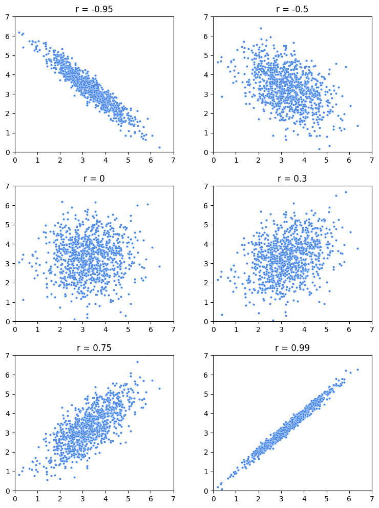
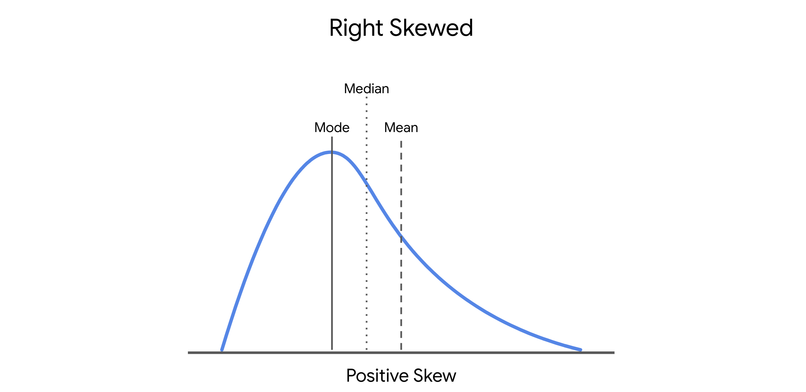

# Sıradan En Küçük Kareler (OLS) Yöntemini Keşfet

Daha önce belirtildiği gibi, regresyon modellemesinde en iyi uyum sağlayan doğruyu bulmanın bir yolu, farklı modelleri deneyip en iyi olanı seçmektir. Ancak basit doğrusal regresyonda, en iyi beta katsayılarının formülleri türetilmiştir. Bu bölümde, kareler toplamı artıkların (residuals) beta katsayıları β₀ ve β₁ değiştikçe nasıl değiştiğini daha iyi anlamanızı sağlayacak bir örnekten geçeceksiniz. Katsayı tahmini için sıradan en küçük kareler yönteminin formüllerini türetmeye ilgi duyuyorsanız, ileride daha fazla kaynak da bulacaksınız. Bu bölümde şu konular ele alınacak:

- Formül ve gösterimlerin gözden geçirilmesi  
- Kareler toplamı artıkların (SSR) en aza indirilmesi  
- Beta katsayılarının tahmini  

## Formül ve Gösterimlerin Gözden Geçirilmesi

Basit doğrusal regresyon, sürekli bir bağımlı değişken ile bir bağımsız değişken arasındaki doğrusal ilişkiyi tahmin etmek için kullanılan bir yöntemdir. Bu tahmin şu şekilde ifade edilir:

$$ŷ = β₀ + β₁ \cdot X$$


Burada şapkalı (^) simgesi, beta katsayılarının sadece tahmin olduğunu gösterir. Dolayısıyla regresyon modelinden elde edilen **ŷ** değerleri de sadece tahmindir.

Katsayıları hesaplamak için yaygın bir teknik, sıradan en küçük kareler (OLS) yöntemidir. Bu yöntem, gözlemlenen ve tahmin edilen değerler arasındaki hatayı (artıkları) karelerine alıp toplayarak (SSR) beta katsayılarını tahmin eder.

SSR şu formülle hesaplanabilir:

$$∑(Observed - Predicted)²$$

ya da matematiksel gösterimle:  

$$∑(yᵢ - ŷᵢ)²$$

Buradaki ∑ (sigma), toplamı ifade eder. Yani bu formül, gözlemlenen değerler ile modelin tahmin ettiği değerler arasındaki farkların karelerinin toplamını ifade eder.

## Kareler Toplamı Artıkların (SSR) En Aza İndirilmesi

6 gözlem içeren bir veri kümesi olduğunu varsayalım:

| **X (gözlemlenen)** | **Y (gözlemlenen)** |
|---------------------|---------------------|
| 0                   | -1                  |
| 1                   | 2                   |
| 2                   | 4                   |
| 3                   | 8                   |
| 4                   | 11                  |
| 5                   | 12                  |


### Doğru 1: ŷ = -0.5 + 3x

İlk denemede β₀ = -0.5 ve β₁ = 3 olduğunu varsayalım. Bu durumda regresyon doğrusu:

$$ŷ = -0.5 + 3x$$

Şimdi X için her değeri yerine koyarak ŷ değerlerini ve artıkların karelerini hesaplayalım:

| X | Y (gerçek) | ŷ (tahmin) = -0.5 + 3x | Artık      | Artık² |
|---|------------|------------------------|------------|--------|
| 0 | -1         | -0.5                   | -0.5       | 0.25   |
| 1 | 2          | 2.5                    | -0.5       | 0.25   |
| 2 | 4          | 5.5                    | -1.5       | 2.25   |
| 3 | 8          | 8.5                    | -0.5       | 0.25   |
| 4 | 11         | 11.5                   | -0.5       | 0.25   |
| 5 | 12         | 14.5                   | -2.5       | 6.25   |

**Kareler toplamı (SSR) = 0.25 + 0.25 + 2.25 + 0.25 + 0.25 + 6.25 = 9.5**

### Doğru 2: ŷ = -0.5 + 2.5x

Şimdi sadece eğimi değiştiriyoruz. β₀ = -0.5 sabit, β₁ = 2.5 olsun. Doğru:

$$ŷ = -0.5 + 2.5x$$

| X | Y (gerçek) | ŷ (tahmin) = -0.5 + 2.5x | Artık | Artık² |
|---|------------|--------------------------|--------|--------|
| 0 | -1         | -0.5                     | -0.5   | 0.25   |
| 1 | 2          | 2                        | 0      | 0      |
| 2 | 4          | 4.5                      | -0.5   | 0.25   |
| 3 | 8          | 7                        | 1      | 1      |
| 4 | 11         | 9.5                      | 1.5    | 2.25   |
| 5 | 12         | 12                       | 0      | 0      |

**Kareler toplamı (SSR) = 0.25 + 0 + 0.25 + 1 + 2.25 + 0 = 3.75**

Bu tahmin çok daha iyi!

## Beta Katsayılarının Tahmini

Eğim ve kesişimi sürekli değiştirip SSR hesaplamak mümkün ama bu şekilde en iyi doğruyu bulduğunuzdan emin olamazsınız. Neyse ki, beta katsayılarını hata miktarını en aza indirecek şekilde hesaplayan matematiksel formüller vardır.

Basit doğrusal regresyon için bu formüller:

- $β₁ = ∑(Xᵢ - X̄)(Yᵢ - Ȳ) / ∑(Xᵢ - X̄)²$

- $β₀ = Ȳ - β₁X̄$

Bu hesaplamaları elle yapmanız beklenmez, ama mantığını anlamak önemlidir.

## Temel Çıkarımlar

Elinizde bir veri örneklemi varsa, bu veriye uyabilecek farklı doğrular deneyebilirsiniz. Her bir doğruda kareler toplamını hesaplayarak en uygun olanı belirleyebilirsiniz. Bir veri uzmanı olarak, kareler toplamı artıkların (SSR) neyi temsil ettiğini ve nasıl hesaplandığını anlamanız önemlidir. Neyse ki, bilgisayarlar ve programlama dilleri bu işlemleri sizin yerinize kolayca yapabilir. OLS ve SSR’nin matematiksel detaylarını daha fazla keşfetmek isterseniz, aşağıdaki kaynaklara göz atabilirsiniz.

## Kaynaklar

- [Parametre Tahmini - Sıradan En Küçük Kareler Yöntemi](https://www.geo.fu-berlin.de/en/v/soga-py/Basics-of-statistics/Linear-Regression/Simple-Linear-Regression/Parameter-Estimation/index.html): *Rudolph, A., Krois, J., Hartmann, K. (2023): Statistics and Geodata Analysis using Python (SOGA-Py). Freie Universitaet Berlin.*

# Korelasyon ve Basit Doğrusal Regresyonun Sezgisel Temeli

Şimdiye kadar, basit doğrusal regresyonun bir bağımsız değişken (X) ile bir sürekli bağımlı değişken (Y) arasındaki doğrusal ilişkiyi tahmin eden bir teknik olduğunu öğrendiniz. Ayrıca, regresyon doğrusunun katsayılarını belirlemenin yaygın bir yolu olan En Küçük Kareler Tahmini (OLS) hakkında bilgi edindiniz. Bu derste, korelasyonun ne anlama geldiğini keşfedecek; *r*, yani “korelasyon katsayısı” hakkında bilgi edinecek; ve regresyon denkleminin nasıl belirlendiğini öğreneceksiniz. Bu bilgiler, değişkenler arasındaki ilişkileri daha iyi anlamanıza ve böylece doğrusal regresyonun nasıl çalıştığını kavramanıza yardımcı olacaktır.

## Korelasyon

Korelasyon, iki değişkenin birlikte nasıl hareket ettiğinin bir ölçüsüdür. Değişkenler arasında güçlü bir korelasyon varsa, birini bilmek diğerini tahmin etmekte oldukça yardımcı olur. Ancak, iki değişken arasında zayıf bir korelasyon varsa, birinin değerini bilmek diğerinin değeri hakkında pek bilgi vermez. Doğrusal regresyon bağlamında korelasyon, **doğrusal** korelasyonu ifade eder: bir değişken değiştikçe, diğeri de sabit bir oranda değişir.

İstatistik dersinde, sürekli bir değişkenin bazı temel istatistiklerle özetlenebileceğini öğrenmiştiniz. Bu özet istatistiklerden ikisi şunlardır:

* **Ortalama:** Merkezi eğilim ölçüsüdür (aritmetik ortalama, medyan, mod)
* **Standart sapma:** Dağılımın bir ölçüsüdür

İki değişken birlikte özetlendiğinde, ***r*** adı verilen başka bir önemli istatistik vardır: **Pearson korelasyon katsayısı** (adını geliştiren kişiden alır) ya da sadece **doğrusal korelasyon katsayısı**. Korelasyon katsayısı, iki değişken arasındaki doğrusal ilişkinin gücünü nicel olarak ifade eder. Değeri her zaman $-1, 1$ aralığındadır.

* *r* negatifse, değişkenler arasında negatif bir ilişki vardır: biri artarken diğeri azalır.
* *r* pozitifse, değişkenler birlikte artar.
* *r* = 0 olduğunda, değişkenler arasında doğrusal bir ilişki yoktur.

Dikkat edin, değişkenler arasında doğrusal olmayan bir ilişki olsa bile (örneğin y = x² veya y = sin(x)), *r* düşük ya da sıfır olabilir.

Aşağıdaki grafikler, korelasyon katsayısı farklı olan iki değişkenin dağılımlarını göstermektedir:



Görüldüğü gibi, *r* değeri 0’a yaklaştıkça veri noktaları daha dağınık görünür; -1 veya 1'e yaklaştıkça daha doğrusal hale gelir.

Ancak *r*, yalnızca değişkenler arasındaki **doğrusal ilişkinin gücünü** söyler; eğimin büyüklüğü hakkında bilgi vermez. Örneğin, *r* = 1 olsa bile, X'teki bir birim artışın Y’yi ne kadar artıracağına dair bilgi vermez.


### *r* Nasıl Hesaplanır?

*r* formülü:

$$r = \frac{covariance(X, Y)}{(SD_X \cdot SD_Y)}$$

Burada:

$$
covariance(X, Y) = \frac{\sum_{i=1}^{n}(x_i - \bar{x})(y_i - \bar{y})}{n}
$$


> **Not:** Bu formüller tüm popülasyon için geçerlidir. Örneklemler için payda *n - 1* olarak alınır.

Bir başka hesaplama yolu da şudur: her veri noktasını standart birime (ortalama çıkar, standart sapmaya böl) çevirin, ardından bu standart birimlerin çarpımlarının ortalamasını alın.

#### Örnek:

| **Çalışma Süresi (X)** | **Not (Y)** | **X’in Standart Birimi** | **Y’nin Standart Birimi** | **Çarpım** |
| ---------------------- | ----------- | ------------------------ | ------------------------- | ---------- |
| 2                      | 75          | -1.5                     | -0.5                      | 0.75       |
| 4                      | 65          | -0.5                     | -1.5                      | 0.75       |
| 5                      | 80          | 0                        | 0                         | 0          |
| 6                      | 95          | 0.5                      | 1.5                       | 0.75       |
| 8                      | 85          | 1.5                      | 0.5                       | 0.75       |

**Ortalama X = 5, SD X = 2**

**Ortalama Y = 80, SD Y = 10**

**Ortalama Çarpım (r) = 0.6**


Grafik üzerindeki dağılıma bakıldığında, noktaların pozitif eğilim gösterdiği görülür, bu da *r*’nin pozitif olmasıyla tutarlıdır.

Aşağıdaki grafik, noktaların ortalamalara göre hangi çeyrekte yer aldığını ve çarpımın pozitif/negatif olma durumunu gösterir:


## Regresyon

Başka bir bilginiz olmasa, rastgele bir öğrencinin sınav notunu tahmin etmek için ortalama puanı tahmin etmek mantıklı olurdu. Ancak bu öğrencinin kaç saat çalıştığını biliyorsanız, daha iyi bir tahmin yapabilirsiniz: aynı süre çalışan öğrencilerin ortalama notunu kullanmak.

Örneğin, 7 saat çalışan bir öğrencinin notunu tahmin ederken, sadece 7 saat çalışanların ortalamasını almak hata oranını azaltır.


### Regresyon Doğrusu

Regresyon doğrusu, her X değeri için Y'nin tahmini ortalama değerini verir. Gerçek değerler birebir bu doğru üzerinde olmayabilir. Bu doğrusal model, tüm veriler için en uygun doğruyu (en az hata ile) bulmaya çalışır.

### Regresyon Denklemi

Regresyon doğrusu denklemi şu iki temel kurala dayanır:

1. (*x̄*, *ȳ*) noktası her zaman regresyon doğrusu üzerindedir.
2. X’teki her bir standart sapma artışı için, Y’de ortalama olarak *r* standart sapmalık bir artış beklenir.


Bu durumda eğim (*m*) şöyle hesaplanır:

$$m = r * \frac{SD_y}{SD_x}$$

Regresyon doğrusu: 

$$y = mx + b$$

Bildiğimiz nokta (*x̄*, *ȳ*) olduğuna göre, *b* şöyle bulunur:

$$b = ȳ - m * x̄$$

#### Örnek:

|                     | **Çalışma Süresi (X)** | **Sınav Notu (Y)** |
| ------------------- | ---------------------- | ------------------ |
| **Ortalama:**       | 5                      | 80                 |
| **Standart Sapma:** | 2                      | 10                 |
| **r:**              | 0.6                    |                    |

1. Eğim (*m*):

$$m = 0.6 * (10 / 2) = 3$$

2. Y-Kesişim (*b*):

$$b = 80 - 3 * 5 = 65$$

3. Regresyon denklemi:

$$y = 3x + 65$$

Bu denkleme “Y’nin X’e göre regresyonu” denir.


Tüm 100 öğrenci için regresyon doğrusu:
$$y = 4.2x + 49.6$$


## Özet Bilgiler

* Korelasyon, iki değişkenin birlikte nasıl değiştiğini ölçer.
* *r* (Pearson korelasyon katsayısı), doğrusal ilişkinin gücünü ifade eder.

  * Değeri her zaman $-1, 1$ aralığındadır.
  * Ortalamalarına göre birlikte değişen değişkenler pozitif korelasyonludur. Ters yönlü değişenler negatif korelasyonludur.
* Regresyon doğrusu, her *x* değeri için *y*’nin ortalama değerini tahmin eder. Hata oranını minimize etmeyi amaçlar.
* Doğrunun eğimi:
  $$m = \frac{r \cdot SD_y}{SD_x}$$
* Nokta (*x̄*, *ȳ*) her zaman regresyon doğrusu üzerindedir.

# Basit Doğrusal Regresyonun Dört Ana Varsayımı

Bu okumada, basit doğrusal regresyonun dört ana varsayımını, bu varsayımların nasıl kontrol edileceğini ve herhangi bir varsayım karşılanmazsa ne yapılması gerektiğini inceleyeceksiniz. Ek kaynakları kullanarak grafiklerin aynısını oluşturabilir ve varsayımları kendiniz keşfedebilirsiniz. Eğer bu okumada tanımlanmamış terimler varsa, kurs boyunca her modülün sonunda yer alan terimler sözlüğüne başvurabilirsiniz.

Bu okumada şunlar ele alınacaktır:

* Basit doğrusal regresyon varsayımları
* Varsayımların geçerliliğinin nasıl kontrol edileceği
* Bir varsayım ihlal edilirse ne yapılması gerektiği

---

## Basit Doğrusal Regresyon Varsayımları

Hatırlamak gerekirse, basit doğrusal regresyonun dört temel varsayımı vardır:

1. **Doğrusallık:** Her bir bağımsız değişken (Xi), bağımlı değişken (Y) ile doğrusal bir ilişkiye sahiptir.
2. **Normallik:** Hatalar normal dağılım gösterir.
3. **Bağımsız Gözlemler:** Veri kümesindeki her bir gözlem birbirinden bağımsızdır.
4. **Homoskedastisite:** Hata terimlerinin varyansı model boyunca sabittir ya da birbirine benzerdir.

---

### **Hatalar ve Artıklar Üzerine Not**

Bu kursta "hata" ve "artık" terimleri regresyon bağlamında birbirinin yerine kullanılmış olabilir. Veri bilimi kaynaklarında bu durumla sıkça karşılaşabilirsiniz. Ancak aralarında fark vardır:

* **Artıklar (residuals):** Tahmin edilen değerlerle gözlemlenen değerler arasındaki farktır. Regresyon modeli kurulduktan sonra tahmin edilen değerlerden gözlenen değerler çıkarılarak hesaplanır.
* **Hatalar (errors):** Modelde varsayılan doğal rastlantısal gürültüdür.
* Normallik ve homoskedastisite varsayımları kontrol edilirken, hataları tahmin etmek için artıklar kullanılır.

---

## Varsayımların Geçerliliği Nasıl Kontrol Edilir?

Daha önce de değinildiği gibi, basit doğrusal regresyon varsayımlarının çoğu veri görselleştirmeleriyle kontrol edilebilir. Bazı varsayımlar model kurulmadan önce kontrol edilebilirken, bazıları model kurulduktan ve tahminler elde edildikten sonra kontrol edilebilir.

---

### **Doğrusallık**

Bağımsız ve bağımlı değişkenler arasında doğrusal bir ilişki olup olmadığını değerlendirmek için en kolay yöntem veri kümesinin saçılım (scatter) grafiğini oluşturmaktır. Bağımsız değişken x eksenine, bağımlı değişken ise y eksenine yerleştirilir. Bu tür grafikler oluşturmak için Matplotlib, seaborn ve Plotly gibi Python kütüphaneleri kullanılabilir. Doğrusallık varsayımı model kurulmadan önce test edilmelidir.

```python
sns.pairplot(chinstrap_penguins)
# Chinstrap penguen verisiyle eşleşen grafikler
```

---

### **Normallik**

Normallik varsayımı **hatalar** ile ilgilidir ve bu hatalar **artıklar** ile tahmin edilir. Bu nedenle normallik varsayımı **sadece model kurulduktan sonra** kontrol edilebilir. Model kurulduktan sonra artıkların normal dağılıp dağılmadığını kontrol etmek için:

* **QQ grafiği** (quantile-quantile plot)
* **Artıkların histogramı** oluşturulabilir.

#### **QQ Grafiği Nedir?**

QQ grafiği, iki olasılık dağılımının karşılaştırıldığı bir araçtır. Veri bilimciler, histogramlara kıyasla normalliği test etmek için QQ grafiğini daha uygun bulurlar çünkü grafik doğrusal bir çizgiye ne kadar uyduğunu görmek daha kolaydır.

QQ grafiğinin oluşturulması:

1. Artıkları sıralayın ve her biri için yüzdelik dilimi bulun.
2. Bu yüzdelikleri standart normal dağılımın z-skorlarıyla karşılaştırın.
3. Grafik oluşturun: x ekseninde standart normal dağılımın yüzde değerleri, y ekseninde sıralanmış artıklar yer alır. Eğer artıklar normal dağılıyorsa, bu noktalar düz bir çizgi oluşturur.

Standardizasyon (z-skora dönüştürme) opsiyoneldir ancak eksenlerin aynı ölçeğe getirilmesini sağlar.


---

#### **QQ Grafiği Oluşturma (Kod)**

```python
import statsmodels.api as sm
import matplotlib.pyplot as plt

residuals = model.resid
fig = sm.qqplot(residuals, line='s')
plt.show()
```


Artıkların histogramı için:

```python
fig = sns.histplot(residuals)
fig.set_xlabel("Artık Değeri")
fig.set_title("Artıkların Histogramı")
plt.show()
```


---

### **Bağımsız Gözlemler**

Gözlemlerin bağımsız olup olmadığını anlamak, veriyi anlama süreciyle ilgilidir. Aşağıdaki soruları sormak faydalı olabilir:

* Veri nasıl toplandı?
* Her bir veri noktası neyi temsil ediyor?
* Bir gözlemin değeri diğerini etkileyebilir mi?

Bu sorulara objektif bir şekilde yanıt aramak, bağımsızlık varsayımının ihlal edilip edilmediğini belirlemenizi sağlar.

---

### **Homoskedastisite**

Bu varsayım da normallik gibi artıklarla ilgilidir, yani **model kurulduktan sonra** değerlendirilebilir. Modelin tahmin ettiği Y değerleri ile artıklar arasında bir saçılım grafiği oluşturularak kontrol edilir.

```python
fig = sns.scatterplot(x=fitted_values, y=residuals)
fig.axhline(0)
fig.set_xlabel("Tahmin Edilen Değerler")
fig.set_ylabel("Artıklar")
plt.show()
```


Artıklar model boyunca rastgele ve sabit varyansa sahip olacak şekilde dağılmışsa, homoskedastisite varsayımı karşılanmıştır.

---

## Varsayımlar İhlal Edilirse Ne Yapılır?

Varsayımların nasıl kontrol edileceğini öğrendikten sonra, herhangi biri ihlal edilirse atılabilecek bazı yaygın adımlara bakalım. Unutmayın, veride yapılan dönüşümler modelin yorumlanmasını değiştirebilir. Ayrıca bu çözümler işe yaramazsa, farklı bir model türü düşünmelisiniz.

### **Doğrusallık**

* Değişkenleri dönüştürün (örneğin logaritmasını alın).

  * Örn: Eğitim yılı ile gelir arasındaki ilişki ölçülüyorsa, gelir değişkeninin logaritması alınarak doğrusal ilişki elde edilmeye çalışılabilir.

### **Normallik**

* Genellikle bağımlı değişkenin logaritması alınır.

  * Örneğin, gelir gibi sağa çarpık dağılımlar artıkların normalliğini bozabilir.
  * Dönüşüm sonrası model yeniden kurulur ve normallik yeniden kontrol edilir.



---

### **Bağımsız Gözlemler**

* Verinin bir alt kümesi alınabilir.

  * Örn: Aynı evden gelen anket cevapları birbirini etkileyebilir. Her evden sadece bir kişiyi dahil etmek çözüm olabilir.
  * Zaman serisi verilerinde, veriler çok sık toplanıyorsa (örneğin her 15 dakikada bir), bağımlılık oluşabilir. Bunun yerine 2 saatte bir veri toplanması bağımsızlık sağlayabilir.

---

### **Homoskedastisite**

* Farklı bir bağımlı değişken tanımlanabilir.

  * Örn: Şehir nüfusu ile restoran sayısı yerine, kişi başına düşen restoran sayısı kullanılabilir.
* Y değişkenini dönüştürün (log vb.).

  * Bu dönüşüm, varyansta tutarlılık sağlayabilir.

---

## Temel Noktalar

* Basit doğrusal regresyonun 4 temel varsayımı vardır: doğrusallık, normallik, bağımsızlık, homoskedastisite.
* Her varsayımın geçerliliği farklı yollarla kontrol edilebilir.
* Varsayım ihlali durumunda veriler dönüştürülebilir.
* Değişkenleri dönüştürmek, sonuçların yorumunu da değiştirir.
* Dönüşümlere rağmen varsayımlar karşılanmıyorsa, farklı modeller düşünülmelidir.

---

## Ek Kaynaklar

* [Seaborn penguins veri kümesini buradan indirin](https://raw.githubusercontent.com/mwaskom/seaborn-data/master/penguins.csv)
* [Palmer penguenleri hakkında daha fazla bilgi](https://allisonhorst.github.io/palmerpenguins/articles/intro.html)
* \[QQ grafiklerine dair video (jbstatistics)]\([https://www.youtube](https://www.youtube.com/watch?v=X9\_ISJ0YpGw)

# Kod Fonksiyonları ve Dokümantasyonu

Bu derste, videolarda kullanılan kodların bir kısmını penguen verisinin farklı bir alt kümesiyle tekrar inceleyeceksiniz. Ayrıca, statsmodels dokümantasyonuna yaklaşırken bazı ipuçları da paylaşılacak. Bu, Python işlevselliğini keşifsel veri analizi, temel veri temizleme ve model oluşturma ile birlikte gözden geçirmek için iyi bir fırsattır.

---

## Videodaki Fonksiyonları Gözden Geçirme

### **Veri Setini Yükle**

İlk birkaç satır, kodlama ortamını kurar ve verileri yükler. Aşina olduğunuz gibi, gerekli paketleri içe aktarmak için `import` fonksiyonunu kullanabilirsiniz. Gerekli yerlerde yaygın takma adları (alias) kullanmalısınız. Aşağıdaki örnek, *seaborn* paketi üzerinden erişilebilen penguen veri setini referans alır.

```python
import pandas as pd  # Paketleri içe aktar
import seaborn as sns  # Veri setini yükle

penguins = sns.load_dataset("penguins")  # Veri setini yükle
penguins.head()  # Veri setinin ilk 5 satırına bak
```

---

### **Veriyi Temizle**

Veri yüklendikten sonra, dersin amacı doğrultusunda veri alt kümesine ayrılarak temizlenir. Bu örnekte yalnızca Chinstrap (kayış çeneli) penguenleri ayrıştırılmış ve eksik veriler içeren satırlar kaldırılmıştır.

Alt kümeleme işleminden sonra veri çerçevesinin indeksleri `reset_index()` fonksiyonu ile sıfırlanır. Bu işlem, çalışmayı kolaylaştırır.

```python
# Yalnızca Chinstrap penguenlerini seç
chinstrap_penguins = penguins[penguins["species"] == "Chinstrap"]

# İndeksi sıfırla
chinstrap_penguins.reset_index(inplace=True, drop=True)
```

---

### **Model Kurulumu İçin Hazırlık**

Veri artık temiz olduğuna göre, veri görselleştirilebilir ve doğrusal regresyon modeli oluşturulabilir. Öncelikle, X değişkeni olarak `bill_depth_mm` (gaga derinliği) ve Y değişkeni olarak `flipper_length_mm` (yüzgeç uzunluğu) çıkarılır:

```python
# Veriyi alt kümele
ols_data = chinstrap_penguins[["bill_depth_mm", "flipper_length_mm"]]
```

Statsmodels kullanıldığı için, OLS (En Küçük Kareler) formülü bir string olarak tanımlanmalıdır:

```python
# Formülü tanımla
ols_formula = "flipper_length_mm ~ bill_depth_mm"
```

---

### **Modeli Kur**

Modeli kurmak için önce `statsmodels.formula.api` arayüzünden `ols` fonksiyonunu içe aktarmak gerekir:

```python
from statsmodels.formula.api import ols
```

Daha sonra, formül ve veriyi `ols()` fonksiyonuna vererek model oluşturulur. `fit()` metodu ile model veriye uyarlanır. `summary()` metodu ile modelin özet sonuçları görüntülenebilir:

```python
# OLS oluştur, modele uydur ve özetini al
OLS = ols(formula=ols_formula, data=ols_data)
model = OLS.fit()
model.summary()
```


---

### **Model Tahminleri ve Artıklar**

Bir `statsmodels.regression.linear_model.OLS` veya `OLSResults` nesnesinden model tahminlerine ve artıklara (residuals) şu şekilde erişebilirsiniz:

#### Tahminler (Predictions)

Modelin `predict()` metodunu, bağımsız değişken(ler)in bulunduğu bir diziyi vererek kullanın:

```python
predictions = model.predict(chinstrap_penguins[["bill_depth_mm"]])
```

#### Artıklar (Residuals)

Modelin `resid` niteliğini kullanın:

```python
residuals = model.resid
```

---

## Statsmodels Dokümantasyonunu Kullanma

Yeni bir Python paketi veya fonksiyon setiyle çalışmak başlangıçta zor olabilir. Ancak Python açık kaynaklı bir dil olduğu için güçlü bir topluluğa sahiptir. Başarılı bir veri uzmanı olmanın bir parçası, kodunuzu çalıştırabilmek ve hata durumlarında neyin yanlış gittiğini bulabilmektir.

Bu nedenle, doğrudan resmi dökümantasyona başvurmak iyi bir yoldur.

Örneğin, `statsmodels` paketini kullanıyorsunuz. [Statsmodels dökümantasyonu](https://www.statsmodels.org/devel/api.html) çevrimiçi olarak mevcuttur ve düzenli olarak güncellenmektedir. OLS tahmini yapmak için [`statsmodels.formula.api`](https://www.statsmodels.org/devel/api.html#statsmodels-formula-api) arayüzünü kullanıyorsunuz.

`ols()` fonksiyonunun [sayfasında](https://www.statsmodels.org/devel/generated/statsmodels.formula.api.ols.html#statsmodels.formula.api.ols), kullanılabilecek parametreleri ve açıklamaları görebilirsiniz.

Ne yazık ki, bu belgeler genellikle yeterli sayıda örnek içermez. Bu durumda, internetten `ols()` fonksiyonunu aratabilir ve diğer Python kullanıcılarının benzer problemleri nasıl çözdüğüne bakabilirsiniz.

---

## Temel Çıkarımlar

* Bu dersi, ilgili videodaki kodları hatırlamak için tekrar edebilirsiniz.
* `statsmodels` veya başka bir paketin dökümantasyonunu ihtiyacınız oldukça kullanabilirsiniz.
* Eğer dökümantasyon yeterli değilse, internetten topluluk kaynaklarını (Stack Overflow, bloglar, GitHub) inceleyebilirsiniz.

# Regresyondaki Belirsizlik Ölçümlerini Yorumlama

## Bu Okumanın Amacı

Bu okumada, regresyon analizindeki belirsizliği incelemeye devam edeceğiz. Özellikle güven aralıkları, güven bantları ve p-değerleri üzerinden ilerleyeceğiz. Bu okuma ile birlikte:

* Temel kavramları gözden geçireceğiz
* Belirsizlik ölçümlerinin nasıl yorumlandığını tartışacağız
* Örnek grafiklere bakacağız

---

## Kavramların Gözden Geçirilmesi

Basit bir doğrusal regresyon denklemine şu şekilde ifade edebileceğimizi hatırlayın:
$$y = β₀ + β₁X$$

Regresyon analizi **tahmin** tekniklerini kullandığı için, bu modellerin yaptığı tahminlerde her zaman bir belirsizlik seviyesi vardır. Bu hatayı göstermek için denklemi bir hata terimi (ϵ - “epsilon” olarak okunur) ile yeniden yazabiliriz:
$$y = β₀ + β₁X + ϵ$$

Her bir veri noktası için, tahmin edilen değer ile gerçek değer arasındaki farkı ifade eden bir artık (residual) bulunur. Modelin genel belirsizliğini şu ölçümlerle nicelendirebiliriz:

* **Beta katsayıları etrafındaki güven aralıkları**
* **Beta katsayıları için p-değerleri**
* **Regresyon doğrusu etrafındaki güven bandı**

Bazı terimlerin tanımını hatırlamak isterseniz sözlüğe başvurabilirsiniz. Ancak burada iki temel terimi tanımladık:

* **Güven aralığı:** Bir tahminin etrafındaki belirsizliği tanımlayan değer aralığıdır.
* **P-değeri:** Sıfır hipotezi doğru olduğunda, gözlemlenen kadar uç sonuçların görülme olasılığıdır.

---

## Belirsizliğin Yorumlanması

Daha önceki videolarda birlikte oluşturduğumuz doğrusal regresyon modelinin sonuç özetini tekrar hatırlayalım:


Oluşturduğumuz basit doğrusal regresyon modeline göre, **β₁ tahmini 141.1904**'tür. Bu, bir penguenin gaga uzunluğundaki her bir milimetrelik artışın, vücut kütlesinde yaklaşık **141.1904 gramlık** bir artış ile ilişkili olduğunu gösterir. Bu tahminin p-değeri **0.000**'dır ve bu değer 0.05’ten küçük olduğu için, katsayının “istatistiksel olarak anlamlı” olduğu söylenebilir. Ayrıca, bu tahmin için **%95 güven aralığı** $131.788, 150.592$ olarak verilmiştir.

Bu kısa cümleleri biraz daha detaylı inceleyelim.

### P-değerleri

Regresyon analizi yaparken, X ile y arasında gerçekten bir ilişki olup olmadığını öğrenmek isteriz. Bu nedenle regresyon sonuçları üzerinde hipotez testi yaparız. Her bir beta katsayısı için şu hipotezler test edilir:

* **H₀ (sıfır hipotezi): β₁ = 0**
* **H₁ (alternatif hipotez): β₁ ≠ 0**

Bizim örneğimizde p-değeri 0.05’ten küçük olduğu için, **sıfır hipotezi reddedilir** ve **katsayının istatistiksel olarak anlamlı olduğu** sonucuna varılır. Bu da demektir ki, penguenin gaga uzunluğundaki bir fark, vücut kütlesindeki bir fark ile gerçekten ilişkilidir.

### Güven Aralıkları

Her beta katsayısının tahminiyle birlikte bir güven aralığı vardır. Örneğin, %95’lik bir güven aralığı, bu aralığın gerçekte beta katsayısının gerçek değerini içerme olasılığının %95 olduğunu ifade eder. Yani $131.788, 150.592$ aralığının **gerçek β₁ değerini içermeme olasılığı %5**'tir.

Daha doğru bir şekilde ifade edersek: Bu deney birçok kez tekrarlandığında, oluşturulan güven aralıklarının %95’i gerçek β₁ değerini içeriyor olacaktır.

Ancak, hem β₀ hem de β₁ tahminlerinde belirsizlik bulunduğundan, **y tahminlerinde de belirsizlik** vardır. Bu noktada güven bantları devreye girer.

---

## Örnek Grafik

* **Güven bandı:** Regresyon doğrusu etrafında, tahmin edilen sonuçlar üzerindeki belirsizliği tanımlayan alandır.
  Güven bandını, y’nin her tahmin değeri etrafındaki güven aralığı olarak düşünebilirsiniz.
  Doğrunun her noktasında belirsizlik olduğu için, tüm modeldeki belirsizlik güven bandı ile özetlenir.
  Güven bandı genellikle örneklemin ortalama değerine yakınken daha dar, uç değerlerde ise daha geniştir.


---

## Temel Çıkarımlar

* Regresyon analizi, tahmin tekniklerine dayanır; bu nedenle tahminler etrafında her zaman bir belirsizlik vardır.
* Belirsizlik; güven aralıkları, p-değerleri ve güven bantları ile ölçülebilir.
* Her bir katsayının tahmini için, katsayının 0’a eşit olup olmadığını test ederiz.

# Basit Doğrusal Regresyon için Değerlendirme Ölçütleri

Bu okumada, **basit doğrusal regresyon** için değerlendirme ölçütleri hakkında daha kapsamlı bir genel bakış sunacağız. Önceki bir videoda **R²**'yi ele almış ve **MAE** ile **MSE** gibi bazı diğer ölçütlerden bahsetmiştik. Bu okumada, daha önce bahsedilen bu ölçütleri gözden geçirecek ve veri bilimi kariyeriniz boyunca karşılaşabileceğiniz birkaç yeni ölçüte daha değineceğiz.

---

## **R², MSE ve MAE'nin Gözden Geçirilmesi**

Doğrusal regresyon için en temel değerlendirme ölçütü **R²**, yani belirleme katsayısıdır.

---

## R²: Belirleme Katsayısı

**R²**, bağımlı değişkendeki (Y) varyasyonun, bağımsız değişken(ler) (X) tarafından ne kadarının açıklandığını ölçer.

* Bu, **kalan kareler toplamı (sum of squared residuals)** ile **toplam kareler toplamı (total sum of squares)** arasındaki oranı 1’den çıkararak hesaplanır:

$$
R^2 = 1 - \frac{\text{Kalan Kareler Toplamı}}{\text{Toplam Kareler Toplamı}}
$$

R², **0 ile 1 arasında** bir değerdir. Örneğin, bir modelin R² değeri 0.85 ise, bu X değişkenlerinin Y değişkenindeki varyasyonun %85’ini açıkladığı anlamına gelir. R², yorumlaması kolay ve sık kullanılan bir ölçüttür. Ancak, bazı durumlarda **ortalama kare hata (MSE)** ve **ortalama mutlak hata (MAE)** gibi başka ölçütler kullanmak gerekebilir.

---

## MSE: Ortalama Kare Hata

**MSE (Mean Squared Error)**, tahmin edilen değerler ile gerçek değerler arasındaki farkların karelerinin ortalamasıdır.

* Hesaplama yöntemi nedeniyle, MSE **büyük hatalara karşı oldukça duyarlıdır**.

---

## MAE: Ortalama Mutlak Hata

**MAE (Mean Absolute Error)**, tahmin edilen değerler ile gerçek değerler arasındaki **mutlak farkların ortalamasıdır**.

* Eğer verinizde dikkate almak istemediğiniz **aykırı değerler (outliers)** varsa, MAE daha uygundur çünkü **büyük hatalara karşı duyarlı değildir**.

---

## Diğer Değerlendirme Ölçütleri

Yukarıda bahsedilen üç ölçütün yanı sıra, şu ölçütlerle de karşılaşabilirsiniz:

* [**AIC (Akaike Bilgi Kriteri)**](https://machinelearningmastery.com/probabilistic-model-selection-measures/)
* [**BIC (Bayesyen Bilgi Kriteri)**](https://machinelearningmastery.com/probabilistic-model-selection-measures/)

Son olarak, **düzeltilmiş R² (adjusted R²)** de vardır ve bu, ilerleyen videolarda daha detaylı olarak ele alınacaktır. Düzeltilmiş R², birden fazla bağımsız değişken içeren regresyon modelleri için R²'nin düzeltilmiş bir versiyonudur.

---

## Temel Çıkarımlar

* Basit doğrusal regresyon için birden fazla değerlendirme ölçütü vardır.
* En yaygın kullanılan ölçüt **R²**'dir. Ancak her durumda yeterli ya da uygun olmayabilir.
* Deneyiminize ve ihtiyaçlarınıza göre, regresyon modelini değerlendirmek için en uygun ölçütü seçebilirsiniz.

# Korelasyon ve Nedensellik: Regresyon Sonuçlarını Yorumlama

Önceki videolarda, korelasyonun nedensellik olmadığını öğrendiniz. Bu okumada ise korelasyon ve nedensellik arasındaki farkları keşfetmeye devam edeceksiniz, böylece regresyon sonuçlarını sorumlu, dürüst ve etkili bir şekilde raporlamaya hazır olacaksınız.

## Korelasyon nedir?

Hatırlayabileceğiniz gibi, iki ana korelasyon türü vardır: pozitif korelasyon ve negatif korelasyon.

* **Pozitif korelasyon**, iki değişkenin birlikte artma veya azalma eğiliminde olduğu bir ilişkidir.

* **Negatif korelasyon**, iki değişken arasında ters yönlü bir ilişkidir; biri artarken diğeri azalma eğilimindedir ve tam tersi.

Genel olarak, **korelasyon**, iki değişkenin birlikte nasıl değişme eğiliminde olduğunu ölçer. -1 ile 1 arasında değişen ve iki değişken arasındaki ilişkiyi ölçen [Pearson korelasyon katsayısı](https://docs.scipy.org/doc/scipy/reference/generated/scipy.stats.pearsonr.html) diye bir ölçüt vardır.

Unutmayın ki korelasyon sadece gözlemseldir. İki değişken korelasyonlu olabilir—birlikte değişme eğiliminde olabilirler ancak bu, bir değişkenin diğerini değiştirmesine neden olduğu anlamına gelmez. Hatta, değişkenler arasında ilginç ve beklenmedik korelasyonları belgeleyen [*Spurious Correlations*](https://www.tylervigen.com/spurious-correlations) adlı bir web sitesi ve kitap bile vardır.

Örneğin, ABD’de bilgisayar bilimi doktora sayısı ile oyun salonlarının toplam gelirleri arasındaki korelasyonu gösteren bir grafik aşağıdadır. Zaman içinde, bilgisayar bilimi doktorası sayısı ve oyun salonu gelirleri yaklaşık aynı oranda artmaktadır. Bu nedenle, grafik kesinlikle iki değişken arasında bir korelasyon göstermektedir; ancak biri diğerine neden olur demek oldukça zordur.


## Nedensellik iddiası yapmak zordur

Daha önce öğrendiğiniz gibi, **nedensellik** bir değişkenin diğerini belirli bir şekilde doğrudan değiştirdiği sebep-sonuç ilişkisini tanımlar. Bu sezgisel bir tanım olmakla birlikte, nedenselliği kanıtlamak birçok özel koşulun sağlanmasını gerektirir.

Genel olarak değişkenler arasında nedensellik iddiası yapabilmek için bir [**randomize kontrollü deney**](https://www.urban.org/research/data-methods/data-analysis/quantitative-data-analysis/impact-analysis/experiments) yapmanız gerekir. İyi bir randomize kontrollü deneyin bazı temel bileşenleri şunlardır:

* Deneydeki her faktör kontrol altında olmalıdır.
* Belirli koşullar altında bir kontrol grubunuz olmalıdır.
* Belirli koşullar altında en az bir tedavi grubunuz olmalıdır.
* Kontrol ve tedavi grupları arasındaki farklar gözlemlenebilir ve ölçülebilir olmalıdır.

Randomize kontrollü deney kurmak oldukça zahmetli ve yoğun bir iştir. Bu okuma kapsamında belirtilmeyen birçok gereklilik ve faktör vardır ancak çevrimiçi ve akademik araştırmalarda bu konuda daha fazla bilgi bulabilirsiniz. Nedensel iddiaların temelini anlamak, veri analizinizin sonuçlarını sorumlu bir şekilde raporlamanızı sağlar.

## Korelasyon ilginç içgörüler sağlar

Bir veri profesyoneli olarak çalışırken, verinin nasıl toplandığı üzerinde tam kontrolünüz olmayabilir. Siz veya ekibiniz randomize kontrollü deney yapamayabilir. Ancak, nedensel iddialarda bulunamasanız bile, korelasyon temelli araştırmalar anlamlı iş sonuçları yaratabilecek ilginç bulgular verebilir.

### **Senaryo 1: Atletik performansın optimize edilmesi**

Diyelim ki bir koşucu yarışa hazırlanıyor. Sağlık verilerini takip etmek için pek çok yol var—yerleşik uygulamalardan ücretli uygulamalara kadar. Ama koşucunun performansını etkileyen çok sayıda faktör vardır—yeterince su içmesi, o gün kaslarının ne kadar ağrıdığı, hava durumu, uyku süresi, yarış günü kullandığı ekipman ve kıyafetler gibi. Hiçbir faktörün tek başına yarış süresini belirlediğini iddia etmek zordur. Ancak zamanla, uyku, ağrı, su tüketimi, kıyafetler ve diğer faktörlerin performansla nasıl korelasyon gösterdiği gözlemlenebilir. Bu yüzden sporcular ekipman markalarına, diyetlerine ve yarış öncesi rutinlerine çok dikkat ederler.

### **Yapabileceğiniz iddialar (korelasyon)**

* Koşucu yarıştan önceki gün daha fazla su içerse, dayanıklılığı artma eğilimindedir.
* Koşucu yarıştan önceki hafta uzun mesafe koşmazsa, yarış günü kendini daha iyi hisseder.

### **Yapamayacağınız iddialar (nedensellik)**

* Yarıştan önce daha fazla su içmek koşucunun daha hızlı koşmasına neden olur.
* Yarıştan önce uzun mesafe koşmamak koşucunun daha hızlı koşmasına neden olur.

### **Senaryo 2: Yemek kalitesinin iyileştirilmesi**

Belki bir restoranda yeni şefsiniz veya kendiniz ya da aileniz için yemek yapıyorsunuz. Bir yemek yaptığınızda birçok değişken vardır: hangi tava kullanıldı, malzemeler ne zaman alındı, malzemeler mevsiminde mi, herkes ne kadar aç. Bu faktörlerden herhangi biri yemeğin “iyi” olmasını etkileyebilir. Ancak, bu veri nedensel iddialardan bağımsız olarak değerlidir. Zamanla bu özel yemek için pişirme becerilerinizi geliştirerek daha kaliteli yemekler yapabilirsiniz.

Bu, faktörler arasındaki korelasyonu anlamak için veri toplamanın sonuçları büyük ölçüde iyileştirebileceği iki örnektir. Aynı prensipler, büyük veri ve farklı sektörlerde, optimize edilmek istenen sonuca göre uygulanabilir.

### **Yapabileceğiniz iddialar (korelasyon)**

* Daha taze malzeme kullandığımda, yemeğin tadı daha iyi olur.
* Çok aç olduğumda, yemeğin tadı daha iyi olur.

### **Yapamayacağınız iddialar (nedensellik)**

* Daha taze malzeme kullanmak yemeğin tadını daha iyi yapar.
* Daha aç olmak yemeğin tadını daha iyi yapar.

## Önemli noktalar

* Nedensellik iddiası yapmak genellikle kontrolünüz dışında olan özel koşullar gerektirir.
* Korelasyon analizleri veri profesyonelleri için çok faydalı bir araçtır ve ilginç içgörüler ve uygulanabilir sonraki adımlar sağlar.

