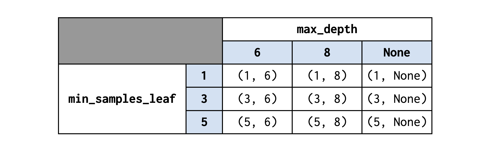
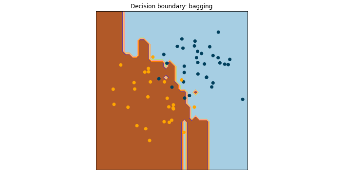
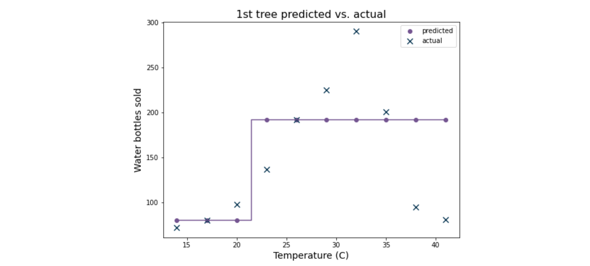

# Karar ağaçlarını keşfedin

Bildiğiniz gibi ağaç tabanlı öğrenme, günümüzde endüstride kullanılan en etkili makine öğrenimi tekniklerinden biridir. Birçok farklı algoritma, tahminlerini yapmak için ağaç tabanlı bir mimari kullanır. Karar ağacı, bu algoritmaların temel yapı taşı olmasının yanı sıra kendi içinde güçlü bir tahmin algoritmasıdır. Veri uzmanları, modelleme kararlarını geliştiren güçlü araçlar olarak karar ağaçlarına güvenmektedir. Bu okumada karar ağaçlarını, nasıl yapılandırıldıklarını, nasıl çalıştıklarını ve nasıl oluşturulduklarını derinlemesine inceleyeceksiniz.

### **Karar ağacı nedir?**

Karar ağaçları, olayların sonuçlarını, belirli sonuçların olasılığını tahmin etmek veya bir karara varmak için dallanma yollarını kullanan akış şeması benzeri bir yapıdır. Bir spor takımının maçı kazanıp kazanmayacağı gibi belirli bir sınıfın veya sonucun tahmin edildiği sınıflandırma problemleri için kullanılabilirler. Ayrıca, bir arabanın fiyatı gibi sürekli bir değişkenin tahmin edildiği regresyon problemleri için de kullanılabilirler. Bu okuma sınıflandırma ağaçlarına odaklanmaktadır, ancak her iki durumda da modeller aynı temel karar sürecine bağlıdır. 

Karar ağaçları, problemleri analiz etmek için onlarca yıldır kullanılmaktadır. Ancak teknolojik gelişmeler, karar ağaçlarının bilgisayarlar tarafından oluşturulabilmesini sağlayarak insanların tek başına başarabileceğinden çok daha derin ve doğru analizler yapılabilmesini mümkün kılmıştır.

**Not**: Bu okumadaki tüm örnekler sadece **iki** alt düğüme ayrılan düğümleri göstermektedir, çünkü scikit-learn de dahil olmak üzere modelleme kütüphanelerinde bu şekilde uygulanmaktadırlar. Her bir düğümü üç, dört veya daha fazla yeni gruba bölmek teorik olarak mümkün olsa da (daha önce "Futbol oynayayım mı?" örneğinde gösterildiği gibi), hesaplama karmaşıklığı nedeniyle bu pratik olmayan bir yaklaşımdır. İki seviyeli bir ikili bölme, işlevsel olarak tek seviyeli üç yönlü bir bölmeye eşdeğerdir, ancak hesaplama talebi açısından çok daha basittir.

### **Bir sınıflandırma ağacının yapısı**

Karar ağaçları ancak ters çevrildiklerinde gerçek ağaçlara benzerler, çünkü kökleri tepede başlar ve aşağı doğru büyüyerek "yaprakların" altta kalmasını sağlarlar. Karar ağaçları düğümlerden oluşur. Düğümler örnek gruplarıdır. Ağaçta nasıl işlev gördüklerine bağlı olarak farklı düğüm türleri vardır. Bir karar ağacındaki ilk düğüme **kök düğ**üm denir. İlk bölme her zaman kök düğümden çıkar ve örnekleri belirli bir özellik için içerdikleri değerlere göre iki yeni düğüme böler.

Bu iki yeni düğüm kökün **alt** düğümleri olarak adlandırılır. Alt düğüm, bir bölmeden kaynaklanan herhangi bir düğümdür. Çocuğun ayrıldığı düğüm **ana düğ**üm olarak bilinir. Bu iki yeni alt düğümün her biri sırayla verileri yeni bir kritere göre yeniden böler. Bu işlem düğümler ayrılmayı durdurana kadar devam eder. Bölünmeyen alt düzey düğümlere **yaprak düğ**ümler denir. Yaprak düğümlerin üzerindeki tüm düğümler **karar** düğümleri olarak adlandırılır, çünkü hepsi verileri sola veya sağa doğru sıralayan bir karar verir.


### **Kararlar ve bölünmeler**

Bir karar ağacında veriler bölünür ve bir yaprak düğüme ulaşana kadar karar düğümlerinden geçirilir. Bir karar düğümü, ortaya çıkan çocuklarındaki sınıfların **safsızlığını** en aza indiren kritere göre bölünür. Safsızlık, sınıfa göre karışım derecesini ifade eder. Düşük safsızlığa sahip düğümlerde bir sınıftan diğerlerinden çok daha fazla bulunur. Mükemmel bir bölme, ortaya çıkan alt düğümlerde hiçbir kirlilik içermeyecektir; her alt düğüm yalnızca tek bir sınıf içerecek şekilde verileri bölecektir. Mümkün olan en kötü bölünme, ortaya çıkan çocuk düğümlerde yüksek safsızlığa sahip olacaktır; çocuk düğümlerin her ikisi de her sınıftan eşit sayıda olacaktır.


Bir ağaç oluştururken ve yeni bir düğüm büyütürken, veri kümesindeki her tahmin edici değişken için bir dizi potansiyel ayırma noktası oluşturulur. Her bir değişkenin her bir bölünme noktasından kaynaklanacak çocuk düğümlerin "saflığını" hesaplamak için bir algoritma kullanılır. Verileri bölmek için en saf alt düğümleri oluşturan özellik ve bölme noktası seçilir.

Bir değişken için dikkate alınacak potansiyel bölme noktaları kümesini belirlemek için algoritma ilk olarak değişkenin kategorik veya sürekli gibi ne tür bir değişken olduğunu ve bu değişken için var olan değer aralığını tanımlar. 

**Kategorik değişkenler**

Tahmin edici değişken kategorik ise, karar ağacı algoritması kategoriye göre bölmeyi dikkate alacaktır. İşte örnek olması için küçük bir meyve veri kümesi. Veriler, elma ya da üzüm olan meyve örneklerini içermektedir. Ayrıca meyvelerin rengine (sarı, kırmızı veya yeşil) ve santimetre cinsinden çapına sahiptir. Bu değişkenlerin her biri karar ağacı algoritmasını etkiler.

|  **Renk**   | **Çap (cm)** | **Meyve (hedef)** |
|---------|----------|---------------|
|  Sarı   |   3.5    |     Elma      |
|  Sarı   |    7     |     Elma      |
| Kırmızı |    2     |     Üzüm      |
| Kırmızı |   2.5    |     Üzüm      |
|  Yeşil  |    4     |     Üzüm      |
|  Yeşil  |    3     |     Elma      |
| Kırmızı |    6     |     Elma      |

İlk olarak, algoritma kategorik değişken olan renge göre bölmeyi değerlendirecektir. Üç kategori olduğu için üç seçenek değerlendirilmektedir. "Evet "in her zaman sola, "hayır "ın ise sağa gittiğini unutmayın.


**Sürekli değişkenler**

Tahmin edici değişken sürekliyse, verilerde var olan sayı aralığı boyunca herhangi bir yerde bölünmeler yapılabilir. Genellikle potansiyel ayırma noktaları, özelliğin değerlerini sıralayarak ve her bir ardışık değer çiftinin ortalamasını alarak belirlenir. Bununla birlikte, herhangi bir sayıda bölme noktası olabilir ve hesaplama kaynaklarından ve zamandan tasarruf etmek için daha az bölme noktası düşünülebilir. Özellikle çok geniş sayı aralıklarıyla uğraşırken, dağılımın yüzdelik dilimleri boyunca bölünmüş noktaları dikkate almak çok yaygındır.

Meyve örneğinde, "Çap" sürekli bir değişkendir. Bir karar ağacının bunu halledebilmesinin bir yolu şudur:

- **Değerleri sıralayın, ardışık değerlerin ortalamasını belirleyin:**
    


- **Belirlenen bu araçlara göre bölünmeyi inceleyin:**
    


Bunlar, Çap özelliği için algoritma tarafından belirlenen altı potansiyel ayırma noktasıdır. Her seçenek o bölünmenin çocuklarını içerir, ancak bu noktada hiçbirinin henüz değerlendirilmediğini unutmayın. Bir sonraki adım bu. 

### **Bölmeleri seçiyorum: Gini safsızlığı**

Artık _potansiyel_ bölünme noktalarını nasıl belirleyeceğinizi biliyorsunuz. Meyve örneğinde, aralarından seçim yapabileceğiniz dokuz seçenek vardır: A–I. Peki hangi bölmeyi kullanacağınıza nasıl karar veriyorsunuz? Çocuk düğümlerin "saflığı" bu noktada önem kazanır. Genel olarak, yukarıdaki E örneğinde olduğu gibi, ortaya çıkan her bir alt düğüm bir sınıfa ait diğerlerinden çok daha fazla örnek içerdiğinde bölmeler daha iyidir, çünkü bu, bölmenin sınıfları etkili bir şekilde ayırdığı anlamına gelir - karar ağacının birincil görevi! Bu gibi durumlarda, çocuk düğümlerin düşük safsızlığa (veya yüksek saflığa) sahip olduğu söylenir. Karar ağacı algoritması, bir hesaplama yaparak çocuk düğümler arasında en düşük safsızlıkla sonuçlanacak bölünmeyi belirler.

Bir düğümün saflığını belirlemek ve nasıl bölüneceğine karar vermek için **Gini safsızlığı, entropi, bilgi kazancı** ve **günlük kaybı** dahil olmak üzere kullanılabilecek birkaç olası ölçüm vardır. En basit olanı Gini safsızlığıdır ve aynı zamanda scikit-learn'deki karar ağacı sınıflandırıcısı için varsayılandır, bu nedenle bu okuma bu yönteme odaklanacaktır. Bir düğümün Gini safsızlığı şu şekilde tanımlanır:

$$
\text{Gini impurity} = 1 - \sum_{i=1}^{N} P(i)^2
$$

Burada $i$:

$$
P(i) = \text{belirli bir düğümde } i \text{ sınıfına ait örneklerin olasılığıdır}
$$

Örneğin:

$$
\text{Gini impurity} = 1 - P(\text{apple})^2 - P(\text{grape})^2
$$

Gini safsızlığı, her bir potansiyel bölünme noktasının her bir alt düğümü için hesaplanır. Örneğin, meyve örneğinde (A-I) dokuz ayrık nokta seçeneği vardır. İlk potansiyel ayırma noktası Renk=kırmızı'dır:


**Her bir çocuk düğümün Gini safsızlığını hesaplayın:**

$$
\text{Gini impurity} = 1 - P(\text{apple})^2 - P(\text{grape})^2
$$

$$
= 1 - \left( \frac{\text{number of apples in node}}{\text{total number of samples in node}} \right)^2 
- \left( \frac{\text{number of grapes in node}}{\text{total number of samples in node}} \right)^2
$$

**"red=yes"** alt düğümü için:

$$

\text{Gini safsızlığı} = 1 - (1/3)² - (2/3)² = 1 - 0.111 - 0.444 = 0.445

$$

**"red=no"** alt düğümü için:

$$

\text{Gini safsızlığı}  = 1 - (3/4)² - (1/4)² = 1 - 0.5625 - 0.0625 = 0.375

$$


Şimdi A seçeneği (meyvenin kırmızı olup olmaması) için iki Gini safsızlık puanı vardır - her bir alt düğüm için bir tane. Son adım, ağırlıklı ortalamalarını alarak bu puanları birleştirmektir. 

**Gini safsızlıklarının ağırlıklı ortalamasını hesaplayın**

Ağırlıklı ortalama, her bir Gini safsızlık skorunda temsil edilen farklı örnek sayısını hesaba katar. İlk alt düğüm üç örnek ve ikinci alt düğüm dört örnek içerdiğinden, bunları basitçe toplayıp ikiye bölemezsiniz. Gini safsızlıklarının_(Gi)_ ağırlıklı ortalaması şu şekilde hesaplanır:
Aşağıda görseldeki içeriğin Markdown + LaTeX biçimine çevrilmiş hali bulunmaktadır:


**Toplam Gi:**

$$
= \left( \frac{\text{SOL alt düğümdeki örnek sayısı}}{\text{HER İKİ alt düğümdeki örnek sayısı}} \right) \cdot Gi_{\text{SOL}} 
+ \left( \frac{\text{SAĞ alt düğümdeki örnek sayısı}}{\text{HER İKİ alt düğümdeki örnek sayısı}} \right) \cdot Gi_{\text{SAĞ}}
$$

$$
= (3/7 \cdot 0.445) + (4/7 \cdot 0.375)
$$

$$
\text{Gini toplam (Gi total)} = 0.405
$$

**Bu işlemi her bölme seçeneği için tekrarlayın**

Aynı işlem her bölme seçeneği için tekrarlanır. Meyve örneğinde dokuz seçenek vardır (A-I):


Şimdi 0,229 ile 0,486 arasında değişen dokuz Gini safsızlık puanı vardır. Bu bir safsızlık ölçüsü olduğundan, en iyi skorlar sıfıra en yakın olanlardır. Bu durumda, bu E seçeneğidir. Dokuz seçenekten en kötüsü C seçeneğidir, çünkü sınıfları iyi ayırmaz. Mümkün olan en kötü Gini safsızlık puanı 0,5'tir ve her bir alt düğüm her bir sınıftan eşit sayıda içerdiğinde ortaya çıkar. 

Algoritma potansiyel bölünme noktalarını belirlediğine ve bunlardan kaynaklanan çocuk düğümlerin Gini safsızlığını hesapladığına göre, en düşük Gini safsızlığına sahip bölünme noktasını seçerek ağacı büyütecektir.  

**Ağacı büyütün**

Verilen örnekte, kök düğüm verileri bölmek için bölme seçeneği E'yi kullanacaktır. Soldaki çocuk yaprak düğüm haline gelir, çünkü sadece bir sınıf içerir. Bununla birlikte, sağ çocuk hala sınıf saflığına sahip değildir, bu nedenle yeni bir karar düğümü haline gelir (dayatılan bazı durdurma koşullarının yokluğunda). Yukarıda özetlenen adımlar, en iyi sonucu verecek özelliği ve ayırma değerini belirlemek için bu düğümdeki örnekler üzerinde tekrarlanacaktır. 


Bölme işlemi tüm yapraklar saf olana ya da dayatılan bir koşul bölme işlemini durdurana kadar devam edecektir. 

Bu işlemin _çok fazla_ hesaplama gerektirdiğini fark etmiş olabilirsiniz ve bu yalnızca iki özellik ve yedi gözlem içeren bir veri kümesi içindi. Birçok makine öğrenimi algoritmasında olduğu gibi, karar ağaçlarının arkasındaki teori ve metodoloji oldukça basittir ve uzun yıllardır kullanılmaktadır, ancak bu çözümlerin uygulamaya konması güçlü bilgi işlem yeteneklerinin ortaya çıkmasına kadar mümkün olmamıştır.

### **Sınıflandırma ağaçlarının avantajları ve dezavantajları**

**Avantajlar:**

-   Nispeten az sayıda ön işleme adımı gerektirir
    
-   Her tür değişkenle (sürekli, kategorik, ayrık) kolayca çalışabilir
    
-   Normalleştirme veya ölçeklendirme gerektirmez
    
-   Kararlar şeffaftır
    
-   Aşırı tek değişkenli değerlerden etkilenmez
    

**Dezavantajlar:**

-   Diğer algoritmalara göre hesaplama açısından pahalı olabilir
    
-   Verilerdeki küçük değişiklikler tahminlerde önemli değişikliklere yol açabilir
    

### **Önemli çıkarımlar**

Karar ağaçları, verilerdeki diğer algoritmaların yapamayacağı örüntüleri belirleyebilen güçlü tahmin araçlarıdır. Kullanıcı dostudurlar çünkü diğer modellere kıyasla nispeten daha az ön işleme adımı gerektirirler. Bir kök düğümden başlayıp yaprak düğümlerde biten bir dizi karar düğümünden oluşurlar. Eşik olarak tanımlanan belirli özellik değerlerinde verileri bölerek çalışırlar. Bu bölme eşikleri, bunlardan kaynaklanan çocuk düğümlerin safsızlığı hesaplanarak ve en az safsızlığı veren bölme seçilerek belirlenir.

# Hiperparametre ayarlama

Bu okumada, hiperparametreler ve bunların ayarlanmasının model performansını nasıl etkileyebileceği hakkında bilgi edineceksiniz. Karar ağaçları için en sık ayarlanan hiperparametrelerden bazıları hakkında daha derin bir anlayış geliştireceksiniz. Ayrıca, optimum hiperparametre setlerini bulmak için kullanılan bir süreci öğreneceksiniz.

## Hiperparametre ayarlama

Bu program boyunca, tahminler yapmak veya verileri daha iyi anlamak için modelleme teknikleri hakkında bilgi edindiniz. Bazen modeller, temel teorilerinin temel veya varsayılan uygulamasını kullanarak kutudan çıkar çıkmaz iyi performans gösterir. Ancak çoğu zaman durum böyle değildir. Her veri kümesi, veri uzmanının modeli uyarlaması gereken kendi özelliklerini sunar. 

Hem verinin hem de onu modellemek için kullanılan algoritmanın özelliklerine bağlı olarak, bir model veriye aşırı veya yetersiz uyum sağlayabilir. Unutmayın, tahmine dayalı bir modelin amacı, _tüm_ bu tür dağılımları temsil eden verilerdeki temel, içsel kalıpları ve özellikleri belirlemek ve bu özellikleri yeni veriler üzerinde tahminler yapmak için kullanmaktır. 

Aşırı uyum, modelin eğitim verilerini o kadar yakından öğrenir ki, bu tür _tüm_ veri dağılımlarının içsel kalıplarından daha fazlasını yakalar ve _sadece_ eğitim verilerine özgü gürültü veya kendine özgü özellikleri öğrenir. Bu, eğitim verilerinde çok iyi puan alan ancak iyi genelleme yapamadığı için görünmeyen verilerde önemli ölçüde daha kötü olan bir modelle sonuçlanır.

Öte yandan, modelin eğitim verilerinin kalıplarını ve özelliklerini iyi öğrenmemesi ve sonuç olarak yeni veriler üzerinde doğru tahminler yapamaması durumunda yetersiz uyum söz konusudur. Model hem eğitim hem de test verilerinde düşük performans gösterdiğinden, yetersiz uyumu tespit etmek genellikle daha kolaydır. En iyi modeller verilere ne yetersiz ne de aşırı uyum sağlar. İçindeki içsel kalıpları tanımlarlar, ancak rastgeleliği veya gürültüyü yakalamazlar. 

Bu dengenin sağlanmasına yardımcı olmanın bir yolu da **hiperparametrelerin** kullanılmasıdır. Hiperparametreler, model eğitilmeden önce _ayarladığınız_ ve modelin verilere nasıl uyduğunu etkileyen bir modelin yönleridir. Bunlar verilerin kendisinden türetilmemiştir. Hiperparametre ayarlama, verilere en iyi uyan modeli oluşturmak için hiperparametreleri ayarlama işlemidir. (Sıklıkla "parametre" olarak adlandırıldıklarını duyacağınızı unutmayın, tıpkı aslında çok özel bir bilimsel anlamı olan "teori" kelimesinin "fikir" anlamında kullanıldığını duyabileceğiniz gibi. Aradaki farkı anladığınız sürece sorun yok).

### **Karar ağaçları için hiperparametreler**

Bir karar ağacının nasıl büyüdüğünü kontrol etmek için birçok farklı hiperparametre mevcuttur. Her hiperparametre, büyüme koşullarıyla ilgili çok özel bir şeyi etkiler. Biri bir düğümün ayrılmasına neyin neden olduğunu etkileyebilirken, diğeri ağacın ne kadar derin büyümesine izin verildiğini sınırlayabilir ve bir diğeri de düğüm saflığının hesaplanma şeklini değiştirebilir. Bu okuma size üç hiper parametreyi tanıtacaktır: max\_depth, min\_samples\_split ve min\_samples\_leaf.

### **max\_depth**

max\_depth ağacın ne kadar derinliğe kadar büyümesine izin verildiğini tanımlar. Ağacın derinliği, kök düğümden en uzak yaprak düğüme kadar seviye sayısı olarak ölçülen mesafedir. Kök düğümün derinliği sıfır olur, kök düğümün çocuğunun derinliği bir olur ve bu böyle devam eder.


Kısıtlanmamış bir karar ağacı, her yaprak düğümü yalnızca tek bir sınıf içerene kadar bölünmeye devam edecektir. Maksimum derinlik parametresini artırdıkça, modelin eğitim seti üzerindeki performansı artmaya devam edecektir. Bir ağacın yaprakları sadece tek bir örnek içerecek kadar derin büyümesi mümkündür. Ancak bu, modeli eğitim verilerine aşırı uyarlar ve test verilerindeki performans muhtemelen çok daha kötü olur. Bunun neden olduğuna dair hızlı bir sezgi: Bir ağacın, eğitim verilerinin ayrıntılarıyla mükemmel bir şekilde uyumlu olan çok sayıda özel karar kuralını temsil eden çok sayıda düğüme sahip olmasına izin verirseniz, bu kesin karar düğümlerinin gerçek dünyadaki yeni verilerle eşleşme olasılığının ne kadar olduğunu düşünüyorsunuz?  Öte yandan, yeterince derin büyümesine izin verilmeyen bir ağacın önyargısı yüksek olacak ve doğru tahminler yapamayacaktır. En iyi karar ağacı modelleri ne çok sığ ne de çok derindir, ancak tam olarak doğrudur.

### **min\_samples\_split**

min\_samples\_split, bir düğümün daha fazla düğüme bölünmesi için sahip olması gereken minimum örnek sayısıdır. Örneğin, bunu 10 olarak ayarlarsanız, dokuz veya daha az örnek içeren herhangi bir düğüm otomatik olarak bir yaprak düğüm haline gelecektir. Bölünmeye devam etmeyecek. Ancak, düğüm 10'dan fazla örnek içeriyorsa, alt düğümlere ayrılmaya devam edebilir. min\_samples\_split için kullandığınız değer ne kadar büyük olursa, ağacın büyümesi o kadar çabuk duracaktır. Mümkün olan minimum değer ikidir, çünkü iki iki ayrı alt düğüme bölünebilen en küçük sayıdır.


Örnekteki min\_samples\_split=5 olan ağacın tüm yapraklar saf olana kadar bölünmeye devam ettiğine, min\_samples\_split=10 olan ağacın ise bu düğüm hala bir sınıf karışımı içermesine rağmen bir tarafta bölünmeyi durdurduğuna dikkat edin. Sadece sekiz örnek içerdiği için durur - min\_samples\_split tarafından belirtilen 10 eşiğinin altında.

### **min\_samples\_leaf**

min\_samples\_leaf, min\_samples\_split'e benzer, ancak önemli bir fark vardır. _Üst_ düğümün bölünmeden _önce_ kaç örneğe sahip olması gerektiğini tanımlamak yerine, min\_samples\_leaf üst düğüm bölündükten _sonra_ her bir _alt_ düğümde olması gereken minimum örnek sayısını tanımlar. min\_samples\_leaf öğesinin üç olarak ayarlandığı aşağıdaki örneği göz önünde bulundurun. 


Ağacın sağ dalının derinlik=1'de yaprak haline geldiğine, sol dalın ise derinlik=2'de yaprak düğümlerinde sınıf saflığına ulaşana kadar bölünmeye devam ettiğine dikkat edin. Sağ dal durur çünkü onu bölmek alt düğümlerden birinin sadece tek bir örnek içermesine neden olur ki bu da min\_samples\_leaf tarafından belirtilen üç eşiğinin altındadır. 

## Optimum hiperparametre setini bulma

Bu hiperparametrelerin alabileceği değerler yalnızca veri setinizdeki örnek sayısı ile sınırlıdır. Bu da milyonlarca kombinasyon için açık kapı bırakıyor! Değerlerin ne olması gerektiğini nereden biliyorsunuz? Cevap, bunu öğrenmek için çok sayıda farklı modeli eğitmektir. Bunu yapmanın birkaç yolu vardır. Izgara araması yapmak en popüler yöntemlerden biridir.

### **Izgara araması**

Izgara araması, önceden belirlenmiş hiperparametre değerleri aralıklarının her kombinasyonu için bir modeli eğitecek bir tekniktir. Amaç, hem eğitim verilerine iyi uyan hem de görünmeyen veriler üzerinde doğru tahmin yapmak için yeterince iyi genelleme yapan bir modelle sonuçlanan değerlerin kombinasyonunu bulmaktır.  Tüm bu modeller eğitildikten sonra, bu ideal modeli bulmak için onları karşılaştırırsınız - eğer varsa.

Burada, iki hiper parametrenin en iyi kombinasyonunu bulmak için bir ızgara aramasının nasıl kullanılabileceğine dair çok temel bir örnek verilmiştir: max\_depth ve min\_samples\_leaf. max\_depth değerleri kümesini \[6, 8, None\] ve min\_samples\_leaf değerleri kümesini \[1, 3, 5\] olarak tanımlayabilirsiniz.



Her hiperparametre için her değer kombinasyonu için bir ağaç yetiştirilir. Bu ızgara aramasının dokuz modelle sonuçlandığını unutmayın - her hiperparametre için denenen değerlerin sayısının çarpımı (3 x 3). Aramanıza \[2, 4, 6, 8\] min\_samples\_split değerlerini de dahil etmek isterseniz, 3 x 3 x 4 ağaç veya 36 farklı model büyütmüş olursunuz. Ayrıca, bu hiperparametre kombinasyonlarından (5, 6) kombinasyonunun büyümeyi en fazla kısıtladığını, (1, Hiçbiri) kombinasyonunun ise modelin kısıtlanmadan büyümesine izin verdiğini unutmayın.

**Not:** Karar ağaçları (ve tüm ağaç tabanlı modeller) için büyümenin kısıtlanması bir tür **düzenlileştirmedir**. Regresyon dersinden düzenli hale getirmenin aşırı uyumu önlemek için model karmaşıklığını azaltma sürecini ifade ettiğini hatırlayın. Bir modelin karmaşıklığı ne kadar büyükse, eğitim verilerine aşırı uyum sağlama olasılığı da o kadar yüksektir. Düzenli hale getirme, modelin yeni verilere daha genelleştirilebilir olmasına yardımcı olur.

Daha fazla hiperparametre ve üzerinde arama yapılacak daha geniş bir değer dizisi ile ızgara aramaları hızla hesaplama açısından pahalı hale gelebilir. Yararlı bir arama stratejisi, her hiperparametre için daha geniş bir değer dizisi denemektir; örneğin \[3, 4, 5\] yerine \[3, 6, 9\]. En iyi model bu hiperparametre için 6 değerine sahipse, potansiyel değerler olarak \[5, 6, 7\] kullanarak başka bir ızgara araması deneyebilirsiniz. Bu teknik, optimum değerler kümesine aşamalı olarak ulaşmak için çoklu arama iterasyonları kullanır. 

Diğer bir teknik ise, başlangıçtan itibaren daha kapsamlı bir arama değerleri kümesi tanımlamaktır - örneğin, \[3, 4, 5, 6, 7, 8, 9\]- ve modelin çok uzun bir süre boyunca eğitilmesine izin vermektir. Hangi yaklaşımı benimseyeceğiniz bilgisayar ortamınıza, hesaplama kaynaklarınıza ve ne kadar zamanınız olduğuna bağlı olacaktır.

## Temel çıkarımlar

-   Hiperparametreler, model eğitilmeden önce ayarlanan ve eğitimin kendisini etkileyen bir modelin yönleridir.
    
-   Farklı model türleri, değiştirilebilen farklı hiperparametre setlerine sahiptir
    
-   Karar ağaçları için, en önemlilerinden birkaçı şunlardır:
    
    -   **max\_depth:** Ağacın durmadan önce inşa edeceği maksimum derinlik
        
    -   **min\_samples\_split:** Bir düğümün daha fazla düğüme ayrılması için sahip olması gereken minimum örnek sayısı.
        
    -   **min\_samples\_leaf:** Bölme işleminin tamamlanması için her bir alt düğümde olması gereken minimum örnek sayısı. 
        
-   Farklı algoritma türleri kullanarak optimum hiperparametre setini bulabilirsiniz. GridSearch en popüler tekniklerden biridir ve her hiperparametre için denemek istediğiniz tüm değerleri önceden belirlemeyi ve ardından bu değerlerin her kombinasyonu için modeli eğitmeyi içerir. 
    

## Daha fazla bilgi için kaynaklar

-   [scikit-learn documentation for DecisionTreeClassifier](https://scikit-learn.org/stable/modules/generated/sklearn.tree.DecisionTreeClassifier.html?highlight=decisiontree#)

# Doğrulama ve çapraz doğrulama hakkında daha fazla bilgi

Daha önce, bir veri kümesini eğitim ve test verilerine nasıl ayıracağınızı öğrenmiştiniz. Ardından, eğitim verilerine bir model uydurdunuz ve test verileri üzerindeki performansını değerlendirdiniz. Eğitim verileriyle modeller oluşturma ve bunları tutulan verilerle değerlendirme şeklindeki bu temel süreç, makine öğreniminin temel bir parçasıdır ve bir veri uzmanı olarak çok aşina olmanız gereken bir şeydir. Bu okumada, bir modeli eğitmenin ve seçmenin daha titiz yolları olan doğrulama ve çapraz doğrulama hakkında bilgi edineceksiniz.

## Model

Bir modeli eğitim verilerine uydurmak ve test verileri üzerinde değerlendirmek, tek bir modelin yeni verilere ne kadar iyi genelleme yaptığını değerlendirmek için yeterli bir yol olabilir, ancak hangisinin en iyi olduğunu belirlemek için birden fazla modeli karşılaştırmanın önerilen bir yolu değildir. Bunun nedeni, test verilerinde en iyi performansı gösteren modeli seçerek, gelecekteki performansın gerçek anlamda objektif bir ölçüsünü asla elde edememenizdir. Bu önlem iyimser olacaktır.

Bunu anlamak zor ya da mantığa aykırı görünebilir. Kendinize soruyor olabilirsiniz: Nasıl objektif olmaz? Sonuçta, test verilerini modellerimi ayarlamak için kullanmıyorum. Tüm modellerin bu veriler üzerinde nasıl puan aldıklarını karşılaştırıyor ve ardından en iyi puanı alan modeli şampiyon olarak seçiyorsanız, bir bakıma başka bir hiper parametreyi "ayarlamış" olursunuz - modelin kendisini! Nihai modelin seçiminin kendisi de bir ayarlama süreci gibi davranacaktır, çünkü test verilerini geri dönüp modeliniz hakkında yukarı yönde bir karar vermek için kullanacaksınız. Basitçe söylemek gerekirse, test verilerini gelecekteki performansın gerçek bir ölçüsünü elde etmek için kullanmak istiyorsanız, bu verileri asla bir modelleme seçimi yapmak için kullanmamalısınız. Test verilerini yalnızca nihai modelinizi değerlendirmek için kullanın. Bir veri uzmanı olarak, test verilerinin nihai bir model seçmek için kullanıldığı senaryolarla karşılaşmanız muhtemeldir. Bu en iyi uygulama değildir, ancak modelinizi bozması pek olası değildir. Bununla birlikte, modelleri değerlendirmenin ve bir şampiyon seçmenin daha iyi, daha titiz yolları vardır.

Bu yollardan biri de **doğrulama** adı verilen bir süreçtir. Model doğrulama, farklı modelleri değerlendirme, birini seçme ve ardından güçlü yönlerini ve sınırlamalarını daha iyi anlamak için seçilen modelin performansını analiz etmeye devam etme sürecinin tamamıdır. Bu okuma, farklı modelleri değerlendirmeye ve bir şampiyon seçmeye odaklanacaktır. Model seçimi sonrası doğrulama ve analiz başlı başına bir disiplindir ve bu sertifikasyonun kapsamı dışındadır.

### **Doğrulama setleri**

Test verilerinin nesnelliğini korumanın en basit yolu, verilerde başka bir bölüm (doğrulama seti) oluşturmak ve nihai modeli seçtikten sonra test verilerini kaydetmektir. Doğrulama kümesi daha sonra farklı modelleri karşılaştırmak için test kümesi yerine kullanılır. 

İşte verileri bölmenin yaygın bir yolu, ancak bu oranların gerekli olmadığını unutmayın. Kullanım durumunuz için en mantıklı olan oranlara bölebilirsiniz.


Modelleri karşılaştırmak için ayrı bir doğrulama kümesi kullanan bu yöntem, en çok çok büyük bir veri kümesine sahip olduğunuzda kullanılır. Bunun nedeni, doğrulama için ne kadar çok veri kullanırsanız, eğitim ve test için o kadar az veriye sahip olmanızdır. Ancak, yeterli doğrulama verisine sahip değilseniz, modellerinizin puanlarının bir model seçmek için kullanabileceğiniz güvenilir bir ölçü vermesi beklenemez, çünkü doğrulama verilerindeki dağılımların tüm veri kümesindekileri temsil etmeme olasılığı daha yüksektir.

Ayrı bir doğrulama seti kullanarak bir model oluştururken, nihai model seçildikten sonra, en iyi uygulama, bu nihai modeli test verileri üzerinde puanlamadan önce geri dönüp seçilen modeli tüm test dışı verilere (yani, eğitim verileri + doğrulama verileri) uydurmaktır.

### **Çapraz doğrulama**

Verileri önceden üç bölüme (eğitme/doğrulama/test etme) ayırma zorunluluğunu ortadan kaldıran başka bir model doğrulama yaklaşımı daha vardır. **Çapraz** doğrulama, eğitim verilerini k sayıda "kata" (bölüme) ayırarak, k - 1 kat üzerinde bir modeli eğiterek ve bir doğrulama puanı elde etmek için dışarıda tutulan katı kullanarak eğitim verilerinin daha verimli kullanılmasını sağlar. Eğitim süreci, her seferinde doğrulama kümesi olarak farklı bir kat kullanılarak k kez gerçekleştirilir. Sonunda, nihai doğrulama puanı tüm k puanlarının ortalamasıdır. Bu işlem genellikle k-kat çapraz doğrulama olarak da adlandırılır.


Çapraz doğrulama kullanılarak bir model seçildikten sonra, seçilen bu model daha sonra tüm eğitim setine yeniden uyarlanır (yani, tüm _k_ katlamaların toplamı üzerinde yeniden eğitilir). 

Çapraz doğrulama süreci, model performansının daha doğru bir ölçüsünü elde etmek amacıyla verilerinizin kullanışlılığını en üst düzeye çıkarır. Bunu, eğitim ve doğrulama katlarına ayırırken ortaya çıkan rastgeleliğin ortalamasını alarak yapar. Başka bir deyişle, bir veri kümesi her bölündüğünde, her bölüme giren belirli örnekler genellikle rastgeledir, bu da her bölümdeki dağılımların tam veri kümesinde bulunanlardan farklı olmasını mümkün kılar. 

Çapraz doğrulama, doğrulama verilerindeki dağılımların tam veri kümesindekilerden önemli ölçüde farklılaşma olasılığını azaltır. Bu nedenle, rastgeleliğe daha duyarlı olan daha küçük veri kümeleriyle çalışırken genellikle tercih edilen tekniktir. Ne kadar çok katlama kullanırsanız, doğrulama o kadar kapsamlı olur. Ancak, katlama eklemek eğitim için gereken süreyi artırır ve belirli bir noktadan sonra yararlı olmayabilir.

## Model seçimi

Aday modellerinizi eğittikten ve doğruladıktan sonra, sıra bir şampiyon seçmeye gelir. Elbette, modellerinizin doğrulama puanları bu kararda büyük rol oynar, ancak puan nadiren tek kriterdir. Çoğu zaman başka faktörleri de göz önünde bulundurmanız gerekecektir. Modeliniz ne kadar açıklanabilir? Ne kadar karmaşık? Girdi değerlerindeki dalgalanmalara karşı ne kadar dayanıklıdır? Eğitim verilerinde bulunmayan veriler üzerinde ne kadar iyi performans gösteriyor? Tahmin yapmak için ne kadar hesaplama maliyeti var? Herhangi bir üretim sistemine çok fazla gecikme ekliyor mu? Doğrulama puanı biraz daha düşük olan bir modelin daha basit, hesaplama açısından daha az pahalı veya daha istikrarlı olması nedeniyle en yüksek puanlı modele tercih edilmesi nadir değildir.

Bir şampiyon model seçtikten sonra, test verilerini kullanarak modeli değerlendirme zamanı gelmiştir. Test verileri yalnızca bu nihai model için kullanılır. Modelinizin bu veriler üzerindeki puanı, modelin tamamen yeni veriler üzerinde nasıl performans göstermesini bekleyebileceğinizi gösterir. Bu noktada, test verileri üzerindeki performansına bağlı olarak modelde yaptığınız her türlü değişiklik, skorun nesnelliğini bozar. Bunun modelde değişiklik yapamayacağınız anlamına gelmediğini unutmayın. Örneğin, dağıtımdan önce mevcut tüm verileri kullanabilmesi için şampiyon modelini tüm veri kümesi (eğit + doğrula + test) üzerinde yeniden eğitmek isteyebilirsiniz. Bu kabul edilebilir bir durumdur, ancak bu noktada modelin karşılaşmadığı yeni veriler elde etmediğiniz sürece modeli anlamlı bir şekilde değerlendirmenin hiçbir yolu olmadığını unutmayın.

### **Model geliştirme sürecinin gözden geçirilmesi**

Bir model geliştirmenin tek bir yolu yoktur. Projeye özgü koşullar en iyi yaklaşımı belirleyecektir. Bir veri bilimi uzmanı olarak gelişiminiz boyunca muhtemelen eğit-doğrula-test et sürecinin farklı varyasyonlarıyla karşılaşacaksınız ve bunlardan bazıları diğerlerinden daha titiz olacak. 

Model geliştirmeye yönelik titiz bir yaklaşım hem çapraz doğrulamayı hem _de_ doğrulamayı kullanabilir. Çapraz doğrulama hiperparametreleri ayarlamak için kullanılabilirken, ayrı doğrulama seti farklı algoritmaların puanlarını karşılaştırmanıza olanak tanır (örn. lojistik regresyon vs. Naive Bayes vs. karar ağacı) bir şampiyon model seçmek için. Son olarak, test seti size yeni veriler üzerindeki performans için bir kıyaslama puanı verir. Bu süreç aşağıdaki şemada gösterilmektedir.


Bu sürecin varyasyonları için eke bakınız.

## Anahtar çıkarımlar

-   Model doğrulama, farklı modelleri değerlendirme, birini seçme ve ardından güçlü yönlerini ve sınırlamalarını daha iyi anlamak için seçilen modelin performansını analiz etmeye devam etme sürecinin tamamıdır. (Hiperparametrelerin her bir benzersiz kombinasyonunun farklı bir model olduğunu unutmayın).
    
-   Doğrulama, verilerin ayrı bir bölümü kullanılarak gerçekleştirilebilir veya eğitim verilerinin çapraz doğrulamasıyla ya da her ikisiyle birden gerçekleştirilebilir.
    
-   Çapraz doğrulama, eğitim verilerini _k_ sayıda kata böler, _k_ - 1 kat üzerinde bir modeli eğitir ve bir doğrulama puanı elde etmek için dışarıda tutulan katı kullanır. Bu işlem, her seferinde doğrulama kümesi olarak farklı bir kat kullanılarak _k_ kez tekrarlanır.
    
-   Çapraz doğrulama daha titizdir ve verilerin daha verimli kullanılmasını sağlar. Özellikle daha küçük veri kümeleri için kullanışlıdır.
    
-   Ayrı bir veri kümesiyle doğrulama, hesaplama açısından daha az maliyetlidir ve çok büyük veri kümelerinde en iyi sonucu verir.
    
-   Gelecekteki veriler üzerinde model performansının gerçekten objektif bir değerlendirmesi için, test verileri nihai bir model seçmek için kullanılmamalıdır.
    

## Ek

Aşağıdaki diyagramlar model geliştirme sürecinin bazı varyasyonlarını göstermektedir. Her bir seçimin sonuçlarını göz önünde bulundurun.


Bu basit geliştirme şemasında, veriler eğitim ve test kümelerine ayrılır. Modeller eğitim verileri üzerinde eğitilir ve hepsi test verileri üzerinde test edilir. Test verilerinde en iyi puanı alan model şampiyon olarak seçilir. Bu yaklaşım hiperparametreleri yinelemeli olarak ayarlamaz veya şampiyon modeli yeni veriler üzerinde test etmez. Şampiyon modelin test verilerinde elde ettiği puan, gelecekteki performans için iyimser bir gösterge olacaktır.


Bu yaklaşımda veriler eğitim, doğrulama ve test kümelerine ayrılır. Modeller eğitim verilerine uydurulur ve şampiyon model, doğrulama setinde en iyi performansı gösteren modeldir. Bu model tek başına daha sonra test verileri üzerinde puanlanır. Bu, örnek A ile aynı yaklaşımdır, ancak gelecekteki performansın daha güvenilir bir göstergesini elde etmek için şampiyon modelini kendi başına test etme adımı eklenmiştir. 

### C


Bu yöntem, verileri eğitim ve test kümelerine ayırır. Modeller eğitilir ve eğitim verileri kullanılarak çapraz doğrulama yapılır. En iyi çapraz doğrulama puanına sahip model şampiyon model olarak seçilir ve bu model test verileri üzerinde tek başına puanlanır. Çapraz doğrulama modeli daha sağlam hale getirir ve test verilerini yalnızca şampiyon modeli değerlendirmek için kullanmak gelecekteki performansın iyi bir şekilde anlaşılmasını sağlar. Ancak, şampiyon modelin yalnızca çapraz doğrulama sonuçlarına göre seçilmesi, modelin eğitim verilerine aşırı uyum sağlama riskini artırır.

### D


Bu varyantta veriler eğitim ve test kümelerine ayrılır. Modeller eğitilir ve eğitim verileri kullanılarak çapraz doğrulama yapılır, ardından hepsi test verileri üzerinde puanlanır. Test verileri üzerinde en iyi performansı gösteren model şampiyon olur. Bu çok yaygın bir yaklaşımdır, ancak şampiyon modeli tamamen yeni veriler üzerinde puanlamadığına dikkat edin, bu nedenle beklenen gelecek performansı iyimser olabilir. Ancak, yukarıdaki C yaklaşımı ile karşılaştırıldığında, bu yöntem modelin eğitim verilerine aşırı uyum sağlama riskini azaltmaktadır.

# Torbalama: Nasıl çalışır ve neden kullanılmalı

Bildiğiniz gibi, temel öğrenicilerden oluşan topluluklar birleşerek güçlü tahminciler haline gelebilir. Torbalama hakkında bilgi edindiniz ve bunun en yaygın kullanılan modelleme stratejilerinden biri olduğunu öğrendiniz. Bu okumada, sadece bu tekniğin ne olduğunu ve nasıl çalıştığını değil, aynı zamanda neden faydalı olabileceğini de öğreneceksiniz.  

## üzerine bir inceleme

Torbalama, **bootstrap aggregating** anlamına gelir, ancak bunu bilmek pek de açıklayıcı değil, değil mi? Bu terimleri açarak gözden geçirelim.

### **Bootstrapping**

**Bootstrapping** 'in yedekli örnekleme anlamına geldiğini hatırlayın. Topluluk modelleme mimarilerinde bu, her bir temel öğrenici için aynı gözlemin birden çok kez örneklenebileceği ve örnekleneceği anlamına gelir. Diyelim ki 1.000 gözlemden oluşan bir veri kümeniz var ve 1.000 gözlemden oluşan yeni bir veri kümesi oluşturmak için bootstrap örneklemesi yapıyorsunuz, ortalama olarak örneklenmiş veri kümenizde bu gözlemlerin yaklaşık 632'sini bulmanız gerekir (~%63,2).

### **Toplama**

Önyüklenmiş verilerle tek bir model oluşturmak muhtemelen çok faydalı olmayacaktır. Yukarıdaki örneği kullanacak olursak, 1.000 benzersiz gözlemle başlarsanız ve 1.000 gözlemden oluşan örneklenmiş bir veri kümesi oluşturmak için bootstrapping kullanırsanız, bu yeni veri kümesinde yalnızca ortalama 632 benzersiz gözlem elde etmeyi beklersiniz. Bu, yeni örneklenen veri kümesine girmeyen 368 gözlemde bulunan her türlü bilgiyi kaybedeceğiniz anlamına gelir.

İşte bu noktada topluluk öğrenmesi veya topluluk oluşturma imdadınıza yetişir. **Topluluk öğrenimi**, birden fazla model oluşturma ve tahminlerini bir **araya** getirme anlamına gelir. Elbette, bu 368 gözlem o belirli örneklenmiş veri kümesine girmeyebilir, ancak önyükleme işlemini tekrarlamaya devam ederseniz - her temel öğrenici için bir kez - sonunda genel temel öğreniciler topluluğunuz tüm gözlemleri görecektir.

### **Örnek: torbalama vs. tek karar ağacı**

Burada iki sınıf içeren bir veri kümesinden alınan bazı test verileri yer almaktadır:


Burada da bu test verisi üzerinde tek bir karar ağacı tarafından yapılan tahminler ile torbalama kullanılarak 50 karar ağacından oluşan bir topluluk tarafından yapılan tahminlerin karşılaştırması yer almaktadır:


X'ler yanlış tahminleri göstermektedir. Tek karar ağacının 60 tahminden 11'ini yanlış yaptığına dikkat edin; bu da %81,7'lik bir doğruluk puanıdır. Bu arada, torbalama ile karar ağaçları topluluğu sadece 6 yanlış yapmıştır. Torbalama işlemi doğrulukta %10'luk bir iyileşme sağlamıştır!

Bu modellerin sonuçlarını incelemenin bir başka yolu da karar sınırlarını çizmektir




Ağaç tabanlı bir model için karar sınırının lojistik regresyon veya Naive Bayes modellerindeki gibi doğrusal olmadığını fark edebilirsiniz. Bu, karar ağaçlarının verilere uyma -ve aşırı uyma- eğiliminin bir göstergesidir. Tek bir karar ağacında çok daha fazla "karar adası" veya bir sınıfın diğer sınıf tarafından çevrelendiği alanlar vardır. Biraz farklı veriler bile muhtemelen çok farklı bir karar sınırı grafiğiyle sonuçlanacaktır ki bu da daha büyük bir varyansın göstergesidir. Torbalama birçok farklı ağacın tahminlerini topladığından, ortaya çıkan karar sınırı daha kararlıdır, çünkü model daha düşük varyansa sahiptir.

### **Neden kullanılmalı**

-   **Varyansı azaltır:** Bağımsız modeller yüksek varyansa neden olabilir. Temel modellerin tahminlerini bir toplulukta toplamak, bunu azaltmaya yardımcı olur.
    
-   **Hızlı:** Eğitim, CPU çekirdekleri ve hatta farklı sunucular arasında paralel olarak gerçekleşebilir.
    
-   **Büyük veri için iyi:** Torbalama, model eğitimi sırasında tüm eğitim veri setinin bellekte saklanmasını gerektirmez. Her bir bootstrap için örneklem boyutunu toplam verinin bir kısmına ayarlayabilir, bir temel öğreniciyi eğitebilir ve bu temel öğrenicileri tüm veri kümesini bir kerede okumadan bir araya getirebilirsiniz. 
    

## Önemli çıkarımlar

Bootstrapping ve aggregating birlikte bagging olarak bilinir. Torbalama işlemini anlamanın basit bir yolu, her bir temel öğreniciyi eğitmek için verilerinizin bir kopyasını oluşturmak olarak düşünmektir, ancak her bir temel öğrenicinin kopyası biraz farklıdır. Torbalama modelleri varyansı azaltır, eğitilmesi hızlıdır ve çok büyük veri kümeleriyle kullanım için iyidir.

## Daha fazla bilgi için kaynaklarTorbalama

hakkında daha ayrıntılı bilgiye buradan

-   [Torbalama üzerine Kaggle dersi](https://www.kaggle.com/code/kashnitsky/topic-5-ensembles-part-1-bagging/notebook): Çalışılmış örnekler ve matematiksel sezgiler de dahil olmak üzere torbalama için derinlemesine bir kılavuz
    
-   [Akademik makale](https://link.springer.com/article/10.1007/BF00058655): Leo Breiman'ın torbalama üzerine temel makalesi
    
-   scikit-learn belgeleri:
    
    -   [Torbalama sınıflandırıcı belgeleri](https://scikit-learn.org/stable/modules/generated/sklearn.ensemble.BaggingClassifier.html?highlight=baggingclassifier#sklearn.ensemble.BaggingClassifier)
        
    -   [Torbalama regresör dokümantasyonu](https://scikit-learn.org/stable/modules/generated/sklearn.ensemble.BaggingRegressor.html?highlight=baggingregressor)

# Rastgele ormanlar hakkında daha fazla bilgi

## Torbalama + Rastgele Özellik = Rastgele Orman

Bootstrap toplamanın (veya torbalamanın), her biri bootstrapped veriler üzerinde eğitilen birçok temel öğrenici oluşturarak ve ardından sonuçlarını birleştirerek tahminler yapmanın etkili bir yolu olabileceğini biliyorsunuz. Karar ağaçlarından oluşan bir torbalama topluluğu oluşturur, ancak her bir temel öğreniciyi eğitmek için kullanılan özellikleri rastgele hale getirerek bir adım daha ileri giderseniz, sonuç **rastgele orman** olarak adlandırılır. Bu okumada, rastgele ormanların daha iyi tahminler yapmak için bu ek rastgeleliği nasıl kullandığını ve veri uzmanları için onları güçlü bir araç haline getirdiğini öğreneceksiniz.

## Neden rastgele?

Rastgele orman modelleri, belirli bir temel öğrenicinin diğer temel öğrenicilerle aynı hataları yapma olasılığını azaltmak için rastgelelikten yararlanır. Öğrenciler arasındaki hatalar ilişkisiz olduğunda, varyansı azaltır. Torbalamada bu rastgeleleştirme, her bir temel öğrenicinin gözlemlerin bir örneklemi üzerinde değiştirilerek eğitilmesiyle gerçekleşir. 

Bunu açıklamak için beş gözlemli bir veri kümesi düşünün: 1, 2, 3, 4 ve 5. Bu orijinal veriden beş gözlemden oluşan yeni, önyüklemeli bir veri kümesi oluşturacak olsaydınız, 1, 1, 3, 5, 5 gibi görünebilirdi. Hala beş gözlem uzunluğunda, ancak bazı gözlemler eksik ve bazıları iki kez sayılmış. Sonuç olarak, temel öğreniciler _gözlemle_ rastgele hale getirilmiş veriler üzerinde eğitilir.

Rastgele orman daha da ileri gider. Verileri _de özelliklere göre_ rastgele hale getirir. Bu, mevcut beş özellik varsa anlamına gelir: A, B, C, D ve E, modeli yalnızca bunların bir alt kümesinden örnekleme yapacak şekilde ayarlayabilirsiniz. Başka bir deyişle, her bir temel öğrenici yalnızca sınırlı sayıda özelliğe sahip olacaktır, ancak bu özelliklerin neler olduğu öğreniciler arasında farklılık gösterecektir.

Bootstrapping ve özellik örneklemesini birleştirirken bunun nasıl çalışabileceğini gösteren bir örnek. Aşağıdaki örnek, otomobillerle ilgili daha büyük bir veri kümesinden beş gözlem ve dört özellik içermektedir.  

|     **Model**      | **Yıl**  | **Kilometre** |  **Fiyat**  |
|----------------|------|-----------|---------|
|  Honda Civic   | 2007 |  54,000   | $2,739  |
| Toyota Corolla | 2018 |  25,000   | $22,602 |
|  Ford Fiesta   | 2012 |  90,165   | $6,164  |
|    Audi A4     | 2013 |  86,000   | $21,643 |
|     BMW X5     | 2019 |  30,000   | $67,808 |

Her biri 3 gözlem ve 2 özellikten oluşan önyüklemeli örnekler üzerinde eğitilmiş 3 temel öğreniciden oluşan bir rastgele orman modeli oluşturacak olsaydınız, aşağıdaki üç örnek ortaya çıkabilirdi:

|    **1.**     |        |  **2.**  |           |     **3.**      |        |
|-----------|--------|------|-----------|-------------|--------|
| **Kilometre** | **Fiyat**  | **Yıl**  | **Kilometre** |    **Model**    | **Fiyat**  |
|  54,000   | $2,739 | 2012 |  90,165   | Honda Civic | $2,739 |
|  54,000   | $2,739 | 2013 |  86,000   | Ford Fiesta | $6,164 |
|  90,165   | $6,164 | 2019 |  30,000   | Ford Fiesta | $6,164 |

Ne olduğuna dikkat edin. Her örnek sadece iki özelliğe ait üç gözlem içerir ve bazı gözlemlerin tekrarlanması mümkündür (çünkü bunlar değiştirilerek örneklenir). Daha sonra her örnek üzerinde benzersiz bir temel öğrenici eğitilecektir.

Bunlar sadece oyuncak veri kümeleridir. Pratikte, çok daha fazla veriye sahip olacaksınız, bu nedenle her bir temel öğreniciyi büyütmek için çok daha fazla kullanılabilir olacaktır. Ancak tahmin edebileceğiniz gibi, hem gözlemlerin hem de çok büyük bir veri kümesinin özelliklerinin örneklerinin rastgele seçilmesi, neredeyse sonsuz sayıda kombinasyona izin verir ve böylece iki eğitim örneğinin aynı olmamasını sağlar.

## Tüm bu örnekleme tahminleri nasıl etkiler?

Tüm bu örneklemenin etkisi, temel öğrenicilerin her birinin kendileri için mevcut olan olası verilerin yalnızca bir kısmını görmesidir. Elbette bu, tam veri kümesi üzerinde eğitilen bir model kadar iyi olmayan bir modelle sonuçlanacaktır, değil mi? 

Hayır! Hayır! Aslında, model puanlarının örnekleme ile iyileştirilmesi mümkün olmakla kalmaz, aynı zamanda her ağaç daha az veriden oluşturulduğu için çalıştırmak için önemli ölçüde daha az zaman gerektirir.

Burada, her biri eğitilmiş ve bu kursun önceki bölümlerinde yer alan banka kaybı veri kümesi üzerinde 5 kat çapraz doğrulama yapılmış beş farklı modelin karşılaştırması yer almaktadır. Tam eğitim verisinde 7.500 gözlem ve 10 özellik vardı. Bootstrap örnek boyutu ve örneklenen özellik sayısı dışında, diğer tüm hiperparametreler aynı kalmıştır. Doğruluk puanı, her modelin test verileri üzerindeki performansından elde edilir.

|                 | **Bootstrap örneklem büyüklüğü** | **Örneklenen özellikler** | **Doğruluk** **Skor** | **Çalışma Zamanı** |
|-----------------|------------------------------|-----------------------|----------------|----------------|
|   **Torbalama:**    |             %100             |          10           |     0.8596     |    15m 49s     |
|   **Torbalama:**    |             30%              |          10           |     0.8692     |     7m 41s     |
| **Rastgele orman:** |             %100             |           4           |     0.8704     |     8m 19s     |
| **Rastgele orman:** |             30%              |           4           |     0.8736     |     4m 53s     |
| **Rastgele orman:** |              %5              |           4           |     0.8652     |     3m 41s     |

Yalnızca %30 önyüklemeli örnek içeren torbalama modeli %100 örnek kullanan modelden daha iyi performans göstermiştir ve %30 önyüklemeli örnek ve yalnızca 4 özellik kullanan rastgele orman modeli diğerlerinden daha iyi performans göstermiştir. Sadece bu da değil, %30 bootstrap örnekli rastgele orman modeli kullanılarak çalışma süresi yaklaşık %70 oranında azaltıldı. 

Mantığa aykırı görünebilir, ancak genellikle daha düşük bootstrapping örnekleriyle bile iyi performans gösteren bir model oluşturabilirsiniz. Örneğin, temel öğrenicilerinin her biri eğitim verilerinin yalnızca %5'lik örneklerinden oluşturulan yukarıdaki rastgele orman modelini ele alalım. Yine de 0,8652 doğruluk puanı elde etmeyi başardı; şampiyon modelden çok daha kötü değil!

## Önemli çıkarımlar

Rastgele orman, temel öğrenicilerini eğitmek için mevcut özelliklerin yalnızca bir kısmını kullanarak rastgeleleştirmeyi daha da ileri götürerek torbalama üzerine kuruludur. Örneklemeden gelen bu rastgeleleştirme genellikle hem daha iyi performans puanları hem de daha hızlı yürütme süreleri sağlayarak rastgele ormanı herhangi bir veri uzmanının elinde güçlü ve nispeten basit bir araç haline getirir.

## Daha fazla bilgi için

kaynaklarRastgele ormanlar hakkında daha ayrıntılı bilgiye buradan ulaşabilirsiniz:

-   scikit-learn belgeleri:
    
    -   [Rastgele orman sınıflandırıcı](https://scikit-learn.org/stable/modules/generated/sklearn.ensemble.RandomForestClassifier.html#sklearn.ensemble.RandomForestClassifier): Sınıflandırma görevleri için kullanılan modele ilişkin dokümantasyon
        
    -   [Rastgele orman regresörü](https://scikit-learn.org/stable/modules/generated/sklearn.ensemble.RandomForestRegressor): Regresyon görevleri için kullanılan modele ilişkin dokümantasyon

# Referans kılavuzu: Rastgele orman ayarı

## Referans kılavuzu: Rastgele orman ayarlama

Daha önce rastgele orman modelleri hakkında bilgi edindiniz ve bunların nasıl oluşturulacağını ve ayarlanacağını incelediniz. Bu okuma, kendi modellerinizi oluştururken size yardımcı olacak hızlı bir referans kılavuzudur. Şunları içerir:

-   İçe aktarma ifadeleri
    
-   Hiperparametreler
    

## İçe aktarma ifadeleri

### Modeller

Sınıflandırma görevleri için:

```python
from sklearn.ensemble import RandomForestClassifier
```

Regresyon görevleri için:

```python
from sklearn.ensemble import RandomForestRegressor
```

### **Değerlendirme metrikleri**

Sınıflandırma görevleri için:

```python
from sklearn.metrics import
```

| | |
|---------------------------------------------------|----------------------------------------------------------------------------------------------|
|    **accuracy\_score**(y\_true, y\_pred, \*\[, ...\])     |                                Doğruluk sınıflandırma puanı.                                 |
|       **average\_precision\_score**(y\_true, ...)       |                  Tahmin puanlarından ortalama hassasiyeti (AP) hesaplayın.                   |
|        **confusion\_matrix**(y\_true, y\_pred, \*)        |    Bir modelin eğitim performansını değerlendirmek için karışıklık matrisini hesaplayın.     |
|       **f1\_score**(y\_true, y\_pred, \*\[, ...\])        |            Dengeli F-skoru veya F-ölçüsü olarak da bilinen F1 puanını hesaplayın.            |
|       **fbeta\_score**(y\_true, y\_pred, \*, beta)        |                                  F-beta skorunu hesaplayın.                                  |
| **metrics.log\_loss**(y\_true, y\_pred, \*\[, eps, ...\]) |              Log kaybı, diğer adıyla lojistik kayıp veya çapraz entropi kaybı.               |
|     **multilabel\_confusion\_matrix**(y\_true, ...)     |                 Her sınıf veya örnek için bir karışıklık matrisi hesaplayın.                 |
|       **precision\_recall\_curve**(y\_true, ...)        |         Farklı olasılık eşikleri için hassasiyet-geri çağırma çiftlerini hesaplayın.         |
|    **precision\_score**(y\_true, y\_pred, \*\[, ...\])    |                                   Hassasiyeti hesaplayın.                                    |
|     **recall\_score**(y\_true, y\_pred, \*\[, ...\])      |                                  Geri çağırmayı hesaplayın.                                  |
|    **roc\_auc\_score**(y\_true, y\_score, \*\[, ...\])    | Tahmin skorlarından Alıcı İşletim Karakteristik Eğrisi Altındaki Alanı (ROC AUC) hesaplayın. |

Regresyon görevleri için:

```python
from sklearn.metrics import
```

| | |
|-------------------------------------------|-----------------------------------------------------|
|  **mean\_absolute\_error**(y\_true, y\_pred, \*)  |        Ortalama mutlak hata regresyon kaybı.        |
|  **mean\_squared\_error**(y\_true, y\_pred, \*)   |       Ortalama karesel hata regresyon kaybı.        |
| **mean\_squared\_log\_error**(y\_true, y\_pred, \*) |  Ortalama karesel logaritmik hata regresyon kaybı.  |
| **median\_absolute\_error**(y\_true, y\_pred, \*) |         Medyan mutlak hata regresyon kaybı.         |
|    **mean\_absolute\_percentage\_error**(...)    | Ortalama mutlak yüzde hata (MAPE) regresyon kaybı.  |
|   **r2\_score**(y\_true, y\_pred, \*\[, ...\])    | R2 (belirleme katsayısı) regresyon skor fonksiyonu. |

### **Hiperparametreler**

Aşağıda, scikit-learn'deki rastgele orman sınıflandırma modelleri için en önemli hiperparametrelerden bazıları verilmiştir.

| **Hyperparameter**  | **What it does**                                                                                                                                                                      | **Input type**                       | **Default Value** | **Considerations**                                                                                                                                                                                                                                                                                                                  |
| ------------------- | ------------------------------------------------------------------------------------------------------------------------------------------------------------------------------------- | ------------------------------------ | ----------------- | ----------------------------------------------------------------------------------------------------------------------------------------------------------------------------------------------------------------------------------------------------------------------------------------------------------------------------------- |
| `n_estimators`      | Specifies the number of trees your model will build in its ensemble                                                                                                                   | int                                  | 100               | A typical range is 50–500. Consider how much data you have, how deep the trees are allowed to grow and how many samples are bootstrapped to grow each tree (you generally need more trees if they’re shallow, and more trees if your bootstrap sample size is smaller). Also consider if your use case has latency requirements.    |
| `max_depth`         | Specifies how many levels your tree can have. If None, trees grow until leaves are pure or until all leaves contain less than `min_samples_split` samples.                            | int                                  | None              | Random forest models often use base learners that are fully grown, but restricting tree depth can reduce train/latency times and prevent overfitting. If not None, consider values 3–8.                                                                                                                                             |
| `min_samples_split` | Controls threshold below which nodes become leaves. If float, then it represents a percentage (0–1) of `max_samples`.                                                                 | int or float                         | 2                 | Consider (a) how many samples are in your dataset, and (b) how much of that data you're allowing each base learner to use (i.e., the value of the `max_samples` hyperparameter). The fewer samples available, the lesser the number of samples may need to be allowed in each leaf node (otherwise the tree would be very shallow). |
| `min_samples_leaf`  | A split can only occur if it guarantees a minimum of this number of observations in each resulting node. If float, it represents a percentage (0–1) of `max_samples`.                 | int or float                         | 1                 | Consider (a) how many samples are in your dataset, and (b) how much of that data you're allowing each base learner to use. The fewer samples available, the lesser the number of samples may need to be allowed in each leaf node (otherwise the tree would be very shallow).                                                       |
| `max_features`      | Specifies the number of features that each tree randomly selects during training. <br> If int: consider that many features at each split. <br> If float: it’s a fraction of features. | {"sqrt", "log2", None}, int or float | "sqrt"            | Consider how many features the dataset has and how many trees will be grown. Fewer features sampled during each bootstrap means more base learners would be needed. Small `max_features` values on datasets with many features mean more unpredictive trees in the ensemble.                                                        |
| `max_samples` \*    | Specifies the number of samples bootstrapped from the dataset to train each base model. <br> If float, it’s a percentage (0–1) of dataset. <br> If None, use all rows.                | int or float                         | None              | *Consider the size of your dataset. When working with large datasets, limiting the number of samples in each tree can greatly reduce training time while still yielding a robust model. For example, 20% of 1 billion samples may be enough to capture patterns. For small datasets, you may need all available samples.*           |


## Önemli çıkarımlar

Makine öğrenimi modelleri oluştururken doğru araçlara sahip olmak ve bunları nasıl kullanacağınızı anlamak çok önemlidir. Keşfedilecek çok sayıda başka hiperparametre olsa da, bu referans kılavuzundakiler en önemlileri arasındadır. Araştırmacı olun ve farklı yaklaşımlar deneyin. Modelinizi geliştirmenin yollarını keşfetmek çok eğlencelidir!

## Daha fazla bilgi için

kaynaklarRastgele orman ayarlama hakkında daha ayrıntılı bilgiyi burada

-   scikit-learn belgeleri:
    
    -   [Model ölçümleri](https://scikit-learn.org/stable/modules/classes.html?highlight=metrics#sklearn-metrics-metrics)
        
    -   [Rastgele orman sınıflandırıcı](https://scikit-learn.org/stable/modules/generated/sklearn.ensemble.RandomForestClassifier.html#sklearn.ensemble.RandomForestClassifier): sınıflandırma görevleri için kullanılan modelin dokümantasyonu
        
    -   [Rastgele orman regresörü](https://scikit-learn.org/stable/modules/generated/sklearn.ensemble.RandomForestRegressor): regresyon görevleri için kullanılan modelin dokümantasyonu

# Referans kılavuzu: Doğrulama ve çapraz doğrulama

Bu kursun başlarında, modelinizi eğitmek için kullanılmayan veriler üzerinde tahmin yapmak için modelinizi kullanmanın, doğrulama olarak bilinen model geliştirme sürecinin önemli bir parçası olduğunu öğrendiniz. Ayrı bir bekletme veri kümesi kullanarak doğrulamayı öğrendiniz; ayrıca çapraz doğrulamayı da öğrendiniz. Model doğrulama, tahmine dayalı modellemenin en önemli parçalarından biridir ve her veri uzmanının anlaması gereken bir süreçtir. Bu okuma, yararlı araçlar ve süreçler ile bunların model doğrulaması yapmak için nasıl kullanılacağına dair ipuçlarından oluşan bir referans kılavuzu olarak tasarlanmıştır.

## Doğrulama ve hiperparametre ayarlama hakkında bir not

Doğrulama ve hiperparametre ayarlama birbiriyle yakından ilişkili olsa da, bunların iki ayrı şey olduğunu unutmamak önemlidir. Hiperparametreleri ayarlamadan model doğrulaması yapmak mümkündür ve doğrulama yapmadan hiperparametreleri ayarlamak da mümkündür. Ancak çoğu zaman her iki adım da model geliştirme sürecinde gerçekleştirilir.

## İçe aktarma

ifadeleriAşağıda scikit-learn kullanarak doğrulama ve çapraz doğrulama ile ilgili en yaygın kullanılan araçlardan bazıları

```python
from sklearn.model_selection import train_test_split
```

-   [train_test_split](https://scikit-learn.org/stable/modules/generated/sklearn.model_selection.train_test_split), verileri bölmek için kullanılan bir fonksiyondur. İstenilen setleri elde etmek için gerektiği kadar çok kez kullanılabilir. Örneğin, veri kümesini 80/20 (eğit/test et) şeklinde bölebilir, ardından fonksiyonu eğit kümesi üzerinde tekrar kullanarak 75/25 (eğit/doğrula) şeklinde bölebilirsiniz. Bu da nihai oranın 60/20/20 (eğit, doğrula, test et) olmasıyla sonuçlanacaktır.
    

```python
from sklearn.model_selection import GridSearchCV
```

-   [GridSearchCV](https://scikit-learn.org/stable/modules/generated/sklearn.model_selection.GridSearchCV) bir sınıftır. Bunu bir GridSearch nesnesi oluşturmak için kullanırsınız. GridSearch nesnesinde fit() yöntemini kullandığınızda, verileri kullanıcı tarafından belirlenen sayıda kata böler, tutulmayan verilere (biri hariç tüm katlar) bir model uydurur ve bunu tutulan kata karşı değerlendirir. Her bir kattaki puanlar ve ortalama nihai puan inceleme için kaydedilir. 
    
-   Bu, çapraz doğrulama sırasında kullanılan çok kullanışlı bir araçtır ve hiperparametreleri tek bir holdout doğrulama setiyle ayarlamak için de kullanılabilir. 
    

```python
from sklearn.model_selection import PredefinedSplit
```

-   [PredefinedSplit](https://scikit-learn.org/stable/modules/generated/sklearn.model_selection.PredefinedSplit.html), bir veri kümesinin hangi satırlarının doğrulama verisi olarak tutulacağını belirtmenize olanak tanıyan bir sınıftır. Diğer şeylerin yanı sıra, tek bir holdout doğrulama seti kullanarak hiperparametreleri ayarlamak için kullanışlıdır. 
    

## GridSearchCV ile hiperparametreleri çapraz doğrulama/ayarlama

**Güçlü yönler:**

-   Model performansının titiz bir tahminini sağlar 
    
-   Ayrı bir tutma veri kümesi ile hiperparametreleri ayarlamaktan daha kapsamlı
    
-   Sınırlı miktarda verinin faydasını en üst düzeye çıkarmak için iyi
    

**Zayıflıklar:**

-   Tutucu bir doğrulama setine göre ayarlama yapmaktan daha fazla zaman alıcı ve hesaplama açısından daha pahalı
    

GridSearchCV kullanarak çapraz doğrulama yapmak için gerekli adımlar aşağıda verilmiştir. Hiperparametreleri ayarlamadan çapraz doğrulama yapabileceğinizi unutmayın. Bu durumda, üzerinde arama yapılacak her hiperparametrenin birden fazla değerini belirtmek yerine (aşağıdaki 2. adımda), her hiperparametre için kullanmak istediğiniz tek değeri girin.

1.  Modeli başlatın (tekrarlanabilir sonuçlar istiyorsanız random_state parametresini ayarlayın).
    
2.  Üzerinde arama yapmak için bir hiperparametreler sözlüğü oluşturun.
    
3.  Yakalamak için bir dizi puanlama ölçütü oluşturun.
    
4.  GridSearchCV nesnesini Instantiate edin. Argüman olarak geçirin:
    
    -   tahmin edici = adım 1'deki model
        
    -   param_grid = 2. adımdan itibaren üzerinde arama yapılacak hiperparametreler sözlüğü
        
    -   puanlama = yakalamak istediğiniz puanlama metrikleri kümesi
        
    -   cv = kullanmak istediğiniz çapraz doğrulama katlarının sayısı
        
    -   refit = GridSearchCV 'nin "en iyi" modeli seçerken kullanmasını istediğiniz puanlama metriği (yani, tüm doğrulama katlamaları üzerinde ortalama olarak en iyi performansı gösteren model). İşlem tamamlandığında, GridSearchCV en iyi puanlama modelini aşağıdaki adımda verdiğiniz tüm verilere göre yeniden düzenleyecektir.
        
5.  GridSearchCV nesnesini verilere sığdırın(X, y)

**Örnek:**

**Not:** Bu kod bloğu etkileşimli değildir.

```python
rf = RandomForestClassifier(random_state=0)

cv_params = {'max_depth': [2,3,4,5, None], 
             'min_samples_leaf': [1,2,3],
             'min_samples_split': [2,3,4],
             'max_features': [2,3,4],
             'n_estimators': [75, 100, 125, 150]
             }  
scoring = {'accuracy', 'precision', 'recall', 'f1'}

rf_cv = GridSearchCV(estimator=rf, param_grid=cv_params, scoring=scoring, cv=5, refit='f1')

rf_cv.fit(X_train, y_train)
```

## Ayrı bir doğrulama kümesinde hiperparametreleri ayarlamak için GridSearchCV ve PredefinedSplit kullanın

**Güçlü yönler:**

-   Çok katlı (k-kat) çapraz doğrulamadan daha hızlı ve hesaplama açısından daha az maliyetli
    
-   Doğrulama kümesine tam olarak hangi örneklerin dahil edileceğini seçmenize olanak tanır (örneğin, özelliklerinizden birinin "yıl" olduğunu ve doğrulama kümesinde her yıldan eşit sayıda örneğin temsil edilmesini sağlamak istediğinizi varsayalım.
    

**Zayıflıklar:**

-   K-kat çapraz doğrulamadan daha az titiz
    
-   Veri kullanımında o kadar verimli değil (en iyi çok büyük veri kümeleriyle çalışır)
    

Bir modelin hiperparametrelerini ayrı bir doğrulama seti kullanarak ayarlamak istiyorsanız, bunu yapmanın bir yolu, eğitim verilerinizin hangi satırlarını doğrulama setiniz olarak kullanmak istediğinizi belirlemektir. İşte bunu yapmanın bir yolu:

1. Verilerinizi eğitim ve test verileri olarak ayırmak için train_test_split() işlevini kullanın. **Örnek (etkileşimli değil):**

```python
X_train, X_test, y_train, y_test = train_test_split(
    X, 
    y, 
    test_size=0.25, 
    stratify=y, 
    random_state=42
    )
```

2. <u><span>Eğitim</span></u> verilerinizi eğitim ve doğrulama verileri olarak ayırmak için train_test_split() işlevini tekrar kullanın.

**Örnek (etkileşimli değil):**

```python
X_tr, X_val, y_tr, y_val = train_test_split(

    X_train, 

    y_train, 

    test_size=0.2, 

    stratify=y_train, 

    random_state=42

    )
```

3. Her bir elemanın 0 veya -1 olduğu len(X_train) uzunluğunda bir liste oluşturmak için bir liste kavrama kullanın. _i_ indeksindeki bir 0, GridSearchCV 'ye X_train 'in _i_ indeksinin doğrulama için dışarıda tutulacağını gösterir. Belirli bir indeksteki -1 değeri, X_train 'in o indeksinin eğitim verisi olarak kullanılacağını gösterir.

Liste anlayışı, X_train'deki her satırın indeks numarasına bakar. Bu dizin numarası doğrulama kümesinin dizinleri içindeyse, liste kavraması bir 0 ekler. Eğer değilse, o zaman -1 ekler.

Eğitim verileri ise:

[A, B, C, D],

ve listeniz:

[-1, 0, 0, -1],

eğitim setiniz [A, D] ve doğrulama setiniz [B, C] içerecektir.

**Örnek (etkileşimli değil):**

```python
split_index = [0 if x in X_val.index else -1 for x in X_train.index]
```

4. Bu listeyi PredefinedSplit 'e parametre olarak aktarın ve sonucu bir değişkene atayın.

**Örnek (etkileşimli değil):**

```python
custom_split = PredefinedSplit(split_index)
```

5. GridSearchCV nesnenizi örneklediğinizde bu değişkeni cv parametresi olarak belirleyin.

**Örnek (etkileşimli değil):**

```python
grid_search = GridSearchCV(

    estimator=rf, 

    param_grid=cv_params,

    scoring=scoring, 

    cv=custom_split, 

    refit='f1'

    )
```

## Ayrı bir doğrulama seti ile şampiyon model seçimi

"Doğrulama" aynı zamanda bir şampiyon model seçme sürecini de ifade edebilir. Bunun ilgili ancak (genellikle) hiperparametre ayarlamasından farklı bir kavram olduğunu unutmayın. Çoğu durumda, farklı model mimarilerinin (ör. lojistik regresyon, karar ağacı ve rastgele orman) hiperparametrelerini ayarlıyor ve ardından bu mimarilerden birini şampiyon olarak seçiyorsanız, önce ayarlamak için çapraz doğrulama yapmak _ve_ daha sonra şampiyon modeli seçmek için ayrı bir doğrulama seti ile doğrulama yapmak faydalı olacaktır. Çapraz doğrulama, eğitim verileri kullanılarak gerçekleştirilir ve belirli bir model mimarisinin hiperparametrelerini ayarlamak için yapılır. Doğrulama için tutulan veriler daha sonra performanslarının objektif bir karşılaştırmasını elde etmek için her farklı mimarinin ayarlanmış modelini karşılaştırmak için kullanılır. Şampiyon model olarak seçtiğiniz modelin gerçekten iyi genelleme yapmasını ve eğitim verilerine aşırı uyum sağlamamasını sağlar. 


## Doğruladıktan sonra

Hiperparametre ayarlaması yaparken GridSearchCV, modeli tüm eğitim verileri üzerinde en iyi hiperparametrelerle otomatik olarak yeniden ayarlayacaktır. Ancak, farklı model mimarilerini karşılaştırmak için bir doğrulama setiniz varsa, bir şampiyon model seçtikten sonra, geri dönün ve eğitim verileri + doğrulama verileri üzerinde birlikte eğitin. Ardından, gelecekteki performansın bir ölçüsünü elde etmek için test verileri üzerinde tahmin yapmak üzere bu modeli (ve başka hiçbir modeli) kullanın. Daha sonra modeli dağıtırsanız, dağıtılmadan önce mümkün olduğunca çok veriden öğrenebilmesi için son olarak tam veri kümesini (eğit + doğrula + test) kullanarak modeli yeniden eğitmek isteyebilirsiniz.

## Temel çıkarımlar

Makine öğrenimi modellerini doğrulamanın farklı yolları vardır ve her yol farklı iş akışları, teknikler, işlevler ve kodlama yaklaşımları kullanılarak yürütülebilir. Bu kursta gösterilen yöntemler bunlardan sadece bazılarıdır. Önemli olan, doğrulamanın modellerin eğitim verilerine aşırı uyum sağlamasını önlemeye yardımcı olmak ve farklı modelleri birbirleriyle karşılaştırmanın anlamlı bir yolunu sağlamak için yapıldığını anlamanızdır. Farklı yaklaşımların güçlü ve zayıf yönlerini anlamak da önemlidir, böylece bu kararları kendiniz vermek için daha donanımlı olursunuz. Meraklı olun ve kendi başınıza farklı yaklaşımlar deneyin! 

## Daha fazla bilgi için kaynaklar

Rastgele orman ayarlama hakkında daha ayrıntılı bilgi burada bulunabilir:

-   scikit-learn belgeleri:
    
    -   [scikit-learn çapraz doğrulama belgeleri](https://scikit-learn.org/stable/modules/cross_validation.html)
        
    -   [developers.google.com - Doğrulama Setleri](https://developers.google.com/machine-learning/crash-course/validation/another-partition)

# Örnek Olay İncelemesi: Makine öğrenimi modeli Booz Allen Hamilton için kaynak bulma içgörülerini ortaya çıkarıyor

[Küresel bir danışmanlık firması](https://www.boozallen.com/) <u><span> olan</span></u> [Booz Allen Hamilton](https://www.boozallen.com/), analitik, dijital çözümler, mühendislik ve siber çözümler alanlarında çok çeşitli müşterileri destekleyen uzmanlar istihdam etmektedir. İşlerine yardımcı olmak için makine öğrenimini kullanma yollarından biri, sözleşme kazanma olasılığını daha iyi anlamak için bir model oluşturmaktır. Modelden elde edilen bilgiler, Booz Allen Hamilton'ın talep sinyalini öngörmesine ve daha sonra gelecekteki kaynak ve personel ihtiyaçlarını anlamasına ve planlamasına yardımcı olur.


Bir makine öğrenimi modelinin kurumsal düzeyde nasıl geliştirildiği ve uygulandığı hakkında daha fazla bilgi edinmek için bu vaka çalışmasına bakın

## Şirket geçmişi

100 yılı aşkın bir süredir hükümet, ordu ve iş dünyası liderleri en karmaşık sorunlarını çözmek için Booz Allen Hamilton'a başvuruyor. Analitik, dijital çözümler, mühendislik ve siber alanlardaki uzmanları, kurumların dönüşümüne yardımcı olacak çözümler bulmak için birlikte çalışıyor. Dünya çapında hükümetler için en yenilikçi programların bazılarında kilit bir ortaktır ve bu hükümetlerin en hassas kurumları tarafından güvenilmektedir. Vizyonlarını gerçekleştirmelerine yardımcı olacak doğru strateji ve teknolojiyi seçmek için misyon öncelikli bir yaklaşım kullanarak müşterilerle ortaklık içinde çalışırlar. Küresel merkezi McLean, Virginia'da bulunan Booz Allen Hamilton, 30 Haziran 2022 itibarıyla dünya çapında yaklaşık 29.300 kişiyi istihdam etmektedir ve 31 Mart 2022'de sona eren 12 aylık dönemde 8,4 milyar dolar gelir elde etmiştir. Daha fazla bilgi için [www.boozallen.com](https://www.boozallen.com) adresini ziyaret edin. 


## Zorluk

Booz Allen Hamilton'ın çalışmaları, federal hükümet ve ticari müşteriler tarafından verilen sözleşmelerden kaynaklanmaktadır. Şirket bu işi almak için ihalelere teklif veriyor. Teklif verme süreci, iş gereksinimlerinin gözden geçirilmesini ve bir çözüm ve bunu uygulamak için bir maliyet teklifi sunulmasını içerir. Teklif isteyen kuruluş daha sonra bu teklifleri inceleyecek ve teklifi kendi ihtiyaçlarına ve bütçesine en uygun olan şirketle sözleşme imzalayacaktır. Ödülün ardından Booz Allen bu gereksinimleri karşılamalı ve müşterilerine mümkün olan en iyi çözümü sunmalıdır. Bu büyüklükteki bir şirket için teklif verme ve iş kazanmanın getirdiği belirsizlik, personel ve kaynak planlamasını zorlaştırabilir. Bu makine öğrenimi modeliyle, hangi sözleşmeleri kazanma olasılıklarının daha yüksek olduğunu daha iyi anlayabilir ve dolayısıyla gelecekteki talebi karşılamak için gereken işgücünü ve becerileri anlayabilirler.

## Adım 1: Paydaşlar yolu açıyor

Model yalnızca Booz Allen Hamilton'da dahili olarak kullanılacak olsa da, modelin geliştirilmesi ve uygulanması için birlikte çalışması gereken çok sayıda paydaş vardı. Büyük kuruluşlarda bu günler, haftalar, hatta aylar sürebilir. Bu model için paydaşlar şunları içerir:

-   **Kurumsal Finansman ekibi:** Bu, modeli kullanacak olan ekiptir. Modelin uygulamaları ve kullanım durumları konusunda alan uzmanlığına sahiptirler. Modelin ne yapması gerektiğini belirlerler ve modeli oluşturmak için hangi verilerin uygun ve kullanılabilir olduğunu bilirler.
    
-   **Kurumsal Veri Bilimi ekibi:**   Bu, modelin eğitiminden, doğrulanmasından ve dağıtımından sorumlu ekiptir. Model geliştirme boyunca, geri bildirim toplamak, kullanım durumlarını keşfetmek ve sonuçları doğrulamak için modelin son kullanıcılarıyla (Kurumsal Finans ekibi) yakın bir şekilde çalışırlar.
    
-   **Kurumsal Platformlar ve Mühendislik ekibi:** Bu ekip, kurumsal bir veri gölündeki (yapılandırılmış ve yapılandırılmamış verilerden oluşan büyük bir havuz) verilerin depolanmasından ve bakımından sorumludur. Büyük kuruluşlar genellikle o kadar çok veriye sahiptir ki, bunların tümünü yönetmekle görevli bir ekip vardır. Platformlar ve Mühendislik ekibi ayrıca modelin geliştirildiği ve konuşlandırıldığı gerekli bilgi işlem platformunun ve altyapısının kurulmasından da sorumludur. 
    

## Adım 2: Modeli geliştirin

Liderlere ve karar vericilere daha fazla bilgi sağlamak için Veri Bilimi ekibi, bir sözleşme kazanma olasılığını tahmin eden ağaç tabanlı bir sınıflandırma modeli oluşturdu. 

**Hedef değişken ve model çıktısı:** Hedef değişken ikiliydi: verilen teklifin Booz Allen Hamilton'a ihaleyi kazandırıp kazandırmadığı. Modelin nihai çıktısı, belirli bir sözleşmeyi kazanma olasılığıdır. 

**Algoritmalar dikkate alındı:** Veri Bilimi ekibi, model için lojistik regresyon, destek vektör makineleri, karar ağacı ve rastgele orman dahil olmak üzere bir dizi farklı algoritma araştırdı. Sonuçta şampiyon çözüm olarak rastgele bir orman modeli seçilmiştir.

**Sınıf dengesi**: Hedef değişkenin sınıfları arasında küçük bir dengesizlik vardı. Hem yukarı örnekleme hem de aşağı örnekleme denendi, ancak sonuçta hiçbiri temel çizgiye göre önemli bir artış sağlamadı. 

**Değerlendirme ölçütleri:** Model, dört farklı metriğe göre performansına göre değerlendirilmiştir:

1.  ROC eğrisi altındaki alan (ROC/AUC)
    
2.  F1 puanı
    
3.  Doğruluk
    
4.  Günlük kaybı
    

**Verilerin bölünmesi:** Veriler, birkaç tam yıllık geçmiş verilerin yanı sıra mevcut mali yıla ait çözümlenmiş teklifleri de içermektedir. Veriler eğitim ve test kümelerine ayrılmıştır. 

-   **Eğitim verileri:** Birkaç yıllık geçmiş veriler ve mevcut mali yıla ait çözümlenmiş tekliflerin %50'si
    
-   **Test verileri:** Mevcut mali yıla ait karara bağlanmış tekliflerin diğer %50'si
    

**Model eğitimi & ayarlama:** Veri Bilimi ekibi, 5 katlı çapraz doğrulama kullanarak dört ana hiper parametreyi ayarladı:

-   **Maksimum numune:** Değiştirme ile örneklenen gözlem sayısı 
    
-   **Maksimum özellikler:** En iyi split'i ararken dikkate alınması gereken özelliklerin sayısı 
    
-   **Ağaç sayısı:** Toplulukta yetiştirilen temel öğrenicilerin sayısı
    
-   **Ağaç derinliği:** Her bir ağacın büyümesine izin verilen seviye
    

**Özellik seçimi:** 250'den fazla ilk özellik arasından, çeşitli türlerde (sayısal, kategorik ve Boolean) yaklaşık 40 özellik, göreceli önemlerine göre nihai modelde kullanılmak üzere seçilmiştir.

**Model seçimi:** Nihai model, yukarıda listelenen dört metrik tarafından belirtildiği gibi test verileri üzerindeki performansına göre seçilen rastgele bir orman modeliydi.  

## Adım 3: Modeli dağıtın

Veri Bilimi ekibi modeli oluşturmayı tamamladıktan sonra Kurumsal Finans ekibine sunmak üzere bir rapor hazırladı. Bu rapor, model mimarisi, performans sonuçları, önemli özellikler ve sonuçları destekleyen ilgili görselleştirmeler de dahil olmak üzere model geliştirme ve doğrulama sürecinin ayrıntılarını içermektedir. Modelin onaylanması ve uygulamaya konulması için en önemli kriterlerden biri, modelin mevcut tahmin yöntemlerine göre bir gelişme sağlamasıdır. Bu durumda, nihai modelin mevcut yöntemlerden %12 daha doğru olduğu kanıtlandı.

Kurumsal Finans ekibinin onayını aldıktan sonra, Veri Bilimi ekibi, Platformlar ve Mühendislik ekibinin desteğiyle, son kullanıcıların tahminlerini kullanmaya başlayabilmesi için modeli dağıtmak üzere çalıştı. Kurumsal düzeyde veri bilimi kişisel bir dizüstü bilgisayarda gerçekleştirilmez. Veri hacmi, bilgi işlem gereksinimleri ve risk bunun için çok büyük. Model, onu destekleyecek kadar güçlü, güvenilir ve emniyetli bir platform üzerinde geliştirilmeli ve konuşlandırılmalıdır. Veri Bilimi ekibi bu modeli, not defteri tabanlı bir model geliştirme ortamının yanı sıra makine öğrenimi geliştirme, yönetim ve dağıtımını kolaylaştıran bir platform içeren kurumsal veri gölü altyapısından yararlanarak geliştirdi ve dağıttı.

## Temel çıkarımlar

Aşağıda, bu örnek olay çalışmasından elde edilen ana çıkarımların özeti bulunmaktadır;

-   Makine öğrenimi çözümleri işletmelerin çalışma şeklini dönüştürüyor ve bu çözümler yalnızca müşteriye yönelik değil; aynı zamanda şirket içi süreçlere ve karar alma süreçlerine yardımcı olmak için de kullanılıyor.
    
-   Büyük işletmelerde makine öğrenimi çözümlerinin geliştirilmesi, farklı sorumluluklara ve uzmanlık alanlarına sahip birçok paydaşı içerir.
    
-   Lojistik regresyon, karar ağaçları ve rastgele ormanlar da dahil olmak üzere bu sertifikada öğretilen algoritmaların çoğu dünyanın en büyük şirketleri tarafından kullanılmaktadır ve modelleme süreçleri bu kursun not defterlerinde sunulanlara çok benzemektedir.
    
-   Bir model iyi performans gösterdiğinde bile, kullanımından önce dikkatlice açıklanmalı ve gerekçelendirilmelidir. Sadece iyi puan alan bir model oluşturmak yeterli değildir.

# Gradyan artırma hakkında daha fazla bilgi

Daha önce gradyan artırma makineleri (GBM'ler) hakkında bilgi edinmiştiniz. Gradient boosting en güçlü gözetimli öğrenme tekniklerinden biridir. Gradyan artırmanın nasıl çalıştığını anlamak önemlidir çünkü bir veri uzmanı olarak bu tür bir modelle sık sık karşılaşmanız muhtemeldir. Bu okumada, gradyan artırmanın nasıl çalıştığını gözden geçirecek ve ardından çalışılmış bir örnek aracılığıyla daha derinlemesine inceleyeceksiniz.

### Gözden Geçirme

Gradyan artırmanın, bir hedef değişken üzerinde tahmin yapmak için model topluluğu kullanan bir gözetimli öğrenme tekniği olduğunu hatırlayın. GBM'lerin ağaç tabanlı olması gerekmese de, ağaç toplulukları bu tekniğin en yaygın uygulamasıdır. Ağaç tabanlı gradyan artırmanın, onu diğer modelleme tekniklerinden ayıran iki temel özelliği vardır:

1.  Karar ağacı temel öğrenicilerinden oluşan bir topluluk oluşturarak çalışır; burada her bir temel öğrenici art arda eğitilir, bir önceki ağacın "artık" olarak da bilinen hatasını tahmin etmeye ve dolayısıyla telafi etmeye çalışır.
    
2.  Temel öğrenici ağaçları "zayıf öğreniciler" veya "karar kütükleri" olarak bilinir. Genellikle çok sığdırlar. 
    

Burada, sadece üç ağaçtan oluşan bir topluluk için gradyan artırmanın sözde kod taslağının bir incelemesi yer almaktadır:


**Yorumlanmış açıklamalarla birlikte:**

```python
learner1.fit(X, y)                      # Veriyi modele (öğrenici 1'e) uygula (eğit)

ŷ1 = learner1.predict(X)               # X verisi üzerinden tahmin yap

error1 = y - ŷ1                         # Hata hesapla → (gerçek - tahmin)

learner2.fit(X, error1)                # İkinci ağacı eğit, hedef olarak birinci ağacın hatasını kullan

ŷ2 = learner2.predict(X)               # X verisi üzerinden tahmin yap

error2 = error1 - ŷ2                   # Yeni hatayı hesapla

learner3.fit(X, error2)                # Üçüncü ağacı eğit, hedef olarak ikinci ağacın hatasını kullan

ŷ3 = learner3.predict(X)               # X verisi üzerinden tahmin yap

error3 = error2 - ŷ3                   # Yeni hatayı hesapla
```

```python
# Modelin yaptığı nihai tahmin:
final_prediction = learner1.predict(X) + learner2.predict(X) + learner3.predict(X)

Bu gözlemler ve bu model tarafından tahmin edilen yeni örnekler için:

Son tahmin = öğrenici1.tahmin(X) + öğrenici2.tahmin(X) + öğrenici3.tahmin(X)
```

### Çalışılmış bir örnek

İşte bu sürecin iş başındaki bir gösterimi. Bu senaryo için, bir bisiklet yolu boyunca şişe su satan bir satıcıyı düşünün. Aşağıda, farklı günlerde kaç şişe su sattığını ve her günün öğle vakti sıcaklığını gösteren bir tablo yer almaktadır. Model, santigrat derece cinsinden günün sıcaklığına bağlı olarak adamın kaç şişe su sattığını tahmin etmeye çalışacaktır. 

| **Sıcaklık (℃)** | **Satışlar (şişe)** |
|--------------|-----------------|
|      14      |       72        |
|      17      |       80        |
|      20      |       98        |
|      23      |       137       |
|      26      |       192       |
|      29      |       225       |
|      32      |       290       |
|      35      |       201       |
|      38      |       95        |
|      41      |       81        |

Birinci adım, verilere bir model uydurmaktır. Bu örnekte, tek bir X özelliği olarak Santigrat cinsinden sıcaklık ve hedef değişken olarak satış kullanılmaktadır. Model, GBM'ler tarafından kullanılan zayıf öğrenicileri taklit etmek için yalnızca maksimum bir derinliğe kadar büyümesine izin verilen (yani yalnızca bir bölünme yapan) normal bir karar ağacıdır. 

| **indeks** | **geçici** **(℃)** | **satış** | **ağaç 1** **tahminler** | **ağaç 1** **hata** | **ağaç 2** **tahminler** | **ağaç 2** **hata** | **ağaç 3** **tahminler** | **ağaç 3** **hata** | **final** **Tahmin** |
|--------|-------------|-------|-------------------|--------------|-------------------|--------------|-------------------|--------------|---------------|
|   0    |     14      |  72   |        80         |     \-8      |        4.5        |    \-12.5    |       \-4.5       |     \-8      |      80       |
|   1    |     17      |  80   |        80         |      0       |        4.5        |    \-4.5     |       \-4.5       |      0       |      80       |
|   2    |     20      |  98   |        80         |      18      |        4.5        |     13.5     |       \-4.5       |      18      |      80       |
|   3    |     23      |  137  |        192        |     \-55     |        4.5        |    \-59.5    |       \-4.5       |     \-55     |      192      |
|   4    |     26      |  192  |        192        |      0       |        4.5        |    \-4.5     |       \-4.5       |      0       |      192      |
|   5    |     29      |  225  |        192        |      33      |        4.5        |     28.5     |         7         |     21.5     |     203.5     |
|   6    |     32      |  290  |        192        |      98      |        4.5        |     93.5     |         7         |     86.5     |     203.5     |
|   7    |     35      |  201  |        192        |      9       |        4.5        |     4.5      |         7         |    \-2.5     |     203.5     |
|   8    |     38      |  95   |        192        |     \-97     |       \-104       |      7       |         7         |      0       |      95       |
|   9    |     41      |  81   |        192        |    \-111     |       \-104       |     \-7      |         7         |     \-14     |      95       |

Yukarıdaki tabloda sıcaklık, satılan su şişesi sayısı, üç temel öğrenen ağacının tahminleri, hataları ve her gün için nihai tahminleri gibi bilgiler yer almaktadır. İlk ağaç satış sayısını tahmin etmeye çalışır. Sonraki her ağaç, kendisinden önce gelen ağacın hatasını tahmin etmeye çalışır. 

Örneğin endeks 0'daki günü ele alalım. O günkü satış sayısı 72 idi. Ağaç 1'de 80 öngörülmüştür. Kalan hatayı hesaplamak için, gerçek eksi tahmin edilen değerini çıkarmanız yeterlidir. Bu durumda: 72 – 80 = -8. "Ağaç 1 hatası" sütunundaki değerin -8 olduğuna dikkat edin. Bir sonraki ağaç (ağaç 2) ağaç 1'in hatasını tahmin etmeye çalışır ve bu böyle devam eder. Nihai tahmin, üç ağacın da tahminlerinin toplamını temsil eder. Endeks 0'daki gün söz konusu olduğunda, bu 80 + 4,5 - 4,5 = 80.

Sürecin her adımı için satılan şişelerin tahmini ve gerçek sayısını gösteren bazı rakamlar



İlk grafikte X'ler satılan gerçek su şişesi sayısını, mor noktalar ise tahmin edilen sayıyı göstermektedir. Noktaları birleştiren çizginin her bir dikey parçası, modelin bir bölünmesini veya karar sınırını temsil eder. Tek bir ağaç için yalnızca bir dikey çizgi olduğuna dikkat edin, çünkü yalnızca bir bölme yapar.


Bir sonraki grafikte ilk iki ağacın tahminleri ile gerçek değerler gösterilmektedir. Tahmin edilen her nokta, birinci ve ikinci ağaçların tahminlerinin toplamını temsil eder. Tahminler gerçek değerlerle daha yakından eşleşiyor, ancak model hala verilere yetersiz uyum sağlıyor. 


Yukarıdaki grafik, modelin bir sonraki yinelemesini göstermektedir. Şimdi tahminleri toplanan üç ağaç var. Her ek temel öğrenici nihai tahmine daha fazla nüans katar; tahminlerin daha doğru olmasını sağlayan bir karar sınırı (burada sarı çizginin dikey segmentleriyle temsil edilir) ekler. Bu durumda, her örnek dört farklı değerden birine atanırken, önceki örnekte her örnek üç farklı değerden birine atanmıştır. 

İşte 30 ağaç için tahmin eğrisi:


Bu model topluluğunun tahmin edilen değerleri, örneklerin gerçek değerleriyle çok yakından eşleşmektedir. Ancak bunların mükemmel tahminler olmadığını unutmayın. Aslında, beş derinliğe kadar büyümesine izin verilseydi tek bir karar ağacı bu verilere mükemmel bir şekilde uyabilirdi. Bununla birlikte, gradyan artırma gibi topluluk yöntemlerinin bir avantajı, tek bir karar ağacına göre verilere aşırı uyum sağlama olasılıklarının daha düşük olmasıdır.

## Temel çıkarımlar

Gradyan artırma, nihai bir tahmin yapmak için zayıf öğrenicilerden oluşan bir topluluk kullanan güçlü ve basit bir tekniktir. GBM modelleri, yüksek önyargılı, düşük varyanslı zayıf öğrenicilerden oluştuğu için verilere aşırı uyumdan kaynaklanan yüksek varyansa karşı daha dayanıklıdır. Nihai modeldeki her bir zayıf öğrenicinin önyargısı, topluluk tarafından azaltılır.  

## Daha fazla bilgi için kaynaklar

XGBoost hakkında daha ayrıntılı bilgiye buradan ulaşabilirsiniz:

-   [Scikit-learn ile gradyan artırma](https://scikit-learn.org/stable/modules/ensemble.html#gradient-boosting)
    
-   [Gradient boosted decision trees in developers.google.com](https://developers.google.com/machine-learning/decision-forests/intro-to-gbdt)

# Referans Rehberi: XGBoost Ayarlama

Daha önce gradyan artırma (gradient boosting) modelleri hakkında bilgi edindiniz ve bu modellerin XGBoost’un scikit-learn API’si ile nasıl oluşturulup ayarlanacağını öğrendiniz. Bu okuma, kendi XGBoost modellerinizi oluştururken size yardımcı olacak hızlı bir başvuru rehberidir. Aşağıdaki bileşenler hakkında bilgiler içerir:

* İçe aktarma (import) ifadeleri
* Hiperparametreler

---

## **Import İfadeleri**

XGBoost kütüphanesini scikit-learn ile birlikte kullanırken en sık kullanılan içe aktarma ifadeleri:

### **Modeller**

**Sınıflandırma (classification) görevleri için:**

```python
from xgboost import XGBClassifier
```

**Regresyon görevleri için:**

```python
from xgboost import XGBRegressor
```

---

## **Değerlendirme Metrikleri**

### **Sınıflandırma görevleri için:**

```python
from sklearn.metrics import ...
```

Bazı önemli metrikler:

| Metrik                        | Açıklama                                   |
| ----------------------------- | ------------------------------------------ |
| accuracy\_score               | Doğruluk skoru                             |
| average\_precision\_score     | Tahmin skorlarından ortalama hassasiyet    |
| confusion\_matrix             | Karışıklık matrisi                         |
| f1\_score                     | Dengeli F-skoru                            |
| fbeta\_score                  | F-beta skoru                               |
| log\_loss                     | Lojistik kayıp (log loss)                  |
| multilabel\_confusion\_matrix | Her sınıf için karışıklık matrisi          |
| precision\_recall\_curve      | Farklı eşiklerde precision-recall çiftleri |
| precision\_score              | Hassasiyet (precision)                     |
| recall\_score                 | Duyarlılık (recall)                        |
| roc\_auc\_score               | ROC AUC alanı                              |

### **Regresyon görevleri için:**

```python
from sklearn.metrics import ...
```

| Metrik                            | Açıklama                      |
| --------------------------------- | ----------------------------- |
| mean\_absolute\_error             | Ortalama mutlak hata          |
| mean\_squared\_error              | Ortalama kare hata            |
| mean\_squared\_log\_error         | Ortalama logaritmik kare hata |
| median\_absolute\_error           | Medyan mutlak hata            |
| mean\_absolute\_percentage\_error | Ortalama yüzde hata (MAPE)    |
| r2\_score                         | R² belirleme katsayısı        |

---

## **Hiperparametreler**

XGBoost ile oluşturulan sınıflandırma modelleri için en önemli hiperparametrelerden bazıları:

### **n\_estimators**

| Hiperparametre | Ne işe yarar                                                 | Girdi tipi | Varsayılan değer |
| -------------- | ------------------------------------------------------------ | ---------- | ---------------- |
| n\_estimators  | Modelin oluşturacağı ağaç (boosting round) sayısını belirtir | int        | 100              |

**Dikkat Edilecekler:**
50–500 arası yaygın aralıktır. Veri miktarı, ağaç derinliği ve her ağacın aldığı örnek sayısına göre ayarlanmalıdır. Gradyan artırma, ağaçları sıralı olarak büyütür, bu yüzden eğitim süresi uzayabilir.

---

### **max\_depth**

| Hiperparametre | Ne işe yarar                            | Girdi tipi | Varsayılan değer |
| -------------- | --------------------------------------- | ---------- | ---------------- |
| max\_depth     | Ağaçların maksimum derinliğini belirler | int        | 6                |

**Dikkat Edilecekler:**
Modelin karmaşıklığını kontrol eder. Ağaçların derinliği arttıkça aşırı öğrenme (overfitting) riski artar. 2–6 aralığı genellikle uygundur.

---

### **min\_child\_weight**

| Hiperparametre     | Ne işe yarar                                                      | Girdi tipi     | Varsayılan değer |
| ------------------ | ----------------------------------------------------------------- | -------------- | ---------------- |
| min\_child\_weight | Bir düğümün yaprak olabilmesi için gereken minimum örnek ağırlığı | int veya float | 1                |

**Dikkat Edilecekler:**
Daha düşük değerler daha fazla bölünme, daha yüksek değerler ise daha az bölünme sağlar. Yetersiz öğrenme varsa azaltılabilir, aşırı öğrenme varsa artırılabilir.

---

### **learning\_rate**

| Hiperparametre       | Ne işe yarar                                       | Girdi tipi | Varsayılan değer |
| -------------------- | -------------------------------------------------- | ---------- | ---------------- |
| learning\_rate (eta) | Her yeni ağacın model üzerindeki etkisini belirler | float      | 0.3              |

**Dikkat Edilecekler:**
0.01–0.3 aralığı yaygındır. Düşük değerler daha fazla ağaç gerektirir ama daha sağlam bir model sağlar.

---

### **colsample\_bytree**\*

| Hiperparametre    | Ne işe yarar                                         | Girdi tipi | Varsayılan değer |
| ----------------- | ---------------------------------------------------- | ---------- | ---------------- |
| colsample\_bytree | Her ağacın eğitiminde rastgele seçilen özellik oranı | float      | 1.0              |

**Dikkat Edilecekler:**
Daha az özellik seçmek modelde çeşitlilik yaratır ama daha fazla ağaç gerekebilir.

---

### **subsample**\*

| Hiperparametre | Ne işe yarar                                   | Girdi tipi | Varsayılan değer |
| -------------- | ---------------------------------------------- | ---------- | ---------------- |
| subsample      | Her ağacın eğitimi için kullanılan örnek oranı | float      | 1.0              |

**Dikkat Edilecekler:**
Veri büyüklüğüne göre azaltılabilir. Büyük veriyle çalışırken daha küçük oranlar eğitim süresini ciddi ölçüde azaltabilir.

\* **Not:** `colsample_bytree` ve `subsample`, videoda gösterilmese de kendi projelerinizde kullanmanız için buraya eklenmiştir. Eğitimde tüm verinin değil bir kısmının kullanılması, modelin genellenebilirliğini artırabilir ve eğitim süresini azaltabilir.

---

## **Önemli Noktalar**

Makine öğrenimi modelleri oluştururken doğru araçları kullanmak ve nasıl çalıştıklarını anlamak kritik öneme sahiptir. Daha birçok hiperparametre mevcut olsa da, bu rehberdeki parametreler genellikle en kritik olanlardır. Deneyin, gözlemleyin ve geliştirin. Modelinizi iyileştirmenin yollarını keşfetmek oldukça eğlencelidir!

---

## **Daha Fazla Bilgi Kaynağı**

* [scikit-learn değerlendirme metrikleri](https://scikit-learn.org/stable/modules/classes.html?highlight=metrics#sklearn-metrics-metrics)
* [XGBoost sınıflandırıcı dökümantasyonu](https://xgboost.readthedocs.io/en/stable/python/python_api.html#xgboost.XGBClassifier)
* [XGBoost regresör dökümantasyonu](https://xgboost.readthedocs.io/en/stable/python/python_api.html#module-xgboost.sklearn)
* [XGBoost parametre ayarlama notları](https://xgboost.readthedocs.io/en/stable/tutorials/param_tuning.html)
* [XGBoost parametre kılavuzu](https://xgboost.readthedocs.io/en/stable/parameter.html)
  **Not:** Bu linkteki bilgiler scikit-learn API’sine özel değildir. Varsayılan değerler farklı olabilir.

