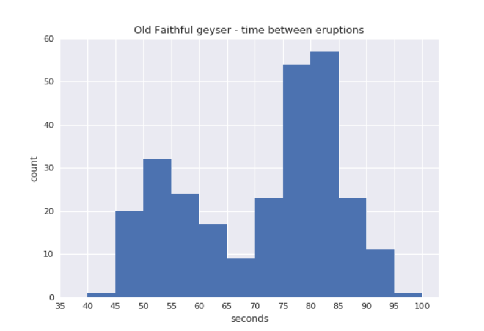
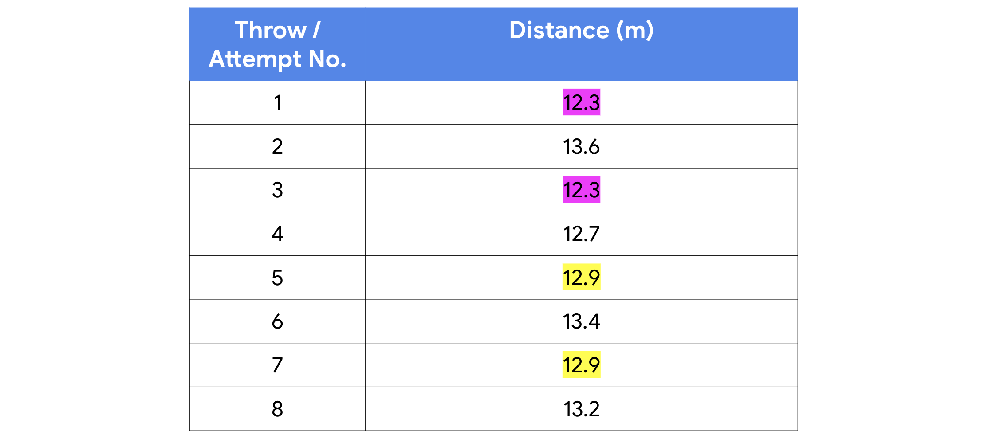
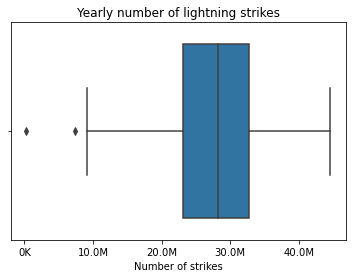

# Kurs 3. Rakamların Ötesine Geçin

## EDA Prosesi

Norveç'teki iğne yapraklı bir ormandaki ağaçlar hakkında yalnızca 200 satır ve beş sütun veriye sahip bir veri kümesi atandığını hayal edin. Tam analizinizi tamamlamak için 1.000'den fazla satıra ve en az iki sütuna daha ihtiyacınız olacağını biliyorsunuz. Bundan çok daha fazla ayrıntı olmasa bile, tüm EDA süreciniz şöyle görünebilir:


1. **Keşfetme**: Veri kümesinin genel şeklini, boyutunu ve içeriğini kontrol edersiniz. Veri konusunda kısa olduğunu görüyorsunuz.

2. **Katılma**: Daha fazla veri eklersiniz.

3. **Doğrulama**: Yeni verilerde hatalar veya yazım hataları olmadığını hızlı bir şekilde kontrol edersiniz.

4. **Yapılandırma**: Trendleri anlamak için verileri farklı zaman dilimlerinde ve segmentlerde yapılandırırsınız.

5. **Doğrulama:** Yapılandırmada yaptığınız yeni sütunların doğru tasarlandığından emin olmak için başka bir hızlı kontrol yaparsınız.

6. **Temizlik**: Aykırıları, eksik verileri ve dönüşüm veya dönüşüm ihtiyaçlarını kontrol edersiniz.

7. **Doğrulama**: Temizledikten sonra, yaptığınız değişikliklerin doğru ve doğru olup olmadığını iki kez kontrol edersiniz.

8. **Sunum**: Veri kümenizi bir eşle paylaşırsınız.

Verilerde yaptığınız değişikliklerin farkında olmadan hata vermediğinden emin olmak için "geçerli" uygulamasını yinelemeli olarak veya birden çok kez gerçekleştirdiğinize dikkat edin. Ayrıca, önceden daha fazla veriye olan ihtiyacı fark ettiğiniz için, "keşfetme" uygulamasının hemen ardından "katılma" uygulaması gerçekleştirildi.

Temizlenmiş veri kümenizi bir eşinize sunduktan sonra, daha fazla keşif ve/veya temizlik için notlar veya fikirler alma şansınız yüksektir. Bu nedenle, daha da fazla yineleme göreceksiniz.

**Profesyonel ipucu**: Veri bilimcileri, "temiz" ve modelleme veya makine öğrenimi algoritmaları için hazır olduğunu ilan etmekte kendilerini rahat hissetmeden önce bir veri kümesinde EDA uygulamalarını birden çok kez gerçekleştirmeyi bekliyorlar.

## Etik makine öğreniminde EDA'nın önemi

Algoritmalar ve makine öğrenimi ağları bireyler, şirketler ve hatta hükümetler adına giderek daha fazla karar vermeye başladıkça, etik ve düzenleme tartışması giderek daha önemli hale geliyor. [Etik Yapay Zeka ve Makine Öğrenimi Enstitüsü](https://ethical.institute/principles.html)'ye göre, makine öğrenimi sistemlerini sorumlu bir şekilde geliştirmek için sekiz ilke vardır.

**EDA sürecinin temel ilkeleri**

Aşağıdaki iki ilke doğası gereği EDA sürecinin bir parçasıdır:

**İnsan büyütme**: Bu ilke, insanların gözetim için AI veya makine öğrenimi algoritma sistemlerine eklenmesini sağlar. Veri bilimcileri tarafından gerçekleştirilen kapsamlı EDA, bir algoritmaya beslenen önyargıyı, dengesizliği ve yanlışlıkları sınırlamanın belki de en iyi yollarından biridir.

**Önyargı değerlendirmesi**: İnsan müdahalesi olmadan, önyargı makine öğrenimi modellerinde çok kolay enjekte edilir ve yeniden üretilir. Metodik EDA süreçlerinin gerçekleştirilmesi, veri bilimcilerinin verilerdeki önyargıların ve dengesizliklerin farkında olmalarını ve bunlara göre hareket etmelerini sağlayacaktır.

**Profesyonal ipucu**: Veri kariyer alanında etik standartlara bağlılığı sağlamanın önemi abartılamaz. Veri profesyonellerinin, EDA çalışmalarına sürekli olarak etik bir zihniyet uygulayarak önyargı ve ayrımcılığı tanımak için kapasitelerini sürekli olarak büyütmeleri gerekir.

Makine öğreniminin ötesinde, EDA neredeyse her önemli veritabanı kararına uygulanabilir. İleride, EDA'nın birçok uygulaması ve yinelemeli ve sıralı olmayan bir yaklaşımın gerekliliği hakkında bilgi edineceksiniz.

## Şematik Gösterim

```python 
import pandas as pd
import numpy as np
import matplotlib.pyplot as plt
import datetime as dt

# Read in the 2018 lightning strike dataset
df = pd.read_csv('eda_using_basic_data_functions_in_python_dataset1.csv')
``` 

```python
# Eğer tarih sütunu varsa
df['date'] = pd.to_datetime(df['date'])
```

```python 
# Inspect the first 10 rows 
df.head(10)
```

| index | date       | number_of_strikes | center_point_geom  |
|-------|------------|-------------------|--------------------|
| 0     | 2018-01-03 | 194               | POINT(-75 27)      |
| 1     | 2018-01-03 | 41                | POINT(-78.4 29)    |
| 2     | 2018-01-03 | 33                | POINT(-73.9 27)    |
| 3     | 2018-01-03 | 38                | POINT(-73.8 27)    |
| 4     | 2018-01-03 | 92                | POINT(-79 28)      |
| 5     | 2018-01-03 | 119               | POINT(-78 28)      |
| 6     | 2018-01-03 | 35                | POINT(-79.3 28)    |
| 7     | 2018-01-03 | 60                | POINT(-79.1 28)    |
| 8     | 2018-01-03 | 41                | POINT(-78.7 28)    |
| 9     | 2018-01-03 | 119               | POINT(-78.6 28)    |

```python 
#Get more information about the data, including data types of each column 
df.info()

# <class 'pandas.core.frame.DataFrame'>
# RangeIndex: 3401012 entries, 0 to 3401011
# Data columns (total 3 columns):
#  #   Column             Dtype         
# ---  ------             -----         
#  0   date               datetime64[ns]
#  1   number_of_strikes  int64         
#  2   center_point_geom  object        
# dtypes: datetime64 , int64(1), object(1)
# memory usage: 77.8+ MB
```

```python
df['month'] = df['date'].dt.month
df.head()
```

|   | date       | number_of_strikes | center_point_geom | month |
|---|------------|-------------------|--------------------|-------|
| 0 | 2018-01-03 | 194               | POINT(-75 27)      | 1     |
| 1 | 2018-01-03 | 41                | POINT(-78.4 29)    | 1     |
| 2 | 2018-01-03 | 33                | POINT(-73.9 27)    | 1     |
| 3 | 2018-01-03 | 38                | POINT(-73.8 27)    | 1     |
| 4 | 2018-01-03 | 92                | POINT(-79 28)      | 1     |

```python
# Create a new 'month txt' column
df['month_txt'] = df['date'].dt.month_name().str.slice(stop=3)

# Create new helper dataframe for plotting
df_by_month = (
    df.groupby(['month', 'month_txt'])
      .sum()
      .sort_values('month', ascending=True)
      .head(12)
      .reset_index()
)

df_by_month
```

| month | month_txt | number_of_strikes |
|-------|-----------|-------------------|
| 1     | Jan       | 860045            |
| 2     | Feb       | 2071315           |
| 3     | Mar       | 854168            |
| 4     | Apr       | 1524339           |
| 5     | May       | 4166726           |
| 6     | Jun       | 6445083           |
| 7     | Jul       | 8320400           |
| 8     | Aug       | 15525255          |
| 9     | Sep       | 3018336           |
| 10    | Oct       | 1093962           |
| 11    | Nov       | 409263            |
| 12    | Dec       | 312097            |

```python
plt.bar(
    x=df_by_month['month_txt'],                     # X ekseninde ay isimleri (kısa hali: Jan, Feb, vs.)
    height=df_by_month['number_of_strikes'],        # Y ekseninde yıldırım sayıları
    label="Number of strikes"                       # Legende (açıklamada) kullanılacak etiket
)

plt.xlabel("months (2018)")                         # X ekseni başlığı
plt.ylabel("Number of lightning strikes")           # Y ekseni başlığı
plt.title("Number of lightning strikes in 2018 by months")  # Grafik başlığı

plt.legend()                                        # Açıklama kutusunu göster
plt.show()                                          # Grafiği ekrana çiz
```


```python
# Import statements
import matplotlib.pyplot as plt
import pandas as pd
import seaborn as sns

# Read in the 2018 lightning strike dataset
df = pd.read_csv('eda_using_basic_data_functions_in_python_dataset1.csv')

# Convert 'date' column to datetime
df['date'] = pd.to_datetime(df['date'])

# Create new columns
df['week'] = df['date'].dt.strftime('%Y-W%V')       # örn: 2018-W27
df['month'] = df['date'].dt.strftime('%Y-%m')       # örn: 2018-07
df['quarter'] = df['date'].dt.to_period('Q').dt.strftime('%Y-Q%q')
df['year'] = df['date'].dt.strftime('%Y')

df.Head()
```

| date | number_of_strikes | center_point_geom | week | month | quarter | year |
|---|---|---|---|---|---|---|
| 2016-08-05 | 16                | POINT(-101.5 24.7)   | 2016-W31 | 2016-08 | 2016-Q3 | 2016 |
| 2016-08-05 | 16                | POINT(-85 34.3)      | 2016-W31 | 2016-08 | 2016-Q3 | 2016 |
| 2016-08-05 | 16                | POINT(-89 41.4)      | 2016-W31 | 2016-08 | 2016-Q3 | 2016 |
| 2016-08-05 | 16                | POINT(-89.8 30.7)    | 2016-W31 | 2016-08 | 2016-Q3 | 2016 |
| 2016-08-05 | 16                | POINT(-86.2 37.9)    | 2016-W31 | 2016-08 | 2016-Q3 | 2016 |
| 2016-08-05 | 16                | POINT(-97.8 38.9)    | 2016-W31 | 2016-08 | 2016-Q3 | 2016 |
| 2016-08-05 | 16                | POINT(-81.9 36)      | 2016-W31 | 2016-08 | 2016-Q3 | 2016 |

```python
# Create new dataframe view of just 2018 data, summed by week
df_by_week_2018 = df[df['year'] == '2018'].groupby(['week']).sum().reset_index()

# Plot a bar chart of weekly strike totals in 2018
plt.bar(x=df_by_week_2018['week'], height=df_by_week_2018['number_of_strikes'])
plt.xlabel("Week number")
plt.ylabel("Number of lightning strikes")
plt.title("Number of lightning strikes per week (2018)")
plt.show()
```


plt.figure(figsize=(20, 5))  # Increase output size
plt.bar(x=df_by_week_2018['week'], height=df_by_week_2018['number_of_strikes'])
plt.plot()
plt.xlabel("Week number")
plt.ylabel("Number of lightning strikes")
plt.title("Number of lightning strikes per week (2018)")
plt.xticks(rotation=45, fontsize=8)  # Rotate x-axis labels and decrease font size
plt.show()


```python
df_by_quarter['number_of_strikes'].div(1000000)
```

|    | Value     |
|----|-----------|
| 0  | 2.683798  |
| 1  | 15.084857 |
| 2  | 21.843820 |
| 3  | 1.969754  |
| 4  | 2.444279  |
| 5  | 13.548585 |
| 6  | 17.277461 |
| 7  | 1.824870  |
| 8  | 3.785528  |
| 9  | 12.136148 |
| 10 | 26.863991 |
| 11 | 1.815322  |

```python
# Group 2016-2018 data by quarter and sum
df_by_quarter = df.groupby(['quarter']).sum().reset_index()

# Format as text, in millions
df_by _quarter('number_of_strikes_formated'] = df_by_quarter['number_of_strikes'].div(1000000).round(1).astype(int)

plt.figure(figsize = (15,5))
plt.bar(x = df_by_quarter['quarter'], height=df_by_quarter['number_of_strikes'])

def addlabels (x, y, labels):
    'Iterates over data and plots text labels above each bar of bar graph.'
    for i in range(len(x)):
        plt.text(i, y[i], labels[i], ha 'center', va = 'bottom')

plt.figure(figsize(15,5))
plt.bar(x=df_by_quarter['quarter'], height=df_by_quarter['number_of_strikes'])
addlabels(df_by_quarter['quarter'], df_by_quarter['number_of_strikes'], df_by_quarter['number_of_strikes_formated'])
plt.plot()
plt.xlabel('Quarter')
plt.ylabel('Number of lightning strikes')
plt.title('Number of lightning strikes per quarter (2016-2018)')
plt.show()
```


```python
# Create two new columns
df_by_quarter['quarter_number'] = df_by_quarter['quarter'].str[-2:]
df_by_quarter['year'] = df_by_quarter['quarter'].str[:4]

df_by_quarter.head()

plt.figure(figsize=(15,5))
p = sns.barplot(data=df_by_quarter, x='quarter_number', y='number_of_strikes', hue='year')

for b in p.patches:
    p.annotate(
        str(round(b.get_height() / 1000000, 1)) + 'M',
        (b.get_x() + b.get_width() / 2., b.get_height() + 1.2e6),
        ha='center', va='bottom',
        xytext=(0, -12),
        textcoords='offset points'
    )

plt.xlabel("Quarter")
plt.ylabel("Number of lightning strikes")
plt.title("Number of lightning strikes per quarter (2016-2018)")
plt.show()
```


```python
# Import statements
import pandas as pd
import numpy as np
import seaborn as sns
import datetime
from matplotlib import pyplot as plt

# Read in the 2018 lightning strike dataset
df = pd.read_csv('eda_using_basic_data_functions_in_python_dataset1.csv')

# Convert the `date` column to datetime
df['date'] = pd.to_datetime(df['date'])
df.head()
```

| date       | number_of_strikes | center_point_geom   |
|------------|-------------------|---------------------|
| 2018-01-03 | 194               | POINT(-75 27)       |
| 2018-01-03 | 41                | POINT(-78.4 29)     |
| 2018-01-03 | 33                | POINT(-73.9 27)     |
| 2018-01-03 | 38                | POINT(-73.8 27)     |
| 2018-01-03 | 92                | POINT(-79 28)       |

```python
df.shape
(3401012, 3)
```

```python
df.drop_duplicates().shape
(3401012, 3)
```

```python
# Sort by number of strikes in descending order
df.sort_values(by='number_of_strikes', ascending=False).head(10)
```

| Index  | date       | number_of_strikes | center_point_geom    |
|--------|------------|-------------------|----------------------|
| 302758 | 2018-08-20 | 2211              | POINT(-92.5 35.5)    |
| 278383 | 2018-08-16 | 2142              | POINT(-96.1 36.1)    |
| 280830 | 2018-08-17 | 2061              | POINT(-90.2 36.1)    |
| 280453 | 2018-08-17 | 2031              | POINT(-89.9 35.9)    |
| 278382 | 2018-08-16 | 1902              | POINT(-96.2 36.1)    |
| 11517  | 2018-02-10 | 1899              | POINT(-95.5 28.1)    |
| 277506 | 2018-08-16 | 1878              | POINT(-89.7 31.5)    |
| 24906  | 2018-02-25 | 1833              | POINT(-98.7 28.9)    |
| 284320 | 2018-08-17 | 1767              | POINT(-90.1 36)      |
| 24825  | 2018-02-25 | 1741              | POINT(-98 29)        |

```python
# Identify locations that appear most in the dataset
df.center_point_geom.value_counts()
```

| Location             | Count |
|----------------------|-------|
| POINT(-81.5 22.5)    | 108   |
| POINT(-84.1 22.4)    | 108   |
| POINT(-82.5 22.9)    | 107   |
| POINT(-82.7 22.9)    | 107   |
| POINT(-82.5 22.8)    | 106   |
| ...                  | ...   |
| POINT(-119.3 35.1)   | 1     |
| POINT(-119.3 35)     | 1     |
| POINT(-119.6 35.6)   | 1     |
| POINT(-119.4 35.6)   | 1     |
| POINT(-58.5 45.3)    | 1     |

```python
# Identify top 20 locations with most days of lightning
df.center_point_geom.value_counts()[:20].rename_axis('unique_values').reset_index(name='counts').style.background_gradient()
```


```python
# Create two new columns
df['week'] = df.date.dt.isocalendar().week
df['weekday'] = df.date.dt.day_name()
df.head()
```

| date       | number_of_strikes | center_point_geom | week | weekday   |
|------------|-------------------|-------------------|------|-----------|
| 2018-01-03 | 194               | POINT(-75 27)     | 1    | Wednesday |
| 2018-01-03 | 41                | POINT(-78.4 29)   | 1    | Wednesday |
| 2018-01-03 | 33                | POINT(-73.9 27)   | 1    | Wednesday |
| 2018-01-03 | 38                | POINT(-73.8 27)   | 1    | Wednesday |
| 2018-01-03 | 92                | POINT(-79 28)     | 1    | Wednesday |

```python
# Calculate mean count of lightning strikes for each weekday
df[['weekday', 'number_of_strikes']].groupby(['weekday']).mean()
```

| weekday   | number_of_strikes |
| --------- | ------------------- |
| Friday    | 13.349972           |
| Monday    | 13.152804           |
| Saturday  | 12.732694           |
| Sunday    | 12.324717           |
| Thursday  | 13.240594           |
| Tuesday   | 13.813599           |
| Wednesday | 13.224568           |

```python
# Define order of days for the plot
weekday_order = ['Monday', 'Tuesday', 'Wednesday', 'Thursday', 'Friday', 'Saturday', 'Sunday']

# Create boxplots of strike counts for each day of week
g = sns.boxplot(
    data=df,
    x='weekday',
    y='number_of_strikes',
    order=weekday_order,
    showfliers=False
)
g.set_title('Lightning distribution per weekday (2018)')
```


```python
# 2016-2017 verilerini 2018 verileriyle birleştirerek yeni bir veri çerçevesi oluştur
union_df = pd.concat([df.drop(['weekday', 'week'], axis=1), df_2], ignore_index=True)

# Birleştirilmiş veri çerçevesinin ilk 5 satırını göster
union_df.head()
```

| date       | number_of_strikes | center_point_geom  |
|------------|-------------------|---------------------|
| 2018-01-03 | 194               | POINT(-75 27)       |
| 2018-01-03 | 41                | POINT(-78.4 29)     |
| 2018-01-03 | 33                | POINT(-73.9 27)     |
| 2018-01-03 | 38                | POINT(-73.8 27)     |
| 2018-01-03 | 92                | POINT(-79 28)       |

```python
# 2017 yılında daha az yıldırım vardı
union_df[['year', 'number_of_strikes']].groupby(['year']).sum()
```

| year | number_of_strikes |
|------|-------------------|
| 2016 | 41,582,229        |
| 2017 | 35,095,195        |
| 2018 | 44,600,989        |

```python
# Her yılın her ayı için toplam yıldırım sayısını hesapla
lightning_by_month = union_df.groupby(['month_txt', 'year']).agg(
    number_of_strikes = pd.NamedAgg(column='number_of_strikes', aggfunc=sum)
).reset_index()

# İlk 5 satırı göster
lightning_by_month.head()
```

| month_txt | year | number_of_strikes |
|-----------|------|-------------------|
| April     | 2016 | 2,636,427         |
| April     | 2017 | 3,819,075         |
| April     | 2018 | 1,524,339         |
| August    | 2016 | 7,250,442         |
| August    | 2017 | 6,021,702         |

```python
# Yıllara göre toplam yıldırım sayısını hesapla
lightning_by_year = union_df.groupby(['year']).agg(
    year_strikes = pd.NamedAgg(column='number_of_strikes', aggfunc=sum)
).reset_index()

# İlk 5 satırı göster
lightning_by_year.head()
```

| year | year_strikes |
|------|--------------|
| 2016 | 41,582,229   |
| 2017 | 35,095,195   |
| 2018 | 44,600,989   |

```python
# Aylık yıldırım verisini yıllık toplamla birleştir
percentage_lightning = lightning_by_month.merge(lightning_by_year, on='year')

# İlk 5 satırı göster
percentage_lightning.head()
```

| month_txt | year | number_of_strikes | year_strikes |
|-----------|------|-------------------|--------------|
| April     | 2016 | 2,636,427         | 41,582,229   |
| August    | 2016 | 7,250,442         | 41,582,229   |
| December  | 2016 | 316,450           | 41,582,229   |
| February  | 2016 | 312,676           | 41,582,229   |
| January   | 2016 | 313,595           | 41,582,229   |

```python
# Her ay için "yıldırım yüzdesi" sütunu oluştur
percentage_lightning['percentage_lightning_per_month'] = (
    (percentage_lightning.number_of_strikes / percentage_lightning.year_strikes) * 100.0
)

# İlk 5 satırı göster
percentage_lightning.head()
```
 
| month_txt | year | number_of_strikes | year_strikes | percentage_lightning_per_month |
|-----------|------|-------------------|--------------|-------------------------------|
| April     | 2016 | 2,636,427         | 41,582,229   | 6.340273                      |
| August    | 2016 | 7,250,442         | 41,582,229   | 17.436396                     |
| December  | 2016 | 316,450           | 41,582,229   | 0.761022                      |
| February  | 2016 | 312,676           | 41,582,229   | 0.751946                      |
| January   | 2016 | 313,595           | 41,582,229   | 0.754156                      |

```python
plt.figure(figsize=(10,6))  # Grafik boyutunu ayarla (genişlik=10, yükseklik=6)

sns.barplot(
    data = percentage_lightning,          # Veri kaynağı
    x = 'month_txt',                      # X ekseni: ay isimleri
    y = 'percentage_lightning_per_month',# Y ekseni: aylık yıldırım yüzdesi
    hue = 'year',                        # Renklerle yılı ayır
    order = month_order                   # Ayların sıralanma düzeni
)

plt.xlabel("Month")                      # X eksen etiketi
plt.ylabel("% of lightning strikes")    # Y eksen etiketi
plt.title("% of lightning strikes each Month (2016–2018)")  # Grafik başlığı
```


## Histogramlar

Öğrendiğiniz gibi, keşif veri analizinin (EDA) amacı tam da adının söylediği şeydir: verileri araştırın ve analiz edin. Bir veri uzmanı olarak, neredeyse her zaman yol gösterici bir soru veya hedefle başlayacaksınız, örneğin, "En yüksek karbondioksit yayıcıları nerede bulunur?" veya "X ürününü satın alma olasılığı en yüksek kişilerin özelliklerini belirleyin." Süreciniz boyunca bunu sık sık düşünmek, sizi yolda tutan bir itici güç yaratır.

Verileri keşfederken emrinizdeki en önemli araçlardan biri **histogramdır**. Histogram, bir veri kümesindeki veya değişkendeki her değerin ne sıklıkta meydana geldiğini gösteren bir frekans dağılımının grafiksel bir gösterimidir. Veri profesyonellerinin verilerinin dağılımlarını anlamaları çok önemlidir, çünkü bu bilgi deney tasarımı, modelleme ve daha ileri analizler etrafında birçok aşağı yönlü kararı yönlendirir. Bu okumada, histogramlar, ne olduklarını, nasıl yapılacağını ve nasıl yorumlanacağını öğreneceksiniz.

### **Histogramlara giriş**

Histogramlar, herhangi bir aykırı değerlerin varlığı, dağılımın merkezi ve verilerin yayılması dahil olmak üzere bir dağılımın şeklini göstermek için yaygın olarak kullanılır. Histogramlar tipik olarak, her çubuğun bir değer aralığını temsil ettiği bir dizi çubukla temsil edilir. Çubuk yüksekliği, bu aralıktaki veri noktalarının sıklığını veya sayısını temsil eder.

Aşağıdaki örnek, Wyoming, ABD'deki Yellowstone Ulusal Parkı'ndaki Old Faithful şofben patlamaları arasındaki saniye sayısının histogramıdır.


X ekseni, patlamalar arasındaki saniye sayısını temsil eder. Y ekseni patlama sayısını temsil eder. Bu nedenle, grafikteki ikinci çubuk tarafından belirtildiği gibi, 45-49 saniyelik bir bekleme süresinden sonra meydana gelen 20 patlama vardır.

### **Histogramların önemi**

Histogramlar, bir veri kümesinin özelliklerini anlamak için önemli bir araçtır. Verilerin dağılımının görsel bir temsilini sağlar ve veri profesyonellerinin verilerdeki kalıpları, eğilimleri veya aykırı değerleri tanımlamasını sağlar. Histogramlar ayrıca veri profesyonellerinin veriler için uygun istatistiksel testleri ve modelleri seçmelerine ve verilerin analiz için gerekli varsayımları karşılayıp karşılamadığını belirlemelerine yardımcı olabilir. Histogramlar, finans, sağlık, mühendislik ve sosyal bilimler dahil olmak üzere her türlü veri analizi gerektiren herhangi bir alanda ve her durumda yaygın olarak kullanılmaktadır.

### **Histogramlar nasıl yorumlanır**

Histogramları yorumlamak, dağılımın şeklini, merkezini ve yayılmasını anlamayı içerir. Aşağıdakiler de dahil olmak üzere birkaç yaygın histogram şekli vardır:

1. Simetrik: Simetrik bir histogram, ortasında bir tepe bulunan çan şeklinde bir eğriye sahiptir ve bu, verilerin ortalama etrafında eşit olarak dağıldığını gösterir. Bu aynı zamanda normal veya Gauss dağılımı olarak da bilinir.


2. Eğri: Eğik bir histogramın bir tarafında diğerinden daha uzun bir kuyruğu vardır. Sağa eğik bir histogramın sağ tarafında daha uzun bir kuyruğu vardır, bu da histogramın sol tarafında daha fazla veri noktası olduğunu gösterir.


Sol eğri bir dağılım, sol tarafta daha uzun bir kuyruğa sahiptir ve sağ tarafta daha fazla veri noktası gösterir.


3. Bimodal: İki modlu bir histogramın iki farklı tepe noktası vardır, bu da verilerin iki modu olduğunu gösterir.


4. Tek tip: Tek tip bir histogramın düz bir dağılımı vardır, bu da tüm veri noktalarının eşit olarak dağıldığını gösterir.


Sağlanan örnekler karşılaşacağınız tek dağıtım değildir, ancak en yaygın olanlardan bazılarıdır. Yakında dağıtımlar hakkında daha fazla bilgi edineceksiniz.

Şimdi, bu okumanın başlangıcındaki Old Faithful gayzer histogramına dönün. Kendinize sorun: Bu grafik tarafından ne tür bir dağılım temsil edilir? Şekle ek olarak, merkezi anlamak ve yayılmak önemlidir. Dağılımın merkezi tipik olarak ortalama veya medyan ile temsil edilirken, dağılım standart sapma veya verilerin aralığı ile temsil edilir. Merkez ve yayılma, veri konsantrasyonu ve değişkenliği hakkında içgörüler sağlayabilir.

### **Histogramlar nasıl oluşturulur**

Python'un seaborn ve matplotlib kütüphaneleri, histogramlar oluşturmak için basit ve güçlü seçenekler sunar.

#### [plt.hist (x, bins=10,...)](https://matplotlib.org/stable/api/_as_gen/matplotlib.pyplot.hist.html#matplotlib-pyplot-hist)

Matplotlib'de bir histogram oluşturmak için pyplot modülündeki hist() işlevi kullanın. İşlev birçok farklı argüman alabilir, ancak birincil olanlar şunlardır:

- x: Çizmek istediğiniz verileri temsil eden bir değer dizisi. Bir liste, tüple, NumPy dizisi, panda serisi vb. Olabilir.
    
- kutular: Verilerinizi sıralamak istediğiniz kutu sayısı. Varsayılan değer 10'dur, ancak bu parametre bir int, dizi veya dize olabilir. Bir dizi kullanırsanız, ilk kutunun sol kenarı ve son kutunun sağ kenarı da dahil olmak üzere çöp kutusu kenarlarını tanımlar. Başka bir deyişle, eğer kutular = [1, 3, 5, 7], o zaman ilk kutu [1—3) (1 dahil, ancak 3 hariç) ve ikincisi [3—5). Son kutu, ancak, 7 içeren [5—7] 'dir. Bir dize, numpy tarafından desteklenen önceden tanımlanmış bir binning stratejisini ifade eder. Daha fazla bilgi için belgelere bakın.
    

Aşağıdaki örnek, işlevi kullanarak bu okumanın başlangıcından itibaren Old Faithful gayzer histogramının nasıl oluşturulacağını göstermektedir.. 

```python
# Plot histogram with matplotlib pyplot
plt.hist(df['seconds'], bins=range(40, 101, 5))
plt.xticks(range(35, 101, 5))
plt.yticks(range(0, 61, 10))
plt.xlabel('seconds')
plt.ylabel('count')
plt.title('Old Faithful geyser - time between eruptions')
plt.show();
```

Bu durumda, çizilen veriler veri çerçevesinin saniye sütunudur. Kutular 40 saniyede başlar ve toplam 12 kutu için beşli adımlarla 100 saniyeye gider.

#### [sns.histplot (x, kutular, binrange, binwidth...)](https://seaborn.pydata.org/generated/seaborn.histplot.html)

Seaborn'da bir histogram oluşturmanın bir yolu işlevi kullanmaktır. sns.histplot() Matplotlib işlevi gibi, birçok argü sns.histplot() man alabilir. İşte bazı önemli olanlar:

- x: Veri dizisi. Aynı plt.hist()
    
- kutular: Aynı plt.hist()
    
- binrange: Kutu kenarları için en düşük ve en yüksek değer; bins veya ile kullanılabilirbinwidth; varsayılan olarak veri uç noktalarıdır
    
- binwidth: Her bölmenin genişliği, geçersiz kılar bins ancak birlikte kullanılabilir binrange
    

Aşağıdaki örnek, seaborn işlevini kullanarak Old Faithful gayzer histogramını oluşturmak için kullanılan koddur.. histplot() Daha önce bahsedilen parametrelerin tümünü kullanır. Bir histogram oluşturmak için bu kod bloğunu çalıştırın.

Bu durumda 40 ila 100 binrange arasında tanımlanmış ve 5 olarak ayar binwidth lanmış olduğuna dikkat edin. Bu ayar ile aynı sonuçları verirbins=range(40, 101, 5). Bu örnek ayrıca, altıgen kod gösterimini kullanarak belirli bir rengi belirterek ve parametre tarafından belirtildiği gibi renk doygunluğu seviyesini% 100'e ayarlayarak birkaç stil alpha parametresini kullanır.

**Not:** Aşağıdaki kod bloğu etkileşimli değildir.

```python
# Plot histogram with seaborn
ax = sns.histplot(df['seconds'], binrange=(40, 100), binwidth=5, color='#4285F4', alpha=1)
ax.set_xticks(range(35, 101, 5))
ax.set_yticks(range(0, 61, 10))
plt.title('Old Faithful geyser - time between eruptions')
plt.show();
```


### **Önemli çıkarımlar**

Histogramlar, veri uzmanlarının veri kümelerinin ve değişkenlerinin frekans dağılımlarını anlamalarına yardımcı olur. Veri dağılımının şekli ve türü hakkında bilgi, istatistiksel testler ve model mimarisi seçimi gibi önemli alt kararları etkileyecektir. Ek olarak, verilerinizin şeklini bilmek, verilerinizin dağıtım eğilimlerini anlamanıza yardımcı olarak verilerinizin size anlattığı hikayeye ilişkin değerli bilgiler sağlar.

## Veri Temizleme

Öğrendiğiniz gibi, veri temizleme ve doğrulama uygulamaları, eksik verileri, aykırı değerleri ve etiket kodlamasını işleme; yazım hatalarını kontrol etme ve kopyaları işleme dahil olmak üzere birkaç farklı adımı içerir. Bir veri uzmanı olarak, bu kategorilerdeki veri değerlerini en iyi nasıl ele alacağınızı bilmek sizin göreviniz olacaktır. Bu okumada, kopyaları işleme hakkında daha fazla bilgi edineceksiniz. Ayrıca, tekilleştirme işleminin bir veri kümesi için doğru strateji olup olmadığını belirlemeyi ve karar vermeyi öğreneceksiniz. Ek olarak, kopyaları işlemek için bazı yaygın Python işlevlerini öğreneceksiniz.

### Yinelenenleri tanımlama

Yinelenen değerlerin kaldırılıp kaldırılmayacağına dair herhangi bir karar vermeden önce, veri kümemizde yinelenen değerlerin olup olmadığını belirlemeliyiz.

Kopyaları tanımlamanın basit bir yolu, Pandas duplicated() işlevini kullanmaktır. duplicated()DataFramesınıfın bir yöntemidir.

Bu işlev, veri değerinin bir kopya olduğunu belirten "true" ve "false" benzersiz bir değer olduğunu belirten bir dizi "doğru/yanlış" çıktı döndürür.

İşte beş satırlı bir veri çerçevesi örneği:

```python
df
```

| brand   | style   | rating |
|---------|---------|--------|
| Wowyow  | cistern | 4.0    |
| Wowyow  | cistern | 4.0    |
| Splaysh | jug     | 5.5    |
| Splaysh | stock   | 3.3    |
| Pipplee | stock   | 3.0    |


duplicated() fonksiyonu kullanarak sonuç, birinin "Doğru" olarak işaretlenmiş olması ve bunun bir kopya olduğunu gösterir.

```python
print(df)
```
| brand   | style   | rating |
|---------|---------|--------|
| Wowyow  | cistern | 4.0    |
| Wowyow  | cistern | 4.0    |
| Splaysh | jug     | 5.5    |
| Splaysh | stock   | 3.3    |
| Pipplee | stock   | 3.0    |

```python
print(df.duplicated())
```

| Index | Value |
|-------|-------|
| 0     | False |
| 1     | True  |
| 2     | False |
| 3     | False |
| 4     | False |

Tüm veri çerçevesi için kopyaları tanımlamak, tek bir sütundan veya dizinden farklı olacaktır. Fonksi duplicated() yonu tüm veri çerçevesi için kullandığınızda emin olun. İş duplicated() lev, yalnızca bir sütunda _bulunan tek tek eşleşen değerleri değil, yalnızca tam olarak eşleşen değerlere sahip tüm sat_ ırları döndürür. Bir veri çerçevesindeki yalnızca bir sütun veya bir dizi sütun için kopyaları tanımlamak isterseniz, bunu işlevin bağımsız değişken alanının "alt küme" kısmına eklemeniz gerekir. duplicated() Daha ileri giderek, kopyaların hangisinin kopya yerine "orijinal" olarak saklanacağını belirtmek isterseniz, bunu bağımsız değişken alanının keep bölümünde belirtebilirsiniz.

Aşağıda, değerlerin yalnızca bir sütunundaki (alt kümesindeki) kopyaları tanımlamaya ve son kopyaları "yanlış" olarak etiketlemeye ve "saklanmaları" için bir örnek verilmiştir:

```python
print(df)
```

| color  | rating | type    |
|--------|--------|---------|
| olive  | 9.0    | rinds   |
| olive  | 9.0    | rinds   |
| gray   | 4.5    | pellets |
| salmon | 11.0   | pellets |
| salmon | 7.0    | pellets |

```python
print(df.duplicated(subset=['type'], keep='last'))
```

| Index | Value |
|-------|-------|
| 0     | True  |
| 1     | False |
| 2     | True  |
| 3     | True  |
| 4     | False |

### Karar zamanı: Düşmek mi düşmemek mi?

Öğrendiğiniz gibi, her veri kümesi benzersizdir ve her veri kümesini aynı şekilde ele alamazsınız. Yinelenen değerleri ortadan kaldırıp ortadan kaldırmamaya karar verirken, **veri kümesinin kendisi** ve ulaşmak **istediğiniz hedef hakkında derinlemesine düşünün**. Yinelenen kopyaları bırakmanın veri kümeniz ve hedefiniz üzerinde ne gibi bir etkisi olacak?

**1. Düşmeye karar** vermek

**Yinelenen değerler açıkça hataysa veya veri kümesinde kalan benzersiz değerleri yanlış temsil edecekse yinelenen değerleri bırakmalı veya ortadan kaldırmalısınız.** 


Örneğin, bir veri uzmanının (çoğu durumda) ev adreslerini ve ev fiyatlarını içeren bir veri kümesinin yinelenen değerlerini ortadan kaldıracağından makul ölçüde emin olabilirsiniz. Aynı evi iki kez saymak (çoğu durumda) ortalama ev fiyatı, toplam ev fiyatı ve hatta toplam ev sayısı gibi veri kümesinden çıkarılan sonuçları bir bütün olarak yanlış temsil edecektir. Böyle bir durumda, bir veri uzmanı, analiz ve görselleştirme sırasında kalan verileri adil bir şekilde temsil etmek için yinelenen verileri neredeyse kesinlikle ortadan kaldıracaktır.

**2. Düşmemeye karar vermek**

Yinelenen değerler açıkça hata **değilse** ve veri kümesini bir bütün olarak temsil ederken dikkate alınmalıysanız, yinelenen verileri veri kümenizde **tut** malısınız.


Örneğin, antrenmandaki bir Olimpiyat atış sporcunun atış sayısını ve mesafelerini gösteren bir veri kümesi muhtemelen birkaç çift mesafe içerecektir; sadece deneme sayısı ve bir kişinin ağırlıklı bir topa sahip olabileceği sınırlar gereği, yinelenen değerler olacaktır - özellikle mesafe ölçümleri yalnızca 1 veya 2 ondalık basamakla etiketlenmişse. Böyle bir durumda, bir veri uzmanı, analiz ve görselleştirme sırasında bir bütün olarak adil bir şekilde temsil etmek için neredeyse kesinlikle tüm verileri saklar.

### Kandırılmayın - Tekilleştirme nasıl yapılır

Python'a geri dönmeden ve kopyaları nasıl ortadan kaldıracağımızı öğrenmeden önce, önce "tekilleştirme" terimini tanımlayalım:

- **Tekilleştirme:** Bir veri kümesindeki eşleşen veri değerlerinin ortadan kaldırılması veya kaldırılması.
    

Python'da eşleşen veri değerlerini kaldırmak için kullanabileceğiniz bir dizi farklı kütüphane, işlev ve yöntem vardır.

Kullanılacak en yaygın işlevlerden biri Pandas'dadır: drop_duplicates()

drop_duplicates()başka bir DataFrame yöntemdir. Tüm yinelenen satırların kaldırıldığı yeni bir veri çerçevesi oluşturmak için kullanılır.

Örneğin, bu okumanın önceki bölümlerinden bir veri çerçevesi kullanın:

```python
df
```

| brand   | style   | rating |
|---------|---------|--------|
| Wowyow  | cistern | 4.0    |
| Wowyow  | cistern | 4.0    |
| Splaysh | jug     | 5.5    |
| Splaysh | stock   | 3.3    |
| Pipplee | stock   | 3.0    |


Şimdi kopyaları bırak işlevini uygulayın:

```python
df.drop_duplicates()
```

| brand   | style   | rating |
|---------|---------|--------|
| Wowyow  | cistern | 4.0    |
| Splaysh | jug     | 5.5    |
| Splaysh | stock   | 3.3    |
| Pipplee | stock   | 3.0    |

Ortaya çıkan çıktıda, yinelenen veri satırının kaldırıldığını ve kalan benzersiz değerlerin bozulmadan kaldığını fark edeceksiniz.

**Not:** Yukarıda yazıldığı gibi drop_duplicates() işlevin yalnızca **tüm veri satırlarının tam eşleşmelerinin kopyalarını bırakacağını unutmayın**. Yinelenenleri tek bir sütun içine bırakmak isterseniz, subset anahtar kelime bağımsız değişkenini kullanarak hangi sütunların kopyaları kontrol edeceğinizi belirtmeniz gerekir.

Bu örnek, style sütunda yinelenen değerlere sahip tüm satırları bırakır (ilk oluşum hariç):

```python
df
```

| brand   | style   | rating |
|---------|---------|--------|
| Wowyow  | cistern | 4.0    |
| Wowyow  | cistern | 4.0    |
| Splaysh | jug     | 5.5    |
| Splaysh | stock   | 3.3    |
| Pipplee | stock   | 3.0    |

```python
df=df.drop_duplicates(subset='style')
df
```

| brand   | style   | rating |
|---------|---------|--------|
| Wowyow  | cistern | 4.0    |
| Splaysh | jug     | 5.5    |
| Splaysh | stock   | 3.3    |

Ve bu örnek, _hem_ de rating sütunlarda yinelenen _değerlere sahip tüm satırları_ (ilk oluşum hariç) style bırakır:

```python
df
```

| brand   | style   | rating |
|---------|---------|--------|
| Wowyow  | cistern | 4.0    |
| Wowyow  | cistern | 4.0    |
| Splaysh | jug     | 5.5    |
| Splaysh | stock   | 3.3    |
| Pipplee | stock   | 3.0    |


df = df.drop_duplicates(subset=['style', 'rating'])
df

| brand   | style   | rating |
|---------|---------|--------|
| Wowyow  | cistern | 4.0    |
| Splaysh | jug     | 5.5    |
| Splaysh | stock   | 3.3    |
| Pipplee | stock   | 3.0    |

### Önemli Çıkarımlar

Bir veri kümesindeki yinelenen veri değerlerini belirlemek, özellikle temizleme ve doğrulama olmak üzere EDA (veya "Keşif Veri Analizi") uygulamalarının önemli bir parçasıdır. Yinelenenleri belirledikten sonra, yinelenmeleri ortadan kaldırmayı veya kopyaları ortadan kaldırmamayı seçerken veri kümesi üzerindeki etkiyi ve analiz hedefinizi düşünün.

### Ek Kaynaklar

Çoğaltmalar ve tekilleştirme hakkında daha fazla bilgi edinmek ister misiniz? Aşağıdaki ek bağlantılara göz atın.

- [Argüman alanının parametreleri hakkında daha fazla bilgi edinmek için Pandas belgelerine bakın](https://pandas.pydata.org/docs/reference/api/pandas.DataFrame.drop_duplicates.html)
    
- [W3 Okulları: Pandalar - kopyaları kaldırma](https://www.w3schools.com/python/pandas/pandas_cleaning_duplicates.asp "W3 Okulları - Pandalar: Kopyaları kaldırma")

```python
import pandas as pd
import numpy as np
import seaborn as sns
import datetime
from matplotlib import pyplot as plt

df = pd.read_csv('../Datasets/1.csv')
df.head()
```

| date       | center_point_geom     | longitude | latitude | number_of_strikes |
|------------|----------------------|-----------|----------|-------------------|
| 2018-08-01 | POINT(-81.6 22.6)    | -81.6     | 22.6     | 48                |
| 2018-08-01 | POINT(-81.1 22.6)    | -81.1     | 22.6     | 32                |
| 2018-08-01 | POINT(-80.9 22.6)    | -80.9     | 22.6     | 118               |
| 2018-08-01 | POINT(-80.8 22.6)    | -80.8     | 22.6     | 69                |
| 2018-08-01 | POINT(-98.4 22.8)    | -98.4     | 22.8     | 44                |


```python 
df.shape
# (717530,5)
```

```python
df_zip = pd.read_csv()
df_zip.head()
```

| date       | zip_code | city                       | state       | state_code | center_point_geom   | number_of_strikes |
|------------|----------|----------------------------|-------------|------------|---------------------|-------------------|
| 2018-08-08 | 3281     | Weare                      | New Hampshire | NH         | POINT(-71.7 43.1)   | 1                 |
| 2018-08-14 | 6488     | Heritage Village CDP       | Connecticut  | CT         | POINT(-73.2 41.5)   | 3                 |
| 2018-08-16 | 97759    | Sisters city, Black Butte Ranch CDP | Oregon   | OR         | POINT(-121.4 44.3)  | 3                 |
| 2018-08-18 | 6776     | New Milford CDP            | Connecticut  | CT         | POINT(-73.4 41.6)   | 48                |
| 2018-08-08 | 1077     | Southwick                  | Massachusetts| MA         | POINT(-72.8 42)     | 2                 |

```python 
df_zip.shape
# (323700, 7)
```

```python 
df_joined = df.merge(df_zip, how='left', on=['date', 'center_point_geom'])
df_joined.head()
```
| date       | center_point_geom     | longitude | latitude | number_of_strikes_x | zip_code | city | state | state_code | number_of_strikes_y |
|------------|-----------------------|-----------|----------|---------------------|----------|------|-------|------------|---------------------|
| 2018-08-01 | POINT(-81.6 22.6)     | -81.6     | 22.6     | 48                  | NaN      | NaN  | NaN   | NaN        | NaN                 |
| 2018-08-01 | POINT(-81.1 22.6)     | -81.1     | 22.6     | 32                  | NaN      | NaN  | NaN   | NaN        | NaN                 |
| 2018-08-01 | POINT(-80.9 22.6)     | -80.9     | 22.6     | 118                 | NaN      | NaN  | NaN   | NaN        | NaN                 |
| 2018-08-01 | POINT(-80.8 22.6)     | -80.8     | 22.6     | 69                  | NaN      | NaN  | NaN   | NaN        | NaN                 |
| 2018-08-01 | POINT(-98.4 22.8)     | -98.4     | 22.8     | 44                  | NaN      | NaN  | NaN   | NaN        | NaN                 |

```python 
df_joined.describe()
```

|               | longitude      | latitude      | number_of_strikes_x | zip_code      | number_of_strikes_y |
|---------------|----------------|----------------|---------------------|---------------|---------------------|
| count        | 717530.000000  | 717530.000000  | 717530.000000       | 323700.000000 | 323700.000000       |
| mean         | -90.875445     | 33.328572      | 21.637081           | 57931.958996  | 25.410587           |
| std          | 13.648429      | 7.938831       | 48.029525           | 22277.327411  | 57.421824           |
| min          | -133.900000    | 16.600000      | 1.000000            | 1002.000000   | 1.000000            |
| 25%          | -102.800000    | 26.900000      | 3.000000            | 38260.750000  | 3.000000            |
| 50%          | -90.300000     | 33.200000      | 6.000000            | 59212.500000  | 8.000000            |
| 75%          | -80.900000     | 39.400000      | 21.000000           | 78642.000000  | 24.000000           |
| max          | -43.800000     | 51.700000      | 2211.000000         | 99402.000000  | 2211.000000         |

```python 
df_null_geo = df_joined[pd.isnull(df_joined.state_code)]
df_null_geo.shape
(393830,10)

df_joined.info()
```

<class 'pandas.core.frame.DataFrame'>
Int64Index: 717530 entries, 0 to 717529
Data columns (total 10 columns):
| #  | Column               | Non-Null Count | Dtype   |
|----|----------------------|----------------|---------|
| 0  | date                 | 717530         | object  |
| 1  | center_point_geom    | 717530         | object  |
| 2  | longitude            | 717530         | float64 |
| 3  | latitude             | 717530         | float64 |
| 4  | number_of_strikes_x  | 717530         | int64   |
| 5  | zip_code             | 323700         | float64 |
| 6  | city                 | 323700         | object  |
| 7  | state                | 323700         | object  |
| 8  | state_code           | 323700         | object  |
| 9  | number_of_strikes_y  | 323700         | float64 |

dtypes: float64(4), int64(1), object(5)
memory usage: 60.2+ MB

```python 
df_null_geo.head()
```

| date       | center_point_geom     | longitude | latitude | number_of_strikes_x | zip_code | city | state | state_code | number_of_strikes_y |
|------------|-----------------------|-----------|----------|---------------------|----------|------|-------|------------|---------------------|
| 2018-08-01 | POINT(-81.6 22.6)     | -81.6     | 22.6     | 48                  | NaN      | NaN  | NaN   | NaN        | NaN                 |
| 2018-08-01 | POINT(-81.1 22.6)     | -81.1     | 22.6     | 32                  | NaN      | NaN  | NaN   | NaN        | NaN                 |
| 2018-08-01 | POINT(-80.9 22.6)     | -80.9     | 22.6     | 118                 | NaN      | NaN  | NaN   | NaN        | NaN                 |
| 2018-08-01 | POINT(-80.8 22.6)     | -80.8     | 22.6     | 69                  | NaN      | NaN  | NaN   | NaN        | NaN                 |
| 2018-08-01 | POINT(-98.4 22.8)     | -98.4     | 22.8     | 44                  | NaN      | NaN  | NaN   | NaN        | NaN                 |

```python 
top_missing = if_null_geo[['latitude', 'longitude', 'number_of_strikes_x']
].groupby(['latitude', 'longitude'] ).sum().sort_values('number_of_strikes_x', ascending=False).reset_index()

top_missing.head(10)
```

| latitude | longitude | number_of_strikes_x |
|----------|-----------|---------------------|
| 22.4     | -84.2     | 3841                |
| 22.9     | -82.9     | 3184                |
| 22.4     | -84.3     | 2999                |
| 22.9     | -83.0     | 2754                |
| 22.5     | -84.1     | 2746                |
| 22.5     | -84.2     | 2738                |
| 22.3     | -81.0     | 2680                |
| 22.9     | -82.4     | 2652                |
| 22.9     | -82.3     | 2618                |
| 22.3     | -84.3     | 2551                |

```python 
import plotly.express as px

fig = px.scatter_geo(top_missing[top_missing.number_of_strikes_x>=300],
                     lat "latitude",
                     lon="longitude",
                     size="number_of_strikes_x")

fig.update_layout(title_text= 'Missing data', )
fig.show()
```


```python 
import plotly.express as px

fig px.scatter_geo(top_missing[top_missing.number_of_strikes_x>=300],
                   lat="latitude",
                   lon="longitude",
                   size="number_of_strikes_x")

fig.update_layout(
    title_text = 'Missing data',
    geo_scope='usa',
)

fig.show()
```



```python
# Import statements
import pandas as pd
import numpy as np
import seaborn as sns
import datetime
from matplotlib import pyplot as plt

#Print first 10 rows
df.head(10)
```

| year | number_of_strikes |
|------|-------------------|
| 2020 | 15620068          |
| 2019 | 209166            |
| 2018 | 44600989          |
| 2017 | 35095195          |
| 2016 | 41582229          |
| 2015 | 37894191          |
| 2014 | 34919173          |
| 2013 | 27600898          |
| 2012 | 28807552          |
| 2011 | 31392058          |

```python 
def readable_numbers(x):
    
    """takes a large number and formats it into K,M to make it more readable""" 
    if x >= le6:
        s='{:1.lf}M'.format(x*le-6)
    else: 
        s='{:1.0f)K'.format(x*1e-3)
    return s

#Use the readable_numbers() function to create a new column
df ['number_of_strikes_readable']=df ['number_of_strikes'].apply(readable_numbers)

df.head(10)
```

| year | number_of_strikes | number_of_strikes_readable |
|------|-------------------|----------------------------|
| 2020 | 15620068          | 15.6M                      |
| 2019 | 209166            | 209K                       |
| 2018 | 44600989          | 44.6M                      |
| 2017 | 35095195          | 35.1M                      |
| 2016 | 41582229          | 41.6M                      |
| 2015 | 37894191          | 37.9M                      |
| 2014 | 34919173          | 34.9M                      |
| 2013 | 27600898          | 27.6M                      |
| 2012 | 28807552          | 28.8M                      |
| 2011 | 31392058          | 31.4M                      |

```python
print("Mean:" + readable_numbers(np.mean(df['number_of_strikes'])))
print("Median:" + readable_numbers(np.median(df ['number_of_strikes'])))

# Mean:26.8M
# Median:28.3M
```


```python 
# Create boxplot
box sns.boxplot(x=df ['number_of_strikes')) gplt.gca()

box.set_xticklabels (np.array([readable_numbers(x) for x in g.get_xticks()])) plt.xlabel('Number of strikes') plt.title('Yearly number of lightning strikes');
```




```python 
# Calculate 25th percentile of annual strikes
percentile25 = df['number_of_strikes'].quantile (0.25)

#Calculate 75th percentile of annual strikes
percentile75 = df['number_of_strikes'].quantile(0.75)

#Calculate interquartile range
iqr = percentile75 - percentile25

#Calculate upper and lower thresholds for outliers
upper_limit = percentile75 + 1.5 * iqr
lower_limit percentile25 + 1.5 * iqr

print('Lower limit is: ' + readable_numbers(lower_limit))
Lower limit is: 8.6M

#Isolate outliers on low end
df[df['number_of_strikes'] < lower_limit]
```

| year | number_of_strikes | number_of_strikes_readable |
|------|-------------------|----------------------------|
| 2019 | 209166            | 209K                       |
| 1987 | 7378836           | 7.4M                       |

```python 
def addlabels(x,y):
    for i in range(len(x)):
        plt.text(x[i]-0.5, y[i]+0.05,
                 s=readable_numbers(y[i]))


colors np.where(df['number of_strikes'] < lower_limit, 'r', 'b')

fig, ax = plt.subplots(figsize=(16,8))
ax.scatter(df['year'], df['number_of_strikes'),c=colors) ax.set_xlabel('Year')
ax.set_ylabel('Number of strikes')
ax.set_title('Number of lightning strikes by year')
addlabels(df['year'], df['number_of_strikes'])

for tick in ax.get_xticklabels():
    tick.set_rotation (45)

plt.show()
```


```python 
df_2019 = pd.read_csv('eda_outliers_dataset2.csv')
df_2019.head()

# Convert `date` column to datetime
df_2019['date']= pd.to_datetime(df_2019['date'])

# Create 2 new columns

df_2019['month'] = df_2019['date'].dt.month

df_2019['month_txt'] = df_2019['date'].dt.month_name().str.slice(stop=3)

# Group by month and month txt, sum it, and sort. Assign result new df 
df_2019_by_month = df_2019.groupby(['month', 'month_txt')).sum().sort_values('month', ascending=True).head()
df_2019_by_month
```

| month | month_txt | number_of_strikes |
|-------|-----------|-------------------|
| 12    | Dec       | 209166            |

```python 
#Read in 1987 data
df_1987=pd.read_csv('eda_outliers_dataset3.csv')

#Convert date column to datetime
df_1987['date'] = pd.todatetime(df_1987['date'])

#Create 2 new columns
df_1987['month'] = df_1987['date'].dt.month
df_1987['month_txt'] = df_1987['date'].dt.month_name().str.slice(stop=3)

#Group by month and `month_txt ', sum it, and sort. Assign result to new df
df_1987_by_month = df_1987.groupby(['month', 'month_txt']).sum().sort_values('month', ascending=True).head() 
df_1987_by_month
```

| month | month_txt | number_of_strikes |
|-------|-----------|-------------------|
| 1     | Jan       | 23044             |
| 2     | Feb       | 61020             |
| 3     | Mar       | 117877            |
| 4     | Apr       | 157890            |
| 5     | May       | 700910            |
| 6     | Jun       | 1064166           |
| 7     | Jul       | 2077619           |
| 8     | Aug       | 2001899           |
| 9     | Sep       | 869833            |
| 10    | Oct       | 105627            |
| 11    | Nov       | 155290            |
| 12    | Dec       | 43651             |

```python 
#Create new df that removes outliers
df_without_outliers=df[df['number_of_strikes']>=lower_limit]

#Recalculate mean and median values on data without outliers
print("Mean:"+readable_numbers(np.mean(df_without_outliers['number_of_strikes']))) 
print("Median:"+readable_numbers(np.median(df_without_outliers['number_of_strikes'])))

# Mean:28.2M
# Median:28.8M
```

## getdummies() ve cat.codes()

```python
# Load libraries.
import datetime
import matplotlib.pyplot as plt 
import pandas as pd 
import seaborn as sns

# Create a new data frame with the number of strikes per month.
df['date'] = pd.to_datetime(df['date'])
df['month'] = df['date'].dt.month_name().str.slice(stop = 3)

# Make the month names categorical so they are in calendar instead of alphabetic
# order when we plot them.
months = ['Jan', 'Feb', 'Mar', 'Apr', 'May', 'Jun', 'Jul', 'Aug', 'Sep', 'Oct', 'Nov', 'Dec']

df['month'] = pd.Categorical(df['month'], categories = months, ordered
df['year'] = df['date'].dt.strftime('%Y')
df_by_month = df.groupby(['year', 'month']).sum().reset_index)
df_by_month.head()
```

| year | month | number_of_strikes |
|------|-------|-------------------|
| 2016 | Jan   | 313595            |
| 2016 | Feb   | 312676            |
| 2016 | Mar   | 2057527           |
| 2016 | Apr   | 2636427           |
| 2016 | May   | 5800500           |

```python
# Create a categorical variable by bucketing the number of lightning strikes
# per month into severeness levels based on quantiles.
df_by_month['strike_level'] = pd.qcut(
df_by_month ['number_of_strikes'],
4,
labels = ['Mild', 'Scattered', 'Heavy', 'Severe'])
df_by_month.head()
```

| year | month | number_of_strikes | strike_level |
|------|-------|-------------------|--------------|
| 2016 | Jan   | 313595            | Mild         |
| 2016 | Feb   | 312676            | Mild         |
| 2016 | Mar   | 2057527           | Scattered    |
| 2016 | Apr   | 2636427           | Heavy        |
| 2016 | May   | 5800500           | Severe       |

```python
# Assign numerical values to the strike levels.

df_by_month['strike_level_code'] = df_by_month['strike_level'].cat.codes[df_by_month.head()]
```

| year | month | number_of_strikes | strike_level | strike_level_code |
|------|-------|-------------------|--------------|-------------------|
| 2016 | Jan   | 313595            | Mild         | 0                 |
| 2016 | Feb   | 312676            | Mild         | 0                 |
| 2016 | Mar   | 2057527           | Scattered    | 1                 |
| 2016 | Apr   | 2636427           | Heavy        | 2                 |
| 2016 | May   | 5800500           | Severe       | 3                 |

```python
# Create dummy variables from strike levels.
pd.get_dummies(df_by_month['strike_level'])
```

| Mild | Scattered | Heavy | Severe |
|------|-----------|-------|--------|
| 1    | 0         | 0     | 0      |
| 1    | 0         | 0     | 0      |
| 0    | 1         | 0     | 0      |
| 0    | 0         | 1     | 0      |
| 0    | 0         | 0     | 1      |
| 0    | 0         | 0     | 1      |
| 0    | 0         | 0     | 1      |
| 0    | 0         | 0     | 1      |
| 0    | 0         | 1     | 0      |
| 0    | 1         | 0     | 0      |
| 1    | 0         | 0     | 0      |
| 1    | 0         | 0     | 0      |
| 0    | 1         | 0     | 0      |
| 1    | 0         | 0     | 0      |

```python
# Format dataframe indices to prepare for plotting.
df_by_month_plot = df_by_month.pivot('year', 'month', 'strike_level_code') 
df_by_month_plot.head()
```

| year | Jan | Feb | Mar | Apr | May | Jun | Jul | Aug | Sep | Oct | Nov | Dec |
|------|-----|-----|-----|-----|-----|-----|-----|-----|-----|-----|-----|-----|
| 2016 | 0   | 0   | 1   | 2   | 3   | 3   | 3   | 3   | 3   | 2   | 1   | 0   |
| 2017 | 1   | 0   | 1   | 2   | 2   | 3   | 3   | 3   | 2   | 1   | 0   | 0   |
| 2018 | 1   | 2   | 1   | 1   | 2   | 3   | 3   | 3   | 2   | 1   | 0   | 0   |

```python
# Make a heatmap showing which months over the years had most severe lightning.
ax = sns.heatmap(df_by_month_plot, cmap= 'Blues')
colorbar = ax.collections[0].colorbar
colorbar.set_ticks([0, 1, 2, 3])
colorbar.set_ticklabels (['Mild', 'Scattered', 'Heavy', 'Severe'])
plt.show()
```


## Veri Dönüşümünde Diğer Yaklaşımlar

Bildiğiniz gibi, veriler bize birçok farklı biçimde geliyor. Kategorik veya nitel veri türleri için, veri uzmanlarının analizlerini tamamlamak, veri görselleştirmelerini tasarlamak veya makine öğrenimi algoritmalarını oluşturmak için genellikle bu tür verileri sayısal rakamlara dönüştürmeleri (veya kodlamaları) gerekir. Bu okumada, iki ana kategorik veri kodlama türünü ve her türün ne zaman kullanılacağını öğreneceksiniz.

### Etiket kodlama

Her veri değerine nitel bir değer yerine farklı bir sayı atandığı bir tür veri dönüştürme tekniği olan **etiket kod** lamayı zaten öğrendiniz.

[Videodan hatırlıyorsanız, verilen örnek mantar türlerini kodlayan etiket idi:](https://www.coursera.org/learn/go-beyond-the-numbers-translate-data-into-insight/lecture/BrCPD/sort-numbers-versus-names)

|**Mantar Türü**|**Kod**|
|---|---|
|Siyah trüf|0|
|Düğme|1|
|Cremini|2|
|Kirpi|3|
|Kral Trompet|4|
|Morel|5|
|Portobello|6|
|Shiitake|7|
|Kurbağa tabureti|8|

Anlayabileceğiniz gibi, mantarlarla ilgili bu varsayımsal veri seti için, her mantar türüne sıfırdan başlayarak kendi numarası atandı.

### Etiket kodlama ile ilgili bazı olası sorunlar

Müzik türleri kategorileri içeren bir veri kümesini analiz ettiğinizi hayal edin. "Blues", "Elektronik Dans Müziği (EDM)", "Hip Hop", "Jazz", "K-Pop", "Metal" ve "Rock" kodlarını aşağıdaki sayısal değerlerle etiketlersiniz: "1, 2, 3, 4, 5, 6 ve 7."

Bu etiket kodlamasıyla, ortaya çıkan makine öğrenimi modeli sadece bir sıralama değil, aynı zamanda Blues (1) ve EDM (2) arasında sayısal olarak ne kadar yakın oldukları için Blues (1) ve Jazz (4) arasında daha yakın oldukları için daha yakın bir bağlantı da türete **bilir**. Bu varsayılan ilişkilere ek olarak (analizinizde isteyebilirsiniz veya istemeyebilirsiniz), her kodun sayısal sırayla diğerinden eşit uzaklıkta olduğunu da fark etmelisiniz, çünkü 1'den 2'ye 5 ila 6, vb. ile aynı mesafedir, vb. Soru şu ki, bu eşit mesafeli ilişki veri kümenizdeki müzik türleri arasındaki ilişkileri doğru bir şekilde temsil ediyor mu? Başka bir soru sormak için, kodlamadan sonra, oluşturduğunuz görselleştirme veya model kodlanmış etiketleri bir sıralama olarak ele alacak mı?

Aynı şey yukarıdaki mantar örneği için de söylenebilir. Mantar türlerini kodladıktan sonra, mantarların artık düğme mantarları birinci sırada ve mantarların sekizinci sırada olduğu varsayılan bir sıralamada olmasından memnun musunuz?

Özetle, etiket kod **laması**, veri kümenizdeki kategorik veriler arasında istenmeyen ilişkiler oluşturabilir. Etiket kodlaması hakkında karar verirken, verilere uygulayacağınız algoritmayı ve bunun etiket kodlu kategorik verileri nasıl etkileyebileceğini veya etmeyebileceğini göz önünde bulundurun.

Neyse ki, kategorik kodlama için bu potansiyel sorunlara yardımcı olabilecek başka bir yöntem var.

### Tek kullanımda kodlama

Önceki bir [video](https://www.coursera.org/learn/go-beyond-the-numbers-translate-data-into-insight/lecture/BrCPD/sort-numbers-versus-names) da öğrendiğiniz gibi, Python'da sahte değişkenler oluşturabilirsiniz. Hatırlarsanız, sahte bir değişken, bir şeyin varlığını veya yokluğunu gösteren 0 veya 1 değerlerine sahip bir değişkendir. Buradaki fikir, her kategori türü için yeni bir sütun oluşturmaktır, ardından her değer için 0 veya 1 - 0 anlamı, hayır ve 1 anlamı evet belirtin.

Bu mankenlerin yaratılmasına **one-hot** kodlama denir. Bir hatırlatma olarak, tek sıcak kodlamaya sahip bir tablo şu şekilde biter:

|**Yok**|**Hafif**|**Dağınık**|**Ağır**|**Şiddetli**|
|---|---|---|---|---|
|**0**|1|0|0|0|
|**1**|1|0|0|0|
|**2**|0|1|0|0|
|**3**|0|0|1|0|
|**4**|0|0|0|1|
|**5**|0|0|0|1|
|**6**|0|0|0|1|
|**7**|0|0|0|1|
|**8**|0|0|1|0|
|**9**|0|1|0|0|
|**10**|1|0|0|0|
|**11**|1|0|0|0|
|**12**|0|1|0|0|

[Video](https://www.coursera.org/learn/go-beyond-the-numbers-translate-data-into-insight/lecture/BrCPD/sort-numbers-versus-names)da kapsanan yıldırım çarpması veri kümesindeki değerlerin "hafif" olarak etiketlendiğini ve "1" olduğunu göreceksiniz. "Hafif", veri kümesindeki yıldırım sayılarının en düşük çeyreğini ifade eder. "Hafif" sütundaki hafif DEĞER DEĞİLDİR diğer değerler için o hücrede bir sıfır vardır. Bu yöntemle etiket kodlamasının sunduğu istenmeyen ve sorunlu ilişkiler sorununu çözüyoruz.

Ancak tek sıcak kodlama, özellikle lojistik ve doğrusal regresyon söz konusu olduğunda, kendi problemlerini sunar. Gelecekteki bir kursta bunun hakkında daha fazla bilgi edineceksiniz.

### **Etiket kodlaması veya tek sıcak kodlama: Nasıl karar verilir?**

Etiket kodlaması mı yoksa tek sıcak kodlama mı kullanmanız gerektiğine dair basit bir cevap yoktur. Kararın duruma göre veya veri kümesi bazında verilmesi gerekir. Ancak size yardımcı olacak bazı kurallar var.

Aşağıdaki durumlarda etiket kodlamasını kullanın:

- Çok sayıda farklı kategorik değişken vardır - çünkü etiket kodlaması, tek bir sıcak kodlamadan çok daha az veri kullanır
    
- Kategorik değerlerin kendilerine göre belirli bir sırası vardır (örneğin, yaş grupları en gençten en büyüğe veya en büyükten en küçüğe kadar gruplandırılabilir)
    
- Bir karar ağacı veya rastgele orman makine öğrenme modeli kullanmayı planlıyorsunuz
    

Aşağıdaki durumlarda tek sıcak kodlama kullanın:

- Nispeten az miktarda kategorik değişken vardır - çünkü tek sıcak kodlama, etiket kodlamasından çok daha fazla veri kullanır.
    
- Kategorik değişkenlerin belirli bir sırası yoktur
    
- Boyutsallık azaltma ile birlikte bir makine öğrenimi modeli kullanırsınız (Temel Bileşen Analizi (PCA) gibi)
    

### Önemli çıkarımlar

Etiket kodlaması ve tek sıcak kodlama, kategorik verileri sayısal verilere dönüştürmek için kullanılan tekniklerdir. Etiket kodlaması, çok sayıda farklı kategorik değişken ve kendilerine özgü bir düzene sahip kategoriler için en iyisidir. Tek kullanımlı kodlama, daha küçük miktarlarda kategorik değişken ve sırası olmayan kategoriler için en iyisidir.

## Tarih Farkı ve Görselleştirme

```python
# Load libraries.
import datetime
import matplotlib.pyplot as plt
import pandas as pd
import plotly.express as px
import seaborn as sns

df.head()
```
| date       | number_of_strikes | center_point_geom | longitude | latitude |
|------------|-------------------|-------------------|-----------|----------|
| 2018-01-03 | 194               | POINT(-75 27)     | -75.0     | 27.0     |
| 2018-01-03 | 41                | POINT(-78.4 29)   | -78.4     | 29.0     |
| 2018-01-03 | 33                | POINT(-73.9 27)   | -73.9     | 27.0     |
| 2018-01-03 | 38                | POINT(-73.8 27)   | -73.8     | 27.0     |
| 2018-01-03 | 92                | POINT(-79 28)     | -79.0     | 28.0     |

```python
# Display the data type of the columns.
print(df.dtypes)

# Date is currently a string. Let's parse it into a datetime column. 
df['date'] = pd.to_datetime(df['date'])
```

| Column              | Dtype   |
|---------------------|---------|
| date                | object  |
| number_of_strikes   | int64   |
| center_point_geom   | object  |
| longitude           | float64 |
| latitude            | float64 |

```python
#Count the number of missing values in each column. 
df.isnull().sum()
```

| Column             | Null Count |
|--------------------|------------|
| date               | 0          |
| number_of_strikes  | 0          |
| center_point_geom  | 0          |
| longitude          | 0          |
| latitude           | 0          |


```python
# Check ranges for all variables.
df.describe(include = 'all')
```
| Column             | date         | number_of_strikes | center_point_geom | longitude         | latitude          |
|--------------------|--------------|-------------------|-------------------|-------------------|-------------------|
| count              | 3401012      | 3401012           | 3401012           | 3401012           | 3401012           |
| unique             | 357          | NaN               | NaN               | 170855            | NaN               |
| top                | 2018-09-01 00:00:00 | NaN       | POINT(-81.5 22.5) | NaN               | NaN               |
| freq               | 31773        | NaN               | 108               | NaN               | NaN               |
| first              | 2018-01-01 00:00:00 | NaN       | NaN               | NaN               | NaN               |
| last               | 2018-12-31 00:00:00 | NaN       | NaN               | NaN               | NaN               |
| mean               | NaN          | 13.11403          | NaN               | -9.081778         | 33.746888         |
| std                | NaN          | 31.212099         | NaN               | 12.969539         | 7.8835555         |
| min                | NaN          | 1.0               | NaN               | -141.8000         | 1.660000          |
| 25%                | NaN          | 2.0               | NaN               | -102.8000         | 26.9000           |
| 50%                | NaN          | 4.0               | NaN               | -90.3000          | 33.2000           |
| 75%                | NaN          | 12.0              | NaN               | -80.9000          | 39.4000           |
| max                | NaN          | 2211.0            | NaN               | -43.8000          | 51.7000           |


```python
# Find missing dates by comparing all dates in 2018 to dates in our date column.
full_date_range = pd.date_range(start = '2018-01-01', end = '2018-12-31')
full_date_range.difference(df['date'])

# DatetimeIndex(['2018-06-19', '2018-06-20', '2018-06-21', '2018-06-22', '2018-09-18', '2018-09-19', '2018-12-01', '2018-12-02'],
#               dtype='datetime64[ns]', freq=None)
```

```python
# Make a boxplot to see the range better.
sns.boxplot(y = df['number_of_strikes'])
```



```python
# Plot again without the outliers to see where the majority of data is. 
sns.boxplot(y = df['number_of_strikes'], showfliers = False)
```


```python
# Plot points on the map to verify data is all from US.
df_points df[['latitude', 'longitude']].drop_duplicates() # Get unique points.
df_points.head()
```

| latitude | longitude |
|----------|-----------|
| 27.0     | -75.0     |
| 29.0     | -78.4     |
| 27.0     | -73.9     |
| 27.0     | -73.8     |
| 28.0     | -79.0     |

```python
# Plot points on the map to verify data is all from US.
df_points = df[['latitude', 'longitude']].drop_duplicates() # Get unique points. 
p = px.scatter_geo(df_points, lat = 'latitude', lon = 'longitude') 
p.show()
```

## Tableau’ya Genel Giriş

Öğrendiğiniz gibi, Tableau dünyanın dört bir yanındaki veri uzmanları tarafından kullanılan güçlü bir veri görselleştirme aracıdır. Google Data Analytics Profesyonel Sertifikasını aldıysanız, Tableau'ya zaten aşina olmalısınız. Veri Analitiği Sertifikasını tamamlamadıysanız aşağıdaki ve diğer videolarda bağlantılı kaynak materyallerini inceleyebilirsiniz. Tableau yazılımı, sizin gibi öğrencilerin yazılımın yeteneklerini sınırlı bir kapasitede test etmelerini sağlayan tarayıcı sürümü aracılığıyla ücretsiz olarak mevcuttur. Bu okumada, bu görselleştirme yazılımının ücretsiz kullanım, temel sürümü olan Tableau Public'e genel bir bakış verilecektir.

### Tableau Public'in temellerini gözden geçirme

Bu okumada, Tableau Public"de yer alan **veri kaynağının**  ve **tasarım ekranlarının** temel yapısı hakkında bilgi edineceksiniz. Veri kaynağı sayfası verileri girmek veya veri bağlamak için kullanılır ve tasarım sayfası veri görselleştirmeleri çizmek ve oluşturmak için kullanılır. Etkili ve ilgi çekici veri görselleştirmelerini başarılı bir şekilde tasarlamak için her ikisine de ihtiyaç vardır.

**Not:** Tableau Public kurulum sürecini gözden geçirmek için [Tableau Public'de oturum açma hakkındaki okumaya bakın](https://www.coursera.org/learn/go-beyond-the-numbers-translate-data-into-insight/supplement/muYtK/how-to-sign-on-to-tableau-public).

#### **Veri kaynağı sayfası**

Görselleştirmeleri tasarlamaya başlamadan önce verilerinizi yüklemeniz gerekir. Tableau Genel profilinizi zaten ayarladığınızdan, yapmanız gereken tek şey oturum açmak ve gezinme çubuğunda Oluş **tur altında Web** Yaz **ma seçen** eğini seçmek.

**Not:** Bu kursta Tableau için gereken her şey Web Yazma ile tamamlanabilir; Tableau _yazıl_ ımını indirmeniz gerekmez.

##### **Tableau Genel Web Oluşturma**

Web yazma, doğrudan bir web tarayıcısından görselleştirmeler oluşturmanıza olanak tanır. Herhangi bir yazılım indirmeden bir viz oluşturabilir misiniz? Evet! [Tableau Genel profilinizi zaten ayarladığınızdan, yapmanız gereken](https://www.tableau.com/community/blog/2022/9/beginners-guide-tableau-public) tek şey oturum açmak ve gezinme çubuğunda Oluş **tur altında Web** Yaz **ma seçen** eğini seçmek. Bu sertifika programının amaçları doğrultusunda Tableau Public uygulamasında ihtiyacınız olan her şeyi gerçekleştirebilirsiniz. Aşağıdaki kaynaklardaki talimatlar Tableau Public sayfasına atıfta bulunur.

##### **Tableau Masaüstü Genel Sürümü**

[Yazılımı doğrudan Mac veya PC'nize de indirebilirsiniz.](https://www.tableau.com/products/public/download) Public'in web sitesindeki gezinme çubuğunda **Oluştur**  altında **Tableau Desktop Public Edition**'ı seçin.

_**Hatırlatma: Tableau Public yalnızca genel verileri analiz etmek ve paylaşmak için kullanılmalıdır.**_ _Yayınlanan tüm çalışma kitaplarına ve veri kümelerine herkes tarafından ücretsiz olarak erişilebilir olacaktır._

Veri kümenizi yükledikten sonra, aşağıdaki resimde daire içine alınmış sayıları eşleştirmek için özetlenen aşağıdaki adımları uygulayabilirsiniz:


Aşağıdaki açıklamalar yukarıdaki resme karşılık gelir.

1. Bu sol bölme, veri bağlantılarınızı ve dosyalarınızı içerir. Burada yüklediğiniz tüm dosyaları bir listede bulacaksınız, böylece birden fazla dosyayı ve/veya farklı veritabanlarına birden fazla bağlantıyı takip edebilirsiniz.
    
2. Veri bağlantıları penceresinin hemen sağında, Tableau Public"in belirli bir dosyada algıladığı tüm alanların bir listesi bulunur.. Yüklenen birden fazla dosyanız varsa, her dosyanın alanlarına erişmek için dosyayı açılır menüden seçebilirsiniz. Yaklaşan bir videoda öğreneceğiniz gibi, Tableau'nun alanları dosyanızdaki veri sütunlarından alınır. Tableau bu alanları otomatik olarak boyutlar veya hesaplamalar ve ayrık veya sürekli değişkenler olarak sıralar.
    
3. Sayfadaki en büyük bölme, sağ ortada, dosyanızın tüm sütunlarına birkaç veri satırı dahil Tableau alanları olarak erişmenizi sağlar. Soldaki bölmenin aksine, bu bölme yeni hesaplama alanları, gruplar, kümeler veya parametreler gibi halihazırda mevcut olanlara dayalı olarak yeni alanlar oluşturmanıza olanak tanır (gelecek videolarda bu özellikler hakkında daha fazla bilgi edineceksiniz). Bu bölmeyi verilerinizle doldurmak için "şimdi güncelle" veya "otomatik olarak güncelle" seçeneğini seçmeniz istenebilir. Durum buysa, güncel verilerle tutarlı bir şekilde çalıştığınızdan emin olmak için otomatik olarak güncelleme yapmak iyi bir uygulamadır. (Referans için - #5 'dan sonra aşağıdaki resmi inceleyin.)
    
4. Ekranın sağ üst köşesindeki mavi "Yayınla" düğmesi "kaydet" düğmeniz olarak işlev görür. Tableau Public tarayıcı tabanlı bir platform olduğundan, oluşturduğunuz ve kaydetmek istediğiniz her şey herkese açık hesabınızda yayınlanacaktır. İstenirse veri kaynaklarını ve veri görselleştirmelerini parolayla kilitlemenin veya gizlemenin yolları vardır, ancak Tableau Public yalnızca çalışmanızı kaydetmek için Yayınla alanını sunar. 'Yayınla' düğmesine tıkladığınızda, tasarım ilerlemenize bağlı olarak boş olabilecek veri tasarım sayfanıza otomatik olarak yönlendirilebilirsiniz. Endişelenmeyin. En son veri kümesi yüklemeleriniz veya veri tasarımlarınız hala kaydedildi; en son bulunduğunuz yere geri dönün ve görselleştirmenizi düzenlemeye devam edin.
    
5. Son olarak, veri tasarım sayfanıza gitmek için sayfanın sol alt köşesindeki düğmeler koleksiyonunu kullanacaksınız. Yeni bir çalışma sayfası, yeni bir gösterge tablosu ve yeni bir hikaye oluşturmak için düğme seçeneklerini bulacaksınız. Bu unsurlar bir sonraki bölümde tanıtılacaktır.


#### **Veri tasarım sayfası**

Veri tasarımı sayfası, veri görselleştirmelerinizin oluşturulacağı yerdir. Veri tasarımı sayfasına gitmek için, 'Sayfa 1'e tıklayın veya önceki ilgili resimde #5 'de belirtildiği gibi yeni bir sayfa oluşturun. Bir veri tasarım sayfasını açmak için ilk tıkladığınızda, Tableau'nun 'Çıkarma Oluşturmak' olduğu sorulabilir. Bu, Tableau'nun görselleştirmelerde kullanılmak üzere sağlanan verileri çıkardığı anlamına gelir. Bu işlem birkaç dakika sürebilir. Burada, istediğiniz görselleştirme türünü oluşturmak için veri kaynağı alanlarınızı uygun raflara taşıyacaksınız. Bu sayfadan veri görselleştirmeleri veya tüm etkileşimli gösterge panoları oluşturabilirsiniz.


Aşağıdaki numaralandırılmış öğeler, yukarıdaki Tableau çalışma kitabı görüntüsünde görüntülenen sayılara karşılık gelir.

1. En soldaki bu bölmede, ayrık ve sürekli boyutlar ve hesaplamalar listenizi bulacaksınız. Görselleştirmeler oluşturmak için bu değişkenleri bu sayfadaki farklı bölmelere taşıyacaksınız. Bu değişkenler hakkında daha sonra daha fazla bilgi edineceksiniz.
    
2. Hemen sağdaki bir sonraki bölmede "Sayfalar", "Filtreler" ve "İşaretler" i bulacaksınız. Veri görselleştirmesini değiştirmek için herhangi bir boyutu veya hesaplamayı bu farklı alanlara taşıyabilirsiniz. Bu özellikleri gelecek videolarda nasıl kullanacağınızı öğreneceksiniz.
    
3. Sayfanın üst kısmında, menü çubuğunun hemen altında, değişken alanlarınızı taşımak için ana iki rafınız görevi gören iki boş satır vardır. "Sütunlar" ve "Satırlar" rafları, veri görselleştirmenizi istediğiniz gibi konumlandırmanıza yardımcı olur. Ayrıca bu satırların üzerinde, veri görselleştirmenizi değiştirmek için diğer seçeneklerle dolu bir araç çubuğu ve menü göreceksiniz.
    
4. Ekranın ortasında görselleştirmeniz için ana görüntüleme paneli bulunur. Öğeler ekleyip boyutlarınızı ve hesaplamalarınızı farklı alanlara sürükledikçe, bu panelde veri görselleştirmeniz üzerindeki etkisini fark edeceksiniz. Sağ üst köşede, kaydetme düğmesi görevi gören "Yayınla" düğmenizi ve "Beni Göster" açılır menüsünü bulacaksınız. "Bana Göster" açılır menüsünün altında, her birini oluşturmak için çeşitli veri görselleştirme türleri ve kılavuzları bulacaksınız.
    
5. Çalışmanızı [kaydetmeye ve paylaşmaya hazır olduğunuzda](https://help.tableau.com/current/pro/desktop/en-us/publish_workbooks_tableaupublic.htm), Tableau Genel profilinizde yayınlayın. Üst gezinme çubuğundaki "Yayınla" düğmesinin yanındaki aşağı oka tıklayarak çalışmanızı yayınlama seçeneklerini görüntüleyin.
    

### Tableau araçlarını incelemenin diğer yolları

#### **Google Veri Analitiği Profesyonel Sertifikası**

Daha önce de belirtildiği gibi, [Google Data Analytics Profesyonel Sertifika programı](https://www.coursera.org/professional-certificates/google-data-analytics) nı aldıysanız, Tableau ve Tableau Public'e zaten aşinasınız demektir. Öğrendiklerinizi gözden geçirmek için o programdaki [Tableau](https://www.coursera.org/learn/visualize-data/lecture/sLxV4/data-visualizations-with-tableau) 'yu kullanmaya başlayın dersine gidin.

#### **TableAU.com**

[Tableauau.com'u](https://www.tableau.com/) ziyaret ederek, Tableau Public (ücretsiz olan) Tableau Desktop, Tableau Mobile ve Tableau Server'a kadar çok sayıda ürün teklifini fark edeceksiniz. Her ürünün kendi kullanımı ve uzmanlığı vardır, ancak veri görselleştirme için ana unsurlar aynıdır. Veri görselleştirmeleriyle ilgili hemen hemen her konuda belirli makaleler bulmak için [Tableau Yardım sayfası](https://www.tableau.com/support/help?_ga=2.3466357.45238129.1654614666-316280037.1654614666)nda arama yapabilirsiniz.. Kullanıcıların ürünlerinin farklı özelliklerini öğrenmelerine yardımcı olmak için Tableau'da çeşitli eğitim kaynakları mevcuttur. Tableau, farklı ürünlerini öğrenmeye yardımcı olmak için çeşitli eğitim kaynakları sunar.

### Önemli çıkarımlar

Tableau güçlü bir veri görselleştirme aracıdır, ancak bu, onu yetkin bir şekilde kullanmanın çok fazla pratik ve deneyim gerektirdiği anlamına gelir. Kullanacağınız iki ana sayfa veri kaynağı ve veri tasarım sayfalarıdır. Tableau Yardımı ve Google Veri Analitiği Sertifika Programı ile Büyüme dahil olmak üzere sürecin her adımında size yardımcı olacak çok sayıda kaynak da mevcuttur.

### Daha fazla bilgi için kaynaklar

Sorun gidermenize yardımcı olmak veya daha fazla bilgi edinmek için aşağıdaki bağlantıları kullanabilirsiniz:

- Verilerinizi başarıya ayarlamak için Tableau kaynak sayfasını kullanın: [Veri kaynaklarını ayarlama](https://help.tableau.com/current/pro/desktop/en-us/datasource_prepare.htm)
    
- Tableau Araçları ve Web Yazma Yardımı: [Grafikler tasarlayın ve verileri analiz edin](https://help.tableau.com/current/pro/desktop/en-us/design_and_analyze.htm)
    
- "Günün Vizi"ni ve platformda tasarlanan diğer güzel görüntüleri içeren Tableau Public "Keşfet" sayfası: [Tableau Public'e Hoş Geldiniz](https://public.tableau.com/app/discover)
    
- Tableau Public kullanmaya yeni başlayanlar için kılavuz: [Kendi verilerinize, yani yolculuğunuza başlamanıza yardımcı olacak adım adım kılavuz](https://www.google.com/url?q=https://www.tableau.com/blog/beginners-guide-tableau-public?_gl%3D1*uv0ojo*_ga*MjU5NjUyMzcuMTY1NDMwMDM4MQ..*_ga_8YLN0SNXVS*MTY5MTE4NzA1Mi4xMC4xLjE2OTExODcwNzcuMC4wLjA&sa=D&source=docs&ust=1691485449789685&usg=AOvVaw267xvonfqL2uCc_x_yXcip)
    
- İlk Veri Görselleştirmenizi Yayınlamaya Hazırlanmak: [Verileri analiz etmek ve Tableau Genel profilinizde bir vizyon yayınlamak için adım adım kılavuz](https://www.tableau.com/blog/getting-ready-publish-your-first-data-visualization)
