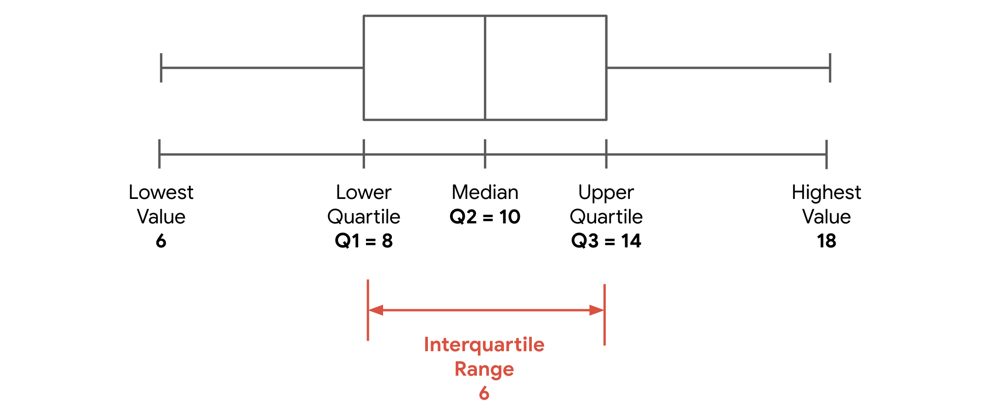
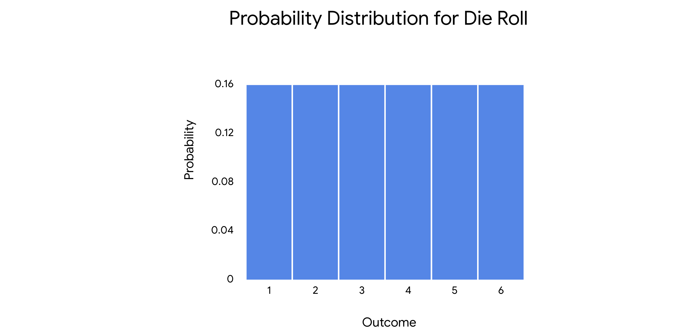
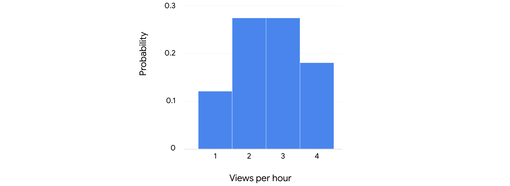
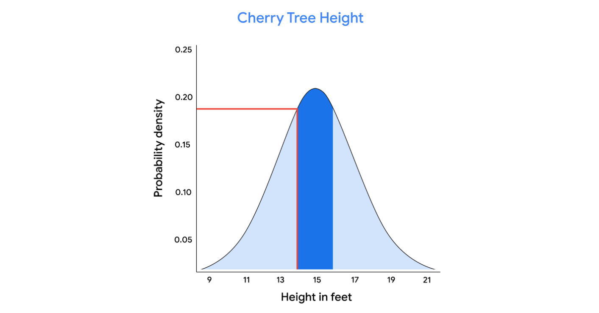
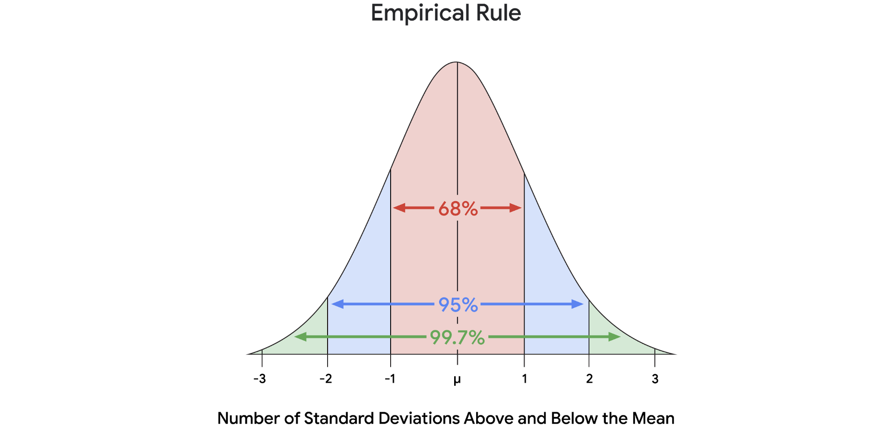
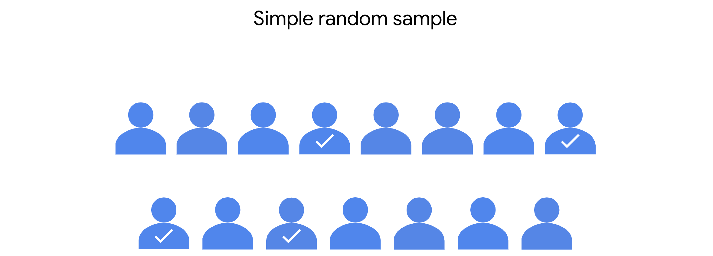
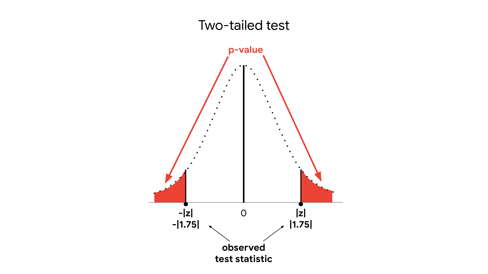
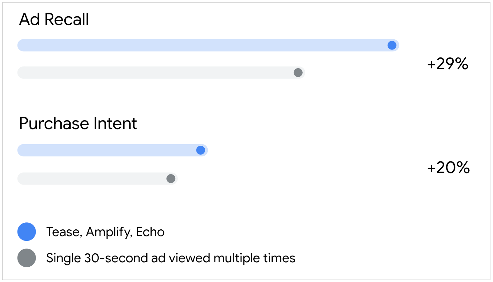

# Kurs 4. İstatistiğin Gücü

## Merkezi eğilim ölçüleri: Ortalama, medyan ve mod

Son zamanlarda, **merkezi eğilim ölçümlerinin** bir veri kümesinin merkezini temsil eden değerler olduğunu öğrendiniz. Yeni bir veri kümesiyle çalışırken, verilerinizin merkezi konumunu belirlemek, temel yapısını hızlı bir şekilde anlamanıza yardımcı olur.

Bu okumada, merkezi eğilimin üç ölçüsü hakkında daha fazla bilgi edineceksiniz: ortalama, medyan ve mod. Her bir ölçümün nasıl hesaplanacağını gözden geçireceğiz ve belirli verilerinize dayanarak hangi ölçümün en iyi kullanılacağını tartışacağız.

### Merkezi eğilim ölçüleri

Ortalama, medyan ve modun tümü, bir veri kümesinin merkezini farklı şekillerde tanımlar:

- **Ortalama**, bir veri kümesindeki ortalama değerdir.
    
- Med **yan**, bir veri kümesindeki orta değerdir.
    
- **Mod, bir veri kümesinde en sık meydana gelen değerdir.**
    

Merkezi eğilimin her ölçüsünün nasıl hesaplanacağını keşfedelim.

#### Ortalamayı, medyanı ve modu hesaplayın

##### Ortalama

**Ortalama**, bir veri kümesindeki ortalama değerdir. Ortalamayı hesaplamak için, veri kümenizdeki tüm değerleri toplar ve toplam değer sayısına bölersiniz.

Örneğin, aşağıdaki değer kümesine sahip olduğunuzu varsayalım: 10, 5, 3, 50, 12. Ortalamayı bulmak için toplam 80 için tüm değerleri eklersiniz. Ardından, toplam değer sayısı olan 5'e bölersiniz.

(10+5+3+50+12)÷5=80÷5=16

Ortalama veya ortalama değer 16'dır.

##### Medyan

Med **yan**, bir veri kümesindeki orta değerdir. Bu, veri kümesindeki değerlerin yarısının medyandan daha büyük olduğu ve değerlerin yarısının medyandan daha küçük olduğu anlamına gelir.

Bir veri kümesindeki tüm değerleri en küçükten en büyüğe düzenleyerek medyanı bulabilirsiniz. Beş değerinizi bu şekilde düzenlerseniz şunları elde edersiniz: 3, 5, 10, 12, 50. Medyan veya orta değer 10'dur.

Veri kümenizde çift sayıda değer varsa, medyan iki orta değerin ortalamasıdır. Diyelim ki setinize başka bir değer, 8, eklediniz: 3, 5, 8, 10, 12, 50. Şimdi, iki orta değer 8 ve 10'dur. Medyanı elde etmek için ortalamalarını alın.

(8+10)÷2=18÷2=9(8+10)÷2=18÷2=9

Medyan 9'dur.

##### Modu

**Mod, bir veri kümesinde en sık meydana gelen değerdir.** Bir veri kümesinin modu, bir modu veya birden fazla modu olamaz.

Örneğin, 1, 12, 33, 54, 75 sayı kümesinin modu yoktur çünkü hiçbir değer tekrarlanmaz. 2, 7, 7, 11, 20 setinde mod 7'dir, çünkü 7 bir kereden fazla meydana gelen tek değerdir. 3, 12, 12, 40, 40 setinin iki modu vardır: 12 ve 40.

#### Ortalama, medyan ve mod ne zaman kullanılır

Veri kümenizin merkezini tanımlamak için ortalama, medyan veya modu kullanıp kullanmadığınız, üzerinde çalıştığınız belirli verilere ve verilerinizden hangi içgörüleri elde etmek istediğinize bağlıdır. Her merkezi eğilim ölçüsünü kullanmak için bazı genel yönergeleri tartışalım.

##### Ortalama ve medyan

Hem ortalama hem de medyan, bir veri kümesinin merkezi konumunu tanımlar. Bununla birlikte, merkezi eğilimin ölçümleri olarak, ortalama ve medyan, farklı veri türleri için daha iyi çalışır.

Ortalamanın bir ana dezavantajı vardır: veri kümenizdeki aykırı değerlere karşı çok hassastır. Bir aykırı değerin, verilerin geri kalanından büyük ölçüde farklı bir değer olduğunu hatırlayın.

Veri kümenizde aykırı değerler varsa, medyan genellikle merkezin daha iyi bir ölçüsüdür. Hiçbir aykırı değer yoksa, ortalama genellikle iyi çalışır.

Örneğin, küçük bir başlangıç şirketindeki bir çalışanın yıllık ortalama maaşını hesaplamak istediğinizi düşünün. Aşağıdaki maaş verilerine sahipsiniz:

|**Çalışan**|#1|#2|#3|#4|#5|#6|#7|
|---|---|---|---|---|---|---|---|
|**Maaş**|40.000 $|45.000 $|45.000 $|45.000 $|45.000 $|50,000 $|500.000 $|

Veri kümenizdeki tüm değerleri toplayarak ve toplam değer sayısına bölerek ortalama yıllık maaşı hesaplayabilirsiniz. Toplamda yedi maaş var ve toplamı 770.000 dolar.

\$770,000÷7=\$110,000

Bu yedi çalışanın ortalama maaşı 110.000 dolar. Bununla birlikte, veriler bu ortalama değerin bu şirketteki bir çalışanın tipik maaşını doğru bir şekilde yansıtmadığını göstermektedir. Çoğu çalışanın maaşı 40.000 ila 50.000 dolar arasındadır. Aslında, yalnızca bir çalışanın maaşı 50.000 dolardan fazladır. 500.000 dolarlık maaş, ortalamayı artıran veya ortalamayı çarpıtan bir aykırıdır.

Bu durumda, bu aykırı değerin varlığı nedeniyle, medyan, ortalamadan daha iyi bir merkezi eğilim ölçüsüdür. Bu veri kümesindeki medyan veya orta değer 45.000 ABD dolarıdır. Medyan, bu şirketteki bir çalışanın tipik maaşı hakkında size daha iyi bir fikir verir.

##### Modu

Mod, kategorik verilerle çalışırken kullanışlıdır, çünkü hangi kategorinin en sık meydana geldiğini açıkça gösterir. Bir şirketin çalışan memnuniyeti anketi yürüttüğünü varsayalım. Anketteki ana madde, "Şirket içinde büyümek için sahip olduğum fırsattan memnunum" diyor. Çalışanlar cevapları için dört kategori arasından seçim yaparlar: kesinlikle katılıyorum, katılıyorum, katılmıyorum, kesinlikle katılmıyorum. Bir çubuk grafik sonuçları özetler.


Mod, "kesinlikle katılıyorum" derecesine atıfta bulunan çubuk grafikteki en yüksek çubuğu temsil eder. Bu, veri kümesinde en sık meydana gelen derecelendirmedir. Mod, şirkete çalışan memnuniyeti konusunda net geri bildirim verir; bu durumda olumlu geribildirim.

#### Önemli çıkarımlar

Ortalama, medyan ve mod gibi merkezi eğilim ölçümleri, veri kümenizin merkezini tek bir değer kullanarak tanımlamanıza izin verir. Bir veri uzmanı olarak, veri kümenizin merkezini bilmek, temel yapısını hızlı bir şekilde anlamanıza ve analizinizdeki sonraki adımları belirlemenize yardımcı olur.

#### Daha fazla bilgi için kaynaklar

Ortalama, medyan ve mod gibi merkezi eğilim ölçümleri hakkında daha fazla bilgi edinmek için aşağıdaki kaynağı keşfedin:

- [Avustralya İstatistik Bürosu'nun bu makalesi](https://www.abs.gov.au/websitedbs/D3310114.nsf/Home/Statistical+Language+-+measures+of+central+tendency#:~:text=There%20are%20three%20main%20measures,central%20value%20in%20the%20distribution.), ortalama, medyan ve moda yararlı bir genel bakış sunar ve aykırı değerlerin merkezi eğilim ölçümlerini nasıl etkilediğini tartışır.

## 8, 10, 12 olan 3 bileşenli bir seri için standart sapma;


## Dağılım ölçüleri: Menzil, varyans ve standart sapma

Son zamanlarda, **dağılım ölçümlerinin veri kümen** izin yayılımını veya veri değerlerinizdeki varyasyon miktarını tanımlamanıza izin verdiğini öğrendiniz. Standart sapma gibi dağılım ölçümleri, verilerinizin dağılımı hakkında ilk bilgi verebilir ve verilerinize hangi istatistiksel yöntemlerin uygulanacağını belirlemenize yardımcı olabilir.

Bu okumada, üç dağılım ölçüsü hakkında daha fazla bilgi edineceksiniz: aralık, varyans ve standart sapma. Bu okuma, temel standart sapma kavramına odaklanmaktadır. Bir veri uzmanı olarak, verilerinizin standart sapmasını sık sık hesaplayacak ve standart sapmayı daha karmaşık veri analizinin bir parçası olarak kullanacaksınız.

### Dağılım ölçüleri

Her dağılım ölçüsünün tanımını inceleyelim: aralık, varyans ve standart sapma.

#### **Menzil**

Aralık, bir veri kümesindeki en büyük ve en küçük değer arasındaki farktır.

Örneğin, bir biyoloji öğretmeni olduğunuzu ve final sınavı için puanlarla ilgili verileriniz olduğunu hayal edin. En yüksek puan 99/100 veya% 99'dur. En düşük puan 62/100 veya% 62'dir. Aralığı hesaplamak için en düşük puanı en yüksek puandan çıkarın.

99 - 62 = 37

Aralığı yüzde 37 puandır.

Menzil yararlı bir metriktir çünkü hesaplanması kolaydır ve veri kümenizin genel yayılımını çok hızlı bir şekilde anlamanızı sağlar.

#### **Varyans**

Başka bir yayılma ölçüsüne, **her** veri noktasının ortalamadan kare farkının ortalamadan ortalaması olan varyans denir. Temel olarak, standart sapmanın karesidir. Daha sonraki bir kursta varyans ve nasıl kullanılacağı hakkında daha fazla bilgi edineceksiniz.

#### **Standart sapma**

Standart sapma kavramını daha iyi anlamak için tanımını, görselleştirmesini ve istatistiksel formülünü inceleyelim.

#### **Tanımı**

**Standart sapma**, değerlerinizin veri kümenizin ortalamasından ne kadar yayıldığını ölçer. Bir veri noktasının ortalamadan tipik mesafesini hesaplar. Standart sapma ne kadar büyükse, değerleriniz ortalamadan o kadar yayılır. Standart sapma ne kadar küçükse, değerleriniz ortalamadan o kadar az yayılır.

#### **Görselleştirme**

Yayılma hakkında daha iyi bir fikir edinmek için üç normal olasılık dağılımının grafiklerini inceleyelim. Daha sonra, bir veri kümesindeki tüm değerleri eşleyen dağıtımlar hakkında bilgi edineceksiniz. Şimdilik, ortalamanın her eğrideki, tam merkezdeki en yüksek nokta olduğunu bilin.


Her eğri aynı ortalamaya ve farklı bir standart sapmaya sahiptir. Mavi noktalı eğrinin standart sapması 1, yeşil katı eğri 2 ve kırmızı kesikli eğri 3'tür. Veri değerlerinin çoğu ortalamaya yakın olduğu için mavi noktalı eğri en az yayılmaya sahiptir. Bu nedenle, mavi noktalı eğri en küçük standart sapmaya sahiptir. Veri değerlerinin çoğu ortalamadan daha uzağa düştüğü için kırmızı kesikli eğri en fazla yayılmaya sahiptir. Bu nedenle, kırmızı kesikli eğri en büyük standart sapmaya sahiptir.

#### **Formül**

Şimdi bir formül kullanarak standart sapmayı nasıl hesapladığınızı tartışalım.

Bir popülasyon ve bir örnek için standart sapmayı hesaplamak için farklı formüller vardır. Hatırlatma olarak, veri uzmanları tipik olarak örnek verilerle çalışır ve örneğe dayalı olarak popülasyonlar hakkında çıkarımlar yaparlar. Öyleyse, örnek standart sapma formülünü gözden geçirelim:

$s=\sqrt{\frac{\sum{(x-\bar{x})^2}}{n-1}} $

Formülde n, örneğinizdeki toplam veri değeri sayısıdır, x her bir veri değeridir ve x( "x-bar" olarak telaffuz edilir) veri değerlerinizin ortalamasıdır. Yunan harfi Sigma, toplam anlamına gelen bir semboldür.

**Not:** Bir veri uzmanı olarak, hesaplamalar için genellikle bir bilgisayar kullanırsınız. Hesaplamaları yapabilmek gelecekteki kariyeriniz için önemlidir, ancak hesaplamaların arkasındaki kavramlara aşina olmak, işyeri sorunlarına istatistiksel yöntemler uygulamanıza yardımcı olacaktır.

Formülün farklı bölümlerini daha iyi anlamak için, küçük bir veri kümesinin örnek standart sapmasını hesaplayalım: 2, 3, 10.

Bunu beş adımda yapabilirsiniz:

**1. Veri değerlerinizin ortalamasını veya ortalamasını hesaplayın.**

(2 + 3 +10) ÷ 3 = 15 ÷ 3 = 5

**2. Her değerden ortalamayı çıkarın**.

2 - 5 = -3

3 - 5 = -2

10 - 5 = 5

**3. Her sonucu kare haline getirin.**

-3*-3 = 9

-2*-2 = 4

5* 5 = 25

**4. Kareli sonuçları toplayın ve bu toplamı veri değerlerinin sayısından bir taneye bölün. Bu varyans.**

(9 + 4 + 25) ÷ (3 -1) = 38 ÷ 2 = 19

**5. Son olarak, varyansın karekökünü bulun.**

√19 = 4.36

Örnek standart sapması 4.36'dır.

Artık standart sapma kavramı hakkında daha fazla bilgi sahibi olduğunuza göre, pratik uygulamasının bir örneğini inceleyelim.

#### **Örnek: Gayrimenkul fiyatları**

Bir emlak şirketi için çalışan bir veri uzmanı olduğunuzu hayal edin. Ekibinizdeki emlakçılar, müşterilerini farklı yerleşim alanlarındaki kira fiyatlarındaki değişimler hakkında bilgilendirmeyi sever. İşinizin bir kısmı, belirli mahallelerdeki daireler için aylık kira fiyatlarının standart sapmasını hesaplamak ve bu bilgileri ekibinizle paylaşmaktır. Diyelim ki iki farklı mahallede tek yatak odalı daireler için aylık kira fiyatları hakkında örnek verileriniz var: Emerald Woods ve Rock Park. Her veri kümesi için ortalama ve standart sapmayı hesapladığınızı varsayalım.

**Zümrüt Ormanları**

|**Daire**|#1|#2|#3|#4|#5|
|---|---|---|---|---|---|
|**Aylık Kira**|\$900|\$950|\$1,000|\$1,050|\$1,100|

Ortalama: $1,000

Standart sapma: $79.05

**Kaya Parkı**

|**Daire**|#1|#2|#3|#4|#5|
|---|---|---|---|---|---|
|**Aylık Kira**|\$500|\$650|\$1,000|\$1,350|\$1,500|

Ortalama: $1,000

Standart sapma: \$431.56

Her iki mahalle de aylık 1.000 dolarlık aynı ortalama kira fiyatına sahiptir. Ancak, Rock Park'da kiralama fiyatlarındaki standart sapma (\$431.56), Emerald Woods'daki kiralama fiyatlarındaki standart sapmadan çok daha yüksektir (\$79.05). Bu, Rock Park'ta kiralama fiyatlarında çok daha fazla değişiklik olduğu anlamına gelir. Bu, temsilcileriniz için yararlı bir bilgidir. Örneğin, müşterilere Rock Park'ta ortalama 1.000 doların çok altında olan daha uygun fiyatlı bir daire bulmalarının daha kolay olabileceğini söyleyebilirler. Standart sapma, herhangi bir mahalledeki fiyatlardaki değişimi hızlı bir şekilde anlamanıza yardımcı olur.

### Önemli çıkarımlar

Veri uzmanları, reklam gelirleri, hisse senedi fiyatları, çalışan maaşları ve daha fazlası gibi birçok veri türündeki değişimi ölçmek için standart sapmayı kullanır. Standart sapma, varyans ve aralık gibi dağılım ölçümleri, veri değerlerinizdeki değişimi hızlı bir şekilde tanımlamanıza ve verilerinizin temel yapısını daha iyi anlamanıza olanak tanır.

### Daha fazla bilgi için kaynaklar

Menzil, varyans ve standart sapma gibi dağılım ölçümleri hakkında daha fazla bilgi edinmek için aşağıdaki kaynakları keşfedin:

- [Statistics Canada"nın bu makal](https://www150.statcan.gc.ca/n1/edu/power-pouvoir/ch12/5214891-eng.htm)esi, varyans ve standart sapmanın yararlı bir özetini sağlar, ve standart sapmanın bir dağılım ölçüsü olarak kullanışlılığını tartışır.

## Konum ölçüleri: Yüzdelikler ve çeyrekler

Son zamanlarda, **konum ölçümlerinin** bir veri kümesindeki diğer değerlere göre bir değerin konumunu belirlemenize izin verdiğini öğrendiniz. Merkez ve yayılma ile birlikte, değerlerinizin göreceli konumunu bilmek faydalıdır. Örneğin, bir değerin diğerinden daha yüksek veya daha düşük olup olmadığı veya bir değerin veri kümenizin alt, orta veya üst kısmına düşüp düşmediği.

Bu okumada, en yaygın konum ölçüleri hakkında daha fazla bilgi edineceksiniz: yüzdelikler ve çeyrekler. Ayrıca çeyrekler arası aralığı nasıl hesaplayacağınızı öğrenecek ve verilerinizi özetlemek için beş sayı özetini kullanacaksınız.

### Pozisyon ölçüleri

#### **Yüzdelik**

Yüz **delik**, bir veri yüzdesinin altına düştüğü değerdir. Yüzdelikler verilerinizi 100 eşit parçaya böler. Yüzdelikler, bir veri kümesindeki belirli bir değerin göreceli konumunu veya sırasını verir.

Örneğin, yüzdelikler genellikle okul sınavlarında test puanlarını sıralamak için kullanılır. Diyelim ki bir test puanı 99. yüzdelik dilime düşüyor. Bu, puanın tüm test puanlarının% 99'undan daha yüksek olduğu anlamına gelir. Bir puan 75. yüzdelik seviyeye düşerse, puan tüm test puanlarının% 75'inden daha yüksektir. Bir puan 50. yüzdelik seviyeye düşerse, puan tüm test puanlarının yarısından veya %50'sinden daha yüksektir.


_**Not: Yüz**_ _delikler ve yüzdeler farklı kavramlardır. Örneğin, bir testte 90/100 veya% 90 puan aldığınızı varsayalım. Bu mutlaka %90'lık puanınızın 90. yüzdelik dilimde olduğu anlamına gelmez. Yüzdelik, tüm sınava girenlerin göreceli performansına bağlıdır. Tüm sınava girenlerin yarısı %90'ın üzerinde puan alırsa,% 90'lık bir puan 50. persentilde olacaktır._

Yüzdelikler, değerleri karşılaştırmak ve verileri bağlama koymak için kullanışlıdır. Örneğin, yeni bir araba almak istediğinizi hayal edin. Harika yakıt ekonomisine sahip orta boy bir sedan istersiniz. Amerika Birleşik Devletleri'nde yakıt ekonomisi, galon yakıt veya mpg başına mil cinsinden ölçülür. Düşündüğünüz sedan 23 mpg alıyor. Bu iyi mi kötü mü? Karşılaştırma için bir temel olmadan, bilmek zor. Bununla birlikte, 23 mpg'nin tüm orta boy sedanların 25. yüzdesinde olduğunu biliyorsanız, göreceli performansı hakkında çok daha net bir fikriniz var. Bu durumda, tüm orta boy sedanların %75'i satın almayı düşündüğünüz arabadan daha yüksek mpg'ye sahiptir.

#### **Çeyrek**

Değerlerin göreli konumu hakkında genel bir anlayış elde etmek için çeyrekleri kullanabilirsiniz. Bir **çeyrek**, bir veri kümesindeki değerleri dört eşit parçaya böler.

Üç çeyrek verileri dört çeyreğe böler. Çeyreklikler, verilerin dördüncü çeyreğine göre değerleri karşılaştırmanıza olanak tanır. Her çeyrek, veri kümenizdeki değerlerin% 25'ini içerir.

- İlk çeyrek, Q1, veri kümesinin ilk yarısındaki orta değerdir. Q1, 25. yüzdelik anlamına gelir. Tüm veri kümesindeki değerlerin% 25'i Q1'in altında ve% 75'i bunun üzerindedir.
    
- İkinci çeyrek, Q2, veri kümesinin medyanıdır. Q2, 50. yüzdelik değeri ifade eder. Tüm veri kümesindeki değerlerin% 50'si Q2'nin altında ve% 50'si bunun üzerindedir.
    
- Üçüncü çeyrek, Q3, veri kümesinin ikinci yarısındaki orta değerdir. Q3, 75. yüzdelik değeri ifade eder. Tüm veri kümesindeki değerlerin% 75'i Q3'ün altında ve% 25'i bunun üzerindedir.
    


#### Örnek: Araba satışları

Örneğin, bir otomobil bayisinde çalışan bir veri uzmanı olduğunuzu hayal edin. Satış ekibinin yöneticisi, ekipteki her satış temsilcisinin performansını karşılaştırmak ister. Yönetici, her satış temsilcisinin geçen ay içinde kaç araba sattığını sağlayan verileri analiz etmenizi ister.

|**Satış Temsilcisi**|#1|#2|#3|#4|#5|#6|#7|#8|
|---|---|---|---|---|---|---|---|---|
|**Satılan Otomobiller**|18|13|6|10|15|7|10|9|

Verileriniz için çeyrekleri dört adımda hesaplayabilirsiniz:

1. Veri kümenizdeki değerleri en küçükten en büyüğe doğru düzenleyin.

[6, 7, 9, 10, 10, 13, 15, 18]

2. Tüm veri kümenizin medyanını veya orta değerini bulun. Bu Q2. Veri kümesinde çift sayıda değer vardır, bu nedenle medyan, iki orta değerin, 10 ve 10'un ortalamasıdır.

**Q2** = (10 + 10) ÷ 2 = 20 ÷ 2 = 10

3. Veri kümenizin alt yarısının medyanını bulun [6, 7, 9, 10]. Bu Q1. Medyan, iki orta değerin, 7 ve 9'un ortalamasıdır.

**Q1** = (7 + 9) ÷ 2 = 16 ÷ 2 = 8

4. Son olarak, veri kümenizin üst yarısının medyanını bulun [10, 13, 15, 18]. Bu Q3. Medyan, 13 ve 15'in iki orta değerin ortalamasıdır.

**Q3** = (13 + 15) ÷ 2 = 28 ÷ 2 = 14

Verileri çeyreğe bölmek size satış temsilcisi performansı hakkında net bir fikir verir. Artık temsilcilerin alt çeyreğinin (Q1) 8 veya daha az araba sattığını ve üst çeyreğin (Q3) 14 veya daha fazla araba sattığını biliyorsunuz. Başka bir deyişle, temsilcilerin% 25'i 8 veya daha az araba sattı ve üstteki %25'i 14 veya daha fazla araba sattı. Temsilcilerin ortada% 50'si 8 ila 14 araba sattı.

**Not:** Çeyrek değerleri hesaplamanın tek yolu bu değildir. Birçok gözlemi olan veri kümeleri için, çeyrek hesaplama metodolojisi, hesaplanan nihai değerler üzerinde ihmal edilebilir bir etkiye sahiptir. Bununla birlikte, az gözlem içeren veri kümeleri için hesaplanan çeyrekler önemsiz olmayabilir. Örneğin, [Numpy'nin persentil() işlevi](https://numpy.org/doc/stable/reference/generated/numpy.percentile.html), belirli bir yüzdelik değeri hesaplamak için dokuz farklı yola sahiptir.

#### **Çeyrekler arası aralık (IQR)**

**Verilerinizin orta %50'sine çeyrek arası aralık veya IQR denir.** Çeyrekler arası aralık, birinci çeyrek (Q1) ile üçüncü çeyrek (Q3) arasındaki mesafedir. Bu, 25. ve 75. yüzdelik arasındaki mesafe ile aynıdır. IQR, veri değerlerinizin göreceli konumunu belirlemek için kullanışlıdır. Örneğin, Q1 - (1.5 * IQR) ve Q3 + (1.5 * IQR) aralığının dışındaki veri değerleri genellikle aykırı değerler olarak kabul edilir.

_**Not:**_ _Teknik olarak, IQR bir dağılım ölçüsüdür çünkü verilerinizin orta yarısının veya orta %50'sinin yayılımını ölçer (Q1 ve Q3 arasında). IQR, veri kümenizdeki daha aşırı değerleri içermediğinden, aykırı değerlere aralıktan daha az duyarlıdır_.

IQR = Q3 - Q1. Bu durumda, Q3 = 14 ve Q1 = 8.

**IQR** = 14 - 8 = 6

#### **Beş sayı özeti**

Son olarak, veri kümenizdeki ana bölümleri beş sayı özetle özetleyebilirsiniz. Beş sayı şunları içerir:

- Minimum
    
- İlk çeyrek (Q1)
    
- Medyan veya ikinci çeyrek (Q2)
    
- Üçüncü çeyrek (Q3)
    
- Maksimum

Beş sayı özeti kullanışlıdır çünkü verilerinizin aşırı değerlerden merkeze dağılımı hakkında genel bir fikir verir. Bir kutu çizimi ile görselleştirebilirsiniz.

Kutu grafiğinin kutu kısmı Q1'den Q3'e gider. Kutunun ortasındaki dikey çizgi medyandır (Q2). Bıyık olarak bilinen kutunun her iki tarafındaki yatay çizgiler Q1'den minimuma ve Q3'ten maksimuma gider.

Aşağıdaki kutu çizimi, araba satışlarıyla ilgili verileri göstermektedir. Değerleri kutu grafiğinde bulabilir ve çeyrekler arası aralığı (IQR) belirleyebilirsiniz. IQR, kutunun uzunluğu veya Q1 ile Q3 arasındaki mesafedir.


### Önemli çıkarımlar

Veri uzmanları, ürün satışlarından hane gelirine kadar her tür veriyi daha iyi anlamak için yüzdelik ve çeyrek gibi konum ölçümlerini kullanır. Konum ölçümleri, veri değerlerinizin göreceli konumunu hızlı bir şekilde belirlemenize yardımcı olur ve verilerinizin dağılımı hakkında daha kesin bir fikir verir.

### Daha fazla bilgi için kaynaklar

Yüzdelik ve çeyrek gibi konum ölçümleri hakkında daha fazla bilgi edinmek için aşağıdaki kaynağa göz atın:

- [Freie Universität Berlin'in bu istatistik sözlüğü](https://www.geo.fu-berlin.de/en/v/soga-py/Basics-of-statistics/index.html), yüzdelikler, çeyrekler, beş sayı özeti ve daha fazlası gibi konum ölçümlerinin net tanımlarını ve yararlı örneklerini sağlar.

## Ortalama Okuma Oranını Bulma

```python
import numpy as np
import pandas as pd
import matplotlib.pyplot as plt

education_districtwise = pd.read_csv("education_districtwise.csv")
education_districtwise.head(10)
```

| DISTNAME     | STATNAME | BLOCKS | VILLAGES | CLUSTERS | TOTPOPULAT | OVERALL_LI |
|--------------|----------|--------|----------|----------|------------|------------|
| DISTRICT32   | STATE1   | 13     | 391      | 104      | 875564.0   | 66.92      |
| DISTRICT649  | STATE1   | 18     | 678      | 144      | 1015503.0  | 66.93      |
| DISTRICT229  | STATE1   | 8      | 94       | 65       | 1269751.0  | 71.21      |
| DISTRICT259  | STATE1   | 13     | 523      | 104      | 735753.0   | 57.98      |
| DISTRICT486  | STATE1   | 8      | 359      | 64       | 570060.0   | 65.00      |
| DISTRICT323  | STATE1   | 12     | 523      | 96       | 1070144.0  | 64.32      |
| DISTRICT114  | STATE1   | 6      | 110      | 49       | 147104.0   | 80.48      |
| DISTRICT438  | STATE1   | 7      | 134      | 54       | 143388.0   | 74.49      |
| DISTRICT610  | STATE1   | 10     | 388      | 80       | 409576.0   | 65.97      |
| DISTRICT476  | STATE1   | 11     | 361      | 86       | 555357.0   | 69.90      |

```python
education_districtwise['OVERALL_LI'].describe()
```

|       Stat       |    Value     |
|------------------|--------------|
| count            | 634.000000   |
| mean             | 73.395189    |
| std (std. dev.)  | 10.098460    |
| min              | 37.220000    |
| 25% (1st quartile)| 66.437500   |
| 50% (median)     | 73.490000    |
| 75% (3rd quartile)| 80.815000   |
| max              | 98.760000    |

```python
education_districtwise['STATNAME'].describe()
```

| Stat   | Value   |
|--------|---------|
| count  | 680     |
| unique | 36      |
| top    | STATE21 |
| freq   | 75      |

```python
range_overall_li = education_districtwise['OVERALL_LI'].max() - education_districtwise['OVERALL_LI'].min() 

range_overall_li
# 61.54000000006
```

## Olasılığın Temel Kavramları

Son zamanlarda, olasılığın belir **siz** liği ölçmek veya bir şeyin olma olasılığını tanımlamak için matematiği kullandığını öğrendiniz. Örneğin, yarın yağmur yağma ihtimali %80 veya belirli bir adayın seçimi kazanma ihtimali %20 olabilir.

Bu okumada, olasılığın temel kavramları hakkında daha fazla bilgi edineceksiniz. Rastgele bir deney kavramını, bir olayın olasılığının nasıl temsil edileceğini ve hesaplanacağını ve temel olasılık gösterimini tartışacağız.

### Olasılık temelleri

##### **Temel kavramlar: Rastgele deney, sonuç, olay**

Olasılık teorisinin temelindeki üç kavramla başlayalım:

- Rastgele deney
    
- Sonuç
    
- Etkinlik
    

Olasılık, istatistikçilerin istatistiksel deneyler olarak da bilinen rastgele deneyler dediği şeyle ilgilenir. **Rastgele bir deney**, sonucu kesin olarak tahmin edilemeyen bir süreçtir.

Örneğin, bir madeni para veya bir zarı atmadan önce, sonucunu bilemezsiniz. Madeni para atmanın sonucu yazı veya tura olabilir. Zarın sonucu 3 veya 6 olabilir.

Tüm rastgele deneylerin üç ortak noktası vardır:

- Deney birden fazla olası sonuca sahip olabilir.
    
- Olası her sonucu önceden temsil edebilirsiniz.
    
- Deneyin sonucu şansa bağlıdır.
    

İstatistikte, rastgele bir deneyin sonucuna sonuç denir. Örneğin, bir zar atarsanız, altı olası sonuç vardır: 1, 2, 3, 4, 5, 6.

Bir olay, bir veya daha fazla sonuçtan oluşan bir kümedir. Bir zarı atma örneğini kullanarak, bir olay sonucu çift sayı olabilir. Çift bir sayının çıkması olayı 2, 4, 6 sonuçlarından oluşur. Veya, tek bir sayının çıkması olayı 1, 3, 5 sonuçlarından oluşur.

Rastgele bir deneyde, bir olaya bir olasılık atanır. Rastgele bir olayın olasılığını nasıl temsil edeceğimizi ve hesaplayacağımızı keşfedelim.

#### **Bir olayın olasılığı**

Bir olayın meydana gelme olasılığı, 0 ile 1 arasında bir sayı olarak ifade edilir. Olasılık yüzde olarak da ifade edilebilir.

- Bir olayın olasılığı 0'a eşitse, olayın gerçekleşme ihtimali %0 vardır.
    
- Bir olayın olasılığı 1'e eşitse, olayın gerçekleşme ihtimali %100 vardır.

0 ile 1 arasında farklı olasılık dereceleri vardır. Bir olayın olasılığı sıfıra yakınsa, diyelim ki 0.05 veya % 5 ise, olayın gerçekleşme şansı küçüktür. Bir olayın olasılığı 1'e, örneğin 0.95 veya % 95'e yakınsa, olayın gerçekleşme şansı yüksektir. Bir olayın olasılığı 0,5'e eşitse, olayın gerçekleşmesi veya gerçekleşmemesi ihtimali %50'dir.

Bir olayın olasılığını bilmek, belirsizlik durumlarında bilinçli kararlar vermenize yardımcı olabilir. Örneğin, yarın yağmur olasılığı 0.1 veya % 10 ise, açık hava pikniği planlarınızdan emin olabilirsiniz. Ancak, yağmur olasılığı 0.9 veya % 90 ise, pikniğinizi başka bir güne yeniden planlamayı düşünebilirsiniz.

#### **Bir olayın olasılığını hesaplayın**

Tüm olası sonuçların eşit derecede muhtemel olduğu bir olayın olasılığını hesaplamak için, istenen sonuçların sayısını toplam olası sonuç sayısına bölersiniz. Bunun aynı zamanda klasik olasılığın formülü olduğunu hatırlayabilirsiniz:

$\frac{\text{İstenilen sonuçların sayısı}}{\text{toplam olası sonuç sayısı}}$

Tek bir rastgele olayın olasılığını nasıl hesaplayacağınıza dair daha iyi bir fikir edinmek için jeton atma ve die roll örneklerini inceleyelim.

##### **Örnek: Madeni para fırlatma**

Adil bir madeni para fırlatmak, rastgele bir deneyin klasik bir örneğidir:

- Birden fazla olası sonuç var.
    
- Olası her sonucu önceden temsil edebilirsiniz: kafalar veya kuyruklar.
    
- Sonuç şansa bağlıdır. Fırlatma kafaları veya kuyrukları ortaya çıkarabilir.

Tek bir atışta kafa alma olasılığını hesaplamak istediğinizi varsayalım. Herhangi bir madeni para atışı için, kafa alma olasılığı ikiden bir şanstır. Bu 1 ÷ 2 = 0.5 veya % 50'dir.

Şimdi, her iki tarafında kafaları olan özel olarak tasarlanmış bir madeni para fırlatacağınızı hayal edin. Bu madeni parayı her attığınızda kafaları yükselecek. Bu durumda kafa alma olasılığı% 100'dür. Kuyruk alma olasılığı% 0'dır.

Başlık kazanma olasılığının% 50 olduğunu söylediğinizde, herhangi bir gerçek jeton atma dizisinin tam olarak %50 kafa ile sonuçlanacağını iddia etmediğinizi unutmayın. Örneğin, adil bir madeni para on kez atarsanız, 4 kafa ve 6 kuyruk veya 7 kafa ve 3 kuyruk alabilirsiniz. Bununla birlikte, madeni parayı atmaya devam ederseniz, uzun vadeli kafa frekansının% 50'ye yaklaşmasını bekleyebilirsiniz.

##### **Örnek: Zar atma**

Altı taraflı bir zarı atmak, rastgele bir deneyin başka bir klasik örneğidir:

- Birden fazla olası sonuç var.
    
- Tüm olası sonuçları önceden temsil edebilirsiniz: 1, 2, 3, 4, 5 ve 6.
    
- Sonuç şansa bağlıdır. Rulo, herhangi bir sayı 1-6 olarak ortaya çıkabilir.
    

Diyelim ki 3 atma olasılığını hesaplamak istiyorsunuz. Herhangi bir zar atma için, 3 atma olasılığı altı üzerinden bir şanstır. Bu 1 ÷ 6 = 0.1666 veya yaklaşık % 16.7'dir.

#### **Olasılık gösterimi**

Genellikle eğitim ve teknik bağlamlardaki kavramları sembolize etmek için kullanıldığı için olasılık gösterimine aşina olmaya yardımcı olur.

Notasyonda, P harfi bir olayın olasılığını gösterir. A ve B harfleri bireysel olayları temsil eder.

Örneğin, iki olayla uğraşıyorsanız, bir olayı A ve diğer olayı B olarak etiketleyebilirsiniz.

- A olayı olasılığı P (A) olarak yazılır.
    
- B olayı olasılığı P (B) olarak yazılır.
    
- Herhangi bir olay için A, 0 ≤ P (A) ≤ 1. Başka bir deyişle, herhangi bir A olayının olasılığı her zaman 0 ile 1 arasındadır.
    
- P (A) > P (B) ise, A olayının meydana gelme şansı B olayından daha yüksektir.
    
- P (A) = P (B) ise, o zaman A olayı ve B olayı eşit derecede meydana gelir.
    

### Önemli çıkarımlar

Veri uzmanları, paydaşların belirsiz olaylar hakkında bilinçli kararlar almalarına yardımcı olmak için olasılığı kullanır. Temel olasılık kavramları hakkındaki bilginiz, daha karmaşık olasılık hesaplamaları için bir yapı taşı olarak faydalı olacaktır.

### Daha fazla bilgi için kaynaklar

Temel olasılık kavramları hakkında daha fazla bilgi edinmek için aşağıdaki kaynaklara bakın:

- [Richland Community College"dan alınan bu ders notları](https://people.richland.edu/james/lecture/m116/sequences/probability.html), temel kavramların ve temel olasılık kurallarının yararlı bir özetini sağlar..

## Çoklu olayların olasılığı

Şimdiye kadar, tek olayların olasılığını hesaplamayı öğreniyorsunuz. Hem günlük yaşamda hem de veri çalışmasında birçok durum birden fazla olayı içerir. Gelecekteki bir veri uzmanı olarak, genellikle birden fazla olay olasılığı ile ilgileneceksiniz.

Bu okumada, birden fazla olay hakkında daha fazla bilgi edineceksiniz. Üç temel olasılık kuralı öğreneceksiniz: tamamlayıcı kuralı, toplama kuralı ve çarpma kuralı. Bu kurallar, birden fazla olayın olasılığını daha iyi anlamanıza yardımcı olur. İlk olarak, bu kuralların geçerli olduğu iki farklı olay türünü tartışacağız: birbirini dışlayan ve bağımsız. Ardından, her iki olay türü için olasılığın nasıl hesaplanacağını öğreneceksiniz.

### İki tür olay

Üç temel olasılık kuralı, farklı olay türleri için geçerlidir. Hem tamamlayıcı kuralı hem de ekleme kuralı, birbirini dışlayan olaylar için geçerlidir. Çarpma kuralı bağımsız olaylar için geçerlidir.

#### **Karşılıklı dışlayan etkinlikler**

İki olay **aynı anda gerçekleşemezlerse**  birbirini dışlar.

Örneğin, Dünya'da ve ayda aynı anda olamazsınız veya aynı anda oturup ayakta duramazsınız.

Veya olasılık teorisinin iki klasik örneğini alın. Madeni para atarsanız, aynı anda kafa ve kuyruk atamazsınız. Bir zar atarsanız, aynı anda 2 ve 4 atamazsınız.

#### **Bağımsız etkinlikler**

**Bir olayın meydana gelmesi** diğer olayın olasılığını değiştirmezse iki olay bağımsızdır. Bu, bir olayın diğer olayın sonucunu etkilemediği anlamına gelir.

Örneğin, sabahları bir film izlemek öğleden sonra havayı etkilemez. Radyoda müzik dinlemek yeni buzdolabınızın teslimatını etkilemez. Bu olaylar ayrı ve bağımsızdır.

Veya ardışık iki jeton fırlatması veya iki ardışık zar atma yapın. İlk atışta tura atmak ikinci atışın sonucunu etkilemez. Herhangi bir madeni para atışı için, herhangi bir sonucun olasılığı her zaman 2 üzerinden 1 veya % 50'dir. İlk zarda 2 almak ikinci zarın sonucunu etkilemez. Herhangi bir zar atışı için, herhangi bir sonucun olasılığı her zaman 6'dan 1'i veya % 16.7'dir.

### Üç temel kural

Artık birbirini dışlayan ve bağımsız olaylar arasındaki fark hakkında daha fazla bilgi sahibi olduğunuza göre, üç temel olasılık kuralını gözden geçirelim:

- Tamamlayıcı kuralı
    
- Toplama kuralı
    
- Çarpma kuralı
    

#### **Tamamlayıcı kuralı**

Tamamlayıcı kuralı, birbirini dışlayan olaylarla ilgilenir. İstatistikte, bir olayın tamamlayıcısı gerçekleşmeyen olaydır. Örneğin, ya kar yağar ya da kar yağmaz. Ya futbol takımınız şampiyonluğu kazanır ya da şampiyonluğu kazanmaz. Karın tamamlayıcısı kar değildir. Kazanmanın tamamlayıcısı kazanmak değildir.

Bir olayın meydana gelme olasılığı ve gerçekleşmemesi olasılığı 1'e kadar olmalıdır. 1 olasılığının% 100 ile aynı olduğunu hatırlayın.

Bunu düşünmenin başka bir yolu, bir olayın veya diğer olayın meydana gelme olasılığın % 100 olmasıdır. Yarın %40 kar yağma ihtimali olabilir. Ancak yarın kar yağma ya da kar yağmama ihtimali %100.

**Tamamlayıcı kuralı**, A olayının gerçekleşmemesi olasılığının 1 eksi A olasılığı olduğunu belirtir: Olasılık gösteriminde bunu şu şekilde yazabilirsiniz:

**Tamamlayıcı kuralı**

P (A') = 1 - P (A)

**Not:** Olasılık gösteriminde, kesme işareti (') olumsuzlamayı sembolize eder. Başka bir deyişle, A olayının meydana gelmemesi olasılığını belirtmek istiyorsanız, A harfinden sonra bir kesme işareti ekleyin: P (A') Bunu "A olmaması olasılığı" olarak söyleyebilirsiniz.

Bu nedenle, yarın % 40 kar olasılığının veya 0.4 olasılığının olduğunu biliyorsanız, yarın kar yağmama olasılığını hesaplamak için tamamlayıcı kuralını kullanabilirsiniz. Kar olmaması olasılığı bir eksi kar olasılığına eşittir.

P (kar yok) = 1 - P (kar) = 1 - 0.4 = 0.6.

Yani, yarın kar yağma olasılığı 0.6 veya % 60'dır.

#### **Toplama kuralı (birbirini dışlayan olaylar için)**

**Toplama kuralı**, eğer A ve B olayları birbirini dışlarsa, A veya B'nin meydana gelme olasılığının A ve B'nin olasılıklarının toplamı olduğunu belirtir: Olasılık gösteriminde, bunu şu şekilde yazabilirsiniz:

P (A veya B) = P (A) +P (B)

Karşılıklı olarak kapsayan etkinlikler için de bir ekleme kuralı olduğunu unutmayın. Bu derste, birbirini dışlayan olaylar için kurala odaklanıyoruz.

Bir kalıp yuvarlama örneğimizi inceleyelim.

##### **Kalıp rulosu (2 veya 4 yuvarlama)**

Tek bir ruloda 2 veya 4 yuvarlanma olasılığını bulmak istediğinizi varsayalım. Bu iki olay birbirini dışlar. 2 veya 4 yuvarlayabilirsiniz, ancak her ikisini de aynı anda yapamazsınız.

Toplama kuralı, her iki olayın meydana gelme olasılığını bulmak için olasılıklarını topladığınızı söyler. Bir zarda tek bir sayı atma olasılığı 6'dan 1'i veya % 16.7'dir.

P (2 atma veya 4 atma ) = P (2 atma ) + P (4 atma ) = 1/6 + 1/6 = 1/3

Yani, 2 veya 4 yuvarlanma olasılığı üçten biri veya % 33'tür.

#### **Çarpma kuralı (bağımsız olaylar için)**

**Çarpma kuralı**, eğer A ve B olayları bağımsızsa, o zaman hem A hem de B'nin meydana gelme olasılığının, A olasılığının B olasılığı ile çarpılmasıdır. Olasılık gösteriminde, bunu şu şekilde yazabilirsiniz:

P (A ve B) = P (A) × P (B)

Bağımlı olaylar için de bir çarpma kuralı olduğunu unutmayın. Bu derste, bağımsız etkinlikler için kurala odaklanıyoruz.

Bir zar atma örneğimizle devam edelim.

##### **zar atma (1 yuvarlama ve ardından 6 yuvarlama)**

Şimdi arka arkaya iki zar atma hayal edin. Diyelim ki bir 1'i yuvarlama ve ardından bir 6'yı yuvarlama olasılığını bilmek istiyorsunuz. Bunlar bağımsız olaylardır, çünkü ilk rulo ikinci rulonun sonucunu etkilemez.

Bir 1'i ve ardından bir 6'yı yuvarlama olasılığı, bir 1'i yuvarlama olasılığının 6 yuvarlanma olasılığıyla çarpılmasıdır. Her olayın olasılığı veya% 16.7'dir. Bunu şu şekilde yazabilirsiniz:

P (ilk ruloda 1 yuvarlama ve ikinci ruloda 6 yuvarlama) = P (ilk ruloda 1 yuvarlama) × P (ikinci ruloda 6 yuvarlama) = 1/6 × 1/6 = 1/36

Yani, bir 1 ve sonra bir 6'yı yuvarlama olasılığı otuz altıdan biri veya yaklaşık % 2.8'dir.

### Önemli çıkarımlar

Temel olasılık kuralları, birbirini dışlayan veya bağımsız olan olayları tanımlamanıza yardımcı olur. Temel olasılık kurallarını anlamak, gelecekteki bir veri uzmanı olarak gerçekleştireceğiniz daha karmaşık analizler için temel bir temeldir.

### Daha fazla bilgi için kaynaklar

Olasılık hakkında daha fazla bilgi edinmek için, aşağıdaki etkileşimli kılavuza bakın: [Görme Teorisi](https://seeing-theory.brown.edu/index.html#secondPage).

## Koşullu olasılık

Önceden, tek bir olay için ve iki veya daha fazla bağımsız olay için, örneğin iki ardışık jeton çevirme olasılığı hesapladınız. Koşullu olasılık, iki veya daha fazla bağımlı olay için geçerlidir.

### **Bağımlı olaylar**

Daha önce, ilk olay ikinci olayın sonucunu etkilemiyorsa veya olasılığını değiştirmezse iki olayın **bağımsız** olduğunu öğrendiniz. Örneğin, ardışık iki madeni para atışı bağımsız olaylardır. İlk atışta kafa almak ikinci atışın sonucunu etkilemez.

Buna karşılık, bir olayın **meydana gelmesi diğer olayın olasılığını değiştirirse iki olay bağımlıdır.** Bu, ilk olayın ikinci olayın sonucunu etkilediği anlamına gelir.

Örneğin, bir sınavda iyi bir not almak istiyorsanız, önce ders materyalini incelemeniz gerekir. İyi bir not almak çalışmaya bağlıdır. Bir masa beklemeden popüler bir restoranda yemek yemek istiyorsanız, erken gelmelisiniz. Beklemekten kaçınmak erken gelmeye bağlıdır. Her durumda, ikinci olayın ilk olaya bağlı veya buna bağlı olduğunu söyleyebilirsiniz.

Artık bağımlı olayları daha iyi anladığınıza göre, koşullu olasılığa dönelim ve formülü gözden geçirelim.

### **Koşullu olasılık formülü**

Formül, iki bağımlı olay A ve B için, A olayının ve B olayının meydana gelme olasılığının, A olayının meydana geldiği göz önüne alındığında, B olayı meydana gelme olasılığı ile çarpıldığında, A olayının meydana gelme olasılığına eşit olduğunu söylüyor.

**Koşullu olasılık**

P (A ve B) = P (A) * P (B | A)

Olasılık gösteriminde, B ve A harfleri arasındaki dikey çubuk bağımlılığı gösterir veya B olayının meydana gelmesinin A olayının meydana gelmesine bağlı olduğunu gösterir. Bunu "A verilen B olasılığı" olarak söyleyebilirsiniz.

Formül ayrıca, A olayı verilen B olayının olasılığının, hem A hem de B'nin meydana gelme olasılığına eşit olarak ifade edilebilir. A olasılığına bölünmesi.

**Koşullu olasılık**

P (B | A) = P (A ve B) / P (A)

Bunlar aynı denklemi temsil etmenin sadece iki yoludur. Duruma veya önceden hangi bilgilerin verildiğine bağlı olarak, birini veya diğerini kullanmak daha kolay olabilir.

**Not: Ko** şullu olasılık formülü bağımsız olaylar için de geçerlidir. A ve B bağımsız olaylar olduğunda, P (B|A) = P (B). Böylece formül P (A ve B) = P (A) * P (B) olur. Bu formül aynı zamanda kursta daha önce öğrendiğiniz çarpma kuralıdır.

### **Örnek: oyun kartları**

52 oyun kartından oluşan standart bir desteyle ilgilenen koşullu olasılık örneğini inceleyelim.

İki olay hayal edin:

- İlk olay, kart destesinden bir kalp çekmektir.
    
- İkinci olay, aynı desteden başka bir kalp çekmektir.
    

Arka arkaya iki kalp çekme olasılığını öğrenmek istediğinizi varsayalım. Bu iki olay bağımlıdır çünkü ilk çekilişte kalp almak ikinci çekilişte kalp alma olasılığını değiştirir..

Standart bir deste dört farklı takım içerir: kalp, karo, sinek ve maça. Her takımın 13 kartı vardır. İlk çekiliş için kalp alma şansı 52 üzerinden 13 veya % 25'tir. İkinci çekiliş için, ilk çekilişte zaten bir kalp seçtiğiniz için kalp alma olasılığı değişir. Şimdi, 51 kartlık bir destede 12 kalp var. İkinci çekiliş için kalp alma şansı 51 üzerinden 12'si veya yaklaşık % 23,5'tir. Kalbe sahip olmak artık daha az olasıdır - olasılık %25'ten %23,5'e düştü.

Şimdi, koşullu olasılık formülünü uygulayalım:

**P (A ve B) = P (A) * P (B | A)**

Hem A olayının hem de B olayının meydana gelme olasılığını hesaplamak istiyorsunuz. A Olayına _1. kalp_ diyelim, ilk çekilişte kalp almayı ifade eder. B Olayına _2. kalp_ diyelim, ikinci çekilişte kalp almayı ifade eder, ilk seferde bir kalp çizildiği göz önüne alındığında. A olayı olasılığı 13/52 veya % 25'tir. B olayı olasılığı 12/51 veya % 23.5'tir.

Bu sayıları formüle girelim:

**P (1. kalp ve 2. kalp) = P (1. kalp) * P (2. kalp | 1. kalp)** = 13/52 * 12/51 = 1/17 = 0.0588 veya yaklaşık % 5.9

Dolayısıyla, standart bir oyun kartı destesinden arka arkaya iki kalp çekme şansı % 5,9'dur.

### **Örnek: çevrimiçi satın alımlar**

Başka bir örneği inceleyelim. Bir çevrimiçi perakende mağazasında çalışan bir veri uzmanı olduğunuzu hayal edin. Mağazanın web sitesini ziyaret eden müşterilerin % 20'sinin 100$ veya daha fazla satın alma yaptığını söyleyen verileriniz var. Bir müşteri 100$ harcıyorsa, ücretsiz hediye kartı almaya hak kazanır. Mağaza, en az 100$ harcayan müşterilerin % 10'una rastgele hediye kartları verir.

Bir müşterinin 100$ harcama ve hediye kartı alma olasılığını hesaplamak istiyorsunuz. Hediye kartı almak, ilk 100$ harcamanıza bağlıdır. Yani, bu koşullu bir olasılıktır çünkü iki bağımlı olayla ilgilenir.

Koşullu olasılık formülünü uygulayalım:

**P (A ve B) = P (A) * P (B | A)**

Hem A olayının hem de B olayının meydana gelme olasılığını hesaplamak istiyorsunuz. A etkinliğine _100$_ ve B olayı _hediye kartı_ diyelim. A olayı olasılığı 0.2 veya % 20'dir. B olayı olasılığı 0.1 veya % 10'dur.

**P (\$100 ve hediye kartı) = P (\$100) * P (hediye kartı | \$ 100 verilen)** = 0,2 * 0,1 = 0,02 veya % 2

Dolayısıyla, bir müşterinin 100$ veya daha fazla harcama ve ücretsiz hediye kartı alma olasılığı 0,2 * 0,1 = 0,02 veya % 2'dir.

### Önemli çıkarımlar

Koşullu olasılık, bağımlı olaylar arasındaki ilişkiyi tanımlamanıza yardımcı olur. Veri uzmanları genellikle bir iş bağlamında koşullu olasılığı kullanır. Örneğin, yeni bir reklam kampanyası gibi bir etkinliğin satış gelirini nasıl etkileyeceğini tahmin etmek için koşullu olasılığı kullanabilirler. Bu, paydaşların şirketlerinin kaynaklarına yatırım yapmanın en iyi yolu hakkında akıllı kararlar almalarına yardımcı olur.

### Daha fazla bilgi için kaynaklar

Koşullu olasılık hakkında daha fazla bilgi edinmek için aşağıdaki kaynağa bakın:

- [Investopedia"nın bu makalesi, bir iş bağlamında koşullu olasılığı tartışıyor.](https://www.investopedia.com/terms/c/conditional_probability.asp#:~:text=Conditional%20probability%20is%20defined%20as,succeeding%2C%20or%20conditional%2C%20event.) 

## Genişletilmiş Bayes Teoremi

Son zamanlarda, **Bayes teore** minin koşullu olasılığı belirlemek için bir matematik formülü olduğunu öğrendiniz. Teorem, adını Londra, İngiltere'den 18. yüzyıl matematikçisi Thomas Bayes'in adını almıştır. Koşul **lu olas** ılığın, başka bir olayın daha önce meydana geldiği göz önüne alındığında meydana gelme olasılığını ifade ettiğini hatırlayın. Örneğin, bir oyun kartı destesinden bir as çektiğinizde, bu aynı desteden ikinci bir as çekme olasılığını değiştirir.

Bu okumada, Bayes teoreminin farklı bölümleri ve şartlı olasılığı hesaplamak için teoremi nasıl kullanabileceğiniz hakkında daha fazla bilgi edineceksiniz.

### Bayes teoremi

Bayes teoremi, olayla ilgili yeni bilgilere dayanarak bir olayın olasılığını güncellemenin bir yolunu sağlar.

#### **Sonraki ve önceki olasılık**

Bayes istatistiklerinde, **önceki olasılık**, yeni veriler toplanmadan önce bir olayın olasılığını ifade eder. **Sonraki olasılık**, yeni verilere dayalı bir olayın güncellenmiş olasılığıdır.

Bayes teoremi, verilerinize göre önceki olasılığı güncelleyerek sonraki olasılığı hesaplamanıza olanak tanır.

Örneğin, tıbbi bir durumun yaşla ilgili olduğunu varsayalım. Bir kişinin yaşa göre duruma sahip olma olasılığını daha doğru bir şekilde belirlemek için Bayes teoremini kullanabilirsiniz. Önceki olasılık, bir kişinin duruma sahip olma olasılığı olacaktır. Sonraki veya güncellenmiş olasılık, belirli bir yaş grubundaysa, bir kişinin duruma sahip olma olasılığı olacaktır.

#### **Teorem**

Teoremin kendisini inceleyelim.

**Bayes teoremi**, herhangi iki A ve B olayı için, verilen B olasılığının, A olasılığının, A verilen B olasılığının B olasılığının B olasılığına bölünmesiyle eşit olduğunu belirtir.

**Bayes teoremi**

Teoremde, önceki olasılık olayın olasılığıdır A. Sonraki olasılık veya hesaplamaya çalıştığınız şey, A olayının olasılığıdır B olayının olasılığıdır.

- **P (A)**: Önceki olasılık
    
- **P (A|B)**: Sonraki olasılık
    

Bazen istatistikçiler ve veri uzmanları, A olayına verilen B olayının olasılığını ifade etmek için "olasılık" terimini ve B olayının olasılığını ifade etmek için "kanıt" terimini kullanırlar.

- **P (B|A)**: Olasılık
    
- **P (B)**: Kanıt
    

Bu terimleri kullanarak Bayes teoremini şu şekilde yeniden ifade edebilirsiniz:

- Sonraki = Olasılık * Önceki/ Kanıt
    


Hesaplamayı bu farklı perspektiflerden düşünmek ve probleminizi denklemle eşlemeye yardımcı olabilir.

Bayes teoremi hakkında düşünmenin bir yolu, önceki bir inancı, P (A), yeni verileri kullanarak arka bir olasılık olan P (A | B) 'ye dönüştürmenize izin vermesidir. Yeni veriler olasılık, P (B | A) ve kanıtlar, P (B).

_**Not:**_ _Bu okuma, Bayes teoremi ile ilişkili temel kavram ve terimlere bir giriş sağlar. Bayes istatistiklerinin detaylı bir incelemesi bu dersin kapsamı dışındadır. Kariyerinizde bir veri uzmanı olarak ilerledikçe, Bayes teoremini ve çeşitli uygulamalarını daha fazla keşfetme fırsatına sahip olacaksınız_.

Şimdilik hatırlanması gereken önemli bir nokta, Bayes teoreminin hem A verilen B'nin koşullu olasılığını hem de A verilen B'nin koşullu olasılığını içerdiğidir. Bu olasılıklardan birini biliyorsanız, Bayes teoremi diğerini belirlemenize yardımcı olabilir.

Teoremin nasıl çalıştığını daha iyi anlamak için bir örneği inceleyelim.

#### **Örnek: spam filtresi**

Bayes teoreminin dijital dünyada iyi bilinen bir uygulaması spam filtreleme veya bir e-postanın spam olup olmadığını tahmin etmektir. Uygulamada, sofistike bir spam filtresi, e-postanın içeriği, başlığı, eki olup olmadığı, gönderen adresinin etki alanı türü (.edu veya.org) ve daha fazlası dahil olmak üzere birçok farklı değişkenle ilgilenir. Ancak, örneğimiz için Bayes spam filtresinin basitleştirilmiş bir sürümünü kullanabiliriz.

Diyelim ki e-postada belirli bir kelime göründüğü için bir e-postanın spam olma olasılığını belirlemek istediğinizi varsayalım. Bu örnekte, "para" kelimesini kullanalım.

Aşağıdaki bilgileri keşfedersiniz:

- Bir e-postanın spam olma olasılığı% 20'dir.
    
- Bir e-postada "para" kelimesinin görünme olasılığı% 15'tir.
    
- Bir spam e-postada "para" kelimesinin görünme olasılığı% 40'tır.
    

Bu örnekte, önceki olasılığınız, bir e-postanın spam olma olasılığıdır. Sonradan olasılığınız veya nihayetinde öğrenmek istediğiniz şey, bir e-postanın "para" kelimesini içerdiği göz önüne alındığında spam olma olasılığıdır. Önceki olasılığınızı güncellemek için kullanacağınız yeni veriler, "para" kelimesinin bir e-postada görünme olasılığı ve "para" kelimesinin spam e-postada görünme olasılığıdır.

Bayes teoremiyle çalışırken, önce A olayının ne olduğunu ve B olayının ne olduğunu bulmak yararlıdır - bu, olaylar arasındaki ilişkiyi anlamayı ve formülü kullanmayı kolaylaştırır.

A etkinliğine spam e-posta ve B olayına bir e-postada "para" kelimesinin görünüşü diyelim. Şimdi, Bayes teoremini A olayı için "spam" kelimesini ve B olayı için "para" kelimesini kullanarak yeniden yazabilirsiniz.

P (A | B) = P (B | A) * P (A)/P (B)

P (İstenmeyen İleti | Para) = P (Para | İstenmeyen İleti) * P (İstenmeyen İleti)/P (Para)

Aşağıdakileri öğrenmek istiyorsunuz:

- **P (Spam| Para) veya arka olasılık**: e-postada "para" kelimesinin görünmesi göz önüne alındığında bir e-postanın spam olma olasılığı
    

Şimdi, verilerinizi formüle girin:

- **P (SpAM) veya önceki olas** ılık: bir e-postanın spam olma olasılığı = 0.2 veya% 20
    
- **P (Para) veya kanıt:** "para" kelimesinin bir e-postada görünme olasılığı = 0.15 veya% 15
    
- **P (Para | SpAM) veya olasılık: e-postanın spam** olduğu göz önüne alındığında "para" kelimesinin bir e-postada görünme olasılığı = 0.4 veya% 40
    

P (SpAM | Para) = P (Para | SpAM) * P (SpAM)/P (Para) = 0.4 * 0.2/0.15 = 0.53333 veya yaklaşık% 53.3%.

Dolayısıyla, e-postanın "para" kelimesini içerdiği göz önüne alındığında, bir e-postanın spam olma olasılığı% 53.3'tür.

### Önemli çıkarımlar

Bayes teoremi, modern veri analitiğinde verileri analiz etmek ve yorumlamak için güçlü bir yöntem olan Bayes çıkarımı olarak da bilinen Bayes istatistik alanının temelidir. Veri uzmanları, Bayes teoremini yapay zekadan tıbbi testlere kadar çok çeşitli alanlarda kullanır.

Bayes teoremi hakkında temel bir anlayışa sahip olmak, kariyerinizde bir veri uzmanı olarak ilerledikçe Bayes istatistikleri hakkında daha fazla bilgi edinmenizi sağlayacaktır.

### Daha fazla bilgi için kaynaklar

Bayes Teoremi hakkında daha fazla bilgi edinmek için aşağıdaki kaynağa bakın:

- [Pennsylvania Eyalet Üniversitesi tarafından açıklanan Bayes teoremi](https://online.stat.psu.edu/stat500/lesson/2/2.7)
    

"Savcının yanılgısı" hakkında ilginç bir tartışma için bu sayfaya göz atın:

- [Amerikan Epidemiyoloji Dergisi tarafından savcının yanılgısının açıklaması](https://academic.oup.com/aje/article/179/9/1125/103523)

## Ayrık olasılık dağılımları

Son zamanlarda, veri profesyonellerinin farklı veri kümelerini modellemek ve verilerindeki önemli kalıpları belirlemek için olasılık dağılımlarını kullandığını öğrendiniz. Bir olasılık **dağılımının** rastgele bir olayın olası sonuçlarının olasılığını tanımladığını hatırlayın. Ayrık olasılık dağılımları, ayrık rastgele değişkenleri veya ayrık olayları temsil eder. Genellikle, ayrık olayların sonuçları sayılabilen tam sayılar olarak ifade edilir. Örneğin, bir kalıbın yuvarlanması 2 veya 3 ile sonuçlanabilir, ancak 2.575 veya 3.184 gibi ondalık bir değerle sonuçlanamaz.

Bu okumada, dört ortak ayrık olasılık dağılımının ana özelliklerine genel bir bakış elde edeceksiniz:

- Uniform
    
- Binom
    
- Bernoulli
    
- Poison
    

### Ayrık olasılık dağılımları

#### **Uniform dağılım**

Tek tip dağılım, sonuçları eşit derecede olası veya eşit olasılığa sahip olayları tanımlar.

Örneğin, bir kalıbı yuvarlamak altı sonuçla sonuçlanabilir: 1, 2, 3, 4, 5 veya 6. Her sonucun olasılığı aynıdır: 6'dan 1'i veya yaklaşık% 16.7.

Bir dağılımı histogram gibi bir grafikle görselleştirebilirsiniz. Ayrık bir dağılım için, rastgele değişken x ekseni boyunca çizilir ve karşılık gelen olasılık y ekseni boyunca çizilir. Bu durumda, x ekseni, tek bir kalıp rulosunun olası her sonucunu temsil eder ve y ekseni her sonucun olasılığını temsil eder.


_**Not: Veri**_ _uzmanları genellikle tek tip dağılımı Monte Carlo simülasyonları gibi daha karmaşık istatistiksel yöntemlerin bir parçası olarak kullanır. Bu yöntemlerin ayrıntılı bir tartışması bu dersin kapsamı dışındadır._

_**Not:**_ _Düzgün dağılım hem ayrık hem de sürekli rastgele değişkenler için geçerlidir._

#### **Binom dağılımı**

**Binom dağılımı,** olayların olasılığını yalnızca iki olası sonuçla modeller: başarı veya başarısızlık. Bu sonuçlar birbirini dışlar ve aynı anda gerçekleşemez.

Bu tanım aşağıdakileri varsayar:

- Her olay bağımsızdır veya diğerlerinin olasılığını etkilemez.
    
- Her olay aynı başarı olasılığına sahiptir.
    

Başarı ve başarısızlığın kolaylık sağlamak için kullanılan etiketler olduğunu unutmayın. Örneğin, bir madeni para atarsanız, yalnızca iki olası sonuç vardır: kafalar veya kuyruklar. Analizinizin ihtiyaçlarına göre kafaları veya kuyrukları başarılı bir sonuç olarak etiketlemeyi seçebilirsiniz.

Binom dağılımı, binom deneyi adı verilen bir rastgele olayı temsil eder. Bir binom deneyi aşağıdaki özelliklere sahiptir:

- Deney, bir dizi tekrarlanan denemeden oluşur.
    
- Her denemenin sadece iki olası sonucu vardır.
    
- Başarı olasılığı her deneme için aynıdır.
    
- Ve, her duruşma bağımsızdır.
    

Bir binom deneyi örneği, arka arkaya 10 kez bir madeni para fırlatmaktır. Bu, aşağıdaki özelliklere sahip olduğu için binom bir deneydir:

- Deney, tekrarlanan 10 denemeden veya madeni para fırlatmasından oluşur.
    
- Her denemenin sadece iki olası sonucu vardır: kafalar veya kuyruklar.
    
- Her deneme aynı başarı olasılığına sahiptir. Başarıyı kafa olarak tanımlarsanız, her atış için başarı olasılığı aynıdır: %50.
    
- Her deneme bağımsızdır. Bir madeni para atmanın sonucu, diğer madeni para atışlarının sonucunu etkilemez.
    

Histogramda, x ekseni kafa sayısını gösterir ve y ekseni her sonucu alma olasılığını gösterir.


Veri uzmanları, aşağıdakileri modellemek için binom dağılımını kullanabilir:

- Yeni bir ilaç yan etkiler yaratır
    
- Kredi kartı işlemi dolandırıcılıktır
    
- Bir hisse senedi fiyatının değeri yükselir
    

Makine öğreniminde, binom dağılımı genellikle verileri sınıflandırmak için kullanılır. Örneğin, bir veri uzmanı, dijital bir görüntünün kedi veya köpek gibi belirli bir hayvan türü olup olmadığını anlamak için bir algoritma eğitebilir.

#### **Bernoulli dağılımı**

Bernoulli dağılımı, yalnızca iki olası sonucu olan olayları (başarı veya başarısızlık) modellediği için binom dağılımına benzer. Tek fark, Bernoulli dağılımının bir deneyin yalnızca tek bir denemesini ifade ederken, binomun tekrarlanan denemeleri ifade etmesidir. Bernoulli davasının klasik bir örneği, tek bir madeni para fırlatmasıdır.

Histogramda, x ekseni bir madeni para fırlatmanın olası sonuçlarını temsil eder ve y ekseni her sonucun olasılığını temsil eder.



#### **Poisson dağılımı**

**Poisson dağılımı**, belirli bir zaman diliminde belirli sayıda olayın meydana gelme olasılığını modeller.

_**Not:**_ _Poisson dağılımı, mesafe, alan veya hacim gibi belirli bir alanda meydana gelen olayların sayısını temsil etmek için de kullanılabilir. Bu derste zamana odaklanıyoruz._

Poisson dağılımı, Poisson deneyi adı verilen bir tür rastgele deneyi temsil eder. Bir Poisson deneyi aşağıdaki özelliklere sahiptir:

- Deneydeki olayların sayısı sayılabilir.
    
- Belirli bir zaman diliminde meydana gelen ortalama olay sayısı bilinmektedir.
    
- Her olay bağımsızdır.
    

Örneğin, içerik yayınladığınız çevrimiçi bir web siteniz olduğunu hayal edin. Web siteniz saatte ortalama iki görüntüleme. Web sitenizin belirli bir saatte belirli sayıda görüntülenme alma olasılığını belirlemek istiyorsunuz.

Bu bir Poisson deneyidir çünkü:

- Deneydeki olayların sayısı sayılabilir. Görüntülenme sayısını sayabilirsiniz.
    
- Belirli bir zaman diliminde meydana gelen ortalama olay sayısı bilinmektedir. Saatte ortalama iki görüntüleme var.
    
- Her sonuç bağımsızdır. Bir kişinin web sitenizi görüntüleme olasılığı, başka bir kişinin web sitenizi görüntüleme olasılığını etkilemez.
    

Histogramda, x ekseni saatte görüntüleme sayısını gösterir ve y ekseni oluşma olasılığını gösterir.


Veri uzmanları, aşağıdakilerin sayısı gibi verileri modellemek için Poisson dağılımını kullanır:

- Müşteri hizmetleri çağrı merkezi için saatlik çağrı
    
- Bir mağazada günlük müşteriler
    
- Bir şehirde aylık gök gürültülü fırtınalar
    
- Bir bankada saniyede finansal işlemler
    

### Önemli çıkarımlar

Verilerinizin dağılımını belirlemek, herhangi bir analizde önemli bir adımdır ve gelecekteki sonuçlar hakkında bilinçli tahminler yapmanıza yardımcı olur. Gelecekteki bir veri uzmanı olarak kariyerinizde, verilerinizi daha iyi anlamak için binom ve Poisson gibi ayrık dağılımları kullanacaksınız. Verilerinizin olasılık dağılımını bilmek, analiziniz için en uygun istatistiksel yöntemi veya makine öğrenimi modelini seçmenize de yardımcı olacaktır.

### Daha fazla bilgi için kaynaklar

Ayrık olasılık dağılımları hakkında daha fazla bilgi edinmek için aşağıdaki kaynaklara bakın:

- [Statistics How To'nun bu makal](https://www.statisticshowto.com/discrete-probability-distribution/) esi, ayrık olasılık dağılımı kavramına genel bir bakış sağlar ve binom ve Poisson gibi belirli dağılım türleri hakkında daha fazla bilgi edinmek için bağlantılar sunar..

## Normal dağılımlı model verileri

Son zamanlarda, sürekli olasılık dağılımları ve veri profesyonellerinin verilerini modellemesine nasıl yardımcı olduklarını öğreniyorsunuz. Sürekli olasılık dağılımlarının, bir dizi sayı içindeki tüm olası değerleri alabilen sürekli rastgele değişkenleri temsil ettiğini hatırlayın. Tipik olarak, bunlar boy, ağırlık, zaman veya sıcaklık gibi ölçülebilen ondalık değerlerdir. Örneğin, ölçüm süresini daha doğru bir şekilde sürdürebilirsiniz: 1.1 saniye, 1.12 saniye, 1.1257 saniye vb.

Bu derste tek bir sürekli olasılık dağılımına odaklanıyoruz: normal dağılım. Bu okumada, normal dağılımın temel özellikleri ve dağıtımın verilerinizi modellemenize nasıl yardımcı olabileceği hakkında daha fazla bilgi edineceksiniz.

### Sürekli olasılık dağılımları

Normal dağılımın belirli niteliklerine geçmeden önce, tüm sürekli olasılık dağılımlarının bazı genel özelliklerini tartışalım.

#### **Olasılık Yoğunluğu ve Olasılık**

Olasılık fonksiyonu, rastgele bir değişkenin olası sonuçları için olasılıklar sağlayan matematiksel bir fonksiyondur.

İki tür olasılık fonksiyonu vardır:

- Olasılık Kütle Fonksiyonları (PMF'ler) ayrık rastgele değişkenleri temsil eder
    
- Olasılık Yoğunluk Fonksiyonları (PDF'ler) sürekli rastgele değişkenleri temsil eder
    

Bir olasılık fonksiyonu bir denklem veya grafik olarak gösterilebilir. Olasılık fonksiyonlarında yer alan matematik bu dersin kapsamı dışındadır. Şimdilik, bir PDF'nin grafiğinin bir eğri olarak göründüğünü bilmek önemlidir. Normal dağılım grafiğine atıfta bulunan çan eğrisini öğrendiniz.

Örnek olarak, rastgele bir kiraz ağacı örneği hakkında verileriniz olduğunu hayal edin. Kiraz ağaçlarının yüksekliklerinin ortalama 15 fit ve 2 fit standart sapma ile yaklaşık olarak normal olarak dağıldığını varsayalım.



Sürekli bir dağılımda, x ekseni ölçtüğünüz değişkenin değerini ifade eder - bu durumda kiraz ağacı yüksekliği. Y ekseni olasılık yoğunluğunu ifade eder. Olasılık yoğunluğunun olasılık ile aynı şey olmadığını unutmayın.

Sürekli bir rastgele değişken için olasılık dağılımı size yalnızca değişkenin bir değer aralığı veya aralığı alma olasılığını söyleyebilir. Bunun nedeni, sürekli bir rastgele değişkenin sonsuz sayıda olası değere sahip olabilmesidir. Örneğin, rastgele seçilen bir kiraz ağacının yüksekliği 15 fit veya 15,1 fit veya 15.175 fit veya 15.175245 fit vb. Ölçülebilir.

Rastgele seçilen bir kiraz ağacının yüksekliğinin tam olarak 15,1 fit olma olasılığını bilmek istediğinizi varsayalım. Ağacın yüksekliği belirli bir aralıkta herhangi bir ondalık değer olabileceğinden, ağacın tam olarak herhangi bir tek değer olma olasılığı esasen sıfırdır.

Bu nedenle, sürekli dağılımlar için, yalnızca 14,5 fit ile 15,5 fit arasındaki aralık gibi aralıkların olasılığı hakkında konuşmak mantıklıdır.

Bir aralığın olasılığını bulmak için, aralığa karşılık gelen eğrinin altındaki alanı hesaplarsınız. Örneğin, bir kiraz ağacının 14,5 fit ile 15,5 fit arasında bir yüksekliğe sahip olma olasılığı, x eksenindeki 14.5 ve 15.5 değerleri arasındaki eğrinin altındaki alana eşittir. Bu alan grafiğin ortasındaki gölgeli dikdörtgen olarak görünür.


Bu durumda, dikdörtgenin alanı 0.20 civarındadır. Dolayısıyla, rastgele seçilen bir kiraz ağacının yüksekliğinin 14,5 fit ile 15, 5 fit arasında olma ihtimali %20 vardır.

**Not:** veri uzmanları genellikle sürekli bir dağılımdaki olasılıkları hesaplamak için istatistiksel yazılım kullanır.

#### **Normal dağılım**

Normal dağılım, ortalama ve çan şeklinde simetrik olan sürekli bir olasılık dağılımıdır. Formülünü ilk tanımlayan Alman matematikçi Carl Gauss'tan sonra Gauss dağılımı olarak da bilinir. Normal dağılım genellikle çan eğrisi olarak adlandırılır çünkü grafiği merkezde bir tepe ve iki aşağı eğimli kenarı olan bir çan şeklindedir.

Normal dağılım, istatistikteki en yaygın olasılık dağılımıdır çünkü pek çok farklı veri kümesi çan şeklinde bir eğri gösterir. Örneğin, 100 kişiyi rastgele örneklerseniz, boy, kilo, kan basıncı, ayakkabı boyutu, test puanları ve daha fazlası gibi sürekli değişkenler için normal bir dağılım eğrisi keşfedeceksiniz.

Tüm normal dağılımlar aşağıdaki özelliklere sahiptir:

- Şekil bir çan eğrisidir
    
- Ortalama eğrinin merkezinde bulunur
    
- Eğri, ortalamanın her iki tarafında simetriktir
    
- Eğrinin altındaki toplam alan 1'e eşittir
    

Normal dağılımın özelliklerini netleştirmek için kiraz ağacı örneğimizi kullanalım. Ortalama yüksekliğin 2 fit standart sapma ile 15 fit olduğunu hatırlayın.



Normal eğrinin aşağıdaki özelliklerini fark edebilirsiniz:

- Ortalama eğrinin merkezinde bulunur ve aynı zamanda eğrinin zirvesidir. Ortalama 15 fit yükseklik, veri kümesindeki en olası sonucu temsil eder
    
- Eğri ortalama hakkında simetriktir. Verilerin% 50'si ortalamanın üzerindedir ve verilerin% 50'si ortalamanın altındadır.
    
- Bir nokta ortalamadan ne kadar uzaksa, bu sonuçların olasılığı o kadar düşük olur. Ortalamadan en uzak noktalar, veri kümesindeki en az olası sonuçları temsil eder. Bunlar kısa veya uzun, daha aşırı yüksekliklere sahip ağaçlardır
    
- Eğrinin altındaki alan 1'e eşittir. Bu, eğrinin altındaki alanın dağılımdaki olası sonuçların% 100'ünü oluşturduğu anlamına gelir.
    

#### **Ampirik kural**

Normal bir eğrideki değerlerin ortalamaya olan mesafelerine bağlı olarak düzenli bir düzende dağıldığını da fark edebilirsiniz. Bu **ampirik kural olarak bilinir.** Kural, normal dağılıma sahip belirli bir veri kümesi için şunu belirtir:

- Değerlerin% 68'i ortalamanın 1 standart sapması dahilinde
    
- Değerlerin% 95'i ortalamanın 2 standart sapması dahilinde
    
- Değerlerin% 99,7'si ortalamanın 3 standart sapması içine düşer


Ampirik kuralı kiraz ağacı örneğimize uygularsanız, aşağıdakileri öğrenirsiniz:

- Çoğu ağaç veya% 68, ortalama 15 fit yüksekliğin 1 standart sapmasına düşecektir. Bu, ağaçların% 68'inin 13 fit ile 17 fit arasında veya ortalamanın 2 fit altında ve ortalamanın 2 fit üzerinde olacağı anlamına gelir.
    
- Ağaçların %95'i 11 fit ile 19 fit arasında veya ortalamadan 2 standart sapma içinde ölçülecektir.
    
- Hemen hemen tüm ağaçlar veya% 99.7, 9 fit ile 21 fit arasında veya ortalamanın 3 standart sapması içinde ölçülecektir.
    

Ampirik kural, büyük bir veri kümesindeki değerlerin nasıl dağıtıldığına dair hızlı bir tahmin verebilir. Bu zaman kazandırır ve verilerinizi daha iyi anlamanıza yardımcı olur.

Değerlerinizin normal dağılımdaki konumunu bilmek, aykırı değerleri tespit etmek için de yararlıdır. Bir aykırı değerin, verilerin geri kalanından önemli ölçüde farklı bir değer olduğunu hatırlayın. Tipik olarak, veri uzmanları, ortalamanın altında veya üzerinde 3'ten fazla standart sapma bulunan değerleri aykırı değerler olarak kabul eder. Bazı aşırı değerler veri toplama veya veri işlemedeki hatalardan kaynaklanabileceğinden ve bu yanlış değerler sonuçlarınızı çarpıtabileceğinden, aykırı değerleri belirlemek önemlidir.

#### Önemli çıkarımlar

Bir veri uzmanı olarak, çok çeşitli veri kümelerinde önemli kalıpları belirlemek için muhtemelen normal dağılımı kullanacaksınız. Normal dağılımı anlamak, daha sonra öğreneceğiniz hipotez testi ve regresyon analizi gibi daha gelişmiş istatistiksel yöntemler için de önemlidir.

#### Daha fazla bilgi için kaynaklar

Sürekli olasılık dağılımları ve normal dağılım hakkında daha fazla bilgi edinmek için aşağıdaki kaynaklara göz atın:

- [Duke Üniversitesi'nden bu makale, normal dağılımın temel özelliklerinin yararlı bir özetini sunmaktadır](https://sites.nicholas.duke.edu/statsreview/continuous-probability-distributions/)

## Standart Sapma ve Alt-Üst Limit Hesabı 

```python
import numpy as np
import pandas as pd
import matplotlib.pyplot as plt
from scipy import stats
import statsmodels.api as sm

education_districtwise['OVERALL_LI'].hist()
```


```python
mean_overall_li = education_districtwise['OVERALL_LI'].mean() 

mean_overall_li
73.39518927444797

std_overall_li = education_districtwise['OVERALL_LI'].std()

std_overall_li
10.098460413782469

upper_limit = mean_overall_li + 1 * std_overall_li 
lower_limit = mean_overall_li + 1 * std_overall_li 

(education_districtwise['OVERALL_LI'] >= lower_limit) & (education_districtwise['OVERALL_LI'] <= upper_limit)).mean()
0.6640378548895899

upper_limit = mean_overall_li + 2 * std_overall_li 
lower_limit = mean_overall_li + 2 * std_overall_li 

((education_districtwise['OVERALL_LI'] >= lower_limit) & (education_districtwise['OVERALL_LI'] <= upper_limit)).mean()
0.9542586750788643

upper_limit = mean_overall_li + 3 * std_overall_li 
lower_limit = mean_overall_li + 3 * std_overall_li 

((education_districtwise['OVERALL_LI'] >= lower_limit) & (education_districtwise['OVERALL_LI'] <= upper_limit)).mean()
0.996845425867507
```

Ampirik kural ile uyumlu olduğu için verilerin normal dağılım yaptığı söylenebilir. 


```python
education_districtwise['Z_SCORE'] = stats.zscore(education_districtwise ['OVERALL_LI']) 
education_districtwise

education_districtwise[(education_districtwise['Z_SCORE'] > 3) | (education_districtwise ['Z_SCORE'] < -3)]
```

| DISTNAME     | STATNAME | BLOCKS | VILLAGES | CLUSTERS | TOTPOPULAT | OVERALL_LI | Z_SCORE   |
|--------------|----------|--------|----------|----------|------------|------------|-----------|
| DISTRICT461  | STATE31  | 4      | 360      | 53       | 532791.0   | 42.67      | -3.044964 |
| DISTRICT429  | STATE22  | 6      | 612      | 62       | 728677.0   | 37.22      | -3.585076 |

## Örneklem ve popülasyon arasındaki ilişki

Daha önce, çıkarımsal **istatistiklerin sonuç çıkarmak** veya daha büyük bir popülasyon hakkında tahminlerde bulunmak için örnek verileri kullandığını öğrendiniz. Veri uzmanları, verileri hakkında değerli bilgiler edinmek için çıkarımsal istatistikleri kullanır.

Bu okumada, örneklem ve popülasyon arasındaki ilişkiyi daha ayrıntılı olarak öğreneceksiniz. Ayrıca veri profesyonellerinin veri çalışmasında örneklemeyi nasıl kullandığını ve popülasyonu temsil eden bir örnekle çalışmanın önemini tartışacağız.

### Nüfus ve Örnek

#### **Nüfus ve örnek**

İstatistiklerde, bir **popülasyon**, ölçmek istediğiniz her olası öğeyi veya hakkında sonuç çıkarmak istediğiniz tüm veri kümesini içerir. İstatistiksel bir popülasyon, aşağıdakiler de dahil olmak üzere her tür veriye atıfta bulunabilir:

- İnsanlar
    
- Kuruluşlar
    
- Nesneler
    
- Olaylar
    
- Ve daha fazlası
    

Örneğin, bir popülasyon aşağıdakiler kümesi olabilir:

- Bir üniversitedeki tüm öğrenciler
    
- Şimdiye kadar bir şirket tarafından üretilen tüm cep telefonları
    
- Yeryüzündeki tüm ormanlar
    

**Örnek, bir popülasyonun bir alt kümesidir.**

Yukarıdaki popülasyonlardan alınan örnekler şunlar olabilir:

- Üniversitedeki matematik bölümleri
    
- Şirket tarafından geçen hafta üretilen cep telefonları
    
- Kanada'daki ormanlar
    

Veri uzmanları, popülasyonlar hakkında çıkarımlar yapmak için örnekler kullanır. Başka bir deyişle, nüfusun küçük bir bölümünden topladıkları verileri bir bütün olarak nüfus hakkında sonuçlar çıkarmak için kullanırlar.


#### **Örnekleme**

**Örnekleme**, bir popülasyondan bir veri alt kümesi seçme işlemidir.

Uygulamada, tüm popülasyonun her üyesi veya unsuru hakkında veri toplamak genellikle zordur. Bir nüfus çok büyük olabilir, coğrafi olarak dağılmış veya başka bir şekilde erişilmesi zor olabilir. Bunun yerine, bir bütün olarak popülasyon hakkında sonuç çıkarmak, tahminler yapmak veya hipotezleri test etmek için örnek verileri kullanabilirsiniz.

Veri uzmanları örneklemeyi kullanır çünkü:

- Boyut, karmaşıklık veya erişilebilirlik eksikliği nedeniyle tüm nüfus hakkında veri toplamak genellikle imkansız veya pratik değildir.
    
- Bir örnekten veri toplamak daha kolay, daha hızlı ve daha verimli
    
- Örnek kullanmak para ve kaynak tasarrufu sağlar
    
- Daha küçük veri kümelerini depolamak, düzenlemek ve analiz etmek genellikle son derece büyük veri kümeleriyle uğraşmaktan daha kolay, daha hızlı ve daha güvenilirdir
    

##### Örnek: seçim anketi

Hindistan, Endonezya, Amerika Birleşik Devletleri veya Brezilya gibi büyük nüfusa sahip bir ülkede çalışan bir veri uzmanı olduğunuzu hayal edin. Yaklaşan bir ulusal cumhurbaşkanı seçimi var. Hangi aday seçmenlerin tercih ettiğini görmek için bir seçim anketi yapmak istiyorsunuz. Diyelim ki uygun seçmenlerin nüfusu 100 milyon kişidir. 100 milyon insanı oy kullanma tercihleri konusunda anket yapmak, tüm seçmenleri bulmanın ve iletişim kurmanın mümkün olacağını ve tüm seçmenlerin katılmaya istekli olacağını varsayarsak bile, çok fazla zaman, para ve kaynak gerektirecektir.

Bununla birlikte, tüm seçmenlerin daha büyük nüfusundan alınan 100 veya 1000 seçmenden oluşan bir örneği araştırmak gerçekçidir. Büyük bir popülasyonla uğraşırken, örnekleme, bir bütün olarak popülasyon hakkında geçerli çıkarımlar yapmanıza yardımcı olabilir.



#### **Temsili örnek**

Bir popülasyon hakkında geçerli çıkarımlar veya doğru tahminler yapmak için, örneklemeniz popülasyonu bir bütün olarak temsil etmelidir. Temsili bir **örneklemin bir pop** ülasyonun özelliklerini doğru bir şekilde yansıttığını hatırlayın. Nüfusunuz hakkında yaptığınız çıkarımlar ve tahminler, örnek verilerinize dayanmaktadır. Örneklemeniz popülasyonunuzu doğru bir şekilde yansıtmıyorsa, çıkarımlarınız güvenilir olmayacak ve tahminleriniz doğru olmayacaktır. Bu da paydaşlar ve kuruluşlar için olumsuz sonuçlara yol açabilir.

Olasılık örneklemesi gibi istatistiksel yöntemler, bir popülasyon içindeki çeşitli gruplardan rastgele örnekler toplayarak örneklemenizin temsili olmasını sağlamaya yardımcı olur. Bu yöntemler örnekleme yanlılığını azaltmaya ve sonuçlarınızın geçerliliğini artırmaya yardımcı olur. Daha sonra örnekleme yöntemleri hakkında daha fazla bilgi edineceksiniz.

##### Örnek: seçim anketi

İdeal olarak, seçim anketinizin örneği, genel seçmen nüfusunun özelliklerini doğru bir şekilde yansıtacaktır. Büyük bir ülkedeki seçmen nüfusu siyasi bakış açıları, coğrafi konum, yaş, cinsiyet, ırk, eğitim düzeyi, sosyoekonomik durum vb. bakımından farklılık gösterecektir. Yalnızca belirli gruplara ait kişilerden veri toplarsanız, diğerlerinden değil, yalnızca belirli gruplara ait kişilerden veri toplarsanız örneklemeniz temsili olmayacaktır. Örneğin, bir siyasi partiden veya ileri dereceye sahip veya 70 yaşından büyük kişilerle anket yaparsanız. Temsili olmayan bir örneğe dayalı bir seçim anketinin sonuçları doğru olmayacaktır. Genel olarak, herhangi bir popülasyon hakkında yaptığınız herhangi bir iddia veya çıkarım, temsili bir örneğe dayanıyorsa daha fazla geçerliliğe sahip olacaktır.

### Önemli çıkarımlar

Veri uzmanları, karmaşık veri kümelerini modelleyebilen ve değerli içgörüler oluşturmaya yardımcı olabilecek güçlü istatistiksel araçlarla çalışır. Ancak, üzerinde çalıştığınız örnek veriler popülasyonunuzu doğru bir şekilde yansıtmıyorsa - yani, örneğiniz temsili değilse - modelinizin ne kadar iyi olduğu önemli değildir. Tahmin modeliniz kötü bir örneğe dayanıyorsa, tahminleriniz doğru olmayacaktır.

Sonuç olarak, numunenizin kalitesi, paydaşlarla paylaştığınız içgörülerin kalitesini belirlemeye yardımcı olur. Bir popülasyon hakkında güvenilir çıkarımlar yapmak için, örneklemenizin popülasyonu temsil ettiğinden emin olun.

## Örnekleme sürecinin aşamaları 

Son zamanlarda, örneklemeyi öğreniyorsunuz. Bir veri uzmanı olarak, her zaman örnek verilerle çalışacaksınız. Genellikle, bu daha önce diğer araştırmacılar tarafından toplanan örnek veriler olacaktır; bazen, ekibiniz kendi verilerini toplayabilir. Her iki durumda da, örnekleme sürecinin nasıl çalıştığını bilmek önemlidir, çünkü örneğinizin popülasyonu temsil edip etmediğini ve örneğinizin tarafsız olup olmadığını belirlemeye yardımcı olur.

Bu okumada, örnekleme sürecinin ana aşamalarını daha ayrıntılı olarak gözden geçireceğiz. Bu, örnekleme sürecinin nasıl çalıştığını ve sürecin her adımının örnek verilerinizi nasıl etkileyebileceğini daha iyi anlamanızı sağlayacaktır..

### Örnekleme süreci

İlk olarak, örnekleme sürecinin ana adımlarını gözden geçirelim:

1. Hedef popülasyonu belirleyin
    
2. Örnekleme çerçevesini seçin
    
3. Örnekleme yöntemini seçin
    
4. Örnek boyutunu belirleyin
    
5. Örnek verileri toplayın
    

Her adımı bir örnekle daha ayrıntılı olarak inceleyelim. Ev aletleri üreten bir şirket için çalışan bir veri uzmanı olduğunuzu hayal edin. Şirket, müşterilerin en yeni buzdolabı modellerindeki yenilikçi dijital özellikler hakkında ne düşündüklerini öğrenmek istiyor. Buzdolabı iki yıldır piyasada ve 10.000 kişi satın aldı. Yöneticiniz sizden bir müşteri memnuniyeti anketi yapmanızı ve sonuçları paydaşlarla paylaşmanızı ister.

#### **Adım 1: Hedef popülasyonu belirleyin**

Örnekleme sürecindeki ilk adım, hedef popülasyonunuzu tanımlamaktır. He **def popülas** yon, hakkında daha fazla bilgi edinmek istediğiniz tüm öğeler kümesidir. Araştırmanızın bağlamına bağlı olarak, popülasyonunuz bireyleri, kuruluşları, nesneleri, olayları veya araştırmak istediğiniz diğer verileri içerebilir.

İyi tanımlanmış bir popülasyon, araştırmanızın tam kapsamına uymayan katılımcıları dahil etme olasılığını azaltır. Örneğin, şirketin tüm müşterilerini veya şirketin diğer buzdolabı modellerini satın alan müşterileri dahil etmek istemezsiniz.

Bu durumda hedef kitleniz şirketin en yeni buzdolabı modelini satın alan 10.000 müşteri olacaktır. Bunlar, en yeni modelle ilgili deneyimleri hakkında bilgi edinmek için anket yapmak istediğiniz müşterilerdir.


#### **Adım 2: Örnekleme çerçevesini seçin**

Örnekleme işlemindeki bir sonraki adım, bir örnekleme çerçevesi oluşturmaktır. Örne **kleme çerçevesi**, hedef popülasyonunuzdaki tüm bireylerin veya öğelerin bir listesidir.

Hedef popülasyon ile örnekleme çerçevesi arasındaki fark, popülasyonun genel ve çerçevenin spesifik olmasıdır. Yani, hedef popülasyonunuz buzdolabını satın alan tüm müşteriler ise, örnekleme çerçeveniz tüm bu müşterilerin adlarının alfabetik bir listesi olabilir. Örneğinizdeki müşteriler bu listeden seçilecektir.

İdeal olarak, örnekleme çerçeveniz tüm hedef popülasyonu içermelidir. Bununla birlikte, pratik nedenlerden dolayı, örnekleme çerçeveniz hedef popülasyonunuzla tam olarak eşleşmeyebilir, çünkü popülasyonun her üyesine erişiminiz olmayabilir. Örneğin, şirketin müşteri veritabanı eksik olabilir veya veri işleme hataları içerebilir. Veya, bazı müşteriler satın aldıklarından bu yana iletişim bilgilerini değiştirmiş olabilir ve onları bulamayabilir veya onlarla iletişim kuramayabilirsiniz. Ayrıca, bazen örnekleme çerçevesi, hedef popülasyonun dışındaki unsurları sadece tesadüfen veya hedef popülasyonu kesin olarak bilmek imkansız olduğu için içerebilir.


Bu nedenle, genellikle örnekleme çerçeveniz hedef _popülasyonunuzun erişilebilir_ kısmıdır, ancak bazen bu kümenin dışında öğeler içerecektir.

#### **Adım 3: Örnekleme yöntemini seçin**

Örnekleme sürecindeki üçüncü adım, bir örnekleme yöntemi seçmektir.

İki ana örnekleme yöntemi türü vardır: olasılık örneklemesi ve **olas** ılık **dışı örnekleme**. Daha sonra, belirli yöntemleri daha ayrıntılı olarak inceleyeceğiz. Şimdilik, olasılık örneklemesinin [bir örnek oluşturmak için rastgele seçim kullandığını bilin](https://www.statisticshowto.com/sample/). Olasılıksız örnekleme, rastgele seçimden ziyade genellikle rahatlığa veya araştırmacının kişisel tercihlerine dayanır. Genellikle, olasılık örnekleme yöntemleri, olasılık dışı örnekleme yöntemlerinden daha fazla zaman ve kaynak gerektirir.

İdeal olarak, örneğiniz popülasyonu temsil edecektir. Numunenizin temsili olmasını sağlamanın bir yolu, doğru örnekleme yöntemini seçmektir. Olasılık örnekleme yöntemleri rastgele seçime dayandığından, popülasyondaki her öğenin örneğe dahil edilme şansı eşittir. Bu size temsili bir örnek almak için en iyi şansı verir, çünkü sonuçlarınızın genel popülasyonu doğru bir şekilde yansıtması daha olasıdır.

Bu nedenle, bütçeniz, kaynaklarınız ve zamanınız olduğunu varsayarsak, anketiniz için bir olasılık örnekleme yöntemi kullanmalısınız.

#### **Adım 4: Örnek boyutunu belirleyin**

Örnekleme sürecinin dördüncü adımı, örneklemeniz için en iyi boyutu belirlemektir, çünkü örnekleme çerçevenizdeki herkesi araştıracak kaynaklara sahip değilsiniz. İstatistikte, örneklem büyüklüğü, bir çalışma veya deney için seçilen bireylerin veya öğelerin sayısını ifade eder.

Örneklem büyüklüğü, popülasyon hakkında yaptığınız tahminlerin kesinliğini belirlemeye yardımcı olur. Genel olarak, örneklem boyutu ne kadar büyükse, tahminleriniz o kadar kesin olur. Bununla birlikte, daha büyük örneklerin kullanılması tipik olarak daha fazla kaynak gerektirir.

Seçtiğiniz örneklem büyüklüğü, örnekleme yöntemi, hedef popülasyonun büyüklüğü ve karmaşıklığı, kaynaklarınızın sınırları, zaman çizelgeniz ve araştırmanızın amacı dahil olmak üzere çeşitli faktörlere bağlıdır.

Bu faktörlere dayanarak, numunenize kaç müşterinin dahil edileceğine karar verebilirsiniz.

#### **Adım 5: Örnek verileri toplayın**

Şimdi, örnekleme sürecinin son adımı olan örnek verilerinizi toplamaya hazırsınız.

Numuneniz için seçilen müşterilere müşteri memnuniyeti anketi verirsiniz. Anket yanıtları, müşterilerin buzdolabının dijital özellikleri hakkında ne düşündükleri hakkında faydalı veriler sağlar. Ardından, bu buzdolabının gelecekteki sürümleri için bu özelliklere yatırım yapmaya devam edip etmeyecekleri konusunda daha bilinçli kararlar almalarına yardımcı olmak için sonuçlarınızı paydaşlarla paylaşırsınız ve diğer modeller için benzer özellikler geliştirirsiniz.

### Önemli çıkarımlar

Etkili örnekleme, örnek verilerinizin popülasyonunuzu temsil etmesini sağlar. Ardından, popülasyon hakkında çıkarımlar yapmak için örnek verileri kullandığınızda, çıkarımlarınızın güvenilir olduğundan makul ölçüde emin olabilirsiniz.

Örnekleme işleminin her adımında verdiğiniz kararlar, örnek verilerinizin kalitesini etkileyebilir. İster diğer araştırmacılar tarafından toplanan verileri analiz ediyor olun, ister kendi başınıza bir anket yapıyor olun, örnekleme sürecini anlamak sizi daha iyi bir veri uzmanı haline getirecektir.

## Olasılık örnekleme yöntemleri

Daha önce, iki ana örnekleme yöntemi türü olduğunu öğrendiniz: olasılık örneklemesi ve olasılık dışı örnekleme. **Olasılık örne** klemesi, bir [örnek](https://www.statisticshowto.com/sample/) oluşturmak için rastgele seçimi kullanır. **Olasılıksız örnekleme**, rastgele seçimden ziyade genellikle rahatlığa veya araştırmacının kişisel tercihlerine dayanır. Kullandığınız örnekleme yöntemi, örneğinizin popülasyonunuzu temsil edip etmediğini ve örneğinizin önyargılı olup olmadığını belirlemeye yardımcı olur. Olasılık örneklemesi, popülasyonu temsil eden bir örnek oluşturmak için size en iyi şansı verir.

Bu okumada, farklı olasılık örneklemesi yöntemleri ve her yöntemin yararları ve dezavantajları hakkında daha fazla bilgi edineceksiniz.

### Olasılık Örnekleme Yöntemleri

Dört farklı olasılık örnekleme yöntemi vardır:

- Basit rastgele örnekleme
    
- Tabakalı rastgele örnekleme
    
- Küme rastgele örnekleme
    
- Sistematik rastgele örnekleme
    

Her yöntemi daha ayrıntılı olarak inceleyelim.

#### **Basit rastgele örnekleme**

**Basit bir rastgele örneklem** de, bir popülasyonun her üyesi rastgele seçilir ve seçilme şansı eşittir. Üyeleri rastgele bir sayı üreteci kullanarak veya başka bir rastgele seçim yöntemiyle seçebilirsiniz.


Örneğin, bir şirketin çalışanlarını iş deneyimleri hakkında anket yapmak istediğinizi hayal edin. Şirket 10.000 kişiyi istihdamaktadır. Şirket veritabanındaki her çalışana 1 ila 10.000 arasında bir sayı atayabilir ve ardından örneğiniz için 100 kişi seçmek için rastgele bir sayı üreteci kullanabilirsiniz. Bu senaryoda, çalışanların her birinin örnek için seçilme şansı eşittir.

Basit rastgele örneklerin temel yararı, popülasyonun her üyesinin seçilme şansı eşit olduğundan, genellikle oldukça temsili olmalarıdır. Rastgele örnekler önyargıdan kaçınma eğilimindedir ve bunun gibi anketler size daha güvenilir sonuçlar verir.

Bununla birlikte, pratikte, büyük basit rastgele örnekleri toplamak genellikle pahalı ve zaman alıcıdır. Örneklem büyüklüğünüz yeterince büyük değilse, popülasyondaki belirli bir grup insan örnekleminizde yeterince temsil edilmeyebilir. Daha büyük bir örneklem boyutu kullanırsanız, örneklemeniz popülasyonu daha doğru yansıtacaktır.

#### **Tabakalı rastgele örnekleme**

Tab **akalanmış rastgele bir örneklem** de, bir popülasyonu gruplara bölersiniz ve örneklemde yer alacak her gruptan rastgele bazı üyeleri seçersiniz. Bu gruplara katmanlar denir. Katmanlar yaş, cinsiyet, gelir veya okumak istediğiniz kategoriye göre düzenlenebilir.


Örneğin, yeni bir ürün için pazar araştırması yaptığınızı ve farklı yaş gruplarındaki tüketicilerin tercihlerini analiz etmek istediğinizi hayal edin. Hedef popülasyonunuzu yaşa göre katmanlara ayırabilirsiniz: 20-29, 30-39, 40-49, 50-59 vb. Daha sonra, her yaş grubundan eşit sayıda kişiye anket yapabilir ve her yaş grubunun tüketici tercihleri hakkında sonuçlar çıkarabilirsiniz. Sonuçlarınız, pazarlamacıların yeni ürün için satışları optimize etmek için hangi yaş gruplarına odaklanacaklarına karar vermelerine yardımcı olacaktır.

Tabakalı rastgele örnekler, popülasyondaki her gruptan üyelerin ankete dahil edilmesini sağlamaya yardımcı olur. Bu yöntem, yeterince temsil edilmeyen gruplar için eşit temsil sağlamaya yardımcı olur ve katmanların her biri hakkında daha kesin sonuçlar çıkarmanıza olanak tanır. 21 yaşındaki ve 51 yaşındaki birinin satın alma alışkanlıklarında önemli farklılıklar olabilir. Tabakalı örnekleme, her iki perspektifin de örnekte yakalanmasını sağlamaya yardımcı olur.

Tabakalı örneklemenin ana dezavantajlarından biri, bir popülasyon hakkında bilgi sahibi değilseniz, bir çalışma için uygun katmanları belirlemenin zor olabilmesidir. Örneğin, bir nüfus arasında medyan geliri incelemek istiyorsanız, örneğinizi iş türüne, sektöre, konuma veya eğitim düzeyine göre sınıflandırmak isteyebilirsiniz. Bu kategorilerin medyan gelirle ne kadar alakalı olduğunu bilmiyorsanız, çalışmanız için en iyisini seçmek zor olacaktır.

#### **Küme rastgele örnekleme**

Bir **küme rastgele örneği yürütürken**, bir popülasyonu kümelere böler, belirli kümeleri rastgele seçer ve seçilen kümelerden tüm üyeleri örneğe dahil edersiniz.

Küme örneklemesi tabakalı rastgele örneklemeye benzer, ancak tabakalı örneklemede, örneklemde olmak için her gruptan rastgele _bazı_ üyeleri seçersiniz. Küme örneklemesinde, örnekte yer alacak gruptaki _tüm_ üyeleri seçersiniz. Kümeler yaş, cinsiyet, konum veya çalışmak istediğiniz herhangi bir şey gibi tanımlayıcı ayrıntılar kullanılarak bölünür.


Örneğin, küme örneklemesini kullanarak küresel bir restoran franchise'da çalışan memnuniyeti anketi yapmak istediğinizi düşünün. Franchise dünya çapında 40 restorana sahiptir. Her restoran, benzer iş rollerinde yaklaşık aynı sayıda çalışana sahiptir. Kümeler olarak rastgele 4 restoran seçersiniz. Numunenize 4 restorandaki tüm çalışanları dahil edersiniz.

Bu yöntemin bir avantajı, bir küme örneğinin belirli bir kümeden her üyeyi almasıdır; bu, her küme popülasyonu bir bütün olarak yansıttığında yararlıdır. Bu yöntem, açıkça tanımlanmış alt gruplara sahip büyük ve çeşitli popülasyonlarla uğraşırken faydalıdır. Araştırmacılar Auckland, Yeni Zelanda'nın banliyölerinde ev sahipliği hakkında daha fazla bilgi edinmek istiyorlarsa, şehirdeki tüm banliyölerin temsili bir örneği olarak iyi seçilmiş birkaç banliyöyü kullanabilirler.

Küme örneklemesinin ana dezavantajı, genel popülasyonu doğru bir şekilde yansıtan kümeler oluşturmanın zor olabileceğidir. Örneğin, pratik nedenlerle, İngiltere'deki restoranlara yalnızca franchise'ın dünyanın her yerinde konumları olduğunda erişebilirsiniz. İngiltere'deki çalışanlar diğer ülkelerdeki çalışanlardan farklı özelliklere ve değerlere sahip olabilir.

#### **Sistematik rastgele örnekleme**

Sistem **atik bir rastgele örneklem** de, bir popülasyonun her üyesini sıralı bir diziye koyarsınız. Ardından, dizide rastgele bir başlangıç noktası seçersiniz ve düzenli aralıklarla numuneniz için üyeler seçersiniz.


Bir lisedeki öğrencilere çalışma alışkanlıkları hakkında araştırma yapmak istediğinizi hayal edin. Sistematik bir rastgele örnek için, öğrencilerin adlarını alfabetik sıraya koyar ve rastgele bir başlangıç noktası seçersiniz: diyelim ki, sayı 4. 4 numaradan başlayarak, 100 öğrenciden oluşan bir örneğe sahip olana kadar listedeki her 10. ismi (4, 14, 24, 34,...) seçersiniz.

Sistematik rastgele örneklerin bir avantajı, her üyenin örneğe dahil edilme şansı eşit olduğundan, genellikle popülasyonu temsil etmeleridir. Öğrencinin soyadının L veya Q ile başlayıp başlaması özelliklerini etkilemeyecektir. Nüfusunuzun üyelerinin tam bir listesine sahip olduğunuzda sistematik örnekleme de hızlı ve kullanışlıdır.

Sistematik örneklemenin bir dezavantajı, başlamadan önce incelemek istediğiniz popülasyonun büyüklüğünü bilmeniz gerektiğidir. Bu bilgilere sahip değilseniz, tutarlı aralıklar seçmek zordur. Ayrıca, dizide gizli bir desen varsa, temsili bir örnek alamayabilirsiniz. Örneğin, listenizdeki her 10. isim bir onur öğrencisiyse, _tüm_ öğrencilerin değil, yalnızca onur öğrencilerinin çalışma alışkanlıkları hakkında geri bildirim alabilirsiniz.

### Önemli çıkarımlar

Ele aldığımız dört olasılık örneklemesi yönteminin (basit, tabakalı, küme ve sistematik) tümü, çoğu veri uzmanı için tercih edilen örnekleme yöntemi olan rastgele seçime dayanmaktadır. Olasılık örnekleme yöntemleri, bir bütün olarak popülasyonu temsil eden bir örnek oluşturmak için size en iyi şansı verir. Temsili bir örnekle çalışmak, araştırdığınız popülasyon hakkında güvenilir çıkarımlar ve doğru tahminler yapmanıza olanak tanır.

## Olasılıksız örnekleme yöntemleri

Son zamanlarda, olasılık örnekleme yöntemlerinin rastgele seçim kullandığını ve bu da örnekleme yanlılığını önlemeye yardımcı olduğunu öğrendiniz. Rastgele seçilen bir örnek, popülasyonun tüm üyelerinin dahil edilme şansının eşit olduğu anlamına gelir. Buna karşılık, olasılık dışı örnekleme yöntemleri rastgele seçim kullanmazlar, bu nedenle tipik olarak temsili örnekler oluşturmazlar. Aslında, olasılık dışı yöntemler genellikle önyargılı örneklerle sonuçlanır. **Örnekleme yanl** ılığı, popülasyonun bazı üyelerinin seçilme olasılığı diğer üyelere göre daha yüksek olduğunda ortaya çıkar.

Bu okumada, olasılıksız örneklemenin dört yöntemi hakkında daha fazla bilgi edinecek ve örnekleme yanlılığının her yöntemi nasıl etkileyebileceğini öğreneceksiniz. Olasılıksız örneklemenin belirli durumlarda neden yararlı olabileceğini de tartışacağız.

### Olasılıksız örnekleme yöntemleri

Olasılık dışı örnekler rastgele olmayan seçim yöntemlerini kullanır, bu nedenle bir popülasyonun tüm üyelerinin seçilme şansı eşit değildir. Bu nedenle olasılık dışı yöntemlerin örnekleme yanlılığı riski yüksektir. Bununla birlikte, olasılık dışı yöntemler genellikle daha ucuzdur ve araştırmacıların yürütmesi için daha uygundur. Bazen sınırlı zaman, para veya diğer kaynaklar nedeniyle olasılık örneklemesini kullanmak mümkün değildir. Ayrıca, olasılık dışı yöntemler, bir bütün olarak popülasyon hakkında çıkarımlar yapmak yerine, bir popülasyonun ilk anlayışını geliştirmeye çalışan keşif çalışmaları için yararlı olabilir.

Olasılıksız örneklemenin dört yöntemini gözden geçireceğiz:

- Kolay örnekleme
    
- Gönüllü yanıt örneklemesi
    
- Kartopu örneklemesi
    
- Amaçlı örnekleme
    

Her yöntemi daha ayrıntılı olarak inceleyelim.

#### **Kolay örnekleme**

Kolay örnekleme için, iletişim kurması veya ulaşılması kolay bir popülasyonun üyelerini seçersiniz. Adından da anlaşılacağı gibi, uygun bir örnek yapmak, işyeriniz, yerel bir okul veya halka açık bir park gibi size uygun bir yerden örnek toplamayı içerir.

Örneğin, bir kamuoyu anketi yapmak için, bir araştırmacı gün boyunca bir alışveriş merkezinin girişinde durabilir ve yanından geçen kişileri anket yapabilir.


Bu örnekler, popülasyonun daha geniş bir örneklemine değil, araştırmacının rahatlığına dayandığından, uygun örnekler genellikle yetersiz kapsama yanlılığından muzdariptir. Yetersiz kapsama yanlılığı, bir popülasyonun bazı üyeleri örneklemde yetersiz temsil edildiğinde ortaya çıkar. Örneğin, yukarıdaki örnek, alışveriş merkezlerinde alışveriş yapmayı sevmeyen veya farklı bir alışveriş merkezinde alışveriş yapmayı tercih eden veya ulaşım eksikliği olduğu için alışveriş merkezini ziyaret etmeyen kişileri yeterince temsil edecektir.

Kolay örnekleme genellikle hızlı ve ucuzdur, ancak temsili bir örnek almanın güvenilir bir yolu değildir.

#### **Gönüllü yanıt örneklemesi**

Gönüllü bir yanıt örneği, bir çalışmaya katılmak için gönüllü olan bir popülasyonun üyelerinden oluşur. Uygun bir örnek gibi, gönüllü bir yanıt örneği genellikle bir popülasyona uygun erişime dayanır. Ancak, araştırmacının katılımcıları seçmesi yerine, katılımcılar kendi başlarına gönüllü olurlar.

Örneğin, üniversite yöneticilerinin öğrencilerin kampüste servis edilen yemekler hakkında ne düşündüklerini bilmek istediklerini varsayalım. Öğrencilere yemeğin kalitesiyle ilgili çevrimiçi bir anketin bağlantısını e-posta ile gönderirler ve öğrencilerden zamanları varsa anketi doldurmalarını isterler.


Gönüllü yanıt örnekleri, belirli insan gruplarının yanıt verme olasılığının daha düşük olduğunda ortaya çıkan yanıt dışı önyargıdan muzdarip olma eğilimindedir. Gönüllü olarak yanıt veren insanlar muhtemelen nüfusun geri kalanından olumlu veya olumsuz daha güçlü görüşlere sahip olacaklardır. Bu durumda, yalnızca yiyecekleri gerçekten seven veya gerçekten sevmeyen öğrenciler anketi doldurmak için motive olabilir. Anket, yiyecek hakkında daha hafif görüşlere sahip olan veya tarafsız olan birçok öğrenciyi ihmal edebilir. Bu, gönüllü öğrencileri genel öğrenci popülasyonunu temsil etmez hale getirir.

#### **Kartopu örneklemesi**

Bir kartopu örneğinde, araştırmacılar ilk katılımcıları bir çalışmaya dahil etmek için işe alır ve daha sonra çalışmaya katılmaları için diğer insanları işe almalarını ister. Bir kartopu gibi, daha fazla katılımcı katıldıkça örneklem büyüklüğü gittikçe büyür. Araştırmacılar, incelemek istedikleri popülasyona erişmek zor olduğunda genellikle kartopu örneklemesini kullanırlar.

Örneğin, bir araştırmacının nadir görülen bir tıbbi durumu olan insanları incelediğini hayal edin. Gizlilik nedeniyle, araştırmacının bu nüfusun üyeleri için hastanelerden veya diğer resmi kaynaklardan iletişim bilgilerini alması zor olabilir. Bununla birlikte, araştırmacı katılmaya istekli birkaç kişi bulabilirse, bu iki kişi aynı duruma sahip başkalarını tanıyabilir. İlk katılımcılar daha sonra çalışmanın potansiyel faydalarını paylaşarak başkalarını işe alabilirler.


The first illustration shows two researchers sharing information with two people. The second illustration shows those same researchers standing near four people sharing information.

Kartopu örneklemesi çok zaman alabilir ve araştırmacılar, işe alım sürecine başarılı bir şekilde devam etmek ve "kartopu" oluşturmak için katılımcılara güvenmelidir. Bu tür işe alım, örnekleme yanlılığına da yol açabilir. İlk katılımcılar kendi başlarına ek katılımcıları işe aldıklarından, çoğunun benzer özellikleri paylaşması muhtemeldir ve bu özellikler incelenen toplam popülasyonu temsil etmeyebilir.

#### **Amaçlı örnekleme**

Amaçlı örneklemede, araştırmacılar katılımcıları çalışmalarının amacına göre seçerler. Katılımcılar çalışmanın ihtiyaçlarına göre örnek için seçildiğinden profile uymayan başvuru sahipleri reddedilir.

Örneğin, bir oyun geliştirme şirketinin yeni bir video oyunu hakkında halka açık piyasaya sürülmeden önce pazar araştırması yapmak istediğini hayal edin. Araştırma ekibi sadece oyun uzmanlarını örneklerine dahil etmek istiyor. Bu nedenle, potansiyel iyileştirmeler hakkında geri bildirim sağlamak için bir grup profesyonel oyuncuyu araştırıyorlar.


Amaçlı örneklemede, araştırmacılar genellikle çalışmalarıyla en alakalı olduğunu düşündükleri belirli bir gruba odaklanmak için belirli grupları örneklemden kasıtlı olarak dışlar. Bu durumda, araştırmacı amatör oyuncuları hariç tutar. Amatör oyuncular yeni oyunu profesyonel oyunculardan farklı nedenlerle satın alabilir ve profesyonellere hitap etmeyen oyun özelliklerinin keyfini çıkarabilir. Bu, önyargılı sonuçlara yol açabilir, çünkü örneklemdeki profesyonellerin genel oyuncu popülasyonunu temsil etmesi muhtemel değildir.

Amaçlı örnekleme genellikle bir araştırmacının bir popülasyonun belirli bir kısmı hakkında ayrıntılı bilgi edinmek istediğinde veya popülasyonun çok küçük olduğu ve üyelerinin hepsinin benzer özelliklere sahip olduğu durumlarda kullanılır. Amaçlı örnekleme, büyük ve çeşitli bir popülasyon hakkında çıkarımlar yapmak için etkili değildir.

### Önemli çıkarımlar

Olasılıksız örnekleme, sınırlı zamanınız, bütçeniz ve diğer kaynakların olduğu durumlarda veri toplamak için kullanışlıdır. Olasılıksız örnekleme, bir bütün olarak popülasyon hakkında çıkarımlar yapmak yerine, bir popülasyon hakkında ilk anlayışı elde etmek istediğinizde, keşif araştırmaları için de yararlıdır. Bununla birlikte, olasılık dışı örnekleme yöntemlerinin yüksek örnekleme yanlılığı riskine sahip olduğunu hatırlamak önemlidir.

Bir veri uzmanı olarak, örnek verileri toplamaya başladığınız andan sonuçlarınızı sunduğunuz ana kadar önyargı ve adalet hakkında düşünmelisiniz. Bazı yaygın önyargı biçimlerinin farkına vardığınızda, herhangi bir biçimde önyargı konusunda tetikte kalabilirsiniz.

## Merkezi limit teoremi ile popülasyon parametrelerini çıkarma 

Son zamanlarda, merkezi limit teoremini ve bunun çok çeşitli veri kümeleriyle çalışmanıza nasıl yardımcı olabileceğini öğrendiniz. Veri uzmanları, ekonomi, bilim, işletme ve diğer birçok alandaki veriler için popülasyon parametrelerini tahmin etmek için merkezi sınır teoremini kullanır.

Bu okumada, merkezi limit teoremi ve bunun farklı veri türleri için popülasyon ortalamasını tahmin etmenize nasıl yardımcı olabileceği hakkında daha fazla bilgi edineceksiniz. Teoremin tanımını, teoremi uygulamak için yerine getirilmesi gereken koşulları gözden geçireceğiz ve teoremin eylemdeki bir örneğini inceleyeceğiz.

### Merkezi limit teoremi

#### **Tanımı**

**Merkezi limit teoremi,**  örneklem büyüklüğü arttıkça ortalamanın örnekleme dağılımının normal dağılıma yaklaştığını belirtir. Başka bir deyişle, örnek boyutunuz arttıkça, örnekleme dağılımınız bir çan eğrisi şeklini alır. Ve bir popülasyondan daha fazla gözlem örnekledikçe, örneklem ortalaması popülasyon ortalamasına yaklaşır. Nüfusun yeterince büyük bir örneğini alırsanız, örneklem ortalaması kabaca popülasyon ortalamasına eşit olacaktır.

Örneğin, hafif kamyonetler gibi belirli bir araç sınıfının ortalama ağırlığını tahmin etmek istediğinizi hayal edin. Milyonlarca kamyonet tartmak yerine, temsili bir kamyonet örneği hakkında veri alabilirsiniz. Örneklem büyüklüğünüz yeterince büyükse, örneğinizin ortalama ağırlığı kabaca popülasyonun ortalama ağırlığına eşit olacaktır (büyük sayılar yasasına bağlı kalarak).


**Not:** Merkezi limit teoremi herhangi bir popülasyon için geçerlidir. Teoremi uygulamak için nüfus dağılımınızın şeklini önceden bilmeniz gerekmez - dağılım çan şeklinde olabilir, eğri veya başka bir şekle sahip olabilir. Yeterli büyüklükte numune toplarsanız, araçlarının dağılımının şekli normal bir dağılımı takip edecektir.

#### **Koşullar**

Merkezi limit teoremini uygulamak için aşağıdaki koşulların yerine getirilmesi gerekir:

- **Rastgele seçme**: _Örnek verileriniz rastgele seçimin sonucu olmalıdır. Rastgele seçim, popülasyondaki her üyenin örneklem için seçilme şansının eşit olduğu anlamına gelir._
    
- **Bağımsızlık**: _Örnek değerleriniz birbirinden bağımsız olmalıdır. Bağımsızlık, bir gözlemin değerinin başka bir gözlemin değerini etkilemediği anlamına gelir. Tipik olarak, veri kümenizdeki bireylerin veya öğelerin rastgele seçildiğini biliyorsanız, bağımsızlık da varsayabilirsiniz._
    
    - **%10**: _Bağımsızlık koşulunun karşılanmasını sağlamaya yardımcı olmak için, örnek _değiştirilmeden çekildiğinde_ örneklem büyüklüğünüz toplam popülasyonun% 10'undan büyük olmamalıdır (genellikle böyle olur)._
        
        - **Not**: Genel olarak, değiştirilmiş veya değiştirmeden örnekleme yapabilirsiniz. Bir popülasyon öğesi yalnızca bir kez seçilebildiğinde, değiştirilmeden örnekleme yaparsınız. Bir popülasyon öğesi birden fazla kez seçilebildiğinde, değiştirme ile örnekleme yapıyorsunuz. Kursun ilerleyen bölümlerinde bu konu hakkında daha fazla bilgi edineceksiniz.
            
- **Örnek büyüklüğü**: Örnek büyüklüğünün yeterince büyük olması gerekir.
    

Örneklem büyüklüğü durumunu daha ayrıntılı olarak tartışalım. Merkezi limit teoreminin uygulanabilmesi için bir örneklem büyüklüğünün ne kadar büyük olması gerektiğine dair kesin bir kural yoktur. Cevap aşağıdaki faktörlere bağlıdır:

- **Hassasiyet gereksinimleri**: Örneklem büyüklüğü ne kadar büyükse, örnekleme dağılımınız normal dağılıma o kadar çok benzeyecek ve popülasyon ortalaması tahmininiz o kadar kesin olacaktır.
    
- **Nüfusun şekli**: _Popülasyon dağılımınız kabaca çan şeklindeyse ve zaten normal bir dağılıma benziyorsa, örnek ortalamasının örnekleme dağılımı, küçük bir örneklem büyüklüğünde bile normal dağılıma yakın olacaktır._
    

Genel olarak, birçok istatistikçi ve veri uzmanı, nüfus dağılımı kabaca çan şeklinde veya yaklaşık olarak normal olduğunda 30'luk bir örneklem büyüklüğünün yeterli olduğunu düşünmektedir. Bununla birlikte, orijinal popülasyon normal değilse - örneğin, aşırı derecede çarpıksa veya çok sayıda aykırı değer varsa - veri uzmanları genellikle örneklem boyutunun biraz daha büyük olmasını tercih eder. Keşif veri analizi, belirli bir veri kümesi için ne kadar büyük bir numunenin gerekli olduğunu belirlemenize yardımcı olabilir.

#### **Örnek: Yıllık maaş**

Merkezi limit teoreminin nasıl çalıştığı hakkında daha iyi bir fikir edinmek için bir örneği inceleyelim.

Buenos Aires, Kahire, Delhi veya Seul gibi büyük bir şehirde çalışan profesyoneller için yıllık maaş verilerini incelediğinizi hayal edin. Diyelim ki ilgilendiğiniz profesyonel nüfus 10 milyon insanı içeriyor. Şehirde yaşayan bir profesyonel için yıllık ortalama maaşı bilmek istiyorsunuz. Ancak, her maaş hakkında eksiksiz veri almak için milyonlarca profesyoneli araştırmak için zamanınız veya paranız yok.

Tüm popülasyonu araştırmak yerine, 100 profesyonelin tekrarlanan rastgele örneklerinden anket verilerini toplarsınız. Bu verileri kullanarak, ilk örneğiniz için ortalama yıllık maaşı dolar cinsinden hesaplarsınız: \$40.300. İkinci örneğiniz için ortalama maaş: \$41.100. Üçüncü bir örneği araştırıyorsunuz. Ortalama maaş \$39.700. Ve böyle devam ediyor. Örnekleme değişkenliği nedeniyle, her numunenin ortalaması biraz farklı olacaktır.


Teorik olarak, çok büyük bir örnek alabilir ve 10 milyon kişinin tamamına maaşları hakkında anket yapana kadar örneklem boyutunu artırabilirsiniz. Merkezi limit teoremi, örneklem büyüklüğünüz arttıkça, örnekleme dağılımınızın şeklinin giderek bir çan eğrisine benzeyeceğini söylüyor.

Popülasyondan yeterince büyük bir örnek alırsanız, örnekleme dağılımınızın ortalaması kabaca popülasyon ortalamasına eşit olacaktır. Nüfusun bu örnekleminden, tüm profesyonel nüfus için ortalama yıllık maaşı kesin olarak tahmin edebilirsiniz.

**Not:** Uygulamada, veri uzmanları genellikle tek bir örnek alır. Seçtikleri belirli örneklem büyüklüğü, bütçe, zaman, kaynaklar ve tahminleri için istenen güven düzeyi gibi faktörlere bağlıdır.

### Önemli çıkarımlar

Merkezi limit teoremi, popülasyonun yalnızca bir kısmı hakkında mevcut verileriniz olsa bile ortalama gibi popülasyon parametrelerini çıkarmanıza yardımcı olabilir. Örneklem büyüklüğünüz ne kadar büyükse, popülasyon ortalaması tahmininizin o kadar kesin olması muhtemeldir. İster araç ağırlığını ister yıllık maaşı ölçüyor olun, merkezi limit teoremi verilerinizi daha iyi anlamak için yararlı bir yöntemdir.

## Ortalamanın örnekleme dağılımı

Son zamanlarda, veri profesyonellerinin nüfus parametrelerini tahmin etmek için örnek istatistikleri nasıl kullandığını öğrendiniz. Örneğin, bir veri uzmanı, müşterilerin bir perakende web sitesinde geçirdikleri ortalama süreyi veya eğlence endüstrisinde çalışan tüm kişilerin ortalama maaşını tahmin edebilir.

Bu okumada, örnekleme dağılımı kavramı ve bunun rastgele bir örneklemin olası sonuçlarını temsil etmenize nasıl yardımcı olabileceği hakkında daha fazla bilgi edineceksiniz. Ayrıca, örnek ortalamasının örnekleme dağılımının popülasyon ortalamasını tahmin etmenize nasıl yardımcı olabileceğini tartışacağız.

### Örnek ortalamasının örnekleme dağılımı

**Örnekleme dağılımı**, bir örnek istatistiğin olasılık dağılımıdır. Bir olasılık **dağılımının**, madeni para fırlatma veya zar atma gibi rastgele bir değişkenin olası sonuçlarını temsil ettiğini hatırlayın. Aynı şekilde, bir örnekleme dağılımı, bir örnek istatistiği için olası sonuçları temsil eder. Örnek istatistikler rastgele örneklenmiş verilere dayanır ve sonuçları kesin olarak tahmin edilemez. Ortalama, medyan, standart sapma, aralık ve daha fazlası gibi istatistikleri temsil etmek için bir örnekleme dağılımı kullanabilirsiniz.

Tipik olarak, veri uzmanları, karşılık gelen popülasyon parametrelerini tahmin etmek için ortalama gibi örnek istatistikleri hesaplar.

Bir grup insanın, hayvanın veya bitkinin ortalama yüksekliği gibi bir popülasyonun ortalamasını tahmin etmek istediğinizi varsayalım. Örnekleme dağılımı kavramı hakkında düşünmenin iyi bir yolu, popülasyondan her biri aynı örneklem büyüklüğüne sahip tekrarlanan örnekler aldığınızı hayal etmek ve bu örneklerin her biri için ortalamayı hesapladığınızı hayal etmektir. Örnekleme değişkenliği nedeniyle, örnek ortalaması numuneden numuneye kesin olarak tahmin edilemeyecek şekilde değişecektir. Tüm numune araçlarınızın dağılımı esasen örnekleme dağılımıdır. Örnek ortalamaların dağılımını bir histogramda görüntüleyebilirsiniz. İstatistikçiler buna ortalamanın örnekleme dağılımı diyorlar.

**Not: Uygulamada**, sınırlı zaman ve kaynaklar nedeniyle, veri uzmanları tipik olarak tek bir örnek toplar ve popülasyon ortalamasını tahmin etmek için bu örneğin ortalamasını hesaplar.

Ortalamanın örnekleme dağılımı hakkında daha somut bir fikir edinmek için bir örneği inceleyelim.

#### **Örnek: Göl alabalığının ortalama uzunluğu**

Çevre bilimcilerinden oluşan bir ekiple çalışan bir veri uzmanısınız. Ekibiniz su kirliliğinin balık türleri üzerindeki etkilerini inceler. Şu anda ekibiniz, Kuzey Amerika'daki Büyük Göllerden biri olan Superior Gölü'ndeki alabalık popülasyonu üzerindeki kirliliğin etkilerini araştırıyor. Bu araştırmanın bir parçası olarak, sizden bir alabalığın ortalama uzunluğunu tahmin etmenizi istiyorlar. Diyelim ki gölde 10 milyon alabalık var. Milyonlarca alabalık toplamak ve ölçmek yerine, popülasyondan örnek veriler alırsınız.

Diyelim ki popülasyondan her biri 100 alabalıktan oluşan tekrarlanan basit rastgele örnekler aldığınızı varsayalım. Başka bir deyişle, gölden rastgele 100 alabalık seçersiniz, ölçersiniz ve ardından bu işlemi farklı bir 100 alabalık seti ile tekrarlarsınız. İlk 100 alabalık örneğiniz için ortalama uzunluğun 20,2 inç olduğunu görürsünüz. İkinci numuneniz için ortalama uzunluk 20,5 inçtir. Üçüncü numuneniz için ortalama uzunluk 19.7 inçtir. Ve böyle devam ediyor. Örnekleme değişkenliği nedeniyle, ortalama uzunluk numuneden numuneye rastgele değişecektir.

Bu örneğin amacı için, bu popülasyondaki bir alabalığın gerçek ortalama uzunluğunun 20 inç olduğunu varsayalım. Bununla birlikte, pratikte, göldeki her alabalığı ölçmediğiniz sürece bunu bilemezsiniz.

Her 100 alabalık örneği aldığınızda, örneğinizdeki alabalığın ortalama uzunluğunun 20 inçlik popülasyon ortalamasına yakın olması muhtemeldir, ancak tam olarak 20 inç değil. Arada bir, ortalama uzunluğu 16 inç veya daha az olan, ortalamadan daha kısa alabalıklarla dolu bir örnek alabilirsiniz. Veya ortalama uzunluğu 24 inç veya daha fazla olan, ortalamadan daha uzun alabalıklarla dolu bir örnek alabilirsiniz.

Tüm farklı örnek araçlarınızın sıklığını temsil etmek için bir örnekleme dağılımı kullanabilirsiniz. Örneğin, popülasyondan her biri 10 alabalıktan oluşan 10 basit rastgele örnek alırsanız, ortalamanın örnekleme dağılımını bir histogram olarak gösterebilirsiniz. Örnek verilerinizde en sık meydana gelen değer yaklaşık 20 inç olacaktır. En az sık meydana gelen değerler, 16 inç veya 24 inç gibi daha aşırı uzunluklar olacaktır.


Bir örneklemin boyutunu artırdıkça, örnek verilerinizin ortalama uzunluğu popülasyonun ortalama uzunluğuna yaklaşacaktır. Tüm popülasyonu örneklediyseniz - başka bir deyişle, göldeki her bir alabalığı gerçekten ölçseydiniz - örnek ortalamanız popülasyon ortalamasıyla aynı olacaktır.

Ancak, popülasyon ortalamasının doğru bir tahminini elde etmek için milyonlarca balığı ölçmenize gerek yoktur. Popülasyondan yeterince büyük bir örneklem büyüklüğü alırsanız - diyelim ki, 1000 alabalık - örneklem ortalamanız popülasyon ortalamasının (20 inç) kesin bir tahmini olacaktır.


#### **Standart hata**

Örnek verilerinizi, herhangi bir örneğin ortalama uzunluğunun popülasyon ortalamasını ne kadar tam olarak temsil ettiğini tahmin etmek için de kullanabilirsiniz.

Bunu bilmek yararlıdır çünkü örnek ortalaması örneklemden örneğe değişir ve verilen herhangi bir örnek ortalamasının gerçek popülasyon ortalamasından farklı olması muhtemeldir. Örneğin, alabalık popülasyonunun ortalama uzunluğu 20 inç olabilir. Herhangi bir alabalık örneği için ortalama uzunluk 20,2 inç, 20,5 inç, 19,7 inç vb. Olabilir.

Veri uzmanları, bu değişkenliği ölçmek için örnek araçların standart sapmasını kullanır. İstatistikte, bir örnek istatistiğin standart sapmasına **standart hata denir**. Standart hata, örnekleme değişkenliğinin sayısal bir ölçüsünü sağlar. Ortalamanın standart hatası, tüm örnek ortalamalarınız arasındaki değişkenliği ölçer. Daha büyük bir standart hata, örnek ortalamalarının daha dağılmış olduğunu veya daha fazla değişkenlik olduğunu gösterir. Daha küçük bir standart hata, örnek ortalamalarının birbirine daha yakın olduğunu veya daha az değişkenlik olduğunu gösterir.

Uygulamada, tek bir gözlem örneği kullanarak, örnek ortalamasının tahmini standart hatasını hesaplamak için aşağıdaki formülü uygulayabilirsiniz: s/√n Formülde, s örnek standart sapmasını ifade eder ve n örnek boyutunu ifade eder.

Örneğin, alabalık uzunlukları çalışmanızda, 100 alabalık bir numunenin ortalama uzunluğu 20 inç ve standart sapmayı 2 inç olduğunu hayal edin. Örnek standart sapmayı, 2'yi örnek boyutunun kareköküne, 100'e bölerek tahmini standart hatayı hesaplayabilirsiniz:

2 ÷ √100 = 2 ÷ 10 = 0,2

Bu, bir numuneden diğerine ortalama uzunluğun yaklaşık 0,2 inçlik bir standart sapma ile değişeceğini beklemeniz gerektiği anlamına gelir.

Standart hata, tahmininizin kesinliğini anlamanıza yardımcı olur. Genel olarak, örneklem boyutu büyüdükçe ve standart hata küçüldükçe tahminlerinize daha fazla güvenebilirsiniz. Bunun nedeni, örneklem büyüklüğünüz büyüdükçe, örneklem ortalamasının popülasyon ortalamasına yaklaşmasıdır.

### Önemli çıkarımlar

Örnekleme yoluyla popülasyon parametrelerini tahmin etmek, güçlü bir istatistiksel çıkarım şeklidir. Örnekleme dağılımları, bir örnek istatistikle ilişkili belirsizliği tanımlar ve uygun istatistiksel çıkarımlar yapmanıza yardımcı olur. Bu önemlidir, çünkü paydaş kararları genellikle sağladığınız tahminlere dayanır.

## Veri Numunesi Alma ve Tahminler Oluşturma

```python
import numpy as np
import pandas as pd
import matplotlib.pyplot as plt 
from scipy import stats
import statsmodels.api as sm

sampled_data = education_districtwise.sample(n = 50 replace=True, random_state=31208)

sampled_data
```

| DISTNAME     | STATNAME | BLOCKS | VILLAGES | CLUSTERS | TOTPOPULAT | OVERALL_LI |
|--------------|----------|--------|----------|----------|------------|------------|
| DISTRICT528  | STATE6   | 9      | 112      | 89       | 1863174.0  | 92.14      |
| DISTRICT291  | STATE28  | 14     | 1188     | 165      | 3273127.0  | 52.49      |
| DISTRICT66   | STATE23  | 12     | 1169     | 116      | 1042304.0  | 62.14      |
| DISTRICT458  | STATE3   | 3      | 157      | 19       | 82839.0    | 76.33      |
| DISTRICT636  | STATE35  | 3      | 187      | 44       | 514683.0   | 86.70      |

```python
estimate1 = sampled_data['OVERALL_LI'].mean() 

estimate1

74.22359999999999

estimate2 = education_districtwise['OVERALL_LI'].sample(n = 50, replace=True, random_state=56810).mean() 

estimate2

74.24780000000001


estimate_list = [] 

for i in range(10000):
    estimate_list.append(education_districtwise['OVERALL_LI'].sample(n=50, replace=True).mean()) 

estimate_df = pd.DataFrame(data={'estimate': estimate_list})

mean_sample_means = estimate_df['estimate'].mean() 

mean_sample_means
73.41124126000025
```

## Güven aralıkları: Doğru ve yanlış yorumlar 

Son zamanlarda, veri profesyonellerinin bir tahmini çevreleyen belirsizliği tanımlamaya yardımcı olmak için güven aralıklarını kullandığını öğrendiniz. Verilerinizi daha iyi anlamak ve sonuçlarınızı paydaşlara etkili bir şekilde iletmek için, bir güven aralığını nasıl doğru yorumlayacağınızı bilmek önemlidir.

Bu okumada, bir güven aralığını yorumlamanın doğru yolunu gözden geçireceğiz. Ayrıca bazı yaygın yanlış yorumlama biçimlerini ve bunlardan nasıl kaçınılacağını tartışacağız.

### Doğru yorumlama

#### **Örnek: ortalama ağırlık**

Bir güven aralığının nasıl yorumlanacağını daha iyi anlamak için bir örneği inceleyelim. 10.000 penguen popülasyonunun ortalama ağırlığını tahmin etmek istediğinizi hayal edin. Her bir pengueni tartmak yerine, 100 penguenden oluşan bir örnek seçersiniz. Numunenizin ortalama ağırlığı 30 pound. Örnek verilerinize dayanarak, 28 pound ile 32 pound arasında% 95 güven aralığı oluşturursunuz.

95 Cl [28, 32]

#### **Güven aralığını yorumlayın**

Daha önce, güven seviyesinin tahmin sürecinin belirsizliğini ifade ettiğini öğrendiniz. %95 güvenin ne anlama geldiğini daha teknik bir bakış açısıyla tartışalım.

Teknik olarak,% 95 güven, bir popülasyondan tekrarlanan rastgele örnekler alırsanız ve aynı yöntemi kullanarak her örnek için bir güven aralığı oluşturursanız, bu aralıkların % 95'inin popülasyon ortalamasını yakalamasını bekleyebileceğiniz anlamına gelir. Ayrıca toplamın % 5'inin nüfus ortalamasını _yakalamayacağını_ da bekleyebilirsiniz.

Güven seviyesi, **yöntemin**  uzun vadeli başarı oranını veya rastgele örneklemeye dayalı tahmin sürecini ifade eder.

Örneğimizin amacı için, 10.000 penguenin ortalama ağırlığının 31 pound olduğunu hayal edelim, ancak her pengueni gerçekten tartmadığınız sürece bunu bilemezsiniz. Yani, nüfusun bir örneğini alıyorsunuz.

Penguen popülasyonundan her biri 100 penguenden oluşan 20 rastgele örnek aldığınızı ve her örnek için% 95'lik bir güven aralığı hesapladığınızı hayal edin. 20 aralığın yaklaşık 19'unun veya toplamın% 95'inin gerçek popülasyon ortalama ağırlığını 31 pound içermesini bekleyebilirsiniz. Böyle bir aralık, 28 pound ile 32 pound arasındaki değerler aralığı olacaktır.


Uygulamada, veri uzmanları genellikle bir rastgele örnek seçer ve gerçek popülasyon ortalamasını içerebilecek veya içermeyebilecek bir güven aralığı oluşturur. Bunun nedeni, tekrarlanan rastgele örneklemenin genellikle zor, pahalı ve zaman alıcı olmasıdır. Güven aralıkları, veri uzmanlarına rastgele örneklemeden kaynaklanan belirsizliği ölçmenin bir yolunu verir.

### Yanlış yorumlar

Artık bir güven aralığını nasıl doğru yorumlayacağınızı daha iyi anladığınıza göre, bazı yaygın yanlış yorumları ve bunlardan nasıl kaçınılacağını gözden geçirelim.

#### **Yanlış yorumlama 1: %95, popülasyon ortalamasının oluşturulmuş aralık içinde olma olasılığını ifade eder**

Genellikle %95 güven düzeyinde bir güven aralığı hakkında yapılan yanlış bir ifade, popülasyon ortalamasının yapılandırılmış aralık içinde düşme olasılığının% 95'lik bir olasılığın olmasıdır.

Örneğimizde bu, penguen popülasyonunun ortalama ağırlığının 28 pound ile 32 pound arasında düşme olasılığının %95 olduğu anlamına gelir.

Bu yanlış. Nüfus ortalaması sabittir.

Herhangi bir popülasyon parametresi gibi, popülasyon ortalaması rastgele bir değişken değil sabittir. Örnek ortalamasının değeri örneklemden örneğe değişirken, popülasyon ortalamasının değeri değişmez. Bir sabitin herhangi bir değer aralığına girme olasılığı her zaman% 0 veya% 100'dür. Ya değerler aralığına girer, ya da değildir.

Örneğin, 100 penguenden oluşan herhangi bir rastgele örnek farklı bir ortalama ağırlığa sahip olabilir: 32,8 pound, 27,3 pound, 29,6 pound vb. Örnek ortalamalarınızın her birine belirli bir olasılık atamak için bir örnekleme dağılımı kullanabilirsiniz çünkü bunlar rastgele değişkenlerdir. Bununla birlikte, popülasyon ortalama ağırlığı sabit olarak kabul edilir. Örneğimizde, 10.000 penguenin tümünü tartırsanız, nüfus ortalamasının 31 pound olduğunu göreceksiniz. Bu değer sabittir ve numuneden numuneye değişmez.

|**Örnek Ortalama (100 penguen)**|**Nüfus Ortalaması (10.000 penguen)**|
|---|---|
|32,8 lbs|31 lbs|
|27,3 lbs|31 lbs|
|29,6 lbs|31 lbs|

Bu nedenle, güven aralığınızın popülasyon ortalamasını yakalama olasılığın% 95 olduğunu söylemek kesinlikle doğru değildir çünkü bu, popülasyon ortalamasının değişken olduğu anlamına gelir. Aralıklar örnekten örneğe değişir, ancak popülasyonun değeri yakalamaya çalıştığınız anlamına gelmez.

Söyleyebileceğiniz şey, popülasyondan tekrarlanan rastgele örnekler alırsanız ve aynı yöntemi kullanarak her örnek için bir güven aralığı oluşturursanız, aralıklarınızın% 95'inin popülasyon ortalamasını yakalamasını bekleyebilirsiniz.

**Profesyonel ipucu:** %95 güven seviyesinin tahmin sürecinin başarı oranını ifade ettiğini unutmayın.

#### **Yanlış yorumlama 2: %95, aralığa giren veri değerlerinin yüzdesini ifade eder**

Diğer bir yaygın hata, %95'lik bir güven aralığını, popülasyondaki tüm veri değerlerinin% 95'inin aralık içinde olduğunu söyleyerek yorumlamaktır. Bu mutlaka doğru değildir. %95 güven aralığı, muhtemelen gerçek popülasyon ortalamasını içeren bir değer aralığı gösterir. Bu, _pop_ ülasyondaki veri değerlerinin% 95'ini içeren bir aralıkla aynı değildir.

Örneğin, ortalama penguen ağırlığı için% 95 güven aralığınız 28 pound ile 32 pound arasındadır. Tüm ağırlık değerlerinin% 95'inin bu aralığa düştüğünü söylemek doğru olmayabilir. Popülasyondaki penguen ağırlıklarının% 5'inden fazlasının bu aralığın dışında olması mümkündür - ya 28 pounddan az veya 32 pounddan fazla.


#### **Yanlış yorumlama 3: %95, aralığa giren numune araçlarının yüzdesini ifade eder**

Üçüncü bir yaygın yanlış yorum, %95'lik bir güven aralığının, tüm olası numune ortalamasının% 95' _inin_ aralık aralığına girdiğini ima etmesidir. Bu mutlaka doğru değildir. Örneğin, ortalama penguen ağırlığı için% 95 güven aralığınız 28 pound ile 32 pound arasındadır. Tekrarlanan 100 penguenin örneklerini aldığınızı ve her numune için ortalama ağırlığı hesapladığınızı hayal edin. Numunenizin _%_5'inden fazlasının 28 pounddan az veya 32 pounddan büyük olması mümkündür.


### Önemli çıkarımlar

Güven aralıklarını nasıl doğru yorumlayacağınızı bilmek, tahmininizi daha iyi anlamanıza ve faydalı ve doğru bilgileri paydaşlarla paylaşmanıza yardımcı olacaktır. Yaygın yanlış yorumları ve neden yanlış olduklarını da açıklamanız gerekebilir. Paydaşlarınızın kararlarını yanlış yorumlamaya dayandırmasını istemezsiniz. Sonuçlarınızı paydaşlara nasıl etkili bir şekilde ileteceğinizi anlamak, bir veri uzmanı olarak işinizin önemli bir parçasıdır.

## Küçük bir örneklem boyutu için bir güven aralığı oluşturun

Şimdiye kadar, genellikle 30 veya daha fazla öğenin örnek boyutları olarak tanımlanan büyük örnek boyutları için güven aralıkları oluşturdunuz. Örneğin, yeni bir cep telefonunun ortalama pil ömrünü tahmin ettiğinizde, 100 telefondan oluşan rastgele bir örnek kullandınız. Öte yandan, küçük örneklem boyutları genellikle 30'dan az maddeye sahip olarak tanımlanır. Tipik olarak, veri uzmanları daha kesin tahminler verdikleri için büyük örneklem boyutlarıyla çalışmaya çalışırlar. Ancak, büyük bir örnekle çalışmak her zaman mümkün değildir. Uygulamada, veri toplamak genellikle pahalı ve zaman alıcıdır. Büyük bir örnek almak için zamanınız, paranız veya kaynağınız yoksa, küçük bir örnekle çalışmaya başlayabilirsiniz.

Bu okumada, küçük bir örneklem boyutu için bir güven aralığının nasıl oluşturulacağını öğreneceksiniz. Yeni bir otomobil motoru için ortalama emisyon seviyelerini içeren bir örneği adım adım inceleyeceğiz.

### Büyük ve küçük örneklem boyutları

İlk olarak, büyük ve küçük örnek boyutları için güven aralıkları oluşturmak için kullandığınız farklı yöntemleri kısaca tartışalım.

#### **Büyük örnek: Z-puanları**

Büyük örneklem boyutları için, cep telefonları için ortalama pil ömrünü tahmin etmek için daha önce yaptığınız gibi, hata payını hesaplamak için **z-score**larını  kullanırsınız. Bunun nedeni merkezi sınır teoremidir: büyük örnek boyutları için, örnek ortalaması yaklaşık olarak normal olarak dağılmıştır. **Z-dağılımı olarak da adlandırılan standart bir normal dağılım için, veriler** iniz hakkında hesaplamalar yapmak için z puanlarını kullanırsınız.

#### **Küçük örnek: T-puanları**

Küçük örnek boyutları için, **t-dağılımı** adı verilen farklı bir dağıtım kullanmanız gerekir. İstatistiksel olarak konuşursak, bunun nedeni, küçük örneklem boyutları için standart hatanın tahmin edilmesinde daha fazla belirsizlik olmasıdır. Bu kursun kapsamı dışındaki teknik detaylar hakkında endişelenmenize gerek yok. Şimdilik, küçük bir örneklem boyutuyla çalışıyorsanız ve verileriniz yaklaşık olarak normal dağılmışsa, standart normal dağılım yerine t dağılımını kullanmanız gerektiğini bilin. Bir t dağılımı için, verileriniz hakkında hesaplamalar yapmak için t-puanlarını kullanırsınız.

T-dağılımının grafiği, standart normal dağılıma benzer bir çan şekline sahiptir. Ancak, t dağılımının standart normal dağılımdan daha büyük kuyrukları vardır. Daha büyük kuyruklar, küçük bir veri kümesiyle gelen aykırı değerlerin daha yüksek sıklığını gösterir. Örneklem büyüklüğü arttıkça, t dağılımı normal dağılıma yaklaşır. Örneklem büyüklüğü 30'a ulaştığında, dağılımlar hemen hemen aynıdır ve hesaplamalarınız için normal dağılımı kullanabilirsiniz.


### Örnek: Ortalama emisyon seviyeleri

Artık t dağılımı ve t puanları hakkında biraz bilgi sahibi olduğunuza göre, küçük bir örneklem boyutu için bir güven aralığı oluşturalım.

#### **Bağlam**

Bir otomobil üreticisi için çalışan bir veri uzmanı olduğunuzu düşünün. Şirket, dünya çapında satılan yüksek performanslı otomobiller üretiyor. Tipik olarak, bu arabalardaki motorlar, küresel ısınmaya katkıda bulunan bir sera gazı olan yüksek karbondioksit veya CO2 emisyon oranlarına sahiptir. Mühendislik ekibi, şirketin en çok satan otomobili için emisyonları azaltmak için yeni bir motor tasarladı.

#### **Hedef**

Amaç, emisyonları mil başına 460 gram CO2'nin altında tutmaktır. Bu, otomobilin satıldığı her ülkede emisyon standartlarını karşılamasını sağlayacaktır. Ayrıca, daha düşük emisyon oranı çevre için iyidir ve bu da yeni müşterilere hitap edecek.

#### **Talep**

Mühendislik ekibi sizden yeni motor için emisyon oranının güvenilir bir tahminini sağlamanızı ister. Üretim sorunları nedeniyle, test için yalnızca sınırlı sayıda motor mevcuttur. Yani, küçük bir örneklem boyutu ile çalışacaksınız.

#### **Örnek**

Mühendislik ekibi, 15 motordan oluşan rastgele bir örneği test eder ve emisyonları hakkında veri toplar. Ortalama emisyon oranı mil başına 430 gram CO 2 'dir ve standart sapma mil başına 35 gram CO 2 'dir.

Tek numuneniz, _her motor için gerçek ortalama emisyon oranını sağlamayabilir._ Emisyonlar için nüfus ortalaması mil başına 430 gram CO2'nin üzerinde veya altında olabilir. Yalnızca küçük bir motor örneğine sahip olsanız bile, büyük bir motor popülasyonu için gerçek emisyon oranını muhtemelen içeren bir güven aralığı oluşturabilirsiniz. Bu, yöneticinize tahmininizdeki belirsizlik hakkında daha iyi bir fikir verecektir. Ayrıca, mühendislik ekibinin emisyon oranını düşürmek için motor üzerinde daha fazla çalışma yapmaları gerekip gerekmediğine karar vermesine yardımcı olacaktır..

### Güven aralığını oluşturun

Bir güven aralığı oluşturma adımlarını gözden geçirelim:

1. Örnek bir istatistik tanımlayın.
    
2. Bir güven seviyesi seçin.
    
3. Hata payını bulun.
    
4. Aralığı hesaplayın.
    

#### **Adım 1: Örnek bir istatistik belirleyin**

İlk olarak, örnek istatistiğinizi tanımlayın. Numuneniz, 15 motor için ortalama emisyon oranını temsil eder. Örnek bir ortalamayla çalış _ıyorsun_.

#### **Adım 2: Bir güven seviyesi seçin**

Ardından, bir güven seviyesi seçin. Mühendislik ekibi sizden % 95 güven seviyesi seçmenizi ister.

#### **Adım 3: Hata payını bulun**

Üçüncü adımınız hata payını bulmaktır. Küçük bir örneklem boyutu için, t puanını standart hata ile çarparak hata payını hesaplarsınız.

T-dağılımı, serbestlik derecesi adı verilen bir parametre ile tanımlanır. Bağlamımızda, serbestlik derecesi örneklem büyüklüğü - 1 veya 15-1 = 14. Özgürlük dereceniz ve güven seviyeniz göz önüne alındığında, t-puanınızı hesaplamak için Python veya diğer istatistiksel yazılımlar gibi bir programlama dili kullanabilirsiniz.

14 serbestlik derecesine ve % 95'lik bir güven seviyesine bağlı olarak, t-puanınız 2.145'dir.

Artık örnek istatistiğinizin değişkenliğini ölçen standart hatayı hesaplayabilirsiniz.

İşte daha önce kullandığınız ortalamanın standart hatasının formülü:

**Standart Hata (Ortam)**

SE(x)=s/√(n)

Formülde, s harfi örnek standart sapmayı ifade eder ve n harfi örnek boyutunu ifade eder.

Örnek standart sapmanız 35 ve örneklem büyüklüğünüz 15'tir. Hesaplama size yaklaşık 9.04 standart bir hata verir.

Hata marjı, standart hatanızla çarpılan t-puanınızdır. Bu 2.145 * 9.04 = 19.39'dur.

#### **Adım 4: Aralığı hesaplayın**

Son olarak, güven aralığınızı hesaplayın. Aralığınızın üst sınırı, örnek ortalaması artı hata payıdır. Bu, mil başına 430 + 19.39 = 449.39 gram CO2 'dir.

Alt sınır, örnek ortalaması eksi hata payıdır. Bu, mil başına 430 − 19.39 = 410.61 gram CO2 'dir.

Mil başına 410.61 gram CO2'den mil başına 449,39 gram CO2'ye kadar uzanan %95 güven aralığına sahipsiniz.

**95 CI [410.61, 449.39]**

Güven aralığı mühendislik ekibine önemli bilgiler verir. Aralığınızın üst sınırı, mil başına 460 gram CO 2 hedefinin altındadır. Bu sonuç, yeni motorun emisyon oranının emisyon standartlarını karşılayacağına dair sağlam istatistiksel kanıtlar sağlar.

**Not**: Küçük örneklem büyüklükleri için güven aralıkları, popülasyon oranlarıyla değil, yalnızca popülasyon ortalamalarını ilgilendirir. Bu ayrımın istatistiksel nedeni oldukça tekniktir, bu yüzden şimdilik endişelenmenize gerek yok.

### Önemli çıkarımlar

Bir veri uzmanı olarak, hem büyük hem de küçük örnek boyutlarıyla çalışacaksınız. Büyük numuneler küçük numunelerden daha kesin tahminler verse de, küçük bir numuneyi toplamak genellikle büyük bir numune toplamaktan daha ucuz ve zaman alıcıdır. Farklı örnek boyutları için güven aralıklarının nasıl oluşturulacağını bilmek, gelecekteki kariyerinizde karşılaşabileceğiniz herhangi bir veri kümesini yönetmenize yardımcı olacaktır.

### Daha fazla bilgi için kaynaklar

Farklı örnek boyutları için güven aralıkları oluşturma hakkında daha fazla bilgi edinmek için aşağıdaki kaynaklara bakın:

- [Scribbr'in bu makalesi,](https://www.scribbr.com/statistics/t-distribution/) t dağılımına ve bir güven aralığı oluştururken nasıl kullanılacağına dair yararlı bir genel bakış içerir.

## Veri Numunesi Alma ve Tahmini Standart Hatayı Bulma

```python
import numpy as np 
import pandas as pd 
from scipy import stats

education_districtwise = pd.read_csv("../Datasets/education_districtwise.csv")

education_districtwise = education_districtwise.dropna() 

sampled_data = education_districtwise.sample(n = 50, replace=True, random_state=31208)

sampled_data
```

| Index | DISTNAME     | STATNAME | BLOCKS | VILLAGES | CLUSTERS | TOTPOPULAT | OVERALL_LI |
|-------|--------------|----------|--------|----------|----------|------------|------------|
| 661   | DISTRICT528  | STATE6   | 9      | 112      | 89       | 1863174.0  | 92.14      |
| 216   | DISTRICT291  | STATE28  | 14     | 1188     | 165      | 3273127.0  | 52.49      |
| 367   | DISTRICT66   | STATE23  | 12     | 1169     | 116      | 1042304.0  | 62.14      |
| 254   | DISTRICT458  | STATE3   | 3      | 157      | 19       | 82839.0    | 76.33      |
| 286   | DISTRICT636  | STATE35  | 3      | 187      | 44       | 514683.0   | 86.70      |
| 369   | DISTRICT512  | STATE23  | 6      | 589      | 30       | 717169.0   | 68.35      |
| 258   | DISTRICT156  | STATE3   | 6      | 80       | 9        | 35289.0    | 59.94      |
| 10    | DISTRICT412  | STATE1   | 11     | 187      | 95       | 476820.0   | 68.69      |
| 512   | DISTRICT277  | STATE9   | 10     | 558      | 179      | 2298934.0  | 84.31      |
| 144   | DISTRICT133  | STATE21  | 14     | 1672     | 136      | 3673849.0  | 69.61      |
| 325   | DISTRICT1    | STATE33  | 4      | 534      | 98       | 957853.0   | 69.37      |
| 227   | DISTRICT159  | STATE28  | 18     | 870      | 134      | 2954367.0  | 66.23      |
| 86    | DISTRICT667  | STATE25  | 5      | 396      | 75       | 896129.0   | 82.23      |

```python
sample_mean = sampled_data['OVERALL_LI'].mean() 

sample_mean

74.22359999999999

Estimated_standard_error = sampled_data['OVERALL_LI'].std() / np.sqrt(sampled_data.shape[0])

stats.norm.interval(alpha=0.95, loc=sample_mean, scale=estimated_standard_error)

(71.42241096968617, 77.02478903031381)
```

## Sıfır ve alternatif hipotezler arasındaki farklar

Son zamanlarda, **hipotez test** inin bir popülasyon parametresi hakkında bir varsayımı değerlendirmek için örnek verileri kullandığını öğrendiniz. Veri uzmanları, örnek verilerinden elde edilen kanıtların sıfır hipotezi mi yoksa alternatif hipotezi mi destekleyip desteklemediğine karar vermek için bir hipotez testi yapar.

Bu okumada, sıfır hipotez ile alternatif hipotez arasındaki temel farkları ve her bir hipotezin farklı senaryolarda nasıl formüle edileceğini gözden geçireceğiz.

### İstatistiksel hipotezler

Bir hipotez testi yürütme adımlarını gözden geçirelim:

1. Sıfır hipotezi ve alternatif hipotezi belirtin.
    
2. Bir önem seviyesi seçin.
    
3. P değerini bulun.
    
4. Sıfır hipotezini reddedin veya reddetmeyi başaramayın.
    

Herhangi bir hipotez testi için ilk adım, sıfır ve alternatif hipotezleri belirtmektir. Sıfır ve alternatif hipotezler birbirini dışlar, yani ikisi de aynı anda doğru olamazlar.

**Sıfır hipotezi**, aksini gösteren ikna edici kanıtlar olmadıkça doğru olduğu varsayılan bir ifadedir. Sıfır hipotezi tipik olarak popülasyonda hiçbir etki olmadığını ve gözlemlenen verilerinizin tesadüfen meydana geldiğini varsayar.

**Alternatif hipotez**, sıfır hipotezle çelişen bir ifadedir ve ancak bunun için ikna edici kanıtlar varsa doğru olarak kabul edilir. Alternatif hipotez tipik olarak popülasyonda bir etki olduğunu ve gözlemlenen verilerinizin tesadüfen _oluşmadığını_ varsayar.

**Not:** Sıfır ve alternatif hipotezler her zaman popülasyonla ilgili iddialardır. Bunun nedeni, hipotez testinin amacının bir örneğe dayalı bir popülasyon hakkında çıkarımlar yapmak olmasıdır.

Örneğin, bir otomobil bayisinde çalışan bir veri uzmanı olduğunuzu hayal edin. Şirket, çalışanları için yeni bir satış eğitim programı uygulamaktadır. Programın etkinliğini değerlendirmenizi istiyorlar.

- **Sıfır hipoteziniz (H0):** programın satış geliri üzerinde hiçbir etkisi olmadı.
    
- **Alternatif hipoteziniz (Ha)**: program satış gelirini artırdı.

Her hipotezi daha ayrıntılı olarak inceleyelim.

#### **Sıfır hipotezi**

Sıfır hipotezi aşağıdaki özelliklere sahiptir:

- İstatistikte, sıfır hipotezi genellikle H sıfırın altında (H0) olarak kısaltılır.
    
- Matematiksel terimlerle yazıldığında, sıfır hipotezi her zaman bir eşitlik sembolü içerir (genellikle =, ancak bazen ≤ veya ≥).
    
- Sıfır hipotezleri genellikle "etki yok", "fark yok", "ilişki yok" veya "değişiklik yok" gibi ifadeleri içerir.
    

#### **Alternatif hipotez**

Alternatif hipotez aşağıdaki özelliklere sahiptir:

- İstatistikte, alternatif hipotez genellikle H sub a (Ha) olarak kısaltılır.
    
- Matematiksel terimlerle yazıldığında, alternatif hipotez her zaman bir eşitsizlik sembolü içerir (genellikle ≠, ancak bazen < or >).
    
- Alternatif hipotezler genellikle "bir etki", "bir fark", "bir ilişki" veya "bir değişiklik" gibi ifadeleri içerir.
    

#### **Örnek senaryolar**

Tipik olarak, sıfır hipotez _statü_ koyu veya olayların mevcut durumunu temsil eder. Sıfır hipotezi, statükonun değişmediğini varsayar. Alternatif hipotez, yeni bir olasılık veya farklı bir açıklama önerir. Farklı senaryolar için boş ve alternatif hipotezlerin nasıl yazılacağı hakkında daha iyi bir fikir edinmek için bazı örneklere göz atalım:

##### **Örnek #1: Ortalama ağırlık**

Organik bir gıda şirketi granola ile ünlüdür. Şirket, ürettikleri her torbanın 300 gram granola içerdiğini iddia ediyor - ne daha fazla ne de daha az. Bu iddiayı test etmek için bir kalite kontrol uzmanı, 40 torbalı rastgele bir numunenin ağırlığını ölçer.

- **H0**: μ = 300 (üretilen tüm granola torbalarının ortalama ağırlığı 300 grama eşittir)
    
- **Ha**: μ ≠ 300 (üretilen tüm granola torbalarının ortalama ağırlığı 300 grama eşit değildir)
    

##### **Örnek #2: Ortalama yükseklik**

Belirli bir ağaç türünün ortalama yüksekliğinin 30 fit uzunluğunda olduğu varsayıldığını varsayalım. Bununla birlikte, bir ekolojist, gerçek ortalama yüksekliğin 30 fitten büyük olduğunu iddia ediyor. Bu iddiayı test etmek için ekolojist, 50 ağaçtan oluşan rastgele bir örneğin yüksekliğini ölçer.

- **H0**: μ ≤ 30 (bu ağaç türünün ortalama yüksekliği 30 fit'e eşit veya daha azdır)
    
- **Ha:** μ > 30 (bu ağaç türünün ortalama yüksekliği 30 fitten büyüktür)
    

##### **Örnek #3: Çalışanların oranı**

Bir şirket, tüm çalışanların en az% 80'inin işlerinden memnun olduğunu iddia eder. Bununla birlikte, bağımsız bir araştırmacı, tüm çalışanların% 80'inden azının işlerinden memnun olduğuna inanmaktadır. Bu iddiayı test etmek için araştırmacı, 100 çalışandan oluşan rastgele bir örneği araştırıyor.

- **H0**: p ≥ 0.80 (işlerinden memnun olan tüm çalışanların oranı% 80'e eşit veya daha fazladır)
    
- **Ha:** p < 0.80 (işlerinden memnun olan tüm çalışanların oranı% 80'den azdır)
    

#### **Özet: Null ve alternatif**

Aşağıdaki tablo, sıfır ve alternatif hipotezler arasındaki bazı önemli farklılıkları özetlemektedir:

||**Sıfır hipotezi (H0)**|**Alternatif hipotez (Ha)**|
|---|---|---|
|**İddialar**|Popülasyonda hiçbir etkisi yoktur.|Popülasyonda bir etkisi var.|
|**Dil**|- Etkisi yok<br>    <br>- Fark yok<br>    <br>- İlişki yok<br>    <br>- Değişiklik yok|- Bir etki<br>    <br>- Bir fark<br>    <br>- Bir ilişki<br>    <br>- Bir değişiklik|
|**Semboller**|Eşitlik (=, ≤, ≥)|Eşitsizlik (≠, <, >)|

### Önemli çıkarımlar

Sıfır hipotez ve alternatif hipotez, hipotez testinde temel kavramlardır. Etkili bir hipotez testi yapmak için, sıfır ve alternatif hipotezler arasındaki farkları ve her bir hipotezin nasıl doğru bir şekilde ifade edileceğini anlamak önemlidir.

### Daha fazla bilgi için kaynaklar

Sıfır hipotez ve alternatif hipotez hakkında daha fazla bilgi edinmek için aşağıdaki kaynaklara bakın:

- [Statistics How To'nun bu makalesi](https://www.statisticshowto.com/probability-and-statistics/null-hypothesis/), sıfır hipotezinin ayrıntılı bir tartışmasını içermektedir.

## Tip I ve tip II hataları

Daha önce, sonuçlarınızın istatistiksel olarak anlamlı olup olmadığını veya tesadüfen meydana gelip gelmediğini belirlemeye yardımcı olmak için bir hipotez testi kullanabileceğinizi öğrendiniz. Bununla birlikte, hipotez testi olasılığa dayandığından, sıfır hipotez hakkında yanlış sonuç çıkarma şansı her zaman vardır. Hipotez testinde, sonuç çıkarırken yapabileceğiniz iki tür hata vardır: Tip I hata ve Tip II hatası.

Bu okumada, Tip I ve Tip II hataları arasındaki farkı ve her bir hatayı yapmanın içerdiği riskleri tartışacağız.

### İstatistiksel karar vermede hatalar

Bir hipotez testi yürütme adımlarını gözden geçirelim:

1. Sıfır hipotezi ve alternatif hipotezi belirtin.
    
2. Bir önem seviyesi seçin.
    
3. P değerini bulun.
    
4. Sıfır hipotezini reddedin veya reddetmeyi başaramayın.
    

Sıfır hipotezini reddetmeye veya reddetmeyi reddetmeye karar verdiğinizde, dört olası sonuç vardır - ikisi doğru seçenekleri, ikisi hataları temsil eder. Şunları yapabilirsiniz:

- Sıfır hipotezi gerçekte doğru olduğunda reddedin (**Tip I hatası)**
    
- Sıfır hipotezini gerçekten yanlış olduğunda reddedin (Doğru)
    
- Sıfır hipotezini gerçekten doğru olduğunda reddedememe (Doğru)
    
- Aslında yanlış olduğunda sıfır hipotezi reddedilemez (**Tip II hatası**)
    


#### **Örnek: Klinik deneme**

Tip I ve Tip II hatalarını daha iyi anlamak için bir örneği inceleyelim. Hipotez testleri genellikle yeni bir ilacın hastalarda daha iyi sonuçlara yol açıp sağlamadığını belirlemek için klinik çalışmalarda kullanılır. Bir ilaç şirketinde çalışan bir veri uzmanı olduğunuzu hayal edin. Şirket, soğuk algınlığı tedavisi için yeni bir ilaç icat ediyor. Şirket, soğuk algınlığı semptomları olan 200 kişiden oluşan rastgele bir örneği test ediyor. İlaç olmadan, tipik kişi 7.5 gün boyunca soğuk algınlığı semptomları yaşar. İlacı alan kişiler için ortalama iyileşme süresi 6.2 gündür.

İlacın iyileşme süresi üzerindeki etkisinin istatistiksel olarak anlamlı olup olmadığını veya şans nedeniyle olup olmadığını belirlemek için bir hipotez testi yaparsınız.

Bu durumda:

- **Sıfır hipoteziniz (H0)**, ilacın hiçbir etkisinin olmadığıdır.
    
- **Alternatif hipoteziniz (Ha)**  ilacın etkili olduğudur.
    

#### **Tip I hatası**

Yanlış pozitif olarak da bilinen **Tip 1 hatası**, gerçekte doğru olan bir sıfır hipotezi reddettiğinizde ortaya çıkar. Başka bir deyişle, sonucunuzun aslında tesadüfen meydana geldiği halde istatistiksel olarak anlamlı olduğu sonucuna varırsınız.

Örneğin, klinik deneyinizde, sıfır hipotez doğruysa, bu ilacın hiçbir etkisi olmadığı anlamına gelir. Tip I hata yaparsanız ve sıfır hipotezi reddederseniz, ilacın aslında etkisiz olduğunda soğuk algınlığı semptomlarını hafiflettiği sonucuna yanlış bir şekilde varırsınız.

Tip I hata yapma olasılığına alfa (α) denir. Anlamlılık seviyeniz veya alfa (α), Tip I hatası yapma olasılığını temsil eder. Tipik olarak, anlamlılık seviyesi 0.05 veya% 5 olarak ayarlanır. %5'lik bir anlamlılık seviyesi, sıfır hipotezini reddettiğinizde yanıldığınız olasılığın% 5'lik bir kabul etmeye istekli olduğunuz anlamına gelir.

##### **Riskinizi azaltın**

Tip I hatası yapma şansınızı azaltmak için, daha düşük bir önem seviyesi seçin.

Örneğin, Tip I hata riskini en aza indirmek istiyorsanız, standart %5 yerine %1'lik bir anlamlılık seviyesi seçebilirsiniz. Bu değişiklik Tip I hata yapma şansını% 5'ten% 1'e düşürür.

|**Önemlilik seviyesi (α)**|**Tip I hata yapma şansı**|
|---|---|
|0.05|%5|
|0.01|%1|

#### **Tip II hatası**

Bununla birlikte, Tip I hata yapma riskinizi azaltmak, Tip II hatası veya yanlış negatif yapma olasılığınızın daha yüksek olduğu anlamına gelir. Aslında yanlış olan bir sıfır hipotezi reddedemediğinizde **Tip II hatası** oluşur. Başka bir deyişle, sonucunuzun tesadüfen gerçekleştiği sonucuna varırsınız, ancak aslında olmadı.

Örneğin, klinik çalışmanızda, sıfır hipotez yanlışsa, bu ilacın etkili olduğu anlamına gelir. Tip II hata yaparsanız ve sıfır hipotezi reddetmezseniz, ilacın soğuk algınlığı semptomlarını hafiflettiğinde etkisiz olduğu sonucuna yanlış bir şekilde varırsınız.

Tip II hata yapma olasılığına beta (β) denir ve beta bir hipotez testinin gücüyle ilişkilidir (güç = 1- β). Güç, bir testin olduğunda gerçek bir etkiyi doğru bir şekilde tespit edebilme olasılığını ifade eder.

##### **Riskinizi azaltın**

Testinizin yeterli güce sahip olduğundan emin olarak Tip II hata yapma riskinizi azaltabilirsiniz. Veri çalışmasında, güç genellikle% 0.80 veya% 80 olarak ayarlanır. İstatistiksel güç ne kadar yüksek olursa, Tip II hata yapma olasılığı o kadar düşük olur. Gücü artırmak için örneklem boyutunuzu veya önem seviyenizi artırabilirsiniz.

**Not**: İstatistiksel güç kavramının ayrıntılı bir tartışması bu dersin kapsamı dışındadır. Güç, kariyerinizde bir veri uzmanı olarak ilerledikçe ve istatistik bilginizi geliştirdikçe daha fazla öğreneceğiniz bir şeydir.

#### **Tip I ve Tip II hataların potansiyel riskleri**

Bir veri uzmanı olarak, iki tür veya hatanın yapılmasıyla ilgili potansiyel risklerin farkında olmak önemlidir.

Tip I hatası, aslında doğru olan bir sıfır hipotezini reddetmek anlamına gelir. Genel olarak, Tip I hatası yapmak genellikle gereksiz ve etkisiz olan ve değerli zaman ve kaynakları boşa harcayan değişikliklerin uygulanmasına yol açar.

Örneğin, klinik deneyinizde Tip I hata yaparsanız, yeni ilaç aslında etkisiz olmasına rağmen etkili kabul edilecektir. Bu yanlış sonuca dayanarak, çok sayıda insana etkisiz bir ilaç verilebilir. Ayrıca, diğer tedavi seçenekleri yeni ilaç lehine reddedilebilir.

Tip II hatası, aslında yanlış olan bir sıfır hipotezini reddetmemek anlamına gelir. Genel olarak, Tip II hata yapmak, olumlu değişim ve yenilik için kaçırılan fırsatlara neden olabilir. İnovasyon eksikliği insanlar ve kuruluşlar için maliyetli olabilir.

Örneğin, klinik deneyinizde Tip II hatası yaparsanız, yeni ilaç gerçekten etkili olmasına rağmen etkisiz olarak kabul edilecektir. Bu, yararlı bir ilacın bundan yararlanabilecek çok sayıda insana ulaşamayabileceği anlamına gelir.

### Önemli çıkarımlar

Bir veri uzmanı olarak, hipotez testinde yer alan olası hataların ve sonuçlarınızı nasıl etkileyebileceğinin farkında olmanıza yardımcı olur. Özel duruma bağlı olarak, Tip I veya Tip II hata riskini en aza indirmeyi seçebilirsiniz. Sonuçta, analizinizin hedeflerine göre hangi tür hataların daha riskli olduğunu belirlemek bir veri uzmanı olarak sizin sorumluluğunuzdadır.

### Daha fazla bilgi için kaynaklar

Tip I ve Tip II hataları hakkında daha fazla bilgi edinmek için aşağıdaki kaynaklara bakın:

- Sim [ply Psychology'nin bu makal](https://www.simplypsychology.org/type_I_and_type_II_errors.html) esi, Tip I ve Tip II hataları arasındaki farkların yararlı bir özetini içermektedir.

## Verilerin istatistiksel önemi olup olmadığını belirleyin

Son zamanlarda, **istatistiksel anlamlılığın**, bir testin veya deneyin sonuçlarının yalnızca tesadüfen açıklanamayacağı iddiası olduğunu öğrendiniz. Bir hipotez testi, gözlemlenen verilerinizin istatistiksel olarak anlamlı mı yoksa muhtemelen tesadüfen mi olduğunu belirlemenize yardımcı olabilir. Örneğin, yeni bir ilacın klinik denemesinde, bir hipotez testi, ilacın bir örnek grubu üzerindeki olumlu etkisinin istatistiksel olarak anlamlı olup olmadığını veya tesadüfen kaynaklanıp kaynaklanmadığını belirlemeye yardımcı olabilir.

Bu okumada, istatistiksel anlamlılık kavramı ve hipotez testindeki rolü hakkında daha fazla bilgi edineceksiniz.

### Hipotez testinde istatistiksel anlamlılık

Veri uzmanları, değişkenler arasındaki bir ilişkinin veya gruplar arasındaki farkın istatistiksel olarak anlamlı olup olmadığını belirlemek için hipotez testini kullanır.

Hipotez testinde istatistiksel anlamlılığın rolünü daha iyi anlamak için bir örneği inceleyelim.

#### **Örnek: Ortalama pil ömrü**

Bir hipotez testi yürütme adımlarını gözden geçirelim:

1. Sıfır hipotezi ve alternatif hipotezi belirtin.
    
2. Bir önem seviyesi seçin.
    
3. P değerini bulun.
    
4. Sıfır hipotezini reddedin veya reddetmeyi başaramayın.

Bir bilgisayar şirketi için çalışan bir veri uzmanı olduğunuzu hayal edin. Şirket, en çok satan dizüstü bilgisayarlarının ortalama pil ömrünün 0.5 saat standart sapma ile 8.5 saat olduğunu iddia ediyor. Son zamanlarda, mühendislik ekibi pil ömrünü uzatmak için dizüstü bilgisayarı yeniden tasarladı. Ekip, yeniden tasarlanmış 40 dizüstü bilgisayardan rastgele bir örnek alıyor. Örnek ortalaması 8.7 saattir.

Ekip, ortalama pil ömründeki artışın istatistiksel olarak anlamlı olup olmadığını veya rastgele bir şansa bağlı olup olmadığını belirlemenizi ister. Öğrenmek için bir z testi yapmaya karar verdiniz.

#### **Adım 1: Sıfır hipotezi ve alternatif hipotezi belirtin**

Sıfır hipotezi tipik olarak gözlemlenen verilerinizin tesadüfen meydana geldiğini varsayar ve istatistiksel olarak anlamlı değildir. Bu durumda, sıfır hipoteziniz, dizüstü bilgisayar popülasyonunda ortalama pil ömrü üzerinde gerçek bir etkisi olmadığını söylüyor.

Alternatif hipotez tipik olarak gözlemlenen verilerinizin tesadüfen _oluşmadığını_ ve istatistiksel olarak anlamlı olduğunu varsayar. Bu durumda, alternatif hipoteziniz dizüstü bilgisayar popülasyonunda ortalama pil ömrü üzerinde bir etkisi olduğunu söylüyor.

Bu örnekte, aşağıdaki hipotezleri formüle edersiniz:

- **H0:** μ = 8.5 (yeniden tasarlanan tüm dizüstü bilgisayarların ortalama pil ömrü 8,5 saate eşittir)
    
- **Ha:** μ > 8.5 (yeniden tasarlanan tüm dizüstü bilgisayarların ortalama pil ömrü 8,5 saatten fazladır)
    

#### **Adım 2: Bir önem seviyesi seçin**

**Anlamlılık seviyesi** veya alfa (α), bir sonucu istatistiksel olarak anlamlı olarak değerlendireceğiniz eşiktir. Anlamlılık seviyesi aynı zamanda doğru olduğunda sıfır hipotezi reddetme olasılığıdır.

Tipik olarak, veri uzmanları anlamlılık seviyesini 0.05 veya% 5 olarak ayarlar. Bu, en azından sizinki kadar aşırı sonuçların, sıfır hipotez doğru olduğunda meydana gelme şansının yalnızca %5'inin (veya daha az) olduğu anlamına gelir.

**Not**: %5 geleneksel bir seçimdir ve sihirli bir sayı değildir. İstatistiksel araştırma ve eğitimdeki geleneğe dayanmaktadır. Diğer yaygın seçenekler% 1 ve% 10'dur. Anlamlılık düzeyini analizinizin özel gereksinimlerini karşılayacak şekilde ayarlayabilirsiniz. Daha düşük bir anlamlılık seviyesi, bir etkinin istatistiksel olarak anlamlı kabul edilebilmesi için daha büyük olması gerektiği anlamına gelir.

**Profesyonel ipucu:** En iyi uygulama olarak, sınava başlamadan önce bir önem seviyesi belirlemelisiniz. Aksi takdirde, sonuçları rahatınıza uyacak şekilde manipüle ettiğiniz bir duruma girebilirsiniz.

Bu örnekte, şirketin araştırma standardı olan %5'lik bir anlamlılık seviyesi seçersiniz.

#### **Adım 3: p değerini bulun**

**P-değeri**, sıfır hipotez doğru olduğunda gözlemlenenlerden daha aşırı veya daha aşırı sonuçları gözlemleme olasılığını ifade eder.

P değeriniz, bir sonucun istatistiksel olarak anlamlı olup olmadığını belirlemenize yardımcı olur. Düşük bir p değeri yüksek istatistiksel anlamlılığı gösterirken, yüksek bir p değeri düşük veya hiç istatistiksel anlamlılık olmadığını gösterir.

Her hipotez testinin özellikleri:

- Verilerinizin sıfır hipotezle ne kadar yakından eşleştiğini gösteren bir test istatistiği. Z testi için, test istatistiğiniz bir z puanıdır; bir t-testi için, bu bir t puanıdır.
    
- Sıfır hipotezi doğruysa, gözlenen sonuç kadar en az aşırı bir sonuç elde etme olasılığını söyleyen karşılık gelen bir p değeri.

Bir veri uzmanı olarak, Python veya diğer istatistiksel yazılımlar gibi bir programlama dili kullanarak neredeyse her zaman bilgisayarınızda p değerini hesaplayacaksınız. Bu örnekte, bir z testi yapıyorsunuz, yani test istatistiğiniz 2.53'lük bir z-puanıdır. Bu test istatistiğine dayanarak, 0,0057 veya% 0,57'lik bir p değeri hesaplarsınız.

#### **Adım 4: Sıfır hipotezini reddedin veya reddetmeyi başaramayın**

Bir hipotez testinde, sonuçlarınızın istatistiksel olarak anlamlı olup olmadığına karar vermek için p değerinizi anlamlılık seviyenizle karşılaştırırsınız.

Bir hipotez testi hakkında bir sonuç çıkarmak için iki ana kural vardır:

- P değeriniz önem seviyenizden düşükse, sıfır hipotezini reddedersiniz.
    
- P değeriniz önem seviyenizden büyükse, sıfır hipotezini reddedemezsiniz.

**Not:** Veri uzmanları ve istatistikçiler her zaman "kabul etmek" yerine "reddetme" derler. Bunun nedeni, hipotez testlerinin kesinliğe değil olasılığa dayanmasıdır - kabul, kesinlik anlamına gelir. Genel olarak, veri uzmanları istatistiksel yöntemlere dayalı sonuçlar hakkında kesinlik talep etmekten kaçınırlar.

Bu örnekte, %0,57'lik p değeriniz% 5'lik anlamlılık seviyenizden daha azdır. Testiniz, yeniden tasarlanan tüm dizüstü bilgisayarların ortalama pil ömrünün 8,5 saatten arttığı sonucuna varmak için yeterli kanıt sağlar. Sıfır hipotezini reddediyorsunuz. Sonuçlarınızın istatistiksel olarak anlamlı olduğunu belirlersiniz.

### Önemli çıkarımlar

Bir veri uzmanı olarak, bir hipotez testi etkili bir şekilde yürütmek ve sonuçları yorumlamak için istatistiksel anlamlılık kavramını anlamak önemlidir. İstatistiksel olarak anlamlı sonuçlara dayanan içgörüler, paydaşların daha bilinçli iş kararları vermelerine yardımcı olabilir.

### Daha fazla bilgi için kaynaklar

İstatistiksel anlamlılık hakkında daha fazla bilgi edinmek için aşağıdaki kaynaklara bakın:

- [Scribbr"ün bu makalesi](https://www.scribbr.com/statistics/statistical-significance/), istatistiksel anlamlılığa yararlı bir genel bakış sağlar ve çağdaş araştırmalarda kavramın bazı eleştirilerini tartışır..

## Tek kuyruklu ve iki kuyruklu testler

Daha önce, bir hipotez testinin tek kuyruklu veya iki kuyruklu olabileceğini öğrendiniz. Hipotez testinde bir kuyruk, bir dağılım eğrisinin her iki ucundaki kuyruğu ifade eder.

Bu okumada, tek kuyruklu ve iki kuyruklu testler arasındaki temel farkları gözden geçireceğiz ve her testi yürütme prosedürünü tartışacağız.

### Tek kuyruklu ve iki kuyruklu testler

İlk olarak, tek kuyruklu ve iki kuyruklu testler arasındaki farkları tartışalım.

Alternatif hipotez, bir **popülasyon parametresinin gerçek değerinin sıfır hipotezdeki değerden daha küçük veya daha büyük olduğunu belirttiğinde tek kuyruklu bir test** ortaya çıkar.

Tek kuyruklu bir test sol kuyruklu veya sağ kuyruklu olabilir. Alternatif hipotez, parametrenin gerçek değerinin sıfır hipotezdeki değerden daha az olduğunu belirttiğinde sol kuyruklu bir test ortaya çıkar. Alternatif hipotez, parametrenin gerçek değerinin sıfır hipotezdeki değerden daha büyük olduğunu belirttiğinde sağ kuyruklu bir test ortaya çıkar.

Alternatif hipotez, parametrenin gerçek değerinin sıfır hipotezdeki değere eşit olmadığını belirttiğinde **iki kuyruklu bir test** ortaya çıkar.

Örneğin, sıfır hipotezinin bir penguen popülasyonunun ortalama ağırlığının 30 lbs'ye eşit olduğunu belirttiği bir test hayal edin.

- Sol kuyruklu bir testte, alternatif hipotez, penguen popülasyonunun ortalama ağırlığının ("< ") 30 lbs'den az olduğunu belirtebilir.
    
- Sağ kuyruklu bir testte, alternatif hipotez, penguen popülasyonunun ortalama ağırlığının (">") 30 lbs'den büyük olduğunu belirtebilir.
    
- İki kuyruklu bir testte, alternatif hipotez, penguen popülasyonunun ortalama ağırlığının ("≠") 30 lbs'ye eşit olmadığını belirtebilir.
    

Tek kuyruklu ve iki kuyruklu testler arasındaki farkı daha iyi anlamak için daha ayrıntılı bir örneği inceleyelim.

#### **Örnek: Tek kuyruklu testler**

Bir çevrimiçi perakende şirketi için çalışan bir veri uzmanı olduğunuzu hayal edin. Şirket, müşterilerinin _en az_ %80'inin alışveriş deneyimlerinden memnun olduğunu iddia ediyor. 100 müşteriden oluşan rastgele bir örneği araştırıyorsunuz. Ankete göre, müşterilerin% 73'ü memnun olduklarını söylüyor. Anket verilerine dayanarak, müşterilerin en az% 80'inin memnun olduğu iddiasını değerlendirmek _için_ bir z testi yaparsınız.

Bir hipotez testi yürütme adımlarını gözden geçirelim:

1. Sıfır hipotezi ve alternatif hipotezi belirtin.
    
2. Bir önem seviyesi seçin.
    
3. P değerini bulun.
    
4. Sıfır hipotezini reddedin veya reddetmeyi başarmayın.
    

İlk olarak, sıfır ve alternatif hipotezleri belirtirsiniz:

- **H** 0: P >= 0.80 (memnun müşterilerin oranı% 80'den büyük veya buna eşittir)
    
- **H** a: P < 0.80 (memnun müşterilerin oranı% 80'den az)
    

**Not:** Alternatif hipotez daha az işaretini içerdiğinden bu tek kuyruklu bir testtir ("< ").

Ardından, 0.05 veya% 5'lik bir anlamlılık seviyesi seçersiniz.

Ardından, test istatistiğinize göre p değerinizi hesaplarsınız. **P-değerinin, sıfır hipotez doğru olduğunda gözlemlenenlerden daha aşırı veya daha aşırı sonuçları gözlemleme olasılığı olduğunu hatırlayın.** Hipotez testi bağlamında, "aşırı", alternatif hipotezin yönünde aşırı anlamına gelir.

Test istatistiğiniz 1,75 z puanıdır ve p değeriniz 0,04'tür.

Bu sol kuyruklu bir test olduğundan, p değeri z puanının soldaki ortalamadan 1,75 standart birimden az olma olasılığıdır. Başka bir deyişle, z puanının -1.75'ten az olma olasılığıdır. -1.75 z-puanınızdan daha düşük bir değer alma olasılığı, z-puanının solundaki dağılım eğrisinin altındaki alan alınarak hesaplanır. Buna sol kuyruklu test denir, çünkü p değeriniz dağılımın sol kuyruğunda bulunur. Eğrinin bu bölümünün altındaki alan p değerinizle aynıdır: 0.04.


Son olarak, bir sonuç çıkarırsınız. 0.04 p değeriniz 0,05 anlamlılık seviyenizden az olduğundan, sıfır hipotezini _reddediyorsunuz_.

**Not:** Farklı bir test senaryosunda, test istatistiğiniz pozitif 1.75 olabilir ve z-puanı 1.75'ten büyük veya daha büyük değerlerle ilgilenebilirsiniz. Bu durumda, p değeriniz dağılımın sağ kuyruğunda yer alacak ve sağ kuyruklu bir test yapıyor olacaksınız.


#### **Örnek: İki kuyruklu testler**

Şimdi, önceki örneğimizin biraz farklı bir kuruluma sahip olduğunu hayal edin. Şirketin müşterilerinin% 80'inin alışveriş deneyimlerinden memnun olduğunu iddia ettiğini varsayalım. Bu iddiayı test etmek için 100 müşteriden oluşan rastgele bir örnekle anket yaparsınız. Ankete göre, müşterilerin% 73'ü memnun olduklarını söylüyor. Anket verilerine dayanarak, müşterilerin %80'inin memnun olduğu iddiasını değerlendirmek için bir z testi yaparsınız.

İlk olarak, sıfır ve alternatif hipotezleri belirtirsiniz:

- **H0:** P = 0.80 (memnun müşterilerin oranı% 80'e eşittir)
    
- **Ha:** P ≠ 0.80 (memnun müşterilerin oranı% 80'e eşit değil)
    

**Not:** Alternatif hipotez eşit olmayan işaretini ("≠") içerdiğinden, bu iki kuyruklu bir testtir.

Ardından, 0.05 veya% 5'lik bir anlamlılık seviyesi seçersiniz.

Ardından, test istatistiğinize göre p değerinizi hesaplarsınız. Test istatistiğiniz 1,75 z puanıdır. _Bu iki kuyruklu bir test olduğundan, p değeri z puanının -1.75'ten az veya 1.75'ten büyük olma olasılığıdır._ İki kuyruklu bir test için _p_ değerinin her zaman tek kuyruklu bir test için _p_ -değerinin iki katı olduğuna dikkat edin. Yani, bu durumda, p değeriniz = 0.04 + 0.04 = 0.08. İki kuyruklu bir testte, p değeriniz dağılımın hem sol kuyruğundaki _hem de sağ kuyruğ_ undaki eğrinin altındaki alana karşılık gelir.


Son olarak, bir sonuç çıkarırsınız. 0.08 p değeriniz 0.05 anlamlılık seviyenizden büyük olduğundan, sıfır hipotez **ini reddedemez** siniz.

### Tek kuyruklu ve iki kuyruklu

Farklı etkileri incelemek için tek kuyruklu ve iki kuyruklu testleri kullanabilirsiniz.

Genel olarak, tek kuyruklu bir test, tek bir yönde bir etkiyi tespit etmek için daha fazla güç sağlayabilir. Bununla birlikte, tek kuyruklu bir test yapmadan önce, diğer yönde bir etkiyi kaçırmanın sonuçlarını göz önünde bulundurmalısınız. Örneğin, bir ilaç şirketinin mevcut bir ilaçtan daha etkili olduğuna inandıkları yeni bir ilaç geliştirdiğini hayal edin. Klinik çalışmanın sonuçlarını analiz eden bir veri uzmanı olarak, iyileşmeyi tespit etme yeteneğinizi en üst düzeye çıkarmak için tek kuyruklu bir test seçmek isteyebilirsiniz. Bunu yaparken, yeni ilacın mevcut ilaçtan daha az etkili olma olasılığını test edemezsiniz. Ve elbette, şirket halka daha az etkili bir ilaç yayınlamak istemiyor.

Test edilmemiş yönde bir etkinin kaçırılmasının olumsuz sonuçları minimum ise, tek kuyruklu bir test uygun olabilir. Örneğin, şirketin en az mevcut ilaç kadar etkili olduğuna inandıkları yeni, daha ucuz bir ilaç geliştirdiğini hayal edin. Düşük fiyat, yeni ilaca piyasada bir avantaj sağlar. Bu nedenle, yeni ilacın mevcut ilaçtan _daha az_ etkili olmadığından emin olmak istiyorlar. _Daha_ etkili olup olmadığını test etmek bir öncelik değildir. Bu durumda, tek kuyruklu bir test uygun olabilir.

### Önemli çıkarımlar

Tek kuyruklu ve iki kuyruklu bir test arasındaki farkları anlamak, bir hipotez testi yürütmenin önemli bir parçasıdır. Analizinizin bağlamına bağlı olarak, etkileri tek bir yönde incelemek için tek kuyruklu bir test veya etkileri her iki yöndeki incelemek için iki kuyruklu bir test kullanmak isteyebilirsiniz.

## A/B testi 

Daha önce, A/B testinin hangi sürümün daha iyi performans gösterdiğini bulmak için bir şeyin iki versiyonunu karşılaştırmanın bir yolu olduğunu öğrendiniz. Örneğin, bir veri uzmanı, bir web sayfasının iki sürümünü veya bir çevrimiçi reklamın iki sürümünü karşılaştırmak için A/B testini kullanabilir. Ayrıca A/B testinin örnekleme ve hipotez testi gibi istatistiksel yöntemleri kullandığını öğrendiniz.

Bu okumada, bir A/B testinin genel amacı ve tasarımı ve A/B testinin verileri analiz etmek için istatistiksel yöntemleri nasıl kullandığı hakkında daha fazla bilgi edineceksiniz.

### İş bağlamı

Veri uzmanları, paydaşların pazarlamayı optimize etmek, geliri artırmak veya müşteri deneyimini geliştirmek için bir web sitesi veya uygulama için en iyi tasarımı seçmelerine yardımcı olmak için genellikle A/B testini kullanır. Uygulamada, A/B testi rastgele bir kullanıcı örneğini seçmeyi ve bunları iki gruba (A ve B) ayırmayı içerir. İki grup, bir şirketin web sitesinin farklı versiyonlarını ziyaret eder. Tek bir tasarım özelliği dışında iki versiyon aynıdır. Örneğin, Grup A'nın sürümündeki "Satın Al" düğmesi, Grup B'nin sürümündeki "Satın Al" düğmesinden farklı bir boyut, şekil veya renge sahip olabilir. Bir A/B testi, özellikteki değişikliğin (örneğin, daha büyük bir düğme) belirli bir metrik için kullanıcı davranışını etkileyip etkilemediğini belirlemek için istatistiksel analiz kullanır. Bir veri uzmanı, aşağıdaki metriklerden birini analiz etmek için A/B testi kullanabilir:

- _Kullanıcı başına ortalama gelir:_ Bir kullanıcı bir web sitesi için ne kadar gelir elde eder?
    
- _Ortalama oturum süresi:_ Bir kullanıcı bir web sitesinde ne kadar süre kalır?
    
- _Tıklama oranı:_ Bir kullanıcıya reklam gösterilirse, kullanıcı reklamı tıklar mı?
    
- _Dönüşüm oranı:_ Bir kullanıcıya reklam gösterilirse, bu kullanıcı müşteriye dönüşecek mi?
    

A/B testinin nasıl çalıştığını daha iyi anlamak için bir örneği inceleyelim.

### Örnek: Kullanıcı başına ortalama gelir

Çevrimiçi bir ayakkabı perakendecisi için çalışan bir veri uzmanı olduğunuzu hayal edin. Şirket işini büyütmeye çalışıyor ve web sitesinde kullanıcı başına ortalama geliri araştırıyor. Ekip lideriniz sizden "Satın Al" düğmesinin boyutunu artırmanın ortalama gelir üzerinde herhangi bir etkisi olup olmadığını belirlemek için bir A/B testi yapmanızı ister. Rastgele bir kullanıcı örneği seçersiniz ve onları iki gruba ayırırsınız, A ve B. Grup A, şirket web sitesinin standart sürümünü ziyaret eder. B Grubu, daha büyük "Satın Al" düğmesi dışında, web sitesinin standart sürümüyle aynı olan bir sürümünü ziyaret eder. Testi çevrimiçi olarak çalıştırır ve örnek verilerinizi toplarsınız. Sonuçlar, B Grubu için kullanıcı başına ortalama gelirin daha yüksek olduğunu göstermektedir. Son olarak, ortalama gelirde gözlemlenen farkın istatistiksel olarak anlamlı olup olmadığını veya şansa bağlı olup olmadığını belirlemek için iki örnekli bir hipotez testi yaparsınız.


Tipik bir A/B testi en az üç ana özelliğe sahiptir:

1. Test tasarımı
    
2. Örnekleme
    
3. Hipotez testi
    

Örneğimizi kullanarak her özelliği daha ayrıntılı olarak inceleyelim.

### **Test tasarımı**

İlk olarak, bir A/B testinin temel tasarımını tartışalım.

#### Rastgele kontrollü deney

A/B testi, randomize kontrollü deney olarak bilinen şeyin temel bir versiyonudur. **Randomize kontrollü bir deneyde, test denekleri** rastgele bir kontrol grubuna ve bir tedavi grubuna atanır. **Tedavi**, deneyde test edilen yeni değişikliktir. **Kontrol grubu** tedaviye maruz kalmaz. **Tedavi grubu** tedaviye maruz kalır. İki grup arasındaki metrik değerlerdeki fark, tedavinin test denekleri üzerindeki etkisini ölçer.

**Not**: İdeal olarak, tedaviye maruz kalma iki grup arasındaki tek önemli farktır. Bu test tasarımı, araştırmacıların test sonuçlarını etkileyebilecek diğer faktörleri kontrol etmesine ve tedavinin etkisi hakkında nedensel sonuçlar çıkarmasına olanak tanır.

Örneğimizde, grup A kontrol grubudur, grup B tedavi grubudur ve tedavi daha büyük bir "Satın Al" düğmesi gösteriyor. Kontrol grubundaki kullanıcılar (A) şirketin web sitesinin standart sürümünü ziyaret eder. Tedavi grubundaki kullanıcılar (B) daha büyük bir "Satın Al" düğmesiyle alternatif bir sürümü ziyaret eder (yani tedaviye maruz kalırlar). "Satın Al" düğmesinin boyutu dışında A ve B için web sitesi sürümlerini aynı hale getirerek, ortalama gelirde gözlemlenen herhangi bir farkın sayfa düzeni veya arka plan gibi diğer özelliklerden kaynaklanma olasılığını en aza indirirsiniz. Bu, A grubu ve B grubu için kullanıcı başına ortalama gelirdeki farkı karşılaştırarak daha büyük düğmenin etkisini ölçmenize olanak tanır.

Randomizasyon veya test deneklerinin kontrol grubuna veya tedavi grubuna rastgele atanması, diğer faktörlerin deneyin sonucu üzerindeki potansiyel etkisini kontrol etmeye de yardımcı olur. Uygulamada, bir kullanıcının "Satın Al" düğmesini tıklayıp tıklamadığını birçok farklı faktör etkileyebilir. Örneğin, belki de süper zengin kullanıcıların düğme boyutundan bağımsız olarak genel olarak alışveriş yapma olasılığı çok daha yüksektir. Tedavi grubunuz _yalnızca_ süper zengin kullanıcılardan oluşuyorsa, geçerli test sonuçları alamazsınız. Ortalama gelirde gözlemlenen herhangi bir artış, "Satın Al" düğmesinin (test etmek istediğiniz faktör) daha büyük boyutundan değil, zenginlikten kaynaklanıyor olabilir. Rastgeleştirme, servet gibi diğer faktörlerin sonuçlarınızı ortalama olarak önemli ölçüde etkileme olasılığını en aza indirmeye yardımcı olur.

### Örnekleme

Rastgele seçim, genel kullanıcı popülasyonunun özelliklerini yansıtan temsili bir örnek oluşturmanıza yardımcı olur. Örneğimizde, bu, çalıştığınız şirketin çevrimiçi müşterilerinin popülasyonudur. A/B testiniz için temsili bir örnek kullanmak size genellenebilir veya genel popülasyon için geçerli olan geçerli sonuçlar verecektir.

Ayrıca A/B testinize uygun bir örnek boyutu seçmeniz gerekecektir. Örneklem büyüklüğü ne kadar büyükse, sonuçlar o kadar kesin olur ve A grubu ile B grubu arasında bir fark olduğunda istatistiksel olarak anlamlı sonuçlar elde etme olasılığınız o kadar yüksek. Bununla birlikte, büyük örneklerle çalışmak pahalı ve zaman alıcı olabilir. Veri uzmanları, hem analizin amacına hem de mevcut bütçelerine göre örneklem büyüklüğünü belirler.

### Hipotez testi

Örneğimizin amacı doğrultusunda, çevrimiçi testi çalıştırdığınızı, verilerinizi topladığınızı ve B grubunun kullanıcı başına A grubundan daha yüksek bir ortalama gelire sahip olduğunu keşfettiğinizi varsayalım. B grubunun tedavi grubu olduğunu hatırlayın (daha büyük "Satın Al" düğmesi) ve A grubunun kontrol grubu olduğunu hatırlayın. Bir sonraki adım, verilerinizdeki gözlemlenen farkın istatistiksel olarak anlamlı mı yoksa tesadüfen mi olduğunu belirlemektir. A/B testleri, istatistiksel anlamlılık hakkında sonuçlar çıkarmak için iki örnekli hipotez testleri kullanır. Kullanıcı başına ortalama gelirde gözlemlenen farkın istatistiksel olarak anlamlı olup olmadığını belirlemek için iki örnekli bir t-testi yaparsınız. Hipotezlerinizi şu şekilde formüle edersiniz:

- **H0:** A ve B arasında kullanıcı başına ortalama gelirde fark yoktur
    
- **Ha:** Kullanıcı başına ortalama gelirde A ve B arasında bir fark vardır
    

### Sonuçlar

T-testinizin sonuçlarına dayanarak, sıfır hipotezini reddediyorsunuz ve kullanıcı başına ortalama gelirde gözlemlenen artışın istatistiksel olarak anlamlı olduğu sonucuna varıyorsunuz.

A/B testinizin sonuçları, şirketinizin web sitesi için bir tasarım değişikliği önerilip önermeyeceğinize karar vermenize yardımcı olur. Bu durumda, sonuçlarınızı şirket paydaşlarına sunduğunuzda, ileriye dönük olarak kullanıcı başına ortalama geliri artırmak için daha büyük "Satın Al" düğmesini uygulamanızı öneriyorsunuz.

### Önemli çıkarımlar

A/B testi, iş amaçlı istatistiklerin en popüler uygulamalarından biridir. Veri uzmanları, iş liderlerinin ürün performansını optimize etmelerine, müşteri deneyimini iyileştirmelerine ve çevrimiçi işlerini büyütmelerine yardımcı olmak için A/B testini kullanır. Bir A/B testinin genel amacını ve tasarımını anlamak, bir veri uzmanı olarak gelecekteki kariyerinizde faydalı olacaktır.

## Deneysel Tasarım

Bu kurs boyunca, veri profesyonellerinin bir deneyin sonuçlarının istatistiksel olarak anlamlı olup olmadığını belirlemek için hipotez testini nasıl kullandıklarını tartıştık. Önceki senaryolarda, klinik denemeler ve A/B testleri gibi deneylerin sonuçlarını analiz ettik. Örneğin, yeni bir ilacın etkinliğini test eden bir klinik çalışma ve bir web sayfasının tasarımının değiştirilmesinin müşterilerin sayfada geçirdiği ortalama süreyi nasıl etkilediğini inceleyen bir A/B testi hayal ettik.

Veri uzmanları genellikle daha önce diğer araştırmacılar tarafından toplanan deneysel verilerle çalışır. Ancak, belirli bir proje için doğru veriler her zaman mevcut olmayabilir veya erişilebilir olmayabilir. Bu durumda, veri uzmanları kendi deneylerini tasarlayabilir ve kendi verilerini toplayabilir.

Bu okumada, veri profesyonellerinin veri toplamak, hipotezleri test etmek ve değişkenler arasındaki ilişkileri keşfetmek için deneyleri nasıl tasarladığını tartışacağız. Deneysel tasarımın temel kavramları ve prosedürleri hakkında daha fazla bilgi edineceksiniz.

### Bağlam: Deneysel tasarım

**Deneysel tasarım**, araştırma sorunuzu yanıtlamak için veri toplamak için bir deney planlamayı ifade eder.

Araştırmacılar birçok alanda deneyler yaparlar: tıp, fizik, psikoloji, üretim, pazarlama ve daha fazlası. Bir deneyin tipik amacı, değişkenler arasında bir neden-sonuç ilişkisini keşfetmektir. Örneğin, bir veri uzmanı aşağıdakileri keşfetmek için bir deney tasarlayabilir:

- Yeni bir ilaç daha hızlı iyileşme süresine yol açar
    
- Yeni bir web sitesi tasarımı ürün satışlarını artırır
    
- Yeni bir gübre mahsul büyümesini artırır
    
- Yeni bir antrenman programı atletik performansı artırır

Deneysel tasarımı anlamak önemlidir, çünkü verilerinizin kalitesini ve sonuçlarınıza dayanarak çıkardığınız sonuçların geçerliliğini etkiler. Kötü bir tasarım, şirketler ve tüketiciler için maliyetli olabilecek geçersiz sonuçlara yol açabilir. Kusurlu bir deneyin sonuçlarına dayanarak, bir şirket etkisiz olan bir ilaç geliştirmek için yıllarını harcayabilir veya verimsiz bir üretim sürecine büyük yatırım yapabilir. İyi tasarlanmış bir deney, araştırma sorunuzu cevaplamanıza yardımcı olacak güvenilir veriler sağlayacaktır.

Deneysel tasarımı daha iyi anlamak için bir örneği keşfedebilirsiniz.

### Örnek: Klinik deneme

Bir ilaç şirketi için çalışan bir veri uzmanı olduğunuzu hayal edin. Şirket, soğuk algınlığı tedavisi için yeni bir ilaç icat ediyor. Ekip lideriniz sizden ilacın etkinliğini test etmek için bir deney tasarlamanızı ister. İlacın alınmasının daha hızlı iyileşme süresine yol açıp açmadığını öğrenmek istiyorsunuz.


Bir deney tasarlamanın en az üç temel adımı vardır:

1. Değişkenlerinizi tanımlayın
    
2. Hipotezinizi formüle edin
    
3. Test deneklerini tedavi ve kontrol gruplarına atayın
    

**Not**: Bunlar kontrollü deneyler için geçerli olan temel adımlardır (daha fazlası aşağıda). Deneysel tasarım karmaşık bir konudur ve daha ayrıntılı bir tartışma bu dersin kapsamı dışındadır.

Ardından, örneğimizi kullanarak her adımı daha ayrıntılı olarak inceleyin.

#### **Adım 1: Değişkenlerinizi tanımlayın**

Veri uzmanları genellikle deneylerinde bağımsız ve bağımlı değişkenleri tanımlayarak başlarlar. Bu, değişkenler arasındaki ilişkiyi netleştirmeye yardımcı olur.

- **Bağımsız değişken**, araştırmakla ilgilendiğiniz nedeni ifade eder. Bir araştırmacı, bağımlı değişkeni nasıl etkilediğini belirlemek için bağımsız değişkeni değiştirir veya kontrol eder. "Bağımsız", deneydeki diğer değişkenlerden etkilenmediği anlamına gelir.
    
- **Bağımlı değişken**, ölçmek istediğiniz etkiyi ifade eder. "Bağımlı", değerinin bağımsız değişkenden etkilendiği anlamına gelir.
    

Klinik deneyinizde, ilacın iyileşme süresini nasıl etkilediğini öğrenmek istiyorsunuz. Bu nedenle:

- Bağımsız değişkeniniz ilaçtır - araştırmak istediğiniz nedendir.
    
- Bağımlı değişkeniniz kurtarma süresidir - ölçmek istediğiniz etkidir.

Daha karmaşık bir deneyde, farklı ilaçların iyileşme süresi üzerindeki etkisini veya aynı ilacın farklı dozlarını test edebilirsiniz. Her durumda, bağımlı değişkeniniz (iyileşme süresi) üzerindeki etkisini ölçmek için bağımsız değişkeninizi (ilaç) manipüle edersiniz.

**Not**: Bu sertifika programının ilerleyen kısımlarında, regresyon analizini tartıştığımızda, bağımsız ve bağımlı değişkenler hakkında daha ayrıntılı bilgi edinme şansınız olacak.

#### **Adım 2: Hipotezinizi formüle edin**

Bir sonraki adım bir hipotez formüle etmektir. Hipoteziniz, bağımsız ve bağımlı değişkenleriniz arasındaki ilişkiyi belirtir ve deneyinizin sonucunu tahmin eder. Daha önce, veri profesyonellerinin istatistiksel testleri içeren araştırmalar yürütürken hem sıfır hem de alternatif hipotezler formüle ettiklerini öğrendiniz. Sıfır hipotezinin tipik olarak popülasyon üzerinde hiçbir etkisi olmadığını varsaydığını ve alternatif hipotezin tam tersini varsaydığını hatırlayın. Klinik denemeniz için:

- Sıfır hipoteziniz (H 0) ilacın hiçbir etkisinin olmadığıdır.
    
- Alternatif hipoteziniz (H a) ilacın etkili olduğudur.

#### **Adım 3: Test deneklerini tedavi ve kontrol gruplarına atayın**

##### **Tedavi ve kontrol grupları**

Klinik deneyler ve A/B testleri gibi deneyler kontrollü deneylerdir. Kontro **llü bir deneyde, den** ekler bir tedavi grubuna ve bir kontrol grubuna atanır. **Tedavi**, deneyde test edilen yeni değişikliktir. **Tedavi grubu** tedaviye maruz kalır. **Kontrol grubu** tedaviye maruz kalmaz. İki grup arasındaki metrik değerlerdeki fark, tedavinin test denekleri üzerindeki etkisini ölçer.

Klinik denemenizde tedavi, tedavi grubundaki deneklere verilen ilaçtır. Kontrol grubundaki deneklere ilaç verilmez. Sonuçlarınızın tedavi grubunda (6.2 gün) ortalama iyileşme süresinin kontrol grubuna (7.5 gün) göre daha düşük olduğunu gösterdiğini hayal edin. İki grup arasındaki fark, 7.5 - 6.2 = 1.3 gün, tedavinin etkisini ölçer. Başka bir deyişle, ilaç ortalama iyileşme süresini 1.3 gün azaltır.

**Not**: Bir veri uzmanı deneylerini tasarladıktan ve çalıştırdıktan sonra, sonuçları analiz etmek için istatistiksel testleri kullanır. Bir sonraki adım olarak, iyileşme süresinde gözlemlenen farkın istatistiksel olarak anlamlı mı yoksa tesadüfen mi olduğunu belirlemek için iki örnekli bir t testi yapabilirsiniz.

İdeal olarak, tedaviye maruz kalma iki grup arasındaki tek önemli farktır. Bu tasarım, araştırmacıların test sonuçlarını etkileyebilecek diğer faktörleri kontrol etmesine ve tedavinin etkisi hakkında nedensel sonuçlar çıkarmasına olanak tanır.

Örneğin, tedavi grubunuzdaki deneklerin kontrol grubunuzdaki deneklerden çok daha sağlıklı bir diyete sahip olduğunu hayal edin. Tedavi grubu için iyileşme süresinde gözlenen herhangi bir azalma, ilaca değil, daha sağlıklı diyetlerinden kaynaklanıyor olabilir. Bu durumda, ilacın tek başına daha hızlı iyileşme süresinin _nedeni_ olduğunu güvenle söyleyemezsiniz.

##### **Rastgele**

Tipik olarak, veri uzmanları rastgele test deneklerini tedavi ve kontrol gruplarına atar. Randomizasyon, diğer faktörlerin bir deneyin sonucu üzerindeki etkisini kontrol etmeye yardımcı olur. Denekleri tedavi ve kontrol gruplarına atamak için iki yaygın yöntem, tamamen randomize tasarım ve randomize blok tasarımıdır.

**Tamamen randomize bir tasarımda**, test denekleri rastgele bir süreç kullanılarak tedavi ve kontrol gruplarına atanır. Örneğin, bir klinik denemede, her deneği bir sayı ile etiketlemek için bir bilgisayar programı kullanabilir ve ardından her grup için rastgele sayılar seçebilirsiniz.

Ancak bazen tamamen rastgele bir tasarım en etkili yaklaşım olmayabilir. Bir deney tasarlarken, veri uzmanları rahatsız edici faktörleri **hesaba katmalıdır.** Bunlar, bir deneyin sonucunu etkileyebilecek, ancak araştırmacının birincil ilgisini çekmeyen faktörlerdir.

Araştırmacılar, bilinen rahatsız edici **faktörlerin etkisini en aza indirmek için rastgele bir blok tasarımı** kullanabilirler. **Engelleme**, test deneklerinin birbirine benzer gruplar veya bloklar halinde düzenlenmesidir. Bir blok tasarımında, önce denekleri bloklara bölersiniz ve ardından her bloktaki denekleri rastgele tedavi ve kontrol gruplarına atarsınız.

Örneğin, yaşın soğuk algınlığından iyileşme süresinde önemli bir faktör olduğunu bildiğinizi varsayalım. Özellikle, 35 yaşın altındaki kişilerin yaşlılardan daha hızlı iyileşme eğiliminde olduğunu biliyorsunuz. Bu senaryoda, yaş rahatsız edici bir faktördür çünkü deneyinizin sonuçlarını etkileyebilir. Örneğin, tamamen randomize bir tasarıma ve daha küçük bir örneklem büyüklüğüne sahip bir klinik çalışmada, tedavi grubundaki gençlerin büyük bir bölümünü rastgele alabilirsiniz. Bu, iyileşme süresinde gözlenen herhangi bir azalmanın tedaviden (ilaç) mı yoksa rahatsız edici faktörden (yaş) mı kaynaklandığını belirlemeyi daha zor hale getirecektir.

Bu durumda, yaş faktörü için engelleme, deneyinizi tasarlamanın daha etkili bir yoludur. İlk olarak, test deneklerini 21-35, 36-50 ve 51-65 gibi yaşa göre bloklara ayırırsınız. Daha sonra, her bloktaki denekleri rastgele tedavi ve kontrol gruplarına atarsınız. Bu şekilde, belirli bir blok içinde iyileşme süresinde önemli bir fark varsa, bu sonucun rahatsız edici faktörden (yaş) değil tedaviden (ilaç) kaynaklandığından daha emin olabilirsiniz.

### Önemli çıkarımlar

Veri uzmanları, deneyleri planlamak ve araştırma sorularını cevaplamaya yardımcı olan verileri toplamak için deneysel tasarımı kullanır. Bir deneyin tasarımı, verilerinizin kalitesini ve sonuçlarınızın geçerliliğini etkiler. İster kendi deneyinizi tasarlıyor olun, ister başkaları tarafından toplanan verileri kullanıyor olun, deneysel tasarımın temel ilkelerini anlamak önemlidir. Bu bilgi, klinik denemeler, A/B testleri ve daha fazlası gibi deneylerden elde edilen verileri analiz etmenize yardımcı olacaktır.

## Örnek olay incelemesi: Ipsos: Bir pazar araştırması şirketi, reklamverenlerin daha etkili reklamlar oluşturmasına yardımcı olmak için A/B testini nasıl kullandı? 

Daha önce, A/B testinin hangi sürümün daha iyi performans gösterdiğini bulmak için bir şeyin iki versiyonunu karşılaştırmanın bir yolu olduğunu öğrendiniz. Örneğin, bir veri uzmanı, bir web sayfasının iki sürümünü veya bir çevrimiçi reklamın iki sürümünü karşılaştırmak için A/B testini kullanabilir. Ayrıca A/B testinin örnekleme ve hipotez testi gibi istatistiksel yöntemleri kullandığını öğrendiniz. Bu vaka çalışması, Ipsos'un iki farklı çevrimiçi reklam biçimini karşılaştırmak için A/B testini nasıl kullandığını açıklamaktadır: sıralı bir anlatıda sunulan reklamlar ve birden çok kez sunulan geleneksel 30 saniyelik bir reklam. Veri odaklı pazar araştırmasının, farklı reklam biçimlerinin bir dijital reklam kampanyasının etkinliği üzerindeki etkisine ilişkin önemli bilgileri nasıl ortaya çıkardığını öğreneceksiniz.



### Şirket geçmişi

Ipsos tam hizmet sunan bir pazar araştırma şirketidir. 1975 yılında Fransa'da kurulan Ipsos, şu anda 90 ülkede faaliyet gösteren 18.000 personeli ile küresel bir şirkettir. Ipsos, çok sayıda özel ve kamu sektörü alanında araştırma hizmetleri sunmaktadır. Bu hizmetler arasında marka oluşturma; reklam etkinliği; ürün geliştirme; itibar; müşteri ve kullanıcı deneyimi; ve kamuoyu, seçim ve kriz yönetimi yer alır. Ipsos, araştırmaları için birincil veri toplamadan sosyal dinleme, mobilite ve uydu görüntülerine kadar veri kaynaklarının bir kombinasyonunu kullanır.


### Proje arka planı

Ipsos'un bu proje için müşterisi, kullanıcıların kendi video içeriklerini yayınlamalarına izin veren bir çevrimiçi medya şirketiydi. Medya şirketi kendi müşterilerine - platformlarındaki reklamverenlere - en etkili reklamları oluşturmalarına yardımcı olmak istedi. Özellikle, sıralı reklamlara yatırım yapmanın izleyicilerin bir reklamı hatırlama ve bir ürün satın alma olasılığını artırıp artırmayacağını öğrenmek istediler. Video reklam sıralaması, reklamverenlerin reklamları en ilgi çekici ve akılda kalıcı hikaye yapılarına göre bir sırayla göstermelerini sağlar. Medya şirketi, beş farklı dizi yapısının marka kaldırma üzerindeki etkisini ölçmek için araştırma yapması için Ipsos'u görevlendirdi.

**Not**: Bu vaka çalışmasının amacı doğrultusunda, yalnızca bir dizi yapısına odaklanacağız: Tease, Amplify, Echo. Bu dizi, izleyicilerin merakını uyandırmak için kısa bir reklamla başlar (Tease); daha sonra izleyici etkileşimini sağlamak için daha fazla bilgi içeren daha uzun bir reklama geçer (Amplify); son olarak, hikayeyi özetleyen ve izleyicileri harekete geçmeye teşvik eden daha kısa bir reklamla sona erer (Echo).


Graph with three overlapping curves represents the structure of the Tease, Amplify, Echo ad sequence: first, short video; second, long video; third, short video.

### Proje çerçevesi

Ipsos, projelerine rehberlik etmek için şu araştırma sorusunu geliştirdi: Tease, Amplify, Echo yapısına sahip bir reklam dizisi, geleneksel 30 saniyelik bir reklamın tekrarlanan görüntülemelerine kıyasla reklam hatırlama ve satın alma niyetini artırıyor mu?

Ipsos'un ilk hipotezi, sıralı bir anlatıda sunulan reklamların geleneksel bir reklamın tekrarlanan görüntülemelerinden daha etkili olacağıydı. Bu iki reklam yaklaşımı için bu hipotezi test etmek için Ipsos bir A/B testi yaptı. A/B testi iki kullanıcı grubu için bir deney oluşturdu: bir gruba Tease, Amplify, Echo reklamları gösterildi ve diğer gruba birçok kez geleneksel bir reklam gösterildi. Her durumda, farklı reklam biçimleri aynı marka içeriğine dayanıyordu. Aşağıda test sürecinin ayrıntıları hakkında daha fazla bilgi edineceksiniz.

### Zorluklar

Projenin başlangıcında, Ipsos iki ana zorluğu belirledi. İlk zorluk A/B testinin uygun şekilde tasarlanmasını içeriyordu. İkinci zorluk, test reklamlarını uygun test ortamında oluşturmayı içeriyordu.

#### **Test tasarımı**

Ipsos'un birincil kaygısı, A/B testinin sonuçlarının genellenebilir olması veya medya şirketinin kullanıcılarının genel nüfusu için geçerli olmasıydı. Başka bir deyişle, Ipsos, daha küçük test katılımcıları örneklemine dayalı olarak daha büyük kullanıcı popülasyonu hakkında geçerli çıkarımlar yapmak istedi. Geçerli test sonuçları elde etmek için Ipsos'un aşağıdakileri yapması gerekiyordu;

1. Medya şirketinin kullanıcılarının genel popülasyonunu yansıtan temsili bir test katılımcısı örneği oluşturun.
    
2. Medya şirketinin çevrimiçi ortamını yansıtan bir çevrimiçi test ortamı oluşturun. Bu aynı zamanda medya şirketinin platformunda yer alan reklamların çeşitliliğini yeniden üretmek için birden fazla markadan test reklamları oluşturmayı da ima etti.
    

### Yaklaşım

Bu zorluklara rağmen, Ipsos A/B testini gerçekleştirdi ve araştırma hedeflerine ulaştı. Ipsos'un projelerine yönelik başarılı yaklaşımı aşağıdaki unsurları içeriyordu:

- Takım
    
- Örnekleme
    
- Test süreci
    
- Hipotez testi
    

#### **Takım**

Etkili bir ekip oluşturmak için Ipsos, gerçekçi bir çevrimiçi test ortamı oluşturmak için Tease, Amplify, Echo yapısına ve teknolojiye dayalı test reklamları oluşturmak için video prodüksiyonu da dahil olmak üzere işlevler arası bir operasyon oluşturdu.

Proje katılımcıları arasında işbirliğini kolaylaştırmak için Ipsos, net bir dizi düzenleme kuralı belirledi ve videolara bağlantılar barındırmak ve notları düzenlemek için paylaşılan bir site düzenledi. Bu, geliştirme süreci boyunca hızlı geri bildirim ve ayarlamaya izin verdi. Son olarak, Ipsos, proje tasarımının ve iş akışının başından sonuna kadar yönetilen üst düzey müşteri hizmetleri proje yöneticilerine sahipti ve bunları izledi.

#### **Örnekleme**

Ipsos, genel kullanıcı popülasyonunun özelliklerini doğru bir şekilde yansıtan temsili bir örnek oluşturmak için tüketici panellerinden rastgele seçim yaptı. Ipsos ayrıca, her test grubunun yaş ve cinsiyet gibi kilit kategoriler için aynı katılımcı oranını içerdiğinden emin oldu. Ayrıca, Ipsos, daha kesin sonuçlar elde etmek için nispeten büyük bir 7.500 katılımcıdan oluşan bir örneklem büyüklüğü kullandı.

#### **Test süreci**

Geçerli test sonuçları elde etmek için Ipsos, katılımcıların medya şirketinin platformunu günlük yaşamlarında olduğu gibi kullandıkları çevrimiçi bir ortamda A/B testi gerçekleştirdi. Platformdaki reklam çeşitliliğini yansıtmak için Ipsos, uçak biletlerinden fast food'a ve çamaşır deterjanına kadar 30 marka kategorisinde test reklamları geliştirdi.

Test süreci aşağıdaki şekilde organize edildi:

Anketler, katılımcıların akıllı telefonları aracılığıyla Kasım ve Aralık 2018'de çevrimiçi olarak yönetildi. İlk taramadan sonra, katılımcılar normalde yaptıkları gibi videoları aramakta ve izlemekte özgür oldukları platformun tarayıcı tabanlı bir sürümüne götürüldü. Ipsos, canlı test ortamında yanıtlayanlar tarafından seçilen videoların başına dinamik olarak test reklamları ekledi. Göz atma oturumundan sonra yanıtlayanlar, reklam geri çağırma ve ürün amacı açısından marka artışını ölçmek üzere bir anket tamamladı.

#### **Hipotez testi**

Anket verileri, Tease, Amplify, Echo reklam dizisinin, yanıtlayanlar arasında geleneksel bir reklamın tekrarlanan görüntülemelerine göre daha yüksek düzeyde reklam hatırlama ve satın alma niyetine yol açtığını gösterdi. Gözlemlenen sonuçların istatistiksel olarak anlamlı olup olmadığını belirlemek için Ipsos, her kategori için iki örnekli bir t testi gerçekleştirdi: biri reklam geri çağırma ve diğeri satın alma amacı için. Hipotezlerini şu şekilde formüle ettiler:

- **H0:** Sıralı reklamlar ile tekrarlanan geleneksel reklam arasında reklam hatırlamada fark yoktur.
    
- **Ha:** Sıralı reklamlar ile tekrarlanan geleneksel reklam arasında reklam geri çağırma amacında bir fark vardır.
    
- **H0:** Sıralı reklamlar ile tekrarlanan geleneksel reklam arasında satın alma niyetinde bir fark yoktur.
    
- **Ha:** Sıralı reklamlar ile tekrarlanan geleneksel reklam arasında satın alma niyetinde bir fark vardır.
    

Her iki test için de Ipsos sıfır hipotezini reddetti. Sıralı reklamlar ile tekrarlanan geleneksel bir reklam arasında reklam geri çağırma ve satın alma niyetinde istatistiksel olarak anlamlı ve önemli ölçüde anlamlı farklılıklar olduğu sonucuna vardılar..

### Sonuçlar

A/B testinin sonuçları, reklam sıralamanın işe yaradığını gösterdi!

Tease, Amplify, Echo reklam dizisi, reklam geri çağırma ve satın alma niyeti üzerinde geleneksel bir reklamın tekrarlanan görüntülemelerine göre önemli ölçüde daha büyük bir etkiye sahipti. Örneğin, tüm ürün kategorilerinde, izleyicilerin %54'ü "Tease, Amplify, Echo" dizisine maruz kaldıktan sonra reklamı hatırladı ve tekrarlanan geleneksel reklamlarda %42'ye kıyasla. Ayrıca, izleyicilerin %30'u "Tease, Amplify, Echo" reklam dizisine maruz kaldıktan sonra satın alma niyetini ifade ederken, tekrarlanan geleneksel reklamlarda %25'e kıyasla.


Tekrarlanan 30 saniyelik bir reklamla karşılaştırıldığında Tease, Amplify, Echo reklam dizisi için reklam hatırlama ve satın alma amacındaki artışı gösteren çubuk grafik.

Genel olarak, sonuçlar, reklamverenlerin marka artışını artırmak için dijital kampanyaları için reklam sıralamasına yatırım yapmaları gerektiğini göstermektedir.

### Sonuç

Ipsos'un A/B testine ilişkin bu vaka çalışması, veri odaklı araştırmanın temel iş içgörüleri üretme gücünü göstermektedir. A/B testinin sonuçları, reklam sıralamasının geleneksel bir reklamın tekrarlanan görüntülemelerine kıyasla reklam geri çağırma ve satın alma amacını nasıl artırdığını açıkça göstermektedir. Ipsos'un reklam sıralamasının faydaları üzerine yaptığı araştırma, medya şirketinin reklamverenlerin platformlarındaki deneyimini ve performansını iyileştirmesine ve medya şirketinin markasına değer katmasına yardımcı oldu.

### Kaynaklar

Bu vaka çalışmasına ilham veren araştırma projesi hakkında daha fazla bilgi edinmek için aşağıdaki kaynakları keşfedin:

- [Think With Google'ın bu web sitesi](https://www.thinkwithgoogle.com/feature/youtube-ad-sequencing-and-ad-recall/ad-sequencing?lang=en_US), araştırma projesinde yer alan beş sıralama yapısını sergiliyor.

## State21 ve State28 için filtreleme ve okuma yazma oranlarının ttest ve p değerini inceleme

```python
import pandas as pd 
from scipy import stats

education_districtwise = pd.read_csv("../Datasets/education_districtwise.csv") 
education_districtwise = education_districtwise.dropna()

state21 = education_districtwise[education_districtwise['STATNAME'] == "STATE21"]

state28 = education_districtwise[education_districtwise['STATNAME'] == "STATE28"]

sampled_state21 = state21.sample(n=20, random_state=13490, replace = True) 

sampled_state28 = state28.sample(n=20, random_state=39103, replace True)

sampled_state21['OVERALL_LI'].mean()
70.82900000000001

sampled_state28['OVERALL_LI'].mean()
64.60100000000001

sampled_state21['OVERALL_LI'].mean() - sampled_state28['OVERALL_LI'].mean()
6.2

stats.ttest_ind(a=sampled_state21['OVERALL_LI'], b=sampled_state28['OVERALL_LI'].mean(), equal_var=False)

# Ttest_indResult(statistic=2.8980444277268735, pvalue=0.006421719142765231)
```
