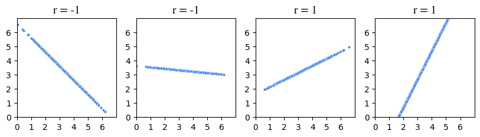
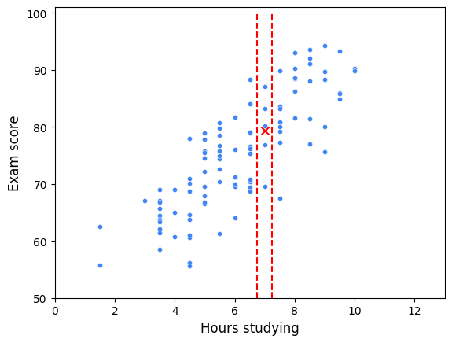
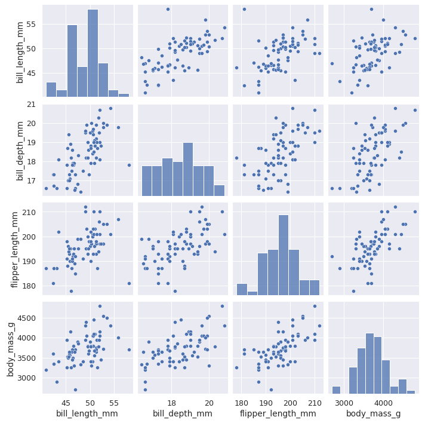
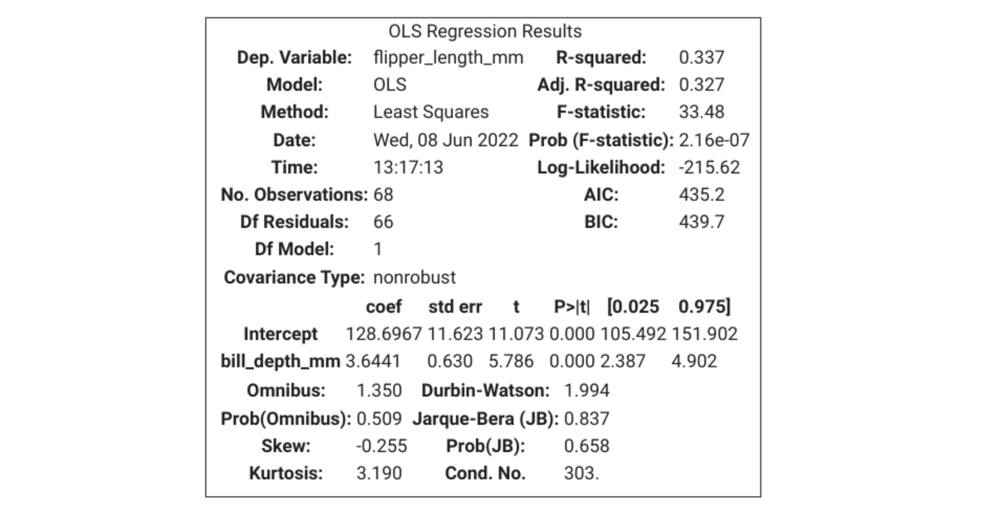
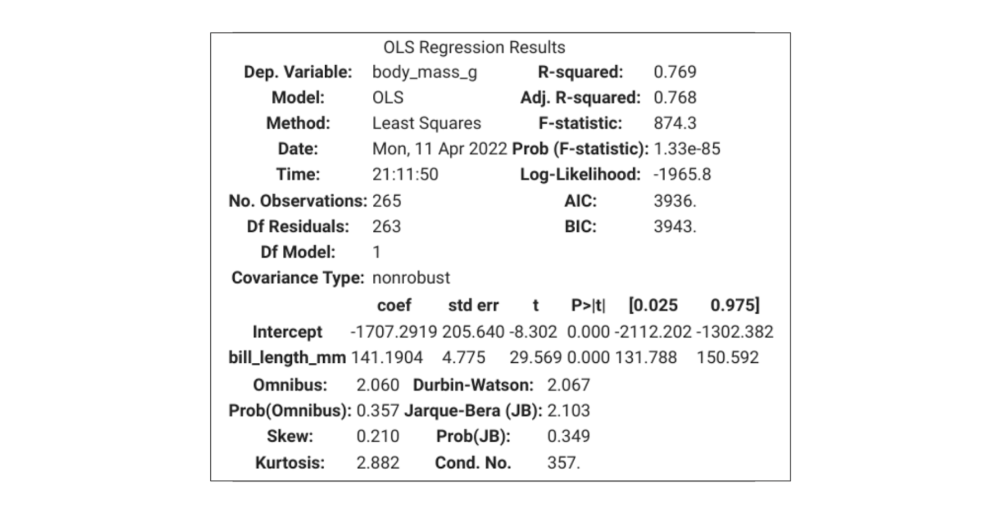
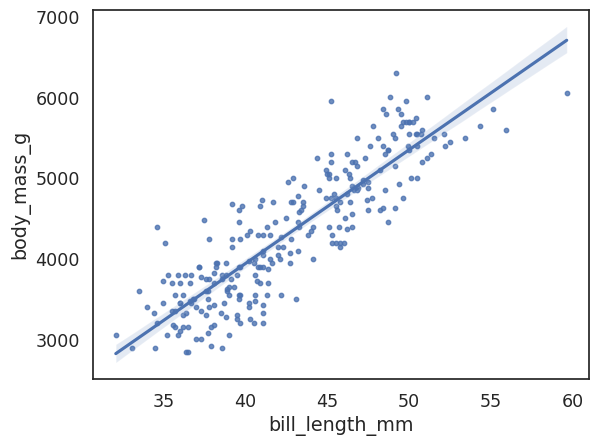
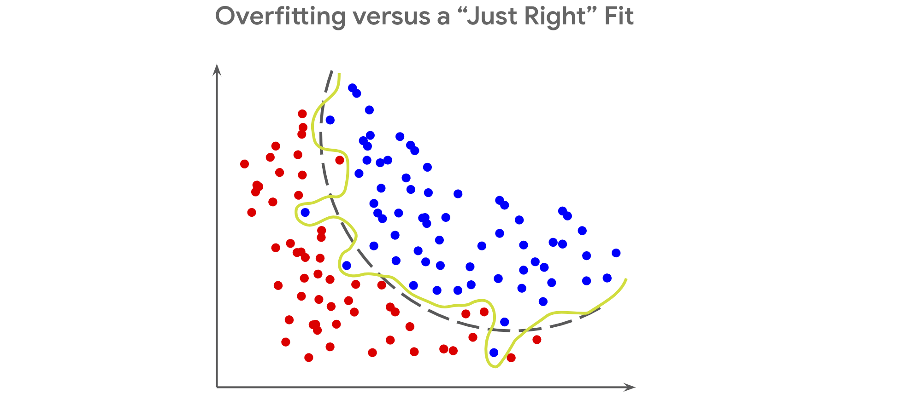

# Kurs 5: Regresyon Analizi

## Sıradan en küçük kareleri keşfedin

Daha önce de belirtildiği gibi, regresyon modellemesinde en uygun çizgiyi bulmanın bir yolu, en iyisini bulana kadar farklı modelleri denemektir. Ancak basit doğrusal regresyon için, en iyi beta katsayılarının formülleri türetilmiştir. Bu okumada, kareli artıkların toplamının nasıl değişebileceğini ve değişebileceğini daha iyi anlamak için bir örnekten geçeceksiniz. Sıradan en küçük kareler kullanarak β^0 ve β^​1​ katsayıları tahmin etmek için formülleri türetmekle ilgileniyorsanız, daha fazla araştırma için kaynaklar olacaktır. Bu okumada şunları ele alacağız:

- Formül ve notasyon incelemesi
    
- Kare artıkların toplamını en aza indirmek (SSR)
    
- Beta katsayılarının tahmin edilmesi
    

### Formül ve notasyon incelemesi

Daha önce, sürekli bir bağımlı değişken ile bir bağımsız değişken arasındaki doğrusal ilişkiyi tahmin etmek için bir yöntem olarak basit doğrusal regresyonu öğrendiniz. Basit doğrusal regresyona dayalı bir tahmin matematiksel olarak şu şekilde temsil edilebilir:

$\hat{y} = \hat{\beta}_0 + \hat{\beta}_1 \cdot X$

Şapka sembolünün beta katsayılarının sadece tahmin olduğunu gösterdiğini unutmayın. Sonuç olarak, regresyon modelinden türetilen y değerleri de sadece tahminlerdir.

Doğrusal regresyon modelinin katsayılarını hesaplamak için yaygın bir teknik, sıradan en küçük kareler veya OLS olarak adlandırılır. Sıradan en küçük kareler, artıkların karesi toplamı adı verilen bir hata ölçüsünü en aza indirerek doğrusal bir regresyon modelinde beta katsayılarını tahmin eder.

Bu formülle kareli artıkların toplamını hesaplayabilirsiniz:

$\sum_{i=1}^{N} (Observed - Predicted)^2$

matematiksel gösterim kullanılarak yeniden yazılabilir:

$\sum_{i=1}^{N} (y_i - \hat{y}_i)^2$

Büyük E şeklindeki sembol, büyük Yunan harfi olan sigma'dır ve bir toplamı ifade eder. Dolayısıyla, kareli artıkların toplamı, gözlemlenen değerler ile regresyon modeli tarafından tahmin edilen değerler arasındaki kare farkların toplamıdır.

### Kare artıkların toplamını en aza indirmek (SSR)

Bu okumanın amaçları doğrultusunda, 6 gözlemden oluşan bir veri kümesine sahip olduğunuzu varsayın: (0, -1), (1, 2), (2, 4), (3, 8), (4, 11) ve (5, 12). Bunlar 2 boyutlu X-Y koordinat düzleminde çizilebilir.

|**X (gözlemlendi)**|**Y (gözlemlendi)**|
|---|---|
|0|-1|
|1|2|
|2|4|
|3|8|
|4|11|
|5|12|


Satır 1: $\hat{y} =−0.5+3x$

Ardından, bazı değerleri varsayalım $β_0​$, $β_1$ ve kareli artıkların toplamını hesaplayalım. İlk deneme için, varsayalım $β_0​$=−0.5 ve $β_1$=3. O zaman doğrusal denklem olacaktır  $\hat{y} =−0.5+3x$. Artık denklemin olduğu için y, her bir değeri koyarak tahmin edilen değerleri hesaplayabilirsiniz.

Örneğin, eğer $x=0$, o zaman $\hat{y} =−0.5+3x=−0.5$. Eğer x=1, o zaman $\hat{y} =−0.5+3 \cdot 1 =2.5$. Böylece, tahmin edilen tüm değerleri hesapladıktan sonra, her veri noktası için kalıntıyı hesaplayabilirsiniz.

|X (gözlemlendi)|Y (güncel)|Y (tahmin edilen) = -0.5 + 3x|Kalıntı|
|---|---|---|---|
|0|-1|-0.5|-1 - (-0,5) = -1+0,5 = -0,5|
|1|2|2.5|2 - 2,5 = -0,5|
|2|4|5.5|4 - 5.5 = -1.5|
|3|8|8.5|8 - 8.5 = -0.5|
|4|11|11.5|11 - 11.5 = -0.5|
|5|12|14.5|12 - 14.5 = -2.5|

Ardından, artıkların her birini kendileriyle çarparak ve ardından artıkların karesinin toplamını hesaplamak için hepsini bir araya getirebilirsiniz.

|Kalıntı|Kare Kalıntı|
|---|---|
|-1 - (-0,5) = -1+0,5 = -0,5|0.5|
|2 - 2,5 = -0,5|0.5|
|4 - 5.5 = -1.5|2.25|
|8 - 8.5 = -0.5|0.5|
|11 - 11.5 = -0.5|0.5|
|12 - 14.5 = -2.5|6.25|

Kalıntıların karesi toplamı = 0.25+0.25+2.25+0.25+0.25+6.25=9.5

Satır 2: $\hat{y} =−0.5 + 2.5 \cdot x$

Ardından, önceki örnekteki eğimi ayarlayalım. Yani $β_0​$=−0.5 ama $β_1​$=2.5. O zaman doğrusal denklem $\hat{y} = −0.5 + 2.5 \cdot x$ olacaktır. Tahmin edilen değerleri hesaplamak x ve artıkları karesini almak için son seferki gibi değerleri ekleyebilirsiniz.

|X (gözlemlendi)|Y (güncel)|Y (tahmin edilen) = -0.5 + 2.5x|Kalıntı|Kare Kalıntılar|
|---|---|---|---|---|
|0|-1|-0.5|-0.5|0.25|
|1|2|2|0|0|
|2|4|4.5|-0.5|0.25|
|3|8|7|1|1|
|4|11|9.5|1.5|2.25|
|5|12|12|0|0|

Kalıntıların karesi toplamı=0.25+0+0.25+1+2.25+0=3.75=0.25+0+0.25+1+2.25+0=3.75.

Harika! Bu tahmin çok daha iyi!

### Beta katsayılarının tahmin edilmesi

Eğimi ve kesişmeyi ayarlamaya devam edebilir ve ardından tahmin edilen değerleri, artıkları ve kareli artıkları hesaplamaya devam edebilirsiniz. Ancak en uygun çizgiyi bulduğunuzdan emin olmanın hiçbir yolu yok. Gelişmiş matematik yoluyla, hatayı en aza indiren beta katsayılarını bulmak için bazı formüller türetilmiştir.

Beta katsayılarını bulmak için formülleri yazmanın birden fazla yolu vardır. Basit doğrusal regresyon için, formülleri yazmanın bir yolu aşağıdaki gibidir:


Bir bilgisayardan yardım almadan beta katsayılarını hesaplamanız istenmeyecek, ancak isterseniz keşfetmek ilginç olabilir. İlgilenmeniz durumunda ek kaynaklar sağladık.

### Önemli çıkarımlar

Bir veri örneği verildiğinde, verilerinize uyabilecek farklı satırları deneyebilirsiniz. Hangisinin verilerinize en uygun olduğunu belirlemek için her satır için kareli artıkların toplamını hesaplayabilirsiniz. Bir veri uzmanı olarak, kareli artıkların toplamının neyi temsil ettiğini ve bunu kendi başınıza nasıl hesaplayacağınızı anlamak önemlidir. Neyse ki, artıkların karesini hesaplayabilen ve bizim için OLS gerçekleştirebilen bilgisayarlarımız ve programlama dillerimiz var. İsterseniz OLS ve SSR'nin arkasındaki daha derin matematiği kendi başınıza keşfedebilirsiniz!

### Kaynaklar

- [Parametre Tahmini - Sıradan En Küçük Kareler Yön](https://www.geo.fu-berlin.de/en/v/soga-py/Basics-of-statistics/Linear-Regression/Simple-Linear-Regression/Parameter-Estimation/index.html) [_temi:_ _Rudolph, A., Krois, J., Hartmann, K. (2023): Python (SOGA-py) kullanarak İstatistik ve Coğrafi Veri Analiz_ _i._](https://www.geo.fu-berlin.de/soga-py) _Yer Bilimleri Bölümü, Freie Universitaet Berlin_.

## Korelasyon ve basit doğrusal regresyonun arkasındaki sezgi

Şimdiye kadar basit doğrusal regresyonun bir bağımsız değişken olan X ile bir sürekli bağımlı değişken Y arasındaki doğrusal ilişkiyi tahmin eden bir teknik olduğunu öğrendiniz, ayrıca regresyon çizgisinin katsayılarını, veriler aracılığıyla “en iyi uyum” çizgisini belirlemenin yaygın bir yolu olan sıradan en küçük kareler tahminini (OLS) öğrendiniz. Bu okumada, korelasyonun anlamını keşfedeceksiniz; _r_ veya “korelasyon katsayısı” hakkında bilgi edineceksiniz; ve regresyon denkleminin nasıl belirleneceğini keşfedeceksiniz. Bu bilgi, değişkenler arasındaki ilişkileri ve dolayısıyla doğrusal regresyonun nasıl çalıştığını daha iyi anlamanıza yardımcı olacaktır.

### **Korelasyon**

Korelasyon, iki değişkenin birlikte hareket etme şeklinin bir ölçümüdür. Değişkenler arasında güçlü bir korelasyon varsa, birini bilmek diğerini tahmin etmek için çok yardımcı olacaktır. Bununla birlikte, iki değişken arasında zayıf bir korelasyon varsa, birinin değerini bilmek size diğerinin değeri hakkında fazla bir şey söylemeyecektir. Doğrusal regresyon bağlamında korelasyon _doğrusal korelasyonu_ ifade eder: bir değişken değiştikçe, diğeri de sabit bir oranda değişir.

İstatistik kursunda, sürekli bir değişkenin bazı temel sayılar kullanılarak özetlenebileceğini öğrendiniz. Bu özet istatistiklerden ikisi şunlardır:

- **Ortalama:** Merkezi eğilimin bir ölçümü (ortalama, medyan veya mod)
    
- **Standart sapma:** Yayılma ölçümü
    

İki değişken birlikte özetlendiğinde, _**r**_ adı verilen başka bir ilgili istatistik vardır, **Pearson korelasyon katsayısı** (adını geliştirmeye yardımcı olan kişinin adını alır) veya basitçe doğrusal **korelasyon katsayısı**. Korelasyon katsayısı, iki değişken arasındaki doğrusal ilişkinin gücünü ölçer. Her zaman [-1, 1] aralığına düşer. _R_ negatif olduğunda, değişkenler arasında negatif bir korelasyon vardır: biri arttıkça diğeri azalır. _R_ pozitif olduğunda, değişkenler arasında pozitif bir korelasyon vardır: biri arttıkça diğeri de artar. _r_ = 0 olduğunda, değişkenler arasında _doğrusal_ bir korelasyon yoktur. Bir değişkenin bir diğeri tarafından kesin olarak belirlenebileceği durumlar olduğuna dikkat edin - y=x 2 veya y=sin (x) gibi - ancak X ve Y arasındaki _doğrusal korelasyonun değerinin, ilişkileri doğrusal_ olmadığı için yine de düşük veya sıfır olacaktır.

Aşağıdaki şekil, her değişkenin aynı ortalama ve standart sapmaya sahip olduğu ve yalnızca korelasyon katsayısının değiştiği iki değişkenli (bi = “iki”, değişken = “değişkenler”) verilerinin dağılım grafiklerini göstermektedir.



-1 veya 1 r'ye ne kadar yakınsa, _verilerin_ o kadar doğrusal göründüğüne dikkat edin. _R_ tam olarak 1 veya tam olarak -1 olduğunda, değişkenler mükemmel bir şekilde ilişkilidir ve grafikleri bir çizgidir. _R_ sıfır olduğunda, değişkenler arasında bir korelasyon yoktur ve bu örnekte veriler şekilsiz bir nokta bulutu olarak görünür.

Bununla birlikte, _r_ size yalnızca değişkenler arasındaki doğrusal korelasyonun gücünü söyler; işareti dışında değişkenler arasındaki ilişkinin eğiminin büyüklüğü hakkında size hiçbir şey söylemez. Örneğin, _r_ = 1 olan değişkenler, X'i bir artırmanın Y'nin 10, 100, 0.1 veya başka bir şey artmasına neden olup olmayacağını söylemez. Sadece artacağından emin olabileceğinizi _söyler_. Bu gerçek, çizgilerin eğimlerinin hepsi farklı olsa da, r'nin yalnızca -1 veya _1_ olduğu aşağıdaki şekilde gösterilmektedir. Çizgi tamamen yatay veya tamamen dikey ise, _r_ tanımsızdır. (Nedenini merak ediyorsanız, aşağıdaki denkleme bakın. Paydadaki terimlerden biri sıfıra eşit olur, bu da paydanın tamamını sıfıra eşit yapar ve bu da tanımlanmamış bir çözümle sonuçlanır.)


#### _r_ hesapla

_r_ için formül şudur:

$$
r = \frac{\text{covariance}(X, Y)}{(SD_X)(SD_Y)}
$$

$$
\text{covariance}_{\text{popülasyon}}(X, Y) = \frac{1}{n} \sum_{i=1}^{n} (x_i - \bar{x})(y_i - \bar{y}) \\

\text{covariance}_{\text{örneklem}}(X, Y) = \frac{1}{n - 1} \sum_{i=1}^{n} (x_i - \bar{x})(y_i - \bar{y})
$$


**Not:** Burada verilen _r_ ve kovaryans formülleri, tüm popülasyonlar için kullanılanları temsil eder. Örnekler için, kovaryans formülünün paydası _n -_ 1'dir ve benzer şekilde, _r_ formülündeki standart sapmalar n yerine _n - 1_ kullanılarak hesaplanır.Basitlik için, bu okuma gösterimlerinde popülasyon formüllerini kullanacaktır_._

Bu hesaplama hakkında düşünmenin daha kolay bir yolu şudur: paylayıcı - kovaryans - X ve Y'nin kendi ortalamalarından ne ölçüde farklılık gösterdiğini temsil eder. Bu değer pozitif olduğunda, yüksek X değerlerinin yüksek Y değerleriyle ilişkili olma eğiliminde olduğunu ve pozitif bir korelasyon olduğunu gösterir. Tersine, değer negatifse, yüksek X değerlerinin düşük Y değerleri ile ilişkili olma eğiliminde olduğunu ve bunun tersi de olumsuz bir korelasyon olduğunu gösterir.

Payda - standart sapmaların çarpımı - payı birimlerini standartlaştırır. Bireysel değişkenlerin doğal değişkenliğini ayarlar. Bu, r _'yi_ birimsiz bir istatistik yapar. Boyut içermeyen saf bir sayıdır.

_R_ 'yi hesaplamanın eşdeğer bir yolu, her değişkendeki her veri noktasını standart birimlere dönüştürmektir (ortalamayı çıkarın, standart sapmaya bölün), ardından ürünlerin ortalamasını almaktır.

İşte bir örnek. Beş öğrencinin bir sınava girdiğini ve kaç saat ders çalıştıklarını ve notlarını kaydettiğinizi varsayalım. Aşağıdaki tablo _r hesaplamasını ortaya koymaktadır._

|**Çalışma saatleri (X)**|**Sınav notu (Y)**|**Standart birimlerde X**|**Standart birimlerde Y**|**Standart birimlerin ürünü**|
|---|---|---|---|---|
|2|75|-1.5|-0.5|0.75|
|4|65|-0.5|-1.5|0.75|
|5|80|0|0|0|
|6|95|0.5|1.5|0.75|
|8|85|1.5|0.5|0.75|
|**ortalama X = 5**<br><br>**SD X = 2**|**ortalama Y = 80**<br><br>**SD Y = 10**|||**ürünlerin ortalaması (r) = 0.6**|

Korelasyon katsayısı 0.6'dır. İşte bu verilerin bir grafiği:


Nokta bulutunun yukarı doğru eğimli olduğuna dikkat edin. Bu, r'nin poziti _f_ olmasına karşılık gelir. Korelasyon katsayısı, her değişkenin ortalamasından sapmasının çarpımını kullandığı için bir ilişki göstergesi olarak çalışır. Ürün pozitif olduğunda, hem X _hem_ de Y değerlerinin ilgili ortalamalarının altında (negatif standart birimler) veya ilgili ortalamalarının (pozitif standart birimler) üzerinde olduğu anlamına gelir. Birlikte farklılık gösterirler. Bununla birlikte, bu ürün negatif olduğunda, değerlerden birinin ortalamasının üzerinde, diğerinin altında olduğu anlamına gelir. Kendi araçlarına göre zıt yönlerde farklılık gösterirler.

Aşağıdaki şekil bu fikri göstermektedir. Şekil çeyreklere ayrılmıştır. Dikey çizgi ortalama X değerini ve yatay çizgi ortalama Y değerini temsil eder. Her nokta, standartlaştırılmış puanlarının çarpımı ile etiketlenir (yukarıdaki tabloya bakın). Bu puanların ortalaması r _'dir_. _R_ pozitif olduğunda, daha fazla puan pozitif kadranlarda olma eğiliminde olacaktır ve bunun tersi de geçerlidir.




### **Regresyon**

Başka herhangi bir bilginin yokluğunda, rastgele seçilen bir öğrencinin sınav puanını tahmin etmeniz gerekiyorsa, hatanızı en aza indirmenin en iyi yolu tüm öğrencilerin puanlarının ortalamasını tahmin etmektir. Peki ya o öğrencinin kaç saat çalıştığını da bilseydiniz? Şimdi, en iyi tahmininiz, yalnızca bu kadar saatler boyunca okuyan öğrencilerin ortalama puanı olabilir.

İşte çalışma süreleri en yakın yarım saate yuvarlatılmış 100 öğrenciden oluşan bir örnek. Diyelim ki size bir öğrencinin yedi saat çalıştığı söylendi. Sınav puanlarını tahmin etmek için, hatayı en aza indirmenin bir yolu, yalnızca yedi saat boyunca okuyan öğrencilerin ortalamasını tahmin etmektir.


Bu dağılım grafiğinde, yedi saat boyunca çalışan tüm öğrenciler iki dikey çizgi arasına düşer. Ortalama sınav puanları bir X ile temsil edilir. Doğrusal regresyon bu kavramı genişletir. Bir regresyon çizgisi, doğrusal bir modelin varsayımları ve sınırlamaları göz önüne alındığında, X'in her değeri için tahmini ortalama Y değerini temsil eder. Başka bir deyişle, X ve Y arasındaki ilişki tamamen doğrusal değilse veya Y'yi etkileyen modele dahil edilmeyen başka faktörler varsa, her X için gerçek ortalama Y değerleri tam olarak regresyon çizgisinde olmayabilir. Regresyon çizgisi, bir bütün olarak verilere en uygun düz çizgi ilişkisini bulmak için bu etkileri dengelemeye çalışır. X göz önüne alındığında, Y'nin merkezi eğiliminin bir tahminidir.

#### Regresyon denklemi

Artık r'yi bildiğinize _ve_ regresyon kavramını daha iyi anladığınıza göre, veriler arasında en uygun çizgiyi bulmak için her şeyi bir araya getirmeye hazırsınız. Bu çizginin formülü regresyon denklemi olarak bilinir. Bu adımın iki anahtarı vardır.

Birincisi:

- _X'in ortalama değeri ve Y'nin ortalama değeri (yani nokta (__x__,)) her zaman regresyon çizgisine düşecektir._
    

İkincisi, r'nin ne anlama gel _diğini_ anlamaktır:

- X'deki bir standart sapmanın her artışı için, Y'de ortalama olarak X üzerinde beklenen bir _r_ standart sapması artışı vardır.
    

Aşağıdaki şekil, bu kavramların regresyon çizgisini belirlemek için nasıl birlikte çalıştığını göstermektedir.


Başka bir deyişle, regresyon çizgisinin eğimi:

$$
m=r(SDy) / 1(S⁣Dx)
$$

_Bu, bir satırın formülünde m'dir:_ _y_ _=_ _mx_ _+_ _b__._ Bu nedenle _b ile temsil edilen kesiş_ me noktası: _b_ = _y_ - _mx_. _Noktanın (__x__,) her zaman regresyon çizgisinde olduğunu bildiğiniz için, kesişmeyi hesaplamak için bu noktadan_ _x_ _ve_ _y_ _değerlerini ekleyebilirsiniz._ İşte beş öğrencinin orijinal örneğini kullanan bir örnek.

||**Çalışma saatleri (X)**|**Sınav notu (Y)**|
|---|---|---|
|**anlamına gelir:**|5|80|
|**SD:**|2|10|
|**r:**|**0.6**||

Adımlara ayrılmış:

1. Eğimi hesaplayın: m=r(S ⁣D y)S ⁣D x=0.6(10)2=3.m=SD xr(SD y)​=20.6(10)​=3.
    
2. _Kesişmeyi hesaplayın:_ _y_ _=_ _mx_ _+_ _b: 80 = 3 (5) + b →_ _b_ _=_ _65 denklemine_ _x__, ve_ _m_ _değiştirin._
    
3. Regresyon denklemini elde etmek için genelleme _yapın: y_ = 3 _x_ + 65.
    

İşte verilerin üzerine bindirilmiş regresyon çizgisi:


Buna “Y'nin X üzerindeki gerilemesi” denir. İşte 100 öğrencinin tamamı için regresyon çizgisi:



### **Önemli Çıkarımlar**

Doğrusal regresyon, veri profesyonellerinin verileri analiz etmek için kullandıkları en önemli araçlardan biridir. Basit doğrusal regresyonun temel yapı taşlarını anlamak, daha karmaşık regresyon analizi yöntemleri hakkında bilgi edinmeye devam ederken size yardımcı olacaktır. İşte akılda tutulması gereken bazı önemli noktalar:

- Korelasyon, iki değişkenin birlikte hareket etme şeklinin bir ölçümüdür.
    
- _r (diğer adıyla Pear_ son korelasyon katsayısı, diğer adıyla korelasyon katsayısı), iki değişken arasındaki doğrusal ilişkinin gücünü ölçer.
    
    - Her zaman [-1, 1] aralığına düşer.
        
    - Ortalarından birlikte farklılık gösterme eğiliminde olan değişkenler pozitif olarak ilişkilidir. Tersine, ilgili araçlarına zıt şekillerde değişme eğiliminde olan değişkenler negatif ilişkilidir.
        
- Regresyon çizgisi, her _x değeri için ortalama y değerini tahmin_ eder. X verildiğinde _y_ tahmin edilirken hatayı en aza indirir.
    
- Regresyon çizgisinin eğimir(S ⁣D y)S ⁣D xSD xr(SD y)​.
    
- Nokta (_x,_) _her_ zaman regresyon çizgisindedir.

## Basit doğrusal regresyonun dört ana varsayımı

Bu okumada, basit doğrusal regresyonun dört ana varsayımını, varsayımların karşılanıp karşılanmadığını nasıl kontrol edeceğinizi ve bir varsayım karşılanmazsa ne yapacağınızı gözden geçireceksiniz. Grafikleri çoğaltmak ve varsayımları kendi başınıza keşfetmek için ek kaynakları kullanabilirsiniz. Bu okumada tanımlanmamış herhangi bir terim varsa, her modülün sonunda kurs boyunca bulunan terimler sözlüğüne bakın. Bu okuma şunları kapsayacaktır:

- Basit doğrusal regresyon varsayımları
    
- Varsayımların geçerliliği nasıl kontrol edilir
    
- Bir varsayım ihlal edilirse ne yapmalı
    

### Basit doğrusal regresyon varsayımları

Özetlemek gerekirse, basit doğrusal regresyonun dört varsayımı vardır:

1. **Doğrusallık:** Her öngörücü değişken (Xi), sonuç değişkeni (Y) ile doğrusal olarak ilişkilidir.
    
2. **Normallik:** Hatalar normal olarak dağıtılır. *****
    
3. **Bağımsız Gözlemler:** Veri kümesindeki her gözlem bağımsızdır.
    
4. **Homoscedastisite: Hataların** varyansı model boyunca sabit veya benzerdir. *****
    

#### *** Hatalar ve artıklar hakkında not***

Bu ders, regresyon ile bağlantılı olarak “hatalar” ve “artıklar” terimlerini birbirinin yerine kullanmıştır. Bunu, bir veri uzmanı olarak geçirdiğiniz süre boyunca diğer çevrimiçi kaynaklarda ve materyallerde görebilirsiniz.. Gerçekte, bir fark var:

- **Kalıntılar**, tahmin edilen ve gözlemlenen değerler arasındaki farktır. Bir regresyon modeli oluşturduktan sonra, tahmin edilen değerleri gözlemlenen değerlerden çıkararak kalıntıları hesaplayabilirsiniz.
    
- **Hatalar**, modelde olduğu varsayılan doğal gürültüdür.
    
- Kalıntılar, doğrusal regresyonun normallik ve homoskedastiklik varsayımlarını kontrol ederken hataları tahmin etmek için kullanılır.
    

### Varsayımların geçerliliği nasıl kontrol edilir

Daha önce gözden geçirildiği gibi, basit doğrusal regresyon varsayımlarının çoğu veri görselleştirmeleri yoluyla kontrol edilebilir. Bazı varsayımlar bir model oluşturulmadan önce kontrol edilebilir ve diğerleri yalnızca model oluşturulduktan ve tahmin edilen değerler hesaplandıktan sonra kontrol edilebilir.

#### **Doğrusallık**

Bağımsız ve bağımlı değişkenler arasında doğrusal bir ilişki olup olmadığını değerlendirmek için, veri kümesinin bir dağılım grafiğini oluşturmak en kolay yoldur. Bağımsız değişken x ekseninde ve bağımlı değişken y ekseninde olacaktır. Verileri okumak ve bir dağılım grafiği oluşturmak için kullanabileceğiniz bir dizi farklı Python işlevi vardır. Veri görselleştirmeleri için kullanılan bazı paketler arasında Matplotlib, seaborn ve Plotly bulunur. Doğrusallık varsayımının test edilmesi, model oluşturulmadan önce yapılmalıdır.

```python
# Create pairwise scatterplots of Chinstrap penguins data
sns.pairplot(chinstrap_penguins)
```


#### **Normallik**

Normallik varsayımı, art **ıklarla tahmin edilebilen hatalara veya verilerde gözlemlenen değerler ile regresyon modeli tarafından tahmin edilen değerler arasındaki farka odak** lanır. Bu nedenle normallik varsayımı ancak bir model oluşturulduktan ve tahmin edilen değerler hesaplandıktan **sonra** doğrulanabilir. Model oluşturulduktan sonra, artıkların normal dağıldığını kontrol etmek için bir QQ grafiği oluşturabilir veya artıkların bir histogramını oluşturabilirsiniz. Varsayımın karşılanıp karşılanmadığı bir düzeyde yorumlamaya bağlıdır.

##### **Kuantil-kuantil grafik**

Ku **antil-kuantil grafiği (****Q-Q grafiği**), iki olasılık dağılımını kuantillerini birbirine karşı çizerek karşılaştırmak için kullanılan grafik bir araçtır. Veri uzmanları genellikle bir dağılımın normalliğini ölçmek için Q-Q grafiklerini histogramlara tercih eder, çünkü bir grafiğin düz bir çizgiye yapışıp yapışmadığını ayırt etmek, bir histogramın normal bir eğriyi ne kadar yakından takip ettiğini belirlemekten daha kolaydır. Bir modelin artıklarının normalliğini değerlendirirken Q-Q grafiklerinin nasıl çalıştığı aşağıda açıklanmıştır:

1. **Kalıntıları sıralayın**. _N artıklarınızı en küç_ ükten en büyüğe doğru sıralayın. Her biri için, verilerin yüzde kaçının bu sıralamaya veya altına düştüğünü hesaplayın. Bunlar veriler _inizin n_ miktarıdır.
    
2. **Normal dağılımla karşılaştırın.** Standart bir normal dağılımı _n_ +1 eşit alana bölün (yani, _n kez dilim_ leyin). Kalıntılar normal olarak dağılmışsa, her bir kalıntının kuantili (yani, verilerin yüzde kaçı her sıralı kalıntının altına düşer), standart normal dağılımdaki _n_ kesimin her birinin karşılık gelen z puanları ile yakından hizalanacaktır (bunlar normal bir z-puan tablosunda veya daha yaygın olarak istatistiksel yazılım kullanılarak bulunabilir).
    
3. **Bir arsa inşa et.** Bir Q-Q grafiği, x ekseni boyunca standart bir normal dağılımın bilinen kuantil değerlerine ve y ekseninde sıra sıralı kalıntı değerlerine sahiptir. Kalıntılar normal olarak dağılmışsa, artıkların kuantil değerleri standartlaştırılmış normal dağılımınkilere karşılık gelecektir ve her ikisi de doğrusal olarak artacaktır. Kalıntılarınızı ilk önce standartlaştırırsanız (ortalamayı çıkarıp standart sapmaya bölerek z puanlarına dönüştürün), iki eksen aynı ölçeklerde olacaktır ve artıklar gerçekten normal dağılmışsa, çizgi 45° açıda olacaktır. Bununla birlikte, artıkları standartlaştırmak, bir Q-Q grafiğinin bir gerekliliği değildir. Her iki durumda da, ortaya çıkan grafik doğrusal değilse, artıklar normal olarak dağıtılmaz.

Aşağıdaki şekilde, ilk Q-Q grafiği, normal bir dağılımdan alınan verileri göstermektedir. Standart bir normal dağılımın miktarlarına karşı çizildiğinde bir çizgi oluşturur. İkinci çizim, üstel bir dağılımdan alınan verileri gösterir. Üçüncü çizim, tek tip bir dağılımdan alınan verileri kullanır. İkinci ve üçüncü çizimlerin bir çizgiye nasıl uymadığına dikkat edin.


##### **Q-Q grafiği nasıl kodlanır**

Neyse ki, daha önce belirtilen adımları manuel olarak gerçekleştirmeniz gerekmez. Bunu halletmek için bilgisayar kütüphaneleri var. Bir Q-Q grafiği oluşturmanın bir yolu, statmodels kütüphanesini kullanmaktır. İçe aktarırsanızstatsmodels.api, [qqplot ()](https://www.statsmodels.org/stable/generated/statsmodels.graphics.gofplots.qqplot.html) işlevini doğrudan kullanabilirsiniz. Aşağıdaki örnek, bir statsmodels ols model nesnesindeki artıkları kullanır. Model, penguenlerin palet uzunluğunu gaga derinliklerine göre geri çeker (X üzerinde Y).

```python
import statsmodels.api as sm

import matplotlib.pyplot as plt

residuals = model.resid

fig = sm.qqplot(residuals, line = 's')

plt.show()
```


Ve işte aynı verilerin bir histogramı:

```python
fig = sns.histplot(residuals)

fig.set_xlabel("Residual Value")

fig.set_title("Histogram of Residuals")

plt.show()
```


#### **Bağımsız Gözlemler**

Gözlemlerin bağımsız olup olmadığı, verilerinizi anlamanıza bağlıdır. Gibi sorular sormak:

- Veriler nasıl toplandı?
    
- Her veri noktası neyi temsil eder?
    
- Veri toplama sürecine bağlı olarak, bir veri noktasının değerinin başka bir veri noktasının değerini etkilemesi muhtemel midir?
    

Sizin fark etmediğiniz şeyleri fark edebilecek başkalarından içgörü almayı içeren bu soruların nesnel bir incelemesi, bağımsız gözlem varsayımının ihlal edilip edilmediğini belirlemenize yardımcı olabilir. Bu da eldeki veri kümesiyle çalışırken sonraki adımlarınızı belirlemenizi sağlayacaktır.

#### **Homoscedastisite**

Normallik varsayımı gibi, homoskedastiklik varsayımı bir modelin artıklarıyla ilgilidir, bu nedenle ancak bir regresyon modeli oluşturulduktan sonra değerlendirilebilir. Takılan değerlerin (yani modelin öngörülen Y değerleri) artıklara karşı bir dağılım grafiği, homoskedastiklik varsayımının ihlal edilip edilmediğini belirlemeye yardımcı olabilir.

```python
import matplotlib.pyplot as plt

fig = sns.scatterplot(fitted_values, residuals)

fig.axhline(0)

fig.set_xlabel("Fitted Values")

fig.set_ylabel("Residuals")

plt.show()
```


### Bir varsayım ihlal edilirse ne yapmalı

Artık dört varsayımı ve ihlallerini nasıl test edeceğinizi incelediğinize göre, bir varsayım ihlal edildiğinde atabileceğiniz bazı yaygın sonraki adımları tartışmanın zamanı geldi. Verileri dönüştürürseniz, bunun sonuçları yorumlama şeklinizi değiştirebileceğini unutmayın. Ek olarak, bu potansiyel çözümler verileriniz için işe yaramazsa, farklı bir model denemeyi düşünmelisiniz.

Şimdilik, başlamanız için birkaç temel yaklaşıma odaklanın!

#### **Doğrusallık**

- Logaritmayı almak gibi değişkenlerden birini veya her ikisini de dönüştürün.
    
    - Örneğin, eğitim yılları ile gelir arasındaki ilişkiyi ölçüyorsanız, gelir değişkeninin logaritmasını alabilir ve bunun doğrusal ilişkiye yardımcı olup olmadığını kontrol edebilirsiniz.
        

#### **Normallik**

- Değişkenlerden birini veya her ikisini de dönüştürün. En yaygın olarak, bu sonuç değişkeninin logaritmasını almayı içerir.
    
    - Sonuç değişkeni gelir gibi doğru çarpık olduğunda, artıkların normalliği etkilenebilir. Dolayısıyla, sonuç değişkeninin logaritmasını almak bazen bu varsayıma yardımcı olabilir.
        
    - Bir değişkeni dönüştürürseniz, modeli yeniden yapılandırmanız ve ardından emin olmak için normallik varsayımını yeniden kontrol etmeniz gerekir. Varsayım hala yerine getirilmezse, sorunu gidermeye devam etmeniz gerekir.
        


#### **Bağımsız gözlemler**

- Mevcut verilerin sadece bir alt kümesini alın.
    
    - Örneğin, bir anket yürütüyorsanız ve aynı hanedeki kişilerden yanıt alıyorsanız, yanıtları ilişkili olabilir. Her hanede sadece bir kişinin verilerini saklayarak bunu düzeltebilirsiniz.
        
    - Başka bir örnek, belirli bir süre boyunca veri toplamanızdır. Diyelim ki bisiklet kiralamayla ilgili verileri araştırıyorsunuz. Verilerinizi her 15 dakikada bir toplarsanız, sabah 8:00'de kiralanan bisiklet sayısı sabah 8:15 'de kiralanan bisiklet sayısıyla ilişkili olabilir. Ancak, veriler her 15 dakikada bir yerine 2 saatte bir alınırsa kiralanan bisiklet sayısı bağımsızdır.
        

#### **Homoscedastisite**

- Farklı bir sonuç değişkeni tanımlayın.
    
    - Bir şehrin nüfusunun bir şehirdeki restoran sayısıyla nasıl ilişkili olduğunu anlamakla ilgileniyorsanız, bazı şehirlerin diğerlerinden çok daha kalabalık olduğunu bilirsiniz. Daha sonra sonuç değişkenini nüfusun restoranlara oranı olarak yeniden tanımlayabilirsiniz.
        
- Y değişkenini dönüştürün.
    
    - Yukarıdaki varsayımlarda olduğu gibi, bazen logaritmayı almak veya Y değişkenini başka bir şekilde dönüştürmek, homoskedastiklik varsayımıyla tutarsızlıkları potansiyel olarak düzeltebilir.
        

### Önemli çıkarımlar

- Basit doğrusal regresyon için dört temel varsayım vardır: doğrusallık, normallik, bağımsız gözlemler ve homoskedastiklik.
    
- Her varsayımın geçerliliğini kontrol etmenin farklı yolları vardır. Bazı varsayımlar model oluşturulmadan önce kontrol edilebilirken, bazıları model oluşturulduktan sonra kontrol edilebilir.
    
- Model varsayımlarının ihlallerini düzeltebilecek verilerle çalışmanın yolları vardır.
    
- Değişkenlerin değiştirilmesi yorumlamayı değiştirecektir.
    
- Varsayımlar ihlal edilirse, veri dönüşümlerinden sonra bile, verileriniz için diğer modelleri göz önünde bulundurmalısınız.
    

### Daha fazla bilgi için kaynaklar

- [Denizdeki penguenler veri kümesini buradan indirin](https://raw.githubusercontent.com/mwaskom/seaborn-data/master/penguins.csv "Seaborn GitHub deposundan penguens veri kümesi")
    
- Penguenler veri kümesi hakkında daha fazla bilgi: [Palmer penguenlerine giriş](https://allisonhorst.github.io/palmerpenguins/articles/intro.html)
    
- Q-Q grafikleri hakkında daha fazla bilgi: [Normal Nicel-Kuantil Grafikler (jbstatistik'ten video)](https://www.youtube.com/watch?v=X9_ISJ0YpGw)

## Normal Dağılımın Doğrulanması


```python
import pandas as pd
import seaborn as sns

# Load dataset
penguins = sns.load_dataset ("penguins")

# Examine first 5 rows of dataset 
penguins.head()
```
| species | island    | bill_length_mm | bill_depth_mm | flipper_length_mm | body_mass_g | sex    |
|---------|-----------|----------------|----------------|--------------------|-------------|--------|
| Adelie  | Torgersen | 39.1           | 18.7           | 181.0              | 3750.0      | Male   |
| Adelie  | Torgersen | 39.5           | 17.4           | 186.0              | 3800.0      | Female |
| Adelie  | Torgersen | 40.3           | 18.0           | 195.0              | 3250.0      | Female |
| Adelie  | Torgersen | NaN            | NaN            | NaN                | NaN         | NaN    |
| Adelie  | Torgersen | 36.7           | 19.3           | 193.0              | 3450.0      | Female |


```python
#Keep Adelie and Gentoo penguins, drop NAS
penguins_sub = penguins[penguins["species"] != "Chinstrap"]
penguins_final = penguins_sub.dropna()
penguins_final.reset_index(inplace=True, drop=True)

sns.pairplot(penguins_final)

#Subset Data
ols_data = penguins_final[["bill_length_mm", "body_mass_g"]]
```



```python
# Write out formula
ols_formula = "body_mass_g ~ bill_length_mm"

# Import ols function 
from statsmodels.formula.api import ols

# Build OLS, fit model to data
OLS = ols(formula = ols_formula, data ols_data) 
model = OLS.fit()

model.summary()
```

|                   | coef      | std err | t       | P>\|t\| | [0.025]   | [0.975]   |
|-------------------|-----------|---------|---------|------|------------|-----------|
| Intercept         | -1707.2919| 205.640 | -8.302  | 0.000| -2112.202  | -1302.382 |
| bill_length_mm    | 141.1904  | 4.775   | 29.569  | 0.000| 131.788    | 150.592   |


$$
y = intercept + slope \cdot x
$$

$$
Body\ mass\ (g) = -1707.30 + 141.19 \cdot Bill\ length\ (mm)
$$

```python
# Subset X variable
x = ols_data["bill_length_mm"]

# Get predictions from model
fitted_values = model.predict(X)

# Calculate residuals
residuals = model.resid

sns.regplot(x = "bill_length_mm", y = "body_mass_g", data = ols_data)
```

(Doğrusal)



```python
import matplotlib.pyplot as plt
fig = sns.scatterplot(fitted_values, residuals)
fig.axhline(0)
fig.set_xlabel("Fitted Values") fig.set_ylabel("Residuals")
plt.show()
```
(Homojen Dağılım)


```python
fig = sns.histplot(residuals)
fig.set_xlabel ("Residual Value")
fig.set_title("Histogram of Residuals")
plt.show()
```
(çan şeklinde)



Bu üç adım aynı gerçekleşirse normal dağılım diyebiliriz. Ama doğrulamak için;

```python
import statsmodels.api as sm
fig = sm.qqplot(model.resid, line = 's')
plt.show()
```


## Kod işlevleri ve dokümantasyon