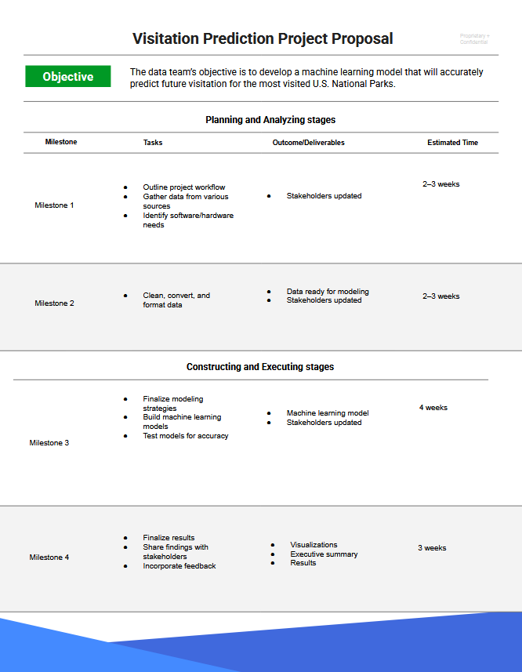
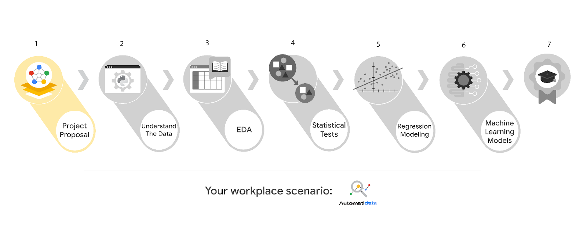
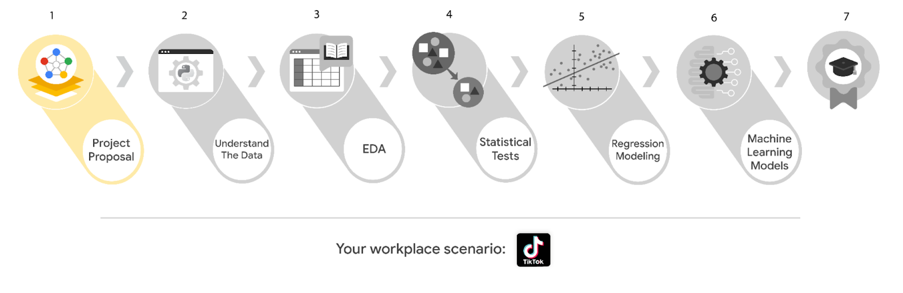
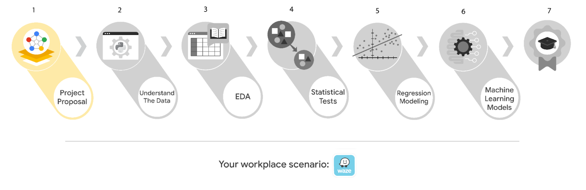
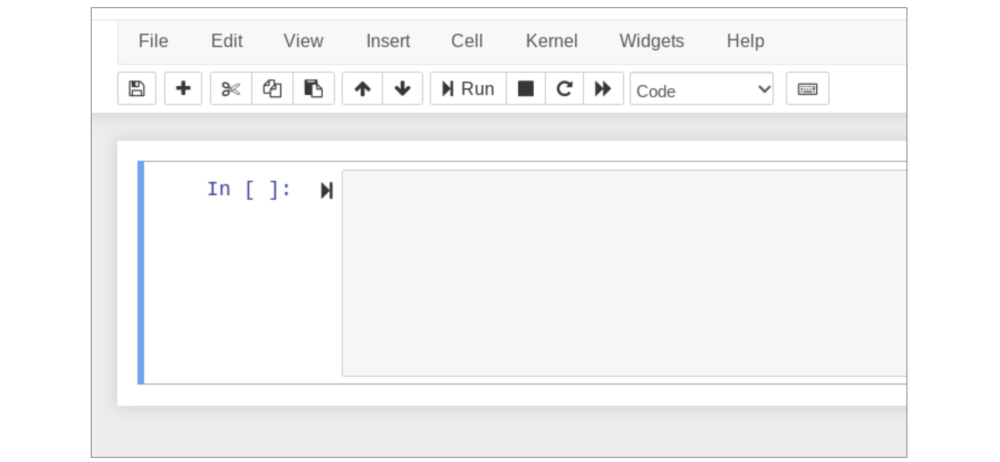
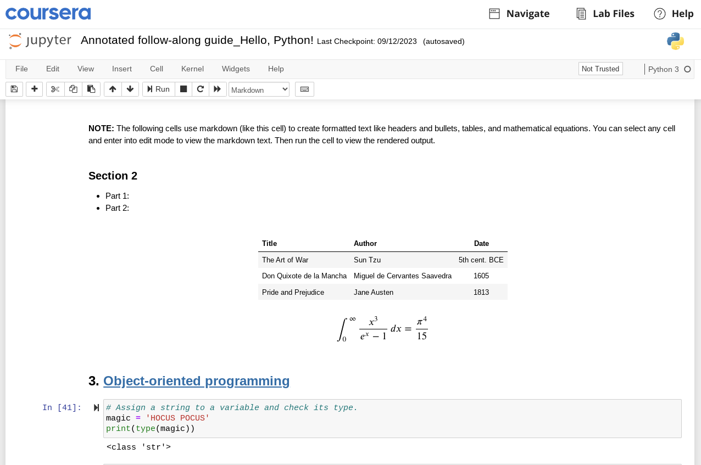
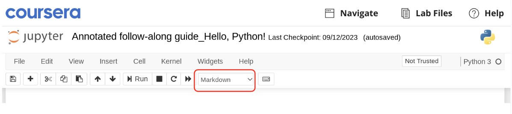

# 1. Veri Biliminin Temelleri

# PACE Aşamaları

Şimdiye kadar PACE çerçevesiyle tanıştınız ve veri analiz projeleri için nasıl net bir temel ve yapı sağladığını öğrendiniz. Ayrıca PACE’in bir kısaltma olduğunu, her harfin projede eyleme geçirilebilir bir aşamayı temsil ettiğini öğrendiniz: planla, analiz et, oluştur ve yürüt. Bu okumada, PACE iş akışı hakkında daha fazla bilgi edinecek ve sürecin her aşamasının veri analizini nasıl yönlendirebileceğini keşfedeceksiniz.

## Neden bir iş akışı yapısı kullanıyoruz?

Genel bir kural olarak, veri profesyonelleri veri projelerinin süresince onları yönlendirmesi için iş akışı yapılarına güvenirler. Büyük çaplı bir projede, belirli bir işlem sırasına ihtiyaç duyan birçok görev olabilir. Karmaşıklıkları tespit etmek ve birlikte çalışmanın tutarlı yollarını bulmak, projelerin daha verimli olmasını sağlar ve daha üretken iletişimi mümkün kılar. Bu tür potansiyel engelleri erken tespit etmek, projeyi olumsuz etkilemeden önce kaynakları planlamanıza ve hazırlamanıza yardımcı olur.

Bu programın oluşturulmasına katkıda bulunan veri profesyonellerinden oluşan ekibimiz, PACE’i esnek bir model olarak geliştirdi; tüm iş akışını kesintiye uğratmadan her aşamaya tekrar dönmeniz teşvik edilir. PACE sayesinde, hangi durumlarda dikkate alınması gereken eylem alanlarını ve bağlamları tanımlayacaksınız. Özetle, PACE profesyonellere veri projesinin her aşamasında çabalarını destekleyecek özelleştirilebilir bir yapı sunar.

## PACE modeline daha yakından bakış

PACE modelinin her aşamasına daha yakından bakalım.


### **Planla**

Bir projenin başında, başarının sağlam temellerini atmak önemlidir. Burada projenizin kapsamını belirlersiniz. Organizasyonun bilgi ihtiyaçlarını tanımlayarak başlarsınız. Planlama aşamasında projenin en geniş perspektifine sahip olursunuz. İlgili tüm faktörleri ve süreçleri değerlendirerek, tamamlanma yolunu haritalar ve bir eylem planı oluşturmak için yaratıcılığınızı kullanırsınız. Ayrıca, iş akışınızda yenilikçi bir yaklaşım gerektirebilecek görevleri de özellikle not edersiniz.

**Özet:** Planlama aşaması, projenin kapsamını kavradığınız ve projeyi tamamlamaya yönelik adımları geliştirdiğiniz aşamadır.

Planlama aşamasındaki bazı görev örnekleri:

-   İş verilerini araştırmak
    
-   Projenin kapsamını tanımlamak
    
-   Bir iş akışı geliştirmek
    
-   Proje ve/veya paydaş ihtiyaçlarını değerlendirmek
    

### **Analiz et**

Analiz aşamasında, verilerle ilk kez etkileşime girersiniz. Proje için gereken tüm verileri bu aşamada toplarsınız. Bazı veri setleri kurum içi birincil kaynaklardan gelebilir. Diğerleri kurum dışı ikincil kaynaklardan toplanabilir. Hatta hükümet ya da açık kaynak verilerine ihtiyaç duyabilirsiniz. Analiz aşaması ayrıca keşifsel veri analizi (EDA) yapmayı içerir. Bu aşamada tüm gerekli veriler temizlenir, yeniden düzenlenir ve analiz edilir.

**Özet:** Analiz aşaması, proje için tüm verilerin toplanıp, hazırlanıp analiz edildiği aşamadır.

Analiz aşamasındaki bazı görev örnekleri:

-   Veritabanı formatlamak
    
-   Verileri temizlemek
    
-   Verileri kullanılabilir formata dönüştürmek
    

### **Oluştur**

Adından da anlaşılacağı gibi, oluşturma aşaması inşa etmeyle ilgilidir. Bu aşamada modeller oluşturur, yorumlar ve revize edersiniz. Bazı projelerde, verideki ilişkileri ortaya çıkarmak için makine öğrenimi algoritmaları kullanılır. Bu ilişkiler, veride kullanılmayan bilgileri ortaya çıkarır ve organizasyonunuzun geleceğe yönelik bilinçli kararlar almasına yardımcı olur.

**Özet:** Oluşturma aşamasında, veride gizli ilişkileri açığa çıkaran modeller inşa edersiniz.

Oluşturma aşamasındaki bazı görev örnekleri:

-   Modelleme yaklaşımını seçmek
    
-   Modeller oluşturmak
    
-   Makine öğrenimi algoritmaları geliştirmek
    

### **Yürüt**

Yürütme aşamasında, analiz ve oluşturma çalışmalarınızı hayata geçirirsiniz. Bulgularınızı iç (kurum içi) ve dış (kurum dışı) paydaşlara sunarsınız. Genellikle, çalıştığınız şirketlerin iş tarafındaki paydaşlarla birlikte çalışırsınız. Bulguları sunmak yürütme aşamasının sadece bir parçasıdır. Paydaşlar geri bildirim verir, sorular sorar ve önerilerde bulunur; bunları toplar ve çalışmalarınıza dahil edersiniz.

**Özet:** Yürütme aşamasında analiz sonuçlarınızı sunar, geri bildirim alır ve gerekirse revizyon yaparsınız.

Yürütme aşamasındaki bazı görev örnekleri:

-   Sonuçları paylaşmak
    
-   Bulguları diğer paydaşlara sunmak
    
-   Geri bildirimleri ele almak
    

## İletişim ve PACE

PACE iş akışının hangi aşamasında olursanız olun, iletişim projeyi başarıyla tamamlamak için elzemdir. Bunu, PACE’in dört aşamasını tamamlanmış bir devre olarak ve iletişimi ise elektrik akışı olarak görerek hayal edebilirsiniz.

Her aşamada iş akışını geliştirmek için iletişime ihtiyaç duyulur. Bu, verilerle ilgili sorular sormak, ek kaynaklar toplamak, paydaşları ilerleme hakkında bilgilendirmek veya bulguları sunup geri bildirim almak olabilir.

## PACE’in Uyarlanabilirliği

Bir proje başladığında, PACE modeli iyi bir yapı sunar. Başlangıçta bilgi toplama ve yol haritası oluşturma aşaması olan planlama vardır. Verileri analiz edip modeller oluştururken, analiz ve oluşturma aşamaları size destek olur. Son olarak, yürütme aşamasında sonuçları paylaşır ve geri bildirim toplarsınız.

PACE modeli belirli bir sırada aşamalar olarak sunulsa da, açık iletişim akışı sayesinde ihtiyaç duyduğunuz aşamalara kolayca geçiş yapabilirsiniz. Yeni bilgiler ve geri bildirimler sürecin herhangi bir aşamasına dahil edilebilir. Örneğin, verinin bir yönünü netleştirmek için analiz aşamasına geri dönebilir, sonra bu yönü paydaşlara sunmak için yürütme aşamasına geçebilirsiniz; yeni modeller oluşturmak zorunda kalmayabilirsiniz. PACE çerçevesi her projeye uyarlanabilir. Bu uyarlanabilirlik, sizi yüksek derecede profesyonel esneklik ve iletişim gerektiren dinamik bir mesleğe hazırlar.

## Önemli Noktalar

-   Veri profesyonellerinin, veri projelerindeki çok sayıda görevi yönetmelerine yardımcı olmak için yapılandırılmış iş akışlarına ihtiyacı vardır.
    
-   PACE profesyonel iş akışı, bu programa özel olarak geliştirilmiş, profesyonel yapı ve uygulamalarınızı geliştirmenize yardımcı olur.
    
-   PACE tamamlanmış bir devre gibi çalışır ve aşamalar arasında iletişim akar.
    
-   PACE’in tasarımı esnekliği teşvik eder ve gerektiğinde aşamalar arasında serbest geçişe izin verir.

# Veri Profesyonelleri için En İyi İletişim Uygulamaları

## Etkili İletişim PACE’ı Yönlendirir

PACE’ın (Planla, Analiz Et, Karar Ver, Uygula) her aşamasında paydaşlar geri bildirim verebilir, sorular sorabilir veya açıklama isteyebilir. İletişim kurabilmek çok önemlidir; bir projenin yaşam döngüsünün her noktasında, karşılaşılan engelleri ve sonuçları paylaşmanız, karar vermeyi yönlendirecek gerekli bilgileri sağlamanız gerekir. İletişim, veri toplama, modeller oluşturma ve sonuçları paylaşma dahil olmak üzere PACE’ın her aşamasını yönlendirir. Bir veri profesyoneli olarak, başarılı olabilmek için hem güçlü iletişim becerilerine hem de teknik becerilere ihtiyacınız vardır. Bu metinde, PACE aşamalarında uygulayabileceğiniz etkili iletişim ipuçlarını ve bulgularınızı sunumlarla paylaşırken kullanabileceğiniz en iyi uygulamaları öğreneceksiniz.

## Etkili İletişim için Yedi İpucu

Tipik bir iş günü boyunca, paydaşlarla çeşitli şekillerde iletişim kurarsınız. Bazıları e-posta ve mesajlaşma yoluyla, bazıları toplantılar ve birebir görüşmeler yoluyla, bazıları ise resmi sunumlar şeklinde olabilir. Her etkileşim, dinleyicinizin anlattıklarınızı anlayabilmesini sağlamak için bireyselleştirilmiş bir yaklaşım gerektirir. Aşağıdaki yedi ipucu, iletişiminiz hangi biçimde olursa olsun ve projenizin PACE aşamasında nerede olursa olsun size rehberlik edecektir:

### 1\. Kitlenizin Dilini Konuşun

Dinleyicinizin ihtiyaçlarını belirleyin. İletişim kurduğunuz kişinin amaçlarını bilmek önemlidir. Onların ihtiyaçlarına odaklanmak, konuşmanın ne kadar teknik olması gerektiğini anlamanızı sağlar. Şunları düşünün:

-   Neden size ulaştılar?
    
-   Paydaşınız bu etkileşimden ne istiyor?
    
-   Onlar, ekipleri veya organizasyonları için ne önemli?
    

Bir veri profesyoneli olarak farklı paydaşlarla etkileşimde bulunacaksınız. Onların ne bildiğini, ne bilmesi gerektiğini ve projeye katılım seviyelerini aşan neyin olduğunu belirleyin.

-   Teknik kavramları basit terimlerle açıklayın.
    
-   Ana fikirlerin daha kolay anlaşılması ve hatırlanması için kısa cümleler kullanın.
    
-   Doğrudan ve sade bir dil kullanın; gereksiz süslemelerden kaçının.
    
-   Farklı geçmişlere dikkat edin ve diğerlerinin deneyimlerine saygı gösterin.
    

**Uzman önerisi:** Karmaşık terimler, kısaltmalar ve teknik “moda kelimelerden” kaçının; bunlar kafa karışıklığına yol açabilir.

### 2\. Soruları Teşvik Edin ve Geri Bildirimi Hoş Karşılayın

Herkes geri bildirime ihtiyaç duyar—ister olumlu pekiştirme olsun ister gelişim alanları. Bir görevin detaylarına odaklandığınızda bir şeyi gözden kaçırmanız mümkündür. Başkalarının geri bildirimi, kişisel gelişim ve profesyonel mükemmellik için değerli bilgiler sunar. Geri bildirim ve soruları kabul etmek, becerilerinizi güçlendirir ve genel projeye katkı sağlar.

-   Çözüm bulma tutkunuzu projenin hedefleriyle birleştirin.
    
-   Sonuçları daha iyi anlamaya devam edin.
    
-   Projelerinizle ilgili iletişimi geliştirmek için geri bildirim ve soruları toplayın.
    
-   İletişim becerilerinizi gözden geçirme fırsatları yaratın.
    

**Uzman önerisi:** Geri bildirimi analiz edin. Geçerli mi? Kişi projenin veya veri analizi sürecinin hedeflerini tam olarak anlıyor mu? Değilse, açıklama için ek bir toplantı ayarlayın.

### 3\. Veriye Bağlantı Noktası Olun

Veri ekibinizin sağladığı içgörülere doğrudan bağlantı sizsiniz. Amacınız, diğer paydaşların süreci ve ihtiyaçlarına nasıl cevap verdiğini anlamalarına yardımcı olmaktır. Herkes süreci anladığında iletişim çok daha etkili olur.

-   Başkalarının veri sürecinizi daha iyi anlaması için hedeflere odaklanın.
    
-   Verinin hikayesini çekici ve tutarlı bir anlatımla sunun.
    
-   Sorulara zamanında cevap verin.
    
-   Takıma olan değeriniz gösterin.
    
-   Paydaş sorularını yanıtlamak için fırsatlar yaratın.
    

**Uzman önerisi:** Verinin ve sahip olduğunuz araçların takımınızın hedeflerine nasıl katkıda bulunabileceğini proaktif olarak belirlemeye devam edin.

### 4\. Görselleştirmeleriniz Hikayeyi Anlatmaya Yardımcı Olsun

Büyük verilerle çalışırken fikirleri iletmenin en iyi yollarından biri görselleştirmelerdir. Görsel öğeler, verinizin içindeki detayları canlandırır. Grafikler, tablolar ve infografikler genel anlayışı artırır. Daha sonra Tableau gibi görselleştirme araçlarını keşfedeceksiniz.

-   Görselleriniz verideki hikayeyi anlatsın.
    
-   Görselleştirmeleri kapsayıcı tasarlayın.
    
-   Etiket ve metinleri açıklayıcı ama sade kullanın.
    
-   Kolay okunabilir fontlar tercih edin.
    
-   Mesajınızı net iletmek için yüksek kontrast, gölgelendirme ve diğer özelleştirmeleri kullanın.
    
-   Materyalleri erişilebilir formatlarda sunun.
    

**Uzman önerisi:** Görselleştirmeleri basit tutun. Sunumda neyi dahil edeceğinize karar verirken az daha çoktur.

### 5\. Pozitif Profesyonel İlişkiler Kurun

Başka kişilerin sorumlulukları ve hedeflerini dikkate aldığınızda iletişiminiz bunu yansıtacaktır. Bu, iş yerinde itibar ve etki sağlar ve kariyerinizde büyümenize olanak tanır.

-   Dinleyiciniz için önemli olan konulara odaklanın.
    
-   Geri bildirim ve tartışma davet edin.
    
-   Açık ve kapsayıcı iletişim kuran güvenilir bir uzman olun.
    
-   İş ilişkilerini güçlendirmek ve moral artırmak için olumlu etkileşimler geliştirin.
    

**Uzman önerisi:** Bir paydaş size ulaştığında erişilebilir ve ilgili olun.

### 6\. Veri Hakkındaki Varsayımları Belirleyin

İnsanların geçmişleri, deneyimleri, inançları ve dünya görüşleri verideki bilgileri etkileyebilir. Veri analitiği profesyoneli olarak, bu faktörlerin önyargı yaratabileceğini dikkate almalısınız.

Tanımlanmayan varsayımlar sonuçlar üzerinde güçlü etkiler yaratabilir. Bilgi yoksa, anlayıştaki boşluklar varsayımlarla doldurulma eğilimindedir. Varsayımların etkisini azaltmanın en etkili yolu aktif dinlemek ve etkili sorular sormaktır. Aşağıdaki sorular varsayımları tanımlamada yardımcı olabilir:

-   Bir şeyi doğal mı sayıyorum?
    
-   Burada yapmamam gereken bir varsayımda mı bulunuyorum?
    
-   Varsayımın doğru olup olmadığını belirleyebilir miyim?
    

**Uzman önerisi:** Veri profesyonelleri kendi varsayımlarını ve dinleyicilerinin varsayımlarını tanımlamalıdır. Kendi önyargılarınızı da göz önünde bulundurun!

### 7\. Verideki Kısıtlamaları Belirleyin

Bir veri profesyoneli olarak, analizlerinizi engelleyebilecek veri kısıtlamalarıyla karşılaşacaksınız. Bunlar ilerlemeden önce ele alınmalıdır. Veri kısıtlamalarını belirlemenize yardımcı olmak için şu soruları sorun:

-   Veri eksiksiz mi? Eksik değer veya bölümler var mı?
    
-   Veri setleri doğru biçimlendirilmiş mi?
    
-   Bu, tüm bir popülasyon veya grubun analizini yapmak için yeterli örneklem büyüklüğü mü?
    
-   Veri setinde hangi önyargılar mevcut?
    
-   Bu veride kişisel olarak tanımlanabilir bilgi var mı? Bu bilgiyi korumak için hangi adımları atacağım?
    

**Uzman önerisi:** Analiz öncesinde veri kısıtlamalarını belirlemenin ve bildirmeyi sağlamanın yanı sıra, sunum sırasında da sonuçları etkileyen kısıtlamalar hakkında paydaşları bilgilendirin.

## Bulgularınızı Paylaşın

Paydaşlarla yapacağınız en önemli iletişimlerden biri, genellikle sunumlar yoluyla bulgularınızı paylaşmaktır. Bu, analizinizin sonuçlarını, kavramlarını ve terimlerini daha geniş kitlelere çevirmek anlamına gelir. Analiz sonuçlarınızı paylaşıyor olmanız durumunda bazı en iyi uygulamalar şunlardır:

-   Sonuçları paydaşların ihtiyaçlarına göre şekillendirin. Bu verinin hedeflerine ulaşmalarına nasıl yardımcı olacağını açıklayın.
    
-   En etkili görselleştirme ve/veya panoları belirleyin. Hangi verileri göstermeniz gerekiyor ve paydaşların bunlarla nasıl etkileşim kurmasını istiyorsunuz?
    
-   Tasarımı dikkatli düşünün. Basit ama görsel olarak çekici görselleştirme her zaman en iyisidir.
    
-   Görselleştirme/pano verilerinde bir hiyerarşi kullanın. En önemli bilgiler kolay erişilebilir olmalı, ama daha fazla detay için yol da sunulmalı.
    

### Sonuçları Paylaşırken Nelere Dikkat Etmeliyim?

-   Dinleyicim için en önemli bilgi nedir?
    
-   Mevcut araçlar ve sınırlı zamanda en verimli paylaşım yöntemi nedir?
    
-   Ana noktaları etkili bir şekilde iletmek için ne yapabilirim?
    

### Sunumlar

Bilgiyi açık ve etkili şekilde sunmak, bir veri bilimcisinin iş akışının anahtarıdır. Sunumla ilgili iletişim becerileri arasında sunum yapısı, slayt tasarımı, ses tonu ve beden dili gibi unsurlar bulunur. Ayrıca, hazırladığınız materyallerde erişilebilirliği dikkate almak önemlidir. Kuruluşunuzun erişilebilirlik yönergelerini kontrol edin. Ayrıca [W3C’nin Web Erişilebilirlik İnisiyatifi](https://www.w3.org/WAI/) gibi çevrimiçi kaynaklara başvurabilirsiniz.

# Başarılı İletişimin Unsurları

Öğrendiğiniz gibi, iletişim PACE’in itici gücüdür çünkü veri profesyonellerinin proje aşamalarında paydaşlarla etkili iletişim kurabilmesi gerekir. Etkili iletişim için bazı önemli ipuçlarını zaten öğrendiniz. Ancak, başarılı iletişim için göz önünde bulundurmanız gereken birkaç unsur daha var. Bu metin, iş yerinizde uygulayabileceğiniz başarılı iletişim için en iyi uygulamaları sunmaktadır.

## Nedenini Anlamak

İletişim kurarken ilk düşünmeniz gereken şey, iletişim kurma amacınızın net olmasıdır. “Nedeniniz”, çalıştığınız iş veya organizasyonun belirlediği bağlama ve projenin hedeflerine bağlıdır. Her türlü iletişimi oluştururken, ana fikirlerinizi belirlemek için nedeninizi kullanın ki hedef kitleniz amaçlı bir şekilde nasıl hareket edeceğini veya yanıt vereceğini anlayabilsin.

İletişime hazırlanırken, aşağıdaki önemli hedef ve beklentileri belirlemek için kısa bir zaman ayırın:

-   İletişim kurduğunuz projenin hedefleri
    
-   Bu iletişimden ne elde etmeyi umduğunuz
    
-   Hedef kitlenizden ne yapmasını istediğiniz
    
-   Hedef kitlenizin anlaması gerekenler
    

İletişimin “nedenini” anlamak, düşüncelerinizi organize etmenize ve daha net, doğrudan iletişim kurmanıza yardımcı olur.

## Ortamı Belirlemek

Etkili iletişim geliştirirken sadece “neden” değil, iletişimin nerede gerçekleşeceğini de düşünmeniz gerekir. İletişimin gerçekleştiği ortam, mesajınızın iletilme biçimini ve şekillendirilmesini doğrudan etkiler. İletişime hazırlanırken, bulunacağınız ortama en uygun iletişim biçimini göz önünde bulundurun.

İş yerinde farklı ortamlarda iletişim kurabilirsiniz. Ne paylaşacağınız, nasıl paylaşacağınız ve nasıl takip edeceğiniz o iletişimin bağlamına bağlıdır. Örneğin:

-   Bir öğle yemeğinde bir iş arkadaşınızdan yakın zamanda karşılaştığınız bir engelle ilgili tavsiye istemek
    
-   Önemli bir projeyle ilgili tüm paydaşlara e-posta ile güncelleme göndermek
    
-   Haftalık toplantıda ekibinize ilerleme raporu sunmak
    
-   Analiz sonuçlarını yönetim kurulu üyelerine sunmak
    

Her ortamda, nasıl iletişim kurduğunuzu, kitlenizin ihtiyaçlarını ve onlardan ne beklediğinizi dikkate almanız gerekir. İletişim becerilerinizi geliştirirken, ortamın gerçek iletişim kadar önemli olduğunu unutmayın.

### Birebir ve Küçük Gruplarda Çalışmak

Veri profesyoneli olarak en sık karşılaşacağınız ortamlardan biri birebir veya küçük grup toplantılarıdır. Bu ortamlarda iletişime hazırlanırken şunlara dikkat edin:

-   Toplantıyı önceden planlayarak meslektaşlarınızın zamanına saygı göstermek
    
-   Aktif dinleme pratiği yaparak ilgi göstermek
    
-   Sorular sorarak uyumu kontrol etmek
    

## Zaman Yönetimi

Profesyonel dünyada zaman çok değerlidir. Verimli olmak çok önemlidir; bu, iletişiminizin anlaşılır olmasını sağlayarak paydaşların mesajınızı hızlıca kavrayabilmesi demektir. Mesajınızın net ve öz olması için her zaman şunları uygulayın:

-   Doğrudan bir dil kullanın
    
-   Gereksiz kelimeleri azaltın
    
-   Gereksiz detaylardan kaçının
    
-   Her zaman açıklık için çaba gösterin
    
-   Doğru dilbilgisi ve noktalama kullanın
    
-   Basit kelimeler tercih edin, teknik dil kullanmaktan kaçının
    
-   Karmaşık fikirleri daha kısa cümlelere bölerek anlaşılmasını ve akılda kalmasını kolaylaştırın
    

Bu öneriler sadece iletişiminizin daha anlaşılır ve etkili olmasını sağlamakla kalmaz, aynı zamanda önemli kavramları tekrar açıklama ihtiyacınızı azaltarak size zaman kazandırır. Ayrıca, meslektaşlarınızın zamanına saygı gösterdiğiniz için minnettar olacaklardır.

## Aktif Dinleme

Veri profesyoneli kariyerinize başlarken, toplantılar ve konuşmalar çok fazla yer tutar. Birçok paydaş, hem organizasyonunuz içinden hem de dışından farklı departmanlardan olabilir. Bu etkileşimlerde paylaşılan bilgiler çok değerlidir. Genellikle, işleyiş, hedefler, önemli kilometre taşları ve proje parametreleri hakkında fikir edinirsiniz.

Aktif dinlediğinizde:

-   Başkalarının anlayışına davet etmiş olursunuz
    
-   Başkalarına ve sorumluluklarına karşı empati geliştirirsiniz
    
-   Meslektaşlarınızla bağ kurarsınız
    
-   Güveni teşvik edersiniz
    

Aktif dinleme yaparken, konuşanın bakış açısını anlamaya çalışırsınız. Bu, diğer insanların ne anlatmak istediğini anlamanıza ve daha iyi, daha derinlemesine sorular sormanıza olanak sağlar.

## Soru Sormak

Veri profesyonelleri otomatik olarak çözümler geliştirmezler. Veri analizinin etkili olabilmesi için doğru soruları sormak gerekir. Aslında, tüm veri analiz süreci buna bağlıdır.

Soru sormak güçlü bir iletişim aracıdır. Doğru sorular, kurumsal öğrenmeye ve verimli fikir alışverişine yol açabilir. Çoğu zaman sorular, yeniliği teşvik eder ve projelerin ve genel iş akışının iyileştirilmesine yardımcı olur.

Soru sormak ekip üyeleri arasında bağ ve güven oluşturur. Doğru sorular, beklenmedik riskleri ve sorunları ortaya çıkararak iş risklerini azaltabilir. İşte soru sorma konusunda bazı öneriler:

-   Daha önce cevaplanmamış soruları sorun
    
-   Daha büyük resmi ortaya çıkaran sorular sorun
    
-   Bilgi toplayan veya ekip bilgisini geliştiren sorular sorun
    
-   Yanlış anlamaları netleştiren sorular sorun
    

Etkili sorular, en iyi işinizi yapmanız için gereken yanıtları alma şansınızı artırır ki bu tüm ekip için iyidir.

## Ana Noktalar

Bu metinde, iletişimin veri profesyonellerinin tüm çalışmalarında var olduğunu öğrendiniz. Daha başarılı tartışmalar için iletişimin amacına, ortamına ve zamanlamasına odaklanın. Ayrıca, ilgili sorular soran aktif bir dinleyici olmak, iletişimi daha verimli kılar ve diğer paydaşların bakış açısını davet eder. Tüm bu faktörler, veri profesyoneli olarak ne kadar etkili iletişim kurduğunuzda büyük fark yaratır.

# Proje Teklifi ile Hedefleri İletmek

Bu okumada, veri çalışma alanındaki iletişimi incelemeye devam edeceksiniz. Öğrendiğiniz gibi, iletişim veri profesyonelinin tüm iş alanlarında önemli bir parçadır. Bir veri ekibinde, proje görevleri ve sorumlulukları farklı veri profesyonelleri arasında paylaşılır. Tüm ekip üyeleri ve paydaşlar arasında etkili iletişim ve iş birliği, herhangi bir veri projesinin başarısı için kritiktir.

**Proje teklifi**, görevlerin takibini sağlamak için gereken yapı ve iletişimi sunabilir. Ayrıca, proje teklifleri, yüksek derecede esneklik gerektiren zorluklarla karşılaşan ekipler için faydalıdır. Projeler ilerledikçe beklentiler, kaynaklar veya hatta ekip üyeleri değişebilir. Bu, projenin genel iş akışını ve teslim tarihini etkileyebilecek ayarlamalar gerektirir.

## Proje Teklifleri

Bir proje teklifinin temel işlevi, hedefleri ve gereksinimleri özetlemektir. Proje teklifleri, genellikle **kilometre taşları** (milestones) olarak adlandırılan, daha ayrıntılı ve uygulanabilir bölümlerde fikirleri sunar. Teklifler genellikle ekip üyeleri ve diğer paydaşların girdileri ile oluşturulur. Ayrıca, proje teklifleri onay almak ve projenin tamamlanma yolunu bildirmek için müşteriler veya yöneticilerle de paylaşılabilir. Proje teklifleri birçok endüstri ve organizasyonda kullanılır. Tasarım ve düzeni değişebilse de, ortak bazı temel unsurlar her projede bulunur.

### Proje Teklifinin Unsurları

Her proje teklifi, işe başlamadan önce ekibin dikkate alması gereken önemli bilgiler içerir. Aşağıda, proje tekliflerinde sıkça bulunan bazı ortak bölümlerin kısa açıklamaları verilmiştir. Proje tekliflerinin formatı değişebileceğinden, burada açıklanan her bölüm her projede yer almayabilir.

**Proje başlığı:** Projenin başlığı genellikle belgenin üst kısmına yakın, belirgin bir şekilde yer alır. Etkili başlıklar kısa ve amaç odaklıdır. Projeyi çevreleyen bağlam ve koşullara bağlı olarak başlık zamanla değişebilir.

**Proje hedefi:** Hedef ifadesi, projenin neyi başarmaya çalıştığını bir ila üç cümle ile açıklar.

**Kilometre taşları:** Kilometre taşları, proje içindeki görevlerin gruplandırılmasıdır; gereken işi daha küçük ve yönetilebilir hedeflere böler. Kilometre taşları, projelerde tamamlanması gereken işlerin dağıtımına ve zamanlamasına yardımcı olur.

-   Verilen örnekteki kilometre taşları, gelecekteki dönem sonu projelerini temsil eder.
    

**Görevler:** Görevler, bir kilometre taşı içinde tamamlanması gereken işleri detaylandırır.

-   Verilen örnekteki görevler, yaklaşan dönem sonu projelerindeki bazı çalışmalara paraleldir.
    

**Sonuçlar:** Sonuçlar, bir projenin devam etmesini sağlayan tamamlanmış eylemler veya çıktılardır.

**Teslimatlar:** Teslimatlar, ekip üyeleri veya paydaşlarla paylaşılabilen öğelerdir. Bunlar, proje kapsamında gerçekleştirilen işlerin nihai ürünleridir.

**Paydaşlar:** Projeye doğrudan dahil olan ve başarısına çıkarı olan bireyler veya gruplardır. Paydaşlardan gelen geri bildirimler, proje boyunca karar alma sürecine temel oluşturabilir.

**Tahmini zaman:** Projenin başında, kilometre taşlarını tamamlamak için gereken zaman tahmin edilir. Proje geliştikçe, bu tahminler genellikle zaman çizelgesindeki ayarlamalar veya ekip değişiklikleri nedeniyle güncellenir.

### Örnek Proje Teklifi

Aşağıda bağlantısı verilen örnek proje teklifi, ABD Ulusal Park Hizmeti (NPS) tarafından yürütülen kurgusal bir ziyaretçi tahmin projesi hakkındadır. Aşağıdaki bölümleri incelerken bu belgeyi referans olarak kullanabilirsiniz.

Bu proje teklifinin hedef kitlesi NPS veri ekibidir. Amaç, proje görevlerinin kapsamlı bir listesini toplamak ve bunları daha küçük, uygulanabilir gruplar veya kilometre taşlarına bölmektir. Proje teklifleri, proje yöneticilerinin görev takibi, zamanlama yapması ve kaynak tahsisi yapmasına yardımcı olur. Ayrıca ekip için referans görevi görür ve projeye yeni üyeler katıldığında değerli bir araç olarak kullanılır.

Örnek proje teklifi aşağıda sunulmuştur;



# PACE’i Yönetici Özeti ile Bağlamak

Bu bölümde, veri profesyonelleri çalışma ortamındaki iletişimi incelemeye devam edeceksiniz. İş akışınız ne olursa olsun, veri profesyonellerinin projeler hakkında planları, güncellemeleri ve özetleri paylaşmak ve iletmek için yöntemlere ihtiyacı vardır. **Yönetici özeti** adlı bir belge, doğrudan projedeki görevlerle ilgilenmeyen karar vericileri güncellemek için kullanılır. Veri profesyoneli olarak, yönetici özetlerinin hazırlanmasında sıkça yer alacaksınız.

## Yönetici Özetleri

Yönetici özetleri, bir projenin en önemli noktalarını özetleyen ve karar vericilere en ilgili bilgilerin kısa bir genel görünümünü sunan belgelerdir. Ayrıca, yeni ekip üyelerinin projeye hızlıca aşina olmasına yardımcı olmak için de kullanılabilirler. Bu format, raporun tamamını okuyup anlayacak zamanı olmayan karar vericilerin ve/veya yöneticilerin sorumluluklarına saygı gösterecek şekilde tasarlanmıştır.

Yönetici özetleri birçok farklı sektörde ve organizasyonda kullanılır. Yönetici özetlerinde bilgiyi sunmanın pek çok yolu vardır; bu amaçla özel olarak geliştirilmiş yazılım seçenekleri bile mevcuttur. Bu programda, genellikle bir sunum slaytı içindeki tek sayfalık bir format dikkate alınacaktır. Yönetici özetlerinin tasarım ve düzeni değişebilir, ancak ortak olan bazı temel öğeler vardır.

### Yönetici Özetinin Öğeleri

Yönetici özetleri çeşitli işletmelerde kullanılır ve genellikle aşağıdaki öğeleri içerir:

**Proje Başlığı:** Projenin teması, hedef kitleyle hemen bağ kurulması için yönetici özetinin başlığına dahil edilir.

**Sorun:** Projenin hedeflediği veya ele aldığı ihtiyaç ya da endişeye odaklanan bir ifade. Sorun, veri analizi yoluyla kanıtlamaya çalıştığınız hipotez olarak da adlandırılabilir.

**Çözüm:** Bu ifade, projenin ana amacını özetler. Bu bölümde, sorun ifadesinde belirtilen endişeleri ele alan eylemler tanımlanır.

**Detaylar/Ana İçgörüler:** Bu bölümün amacı, hedef kitlenin projenin amaçlarını daha iyi anlamasına yardımcı olabilecek ek arka plan bilgileri sağlamaktır. Dahil edilecek detayların belirlenmesi hedef kitleye bağlıdır.

**Sonraki Adımlar/Öneriler:** Ekibin almayı planladığı eylemleri destekleyen bilgiler. Bu aynı zamanda, proje süresince elde edilen içgörülere dayanarak karar vericilere öneriler de içerebilir. Veri profesyonelleri bu bölümde genel proje değerlendirmelerine de yer verebilir. Bu bölüme ekleme yaparken en az bir öneri ve bir sonraki adım önerisi ekleyin.

### Örnek Yönetici Özeti

Aşağıda bağlantısı verilen örnek yönetici özeti, ABD Ulusal Park Hizmeti (NPS) tarafından gerçekleştirilen kurgusal bir ziyaretçi tahmin projesi hakkındadır. Bu özetin hedef kitlesi, NPS liderliğinden bir karar verici grubudur. Bu özetin amacı, rekreasyon parkı ziyaretlerinin veri analiziyle elde edilen içgörüleri paylaşmaktır. Her bölüm süslemelerden arındırılmış kısa ifadeler içerir. Bu sayede karar vericiler, bir projenin en önemli noktalarını hızlıca kavrayabilir. Aşağıdaki bölümleri incelerken bu belgeyi referans olarak kullanabilirsiniz.

Örnek yönetici özetine erişmek için aşağıdaki bağlantıya tıklayın ve “Şablonu Kullan” seçeneğini seçin.

Örnek yönetici özeti:


# Kurs 1 İş Yeri Senaryolarınızı Keşfedin

## **Genel Bakış**

Bu sertifika, her kurs sonu projesini tamamlarken kullanabileceğiniz birkaç farklı iş yeri senaryosu seçeneği sunar:

-   Automatidata: Kurgusal bir veri danışmanlık firması
    
-   TikTok: Kısa video platformu TikTok ile ortaklaşa oluşturuldu
    
-   Waze: Gerçek zamanlı navigasyon uygulaması Waze ile ortaklaşa oluşturuldu
    

Her senaryo, becerilerinizi uygulama ve iş başvurularında paylaşabileceğiniz çalışma örnekleri oluşturma fırsatı sunar. Bu nedenle, iş yeri senaryosu fark etmeksizin benzer becerileri pratiğe dökeceksiniz. Daha bütünlüklü bir deneyim için, her kurs sonu projesinde aynı senaryoyu kullanmanız önerilir. Ancak, program ilerledikçe ilginizi çeken diğer senaryoları da inceleyebilirsiniz.


_**Hatırlatma:**_ _Tüm kurs sonu projeleri için tek bir iş yeri senaryosu seçmeniz ve onu takip etmeniz önerilir; böylece projenizi baştan sona tutarlı geliştirebilirsiniz._

İleri Düzey Veri Analitiği Sertifikası alabilmek için her kurs için, tek bir iş yeri senaryosunu kullanarak kurs sonu projesini tamamlamanız gerekmektedir. İsterseniz, bir kursta birden fazla senaryoda proje tamamlayarak ekstra pratik yapabilir ve portföyünüze ekleyebileceğiniz daha fazla örnek oluşturabilirsiniz. Bu, iş ararken size avantaj sağlar.

Bu okuma materyali, mevcut tüm iş yeri senaryolarının genel bir özetini sunar. İlerlemeye başlamadan önce, Kurs 1 kurs sonu projesi için tamamlamak istediğiniz senaryoyu belirleyin.

___

## **Kurs 1 İş Yeri Senaryoları**

### **Automatidata**


**Proje hedefi:**  
Kurgusal senaryoda, New York City Taksi ve Limuzin Komisyonu (TLC), taksi yolcularının sürüş öncesi tahmini ücret hesaplamasını yapabilecekleri bir uygulama geliştirmek için Automatidata veri danışmanlık firmasına başvuruyor.

**Arka plan:**  
1971’den beri TLC, New York şehrindeki taksiler, kiralık araçlar, minibüsler ve özel ulaşım araçlarının ruhsatlandırılması ve düzenlenmesinden sorumludur.

**Senaryo:**  
Siz, Automatidata adlı kurgusal veri danışmanlık firmasına yeni katılan bir veri profesyonelisiniz. Automatidata’nın amacı, müşterilerin kullanılmayan ve depolanmış verilerini faydalı çözümlere dönüştürmelerine yardımcı olmaktır. Bu senaryoda, TLC için yolculara taksi ücretlerini önceden tahmin etmelerini sağlayan bir uygulama geliştireceksiniz. İlk sorumluluğunuz, sürüş ücretleri veri projesi için aşamaları belirleyen bir proje teklifini hazırlamak olacak.

**Kurs 1 görevleri:**

-   Automatidata’nın son yönetici toplantısına ait notlardan bilgi toplamak
    
-   İstenen görevler için PACE aşamalarını atamak
    
-   Görevleri kilometre taşlarına göre organize etmek
    
-   Yönetici ekibin onayı için bir proje teklifi oluşturmak
    

_**Not:**_ _Bu proje kurgusal olup, tüm isimler, karakterler ve olaylar hayal ürünüdür. Gerçek kişilerle (yaşayan ya da vefat etmiş) herhangi bir bağlantı amaçlanmamış veya ima edilmemiştir. Projede kullanılan veriler eğitim amaçlı oluşturulmuştur._

___

### **TikTok**


**Proje hedefi:**  
TikTok veri ekibi, platforma gönderilen videolarda yer alan iddiaları sınıflandırmak için bir makine öğrenimi modeli geliştirmektedir.

**Arka plan:**  
TikTok, kısa mobil videolar için lider bir platformdur. Platformun misyonu, kapsayıcı, neşeli ve özgün içerikler yaratmak ve insanların güvenle keşfetmesini, üretmesini ve bağlanmasını sağlamaktır.

**Senaryo:**  
TikTok veri ekibinde veri analisti olarak, liderlik ekibinden gelen yeni gereksinimlerle, iddia sınıflandırma projesi için görevleri gerçekçi kilometre taşlarına ayıran bir proje teklifi hazırlayacaksınız.

**Kurs 1 görevleri:**

-   TikTok içindeki paydaş notlarından bilgi toplamak
    
-   Sınıflandırma projesindeki görevler için PACE aşamalarını atamak
    
-   Görevleri kilometre taşlarına organize etmek
    
-   TikTok veri ekibi için proje teklifi oluşturmak
    

_**Not:**_ _Bu proje kurgusal olup, tüm isimler, karakterler ve olaylar hayal ürünüdür. Gerçek kişilerle (yaşayan ya da vefat etmiş) herhangi bir bağlantı amaçlanmamış veya ima edilmemiştir. Projede kullanılan veriler eğitim amaçlı oluşturulmuştur._

___

### **Waze**


**Proje hedefi:**  
Waze yönetimi, kullanıcı kaybını (churn) tahmin etmek için makine öğrenimi modeli geliştirilmesini veri ekibinizden talep etti. Kullanıcı kaybı, uygulamayı kaldıran veya kullanmayı bırakan kullanıcı sayısını ifade eder. Bu proje aylık kullanıcı kaybına odaklanmaktadır. Doğru bir model, kullanıcı kaybını önlemeye, kullanıcı sadakatini artırmaya ve Waze’in işini büyütmeye yardımcı olacaktır.

**Arka plan:**  
Waze, sürücülerin hedeflerine kolayca ulaşmalarını sağlayan ücretsiz bir navigasyon uygulamasıdır. Waze’in harita editörleri, beta testçileri, çevirmenleri, ortakları ve kullanıcıları, her sürüşü daha iyi ve güvenli hale getirmek için katkı sağlar.

**Senaryo:**  
Siz, Waze veri ekibinin en yeni üyesisiniz. Ekip, kullanıcı kaybı projesine başlamak üzere. İlk adım, projenin genel hedefini net şekilde tanımlayan ve temel görevler, kilometre taşları ile paydaşları belirten bir proje teklifi hazırlamaktır.

**Kurs 1 görevleri:**

-   Kullanıcı kaybı projesindeki görevler için PACE aşamalarını atamak
    
-   Görevleri kilometre taşlarına organize etmek
    
-   Waze veri ekibi için proje teklifi oluşturmak
    

_**Not:**_ _Bu proje kurgusal olup, tüm isimler, karakterler ve olaylar hayal ürünüdür. Gerçek kişilerle (yaşayan ya da vefat etmiş) herhangi bir bağlantı amaçlanmamış veya ima edilmemiştir. Projede kullanılan veriler eğitim amaçlı oluşturulmuştur._

___

## **Önemli Noktalar**

Kurs 1 – Veri Biliminin Temelleri’nde, veri profesyonellerinin dünyasını keşfettiniz ve veri analizinin bir kuruluşun hedeflerine nasıl katkı sağladığını öğrendiniz.

### **Kurs 1 kazanımları:**

-   Etkili iletişim
    
-   Fonksiyonlar arası ekip dinamiklerini anlama
    
-   Proje yönetimi
    
-   Paydaşlarla içgörü ve fikir paylaşımı
    

### **Kurs 1 son proje teslimatları:**

-   Kurs 1 PACE strateji dokümanını tamamlamak
    
-   Proje teklifi oluşturmak
    

Kurs sonu portföy projeleri, veri analiz becerilerinizi iş yeri senaryolarında uygulamanız için tasarlanmıştır. Hangi senaryoda çalışırsanız çalışın, iş arkadaşlarınız, ekip üyeleriniz ve müşterilerle veri analizi konularını tartışma becerinizi geliştireceksiniz.

Hatırlatma olarak, her kurs için en az bir proje tamamlamanız gerekmektedir. Ek pratik yapmak veya portföyünüze daha fazla örnek eklemek isterseniz, istediğiniz kadar senaryo projesi tamamlayabilirsiniz.

# **Kurs 1 Sonu Portföy Projesi Genel Bakışı: Automatidata**

## **Kurs 1 Automatidata iş yeri senaryosunu keşfedin!**

Kurs 1’in son projesi, veri projelerini planlama ve bir proje teklifi hazırlama becerinize odaklanır. Bu kurs sonu projeleri, veri analiz becerilerinizi uygulamanız ve geliştirmeniz için tasarlanmıştır. Burada sunulan materyaller, iş arkadaşlarınız, ekip üyeleri ve dış paydaşlarla yapacağınız görüşmelerde size rehberlik edecektir.



Bu okuma parçasında proje, rolünüz ve sizden beklenenler hakkında daha fazla bilgi edineceksiniz.

___

## **Automatidata Senaryosu Hakkında Arka Plan Bilgisi**

Tebrikler! Automatidata adındaki veri danışmanlık firmasında veri analisti olarak yeni bir işe başladınız. Automatidata, müşterilerinin kullanılmayan veya depolanmış verilerini; performans panoları, müşteri odaklı araçlar, stratejik iş içgörüleri gibi faydalı çözümlere dönüştürmelerine yardımcı olur. Firma, müşterilerin iş ihtiyaçlarını belirlemede ve bu ihtiyaçlara uygun veri çözümleri üretmede uzmandır.

Automatidata, New York City Taksi ve Limuzin Komisyonu (TLC) için danışmanlık yapmaktadır. TLC, New York’taki taksiler ve kiralık araçların lisanslanması ve düzenlenmesinden sorumlu bir kamu kuruluşudur. TLC, Automatidata ile iş birliği yaparak, sürüş öncesi taksi ücretlerini tahmin etmeye yardımcı olacak bir regresyon modeli geliştirmek istemektedir.

TLC verileri, günde yaklaşık bir milyon yolculuk gerçekleştiren 200.000'den fazla lisanslı sürücüden toplanmaktadır.

> **Not:** _Bu projede kullanılan veri seti eğitim amaçlı oluşturulmuştur ve gerçek NYC taksi yolcu davranışlarını yansıtmayabilir._

___

### **Proje Arka Planı**

Automatidata, TLC projesinin en erken aşamalarındadır. Veri analiz sürecine başlamadan önce aşağıdaki adımların tamamlanması gerekir:

-   Proje teklifi hazırlanması, içeriği:
    
    -   Proje görevlerinin kilometre taşlarına göre organize edilmesi
        
    -   Görevlerin PACE iş akışına göre sınıflandırılması
        
    -   İlgili paydaşların belirlenmesi
        

___

### **Göreviniz**

İlk göreviniz, TLC projesindeki görevleri içeren ve bunları kilometre taşlarına ayıran bir proje teklifini hazırlamaktır. Proje çıktınızı planlarken hedef kitlenizi, takımınızı, proje amacını ve her bir görevin PACE aşamalarını dikkate almayı unutmayın.

___

## **Automatidata ve New York City TLC Takım Üyeleri**

### **Automatidata Takımı**

-   **Udo Bankole** – Veri Analizi Direktörü
    
-   **Deshawn Washington** – Veri Analizi Müdürü
    
-   **Luana Rodriquez** – Kıdemli Veri Analisti
    
-   **Uli King** – Kıdemli Proje Yöneticisi
    

Bu ekip teknik olarak veri analizi ve veri bilimi konusunda deneyimlidir. Ancak, mesajlarınızı ve özetlerinizi net ve doğrudan tutmanız beklenir.

### **New York City TLC Takımı**

-   **Juliana Soto** – Maliye ve İdari İşler Müdürü
    
-   **Titus Nelson** – Operasyon Müdürü
    

> **Not:** _Bu proje kurgusaldır. Tüm isimler, karakterler ve olaylar hayal ürünüdür. Gerçek kişi ya da olaylarla herhangi bir ilişki kurulması amaçlanmamıştır. Projede kullanılan veriler eğitim amaçlı düzenlenmiştir._

TLC takım üyeleri teknik uzmanlığa sahip değildir. Bu nedenle, onlarla iletişim kurarken teknik terimleri sadeleştirmeniz önerilir.

___

## **Toplantı Notları**

Artık Automatidata’daki yeni veri analisti olarak, şirket ağına erişiminiz var ve ilk harf.adınız@automatidata.org şeklinde bir e-posta hesabınız oluşturulmuş durumda.

Gelen kutunuzu açtığınızda, yöneticiniz Deshawn’dan gelen bir e-posta görüyorsunuz:

___

**Kimden:** Deshawn Washington  
**Konu:** Toplantı notlarını gözden geçir

Eğer bunu okuyabiliyorsan, artık hesapların aktif demektir! Başlamak için harika bir zaman.

Geçen hafta liderlik ekibimizle yeni bir proje hakkında dahili bir toplantı yaptım. Önümüzdeki günlerde sana daha fazla bilgi ileteceğim, ama şimdiden liderlik ekibinin belirlediği bazı ihtiyaçları bilmeni isterim. İşte toplantıdan aldığım notların bir özeti. Noktaları, konuşan kişiye göre sıraladım:

**Uli King (Kıdemli Proje Yöneticisi)**

-   Veri ekibinin, hedefleri ve kilometre taşlarını özetleyen genel bir proje dökümanına ihtiyacı var.
    
-   NYC Taksi ve Limuzin Komisyonu’ndan Titus Nelson ile yakın çalışıyorum. TLC yöneticileriyle paylaşılmak üzere bazı görseller talep etti.
    

**Luana Rodriquez (Kıdemli Veri Analisti)**

-   TLC’den gelen veri seti, analizden önce incelenmeli.
    
-   Takım olarak verinin bize ne anlattığını anlamak için keşifsel veri analizine (EDA) ihtiyaç var.
    
-   Son aşamada, modelin tutarlı sonuçlar verip vermediğini test etmemiz gerekecek.
    

**Udo Bankole (Veri Analizi Direktörü)**

-   TLC’ye herhangi bir içgörü sunmadan önce, ürettiğimiz modelin proje gereksinimlerini karşılayıp karşılamadığını belirlemeliyiz.
    
-   Model tamamlandığında, TLC sunumunda ele alınacak ana başlıkları bilmem gerekiyor.
    

**Kendi düşüncelerim:**

-   TLC projesi için Python kullanmanın en iyisi olacağını düşünüyorum. Plan hazır olur olmaz bunu kurmaları için ekibime bilgi vereceğim.
    
-   TLC verisindeki değişkenler arası ilişkiyi belirlemek çok önemli. İki önemli değişken arasındaki ilişkiyi analiz etmek ve gelecekteki kararları desteklemek için A/B testini öneriyorum.
    

Yukarıdaki notları inceleyerek proje bağlamına aşina ol. Senden, proje görevlerini belirlemeni ve veri ekibini yönlendirecek bir yapı oluşturmanı isteyeceğim. Google tarafından sunulan bu sertifika programındaki deneyimini göz önüne alarak, iletişim tarzının ve problem çözme yeteneğinin takımımıza değer katacağından eminim.

Daha fazla detay yakında paylaşılacak.

**Takıma hoş geldin,**  
Deshawn Washington  
Veri Analizi Müdürü, Automatidata

_(Not: Her salı sabahı mola odasında muffin olur. Erken git… yoksa sadece kepekli kalır 😄)_

___

## **Belirli Proje Teslimatları**

Bu kurs sonu projesiyle, aşağıdakileri tamamlayarak yeni becerilerinizi uygulama fırsatı bulacaksınız:

-   Projenizi planlamak için **Kurs 1 PACE Strateji Belgesi** (hedef kitle, ekip arkadaşları, ana kilometre taşları ve genel proje hedefi dikkate alınmalı)
    
-   Veri ekibi için bir **proje teklifi** hazırlamak
    

___

## **Temel Noktalar**

Google İleri Düzey Veri Analizi Sertifikası’na ait bu kurs sonu projesi, kurs boyunca öğrendiğiniz becerileri uygulamanız ve pekiştirmeniz için tasarlanmıştır. Her kursun sonunda bir proje tamamlayarak portföyünüzü zenginleştirebilir ve işverenlere yeteneklerinizi somut örneklerle gösterebilirsiniz.

# **Kurs 1 Sonu Portföy Projesi Genel Bakışı: TikTok**

## **Kurs 1 TikTok iş yeri senaryosunu keşfedin!**

Bu kurs sonu projesi, sizin için özel olarak tasarlanmıştır. Veri analitiği becerilerinizi uygulama ve pekiştirme fırsatı sunar. Burada sağlanan materyaller, iş arkadaşlarınız, ekip üyeleri ve dış paydaşlarla yapacağınız görüşmelerde size rehberlik edecektir.



Bu okuma parçasında projeyi, rolünüzü ve sizden beklenenleri öğrenin.

___

## **TikTok Senaryosunun Arka Planı**

TikTok’taki yeni rolünüze hoş geldiniz! Veri ekibimizin bir parçası olmanızdan büyük memnuniyet duyuyoruz.

TikTok’un misyonu, yaratıcılığı teşvik etmek ve insanlara neşe getirmektir. Çalışanlarımız merakla liderlik eder ve kültürün hızında hareket eder. Düz organizasyon yapımız sayesinde, hızla büyüyen bir şirkette somut etki yaratma ve kariyerinizi geliştirme fırsatları elde edersiniz.

TikTok kullanıcıları, videolarda ve yorumlarda kullanıcıya ait iddialar içeren içerikleri bildirebilir. Bu bildirimler, moderatörler tarafından incelenmesi gereken içerikleri tanımlar. Ancak bu süreç çok sayıda kullanıcı bildirimi oluşturur ve bunlara hızla yanıt vermek zor olabilir.

TikTok, bir videonun bir iddia mı yoksa sadece bir görüş mü içerdiğini tahmin edebilecek bir model geliştirmeyi hedeflemektedir. Bu tahmin modeli başarılı olursa, kullanıcı bildirimleri daha etkin şekilde önceliklendirilerek iş yükü azaltılabilir.

___

### **Proje Arka Planı**

TikTok’un veri ekibi, iddia sınıflandırma projesinin en erken aşamalarındadır. Veri analiz sürecine başlamadan önce aşağıdaki görevlerin tamamlanması gerekmektedir:

-   Proje teklifi hazırlanması, içeriği:
    
    -   Proje görevlerini kilometre taşlarına göre organize etmek
        
    -   Görevleri PACE iş akışına göre sınıflandırmak
        
    -   İlgili paydaşları belirlemek
        

___

### **Göreviniz**

İlk göreviniz, yorum sınıflandırma projesindeki görevler için kilometre taşları oluşturacak bir **proje teklifi** hazırlamaktır. Proje çıktınızı planlarken hedef kitlenizi, ekibinizi, projenin amacını ve her görevin PACE aşamasını dikkate almayı unutmayın.

___

## **TikTok’taki Ekip Üyeleri**

Yeni bir veri analisti olarak, deneyimli veri uzmanlarından oluşan yetenekli bir ekip ile yakın çalışacaksınız. Projeye göre, veri ekibi dışındaki TikTok çalışanlarıyla da iş birliği yapacaksınız.

### **Veri Ekibi Rolleri**

-   **Willow Jaffey** – Veri Bilimi Lideri
    
-   **Rosie Mae Bradshaw** – Veri Bilimi Müdürü
    
-   **Orion Rainier** – Veri Bilimcisi
    

### **Çapraz Fonksiyonlu Ekip Üyeleri**

-   **Mary Joanna Rodgers** – Proje Yönetimi Sorumlusu
    
-   **Margery Adebowale** – Amerika Finans Lideri
    
-   **Maika Abadi** – Operasyon Lideri
    

> **Not:** _Bu projedeki tüm hikâyeler, isimler, karakterler ve olaylar hayal ürünüdür. Gerçek kişi veya olaylarla bir bağlantı kurulması amaçlanmamıştır. Kullanılan veriler eğitim amaçlı değiştirilmiştir._

TikTok ekibinizde, operasyonlardan sorumlu çeşitli yöneticiler yer almaktadır. Bu nedenle, teknik olmayan bu kişilere yönelik iletişiminizi onların rolüne uygun olarak sade tutmanız önemlidir. Veri ekibindeki üyeler ise veri analizi ve veri bilimi konusunda uzmandır, bu yüzden bu kişilere gönderdiğiniz mesajların kısa ve doğrudan olması gerekir.

___

## **Toplantı Notları**

Artık TikTok ekibine katıldığınıza göre, şirket ağına erişiminiz sağlandı ve şirket e-posta hesabınız oluşturuldu.

Gelen kutunuzun en üstünde yöneticinizden bir e-posta görüyorsunuz:

___

**Kimden:** Rosie Mae Bradshaw  
**Konu:** İlk görevin: Toplantı notlarını incele

Eğer bu e-postayı okuyabiliyorsan, hesapların aktif demektir! Artık ilk görevinle başlamak için mükemmel bir zaman. Geçen hafta liderlik ekibimizle yeni başlayacağımız bir projeyle ilgili bir iç toplantı yaptım. Önümüzdeki günlerde daha fazla bilgi paylaşacağım ama şimdiden bazı önemli ihtiyaçlardan haberdar olmanı isterim. İşte toplantı sırasında aldığım notlardan bazıları. Yorumları yapan kişilere göre düzenledim:

**Mary Joanna Rodgers – Proje Yönetimi Sorumlusu**

-   Projenin teslimatları ve kilometre taşlarını belirten genel bir dokümana ihtiyacımız olacak.
    
-   TikTok yöneticileriyle paylaşmak üzere bazı görseller hazırlamamız gerekecek.
    

**Orion Rainier – Veri Bilimcisi**

-   Bu projede çalışacağımız verileri iyi anlamamız gerekecek.
    
-   Veri setinde eksik veri olup olmadığını kontrol edecek birine ihtiyacımız olacak.
    
-   Veri analiz ekibi, TikTok verileri içinde hangi bilgilerin en yararlı olduğunu keşifsel veri analizi (EDA) ile belirlemeli.
    
-   Son aşamada istatistiksel testler yapmamız gerekecek.
    

**Willow Jaffey – Veri Bilimi Lideri**

-   Bu projenin amacı, güvenilir bir makine öğrenimi modeli oluşturmak ve teslim etmektir.
    
-   Bu proje için hangi regresyon modelinin kullanılacağına karar verilmesi gerekiyor.
    
-   Model tamamlandığında, liderlik ekibine sunumda değinilecek ana noktaları bilmem gerekecek.
    
-   Veri seti için en uygun hipotez testi yöntemi belirlenmeli.
    

**Kendi düşüncelerim:**

-   Bu proje için Python kullanmamız en uygunu olacaktır. Proje teklifi hazır olur olmaz kurulumu başlatacağım.
    
-   Geliştirilecek regresyon modellerinin varsayımlarının kontrol edilmesi gerektiğini düşünüyorum.
    
-   Projenin iş akışı veri ekibi tarafından belirlenecek ve kurulacak.
    

Yakında sana daha fazla bilgi gönderilecektir.

**Takıma hoş geldin,**  
Rosie Mae Bradshaw  
Veri Bilimi Müdürü – TikTok

_(Not: Cuma günü şirket sponsorluğundaki öğle yemeğini unutma! Yemekler her zaman harika oluyor. Bu, harika ekip arkadaşlarımızla tanışmak için iyi bir fırsat. Ekip olarak öğle saatlerinde lobide buluşuyoruz. Katılmanı bekliyoruz!)_

___

## **Belirli Proje Teslimatları**

Bu kurs sonu projesi kapsamında, aşağıdaki çıktıları tamamlayarak hem yeni becerilerinizi uygulayacak hem de pratik kazanacaksınız:

-   Hedef kitlenizi, ekip arkadaşlarınızı, önemli kilometre taşlarını ve genel proje hedefini dikkate alarak projenizi planlayacağınız **Kurs 1 PACE Strateji Belgesi**
    
-   Veri ekibi için bir **proje teklifi** hazırlamak
    

___

## **Temel Noktalar**

Google İleri Düzey Veri Analitiği Sertifikası’nın kurs sonu projeleri, öğrendiğiniz becerileri kurgusal bir iş yeri senaryosunda uygulamanız için tasarlanmıştır. Her projeyi tamamladığınızda, portföyünüzü zenginleştirecek ve gelecekteki işverenlere becerilerinizi gösterecek örnek çalışmalar elde edersiniz.

# **Kurs 1 Sonu Portföy Projesi Genel Bakışı: Waze**

## **Kurs 1 Waze işyeri senaryosunu keşfedin!**

Kurs 1’in sonundaki proje, veri projelerini planlama ve bir proje teklifi oluşturma becerinize odaklanır. Bu kurs sonu projeleri, sizin için özel olarak tasarlanmıştır ve veri analitiği becerilerinizi uygulama ve geliştirme fırsatı sunar. Burada sunulan materyaller; iş arkadaşlarınız, iç ekip üyeleri ve dış paydaşlarla yapacağınız görüşmelerde size rehberlik edecektir.



Bu yazıda, projeyi, rolünüzü ve sizden beklenenleri daha ayrıntılı öğrenin.

___

## **Waze Senaryosunun Arka Planı**

Waze’deki yeni rolünüze hoş geldiniz! Veri ekibimizin bir parçası olduğunuz için çok mutluyuz.

Waze’in ücretsiz navigasyon uygulaması, dünya genelinde sürücülerin gitmek istedikleri yere daha kolay ulaşmalarını sağlar. Harita düzenleyiciler, beta test kullanıcıları, çevirmenler, iş ortakları ve kullanıcı topluluğu sayesinde her sürüş daha güvenli ve verimli hale gelir. Waze; şehirler, ulaşım otoriteleri, yayıncılar, işletmeler ve acil durum ekipleri ile iş birliği yaparak insanların daha güvenli ve etkili bir şekilde seyahat etmelerine yardımcı olur.

Verileri analiz etmek, içgörüler üretmek ve liderliğin doğru kararlar almasını sağlamak amacıyla Waze ekibinizle birlikte çalışacaksınız. Ekibiniz, **Waze uygulamasındaki kullanıcı kaybını (churn) önlemeye yönelik yeni bir projeye** başlamak üzere. "Churn", kullanıcıların uygulamayı silmeleri veya kullanmayı bırakmaları anlamına gelir. Bu proje, aylık kullanıcı kaybına odaklanır. Rolünüzde, kullanıcı verilerini analiz edecek ve churn tahmini yapan bir makine öğrenimi modeli geliştireceksiniz.

Bu proje, Waze’in büyüme hedeflerine yönelik daha büyük bir girişimin parçasıdır. Yüksek kullanıcı sadakati (retention), uygulamadan memnun olan kullanıcıların tekrar tekrar kullandığını gösterir. Churn tahmin modeli, kullanıcı kaybını önlemeye, kullanıcı tutumunu artırmaya ve Waze’in işini büyütmeye yardımcı olacaktır. Başarılı bir model ayrıca churn’a neden olan faktörleri belirleyerek şu sorulara yanıt verebilir:

-   Hangi kullanıcılar churn etme olasılığı en yüksek?
    
-   Kullanıcılar neden churn ediyor?
    
-   Kullanıcılar ne zaman churn ediyor?
    

Örneğin, Waze yüksek churn riski olan bir kullanıcı segmentini belirleyebilirse, bu kullanıcıları özel teklifler aracılığıyla elde tutmak için proaktif adımlar atabilir. Aksi takdirde, bu kullanıcıları neden kaybettiğini bile anlamadan yitirebilir.

Elde edeceğiniz içgörüler, Waze liderliğinin kullanıcı tutum stratejisini optimize etmesine, kullanıcı deneyimini geliştirmesine ve ürün geliştirmeyle ilgili veri odaklı kararlar almasına yardımcı olacaktır.

___

### **Proje Arka Planı**

Waze’in veri ekibi churn projesinin henüz en erken aşamalarındadır. Veri analiz sürecine başlamadan önce aşağıdaki görevlerin tamamlanması gerekmektedir:

-   Aşağıdakileri tanımlayan bir proje teklifi:
    
    -   Proje görevlerini kilometre taşlarına göre organize etmek
        
    -   Görevleri PACE iş akışına göre sınıflandırmak
        
    -   İlgili paydaşları belirlemek
        

___

### **Göreviniz**

İlk göreviniz, bu projedeki görevler için kilometre taşları oluşturacak bir **proje teklifi** hazırlamaktır. Hedef kitlenizi, ekibinizi, proje hedefini ve her görevin PACE aşamasını dikkate alarak proje çıktınızı planlamayı unutmayın.

> **Not:** _Bu projede kullanılan veri seti eğitim amaçlı oluşturulmuş olup Waze’in gerçek verilerini temsil etmez._

___

## **Waze’deki Ekip Üyeleri**

Yeni bir veri analisti olarak, deneyimli veri uzmanlarından oluşan yetenekli bir ekip ile yakın çalışacaksınız. Ayrıca, proje gerekliliklerine göre Waze’in veri dışındaki çalışanlarıyla da iş birliği yapacaksınız.

### **Veri Ekibi Rolleri**

-   **Harriet Hadzic** – Veri Analizi Direktörü
    
-   **May Santner** – Veri Analizi Müdürü
    
-   **Chidi Ga** – Kıdemli Veri Analisti
    
-   **Sylvester Esperanza** – Kıdemli Proje Yöneticisi
    

### **Senaryodaki Diğer Roller**

-   **Emrick Larson** – Finans ve İdari İşler Departman Başkanı
    
-   **Ursula Sayo** – Operasyon Müdürü
    

> **Not:** _Bu projedeki tüm hikâyeler, isimler, karakterler ve olaylar hayal ürünüdür. Gerçek kişi veya olaylarla bir bağlantı kurulması amaçlanmamıştır. Kullanılan veriler eğitim amaçlı değiştirilmiştir._

Veri ekibi üyeleri, veri analizi konusunda teknik uzmanlığa sahiptir ve istatistik ile makine öğrenimi terimlerine aşinadır. Onlarla etkili iletişim kurmak için mesajlarınızın net, öz ve odaklı olması önemlidir.

Veri dışındaki ekip üyeleri, teknik bilgiye sahip olmayabilir. Bu nedenle, onlarla iletişim kurarken dili sadeleştirin ve teknik terimleri gerektiğinde açıklayın.

___

## **Toplantı Notları**

Oryantasyon sürecinden sonra şirket ağına erişiminiz sağlanır ve size bir şirket e-posta hesabı (adınızın ilk harfi ve soyadınız @waze) verilir.

Gelen kutunuzu açtığınızda, yöneticiniz May Santner’dan bir e-posta görürsünüz:

___

**Kimden:** “May Santner” May@waze.com  
**Konu:** İlk görevin: Toplantı notlarını gözden geçir

Bu mesajı okuyorsan, demek ki şirket hesapların oluşturulmuş! Başlamak için harika bir zaman. Geçen hafta, liderlik ekibimizle yeni bir proje hakkında iç toplantı yaptım. Önümüzdeki günlerde daha fazla bilgi alacaksın ama şimdiden bazı önemli noktaları bilmeni isterim. İşte toplantı notlarından alıntılar. Yorumu yapan kişilere göre sıraladım:

___

**Sylvester Esperanza – Kıdemli Proje Yöneticisi**

-   Projenin hedeflerini ve kilometre taşlarını içeren global düzeyde bir proje dokümanına ihtiyacımız var.
    
-   Waze yöneticileriyle paylaşmak için bazı görseller hazırlamamız gerekiyor.
    

**Chidi Ga – Kıdemli Veri Analisti**

-   Herhangi bir analiz yapılmadan önce veri seti gözden geçirilmeli.
    
-   Keşifsel veri analizi (EDA) ile veriye dair daha fazla bilgi edinmeliyiz.
    
-   Sonuçta, oluşturduğumuz modelin tutarlı sonuçlar verip vermediğini test etmemiz gerekecek.
    

**Harriet Hadzic – Veri Analizi Direktörü**

-   Herhangi bir içgörü paylaşmadan önce modelimizin proje gereksinimlerini karşılayıp karşılamadığını değerlendirmemiz gerekecek.
    
-   Model tamamlandığında, liderlik ekibine yapılacak sunumda üzerinde durulacak ana başlıkları bilmem gerekecek.
    

**Kendi düşüncelerim...**

-   Bu proje için Python kullanmak en iyisi olacaktır. Proje teklifi hazırlandığında, kurulum sürecini başlatacağım.
    
-   Veri setindeki ana değişkenler arasındaki ilişkiyi belirlemek önemli. Veri ekibinin hipotez testi yöntemlerini düşünmesini öneririm.
    

___

Yukarıdaki toplantı notlarını ve önerilen görevleri gözden geçirerek projenin bağlamını kavrayın. Sizden proje görevlerini tanımlamanız ve veri ekibini bu projede yönlendirecek bir yapı oluşturmanız istenecek. Google sertifika programındaki deneyimlerinizi konuştuğumuzdan beri, iletişim tarzınızın ve güçlü problem çözme becerilerinizin ekibimize katkı sağlayacağından eminim.

Yakında daha fazla ayrıntı paylaşacağım.

**Takıma hoş geldin,**  
**May Santner**  
Veri Analizi Müdürü – Waze

_(Not: “Veri Yıldızları” tartışma grubunu unutma. Bu Cuma saat 15:00’te buluşuyoruz. Her ay, ekip olarak ilham verici bir tarihsel figürü tartışıyoruz. Bu ayın konusu Ada Lovelace – genellikle dünyanın ilk bilgisayar programcısı olarak anılır. Yeni ekip arkadaşlarını tanımak ve istersen Waze kafedeki muhteşem kahveyi denemek için de harika bir fırsat. Katılmanı çok isteriz!)_

___

## **Belirli Proje Teslimatları**

Bu kurs sonu projesiyle aşağıdaki çıktıları tamamlayarak yeni becerilerinizi uygulama ve geliştirme fırsatı bulacaksınız:

-   Hedef kitlenizi, ekip üyelerinizi, önemli kilometre taşlarını ve genel proje hedefini göz önünde bulundurarak projenizi planlayacağınız **Kurs 1 PACE Strateji Belgesi**
    
-   Veri ekibi için bir **proje teklifi** oluşturmak
    

___

## **Temel Noktalar**

Google İleri Düzey Veri Analitiği Sertifikası’nın kurs sonu projeleri, öğrendiğiniz becerileri kurgusal bir işyeri senaryosunda uygulamanız için tasarlanmıştır. Her kursun sonunda bu projeleri tamamladığınızda, portföyünüzü zenginleştirecek ve gelecekteki işverenlere becerilerinizi sergileyecek örnek çalışmalar elde edersiniz.

# 2. Python ile Başlayın

# Python ve Diğer Programlama Dilleri

Python, veri profesyonelleri arasında en popüler programlama dillerinden biridir ve bu da onu veri analitiği araç kutunuza harika bir katkı haline getirir! Daha önce de incelediğimiz gibi, Python'un komutları iletmek ve görevleri yerine getirmek için kullandığı sözdizimi, konuşma dilini yansıtır. Bu da Python’u öğrenmesi çok daha kolay bir programlama dili yapar. Python’un yapısı birçok diğer programlama diliyle benzerdir, ancak dikkate alınması gereken bazı önemli farklar da vardır.

Bu metinde, Python’un veri profesyonelleri tarafından kullanılan diğer programlama dilleri (R, Java ve C++) ile nasıl karşılaştırıldığını öğreneceksiniz.

## Programlama Dillerinde Beş Temel Kriter

Python, veri analizi için kullanılan tek programlama dili değildir, ancak en yaygın ve en güçlü olanlardan biridir. Birçok veri uzmanı birden fazla programlama dili kullanır. Her dilin avantajları ve dezavantajları vardır. Bu kurs kapsamında, aşağıdaki beş kriteri inceleyeceğiz: **hız, erişilebilirlik, değişkenler, veri bilimi odaklılık ve programlama paradigması.**

### **Hız**

Bir programın çalıştırılma hızına katkıda bulunan birçok faktör vardır: derleme süresi, çalışma süresi, donanım, yüklü bağımlılıklar ve kodun verimliliği. Genel olarak, düşük seviyeli programlama dilleri daha hızlıdır, ancak öğrenmesi ve kullanması daha zordur.

### **Erişilebilirlik**

Erişilebilirlik, yeni öğrenenlerin bir dili ne kadar kolay kullanmaya başlayabileceğini ifade eder. Programlama dili öğrenmek, sözdizimi (syntax) ve genel yapısına bağlı olarak zor olabilir. **Sözdizimi**, kodda kullanılan kelimelerin, sembollerin, yerleşimlerin ve noktalama işaretlerinin yapısını ifade eder. Anlam ise bu yapılara değişkenler ve nesneler aracılığıyla eklenir. Bu değişkenler, programlara ve verilerin bulunduğu nesnelere esneklik kazandırır.

### **Değişkenler**

Kod içindeki bilgiler değişkenlerde saklanır. **Değişken**, bilgisayarın hafızasında belirli bir yerde saklanan değeri içeren isimlendirilmiş bir kaptır. Bir programlama dilinin değişkenleri nasıl kullandığı, sistemin çekirdek işlemleri veya çekirdek (kernel) hızı üzerinde etkili olabilir. Bazı diller, programın tamamı boyunca bir değeri koruyan statik değişkenler kullanır. Diğerleri, program çalıştıkça değeri belirleyen dinamik değişkenleri tercih eder. Bazı diller ise değişkenin yerleştirileceği yeri belirleyen deklaratif değişkenlere izin verir.

### **Veri bilimi odaklılık**

Programlama dillerinin kendine özgü özellikleri vardır ve veri analizi görevlerine göre farklı avantajlar sunarlar. Bu nedenle, veri bilimcileri genellikle belirli görevler için belirli dilleri kullanır.

### **Programlama Paradigması**

Programlama dilleri nesne yönelimli (object-oriented), fonksiyonel (functional) veya emir tabanlı (imperative) olabilir. Nesne yönelimli diller, veri nesneleri etrafında modellenmiştir. Fonksiyonel diller, fonksiyonlar etrafında; emir tabanlı diller ise programın durumunu değiştirebilen kod ifadeleri etrafında modellenmiştir.

## Programlama Dili Karşılaştırmaları

Python, R, Java ve C++, veri analizinde en yaygın kullanılan dört programlama dilidir. Aşağıdaki tablo, bu dilleri beş kritere göre karşılaştırmaktadır: **hız, erişilebilirlik, değişkenler, veri bilimi odaklılık ve programlama paradigması.**

|**Özellikler**|**Python**|**R**|**Java**|**C++**|
|---|---|---|---|---|
|**Hız**|Yavaş|Yapılandırmaya ve eklentilere bağlı|Hızlı|Çok hızlı|
|**Erişilebilirlik**|Öğrenmesi kolay|Karmaşık|Öğrenmesi kolay|Karmaşık|
|**Değişken**|Dinamik|Dinamik|Statik|Deklaratif|
|**Veri Bilimi Odaklılık**|Makine öğrenimi ve otomatik analiz|Keşifsel veri analizi ve kapsamlı istatistik kütüphaneleri|Açık kaynak projelerde genel kullanım|Yaygın değil ama çok güçlü uygulamalar mümkün|
|**Programlama Paradigması**|Nesne yönelimli|Fonksiyonel dil|Nesne yönelimli|Çok paradigmalı (emir tabanlı ve nesne yönelimli)|

# Jupyter Notebooks Nasıl Kullanılır

Jupyter Notebook, canlı kod, matematiksel formüller, görselleştirmeler ve metin içeren belgeler oluşturmak ve paylaşmak için açık kaynaklı bir web uygulamasıdır. Standartlaştırılmış, etkileşimli ve paylaşılabilir metin blokları formatında kod geliştirmek ve sunmak için harika bir araçtır. Jupyter defterlerinde kod, matematiksel formüller, veri görselleştirmeleri ve serbest metin oluşturabilirsiniz!

Bu program boyunca kendi kodunuzu yazmak, çalıştırmak ve sunmak için Jupyter defterlerini kullanacaksınız. Bu okuma, kendi defterinizi nasıl kullanacağınız konusunda size rehberlik edecektir. Ancak, bu sertifika programı için herhangi bir yazılım indirmenize gerek yoktur. Tüm etkinlikleri Coursera platformunda sağlanan araçlarla tamamlayabilirsiniz.

## Jupyter Notebook

Jupyter Notebook'a doğrudan tarayıcınızdan erişebilir veya cihazınıza masaüstü uygulamasını indirip R, Python gibi 100’den fazla programlama diliyle çalışabilirsiniz. Hesaplamalı defterlerle çalışmak için tam araç seti sunan [JupyterLab](https://jupyterlab.readthedocs.io/en/latest/) vardır. Daha sade ve basit ama güçlü etkileşimli hesaplama imkanları sunan [Jupyter Notebook](https://jupyter-notebook.readthedocs.io/en/stable/) da vardır. Yine de bu sertifika programı için Coursera tarafından sağlanan Jupyter Notebook arayüzü içinde çalışmanızı öneriyoruz. Jupyter defterlerini kullanan etkinlikler “lab” (laboratuvar) olarak etiketlenecek ve her etkinliğin açılış sayfasında ilgili talimatları bulacaksınız.

## Neden Jupyter Notebook?

Defterler özellikle veriyle çalışmak için çok faydalıdır. Jupyter defterlerinin öne çıktığı bazı özellikler şunlardır:

1. **Modüler/etkileşimli hesaplama:** Kod parçalarını hücreler denilen küçük, yönetilebilir bloklarda yazabilir ve çalıştırabilirsiniz. Bir hücreyi çalıştırmak için tüm defteri çalıştırmanıza gerek yoktur. Bu, veri keşfi ve denemeler için çok kullanışlıdır. Hücreler hata ayıklamada da yardımcı olur çünkü hatayı yapmak, fark etmek ve düzeltmek kolaydır; tüm scripti yeniden çalıştırmanız gerekmez.
    
2. **Kod ve dokümantasyonun bütünleşmesi:** Kod, metinsel açıklamalar ve grafik, tablo gibi görselleştirmeleri tek bir belgede birleştirmenize izin verir.
    
3. **Çoklu dil desteği:** İleri Veri Analitiği programında Python kullanacağız ama Jupyter defterleri birçok dili desteklediğinden çok güçlü ve çok yönlüdür.
    
4. **Veri keşfi ve analizi:** Veri yüklemek, temizlemek, analiz etmek ve incelemek için şık bir arayüz sunar.
    
5. **Bulut tabanlı hizmetler:** Birçok bulut platformu Jupyter defterlerini barındırır, böylece yerel ortam kurmadan defterleri çalıştırmak ve paylaşmak kolaydır. Bu, iş birliği için çok faydalıdır.
    
6. **Kütüphaneler ve eklentiler:** Projenizin türüne göre işlevselliği artıran zengin bir eklenti ve plugin ekosistemi vardır.
    

## Jupyter defterleri nasıl kullanılır?

Bir Jupyter defteri açtıktan sonra kullanmaya başlayabilirsiniz. İşte başlamak için bazı ipuçları.

#### Komut/Düzenleme modu

Defterlerin iki çalışma modu vardır: komut modu ve düzenleme modu. Komut modu, defter üzerinde genel işlemler yapmak, hücre eklemek, taşımak ve silmek için kullanılır. Düzenleme modu ise bir hücreye kod veya markdown metni yazmak için kullanılır.

Komut modu, aktif hücrenin solunda mavi bir çubukla gösterilir.



Düzenleme modu, aktif hücrenin solunda yeşil bir çubuk ve hücre etrafında ince bir yeşil çerçeve ile gösterilir.


Düzenleme moduna girmek için hücreye tıklayıp imleci oraya yerleştirin veya klavyenizde ok tuşlarıyla hücreyi seçip Enter’a basın. Komut moduna dönmek için hücre dışına tıklayın ya da Esc tuşuna basın.

#### Markdown modu

Jupyter defterlerinde hücreler kod ve Markdown modları arasında geçiş yapabilir. Markdown, düz metne biçimlendirme eklemek için kullanılan bir işaretleme dilidir. Yaygın, geleceğe dönük ve platformdan bağımsızdır. Jupyter’de Markdown, kod ve çıktısını açıklamak için yazılı açıklamalar, analiz ve bağlam vermek için kullanılır. Aşağıdaki örnekte, In [41]: üstündeki tüm metin Markdown ile yazılıp biçimlendirilmiştir.



Kod ve Markdown modu arasında geçiş yapmak için sayfanın üstündeki menüden “Code” yazan yere tıklayın, açılan menüden “Markdown” seçeneğini seçin.



Markdown kullanımıyla ilgili daha fazla bilgi için [Markdown temel sözdizimi rehberi](https://www.markdownguide.org/basic-syntax/) ve [Markdown gelişmiş sözdizimi rehberi](https://www.markdownguide.org/extended-syntax/) sayfalarına bakabilirsiniz.

#### Yaygın işlemler

Çoğu işlemi hem fare/grafik arayüzüyle hem de klavye kısayollarıyla yapabilirsiniz. İşte en yaygın işlemler.

###### Yeni hücre ekleme

- Defterin üst menüsünden Insert’e tıklayın. Mevcut hücrenin üstüne veya altına yeni hücre ekleme seçenekleri çıkar.
    
- Klavye kısayolları (komut modundayken):
    
    - **a:** Mevcut hücrenin üstüne hücre ekle
        
    - **b:** Mevcut hücrenin altına hücre ekle
        

###### Hücre silme

- Komut modunda bir veya birden fazla hücre seçin.
    
- Üst menüden Edit’e tıklayın, açılan menüden Delete Cells seçeneğini seçin.
    
- Klavye kısayolu (komut modundayken):
    
    - **dd** (D tuşuna iki kez basın)
        

###### Hücre taşıma

- Komut modunda bir veya birden fazla hücre seçin.
    
- Üst menüdeki yukarı veya aşağı ok butonlarına tıklayarak seçilen hücreleri taşıyabilirsiniz.
    

###### Hücre çalıştırma

- Bir hücre seçin ve üst menüdeki **Run** butonuna tıklayın.
    
- Klavye kısayolları:
    
    - **Ctrl + Enter:** Seçili hücreyi çalıştır
        
    - **Shift + Enter:** Seçili hücreyi çalıştır ve bir sonraki hücreyi seç
        
    - **Alt + Enter:** Seçili hücreyi çalıştır ve altına yeni hücre ekle
        
- Hücreleri hem komut modunda hem düzenleme modunda çalıştırabilirsiniz.
    

Komut modundayken **h** tuşuna basarsanız tüm klavye kısayollarının listelendiği bir pencere açılır. Ayrıca [Jupyter Notebook arayüz bileşenleri](https://jupyter-notebook.readthedocs.io/en/stable/ui_components.html) sayfasında daha detaylı özellik açıklamaları vardır.

## Sorun Giderme

İleri Veri Analitiği sertifika programında Jupyter defterlerini sıkça kullanacaksınız. Deftere erişme veya çalıştırma ile ilgili sorun yaşarsanız, aşağıdaki adımlar size yardımcı olabilir.

#### Tarayıcı uyumluluğu

İnternet tarayıcınızın güncel olduğundan emin olun. En iyisi Google Chrome, Firefox veya Microsoft Edge’in en son sürümünü kullanmaktır. Eğer tarayıcınız eskiyse veya Coursera tarafından desteklenmeyen bir tarayıcı kullanıyorsanız sorun yaşayabilirsiniz. Tarayıcınız güncelse ve yukarıdaki tarayıcıları kullanıyorsanız yine sorun yaşarsanız, tarayıcınızı yeniden başlatmayı veya önbellek ve çerezleri temizlemeyi deneyin. Ayrıca tarayıcıyı çerez ve geçici verileri kaydetmeyen gizli modda da kullanabilirsiniz.

#### İnternet bağlantısı

Coursera, stabil bir internet bağlantısı gerektirir. Jupyter defterini açarken veya çalıştırırken sorun yaşıyorsanız internet bağlantınız yavaş veya güvensiz olabilir. Sayfaların yüklenmemesi, laboratuvarların donması veya yazı yazamama gibi belirtiler olabilir.

**İpucu:** Bir cihazda laboratuvarı tamamlayamazsanız başka bir cihazda deneyin.

#### Sorun giderme adımları

Özetle, Coursera’da Jupyter defterleriyle ilgili sorun yaşarsanız deneyebileceğiniz adımlar şunlardır:

1. Desteklenen tarayıcıların (Google Chrome, Firefox veya Microsoft Edge) en güncel sürümünü kullandığınızdan emin olun.
    
2. Tarayıcınızı yeniden başlatın, önbellek ve çerezleri temizleyin. Gizli modda deneyin.
    
3. İnternet bağlantınızı kontrol edin, stabil olduğundan emin olun. Modeminizi ve yönlendiricinizi yeniden başlatmayı deneyin.
    
4. Laboratuvarı yeniden başlatmayı deneyin.
    

Eğer tüm bunlar işe yaramazsa, Coursera bakım veya hizmet kesintisi yaşıyor olabilir. Bir süre bekleyip tekrar deneyin.

## Özet

Jupyter Notebook, kendi kodunuzu geliştirebileceğiniz ve hata ayıklayabileceğiniz bir kodlama platformu sağlar. Defterleri nasıl kullanacağınızı bilmek, yeni Python becerilerini deneyeceğiniz ve kurs sonu projesine hazırlanacağınız etkinlikler için sizi hazırlar. Python, araç kutunuzda harika bir araç olacak; makine öğrenmesi ve otomatik analiz gibi ileri düzey analiz araçlarının kapısını açacak. Jupyter Notebook kullanmak da Python bilginizi geliştirmek için harika bir yol!

#### Daha fazla bilgi için kaynaklar

- [Jupyter Notebooks arayüz eğitimi](https://jupyter-notebook.readthedocs.io/en/stable/ui_components.html)
    
- [Jupyter yazılım ana sayfası](https://jupyter.org/)
    
- [Jupyter dokümantasyonu](https://docs.jupyter.org/en/latest/)
    
- [Jupyter Notebooks bulut ortamı](https://jupyter.org/try-jupyter/notebooks/?path=notebooks/Intro.ipynb) (çevrimiçi)
    
- [Jupyter topluluk forumu](https://discourse.jupyter.org/)
    
- [Jupyter Notebooks topluluk forumu](https://discourse.jupyter.org/c/notebook/3)
    
- [Python topluluk forumu](https://www.python.org/community/forums/)
    
- [StackOverflow soruları](https://stackoverflow.com/) (topluluk destekli sorun çözme platformu)
    
- [Jupyter Notebooks kurulumu](https://test-jupyter.readthedocs.io/en/latest/install.html)

# Nesne Yönelimli Programlama Hakkında Daha Fazlası

**Not:** Bu metin, nesne yönelimli programlamaya sadece kısa bir giriş yapmaktadır. Nesne yönelimli programlamanın ayrıntılı tartışması bu dersin kapsamı dışındadır.

Daha önce, nesne yönelimli programlamayı hem veriyi hem de bu veriyi işleyen kodu içeren nesneler etrafında kurulu bir programlama paradigması olarak tanımlamıştık. Bir sınıfın, veriyi ve işlevselliği bir arada tutan nesnenin veri türü olduğunu hatırlayabilirsiniz. Ayrıca, sınıfa özgü işlevlerin metotlar ve öznitelikler şeklinde örneklerine rastlamıştınız. Bu metinde nesne yönelimli programlama hakkında daha fazla bilgi edinecek ve nasıl çalıştığını öğreneceksiniz. Bu sertifika programında kendi sınıflarınızı tanımlamanız gerekmese de, bu sürecin temel işleyişini anlamak öğrenme yolculuğunuzda karşınıza çıkacak kavramları anlamanıza yardımcı olacaktır.

## Gözden Geçirme: Öznitelikler ve Metotlar

Python sınıfları, yaygın veri analiz görevlerini basitleştiren yerleşik özellikler sayesinde güçlü ve kullanışlıdır. Bu özellikler öznitelikler ve metotlar olarak adlandırılır.

- **Öznitelik:** Bir nesneye veya sınıfa bağlı, nokta gösterimi kullanılarak ismiyle erişilen bir değerdir.
    
- **Metot:** Bir sınıfa ait olan ve genellikle bir eylem veya işlem gerçekleştiren fonksiyondur.
    

Öznitelik ve metot arasındaki farkı daha basit anlamak için, özniteliklerin nesnenin _özellikleri_, metotların ise _eylemleri_ veya _işlemleri_ olduğunu hatırlayın.

Örneğin, sınıf "Spaceship" (Uzay Gemisi) ise, öznitelikler şunlar olabilir:

- name (isim)
    
- kind (tür)
    
- speed (hız)
    
- tractor_beam (çekim ışını)
    

Bu özniteliklere şu şekilde erişilir:

```python
Spaceship.name
Spaceship.kind
Spaceship.speed
Spaceship.tractor_beam
```

Dikkat edin, bu özelliklere erişmek için sadece nokta kullanılır.

Öte yandan, Spaceship sınıfının metotları şunlar olabilir:

- warp()
    
- tractor()
    

Bu metotlar şu şekilde kullanılır:

```python
Spaceship.warp()
Spaceship.tractor()
```

Metotların ardından parantez gelir ve gerekirse argüman alabilirler. Örneğin, `Spaceship.warp(7)` geminin hızını warp yediye çıkarabilir.

## Özgün Özniteliklere ve Metotlara Sahip Sınıflar Tanımlamak

Python, her biri kendine özgü özniteliklere ve metotlara sahip kendi sınıflarınızı tanımlamanıza izin verir. Bu, farklı programcıların işlerini daha verimli hale getiren tekrar kullanılabilir kodlar oluşturmasını sağlar. Daha önce bahsedilen Spaceship sınıfını bile oluşturabilirsiniz. Aşağıdaki örnek bunu nasıl yapacağınızı gösterir.

**Not:** Aşağıdaki kod bloğu interaktif değildir.

```python
class Spaceship:

    # Sınıf özniteliği
    tractor_beam = 'off'

    # Nesne öznitelikleri
    def __init__(self, name, kind):
        self.name = name
        self.kind = kind
        self.speed = None

    # Nesne metotları
    def warp(self, warp):
        self.speed = warp
        print(f'Warp {warp}, engage!')

    def tractor(self):
        if self.tractor_beam == 'off':
            self.tractor_beam = 'on'
            print('Tractor beam on.')
        else:
            self.tractor_beam = 'off'
            print('Tractor beam off')
```

Bu derste sınıf oluşturma sözdizimini öğrenmek zorunda değilsiniz. Sadece sınıfın önce tanımlandığını ve ardından altındaki girintili satırlarda özniteliklerin ve metotların bulunduğunu fark edin. Bu, bir öznitelik veya metot “sınıfa ait” olduğunda ne demek istediğimizi açıklar. Öznitelikler ve metotlar, o sınıfın kodunda tanımlanır.

Bir sınıf, aynı özelliklere ve davranışlara sahip tüm şeyler için bir şablondur. Burada sınıf Spaceship (Uzay Gemisi). Farklı türlerde uzay gemileri olabilir; farklı isimlere ve amaçlara sahip olabilirler. Bir sınıfa ait bir nesne oluşturduğunuzda, o sınıfın bir **örneğini** yaratmış olursunuz. Bu işleme **sınıfı örnekleme** denir. Yukarıdaki kodda, her Spaceship örneği oluşturulduğunda çekim ışını (tractor beam) “off” olarak başlar. Çekim ışını sınıf özniteliğidir. Spaceship sınıfının tüm örneklerinde bulunur. Ayrıca, örnek öznitelikleri de vardır; bunlar nesne oluşturulurken atayabileceğiniz özniteliklerdir.

```python
# Spaceship sınıfından bir örnek oluşturmak (örneklemek)
ship = Spaceship('Mockingbird', 'rescue frigate')

# Geminin ismini kontrol et
print(ship.name)

# Geminin türünü kontrol et
print(ship.kind)

# Çekim ışını durumunu kontrol et
print(ship.tractor_beam)

# Çıktı:
# Mockingbird
# rescue frigate
# off
```

Sonraki kod bloğu, warp() metodunu kullanarak warp hızını yedi olarak ayarlar. Sonra speed özniteliğini kullanarak geminin mevcut hızını kontrol eder.

```python
# Warp hızını ayarla
ship.warp(7)

# Hızı kontrol et
ship.speed

# Çıktı:
# Warp 7, engage!
# 7
```

Son kod bloğu, tractor() metodunu kullanarak çekim ışını durumunu değiştirir. Sonra tractor_beam özniteliğini kullanarak çekim ışınının mevcut durumunu kontrol eder.

```python
# Çekim ışınını aç/kapa
ship.tractor()

# Çekim ışını durumunu kontrol et
print(ship.tractor_beam)

# Çıktı:
# Tractor beam on.
# on
```

Bu sadece sınıfların, özniteliklerin ve metotların temel çalışma şekillerini ve birbirleriyle ilişkilerini göstermek için basit bir örnektir. Ancak sınıflar çok karmaşık olabilir ve birçok öznitelik ve metot içerebilir. Veri profesyoneli olarak yaptığınız işe bağlı olarak, nesne yönelimli programlama bilgisi kendi sınıflarınızı, özniteliklerinizi ve metotlarınızı tanımlarken, verinin içindeki desenleri, ilişkileri ve anlamları araştırmada size yardımcı olacaktır.

## Önemli Noktalar

- Sınıflar, Python’un temel nesnelerini oluşturur; bu nedenle Python nesne yönelimli bir dil olarak bilinir.
    
- Sınıf nesneleri, o sınıfa özgü araçları içinde barındırdıkları için güçlüdür.
    
- Metotlar, bir sınıfa ait fonksiyonlardır; eylemler veya işlemler yaparlar ve parantezle çağrılırlar.
    
- Öznitelikler, bir sınıfa veya sınıf örneğine bağlı değerler veya özelliklerdir; parantez kullanılmaz.
    
- Python’da birçok önceden tanımlanmış sınıf, öznitelik ve metot vardır; ayrıca nesne yönelimli programlamada yüksek seviyede özelleştirme mümkündür.


# Python Söz Dizimini Keşfet

Python, yazılım geliştirme, makine öğrenimi ve veri analizi gibi birçok alanda kullanılan esnek bir programlama dilidir. Python, veri profesyonelleri arasında en popüler programlama dillerinden biridir; bu yüzden temel söz dizimi (syntax) ve anlam bilimini (semantics) öğrenmek, gelecekteki kariyeriniz açısından faydalı olacaktır. Bu yazıda, Python'un söz dizimi ve anlam bilimini öğrenecek ve öğreniminizi ilerletmek için kaynakların nerede bulunabileceğini keşfedeceksiniz.

## Python’un Dili

İnsanlar birbirleriyle iletişim kurmak ve talimat vermek için dili kullanır. Bilgisayarlar da aynı şeyi yapar; ancak Python, C++ ve Java gibi dilleri kullanırlar. Bu nedenle, bilgisayara talimat vermek isteyen programcıların fikir ve kavramları bilgisayarın anlayacağı bir dile çevirmesi gerekir.

Python söz dizimi; nesneleri ve komutları temsil eden kelimeleri ve bu kelimelere yapı, hiyerarşi ve bağlam kazandıran noktalama işaretlerini içerir. Bu kelimeler ve noktalama işaretleri birlikte fikirleri ve işlemleri iletir; buna da **anlam bilimi (semantics)** denir. Anlam bilimi, söz diziminin ilettiği anlamdır. Söz dizimini ve anlam bilimini öğrenmenin en iyi yolu bolca pratik yapmaktır. Kod yazmaya başlayın ve başkalarının kodlarını okumaya alışın. Ayrıca, programcıların dili kullanırken stil açısından birlik sağlamak için uyguladığı genel kurallar da vardır.

Kodlama dilleri, konuşma dillerine benzer şekilde, kelimeleri işlevlerine göre sınıflandırma yollarına sahiptir. Örneğin, İngilizce cümleler isimler, fiiller, edatlar vb. içerir.

İşte bazı temel kavramlar:

- **Değişkenler (Variables):** String (metin), tuple (demet), dictionary (sözlük), list (liste) ve nesne (object) gibi verileri temsil eder.
    
    - Örnek: `student_name`
        
- **Anahtar Kelimeler (Keywords):** Belirli amaçlar için ayrılmış özel kelimelerdir; sadece bu amaçlarla kullanılabilirler.
    
    - Örnekler:
        
        - `in`
            
        - `not`
            
        - `or`
            
        - `for`
            
        - `while`
            
        - `return`
            
- **Operatörler (Operators):** Nesneler ve değerler üzerinde işlemler gerçekleştiren sembollerdir.
    
    - Örnekler:
        
        - `+` Toplama
            
        - `-` Çıkarma
            
        - `*` Çarpma
            
        - `/` Bölme
            
        - `**` Üs alma
            
        - `%` Mod alma (bölme işleminin kalanını verir). Örnek: `10 % 3 = 1`
            
        - `//` Taban bölme (sonucu en yakın aşağı tam sayıya yuvarlar). Örnek: `5 // 2 = 2`
            
        - `>` Büyüktür
            
        - `<` Küçüktür
            
        - `==` Eşittir
            
- **İfadeler (Expressions):** Sayılar, semboller ve değişkenlerin bir araya gelerek bir sonuç üretmesi
    
    - Örnek: `[1, 2, 3] + [2, 4, 6]`
        
- **Fonksiyonlar (Functions):** Belirli bir görevi yerine getiren ve bir değer döndüren, ilişkili komutlar grubudur.
    
    - Örnek:
        
        ```python
        def to_celsius(x):
            '''Fahrenheit'ı Celsius'a çevir'''
            return (x - 32) * 5 / 9
        
        to_celsius(75)
        
        # 23.88888888888889
        ```
        
- **Koşullu İfadeler (Conditional Statements):** Belirli koşullara göre programın yürütülmesini yönlendirir.
    
    - Örnek:
        
        ```python
        number = -4
        
        if number > 0:
            print('Sayı pozitiftir.')
        elif number == 0:
            print('Sayı sıfırdır.')
        else:
            print('Sayı negatiftir.')
        
        # Çıktı: Sayı negatiftir.
        ```
        

Python, yanlış anahtar kelime veya söz dizimi kullanıldığında sözdizim hatası (syntax error) verir.

Örnek:

```python
print(This will throw an error because I didn’t make it a string.)

Satır 1’de Hata:
    print(This will throw an error because I didn’t make it a string.)
                  ^
SyntaxError: invalid syntax
```

## İsimlendirme Kuralları ve Konvansiyonlar

Programcılar, nesnelere isim verirken kodu standartlaştırmak ve herkes için anlaşılır kılmak amacıyla bazı kurallara ve geleneklere uyarlar. Bilmeniz gereken bazı kurallar şunlardır:

- İsimlerde boşluk kullanılamaz.
    
- İsimler büyük ve küçük harf karışık olabilir.
    
- İsimler sayı ile başlayamaz; ancak ilk karakterden sonra sayı içerebilir.
    
- Değişken ve fonksiyon adları, tüm harflerin küçük ve kelimelerin alt çizgi (`_`) ile ayrıldığı **snake_case** biçiminde yazılmalıdır.
    
- Anlamlı ve açıklayıcı isimler, kısa ve belirsiz kısaltmalardan daha iyidir. Örneğin, `student_name` kullanmak `sn`yazmaktan daha doğrudur. Başta uzun gibi görünse de, ileride kodunuzu yeniden okurken daha kolay anlayacaksınız.
    

## Python’un Zen’i (Zen of Python)

Python programcısı Tim Peters, Python'da kodlama için rehber niteliğinde, artık meşhur olmuş şu “şiiri” yazmıştır:

**The Zen of Python**

Güzel, çirkinden iyidir.  
Açık, örtükten iyidir.  
Basit, karmaşıktan iyidir.  
Karmaşık, aşırı karmaşıktan iyidir.  
Yüzeysel, iç içe olandan iyidir.  
Seyrek, yoğun olandan iyidir.  
Okunabilirlik önemlidir.  
Özel durumlar, kuralları bozmak için yeterince özel değildir.  
Pratiklik, saflığı yener.  
Hatalar asla sessizce geçmemelidir.  
Açıkça bastırılmadıkça.  
Belirsizlik karşısında, tahmin etme dürtüsüne diren.  
Bir—tercihen sadece bir—açık yol olmalıdır.  
Bu yol, ilk başta açık olmasa bile (Hollandalı değilsen).  
Şimdi, hiç olmamasından iyidir.  
Ancak, “hiç” bazen _hemen şimdi_den iyidir.  
Eğer bir uygulamayı açıklamak zorsa, bu kötü bir fikirdir.  
Eğer açıklamak kolaysa, iyi bir fikir olabilir.  
İsim alanları harika bir fikirdir—daha fazlasını yapalım!

## [PEP 8 Python Stil Rehberi](https://peps.python.org/pep-0008/)

Kodlama sırasında başvurmak üzere bu stil rehberini yer imlerine eklemek faydalı olacaktır. Bu yazı kapsam olarak sınırlıdır; PEP 8 ise stil ile ilgili daha kapsamlı bir kaynaktır. PEP, "Python Geliştirme Önerileri" anlamına gelir. Python açık kaynaklı bir dil olduğundan, PEP geliştiricilere rehberlik etmek ve fikir birliği oluşturmak için bir çerçeve sunar. Güvenilir ve kullanışlı bir kaynaktır.

## Ana Noktalar

Bir dilin şekil ve anlam kazanmasını sağlayan şey söz dizimi ve anlam bilimidir; Python için de durum aynıdır. Yeni bir dil öğrenmenin büyük kısmı, o dilin söz dizimini ve anlamını tanımaktan geçer. Bu, büyük ölçüde pratik yaparak ve maruz kalarak gerçekleşir. Ancak, bazı yol gösterici ilkeler ve kaynaklar bu süreçte size yardımcı olabilir. Nesnelere isim verirken kuralları öğrenir ve başvurabileceğiniz kaynaklar oluşturursanız, Python öğrenme yolculuğunuzda kesinlikle ilerleme kaydedersiniz. Python'a daha fazla aşina oldukça bilgisayarlarla daha etkili iletişim kurabilir ve veri analiz araçlarını daha verimli kullanabilirsiniz.

## Daha Fazla Bilgi İçin Kaynaklar

Python hakkında daha fazla bilgi edinmenizi sağlayacak bazı yararlı kaynaklar:

- Python [Referans Kütüphanesi](https://docs.python.org/3/library/)
    
    - [Yerleşik Veri Tipleri](https://docs.python.org/3/library/stdtypes.html)
        
    - [Yerleşik Fonksiyonlar](https://docs.python.org/3/library/functions.html#built-in-functions)
        
- [Python Operatörleri](https://python-reference.readthedocs.io/en/latest/docs/operators/index.html)

# Referans Kılavuzu: Fonksiyonlar

Öğrendiğiniz üzere, **fonksiyonlar** belirli süreçleri veya görevleri gerçekleştirmek için yeniden kullanılabilir kod bloklarıdır. Daha az kodla daha fazla iş yapmanıza yardımcı olurlar. Fonksiyon örnekleri şunları içerebilir:

- Fahrenheit'ı Celsius’a çevirme gibi belirli bir hesaplama veya ölçüm
    
- Stoktaki ürünlerin miktarlarını yineleyip toplam maliyetini hesaplayan bir envanter aracı
    
- Bir dizi veya sözlük verisinden bir DataFrame oluşturma
    
- Yazım denetleyici gibi bir uygulama aracı
    

Bu metinde, fonksiyonların nasıl tanımlanacağı, oluşturulacağı ve çağrılacağı hakkında bilgi edineceksiniz.

---

## Fonksiyon Söz Dizimi (Syntax)

Fonksiyonları aşağıdaki söz dizimi ve biçimi kullanarak tanımlayın:

**Not:** Aşağıdaki kod bloğu etkileşimli değildir.

```python
def my_function(parameters):

    '''

    Docstring.

    Fonksiyonun davranışını özetleyin ve argümanlarını ile döndürdüğü değerleri açıklayın.

    '''

    kod bloğu

    return değer
```

1. `def` anahtar kelimesiyle başlayın, ardından fonksiyonun adını yazın. Parantez içine parametrelerini/argümanlarını yerleştirin ve sonuna iki nokta (:) koyun.
    
    - Python'da fonksiyon adlarında küçük harfli kelimeler alt çizgi ile ayrılarak yazılır (snake_case).
        
2. Fonksiyon önemliyse ya da ne yaptığı açık değilse, bir **docstring** (belge açıklaması) ekleyin. Bunu üç açılış ve üç kapanış tırnak arasında yazın.
    
    - Docstring emir kipiyle yazılmalıdır (örneğin: “İki sayıyı topla”, “İki sayıyı toplar” değil).
        
    - Fonksiyonun ne yaptığını, parametrelerini ve döndürdüğü değeri özetlemelidir.
        
    - Docstring, tanım satırından dört boşluk girintili yazılmalıdır.
        
3. Fonksiyonun gövdesini yazın.
    
    - Tüm kodlar, tanım satırından en az dört boşluk girintili olmalıdır. Kodun karmaşıklığına göre daha fazla girinti de olabilir.
        
4. Son olarak, bir **return** ifadesiyle bir değer döndürün veya **print** ifadesiyle konsola bir şey yazdırın ve fonksiyonu tamamlayın. Bu satır da dört boşluk girintili olmalıdır.
    

---

## **return vs. print**

Python öğrenenler için `return` ve `print` ifadeleri arasındaki fark bazen net olmayabilir. Bunların ne yaptığını ve ne zaman kullanılacağını anlamak önemlidir:

- `return` ifadesi, başka bir işlemde kullanılabilecek bir **sonuç döndürür**. Ekrana bir şey yazdırmak zorunda değildir.
    
- `print` ifadesi, sadece **ekrana yazdırır**, başka bir işlemde kullanılmaz.
    

Şöyle düşünün:  
`return` ifadesi, kardeşinizin pazara gidip size bir **patates torbası** getirmesi gibidir.  
`print` ifadesi, kardeşinizin pazara gidip eve gelip hangi **patateslerin satıldığını anlatması** gibidir.  
`return` ile pişirecek patatesiniz olur. `print` ile sadece ne olduğunu bilirsiniz ama elinizde bir şey yoktur.

---

## **Fonksiyonlar ve Metotlar Arasındaki Fark**

Fonksiyonlar ve metotlar birbirine çok benzer, ancak bazı temel farklar vardır. **Metotlar**, belirli bir sınıfa (class) ait olan özel fonksiyonlardır. Yani bir nesne üzerinden **nokta gösterimi (dot notation)** ile çağrılırlar.

**Metot örneği:**

```python
my_string = 'The eagles filled the sky.'
my_string.split()

# ['The', 'eagles', 'filled', 'the', 'sky.']
```

Buradaki `split`, string sınıfına ait bir fonksiyondur ve boşluklardan bölme işlemi yapar.

**Bağımsız fonksiyonlar**, belirli bir sınıfa ait değildir ve genellikle birçok sınıfla birlikte kullanılabilirler.

**Fonksiyon örneği:**

```python
sum([6, 3])

# 9
```

Python’un yerleşik fonksiyonlarının listesini [buradan inceleyebilirsiniz](https://docs.python.org/3/library/functions.html) ve bunların nasıl kullanıldığını [Jupyter forumu](https://discourse.jupyter.org/), [StackOverflow](https://stackoverflow.com/) ve diğer topluluklarda araştırabilirsiniz.

---

## Daha Fazla Bilgi İçin Kaynaklar

Fonksiyonlar hakkında daha fazla bilgi almak için şu kaynaklara göz atabilirsiniz:

- Python [Referans Kütüphanesi](https://docs.python.org/3/library/)
    
- [Veri tipleri](https://docs.python.org/3/library/stdtypes.html)
    
- [Fonksiyonlar](https://docs.python.org/3/library/functions.html#built-in-functions)
    
- [Semboller](https://wiki.python.org/moin/PythonGlossary?action=AttachFile&do=view&target=PySymbols.html)
    

### Yerleşik Fonksiyonlar:

- [enumerate()](https://docs.python.org/3/library/functions.html#enumerate)
    
- [isinstance()](https://docs.python.org/3/library/functions.html#isinstance)
    
- [dict()](https://docs.python.org/3/library/functions.html#func-dict)
    
- [type()](https://docs.python.org/3/library/functions.html#type)
    
- [len()](https://docs.python.org/3/library/functions.html#len)
    
- [set()](https://docs.python.org/3/library/functions.html#func-set)
    
- [zip()](https://docs.python.org/3/library/functions.html#zip)
    

Ayrıca, [PEP 257](https://peps.python.org/pep-0257/) belgesine bakarak **docstring** yazım kurallarını öğrenebilirsiniz.

# Referans Kılavuzu: Python Operatörleri

Python'da şimdiye kadar birçok operatörle karşılaştınız. Birçoğu muhtemelen size oldukça tanıdık geliyordur. Sonuçta, Python’da toplama ve çıkarma işlemlerinde yeni bir şey yok. Ancak, temel aritmetik işlemlerin ötesinde birçok başka **operatör** de vardır!

**Operatörler**, belirli aritmetik, mantıksal işlemleri veya süreçleri gerçekleştiren karakterlerdir. Veri uzmanları bu operatörleri işlerinde sürekli kullanır. Operatörler, Python programlamasının temel yapı taşlarından biridir, bu yüzden onları öğrenmek önemlidir. Bu metin, Python’da kullanabileceğiniz çeşitli operatörlere dair bir rehberdir.

---

## Karşılaştırma Operatörleri (Comparators)

Python’da değerleri karşılaştırmak için karşılaştırma operatörlerini kullanabilirsiniz. Bir karşılaştırma yapıldığında, Python **Boolean** (mantıksal) bir sonuç döndürür: `True` (Doğru) veya `False` (Yanlış).

Python şu karşılaştırma operatörlerini kullanır:

|**İşlem**|**Operatör**|
|---|---|
|büyüktür|`>`|
|büyük veya eşittir|`>=`|
|küçüktür|`<`|
|küçük veya eşittir|`<=`|
|eşit değildir|`!=`|
|eşittir|`==`|

**Notlar:**

- Tek eşittir işareti (`=`) **değer atamak** için kullanılır. Eğer bir karşılaştırma yapmak için tek eşittir kullanırsanız, Python **SyntaxError** (sözdizimi hatası) verir.
    
- Uyuşmayan veri türlerini karşılaştırmaya çalışırsanız (örneğin bir string'in bir sayıdan büyük olup olmadığını kontrol etmek), Python **TypeError** (tip hatası) verir.
    

---

## Mantıksal Operatörler (Logical Operators)

Python ayrıca üç adet **mantıksal operatör** sunar. Bu operatörler karşılaştırma operatörleriyle birleştirilerek daha karmaşık ifadeler oluşturulabilir.

Bu operatörler şunlardır:

- `and`
    
    - Sadece **her iki ifade de doğruysa** `True` döner.
        
- `or`
    
    - **İfadelerden en az biri doğruysa** `True` döner.
        
- `not`
    
    - Sonucun tersini döner.
        
        - Eğer ifade `True` ise, `False` döner.
            
        - Eğer ifade `False` ise, `True` döner.
            

**Örnekler:**

```python
x = 3 
my_list = [3, 4, 6, 10]  
print(x < 3 and x != 0) 
print(x >= len(my_list) or x == min(my_list)) 
print(x not in my_list)  

# False 
# True 
# False
```

---

## Aritmetik Operatörler

Python, yerleşik operatörler kullanarak matematiksel işlemler de yapabilir. Bu aritmetik operatörler şunlardır:

|**İşlem**|**Operatör**|**Örnek**|
|---|---|---|
|Toplama|`+`|`[IN] 5 + 2`  <br>`[OUT] 7`|
|Çıkarma|`-`|`[IN] 5 - 2`  <br>`[OUT] 3`|
|Çarpma|`*`|`[IN] 5 * 2`  <br>`[OUT] 10`|
|Bölme|`/`|`[IN] 5 / 2`  <br>`[OUT] 2.5`|
|Modül (bölümden kalan)|`%`|`[IN] 5 % 2`  <br>`[OUT] 1`|
|Üs alma|`**`|`[IN] 5 ** 2`  <br>`[OUT] 25`|
|Tamsayı bölme  <br>(tam kaç kere bölünür?)|`//`|`[IN] 5 // 2`  <br>`[OUT] 2`|

---

Python’da bu temel operatörlerin dışında, özel kütüphanelerle yapılabilecek çok daha fazla matematiksel işlem vardır — bunları ilerleyen konularda öğreneceksiniz. Python, karşılaştırmalar yapmak, mantıksal işlemler gerçekleştirmek ve aritmetik hesaplamalar yapmak için temel bir operatör seti kullanır. Bu operatörler ifadeler içinde birleştirilerek sınırsız sayıda işlem ve görev gerçekleştirilebilir.

#