# 1. Veri Biliminin Temelleri

## PACE Aşamaları

Şimdiye kadar PACE çerçevesiyle tanıştınız ve veri analiz projeleri için nasıl net bir temel ve yapı sağladığını öğrendiniz. Ayrıca PACE’in bir kısaltma olduğunu, her harfin projede eyleme geçirilebilir bir aşamayı temsil ettiğini öğrendiniz: planla, analiz et, oluştur ve yürüt. Bu okumada, PACE iş akışı hakkında daha fazla bilgi edinecek ve sürecin her aşamasının veri analizini nasıl yönlendirebileceğini keşfedeceksiniz.

### Neden bir iş akışı yapısı kullanıyoruz?

Genel bir kural olarak, veri profesyonelleri veri projelerinin süresince onları yönlendirmesi için iş akışı yapılarına güvenirler. Büyük çaplı bir projede, belirli bir işlem sırasına ihtiyaç duyan birçok görev olabilir. Karmaşıklıkları tespit etmek ve birlikte çalışmanın tutarlı yollarını bulmak, projelerin daha verimli olmasını sağlar ve daha üretken iletişimi mümkün kılar. Bu tür potansiyel engelleri erken tespit etmek, projeyi olumsuz etkilemeden önce kaynakları planlamanıza ve hazırlamanıza yardımcı olur.

Bu programın oluşturulmasına katkıda bulunan veri profesyonellerinden oluşan ekibimiz, PACE’i esnek bir model olarak geliştirdi; tüm iş akışını kesintiye uğratmadan her aşamaya tekrar dönmeniz teşvik edilir. PACE sayesinde, hangi durumlarda dikkate alınması gereken eylem alanlarını ve bağlamları tanımlayacaksınız. Özetle, PACE profesyonellere veri projesinin her aşamasında çabalarını destekleyecek özelleştirilebilir bir yapı sunar.

### PACE modeline daha yakından bakış

PACE modelinin her aşamasına daha yakından bakalım.


#### **Planla**

Bir projenin başında, başarının sağlam temellerini atmak önemlidir. Burada projenizin kapsamını belirlersiniz. Organizasyonun bilgi ihtiyaçlarını tanımlayarak başlarsınız. Planlama aşamasında projenin en geniş perspektifine sahip olursunuz. İlgili tüm faktörleri ve süreçleri değerlendirerek, tamamlanma yolunu haritalar ve bir eylem planı oluşturmak için yaratıcılığınızı kullanırsınız. Ayrıca, iş akışınızda yenilikçi bir yaklaşım gerektirebilecek görevleri de özellikle not edersiniz.

**Özet:** Planlama aşaması, projenin kapsamını kavradığınız ve projeyi tamamlamaya yönelik adımları geliştirdiğiniz aşamadır.

Planlama aşamasındaki bazı görev örnekleri:

-   İş verilerini araştırmak
    
-   Projenin kapsamını tanımlamak
    
-   Bir iş akışı geliştirmek
    
-   Proje ve/veya paydaş ihtiyaçlarını değerlendirmek
    

#### **Analiz et**

Analiz aşamasında, verilerle ilk kez etkileşime girersiniz. Proje için gereken tüm verileri bu aşamada toplarsınız. Bazı veri setleri kurum içi birincil kaynaklardan gelebilir. Diğerleri kurum dışı ikincil kaynaklardan toplanabilir. Hatta hükümet ya da açık kaynak verilerine ihtiyaç duyabilirsiniz. Analiz aşaması ayrıca keşifsel veri analizi (EDA) yapmayı içerir. Bu aşamada tüm gerekli veriler temizlenir, yeniden düzenlenir ve analiz edilir.

**Özet:** Analiz aşaması, proje için tüm verilerin toplanıp, hazırlanıp analiz edildiği aşamadır.

Analiz aşamasındaki bazı görev örnekleri:

-   Veritabanı formatlamak
    
-   Verileri temizlemek
    
-   Verileri kullanılabilir formata dönüştürmek
    

#### **Oluştur**

Adından da anlaşılacağı gibi, oluşturma aşaması inşa etmeyle ilgilidir. Bu aşamada modeller oluşturur, yorumlar ve revize edersiniz. Bazı projelerde, verideki ilişkileri ortaya çıkarmak için makine öğrenimi algoritmaları kullanılır. Bu ilişkiler, veride kullanılmayan bilgileri ortaya çıkarır ve organizasyonunuzun geleceğe yönelik bilinçli kararlar almasına yardımcı olur.

**Özet:** Oluşturma aşamasında, veride gizli ilişkileri açığa çıkaran modeller inşa edersiniz.

Oluşturma aşamasındaki bazı görev örnekleri:

-   Modelleme yaklaşımını seçmek
    
-   Modeller oluşturmak
    
-   Makine öğrenimi algoritmaları geliştirmek
    

#### **Yürüt**

Yürütme aşamasında, analiz ve oluşturma çalışmalarınızı hayata geçirirsiniz. Bulgularınızı iç (kurum içi) ve dış (kurum dışı) paydaşlara sunarsınız. Genellikle, çalıştığınız şirketlerin iş tarafındaki paydaşlarla birlikte çalışırsınız. Bulguları sunmak yürütme aşamasının sadece bir parçasıdır. Paydaşlar geri bildirim verir, sorular sorar ve önerilerde bulunur; bunları toplar ve çalışmalarınıza dahil edersiniz.

**Özet:** Yürütme aşamasında analiz sonuçlarınızı sunar, geri bildirim alır ve gerekirse revizyon yaparsınız.

Yürütme aşamasındaki bazı görev örnekleri:

-   Sonuçları paylaşmak
    
-   Bulguları diğer paydaşlara sunmak
    
-   Geri bildirimleri ele almak
    

### İletişim ve PACE

PACE iş akışının hangi aşamasında olursanız olun, iletişim projeyi başarıyla tamamlamak için elzemdir. Bunu, PACE’in dört aşamasını tamamlanmış bir devre olarak ve iletişimi ise elektrik akışı olarak görerek hayal edebilirsiniz.

Her aşamada iş akışını geliştirmek için iletişime ihtiyaç duyulur. Bu, verilerle ilgili sorular sormak, ek kaynaklar toplamak, paydaşları ilerleme hakkında bilgilendirmek veya bulguları sunup geri bildirim almak olabilir.

### PACE’in Uyarlanabilirliği

Bir proje başladığında, PACE modeli iyi bir yapı sunar. Başlangıçta bilgi toplama ve yol haritası oluşturma aşaması olan planlama vardır. Verileri analiz edip modeller oluştururken, analiz ve oluşturma aşamaları size destek olur. Son olarak, yürütme aşamasında sonuçları paylaşır ve geri bildirim toplarsınız.

PACE modeli belirli bir sırada aşamalar olarak sunulsa da, açık iletişim akışı sayesinde ihtiyaç duyduğunuz aşamalara kolayca geçiş yapabilirsiniz. Yeni bilgiler ve geri bildirimler sürecin herhangi bir aşamasına dahil edilebilir. Örneğin, verinin bir yönünü netleştirmek için analiz aşamasına geri dönebilir, sonra bu yönü paydaşlara sunmak için yürütme aşamasına geçebilirsiniz; yeni modeller oluşturmak zorunda kalmayabilirsiniz. PACE çerçevesi her projeye uyarlanabilir. Bu uyarlanabilirlik, sizi yüksek derecede profesyonel esneklik ve iletişim gerektiren dinamik bir mesleğe hazırlar.

### Önemli Noktalar

-   Veri profesyonellerinin, veri projelerindeki çok sayıda görevi yönetmelerine yardımcı olmak için yapılandırılmış iş akışlarına ihtiyacı vardır.
    
-   PACE profesyonel iş akışı, bu programa özel olarak geliştirilmiş, profesyonel yapı ve uygulamalarınızı geliştirmenize yardımcı olur.
    
-   PACE tamamlanmış bir devre gibi çalışır ve aşamalar arasında iletişim akar.
    
-   PACE’in tasarımı esnekliği teşvik eder ve gerektiğinde aşamalar arasında serbest geçişe izin verir.

## Veri Profesyonelleri için En İyi İletişim Uygulamaları

### Etkili İletişim PACE’ı Yönlendirir

PACE’ın (Planla, Analiz Et, Karar Ver, Uygula) her aşamasında paydaşlar geri bildirim verebilir, sorular sorabilir veya açıklama isteyebilir. İletişim kurabilmek çok önemlidir; bir projenin yaşam döngüsünün her noktasında, karşılaşılan engelleri ve sonuçları paylaşmanız, karar vermeyi yönlendirecek gerekli bilgileri sağlamanız gerekir. İletişim, veri toplama, modeller oluşturma ve sonuçları paylaşma dahil olmak üzere PACE’ın her aşamasını yönlendirir. Bir veri profesyoneli olarak, başarılı olabilmek için hem güçlü iletişim becerilerine hem de teknik becerilere ihtiyacınız vardır. Bu metinde, PACE aşamalarında uygulayabileceğiniz etkili iletişim ipuçlarını ve bulgularınızı sunumlarla paylaşırken kullanabileceğiniz en iyi uygulamaları öğreneceksiniz.

### Etkili İletişim için Yedi İpucu

Tipik bir iş günü boyunca, paydaşlarla çeşitli şekillerde iletişim kurarsınız. Bazıları e-posta ve mesajlaşma yoluyla, bazıları toplantılar ve birebir görüşmeler yoluyla, bazıları ise resmi sunumlar şeklinde olabilir. Her etkileşim, dinleyicinizin anlattıklarınızı anlayabilmesini sağlamak için bireyselleştirilmiş bir yaklaşım gerektirir. Aşağıdaki yedi ipucu, iletişiminiz hangi biçimde olursa olsun ve projenizin PACE aşamasında nerede olursa olsun size rehberlik edecektir:

#### 1\. Kitlenizin Dilini Konuşun

Dinleyicinizin ihtiyaçlarını belirleyin. İletişim kurduğunuz kişinin amaçlarını bilmek önemlidir. Onların ihtiyaçlarına odaklanmak, konuşmanın ne kadar teknik olması gerektiğini anlamanızı sağlar. Şunları düşünün:

-   Neden size ulaştılar?
    
-   Paydaşınız bu etkileşimden ne istiyor?
    
-   Onlar, ekipleri veya organizasyonları için ne önemli?
    

Bir veri profesyoneli olarak farklı paydaşlarla etkileşimde bulunacaksınız. Onların ne bildiğini, ne bilmesi gerektiğini ve projeye katılım seviyelerini aşan neyin olduğunu belirleyin.

-   Teknik kavramları basit terimlerle açıklayın.
    
-   Ana fikirlerin daha kolay anlaşılması ve hatırlanması için kısa cümleler kullanın.
    
-   Doğrudan ve sade bir dil kullanın; gereksiz süslemelerden kaçının.
    
-   Farklı geçmişlere dikkat edin ve diğerlerinin deneyimlerine saygı gösterin.
    

**Uzman önerisi:** Karmaşık terimler, kısaltmalar ve teknik “moda kelimelerden” kaçının; bunlar kafa karışıklığına yol açabilir.

#### 2\. Soruları Teşvik Edin ve Geri Bildirimi Hoş Karşılayın

Herkes geri bildirime ihtiyaç duyar—ister olumlu pekiştirme olsun ister gelişim alanları. Bir görevin detaylarına odaklandığınızda bir şeyi gözden kaçırmanız mümkündür. Başkalarının geri bildirimi, kişisel gelişim ve profesyonel mükemmellik için değerli bilgiler sunar. Geri bildirim ve soruları kabul etmek, becerilerinizi güçlendirir ve genel projeye katkı sağlar.

-   Çözüm bulma tutkunuzu projenin hedefleriyle birleştirin.
    
-   Sonuçları daha iyi anlamaya devam edin.
    
-   Projelerinizle ilgili iletişimi geliştirmek için geri bildirim ve soruları toplayın.
    
-   İletişim becerilerinizi gözden geçirme fırsatları yaratın.
    

**Uzman önerisi:** Geri bildirimi analiz edin. Geçerli mi? Kişi projenin veya veri analizi sürecinin hedeflerini tam olarak anlıyor mu? Değilse, açıklama için ek bir toplantı ayarlayın.

#### 3\. Veriye Bağlantı Noktası Olun

Veri ekibinizin sağladığı içgörülere doğrudan bağlantı sizsiniz. Amacınız, diğer paydaşların süreci ve ihtiyaçlarına nasıl cevap verdiğini anlamalarına yardımcı olmaktır. Herkes süreci anladığında iletişim çok daha etkili olur.

-   Başkalarının veri sürecinizi daha iyi anlaması için hedeflere odaklanın.
    
-   Verinin hikayesini çekici ve tutarlı bir anlatımla sunun.
    
-   Sorulara zamanında cevap verin.
    
-   Takıma olan değeriniz gösterin.
    
-   Paydaş sorularını yanıtlamak için fırsatlar yaratın.
    

**Uzman önerisi:** Verinin ve sahip olduğunuz araçların takımınızın hedeflerine nasıl katkıda bulunabileceğini proaktif olarak belirlemeye devam edin.

#### 4\. Görselleştirmeleriniz Hikayeyi Anlatmaya Yardımcı Olsun

Büyük verilerle çalışırken fikirleri iletmenin en iyi yollarından biri görselleştirmelerdir. Görsel öğeler, verinizin içindeki detayları canlandırır. Grafikler, tablolar ve infografikler genel anlayışı artırır. Daha sonra Tableau gibi görselleştirme araçlarını keşfedeceksiniz.

-   Görselleriniz verideki hikayeyi anlatsın.
    
-   Görselleştirmeleri kapsayıcı tasarlayın.
    
-   Etiket ve metinleri açıklayıcı ama sade kullanın.
    
-   Kolay okunabilir fontlar tercih edin.
    
-   Mesajınızı net iletmek için yüksek kontrast, gölgelendirme ve diğer özelleştirmeleri kullanın.
    
-   Materyalleri erişilebilir formatlarda sunun.
    

**Uzman önerisi:** Görselleştirmeleri basit tutun. Sunumda neyi dahil edeceğinize karar verirken az daha çoktur.

#### 5\. Pozitif Profesyonel İlişkiler Kurun

Başka kişilerin sorumlulukları ve hedeflerini dikkate aldığınızda iletişiminiz bunu yansıtacaktır. Bu, iş yerinde itibar ve etki sağlar ve kariyerinizde büyümenize olanak tanır.

-   Dinleyiciniz için önemli olan konulara odaklanın.
    
-   Geri bildirim ve tartışma davet edin.
    
-   Açık ve kapsayıcı iletişim kuran güvenilir bir uzman olun.
    
-   İş ilişkilerini güçlendirmek ve moral artırmak için olumlu etkileşimler geliştirin.
    

**Uzman önerisi:** Bir paydaş size ulaştığında erişilebilir ve ilgili olun.

#### 6\. Veri Hakkındaki Varsayımları Belirleyin

İnsanların geçmişleri, deneyimleri, inançları ve dünya görüşleri verideki bilgileri etkileyebilir. Veri analitiği profesyoneli olarak, bu faktörlerin önyargı yaratabileceğini dikkate almalısınız.

Tanımlanmayan varsayımlar sonuçlar üzerinde güçlü etkiler yaratabilir. Bilgi yoksa, anlayıştaki boşluklar varsayımlarla doldurulma eğilimindedir. Varsayımların etkisini azaltmanın en etkili yolu aktif dinlemek ve etkili sorular sormaktır. Aşağıdaki sorular varsayımları tanımlamada yardımcı olabilir:

-   Bir şeyi doğal mı sayıyorum?
    
-   Burada yapmamam gereken bir varsayımda mı bulunuyorum?
    
-   Varsayımın doğru olup olmadığını belirleyebilir miyim?
    

**Uzman önerisi:** Veri profesyonelleri kendi varsayımlarını ve dinleyicilerinin varsayımlarını tanımlamalıdır. Kendi önyargılarınızı da göz önünde bulundurun!

#### 7\. Verideki Kısıtlamaları Belirleyin

Bir veri profesyoneli olarak, analizlerinizi engelleyebilecek veri kısıtlamalarıyla karşılaşacaksınız. Bunlar ilerlemeden önce ele alınmalıdır. Veri kısıtlamalarını belirlemenize yardımcı olmak için şu soruları sorun:

-   Veri eksiksiz mi? Eksik değer veya bölümler var mı?
    
-   Veri setleri doğru biçimlendirilmiş mi?
    
-   Bu, tüm bir popülasyon veya grubun analizini yapmak için yeterli örneklem büyüklüğü mü?
    
-   Veri setinde hangi önyargılar mevcut?
    
-   Bu veride kişisel olarak tanımlanabilir bilgi var mı? Bu bilgiyi korumak için hangi adımları atacağım?
    

**Uzman önerisi:** Analiz öncesinde veri kısıtlamalarını belirlemenin ve bildirmeyi sağlamanın yanı sıra, sunum sırasında da sonuçları etkileyen kısıtlamalar hakkında paydaşları bilgilendirin.

### Bulgularınızı Paylaşın

Paydaşlarla yapacağınız en önemli iletişimlerden biri, genellikle sunumlar yoluyla bulgularınızı paylaşmaktır. Bu, analizinizin sonuçlarını, kavramlarını ve terimlerini daha geniş kitlelere çevirmek anlamına gelir. Analiz sonuçlarınızı paylaşıyor olmanız durumunda bazı en iyi uygulamalar şunlardır:

-   Sonuçları paydaşların ihtiyaçlarına göre şekillendirin. Bu verinin hedeflerine ulaşmalarına nasıl yardımcı olacağını açıklayın.
    
-   En etkili görselleştirme ve/veya panoları belirleyin. Hangi verileri göstermeniz gerekiyor ve paydaşların bunlarla nasıl etkileşim kurmasını istiyorsunuz?
    
-   Tasarımı dikkatli düşünün. Basit ama görsel olarak çekici görselleştirme her zaman en iyisidir.
    
-   Görselleştirme/pano verilerinde bir hiyerarşi kullanın. En önemli bilgiler kolay erişilebilir olmalı, ama daha fazla detay için yol da sunulmalı.
    

#### Sonuçları Paylaşırken Nelere Dikkat Etmeliyim?

-   Dinleyicim için en önemli bilgi nedir?
    
-   Mevcut araçlar ve sınırlı zamanda en verimli paylaşım yöntemi nedir?
    
-   Ana noktaları etkili bir şekilde iletmek için ne yapabilirim?
    

#### Sunumlar

Bilgiyi açık ve etkili şekilde sunmak, bir veri bilimcisinin iş akışının anahtarıdır. Sunumla ilgili iletişim becerileri arasında sunum yapısı, slayt tasarımı, ses tonu ve beden dili gibi unsurlar bulunur. Ayrıca, hazırladığınız materyallerde erişilebilirliği dikkate almak önemlidir. Kuruluşunuzun erişilebilirlik yönergelerini kontrol edin. Ayrıca [W3C’nin Web Erişilebilirlik İnisiyatifi](https://www.w3.org/WAI/) gibi çevrimiçi kaynaklara başvurabilirsiniz.

## Başarılı İletişimin Unsurları

Öğrendiğiniz gibi, iletişim PACE’in itici gücüdür çünkü veri profesyonellerinin proje aşamalarında paydaşlarla etkili iletişim kurabilmesi gerekir. Etkili iletişim için bazı önemli ipuçlarını zaten öğrendiniz. Ancak, başarılı iletişim için göz önünde bulundurmanız gereken birkaç unsur daha var. Bu metin, iş yerinizde uygulayabileceğiniz başarılı iletişim için en iyi uygulamaları sunmaktadır.

### Nedenini Anlamak

İletişim kurarken ilk düşünmeniz gereken şey, iletişim kurma amacınızın net olmasıdır. “Nedeniniz”, çalıştığınız iş veya organizasyonun belirlediği bağlama ve projenin hedeflerine bağlıdır. Her türlü iletişimi oluştururken, ana fikirlerinizi belirlemek için nedeninizi kullanın ki hedef kitleniz amaçlı bir şekilde nasıl hareket edeceğini veya yanıt vereceğini anlayabilsin.

İletişime hazırlanırken, aşağıdaki önemli hedef ve beklentileri belirlemek için kısa bir zaman ayırın:

-   İletişim kurduğunuz projenin hedefleri
    
-   Bu iletişimden ne elde etmeyi umduğunuz
    
-   Hedef kitlenizden ne yapmasını istediğiniz
    
-   Hedef kitlenizin anlaması gerekenler
    

İletişimin “nedenini” anlamak, düşüncelerinizi organize etmenize ve daha net, doğrudan iletişim kurmanıza yardımcı olur.

### Ortamı Belirlemek

Etkili iletişim geliştirirken sadece “neden” değil, iletişimin nerede gerçekleşeceğini de düşünmeniz gerekir. İletişimin gerçekleştiği ortam, mesajınızın iletilme biçimini ve şekillendirilmesini doğrudan etkiler. İletişime hazırlanırken, bulunacağınız ortama en uygun iletişim biçimini göz önünde bulundurun.

İş yerinde farklı ortamlarda iletişim kurabilirsiniz. Ne paylaşacağınız, nasıl paylaşacağınız ve nasıl takip edeceğiniz o iletişimin bağlamına bağlıdır. Örneğin:

-   Bir öğle yemeğinde bir iş arkadaşınızdan yakın zamanda karşılaştığınız bir engelle ilgili tavsiye istemek
    
-   Önemli bir projeyle ilgili tüm paydaşlara e-posta ile güncelleme göndermek
    
-   Haftalık toplantıda ekibinize ilerleme raporu sunmak
    
-   Analiz sonuçlarını yönetim kurulu üyelerine sunmak
    

Her ortamda, nasıl iletişim kurduğunuzu, kitlenizin ihtiyaçlarını ve onlardan ne beklediğinizi dikkate almanız gerekir. İletişim becerilerinizi geliştirirken, ortamın gerçek iletişim kadar önemli olduğunu unutmayın.

#### Birebir ve Küçük Gruplarda Çalışmak

Veri profesyoneli olarak en sık karşılaşacağınız ortamlardan biri birebir veya küçük grup toplantılarıdır. Bu ortamlarda iletişime hazırlanırken şunlara dikkat edin:

-   Toplantıyı önceden planlayarak meslektaşlarınızın zamanına saygı göstermek
    
-   Aktif dinleme pratiği yaparak ilgi göstermek
    
-   Sorular sorarak uyumu kontrol etmek
    

### Zaman Yönetimi

Profesyonel dünyada zaman çok değerlidir. Verimli olmak çok önemlidir; bu, iletişiminizin anlaşılır olmasını sağlayarak paydaşların mesajınızı hızlıca kavrayabilmesi demektir. Mesajınızın net ve öz olması için her zaman şunları uygulayın:

-   Doğrudan bir dil kullanın
    
-   Gereksiz kelimeleri azaltın
    
-   Gereksiz detaylardan kaçının
    
-   Her zaman açıklık için çaba gösterin
    
-   Doğru dilbilgisi ve noktalama kullanın
    
-   Basit kelimeler tercih edin, teknik dil kullanmaktan kaçının
    
-   Karmaşık fikirleri daha kısa cümlelere bölerek anlaşılmasını ve akılda kalmasını kolaylaştırın
    

Bu öneriler sadece iletişiminizin daha anlaşılır ve etkili olmasını sağlamakla kalmaz, aynı zamanda önemli kavramları tekrar açıklama ihtiyacınızı azaltarak size zaman kazandırır. Ayrıca, meslektaşlarınızın zamanına saygı gösterdiğiniz için minnettar olacaklardır.

### Aktif Dinleme

Veri profesyoneli kariyerinize başlarken, toplantılar ve konuşmalar çok fazla yer tutar. Birçok paydaş, hem organizasyonunuz içinden hem de dışından farklı departmanlardan olabilir. Bu etkileşimlerde paylaşılan bilgiler çok değerlidir. Genellikle, işleyiş, hedefler, önemli kilometre taşları ve proje parametreleri hakkında fikir edinirsiniz.

Aktif dinlediğinizde:

-   Başkalarının anlayışına davet etmiş olursunuz
    
-   Başkalarına ve sorumluluklarına karşı empati geliştirirsiniz
    
-   Meslektaşlarınızla bağ kurarsınız
    
-   Güveni teşvik edersiniz
    

Aktif dinleme yaparken, konuşanın bakış açısını anlamaya çalışırsınız. Bu, diğer insanların ne anlatmak istediğini anlamanıza ve daha iyi, daha derinlemesine sorular sormanıza olanak sağlar.

### Soru Sormak

Veri profesyonelleri otomatik olarak çözümler geliştirmezler. Veri analizinin etkili olabilmesi için doğru soruları sormak gerekir. Aslında, tüm veri analiz süreci buna bağlıdır.

Soru sormak güçlü bir iletişim aracıdır. Doğru sorular, kurumsal öğrenmeye ve verimli fikir alışverişine yol açabilir. Çoğu zaman sorular, yeniliği teşvik eder ve projelerin ve genel iş akışının iyileştirilmesine yardımcı olur.

Soru sormak ekip üyeleri arasında bağ ve güven oluşturur. Doğru sorular, beklenmedik riskleri ve sorunları ortaya çıkararak iş risklerini azaltabilir. İşte soru sorma konusunda bazı öneriler:

-   Daha önce cevaplanmamış soruları sorun
    
-   Daha büyük resmi ortaya çıkaran sorular sorun
    
-   Bilgi toplayan veya ekip bilgisini geliştiren sorular sorun
    
-   Yanlış anlamaları netleştiren sorular sorun
    

Etkili sorular, en iyi işinizi yapmanız için gereken yanıtları alma şansınızı artırır ki bu tüm ekip için iyidir.

### Ana Noktalar

Bu metinde, iletişimin veri profesyonellerinin tüm çalışmalarında var olduğunu öğrendiniz. Daha başarılı tartışmalar için iletişimin amacına, ortamına ve zamanlamasına odaklanın. Ayrıca, ilgili sorular soran aktif bir dinleyici olmak, iletişimi daha verimli kılar ve diğer paydaşların bakış açısını davet eder. Tüm bu faktörler, veri profesyoneli olarak ne kadar etkili iletişim kurduğunuzda büyük fark yaratır.

## Proje Teklifi ile Hedefleri İletmek

Bu okumada, veri çalışma alanındaki iletişimi incelemeye devam edeceksiniz. Öğrendiğiniz gibi, iletişim veri profesyonelinin tüm iş alanlarında önemli bir parçadır. Bir veri ekibinde, proje görevleri ve sorumlulukları farklı veri profesyonelleri arasında paylaşılır. Tüm ekip üyeleri ve paydaşlar arasında etkili iletişim ve iş birliği, herhangi bir veri projesinin başarısı için kritiktir.

**Proje teklifi**, görevlerin takibini sağlamak için gereken yapı ve iletişimi sunabilir. Ayrıca, proje teklifleri, yüksek derecede esneklik gerektiren zorluklarla karşılaşan ekipler için faydalıdır. Projeler ilerledikçe beklentiler, kaynaklar veya hatta ekip üyeleri değişebilir. Bu, projenin genel iş akışını ve teslim tarihini etkileyebilecek ayarlamalar gerektirir.

### Proje Teklifleri

Bir proje teklifinin temel işlevi, hedefleri ve gereksinimleri özetlemektir. Proje teklifleri, genellikle **kilometre taşları** (milestones) olarak adlandırılan, daha ayrıntılı ve uygulanabilir bölümlerde fikirleri sunar. Teklifler genellikle ekip üyeleri ve diğer paydaşların girdileri ile oluşturulur. Ayrıca, proje teklifleri onay almak ve projenin tamamlanma yolunu bildirmek için müşteriler veya yöneticilerle de paylaşılabilir. Proje teklifleri birçok endüstri ve organizasyonda kullanılır. Tasarım ve düzeni değişebilse de, ortak bazı temel unsurlar her projede bulunur.

#### Proje Teklifinin Unsurları

Her proje teklifi, işe başlamadan önce ekibin dikkate alması gereken önemli bilgiler içerir. Aşağıda, proje tekliflerinde sıkça bulunan bazı ortak bölümlerin kısa açıklamaları verilmiştir. Proje tekliflerinin formatı değişebileceğinden, burada açıklanan her bölüm her projede yer almayabilir.

**Proje başlığı:** Projenin başlığı genellikle belgenin üst kısmına yakın, belirgin bir şekilde yer alır. Etkili başlıklar kısa ve amaç odaklıdır. Projeyi çevreleyen bağlam ve koşullara bağlı olarak başlık zamanla değişebilir.

**Proje hedefi:** Hedef ifadesi, projenin neyi başarmaya çalıştığını bir ila üç cümle ile açıklar.

**Kilometre taşları:** Kilometre taşları, proje içindeki görevlerin gruplandırılmasıdır; gereken işi daha küçük ve yönetilebilir hedeflere böler. Kilometre taşları, projelerde tamamlanması gereken işlerin dağıtımına ve zamanlamasına yardımcı olur.

-   Verilen örnekteki kilometre taşları, gelecekteki dönem sonu projelerini temsil eder.
    

**Görevler:** Görevler, bir kilometre taşı içinde tamamlanması gereken işleri detaylandırır.

-   Verilen örnekteki görevler, yaklaşan dönem sonu projelerindeki bazı çalışmalara paraleldir.
    

**Sonuçlar:** Sonuçlar, bir projenin devam etmesini sağlayan tamamlanmış eylemler veya çıktılardır.

**Teslimatlar:** Teslimatlar, ekip üyeleri veya paydaşlarla paylaşılabilen öğelerdir. Bunlar, proje kapsamında gerçekleştirilen işlerin nihai ürünleridir.

**Paydaşlar:** Projeye doğrudan dahil olan ve başarısına çıkarı olan bireyler veya gruplardır. Paydaşlardan gelen geri bildirimler, proje boyunca karar alma sürecine temel oluşturabilir.

**Tahmini zaman:** Projenin başında, kilometre taşlarını tamamlamak için gereken zaman tahmin edilir. Proje geliştikçe, bu tahminler genellikle zaman çizelgesindeki ayarlamalar veya ekip değişiklikleri nedeniyle güncellenir.

#### Örnek Proje Teklifi

Aşağıda bağlantısı verilen örnek proje teklifi, ABD Ulusal Park Hizmeti (NPS) tarafından yürütülen kurgusal bir ziyaretçi tahmin projesi hakkındadır. Aşağıdaki bölümleri incelerken bu belgeyi referans olarak kullanabilirsiniz.

Bu proje teklifinin hedef kitlesi NPS veri ekibidir. Amaç, proje görevlerinin kapsamlı bir listesini toplamak ve bunları daha küçük, uygulanabilir gruplar veya kilometre taşlarına bölmektir. Proje teklifleri, proje yöneticilerinin görev takibi, zamanlama yapması ve kaynak tahsisi yapmasına yardımcı olur. Ayrıca ekip için referans görevi görür ve projeye yeni üyeler katıldığında değerli bir araç olarak kullanılır.

Örnek proje teklifi aşağıda sunulmuştur;


## PACE’i Yönetici Özeti ile Bağlamak

Bu bölümde, veri profesyonelleri çalışma ortamındaki iletişimi incelemeye devam edeceksiniz. İş akışınız ne olursa olsun, veri profesyonellerinin projeler hakkında planları, güncellemeleri ve özetleri paylaşmak ve iletmek için yöntemlere ihtiyacı vardır. **Yönetici özeti** adlı bir belge, doğrudan projedeki görevlerle ilgilenmeyen karar vericileri güncellemek için kullanılır. Veri profesyoneli olarak, yönetici özetlerinin hazırlanmasında sıkça yer alacaksınız.

### Yönetici Özetleri

Yönetici özetleri, bir projenin en önemli noktalarını özetleyen ve karar vericilere en ilgili bilgilerin kısa bir genel görünümünü sunan belgelerdir. Ayrıca, yeni ekip üyelerinin projeye hızlıca aşina olmasına yardımcı olmak için de kullanılabilirler. Bu format, raporun tamamını okuyup anlayacak zamanı olmayan karar vericilerin ve/veya yöneticilerin sorumluluklarına saygı gösterecek şekilde tasarlanmıştır.

Yönetici özetleri birçok farklı sektörde ve organizasyonda kullanılır. Yönetici özetlerinde bilgiyi sunmanın pek çok yolu vardır; bu amaçla özel olarak geliştirilmiş yazılım seçenekleri bile mevcuttur. Bu programda, genellikle bir sunum slaytı içindeki tek sayfalık bir format dikkate alınacaktır. Yönetici özetlerinin tasarım ve düzeni değişebilir, ancak ortak olan bazı temel öğeler vardır.

#### Yönetici Özetinin Öğeleri

Yönetici özetleri çeşitli işletmelerde kullanılır ve genellikle aşağıdaki öğeleri içerir:

**Proje Başlığı:** Projenin teması, hedef kitleyle hemen bağ kurulması için yönetici özetinin başlığına dahil edilir.

**Sorun:** Projenin hedeflediği veya ele aldığı ihtiyaç ya da endişeye odaklanan bir ifade. Sorun, veri analizi yoluyla kanıtlamaya çalıştığınız hipotez olarak da adlandırılabilir.

**Çözüm:** Bu ifade, projenin ana amacını özetler. Bu bölümde, sorun ifadesinde belirtilen endişeleri ele alan eylemler tanımlanır.

**Detaylar/Ana İçgörüler:** Bu bölümün amacı, hedef kitlenin projenin amaçlarını daha iyi anlamasına yardımcı olabilecek ek arka plan bilgileri sağlamaktır. Dahil edilecek detayların belirlenmesi hedef kitleye bağlıdır.

**Sonraki Adımlar/Öneriler:** Ekibin almayı planladığı eylemleri destekleyen bilgiler. Bu aynı zamanda, proje süresince elde edilen içgörülere dayanarak karar vericilere öneriler de içerebilir. Veri profesyonelleri bu bölümde genel proje değerlendirmelerine de yer verebilir. Bu bölüme ekleme yaparken en az bir öneri ve bir sonraki adım önerisi ekleyin.

#### Örnek Yönetici Özeti

Aşağıda bağlantısı verilen örnek yönetici özeti, ABD Ulusal Park Hizmeti (NPS) tarafından gerçekleştirilen kurgusal bir ziyaretçi tahmin projesi hakkındadır. Bu özetin hedef kitlesi, NPS liderliğinden bir karar verici grubudur. Bu özetin amacı, rekreasyon parkı ziyaretlerinin veri analiziyle elde edilen içgörüleri paylaşmaktır. Her bölüm süslemelerden arındırılmış kısa ifadeler içerir. Bu sayede karar vericiler, bir projenin en önemli noktalarını hızlıca kavrayabilir. Aşağıdaki bölümleri incelerken bu belgeyi referans olarak kullanabilirsiniz.

Örnek yönetici özetine erişmek için aşağıdaki bağlantıya tıklayın ve “Şablonu Kullan” seçeneğini seçin.

Örnek yönetici özeti:

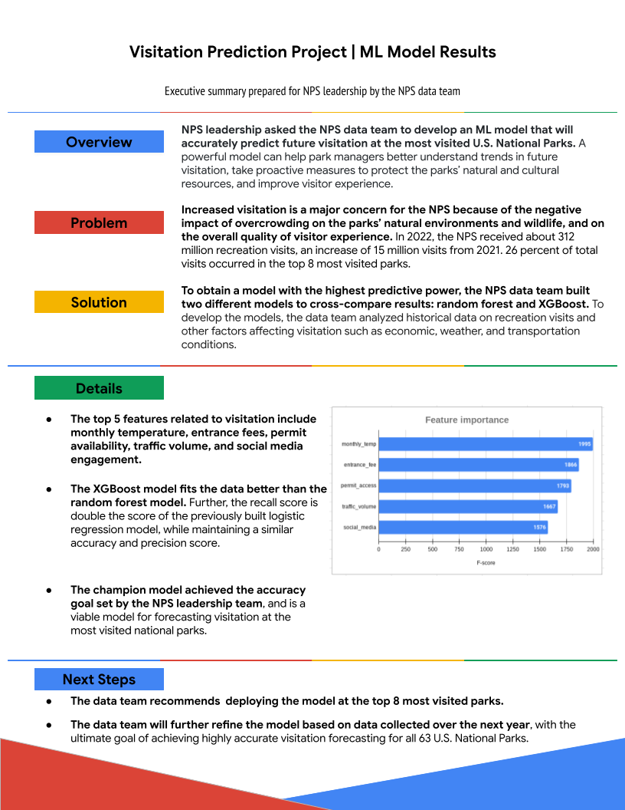


# 2. Python ile Başlayın

## Python ve Diğer Programlama Dilleri

Python, veri profesyonelleri arasında en popüler programlama dillerinden biridir ve bu da onu veri analitiği araç kutunuza harika bir katkı haline getirir! Daha önce de incelediğimiz gibi, Python'un komutları iletmek ve görevleri yerine getirmek için kullandığı sözdizimi, konuşma dilini yansıtır. Bu da Python’u öğrenmesi çok daha kolay bir programlama dili yapar. Python’un yapısı birçok diğer programlama diliyle benzerdir, ancak dikkate alınması gereken bazı önemli farklar da vardır.

Bu metinde, Python’un veri profesyonelleri tarafından kullanılan diğer programlama dilleri (R, Java ve C++) ile nasıl karşılaştırıldığını öğreneceksiniz.

### Programlama Dillerinde Beş Temel Kriter

Python, veri analizi için kullanılan tek programlama dili değildir, ancak en yaygın ve en güçlü olanlardan biridir. Birçok veri uzmanı birden fazla programlama dili kullanır. Her dilin avantajları ve dezavantajları vardır. Bu kurs kapsamında, aşağıdaki beş kriteri inceleyeceğiz: **hız, erişilebilirlik, değişkenler, veri bilimi odaklılık ve programlama paradigması.**

#### **Hız**

Bir programın çalıştırılma hızına katkıda bulunan birçok faktör vardır: derleme süresi, çalışma süresi, donanım, yüklü bağımlılıklar ve kodun verimliliği. Genel olarak, düşük seviyeli programlama dilleri daha hızlıdır, ancak öğrenmesi ve kullanması daha zordur.

#### **Erişilebilirlik**

Erişilebilirlik, yeni öğrenenlerin bir dili ne kadar kolay kullanmaya başlayabileceğini ifade eder. Programlama dili öğrenmek, sözdizimi (syntax) ve genel yapısına bağlı olarak zor olabilir. **Sözdizimi**, kodda kullanılan kelimelerin, sembollerin, yerleşimlerin ve noktalama işaretlerinin yapısını ifade eder. Anlam ise bu yapılara değişkenler ve nesneler aracılığıyla eklenir. Bu değişkenler, programlara ve verilerin bulunduğu nesnelere esneklik kazandırır.

#### **Değişkenler**

Kod içindeki bilgiler değişkenlerde saklanır. **Değişken**, bilgisayarın hafızasında belirli bir yerde saklanan değeri içeren isimlendirilmiş bir kaptır. Bir programlama dilinin değişkenleri nasıl kullandığı, sistemin çekirdek işlemleri veya çekirdek (kernel) hızı üzerinde etkili olabilir. Bazı diller, programın tamamı boyunca bir değeri koruyan statik değişkenler kullanır. Diğerleri, program çalıştıkça değeri belirleyen dinamik değişkenleri tercih eder. Bazı diller ise değişkenin yerleştirileceği yeri belirleyen deklaratif değişkenlere izin verir.

#### **Veri bilimi odaklılık**

Programlama dillerinin kendine özgü özellikleri vardır ve veri analizi görevlerine göre farklı avantajlar sunarlar. Bu nedenle, veri bilimcileri genellikle belirli görevler için belirli dilleri kullanır.

#### **Programlama Paradigması**

Programlama dilleri nesne yönelimli (object-oriented), fonksiyonel (functional) veya emir tabanlı (imperative) olabilir. Nesne yönelimli diller, veri nesneleri etrafında modellenmiştir. Fonksiyonel diller, fonksiyonlar etrafında; emir tabanlı diller ise programın durumunu değiştirebilen kod ifadeleri etrafında modellenmiştir.

### Programlama Dili Karşılaştırmaları

Python, R, Java ve C++, veri analizinde en yaygın kullanılan dört programlama dilidir. Aşağıdaki tablo, bu dilleri beş kritere göre karşılaştırmaktadır: **hız, erişilebilirlik, değişkenler, veri bilimi odaklılık ve programlama paradigması.**

|**Özellikler**|**Python**|**R**|**Java**|**C++**|
|---|---|---|---|---|
|**Hız**|Yavaş|Yapılandırmaya ve eklentilere bağlı|Hızlı|Çok hızlı|
|**Erişilebilirlik**|Öğrenmesi kolay|Karmaşık|Öğrenmesi kolay|Karmaşık|
|**Değişken**|Dinamik|Dinamik|Statik|Deklaratif|
|**Veri Bilimi Odaklılık**|Makine öğrenimi ve otomatik analiz|Keşifsel veri analizi ve kapsamlı istatistik kütüphaneleri|Açık kaynak projelerde genel kullanım|Yaygın değil ama çok güçlü uygulamalar mümkün|
|**Programlama Paradigması**|Nesne yönelimli|Fonksiyonel dil|Nesne yönelimli|Çok paradigmalı (emir tabanlı ve nesne yönelimli)|

## Jupyter Notebooks Nasıl Kullanılır

Jupyter Notebook, canlı kod, matematiksel formüller, görselleştirmeler ve metin içeren belgeler oluşturmak ve paylaşmak için açık kaynaklı bir web uygulamasıdır. Standartlaştırılmış, etkileşimli ve paylaşılabilir metin blokları formatında kod geliştirmek ve sunmak için harika bir araçtır. Jupyter defterlerinde kod, matematiksel formüller, veri görselleştirmeleri ve serbest metin oluşturabilirsiniz!

Bu program boyunca kendi kodunuzu yazmak, çalıştırmak ve sunmak için Jupyter defterlerini kullanacaksınız. Bu okuma, kendi defterinizi nasıl kullanacağınız konusunda size rehberlik edecektir. Ancak, bu sertifika programı için herhangi bir yazılım indirmenize gerek yoktur. Tüm etkinlikleri Coursera platformunda sağlanan araçlarla tamamlayabilirsiniz.

### Jupyter Notebook

Jupyter Notebook'a doğrudan tarayıcınızdan erişebilir veya cihazınıza masaüstü uygulamasını indirip R, Python gibi 100’den fazla programlama diliyle çalışabilirsiniz. Hesaplamalı defterlerle çalışmak için tam araç seti sunan [JupyterLab](https://jupyterlab.readthedocs.io/en/latest/) vardır. Daha sade ve basit ama güçlü etkileşimli hesaplama imkanları sunan [Jupyter Notebook](https://jupyter-notebook.readthedocs.io/en/stable/) da vardır. Yine de bu sertifika programı için Coursera tarafından sağlanan Jupyter Notebook arayüzü içinde çalışmanızı öneriyoruz. Jupyter defterlerini kullanan etkinlikler “lab” (laboratuvar) olarak etiketlenecek ve her etkinliğin açılış sayfasında ilgili talimatları bulacaksınız.

### Neden Jupyter Notebook?

Defterler özellikle veriyle çalışmak için çok faydalıdır. Jupyter defterlerinin öne çıktığı bazı özellikler şunlardır:

1. **Modüler/etkileşimli hesaplama:** Kod parçalarını hücreler denilen küçük, yönetilebilir bloklarda yazabilir ve çalıştırabilirsiniz. Bir hücreyi çalıştırmak için tüm defteri çalıştırmanıza gerek yoktur. Bu, veri keşfi ve denemeler için çok kullanışlıdır. Hücreler hata ayıklamada da yardımcı olur çünkü hatayı yapmak, fark etmek ve düzeltmek kolaydır; tüm scripti yeniden çalıştırmanız gerekmez.
    
2. **Kod ve dokümantasyonun bütünleşmesi:** Kod, metinsel açıklamalar ve grafik, tablo gibi görselleştirmeleri tek bir belgede birleştirmenize izin verir.
    
3. **Çoklu dil desteği:** İleri Veri Analitiği programında Python kullanacağız ama Jupyter defterleri birçok dili desteklediğinden çok güçlü ve çok yönlüdür.
    
4. **Veri keşfi ve analizi:** Veri yüklemek, temizlemek, analiz etmek ve incelemek için şık bir arayüz sunar.
    
5. **Bulut tabanlı hizmetler:** Birçok bulut platformu Jupyter defterlerini barındırır, böylece yerel ortam kurmadan defterleri çalıştırmak ve paylaşmak kolaydır. Bu, iş birliği için çok faydalıdır.
    
6. **Kütüphaneler ve eklentiler:** Projenizin türüne göre işlevselliği artıran zengin bir eklenti ve plugin ekosistemi vardır.
    

### Jupyter defterleri nasıl kullanılır?

Bir Jupyter defteri açtıktan sonra kullanmaya başlayabilirsiniz. İşte başlamak için bazı ipuçları.

##### Komut/Düzenleme modu

Defterlerin iki çalışma modu vardır: komut modu ve düzenleme modu. Komut modu, defter üzerinde genel işlemler yapmak, hücre eklemek, taşımak ve silmek için kullanılır. Düzenleme modu ise bir hücreye kod veya markdown metni yazmak için kullanılır.

Komut modu, aktif hücrenin solunda mavi bir çubukla gösterilir.


Düzenleme modu, aktif hücrenin solunda yeşil bir çubuk ve hücre etrafında ince bir yeşil çerçeve ile gösterilir.


Düzenleme moduna girmek için hücreye tıklayıp imleci oraya yerleştirin veya klavyenizde ok tuşlarıyla hücreyi seçip Enter’a basın. Komut moduna dönmek için hücre dışına tıklayın ya da Esc tuşuna basın.

##### Markdown modu

Jupyter defterlerinde hücreler kod ve Markdown modları arasında geçiş yapabilir. Markdown, düz metne biçimlendirme eklemek için kullanılan bir işaretleme dilidir. Yaygın, geleceğe dönük ve platformdan bağımsızdır. Jupyter’de Markdown, kod ve çıktısını açıklamak için yazılı açıklamalar, analiz ve bağlam vermek için kullanılır. Aşağıdaki örnekte, In [41]: üstündeki tüm metin Markdown ile yazılıp biçimlendirilmiştir.


Kod ve Markdown modu arasında geçiş yapmak için sayfanın üstündeki menüden “Code” yazan yere tıklayın, açılan menüden “Markdown” seçeneğini seçin.


Markdown kullanımıyla ilgili daha fazla bilgi için [Markdown temel sözdizimi rehberi](https://www.markdownguide.org/basic-syntax/) ve [Markdown gelişmiş sözdizimi rehberi](https://www.markdownguide.org/extended-syntax/) sayfalarına bakabilirsiniz.

##### Yaygın işlemler

Çoğu işlemi hem fare/grafik arayüzüyle hem de klavye kısayollarıyla yapabilirsiniz. İşte en yaygın işlemler.

####### Yeni hücre ekleme

- Defterin üst menüsünden Insert’e tıklayın. Mevcut hücrenin üstüne veya altına yeni hücre ekleme seçenekleri çıkar.
    
- Klavye kısayolları (komut modundayken):
    
    - **a:** Mevcut hücrenin üstüne hücre ekle
        
    - **b:** Mevcut hücrenin altına hücre ekle
        

###### Hücre silme

- Komut modunda bir veya birden fazla hücre seçin.
    
- Üst menüden Edit’e tıklayın, açılan menüden Delete Cells seçeneğini seçin.
    
- Klavye kısayolu (komut modundayken):
    
    - **dd** (D tuşuna iki kez basın)
        

##### Hücre taşıma

- Komut modunda bir veya birden fazla hücre seçin.
    
- Üst menüdeki yukarı veya aşağı ok butonlarına tıklayarak seçilen hücreleri taşıyabilirsiniz.
    

##### Hücre çalıştırma

- Bir hücre seçin ve üst menüdeki **Run** butonuna tıklayın.
    
- Klavye kısayolları:
    
    - **Ctrl + Enter:** Seçili hücreyi çalıştır
        
    - **Shift + Enter:** Seçili hücreyi çalıştır ve bir sonraki hücreyi seç
        
    - **Alt + Enter:** Seçili hücreyi çalıştır ve altına yeni hücre ekle
        
- Hücreleri hem komut modunda hem düzenleme modunda çalıştırabilirsiniz.
    

Komut modundayken **h** tuşuna basarsanız tüm klavye kısayollarının listelendiği bir pencere açılır. Ayrıca [Jupyter Notebook arayüz bileşenleri](https://jupyter-notebook.readthedocs.io/en/stable/ui_components.html) sayfasında daha detaylı özellik açıklamaları vardır.

### Sorun Giderme

İleri Veri Analitiği sertifika programında Jupyter defterlerini sıkça kullanacaksınız. Deftere erişme veya çalıştırma ile ilgili sorun yaşarsanız, aşağıdaki adımlar size yardımcı olabilir.

##### Tarayıcı uyumluluğu

İnternet tarayıcınızın güncel olduğundan emin olun. En iyisi Google Chrome, Firefox veya Microsoft Edge’in en son sürümünü kullanmaktır. Eğer tarayıcınız eskiyse veya Coursera tarafından desteklenmeyen bir tarayıcı kullanıyorsanız sorun yaşayabilirsiniz. Tarayıcınız güncelse ve yukarıdaki tarayıcıları kullanıyorsanız yine sorun yaşarsanız, tarayıcınızı yeniden başlatmayı veya önbellek ve çerezleri temizlemeyi deneyin. Ayrıca tarayıcıyı çerez ve geçici verileri kaydetmeyen gizli modda da kullanabilirsiniz.

##### İnternet bağlantısı

Coursera, stabil bir internet bağlantısı gerektirir. Jupyter defterini açarken veya çalıştırırken sorun yaşıyorsanız internet bağlantınız yavaş veya güvensiz olabilir. Sayfaların yüklenmemesi, laboratuvarların donması veya yazı yazamama gibi belirtiler olabilir.

**İpucu:** Bir cihazda laboratuvarı tamamlayamazsanız başka bir cihazda deneyin.

##### Sorun giderme adımları

Özetle, Coursera’da Jupyter defterleriyle ilgili sorun yaşarsanız deneyebileceğiniz adımlar şunlardır:

1. Desteklenen tarayıcıların (Google Chrome, Firefox veya Microsoft Edge) en güncel sürümünü kullandığınızdan emin olun.
    
2. Tarayıcınızı yeniden başlatın, önbellek ve çerezleri temizleyin. Gizli modda deneyin.
    
3. İnternet bağlantınızı kontrol edin, stabil olduğundan emin olun. Modeminizi ve yönlendiricinizi yeniden başlatmayı deneyin.
    
4. Laboratuvarı yeniden başlatmayı deneyin.
    

Eğer tüm bunlar işe yaramazsa, Coursera bakım veya hizmet kesintisi yaşıyor olabilir. Bir süre bekleyip tekrar deneyin.

### Özet

Jupyter Notebook, kendi kodunuzu geliştirebileceğiniz ve hata ayıklayabileceğiniz bir kodlama platformu sağlar. Defterleri nasıl kullanacağınızı bilmek, yeni Python becerilerini deneyeceğiniz ve kurs sonu projesine hazırlanacağınız etkinlikler için sizi hazırlar. Python, araç kutunuzda harika bir araç olacak; makine öğrenmesi ve otomatik analiz gibi ileri düzey analiz araçlarının kapısını açacak. Jupyter Notebook kullanmak da Python bilginizi geliştirmek için harika bir yol!

##### Daha fazla bilgi için kaynaklar

- [Jupyter Notebooks arayüz eğitimi](https://jupyter-notebook.readthedocs.io/en/stable/ui_components.html)
    
- [Jupyter yazılım ana sayfası](https://jupyter.org/)
    
- [Jupyter dokümantasyonu](https://docs.jupyter.org/en/latest/)
    
- [Jupyter Notebooks bulut ortamı](https://jupyter.org/try-jupyter/notebooks/?path=notebooks/Intro.ipynb) (çevrimiçi)
    
- [Jupyter topluluk forumu](https://discourse.jupyter.org/)
    
- [Jupyter Notebooks topluluk forumu](https://discourse.jupyter.org/c/notebook/3)
    
- [Python topluluk forumu](https://www.python.org/community/forums/)
    
- [StackOverflow soruları](https://stackoverflow.com/) (topluluk destekli sorun çözme platformu)
    
- [Jupyter Notebooks kurulumu](https://test-jupyter.readthedocs.io/en/latest/install.html)

## Nesne Yönelimli Programlama Hakkında Daha Fazlası

**Not:** Bu metin, nesne yönelimli programlamaya sadece kısa bir giriş yapmaktadır. Nesne yönelimli programlamanın ayrıntılı tartışması bu dersin kapsamı dışındadır.

Daha önce, nesne yönelimli programlamayı hem veriyi hem de bu veriyi işleyen kodu içeren nesneler etrafında kurulu bir programlama paradigması olarak tanımlamıştık. Bir sınıfın, veriyi ve işlevselliği bir arada tutan nesnenin veri türü olduğunu hatırlayabilirsiniz. Ayrıca, sınıfa özgü işlevlerin metotlar ve öznitelikler şeklinde örneklerine rastlamıştınız. Bu metinde nesne yönelimli programlama hakkında daha fazla bilgi edinecek ve nasıl çalıştığını öğreneceksiniz. Bu sertifika programında kendi sınıflarınızı tanımlamanız gerekmese de, bu sürecin temel işleyişini anlamak öğrenme yolculuğunuzda karşınıza çıkacak kavramları anlamanıza yardımcı olacaktır.

### Gözden Geçirme: Öznitelikler ve Metotlar

Python sınıfları, yaygın veri analiz görevlerini basitleştiren yerleşik özellikler sayesinde güçlü ve kullanışlıdır. Bu özellikler öznitelikler ve metotlar olarak adlandırılır.

- **Öznitelik:** Bir nesneye veya sınıfa bağlı, nokta gösterimi kullanılarak ismiyle erişilen bir değerdir.
    
- **Metot:** Bir sınıfa ait olan ve genellikle bir eylem veya işlem gerçekleştiren fonksiyondur.
    

Öznitelik ve metot arasındaki farkı daha basit anlamak için, özniteliklerin nesnenin _özellikleri_, metotların ise _eylemleri_ veya _işlemleri_ olduğunu hatırlayın.

Örneğin, sınıf "Spaceship" (Uzay Gemisi) ise, öznitelikler şunlar olabilir:

- name (isim)
    
- kind (tür)
    
- speed (hız)
    
- tractor_beam (çekim ışını)
    

Bu özniteliklere şu şekilde erişilir:

```python
Spaceship.name
Spaceship.kind
Spaceship.speed
Spaceship.tractor_beam
```

Dikkat edin, bu özelliklere erişmek için sadece nokta kullanılır.

Öte yandan, Spaceship sınıfının metotları şunlar olabilir:

- warp()
    
- tractor()
    

Bu metotlar şu şekilde kullanılır:

```python
Spaceship.warp()
Spaceship.tractor()
```

Metotların ardından parantez gelir ve gerekirse argüman alabilirler. Örneğin, `Spaceship.warp(7)` geminin hızını warp yediye çıkarabilir.

### Özgün Özniteliklere ve Metotlara Sahip Sınıflar Tanımlamak

Python, her biri kendine özgü özniteliklere ve metotlara sahip kendi sınıflarınızı tanımlamanıza izin verir. Bu, farklı programcıların işlerini daha verimli hale getiren tekrar kullanılabilir kodlar oluşturmasını sağlar. Daha önce bahsedilen Spaceship sınıfını bile oluşturabilirsiniz. Aşağıdaki örnek bunu nasıl yapacağınızı gösterir.

**Not:** Aşağıdaki kod bloğu interaktif değildir.

```python
class Spaceship:

    # Sınıf özniteliği
    tractor_beam = 'off'

    # Nesne öznitelikleri
    def __init__(self, name, kind):
        self.name = name
        self.kind = kind
        self.speed = None

    # Nesne metotları
    def warp(self, warp):
        self.speed = warp
        print(f'Warp {warp}, engage!')

    def tractor(self):
        if self.tractor_beam == 'off':
            self.tractor_beam = 'on'
            print('Tractor beam on.')
        else:
            self.tractor_beam = 'off'
            print('Tractor beam off')
```

Bu derste sınıf oluşturma sözdizimini öğrenmek zorunda değilsiniz. Sadece sınıfın önce tanımlandığını ve ardından altındaki girintili satırlarda özniteliklerin ve metotların bulunduğunu fark edin. Bu, bir öznitelik veya metot “sınıfa ait” olduğunda ne demek istediğimizi açıklar. Öznitelikler ve metotlar, o sınıfın kodunda tanımlanır.

Bir sınıf, aynı özelliklere ve davranışlara sahip tüm şeyler için bir şablondur. Burada sınıf Spaceship (Uzay Gemisi). Farklı türlerde uzay gemileri olabilir; farklı isimlere ve amaçlara sahip olabilirler. Bir sınıfa ait bir nesne oluşturduğunuzda, o sınıfın bir **örneğini** yaratmış olursunuz. Bu işleme **sınıfı örnekleme** denir. Yukarıdaki kodda, her Spaceship örneği oluşturulduğunda çekim ışını (tractor beam) “off” olarak başlar. Çekim ışını sınıf özniteliğidir. Spaceship sınıfının tüm örneklerinde bulunur. Ayrıca, örnek öznitelikleri de vardır; bunlar nesne oluşturulurken atayabileceğiniz özniteliklerdir.

```python
# Spaceship sınıfından bir örnek oluşturmak (örneklemek)
ship = Spaceship('Mockingbird', 'rescue frigate')

# Geminin ismini kontrol et
print(ship.name)

# Geminin türünü kontrol et
print(ship.kind)

# Çekim ışını durumunu kontrol et
print(ship.tractor_beam)

# Çıktı:
# Mockingbird
# rescue frigate
# off
```

Sonraki kod bloğu, warp() metodunu kullanarak warp hızını yedi olarak ayarlar. Sonra speed özniteliğini kullanarak geminin mevcut hızını kontrol eder.

```python
# Warp hızını ayarla
ship.warp(7)

# Hızı kontrol et
ship.speed

# Çıktı:
# Warp 7, engage!
# 7
```

Son kod bloğu, tractor() metodunu kullanarak çekim ışını durumunu değiştirir. Sonra tractor_beam özniteliğini kullanarak çekim ışınının mevcut durumunu kontrol eder.

```python
# Çekim ışınını aç/kapa
ship.tractor()

# Çekim ışını durumunu kontrol et
print(ship.tractor_beam)

# Çıktı:
# Tractor beam on.
# on
```

Bu sadece sınıfların, özniteliklerin ve metotların temel çalışma şekillerini ve birbirleriyle ilişkilerini göstermek için basit bir örnektir. Ancak sınıflar çok karmaşık olabilir ve birçok öznitelik ve metot içerebilir. Veri profesyoneli olarak yaptığınız işe bağlı olarak, nesne yönelimli programlama bilgisi kendi sınıflarınızı, özniteliklerinizi ve metotlarınızı tanımlarken, verinin içindeki desenleri, ilişkileri ve anlamları araştırmada size yardımcı olacaktır.

### Önemli Noktalar

- Sınıflar, Python’un temel nesnelerini oluşturur; bu nedenle Python nesne yönelimli bir dil olarak bilinir.
    
- Sınıf nesneleri, o sınıfa özgü araçları içinde barındırdıkları için güçlüdür.
    
- Metotlar, bir sınıfa ait fonksiyonlardır; eylemler veya işlemler yaparlar ve parantezle çağrılırlar.
    
- Öznitelikler, bir sınıfa veya sınıf örneğine bağlı değerler veya özelliklerdir; parantez kullanılmaz.
    
- Python’da birçok önceden tanımlanmış sınıf, öznitelik ve metot vardır; ayrıca nesne yönelimli programlamada yüksek seviyede özelleştirme mümkündür.


## Python Söz Dizimini Keşfet

Python, yazılım geliştirme, makine öğrenimi ve veri analizi gibi birçok alanda kullanılan esnek bir programlama dilidir. Python, veri profesyonelleri arasında en popüler programlama dillerinden biridir; bu yüzden temel söz dizimi (syntax) ve anlam bilimini (semantics) öğrenmek, gelecekteki kariyeriniz açısından faydalı olacaktır. Bu yazıda, Python'un söz dizimi ve anlam bilimini öğrenecek ve öğreniminizi ilerletmek için kaynakların nerede bulunabileceğini keşfedeceksiniz.

### Python’un Dili

İnsanlar birbirleriyle iletişim kurmak ve talimat vermek için dili kullanır. Bilgisayarlar da aynı şeyi yapar; ancak Python, C++ ve Java gibi dilleri kullanırlar. Bu nedenle, bilgisayara talimat vermek isteyen programcıların fikir ve kavramları bilgisayarın anlayacağı bir dile çevirmesi gerekir.

Python söz dizimi; nesneleri ve komutları temsil eden kelimeleri ve bu kelimelere yapı, hiyerarşi ve bağlam kazandıran noktalama işaretlerini içerir. Bu kelimeler ve noktalama işaretleri birlikte fikirleri ve işlemleri iletir; buna da **anlam bilimi (semantics)** denir. Anlam bilimi, söz diziminin ilettiği anlamdır. Söz dizimini ve anlam bilimini öğrenmenin en iyi yolu bolca pratik yapmaktır. Kod yazmaya başlayın ve başkalarının kodlarını okumaya alışın. Ayrıca, programcıların dili kullanırken stil açısından birlik sağlamak için uyguladığı genel kurallar da vardır.

Kodlama dilleri, konuşma dillerine benzer şekilde, kelimeleri işlevlerine göre sınıflandırma yollarına sahiptir. Örneğin, İngilizce cümleler isimler, fiiller, edatlar vb. içerir.

İşte bazı temel kavramlar:

- **Değişkenler (Variables):** String (metin), tuple (demet), dictionary (sözlük), list (liste) ve nesne (object) gibi verileri temsil eder.
    
    - Örnek: `student_name`
        
- **Anahtar Kelimeler (Keywords):** Belirli amaçlar için ayrılmış özel kelimelerdir; sadece bu amaçlarla kullanılabilirler.
    
    - Örnekler:
        
        - `in`
            
        - `not`
            
        - `or`
            
        - `for`
            
        - `while`
            
        - `return`
            
- **Operatörler (Operators):** Nesneler ve değerler üzerinde işlemler gerçekleştiren sembollerdir.
    
    - Örnekler:
        
        - `+` Toplama
            
        - `-` Çıkarma
            
        - `*` Çarpma
            
        - `/` Bölme
            
        - `**` Üs alma
            
        - `%` Mod alma (bölme işleminin kalanını verir). Örnek: `10 % 3 = 1`
            
        - `//` Taban bölme (sonucu en yakın aşağı tam sayıya yuvarlar). Örnek: `5 // 2 = 2`
            
        - `>` Büyüktür
            
        - `<` Küçüktür
            
        - `==` Eşittir
            
- **İfadeler (Expressions):** Sayılar, semboller ve değişkenlerin bir araya gelerek bir sonuç üretmesi
    
    - Örnek: `[1, 2, 3] + [2, 4, 6]`
        
- **Fonksiyonlar (Functions):** Belirli bir görevi yerine getiren ve bir değer döndüren, ilişkili komutlar grubudur.
    
    - Örnek:
        
        ```python
        def to_celsius(x):
            '''Fahrenheit'ı Celsius'a çevir'''
            return (x - 32) * 5 / 9
        
        to_celsius(75)
        
        # 23.88888888888889
        ```
        
- **Koşullu İfadeler (Conditional Statements):** Belirli koşullara göre programın yürütülmesini yönlendirir.
    
    - Örnek:
        
        ```python
        number = -4
        
        if number > 0:
            print('Sayı pozitiftir.')
        elif number == 0:
            print('Sayı sıfırdır.')
        else:
            print('Sayı negatiftir.')
        
        # Çıktı: Sayı negatiftir.
        ```
        

Python, yanlış anahtar kelime veya söz dizimi kullanıldığında sözdizim hatası (syntax error) verir.

Örnek:

```python
print(This will throw an error because I didn’t make it a string.)

Satır 1’de Hata:
    print(This will throw an error because I didn’t make it a string.)
                  ^
SyntaxError: invalid syntax
```

### İsimlendirme Kuralları ve Konvansiyonlar

Programcılar, nesnelere isim verirken kodu standartlaştırmak ve herkes için anlaşılır kılmak amacıyla bazı kurallara ve geleneklere uyarlar. Bilmeniz gereken bazı kurallar şunlardır:

- İsimlerde boşluk kullanılamaz.
    
- İsimler büyük ve küçük harf karışık olabilir.
    
- İsimler sayı ile başlayamaz; ancak ilk karakterden sonra sayı içerebilir.
    
- Değişken ve fonksiyon adları, tüm harflerin küçük ve kelimelerin alt çizgi (`_`) ile ayrıldığı **snake_case** biçiminde yazılmalıdır.
    
- Anlamlı ve açıklayıcı isimler, kısa ve belirsiz kısaltmalardan daha iyidir. Örneğin, `student_name` kullanmak `sn`yazmaktan daha doğrudur. Başta uzun gibi görünse de, ileride kodunuzu yeniden okurken daha kolay anlayacaksınız.
    

### Python’un Zen’i (Zen of Python)

Python programcısı Tim Peters, Python'da kodlama için rehber niteliğinde, artık meşhur olmuş şu “şiiri” yazmıştır:

**The Zen of Python**

Güzel, çirkinden iyidir.  
Açık, örtükten iyidir.  
Basit, karmaşıktan iyidir.  
Karmaşık, aşırı karmaşıktan iyidir.  
Yüzeysel, iç içe olandan iyidir.  
Seyrek, yoğun olandan iyidir.  
Okunabilirlik önemlidir.  
Özel durumlar, kuralları bozmak için yeterince özel değildir.  
Pratiklik, saflığı yener.  
Hatalar asla sessizce geçmemelidir.  
Açıkça bastırılmadıkça.  
Belirsizlik karşısında, tahmin etme dürtüsüne diren.  
Bir—tercihen sadece bir—açık yol olmalıdır.  
Bu yol, ilk başta açık olmasa bile (Hollandalı değilsen).  
Şimdi, hiç olmamasından iyidir.  
Ancak, “hiç” bazen _hemen şimdi_den iyidir.  
Eğer bir uygulamayı açıklamak zorsa, bu kötü bir fikirdir.  
Eğer açıklamak kolaysa, iyi bir fikir olabilir.  
İsim alanları harika bir fikirdir—daha fazlasını yapalım!

### [PEP 8 Python Stil Rehberi](https://peps.python.org/pep-0008/)

Kodlama sırasında başvurmak üzere bu stil rehberini yer imlerine eklemek faydalı olacaktır. Bu yazı kapsam olarak sınırlıdır; PEP 8 ise stil ile ilgili daha kapsamlı bir kaynaktır. PEP, "Python Geliştirme Önerileri" anlamına gelir. Python açık kaynaklı bir dil olduğundan, PEP geliştiricilere rehberlik etmek ve fikir birliği oluşturmak için bir çerçeve sunar. Güvenilir ve kullanışlı bir kaynaktır.

### Ana Noktalar

Bir dilin şekil ve anlam kazanmasını sağlayan şey söz dizimi ve anlam bilimidir; Python için de durum aynıdır. Yeni bir dil öğrenmenin büyük kısmı, o dilin söz dizimini ve anlamını tanımaktan geçer. Bu, büyük ölçüde pratik yaparak ve maruz kalarak gerçekleşir. Ancak, bazı yol gösterici ilkeler ve kaynaklar bu süreçte size yardımcı olabilir. Nesnelere isim verirken kuralları öğrenir ve başvurabileceğiniz kaynaklar oluşturursanız, Python öğrenme yolculuğunuzda kesinlikle ilerleme kaydedersiniz. Python'a daha fazla aşina oldukça bilgisayarlarla daha etkili iletişim kurabilir ve veri analiz araçlarını daha verimli kullanabilirsiniz.

### Daha Fazla Bilgi İçin Kaynaklar

Python hakkında daha fazla bilgi edinmenizi sağlayacak bazı yararlı kaynaklar:

- Python [Referans Kütüphanesi](https://docs.python.org/3/library/)
    
    - [Yerleşik Veri Tipleri](https://docs.python.org/3/library/stdtypes.html)
        
    - [Yerleşik Fonksiyonlar](https://docs.python.org/3/library/functions.html#built-in-functions)
        
- [Python Operatörleri](https://python-reference.readthedocs.io/en/latest/docs/operators/index.html)

## Referans Kılavuzu: Fonksiyonlar

Öğrendiğiniz üzere, **fonksiyonlar** belirli süreçleri veya görevleri gerçekleştirmek için yeniden kullanılabilir kod bloklarıdır. Daha az kodla daha fazla iş yapmanıza yardımcı olurlar. Fonksiyon örnekleri şunları içerebilir:

- Fahrenheit'ı Celsius’a çevirme gibi belirli bir hesaplama veya ölçüm
    
- Stoktaki ürünlerin miktarlarını yineleyip toplam maliyetini hesaplayan bir envanter aracı
    
- Bir dizi veya sözlük verisinden bir DataFrame oluşturma
    
- Yazım denetleyici gibi bir uygulama aracı
    

Bu metinde, fonksiyonların nasıl tanımlanacağı, oluşturulacağı ve çağrılacağı hakkında bilgi edineceksiniz.

---

### Fonksiyon Söz Dizimi (Syntax)

Fonksiyonları aşağıdaki söz dizimi ve biçimi kullanarak tanımlayın:

**Not:** Aşağıdaki kod bloğu etkileşimli değildir.

```python
def my_function(parameters):

    '''

    Docstring.

    Fonksiyonun davranışını özetleyin ve argümanlarını ile döndürdüğü değerleri açıklayın.

    '''

    kod bloğu

    return değer
```

1. `def` anahtar kelimesiyle başlayın, ardından fonksiyonun adını yazın. Parantez içine parametrelerini/argümanlarını yerleştirin ve sonuna iki nokta (:) koyun.
    
    - Python'da fonksiyon adlarında küçük harfli kelimeler alt çizgi ile ayrılarak yazılır (snake_case).
        
2. Fonksiyon önemliyse ya da ne yaptığı açık değilse, bir **docstring** (belge açıklaması) ekleyin. Bunu üç açılış ve üç kapanış tırnak arasında yazın.
    
    - Docstring emir kipiyle yazılmalıdır (örneğin: “İki sayıyı topla”, “İki sayıyı toplar” değil).
        
    - Fonksiyonun ne yaptığını, parametrelerini ve döndürdüğü değeri özetlemelidir.
        
    - Docstring, tanım satırından dört boşluk girintili yazılmalıdır.
        
3. Fonksiyonun gövdesini yazın.
    
    - Tüm kodlar, tanım satırından en az dört boşluk girintili olmalıdır. Kodun karmaşıklığına göre daha fazla girinti de olabilir.
        
4. Son olarak, bir **return** ifadesiyle bir değer döndürün veya **print** ifadesiyle konsola bir şey yazdırın ve fonksiyonu tamamlayın. Bu satır da dört boşluk girintili olmalıdır.
    

---

### **return vs. print**

Python öğrenenler için `return` ve `print` ifadeleri arasındaki fark bazen net olmayabilir. Bunların ne yaptığını ve ne zaman kullanılacağını anlamak önemlidir:

- `return` ifadesi, başka bir işlemde kullanılabilecek bir **sonuç döndürür**. Ekrana bir şey yazdırmak zorunda değildir.
    
- `print` ifadesi, sadece **ekrana yazdırır**, başka bir işlemde kullanılmaz.
    

Şöyle düşünün:  
`return` ifadesi, kardeşinizin pazara gidip size bir **patates torbası** getirmesi gibidir.  
`print` ifadesi, kardeşinizin pazara gidip eve gelip hangi **patateslerin satıldığını anlatması** gibidir.  
`return` ile pişirecek patatesiniz olur. `print` ile sadece ne olduğunu bilirsiniz ama elinizde bir şey yoktur.

---

### **Fonksiyonlar ve Metotlar Arasındaki Fark**

Fonksiyonlar ve metotlar birbirine çok benzer, ancak bazı temel farklar vardır. **Metotlar**, belirli bir sınıfa (class) ait olan özel fonksiyonlardır. Yani bir nesne üzerinden **nokta gösterimi (dot notation)** ile çağrılırlar.

**Metot örneği:**

```python
my_string = 'The eagles filled the sky.'
my_string.split()

# ['The', 'eagles', 'filled', 'the', 'sky.']
```

Buradaki `split`, string sınıfına ait bir fonksiyondur ve boşluklardan bölme işlemi yapar.

**Bağımsız fonksiyonlar**, belirli bir sınıfa ait değildir ve genellikle birçok sınıfla birlikte kullanılabilirler.

**Fonksiyon örneği:**

```python
sum([6, 3])

# 9
```

Python’un yerleşik fonksiyonlarının listesini [buradan inceleyebilirsiniz](https://docs.python.org/3/library/functions.html) ve bunların nasıl kullanıldığını [Jupyter forumu](https://discourse.jupyter.org/), [StackOverflow](https://stackoverflow.com/) ve diğer topluluklarda araştırabilirsiniz.

---

### Daha Fazla Bilgi İçin Kaynaklar

Fonksiyonlar hakkında daha fazla bilgi almak için şu kaynaklara göz atabilirsiniz:

- Python [Referans Kütüphanesi](https://docs.python.org/3/library/)
    
- [Veri tipleri](https://docs.python.org/3/library/stdtypes.html)
    
- [Fonksiyonlar](https://docs.python.org/3/library/functions.html#built-in-functions)
    
- [Semboller](https://wiki.python.org/moin/PythonGlossary?action=AttachFile&do=view&target=PySymbols.html)
    

#### Yerleşik Fonksiyonlar:

- [enumerate()](https://docs.python.org/3/library/functions.html#enumerate)
    
- [isinstance()](https://docs.python.org/3/library/functions.html#isinstance)
    
- [dict()](https://docs.python.org/3/library/functions.html#func-dict)
    
- [type()](https://docs.python.org/3/library/functions.html#type)
    
- [len()](https://docs.python.org/3/library/functions.html#len)
    
- [set()](https://docs.python.org/3/library/functions.html#func-set)
    
- [zip()](https://docs.python.org/3/library/functions.html#zip)
    

Ayrıca, [PEP 257](https://peps.python.org/pep-0257/) belgesine bakarak **docstring** yazım kurallarını öğrenebilirsiniz.

## Referans Kılavuzu: Python Operatörleri

Python'da şimdiye kadar birçok operatörle karşılaştınız. Birçoğu muhtemelen size oldukça tanıdık geliyordur. Sonuçta, Python’da toplama ve çıkarma işlemlerinde yeni bir şey yok. Ancak, temel aritmetik işlemlerin ötesinde birçok başka **operatör** de vardır!

**Operatörler**, belirli aritmetik, mantıksal işlemleri veya süreçleri gerçekleştiren karakterlerdir. Veri uzmanları bu operatörleri işlerinde sürekli kullanır. Operatörler, Python programlamasının temel yapı taşlarından biridir, bu yüzden onları öğrenmek önemlidir. Bu metin, Python’da kullanabileceğiniz çeşitli operatörlere dair bir rehberdir.

---

### Karşılaştırma Operatörleri (Comparators)

Python’da değerleri karşılaştırmak için karşılaştırma operatörlerini kullanabilirsiniz. Bir karşılaştırma yapıldığında, Python **Boolean** (mantıksal) bir sonuç döndürür: `True` (Doğru) veya `False` (Yanlış).

Python şu karşılaştırma operatörlerini kullanır:

|**İşlem**|**Operatör**|
|---|---|
|büyüktür|`>`|
|büyük veya eşittir|`>=`|
|küçüktür|`<`|
|küçük veya eşittir|`<=`|
|eşit değildir|`!=`|
|eşittir|`==`|

**Notlar:**

- Tek eşittir işareti (`=`) **değer atamak** için kullanılır. Eğer bir karşılaştırma yapmak için tek eşittir kullanırsanız, Python **SyntaxError** (sözdizimi hatası) verir.
    
- Uyuşmayan veri türlerini karşılaştırmaya çalışırsanız (örneğin bir string'in bir sayıdan büyük olup olmadığını kontrol etmek), Python **TypeError** (tip hatası) verir.
    

---

### Mantıksal Operatörler (Logical Operators)

Python ayrıca üç adet **mantıksal operatör** sunar. Bu operatörler karşılaştırma operatörleriyle birleştirilerek daha karmaşık ifadeler oluşturulabilir.

Bu operatörler şunlardır:

- `and`
    
    - Sadece **her iki ifade de doğruysa** `True` döner.
        
- `or`
    
    - **İfadelerden en az biri doğruysa** `True` döner.
        
- `not`
    
    - Sonucun tersini döner.
        
        - Eğer ifade `True` ise, `False` döner.
            
        - Eğer ifade `False` ise, `True` döner.
            

**Örnekler:**

```python
x = 3 
my_list = [3, 4, 6, 10]  
print(x < 3 and x != 0) 
print(x >= len(my_list) or x == min(my_list)) 
print(x not in my_list)  

# False 
# True 
# False
```

---

### Aritmetik Operatörler

Python, yerleşik operatörler kullanarak matematiksel işlemler de yapabilir. Bu aritmetik operatörler şunlardır:

|**İşlem**|**Operatör**|**Örnek**|
|---|---|---|
|Toplama|`+`|`[IN] 5 + 2`  <br>`[OUT] 7`|
|Çıkarma|`-`|`[IN] 5 - 2`  <br>`[OUT] 3`|
|Çarpma|`*`|`[IN] 5 * 2`  <br>`[OUT] 10`|
|Bölme|`/`|`[IN] 5 / 2`  <br>`[OUT] 2.5`|
|Modül (bölümden kalan)|`%`|`[IN] 5 % 2`  <br>`[OUT] 1`|
|Üs alma|`**`|`[IN] 5 ** 2`  <br>`[OUT] 25`|
|Tamsayı bölme  <br>(tam kaç kere bölünür?)|`//`|`[IN] 5 // 2`  <br>`[OUT] 2`|

---

Python’da bu temel operatörlerin dışında, özel kütüphanelerle yapılabilecek çok daha fazla matematiksel işlem vardır — bunları ilerleyen konularda öğreneceksiniz. Python, karşılaştırmalar yapmak, mantıksal işlemler gerçekleştirmek ve aritmetik hesaplamalar yapmak için temel bir operatör seti kullanır. Bu operatörler ifadeler içinde birleştirilerek sınırsız sayıda işlem ve görev gerçekleştirilebilir.

Elbette! İşte verdiğiniz metnin Türkçeye çevrilmiş hâli:

---

## Referans Kılavuzu: Koşullu İfadeler

Koşullu ifadeler, programlamanın temel bir parçasıdır. Belirli koşullara göre bilgi akışını kontrol etmenizi sağlar. Python'da koşullu ifadeleri uygulamak için `if`, `elif` ve `else` ifadeleri kullanılır. Program yürütmesini dallandırmak için koşullu ifadeleri kullanmak, çoğu veri profesyoneli için kodlamanın temel bir yönüdür; bu yüzden nasıl çalıştıklarını anlamak önemlidir. Bu okuma materyali, koşullu ifadelere dair bir referans kılavuzudur.

### Koşullu İfadelerin Söz Dizimi (Syntax)

Önceki videolarda, değerleri karşılaştırmanıza olanak tanıyan bazı yerleşik Python operatörlerini ve değerleri birleştirmek için kullanabileceğiniz bazı mantıksal operatörleri öğrendiniz. Ayrıca bu operatörleri `if-elif-else` bloklarında nasıl kullanacağınızı da öğrendiniz.

**Not**: Aşağıdaki kod bloğu etkileşimli değildir.

Python'da `if-elif-else` ifadelerinin temel söz dizimi aşağıdaki gibidir:

```python
if koşul1:
    # koşul True olarak değerlendirilirse çalışacak kod bloğu

elif koşul2:
    # koşul1 False ve koşul2 True olarak değerlendirilirse çalışacak kod bloğu

else:
    # koşul1 ve koşul2'nin ikisi de False ise çalışacak kod bloğu
```

Burada, `koşul1` ve `koşul2` ya `True` ya da `False` olarak değerlendirilen ifadelerdir. `if` ifadesindeki koşul doğruysa, ardından gelen kod bloğu çalıştırılır. Aksi takdirde atlanır.

`elif` ifadesi "else if" anlamına gelir ve ilk koşul yanlışsa kontrol edilecek alternatif bir koşulu belirtmek için kullanılır. Kodunuzda birden fazla `elif` ifadesi olabilir. Önceki koşul yanlış ve `elif` koşulu doğruysa, `elif`'in ardından gelen kod bloğu çalıştırılır.

`else` ifadesi, `if` ve varsa tüm `elif` ifadeleri yanlışsa ne yapılacağını belirtmek için kullanılır.

Aşağıda tüm bu ifadelerin kullanıldığı bir örnek verilmiştir:

```python
x = 8

if x > 5:
    print('x beşten büyüktür')

elif x < 5:
    print('x beşten küçüktür')

else:
    print('x beşe eşittir')

# Çıktı: x beşten büyüktür
```

#### `else` Kullanımının Atlanması

Çoğu zaman, kodunuzun mantıksal bağlamında `else` ifadesi gereksiz olduğu için kullanılmaz. Aşağıdaki örneği inceleyin:

```python
def bigger_than_ten(x):
    if x > 10:
        return True
    else:
        return False

print(bigger_than_ten(15))
print(bigger_than_ten(2))

# Çıktı: True
# Çıktı: False
```

Bu işlev, `x` 10'dan büyükse `True`, değilse `False` döndürecektir. Dikkat ederseniz, `else` kendi satırında yer alır ve ardından girintili bir `return` ifadesi gelir. Bu tamamen geçerli bir koddur ve sıkça bu tür yapılarla karşılaşırsınız.

Ancak, bu son adımı atlayan eşdeğer başka bir form da vardır. Aşağıdaki koda göz atın:

```python
def bigger_than_ten(x):
    if x > 10:
        return True
    return False

print(bigger_than_ten(15))
print(bigger_than_ten(2))

# Çıktı: True
# Çıktı: False
```

Bu örnekte `else` ifadesi yoktur ama bir fark yaratmaz. Mantık aynıdır. Fonksiyon en üstten başlayarak çalışmaya başlar. Satır 2’deki koşulu değerlendirir, eğer `True` ise satır 3 çalışır ve `return` ifadesiyle fonksiyon sonlanır. Daha fazla kod çalıştırılmaz.

Eğer koşul doğru değilse, 3. satır atlanır çünkü bu satır 2. satıra bağlı bir alt koşuldur. Bunun yerine doğrudan 4. satıra geçilir ve `False` değeri döndürülerek fonksiyon sonlanır. Ayrıca `return False` ifadesinin, `if` ile aynı girintide olduğuna dikkat edin.

Programlama becerileriniz geliştikçe, bu iki yaklaşımdan hangisini tercih ettiğinizi göreceksiniz. Hangisi size daha uygunsa onu kullanabilirsiniz. Ancak her iki yapıyı da tanımak önemlidir.

### Önemli Noktalar

Python'da koşullu ifadelerle ilgili bilmeniz gereken bazı önemli noktalar:

* `elif` ve `else` ifadeleri isteğe bağlıdır. Tek başına bir `if` ifadesi kullanabilirsiniz.
* Birden fazla `elif` ifadesi kullanabilirsiniz.
* Sadece bir tane `else` ifadesi olabilir ve bu her zaman mantık bloğunuzun sonunda yer almalıdır.
* Koşullar, Boolean (True veya False) değerine değerlenecek ifadeler olmalıdır.
* Girintileme çok önemlidir! Her koşullu ifadeye ait kod bloğu, o ifadenin altına girintili şekilde yazılmalıdır. Veri profesyonelleri için yaygın girintileme standardı dört boşluktur. Girintileme hataları, beklenmeyen kod davranışlarının en yaygın nedenlerinden biridir.

## Döngüler, `break` ve `continue` İfadeleri

Python’da `while` döngülerini öğrendiniz ve bazı örnekleri incelediniz. `While` döngüleri kullanışlıdır çünkü belirli bir koşul sağlandığı sürece bir işlemi veya değerlendirmeyi tekrar tekrar yapmanıza olanak tanır, koşul sağlanmadığında ise döngü sona erer. Bu süreç yalnızca Python’da değil, çoğu programlama dilinde de önemli bir yer tutar. Veri profesyonelleri, veriyi işlerken `while` döngülerini sıklıkla kullanır; bu nedenle becerilerinizi geliştirirken bu yapıya aşina olmanız önemlidir. Bu okuma, `while` döngülerine dair temel kavramların bir özetidir.

---

### `While` Döngüsü Söz Dizimi (Syntax)

`While` döngüsü, belirli bir koşul doğru olduğu sürece bir kod bloğunu tekrar tekrar çalıştırmanıza olanak tanıyan bir kontrol yapısıdır.

**Not**: Aşağıdaki kod bloğu etkileşimli değildir.

Bir `while` döngüsünün temel söz dizimi şöyledir:

```python
while koşul:
    # çalıştırılacak kod bloğu
```

Koşul, her döngü yinelemesinin başında değerlendirilen bir Boolean ifadedir. Koşul doğru (`True`) ise, kod bloğu çalıştırılır. Kod bloğu çalıştıktan sonra koşul tekrar değerlendirilir. Bu işlem koşul `False` olana kadar devam eder. Koşul `False` olduğunda döngü sona erer ve program döngüden sonraki satırla devam eder.

Temel bir `while` döngüsü örneği:

```python
x = 1

while x < 100:
    print(x)
    x = x * 2

# Çıktı:
# 1 
# 2 
# 4 
# 8 
# 16 
# 32 
# 64
```


Bu örnekte, döngü başlarken `x` değeri 1’dir. `x < 100` olduğu sürece, program `x`’in değerini yazdırır ve sonra `x`’i ikiyle çarpar. Koşul tekrar kontrol edilir ve hâlâ doğru olduğu sürece döngü çalışmaya devam eder. `x` 128 olduğunda, koşul artık sağlanmaz ve döngü sona erer.

---

### Sonsuz Döngüler (Infinite Loops)

`While` döngüleri kullanırken dikkatli olun; çünkü mantık veya yazım hataları yaptığınızda döngü sonsuza kadar çalışabilir. Bu bir **sonsuz döngü** oluşturur.

Önceki örnekte, eğer `x = x * 2` satırı yanlışlıkla döngü bloğunun dışında yazılmış olsaydı, `x` hiçbir zaman değişmeyecekti ve `x < 100` koşulu hep doğru kalacaktı. Bu durumda döngü sonsuza kadar devam ederdi.

Sonsuz bir döngüye girerseniz endişelenmeyin. Döngüyü durdurmak için kernel’i durdurabilirsiniz. Bunu yapmanın birkaç yolu vardır:

1. Notebook’un üst menüsündeki **durdur (stop)** butonunu kullanın.


2. Menü çubuğunda **Kernel** sekmesine tıklayıp açılan menüden **Interrupt** (kes) seçeneğini seçin.
    


3. Komut modundayken **iki kere `i` tuşuna** basın.
    

---

### `break` ve `continue`

Koşul hâlâ doğru olsa bile, bir döngüyü erken sonlandırmak mümkündür. Bunu yapmak için `break` ifadesi kullanılır.

Aşağıda bir örnek yer almaktadır:

```python
x = 1
i = 0

while x < 100:
    if i == 5:
        break
    print(i, x)
    x = x * 2
    i += 1

# Çıktı:
# 0 1
# 1 2
# 2 4
# 3 8
# 4 16
```

Bu örnekte, `i` adında bir sayaç değişkeni var. Her yinelemede program:

1. `x < 100` koşulunu kontrol eder.
    
2. Eğer koşul sağlanıyorsa, `i == 5` mi diye bakar.
    
3. Eğer `i == 5` ise, `break` ifadesi çalışır ve döngü sona erer. Aksi takdirde, `i` ve `x` değerleri yazdırılır, `x` ikiyle çarpılır, `i` bir artırılır.
    
4. Bu işlem, `x ≥ 100` ya da `i == 5` olana kadar devam eder. Bu örnekte döngü, `i = 5` olduğunda kırılır.
    
---

Ayrıca, döngünün içindeki kodun geri kalanını çalıştırmadan bir yinelemeyi atlamak da mümkündür. Bunun için `continue` ifadesi kullanılır.

Örnek:

```python
i = 0

while i < 10:
    if i % 3 != 0:
        print(i)
        i += 1
        continue
    i += 1

# Çıktı:
# 1 
# 2 
# 4 
# 5 
# 7 
# 8
```

Bu örnek, 0’dan 9’a kadar olan ve **3’e tam bölünemeyen** sayıları yazdırır.

Programın işleyişi şu şekildedir:

1. `i < 10` koşulu kontrol edilir.
    
2. Eğer sağlanıyorsa, `i % 3 != 0` koşuluna bakılır.
    
3. Eğer `i`, 3’e tam bölünmüyorsa, `i` yazdırılır, 1 artırılır ve `continue` ile döngünün başına dönülür. Sonraki `i += 1` satırı çalışmaz.
    
4. Eğer `i`, 3’e tam bölünüyorsa, `if` bloğu atlanır ve yalnızca `i += 1` satırı çalışır.
    
5. Döngü `i = 10` olana kadar devam eder.

---

### Önemli Noktalar

- `While` döngüsü, bir koşul doğru olduğu sürece bir kod bloğunu tekrar tekrar çalıştırmanızı sağlar.
    
- `break` ifadesi, koşul hâlâ doğru olsa bile döngüyü erken bitirmenizi sağlar.
    
- `continue` ifadesi, mevcut yinelemenin kalan kısmını atlayarak doğrudan bir sonraki yinelemeye geçmenizi sağlar.

## For Döngüleri

Python’da `for` döngülerini öğrendiniz ve bazı örnekler üzerinde çalıştınız. `For` döngüleri, `while` döngülerine benzer; ancak, belirli bir koşul sağlanana kadar devam etmek yerine, `for` döngüleri bir **iterable** (yinelenebilir) dizideki her bir öğe üzerinde döner ve her yinelemede bir işlem veya değerlendirme yapılmasına olanak tanır. Bu süreç yalnızca Python’da değil, çoğu programlama dilinde de önemli bir rol oynar. Veri profesyonelleri verileri işlerken `for` döngülerini sıkça kullanır, bu nedenle becerilerinizi geliştirirken bu yapıya aşina olmanız önemlidir. Bu metin, `for` döngülerinin temel kavramlarının bir gözden geçirmesidir.

___

### For Döngüsü Söz Dizimi

Bir `for` döngüsü, bir **iterable** (yinelenebilir) dizideki eleman sayısı kadar bir kod bloğunu çalıştırmanıza olanak tanıyan bir kontrol yapısıdır. İlerleyen derslerde yinelenebilir diziler hakkında daha fazla bilgi edineceksiniz; ancak bazı örnekler şunlardır:

-   **String’ler**: `'chimichurri'`
    
-   **Listeler**: `[1, 2, 3, 4, 5, 6]`
    
-   **Tuple’lar**: `(1, 2, 3, 4, 5)`
    
-   **Sözlükler**: `{'Ad': 'Anita', 'Yaş': 77}`
    
-   **Kümeler (Set)**: `{1, 4, 14, 33}`
    

**Not**: Aşağıdaki kod bloğu etkileşimli değildir.

Bir `for` döngüsünün temel söz dizimi şu şekildedir:

```python
for item in iterable_sequence:
    # iterable_sequence içindeki her bir değer için çalıştırılacak kod bloğu
```

Burada iterable_sequence herhangi bir yinelemeli veri türü olabilir ve item değişkeninin adı size kalmıştır — istediğiniz ismi verebilirsiniz. Ancak, bu değişkeni adlandırırken bazı yaygın konvansiyonlarla karşılaşırsınız. Örneğin, bir string içindeki karakterleri dönerken genellikle char, bir sayı listesini dönerken n veya num isimleri kullanılır. Döngüde neyin döndürüldüğünü kodu okuyan kişilere anlatmak açısından değişkenin anlamlı bir isme sahip olması faydalıdır. Örneğin, insanların isimlerini içeren names adlı bir liste varsa, şöyle yazabilirsiniz: for name in names:.

Bu değişkenin davranışına dair bir not — her döngü adımında değeri yeniden atanır ve döngü tamamlandıktan sonra da bu son değerle birlikte varlığını sürdürür.

Örnek:

```python
num = 5

y = [1, 2, 3]

for num in y:
    print(num)

print(num)

# 1
# 2
# 3
# 3
```

Dikkat ederseniz, `num` döngü başlamadan önce tanımlanmış. For döngüsünün ilk adımında bu değişkene, dizideki ilk öğenin değeri atanır. Bu atama her yinelemede tekrar edilir. Döngü bittiğinde `num` değişkeni hâlâ mevcuttur ve son yinelemedeki değeri taşır.

___

### `range()` fonksiyonu

For döngüsü, üzerinde döngü yapılacak veri yapısının uzunluğuna göre tam olarak gereken sayıda yineleme yapmanızı sağlar. Yani, yinelemeli diziniz 2, 1000 ya da bir milyon öğe içerse de aynı sözdizimini kullanabilirsiniz ve kaç defa döneceğinizi ayrıca belirtmeniz gerekmez. Ancak bazı durumlarda, belirli bir sayıda işlem yapmak isteyebilirsiniz ama elinizde döngü yapılacak bir veri olmayabilir. Ya da düzenli bir sayı dizisi oluşturmak isteyebilirsiniz. İşte bu noktada `range()` fonksiyonu devreye girer.

`range()` fonksiyonu üç argüman alabilir: **başlangıç (start), bitiş (stop), adım (step)**. Çıktısı, `range` sınıfına ait bir nesnedir. Eğer sadece bir argüman verirseniz, bu bitiş değeri olarak yorumlanır. Başlangıç varsayılan olarak `0`, adım ise `1` olarak alınır. İki argüman verirseniz, bunlar başlangıç ve bitiş olarak yorumlanır (adım yine varsayılan olarak 1 olur). Dikkat: Bitiş değeri `range` içinde yer almaz.

Bazı örnekler:

**A.**

```python
for i in range(3):
    print(i)

# 0  
# 1  
# 2
```

**B.**

```python
for n in range(2, 5):
    print(n)

# 2  
# 3  
# 4
```

**C.**

```python
for even_num in range(2, 11, 2):
    print(even_num)

# 2  
# 4  
# 6  
# 8  
# 10
```

`range()` fonksiyonunun oldukça kullanışlı olduğunu göreceksiniz — örneğin, numaralı listeler oluştururken ya da bir nesnenin belirli indekslerinde işlem yaparken. İleride dizinleme (indexing) hakkında daha fazla öğreneceksiniz.

___

### İç içe döngüler (Nested loops)

Bazen iç içe yapılardan —örneğin bir liste içindeki listelerden— bilgi çıkarmanız gerekir. Bunu yapmanın bir yolu da **iç içe döngüler** kullanmaktır. İç içe döngü, bir döngünün içinde başka bir döngü olmasıdır. Teorik olarak sonsuz sayıda iç içe döngü yazabilirsiniz, ama ne kadar çok eklerseniz, kodun okunması ve anlaşılması o kadar zorlaşır.

İşte bir örnek:

```python
students = [['Igor', 'Sokolov'], ['Riko', 'Miyazaki'], ['Tuva', 'Johansen']]

for student in students:
    for name in student:
        print(name)
    print()

# Igor  
# Sokolov  

# Riko  
# Miyazaki  

# Tuva  
# Johansen
```

Bu örnekte `students` değişkeni, üç iç liste içeren bir liste. Her iç liste, bir isim ve bir soyisim içeriyor. İlk for döngüsü, iç listeleri döner. İçteki (ikinci) for döngüsü, her iç listedeki isimleri döner ve yazdırır. Her dış döngü adımından sonra, boş bir `print()` ile yeni satır oluşturulur.

___

### Ana noktalar

-   **For döngüsü**, yinelemeli bir dizideki öğe sayısı kadar bir kod bloğunu çalıştırmanızı sağlar.
    
-   **`range()` fonksiyonu**, tanımlı bir yinelemeli dizi oluşturmak için oldukça kullanışlıdır.
    
-   **İç içe döngüler**, bir döngü içinde başka bir döngü çalıştırarak daha karmaşık yapılar üzerinde işlem yapmanıza olanak tanır.
    

Bunlar, bir veri profesyoneli olarak karşılaşacağınız birçok sorunu çözmek için kullanabileceğiniz güçlü araçlardır.

## Dize (String) İndeksleme ve Dilimleme

Bildiğiniz gibi, dizeler metni temsil ettikleri için önemli bir veri türüdür. Veri uzmanları sürekli olarak dizelerle karşılaşır, bu nedenle bunları farklı şekillerde işleyip kullanmaya alışmak önemlidir. Bu yazıda, dizeleri işlemenin temel ama güçlü iki yolu olan **dize indeksleme ve dilimleme** konuları ele alınacaktır.

### Dize İndeksleme

İndeksleme, bir dizideki (sequence) tek bir öğeye konumuna göre erişmeyi ifade eder.  
_Python'da herhangi bir dizinin ilk öğesi_ **sıfır indeksine** sahiptir. Bu, Python'un **sıfır tabanlı indeksleme** kullandığı anlamına gelir. Birçok başka programlama dili de sıfır tabanlı indeksleme kullanır, ancak hepsi değil. Örneğin, R, Julia ve SAS gibi bazı diller **bir tabanlı indeksleme** kullanır.

İndeksleme işlemleri köşeli parantez (`[]`) kullanılarak yapılır. İşte bazı örnekler:

```python
my_string = 'Mississippi half-step' 
print(my_string[0])  

my_list = [1, 'unladen', 'swallow'] 
print(my_list[1])  
print(my_list[-1])

# M 
# unladen 
# swallow
```

Bu örneklerde, biri dize diğeri liste olmak üzere iki dizisel (sequence) değişken bulunmaktadır. Dizgede sıfırıncı indeksteki karaktere (yani ilk karaktere—M) erişmek için indeksleme kullanılmıştır. Listede birinci indekste yer alan “unladen” öğesine erişilmiştir. Negatif indeksleme kullanılarak listenin son öğesi (“swallow”) alınmıştır.

**Not:** Eğer bir nesnenin sınırları dışında bir indeks seçmeye çalışırsanız, `IndexError` (İndeks Hatası) alırsınız:

```python
my_list = [1, 'unladen', 'swallow'] 
my_list[3]
# IndexError: list index out of range
```

### Dilimleme

Dilimleme, bir diziden belli bir **aralıktaki öğelere** erişmeyi ifade eder. İki indeksin iki nokta (`:`) ile ayrıldığı köşeli parantezler kullanılır.

İşte bazı örnekler:

```python
new_string = 'pining for the fjords' 
print(new_string[0:3]) 
print(new_string[:3])

# pin 
# pin
```

Bu iki örnek biraz farklı yazılsa da aynı sonucu verir. İki önemli noktaya dikkat edin:

1.  Dilim, başlangıç indeksini içerir ama bitiş indeksini **içermez**.
    
2.  Başlangıç indeksi belirtilmezse, varsayılan olarak **sıfır** kabul edilir (ikinci `print` satırında görüldüğü gibi).
    

Bitiş indeksi belirtilmediğinde de aynı mantık geçerlidir:

```python
new_string = 'pining for the fjords' 
print(new_string[6:21]) 
print(new_string[6:]) 
print(len(new_string))

# for the fjords  
# for the fjords 
# 21
```

Yine, iki farklı yazım şekliyle aynı alt dize elde edilmiştir. Bitiş indeksi belirtilmediğinde, varsayılan değer dizenin uzunluğudur.

Son olarak, eğer bir dizide geçersiz bir indeksle erişmeye çalışırsanız hata alırsınız; **ancak dilimleme** bu durumu tolere eder:

```python
new_string = 'pining for the fjords' 
print(new_string[6:100])
# `for the fjords`
```

Bitiş indeksi 100 olmasına rağmen (ki bu dizenin sınırlarının çok dışındadır), Python dizenin sonuna kadar olan kısmı döndürmüştür.

### Önemli Noktalar

-   **İndeksleme** ve **dilimleme**, Python’da dizilerdeki belirli öğelere ya da kısımlara erişmenizi sağlayan güçlü araçlardır.
    
-   Her ikisi de **köşeli parantezler** kullanır.
    
-   Dilimlerde, başlangıç indeksi **dahildir**, bitiş indeksi **hariçtir**.
    
-   Negatif indeksler, dizenin sonundan geriye doğru sayar.
    
-   Bu araçlar sayesinde dizeleri ve diğer yinelenebilir dizileri işleyerek çok çeşitli işlemler gerçekleştirebilir ve veri işleme konusunda daha yetkin hale gelebilirsiniz.

## Dize Biçimlendirme ve Düzenli İfadeler

Öğrendiğiniz gibi, dizeler metinsel bilgiyi temsil ettikleri için önemli bir veri türüdür. Veri profesyonelleri sürekli dizelerle karşılaşır, bu yüzden dizelerle çalışmanın ve onları manipüle etmenin farklı yollarını öğrenmek önemlidir. Bu bölümde öğrendiğiniz dize biçimlendirme teknikleri gözden geçirilecek ve ayrıca size düzenli ifadeler tanıtılacaktır.

### Dize Biçimlendirme

Dize biçimlendirme, string sınıfına ait olan `format()` metodu kullanılarak yapılır. Bu metot, daha büyük bir dize içinde belirlenmiş yerlere belirli alt dizeleri biçimlendirerek eklemeye yarar. Örneğin, içine değişken değerlerin yerleştirileceği tekrar kullanılabilir şablon metinler için kullanışlıdır. Ayrıca grafik ve çizelgelerdeki etiketlerde kullanılacak dizeleri oluştururken de faydalıdır.

Örnek:

```python
x = 'değerler' 
y = 100  
print('''Dize biçimlendirme, {} dizelere eklemenizi sağlar. Hatta sayılar da olabilir, örneğin {}.'''.format(x, y))

# Dize biçimlendirme, değerler dizelere eklemenizi sağlar. Hatta sayılar da olabilir, örneğin 100.
```

Yazım şekline dikkat edin. `format()` fonksiyonu, argümanlarını kendisine bağlı olan dizideki süslü parantezler `{}` içine sırasıyla yerleştirir. Bu örnekte ayrıca faydalı bir yöntem de kullanılmıştır: Çok uzun dizelerle karşılaştığınızda, birçok editör dizenin tek satırda çok sağa uzamasına izin verir. Bu, geniş bir monitörünüz yoksa pratik değildir; Python kodunda tek satır uzunluğu için geleneksel maksimum 79 karakterdir. Üçlü tırnak işaretiyle (''') dizenizi birden çok satıra bölebilirsiniz.

`format()` fonksiyonu, anahtar kelime argümanları kullanarak da değerleri süslü parantezlere yerleştirebilir. Bu sayede argümanların fonksiyona verilme sırasını değiştirip, son dizide yerleşim sırasını farklı tutabilirsiniz.

Örnek:

```python
var_a = 'A' 
var_b = 'B' 
print('{a}, {b}'.format(b=var_b, a=var_a))

# A, B
```

Burada argümanlar isimlendirilmiş olduğu için `var_b` önce girse bile dizide sıralama `{a}, {b}` olarak korunur.

Ayrıca süslü parantezlerin içine argüman indekslerini koyarak hangi argümanın hangi pozisyona yerleşeceğini belirtebilirsiniz:

```python
var_a = 'A' 
var_b = 'B' 
print('{1}, {0}'.format(var_a, var_b)) 
print('{0}, {1}'.format(var_a, var_b))

# B, A 
# A, B
```

İstediğiniz kadar argüman kullanabilirsiniz:

```python
print('{}, {}, {}, {}, {}, {} ...'.format(1, 2, 3, 4, 5, 6))

# 1, 2, 3, 4, 5, 6 ...
```

Ayrıca indeksleri tekrarlayabilirsiniz:

```python
print('{0}{1}{0}'.format('abra', 'cad'))
# abracadabra
```

`format()` metodu, farklı değişkenlerdeki değerleri birleştirip dizelere yerleştirmek için çok kullanışlı ve esnek bir yöntemdir.

### **Literal dize interpolasyonu (f-stringler)**

Python 3.6 ve sonrası sürümlerde sıkça kullanılan bir başka biçimlendirme yöntemi literal dize interpolasyonudur, yani f-stringler. F-stringler, ifadeleri dizelerin içine gömmek için gereken yazımı daha da kısaltır. İfadeler hep `f` ya da `F` harfiyle başlar.

Örnek:

```python
var_a = 1 
var_b = 2 
print(f'{var_a} + {var_b}') 
print(f'{var_a + var_b}') 
print(f'var_a = {var_a} \nvar_b = {var_b}')

# 1 + 2 
# 3 
# var_a = 1  var_b = 2
```

Bu örneklerde süslü parantezler, değerlerin dizenin neresine ekleneceğini gösterir ama `format()` çağrısına gerek yoktur.

### **Ondalık sayı biçimlendirme seçenekleri**

Dizelere ifade yerleştirmenin yanı sıra, dizelerde sayısal değerlerin görünümünü biçimlendirmek de mümkündür. Burada tüm seçenekler listelenemeyecek kadar çoktur, ama [Python string dokümantasyonu](https://docs.python.org/3/library/string.html) iyi bir başvuru kaynağıdır. En yararlı birkaçını paylaşalım.

#### Kullanımı:

1. Biçimlendirilecek değişken
    
2. İki nokta (`:`) ile biçimlendirme ayrılır
    
3. `.sayı` kısmı ondalık hassasiyeti belirtir
    
4. Son olarak bir harf sunum tipini belirtir
    


Örnek:

```python
num = 1000.987123 f'{num:.2f}
# 1000.99
```

Bu örnekte `f` sunum tipi, `num` değişkenindeki sayının ondalıktan sonra iki basamağa yuvarlanacağını belirtir.

Yaygın sunum tipleri:

|Tip|Anlamı|
|---|---|
|'e'|Bilimsel gösterim. p hassasiyeti verildiğinde, katsayı ile üs arasında 'e' bulunan gösterim. Katsayı ondalıktan önce 1 basamak, sonra p basamak içerir. Varsayılan p=6'dır.|
|'f'|Sabit nokta gösterimi. p hassasiyetinde ondalıktan sonra p basamak gösterir.|
|'%'|Yüzde gösterimi. Sayıyı 100 ile çarpar ve ardından yüzde işareti koyar.|

Örnek:

```python
num = 1000.987123 print(f'{num:.3e}')  decimal = 0.2497856 print(f'{decimal:.4%}')
# 1.001e+03 24.9786%
```

### **Dize metodları**

Python’daki temel sınıflardan biri olan dizelerin, onlarla çalışmayı kolaylaştıran çok sayıda yerleşik metodu vardır. Burada tümünü detaylı anlatmak mümkün değil ama en faydalılarından bazıları:

- `str.count(sub[, start[, end]])`  
    Belirtilen alt dize `sub`'un, dizenin `[start, end]` aralığında geçen tekrar sayısını döndürür.

```python
my_string = 'Mutlu doğum günü'  
print(my_string.count('y')) 
print(my_string.count('y', 2, 7))
# 2 1
```


- `str.find(sub)`  
    Dizide `sub` alt dizesinin en düşük indeksini döndürür. Bulamazsa -1 döner.
    
```python
my_string = 'Mutlu doğum günü'  my_string.find('doğum')
# 6
```


- `str.join()`  
    Bir iterable içindeki dizeleri birleştirir; bu metodun çağrıldığı dize öğeler arasındaki ayırıcı olur.
    
```python
separator_string = ' ' 
iterable_of_strings = ['Mutlu', 'doğum', 'günü']  separator_string.join(iterable_of_strings)

# Mutlu doğum günü
```

- `str.partition(sep)`  
    Diziyi ilk `sep` görülen yerde üçlü parçaya böler: `önce`, `sep` ve `sonra`. `sep` yoksa dize ve iki boş dize döner.

```python
my_string = 'https://www.google.com/'  my_string.partition('.')
# ('https://www', '.', 'google.com/')
```

- `str.replace(old, new[, count])`  
    `old` alt dizelerini `new` ile değiştirir. `count` verilirse ilk `count` kez değiştirir.
    
```python
`my_string = 'https://www.google.com/'  
my_string.replace('google', 'youtube')`

# https://www.youtube.com/
```

- `str.split([sep])`  
    Diziyi `sep` ile bölüp liste döner. `sep` yoksa boşluk karakterlerine göre bölünür.

```python
`my_string = 'Muffin adamı tanıyor musun?'  
my_string.split()`

# ['Muffin', 'adamı', 'tanıyor', 'musun?']
```

Bazı metodların ek parametreleri vardır. Burada sadece temel olanlara değinildi. Daha fazlası için [string metodları dokümantasyonuna](https://docs.python.org/2/library/stdtypes.html#string-methods) bakabilirsiniz.

### Düzenli İfadeler (Regular Expressions)

Düzenli ifadeler (regex), ileri düzey veri uzmanlarının dize verilerini değiştirmek ve işlemek için kullandıkları tekniklerdir. Bu programda regex kullanmanız zorunlu değil, ancak konsepti bilmeniz önemlidir. Kendi başınıza regex araştırmanız teşvik edilir.

Regex, Python’da metin içinde desen eşleştirmeyi sağlar. Web kazıma, metin temizleme ve veri analizinde yaygın kullanılır.

Regex ile çalışmaya başlamak için `re` modülünü import etmek gerekir:

```python
import re  
pattern = 'regex_deseni'  
match = re.search(pattern, string)
```

Basit örnek:

```python
import re  
my_string = 'Üç üzgün kaplan, buğdayı yuttu.'  
re.search('wheat', my_string)

None
```

(Örnek İngilizce’de, `wheat` kelimesi bulunamadığı için `None` döner.)

Başka bir örnek:

```python
import re  
my_string = 'Üç üzgün kaplan, buğdayı yuttu.'  
re.search('[bms]ad', my_string)
```

Bu örnek `"bad"`, `"mad"`, `"sad"` kelimelerini arar. Regex karmaşık desenlere izin verir; mesela belirli karakterlerden sonra gelen veya gelmeyen ifadeleri arama gibi. Veriyle çalışırken regex keşfetmeniz gerekebilir.

### Özet

Dize biçimlendirme, belirli alt dizeleri daha büyük dizelerin içine yerleştirme işlemidir. Alt dizeler genellikle belli biçimde işlenir ve formatlanır. String biçimlendirme yöntemleri; `format()` metodu, literal dize interpolasyonu (f-stringler) ve düzenli ifadeler (regex) olarak çeşitlenir. Hangi yöntemi kullanacağınız verinizin ihtiyaçlarına ve kişisel tercihlerinize bağlıdır. Ancak veri profesyonellerinin en çok kullandığı tekniklere hakim olmak önemlidir.

## Referans Kılavuzu: Listeler

Python’da listelerin önemli veri yapıları olduğunu öğreniyorsunuz. Liste, sıralı bir öğe koleksiyonunu saklamak ve üzerinde işlem yapmak için kullanılan bir veri yapısıdır. Bu öğeler tamsayı, ondalık sayı, metin (string) veya başka listeler gibi herhangi bir veri tipi olabilir. Bu kadar çok yönlü oldukları için veri uzmanları ve tüm Python programcıları listeleri her gün kullanır. Bu yüzden listelerin nasıl çalıştığını bilmek çok önemlidir. Bu yazı, Python öğrenirken size yardımcı olacak bir liste referans kılavuzudur.

---

### Liste Oluşturma

Python’da liste oluşturmanın iki temel yolu vardır:

* Köşeli parantezler: `[]`
* `list()` fonksiyonu

Köşeli parantezle liste tanımlarken, her öğe arasına virgül koymanız gerekir.

Örneğin, aşağıdaki kod bir string listesi oluşturur:

```python
list_a = ['olive', 'palm', 'coconut']
print(list_a)

# ['olive', 'palm', 'coconut']
```

Bir tamsayı listesi de oluşturabilirsiniz:

```python
list_b = [8, 6, 7, 5, 3, 0, 8]
print(list_b)

# [8, 6, 7, 5, 3, 0, 8]
```

Veya karma veri tiplerinden oluşan bir liste:

```python
list_c = ['Abidjan', 14.2, [1, 2, None], 'Zagreb']
print(list_c)

# ['Abidjan', 14.2, [1, 2, None], 'Zagreb']
```

Boş bir liste oluşturmak için ise boş köşeli parantez veya `list()` fonksiyonunu kullanabilirsiniz:

```python
empty_list_1 = []
empty_list_2 = list()
```

---

### İndeksleme ve Dilimleme

Stringlerde olduğu gibi, listelerde de indeksleme ve dilimleme ile öğelere ulaşabilirsiniz. Listelerde indeksler sıfırdan başlar. Köşeli parantezlerle indeksleme yapılır:

```python
phrase = ['Astra', 'inclinant', 'sed', 'non', 'obligant']
print(phrase[1])

# inclinant
```

Sondan başlamak için negatif indeks kullanılabilir:

```python
print(phrase[-1])

# obligant
```

Bir alt liste almak için dilimleme yapılır. Dilimleme, iki indeksin iki nokta üst üste (:) ile ayrılmasıyla yapılır:

```python
print(phrase[1:4])

# ['inclinant', 'sed', 'non']
```

Bu kod, 1, 2 ve 3. indekslerdeki öğeleri alır. Bitiş indeksi dahil edilmez.

Başlangıç indeksi yazılmazsa varsayılan olarak `0`, bitiş indeksi yazılmazsa `len(my_list)` kabul edilir:

```python
print(phrase[:3])  # İlk üç öğe
print(phrase[3:])  # 3. öğeden sona kadar
```

---

### Liste Değiştirilebilirliği (Mutability)

Listeler değiştirilebilirdir. Yani, oluşturulduktan sonra içeriği değiştirilebilir. Belirli bir öğeyi değiştirmek için indeksini belirleyip yeni bir değer atamanız yeterlidir:

```python
my_list = ['Macduff', 'Malcolm', 'Duncan', 'Banquo']
my_list[2] = 'Macbeth'
print(my_list)

# ['Macduff', 'Malcolm', 'Macbeth', 'Banquo']
```

Bir dilimi de değiştirebilirsiniz:

```python
my_list = ['Macduff', 'Malcolm', 'Macbeth', 'Banquo']
my_list[1:3] = [1, 2, 3, 4]
print(my_list)

# ['Macduff', 1, 2, 3, 4, 'Banquo']
```

---

### Liste İşlemleri

Listeler `+` operatörü ile birleştirilebilir:

```python
num_list = [1, 2, 3]
char_list = ['a', 'b', 'c']
print(num_list + char_list)

# [1, 2, 3, 'a', 'b', 'c']
```

`*` operatörü ile tekrar edilebilir:

```python
list_a = ['a', 'b', 'c']
print(list_a * 2)

# ['a', 'b', 'c', 'a', 'b', 'c']
```

Ancak listeler `-` veya `/` ile çıkarılamaz veya bölünemez.

Bir öğenin listede olup olmadığını `in` ve `not in` operatörleriyle kontrol edebilirsiniz:

```python
num_list = [2, 4, 6]
print(5 in num_list)       # False
print(5 not in num_list)   # True

# False
# True
```

---

### Liste Metodları

Python’daki listeler, veri ve bu verilerle işlem yapan metotları bir araya getiren sınıflardır. Listelerin birçok yerleşik metodu vardır:

#### `append()`

Listenin sonuna bir öğe ekler:

```python
my_list = [0, 1, 1, 2, 3]
my_list.append(5)
print(my_list)

# [0, 1, 1, 2, 3, 5]
```

#### `insert()`

Belirli bir pozisyona öğe ekler:

```python
my_list = ['a', 'b', 'd']
my_list.insert(2, 'c')
print(my_list)

# ['a', 'b', 'c', 'd']
```

#### `remove()`

Belirtilen öğenin ilk eşleşmesini kaldırır:

```python
my_list = ['a', 'b', 'd', 'a']
my_list.remove('a')
print(my_list)

# ['b', 'd', 'a']
```

#### `pop()`

Belirtilen pozisyondaki öğeyi kaldırır ve döndürür. Pozisyon belirtilmezse son öğeyi kaldırır:

```python
my_list = ['a', 'b', 'c']
print(my_list.pop())
print(my_list)

# c
# ['a', 'b']
```

#### `clear()`

Tüm öğeleri kaldırır:

```python
my_list = ['a', 'b', 'c']
my_list.clear()
print(my_list)

# []
```

#### `index()`

İlk eşleşen öğenin indeksini döndürür:

```python
my_list = ['a', 'b', 'c', 'a']
print(my_list.index('a'))

# 0
```

#### `count()`

Belirli bir öğenin kaç kez geçtiğini döndürür:

```python
my_list = ['a', 'b', 'c', 'a']
print(my_list.count('a'))

# 2
```

#### `sort()`

Listeyi varsayılan olarak artan sırayla sıralar. `reverse=True` ile azalan sırayla da sıralanabilir:

```python
char_list = ['b', 'c', 'a']
num_list = [2, 3, 1]

char_list.sort()
num_list.sort(reverse=True)

print(char_list)
print(num_list)

# ['a', 'b', 'c']
# [3, 2, 1]
```

---

### **Ek Kaynaklar**

* Daha fazla bilgi için: [Python'a Resmi Giriş: Listeler](https://docs.python.org/3/tutorial/introduction.html#lists)
* Diğer liste metodları için: [Veri Yapıları: Listeler Üzerine Daha Fazlası](https://docs.python.org/3/tutorial/datastructures.html)


## Karşılaştırma: Listeler, String'ler ve Tuple'lar

Python’daki temel iterable (yinelenebilir) sıralı veri yapılarından bazılarını artık öğrendiniz: string'ler, listeler ve tuple'lar. Bu yapılar birçok benzer özelliği paylaşsa da, aralarında önemli farklar vardır. Veri uzmanları genellikle belirli bir problemi çözmek için hangi veri yapısının en uygun olduğunu belirlemek zorundadır. Bu sınıflar arasındaki ilişkiyi anlamak, işinizde daha bilinçli kararlar almanıza yardımcı olur. Bu yazı, string'ler, listeler ve tuple'lar arasındaki benzerlikleri ve farkları açıklayan bir rehberdir.

---

### String’ler (Metinler)

#### **Sözdizimi / Oluşturma**

**Not:** Aşağıdaki kod blokları etkileşimli değildir.

* Tek, çift veya üçlü tırnaklar kullanılabilir:

```python
my_string1 = 'minerals'
my_string2 = "martin"
my_string3 = """marathon
golfcart"""
empty_str = ''
```

> **Not:** Üçlü tırnaklar çok satırlı string’ler yazmak için kullanılır ve satır sonlarında otomatik olarak `\n` karakteri eklenir.

* `str()` fonksiyonu kullanılarak string oluşturulabilir veya dönüşüm yapılabilir:

```python
my_string = str(125)
```

#### **İçerik**

* String’ler harfler, rakamlar, noktalama işaretleri ve boşluklar dahil olmak üzere herhangi bir karakteri içerebilir. Tırnaklar arasındaki her şey aynı string’in bir parçasıdır.

#### **Değiştirilebilirlik (Mutability)**

* String’ler **değiştirilemezdir (immutable)**. Yani bir kez oluşturulduktan sonra değiştirilemezler. Değiştiriliyormuş gibi görünen işlemler aslında yeni bir string nesnesi oluşturur.

#### **Kullanım Alanları**

* Genellikle metin verisini temsil etmek için kullanılırlar.

#### **Yöntemler (Methods)**

Python’un string sınıfı, string'ler üzerinde işlem yapmak için birçok faydalı yöntem sunar. Detaylı bilgi için [Common String Operations](https://docs.python.org/3/library/string.html) bağlantısına göz atabilirsiniz.

---

### Listeler

#### **Sözdizimi / Oluşturma**

* Köşeli parantezler ve aralarına virgül konularak yazılır:

```python
empty_list = []
my_list = [1, 2, 3, 4, 5]
```

* `list()` fonksiyonu iterable veri türlerinden liste oluşturmak için kullanılabilir:

```python
print(list('rocks'))
print(list(('stones', 'water', 'underground')))

# ['r', 'o', 'c', 'k', 's']
# ['stones', 'water', 'underground']
```

#### **İçerik**

* Listeler herhangi bir veri türünü ve farklı türleri bir arada içerebilir:

```python
my_list = [1, 2, 1, 2, 'And through', ['and', 'through']]
```

#### **Değiştirilebilirlik**

* Listeler **değiştirilebilirdir (mutable)**. Oluşturulduktan sonra içerikleri değiştirilebilir:

```python
num_list = [1, 2, 3]
num_list[0] = 5446
print(num_list)  # [5446, 2, 3]
```

#### **Kullanım Alanları**

Listeler çok yönlüdür ve birçok durumda kullanılır:

* İlişkili öğeleri bir arada tutmak
* Üzerinde döngü kurmak istediğiniz verileri sıralı şekilde saklamak
* Sıralama ve arama işlemleri yapmak
* Veriyi değiştirmek gereken durumlarda kullanmak
* Hesaplama veya işlemler sonucunda elde edilen sonuçları saklamak

#### **Yöntemler**

Liste metodları hakkında daha fazla bilgi için [More on Lists](https://docs.python.org/3/tutorial/datastructures.html#more-on-lists) bağlantısına bakabilirsiniz.

---

### Tuple’lar

#### **Sözdizimi / Oluşturma**

* Parantez içinde, elemanlar arasında virgül konularak yazılır:

```python
empty_tuple = ()
my_tuple = (1, 'z')
```

> **Not:** Tek elemanlı bir tuple oluştururken, sonuna virgül konulmalıdır:

```python
test1 = (1)
test2 = (2,)
print(type(test1))  # <class 'int'>
print(type(test2))  # <class 'tuple'>
```

* Parantez olmadan da virgül ile tuple tanımlanabilir:

```python
tuple1 = 1,
tuple2 = 2, 3
```

* `tuple()` fonksiyonu iterable veri türlerini tuple’a dönüştürmek için kullanılabilir:

```python
my_tuple = tuple([1, 'z'])
empty_tuple = tuple()
```

#### **İçerik**

* Tuple’lar her türden veriyi içerebilir:

```python
my_tuple = (1871, 'all', 'mimsy', ('were', 'the'), ['borogroves'])
```

#### **Değiştirilebilirlik**

* Tuple’lar **değiştirilemezdir (immutable)**. Bir kez oluşturulduktan sonra içerikleri değiştirilemez.

#### **Kullanım Alanları**

Tuple’lar genellikle şu durumlarda kullanılır:

* Fonksiyonlardan birden fazla değer döndürmek
* Değerleri paketleme ve açma (packing & unpacking)
* Sözlük anahtarları olarak kullanmak (çünkü değiştirilemez olduklarından güvenlidirler)
* Veri bütünlüğü sağlamak (kazara değişikliklere karşı koruma sağlar)

#### **Yöntemler**

Tuple’lar yalnızca iki yerleşik metoda sahiptir:

* `count()`: Belirli bir değerin kaç kez geçtiğini döndürür
* `index()`: Belirli bir değerin ilk geçtiği konumun indeksini verir

---

### Özet

String’ler, listeler ve tuple’lar, Python’un sıralı ve yinelenebilir veri yapılarıdır. Aralarındaki benzerliklerin yanında, işlevsellik açısından farklılıklar da önemlidir. Hangi veri yapısını kullanacağınıza karar verirken; nasıl oluşturulduğunu, hangi tür verileri içerebildiğini, değiştirilebilir olup olmadığını ve kullanım amacını dikkate almalısınız.

---

### Kaynaklar

* [Python String'lerine Giriş](https://docs.python.org/3/tutorial/introduction.html#strings)
* [Python Listelerine Giriş](https://docs.python.org/3/tutorial/introduction.html#lists)
* [Python Tuple Veri Tipleri](https://docs.python.org/3/library/stdtypes.html#tuples)

## zip(), enumerate() ve liste anlama (list comprehension)

Daha önce stringler, listeler ve demetler (tuple) gibi yinelenebilir (iterable) nesneler hakkında birçok şey öğrendiniz ve yakında daha fazlasını öğreneceksiniz. Bu nesneler, Python'un temel veri yapılarının çoğunu oluşturur ve bir veri profesyoneli olarak bu yapılarla sürekli çalışacaksınız. Python’da çalışırken, aynı görevleri ve işlemleri birçok kez gerçekleştirmeniz gerekebilir. Bu yazı size zaman kazandıran üç aracı tanıtacak: `zip()`, `enumerate()` ve liste anlama (list comprehension).

---

### **zip()**

[zip() fonksiyonu](https://docs.python.org/3/library/functions.html#zip), isminin çağrıştırdığı şeyi yapan, Python’a yerleşik bir fonksiyondur: Sıraların (sequences) elemanlarını, eleman bazında birleştirir.


Fonksiyon, her bir giriş sırasından alınan elemanları içeren demetler (tuple) üreten bir **iterator (yineleyici)** döndürür. Bir iterator, bir öğe koleksiyonunu tamamını bir araya getirmeye gerek kalmadan, öğeleri tek tek işleme imkânı sunar. Bu iterator’ü `list()` veya `tuple()` gibi fonksiyonlarla ya da döngülerle birlikte kullanabilirsiniz. Örnek:

```python
cities = ['Paris', 'Lagos', 'Mumbai']
countries = ['France', 'Nigeria', 'India']
zipped = zip(cities, countries)
print(list(zipped))
# [('Paris', 'France'), ('Lagos', 'Nigeria'), ('Mumbai', 'India')]
```

Burada `list()` fonksiyonu, iterator nesnesinden oluşan demetleri bir liste haline getirir.

**zip() fonksiyonunu kullanırken şunlara dikkat edin:**

- İki veya daha fazla iterable nesne ile çalışır. Yukarıdaki örnek iki sıralamayı birleştiriyor, ancak `zip()` daha fazla sıralamayı da alabilir ve aynı mantıkla çalışır.
    
- Giriş nesneleri farklı uzunlukta ise, döndürülen iterator en kısa giriş nesnesinin uzunluğunda olur.
    
- Eğer sadece bir iterable nesne verirseniz, fonksiyon o nesnedeki elemanları tek öğeli demetler halinde döndürür.
    

---

#### **Unzipping (Geri açma)**

Bir `zip` nesnesini tekrar ayırmak (unzip) için `*` operatörünü kullanabilirsiniz. Sözdizimi şu şekildedir:

```python
names = [('Nikola', 'Tesla'), ('Charles', 'Darwin'), ('Marie', 'Curie')]
first_names, last_names = zip(*names)
print(first_names)  # ('Nikola', 'Charles', 'Marie')
print(last_names)   # ('Tesla', 'Darwin', 'Curie')
```

Bu işlem, orijinal listedeki demetleri öğe bazında ayırarak iki ayrı demet haline getirir ve veriyi ayrı değişkenlere ayırmanızı sağlar.

---

### **enumerate()**

[enumerate() fonksiyonu](https://docs.python.org/3/library/functions.html#enumerate), bir sırayı yineleyerek her elemanın indeksini takip etmenizi sağlayan bir diğer yerleşik Python fonksiyonudur. `zip()` gibi, indeks ve öğe ikilileri üreten bir iterator döndürür. Örnek:

```python
letters = ['a', 'b', 'c']
for index, letter in enumerate(letters):
    print(index, letter)
# 0 a
# 1 b
# 2 c
```

Varsayılan başlangıç indeksi sıfırdır, ancak bunu değiştirebilirsiniz:

```python
for index, letter in enumerate(letters, start=2):
    print(index, letter)
# 2 a
# 3 b
# 4 c
```

Bu fonksiyon, bir sıradaki öğelerin konumunun işlemde nasıl kullanılacağını belirlemek gerektiğinde faydalıdır.

---

### **Liste Anlama (List Comprehension)**

Python’daki en kullanışlı araçlardan biri [liste anlama (list comprehension)](https://docs.python.org/3/tutorial/datastructures.html?highlight=list%20comprehension#list-comprehensions) yapısıdır. Bu yapı, mevcut bir iterable nesneye dayalı olarak yeni bir liste oluşturmanın kısa ve etkili bir yoludur.

Genel sözdizimi:

```python
my_list = [ifade for öğe in iterable if koşul]
```

Buradaki terimler:

- **ifade**: iterable dizisindeki her öğe için gerçekleştirmek istediğiniz işlem.
    
- **öğe (element)**: iterable dizisindeki her öğeyi temsil eden değişken adı.
    
- **iterable**: üzerinde işlem yapılacak sıra (liste, string, tuple vb.).
    
- **koşul (condition)**: True ya da False döndüren isteğe bağlı bir ifade; listeye eklenecek öğeleri filtrelemek için kullanılır.
    

**Örnekler:**

Her sayıya 10 ekleyen bir list comprehension:

```python
numbers = [1, 2, 3, 4, 5]
new_list = [x + 10 for x in numbers]
print(new_list)
# [11, 12, 13, 14, 15]
```

Beş harften uzun olan kelimelerin ilk ve son harflerini içeren bir demet listesi:

```python
words = ['Einstein', 'Tesla', 'Curie', 'Newton', 'Sagan']
result = [(word[0], word[-1]) for word in words if len(word) > 5]
print(result)
# [('E', 'n'), ('S', 'a')]
```

Burada `word[0], word[-1]` işlemi bir tuple (demet) oluşturur ve yalnızca uzunluğu 5’ten fazla olan kelimeler seçilir.

---

### **Önemli Noktalar**

`zip()`, `enumerate()` ve liste anlama (list comprehension), döngülere olan bağımlılığı azaltarak kodunuzu daha verimli hale getirir ve iterable’larla çalışmayı kolaylaştırır. Bu yaygın araçları anlamak, veriyle çalışırken size zaman kazandırır ve işlemlerinizi daha dinamik hale getirir.

## Referans Rehberi: Sözlükler (Dictionaries)

Artık sözlüklerle tanıştınız ve Python’da veri yapısı olarak ne kadar güçlü ve kullanışlı olduklarını keşfediyorsunuz. Sözlüklerin, verileri anahtar-değer (key-value) çiftleri kullanarak saklamanızı ve erişmenizi sağladığını öğrendiniz. Veri uzmanları, birçok görev için sözlükleri kullanır, bu nedenle sözlüklerin nasıl çalıştığını iyi bilmek önemlidir. Bu okuma, sözlüklerle ilgili bir **referans rehberidir** ve Python öğrenme yolculuğunuzda size yardımcı olmak üzere tasarlanmıştır.

---

### **Sözlük Oluşturma**

Python’da sözlük oluşturmanın iki temel yolu vardır:

- Süslü parantezler: `{}`
    
- `dict()` fonksiyonu
    

Süslü parantezlerle bir sözlük tanımlarken, her öğeyi `:` ile ayırmanız gerekir. Örneğin:

```python
continents = {
    'Africa': 'Seychelles',
    'Europe': 'Vatican City',
    'Asia': 'Maldives'
}
```

**Boş sözlük** oluşturmak için:

```python
empty_dict1 = {}
empty_dict2 = dict()
```

`dict()` fonksiyonu farklı bir sözdizimi kullanır: Anahtarlar fonksiyonun anahtar kelime argümanları (keyword arguments) olarak girilir ve `=` ile değer atanır:

```python
data = dict(a=1, b=2, c=3)
```

> **Not:** Anahtar kelimeler string olarak girilmez; bu yüzden boşluk içeremezler.

#### Anahtarlar ve değerlerle ilgili önemli notlar:

- **Anahtarlar:** Değiştirilemez (immutable) veri tipinde olmalıdır (örneğin, string, sayı veya tuple).
    
- **Değerler:** Herhangi bir veri tipinde olabilir (değiştirilebilir veya değiştirilemez) — hatta başka sözlükler bile olabilir.
    
- Her anahtar yalnızca bir değere karşılık gelebilir. Örneğin, şu kod hata verir:
    

```python
invalid_dict = {'numbers': 1, 2, 3}  # ❌ SyntaxError
```

Ama birden fazla değeri bir yapı (örneğin liste) içinde verirseniz, geçerli bir sözlük olur:

```python
valid_dict = {'numbers': [1, 2, 3]}  # ✅
```

---

### **Sözlüklerle Çalışmak**

#### Değerlere erişim

Bir sözlükte belirli bir değere erişmek için, anahtarını köşeli parantez içinde belirtin:

```python
d = {'numbers': [1, 2, 3]}
print(d['numbers'])  # [1, 2, 3]
```

Tüm değerlere erişmek için `values()` metodunu kullanın:

```python
d = {'numbers': [1, 2, 3], 'letters': ['a', 'b', 'c']}
print(d.values())  # dict_values([[1, 2, 3], ['a', 'b', 'c']])
```

#### Yeni anahtarlar atama

Python’daki sözlükler **değiştirilebilir (mutable)** yapılardır. Yeni anahtarlar ekleyebilir ve mevcutları güncelleyebilirsiniz:

```python
d['floats'] = [1.0, 2.0, 3.0]
print(d)  
# {'numbers': [1, 2, 3], 'letters': ['a', 'b', 'c'], 'floats': [1.0, 2.0, 3.0]}
```

#### Anahtar var mı diye kontrol etme

Bir anahtarın sözlükte olup olmadığını kontrol etmek için `in` ifadesini kullanın:

```python
'letters' in d  # True
'colors' in d   # False
```

#### Anahtar-değer çifti silme

Bir anahtar-değer çiftini silmek için `del` anahtar sözcüğünü kullanın:

```python
del d['letters']
print(d)  # {'numbers': [1, 2, 3], 'floats': [1.0, 2.0, 3.0]}
```

---

### **Sözlük Metodları**

Sözlükler Python’un temel sınıflarından biridir. Daha önce öğrendiğiniz gibi, sınıflar verilerle birlikte bu verilere yönelik işlemleri de paketler. Sözlüklerin birçok yerleşik (built-in) metodu vardır. En yaygın olanlardan bazıları:

#### `items()`

Anahtar-değer çiftlerini döndürür:

```python
d.items()
# dict_items([('numbers', [1, 2, 3]), ('floats', [1.0, 2.0, 3.0])])
```

#### `keys()`

Tüm anahtarları döndürür:

```python
d.keys()
# dict_keys(['numbers', 'floats'])
```

#### `values()`

Tüm değerleri döndürür:

```python
d.values()
# dict_values([[1, 2, 3], [1.0, 2.0, 3.0]])
```

> Bu metodların döndürdüğü nesneler birer **view object**’tir. Bu nesneler, sözlükte yapılan değişiklikleri dinamik olarak yansıtır. Ayrıca yineleme (iterasyon) yapılabilir ve üyelik testlerini desteklerler.

---

### **Ek Kaynaklar**

- Daha fazla bilgi için: [Python sözlük dokümantasyonu](https://docs.python.org/3/tutorial/datastructures.html#dictionaries)
    
- Diğer metodlar için: [Python mapping types dökümantasyonu](https://docs.python.org/3/library/stdtypes.html#mapping-types-dict)
    
- View object’ler hakkında: [Sözlük view object’leri dokümantasyonu](https://docs.python.org/3/library/stdtypes.html#dict-views)

## Referans Rehberi: Kümeler (Sets)

Veri uzmanları, verileri ayırmak ve benzersiz (unique) öğeleri belirlemek için kümelere güvenirler. Kümeler, listelere ve sözlüklere benzer nesnelerdir; ancak anahtar-değer (key-value) çiftleri veya konumsal indeksleme (index\[i]) yetenekleri yoktur. Ayrıca kümeler yalnızca **benzersiz değerler** içerir ve **sırasızdır**, yani öğelerin belirli bir sıralaması veya indeksleri yoktur.

Veri uzmanları, iki kümenin kesişimlerini, farklarını ve kapsamlarını analiz etmek için kümeleri karşılaştırır. Aynı zamanda, veriyi analiz için temizlerken de oldukça kullanışlıdır. Bu okuma, Python öğrenme sürecinizde size yardımcı olacak bir **küme referans rehberidir**.

### **Küme İncelemesi**

**Küme (set)**, yinelemeli (iterable) bir veri yapısıdır ve **tekrarlayan (duplicate) öğelere izin vermez**. Python’da küme, aslında iki farklı sınıfla temsil edilir: `set` ve `frozenset`.

Kümeler sadece Python'a özgü değildir; matematikte de temel kavramlardan biridir. Kümeler, veri içerisindeki **benzersiz** öğeleri belirlemek için oldukça kullanışlıdır.

---

### **Küme Oluşturma**

Küme süslü parantez `{}` kullanılarak oluşturulabilir:

```python
my_set = {5, 10, 10, 20}  # {5, 10, 20}
```

> **Not:** Boş bir küme oluşturmak için süslü parantez kullanılamaz (`{}` bir sözlük olarak algılanır). Bunun yerine `set()` kullanılmalıdır.

Python’da küme oluşturmak için iki fonksiyon vardır: `set()` ve `frozenset()`
Bunlar her türlü iterable (tekrarlanabilir) veri üzerinde kullanılabilir.

---

#### [**set()**](https://docs.python.org/3/library/stdtypes.html#set-types-set-frozenset)

* **Değiştirilebilir (mutable)** bir veri türüdür.
* Bu yüzden öğe ekleme/silme gibi birçok metoda sahiptir.
* Herhangi bir iterable üzerinde kullanılabilir ve **tekrar eden öğeleri kaldırır**.
* **Sırasızdır** ve indekslenemez.
* İçindeki tüm öğeler **hashlenebilir (hashable)** olmalıdır, yani çoğu zaman **değiştirilemez (immutable)** olmalıdır.

##### Örnekler:

```python
example_a = set([1, 2, '2'])  # {1, 2, '2'}
example_b = set([2, 'apple', (1, 2, 2, 2, 3)])  # {'apple', 2, (1, 2, 2, 2, 3)}
```

> `(1, 2, 2, 2, 3)` bir tuple’dır ve hashlenebilir olduğu için kümede kullanılabilir.

Aşağıdaki örnek hata verir:

```python
example_c = set([{'a', 'b', 'c'}])
# ❌ TypeError: unhashable type: 'set'
```

> Çünkü içteki set (`{'a', 'b', 'c'}`) değiştirilebilir olduğu için hashlenemez.

##### `add()` metodu örneği:

```python
example_d = {'mother', 'father'}
example_d.add('hamster')
# {'father', 'mother', 'hamster'}
```

> `example_d` kümesine yeni bir eleman eklendi — bu, `set` sınıfının değiştirilebilirliğini gösterir.

---

#### [**frozenset()**](https://docs.python.org/3/library/stdtypes.html#frozenset)

`frozenset`, set ile aynı özelliklere sahiptir fakat **değiştirilemez (immutable)** bir küme türüdür.

* **Değiştirilemez (immutable)** olduğu için içerik değiştirilemez.
* Iterable veri alabilir ve tekrarlayan öğeleri otomatik olarak kaldırır.
* `frozenset` nesneleri sözlük anahtarı veya diğer kümelerin elemanı olarak kullanılabilir.

##### Örnek:

```python
example_e = {1.5, frozenset({'a', 'b', 'c'})}
# {1.5, frozenset({'a', 'b', 'c'})}
```

> Bu geçerlidir çünkü `frozenset` değiştirilemez bir nesnedir ve kümenin içinde yer alabilir.

---

### **Küme Metodları**

Kümeler, veri yapılarında **hangi benzersiz değerlerin olduğunu belirlemek** ve **tekrarlayanları temizlemek** için oldukça yararlıdır. Python'da kümelerle çalışmak için birçok güçlü metod vardır:

---

#### [**union()**](https://docs.python.org/3/library/stdtypes.html#frozenset.union)

İki kümenin birleşimini döndürür (tüm benzersiz öğeler).

* Operatörü: `|`

```python
a = {'a', 'b'}
b = {'b', 'c', 'd'}
print(a | b)  # {'a', 'b', 'c', 'd'}
```

---

#### [**intersection()**](https://docs.python.org/3/library/stdtypes.html#frozenset.intersection)

Kümelerin kesişimini döndürür (ortak öğeler).

* Operatörü: `&`

```python
print(a & b)  # {'b'}
```

---

#### [**difference()**](https://docs.python.org/3/library/stdtypes.html#frozenset.difference)

İlk kümede olup diğerinde olmayan öğeleri döndürür.

* Operatörü: `-`

```python
print(a - b)  # {'a'}
```

---

#### [**symmetric\_difference()**](https://docs.python.org/3/library/stdtypes.html#frozenset.symmetric_difference)

Sadece birinde olan (her iki kümede olmayan ortaklar hariç) öğeleri döndürür.

* Operatörü: `^`

```python
print(a ^ b)  # {'a', 'c', 'd'}
```

---

### **Ek Kaynaklar**

* [Python dokümantasyonu: set ve frozenset](https://docs.python.org/3/library/stdtypes.html#set-types-set-frozenset)
* [Set sınıfına özel metodlar](https://docs.python.org/3/library/stdtypes.html#frozenset.update)
* [Python set eğitim rehberi](https://docs.python.org/3/tutorial/datastructures.html#sets)
* [Hashing ve hashlenebilirlik hakkında bilgi](https://runestone.academy/ns/books/published/pythonds/SortSearch/Hashing.html)
* [Hashing algoritmalarının tarihi (IEEE Spectrum)](https://spectrum.ieee.org/hans-peter-luhn-and-the-birth-of-the-hashing-algorithm)


## Python kütüphanelerini, paketlerini ve modüllerini anlama

Son zamanlarda Python kütüphaneleri, paketleri ve modülleri hakkında bilgi edindiniz. Bu araçların içe aktarılmasının (import edilmesinin) veri profesyonelleri için zaman kazandırdığını ve programlamayı geliştirdiğini öğrendiniz. Yaygın olarak kullanılan kütüphanelerin bir diğer avantajı da yetenekli ve bilgili programcılar tarafından sürekli olarak incelenip güncellenmeleridir. Bu nedenle, altyapı kodunun yüksek kalitede olduğundan emin olabilirsiniz.

Bu yazıda, kütüphane, paket ve modüllerin temel özelliklerini; aralarındaki ilişkiyi ve veri profesyoneli olarak kullanabileceğiniz bazı temel modülleri öğreneceksiniz.

---

### **Kütüphaneler, Paketler ve Modüller**

**Kütüphane (library)**, yeniden kullanılabilir kod modüllerinin ve bunlara ait dokümantasyonun bir bütünüdür. Kütüphaneler, kurulabilen **paketler** şeklinde sunulur ve ihtiyaç duyulduğunda kod ortamınıza (working environment) import edilir. “Kütüphane” ve “paket” terimleri genellikle birbirinin yerine kullanılır. Bu eğitim programında her ikisi de genellikle “kütüphane” olarak anılacaktır, ancak her iki terimi de tanımak önemlidir.

**Modüller (modules)**, kütüphanelere benzer şekilde, ilgili sınıflar ve fonksiyonlar grubudur; ancak genellikle kütüphanelerin alt bileşenleridir. Başka bir deyişle, bir kütüphane birden fazla modül içerebilir ve siz ister tüm kütüphaneyi, ister sadece ihtiyacınız olan modülü import edebilirsiniz.

---

### **Import (İçe Aktarma) İfadeleri**

Python’un standart kütüphanesi dışındaki kütüphaneler ve modüller, genellikle ihtiyaç duyuldukça çalışma ortamınıza import edilmelidir. Önce kurulur, ardından gerektiğinde içe aktarılır.

Bir kütüphane ya da modül import etmek için **import** ifadesi kullanılır. Import ifadeleri, **import** anahtar kelimesiyle belirli bir sözdizimine sahiptir. İşte bazı örnekler:

```python 
import numpy
```

---

#### NumPy örneği

Bu import ifadesi, NumPy kütüphanesini çalışma ortamınıza aktarır. Bu komutu çalıştırdıktan sonra, NumPy’nin tüm sınıf ve fonksiyonlarına erişebilirsiniz. Örneğin, `[2, 4, 6]` listesini bir diziye (array) çevirmek için şunu yazarsınız:

```python
numpy.array([2, 4, 6])
```

Burada, `array()` fonksiyonunun NumPy'den geldiğini belirtmek için başına `numpy` yazılması gerektiğine dikkat edin.

---

#### Takma İsim Kullanımı (Aliasing)

Python kütüphanelerinde zaman kazandıran bir diğer özellik de takma ad kullanımıdır. Bu yöntem sayesinde, bir kütüphanenin her fonksiyon kullanımında tam adını yazmanıza gerek kalmaz. Bunun yerine, **as** anahtar kelimesiyle bir takma ad belirlenir:

```python
import numpy as np
```

Bu örnekte, NumPy kütüphanesi `np` takma adıyla import edilmiştir. Takma ad olarak istediğiniz kısaltmayı kullanabilirsiniz, ancak yaygın kütüphaneler için genel kabul görmüş takma adlar vardır. Bunlardan sapmak, başkalarıyla kod paylaşırken kafa karışıklığına neden olabilir.

Bazı yaygın kütüphaneler ve standart takma adları:

```python
import numpy as np
import pandas as pd
import matplotlib.pyplot as plt
import seaborn as sns
```

* **NumPy**: Vektör ve matris hesaplamalarında kullanılır.
* **Pandas**: Tablo verilerini analiz etmek ve dönüştürmek için.
* **Seaborn** ve **matplotlib**: Grafik, çizim ve veri görselleştirme için kullanılır.

Örneğin, NumPy’nin `array()` fonksiyonunu takma adla şöyle kullanırsınız:

```python
np.array([2, 4, 6])
```

---

#### Ekstra Import Sözdizimi

##### **Modül İçe Aktarma**

Şu örneği hatırlayın:

```python
import matplotlib.pyplot as plt
```

Burada `matplotlib` kütüphanesinden `pyplot` modülü import ediliyor ve `plt` takma adı veriliyor. Modüle erişim, nokta (.) kullanılarak yapılır.

---

##### **Fonksiyon İçe Aktarma**

Kütüphane ya da modül içindeki belirli fonksiyonlar da import edilebilir. Örneğin, scikit-learn ile makine öğrenmesi modelleri kurarken sık kullanılan bir import:

```python
from sklearn.metrics import precision_score, recall_score
```

Burada `sklearn.metrics` modülünden `precision_score` ve `recall_score` fonksiyonları import edilmiştir.

Benzer şekilde NumPy'deki `array()` fonksiyonu da şöyle import edilebilir:

```python
from numpy import array
```

Bu durumda, fonksiyonu kullanırken herhangi bir ön ek yazmanız gerekmez:

```python
array([2, 4, 6])
```

---

#### Önerilmeyen Sözdizimi

Bazı durumlarda aşağıdaki gibi her şeyi içe aktaran bir yapı görebilirsiniz:

```python
from numpy import *
```

Bu sözdizimi sayesinde tüm fonksiyonlar doğrudan kullanılabilir. Ancak **bu yöntem önerilmez** çünkü hangi fonksiyonun nereden geldiğini takip etmek zorlaşır. Yine de, bazı durumlarda işe yarayabileceği için bu yönteme aşina olmanız faydalıdır.

---

### **Yaygın Olarak Kullanılan Dahili (Built-in) Modüller**

Python’un standart kütüphanesi, veri profesyonelleri için faydalı olabilecek birçok dahili modül içerir. Bunların bazıları: `math`, `datetime` ve `random`. Bu modüller, Python yüklü olduğu sürece ek bir kurulum gerekmeden doğrudan import edilebilir.

---

#### [datetime](https://docs.python.org/3/library/datetime.html#module-datetime)

* Tarih ve saat hesaplamaları ve dönüşümleri için kullanılır.

Örnek kullanım:

```python
import datetime  
date = datetime.date(1977, 5, 8)       # assign a date to a variable
print(date)                            # 1977-05-08 # print date
print(date.year)                       # 1977 # print the year that the date is in

delta = datetime.timedelta(days=30)    # assign a timedelta of 30 days to a  variable
print(date - delta)                    # 1977-04-08 # print date of 30 days prior 
```

---

#### [math](https://docs.python.org/3/library/math.html#module-math)

* Matematiksel işlemler için işlevler sağlar.

Örnek:

```python
import math
print(math.sqrt(1))         # 1.0
print(math.sin(0))          # 0.0
print(math.factorial(4))    # 24
print(math.sqrt(100))       # 10 # square root of 100
```

---

#### [random](https://docs.python.org/3/library/random.html#module-random)

* Sahte rastgele sayı üretimi için kullanılır.

Örnek:

```python
import random
print(random.random())       # 0 ile 1 arasında bir sayı
print(random.randint(1, 3))  # 1 ile 3 arasında bir tamsayı
```

---

### **Temel Çıkarımlar**

Kütüphaneler, paketler ve modüller, Python’un sınırsız yeteneklerine açılan kapılardır. Bunları kendi kod ihtiyaçlarınıza göre nasıl kullanacağınızı öğrenmek, işlerinizi çok daha verimli hale getirecektir. [PyPI](https://pypi.org/) deposuna göz atarak işinize yarayacak kütüphaneleri keşfedebilirsiniz. Kimya, ses düzenleme, doğal dil işleme ve video oyunları gibi çok farklı alanlar için tasarlanmış paketler mevcuttur. Ne yapmak isterseniz isteyin, muhtemelen biri sizin için gerekli araçları çoktan geliştirmiştir!

## Python’un Yeni Sürümleri ve Özellikleri

Python’un en büyük güçlü yönlerinden birinin dinamizmi olduğunu öğrendiniz: Python, geniş bir kullanıcı topluluğu tarafından geliştirilen ve desteklenen bir dildir. Bu da onun sürekli değişen ve gelişen bir dil olmasını sağlar. Başka bir deyişle, dil ve kütüphaneleri sürekli olarak büyür, gelişir ve kullanıcı geri bildirimlerine yanıt verir.

Python’un bu dinamizmi büyük bir avantaj olmakla birlikte bazı karmaşıklıkları da beraberinde getirebilir. Bu durum, bir kodun uzun süreli kullanım için tasarlandığında veya birden fazla kişinin birlikte çalıştığı projelerde bazı zorluklara neden olabilir. Bir Python sürümünde geliştirilmiş bir betik (script) ya da program, genellikle o sürüme özgüdür. Farklı bir sürümde çalıştırıldığında beklenmeyen davranışlar görülebilir. Bunun nedeni Python’un ve kütüphanelerinin zamanla güncellenmesidir. Örneğin, 2013 yılında Python 2.7.4 sürümünü kullanarak geliştirdiğiniz bir projeyi bugün Python 3.12.4 sürümünde çalıştırmaya çalıştığınızda, aynı şekilde çalışmama ihtimali vardır. Benzer şekilde, takım üyelerinin farklı kütüphane sürümleri kullanması da uyumsuzluk sorunlarına yol açabilir.

---

### **Kullanımdan Kaldırma (Deprecation)**

Kod zamanla gelişir, bazı bölümleri kullanımdan kalkar ve eski hale gelir. Bu sürece **kullanımdan kaldırma (deprecation)** denir. Jupyter defteri (notebook) kullanıyorsanız, gelecekteki bir sürümde kaldırılması planlanan bir şeyi kullandığınızda genellikle bir uyarı alırsınız. Kodunuz hala çalışabilir, ancak ileride çalışmayabilir veya davranışı değişebilir. Bu uyarılara dikkat edip kodunuzu bu değişikliklere uygun şekilde güncellemeniz en iyisidir. Çünkü aktif olarak kod yazarken bunu yapmak, kod sonradan bozulduğunda geri dönüp ne yaptığınızı hatırlamaya çalışmaktan çok daha kolaydır.

Küçük güncellemeler (örneğin Python 3.11.8 → 3.11.9) genellikle büyük sorunlara neden olmazken, büyük sürüm geçişlerinde (örneğin Python 2.X → 3.X) kullanımdan kaldırma işlemleri daha yaygın olur.

Şunu da unutmamak gerekir: Python’un ve kütüphanelerinin eski sürümlerini hâlâ kullanabilirsiniz. Her yeni sürüm çıktığında kodunuzu güncellemek zorunda değilsiniz. Hatta eski sürümler genellikle, daha yeni sürümler çıksa da uzun süre desteklenmeye devam eder. Bunun nedeni, bireylerin ve kuruluşların kodlarını zaman içinde güncelleyebilmelerine olanak tanımaktır. Siz bir projeyi kolayca güncelleyebilseniz bile, büyük bir şirketin tüm kod tabanını bozmadan güncellemesi çok daha zordur.

---

### **Ortamlar (Environments)**

Kod geliştirmek için kullandığınız özel araçlar, kütüphaneler, bağımlılıklar ve ayarlar bütününe **ortam (environment)** denir. Yani, yazdığınız ve çalıştırdığınız kodun çalıştığı koşulların tümü ortamınızın bir parçasıdır. Bir projede bir grupla çalışıyorsanız, kodun herkes için aynı şekilde çalışabilmesi adına aynı ortamı paylaşmanız önemlidir.

Bu kursun uygulamalarını Coursera üzerinden yapıyorsanız, ortam önceden yapılandırıldığı için endişelenmenize gerek yoktur. Ancak, uygulamaları Coursera dışındaki kendi bilgisayarınızda yapıyorsanız, ortam farklı olduğu için kodlar farklı sonuçlar verebilir.

Ortam yönetimi karmaşık ve teknik bir süreç olabilir. Bu kursta bu konuya derinlemesine girilmeyecek, çünkü ortamınız öğrenmeye odaklanabilmeniz için önceden yapılandırılmıştır. Ancak kendi geliştirme ortamınızı oluşturmak ve ortam yönetimini öğrenmek isterseniz, [Anaconda Navigator](https://docs.anaconda.com/navigator/) harika bir başlangıç noktasıdır.

**Anaconda Navigator**, ortamları yönetmek için kullanıcı dostu bir grafik arayüz sağlayan, ücretsiz ve açık kaynaklı bir araçtır. Ayrıca Jupyter Notebook, PyCharm, VSCode gibi veri uzmanlarının sık kullandığı araçlarla entegre çalışır.

---

### **Sahip Olduğunuz Sürümleri Kontrol Etme**

Bu kursta kullanılan kodlar, güncel ve kararlı Python sürümleri ile kütüphaneler üzerinden yazılmıştır. Ancak her yeni sürüm çıktığında tüm ders içeriklerini buna göre güncellemek mümkün ya da gerekli değildir. Eğer Jupyter Notebook etkinliklerini kendi bilgisayarınızda yapıyorsanız, Coursera’daki çıktılarla sizinkiler arasında bazı farklılıklar görebilirsiniz. Bu farklar genellikle **sürüm farklılıklarından** kaynaklanır.

Bir Jupyter hücresinde Python sürümünü kontrol etmek için şu kodu çalıştırabilirsiniz:

```python
import sys
print(sys.version)
```

Bir kütüphanenin sürümünü kontrol etmek için ise, önce kütüphaneyi import edin, ardından `__version__` özelliğini kullanın:

```python
import numpy as np
import pandas as pd

print(np.__version__)
print(pd.__version__)
```

---

### **Temel Çıkarımlar**

Python, kullanıcıları ve kullanım alanlarına göre gelişen bir dildir. Bu nedenle, sürüm güncellemeleri eski sürümlerde yazılmış kodların davranışlarını değiştirebilir. Kodlama ortamınızı değerlendirmek, yönetmek ve sorunlarını gidermek, etkili bir şekilde kod yazmanın önemli bir parçasıdır.

## Referans Kılavuzu: Diziler (Arrays)

Daha önce öğrendiğiniz gibi, **NumPy** gelişmiş sayısal hesaplamalar yapabilen güçlü bir kütüphanedir. En büyük avantajlarından biri diziler (arrays) ile çalışabilme yeteneğidir. Çünkü bir vektöre uygulanan bir işlem, aynı işlemin bir listeye uygulanmasına göre çok daha hızlı çalışır. Büyük veri hacimleriyle çalışırken bu performans farkı daha belirgin hale gelir. Bu metin, **NumPy dizileriyle çalışma** konusunda bir referans kılavuzudur.

---

### **Dizi Oluşturma**

NumPy’i kullanmak için öncelikle onu içe aktarmanız gerekir. Standart olarak `np` takma adıyla çağrılır:

#### [**np.array()**](https://numpy.org/doc/stable/reference/generated/numpy.array.html)

Bu fonksiyon **ndarray** (n boyutlu dizi) oluşturur. NumPy dizilerinin boyut sayısında bir sınır yoktur, ancak çok boyutlu dizilerle çalışmak zor olabilir.

##### 1 Boyutlu Dizi:

```python
import numpy as np
array_1d = np.array([1, 2, 3])
array_1d
```

Çıktı:

```
[1 2 3]
```

> Tek boyutlu dizi, bir listeye benzer.

##### 2 Boyutlu Dizi:

```python
array_2d = np.array([(1, 2, 3), (4, 5, 6)])
array_2d
```

Çıktı:

```
[[1 2 3]
 [4 5 6]]
```

> İki boyutlu dizi, bir tabloya benzer.

##### 3 Boyutlu Dizi:

```python
array_3d = np.array([[[1, 2], [3, 4]], [[5, 6], [7, 8]]])
array_3d
```

Çıktı:

```
[[[1 2]
  [3 4]]
 [[5 6]
  [7 8]]]
```

> Üç boyutlu dizi, iki tabloya benzer.

---

#### [np.zeros()](https://numpy.org/doc/stable/reference/generated/numpy.zeros.html)

Belirtilen şekle sahip, tüm değerleri **0** olan bir dizi oluşturur:

```python
np.zeros((3, 2))
```

Çıktı:

```
[[0. 0.]
 [0. 0.]
 [0. 0.]]
```

---

#### [np.ones()](https://numpy.org/doc/stable/reference/generated/numpy.ones.html)

Belirtilen şekle sahip, tüm değerleri **1** olan bir dizi oluşturur:

```python
np.ones((2, 2))
```

Çıktı:

```
[[1. 1.]
 [1. 1.]]
```

---

#### [np.full()](https://numpy.org/doc/stable/reference/generated/numpy.full.html)

Belirtilen şekle sahip, tüm değerleri belirli bir **değerle** doldurulmuş bir dizi oluşturur:

```python
np.full((5, 3), 8)
```

Çıktı:

```
[[8. 8. 8.]
 [8. 8. 8.]
 [8. 8. 8.]
 [8. 8. 8.]
 [8. 8. 8.]]
```

Bu fonksiyonlar şu durumlarda kullanışlıdır:

- Belirli boyutta bir diziyi başlatıp sonra değerlerle doldurmak
    
- Bellek tahsisi yapmak
    
- Matris işlemleri gerçekleştirmek
    

---

### **Dizi Metotları**

NumPy dizileri üzerinde işlem yapmaya yarayan birçok yerleşik metoda sahiptir. Tam liste için [NumPy dizi belgeleri](https://numpy.org/doc/stable/reference/arrays.ndarray.html) sayfasına bakabilirsiniz. İşte en sık kullanılan metotlardan bazıları:

#### [ndarray.flatten()](https://numpy.org/doc/stable/reference/generated/numpy.ndarray.flatten.html)

Diziyi **tek boyutlu hale getirir**.

```python
array_2d = np.array([(1, 2, 3), (4, 5, 6)])
array_2d.flatten()
```

Çıktı:

```
[1 2 3 4 5 6]
```

---

#### [ndarray.reshape()](https://numpy.org/doc/stable/reference/generated/numpy.reshape.html#numpy.reshape)

Dizinin şeklini **veriler değişmeden** yeniden tanımlar.

```python
array_2d = np.array([(1, 2, 3), (4, 5, 6)])
array_2d.reshape(3, 2)
```

Çıktı:

```
[[1 2]
 [3 4]
 [5 6]]
```

`-1` kullanıldığında NumPy, diğer değere göre otomatik boyut belirler:

```python
array_2d.reshape(3, -1)
```

---

#### [ndarray.tolist()](https://numpy.org/doc/stable/reference/generated/numpy.ndarray.tolist.html)

Bir diziyi **listeye** çevirir (çok boyutlu ise iç içe listeler olur).

```python
array_2d.tolist()
```

Çıktı:

```
[[1, 2, 3], [4, 5, 6]]
```

---

#### **Matematiksel Fonksiyonlar**

NumPy dizileri aşağıdaki gibi birçok matematiksel metoda sahiptir:

- `ndarray.max()`: En büyük değeri döndürür
    
- `ndarray.mean()`: Ortalama değeri döndürür
    
- `ndarray.min()`: En küçük değeri döndürür
    
- `ndarray.std()`: Standart sapmayı döndürür
    

Örnek:

```python
a = np.array([(1, 2, 3), (4, 5, 6)])

a.max()   # 6
a.mean()  # 3.5
a.min()   # 1
a.std()   # 1.7078...
```

---

### **Dizi Öznitelikleri (Attributes)**

NumPy dizilerinin özelliklerine erişmek için çeşitli öznitelikler vardır:

- `ndarray.shape`: Dizinin boyutlarını döndürür (örneğin (2, 3))
    
- `ndarray.dtype`: Veri tipini döndürür
    
- `ndarray.size`: Eleman sayısını verir
    
- `ndarray.T`: Dizinin transpozunu alır (satırlar sütun, sütunlar satır olur)
    

Örnek:

```python
array_2d.shape    # (2, 3)
array_2d.dtype    # int64
array_2d.size     # 6
array_2d.T
```

---

### **İndeksleme ve Dilimleme (Indexing & Slicing)**

Bireysel elemanlara ve alt dizilere erişim sağlar:

```python
a = np.array([(1, 2, 3), (4, 5, 6)])

a[1]      # [4 5 6]
a[0, 1]   # 2
a[1, 2]   # 6

a[:, 1:]  # [[2 3], [5 6]]
```

---

### **Dizi İşlemleri**

Aynı boyuttaki dizilerle **eleman bazlı işlemler** yapılabilir:

```python
a = np.array([(1, 2, 3), (4, 5, 6)])
b = np.array([[1, 2, 3], [1, 2, 3]])

a + b  # toplama
a * b  # çarpma
```

Çıktı:

```
[[2 4 6]
 [5 7 9]]

[[ 1  4  9]
 [ 4 10 18]]
```

NumPy’nin [matematiksel fonksiyonlar](https://numpy.org/doc/stable/reference/routines.math.html#mathematical-functions) sayfasında yüzlerce fonksiyon daha mevcuttur.

---

### **Değiştirilebilirlik (Mutability)**

NumPy dizileri **değiştirilebilir**, fakat bazı sınırlamaları vardır:

```python
a = np.array([(1, 2), (3, 4)])
a[1][1] = 100
```

Çıktı:

```
[[  1   2]
 [  3 100]]
```

Ancak dizinin boyutu **değiştirilemez**:

```python
a = np.array([1, 2, 3])
a[3] = 100  # HATA: dizide 3. indeks yok
```

Hata:

```
IndexError: index 3 is out of bounds for axis 0 with size 3
```

---

### **NumPy Dizilerinin Bellekte Veri Saklaması**

NumPy dizileri oluşturulduklarında bellekte **bitişik** bir alan ayrılır. Bu da onları diğer Python veri yapılarından daha hızlı yapar çünkü veriler aynı yerde depolanır. Bu sayede hızlı erişim sağlanır.


Ancak bu, dizilerin boyutunun değiştirilememesinin sebebidir: Aynı bellek alanında başka veriler olabilir. Bu nedenle yeni eleman eklemek mümkün değildir. Diziyi büyütmek için yeni bir bellek konumuna kopya alınmalıdır.

## The fundamentals of pandas

You’ve learned that Python has many open-source libraries and packages—including NumPy and pandas—that make it one of the most useful coding languages. In this reading, you will review the basics of pandas dataframes and learn more about how to work with them. Understanding the fundamentals of pandas is essential to becoming a capable and competent data professional.

### **Primary data structures**

Pandas has two primary data structures: Series and DataFrame. 

- Series**:** A Series is a one-dimensional labeled array that can hold any data type. It’s similar to a column in a spreadsheet or a one-dimensional NumPy array. Each element in a series has an associated label called an index. The index allows for more efficient and intuitive data manipulation by making it easier to reference specific elements of your data.
    
- DataFrame**:** A dataframe is a two-dimensional labeled data structure—essentially a table or spreadsheet—where each column and row is represented by a Series.
    

### **Create a DataFrame**

To use pandas in your notebook, first import it. Similar to NumPy, pandas has its own standard alias, pd, that’s used by data professionals around the world:

```python 
import pandas as pd
```

Once you’ve imported pandas into your working environment, create a dataframe. Here are some of the ways to create a DataFrame object in a Jupyter Notebook. 

**From a dictionary:**

```python 
d = {'col1': [1, 2], 'col2': [3, 4]}

df = pd.DataFrame(data=d)

df
```

|     | col1 | col2 |
| --- | ---- | ---- |
| 0   | 1    | 3    |
| 1   | 2    | 4    |

**From a numpy array:**

```python 
df2 = pd.DataFrame(np.array([[1, 2, 3], [4, 5, 6], [7, 8, 9]]),

                  columns=['a', 'b', 'c'])

df2
```

|     | a   | b   | c   |
| --- | --- | --- | --- |
| 0   | 1   | 2   | 3   |
| 1   | 4   | 5   | 6   |
| 2   | 7   | 8   | 9   |

**From a comma-separated values (csv) file:**

(Note that this cell will not run, but is provided to illustrate syntax.)

```python 
df3 = pd.read_csv('/file_path/file_name.csv')
```

### **Attributes and methods**

The DataFrame class is powerful and convenient because it comes with a suite of built-in features that simplify common data analysis tasks. These features are known as attributes and methods. An attribute is a value associated with an object or class that is referenced by name using dotted expressions. A method is a function that is defined inside a class body and typically performs an action. A simpler way of thinking about the distinction between attributes and methods is to remember that attributes are _characteristics_ of the object, while methods are _actions_ or _operations_. 

**Common** DataFrame **attributes**

Data professionals use attributes and methods constantly. Some of the most-used DataFrame attributes include:

|**Attribute**|**Description**|
|---|---|
|[columns](https://pandas.pydata.org/docs/reference/api/pandas.DataFrame.columns.html#pandas.DataFrame.columns)|Returns the column labels of the dataframe|
|[dtypes](https://pandas.pydata.org/docs/reference/api/pandas.DataFrame.dtypes.html#pandas.DataFrame.dtypes)|Returns the data types in the dataframe|
|[iloc](https://pandas.pydata.org/docs/reference/api/pandas.DataFrame.iloc.html#pandas.DataFrame.iloc)|Accesses a group of rows and columns using integer-based indexing|
|[loc](https://pandas.pydata.org/docs/reference/api/pandas.DataFrame.loc.html#pandas.DataFrame.loc)|Accesses a group of rows and columns by label(s) or a Boolean array|
|[shape](https://pandas.pydata.org/docs/reference/api/pandas.DataFrame.shape.html#pandas.DataFrame.shape)|Returns a tuple representing the dimensionality of the dataframe|
|[values](https://pandas.pydata.org/docs/reference/api/pandas.DataFrame.values.html#pandas.DataFrame.values)|Returns a NumPy representation of the dataframe|

**Common** DataFrame **methods**

Some of the most-used DataFrame methods include:

|**Method**|**Description**|
|---|---|
|[apply(_)_](https://pandas.pydata.org/docs/reference/api/pandas.DataFrame.apply.html#pandas.DataFrame.apply)|Applies a function over an axis of the dataframe|
|[copy()](https://pandas.pydata.org/docs/reference/api/pandas.DataFrame.copy.html#pandas.DataFrame.copy)|Makes a copy of the dataframe’s indices and data|
|[describe()](https://pandas.pydata.org/docs/reference/api/pandas.DataFrame.describe.html#pandas.DataFrame.describe)|Returns descriptive statistics of the dataframe, including the minimum, maximum, mean, and percentile values of its numeric columns; the row count; and the data types|
|[drop()](https://pandas.pydata.org/docs/reference/api/pandas.DataFrame.drop.html#pandas.DataFrame.drop)|Drops specified labels from rows or columns|
|[groupby()](https://pandas.pydata.org/docs/reference/api/pandas.DataFrame.groupby.html#pandas.DataFrame.groupby)|Splits the dataframe, applies a function, and combines the results|
|[head(_n=5_)](https://pandas.pydata.org/docs/reference/api/pandas.DataFrame.head.html#pandas.DataFrame.head)|Returns the first _n_ rows of the dataframe (default=5)|
|[info()](https://pandas.pydata.org/docs/reference/api/pandas.DataFrame.info.html#pandas.DataFrame.info)|Returns a concise summary of the dataframe|
|[isna()](https://pandas.pydata.org/docs/reference/api/pandas.DataFrame.isna.html#pandas.DataFrame.isna)|Returns a same-sized Boolean dataframe indicating whether each value is null (can also use isnull() as an alias)|
|[sort_values()](https://pandas.pydata.org/docs/reference/api/pandas.DataFrame.sort_values.html#pandas.DataFrame.sort_values)|Sorts by the values across a given axis|
|[value_counts()](https://pandas.pydata.org/docs/reference/api/pandas.DataFrame.value_counts.html#pandas.DataFrame.value_counts)|Returns a series containing counts of unique rows in the dataframe|
|[where()](https://pandas.pydata.org/docs/reference/api/pandas.DataFrame.where.html#pandas.DataFrame.where)|Replaces values in the dataframe where a given condition is false|

These are just a handful of some of the most commonly used attributes and methods—there are many, many more! Some of them can also be used on pandas Series objects. For a more detailed list, refer to the [pandas DataFrame documentation](https://pandas.pydata.org/docs/reference/api/pandas.DataFrame.html), which includes helpful examples of how to use each tool. 

### **Selection statements**

Once your data is read into a dataframe, you’ll want to do things with it by selecting, manipulating, and evaluating the data. In this section, you’ll learn how to select rows, columns, combinations of rows and columns, and basic subsets of data. 

#### Row selection

Rows of a dataframe are selected by their index. The index can be referenced either by name or by numeric position. 

##### loc[]

loc[] lets you select rows by name. Here’s an example:

```python 
df = pd.DataFrame({

   'A': ['alpha', 'apple', 'arsenic', 'angel', 'android'],

   'B': [1, 2, 3, 4, 5],

   'C': ['coconut', 'curse', 'cassava', 'cuckoo', 'clarinet'],

   'D': [6, 7, 8, 9, 10]

   },

   index=['row_0', 'row_1', 'row_2', 'row_3', 'row_4'])

df
```

| | A | B | C | D |
| - | - | - | - | - |
|row_0 | alpha | 1 | coconut | 6 |
|row_1 | apple | 2 | curse | 7 |
|row_2 | arsenic | 3 | cassava | 8 |
|row_3 | angel | 4 | cuckoo | 9 |
|row_4 | android | 5 | clarinet | 10|

The row index of the dataframe contains the names of the rows. Use loc[] to select rows by name:

```python 
print(df.loc['row_1'])
```

| A   | apple |
| --- | ----- |
| B   | 2     |
| C   | curse |
| D   | 7     |
Name: row_1, dtype: object

Inserting just the row index name in selector brackets returns a Series object. Inserting the row index name as a list returns a DataFrame object:

```python 
print(df.loc[['row_1']])
```

|       | A     | B | C      | D |
|-------|-------|---|--------|---|
| row_1 | apple | 2 | curse  | 7 |

To select multiple rows by name, use a list within selector brackets:

```python 
print(df.loc[['row_2', 'row_4']])
```

|        | A       | B | C        | D  |
|--------|---------|---|----------|----|
| row_2  | arsenic | 3 | cassava  | 8  |
| row_4  | android | 5 | clarinet | 10 |

You can even specify a range of rows by named index:

```python 
print(df.loc['row_0':'row_3'])
```

|        | A       | B | C        | D |
|--------|---------|---|----------|---|
| row_0  | alpha   | 1 | coconut  | 6 |
| row_1  | apple   | 2 | curse    | 7 |
| row_2  | arsenic | 3 | cassava  | 8 |
| row_3  | angel   | 4 | cuckoo   | 9 |
**Note:** Because you’re using named indices, the returned range includes the specified end index.

##### iloc[]

iloc[] lets you select rows by numeric position, similar to how you would access elements of a list or an array. Here’s an example.

```python 
print(df)

print()

print(df.iloc[1])
```

|        | A       | B | C        | D  |
|--------|---------|---|----------|----|
| row_0  | alpha   | 1 | coconut  | 6  |
| row_1  | apple   | 2 | curse    | 7  |
| row_2  | arsenic | 3 | cassava  | 8  |
| row_3  | angel   | 4 | cuckoo   | 9  |
| row_4  | android | 5 | clarinet | 10 |

| Column | Value |
|--------|-------|
| A      | apple |
| B      | 2     |
| C      | curse |
| D      | 7     |
Name: row_1, dtype: object

Inserting just the row index number in selector brackets returns a Series object. Inserting the row index number as a list returns a DataFrame object:

```python 
print(df.iloc[[1]])
```

|        | A     | B | C      | D |
|--------|-------|---|--------|---|
| row_1  | apple | 2 | curse  | 7 |

To select multiple rows by index number, use a list within selector brackets:

```python 
print(df.iloc[[0, 2, 4]])
```

|        | A       | B | C        | D  |
|--------|---------|---|----------|----|
| row_0  | alpha   | 1 | coconut  | 6  |
| row_2  | arsenic | 3 | cassava  | 8  |
| row_4  | android | 5 | clarinet | 10 |

Specify a range of rows by index number:

```python 
print(df.iloc[0:3])
```

|        | A       | B | C        | D |
|--------|---------|---|----------|---|
| row_0  | alpha   | 1 | coconut  | 6 |
| row_1  | apple   | 2 | curse    | 7 |
| row_2  | arsenic | 3 | cassava  | 8 |

Note that this does not include the row at index three. 

#### Column selection

##### Bracket notation

Column selection works the same way as row selection, but there are also some shortcuts to make the process easier. For example, to select an individual column, simply put it in selector brackets after the name of the dataframe:

```python 
print(df['C'])
```

|        | C        |
|--------|----------|
| row_0  | coconut  |
| row_1  | curse    |
| row_2  | cassava  |
| row_3  | cuckoo   |
| row_4  | clarinet |

And to select multiple columns, use a list in selector brackets:

```python 
print(df[['A', 'C']])
```

|        | A       | C        |
|--------|---------|----------|
| row_0  | alpha   | coconut  |
| row_1  | apple   | curse    |
| row_2  | arsenic | cassava  |
| row_3  | angel   | cuckoo   |
| row_4  | android | clarinet |

##### Dot notation

It’s possible to select columns using dot notation instead of bracket notation. For example:

```python 
print(df.A)
```

|        | A       |
|--------|---------|
| row_0  | alpha   |
| row_1  | apple   |
| row_2  | arsenic |
| row_3  | angel   |
| row_4  | android |
Name: **A**, dtype: **object**

Dot notation is often convenient and easier to type. However, it can make your code more difficult to read, especially in longer statements involving method chaining or condition-based selection. For this reason, bracket notation is often preferred.

##### loc[]

You can also use loc[] notation:

```python 
print(df)

print()

print(df.loc[:, ['B', 'D']])
```

|        | A       | B | C        | D  |
|--------|---------|---|----------|----|
| row_0  | alpha   | 1 | coconut  | 6  |
| row_1  | apple   | 2 | curse    | 7  |
| row_2  | arsenic | 3 | cassava  | 8  |
| row_3  | angel   | 4 | cuckoo   | 9  |
| row_4  | android | 5 | clarinet | 10 |

|        | B | D  |
|--------|---|----|
| row_0  | 1 | 6  |
| row_1  | 2 | 7  |
| row_2  | 3 | 8  |
| row_3  | 4 | 9  |
| row_4  | 5 | 10 |

Note that when using loc[] to select columns, you must specify rows as well. In this example, all rows were selected using just a colon (:).

##### iloc[]

Similarly, you can use iloc[] notation. Again, when using iloc[], you must specify rows, even if you want to select all rows:

```python 
print(df.iloc[:, [1,3]])
```

|        | B | D  |
|--------|---|----|
| row_0  | 1 | 6  |
| row_1  | 2 | 7  |
| row_2  | 3 | 8  |
| row_3  | 4 | 9  |
| row_4  | 5 | 10 |

#### Select rows and columns

Both loc[] and iloc[] can be used to select specific rows and columns together. 

##### loc[]

```python 
print(df.loc['row_0':'row_2', ['A','C']])
```

|        | A       | C        |
|--------|---------|----------|
| row_0  | alpha   | coconut  |
| row_1  | apple   | curse    |
| row_2  | arsenic | cassava  |

Again, notice that when using loc[] to select a range, the final element in the range is included in the results. 

##### iloc[]

```python 
print(df.iloc[[2, 4], 0:3])
```

|        | A       | B | C        |
|--------|---------|---|----------|
| row_2  | arsenic | 3 | cassava  |
| row_4  | android | 5 | clarinet |

Note that, when using rows with named indices, you cannot mix numeric and named notation. For example, the following code will throw an error:

```python 
print(df.loc[0:3, ['D']])

Error on line 1: 
print(df.loc[0:3, ['D']])
```

To view rows [0:3] at column ‘D’ (if you don’t know the index number of column D), you’d have to use selector brackets after an iloc[] statement:

```python 
# This is most convenient for VIEWING: 

print(df.iloc[0:3][['D']])

  

# But this is best practice/more stable for assignment/manipulation:

print(df.loc[df.index[0:3], 'D'])
```

|        | D  |
|--------|----|
| row_0  | 6  |
| row_1  | 7  |
| row_2  | 8  |
| row_0  | 6  |
| row_1  | 7  |
| row_2  | 8  |
However, in many (perhaps most) cases your rows will not have named indices, but rather numeric indices. In this case, you can mix numeric and named notation. For example, here’s the same dataset, but with numeric indices instead of named indices.

```python 
df = pd.DataFrame({

   'A': ['alpha', 'apple', 'arsenic', 'angel', 'android'],

   'B': [1, 2, 3, 4, 5],

   'C': ['coconut', 'curse', 'cassava', 'cuckoo', 'clarinet'],

   'D': [6, 7, 8, 9, 10]

   },

   )

df
```

|    | A       | B | C        | D  |
|----|---------|---|----------|----|
| 0  | alpha   | 1 | coconut  | 6  |
| 1  | apple   | 2 | curse    | 7  |
| 2  | arsenic | 3 | cassava  | 8  |
| 3  | angel   | 4 | cuckoo   | 9  |
| 4  | android | 5 | clarinet | 10 |

Notice that the rows are enumerated now. Now, this code will execute without error:

```python 
print(df.loc[0:3, ['D']])
```

|   | D  |
|---|----|
| 0 | 6  |
| 1 | 7  |
| 2 | 8  |
| 3 | 9  |

### **Key takeaways**

Pandas dataframes are a convenient way to work with tabular data. Each row and each column can be represented by a pandas Series, which is similar to a one-dimensional array. Both dataframes and series have a large collection of methods and attributes to perform common tasks and retrieve information. Pandas also has its own special notation to select data. As you work more with pandas, you’ll become more comfortable with this notation and its many applications in data science.

### Resources for more information

- [pandas DataFrame class documentation](https://pandas.pydata.org/docs/reference/api/pandas.DataFrame.html)
    
- [pandas Series class documentation](https://pandas.pydata.org/docs/reference/series.html)
    
- [pandas selection documentation](https://pandas.pydata.org/docs/user_guide/10min.html#selection)

## Pandas'ta Boolean Maskesi (Mantıksal Maskeleme)

Satırlara ve sütunlara referans vererek pandas’ta veri seçmeyi öğrendiğinize göre, bir sonraki adım Boolean maskelerinin nasıl kullanıldığını öğrenmek. Veri profesyonelleri, pandas'ta koşullara bağlı olarak veri seçmek için Boolean maskeleri kullanır. Bu yazıda, Boolean maskeleri ve pandas’ın mantıksal operatörlerini kullanarak çoklu koşullu seçim ifadelerinin nasıl oluşturulacağını keşfedeceksiniz. Pandas’ın temel kavramlarını anlamak, veri profesyoneli olarak işinizi kolaylaştırır ve daha verimli hale getirir.

### Boolean Maskeleri

Boolean’un, olası değerleri doğru (True) veya yanlış (False) olan herhangi bir ikili değişkeni tanımlamak için kullanıldığını biliyorsunuz. Pandas’ta **Boolean maskesi** ya da diğer adıyla **Boolean indeksleme**, bir Boolean ızgarasını dataframe’in indeksine uygulayarak, sadece ızgaradaki True değerleri ile eşleşen dataframe değerlerini seçmek için kullanılır.

Videodaki örneğe dönelim. Diyelim ki gezegenler, yarıçapları ve ay sayıları ile ilgili bir dataframe'iniz var:

| **planet** | **radius\_km** | **moons** |
| ---------- | -------------- | --------- |
| Merkür     | 2,440          | 0         |
| Venüs      | 6,052          | 0         |
| Dünya      | 6,371          | 1         |
| Mars       | 3,390          | 2         |
| Jüpiter    | 69,911         | 80        |
| Satürn     | 58,232         | 83        |
| Uranüs     | 25,362         | 27        |
| Neptün     | 24,622         | 14        |

Şimdi, ay sayısı 20’den az olan gezegenlerin satırlarını tutmak, diğerlerini filtrelemek istediğinizi varsayalım. Boolean maskesi, moons sütunundaki her değer için bu koşulun doğru (True) veya yanlış (False) olduğunu belirten bir pandas Series objesidir:

|   | **Aylar < 20 mi?** |
| - | ------------------ |
| 0 | True               |
| 1 | True               |
| 2 | True               |
| 3 | True               |
| 4 | False              |
| 5 | False              |
| 6 | False              |
| 7 | True               |

Bu serinin veri tipi bool’dur. Boolean maskesi, bu Boolean serisini dataframe’in indeksine uygular. Sonuç olarak, Boolean maskede False olan satırlar dataframe’den filtrelenir, True olanlar dataframe’de kalır:

| **planet** | **radius\_km** | **moons** |
| ---------- | -------------- | --------- |
| Merkür     | 2,440          | 0         |
| Venüs      | 6,052          | 0         |
| Dünya      | 6,371          | 1         |
| Mars       | 3,390          | 2         |
| Neptün     | 24,622         | 14        |

#### Pandas’ta Boolean Maskesi Kodlama

Bu işlemi pandas’ta şu şekilde yapabilirsiniz.

Öncelikle bir DataFrame oluşturun.

```python
data = {'planet': ['Mercury', 'Venus', 'Earth', 'Mars',
                   'Jupiter', 'Saturn', 'Uranus', 'Neptune'],
        'radius_km': [2440, 6052, 6371, 3390, 69911, 58232,
                      25362, 24622],
        'moons': [0, 0, 1, 2, 80, 83, 27, 14]
        }

df = pd.DataFrame(data)

df
```

|   | moons | planet  | radius\_km |
| - | ----- | ------- | ---------- |
| 0 | 0     | Mercury | 2440       |
| 1 | 0     | Venus   | 6052       |
| 2 | 1     | Earth   | 6371       |
| 3 | 2     | Mars    | 3390       |
| 4 | 80    | Jupiter | 69911      |
| 5 | 83    | Saturn  | 58232      |
| 6 | 27    | Uranus  | 25362      |
| 7 | 14    | Neptune | 24622      |

Sonra, mantıksal ifadeyi yazın. Amaç, ay sayısı 20’den az olan gezegenleri tutmak, diğerlerini filtrelemektir.

```python
print(df['moons'] < 20)
```

Çıktı:

```
0     True
1     True
2     True
3     True
4    False
5    False
6    False
7     True
Name: moons, dtype: bool
```

Bu, her satırın koşulu sağlama durumuna göre True veya False değeri içeren bool veri tipinde bir Series objesi döndürür. Bu Boolean maskedir. Bu maskeyi dataframe’e uygulamak için ifadeyi seçici parantez içine alın:

```python
print(df[df['moons'] < 20])
```

Çıktı:

```
   moons   planet  radius_km
0      0  Mercury       2440
1      0    Venus       6052
2      1    Earth       6371
3      2     Mars       3390
7     14  Neptune      24622
```

Boolean maskeyi bir değişkene atayıp sonra dataframe’e uygulayabilirsiniz:

```python
mask = df['moons'] < 20

df[mask]
```

Sonuç aynı şekilde olur.

Unutmayın, bu işlem dataframe’i kalıcı olarak değiştirmez; sadece filtrelenmiş bir görünüm sağlar.

```python
df
```

Çıktı:

```
   moons   planet  radius_km
0      0  Mercury       2440
1      0    Venus       6052
2      1    Earth       6371
3      2     Mars       3390
4     80  Jupiter      69911
5     83   Saturn      58232
6     27   Uranus      25362
7     14  Neptune      24622
```

Sonucu başka bir değişkene de atayabilirsiniz:

```python
mask = df['moons'] < 20

df2 = df[mask]

df2
```

Çıktı:

```
   moons   planet  radius_km
0      0  Mercury       2440
1      0    Venus       6052
2      1    Earth       6371
3      2     Mars       3390
7     14  Neptune      24622
```

Sadece planet sütununu Series olarak seçmek isterseniz loc\[] kullanabilirsiniz:

```python
mask = df['moons'] < 20
df.loc[mask, 'planet']
```

Çıktı:

```
0    Mercury
1      Venus
2      Earth
3       Mars
7    Neptune
Name: planet, dtype: object
```

#### Karmaşık Mantıksal İfadeler

Birden fazla koşul içeren ifadelerde, pandas hangi verilerin tutulacağını ve hangi verilerin filtreleneceğini belirtmek için mantıksal operatörler kullanır:

| **Operatör** | **Anlamı**  |
| ------------ | ----------- |
| &            | ve (and)    |
| \|           | veya (or)   |
| \~           | değil (not) |

**Önemli: Çoklu koşullu ifadelerde her koşul mutlaka parantez içine alınmalıdır.** Aksi halde hata alınabilir veya yanlış sonuç dönebilir.

Örneğin, ay sayısı 10’dan az veya 50’den fazla olan gezegenleri seçen Boolean maskesi:

```python
mask = (df['moons'] < 10) | (df['moons'] > 50)
mask
```

Çıktı:

```
0     True
1     True
2     True
3     True
4     True
5     True
6    False
7    False
Name: moons, dtype: bool
```

Her koşul parantez içinde ve aralarında | (veya) operatörü var. Maskeyi uygulamak için:

```python
mask = (df['moons'] < 10) | (df['moons'] > 50)

df[mask]
```

Çıktı:

```
   moons   planet  radius_km
0      0  Mercury       2440
1      0    Venus       6052
2      1    Earth       6371
3      2     Mars       3390
4     80  Jupiter      69911
5     83   Saturn      58232
```

Başka bir örnek: Ay sayısı 20’den fazla olan, ay sayısı 80’e eşit olmayan ve yarıçapı 50,000 km’den küçük olmayan gezegenler:

```python
mask = (df['moons'] > 20) & ~(df['moons'] == 80) & ~(df['radius_km'] < 50000)
df[mask]
```

Çıktı:

```
   moons  planet  radius_km
5     83  Saturn      58232
```

Bu, aşağıdaki ile aynıdır:

```python
mask = (df['moons'] > 20) & (df['moons'] != 80) & (df['radius_km'] >= 50000)

df[mask]
```

---

Pandas dataframe’leri üzerinde çalışmak, özelliklerini ve metodlarını kullanmak ve Boolean maskeleriyle veri seçmek, veri profesyonellerinin günlük temel işleri arasındadır. Bu araçları yolculuğunuzda sıkça kullanacaksınız.

### Özet

* Boolean maskesi, dataframe’e filtre uygulama yöntemidir.
* Maske, dataframe üzerine Boolean bir ızgara uygular ve True olanları seçer.
* Pandas’ta mantıksal operatörler şunlardır: & (and), | (or), \~ (not).
* Çoklu koşullu ifadelerde her koşul kendi parantezine alınmalıdır.
* Pratikle, pandas’ta karmaşık seçim ifadeleri oluşturmak mümkündür ve etkilidir.

### Daha fazla bilgi için kaynaklar

* [pandas Boolean indeksleme dökümantasyonu](https://pandas.pydata.org/docs/user_guide/indexing.html#boolean-indexing)


## Gruplama ve Toplulaştırma Hakkında Daha Fazlası

Pandas’ın, tablo biçimindeki verileri incelemeyi ve düzenlemeyi kolaylaştıran bir Python kütüphanesi olduğunu keşfettiniz. Ayrıca `groupby()` ve `agg()` fonksiyonları, veri profesyonellerinin verileri gruplamak, toplulaştırmak, özetlemek ve daha iyi anlamak için kullandıkları temel DataFrame yöntemlerindendir. Bu okumada, bu fonksiyonların nasıl çalıştığını, ne zaman ve nasıl uygulanacağını inceleyeceksiniz.

### groupby()

[`groupby()` (yeni sekmede açılır)](https://pandas.pydata.org/docs/reference/api/pandas.DataFrame.groupby.html) fonksiyonu, DataFrame sınıfına ait bir metottur. Belirli kriterlere göre veriyi gruplara ayırır, her gruba bağımsız olarak bir fonksiyon uygular ve ardından sonuçları bir veri yapısında birleştirir. Bir DataFrame’e uygulandığında, bu fonksiyon bir groupby nesnesi döndürür. Bu groupby nesnesi, aşağıdakiler dahil olmak üzere çeşitli veri işleme işlemleri için temel oluşturur:

-   **Toplulaştırma (Aggregation):** Her grup için özet istatistiklerin hesaplanması
    
-   **Dönüştürme (Transformation):** Her gruba fonksiyonlar uygulanması ve verilerin değiştirilerek geri döndürülmesi
    
-   **Filtreleme (Filtration):** Belirli koşullara göre bazı grupların seçilmesi
    
-   **Yineleme (Iteration):** Gruplar veya değerler üzerinde yineleme yapılması
    

İşte, farklı giysi türlerinden oluşan bir DataFrame üzerinde `groupby()` fonksiyonunun kullanımına dair bazı örnekler:

```python   
clothes = pd.DataFrame({'type': ['pants', 'shirt', 'shirt', 'pants', 'shirt', 'pants'],
                       'color': ['red', 'blue', 'green', 'blue', 'green', 'red'],
                       'price_usd': [20, 35, 50, 40, 100, 75],
                       'mass_g': [125, 440, 680, 200, 395, 485]})

clothes
```

|   | color | mass_g | price_usd | type  |
|---|-------|--------|-----------|-------|
| 0 | red   | 125    | 20        | pants |
| 1 | blue  | 440    | 35        | shirt |
| 2 | green | 680    | 50        | shirt |
| 3 | blue  | 200    | 40        | pants |
| 4 | green | 395    | 100       | shirt |
| 5 | red   | 485    | 75        | pants |

Tabloyu `type` sütununa göre gruplamak, bir `DataFrame` `GroupBy` nesnesi ile sonuçlanır:

```python   
grouped = clothes.groupby('type')
print(grouped) # <pandas.core.groupby.DataFrameGroupBy object at 0x7f1601f38198>
print(type(grouped)) # <class 'pandas.core.groupby.DataFrameGroupBy'>
```

Ancak, groupby nesnesine bir toplama (aggregation) fonksiyonu uygulanabilir:

```python   
grouped = clothes.groupby('type')
grouped.mean()
```

| type  | mass_g | price_usd   |
|-------|--------|-------------|
| pants | 270.0  | 45.000000   |
| shirt | 505.0  | 61.666667   |

Önceki örnekte, `groupby()` tüm öğeleri türlerine göre grupladı ve DataFrame’deki her sayısal sütun için her grubun ortalamasını içeren bir DataFrame nesnesi döndürdü. Not: Pandas’ın gelecekteki sürümlerinde, `mean` gibi bazı toplama (aggregation) fonksiyonları bir `groupby` nesnesine uygulanırken `numeric_only` parametresinin belirtilmesi gerekecektir. `numeric_only`, her sütunun veri tipini ifade eder. Pandas’ın eski sürümlerinde (bu platformdaki sürüm gibi) `numeric_only=True` belirtmek zorunlu değildir, ancak gelecekteki sürümlerde bu yapılmalıdır. Aksi takdirde, hangi sütunların alınacağı açıkça belirtilmelidir.

Ayrıca, gruplar birden fazla sütuna göre de oluşturulabilir:

```python   
clothes.groupby(['type', 'color']).min()
```

| type  | color | mass_g | price_usd |
|-------|-------|--------|-----------|
| pants | blue  | 200    | 40        |
|       | red   | 125    | 20        |
| shirt | blue  | 440    | 35        |
|       | green | 395    | 50        |

Önceki örnekte, `groupby()` doğrudan clothes DataFrame’ine uygulandı. Veriler önce type’a, sonra color’a göre gruplandı. Bu, type ve color için mevcut olan farklı değer kombinasyonlarının sayısı kadar, yani dört grup oluşmasına neden oldu. Ardından, her grubu en küçük değerine göre filtrelemek için `min()` fonksiyonu uygulandı.

Her gruptaki gözlem sayısını basitçe döndürmek için `size()` metodunu kullanabilirsiniz. Bu, ilgili bilgileri içeren bir Series nesnesi ile sonuçlanır:

```python   
clothes.groupby(['type', 'color']).size()
```

| type  | color |   |
|-------|-------|---|
| pants | blue  | 1 |
|       | red   | 2 |
| shirt | blue  | 1 |
|       | green | 2 |
dtype: int64

#### Dahili Toplama Fonksiyonları

Önceki örneklerde, `groupby` nesnelerine uygulanan `mean()`, `min()` ve `size()` toplama fonksiyonları gösterildi. Kullanılabilen birçok dahili toplama fonksiyonu vardır. En yaygın kullanılanlardan bazıları şunlardır:

-   **count():** Her gruptaki boş olmayan (null olmayan) değerlerin sayısı
    
-   **sum():** Her gruptaki değerlerin toplamı
    
-   **mean():** Her gruptaki değerlerin ortalaması
    
-   **median():** Her gruptaki değerlerin medyanı
    
-   **min():** Her gruptaki en küçük değer
    
-   **max():** Her gruptaki en büyük değer
    
-   **std():** Her gruptaki değerlerin standart sapması
    
-   **var():** Her gruptaki değerlerin varyansı
    

### agg()

[`agg()` (yeni sekmede açılır)](https://pandas.pydata.org/docs/reference/api/pandas.DataFrame.agg.html) fonksiyonu, aynı anda bir DataFrame’e birden fazla fonksiyon uygulamak istediğinizde faydalıdır. `agg()` DataFrame sınıfına ait bir metottur ve “aggregate” (toplama) anlamına gelir. En önemli parametreleri şunlardır:

-   **func:** Uygulanacak fonksiyon
    
-   **axis:** Fonksiyonun uygulanacağı eksen (varsayılan = 0)
    

Aşağıda, `agg()` fonksiyonunun nasıl kullanılabileceğine dair bazı örnekler bulunmaktadır. Bu örneklerde `agg()` fonksiyonunun tek başına (groupby() olmadan) nasıl kullanılabileceği gösterilmektedir. Ayrıca, platform kısıtlamaları nedeniyle bazı kod blokları çalıştırılamamaktadır; bu durumlarda çıktı görsel olarak verilmiştir. Hatırlatma olarak, orijinal clothes DataFrame’i tekrar aşağıda verilmiştir:

```python   
clothes
```

|   | color | mass_g | price_usd | type  |
|---|-------|--------|-----------|-------|
| 0 | red   | 125    | 20        | pants |
| 1 | blue  | 440    | 35        | shirt |
| 2 | green | 680    | 50        | shirt |
| 3 | blue  | 200    | 40        | pants |
| 4 | green | 395    | 100       | shirt |
| 5 | red   | 485    | 75        | pants |

The following example applies the sum() and mean() functions to the price and mass\_g columns of the clothes dataframe.

```python   
clothes[['price_usd', 'mass_g']].agg(['sum', 'mean'])
```

|        | price_usd | mass_g |
|--------|-----------|--------|
| sum    | 320.000000| 2325.0 |
| mean   | 53.333333 | 387.5  |

Şu noktalara dikkat edin:

-   `agg()` metodunu uygulamadan önce, ilgili iki sütun DataFrame'den ayrılarak alt küme (subset) alınır. Eğer önce sütunları ayırmazsanız, `agg()` tüm sütunlara `sum()` ve `mean()` fonksiyonlarını uygulamaya çalışır. Bu da işe yaramaz çünkü bazı sütunlar string (metin) içerir. (Teknik olarak `sum()` stringlerde çalışır ama tüm metinleri birleştirerek uzun ve işe yaramaz bir string döndürür.)
    
-   `sum()` ve `mean()` fonksiyonları bir liste içinde, parantezsiz olarak ve string şeklinde yazılır. Bu yöntem tüm yerleşik (built-in) toplama fonksiyonları için geçerlidir.

```python   
clothes.agg({'price_usd': 'sum',
            'mass_g': ['mean', 'median']
            })
```

|         | price_usd | mass_g |
|---------|-----------|--------|
| sum     | 320.0     | NaN    |
| mean    | NaN       | 387.5  |
| median  | NaN       | 417.5  |

Şu noktalara dikkat edin:

-   `agg()` fonksiyonu uygulanmadan önce sütunlar DataFrame’den alt küme olarak ayrılmamıştır. Bu gereksizdir çünkü hangi sütunlara işlem uygulanacağı zaten `agg()` fonksiyonu içinde belirtilmiştir.
    
-   `agg()` fonksiyonuna verilen argüman, anahtarları sütun adları ve değerleri o sütunlara uygulanacak fonksiyonlar olan bir sözlüktür (dictionary). Bir sütuna birden fazla fonksiyon uygulanacaksa, bu fonksiyonlar bir liste içinde yazılır. Yine, her yerleşik (built-in) fonksiyon, parantezsiz şekilde string olarak yazılır.
    
-   Sonuçta oluşan DataFrame, belirtilmeyen fonksiyonların yerine **NaN** değerlerini içerir.

```python   
clothes[['price_usd', 'mass_g']].agg(['sum', 'mean'], axis=1)
```

|   | sum   | mean  |
|---|-------|-------|
| 0 | 145.0 | 72.5  |
| 1 | 475.0 | 237.5 |
| 2 | 730.0 | 365.0 |
| 3 | 240.0 | 120.0 |
| 4 | 495.0 | 247.5 |
| 5 | 560.0 | 280.0 |

### groupby() **ile birlikte** agg()

`groupby()` ve `agg()` fonksiyonları genellikle birlikte kullanılır. Bu tür durumlarda, önce `groupby()` fonksiyonu bir DataFrame’e uygulanır, ardından `agg()` fonksiyonu `groupby` sonucuna uygulanır. Referans olması açısından, aşağıda clothes (giysiler) DataFrame’i tekrar verilmiştir.

```python   
clothes
```

|   | color | mass_g | price_usd | type  |
|---|-------|--------|-----------|-------|
| 0 | red   | 125    | 20        | pants |
| 1 | blue  | 440    | 35        | shirt |
| 2 | green | 680    | 50        | shirt |
| 3 | blue  | 200    | 40        | pants |
| 4 | green | 395    | 100       | shirt |
| 5 | red   | 485    | 75        | pants |

Aşağıdaki örnekte, **clothes** tablosundaki öğeler **renklerine (color)** göre gruplandırılmıştır. Ardından, her bir gruba **price\_usd** ve **mass\_g** sütunlarında **mean()** ve **max()** fonksiyonları uygulanmıştır.

```python   
clothes.groupby('color').agg({'price_usd': ['mean', 'max'],
                             'mass_g': ['mean', 'max']})
```

| color | price_usd mean | price_usd max | mass_g mean | mass_g max |
|-------|----------------|----------------|-------------|-------------|
| blue  | 37.5           | 40             | 320.0       | 440         |
| green | 75.0           | 100            | 537.5       | 680         |
| red   | 47.5           | 75             | 305.0       | 485         |

### **Çok Katmanlı İndeks (MultiIndex)**

Fonksiyonlar bir `groupby` nesnesine uygulandığında, ortaya çıkan DataFrame’in katmanlı (hiyerarşik) indekslere sahip olduğunu fark etmiş olabilirsiniz. İşte bu, **MultiIndex** (Çok Katmanlı İndeks) örneğidir. MultiIndex, DataFrame indekslemesi için kullanılan hiyerarşik bir sistemdir. Bu sistem, verileri daha düşük boyutlu yapılar —örneğin Series ve DataFrame’ler— içinde, herhangi sayıda boyutla saklamanıza ve üzerinde işlem yapmanıza olanak tanır. Bu sayede karmaşık veri manipülasyonları daha kolay hale gelir.

Bu eğitimde hiyerarşik indeksleme hakkında derin bilgiye sahip olmanız gerekmiyor, ancak aşina olmanız faydalı olacaktır. Şu örneği inceleyelim:

```python   
grouped = clothes.groupby(['color', 'type']).agg(['mean', 'min'])
grouped
```

| color | type  | mass_g mean | mass_g min | price_usd mean | price_usd min |
|-------|-------|-------------|------------|----------------|---------------|
| blue  | pants | 200.0       | 200        | 40.0           | 40            |
|       | shirt | 440.0       | 440        | 35.0           | 35            |
| green | shirt | 537.5       | 395        | 75.0           | 50            |
| red   | pants | 305.0       | 125        | 47.5           | 20            |

Dikkat edin, çıktıdaki **color** ve **type** sütun adlarının altında yer almaktadır. Bu, **color** ve **type**’ın artık sütun değil, isimlendirilmiş satır indeksleri (row indices) olduğunu gösterir. Benzer şekilde, çıktıdaki sütun adlarında **price\_usd** ve **mass\_g**, **mean** ve **min**’in üzerinde konumlanmıştır; bu da hiyerarşik bir sütun indeksini ifade eder.

Satır indeksini incelediğinizde, satır indeksleri hakkında bilgi içeren bir **MultiIndex** nesnesi elde edersiniz:

```python   
grouped.index

# MultiIndex(levels=[['blue', 'green', 'red'], ['pants', 'shirt']], labels=[[0, 0, 1, 2], [0, 1, 1, 0]], names=['color', 'type'])
```

Sütun indeksi, sütun indeksleri hakkında bilgi içeren bir **MultiIndex** nesnesini gösterir:

```python   
grouped.columns

# MultiIndex(levels=[['mass_g', 'price_usd'], ['mean', 'min']], labels=[[0, 0, 1, 1], [0, 1, 0, 1]])
```

Bir DataFrame üzerinde, çok katmanlı indeks (MultiIndex) kullanıldığında seçim yapmak için **loc\[\]** seçimini kullanın ve indeksleri parantez içinde belirtin. İşte, iki seviyeli satır indeksi ve iki seviyeli sütun indeksi olan **grouped** adlı DataFrame üzerinde bazı örnekler. Referans olması açısından, aşağıda **grouped** DataFrame verilmiştir:

```python   
grouped
```

| color | type  | mass_g mean | mass_g min | price_usd mean | price_usd min |
|-------|-------|-------------|------------|----------------|---------------|
| blue  | pants | 200.0       | 200        | 40.0           | 40            |
|       | shirt | 440.0       | 440        | 35.0           | 35            |
| green | shirt | 537.5       | 395        | 75.0           | 50            |
| red   | pants | 305.0       | 125        | 47.5           | 20            |

Birinci seviye (en üst) sütunu seçmek için:

```python   
grouped.loc[:, 'price_usd']
```

| color | type  | mean | min |
|-------|-------|------|-----|
| blue  | pants | 40.0 | 40  |
|       | shirt | 35.0 | 35  |
| green | shirt | 75.0 | 50  |
| red   | pants | 47.5 | 20  |

İkinci seviye (alt) sütunu seçmek için:

```python   
grouped.loc[:, ('price_usd', 'min')]
```

| color | type  | min |
|-------|-------|-----|
| blue  | pants | 40  |
|       | shirt | 35  |
| green | shirt | 50  |
| red   | pants | 20  |

Birinci seviye (en soldaki) satırı seçmek için:

```python   
grouped.loc['blue', :]
```

| type  | mass_g mean | mass_g min | price_usd mean | price_usd min |
|-------|-------------|------------|----------------|---------------|
| pants | 200.0       | 200        | 40.0           | 40            |
| shirt | 440.0       | 440        | 35.0           | 35            |

En alt seviye (en sağdaki) satırı seçmek için:

```python   
grouped.loc[('green', 'shirt'), :]
```

||            |        |
|------------|------------|--------|
|mass_g |     |        |
|| mean       | 537.5  |
|| min        | 395.0  |
|price_usd |   |        |
|| mean       | 75.0   |
|| min        | 50.0   |

**Name:** (green, shirt), **dtype:** float64

Ve hatta bireysel değerleri bile seçebilirsiniz:

```python   
grouped.loc[('blue', 'shirt'), ('mass_g', 'mean')]

# 440.0
```

Eğer bir groupby sonucundan satırdaki MultiIndex’i kaldırmak istiyorsanız, groupby() ifadenize bir parametre olarak **as\_index=False** ekleyin:

```python   
clothes.groupby(['color', 'type'], as_index=False).mean()
```

| color | type   | mass_g | price_usd |
|-------|--------|--------|-----------|
| blue  | pants  | 200.0  | 40.0      |
|       | shirt  | 440.0  | 35.0      |
| green | shirt  | 537.5  | 75.0      |
| red   | pants  | 305.0  | 47.5      |

Renk (color) ve türün (type) artık satır indeksleri değil, isimlendirilmiş sütunlar olduğunu fark edin. Satır indeksleri ise sıfırdan başlayan standart sıralamadır.

Yine, bu derste hiyerarşik indeksli verilerle karmaşık işlemler yapmanız beklenmiyor, ancak MultiIndex’in nasıl çalıştığını temel düzeyde anlamak faydalıdır. Özellikle groupby() işlemleri genellikle varsayılan olarak MultiIndex veri çerçevesi (dataframe) ile sonuçlandığı için bu önemlidir.

### Temel çıkarımlar

groupby() fonksiyonu, veri profesyonelleri olarak çalışmalarınızda çok önemli olacak; çünkü verilerin etkin şekilde birleştirilmesi ve analiz edilmesini sağlar. Benzer şekilde, agg() fonksiyonu belirli bir eksen boyunca veri çerçevesine dinamik olarak birden fazla fonksiyon uygulamanıza yardımcı olur. Tek başlarına ya da birlikte kullanıldıklarında, bu araçlar veri profesyonellerine verilere derinlemesine erişim sağlar ve başarılı projelerin ortaya çıkmasına yardımcı olur.

## Veri Birleştirme ve Birleştirme İşlemleri

### concat()

```python   
import numpy as np
import pandas as pd

data = {
    'planet': ['Mercury', 'Venus', 'Earth', 'Mars'], 
    'radius_km': [2440, 6052, 6371, 3390],           
    'moons': [0, 0, 1, 2]                            
}

df1 = pd.DataFrame(data) 
df1                      
```

| index | planet  | radius\_km | moons |
| ----- | ------- | ---------- | ----- |
| 0     | Mercury | 2440       | 0     |
| 1     | Venus   | 6052       | 0     |
| 2     | Earth   | 6371       | 1     |
| 3     | Mars    | 3390       | 2     |

```python   
data = {
    'planet': ['Jupiter', 'Saturn', 'Uranus', 'Neptune'],   
    'radius_km': [69911, 58232, 25362, 24622],             
    'moons': [80, 83, 27, 14]                              
}

df2 = pd.DataFrame(data)
df2                     
```

| index | planet  | radius\_km | moons |
| ----- | ------- | ---------- | ----- |
| 0     | Jupiter | 69911      | 80    |
| 1     | Saturn  | 58232      | 83    |
| 2     | Uranus  | 25362      | 27    |
| 3     | Neptune | 24622      | 14    |

```python   
df3 = pd.concat([df1, df2], axis=0)
df3
```

| index | planet  | radius_km | moons |
|-------|---------|-----------|-------|
| 0     | Mercury | 2440      | 0     |
| 1     | Venus   | 6052      | 0     |
| 2     | Earth   | 6371      | 1     |
| 3     | Mars    | 3390      | 2     |
| 0     | Jupiter | 69911     | 80    |
| 1     | Saturn  | 58232     | 83    |
| 2     | Uranus  | 25362     | 27    |
| 3     | Neptune | 24622     | 14    |

```python   
df3 = df3.reset_index(drop=True)
df3
```

| index | planet  | radius_km | moons |
|-------|---------|-----------|-------|
| 0     | Mercury | 2440      | 0     |
| 1     | Venus   | 6052      | 0     |
| 2     | Earth   | 6371      | 1     |
| 3     | Mars    | 3390      | 2     |
| 4     | Jupiter | 69911     | 80    |
| 5     | Saturn  | 58232     | 83    |
| 6     | Uranus  | 25362     | 27    |
| 7     | Neptune | 24622     | 14    |

### merge()

```python   
df4
```

| index | planet   | type        | rings | mean_temp_c | magnetic_field | life |
|-------|----------|-------------|-------|-------------|----------------|------|
| 0     | Earth    | terrestrial | no    | 15.0        | yes            | 1    |
| 1     | Mars     | terrestrial | no    | -65.0       | no             | 0    |
| 2     | Jupiter  | gas giant   | yes   | -110.0      | yes            | 0    |
| 3     | Saturn   | gas giant   | yes   | -140.0      | yes            | 0    |
| 4     | Uranus   | ice giant   | yes   | -195.0      | yes            | 0    |
| 5     | Neptune  | ice giant   | yes   | -200.0      | yes            | 0    |
| 6     | Janssen  | super earth | no    | NaN         | None           | 1    |
| 7     | Tadmor   | gas giant   | None  | NaN         | None           | 1    |


```python   
inner = pd.merge(df3, df4, on='planet', how='inner')
inner
```

| index | planet   | radius_km | moons | type        | rings | mean_temp_c | magnetic_field | life |
|-------|----------|-----------|-------|-------------|-------|--------------|----------------|------|
| 0     | Earth    | 6371      | 1     | terrestrial | no    | 15.0         | yes            | 1    |
| 1     | Mars     | 3390      | 2     | terrestrial | no    | -65.0        | no             | 0    |
| 2     | Jupiter  | 69911     | 80    | gas giant   | yes   | -110.0       | yes            | 0    |
| 3     | Saturn   | 58232     | 83    | gas giant   | yes   | -140.0       | yes            | 0    |
| 4     | Uranus   | 25362     | 27    | ice giant   | yes   | -195.0       | yes            | 0    |
| 5     | Neptune  | 24622     | 14    | ice giant   | yes   | -200.0       | yes            | 0    |

```python   
outer = pd.merge(df3, df4, on='planet', how='outer')
outer
```

| index | planet   | radius_km | moons | type        | rings | mean_temp_c | magnetic_field | life |
|-------|----------|-----------|-------|-------------|-------|-------------|----------------|------|
| 0     | Mercury  | 2440.0    | 0.0   | NaN         | NaN   | NaN         | NaN            | NaN  |
| 1     | Venus    | 6052.0    | 0.0   | NaN         | NaN   | NaN         | NaN            | NaN  |
| 2     | Earth    | 6371.0    | 1.0   | terrestrial | no    | 15.0        | yes            | 1.0  |
| 3     | Mars     | 3390.0    | 2.0   | terrestrial | no    | -65.0       | no             | 0.0  |
| 4     | Jupiter  | 69911.0   | 80.0  | gas giant   | yes   | -110.0      | yes            | 0.0  |
| 5     | Saturn   | 58232.0   | 83.0  | gas giant   | yes   | -140.0      | yes            | 0.0  |
| 6     | Uranus   | 25362.0   | 27.0  | ice giant   | yes   | -195.0      | yes            | 0.0  |
| 7     | Neptune  | 24622.0   | 14.0  | ice giant   | yes   | -200.0      | yes            | 0.0  |
| 8     | Janssen  | NaN       | NaN   | super earth | no    | NaN         | None           | 1.0  |
| 9     | Tadmor   | NaN       | NaN   | gas giant   | None  | NaN         | None           | 1.0  |

```python   
left = pd.merge(df3, df4, on='planet', how='left')
left
```

| index | planet  | radius_km | moons | type        | rings | mean_temp_c | magnetic_field | life |
|-------|---------|-----------|-------|-------------|-------|-------------|----------------|------|
| 0     | Mercury | 2440      | 0     | NaN         | NaN   | NaN         | NaN            | NaN  |
| 1     | Venus   | 6052      | 0     | NaN         | NaN   | NaN         | NaN            | NaN  |
| 2     | Earth   | 6371      | 1     | terrestrial | no    | 15.0        | yes            | 1    |
| 3     | Mars    | 3390      | 2     | terrestrial | no    | -65.0       | no             | 0    |
| 4     | Jupiter | 69911     | 80    | gas giant   | yes   | -110.0      | yes            | 0    |
| 5     | Saturn  | 58232     | 83    | gas giant   | yes   | -140.0      | yes            | 0    |
| 6     | Uranus  | 25362     | 27    | ice giant   | yes   | -195.0      | yes            | 0    |
| 7     | Neptune | 24622     | 14    | ice giant   | yes   | -200.0      | yes            | 0    |

```python   
right = pd.merge(df3, df4, on='planet', how='right')
right
```

| index | planet  | radius_km | moons | type        | rings | mean_temp_c | magnetic_field | life |
|-------|---------|-----------|-------|-------------|-------|-------------|----------------|------|
| 0     | Earth   | 6371.0    | 1.0   | terrestrial | no    | 15.0        | yes            | 1    |
| 1     | Mars    | 3390.0    | 2.0   | terrestrial | no    | -65.0       | no             | 0    |
| 2     | Jupiter | 69911.0   | 80.0  | gas giant   | yes   | -110.0      | yes            | 0    |
| 3     | Saturn  | 58232.0   | 83.0  | gas giant   | yes   | -140.0      | yes            | 0    |
| 4     | Uranus  | 25362.0   | 27.0  | ice giant   | yes   | -195.0      | yes            | 0    |
| 5     | Neptune | 24622.0   | 14.0  | ice giant   | yes   | -200.0      | yes            | 0    |
| 6     | Janssen | NaN       | NaN   | super earth | no    | NaN         | None           | 1    |
| 7     | Tadmor  | NaN       | NaN   | gas giant   | None  | NaN         | None           | 1    |


# Kurs 3: Rakamların Ötesine Geçin

## EDA Prosesi

Norveç'teki iğne yapraklı bir ormandaki ağaçlar hakkında yalnızca 200 satır ve beş sütun veriye sahip bir veri kümesi atandığını hayal edin. Tam analizinizi tamamlamak için 1.000'den fazla satıra ve en az iki sütuna daha ihtiyacınız olacağını biliyorsunuz. Bundan çok daha fazla ayrıntı olmasa bile, tüm EDA süreciniz şöyle görünebilir:


1. **Keşfetme**: Veri kümesinin genel şeklini, boyutunu ve içeriğini kontrol edersiniz. Veri konusunda kısa olduğunu görüyorsunuz.

2. **Katılma**: Daha fazla veri eklersiniz.

3. **Doğrulama**: Yeni verilerde hatalar veya yazım hataları olmadığını hızlı bir şekilde kontrol edersiniz.

4. **Yapılandırma**: Trendleri anlamak için verileri farklı zaman dilimlerinde ve segmentlerde yapılandırırsınız.

5. **Doğrulama:** Yapılandırmada yaptığınız yeni sütunların doğru tasarlandığından emin olmak için başka bir hızlı kontrol yaparsınız.

6. **Temizlik**: Aykırıları, eksik verileri ve dönüşüm veya dönüşüm ihtiyaçlarını kontrol edersiniz.

7. **Doğrulama**: Temizledikten sonra, yaptığınız değişikliklerin doğru ve doğru olup olmadığını iki kez kontrol edersiniz.

8. **Sunum**: Veri kümenizi bir eşle paylaşırsınız.

Verilerde yaptığınız değişikliklerin farkında olmadan hata vermediğinden emin olmak için "geçerli" uygulamasını yinelemeli olarak veya birden çok kez gerçekleştirdiğinize dikkat edin. Ayrıca, önceden daha fazla veriye olan ihtiyacı fark ettiğiniz için, "keşfetme" uygulamasının hemen ardından "katılma" uygulaması gerçekleştirildi.

Temizlenmiş veri kümenizi bir eşinize sunduktan sonra, daha fazla keşif ve/veya temizlik için notlar veya fikirler alma şansınız yüksektir. Bu nedenle, daha da fazla yineleme göreceksiniz.

**Profesyonel ipucu**: Veri bilimcileri, "temiz" ve modelleme veya makine öğrenimi algoritmaları için hazır olduğunu ilan etmekte kendilerini rahat hissetmeden önce bir veri kümesinde EDA uygulamalarını birden çok kez gerçekleştirmeyi bekliyorlar.

## Etik makine öğreniminde EDA'nın önemi

Algoritmalar ve makine öğrenimi ağları bireyler, şirketler ve hatta hükümetler adına giderek daha fazla karar vermeye başladıkça, etik ve düzenleme tartışması giderek daha önemli hale geliyor. [Etik Yapay Zeka ve Makine Öğrenimi Enstitüsü](https://ethical.institute/principles.html)'ye göre, makine öğrenimi sistemlerini sorumlu bir şekilde geliştirmek için sekiz ilke vardır.

**EDA sürecinin temel ilkeleri**

Aşağıdaki iki ilke doğası gereği EDA sürecinin bir parçasıdır:

**İnsan büyütme**: Bu ilke, insanların gözetim için AI veya makine öğrenimi algoritma sistemlerine eklenmesini sağlar. Veri bilimcileri tarafından gerçekleştirilen kapsamlı EDA, bir algoritmaya beslenen önyargıyı, dengesizliği ve yanlışlıkları sınırlamanın belki de en iyi yollarından biridir.

**Önyargı değerlendirmesi**: İnsan müdahalesi olmadan, önyargı makine öğrenimi modellerinde çok kolay enjekte edilir ve yeniden üretilir. Metodik EDA süreçlerinin gerçekleştirilmesi, veri bilimcilerinin verilerdeki önyargıların ve dengesizliklerin farkında olmalarını ve bunlara göre hareket etmelerini sağlayacaktır.

**Profesyonal ipucu**: Veri kariyer alanında etik standartlara bağlılığı sağlamanın önemi abartılamaz. Veri profesyonellerinin, EDA çalışmalarına sürekli olarak etik bir zihniyet uygulayarak önyargı ve ayrımcılığı tanımak için kapasitelerini sürekli olarak büyütmeleri gerekir.

Makine öğreniminin ötesinde, EDA neredeyse her önemli veritabanı kararına uygulanabilir. İleride, EDA'nın birçok uygulaması ve yinelemeli ve sıralı olmayan bir yaklaşımın gerekliliği hakkında bilgi edineceksiniz.

## Şematik Gösterim

```python 
import pandas as pd
import numpy as np
import matplotlib.pyplot as plt
import datetime as dt

# Read in the 2018 lightning strike dataset
df = pd.read_csv('eda_using_basic_data_functions_in_python_dataset1.csv')
``` 

```python
# Eğer tarih sütunu varsa
df['date'] = pd.to_datetime(df['date'])
```

```python 
# Inspect the first 10 rows 
df.head(10)
```

| index | date       | number_of_strikes | center_point_geom  |
|-------|------------|-------------------|--------------------|
| 0     | 2018-01-03 | 194               | POINT(-75 27)      |
| 1     | 2018-01-03 | 41                | POINT(-78.4 29)    |
| 2     | 2018-01-03 | 33                | POINT(-73.9 27)    |
| 3     | 2018-01-03 | 38                | POINT(-73.8 27)    |
| 4     | 2018-01-03 | 92                | POINT(-79 28)      |
| 5     | 2018-01-03 | 119               | POINT(-78 28)      |
| 6     | 2018-01-03 | 35                | POINT(-79.3 28)    |
| 7     | 2018-01-03 | 60                | POINT(-79.1 28)    |
| 8     | 2018-01-03 | 41                | POINT(-78.7 28)    |
| 9     | 2018-01-03 | 119               | POINT(-78.6 28)    |

```python 
#Get more information about the data, including data types of each column 
df.info()

# <class 'pandas.core.frame.DataFrame'>
# RangeIndex: 3401012 entries, 0 to 3401011
# Data columns (total 3 columns):
#  #   Column             Dtype         
# ---  ------             -----         
#  0   date               datetime64[ns]
#  1   number_of_strikes  int64         
#  2   center_point_geom  object        
# dtypes: datetime64 , int64(1), object(1)
# memory usage: 77.8+ MB
```

```python
df['month'] = df['date'].dt.month
df.head()
```

|   | date       | number_of_strikes | center_point_geom | month |
|---|------------|-------------------|--------------------|-------|
| 0 | 2018-01-03 | 194               | POINT(-75 27)      | 1     |
| 1 | 2018-01-03 | 41                | POINT(-78.4 29)    | 1     |
| 2 | 2018-01-03 | 33                | POINT(-73.9 27)    | 1     |
| 3 | 2018-01-03 | 38                | POINT(-73.8 27)    | 1     |
| 4 | 2018-01-03 | 92                | POINT(-79 28)      | 1     |

```python
# Create a new 'month txt' column
df['month_txt'] = df['date'].dt.month_name().str.slice(stop=3)

# Create new helper dataframe for plotting
df_by_month = (
    df.groupby(['month', 'month_txt'])
      .sum()
      .sort_values('month', ascending=True)
      .head(12)
      .reset_index()
)

df_by_month
```

| month | month_txt | number_of_strikes |
|-------|-----------|-------------------|
| 1     | Jan       | 860045            |
| 2     | Feb       | 2071315           |
| 3     | Mar       | 854168            |
| 4     | Apr       | 1524339           |
| 5     | May       | 4166726           |
| 6     | Jun       | 6445083           |
| 7     | Jul       | 8320400           |
| 8     | Aug       | 15525255          |
| 9     | Sep       | 3018336           |
| 10    | Oct       | 1093962           |
| 11    | Nov       | 409263            |
| 12    | Dec       | 312097            |

```python
plt.bar(
    x=df_by_month['month_txt'],                     # X ekseninde ay isimleri (kısa hali: Jan, Feb, vs.)
    height=df_by_month['number_of_strikes'],        # Y ekseninde yıldırım sayıları
    label="Number of strikes"                       # Legende (açıklamada) kullanılacak etiket
)

plt.xlabel("months (2018)")                         # X ekseni başlığı
plt.ylabel("Number of lightning strikes")           # Y ekseni başlığı
plt.title("Number of lightning strikes in 2018 by months")  # Grafik başlığı

plt.legend()                                        # Açıklama kutusunu göster
plt.show()                                          # Grafiği ekrana çiz
```


```python
# Import statements
import matplotlib.pyplot as plt
import pandas as pd
import seaborn as sns

# Read in the 2018 lightning strike dataset
df = pd.read_csv('eda_using_basic_data_functions_in_python_dataset1.csv')

# Convert 'date' column to datetime
df['date'] = pd.to_datetime(df['date'])

# Create new columns
df['week'] = df['date'].dt.strftime('%Y-W%V')       # örn: 2018-W27
df['month'] = df['date'].dt.strftime('%Y-%m')       # örn: 2018-07
df['quarter'] = df['date'].dt.to_period('Q').dt.strftime('%Y-Q%q')
df['year'] = df['date'].dt.strftime('%Y')

df.Head()
```

| date | number_of_strikes | center_point_geom | week | month | quarter | year |
|---|---|---|---|---|---|---|
| 2016-08-05 | 16                | POINT(-101.5 24.7)   | 2016-W31 | 2016-08 | 2016-Q3 | 2016 |
| 2016-08-05 | 16                | POINT(-85 34.3)      | 2016-W31 | 2016-08 | 2016-Q3 | 2016 |
| 2016-08-05 | 16                | POINT(-89 41.4)      | 2016-W31 | 2016-08 | 2016-Q3 | 2016 |
| 2016-08-05 | 16                | POINT(-89.8 30.7)    | 2016-W31 | 2016-08 | 2016-Q3 | 2016 |
| 2016-08-05 | 16                | POINT(-86.2 37.9)    | 2016-W31 | 2016-08 | 2016-Q3 | 2016 |
| 2016-08-05 | 16                | POINT(-97.8 38.9)    | 2016-W31 | 2016-08 | 2016-Q3 | 2016 |
| 2016-08-05 | 16                | POINT(-81.9 36)      | 2016-W31 | 2016-08 | 2016-Q3 | 2016 |

```python
# Create new dataframe view of just 2018 data, summed by week
df_by_week_2018 = df[df['year'] == '2018'].groupby(['week']).sum().reset_index()

# Plot a bar chart of weekly strike totals in 2018
plt.bar(x=df_by_week_2018['week'], height=df_by_week_2018['number_of_strikes'])
plt.xlabel("Week number")
plt.ylabel("Number of lightning strikes")
plt.title("Number of lightning strikes per week (2018)")
plt.show()
```


plt.figure(figsize=(20, 5))  # Increase output size
plt.bar(x=df_by_week_2018['week'], height=df_by_week_2018['number_of_strikes'])
plt.plot()
plt.xlabel("Week number")
plt.ylabel("Number of lightning strikes")
plt.title("Number of lightning strikes per week (2018)")
plt.xticks(rotation=45, fontsize=8)  # Rotate x-axis labels and decrease font size
plt.show()


```python
df_by_quarter['number_of_strikes'].div(1000000)
```

|    | Value     |
|----|-----------|
| 0  | 2.683798  |
| 1  | 15.084857 |
| 2  | 21.843820 |
| 3  | 1.969754  |
| 4  | 2.444279  |
| 5  | 13.548585 |
| 6  | 17.277461 |
| 7  | 1.824870  |
| 8  | 3.785528  |
| 9  | 12.136148 |
| 10 | 26.863991 |
| 11 | 1.815322  |

```python
# Group 2016-2018 data by quarter and sum
df_by_quarter = df.groupby(['quarter']).sum().reset_index()

# Format as text, in millions
df_by _quarter('number_of_strikes_formated'] = df_by_quarter['number_of_strikes'].div(1000000).round(1).astype(int)

plt.figure(figsize = (15,5))
plt.bar(x = df_by_quarter['quarter'], height=df_by_quarter['number_of_strikes'])

def addlabels (x, y, labels):
    'Iterates over data and plots text labels above each bar of bar graph.'
    for i in range(len(x)):
        plt.text(i, y[i], labels[i], ha 'center', va = 'bottom')

plt.figure(figsize(15,5))
plt.bar(x=df_by_quarter['quarter'], height=df_by_quarter['number_of_strikes'])
addlabels(df_by_quarter['quarter'], df_by_quarter['number_of_strikes'], df_by_quarter['number_of_strikes_formated'])
plt.plot()
plt.xlabel('Quarter')
plt.ylabel('Number of lightning strikes')
plt.title('Number of lightning strikes per quarter (2016-2018)')
plt.show()
```

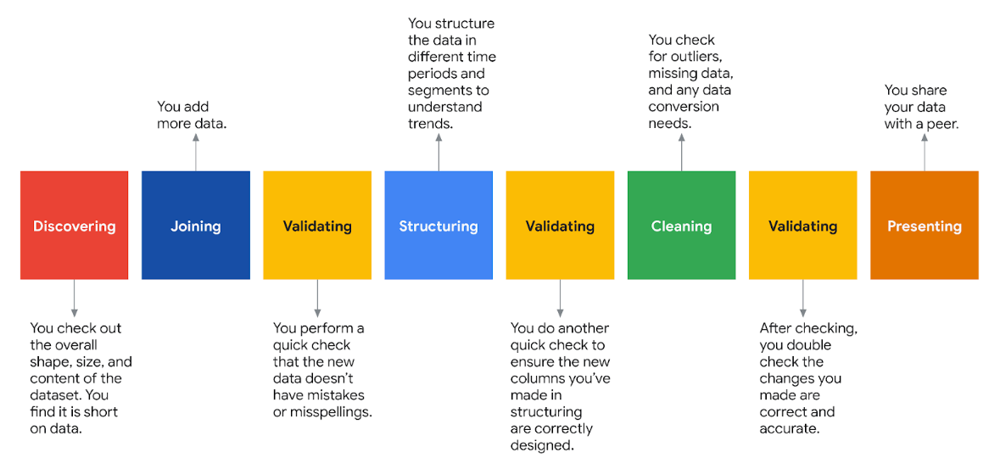

```python
# Create two new columns
df_by_quarter['quarter_number'] = df_by_quarter['quarter'].str[-2:]
df_by_quarter['year'] = df_by_quarter['quarter'].str[:4]

df_by_quarter.head()

plt.figure(figsize=(15,5))
p = sns.barplot(data=df_by_quarter, x='quarter_number', y='number_of_strikes', hue='year')

for b in p.patches:
    p.annotate(
        str(round(b.get_height() / 1000000, 1)) + 'M',
        (b.get_x() + b.get_width() / 2., b.get_height() + 1.2e6),
        ha='center', va='bottom',
        xytext=(0, -12),
        textcoords='offset points'
    )

plt.xlabel("Quarter")
plt.ylabel("Number of lightning strikes")
plt.title("Number of lightning strikes per quarter (2016-2018)")
plt.show()
```


```python
# Import statements
import pandas as pd
import numpy as np
import seaborn as sns
import datetime
from matplotlib import pyplot as plt

# Read in the 2018 lightning strike dataset
df = pd.read_csv('eda_using_basic_data_functions_in_python_dataset1.csv')

# Convert the `date` column to datetime
df['date'] = pd.to_datetime(df['date'])
df.head()
```

| date       | number_of_strikes | center_point_geom   |
|------------|-------------------|---------------------|
| 2018-01-03 | 194               | POINT(-75 27)       |
| 2018-01-03 | 41                | POINT(-78.4 29)     |
| 2018-01-03 | 33                | POINT(-73.9 27)     |
| 2018-01-03 | 38                | POINT(-73.8 27)     |
| 2018-01-03 | 92                | POINT(-79 28)       |

```python
df.shape
(3401012, 3)
```

```python
df.drop_duplicates().shape
(3401012, 3)
```

```python
# Sort by number of strikes in descending order
df.sort_values(by='number_of_strikes', ascending=False).head(10)
```

| Index  | date       | number_of_strikes | center_point_geom    |
|--------|------------|-------------------|----------------------|
| 302758 | 2018-08-20 | 2211              | POINT(-92.5 35.5)    |
| 278383 | 2018-08-16 | 2142              | POINT(-96.1 36.1)    |
| 280830 | 2018-08-17 | 2061              | POINT(-90.2 36.1)    |
| 280453 | 2018-08-17 | 2031              | POINT(-89.9 35.9)    |
| 278382 | 2018-08-16 | 1902              | POINT(-96.2 36.1)    |
| 11517  | 2018-02-10 | 1899              | POINT(-95.5 28.1)    |
| 277506 | 2018-08-16 | 1878              | POINT(-89.7 31.5)    |
| 24906  | 2018-02-25 | 1833              | POINT(-98.7 28.9)    |
| 284320 | 2018-08-17 | 1767              | POINT(-90.1 36)      |
| 24825  | 2018-02-25 | 1741              | POINT(-98 29)        |

```python
# Identify locations that appear most in the dataset
df.center_point_geom.value_counts()
```

| Location             | Count |
|----------------------|-------|
| POINT(-81.5 22.5)    | 108   |
| POINT(-84.1 22.4)    | 108   |
| POINT(-82.5 22.9)    | 107   |
| POINT(-82.7 22.9)    | 107   |
| POINT(-82.5 22.8)    | 106   |
| ...                  | ...   |
| POINT(-119.3 35.1)   | 1     |
| POINT(-119.3 35)     | 1     |
| POINT(-119.6 35.6)   | 1     |
| POINT(-119.4 35.6)   | 1     |
| POINT(-58.5 45.3)    | 1     |

```python
# Identify top 20 locations with most days of lightning
df.center_point_geom.value_counts()[:20].rename_axis('unique_values').reset_index(name='counts').style.background_gradient()
```


```python
# Create two new columns
df['week'] = df.date.dt.isocalendar().week
df['weekday'] = df.date.dt.day_name()
df.head()
```

| date       | number_of_strikes | center_point_geom | week | weekday   |
|------------|-------------------|-------------------|------|-----------|
| 2018-01-03 | 194               | POINT(-75 27)     | 1    | Wednesday |
| 2018-01-03 | 41                | POINT(-78.4 29)   | 1    | Wednesday |
| 2018-01-03 | 33                | POINT(-73.9 27)   | 1    | Wednesday |
| 2018-01-03 | 38                | POINT(-73.8 27)   | 1    | Wednesday |
| 2018-01-03 | 92                | POINT(-79 28)     | 1    | Wednesday |

```python
# Calculate mean count of lightning strikes for each weekday
df[['weekday', 'number_of_strikes']].groupby(['weekday']).mean()
```

| weekday   | number_of_strikes |
| --------- | ------------------- |
| Friday    | 13.349972           |
| Monday    | 13.152804           |
| Saturday  | 12.732694           |
| Sunday    | 12.324717           |
| Thursday  | 13.240594           |
| Tuesday   | 13.813599           |
| Wednesday | 13.224568           |

```python
# Define order of days for the plot
weekday_order = ['Monday', 'Tuesday', 'Wednesday', 'Thursday', 'Friday', 'Saturday', 'Sunday']

# Create boxplots of strike counts for each day of week
g = sns.boxplot(
    data=df,
    x='weekday',
    y='number_of_strikes',
    order=weekday_order,
    showfliers=False
)
g.set_title('Lightning distribution per weekday (2018)')
```

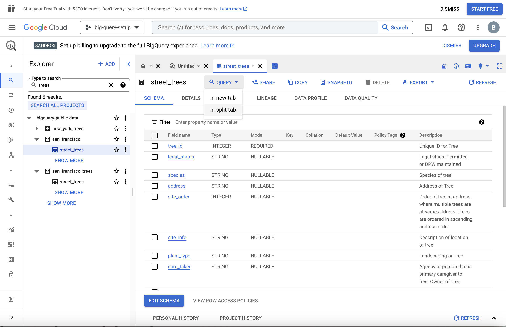

```python
# 2016-2017 verilerini 2018 verileriyle birleştirerek yeni bir veri çerçevesi oluştur
union_df = pd.concat([df.drop(['weekday', 'week'], axis=1), df_2], ignore_index=True)

# Birleştirilmiş veri çerçevesinin ilk 5 satırını göster
union_df.head()
```

| date       | number_of_strikes | center_point_geom  |
|------------|-------------------|---------------------|
| 2018-01-03 | 194               | POINT(-75 27)       |
| 2018-01-03 | 41                | POINT(-78.4 29)     |
| 2018-01-03 | 33                | POINT(-73.9 27)     |
| 2018-01-03 | 38                | POINT(-73.8 27)     |
| 2018-01-03 | 92                | POINT(-79 28)       |

```python
# 2017 yılında daha az yıldırım vardı
union_df[['year', 'number_of_strikes']].groupby(['year']).sum()
```

| year | number_of_strikes |
|------|-------------------|
| 2016 | 41,582,229        |
| 2017 | 35,095,195        |
| 2018 | 44,600,989        |

```python
# Her yılın her ayı için toplam yıldırım sayısını hesapla
lightning_by_month = union_df.groupby(['month_txt', 'year']).agg(
    number_of_strikes = pd.NamedAgg(column='number_of_strikes', aggfunc=sum)
).reset_index()

# İlk 5 satırı göster
lightning_by_month.head()
```

| month_txt | year | number_of_strikes |
|-----------|------|-------------------|
| April     | 2016 | 2,636,427         |
| April     | 2017 | 3,819,075         |
| April     | 2018 | 1,524,339         |
| August    | 2016 | 7,250,442         |
| August    | 2017 | 6,021,702         |

```python
# Yıllara göre toplam yıldırım sayısını hesapla
lightning_by_year = union_df.groupby(['year']).agg(
    year_strikes = pd.NamedAgg(column='number_of_strikes', aggfunc=sum)
).reset_index()

# İlk 5 satırı göster
lightning_by_year.head()
```

| year | year_strikes |
|------|--------------|
| 2016 | 41,582,229   |
| 2017 | 35,095,195   |
| 2018 | 44,600,989   |

```python
# Aylık yıldırım verisini yıllık toplamla birleştir
percentage_lightning = lightning_by_month.merge(lightning_by_year, on='year')

# İlk 5 satırı göster
percentage_lightning.head()
```

| month_txt | year | number_of_strikes | year_strikes |
|-----------|------|-------------------|--------------|
| April     | 2016 | 2,636,427         | 41,582,229   |
| August    | 2016 | 7,250,442         | 41,582,229   |
| December  | 2016 | 316,450           | 41,582,229   |
| February  | 2016 | 312,676           | 41,582,229   |
| January   | 2016 | 313,595           | 41,582,229   |

```python
# Her ay için "yıldırım yüzdesi" sütunu oluştur
percentage_lightning['percentage_lightning_per_month'] = (
    (percentage_lightning.number_of_strikes / percentage_lightning.year_strikes) * 100.0
)

# İlk 5 satırı göster
percentage_lightning.head()
```
 
| month_txt | year | number_of_strikes | year_strikes | percentage_lightning_per_month |
|-----------|------|-------------------|--------------|-------------------------------|
| April     | 2016 | 2,636,427         | 41,582,229   | 6.340273                      |
| August    | 2016 | 7,250,442         | 41,582,229   | 17.436396                     |
| December  | 2016 | 316,450           | 41,582,229   | 0.761022                      |
| February  | 2016 | 312,676           | 41,582,229   | 0.751946                      |
| January   | 2016 | 313,595           | 41,582,229   | 0.754156                      |

```python
plt.figure(figsize=(10,6))  # Grafik boyutunu ayarla (genişlik=10, yükseklik=6)

sns.barplot(
    data = percentage_lightning,          # Veri kaynağı
    x = 'month_txt',                      # X ekseni: ay isimleri
    y = 'percentage_lightning_per_month',# Y ekseni: aylık yıldırım yüzdesi
    hue = 'year',                        # Renklerle yılı ayır
    order = month_order                   # Ayların sıralanma düzeni
)

plt.xlabel("Month")                      # X eksen etiketi
plt.ylabel("% of lightning strikes")    # Y eksen etiketi
plt.title("% of lightning strikes each Month (2016–2018)")  # Grafik başlığı
```


## Histogramlar

Öğrendiğiniz gibi, keşif veri analizinin (EDA) amacı tam da adının söylediği şeydir: verileri araştırın ve analiz edin. Bir veri uzmanı olarak, neredeyse her zaman yol gösterici bir soru veya hedefle başlayacaksınız, örneğin, "En yüksek karbondioksit yayıcıları nerede bulunur?" veya "X ürününü satın alma olasılığı en yüksek kişilerin özelliklerini belirleyin." Süreciniz boyunca bunu sık sık düşünmek, sizi yolda tutan bir itici güç yaratır.

Verileri keşfederken emrinizdeki en önemli araçlardan biri **histogramdır**. Histogram, bir veri kümesindeki veya değişkendeki her değerin ne sıklıkta meydana geldiğini gösteren bir frekans dağılımının grafiksel bir gösterimidir. Veri profesyonellerinin verilerinin dağılımlarını anlamaları çok önemlidir, çünkü bu bilgi deney tasarımı, modelleme ve daha ileri analizler etrafında birçok aşağı yönlü kararı yönlendirir. Bu okumada, histogramlar, ne olduklarını, nasıl yapılacağını ve nasıl yorumlanacağını öğreneceksiniz.

### **Histogramlara giriş**

Histogramlar, herhangi bir aykırı değerlerin varlığı, dağılımın merkezi ve verilerin yayılması dahil olmak üzere bir dağılımın şeklini göstermek için yaygın olarak kullanılır. Histogramlar tipik olarak, her çubuğun bir değer aralığını temsil ettiği bir dizi çubukla temsil edilir. Çubuk yüksekliği, bu aralıktaki veri noktalarının sıklığını veya sayısını temsil eder.

Aşağıdaki örnek, Wyoming, ABD'deki Yellowstone Ulusal Parkı'ndaki Old Faithful şofben patlamaları arasındaki saniye sayısının histogramıdır.

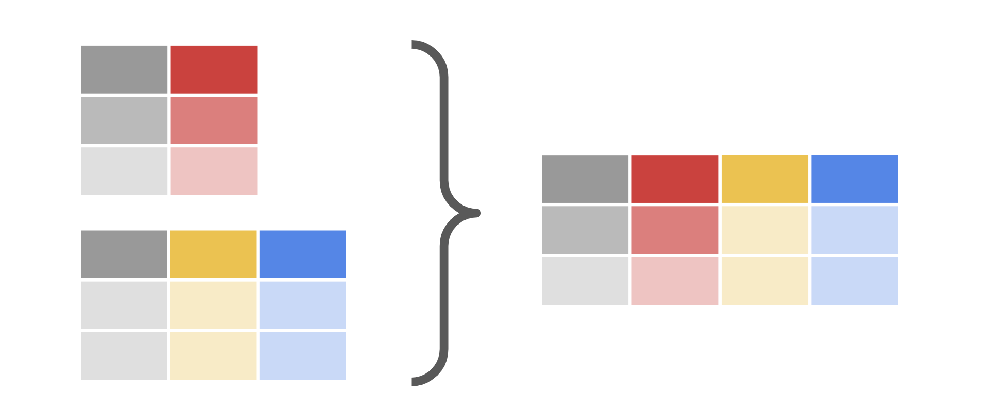

X ekseni, patlamalar arasındaki saniye sayısını temsil eder. Y ekseni patlama sayısını temsil eder. Bu nedenle, grafikteki ikinci çubuk tarafından belirtildiği gibi, 45-49 saniyelik bir bekleme süresinden sonra meydana gelen 20 patlama vardır.

### **Histogramların önemi**

Histogramlar, bir veri kümesinin özelliklerini anlamak için önemli bir araçtır. Verilerin dağılımının görsel bir temsilini sağlar ve veri profesyonellerinin verilerdeki kalıpları, eğilimleri veya aykırı değerleri tanımlamasını sağlar. Histogramlar ayrıca veri profesyonellerinin veriler için uygun istatistiksel testleri ve modelleri seçmelerine ve verilerin analiz için gerekli varsayımları karşılayıp karşılamadığını belirlemelerine yardımcı olabilir. Histogramlar, finans, sağlık, mühendislik ve sosyal bilimler dahil olmak üzere her türlü veri analizi gerektiren herhangi bir alanda ve her durumda yaygın olarak kullanılmaktadır.

### **Histogramlar nasıl yorumlanır**

Histogramları yorumlamak, dağılımın şeklini, merkezini ve yayılmasını anlamayı içerir. Aşağıdakiler de dahil olmak üzere birkaç yaygın histogram şekli vardır:

1. Simetrik: Simetrik bir histogram, ortasında bir tepe bulunan çan şeklinde bir eğriye sahiptir ve bu, verilerin ortalama etrafında eşit olarak dağıldığını gösterir. Bu aynı zamanda normal veya Gauss dağılımı olarak da bilinir.


2. Eğri: Eğik bir histogramın bir tarafında diğerinden daha uzun bir kuyruğu vardır. Sağa eğik bir histogramın sağ tarafında daha uzun bir kuyruğu vardır, bu da histogramın sol tarafında daha fazla veri noktası olduğunu gösterir.


Sol eğri bir dağılım, sol tarafta daha uzun bir kuyruğa sahiptir ve sağ tarafta daha fazla veri noktası gösterir.


3. Bimodal: İki modlu bir histogramın iki farklı tepe noktası vardır, bu da verilerin iki modu olduğunu gösterir.


4. Tek tip: Tek tip bir histogramın düz bir dağılımı vardır, bu da tüm veri noktalarının eşit olarak dağıldığını gösterir.


Sağlanan örnekler karşılaşacağınız tek dağıtım değildir, ancak en yaygın olanlardan bazılarıdır. Yakında dağıtımlar hakkında daha fazla bilgi edineceksiniz.

Şimdi, bu okumanın başlangıcındaki Old Faithful gayzer histogramına dönün. Kendinize sorun: Bu grafik tarafından ne tür bir dağılım temsil edilir? Şekle ek olarak, merkezi anlamak ve yayılmak önemlidir. Dağılımın merkezi tipik olarak ortalama veya medyan ile temsil edilirken, dağılım standart sapma veya verilerin aralığı ile temsil edilir. Merkez ve yayılma, veri konsantrasyonu ve değişkenliği hakkında içgörüler sağlayabilir.

### **Histogramlar nasıl oluşturulur**

Python'un seaborn ve matplotlib kütüphaneleri, histogramlar oluşturmak için basit ve güçlü seçenekler sunar.

#### [plt.hist (x, bins=10,...)](https://matplotlib.org/stable/api/_as_gen/matplotlib.pyplot.hist.html#matplotlib-pyplot-hist)

Matplotlib'de bir histogram oluşturmak için pyplot modülündeki hist() işlevi kullanın. İşlev birçok farklı argüman alabilir, ancak birincil olanlar şunlardır:

- x: Çizmek istediğiniz verileri temsil eden bir değer dizisi. Bir liste, tüple, NumPy dizisi, panda serisi vb. Olabilir.
    
- kutular: Verilerinizi sıralamak istediğiniz kutu sayısı. Varsayılan değer 10'dur, ancak bu parametre bir int, dizi veya dize olabilir. Bir dizi kullanırsanız, ilk kutunun sol kenarı ve son kutunun sağ kenarı da dahil olmak üzere çöp kutusu kenarlarını tanımlar. Başka bir deyişle, eğer kutular = [1, 3, 5, 7], o zaman ilk kutu [1—3) (1 dahil, ancak 3 hariç) ve ikincisi [3—5). Son kutu, ancak, 7 içeren [5—7] 'dir. Bir dize, numpy tarafından desteklenen önceden tanımlanmış bir binning stratejisini ifade eder. Daha fazla bilgi için belgelere bakın.
    

Aşağıdaki örnek, işlevi kullanarak bu okumanın başlangıcından itibaren Old Faithful gayzer histogramının nasıl oluşturulacağını göstermektedir.. 

```python
# Plot histogram with matplotlib pyplot
plt.hist(df['seconds'], bins=range(40, 101, 5))
plt.xticks(range(35, 101, 5))
plt.yticks(range(0, 61, 10))
plt.xlabel('seconds')
plt.ylabel('count')
plt.title('Old Faithful geyser - time between eruptions')
plt.show();
```

Bu durumda, çizilen veriler veri çerçevesinin saniye sütunudur. Kutular 40 saniyede başlar ve toplam 12 kutu için beşli adımlarla 100 saniyeye gider.

#### [sns.histplot (x, kutular, binrange, binwidth...)](https://seaborn.pydata.org/generated/seaborn.histplot.html)

Seaborn'da bir histogram oluşturmanın bir yolu işlevi kullanmaktır. sns.histplot() Matplotlib işlevi gibi, birçok argü sns.histplot() man alabilir. İşte bazı önemli olanlar:

- x: Veri dizisi. Aynı plt.hist()
    
- kutular: Aynı plt.hist()
    
- binrange: Kutu kenarları için en düşük ve en yüksek değer; bins veya ile kullanılabilirbinwidth; varsayılan olarak veri uç noktalarıdır
    
- binwidth: Her bölmenin genişliği, geçersiz kılar bins ancak birlikte kullanılabilir binrange
    

Aşağıdaki örnek, seaborn işlevini kullanarak Old Faithful gayzer histogramını oluşturmak için kullanılan koddur.. histplot() Daha önce bahsedilen parametrelerin tümünü kullanır. Bir histogram oluşturmak için bu kod bloğunu çalıştırın.

Bu durumda 40 ila 100 binrange arasında tanımlanmış ve 5 olarak ayar binwidth lanmış olduğuna dikkat edin. Bu ayar ile aynı sonuçları verirbins=range(40, 101, 5). Bu örnek ayrıca, altıgen kod gösterimini kullanarak belirli bir rengi belirterek ve parametre tarafından belirtildiği gibi renk doygunluğu seviyesini% 100'e ayarlayarak birkaç stil alpha parametresini kullanır.

**Not:** Aşağıdaki kod bloğu etkileşimli değildir.

```python
# Plot histogram with seaborn
ax = sns.histplot(df['seconds'], binrange=(40, 100), binwidth=5, color='#4285F4', alpha=1)
ax.set_xticks(range(35, 101, 5))
ax.set_yticks(range(0, 61, 10))
plt.title('Old Faithful geyser - time between eruptions')
plt.show();
```


### **Önemli çıkarımlar**

Histogramlar, veri uzmanlarının veri kümelerinin ve değişkenlerinin frekans dağılımlarını anlamalarına yardımcı olur. Veri dağılımının şekli ve türü hakkında bilgi, istatistiksel testler ve model mimarisi seçimi gibi önemli alt kararları etkileyecektir. Ek olarak, verilerinizin şeklini bilmek, verilerinizin dağıtım eğilimlerini anlamanıza yardımcı olarak verilerinizin size anlattığı hikayeye ilişkin değerli bilgiler sağlar.

## Veri Temizleme

Öğrendiğiniz gibi, veri temizleme ve doğrulama uygulamaları, eksik verileri, aykırı değerleri ve etiket kodlamasını işleme; yazım hatalarını kontrol etme ve kopyaları işleme dahil olmak üzere birkaç farklı adımı içerir. Bir veri uzmanı olarak, bu kategorilerdeki veri değerlerini en iyi nasıl ele alacağınızı bilmek sizin göreviniz olacaktır. Bu okumada, kopyaları işleme hakkında daha fazla bilgi edineceksiniz. Ayrıca, tekilleştirme işleminin bir veri kümesi için doğru strateji olup olmadığını belirlemeyi ve karar vermeyi öğreneceksiniz. Ek olarak, kopyaları işlemek için bazı yaygın Python işlevlerini öğreneceksiniz.

### Yinelenenleri tanımlama

Yinelenen değerlerin kaldırılıp kaldırılmayacağına dair herhangi bir karar vermeden önce, veri kümemizde yinelenen değerlerin olup olmadığını belirlemeliyiz.

Kopyaları tanımlamanın basit bir yolu, Pandas duplicated() işlevini kullanmaktır. duplicated()DataFramesınıfın bir yöntemidir.

Bu işlev, veri değerinin bir kopya olduğunu belirten "true" ve "false" benzersiz bir değer olduğunu belirten bir dizi "doğru/yanlış" çıktı döndürür.

İşte beş satırlı bir veri çerçevesi örneği:

```python
df
```

| brand   | style   | rating |
|---------|---------|--------|
| Wowyow  | cistern | 4.0    |
| Wowyow  | cistern | 4.0    |
| Splaysh | jug     | 5.5    |
| Splaysh | stock   | 3.3    |
| Pipplee | stock   | 3.0    |


duplicated() fonksiyonu kullanarak sonuç, birinin "Doğru" olarak işaretlenmiş olması ve bunun bir kopya olduğunu gösterir.

```python
print(df)
```
| brand   | style   | rating |
|---------|---------|--------|
| Wowyow  | cistern | 4.0    |
| Wowyow  | cistern | 4.0    |
| Splaysh | jug     | 5.5    |
| Splaysh | stock   | 3.3    |
| Pipplee | stock   | 3.0    |

```python
print(df.duplicated())
```

| Index | Value |
|-------|-------|
| 0     | False |
| 1     | True  |
| 2     | False |
| 3     | False |
| 4     | False |

Tüm veri çerçevesi için kopyaları tanımlamak, tek bir sütundan veya dizinden farklı olacaktır. Fonksi duplicated() yonu tüm veri çerçevesi için kullandığınızda emin olun. İş duplicated() lev, yalnızca bir sütunda _bulunan tek tek eşleşen değerleri değil, yalnızca tam olarak eşleşen değerlere sahip tüm sat_ ırları döndürür. Bir veri çerçevesindeki yalnızca bir sütun veya bir dizi sütun için kopyaları tanımlamak isterseniz, bunu işlevin bağımsız değişken alanının "alt küme" kısmına eklemeniz gerekir. duplicated() Daha ileri giderek, kopyaların hangisinin kopya yerine "orijinal" olarak saklanacağını belirtmek isterseniz, bunu bağımsız değişken alanının keep bölümünde belirtebilirsiniz.

Aşağıda, değerlerin yalnızca bir sütunundaki (alt kümesindeki) kopyaları tanımlamaya ve son kopyaları "yanlış" olarak etiketlemeye ve "saklanmaları" için bir örnek verilmiştir:

```python
print(df)
```

| color  | rating | type    |
|--------|--------|---------|
| olive  | 9.0    | rinds   |
| olive  | 9.0    | rinds   |
| gray   | 4.5    | pellets |
| salmon | 11.0   | pellets |
| salmon | 7.0    | pellets |

```python
print(df.duplicated(subset=['type'], keep='last'))
```

| Index | Value |
|-------|-------|
| 0     | True  |
| 1     | False |
| 2     | True  |
| 3     | True  |
| 4     | False |

### Karar zamanı: Düşmek mi düşmemek mi?

Öğrendiğiniz gibi, her veri kümesi benzersizdir ve her veri kümesini aynı şekilde ele alamazsınız. Yinelenen değerleri ortadan kaldırıp ortadan kaldırmamaya karar verirken, **veri kümesinin kendisi** ve ulaşmak **istediğiniz hedef hakkında derinlemesine düşünün**. Yinelenen kopyaları bırakmanın veri kümeniz ve hedefiniz üzerinde ne gibi bir etkisi olacak?

**1. Düşmeye karar** vermek

**Yinelenen değerler açıkça hataysa veya veri kümesinde kalan benzersiz değerleri yanlış temsil edecekse yinelenen değerleri bırakmalı veya ortadan kaldırmalısınız.** 


Örneğin, bir veri uzmanının (çoğu durumda) ev adreslerini ve ev fiyatlarını içeren bir veri kümesinin yinelenen değerlerini ortadan kaldıracağından makul ölçüde emin olabilirsiniz. Aynı evi iki kez saymak (çoğu durumda) ortalama ev fiyatı, toplam ev fiyatı ve hatta toplam ev sayısı gibi veri kümesinden çıkarılan sonuçları bir bütün olarak yanlış temsil edecektir. Böyle bir durumda, bir veri uzmanı, analiz ve görselleştirme sırasında kalan verileri adil bir şekilde temsil etmek için yinelenen verileri neredeyse kesinlikle ortadan kaldıracaktır.

**2. Düşmemeye karar vermek**

Yinelenen değerler açıkça hata **değilse** ve veri kümesini bir bütün olarak temsil ederken dikkate alınmalıysanız, yinelenen verileri veri kümenizde **tut** malısınız.


Örneğin, antrenmandaki bir Olimpiyat atış sporcunun atış sayısını ve mesafelerini gösteren bir veri kümesi muhtemelen birkaç çift mesafe içerecektir; sadece deneme sayısı ve bir kişinin ağırlıklı bir topa sahip olabileceği sınırlar gereği, yinelenen değerler olacaktır - özellikle mesafe ölçümleri yalnızca 1 veya 2 ondalık basamakla etiketlenmişse. Böyle bir durumda, bir veri uzmanı, analiz ve görselleştirme sırasında bir bütün olarak adil bir şekilde temsil etmek için neredeyse kesinlikle tüm verileri saklar.

### Kandırılmayın - Tekilleştirme nasıl yapılır

Python'a geri dönmeden ve kopyaları nasıl ortadan kaldıracağımızı öğrenmeden önce, önce "tekilleştirme" terimini tanımlayalım:

- **Tekilleştirme:** Bir veri kümesindeki eşleşen veri değerlerinin ortadan kaldırılması veya kaldırılması.
    

Python'da eşleşen veri değerlerini kaldırmak için kullanabileceğiniz bir dizi farklı kütüphane, işlev ve yöntem vardır.

Kullanılacak en yaygın işlevlerden biri Pandas'dadır: drop_duplicates()

drop_duplicates()başka bir DataFrame yöntemdir. Tüm yinelenen satırların kaldırıldığı yeni bir veri çerçevesi oluşturmak için kullanılır.

Örneğin, bu okumanın önceki bölümlerinden bir veri çerçevesi kullanın:

```python
df
```

| brand   | style   | rating |
|---------|---------|--------|
| Wowyow  | cistern | 4.0    |
| Wowyow  | cistern | 4.0    |
| Splaysh | jug     | 5.5    |
| Splaysh | stock   | 3.3    |
| Pipplee | stock   | 3.0    |


Şimdi kopyaları bırak işlevini uygulayın:

```python
df.drop_duplicates()
```

| brand   | style   | rating |
|---------|---------|--------|
| Wowyow  | cistern | 4.0    |
| Splaysh | jug     | 5.5    |
| Splaysh | stock   | 3.3    |
| Pipplee | stock   | 3.0    |

Ortaya çıkan çıktıda, yinelenen veri satırının kaldırıldığını ve kalan benzersiz değerlerin bozulmadan kaldığını fark edeceksiniz.

**Not:** Yukarıda yazıldığı gibi drop_duplicates() işlevin yalnızca **tüm veri satırlarının tam eşleşmelerinin kopyalarını bırakacağını unutmayın**. Yinelenenleri tek bir sütun içine bırakmak isterseniz, subset anahtar kelime bağımsız değişkenini kullanarak hangi sütunların kopyaları kontrol edeceğinizi belirtmeniz gerekir.

Bu örnek, style sütunda yinelenen değerlere sahip tüm satırları bırakır (ilk oluşum hariç):

```python
df
```

| brand   | style   | rating |
|---------|---------|--------|
| Wowyow  | cistern | 4.0    |
| Wowyow  | cistern | 4.0    |
| Splaysh | jug     | 5.5    |
| Splaysh | stock   | 3.3    |
| Pipplee | stock   | 3.0    |

```python
df=df.drop_duplicates(subset='style')
df
```

| brand   | style   | rating |
|---------|---------|--------|
| Wowyow  | cistern | 4.0    |
| Splaysh | jug     | 5.5    |
| Splaysh | stock   | 3.3    |

Ve bu örnek, _hem_ de rating sütunlarda yinelenen _değerlere sahip tüm satırları_ (ilk oluşum hariç) style bırakır:

```python
df
```

| brand   | style   | rating |
|---------|---------|--------|
| Wowyow  | cistern | 4.0    |
| Wowyow  | cistern | 4.0    |
| Splaysh | jug     | 5.5    |
| Splaysh | stock   | 3.3    |
| Pipplee | stock   | 3.0    |


df = df.drop_duplicates(subset=['style', 'rating'])
df

| brand   | style   | rating |
|---------|---------|--------|
| Wowyow  | cistern | 4.0    |
| Splaysh | jug     | 5.5    |
| Splaysh | stock   | 3.3    |
| Pipplee | stock   | 3.0    |

### Önemli Çıkarımlar

Bir veri kümesindeki yinelenen veri değerlerini belirlemek, özellikle temizleme ve doğrulama olmak üzere EDA (veya "Keşif Veri Analizi") uygulamalarının önemli bir parçasıdır. Yinelenenleri belirledikten sonra, yinelenmeleri ortadan kaldırmayı veya kopyaları ortadan kaldırmamayı seçerken veri kümesi üzerindeki etkiyi ve analiz hedefinizi düşünün.

### Ek Kaynaklar

Çoğaltmalar ve tekilleştirme hakkında daha fazla bilgi edinmek ister misiniz? Aşağıdaki ek bağlantılara göz atın.

- [Argüman alanının parametreleri hakkında daha fazla bilgi edinmek için Pandas belgelerine bakın](https://pandas.pydata.org/docs/reference/api/pandas.DataFrame.drop_duplicates.html)
    
- [W3 Okulları: Pandalar - kopyaları kaldırma](https://www.w3schools.com/python/pandas/pandas_cleaning_duplicates.asp "W3 Okulları - Pandalar: Kopyaları kaldırma")

```python
import pandas as pd
import numpy as np
import seaborn as sns
import datetime
from matplotlib import pyplot as plt

df = pd.read_csv('../Datasets/1.csv')
df.head()
```

| date       | center_point_geom     | longitude | latitude | number_of_strikes |
|------------|----------------------|-----------|----------|-------------------|
| 2018-08-01 | POINT(-81.6 22.6)    | -81.6     | 22.6     | 48                |
| 2018-08-01 | POINT(-81.1 22.6)    | -81.1     | 22.6     | 32                |
| 2018-08-01 | POINT(-80.9 22.6)    | -80.9     | 22.6     | 118               |
| 2018-08-01 | POINT(-80.8 22.6)    | -80.8     | 22.6     | 69                |
| 2018-08-01 | POINT(-98.4 22.8)    | -98.4     | 22.8     | 44                |


```python 
df.shape
# (717530,5)
```

```python
df_zip = pd.read_csv()
df_zip.head()
```

| date       | zip_code | city                       | state       | state_code | center_point_geom   | number_of_strikes |
|------------|----------|----------------------------|-------------|------------|---------------------|-------------------|
| 2018-08-08 | 3281     | Weare                      | New Hampshire | NH         | POINT(-71.7 43.1)   | 1                 |
| 2018-08-14 | 6488     | Heritage Village CDP       | Connecticut  | CT         | POINT(-73.2 41.5)   | 3                 |
| 2018-08-16 | 97759    | Sisters city, Black Butte Ranch CDP | Oregon   | OR         | POINT(-121.4 44.3)  | 3                 |
| 2018-08-18 | 6776     | New Milford CDP            | Connecticut  | CT         | POINT(-73.4 41.6)   | 48                |
| 2018-08-08 | 1077     | Southwick                  | Massachusetts| MA         | POINT(-72.8 42)     | 2                 |

```python 
df_zip.shape
# (323700, 7)
```

```python 
df_joined = df.merge(df_zip, how='left', on=['date', 'center_point_geom'])
df_joined.head()
```
| date       | center_point_geom     | longitude | latitude | number_of_strikes_x | zip_code | city | state | state_code | number_of_strikes_y |
|------------|-----------------------|-----------|----------|---------------------|----------|------|-------|------------|---------------------|
| 2018-08-01 | POINT(-81.6 22.6)     | -81.6     | 22.6     | 48                  | NaN      | NaN  | NaN   | NaN        | NaN                 |
| 2018-08-01 | POINT(-81.1 22.6)     | -81.1     | 22.6     | 32                  | NaN      | NaN  | NaN   | NaN        | NaN                 |
| 2018-08-01 | POINT(-80.9 22.6)     | -80.9     | 22.6     | 118                 | NaN      | NaN  | NaN   | NaN        | NaN                 |
| 2018-08-01 | POINT(-80.8 22.6)     | -80.8     | 22.6     | 69                  | NaN      | NaN  | NaN   | NaN        | NaN                 |
| 2018-08-01 | POINT(-98.4 22.8)     | -98.4     | 22.8     | 44                  | NaN      | NaN  | NaN   | NaN        | NaN                 |

```python 
df_joined.describe()
```

|               | longitude      | latitude      | number_of_strikes_x | zip_code      | number_of_strikes_y |
|---------------|----------------|----------------|---------------------|---------------|---------------------|
| count        | 717530.000000  | 717530.000000  | 717530.000000       | 323700.000000 | 323700.000000       |
| mean         | -90.875445     | 33.328572      | 21.637081           | 57931.958996  | 25.410587           |
| std          | 13.648429      | 7.938831       | 48.029525           | 22277.327411  | 57.421824           |
| min          | -133.900000    | 16.600000      | 1.000000            | 1002.000000   | 1.000000            |
| 25%          | -102.800000    | 26.900000      | 3.000000            | 38260.750000  | 3.000000            |
| 50%          | -90.300000     | 33.200000      | 6.000000            | 59212.500000  | 8.000000            |
| 75%          | -80.900000     | 39.400000      | 21.000000           | 78642.000000  | 24.000000           |
| max          | -43.800000     | 51.700000      | 2211.000000         | 99402.000000  | 2211.000000         |

```python 
df_null_geo = df_joined[pd.isnull(df_joined.state_code)]
df_null_geo.shape
(393830,10)

df_joined.info()
```

<class 'pandas.core.frame.DataFrame'>
Int64Index: 717530 entries, 0 to 717529
Data columns (total 10 columns):
| #  | Column               | Non-Null Count | Dtype   |
|----|----------------------|----------------|---------|
| 0  | date                 | 717530         | object  |
| 1  | center_point_geom    | 717530         | object  |
| 2  | longitude            | 717530         | float64 |
| 3  | latitude             | 717530         | float64 |
| 4  | number_of_strikes_x  | 717530         | int64   |
| 5  | zip_code             | 323700         | float64 |
| 6  | city                 | 323700         | object  |
| 7  | state                | 323700         | object  |
| 8  | state_code           | 323700         | object  |
| 9  | number_of_strikes_y  | 323700         | float64 |

dtypes: float64(4), int64(1), object(5)
memory usage: 60.2+ MB

```python 
df_null_geo.head()
```

| date       | center_point_geom     | longitude | latitude | number_of_strikes_x | zip_code | city | state | state_code | number_of_strikes_y |
|------------|-----------------------|-----------|----------|---------------------|----------|------|-------|------------|---------------------|
| 2018-08-01 | POINT(-81.6 22.6)     | -81.6     | 22.6     | 48                  | NaN      | NaN  | NaN   | NaN        | NaN                 |
| 2018-08-01 | POINT(-81.1 22.6)     | -81.1     | 22.6     | 32                  | NaN      | NaN  | NaN   | NaN        | NaN                 |
| 2018-08-01 | POINT(-80.9 22.6)     | -80.9     | 22.6     | 118                 | NaN      | NaN  | NaN   | NaN        | NaN                 |
| 2018-08-01 | POINT(-80.8 22.6)     | -80.8     | 22.6     | 69                  | NaN      | NaN  | NaN   | NaN        | NaN                 |
| 2018-08-01 | POINT(-98.4 22.8)     | -98.4     | 22.8     | 44                  | NaN      | NaN  | NaN   | NaN        | NaN                 |

```python 
top_missing = if_null_geo[['latitude', 'longitude', 'number_of_strikes_x']
].groupby(['latitude', 'longitude'] ).sum().sort_values('number_of_strikes_x', ascending=False).reset_index()

top_missing.head(10)
```

| latitude | longitude | number_of_strikes_x |
|----------|-----------|---------------------|
| 22.4     | -84.2     | 3841                |
| 22.9     | -82.9     | 3184                |
| 22.4     | -84.3     | 2999                |
| 22.9     | -83.0     | 2754                |
| 22.5     | -84.1     | 2746                |
| 22.5     | -84.2     | 2738                |
| 22.3     | -81.0     | 2680                |
| 22.9     | -82.4     | 2652                |
| 22.9     | -82.3     | 2618                |
| 22.3     | -84.3     | 2551                |

```python 
import plotly.express as px

fig = px.scatter_geo(top_missing[top_missing.number_of_strikes_x>=300],
                     lat "latitude",
                     lon="longitude",
                     size="number_of_strikes_x")

fig.update_layout(title_text= 'Missing data', )
fig.show()
```

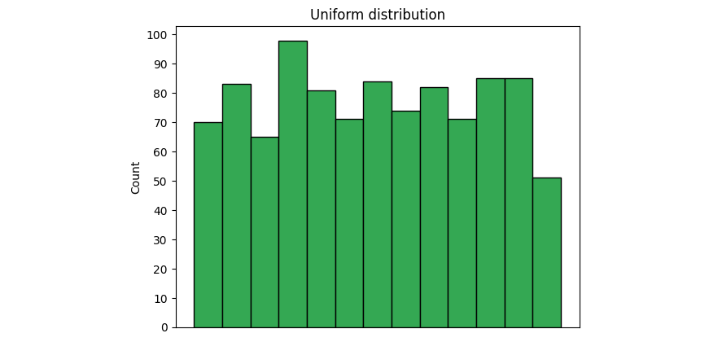

```python 
import plotly.express as px

fig px.scatter_geo(top_missing[top_missing.number_of_strikes_x>=300],
                   lat="latitude",
                   lon="longitude",
                   size="number_of_strikes_x")

fig.update_layout(
    title_text = 'Missing data',
    geo_scope='usa',
)

fig.show()
```


```python
# Import statements
import pandas as pd
import numpy as np
import seaborn as sns
import datetime
from matplotlib import pyplot as plt

#Print first 10 rows
df.head(10)
```

| year | number_of_strikes |
|------|-------------------|
| 2020 | 15620068          |
| 2019 | 209166            |
| 2018 | 44600989          |
| 2017 | 35095195          |
| 2016 | 41582229          |
| 2015 | 37894191          |
| 2014 | 34919173          |
| 2013 | 27600898          |
| 2012 | 28807552          |
| 2011 | 31392058          |

```python 
def readable_numbers(x):
    
    """takes a large number and formats it into K,M to make it more readable""" 
    if x >= le6:
        s='{:1.lf}M'.format(x*le-6)
    else: 
        s='{:1.0f)K'.format(x*1e-3)
    return s

#Use the readable_numbers() function to create a new column
df ['number_of_strikes_readable']=df ['number_of_strikes'].apply(readable_numbers)

df.head(10)
```

| year | number_of_strikes | number_of_strikes_readable |
|------|-------------------|----------------------------|
| 2020 | 15620068          | 15.6M                      |
| 2019 | 209166            | 209K                       |
| 2018 | 44600989          | 44.6M                      |
| 2017 | 35095195          | 35.1M                      |
| 2016 | 41582229          | 41.6M                      |
| 2015 | 37894191          | 37.9M                      |
| 2014 | 34919173          | 34.9M                      |
| 2013 | 27600898          | 27.6M                      |
| 2012 | 28807552          | 28.8M                      |
| 2011 | 31392058          | 31.4M                      |

```python
print("Mean:" + readable_numbers(np.mean(df['number_of_strikes'])))
print("Median:" + readable_numbers(np.median(df ['number_of_strikes'])))

# Mean:26.8M
# Median:28.3M
```


```python 
# Create boxplot
box sns.boxplot(x=df ['number_of_strikes')) gplt.gca()

box.set_xticklabels (np.array([readable_numbers(x) for x in g.get_xticks()])) plt.xlabel('Number of strikes') plt.title('Yearly number of lightning strikes');
```

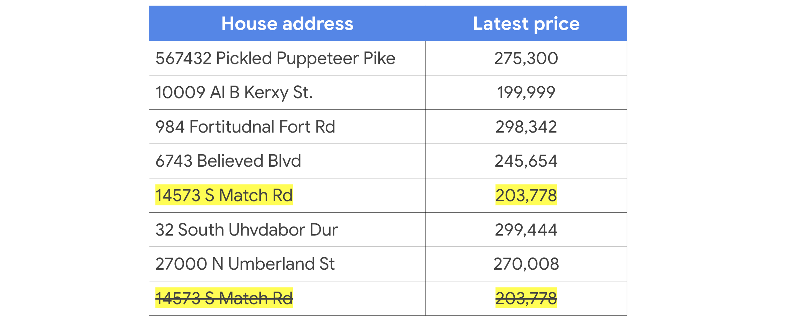


```python 
# Calculate 25th percentile of annual strikes
percentile25 = df['number_of_strikes'].quantile (0.25)

#Calculate 75th percentile of annual strikes
percentile75 = df['number_of_strikes'].quantile(0.75)

#Calculate interquartile range
iqr = percentile75 - percentile25

#Calculate upper and lower thresholds for outliers
upper_limit = percentile75 + 1.5 * iqr
lower_limit percentile25 + 1.5 * iqr

print('Lower limit is: ' + readable_numbers(lower_limit))
Lower limit is: 8.6M

#Isolate outliers on low end
df[df['number_of_strikes'] < lower_limit]
```

| year | number_of_strikes | number_of_strikes_readable |
|------|-------------------|----------------------------|
| 2019 | 209166            | 209K                       |
| 1987 | 7378836           | 7.4M                       |

```python 
def addlabels(x,y):
    for i in range(len(x)):
        plt.text(x[i]-0.5, y[i]+0.05,
                 s=readable_numbers(y[i]))


colors np.where(df['number of_strikes'] < lower_limit, 'r', 'b')

fig, ax = plt.subplots(figsize=(16,8))
ax.scatter(df['year'], df['number_of_strikes'),c=colors) ax.set_xlabel('Year')
ax.set_ylabel('Number of strikes')
ax.set_title('Number of lightning strikes by year')
addlabels(df['year'], df['number_of_strikes'])

for tick in ax.get_xticklabels():
    tick.set_rotation (45)

plt.show()
```


```python 
df_2019 = pd.read_csv('eda_outliers_dataset2.csv')
df_2019.head()

# Convert `date` column to datetime
df_2019['date']= pd.to_datetime(df_2019['date'])

# Create 2 new columns

df_2019['month'] = df_2019['date'].dt.month

df_2019['month_txt'] = df_2019['date'].dt.month_name().str.slice(stop=3)

# Group by month and month txt, sum it, and sort. Assign result new df 
df_2019_by_month = df_2019.groupby(['month', 'month_txt')).sum().sort_values('month', ascending=True).head()
df_2019_by_month
```

| month | month_txt | number_of_strikes |
|-------|-----------|-------------------|
| 12    | Dec       | 209166            |

```python 
#Read in 1987 data
df_1987=pd.read_csv('eda_outliers_dataset3.csv')

#Convert date column to datetime
df_1987['date'] = pd.todatetime(df_1987['date'])

#Create 2 new columns
df_1987['month'] = df_1987['date'].dt.month
df_1987['month_txt'] = df_1987['date'].dt.month_name().str.slice(stop=3)

#Group by month and `month_txt ', sum it, and sort. Assign result to new df
df_1987_by_month = df_1987.groupby(['month', 'month_txt']).sum().sort_values('month', ascending=True).head() 
df_1987_by_month
```

| month | month_txt | number_of_strikes |
|-------|-----------|-------------------|
| 1     | Jan       | 23044             |
| 2     | Feb       | 61020             |
| 3     | Mar       | 117877            |
| 4     | Apr       | 157890            |
| 5     | May       | 700910            |
| 6     | Jun       | 1064166           |
| 7     | Jul       | 2077619           |
| 8     | Aug       | 2001899           |
| 9     | Sep       | 869833            |
| 10    | Oct       | 105627            |
| 11    | Nov       | 155290            |
| 12    | Dec       | 43651             |

```python 
#Create new df that removes outliers
df_without_outliers=df[df['number_of_strikes']>=lower_limit]

#Recalculate mean and median values on data without outliers
print("Mean:"+readable_numbers(np.mean(df_without_outliers['number_of_strikes']))) 
print("Median:"+readable_numbers(np.median(df_without_outliers['number_of_strikes'])))

# Mean:28.2M
# Median:28.8M
```

## getdummies() ve cat.codes()

```python
# Load libraries.
import datetime
import matplotlib.pyplot as plt 
import pandas as pd 
import seaborn as sns

# Create a new data frame with the number of strikes per month.
df['date'] = pd.to_datetime(df['date'])
df['month'] = df['date'].dt.month_name().str.slice(stop = 3)

# Make the month names categorical so they are in calendar instead of alphabetic
# order when we plot them.
months = ['Jan', 'Feb', 'Mar', 'Apr', 'May', 'Jun', 'Jul', 'Aug', 'Sep', 'Oct', 'Nov', 'Dec']

df['month'] = pd.Categorical(df['month'], categories = months, ordered
df['year'] = df['date'].dt.strftime('%Y')
df_by_month = df.groupby(['year', 'month']).sum().reset_index)
df_by_month.head()
```

| year | month | number_of_strikes |
|------|-------|-------------------|
| 2016 | Jan   | 313595            |
| 2016 | Feb   | 312676            |
| 2016 | Mar   | 2057527           |
| 2016 | Apr   | 2636427           |
| 2016 | May   | 5800500           |

```python
# Create a categorical variable by bucketing the number of lightning strikes
# per month into severeness levels based on quantiles.
df_by_month['strike_level'] = pd.qcut(
df_by_month ['number_of_strikes'],
4,
labels = ['Mild', 'Scattered', 'Heavy', 'Severe'])
df_by_month.head()
```

| year | month | number_of_strikes | strike_level |
|------|-------|-------------------|--------------|
| 2016 | Jan   | 313595            | Mild         |
| 2016 | Feb   | 312676            | Mild         |
| 2016 | Mar   | 2057527           | Scattered    |
| 2016 | Apr   | 2636427           | Heavy        |
| 2016 | May   | 5800500           | Severe       |

```python
# Assign numerical values to the strike levels.

df_by_month['strike_level_code'] = df_by_month['strike_level'].cat.codes[df_by_month.head()]
```

| year | month | number_of_strikes | strike_level | strike_level_code |
|------|-------|-------------------|--------------|-------------------|
| 2016 | Jan   | 313595            | Mild         | 0                 |
| 2016 | Feb   | 312676            | Mild         | 0                 |
| 2016 | Mar   | 2057527           | Scattered    | 1                 |
| 2016 | Apr   | 2636427           | Heavy        | 2                 |
| 2016 | May   | 5800500           | Severe       | 3                 |

```python
# Create dummy variables from strike levels.
pd.get_dummies(df_by_month['strike_level'])
```

| Mild | Scattered | Heavy | Severe |
|------|-----------|-------|--------|
| 1    | 0         | 0     | 0      |
| 1    | 0         | 0     | 0      |
| 0    | 1         | 0     | 0      |
| 0    | 0         | 1     | 0      |
| 0    | 0         | 0     | 1      |
| 0    | 0         | 0     | 1      |
| 0    | 0         | 0     | 1      |
| 0    | 0         | 0     | 1      |
| 0    | 0         | 1     | 0      |
| 0    | 1         | 0     | 0      |
| 1    | 0         | 0     | 0      |
| 1    | 0         | 0     | 0      |
| 0    | 1         | 0     | 0      |
| 1    | 0         | 0     | 0      |

```python
# Format dataframe indices to prepare for plotting.
df_by_month_plot = df_by_month.pivot('year', 'month', 'strike_level_code') 
df_by_month_plot.head()
```

| year | Jan | Feb | Mar | Apr | May | Jun | Jul | Aug | Sep | Oct | Nov | Dec |
|------|-----|-----|-----|-----|-----|-----|-----|-----|-----|-----|-----|-----|
| 2016 | 0   | 0   | 1   | 2   | 3   | 3   | 3   | 3   | 3   | 2   | 1   | 0   |
| 2017 | 1   | 0   | 1   | 2   | 2   | 3   | 3   | 3   | 2   | 1   | 0   | 0   |
| 2018 | 1   | 2   | 1   | 1   | 2   | 3   | 3   | 3   | 2   | 1   | 0   | 0   |

```python
# Make a heatmap showing which months over the years had most severe lightning.
ax = sns.heatmap(df_by_month_plot, cmap= 'Blues')
colorbar = ax.collections[0].colorbar
colorbar.set_ticks([0, 1, 2, 3])
colorbar.set_ticklabels (['Mild', 'Scattered', 'Heavy', 'Severe'])
plt.show()
```


## Veri Dönüşümünde Diğer Yaklaşımlar

Bildiğiniz gibi, veriler bize birçok farklı biçimde geliyor. Kategorik veya nitel veri türleri için, veri uzmanlarının analizlerini tamamlamak, veri görselleştirmelerini tasarlamak veya makine öğrenimi algoritmalarını oluşturmak için genellikle bu tür verileri sayısal rakamlara dönüştürmeleri (veya kodlamaları) gerekir. Bu okumada, iki ana kategorik veri kodlama türünü ve her türün ne zaman kullanılacağını öğreneceksiniz.

### Etiket kodlama

Her veri değerine nitel bir değer yerine farklı bir sayı atandığı bir tür veri dönüştürme tekniği olan **etiket kod** lamayı zaten öğrendiniz.

[Videodan hatırlıyorsanız, verilen örnek mantar türlerini kodlayan etiket idi:](https://www.coursera.org/learn/go-beyond-the-numbers-translate-data-into-insight/lecture/BrCPD/sort-numbers-versus-names)

|**Mantar Türü**|**Kod**|
|---|---|
|Siyah trüf|0|
|Düğme|1|
|Cremini|2|
|Kirpi|3|
|Kral Trompet|4|
|Morel|5|
|Portobello|6|
|Shiitake|7|
|Kurbağa tabureti|8|

Anlayabileceğiniz gibi, mantarlarla ilgili bu varsayımsal veri seti için, her mantar türüne sıfırdan başlayarak kendi numarası atandı.

### Etiket kodlama ile ilgili bazı olası sorunlar

Müzik türleri kategorileri içeren bir veri kümesini analiz ettiğinizi hayal edin. "Blues", "Elektronik Dans Müziği (EDM)", "Hip Hop", "Jazz", "K-Pop", "Metal" ve "Rock" kodlarını aşağıdaki sayısal değerlerle etiketlersiniz: "1, 2, 3, 4, 5, 6 ve 7."

Bu etiket kodlamasıyla, ortaya çıkan makine öğrenimi modeli sadece bir sıralama değil, aynı zamanda Blues (1) ve EDM (2) arasında sayısal olarak ne kadar yakın oldukları için Blues (1) ve Jazz (4) arasında daha yakın oldukları için daha yakın bir bağlantı da türete **bilir**. Bu varsayılan ilişkilere ek olarak (analizinizde isteyebilirsiniz veya istemeyebilirsiniz), her kodun sayısal sırayla diğerinden eşit uzaklıkta olduğunu da fark etmelisiniz, çünkü 1'den 2'ye 5 ila 6, vb. ile aynı mesafedir, vb. Soru şu ki, bu eşit mesafeli ilişki veri kümenizdeki müzik türleri arasındaki ilişkileri doğru bir şekilde temsil ediyor mu? Başka bir soru sormak için, kodlamadan sonra, oluşturduğunuz görselleştirme veya model kodlanmış etiketleri bir sıralama olarak ele alacak mı?

Aynı şey yukarıdaki mantar örneği için de söylenebilir. Mantar türlerini kodladıktan sonra, mantarların artık düğme mantarları birinci sırada ve mantarların sekizinci sırada olduğu varsayılan bir sıralamada olmasından memnun musunuz?

Özetle, etiket kod **laması**, veri kümenizdeki kategorik veriler arasında istenmeyen ilişkiler oluşturabilir. Etiket kodlaması hakkında karar verirken, verilere uygulayacağınız algoritmayı ve bunun etiket kodlu kategorik verileri nasıl etkileyebileceğini veya etmeyebileceğini göz önünde bulundurun.

Neyse ki, kategorik kodlama için bu potansiyel sorunlara yardımcı olabilecek başka bir yöntem var.

### Tek kullanımda kodlama

Önceki bir [video](https://www.coursera.org/learn/go-beyond-the-numbers-translate-data-into-insight/lecture/BrCPD/sort-numbers-versus-names) da öğrendiğiniz gibi, Python'da sahte değişkenler oluşturabilirsiniz. Hatırlarsanız, sahte bir değişken, bir şeyin varlığını veya yokluğunu gösteren 0 veya 1 değerlerine sahip bir değişkendir. Buradaki fikir, her kategori türü için yeni bir sütun oluşturmaktır, ardından her değer için 0 veya 1 - 0 anlamı, hayır ve 1 anlamı evet belirtin.

Bu mankenlerin yaratılmasına **one-hot** kodlama denir. Bir hatırlatma olarak, tek sıcak kodlamaya sahip bir tablo şu şekilde biter:

|**Yok**|**Hafif**|**Dağınık**|**Ağır**|**Şiddetli**|
|---|---|---|---|---|
|**0**|1|0|0|0|
|**1**|1|0|0|0|
|**2**|0|1|0|0|
|**3**|0|0|1|0|
|**4**|0|0|0|1|
|**5**|0|0|0|1|
|**6**|0|0|0|1|
|**7**|0|0|0|1|
|**8**|0|0|1|0|
|**9**|0|1|0|0|
|**10**|1|0|0|0|
|**11**|1|0|0|0|
|**12**|0|1|0|0|

[Video](https://www.coursera.org/learn/go-beyond-the-numbers-translate-data-into-insight/lecture/BrCPD/sort-numbers-versus-names)da kapsanan yıldırım çarpması veri kümesindeki değerlerin "hafif" olarak etiketlendiğini ve "1" olduğunu göreceksiniz. "Hafif", veri kümesindeki yıldırım sayılarının en düşük çeyreğini ifade eder. "Hafif" sütundaki hafif DEĞER DEĞİLDİR diğer değerler için o hücrede bir sıfır vardır. Bu yöntemle etiket kodlamasının sunduğu istenmeyen ve sorunlu ilişkiler sorununu çözüyoruz.

Ancak tek sıcak kodlama, özellikle lojistik ve doğrusal regresyon söz konusu olduğunda, kendi problemlerini sunar. Gelecekteki bir kursta bunun hakkında daha fazla bilgi edineceksiniz.

### **Etiket kodlaması veya tek sıcak kodlama: Nasıl karar verilir?**

Etiket kodlaması mı yoksa tek sıcak kodlama mı kullanmanız gerektiğine dair basit bir cevap yoktur. Kararın duruma göre veya veri kümesi bazında verilmesi gerekir. Ancak size yardımcı olacak bazı kurallar var.

Aşağıdaki durumlarda etiket kodlamasını kullanın:

- Çok sayıda farklı kategorik değişken vardır - çünkü etiket kodlaması, tek bir sıcak kodlamadan çok daha az veri kullanır
    
- Kategorik değerlerin kendilerine göre belirli bir sırası vardır (örneğin, yaş grupları en gençten en büyüğe veya en büyükten en küçüğe kadar gruplandırılabilir)
    
- Bir karar ağacı veya rastgele orman makine öğrenme modeli kullanmayı planlıyorsunuz
    

Aşağıdaki durumlarda tek sıcak kodlama kullanın:

- Nispeten az miktarda kategorik değişken vardır - çünkü tek sıcak kodlama, etiket kodlamasından çok daha fazla veri kullanır.
    
- Kategorik değişkenlerin belirli bir sırası yoktur
    
- Boyutsallık azaltma ile birlikte bir makine öğrenimi modeli kullanırsınız (Temel Bileşen Analizi (PCA) gibi)
    

### Önemli çıkarımlar

Etiket kodlaması ve tek sıcak kodlama, kategorik verileri sayısal verilere dönüştürmek için kullanılan tekniklerdir. Etiket kodlaması, çok sayıda farklı kategorik değişken ve kendilerine özgü bir düzene sahip kategoriler için en iyisidir. Tek kullanımlı kodlama, daha küçük miktarlarda kategorik değişken ve sırası olmayan kategoriler için en iyisidir.

## Tarih Farkı ve Görselleştirme

```python
# Load libraries.
import datetime
import matplotlib.pyplot as plt
import pandas as pd
import plotly.express as px
import seaborn as sns

df.head()
```
| date       | number_of_strikes | center_point_geom | longitude | latitude |
|------------|-------------------|-------------------|-----------|----------|
| 2018-01-03 | 194               | POINT(-75 27)     | -75.0     | 27.0     |
| 2018-01-03 | 41                | POINT(-78.4 29)   | -78.4     | 29.0     |
| 2018-01-03 | 33                | POINT(-73.9 27)   | -73.9     | 27.0     |
| 2018-01-03 | 38                | POINT(-73.8 27)   | -73.8     | 27.0     |
| 2018-01-03 | 92                | POINT(-79 28)     | -79.0     | 28.0     |

```python
# Display the data type of the columns.
print(df.dtypes)

# Date is currently a string. Let's parse it into a datetime column. 
df['date'] = pd.to_datetime(df['date'])
```

| Column              | Dtype   |
|---------------------|---------|
| date                | object  |
| number_of_strikes   | int64   |
| center_point_geom   | object  |
| longitude           | float64 |
| latitude            | float64 |

```python
#Count the number of missing values in each column. 
df.isnull().sum()
```

| Column             | Null Count |
|--------------------|------------|
| date               | 0          |
| number_of_strikes  | 0          |
| center_point_geom  | 0          |
| longitude          | 0          |
| latitude           | 0          |


```python
# Check ranges for all variables.
df.describe(include = 'all')
```
| Column             | date         | number_of_strikes | center_point_geom | longitude         | latitude          |
|--------------------|--------------|-------------------|-------------------|-------------------|-------------------|
| count              | 3401012      | 3401012           | 3401012           | 3401012           | 3401012           |
| unique             | 357          | NaN               | NaN               | 170855            | NaN               |
| top                | 2018-09-01 00:00:00 | NaN       | POINT(-81.5 22.5) | NaN               | NaN               |
| freq               | 31773        | NaN               | 108               | NaN               | NaN               |
| first              | 2018-01-01 00:00:00 | NaN       | NaN               | NaN               | NaN               |
| last               | 2018-12-31 00:00:00 | NaN       | NaN               | NaN               | NaN               |
| mean               | NaN          | 13.11403          | NaN               | -9.081778         | 33.746888         |
| std                | NaN          | 31.212099         | NaN               | 12.969539         | 7.8835555         |
| min                | NaN          | 1.0               | NaN               | -141.8000         | 1.660000          |
| 25%                | NaN          | 2.0               | NaN               | -102.8000         | 26.9000           |
| 50%                | NaN          | 4.0               | NaN               | -90.3000          | 33.2000           |
| 75%                | NaN          | 12.0              | NaN               | -80.9000          | 39.4000           |
| max                | NaN          | 2211.0            | NaN               | -43.8000          | 51.7000           |


```python
# Find missing dates by comparing all dates in 2018 to dates in our date column.
full_date_range = pd.date_range(start = '2018-01-01', end = '2018-12-31')
full_date_range.difference(df['date'])

# DatetimeIndex(['2018-06-19', '2018-06-20', '2018-06-21', '2018-06-22', '2018-09-18', '2018-09-19', '2018-12-01', '2018-12-02'],
#               dtype='datetime64[ns]', freq=None)
```

```python
# Make a boxplot to see the range better.
sns.boxplot(y = df['number_of_strikes'])
```


```python
# Plot again without the outliers to see where the majority of data is. 
sns.boxplot(y = df['number_of_strikes'], showfliers = False)
```

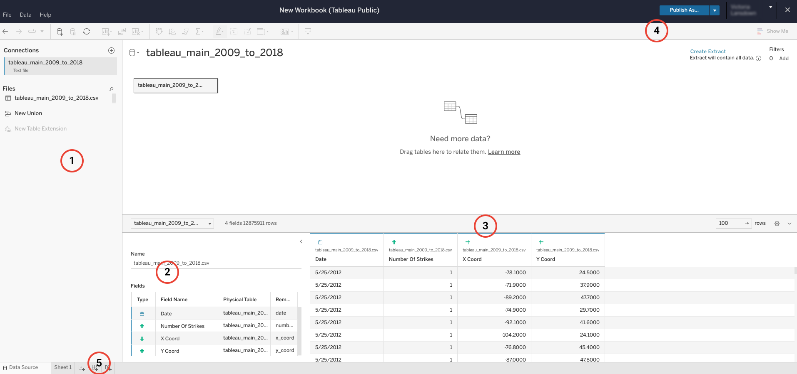

```python
# Plot points on the map to verify data is all from US.
df_points df[['latitude', 'longitude']].drop_duplicates() # Get unique points.
df_points.head()
```

| latitude | longitude |
|----------|-----------|
| 27.0     | -75.0     |
| 29.0     | -78.4     |
| 27.0     | -73.9     |
| 27.0     | -73.8     |
| 28.0     | -79.0     |

```python
# Plot points on the map to verify data is all from US.
df_points = df[['latitude', 'longitude']].drop_duplicates() # Get unique points. 
p = px.scatter_geo(df_points, lat = 'latitude', lon = 'longitude') 
p.show()
```

## Tableau’ya Genel Giriş

Öğrendiğiniz gibi, Tableau dünyanın dört bir yanındaki veri uzmanları tarafından kullanılan güçlü bir veri görselleştirme aracıdır. Google Data Analytics Profesyonel Sertifikasını aldıysanız, Tableau'ya zaten aşina olmalısınız. Veri Analitiği Sertifikasını tamamlamadıysanız aşağıdaki ve diğer videolarda bağlantılı kaynak materyallerini inceleyebilirsiniz. Tableau yazılımı, sizin gibi öğrencilerin yazılımın yeteneklerini sınırlı bir kapasitede test etmelerini sağlayan tarayıcı sürümü aracılığıyla ücretsiz olarak mevcuttur. Bu okumada, bu görselleştirme yazılımının ücretsiz kullanım, temel sürümü olan Tableau Public'e genel bir bakış verilecektir.

### Tableau Public'in temellerini gözden geçirme

Bu okumada, Tableau Public"de yer alan **veri kaynağının**  ve **tasarım ekranlarının** temel yapısı hakkında bilgi edineceksiniz. Veri kaynağı sayfası verileri girmek veya veri bağlamak için kullanılır ve tasarım sayfası veri görselleştirmeleri çizmek ve oluşturmak için kullanılır. Etkili ve ilgi çekici veri görselleştirmelerini başarılı bir şekilde tasarlamak için her ikisine de ihtiyaç vardır.

**Not:** Tableau Public kurulum sürecini gözden geçirmek için [Tableau Public'de oturum açma hakkındaki okumaya bakın](https://www.coursera.org/learn/go-beyond-the-numbers-translate-data-into-insight/supplement/muYtK/how-to-sign-on-to-tableau-public).

#### **Veri kaynağı sayfası**

Görselleştirmeleri tasarlamaya başlamadan önce verilerinizi yüklemeniz gerekir. Tableau Genel profilinizi zaten ayarladığınızdan, yapmanız gereken tek şey oturum açmak ve gezinme çubuğunda Oluş **tur altında Web** Yaz **ma seçen** eğini seçmek.

**Not:** Bu kursta Tableau için gereken her şey Web Yazma ile tamamlanabilir; Tableau _yazıl_ ımını indirmeniz gerekmez.

##### **Tableau Genel Web Oluşturma**

Web yazma, doğrudan bir web tarayıcısından görselleştirmeler oluşturmanıza olanak tanır. Herhangi bir yazılım indirmeden bir viz oluşturabilir misiniz? Evet! [Tableau Genel profilinizi zaten ayarladığınızdan, yapmanız gereken](https://www.tableau.com/community/blog/2022/9/beginners-guide-tableau-public) tek şey oturum açmak ve gezinme çubuğunda Oluş **tur altında Web** Yaz **ma seçen** eğini seçmek. Bu sertifika programının amaçları doğrultusunda Tableau Public uygulamasında ihtiyacınız olan her şeyi gerçekleştirebilirsiniz. Aşağıdaki kaynaklardaki talimatlar Tableau Public sayfasına atıfta bulunur.

##### **Tableau Masaüstü Genel Sürümü**

[Yazılımı doğrudan Mac veya PC'nize de indirebilirsiniz.](https://www.tableau.com/products/public/download) Public'in web sitesindeki gezinme çubuğunda **Oluştur**  altında **Tableau Desktop Public Edition**'ı seçin.

_**Hatırlatma: Tableau Public yalnızca genel verileri analiz etmek ve paylaşmak için kullanılmalıdır.**_ _Yayınlanan tüm çalışma kitaplarına ve veri kümelerine herkes tarafından ücretsiz olarak erişilebilir olacaktır._

Veri kümenizi yükledikten sonra, aşağıdaki resimde daire içine alınmış sayıları eşleştirmek için özetlenen aşağıdaki adımları uygulayabilirsiniz:


Aşağıdaki açıklamalar yukarıdaki resme karşılık gelir.

1. Bu sol bölme, veri bağlantılarınızı ve dosyalarınızı içerir. Burada yüklediğiniz tüm dosyaları bir listede bulacaksınız, böylece birden fazla dosyayı ve/veya farklı veritabanlarına birden fazla bağlantıyı takip edebilirsiniz.
    
2. Veri bağlantıları penceresinin hemen sağında, Tableau Public"in belirli bir dosyada algıladığı tüm alanların bir listesi bulunur.. Yüklenen birden fazla dosyanız varsa, her dosyanın alanlarına erişmek için dosyayı açılır menüden seçebilirsiniz. Yaklaşan bir videoda öğreneceğiniz gibi, Tableau'nun alanları dosyanızdaki veri sütunlarından alınır. Tableau bu alanları otomatik olarak boyutlar veya hesaplamalar ve ayrık veya sürekli değişkenler olarak sıralar.
    
3. Sayfadaki en büyük bölme, sağ ortada, dosyanızın tüm sütunlarına birkaç veri satırı dahil Tableau alanları olarak erişmenizi sağlar. Soldaki bölmenin aksine, bu bölme yeni hesaplama alanları, gruplar, kümeler veya parametreler gibi halihazırda mevcut olanlara dayalı olarak yeni alanlar oluşturmanıza olanak tanır (gelecek videolarda bu özellikler hakkında daha fazla bilgi edineceksiniz). Bu bölmeyi verilerinizle doldurmak için "şimdi güncelle" veya "otomatik olarak güncelle" seçeneğini seçmeniz istenebilir. Durum buysa, güncel verilerle tutarlı bir şekilde çalıştığınızdan emin olmak için otomatik olarak güncelleme yapmak iyi bir uygulamadır. (Referans için - #5 'dan sonra aşağıdaki resmi inceleyin.)
    
4. Ekranın sağ üst köşesindeki mavi "Yayınla" düğmesi "kaydet" düğmeniz olarak işlev görür. Tableau Public tarayıcı tabanlı bir platform olduğundan, oluşturduğunuz ve kaydetmek istediğiniz her şey herkese açık hesabınızda yayınlanacaktır. İstenirse veri kaynaklarını ve veri görselleştirmelerini parolayla kilitlemenin veya gizlemenin yolları vardır, ancak Tableau Public yalnızca çalışmanızı kaydetmek için Yayınla alanını sunar. 'Yayınla' düğmesine tıkladığınızda, tasarım ilerlemenize bağlı olarak boş olabilecek veri tasarım sayfanıza otomatik olarak yönlendirilebilirsiniz. Endişelenmeyin. En son veri kümesi yüklemeleriniz veya veri tasarımlarınız hala kaydedildi; en son bulunduğunuz yere geri dönün ve görselleştirmenizi düzenlemeye devam edin.
    
5. Son olarak, veri tasarım sayfanıza gitmek için sayfanın sol alt köşesindeki düğmeler koleksiyonunu kullanacaksınız. Yeni bir çalışma sayfası, yeni bir gösterge tablosu ve yeni bir hikaye oluşturmak için düğme seçeneklerini bulacaksınız. Bu unsurlar bir sonraki bölümde tanıtılacaktır.


#### **Veri tasarım sayfası**

Veri tasarımı sayfası, veri görselleştirmelerinizin oluşturulacağı yerdir. Veri tasarımı sayfasına gitmek için, 'Sayfa 1'e tıklayın veya önceki ilgili resimde #5 'de belirtildiği gibi yeni bir sayfa oluşturun. Bir veri tasarım sayfasını açmak için ilk tıkladığınızda, Tableau'nun 'Çıkarma Oluşturmak' olduğu sorulabilir. Bu, Tableau'nun görselleştirmelerde kullanılmak üzere sağlanan verileri çıkardığı anlamına gelir. Bu işlem birkaç dakika sürebilir. Burada, istediğiniz görselleştirme türünü oluşturmak için veri kaynağı alanlarınızı uygun raflara taşıyacaksınız. Bu sayfadan veri görselleştirmeleri veya tüm etkileşimli gösterge panoları oluşturabilirsiniz.


Aşağıdaki numaralandırılmış öğeler, yukarıdaki Tableau çalışma kitabı görüntüsünde görüntülenen sayılara karşılık gelir.

1. En soldaki bu bölmede, ayrık ve sürekli boyutlar ve hesaplamalar listenizi bulacaksınız. Görselleştirmeler oluşturmak için bu değişkenleri bu sayfadaki farklı bölmelere taşıyacaksınız. Bu değişkenler hakkında daha sonra daha fazla bilgi edineceksiniz.
    
2. Hemen sağdaki bir sonraki bölmede "Sayfalar", "Filtreler" ve "İşaretler" i bulacaksınız. Veri görselleştirmesini değiştirmek için herhangi bir boyutu veya hesaplamayı bu farklı alanlara taşıyabilirsiniz. Bu özellikleri gelecek videolarda nasıl kullanacağınızı öğreneceksiniz.
    
3. Sayfanın üst kısmında, menü çubuğunun hemen altında, değişken alanlarınızı taşımak için ana iki rafınız görevi gören iki boş satır vardır. "Sütunlar" ve "Satırlar" rafları, veri görselleştirmenizi istediğiniz gibi konumlandırmanıza yardımcı olur. Ayrıca bu satırların üzerinde, veri görselleştirmenizi değiştirmek için diğer seçeneklerle dolu bir araç çubuğu ve menü göreceksiniz.
    
4. Ekranın ortasında görselleştirmeniz için ana görüntüleme paneli bulunur. Öğeler ekleyip boyutlarınızı ve hesaplamalarınızı farklı alanlara sürükledikçe, bu panelde veri görselleştirmeniz üzerindeki etkisini fark edeceksiniz. Sağ üst köşede, kaydetme düğmesi görevi gören "Yayınla" düğmenizi ve "Beni Göster" açılır menüsünü bulacaksınız. "Bana Göster" açılır menüsünün altında, her birini oluşturmak için çeşitli veri görselleştirme türleri ve kılavuzları bulacaksınız.
    
5. Çalışmanızı [kaydetmeye ve paylaşmaya hazır olduğunuzda](https://help.tableau.com/current/pro/desktop/en-us/publish_workbooks_tableaupublic.htm), Tableau Genel profilinizde yayınlayın. Üst gezinme çubuğundaki "Yayınla" düğmesinin yanındaki aşağı oka tıklayarak çalışmanızı yayınlama seçeneklerini görüntüleyin.
    

### Tableau araçlarını incelemenin diğer yolları

#### **Google Veri Analitiği Profesyonel Sertifikası**

Daha önce de belirtildiği gibi, [Google Data Analytics Profesyonel Sertifika programı](https://www.coursera.org/professional-certificates/google-data-analytics) nı aldıysanız, Tableau ve Tableau Public'e zaten aşinasınız demektir. Öğrendiklerinizi gözden geçirmek için o programdaki [Tableau](https://www.coursera.org/learn/visualize-data/lecture/sLxV4/data-visualizations-with-tableau) 'yu kullanmaya başlayın dersine gidin.

#### **TableAU.com**

[Tableauau.com'u](https://www.tableau.com/) ziyaret ederek, Tableau Public (ücretsiz olan) Tableau Desktop, Tableau Mobile ve Tableau Server'a kadar çok sayıda ürün teklifini fark edeceksiniz. Her ürünün kendi kullanımı ve uzmanlığı vardır, ancak veri görselleştirme için ana unsurlar aynıdır. Veri görselleştirmeleriyle ilgili hemen hemen her konuda belirli makaleler bulmak için [Tableau Yardım sayfası](https://www.tableau.com/support/help?_ga=2.3466357.45238129.1654614666-316280037.1654614666)nda arama yapabilirsiniz.. Kullanıcıların ürünlerinin farklı özelliklerini öğrenmelerine yardımcı olmak için Tableau'da çeşitli eğitim kaynakları mevcuttur. Tableau, farklı ürünlerini öğrenmeye yardımcı olmak için çeşitli eğitim kaynakları sunar.

### Önemli çıkarımlar

Tableau güçlü bir veri görselleştirme aracıdır, ancak bu, onu yetkin bir şekilde kullanmanın çok fazla pratik ve deneyim gerektirdiği anlamına gelir. Kullanacağınız iki ana sayfa veri kaynağı ve veri tasarım sayfalarıdır. Tableau Yardımı ve Google Veri Analitiği Sertifika Programı ile Büyüme dahil olmak üzere sürecin her adımında size yardımcı olacak çok sayıda kaynak da mevcuttur.

### Daha fazla bilgi için kaynaklar

Sorun gidermenize yardımcı olmak veya daha fazla bilgi edinmek için aşağıdaki bağlantıları kullanabilirsiniz:

- Verilerinizi başarıya ayarlamak için Tableau kaynak sayfasını kullanın: [Veri kaynaklarını ayarlama](https://help.tableau.com/current/pro/desktop/en-us/datasource_prepare.htm)
    
- Tableau Araçları ve Web Yazma Yardımı: [Grafikler tasarlayın ve verileri analiz edin](https://help.tableau.com/current/pro/desktop/en-us/design_and_analyze.htm)
    
- "Günün Vizi"ni ve platformda tasarlanan diğer güzel görüntüleri içeren Tableau Public "Keşfet" sayfası: [Tableau Public'e Hoş Geldiniz](https://public.tableau.com/app/discover)
    
- Tableau Public kullanmaya yeni başlayanlar için kılavuz: [Kendi verilerinize, yani yolculuğunuza başlamanıza yardımcı olacak adım adım kılavuz](https://www.google.com/url?q=https://www.tableau.com/blog/beginners-guide-tableau-public?_gl%3D1*uv0ojo*_ga*MjU5NjUyMzcuMTY1NDMwMDM4MQ..*_ga_8YLN0SNXVS*MTY5MTE4NzA1Mi4xMC4xLjE2OTExODcwNzcuMC4wLjA&sa=D&source=docs&ust=1691485449789685&usg=AOvVaw267xvonfqL2uCc_x_yXcip)
    
- İlk Veri Görselleştirmenizi Yayınlamaya Hazırlanmak: [Verileri analiz etmek ve Tableau Genel profilinizde bir vizyon yayınlamak için adım adım kılavuz](https://www.tableau.com/blog/getting-ready-publish-your-first-data-visualization)

# Kurs 4: İstatistiğin Gücü

## Merkezi eğilim ölçüleri: Ortalama, medyan ve mod

Son zamanlarda, **merkezi eğilim ölçümlerinin** bir veri kümesinin merkezini temsil eden değerler olduğunu öğrendiniz. Yeni bir veri kümesiyle çalışırken, verilerinizin merkezi konumunu belirlemek, temel yapısını hızlı bir şekilde anlamanıza yardımcı olur.

Bu okumada, merkezi eğilimin üç ölçüsü hakkında daha fazla bilgi edineceksiniz: ortalama, medyan ve mod. Her bir ölçümün nasıl hesaplanacağını gözden geçireceğiz ve belirli verilerinize dayanarak hangi ölçümün en iyi kullanılacağını tartışacağız.

### Merkezi eğilim ölçüleri

Ortalama, medyan ve modun tümü, bir veri kümesinin merkezini farklı şekillerde tanımlar:

- **Ortalama**, bir veri kümesindeki ortalama değerdir.
    
- Med **yan**, bir veri kümesindeki orta değerdir.
    
- **Mod, bir veri kümesinde en sık meydana gelen değerdir.**
    

Merkezi eğilimin her ölçüsünün nasıl hesaplanacağını keşfedelim.

#### Ortalamayı, medyanı ve modu hesaplayın

##### Ortalama

**Ortalama**, bir veri kümesindeki ortalama değerdir. Ortalamayı hesaplamak için, veri kümenizdeki tüm değerleri toplar ve toplam değer sayısına bölersiniz.

Örneğin, aşağıdaki değer kümesine sahip olduğunuzu varsayalım: 10, 5, 3, 50, 12. Ortalamayı bulmak için toplam 80 için tüm değerleri eklersiniz. Ardından, toplam değer sayısı olan 5'e bölersiniz.

(10+5+3+50+12)÷5=80÷5=16

Ortalama veya ortalama değer 16'dır.

##### Medyan

Med **yan**, bir veri kümesindeki orta değerdir. Bu, veri kümesindeki değerlerin yarısının medyandan daha büyük olduğu ve değerlerin yarısının medyandan daha küçük olduğu anlamına gelir.

Bir veri kümesindeki tüm değerleri en küçükten en büyüğe düzenleyerek medyanı bulabilirsiniz. Beş değerinizi bu şekilde düzenlerseniz şunları elde edersiniz: 3, 5, 10, 12, 50. Medyan veya orta değer 10'dur.

Veri kümenizde çift sayıda değer varsa, medyan iki orta değerin ortalamasıdır. Diyelim ki setinize başka bir değer, 8, eklediniz: 3, 5, 8, 10, 12, 50. Şimdi, iki orta değer 8 ve 10'dur. Medyanı elde etmek için ortalamalarını alın.

(8+10)÷2=18÷2=9(8+10)÷2=18÷2=9

Medyan 9'dur.

##### Modu

**Mod, bir veri kümesinde en sık meydana gelen değerdir.** Bir veri kümesinin modu, bir modu veya birden fazla modu olamaz.

Örneğin, 1, 12, 33, 54, 75 sayı kümesinin modu yoktur çünkü hiçbir değer tekrarlanmaz. 2, 7, 7, 11, 20 setinde mod 7'dir, çünkü 7 bir kereden fazla meydana gelen tek değerdir. 3, 12, 12, 40, 40 setinin iki modu vardır: 12 ve 40.

#### Ortalama, medyan ve mod ne zaman kullanılır

Veri kümenizin merkezini tanımlamak için ortalama, medyan veya modu kullanıp kullanmadığınız, üzerinde çalıştığınız belirli verilere ve verilerinizden hangi içgörüleri elde etmek istediğinize bağlıdır. Her merkezi eğilim ölçüsünü kullanmak için bazı genel yönergeleri tartışalım.

##### Ortalama ve medyan

Hem ortalama hem de medyan, bir veri kümesinin merkezi konumunu tanımlar. Bununla birlikte, merkezi eğilimin ölçümleri olarak, ortalama ve medyan, farklı veri türleri için daha iyi çalışır.

Ortalamanın bir ana dezavantajı vardır: veri kümenizdeki aykırı değerlere karşı çok hassastır. Bir aykırı değerin, verilerin geri kalanından büyük ölçüde farklı bir değer olduğunu hatırlayın.

Veri kümenizde aykırı değerler varsa, medyan genellikle merkezin daha iyi bir ölçüsüdür. Hiçbir aykırı değer yoksa, ortalama genellikle iyi çalışır.

Örneğin, küçük bir başlangıç şirketindeki bir çalışanın yıllık ortalama maaşını hesaplamak istediğinizi düşünün. Aşağıdaki maaş verilerine sahipsiniz:

|**Çalışan**|#1|#2|#3|#4|#5|#6|#7|
|---|---|---|---|---|---|---|---|
|**Maaş**|40.000 $|45.000 $|45.000 $|45.000 $|45.000 $|50,000 $|500.000 $|

Veri kümenizdeki tüm değerleri toplayarak ve toplam değer sayısına bölerek ortalama yıllık maaşı hesaplayabilirsiniz. Toplamda yedi maaş var ve toplamı 770.000 dolar.

\$770,000÷7=\$110,000

Bu yedi çalışanın ortalama maaşı 110.000 dolar. Bununla birlikte, veriler bu ortalama değerin bu şirketteki bir çalışanın tipik maaşını doğru bir şekilde yansıtmadığını göstermektedir. Çoğu çalışanın maaşı 40.000 ila 50.000 dolar arasındadır. Aslında, yalnızca bir çalışanın maaşı 50.000 dolardan fazladır. 500.000 dolarlık maaş, ortalamayı artıran veya ortalamayı çarpıtan bir aykırıdır.

Bu durumda, bu aykırı değerin varlığı nedeniyle, medyan, ortalamadan daha iyi bir merkezi eğilim ölçüsüdür. Bu veri kümesindeki medyan veya orta değer 45.000 ABD dolarıdır. Medyan, bu şirketteki bir çalışanın tipik maaşı hakkında size daha iyi bir fikir verir.

##### Modu

Mod, kategorik verilerle çalışırken kullanışlıdır, çünkü hangi kategorinin en sık meydana geldiğini açıkça gösterir. Bir şirketin çalışan memnuniyeti anketi yürüttüğünü varsayalım. Anketteki ana madde, "Şirket içinde büyümek için sahip olduğum fırsattan memnunum" diyor. Çalışanlar cevapları için dört kategori arasından seçim yaparlar: kesinlikle katılıyorum, katılıyorum, katılmıyorum, kesinlikle katılmıyorum. Bir çubuk grafik sonuçları özetler.


Mod, "kesinlikle katılıyorum" derecesine atıfta bulunan çubuk grafikteki en yüksek çubuğu temsil eder. Bu, veri kümesinde en sık meydana gelen derecelendirmedir. Mod, şirkete çalışan memnuniyeti konusunda net geri bildirim verir; bu durumda olumlu geribildirim.

#### Önemli çıkarımlar

Ortalama, medyan ve mod gibi merkezi eğilim ölçümleri, veri kümenizin merkezini tek bir değer kullanarak tanımlamanıza izin verir. Bir veri uzmanı olarak, veri kümenizin merkezini bilmek, temel yapısını hızlı bir şekilde anlamanıza ve analizinizdeki sonraki adımları belirlemenize yardımcı olur.

#### Daha fazla bilgi için kaynaklar

Ortalama, medyan ve mod gibi merkezi eğilim ölçümleri hakkında daha fazla bilgi edinmek için aşağıdaki kaynağı keşfedin:

- [Avustralya İstatistik Bürosu'nun bu makalesi](https://www.abs.gov.au/websitedbs/D3310114.nsf/Home/Statistical+Language+-+measures+of+central+tendency#:~:text=There%20are%20three%20main%20measures,central%20value%20in%20the%20distribution.), ortalama, medyan ve moda yararlı bir genel bakış sunar ve aykırı değerlerin merkezi eğilim ölçümlerini nasıl etkilediğini tartışır.

## 8, 10, 12 olan 3 bileşenli bir seri için standart sapma;


## Dağılım ölçüleri: Menzil, varyans ve standart sapma

Son zamanlarda, **dağılım ölçümlerinin veri kümen** izin yayılımını veya veri değerlerinizdeki varyasyon miktarını tanımlamanıza izin verdiğini öğrendiniz. Standart sapma gibi dağılım ölçümleri, verilerinizin dağılımı hakkında ilk bilgi verebilir ve verilerinize hangi istatistiksel yöntemlerin uygulanacağını belirlemenize yardımcı olabilir.

Bu okumada, üç dağılım ölçüsü hakkında daha fazla bilgi edineceksiniz: aralık, varyans ve standart sapma. Bu okuma, temel standart sapma kavramına odaklanmaktadır. Bir veri uzmanı olarak, verilerinizin standart sapmasını sık sık hesaplayacak ve standart sapmayı daha karmaşık veri analizinin bir parçası olarak kullanacaksınız.

### Dağılım ölçüleri

Her dağılım ölçüsünün tanımını inceleyelim: aralık, varyans ve standart sapma.

#### **Menzil**

Aralık, bir veri kümesindeki en büyük ve en küçük değer arasındaki farktır.

Örneğin, bir biyoloji öğretmeni olduğunuzu ve final sınavı için puanlarla ilgili verileriniz olduğunu hayal edin. En yüksek puan 99/100 veya% 99'dur. En düşük puan 62/100 veya% 62'dir. Aralığı hesaplamak için en düşük puanı en yüksek puandan çıkarın.

99 - 62 = 37

Aralığı yüzde 37 puandır.

Menzil yararlı bir metriktir çünkü hesaplanması kolaydır ve veri kümenizin genel yayılımını çok hızlı bir şekilde anlamanızı sağlar.

#### **Varyans**

Başka bir yayılma ölçüsüne, **her** veri noktasının ortalamadan kare farkının ortalamadan ortalaması olan varyans denir. Temel olarak, standart sapmanın karesidir. Daha sonraki bir kursta varyans ve nasıl kullanılacağı hakkında daha fazla bilgi edineceksiniz.

#### **Standart sapma**

Standart sapma kavramını daha iyi anlamak için tanımını, görselleştirmesini ve istatistiksel formülünü inceleyelim.

#### **Tanımı**

**Standart sapma**, değerlerinizin veri kümenizin ortalamasından ne kadar yayıldığını ölçer. Bir veri noktasının ortalamadan tipik mesafesini hesaplar. Standart sapma ne kadar büyükse, değerleriniz ortalamadan o kadar yayılır. Standart sapma ne kadar küçükse, değerleriniz ortalamadan o kadar az yayılır.

#### **Görselleştirme**

Yayılma hakkında daha iyi bir fikir edinmek için üç normal olasılık dağılımının grafiklerini inceleyelim. Daha sonra, bir veri kümesindeki tüm değerleri eşleyen dağıtımlar hakkında bilgi edineceksiniz. Şimdilik, ortalamanın her eğrideki, tam merkezdeki en yüksek nokta olduğunu bilin.


Her eğri aynı ortalamaya ve farklı bir standart sapmaya sahiptir. Mavi noktalı eğrinin standart sapması 1, yeşil katı eğri 2 ve kırmızı kesikli eğri 3'tür. Veri değerlerinin çoğu ortalamaya yakın olduğu için mavi noktalı eğri en az yayılmaya sahiptir. Bu nedenle, mavi noktalı eğri en küçük standart sapmaya sahiptir. Veri değerlerinin çoğu ortalamadan daha uzağa düştüğü için kırmızı kesikli eğri en fazla yayılmaya sahiptir. Bu nedenle, kırmızı kesikli eğri en büyük standart sapmaya sahiptir.

#### **Formül**

Şimdi bir formül kullanarak standart sapmayı nasıl hesapladığınızı tartışalım.

Bir popülasyon ve bir örnek için standart sapmayı hesaplamak için farklı formüller vardır. Hatırlatma olarak, veri uzmanları tipik olarak örnek verilerle çalışır ve örneğe dayalı olarak popülasyonlar hakkında çıkarımlar yaparlar. Öyleyse, örnek standart sapma formülünü gözden geçirelim:

$s=\sqrt{\frac{\sum{(x-\bar{x})^2}}{n-1}} $

Formülde n, örneğinizdeki toplam veri değeri sayısıdır, x her bir veri değeridir ve x( "x-bar" olarak telaffuz edilir) veri değerlerinizin ortalamasıdır. Yunan harfi Sigma, toplam anlamına gelen bir semboldür.

**Not:** Bir veri uzmanı olarak, hesaplamalar için genellikle bir bilgisayar kullanırsınız. Hesaplamaları yapabilmek gelecekteki kariyeriniz için önemlidir, ancak hesaplamaların arkasındaki kavramlara aşina olmak, işyeri sorunlarına istatistiksel yöntemler uygulamanıza yardımcı olacaktır.

Formülün farklı bölümlerini daha iyi anlamak için, küçük bir veri kümesinin örnek standart sapmasını hesaplayalım: 2, 3, 10.

Bunu beş adımda yapabilirsiniz:

**1. Veri değerlerinizin ortalamasını veya ortalamasını hesaplayın.**

(2 + 3 +10) ÷ 3 = 15 ÷ 3 = 5

**2. Her değerden ortalamayı çıkarın**.

2 - 5 = -3

3 - 5 = -2

10 - 5 = 5

**3. Her sonucu kare haline getirin.**

-3*-3 = 9

-2*-2 = 4

5* 5 = 25

**4. Kareli sonuçları toplayın ve bu toplamı veri değerlerinin sayısından bir taneye bölün. Bu varyans.**

(9 + 4 + 25) ÷ (3 -1) = 38 ÷ 2 = 19

**5. Son olarak, varyansın karekökünü bulun.**

√19 = 4.36

Örnek standart sapması 4.36'dır.

Artık standart sapma kavramı hakkında daha fazla bilgi sahibi olduğunuza göre, pratik uygulamasının bir örneğini inceleyelim.

#### **Örnek: Gayrimenkul fiyatları**

Bir emlak şirketi için çalışan bir veri uzmanı olduğunuzu hayal edin. Ekibinizdeki emlakçılar, müşterilerini farklı yerleşim alanlarındaki kira fiyatlarındaki değişimler hakkında bilgilendirmeyi sever. İşinizin bir kısmı, belirli mahallelerdeki daireler için aylık kira fiyatlarının standart sapmasını hesaplamak ve bu bilgileri ekibinizle paylaşmaktır. Diyelim ki iki farklı mahallede tek yatak odalı daireler için aylık kira fiyatları hakkında örnek verileriniz var: Emerald Woods ve Rock Park. Her veri kümesi için ortalama ve standart sapmayı hesapladığınızı varsayalım.

**Zümrüt Ormanları**

|**Daire**|#1|#2|#3|#4|#5|
|---|---|---|---|---|---|
|**Aylık Kira**|\$900|\$950|\$1,000|\$1,050|\$1,100|

Ortalama: $1,000

Standart sapma: $79.05

**Kaya Parkı**

|**Daire**|#1|#2|#3|#4|#5|
|---|---|---|---|---|---|
|**Aylık Kira**|\$500|\$650|\$1,000|\$1,350|\$1,500|

Ortalama: $1,000

Standart sapma: \$431.56

Her iki mahalle de aylık 1.000 dolarlık aynı ortalama kira fiyatına sahiptir. Ancak, Rock Park'da kiralama fiyatlarındaki standart sapma (\$431.56), Emerald Woods'daki kiralama fiyatlarındaki standart sapmadan çok daha yüksektir (\$79.05). Bu, Rock Park'ta kiralama fiyatlarında çok daha fazla değişiklik olduğu anlamına gelir. Bu, temsilcileriniz için yararlı bir bilgidir. Örneğin, müşterilere Rock Park'ta ortalama 1.000 doların çok altında olan daha uygun fiyatlı bir daire bulmalarının daha kolay olabileceğini söyleyebilirler. Standart sapma, herhangi bir mahalledeki fiyatlardaki değişimi hızlı bir şekilde anlamanıza yardımcı olur.

### Önemli çıkarımlar

Veri uzmanları, reklam gelirleri, hisse senedi fiyatları, çalışan maaşları ve daha fazlası gibi birçok veri türündeki değişimi ölçmek için standart sapmayı kullanır. Standart sapma, varyans ve aralık gibi dağılım ölçümleri, veri değerlerinizdeki değişimi hızlı bir şekilde tanımlamanıza ve verilerinizin temel yapısını daha iyi anlamanıza olanak tanır.

### Daha fazla bilgi için kaynaklar

Menzil, varyans ve standart sapma gibi dağılım ölçümleri hakkında daha fazla bilgi edinmek için aşağıdaki kaynakları keşfedin:

- [Statistics Canada"nın bu makal](https://www150.statcan.gc.ca/n1/edu/power-pouvoir/ch12/5214891-eng.htm)esi, varyans ve standart sapmanın yararlı bir özetini sağlar, ve standart sapmanın bir dağılım ölçüsü olarak kullanışlılığını tartışır.

## Konum ölçüleri: Yüzdelikler ve çeyrekler

Son zamanlarda, **konum ölçümlerinin** bir veri kümesindeki diğer değerlere göre bir değerin konumunu belirlemenize izin verdiğini öğrendiniz. Merkez ve yayılma ile birlikte, değerlerinizin göreceli konumunu bilmek faydalıdır. Örneğin, bir değerin diğerinden daha yüksek veya daha düşük olup olmadığı veya bir değerin veri kümenizin alt, orta veya üst kısmına düşüp düşmediği.

Bu okumada, en yaygın konum ölçüleri hakkında daha fazla bilgi edineceksiniz: yüzdelikler ve çeyrekler. Ayrıca çeyrekler arası aralığı nasıl hesaplayacağınızı öğrenecek ve verilerinizi özetlemek için beş sayı özetini kullanacaksınız.

### Pozisyon ölçüleri

#### **Yüzdelik**

Yüz **delik**, bir veri yüzdesinin altına düştüğü değerdir. Yüzdelikler verilerinizi 100 eşit parçaya böler. Yüzdelikler, bir veri kümesindeki belirli bir değerin göreceli konumunu veya sırasını verir.

Örneğin, yüzdelikler genellikle okul sınavlarında test puanlarını sıralamak için kullanılır. Diyelim ki bir test puanı 99. yüzdelik dilime düşüyor. Bu, puanın tüm test puanlarının% 99'undan daha yüksek olduğu anlamına gelir. Bir puan 75. yüzdelik seviyeye düşerse, puan tüm test puanlarının% 75'inden daha yüksektir. Bir puan 50. yüzdelik seviyeye düşerse, puan tüm test puanlarının yarısından veya %50'sinden daha yüksektir.


_**Not: Yüz**_ _delikler ve yüzdeler farklı kavramlardır. Örneğin, bir testte 90/100 veya% 90 puan aldığınızı varsayalım. Bu mutlaka %90'lık puanınızın 90. yüzdelik dilimde olduğu anlamına gelmez. Yüzdelik, tüm sınava girenlerin göreceli performansına bağlıdır. Tüm sınava girenlerin yarısı %90'ın üzerinde puan alırsa,% 90'lık bir puan 50. persentilde olacaktır._

Yüzdelikler, değerleri karşılaştırmak ve verileri bağlama koymak için kullanışlıdır. Örneğin, yeni bir araba almak istediğinizi hayal edin. Harika yakıt ekonomisine sahip orta boy bir sedan istersiniz. Amerika Birleşik Devletleri'nde yakıt ekonomisi, galon yakıt veya mpg başına mil cinsinden ölçülür. Düşündüğünüz sedan 23 mpg alıyor. Bu iyi mi kötü mü? Karşılaştırma için bir temel olmadan, bilmek zor. Bununla birlikte, 23 mpg'nin tüm orta boy sedanların 25. yüzdesinde olduğunu biliyorsanız, göreceli performansı hakkında çok daha net bir fikriniz var. Bu durumda, tüm orta boy sedanların %75'i satın almayı düşündüğünüz arabadan daha yüksek mpg'ye sahiptir.

#### **Çeyrek**

Değerlerin göreli konumu hakkında genel bir anlayış elde etmek için çeyrekleri kullanabilirsiniz. Bir **çeyrek**, bir veri kümesindeki değerleri dört eşit parçaya böler.

Üç çeyrek verileri dört çeyreğe böler. Çeyreklikler, verilerin dördüncü çeyreğine göre değerleri karşılaştırmanıza olanak tanır. Her çeyrek, veri kümenizdeki değerlerin% 25'ini içerir.

- İlk çeyrek, Q1, veri kümesinin ilk yarısındaki orta değerdir. Q1, 25. yüzdelik anlamına gelir. Tüm veri kümesindeki değerlerin% 25'i Q1'in altında ve% 75'i bunun üzerindedir.
    
- İkinci çeyrek, Q2, veri kümesinin medyanıdır. Q2, 50. yüzdelik değeri ifade eder. Tüm veri kümesindeki değerlerin% 50'si Q2'nin altında ve% 50'si bunun üzerindedir.
    
- Üçüncü çeyrek, Q3, veri kümesinin ikinci yarısındaki orta değerdir. Q3, 75. yüzdelik değeri ifade eder. Tüm veri kümesindeki değerlerin% 75'i Q3'ün altında ve% 25'i bunun üzerindedir.
    


#### Örnek: Araba satışları

Örneğin, bir otomobil bayisinde çalışan bir veri uzmanı olduğunuzu hayal edin. Satış ekibinin yöneticisi, ekipteki her satış temsilcisinin performansını karşılaştırmak ister. Yönetici, her satış temsilcisinin geçen ay içinde kaç araba sattığını sağlayan verileri analiz etmenizi ister.

|**Satış Temsilcisi**|#1|#2|#3|#4|#5|#6|#7|#8|
|---|---|---|---|---|---|---|---|---|
|**Satılan Otomobiller**|18|13|6|10|15|7|10|9|

Verileriniz için çeyrekleri dört adımda hesaplayabilirsiniz:

1. Veri kümenizdeki değerleri en küçükten en büyüğe doğru düzenleyin.

[6, 7, 9, 10, 10, 13, 15, 18]

2. Tüm veri kümenizin medyanını veya orta değerini bulun. Bu Q2. Veri kümesinde çift sayıda değer vardır, bu nedenle medyan, iki orta değerin, 10 ve 10'un ortalamasıdır.

**Q2** = (10 + 10) ÷ 2 = 20 ÷ 2 = 10

3. Veri kümenizin alt yarısının medyanını bulun [6, 7, 9, 10]. Bu Q1. Medyan, iki orta değerin, 7 ve 9'un ortalamasıdır.

**Q1** = (7 + 9) ÷ 2 = 16 ÷ 2 = 8

4. Son olarak, veri kümenizin üst yarısının medyanını bulun [10, 13, 15, 18]. Bu Q3. Medyan, 13 ve 15'in iki orta değerin ortalamasıdır.

**Q3** = (13 + 15) ÷ 2 = 28 ÷ 2 = 14

Verileri çeyreğe bölmek size satış temsilcisi performansı hakkında net bir fikir verir. Artık temsilcilerin alt çeyreğinin (Q1) 8 veya daha az araba sattığını ve üst çeyreğin (Q3) 14 veya daha fazla araba sattığını biliyorsunuz. Başka bir deyişle, temsilcilerin% 25'i 8 veya daha az araba sattı ve üstteki %25'i 14 veya daha fazla araba sattı. Temsilcilerin ortada% 50'si 8 ila 14 araba sattı.

**Not:** Çeyrek değerleri hesaplamanın tek yolu bu değildir. Birçok gözlemi olan veri kümeleri için, çeyrek hesaplama metodolojisi, hesaplanan nihai değerler üzerinde ihmal edilebilir bir etkiye sahiptir. Bununla birlikte, az gözlem içeren veri kümeleri için hesaplanan çeyrekler önemsiz olmayabilir. Örneğin, [Numpy'nin persentil() işlevi](https://numpy.org/doc/stable/reference/generated/numpy.percentile.html), belirli bir yüzdelik değeri hesaplamak için dokuz farklı yola sahiptir.

#### **Çeyrekler arası aralık (IQR)**

**Verilerinizin orta %50'sine çeyrek arası aralık veya IQR denir.** Çeyrekler arası aralık, birinci çeyrek (Q1) ile üçüncü çeyrek (Q3) arasındaki mesafedir. Bu, 25. ve 75. yüzdelik arasındaki mesafe ile aynıdır. IQR, veri değerlerinizin göreceli konumunu belirlemek için kullanışlıdır. Örneğin, Q1 - (1.5 * IQR) ve Q3 + (1.5 * IQR) aralığının dışındaki veri değerleri genellikle aykırı değerler olarak kabul edilir.

_**Not:**_ _Teknik olarak, IQR bir dağılım ölçüsüdür çünkü verilerinizin orta yarısının veya orta %50'sinin yayılımını ölçer (Q1 ve Q3 arasında). IQR, veri kümenizdeki daha aşırı değerleri içermediğinden, aykırı değerlere aralıktan daha az duyarlıdır_.

IQR = Q3 - Q1. Bu durumda, Q3 = 14 ve Q1 = 8.

**IQR** = 14 - 8 = 6

#### **Beş sayı özeti**

Son olarak, veri kümenizdeki ana bölümleri beş sayı özetle özetleyebilirsiniz. Beş sayı şunları içerir:

- Minimum
    
- İlk çeyrek (Q1)
    
- Medyan veya ikinci çeyrek (Q2)
    
- Üçüncü çeyrek (Q3)
    
- Maksimum

Beş sayı özeti kullanışlıdır çünkü verilerinizin aşırı değerlerden merkeze dağılımı hakkında genel bir fikir verir. Bir kutu çizimi ile görselleştirebilirsiniz.

Kutu grafiğinin kutu kısmı Q1'den Q3'e gider. Kutunun ortasındaki dikey çizgi medyandır (Q2). Bıyık olarak bilinen kutunun her iki tarafındaki yatay çizgiler Q1'den minimuma ve Q3'ten maksimuma gider.

Aşağıdaki kutu çizimi, araba satışlarıyla ilgili verileri göstermektedir. Değerleri kutu grafiğinde bulabilir ve çeyrekler arası aralığı (IQR) belirleyebilirsiniz. IQR, kutunun uzunluğu veya Q1 ile Q3 arasındaki mesafedir.

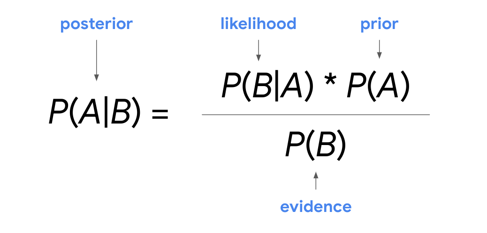

### Önemli çıkarımlar

Veri uzmanları, ürün satışlarından hane gelirine kadar her tür veriyi daha iyi anlamak için yüzdelik ve çeyrek gibi konum ölçümlerini kullanır. Konum ölçümleri, veri değerlerinizin göreceli konumunu hızlı bir şekilde belirlemenize yardımcı olur ve verilerinizin dağılımı hakkında daha kesin bir fikir verir.

### Daha fazla bilgi için kaynaklar

Yüzdelik ve çeyrek gibi konum ölçümleri hakkında daha fazla bilgi edinmek için aşağıdaki kaynağa göz atın:

- [Freie Universität Berlin'in bu istatistik sözlüğü](https://www.geo.fu-berlin.de/en/v/soga-py/Basics-of-statistics/index.html), yüzdelikler, çeyrekler, beş sayı özeti ve daha fazlası gibi konum ölçümlerinin net tanımlarını ve yararlı örneklerini sağlar.

## Ortalama Okuma Oranını Bulma

```python
import numpy as np
import pandas as pd
import matplotlib.pyplot as plt

education_districtwise = pd.read_csv("education_districtwise.csv")
education_districtwise.head(10)
```

| DISTNAME     | STATNAME | BLOCKS | VILLAGES | CLUSTERS | TOTPOPULAT | OVERALL_LI |
|--------------|----------|--------|----------|----------|------------|------------|
| DISTRICT32   | STATE1   | 13     | 391      | 104      | 875564.0   | 66.92      |
| DISTRICT649  | STATE1   | 18     | 678      | 144      | 1015503.0  | 66.93      |
| DISTRICT229  | STATE1   | 8      | 94       | 65       | 1269751.0  | 71.21      |
| DISTRICT259  | STATE1   | 13     | 523      | 104      | 735753.0   | 57.98      |
| DISTRICT486  | STATE1   | 8      | 359      | 64       | 570060.0   | 65.00      |
| DISTRICT323  | STATE1   | 12     | 523      | 96       | 1070144.0  | 64.32      |
| DISTRICT114  | STATE1   | 6      | 110      | 49       | 147104.0   | 80.48      |
| DISTRICT438  | STATE1   | 7      | 134      | 54       | 143388.0   | 74.49      |
| DISTRICT610  | STATE1   | 10     | 388      | 80       | 409576.0   | 65.97      |
| DISTRICT476  | STATE1   | 11     | 361      | 86       | 555357.0   | 69.90      |

```python
education_districtwise['OVERALL_LI'].describe()
```

|       Stat       |    Value     |
|------------------|--------------|
| count            | 634.000000   |
| mean             | 73.395189    |
| std (std. dev.)  | 10.098460    |
| min              | 37.220000    |
| 25% (1st quartile)| 66.437500   |
| 50% (median)     | 73.490000    |
| 75% (3rd quartile)| 80.815000   |
| max              | 98.760000    |

```python
education_districtwise['STATNAME'].describe()
```

| Stat   | Value   |
|--------|---------|
| count  | 680     |
| unique | 36      |
| top    | STATE21 |
| freq   | 75      |

```python
range_overall_li = education_districtwise['OVERALL_LI'].max() - education_districtwise['OVERALL_LI'].min() 

range_overall_li
# 61.54000000006
```

## Olasılığın Temel Kavramları

Son zamanlarda, olasılığın belir **siz** liği ölçmek veya bir şeyin olma olasılığını tanımlamak için matematiği kullandığını öğrendiniz. Örneğin, yarın yağmur yağma ihtimali %80 veya belirli bir adayın seçimi kazanma ihtimali %20 olabilir.

Bu okumada, olasılığın temel kavramları hakkında daha fazla bilgi edineceksiniz. Rastgele bir deney kavramını, bir olayın olasılığının nasıl temsil edileceğini ve hesaplanacağını ve temel olasılık gösterimini tartışacağız.

### Olasılık temelleri

##### **Temel kavramlar: Rastgele deney, sonuç, olay**

Olasılık teorisinin temelindeki üç kavramla başlayalım:

- Rastgele deney
    
- Sonuç
    
- Etkinlik
    

Olasılık, istatistikçilerin istatistiksel deneyler olarak da bilinen rastgele deneyler dediği şeyle ilgilenir. **Rastgele bir deney**, sonucu kesin olarak tahmin edilemeyen bir süreçtir.

Örneğin, bir madeni para veya bir zarı atmadan önce, sonucunu bilemezsiniz. Madeni para atmanın sonucu yazı veya tura olabilir. Zarın sonucu 3 veya 6 olabilir.

Tüm rastgele deneylerin üç ortak noktası vardır:

- Deney birden fazla olası sonuca sahip olabilir.
    
- Olası her sonucu önceden temsil edebilirsiniz.
    
- Deneyin sonucu şansa bağlıdır.
    

İstatistikte, rastgele bir deneyin sonucuna sonuç denir. Örneğin, bir zar atarsanız, altı olası sonuç vardır: 1, 2, 3, 4, 5, 6.

Bir olay, bir veya daha fazla sonuçtan oluşan bir kümedir. Bir zarı atma örneğini kullanarak, bir olay sonucu çift sayı olabilir. Çift bir sayının çıkması olayı 2, 4, 6 sonuçlarından oluşur. Veya, tek bir sayının çıkması olayı 1, 3, 5 sonuçlarından oluşur.

Rastgele bir deneyde, bir olaya bir olasılık atanır. Rastgele bir olayın olasılığını nasıl temsil edeceğimizi ve hesaplayacağımızı keşfedelim.

#### **Bir olayın olasılığı**

Bir olayın meydana gelme olasılığı, 0 ile 1 arasında bir sayı olarak ifade edilir. Olasılık yüzde olarak da ifade edilebilir.

- Bir olayın olasılığı 0'a eşitse, olayın gerçekleşme ihtimali %0 vardır.
    
- Bir olayın olasılığı 1'e eşitse, olayın gerçekleşme ihtimali %100 vardır.

0 ile 1 arasında farklı olasılık dereceleri vardır. Bir olayın olasılığı sıfıra yakınsa, diyelim ki 0.05 veya % 5 ise, olayın gerçekleşme şansı küçüktür. Bir olayın olasılığı 1'e, örneğin 0.95 veya % 95'e yakınsa, olayın gerçekleşme şansı yüksektir. Bir olayın olasılığı 0,5'e eşitse, olayın gerçekleşmesi veya gerçekleşmemesi ihtimali %50'dir.

Bir olayın olasılığını bilmek, belirsizlik durumlarında bilinçli kararlar vermenize yardımcı olabilir. Örneğin, yarın yağmur olasılığı 0.1 veya % 10 ise, açık hava pikniği planlarınızdan emin olabilirsiniz. Ancak, yağmur olasılığı 0.9 veya % 90 ise, pikniğinizi başka bir güne yeniden planlamayı düşünebilirsiniz.

#### **Bir olayın olasılığını hesaplayın**

Tüm olası sonuçların eşit derecede muhtemel olduğu bir olayın olasılığını hesaplamak için, istenen sonuçların sayısını toplam olası sonuç sayısına bölersiniz. Bunun aynı zamanda klasik olasılığın formülü olduğunu hatırlayabilirsiniz:

$\frac{\text{İstenilen sonuçların sayısı}}{\text{toplam olası sonuç sayısı}}$

Tek bir rastgele olayın olasılığını nasıl hesaplayacağınıza dair daha iyi bir fikir edinmek için jeton atma ve die roll örneklerini inceleyelim.

##### **Örnek: Madeni para fırlatma**

Adil bir madeni para fırlatmak, rastgele bir deneyin klasik bir örneğidir:

- Birden fazla olası sonuç var.
    
- Olası her sonucu önceden temsil edebilirsiniz: kafalar veya kuyruklar.
    
- Sonuç şansa bağlıdır. Fırlatma kafaları veya kuyrukları ortaya çıkarabilir.

Tek bir atışta kafa alma olasılığını hesaplamak istediğinizi varsayalım. Herhangi bir madeni para atışı için, kafa alma olasılığı ikiden bir şanstır. Bu 1 ÷ 2 = 0.5 veya % 50'dir.

Şimdi, her iki tarafında kafaları olan özel olarak tasarlanmış bir madeni para fırlatacağınızı hayal edin. Bu madeni parayı her attığınızda kafaları yükselecek. Bu durumda kafa alma olasılığı% 100'dür. Kuyruk alma olasılığı% 0'dır.

Başlık kazanma olasılığının% 50 olduğunu söylediğinizde, herhangi bir gerçek jeton atma dizisinin tam olarak %50 kafa ile sonuçlanacağını iddia etmediğinizi unutmayın. Örneğin, adil bir madeni para on kez atarsanız, 4 kafa ve 6 kuyruk veya 7 kafa ve 3 kuyruk alabilirsiniz. Bununla birlikte, madeni parayı atmaya devam ederseniz, uzun vadeli kafa frekansının% 50'ye yaklaşmasını bekleyebilirsiniz.

##### **Örnek: Zar atma**

Altı taraflı bir zarı atmak, rastgele bir deneyin başka bir klasik örneğidir:

- Birden fazla olası sonuç var.
    
- Tüm olası sonuçları önceden temsil edebilirsiniz: 1, 2, 3, 4, 5 ve 6.
    
- Sonuç şansa bağlıdır. Rulo, herhangi bir sayı 1-6 olarak ortaya çıkabilir.
    

Diyelim ki 3 atma olasılığını hesaplamak istiyorsunuz. Herhangi bir zar atma için, 3 atma olasılığı altı üzerinden bir şanstır. Bu 1 ÷ 6 = 0.1666 veya yaklaşık % 16.7'dir.

#### **Olasılık gösterimi**

Genellikle eğitim ve teknik bağlamlardaki kavramları sembolize etmek için kullanıldığı için olasılık gösterimine aşina olmaya yardımcı olur.

Notasyonda, P harfi bir olayın olasılığını gösterir. A ve B harfleri bireysel olayları temsil eder.

Örneğin, iki olayla uğraşıyorsanız, bir olayı A ve diğer olayı B olarak etiketleyebilirsiniz.

- A olayı olasılığı P (A) olarak yazılır.
    
- B olayı olasılığı P (B) olarak yazılır.
    
- Herhangi bir olay için A, 0 ≤ P (A) ≤ 1. Başka bir deyişle, herhangi bir A olayının olasılığı her zaman 0 ile 1 arasındadır.
    
- P (A) > P (B) ise, A olayının meydana gelme şansı B olayından daha yüksektir.
    
- P (A) = P (B) ise, o zaman A olayı ve B olayı eşit derecede meydana gelir.
    

### Önemli çıkarımlar

Veri uzmanları, paydaşların belirsiz olaylar hakkında bilinçli kararlar almalarına yardımcı olmak için olasılığı kullanır. Temel olasılık kavramları hakkındaki bilginiz, daha karmaşık olasılık hesaplamaları için bir yapı taşı olarak faydalı olacaktır.

### Daha fazla bilgi için kaynaklar

Temel olasılık kavramları hakkında daha fazla bilgi edinmek için aşağıdaki kaynaklara bakın:

- [Richland Community College"dan alınan bu ders notları](https://people.richland.edu/james/lecture/m116/sequences/probability.html), temel kavramların ve temel olasılık kurallarının yararlı bir özetini sağlar..

## Çoklu olayların olasılığı

Şimdiye kadar, tek olayların olasılığını hesaplamayı öğreniyorsunuz. Hem günlük yaşamda hem de veri çalışmasında birçok durum birden fazla olayı içerir. Gelecekteki bir veri uzmanı olarak, genellikle birden fazla olay olasılığı ile ilgileneceksiniz.

Bu okumada, birden fazla olay hakkında daha fazla bilgi edineceksiniz. Üç temel olasılık kuralı öğreneceksiniz: tamamlayıcı kuralı, toplama kuralı ve çarpma kuralı. Bu kurallar, birden fazla olayın olasılığını daha iyi anlamanıza yardımcı olur. İlk olarak, bu kuralların geçerli olduğu iki farklı olay türünü tartışacağız: birbirini dışlayan ve bağımsız. Ardından, her iki olay türü için olasılığın nasıl hesaplanacağını öğreneceksiniz.

### İki tür olay

Üç temel olasılık kuralı, farklı olay türleri için geçerlidir. Hem tamamlayıcı kuralı hem de ekleme kuralı, birbirini dışlayan olaylar için geçerlidir. Çarpma kuralı bağımsız olaylar için geçerlidir.

#### **Karşılıklı dışlayan etkinlikler**

İki olay **aynı anda gerçekleşemezlerse**  birbirini dışlar.

Örneğin, Dünya'da ve ayda aynı anda olamazsınız veya aynı anda oturup ayakta duramazsınız.

Veya olasılık teorisinin iki klasik örneğini alın. Madeni para atarsanız, aynı anda kafa ve kuyruk atamazsınız. Bir zar atarsanız, aynı anda 2 ve 4 atamazsınız.

#### **Bağımsız etkinlikler**

**Bir olayın meydana gelmesi** diğer olayın olasılığını değiştirmezse iki olay bağımsızdır. Bu, bir olayın diğer olayın sonucunu etkilemediği anlamına gelir.

Örneğin, sabahları bir film izlemek öğleden sonra havayı etkilemez. Radyoda müzik dinlemek yeni buzdolabınızın teslimatını etkilemez. Bu olaylar ayrı ve bağımsızdır.

Veya ardışık iki jeton fırlatması veya iki ardışık zar atma yapın. İlk atışta tura atmak ikinci atışın sonucunu etkilemez. Herhangi bir madeni para atışı için, herhangi bir sonucun olasılığı her zaman 2 üzerinden 1 veya % 50'dir. İlk zarda 2 almak ikinci zarın sonucunu etkilemez. Herhangi bir zar atışı için, herhangi bir sonucun olasılığı her zaman 6'dan 1'i veya % 16.7'dir.

### Üç temel kural

Artık birbirini dışlayan ve bağımsız olaylar arasındaki fark hakkında daha fazla bilgi sahibi olduğunuza göre, üç temel olasılık kuralını gözden geçirelim:

- Tamamlayıcı kuralı
    
- Toplama kuralı
    
- Çarpma kuralı
    

#### **Tamamlayıcı kuralı**

Tamamlayıcı kuralı, birbirini dışlayan olaylarla ilgilenir. İstatistikte, bir olayın tamamlayıcısı gerçekleşmeyen olaydır. Örneğin, ya kar yağar ya da kar yağmaz. Ya futbol takımınız şampiyonluğu kazanır ya da şampiyonluğu kazanmaz. Karın tamamlayıcısı kar değildir. Kazanmanın tamamlayıcısı kazanmak değildir.

Bir olayın meydana gelme olasılığı ve gerçekleşmemesi olasılığı 1'e kadar olmalıdır. 1 olasılığının% 100 ile aynı olduğunu hatırlayın.

Bunu düşünmenin başka bir yolu, bir olayın veya diğer olayın meydana gelme olasılığın % 100 olmasıdır. Yarın %40 kar yağma ihtimali olabilir. Ancak yarın kar yağma ya da kar yağmama ihtimali %100.

**Tamamlayıcı kuralı**, A olayının gerçekleşmemesi olasılığının 1 eksi A olasılığı olduğunu belirtir: Olasılık gösteriminde bunu şu şekilde yazabilirsiniz:

**Tamamlayıcı kuralı**

P (A') = 1 - P (A)

**Not:** Olasılık gösteriminde, kesme işareti (') olumsuzlamayı sembolize eder. Başka bir deyişle, A olayının meydana gelmemesi olasılığını belirtmek istiyorsanız, A harfinden sonra bir kesme işareti ekleyin: P (A') Bunu "A olmaması olasılığı" olarak söyleyebilirsiniz.

Bu nedenle, yarın % 40 kar olasılığının veya 0.4 olasılığının olduğunu biliyorsanız, yarın kar yağmama olasılığını hesaplamak için tamamlayıcı kuralını kullanabilirsiniz. Kar olmaması olasılığı bir eksi kar olasılığına eşittir.

P (kar yok) = 1 - P (kar) = 1 - 0.4 = 0.6.

Yani, yarın kar yağma olasılığı 0.6 veya % 60'dır.

#### **Toplama kuralı (birbirini dışlayan olaylar için)**

**Toplama kuralı**, eğer A ve B olayları birbirini dışlarsa, A veya B'nin meydana gelme olasılığının A ve B'nin olasılıklarının toplamı olduğunu belirtir: Olasılık gösteriminde, bunu şu şekilde yazabilirsiniz:

P (A veya B) = P (A) +P (B)

Karşılıklı olarak kapsayan etkinlikler için de bir ekleme kuralı olduğunu unutmayın. Bu derste, birbirini dışlayan olaylar için kurala odaklanıyoruz.

Bir kalıp yuvarlama örneğimizi inceleyelim.

##### **Kalıp rulosu (2 veya 4 yuvarlama)**

Tek bir ruloda 2 veya 4 yuvarlanma olasılığını bulmak istediğinizi varsayalım. Bu iki olay birbirini dışlar. 2 veya 4 yuvarlayabilirsiniz, ancak her ikisini de aynı anda yapamazsınız.

Toplama kuralı, her iki olayın meydana gelme olasılığını bulmak için olasılıklarını topladığınızı söyler. Bir zarda tek bir sayı atma olasılığı 6'dan 1'i veya % 16.7'dir.

P (2 atma veya 4 atma ) = P (2 atma ) + P (4 atma ) = 1/6 + 1/6 = 1/3

Yani, 2 veya 4 yuvarlanma olasılığı üçten biri veya % 33'tür.

#### **Çarpma kuralı (bağımsız olaylar için)**

**Çarpma kuralı**, eğer A ve B olayları bağımsızsa, o zaman hem A hem de B'nin meydana gelme olasılığının, A olasılığının B olasılığı ile çarpılmasıdır. Olasılık gösteriminde, bunu şu şekilde yazabilirsiniz:

P (A ve B) = P (A) × P (B)

Bağımlı olaylar için de bir çarpma kuralı olduğunu unutmayın. Bu derste, bağımsız etkinlikler için kurala odaklanıyoruz.

Bir zar atma örneğimizle devam edelim.

##### **zar atma (1 yuvarlama ve ardından 6 yuvarlama)**

Şimdi arka arkaya iki zar atma hayal edin. Diyelim ki bir 1'i yuvarlama ve ardından bir 6'yı yuvarlama olasılığını bilmek istiyorsunuz. Bunlar bağımsız olaylardır, çünkü ilk rulo ikinci rulonun sonucunu etkilemez.

Bir 1'i ve ardından bir 6'yı yuvarlama olasılığı, bir 1'i yuvarlama olasılığının 6 yuvarlanma olasılığıyla çarpılmasıdır. Her olayın olasılığı veya% 16.7'dir. Bunu şu şekilde yazabilirsiniz:

P (ilk ruloda 1 yuvarlama ve ikinci ruloda 6 yuvarlama) = P (ilk ruloda 1 yuvarlama) × P (ikinci ruloda 6 yuvarlama) = 1/6 × 1/6 = 1/36

Yani, bir 1 ve sonra bir 6'yı yuvarlama olasılığı otuz altıdan biri veya yaklaşık % 2.8'dir.

### Önemli çıkarımlar

Temel olasılık kuralları, birbirini dışlayan veya bağımsız olan olayları tanımlamanıza yardımcı olur. Temel olasılık kurallarını anlamak, gelecekteki bir veri uzmanı olarak gerçekleştireceğiniz daha karmaşık analizler için temel bir temeldir.

### Daha fazla bilgi için kaynaklar

Olasılık hakkında daha fazla bilgi edinmek için, aşağıdaki etkileşimli kılavuza bakın: [Görme Teorisi](https://seeing-theory.brown.edu/index.html#secondPage).

## Koşullu olasılık

Önceden, tek bir olay için ve iki veya daha fazla bağımsız olay için, örneğin iki ardışık jeton çevirme olasılığı hesapladınız. Koşullu olasılık, iki veya daha fazla bağımlı olay için geçerlidir.

### **Bağımlı olaylar**

Daha önce, ilk olay ikinci olayın sonucunu etkilemiyorsa veya olasılığını değiştirmezse iki olayın **bağımsız** olduğunu öğrendiniz. Örneğin, ardışık iki madeni para atışı bağımsız olaylardır. İlk atışta kafa almak ikinci atışın sonucunu etkilemez.

Buna karşılık, bir olayın **meydana gelmesi diğer olayın olasılığını değiştirirse iki olay bağımlıdır.** Bu, ilk olayın ikinci olayın sonucunu etkilediği anlamına gelir.

Örneğin, bir sınavda iyi bir not almak istiyorsanız, önce ders materyalini incelemeniz gerekir. İyi bir not almak çalışmaya bağlıdır. Bir masa beklemeden popüler bir restoranda yemek yemek istiyorsanız, erken gelmelisiniz. Beklemekten kaçınmak erken gelmeye bağlıdır. Her durumda, ikinci olayın ilk olaya bağlı veya buna bağlı olduğunu söyleyebilirsiniz.

Artık bağımlı olayları daha iyi anladığınıza göre, koşullu olasılığa dönelim ve formülü gözden geçirelim.

### **Koşullu olasılık formülü**

Formül, iki bağımlı olay A ve B için, A olayının ve B olayının meydana gelme olasılığının, A olayının meydana geldiği göz önüne alındığında, B olayı meydana gelme olasılığı ile çarpıldığında, A olayının meydana gelme olasılığına eşit olduğunu söylüyor.

**Koşullu olasılık**

P (A ve B) = P (A) * P (B | A)

Olasılık gösteriminde, B ve A harfleri arasındaki dikey çubuk bağımlılığı gösterir veya B olayının meydana gelmesinin A olayının meydana gelmesine bağlı olduğunu gösterir. Bunu "A verilen B olasılığı" olarak söyleyebilirsiniz.

Formül ayrıca, A olayı verilen B olayının olasılığının, hem A hem de B'nin meydana gelme olasılığına eşit olarak ifade edilebilir. A olasılığına bölünmesi.

**Koşullu olasılık**

P (B | A) = P (A ve B) / P (A)

Bunlar aynı denklemi temsil etmenin sadece iki yoludur. Duruma veya önceden hangi bilgilerin verildiğine bağlı olarak, birini veya diğerini kullanmak daha kolay olabilir.

**Not: Ko** şullu olasılık formülü bağımsız olaylar için de geçerlidir. A ve B bağımsız olaylar olduğunda, P (B|A) = P (B). Böylece formül P (A ve B) = P (A) * P (B) olur. Bu formül aynı zamanda kursta daha önce öğrendiğiniz çarpma kuralıdır.

### **Örnek: oyun kartları**

52 oyun kartından oluşan standart bir desteyle ilgilenen koşullu olasılık örneğini inceleyelim.

İki olay hayal edin:

- İlk olay, kart destesinden bir kalp çekmektir.
    
- İkinci olay, aynı desteden başka bir kalp çekmektir.
    

Arka arkaya iki kalp çekme olasılığını öğrenmek istediğinizi varsayalım. Bu iki olay bağımlıdır çünkü ilk çekilişte kalp almak ikinci çekilişte kalp alma olasılığını değiştirir..

Standart bir deste dört farklı takım içerir: kalp, karo, sinek ve maça. Her takımın 13 kartı vardır. İlk çekiliş için kalp alma şansı 52 üzerinden 13 veya % 25'tir. İkinci çekiliş için, ilk çekilişte zaten bir kalp seçtiğiniz için kalp alma olasılığı değişir. Şimdi, 51 kartlık bir destede 12 kalp var. İkinci çekiliş için kalp alma şansı 51 üzerinden 12'si veya yaklaşık % 23,5'tir. Kalbe sahip olmak artık daha az olasıdır - olasılık %25'ten %23,5'e düştü.

Şimdi, koşullu olasılık formülünü uygulayalım:

**P (A ve B) = P (A) * P (B | A)**

Hem A olayının hem de B olayının meydana gelme olasılığını hesaplamak istiyorsunuz. A Olayına _1. kalp_ diyelim, ilk çekilişte kalp almayı ifade eder. B Olayına _2. kalp_ diyelim, ikinci çekilişte kalp almayı ifade eder, ilk seferde bir kalp çizildiği göz önüne alındığında. A olayı olasılığı 13/52 veya % 25'tir. B olayı olasılığı 12/51 veya % 23.5'tir.

Bu sayıları formüle girelim:

**P (1. kalp ve 2. kalp) = P (1. kalp) * P (2. kalp | 1. kalp)** = 13/52 * 12/51 = 1/17 = 0.0588 veya yaklaşık % 5.9

Dolayısıyla, standart bir oyun kartı destesinden arka arkaya iki kalp çekme şansı % 5,9'dur.

### **Örnek: çevrimiçi satın alımlar**

Başka bir örneği inceleyelim. Bir çevrimiçi perakende mağazasında çalışan bir veri uzmanı olduğunuzu hayal edin. Mağazanın web sitesini ziyaret eden müşterilerin % 20'sinin 100$ veya daha fazla satın alma yaptığını söyleyen verileriniz var. Bir müşteri 100$ harcıyorsa, ücretsiz hediye kartı almaya hak kazanır. Mağaza, en az 100$ harcayan müşterilerin % 10'una rastgele hediye kartları verir.

Bir müşterinin 100$ harcama ve hediye kartı alma olasılığını hesaplamak istiyorsunuz. Hediye kartı almak, ilk 100$ harcamanıza bağlıdır. Yani, bu koşullu bir olasılıktır çünkü iki bağımlı olayla ilgilenir.

Koşullu olasılık formülünü uygulayalım:

**P (A ve B) = P (A) * P (B | A)**

Hem A olayının hem de B olayının meydana gelme olasılığını hesaplamak istiyorsunuz. A etkinliğine _100$_ ve B olayı _hediye kartı_ diyelim. A olayı olasılığı 0.2 veya % 20'dir. B olayı olasılığı 0.1 veya % 10'dur.

**P (\$100 ve hediye kartı) = P (\$100) * P (hediye kartı | \$ 100 verilen)** = 0,2 * 0,1 = 0,02 veya % 2

Dolayısıyla, bir müşterinin 100$ veya daha fazla harcama ve ücretsiz hediye kartı alma olasılığı 0,2 * 0,1 = 0,02 veya % 2'dir.

### Önemli çıkarımlar

Koşullu olasılık, bağımlı olaylar arasındaki ilişkiyi tanımlamanıza yardımcı olur. Veri uzmanları genellikle bir iş bağlamında koşullu olasılığı kullanır. Örneğin, yeni bir reklam kampanyası gibi bir etkinliğin satış gelirini nasıl etkileyeceğini tahmin etmek için koşullu olasılığı kullanabilirler. Bu, paydaşların şirketlerinin kaynaklarına yatırım yapmanın en iyi yolu hakkında akıllı kararlar almalarına yardımcı olur.

### Daha fazla bilgi için kaynaklar

Koşullu olasılık hakkında daha fazla bilgi edinmek için aşağıdaki kaynağa bakın:

- [Investopedia"nın bu makalesi, bir iş bağlamında koşullu olasılığı tartışıyor.](https://www.investopedia.com/terms/c/conditional_probability.asp#:~:text=Conditional%20probability%20is%20defined%20as,succeeding%2C%20or%20conditional%2C%20event.) 

## Genişletilmiş Bayes Teoremi

Son zamanlarda, **Bayes teore** minin koşullu olasılığı belirlemek için bir matematik formülü olduğunu öğrendiniz. Teorem, adını Londra, İngiltere'den 18. yüzyıl matematikçisi Thomas Bayes'in adını almıştır. Koşul **lu olas** ılığın, başka bir olayın daha önce meydana geldiği göz önüne alındığında meydana gelme olasılığını ifade ettiğini hatırlayın. Örneğin, bir oyun kartı destesinden bir as çektiğinizde, bu aynı desteden ikinci bir as çekme olasılığını değiştirir.

Bu okumada, Bayes teoreminin farklı bölümleri ve şartlı olasılığı hesaplamak için teoremi nasıl kullanabileceğiniz hakkında daha fazla bilgi edineceksiniz.

### Bayes teoremi

Bayes teoremi, olayla ilgili yeni bilgilere dayanarak bir olayın olasılığını güncellemenin bir yolunu sağlar.

#### **Sonraki ve önceki olasılık**

Bayes istatistiklerinde, **önceki olasılık**, yeni veriler toplanmadan önce bir olayın olasılığını ifade eder. **Sonraki olasılık**, yeni verilere dayalı bir olayın güncellenmiş olasılığıdır.

Bayes teoremi, verilerinize göre önceki olasılığı güncelleyerek sonraki olasılığı hesaplamanıza olanak tanır.

Örneğin, tıbbi bir durumun yaşla ilgili olduğunu varsayalım. Bir kişinin yaşa göre duruma sahip olma olasılığını daha doğru bir şekilde belirlemek için Bayes teoremini kullanabilirsiniz. Önceki olasılık, bir kişinin duruma sahip olma olasılığı olacaktır. Sonraki veya güncellenmiş olasılık, belirli bir yaş grubundaysa, bir kişinin duruma sahip olma olasılığı olacaktır.

#### **Teorem**

Teoremin kendisini inceleyelim.

**Bayes teoremi**, herhangi iki A ve B olayı için, verilen B olasılığının, A olasılığının, A verilen B olasılığının B olasılığının B olasılığına bölünmesiyle eşit olduğunu belirtir.

**Bayes teoremi**

Teoremde, önceki olasılık olayın olasılığıdır A. Sonraki olasılık veya hesaplamaya çalıştığınız şey, A olayının olasılığıdır B olayının olasılığıdır.

- **P (A)**: Önceki olasılık
    
- **P (A|B)**: Sonraki olasılık
    

Bazen istatistikçiler ve veri uzmanları, A olayına verilen B olayının olasılığını ifade etmek için "olasılık" terimini ve B olayının olasılığını ifade etmek için "kanıt" terimini kullanırlar.

- **P (B|A)**: Olasılık
    
- **P (B)**: Kanıt
    

Bu terimleri kullanarak Bayes teoremini şu şekilde yeniden ifade edebilirsiniz:

- Sonraki = Olasılık * Önceki/ Kanıt
    


Hesaplamayı bu farklı perspektiflerden düşünmek ve probleminizi denklemle eşlemeye yardımcı olabilir.

Bayes teoremi hakkında düşünmenin bir yolu, önceki bir inancı, P (A), yeni verileri kullanarak arka bir olasılık olan P (A | B) 'ye dönüştürmenize izin vermesidir. Yeni veriler olasılık, P (B | A) ve kanıtlar, P (B).

_**Not:**_ _Bu okuma, Bayes teoremi ile ilişkili temel kavram ve terimlere bir giriş sağlar. Bayes istatistiklerinin detaylı bir incelemesi bu dersin kapsamı dışındadır. Kariyerinizde bir veri uzmanı olarak ilerledikçe, Bayes teoremini ve çeşitli uygulamalarını daha fazla keşfetme fırsatına sahip olacaksınız_.

Şimdilik hatırlanması gereken önemli bir nokta, Bayes teoreminin hem A verilen B'nin koşullu olasılığını hem de A verilen B'nin koşullu olasılığını içerdiğidir. Bu olasılıklardan birini biliyorsanız, Bayes teoremi diğerini belirlemenize yardımcı olabilir.

Teoremin nasıl çalıştığını daha iyi anlamak için bir örneği inceleyelim.

#### **Örnek: spam filtresi**

Bayes teoreminin dijital dünyada iyi bilinen bir uygulaması spam filtreleme veya bir e-postanın spam olup olmadığını tahmin etmektir. Uygulamada, sofistike bir spam filtresi, e-postanın içeriği, başlığı, eki olup olmadığı, gönderen adresinin etki alanı türü (.edu veya.org) ve daha fazlası dahil olmak üzere birçok farklı değişkenle ilgilenir. Ancak, örneğimiz için Bayes spam filtresinin basitleştirilmiş bir sürümünü kullanabiliriz.

Diyelim ki e-postada belirli bir kelime göründüğü için bir e-postanın spam olma olasılığını belirlemek istediğinizi varsayalım. Bu örnekte, "para" kelimesini kullanalım.

Aşağıdaki bilgileri keşfedersiniz:

- Bir e-postanın spam olma olasılığı% 20'dir.
    
- Bir e-postada "para" kelimesinin görünme olasılığı% 15'tir.
    
- Bir spam e-postada "para" kelimesinin görünme olasılığı% 40'tır.
    

Bu örnekte, önceki olasılığınız, bir e-postanın spam olma olasılığıdır. Sonradan olasılığınız veya nihayetinde öğrenmek istediğiniz şey, bir e-postanın "para" kelimesini içerdiği göz önüne alındığında spam olma olasılığıdır. Önceki olasılığınızı güncellemek için kullanacağınız yeni veriler, "para" kelimesinin bir e-postada görünme olasılığı ve "para" kelimesinin spam e-postada görünme olasılığıdır.

Bayes teoremiyle çalışırken, önce A olayının ne olduğunu ve B olayının ne olduğunu bulmak yararlıdır - bu, olaylar arasındaki ilişkiyi anlamayı ve formülü kullanmayı kolaylaştırır.

A etkinliğine spam e-posta ve B olayına bir e-postada "para" kelimesinin görünüşü diyelim. Şimdi, Bayes teoremini A olayı için "spam" kelimesini ve B olayı için "para" kelimesini kullanarak yeniden yazabilirsiniz.

P (A | B) = P (B | A) * P (A)/P (B)

P (İstenmeyen İleti | Para) = P (Para | İstenmeyen İleti) * P (İstenmeyen İleti)/P (Para)

Aşağıdakileri öğrenmek istiyorsunuz:

- **P (Spam| Para) veya arka olasılık**: e-postada "para" kelimesinin görünmesi göz önüne alındığında bir e-postanın spam olma olasılığı
    

Şimdi, verilerinizi formüle girin:

- **P (SpAM) veya önceki olas** ılık: bir e-postanın spam olma olasılığı = 0.2 veya% 20
    
- **P (Para) veya kanıt:** "para" kelimesinin bir e-postada görünme olasılığı = 0.15 veya% 15
    
- **P (Para | SpAM) veya olasılık: e-postanın spam** olduğu göz önüne alındığında "para" kelimesinin bir e-postada görünme olasılığı = 0.4 veya% 40
    

P (SpAM | Para) = P (Para | SpAM) * P (SpAM)/P (Para) = 0.4 * 0.2/0.15 = 0.53333 veya yaklaşık% 53.3%.

Dolayısıyla, e-postanın "para" kelimesini içerdiği göz önüne alındığında, bir e-postanın spam olma olasılığı% 53.3'tür.

### Önemli çıkarımlar

Bayes teoremi, modern veri analitiğinde verileri analiz etmek ve yorumlamak için güçlü bir yöntem olan Bayes çıkarımı olarak da bilinen Bayes istatistik alanının temelidir. Veri uzmanları, Bayes teoremini yapay zekadan tıbbi testlere kadar çok çeşitli alanlarda kullanır.

Bayes teoremi hakkında temel bir anlayışa sahip olmak, kariyerinizde bir veri uzmanı olarak ilerledikçe Bayes istatistikleri hakkında daha fazla bilgi edinmenizi sağlayacaktır.

### Daha fazla bilgi için kaynaklar

Bayes Teoremi hakkında daha fazla bilgi edinmek için aşağıdaki kaynağa bakın:

- [Pennsylvania Eyalet Üniversitesi tarafından açıklanan Bayes teoremi](https://online.stat.psu.edu/stat500/lesson/2/2.7)
    

"Savcının yanılgısı" hakkında ilginç bir tartışma için bu sayfaya göz atın:

- [Amerikan Epidemiyoloji Dergisi tarafından savcının yanılgısının açıklaması](https://academic.oup.com/aje/article/179/9/1125/103523)

## Ayrık olasılık dağılımları

Son zamanlarda, veri profesyonellerinin farklı veri kümelerini modellemek ve verilerindeki önemli kalıpları belirlemek için olasılık dağılımlarını kullandığını öğrendiniz. Bir olasılık **dağılımının** rastgele bir olayın olası sonuçlarının olasılığını tanımladığını hatırlayın. Ayrık olasılık dağılımları, ayrık rastgele değişkenleri veya ayrık olayları temsil eder. Genellikle, ayrık olayların sonuçları sayılabilen tam sayılar olarak ifade edilir. Örneğin, bir kalıbın yuvarlanması 2 veya 3 ile sonuçlanabilir, ancak 2.575 veya 3.184 gibi ondalık bir değerle sonuçlanamaz.

Bu okumada, dört ortak ayrık olasılık dağılımının ana özelliklerine genel bir bakış elde edeceksiniz:

- Uniform
    
- Binom
    
- Bernoulli
    
- Poison
    

### Ayrık olasılık dağılımları

#### **Uniform dağılım**

Tek tip dağılım, sonuçları eşit derecede olası veya eşit olasılığa sahip olayları tanımlar.

Örneğin, bir kalıbı yuvarlamak altı sonuçla sonuçlanabilir: 1, 2, 3, 4, 5 veya 6. Her sonucun olasılığı aynıdır: 6'dan 1'i veya yaklaşık% 16.7.

Bir dağılımı histogram gibi bir grafikle görselleştirebilirsiniz. Ayrık bir dağılım için, rastgele değişken x ekseni boyunca çizilir ve karşılık gelen olasılık y ekseni boyunca çizilir. Bu durumda, x ekseni, tek bir kalıp rulosunun olası her sonucunu temsil eder ve y ekseni her sonucun olasılığını temsil eder.

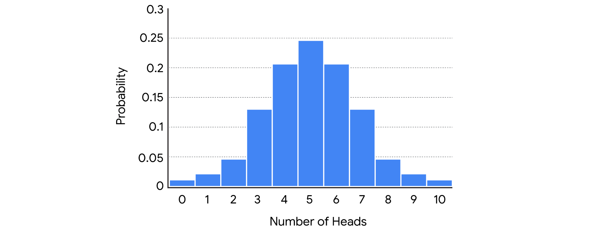

_**Not: Veri**_ _uzmanları genellikle tek tip dağılımı Monte Carlo simülasyonları gibi daha karmaşık istatistiksel yöntemlerin bir parçası olarak kullanır. Bu yöntemlerin ayrıntılı bir tartışması bu dersin kapsamı dışındadır._

_**Not:**_ _Düzgün dağılım hem ayrık hem de sürekli rastgele değişkenler için geçerlidir._

#### **Binom dağılımı**

**Binom dağılımı,** olayların olasılığını yalnızca iki olası sonuçla modeller: başarı veya başarısızlık. Bu sonuçlar birbirini dışlar ve aynı anda gerçekleşemez.

Bu tanım aşağıdakileri varsayar:

- Her olay bağımsızdır veya diğerlerinin olasılığını etkilemez.
    
- Her olay aynı başarı olasılığına sahiptir.
    

Başarı ve başarısızlığın kolaylık sağlamak için kullanılan etiketler olduğunu unutmayın. Örneğin, bir madeni para atarsanız, yalnızca iki olası sonuç vardır: kafalar veya kuyruklar. Analizinizin ihtiyaçlarına göre kafaları veya kuyrukları başarılı bir sonuç olarak etiketlemeyi seçebilirsiniz.

Binom dağılımı, binom deneyi adı verilen bir rastgele olayı temsil eder. Bir binom deneyi aşağıdaki özelliklere sahiptir:

- Deney, bir dizi tekrarlanan denemeden oluşur.
    
- Her denemenin sadece iki olası sonucu vardır.
    
- Başarı olasılığı her deneme için aynıdır.
    
- Ve, her duruşma bağımsızdır.
    

Bir binom deneyi örneği, arka arkaya 10 kez bir madeni para fırlatmaktır. Bu, aşağıdaki özelliklere sahip olduğu için binom bir deneydir:

- Deney, tekrarlanan 10 denemeden veya madeni para fırlatmasından oluşur.
    
- Her denemenin sadece iki olası sonucu vardır: kafalar veya kuyruklar.
    
- Her deneme aynı başarı olasılığına sahiptir. Başarıyı kafa olarak tanımlarsanız, her atış için başarı olasılığı aynıdır: %50.
    
- Her deneme bağımsızdır. Bir madeni para atmanın sonucu, diğer madeni para atışlarının sonucunu etkilemez.
    

Histogramda, x ekseni kafa sayısını gösterir ve y ekseni her sonucu alma olasılığını gösterir.


Veri uzmanları, aşağıdakileri modellemek için binom dağılımını kullanabilir:

- Yeni bir ilaç yan etkiler yaratır
    
- Kredi kartı işlemi dolandırıcılıktır
    
- Bir hisse senedi fiyatının değeri yükselir
    

Makine öğreniminde, binom dağılımı genellikle verileri sınıflandırmak için kullanılır. Örneğin, bir veri uzmanı, dijital bir görüntünün kedi veya köpek gibi belirli bir hayvan türü olup olmadığını anlamak için bir algoritma eğitebilir.

#### **Bernoulli dağılımı**

Bernoulli dağılımı, yalnızca iki olası sonucu olan olayları (başarı veya başarısızlık) modellediği için binom dağılımına benzer. Tek fark, Bernoulli dağılımının bir deneyin yalnızca tek bir denemesini ifade ederken, binomun tekrarlanan denemeleri ifade etmesidir. Bernoulli davasının klasik bir örneği, tek bir madeni para fırlatmasıdır.

Histogramda, x ekseni bir madeni para fırlatmanın olası sonuçlarını temsil eder ve y ekseni her sonucun olasılığını temsil eder.


#### **Poisson dağılımı**

**Poisson dağılımı**, belirli bir zaman diliminde belirli sayıda olayın meydana gelme olasılığını modeller.

_**Not:**_ _Poisson dağılımı, mesafe, alan veya hacim gibi belirli bir alanda meydana gelen olayların sayısını temsil etmek için de kullanılabilir. Bu derste zamana odaklanıyoruz._

Poisson dağılımı, Poisson deneyi adı verilen bir tür rastgele deneyi temsil eder. Bir Poisson deneyi aşağıdaki özelliklere sahiptir:

- Deneydeki olayların sayısı sayılabilir.
    
- Belirli bir zaman diliminde meydana gelen ortalama olay sayısı bilinmektedir.
    
- Her olay bağımsızdır.
    

Örneğin, içerik yayınladığınız çevrimiçi bir web siteniz olduğunu hayal edin. Web siteniz saatte ortalama iki görüntüleme. Web sitenizin belirli bir saatte belirli sayıda görüntülenme alma olasılığını belirlemek istiyorsunuz.

Bu bir Poisson deneyidir çünkü:

- Deneydeki olayların sayısı sayılabilir. Görüntülenme sayısını sayabilirsiniz.
    
- Belirli bir zaman diliminde meydana gelen ortalama olay sayısı bilinmektedir. Saatte ortalama iki görüntüleme var.
    
- Her sonuç bağımsızdır. Bir kişinin web sitenizi görüntüleme olasılığı, başka bir kişinin web sitenizi görüntüleme olasılığını etkilemez.
    

Histogramda, x ekseni saatte görüntüleme sayısını gösterir ve y ekseni oluşma olasılığını gösterir.


Veri uzmanları, aşağıdakilerin sayısı gibi verileri modellemek için Poisson dağılımını kullanır:

- Müşteri hizmetleri çağrı merkezi için saatlik çağrı
    
- Bir mağazada günlük müşteriler
    
- Bir şehirde aylık gök gürültülü fırtınalar
    
- Bir bankada saniyede finansal işlemler
    

### Önemli çıkarımlar

Verilerinizin dağılımını belirlemek, herhangi bir analizde önemli bir adımdır ve gelecekteki sonuçlar hakkında bilinçli tahminler yapmanıza yardımcı olur. Gelecekteki bir veri uzmanı olarak kariyerinizde, verilerinizi daha iyi anlamak için binom ve Poisson gibi ayrık dağılımları kullanacaksınız. Verilerinizin olasılık dağılımını bilmek, analiziniz için en uygun istatistiksel yöntemi veya makine öğrenimi modelini seçmenize de yardımcı olacaktır.

### Daha fazla bilgi için kaynaklar

Ayrık olasılık dağılımları hakkında daha fazla bilgi edinmek için aşağıdaki kaynaklara bakın:

- [Statistics How To'nun bu makal](https://www.statisticshowto.com/discrete-probability-distribution/) esi, ayrık olasılık dağılımı kavramına genel bir bakış sağlar ve binom ve Poisson gibi belirli dağılım türleri hakkında daha fazla bilgi edinmek için bağlantılar sunar..

## Normal dağılımlı model verileri

Son zamanlarda, sürekli olasılık dağılımları ve veri profesyonellerinin verilerini modellemesine nasıl yardımcı olduklarını öğreniyorsunuz. Sürekli olasılık dağılımlarının, bir dizi sayı içindeki tüm olası değerleri alabilen sürekli rastgele değişkenleri temsil ettiğini hatırlayın. Tipik olarak, bunlar boy, ağırlık, zaman veya sıcaklık gibi ölçülebilen ondalık değerlerdir. Örneğin, ölçüm süresini daha doğru bir şekilde sürdürebilirsiniz: 1.1 saniye, 1.12 saniye, 1.1257 saniye vb.

Bu derste tek bir sürekli olasılık dağılımına odaklanıyoruz: normal dağılım. Bu okumada, normal dağılımın temel özellikleri ve dağıtımın verilerinizi modellemenize nasıl yardımcı olabileceği hakkında daha fazla bilgi edineceksiniz.

### Sürekli olasılık dağılımları

Normal dağılımın belirli niteliklerine geçmeden önce, tüm sürekli olasılık dağılımlarının bazı genel özelliklerini tartışalım.

#### **Olasılık Yoğunluğu ve Olasılık**

Olasılık fonksiyonu, rastgele bir değişkenin olası sonuçları için olasılıklar sağlayan matematiksel bir fonksiyondur.

İki tür olasılık fonksiyonu vardır:

- Olasılık Kütle Fonksiyonları (PMF'ler) ayrık rastgele değişkenleri temsil eder
    
- Olasılık Yoğunluk Fonksiyonları (PDF'ler) sürekli rastgele değişkenleri temsil eder
    

Bir olasılık fonksiyonu bir denklem veya grafik olarak gösterilebilir. Olasılık fonksiyonlarında yer alan matematik bu dersin kapsamı dışındadır. Şimdilik, bir PDF'nin grafiğinin bir eğri olarak göründüğünü bilmek önemlidir. Normal dağılım grafiğine atıfta bulunan çan eğrisini öğrendiniz.

Örnek olarak, rastgele bir kiraz ağacı örneği hakkında verileriniz olduğunu hayal edin. Kiraz ağaçlarının yüksekliklerinin ortalama 15 fit ve 2 fit standart sapma ile yaklaşık olarak normal olarak dağıldığını varsayalım.


Sürekli bir dağılımda, x ekseni ölçtüğünüz değişkenin değerini ifade eder - bu durumda kiraz ağacı yüksekliği. Y ekseni olasılık yoğunluğunu ifade eder. Olasılık yoğunluğunun olasılık ile aynı şey olmadığını unutmayın.

Sürekli bir rastgele değişken için olasılık dağılımı size yalnızca değişkenin bir değer aralığı veya aralığı alma olasılığını söyleyebilir. Bunun nedeni, sürekli bir rastgele değişkenin sonsuz sayıda olası değere sahip olabilmesidir. Örneğin, rastgele seçilen bir kiraz ağacının yüksekliği 15 fit veya 15,1 fit veya 15.175 fit veya 15.175245 fit vb. Ölçülebilir.

Rastgele seçilen bir kiraz ağacının yüksekliğinin tam olarak 15,1 fit olma olasılığını bilmek istediğinizi varsayalım. Ağacın yüksekliği belirli bir aralıkta herhangi bir ondalık değer olabileceğinden, ağacın tam olarak herhangi bir tek değer olma olasılığı esasen sıfırdır.

Bu nedenle, sürekli dağılımlar için, yalnızca 14,5 fit ile 15,5 fit arasındaki aralık gibi aralıkların olasılığı hakkında konuşmak mantıklıdır.

Bir aralığın olasılığını bulmak için, aralığa karşılık gelen eğrinin altındaki alanı hesaplarsınız. Örneğin, bir kiraz ağacının 14,5 fit ile 15,5 fit arasında bir yüksekliğe sahip olma olasılığı, x eksenindeki 14.5 ve 15.5 değerleri arasındaki eğrinin altındaki alana eşittir. Bu alan grafiğin ortasındaki gölgeli dikdörtgen olarak görünür.

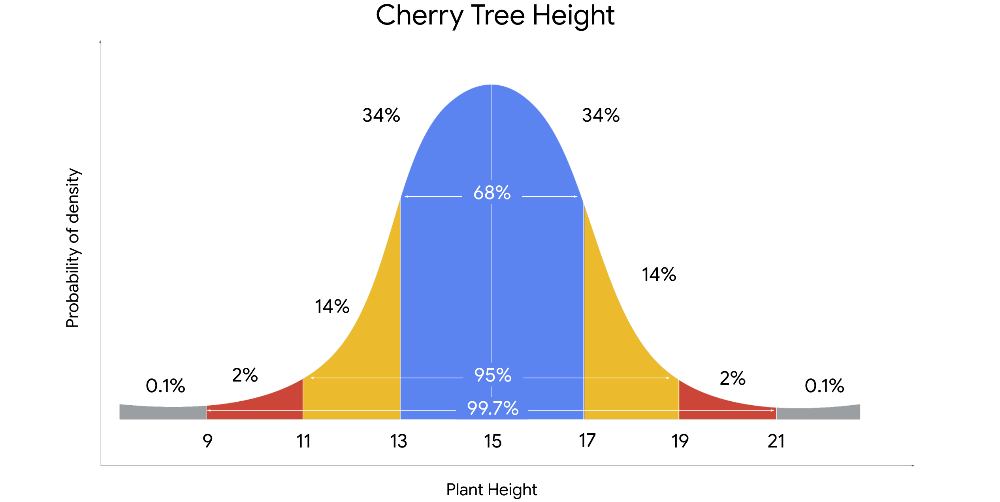

Bu durumda, dikdörtgenin alanı 0.20 civarındadır. Dolayısıyla, rastgele seçilen bir kiraz ağacının yüksekliğinin 14,5 fit ile 15, 5 fit arasında olma ihtimali %20 vardır.

**Not:** veri uzmanları genellikle sürekli bir dağılımdaki olasılıkları hesaplamak için istatistiksel yazılım kullanır.

#### **Normal dağılım**

Normal dağılım, ortalama ve çan şeklinde simetrik olan sürekli bir olasılık dağılımıdır. Formülünü ilk tanımlayan Alman matematikçi Carl Gauss'tan sonra Gauss dağılımı olarak da bilinir. Normal dağılım genellikle çan eğrisi olarak adlandırılır çünkü grafiği merkezde bir tepe ve iki aşağı eğimli kenarı olan bir çan şeklindedir.

Normal dağılım, istatistikteki en yaygın olasılık dağılımıdır çünkü pek çok farklı veri kümesi çan şeklinde bir eğri gösterir. Örneğin, 100 kişiyi rastgele örneklerseniz, boy, kilo, kan basıncı, ayakkabı boyutu, test puanları ve daha fazlası gibi sürekli değişkenler için normal bir dağılım eğrisi keşfedeceksiniz.

Tüm normal dağılımlar aşağıdaki özelliklere sahiptir:

- Şekil bir çan eğrisidir
    
- Ortalama eğrinin merkezinde bulunur
    
- Eğri, ortalamanın her iki tarafında simetriktir
    
- Eğrinin altındaki toplam alan 1'e eşittir
    

Normal dağılımın özelliklerini netleştirmek için kiraz ağacı örneğimizi kullanalım. Ortalama yüksekliğin 2 fit standart sapma ile 15 fit olduğunu hatırlayın.


Normal eğrinin aşağıdaki özelliklerini fark edebilirsiniz:

- Ortalama eğrinin merkezinde bulunur ve aynı zamanda eğrinin zirvesidir. Ortalama 15 fit yükseklik, veri kümesindeki en olası sonucu temsil eder
    
- Eğri ortalama hakkında simetriktir. Verilerin% 50'si ortalamanın üzerindedir ve verilerin% 50'si ortalamanın altındadır.
    
- Bir nokta ortalamadan ne kadar uzaksa, bu sonuçların olasılığı o kadar düşük olur. Ortalamadan en uzak noktalar, veri kümesindeki en az olası sonuçları temsil eder. Bunlar kısa veya uzun, daha aşırı yüksekliklere sahip ağaçlardır
    
- Eğrinin altındaki alan 1'e eşittir. Bu, eğrinin altındaki alanın dağılımdaki olası sonuçların% 100'ünü oluşturduğu anlamına gelir.
    

#### **Ampirik kural**

Normal bir eğrideki değerlerin ortalamaya olan mesafelerine bağlı olarak düzenli bir düzende dağıldığını da fark edebilirsiniz. Bu **ampirik kural olarak bilinir.** Kural, normal dağılıma sahip belirli bir veri kümesi için şunu belirtir:

- Değerlerin% 68'i ortalamanın 1 standart sapması dahilinde
    
- Değerlerin% 95'i ortalamanın 2 standart sapması dahilinde
    
- Değerlerin% 99,7'si ortalamanın 3 standart sapması içine düşer


Ampirik kuralı kiraz ağacı örneğimize uygularsanız, aşağıdakileri öğrenirsiniz:

- Çoğu ağaç veya% 68, ortalama 15 fit yüksekliğin 1 standart sapmasına düşecektir. Bu, ağaçların% 68'inin 13 fit ile 17 fit arasında veya ortalamanın 2 fit altında ve ortalamanın 2 fit üzerinde olacağı anlamına gelir.
    
- Ağaçların %95'i 11 fit ile 19 fit arasında veya ortalamadan 2 standart sapma içinde ölçülecektir.
    
- Hemen hemen tüm ağaçlar veya% 99.7, 9 fit ile 21 fit arasında veya ortalamanın 3 standart sapması içinde ölçülecektir.
    

Ampirik kural, büyük bir veri kümesindeki değerlerin nasıl dağıtıldığına dair hızlı bir tahmin verebilir. Bu zaman kazandırır ve verilerinizi daha iyi anlamanıza yardımcı olur.

Değerlerinizin normal dağılımdaki konumunu bilmek, aykırı değerleri tespit etmek için de yararlıdır. Bir aykırı değerin, verilerin geri kalanından önemli ölçüde farklı bir değer olduğunu hatırlayın. Tipik olarak, veri uzmanları, ortalamanın altında veya üzerinde 3'ten fazla standart sapma bulunan değerleri aykırı değerler olarak kabul eder. Bazı aşırı değerler veri toplama veya veri işlemedeki hatalardan kaynaklanabileceğinden ve bu yanlış değerler sonuçlarınızı çarpıtabileceğinden, aykırı değerleri belirlemek önemlidir.

#### Önemli çıkarımlar

Bir veri uzmanı olarak, çok çeşitli veri kümelerinde önemli kalıpları belirlemek için muhtemelen normal dağılımı kullanacaksınız. Normal dağılımı anlamak, daha sonra öğreneceğiniz hipotez testi ve regresyon analizi gibi daha gelişmiş istatistiksel yöntemler için de önemlidir.

#### Daha fazla bilgi için kaynaklar

Sürekli olasılık dağılımları ve normal dağılım hakkında daha fazla bilgi edinmek için aşağıdaki kaynaklara göz atın:

- [Duke Üniversitesi'nden bu makale, normal dağılımın temel özelliklerinin yararlı bir özetini sunmaktadır](https://sites.nicholas.duke.edu/statsreview/continuous-probability-distributions/)

## Standart Sapma ve Alt-Üst Limit Hesabı 

```python
import numpy as np
import pandas as pd
import matplotlib.pyplot as plt
from scipy import stats
import statsmodels.api as sm

education_districtwise['OVERALL_LI'].hist()
```

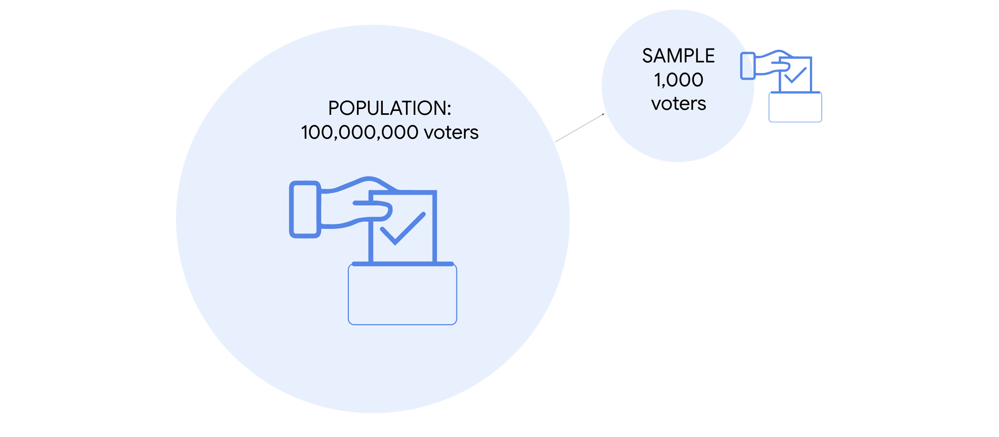

```python
mean_overall_li = education_districtwise['OVERALL_LI'].mean() 

mean_overall_li
73.39518927444797

std_overall_li = education_districtwise['OVERALL_LI'].std()

std_overall_li
10.098460413782469

upper_limit = mean_overall_li + 1 * std_overall_li 
lower_limit = mean_overall_li + 1 * std_overall_li 

(education_districtwise['OVERALL_LI'] >= lower_limit) & (education_districtwise['OVERALL_LI'] <= upper_limit)).mean()
0.6640378548895899

upper_limit = mean_overall_li + 2 * std_overall_li 
lower_limit = mean_overall_li + 2 * std_overall_li 

((education_districtwise['OVERALL_LI'] >= lower_limit) & (education_districtwise['OVERALL_LI'] <= upper_limit)).mean()
0.9542586750788643

upper_limit = mean_overall_li + 3 * std_overall_li 
lower_limit = mean_overall_li + 3 * std_overall_li 

((education_districtwise['OVERALL_LI'] >= lower_limit) & (education_districtwise['OVERALL_LI'] <= upper_limit)).mean()
0.996845425867507
```

Ampirik kural ile uyumlu olduğu için verilerin normal dağılım yaptığı söylenebilir. 

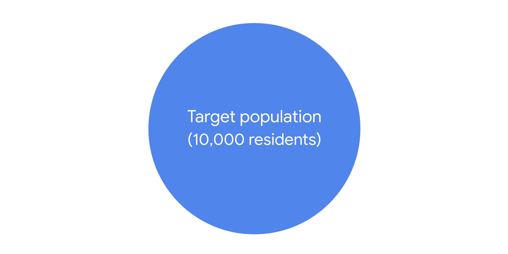

```python
education_districtwise['Z_SCORE'] = stats.zscore(education_districtwise ['OVERALL_LI']) 
education_districtwise

education_districtwise[(education_districtwise['Z_SCORE'] > 3) | (education_districtwise ['Z_SCORE'] < -3)]
```

| DISTNAME     | STATNAME | BLOCKS | VILLAGES | CLUSTERS | TOTPOPULAT | OVERALL_LI | Z_SCORE   |
|--------------|----------|--------|----------|----------|------------|------------|-----------|
| DISTRICT461  | STATE31  | 4      | 360      | 53       | 532791.0   | 42.67      | -3.044964 |
| DISTRICT429  | STATE22  | 6      | 612      | 62       | 728677.0   | 37.22      | -3.585076 |

## Örneklem ve popülasyon arasındaki ilişki

Daha önce, çıkarımsal **istatistiklerin sonuç çıkarmak** veya daha büyük bir popülasyon hakkında tahminlerde bulunmak için örnek verileri kullandığını öğrendiniz. Veri uzmanları, verileri hakkında değerli bilgiler edinmek için çıkarımsal istatistikleri kullanır.

Bu okumada, örneklem ve popülasyon arasındaki ilişkiyi daha ayrıntılı olarak öğreneceksiniz. Ayrıca veri profesyonellerinin veri çalışmasında örneklemeyi nasıl kullandığını ve popülasyonu temsil eden bir örnekle çalışmanın önemini tartışacağız.

### Nüfus ve Örnek

#### **Nüfus ve örnek**

İstatistiklerde, bir **popülasyon**, ölçmek istediğiniz her olası öğeyi veya hakkında sonuç çıkarmak istediğiniz tüm veri kümesini içerir. İstatistiksel bir popülasyon, aşağıdakiler de dahil olmak üzere her tür veriye atıfta bulunabilir:

- İnsanlar
    
- Kuruluşlar
    
- Nesneler
    
- Olaylar
    
- Ve daha fazlası
    

Örneğin, bir popülasyon aşağıdakiler kümesi olabilir:

- Bir üniversitedeki tüm öğrenciler
    
- Şimdiye kadar bir şirket tarafından üretilen tüm cep telefonları
    
- Yeryüzündeki tüm ormanlar
    

**Örnek, bir popülasyonun bir alt kümesidir.**

Yukarıdaki popülasyonlardan alınan örnekler şunlar olabilir:

- Üniversitedeki matematik bölümleri
    
- Şirket tarafından geçen hafta üretilen cep telefonları
    
- Kanada'daki ormanlar
    

Veri uzmanları, popülasyonlar hakkında çıkarımlar yapmak için örnekler kullanır. Başka bir deyişle, nüfusun küçük bir bölümünden topladıkları verileri bir bütün olarak nüfus hakkında sonuçlar çıkarmak için kullanırlar.


#### **Örnekleme**

**Örnekleme**, bir popülasyondan bir veri alt kümesi seçme işlemidir.

Uygulamada, tüm popülasyonun her üyesi veya unsuru hakkında veri toplamak genellikle zordur. Bir nüfus çok büyük olabilir, coğrafi olarak dağılmış veya başka bir şekilde erişilmesi zor olabilir. Bunun yerine, bir bütün olarak popülasyon hakkında sonuç çıkarmak, tahminler yapmak veya hipotezleri test etmek için örnek verileri kullanabilirsiniz.

Veri uzmanları örneklemeyi kullanır çünkü:

- Boyut, karmaşıklık veya erişilebilirlik eksikliği nedeniyle tüm nüfus hakkında veri toplamak genellikle imkansız veya pratik değildir.
    
- Bir örnekten veri toplamak daha kolay, daha hızlı ve daha verimli
    
- Örnek kullanmak para ve kaynak tasarrufu sağlar
    
- Daha küçük veri kümelerini depolamak, düzenlemek ve analiz etmek genellikle son derece büyük veri kümeleriyle uğraşmaktan daha kolay, daha hızlı ve daha güvenilirdir
    

##### Örnek: seçim anketi

Hindistan, Endonezya, Amerika Birleşik Devletleri veya Brezilya gibi büyük nüfusa sahip bir ülkede çalışan bir veri uzmanı olduğunuzu hayal edin. Yaklaşan bir ulusal cumhurbaşkanı seçimi var. Hangi aday seçmenlerin tercih ettiğini görmek için bir seçim anketi yapmak istiyorsunuz. Diyelim ki uygun seçmenlerin nüfusu 100 milyon kişidir. 100 milyon insanı oy kullanma tercihleri konusunda anket yapmak, tüm seçmenleri bulmanın ve iletişim kurmanın mümkün olacağını ve tüm seçmenlerin katılmaya istekli olacağını varsayarsak bile, çok fazla zaman, para ve kaynak gerektirecektir.

Bununla birlikte, tüm seçmenlerin daha büyük nüfusundan alınan 100 veya 1000 seçmenden oluşan bir örneği araştırmak gerçekçidir. Büyük bir popülasyonla uğraşırken, örnekleme, bir bütün olarak popülasyon hakkında geçerli çıkarımlar yapmanıza yardımcı olabilir.


#### **Temsili örnek**

Bir popülasyon hakkında geçerli çıkarımlar veya doğru tahminler yapmak için, örneklemeniz popülasyonu bir bütün olarak temsil etmelidir. Temsili bir **örneklemin bir pop** ülasyonun özelliklerini doğru bir şekilde yansıttığını hatırlayın. Nüfusunuz hakkında yaptığınız çıkarımlar ve tahminler, örnek verilerinize dayanmaktadır. Örneklemeniz popülasyonunuzu doğru bir şekilde yansıtmıyorsa, çıkarımlarınız güvenilir olmayacak ve tahminleriniz doğru olmayacaktır. Bu da paydaşlar ve kuruluşlar için olumsuz sonuçlara yol açabilir.

Olasılık örneklemesi gibi istatistiksel yöntemler, bir popülasyon içindeki çeşitli gruplardan rastgele örnekler toplayarak örneklemenizin temsili olmasını sağlamaya yardımcı olur. Bu yöntemler örnekleme yanlılığını azaltmaya ve sonuçlarınızın geçerliliğini artırmaya yardımcı olur. Daha sonra örnekleme yöntemleri hakkında daha fazla bilgi edineceksiniz.

##### Örnek: seçim anketi

İdeal olarak, seçim anketinizin örneği, genel seçmen nüfusunun özelliklerini doğru bir şekilde yansıtacaktır. Büyük bir ülkedeki seçmen nüfusu siyasi bakış açıları, coğrafi konum, yaş, cinsiyet, ırk, eğitim düzeyi, sosyoekonomik durum vb. bakımından farklılık gösterecektir. Yalnızca belirli gruplara ait kişilerden veri toplarsanız, diğerlerinden değil, yalnızca belirli gruplara ait kişilerden veri toplarsanız örneklemeniz temsili olmayacaktır. Örneğin, bir siyasi partiden veya ileri dereceye sahip veya 70 yaşından büyük kişilerle anket yaparsanız. Temsili olmayan bir örneğe dayalı bir seçim anketinin sonuçları doğru olmayacaktır. Genel olarak, herhangi bir popülasyon hakkında yaptığınız herhangi bir iddia veya çıkarım, temsili bir örneğe dayanıyorsa daha fazla geçerliliğe sahip olacaktır.

### Önemli çıkarımlar

Veri uzmanları, karmaşık veri kümelerini modelleyebilen ve değerli içgörüler oluşturmaya yardımcı olabilecek güçlü istatistiksel araçlarla çalışır. Ancak, üzerinde çalıştığınız örnek veriler popülasyonunuzu doğru bir şekilde yansıtmıyorsa - yani, örneğiniz temsili değilse - modelinizin ne kadar iyi olduğu önemli değildir. Tahmin modeliniz kötü bir örneğe dayanıyorsa, tahminleriniz doğru olmayacaktır.

Sonuç olarak, numunenizin kalitesi, paydaşlarla paylaştığınız içgörülerin kalitesini belirlemeye yardımcı olur. Bir popülasyon hakkında güvenilir çıkarımlar yapmak için, örneklemenizin popülasyonu temsil ettiğinden emin olun.

## Örnekleme sürecinin aşamaları 

Son zamanlarda, örneklemeyi öğreniyorsunuz. Bir veri uzmanı olarak, her zaman örnek verilerle çalışacaksınız. Genellikle, bu daha önce diğer araştırmacılar tarafından toplanan örnek veriler olacaktır; bazen, ekibiniz kendi verilerini toplayabilir. Her iki durumda da, örnekleme sürecinin nasıl çalıştığını bilmek önemlidir, çünkü örneğinizin popülasyonu temsil edip etmediğini ve örneğinizin tarafsız olup olmadığını belirlemeye yardımcı olur.

Bu okumada, örnekleme sürecinin ana aşamalarını daha ayrıntılı olarak gözden geçireceğiz. Bu, örnekleme sürecinin nasıl çalıştığını ve sürecin her adımının örnek verilerinizi nasıl etkileyebileceğini daha iyi anlamanızı sağlayacaktır..

### Örnekleme süreci

İlk olarak, örnekleme sürecinin ana adımlarını gözden geçirelim:

1. Hedef popülasyonu belirleyin
    
2. Örnekleme çerçevesini seçin
    
3. Örnekleme yöntemini seçin
    
4. Örnek boyutunu belirleyin
    
5. Örnek verileri toplayın
    

Her adımı bir örnekle daha ayrıntılı olarak inceleyelim. Ev aletleri üreten bir şirket için çalışan bir veri uzmanı olduğunuzu hayal edin. Şirket, müşterilerin en yeni buzdolabı modellerindeki yenilikçi dijital özellikler hakkında ne düşündüklerini öğrenmek istiyor. Buzdolabı iki yıldır piyasada ve 10.000 kişi satın aldı. Yöneticiniz sizden bir müşteri memnuniyeti anketi yapmanızı ve sonuçları paydaşlarla paylaşmanızı ister.

#### **Adım 1: Hedef popülasyonu belirleyin**

Örnekleme sürecindeki ilk adım, hedef popülasyonunuzu tanımlamaktır. He **def popülas** yon, hakkında daha fazla bilgi edinmek istediğiniz tüm öğeler kümesidir. Araştırmanızın bağlamına bağlı olarak, popülasyonunuz bireyleri, kuruluşları, nesneleri, olayları veya araştırmak istediğiniz diğer verileri içerebilir.

İyi tanımlanmış bir popülasyon, araştırmanızın tam kapsamına uymayan katılımcıları dahil etme olasılığını azaltır. Örneğin, şirketin tüm müşterilerini veya şirketin diğer buzdolabı modellerini satın alan müşterileri dahil etmek istemezsiniz.

Bu durumda hedef kitleniz şirketin en yeni buzdolabı modelini satın alan 10.000 müşteri olacaktır. Bunlar, en yeni modelle ilgili deneyimleri hakkında bilgi edinmek için anket yapmak istediğiniz müşterilerdir.

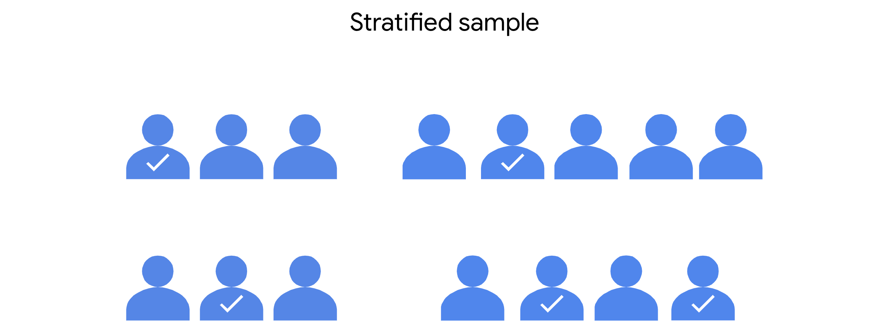

#### **Adım 2: Örnekleme çerçevesini seçin**

Örnekleme işlemindeki bir sonraki adım, bir örnekleme çerçevesi oluşturmaktır. Örne **kleme çerçevesi**, hedef popülasyonunuzdaki tüm bireylerin veya öğelerin bir listesidir.

Hedef popülasyon ile örnekleme çerçevesi arasındaki fark, popülasyonun genel ve çerçevenin spesifik olmasıdır. Yani, hedef popülasyonunuz buzdolabını satın alan tüm müşteriler ise, örnekleme çerçeveniz tüm bu müşterilerin adlarının alfabetik bir listesi olabilir. Örneğinizdeki müşteriler bu listeden seçilecektir.

İdeal olarak, örnekleme çerçeveniz tüm hedef popülasyonu içermelidir. Bununla birlikte, pratik nedenlerden dolayı, örnekleme çerçeveniz hedef popülasyonunuzla tam olarak eşleşmeyebilir, çünkü popülasyonun her üyesine erişiminiz olmayabilir. Örneğin, şirketin müşteri veritabanı eksik olabilir veya veri işleme hataları içerebilir. Veya, bazı müşteriler satın aldıklarından bu yana iletişim bilgilerini değiştirmiş olabilir ve onları bulamayabilir veya onlarla iletişim kuramayabilirsiniz. Ayrıca, bazen örnekleme çerçevesi, hedef popülasyonun dışındaki unsurları sadece tesadüfen veya hedef popülasyonu kesin olarak bilmek imkansız olduğu için içerebilir.


Bu nedenle, genellikle örnekleme çerçeveniz hedef _popülasyonunuzun erişilebilir_ kısmıdır, ancak bazen bu kümenin dışında öğeler içerecektir.

#### **Adım 3: Örnekleme yöntemini seçin**

Örnekleme sürecindeki üçüncü adım, bir örnekleme yöntemi seçmektir.

İki ana örnekleme yöntemi türü vardır: olasılık örneklemesi ve **olas** ılık **dışı örnekleme**. Daha sonra, belirli yöntemleri daha ayrıntılı olarak inceleyeceğiz. Şimdilik, olasılık örneklemesinin [bir örnek oluşturmak için rastgele seçim kullandığını bilin](https://www.statisticshowto.com/sample/). Olasılıksız örnekleme, rastgele seçimden ziyade genellikle rahatlığa veya araştırmacının kişisel tercihlerine dayanır. Genellikle, olasılık örnekleme yöntemleri, olasılık dışı örnekleme yöntemlerinden daha fazla zaman ve kaynak gerektirir.

İdeal olarak, örneğiniz popülasyonu temsil edecektir. Numunenizin temsili olmasını sağlamanın bir yolu, doğru örnekleme yöntemini seçmektir. Olasılık örnekleme yöntemleri rastgele seçime dayandığından, popülasyondaki her öğenin örneğe dahil edilme şansı eşittir. Bu size temsili bir örnek almak için en iyi şansı verir, çünkü sonuçlarınızın genel popülasyonu doğru bir şekilde yansıtması daha olasıdır.

Bu nedenle, bütçeniz, kaynaklarınız ve zamanınız olduğunu varsayarsak, anketiniz için bir olasılık örnekleme yöntemi kullanmalısınız.

#### **Adım 4: Örnek boyutunu belirleyin**

Örnekleme sürecinin dördüncü adımı, örneklemeniz için en iyi boyutu belirlemektir, çünkü örnekleme çerçevenizdeki herkesi araştıracak kaynaklara sahip değilsiniz. İstatistikte, örneklem büyüklüğü, bir çalışma veya deney için seçilen bireylerin veya öğelerin sayısını ifade eder.

Örneklem büyüklüğü, popülasyon hakkında yaptığınız tahminlerin kesinliğini belirlemeye yardımcı olur. Genel olarak, örneklem boyutu ne kadar büyükse, tahminleriniz o kadar kesin olur. Bununla birlikte, daha büyük örneklerin kullanılması tipik olarak daha fazla kaynak gerektirir.

Seçtiğiniz örneklem büyüklüğü, örnekleme yöntemi, hedef popülasyonun büyüklüğü ve karmaşıklığı, kaynaklarınızın sınırları, zaman çizelgeniz ve araştırmanızın amacı dahil olmak üzere çeşitli faktörlere bağlıdır.

Bu faktörlere dayanarak, numunenize kaç müşterinin dahil edileceğine karar verebilirsiniz.

#### **Adım 5: Örnek verileri toplayın**

Şimdi, örnekleme sürecinin son adımı olan örnek verilerinizi toplamaya hazırsınız.

Numuneniz için seçilen müşterilere müşteri memnuniyeti anketi verirsiniz. Anket yanıtları, müşterilerin buzdolabının dijital özellikleri hakkında ne düşündükleri hakkında faydalı veriler sağlar. Ardından, bu buzdolabının gelecekteki sürümleri için bu özelliklere yatırım yapmaya devam edip etmeyecekleri konusunda daha bilinçli kararlar almalarına yardımcı olmak için sonuçlarınızı paydaşlarla paylaşırsınız ve diğer modeller için benzer özellikler geliştirirsiniz.

### Önemli çıkarımlar

Etkili örnekleme, örnek verilerinizin popülasyonunuzu temsil etmesini sağlar. Ardından, popülasyon hakkında çıkarımlar yapmak için örnek verileri kullandığınızda, çıkarımlarınızın güvenilir olduğundan makul ölçüde emin olabilirsiniz.

Örnekleme işleminin her adımında verdiğiniz kararlar, örnek verilerinizin kalitesini etkileyebilir. İster diğer araştırmacılar tarafından toplanan verileri analiz ediyor olun, ister kendi başınıza bir anket yapıyor olun, örnekleme sürecini anlamak sizi daha iyi bir veri uzmanı haline getirecektir.

## Olasılık örnekleme yöntemleri

Daha önce, iki ana örnekleme yöntemi türü olduğunu öğrendiniz: olasılık örneklemesi ve olasılık dışı örnekleme. **Olasılık örne** klemesi, bir [örnek](https://www.statisticshowto.com/sample/) oluşturmak için rastgele seçimi kullanır. **Olasılıksız örnekleme**, rastgele seçimden ziyade genellikle rahatlığa veya araştırmacının kişisel tercihlerine dayanır. Kullandığınız örnekleme yöntemi, örneğinizin popülasyonunuzu temsil edip etmediğini ve örneğinizin önyargılı olup olmadığını belirlemeye yardımcı olur. Olasılık örneklemesi, popülasyonu temsil eden bir örnek oluşturmak için size en iyi şansı verir.

Bu okumada, farklı olasılık örneklemesi yöntemleri ve her yöntemin yararları ve dezavantajları hakkında daha fazla bilgi edineceksiniz.

### Olasılık Örnekleme Yöntemleri

Dört farklı olasılık örnekleme yöntemi vardır:

- Basit rastgele örnekleme
    
- Tabakalı rastgele örnekleme
    
- Küme rastgele örnekleme
    
- Sistematik rastgele örnekleme
    

Her yöntemi daha ayrıntılı olarak inceleyelim.

#### **Basit rastgele örnekleme**

**Basit bir rastgele örneklem** de, bir popülasyonun her üyesi rastgele seçilir ve seçilme şansı eşittir. Üyeleri rastgele bir sayı üreteci kullanarak veya başka bir rastgele seçim yöntemiyle seçebilirsiniz.

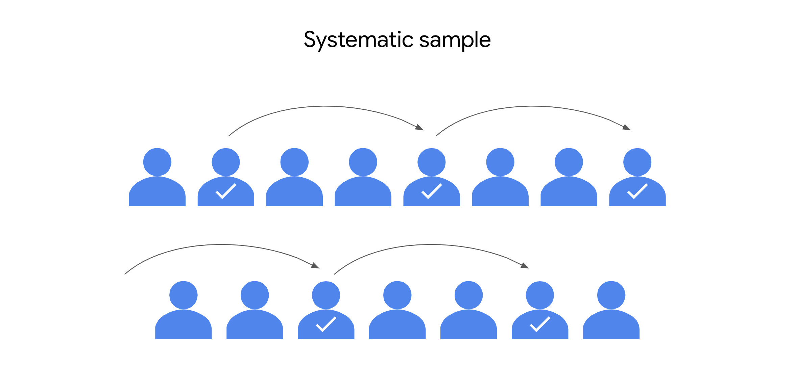

Örneğin, bir şirketin çalışanlarını iş deneyimleri hakkında anket yapmak istediğinizi hayal edin. Şirket 10.000 kişiyi istihdamaktadır. Şirket veritabanındaki her çalışana 1 ila 10.000 arasında bir sayı atayabilir ve ardından örneğiniz için 100 kişi seçmek için rastgele bir sayı üreteci kullanabilirsiniz. Bu senaryoda, çalışanların her birinin örnek için seçilme şansı eşittir.

Basit rastgele örneklerin temel yararı, popülasyonun her üyesinin seçilme şansı eşit olduğundan, genellikle oldukça temsili olmalarıdır. Rastgele örnekler önyargıdan kaçınma eğilimindedir ve bunun gibi anketler size daha güvenilir sonuçlar verir.

Bununla birlikte, pratikte, büyük basit rastgele örnekleri toplamak genellikle pahalı ve zaman alıcıdır. Örneklem büyüklüğünüz yeterince büyük değilse, popülasyondaki belirli bir grup insan örnekleminizde yeterince temsil edilmeyebilir. Daha büyük bir örneklem boyutu kullanırsanız, örneklemeniz popülasyonu daha doğru yansıtacaktır.

#### **Tabakalı rastgele örnekleme**

Tab **akalanmış rastgele bir örneklem** de, bir popülasyonu gruplara bölersiniz ve örneklemde yer alacak her gruptan rastgele bazı üyeleri seçersiniz. Bu gruplara katmanlar denir. Katmanlar yaş, cinsiyet, gelir veya okumak istediğiniz kategoriye göre düzenlenebilir.


Örneğin, yeni bir ürün için pazar araştırması yaptığınızı ve farklı yaş gruplarındaki tüketicilerin tercihlerini analiz etmek istediğinizi hayal edin. Hedef popülasyonunuzu yaşa göre katmanlara ayırabilirsiniz: 20-29, 30-39, 40-49, 50-59 vb. Daha sonra, her yaş grubundan eşit sayıda kişiye anket yapabilir ve her yaş grubunun tüketici tercihleri hakkında sonuçlar çıkarabilirsiniz. Sonuçlarınız, pazarlamacıların yeni ürün için satışları optimize etmek için hangi yaş gruplarına odaklanacaklarına karar vermelerine yardımcı olacaktır.

Tabakalı rastgele örnekler, popülasyondaki her gruptan üyelerin ankete dahil edilmesini sağlamaya yardımcı olur. Bu yöntem, yeterince temsil edilmeyen gruplar için eşit temsil sağlamaya yardımcı olur ve katmanların her biri hakkında daha kesin sonuçlar çıkarmanıza olanak tanır. 21 yaşındaki ve 51 yaşındaki birinin satın alma alışkanlıklarında önemli farklılıklar olabilir. Tabakalı örnekleme, her iki perspektifin de örnekte yakalanmasını sağlamaya yardımcı olur.

Tabakalı örneklemenin ana dezavantajlarından biri, bir popülasyon hakkında bilgi sahibi değilseniz, bir çalışma için uygun katmanları belirlemenin zor olabilmesidir. Örneğin, bir nüfus arasında medyan geliri incelemek istiyorsanız, örneğinizi iş türüne, sektöre, konuma veya eğitim düzeyine göre sınıflandırmak isteyebilirsiniz. Bu kategorilerin medyan gelirle ne kadar alakalı olduğunu bilmiyorsanız, çalışmanız için en iyisini seçmek zor olacaktır.

#### **Küme rastgele örnekleme**

Bir **küme rastgele örneği yürütürken**, bir popülasyonu kümelere böler, belirli kümeleri rastgele seçer ve seçilen kümelerden tüm üyeleri örneğe dahil edersiniz.

Küme örneklemesi tabakalı rastgele örneklemeye benzer, ancak tabakalı örneklemede, örneklemde olmak için her gruptan rastgele _bazı_ üyeleri seçersiniz. Küme örneklemesinde, örnekte yer alacak gruptaki _tüm_ üyeleri seçersiniz. Kümeler yaş, cinsiyet, konum veya çalışmak istediğiniz herhangi bir şey gibi tanımlayıcı ayrıntılar kullanılarak bölünür.


Örneğin, küme örneklemesini kullanarak küresel bir restoran franchise'da çalışan memnuniyeti anketi yapmak istediğinizi düşünün. Franchise dünya çapında 40 restorana sahiptir. Her restoran, benzer iş rollerinde yaklaşık aynı sayıda çalışana sahiptir. Kümeler olarak rastgele 4 restoran seçersiniz. Numunenize 4 restorandaki tüm çalışanları dahil edersiniz.

Bu yöntemin bir avantajı, bir küme örneğinin belirli bir kümeden her üyeyi almasıdır; bu, her küme popülasyonu bir bütün olarak yansıttığında yararlıdır. Bu yöntem, açıkça tanımlanmış alt gruplara sahip büyük ve çeşitli popülasyonlarla uğraşırken faydalıdır. Araştırmacılar Auckland, Yeni Zelanda'nın banliyölerinde ev sahipliği hakkında daha fazla bilgi edinmek istiyorlarsa, şehirdeki tüm banliyölerin temsili bir örneği olarak iyi seçilmiş birkaç banliyöyü kullanabilirler.

Küme örneklemesinin ana dezavantajı, genel popülasyonu doğru bir şekilde yansıtan kümeler oluşturmanın zor olabileceğidir. Örneğin, pratik nedenlerle, İngiltere'deki restoranlara yalnızca franchise'ın dünyanın her yerinde konumları olduğunda erişebilirsiniz. İngiltere'deki çalışanlar diğer ülkelerdeki çalışanlardan farklı özelliklere ve değerlere sahip olabilir.

#### **Sistematik rastgele örnekleme**

Sistem **atik bir rastgele örneklem** de, bir popülasyonun her üyesini sıralı bir diziye koyarsınız. Ardından, dizide rastgele bir başlangıç noktası seçersiniz ve düzenli aralıklarla numuneniz için üyeler seçersiniz.


Bir lisedeki öğrencilere çalışma alışkanlıkları hakkında araştırma yapmak istediğinizi hayal edin. Sistematik bir rastgele örnek için, öğrencilerin adlarını alfabetik sıraya koyar ve rastgele bir başlangıç noktası seçersiniz: diyelim ki, sayı 4. 4 numaradan başlayarak, 100 öğrenciden oluşan bir örneğe sahip olana kadar listedeki her 10. ismi (4, 14, 24, 34,...) seçersiniz.

Sistematik rastgele örneklerin bir avantajı, her üyenin örneğe dahil edilme şansı eşit olduğundan, genellikle popülasyonu temsil etmeleridir. Öğrencinin soyadının L veya Q ile başlayıp başlaması özelliklerini etkilemeyecektir. Nüfusunuzun üyelerinin tam bir listesine sahip olduğunuzda sistematik örnekleme de hızlı ve kullanışlıdır.

Sistematik örneklemenin bir dezavantajı, başlamadan önce incelemek istediğiniz popülasyonun büyüklüğünü bilmeniz gerektiğidir. Bu bilgilere sahip değilseniz, tutarlı aralıklar seçmek zordur. Ayrıca, dizide gizli bir desen varsa, temsili bir örnek alamayabilirsiniz. Örneğin, listenizdeki her 10. isim bir onur öğrencisiyse, _tüm_ öğrencilerin değil, yalnızca onur öğrencilerinin çalışma alışkanlıkları hakkında geri bildirim alabilirsiniz.

### Önemli çıkarımlar

Ele aldığımız dört olasılık örneklemesi yönteminin (basit, tabakalı, küme ve sistematik) tümü, çoğu veri uzmanı için tercih edilen örnekleme yöntemi olan rastgele seçime dayanmaktadır. Olasılık örnekleme yöntemleri, bir bütün olarak popülasyonu temsil eden bir örnek oluşturmak için size en iyi şansı verir. Temsili bir örnekle çalışmak, araştırdığınız popülasyon hakkında güvenilir çıkarımlar ve doğru tahminler yapmanıza olanak tanır.

## Olasılıksız örnekleme yöntemleri

Son zamanlarda, olasılık örnekleme yöntemlerinin rastgele seçim kullandığını ve bu da örnekleme yanlılığını önlemeye yardımcı olduğunu öğrendiniz. Rastgele seçilen bir örnek, popülasyonun tüm üyelerinin dahil edilme şansının eşit olduğu anlamına gelir. Buna karşılık, olasılık dışı örnekleme yöntemleri rastgele seçim kullanmazlar, bu nedenle tipik olarak temsili örnekler oluşturmazlar. Aslında, olasılık dışı yöntemler genellikle önyargılı örneklerle sonuçlanır. **Örnekleme yanl** ılığı, popülasyonun bazı üyelerinin seçilme olasılığı diğer üyelere göre daha yüksek olduğunda ortaya çıkar.

Bu okumada, olasılıksız örneklemenin dört yöntemi hakkında daha fazla bilgi edinecek ve örnekleme yanlılığının her yöntemi nasıl etkileyebileceğini öğreneceksiniz. Olasılıksız örneklemenin belirli durumlarda neden yararlı olabileceğini de tartışacağız.

### Olasılıksız örnekleme yöntemleri

Olasılık dışı örnekler rastgele olmayan seçim yöntemlerini kullanır, bu nedenle bir popülasyonun tüm üyelerinin seçilme şansı eşit değildir. Bu nedenle olasılık dışı yöntemlerin örnekleme yanlılığı riski yüksektir. Bununla birlikte, olasılık dışı yöntemler genellikle daha ucuzdur ve araştırmacıların yürütmesi için daha uygundur. Bazen sınırlı zaman, para veya diğer kaynaklar nedeniyle olasılık örneklemesini kullanmak mümkün değildir. Ayrıca, olasılık dışı yöntemler, bir bütün olarak popülasyon hakkında çıkarımlar yapmak yerine, bir popülasyonun ilk anlayışını geliştirmeye çalışan keşif çalışmaları için yararlı olabilir.

Olasılıksız örneklemenin dört yöntemini gözden geçireceğiz:

- Kolay örnekleme
    
- Gönüllü yanıt örneklemesi
    
- Kartopu örneklemesi
    
- Amaçlı örnekleme
    

Her yöntemi daha ayrıntılı olarak inceleyelim.

#### **Kolay örnekleme**

Kolay örnekleme için, iletişim kurması veya ulaşılması kolay bir popülasyonun üyelerini seçersiniz. Adından da anlaşılacağı gibi, uygun bir örnek yapmak, işyeriniz, yerel bir okul veya halka açık bir park gibi size uygun bir yerden örnek toplamayı içerir.

Örneğin, bir kamuoyu anketi yapmak için, bir araştırmacı gün boyunca bir alışveriş merkezinin girişinde durabilir ve yanından geçen kişileri anket yapabilir.


Bu örnekler, popülasyonun daha geniş bir örneklemine değil, araştırmacının rahatlığına dayandığından, uygun örnekler genellikle yetersiz kapsama yanlılığından muzdariptir. Yetersiz kapsama yanlılığı, bir popülasyonun bazı üyeleri örneklemde yetersiz temsil edildiğinde ortaya çıkar. Örneğin, yukarıdaki örnek, alışveriş merkezlerinde alışveriş yapmayı sevmeyen veya farklı bir alışveriş merkezinde alışveriş yapmayı tercih eden veya ulaşım eksikliği olduğu için alışveriş merkezini ziyaret etmeyen kişileri yeterince temsil edecektir.

Kolay örnekleme genellikle hızlı ve ucuzdur, ancak temsili bir örnek almanın güvenilir bir yolu değildir.

#### **Gönüllü yanıt örneklemesi**

Gönüllü bir yanıt örneği, bir çalışmaya katılmak için gönüllü olan bir popülasyonun üyelerinden oluşur. Uygun bir örnek gibi, gönüllü bir yanıt örneği genellikle bir popülasyona uygun erişime dayanır. Ancak, araştırmacının katılımcıları seçmesi yerine, katılımcılar kendi başlarına gönüllü olurlar.

Örneğin, üniversite yöneticilerinin öğrencilerin kampüste servis edilen yemekler hakkında ne düşündüklerini bilmek istediklerini varsayalım. Öğrencilere yemeğin kalitesiyle ilgili çevrimiçi bir anketin bağlantısını e-posta ile gönderirler ve öğrencilerden zamanları varsa anketi doldurmalarını isterler.


Gönüllü yanıt örnekleri, belirli insan gruplarının yanıt verme olasılığının daha düşük olduğunda ortaya çıkan yanıt dışı önyargıdan muzdarip olma eğilimindedir. Gönüllü olarak yanıt veren insanlar muhtemelen nüfusun geri kalanından olumlu veya olumsuz daha güçlü görüşlere sahip olacaklardır. Bu durumda, yalnızca yiyecekleri gerçekten seven veya gerçekten sevmeyen öğrenciler anketi doldurmak için motive olabilir. Anket, yiyecek hakkında daha hafif görüşlere sahip olan veya tarafsız olan birçok öğrenciyi ihmal edebilir. Bu, gönüllü öğrencileri genel öğrenci popülasyonunu temsil etmez hale getirir.

#### **Kartopu örneklemesi**

Bir kartopu örneğinde, araştırmacılar ilk katılımcıları bir çalışmaya dahil etmek için işe alır ve daha sonra çalışmaya katılmaları için diğer insanları işe almalarını ister. Bir kartopu gibi, daha fazla katılımcı katıldıkça örneklem büyüklüğü gittikçe büyür. Araştırmacılar, incelemek istedikleri popülasyona erişmek zor olduğunda genellikle kartopu örneklemesini kullanırlar.

Örneğin, bir araştırmacının nadir görülen bir tıbbi durumu olan insanları incelediğini hayal edin. Gizlilik nedeniyle, araştırmacının bu nüfusun üyeleri için hastanelerden veya diğer resmi kaynaklardan iletişim bilgilerini alması zor olabilir. Bununla birlikte, araştırmacı katılmaya istekli birkaç kişi bulabilirse, bu iki kişi aynı duruma sahip başkalarını tanıyabilir. İlk katılımcılar daha sonra çalışmanın potansiyel faydalarını paylaşarak başkalarını işe alabilirler.


The first illustration shows two researchers sharing information with two people. The second illustration shows those same researchers standing near four people sharing information.

Kartopu örneklemesi çok zaman alabilir ve araştırmacılar, işe alım sürecine başarılı bir şekilde devam etmek ve "kartopu" oluşturmak için katılımcılara güvenmelidir. Bu tür işe alım, örnekleme yanlılığına da yol açabilir. İlk katılımcılar kendi başlarına ek katılımcıları işe aldıklarından, çoğunun benzer özellikleri paylaşması muhtemeldir ve bu özellikler incelenen toplam popülasyonu temsil etmeyebilir.

#### **Amaçlı örnekleme**

Amaçlı örneklemede, araştırmacılar katılımcıları çalışmalarının amacına göre seçerler. Katılımcılar çalışmanın ihtiyaçlarına göre örnek için seçildiğinden profile uymayan başvuru sahipleri reddedilir.

Örneğin, bir oyun geliştirme şirketinin yeni bir video oyunu hakkında halka açık piyasaya sürülmeden önce pazar araştırması yapmak istediğini hayal edin. Araştırma ekibi sadece oyun uzmanlarını örneklerine dahil etmek istiyor. Bu nedenle, potansiyel iyileştirmeler hakkında geri bildirim sağlamak için bir grup profesyonel oyuncuyu araştırıyorlar.


Amaçlı örneklemede, araştırmacılar genellikle çalışmalarıyla en alakalı olduğunu düşündükleri belirli bir gruba odaklanmak için belirli grupları örneklemden kasıtlı olarak dışlar. Bu durumda, araştırmacı amatör oyuncuları hariç tutar. Amatör oyuncular yeni oyunu profesyonel oyunculardan farklı nedenlerle satın alabilir ve profesyonellere hitap etmeyen oyun özelliklerinin keyfini çıkarabilir. Bu, önyargılı sonuçlara yol açabilir, çünkü örneklemdeki profesyonellerin genel oyuncu popülasyonunu temsil etmesi muhtemel değildir.

Amaçlı örnekleme genellikle bir araştırmacının bir popülasyonun belirli bir kısmı hakkında ayrıntılı bilgi edinmek istediğinde veya popülasyonun çok küçük olduğu ve üyelerinin hepsinin benzer özelliklere sahip olduğu durumlarda kullanılır. Amaçlı örnekleme, büyük ve çeşitli bir popülasyon hakkında çıkarımlar yapmak için etkili değildir.

### Önemli çıkarımlar

Olasılıksız örnekleme, sınırlı zamanınız, bütçeniz ve diğer kaynakların olduğu durumlarda veri toplamak için kullanışlıdır. Olasılıksız örnekleme, bir bütün olarak popülasyon hakkında çıkarımlar yapmak yerine, bir popülasyon hakkında ilk anlayışı elde etmek istediğinizde, keşif araştırmaları için de yararlıdır. Bununla birlikte, olasılık dışı örnekleme yöntemlerinin yüksek örnekleme yanlılığı riskine sahip olduğunu hatırlamak önemlidir.

Bir veri uzmanı olarak, örnek verileri toplamaya başladığınız andan sonuçlarınızı sunduğunuz ana kadar önyargı ve adalet hakkında düşünmelisiniz. Bazı yaygın önyargı biçimlerinin farkına vardığınızda, herhangi bir biçimde önyargı konusunda tetikte kalabilirsiniz.

## Merkezi limit teoremi ile popülasyon parametrelerini çıkarma 

Son zamanlarda, merkezi limit teoremini ve bunun çok çeşitli veri kümeleriyle çalışmanıza nasıl yardımcı olabileceğini öğrendiniz. Veri uzmanları, ekonomi, bilim, işletme ve diğer birçok alandaki veriler için popülasyon parametrelerini tahmin etmek için merkezi sınır teoremini kullanır.

Bu okumada, merkezi limit teoremi ve bunun farklı veri türleri için popülasyon ortalamasını tahmin etmenize nasıl yardımcı olabileceği hakkında daha fazla bilgi edineceksiniz. Teoremin tanımını, teoremi uygulamak için yerine getirilmesi gereken koşulları gözden geçireceğiz ve teoremin eylemdeki bir örneğini inceleyeceğiz.

### Merkezi limit teoremi

#### **Tanımı**

**Merkezi limit teoremi,**  örneklem büyüklüğü arttıkça ortalamanın örnekleme dağılımının normal dağılıma yaklaştığını belirtir. Başka bir deyişle, örnek boyutunuz arttıkça, örnekleme dağılımınız bir çan eğrisi şeklini alır. Ve bir popülasyondan daha fazla gözlem örnekledikçe, örneklem ortalaması popülasyon ortalamasına yaklaşır. Nüfusun yeterince büyük bir örneğini alırsanız, örneklem ortalaması kabaca popülasyon ortalamasına eşit olacaktır.

Örneğin, hafif kamyonetler gibi belirli bir araç sınıfının ortalama ağırlığını tahmin etmek istediğinizi hayal edin. Milyonlarca kamyonet tartmak yerine, temsili bir kamyonet örneği hakkında veri alabilirsiniz. Örneklem büyüklüğünüz yeterince büyükse, örneğinizin ortalama ağırlığı kabaca popülasyonun ortalama ağırlığına eşit olacaktır (büyük sayılar yasasına bağlı kalarak).

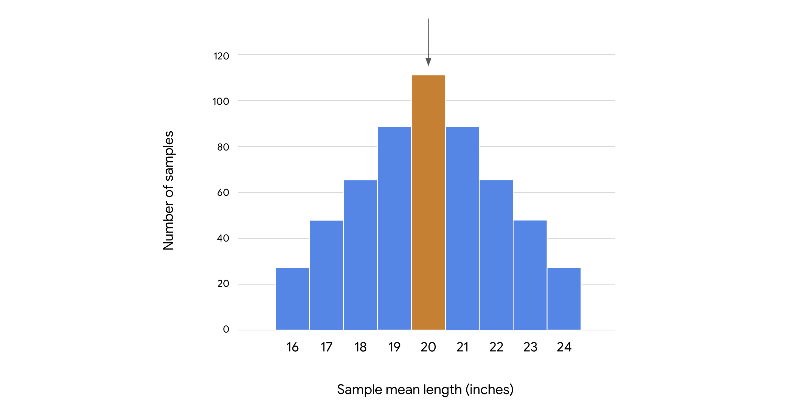

**Not:** Merkezi limit teoremi herhangi bir popülasyon için geçerlidir. Teoremi uygulamak için nüfus dağılımınızın şeklini önceden bilmeniz gerekmez - dağılım çan şeklinde olabilir, eğri veya başka bir şekle sahip olabilir. Yeterli büyüklükte numune toplarsanız, araçlarının dağılımının şekli normal bir dağılımı takip edecektir.

#### **Koşullar**

Merkezi limit teoremini uygulamak için aşağıdaki koşulların yerine getirilmesi gerekir:

- **Rastgele seçme**: _Örnek verileriniz rastgele seçimin sonucu olmalıdır. Rastgele seçim, popülasyondaki her üyenin örneklem için seçilme şansının eşit olduğu anlamına gelir._
    
- **Bağımsızlık**: _Örnek değerleriniz birbirinden bağımsız olmalıdır. Bağımsızlık, bir gözlemin değerinin başka bir gözlemin değerini etkilemediği anlamına gelir. Tipik olarak, veri kümenizdeki bireylerin veya öğelerin rastgele seçildiğini biliyorsanız, bağımsızlık da varsayabilirsiniz._
    
    - **%10**: _Bağımsızlık koşulunun karşılanmasını sağlamaya yardımcı olmak için, örnek _değiştirilmeden çekildiğinde_ örneklem büyüklüğünüz toplam popülasyonun% 10'undan büyük olmamalıdır (genellikle böyle olur)._
        
        - **Not**: Genel olarak, değiştirilmiş veya değiştirmeden örnekleme yapabilirsiniz. Bir popülasyon öğesi yalnızca bir kez seçilebildiğinde, değiştirilmeden örnekleme yaparsınız. Bir popülasyon öğesi birden fazla kez seçilebildiğinde, değiştirme ile örnekleme yapıyorsunuz. Kursun ilerleyen bölümlerinde bu konu hakkında daha fazla bilgi edineceksiniz.
            
- **Örnek büyüklüğü**: Örnek büyüklüğünün yeterince büyük olması gerekir.
    

Örneklem büyüklüğü durumunu daha ayrıntılı olarak tartışalım. Merkezi limit teoreminin uygulanabilmesi için bir örneklem büyüklüğünün ne kadar büyük olması gerektiğine dair kesin bir kural yoktur. Cevap aşağıdaki faktörlere bağlıdır:

- **Hassasiyet gereksinimleri**: Örneklem büyüklüğü ne kadar büyükse, örnekleme dağılımınız normal dağılıma o kadar çok benzeyecek ve popülasyon ortalaması tahmininiz o kadar kesin olacaktır.
    
- **Nüfusun şekli**: _Popülasyon dağılımınız kabaca çan şeklindeyse ve zaten normal bir dağılıma benziyorsa, örnek ortalamasının örnekleme dağılımı, küçük bir örneklem büyüklüğünde bile normal dağılıma yakın olacaktır._
    

Genel olarak, birçok istatistikçi ve veri uzmanı, nüfus dağılımı kabaca çan şeklinde veya yaklaşık olarak normal olduğunda 30'luk bir örneklem büyüklüğünün yeterli olduğunu düşünmektedir. Bununla birlikte, orijinal popülasyon normal değilse - örneğin, aşırı derecede çarpıksa veya çok sayıda aykırı değer varsa - veri uzmanları genellikle örneklem boyutunun biraz daha büyük olmasını tercih eder. Keşif veri analizi, belirli bir veri kümesi için ne kadar büyük bir numunenin gerekli olduğunu belirlemenize yardımcı olabilir.

#### **Örnek: Yıllık maaş**

Merkezi limit teoreminin nasıl çalıştığı hakkında daha iyi bir fikir edinmek için bir örneği inceleyelim.

Buenos Aires, Kahire, Delhi veya Seul gibi büyük bir şehirde çalışan profesyoneller için yıllık maaş verilerini incelediğinizi hayal edin. Diyelim ki ilgilendiğiniz profesyonel nüfus 10 milyon insanı içeriyor. Şehirde yaşayan bir profesyonel için yıllık ortalama maaşı bilmek istiyorsunuz. Ancak, her maaş hakkında eksiksiz veri almak için milyonlarca profesyoneli araştırmak için zamanınız veya paranız yok.

Tüm popülasyonu araştırmak yerine, 100 profesyonelin tekrarlanan rastgele örneklerinden anket verilerini toplarsınız. Bu verileri kullanarak, ilk örneğiniz için ortalama yıllık maaşı dolar cinsinden hesaplarsınız: \$40.300. İkinci örneğiniz için ortalama maaş: \$41.100. Üçüncü bir örneği araştırıyorsunuz. Ortalama maaş \$39.700. Ve böyle devam ediyor. Örnekleme değişkenliği nedeniyle, her numunenin ortalaması biraz farklı olacaktır.


Teorik olarak, çok büyük bir örnek alabilir ve 10 milyon kişinin tamamına maaşları hakkında anket yapana kadar örneklem boyutunu artırabilirsiniz. Merkezi limit teoremi, örneklem büyüklüğünüz arttıkça, örnekleme dağılımınızın şeklinin giderek bir çan eğrisine benzeyeceğini söylüyor.

Popülasyondan yeterince büyük bir örnek alırsanız, örnekleme dağılımınızın ortalaması kabaca popülasyon ortalamasına eşit olacaktır. Nüfusun bu örnekleminden, tüm profesyonel nüfus için ortalama yıllık maaşı kesin olarak tahmin edebilirsiniz.

**Not:** Uygulamada, veri uzmanları genellikle tek bir örnek alır. Seçtikleri belirli örneklem büyüklüğü, bütçe, zaman, kaynaklar ve tahminleri için istenen güven düzeyi gibi faktörlere bağlıdır.

### Önemli çıkarımlar

Merkezi limit teoremi, popülasyonun yalnızca bir kısmı hakkında mevcut verileriniz olsa bile ortalama gibi popülasyon parametrelerini çıkarmanıza yardımcı olabilir. Örneklem büyüklüğünüz ne kadar büyükse, popülasyon ortalaması tahmininizin o kadar kesin olması muhtemeldir. İster araç ağırlığını ister yıllık maaşı ölçüyor olun, merkezi limit teoremi verilerinizi daha iyi anlamak için yararlı bir yöntemdir.

## Ortalamanın örnekleme dağılımı

Son zamanlarda, veri profesyonellerinin nüfus parametrelerini tahmin etmek için örnek istatistikleri nasıl kullandığını öğrendiniz. Örneğin, bir veri uzmanı, müşterilerin bir perakende web sitesinde geçirdikleri ortalama süreyi veya eğlence endüstrisinde çalışan tüm kişilerin ortalama maaşını tahmin edebilir.

Bu okumada, örnekleme dağılımı kavramı ve bunun rastgele bir örneklemin olası sonuçlarını temsil etmenize nasıl yardımcı olabileceği hakkında daha fazla bilgi edineceksiniz. Ayrıca, örnek ortalamasının örnekleme dağılımının popülasyon ortalamasını tahmin etmenize nasıl yardımcı olabileceğini tartışacağız.

### Örnek ortalamasının örnekleme dağılımı

**Örnekleme dağılımı**, bir örnek istatistiğin olasılık dağılımıdır. Bir olasılık **dağılımının**, madeni para fırlatma veya zar atma gibi rastgele bir değişkenin olası sonuçlarını temsil ettiğini hatırlayın. Aynı şekilde, bir örnekleme dağılımı, bir örnek istatistiği için olası sonuçları temsil eder. Örnek istatistikler rastgele örneklenmiş verilere dayanır ve sonuçları kesin olarak tahmin edilemez. Ortalama, medyan, standart sapma, aralık ve daha fazlası gibi istatistikleri temsil etmek için bir örnekleme dağılımı kullanabilirsiniz.

Tipik olarak, veri uzmanları, karşılık gelen popülasyon parametrelerini tahmin etmek için ortalama gibi örnek istatistikleri hesaplar.

Bir grup insanın, hayvanın veya bitkinin ortalama yüksekliği gibi bir popülasyonun ortalamasını tahmin etmek istediğinizi varsayalım. Örnekleme dağılımı kavramı hakkında düşünmenin iyi bir yolu, popülasyondan her biri aynı örneklem büyüklüğüne sahip tekrarlanan örnekler aldığınızı hayal etmek ve bu örneklerin her biri için ortalamayı hesapladığınızı hayal etmektir. Örnekleme değişkenliği nedeniyle, örnek ortalaması numuneden numuneye kesin olarak tahmin edilemeyecek şekilde değişecektir. Tüm numune araçlarınızın dağılımı esasen örnekleme dağılımıdır. Örnek ortalamaların dağılımını bir histogramda görüntüleyebilirsiniz. İstatistikçiler buna ortalamanın örnekleme dağılımı diyorlar.

**Not: Uygulamada**, sınırlı zaman ve kaynaklar nedeniyle, veri uzmanları tipik olarak tek bir örnek toplar ve popülasyon ortalamasını tahmin etmek için bu örneğin ortalamasını hesaplar.

Ortalamanın örnekleme dağılımı hakkında daha somut bir fikir edinmek için bir örneği inceleyelim.

#### **Örnek: Göl alabalığının ortalama uzunluğu**

Çevre bilimcilerinden oluşan bir ekiple çalışan bir veri uzmanısınız. Ekibiniz su kirliliğinin balık türleri üzerindeki etkilerini inceler. Şu anda ekibiniz, Kuzey Amerika'daki Büyük Göllerden biri olan Superior Gölü'ndeki alabalık popülasyonu üzerindeki kirliliğin etkilerini araştırıyor. Bu araştırmanın bir parçası olarak, sizden bir alabalığın ortalama uzunluğunu tahmin etmenizi istiyorlar. Diyelim ki gölde 10 milyon alabalık var. Milyonlarca alabalık toplamak ve ölçmek yerine, popülasyondan örnek veriler alırsınız.

Diyelim ki popülasyondan her biri 100 alabalıktan oluşan tekrarlanan basit rastgele örnekler aldığınızı varsayalım. Başka bir deyişle, gölden rastgele 100 alabalık seçersiniz, ölçersiniz ve ardından bu işlemi farklı bir 100 alabalık seti ile tekrarlarsınız. İlk 100 alabalık örneğiniz için ortalama uzunluğun 20,2 inç olduğunu görürsünüz. İkinci numuneniz için ortalama uzunluk 20,5 inçtir. Üçüncü numuneniz için ortalama uzunluk 19.7 inçtir. Ve böyle devam ediyor. Örnekleme değişkenliği nedeniyle, ortalama uzunluk numuneden numuneye rastgele değişecektir.

Bu örneğin amacı için, bu popülasyondaki bir alabalığın gerçek ortalama uzunluğunun 20 inç olduğunu varsayalım. Bununla birlikte, pratikte, göldeki her alabalığı ölçmediğiniz sürece bunu bilemezsiniz.

Her 100 alabalık örneği aldığınızda, örneğinizdeki alabalığın ortalama uzunluğunun 20 inçlik popülasyon ortalamasına yakın olması muhtemeldir, ancak tam olarak 20 inç değil. Arada bir, ortalama uzunluğu 16 inç veya daha az olan, ortalamadan daha kısa alabalıklarla dolu bir örnek alabilirsiniz. Veya ortalama uzunluğu 24 inç veya daha fazla olan, ortalamadan daha uzun alabalıklarla dolu bir örnek alabilirsiniz.

Tüm farklı örnek araçlarınızın sıklığını temsil etmek için bir örnekleme dağılımı kullanabilirsiniz. Örneğin, popülasyondan her biri 10 alabalıktan oluşan 10 basit rastgele örnek alırsanız, ortalamanın örnekleme dağılımını bir histogram olarak gösterebilirsiniz. Örnek verilerinizde en sık meydana gelen değer yaklaşık 20 inç olacaktır. En az sık meydana gelen değerler, 16 inç veya 24 inç gibi daha aşırı uzunluklar olacaktır.


Bir örneklemin boyutunu artırdıkça, örnek verilerinizin ortalama uzunluğu popülasyonun ortalama uzunluğuna yaklaşacaktır. Tüm popülasyonu örneklediyseniz - başka bir deyişle, göldeki her bir alabalığı gerçekten ölçseydiniz - örnek ortalamanız popülasyon ortalamasıyla aynı olacaktır.

Ancak, popülasyon ortalamasının doğru bir tahminini elde etmek için milyonlarca balığı ölçmenize gerek yoktur. Popülasyondan yeterince büyük bir örneklem büyüklüğü alırsanız - diyelim ki, 1000 alabalık - örneklem ortalamanız popülasyon ortalamasının (20 inç) kesin bir tahmini olacaktır.

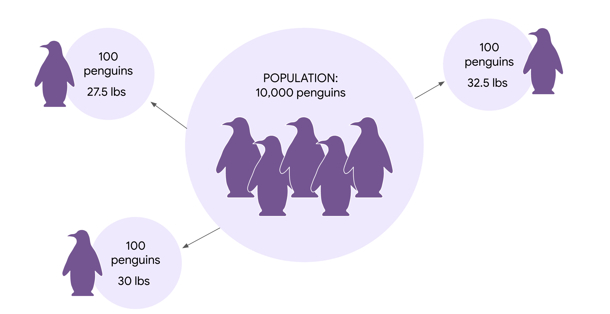

#### **Standart hata**

Örnek verilerinizi, herhangi bir örneğin ortalama uzunluğunun popülasyon ortalamasını ne kadar tam olarak temsil ettiğini tahmin etmek için de kullanabilirsiniz.

Bunu bilmek yararlıdır çünkü örnek ortalaması örneklemden örneğe değişir ve verilen herhangi bir örnek ortalamasının gerçek popülasyon ortalamasından farklı olması muhtemeldir. Örneğin, alabalık popülasyonunun ortalama uzunluğu 20 inç olabilir. Herhangi bir alabalık örneği için ortalama uzunluk 20,2 inç, 20,5 inç, 19,7 inç vb. Olabilir.

Veri uzmanları, bu değişkenliği ölçmek için örnek araçların standart sapmasını kullanır. İstatistikte, bir örnek istatistiğin standart sapmasına **standart hata denir**. Standart hata, örnekleme değişkenliğinin sayısal bir ölçüsünü sağlar. Ortalamanın standart hatası, tüm örnek ortalamalarınız arasındaki değişkenliği ölçer. Daha büyük bir standart hata, örnek ortalamalarının daha dağılmış olduğunu veya daha fazla değişkenlik olduğunu gösterir. Daha küçük bir standart hata, örnek ortalamalarının birbirine daha yakın olduğunu veya daha az değişkenlik olduğunu gösterir.

Uygulamada, tek bir gözlem örneği kullanarak, örnek ortalamasının tahmini standart hatasını hesaplamak için aşağıdaki formülü uygulayabilirsiniz: s/√n Formülde, s örnek standart sapmasını ifade eder ve n örnek boyutunu ifade eder.

Örneğin, alabalık uzunlukları çalışmanızda, 100 alabalık bir numunenin ortalama uzunluğu 20 inç ve standart sapmayı 2 inç olduğunu hayal edin. Örnek standart sapmayı, 2'yi örnek boyutunun kareköküne, 100'e bölerek tahmini standart hatayı hesaplayabilirsiniz:

2 ÷ √100 = 2 ÷ 10 = 0,2

Bu, bir numuneden diğerine ortalama uzunluğun yaklaşık 0,2 inçlik bir standart sapma ile değişeceğini beklemeniz gerektiği anlamına gelir.

Standart hata, tahmininizin kesinliğini anlamanıza yardımcı olur. Genel olarak, örneklem boyutu büyüdükçe ve standart hata küçüldükçe tahminlerinize daha fazla güvenebilirsiniz. Bunun nedeni, örneklem büyüklüğünüz büyüdükçe, örneklem ortalamasının popülasyon ortalamasına yaklaşmasıdır.

### Önemli çıkarımlar

Örnekleme yoluyla popülasyon parametrelerini tahmin etmek, güçlü bir istatistiksel çıkarım şeklidir. Örnekleme dağılımları, bir örnek istatistikle ilişkili belirsizliği tanımlar ve uygun istatistiksel çıkarımlar yapmanıza yardımcı olur. Bu önemlidir, çünkü paydaş kararları genellikle sağladığınız tahminlere dayanır.

## Veri Numunesi Alma ve Tahminler Oluşturma

```python
import numpy as np
import pandas as pd
import matplotlib.pyplot as plt 
from scipy import stats
import statsmodels.api as sm

sampled_data = education_districtwise.sample(n = 50 replace=True, random_state=31208)

sampled_data
```

| DISTNAME     | STATNAME | BLOCKS | VILLAGES | CLUSTERS | TOTPOPULAT | OVERALL_LI |
|--------------|----------|--------|----------|----------|------------|------------|
| DISTRICT528  | STATE6   | 9      | 112      | 89       | 1863174.0  | 92.14      |
| DISTRICT291  | STATE28  | 14     | 1188     | 165      | 3273127.0  | 52.49      |
| DISTRICT66   | STATE23  | 12     | 1169     | 116      | 1042304.0  | 62.14      |
| DISTRICT458  | STATE3   | 3      | 157      | 19       | 82839.0    | 76.33      |
| DISTRICT636  | STATE35  | 3      | 187      | 44       | 514683.0   | 86.70      |

```python
estimate1 = sampled_data['OVERALL_LI'].mean() 

estimate1

74.22359999999999

estimate2 = education_districtwise['OVERALL_LI'].sample(n = 50, replace=True, random_state=56810).mean() 

estimate2

74.24780000000001


estimate_list = [] 

for i in range(10000):
    estimate_list.append(education_districtwise['OVERALL_LI'].sample(n=50, replace=True).mean()) 

estimate_df = pd.DataFrame(data={'estimate': estimate_list})

mean_sample_means = estimate_df['estimate'].mean() 

mean_sample_means
73.41124126000025
```

## Güven aralıkları: Doğru ve yanlış yorumlar 

Son zamanlarda, veri profesyonellerinin bir tahmini çevreleyen belirsizliği tanımlamaya yardımcı olmak için güven aralıklarını kullandığını öğrendiniz. Verilerinizi daha iyi anlamak ve sonuçlarınızı paydaşlara etkili bir şekilde iletmek için, bir güven aralığını nasıl doğru yorumlayacağınızı bilmek önemlidir.

Bu okumada, bir güven aralığını yorumlamanın doğru yolunu gözden geçireceğiz. Ayrıca bazı yaygın yanlış yorumlama biçimlerini ve bunlardan nasıl kaçınılacağını tartışacağız.

### Doğru yorumlama

#### **Örnek: ortalama ağırlık**

Bir güven aralığının nasıl yorumlanacağını daha iyi anlamak için bir örneği inceleyelim. 10.000 penguen popülasyonunun ortalama ağırlığını tahmin etmek istediğinizi hayal edin. Her bir pengueni tartmak yerine, 100 penguenden oluşan bir örnek seçersiniz. Numunenizin ortalama ağırlığı 30 pound. Örnek verilerinize dayanarak, 28 pound ile 32 pound arasında% 95 güven aralığı oluşturursunuz.

95 Cl [28, 32]

#### **Güven aralığını yorumlayın**

Daha önce, güven seviyesinin tahmin sürecinin belirsizliğini ifade ettiğini öğrendiniz. %95 güvenin ne anlama geldiğini daha teknik bir bakış açısıyla tartışalım.

Teknik olarak,% 95 güven, bir popülasyondan tekrarlanan rastgele örnekler alırsanız ve aynı yöntemi kullanarak her örnek için bir güven aralığı oluşturursanız, bu aralıkların % 95'inin popülasyon ortalamasını yakalamasını bekleyebileceğiniz anlamına gelir. Ayrıca toplamın % 5'inin nüfus ortalamasını _yakalamayacağını_ da bekleyebilirsiniz.

Güven seviyesi, **yöntemin**  uzun vadeli başarı oranını veya rastgele örneklemeye dayalı tahmin sürecini ifade eder.

Örneğimizin amacı için, 10.000 penguenin ortalama ağırlığının 31 pound olduğunu hayal edelim, ancak her pengueni gerçekten tartmadığınız sürece bunu bilemezsiniz. Yani, nüfusun bir örneğini alıyorsunuz.

Penguen popülasyonundan her biri 100 penguenden oluşan 20 rastgele örnek aldığınızı ve her örnek için% 95'lik bir güven aralığı hesapladığınızı hayal edin. 20 aralığın yaklaşık 19'unun veya toplamın% 95'inin gerçek popülasyon ortalama ağırlığını 31 pound içermesini bekleyebilirsiniz. Böyle bir aralık, 28 pound ile 32 pound arasındaki değerler aralığı olacaktır.

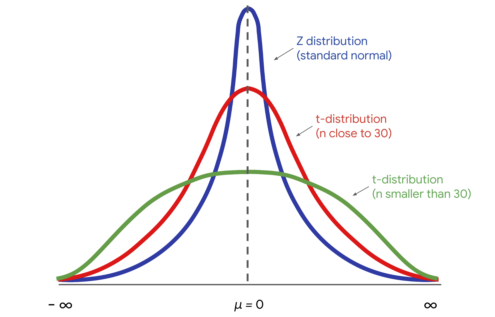

Uygulamada, veri uzmanları genellikle bir rastgele örnek seçer ve gerçek popülasyon ortalamasını içerebilecek veya içermeyebilecek bir güven aralığı oluşturur. Bunun nedeni, tekrarlanan rastgele örneklemenin genellikle zor, pahalı ve zaman alıcı olmasıdır. Güven aralıkları, veri uzmanlarına rastgele örneklemeden kaynaklanan belirsizliği ölçmenin bir yolunu verir.

### Yanlış yorumlar

Artık bir güven aralığını nasıl doğru yorumlayacağınızı daha iyi anladığınıza göre, bazı yaygın yanlış yorumları ve bunlardan nasıl kaçınılacağını gözden geçirelim.

#### **Yanlış yorumlama 1: %95, popülasyon ortalamasının oluşturulmuş aralık içinde olma olasılığını ifade eder**

Genellikle %95 güven düzeyinde bir güven aralığı hakkında yapılan yanlış bir ifade, popülasyon ortalamasının yapılandırılmış aralık içinde düşme olasılığının% 95'lik bir olasılığın olmasıdır.

Örneğimizde bu, penguen popülasyonunun ortalama ağırlığının 28 pound ile 32 pound arasında düşme olasılığının %95 olduğu anlamına gelir.

Bu yanlış. Nüfus ortalaması sabittir.

Herhangi bir popülasyon parametresi gibi, popülasyon ortalaması rastgele bir değişken değil sabittir. Örnek ortalamasının değeri örneklemden örneğe değişirken, popülasyon ortalamasının değeri değişmez. Bir sabitin herhangi bir değer aralığına girme olasılığı her zaman% 0 veya% 100'dür. Ya değerler aralığına girer, ya da değildir.

Örneğin, 100 penguenden oluşan herhangi bir rastgele örnek farklı bir ortalama ağırlığa sahip olabilir: 32,8 pound, 27,3 pound, 29,6 pound vb. Örnek ortalamalarınızın her birine belirli bir olasılık atamak için bir örnekleme dağılımı kullanabilirsiniz çünkü bunlar rastgele değişkenlerdir. Bununla birlikte, popülasyon ortalama ağırlığı sabit olarak kabul edilir. Örneğimizde, 10.000 penguenin tümünü tartırsanız, nüfus ortalamasının 31 pound olduğunu göreceksiniz. Bu değer sabittir ve numuneden numuneye değişmez.

|**Örnek Ortalama (100 penguen)**|**Nüfus Ortalaması (10.000 penguen)**|
|---|---|
|32,8 lbs|31 lbs|
|27,3 lbs|31 lbs|
|29,6 lbs|31 lbs|

Bu nedenle, güven aralığınızın popülasyon ortalamasını yakalama olasılığın% 95 olduğunu söylemek kesinlikle doğru değildir çünkü bu, popülasyon ortalamasının değişken olduğu anlamına gelir. Aralıklar örnekten örneğe değişir, ancak popülasyonun değeri yakalamaya çalıştığınız anlamına gelmez.

Söyleyebileceğiniz şey, popülasyondan tekrarlanan rastgele örnekler alırsanız ve aynı yöntemi kullanarak her örnek için bir güven aralığı oluşturursanız, aralıklarınızın% 95'inin popülasyon ortalamasını yakalamasını bekleyebilirsiniz.

**Profesyonel ipucu:** %95 güven seviyesinin tahmin sürecinin başarı oranını ifade ettiğini unutmayın.

#### **Yanlış yorumlama 2: %95, aralığa giren veri değerlerinin yüzdesini ifade eder**

Diğer bir yaygın hata, %95'lik bir güven aralığını, popülasyondaki tüm veri değerlerinin% 95'inin aralık içinde olduğunu söyleyerek yorumlamaktır. Bu mutlaka doğru değildir. %95 güven aralığı, muhtemelen gerçek popülasyon ortalamasını içeren bir değer aralığı gösterir. Bu, _pop_ ülasyondaki veri değerlerinin% 95'ini içeren bir aralıkla aynı değildir.

Örneğin, ortalama penguen ağırlığı için% 95 güven aralığınız 28 pound ile 32 pound arasındadır. Tüm ağırlık değerlerinin% 95'inin bu aralığa düştüğünü söylemek doğru olmayabilir. Popülasyondaki penguen ağırlıklarının% 5'inden fazlasının bu aralığın dışında olması mümkündür - ya 28 pounddan az veya 32 pounddan fazla.


#### **Yanlış yorumlama 3: %95, aralığa giren numune araçlarının yüzdesini ifade eder**

Üçüncü bir yaygın yanlış yorum, %95'lik bir güven aralığının, tüm olası numune ortalamasının% 95' _inin_ aralık aralığına girdiğini ima etmesidir. Bu mutlaka doğru değildir. Örneğin, ortalama penguen ağırlığı için% 95 güven aralığınız 28 pound ile 32 pound arasındadır. Tekrarlanan 100 penguenin örneklerini aldığınızı ve her numune için ortalama ağırlığı hesapladığınızı hayal edin. Numunenizin _%_5'inden fazlasının 28 pounddan az veya 32 pounddan büyük olması mümkündür.


### Önemli çıkarımlar

Güven aralıklarını nasıl doğru yorumlayacağınızı bilmek, tahmininizi daha iyi anlamanıza ve faydalı ve doğru bilgileri paydaşlarla paylaşmanıza yardımcı olacaktır. Yaygın yanlış yorumları ve neden yanlış olduklarını da açıklamanız gerekebilir. Paydaşlarınızın kararlarını yanlış yorumlamaya dayandırmasını istemezsiniz. Sonuçlarınızı paydaşlara nasıl etkili bir şekilde ileteceğinizi anlamak, bir veri uzmanı olarak işinizin önemli bir parçasıdır.

## Küçük bir örneklem boyutu için bir güven aralığı oluşturun

Şimdiye kadar, genellikle 30 veya daha fazla öğenin örnek boyutları olarak tanımlanan büyük örnek boyutları için güven aralıkları oluşturdunuz. Örneğin, yeni bir cep telefonunun ortalama pil ömrünü tahmin ettiğinizde, 100 telefondan oluşan rastgele bir örnek kullandınız. Öte yandan, küçük örneklem boyutları genellikle 30'dan az maddeye sahip olarak tanımlanır. Tipik olarak, veri uzmanları daha kesin tahminler verdikleri için büyük örneklem boyutlarıyla çalışmaya çalışırlar. Ancak, büyük bir örnekle çalışmak her zaman mümkün değildir. Uygulamada, veri toplamak genellikle pahalı ve zaman alıcıdır. Büyük bir örnek almak için zamanınız, paranız veya kaynağınız yoksa, küçük bir örnekle çalışmaya başlayabilirsiniz.

Bu okumada, küçük bir örneklem boyutu için bir güven aralığının nasıl oluşturulacağını öğreneceksiniz. Yeni bir otomobil motoru için ortalama emisyon seviyelerini içeren bir örneği adım adım inceleyeceğiz.

### Büyük ve küçük örneklem boyutları

İlk olarak, büyük ve küçük örnek boyutları için güven aralıkları oluşturmak için kullandığınız farklı yöntemleri kısaca tartışalım.

#### **Büyük örnek: Z-puanları**

Büyük örneklem boyutları için, cep telefonları için ortalama pil ömrünü tahmin etmek için daha önce yaptığınız gibi, hata payını hesaplamak için **z-score**larını  kullanırsınız. Bunun nedeni merkezi sınır teoremidir: büyük örnek boyutları için, örnek ortalaması yaklaşık olarak normal olarak dağılmıştır. **Z-dağılımı olarak da adlandırılan standart bir normal dağılım için, veriler** iniz hakkında hesaplamalar yapmak için z puanlarını kullanırsınız.

#### **Küçük örnek: T-puanları**

Küçük örnek boyutları için, **t-dağılımı** adı verilen farklı bir dağıtım kullanmanız gerekir. İstatistiksel olarak konuşursak, bunun nedeni, küçük örneklem boyutları için standart hatanın tahmin edilmesinde daha fazla belirsizlik olmasıdır. Bu kursun kapsamı dışındaki teknik detaylar hakkında endişelenmenize gerek yok. Şimdilik, küçük bir örneklem boyutuyla çalışıyorsanız ve verileriniz yaklaşık olarak normal dağılmışsa, standart normal dağılım yerine t dağılımını kullanmanız gerektiğini bilin. Bir t dağılımı için, verileriniz hakkında hesaplamalar yapmak için t-puanlarını kullanırsınız.

T-dağılımının grafiği, standart normal dağılıma benzer bir çan şekline sahiptir. Ancak, t dağılımının standart normal dağılımdan daha büyük kuyrukları vardır. Daha büyük kuyruklar, küçük bir veri kümesiyle gelen aykırı değerlerin daha yüksek sıklığını gösterir. Örneklem büyüklüğü arttıkça, t dağılımı normal dağılıma yaklaşır. Örneklem büyüklüğü 30'a ulaştığında, dağılımlar hemen hemen aynıdır ve hesaplamalarınız için normal dağılımı kullanabilirsiniz.


### Örnek: Ortalama emisyon seviyeleri

Artık t dağılımı ve t puanları hakkında biraz bilgi sahibi olduğunuza göre, küçük bir örneklem boyutu için bir güven aralığı oluşturalım.

#### **Bağlam**

Bir otomobil üreticisi için çalışan bir veri uzmanı olduğunuzu düşünün. Şirket, dünya çapında satılan yüksek performanslı otomobiller üretiyor. Tipik olarak, bu arabalardaki motorlar, küresel ısınmaya katkıda bulunan bir sera gazı olan yüksek karbondioksit veya CO2 emisyon oranlarına sahiptir. Mühendislik ekibi, şirketin en çok satan otomobili için emisyonları azaltmak için yeni bir motor tasarladı.

#### **Hedef**

Amaç, emisyonları mil başına 460 gram CO2'nin altında tutmaktır. Bu, otomobilin satıldığı her ülkede emisyon standartlarını karşılamasını sağlayacaktır. Ayrıca, daha düşük emisyon oranı çevre için iyidir ve bu da yeni müşterilere hitap edecek.

#### **Talep**

Mühendislik ekibi sizden yeni motor için emisyon oranının güvenilir bir tahminini sağlamanızı ister. Üretim sorunları nedeniyle, test için yalnızca sınırlı sayıda motor mevcuttur. Yani, küçük bir örneklem boyutu ile çalışacaksınız.

#### **Örnek**

Mühendislik ekibi, 15 motordan oluşan rastgele bir örneği test eder ve emisyonları hakkında veri toplar. Ortalama emisyon oranı mil başına 430 gram CO 2 'dir ve standart sapma mil başına 35 gram CO 2 'dir.

Tek numuneniz, _her motor için gerçek ortalama emisyon oranını sağlamayabilir._ Emisyonlar için nüfus ortalaması mil başına 430 gram CO2'nin üzerinde veya altında olabilir. Yalnızca küçük bir motor örneğine sahip olsanız bile, büyük bir motor popülasyonu için gerçek emisyon oranını muhtemelen içeren bir güven aralığı oluşturabilirsiniz. Bu, yöneticinize tahmininizdeki belirsizlik hakkında daha iyi bir fikir verecektir. Ayrıca, mühendislik ekibinin emisyon oranını düşürmek için motor üzerinde daha fazla çalışma yapmaları gerekip gerekmediğine karar vermesine yardımcı olacaktır..

### Güven aralığını oluşturun

Bir güven aralığı oluşturma adımlarını gözden geçirelim:

1. Örnek bir istatistik tanımlayın.
    
2. Bir güven seviyesi seçin.
    
3. Hata payını bulun.
    
4. Aralığı hesaplayın.
    

#### **Adım 1: Örnek bir istatistik belirleyin**

İlk olarak, örnek istatistiğinizi tanımlayın. Numuneniz, 15 motor için ortalama emisyon oranını temsil eder. Örnek bir ortalamayla çalış _ıyorsun_.

#### **Adım 2: Bir güven seviyesi seçin**

Ardından, bir güven seviyesi seçin. Mühendislik ekibi sizden % 95 güven seviyesi seçmenizi ister.

#### **Adım 3: Hata payını bulun**

Üçüncü adımınız hata payını bulmaktır. Küçük bir örneklem boyutu için, t puanını standart hata ile çarparak hata payını hesaplarsınız.

T-dağılımı, serbestlik derecesi adı verilen bir parametre ile tanımlanır. Bağlamımızda, serbestlik derecesi örneklem büyüklüğü - 1 veya 15-1 = 14. Özgürlük dereceniz ve güven seviyeniz göz önüne alındığında, t-puanınızı hesaplamak için Python veya diğer istatistiksel yazılımlar gibi bir programlama dili kullanabilirsiniz.

14 serbestlik derecesine ve % 95'lik bir güven seviyesine bağlı olarak, t-puanınız 2.145'dir.

Artık örnek istatistiğinizin değişkenliğini ölçen standart hatayı hesaplayabilirsiniz.

İşte daha önce kullandığınız ortalamanın standart hatasının formülü:

**Standart Hata (Ortam)**

SE(x)=s/√(n)

Formülde, s harfi örnek standart sapmayı ifade eder ve n harfi örnek boyutunu ifade eder.

Örnek standart sapmanız 35 ve örneklem büyüklüğünüz 15'tir. Hesaplama size yaklaşık 9.04 standart bir hata verir.

Hata marjı, standart hatanızla çarpılan t-puanınızdır. Bu 2.145 * 9.04 = 19.39'dur.

#### **Adım 4: Aralığı hesaplayın**

Son olarak, güven aralığınızı hesaplayın. Aralığınızın üst sınırı, örnek ortalaması artı hata payıdır. Bu, mil başına 430 + 19.39 = 449.39 gram CO2 'dir.

Alt sınır, örnek ortalaması eksi hata payıdır. Bu, mil başına 430 − 19.39 = 410.61 gram CO2 'dir.

Mil başına 410.61 gram CO2'den mil başına 449,39 gram CO2'ye kadar uzanan %95 güven aralığına sahipsiniz.

**95 CI [410.61, 449.39]**

Güven aralığı mühendislik ekibine önemli bilgiler verir. Aralığınızın üst sınırı, mil başına 460 gram CO 2 hedefinin altındadır. Bu sonuç, yeni motorun emisyon oranının emisyon standartlarını karşılayacağına dair sağlam istatistiksel kanıtlar sağlar.

**Not**: Küçük örneklem büyüklükleri için güven aralıkları, popülasyon oranlarıyla değil, yalnızca popülasyon ortalamalarını ilgilendirir. Bu ayrımın istatistiksel nedeni oldukça tekniktir, bu yüzden şimdilik endişelenmenize gerek yok.

### Önemli çıkarımlar

Bir veri uzmanı olarak, hem büyük hem de küçük örnek boyutlarıyla çalışacaksınız. Büyük numuneler küçük numunelerden daha kesin tahminler verse de, küçük bir numuneyi toplamak genellikle büyük bir numune toplamaktan daha ucuz ve zaman alıcıdır. Farklı örnek boyutları için güven aralıklarının nasıl oluşturulacağını bilmek, gelecekteki kariyerinizde karşılaşabileceğiniz herhangi bir veri kümesini yönetmenize yardımcı olacaktır.

### Daha fazla bilgi için kaynaklar

Farklı örnek boyutları için güven aralıkları oluşturma hakkında daha fazla bilgi edinmek için aşağıdaki kaynaklara bakın:

- [Scribbr'in bu makalesi,](https://www.scribbr.com/statistics/t-distribution/) t dağılımına ve bir güven aralığı oluştururken nasıl kullanılacağına dair yararlı bir genel bakış içerir.

## Veri Numunesi Alma ve Tahmini Standart Hatayı Bulma

```python
import numpy as np 
import pandas as pd 
from scipy import stats

education_districtwise = pd.read_csv("../Datasets/education_districtwise.csv")

education_districtwise = education_districtwise.dropna() 

sampled_data = education_districtwise.sample(n = 50, replace=True, random_state=31208)

sampled_data
```

| Index | DISTNAME     | STATNAME | BLOCKS | VILLAGES | CLUSTERS | TOTPOPULAT | OVERALL_LI |
|-------|--------------|----------|--------|----------|----------|------------|------------|
| 661   | DISTRICT528  | STATE6   | 9      | 112      | 89       | 1863174.0  | 92.14      |
| 216   | DISTRICT291  | STATE28  | 14     | 1188     | 165      | 3273127.0  | 52.49      |
| 367   | DISTRICT66   | STATE23  | 12     | 1169     | 116      | 1042304.0  | 62.14      |
| 254   | DISTRICT458  | STATE3   | 3      | 157      | 19       | 82839.0    | 76.33      |
| 286   | DISTRICT636  | STATE35  | 3      | 187      | 44       | 514683.0   | 86.70      |
| 369   | DISTRICT512  | STATE23  | 6      | 589      | 30       | 717169.0   | 68.35      |
| 258   | DISTRICT156  | STATE3   | 6      | 80       | 9        | 35289.0    | 59.94      |
| 10    | DISTRICT412  | STATE1   | 11     | 187      | 95       | 476820.0   | 68.69      |
| 512   | DISTRICT277  | STATE9   | 10     | 558      | 179      | 2298934.0  | 84.31      |
| 144   | DISTRICT133  | STATE21  | 14     | 1672     | 136      | 3673849.0  | 69.61      |
| 325   | DISTRICT1    | STATE33  | 4      | 534      | 98       | 957853.0   | 69.37      |
| 227   | DISTRICT159  | STATE28  | 18     | 870      | 134      | 2954367.0  | 66.23      |
| 86    | DISTRICT667  | STATE25  | 5      | 396      | 75       | 896129.0   | 82.23      |

```python
sample_mean = sampled_data['OVERALL_LI'].mean() 

sample_mean

74.22359999999999

Estimated_standard_error = sampled_data['OVERALL_LI'].std() / np.sqrt(sampled_data.shape[0])

stats.norm.interval(alpha=0.95, loc=sample_mean, scale=estimated_standard_error)

(71.42241096968617, 77.02478903031381)
```

## Sıfır ve alternatif hipotezler arasındaki farklar

Son zamanlarda, **hipotez test** inin bir popülasyon parametresi hakkında bir varsayımı değerlendirmek için örnek verileri kullandığını öğrendiniz. Veri uzmanları, örnek verilerinden elde edilen kanıtların sıfır hipotezi mi yoksa alternatif hipotezi mi destekleyip desteklemediğine karar vermek için bir hipotez testi yapar.

Bu okumada, sıfır hipotez ile alternatif hipotez arasındaki temel farkları ve her bir hipotezin farklı senaryolarda nasıl formüle edileceğini gözden geçireceğiz.

### İstatistiksel hipotezler

Bir hipotez testi yürütme adımlarını gözden geçirelim:

1. Sıfır hipotezi ve alternatif hipotezi belirtin.
    
2. Bir önem seviyesi seçin.
    
3. P değerini bulun.
    
4. Sıfır hipotezini reddedin veya reddetmeyi başaramayın.
    

Herhangi bir hipotez testi için ilk adım, sıfır ve alternatif hipotezleri belirtmektir. Sıfır ve alternatif hipotezler birbirini dışlar, yani ikisi de aynı anda doğru olamazlar.

**Sıfır hipotezi**, aksini gösteren ikna edici kanıtlar olmadıkça doğru olduğu varsayılan bir ifadedir. Sıfır hipotezi tipik olarak popülasyonda hiçbir etki olmadığını ve gözlemlenen verilerinizin tesadüfen meydana geldiğini varsayar.

**Alternatif hipotez**, sıfır hipotezle çelişen bir ifadedir ve ancak bunun için ikna edici kanıtlar varsa doğru olarak kabul edilir. Alternatif hipotez tipik olarak popülasyonda bir etki olduğunu ve gözlemlenen verilerinizin tesadüfen _oluşmadığını_ varsayar.

**Not:** Sıfır ve alternatif hipotezler her zaman popülasyonla ilgili iddialardır. Bunun nedeni, hipotez testinin amacının bir örneğe dayalı bir popülasyon hakkında çıkarımlar yapmak olmasıdır.

Örneğin, bir otomobil bayisinde çalışan bir veri uzmanı olduğunuzu hayal edin. Şirket, çalışanları için yeni bir satış eğitim programı uygulamaktadır. Programın etkinliğini değerlendirmenizi istiyorlar.

- **Sıfır hipoteziniz (H0):** programın satış geliri üzerinde hiçbir etkisi olmadı.
    
- **Alternatif hipoteziniz (Ha)**: program satış gelirini artırdı.

Her hipotezi daha ayrıntılı olarak inceleyelim.

#### **Sıfır hipotezi**

Sıfır hipotezi aşağıdaki özelliklere sahiptir:

- İstatistikte, sıfır hipotezi genellikle H sıfırın altında (H0) olarak kısaltılır.
    
- Matematiksel terimlerle yazıldığında, sıfır hipotezi her zaman bir eşitlik sembolü içerir (genellikle =, ancak bazen ≤ veya ≥).
    
- Sıfır hipotezleri genellikle "etki yok", "fark yok", "ilişki yok" veya "değişiklik yok" gibi ifadeleri içerir.
    

#### **Alternatif hipotez**

Alternatif hipotez aşağıdaki özelliklere sahiptir:

- İstatistikte, alternatif hipotez genellikle H sub a (Ha) olarak kısaltılır.
    
- Matematiksel terimlerle yazıldığında, alternatif hipotez her zaman bir eşitsizlik sembolü içerir (genellikle ≠, ancak bazen < or >).
    
- Alternatif hipotezler genellikle "bir etki", "bir fark", "bir ilişki" veya "bir değişiklik" gibi ifadeleri içerir.
    

#### **Örnek senaryolar**

Tipik olarak, sıfır hipotez _statü_ koyu veya olayların mevcut durumunu temsil eder. Sıfır hipotezi, statükonun değişmediğini varsayar. Alternatif hipotez, yeni bir olasılık veya farklı bir açıklama önerir. Farklı senaryolar için boş ve alternatif hipotezlerin nasıl yazılacağı hakkında daha iyi bir fikir edinmek için bazı örneklere göz atalım:

##### **Örnek #1: Ortalama ağırlık**

Organik bir gıda şirketi granola ile ünlüdür. Şirket, ürettikleri her torbanın 300 gram granola içerdiğini iddia ediyor - ne daha fazla ne de daha az. Bu iddiayı test etmek için bir kalite kontrol uzmanı, 40 torbalı rastgele bir numunenin ağırlığını ölçer.

- **H0**: μ = 300 (üretilen tüm granola torbalarının ortalama ağırlığı 300 grama eşittir)
    
- **Ha**: μ ≠ 300 (üretilen tüm granola torbalarının ortalama ağırlığı 300 grama eşit değildir)
    

##### **Örnek #2: Ortalama yükseklik**

Belirli bir ağaç türünün ortalama yüksekliğinin 30 fit uzunluğunda olduğu varsayıldığını varsayalım. Bununla birlikte, bir ekolojist, gerçek ortalama yüksekliğin 30 fitten büyük olduğunu iddia ediyor. Bu iddiayı test etmek için ekolojist, 50 ağaçtan oluşan rastgele bir örneğin yüksekliğini ölçer.

- **H0**: μ ≤ 30 (bu ağaç türünün ortalama yüksekliği 30 fit'e eşit veya daha azdır)
    
- **Ha:** μ > 30 (bu ağaç türünün ortalama yüksekliği 30 fitten büyüktür)
    

##### **Örnek #3: Çalışanların oranı**

Bir şirket, tüm çalışanların en az% 80'inin işlerinden memnun olduğunu iddia eder. Bununla birlikte, bağımsız bir araştırmacı, tüm çalışanların% 80'inden azının işlerinden memnun olduğuna inanmaktadır. Bu iddiayı test etmek için araştırmacı, 100 çalışandan oluşan rastgele bir örneği araştırıyor.

- **H0**: p ≥ 0.80 (işlerinden memnun olan tüm çalışanların oranı% 80'e eşit veya daha fazladır)
    
- **Ha:** p < 0.80 (işlerinden memnun olan tüm çalışanların oranı% 80'den azdır)
    

#### **Özet: Null ve alternatif**

Aşağıdaki tablo, sıfır ve alternatif hipotezler arasındaki bazı önemli farklılıkları özetlemektedir:

||**Sıfır hipotezi (H0)**|**Alternatif hipotez (Ha)**|
|---|---|---|
|**İddialar**|Popülasyonda hiçbir etkisi yoktur.|Popülasyonda bir etkisi var.|
|**Dil**|- Etkisi yok<br>    <br>- Fark yok<br>    <br>- İlişki yok<br>    <br>- Değişiklik yok|- Bir etki<br>    <br>- Bir fark<br>    <br>- Bir ilişki<br>    <br>- Bir değişiklik|
|**Semboller**|Eşitlik (=, ≤, ≥)|Eşitsizlik (≠, <, >)|

### Önemli çıkarımlar

Sıfır hipotez ve alternatif hipotez, hipotez testinde temel kavramlardır. Etkili bir hipotez testi yapmak için, sıfır ve alternatif hipotezler arasındaki farkları ve her bir hipotezin nasıl doğru bir şekilde ifade edileceğini anlamak önemlidir.

### Daha fazla bilgi için kaynaklar

Sıfır hipotez ve alternatif hipotez hakkında daha fazla bilgi edinmek için aşağıdaki kaynaklara bakın:

- [Statistics How To'nun bu makalesi](https://www.statisticshowto.com/probability-and-statistics/null-hypothesis/), sıfır hipotezinin ayrıntılı bir tartışmasını içermektedir.

## Tip I ve tip II hataları

Daha önce, sonuçlarınızın istatistiksel olarak anlamlı olup olmadığını veya tesadüfen meydana gelip gelmediğini belirlemeye yardımcı olmak için bir hipotez testi kullanabileceğinizi öğrendiniz. Bununla birlikte, hipotez testi olasılığa dayandığından, sıfır hipotez hakkında yanlış sonuç çıkarma şansı her zaman vardır. Hipotez testinde, sonuç çıkarırken yapabileceğiniz iki tür hata vardır: Tip I hata ve Tip II hatası.

Bu okumada, Tip I ve Tip II hataları arasındaki farkı ve her bir hatayı yapmanın içerdiği riskleri tartışacağız.

### İstatistiksel karar vermede hatalar

Bir hipotez testi yürütme adımlarını gözden geçirelim:

1. Sıfır hipotezi ve alternatif hipotezi belirtin.
    
2. Bir önem seviyesi seçin.
    
3. P değerini bulun.
    
4. Sıfır hipotezini reddedin veya reddetmeyi başaramayın.
    

Sıfır hipotezini reddetmeye veya reddetmeyi reddetmeye karar verdiğinizde, dört olası sonuç vardır - ikisi doğru seçenekleri, ikisi hataları temsil eder. Şunları yapabilirsiniz:

- Sıfır hipotezi gerçekte doğru olduğunda reddedin (**Tip I hatası)**
    
- Sıfır hipotezini gerçekten yanlış olduğunda reddedin (Doğru)
    
- Sıfır hipotezini gerçekten doğru olduğunda reddedememe (Doğru)
    
- Aslında yanlış olduğunda sıfır hipotezi reddedilemez (**Tip II hatası**)
    


#### **Örnek: Klinik deneme**

Tip I ve Tip II hatalarını daha iyi anlamak için bir örneği inceleyelim. Hipotez testleri genellikle yeni bir ilacın hastalarda daha iyi sonuçlara yol açıp sağlamadığını belirlemek için klinik çalışmalarda kullanılır. Bir ilaç şirketinde çalışan bir veri uzmanı olduğunuzu hayal edin. Şirket, soğuk algınlığı tedavisi için yeni bir ilaç icat ediyor. Şirket, soğuk algınlığı semptomları olan 200 kişiden oluşan rastgele bir örneği test ediyor. İlaç olmadan, tipik kişi 7.5 gün boyunca soğuk algınlığı semptomları yaşar. İlacı alan kişiler için ortalama iyileşme süresi 6.2 gündür.

İlacın iyileşme süresi üzerindeki etkisinin istatistiksel olarak anlamlı olup olmadığını veya şans nedeniyle olup olmadığını belirlemek için bir hipotez testi yaparsınız.

Bu durumda:

- **Sıfır hipoteziniz (H0)**, ilacın hiçbir etkisinin olmadığıdır.
    
- **Alternatif hipoteziniz (Ha)**  ilacın etkili olduğudur.
    

#### **Tip I hatası**

Yanlış pozitif olarak da bilinen **Tip 1 hatası**, gerçekte doğru olan bir sıfır hipotezi reddettiğinizde ortaya çıkar. Başka bir deyişle, sonucunuzun aslında tesadüfen meydana geldiği halde istatistiksel olarak anlamlı olduğu sonucuna varırsınız.

Örneğin, klinik deneyinizde, sıfır hipotez doğruysa, bu ilacın hiçbir etkisi olmadığı anlamına gelir. Tip I hata yaparsanız ve sıfır hipotezi reddederseniz, ilacın aslında etkisiz olduğunda soğuk algınlığı semptomlarını hafiflettiği sonucuna yanlış bir şekilde varırsınız.

Tip I hata yapma olasılığına alfa (α) denir. Anlamlılık seviyeniz veya alfa (α), Tip I hatası yapma olasılığını temsil eder. Tipik olarak, anlamlılık seviyesi 0.05 veya% 5 olarak ayarlanır. %5'lik bir anlamlılık seviyesi, sıfır hipotezini reddettiğinizde yanıldığınız olasılığın% 5'lik bir kabul etmeye istekli olduğunuz anlamına gelir.

##### **Riskinizi azaltın**

Tip I hatası yapma şansınızı azaltmak için, daha düşük bir önem seviyesi seçin.

Örneğin, Tip I hata riskini en aza indirmek istiyorsanız, standart %5 yerine %1'lik bir anlamlılık seviyesi seçebilirsiniz. Bu değişiklik Tip I hata yapma şansını% 5'ten% 1'e düşürür.

|**Önemlilik seviyesi (α)**|**Tip I hata yapma şansı**|
|---|---|
|0.05|%5|
|0.01|%1|

#### **Tip II hatası**

Bununla birlikte, Tip I hata yapma riskinizi azaltmak, Tip II hatası veya yanlış negatif yapma olasılığınızın daha yüksek olduğu anlamına gelir. Aslında yanlış olan bir sıfır hipotezi reddedemediğinizde **Tip II hatası** oluşur. Başka bir deyişle, sonucunuzun tesadüfen gerçekleştiği sonucuna varırsınız, ancak aslında olmadı.

Örneğin, klinik çalışmanızda, sıfır hipotez yanlışsa, bu ilacın etkili olduğu anlamına gelir. Tip II hata yaparsanız ve sıfır hipotezi reddetmezseniz, ilacın soğuk algınlığı semptomlarını hafiflettiğinde etkisiz olduğu sonucuna yanlış bir şekilde varırsınız.

Tip II hata yapma olasılığına beta (β) denir ve beta bir hipotez testinin gücüyle ilişkilidir (güç = 1- β). Güç, bir testin olduğunda gerçek bir etkiyi doğru bir şekilde tespit edebilme olasılığını ifade eder.

##### **Riskinizi azaltın**

Testinizin yeterli güce sahip olduğundan emin olarak Tip II hata yapma riskinizi azaltabilirsiniz. Veri çalışmasında, güç genellikle% 0.80 veya% 80 olarak ayarlanır. İstatistiksel güç ne kadar yüksek olursa, Tip II hata yapma olasılığı o kadar düşük olur. Gücü artırmak için örneklem boyutunuzu veya önem seviyenizi artırabilirsiniz.

**Not**: İstatistiksel güç kavramının ayrıntılı bir tartışması bu dersin kapsamı dışındadır. Güç, kariyerinizde bir veri uzmanı olarak ilerledikçe ve istatistik bilginizi geliştirdikçe daha fazla öğreneceğiniz bir şeydir.

#### **Tip I ve Tip II hataların potansiyel riskleri**

Bir veri uzmanı olarak, iki tür veya hatanın yapılmasıyla ilgili potansiyel risklerin farkında olmak önemlidir.

Tip I hatası, aslında doğru olan bir sıfır hipotezini reddetmek anlamına gelir. Genel olarak, Tip I hatası yapmak genellikle gereksiz ve etkisiz olan ve değerli zaman ve kaynakları boşa harcayan değişikliklerin uygulanmasına yol açar.

Örneğin, klinik deneyinizde Tip I hata yaparsanız, yeni ilaç aslında etkisiz olmasına rağmen etkili kabul edilecektir. Bu yanlış sonuca dayanarak, çok sayıda insana etkisiz bir ilaç verilebilir. Ayrıca, diğer tedavi seçenekleri yeni ilaç lehine reddedilebilir.

Tip II hatası, aslında yanlış olan bir sıfır hipotezini reddetmemek anlamına gelir. Genel olarak, Tip II hata yapmak, olumlu değişim ve yenilik için kaçırılan fırsatlara neden olabilir. İnovasyon eksikliği insanlar ve kuruluşlar için maliyetli olabilir.

Örneğin, klinik deneyinizde Tip II hatası yaparsanız, yeni ilaç gerçekten etkili olmasına rağmen etkisiz olarak kabul edilecektir. Bu, yararlı bir ilacın bundan yararlanabilecek çok sayıda insana ulaşamayabileceği anlamına gelir.

### Önemli çıkarımlar

Bir veri uzmanı olarak, hipotez testinde yer alan olası hataların ve sonuçlarınızı nasıl etkileyebileceğinin farkında olmanıza yardımcı olur. Özel duruma bağlı olarak, Tip I veya Tip II hata riskini en aza indirmeyi seçebilirsiniz. Sonuçta, analizinizin hedeflerine göre hangi tür hataların daha riskli olduğunu belirlemek bir veri uzmanı olarak sizin sorumluluğunuzdadır.

### Daha fazla bilgi için kaynaklar

Tip I ve Tip II hataları hakkında daha fazla bilgi edinmek için aşağıdaki kaynaklara bakın:

- Sim [ply Psychology'nin bu makal](https://www.simplypsychology.org/type_I_and_type_II_errors.html) esi, Tip I ve Tip II hataları arasındaki farkların yararlı bir özetini içermektedir.

## Verilerin istatistiksel önemi olup olmadığını belirleyin

Son zamanlarda, **istatistiksel anlamlılığın**, bir testin veya deneyin sonuçlarının yalnızca tesadüfen açıklanamayacağı iddiası olduğunu öğrendiniz. Bir hipotez testi, gözlemlenen verilerinizin istatistiksel olarak anlamlı mı yoksa muhtemelen tesadüfen mi olduğunu belirlemenize yardımcı olabilir. Örneğin, yeni bir ilacın klinik denemesinde, bir hipotez testi, ilacın bir örnek grubu üzerindeki olumlu etkisinin istatistiksel olarak anlamlı olup olmadığını veya tesadüfen kaynaklanıp kaynaklanmadığını belirlemeye yardımcı olabilir.

Bu okumada, istatistiksel anlamlılık kavramı ve hipotez testindeki rolü hakkında daha fazla bilgi edineceksiniz.

### Hipotez testinde istatistiksel anlamlılık

Veri uzmanları, değişkenler arasındaki bir ilişkinin veya gruplar arasındaki farkın istatistiksel olarak anlamlı olup olmadığını belirlemek için hipotez testini kullanır.

Hipotez testinde istatistiksel anlamlılığın rolünü daha iyi anlamak için bir örneği inceleyelim.

#### **Örnek: Ortalama pil ömrü**

Bir hipotez testi yürütme adımlarını gözden geçirelim:

1. Sıfır hipotezi ve alternatif hipotezi belirtin.
    
2. Bir önem seviyesi seçin.
    
3. P değerini bulun.
    
4. Sıfır hipotezini reddedin veya reddetmeyi başaramayın.

Bir bilgisayar şirketi için çalışan bir veri uzmanı olduğunuzu hayal edin. Şirket, en çok satan dizüstü bilgisayarlarının ortalama pil ömrünün 0.5 saat standart sapma ile 8.5 saat olduğunu iddia ediyor. Son zamanlarda, mühendislik ekibi pil ömrünü uzatmak için dizüstü bilgisayarı yeniden tasarladı. Ekip, yeniden tasarlanmış 40 dizüstü bilgisayardan rastgele bir örnek alıyor. Örnek ortalaması 8.7 saattir.

Ekip, ortalama pil ömründeki artışın istatistiksel olarak anlamlı olup olmadığını veya rastgele bir şansa bağlı olup olmadığını belirlemenizi ister. Öğrenmek için bir z testi yapmaya karar verdiniz.

#### **Adım 1: Sıfır hipotezi ve alternatif hipotezi belirtin**

Sıfır hipotezi tipik olarak gözlemlenen verilerinizin tesadüfen meydana geldiğini varsayar ve istatistiksel olarak anlamlı değildir. Bu durumda, sıfır hipoteziniz, dizüstü bilgisayar popülasyonunda ortalama pil ömrü üzerinde gerçek bir etkisi olmadığını söylüyor.

Alternatif hipotez tipik olarak gözlemlenen verilerinizin tesadüfen _oluşmadığını_ ve istatistiksel olarak anlamlı olduğunu varsayar. Bu durumda, alternatif hipoteziniz dizüstü bilgisayar popülasyonunda ortalama pil ömrü üzerinde bir etkisi olduğunu söylüyor.

Bu örnekte, aşağıdaki hipotezleri formüle edersiniz:

- **H0:** μ = 8.5 (yeniden tasarlanan tüm dizüstü bilgisayarların ortalama pil ömrü 8,5 saate eşittir)
    
- **Ha:** μ > 8.5 (yeniden tasarlanan tüm dizüstü bilgisayarların ortalama pil ömrü 8,5 saatten fazladır)
    

#### **Adım 2: Bir önem seviyesi seçin**

**Anlamlılık seviyesi** veya alfa (α), bir sonucu istatistiksel olarak anlamlı olarak değerlendireceğiniz eşiktir. Anlamlılık seviyesi aynı zamanda doğru olduğunda sıfır hipotezi reddetme olasılığıdır.

Tipik olarak, veri uzmanları anlamlılık seviyesini 0.05 veya% 5 olarak ayarlar. Bu, en azından sizinki kadar aşırı sonuçların, sıfır hipotez doğru olduğunda meydana gelme şansının yalnızca %5'inin (veya daha az) olduğu anlamına gelir.

**Not**: %5 geleneksel bir seçimdir ve sihirli bir sayı değildir. İstatistiksel araştırma ve eğitimdeki geleneğe dayanmaktadır. Diğer yaygın seçenekler% 1 ve% 10'dur. Anlamlılık düzeyini analizinizin özel gereksinimlerini karşılayacak şekilde ayarlayabilirsiniz. Daha düşük bir anlamlılık seviyesi, bir etkinin istatistiksel olarak anlamlı kabul edilebilmesi için daha büyük olması gerektiği anlamına gelir.

**Profesyonel ipucu:** En iyi uygulama olarak, sınava başlamadan önce bir önem seviyesi belirlemelisiniz. Aksi takdirde, sonuçları rahatınıza uyacak şekilde manipüle ettiğiniz bir duruma girebilirsiniz.

Bu örnekte, şirketin araştırma standardı olan %5'lik bir anlamlılık seviyesi seçersiniz.

#### **Adım 3: p değerini bulun**

**P-değeri**, sıfır hipotez doğru olduğunda gözlemlenenlerden daha aşırı veya daha aşırı sonuçları gözlemleme olasılığını ifade eder.

P değeriniz, bir sonucun istatistiksel olarak anlamlı olup olmadığını belirlemenize yardımcı olur. Düşük bir p değeri yüksek istatistiksel anlamlılığı gösterirken, yüksek bir p değeri düşük veya hiç istatistiksel anlamlılık olmadığını gösterir.

Her hipotez testinin özellikleri:

- Verilerinizin sıfır hipotezle ne kadar yakından eşleştiğini gösteren bir test istatistiği. Z testi için, test istatistiğiniz bir z puanıdır; bir t-testi için, bu bir t puanıdır.
    
- Sıfır hipotezi doğruysa, gözlenen sonuç kadar en az aşırı bir sonuç elde etme olasılığını söyleyen karşılık gelen bir p değeri.

Bir veri uzmanı olarak, Python veya diğer istatistiksel yazılımlar gibi bir programlama dili kullanarak neredeyse her zaman bilgisayarınızda p değerini hesaplayacaksınız. Bu örnekte, bir z testi yapıyorsunuz, yani test istatistiğiniz 2.53'lük bir z-puanıdır. Bu test istatistiğine dayanarak, 0,0057 veya% 0,57'lik bir p değeri hesaplarsınız.

#### **Adım 4: Sıfır hipotezini reddedin veya reddetmeyi başaramayın**

Bir hipotez testinde, sonuçlarınızın istatistiksel olarak anlamlı olup olmadığına karar vermek için p değerinizi anlamlılık seviyenizle karşılaştırırsınız.

Bir hipotez testi hakkında bir sonuç çıkarmak için iki ana kural vardır:

- P değeriniz önem seviyenizden düşükse, sıfır hipotezini reddedersiniz.
    
- P değeriniz önem seviyenizden büyükse, sıfır hipotezini reddedemezsiniz.

**Not:** Veri uzmanları ve istatistikçiler her zaman "kabul etmek" yerine "reddetme" derler. Bunun nedeni, hipotez testlerinin kesinliğe değil olasılığa dayanmasıdır - kabul, kesinlik anlamına gelir. Genel olarak, veri uzmanları istatistiksel yöntemlere dayalı sonuçlar hakkında kesinlik talep etmekten kaçınırlar.

Bu örnekte, %0,57'lik p değeriniz% 5'lik anlamlılık seviyenizden daha azdır. Testiniz, yeniden tasarlanan tüm dizüstü bilgisayarların ortalama pil ömrünün 8,5 saatten arttığı sonucuna varmak için yeterli kanıt sağlar. Sıfır hipotezini reddediyorsunuz. Sonuçlarınızın istatistiksel olarak anlamlı olduğunu belirlersiniz.

### Önemli çıkarımlar

Bir veri uzmanı olarak, bir hipotez testi etkili bir şekilde yürütmek ve sonuçları yorumlamak için istatistiksel anlamlılık kavramını anlamak önemlidir. İstatistiksel olarak anlamlı sonuçlara dayanan içgörüler, paydaşların daha bilinçli iş kararları vermelerine yardımcı olabilir.

### Daha fazla bilgi için kaynaklar

İstatistiksel anlamlılık hakkında daha fazla bilgi edinmek için aşağıdaki kaynaklara bakın:

- [Scribbr"ün bu makalesi](https://www.scribbr.com/statistics/statistical-significance/), istatistiksel anlamlılığa yararlı bir genel bakış sağlar ve çağdaş araştırmalarda kavramın bazı eleştirilerini tartışır..

## Tek kuyruklu ve iki kuyruklu testler

Daha önce, bir hipotez testinin tek kuyruklu veya iki kuyruklu olabileceğini öğrendiniz. Hipotez testinde bir kuyruk, bir dağılım eğrisinin her iki ucundaki kuyruğu ifade eder.

Bu okumada, tek kuyruklu ve iki kuyruklu testler arasındaki temel farkları gözden geçireceğiz ve her testi yürütme prosedürünü tartışacağız.

### Tek kuyruklu ve iki kuyruklu testler

İlk olarak, tek kuyruklu ve iki kuyruklu testler arasındaki farkları tartışalım.

Alternatif hipotez, bir **popülasyon parametresinin gerçek değerinin sıfır hipotezdeki değerden daha küçük veya daha büyük olduğunu belirttiğinde tek kuyruklu bir test** ortaya çıkar.

Tek kuyruklu bir test sol kuyruklu veya sağ kuyruklu olabilir. Alternatif hipotez, parametrenin gerçek değerinin sıfır hipotezdeki değerden daha az olduğunu belirttiğinde sol kuyruklu bir test ortaya çıkar. Alternatif hipotez, parametrenin gerçek değerinin sıfır hipotezdeki değerden daha büyük olduğunu belirttiğinde sağ kuyruklu bir test ortaya çıkar.

Alternatif hipotez, parametrenin gerçek değerinin sıfır hipotezdeki değere eşit olmadığını belirttiğinde **iki kuyruklu bir test** ortaya çıkar.

Örneğin, sıfır hipotezinin bir penguen popülasyonunun ortalama ağırlığının 30 lbs'ye eşit olduğunu belirttiği bir test hayal edin.

- Sol kuyruklu bir testte, alternatif hipotez, penguen popülasyonunun ortalama ağırlığının ("< ") 30 lbs'den az olduğunu belirtebilir.
    
- Sağ kuyruklu bir testte, alternatif hipotez, penguen popülasyonunun ortalama ağırlığının (">") 30 lbs'den büyük olduğunu belirtebilir.
    
- İki kuyruklu bir testte, alternatif hipotez, penguen popülasyonunun ortalama ağırlığının ("≠") 30 lbs'ye eşit olmadığını belirtebilir.
    

Tek kuyruklu ve iki kuyruklu testler arasındaki farkı daha iyi anlamak için daha ayrıntılı bir örneği inceleyelim.

#### **Örnek: Tek kuyruklu testler**

Bir çevrimiçi perakende şirketi için çalışan bir veri uzmanı olduğunuzu hayal edin. Şirket, müşterilerinin _en az_ %80'inin alışveriş deneyimlerinden memnun olduğunu iddia ediyor. 100 müşteriden oluşan rastgele bir örneği araştırıyorsunuz. Ankete göre, müşterilerin% 73'ü memnun olduklarını söylüyor. Anket verilerine dayanarak, müşterilerin en az% 80'inin memnun olduğu iddiasını değerlendirmek _için_ bir z testi yaparsınız.

Bir hipotez testi yürütme adımlarını gözden geçirelim:

1. Sıfır hipotezi ve alternatif hipotezi belirtin.
    
2. Bir önem seviyesi seçin.
    
3. P değerini bulun.
    
4. Sıfır hipotezini reddedin veya reddetmeyi başarmayın.
    

İlk olarak, sıfır ve alternatif hipotezleri belirtirsiniz:

- **H** 0: P >= 0.80 (memnun müşterilerin oranı% 80'den büyük veya buna eşittir)
    
- **H** a: P < 0.80 (memnun müşterilerin oranı% 80'den az)
    

**Not:** Alternatif hipotez daha az işaretini içerdiğinden bu tek kuyruklu bir testtir ("< ").

Ardından, 0.05 veya% 5'lik bir anlamlılık seviyesi seçersiniz.

Ardından, test istatistiğinize göre p değerinizi hesaplarsınız. **P-değerinin, sıfır hipotez doğru olduğunda gözlemlenenlerden daha aşırı veya daha aşırı sonuçları gözlemleme olasılığı olduğunu hatırlayın.** Hipotez testi bağlamında, "aşırı", alternatif hipotezin yönünde aşırı anlamına gelir.

Test istatistiğiniz 1,75 z puanıdır ve p değeriniz 0,04'tür.

Bu sol kuyruklu bir test olduğundan, p değeri z puanının soldaki ortalamadan 1,75 standart birimden az olma olasılığıdır. Başka bir deyişle, z puanının -1.75'ten az olma olasılığıdır. -1.75 z-puanınızdan daha düşük bir değer alma olasılığı, z-puanının solundaki dağılım eğrisinin altındaki alan alınarak hesaplanır. Buna sol kuyruklu test denir, çünkü p değeriniz dağılımın sol kuyruğunda bulunur. Eğrinin bu bölümünün altındaki alan p değerinizle aynıdır: 0.04.


Son olarak, bir sonuç çıkarırsınız. 0.04 p değeriniz 0,05 anlamlılık seviyenizden az olduğundan, sıfır hipotezini _reddediyorsunuz_.

**Not:** Farklı bir test senaryosunda, test istatistiğiniz pozitif 1.75 olabilir ve z-puanı 1.75'ten büyük veya daha büyük değerlerle ilgilenebilirsiniz. Bu durumda, p değeriniz dağılımın sağ kuyruğunda yer alacak ve sağ kuyruklu bir test yapıyor olacaksınız.


#### **Örnek: İki kuyruklu testler**

Şimdi, önceki örneğimizin biraz farklı bir kuruluma sahip olduğunu hayal edin. Şirketin müşterilerinin% 80'inin alışveriş deneyimlerinden memnun olduğunu iddia ettiğini varsayalım. Bu iddiayı test etmek için 100 müşteriden oluşan rastgele bir örnekle anket yaparsınız. Ankete göre, müşterilerin% 73'ü memnun olduklarını söylüyor. Anket verilerine dayanarak, müşterilerin %80'inin memnun olduğu iddiasını değerlendirmek için bir z testi yaparsınız.

İlk olarak, sıfır ve alternatif hipotezleri belirtirsiniz:

- **H0:** P = 0.80 (memnun müşterilerin oranı% 80'e eşittir)
    
- **Ha:** P ≠ 0.80 (memnun müşterilerin oranı% 80'e eşit değil)
    

**Not:** Alternatif hipotez eşit olmayan işaretini ("≠") içerdiğinden, bu iki kuyruklu bir testtir.

Ardından, 0.05 veya% 5'lik bir anlamlılık seviyesi seçersiniz.

Ardından, test istatistiğinize göre p değerinizi hesaplarsınız. Test istatistiğiniz 1,75 z puanıdır. _Bu iki kuyruklu bir test olduğundan, p değeri z puanının -1.75'ten az veya 1.75'ten büyük olma olasılığıdır._ İki kuyruklu bir test için _p_ değerinin her zaman tek kuyruklu bir test için _p_ -değerinin iki katı olduğuna dikkat edin. Yani, bu durumda, p değeriniz = 0.04 + 0.04 = 0.08. İki kuyruklu bir testte, p değeriniz dağılımın hem sol kuyruğundaki _hem de sağ kuyruğ_ undaki eğrinin altındaki alana karşılık gelir.


Son olarak, bir sonuç çıkarırsınız. 0.08 p değeriniz 0.05 anlamlılık seviyenizden büyük olduğundan, sıfır hipotez **ini reddedemez** siniz.

### Tek kuyruklu ve iki kuyruklu

Farklı etkileri incelemek için tek kuyruklu ve iki kuyruklu testleri kullanabilirsiniz.

Genel olarak, tek kuyruklu bir test, tek bir yönde bir etkiyi tespit etmek için daha fazla güç sağlayabilir. Bununla birlikte, tek kuyruklu bir test yapmadan önce, diğer yönde bir etkiyi kaçırmanın sonuçlarını göz önünde bulundurmalısınız. Örneğin, bir ilaç şirketinin mevcut bir ilaçtan daha etkili olduğuna inandıkları yeni bir ilaç geliştirdiğini hayal edin. Klinik çalışmanın sonuçlarını analiz eden bir veri uzmanı olarak, iyileşmeyi tespit etme yeteneğinizi en üst düzeye çıkarmak için tek kuyruklu bir test seçmek isteyebilirsiniz. Bunu yaparken, yeni ilacın mevcut ilaçtan daha az etkili olma olasılığını test edemezsiniz. Ve elbette, şirket halka daha az etkili bir ilaç yayınlamak istemiyor.

Test edilmemiş yönde bir etkinin kaçırılmasının olumsuz sonuçları minimum ise, tek kuyruklu bir test uygun olabilir. Örneğin, şirketin en az mevcut ilaç kadar etkili olduğuna inandıkları yeni, daha ucuz bir ilaç geliştirdiğini hayal edin. Düşük fiyat, yeni ilaca piyasada bir avantaj sağlar. Bu nedenle, yeni ilacın mevcut ilaçtan _daha az_ etkili olmadığından emin olmak istiyorlar. _Daha_ etkili olup olmadığını test etmek bir öncelik değildir. Bu durumda, tek kuyruklu bir test uygun olabilir.

### Önemli çıkarımlar

Tek kuyruklu ve iki kuyruklu bir test arasındaki farkları anlamak, bir hipotez testi yürütmenin önemli bir parçasıdır. Analizinizin bağlamına bağlı olarak, etkileri tek bir yönde incelemek için tek kuyruklu bir test veya etkileri her iki yöndeki incelemek için iki kuyruklu bir test kullanmak isteyebilirsiniz.

## A/B testi 

Daha önce, A/B testinin hangi sürümün daha iyi performans gösterdiğini bulmak için bir şeyin iki versiyonunu karşılaştırmanın bir yolu olduğunu öğrendiniz. Örneğin, bir veri uzmanı, bir web sayfasının iki sürümünü veya bir çevrimiçi reklamın iki sürümünü karşılaştırmak için A/B testini kullanabilir. Ayrıca A/B testinin örnekleme ve hipotez testi gibi istatistiksel yöntemleri kullandığını öğrendiniz.

Bu okumada, bir A/B testinin genel amacı ve tasarımı ve A/B testinin verileri analiz etmek için istatistiksel yöntemleri nasıl kullandığı hakkında daha fazla bilgi edineceksiniz.

### İş bağlamı

Veri uzmanları, paydaşların pazarlamayı optimize etmek, geliri artırmak veya müşteri deneyimini geliştirmek için bir web sitesi veya uygulama için en iyi tasarımı seçmelerine yardımcı olmak için genellikle A/B testini kullanır. Uygulamada, A/B testi rastgele bir kullanıcı örneğini seçmeyi ve bunları iki gruba (A ve B) ayırmayı içerir. İki grup, bir şirketin web sitesinin farklı versiyonlarını ziyaret eder. Tek bir tasarım özelliği dışında iki versiyon aynıdır. Örneğin, Grup A'nın sürümündeki "Satın Al" düğmesi, Grup B'nin sürümündeki "Satın Al" düğmesinden farklı bir boyut, şekil veya renge sahip olabilir. Bir A/B testi, özellikteki değişikliğin (örneğin, daha büyük bir düğme) belirli bir metrik için kullanıcı davranışını etkileyip etkilemediğini belirlemek için istatistiksel analiz kullanır. Bir veri uzmanı, aşağıdaki metriklerden birini analiz etmek için A/B testi kullanabilir:

- _Kullanıcı başına ortalama gelir:_ Bir kullanıcı bir web sitesi için ne kadar gelir elde eder?
    
- _Ortalama oturum süresi:_ Bir kullanıcı bir web sitesinde ne kadar süre kalır?
    
- _Tıklama oranı:_ Bir kullanıcıya reklam gösterilirse, kullanıcı reklamı tıklar mı?
    
- _Dönüşüm oranı:_ Bir kullanıcıya reklam gösterilirse, bu kullanıcı müşteriye dönüşecek mi?
    

A/B testinin nasıl çalıştığını daha iyi anlamak için bir örneği inceleyelim.

### Örnek: Kullanıcı başına ortalama gelir

Çevrimiçi bir ayakkabı perakendecisi için çalışan bir veri uzmanı olduğunuzu hayal edin. Şirket işini büyütmeye çalışıyor ve web sitesinde kullanıcı başına ortalama geliri araştırıyor. Ekip lideriniz sizden "Satın Al" düğmesinin boyutunu artırmanın ortalama gelir üzerinde herhangi bir etkisi olup olmadığını belirlemek için bir A/B testi yapmanızı ister. Rastgele bir kullanıcı örneği seçersiniz ve onları iki gruba ayırırsınız, A ve B. Grup A, şirket web sitesinin standart sürümünü ziyaret eder. B Grubu, daha büyük "Satın Al" düğmesi dışında, web sitesinin standart sürümüyle aynı olan bir sürümünü ziyaret eder. Testi çevrimiçi olarak çalıştırır ve örnek verilerinizi toplarsınız. Sonuçlar, B Grubu için kullanıcı başına ortalama gelirin daha yüksek olduğunu göstermektedir. Son olarak, ortalama gelirde gözlemlenen farkın istatistiksel olarak anlamlı olup olmadığını veya şansa bağlı olup olmadığını belirlemek için iki örnekli bir hipotez testi yaparsınız.


Tipik bir A/B testi en az üç ana özelliğe sahiptir:

1. Test tasarımı
    
2. Örnekleme
    
3. Hipotez testi
    

Örneğimizi kullanarak her özelliği daha ayrıntılı olarak inceleyelim.

### **Test tasarımı**

İlk olarak, bir A/B testinin temel tasarımını tartışalım.

#### Rastgele kontrollü deney

A/B testi, randomize kontrollü deney olarak bilinen şeyin temel bir versiyonudur. **Randomize kontrollü bir deneyde, test denekleri** rastgele bir kontrol grubuna ve bir tedavi grubuna atanır. **Tedavi**, deneyde test edilen yeni değişikliktir. **Kontrol grubu** tedaviye maruz kalmaz. **Tedavi grubu** tedaviye maruz kalır. İki grup arasındaki metrik değerlerdeki fark, tedavinin test denekleri üzerindeki etkisini ölçer.

**Not**: İdeal olarak, tedaviye maruz kalma iki grup arasındaki tek önemli farktır. Bu test tasarımı, araştırmacıların test sonuçlarını etkileyebilecek diğer faktörleri kontrol etmesine ve tedavinin etkisi hakkında nedensel sonuçlar çıkarmasına olanak tanır.

Örneğimizde, grup A kontrol grubudur, grup B tedavi grubudur ve tedavi daha büyük bir "Satın Al" düğmesi gösteriyor. Kontrol grubundaki kullanıcılar (A) şirketin web sitesinin standart sürümünü ziyaret eder. Tedavi grubundaki kullanıcılar (B) daha büyük bir "Satın Al" düğmesiyle alternatif bir sürümü ziyaret eder (yani tedaviye maruz kalırlar). "Satın Al" düğmesinin boyutu dışında A ve B için web sitesi sürümlerini aynı hale getirerek, ortalama gelirde gözlemlenen herhangi bir farkın sayfa düzeni veya arka plan gibi diğer özelliklerden kaynaklanma olasılığını en aza indirirsiniz. Bu, A grubu ve B grubu için kullanıcı başına ortalama gelirdeki farkı karşılaştırarak daha büyük düğmenin etkisini ölçmenize olanak tanır.

Randomizasyon veya test deneklerinin kontrol grubuna veya tedavi grubuna rastgele atanması, diğer faktörlerin deneyin sonucu üzerindeki potansiyel etkisini kontrol etmeye de yardımcı olur. Uygulamada, bir kullanıcının "Satın Al" düğmesini tıklayıp tıklamadığını birçok farklı faktör etkileyebilir. Örneğin, belki de süper zengin kullanıcıların düğme boyutundan bağımsız olarak genel olarak alışveriş yapma olasılığı çok daha yüksektir. Tedavi grubunuz _yalnızca_ süper zengin kullanıcılardan oluşuyorsa, geçerli test sonuçları alamazsınız. Ortalama gelirde gözlemlenen herhangi bir artış, "Satın Al" düğmesinin (test etmek istediğiniz faktör) daha büyük boyutundan değil, zenginlikten kaynaklanıyor olabilir. Rastgeleştirme, servet gibi diğer faktörlerin sonuçlarınızı ortalama olarak önemli ölçüde etkileme olasılığını en aza indirmeye yardımcı olur.

### Örnekleme

Rastgele seçim, genel kullanıcı popülasyonunun özelliklerini yansıtan temsili bir örnek oluşturmanıza yardımcı olur. Örneğimizde, bu, çalıştığınız şirketin çevrimiçi müşterilerinin popülasyonudur. A/B testiniz için temsili bir örnek kullanmak size genellenebilir veya genel popülasyon için geçerli olan geçerli sonuçlar verecektir.

Ayrıca A/B testinize uygun bir örnek boyutu seçmeniz gerekecektir. Örneklem büyüklüğü ne kadar büyükse, sonuçlar o kadar kesin olur ve A grubu ile B grubu arasında bir fark olduğunda istatistiksel olarak anlamlı sonuçlar elde etme olasılığınız o kadar yüksek. Bununla birlikte, büyük örneklerle çalışmak pahalı ve zaman alıcı olabilir. Veri uzmanları, hem analizin amacına hem de mevcut bütçelerine göre örneklem büyüklüğünü belirler.

### Hipotez testi

Örneğimizin amacı doğrultusunda, çevrimiçi testi çalıştırdığınızı, verilerinizi topladığınızı ve B grubunun kullanıcı başına A grubundan daha yüksek bir ortalama gelire sahip olduğunu keşfettiğinizi varsayalım. B grubunun tedavi grubu olduğunu hatırlayın (daha büyük "Satın Al" düğmesi) ve A grubunun kontrol grubu olduğunu hatırlayın. Bir sonraki adım, verilerinizdeki gözlemlenen farkın istatistiksel olarak anlamlı mı yoksa tesadüfen mi olduğunu belirlemektir. A/B testleri, istatistiksel anlamlılık hakkında sonuçlar çıkarmak için iki örnekli hipotez testleri kullanır. Kullanıcı başına ortalama gelirde gözlemlenen farkın istatistiksel olarak anlamlı olup olmadığını belirlemek için iki örnekli bir t-testi yaparsınız. Hipotezlerinizi şu şekilde formüle edersiniz:

- **H0:** A ve B arasında kullanıcı başına ortalama gelirde fark yoktur
    
- **Ha:** Kullanıcı başına ortalama gelirde A ve B arasında bir fark vardır
    

### Sonuçlar

T-testinizin sonuçlarına dayanarak, sıfır hipotezini reddediyorsunuz ve kullanıcı başına ortalama gelirde gözlemlenen artışın istatistiksel olarak anlamlı olduğu sonucuna varıyorsunuz.

A/B testinizin sonuçları, şirketinizin web sitesi için bir tasarım değişikliği önerilip önermeyeceğinize karar vermenize yardımcı olur. Bu durumda, sonuçlarınızı şirket paydaşlarına sunduğunuzda, ileriye dönük olarak kullanıcı başına ortalama geliri artırmak için daha büyük "Satın Al" düğmesini uygulamanızı öneriyorsunuz.

### Önemli çıkarımlar

A/B testi, iş amaçlı istatistiklerin en popüler uygulamalarından biridir. Veri uzmanları, iş liderlerinin ürün performansını optimize etmelerine, müşteri deneyimini iyileştirmelerine ve çevrimiçi işlerini büyütmelerine yardımcı olmak için A/B testini kullanır. Bir A/B testinin genel amacını ve tasarımını anlamak, bir veri uzmanı olarak gelecekteki kariyerinizde faydalı olacaktır.

## Deneysel Tasarım

Bu kurs boyunca, veri profesyonellerinin bir deneyin sonuçlarının istatistiksel olarak anlamlı olup olmadığını belirlemek için hipotez testini nasıl kullandıklarını tartıştık. Önceki senaryolarda, klinik denemeler ve A/B testleri gibi deneylerin sonuçlarını analiz ettik. Örneğin, yeni bir ilacın etkinliğini test eden bir klinik çalışma ve bir web sayfasının tasarımının değiştirilmesinin müşterilerin sayfada geçirdiği ortalama süreyi nasıl etkilediğini inceleyen bir A/B testi hayal ettik.

Veri uzmanları genellikle daha önce diğer araştırmacılar tarafından toplanan deneysel verilerle çalışır. Ancak, belirli bir proje için doğru veriler her zaman mevcut olmayabilir veya erişilebilir olmayabilir. Bu durumda, veri uzmanları kendi deneylerini tasarlayabilir ve kendi verilerini toplayabilir.

Bu okumada, veri profesyonellerinin veri toplamak, hipotezleri test etmek ve değişkenler arasındaki ilişkileri keşfetmek için deneyleri nasıl tasarladığını tartışacağız. Deneysel tasarımın temel kavramları ve prosedürleri hakkında daha fazla bilgi edineceksiniz.

### Bağlam: Deneysel tasarım

**Deneysel tasarım**, araştırma sorunuzu yanıtlamak için veri toplamak için bir deney planlamayı ifade eder.

Araştırmacılar birçok alanda deneyler yaparlar: tıp, fizik, psikoloji, üretim, pazarlama ve daha fazlası. Bir deneyin tipik amacı, değişkenler arasında bir neden-sonuç ilişkisini keşfetmektir. Örneğin, bir veri uzmanı aşağıdakileri keşfetmek için bir deney tasarlayabilir:

- Yeni bir ilaç daha hızlı iyileşme süresine yol açar
    
- Yeni bir web sitesi tasarımı ürün satışlarını artırır
    
- Yeni bir gübre mahsul büyümesini artırır
    
- Yeni bir antrenman programı atletik performansı artırır

Deneysel tasarımı anlamak önemlidir, çünkü verilerinizin kalitesini ve sonuçlarınıza dayanarak çıkardığınız sonuçların geçerliliğini etkiler. Kötü bir tasarım, şirketler ve tüketiciler için maliyetli olabilecek geçersiz sonuçlara yol açabilir. Kusurlu bir deneyin sonuçlarına dayanarak, bir şirket etkisiz olan bir ilaç geliştirmek için yıllarını harcayabilir veya verimsiz bir üretim sürecine büyük yatırım yapabilir. İyi tasarlanmış bir deney, araştırma sorunuzu cevaplamanıza yardımcı olacak güvenilir veriler sağlayacaktır.

Deneysel tasarımı daha iyi anlamak için bir örneği keşfedebilirsiniz.

### Örnek: Klinik deneme

Bir ilaç şirketi için çalışan bir veri uzmanı olduğunuzu hayal edin. Şirket, soğuk algınlığı tedavisi için yeni bir ilaç icat ediyor. Ekip lideriniz sizden ilacın etkinliğini test etmek için bir deney tasarlamanızı ister. İlacın alınmasının daha hızlı iyileşme süresine yol açıp açmadığını öğrenmek istiyorsunuz.


Bir deney tasarlamanın en az üç temel adımı vardır:

1. Değişkenlerinizi tanımlayın
    
2. Hipotezinizi formüle edin
    
3. Test deneklerini tedavi ve kontrol gruplarına atayın
    

**Not**: Bunlar kontrollü deneyler için geçerli olan temel adımlardır (daha fazlası aşağıda). Deneysel tasarım karmaşık bir konudur ve daha ayrıntılı bir tartışma bu dersin kapsamı dışındadır.

Ardından, örneğimizi kullanarak her adımı daha ayrıntılı olarak inceleyin.

#### **Adım 1: Değişkenlerinizi tanımlayın**

Veri uzmanları genellikle deneylerinde bağımsız ve bağımlı değişkenleri tanımlayarak başlarlar. Bu, değişkenler arasındaki ilişkiyi netleştirmeye yardımcı olur.

- **Bağımsız değişken**, araştırmakla ilgilendiğiniz nedeni ifade eder. Bir araştırmacı, bağımlı değişkeni nasıl etkilediğini belirlemek için bağımsız değişkeni değiştirir veya kontrol eder. "Bağımsız", deneydeki diğer değişkenlerden etkilenmediği anlamına gelir.
    
- **Bağımlı değişken**, ölçmek istediğiniz etkiyi ifade eder. "Bağımlı", değerinin bağımsız değişkenden etkilendiği anlamına gelir.
    

Klinik deneyinizde, ilacın iyileşme süresini nasıl etkilediğini öğrenmek istiyorsunuz. Bu nedenle:

- Bağımsız değişkeniniz ilaçtır - araştırmak istediğiniz nedendir.
    
- Bağımlı değişkeniniz kurtarma süresidir - ölçmek istediğiniz etkidir.

Daha karmaşık bir deneyde, farklı ilaçların iyileşme süresi üzerindeki etkisini veya aynı ilacın farklı dozlarını test edebilirsiniz. Her durumda, bağımlı değişkeniniz (iyileşme süresi) üzerindeki etkisini ölçmek için bağımsız değişkeninizi (ilaç) manipüle edersiniz.

**Not**: Bu sertifika programının ilerleyen kısımlarında, regresyon analizini tartıştığımızda, bağımsız ve bağımlı değişkenler hakkında daha ayrıntılı bilgi edinme şansınız olacak.

#### **Adım 2: Hipotezinizi formüle edin**

Bir sonraki adım bir hipotez formüle etmektir. Hipoteziniz, bağımsız ve bağımlı değişkenleriniz arasındaki ilişkiyi belirtir ve deneyinizin sonucunu tahmin eder. Daha önce, veri profesyonellerinin istatistiksel testleri içeren araştırmalar yürütürken hem sıfır hem de alternatif hipotezler formüle ettiklerini öğrendiniz. Sıfır hipotezinin tipik olarak popülasyon üzerinde hiçbir etkisi olmadığını varsaydığını ve alternatif hipotezin tam tersini varsaydığını hatırlayın. Klinik denemeniz için:

- Sıfır hipoteziniz (H 0) ilacın hiçbir etkisinin olmadığıdır.
    
- Alternatif hipoteziniz (H a) ilacın etkili olduğudur.

#### **Adım 3: Test deneklerini tedavi ve kontrol gruplarına atayın**

##### **Tedavi ve kontrol grupları**

Klinik deneyler ve A/B testleri gibi deneyler kontrollü deneylerdir. Kontro **llü bir deneyde, den** ekler bir tedavi grubuna ve bir kontrol grubuna atanır. **Tedavi**, deneyde test edilen yeni değişikliktir. **Tedavi grubu** tedaviye maruz kalır. **Kontrol grubu** tedaviye maruz kalmaz. İki grup arasındaki metrik değerlerdeki fark, tedavinin test denekleri üzerindeki etkisini ölçer.

Klinik denemenizde tedavi, tedavi grubundaki deneklere verilen ilaçtır. Kontrol grubundaki deneklere ilaç verilmez. Sonuçlarınızın tedavi grubunda (6.2 gün) ortalama iyileşme süresinin kontrol grubuna (7.5 gün) göre daha düşük olduğunu gösterdiğini hayal edin. İki grup arasındaki fark, 7.5 - 6.2 = 1.3 gün, tedavinin etkisini ölçer. Başka bir deyişle, ilaç ortalama iyileşme süresini 1.3 gün azaltır.

**Not**: Bir veri uzmanı deneylerini tasarladıktan ve çalıştırdıktan sonra, sonuçları analiz etmek için istatistiksel testleri kullanır. Bir sonraki adım olarak, iyileşme süresinde gözlemlenen farkın istatistiksel olarak anlamlı mı yoksa tesadüfen mi olduğunu belirlemek için iki örnekli bir t testi yapabilirsiniz.

İdeal olarak, tedaviye maruz kalma iki grup arasındaki tek önemli farktır. Bu tasarım, araştırmacıların test sonuçlarını etkileyebilecek diğer faktörleri kontrol etmesine ve tedavinin etkisi hakkında nedensel sonuçlar çıkarmasına olanak tanır.

Örneğin, tedavi grubunuzdaki deneklerin kontrol grubunuzdaki deneklerden çok daha sağlıklı bir diyete sahip olduğunu hayal edin. Tedavi grubu için iyileşme süresinde gözlenen herhangi bir azalma, ilaca değil, daha sağlıklı diyetlerinden kaynaklanıyor olabilir. Bu durumda, ilacın tek başına daha hızlı iyileşme süresinin _nedeni_ olduğunu güvenle söyleyemezsiniz.

##### **Rastgele**

Tipik olarak, veri uzmanları rastgele test deneklerini tedavi ve kontrol gruplarına atar. Randomizasyon, diğer faktörlerin bir deneyin sonucu üzerindeki etkisini kontrol etmeye yardımcı olur. Denekleri tedavi ve kontrol gruplarına atamak için iki yaygın yöntem, tamamen randomize tasarım ve randomize blok tasarımıdır.

**Tamamen randomize bir tasarımda**, test denekleri rastgele bir süreç kullanılarak tedavi ve kontrol gruplarına atanır. Örneğin, bir klinik denemede, her deneği bir sayı ile etiketlemek için bir bilgisayar programı kullanabilir ve ardından her grup için rastgele sayılar seçebilirsiniz.

Ancak bazen tamamen rastgele bir tasarım en etkili yaklaşım olmayabilir. Bir deney tasarlarken, veri uzmanları rahatsız edici faktörleri **hesaba katmalıdır.** Bunlar, bir deneyin sonucunu etkileyebilecek, ancak araştırmacının birincil ilgisini çekmeyen faktörlerdir.

Araştırmacılar, bilinen rahatsız edici **faktörlerin etkisini en aza indirmek için rastgele bir blok tasarımı** kullanabilirler. **Engelleme**, test deneklerinin birbirine benzer gruplar veya bloklar halinde düzenlenmesidir. Bir blok tasarımında, önce denekleri bloklara bölersiniz ve ardından her bloktaki denekleri rastgele tedavi ve kontrol gruplarına atarsınız.

Örneğin, yaşın soğuk algınlığından iyileşme süresinde önemli bir faktör olduğunu bildiğinizi varsayalım. Özellikle, 35 yaşın altındaki kişilerin yaşlılardan daha hızlı iyileşme eğiliminde olduğunu biliyorsunuz. Bu senaryoda, yaş rahatsız edici bir faktördür çünkü deneyinizin sonuçlarını etkileyebilir. Örneğin, tamamen randomize bir tasarıma ve daha küçük bir örneklem büyüklüğüne sahip bir klinik çalışmada, tedavi grubundaki gençlerin büyük bir bölümünü rastgele alabilirsiniz. Bu, iyileşme süresinde gözlenen herhangi bir azalmanın tedaviden (ilaç) mı yoksa rahatsız edici faktörden (yaş) mı kaynaklandığını belirlemeyi daha zor hale getirecektir.

Bu durumda, yaş faktörü için engelleme, deneyinizi tasarlamanın daha etkili bir yoludur. İlk olarak, test deneklerini 21-35, 36-50 ve 51-65 gibi yaşa göre bloklara ayırırsınız. Daha sonra, her bloktaki denekleri rastgele tedavi ve kontrol gruplarına atarsınız. Bu şekilde, belirli bir blok içinde iyileşme süresinde önemli bir fark varsa, bu sonucun rahatsız edici faktörden (yaş) değil tedaviden (ilaç) kaynaklandığından daha emin olabilirsiniz.

### Önemli çıkarımlar

Veri uzmanları, deneyleri planlamak ve araştırma sorularını cevaplamaya yardımcı olan verileri toplamak için deneysel tasarımı kullanır. Bir deneyin tasarımı, verilerinizin kalitesini ve sonuçlarınızın geçerliliğini etkiler. İster kendi deneyinizi tasarlıyor olun, ister başkaları tarafından toplanan verileri kullanıyor olun, deneysel tasarımın temel ilkelerini anlamak önemlidir. Bu bilgi, klinik denemeler, A/B testleri ve daha fazlası gibi deneylerden elde edilen verileri analiz etmenize yardımcı olacaktır.

## Örnek olay incelemesi: Ipsos: Bir pazar araştırması şirketi, reklamverenlerin daha etkili reklamlar oluşturmasına yardımcı olmak için A/B testini nasıl kullandı? 

Daha önce, A/B testinin hangi sürümün daha iyi performans gösterdiğini bulmak için bir şeyin iki versiyonunu karşılaştırmanın bir yolu olduğunu öğrendiniz. Örneğin, bir veri uzmanı, bir web sayfasının iki sürümünü veya bir çevrimiçi reklamın iki sürümünü karşılaştırmak için A/B testini kullanabilir. Ayrıca A/B testinin örnekleme ve hipotez testi gibi istatistiksel yöntemleri kullandığını öğrendiniz. Bu vaka çalışması, Ipsos'un iki farklı çevrimiçi reklam biçimini karşılaştırmak için A/B testini nasıl kullandığını açıklamaktadır: sıralı bir anlatıda sunulan reklamlar ve birden çok kez sunulan geleneksel 30 saniyelik bir reklam. Veri odaklı pazar araştırmasının, farklı reklam biçimlerinin bir dijital reklam kampanyasının etkinliği üzerindeki etkisine ilişkin önemli bilgileri nasıl ortaya çıkardığını öğreneceksiniz.


### Şirket geçmişi

Ipsos tam hizmet sunan bir pazar araştırma şirketidir. 1975 yılında Fransa'da kurulan Ipsos, şu anda 90 ülkede faaliyet gösteren 18.000 personeli ile küresel bir şirkettir. Ipsos, çok sayıda özel ve kamu sektörü alanında araştırma hizmetleri sunmaktadır. Bu hizmetler arasında marka oluşturma; reklam etkinliği; ürün geliştirme; itibar; müşteri ve kullanıcı deneyimi; ve kamuoyu, seçim ve kriz yönetimi yer alır. Ipsos, araştırmaları için birincil veri toplamadan sosyal dinleme, mobilite ve uydu görüntülerine kadar veri kaynaklarının bir kombinasyonunu kullanır.


### Proje arka planı

Ipsos'un bu proje için müşterisi, kullanıcıların kendi video içeriklerini yayınlamalarına izin veren bir çevrimiçi medya şirketiydi. Medya şirketi kendi müşterilerine - platformlarındaki reklamverenlere - en etkili reklamları oluşturmalarına yardımcı olmak istedi. Özellikle, sıralı reklamlara yatırım yapmanın izleyicilerin bir reklamı hatırlama ve bir ürün satın alma olasılığını artırıp artırmayacağını öğrenmek istediler. Video reklam sıralaması, reklamverenlerin reklamları en ilgi çekici ve akılda kalıcı hikaye yapılarına göre bir sırayla göstermelerini sağlar. Medya şirketi, beş farklı dizi yapısının marka kaldırma üzerindeki etkisini ölçmek için araştırma yapması için Ipsos'u görevlendirdi.

**Not**: Bu vaka çalışmasının amacı doğrultusunda, yalnızca bir dizi yapısına odaklanacağız: Tease, Amplify, Echo. Bu dizi, izleyicilerin merakını uyandırmak için kısa bir reklamla başlar (Tease); daha sonra izleyici etkileşimini sağlamak için daha fazla bilgi içeren daha uzun bir reklama geçer (Amplify); son olarak, hikayeyi özetleyen ve izleyicileri harekete geçmeye teşvik eden daha kısa bir reklamla sona erer (Echo).


Graph with three overlapping curves represents the structure of the Tease, Amplify, Echo ad sequence: first, short video; second, long video; third, short video.

### Proje çerçevesi

Ipsos, projelerine rehberlik etmek için şu araştırma sorusunu geliştirdi: Tease, Amplify, Echo yapısına sahip bir reklam dizisi, geleneksel 30 saniyelik bir reklamın tekrarlanan görüntülemelerine kıyasla reklam hatırlama ve satın alma niyetini artırıyor mu?

Ipsos'un ilk hipotezi, sıralı bir anlatıda sunulan reklamların geleneksel bir reklamın tekrarlanan görüntülemelerinden daha etkili olacağıydı. Bu iki reklam yaklaşımı için bu hipotezi test etmek için Ipsos bir A/B testi yaptı. A/B testi iki kullanıcı grubu için bir deney oluşturdu: bir gruba Tease, Amplify, Echo reklamları gösterildi ve diğer gruba birçok kez geleneksel bir reklam gösterildi. Her durumda, farklı reklam biçimleri aynı marka içeriğine dayanıyordu. Aşağıda test sürecinin ayrıntıları hakkında daha fazla bilgi edineceksiniz.

### Zorluklar

Projenin başlangıcında, Ipsos iki ana zorluğu belirledi. İlk zorluk A/B testinin uygun şekilde tasarlanmasını içeriyordu. İkinci zorluk, test reklamlarını uygun test ortamında oluşturmayı içeriyordu.

#### **Test tasarımı**

Ipsos'un birincil kaygısı, A/B testinin sonuçlarının genellenebilir olması veya medya şirketinin kullanıcılarının genel nüfusu için geçerli olmasıydı. Başka bir deyişle, Ipsos, daha küçük test katılımcıları örneklemine dayalı olarak daha büyük kullanıcı popülasyonu hakkında geçerli çıkarımlar yapmak istedi. Geçerli test sonuçları elde etmek için Ipsos'un aşağıdakileri yapması gerekiyordu;

1. Medya şirketinin kullanıcılarının genel popülasyonunu yansıtan temsili bir test katılımcısı örneği oluşturun.
    
2. Medya şirketinin çevrimiçi ortamını yansıtan bir çevrimiçi test ortamı oluşturun. Bu aynı zamanda medya şirketinin platformunda yer alan reklamların çeşitliliğini yeniden üretmek için birden fazla markadan test reklamları oluşturmayı da ima etti.
    

### Yaklaşım

Bu zorluklara rağmen, Ipsos A/B testini gerçekleştirdi ve araştırma hedeflerine ulaştı. Ipsos'un projelerine yönelik başarılı yaklaşımı aşağıdaki unsurları içeriyordu:

- Takım
    
- Örnekleme
    
- Test süreci
    
- Hipotez testi
    

#### **Takım**

Etkili bir ekip oluşturmak için Ipsos, gerçekçi bir çevrimiçi test ortamı oluşturmak için Tease, Amplify, Echo yapısına ve teknolojiye dayalı test reklamları oluşturmak için video prodüksiyonu da dahil olmak üzere işlevler arası bir operasyon oluşturdu.

Proje katılımcıları arasında işbirliğini kolaylaştırmak için Ipsos, net bir dizi düzenleme kuralı belirledi ve videolara bağlantılar barındırmak ve notları düzenlemek için paylaşılan bir site düzenledi. Bu, geliştirme süreci boyunca hızlı geri bildirim ve ayarlamaya izin verdi. Son olarak, Ipsos, proje tasarımının ve iş akışının başından sonuna kadar yönetilen üst düzey müşteri hizmetleri proje yöneticilerine sahipti ve bunları izledi.

#### **Örnekleme**

Ipsos, genel kullanıcı popülasyonunun özelliklerini doğru bir şekilde yansıtan temsili bir örnek oluşturmak için tüketici panellerinden rastgele seçim yaptı. Ipsos ayrıca, her test grubunun yaş ve cinsiyet gibi kilit kategoriler için aynı katılımcı oranını içerdiğinden emin oldu. Ayrıca, Ipsos, daha kesin sonuçlar elde etmek için nispeten büyük bir 7.500 katılımcıdan oluşan bir örneklem büyüklüğü kullandı.

#### **Test süreci**

Geçerli test sonuçları elde etmek için Ipsos, katılımcıların medya şirketinin platformunu günlük yaşamlarında olduğu gibi kullandıkları çevrimiçi bir ortamda A/B testi gerçekleştirdi. Platformdaki reklam çeşitliliğini yansıtmak için Ipsos, uçak biletlerinden fast food'a ve çamaşır deterjanına kadar 30 marka kategorisinde test reklamları geliştirdi.

Test süreci aşağıdaki şekilde organize edildi:

Anketler, katılımcıların akıllı telefonları aracılığıyla Kasım ve Aralık 2018'de çevrimiçi olarak yönetildi. İlk taramadan sonra, katılımcılar normalde yaptıkları gibi videoları aramakta ve izlemekte özgür oldukları platformun tarayıcı tabanlı bir sürümüne götürüldü. Ipsos, canlı test ortamında yanıtlayanlar tarafından seçilen videoların başına dinamik olarak test reklamları ekledi. Göz atma oturumundan sonra yanıtlayanlar, reklam geri çağırma ve ürün amacı açısından marka artışını ölçmek üzere bir anket tamamladı.

#### **Hipotez testi**

Anket verileri, Tease, Amplify, Echo reklam dizisinin, yanıtlayanlar arasında geleneksel bir reklamın tekrarlanan görüntülemelerine göre daha yüksek düzeyde reklam hatırlama ve satın alma niyetine yol açtığını gösterdi. Gözlemlenen sonuçların istatistiksel olarak anlamlı olup olmadığını belirlemek için Ipsos, her kategori için iki örnekli bir t testi gerçekleştirdi: biri reklam geri çağırma ve diğeri satın alma amacı için. Hipotezlerini şu şekilde formüle ettiler:

- **H0:** Sıralı reklamlar ile tekrarlanan geleneksel reklam arasında reklam hatırlamada fark yoktur.
    
- **Ha:** Sıralı reklamlar ile tekrarlanan geleneksel reklam arasında reklam geri çağırma amacında bir fark vardır.
    
- **H0:** Sıralı reklamlar ile tekrarlanan geleneksel reklam arasında satın alma niyetinde bir fark yoktur.
    
- **Ha:** Sıralı reklamlar ile tekrarlanan geleneksel reklam arasında satın alma niyetinde bir fark vardır.
    

Her iki test için de Ipsos sıfır hipotezini reddetti. Sıralı reklamlar ile tekrarlanan geleneksel bir reklam arasında reklam geri çağırma ve satın alma niyetinde istatistiksel olarak anlamlı ve önemli ölçüde anlamlı farklılıklar olduğu sonucuna vardılar..

### Sonuçlar

A/B testinin sonuçları, reklam sıralamanın işe yaradığını gösterdi!

Tease, Amplify, Echo reklam dizisi, reklam geri çağırma ve satın alma niyeti üzerinde geleneksel bir reklamın tekrarlanan görüntülemelerine göre önemli ölçüde daha büyük bir etkiye sahipti. Örneğin, tüm ürün kategorilerinde, izleyicilerin %54'ü "Tease, Amplify, Echo" dizisine maruz kaldıktan sonra reklamı hatırladı ve tekrarlanan geleneksel reklamlarda %42'ye kıyasla. Ayrıca, izleyicilerin %30'u "Tease, Amplify, Echo" reklam dizisine maruz kaldıktan sonra satın alma niyetini ifade ederken, tekrarlanan geleneksel reklamlarda %25'e kıyasla.


Tekrarlanan 30 saniyelik bir reklamla karşılaştırıldığında Tease, Amplify, Echo reklam dizisi için reklam hatırlama ve satın alma amacındaki artışı gösteren çubuk grafik.

Genel olarak, sonuçlar, reklamverenlerin marka artışını artırmak için dijital kampanyaları için reklam sıralamasına yatırım yapmaları gerektiğini göstermektedir.

### Sonuç

Ipsos'un A/B testine ilişkin bu vaka çalışması, veri odaklı araştırmanın temel iş içgörüleri üretme gücünü göstermektedir. A/B testinin sonuçları, reklam sıralamasının geleneksel bir reklamın tekrarlanan görüntülemelerine kıyasla reklam geri çağırma ve satın alma amacını nasıl artırdığını açıkça göstermektedir. Ipsos'un reklam sıralamasının faydaları üzerine yaptığı araştırma, medya şirketinin reklamverenlerin platformlarındaki deneyimini ve performansını iyileştirmesine ve medya şirketinin markasına değer katmasına yardımcı oldu.

### Kaynaklar

Bu vaka çalışmasına ilham veren araştırma projesi hakkında daha fazla bilgi edinmek için aşağıdaki kaynakları keşfedin:

- [Think With Google'ın bu web sitesi](https://www.thinkwithgoogle.com/feature/youtube-ad-sequencing-and-ad-recall/ad-sequencing?lang=en_US), araştırma projesinde yer alan beş sıralama yapısını sergiliyor.

## State21 ve State28 için filtreleme ve okuma yazma oranlarının ttest ve p değerini inceleme

```python
import pandas as pd 
from scipy import stats

education_districtwise = pd.read_csv("../Datasets/education_districtwise.csv") 
education_districtwise = education_districtwise.dropna()

state21 = education_districtwise[education_districtwise['STATNAME'] == "STATE21"]

state28 = education_districtwise[education_districtwise['STATNAME'] == "STATE28"]

sampled_state21 = state21.sample(n=20, random_state=13490, replace = True) 

sampled_state28 = state28.sample(n=20, random_state=39103, replace True)

sampled_state21['OVERALL_LI'].mean()
70.82900000000001

sampled_state28['OVERALL_LI'].mean()
64.60100000000001

sampled_state21['OVERALL_LI'].mean() - sampled_state28['OVERALL_LI'].mean()
6.2

stats.ttest_ind(a=sampled_state21['OVERALL_LI'], b=sampled_state28['OVERALL_LI'].mean(), equal_var=False)

# Ttest_indResult(statistic=2.8980444277268735, pvalue=0.006421719142765231)
```

# Kurs 5: Regresyon Analizi

## Sıradan en küçük kareleri keşfedin

Daha önce de belirtildiği gibi, regresyon modellemesinde en uygun çizgiyi bulmanın bir yolu, en iyisini bulana kadar farklı modelleri denemektir. Ancak basit doğrusal regresyon için, en iyi beta katsayılarının formülleri türetilmiştir. Bu okumada, kareli artıkların toplamının nasıl değişebileceğini ve değişebileceğini daha iyi anlamak için bir örnekten geçeceksiniz. Sıradan en küçük kareler kullanarak β^0 ve β^​1​ katsayıları tahmin etmek için formülleri türetmekle ilgileniyorsanız, daha fazla araştırma için kaynaklar olacaktır. Bu okumada şunları ele alacağız:

- Formül ve notasyon incelemesi
    
- Kare artıkların toplamını en aza indirmek (SSR)
    
- Beta katsayılarının tahmin edilmesi
    

### Formül ve notasyon incelemesi

Daha önce, sürekli bir bağımlı değişken ile bir bağımsız değişken arasındaki doğrusal ilişkiyi tahmin etmek için bir yöntem olarak basit doğrusal regresyonu öğrendiniz. Basit doğrusal regresyona dayalı bir tahmin matematiksel olarak şu şekilde temsil edilebilir:

$\hat{y} = \hat{\beta}_0 + \hat{\beta}_1 \cdot X$

Şapka sembolünün beta katsayılarının sadece tahmin olduğunu gösterdiğini unutmayın. Sonuç olarak, regresyon modelinden türetilen y değerleri de sadece tahminlerdir.

Doğrusal regresyon modelinin katsayılarını hesaplamak için yaygın bir teknik, sıradan en küçük kareler veya OLS olarak adlandırılır. Sıradan en küçük kareler, artıkların karesi toplamı adı verilen bir hata ölçüsünü en aza indirerek doğrusal bir regresyon modelinde beta katsayılarını tahmin eder.

Bu formülle kareli artıkların toplamını hesaplayabilirsiniz:

$\sum_{i=1}^{N} (Observed - Predicted)^2$

matematiksel gösterim kullanılarak yeniden yazılabilir:

$\sum_{i=1}^{N} (y_i - \hat{y}_i)^2$

Büyük E şeklindeki sembol, büyük Yunan harfi olan sigma'dır ve bir toplamı ifade eder. Dolayısıyla, kareli artıkların toplamı, gözlemlenen değerler ile regresyon modeli tarafından tahmin edilen değerler arasındaki kare farkların toplamıdır.

### Kare artıkların toplamını en aza indirmek (SSR)

Bu okumanın amaçları doğrultusunda, 6 gözlemden oluşan bir veri kümesine sahip olduğunuzu varsayın: (0, -1), (1, 2), (2, 4), (3, 8), (4, 11) ve (5, 12). Bunlar 2 boyutlu X-Y koordinat düzleminde çizilebilir.

|**X (gözlemlendi)**|**Y (gözlemlendi)**|
|---|---|
|0|-1|
|1|2|
|2|4|
|3|8|
|4|11|
|5|12|


Satır 1: $\hat{y} =−0.5+3x$

Ardından, bazı değerleri varsayalım $β_0​$, $β_1$ ve kareli artıkların toplamını hesaplayalım. İlk deneme için, varsayalım $β_0​$=−0.5 ve $β_1$=3. O zaman doğrusal denklem olacaktır  $\hat{y} =−0.5+3x$. Artık denklemin olduğu için y, her bir değeri koyarak tahmin edilen değerleri hesaplayabilirsiniz.

Örneğin, eğer $x=0$, o zaman $\hat{y} =−0.5+3x=−0.5$. Eğer x=1, o zaman $\hat{y} =−0.5+3 \cdot 1 =2.5$. Böylece, tahmin edilen tüm değerleri hesapladıktan sonra, her veri noktası için kalıntıyı hesaplayabilirsiniz.

|X (gözlemlendi)|Y (güncel)|Y (tahmin edilen) = -0.5 + 3x|Kalıntı|
|---|---|---|---|
|0|-1|-0.5|-1 - (-0,5) = -1+0,5 = -0,5|
|1|2|2.5|2 - 2,5 = -0,5|
|2|4|5.5|4 - 5.5 = -1.5|
|3|8|8.5|8 - 8.5 = -0.5|
|4|11|11.5|11 - 11.5 = -0.5|
|5|12|14.5|12 - 14.5 = -2.5|

Ardından, artıkların her birini kendileriyle çarparak ve ardından artıkların karesinin toplamını hesaplamak için hepsini bir araya getirebilirsiniz.

|Kalıntı|Kare Kalıntı|
|---|---|
|-1 - (-0,5) = -1+0,5 = -0,5|0.5|
|2 - 2,5 = -0,5|0.5|
|4 - 5.5 = -1.5|2.25|
|8 - 8.5 = -0.5|0.5|
|11 - 11.5 = -0.5|0.5|
|12 - 14.5 = -2.5|6.25|

Kalıntıların karesi toplamı = 0.25+0.25+2.25+0.25+0.25+6.25=9.5

Satır 2: $\hat{y} =−0.5 + 2.5 \cdot x$

Ardından, önceki örnekteki eğimi ayarlayalım. Yani $β_0​$=−0.5 ama $β_1​$=2.5. O zaman doğrusal denklem $\hat{y} = −0.5 + 2.5 \cdot x$ olacaktır. Tahmin edilen değerleri hesaplamak x ve artıkları karesini almak için son seferki gibi değerleri ekleyebilirsiniz.

|X (gözlemlendi)|Y (güncel)|Y (tahmin edilen) = -0.5 + 2.5x|Kalıntı|Kare Kalıntılar|
|---|---|---|---|---|
|0|-1|-0.5|-0.5|0.25|
|1|2|2|0|0|
|2|4|4.5|-0.5|0.25|
|3|8|7|1|1|
|4|11|9.5|1.5|2.25|
|5|12|12|0|0|

Kalıntıların karesi toplamı=0.25+0+0.25+1+2.25+0=3.75=0.25+0+0.25+1+2.25+0=3.75.

Harika! Bu tahmin çok daha iyi!

### Beta katsayılarının tahmin edilmesi

Eğimi ve kesişmeyi ayarlamaya devam edebilir ve ardından tahmin edilen değerleri, artıkları ve kareli artıkları hesaplamaya devam edebilirsiniz. Ancak en uygun çizgiyi bulduğunuzdan emin olmanın hiçbir yolu yok. Gelişmiş matematik yoluyla, hatayı en aza indiren beta katsayılarını bulmak için bazı formüller türetilmiştir.

Beta katsayılarını bulmak için formülleri yazmanın birden fazla yolu vardır. Basit doğrusal regresyon için, formülleri yazmanın bir yolu aşağıdaki gibidir:


Bir bilgisayardan yardım almadan beta katsayılarını hesaplamanız istenmeyecek, ancak isterseniz keşfetmek ilginç olabilir. İlgilenmeniz durumunda ek kaynaklar sağladık.

### Önemli çıkarımlar

Bir veri örneği verildiğinde, verilerinize uyabilecek farklı satırları deneyebilirsiniz. Hangisinin verilerinize en uygun olduğunu belirlemek için her satır için kareli artıkların toplamını hesaplayabilirsiniz. Bir veri uzmanı olarak, kareli artıkların toplamının neyi temsil ettiğini ve bunu kendi başınıza nasıl hesaplayacağınızı anlamak önemlidir. Neyse ki, artıkların karesini hesaplayabilen ve bizim için OLS gerçekleştirebilen bilgisayarlarımız ve programlama dillerimiz var. İsterseniz OLS ve SSR'nin arkasındaki daha derin matematiği kendi başınıza keşfedebilirsiniz!

### Kaynaklar

- [Parametre Tahmini - Sıradan En Küçük Kareler Yön](https://www.geo.fu-berlin.de/en/v/soga-py/Basics-of-statistics/Linear-Regression/Simple-Linear-Regression/Parameter-Estimation/index.html) [_temi:_ _Rudolph, A., Krois, J., Hartmann, K. (2023): Python (SOGA-py) kullanarak İstatistik ve Coğrafi Veri Analiz_ _i._](https://www.geo.fu-berlin.de/soga-py) _Yer Bilimleri Bölümü, Freie Universitaet Berlin_.

## Korelasyon ve basit doğrusal regresyonun arkasındaki sezgi

Şimdiye kadar basit doğrusal regresyonun bir bağımsız değişken olan X ile bir sürekli bağımlı değişken Y arasındaki doğrusal ilişkiyi tahmin eden bir teknik olduğunu öğrendiniz, ayrıca regresyon çizgisinin katsayılarını, veriler aracılığıyla “en iyi uyum” çizgisini belirlemenin yaygın bir yolu olan sıradan en küçük kareler tahminini (OLS) öğrendiniz. Bu okumada, korelasyonun anlamını keşfedeceksiniz; _r_ veya “korelasyon katsayısı” hakkında bilgi edineceksiniz; ve regresyon denkleminin nasıl belirleneceğini keşfedeceksiniz. Bu bilgi, değişkenler arasındaki ilişkileri ve dolayısıyla doğrusal regresyonun nasıl çalıştığını daha iyi anlamanıza yardımcı olacaktır.

### **Korelasyon**

Korelasyon, iki değişkenin birlikte hareket etme şeklinin bir ölçümüdür. Değişkenler arasında güçlü bir korelasyon varsa, birini bilmek diğerini tahmin etmek için çok yardımcı olacaktır. Bununla birlikte, iki değişken arasında zayıf bir korelasyon varsa, birinin değerini bilmek size diğerinin değeri hakkında fazla bir şey söylemeyecektir. Doğrusal regresyon bağlamında korelasyon _doğrusal korelasyonu_ ifade eder: bir değişken değiştikçe, diğeri de sabit bir oranda değişir.

İstatistik kursunda, sürekli bir değişkenin bazı temel sayılar kullanılarak özetlenebileceğini öğrendiniz. Bu özet istatistiklerden ikisi şunlardır:

- **Ortalama:** Merkezi eğilimin bir ölçümü (ortalama, medyan veya mod)
    
- **Standart sapma:** Yayılma ölçümü
    

İki değişken birlikte özetlendiğinde, _**r**_ adı verilen başka bir ilgili istatistik vardır, **Pearson korelasyon katsayısı** (adını geliştirmeye yardımcı olan kişinin adını alır) veya basitçe doğrusal **korelasyon katsayısı**. Korelasyon katsayısı, iki değişken arasındaki doğrusal ilişkinin gücünü ölçer. Her zaman [-1, 1] aralığına düşer. _R_ negatif olduğunda, değişkenler arasında negatif bir korelasyon vardır: biri arttıkça diğeri azalır. _R_ pozitif olduğunda, değişkenler arasında pozitif bir korelasyon vardır: biri arttıkça diğeri de artar. _r_ = 0 olduğunda, değişkenler arasında _doğrusal_ bir korelasyon yoktur. Bir değişkenin bir diğeri tarafından kesin olarak belirlenebileceği durumlar olduğuna dikkat edin - y=x 2 veya y=sin (x) gibi - ancak X ve Y arasındaki _doğrusal korelasyonun değerinin, ilişkileri doğrusal_ olmadığı için yine de düşük veya sıfır olacaktır.

Aşağıdaki şekil, her değişkenin aynı ortalama ve standart sapmaya sahip olduğu ve yalnızca korelasyon katsayısının değiştiği iki değişkenli (bi = “iki”, değişken = “değişkenler”) verilerinin dağılım grafiklerini göstermektedir.


-1 veya 1 r'ye ne kadar yakınsa, _verilerin_ o kadar doğrusal göründüğüne dikkat edin. _R_ tam olarak 1 veya tam olarak -1 olduğunda, değişkenler mükemmel bir şekilde ilişkilidir ve grafikleri bir çizgidir. _R_ sıfır olduğunda, değişkenler arasında bir korelasyon yoktur ve bu örnekte veriler şekilsiz bir nokta bulutu olarak görünür.

Bununla birlikte, _r_ size yalnızca değişkenler arasındaki doğrusal korelasyonun gücünü söyler; işareti dışında değişkenler arasındaki ilişkinin eğiminin büyüklüğü hakkında size hiçbir şey söylemez. Örneğin, _r_ = 1 olan değişkenler, X'i bir artırmanın Y'nin 10, 100, 0.1 veya başka bir şey artmasına neden olup olmayacağını söylemez. Sadece artacağından emin olabileceğinizi _söyler_. Bu gerçek, çizgilerin eğimlerinin hepsi farklı olsa da, r'nin yalnızca -1 veya _1_ olduğu aşağıdaki şekilde gösterilmektedir. Çizgi tamamen yatay veya tamamen dikey ise, _r_ tanımsızdır. (Nedenini merak ediyorsanız, aşağıdaki denkleme bakın. Paydadaki terimlerden biri sıfıra eşit olur, bu da paydanın tamamını sıfıra eşit yapar ve bu da tanımlanmamış bir çözümle sonuçlanır.)


#### _r_ hesapla

_r_ için formül şudur:

$$
r = \frac{\text{covariance}(X, Y)}{(SD_X)(SD_Y)}
$$

$$
\text{covariance}_{\text{popülasyon}}(X, Y) = \frac{1}{n} \sum_{i=1}^{n} (x_i - \bar{x})(y_i - \bar{y}) \\

\text{covariance}_{\text{örneklem}}(X, Y) = \frac{1}{n - 1} \sum_{i=1}^{n} (x_i - \bar{x})(y_i - \bar{y})
$$


**Not:** Burada verilen _r_ ve kovaryans formülleri, tüm popülasyonlar için kullanılanları temsil eder. Örnekler için, kovaryans formülünün paydası _n -_ 1'dir ve benzer şekilde, _r_ formülündeki standart sapmalar n yerine _n - 1_ kullanılarak hesaplanır.Basitlik için, bu okuma gösterimlerinde popülasyon formüllerini kullanacaktır_._

Bu hesaplama hakkında düşünmenin daha kolay bir yolu şudur: paylayıcı - kovaryans - X ve Y'nin kendi ortalamalarından ne ölçüde farklılık gösterdiğini temsil eder. Bu değer pozitif olduğunda, yüksek X değerlerinin yüksek Y değerleriyle ilişkili olma eğiliminde olduğunu ve pozitif bir korelasyon olduğunu gösterir. Tersine, değer negatifse, yüksek X değerlerinin düşük Y değerleri ile ilişkili olma eğiliminde olduğunu ve bunun tersi de olumsuz bir korelasyon olduğunu gösterir.

Payda - standart sapmaların çarpımı - payı birimlerini standartlaştırır. Bireysel değişkenlerin doğal değişkenliğini ayarlar. Bu, r _'yi_ birimsiz bir istatistik yapar. Boyut içermeyen saf bir sayıdır.

_R_ 'yi hesaplamanın eşdeğer bir yolu, her değişkendeki her veri noktasını standart birimlere dönüştürmektir (ortalamayı çıkarın, standart sapmaya bölün), ardından ürünlerin ortalamasını almaktır.

İşte bir örnek. Beş öğrencinin bir sınava girdiğini ve kaç saat ders çalıştıklarını ve notlarını kaydettiğinizi varsayalım. Aşağıdaki tablo _r hesaplamasını ortaya koymaktadır._

|**Çalışma saatleri (X)**|**Sınav notu (Y)**|**Standart birimlerde X**|**Standart birimlerde Y**|**Standart birimlerin ürünü**|
|---|---|---|---|---|
|2|75|-1.5|-0.5|0.75|
|4|65|-0.5|-1.5|0.75|
|5|80|0|0|0|
|6|95|0.5|1.5|0.75|
|8|85|1.5|0.5|0.75|
|**ortalama X = 5**<br><br>**SD X = 2**|**ortalama Y = 80**<br><br>**SD Y = 10**|||**ürünlerin ortalaması (r) = 0.6**|

Korelasyon katsayısı 0.6'dır. İşte bu verilerin bir grafiği:


Nokta bulutunun yukarı doğru eğimli olduğuna dikkat edin. Bu, r'nin poziti _f_ olmasına karşılık gelir. Korelasyon katsayısı, her değişkenin ortalamasından sapmasının çarpımını kullandığı için bir ilişki göstergesi olarak çalışır. Ürün pozitif olduğunda, hem X _hem_ de Y değerlerinin ilgili ortalamalarının altında (negatif standart birimler) veya ilgili ortalamalarının (pozitif standart birimler) üzerinde olduğu anlamına gelir. Birlikte farklılık gösterirler. Bununla birlikte, bu ürün negatif olduğunda, değerlerden birinin ortalamasının üzerinde, diğerinin altında olduğu anlamına gelir. Kendi araçlarına göre zıt yönlerde farklılık gösterirler.

Aşağıdaki şekil bu fikri göstermektedir. Şekil çeyreklere ayrılmıştır. Dikey çizgi ortalama X değerini ve yatay çizgi ortalama Y değerini temsil eder. Her nokta, standartlaştırılmış puanlarının çarpımı ile etiketlenir (yukarıdaki tabloya bakın). Bu puanların ortalaması r _'dir_. _R_ pozitif olduğunda, daha fazla puan pozitif kadranlarda olma eğiliminde olacaktır ve bunun tersi de geçerlidir.


### **Regresyon**

Başka herhangi bir bilginin yokluğunda, rastgele seçilen bir öğrencinin sınav puanını tahmin etmeniz gerekiyorsa, hatanızı en aza indirmenin en iyi yolu tüm öğrencilerin puanlarının ortalamasını tahmin etmektir. Peki ya o öğrencinin kaç saat çalıştığını da bilseydiniz? Şimdi, en iyi tahmininiz, yalnızca bu kadar saatler boyunca okuyan öğrencilerin ortalama puanı olabilir.

İşte çalışma süreleri en yakın yarım saate yuvarlatılmış 100 öğrenciden oluşan bir örnek. Diyelim ki size bir öğrencinin yedi saat çalıştığı söylendi. Sınav puanlarını tahmin etmek için, hatayı en aza indirmenin bir yolu, yalnızca yedi saat boyunca okuyan öğrencilerin ortalamasını tahmin etmektir.

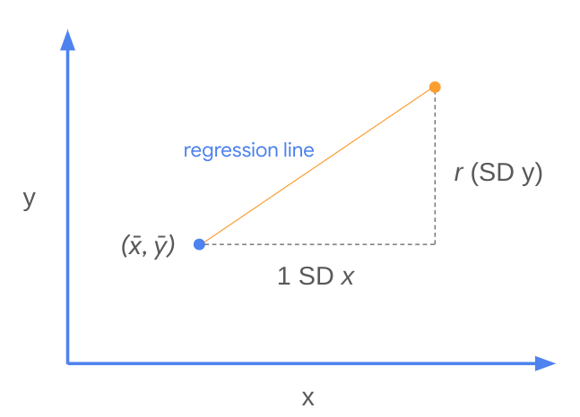

Bu dağılım grafiğinde, yedi saat boyunca çalışan tüm öğrenciler iki dikey çizgi arasına düşer. Ortalama sınav puanları bir X ile temsil edilir. Doğrusal regresyon bu kavramı genişletir. Bir regresyon çizgisi, doğrusal bir modelin varsayımları ve sınırlamaları göz önüne alındığında, X'in her değeri için tahmini ortalama Y değerini temsil eder. Başka bir deyişle, X ve Y arasındaki ilişki tamamen doğrusal değilse veya Y'yi etkileyen modele dahil edilmeyen başka faktörler varsa, her X için gerçek ortalama Y değerleri tam olarak regresyon çizgisinde olmayabilir. Regresyon çizgisi, bir bütün olarak verilere en uygun düz çizgi ilişkisini bulmak için bu etkileri dengelemeye çalışır. X göz önüne alındığında, Y'nin merkezi eğiliminin bir tahminidir.

#### Regresyon denklemi

Artık r'yi bildiğinize _ve_ regresyon kavramını daha iyi anladığınıza göre, veriler arasında en uygun çizgiyi bulmak için her şeyi bir araya getirmeye hazırsınız. Bu çizginin formülü regresyon denklemi olarak bilinir. Bu adımın iki anahtarı vardır.

Birincisi:

- _X'in ortalama değeri ve Y'nin ortalama değeri (yani nokta (__x__,)) her zaman regresyon çizgisine düşecektir._
    

İkincisi, r'nin ne anlama gel _diğini_ anlamaktır:

- X'deki bir standart sapmanın her artışı için, Y'de ortalama olarak X üzerinde beklenen bir _r_ standart sapması artışı vardır.
    

Aşağıdaki şekil, bu kavramların regresyon çizgisini belirlemek için nasıl birlikte çalıştığını göstermektedir.


Başka bir deyişle, regresyon çizgisinin eğimi:

$$
m=r(SDy) / 1(S⁣Dx)
$$

_Bu, bir satırın formülünde m'dir:_ _y_ _=_ _mx_ _+_ _b__._ Bu nedenle _b ile temsil edilen kesiş_ me noktası: _b_ = _y_ - _mx_. _Noktanın (__x__,) her zaman regresyon çizgisinde olduğunu bildiğiniz için, kesişmeyi hesaplamak için bu noktadan_ _x_ _ve_ _y_ _değerlerini ekleyebilirsiniz._ İşte beş öğrencinin orijinal örneğini kullanan bir örnek.

||**Çalışma saatleri (X)**|**Sınav notu (Y)**|
|---|---|---|
|**anlamına gelir:**|5|80|
|**SD:**|2|10|
|**r:**|**0.6**||

Adımlara ayrılmış:

1. Eğimi hesaplayın: m=r(S ⁣D y)S ⁣D x=0.6(10)2=3.m=SD xr(SD y)​=20.6(10)​=3.
    
2. _Kesişmeyi hesaplayın:_ _y_ _=_ _mx_ _+_ _b: 80 = 3 (5) + b →_ _b_ _=_ _65 denklemine_ _x__, ve_ _m_ _değiştirin._
    
3. Regresyon denklemini elde etmek için genelleme _yapın: y_ = 3 _x_ + 65.
    

İşte verilerin üzerine bindirilmiş regresyon çizgisi:

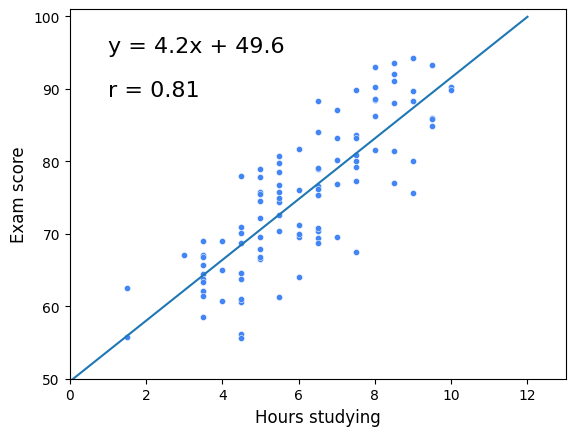

Buna “Y'nin X üzerindeki gerilemesi” denir. İşte 100 öğrencinin tamamı için regresyon çizgisi:


### **Önemli Çıkarımlar**

Doğrusal regresyon, veri profesyonellerinin verileri analiz etmek için kullandıkları en önemli araçlardan biridir. Basit doğrusal regresyonun temel yapı taşlarını anlamak, daha karmaşık regresyon analizi yöntemleri hakkında bilgi edinmeye devam ederken size yardımcı olacaktır. İşte akılda tutulması gereken bazı önemli noktalar:

- Korelasyon, iki değişkenin birlikte hareket etme şeklinin bir ölçümüdür.
    
- _r (diğer adıyla Pear_ son korelasyon katsayısı, diğer adıyla korelasyon katsayısı), iki değişken arasındaki doğrusal ilişkinin gücünü ölçer.
    
    - Her zaman [-1, 1] aralığına düşer.
        
    - Ortalarından birlikte farklılık gösterme eğiliminde olan değişkenler pozitif olarak ilişkilidir. Tersine, ilgili araçlarına zıt şekillerde değişme eğiliminde olan değişkenler negatif ilişkilidir.
        
- Regresyon çizgisi, her _x değeri için ortalama y değerini tahmin_ eder. X verildiğinde _y_ tahmin edilirken hatayı en aza indirir.
    
- Regresyon çizgisinin eğimir(S ⁣D y)S ⁣D xSD xr(SD y)​.
    
- Nokta (_x,_) _her_ zaman regresyon çizgisindedir.

## Basit doğrusal regresyonun dört ana varsayımı

Bu okumada, basit doğrusal regresyonun dört ana varsayımını, varsayımların karşılanıp karşılanmadığını nasıl kontrol edeceğinizi ve bir varsayım karşılanmazsa ne yapacağınızı gözden geçireceksiniz. Grafikleri çoğaltmak ve varsayımları kendi başınıza keşfetmek için ek kaynakları kullanabilirsiniz. Bu okumada tanımlanmamış herhangi bir terim varsa, her modülün sonunda kurs boyunca bulunan terimler sözlüğüne bakın. Bu okuma şunları kapsayacaktır:

- Basit doğrusal regresyon varsayımları
    
- Varsayımların geçerliliği nasıl kontrol edilir
    
- Bir varsayım ihlal edilirse ne yapmalı
    

### Basit doğrusal regresyon varsayımları

Özetlemek gerekirse, basit doğrusal regresyonun dört varsayımı vardır:

1. **Doğrusallık:** Her öngörücü değişken (Xi), sonuç değişkeni (Y) ile doğrusal olarak ilişkilidir.
    
2. **Normallik:** Hatalar normal olarak dağıtılır. *****
    
3. **Bağımsız Gözlemler:** Veri kümesindeki her gözlem bağımsızdır.
    
4. **Homoscedastisite: Hataların** varyansı model boyunca sabit veya benzerdir. *****
    

#### *** Hatalar ve artıklar hakkında not***

Bu ders, regresyon ile bağlantılı olarak “hatalar” ve “artıklar” terimlerini birbirinin yerine kullanmıştır. Bunu, bir veri uzmanı olarak geçirdiğiniz süre boyunca diğer çevrimiçi kaynaklarda ve materyallerde görebilirsiniz.. Gerçekte, bir fark var:

- **Kalıntılar**, tahmin edilen ve gözlemlenen değerler arasındaki farktır. Bir regresyon modeli oluşturduktan sonra, tahmin edilen değerleri gözlemlenen değerlerden çıkararak kalıntıları hesaplayabilirsiniz.
    
- **Hatalar**, modelde olduğu varsayılan doğal gürültüdür.
    
- Kalıntılar, doğrusal regresyonun normallik ve homoskedastiklik varsayımlarını kontrol ederken hataları tahmin etmek için kullanılır.
    

### Varsayımların geçerliliği nasıl kontrol edilir

Daha önce gözden geçirildiği gibi, basit doğrusal regresyon varsayımlarının çoğu veri görselleştirmeleri yoluyla kontrol edilebilir. Bazı varsayımlar bir model oluşturulmadan önce kontrol edilebilir ve diğerleri yalnızca model oluşturulduktan ve tahmin edilen değerler hesaplandıktan sonra kontrol edilebilir.

#### **Doğrusallık**

Bağımsız ve bağımlı değişkenler arasında doğrusal bir ilişki olup olmadığını değerlendirmek için, veri kümesinin bir dağılım grafiğini oluşturmak en kolay yoldur. Bağımsız değişken x ekseninde ve bağımlı değişken y ekseninde olacaktır. Verileri okumak ve bir dağılım grafiği oluşturmak için kullanabileceğiniz bir dizi farklı Python işlevi vardır. Veri görselleştirmeleri için kullanılan bazı paketler arasında Matplotlib, seaborn ve Plotly bulunur. Doğrusallık varsayımının test edilmesi, model oluşturulmadan önce yapılmalıdır.

```python
# Create pairwise scatterplots of Chinstrap penguins data
sns.pairplot(chinstrap_penguins)
```

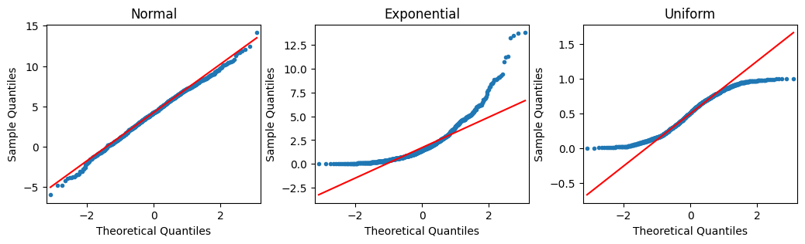

#### **Normallik**

Normallik varsayımı, art **ıklarla tahmin edilebilen hatalara veya verilerde gözlemlenen değerler ile regresyon modeli tarafından tahmin edilen değerler arasındaki farka odak** lanır. Bu nedenle normallik varsayımı ancak bir model oluşturulduktan ve tahmin edilen değerler hesaplandıktan **sonra** doğrulanabilir. Model oluşturulduktan sonra, artıkların normal dağıldığını kontrol etmek için bir QQ grafiği oluşturabilir veya artıkların bir histogramını oluşturabilirsiniz. Varsayımın karşılanıp karşılanmadığı bir düzeyde yorumlamaya bağlıdır.

##### **Kuantil-kuantil grafik**

Ku **antil-kuantil grafiği (****Q-Q grafiği**), iki olasılık dağılımını kuantillerini birbirine karşı çizerek karşılaştırmak için kullanılan grafik bir araçtır. Veri uzmanları genellikle bir dağılımın normalliğini ölçmek için Q-Q grafiklerini histogramlara tercih eder, çünkü bir grafiğin düz bir çizgiye yapışıp yapışmadığını ayırt etmek, bir histogramın normal bir eğriyi ne kadar yakından takip ettiğini belirlemekten daha kolaydır. Bir modelin artıklarının normalliğini değerlendirirken Q-Q grafiklerinin nasıl çalıştığı aşağıda açıklanmıştır:

1. **Kalıntıları sıralayın**. _N artıklarınızı en küç_ ükten en büyüğe doğru sıralayın. Her biri için, verilerin yüzde kaçının bu sıralamaya veya altına düştüğünü hesaplayın. Bunlar veriler _inizin n_ miktarıdır.
    
2. **Normal dağılımla karşılaştırın.** Standart bir normal dağılımı _n_ +1 eşit alana bölün (yani, _n kez dilim_ leyin). Kalıntılar normal olarak dağılmışsa, her bir kalıntının kuantili (yani, verilerin yüzde kaçı her sıralı kalıntının altına düşer), standart normal dağılımdaki _n_ kesimin her birinin karşılık gelen z puanları ile yakından hizalanacaktır (bunlar normal bir z-puan tablosunda veya daha yaygın olarak istatistiksel yazılım kullanılarak bulunabilir).
    
3. **Bir arsa inşa et.** Bir Q-Q grafiği, x ekseni boyunca standart bir normal dağılımın bilinen kuantil değerlerine ve y ekseninde sıra sıralı kalıntı değerlerine sahiptir. Kalıntılar normal olarak dağılmışsa, artıkların kuantil değerleri standartlaştırılmış normal dağılımınkilere karşılık gelecektir ve her ikisi de doğrusal olarak artacaktır. Kalıntılarınızı ilk önce standartlaştırırsanız (ortalamayı çıkarıp standart sapmaya bölerek z puanlarına dönüştürün), iki eksen aynı ölçeklerde olacaktır ve artıklar gerçekten normal dağılmışsa, çizgi 45° açıda olacaktır. Bununla birlikte, artıkları standartlaştırmak, bir Q-Q grafiğinin bir gerekliliği değildir. Her iki durumda da, ortaya çıkan grafik doğrusal değilse, artıklar normal olarak dağıtılmaz.

Aşağıdaki şekilde, ilk Q-Q grafiği, normal bir dağılımdan alınan verileri göstermektedir. Standart bir normal dağılımın miktarlarına karşı çizildiğinde bir çizgi oluşturur. İkinci çizim, üstel bir dağılımdan alınan verileri gösterir. Üçüncü çizim, tek tip bir dağılımdan alınan verileri kullanır. İkinci ve üçüncü çizimlerin bir çizgiye nasıl uymadığına dikkat edin.


##### **Q-Q grafiği nasıl kodlanır**

Neyse ki, daha önce belirtilen adımları manuel olarak gerçekleştirmeniz gerekmez. Bunu halletmek için bilgisayar kütüphaneleri var. Bir Q-Q grafiği oluşturmanın bir yolu, statmodels kütüphanesini kullanmaktır. İçe aktarırsanızstatsmodels.api, [qqplot ()](https://www.statsmodels.org/stable/generated/statsmodels.graphics.gofplots.qqplot.html) işlevini doğrudan kullanabilirsiniz. Aşağıdaki örnek, bir statsmodels ols model nesnesindeki artıkları kullanır. Model, penguenlerin palet uzunluğunu gaga derinliklerine göre geri çeker (X üzerinde Y).

```python
import statsmodels.api as sm

import matplotlib.pyplot as plt

residuals = model.resid

fig = sm.qqplot(residuals, line = 's')

plt.show()
```


Ve işte aynı verilerin bir histogramı:

```python
fig = sns.histplot(residuals)

fig.set_xlabel("Residual Value")

fig.set_title("Histogram of Residuals")

plt.show()
```


#### **Bağımsız Gözlemler**

Gözlemlerin bağımsız olup olmadığı, verilerinizi anlamanıza bağlıdır. Gibi sorular sormak:

- Veriler nasıl toplandı?
    
- Her veri noktası neyi temsil eder?
    
- Veri toplama sürecine bağlı olarak, bir veri noktasının değerinin başka bir veri noktasının değerini etkilemesi muhtemel midir?
    

Sizin fark etmediğiniz şeyleri fark edebilecek başkalarından içgörü almayı içeren bu soruların nesnel bir incelemesi, bağımsız gözlem varsayımının ihlal edilip edilmediğini belirlemenize yardımcı olabilir. Bu da eldeki veri kümesiyle çalışırken sonraki adımlarınızı belirlemenizi sağlayacaktır.

#### **Homoscedastisite**

Normallik varsayımı gibi, homoskedastiklik varsayımı bir modelin artıklarıyla ilgilidir, bu nedenle ancak bir regresyon modeli oluşturulduktan sonra değerlendirilebilir. Takılan değerlerin (yani modelin öngörülen Y değerleri) artıklara karşı bir dağılım grafiği, homoskedastiklik varsayımının ihlal edilip edilmediğini belirlemeye yardımcı olabilir.

```python
import matplotlib.pyplot as plt

fig = sns.scatterplot(fitted_values, residuals)

fig.axhline(0)

fig.set_xlabel("Fitted Values")

fig.set_ylabel("Residuals")

plt.show()
```


### Bir varsayım ihlal edilirse ne yapmalı

Artık dört varsayımı ve ihlallerini nasıl test edeceğinizi incelediğinize göre, bir varsayım ihlal edildiğinde atabileceğiniz bazı yaygın sonraki adımları tartışmanın zamanı geldi. Verileri dönüştürürseniz, bunun sonuçları yorumlama şeklinizi değiştirebileceğini unutmayın. Ek olarak, bu potansiyel çözümler verileriniz için işe yaramazsa, farklı bir model denemeyi düşünmelisiniz.

Şimdilik, başlamanız için birkaç temel yaklaşıma odaklanın!

#### **Doğrusallık**

- Logaritmayı almak gibi değişkenlerden birini veya her ikisini de dönüştürün.
    
    - Örneğin, eğitim yılları ile gelir arasındaki ilişkiyi ölçüyorsanız, gelir değişkeninin logaritmasını alabilir ve bunun doğrusal ilişkiye yardımcı olup olmadığını kontrol edebilirsiniz.
        

#### **Normallik**

- Değişkenlerden birini veya her ikisini de dönüştürün. En yaygın olarak, bu sonuç değişkeninin logaritmasını almayı içerir.
    
    - Sonuç değişkeni gelir gibi doğru çarpık olduğunda, artıkların normalliği etkilenebilir. Dolayısıyla, sonuç değişkeninin logaritmasını almak bazen bu varsayıma yardımcı olabilir.
        
    - Bir değişkeni dönüştürürseniz, modeli yeniden yapılandırmanız ve ardından emin olmak için normallik varsayımını yeniden kontrol etmeniz gerekir. Varsayım hala yerine getirilmezse, sorunu gidermeye devam etmeniz gerekir.
        


#### **Bağımsız gözlemler**

- Mevcut verilerin sadece bir alt kümesini alın.
    
    - Örneğin, bir anket yürütüyorsanız ve aynı hanedeki kişilerden yanıt alıyorsanız, yanıtları ilişkili olabilir. Her hanede sadece bir kişinin verilerini saklayarak bunu düzeltebilirsiniz.
        
    - Başka bir örnek, belirli bir süre boyunca veri toplamanızdır. Diyelim ki bisiklet kiralamayla ilgili verileri araştırıyorsunuz. Verilerinizi her 15 dakikada bir toplarsanız, sabah 8:00'de kiralanan bisiklet sayısı sabah 8:15 'de kiralanan bisiklet sayısıyla ilişkili olabilir. Ancak, veriler her 15 dakikada bir yerine 2 saatte bir alınırsa kiralanan bisiklet sayısı bağımsızdır.
        

#### **Homoscedastisite**

- Farklı bir sonuç değişkeni tanımlayın.
    
    - Bir şehrin nüfusunun bir şehirdeki restoran sayısıyla nasıl ilişkili olduğunu anlamakla ilgileniyorsanız, bazı şehirlerin diğerlerinden çok daha kalabalık olduğunu bilirsiniz. Daha sonra sonuç değişkenini nüfusun restoranlara oranı olarak yeniden tanımlayabilirsiniz.
        
- Y değişkenini dönüştürün.
    
    - Yukarıdaki varsayımlarda olduğu gibi, bazen logaritmayı almak veya Y değişkenini başka bir şekilde dönüştürmek, homoskedastiklik varsayımıyla tutarsızlıkları potansiyel olarak düzeltebilir.
        

### Önemli çıkarımlar

- Basit doğrusal regresyon için dört temel varsayım vardır: doğrusallık, normallik, bağımsız gözlemler ve homoskedastiklik.
    
- Her varsayımın geçerliliğini kontrol etmenin farklı yolları vardır. Bazı varsayımlar model oluşturulmadan önce kontrol edilebilirken, bazıları model oluşturulduktan sonra kontrol edilebilir.
    
- Model varsayımlarının ihlallerini düzeltebilecek verilerle çalışmanın yolları vardır.
    
- Değişkenlerin değiştirilmesi yorumlamayı değiştirecektir.
    
- Varsayımlar ihlal edilirse, veri dönüşümlerinden sonra bile, verileriniz için diğer modelleri göz önünde bulundurmalısınız.
    

### Daha fazla bilgi için kaynaklar

- [Denizdeki penguenler veri kümesini buradan indirin](https://raw.githubusercontent.com/mwaskom/seaborn-data/master/penguins.csv "Seaborn GitHub deposundan penguens veri kümesi")
    
- Penguenler veri kümesi hakkında daha fazla bilgi: [Palmer penguenlerine giriş](https://allisonhorst.github.io/palmerpenguins/articles/intro.html)
    
- Q-Q grafikleri hakkında daha fazla bilgi: [Normal Nicel-Kuantil Grafikler (jbstatistik'ten video)](https://www.youtube.com/watch?v=X9_ISJ0YpGw)
