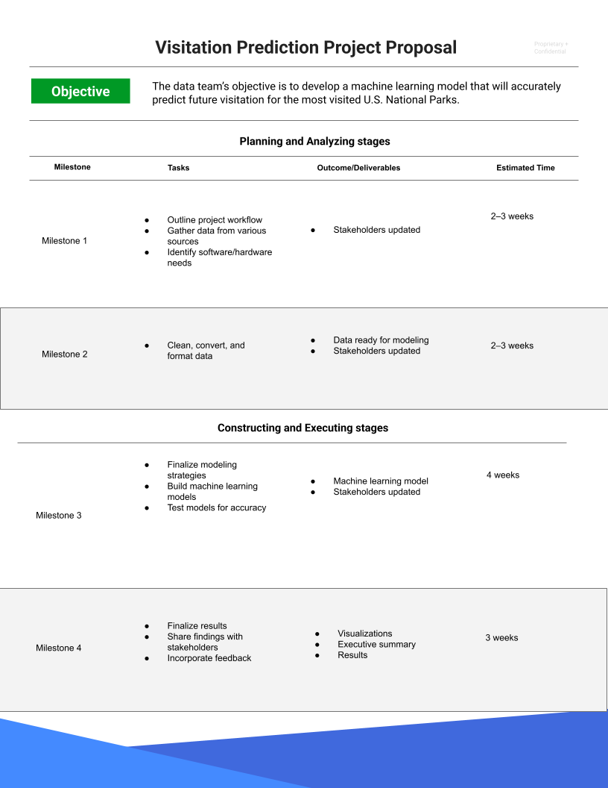

# 1. Veri Biliminin Temelleri

# PACE Aşamaları

Şimdiye kadar PACE çerçevesiyle tanıştınız ve veri analiz projeleri için nasıl net bir temel ve yapı sağladığını öğrendiniz. Ayrıca PACE’in bir kısaltma olduğunu, her harfin projede eyleme geçirilebilir bir aşamayı temsil ettiğini öğrendiniz: planla, analiz et, oluştur ve yürüt. Bu okumada, PACE iş akışı hakkında daha fazla bilgi edinecek ve sürecin her aşamasının veri analizini nasıl yönlendirebileceğini keşfedeceksiniz.

## Neden bir iş akışı yapısı kullanıyoruz?

Genel bir kural olarak, veri profesyonelleri veri projelerinin süresince onları yönlendirmesi için iş akışı yapılarına güvenirler. Büyük çaplı bir projede, belirli bir işlem sırasına ihtiyaç duyan birçok görev olabilir. Karmaşıklıkları tespit etmek ve birlikte çalışmanın tutarlı yollarını bulmak, projelerin daha verimli olmasını sağlar ve daha üretken iletişimi mümkün kılar. Bu tür potansiyel engelleri erken tespit etmek, projeyi olumsuz etkilemeden önce kaynakları planlamanıza ve hazırlamanıza yardımcı olur.

Bu programın oluşturulmasına katkıda bulunan veri profesyonellerinden oluşan ekibimiz, PACE’i esnek bir model olarak geliştirdi; tüm iş akışını kesintiye uğratmadan her aşamaya tekrar dönmeniz teşvik edilir. PACE sayesinde, hangi durumlarda dikkate alınması gereken eylem alanlarını ve bağlamları tanımlayacaksınız. Özetle, PACE profesyonellere veri projesinin her aşamasında çabalarını destekleyecek özelleştirilebilir bir yapı sunar.

## PACE modeline daha yakından bakış

PACE modelinin her aşamasına daha yakından bakalım.


### **Planla**

Bir projenin başında, başarının sağlam temellerini atmak önemlidir. Burada projenizin kapsamını belirlersiniz. Organizasyonun bilgi ihtiyaçlarını tanımlayarak başlarsınız. Planlama aşamasında projenin en geniş perspektifine sahip olursunuz. İlgili tüm faktörleri ve süreçleri değerlendirerek, tamamlanma yolunu haritalar ve bir eylem planı oluşturmak için yaratıcılığınızı kullanırsınız. Ayrıca, iş akışınızda yenilikçi bir yaklaşım gerektirebilecek görevleri de özellikle not edersiniz.

**Özet:** Planlama aşaması, projenin kapsamını kavradığınız ve projeyi tamamlamaya yönelik adımları geliştirdiğiniz aşamadır.

Planlama aşamasındaki bazı görev örnekleri:

-   İş verilerini araştırmak
    
-   Projenin kapsamını tanımlamak
    
-   Bir iş akışı geliştirmek
    
-   Proje ve/veya paydaş ihtiyaçlarını değerlendirmek
    

### **Analiz et**

Analiz aşamasında, verilerle ilk kez etkileşime girersiniz. Proje için gereken tüm verileri bu aşamada toplarsınız. Bazı veri setleri kurum içi birincil kaynaklardan gelebilir. Diğerleri kurum dışı ikincil kaynaklardan toplanabilir. Hatta hükümet ya da açık kaynak verilerine ihtiyaç duyabilirsiniz. Analiz aşaması ayrıca keşifsel veri analizi (EDA) yapmayı içerir. Bu aşamada tüm gerekli veriler temizlenir, yeniden düzenlenir ve analiz edilir.

**Özet:** Analiz aşaması, proje için tüm verilerin toplanıp, hazırlanıp analiz edildiği aşamadır.

Analiz aşamasındaki bazı görev örnekleri:

-   Veritabanı formatlamak
    
-   Verileri temizlemek
    
-   Verileri kullanılabilir formata dönüştürmek
    

### **Oluştur**

Adından da anlaşılacağı gibi, oluşturma aşaması inşa etmeyle ilgilidir. Bu aşamada modeller oluşturur, yorumlar ve revize edersiniz. Bazı projelerde, verideki ilişkileri ortaya çıkarmak için makine öğrenimi algoritmaları kullanılır. Bu ilişkiler, veride kullanılmayan bilgileri ortaya çıkarır ve organizasyonunuzun geleceğe yönelik bilinçli kararlar almasına yardımcı olur.

**Özet:** Oluşturma aşamasında, veride gizli ilişkileri açığa çıkaran modeller inşa edersiniz.

Oluşturma aşamasındaki bazı görev örnekleri:

-   Modelleme yaklaşımını seçmek
    
-   Modeller oluşturmak
    
-   Makine öğrenimi algoritmaları geliştirmek
    

### **Yürüt**

Yürütme aşamasında, analiz ve oluşturma çalışmalarınızı hayata geçirirsiniz. Bulgularınızı iç (kurum içi) ve dış (kurum dışı) paydaşlara sunarsınız. Genellikle, çalıştığınız şirketlerin iş tarafındaki paydaşlarla birlikte çalışırsınız. Bulguları sunmak yürütme aşamasının sadece bir parçasıdır. Paydaşlar geri bildirim verir, sorular sorar ve önerilerde bulunur; bunları toplar ve çalışmalarınıza dahil edersiniz.

**Özet:** Yürütme aşamasında analiz sonuçlarınızı sunar, geri bildirim alır ve gerekirse revizyon yaparsınız.

Yürütme aşamasındaki bazı görev örnekleri:

-   Sonuçları paylaşmak
    
-   Bulguları diğer paydaşlara sunmak
    
-   Geri bildirimleri ele almak
    

## İletişim ve PACE

PACE iş akışının hangi aşamasında olursanız olun, iletişim projeyi başarıyla tamamlamak için elzemdir. Bunu, PACE’in dört aşamasını tamamlanmış bir devre olarak ve iletişimi ise elektrik akışı olarak görerek hayal edebilirsiniz.

Her aşamada iş akışını geliştirmek için iletişime ihtiyaç duyulur. Bu, verilerle ilgili sorular sormak, ek kaynaklar toplamak, paydaşları ilerleme hakkında bilgilendirmek veya bulguları sunup geri bildirim almak olabilir.

## PACE’in Uyarlanabilirliği

Bir proje başladığında, PACE modeli iyi bir yapı sunar. Başlangıçta bilgi toplama ve yol haritası oluşturma aşaması olan planlama vardır. Verileri analiz edip modeller oluştururken, analiz ve oluşturma aşamaları size destek olur. Son olarak, yürütme aşamasında sonuçları paylaşır ve geri bildirim toplarsınız.

PACE modeli belirli bir sırada aşamalar olarak sunulsa da, açık iletişim akışı sayesinde ihtiyaç duyduğunuz aşamalara kolayca geçiş yapabilirsiniz. Yeni bilgiler ve geri bildirimler sürecin herhangi bir aşamasına dahil edilebilir. Örneğin, verinin bir yönünü netleştirmek için analiz aşamasına geri dönebilir, sonra bu yönü paydaşlara sunmak için yürütme aşamasına geçebilirsiniz; yeni modeller oluşturmak zorunda kalmayabilirsiniz. PACE çerçevesi her projeye uyarlanabilir. Bu uyarlanabilirlik, sizi yüksek derecede profesyonel esneklik ve iletişim gerektiren dinamik bir mesleğe hazırlar.

## Önemli Noktalar

-   Veri profesyonellerinin, veri projelerindeki çok sayıda görevi yönetmelerine yardımcı olmak için yapılandırılmış iş akışlarına ihtiyacı vardır.
    
-   PACE profesyonel iş akışı, bu programa özel olarak geliştirilmiş, profesyonel yapı ve uygulamalarınızı geliştirmenize yardımcı olur.
    
-   PACE tamamlanmış bir devre gibi çalışır ve aşamalar arasında iletişim akar.
    
-   PACE’in tasarımı esnekliği teşvik eder ve gerektiğinde aşamalar arasında serbest geçişe izin verir.

# Veri Profesyonelleri için En İyi İletişim Uygulamaları

## Etkili İletişim PACE’ı Yönlendirir

PACE’ın (Planla, Analiz Et, Karar Ver, Uygula) her aşamasında paydaşlar geri bildirim verebilir, sorular sorabilir veya açıklama isteyebilir. İletişim kurabilmek çok önemlidir; bir projenin yaşam döngüsünün her noktasında, karşılaşılan engelleri ve sonuçları paylaşmanız, karar vermeyi yönlendirecek gerekli bilgileri sağlamanız gerekir. İletişim, veri toplama, modeller oluşturma ve sonuçları paylaşma dahil olmak üzere PACE’ın her aşamasını yönlendirir. Bir veri profesyoneli olarak, başarılı olabilmek için hem güçlü iletişim becerilerine hem de teknik becerilere ihtiyacınız vardır. Bu metinde, PACE aşamalarında uygulayabileceğiniz etkili iletişim ipuçlarını ve bulgularınızı sunumlarla paylaşırken kullanabileceğiniz en iyi uygulamaları öğreneceksiniz.

## Etkili İletişim için Yedi İpucu

Tipik bir iş günü boyunca, paydaşlarla çeşitli şekillerde iletişim kurarsınız. Bazıları e-posta ve mesajlaşma yoluyla, bazıları toplantılar ve birebir görüşmeler yoluyla, bazıları ise resmi sunumlar şeklinde olabilir. Her etkileşim, dinleyicinizin anlattıklarınızı anlayabilmesini sağlamak için bireyselleştirilmiş bir yaklaşım gerektirir. Aşağıdaki yedi ipucu, iletişiminiz hangi biçimde olursa olsun ve projenizin PACE aşamasında nerede olursa olsun size rehberlik edecektir:

### 1\. Kitlenizin Dilini Konuşun

Dinleyicinizin ihtiyaçlarını belirleyin. İletişim kurduğunuz kişinin amaçlarını bilmek önemlidir. Onların ihtiyaçlarına odaklanmak, konuşmanın ne kadar teknik olması gerektiğini anlamanızı sağlar. Şunları düşünün:

-   Neden size ulaştılar?
    
-   Paydaşınız bu etkileşimden ne istiyor?
    
-   Onlar, ekipleri veya organizasyonları için ne önemli?
    

Bir veri profesyoneli olarak farklı paydaşlarla etkileşimde bulunacaksınız. Onların ne bildiğini, ne bilmesi gerektiğini ve projeye katılım seviyelerini aşan neyin olduğunu belirleyin.

-   Teknik kavramları basit terimlerle açıklayın.
    
-   Ana fikirlerin daha kolay anlaşılması ve hatırlanması için kısa cümleler kullanın.
    
-   Doğrudan ve sade bir dil kullanın; gereksiz süslemelerden kaçının.
    
-   Farklı geçmişlere dikkat edin ve diğerlerinin deneyimlerine saygı gösterin.
    

**Uzman önerisi:** Karmaşık terimler, kısaltmalar ve teknik “moda kelimelerden” kaçının; bunlar kafa karışıklığına yol açabilir.

### 2\. Soruları Teşvik Edin ve Geri Bildirimi Hoş Karşılayın

Herkes geri bildirime ihtiyaç duyar—ister olumlu pekiştirme olsun ister gelişim alanları. Bir görevin detaylarına odaklandığınızda bir şeyi gözden kaçırmanız mümkündür. Başkalarının geri bildirimi, kişisel gelişim ve profesyonel mükemmellik için değerli bilgiler sunar. Geri bildirim ve soruları kabul etmek, becerilerinizi güçlendirir ve genel projeye katkı sağlar.

-   Çözüm bulma tutkunuzu projenin hedefleriyle birleştirin.
    
-   Sonuçları daha iyi anlamaya devam edin.
    
-   Projelerinizle ilgili iletişimi geliştirmek için geri bildirim ve soruları toplayın.
    
-   İletişim becerilerinizi gözden geçirme fırsatları yaratın.
    

**Uzman önerisi:** Geri bildirimi analiz edin. Geçerli mi? Kişi projenin veya veri analizi sürecinin hedeflerini tam olarak anlıyor mu? Değilse, açıklama için ek bir toplantı ayarlayın.

### 3\. Veriye Bağlantı Noktası Olun

Veri ekibinizin sağladığı içgörülere doğrudan bağlantı sizsiniz. Amacınız, diğer paydaşların süreci ve ihtiyaçlarına nasıl cevap verdiğini anlamalarına yardımcı olmaktır. Herkes süreci anladığında iletişim çok daha etkili olur.

-   Başkalarının veri sürecinizi daha iyi anlaması için hedeflere odaklanın.
    
-   Verinin hikayesini çekici ve tutarlı bir anlatımla sunun.
    
-   Sorulara zamanında cevap verin.
    
-   Takıma olan değeriniz gösterin.
    
-   Paydaş sorularını yanıtlamak için fırsatlar yaratın.
    

**Uzman önerisi:** Verinin ve sahip olduğunuz araçların takımınızın hedeflerine nasıl katkıda bulunabileceğini proaktif olarak belirlemeye devam edin.

### 4\. Görselleştirmeleriniz Hikayeyi Anlatmaya Yardımcı Olsun

Büyük verilerle çalışırken fikirleri iletmenin en iyi yollarından biri görselleştirmelerdir. Görsel öğeler, verinizin içindeki detayları canlandırır. Grafikler, tablolar ve infografikler genel anlayışı artırır. Daha sonra Tableau gibi görselleştirme araçlarını keşfedeceksiniz.

-   Görselleriniz verideki hikayeyi anlatsın.
    
-   Görselleştirmeleri kapsayıcı tasarlayın.
    
-   Etiket ve metinleri açıklayıcı ama sade kullanın.
    
-   Kolay okunabilir fontlar tercih edin.
    
-   Mesajınızı net iletmek için yüksek kontrast, gölgelendirme ve diğer özelleştirmeleri kullanın.
    
-   Materyalleri erişilebilir formatlarda sunun.
    

**Uzman önerisi:** Görselleştirmeleri basit tutun. Sunumda neyi dahil edeceğinize karar verirken az daha çoktur.

### 5\. Pozitif Profesyonel İlişkiler Kurun

Başka kişilerin sorumlulukları ve hedeflerini dikkate aldığınızda iletişiminiz bunu yansıtacaktır. Bu, iş yerinde itibar ve etki sağlar ve kariyerinizde büyümenize olanak tanır.

-   Dinleyiciniz için önemli olan konulara odaklanın.
    
-   Geri bildirim ve tartışma davet edin.
    
-   Açık ve kapsayıcı iletişim kuran güvenilir bir uzman olun.
    
-   İş ilişkilerini güçlendirmek ve moral artırmak için olumlu etkileşimler geliştirin.
    

**Uzman önerisi:** Bir paydaş size ulaştığında erişilebilir ve ilgili olun.

### 6\. Veri Hakkındaki Varsayımları Belirleyin

İnsanların geçmişleri, deneyimleri, inançları ve dünya görüşleri verideki bilgileri etkileyebilir. Veri analitiği profesyoneli olarak, bu faktörlerin önyargı yaratabileceğini dikkate almalısınız.

Tanımlanmayan varsayımlar sonuçlar üzerinde güçlü etkiler yaratabilir. Bilgi yoksa, anlayıştaki boşluklar varsayımlarla doldurulma eğilimindedir. Varsayımların etkisini azaltmanın en etkili yolu aktif dinlemek ve etkili sorular sormaktır. Aşağıdaki sorular varsayımları tanımlamada yardımcı olabilir:

-   Bir şeyi doğal mı sayıyorum?
    
-   Burada yapmamam gereken bir varsayımda mı bulunuyorum?
    
-   Varsayımın doğru olup olmadığını belirleyebilir miyim?
    

**Uzman önerisi:** Veri profesyonelleri kendi varsayımlarını ve dinleyicilerinin varsayımlarını tanımlamalıdır. Kendi önyargılarınızı da göz önünde bulundurun!

### 7\. Verideki Kısıtlamaları Belirleyin

Bir veri profesyoneli olarak, analizlerinizi engelleyebilecek veri kısıtlamalarıyla karşılaşacaksınız. Bunlar ilerlemeden önce ele alınmalıdır. Veri kısıtlamalarını belirlemenize yardımcı olmak için şu soruları sorun:

-   Veri eksiksiz mi? Eksik değer veya bölümler var mı?
    
-   Veri setleri doğru biçimlendirilmiş mi?
    
-   Bu, tüm bir popülasyon veya grubun analizini yapmak için yeterli örneklem büyüklüğü mü?
    
-   Veri setinde hangi önyargılar mevcut?
    
-   Bu veride kişisel olarak tanımlanabilir bilgi var mı? Bu bilgiyi korumak için hangi adımları atacağım?
    

**Uzman önerisi:** Analiz öncesinde veri kısıtlamalarını belirlemenin ve bildirmeyi sağlamanın yanı sıra, sunum sırasında da sonuçları etkileyen kısıtlamalar hakkında paydaşları bilgilendirin.

## Bulgularınızı Paylaşın

Paydaşlarla yapacağınız en önemli iletişimlerden biri, genellikle sunumlar yoluyla bulgularınızı paylaşmaktır. Bu, analizinizin sonuçlarını, kavramlarını ve terimlerini daha geniş kitlelere çevirmek anlamına gelir. Analiz sonuçlarınızı paylaşıyor olmanız durumunda bazı en iyi uygulamalar şunlardır:

-   Sonuçları paydaşların ihtiyaçlarına göre şekillendirin. Bu verinin hedeflerine ulaşmalarına nasıl yardımcı olacağını açıklayın.
    
-   En etkili görselleştirme ve/veya panoları belirleyin. Hangi verileri göstermeniz gerekiyor ve paydaşların bunlarla nasıl etkileşim kurmasını istiyorsunuz?
    
-   Tasarımı dikkatli düşünün. Basit ama görsel olarak çekici görselleştirme her zaman en iyisidir.
    
-   Görselleştirme/pano verilerinde bir hiyerarşi kullanın. En önemli bilgiler kolay erişilebilir olmalı, ama daha fazla detay için yol da sunulmalı.
    

### Sonuçları Paylaşırken Nelere Dikkat Etmeliyim?

-   Dinleyicim için en önemli bilgi nedir?
    
-   Mevcut araçlar ve sınırlı zamanda en verimli paylaşım yöntemi nedir?
    
-   Ana noktaları etkili bir şekilde iletmek için ne yapabilirim?
    

### Sunumlar

Bilgiyi açık ve etkili şekilde sunmak, bir veri bilimcisinin iş akışının anahtarıdır. Sunumla ilgili iletişim becerileri arasında sunum yapısı, slayt tasarımı, ses tonu ve beden dili gibi unsurlar bulunur. Ayrıca, hazırladığınız materyallerde erişilebilirliği dikkate almak önemlidir. Kuruluşunuzun erişilebilirlik yönergelerini kontrol edin. Ayrıca [W3C’nin Web Erişilebilirlik İnisiyatifi](https://www.w3.org/WAI/) gibi çevrimiçi kaynaklara başvurabilirsiniz.

# Başarılı İletişimin Unsurları

Öğrendiğiniz gibi, iletişim PACE’in itici gücüdür çünkü veri profesyonellerinin proje aşamalarında paydaşlarla etkili iletişim kurabilmesi gerekir. Etkili iletişim için bazı önemli ipuçlarını zaten öğrendiniz. Ancak, başarılı iletişim için göz önünde bulundurmanız gereken birkaç unsur daha var. Bu metin, iş yerinizde uygulayabileceğiniz başarılı iletişim için en iyi uygulamaları sunmaktadır.

## Nedenini Anlamak

İletişim kurarken ilk düşünmeniz gereken şey, iletişim kurma amacınızın net olmasıdır. “Nedeniniz”, çalıştığınız iş veya organizasyonun belirlediği bağlama ve projenin hedeflerine bağlıdır. Her türlü iletişimi oluştururken, ana fikirlerinizi belirlemek için nedeninizi kullanın ki hedef kitleniz amaçlı bir şekilde nasıl hareket edeceğini veya yanıt vereceğini anlayabilsin.

İletişime hazırlanırken, aşağıdaki önemli hedef ve beklentileri belirlemek için kısa bir zaman ayırın:

-   İletişim kurduğunuz projenin hedefleri
    
-   Bu iletişimden ne elde etmeyi umduğunuz
    
-   Hedef kitlenizden ne yapmasını istediğiniz
    
-   Hedef kitlenizin anlaması gerekenler
    

İletişimin “nedenini” anlamak, düşüncelerinizi organize etmenize ve daha net, doğrudan iletişim kurmanıza yardımcı olur.

## Ortamı Belirlemek

Etkili iletişim geliştirirken sadece “neden” değil, iletişimin nerede gerçekleşeceğini de düşünmeniz gerekir. İletişimin gerçekleştiği ortam, mesajınızın iletilme biçimini ve şekillendirilmesini doğrudan etkiler. İletişime hazırlanırken, bulunacağınız ortama en uygun iletişim biçimini göz önünde bulundurun.

İş yerinde farklı ortamlarda iletişim kurabilirsiniz. Ne paylaşacağınız, nasıl paylaşacağınız ve nasıl takip edeceğiniz o iletişimin bağlamına bağlıdır. Örneğin:

-   Bir öğle yemeğinde bir iş arkadaşınızdan yakın zamanda karşılaştığınız bir engelle ilgili tavsiye istemek
    
-   Önemli bir projeyle ilgili tüm paydaşlara e-posta ile güncelleme göndermek
    
-   Haftalık toplantıda ekibinize ilerleme raporu sunmak
    
-   Analiz sonuçlarını yönetim kurulu üyelerine sunmak
    

Her ortamda, nasıl iletişim kurduğunuzu, kitlenizin ihtiyaçlarını ve onlardan ne beklediğinizi dikkate almanız gerekir. İletişim becerilerinizi geliştirirken, ortamın gerçek iletişim kadar önemli olduğunu unutmayın.

### Birebir ve Küçük Gruplarda Çalışmak

Veri profesyoneli olarak en sık karşılaşacağınız ortamlardan biri birebir veya küçük grup toplantılarıdır. Bu ortamlarda iletişime hazırlanırken şunlara dikkat edin:

-   Toplantıyı önceden planlayarak meslektaşlarınızın zamanına saygı göstermek
    
-   Aktif dinleme pratiği yaparak ilgi göstermek
    
-   Sorular sorarak uyumu kontrol etmek
    

## Zaman Yönetimi

Profesyonel dünyada zaman çok değerlidir. Verimli olmak çok önemlidir; bu, iletişiminizin anlaşılır olmasını sağlayarak paydaşların mesajınızı hızlıca kavrayabilmesi demektir. Mesajınızın net ve öz olması için her zaman şunları uygulayın:

-   Doğrudan bir dil kullanın
    
-   Gereksiz kelimeleri azaltın
    
-   Gereksiz detaylardan kaçının
    
-   Her zaman açıklık için çaba gösterin
    
-   Doğru dilbilgisi ve noktalama kullanın
    
-   Basit kelimeler tercih edin, teknik dil kullanmaktan kaçının
    
-   Karmaşık fikirleri daha kısa cümlelere bölerek anlaşılmasını ve akılda kalmasını kolaylaştırın
    

Bu öneriler sadece iletişiminizin daha anlaşılır ve etkili olmasını sağlamakla kalmaz, aynı zamanda önemli kavramları tekrar açıklama ihtiyacınızı azaltarak size zaman kazandırır. Ayrıca, meslektaşlarınızın zamanına saygı gösterdiğiniz için minnettar olacaklardır.

## Aktif Dinleme

Veri profesyoneli kariyerinize başlarken, toplantılar ve konuşmalar çok fazla yer tutar. Birçok paydaş, hem organizasyonunuz içinden hem de dışından farklı departmanlardan olabilir. Bu etkileşimlerde paylaşılan bilgiler çok değerlidir. Genellikle, işleyiş, hedefler, önemli kilometre taşları ve proje parametreleri hakkında fikir edinirsiniz.

Aktif dinlediğinizde:

-   Başkalarının anlayışına davet etmiş olursunuz
    
-   Başkalarına ve sorumluluklarına karşı empati geliştirirsiniz
    
-   Meslektaşlarınızla bağ kurarsınız
    
-   Güveni teşvik edersiniz
    

Aktif dinleme yaparken, konuşanın bakış açısını anlamaya çalışırsınız. Bu, diğer insanların ne anlatmak istediğini anlamanıza ve daha iyi, daha derinlemesine sorular sormanıza olanak sağlar.

## Soru Sormak

Veri profesyonelleri otomatik olarak çözümler geliştirmezler. Veri analizinin etkili olabilmesi için doğru soruları sormak gerekir. Aslında, tüm veri analiz süreci buna bağlıdır.

Soru sormak güçlü bir iletişim aracıdır. Doğru sorular, kurumsal öğrenmeye ve verimli fikir alışverişine yol açabilir. Çoğu zaman sorular, yeniliği teşvik eder ve projelerin ve genel iş akışının iyileştirilmesine yardımcı olur.

Soru sormak ekip üyeleri arasında bağ ve güven oluşturur. Doğru sorular, beklenmedik riskleri ve sorunları ortaya çıkararak iş risklerini azaltabilir. İşte soru sorma konusunda bazı öneriler:

-   Daha önce cevaplanmamış soruları sorun
    
-   Daha büyük resmi ortaya çıkaran sorular sorun
    
-   Bilgi toplayan veya ekip bilgisini geliştiren sorular sorun
    
-   Yanlış anlamaları netleştiren sorular sorun
    

Etkili sorular, en iyi işinizi yapmanız için gereken yanıtları alma şansınızı artırır ki bu tüm ekip için iyidir.

## Ana Noktalar

Bu metinde, iletişimin veri profesyonellerinin tüm çalışmalarında var olduğunu öğrendiniz. Daha başarılı tartışmalar için iletişimin amacına, ortamına ve zamanlamasına odaklanın. Ayrıca, ilgili sorular soran aktif bir dinleyici olmak, iletişimi daha verimli kılar ve diğer paydaşların bakış açısını davet eder. Tüm bu faktörler, veri profesyoneli olarak ne kadar etkili iletişim kurduğunuzda büyük fark yaratır.

# Proje Teklifi ile Hedefleri İletmek

Bu okumada, veri çalışma alanındaki iletişimi incelemeye devam edeceksiniz. Öğrendiğiniz gibi, iletişim veri profesyonelinin tüm iş alanlarında önemli bir parçadır. Bir veri ekibinde, proje görevleri ve sorumlulukları farklı veri profesyonelleri arasında paylaşılır. Tüm ekip üyeleri ve paydaşlar arasında etkili iletişim ve iş birliği, herhangi bir veri projesinin başarısı için kritiktir.

**Proje teklifi**, görevlerin takibini sağlamak için gereken yapı ve iletişimi sunabilir. Ayrıca, proje teklifleri, yüksek derecede esneklik gerektiren zorluklarla karşılaşan ekipler için faydalıdır. Projeler ilerledikçe beklentiler, kaynaklar veya hatta ekip üyeleri değişebilir. Bu, projenin genel iş akışını ve teslim tarihini etkileyebilecek ayarlamalar gerektirir.

## Proje Teklifleri

Bir proje teklifinin temel işlevi, hedefleri ve gereksinimleri özetlemektir. Proje teklifleri, genellikle **kilometre taşları** (milestones) olarak adlandırılan, daha ayrıntılı ve uygulanabilir bölümlerde fikirleri sunar. Teklifler genellikle ekip üyeleri ve diğer paydaşların girdileri ile oluşturulur. Ayrıca, proje teklifleri onay almak ve projenin tamamlanma yolunu bildirmek için müşteriler veya yöneticilerle de paylaşılabilir. Proje teklifleri birçok endüstri ve organizasyonda kullanılır. Tasarım ve düzeni değişebilse de, ortak bazı temel unsurlar her projede bulunur.

### Proje Teklifinin Unsurları

Her proje teklifi, işe başlamadan önce ekibin dikkate alması gereken önemli bilgiler içerir. Aşağıda, proje tekliflerinde sıkça bulunan bazı ortak bölümlerin kısa açıklamaları verilmiştir. Proje tekliflerinin formatı değişebileceğinden, burada açıklanan her bölüm her projede yer almayabilir.

**Proje başlığı:** Projenin başlığı genellikle belgenin üst kısmına yakın, belirgin bir şekilde yer alır. Etkili başlıklar kısa ve amaç odaklıdır. Projeyi çevreleyen bağlam ve koşullara bağlı olarak başlık zamanla değişebilir.

**Proje hedefi:** Hedef ifadesi, projenin neyi başarmaya çalıştığını bir ila üç cümle ile açıklar.

**Kilometre taşları:** Kilometre taşları, proje içindeki görevlerin gruplandırılmasıdır; gereken işi daha küçük ve yönetilebilir hedeflere böler. Kilometre taşları, projelerde tamamlanması gereken işlerin dağıtımına ve zamanlamasına yardımcı olur.

-   Verilen örnekteki kilometre taşları, gelecekteki dönem sonu projelerini temsil eder.
    

**Görevler:** Görevler, bir kilometre taşı içinde tamamlanması gereken işleri detaylandırır.

-   Verilen örnekteki görevler, yaklaşan dönem sonu projelerindeki bazı çalışmalara paraleldir.
    

**Sonuçlar:** Sonuçlar, bir projenin devam etmesini sağlayan tamamlanmış eylemler veya çıktılardır.

**Teslimatlar:** Teslimatlar, ekip üyeleri veya paydaşlarla paylaşılabilen öğelerdir. Bunlar, proje kapsamında gerçekleştirilen işlerin nihai ürünleridir.

**Paydaşlar:** Projeye doğrudan dahil olan ve başarısına çıkarı olan bireyler veya gruplardır. Paydaşlardan gelen geri bildirimler, proje boyunca karar alma sürecine temel oluşturabilir.

**Tahmini zaman:** Projenin başında, kilometre taşlarını tamamlamak için gereken zaman tahmin edilir. Proje geliştikçe, bu tahminler genellikle zaman çizelgesindeki ayarlamalar veya ekip değişiklikleri nedeniyle güncellenir.

### Örnek Proje Teklifi

Aşağıda bağlantısı verilen örnek proje teklifi, ABD Ulusal Park Hizmeti (NPS) tarafından yürütülen kurgusal bir ziyaretçi tahmin projesi hakkındadır. Aşağıdaki bölümleri incelerken bu belgeyi referans olarak kullanabilirsiniz.

Bu proje teklifinin hedef kitlesi NPS veri ekibidir. Amaç, proje görevlerinin kapsamlı bir listesini toplamak ve bunları daha küçük, uygulanabilir gruplar veya kilometre taşlarına bölmektir. Proje teklifleri, proje yöneticilerinin görev takibi, zamanlama yapması ve kaynak tahsisi yapmasına yardımcı olur. Ayrıca ekip için referans görevi görür ve projeye yeni üyeler katıldığında değerli bir araç olarak kullanılır.

Örnek proje teklifi aşağıda sunulmuştur;



# PACE’i Yönetici Özeti ile Bağlamak

Bu bölümde, veri profesyonelleri çalışma ortamındaki iletişimi incelemeye devam edeceksiniz. İş akışınız ne olursa olsun, veri profesyonellerinin projeler hakkında planları, güncellemeleri ve özetleri paylaşmak ve iletmek için yöntemlere ihtiyacı vardır. **Yönetici özeti** adlı bir belge, doğrudan projedeki görevlerle ilgilenmeyen karar vericileri güncellemek için kullanılır. Veri profesyoneli olarak, yönetici özetlerinin hazırlanmasında sıkça yer alacaksınız.

## Yönetici Özetleri

Yönetici özetleri, bir projenin en önemli noktalarını özetleyen ve karar vericilere en ilgili bilgilerin kısa bir genel görünümünü sunan belgelerdir. Ayrıca, yeni ekip üyelerinin projeye hızlıca aşina olmasına yardımcı olmak için de kullanılabilirler. Bu format, raporun tamamını okuyup anlayacak zamanı olmayan karar vericilerin ve/veya yöneticilerin sorumluluklarına saygı gösterecek şekilde tasarlanmıştır.

Yönetici özetleri birçok farklı sektörde ve organizasyonda kullanılır. Yönetici özetlerinde bilgiyi sunmanın pek çok yolu vardır; bu amaçla özel olarak geliştirilmiş yazılım seçenekleri bile mevcuttur. Bu programda, genellikle bir sunum slaytı içindeki tek sayfalık bir format dikkate alınacaktır. Yönetici özetlerinin tasarım ve düzeni değişebilir, ancak ortak olan bazı temel öğeler vardır.

### Yönetici Özetinin Öğeleri

Yönetici özetleri çeşitli işletmelerde kullanılır ve genellikle aşağıdaki öğeleri içerir:

**Proje Başlığı:** Projenin teması, hedef kitleyle hemen bağ kurulması için yönetici özetinin başlığına dahil edilir.

**Sorun:** Projenin hedeflediği veya ele aldığı ihtiyaç ya da endişeye odaklanan bir ifade. Sorun, veri analizi yoluyla kanıtlamaya çalıştığınız hipotez olarak da adlandırılabilir.

**Çözüm:** Bu ifade, projenin ana amacını özetler. Bu bölümde, sorun ifadesinde belirtilen endişeleri ele alan eylemler tanımlanır.

**Detaylar/Ana İçgörüler:** Bu bölümün amacı, hedef kitlenin projenin amaçlarını daha iyi anlamasına yardımcı olabilecek ek arka plan bilgileri sağlamaktır. Dahil edilecek detayların belirlenmesi hedef kitleye bağlıdır.

**Sonraki Adımlar/Öneriler:** Ekibin almayı planladığı eylemleri destekleyen bilgiler. Bu aynı zamanda, proje süresince elde edilen içgörülere dayanarak karar vericilere öneriler de içerebilir. Veri profesyonelleri bu bölümde genel proje değerlendirmelerine de yer verebilir. Bu bölüme ekleme yaparken en az bir öneri ve bir sonraki adım önerisi ekleyin.

### Örnek Yönetici Özeti

Aşağıda bağlantısı verilen örnek yönetici özeti, ABD Ulusal Park Hizmeti (NPS) tarafından gerçekleştirilen kurgusal bir ziyaretçi tahmin projesi hakkındadır. Bu özetin hedef kitlesi, NPS liderliğinden bir karar verici grubudur. Bu özetin amacı, rekreasyon parkı ziyaretlerinin veri analiziyle elde edilen içgörüleri paylaşmaktır. Her bölüm süslemelerden arındırılmış kısa ifadeler içerir. Bu sayede karar vericiler, bir projenin en önemli noktalarını hızlıca kavrayabilir. Aşağıdaki bölümleri incelerken bu belgeyi referans olarak kullanabilirsiniz.

Örnek yönetici özetine erişmek için aşağıdaki bağlantıya tıklayın ve “Şablonu Kullan” seçeneğini seçin.

Örnek yönetici özeti:


# Kurs 1 İş Yeri Senaryolarınızı Keşfedin

## **Genel Bakış**

Bu sertifika, her kurs sonu projesini tamamlarken kullanabileceğiniz birkaç farklı iş yeri senaryosu seçeneği sunar:

-   Automatidata: Kurgusal bir veri danışmanlık firması
    
-   TikTok: Kısa video platformu TikTok ile ortaklaşa oluşturuldu
    
-   Waze: Gerçek zamanlı navigasyon uygulaması Waze ile ortaklaşa oluşturuldu
    

Her senaryo, becerilerinizi uygulama ve iş başvurularında paylaşabileceğiniz çalışma örnekleri oluşturma fırsatı sunar. Bu nedenle, iş yeri senaryosu fark etmeksizin benzer becerileri pratiğe dökeceksiniz. Daha bütünlüklü bir deneyim için, her kurs sonu projesinde aynı senaryoyu kullanmanız önerilir. Ancak, program ilerledikçe ilginizi çeken diğer senaryoları da inceleyebilirsiniz.


_**Hatırlatma:**_ _Tüm kurs sonu projeleri için tek bir iş yeri senaryosu seçmeniz ve onu takip etmeniz önerilir; böylece projenizi baştan sona tutarlı geliştirebilirsiniz._

İleri Düzey Veri Analitiği Sertifikası alabilmek için her kurs için, tek bir iş yeri senaryosunu kullanarak kurs sonu projesini tamamlamanız gerekmektedir. İsterseniz, bir kursta birden fazla senaryoda proje tamamlayarak ekstra pratik yapabilir ve portföyünüze ekleyebileceğiniz daha fazla örnek oluşturabilirsiniz. Bu, iş ararken size avantaj sağlar.

Bu okuma materyali, mevcut tüm iş yeri senaryolarının genel bir özetini sunar. İlerlemeye başlamadan önce, Kurs 1 kurs sonu projesi için tamamlamak istediğiniz senaryoyu belirleyin.

___

## **Kurs 1 İş Yeri Senaryoları**

### **Automatidata**


**Proje hedefi:**  
Kurgusal senaryoda, New York City Taksi ve Limuzin Komisyonu (TLC), taksi yolcularının sürüş öncesi tahmini ücret hesaplamasını yapabilecekleri bir uygulama geliştirmek için Automatidata veri danışmanlık firmasına başvuruyor.

**Arka plan:**  
1971’den beri TLC, New York şehrindeki taksiler, kiralık araçlar, minibüsler ve özel ulaşım araçlarının ruhsatlandırılması ve düzenlenmesinden sorumludur.

**Senaryo:**  
Siz, Automatidata adlı kurgusal veri danışmanlık firmasına yeni katılan bir veri profesyonelisiniz. Automatidata’nın amacı, müşterilerin kullanılmayan ve depolanmış verilerini faydalı çözümlere dönüştürmelerine yardımcı olmaktır. Bu senaryoda, TLC için yolculara taksi ücretlerini önceden tahmin etmelerini sağlayan bir uygulama geliştireceksiniz. İlk sorumluluğunuz, sürüş ücretleri veri projesi için aşamaları belirleyen bir proje teklifini hazırlamak olacak.

**Kurs 1 görevleri:**

-   Automatidata’nın son yönetici toplantısına ait notlardan bilgi toplamak
    
-   İstenen görevler için PACE aşamalarını atamak
    
-   Görevleri kilometre taşlarına göre organize etmek
    
-   Yönetici ekibin onayı için bir proje teklifi oluşturmak
    

_**Not:**_ _Bu proje kurgusal olup, tüm isimler, karakterler ve olaylar hayal ürünüdür. Gerçek kişilerle (yaşayan ya da vefat etmiş) herhangi bir bağlantı amaçlanmamış veya ima edilmemiştir. Projede kullanılan veriler eğitim amaçlı oluşturulmuştur._

___

### **TikTok**


**Proje hedefi:**  
TikTok veri ekibi, platforma gönderilen videolarda yer alan iddiaları sınıflandırmak için bir makine öğrenimi modeli geliştirmektedir.

**Arka plan:**  
TikTok, kısa mobil videolar için lider bir platformdur. Platformun misyonu, kapsayıcı, neşeli ve özgün içerikler yaratmak ve insanların güvenle keşfetmesini, üretmesini ve bağlanmasını sağlamaktır.

**Senaryo:**  
TikTok veri ekibinde veri analisti olarak, liderlik ekibinden gelen yeni gereksinimlerle, iddia sınıflandırma projesi için görevleri gerçekçi kilometre taşlarına ayıran bir proje teklifi hazırlayacaksınız.

**Kurs 1 görevleri:**

-   TikTok içindeki paydaş notlarından bilgi toplamak
    
-   Sınıflandırma projesindeki görevler için PACE aşamalarını atamak
    
-   Görevleri kilometre taşlarına organize etmek
    
-   TikTok veri ekibi için proje teklifi oluşturmak
    

_**Not:**_ _Bu proje kurgusal olup, tüm isimler, karakterler ve olaylar hayal ürünüdür. Gerçek kişilerle (yaşayan ya da vefat etmiş) herhangi bir bağlantı amaçlanmamış veya ima edilmemiştir. Projede kullanılan veriler eğitim amaçlı oluşturulmuştur._

___

### **Waze**


**Proje hedefi:**  
Waze yönetimi, kullanıcı kaybını (churn) tahmin etmek için makine öğrenimi modeli geliştirilmesini veri ekibinizden talep etti. Kullanıcı kaybı, uygulamayı kaldıran veya kullanmayı bırakan kullanıcı sayısını ifade eder. Bu proje aylık kullanıcı kaybına odaklanmaktadır. Doğru bir model, kullanıcı kaybını önlemeye, kullanıcı sadakatini artırmaya ve Waze’in işini büyütmeye yardımcı olacaktır.

**Arka plan:**  
Waze, sürücülerin hedeflerine kolayca ulaşmalarını sağlayan ücretsiz bir navigasyon uygulamasıdır. Waze’in harita editörleri, beta testçileri, çevirmenleri, ortakları ve kullanıcıları, her sürüşü daha iyi ve güvenli hale getirmek için katkı sağlar.

**Senaryo:**  
Siz, Waze veri ekibinin en yeni üyesisiniz. Ekip, kullanıcı kaybı projesine başlamak üzere. İlk adım, projenin genel hedefini net şekilde tanımlayan ve temel görevler, kilometre taşları ile paydaşları belirten bir proje teklifi hazırlamaktır.

**Kurs 1 görevleri:**

-   Kullanıcı kaybı projesindeki görevler için PACE aşamalarını atamak
    
-   Görevleri kilometre taşlarına organize etmek
    
-   Waze veri ekibi için proje teklifi oluşturmak
    

_**Not:**_ _Bu proje kurgusal olup, tüm isimler, karakterler ve olaylar hayal ürünüdür. Gerçek kişilerle (yaşayan ya da vefat etmiş) herhangi bir bağlantı amaçlanmamış veya ima edilmemiştir. Projede kullanılan veriler eğitim amaçlı oluşturulmuştur._

___

## **Önemli Noktalar**

Kurs 1 – Veri Biliminin Temelleri’nde, veri profesyonellerinin dünyasını keşfettiniz ve veri analizinin bir kuruluşun hedeflerine nasıl katkı sağladığını öğrendiniz.

### **Kurs 1 kazanımları:**

-   Etkili iletişim
    
-   Fonksiyonlar arası ekip dinamiklerini anlama
    
-   Proje yönetimi
    
-   Paydaşlarla içgörü ve fikir paylaşımı
    

### **Kurs 1 son proje teslimatları:**

-   Kurs 1 PACE strateji dokümanını tamamlamak
    
-   Proje teklifi oluşturmak
    

Kurs sonu portföy projeleri, veri analiz becerilerinizi iş yeri senaryolarında uygulamanız için tasarlanmıştır. Hangi senaryoda çalışırsanız çalışın, iş arkadaşlarınız, ekip üyeleriniz ve müşterilerle veri analizi konularını tartışma becerinizi geliştireceksiniz.

Hatırlatma olarak, her kurs için en az bir proje tamamlamanız gerekmektedir. Ek pratik yapmak veya portföyünüze daha fazla örnek eklemek isterseniz, istediğiniz kadar senaryo projesi tamamlayabilirsiniz.

# **Kurs 1 Sonu Portföy Projesi Genel Bakışı: Automatidata**

## **Kurs 1 Automatidata iş yeri senaryosunu keşfedin!**

Kurs 1’in son projesi, veri projelerini planlama ve bir proje teklifi hazırlama becerinize odaklanır. Bu kurs sonu projeleri, veri analiz becerilerinizi uygulamanız ve geliştirmeniz için tasarlanmıştır. Burada sunulan materyaller, iş arkadaşlarınız, ekip üyeleri ve dış paydaşlarla yapacağınız görüşmelerde size rehberlik edecektir.


Bu okuma parçasında proje, rolünüz ve sizden beklenenler hakkında daha fazla bilgi edineceksiniz.

___

## **Automatidata Senaryosu Hakkında Arka Plan Bilgisi**

Tebrikler! Automatidata adındaki veri danışmanlık firmasında veri analisti olarak yeni bir işe başladınız. Automatidata, müşterilerinin kullanılmayan veya depolanmış verilerini; performans panoları, müşteri odaklı araçlar, stratejik iş içgörüleri gibi faydalı çözümlere dönüştürmelerine yardımcı olur. Firma, müşterilerin iş ihtiyaçlarını belirlemede ve bu ihtiyaçlara uygun veri çözümleri üretmede uzmandır.

Automatidata, New York City Taksi ve Limuzin Komisyonu (TLC) için danışmanlık yapmaktadır. TLC, New York’taki taksiler ve kiralık araçların lisanslanması ve düzenlenmesinden sorumlu bir kamu kuruluşudur. TLC, Automatidata ile iş birliği yaparak, sürüş öncesi taksi ücretlerini tahmin etmeye yardımcı olacak bir regresyon modeli geliştirmek istemektedir.

TLC verileri, günde yaklaşık bir milyon yolculuk gerçekleştiren 200.000'den fazla lisanslı sürücüden toplanmaktadır.

> **Not:** _Bu projede kullanılan veri seti eğitim amaçlı oluşturulmuştur ve gerçek NYC taksi yolcu davranışlarını yansıtmayabilir._

___

### **Proje Arka Planı**

Automatidata, TLC projesinin en erken aşamalarındadır. Veri analiz sürecine başlamadan önce aşağıdaki adımların tamamlanması gerekir:

-   Proje teklifi hazırlanması, içeriği:
    
    -   Proje görevlerinin kilometre taşlarına göre organize edilmesi
        
    -   Görevlerin PACE iş akışına göre sınıflandırılması
        
    -   İlgili paydaşların belirlenmesi
        

___

### **Göreviniz**

İlk göreviniz, TLC projesindeki görevleri içeren ve bunları kilometre taşlarına ayıran bir proje teklifini hazırlamaktır. Proje çıktınızı planlarken hedef kitlenizi, takımınızı, proje amacını ve her bir görevin PACE aşamalarını dikkate almayı unutmayın.

___

## **Automatidata ve New York City TLC Takım Üyeleri**

### **Automatidata Takımı**

-   **Udo Bankole** – Veri Analizi Direktörü
    
-   **Deshawn Washington** – Veri Analizi Müdürü
    
-   **Luana Rodriquez** – Kıdemli Veri Analisti
    
-   **Uli King** – Kıdemli Proje Yöneticisi
    

Bu ekip teknik olarak veri analizi ve veri bilimi konusunda deneyimlidir. Ancak, mesajlarınızı ve özetlerinizi net ve doğrudan tutmanız beklenir.

### **New York City TLC Takımı**

-   **Juliana Soto** – Maliye ve İdari İşler Müdürü
    
-   **Titus Nelson** – Operasyon Müdürü
    

> **Not:** _Bu proje kurgusaldır. Tüm isimler, karakterler ve olaylar hayal ürünüdür. Gerçek kişi ya da olaylarla herhangi bir ilişki kurulması amaçlanmamıştır. Projede kullanılan veriler eğitim amaçlı düzenlenmiştir._

TLC takım üyeleri teknik uzmanlığa sahip değildir. Bu nedenle, onlarla iletişim kurarken teknik terimleri sadeleştirmeniz önerilir.

___

## **Toplantı Notları**

Artık Automatidata’daki yeni veri analisti olarak, şirket ağına erişiminiz var ve ilk harf.adınız@automatidata.org şeklinde bir e-posta hesabınız oluşturulmuş durumda.

Gelen kutunuzu açtığınızda, yöneticiniz Deshawn’dan gelen bir e-posta görüyorsunuz:

___

**Kimden:** Deshawn Washington  
**Konu:** Toplantı notlarını gözden geçir

Eğer bunu okuyabiliyorsan, artık hesapların aktif demektir! Başlamak için harika bir zaman.

Geçen hafta liderlik ekibimizle yeni bir proje hakkında dahili bir toplantı yaptım. Önümüzdeki günlerde sana daha fazla bilgi ileteceğim, ama şimdiden liderlik ekibinin belirlediği bazı ihtiyaçları bilmeni isterim. İşte toplantıdan aldığım notların bir özeti. Noktaları, konuşan kişiye göre sıraladım:

**Uli King (Kıdemli Proje Yöneticisi)**

-   Veri ekibinin, hedefleri ve kilometre taşlarını özetleyen genel bir proje dökümanına ihtiyacı var.
    
-   NYC Taksi ve Limuzin Komisyonu’ndan Titus Nelson ile yakın çalışıyorum. TLC yöneticileriyle paylaşılmak üzere bazı görseller talep etti.
    

**Luana Rodriquez (Kıdemli Veri Analisti)**

-   TLC’den gelen veri seti, analizden önce incelenmeli.
    
-   Takım olarak verinin bize ne anlattığını anlamak için keşifsel veri analizine (EDA) ihtiyaç var.
    
-   Son aşamada, modelin tutarlı sonuçlar verip vermediğini test etmemiz gerekecek.
    

**Udo Bankole (Veri Analizi Direktörü)**

-   TLC’ye herhangi bir içgörü sunmadan önce, ürettiğimiz modelin proje gereksinimlerini karşılayıp karşılamadığını belirlemeliyiz.
    
-   Model tamamlandığında, TLC sunumunda ele alınacak ana başlıkları bilmem gerekiyor.
    

**Kendi düşüncelerim:**

-   TLC projesi için Python kullanmanın en iyisi olacağını düşünüyorum. Plan hazır olur olmaz bunu kurmaları için ekibime bilgi vereceğim.
    
-   TLC verisindeki değişkenler arası ilişkiyi belirlemek çok önemli. İki önemli değişken arasındaki ilişkiyi analiz etmek ve gelecekteki kararları desteklemek için A/B testini öneriyorum.
    

Yukarıdaki notları inceleyerek proje bağlamına aşina ol. Senden, proje görevlerini belirlemeni ve veri ekibini yönlendirecek bir yapı oluşturmanı isteyeceğim. Google tarafından sunulan bu sertifika programındaki deneyimini göz önüne alarak, iletişim tarzının ve problem çözme yeteneğinin takımımıza değer katacağından eminim.

Daha fazla detay yakında paylaşılacak.

**Takıma hoş geldin,**  
Deshawn Washington  
Veri Analizi Müdürü, Automatidata

_(Not: Her salı sabahı mola odasında muffin olur. Erken git… yoksa sadece kepekli kalır 😄)_

___

## **Belirli Proje Teslimatları**

Bu kurs sonu projesiyle, aşağıdakileri tamamlayarak yeni becerilerinizi uygulama fırsatı bulacaksınız:

-   Projenizi planlamak için **Kurs 1 PACE Strateji Belgesi** (hedef kitle, ekip arkadaşları, ana kilometre taşları ve genel proje hedefi dikkate alınmalı)
    
-   Veri ekibi için bir **proje teklifi** hazırlamak
    

___

## **Temel Noktalar**

Google İleri Düzey Veri Analizi Sertifikası’na ait bu kurs sonu projesi, kurs boyunca öğrendiğiniz becerileri uygulamanız ve pekiştirmeniz için tasarlanmıştır. Her kursun sonunda bir proje tamamlayarak portföyünüzü zenginleştirebilir ve işverenlere yeteneklerinizi somut örneklerle gösterebilirsiniz.

# **Kurs 1 Sonu Portföy Projesi Genel Bakışı: TikTok**

## **Kurs 1 TikTok iş yeri senaryosunu keşfedin!**

Bu kurs sonu projesi, sizin için özel olarak tasarlanmıştır. Veri analitiği becerilerinizi uygulama ve pekiştirme fırsatı sunar. Burada sağlanan materyaller, iş arkadaşlarınız, ekip üyeleri ve dış paydaşlarla yapacağınız görüşmelerde size rehberlik edecektir.


Bu okuma parçasında projeyi, rolünüzü ve sizden beklenenleri öğrenin.

___

## **TikTok Senaryosunun Arka Planı**

TikTok’taki yeni rolünüze hoş geldiniz! Veri ekibimizin bir parçası olmanızdan büyük memnuniyet duyuyoruz.

TikTok’un misyonu, yaratıcılığı teşvik etmek ve insanlara neşe getirmektir. Çalışanlarımız merakla liderlik eder ve kültürün hızında hareket eder. Düz organizasyon yapımız sayesinde, hızla büyüyen bir şirkette somut etki yaratma ve kariyerinizi geliştirme fırsatları elde edersiniz.

TikTok kullanıcıları, videolarda ve yorumlarda kullanıcıya ait iddialar içeren içerikleri bildirebilir. Bu bildirimler, moderatörler tarafından incelenmesi gereken içerikleri tanımlar. Ancak bu süreç çok sayıda kullanıcı bildirimi oluşturur ve bunlara hızla yanıt vermek zor olabilir.

TikTok, bir videonun bir iddia mı yoksa sadece bir görüş mü içerdiğini tahmin edebilecek bir model geliştirmeyi hedeflemektedir. Bu tahmin modeli başarılı olursa, kullanıcı bildirimleri daha etkin şekilde önceliklendirilerek iş yükü azaltılabilir.

___

### **Proje Arka Planı**

TikTok’un veri ekibi, iddia sınıflandırma projesinin en erken aşamalarındadır. Veri analiz sürecine başlamadan önce aşağıdaki görevlerin tamamlanması gerekmektedir:

-   Proje teklifi hazırlanması, içeriği:
    
    -   Proje görevlerini kilometre taşlarına göre organize etmek
        
    -   Görevleri PACE iş akışına göre sınıflandırmak
        
    -   İlgili paydaşları belirlemek
        

___

### **Göreviniz**

İlk göreviniz, yorum sınıflandırma projesindeki görevler için kilometre taşları oluşturacak bir **proje teklifi** hazırlamaktır. Proje çıktınızı planlarken hedef kitlenizi, ekibinizi, projenin amacını ve her görevin PACE aşamasını dikkate almayı unutmayın.

___

## **TikTok’taki Ekip Üyeleri**

Yeni bir veri analisti olarak, deneyimli veri uzmanlarından oluşan yetenekli bir ekip ile yakın çalışacaksınız. Projeye göre, veri ekibi dışındaki TikTok çalışanlarıyla da iş birliği yapacaksınız.

### **Veri Ekibi Rolleri**

-   **Willow Jaffey** – Veri Bilimi Lideri
    
-   **Rosie Mae Bradshaw** – Veri Bilimi Müdürü
    
-   **Orion Rainier** – Veri Bilimcisi
    

### **Çapraz Fonksiyonlu Ekip Üyeleri**

-   **Mary Joanna Rodgers** – Proje Yönetimi Sorumlusu
    
-   **Margery Adebowale** – Amerika Finans Lideri
    
-   **Maika Abadi** – Operasyon Lideri
    

> **Not:** _Bu projedeki tüm hikâyeler, isimler, karakterler ve olaylar hayal ürünüdür. Gerçek kişi veya olaylarla bir bağlantı kurulması amaçlanmamıştır. Kullanılan veriler eğitim amaçlı değiştirilmiştir._

TikTok ekibinizde, operasyonlardan sorumlu çeşitli yöneticiler yer almaktadır. Bu nedenle, teknik olmayan bu kişilere yönelik iletişiminizi onların rolüne uygun olarak sade tutmanız önemlidir. Veri ekibindeki üyeler ise veri analizi ve veri bilimi konusunda uzmandır, bu yüzden bu kişilere gönderdiğiniz mesajların kısa ve doğrudan olması gerekir.

___

## **Toplantı Notları**

Artık TikTok ekibine katıldığınıza göre, şirket ağına erişiminiz sağlandı ve şirket e-posta hesabınız oluşturuldu.

Gelen kutunuzun en üstünde yöneticinizden bir e-posta görüyorsunuz:

___

**Kimden:** Rosie Mae Bradshaw  
**Konu:** İlk görevin: Toplantı notlarını incele

Eğer bu e-postayı okuyabiliyorsan, hesapların aktif demektir! Artık ilk görevinle başlamak için mükemmel bir zaman. Geçen hafta liderlik ekibimizle yeni başlayacağımız bir projeyle ilgili bir iç toplantı yaptım. Önümüzdeki günlerde daha fazla bilgi paylaşacağım ama şimdiden bazı önemli ihtiyaçlardan haberdar olmanı isterim. İşte toplantı sırasında aldığım notlardan bazıları. Yorumları yapan kişilere göre düzenledim:

**Mary Joanna Rodgers – Proje Yönetimi Sorumlusu**

-   Projenin teslimatları ve kilometre taşlarını belirten genel bir dokümana ihtiyacımız olacak.
    
-   TikTok yöneticileriyle paylaşmak üzere bazı görseller hazırlamamız gerekecek.
    

**Orion Rainier – Veri Bilimcisi**

-   Bu projede çalışacağımız verileri iyi anlamamız gerekecek.
    
-   Veri setinde eksik veri olup olmadığını kontrol edecek birine ihtiyacımız olacak.
    
-   Veri analiz ekibi, TikTok verileri içinde hangi bilgilerin en yararlı olduğunu keşifsel veri analizi (EDA) ile belirlemeli.
    
-   Son aşamada istatistiksel testler yapmamız gerekecek.
    

**Willow Jaffey – Veri Bilimi Lideri**

-   Bu projenin amacı, güvenilir bir makine öğrenimi modeli oluşturmak ve teslim etmektir.
    
-   Bu proje için hangi regresyon modelinin kullanılacağına karar verilmesi gerekiyor.
    
-   Model tamamlandığında, liderlik ekibine sunumda değinilecek ana noktaları bilmem gerekecek.
    
-   Veri seti için en uygun hipotez testi yöntemi belirlenmeli.
    

**Kendi düşüncelerim:**

-   Bu proje için Python kullanmamız en uygunu olacaktır. Proje teklifi hazır olur olmaz kurulumu başlatacağım.
    
-   Geliştirilecek regresyon modellerinin varsayımlarının kontrol edilmesi gerektiğini düşünüyorum.
    
-   Projenin iş akışı veri ekibi tarafından belirlenecek ve kurulacak.
    

Yakında sana daha fazla bilgi gönderilecektir.

**Takıma hoş geldin,**  
Rosie Mae Bradshaw  
Veri Bilimi Müdürü – TikTok

_(Not: Cuma günü şirket sponsorluğundaki öğle yemeğini unutma! Yemekler her zaman harika oluyor. Bu, harika ekip arkadaşlarımızla tanışmak için iyi bir fırsat. Ekip olarak öğle saatlerinde lobide buluşuyoruz. Katılmanı bekliyoruz!)_

___

## **Belirli Proje Teslimatları**

Bu kurs sonu projesi kapsamında, aşağıdaki çıktıları tamamlayarak hem yeni becerilerinizi uygulayacak hem de pratik kazanacaksınız:

-   Hedef kitlenizi, ekip arkadaşlarınızı, önemli kilometre taşlarını ve genel proje hedefini dikkate alarak projenizi planlayacağınız **Kurs 1 PACE Strateji Belgesi**
    
-   Veri ekibi için bir **proje teklifi** hazırlamak
    

___

## **Temel Noktalar**

Google İleri Düzey Veri Analitiği Sertifikası’nın kurs sonu projeleri, öğrendiğiniz becerileri kurgusal bir iş yeri senaryosunda uygulamanız için tasarlanmıştır. Her projeyi tamamladığınızda, portföyünüzü zenginleştirecek ve gelecekteki işverenlere becerilerinizi gösterecek örnek çalışmalar elde edersiniz.

# **Kurs 1 Sonu Portföy Projesi Genel Bakışı: Waze**

## **Kurs 1 Waze işyeri senaryosunu keşfedin!**

Kurs 1’in sonundaki proje, veri projelerini planlama ve bir proje teklifi oluşturma becerinize odaklanır. Bu kurs sonu projeleri, sizin için özel olarak tasarlanmıştır ve veri analitiği becerilerinizi uygulama ve geliştirme fırsatı sunar. Burada sunulan materyaller; iş arkadaşlarınız, iç ekip üyeleri ve dış paydaşlarla yapacağınız görüşmelerde size rehberlik edecektir.


Bu yazıda, projeyi, rolünüzü ve sizden beklenenleri daha ayrıntılı öğrenin.

___

## **Waze Senaryosunun Arka Planı**

Waze’deki yeni rolünüze hoş geldiniz! Veri ekibimizin bir parçası olduğunuz için çok mutluyuz.

Waze’in ücretsiz navigasyon uygulaması, dünya genelinde sürücülerin gitmek istedikleri yere daha kolay ulaşmalarını sağlar. Harita düzenleyiciler, beta test kullanıcıları, çevirmenler, iş ortakları ve kullanıcı topluluğu sayesinde her sürüş daha güvenli ve verimli hale gelir. Waze; şehirler, ulaşım otoriteleri, yayıncılar, işletmeler ve acil durum ekipleri ile iş birliği yaparak insanların daha güvenli ve etkili bir şekilde seyahat etmelerine yardımcı olur.

Verileri analiz etmek, içgörüler üretmek ve liderliğin doğru kararlar almasını sağlamak amacıyla Waze ekibinizle birlikte çalışacaksınız. Ekibiniz, **Waze uygulamasındaki kullanıcı kaybını (churn) önlemeye yönelik yeni bir projeye** başlamak üzere. "Churn", kullanıcıların uygulamayı silmeleri veya kullanmayı bırakmaları anlamına gelir. Bu proje, aylık kullanıcı kaybına odaklanır. Rolünüzde, kullanıcı verilerini analiz edecek ve churn tahmini yapan bir makine öğrenimi modeli geliştireceksiniz.

Bu proje, Waze’in büyüme hedeflerine yönelik daha büyük bir girişimin parçasıdır. Yüksek kullanıcı sadakati (retention), uygulamadan memnun olan kullanıcıların tekrar tekrar kullandığını gösterir. Churn tahmin modeli, kullanıcı kaybını önlemeye, kullanıcı tutumunu artırmaya ve Waze’in işini büyütmeye yardımcı olacaktır. Başarılı bir model ayrıca churn’a neden olan faktörleri belirleyerek şu sorulara yanıt verebilir:

-   Hangi kullanıcılar churn etme olasılığı en yüksek?
    
-   Kullanıcılar neden churn ediyor?
    
-   Kullanıcılar ne zaman churn ediyor?
    

Örneğin, Waze yüksek churn riski olan bir kullanıcı segmentini belirleyebilirse, bu kullanıcıları özel teklifler aracılığıyla elde tutmak için proaktif adımlar atabilir. Aksi takdirde, bu kullanıcıları neden kaybettiğini bile anlamadan yitirebilir.

Elde edeceğiniz içgörüler, Waze liderliğinin kullanıcı tutum stratejisini optimize etmesine, kullanıcı deneyimini geliştirmesine ve ürün geliştirmeyle ilgili veri odaklı kararlar almasına yardımcı olacaktır.

___

### **Proje Arka Planı**

Waze’in veri ekibi churn projesinin henüz en erken aşamalarındadır. Veri analiz sürecine başlamadan önce aşağıdaki görevlerin tamamlanması gerekmektedir:

-   Aşağıdakileri tanımlayan bir proje teklifi:
    
    -   Proje görevlerini kilometre taşlarına göre organize etmek
        
    -   Görevleri PACE iş akışına göre sınıflandırmak
        
    -   İlgili paydaşları belirlemek
        

___

### **Göreviniz**

İlk göreviniz, bu projedeki görevler için kilometre taşları oluşturacak bir **proje teklifi** hazırlamaktır. Hedef kitlenizi, ekibinizi, proje hedefini ve her görevin PACE aşamasını dikkate alarak proje çıktınızı planlamayı unutmayın.

> **Not:** _Bu projede kullanılan veri seti eğitim amaçlı oluşturulmuş olup Waze’in gerçek verilerini temsil etmez._

___

## **Waze’deki Ekip Üyeleri**

Yeni bir veri analisti olarak, deneyimli veri uzmanlarından oluşan yetenekli bir ekip ile yakın çalışacaksınız. Ayrıca, proje gerekliliklerine göre Waze’in veri dışındaki çalışanlarıyla da iş birliği yapacaksınız.

### **Veri Ekibi Rolleri**

-   **Harriet Hadzic** – Veri Analizi Direktörü
    
-   **May Santner** – Veri Analizi Müdürü
    
-   **Chidi Ga** – Kıdemli Veri Analisti
    
-   **Sylvester Esperanza** – Kıdemli Proje Yöneticisi
    

### **Senaryodaki Diğer Roller**

-   **Emrick Larson** – Finans ve İdari İşler Departman Başkanı
    
-   **Ursula Sayo** – Operasyon Müdürü
    

> **Not:** _Bu projedeki tüm hikâyeler, isimler, karakterler ve olaylar hayal ürünüdür. Gerçek kişi veya olaylarla bir bağlantı kurulması amaçlanmamıştır. Kullanılan veriler eğitim amaçlı değiştirilmiştir._

Veri ekibi üyeleri, veri analizi konusunda teknik uzmanlığa sahiptir ve istatistik ile makine öğrenimi terimlerine aşinadır. Onlarla etkili iletişim kurmak için mesajlarınızın net, öz ve odaklı olması önemlidir.

Veri dışındaki ekip üyeleri, teknik bilgiye sahip olmayabilir. Bu nedenle, onlarla iletişim kurarken dili sadeleştirin ve teknik terimleri gerektiğinde açıklayın.

___

## **Toplantı Notları**

Oryantasyon sürecinden sonra şirket ağına erişiminiz sağlanır ve size bir şirket e-posta hesabı (adınızın ilk harfi ve soyadınız @waze) verilir.

Gelen kutunuzu açtığınızda, yöneticiniz May Santner’dan bir e-posta görürsünüz:

___

**Kimden:** “May Santner” May@waze.com  
**Konu:** İlk görevin: Toplantı notlarını gözden geçir

Bu mesajı okuyorsan, demek ki şirket hesapların oluşturulmuş! Başlamak için harika bir zaman. Geçen hafta, liderlik ekibimizle yeni bir proje hakkında iç toplantı yaptım. Önümüzdeki günlerde daha fazla bilgi alacaksın ama şimdiden bazı önemli noktaları bilmeni isterim. İşte toplantı notlarından alıntılar. Yorumu yapan kişilere göre sıraladım:

___

**Sylvester Esperanza – Kıdemli Proje Yöneticisi**

-   Projenin hedeflerini ve kilometre taşlarını içeren global düzeyde bir proje dokümanına ihtiyacımız var.
    
-   Waze yöneticileriyle paylaşmak için bazı görseller hazırlamamız gerekiyor.
    

**Chidi Ga – Kıdemli Veri Analisti**

-   Herhangi bir analiz yapılmadan önce veri seti gözden geçirilmeli.
    
-   Keşifsel veri analizi (EDA) ile veriye dair daha fazla bilgi edinmeliyiz.
    
-   Sonuçta, oluşturduğumuz modelin tutarlı sonuçlar verip vermediğini test etmemiz gerekecek.
    

**Harriet Hadzic – Veri Analizi Direktörü**

-   Herhangi bir içgörü paylaşmadan önce modelimizin proje gereksinimlerini karşılayıp karşılamadığını değerlendirmemiz gerekecek.
    
-   Model tamamlandığında, liderlik ekibine yapılacak sunumda üzerinde durulacak ana başlıkları bilmem gerekecek.
    

**Kendi düşüncelerim...**

-   Bu proje için Python kullanmak en iyisi olacaktır. Proje teklifi hazırlandığında, kurulum sürecini başlatacağım.
    
-   Veri setindeki ana değişkenler arasındaki ilişkiyi belirlemek önemli. Veri ekibinin hipotez testi yöntemlerini düşünmesini öneririm.
    

___

Yukarıdaki toplantı notlarını ve önerilen görevleri gözden geçirerek projenin bağlamını kavrayın. Sizden proje görevlerini tanımlamanız ve veri ekibini bu projede yönlendirecek bir yapı oluşturmanız istenecek. Google sertifika programındaki deneyimlerinizi konuştuğumuzdan beri, iletişim tarzınızın ve güçlü problem çözme becerilerinizin ekibimize katkı sağlayacağından eminim.

Yakında daha fazla ayrıntı paylaşacağım.

**Takıma hoş geldin,**  
**May Santner**  
Veri Analizi Müdürü – Waze

_(Not: “Veri Yıldızları” tartışma grubunu unutma. Bu Cuma saat 15:00’te buluşuyoruz. Her ay, ekip olarak ilham verici bir tarihsel figürü tartışıyoruz. Bu ayın konusu Ada Lovelace – genellikle dünyanın ilk bilgisayar programcısı olarak anılır. Yeni ekip arkadaşlarını tanımak ve istersen Waze kafedeki muhteşem kahveyi denemek için de harika bir fırsat. Katılmanı çok isteriz!)_

___

## **Belirli Proje Teslimatları**

Bu kurs sonu projesiyle aşağıdaki çıktıları tamamlayarak yeni becerilerinizi uygulama ve geliştirme fırsatı bulacaksınız:

-   Hedef kitlenizi, ekip üyelerinizi, önemli kilometre taşlarını ve genel proje hedefini göz önünde bulundurarak projenizi planlayacağınız **Kurs 1 PACE Strateji Belgesi**
    
-   Veri ekibi için bir **proje teklifi** oluşturmak
    

___

## **Temel Noktalar**

Google İleri Düzey Veri Analitiği Sertifikası’nın kurs sonu projeleri, öğrendiğiniz becerileri kurgusal bir işyeri senaryosunda uygulamanız için tasarlanmıştır. Her kursun sonunda bu projeleri tamamladığınızda, portföyünüzü zenginleştirecek ve gelecekteki işverenlere becerilerinizi sergileyecek örnek çalışmalar elde edersiniz.

# 2. Python ile Başlayın

# Python ve Diğer Programlama Dilleri

Python, veri profesyonelleri arasında en popüler programlama dillerinden biridir ve bu da onu veri analitiği araç kutunuza harika bir katkı haline getirir! Daha önce de incelediğimiz gibi, Python'un komutları iletmek ve görevleri yerine getirmek için kullandığı sözdizimi, konuşma dilini yansıtır. Bu da Python’u öğrenmesi çok daha kolay bir programlama dili yapar. Python’un yapısı birçok diğer programlama diliyle benzerdir, ancak dikkate alınması gereken bazı önemli farklar da vardır.

Bu metinde, Python’un veri profesyonelleri tarafından kullanılan diğer programlama dilleri (R, Java ve C++) ile nasıl karşılaştırıldığını öğreneceksiniz.

## Programlama Dillerinde Beş Temel Kriter

Python, veri analizi için kullanılan tek programlama dili değildir, ancak en yaygın ve en güçlü olanlardan biridir. Birçok veri uzmanı birden fazla programlama dili kullanır. Her dilin avantajları ve dezavantajları vardır. Bu kurs kapsamında, aşağıdaki beş kriteri inceleyeceğiz: **hız, erişilebilirlik, değişkenler, veri bilimi odaklılık ve programlama paradigması.**

### **Hız**

Bir programın çalıştırılma hızına katkıda bulunan birçok faktör vardır: derleme süresi, çalışma süresi, donanım, yüklü bağımlılıklar ve kodun verimliliği. Genel olarak, düşük seviyeli programlama dilleri daha hızlıdır, ancak öğrenmesi ve kullanması daha zordur.

### **Erişilebilirlik**

Erişilebilirlik, yeni öğrenenlerin bir dili ne kadar kolay kullanmaya başlayabileceğini ifade eder. Programlama dili öğrenmek, sözdizimi (syntax) ve genel yapısına bağlı olarak zor olabilir. **Sözdizimi**, kodda kullanılan kelimelerin, sembollerin, yerleşimlerin ve noktalama işaretlerinin yapısını ifade eder. Anlam ise bu yapılara değişkenler ve nesneler aracılığıyla eklenir. Bu değişkenler, programlara ve verilerin bulunduğu nesnelere esneklik kazandırır.

### **Değişkenler**

Kod içindeki bilgiler değişkenlerde saklanır. **Değişken**, bilgisayarın hafızasında belirli bir yerde saklanan değeri içeren isimlendirilmiş bir kaptır. Bir programlama dilinin değişkenleri nasıl kullandığı, sistemin çekirdek işlemleri veya çekirdek (kernel) hızı üzerinde etkili olabilir. Bazı diller, programın tamamı boyunca bir değeri koruyan statik değişkenler kullanır. Diğerleri, program çalıştıkça değeri belirleyen dinamik değişkenleri tercih eder. Bazı diller ise değişkenin yerleştirileceği yeri belirleyen deklaratif değişkenlere izin verir.

### **Veri bilimi odaklılık**

Programlama dillerinin kendine özgü özellikleri vardır ve veri analizi görevlerine göre farklı avantajlar sunarlar. Bu nedenle, veri bilimcileri genellikle belirli görevler için belirli dilleri kullanır.

### **Programlama Paradigması**

Programlama dilleri nesne yönelimli (object-oriented), fonksiyonel (functional) veya emir tabanlı (imperative) olabilir. Nesne yönelimli diller, veri nesneleri etrafında modellenmiştir. Fonksiyonel diller, fonksiyonlar etrafında; emir tabanlı diller ise programın durumunu değiştirebilen kod ifadeleri etrafında modellenmiştir.

## Programlama Dili Karşılaştırmaları

Python, R, Java ve C++, veri analizinde en yaygın kullanılan dört programlama dilidir. Aşağıdaki tablo, bu dilleri beş kritere göre karşılaştırmaktadır: **hız, erişilebilirlik, değişkenler, veri bilimi odaklılık ve programlama paradigması.**

|**Özellikler**|**Python**|**R**|**Java**|**C++**|
|---|---|---|---|---|
|**Hız**|Yavaş|Yapılandırmaya ve eklentilere bağlı|Hızlı|Çok hızlı|
|**Erişilebilirlik**|Öğrenmesi kolay|Karmaşık|Öğrenmesi kolay|Karmaşık|
|**Değişken**|Dinamik|Dinamik|Statik|Deklaratif|
|**Veri Bilimi Odaklılık**|Makine öğrenimi ve otomatik analiz|Keşifsel veri analizi ve kapsamlı istatistik kütüphaneleri|Açık kaynak projelerde genel kullanım|Yaygın değil ama çok güçlü uygulamalar mümkün|
|**Programlama Paradigması**|Nesne yönelimli|Fonksiyonel dil|Nesne yönelimli|Çok paradigmalı (emir tabanlı ve nesne yönelimli)|

# Jupyter Notebooks Nasıl Kullanılır

Jupyter Notebook, canlı kod, matematiksel formüller, görselleştirmeler ve metin içeren belgeler oluşturmak ve paylaşmak için açık kaynaklı bir web uygulamasıdır. Standartlaştırılmış, etkileşimli ve paylaşılabilir metin blokları formatında kod geliştirmek ve sunmak için harika bir araçtır. Jupyter defterlerinde kod, matematiksel formüller, veri görselleştirmeleri ve serbest metin oluşturabilirsiniz!

Bu program boyunca kendi kodunuzu yazmak, çalıştırmak ve sunmak için Jupyter defterlerini kullanacaksınız. Bu okuma, kendi defterinizi nasıl kullanacağınız konusunda size rehberlik edecektir. Ancak, bu sertifika programı için herhangi bir yazılım indirmenize gerek yoktur. Tüm etkinlikleri Coursera platformunda sağlanan araçlarla tamamlayabilirsiniz.

## Jupyter Notebook

Jupyter Notebook'a doğrudan tarayıcınızdan erişebilir veya cihazınıza masaüstü uygulamasını indirip R, Python gibi 100’den fazla programlama diliyle çalışabilirsiniz. Hesaplamalı defterlerle çalışmak için tam araç seti sunan [JupyterLab](https://jupyterlab.readthedocs.io/en/latest/) vardır. Daha sade ve basit ama güçlü etkileşimli hesaplama imkanları sunan [Jupyter Notebook](https://jupyter-notebook.readthedocs.io/en/stable/) da vardır. Yine de bu sertifika programı için Coursera tarafından sağlanan Jupyter Notebook arayüzü içinde çalışmanızı öneriyoruz. Jupyter defterlerini kullanan etkinlikler “lab” (laboratuvar) olarak etiketlenecek ve her etkinliğin açılış sayfasında ilgili talimatları bulacaksınız.

## Neden Jupyter Notebook?

Defterler özellikle veriyle çalışmak için çok faydalıdır. Jupyter defterlerinin öne çıktığı bazı özellikler şunlardır:

1. **Modüler/etkileşimli hesaplama:** Kod parçalarını hücreler denilen küçük, yönetilebilir bloklarda yazabilir ve çalıştırabilirsiniz. Bir hücreyi çalıştırmak için tüm defteri çalıştırmanıza gerek yoktur. Bu, veri keşfi ve denemeler için çok kullanışlıdır. Hücreler hata ayıklamada da yardımcı olur çünkü hatayı yapmak, fark etmek ve düzeltmek kolaydır; tüm scripti yeniden çalıştırmanız gerekmez.
    
2. **Kod ve dokümantasyonun bütünleşmesi:** Kod, metinsel açıklamalar ve grafik, tablo gibi görselleştirmeleri tek bir belgede birleştirmenize izin verir.
    
3. **Çoklu dil desteği:** İleri Veri Analitiği programında Python kullanacağız ama Jupyter defterleri birçok dili desteklediğinden çok güçlü ve çok yönlüdür.
    
4. **Veri keşfi ve analizi:** Veri yüklemek, temizlemek, analiz etmek ve incelemek için şık bir arayüz sunar.
    
5. **Bulut tabanlı hizmetler:** Birçok bulut platformu Jupyter defterlerini barındırır, böylece yerel ortam kurmadan defterleri çalıştırmak ve paylaşmak kolaydır. Bu, iş birliği için çok faydalıdır.
    
6. **Kütüphaneler ve eklentiler:** Projenizin türüne göre işlevselliği artıran zengin bir eklenti ve plugin ekosistemi vardır.
    

## Jupyter defterleri nasıl kullanılır?

Bir Jupyter defteri açtıktan sonra kullanmaya başlayabilirsiniz. İşte başlamak için bazı ipuçları.

#### Komut/Düzenleme modu

Defterlerin iki çalışma modu vardır: komut modu ve düzenleme modu. Komut modu, defter üzerinde genel işlemler yapmak, hücre eklemek, taşımak ve silmek için kullanılır. Düzenleme modu ise bir hücreye kod veya markdown metni yazmak için kullanılır.

Komut modu, aktif hücrenin solunda mavi bir çubukla gösterilir.


Düzenleme modu, aktif hücrenin solunda yeşil bir çubuk ve hücre etrafında ince bir yeşil çerçeve ile gösterilir.


Düzenleme moduna girmek için hücreye tıklayıp imleci oraya yerleştirin veya klavyenizde ok tuşlarıyla hücreyi seçip Enter’a basın. Komut moduna dönmek için hücre dışına tıklayın ya da Esc tuşuna basın.

#### Markdown modu

Jupyter defterlerinde hücreler kod ve Markdown modları arasında geçiş yapabilir. Markdown, düz metne biçimlendirme eklemek için kullanılan bir işaretleme dilidir. Yaygın, geleceğe dönük ve platformdan bağımsızdır. Jupyter’de Markdown, kod ve çıktısını açıklamak için yazılı açıklamalar, analiz ve bağlam vermek için kullanılır. Aşağıdaki örnekte, In [41]: üstündeki tüm metin Markdown ile yazılıp biçimlendirilmiştir.


Kod ve Markdown modu arasında geçiş yapmak için sayfanın üstündeki menüden “Code” yazan yere tıklayın, açılan menüden “Markdown” seçeneğini seçin.


Markdown kullanımıyla ilgili daha fazla bilgi için [Markdown temel sözdizimi rehberi](https://www.markdownguide.org/basic-syntax/) ve [Markdown gelişmiş sözdizimi rehberi](https://www.markdownguide.org/extended-syntax/) sayfalarına bakabilirsiniz.

#### Yaygın işlemler

Çoğu işlemi hem fare/grafik arayüzüyle hem de klavye kısayollarıyla yapabilirsiniz. İşte en yaygın işlemler.

###### Yeni hücre ekleme

- Defterin üst menüsünden Insert’e tıklayın. Mevcut hücrenin üstüne veya altına yeni hücre ekleme seçenekleri çıkar.
    
- Klavye kısayolları (komut modundayken):
    
    - **a:** Mevcut hücrenin üstüne hücre ekle
        
    - **b:** Mevcut hücrenin altına hücre ekle
        

###### Hücre silme

- Komut modunda bir veya birden fazla hücre seçin.
    
- Üst menüden Edit’e tıklayın, açılan menüden Delete Cells seçeneğini seçin.
    
- Klavye kısayolu (komut modundayken):
    
    - **dd** (D tuşuna iki kez basın)
        

###### Hücre taşıma

- Komut modunda bir veya birden fazla hücre seçin.
    
- Üst menüdeki yukarı veya aşağı ok butonlarına tıklayarak seçilen hücreleri taşıyabilirsiniz.
    

###### Hücre çalıştırma

- Bir hücre seçin ve üst menüdeki **Run** butonuna tıklayın.
    
- Klavye kısayolları:
    
    - **Ctrl + Enter:** Seçili hücreyi çalıştır
        
    - **Shift + Enter:** Seçili hücreyi çalıştır ve bir sonraki hücreyi seç
        
    - **Alt + Enter:** Seçili hücreyi çalıştır ve altına yeni hücre ekle
        
- Hücreleri hem komut modunda hem düzenleme modunda çalıştırabilirsiniz.
    

Komut modundayken **h** tuşuna basarsanız tüm klavye kısayollarının listelendiği bir pencere açılır. Ayrıca [Jupyter Notebook arayüz bileşenleri](https://jupyter-notebook.readthedocs.io/en/stable/ui_components.html) sayfasında daha detaylı özellik açıklamaları vardır.

## Sorun Giderme

İleri Veri Analitiği sertifika programında Jupyter defterlerini sıkça kullanacaksınız. Deftere erişme veya çalıştırma ile ilgili sorun yaşarsanız, aşağıdaki adımlar size yardımcı olabilir.

#### Tarayıcı uyumluluğu

İnternet tarayıcınızın güncel olduğundan emin olun. En iyisi Google Chrome, Firefox veya Microsoft Edge’in en son sürümünü kullanmaktır. Eğer tarayıcınız eskiyse veya Coursera tarafından desteklenmeyen bir tarayıcı kullanıyorsanız sorun yaşayabilirsiniz. Tarayıcınız güncelse ve yukarıdaki tarayıcıları kullanıyorsanız yine sorun yaşarsanız, tarayıcınızı yeniden başlatmayı veya önbellek ve çerezleri temizlemeyi deneyin. Ayrıca tarayıcıyı çerez ve geçici verileri kaydetmeyen gizli modda da kullanabilirsiniz.

#### İnternet bağlantısı

Coursera, stabil bir internet bağlantısı gerektirir. Jupyter defterini açarken veya çalıştırırken sorun yaşıyorsanız internet bağlantınız yavaş veya güvensiz olabilir. Sayfaların yüklenmemesi, laboratuvarların donması veya yazı yazamama gibi belirtiler olabilir.

**İpucu:** Bir cihazda laboratuvarı tamamlayamazsanız başka bir cihazda deneyin.

#### Sorun giderme adımları

Özetle, Coursera’da Jupyter defterleriyle ilgili sorun yaşarsanız deneyebileceğiniz adımlar şunlardır:

1. Desteklenen tarayıcıların (Google Chrome, Firefox veya Microsoft Edge) en güncel sürümünü kullandığınızdan emin olun.
    
2. Tarayıcınızı yeniden başlatın, önbellek ve çerezleri temizleyin. Gizli modda deneyin.
    
3. İnternet bağlantınızı kontrol edin, stabil olduğundan emin olun. Modeminizi ve yönlendiricinizi yeniden başlatmayı deneyin.
    
4. Laboratuvarı yeniden başlatmayı deneyin.
    

Eğer tüm bunlar işe yaramazsa, Coursera bakım veya hizmet kesintisi yaşıyor olabilir. Bir süre bekleyip tekrar deneyin.

## Özet

Jupyter Notebook, kendi kodunuzu geliştirebileceğiniz ve hata ayıklayabileceğiniz bir kodlama platformu sağlar. Defterleri nasıl kullanacağınızı bilmek, yeni Python becerilerini deneyeceğiniz ve kurs sonu projesine hazırlanacağınız etkinlikler için sizi hazırlar. Python, araç kutunuzda harika bir araç olacak; makine öğrenmesi ve otomatik analiz gibi ileri düzey analiz araçlarının kapısını açacak. Jupyter Notebook kullanmak da Python bilginizi geliştirmek için harika bir yol!

#### Daha fazla bilgi için kaynaklar

- [Jupyter Notebooks arayüz eğitimi](https://jupyter-notebook.readthedocs.io/en/stable/ui_components.html)
    
- [Jupyter yazılım ana sayfası](https://jupyter.org/)
    
- [Jupyter dokümantasyonu](https://docs.jupyter.org/en/latest/)
    
- [Jupyter Notebooks bulut ortamı](https://jupyter.org/try-jupyter/notebooks/?path=notebooks/Intro.ipynb) (çevrimiçi)
    
- [Jupyter topluluk forumu](https://discourse.jupyter.org/)
    
- [Jupyter Notebooks topluluk forumu](https://discourse.jupyter.org/c/notebook/3)
    
- [Python topluluk forumu](https://www.python.org/community/forums/)
    
- [StackOverflow soruları](https://stackoverflow.com/) (topluluk destekli sorun çözme platformu)
    
- [Jupyter Notebooks kurulumu](https://test-jupyter.readthedocs.io/en/latest/install.html)

# Nesne Yönelimli Programlama Hakkında Daha Fazlası

**Not:** Bu metin, nesne yönelimli programlamaya sadece kısa bir giriş yapmaktadır. Nesne yönelimli programlamanın ayrıntılı tartışması bu dersin kapsamı dışındadır.

Daha önce, nesne yönelimli programlamayı hem veriyi hem de bu veriyi işleyen kodu içeren nesneler etrafında kurulu bir programlama paradigması olarak tanımlamıştık. Bir sınıfın, veriyi ve işlevselliği bir arada tutan nesnenin veri türü olduğunu hatırlayabilirsiniz. Ayrıca, sınıfa özgü işlevlerin metotlar ve öznitelikler şeklinde örneklerine rastlamıştınız. Bu metinde nesne yönelimli programlama hakkında daha fazla bilgi edinecek ve nasıl çalıştığını öğreneceksiniz. Bu sertifika programında kendi sınıflarınızı tanımlamanız gerekmese de, bu sürecin temel işleyişini anlamak öğrenme yolculuğunuzda karşınıza çıkacak kavramları anlamanıza yardımcı olacaktır.

## Gözden Geçirme: Öznitelikler ve Metotlar

Python sınıfları, yaygın veri analiz görevlerini basitleştiren yerleşik özellikler sayesinde güçlü ve kullanışlıdır. Bu özellikler öznitelikler ve metotlar olarak adlandırılır.

- **Öznitelik:** Bir nesneye veya sınıfa bağlı, nokta gösterimi kullanılarak ismiyle erişilen bir değerdir.
    
- **Metot:** Bir sınıfa ait olan ve genellikle bir eylem veya işlem gerçekleştiren fonksiyondur.
    

Öznitelik ve metot arasındaki farkı daha basit anlamak için, özniteliklerin nesnenin _özellikleri_, metotların ise _eylemleri_ veya _işlemleri_ olduğunu hatırlayın.

Örneğin, sınıf "Spaceship" (Uzay Gemisi) ise, öznitelikler şunlar olabilir:

- name (isim)
    
- kind (tür)
    
- speed (hız)
    
- tractor_beam (çekim ışını)
    

Bu özniteliklere şu şekilde erişilir:

```python
Spaceship.name
Spaceship.kind
Spaceship.speed
Spaceship.tractor_beam
```

Dikkat edin, bu özelliklere erişmek için sadece nokta kullanılır.

Öte yandan, Spaceship sınıfının metotları şunlar olabilir:

- warp()
    
- tractor()
    

Bu metotlar şu şekilde kullanılır:

```python
Spaceship.warp()
Spaceship.tractor()
```

Metotların ardından parantez gelir ve gerekirse argüman alabilirler. Örneğin, `Spaceship.warp(7)` geminin hızını warp yediye çıkarabilir.

## Özgün Özniteliklere ve Metotlara Sahip Sınıflar Tanımlamak

Python, her biri kendine özgü özniteliklere ve metotlara sahip kendi sınıflarınızı tanımlamanıza izin verir. Bu, farklı programcıların işlerini daha verimli hale getiren tekrar kullanılabilir kodlar oluşturmasını sağlar. Daha önce bahsedilen Spaceship sınıfını bile oluşturabilirsiniz. Aşağıdaki örnek bunu nasıl yapacağınızı gösterir.

**Not:** Aşağıdaki kod bloğu interaktif değildir.

```python
class Spaceship:

    # Sınıf özniteliği
    tractor_beam = 'off'

    # Nesne öznitelikleri
    def __init__(self, name, kind):
        self.name = name
        self.kind = kind
        self.speed = None

    # Nesne metotları
    def warp(self, warp):
        self.speed = warp
        print(f'Warp {warp}, engage!')

    def tractor(self):
        if self.tractor_beam == 'off':
            self.tractor_beam = 'on'
            print('Tractor beam on.')
        else:
            self.tractor_beam = 'off'
            print('Tractor beam off')
```

Bu derste sınıf oluşturma sözdizimini öğrenmek zorunda değilsiniz. Sadece sınıfın önce tanımlandığını ve ardından altındaki girintili satırlarda özniteliklerin ve metotların bulunduğunu fark edin. Bu, bir öznitelik veya metot “sınıfa ait” olduğunda ne demek istediğimizi açıklar. Öznitelikler ve metotlar, o sınıfın kodunda tanımlanır.

Bir sınıf, aynı özelliklere ve davranışlara sahip tüm şeyler için bir şablondur. Burada sınıf Spaceship (Uzay Gemisi). Farklı türlerde uzay gemileri olabilir; farklı isimlere ve amaçlara sahip olabilirler. Bir sınıfa ait bir nesne oluşturduğunuzda, o sınıfın bir **örneğini** yaratmış olursunuz. Bu işleme **sınıfı örnekleme** denir. Yukarıdaki kodda, her Spaceship örneği oluşturulduğunda çekim ışını (tractor beam) “off” olarak başlar. Çekim ışını sınıf özniteliğidir. Spaceship sınıfının tüm örneklerinde bulunur. Ayrıca, örnek öznitelikleri de vardır; bunlar nesne oluşturulurken atayabileceğiniz özniteliklerdir.

```python
# Spaceship sınıfından bir örnek oluşturmak (örneklemek)
ship = Spaceship('Mockingbird', 'rescue frigate')

# Geminin ismini kontrol et
print(ship.name)

# Geminin türünü kontrol et
print(ship.kind)

# Çekim ışını durumunu kontrol et
print(ship.tractor_beam)

# Çıktı:
# Mockingbird
# rescue frigate
# off
```

Sonraki kod bloğu, warp() metodunu kullanarak warp hızını yedi olarak ayarlar. Sonra speed özniteliğini kullanarak geminin mevcut hızını kontrol eder.

```python
# Warp hızını ayarla
ship.warp(7)

# Hızı kontrol et
ship.speed

# Çıktı:
# Warp 7, engage!
# 7
```

Son kod bloğu, tractor() metodunu kullanarak çekim ışını durumunu değiştirir. Sonra tractor_beam özniteliğini kullanarak çekim ışınının mevcut durumunu kontrol eder.

```python
# Çekim ışınını aç/kapa
ship.tractor()

# Çekim ışını durumunu kontrol et
print(ship.tractor_beam)

# Çıktı:
# Tractor beam on.
# on
```

Bu sadece sınıfların, özniteliklerin ve metotların temel çalışma şekillerini ve birbirleriyle ilişkilerini göstermek için basit bir örnektir. Ancak sınıflar çok karmaşık olabilir ve birçok öznitelik ve metot içerebilir. Veri profesyoneli olarak yaptığınız işe bağlı olarak, nesne yönelimli programlama bilgisi kendi sınıflarınızı, özniteliklerinizi ve metotlarınızı tanımlarken, verinin içindeki desenleri, ilişkileri ve anlamları araştırmada size yardımcı olacaktır.

## Önemli Noktalar

- Sınıflar, Python’un temel nesnelerini oluşturur; bu nedenle Python nesne yönelimli bir dil olarak bilinir.
    
- Sınıf nesneleri, o sınıfa özgü araçları içinde barındırdıkları için güçlüdür.
    
- Metotlar, bir sınıfa ait fonksiyonlardır; eylemler veya işlemler yaparlar ve parantezle çağrılırlar.
    
- Öznitelikler, bir sınıfa veya sınıf örneğine bağlı değerler veya özelliklerdir; parantez kullanılmaz.
    
- Python’da birçok önceden tanımlanmış sınıf, öznitelik ve metot vardır; ayrıca nesne yönelimli programlamada yüksek seviyede özelleştirme mümkündür.


# Python Söz Dizimini Keşfet

Python, yazılım geliştirme, makine öğrenimi ve veri analizi gibi birçok alanda kullanılan esnek bir programlama dilidir. Python, veri profesyonelleri arasında en popüler programlama dillerinden biridir; bu yüzden temel söz dizimi (syntax) ve anlam bilimini (semantics) öğrenmek, gelecekteki kariyeriniz açısından faydalı olacaktır. Bu yazıda, Python'un söz dizimi ve anlam bilimini öğrenecek ve öğreniminizi ilerletmek için kaynakların nerede bulunabileceğini keşfedeceksiniz.

## Python’un Dili

İnsanlar birbirleriyle iletişim kurmak ve talimat vermek için dili kullanır. Bilgisayarlar da aynı şeyi yapar; ancak Python, C++ ve Java gibi dilleri kullanırlar. Bu nedenle, bilgisayara talimat vermek isteyen programcıların fikir ve kavramları bilgisayarın anlayacağı bir dile çevirmesi gerekir.

Python söz dizimi; nesneleri ve komutları temsil eden kelimeleri ve bu kelimelere yapı, hiyerarşi ve bağlam kazandıran noktalama işaretlerini içerir. Bu kelimeler ve noktalama işaretleri birlikte fikirleri ve işlemleri iletir; buna da **anlam bilimi (semantics)** denir. Anlam bilimi, söz diziminin ilettiği anlamdır. Söz dizimini ve anlam bilimini öğrenmenin en iyi yolu bolca pratik yapmaktır. Kod yazmaya başlayın ve başkalarının kodlarını okumaya alışın. Ayrıca, programcıların dili kullanırken stil açısından birlik sağlamak için uyguladığı genel kurallar da vardır.

Kodlama dilleri, konuşma dillerine benzer şekilde, kelimeleri işlevlerine göre sınıflandırma yollarına sahiptir. Örneğin, İngilizce cümleler isimler, fiiller, edatlar vb. içerir.

İşte bazı temel kavramlar:

- **Değişkenler (Variables):** String (metin), tuple (demet), dictionary (sözlük), list (liste) ve nesne (object) gibi verileri temsil eder.
    
    - Örnek: `student_name`
        
- **Anahtar Kelimeler (Keywords):** Belirli amaçlar için ayrılmış özel kelimelerdir; sadece bu amaçlarla kullanılabilirler.
    
    - Örnekler:
        
        - `in`
            
        - `not`
            
        - `or`
            
        - `for`
            
        - `while`
            
        - `return`
            
- **Operatörler (Operators):** Nesneler ve değerler üzerinde işlemler gerçekleştiren sembollerdir.
    
    - Örnekler:
        
        - `+` Toplama
            
        - `-` Çıkarma
            
        - `*` Çarpma
            
        - `/` Bölme
            
        - `**` Üs alma
            
        - `%` Mod alma (bölme işleminin kalanını verir). Örnek: `10 % 3 = 1`
            
        - `//` Taban bölme (sonucu en yakın aşağı tam sayıya yuvarlar). Örnek: `5 // 2 = 2`
            
        - `>` Büyüktür
            
        - `<` Küçüktür
            
        - `==` Eşittir
            
- **İfadeler (Expressions):** Sayılar, semboller ve değişkenlerin bir araya gelerek bir sonuç üretmesi
    
    - Örnek: `[1, 2, 3] + [2, 4, 6]`
        
- **Fonksiyonlar (Functions):** Belirli bir görevi yerine getiren ve bir değer döndüren, ilişkili komutlar grubudur.
    
    - Örnek:
        
        ```python
        def to_celsius(x):
            '''Fahrenheit'ı Celsius'a çevir'''
            return (x - 32) * 5 / 9
        
        to_celsius(75)
        
        # 23.88888888888889
        ```
        
- **Koşullu İfadeler (Conditional Statements):** Belirli koşullara göre programın yürütülmesini yönlendirir.
    
    - Örnek:
        
        ```python
        number = -4
        
        if number > 0:
            print('Sayı pozitiftir.')
        elif number == 0:
            print('Sayı sıfırdır.')
        else:
            print('Sayı negatiftir.')
        
        # Çıktı: Sayı negatiftir.
        ```
        

Python, yanlış anahtar kelime veya söz dizimi kullanıldığında sözdizim hatası (syntax error) verir.

Örnek:

```python
print(This will throw an error because I didn’t make it a string.)

Satır 1’de Hata:
    print(This will throw an error because I didn’t make it a string.)
                  ^
SyntaxError: invalid syntax
```

## İsimlendirme Kuralları ve Konvansiyonlar

Programcılar, nesnelere isim verirken kodu standartlaştırmak ve herkes için anlaşılır kılmak amacıyla bazı kurallara ve geleneklere uyarlar. Bilmeniz gereken bazı kurallar şunlardır:

- İsimlerde boşluk kullanılamaz.
    
- İsimler büyük ve küçük harf karışık olabilir.
    
- İsimler sayı ile başlayamaz; ancak ilk karakterden sonra sayı içerebilir.
    
- Değişken ve fonksiyon adları, tüm harflerin küçük ve kelimelerin alt çizgi (`_`) ile ayrıldığı **snake_case** biçiminde yazılmalıdır.
    
- Anlamlı ve açıklayıcı isimler, kısa ve belirsiz kısaltmalardan daha iyidir. Örneğin, `student_name` kullanmak `sn`yazmaktan daha doğrudur. Başta uzun gibi görünse de, ileride kodunuzu yeniden okurken daha kolay anlayacaksınız.
    

## Python’un Zen’i (Zen of Python)

Python programcısı Tim Peters, Python'da kodlama için rehber niteliğinde, artık meşhur olmuş şu “şiiri” yazmıştır:

**The Zen of Python**

Güzel, çirkinden iyidir.  
Açık, örtükten iyidir.  
Basit, karmaşıktan iyidir.  
Karmaşık, aşırı karmaşıktan iyidir.  
Yüzeysel, iç içe olandan iyidir.  
Seyrek, yoğun olandan iyidir.  
Okunabilirlik önemlidir.  
Özel durumlar, kuralları bozmak için yeterince özel değildir.  
Pratiklik, saflığı yener.  
Hatalar asla sessizce geçmemelidir.  
Açıkça bastırılmadıkça.  
Belirsizlik karşısında, tahmin etme dürtüsüne diren.  
Bir—tercihen sadece bir—açık yol olmalıdır.  
Bu yol, ilk başta açık olmasa bile (Hollandalı değilsen).  
Şimdi, hiç olmamasından iyidir.  
Ancak, “hiç” bazen _hemen şimdi_den iyidir.  
Eğer bir uygulamayı açıklamak zorsa, bu kötü bir fikirdir.  
Eğer açıklamak kolaysa, iyi bir fikir olabilir.  
İsim alanları harika bir fikirdir—daha fazlasını yapalım!

## [PEP 8 Python Stil Rehberi](https://peps.python.org/pep-0008/)

Kodlama sırasında başvurmak üzere bu stil rehberini yer imlerine eklemek faydalı olacaktır. Bu yazı kapsam olarak sınırlıdır; PEP 8 ise stil ile ilgili daha kapsamlı bir kaynaktır. PEP, "Python Geliştirme Önerileri" anlamına gelir. Python açık kaynaklı bir dil olduğundan, PEP geliştiricilere rehberlik etmek ve fikir birliği oluşturmak için bir çerçeve sunar. Güvenilir ve kullanışlı bir kaynaktır.

## Ana Noktalar

Bir dilin şekil ve anlam kazanmasını sağlayan şey söz dizimi ve anlam bilimidir; Python için de durum aynıdır. Yeni bir dil öğrenmenin büyük kısmı, o dilin söz dizimini ve anlamını tanımaktan geçer. Bu, büyük ölçüde pratik yaparak ve maruz kalarak gerçekleşir. Ancak, bazı yol gösterici ilkeler ve kaynaklar bu süreçte size yardımcı olabilir. Nesnelere isim verirken kuralları öğrenir ve başvurabileceğiniz kaynaklar oluşturursanız, Python öğrenme yolculuğunuzda kesinlikle ilerleme kaydedersiniz. Python'a daha fazla aşina oldukça bilgisayarlarla daha etkili iletişim kurabilir ve veri analiz araçlarını daha verimli kullanabilirsiniz.

## Daha Fazla Bilgi İçin Kaynaklar

Python hakkında daha fazla bilgi edinmenizi sağlayacak bazı yararlı kaynaklar:

- Python [Referans Kütüphanesi](https://docs.python.org/3/library/)
    
    - [Yerleşik Veri Tipleri](https://docs.python.org/3/library/stdtypes.html)
        
    - [Yerleşik Fonksiyonlar](https://docs.python.org/3/library/functions.html#built-in-functions)
        
- [Python Operatörleri](https://python-reference.readthedocs.io/en/latest/docs/operators/index.html)

# Referans Kılavuzu: Fonksiyonlar

Öğrendiğiniz üzere, **fonksiyonlar** belirli süreçleri veya görevleri gerçekleştirmek için yeniden kullanılabilir kod bloklarıdır. Daha az kodla daha fazla iş yapmanıza yardımcı olurlar. Fonksiyon örnekleri şunları içerebilir:

- Fahrenheit'ı Celsius’a çevirme gibi belirli bir hesaplama veya ölçüm
    
- Stoktaki ürünlerin miktarlarını yineleyip toplam maliyetini hesaplayan bir envanter aracı
    
- Bir dizi veya sözlük verisinden bir DataFrame oluşturma
    
- Yazım denetleyici gibi bir uygulama aracı
    

Bu metinde, fonksiyonların nasıl tanımlanacağı, oluşturulacağı ve çağrılacağı hakkında bilgi edineceksiniz.

---

## Fonksiyon Söz Dizimi (Syntax)

Fonksiyonları aşağıdaki söz dizimi ve biçimi kullanarak tanımlayın:

**Not:** Aşağıdaki kod bloğu etkileşimli değildir.

```python
def my_function(parameters):

    '''

    Docstring.

    Fonksiyonun davranışını özetleyin ve argümanlarını ile döndürdüğü değerleri açıklayın.

    '''

    kod bloğu

    return değer
```

1. `def` anahtar kelimesiyle başlayın, ardından fonksiyonun adını yazın. Parantez içine parametrelerini/argümanlarını yerleştirin ve sonuna iki nokta (:) koyun.
    
    - Python'da fonksiyon adlarında küçük harfli kelimeler alt çizgi ile ayrılarak yazılır (snake_case).
        
2. Fonksiyon önemliyse ya da ne yaptığı açık değilse, bir **docstring** (belge açıklaması) ekleyin. Bunu üç açılış ve üç kapanış tırnak arasında yazın.
    
    - Docstring emir kipiyle yazılmalıdır (örneğin: “İki sayıyı topla”, “İki sayıyı toplar” değil).
        
    - Fonksiyonun ne yaptığını, parametrelerini ve döndürdüğü değeri özetlemelidir.
        
    - Docstring, tanım satırından dört boşluk girintili yazılmalıdır.
        
3. Fonksiyonun gövdesini yazın.
    
    - Tüm kodlar, tanım satırından en az dört boşluk girintili olmalıdır. Kodun karmaşıklığına göre daha fazla girinti de olabilir.
        
4. Son olarak, bir **return** ifadesiyle bir değer döndürün veya **print** ifadesiyle konsola bir şey yazdırın ve fonksiyonu tamamlayın. Bu satır da dört boşluk girintili olmalıdır.
    

---

## **return vs. print**

Python öğrenenler için `return` ve `print` ifadeleri arasındaki fark bazen net olmayabilir. Bunların ne yaptığını ve ne zaman kullanılacağını anlamak önemlidir:

- `return` ifadesi, başka bir işlemde kullanılabilecek bir **sonuç döndürür**. Ekrana bir şey yazdırmak zorunda değildir.
    
- `print` ifadesi, sadece **ekrana yazdırır**, başka bir işlemde kullanılmaz.
    

Şöyle düşünün:  
`return` ifadesi, kardeşinizin pazara gidip size bir **patates torbası** getirmesi gibidir.  
`print` ifadesi, kardeşinizin pazara gidip eve gelip hangi **patateslerin satıldığını anlatması** gibidir.  
`return` ile pişirecek patatesiniz olur. `print` ile sadece ne olduğunu bilirsiniz ama elinizde bir şey yoktur.

---

## **Fonksiyonlar ve Metotlar Arasındaki Fark**

Fonksiyonlar ve metotlar birbirine çok benzer, ancak bazı temel farklar vardır. **Metotlar**, belirli bir sınıfa (class) ait olan özel fonksiyonlardır. Yani bir nesne üzerinden **nokta gösterimi (dot notation)** ile çağrılırlar.

**Metot örneği:**

```python
my_string = 'The eagles filled the sky.'
my_string.split()

# ['The', 'eagles', 'filled', 'the', 'sky.']
```

Buradaki `split`, string sınıfına ait bir fonksiyondur ve boşluklardan bölme işlemi yapar.

**Bağımsız fonksiyonlar**, belirli bir sınıfa ait değildir ve genellikle birçok sınıfla birlikte kullanılabilirler.

**Fonksiyon örneği:**

```python
sum([6, 3])

# 9
```

Python’un yerleşik fonksiyonlarının listesini [buradan inceleyebilirsiniz](https://docs.python.org/3/library/functions.html) ve bunların nasıl kullanıldığını [Jupyter forumu](https://discourse.jupyter.org/), [StackOverflow](https://stackoverflow.com/) ve diğer topluluklarda araştırabilirsiniz.

---

## Daha Fazla Bilgi İçin Kaynaklar

Fonksiyonlar hakkında daha fazla bilgi almak için şu kaynaklara göz atabilirsiniz:

- Python [Referans Kütüphanesi](https://docs.python.org/3/library/)
    
- [Veri tipleri](https://docs.python.org/3/library/stdtypes.html)
    
- [Fonksiyonlar](https://docs.python.org/3/library/functions.html#built-in-functions)
    
- [Semboller](https://wiki.python.org/moin/PythonGlossary?action=AttachFile&do=view&target=PySymbols.html)
    

### Yerleşik Fonksiyonlar:

- [enumerate()](https://docs.python.org/3/library/functions.html#enumerate)
    
- [isinstance()](https://docs.python.org/3/library/functions.html#isinstance)
    
- [dict()](https://docs.python.org/3/library/functions.html#func-dict)
    
- [type()](https://docs.python.org/3/library/functions.html#type)
    
- [len()](https://docs.python.org/3/library/functions.html#len)
    
- [set()](https://docs.python.org/3/library/functions.html#func-set)
    
- [zip()](https://docs.python.org/3/library/functions.html#zip)
    

Ayrıca, [PEP 257](https://peps.python.org/pep-0257/) belgesine bakarak **docstring** yazım kurallarını öğrenebilirsiniz.

# Referans Kılavuzu: Python Operatörleri

Python'da şimdiye kadar birçok operatörle karşılaştınız. Birçoğu muhtemelen size oldukça tanıdık geliyordur. Sonuçta, Python’da toplama ve çıkarma işlemlerinde yeni bir şey yok. Ancak, temel aritmetik işlemlerin ötesinde birçok başka **operatör** de vardır!

**Operatörler**, belirli aritmetik, mantıksal işlemleri veya süreçleri gerçekleştiren karakterlerdir. Veri uzmanları bu operatörleri işlerinde sürekli kullanır. Operatörler, Python programlamasının temel yapı taşlarından biridir, bu yüzden onları öğrenmek önemlidir. Bu metin, Python’da kullanabileceğiniz çeşitli operatörlere dair bir rehberdir.

---

## Karşılaştırma Operatörleri (Comparators)

Python’da değerleri karşılaştırmak için karşılaştırma operatörlerini kullanabilirsiniz. Bir karşılaştırma yapıldığında, Python **Boolean** (mantıksal) bir sonuç döndürür: `True` (Doğru) veya `False` (Yanlış).

Python şu karşılaştırma operatörlerini kullanır:

|**İşlem**|**Operatör**|
|---|---|
|büyüktür|`>`|
|büyük veya eşittir|`>=`|
|küçüktür|`<`|
|küçük veya eşittir|`<=`|
|eşit değildir|`!=`|
|eşittir|`==`|

**Notlar:**

- Tek eşittir işareti (`=`) **değer atamak** için kullanılır. Eğer bir karşılaştırma yapmak için tek eşittir kullanırsanız, Python **SyntaxError** (sözdizimi hatası) verir.
    
- Uyuşmayan veri türlerini karşılaştırmaya çalışırsanız (örneğin bir string'in bir sayıdan büyük olup olmadığını kontrol etmek), Python **TypeError** (tip hatası) verir.
    

---

## Mantıksal Operatörler (Logical Operators)

Python ayrıca üç adet **mantıksal operatör** sunar. Bu operatörler karşılaştırma operatörleriyle birleştirilerek daha karmaşık ifadeler oluşturulabilir.

Bu operatörler şunlardır:

- `and`
    
    - Sadece **her iki ifade de doğruysa** `True` döner.
        
- `or`
    
    - **İfadelerden en az biri doğruysa** `True` döner.
        
- `not`
    
    - Sonucun tersini döner.
        
        - Eğer ifade `True` ise, `False` döner.
            
        - Eğer ifade `False` ise, `True` döner.
            

**Örnekler:**

```python
x = 3 
my_list = [3, 4, 6, 10]  
print(x < 3 and x != 0) 
print(x >= len(my_list) or x == min(my_list)) 
print(x not in my_list)  

# False 
# True 
# False
```

---

## Aritmetik Operatörler

Python, yerleşik operatörler kullanarak matematiksel işlemler de yapabilir. Bu aritmetik operatörler şunlardır:

|**İşlem**|**Operatör**|**Örnek**|
|---|---|---|
|Toplama|`+`|`[IN] 5 + 2`  <br>`[OUT] 7`|
|Çıkarma|`-`|`[IN] 5 - 2`  <br>`[OUT] 3`|
|Çarpma|`*`|`[IN] 5 * 2`  <br>`[OUT] 10`|
|Bölme|`/`|`[IN] 5 / 2`  <br>`[OUT] 2.5`|
|Modül (bölümden kalan)|`%`|`[IN] 5 % 2`  <br>`[OUT] 1`|
|Üs alma|`**`|`[IN] 5 ** 2`  <br>`[OUT] 25`|
|Tamsayı bölme  <br>(tam kaç kere bölünür?)|`//`|`[IN] 5 // 2`  <br>`[OUT] 2`|

---

Python’da bu temel operatörlerin dışında, özel kütüphanelerle yapılabilecek çok daha fazla matematiksel işlem vardır — bunları ilerleyen konularda öğreneceksiniz. Python, karşılaştırmalar yapmak, mantıksal işlemler gerçekleştirmek ve aritmetik hesaplamalar yapmak için temel bir operatör seti kullanır. Bu operatörler ifadeler içinde birleştirilerek sınırsız sayıda işlem ve görev gerçekleştirilebilir.

Elbette! İşte verdiğiniz metnin Türkçeye çevrilmiş hâli:

---

# Referans Kılavuzu: Koşullu İfadeler

Koşullu ifadeler, programlamanın temel bir parçasıdır. Belirli koşullara göre bilgi akışını kontrol etmenizi sağlar. Python'da koşullu ifadeleri uygulamak için `if`, `elif` ve `else` ifadeleri kullanılır. Program yürütmesini dallandırmak için koşullu ifadeleri kullanmak, çoğu veri profesyoneli için kodlamanın temel bir yönüdür; bu yüzden nasıl çalıştıklarını anlamak önemlidir. Bu okuma materyali, koşullu ifadelere dair bir referans kılavuzudur.

## Koşullu İfadelerin Söz Dizimi (Syntax)

Önceki videolarda, değerleri karşılaştırmanıza olanak tanıyan bazı yerleşik Python operatörlerini ve değerleri birleştirmek için kullanabileceğiniz bazı mantıksal operatörleri öğrendiniz. Ayrıca bu operatörleri `if-elif-else` bloklarında nasıl kullanacağınızı da öğrendiniz.

**Not**: Aşağıdaki kod bloğu etkileşimli değildir.

Python'da `if-elif-else` ifadelerinin temel söz dizimi aşağıdaki gibidir:

```python
if koşul1:
    # koşul True olarak değerlendirilirse çalışacak kod bloğu

elif koşul2:
    # koşul1 False ve koşul2 True olarak değerlendirilirse çalışacak kod bloğu

else:
    # koşul1 ve koşul2'nin ikisi de False ise çalışacak kod bloğu
```

Burada, `koşul1` ve `koşul2` ya `True` ya da `False` olarak değerlendirilen ifadelerdir. `if` ifadesindeki koşul doğruysa, ardından gelen kod bloğu çalıştırılır. Aksi takdirde atlanır.

`elif` ifadesi "else if" anlamına gelir ve ilk koşul yanlışsa kontrol edilecek alternatif bir koşulu belirtmek için kullanılır. Kodunuzda birden fazla `elif` ifadesi olabilir. Önceki koşul yanlış ve `elif` koşulu doğruysa, `elif`'in ardından gelen kod bloğu çalıştırılır.

`else` ifadesi, `if` ve varsa tüm `elif` ifadeleri yanlışsa ne yapılacağını belirtmek için kullanılır.

Aşağıda tüm bu ifadelerin kullanıldığı bir örnek verilmiştir:

```python
x = 8

if x > 5:
    print('x beşten büyüktür')

elif x < 5:
    print('x beşten küçüktür')

else:
    print('x beşe eşittir')

# Çıktı: x beşten büyüktür
```

### `else` Kullanımının Atlanması

Çoğu zaman, kodunuzun mantıksal bağlamında `else` ifadesi gereksiz olduğu için kullanılmaz. Aşağıdaki örneği inceleyin:

```python
def bigger_than_ten(x):
    if x > 10:
        return True
    else:
        return False

print(bigger_than_ten(15))
print(bigger_than_ten(2))

# Çıktı: True
# Çıktı: False
```

Bu işlev, `x` 10'dan büyükse `True`, değilse `False` döndürecektir. Dikkat ederseniz, `else` kendi satırında yer alır ve ardından girintili bir `return` ifadesi gelir. Bu tamamen geçerli bir koddur ve sıkça bu tür yapılarla karşılaşırsınız.

Ancak, bu son adımı atlayan eşdeğer başka bir form da vardır. Aşağıdaki koda göz atın:

```python
def bigger_than_ten(x):
    if x > 10:
        return True
    return False

print(bigger_than_ten(15))
print(bigger_than_ten(2))

# Çıktı: True
# Çıktı: False
```

Bu örnekte `else` ifadesi yoktur ama bir fark yaratmaz. Mantık aynıdır. Fonksiyon en üstten başlayarak çalışmaya başlar. Satır 2’deki koşulu değerlendirir, eğer `True` ise satır 3 çalışır ve `return` ifadesiyle fonksiyon sonlanır. Daha fazla kod çalıştırılmaz.

Eğer koşul doğru değilse, 3. satır atlanır çünkü bu satır 2. satıra bağlı bir alt koşuldur. Bunun yerine doğrudan 4. satıra geçilir ve `False` değeri döndürülerek fonksiyon sonlanır. Ayrıca `return False` ifadesinin, `if` ile aynı girintide olduğuna dikkat edin.

Programlama becerileriniz geliştikçe, bu iki yaklaşımdan hangisini tercih ettiğinizi göreceksiniz. Hangisi size daha uygunsa onu kullanabilirsiniz. Ancak her iki yapıyı da tanımak önemlidir.

## Önemli Noktalar

Python'da koşullu ifadelerle ilgili bilmeniz gereken bazı önemli noktalar:

* `elif` ve `else` ifadeleri isteğe bağlıdır. Tek başına bir `if` ifadesi kullanabilirsiniz.
* Birden fazla `elif` ifadesi kullanabilirsiniz.
* Sadece bir tane `else` ifadesi olabilir ve bu her zaman mantık bloğunuzun sonunda yer almalıdır.
* Koşullar, Boolean (True veya False) değerine değerlenecek ifadeler olmalıdır.
* Girintileme çok önemlidir! Her koşullu ifadeye ait kod bloğu, o ifadenin altına girintili şekilde yazılmalıdır. Veri profesyonelleri için yaygın girintileme standardı dört boşluktur. Girintileme hataları, beklenmeyen kod davranışlarının en yaygın nedenlerinden biridir.

# Döngüler, `break` ve `continue` İfadeleri

Python’da `while` döngülerini öğrendiniz ve bazı örnekleri incelediniz. `While` döngüleri kullanışlıdır çünkü belirli bir koşul sağlandığı sürece bir işlemi veya değerlendirmeyi tekrar tekrar yapmanıza olanak tanır, koşul sağlanmadığında ise döngü sona erer. Bu süreç yalnızca Python’da değil, çoğu programlama dilinde de önemli bir yer tutar. Veri profesyonelleri, veriyi işlerken `while` döngülerini sıklıkla kullanır; bu nedenle becerilerinizi geliştirirken bu yapıya aşina olmanız önemlidir. Bu okuma, `while` döngülerine dair temel kavramların bir özetidir.

---

## `While` Döngüsü Söz Dizimi (Syntax)

`While` döngüsü, belirli bir koşul doğru olduğu sürece bir kod bloğunu tekrar tekrar çalıştırmanıza olanak tanıyan bir kontrol yapısıdır.

**Not**: Aşağıdaki kod bloğu etkileşimli değildir.

Bir `while` döngüsünün temel söz dizimi şöyledir:

```python
while koşul:
    # çalıştırılacak kod bloğu
```

Koşul, her döngü yinelemesinin başında değerlendirilen bir Boolean ifadedir. Koşul doğru (`True`) ise, kod bloğu çalıştırılır. Kod bloğu çalıştıktan sonra koşul tekrar değerlendirilir. Bu işlem koşul `False` olana kadar devam eder. Koşul `False` olduğunda döngü sona erer ve program döngüden sonraki satırla devam eder.

Temel bir `while` döngüsü örneği:

```python
x = 1

while x < 100:
    print(x)
    x = x * 2

# Çıktı:
# 1 
# 2 
# 4 
# 8 
# 16 
# 32 
# 64
```


Bu örnekte, döngü başlarken `x` değeri 1’dir. `x < 100` olduğu sürece, program `x`’in değerini yazdırır ve sonra `x`’i ikiyle çarpar. Koşul tekrar kontrol edilir ve hâlâ doğru olduğu sürece döngü çalışmaya devam eder. `x` 128 olduğunda, koşul artık sağlanmaz ve döngü sona erer.

---

## Sonsuz Döngüler (Infinite Loops)

`While` döngüleri kullanırken dikkatli olun; çünkü mantık veya yazım hataları yaptığınızda döngü sonsuza kadar çalışabilir. Bu bir **sonsuz döngü** oluşturur.

Önceki örnekte, eğer `x = x * 2` satırı yanlışlıkla döngü bloğunun dışında yazılmış olsaydı, `x` hiçbir zaman değişmeyecekti ve `x < 100` koşulu hep doğru kalacaktı. Bu durumda döngü sonsuza kadar devam ederdi.

Sonsuz bir döngüye girerseniz endişelenmeyin. Döngüyü durdurmak için kernel’i durdurabilirsiniz. Bunu yapmanın birkaç yolu vardır:

1. Notebook’un üst menüsündeki **durdur (stop)** butonunu kullanın.


2. Menü çubuğunda **Kernel** sekmesine tıklayıp açılan menüden **Interrupt** (kes) seçeneğini seçin.
    


3. Komut modundayken **iki kere `i` tuşuna** basın.
    

---

## `break` ve `continue`

Koşul hâlâ doğru olsa bile, bir döngüyü erken sonlandırmak mümkündür. Bunu yapmak için `break` ifadesi kullanılır.

Aşağıda bir örnek yer almaktadır:

```python
x = 1
i = 0

while x < 100:
    if i == 5:
        break
    print(i, x)
    x = x * 2
    i += 1

# Çıktı:
# 0 1
# 1 2
# 2 4
# 3 8
# 4 16
```

Bu örnekte, `i` adında bir sayaç değişkeni var. Her yinelemede program:

1. `x < 100` koşulunu kontrol eder.
    
2. Eğer koşul sağlanıyorsa, `i == 5` mi diye bakar.
    
3. Eğer `i == 5` ise, `break` ifadesi çalışır ve döngü sona erer. Aksi takdirde, `i` ve `x` değerleri yazdırılır, `x` ikiyle çarpılır, `i` bir artırılır.
    
4. Bu işlem, `x ≥ 100` ya da `i == 5` olana kadar devam eder. Bu örnekte döngü, `i = 5` olduğunda kırılır.
    
---

Ayrıca, döngünün içindeki kodun geri kalanını çalıştırmadan bir yinelemeyi atlamak da mümkündür. Bunun için `continue` ifadesi kullanılır.

Örnek:

```python
i = 0

while i < 10:
    if i % 3 != 0:
        print(i)
        i += 1
        continue
    i += 1

# Çıktı:
# 1 
# 2 
# 4 
# 5 
# 7 
# 8
```

Bu örnek, 0’dan 9’a kadar olan ve **3’e tam bölünemeyen** sayıları yazdırır.

Programın işleyişi şu şekildedir:

1. `i < 10` koşulu kontrol edilir.
    
2. Eğer sağlanıyorsa, `i % 3 != 0` koşuluna bakılır.
    
3. Eğer `i`, 3’e tam bölünmüyorsa, `i` yazdırılır, 1 artırılır ve `continue` ile döngünün başına dönülür. Sonraki `i += 1` satırı çalışmaz.
    
4. Eğer `i`, 3’e tam bölünüyorsa, `if` bloğu atlanır ve yalnızca `i += 1` satırı çalışır.
    
5. Döngü `i = 10` olana kadar devam eder.

---

## Önemli Noktalar

- `While` döngüsü, bir koşul doğru olduğu sürece bir kod bloğunu tekrar tekrar çalıştırmanızı sağlar.
    
- `break` ifadesi, koşul hâlâ doğru olsa bile döngüyü erken bitirmenizi sağlar.
    
- `continue` ifadesi, mevcut yinelemenin kalan kısmını atlayarak doğrudan bir sonraki yinelemeye geçmenizi sağlar.

# For Döngüleri

Python’da `for` döngülerini öğrendiniz ve bazı örnekler üzerinde çalıştınız. `For` döngüleri, `while` döngülerine benzer; ancak, belirli bir koşul sağlanana kadar devam etmek yerine, `for` döngüleri bir **iterable** (yinelenebilir) dizideki her bir öğe üzerinde döner ve her yinelemede bir işlem veya değerlendirme yapılmasına olanak tanır. Bu süreç yalnızca Python’da değil, çoğu programlama dilinde de önemli bir rol oynar. Veri profesyonelleri verileri işlerken `for` döngülerini sıkça kullanır, bu nedenle becerilerinizi geliştirirken bu yapıya aşina olmanız önemlidir. Bu metin, `for` döngülerinin temel kavramlarının bir gözden geçirmesidir.

___

## For Döngüsü Söz Dizimi

Bir `for` döngüsü, bir **iterable** (yinelenebilir) dizideki eleman sayısı kadar bir kod bloğunu çalıştırmanıza olanak tanıyan bir kontrol yapısıdır. İlerleyen derslerde yinelenebilir diziler hakkında daha fazla bilgi edineceksiniz; ancak bazı örnekler şunlardır:

-   **String’ler**: `'chimichurri'`
    
-   **Listeler**: `[1, 2, 3, 4, 5, 6]`
    
-   **Tuple’lar**: `(1, 2, 3, 4, 5)`
    
-   **Sözlükler**: `{'Ad': 'Anita', 'Yaş': 77}`
    
-   **Kümeler (Set)**: `{1, 4, 14, 33}`
    

**Not**: Aşağıdaki kod bloğu etkileşimli değildir.

Bir `for` döngüsünün temel söz dizimi şu şekildedir:

```python
for item in iterable_sequence:
    # iterable_sequence içindeki her bir değer için çalıştırılacak kod bloğu
```

Burada iterable_sequence herhangi bir yinelemeli veri türü olabilir ve item değişkeninin adı size kalmıştır — istediğiniz ismi verebilirsiniz. Ancak, bu değişkeni adlandırırken bazı yaygın konvansiyonlarla karşılaşırsınız. Örneğin, bir string içindeki karakterleri dönerken genellikle char, bir sayı listesini dönerken n veya num isimleri kullanılır. Döngüde neyin döndürüldüğünü kodu okuyan kişilere anlatmak açısından değişkenin anlamlı bir isme sahip olması faydalıdır. Örneğin, insanların isimlerini içeren names adlı bir liste varsa, şöyle yazabilirsiniz: for name in names:.

Bu değişkenin davranışına dair bir not — her döngü adımında değeri yeniden atanır ve döngü tamamlandıktan sonra da bu son değerle birlikte varlığını sürdürür.

Örnek:

```python
num = 5

y = [1, 2, 3]

for num in y:
    print(num)

print(num)

# 1
# 2
# 3
# 3
```

Dikkat ederseniz, `num` döngü başlamadan önce tanımlanmış. For döngüsünün ilk adımında bu değişkene, dizideki ilk öğenin değeri atanır. Bu atama her yinelemede tekrar edilir. Döngü bittiğinde `num` değişkeni hâlâ mevcuttur ve son yinelemedeki değeri taşır.

___

## `range()` fonksiyonu

For döngüsü, üzerinde döngü yapılacak veri yapısının uzunluğuna göre tam olarak gereken sayıda yineleme yapmanızı sağlar. Yani, yinelemeli diziniz 2, 1000 ya da bir milyon öğe içerse de aynı sözdizimini kullanabilirsiniz ve kaç defa döneceğinizi ayrıca belirtmeniz gerekmez. Ancak bazı durumlarda, belirli bir sayıda işlem yapmak isteyebilirsiniz ama elinizde döngü yapılacak bir veri olmayabilir. Ya da düzenli bir sayı dizisi oluşturmak isteyebilirsiniz. İşte bu noktada `range()` fonksiyonu devreye girer.

`range()` fonksiyonu üç argüman alabilir: **başlangıç (start), bitiş (stop), adım (step)**. Çıktısı, `range` sınıfına ait bir nesnedir. Eğer sadece bir argüman verirseniz, bu bitiş değeri olarak yorumlanır. Başlangıç varsayılan olarak `0`, adım ise `1` olarak alınır. İki argüman verirseniz, bunlar başlangıç ve bitiş olarak yorumlanır (adım yine varsayılan olarak 1 olur). Dikkat: Bitiş değeri `range` içinde yer almaz.

Bazı örnekler:

**A.**

```python
for i in range(3):
    print(i)

# 0  
# 1  
# 2
```

**B.**

```python
for n in range(2, 5):
    print(n)

# 2  
# 3  
# 4
```

**C.**

```python
for even_num in range(2, 11, 2):
    print(even_num)

# 2  
# 4  
# 6  
# 8  
# 10
```

`range()` fonksiyonunun oldukça kullanışlı olduğunu göreceksiniz — örneğin, numaralı listeler oluştururken ya da bir nesnenin belirli indekslerinde işlem yaparken. İleride dizinleme (indexing) hakkında daha fazla öğreneceksiniz.

___

## İç içe döngüler (Nested loops)

Bazen iç içe yapılardan —örneğin bir liste içindeki listelerden— bilgi çıkarmanız gerekir. Bunu yapmanın bir yolu da **iç içe döngüler** kullanmaktır. İç içe döngü, bir döngünün içinde başka bir döngü olmasıdır. Teorik olarak sonsuz sayıda iç içe döngü yazabilirsiniz, ama ne kadar çok eklerseniz, kodun okunması ve anlaşılması o kadar zorlaşır.

İşte bir örnek:

```python
students = [['Igor', 'Sokolov'], ['Riko', 'Miyazaki'], ['Tuva', 'Johansen']]

for student in students:
    for name in student:
        print(name)
    print()

# Igor  
# Sokolov  

# Riko  
# Miyazaki  

# Tuva  
# Johansen
```

Bu örnekte `students` değişkeni, üç iç liste içeren bir liste. Her iç liste, bir isim ve bir soyisim içeriyor. İlk for döngüsü, iç listeleri döner. İçteki (ikinci) for döngüsü, her iç listedeki isimleri döner ve yazdırır. Her dış döngü adımından sonra, boş bir `print()` ile yeni satır oluşturulur.

___

## Ana noktalar

-   **For döngüsü**, yinelemeli bir dizideki öğe sayısı kadar bir kod bloğunu çalıştırmanızı sağlar.
    
-   **`range()` fonksiyonu**, tanımlı bir yinelemeli dizi oluşturmak için oldukça kullanışlıdır.
    
-   **İç içe döngüler**, bir döngü içinde başka bir döngü çalıştırarak daha karmaşık yapılar üzerinde işlem yapmanıza olanak tanır.
    

Bunlar, bir veri profesyoneli olarak karşılaşacağınız birçok sorunu çözmek için kullanabileceğiniz güçlü araçlardır.

# Dize (String) İndeksleme ve Dilimleme

Bildiğiniz gibi, dizeler metni temsil ettikleri için önemli bir veri türüdür. Veri uzmanları sürekli olarak dizelerle karşılaşır, bu nedenle bunları farklı şekillerde işleyip kullanmaya alışmak önemlidir. Bu yazıda, dizeleri işlemenin temel ama güçlü iki yolu olan **dize indeksleme ve dilimleme** konuları ele alınacaktır.

## Dize İndeksleme

İndeksleme, bir dizideki (sequence) tek bir öğeye konumuna göre erişmeyi ifade eder.  
_Python'da herhangi bir dizinin ilk öğesi_ **sıfır indeksine** sahiptir. Bu, Python'un **sıfır tabanlı indeksleme** kullandığı anlamına gelir. Birçok başka programlama dili de sıfır tabanlı indeksleme kullanır, ancak hepsi değil. Örneğin, R, Julia ve SAS gibi bazı diller **bir tabanlı indeksleme** kullanır.

İndeksleme işlemleri köşeli parantez (`[]`) kullanılarak yapılır. İşte bazı örnekler:

```python
my_string = 'Mississippi half-step' 
print(my_string[0])  

my_list = [1, 'unladen', 'swallow'] 
print(my_list[1])  
print(my_list[-1])

# M 
# unladen 
# swallow
```

Bu örneklerde, biri dize diğeri liste olmak üzere iki dizisel (sequence) değişken bulunmaktadır. Dizgede sıfırıncı indeksteki karaktere (yani ilk karaktere—M) erişmek için indeksleme kullanılmıştır. Listede birinci indekste yer alan “unladen” öğesine erişilmiştir. Negatif indeksleme kullanılarak listenin son öğesi (“swallow”) alınmıştır.

**Not:** Eğer bir nesnenin sınırları dışında bir indeks seçmeye çalışırsanız, `IndexError` (İndeks Hatası) alırsınız:

```python
my_list = [1, 'unladen', 'swallow'] 
my_list[3]
# IndexError: list index out of range
```

## Dilimleme

Dilimleme, bir diziden belli bir **aralıktaki öğelere** erişmeyi ifade eder. İki indeksin iki nokta (`:`) ile ayrıldığı köşeli parantezler kullanılır.

İşte bazı örnekler:

```python
new_string = 'pining for the fjords' 
print(new_string[0:3]) 
print(new_string[:3])

# pin 
# pin
```

Bu iki örnek biraz farklı yazılsa da aynı sonucu verir. İki önemli noktaya dikkat edin:

1.  Dilim, başlangıç indeksini içerir ama bitiş indeksini **içermez**.
    
2.  Başlangıç indeksi belirtilmezse, varsayılan olarak **sıfır** kabul edilir (ikinci `print` satırında görüldüğü gibi).
    

Bitiş indeksi belirtilmediğinde de aynı mantık geçerlidir:

```python
new_string = 'pining for the fjords' 
print(new_string[6:21]) 
print(new_string[6:]) 
print(len(new_string))

# for the fjords  
# for the fjords 
# 21
```

Yine, iki farklı yazım şekliyle aynı alt dize elde edilmiştir. Bitiş indeksi belirtilmediğinde, varsayılan değer dizenin uzunluğudur.

Son olarak, eğer bir dizide geçersiz bir indeksle erişmeye çalışırsanız hata alırsınız; **ancak dilimleme** bu durumu tolere eder:

```python
new_string = 'pining for the fjords' 
print(new_string[6:100])
# `for the fjords`
```

Bitiş indeksi 100 olmasına rağmen (ki bu dizenin sınırlarının çok dışındadır), Python dizenin sonuna kadar olan kısmı döndürmüştür.

## Önemli Noktalar

-   **İndeksleme** ve **dilimleme**, Python’da dizilerdeki belirli öğelere ya da kısımlara erişmenizi sağlayan güçlü araçlardır.
    
-   Her ikisi de **köşeli parantezler** kullanır.
    
-   Dilimlerde, başlangıç indeksi **dahildir**, bitiş indeksi **hariçtir**.
    
-   Negatif indeksler, dizenin sonundan geriye doğru sayar.
    
-   Bu araçlar sayesinde dizeleri ve diğer yinelenebilir dizileri işleyerek çok çeşitli işlemler gerçekleştirebilir ve veri işleme konusunda daha yetkin hale gelebilirsiniz.

# Dize Biçimlendirme ve Düzenli İfadeler

Öğrendiğiniz gibi, dizeler metinsel bilgiyi temsil ettikleri için önemli bir veri türüdür. Veri profesyonelleri sürekli dizelerle karşılaşır, bu yüzden dizelerle çalışmanın ve onları manipüle etmenin farklı yollarını öğrenmek önemlidir. Bu bölümde öğrendiğiniz dize biçimlendirme teknikleri gözden geçirilecek ve ayrıca size düzenli ifadeler tanıtılacaktır.

## Dize Biçimlendirme

Dize biçimlendirme, string sınıfına ait olan `format()` metodu kullanılarak yapılır. Bu metot, daha büyük bir dize içinde belirlenmiş yerlere belirli alt dizeleri biçimlendirerek eklemeye yarar. Örneğin, içine değişken değerlerin yerleştirileceği tekrar kullanılabilir şablon metinler için kullanışlıdır. Ayrıca grafik ve çizelgelerdeki etiketlerde kullanılacak dizeleri oluştururken de faydalıdır.

Örnek:

```python
x = 'değerler' 
y = 100  
print('''Dize biçimlendirme, {} dizelere eklemenizi sağlar. Hatta sayılar da olabilir, örneğin {}.'''.format(x, y))

# Dize biçimlendirme, değerler dizelere eklemenizi sağlar. Hatta sayılar da olabilir, örneğin 100.
```

Yazım şekline dikkat edin. `format()` fonksiyonu, argümanlarını kendisine bağlı olan dizideki süslü parantezler `{}` içine sırasıyla yerleştirir. Bu örnekte ayrıca faydalı bir yöntem de kullanılmıştır: Çok uzun dizelerle karşılaştığınızda, birçok editör dizenin tek satırda çok sağa uzamasına izin verir. Bu, geniş bir monitörünüz yoksa pratik değildir; Python kodunda tek satır uzunluğu için geleneksel maksimum 79 karakterdir. Üçlü tırnak işaretiyle (''') dizenizi birden çok satıra bölebilirsiniz.

`format()` fonksiyonu, anahtar kelime argümanları kullanarak da değerleri süslü parantezlere yerleştirebilir. Bu sayede argümanların fonksiyona verilme sırasını değiştirip, son dizide yerleşim sırasını farklı tutabilirsiniz.

Örnek:

```python
var_a = 'A' 
var_b = 'B' 
print('{a}, {b}'.format(b=var_b, a=var_a))

# A, B
```

Burada argümanlar isimlendirilmiş olduğu için `var_b` önce girse bile dizide sıralama `{a}, {b}` olarak korunur.

Ayrıca süslü parantezlerin içine argüman indekslerini koyarak hangi argümanın hangi pozisyona yerleşeceğini belirtebilirsiniz:

```python
var_a = 'A' 
var_b = 'B' 
print('{1}, {0}'.format(var_a, var_b)) 
print('{0}, {1}'.format(var_a, var_b))

# B, A 
# A, B
```

İstediğiniz kadar argüman kullanabilirsiniz:

```python
print('{}, {}, {}, {}, {}, {} ...'.format(1, 2, 3, 4, 5, 6))

# 1, 2, 3, 4, 5, 6 ...
```

Ayrıca indeksleri tekrarlayabilirsiniz:

```python
print('{0}{1}{0}'.format('abra', 'cad'))
# abracadabra
```

`format()` metodu, farklı değişkenlerdeki değerleri birleştirip dizelere yerleştirmek için çok kullanışlı ve esnek bir yöntemdir.

## **Literal dize interpolasyonu (f-stringler)**

Python 3.6 ve sonrası sürümlerde sıkça kullanılan bir başka biçimlendirme yöntemi literal dize interpolasyonudur, yani f-stringler. F-stringler, ifadeleri dizelerin içine gömmek için gereken yazımı daha da kısaltır. İfadeler hep `f` ya da `F` harfiyle başlar.

Örnek:

```python
var_a = 1 
var_b = 2 
print(f'{var_a} + {var_b}') 
print(f'{var_a + var_b}') 
print(f'var_a = {var_a} \nvar_b = {var_b}')

# 1 + 2 
# 3 
# var_a = 1  var_b = 2
```

Bu örneklerde süslü parantezler, değerlerin dizenin neresine ekleneceğini gösterir ama `format()` çağrısına gerek yoktur.

## **Ondalık sayı biçimlendirme seçenekleri**

Dizelere ifade yerleştirmenin yanı sıra, dizelerde sayısal değerlerin görünümünü biçimlendirmek de mümkündür. Burada tüm seçenekler listelenemeyecek kadar çoktur, ama [Python string dokümantasyonu](https://docs.python.org/3/library/string.html) iyi bir başvuru kaynağıdır. En yararlı birkaçını paylaşalım.

### Kullanımı:

1. Biçimlendirilecek değişken
    
2. İki nokta (`:`) ile biçimlendirme ayrılır
    
3. `.sayı` kısmı ondalık hassasiyeti belirtir
    
4. Son olarak bir harf sunum tipini belirtir
    


Örnek:

```python
num = 1000.987123 f'{num:.2f}
# 1000.99
```

Bu örnekte `f` sunum tipi, `num` değişkenindeki sayının ondalıktan sonra iki basamağa yuvarlanacağını belirtir.

Yaygın sunum tipleri:

|Tip|Anlamı|
|---|---|
|'e'|Bilimsel gösterim. p hassasiyeti verildiğinde, katsayı ile üs arasında 'e' bulunan gösterim. Katsayı ondalıktan önce 1 basamak, sonra p basamak içerir. Varsayılan p=6'dır.|
|'f'|Sabit nokta gösterimi. p hassasiyetinde ondalıktan sonra p basamak gösterir.|
|'%'|Yüzde gösterimi. Sayıyı 100 ile çarpar ve ardından yüzde işareti koyar.|

Örnek:

```python
num = 1000.987123 print(f'{num:.3e}')  decimal = 0.2497856 print(f'{decimal:.4%}')
# 1.001e+03 24.9786%
```

## **Dize metodları**

Python’daki temel sınıflardan biri olan dizelerin, onlarla çalışmayı kolaylaştıran çok sayıda yerleşik metodu vardır. Burada tümünü detaylı anlatmak mümkün değil ama en faydalılarından bazıları:

- `str.count(sub[, start[, end]])`  
    Belirtilen alt dize `sub`'un, dizenin `[start, end]` aralığında geçen tekrar sayısını döndürür.

```python
my_string = 'Mutlu doğum günü'  
print(my_string.count('y')) 
print(my_string.count('y', 2, 7))
# 2 1
```


- `str.find(sub)`  
    Dizide `sub` alt dizesinin en düşük indeksini döndürür. Bulamazsa -1 döner.
    
```python
my_string = 'Mutlu doğum günü'  my_string.find('doğum')
# 6
```


- `str.join()`  
    Bir iterable içindeki dizeleri birleştirir; bu metodun çağrıldığı dize öğeler arasındaki ayırıcı olur.
    
```python
separator_string = ' ' 
iterable_of_strings = ['Mutlu', 'doğum', 'günü']  separator_string.join(iterable_of_strings)

# Mutlu doğum günü
```

- `str.partition(sep)`  
    Diziyi ilk `sep` görülen yerde üçlü parçaya böler: `önce`, `sep` ve `sonra`. `sep` yoksa dize ve iki boş dize döner.

```python
my_string = 'https://www.google.com/'  my_string.partition('.')
# ('https://www', '.', 'google.com/')
```

- `str.replace(old, new[, count])`  
    `old` alt dizelerini `new` ile değiştirir. `count` verilirse ilk `count` kez değiştirir.
    
```python
`my_string = 'https://www.google.com/'  
my_string.replace('google', 'youtube')`

# https://www.youtube.com/
```

- `str.split([sep])`  
    Diziyi `sep` ile bölüp liste döner. `sep` yoksa boşluk karakterlerine göre bölünür.

```python
`my_string = 'Muffin adamı tanıyor musun?'  
my_string.split()`

# ['Muffin', 'adamı', 'tanıyor', 'musun?']
```

Bazı metodların ek parametreleri vardır. Burada sadece temel olanlara değinildi. Daha fazlası için [string metodları dokümantasyonuna](https://docs.python.org/2/library/stdtypes.html#string-methods) bakabilirsiniz.

## Düzenli İfadeler (Regular Expressions)

Düzenli ifadeler (regex), ileri düzey veri uzmanlarının dize verilerini değiştirmek ve işlemek için kullandıkları tekniklerdir. Bu programda regex kullanmanız zorunlu değil, ancak konsepti bilmeniz önemlidir. Kendi başınıza regex araştırmanız teşvik edilir.

Regex, Python’da metin içinde desen eşleştirmeyi sağlar. Web kazıma, metin temizleme ve veri analizinde yaygın kullanılır.

Regex ile çalışmaya başlamak için `re` modülünü import etmek gerekir:

```python
import re  
pattern = 'regex_deseni'  
match = re.search(pattern, string)
```

Basit örnek:

```python
import re  
my_string = 'Üç üzgün kaplan, buğdayı yuttu.'  
re.search('wheat', my_string)

None
```

(Örnek İngilizce’de, `wheat` kelimesi bulunamadığı için `None` döner.)

Başka bir örnek:

```python
import re  
my_string = 'Üç üzgün kaplan, buğdayı yuttu.'  
re.search('[bms]ad', my_string)
```

Bu örnek `"bad"`, `"mad"`, `"sad"` kelimelerini arar. Regex karmaşık desenlere izin verir; mesela belirli karakterlerden sonra gelen veya gelmeyen ifadeleri arama gibi. Veriyle çalışırken regex keşfetmeniz gerekebilir.

## Özet

Dize biçimlendirme, belirli alt dizeleri daha büyük dizelerin içine yerleştirme işlemidir. Alt dizeler genellikle belli biçimde işlenir ve formatlanır. String biçimlendirme yöntemleri; `format()` metodu, literal dize interpolasyonu (f-stringler) ve düzenli ifadeler (regex) olarak çeşitlenir. Hangi yöntemi kullanacağınız verinizin ihtiyaçlarına ve kişisel tercihlerinize bağlıdır. Ancak veri profesyonellerinin en çok kullandığı tekniklere hakim olmak önemlidir.

# Referans Kılavuzu: Listeler

Python’da listelerin önemli veri yapıları olduğunu öğreniyorsunuz. Liste, sıralı bir öğe koleksiyonunu saklamak ve üzerinde işlem yapmak için kullanılan bir veri yapısıdır. Bu öğeler tamsayı, ondalık sayı, metin (string) veya başka listeler gibi herhangi bir veri tipi olabilir. Bu kadar çok yönlü oldukları için veri uzmanları ve tüm Python programcıları listeleri her gün kullanır. Bu yüzden listelerin nasıl çalıştığını bilmek çok önemlidir. Bu yazı, Python öğrenirken size yardımcı olacak bir liste referans kılavuzudur.

---

## Liste Oluşturma

Python’da liste oluşturmanın iki temel yolu vardır:

* Köşeli parantezler: `[]`
* `list()` fonksiyonu

Köşeli parantezle liste tanımlarken, her öğe arasına virgül koymanız gerekir.

Örneğin, aşağıdaki kod bir string listesi oluşturur:

```python
list_a = ['olive', 'palm', 'coconut']
print(list_a)

# ['olive', 'palm', 'coconut']
```

Bir tamsayı listesi de oluşturabilirsiniz:

```python
list_b = [8, 6, 7, 5, 3, 0, 8]
print(list_b)

# [8, 6, 7, 5, 3, 0, 8]
```

Veya karma veri tiplerinden oluşan bir liste:

```python
list_c = ['Abidjan', 14.2, [1, 2, None], 'Zagreb']
print(list_c)

# ['Abidjan', 14.2, [1, 2, None], 'Zagreb']
```

Boş bir liste oluşturmak için ise boş köşeli parantez veya `list()` fonksiyonunu kullanabilirsiniz:

```python
empty_list_1 = []
empty_list_2 = list()
```

---

## İndeksleme ve Dilimleme

Stringlerde olduğu gibi, listelerde de indeksleme ve dilimleme ile öğelere ulaşabilirsiniz. Listelerde indeksler sıfırdan başlar. Köşeli parantezlerle indeksleme yapılır:

```python
phrase = ['Astra', 'inclinant', 'sed', 'non', 'obligant']
print(phrase[1])

# inclinant
```

Sondan başlamak için negatif indeks kullanılabilir:

```python
print(phrase[-1])

# obligant
```

Bir alt liste almak için dilimleme yapılır. Dilimleme, iki indeksin iki nokta üst üste (:) ile ayrılmasıyla yapılır:

```python
print(phrase[1:4])

# ['inclinant', 'sed', 'non']
```

Bu kod, 1, 2 ve 3. indekslerdeki öğeleri alır. Bitiş indeksi dahil edilmez.

Başlangıç indeksi yazılmazsa varsayılan olarak `0`, bitiş indeksi yazılmazsa `len(my_list)` kabul edilir:

```python
print(phrase[:3])  # İlk üç öğe
print(phrase[3:])  # 3. öğeden sona kadar
```

---

## Liste Değiştirilebilirliği (Mutability)

Listeler değiştirilebilirdir. Yani, oluşturulduktan sonra içeriği değiştirilebilir. Belirli bir öğeyi değiştirmek için indeksini belirleyip yeni bir değer atamanız yeterlidir:

```python
my_list = ['Macduff', 'Malcolm', 'Duncan', 'Banquo']
my_list[2] = 'Macbeth'
print(my_list)

# ['Macduff', 'Malcolm', 'Macbeth', 'Banquo']
```

Bir dilimi de değiştirebilirsiniz:

```python
my_list = ['Macduff', 'Malcolm', 'Macbeth', 'Banquo']
my_list[1:3] = [1, 2, 3, 4]
print(my_list)

# ['Macduff', 1, 2, 3, 4, 'Banquo']
```

---

## Liste İşlemleri

Listeler `+` operatörü ile birleştirilebilir:

```python
num_list = [1, 2, 3]
char_list = ['a', 'b', 'c']
print(num_list + char_list)

# [1, 2, 3, 'a', 'b', 'c']
```

`*` operatörü ile tekrar edilebilir:

```python
list_a = ['a', 'b', 'c']
print(list_a * 2)

# ['a', 'b', 'c', 'a', 'b', 'c']
```

Ancak listeler `-` veya `/` ile çıkarılamaz veya bölünemez.

Bir öğenin listede olup olmadığını `in` ve `not in` operatörleriyle kontrol edebilirsiniz:

```python
num_list = [2, 4, 6]
print(5 in num_list)       # False
print(5 not in num_list)   # True

# False
# True
```

---

## Liste Metodları

Python’daki listeler, veri ve bu verilerle işlem yapan metotları bir araya getiren sınıflardır. Listelerin birçok yerleşik metodu vardır:

### `append()`

Listenin sonuna bir öğe ekler:

```python
my_list = [0, 1, 1, 2, 3]
my_list.append(5)
print(my_list)

# [0, 1, 1, 2, 3, 5]
```

### `insert()`

Belirli bir pozisyona öğe ekler:

```python
my_list = ['a', 'b', 'd']
my_list.insert(2, 'c')
print(my_list)

# ['a', 'b', 'c', 'd']
```

### `remove()`

Belirtilen öğenin ilk eşleşmesini kaldırır:

```python
my_list = ['a', 'b', 'd', 'a']
my_list.remove('a')
print(my_list)

# ['b', 'd', 'a']
```

### `pop()`

Belirtilen pozisyondaki öğeyi kaldırır ve döndürür. Pozisyon belirtilmezse son öğeyi kaldırır:

```python
my_list = ['a', 'b', 'c']
print(my_list.pop())
print(my_list)

# c
# ['a', 'b']
```

### `clear()`

Tüm öğeleri kaldırır:

```python
my_list = ['a', 'b', 'c']
my_list.clear()
print(my_list)

# []
```

### `index()`

İlk eşleşen öğenin indeksini döndürür:

```python
my_list = ['a', 'b', 'c', 'a']
print(my_list.index('a'))

# 0
```

### `count()`

Belirli bir öğenin kaç kez geçtiğini döndürür:

```python
my_list = ['a', 'b', 'c', 'a']
print(my_list.count('a'))

# 2
```

### `sort()`

Listeyi varsayılan olarak artan sırayla sıralar. `reverse=True` ile azalan sırayla da sıralanabilir:

```python
char_list = ['b', 'c', 'a']
num_list = [2, 3, 1]

char_list.sort()
num_list.sort(reverse=True)

print(char_list)
print(num_list)

# ['a', 'b', 'c']
# [3, 2, 1]
```

---

## **Ek Kaynaklar**

* Daha fazla bilgi için: [Python'a Resmi Giriş: Listeler](https://docs.python.org/3/tutorial/introduction.html#lists)
* Diğer liste metodları için: [Veri Yapıları: Listeler Üzerine Daha Fazlası](https://docs.python.org/3/tutorial/datastructures.html)


# Karşılaştırma: Listeler, String'ler ve Tuple'lar

Python’daki temel iterable (yinelenebilir) sıralı veri yapılarından bazılarını artık öğrendiniz: string'ler, listeler ve tuple'lar. Bu yapılar birçok benzer özelliği paylaşsa da, aralarında önemli farklar vardır. Veri uzmanları genellikle belirli bir problemi çözmek için hangi veri yapısının en uygun olduğunu belirlemek zorundadır. Bu sınıflar arasındaki ilişkiyi anlamak, işinizde daha bilinçli kararlar almanıza yardımcı olur. Bu yazı, string'ler, listeler ve tuple'lar arasındaki benzerlikleri ve farkları açıklayan bir rehberdir.

---

## String’ler (Metinler)

### **Sözdizimi / Oluşturma**

**Not:** Aşağıdaki kod blokları etkileşimli değildir.

* Tek, çift veya üçlü tırnaklar kullanılabilir:

```python
my_string1 = 'minerals'
my_string2 = "martin"
my_string3 = """marathon
golfcart"""
empty_str = ''
```

> **Not:** Üçlü tırnaklar çok satırlı string’ler yazmak için kullanılır ve satır sonlarında otomatik olarak `\n` karakteri eklenir.

* `str()` fonksiyonu kullanılarak string oluşturulabilir veya dönüşüm yapılabilir:

```python
my_string = str(125)
```

### **İçerik**

* String’ler harfler, rakamlar, noktalama işaretleri ve boşluklar dahil olmak üzere herhangi bir karakteri içerebilir. Tırnaklar arasındaki her şey aynı string’in bir parçasıdır.

### **Değiştirilebilirlik (Mutability)**

* String’ler **değiştirilemezdir (immutable)**. Yani bir kez oluşturulduktan sonra değiştirilemezler. Değiştiriliyormuş gibi görünen işlemler aslında yeni bir string nesnesi oluşturur.

### **Kullanım Alanları**

* Genellikle metin verisini temsil etmek için kullanılırlar.

### **Yöntemler (Methods)**

Python’un string sınıfı, string'ler üzerinde işlem yapmak için birçok faydalı yöntem sunar. Detaylı bilgi için [Common String Operations](https://docs.python.org/3/library/string.html) bağlantısına göz atabilirsiniz.

---

## Listeler

### **Sözdizimi / Oluşturma**

* Köşeli parantezler ve aralarına virgül konularak yazılır:

```python
empty_list = []
my_list = [1, 2, 3, 4, 5]
```

* `list()` fonksiyonu iterable veri türlerinden liste oluşturmak için kullanılabilir:

```python
print(list('rocks'))
print(list(('stones', 'water', 'underground')))

# ['r', 'o', 'c', 'k', 's']
# ['stones', 'water', 'underground']
```

### **İçerik**

* Listeler herhangi bir veri türünü ve farklı türleri bir arada içerebilir:

```python
my_list = [1, 2, 1, 2, 'And through', ['and', 'through']]
```

### **Değiştirilebilirlik**

* Listeler **değiştirilebilirdir (mutable)**. Oluşturulduktan sonra içerikleri değiştirilebilir:

```python
num_list = [1, 2, 3]
num_list[0] = 5446
print(num_list)  # [5446, 2, 3]
```

### **Kullanım Alanları**

Listeler çok yönlüdür ve birçok durumda kullanılır:

* İlişkili öğeleri bir arada tutmak
* Üzerinde döngü kurmak istediğiniz verileri sıralı şekilde saklamak
* Sıralama ve arama işlemleri yapmak
* Veriyi değiştirmek gereken durumlarda kullanmak
* Hesaplama veya işlemler sonucunda elde edilen sonuçları saklamak

### **Yöntemler**

Liste metodları hakkında daha fazla bilgi için [More on Lists](https://docs.python.org/3/tutorial/datastructures.html#more-on-lists) bağlantısına bakabilirsiniz.

---

## Tuple’lar

### **Sözdizimi / Oluşturma**

* Parantez içinde, elemanlar arasında virgül konularak yazılır:

```python
empty_tuple = ()
my_tuple = (1, 'z')
```

> **Not:** Tek elemanlı bir tuple oluştururken, sonuna virgül konulmalıdır:

```python
test1 = (1)
test2 = (2,)
print(type(test1))  # <class 'int'>
print(type(test2))  # <class 'tuple'>
```

* Parantez olmadan da virgül ile tuple tanımlanabilir:

```python
tuple1 = 1,
tuple2 = 2, 3
```

* `tuple()` fonksiyonu iterable veri türlerini tuple’a dönüştürmek için kullanılabilir:

```python
my_tuple = tuple([1, 'z'])
empty_tuple = tuple()
```

### **İçerik**

* Tuple’lar her türden veriyi içerebilir:

```python
my_tuple = (1871, 'all', 'mimsy', ('were', 'the'), ['borogroves'])
```

### **Değiştirilebilirlik**

* Tuple’lar **değiştirilemezdir (immutable)**. Bir kez oluşturulduktan sonra içerikleri değiştirilemez.

### **Kullanım Alanları**

Tuple’lar genellikle şu durumlarda kullanılır:

* Fonksiyonlardan birden fazla değer döndürmek
* Değerleri paketleme ve açma (packing & unpacking)
* Sözlük anahtarları olarak kullanmak (çünkü değiştirilemez olduklarından güvenlidirler)
* Veri bütünlüğü sağlamak (kazara değişikliklere karşı koruma sağlar)

### **Yöntemler**

Tuple’lar yalnızca iki yerleşik metoda sahiptir:

* `count()`: Belirli bir değerin kaç kez geçtiğini döndürür
* `index()`: Belirli bir değerin ilk geçtiği konumun indeksini verir

---

## Özet

String’ler, listeler ve tuple’lar, Python’un sıralı ve yinelenebilir veri yapılarıdır. Aralarındaki benzerliklerin yanında, işlevsellik açısından farklılıklar da önemlidir. Hangi veri yapısını kullanacağınıza karar verirken; nasıl oluşturulduğunu, hangi tür verileri içerebildiğini, değiştirilebilir olup olmadığını ve kullanım amacını dikkate almalısınız.

---

## Kaynaklar

* [Python String'lerine Giriş](https://docs.python.org/3/tutorial/introduction.html#strings)
* [Python Listelerine Giriş](https://docs.python.org/3/tutorial/introduction.html#lists)
* [Python Tuple Veri Tipleri](https://docs.python.org/3/library/stdtypes.html#tuples)

# **zip(), enumerate() ve liste anlama (list comprehension)**

Daha önce stringler, listeler ve demetler (tuple) gibi yinelenebilir (iterable) nesneler hakkında birçok şey öğrendiniz ve yakında daha fazlasını öğreneceksiniz. Bu nesneler, Python'un temel veri yapılarının çoğunu oluşturur ve bir veri profesyoneli olarak bu yapılarla sürekli çalışacaksınız. Python’da çalışırken, aynı görevleri ve işlemleri birçok kez gerçekleştirmeniz gerekebilir. Bu yazı size zaman kazandıran üç aracı tanıtacak: `zip()`, `enumerate()` ve liste anlama (list comprehension).

---

## **zip()**

[zip() fonksiyonu](https://docs.python.org/3/library/functions.html#zip), isminin çağrıştırdığı şeyi yapan, Python’a yerleşik bir fonksiyondur: Sıraların (sequences) elemanlarını, eleman bazında birleştirir.


Fonksiyon, her bir giriş sırasından alınan elemanları içeren demetler (tuple) üreten bir **iterator (yineleyici)** döndürür. Bir iterator, bir öğe koleksiyonunu tamamını bir araya getirmeye gerek kalmadan, öğeleri tek tek işleme imkânı sunar. Bu iterator’ü `list()` veya `tuple()` gibi fonksiyonlarla ya da döngülerle birlikte kullanabilirsiniz. Örnek:

```python
cities = ['Paris', 'Lagos', 'Mumbai']
countries = ['France', 'Nigeria', 'India']
zipped = zip(cities, countries)
print(list(zipped))
# [('Paris', 'France'), ('Lagos', 'Nigeria'), ('Mumbai', 'India')]
```

Burada `list()` fonksiyonu, iterator nesnesinden oluşan demetleri bir liste haline getirir.

**zip() fonksiyonunu kullanırken şunlara dikkat edin:**

- İki veya daha fazla iterable nesne ile çalışır. Yukarıdaki örnek iki sıralamayı birleştiriyor, ancak `zip()` daha fazla sıralamayı da alabilir ve aynı mantıkla çalışır.
    
- Giriş nesneleri farklı uzunlukta ise, döndürülen iterator en kısa giriş nesnesinin uzunluğunda olur.
    
- Eğer sadece bir iterable nesne verirseniz, fonksiyon o nesnedeki elemanları tek öğeli demetler halinde döndürür.
    

---

### **Unzipping (Geri açma)**

Bir `zip` nesnesini tekrar ayırmak (unzip) için `*` operatörünü kullanabilirsiniz. Sözdizimi şu şekildedir:

```python
names = [('Nikola', 'Tesla'), ('Charles', 'Darwin'), ('Marie', 'Curie')]
first_names, last_names = zip(*names)
print(first_names)  # ('Nikola', 'Charles', 'Marie')
print(last_names)   # ('Tesla', 'Darwin', 'Curie')
```

Bu işlem, orijinal listedeki demetleri öğe bazında ayırarak iki ayrı demet haline getirir ve veriyi ayrı değişkenlere ayırmanızı sağlar.

---

## **enumerate()**

[enumerate() fonksiyonu](https://docs.python.org/3/library/functions.html#enumerate), bir sırayı yineleyerek her elemanın indeksini takip etmenizi sağlayan bir diğer yerleşik Python fonksiyonudur. `zip()` gibi, indeks ve öğe ikilileri üreten bir iterator döndürür. Örnek:

```python
letters = ['a', 'b', 'c']
for index, letter in enumerate(letters):
    print(index, letter)
# 0 a
# 1 b
# 2 c
```

Varsayılan başlangıç indeksi sıfırdır, ancak bunu değiştirebilirsiniz:

```python
for index, letter in enumerate(letters, start=2):
    print(index, letter)
# 2 a
# 3 b
# 4 c
```

Bu fonksiyon, bir sıradaki öğelerin konumunun işlemde nasıl kullanılacağını belirlemek gerektiğinde faydalıdır.

---

## **Liste Anlama (List Comprehension)**

Python’daki en kullanışlı araçlardan biri [liste anlama (list comprehension)](https://docs.python.org/3/tutorial/datastructures.html?highlight=list%20comprehension#list-comprehensions) yapısıdır. Bu yapı, mevcut bir iterable nesneye dayalı olarak yeni bir liste oluşturmanın kısa ve etkili bir yoludur.

Genel sözdizimi:

```python
my_list = [ifade for öğe in iterable if koşul]
```

Buradaki terimler:

- **ifade**: iterable dizisindeki her öğe için gerçekleştirmek istediğiniz işlem.
    
- **öğe (element)**: iterable dizisindeki her öğeyi temsil eden değişken adı.
    
- **iterable**: üzerinde işlem yapılacak sıra (liste, string, tuple vb.).
    
- **koşul (condition)**: True ya da False döndüren isteğe bağlı bir ifade; listeye eklenecek öğeleri filtrelemek için kullanılır.
    

**Örnekler:**

Her sayıya 10 ekleyen bir list comprehension:

```python
numbers = [1, 2, 3, 4, 5]
new_list = [x + 10 for x in numbers]
print(new_list)
# [11, 12, 13, 14, 15]
```

Beş harften uzun olan kelimelerin ilk ve son harflerini içeren bir demet listesi:

```python
words = ['Einstein', 'Tesla', 'Curie', 'Newton', 'Sagan']
result = [(word[0], word[-1]) for word in words if len(word) > 5]
print(result)
# [('E', 'n'), ('S', 'a')]
```

Burada `word[0], word[-1]` işlemi bir tuple (demet) oluşturur ve yalnızca uzunluğu 5’ten fazla olan kelimeler seçilir.

---

## **Önemli Noktalar**

`zip()`, `enumerate()` ve liste anlama (list comprehension), döngülere olan bağımlılığı azaltarak kodunuzu daha verimli hale getirir ve iterable’larla çalışmayı kolaylaştırır. Bu yaygın araçları anlamak, veriyle çalışırken size zaman kazandırır ve işlemlerinizi daha dinamik hale getirir.

# **Referans Rehberi: Sözlükler (Dictionaries)**

Artık sözlüklerle tanıştınız ve Python’da veri yapısı olarak ne kadar güçlü ve kullanışlı olduklarını keşfediyorsunuz. Sözlüklerin, verileri anahtar-değer (key-value) çiftleri kullanarak saklamanızı ve erişmenizi sağladığını öğrendiniz. Veri uzmanları, birçok görev için sözlükleri kullanır, bu nedenle sözlüklerin nasıl çalıştığını iyi bilmek önemlidir. Bu okuma, sözlüklerle ilgili bir **referans rehberidir** ve Python öğrenme yolculuğunuzda size yardımcı olmak üzere tasarlanmıştır.

---

## **Sözlük Oluşturma**

Python’da sözlük oluşturmanın iki temel yolu vardır:

- Süslü parantezler: `{}`
    
- `dict()` fonksiyonu
    

Süslü parantezlerle bir sözlük tanımlarken, her öğeyi `:` ile ayırmanız gerekir. Örneğin:

```python
continents = {
    'Africa': 'Seychelles',
    'Europe': 'Vatican City',
    'Asia': 'Maldives'
}
```

**Boş sözlük** oluşturmak için:

```python
empty_dict1 = {}
empty_dict2 = dict()
```

`dict()` fonksiyonu farklı bir sözdizimi kullanır: Anahtarlar fonksiyonun anahtar kelime argümanları (keyword arguments) olarak girilir ve `=` ile değer atanır:

```python
data = dict(a=1, b=2, c=3)
```

> **Not:** Anahtar kelimeler string olarak girilmez; bu yüzden boşluk içeremezler.

### Anahtarlar ve değerlerle ilgili önemli notlar:

- **Anahtarlar:** Değiştirilemez (immutable) veri tipinde olmalıdır (örneğin, string, sayı veya tuple).
    
- **Değerler:** Herhangi bir veri tipinde olabilir (değiştirilebilir veya değiştirilemez) — hatta başka sözlükler bile olabilir.
    
- Her anahtar yalnızca bir değere karşılık gelebilir. Örneğin, şu kod hata verir:
    

```python
invalid_dict = {'numbers': 1, 2, 3}  # ❌ SyntaxError
```

Ama birden fazla değeri bir yapı (örneğin liste) içinde verirseniz, geçerli bir sözlük olur:

```python
valid_dict = {'numbers': [1, 2, 3]}  # ✅
```

---

## **Sözlüklerle Çalışmak**

### Değerlere erişim

Bir sözlükte belirli bir değere erişmek için, anahtarını köşeli parantez içinde belirtin:

```python
d = {'numbers': [1, 2, 3]}
print(d['numbers'])  # [1, 2, 3]
```

Tüm değerlere erişmek için `values()` metodunu kullanın:

```python
d = {'numbers': [1, 2, 3], 'letters': ['a', 'b', 'c']}
print(d.values())  # dict_values([[1, 2, 3], ['a', 'b', 'c']])
```

### Yeni anahtarlar atama

Python’daki sözlükler **değiştirilebilir (mutable)** yapılardır. Yeni anahtarlar ekleyebilir ve mevcutları güncelleyebilirsiniz:

```python
d['floats'] = [1.0, 2.0, 3.0]
print(d)  
# {'numbers': [1, 2, 3], 'letters': ['a', 'b', 'c'], 'floats': [1.0, 2.0, 3.0]}
```

### Anahtar var mı diye kontrol etme

Bir anahtarın sözlükte olup olmadığını kontrol etmek için `in` ifadesini kullanın:

```python
'letters' in d  # True
'colors' in d   # False
```

### Anahtar-değer çifti silme

Bir anahtar-değer çiftini silmek için `del` anahtar sözcüğünü kullanın:

```python
del d['letters']
print(d)  # {'numbers': [1, 2, 3], 'floats': [1.0, 2.0, 3.0]}
```

---

## **Sözlük Metodları**

Sözlükler Python’un temel sınıflarından biridir. Daha önce öğrendiğiniz gibi, sınıflar verilerle birlikte bu verilere yönelik işlemleri de paketler. Sözlüklerin birçok yerleşik (built-in) metodu vardır. En yaygın olanlardan bazıları:

### `items()`

Anahtar-değer çiftlerini döndürür:

```python
d.items()
# dict_items([('numbers', [1, 2, 3]), ('floats', [1.0, 2.0, 3.0])])
```

### `keys()`

Tüm anahtarları döndürür:

```python
d.keys()
# dict_keys(['numbers', 'floats'])
```

### `values()`

Tüm değerleri döndürür:

```python
d.values()
# dict_values([[1, 2, 3], [1.0, 2.0, 3.0]])
```

> Bu metodların döndürdüğü nesneler birer **view object**’tir. Bu nesneler, sözlükte yapılan değişiklikleri dinamik olarak yansıtır. Ayrıca yineleme (iterasyon) yapılabilir ve üyelik testlerini desteklerler.

---

## **Ek Kaynaklar**

- Daha fazla bilgi için: [Python sözlük dokümantasyonu](https://docs.python.org/3/tutorial/datastructures.html#dictionaries)
    
- Diğer metodlar için: [Python mapping types dökümantasyonu](https://docs.python.org/3/library/stdtypes.html#mapping-types-dict)
    
- View object’ler hakkında: [Sözlük view object’leri dokümantasyonu](https://docs.python.org/3/library/stdtypes.html#dict-views)

# **Referans Rehberi: Kümeler (Sets)**

Veri uzmanları, verileri ayırmak ve benzersiz (unique) öğeleri belirlemek için kümelere güvenirler. Kümeler, listelere ve sözlüklere benzer nesnelerdir; ancak anahtar-değer (key-value) çiftleri veya konumsal indeksleme (index\[i]) yetenekleri yoktur. Ayrıca kümeler yalnızca **benzersiz değerler** içerir ve **sırasızdır**, yani öğelerin belirli bir sıralaması veya indeksleri yoktur.

Veri uzmanları, iki kümenin kesişimlerini, farklarını ve kapsamlarını analiz etmek için kümeleri karşılaştırır. Aynı zamanda, veriyi analiz için temizlerken de oldukça kullanışlıdır. Bu okuma, Python öğrenme sürecinizde size yardımcı olacak bir **küme referans rehberidir**.

## **Küme İncelemesi**

**Küme (set)**, yinelemeli (iterable) bir veri yapısıdır ve **tekrarlayan (duplicate) öğelere izin vermez**. Python’da küme, aslında iki farklı sınıfla temsil edilir: `set` ve `frozenset`.

Kümeler sadece Python'a özgü değildir; matematikte de temel kavramlardan biridir. Kümeler, veri içerisindeki **benzersiz** öğeleri belirlemek için oldukça kullanışlıdır.

---

## **Küme Oluşturma**

Küme süslü parantez `{}` kullanılarak oluşturulabilir:

```python
my_set = {5, 10, 10, 20}  # {5, 10, 20}
```

> **Not:** Boş bir küme oluşturmak için süslü parantez kullanılamaz (`{}` bir sözlük olarak algılanır). Bunun yerine `set()` kullanılmalıdır.

Python’da küme oluşturmak için iki fonksiyon vardır: `set()` ve `frozenset()`
Bunlar her türlü iterable (tekrarlanabilir) veri üzerinde kullanılabilir.

---

### [**set()**](https://docs.python.org/3/library/stdtypes.html#set-types-set-frozenset)

* **Değiştirilebilir (mutable)** bir veri türüdür.
* Bu yüzden öğe ekleme/silme gibi birçok metoda sahiptir.
* Herhangi bir iterable üzerinde kullanılabilir ve **tekrar eden öğeleri kaldırır**.
* **Sırasızdır** ve indekslenemez.
* İçindeki tüm öğeler **hashlenebilir (hashable)** olmalıdır, yani çoğu zaman **değiştirilemez (immutable)** olmalıdır.

#### Örnekler:

```python
example_a = set([1, 2, '2'])  # {1, 2, '2'}
example_b = set([2, 'apple', (1, 2, 2, 2, 3)])  # {'apple', 2, (1, 2, 2, 2, 3)}
```

> `(1, 2, 2, 2, 3)` bir tuple’dır ve hashlenebilir olduğu için kümede kullanılabilir.

Aşağıdaki örnek hata verir:

```python
example_c = set([{'a', 'b', 'c'}])
# ❌ TypeError: unhashable type: 'set'
```

> Çünkü içteki set (`{'a', 'b', 'c'}`) değiştirilebilir olduğu için hashlenemez.

#### `add()` metodu örneği:

```python
example_d = {'mother', 'father'}
example_d.add('hamster')
# {'father', 'mother', 'hamster'}
```

> `example_d` kümesine yeni bir eleman eklendi — bu, `set` sınıfının değiştirilebilirliğini gösterir.

---

### [**frozenset()**](https://docs.python.org/3/library/stdtypes.html#frozenset)

`frozenset`, set ile aynı özelliklere sahiptir fakat **değiştirilemez (immutable)** bir küme türüdür.

* **Değiştirilemez (immutable)** olduğu için içerik değiştirilemez.
* Iterable veri alabilir ve tekrarlayan öğeleri otomatik olarak kaldırır.
* `frozenset` nesneleri sözlük anahtarı veya diğer kümelerin elemanı olarak kullanılabilir.

#### Örnek:

```python
example_e = {1.5, frozenset({'a', 'b', 'c'})}
# {1.5, frozenset({'a', 'b', 'c'})}
```

> Bu geçerlidir çünkü `frozenset` değiştirilemez bir nesnedir ve kümenin içinde yer alabilir.

---

## **Küme Metodları**

Kümeler, veri yapılarında **hangi benzersiz değerlerin olduğunu belirlemek** ve **tekrarlayanları temizlemek** için oldukça yararlıdır. Python'da kümelerle çalışmak için birçok güçlü metod vardır:

---

### [**union()**](https://docs.python.org/3/library/stdtypes.html#frozenset.union)

İki kümenin birleşimini döndürür (tüm benzersiz öğeler).

* Operatörü: `|`

```python
a = {'a', 'b'}
b = {'b', 'c', 'd'}
print(a | b)  # {'a', 'b', 'c', 'd'}
```

---

### [**intersection()**](https://docs.python.org/3/library/stdtypes.html#frozenset.intersection)

Kümelerin kesişimini döndürür (ortak öğeler).

* Operatörü: `&`

```python
print(a & b)  # {'b'}
```

---

### [**difference()**](https://docs.python.org/3/library/stdtypes.html#frozenset.difference)

İlk kümede olup diğerinde olmayan öğeleri döndürür.

* Operatörü: `-`

```python
print(a - b)  # {'a'}
```

---

### [**symmetric\_difference()**](https://docs.python.org/3/library/stdtypes.html#frozenset.symmetric_difference)

Sadece birinde olan (her iki kümede olmayan ortaklar hariç) öğeleri döndürür.

* Operatörü: `^`

```python
print(a ^ b)  # {'a', 'c', 'd'}
```

---

## **Ek Kaynaklar**

* [Python dokümantasyonu: set ve frozenset](https://docs.python.org/3/library/stdtypes.html#set-types-set-frozenset)
* [Set sınıfına özel metodlar](https://docs.python.org/3/library/stdtypes.html#frozenset.update)
* [Python set eğitim rehberi](https://docs.python.org/3/tutorial/datastructures.html#sets)
* [Hashing ve hashlenebilirlik hakkında bilgi](https://runestone.academy/ns/books/published/pythonds/SortSearch/Hashing.html)
* [Hashing algoritmalarının tarihi (IEEE Spectrum)](https://spectrum.ieee.org/hans-peter-luhn-and-the-birth-of-the-hashing-algorithm)


# Python kütüphanelerini, paketlerini ve modüllerini anlama

Son zamanlarda Python kütüphaneleri, paketleri ve modülleri hakkında bilgi edindiniz. Bu araçların içe aktarılmasının (import edilmesinin) veri profesyonelleri için zaman kazandırdığını ve programlamayı geliştirdiğini öğrendiniz. Yaygın olarak kullanılan kütüphanelerin bir diğer avantajı da yetenekli ve bilgili programcılar tarafından sürekli olarak incelenip güncellenmeleridir. Bu nedenle, altyapı kodunun yüksek kalitede olduğundan emin olabilirsiniz.

Bu yazıda, kütüphane, paket ve modüllerin temel özelliklerini; aralarındaki ilişkiyi ve veri profesyoneli olarak kullanabileceğiniz bazı temel modülleri öğreneceksiniz.

---

## **Kütüphaneler, Paketler ve Modüller**

**Kütüphane (library)**, yeniden kullanılabilir kod modüllerinin ve bunlara ait dokümantasyonun bir bütünüdür. Kütüphaneler, kurulabilen **paketler** şeklinde sunulur ve ihtiyaç duyulduğunda kod ortamınıza (working environment) import edilir. “Kütüphane” ve “paket” terimleri genellikle birbirinin yerine kullanılır. Bu eğitim programında her ikisi de genellikle “kütüphane” olarak anılacaktır, ancak her iki terimi de tanımak önemlidir.

**Modüller (modules)**, kütüphanelere benzer şekilde, ilgili sınıflar ve fonksiyonlar grubudur; ancak genellikle kütüphanelerin alt bileşenleridir. Başka bir deyişle, bir kütüphane birden fazla modül içerebilir ve siz ister tüm kütüphaneyi, ister sadece ihtiyacınız olan modülü import edebilirsiniz.

---

## **Import (İçe Aktarma) İfadeleri**

Python’un standart kütüphanesi dışındaki kütüphaneler ve modüller, genellikle ihtiyaç duyuldukça çalışma ortamınıza import edilmelidir. Önce kurulur, ardından gerektiğinde içe aktarılır.

Bir kütüphane ya da modül import etmek için **import** ifadesi kullanılır. Import ifadeleri, **import** anahtar kelimesiyle belirli bir sözdizimine sahiptir. İşte bazı örnekler:

```python 
import numpy
```

---

### NumPy örneği

Bu import ifadesi, NumPy kütüphanesini çalışma ortamınıza aktarır. Bu komutu çalıştırdıktan sonra, NumPy’nin tüm sınıf ve fonksiyonlarına erişebilirsiniz. Örneğin, `[2, 4, 6]` listesini bir diziye (array) çevirmek için şunu yazarsınız:

```python
numpy.array([2, 4, 6])
```

Burada, `array()` fonksiyonunun NumPy'den geldiğini belirtmek için başına `numpy` yazılması gerektiğine dikkat edin.

---

### Takma İsim Kullanımı (Aliasing)

Python kütüphanelerinde zaman kazandıran bir diğer özellik de takma ad kullanımıdır. Bu yöntem sayesinde, bir kütüphanenin her fonksiyon kullanımında tam adını yazmanıza gerek kalmaz. Bunun yerine, **as** anahtar kelimesiyle bir takma ad belirlenir:

```python
import numpy as np
```

Bu örnekte, NumPy kütüphanesi `np` takma adıyla import edilmiştir. Takma ad olarak istediğiniz kısaltmayı kullanabilirsiniz, ancak yaygın kütüphaneler için genel kabul görmüş takma adlar vardır. Bunlardan sapmak, başkalarıyla kod paylaşırken kafa karışıklığına neden olabilir.

Bazı yaygın kütüphaneler ve standart takma adları:

```python
import numpy as np
import pandas as pd
import matplotlib.pyplot as plt
import seaborn as sns
```

* **NumPy**: Vektör ve matris hesaplamalarında kullanılır.
* **Pandas**: Tablo verilerini analiz etmek ve dönüştürmek için.
* **Seaborn** ve **matplotlib**: Grafik, çizim ve veri görselleştirme için kullanılır.

Örneğin, NumPy’nin `array()` fonksiyonunu takma adla şöyle kullanırsınız:

```python
np.array([2, 4, 6])
```

---

### Ekstra Import Sözdizimi

#### **Modül İçe Aktarma**

Şu örneği hatırlayın:

```python
import matplotlib.pyplot as plt
```

Burada `matplotlib` kütüphanesinden `pyplot` modülü import ediliyor ve `plt` takma adı veriliyor. Modüle erişim, nokta (.) kullanılarak yapılır.

---

#### **Fonksiyon İçe Aktarma**

Kütüphane ya da modül içindeki belirli fonksiyonlar da import edilebilir. Örneğin, scikit-learn ile makine öğrenmesi modelleri kurarken sık kullanılan bir import:

```python
from sklearn.metrics import precision_score, recall_score
```

Burada `sklearn.metrics` modülünden `precision_score` ve `recall_score` fonksiyonları import edilmiştir.

Benzer şekilde NumPy'deki `array()` fonksiyonu da şöyle import edilebilir:

```python
from numpy import array
```

Bu durumda, fonksiyonu kullanırken herhangi bir ön ek yazmanız gerekmez:

```python
array([2, 4, 6])
```

---

### Önerilmeyen Sözdizimi

Bazı durumlarda aşağıdaki gibi her şeyi içe aktaran bir yapı görebilirsiniz:

```python
from numpy import *
```

Bu sözdizimi sayesinde tüm fonksiyonlar doğrudan kullanılabilir. Ancak **bu yöntem önerilmez** çünkü hangi fonksiyonun nereden geldiğini takip etmek zorlaşır. Yine de, bazı durumlarda işe yarayabileceği için bu yönteme aşina olmanız faydalıdır.

---

## **Yaygın Olarak Kullanılan Dahili (Built-in) Modüller**

Python’un standart kütüphanesi, veri profesyonelleri için faydalı olabilecek birçok dahili modül içerir. Bunların bazıları: `math`, `datetime` ve `random`. Bu modüller, Python yüklü olduğu sürece ek bir kurulum gerekmeden doğrudan import edilebilir.

---

### [datetime](https://docs.python.org/3/library/datetime.html#module-datetime)

* Tarih ve saat hesaplamaları ve dönüşümleri için kullanılır.

Örnek kullanım:

```python
import datetime  
date = datetime.date(1977, 5, 8)       # assign a date to a variable
print(date)                            # 1977-05-08 # print date
print(date.year)                       # 1977 # print the year that the date is in

delta = datetime.timedelta(days=30)    # assign a timedelta of 30 days to a  variable
print(date - delta)                    # 1977-04-08 # print date of 30 days prior 
```

---

### [math](https://docs.python.org/3/library/math.html#module-math)

* Matematiksel işlemler için işlevler sağlar.

Örnek:

```python
import math
print(math.sqrt(1))         # 1.0
print(math.sin(0))          # 0.0
print(math.factorial(4))    # 24
print(math.sqrt(100))       # 10 # square root of 100
```

---

### [random](https://docs.python.org/3/library/random.html#module-random)

* Sahte rastgele sayı üretimi için kullanılır.

Örnek:

```python
import random
print(random.random())       # 0 ile 1 arasında bir sayı
print(random.randint(1, 3))  # 1 ile 3 arasında bir tamsayı
```

---

## **Temel Çıkarımlar**

Kütüphaneler, paketler ve modüller, Python’un sınırsız yeteneklerine açılan kapılardır. Bunları kendi kod ihtiyaçlarınıza göre nasıl kullanacağınızı öğrenmek, işlerinizi çok daha verimli hale getirecektir. [PyPI](https://pypi.org/) deposuna göz atarak işinize yarayacak kütüphaneleri keşfedebilirsiniz. Kimya, ses düzenleme, doğal dil işleme ve video oyunları gibi çok farklı alanlar için tasarlanmış paketler mevcuttur. Ne yapmak isterseniz isteyin, muhtemelen biri sizin için gerekli araçları çoktan geliştirmiştir!

# Python’un Yeni Sürümleri ve Özellikleri

Python’un en büyük güçlü yönlerinden birinin dinamizmi olduğunu öğrendiniz: Python, geniş bir kullanıcı topluluğu tarafından geliştirilen ve desteklenen bir dildir. Bu da onun sürekli değişen ve gelişen bir dil olmasını sağlar. Başka bir deyişle, dil ve kütüphaneleri sürekli olarak büyür, gelişir ve kullanıcı geri bildirimlerine yanıt verir.

Python’un bu dinamizmi büyük bir avantaj olmakla birlikte bazı karmaşıklıkları da beraberinde getirebilir. Bu durum, bir kodun uzun süreli kullanım için tasarlandığında veya birden fazla kişinin birlikte çalıştığı projelerde bazı zorluklara neden olabilir. Bir Python sürümünde geliştirilmiş bir betik (script) ya da program, genellikle o sürüme özgüdür. Farklı bir sürümde çalıştırıldığında beklenmeyen davranışlar görülebilir. Bunun nedeni Python’un ve kütüphanelerinin zamanla güncellenmesidir. Örneğin, 2013 yılında Python 2.7.4 sürümünü kullanarak geliştirdiğiniz bir projeyi bugün Python 3.12.4 sürümünde çalıştırmaya çalıştığınızda, aynı şekilde çalışmama ihtimali vardır. Benzer şekilde, takım üyelerinin farklı kütüphane sürümleri kullanması da uyumsuzluk sorunlarına yol açabilir.

---

## **Kullanımdan Kaldırma (Deprecation)**

Kod zamanla gelişir, bazı bölümleri kullanımdan kalkar ve eski hale gelir. Bu sürece **kullanımdan kaldırma (deprecation)** denir. Jupyter defteri (notebook) kullanıyorsanız, gelecekteki bir sürümde kaldırılması planlanan bir şeyi kullandığınızda genellikle bir uyarı alırsınız. Kodunuz hala çalışabilir, ancak ileride çalışmayabilir veya davranışı değişebilir. Bu uyarılara dikkat edip kodunuzu bu değişikliklere uygun şekilde güncellemeniz en iyisidir. Çünkü aktif olarak kod yazarken bunu yapmak, kod sonradan bozulduğunda geri dönüp ne yaptığınızı hatırlamaya çalışmaktan çok daha kolaydır.

Küçük güncellemeler (örneğin Python 3.11.8 → 3.11.9) genellikle büyük sorunlara neden olmazken, büyük sürüm geçişlerinde (örneğin Python 2.X → 3.X) kullanımdan kaldırma işlemleri daha yaygın olur.

Şunu da unutmamak gerekir: Python’un ve kütüphanelerinin eski sürümlerini hâlâ kullanabilirsiniz. Her yeni sürüm çıktığında kodunuzu güncellemek zorunda değilsiniz. Hatta eski sürümler genellikle, daha yeni sürümler çıksa da uzun süre desteklenmeye devam eder. Bunun nedeni, bireylerin ve kuruluşların kodlarını zaman içinde güncelleyebilmelerine olanak tanımaktır. Siz bir projeyi kolayca güncelleyebilseniz bile, büyük bir şirketin tüm kod tabanını bozmadan güncellemesi çok daha zordur.

---

## **Ortamlar (Environments)**

Kod geliştirmek için kullandığınız özel araçlar, kütüphaneler, bağımlılıklar ve ayarlar bütününe **ortam (environment)** denir. Yani, yazdığınız ve çalıştırdığınız kodun çalıştığı koşulların tümü ortamınızın bir parçasıdır. Bir projede bir grupla çalışıyorsanız, kodun herkes için aynı şekilde çalışabilmesi adına aynı ortamı paylaşmanız önemlidir.

Bu kursun uygulamalarını Coursera üzerinden yapıyorsanız, ortam önceden yapılandırıldığı için endişelenmenize gerek yoktur. Ancak, uygulamaları Coursera dışındaki kendi bilgisayarınızda yapıyorsanız, ortam farklı olduğu için kodlar farklı sonuçlar verebilir.

Ortam yönetimi karmaşık ve teknik bir süreç olabilir. Bu kursta bu konuya derinlemesine girilmeyecek, çünkü ortamınız öğrenmeye odaklanabilmeniz için önceden yapılandırılmıştır. Ancak kendi geliştirme ortamınızı oluşturmak ve ortam yönetimini öğrenmek isterseniz, [Anaconda Navigator](https://docs.anaconda.com/navigator/) harika bir başlangıç noktasıdır.

**Anaconda Navigator**, ortamları yönetmek için kullanıcı dostu bir grafik arayüz sağlayan, ücretsiz ve açık kaynaklı bir araçtır. Ayrıca Jupyter Notebook, PyCharm, VSCode gibi veri uzmanlarının sık kullandığı araçlarla entegre çalışır.

---

## **Sahip Olduğunuz Sürümleri Kontrol Etme**

Bu kursta kullanılan kodlar, güncel ve kararlı Python sürümleri ile kütüphaneler üzerinden yazılmıştır. Ancak her yeni sürüm çıktığında tüm ders içeriklerini buna göre güncellemek mümkün ya da gerekli değildir. Eğer Jupyter Notebook etkinliklerini kendi bilgisayarınızda yapıyorsanız, Coursera’daki çıktılarla sizinkiler arasında bazı farklılıklar görebilirsiniz. Bu farklar genellikle **sürüm farklılıklarından** kaynaklanır.

Bir Jupyter hücresinde Python sürümünü kontrol etmek için şu kodu çalıştırabilirsiniz:

```python
import sys
print(sys.version)
```

Bir kütüphanenin sürümünü kontrol etmek için ise, önce kütüphaneyi import edin, ardından `__version__` özelliğini kullanın:

```python
import numpy as np
import pandas as pd

print(np.__version__)
print(pd.__version__)
```

---

## **Temel Çıkarımlar**

Python, kullanıcıları ve kullanım alanlarına göre gelişen bir dildir. Bu nedenle, sürüm güncellemeleri eski sürümlerde yazılmış kodların davranışlarını değiştirebilir. Kodlama ortamınızı değerlendirmek, yönetmek ve sorunlarını gidermek, etkili bir şekilde kod yazmanın önemli bir parçasıdır.

# **Referans Kılavuzu: Diziler (Arrays)**

Daha önce öğrendiğiniz gibi, **NumPy** gelişmiş sayısal hesaplamalar yapabilen güçlü bir kütüphanedir. En büyük avantajlarından biri diziler (arrays) ile çalışabilme yeteneğidir. Çünkü bir vektöre uygulanan bir işlem, aynı işlemin bir listeye uygulanmasına göre çok daha hızlı çalışır. Büyük veri hacimleriyle çalışırken bu performans farkı daha belirgin hale gelir. Bu metin, **NumPy dizileriyle çalışma** konusunda bir referans kılavuzudur.

---

## **Dizi Oluşturma**

NumPy’i kullanmak için öncelikle onu içe aktarmanız gerekir. Standart olarak `np` takma adıyla çağrılır:

### [**np.array()**](https://numpy.org/doc/stable/reference/generated/numpy.array.html)

Bu fonksiyon **ndarray** (n boyutlu dizi) oluşturur. NumPy dizilerinin boyut sayısında bir sınır yoktur, ancak çok boyutlu dizilerle çalışmak zor olabilir.

#### 1 Boyutlu Dizi:

```python
import numpy as np
array_1d = np.array([1, 2, 3])
array_1d
```

Çıktı:

```
[1 2 3]
```

> Tek boyutlu dizi, bir listeye benzer.

#### 2 Boyutlu Dizi:

```python
array_2d = np.array([(1, 2, 3), (4, 5, 6)])
array_2d
```

Çıktı:

```
[[1 2 3]
 [4 5 6]]
```

> İki boyutlu dizi, bir tabloya benzer.

#### 3 Boyutlu Dizi:

```python
array_3d = np.array([[[1, 2], [3, 4]], [[5, 6], [7, 8]]])
array_3d
```

Çıktı:

```
[[[1 2]
  [3 4]]
 [[5 6]
  [7 8]]]
```

> Üç boyutlu dizi, iki tabloya benzer.

---

### [np.zeros()](https://numpy.org/doc/stable/reference/generated/numpy.zeros.html)

Belirtilen şekle sahip, tüm değerleri **0** olan bir dizi oluşturur:

```python
np.zeros((3, 2))
```

Çıktı:

```
[[0. 0.]
 [0. 0.]
 [0. 0.]]
```

---

### [np.ones()](https://numpy.org/doc/stable/reference/generated/numpy.ones.html)

Belirtilen şekle sahip, tüm değerleri **1** olan bir dizi oluşturur:

```python
np.ones((2, 2))
```

Çıktı:

```
[[1. 1.]
 [1. 1.]]
```

---

### [np.full()](https://numpy.org/doc/stable/reference/generated/numpy.full.html)

Belirtilen şekle sahip, tüm değerleri belirli bir **değerle** doldurulmuş bir dizi oluşturur:

```python
np.full((5, 3), 8)
```

Çıktı:

```
[[8. 8. 8.]
 [8. 8. 8.]
 [8. 8. 8.]
 [8. 8. 8.]
 [8. 8. 8.]]
```

Bu fonksiyonlar şu durumlarda kullanışlıdır:

- Belirli boyutta bir diziyi başlatıp sonra değerlerle doldurmak
    
- Bellek tahsisi yapmak
    
- Matris işlemleri gerçekleştirmek
    

---

## **Dizi Metotları**

NumPy dizileri üzerinde işlem yapmaya yarayan birçok yerleşik metoda sahiptir. Tam liste için [NumPy dizi belgeleri](https://numpy.org/doc/stable/reference/arrays.ndarray.html) sayfasına bakabilirsiniz. İşte en sık kullanılan metotlardan bazıları:

### [ndarray.flatten()](https://numpy.org/doc/stable/reference/generated/numpy.ndarray.flatten.html)

Diziyi **tek boyutlu hale getirir**.

```python
array_2d = np.array([(1, 2, 3), (4, 5, 6)])
array_2d.flatten()
```

Çıktı:

```
[1 2 3 4 5 6]
```

---

### [ndarray.reshape()](https://numpy.org/doc/stable/reference/generated/numpy.reshape.html#numpy.reshape)

Dizinin şeklini **veriler değişmeden** yeniden tanımlar.

```python
array_2d = np.array([(1, 2, 3), (4, 5, 6)])
array_2d.reshape(3, 2)
```

Çıktı:

```
[[1 2]
 [3 4]
 [5 6]]
```

`-1` kullanıldığında NumPy, diğer değere göre otomatik boyut belirler:

```python
array_2d.reshape(3, -1)
```

---

### [ndarray.tolist()](https://numpy.org/doc/stable/reference/generated/numpy.ndarray.tolist.html)

Bir diziyi **listeye** çevirir (çok boyutlu ise iç içe listeler olur).

```python
array_2d.tolist()
```

Çıktı:

```
[[1, 2, 3], [4, 5, 6]]
```

---

### **Matematiksel Fonksiyonlar**

NumPy dizileri aşağıdaki gibi birçok matematiksel metoda sahiptir:

- `ndarray.max()`: En büyük değeri döndürür
    
- `ndarray.mean()`: Ortalama değeri döndürür
    
- `ndarray.min()`: En küçük değeri döndürür
    
- `ndarray.std()`: Standart sapmayı döndürür
    

Örnek:

```python
a = np.array([(1, 2, 3), (4, 5, 6)])

a.max()   # 6
a.mean()  # 3.5
a.min()   # 1
a.std()   # 1.7078...
```

---

## **Dizi Öznitelikleri (Attributes)**

NumPy dizilerinin özelliklerine erişmek için çeşitli öznitelikler vardır:

- `ndarray.shape`: Dizinin boyutlarını döndürür (örneğin (2, 3))
    
- `ndarray.dtype`: Veri tipini döndürür
    
- `ndarray.size`: Eleman sayısını verir
    
- `ndarray.T`: Dizinin transpozunu alır (satırlar sütun, sütunlar satır olur)
    

Örnek:

```python
array_2d.shape    # (2, 3)
array_2d.dtype    # int64
array_2d.size     # 6
array_2d.T
```

---

## **İndeksleme ve Dilimleme (Indexing & Slicing)**

Bireysel elemanlara ve alt dizilere erişim sağlar:

```python
a = np.array([(1, 2, 3), (4, 5, 6)])

a[1]      # [4 5 6]
a[0, 1]   # 2
a[1, 2]   # 6

a[:, 1:]  # [[2 3], [5 6]]
```

---

## **Dizi İşlemleri**

Aynı boyuttaki dizilerle **eleman bazlı işlemler** yapılabilir:

```python
a = np.array([(1, 2, 3), (4, 5, 6)])
b = np.array([[1, 2, 3], [1, 2, 3]])

a + b  # toplama
a * b  # çarpma
```

Çıktı:

```
[[2 4 6]
 [5 7 9]]

[[ 1  4  9]
 [ 4 10 18]]
```

NumPy’nin [matematiksel fonksiyonlar](https://numpy.org/doc/stable/reference/routines.math.html#mathematical-functions) sayfasında yüzlerce fonksiyon daha mevcuttur.

---

## **Değiştirilebilirlik (Mutability)**

NumPy dizileri **değiştirilebilir**, fakat bazı sınırlamaları vardır:

```python
a = np.array([(1, 2), (3, 4)])
a[1][1] = 100
```

Çıktı:

```
[[  1   2]
 [  3 100]]
```

Ancak dizinin boyutu **değiştirilemez**:

```python
a = np.array([1, 2, 3])
a[3] = 100  # HATA: dizide 3. indeks yok
```

Hata:

```
IndexError: index 3 is out of bounds for axis 0 with size 3
```

---

## **NumPy Dizilerinin Bellekte Veri Saklaması**

NumPy dizileri oluşturulduklarında bellekte **bitişik** bir alan ayrılır. Bu da onları diğer Python veri yapılarından daha hızlı yapar çünkü veriler aynı yerde depolanır. Bu sayede hızlı erişim sağlanır.


Ancak bu, dizilerin boyutunun değiştirilememesinin sebebidir: Aynı bellek alanında başka veriler olabilir. Bu nedenle yeni eleman eklemek mümkün değildir. Diziyi büyütmek için yeni bir bellek konumuna kopya alınmalıdır.

# The fundamentals of pandas

You’ve learned that Python has many open-source libraries and packages—including NumPy and pandas—that make it one of the most useful coding languages. In this reading, you will review the basics of pandas dataframes and learn more about how to work with them. Understanding the fundamentals of pandas is essential to becoming a capable and competent data professional.

## **Primary data structures**

Pandas has two primary data structures: Series and DataFrame. 

- Series**:** A Series is a one-dimensional labeled array that can hold any data type. It’s similar to a column in a spreadsheet or a one-dimensional NumPy array. Each element in a series has an associated label called an index. The index allows for more efficient and intuitive data manipulation by making it easier to reference specific elements of your data.
    
- DataFrame**:** A dataframe is a two-dimensional labeled data structure—essentially a table or spreadsheet—where each column and row is represented by a Series.
    

## **Create a DataFrame**

To use pandas in your notebook, first import it. Similar to NumPy, pandas has its own standard alias, pd, that’s used by data professionals around the world:

```python 
import pandas as pd
```

Once you’ve imported pandas into your working environment, create a dataframe. Here are some of the ways to create a DataFrame object in a Jupyter Notebook. 

**From a dictionary:**

```python 
d = {'col1': [1, 2], 'col2': [3, 4]}

df = pd.DataFrame(data=d)

df
```

|     | col1 | col2 |
| --- | ---- | ---- |
| 0   | 1    | 3    |
| 1   | 2    | 4    |

**From a numpy array:**

```python 
df2 = pd.DataFrame(np.array([[1, 2, 3], [4, 5, 6], [7, 8, 9]]),

                  columns=['a', 'b', 'c'])

df2
```

|     | a   | b   | c   |
| --- | --- | --- | --- |
| 0   | 1   | 2   | 3   |
| 1   | 4   | 5   | 6   |
| 2   | 7   | 8   | 9   |

**From a comma-separated values (csv) file:**

(Note that this cell will not run, but is provided to illustrate syntax.)

```python 
df3 = pd.read_csv('/file_path/file_name.csv')
```

## **Attributes and methods**

The DataFrame class is powerful and convenient because it comes with a suite of built-in features that simplify common data analysis tasks. These features are known as attributes and methods. An attribute is a value associated with an object or class that is referenced by name using dotted expressions. A method is a function that is defined inside a class body and typically performs an action. A simpler way of thinking about the distinction between attributes and methods is to remember that attributes are _characteristics_ of the object, while methods are _actions_ or _operations_. 

**Common** DataFrame **attributes**

Data professionals use attributes and methods constantly. Some of the most-used DataFrame attributes include:

|**Attribute**|**Description**|
|---|---|
|[columns](https://pandas.pydata.org/docs/reference/api/pandas.DataFrame.columns.html#pandas.DataFrame.columns)|Returns the column labels of the dataframe|
|[dtypes](https://pandas.pydata.org/docs/reference/api/pandas.DataFrame.dtypes.html#pandas.DataFrame.dtypes)|Returns the data types in the dataframe|
|[iloc](https://pandas.pydata.org/docs/reference/api/pandas.DataFrame.iloc.html#pandas.DataFrame.iloc)|Accesses a group of rows and columns using integer-based indexing|
|[loc](https://pandas.pydata.org/docs/reference/api/pandas.DataFrame.loc.html#pandas.DataFrame.loc)|Accesses a group of rows and columns by label(s) or a Boolean array|
|[shape](https://pandas.pydata.org/docs/reference/api/pandas.DataFrame.shape.html#pandas.DataFrame.shape)|Returns a tuple representing the dimensionality of the dataframe|
|[values](https://pandas.pydata.org/docs/reference/api/pandas.DataFrame.values.html#pandas.DataFrame.values)|Returns a NumPy representation of the dataframe|

**Common** DataFrame **methods**

Some of the most-used DataFrame methods include:

|**Method**|**Description**|
|---|---|
|[apply(_)_](https://pandas.pydata.org/docs/reference/api/pandas.DataFrame.apply.html#pandas.DataFrame.apply)|Applies a function over an axis of the dataframe|
|[copy()](https://pandas.pydata.org/docs/reference/api/pandas.DataFrame.copy.html#pandas.DataFrame.copy)|Makes a copy of the dataframe’s indices and data|
|[describe()](https://pandas.pydata.org/docs/reference/api/pandas.DataFrame.describe.html#pandas.DataFrame.describe)|Returns descriptive statistics of the dataframe, including the minimum, maximum, mean, and percentile values of its numeric columns; the row count; and the data types|
|[drop()](https://pandas.pydata.org/docs/reference/api/pandas.DataFrame.drop.html#pandas.DataFrame.drop)|Drops specified labels from rows or columns|
|[groupby()](https://pandas.pydata.org/docs/reference/api/pandas.DataFrame.groupby.html#pandas.DataFrame.groupby)|Splits the dataframe, applies a function, and combines the results|
|[head(_n=5_)](https://pandas.pydata.org/docs/reference/api/pandas.DataFrame.head.html#pandas.DataFrame.head)|Returns the first _n_ rows of the dataframe (default=5)|
|[info()](https://pandas.pydata.org/docs/reference/api/pandas.DataFrame.info.html#pandas.DataFrame.info)|Returns a concise summary of the dataframe|
|[isna()](https://pandas.pydata.org/docs/reference/api/pandas.DataFrame.isna.html#pandas.DataFrame.isna)|Returns a same-sized Boolean dataframe indicating whether each value is null (can also use isnull() as an alias)|
|[sort_values()](https://pandas.pydata.org/docs/reference/api/pandas.DataFrame.sort_values.html#pandas.DataFrame.sort_values)|Sorts by the values across a given axis|
|[value_counts()](https://pandas.pydata.org/docs/reference/api/pandas.DataFrame.value_counts.html#pandas.DataFrame.value_counts)|Returns a series containing counts of unique rows in the dataframe|
|[where()](https://pandas.pydata.org/docs/reference/api/pandas.DataFrame.where.html#pandas.DataFrame.where)|Replaces values in the dataframe where a given condition is false|

These are just a handful of some of the most commonly used attributes and methods—there are many, many more! Some of them can also be used on pandas Series objects. For a more detailed list, refer to the [pandas DataFrame documentation](https://pandas.pydata.org/docs/reference/api/pandas.DataFrame.html), which includes helpful examples of how to use each tool. 

## **Selection statements**

Once your data is read into a dataframe, you’ll want to do things with it by selecting, manipulating, and evaluating the data. In this section, you’ll learn how to select rows, columns, combinations of rows and columns, and basic subsets of data. 

### Row selection

Rows of a dataframe are selected by their index. The index can be referenced either by name or by numeric position. 

#### loc[]

loc[] lets you select rows by name. Here’s an example:

```python 
df = pd.DataFrame({

   'A': ['alpha', 'apple', 'arsenic', 'angel', 'android'],

   'B': [1, 2, 3, 4, 5],

   'C': ['coconut', 'curse', 'cassava', 'cuckoo', 'clarinet'],

   'D': [6, 7, 8, 9, 10]

   },

   index=['row_0', 'row_1', 'row_2', 'row_3', 'row_4'])

df
```

| | A | B | C | D |
| - | - | - | - | - |
|row_0 | alpha | 1 | coconut | 6 |
|row_1 | apple | 2 | curse | 7 |
|row_2 | arsenic | 3 | cassava | 8 |
|row_3 | angel | 4 | cuckoo | 9 |
|row_4 | android | 5 | clarinet | 10|

The row index of the dataframe contains the names of the rows. Use loc[] to select rows by name:

```python 
print(df.loc['row_1'])
```

| A   | apple |
| --- | ----- |
| B   | 2     |
| C   | curse |
| D   | 7     |
Name: row_1, dtype: object

Inserting just the row index name in selector brackets returns a Series object. Inserting the row index name as a list returns a DataFrame object:

```python 
print(df.loc[['row_1']])
```

|       | A     | B | C      | D |
|-------|-------|---|--------|---|
| row_1 | apple | 2 | curse  | 7 |

To select multiple rows by name, use a list within selector brackets:

```python 
print(df.loc[['row_2', 'row_4']])
```

|        | A       | B | C        | D  |
|--------|---------|---|----------|----|
| row_2  | arsenic | 3 | cassava  | 8  |
| row_4  | android | 5 | clarinet | 10 |

You can even specify a range of rows by named index:

```python 
print(df.loc['row_0':'row_3'])
```

|        | A       | B | C        | D |
|--------|---------|---|----------|---|
| row_0  | alpha   | 1 | coconut  | 6 |
| row_1  | apple   | 2 | curse    | 7 |
| row_2  | arsenic | 3 | cassava  | 8 |
| row_3  | angel   | 4 | cuckoo   | 9 |
**Note:** Because you’re using named indices, the returned range includes the specified end index.

#### iloc[]

iloc[] lets you select rows by numeric position, similar to how you would access elements of a list or an array. Here’s an example.

```python 
print(df)

print()

print(df.iloc[1])
```

|        | A       | B | C        | D  |
|--------|---------|---|----------|----|
| row_0  | alpha   | 1 | coconut  | 6  |
| row_1  | apple   | 2 | curse    | 7  |
| row_2  | arsenic | 3 | cassava  | 8  |
| row_3  | angel   | 4 | cuckoo   | 9  |
| row_4  | android | 5 | clarinet | 10 |

| Column | Value |
|--------|-------|
| A      | apple |
| B      | 2     |
| C      | curse |
| D      | 7     |
Name: row_1, dtype: object

Inserting just the row index number in selector brackets returns a Series object. Inserting the row index number as a list returns a DataFrame object:

```python 
print(df.iloc[[1]])
```

|        | A     | B | C      | D |
|--------|-------|---|--------|---|
| row_1  | apple | 2 | curse  | 7 |

To select multiple rows by index number, use a list within selector brackets:

```python 
print(df.iloc[[0, 2, 4]])
```

|        | A       | B | C        | D  |
|--------|---------|---|----------|----|
| row_0  | alpha   | 1 | coconut  | 6  |
| row_2  | arsenic | 3 | cassava  | 8  |
| row_4  | android | 5 | clarinet | 10 |

Specify a range of rows by index number:

```python 
print(df.iloc[0:3])
```

|        | A       | B | C        | D |
|--------|---------|---|----------|---|
| row_0  | alpha   | 1 | coconut  | 6 |
| row_1  | apple   | 2 | curse    | 7 |
| row_2  | arsenic | 3 | cassava  | 8 |

Note that this does not include the row at index three. 

### Column selection

#### Bracket notation

Column selection works the same way as row selection, but there are also some shortcuts to make the process easier. For example, to select an individual column, simply put it in selector brackets after the name of the dataframe:

```python 
print(df['C'])
```

|        | C        |
|--------|----------|
| row_0  | coconut  |
| row_1  | curse    |
| row_2  | cassava  |
| row_3  | cuckoo   |
| row_4  | clarinet |

And to select multiple columns, use a list in selector brackets:

```python 
print(df[['A', 'C']])
```

|        | A       | C        |
|--------|---------|----------|
| row_0  | alpha   | coconut  |
| row_1  | apple   | curse    |
| row_2  | arsenic | cassava  |
| row_3  | angel   | cuckoo   |
| row_4  | android | clarinet |
#### Dot notation

It’s possible to select columns using dot notation instead of bracket notation. For example:

```python 
print(df.A)
```

|        | A       |
|--------|---------|
| row_0  | alpha   |
| row_1  | apple   |
| row_2  | arsenic |
| row_3  | angel   |
| row_4  | android |
Name: **A**, dtype: **object**

Dot notation is often convenient and easier to type. However, it can make your code more difficult to read, especially in longer statements involving method chaining or condition-based selection. For this reason, bracket notation is often preferred.

#### loc[]

You can also use loc[] notation:

```python 
print(df)

print()

print(df.loc[:, ['B', 'D']])
```

|        | A       | B | C        | D  |
|--------|---------|---|----------|----|
| row_0  | alpha   | 1 | coconut  | 6  |
| row_1  | apple   | 2 | curse    | 7  |
| row_2  | arsenic | 3 | cassava  | 8  |
| row_3  | angel   | 4 | cuckoo   | 9  |
| row_4  | android | 5 | clarinet | 10 |

|        | B | D  |
|--------|---|----|
| row_0  | 1 | 6  |
| row_1  | 2 | 7  |
| row_2  | 3 | 8  |
| row_3  | 4 | 9  |
| row_4  | 5 | 10 |

Note that when using loc[] to select columns, you must specify rows as well. In this example, all rows were selected using just a colon (:).

#### iloc[]

Similarly, you can use iloc[] notation. Again, when using iloc[], you must specify rows, even if you want to select all rows:

```python 
print(df.iloc[:, [1,3]])
```

|        | B | D  |
|--------|---|----|
| row_0  | 1 | 6  |
| row_1  | 2 | 7  |
| row_2  | 3 | 8  |
| row_3  | 4 | 9  |
| row_4  | 5 | 10 |

### Select rows and columns

Both loc[] and iloc[] can be used to select specific rows and columns together. 

#### loc[]

```python 
print(df.loc['row_0':'row_2', ['A','C']])
```

|        | A       | C        |
|--------|---------|----------|
| row_0  | alpha   | coconut  |
| row_1  | apple   | curse    |
| row_2  | arsenic | cassava  |

Again, notice that when using loc[] to select a range, the final element in the range is included in the results. 

#### iloc[]

```python 
print(df.iloc[[2, 4], 0:3])
```

|        | A       | B | C        |
|--------|---------|---|----------|
| row_2  | arsenic | 3 | cassava  |
| row_4  | android | 5 | clarinet |

Note that, when using rows with named indices, you cannot mix numeric and named notation. For example, the following code will throw an error:

```python 
print(df.loc[0:3, ['D']])

Error on line 1: 
print(df.loc[0:3, ['D']])
```

To view rows [0:3] at column ‘D’ (if you don’t know the index number of column D), you’d have to use selector brackets after an iloc[] statement:

```python 
# This is most convenient for VIEWING: 

print(df.iloc[0:3][['D']])

  

# But this is best practice/more stable for assignment/manipulation:

print(df.loc[df.index[0:3], 'D'])
```

|        | D  |
|--------|----|
| row_0  | 6  |
| row_1  | 7  |
| row_2  | 8  |
| row_0  | 6  |
| row_1  | 7  |
| row_2  | 8  |
However, in many (perhaps most) cases your rows will not have named indices, but rather numeric indices. In this case, you can mix numeric and named notation. For example, here’s the same dataset, but with numeric indices instead of named indices.

```python 
df = pd.DataFrame({

   'A': ['alpha', 'apple', 'arsenic', 'angel', 'android'],

   'B': [1, 2, 3, 4, 5],

   'C': ['coconut', 'curse', 'cassava', 'cuckoo', 'clarinet'],

   'D': [6, 7, 8, 9, 10]

   },

   )

df
```

|    | A       | B | C        | D  |
|----|---------|---|----------|----|
| 0  | alpha   | 1 | coconut  | 6  |
| 1  | apple   | 2 | curse    | 7  |
| 2  | arsenic | 3 | cassava  | 8  |
| 3  | angel   | 4 | cuckoo   | 9  |
| 4  | android | 5 | clarinet | 10 |

Notice that the rows are enumerated now. Now, this code will execute without error:

```python 
print(df.loc[0:3, ['D']])
```

|   | D  |
|---|----|
| 0 | 6  |
| 1 | 7  |
| 2 | 8  |
| 3 | 9  |

## **Key takeaways**

Pandas dataframes are a convenient way to work with tabular data. Each row and each column can be represented by a pandas Series, which is similar to a one-dimensional array. Both dataframes and series have a large collection of methods and attributes to perform common tasks and retrieve information. Pandas also has its own special notation to select data. As you work more with pandas, you’ll become more comfortable with this notation and its many applications in data science.

## Resources for more information

- [pandas DataFrame class documentation](https://pandas.pydata.org/docs/reference/api/pandas.DataFrame.html)
    
- [pandas Series class documentation](https://pandas.pydata.org/docs/reference/series.html)
    
- [pandas selection documentation](https://pandas.pydata.org/docs/user_guide/10min.html#selection)

# Pandas'ta Boolean Maskesi (Mantıksal Maskeleme)

Satırlara ve sütunlara referans vererek pandas’ta veri seçmeyi öğrendiğinize göre, bir sonraki adım Boolean maskelerinin nasıl kullanıldığını öğrenmek. Veri profesyonelleri, pandas'ta koşullara bağlı olarak veri seçmek için Boolean maskeleri kullanır. Bu yazıda, Boolean maskeleri ve pandas’ın mantıksal operatörlerini kullanarak çoklu koşullu seçim ifadelerinin nasıl oluşturulacağını keşfedeceksiniz. Pandas’ın temel kavramlarını anlamak, veri profesyoneli olarak işinizi kolaylaştırır ve daha verimli hale getirir.

## Boolean Maskeleri

Boolean’un, olası değerleri doğru (True) veya yanlış (False) olan herhangi bir ikili değişkeni tanımlamak için kullanıldığını biliyorsunuz. Pandas’ta **Boolean maskesi** ya da diğer adıyla **Boolean indeksleme**, bir Boolean ızgarasını dataframe’in indeksine uygulayarak, sadece ızgaradaki True değerleri ile eşleşen dataframe değerlerini seçmek için kullanılır.

Videodaki örneğe dönelim. Diyelim ki gezegenler, yarıçapları ve ay sayıları ile ilgili bir dataframe'iniz var:

| **planet** | **radius\_km** | **moons** |
| ---------- | -------------- | --------- |
| Merkür     | 2,440          | 0         |
| Venüs      | 6,052          | 0         |
| Dünya      | 6,371          | 1         |
| Mars       | 3,390          | 2         |
| Jüpiter    | 69,911         | 80        |
| Satürn     | 58,232         | 83        |
| Uranüs     | 25,362         | 27        |
| Neptün     | 24,622         | 14        |

Şimdi, ay sayısı 20’den az olan gezegenlerin satırlarını tutmak, diğerlerini filtrelemek istediğinizi varsayalım. Boolean maskesi, moons sütunundaki her değer için bu koşulun doğru (True) veya yanlış (False) olduğunu belirten bir pandas Series objesidir:

|   | **Aylar < 20 mi?** |
| - | ------------------ |
| 0 | True               |
| 1 | True               |
| 2 | True               |
| 3 | True               |
| 4 | False              |
| 5 | False              |
| 6 | False              |
| 7 | True               |

Bu serinin veri tipi bool’dur. Boolean maskesi, bu Boolean serisini dataframe’in indeksine uygular. Sonuç olarak, Boolean maskede False olan satırlar dataframe’den filtrelenir, True olanlar dataframe’de kalır:

| **planet** | **radius\_km** | **moons** |
| ---------- | -------------- | --------- |
| Merkür     | 2,440          | 0         |
| Venüs      | 6,052          | 0         |
| Dünya      | 6,371          | 1         |
| Mars       | 3,390          | 2         |
| Neptün     | 24,622         | 14        |

### Pandas’ta Boolean Maskesi Kodlama

Bu işlemi pandas’ta şu şekilde yapabilirsiniz.

Öncelikle bir DataFrame oluşturun.

```python
data = {'planet': ['Mercury', 'Venus', 'Earth', 'Mars',
                   'Jupiter', 'Saturn', 'Uranus', 'Neptune'],
        'radius_km': [2440, 6052, 6371, 3390, 69911, 58232,
                      25362, 24622],
        'moons': [0, 0, 1, 2, 80, 83, 27, 14]
        }

df = pd.DataFrame(data)

df
```

|   | moons | planet  | radius\_km |
| - | ----- | ------- | ---------- |
| 0 | 0     | Mercury | 2440       |
| 1 | 0     | Venus   | 6052       |
| 2 | 1     | Earth   | 6371       |
| 3 | 2     | Mars    | 3390       |
| 4 | 80    | Jupiter | 69911      |
| 5 | 83    | Saturn  | 58232      |
| 6 | 27    | Uranus  | 25362      |
| 7 | 14    | Neptune | 24622      |

Sonra, mantıksal ifadeyi yazın. Amaç, ay sayısı 20’den az olan gezegenleri tutmak, diğerlerini filtrelemektir.

```python
print(df['moons'] < 20)
```

Çıktı:

```
0     True
1     True
2     True
3     True
4    False
5    False
6    False
7     True
Name: moons, dtype: bool
```

Bu, her satırın koşulu sağlama durumuna göre True veya False değeri içeren bool veri tipinde bir Series objesi döndürür. Bu Boolean maskedir. Bu maskeyi dataframe’e uygulamak için ifadeyi seçici parantez içine alın:

```python
print(df[df['moons'] < 20])
```

Çıktı:

```
   moons   planet  radius_km
0      0  Mercury       2440
1      0    Venus       6052
2      1    Earth       6371
3      2     Mars       3390
7     14  Neptune      24622
```

Boolean maskeyi bir değişkene atayıp sonra dataframe’e uygulayabilirsiniz:

```python
mask = df['moons'] < 20

df[mask]
```

Sonuç aynı şekilde olur.

Unutmayın, bu işlem dataframe’i kalıcı olarak değiştirmez; sadece filtrelenmiş bir görünüm sağlar.

```python
df
```

Çıktı:

```
   moons   planet  radius_km
0      0  Mercury       2440
1      0    Venus       6052
2      1    Earth       6371
3      2     Mars       3390
4     80  Jupiter      69911
5     83   Saturn      58232
6     27   Uranus      25362
7     14  Neptune      24622
```

Sonucu başka bir değişkene de atayabilirsiniz:

```python
mask = df['moons'] < 20

df2 = df[mask]

df2
```

Çıktı:

```
   moons   planet  radius_km
0      0  Mercury       2440
1      0    Venus       6052
2      1    Earth       6371
3      2     Mars       3390
7     14  Neptune      24622
```

Sadece planet sütununu Series olarak seçmek isterseniz loc\[] kullanabilirsiniz:

```python
mask = df['moons'] < 20
df.loc[mask, 'planet']
```

Çıktı:

```
0    Mercury
1      Venus
2      Earth
3       Mars
7    Neptune
Name: planet, dtype: object
```

### Karmaşık Mantıksal İfadeler

Birden fazla koşul içeren ifadelerde, pandas hangi verilerin tutulacağını ve hangi verilerin filtreleneceğini belirtmek için mantıksal operatörler kullanır:

| **Operatör** | **Anlamı**  |
| ------------ | ----------- |
| &            | ve (and)    |
| \|           | veya (or)   |
| \~           | değil (not) |

**Önemli: Çoklu koşullu ifadelerde her koşul mutlaka parantez içine alınmalıdır.** Aksi halde hata alınabilir veya yanlış sonuç dönebilir.

Örneğin, ay sayısı 10’dan az veya 50’den fazla olan gezegenleri seçen Boolean maskesi:

```python
mask = (df['moons'] < 10) | (df['moons'] > 50)
mask
```

Çıktı:

```
0     True
1     True
2     True
3     True
4     True
5     True
6    False
7    False
Name: moons, dtype: bool
```

Her koşul parantez içinde ve aralarında | (veya) operatörü var. Maskeyi uygulamak için:

```python
mask = (df['moons'] < 10) | (df['moons'] > 50)

df[mask]
```

Çıktı:

```
   moons   planet  radius_km
0      0  Mercury       2440
1      0    Venus       6052
2      1    Earth       6371
3      2     Mars       3390
4     80  Jupiter      69911
5     83   Saturn      58232
```

Başka bir örnek: Ay sayısı 20’den fazla olan, ay sayısı 80’e eşit olmayan ve yarıçapı 50,000 km’den küçük olmayan gezegenler:

```python
mask = (df['moons'] > 20) & ~(df['moons'] == 80) & ~(df['radius_km'] < 50000)
df[mask]
```

Çıktı:

```
   moons  planet  radius_km
5     83  Saturn      58232
```

Bu, aşağıdaki ile aynıdır:

```python
mask = (df['moons'] > 20) & (df['moons'] != 80) & (df['radius_km'] >= 50000)

df[mask]
```

---

Pandas dataframe’leri üzerinde çalışmak, özelliklerini ve metodlarını kullanmak ve Boolean maskeleriyle veri seçmek, veri profesyonellerinin günlük temel işleri arasındadır. Bu araçları yolculuğunuzda sıkça kullanacaksınız.

## Özet

* Boolean maskesi, dataframe’e filtre uygulama yöntemidir.
* Maske, dataframe üzerine Boolean bir ızgara uygular ve True olanları seçer.
* Pandas’ta mantıksal operatörler şunlardır: & (and), | (or), \~ (not).
* Çoklu koşullu ifadelerde her koşul kendi parantezine alınmalıdır.
* Pratikle, pandas’ta karmaşık seçim ifadeleri oluşturmak mümkündür ve etkilidir.

## Daha fazla bilgi için kaynaklar

* [pandas Boolean indeksleme dökümantasyonu](https://pandas.pydata.org/docs/user_guide/indexing.html#boolean-indexing)


# Gruplama ve Toplulaştırma Hakkında Daha Fazlası

Pandas’ın, tablo biçimindeki verileri incelemeyi ve düzenlemeyi kolaylaştıran bir Python kütüphanesi olduğunu keşfettiniz. Ayrıca `groupby()` ve `agg()` fonksiyonları, veri profesyonellerinin verileri gruplamak, toplulaştırmak, özetlemek ve daha iyi anlamak için kullandıkları temel DataFrame yöntemlerindendir. Bu okumada, bu fonksiyonların nasıl çalıştığını, ne zaman ve nasıl uygulanacağını inceleyeceksiniz.

## groupby()

[`groupby()` (yeni sekmede açılır)](https://pandas.pydata.org/docs/reference/api/pandas.DataFrame.groupby.html) fonksiyonu, DataFrame sınıfına ait bir metottur. Belirli kriterlere göre veriyi gruplara ayırır, her gruba bağımsız olarak bir fonksiyon uygular ve ardından sonuçları bir veri yapısında birleştirir. Bir DataFrame’e uygulandığında, bu fonksiyon bir groupby nesnesi döndürür. Bu groupby nesnesi, aşağıdakiler dahil olmak üzere çeşitli veri işleme işlemleri için temel oluşturur:

-   **Toplulaştırma (Aggregation):** Her grup için özet istatistiklerin hesaplanması
    
-   **Dönüştürme (Transformation):** Her gruba fonksiyonlar uygulanması ve verilerin değiştirilerek geri döndürülmesi
    
-   **Filtreleme (Filtration):** Belirli koşullara göre bazı grupların seçilmesi
    
-   **Yineleme (Iteration):** Gruplar veya değerler üzerinde yineleme yapılması
    

İşte, farklı giysi türlerinden oluşan bir DataFrame üzerinde `groupby()` fonksiyonunun kullanımına dair bazı örnekler:

```python   
clothes = pd.DataFrame({'type': ['pants', 'shirt', 'shirt', 'pants', 'shirt', 'pants'],
                       'color': ['red', 'blue', 'green', 'blue', 'green', 'red'],
                       'price_usd': [20, 35, 50, 40, 100, 75],
                       'mass_g': [125, 440, 680, 200, 395, 485]})

clothes
```

|   | color | mass_g | price_usd | type  |
|---|-------|--------|-----------|-------|
| 0 | red   | 125    | 20        | pants |
| 1 | blue  | 440    | 35        | shirt |
| 2 | green | 680    | 50        | shirt |
| 3 | blue  | 200    | 40        | pants |
| 4 | green | 395    | 100       | shirt |
| 5 | red   | 485    | 75        | pants |

Tabloyu `type` sütununa göre gruplamak, bir `DataFrame` `GroupBy` nesnesi ile sonuçlanır:

```python   
grouped = clothes.groupby('type')
print(grouped) # <pandas.core.groupby.DataFrameGroupBy object at 0x7f1601f38198>
print(type(grouped)) # <class 'pandas.core.groupby.DataFrameGroupBy'>
```

Ancak, groupby nesnesine bir toplama (aggregation) fonksiyonu uygulanabilir:

```python   
grouped = clothes.groupby('type')
grouped.mean()
```

| type  | mass_g | price_usd   |
|-------|--------|-------------|
| pants | 270.0  | 45.000000   |
| shirt | 505.0  | 61.666667   |

Önceki örnekte, `groupby()` tüm öğeleri türlerine göre grupladı ve DataFrame’deki her sayısal sütun için her grubun ortalamasını içeren bir DataFrame nesnesi döndürdü. Not: Pandas’ın gelecekteki sürümlerinde, `mean` gibi bazı toplama (aggregation) fonksiyonları bir `groupby` nesnesine uygulanırken `numeric_only` parametresinin belirtilmesi gerekecektir. `numeric_only`, her sütunun veri tipini ifade eder. Pandas’ın eski sürümlerinde (bu platformdaki sürüm gibi) `numeric_only=True` belirtmek zorunlu değildir, ancak gelecekteki sürümlerde bu yapılmalıdır. Aksi takdirde, hangi sütunların alınacağı açıkça belirtilmelidir.

Ayrıca, gruplar birden fazla sütuna göre de oluşturulabilir:

```python   
clothes.groupby(['type', 'color']).min()
```

| type  | color | mass_g | price_usd |
|-------|-------|--------|-----------|
| pants | blue  | 200    | 40        |
|       | red   | 125    | 20        |
| shirt | blue  | 440    | 35        |
|       | green | 395    | 50        |

Önceki örnekte, `groupby()` doğrudan clothes DataFrame’ine uygulandı. Veriler önce type’a, sonra color’a göre gruplandı. Bu, type ve color için mevcut olan farklı değer kombinasyonlarının sayısı kadar, yani dört grup oluşmasına neden oldu. Ardından, her grubu en küçük değerine göre filtrelemek için `min()` fonksiyonu uygulandı.

Her gruptaki gözlem sayısını basitçe döndürmek için `size()` metodunu kullanabilirsiniz. Bu, ilgili bilgileri içeren bir Series nesnesi ile sonuçlanır:

```python   
clothes.groupby(['type', 'color']).size()
```

| type  | color |   |
|-------|-------|---|
| pants | blue  | 1 |
|       | red   | 2 |
| shirt | blue  | 1 |
|       | green | 2 |
dtype: int64

### Dahili Toplama Fonksiyonları

Önceki örneklerde, `groupby` nesnelerine uygulanan `mean()`, `min()` ve `size()` toplama fonksiyonları gösterildi. Kullanılabilen birçok dahili toplama fonksiyonu vardır. En yaygın kullanılanlardan bazıları şunlardır:

-   **count():** Her gruptaki boş olmayan (null olmayan) değerlerin sayısı
    
-   **sum():** Her gruptaki değerlerin toplamı
    
-   **mean():** Her gruptaki değerlerin ortalaması
    
-   **median():** Her gruptaki değerlerin medyanı
    
-   **min():** Her gruptaki en küçük değer
    
-   **max():** Her gruptaki en büyük değer
    
-   **std():** Her gruptaki değerlerin standart sapması
    
-   **var():** Her gruptaki değerlerin varyansı
    

## agg()

[`agg()` (yeni sekmede açılır)](https://pandas.pydata.org/docs/reference/api/pandas.DataFrame.agg.html) fonksiyonu, aynı anda bir DataFrame’e birden fazla fonksiyon uygulamak istediğinizde faydalıdır. `agg()` DataFrame sınıfına ait bir metottur ve “aggregate” (toplama) anlamına gelir. En önemli parametreleri şunlardır:

-   **func:** Uygulanacak fonksiyon
    
-   **axis:** Fonksiyonun uygulanacağı eksen (varsayılan = 0)
    

Aşağıda, `agg()` fonksiyonunun nasıl kullanılabileceğine dair bazı örnekler bulunmaktadır. Bu örneklerde `agg()` fonksiyonunun tek başına (groupby() olmadan) nasıl kullanılabileceği gösterilmektedir. Ayrıca, platform kısıtlamaları nedeniyle bazı kod blokları çalıştırılamamaktadır; bu durumlarda çıktı görsel olarak verilmiştir. Hatırlatma olarak, orijinal clothes DataFrame’i tekrar aşağıda verilmiştir:

```python   
clothes
```

|   | color | mass_g | price_usd | type  |
|---|-------|--------|-----------|-------|
| 0 | red   | 125    | 20        | pants |
| 1 | blue  | 440    | 35        | shirt |
| 2 | green | 680    | 50        | shirt |
| 3 | blue  | 200    | 40        | pants |
| 4 | green | 395    | 100       | shirt |
| 5 | red   | 485    | 75        | pants |

The following example applies the sum() and mean() functions to the price and mass\_g columns of the clothes dataframe.

```python   
clothes[['price_usd', 'mass_g']].agg(['sum', 'mean'])
```

|        | price_usd | mass_g |
|--------|-----------|--------|
| sum    | 320.000000| 2325.0 |
| mean   | 53.333333 | 387.5  |

Şu noktalara dikkat edin:

-   `agg()` metodunu uygulamadan önce, ilgili iki sütun DataFrame'den ayrılarak alt küme (subset) alınır. Eğer önce sütunları ayırmazsanız, `agg()` tüm sütunlara `sum()` ve `mean()` fonksiyonlarını uygulamaya çalışır. Bu da işe yaramaz çünkü bazı sütunlar string (metin) içerir. (Teknik olarak `sum()` stringlerde çalışır ama tüm metinleri birleştirerek uzun ve işe yaramaz bir string döndürür.)
    
-   `sum()` ve `mean()` fonksiyonları bir liste içinde, parantezsiz olarak ve string şeklinde yazılır. Bu yöntem tüm yerleşik (built-in) toplama fonksiyonları için geçerlidir.

```python   
clothes.agg({'price_usd': 'sum',
            'mass_g': ['mean', 'median']
            })
```

|         | price_usd | mass_g |
|---------|-----------|--------|
| sum     | 320.0     | NaN    |
| mean    | NaN       | 387.5  |
| median  | NaN       | 417.5  |

Şu noktalara dikkat edin:

-   `agg()` fonksiyonu uygulanmadan önce sütunlar DataFrame’den alt küme olarak ayrılmamıştır. Bu gereksizdir çünkü hangi sütunlara işlem uygulanacağı zaten `agg()` fonksiyonu içinde belirtilmiştir.
    
-   `agg()` fonksiyonuna verilen argüman, anahtarları sütun adları ve değerleri o sütunlara uygulanacak fonksiyonlar olan bir sözlüktür (dictionary). Bir sütuna birden fazla fonksiyon uygulanacaksa, bu fonksiyonlar bir liste içinde yazılır. Yine, her yerleşik (built-in) fonksiyon, parantezsiz şekilde string olarak yazılır.
    
-   Sonuçta oluşan DataFrame, belirtilmeyen fonksiyonların yerine **NaN** değerlerini içerir.

```python   
clothes[['price_usd', 'mass_g']].agg(['sum', 'mean'], axis=1)
```

|   | sum   | mean  |
|---|-------|-------|
| 0 | 145.0 | 72.5  |
| 1 | 475.0 | 237.5 |
| 2 | 730.0 | 365.0 |
| 3 | 240.0 | 120.0 |
| 4 | 495.0 | 247.5 |
| 5 | 560.0 | 280.0 |

## groupby() **ile birlikte** agg()

`groupby()` ve `agg()` fonksiyonları genellikle birlikte kullanılır. Bu tür durumlarda, önce `groupby()` fonksiyonu bir DataFrame’e uygulanır, ardından `agg()` fonksiyonu `groupby` sonucuna uygulanır. Referans olması açısından, aşağıda clothes (giysiler) DataFrame’i tekrar verilmiştir.

```python   
clothes
```

|   | color | mass_g | price_usd | type  |
|---|-------|--------|-----------|-------|
| 0 | red   | 125    | 20        | pants |
| 1 | blue  | 440    | 35        | shirt |
| 2 | green | 680    | 50        | shirt |
| 3 | blue  | 200    | 40        | pants |
| 4 | green | 395    | 100       | shirt |
| 5 | red   | 485    | 75        | pants |

Aşağıdaki örnekte, **clothes** tablosundaki öğeler **renklerine (color)** göre gruplandırılmıştır. Ardından, her bir gruba **price\_usd** ve **mass\_g** sütunlarında **mean()** ve **max()** fonksiyonları uygulanmıştır.

```python   
clothes.groupby('color').agg({'price_usd': ['mean', 'max'],
                             'mass_g': ['mean', 'max']})
```

| color | price_usd mean | price_usd max | mass_g mean | mass_g max |
|-------|----------------|----------------|-------------|-------------|
| blue  | 37.5           | 40             | 320.0       | 440         |
| green | 75.0           | 100            | 537.5       | 680         |
| red   | 47.5           | 75             | 305.0       | 485         |

## **Çok Katmanlı İndeks (MultiIndex)**

Fonksiyonlar bir `groupby` nesnesine uygulandığında, ortaya çıkan DataFrame’in katmanlı (hiyerarşik) indekslere sahip olduğunu fark etmiş olabilirsiniz. İşte bu, **MultiIndex** (Çok Katmanlı İndeks) örneğidir. MultiIndex, DataFrame indekslemesi için kullanılan hiyerarşik bir sistemdir. Bu sistem, verileri daha düşük boyutlu yapılar —örneğin Series ve DataFrame’ler— içinde, herhangi sayıda boyutla saklamanıza ve üzerinde işlem yapmanıza olanak tanır. Bu sayede karmaşık veri manipülasyonları daha kolay hale gelir.

Bu eğitimde hiyerarşik indeksleme hakkında derin bilgiye sahip olmanız gerekmiyor, ancak aşina olmanız faydalı olacaktır. Şu örneği inceleyelim:

```python   
grouped = clothes.groupby(['color', 'type']).agg(['mean', 'min'])
grouped
```

| color | type  | mass_g mean | mass_g min | price_usd mean | price_usd min |
|-------|-------|-------------|------------|----------------|---------------|
| blue  | pants | 200.0       | 200        | 40.0           | 40            |
|       | shirt | 440.0       | 440        | 35.0           | 35            |
| green | shirt | 537.5       | 395        | 75.0           | 50            |
| red   | pants | 305.0       | 125        | 47.5           | 20            |

Dikkat edin, çıktıdaki **color** ve **type** sütun adlarının altında yer almaktadır. Bu, **color** ve **type**’ın artık sütun değil, isimlendirilmiş satır indeksleri (row indices) olduğunu gösterir. Benzer şekilde, çıktıdaki sütun adlarında **price\_usd** ve **mass\_g**, **mean** ve **min**’in üzerinde konumlanmıştır; bu da hiyerarşik bir sütun indeksini ifade eder.

Satır indeksini incelediğinizde, satır indeksleri hakkında bilgi içeren bir **MultiIndex** nesnesi elde edersiniz:

```python   
grouped.index

# MultiIndex(levels=[['blue', 'green', 'red'], ['pants', 'shirt']], labels=[[0, 0, 1, 2], [0, 1, 1, 0]], names=['color', 'type'])
```

Sütun indeksi, sütun indeksleri hakkında bilgi içeren bir **MultiIndex** nesnesini gösterir:

```python   
grouped.columns

# MultiIndex(levels=[['mass_g', 'price_usd'], ['mean', 'min']], labels=[[0, 0, 1, 1], [0, 1, 0, 1]])
```

Bir DataFrame üzerinde, çok katmanlı indeks (MultiIndex) kullanıldığında seçim yapmak için **loc\[\]** seçimini kullanın ve indeksleri parantez içinde belirtin. İşte, iki seviyeli satır indeksi ve iki seviyeli sütun indeksi olan **grouped** adlı DataFrame üzerinde bazı örnekler. Referans olması açısından, aşağıda **grouped** DataFrame verilmiştir:

```python   
grouped
```

| color | type  | mass_g mean | mass_g min | price_usd mean | price_usd min |
|-------|-------|-------------|------------|----------------|---------------|
| blue  | pants | 200.0       | 200        | 40.0           | 40            |
|       | shirt | 440.0       | 440        | 35.0           | 35            |
| green | shirt | 537.5       | 395        | 75.0           | 50            |
| red   | pants | 305.0       | 125        | 47.5           | 20            |

Birinci seviye (en üst) sütunu seçmek için:

```python   
grouped.loc[:, 'price_usd']
```

| color | type  | mean | min |
|-------|-------|------|-----|
| blue  | pants | 40.0 | 40  |
|       | shirt | 35.0 | 35  |
| green | shirt | 75.0 | 50  |
| red   | pants | 47.5 | 20  |

İkinci seviye (alt) sütunu seçmek için:

```python   
grouped.loc[:, ('price_usd', 'min')]
```

| color | type  | min |
|-------|-------|-----|
| blue  | pants | 40  |
|       | shirt | 35  |
| green | shirt | 50  |
| red   | pants | 20  |


# 

#

# 

#

# 

#

https://www.coursera.org/learn/get-started-with-python/lecture/zC7LT/introduction-to-pandas