# Kurs 1: Veri Biliminin Temelleri

## PACE Aşamaları

Şimdiye kadar, PACE çerçevesi ile tanıştınız ve veri analizi projeleri için nasıl net bir temel ve yapı sağladığını öğrendiniz. Ayrıca PACE'nin bir kısaltma olduğunu öğrendiniz; harflerin her biri bir projede eyleme geçirilebilir bir aşamayı temsil eder: planlayın, analiz edin, inşa edin ve uygulayın. Bu okumada, PACE iş akışı hakkında daha fazla bilgi edinecek ve sürecin her aşamasının veri analizine nasıl yardımcı olabileceğini keşfedeceksiniz.

### Neden bir iş akışı yapısı kullanıyoruz?

Genel bir kural olarak, veri profesyonelleri, veri projelerinin süresi boyunca onlara rehberlik etmek için iş akışı yapılarına güvenir. Büyük ölçekli bir proje içinde, belirli bir işlem sırası gerektiren bir dizi görev olabilir. Karmaşıklıkları belirlemek ve birlikte çalışmanın tutarlı yollarını bulmak, projeleri daha verimli hale getirebilir ve daha üretken iletişim sağlayabilir. Bu ve diğer potansiyel engelleyici türlerini erken belirlemek, bir projeyi olumsuz yönde etkilemeden önce kaynakları önceden planlamanıza ve hazırlamanıza yardımcı olabilir.

Bu programın oluşturulmasına yardımcı olan veri uzmanlarından oluşan ekibimiz, PACE'i esnek bir model olarak geliştirdi; tüm iş akışını kesintiye uğratmadan her aşamayı yeniden ziyaret etmeniz teşvik edilir. PACE aracılığıyla, ne zaman dikkate alınması gerekeceği için eylem alanlarını ve bağlamları belirleyeceksiniz. Sonuç olarak, PACE, profesyonellere bir veri projesinin her aşamasında çalışırken çabalarını destekleyebilecek özelleştirilebilir bir iskele sunar.

### PACE modeline daha yakından bir bakış

PACE modelinin her aşamasına daha yakından bakalım.


#### **Plan**

Bir projenin başında başarı için sağlam bir temel oluşturmak önemlidir. Burada projenizin kapsamını tanımlayacaksınız. Bu, kuruluşun bilgilendirme ihtiyaçlarını belirleyerek başlayacağınız zamandır. Planlama aşamasında bir projenin en geniş bakış açısına sahip olacaksınız. İlgili tüm faktörleri ve süreçleri değerlendirerek, bir eylem planını kavramsallaştırmak için yaratıcılığınızı kullanarak tamamlamaya giden bir yolu haritalandırıyorsunuz. Burada, iş akışınızda yenilikçi bir yaklaşım gerektirebilecek görevleri de özel olarak not alacaksınız.

**Özet**: Planlama aşaması, projenin kapsamını kavramsallaştırdığınız ve bir projeyi tamamlama sürecinde size rehberlik edecek adımları geliştirdiğiniz yerdir.

İşte planlama aşaması görevlerinin türlerine birkaç örnek:

- Araştırma iş verileri

- Proje kapsamını tanımla

- Bir iş akışı geliştirin

- Proje ve/veya paydaş ihtiyaçlarını değerlendirin

#### **Analiz**

Analiz aşamasında ilk kez verilerle etkileşime gireceksiniz. Burada proje için ihtiyaç duyacağınız tüm verileri edineceksiniz. Bazı veri kümeleri kuruluşunuzdaki birincil kaynaklardan gelebilir. Diğerlerinin şirketiniz dışındaki ikincil kaynaklardan toplanması gerekebilir. Hükümet veya açık kaynaklı verilere ihtiyacınız olduğunu bile görebilirsiniz. Analiz aşaması aynı zamanda keşifsel veri analizi veya EDA ile ilgileneceğiniz yerdir. Bu, proje için gerekli tüm verilerin temizlenmesini, yeniden düzenlenmesini ve analiz edilmesini içerir.

**Özet**: Analiz aşaması, projeniz için tüm verileri toplayacağınız, hazırlayacağınız ve analiz edeceğiniz yerdir.

İşte aşama görevlerini analiz etme türlerine birkaç örnek:

- Veritabanını biçimlendir

- Verileri fırçala

- Verileri kullanılabilir formatlara dönüştürün

#### **İnşa**

Adından da anlaşılacağı gibi, inşaat aşaması tamamen bina ile ilgilidir. AKPM'nin bu aşamasında modeller inşa edecek, yorumlayacak ve revize edeceksiniz. Bazı projeler, verilerinizdeki korelasyonları ortaya çıkarmak için makine öğrenimi algoritmaları gerektirecektir. Aksi takdirde kullanılmayacak olan verilerden bilgileri ortaya çıkarmak için bu korelasyonları kullanacaksınız. Bu ilişkiler, kuruluşunuzun gelecek hakkında bilinçli kararlar almasına yardımcı olabilir.

**Özet**: İnşaat aşamasında, veriler içinde kilitlenmiş gizli ilişkilere erişmenizi sağlayacak modeller oluşturacaksınız.

İşte inşaat aşaması görev türlerine birkaç örnek:

- Modelleme yaklaşımını seçin

- Modeller oluştur

- Makine öğrenimi algoritmaları oluşturun

#### **Yürütme**

Yürütme aşamasında, analizinizi ve inşanızı eyleme geçireceksiniz. Burada bulgularınızı iç (kuruluşunuzun içinde) ve dış (kuruluşunuzun dışında) paydaşlara ileteceksiniz. Oldukça sık, bu, birlikte çalıştığınız şirketlerin iş tarafındaki paydaşları içerecektir. Bulgularınızı sunmak, yürütme aşamasının sadece bir parçasıdır. Paydaşlar geri bildirim sağlayacak, sorular soracak ve toplayıp dahil edeceğiniz önerilerde bulunacaktır.

**Özet**: Yürütme aşamasında analizinizin bulgusunu sunacak, geri bildirim alacak ve gerektiğinde revizyonlar yapacaksınız.

İşte yürütme aşaması görevlerine birkaç örnek:

- Sonuçları paylaş

- Bulguları diğer paydaşlara sunun

- Geri bildirimi ele al

### İletişim ve PACE

PACE iş akışının neresinde olursanız olun, çerçeveyi projenin gerçekleştirilmesine taşımak için iletişim esastır. Bunu düşünmenin bir yolu, PACE'nin dört aşamasını tamamlanmış bir devre olarak görselleştirmek ve iletişimin elektrik akışıyla temsil edilmesidir.

Her aşamada, iş akışını iyileştirmek için her zaman iletişime ihtiyaç duyulacaktır. Bu, verileriniz hakkında sorular sormak, ek kaynaklar toplamak, paydaşları ilerleme hakkında güncellemek veya bulguları sunmak ve geri bildirim almak olabilir.

### PACE'nin uyarlanabilirliği

Bir projenin başlangıcında, PACE modeli size rehberlik edecek iyi bir yapı sunar. Başlangıçta, ihtiyaç duyacağınız bilgi ve araçları topladığınız ve size rehberlik edecek bir çerçeve oluşturduğunuz planlama aşamasına sahipsiniz. Verileri analiz ederken ve modeller oluştururken, analiz ve yapım aşamaları size yardımcı olur. Bu adımlardan sonra yürütme aşaması, sonuçları paylaştığınız ve geri bildirim topladığınız aşamadır.

PACE modeli ilk olarak belirli bir sırayla aşamalar olarak sunulsa da, açık iletişim akışının ihtiyacınız olan aşamalara kolayca geçmenizi sağladığını keşfedeceksiniz. Yeni bilgi ve geri bildirimler sürecin herhangi bir bölümüne dahil edilebilir. Verilerin bazı yönlerini netleştirmek için analiz aşamasına geri dönmeniz ve ardından yeni modeller oluşturmaya gerek kalmadan bu yönü paydaşlarınıza sunmak için yürütme aşamasına geçmeniz gerekebilir. PACE çerçevesi herhangi bir projeye uyacak şekilde uyarlanabilir. Uyarlanabilirliği sizi yüksek derecede profesyonel esneklik ve iletişim gerektiren dinamik bir mesleğe hazırlayacaktır.

### Sonuç

Veri profesyonelleri, veri projelerindeki çok sayıda görevi yönetmelerine yardımcı olmak için yapılandırılmış iş akışlarına ihtiyaç duyar. PACE profesyonel iş akışı, profesyonel yapılarınızı ve uygulamalarınızı geliştirmenize yardımcı olmak için bu program için özel olarak tasarlanmıştır. PACE, her aşama arasında akan iletişim ile tamamlanmış bir devre gibi işlev görür. PACE'nin tasarımı, gerektiğinde aşamalar arasında serbest dolaşıma izin vererek esnekliği teşvik eder.

# Kurs 2: Python'u kullanmaya başlayın

```python
import pandas as pd

dataframe = pd.read_csv("https://storage.googleapis.com/kagglesdsdata/competitions/3136/26502/train.csv?GoogleAccessId=web-data@kaggle-161607.iam.gserviceaccount.com&Expires=1721564819&Signature=fPHv7fKX3DCqcfShmJ8XlQV0CAQHdID0JZRyHwzUaPPKqVVPDQ3aCDLx%2BF4KpaQP2SzD83KlPWZIxUSfte80K5adU%2FYDf9yjRMTQOBOvReTfO3aAnGgULCPGG1JFHAUoTTVe8XEFeQfnwf80%2BeNBNvmkXdiKDx5AWztbt04npcVfnpXZJhNBOdUIe%2Fz90jChG1%2Fo43JAWsGBg4YwzPqNb03d2RC5LcPvm1ANtGieIOo82DExb4meMCRycfh6nayDyG0Jj6Kj6gp9M3ny50u0sRFohu5A2vyXArKr0mtPIODVdAxVUlRnUIl2RLmQ7%2Fq9ZxiMEbVlcL0fREHgMF%2BbPA%3D%3D&response-content-disposition=attachment%3B+filename%3Dtrain.csv")

dataframe.head(5)
```

| PassengerId | Survived | Pclass | Name | Sex | Age | SibSp | Parch | Ticket | Fare | Cabin | Embarked |
|:---:|:---:|:---:|:---:|:---:|:---:|:---:|:---:|:---:|:---:|:---:|:---:|
| 1 | 0 | 3 | Braund, Mr. Owen Harris | male | 22.0 | 1 | 0 | A/5 21171 | 7.2500 | NaN | S |
| 2 | 1 | 1 | Cumings, Mrs. John Bradley (Florence Briggs) | female | 38.0 | 1 | 0 | PC 17599 | 71.2833 | C85 | C |
| 3 | 1 | 3 | Heikkinen, Miss. Laina | female | 26.0 | 0 | 0 | STON/O2. 3101282 | 7.9250 | NaN | S |
| 4 | 1 | 1 | Futrelle, Mrs. Jacques Heath (Lily May Peel) | female | 35.0 | 1 | 0 | 113803 | 53.1000 | C123 | S |
| 5 | 0 | 3 | Allen, Mr. William Henry | male | 35.0 | 0 | 0 | 373450 | 8.0500 | NaN | S |

```python
dataframe[(dataframe['Age'] > 60) & (dataframe['Pclass'] == 3)]
```

| PassengerId | Survived | Pclass | Name                        | Sex    | Age  | SibSp | Parch | Ticket  | Fare   | Cabin | Embarked |
|-------------|----------|--------|-----------------------------|--------|------|--------|--------|---------|--------|--------|----------|
| 117         | 0        | 3      | Connors, Mr. Patrick        | male   | 70.5 | 0      | 0      | 370369  | 7.7500 | NaN    | Q        |
| 281         | 0        | 3      | Duane, Mr. Frank            | male   | 65.0 | 0      | 0      | 336439  | 7.7500 | NaN    | Q        |
| 327         | 0        | 3      | Nysveen, Mr. Johan Hansen   | male   | 61.0 | 0      | 0      | 345364  | 6.2375 | NaN    | S        |
| 484         | 1        | 3      | Turkula, Mrs. (Hedwig)      | female | 63.0 | 0      | 0      | 4134    | 9.5875 | NaN    | S        |
| 852         | 0        | 3      | Svensson, Mr. Johan         | male   | 74.0 | 0      | 0      | 347060  | 7.7750 | NaN    | S        |

```python
dataframe["2023 Fare"] = dataframe["Fare"] * 2
dataframe.head(5)
```

| PassengerId | Survived | Pclass | Name                                          | Sex    | Age  | SibSp | Parch | Ticket             | Fare    | Cabin | Embarked | 2023 Fare |
|-------------|----------|--------|-----------------------------------------------|--------|------|--------|--------|---------------------|---------|--------|----------|------------|
| 1           | 0        | 3      | Braund, Mr. Owen Harris                       | male   | 22.0 | 1      | 0      | A/5 21171           | 7.2500  | NaN    | S        | 14.5000    |
| 2           | 1        | 1      | Cumings, Mrs. John Bradley (Florence Briggs)  | female | 38.0 | 1      | 0      | PC 17599            | 71.2833 | C85    | C        | 142.5666   |
| 3           | 1        | 3      | Heikkinen, Miss. Laina                        | female | 26.0 | 0      | 0      | STON/O2. 3101282    | 7.9250  | NaN    | S        | 15.8500    |
| 4           | 1        | 1      | Futrelle, Mrs. Jacques Heath (Lily May Peel)  | female | 35.0 | 1      | 0      | 113803              | 53.1000 | C123   | S        | 106.2000   |
| 5           | 0        | 3      | Allen, Mr. William Henry                      | male   | 35.0 | 0      | 0      | 373450              | 8.0500  | NaN    | S        | 16.1000    |

```python
dataframe.iloc[1][3]
# 'Cumings, Mrs. John Bradley (Florence Briggs Thayer)'
```

```python
fare = dataframe.groupby(['Sex', 'Pclass']).agg({'Fare': ['count', 'sum']}) 
fare['fare avg'] = fare['Fare']['sum']/fare['Fare']['count'] 
fare
```

| Sex    | Pclass | Fare Count | Fare Sum   | Fare Avg   |
|--------|--------|------------|------------|------------|
| female | 1      | 94         | 9975.8250  | 106.125798 |
|        | 2      | 76         | 1669.7292  | 21.970121  |
|        | 3      | 144        | 2321.1086  | 16.118810  |
| male   | 1      | 122        | 8201.5875  | 67.226127  |
|        | 2      | 108        | 2132.1125  | 19.741782  |
|        | 3      | 347        | 4393.5865  | 12.661633  |

```python
import pandas as pd

data = {'col1': [1, 2], 'col2': [3, 4]}
df = pd.DataFrame(data=data)
df
```
|    | col1 | col2 |
|----|------|------|
| 0  | 1    | 3    |
| 1  | 2    | 4    |

```python
import numpy as np

df2 = pd.DataFrame(np.array([[1, 2, 3], [4, 5, 6], [7, 8, 9]]), columns=['a', 'b', 'c'], index=['x', 'y', 'z'])

df2
```

|   | a | b | c |
|---|---|---|---|
| x | 1 | 2 | 3 |
| y | 4 | 5 | 6 |
| z | 7 | 8 | 9 |

```python
# Print class of first row 
print(type(dataframe.iloc[0]))

# Print class of "Same" column 
print(type(dataframe['Name']))

# <class 'pandas.core.series.Series'>
# <class 'pandas.core.series.Series'>
```

```python
dataframe[['Name','Age']]
```

| Index | Name                                              | Age  |
|-------|---------------------------------------------------|------|
| 0     | Braund, Mr. Owen Harris                           | 22.0 |
| 1     | Cumings, Mrs. John Bradley (Florence Briggs Th...)| 38.0 |
| 2     | Heikkinen, Miss. Laina                            | 26.0 |
| 3     | Futrelle, Mrs. Jacques Heath (Lily May Peel)      | 35.0 |
| 4     | Allen, Mr. William Henry                          | 35.0 |
| ...   | ...                                               | ...  |
| 886   | Montvila, Rev. Juozas                             | 27.0 |
| 887   | Graham, Miss. Margaret Edith                      | 19.0 |
| 888   | Johnston, Miss. Catherine Helen "Carrie"          | NaN  |
| 889   | Behr, Mr. Karl Howell                             | 26.0 |
| 890   | Dooley, Mr. Patrick                               | 32.0 |

```python
dataframe.iloc[0]
```

PassengerId                          1
Survived                             0
Pclass                               3
Name           Braund, Mr. Owen Harris
Sex                               male
Age                               22.0
SibSp                                1
Parch                                0
Ticket                       A/5 21171
Fare                              7.25
Cabin                              NaN
Embarked                             S
2023 Fare                         14.5
Name: 0, dtype: object

```python
dataframe.iloc[[0]]
```

| PassengerId | Survived | Pclass | Name                   | Sex  | Age  | SibSp | Parch | Ticket    | Fare | Cabin | Embarked | 2023 Fare |
|-------------|----------|--------|------------------------|------|------|--------|--------|-----------|------|-------|----------|------------|
| 1           | 0        | 3      | Braund, Mr. Owen Harris| male | 22.0 | 1      | 0      | A/5 21171 | 7.25 | NaN   | S        | 14.5       |

```python
dataframe.iloc[0:3]
```

| PassengerId | Survived | Pclass | Name                                              | Sex    | Age  | SibSp | Parch | Ticket           | Fare    | Cabin | Embarked | 2023 Fare |
|-------------|----------|--------|---------------------------------------------------|--------|------|--------|--------|-------------------|---------|--------|----------|------------|
| 1           | 0        | 3      | Braund, Mr. Owen Harris                           | male   | 22.0 | 1      | 0      | A/5 21171         | 7.2500  | NaN    | S        | 14.5000    |
| 2           | 1        | 1      | Cumings, Mrs. John Bradley (Florence Briggs Th...)| female | 38.0 | 1      | 0      | PC 17599          | 71.2833 | C85    | C        | 142.5666   |
| 3           | 1        | 3      | Heikkinen, Miss. Laina                            | female | 26.0 | 0      | 0      | STON/O2. 3101282  | 7.9250  | NaN    | S        | 15.8500    |

```python
dataframe.iloc[0:3,[3,4]]
```

| Index | Name                                               | Sex    |
|-------|----------------------------------------------------|--------|
| 0     | Braund, Mr. Owen Harris                            | male   |
| 1     | Cumings, Mrs. John Bradley (Florence Briggs Th...)| female |
| 2     | Heikkinen, Miss. Laina                             | female |

```python
dataframe.iloc[:,[3]]
```

| Index | Name                                              |
|-------|---------------------------------------------------|
| 0     | Braund, Mr. Owen Harris                           |
| 1     | Cumings, Mrs. John Bradley (Florence Briggs Th...)|
| 2     | Heikkinen, Miss. Laina                            |
| 3     | Futrelle, Mrs. Jacques Heath (Lily May Peel)      |
| 4     | Allen, Mr. William Henry                          |
| ...   | ...                                               |
| 886   | Montvila, Rev. Juozas                             |
| 887   | Graham, Miss. Margaret Edith                      |
| 888   | Johnston, Miss. Catherine Helen "Carrie"          |
| 889   | Behr, Mr. Karl Howell                             |
| 890   | Dooley, Mr. Patrick                               |

```python
dataframe.iloc[0,3]
```

'Braund, Mr. Owen Harris'

```python
dataframe.loc[0:3,['Name']]
```

| Index | Name                                              |
|-------|---------------------------------------------------|
| 0     | Braund, Mr. Owen Harris                           |
| 1     | Cumings, Mrs. John Bradley (Florence Briggs Th...)|
| 2     | Heikkinen, Miss. Laina                            |
| 3     | Futrelle, Mrs. Jacques Heath (Lily May Peel)      |


| **Attribute**                                                                                                  | **Description**                                                     |
| -------------------------------------------------------------------------------------------------------------- | ------------------------------------------------------------------- |
| [columns](https://pandas.pydata.org/docs/reference/api/pandas.DataFrame.columns.html#pandas.DataFrame.columns) | Returns the column labels of the dataframe                          |
| [dtypes](https://pandas.pydata.org/docs/reference/api/pandas.DataFrame.dtypes.html#pandas.DataFrame.dtypes)    | Returns the data types in the dataframe                             |
| [iloc](https://pandas.pydata.org/docs/reference/api/pandas.DataFrame.iloc.html#pandas.DataFrame.iloc)          | Accesses a group of rows and columns using integer-based indexing   |
| [loc](https://pandas.pydata.org/docs/reference/api/pandas.DataFrame.loc.html#pandas.DataFrame.loc)             | Accesses a group of rows and columns by label(s) or a Boolean array |
| [shape](https://pandas.pydata.org/docs/reference/api/pandas.DataFrame.shape.html#pandas.DataFrame.shape)       | Returns a tuple representing the dimensionality of the dataframe    |
| [values](https://pandas.pydata.org/docs/reference/api/pandas.DataFrame.values.html#pandas.DataFrame.values)    | Returns a NumPy representation of the dataframe                     |


| **Method**                                                                                                                      | **Description**                                                                                                                                                        |
| ------------------------------------------------------------------------------------------------------------------------------- | ---------------------------------------------------------------------------------------------------------------------------------------------------------------------- |
| [apply(_)_](https://pandas.pydata.org/docs/reference/api/pandas.DataFrame.apply.html#pandas.DataFrame.apply)                    | Applies a function over an axis of the dataframe                                                                                                                       |
| [copy()](https://pandas.pydata.org/docs/reference/api/pandas.DataFrame.copy.html#pandas.DataFrame.copy)                         | Makes a copy of the dataframe’s indices and data                                                                                                                       |
| [describe()](https://pandas.pydata.org/docs/reference/api/pandas.DataFrame.describe.html#pandas.DataFrame.describe)             | Returns descriptive statistics of the dataframe, including the minimum, maximum, mean, and percentile values of its numeric columns; the row count; and the data types |
| [drop()](https://pandas.pydata.org/docs/reference/api/pandas.DataFrame.drop.html#pandas.DataFrame.drop)                         | Drops specified labels from rows or columns                                                                                                                            |
| [groupby()](https://pandas.pydata.org/docs/reference/api/pandas.DataFrame.groupby.html#pandas.DataFrame.groupby)                | Splits the dataframe, applies a function, and combines the results                                                                                                     |
| [head(_n=5_)](https://pandas.pydata.org/docs/reference/api/pandas.DataFrame.head.html#pandas.DataFrame.head)                    | Returns the first _n_ rows of the dataframe (default=5)                                                                                                                |
| [info()](https://pandas.pydata.org/docs/reference/api/pandas.DataFrame.info.html#pandas.DataFrame.info)                         | Returns a concise summary of the dataframe                                                                                                                             |
| [isna()](https://pandas.pydata.org/docs/reference/api/pandas.DataFrame.isna.html#pandas.DataFrame.isna)                         | Returns a same-sized Boolean dataframe indicating whether each value is null (can also use isnull() as an alias)                                                       |
| [sort_values()](https://pandas.pydata.org/docs/reference/api/pandas.DataFrame.sort_values.html#pandas.DataFrame.sort_values)    | Sorts by the values across a given axis                                                                                                                                |
| [value_counts()](https://pandas.pydata.org/docs/reference/api/pandas.DataFrame.value_counts.html#pandas.DataFrame.value_counts) | Returns a series containing counts of unique rows in the dataframe                                                                                                     |
| [where()](https://pandas.pydata.org/docs/reference/api/pandas.DataFrame.where.html#pandas.DataFrame.where)                      | Replaces values in the dataframe where a given condition is false                                                                                                      |

```python
data = {'planet': ['Mercury', 'Venus', 'Earth', 'Mars', 'Jupiter', 'Saturn', 'Uranus', 'Neptune'],
        'radius_km': [2440, 6052, 6371, 3390, 69911, 58232, 25362, 246221],
        'moons': [0, 0, 1, 2, 80, 83, 27, 14]}

planets = pd.DataFrame(data)

planets
```

| Index | Planet  | Radius_km | Moons |
|-------|---------|-----------|-------|
| 0     | Mercury | 2440      | 0     |
| 1     | Venus   | 6052      | 0     |
| 2     | Earth   | 6371      | 1     |
| 3     | Mars    | 3390      | 2     |
| 4     | Jupiter | 69911     | 80    |
| 5     | Saturn  | 58232     | 83    |
| 6     | Uranus  | 25362     | 27    |
| 7     | Neptune | 246221    | 14    |

```python
mask = planets['moons'] < 20
mask
```

|Index|Moons|
|---|-------|
|0|     True|
|1|     True|
|2|     True|
|3|     True|
|4|    False|
|5|    False|
|6|    False|
|7|     True|

```python
planets[mask]
```

| Index | Planet  | Radius_km | Moons |
|-------|---------|-----------|-------|
| 0     | Mercury | 2440      | 0     |
| 1     | Venus   | 6052      | 0     |
| 2     | Earth   | 6371      | 1     |
| 3     | Mars    | 3390      | 2     |
| 7     | Neptune | 246221    | 14    |

```python
planets[planets['moons']<20]
```

| Index | Planet  | Radius_km | Moons |
|-------|---------|-----------|-------|
| 0     | Mercury | 2440      | 0     |
| 1     | Venus   | 6052      | 0     |
| 2     | Earth   | 6371      | 1     |
| 3     | Mars    | 3390      | 2     |
| 7     | Neptune | 246221    | 14    |

```python
mask = (planets['moons'] < 10) | (planets['moons'] > 50)

mask
```

| Index | moons |
|-------|-------|
| 0     | True  |
| 1     | True  |
| 2     | True  |
| 3     | True  |
| 4     | True  |
| 5     | True  |
| 6     | False |
| 7     | False |

```python
planets[mask]
```

| Index | Planet  | Radius_km | Moons |
|-------|---------|-----------|-------|
| 0     | Mercury | 2440      | 0     |
| 1     | Venus   | 6052      | 0     |
| 2     | Earth   | 6371      | 1     |
| 3     | Mars    | 3390      | 2     |
| 4     | Jupiter | 69911     | 80    |
| 5     | Saturn  | 58232     | 83    |

```python
mask = (planets['moons'] > 20) & ~ (planets['moons'] == 80) & ~ (planets['radius_km'] < 50000)
planets[mask]
```

| Index | Planet | Radius_km | Moons |
|-------|--------|-----------|-------|
| 5     | Saturn | 58232     | 83    |

```python
data = {'planet': ['Mercury', 'Venus', 'Earth', 'Mars', 'Jupiter', 'Saturn', 'Uranus', 'Neptune'],
        'radius_km': [2440, 6652, 6371, 3390, 69911, 58232, 25362, 24622], 
        'moons': [0, 0, 1, 2, 80, 83, 27, 14],
        'type': ['terrestrial', 'terrestrial', 'terrestrial', 'terrestrial', 'gas giant', 'gas giant', 'ice giant', 'ice giant'], 
        'rings': ['no', 'по', 'no', 'no', 'yes', 'yes', 'yes', 'yes'], 
        'mean_temp_c': [167, 464, 15, 65, 110, 140, 195, -200], 
        'magnetic_field': ['yes', 'no', 'yes', 'no', 'yes', 'yes', 'yes', 'yes']}

planets = pd.DataFrame(data)

planets
```

| Index | Planet  | Radius_km | Moons | Type       | Rings | Mean_Temp_C | Magnetic_Field |
|-------|---------|-----------|-------|------------|-------|-------------|----------------|
| 0     | Mercury | 2440      | 0     | terrestrial| no    | 167         | yes            |
| 1     | Venus   | 6652      | 0     | terrestrial| no    | 464         | no             |
| 2     | Earth   | 6371      | 1     | terrestrial| no    | 15          | yes            |
| 3     | Mars    | 3390      | 2     | terrestrial| no    | 65          | no             |
| 4     | Jupiter | 69911     | 80    | gas giant  | yes   | 110         | yes            |
| 5     | Saturn  | 58232     | 83    | gas giant  | yes   | 140         | yes            |
| 6     | Uranus  | 25362     | 27    | ice giant  | yes   | 195         | yes            |
| 7     | Neptune | 24622     | 14    | ice giant  | yes   | -200        | yes            |

```python
planets.groupby(['type']).sum()
```

| Type        | Planet                    | Radius_km | Moons | Rings     | Mean_Temp_C | Magnetic_Field |
|-------------|---------------------------|-----------|--------|-----------|--------------|----------------|
| gas giant   | JupiterSaturn             | 128143    | 163    | yesyes    | 250          | yesyes         |
| ice giant   | UranusNeptune             | 49984     | 41     | yesyes    | -5           | yesyes         |
| terrestrial | MercuryVenusEarthMars     | 18853     | 3      | nononono  | 711          | yesnoyesno     |

```python
planets.groupby(['type']).sum()[['moons']]
```

| Type        | Moons |
|-------------|-------|
| gas giant   | 163   |
| ice giant   | 41    |
| terrestrial | 3     |

```python
planets.groupby(['type','magnetic_field'])[['radius_km','moons','mean_temp_c']].mean()
```

| type        | magnetic_field | radius_km | moons | mean_temp_c |
|-------------|----------------|-----------|--------|--------------|
| gas giant   | yes            | 64071.5   | 81.5   | 125.0        |
| ice giant   | yes            | 24992.0   | 20.5   | -2.5         |
| terrestrial | no             | 5021.0    | 1.0    | 264.5        |
| terrestrial | yes            | 4405.5    | 0.5    | 91.0         |

```python
planets.groupby(['type'])[['radius_km','moons','mean_temp_c']].agg(['mean', 'median'])
```

| type        | radius_km (mean) | radius_km (median) | moons (mean) | moons (median) | mean_temp_c (mean) | mean_temp_c (median) |
|-------------|------------------|--------------------|--------------|----------------|---------------------|-----------------------|
| gas giant   | 64071.50         | 64071.5            | 81.50        | 81.5           | 125.00              | 125.0                 |
| ice giant   | 24992.00         | 24992.0            | 20.50        | 20.5           | -2.50               | -2.5                  |
| terrestrial | 4713.25          | 4880.5             | 0.75         | 0.5            | 177.75              | 116.0                 |

```python
planets.groupby(['type'])[['radius_km','moons','mean_temp_c']].agg(['mean', 'min', 'max'])
```

| type        | radius_km (mean) | radius_km (min) | radius_km (max) | moons (mean) | moons (min) | moons (max) | mean_temp_c (mean) | mean_temp_c (min) | mean_temp_c (max) |
|-------------|------------------|------------------|------------------|---------------|--------------|--------------|---------------------|---------------------|---------------------|
| gas giant   | 64071.50         | 58232            | 69911            | 81.50         | 80           | 83           | 125.00              | 110                 | 140                 |
| ice giant   | 24992.00         | 24622            | 25362            | 20.50         | 14           | 27           | -2.50               | -200                | 195                 |
| terrestrial | 4713.25          | 2440             | 6652             | 0.75          | 0            | 2            | 177.75              | 15                  | 464                 |

```python
planets.groupby(['type'])[['radius_km','moons','mean_temp_c']].agg({'radius_km': ['mean'], 'moons' : ['min', 'max']})
```

| type        | radius_km mean | moons min | moons max |
|-------------|----------------|-----------|-----------|
| gas giant   | 64071.50       | 80        | 83        |
| ice giant   | 24992.00       | 14        | 27        |
| terrestrial | 4713.25        | 0         | 2         |

```python
def percentile_90(x):
    return x.quantile(0.9)

planets.groupby(['type'])[['radius_km','moons','mean_temp_c']].agg(['mean', percentile_90])
```

| type        | radius_km mean | radius_km 90th percentile | moons mean | moons 90th percentile | mean_temp_c mean | mean_temp_c 90th percentile |
|-------------|----------------|---------------------------|------------|-----------------------|------------------|-----------------------------|
| gas giant   | 64071.50       | 68743.1                   | 81.50      | 82.7                  | 125.00           | 137.0                       |
| ice giant   | 24992.00       | 25288.0                   | 20.50      | 25.7                  | -2.50            | 155.5                       |
| terrestrial | 4713.25        | 6567.7                    | 0.75       | 1.7                   | 177.75           | 374.9                       |

## agg()

[agg()](https://pandas.pydata.org/docs/reference/api/pandas.DataFrame.agg.html) işlevi, bir veri çerçevesine aynı anda birden fazla işlev uygulamak istediğinizde kullanışlıdır. agg(), DataFrame sınıfına ait bir yöntemdir. "Toplam" anlamına gelir. En önemli parametreleri şunlardır:

Func: Uygulanacak işlev

Eksen: Fonksiyonun uygulanacağı eksen (varsayılan= 0).

## Yerleşik toplama işlevleri

Önceki örnekler, groupby nesnelerine uygulanan mean(), min() ve size() toplama işlevlerini göstermiştir. Birçok mevcut yerleşik toplama işlevi vardır. Daha yaygın kullanılanlardan bazıları şunlardır:

| Fonksiyon | Açıklama                                   |
|-----------|--------------------------------------------|
| Count()   | Her gruptaki boş olmayan değerlerin sayısı |
| Sum()     | Her gruptaki değerlerin toplamı            |
| Mean()    | Her gruptaki değerlerin ortalaması         |
| Median()  | Her gruptaki değerlerin medyanı            |
| Min()     | Her gruptaki minimum değer                 |
| Max()     | Her gruptaki maksimum değer                |
| Std()     | Her gruptaki değerlerin standart sapması   |
| Var()     | Her gruptaki değerlerin varyansı           |

```python
import numpy as np 
import pandas as pd

data = {'planet': ['Mercury', 'Venus', 'Earth', 'Mars'], 'radius km': [2440, 6052, 6371, 3390], 'moons': [0, 0, 1, 2],}

df1 = pd.DataFrame(data) 

df1
```

| planet  | radius\_km | moons |
| ------- | ---------- | ----- |
| Mercury | 2440       | 0     |
| Venus   | 6052       | 0     |
| Earth   | 6371       | 1     |
| Mars    | 3390       | 2     |

```python
data = {'planet': ['Jupiter', 'Saturn', 'Uranus', 'Neptune'], 'radius km': [69911, 58232, 25362, 24622], 'moons': [80, 83, 27, 14],} 

df2 = pd.DataFrame(data)

df2
```

| planet  | radius\_km | moons |
| ------- | ---------- | ----- |
| Jupiter | 69911      | 80    |
| Saturn  | 58232      | 83    |
| Uranus  | 25362      | 27    |
| Neptune | 24622      | 14    |

```python
df3 = pd.concat([df1,df2], axis= 0)
df3
```

| planet  | radius\_km | moons |
| ------- | ---------- | ----- |
| Mercury | 2440       | 0     |
| Venus   | 6052       | 0     |
| Earth   | 6371       | 1     |
| Mars    | 3390       | 2     |
| Jupiter | 69911      | 80    |
| Saturn  | 58232      | 83    |
| Uranus  | 25362      | 27    |
| Neptune | 24622      | 14    |

```python
df3 = df3.reset_index(drop=True)
df3
```

| planet  | radius\_km | moons |
| ------- | ---------- | ----- |
| Mercury | 2440       | 0     |
| Venus   | 6052       | 0     |
| Earth   | 6371       | 1     |
| Mars    | 3390       | 2     |
| Jupiter | 69911      | 80    |
| Saturn  | 58232      | 83    |
| Uranus  | 25362      | 27    |
| Neptune | 24622      | 14    |

```python
import pandas as pd
import numpy as np

data= {
    'planet': ['Earth', 'Mars', 'Jupiter', 'Saturn', 'Uranus', 'Neptune', 'Janssen', 'Tadmor'],
    'type': ['terrestrial', 'terrestrial', 'gas giant', 'gas giant', 'ice giant', 'ice giant', 'super earth', 'gas giant'],
    'rings': ['no', 'no', 'yes', 'yes', 'yes', 'yes', 'no', None],
    'mean_temp_c': [15.0, -65.0, -110.0, -140.0, -195.0, -200.0, np.nan, np.nan],
    'magnetic_field': ['yes', 'no', 'yes', 'yes', 'no', 'yes', None, None],
    'life': [1, 0, 0, 0, 0, 0, 1, 1]
}

df4 = pd.DataFrame(data)
df4
```

| planet  | type        | rings | mean\_temp\_c | magnetic\_field | life |
| ------- | ----------- | ----- | ------------- | --------------- | ---- |
| Earth   | terrestrial | no    | 15.0          | yes             | 1    |
| Mars    | terrestrial | no    | -65.0         | no              | 0    |
| Jupiter | gas giant   | yes   | -110.0        | yes             | 0    |
| Saturn  | gas giant   | yes   | -140.0        | yes             | 0    |
| Uranus  | ice giant   | yes   | -195.0        | no              | 0    |
| Neptune | ice giant   | yes   | -200.0        | yes             | 0    |
| Janssen | super earth | no    | NaN           | None            | 1    |
| Tadmor  | gas giant   | None  | NaN           | None            | 1    |

## Merge()

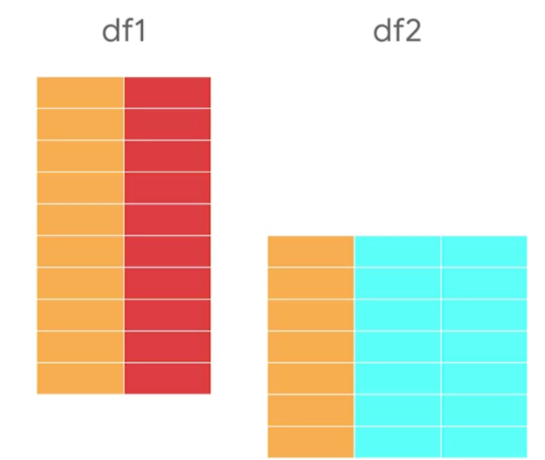
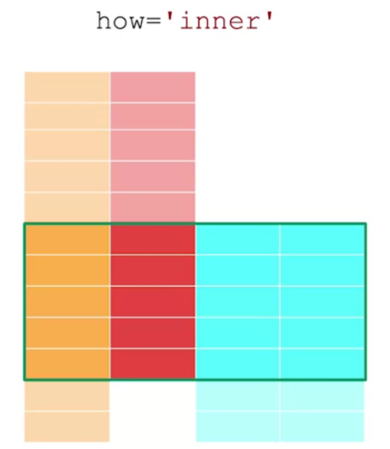
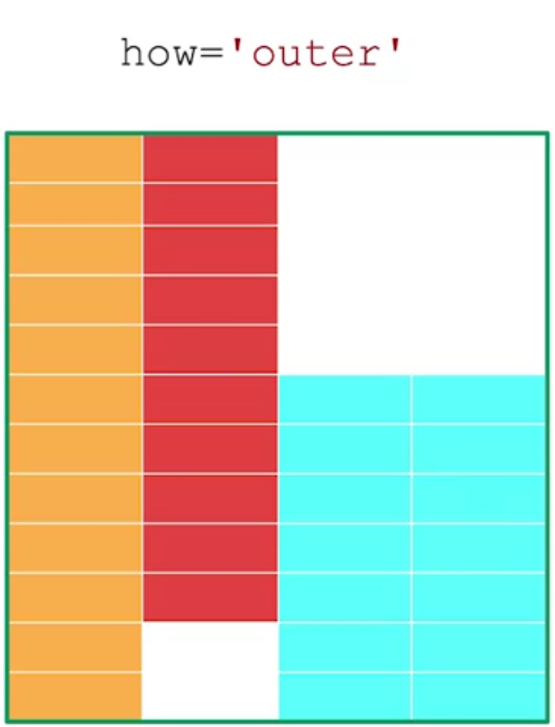
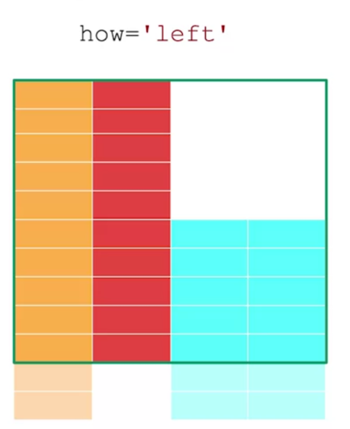
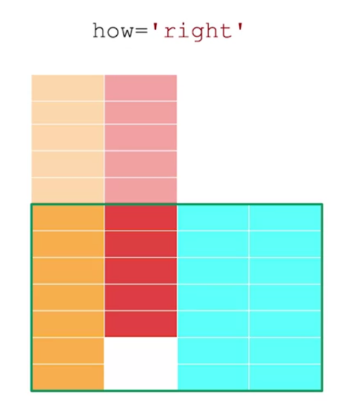

```python
df3
```

| planet  | radius\_km | moons |
| ------- | ---------- | ----- |
| Mercury | 2440       | 0     |
| Venus   | 6052       | 0     |
| Earth   | 6371       | 1     |
| Mars    | 3390       | 2     |
| Jupiter | 69911      | 80    |
| Saturn  | 58232      | 83    |
| Uranus  | 25362      | 27    |
| Neptune | 24622      | 14    |

```python
df4
```

| planet  | type        | rings | mean\_temp\_c | magnetic\_field | life |
| ------- | ----------- | ----- | ------------- | --------------- | ---- |
| Earth   | terrestrial | no    | 15.0          | yes             | 1    |
| Mars    | terrestrial | no    | -65.0         | no              | 0    |
| Jupiter | gas giant   | yes   | -110.0        | yes             | 0    |
| Saturn  | gas giant   | yes   | -140.0        | yes             | 0    |
| Uranus  | ice giant   | yes   | -195.0        | no              | 0    |
| Neptune | ice giant   | yes   | -200.0        | yes             | 0    |
| Janssen | super earth | no    | NaN           | None            | 1    |
| Tadmor  | gas giant   | None  | NaN           | None            | 1    |

```python
inner = pd.merge(df3, df4, on="planet", how='inner')
inner
```

| planet  | radius\_km | moons | type        | rings | mean\_temp\_c | magnetic\_field | life |
| ------- | ---------- | ----- | ----------- | ----- | ------------- | --------------- | ---- |
| Earth   | 6371       | 1     | terrestrial | no    | 15.0          | yes             | 1    |
| Mars    | 3390       | 2     | terrestrial | no    | -65.0         | no              | 0    |
| Jupiter | 69911      | 80    | gas giant   | yes   | -110.0        | yes             | 0    |
| Saturn  | 58232      | 83    | gas giant   | yes   | -140.0        | yes             | 0    |
| Uranus  | 25362      | 27    | ice giant   | yes   | -195.0        | no              | 0    |
| Neptune | 24622      | 14    | ice giant   | yes   | -200.0        | yes             | 0    |

```python
outer = pd.merge(df3, df4, on="planet", how='outer')
outer
```

| index | planet  | radius_km | moons | type        | rings | mean_temp_c | magnetic_field | life |
|-------|---------|-----------|-------|-------------|-------|-------------|----------------|------|
| 0     | Mercury | 2440.0    | 0.0   | NaN         | NaN   | NaN         | NaN            | NaN  |
| 1     | Venus   | 6052.0    | 0.0   | NaN         | NaN   | NaN         | NaN            | NaN  |
| 2     | Earth   | 6371.0    | 1.0   | terrestrial | no    | 15.0        | yes            | 1.0  |
| 3     | Mars    | 3390.0    | 2.0   | terrestrial | no    | -65.0       | no             | 0.0  |
| 4     | Jupiter | 69911.0   | 80.0  | gas giant   | yes   | -110.0      | yes            | 0.0  |
| 5     | Saturn  | 58232.0   | 83.0  | gas giant   | yes   | -140.0      | yes            | 0.0  |
| 6     | Uranus  | 25362.0   | 27.0  | ice giant   | yes   | -195.0      | no             | 0.0  |
| 7     | Neptune | 24622.0   | 14.0  | ice giant   | yes   | -200.0      | yes            | 0.0  |
| 8     | Janssen | NaN       | NaN   | super earth | no    | NaN         | None           | 1.0  |
| 9     | Tadmor  | NaN       | NaN   | gas giant   | None  | NaN         | None           | 1.0  |

```python
left = pd.merge(df3, df4, on="planet", how='left')
left
```

| index | planet  | radius_km | moons | type        | rings | mean_temp_c | magnetic_field | life |
|-------|---------|-----------|-------|-------------|-------|-------------|----------------|------|
| 0     | Mercury | 2440      | 0     | NaN         | NaN   | NaN         | NaN            | NaN  |
| 1     | Venus   | 6052      | 0     | NaN         | NaN   | NaN         | NaN            | NaN  |
| 2     | Earth   | 6371      | 1     | terrestrial | no    | 15.0        | yes            | 1.0  |
| 3     | Mars    | 3390      | 2     | terrestrial | no    | -65.0       | no             | 0.0  |
| 4     | Jupiter | 69911     | 80    | gas giant   | yes   | -110.0      | yes            | 0.0  |
| 5     | Saturn  | 58232     | 83    | gas giant   | yes   | -140.0      | yes            | 0.0  |
| 6     | Uranus  | 25362     | 27    | ice giant   | yes   | -195.0      | no             | 0.0  |
| 7     | Neptune | 24622     | 14    | ice giant   | yes   | -200.0      | yes            | 0.0  |

```python
right = pd.merge(df3, df4, on="planet", how='right')
right
```

| index | planet  | radius_km | moons | type        | rings | mean_temp_c | magnetic_field | life |
|-------|---------|-----------|-------|-------------|-------|-------------|----------------|------|
| 0     | Earth   | 6371.0    | 1.0   | terrestrial | no    | 15.0        | yes            | 1    |
| 1     | Mars    | 3390.0    | 2.0   | terrestrial | no    | -65.0       | no             | 0    |
| 2     | Jupiter | 69911.0   | 80.0  | gas giant   | yes   | -110.0      | yes            | 0    |
| 3     | Saturn  | 58232.0   | 83.0  | gas giant   | yes   | -140.0      | yes            | 0    |
| 4     | Uranus  | 25362.0   | 27.0  | ice giant   | yes   | -195.0      | no             | 0    |
| 5     | Neptune | 24622.0   | 14.0  | ice giant   | yes   | -200.0      | yes            | 0    |
| 6     | Janssen | NaN       | NaN   | super earth | no    | NaN         | None           | 1    |
| 7     | Tadmor  | NaN       | NaN   | gas giant   | None  | NaN         | None           | 1    |

# Kurs 3: Rakamların Ötesine Geçin

## EDA Prosesi

Norveç'teki iğne yapraklı bir ormandaki ağaçlar hakkında yalnızca 200 satır ve beş sütun veriye sahip bir veri kümesi atandığını hayal edin. Tam analizinizi tamamlamak için 1.000'den fazla satıra ve en az iki sütuna daha ihtiyacınız olacağını biliyorsunuz. Bundan çok daha fazla ayrıntı olmasa bile, tüm EDA süreciniz şöyle görünebilir:

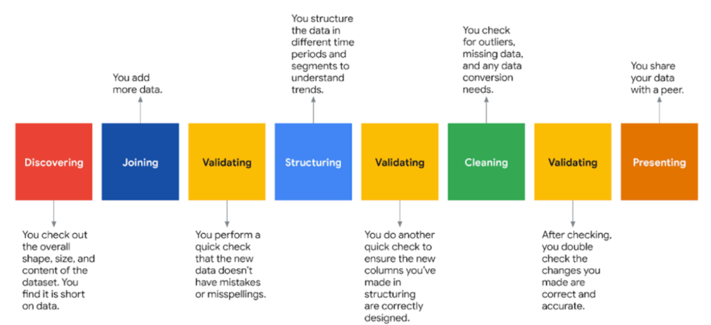

1. **Keşfetme**: Veri kümesinin genel şeklini, boyutunu ve içeriğini kontrol edersiniz. Veri konusunda kısa olduğunu görüyorsunuz.

2. **Katılma**: Daha fazla veri eklersiniz.

3. **Doğrulama**: Yeni verilerde hatalar veya yazım hataları olmadığını hızlı bir şekilde kontrol edersiniz.

4. **Yapılandırma**: Trendleri anlamak için verileri farklı zaman dilimlerinde ve segmentlerde yapılandırırsınız.

5. **Doğrulama:** Yapılandırmada yaptığınız yeni sütunların doğru tasarlandığından emin olmak için başka bir hızlı kontrol yaparsınız.

6. **Temizlik**: Aykırıları, eksik verileri ve dönüşüm veya dönüşüm ihtiyaçlarını kontrol edersiniz.

7. **Doğrulama**: Temizledikten sonra, yaptığınız değişikliklerin doğru ve doğru olup olmadığını iki kez kontrol edersiniz.

8. **Sunum**: Veri kümenizi bir eşle paylaşırsınız.

Verilerde yaptığınız değişikliklerin farkında olmadan hata vermediğinden emin olmak için "geçerli" uygulamasını yinelemeli olarak veya birden çok kez gerçekleştirdiğinize dikkat edin. Ayrıca, önceden daha fazla veriye olan ihtiyacı fark ettiğiniz için, "keşfetme" uygulamasının hemen ardından "katılma" uygulaması gerçekleştirildi.

Temizlenmiş veri kümenizi bir eşinize sunduktan sonra, daha fazla keşif ve/veya temizlik için notlar veya fikirler alma şansınız yüksektir. Bu nedenle, daha da fazla yineleme göreceksiniz.

**Profesyonel ipucu**: Veri bilimcileri, "temiz" ve modelleme veya makine öğrenimi algoritmaları için hazır olduğunu ilan etmekte kendilerini rahat hissetmeden önce bir veri kümesinde EDA uygulamalarını birden çok kez gerçekleştirmeyi bekliyorlar.

## Etik makine öğreniminde EDA'nın önemi

Algoritmalar ve makine öğrenimi ağları bireyler, şirketler ve hatta hükümetler adına giderek daha fazla karar vermeye başladıkça, etik ve düzenleme tartışması giderek daha önemli hale geliyor. [Etik Yapay Zeka ve Makine Öğrenimi Enstitüsü](https://ethical.institute/principles.html)'ye göre, makine öğrenimi sistemlerini sorumlu bir şekilde geliştirmek için sekiz ilke vardır.

**EDA sürecinin temel ilkeleri**

Aşağıdaki iki ilke doğası gereği EDA sürecinin bir parçasıdır:

**İnsan büyütme**: Bu ilke, insanların gözetim için AI veya makine öğrenimi algoritma sistemlerine eklenmesini sağlar. Veri bilimcileri tarafından gerçekleştirilen kapsamlı EDA, bir algoritmaya beslenen önyargıyı, dengesizliği ve yanlışlıkları sınırlamanın belki de en iyi yollarından biridir.

**Önyargı değerlendirmesi**: İnsan müdahalesi olmadan, önyargı makine öğrenimi modellerinde çok kolay enjekte edilir ve yeniden üretilir. Metodik EDA süreçlerinin gerçekleştirilmesi, veri bilimcilerinin verilerdeki önyargıların ve dengesizliklerin farkında olmalarını ve bunlara göre hareket etmelerini sağlayacaktır.

**Profesyonal ipucu**: Veri kariyer alanında etik standartlara bağlılığı sağlamanın önemi abartılamaz. Veri profesyonellerinin, EDA çalışmalarına sürekli olarak etik bir zihniyet uygulayarak önyargı ve ayrımcılığı tanımak için kapasitelerini sürekli olarak büyütmeleri gerekir.

Makine öğreniminin ötesinde, EDA neredeyse her önemli veritabanı kararına uygulanabilir. İleride, EDA'nın birçok uygulaması ve yinelemeli ve sıralı olmayan bir yaklaşımın gerekliliği hakkında bilgi edineceksiniz.

## Şematik Gösterim

```python 
import pandas as pd
import numpy as np
import matplotlib.pyplot as plt
import datetime as dt

# Read in the 2018 lightning strike dataset
df = pd.read_csv('eda_using_basic_data_functions_in_python_dataset1.csv')
``` 

```python
# Eğer tarih sütunu varsa
df['date'] = pd.to_datetime(df['date'])
```

```python 
# Inspect the first 10 rows 
df.head(10)
```

| index | date       | number_of_strikes | center_point_geom  |
|-------|------------|-------------------|--------------------|
| 0     | 2018-01-03 | 194               | POINT(-75 27)      |
| 1     | 2018-01-03 | 41                | POINT(-78.4 29)    |
| 2     | 2018-01-03 | 33                | POINT(-73.9 27)    |
| 3     | 2018-01-03 | 38                | POINT(-73.8 27)    |
| 4     | 2018-01-03 | 92                | POINT(-79 28)      |
| 5     | 2018-01-03 | 119               | POINT(-78 28)      |
| 6     | 2018-01-03 | 35                | POINT(-79.3 28)    |
| 7     | 2018-01-03 | 60                | POINT(-79.1 28)    |
| 8     | 2018-01-03 | 41                | POINT(-78.7 28)    |
| 9     | 2018-01-03 | 119               | POINT(-78.6 28)    |

```python 
#Get more information about the data, including data types of each column 
df.info()

# <class 'pandas.core.frame.DataFrame'>
# RangeIndex: 3401012 entries, 0 to 3401011
# Data columns (total 3 columns):
#  #   Column             Dtype         
# ---  ------             -----         
#  0   date               datetime64[ns]
#  1   number_of_strikes  int64         
#  2   center_point_geom  object        
# dtypes: datetime64 , int64(1), object(1)
# memory usage: 77.8+ MB
```

```python
df['month'] = df['date'].dt.month
df.head()
```

|   | date       | number_of_strikes | center_point_geom | month |
|---|------------|-------------------|--------------------|-------|
| 0 | 2018-01-03 | 194               | POINT(-75 27)      | 1     |
| 1 | 2018-01-03 | 41                | POINT(-78.4 29)    | 1     |
| 2 | 2018-01-03 | 33                | POINT(-73.9 27)    | 1     |
| 3 | 2018-01-03 | 38                | POINT(-73.8 27)    | 1     |
| 4 | 2018-01-03 | 92                | POINT(-79 28)      | 1     |

```python
# Create a new 'month txt' column
df['month_txt'] = df['date'].dt.month_name().str.slice(stop=3)

# Create new helper dataframe for plotting
df_by_month = (
    df.groupby(['month', 'month_txt'])
      .sum()
      .sort_values('month', ascending=True)
      .head(12)
      .reset_index()
)

df_by_month
```

| month | month_txt | number_of_strikes |
|-------|-----------|-------------------|
| 1     | Jan       | 860045            |
| 2     | Feb       | 2071315           |
| 3     | Mar       | 854168            |
| 4     | Apr       | 1524339           |
| 5     | May       | 4166726           |
| 6     | Jun       | 6445083           |
| 7     | Jul       | 8320400           |
| 8     | Aug       | 15525255          |
| 9     | Sep       | 3018336           |
| 10    | Oct       | 1093962           |
| 11    | Nov       | 409263            |
| 12    | Dec       | 312097            |

```python
plt.bar(
    x=df_by_month['month_txt'],                     # X ekseninde ay isimleri (kısa hali: Jan, Feb, vs.)
    height=df_by_month['number_of_strikes'],        # Y ekseninde yıldırım sayıları
    label="Number of strikes"                       # Legende (açıklamada) kullanılacak etiket
)

plt.xlabel("months (2018)")                         # X ekseni başlığı
plt.ylabel("Number of lightning strikes")           # Y ekseni başlığı
plt.title("Number of lightning strikes in 2018 by months")  # Grafik başlığı

plt.legend()                                        # Açıklama kutusunu göster
plt.show()                                          # Grafiği ekrana çiz
```

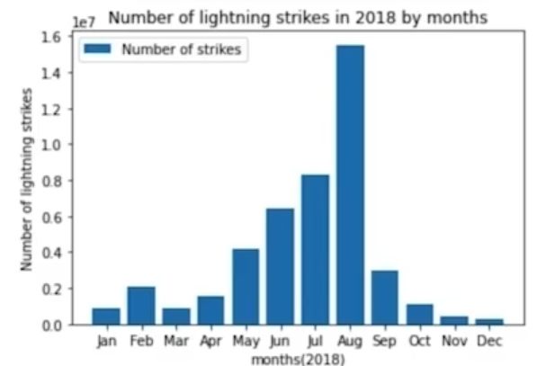

```python
# Import statements
import matplotlib.pyplot as plt
import pandas as pd
import seaborn as sns

# Read in the 2018 lightning strike dataset
df = pd.read_csv('eda_using_basic_data_functions_in_python_dataset1.csv')

# Convert 'date' column to datetime
df['date'] = pd.to_datetime(df['date'])

# Create new columns
df['week'] = df['date'].dt.strftime('%Y-W%V')       # örn: 2018-W27
df['month'] = df['date'].dt.strftime('%Y-%m')       # örn: 2018-07
df['quarter'] = df['date'].dt.to_period('Q').dt.strftime('%Y-Q%q')
df['year'] = df['date'].dt.strftime('%Y')

df.Head()
```

| date | number_of_strikes | center_point_geom | week | month | quarter | year |
|---|---|---|---|---|---|---|
| 2016-08-05 | 16                | POINT(-101.5 24.7)   | 2016-W31 | 2016-08 | 2016-Q3 | 2016 |
| 2016-08-05 | 16                | POINT(-85 34.3)      | 2016-W31 | 2016-08 | 2016-Q3 | 2016 |
| 2016-08-05 | 16                | POINT(-89 41.4)      | 2016-W31 | 2016-08 | 2016-Q3 | 2016 |
| 2016-08-05 | 16                | POINT(-89.8 30.7)    | 2016-W31 | 2016-08 | 2016-Q3 | 2016 |
| 2016-08-05 | 16                | POINT(-86.2 37.9)    | 2016-W31 | 2016-08 | 2016-Q3 | 2016 |
| 2016-08-05 | 16                | POINT(-97.8 38.9)    | 2016-W31 | 2016-08 | 2016-Q3 | 2016 |
| 2016-08-05 | 16                | POINT(-81.9 36)      | 2016-W31 | 2016-08 | 2016-Q3 | 2016 |

```python
# Create new dataframe view of just 2018 data, summed by week
df_by_week_2018 = df[df['year'] == '2018'].groupby(['week']).sum().reset_index()

# Plot a bar chart of weekly strike totals in 2018
plt.bar(x=df_by_week_2018['week'], height=df_by_week_2018['number_of_strikes'])
plt.xlabel("Week number")
plt.ylabel("Number of lightning strikes")
plt.title("Number of lightning strikes per week (2018)")
plt.show()
```
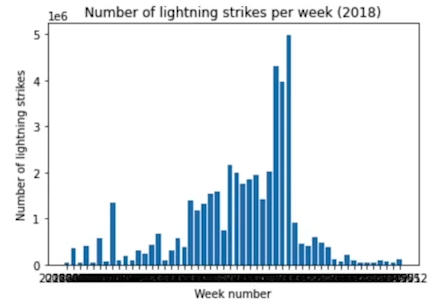

plt.figure(figsize=(20, 5))  # Increase output size
plt.bar(x=df_by_week_2018['week'], height=df_by_week_2018['number_of_strikes'])
plt.plot()
plt.xlabel("Week number")
plt.ylabel("Number of lightning strikes")
plt.title("Number of lightning strikes per week (2018)")
plt.xticks(rotation=45, fontsize=8)  # Rotate x-axis labels and decrease font size
plt.show()

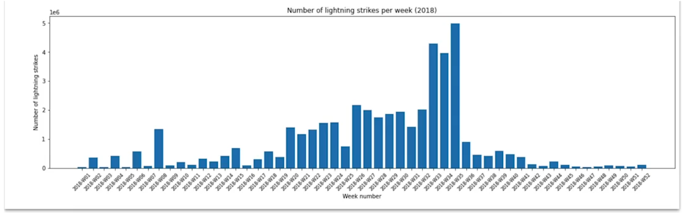

```python
df_by_quarter['number_of_strikes'].div(1000000)
```

|    | Value     |
|----|-----------|
| 0  | 2.683798  |
| 1  | 15.084857 |
| 2  | 21.843820 |
| 3  | 1.969754  |
| 4  | 2.444279  |
| 5  | 13.548585 |
| 6  | 17.277461 |
| 7  | 1.824870  |
| 8  | 3.785528  |
| 9  | 12.136148 |
| 10 | 26.863991 |
| 11 | 1.815322  |

```python
# Group 2016-2018 data by quarter and sum
df_by_quarter = df.groupby(['quarter']).sum().reset_index()

# Format as text, in millions
df_by _quarter('number_of_strikes_formated'] = df_by_quarter['number_of_strikes'].div(1000000).round(1).astype(int)

plt.figure(figsize = (15,5))
plt.bar(x = df_by_quarter['quarter'], height=df_by_quarter['number_of_strikes'])

def addlabels (x, y, labels):
    'Iterates over data and plots text labels above each bar of bar graph.'
    for i in range(len(x)):
        plt.text(i, y[i], labels[i], ha 'center', va = 'bottom')

plt.figure(figsize(15,5))
plt.bar(x=df_by_quarter['quarter'], height=df_by_quarter['number_of_strikes'])
addlabels(df_by_quarter['quarter'], df_by_quarter['number_of_strikes'], df_by_quarter['number_of_strikes_formated'])
plt.plot()
plt.xlabel('Quarter')
plt.ylabel('Number of lightning strikes')
plt.title('Number of lightning strikes per quarter (2016-2018)')
plt.show()
```

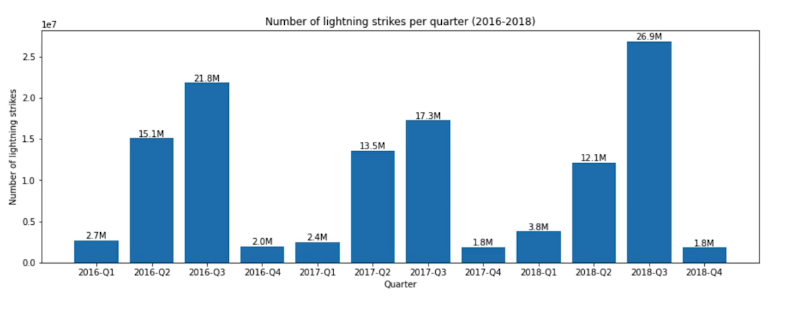

```python
# Create two new columns
df_by_quarter['quarter_number'] = df_by_quarter['quarter'].str[-2:]
df_by_quarter['year'] = df_by_quarter['quarter'].str[:4]

df_by_quarter.head()

plt.figure(figsize=(15,5))
p = sns.barplot(data=df_by_quarter, x='quarter_number', y='number_of_strikes', hue='year')

for b in p.patches:
    p.annotate(
        str(round(b.get_height() / 1000000, 1)) + 'M',
        (b.get_x() + b.get_width() / 2., b.get_height() + 1.2e6),
        ha='center', va='bottom',
        xytext=(0, -12),
        textcoords='offset points'
    )

plt.xlabel("Quarter")
plt.ylabel("Number of lightning strikes")
plt.title("Number of lightning strikes per quarter (2016-2018)")
plt.show()
```


```python
# Import statements
import pandas as pd
import numpy as np
import seaborn as sns
import datetime
from matplotlib import pyplot as plt

# Read in the 2018 lightning strike dataset
df = pd.read_csv('eda_using_basic_data_functions_in_python_dataset1.csv')

# Convert the `date` column to datetime
df['date'] = pd.to_datetime(df['date'])
df.head()
```

| date       | number_of_strikes | center_point_geom   |
|------------|-------------------|---------------------|
| 2018-01-03 | 194               | POINT(-75 27)       |
| 2018-01-03 | 41                | POINT(-78.4 29)     |
| 2018-01-03 | 33                | POINT(-73.9 27)     |
| 2018-01-03 | 38                | POINT(-73.8 27)     |
| 2018-01-03 | 92                | POINT(-79 28)       |

```python
df.shape
(3401012, 3)
```

```python
df.drop_duplicates().shape
(3401012, 3)
```

```python
# Sort by number of strikes in descending order
df.sort_values(by='number_of_strikes', ascending=False).head(10)
```

| Index  | date       | number_of_strikes | center_point_geom    |
|--------|------------|-------------------|----------------------|
| 302758 | 2018-08-20 | 2211              | POINT(-92.5 35.5)    |
| 278383 | 2018-08-16 | 2142              | POINT(-96.1 36.1)    |
| 280830 | 2018-08-17 | 2061              | POINT(-90.2 36.1)    |
| 280453 | 2018-08-17 | 2031              | POINT(-89.9 35.9)    |
| 278382 | 2018-08-16 | 1902              | POINT(-96.2 36.1)    |
| 11517  | 2018-02-10 | 1899              | POINT(-95.5 28.1)    |
| 277506 | 2018-08-16 | 1878              | POINT(-89.7 31.5)    |
| 24906  | 2018-02-25 | 1833              | POINT(-98.7 28.9)    |
| 284320 | 2018-08-17 | 1767              | POINT(-90.1 36)      |
| 24825  | 2018-02-25 | 1741              | POINT(-98 29)        |

```python
# Identify locations that appear most in the dataset
df.center_point_geom.value_counts()
```

| Location             | Count |
|----------------------|-------|
| POINT(-81.5 22.5)    | 108   |
| POINT(-84.1 22.4)    | 108   |
| POINT(-82.5 22.9)    | 107   |
| POINT(-82.7 22.9)    | 107   |
| POINT(-82.5 22.8)    | 106   |
| ...                  | ...   |
| POINT(-119.3 35.1)   | 1     |
| POINT(-119.3 35)     | 1     |
| POINT(-119.6 35.6)   | 1     |
| POINT(-119.4 35.6)   | 1     |
| POINT(-58.5 45.3)    | 1     |

```python
# Identify top 20 locations with most days of lightning
df.center_point_geom.value_counts()[:20].rename_axis('unique_values').reset_index(name='counts').style.background_gradient()
```

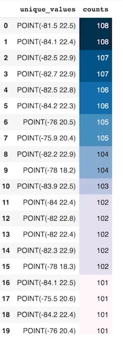

```python
# Create two new columns
df['week'] = df.date.dt.isocalendar().week
df['weekday'] = df.date.dt.day_name()
df.head()
```

| date       | number_of_strikes | center_point_geom | week | weekday   |
|------------|-------------------|-------------------|------|-----------|
| 2018-01-03 | 194               | POINT(-75 27)     | 1    | Wednesday |
| 2018-01-03 | 41                | POINT(-78.4 29)   | 1    | Wednesday |
| 2018-01-03 | 33                | POINT(-73.9 27)   | 1    | Wednesday |
| 2018-01-03 | 38                | POINT(-73.8 27)   | 1    | Wednesday |
| 2018-01-03 | 92                | POINT(-79 28)     | 1    | Wednesday |

```python
# Calculate mean count of lightning strikes for each weekday
df[['weekday', 'number_of_strikes']].groupby(['weekday']).mean()
```

| weekday   | number_of_strikes |
| --------- | ------------------- |
| Friday    | 13.349972           |
| Monday    | 13.152804           |
| Saturday  | 12.732694           |
| Sunday    | 12.324717           |
| Thursday  | 13.240594           |
| Tuesday   | 13.813599           |
| Wednesday | 13.224568           |

```python
# Define order of days for the plot
weekday_order = ['Monday', 'Tuesday', 'Wednesday', 'Thursday', 'Friday', 'Saturday', 'Sunday']

# Create boxplots of strike counts for each day of week
g = sns.boxplot(
    data=df,
    x='weekday',
    y='number_of_strikes',
    order=weekday_order,
    showfliers=False
)
g.set_title('Lightning distribution per weekday (2018)')
```


```python
# 2016-2017 verilerini 2018 verileriyle birleştirerek yeni bir veri çerçevesi oluştur
union_df = pd.concat([df.drop(['weekday', 'week'], axis=1), df_2], ignore_index=True)

# Birleştirilmiş veri çerçevesinin ilk 5 satırını göster
union_df.head()
```

| date       | number_of_strikes | center_point_geom  |
|------------|-------------------|---------------------|
| 2018-01-03 | 194               | POINT(-75 27)       |
| 2018-01-03 | 41                | POINT(-78.4 29)     |
| 2018-01-03 | 33                | POINT(-73.9 27)     |
| 2018-01-03 | 38                | POINT(-73.8 27)     |
| 2018-01-03 | 92                | POINT(-79 28)       |

```python
# 2017 yılında daha az yıldırım vardı
union_df[['year', 'number_of_strikes']].groupby(['year']).sum()
```

| year | number_of_strikes |
|------|-------------------|
| 2016 | 41,582,229        |
| 2017 | 35,095,195        |
| 2018 | 44,600,989        |

```python
# Her yılın her ayı için toplam yıldırım sayısını hesapla
lightning_by_month = union_df.groupby(['month_txt', 'year']).agg(
    number_of_strikes = pd.NamedAgg(column='number_of_strikes', aggfunc=sum)
).reset_index()

# İlk 5 satırı göster
lightning_by_month.head()
```

| month_txt | year | number_of_strikes |
|-----------|------|-------------------|
| April     | 2016 | 2,636,427         |
| April     | 2017 | 3,819,075         |
| April     | 2018 | 1,524,339         |
| August    | 2016 | 7,250,442         |
| August    | 2017 | 6,021,702         |

```python
# Yıllara göre toplam yıldırım sayısını hesapla
lightning_by_year = union_df.groupby(['year']).agg(
    year_strikes = pd.NamedAgg(column='number_of_strikes', aggfunc=sum)
).reset_index()

# İlk 5 satırı göster
lightning_by_year.head()
```

| year | year_strikes |
|------|--------------|
| 2016 | 41,582,229   |
| 2017 | 35,095,195   |
| 2018 | 44,600,989   |

```python
# Aylık yıldırım verisini yıllık toplamla birleştir
percentage_lightning = lightning_by_month.merge(lightning_by_year, on='year')

# İlk 5 satırı göster
percentage_lightning.head()
```

| month_txt | year | number_of_strikes | year_strikes |
|-----------|------|-------------------|--------------|
| April     | 2016 | 2,636,427         | 41,582,229   |
| August    | 2016 | 7,250,442         | 41,582,229   |
| December  | 2016 | 316,450           | 41,582,229   |
| February  | 2016 | 312,676           | 41,582,229   |
| January   | 2016 | 313,595           | 41,582,229   |

```python
# Her ay için "yıldırım yüzdesi" sütunu oluştur
percentage_lightning['percentage_lightning_per_month'] = (
    (percentage_lightning.number_of_strikes / percentage_lightning.year_strikes) * 100.0
)

# İlk 5 satırı göster
percentage_lightning.head()
```
 
| month_txt | year | number_of_strikes | year_strikes | percentage_lightning_per_month |
|-----------|------|-------------------|--------------|-------------------------------|
| April     | 2016 | 2,636,427         | 41,582,229   | 6.340273                      |
| August    | 2016 | 7,250,442         | 41,582,229   | 17.436396                     |
| December  | 2016 | 316,450           | 41,582,229   | 0.761022                      |
| February  | 2016 | 312,676           | 41,582,229   | 0.751946                      |
| January   | 2016 | 313,595           | 41,582,229   | 0.754156                      |

```python
plt.figure(figsize=(10,6))  # Grafik boyutunu ayarla (genişlik=10, yükseklik=6)

sns.barplot(
    data = percentage_lightning,          # Veri kaynağı
    x = 'month_txt',                      # X ekseni: ay isimleri
    y = 'percentage_lightning_per_month',# Y ekseni: aylık yıldırım yüzdesi
    hue = 'year',                        # Renklerle yılı ayır
    order = month_order                   # Ayların sıralanma düzeni
)

plt.xlabel("Month")                      # X eksen etiketi
plt.ylabel("% of lightning strikes")    # Y eksen etiketi
plt.title("% of lightning strikes each Month (2016–2018)")  # Grafik başlığı
```

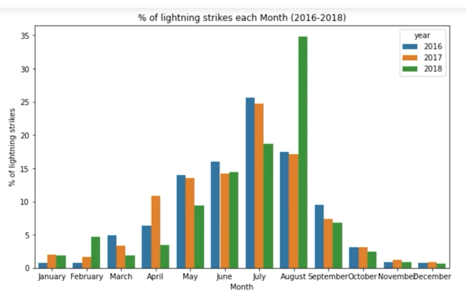

## Histogramlar

Öğrendiğiniz gibi, keşif veri analizinin (EDA) amacı tam da adının söylediği şeydir: verileri araştırın ve analiz edin. Bir veri uzmanı olarak, neredeyse her zaman yol gösterici bir soru veya hedefle başlayacaksınız, örneğin, “En yüksek karbondioksit yayıcıları nerede bulunur?” veya “X ürününü satın alma olasılığı en yüksek kişilerin özelliklerini belirleyin.” Süreciniz boyunca bunu sık sık düşünmek, sizi yolda tutan bir itici güç yaratır.

Verileri keşfederken emrinizdeki en önemli araçlardan biri **histogramdır**. Histogram, bir veri kümesindeki veya değişkendeki her değerin ne sıklıkta meydana geldiğini gösteren bir frekans dağılımının grafiksel bir gösterimidir. Veri profesyonellerinin verilerinin dağılımlarını anlamaları çok önemlidir, çünkü bu bilgi deney tasarımı, modelleme ve daha ileri analizler etrafında birçok aşağı yönlü kararı yönlendirir. Bu okumada, histogramlar, ne olduklarını, nasıl yapılacağını ve nasıl yorumlanacağını öğreneceksiniz.

### **Histogramlara giriş**

Histogramlar, herhangi bir aykırı değerlerin varlığı, dağılımın merkezi ve verilerin yayılması dahil olmak üzere bir dağılımın şeklini göstermek için yaygın olarak kullanılır. Histogramlar tipik olarak, her çubuğun bir değer aralığını temsil ettiği bir dizi çubukla temsil edilir. Çubuk yüksekliği, bu aralıktaki veri noktalarının sıklığını veya sayısını temsil eder.

Aşağıdaki örnek, Wyoming, ABD'deki Yellowstone Ulusal Parkı'ndaki Old Faithful şofben patlamaları arasındaki saniye sayısının histogramıdır.

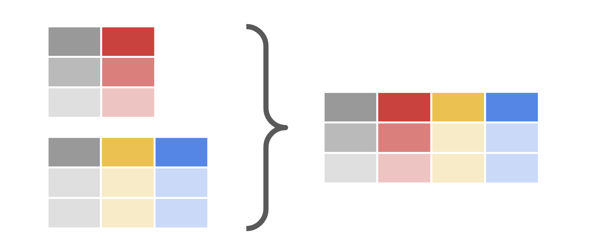

X ekseni, patlamalar arasındaki saniye sayısını temsil eder. Y ekseni patlama sayısını temsil eder. Bu nedenle, grafikteki ikinci çubuk tarafından belirtildiği gibi, 45-49 saniyelik bir bekleme süresinden sonra meydana gelen 20 patlama vardır.

### **Histogramların önemi**

Histogramlar, bir veri kümesinin özelliklerini anlamak için önemli bir araçtır. Verilerin dağılımının görsel bir temsilini sağlar ve veri profesyonellerinin verilerdeki kalıpları, eğilimleri veya aykırı değerleri tanımlamasını sağlar. Histogramlar ayrıca veri profesyonellerinin veriler için uygun istatistiksel testleri ve modelleri seçmelerine ve verilerin analiz için gerekli varsayımları karşılayıp karşılamadığını belirlemelerine yardımcı olabilir. Histogramlar, finans, sağlık, mühendislik ve sosyal bilimler dahil olmak üzere her türlü veri analizi gerektiren herhangi bir alanda ve her durumda yaygın olarak kullanılmaktadır.

### **Histogramlar nasıl yorumlanır**

Histogramları yorumlamak, dağılımın şeklini, merkezini ve yayılmasını anlamayı içerir. Aşağıdakiler de dahil olmak üzere birkaç yaygın histogram şekli vardır:

1. Simetrik: Simetrik bir histogram, ortasında bir tepe bulunan çan şeklinde bir eğriye sahiptir ve bu, verilerin ortalama etrafında eşit olarak dağıldığını gösterir. Bu aynı zamanda normal veya Gauss dağılımı olarak da bilinir.

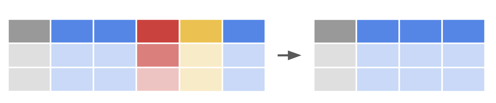

2. Eğri: Eğik bir histogramın bir tarafında diğerinden daha uzun bir kuyruğu vardır. Sağa eğik bir histogramın sağ tarafında daha uzun bir kuyruğu vardır, bu da histogramın sol tarafında daha fazla veri noktası olduğunu gösterir.

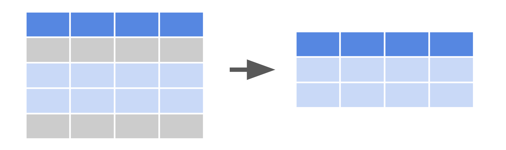

Sol eğri bir dağılım, sol tarafta daha uzun bir kuyruğa sahiptir ve sağ tarafta daha fazla veri noktası gösterir.


3. Bimodal: İki modlu bir histogramın iki farklı tepe noktası vardır, bu da verilerin iki modu olduğunu gösterir.

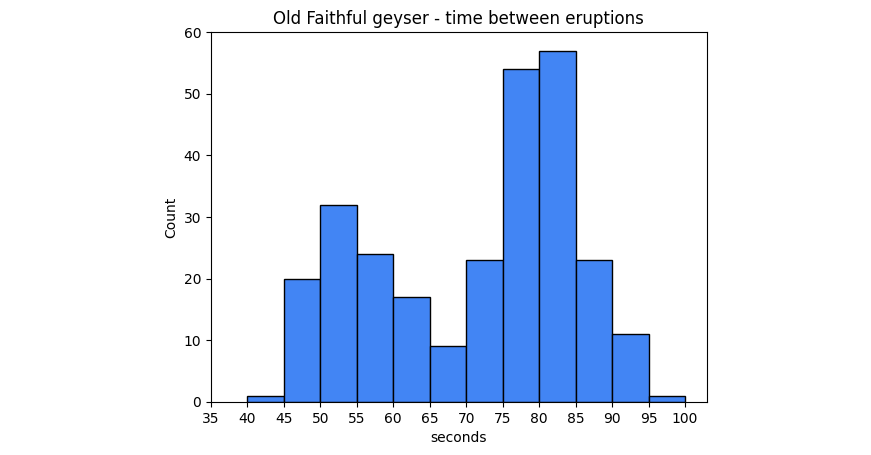

4. Tek tip: Tek tip bir histogramın düz bir dağılımı vardır, bu da tüm veri noktalarının eşit olarak dağıldığını gösterir.

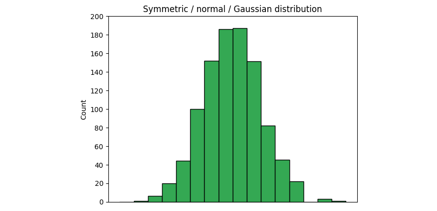

Sağlanan örnekler karşılaşacağınız tek dağıtım değildir, ancak en yaygın olanlardan bazılarıdır. Yakında dağıtımlar hakkında daha fazla bilgi edineceksiniz.

Şimdi, bu okumanın başlangıcındaki Old Faithful gayzer histogramına dönün. Kendinize sorun: Bu grafik tarafından ne tür bir dağılım temsil edilir? Şekle ek olarak, merkezi anlamak ve yayılmak önemlidir. Dağılımın merkezi tipik olarak ortalama veya medyan ile temsil edilirken, dağılım standart sapma veya verilerin aralığı ile temsil edilir. Merkez ve yayılma, veri konsantrasyonu ve değişkenliği hakkında içgörüler sağlayabilir.

### **Histogramlar nasıl oluşturulur**

Python'un seaborn ve matplotlib kütüphaneleri, histogramlar oluşturmak için basit ve güçlü seçenekler sunar.

#### [plt.hist (x, bins=10,...)](https://matplotlib.org/stable/api/_as_gen/matplotlib.pyplot.hist.html#matplotlib-pyplot-hist)

Matplotlib'de bir histogram oluşturmak için pyplot modülündeki hist() işlevi kullanın. İşlev birçok farklı argüman alabilir, ancak birincil olanlar şunlardır:

- x: Çizmek istediğiniz verileri temsil eden bir değer dizisi. Bir liste, tüple, NumPy dizisi, panda serisi vb. Olabilir.
    
- kutular: Verilerinizi sıralamak istediğiniz kutu sayısı. Varsayılan değer 10'dur, ancak bu parametre bir int, dizi veya dize olabilir. Bir dizi kullanırsanız, ilk kutunun sol kenarı ve son kutunun sağ kenarı da dahil olmak üzere çöp kutusu kenarlarını tanımlar. Başka bir deyişle, eğer kutular = [1, 3, 5, 7], o zaman ilk kutu [1—3) (1 dahil, ancak 3 hariç) ve ikincisi [3—5). Son kutu, ancak, 7 içeren [5—7] 'dir. Bir dize, numpy tarafından desteklenen önceden tanımlanmış bir binning stratejisini ifade eder. Daha fazla bilgi için belgelere bakın.
    

Aşağıdaki örnek, işlevi kullanarak bu okumanın başlangıcından itibaren Old Faithful gayzer histogramının nasıl oluşturulacağını göstermektedir.. 

```python
# Plot histogram with matplotlib pyplot
plt.hist(df['seconds'], bins=range(40, 101, 5))
plt.xticks(range(35, 101, 5))
plt.yticks(range(0, 61, 10))
plt.xlabel('seconds')
plt.ylabel('count')
plt.title('Old Faithful geyser - time between eruptions')
plt.show();
```

Bu durumda, çizilen veriler veri çerçevesinin saniye sütunudur. Kutular 40 saniyede başlar ve toplam 12 kutu için beşli adımlarla 100 saniyeye gider.

#### [sns.histplot (x, kutular, binrange, binwidth...)](https://seaborn.pydata.org/generated/seaborn.histplot.html)

Seaborn'da bir histogram oluşturmanın bir yolu işlevi kullanmaktır. sns.histplot() Matplotlib işlevi gibi, birçok argü sns.histplot() man alabilir. İşte bazı önemli olanlar:

- x: Veri dizisi. Aynı plt.hist()
    
- kutular: Aynı plt.hist()
    
- binrange: Kutu kenarları için en düşük ve en yüksek değer; bins veya ile kullanılabilirbinwidth; varsayılan olarak veri uç noktalarıdır
    
- binwidth: Her bölmenin genişliği, geçersiz kılar bins ancak birlikte kullanılabilir binrange
    

Aşağıdaki örnek, seaborn işlevini kullanarak Old Faithful gayzer histogramını oluşturmak için kullanılan koddur.. histplot() Daha önce bahsedilen parametrelerin tümünü kullanır. Bir histogram oluşturmak için bu kod bloğunu çalıştırın.

Bu durumda 40 ila 100 binrange arasında tanımlanmış ve 5 olarak ayar binwidth lanmış olduğuna dikkat edin. Bu ayar ile aynı sonuçları verirbins=range(40, 101, 5). Bu örnek ayrıca, altıgen kod gösterimini kullanarak belirli bir rengi belirterek ve parametre tarafından belirtildiği gibi renk doygunluğu seviyesini% 100'e ayarlayarak birkaç stil alpha parametresini kullanır.

**Not:** Aşağıdaki kod bloğu etkileşimli değildir.

```python
# Plot histogram with seaborn
ax = sns.histplot(df['seconds'], binrange=(40, 100), binwidth=5, color='#4285F4', alpha=1)
ax.set_xticks(range(35, 101, 5))
ax.set_yticks(range(0, 61, 10))
plt.title('Old Faithful geyser - time between eruptions')
plt.show();
```

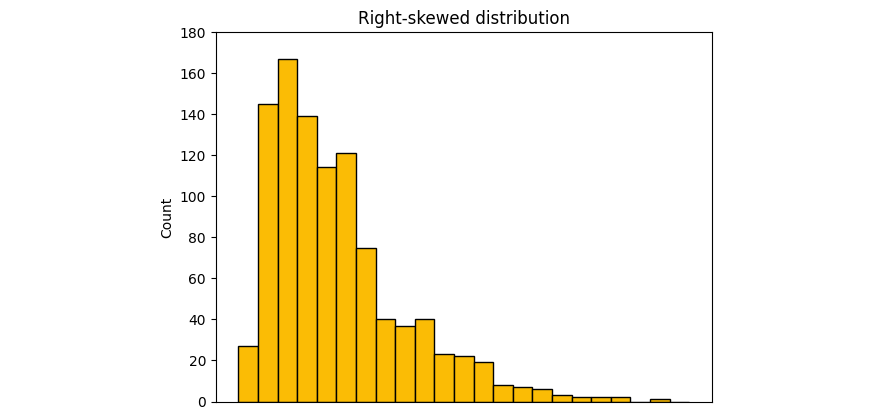

### **Önemli çıkarımlar**

Histogramlar, veri uzmanlarının veri kümelerinin ve değişkenlerinin frekans dağılımlarını anlamalarına yardımcı olur. Veri dağılımının şekli ve türü hakkında bilgi, istatistiksel testler ve model mimarisi seçimi gibi önemli alt kararları etkileyecektir. Ek olarak, verilerinizin şeklini bilmek, verilerinizin dağıtım eğilimlerini anlamanıza yardımcı olarak verilerinizin size anlattığı hikayeye ilişkin değerli bilgiler sağlar.

## Veri Temizleme

Öğrendiğiniz gibi, veri temizleme ve doğrulama uygulamaları, eksik verileri, aykırı değerleri ve etiket kodlamasını işleme; yazım hatalarını kontrol etme ve kopyaları işleme dahil olmak üzere birkaç farklı adımı içerir. Bir veri uzmanı olarak, bu kategorilerdeki veri değerlerini en iyi nasıl ele alacağınızı bilmek sizin göreviniz olacaktır. Bu okumada, kopyaları işleme hakkında daha fazla bilgi edineceksiniz. Ayrıca, tekilleştirme işleminin bir veri kümesi için doğru strateji olup olmadığını belirlemeyi ve karar vermeyi öğreneceksiniz. Ek olarak, kopyaları işlemek için bazı yaygın Python işlevlerini öğreneceksiniz.

### Yinelenenleri tanımlama

Yinelenen değerlerin kaldırılıp kaldırılmayacağına dair herhangi bir karar vermeden önce, veri kümemizde yinelenen değerlerin olup olmadığını belirlemeliyiz.

Kopyaları tanımlamanın basit bir yolu, Pandas duplicated() işlevini kullanmaktır. duplicated()DataFramesınıfın bir yöntemidir.

Bu işlev, veri değerinin bir kopya olduğunu belirten “true” ve “false” benzersiz bir değer olduğunu belirten bir dizi “doğru/yanlış” çıktı döndürür.

İşte beş satırlı bir veri çerçevesi örneği:

```python
df
```

| brand   | style   | rating |
|---------|---------|--------|
| Wowyow  | cistern | 4.0    |
| Wowyow  | cistern | 4.0    |
| Splaysh | jug     | 5.5    |
| Splaysh | stock   | 3.3    |
| Pipplee | stock   | 3.0    |


duplicated() fonksiyonu kullanarak sonuç, birinin “Doğru” olarak işaretlenmiş olması ve bunun bir kopya olduğunu gösterir.

```python
print(df)
```
| brand   | style   | rating |
|---------|---------|--------|
| Wowyow  | cistern | 4.0    |
| Wowyow  | cistern | 4.0    |
| Splaysh | jug     | 5.5    |
| Splaysh | stock   | 3.3    |
| Pipplee | stock   | 3.0    |

```python
print(df.duplicated())
```

| Index | Value |
|-------|-------|
| 0     | False |
| 1     | True  |
| 2     | False |
| 3     | False |
| 4     | False |

Tüm veri çerçevesi için kopyaları tanımlamak, tek bir sütundan veya dizinden farklı olacaktır. Fonksi duplicated() yonu tüm veri çerçevesi için kullandığınızda emin olun. İş duplicated() lev, yalnızca bir sütunda _bulunan tek tek eşleşen değerleri değil, yalnızca tam olarak eşleşen değerlere sahip tüm sat_ ırları döndürür. Bir veri çerçevesindeki yalnızca bir sütun veya bir dizi sütun için kopyaları tanımlamak isterseniz, bunu işlevin bağımsız değişken alanının “alt küme” kısmına eklemeniz gerekir. duplicated() Daha ileri giderek, kopyaların hangisinin kopya yerine “orijinal” olarak saklanacağını belirtmek isterseniz, bunu bağımsız değişken alanının keep bölümünde belirtebilirsiniz.

Aşağıda, değerlerin yalnızca bir sütunundaki (alt kümesindeki) kopyaları tanımlamaya ve son kopyaları “yanlış” olarak etiketlemeye ve “saklanmaları” için bir örnek verilmiştir:

```python
print(df)
```

| color  | rating | type    |
|--------|--------|---------|
| olive  | 9.0    | rinds   |
| olive  | 9.0    | rinds   |
| gray   | 4.5    | pellets |
| salmon | 11.0   | pellets |
| salmon | 7.0    | pellets |

```python
print(df.duplicated(subset=['type'], keep='last'))
```

| Index | Value |
|-------|-------|
| 0     | True  |
| 1     | False |
| 2     | True  |
| 3     | True  |
| 4     | False |

### Karar zamanı: Düşmek mi düşmemek mi?

Öğrendiğiniz gibi, her veri kümesi benzersizdir ve her veri kümesini aynı şekilde ele alamazsınız. Yinelenen değerleri ortadan kaldırıp ortadan kaldırmamaya karar verirken, **veri kümesinin kendisi** ve ulaşmak **istediğiniz hedef hakkında derinlemesine düşünün**. Yinelenen kopyaları bırakmanın veri kümeniz ve hedefiniz üzerinde ne gibi bir etkisi olacak?

**1. Düşmeye karar** vermek

**Yinelenen değerler açıkça hataysa veya veri kümesinde kalan benzersiz değerleri yanlış temsil edecekse yinelenen değerleri bırakmalı veya ortadan kaldırmalısınız.** 

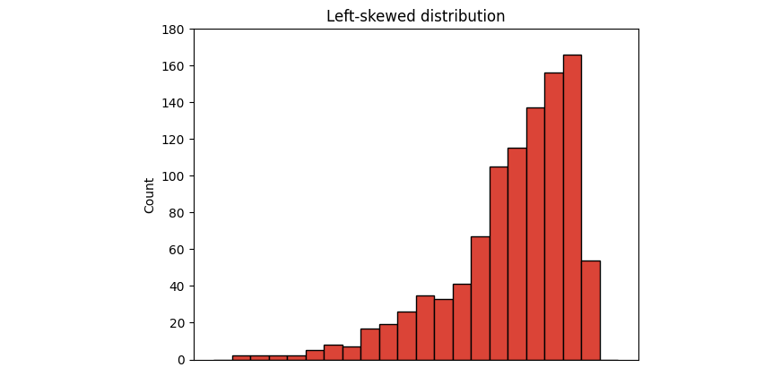

Örneğin, bir veri uzmanının (çoğu durumda) ev adreslerini ve ev fiyatlarını içeren bir veri kümesinin yinelenen değerlerini ortadan kaldıracağından makul ölçüde emin olabilirsiniz. Aynı evi iki kez saymak (çoğu durumda) ortalama ev fiyatı, toplam ev fiyatı ve hatta toplam ev sayısı gibi veri kümesinden çıkarılan sonuçları bir bütün olarak yanlış temsil edecektir. Böyle bir durumda, bir veri uzmanı, analiz ve görselleştirme sırasında kalan verileri adil bir şekilde temsil etmek için yinelenen verileri neredeyse kesinlikle ortadan kaldıracaktır.

**2. Düşmemeye karar vermek**

Yinelenen değerler açıkça hata **değilse** ve veri kümesini bir bütün olarak temsil ederken dikkate alınmalıysanız, yinelenen verileri veri kümenizde **tut** malısınız.

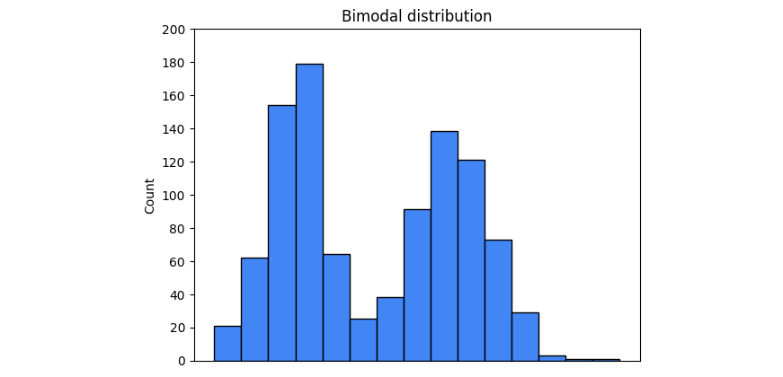

Örneğin, antrenmandaki bir Olimpiyat atış sporcunun atış sayısını ve mesafelerini gösteren bir veri kümesi muhtemelen birkaç çift mesafe içerecektir; sadece deneme sayısı ve bir kişinin ağırlıklı bir topa sahip olabileceği sınırlar gereği, yinelenen değerler olacaktır - özellikle mesafe ölçümleri yalnızca 1 veya 2 ondalık basamakla etiketlenmişse. Böyle bir durumda, bir veri uzmanı, analiz ve görselleştirme sırasında bir bütün olarak adil bir şekilde temsil etmek için neredeyse kesinlikle tüm verileri saklar.

### Kandırılmayın - Tekilleştirme nasıl yapılır

Python'a geri dönmeden ve kopyaları nasıl ortadan kaldıracağımızı öğrenmeden önce, önce “tekilleştirme” terimini tanımlayalım:

- **Tekilleştirme:** Bir veri kümesindeki eşleşen veri değerlerinin ortadan kaldırılması veya kaldırılması.
    

Python'da eşleşen veri değerlerini kaldırmak için kullanabileceğiniz bir dizi farklı kütüphane, işlev ve yöntem vardır.

Kullanılacak en yaygın işlevlerden biri Pandas'dadır: drop_duplicates()

drop_duplicates()başka bir DataFrame yöntemdir. Tüm yinelenen satırların kaldırıldığı yeni bir veri çerçevesi oluşturmak için kullanılır.

Örneğin, bu okumanın önceki bölümlerinden bir veri çerçevesi kullanın:

```python
df
```

| brand   | style   | rating |
|---------|---------|--------|
| Wowyow  | cistern | 4.0    |
| Wowyow  | cistern | 4.0    |
| Splaysh | jug     | 5.5    |
| Splaysh | stock   | 3.3    |
| Pipplee | stock   | 3.0    |


Şimdi kopyaları bırak işlevini uygulayın:

```python
df.drop_duplicates()
```

| brand   | style   | rating |
|---------|---------|--------|
| Wowyow  | cistern | 4.0    |
| Splaysh | jug     | 5.5    |
| Splaysh | stock   | 3.3    |
| Pipplee | stock   | 3.0    |

Ortaya çıkan çıktıda, yinelenen veri satırının kaldırıldığını ve kalan benzersiz değerlerin bozulmadan kaldığını fark edeceksiniz.

**Not:** Yukarıda yazıldığı gibi drop_duplicates() işlevin yalnızca **tüm veri satırlarının tam eşleşmelerinin kopyalarını bırakacağını unutmayın**. Yinelenenleri tek bir sütun içine bırakmak isterseniz, subset anahtar kelime bağımsız değişkenini kullanarak hangi sütunların kopyaları kontrol edeceğinizi belirtmeniz gerekir.

Bu örnek, style sütunda yinelenen değerlere sahip tüm satırları bırakır (ilk oluşum hariç):

```python
df
```

| brand   | style   | rating |
|---------|---------|--------|
| Wowyow  | cistern | 4.0    |
| Wowyow  | cistern | 4.0    |
| Splaysh | jug     | 5.5    |
| Splaysh | stock   | 3.3    |
| Pipplee | stock   | 3.0    |

```python
df=df.drop_duplicates(subset='style')
df
```

| brand   | style   | rating |
|---------|---------|--------|
| Wowyow  | cistern | 4.0    |
| Splaysh | jug     | 5.5    |
| Splaysh | stock   | 3.3    |

Ve bu örnek, _hem_ de rating sütunlarda yinelenen _değerlere sahip tüm satırları_ (ilk oluşum hariç) style bırakır:

```python
df
```

| brand   | style   | rating |
|---------|---------|--------|
| Wowyow  | cistern | 4.0    |
| Wowyow  | cistern | 4.0    |
| Splaysh | jug     | 5.5    |
| Splaysh | stock   | 3.3    |
| Pipplee | stock   | 3.0    |


df = df.drop_duplicates(subset=['style', 'rating'])
df

| brand   | style   | rating |
|---------|---------|--------|
| Wowyow  | cistern | 4.0    |
| Splaysh | jug     | 5.5    |
| Splaysh | stock   | 3.3    |
| Pipplee | stock   | 3.0    |

### Önemli Çıkarımlar

Bir veri kümesindeki yinelenen veri değerlerini belirlemek, özellikle temizleme ve doğrulama olmak üzere EDA (veya “Keşif Veri Analizi”) uygulamalarının önemli bir parçasıdır. Yinelenenleri belirledikten sonra, yinelenmeleri ortadan kaldırmayı veya kopyaları ortadan kaldırmamayı seçerken veri kümesi üzerindeki etkiyi ve analiz hedefinizi düşünün.

### Ek Kaynaklar

Çoğaltmalar ve tekilleştirme hakkında daha fazla bilgi edinmek ister misiniz? Aşağıdaki ek bağlantılara göz atın.

- [Argüman alanının parametreleri hakkında daha fazla bilgi edinmek için Pandas belgelerine bakın](https://pandas.pydata.org/docs/reference/api/pandas.DataFrame.drop_duplicates.html)
    
- [W3 Okulları: Pandalar - kopyaları kaldırma](https://www.w3schools.com/python/pandas/pandas_cleaning_duplicates.asp "W3 Okulları - Pandalar: Kopyaları kaldırma")

```python
import pandas as pd
import numpy as np
import seaborn as sns
import datetime
from matplotlib import pyplot as plt

df = pd.read_csv('../Datasets/1.csv')
df.head()
```

| date       | center_point_geom     | longitude | latitude | number_of_strikes |
|------------|----------------------|-----------|----------|-------------------|
| 2018-08-01 | POINT(-81.6 22.6)    | -81.6     | 22.6     | 48                |
| 2018-08-01 | POINT(-81.1 22.6)    | -81.1     | 22.6     | 32                |
| 2018-08-01 | POINT(-80.9 22.6)    | -80.9     | 22.6     | 118               |
| 2018-08-01 | POINT(-80.8 22.6)    | -80.8     | 22.6     | 69                |
| 2018-08-01 | POINT(-98.4 22.8)    | -98.4     | 22.8     | 44                |


```python 
df.shape
# (717530,5)
```

```python
df_zip = pd.read_csv()
df_zip.head()
```

| date       | zip_code | city                       | state       | state_code | center_point_geom   | number_of_strikes |
|------------|----------|----------------------------|-------------|------------|---------------------|-------------------|
| 2018-08-08 | 3281     | Weare                      | New Hampshire | NH         | POINT(-71.7 43.1)   | 1                 |
| 2018-08-14 | 6488     | Heritage Village CDP       | Connecticut  | CT         | POINT(-73.2 41.5)   | 3                 |
| 2018-08-16 | 97759    | Sisters city, Black Butte Ranch CDP | Oregon   | OR         | POINT(-121.4 44.3)  | 3                 |
| 2018-08-18 | 6776     | New Milford CDP            | Connecticut  | CT         | POINT(-73.4 41.6)   | 48                |
| 2018-08-08 | 1077     | Southwick                  | Massachusetts| MA         | POINT(-72.8 42)     | 2                 |

```python 
df_zip.shape
# (323700, 7)
```

```python 
df_joined = df.merge(df_zip, how='left', on=['date', 'center_point_geom'])
df_joined.head()
```
| date       | center_point_geom     | longitude | latitude | number_of_strikes_x | zip_code | city | state | state_code | number_of_strikes_y |
|------------|-----------------------|-----------|----------|---------------------|----------|------|-------|------------|---------------------|
| 2018-08-01 | POINT(-81.6 22.6)     | -81.6     | 22.6     | 48                  | NaN      | NaN  | NaN   | NaN        | NaN                 |
| 2018-08-01 | POINT(-81.1 22.6)     | -81.1     | 22.6     | 32                  | NaN      | NaN  | NaN   | NaN        | NaN                 |
| 2018-08-01 | POINT(-80.9 22.6)     | -80.9     | 22.6     | 118                 | NaN      | NaN  | NaN   | NaN        | NaN                 |
| 2018-08-01 | POINT(-80.8 22.6)     | -80.8     | 22.6     | 69                  | NaN      | NaN  | NaN   | NaN        | NaN                 |
| 2018-08-01 | POINT(-98.4 22.8)     | -98.4     | 22.8     | 44                  | NaN      | NaN  | NaN   | NaN        | NaN                 |

```python 
df_joined.describe()
```

|               | longitude      | latitude      | number_of_strikes_x | zip_code      | number_of_strikes_y |
|---------------|----------------|----------------|---------------------|---------------|---------------------|
| count        | 717530.000000  | 717530.000000  | 717530.000000       | 323700.000000 | 323700.000000       |
| mean         | -90.875445     | 33.328572      | 21.637081           | 57931.958996  | 25.410587           |
| std          | 13.648429      | 7.938831       | 48.029525           | 22277.327411  | 57.421824           |
| min          | -133.900000    | 16.600000      | 1.000000            | 1002.000000   | 1.000000            |
| 25%          | -102.800000    | 26.900000      | 3.000000            | 38260.750000  | 3.000000            |
| 50%          | -90.300000     | 33.200000      | 6.000000            | 59212.500000  | 8.000000            |
| 75%          | -80.900000     | 39.400000      | 21.000000           | 78642.000000  | 24.000000           |
| max          | -43.800000     | 51.700000      | 2211.000000         | 99402.000000  | 2211.000000         |

```python 
df_null_geo = df_joined[pd.isnull(df_joined.state_code)]
df_null_geo.shape
(393830,10)

df_joined.info()
```

<class 'pandas.core.frame.DataFrame'>
Int64Index: 717530 entries, 0 to 717529
Data columns (total 10 columns):
| #  | Column               | Non-Null Count | Dtype   |
|----|----------------------|----------------|---------|
| 0  | date                 | 717530         | object  |
| 1  | center_point_geom    | 717530         | object  |
| 2  | longitude            | 717530         | float64 |
| 3  | latitude             | 717530         | float64 |
| 4  | number_of_strikes_x  | 717530         | int64   |
| 5  | zip_code             | 323700         | float64 |
| 6  | city                 | 323700         | object  |
| 7  | state                | 323700         | object  |
| 8  | state_code           | 323700         | object  |
| 9  | number_of_strikes_y  | 323700         | float64 |

dtypes: float64(4), int64(1), object(5)
memory usage: 60.2+ MB

```python 
df_null_geo.head()
```

| date       | center_point_geom     | longitude | latitude | number_of_strikes_x | zip_code | city | state | state_code | number_of_strikes_y |
|------------|-----------------------|-----------|----------|---------------------|----------|------|-------|------------|---------------------|
| 2018-08-01 | POINT(-81.6 22.6)     | -81.6     | 22.6     | 48                  | NaN      | NaN  | NaN   | NaN        | NaN                 |
| 2018-08-01 | POINT(-81.1 22.6)     | -81.1     | 22.6     | 32                  | NaN      | NaN  | NaN   | NaN        | NaN                 |
| 2018-08-01 | POINT(-80.9 22.6)     | -80.9     | 22.6     | 118                 | NaN      | NaN  | NaN   | NaN        | NaN                 |
| 2018-08-01 | POINT(-80.8 22.6)     | -80.8     | 22.6     | 69                  | NaN      | NaN  | NaN   | NaN        | NaN                 |
| 2018-08-01 | POINT(-98.4 22.8)     | -98.4     | 22.8     | 44                  | NaN      | NaN  | NaN   | NaN        | NaN                 |

```python 
top_missing = if_null_geo[['latitude', 'longitude', 'number_of_strikes_x']
].groupby(['latitude', 'longitude'] ).sum().sort_values('number_of_strikes_x', ascending=False).reset_index()

top_missing.head(10)
```

| latitude | longitude | number_of_strikes_x |
|----------|-----------|---------------------|
| 22.4     | -84.2     | 3841                |
| 22.9     | -82.9     | 3184                |
| 22.4     | -84.3     | 2999                |
| 22.9     | -83.0     | 2754                |
| 22.5     | -84.1     | 2746                |
| 22.5     | -84.2     | 2738                |
| 22.3     | -81.0     | 2680                |
| 22.9     | -82.4     | 2652                |
| 22.9     | -82.3     | 2618                |
| 22.3     | -84.3     | 2551                |

```python 
import plotly.express as px

fig = px.scatter_geo(top_missing[top_missing.number_of_strikes_x>=300],
                     lat "latitude",
                     lon="longitude",
                     size="number_of_strikes_x")

fig.update_layout(title_text= 'Missing data', )
fig.show()
```

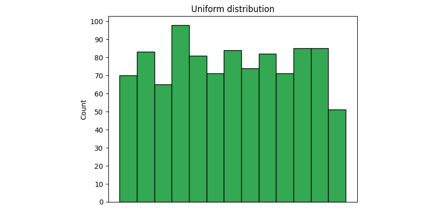

```python 
import plotly.express as px

fig px.scatter_geo(top_missing[top_missing.number_of_strikes_x>=300],
                   lat="latitude",
                   lon="longitude",
                   size="number_of_strikes_x")

fig.update_layout(
    title_text = 'Missing data',
    geo_scope='usa',
)

fig.show()
```

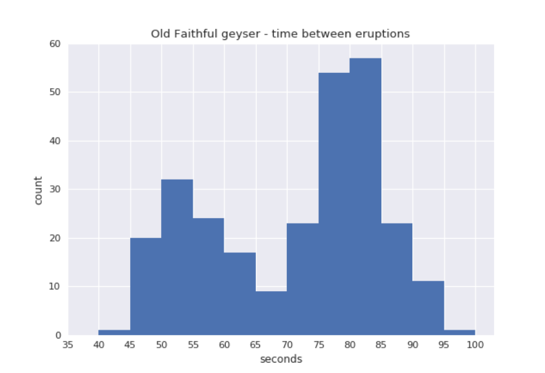

```python
# Import statements
import pandas as pd
import numpy as np
import seaborn as sns
import datetime
from matplotlib import pyplot as plt

#Print first 10 rows
df.head(10)
```

| year | number_of_strikes |
|------|-------------------|
| 2020 | 15620068          |
| 2019 | 209166            |
| 2018 | 44600989          |
| 2017 | 35095195          |
| 2016 | 41582229          |
| 2015 | 37894191          |
| 2014 | 34919173          |
| 2013 | 27600898          |
| 2012 | 28807552          |
| 2011 | 31392058          |

```python 
def readable_numbers(x):
    
    """takes a large number and formats it into K,M to make it more readable""" 
    if x >= le6:
        s='{:1.lf}M'.format(x*le-6)
    else: 
        s='{:1.0f)K'.format(x*1e-3)
    return s

#Use the readable_numbers() function to create a new column
df ['number_of_strikes_readable']=df ['number_of_strikes'].apply(readable_numbers)

df.head(10)
```

| year | number_of_strikes | number_of_strikes_readable |
|------|-------------------|----------------------------|
| 2020 | 15620068          | 15.6M                      |
| 2019 | 209166            | 209K                       |
| 2018 | 44600989          | 44.6M                      |
| 2017 | 35095195          | 35.1M                      |
| 2016 | 41582229          | 41.6M                      |
| 2015 | 37894191          | 37.9M                      |
| 2014 | 34919173          | 34.9M                      |
| 2013 | 27600898          | 27.6M                      |
| 2012 | 28807552          | 28.8M                      |
| 2011 | 31392058          | 31.4M                      |

```python
print("Mean:" + readable_numbers(np.mean(df['number_of_strikes'])))
print("Median:" + readable_numbers(np.median(df ['number_of_strikes'])))

# Mean:26.8M
# Median:28.3M
```


```python 
# Create boxplot
box sns.boxplot(x=df ['number_of_strikes')) gplt.gca()

box.set_xticklabels (np.array([readable_numbers(x) for x in g.get_xticks()])) plt.xlabel('Number of strikes') plt.title('Yearly number of lightning strikes');
```

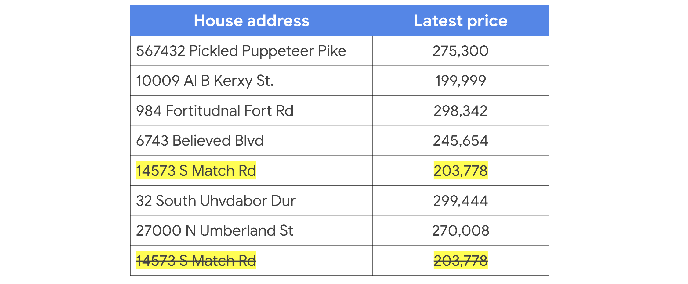
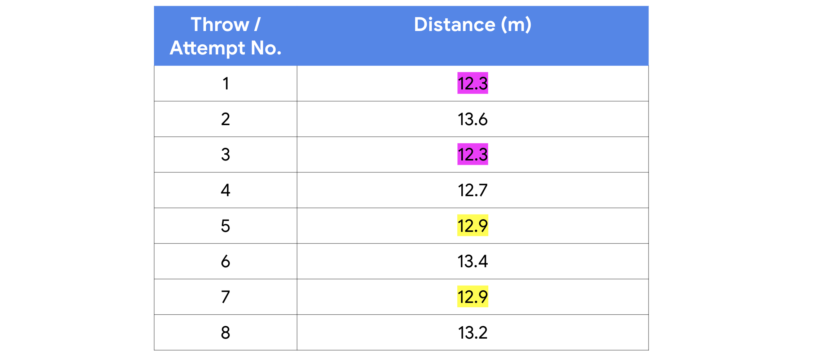

```python 
# Calculate 25th percentile of annual strikes
percentile25 = df['number_of_strikes'].quantile (0.25)

#Calculate 75th percentile of annual strikes
percentile75 = df['number_of_strikes'].quantile(0.75)

#Calculate interquartile range
iqr = percentile75 - percentile25

#Calculate upper and lower thresholds for outliers
upper_limit = percentile75 + 1.5 * iqr
lower_limit percentile25 + 1.5 * iqr

print('Lower limit is: ' + readable_numbers(lower_limit))
Lower limit is: 8.6M

#Isolate outliers on low end
df[df['number_of_strikes'] < lower_limit]
```

| year | number_of_strikes | number_of_strikes_readable |
|------|-------------------|----------------------------|
| 2019 | 209166            | 209K                       |
| 1987 | 7378836           | 7.4M                       |

```python 
def addlabels(x,y):
    for i in range(len(x)):
        plt.text(x[i]-0.5, y[i]+0.05,
                 s=readable_numbers(y[i]))


colors np.where(df['number of_strikes'] < lower_limit, 'r', 'b')

fig, ax = plt.subplots(figsize=(16,8))
ax.scatter(df['year'], df['number_of_strikes'),c=colors) ax.set_xlabel('Year')
ax.set_ylabel('Number of strikes')
ax.set_title('Number of lightning strikes by year')
addlabels(df['year'], df['number_of_strikes'])

for tick in ax.get_xticklabels():
    tick.set_rotation (45)

plt.show()
```

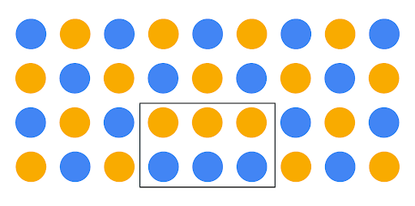

```python 
df_2019 = pd.read_csv('eda_outliers_dataset2.csv')
df_2019.head()

# Convert `date` column to datetime
df_2019['date']= pd.to_datetime(df_2019['date'])

# Create 2 new columns

df_2019['month'] = df_2019['date'].dt.month

df_2019['month_txt'] = df_2019['date'].dt.month_name().str.slice(stop=3)

# Group by month and month txt, sum it, and sort. Assign result new df 
df_2019_by_month = df_2019.groupby(['month', 'month_txt')).sum().sort_values('month', ascending=True).head()
df_2019_by_month
```

| month | month_txt | number_of_strikes |
|-------|-----------|-------------------|
| 12    | Dec       | 209166            |

```python 
#Read in 1987 data
df_1987=pd.read_csv('eda_outliers_dataset3.csv')

#Convert date column to datetime
df_1987['date'] = pd.todatetime(df_1987['date'])

#Create 2 new columns
df_1987['month'] = df_1987['date'].dt.month
df_1987['month_txt'] = df_1987['date'].dt.month_name().str.slice(stop=3)

#Group by month and `month_txt ', sum it, and sort. Assign result to new df
df_1987_by_month = df_1987.groupby(['month', 'month_txt']).sum().sort_values('month', ascending=True).head() 
df_1987_by_month
```

| month | month_txt | number_of_strikes |
|-------|-----------|-------------------|
| 1     | Jan       | 23044             |
| 2     | Feb       | 61020             |
| 3     | Mar       | 117877            |
| 4     | Apr       | 157890            |
| 5     | May       | 700910            |
| 6     | Jun       | 1064166           |
| 7     | Jul       | 2077619           |
| 8     | Aug       | 2001899           |
| 9     | Sep       | 869833            |
| 10    | Oct       | 105627            |
| 11    | Nov       | 155290            |
| 12    | Dec       | 43651             |

```python 
#Create new df that removes outliers
df_without_outliers=df[df['number_of_strikes']>=lower_limit]

#Recalculate mean and median values on data without outliers
print("Mean:"+readable_numbers(np.mean(df_without_outliers['number_of_strikes']))) 
print("Median:"+readable_numbers(np.median(df_without_outliers['number_of_strikes'])))

# Mean:28.2M
# Median:28.8M
```

## getdummies() ve cat.codes()

```python
# Load libraries.
import datetime
import matplotlib.pyplot as plt 
import pandas as pd 
import seaborn as sns

# Create a new data frame with the number of strikes per month.
df['date'] = pd.to_datetime(df['date'])
df['month'] = df['date'].dt.month_name().str.slice(stop = 3)

# Make the month names categorical so they are in calendar instead of alphabetic
# order when we plot them.
months = ['Jan', 'Feb', 'Mar', 'Apr', 'May', 'Jun', 'Jul', 'Aug', 'Sep', 'Oct', 'Nov', 'Dec']

df['month'] = pd.Categorical(df['month'], categories = months, ordered
df['year'] = df['date'].dt.strftime('%Y')
df_by_month = df.groupby(['year', 'month']).sum().reset_index)
df_by_month.head()
```

| year | month | number_of_strikes |
|------|-------|-------------------|
| 2016 | Jan   | 313595            |
| 2016 | Feb   | 312676            |
| 2016 | Mar   | 2057527           |
| 2016 | Apr   | 2636427           |
| 2016 | May   | 5800500           |

```python
# Create a categorical variable by bucketing the number of lightning strikes
# per month into severeness levels based on quantiles.
df_by_month['strike_level'] = pd.qcut(
df_by_month ['number_of_strikes'],
4,
labels = ['Mild', 'Scattered', 'Heavy', 'Severe'])
df_by_month.head()
```

| year | month | number_of_strikes | strike_level |
|------|-------|-------------------|--------------|
| 2016 | Jan   | 313595            | Mild         |
| 2016 | Feb   | 312676            | Mild         |
| 2016 | Mar   | 2057527           | Scattered    |
| 2016 | Apr   | 2636427           | Heavy        |
| 2016 | May   | 5800500           | Severe       |

```python
# Assign numerical values to the strike levels.

df_by_month['strike_level_code'] = df_by_month['strike_level'].cat.codes[df_by_month.head()]
```

| year | month | number_of_strikes | strike_level | strike_level_code |
|------|-------|-------------------|--------------|-------------------|
| 2016 | Jan   | 313595            | Mild         | 0                 |
| 2016 | Feb   | 312676            | Mild         | 0                 |
| 2016 | Mar   | 2057527           | Scattered    | 1                 |
| 2016 | Apr   | 2636427           | Heavy        | 2                 |
| 2016 | May   | 5800500           | Severe       | 3                 |

```python
# Create dummy variables from strike levels.
pd.get_dummies(df_by_month['strike_level'])
```

| Mild | Scattered | Heavy | Severe |
|------|-----------|-------|--------|
| 1    | 0         | 0     | 0      |
| 1    | 0         | 0     | 0      |
| 0    | 1         | 0     | 0      |
| 0    | 0         | 1     | 0      |
| 0    | 0         | 0     | 1      |
| 0    | 0         | 0     | 1      |
| 0    | 0         | 0     | 1      |
| 0    | 0         | 0     | 1      |
| 0    | 0         | 1     | 0      |
| 0    | 1         | 0     | 0      |
| 1    | 0         | 0     | 0      |
| 1    | 0         | 0     | 0      |
| 0    | 1         | 0     | 0      |
| 1    | 0         | 0     | 0      |

```python
# Format dataframe indices to prepare for plotting.
df_by_month_plot = df_by_month.pivot('year', 'month', 'strike_level_code') 
df_by_month_plot.head()
```

| year | Jan | Feb | Mar | Apr | May | Jun | Jul | Aug | Sep | Oct | Nov | Dec |
|------|-----|-----|-----|-----|-----|-----|-----|-----|-----|-----|-----|-----|
| 2016 | 0   | 0   | 1   | 2   | 3   | 3   | 3   | 3   | 3   | 2   | 1   | 0   |
| 2017 | 1   | 0   | 1   | 2   | 2   | 3   | 3   | 3   | 2   | 1   | 0   | 0   |
| 2018 | 1   | 2   | 1   | 1   | 2   | 3   | 3   | 3   | 2   | 1   | 0   | 0   |

```python
# Make a heatmap showing which months over the years had most severe lightning.
ax = sns.heatmap(df_by_month_plot, cmap= 'Blues')
colorbar = ax.collections[0].colorbar
colorbar.set_ticks([0, 1, 2, 3])
colorbar.set_ticklabels (['Mild', 'Scattered', 'Heavy', 'Severe'])
plt.show()
```


## Veri Dönüşümünde Diğer Yaklaşımlar

Bildiğiniz gibi, veriler bize birçok farklı biçimde geliyor. Kategorik veya nitel veri türleri için, veri uzmanlarının analizlerini tamamlamak, veri görselleştirmelerini tasarlamak veya makine öğrenimi algoritmalarını oluşturmak için genellikle bu tür verileri sayısal rakamlara dönüştürmeleri (veya kodlamaları) gerekir. Bu okumada, iki ana kategorik veri kodlama türünü ve her türün ne zaman kullanılacağını öğreneceksiniz.

### Etiket kodlama

Her veri değerine nitel bir değer yerine farklı bir sayı atandığı bir tür veri dönüştürme tekniği olan **etiket kod** lamayı zaten öğrendiniz.

[Videodan hatırlıyorsanız, verilen örnek mantar türlerini kodlayan etiket idi:](https://www.coursera.org/learn/go-beyond-the-numbers-translate-data-into-insight/lecture/BrCPD/sort-numbers-versus-names)

|**Mantar Türü**|**Kod**|
|---|---|
|Siyah trüf|0|
|Düğme|1|
|Cremini|2|
|Kirpi|3|
|Kral Trompet|4|
|Morel|5|
|Portobello|6|
|Shiitake|7|
|Kurbağa tabureti|8|

Anlayabileceğiniz gibi, mantarlarla ilgili bu varsayımsal veri seti için, her mantar türüne sıfırdan başlayarak kendi numarası atandı.

### Etiket kodlama ile ilgili bazı olası sorunlar

Müzik türleri kategorileri içeren bir veri kümesini analiz ettiğinizi hayal edin. “Blues”, “Elektronik Dans Müziği (EDM)”, “Hip Hop”, “Jazz”, “K-Pop”, “Metal” ve “Rock” kodlarını aşağıdaki sayısal değerlerle etiketlersiniz: “1, 2, 3, 4, 5, 6 ve 7.”

Bu etiket kodlamasıyla, ortaya çıkan makine öğrenimi modeli sadece bir sıralama değil, aynı zamanda Blues (1) ve EDM (2) arasında sayısal olarak ne kadar yakın oldukları için Blues (1) ve Jazz (4) arasında daha yakın oldukları için daha yakın bir bağlantı da türete **bilir**. Bu varsayılan ilişkilere ek olarak (analizinizde isteyebilirsiniz veya istemeyebilirsiniz), her kodun sayısal sırayla diğerinden eşit uzaklıkta olduğunu da fark etmelisiniz, çünkü 1'den 2'ye 5 ila 6, vb. ile aynı mesafedir, vb. Soru şu ki, bu eşit mesafeli ilişki veri kümenizdeki müzik türleri arasındaki ilişkileri doğru bir şekilde temsil ediyor mu? Başka bir soru sormak için, kodlamadan sonra, oluşturduğunuz görselleştirme veya model kodlanmış etiketleri bir sıralama olarak ele alacak mı?

Aynı şey yukarıdaki mantar örneği için de söylenebilir. Mantar türlerini kodladıktan sonra, mantarların artık düğme mantarları birinci sırada ve mantarların sekizinci sırada olduğu varsayılan bir sıralamada olmasından memnun musunuz?

Özetle, etiket kod **laması**, veri kümenizdeki kategorik veriler arasında istenmeyen ilişkiler oluşturabilir. Etiket kodlaması hakkında karar verirken, verilere uygulayacağınız algoritmayı ve bunun etiket kodlu kategorik verileri nasıl etkileyebileceğini veya etmeyebileceğini göz önünde bulundurun.

Neyse ki, kategorik kodlama için bu potansiyel sorunlara yardımcı olabilecek başka bir yöntem var.

### Tek kullanımda kodlama

Önceki bir [video](https://www.coursera.org/learn/go-beyond-the-numbers-translate-data-into-insight/lecture/BrCPD/sort-numbers-versus-names) da öğrendiğiniz gibi, Python'da sahte değişkenler oluşturabilirsiniz. Hatırlarsanız, sahte bir değişken, bir şeyin varlığını veya yokluğunu gösteren 0 veya 1 değerlerine sahip bir değişkendir. Buradaki fikir, her kategori türü için yeni bir sütun oluşturmaktır, ardından her değer için 0 veya 1 - 0 anlamı, hayır ve 1 anlamı evet belirtin.

Bu mankenlerin yaratılmasına **one-hot** kodlama denir. Bir hatırlatma olarak, tek sıcak kodlamaya sahip bir tablo şu şekilde biter:

|**Yok**|**Hafif**|**Dağınık**|**Ağır**|**Şiddetli**|
|---|---|---|---|---|
|**0**|1|0|0|0|
|**1**|1|0|0|0|
|**2**|0|1|0|0|
|**3**|0|0|1|0|
|**4**|0|0|0|1|
|**5**|0|0|0|1|
|**6**|0|0|0|1|
|**7**|0|0|0|1|
|**8**|0|0|1|0|
|**9**|0|1|0|0|
|**10**|1|0|0|0|
|**11**|1|0|0|0|
|**12**|0|1|0|0|

[Video](https://www.coursera.org/learn/go-beyond-the-numbers-translate-data-into-insight/lecture/BrCPD/sort-numbers-versus-names)da kapsanan yıldırım çarpması veri kümesindeki değerlerin “hafif” olarak etiketlendiğini ve “1” olduğunu göreceksiniz. “Hafif”, veri kümesindeki yıldırım sayılarının en düşük çeyreğini ifade eder. “Hafif” sütundaki hafif DEĞER DEĞİLDİR diğer değerler için o hücrede bir sıfır vardır. Bu yöntemle etiket kodlamasının sunduğu istenmeyen ve sorunlu ilişkiler sorununu çözüyoruz.

Ancak tek sıcak kodlama, özellikle lojistik ve doğrusal regresyon söz konusu olduğunda, kendi problemlerini sunar. Gelecekteki bir kursta bunun hakkında daha fazla bilgi edineceksiniz.

### **Etiket kodlaması veya tek sıcak kodlama: Nasıl karar verilir?**

Etiket kodlaması mı yoksa tek sıcak kodlama mı kullanmanız gerektiğine dair basit bir cevap yoktur. Kararın duruma göre veya veri kümesi bazında verilmesi gerekir. Ancak size yardımcı olacak bazı kurallar var.

Aşağıdaki durumlarda etiket kodlamasını kullanın:

- Çok sayıda farklı kategorik değişken vardır - çünkü etiket kodlaması, tek bir sıcak kodlamadan çok daha az veri kullanır
    
- Kategorik değerlerin kendilerine göre belirli bir sırası vardır (örneğin, yaş grupları en gençten en büyüğe veya en büyükten en küçüğe kadar gruplandırılabilir)
    
- Bir karar ağacı veya rastgele orman makine öğrenme modeli kullanmayı planlıyorsunuz
    

Aşağıdaki durumlarda tek sıcak kodlama kullanın:

- Nispeten az miktarda kategorik değişken vardır - çünkü tek sıcak kodlama, etiket kodlamasından çok daha fazla veri kullanır.
    
- Kategorik değişkenlerin belirli bir sırası yoktur
    
- Boyutsallık azaltma ile birlikte bir makine öğrenimi modeli kullanırsınız (Temel Bileşen Analizi (PCA) gibi)
    

### Önemli çıkarımlar

Etiket kodlaması ve tek sıcak kodlama, kategorik verileri sayısal verilere dönüştürmek için kullanılan tekniklerdir. Etiket kodlaması, çok sayıda farklı kategorik değişken ve kendilerine özgü bir düzene sahip kategoriler için en iyisidir. Tek kullanımlı kodlama, daha küçük miktarlarda kategorik değişken ve sırası olmayan kategoriler için en iyisidir.

## Tarih Farkı ve Görselleştirme

```python
# Load libraries.
import datetime
import matplotlib.pyplot as plt
import pandas as pd
import plotly.express as px
import seaborn as sns

df.head()
```
| date       | number_of_strikes | center_point_geom | longitude | latitude |
|------------|-------------------|-------------------|-----------|----------|
| 2018-01-03 | 194               | POINT(-75 27)     | -75.0     | 27.0     |
| 2018-01-03 | 41                | POINT(-78.4 29)   | -78.4     | 29.0     |
| 2018-01-03 | 33                | POINT(-73.9 27)   | -73.9     | 27.0     |
| 2018-01-03 | 38                | POINT(-73.8 27)   | -73.8     | 27.0     |
| 2018-01-03 | 92                | POINT(-79 28)     | -79.0     | 28.0     |

```python
# Display the data type of the columns.
print(df.dtypes)

# Date is currently a string. Let's parse it into a datetime column. 
df['date'] = pd.to_datetime(df['date'])
```

| Column              | Dtype   |
|---------------------|---------|
| date                | object  |
| number_of_strikes   | int64   |
| center_point_geom   | object  |
| longitude           | float64 |
| latitude            | float64 |

```python
#Count the number of missing values in each column. 
df.isnull().sum()
```

| Column             | Null Count |
|--------------------|------------|
| date               | 0          |
| number_of_strikes  | 0          |
| center_point_geom  | 0          |
| longitude          | 0          |
| latitude           | 0          |


```python
# Check ranges for all variables.
df.describe(include = 'all')
```
| Column             | date         | number_of_strikes | center_point_geom | longitude         | latitude          |
|--------------------|--------------|-------------------|-------------------|-------------------|-------------------|
| count              | 3401012      | 3401012           | 3401012           | 3401012           | 3401012           |
| unique             | 357          | NaN               | NaN               | 170855            | NaN               |
| top                | 2018-09-01 00:00:00 | NaN       | POINT(-81.5 22.5) | NaN               | NaN               |
| freq               | 31773        | NaN               | 108               | NaN               | NaN               |
| first              | 2018-01-01 00:00:00 | NaN       | NaN               | NaN               | NaN               |
| last               | 2018-12-31 00:00:00 | NaN       | NaN               | NaN               | NaN               |
| mean               | NaN          | 13.11403          | NaN               | -9.081778         | 33.746888         |
| std                | NaN          | 31.212099         | NaN               | 12.969539         | 7.8835555         |
| min                | NaN          | 1.0               | NaN               | -141.8000         | 1.660000          |
| 25%                | NaN          | 2.0               | NaN               | -102.8000         | 26.9000           |
| 50%                | NaN          | 4.0               | NaN               | -90.3000          | 33.2000           |
| 75%                | NaN          | 12.0              | NaN               | -80.9000          | 39.4000           |
| max                | NaN          | 2211.0            | NaN               | -43.8000          | 51.7000           |


```python
# Find missing dates by comparing all dates in 2018 to dates in our date column.
full_date_range = pd.date_range(start = '2018-01-01', end = '2018-12-31')
full_date_range.difference(df['date'])

# DatetimeIndex(['2018-06-19', '2018-06-20', '2018-06-21', '2018-06-22', '2018-09-18', '2018-09-19', '2018-12-01', '2018-12-02'],
#               dtype='datetime64[ns]', freq=None)
```

```python
# Make a boxplot to see the range better.
sns.boxplot(y = df['number_of_strikes'])
```

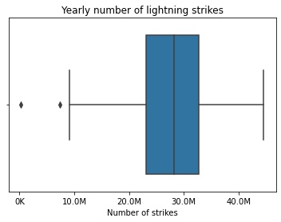

```python
# Plot again without the outliers to see where the majority of data is. 
sns.boxplot(y = df['number_of_strikes'], showfliers = False)
```


```python
# Plot points on the map to verify data is all from US.
df_points df[['latitude', 'longitude']].drop_duplicates() # Get unique points.
df_points.head()
```

| latitude | longitude |
|----------|-----------|
| 27.0     | -75.0     |
| 29.0     | -78.4     |
| 27.0     | -73.9     |
| 27.0     | -73.8     |
| 28.0     | -79.0     |

```python
# Plot points on the map to verify data is all from US.
df_points = df[['latitude', 'longitude']].drop_duplicates() # Get unique points. 
p = px.scatter_geo(df_points, lat = 'latitude', lon = 'longitude') 
p.show()
```

## Tableau’ya Genel Giriş

Öğrendiğiniz gibi, Tableau dünyanın dört bir yanındaki veri uzmanları tarafından kullanılan güçlü bir veri görselleştirme aracıdır. Google Data Analytics Profesyonel Sertifikasını aldıysanız, Tableau'ya zaten aşina olmalısınız. Veri Analitiği Sertifikasını tamamlamadıysanız aşağıdaki ve diğer videolarda bağlantılı kaynak materyallerini inceleyebilirsiniz. Tableau yazılımı, sizin gibi öğrencilerin yazılımın yeteneklerini sınırlı bir kapasitede test etmelerini sağlayan tarayıcı sürümü aracılığıyla ücretsiz olarak mevcuttur. Bu okumada, bu görselleştirme yazılımının ücretsiz kullanım, temel sürümü olan Tableau Public'e genel bir bakış verilecektir.

### Tableau Public'in temellerini gözden geçirme

Bu okumada, Tableau Public"de yer alan **veri kaynağının**  ve **tasarım ekranlarının** temel yapısı hakkında bilgi edineceksiniz. Veri kaynağı sayfası verileri girmek veya veri bağlamak için kullanılır ve tasarım sayfası veri görselleştirmeleri çizmek ve oluşturmak için kullanılır. Etkili ve ilgi çekici veri görselleştirmelerini başarılı bir şekilde tasarlamak için her ikisine de ihtiyaç vardır.

**Not:** Tableau Public kurulum sürecini gözden geçirmek için [Tableau Public'de oturum açma hakkındaki okumaya bakın](https://www.coursera.org/learn/go-beyond-the-numbers-translate-data-into-insight/supplement/muYtK/how-to-sign-on-to-tableau-public).

#### **Veri kaynağı sayfası**

Görselleştirmeleri tasarlamaya başlamadan önce verilerinizi yüklemeniz gerekir. Tableau Genel profilinizi zaten ayarladığınızdan, yapmanız gereken tek şey oturum açmak ve gezinme çubuğunda Oluş **tur altında Web** Yaz **ma seçen** eğini seçmek.

**Not:** Bu kursta Tableau için gereken her şey Web Yazma ile tamamlanabilir; Tableau _yazıl_ ımını indirmeniz gerekmez.

##### **Tableau Genel Web Oluşturma**

Web yazma, doğrudan bir web tarayıcısından görselleştirmeler oluşturmanıza olanak tanır. Herhangi bir yazılım indirmeden bir viz oluşturabilir misiniz? Evet! [Tableau Genel profilinizi zaten ayarladığınızdan, yapmanız gereken](https://www.tableau.com/community/blog/2022/9/beginners-guide-tableau-public) tek şey oturum açmak ve gezinme çubuğunda Oluş **tur altında Web** Yaz **ma seçen** eğini seçmek. Bu sertifika programının amaçları doğrultusunda Tableau Public uygulamasında ihtiyacınız olan her şeyi gerçekleştirebilirsiniz. Aşağıdaki kaynaklardaki talimatlar Tableau Public sayfasına atıfta bulunur.

##### **Tableau Masaüstü Genel Sürümü**

[Yazılımı doğrudan Mac veya PC'nize de indirebilirsiniz.](https://www.tableau.com/products/public/download) Public'in web sitesindeki gezinme çubuğunda **Oluştur**  altında **Tableau Desktop Public Edition**'ı seçin.

_**Hatırlatma: Tableau Public yalnızca genel verileri analiz etmek ve paylaşmak için kullanılmalıdır.**_ _Yayınlanan tüm çalışma kitaplarına ve veri kümelerine herkes tarafından ücretsiz olarak erişilebilir olacaktır._

Veri kümenizi yükledikten sonra, aşağıdaki resimde daire içine alınmış sayıları eşleştirmek için özetlenen aşağıdaki adımları uygulayabilirsiniz:

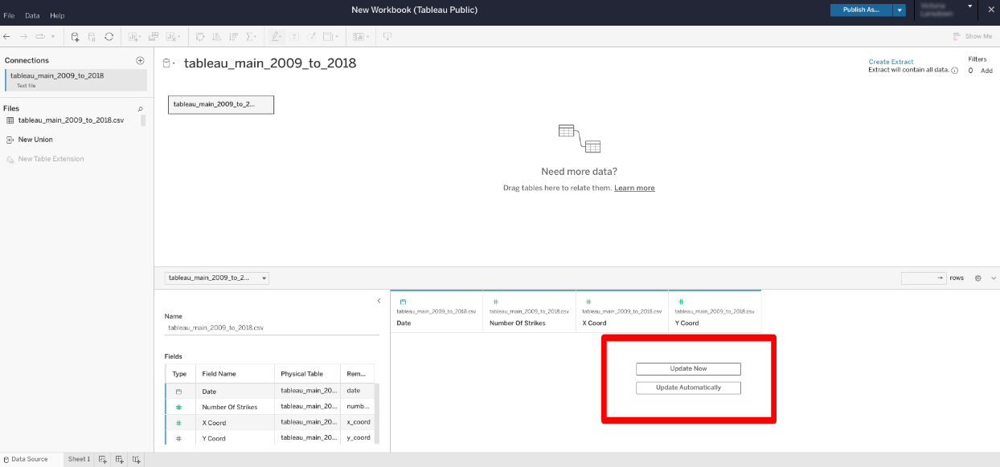

Aşağıdaki açıklamalar yukarıdaki resme karşılık gelir.

1. Bu sol bölme, veri bağlantılarınızı ve dosyalarınızı içerir. Burada yüklediğiniz tüm dosyaları bir listede bulacaksınız, böylece birden fazla dosyayı ve/veya farklı veritabanlarına birden fazla bağlantıyı takip edebilirsiniz.
    
2. Veri bağlantıları penceresinin hemen sağında, Tableau Public"in belirli bir dosyada algıladığı tüm alanların bir listesi bulunur.. Yüklenen birden fazla dosyanız varsa, her dosyanın alanlarına erişmek için dosyayı açılır menüden seçebilirsiniz. Yaklaşan bir videoda öğreneceğiniz gibi, Tableau'nun alanları dosyanızdaki veri sütunlarından alınır. Tableau bu alanları otomatik olarak boyutlar veya hesaplamalar ve ayrık veya sürekli değişkenler olarak sıralar.
    
3. Sayfadaki en büyük bölme, sağ ortada, dosyanızın tüm sütunlarına birkaç veri satırı dahil Tableau alanları olarak erişmenizi sağlar. Soldaki bölmenin aksine, bu bölme yeni hesaplama alanları, gruplar, kümeler veya parametreler gibi halihazırda mevcut olanlara dayalı olarak yeni alanlar oluşturmanıza olanak tanır (gelecek videolarda bu özellikler hakkında daha fazla bilgi edineceksiniz). Bu bölmeyi verilerinizle doldurmak için “şimdi güncelle” veya “otomatik olarak güncelle” seçeneğini seçmeniz istenebilir. Durum buysa, güncel verilerle tutarlı bir şekilde çalıştığınızdan emin olmak için otomatik olarak güncelleme yapmak iyi bir uygulamadır. (Referans için - #5 'dan sonra aşağıdaki resmi inceleyin.)
    
4. Ekranın sağ üst köşesindeki mavi “Yayınla” düğmesi “kaydet” düğmeniz olarak işlev görür. Tableau Public tarayıcı tabanlı bir platform olduğundan, oluşturduğunuz ve kaydetmek istediğiniz her şey herkese açık hesabınızda yayınlanacaktır. İstenirse veri kaynaklarını ve veri görselleştirmelerini parolayla kilitlemenin veya gizlemenin yolları vardır, ancak Tableau Public yalnızca çalışmanızı kaydetmek için Yayınla alanını sunar. 'Yayınla' düğmesine tıkladığınızda, tasarım ilerlemenize bağlı olarak boş olabilecek veri tasarım sayfanıza otomatik olarak yönlendirilebilirsiniz. Endişelenmeyin. En son veri kümesi yüklemeleriniz veya veri tasarımlarınız hala kaydedildi; en son bulunduğunuz yere geri dönün ve görselleştirmenizi düzenlemeye devam edin.
    
5. Son olarak, veri tasarım sayfanıza gitmek için sayfanın sol alt köşesindeki düğmeler koleksiyonunu kullanacaksınız. Yeni bir çalışma sayfası, yeni bir gösterge tablosu ve yeni bir hikaye oluşturmak için düğme seçeneklerini bulacaksınız. Bu unsurlar bir sonraki bölümde tanıtılacaktır.

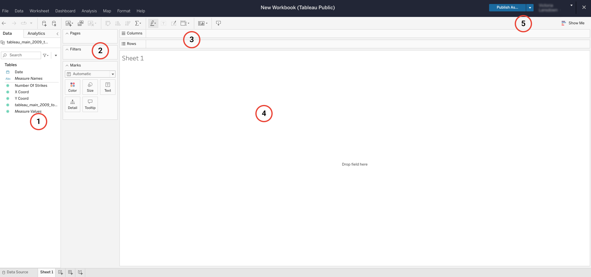

#### **Veri tasarım sayfası**

Veri tasarımı sayfası, veri görselleştirmelerinizin oluşturulacağı yerdir. Veri tasarımı sayfasına gitmek için, 'Sayfa 1'e tıklayın veya önceki ilgili resimde #5 'de belirtildiği gibi yeni bir sayfa oluşturun. Bir veri tasarım sayfasını açmak için ilk tıkladığınızda, Tableau'nun 'Çıkarma Oluşturmak' olduğu sorulabilir. Bu, Tableau'nun görselleştirmelerde kullanılmak üzere sağlanan verileri çıkardığı anlamına gelir. Bu işlem birkaç dakika sürebilir. Burada, istediğiniz görselleştirme türünü oluşturmak için veri kaynağı alanlarınızı uygun raflara taşıyacaksınız. Bu sayfadan veri görselleştirmeleri veya tüm etkileşimli gösterge panoları oluşturabilirsiniz.


Aşağıdaki numaralandırılmış öğeler, yukarıdaki Tableau çalışma kitabı görüntüsünde görüntülenen sayılara karşılık gelir.

1. En soldaki bu bölmede, ayrık ve sürekli boyutlar ve hesaplamalar listenizi bulacaksınız. Görselleştirmeler oluşturmak için bu değişkenleri bu sayfadaki farklı bölmelere taşıyacaksınız. Bu değişkenler hakkında daha sonra daha fazla bilgi edineceksiniz.
    
2. Hemen sağdaki bir sonraki bölmede “Sayfalar”, “Filtreler” ve “İşaretler” i bulacaksınız. Veri görselleştirmesini değiştirmek için herhangi bir boyutu veya hesaplamayı bu farklı alanlara taşıyabilirsiniz. Bu özellikleri gelecek videolarda nasıl kullanacağınızı öğreneceksiniz.
    
3. Sayfanın üst kısmında, menü çubuğunun hemen altında, değişken alanlarınızı taşımak için ana iki rafınız görevi gören iki boş satır vardır. “Sütunlar” ve “Satırlar” rafları, veri görselleştirmenizi istediğiniz gibi konumlandırmanıza yardımcı olur. Ayrıca bu satırların üzerinde, veri görselleştirmenizi değiştirmek için diğer seçeneklerle dolu bir araç çubuğu ve menü göreceksiniz.
    
4. Ekranın ortasında görselleştirmeniz için ana görüntüleme paneli bulunur. Öğeler ekleyip boyutlarınızı ve hesaplamalarınızı farklı alanlara sürükledikçe, bu panelde veri görselleştirmeniz üzerindeki etkisini fark edeceksiniz. Sağ üst köşede, kaydetme düğmesi görevi gören “Yayınla” düğmenizi ve “Beni Göster” açılır menüsünü bulacaksınız. “Bana Göster” açılır menüsünün altında, her birini oluşturmak için çeşitli veri görselleştirme türleri ve kılavuzları bulacaksınız.
    
5. Çalışmanızı [kaydetmeye ve paylaşmaya hazır olduğunuzda](https://help.tableau.com/current/pro/desktop/en-us/publish_workbooks_tableaupublic.htm), Tableau Genel profilinizde yayınlayın. Üst gezinme çubuğundaki “Yayınla” düğmesinin yanındaki aşağı oka tıklayarak çalışmanızı yayınlama seçeneklerini görüntüleyin.
    

### Tableau araçlarını incelemenin diğer yolları

#### **Google Veri Analitiği Profesyonel Sertifikası**

Daha önce de belirtildiği gibi, [Google Data Analytics Profesyonel Sertifika programı](https://www.coursera.org/professional-certificates/google-data-analytics) nı aldıysanız, Tableau ve Tableau Public'e zaten aşinasınız demektir. Öğrendiklerinizi gözden geçirmek için o programdaki [Tableau](https://www.coursera.org/learn/visualize-data/lecture/sLxV4/data-visualizations-with-tableau) 'yu kullanmaya başlayın dersine gidin.

#### **TableAU.com**

[Tableauau.com'u](https://www.tableau.com/) ziyaret ederek, Tableau Public (ücretsiz olan) Tableau Desktop, Tableau Mobile ve Tableau Server'a kadar çok sayıda ürün teklifini fark edeceksiniz. Her ürünün kendi kullanımı ve uzmanlığı vardır, ancak veri görselleştirme için ana unsurlar aynıdır. Veri görselleştirmeleriyle ilgili hemen hemen her konuda belirli makaleler bulmak için [Tableau Yardım sayfası](https://www.tableau.com/support/help?_ga=2.3466357.45238129.1654614666-316280037.1654614666)nda arama yapabilirsiniz.. Kullanıcıların ürünlerinin farklı özelliklerini öğrenmelerine yardımcı olmak için Tableau'da çeşitli eğitim kaynakları mevcuttur. Tableau, farklı ürünlerini öğrenmeye yardımcı olmak için çeşitli eğitim kaynakları sunar.

### Önemli çıkarımlar

Tableau güçlü bir veri görselleştirme aracıdır, ancak bu, onu yetkin bir şekilde kullanmanın çok fazla pratik ve deneyim gerektirdiği anlamına gelir. Kullanacağınız iki ana sayfa veri kaynağı ve veri tasarım sayfalarıdır. Tableau Yardımı ve Google Veri Analitiği Sertifika Programı ile Büyüme dahil olmak üzere sürecin her adımında size yardımcı olacak çok sayıda kaynak da mevcuttur.

### Daha fazla bilgi için kaynaklar

Sorun gidermenize yardımcı olmak veya daha fazla bilgi edinmek için aşağıdaki bağlantıları kullanabilirsiniz:

- Verilerinizi başarıya ayarlamak için Tableau kaynak sayfasını kullanın: [Veri kaynaklarını ayarlama](https://help.tableau.com/current/pro/desktop/en-us/datasource_prepare.htm)
    
- Tableau Araçları ve Web Yazma Yardımı: [Grafikler tasarlayın ve verileri analiz edin](https://help.tableau.com/current/pro/desktop/en-us/design_and_analyze.htm)
    
- “Günün Vizi"ni ve platformda tasarlanan diğer güzel görüntüleri içeren Tableau Public “Keşfet” sayfası: [Tableau Public'e Hoş Geldiniz](https://public.tableau.com/app/discover)
    
- Tableau Public kullanmaya yeni başlayanlar için kılavuz: [Kendi verilerinize, yani yolculuğunuza başlamanıza yardımcı olacak adım adım kılavuz](https://www.google.com/url?q=https://www.tableau.com/blog/beginners-guide-tableau-public?_gl%3D1*uv0ojo*_ga*MjU5NjUyMzcuMTY1NDMwMDM4MQ..*_ga_8YLN0SNXVS*MTY5MTE4NzA1Mi4xMC4xLjE2OTExODcwNzcuMC4wLjA&sa=D&source=docs&ust=1691485449789685&usg=AOvVaw267xvonfqL2uCc_x_yXcip)
    
- İlk Veri Görselleştirmenizi Yayınlamaya Hazırlanmak: [Verileri analiz etmek ve Tableau Genel profilinizde bir vizyon yayınlamak için adım adım kılavuz](https://www.tableau.com/blog/getting-ready-publish-your-first-data-visualization)

# Kurs 4: İstatistiğin Gücü

## Merkezi eğilim ölçüleri: Ortalama, medyan ve mod

Son zamanlarda, **merkezi eğilim ölçümlerinin** bir veri kümesinin merkezini temsil eden değerler olduğunu öğrendiniz. Yeni bir veri kümesiyle çalışırken, verilerinizin merkezi konumunu belirlemek, temel yapısını hızlı bir şekilde anlamanıza yardımcı olur.

Bu okumada, merkezi eğilimin üç ölçüsü hakkında daha fazla bilgi edineceksiniz: ortalama, medyan ve mod. Her bir ölçümün nasıl hesaplanacağını gözden geçireceğiz ve belirli verilerinize dayanarak hangi ölçümün en iyi kullanılacağını tartışacağız.

### Merkezi eğilim ölçüleri

Ortalama, medyan ve modun tümü, bir veri kümesinin merkezini farklı şekillerde tanımlar:

- **Ortalama**, bir veri kümesindeki ortalama değerdir.
    
- Med **yan**, bir veri kümesindeki orta değerdir.
    
- **Mod, bir veri kümesinde en sık meydana gelen değerdir.**
    

Merkezi eğilimin her ölçüsünün nasıl hesaplanacağını keşfedelim.

#### Ortalamayı, medyanı ve modu hesaplayın

##### Ortalama

**Ortalama**, bir veri kümesindeki ortalama değerdir. Ortalamayı hesaplamak için, veri kümenizdeki tüm değerleri toplar ve toplam değer sayısına bölersiniz.

Örneğin, aşağıdaki değer kümesine sahip olduğunuzu varsayalım: 10, 5, 3, 50, 12. Ortalamayı bulmak için toplam 80 için tüm değerleri eklersiniz. Ardından, toplam değer sayısı olan 5'e bölersiniz.

(10+5+3+50+12)÷5=80÷5=16

Ortalama veya ortalama değer 16'dır.

##### Medyan

Med **yan**, bir veri kümesindeki orta değerdir. Bu, veri kümesindeki değerlerin yarısının medyandan daha büyük olduğu ve değerlerin yarısının medyandan daha küçük olduğu anlamına gelir.

Bir veri kümesindeki tüm değerleri en küçükten en büyüğe düzenleyerek medyanı bulabilirsiniz. Beş değerinizi bu şekilde düzenlerseniz şunları elde edersiniz: 3, 5, 10, 12, 50. Medyan veya orta değer 10'dur.

Veri kümenizde çift sayıda değer varsa, medyan iki orta değerin ortalamasıdır. Diyelim ki setinize başka bir değer, 8, eklediniz: 3, 5, 8, 10, 12, 50. Şimdi, iki orta değer 8 ve 10'dur. Medyanı elde etmek için ortalamalarını alın.

(8+10)÷2=18÷2=9(8+10)÷2=18÷2=9

Medyan 9'dur.

##### Modu

**Mod, bir veri kümesinde en sık meydana gelen değerdir.** Bir veri kümesinin modu, bir modu veya birden fazla modu olamaz.

Örneğin, 1, 12, 33, 54, 75 sayı kümesinin modu yoktur çünkü hiçbir değer tekrarlanmaz. 2, 7, 7, 11, 20 setinde mod 7'dir, çünkü 7 bir kereden fazla meydana gelen tek değerdir. 3, 12, 12, 40, 40 setinin iki modu vardır: 12 ve 40.

#### Ortalama, medyan ve mod ne zaman kullanılır

Veri kümenizin merkezini tanımlamak için ortalama, medyan veya modu kullanıp kullanmadığınız, üzerinde çalıştığınız belirli verilere ve verilerinizden hangi içgörüleri elde etmek istediğinize bağlıdır. Her merkezi eğilim ölçüsünü kullanmak için bazı genel yönergeleri tartışalım.

##### Ortalama ve medyan

Hem ortalama hem de medyan, bir veri kümesinin merkezi konumunu tanımlar. Bununla birlikte, merkezi eğilimin ölçümleri olarak, ortalama ve medyan, farklı veri türleri için daha iyi çalışır.

Ortalamanın bir ana dezavantajı vardır: veri kümenizdeki aykırı değerlere karşı çok hassastır. Bir aykırı değerin, verilerin geri kalanından büyük ölçüde farklı bir değer olduğunu hatırlayın.

Veri kümenizde aykırı değerler varsa, medyan genellikle merkezin daha iyi bir ölçüsüdür. Hiçbir aykırı değer yoksa, ortalama genellikle iyi çalışır.

Örneğin, küçük bir başlangıç şirketindeki bir çalışanın yıllık ortalama maaşını hesaplamak istediğinizi düşünün. Aşağıdaki maaş verilerine sahipsiniz:

|**Çalışan**|#1|#2|#3|#4|#5|#6|#7|
|---|---|---|---|---|---|---|---|
|**Maaş**|40.000 $|45.000 $|45.000 $|45.000 $|45.000 $|50,000 $|500.000 $|

Veri kümenizdeki tüm değerleri toplayarak ve toplam değer sayısına bölerek ortalama yıllık maaşı hesaplayabilirsiniz. Toplamda yedi maaş var ve toplamı 770.000 dolar.

\$770,000÷7=\$110,000

Bu yedi çalışanın ortalama maaşı 110.000 dolar. Bununla birlikte, veriler bu ortalama değerin bu şirketteki bir çalışanın tipik maaşını doğru bir şekilde yansıtmadığını göstermektedir. Çoğu çalışanın maaşı 40.000 ila 50.000 dolar arasındadır. Aslında, yalnızca bir çalışanın maaşı 50.000 dolardan fazladır. 500.000 dolarlık maaş, ortalamayı artıran veya ortalamayı çarpıtan bir aykırıdır.

Bu durumda, bu aykırı değerin varlığı nedeniyle, medyan, ortalamadan daha iyi bir merkezi eğilim ölçüsüdür. Bu veri kümesindeki medyan veya orta değer 45.000 ABD dolarıdır. Medyan, bu şirketteki bir çalışanın tipik maaşı hakkında size daha iyi bir fikir verir.

##### Modu

Mod, kategorik verilerle çalışırken kullanışlıdır, çünkü hangi kategorinin en sık meydana geldiğini açıkça gösterir. Bir şirketin çalışan memnuniyeti anketi yürüttüğünü varsayalım. Anketteki ana madde, “Şirket içinde büyümek için sahip olduğum fırsattan memnunum” diyor. Çalışanlar cevapları için dört kategori arasından seçim yaparlar: kesinlikle katılıyorum, katılıyorum, katılmıyorum, kesinlikle katılmıyorum. Bir çubuk grafik sonuçları özetler.


Mod, “kesinlikle katılıyorum” derecesine atıfta bulunan çubuk grafikteki en yüksek çubuğu temsil eder. Bu, veri kümesinde en sık meydana gelen derecelendirmedir. Mod, şirkete çalışan memnuniyeti konusunda net geri bildirim verir; bu durumda olumlu geribildirim.

#### Önemli çıkarımlar

Ortalama, medyan ve mod gibi merkezi eğilim ölçümleri, veri kümenizin merkezini tek bir değer kullanarak tanımlamanıza izin verir. Bir veri uzmanı olarak, veri kümenizin merkezini bilmek, temel yapısını hızlı bir şekilde anlamanıza ve analizinizdeki sonraki adımları belirlemenize yardımcı olur.

#### Daha fazla bilgi için kaynaklar

Ortalama, medyan ve mod gibi merkezi eğilim ölçümleri hakkında daha fazla bilgi edinmek için aşağıdaki kaynağı keşfedin:

- [Avustralya İstatistik Bürosu'nun bu makalesi](https://www.abs.gov.au/websitedbs/D3310114.nsf/Home/Statistical+Language+-+measures+of+central+tendency#:~:text=There%20are%20three%20main%20measures,central%20value%20in%20the%20distribution.), ortalama, medyan ve moda yararlı bir genel bakış sunar ve aykırı değerlerin merkezi eğilim ölçümlerini nasıl etkilediğini tartışır.

## 8, 10, 12 olan 3 bileşenli bir seri için standart sapma;

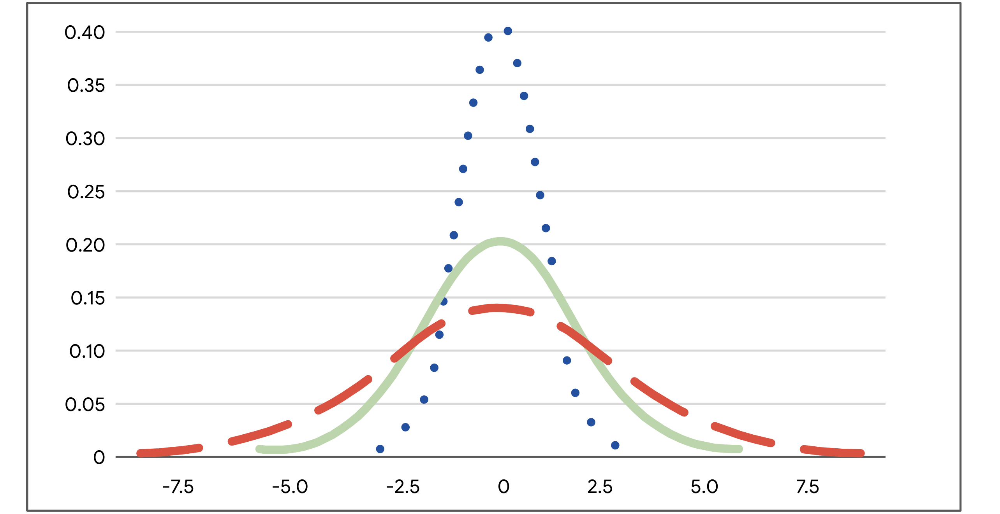

## Dağılım ölçüleri: Menzil, varyans ve standart sapma

Son zamanlarda, **dağılım ölçümlerinin veri kümen** izin yayılımını veya veri değerlerinizdeki varyasyon miktarını tanımlamanıza izin verdiğini öğrendiniz. Standart sapma gibi dağılım ölçümleri, verilerinizin dağılımı hakkında ilk bilgi verebilir ve verilerinize hangi istatistiksel yöntemlerin uygulanacağını belirlemenize yardımcı olabilir.

Bu okumada, üç dağılım ölçüsü hakkında daha fazla bilgi edineceksiniz: aralık, varyans ve standart sapma. Bu okuma, temel standart sapma kavramına odaklanmaktadır. Bir veri uzmanı olarak, verilerinizin standart sapmasını sık sık hesaplayacak ve standart sapmayı daha karmaşık veri analizinin bir parçası olarak kullanacaksınız.

### Dağılım ölçüleri

Her dağılım ölçüsünün tanımını inceleyelim: aralık, varyans ve standart sapma.

#### **Menzil**

Aralık, bir veri kümesindeki en büyük ve en küçük değer arasındaki farktır.

Örneğin, bir biyoloji öğretmeni olduğunuzu ve final sınavı için puanlarla ilgili verileriniz olduğunu hayal edin. En yüksek puan 99/100 veya% 99'dur. En düşük puan 62/100 veya% 62'dir. Aralığı hesaplamak için en düşük puanı en yüksek puandan çıkarın.

99 - 62 = 37

Aralığı yüzde 37 puandır.

Menzil yararlı bir metriktir çünkü hesaplanması kolaydır ve veri kümenizin genel yayılımını çok hızlı bir şekilde anlamanızı sağlar.

#### **Varyans**

Başka bir yayılma ölçüsüne, **her** veri noktasının ortalamadan kare farkının ortalamadan ortalaması olan varyans denir. Temel olarak, standart sapmanın karesidir. Daha sonraki bir kursta varyans ve nasıl kullanılacağı hakkında daha fazla bilgi edineceksiniz.

#### **Standart sapma**

Standart sapma kavramını daha iyi anlamak için tanımını, görselleştirmesini ve istatistiksel formülünü inceleyelim.

#### **Tanımı**

**Standart sapma**, değerlerinizin veri kümenizin ortalamasından ne kadar yayıldığını ölçer. Bir veri noktasının ortalamadan tipik mesafesini hesaplar. Standart sapma ne kadar büyükse, değerleriniz ortalamadan o kadar yayılır. Standart sapma ne kadar küçükse, değerleriniz ortalamadan o kadar az yayılır.

#### **Görselleştirme**

Yayılma hakkında daha iyi bir fikir edinmek için üç normal olasılık dağılımının grafiklerini inceleyelim. Daha sonra, bir veri kümesindeki tüm değerleri eşleyen dağıtımlar hakkında bilgi edineceksiniz. Şimdilik, ortalamanın her eğrideki, tam merkezdeki en yüksek nokta olduğunu bilin.

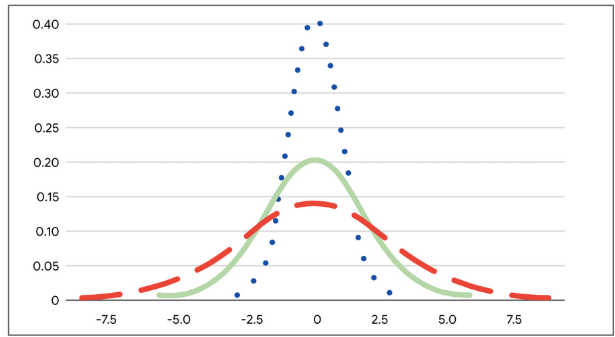

Her eğri aynı ortalamaya ve farklı bir standart sapmaya sahiptir. Mavi noktalı eğrinin standart sapması 1, yeşil katı eğri 2 ve kırmızı kesikli eğri 3'tür. Veri değerlerinin çoğu ortalamaya yakın olduğu için mavi noktalı eğri en az yayılmaya sahiptir. Bu nedenle, mavi noktalı eğri en küçük standart sapmaya sahiptir. Veri değerlerinin çoğu ortalamadan daha uzağa düştüğü için kırmızı kesikli eğri en fazla yayılmaya sahiptir. Bu nedenle, kırmızı kesikli eğri en büyük standart sapmaya sahiptir.

#### **Formül**

Şimdi bir formül kullanarak standart sapmayı nasıl hesapladığınızı tartışalım.

Bir popülasyon ve bir örnek için standart sapmayı hesaplamak için farklı formüller vardır. Hatırlatma olarak, veri uzmanları tipik olarak örnek verilerle çalışır ve örneğe dayalı olarak popülasyonlar hakkında çıkarımlar yaparlar. Öyleyse, örnek standart sapma formülünü gözden geçirelim:

$s=\sqrt{\frac{\sum{(x-\bar{x})^2}}{n-1}} $

Formülde n, örneğinizdeki toplam veri değeri sayısıdır, x her bir veri değeridir ve x( “x-bar” olarak telaffuz edilir) veri değerlerinizin ortalamasıdır. Yunan harfi Sigma, toplam anlamına gelen bir semboldür.

**Not:** Bir veri uzmanı olarak, hesaplamalar için genellikle bir bilgisayar kullanırsınız. Hesaplamaları yapabilmek gelecekteki kariyeriniz için önemlidir, ancak hesaplamaların arkasındaki kavramlara aşina olmak, işyeri sorunlarına istatistiksel yöntemler uygulamanıza yardımcı olacaktır.

Formülün farklı bölümlerini daha iyi anlamak için, küçük bir veri kümesinin örnek standart sapmasını hesaplayalım: 2, 3, 10.

Bunu beş adımda yapabilirsiniz:

**1. Veri değerlerinizin ortalamasını veya ortalamasını hesaplayın.**

(2 + 3 +10) ÷ 3 = 15 ÷ 3 = 5

**2. Her değerden ortalamayı çıkarın**.

2 - 5 = -3

3 - 5 = -2

10 - 5 = 5

**3. Her sonucu kare haline getirin.**

-3*-3 = 9

-2*-2 = 4

5* 5 = 25

**4. Kareli sonuçları toplayın ve bu toplamı veri değerlerinin sayısından bir taneye bölün. Bu varyans.**

(9 + 4 + 25) ÷ (3 -1) = 38 ÷ 2 = 19

**5. Son olarak, varyansın karekökünü bulun.**

√19 = 4.36

Örnek standart sapması 4.36'dır.

Artık standart sapma kavramı hakkında daha fazla bilgi sahibi olduğunuza göre, pratik uygulamasının bir örneğini inceleyelim.

#### **Örnek: Gayrimenkul fiyatları**

Bir emlak şirketi için çalışan bir veri uzmanı olduğunuzu hayal edin. Ekibinizdeki emlakçılar, müşterilerini farklı yerleşim alanlarındaki kira fiyatlarındaki değişimler hakkında bilgilendirmeyi sever. İşinizin bir kısmı, belirli mahallelerdeki daireler için aylık kira fiyatlarının standart sapmasını hesaplamak ve bu bilgileri ekibinizle paylaşmaktır. Diyelim ki iki farklı mahallede tek yatak odalı daireler için aylık kira fiyatları hakkında örnek verileriniz var: Emerald Woods ve Rock Park. Her veri kümesi için ortalama ve standart sapmayı hesapladığınızı varsayalım.

**Zümrüt Ormanları**

|**Daire**|#1|#2|#3|#4|#5|
|---|---|---|---|---|---|
|**Aylık Kira**|\$900|\$950|\$1,000|\$1,050|\$1,100|

Ortalama: $1,000

Standart sapma: $79.05

**Kaya Parkı**

|**Daire**|#1|#2|#3|#4|#5|
|---|---|---|---|---|---|
|**Aylık Kira**|\$500|\$650|\$1,000|\$1,350|\$1,500|

Ortalama: $1,000

Standart sapma: \$431.56

Her iki mahalle de aylık 1.000 dolarlık aynı ortalama kira fiyatına sahiptir. Ancak, Rock Park'da kiralama fiyatlarındaki standart sapma (\$431.56), Emerald Woods'daki kiralama fiyatlarındaki standart sapmadan çok daha yüksektir (\$79.05). Bu, Rock Park'ta kiralama fiyatlarında çok daha fazla değişiklik olduğu anlamına gelir. Bu, temsilcileriniz için yararlı bir bilgidir. Örneğin, müşterilere Rock Park'ta ortalama 1.000 doların çok altında olan daha uygun fiyatlı bir daire bulmalarının daha kolay olabileceğini söyleyebilirler. Standart sapma, herhangi bir mahalledeki fiyatlardaki değişimi hızlı bir şekilde anlamanıza yardımcı olur.

### Önemli çıkarımlar

Veri uzmanları, reklam gelirleri, hisse senedi fiyatları, çalışan maaşları ve daha fazlası gibi birçok veri türündeki değişimi ölçmek için standart sapmayı kullanır. Standart sapma, varyans ve aralık gibi dağılım ölçümleri, veri değerlerinizdeki değişimi hızlı bir şekilde tanımlamanıza ve verilerinizin temel yapısını daha iyi anlamanıza olanak tanır.

### Daha fazla bilgi için kaynaklar

Menzil, varyans ve standart sapma gibi dağılım ölçümleri hakkında daha fazla bilgi edinmek için aşağıdaki kaynakları keşfedin:

- [Statistics Canada"nın bu makal](https://www150.statcan.gc.ca/n1/edu/power-pouvoir/ch12/5214891-eng.htm)esi, varyans ve standart sapmanın yararlı bir özetini sağlar, ve standart sapmanın bir dağılım ölçüsü olarak kullanışlılığını tartışır.

## Konum ölçüleri: Yüzdelikler ve çeyrekler

Son zamanlarda, **konum ölçümlerinin** bir veri kümesindeki diğer değerlere göre bir değerin konumunu belirlemenize izin verdiğini öğrendiniz. Merkez ve yayılma ile birlikte, değerlerinizin göreceli konumunu bilmek faydalıdır. Örneğin, bir değerin diğerinden daha yüksek veya daha düşük olup olmadığı veya bir değerin veri kümenizin alt, orta veya üst kısmına düşüp düşmediği.

Bu okumada, en yaygın konum ölçüleri hakkında daha fazla bilgi edineceksiniz: yüzdelikler ve çeyrekler. Ayrıca çeyrekler arası aralığı nasıl hesaplayacağınızı öğrenecek ve verilerinizi özetlemek için beş sayı özetini kullanacaksınız.

### Pozisyon ölçüleri

#### **Yüzdelik**

Yüz **delik**, bir veri yüzdesinin altına düştüğü değerdir. Yüzdelikler verilerinizi 100 eşit parçaya böler. Yüzdelikler, bir veri kümesindeki belirli bir değerin göreceli konumunu veya sırasını verir.

Örneğin, yüzdelikler genellikle okul sınavlarında test puanlarını sıralamak için kullanılır. Diyelim ki bir test puanı 99. yüzdelik dilime düşüyor. Bu, puanın tüm test puanlarının% 99'undan daha yüksek olduğu anlamına gelir. Bir puan 75. yüzdelik seviyeye düşerse, puan tüm test puanlarının% 75'inden daha yüksektir. Bir puan 50. yüzdelik seviyeye düşerse, puan tüm test puanlarının yarısından veya %50'sinden daha yüksektir.

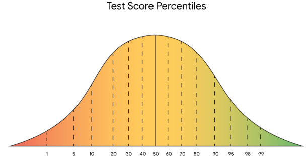

_**Not: Yüz**_ _delikler ve yüzdeler farklı kavramlardır. Örneğin, bir testte 90/100 veya% 90 puan aldığınızı varsayalım. Bu mutlaka %90'lık puanınızın 90. yüzdelik dilimde olduğu anlamına gelmez. Yüzdelik, tüm sınava girenlerin göreceli performansına bağlıdır. Tüm sınava girenlerin yarısı %90'ın üzerinde puan alırsa,% 90'lık bir puan 50. persentilde olacaktır._

Yüzdelikler, değerleri karşılaştırmak ve verileri bağlama koymak için kullanışlıdır. Örneğin, yeni bir araba almak istediğinizi hayal edin. Harika yakıt ekonomisine sahip orta boy bir sedan istersiniz. Amerika Birleşik Devletleri'nde yakıt ekonomisi, galon yakıt veya mpg başına mil cinsinden ölçülür. Düşündüğünüz sedan 23 mpg alıyor. Bu iyi mi kötü mü? Karşılaştırma için bir temel olmadan, bilmek zor. Bununla birlikte, 23 mpg'nin tüm orta boy sedanların 25. yüzdesinde olduğunu biliyorsanız, göreceli performansı hakkında çok daha net bir fikriniz var. Bu durumda, tüm orta boy sedanların %75'i satın almayı düşündüğünüz arabadan daha yüksek mpg'ye sahiptir.

#### **Çeyrek**

Değerlerin göreli konumu hakkında genel bir anlayış elde etmek için çeyrekleri kullanabilirsiniz. Bir **çeyrek**, bir veri kümesindeki değerleri dört eşit parçaya böler.

Üç çeyrek verileri dört çeyreğe böler. Çeyreklikler, verilerin dördüncü çeyreğine göre değerleri karşılaştırmanıza olanak tanır. Her çeyrek, veri kümenizdeki değerlerin% 25'ini içerir.

- İlk çeyrek, Q1, veri kümesinin ilk yarısındaki orta değerdir. Q1, 25. yüzdelik anlamına gelir. Tüm veri kümesindeki değerlerin% 25'i Q1'in altında ve% 75'i bunun üzerindedir.
    
- İkinci çeyrek, Q2, veri kümesinin medyanıdır. Q2, 50. yüzdelik değeri ifade eder. Tüm veri kümesindeki değerlerin% 50'si Q2'nin altında ve% 50'si bunun üzerindedir.
    
- Üçüncü çeyrek, Q3, veri kümesinin ikinci yarısındaki orta değerdir. Q3, 75. yüzdelik değeri ifade eder. Tüm veri kümesindeki değerlerin% 75'i Q3'ün altında ve% 25'i bunun üzerindedir.
    


#### Örnek: Araba satışları

Örneğin, bir otomobil bayisinde çalışan bir veri uzmanı olduğunuzu hayal edin. Satış ekibinin yöneticisi, ekipteki her satış temsilcisinin performansını karşılaştırmak ister. Yönetici, her satış temsilcisinin geçen ay içinde kaç araba sattığını sağlayan verileri analiz etmenizi ister.

|**Satış Temsilcisi**|#1|#2|#3|#4|#5|#6|#7|#8|
|---|---|---|---|---|---|---|---|---|
|**Satılan Otomobiller**|18|13|6|10|15|7|10|9|

Verileriniz için çeyrekleri dört adımda hesaplayabilirsiniz:

1. Veri kümenizdeki değerleri en küçükten en büyüğe doğru düzenleyin.

[6, 7, 9, 10, 10, 13, 15, 18]

2. Tüm veri kümenizin medyanını veya orta değerini bulun. Bu Q2. Veri kümesinde çift sayıda değer vardır, bu nedenle medyan, iki orta değerin, 10 ve 10'un ortalamasıdır.

**Q2** = (10 + 10) ÷ 2 = 20 ÷ 2 = 10

3. Veri kümenizin alt yarısının medyanını bulun [6, 7, 9, 10]. Bu Q1. Medyan, iki orta değerin, 7 ve 9'un ortalamasıdır.

**Q1** = (7 + 9) ÷ 2 = 16 ÷ 2 = 8

4. Son olarak, veri kümenizin üst yarısının medyanını bulun [10, 13, 15, 18]. Bu Q3. Medyan, 13 ve 15'in iki orta değerin ortalamasıdır.

**Q3** = (13 + 15) ÷ 2 = 28 ÷ 2 = 14

Verileri çeyreğe bölmek size satış temsilcisi performansı hakkında net bir fikir verir. Artık temsilcilerin alt çeyreğinin (Q1) 8 veya daha az araba sattığını ve üst çeyreğin (Q3) 14 veya daha fazla araba sattığını biliyorsunuz. Başka bir deyişle, temsilcilerin% 25'i 8 veya daha az araba sattı ve üstteki %25'i 14 veya daha fazla araba sattı. Temsilcilerin ortada% 50'si 8 ila 14 araba sattı.

**Not:** Çeyrek değerleri hesaplamanın tek yolu bu değildir. Birçok gözlemi olan veri kümeleri için, çeyrek hesaplama metodolojisi, hesaplanan nihai değerler üzerinde ihmal edilebilir bir etkiye sahiptir. Bununla birlikte, az gözlem içeren veri kümeleri için hesaplanan çeyrekler önemsiz olmayabilir. Örneğin, [Numpy'nin persentil() işlevi](https://numpy.org/doc/stable/reference/generated/numpy.percentile.html), belirli bir yüzdelik değeri hesaplamak için dokuz farklı yola sahiptir.

#### **Çeyrekler arası aralık (IQR)**

**Verilerinizin orta %50'sine çeyrek arası aralık veya IQR denir.** Çeyrekler arası aralık, birinci çeyrek (Q1) ile üçüncü çeyrek (Q3) arasındaki mesafedir. Bu, 25. ve 75. yüzdelik arasındaki mesafe ile aynıdır. IQR, veri değerlerinizin göreceli konumunu belirlemek için kullanışlıdır. Örneğin, Q1 - (1.5 * IQR) ve Q3 + (1.5 * IQR) aralığının dışındaki veri değerleri genellikle aykırı değerler olarak kabul edilir.

_**Not:**_ _Teknik olarak, IQR bir dağılım ölçüsüdür çünkü verilerinizin orta yarısının veya orta %50'sinin yayılımını ölçer (Q1 ve Q3 arasında). IQR, veri kümenizdeki daha aşırı değerleri içermediğinden, aykırı değerlere aralıktan daha az duyarlıdır_.

IQR = Q3 - Q1. Bu durumda, Q3 = 14 ve Q1 = 8.

**IQR** = 14 - 8 = 6

#### **Beş sayı özeti**

Son olarak, veri kümenizdeki ana bölümleri beş sayı özetle özetleyebilirsiniz. Beş sayı şunları içerir:

- Minimum
    
- İlk çeyrek (Q1)
    
- Medyan veya ikinci çeyrek (Q2)
    
- Üçüncü çeyrek (Q3)
    
- Maksimum

Beş sayı özeti kullanışlıdır çünkü verilerinizin aşırı değerlerden merkeze dağılımı hakkında genel bir fikir verir. Bir kutu çizimi ile görselleştirebilirsiniz.

Kutu grafiğinin kutu kısmı Q1'den Q3'e gider. Kutunun ortasındaki dikey çizgi medyandır (Q2). Bıyık olarak bilinen kutunun her iki tarafındaki yatay çizgiler Q1'den minimuma ve Q3'ten maksimuma gider.

Aşağıdaki kutu çizimi, araba satışlarıyla ilgili verileri göstermektedir. Değerleri kutu grafiğinde bulabilir ve çeyrekler arası aralığı (IQR) belirleyebilirsiniz. IQR, kutunun uzunluğu veya Q1 ile Q3 arasındaki mesafedir.

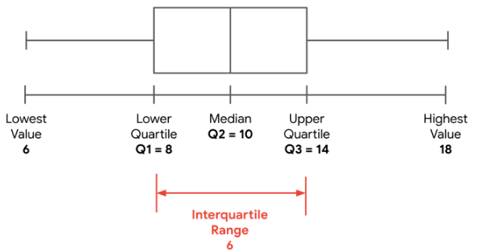

### Önemli çıkarımlar

Veri uzmanları, ürün satışlarından hane gelirine kadar her tür veriyi daha iyi anlamak için yüzdelik ve çeyrek gibi konum ölçümlerini kullanır. Konum ölçümleri, veri değerlerinizin göreceli konumunu hızlı bir şekilde belirlemenize yardımcı olur ve verilerinizin dağılımı hakkında daha kesin bir fikir verir.

### Daha fazla bilgi için kaynaklar

Yüzdelik ve çeyrek gibi konum ölçümleri hakkında daha fazla bilgi edinmek için aşağıdaki kaynağa göz atın:

- [Freie Universität Berlin'in bu istatistik sözlüğü](https://www.geo.fu-berlin.de/en/v/soga-py/Basics-of-statistics/index.html), yüzdelikler, çeyrekler, beş sayı özeti ve daha fazlası gibi konum ölçümlerinin net tanımlarını ve yararlı örneklerini sağlar.

## Ortalama Okuma Oranını Bulma

```python
import numpy as np
import pandas as pd
import matplotlib.pyplot as plt

education_districtwise = pd.read_csv("education_districtwise.csv")
education_districtwise.head(10)
```

| DISTNAME     | STATNAME | BLOCKS | VILLAGES | CLUSTERS | TOTPOPULAT | OVERALL_LI |
|--------------|----------|--------|----------|----------|------------|------------|
| DISTRICT32   | STATE1   | 13     | 391      | 104      | 875564.0   | 66.92      |
| DISTRICT649  | STATE1   | 18     | 678      | 144      | 1015503.0  | 66.93      |
| DISTRICT229  | STATE1   | 8      | 94       | 65       | 1269751.0  | 71.21      |
| DISTRICT259  | STATE1   | 13     | 523      | 104      | 735753.0   | 57.98      |
| DISTRICT486  | STATE1   | 8      | 359      | 64       | 570060.0   | 65.00      |
| DISTRICT323  | STATE1   | 12     | 523      | 96       | 1070144.0  | 64.32      |
| DISTRICT114  | STATE1   | 6      | 110      | 49       | 147104.0   | 80.48      |
| DISTRICT438  | STATE1   | 7      | 134      | 54       | 143388.0   | 74.49      |
| DISTRICT610  | STATE1   | 10     | 388      | 80       | 409576.0   | 65.97      |
| DISTRICT476  | STATE1   | 11     | 361      | 86       | 555357.0   | 69.90      |

```python
education_districtwise['OVERALL_LI'].describe()
```

|       Stat       |    Value     |
|------------------|--------------|
| count            | 634.000000   |
| mean             | 73.395189    |
| std (std. dev.)  | 10.098460    |
| min              | 37.220000    |
| 25% (1st quartile)| 66.437500   |
| 50% (median)     | 73.490000    |
| 75% (3rd quartile)| 80.815000   |
| max              | 98.760000    |

```python
education_districtwise['STATNAME'].describe()
```

| Stat   | Value   |
|--------|---------|
| count  | 680     |
| unique | 36      |
| top    | STATE21 |
| freq   | 75      |

```python
range_overall_li = education_districtwise['OVERALL_LI'].max() - education_districtwise['OVERALL_LI'].min() 

range_overall_li
# 61.54000000006
```

## Olasılığın Temel Kavramları

Son zamanlarda, olasılığın belir **siz** liği ölçmek veya bir şeyin olma olasılığını tanımlamak için matematiği kullandığını öğrendiniz. Örneğin, yarın yağmur yağma ihtimali %80 veya belirli bir adayın seçimi kazanma ihtimali %20 olabilir.

Bu okumada, olasılığın temel kavramları hakkında daha fazla bilgi edineceksiniz. Rastgele bir deney kavramını, bir olayın olasılığının nasıl temsil edileceğini ve hesaplanacağını ve temel olasılık gösterimini tartışacağız.

### Olasılık temelleri

##### **Temel kavramlar: Rastgele deney, sonuç, olay**

Olasılık teorisinin temelindeki üç kavramla başlayalım:

- Rastgele deney
    
- Sonuç
    
- Etkinlik
    

Olasılık, istatistikçilerin istatistiksel deneyler olarak da bilinen rastgele deneyler dediği şeyle ilgilenir. **Rastgele bir deney**, sonucu kesin olarak tahmin edilemeyen bir süreçtir.

Örneğin, bir madeni para veya bir zarı atmadan önce, sonucunu bilemezsiniz. Madeni para atmanın sonucu yazı veya tura olabilir. Zarın sonucu 3 veya 6 olabilir.

Tüm rastgele deneylerin üç ortak noktası vardır:

- Deney birden fazla olası sonuca sahip olabilir.
    
- Olası her sonucu önceden temsil edebilirsiniz.
    
- Deneyin sonucu şansa bağlıdır.
    

İstatistikte, rastgele bir deneyin sonucuna sonuç denir. Örneğin, bir zar atarsanız, altı olası sonuç vardır: 1, 2, 3, 4, 5, 6.

Bir olay, bir veya daha fazla sonuçtan oluşan bir kümedir. Bir zarı atma örneğini kullanarak, bir olay sonucu çift sayı olabilir. Çift bir sayının çıkması olayı 2, 4, 6 sonuçlarından oluşur. Veya, tek bir sayının çıkması olayı 1, 3, 5 sonuçlarından oluşur.

Rastgele bir deneyde, bir olaya bir olasılık atanır. Rastgele bir olayın olasılığını nasıl temsil edeceğimizi ve hesaplayacağımızı keşfedelim.

#### **Bir olayın olasılığı**

Bir olayın meydana gelme olasılığı, 0 ile 1 arasında bir sayı olarak ifade edilir. Olasılık yüzde olarak da ifade edilebilir.

- Bir olayın olasılığı 0'a eşitse, olayın gerçekleşme ihtimali %0 vardır.
    
- Bir olayın olasılığı 1'e eşitse, olayın gerçekleşme ihtimali %100 vardır.

0 ile 1 arasında farklı olasılık dereceleri vardır. Bir olayın olasılığı sıfıra yakınsa, diyelim ki 0.05 veya % 5 ise, olayın gerçekleşme şansı küçüktür. Bir olayın olasılığı 1'e, örneğin 0.95 veya % 95'e yakınsa, olayın gerçekleşme şansı yüksektir. Bir olayın olasılığı 0,5'e eşitse, olayın gerçekleşmesi veya gerçekleşmemesi ihtimali %50'dir.

Bir olayın olasılığını bilmek, belirsizlik durumlarında bilinçli kararlar vermenize yardımcı olabilir. Örneğin, yarın yağmur olasılığı 0.1 veya % 10 ise, açık hava pikniği planlarınızdan emin olabilirsiniz. Ancak, yağmur olasılığı 0.9 veya % 90 ise, pikniğinizi başka bir güne yeniden planlamayı düşünebilirsiniz.

#### **Bir olayın olasılığını hesaplayın**

Tüm olası sonuçların eşit derecede muhtemel olduğu bir olayın olasılığını hesaplamak için, istenen sonuçların sayısını toplam olası sonuç sayısına bölersiniz. Bunun aynı zamanda klasik olasılığın formülü olduğunu hatırlayabilirsiniz:

$\frac{\text{İstenilen sonuçların sayısı}}{\text{toplam olası sonuç sayısı}}$

Tek bir rastgele olayın olasılığını nasıl hesaplayacağınıza dair daha iyi bir fikir edinmek için jeton atma ve die roll örneklerini inceleyelim.

##### **Örnek: Madeni para fırlatma**

Adil bir madeni para fırlatmak, rastgele bir deneyin klasik bir örneğidir:

- Birden fazla olası sonuç var.
    
- Olası her sonucu önceden temsil edebilirsiniz: kafalar veya kuyruklar.
    
- Sonuç şansa bağlıdır. Fırlatma kafaları veya kuyrukları ortaya çıkarabilir.

Tek bir atışta kafa alma olasılığını hesaplamak istediğinizi varsayalım. Herhangi bir madeni para atışı için, kafa alma olasılığı ikiden bir şanstır. Bu 1 ÷ 2 = 0.5 veya % 50'dir.

Şimdi, her iki tarafında kafaları olan özel olarak tasarlanmış bir madeni para fırlatacağınızı hayal edin. Bu madeni parayı her attığınızda kafaları yükselecek. Bu durumda kafa alma olasılığı% 100'dür. Kuyruk alma olasılığı% 0'dır.

Başlık kazanma olasılığının% 50 olduğunu söylediğinizde, herhangi bir gerçek jeton atma dizisinin tam olarak %50 kafa ile sonuçlanacağını iddia etmediğinizi unutmayın. Örneğin, adil bir madeni para on kez atarsanız, 4 kafa ve 6 kuyruk veya 7 kafa ve 3 kuyruk alabilirsiniz. Bununla birlikte, madeni parayı atmaya devam ederseniz, uzun vadeli kafa frekansının% 50'ye yaklaşmasını bekleyebilirsiniz.

##### **Örnek: Zar atma**

Altı taraflı bir zarı atmak, rastgele bir deneyin başka bir klasik örneğidir:

- Birden fazla olası sonuç var.
    
- Tüm olası sonuçları önceden temsil edebilirsiniz: 1, 2, 3, 4, 5 ve 6.
    
- Sonuç şansa bağlıdır. Rulo, herhangi bir sayı 1-6 olarak ortaya çıkabilir.
    

Diyelim ki 3 atma olasılığını hesaplamak istiyorsunuz. Herhangi bir zar atma için, 3 atma olasılığı altı üzerinden bir şanstır. Bu 1 ÷ 6 = 0.1666 veya yaklaşık % 16.7'dir.

#### **Olasılık gösterimi**

Genellikle eğitim ve teknik bağlamlardaki kavramları sembolize etmek için kullanıldığı için olasılık gösterimine aşina olmaya yardımcı olur.

Notasyonda, P harfi bir olayın olasılığını gösterir. A ve B harfleri bireysel olayları temsil eder.

Örneğin, iki olayla uğraşıyorsanız, bir olayı A ve diğer olayı B olarak etiketleyebilirsiniz.

- A olayı olasılığı P (A) olarak yazılır.
    
- B olayı olasılığı P (B) olarak yazılır.
    
- Herhangi bir olay için A, 0 ≤ P (A) ≤ 1. Başka bir deyişle, herhangi bir A olayının olasılığı her zaman 0 ile 1 arasındadır.
    
- P (A) > P (B) ise, A olayının meydana gelme şansı B olayından daha yüksektir.
    
- P (A) = P (B) ise, o zaman A olayı ve B olayı eşit derecede meydana gelir.
    

### Önemli çıkarımlar

Veri uzmanları, paydaşların belirsiz olaylar hakkında bilinçli kararlar almalarına yardımcı olmak için olasılığı kullanır. Temel olasılık kavramları hakkındaki bilginiz, daha karmaşık olasılık hesaplamaları için bir yapı taşı olarak faydalı olacaktır.

### Daha fazla bilgi için kaynaklar

Temel olasılık kavramları hakkında daha fazla bilgi edinmek için aşağıdaki kaynaklara bakın:

- [Richland Community College"dan alınan bu ders notları](https://people.richland.edu/james/lecture/m116/sequences/probability.html), temel kavramların ve temel olasılık kurallarının yararlı bir özetini sağlar..

## Çoklu olayların olasılığı

Şimdiye kadar, tek olayların olasılığını hesaplamayı öğreniyorsunuz. Hem günlük yaşamda hem de veri çalışmasında birçok durum birden fazla olayı içerir. Gelecekteki bir veri uzmanı olarak, genellikle birden fazla olay olasılığı ile ilgileneceksiniz.

Bu okumada, birden fazla olay hakkında daha fazla bilgi edineceksiniz. Üç temel olasılık kuralı öğreneceksiniz: tamamlayıcı kuralı, toplama kuralı ve çarpma kuralı. Bu kurallar, birden fazla olayın olasılığını daha iyi anlamanıza yardımcı olur. İlk olarak, bu kuralların geçerli olduğu iki farklı olay türünü tartışacağız: birbirini dışlayan ve bağımsız. Ardından, her iki olay türü için olasılığın nasıl hesaplanacağını öğreneceksiniz.

### İki tür olay

Üç temel olasılık kuralı, farklı olay türleri için geçerlidir. Hem tamamlayıcı kuralı hem de ekleme kuralı, birbirini dışlayan olaylar için geçerlidir. Çarpma kuralı bağımsız olaylar için geçerlidir.

#### **Karşılıklı dışlayan etkinlikler**

İki olay **aynı anda gerçekleşemezlerse**  birbirini dışlar.

Örneğin, Dünya'da ve ayda aynı anda olamazsınız veya aynı anda oturup ayakta duramazsınız.

Veya olasılık teorisinin iki klasik örneğini alın. Madeni para atarsanız, aynı anda kafa ve kuyruk atamazsınız. Bir zar atarsanız, aynı anda 2 ve 4 atamazsınız.

#### **Bağımsız etkinlikler**

**Bir olayın meydana gelmesi** diğer olayın olasılığını değiştirmezse iki olay bağımsızdır. Bu, bir olayın diğer olayın sonucunu etkilemediği anlamına gelir.

Örneğin, sabahları bir film izlemek öğleden sonra havayı etkilemez. Radyoda müzik dinlemek yeni buzdolabınızın teslimatını etkilemez. Bu olaylar ayrı ve bağımsızdır.

Veya ardışık iki jeton fırlatması veya iki ardışık zar atma yapın. İlk atışta tura atmak ikinci atışın sonucunu etkilemez. Herhangi bir madeni para atışı için, herhangi bir sonucun olasılığı her zaman 2 üzerinden 1 veya % 50'dir. İlk zarda 2 almak ikinci zarın sonucunu etkilemez. Herhangi bir zar atışı için, herhangi bir sonucun olasılığı her zaman 6'dan 1'i veya % 16.7'dir.

### Üç temel kural

Artık birbirini dışlayan ve bağımsız olaylar arasındaki fark hakkında daha fazla bilgi sahibi olduğunuza göre, üç temel olasılık kuralını gözden geçirelim:

- Tamamlayıcı kuralı
    
- Toplama kuralı
    
- Çarpma kuralı
    

#### **Tamamlayıcı kuralı**

Tamamlayıcı kuralı, birbirini dışlayan olaylarla ilgilenir. İstatistikte, bir olayın tamamlayıcısı gerçekleşmeyen olaydır. Örneğin, ya kar yağar ya da kar yağmaz. Ya futbol takımınız şampiyonluğu kazanır ya da şampiyonluğu kazanmaz. Karın tamamlayıcısı kar değildir. Kazanmanın tamamlayıcısı kazanmak değildir.

Bir olayın meydana gelme olasılığı ve gerçekleşmemesi olasılığı 1'e kadar olmalıdır. 1 olasılığının% 100 ile aynı olduğunu hatırlayın.

Bunu düşünmenin başka bir yolu, bir olayın veya diğer olayın meydana gelme olasılığın % 100 olmasıdır. Yarın %40 kar yağma ihtimali olabilir. Ancak yarın kar yağma ya da kar yağmama ihtimali %100.

**Tamamlayıcı kuralı**, A olayının gerçekleşmemesi olasılığının 1 eksi A olasılığı olduğunu belirtir: Olasılık gösteriminde bunu şu şekilde yazabilirsiniz:

**Tamamlayıcı kuralı**

P (A') = 1 - P (A)

**Not:** Olasılık gösteriminde, kesme işareti (') olumsuzlamayı sembolize eder. Başka bir deyişle, A olayının meydana gelmemesi olasılığını belirtmek istiyorsanız, A harfinden sonra bir kesme işareti ekleyin: P (A') Bunu "A olmaması olasılığı" olarak söyleyebilirsiniz.

Bu nedenle, yarın % 40 kar olasılığının veya 0.4 olasılığının olduğunu biliyorsanız, yarın kar yağmama olasılığını hesaplamak için tamamlayıcı kuralını kullanabilirsiniz. Kar olmaması olasılığı bir eksi kar olasılığına eşittir.

P (kar yok) = 1 - P (kar) = 1 - 0.4 = 0.6.

Yani, yarın kar yağma olasılığı 0.6 veya % 60'dır.

#### **Toplama kuralı (birbirini dışlayan olaylar için)**

**Toplama kuralı**, eğer A ve B olayları birbirini dışlarsa, A veya B'nin meydana gelme olasılığının A ve B'nin olasılıklarının toplamı olduğunu belirtir: Olasılık gösteriminde, bunu şu şekilde yazabilirsiniz:

P (A veya B) = P (A) +P (B)

Karşılıklı olarak kapsayan etkinlikler için de bir ekleme kuralı olduğunu unutmayın. Bu derste, birbirini dışlayan olaylar için kurala odaklanıyoruz.

Bir kalıp yuvarlama örneğimizi inceleyelim.

##### **Kalıp rulosu (2 veya 4 yuvarlama)**

Tek bir ruloda 2 veya 4 yuvarlanma olasılığını bulmak istediğinizi varsayalım. Bu iki olay birbirini dışlar. 2 veya 4 yuvarlayabilirsiniz, ancak her ikisini de aynı anda yapamazsınız.

Toplama kuralı, her iki olayın meydana gelme olasılığını bulmak için olasılıklarını topladığınızı söyler. Bir zarda tek bir sayı atma olasılığı 6'dan 1'i veya % 16.7'dir.

P (2 atma veya 4 atma ) = P (2 atma ) + P (4 atma ) = 1/6 + 1/6 = 1/3

Yani, 2 veya 4 yuvarlanma olasılığı üçten biri veya % 33'tür.

#### **Çarpma kuralı (bağımsız olaylar için)**

**Çarpma kuralı**, eğer A ve B olayları bağımsızsa, o zaman hem A hem de B'nin meydana gelme olasılığının, A olasılığının B olasılığı ile çarpılmasıdır. Olasılık gösteriminde, bunu şu şekilde yazabilirsiniz:

P (A ve B) = P (A) × P (B)

Bağımlı olaylar için de bir çarpma kuralı olduğunu unutmayın. Bu derste, bağımsız etkinlikler için kurala odaklanıyoruz.

Bir zar atma örneğimizle devam edelim.

##### **zar atma (1 yuvarlama ve ardından 6 yuvarlama)**

Şimdi arka arkaya iki zar atma hayal edin. Diyelim ki bir 1'i yuvarlama ve ardından bir 6'yı yuvarlama olasılığını bilmek istiyorsunuz. Bunlar bağımsız olaylardır, çünkü ilk rulo ikinci rulonun sonucunu etkilemez.

Bir 1'i ve ardından bir 6'yı yuvarlama olasılığı, bir 1'i yuvarlama olasılığının 6 yuvarlanma olasılığıyla çarpılmasıdır. Her olayın olasılığı veya% 16.7'dir. Bunu şu şekilde yazabilirsiniz:

P (ilk ruloda 1 yuvarlama ve ikinci ruloda 6 yuvarlama) = P (ilk ruloda 1 yuvarlama) × P (ikinci ruloda 6 yuvarlama) = 1/6 × 1/6 = 1/36

Yani, bir 1 ve sonra bir 6'yı yuvarlama olasılığı otuz altıdan biri veya yaklaşık % 2.8'dir.

### Önemli çıkarımlar

Temel olasılık kuralları, birbirini dışlayan veya bağımsız olan olayları tanımlamanıza yardımcı olur. Temel olasılık kurallarını anlamak, gelecekteki bir veri uzmanı olarak gerçekleştireceğiniz daha karmaşık analizler için temel bir temeldir.

### Daha fazla bilgi için kaynaklar

Olasılık hakkında daha fazla bilgi edinmek için, aşağıdaki etkileşimli kılavuza bakın: [Görme Teorisi](https://seeing-theory.brown.edu/index.html#secondPage).

## Koşullu olasılık

Önceden, tek bir olay için ve iki veya daha fazla bağımsız olay için, örneğin iki ardışık jeton çevirme olasılığı hesapladınız. Koşullu olasılık, iki veya daha fazla bağımlı olay için geçerlidir.

### **Bağımlı olaylar**

Daha önce, ilk olay ikinci olayın sonucunu etkilemiyorsa veya olasılığını değiştirmezse iki olayın **bağımsız** olduğunu öğrendiniz. Örneğin, ardışık iki madeni para atışı bağımsız olaylardır. İlk atışta kafa almak ikinci atışın sonucunu etkilemez.

Buna karşılık, bir olayın **meydana gelmesi diğer olayın olasılığını değiştirirse iki olay bağımlıdır.** Bu, ilk olayın ikinci olayın sonucunu etkilediği anlamına gelir.

Örneğin, bir sınavda iyi bir not almak istiyorsanız, önce ders materyalini incelemeniz gerekir. İyi bir not almak çalışmaya bağlıdır. Bir masa beklemeden popüler bir restoranda yemek yemek istiyorsanız, erken gelmelisiniz. Beklemekten kaçınmak erken gelmeye bağlıdır. Her durumda, ikinci olayın ilk olaya bağlı veya buna bağlı olduğunu söyleyebilirsiniz.

Artık bağımlı olayları daha iyi anladığınıza göre, koşullu olasılığa dönelim ve formülü gözden geçirelim.

### **Koşullu olasılık formülü**

Formül, iki bağımlı olay A ve B için, A olayının ve B olayının meydana gelme olasılığının, A olayının meydana geldiği göz önüne alındığında, B olayı meydana gelme olasılığı ile çarpıldığında, A olayının meydana gelme olasılığına eşit olduğunu söylüyor.

**Koşullu olasılık**

P (A ve B) = P (A) * P (B | A)

Olasılık gösteriminde, B ve A harfleri arasındaki dikey çubuk bağımlılığı gösterir veya B olayının meydana gelmesinin A olayının meydana gelmesine bağlı olduğunu gösterir. Bunu “A verilen B olasılığı” olarak söyleyebilirsiniz.

Formül ayrıca, A olayı verilen B olayının olasılığının, hem A hem de B'nin meydana gelme olasılığına eşit olarak ifade edilebilir. A olasılığına bölünmesi.

**Koşullu olasılık**

P (B | A) = P (A ve B) / P (A)

Bunlar aynı denklemi temsil etmenin sadece iki yoludur. Duruma veya önceden hangi bilgilerin verildiğine bağlı olarak, birini veya diğerini kullanmak daha kolay olabilir.

**Not: Ko** şullu olasılık formülü bağımsız olaylar için de geçerlidir. A ve B bağımsız olaylar olduğunda, P (B|A) = P (B). Böylece formül P (A ve B) = P (A) * P (B) olur. Bu formül aynı zamanda kursta daha önce öğrendiğiniz çarpma kuralıdır.

### **Örnek: oyun kartları**

52 oyun kartından oluşan standart bir desteyle ilgilenen koşullu olasılık örneğini inceleyelim.

İki olay hayal edin:

- İlk olay, kart destesinden bir kalp çekmektir.
    
- İkinci olay, aynı desteden başka bir kalp çekmektir.
    

Arka arkaya iki kalp çekme olasılığını öğrenmek istediğinizi varsayalım. Bu iki olay bağımlıdır çünkü ilk çekilişte kalp almak ikinci çekilişte kalp alma olasılığını değiştirir..

Standart bir deste dört farklı takım içerir: kalp, karo, sinek ve maça. Her takımın 13 kartı vardır. İlk çekiliş için kalp alma şansı 52 üzerinden 13 veya % 25'tir. İkinci çekiliş için, ilk çekilişte zaten bir kalp seçtiğiniz için kalp alma olasılığı değişir. Şimdi, 51 kartlık bir destede 12 kalp var. İkinci çekiliş için kalp alma şansı 51 üzerinden 12'si veya yaklaşık % 23,5'tir. Kalbe sahip olmak artık daha az olasıdır - olasılık %25'ten %23,5'e düştü.

Şimdi, koşullu olasılık formülünü uygulayalım:

**P (A ve B) = P (A) * P (B | A)**

Hem A olayının hem de B olayının meydana gelme olasılığını hesaplamak istiyorsunuz. A Olayına _1. kalp_ diyelim, ilk çekilişte kalp almayı ifade eder. B Olayına _2. kalp_ diyelim, ikinci çekilişte kalp almayı ifade eder, ilk seferde bir kalp çizildiği göz önüne alındığında. A olayı olasılığı 13/52 veya % 25'tir. B olayı olasılığı 12/51 veya % 23.5'tir.

Bu sayıları formüle girelim:

**P (1. kalp ve 2. kalp) = P (1. kalp) * P (2. kalp | 1. kalp)** = 13/52 * 12/51 = 1/17 = 0.0588 veya yaklaşık % 5.9

Dolayısıyla, standart bir oyun kartı destesinden arka arkaya iki kalp çekme şansı % 5,9'dur.

### **Örnek: çevrimiçi satın alımlar**

Başka bir örneği inceleyelim. Bir çevrimiçi perakende mağazasında çalışan bir veri uzmanı olduğunuzu hayal edin. Mağazanın web sitesini ziyaret eden müşterilerin % 20'sinin 100$ veya daha fazla satın alma yaptığını söyleyen verileriniz var. Bir müşteri 100$ harcıyorsa, ücretsiz hediye kartı almaya hak kazanır. Mağaza, en az 100$ harcayan müşterilerin % 10'una rastgele hediye kartları verir.

Bir müşterinin 100$ harcama ve hediye kartı alma olasılığını hesaplamak istiyorsunuz. Hediye kartı almak, ilk 100$ harcamanıza bağlıdır. Yani, bu koşullu bir olasılıktır çünkü iki bağımlı olayla ilgilenir.

Koşullu olasılık formülünü uygulayalım:

**P (A ve B) = P (A) * P (B | A)**

Hem A olayının hem de B olayının meydana gelme olasılığını hesaplamak istiyorsunuz. A etkinliğine _100$_ ve B olayı _hediye kartı_ diyelim. A olayı olasılığı 0.2 veya % 20'dir. B olayı olasılığı 0.1 veya % 10'dur.

**P (\$100 ve hediye kartı) = P (\$100) * P (hediye kartı | \$ 100 verilen)** = 0,2 * 0,1 = 0,02 veya % 2

Dolayısıyla, bir müşterinin 100$ veya daha fazla harcama ve ücretsiz hediye kartı alma olasılığı 0,2 * 0,1 = 0,02 veya % 2'dir.

### Önemli çıkarımlar

Koşullu olasılık, bağımlı olaylar arasındaki ilişkiyi tanımlamanıza yardımcı olur. Veri uzmanları genellikle bir iş bağlamında koşullu olasılığı kullanır. Örneğin, yeni bir reklam kampanyası gibi bir etkinliğin satış gelirini nasıl etkileyeceğini tahmin etmek için koşullu olasılığı kullanabilirler. Bu, paydaşların şirketlerinin kaynaklarına yatırım yapmanın en iyi yolu hakkında akıllı kararlar almalarına yardımcı olur.

### Daha fazla bilgi için kaynaklar

Koşullu olasılık hakkında daha fazla bilgi edinmek için aşağıdaki kaynağa bakın:

- [Investopedia"nın bu makalesi, bir iş bağlamında koşullu olasılığı tartışıyor.](https://www.investopedia.com/terms/c/conditional_probability.asp#:~:text=Conditional%20probability%20is%20defined%20as,succeeding%2C%20or%20conditional%2C%20event.) 

## Genişletilmiş Bayes Teoremi

Son zamanlarda, **Bayes teore** minin koşullu olasılığı belirlemek için bir matematik formülü olduğunu öğrendiniz. Teorem, adını Londra, İngiltere'den 18. yüzyıl matematikçisi Thomas Bayes'in adını almıştır. Koşul **lu olas** ılığın, başka bir olayın daha önce meydana geldiği göz önüne alındığında meydana gelme olasılığını ifade ettiğini hatırlayın. Örneğin, bir oyun kartı destesinden bir as çektiğinizde, bu aynı desteden ikinci bir as çekme olasılığını değiştirir.

Bu okumada, Bayes teoreminin farklı bölümleri ve şartlı olasılığı hesaplamak için teoremi nasıl kullanabileceğiniz hakkında daha fazla bilgi edineceksiniz.

### Bayes teoremi

Bayes teoremi, olayla ilgili yeni bilgilere dayanarak bir olayın olasılığını güncellemenin bir yolunu sağlar.

#### **Sonraki ve önceki olasılık**

Bayes istatistiklerinde, **önceki olasılık**, yeni veriler toplanmadan önce bir olayın olasılığını ifade eder. **Sonraki olasılık**, yeni verilere dayalı bir olayın güncellenmiş olasılığıdır.

Bayes teoremi, verilerinize göre önceki olasılığı güncelleyerek sonraki olasılığı hesaplamanıza olanak tanır.

Örneğin, tıbbi bir durumun yaşla ilgili olduğunu varsayalım. Bir kişinin yaşa göre duruma sahip olma olasılığını daha doğru bir şekilde belirlemek için Bayes teoremini kullanabilirsiniz. Önceki olasılık, bir kişinin duruma sahip olma olasılığı olacaktır. Sonraki veya güncellenmiş olasılık, belirli bir yaş grubundaysa, bir kişinin duruma sahip olma olasılığı olacaktır.

#### **Teorem**

Teoremin kendisini inceleyelim.

**Bayes teoremi**, herhangi iki A ve B olayı için, verilen B olasılığının, A olasılığının, A verilen B olasılığının B olasılığının B olasılığına bölünmesiyle eşit olduğunu belirtir.

**Bayes teoremi**

Teoremde, önceki olasılık olayın olasılığıdır A. Sonraki olasılık veya hesaplamaya çalıştığınız şey, A olayının olasılığıdır B olayının olasılığıdır.

- **P (A)**: Önceki olasılık
    
- **P (A|B)**: Sonraki olasılık
    

Bazen istatistikçiler ve veri uzmanları, A olayına verilen B olayının olasılığını ifade etmek için “olasılık” terimini ve B olayının olasılığını ifade etmek için “kanıt” terimini kullanırlar.

- **P (B|A)**: Olasılık
    
- **P (B)**: Kanıt
    

Bu terimleri kullanarak Bayes teoremini şu şekilde yeniden ifade edebilirsiniz:

- Sonraki = Olasılık * Önceki/ Kanıt
    
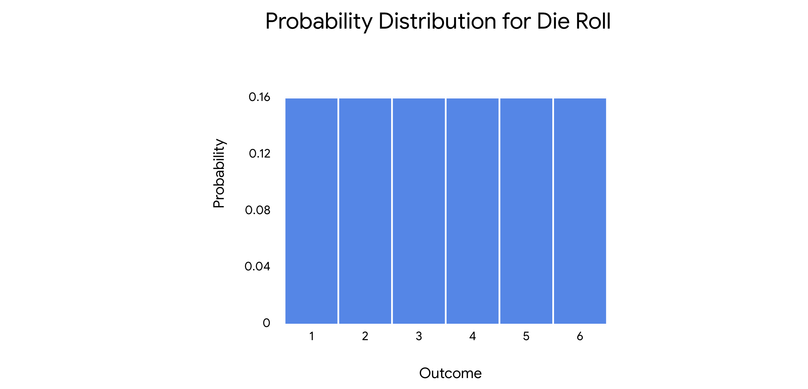

Hesaplamayı bu farklı perspektiflerden düşünmek ve probleminizi denklemle eşlemeye yardımcı olabilir.

Bayes teoremi hakkında düşünmenin bir yolu, önceki bir inancı, P (A), yeni verileri kullanarak arka bir olasılık olan P (A | B) 'ye dönüştürmenize izin vermesidir. Yeni veriler olasılık, P (B | A) ve kanıtlar, P (B).

_**Not:**_ _Bu okuma, Bayes teoremi ile ilişkili temel kavram ve terimlere bir giriş sağlar. Bayes istatistiklerinin detaylı bir incelemesi bu dersin kapsamı dışındadır. Kariyerinizde bir veri uzmanı olarak ilerledikçe, Bayes teoremini ve çeşitli uygulamalarını daha fazla keşfetme fırsatına sahip olacaksınız_.

Şimdilik hatırlanması gereken önemli bir nokta, Bayes teoreminin hem A verilen B'nin koşullu olasılığını hem de A verilen B'nin koşullu olasılığını içerdiğidir. Bu olasılıklardan birini biliyorsanız, Bayes teoremi diğerini belirlemenize yardımcı olabilir.

Teoremin nasıl çalıştığını daha iyi anlamak için bir örneği inceleyelim.

#### **Örnek: spam filtresi**

Bayes teoreminin dijital dünyada iyi bilinen bir uygulaması spam filtreleme veya bir e-postanın spam olup olmadığını tahmin etmektir. Uygulamada, sofistike bir spam filtresi, e-postanın içeriği, başlığı, eki olup olmadığı, gönderen adresinin etki alanı türü (.edu veya.org) ve daha fazlası dahil olmak üzere birçok farklı değişkenle ilgilenir. Ancak, örneğimiz için Bayes spam filtresinin basitleştirilmiş bir sürümünü kullanabiliriz.

Diyelim ki e-postada belirli bir kelime göründüğü için bir e-postanın spam olma olasılığını belirlemek istediğinizi varsayalım. Bu örnekte, “para” kelimesini kullanalım.

Aşağıdaki bilgileri keşfedersiniz:

- Bir e-postanın spam olma olasılığı% 20'dir.
    
- Bir e-postada “para” kelimesinin görünme olasılığı% 15'tir.
    
- Bir spam e-postada “para” kelimesinin görünme olasılığı% 40'tır.
    

Bu örnekte, önceki olasılığınız, bir e-postanın spam olma olasılığıdır. Sonradan olasılığınız veya nihayetinde öğrenmek istediğiniz şey, bir e-postanın “para” kelimesini içerdiği göz önüne alındığında spam olma olasılığıdır. Önceki olasılığınızı güncellemek için kullanacağınız yeni veriler, “para” kelimesinin bir e-postada görünme olasılığı ve “para” kelimesinin spam e-postada görünme olasılığıdır.

Bayes teoremiyle çalışırken, önce A olayının ne olduğunu ve B olayının ne olduğunu bulmak yararlıdır - bu, olaylar arasındaki ilişkiyi anlamayı ve formülü kullanmayı kolaylaştırır.

A etkinliğine spam e-posta ve B olayına bir e-postada “para” kelimesinin görünüşü diyelim. Şimdi, Bayes teoremini A olayı için “spam” kelimesini ve B olayı için “para” kelimesini kullanarak yeniden yazabilirsiniz.

P (A | B) = P (B | A) * P (A)/P (B)

P (İstenmeyen İleti | Para) = P (Para | İstenmeyen İleti) * P (İstenmeyen İleti)/P (Para)

Aşağıdakileri öğrenmek istiyorsunuz:

- **P (Spam| Para) veya arka olasılık**: e-postada “para” kelimesinin görünmesi göz önüne alındığında bir e-postanın spam olma olasılığı
    

Şimdi, verilerinizi formüle girin:

- **P (SpAM) veya önceki olas** ılık: bir e-postanın spam olma olasılığı = 0.2 veya% 20
    
- **P (Para) veya kanıt:** “para” kelimesinin bir e-postada görünme olasılığı = 0.15 veya% 15
    
- **P (Para | SpAM) veya olasılık: e-postanın spam** olduğu göz önüne alındığında “para” kelimesinin bir e-postada görünme olasılığı = 0.4 veya% 40
    

P (SpAM | Para) = P (Para | SpAM) * P (SpAM)/P (Para) = 0.4 * 0.2/0.15 = 0.53333 veya yaklaşık% 53.3%.

Dolayısıyla, e-postanın “para” kelimesini içerdiği göz önüne alındığında, bir e-postanın spam olma olasılığı% 53.3'tür.

### Önemli çıkarımlar

Bayes teoremi, modern veri analitiğinde verileri analiz etmek ve yorumlamak için güçlü bir yöntem olan Bayes çıkarımı olarak da bilinen Bayes istatistik alanının temelidir. Veri uzmanları, Bayes teoremini yapay zekadan tıbbi testlere kadar çok çeşitli alanlarda kullanır.

Bayes teoremi hakkında temel bir anlayışa sahip olmak, kariyerinizde bir veri uzmanı olarak ilerledikçe Bayes istatistikleri hakkında daha fazla bilgi edinmenizi sağlayacaktır.

### Daha fazla bilgi için kaynaklar

Bayes Teoremi hakkında daha fazla bilgi edinmek için aşağıdaki kaynağa bakın:

- [Pennsylvania Eyalet Üniversitesi tarafından açıklanan Bayes teoremi](https://online.stat.psu.edu/stat500/lesson/2/2.7)
    

“Savcının yanılgısı” hakkında ilginç bir tartışma için bu sayfaya göz atın:

- [Amerikan Epidemiyoloji Dergisi tarafından savcının yanılgısının açıklaması](https://academic.oup.com/aje/article/179/9/1125/103523)

## Ayrık olasılık dağılımları

Son zamanlarda, veri profesyonellerinin farklı veri kümelerini modellemek ve verilerindeki önemli kalıpları belirlemek için olasılık dağılımlarını kullandığını öğrendiniz. Bir olasılık **dağılımının** rastgele bir olayın olası sonuçlarının olasılığını tanımladığını hatırlayın. Ayrık olasılık dağılımları, ayrık rastgele değişkenleri veya ayrık olayları temsil eder. Genellikle, ayrık olayların sonuçları sayılabilen tam sayılar olarak ifade edilir. Örneğin, bir kalıbın yuvarlanması 2 veya 3 ile sonuçlanabilir, ancak 2.575 veya 3.184 gibi ondalık bir değerle sonuçlanamaz.

Bu okumada, dört ortak ayrık olasılık dağılımının ana özelliklerine genel bir bakış elde edeceksiniz:

- Uniform
    
- Binom
    
- Bernoulli
    
- Poison
    

### Ayrık olasılık dağılımları

#### **Uniform dağılım**

Tek tip dağılım, sonuçları eşit derecede olası veya eşit olasılığa sahip olayları tanımlar.

Örneğin, bir kalıbı yuvarlamak altı sonuçla sonuçlanabilir: 1, 2, 3, 4, 5 veya 6. Her sonucun olasılığı aynıdır: 6'dan 1'i veya yaklaşık% 16.7.

Bir dağılımı histogram gibi bir grafikle görselleştirebilirsiniz. Ayrık bir dağılım için, rastgele değişken x ekseni boyunca çizilir ve karşılık gelen olasılık y ekseni boyunca çizilir. Bu durumda, x ekseni, tek bir kalıp rulosunun olası her sonucunu temsil eder ve y ekseni her sonucun olasılığını temsil eder.

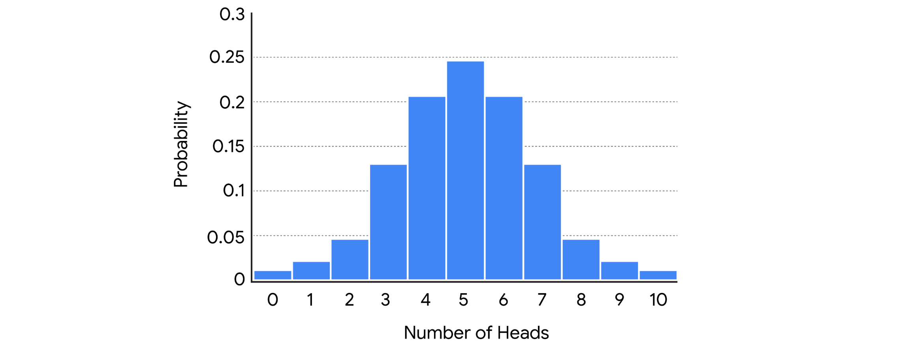

_**Not: Veri**_ _uzmanları genellikle tek tip dağılımı Monte Carlo simülasyonları gibi daha karmaşık istatistiksel yöntemlerin bir parçası olarak kullanır. Bu yöntemlerin ayrıntılı bir tartışması bu dersin kapsamı dışındadır._

_**Not:**_ _Düzgün dağılım hem ayrık hem de sürekli rastgele değişkenler için geçerlidir._

#### **Binom dağılımı**

**Binom dağılımı,** olayların olasılığını yalnızca iki olası sonuçla modeller: başarı veya başarısızlık. Bu sonuçlar birbirini dışlar ve aynı anda gerçekleşemez.

Bu tanım aşağıdakileri varsayar:

- Her olay bağımsızdır veya diğerlerinin olasılığını etkilemez.
    
- Her olay aynı başarı olasılığına sahiptir.
    

Başarı ve başarısızlığın kolaylık sağlamak için kullanılan etiketler olduğunu unutmayın. Örneğin, bir madeni para atarsanız, yalnızca iki olası sonuç vardır: kafalar veya kuyruklar. Analizinizin ihtiyaçlarına göre kafaları veya kuyrukları başarılı bir sonuç olarak etiketlemeyi seçebilirsiniz.

Binom dağılımı, binom deneyi adı verilen bir rastgele olayı temsil eder. Bir binom deneyi aşağıdaki özelliklere sahiptir:

- Deney, bir dizi tekrarlanan denemeden oluşur.
    
- Her denemenin sadece iki olası sonucu vardır.
    
- Başarı olasılığı her deneme için aynıdır.
    
- Ve, her duruşma bağımsızdır.
    

Bir binom deneyi örneği, arka arkaya 10 kez bir madeni para fırlatmaktır. Bu, aşağıdaki özelliklere sahip olduğu için binom bir deneydir:

- Deney, tekrarlanan 10 denemeden veya madeni para fırlatmasından oluşur.
    
- Her denemenin sadece iki olası sonucu vardır: kafalar veya kuyruklar.
    
- Her deneme aynı başarı olasılığına sahiptir. Başarıyı kafa olarak tanımlarsanız, her atış için başarı olasılığı aynıdır: %50.
    
- Her deneme bağımsızdır. Bir madeni para atmanın sonucu, diğer madeni para atışlarının sonucunu etkilemez.
    

Histogramda, x ekseni kafa sayısını gösterir ve y ekseni her sonucu alma olasılığını gösterir.

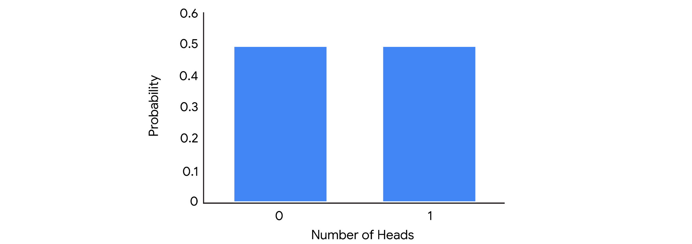

Veri uzmanları, aşağıdakileri modellemek için binom dağılımını kullanabilir:

- Yeni bir ilaç yan etkiler yaratır
    
- Kredi kartı işlemi dolandırıcılıktır
    
- Bir hisse senedi fiyatının değeri yükselir
    

Makine öğreniminde, binom dağılımı genellikle verileri sınıflandırmak için kullanılır. Örneğin, bir veri uzmanı, dijital bir görüntünün kedi veya köpek gibi belirli bir hayvan türü olup olmadığını anlamak için bir algoritma eğitebilir.

#### **Bernoulli dağılımı**

Bernoulli dağılımı, yalnızca iki olası sonucu olan olayları (başarı veya başarısızlık) modellediği için binom dağılımına benzer. Tek fark, Bernoulli dağılımının bir deneyin yalnızca tek bir denemesini ifade ederken, binomun tekrarlanan denemeleri ifade etmesidir. Bernoulli davasının klasik bir örneği, tek bir madeni para fırlatmasıdır.

Histogramda, x ekseni bir madeni para fırlatmanın olası sonuçlarını temsil eder ve y ekseni her sonucun olasılığını temsil eder.

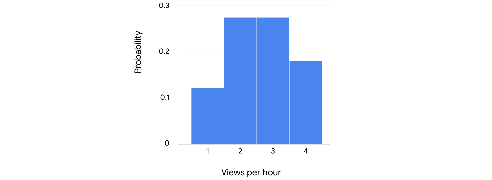

#### **Poisson dağılımı**

**Poisson dağılımı**, belirli bir zaman diliminde belirli sayıda olayın meydana gelme olasılığını modeller.

_**Not:**_ _Poisson dağılımı, mesafe, alan veya hacim gibi belirli bir alanda meydana gelen olayların sayısını temsil etmek için de kullanılabilir. Bu derste zamana odaklanıyoruz._

Poisson dağılımı, Poisson deneyi adı verilen bir tür rastgele deneyi temsil eder. Bir Poisson deneyi aşağıdaki özelliklere sahiptir:

- Deneydeki olayların sayısı sayılabilir.
    
- Belirli bir zaman diliminde meydana gelen ortalama olay sayısı bilinmektedir.
    
- Her olay bağımsızdır.
    

Örneğin, içerik yayınladığınız çevrimiçi bir web siteniz olduğunu hayal edin. Web siteniz saatte ortalama iki görüntüleme. Web sitenizin belirli bir saatte belirli sayıda görüntülenme alma olasılığını belirlemek istiyorsunuz.

Bu bir Poisson deneyidir çünkü:

- Deneydeki olayların sayısı sayılabilir. Görüntülenme sayısını sayabilirsiniz.
    
- Belirli bir zaman diliminde meydana gelen ortalama olay sayısı bilinmektedir. Saatte ortalama iki görüntüleme var.
    
- Her sonuç bağımsızdır. Bir kişinin web sitenizi görüntüleme olasılığı, başka bir kişinin web sitenizi görüntüleme olasılığını etkilemez.
    

Histogramda, x ekseni saatte görüntüleme sayısını gösterir ve y ekseni oluşma olasılığını gösterir.

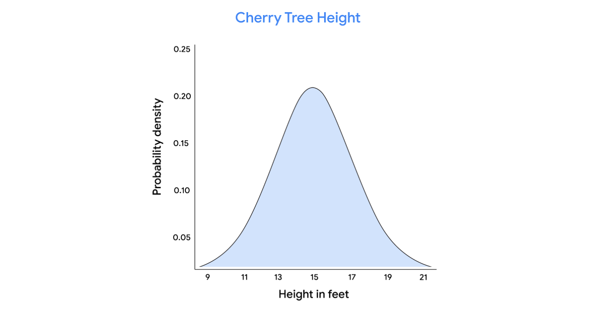

Veri uzmanları, aşağıdakilerin sayısı gibi verileri modellemek için Poisson dağılımını kullanır:

- Müşteri hizmetleri çağrı merkezi için saatlik çağrı
    
- Bir mağazada günlük müşteriler
    
- Bir şehirde aylık gök gürültülü fırtınalar
    
- Bir bankada saniyede finansal işlemler
    

### Önemli çıkarımlar

Verilerinizin dağılımını belirlemek, herhangi bir analizde önemli bir adımdır ve gelecekteki sonuçlar hakkında bilinçli tahminler yapmanıza yardımcı olur. Gelecekteki bir veri uzmanı olarak kariyerinizde, verilerinizi daha iyi anlamak için binom ve Poisson gibi ayrık dağılımları kullanacaksınız. Verilerinizin olasılık dağılımını bilmek, analiziniz için en uygun istatistiksel yöntemi veya makine öğrenimi modelini seçmenize de yardımcı olacaktır.

### Daha fazla bilgi için kaynaklar

Ayrık olasılık dağılımları hakkında daha fazla bilgi edinmek için aşağıdaki kaynaklara bakın:

- [Statistics How To'nun bu makal](https://www.statisticshowto.com/discrete-probability-distribution/) esi, ayrık olasılık dağılımı kavramına genel bir bakış sağlar ve binom ve Poisson gibi belirli dağılım türleri hakkında daha fazla bilgi edinmek için bağlantılar sunar..

## Normal dağılımlı model verileri

Son zamanlarda, sürekli olasılık dağılımları ve veri profesyonellerinin verilerini modellemesine nasıl yardımcı olduklarını öğreniyorsunuz. Sürekli olasılık dağılımlarının, bir dizi sayı içindeki tüm olası değerleri alabilen sürekli rastgele değişkenleri temsil ettiğini hatırlayın. Tipik olarak, bunlar boy, ağırlık, zaman veya sıcaklık gibi ölçülebilen ondalık değerlerdir. Örneğin, ölçüm süresini daha doğru bir şekilde sürdürebilirsiniz: 1.1 saniye, 1.12 saniye, 1.1257 saniye vb.

Bu derste tek bir sürekli olasılık dağılımına odaklanıyoruz: normal dağılım. Bu okumada, normal dağılımın temel özellikleri ve dağıtımın verilerinizi modellemenize nasıl yardımcı olabileceği hakkında daha fazla bilgi edineceksiniz.

### Sürekli olasılık dağılımları

Normal dağılımın belirli niteliklerine geçmeden önce, tüm sürekli olasılık dağılımlarının bazı genel özelliklerini tartışalım.

#### **Olasılık Yoğunluğu ve Olasılık**

Olasılık fonksiyonu, rastgele bir değişkenin olası sonuçları için olasılıklar sağlayan matematiksel bir fonksiyondur.

İki tür olasılık fonksiyonu vardır:

- Olasılık Kütle Fonksiyonları (PMF'ler) ayrık rastgele değişkenleri temsil eder
    
- Olasılık Yoğunluk Fonksiyonları (PDF'ler) sürekli rastgele değişkenleri temsil eder
    

Bir olasılık fonksiyonu bir denklem veya grafik olarak gösterilebilir. Olasılık fonksiyonlarında yer alan matematik bu dersin kapsamı dışındadır. Şimdilik, bir PDF'nin grafiğinin bir eğri olarak göründüğünü bilmek önemlidir. Normal dağılım grafiğine atıfta bulunan çan eğrisini öğrendiniz.

Örnek olarak, rastgele bir kiraz ağacı örneği hakkında verileriniz olduğunu hayal edin. Kiraz ağaçlarının yüksekliklerinin ortalama 15 fit ve 2 fit standart sapma ile yaklaşık olarak normal olarak dağıldığını varsayalım.


Sürekli bir dağılımda, x ekseni ölçtüğünüz değişkenin değerini ifade eder - bu durumda kiraz ağacı yüksekliği. Y ekseni olasılık yoğunluğunu ifade eder. Olasılık yoğunluğunun olasılık ile aynı şey olmadığını unutmayın.

Sürekli bir rastgele değişken için olasılık dağılımı size yalnızca değişkenin bir değer aralığı veya aralığı alma olasılığını söyleyebilir. Bunun nedeni, sürekli bir rastgele değişkenin sonsuz sayıda olası değere sahip olabilmesidir. Örneğin, rastgele seçilen bir kiraz ağacının yüksekliği 15 fit veya 15,1 fit veya 15.175 fit veya 15.175245 fit vb. Ölçülebilir.

Rastgele seçilen bir kiraz ağacının yüksekliğinin tam olarak 15,1 fit olma olasılığını bilmek istediğinizi varsayalım. Ağacın yüksekliği belirli bir aralıkta herhangi bir ondalık değer olabileceğinden, ağacın tam olarak herhangi bir tek değer olma olasılığı esasen sıfırdır.

Bu nedenle, sürekli dağılımlar için, yalnızca 14,5 fit ile 15,5 fit arasındaki aralık gibi aralıkların olasılığı hakkında konuşmak mantıklıdır.

Bir aralığın olasılığını bulmak için, aralığa karşılık gelen eğrinin altındaki alanı hesaplarsınız. Örneğin, bir kiraz ağacının 14,5 fit ile 15,5 fit arasında bir yüksekliğe sahip olma olasılığı, x eksenindeki 14.5 ve 15.5 değerleri arasındaki eğrinin altındaki alana eşittir. Bu alan grafiğin ortasındaki gölgeli dikdörtgen olarak görünür.

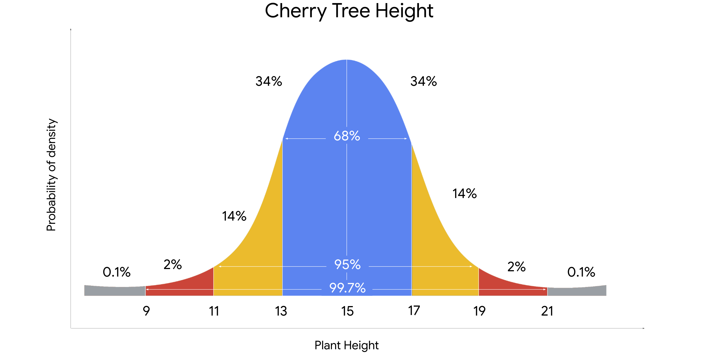

Bu durumda, dikdörtgenin alanı 0.20 civarındadır. Dolayısıyla, rastgele seçilen bir kiraz ağacının yüksekliğinin 14,5 fit ile 15, 5 fit arasında olma ihtimali %20 vardır.

**Not:** veri uzmanları genellikle sürekli bir dağılımdaki olasılıkları hesaplamak için istatistiksel yazılım kullanır.

#### **Normal dağılım**

Normal dağılım, ortalama ve çan şeklinde simetrik olan sürekli bir olasılık dağılımıdır. Formülünü ilk tanımlayan Alman matematikçi Carl Gauss'tan sonra Gauss dağılımı olarak da bilinir. Normal dağılım genellikle çan eğrisi olarak adlandırılır çünkü grafiği merkezde bir tepe ve iki aşağı eğimli kenarı olan bir çan şeklindedir.

Normal dağılım, istatistikteki en yaygın olasılık dağılımıdır çünkü pek çok farklı veri kümesi çan şeklinde bir eğri gösterir. Örneğin, 100 kişiyi rastgele örneklerseniz, boy, kilo, kan basıncı, ayakkabı boyutu, test puanları ve daha fazlası gibi sürekli değişkenler için normal bir dağılım eğrisi keşfedeceksiniz.

Tüm normal dağılımlar aşağıdaki özelliklere sahiptir:

- Şekil bir çan eğrisidir
    
- Ortalama eğrinin merkezinde bulunur
    
- Eğri, ortalamanın her iki tarafında simetriktir
    
- Eğrinin altındaki toplam alan 1'e eşittir
    

Normal dağılımın özelliklerini netleştirmek için kiraz ağacı örneğimizi kullanalım. Ortalama yüksekliğin 2 fit standart sapma ile 15 fit olduğunu hatırlayın.


Normal eğrinin aşağıdaki özelliklerini fark edebilirsiniz:

- Ortalama eğrinin merkezinde bulunur ve aynı zamanda eğrinin zirvesidir. Ortalama 15 fit yükseklik, veri kümesindeki en olası sonucu temsil eder
    
- Eğri ortalama hakkında simetriktir. Verilerin% 50'si ortalamanın üzerindedir ve verilerin% 50'si ortalamanın altındadır.
    
- Bir nokta ortalamadan ne kadar uzaksa, bu sonuçların olasılığı o kadar düşük olur. Ortalamadan en uzak noktalar, veri kümesindeki en az olası sonuçları temsil eder. Bunlar kısa veya uzun, daha aşırı yüksekliklere sahip ağaçlardır
    
- Eğrinin altındaki alan 1'e eşittir. Bu, eğrinin altındaki alanın dağılımdaki olası sonuçların% 100'ünü oluşturduğu anlamına gelir.
    

#### **Ampirik kural**

Normal bir eğrideki değerlerin ortalamaya olan mesafelerine bağlı olarak düzenli bir düzende dağıldığını da fark edebilirsiniz. Bu **ampirik kural olarak bilinir.** Kural, normal dağılıma sahip belirli bir veri kümesi için şunu belirtir:

- Değerlerin% 68'i ortalamanın 1 standart sapması dahilinde
    
- Değerlerin% 95'i ortalamanın 2 standart sapması dahilinde
    
- Değerlerin% 99,7'si ortalamanın 3 standart sapması içine düşer

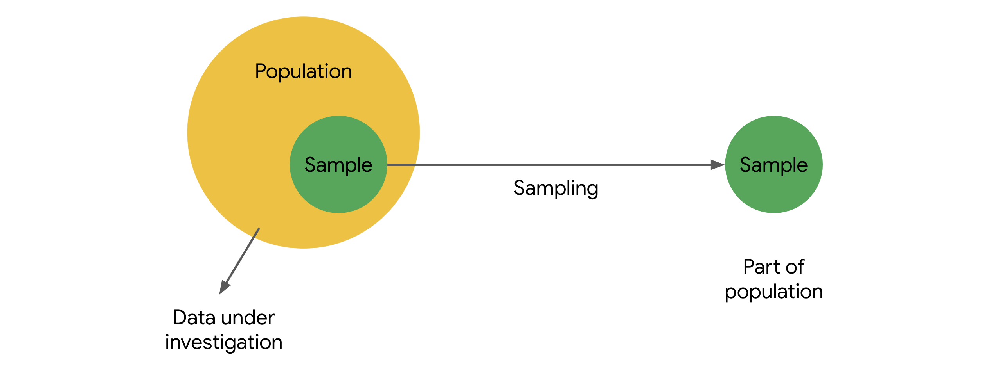

Ampirik kuralı kiraz ağacı örneğimize uygularsanız, aşağıdakileri öğrenirsiniz:

- Çoğu ağaç veya% 68, ortalama 15 fit yüksekliğin 1 standart sapmasına düşecektir. Bu, ağaçların% 68'inin 13 fit ile 17 fit arasında veya ortalamanın 2 fit altında ve ortalamanın 2 fit üzerinde olacağı anlamına gelir.
    
- Ağaçların %95'i 11 fit ile 19 fit arasında veya ortalamadan 2 standart sapma içinde ölçülecektir.
    
- Hemen hemen tüm ağaçlar veya% 99.7, 9 fit ile 21 fit arasında veya ortalamanın 3 standart sapması içinde ölçülecektir.
    

Ampirik kural, büyük bir veri kümesindeki değerlerin nasıl dağıtıldığına dair hızlı bir tahmin verebilir. Bu zaman kazandırır ve verilerinizi daha iyi anlamanıza yardımcı olur.

Değerlerinizin normal dağılımdaki konumunu bilmek, aykırı değerleri tespit etmek için de yararlıdır. Bir aykırı değerin, verilerin geri kalanından önemli ölçüde farklı bir değer olduğunu hatırlayın. Tipik olarak, veri uzmanları, ortalamanın altında veya üzerinde 3'ten fazla standart sapma bulunan değerleri aykırı değerler olarak kabul eder. Bazı aşırı değerler veri toplama veya veri işlemedeki hatalardan kaynaklanabileceğinden ve bu yanlış değerler sonuçlarınızı çarpıtabileceğinden, aykırı değerleri belirlemek önemlidir.

#### Önemli çıkarımlar

Bir veri uzmanı olarak, çok çeşitli veri kümelerinde önemli kalıpları belirlemek için muhtemelen normal dağılımı kullanacaksınız. Normal dağılımı anlamak, daha sonra öğreneceğiniz hipotez testi ve regresyon analizi gibi daha gelişmiş istatistiksel yöntemler için de önemlidir.

#### Daha fazla bilgi için kaynaklar

Sürekli olasılık dağılımları ve normal dağılım hakkında daha fazla bilgi edinmek için aşağıdaki kaynaklara göz atın:

- [Duke Üniversitesi'nden bu makale, normal dağılımın temel özelliklerinin yararlı bir özetini sunmaktadır](https://sites.nicholas.duke.edu/statsreview/continuous-probability-distributions/)

## Standart Sapma ve Alt-Üst Limit Hesabı 


