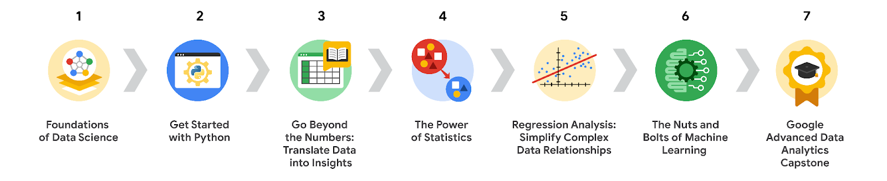

# Google İleri Düzey Veri Analitiği Sertifikası Genel Bakış

Merhaba ve **Google İleri Düzey Veri Analitiği Sertifikası**'na hoş geldiniz! Bu sertifika programındaki sekiz ders, bilginizi ilerletmenize ve veri analitiği profesyoneli olarak kariyerinizde gelişmenize yardımcı olacaktır. Veri analitiği konusunda temel bir bilgi birikimi güçlü şekilde tavsiye edilir.

## Büyüyen Bir Alana Giriş Yapın

Veri analitiği becerileri neden bu kadar talep görüyor? Şirketler, veri analitiğinde [en büyük beceri açığını](https://www.mckinsey.com/capabilities/people-and-organizational-performance/our-insights/beyond-hiring-how-companies-are-reskilling-to-address-talent-gaps) bildiriyorlar ve veri analitiği becerilerine olan talep, ABD’de ortalama bir beceriye olan talepten [15 kat daha hızlı](https://www.weforum.org/agenda/2022/11/digital-skills-labour-market-future/) artıyor. Bilgi işlem gücünün hız kazanmasıyla birlikte, sektörler kendilerine sunulan artan veri miktarından faydalanmaya çalışıyor. Şirketler, müşterilerini daha iyi anlamak ve ürün ve hizmetlerini geliştirmek için veri analizini entegre ediyor. Giderek daha fazla sayıda şirket, gelecekteki iş kararlarını yönlendirmeye yardımcı olmak için veri profesyonelleri istihdam ediyor. Sonuç olarak, veri profesyonellerinin makine öğrenmesinin sunduğu zorlukları ve olanakları daha iyi anlamaları, doğru tahmin modelleri oluşturmaları ve bulgularını açık bir şekilde ifade edebilmeleri gerekiyor.

Bu program boyunca, bir veri profesyoneli olarak bilgi ve becerilerinizi geliştirmenize yardımcı olacak kavramlar ve senaryoları keşfedeceksiniz.

## Google İleri Düzey Veri Analitiği Sertifikası Dersleri

Google İleri Düzey Veri Analitiği Sertifikası sekiz dersten oluşur. Her derste, veri analitiği profesyonellerinin günlük olarak gerçekleştirdiği çalışmalara benzer uygulamalı etkinlikler yapacaksınız. Bu sayede, verilerdeki hikayeleri etkili bir şekilde ortaya çıkarma ve eğilimlere dair içgörüler sağlayan modeller oluşturma deneyimi kazanacaksınız. Programın sonunda Python kullanarak programlama yapmayı, analiz için veri hazırlamayı, istatistikleri kullanmayı, tahmin modelleri oluşturmayı, makine öğrenmesi yeteneklerini optimize etmeyi ve daha fazlasını öğrenmiş olacaksınız. Programın dersleri şunlardır:

1. [**Veri Biliminin Temelleri**](https://www.coursera.org/learn/foundations-of-data-science/home/week/1)
    
1. [**Python ile Başlayın**](https://www.coursera.org/learn/get-started-with-python/home/week/1)
    
1. [**Rakamların Ötesine Geçin: Veriyi İçgörüye Dönüştürün**](https://www.coursera.org/learn/go-beyond-the-numbers-translate-data-into-insight/home/week/1)
    
1. [**İstatistiğin Gücü**](https://www.coursera.org/learn/the-power-of-statistics/home/week/1)
    
1. [**Regresyon Analizi: Karmaşık Veri İlişkilerini Basitleştirin**](https://www.coursera.org/learn/regression-analysis-simplify-complex-data-relationships/home/week/1)
    
1. [**Makine Öğrenmesinin Temelleri**](https://www.coursera.org/learn/the-nuts-and-bolts-of-machine-learning/home/week/1)
    
1. [**Google İleri Düzey Veri Analitiği Capstone Projesi**](https://www.coursera.org/learn/google-advanced-data-analytics-capstone/home/week/1)
    
1. [**Yapay Zeka ile İş Aramanızı Hızlandırın**](https://www.coursera.org/learn/accelerate-your-job-search-with-ai/home/module/1)
    

## Google Veri Analitiği Sertifikası İçeriği

Bu dersler, [Google Veri Analitiği Sertifikası](https://www.coursera.org/professional-certificates/google-data-analytics?utm_source=google&utm_medium=institutions&utm_campaign=gwgsite-gDigital-paidha-sem-bk-data-exa-glp-br-null&_ga=2.122602571.1926911371.1663777781-1123481676.1663777781) kapsamında incelenen birçok temel kavram üzerine inşa edilmiştir ve Veri Analitiği Sertifikası derslerinden içerik bağlantılarıyla karşılaşacaksınız. Bu materyaller isteğe bağlı bir tekrar sağlamakta ve faydalı bir kaynak olarak hizmet etmektedir.

## İş Arayanlar için Faydalar

Yedi dersi tamamladıktan sonra, Google’ın sunduğu özel iş arama kaynaklarına erişim kazanacaksınız. Aşağıdakileri yapma fırsatınız olacak:

- Özgeçmişinizi oluşturun, örnek mülakatlara katılın ve program mezunlarına ücretsiz sunulan Big Interview platformu üzerinden iş arama ipuçları alın.
    
- Google tarafından, sertifika mezunları düşünülerek oluşturulmuş Interview Warmup aracıyla mülakat tekniğinizi geliştirin. Veri analitiğine özel uygulama sorularına erişin, cevaplarınızın transkriptlerini alın ve becerilerinizi geliştirmenize yardımcı olacak otomatik içgörüler elde edin.
    
- Career Circle üzerinden binlerce iş ilanına ve ücretsiz bire bir kariyer danışmanlığına erişin. (Programa katılmak için ABD’de çalışma iznine sahip olmanız gerekmektedir.)
    
- Google İleri Düzey Veri Analitiği Sertifika rozetinizi talep edin ve LinkedIn üzerinden başarınızı paylaşarak potansiyel işverenler arasında öne çıkın.
    

Veri analitiği alanında tatmin edici bir kariyere doğru attığınız bu adım için sizi tebrik ederiz!
