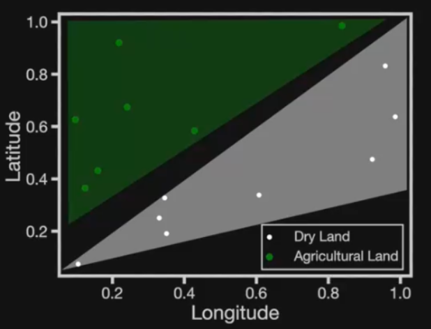
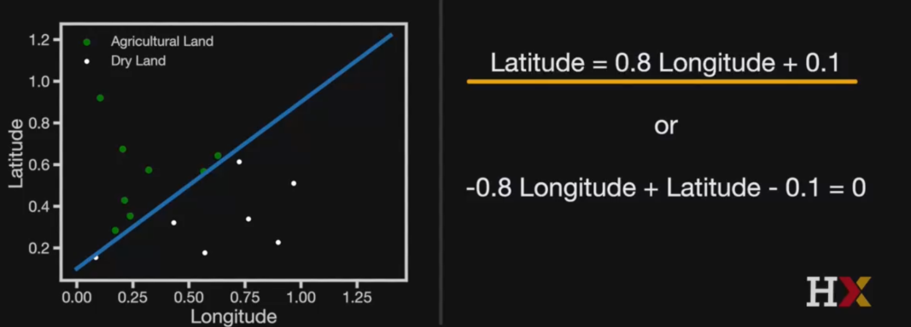
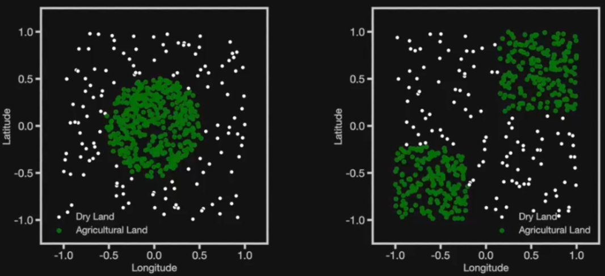
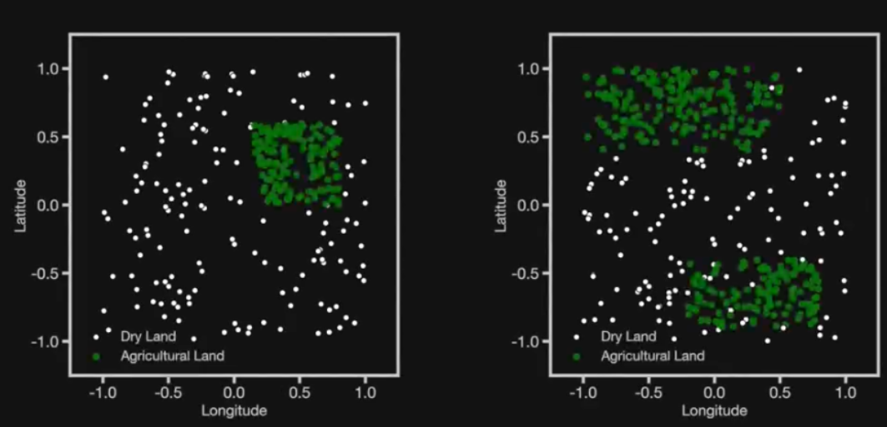

# Decision Trees

En bilindik olanı Logistic Regression'dır.

Logistic Regression şu durumlarda iyi davranır;

- Eğer veriler iyi bir şekilde ayrık duruyorsa
- Eğer ayrıldıkları alanlar iyi bir geometrik şekle sahipse. 



Sınıflandırma Sınırları veya Karar Sınırları, sınıf 1 ve sınıf 0'da olma olasılıklarının eşit olduğu durumlarda tanımlanır, yani

$$ P(Y = 1) = P(Y = 0) = 1 - P(Y = 1) = 0,5 $$

Log-odds sıfır olduğunda eşdeğerdir:

$$ X_\beta = 0 $$

Bu eşitlik çizgi veya çoklu düzlemler tanımlar.

Örneğin, şekilde mavi bir çizgi ile gösterilen karar sınırını tanımlayan denklem:



Bu, sınıflandırma sınırı güzel ve basit bir geometriye sahip olduğunda iyi çalışır... peki ya bunlar?




Bu tür veri kümelerinde sınıflar özellik uzayında hala iyi bir şekilde ayrılmıştır, ancak karar sınırları tek bir denklemle kolayca tanımlanamaz.


```Python

```


### 
## 3.3
# 4