# Part I: Introduction to Competitions *(Bölüm I: Yarışmalara Giriş)*

## Chapter 1: Introducing Kaggle and Other Data Science Competitions *(Bölüm 1: Kaggle ve Diğer Veri Bilimi Yarışmalarına Giriş)*

Veri bilimi yarışmaları uzun zamandır var ve zaman içinde giderek artan bir başarı elde ettiler. Tutkulu bir yarışmacı topluluğundan doğan bu yarışmalar, giderek daha fazla ilgi çekmeye ve milyonlarca veri bilimciden oluşan çok daha geniş bir kitleye ulaşmaya başladı. En popüler veri bilimi yarışma platformu olan **Kaggle**’da uzun yıllardır yarışmacı olarak yer aldığımız için, bu değişimlerin tümüne yıllar boyunca doğrudan tanıklık ettik ve bizzat deneyimledik.

Bugün, Kaggle ve diğer yarışma platformları hakkında bilgi ararsanız, çok sayıda **buluşma (meetup)**, **tartışma paneli**, **podcast**, **röportaj** ve hatta bu tür yarışmalarda nasıl kazanılacağını anlatan **çevrimiçi kurslar** bulabilirsiniz. (Genellikle bu kurslar size azim, hesaplama kaynakları ve harcanan zamanın doğru karışımını kullanmanızı tavsiye eder.) Ancak, şu anda okumakta olduğunuz kitap dışında, bu kadar çok veri bilimi yarışmasını nasıl yöneteceğinizi ve onlardan nasıl en iyi şekilde yararlanabileceğinizi — yalnızca puan veya sıralama açısından değil, **profesyonel deneyim** bakımından da — sistematik bir şekilde anlatan bir rehber bulmanız oldukça zordur.

Bu kitapta amacımız, Kaggle veya diğer veri bilimi yarışmalarında nasıl yüksek puan alacağınızı anlatan birkaç ipucu vermek değil. Bunun yerine, **Kaggle’da daha etkili yarışmanız** ve yarışma deneyimlerinizden — özellikle de profesyonel hayatınız açısından — **en fazla faydayı elde etmeniz** için kapsamlı bir rehber sunmak istiyoruz. Kitap içeriğine, **Kaggle Master** ve **Grandmaster**’larla yapılan röportajlar da eşlik ediyor. Bu röportajların size Kaggle’da yarışmanın belirli yönleri hakkında farklı bakış açıları ve içgörüler sunacağını ve rekabetçi veri bilimi yaparken kendinizi sınama ve öğrenme biçiminize ilham vereceğini umuyoruz.

Bu kitabın sonunda, **kendi deneyimlerimizden**, **yarışmalardan edindiğimiz bilgilerden** ve **kaynaklardan** doğrudan derlediğimiz bilgileri içselleştirmiş olacaksınız. Böylece yarışmadan yarışmaya öğrenmenizi ve gelişmenizi sağlayacak bir yol haritasına sahip olacaksınız.

Başlangıç noktası olarak, bu bölümde şunları inceleyeceğiz:

* Rekabetçi programlamanın nasıl veri bilimi yarışmalarına evrildiğini,
* Neden Kaggle platformunun bu tür yarışmalar için en popüler site olduğunu,
* Ve bu platformun nasıl çalıştığını.

Bu bölümde aşağıdaki konuları ele alacağız:

* Veri bilimi yarışma platformlarının yükselişi
* **Common Task Framework** (Ortak Görev Çerçevesi) paradigması
* Kaggle platformu ve bazı alternatifleri
* Bir Kaggle yarışmasının nasıl işlediği: aşamaları, yarışma türleri, gönderim ve liderlik tablosu dinamikleri, hesaplama kaynakları, ağ oluşturma ve daha fazlası

### The rise of data science competition platforms *(Veri bilimi yarışma platformlarının yükselişi)*

Rekabetçi programlamanın köklü bir geçmişi vardır; 1970’lerde düzenlenen ilk **ICPC (International Collegiate Programming Contest – Uluslararası Üniversitelerarası Programlama Yarışması)** ile başlamıştır. İlk ICPC’de, üniversitelerden ve şirketlerden gelen küçük takımlar, bir dizi problemi bilgisayar programı kullanarak çözmeleri gereken bir yarışmaya katılıyordu (başlangıçta katılımcılar **FORTRAN** dilinde kodlama yapıyordu). İyi bir final sıralaması elde etmek için takımların güçlü **takım çalışması**, **problem çözme** ve **programlama** becerileri sergilemeleri gerekiyordu.

Bu tür bir yarışmanın yoğun atmosferinde yer almak ve işe alım yapan şirketlerin dikkatini çekme fırsatı, öğrencilere büyük bir motivasyon sağladı ve yarışmanın yıllar boyunca popüler kalmasına neden oldu. ICPC finalistleri arasında, günümüzde oldukça tanınmış isimler vardır: **Adam D’Angelo** (Facebook’un eski CTO’su ve Quora’nın kurucusu), **Nikolai Durov** (Telegram Messenger’ın kurucu ortağı) ve **Matei Zaharia** (Apache Spark’ın yaratıcısı). Bu isimlerin yanı sıra birçok profesyonel aynı ortak deneyimi paylaşır: bir ICPC yarışmasına katılmışlardır.

ICPC’nin ardından, özellikle 2000 yılından sonra uzaktan katılımın kolaylaşmasıyla programlama yarışmaları büyük bir gelişme gösterdi. Bu sayede uluslararası yarışmaların düzenlenmesi hem daha kolay hem de daha düşük maliyetli hale geldi. Bu yarışmaların çoğunun formatı benzerdir: bir dizi problem verilir ve katılımcıların bunları çözmek için kod yazması gerekir. Kazananlar sadece ödül kazanmakla kalmaz, aynı zamanda işe alım yapan şirketlerin dikkatini çeker veya kendi alanlarında tanınır hale gelirler.

Rekabetçi programlamadaki problemler genellikle **kombinatorik**, **sayı teorisi**, **graf teorisi**, **algoritmik oyun teorisi**, **hesaplamalı geometri**, **dizgi analizi** ve **veri yapıları** gibi konulardan oluşur. Son yıllarda ise **yapay zekâ** ile ilgili problemler de bu yarışmalarda yer almaya başlamıştır. Özellikle **KDD Cup**’ın (Knowledge Discovery and Data Mining Cup – Bilgi Keşfi ve Veri Madenciliği Yarışması) başlatılmasından sonra bu tür problemler oldukça popüler hale gelmiştir. Bu yarışma, her yıl **Association for Computing Machinery (ACM)** tarafından düzenlenen konferans kapsamında **Özel İlgi Grubu (SIG)** tarafından yürütülmektedir. (Kaynak: [https://kdd.org/conferences](https://kdd.org/conferences))

İlk **KDD Cup**, 1997 yılında düzenlenmiş ve **doğrudan pazarlamada lift eğrisi optimizasyonu** konusundaki bir problemi içermiştir. Bu yarışma, günümüzde hâlâ devam eden uzun bir yarışma serisinin başlangıcını oluşturmuştur. Veri kümeleri, yönergeler ve kazananlar dâhil olmak üzere tüm arşivlere şu adresten ulaşabilirsiniz: [https://www.kdd.org/kdd-cup](https://www.kdd.org/kdd-cup). Yazım sırasında en son mevcut olan yarışma ise [https://ogb.stanford.edu/kddcup2021/](https://ogb.stanford.edu/kddcup2021/).
KDD Cup yarışmaları, en iyi uygulamaları belirlemede oldukça etkili olmuştur. Birçok makalede yarışma çözümleri, teknikler ve veri kümeleri paylaşılmış, bu da araştırmacılar ve uygulayıcılar için **deney**, **eğitim** ve **karşılaştırma (benchmarking)** açısından büyük fayda sağlamıştır.

Hem rekabetçi programlama etkinliklerinin hem de KDD Cup’ın başarısı, şirketleri (örneğin **Netflix**) ve girişimcileri (örneğin Kaggle’ın kurucusu **Anthony Goldbloom**) **veri bilimi yarışma platformları** kurmaya teşvik etti. Bu platformlar, şirketlerin çözülmesi zor veri bilimi problemlerini kitle kaynaklı çözümlerle çözebilmesine olanak tanıdı. Gerçekten de veri bilimi alanında her problem için işe yarayan tek bir “altın” yöntem yoktur; çoğu zaman, **“deneyebileceğin her şeyi dene”** yaklaşımı gerekir.

Aslında, uzun vadede hiçbir algoritma tüm problemler için diğerlerini alt edemez. Bu durum, **David Wolpert** ve **William Macready** tarafından ortaya konan **No Free Lunch Teoremi (Bedava Öğle Yemeği Yok Teoremi)** ile açıklanır. Bu teoreme göre, her makine öğrenimi algoritması yalnızca çözümü içeren bir hipotez uzayına sahipse başarılı olur. Dolayısıyla, bir algoritmanın belirli bir problemi en iyi şekilde çözebileceğini önceden bilemezsiniz; bunu öğrenmenin tek yolu, algoritmayı doğrudan o problem üzerinde test etmektir.
Makine öğreniminde herhangi bir “kutsal kâse” veya teorik kestirme yoktur — yalnızca **ampirik deneyler** size neyin işe yaradığını gösterebilir.

Bu konuda daha fazla bilgi edinmek için **No Free Lunch Teoremi** üzerine kuramsal açıklamaları inceleyebilirsiniz. Aşağıda bu konuyu detaylı anlatan bir makaleye bağlantı verilmiştir:
👉 [Analytics India Magazine – What are the No Free Lunch Theorems in Data Science?](https://analyticsindiamag.com/what-are-the-no-free-lunch-theorems-in-data-science/)

Bu tür durumlarda **crowdsourcing (kitle kaynak kullanımı)** mükemmel bir yöntemdir; çünkü algoritmaları ve veri dönüşümlerini kapsamlı bir şekilde test etmeniz gerekir, ancak bunu yapacak insan gücü ve işlem gücünüz yoktur. Bu nedenle, hükümetler ve şirketler belirli alanlarda ilerleme kaydetmek için yarışmalara başvurur:

* **Kamu tarafında:** ABD’nin **DARPA** kuruluşu tarafından düzenlenen yarışmalarda; **otonom araçlar**, **robotik operasyonlar**, **makine çevirisi**, **konuşmacı tanıma**, **parmak izi tanıma**, **bilgi erişimi**, **OCR (Optik Karakter Tanıma)**, **otomatik hedef tanıma** gibi birçok alanda yarışmalar düzenlenmiştir.
* **Şirket tarafında:** Örneğin **Netflix**, kullanıcıların film tercihlerinin tahmin edilmesini iyileştirmek amacıyla düzenlenen bir yarışmanın sonucuna göre algoritmasını geliştirmiştir.

**Netflix Yarışması (Netflix Prize)**, mevcut **öneri sistemini** (collaborative filtering) geliştirmeyi amaçlıyordu. Yarışmanın hedefi, bir kullanıcının bir filme vereceği puanı, yalnızca daha önce puanladığı filmlerden yola çıkarak tahmin etmekti — yani kullanıcı kimliği veya film açıklamaları hakkında hiçbir bilgi yoktu (bunların tümü kimlik kodlarıyla değiştirilmişti). Katılımcılardan, mevcut puan geçmişini akıllıca kullanarak tahmin yapan modeller geliştirmeleri istendi.
**1.000.000 ABD Doları** tutarındaki büyük ödül, yalnızca geliştirilen modelin Netflix’in mevcut algoritması **Cinematch**’i belirli bir eşiğin üzerinde iyileştirmesi durumunda verilecekti.

Yarışma 2006’dan 2009’a kadar sürdü ve kazanan takım, önceki yarışmalardan birçok takımın birleşmesiyle oluştu: **Commendo Research & Consulting GmbH**’den **Andreas Töscher** ve **Michael Jahrer** (aynı zamanda Kaggle’da da tanınan yarışmacılar), **AT&T Labs**’tan iki araştırmacı ve **Yahoo!**’dan iki araştırmacı.
Yarışmayı kazanmak, o kadar büyük bir hesaplama gücü ve farklı çözümlerin birleştirilmesini (ensemble) gerektirdi ki, takımlar rekabeti sürdürebilmek için birleşmek zorunda kaldılar. Sonuçta, **Netflix** bu çözümü doğrudan uygulamak yerine, yarışmadan elde edilen en değerli içgörüleri alıp mevcut **Cinematch algoritmasını** geliştirmede kullandı.
Bu konuda daha fazla bilgi için şu **Wired** makalesini okuyabilirsiniz:
👉 [https://www.wired.com/2012/04/netflix-prize-costs/](https://www.wired.com/2012/04/netflix-prize-costs/)

Netflix yarışmasının sonunda önemli olan şey, çözümün kendisi değil, **Netflix’in iş modelinin DVD kiralamadan çevrimiçi yayın platformuna geçmesiyle** birlikte elde edilen **bilgi ve deneyimdi**. Yarışmadan hem katılımcılar (öneri sistemleri alanında büyük bir ün kazandılar) hem de Netflix (geliştirilmiş öneri sistemi bilgisini yeni iş modeline aktardı) büyük fayda sağladı.

#### The Kaggle competition platform *(Kaggle yarışma platformu)*

**Netflix dışındaki birçok şirket de veri bilimi yarışmalarından fayda sağlamıştır.** Liste oldukça uzundur, ancak yarışmayı düzenleyen şirketlerin açık bir şekilde fayda elde ettiğini bildirdiği birkaç örneği verebiliriz. Örneğin:

* **Allstate** adlı sigorta şirketi, yüzlerce veri bilimcinin katıldığı bir yarışma sayesinde ([https://www.kaggle.com/c/ClaimPredictionChallenge](https://www.kaggle.com/c/ClaimPredictionChallenge)), kendi uzmanları tarafından geliştirilen aktüeryal modellerini önemli ölçüde iyileştirebilmiştir.
* Başka iyi belgelenmiş bir örnek olarak, **General Electric**, havayolu uçuşlarının varış zamanlarını tahmin etmede kullanılan sektör standardı performans ölçütüne göre (kök ortalama kare hatası – *root mean squared error* metriğiyle ölçülür) %40’lık bir gelişme sağlamıştır. Bu başarı, benzer bir yarışma sayesinde elde edilmiştir ([https://www.kaggle.com/c/flight](https://www.kaggle.com/c/flight)).

**Kaggle yarışma platformu** bugüne kadar yüzlerce yarışma düzenlemiştir ve bu iki örnek, platformu başarıyla kullanan şirketlerden yalnızca birkaçıdır.
Şimdi, belirli yarışmaların ötesine geçip bu kitabın da merkezinde yer alan **Kaggle şirketi** hakkında konuşalım.

##### A history of Kaggle *(Kaggle’ın tarihçesi)*

**Kaggle**, ilk adımlarını **Şubat 2010’da**, ekonomist ve ekonometrikçi olarak eğitim almış Avustralyalı **Anthony Goldbloom** sayesinde attı. Goldbloom, Avustralya Hazine Bakanlığı’nda (*Department of the Treasury*) ve Avustralya Merkez Bankası’nın (*Reserve Bank of Australia*) Araştırma Departmanı’nda çalıştıktan sonra, Londra’da haftalık uluslararası dergi **The Economist**’te staj yaptı.

The Economist’te çalıştığı dönemde “**büyük veri (big data)**” üzerine bir makale yazma fırsatı buldu. Bu makale, onun aklına **ilginç makine öğrenimi problemlerini çözmek için en iyi analitik uzmanları kitlesel katılımla (crowdsourcing) bir araya getirecek bir yarışma platformu kurma fikrini** getirdi ([kaynak](https://www.smh.com.au/technology/from-bondi-to-the-big-bucks-the-28yearold-whos-making-datascience-a-sport-20111104-1myq1.html)).

Bu platformun iş fikrinde “crowdsourcing” dinamiklerinin önemli bir rol oynamasından dolayı, Goldbloom platformun adını **Kaggle** koydu. Bu isim, İngilizce “**gaggle**” (kaz sürüsü) kelimesine bir gönderme yapıyor; kaz figürü de zaten Kaggle platformunun sembolüdür.

Goldbloom, daha sonra **ABD’nin Silikon Vadisi’ne taşındı** ve Kaggle girişimi, iki tanınmış risk sermayesi şirketi olan **Khosla Ventures** ve **Index Ventures** tarafından yönetilen bir yatırım turunda **11,25 milyon dolar** tutarında **A Serisi yatırım** aldı. İlk yarışmalar başlatıldı, topluluk hızla büyüdü ve bazı erken dönem yarışmacılar dikkat çekici başarılara ulaştı. Bunlardan biri olan **Jeremy Howard**, Avustralyalı bir veri bilimci ve girişimciydi. Kaggle’da birkaç yarışma kazandıktan sonra şirketin **Başkanı (President)** ve **Baş Bilimcisi (Chief Scientist)** oldu.

Jeremy Howard, **Aralık 2013’te** görevinden ayrıldı ve daha sonra **fast.ai** ([www.fast.ai](http://www.fast.ai)) adlı yeni bir girişim kurdu. Bu girişim, **makine öğrenimi kursları** ve **geliştiriciler için derin öğrenme (deep learning) kütüphanesi** sunmaktadır.

O dönemde öne çıkan diğer bazı **Kaggle yarışmacıları (Kagglers)** arasında **Jeremy Achin** ve **Thomas de Godoy** da bulunuyordu. Platformda **ilk 20 küresel sıralama** arasına girdikten sonra emekli olmaya karar verdiler ve **DataRobot** adlı kendi şirketlerini kurdular. Kısa süre sonra, geliştirdikleri yazılıma en iyi makine öğrenimi bilgilerini ve uygulamalarını kazandırmak amacıyla **Kaggle yarışmalarında başarılı olmuş katılımcıları işe almaya** başladılar. Bugün **DataRobot**, **AutoML (otomatik makine öğrenimi)** çözümleri geliştiren önde gelen şirketlerden biridir.

Kaggle yarışmaları, giderek artan bir ilgiyle büyümeye devam etti. **Derin öğrenmenin “babası” Geoffrey Hinton**, 2012’de **Merck** tarafından düzenlenen bir Kaggle yarışmasına katıldı ve kazandı ([kaynak](https://www.kaggle.com/c/MerckActivity/overview/winners)).

Ayrıca Kaggle, **François Chollet**’nin derin öğrenme kütüphanesi **Keras**’ı tanıttığı **Otto Group Product Classification Challenge** ([bağlantı](https://www.kaggle.com/c/otto-group-product-classification-challenge/discussion/13632)) yarışmasının ve **Tianqi Chen**’in **XGBoost** adlı daha hızlı ve daha doğru bir **gradient boosting** algoritmasını tanıttığı **Higgs Boson Machine Learning Challenge** ([bağlantı](https://www.kaggle.com/c/higgs-boson/discussion/10335)) yarışmasının da düzenlendiği platformdur.

François Chollet ayrıca **Quora** sitesinde “Kaggle yarışmalarında neden Keras bu kadar başarılı oldu?” sorusuna verdiği cevapta, Kaggle yarışmalarında başarılı olmanın özünü mükemmel bir şekilde açıklamıştır ([kaynak](https://www.quora.com/Why-has-Keras-been-so-successful-lately-at-Kaggle-competitions)).
Ona göre, **çok sayıda denemeyi hızlı şekilde yapmak ve teoriden ziyade ampirik kanıtlarla yönlenmek**, Kaggle’da başarılı olmanın temelidir. Biz de onun belirttiği noktaların dışında başka bir “gizli sır” olduğuna inanmıyoruz.

François Chollet ayrıca Kaggle’da kendi yarışmasını da düzenlemiştir ([Abstraction and Reasoning Challenge](https://www.kaggle.com/c/abstraction-and-reasoning-challenge/)) — bu yarışma, **dünyanın ilk genel yapay zekâ (general AI) yarışması** olarak kabul edilir.

Yarışma üstüne yarışma geldikçe, Kaggle etrafındaki topluluk büyümeye devam etti ve **2017 yılında 1 milyon kullanıcıya** ulaştı. Aynı yıl, **Google Baş Bilimcisi Fei-Fei Li**, **Google Next** etkinliğinde yaptığı açılış konuşmasında **Google’ın Kaggle’ı satın alacağını** duyurdu.
O tarihten bu yana **Kaggle, Google çatısı altında** faaliyet göstermektedir.

Bugün, **Kaggle topluluğu hâlâ aktif ve büyümeye devam ediyor.**
Anthony Goldbloom’un bir tweet’inde ([kaynak](https://twitter.com/antgoldbloom/status/1400119591246852096)) belirttiği üzere, kullanıcıların büyük bir kısmı sadece yarışmalara katılmakla kalmıyor; aynı zamanda **Kaggle’ın herkese açık veri setlerini indiriyor** (Kaggle artık önemli bir **veri merkezi** haline gelmiştir), **Python veya R ile herkese açık Notebooks oluşturuyor** ya da **platformun sunduğu kurslardan yeni bir şeyler öğreniyor.**


Yıllar boyunca Kaggle, katılımcılarına aşağıdaki gibi **daha pek çok fırsat** sunmuştur:

* **Kendi şirketlerini kurmak**
* **Makine öğrenimi yazılımları ve paketleri başlatmak**
* **Dergilerde röportajlar yapmak** ([kaynak](https://www.wired.com/story/solve-these-tough-data-problems-and-watch-job-offers-roll-in/))
* **Makine öğrenimi kitapları yazmak** ([kaynak](https://twitter.com/antgoldbloom/status/745662719588589568))
* **Hayallerindeki işi bulmak**

Ve en önemlisi, **veri bilimi ile ilgili beceriler ve teknik detaylar hakkında daha fazla bilgi edinmek**.

#### Other competition platforms *(Diğer yarışma platformları)*

Bu kitap Kaggle’daki yarışmalara odaklansa da, birçok veri yarışmasının özel platformlarda veya diğer yarışma platformlarında düzenlendiğini unutmamak gerekir. Aslında, bu kitapta bulacağınız bilgilerin çoğu diğer yarışmalar için de geçerlidir; çünkü temelde hepsi benzer prensiplerle çalışır ve katılımcılara sağladıkları faydalar da aşağı yukarı aynıdır.

Birçok diğer platform belirli ülkelere odaklanmış ya da yalnızca belirli türde yarışmalarda uzmanlaşmıştır. Yine de, tamlık açısından, en azından deneyim ve bilgimizin bulunduğu bazılarını kısaca tanıtmakta fayda var:

* **DrivenData** ([https://www.drivendata.org/competitions/](https://www.drivendata.org/competitions/)) sosyal problemlere yönelik yarışmalar düzenleyen bir kitle kaynaklı (crowdsourcing) yarışma platformudur (bkz. [https://www.drivendata.co/blog/intro-to-machine-learning-social-impact/](https://www.drivendata.co/blog/intro-to-machine-learning-social-impact/)). Şirketin kendisi, dünyanın en büyük sorunlarıyla mücadele eden kuruluşlara veri bilimi çözümleri sunmayı amaçlayan bir sosyal girişimdir. Veri bilimciler, sosyal fayda için algoritmalar geliştirir. Örneğin, [https://www.engadget.com/facebook-ai-hate-speechcovid-19-160037191.html](https://www.engadget.com/facebook-ai-hate-speechcovid-19-160037191.html) adresindeki makalede okuyabileceğiniz gibi, Facebook nefret söylemi ve yanlış bilgiyle mücadele için düzenlediği yarışmada DrivenData’yı seçmiştir.

* **Numerai** ([https://numer.ai/](https://numer.ai/)) San Francisco merkezli, yapay zekâ destekli bir kitle kaynaklı hedge fonudur. Katılımcılar her hafta fonun anonimleştirilmiş verileri üzerinde tahmin modelleri gönderir ve şirketin kendi kripto para birimi olan *Numeraire* ile ödüller kazanırlar.

* **CrowdANALYTIX** ([https://www.crowdanalytix.com/community](https://www.crowdanalytix.com/community)) artık eskisi kadar aktif olmasa da, bir süre önce birçok zorlu yarışmaya ev sahipliği yapmıştır (bkz. [https://towardsdatascience.com/how-i-won-topfive-in-a-deep-learning-competition-753c788cade1](https://towardsdatascience.com/how-i-won-topfive-in-a-deep-learning-competition-753c788cade1)). Ayrıca topluluk blogu, bu platformda ne tür zorluklarla karşılaşabileceğinize dair fikir edinmek için oldukça ilginçtir: [https://www.crowdanalytix.com/jq/communityBlog/listBlog.html](https://www.crowdanalytix.com/jq/communityBlog/listBlog.html).

* **Signate** ([https://signate.jp/competitions](https://signate.jp/competitions)) Japonya merkezli bir veri bilimi yarışma platformudur. Birçok yarışmaya ev sahipliği yapar ve Kaggle’a benzer bir sıralama sistemi sunar ([https://signate.jp/users/rankings](https://signate.jp/users/rankings)).

* **Zindi** ([https://zindi.africa/competitions](https://zindi.africa/competitions)) Afrika merkezli bir veri bilimi yarışma platformudur. Afrika’nın en acil sosyal, ekonomik ve çevresel sorunlarını çözmeye odaklı yarışmalar düzenler.

* **Alibaba Cloud** ([https://www.alibabacloud.com/campaign/tianchi-competitions](https://www.alibabacloud.com/campaign/tianchi-competitions)) Çin merkezli bir bulut bilişim ve yapay zekâ sağlayıcısıdır. SIGKDD, IJCAI-PRICAI ve CVPR gibi akademik konferanslarla ortaklaşa düzenlenen *Tianchi Academic* yarışmalarını başlatmıştır. Görsel tabanlı 3D şekil tanıma, 3D nesne yeniden oluşturma ve örnek segmentasyonu gibi zorluklar içeren yarışmalar düzenler.

* **Analytics Vidhya** ([https://datahack.analyticsvidhya.com/](https://datahack.analyticsvidhya.com/)) Hindistan’ın en büyük veri bilimi topluluğudur ve veri bilimi hackathon’ları için bir platform sunar.

* **CodaLab** ([https://codalab.lri.fr/](https://codalab.lri.fr/)) 2013 yılında Microsoft ve Stanford Üniversitesi’nin ortak girişimiyle kurulmuş, Fransa merkezli bir veri bilimi yarışma platformudur. Bilgi paylaşımı ve yeniden üretilebilir modelleme için **Worksheets** ([https://worksheets.codalab.org/](https://worksheets.codalab.org/)) adlı ücretsiz bulut tabanlı bir defter sunar.

Diğer daha küçük platformlar arasında İsviçre’deki École Polytechnique Fédérale de Lausanne tarafından geliştirilen **CrowdAI** ([https://www.crowdai.org/](https://www.crowdai.org/)), **InnoCentive** ([https://www.innocentive.com/](https://www.innocentive.com/)), biyomedikal görüntüleme için **Grand-Challenge** ([https://grand-challenge.org/](https://grand-challenge.org/)), **DataFountain** ([https://www.datafountain.cn/business?lang=en-US](https://www.datafountain.cn/business?lang=en-US)), **OpenML** ([https://www.openml.org/](https://www.openml.org/)) gibi platformlar yer alır. Ayrıca, Rus topluluğu **Open Data Science** ([https://ods.ai/competitions](https://ods.ai/competitions)) sitesinde devam eden büyük yarışmaların kapsamlı bir listesini bulabilir ve zaman zaman yeni yarışma platformlarını keşfedebilirsiniz.

Kaggle, hâlâ en ilginç yarışmaları bulabileceğiniz ve yarışma çabalarınızla en geniş tanınırlığı elde edebileceğiniz en iyi platformdur. Ancak, Kaggle dışındaki bir yarışmayı seçmek de anlamlı olabilir; özellikle kişisel veya profesyonel ilgi alanlarınıza uyan bir yarışma bulduğunuzda. Gördüğünüz gibi, Kaggle dışında da oldukça fazla alternatif ve fırsat mevcut. Bu da, Kaggle ile birlikte diğer yarışma platformlarını da dikkate alarak, ilginizi çekebilecek özel veri veya temalı bir yarışma bulma olasılığınızı artırır.

Ayrıca, bu tür platformlarda rekabetin genellikle daha az olduğunu (dolayısıyla daha iyi bir sıralama veya ödül kazanma şansınızın daha yüksek olabileceğini) bekleyebilirsiniz; ancak katılımcılar arasında bilgi paylaşımının Kaggle’daki kadar zengin olmadığını da unutmamalısınız.

### Introducing Kaggle *(Kaggle’a giriş)*

Bu noktada, özellikle **Kaggle**’ın nasıl çalıştığını daha derinlemesine incelememiz gerekiyor.
Aşağıdaki paragraflarda, Kaggle platformunun ve yarışmalarının çeşitli yönlerini ele alacağız ve Kaggle’daki bir yarışmada yer almanın ne anlama geldiğine dair bir fikir edineceksiniz.
Daha sonra, kitabın geri kalan bölümlerinde bu konuların çoğuna çok daha ayrıntılı biçimde geri dönerek, ek öneriler ve stratejilerle birlikte tartışacağız.

#### Stages of a competition *(Bir yarışmanın aşamaları)*

Kaggle’daki bir yarışma, farklı adımlardan oluşacak şekilde düzenlenir.
Bu adımların her birine göz atarak, bir veri bilimi yarışmasının nasıl işlediğini ve sizden neler beklenebileceğini daha iyi anlayabilirsiniz.

Bir yarışma başlatıldığında, genellikle sosyal medyada — örneğin Kaggle’ın Twitter hesabında ([https://twitter.com/kaggle](https://twitter.com/kaggle)) — yarışmayı duyuran paylaşımlar yapılır. Ayrıca, **Competitions** sayfasında ([https://www.kaggle.com/competitions](https://www.kaggle.com/competitions)) **Active Competitions** (aktif yarışmalar) bölümünde yeni bir sekme görünür.

Belirli bir yarışmanın sekmesine tıkladığınızda, o yarışmanın sayfasına yönlendirilirsiniz. İlk bakışta, yarışmanın ödül verip vermediğini (ve yarışmaya katılmanın bir sonucu olarak puan ve madalya kazandırıp kazandırmadığını), şu anda kaç takımın katıldığını ve çözümünüz üzerinde çalışmak için ne kadar süreniz kaldığını görebilirsiniz.


Orada, öncelikle **Overview (Genel Bakış)** menüsünü inceleyebilirsiniz. Bu menü size şu konularda bilgi verir:

* Yarışmanın konusu
* Değerlendirme metriği (modellerinizin değerlendirileceği ölçüt)
* Yarışmanın zaman çizelgesi
* Ödüller
* Yasal veya yarışma gereklilikleri

Genellikle zaman çizelgesi çok dikkat edilmeyen bir kısımdır, ancak kontrol etmeniz gereken ilk şeylerden biri olmalıdır; çünkü yalnızca yarışmanın ne zaman başlayıp biteceğini değil, aynı zamanda **kural kabul etme son tarihini** de gösterir. Bu tarih genellikle yarışma kapanmadan **7 ila 14 gün önce** olur ve yarışmaya katılabileceğiniz (kuralları kabul edebileceğiniz) son günü belirtir.

Ayrıca bir **takım birleştirme son tarihi (team merger deadline)** de bulunur: Bu tarihten önce istediğiniz herhangi bir zamanda ekibinizi başka bir yarışmacının ekibiyle birleştirebilirsiniz; ancak bu tarihten sonra artık mümkün değildir.

**Rules (Kurallar)** menüsü de sıklıkla göz ardı edilir (çoğu kişi doğrudan **Data** kısmına geçer), ancak kontrol edilmesi önemlidir çünkü yarışmanın gereklilikleri hakkında bilgi verir. Kurallar kısmından edinebileceğiniz önemli bilgiler arasında şunlar yer alır:

* Ödül almaya uygun olup olmadığınız
* Puanınızı artırmak için harici veri kullanıp kullanamayacağınız
* Günde kaç tane gönderim (çözüm testi) yapabileceğiniz
* Kaç tane nihai çözüm seçebileceğiniz

Kuralları kabul ettikten sonra, **Data** menüsünden verileri indirebilir veya doğrudan **Code** menüsünden Kaggle Notebooks (çevrimiçi, bulut tabanlı defterler) üzerinde çalışmaya başlayabilirsiniz. Burada diğerlerinin paylaştığı kodları yeniden kullanabilir veya sıfırdan kendi kodunuzu oluşturabilirsiniz.

Eğer verileri indirmeye karar verirseniz, **Kaggle API**’sini de kullanabileceğinizi unutmayın. Bu API, indirme ve gönderim işlemlerini neredeyse otomatik hale getirmenize yardımcı olur. Yerel bilgisayarınızda veya bulut sunucunuzda modellerinizi çalıştırıyorsanız, bu araç oldukça faydalıdır. API hakkında daha fazla bilgiyi şu adreste bulabilirsiniz:
👉 [https://www.kaggle.com/docs/api](https://www.kaggle.com/docs/api)
Kaynak koduna ise GitHub üzerinden ulaşabilirsiniz:
👉 [https://github.com/Kaggle/kaggle-api](https://github.com/Kaggle/kaggle-api)

Kaggle’ın GitHub deposunu daha yakından incelerseniz, **Kaggle Notebooks** (çevrimiçi defterler) için kullanılan tüm **Docker imajlarını** da bulabilirsiniz.


Bu noktada, çözümünüzü geliştirirken **tek başınıza devam etmemenizi**, diğer yarışmacılarla **Discussion (Tartışma)** forumu üzerinden iletişime geçmenizi içtenlikle tavsiye ederiz. Bu forumda yarışmaya özgü sorular sorabilir ve diğer katılımcıların sorularını yanıtlayabilirsiniz.
Çoğu zaman burada, veriyle ilgili belirli problemlere dair faydalı ipuçları veya kendi çözümünüzü geliştirmeye yardımcı olabilecek fikirler bulabilirsiniz.
Birçok başarılı Kaggle kullanıcısı (*Kaggler*), forumlarda edindikleri fikirlerin kendilerine daha iyi performans sağladığını ve daha da önemlisi, veri bilimi modelleme konusunda çok şey öğrenmelerine yardımcı olduğunu belirtmiştir.

Çözümünüz hazır olduğunda, yarışmanın yönergelerine uygun şekilde **Kaggle değerlendirme sistemine** gönderebilirsiniz.
Bazı yarışmalar çözümleri **CSV dosyası** olarak kabul ederken, bazıları **Kaggle Notebook** üzerinde kod yazmanızı ve sonuçları orada üretmenizi ister.
Yarışma süresince çözüm göndermeye devam edebilirsiniz.

Her gönderim yaptığınızda, kısa bir süre sonra **liderlik tablosu (leaderboard)** size bir puan ve yarışmacılar arasındaki konumunuzu gösterecektir (bekleme süresi, puan hesaplaması için gereken işlem süresine bağlı olarak değişir).
Ancak bu sıralama yalnızca yaklaşık bir göstergedir; çünkü modelinizin performansını, test verisinin yalnızca bir kısmı olan **public test set (genel test kümesi)** üzerinde yansıtır. Bu kümedeki sonuçlar yarışma boyunca herkesin görebileceği şekilde paylaşılır.

Yarışma kapanmadan önce, her yarışmacı **nihai değerlendirme** için kendi çözümleri arasından belirli bir sayıda (genellikle iki) çözüm seçebilir.


Yarışma ancak kapandıktan sonra, yarışmacıların değerlendirilmesini istedikleri modeller temel alınarak, **test veri setinin başka bir kısmı** olan **private test set (özel test kümesi)** üzerindeki puanları açıklanır.
Bu yeni sıralama tablosu **private leaderboard (özel liderlik tablosu)** olarak adlandırılır ve yarışmanın **nihai, gerçek puanlarını** gösterir; ancak bu sıralama henüz **resmî ve kesin** değildir.

Gerçekte, Kaggle ekibi her şeyin doğru olduğunu ve tüm yarışmacıların yarışma kurallarına uyduğunu kontrol etmek için bir süre ayırır.
Bir süre sonra (ve bazen bazı yarışmacıların diskalifiye edilmesine bağlı olarak sıralamalarda değişiklikler olduktan sonra), **private leaderboard** resmî ve kesin hale gelir.
Kazananlar açıklanır ve birçok katılımcı, yarışma tartışma forumunda kendi stratejilerini, çözümlerini ve kodlarını paylaşır.

Bu noktada, diğer katılımcıların çözümlerini incelemek ve kendi yaklaşımınızı geliştirmeye çalışmak tamamen size kalmıştır.
Bunu yapmanızı **şiddetle tavsiye ederiz**, çünkü bu süreç Kaggle’daki en önemli öğrenme kaynaklarından bir diğeridir.

#### Types of competitions and examples *(Yarışma türleri ve örnekleri)*

Kaggle yarışmaları, **yarışma kategorilerine** göre sınıflandırılır ve her kategori, yarışma biçimi ve beklentiler açısından farklılık gösterir.
Veri türü, problem zorluğu, verilen ödüller ve yarışma dinamikleri bu kategoriler içinde oldukça çeşitlidir; bu nedenle her kategorinin ne anlama geldiğini önceden anlamak önemlidir.

Kaggle’daki yarışmaları filtrelemek için kullanabileceğiniz **resmî kategoriler** şunlardır:

* **Featured**
* **Masters**
* **Annuals**
* **Research**
* **Recruitment**
* **Getting Started**
* **Playground**
* **Analytics**
* **Community**

---

> 🏆 Featured (Öne Çıkan) Yarışmalar

Bunlar en yaygın yarışma türüdür. Genellikle sponsor bir şirketin iş ile ilgili bir problemini içerir ve en iyi performans gösterenlere ödül verilir.
Kazananlar, çözümlerinin **lisanssız (non-exclusive)** kullanım hakkını sponsor şirkete verirler; ayrıca ayrıntılı bir rapor hazırlamaları ve bazen sponsor şirketle toplantılara katılmaları gerekebilir.

Kaggle’da neredeyse her zaman Featured yarışmalara rastlayabilirsiniz. Günümüzde çoğu, **yapılandırılmamış veriler** (metin, görüntü, video, ses gibi) üzerinde derin öğrenme yöntemlerinin uygulanmasına yöneliktir.
Geçmişte ise daha çok **tablo biçiminde veriler (tabular data)** üzerine kurulu yarışmalar yapılırdı — yani veritabanlarında bulunan yapılandırılmış veriler üzerinde çalışan problemlerdi.
İlk zamanlarda rastgele ormanlar (random forests), daha sonra ise akıllı özellik mühendisliğiyle birlikte **gradient boosting** yöntemleri çok başarılı sonuçlar vermiştir.
Ancak günümüzde, gelişmiş yazılımlar ve **AutoML** araçları sayesinde bu tür problemlerde yarışmalardan elde edilen gelişmeler genellikle marjinaldir.
Buna karşılık, **yapılandırılmamış veri** dünyasında iyi bir derin öğrenme çözümü hâlâ büyük fark yaratabilir.
Örneğin, **BERT** gibi önceden eğitilmiş ağlar, birçok NLP görevinde önceki standartlara göre çift haneli performans artışları sağlamıştır.

---

> 🧠 Masters (Ustalar) Yarışmaları

Artık daha az düzenlenmektedir, ancak bunlar **özel (invite-only)** yarışmalardır.
Amaç, yalnızca uzmanlar (genellikle Kaggle sıralamasında **Master** veya **Grandmaster** unvanına sahip yarışmacılar) için yarışmalar düzenlemektir.

---

> 📅 Annuals (Yıllık) Yarışmalar

Her yıl belirli dönemlerde düzenlenen yarışmalardır.
Bunlar arasında:

* **Santa Claus Competitions** (genellikle algoritmik optimizasyon problemleri üzerine),
* **March Machine Learning Mania** (2014’ten beri her yıl ABD Kolej Basketbol Turnuvaları sırasında düzenlenir) bulunur.

---

> 🔬 Research (Araştırma) Yarışmaları

Bu yarışmaların amacı ticari değil, **bilimsel veya araştırma odaklıdır**, bazen de kamu yararına hizmet eder.
Bu nedenle genellikle para ödülü sunmazlar.
Ayrıca kazananlardan çözümlerini **açık kaynak (open-source)** olarak paylaşmaları istenebilir.

Örneğin, **Google Landmark Recognition 2020** ([https://www.kaggle.com/c/landmark-recognition-2020](https://www.kaggle.com/c/landmark-recognition-2020)) yarışmasında, ünlü (veya pek tanınmamış) yapıtların fotoğraflarını tanımlamak hedeflenmiştir.

---

> 💼 Recruitment (İşe Alım) Yarışmaları

Bu yarışmalar, sponsor şirketlerin **potansiyel iş adaylarının yeteneklerini test etmek** için düzenlenir.
Genellikle tek kişilik takımlarla sınırlıdır ve en iyi performans gösteren yarışmacılara **iş görüşmesi** ödülü sunulur.
Yarışma sonunda, değerlendirilmek isteyen yarışmacıların **özgeçmişlerini (CV)** yüklemeleri gerekir.

Örnekler:

* **Facebook Recruiting Competition** ([https://www.kaggle.com/c/FacebookRecruiting](https://www.kaggle.com/c/FacebookRecruiting))
* **Yelp Recruiting Competition** ([https://www.kaggle.com/c/yelp-recruiting](https://www.kaggle.com/c/yelp-recruiting))

---

> 🚀 Getting Started (Başlangıç) Yarışmaları

Bu yarışmalar ödül sunmaz, ancak **yeni başlayanların** Kaggle prensiplerine ve dinamiklerine alışmaları için **kolay ve öğretici problemler** içerir.
Genellikle **yarı kalıcıdırlar** ve liderlik tabloları zaman zaman yenilenir.
Makine öğrenmesine giriş yapmak istiyorsanız, bu yarışmalar mükemmel bir başlangıç noktasıdır; çünkü oldukça **işbirlikçi bir ortam** sunarlar ve veri işleme ile model oluşturma adımlarını gösteren birçok **Kaggle Notebook** mevcuttur.

Bazı ünlü Getting Started yarışmaları:

* [Digit Recognizer](https://www.kaggle.com/c/digit-recognizer)
* [Titanic — Machine Learning from Disaster](https://www.kaggle.com/c/titanic)
* [House Prices — Advanced Regression Techniques](https://www.kaggle.com/c/house-prices-advanced-regression-techniques)

---

> 🎮 Playground (Oyun Alanı) Yarışmaları

Bu yarışmalar **Getting Started** yarışmalarından biraz daha zordur, ancak hâlâ öğrenme ve pratik yapma odaklıdır.
Tam ölçekli Featured yarışmalar kadar baskı oluşturmazlar, fakat bazen rekabet oldukça kızışabilir.
Ödüller genellikle **Kaggle logolu hediyelikler (swag: kupa, tişört, çorap vb.)** veya küçük miktarlarda paradır.

Ünlü bir Playground yarışması örneği:

* [Dogs vs. Cats](https://www.kaggle.com/c/dogs-vs-cats) — köpekleri ve kedileri ayırt eden bir algoritma geliştirme görevi.

---

> 📊 Analytics (Analiz) Yarışmaları

Bu yarışmalarda değerlendirme **niteliksel (qualitative)** olup, katılımcılardan fikirler, çözüm taslakları, PowerPoint sunumları, grafikler vb. hazırlamaları beklenir.

---

> 👥 Community (Topluluk) Yarışmaları

Eskiden **InClass** olarak bilinen bu yarışmalar, **akademik kurumlar** veya bireysel **Kaggler’lar** tarafından düzenlenir.
Topluluk yarışmalarının duyurusu için:
🔗 [https://www.kaggle.com/product-feedback/294337](https://www.kaggle.com/product-feedback/294337)
Kendi yarışmanızı düzenleme rehberleri için:
🔗 [https://www.kaggle.com/c/about/host](https://www.kaggle.com/c/about/host)
🔗 [https://www.kaggle.com/community-competitions-setup-guide](https://www.kaggle.com/community-competitions-setup-guide)


> **Parul Pandey**
> 
> [https://www.kaggle.com/parulpandey](https://www.kaggle.com/parulpandey)
> 
> 
> 
> Kaggle Notebooks Grandmaster’ı, Datasets Master’ı ve H2O.ai’de veri bilimci olan **Parul Pandey** ile analitik yarışmalar ve deneyimleri hakkında konuştuk.
> 
> ---
> 
> **En sevdiğin yarışma türü nedir ve neden? Kaggle’da teknikler ve çözüm yaklaşımları açısından uzmanlık alanın nedir?**
> 
> Veri analizi yapmanızı ve sonunda kapsamlı bir analiz raporu sunmanızı gerektiren **Veri Analitiği yarışmalarını** gerçekten çok seviyorum. Bunlara *Data Science for Good* (DS4G) yarışmaları, spor analitiği yarışmaları (örneğin NFL) ve genel anket temelli yarışmalar dâhildir. Geleneksel yarışmalardan farklı olarak, bu tür yarışmalarda performansınızı başkalarıyla kıyaslayabileceğiniz bir **liderlik tablosu (leaderboard)** bulunmaz; ayrıca madalya veya puan da kazanmazsınız.
> 
> Öte yandan bu yarışmalar, veri biliminin çok yönlü alanlarına – veri temizleme, veri madenciliği, görselleştirme ve içgörü iletimi gibi – dokunan uçtan uca çözümler gerektirir. Bu tür problemler, gerçek hayattaki senaryoları taklit etmenizi ve kendi içgörünüzü, bakış açınızı sunmanızı sağlar. Tek bir “en iyi” çözüm olmayabilir, ancak bu size çeşitli yaklaşımları tartıp değerlendirerek kendi çözümünüze entegre etme fırsatı verir.
> 
> ---
> 
> **Bir Kaggle yarışmasına nasıl yaklaşıyorsun? Bu yaklaşım, günlük işinden ne kadar farklı?**
> 
> İlk adımım her zaman **EDA (keşifsel veri analizi)** yapmaktır. Bu, iş rutinimin de bir parçasıdır. Genellikle verideki tutarsızlıkları, eksik değerleri, aykırı noktaları vb. belirlemek için veriyi incelerim; çünkü bunlar ileride sorun yaratabilir. Sonra **iyi ve güvenilir bir çapraz doğrulama stratejisi** oluştururum. Ardından tartışma forumlarını okur ve diğer kullanıcıların paylaştığı Notebook’lara göz atarım. Bu genelde iyi bir başlangıç noktası olur; sonra önceki deneyimlerimden edindiğim şeyleri bu sürece eklerim. Ayrıca **model performansını izlemek** de çok önemlidir.
> 
> Analitik yarışmalar söz konusu olduğunda ise problemi genellikle birkaç adıma ayırmayı severim. Örneğin, ilk kısım problemi anlamakla ilgilidir ve bu birkaç gün sürebilir. Sonrasında veriyi keşfederim, ardından temel bir başlangıç çözümü oluştururum. Daha sonra bu çözümü, her seferinde bir parça ekleyerek geliştiririm. Bu, Lego parçalarını tek tek ekleyerek son eseri oluşturmak gibidir.
> 
> ---
> 
> **Katıldığın zorlu bir yarışmadan ve bu görevi nasıl ele aldığından bahseder misin?**
> 
> Daha önce de belirttiğim gibi genellikle Analitik yarışmalara katılmayı tercih ediyorum, ama bazen klasik yarışmalarda da şansımı deniyorum. Özellikle **Environmental Insights Explorer** adlı *Data Science for Good* yarışması ([https://www.kaggle.com/c/ds4g-environmental-insightsexplorer](https://www.kaggle.com/c/ds4g-environmental-insightsexplorer)) çok ilgimi çekmişti. Görev, mevcut metodolojilerdeki emisyon katsayılarını hesaplamak yerine, **uzaktan algılama (remote sensing)** tekniklerini kullanarak çevresel emisyonları anlamaktı.
> 
> Beni en çok etkileyen şey, bu yarışmanın ele aldığı konuydu. Gezegenimiz iklim değişikliğiyle mücadele ediyor ve bu yarışma tam da bu konuya odaklanmıştı. Yarışma için araştırma yaparken, **uydu görüntüleme teknolojilerindeki ilerlemeyi** görünce hayran kaldım. Bu sayede bu konuyu daha derinlemesine anlama fırsatı buldum. Landsat, Modis ve Sentinel gibi uyduların nasıl çalıştığını ve bu verilerin nasıl erişilebilir hale getirildiğini öğrendim. Bu yarışma, önceden çok az bilgim olan bir alan hakkında bilgi edinmemi sağlayan harika bir deneyimdi.
> 
> ---
> 
> **Yarışma biçimleri üzerine**
> 
> Kaggle yarışmalarının kendi içinde farklı biçimleri de vardır. En yaygın olanı, katılımcının çözümünü sunup değerlendirildiği **“basit format”tır.** Daha gelişmiş olan **iki aşamalı yarışmalarda**, yarışma ikiye ayrılır: İlk kısım tamamlandıktan sonra ikinci kısma özel bir veri seti yalnızca ilk kısım katılımcılarına verilir. Bu format, yarışmacıların hile yapma ihtimalini azaltmak için tasarlanmıştır; çünkü değerlendirme, yalnızca kısa bir süreliğine erişilebilen, daha önce hiç görülmemiş bir test setinde yapılır. Bu nedenle katılımcıların deneme sayısı ve zamanı daha sınırlıdır.
> 
> ---
> 
> **Deneyimsiz Kaggle kullanıcıları genellikle neyi gözden kaçırıyor? Başladığında bilmek isteyeceğin şey ne olurdu?**
> 
> Kaggle’daki ilk yıllarımda yaptığım bazı hatalardan bahsedebilirim.
> 
> Öncelikle, çoğu yeni başlayan **Kaggle’ı sadece yarışma platformu** olarak görür. Eğer yarışmaları seviyorsanız, burada fazlasıyla var; ama Kaggle aynı zamanda başka alanlarda da katkı yapabileceğiniz bir platformdur. Kod yazabilir, başkalarıyla paylaşabilir, sağlıklı tartışmalara katılabilir ve ağınızı genişletebilirsiniz. Toplulukla kaliteli veri setleri oluşturup paylaşabilirsiniz. Başlangıçta Kaggle’ı yalnızca veri seti indirmek için kullanıyordum; ancak birkaç yıl önce aktif oldum. Geriye dönüp baktığımda, daha önce ne kadar yanıldığımı görüyorum.
> 
> Birçok kişi yarışmalardan çekiniyor. Önce platforma alışıp, sonra yavaş yavaş yarışmalara katılabilirsiniz.
> 
> Ayrıca birçok kişi **tek başına çalıştığı için motivasyonunu kaybedip bırakıyor.** Kaggle’da takım kurmanın birçok görünmeyen avantajı var. Takım çalışması öğrenmenizi, deneyim paylaşmanızı ve sınırlı bir zaman diliminde ortak bir hedefe ulaşmayı öğretir.
> 
> ---
> 
> **Başka yarışma platformları da kullanıyor musun? Bunlar Kaggle ile nasıl kıyaslanır?**
> 
> Şu anda zamanımın çoğunu Kaggle’a ayırıyorum, ancak geçmişte **Zindi** adlı platformu da kullandım. Zindi, Afrika odaklı veri bilimi yarışmalarına yoğunlaşan bir platform. Afrika’ya özel veri setlerine erişmek için harika bir yer.
> 
> Kaggle çok yönlü bir platform olsa da, dünyanın farklı bölgelerinden gelen problem ifadeleri konusunda eksiklikler var. Son zamanlarda bu çeşitlilik artmaya başladı; örneğin **chaii yarışması** – Hint dillerine odaklanan bir NLP yarışması – buna iyi bir örnektir. Benzer şekilde, farklı ülkelere odaklanan yarışmaların da hem araştırma hem de genel veri bilimi topluluğu için faydalı olacağını düşünüyorum.

Kaggle yarışmalarının bu sınıflandırmasının ötesinde, yarışmaların farklı **formatlarda** düzenlenebileceğini de dikkate almak gerekir.
En yaygın format, daha önce açıklandığı gibi, bir çözüm sunduğunuz ve bu çözümün değerlendirildiği **“basit (simple)” formattır.**
Daha gelişmiş olan **iki aşamalı yarışma (two-stage competition)** formatında ise yarışma iki bölüme ayrılır. Son veri seti yalnızca ilk bölüm tamamlandıktan sonra ve sadece bu ilk bölüme katılan yarışmacılara sunulur.
Bu iki aşamalı yarışma formatı, bazı yarışmacıların **hile yapma veya kuralları ihlal etme olasılığını azaltmak** amacıyla ortaya çıkmıştır; çünkü değerlendirme, yalnızca kısa bir süre için erişilebilen ve daha önce hiç test edilmemiş bir test seti üzerinde yapılır.
Orijinal Kaggle yarışma formatının aksine, bu durumda yarışmacıların **çok daha az zamanı** ve test setindeki örüntüleri (pattern) keşfetmek için **çok daha az sayıda gönderim hakkı** vardır.

Aynı nedenle, son zamanlarda **Code yarışmaları** da ortaya çıkmıştır.
Bu yarışmalarda tüm gönderimler doğrudan bir **Kaggle Notebook** üzerinden yapılır ve herhangi bir dış dosya yükleme seçeneği devre dışı bırakılmıştır.

Kaggle yarışma kariyerlerinin farklı aşamalarında olan kullanıcıların her tür yarışmaya katılmasında hiçbir kısıtlama yoktur.
Ancak, **veri bilimi konusundaki deneyim düzeyinize** ve **hesaplama kaynaklarınıza** bağlı olarak, belirli yarışma türleri veya formatları lehine veya aleyhine bazı önerilerimiz vardır:

* **Tamamen yeni başlayanlar** için, *Getting Started* veya *Playground* yarışmaları iyi bir başlangıç noktasıdır.
  Bu yarışmalar, yüksek rekabet baskısı olmadan Kaggle’ın nasıl çalıştığını öğrenmenizi sağlar.
  Bununla birlikte, birçok yeni başlayan da *Featured* veya *Research* yarışmalarından başlamış ve rekabet baskısının altında daha hızlı öğrendiklerini fark etmiştir.
  Bu nedenle önerimiz, **öğrenme tarzınıza göre karar vermenizdir:**

  * Bazı Kaggle kullanıcıları keşfederek ve iş birliği yaparak öğrenir (*Getting Started* veya *Playground* yarışmaları bu kişiler için idealdir).
  * Diğerleri ise hızlı tempolu bir yarışmanın rekabet ortamında motive olur.

* *Featured* ve *Research* yarışmalarında ise şunu da göz önünde bulundurmak gerekir:
  Bu yarışmalar genellikle yapay zekâ ve makine öğrenmesinin **uç (deneysel) uygulamalarıyla** ilgilidir.
  Dolayısıyla bu yarışmalarda başarılı olabilmek için ya bu alanda **sağlam bir altyapıya sahip olmanız** ya da yarışmanın uygulama alanıyla ilgili araştırmaları öğrenmeye istekli olmanız gerekir.

Son olarak, çoğu yarışmanın, birçok veri bilimcisinin iş yerinde erişemediği **hesaplama kaynaklarına** ihtiyaç duyduğunu unutmayın.
Kaggle dışındaki bulut platformlarını kullanırsanız bu, **artan maliyetlere** yol açabilir.
Bu nedenle, **Code yarışmaları** veya **zaman ve kaynak sınırlamaları olan yarışmalar**, tüm katılımcıları aynı kaynak düzeyine getirmeyi amaçladıkları için çabalarınızı yoğunlaştırmak açısından ideal bir seçenek olabilir.

#### Submission and leaderboard dynamics *(Gönderim ve liderlik tablosu dinamikleri)*

Kaggle’ın çalışma biçimi basit görünebilir: Test seti katılımcılardan gizlenir; modelinizi eğitirsiniz; eğer modeliniz test setindeki sonuçları en iyi şekilde tahmin ederse yüksek puan alır ve muhtemelen kazanırsınız.
Ne yazık ki, bu tanım Kaggle yarışmalarının iç işleyişini **fazla basitleştirilmiş** bir şekilde açıklar.
Bu açıklama, yarışmacıların doğrudan ve dolaylı etkileşimleriyle ilgili dinamikleri ya da karşı karşıya olduğunuz problemin, eğitim ve test setinin **ince ayrıntılarını (nüanslarını)** dikkate almaz.

##### Explaining the Common Task Framework paradigm *(Ortak Görev Çerçevesi paradigmasının açıklanması)*

Kaggle’ın nasıl çalıştığına dair daha kapsamlı bir açıklama, **Stanford Üniversitesi İstatistik Profesörü David Donoho** tarafından *50 Years of Data Science* (Veri Biliminin 50 Yılı) adlı makalesinde verilmiştir.
Bu makale ilk olarak *Journal of Computational and Graphical Statistics* dergisinde yayımlanmış, ardından MIT Bilgisayar Bilimi ve Yapay Zekâ Laboratuvarı sitesinde paylaşılmıştır (bkz. [http://courses.csail.mit.edu/18.337/2015/docs/50YearsDataScience.pdf](http://courses.csail.mit.edu/18.337/2015/docs/50YearsDataScience.pdf)).

Profesör Donoho doğrudan Kaggle’dan değil, genel olarak **veri bilimi yarışma platformlarından** bahseder.
Bilgisayarlı dilbilimci **Mark Liberman**’dan alıntı yaparak, veri bilimi yarışmalarını ve platformlarını **“Common Task Framework (CTF)” — Ortak Görev Çerçevesi** paradigmasının bir parçası olarak tanımlar.
Bu paradigma, son on yıllarda birçok alanda veri biliminin sessiz ama istikrarlı bir şekilde ilerlemesini sağlamıştır.

Donoho, CTF’nin veri bilimi problemlerine **ampirik (deneysel)** açıdan çözüm getirmede son derece etkili olduğunu söyler ve bunu desteklemek için **Netflix yarışması** ile çeşitli **DARPA yarışmalarını** başarılı örnekler olarak gösterir.
CTF paradigması, birçok alanda en iyi çözümleri yeniden şekillendirmeye katkıda bulunmuştur.

---

**CTF’nin bileşenleri ve “gizli sosu”**

Bir CTF, bazı bileşenlerden ve “gizli bir sostan” oluşur.
Bileşenler şunlardır:

1. Herkese açık bir veri seti ve bununla ilişkili bir tahmin görevi,
2. Bu göreve en iyi tahmini üretmek için ortak bir amaçla çalışan yarışmacılar,
3. Katılımcıların tahminlerini adil ve objektif biçimde puanlayan, ancak çözüme dair fazla ipucu vermeyen (ya da en azından bunu sınırlayan) bir değerlendirme sistemi.

Bu sistem, görev açık şekilde tanımlandığında ve veri kaliteli olduğunda en iyi şekilde çalışır.
Zaman içinde çözümlerin performansı küçük artışlarla gelişir ve sonunda bir **asimptota (doyum noktasına)** ulaşır.
Bu süreç, katılımcılar arasında belli bir düzeyde paylaşımın teşvik edilmesiyle hızlanabilir.
Kaggle’da bu paylaşım; **tartışmalar, paylaşılan Kaggle Notebook’ları** ve **Datasets** bölümündeki ek veriler aracılığıyla gerçekleşir.

CTF paradigmasına göre, bir yarışmadaki **rekabet baskısı**, çözümlerin sürekli olarak gelişmesi için tek başına yeterlidir.
Bu rekabet baskısı, katılımcılar arasında belli ölçüde **bilgi paylaşımıyla** birleştiğinde, gelişme çok daha hızlı gerçekleşir.
İşte bu nedenle Kaggle, paylaşımı teşvik eden birçok ödül ve mekanizma getirmiştir.

---

**CTF’nin gizli sosu: rekabetin kendisi**

CTF paradigmasındaki “gizli sos”, **bizzat yarışmanın kendisidir**.
Bu yapı, ampirik performansın artırılmasının hedeflendiği pratik bir problem çerçevesinde, her zaman yeni **ölçütlerin (benchmark)**, **veri ve modelleme çözümlerinin**, ve genel anlamda **makine öğrenmesinin daha iyi uygulanma biçimlerinin** ortaya çıkmasını sağlar.

Bir yarışma, dolayısıyla bir tahmin problemini çözmenin yeni yollarını, **özellik mühendisliği (feature engineering)** için yeni yöntemleri ve yeni **algoritmik veya modelleme çözümlerini** sunabilir.
Örneğin, **derin öğrenme (deep learning)** yalnızca akademik araştırmalardan doğmamıştır; tersine, etkinliğini kanıtlayan başarılı yarışmalar sayesinde büyük bir ivme kazanmıştır.
(Örneğin, Geoffrey Hinton ekibinin kazandığı **Merck yarışmasını** hatırlayalım: [https://www.kaggle.com/c/MerckActivity/overview/winners](https://www.kaggle.com/c/MerckActivity/overview/winners)).

---

**CTF ve açık yazılım hareketi**

**Açık kaynak yazılım hareketi** ile birleştiğinde (örneğin Scikit-learn, TensorFlow veya PyTorch gibi güçlü analitik araçlara herkesin erişebilmesi), CTF paradigması çok daha iyi sonuçlar üretir.
Bunun nedeni, tüm yarışmacıların başlangıçta **aynı düzeyde olanaklara sahip** olmasıdır.

Ancak, bir yarışmadaki çözümün **özel donanım veya yüksek işlem gücüne** dayanması, elde edilebilecek sonuçları sınırlayabilir.
Çünkü bu durum, bu tür kaynaklara erişimi olmayan yarışmacıların doğru şekilde katılım göstermesini ya da diğer katılımcılar üzerinde **rekabet baskısı** oluşturarak dolaylı katkı sağlamasını engelleyebilir.

İşte bu nedenle Kaggle, yarışmalara katılanlar için **ücretsiz bulut hizmetleri** (örneğin **Kaggle Notebooks**) sunmaya başlamıştır.
Bu uygulama, özellikle donanım yoğun yarışmalarda (örneğin derin öğrenme yarışmaları gibi) bazı farkları azaltabilir ve genel anlamda rekabeti artırabilir.

##### Understanding what can go wrong in a competition *(Bir yarışmada nelerin ters gidebileceğini anlamak)*

**CTF Paradigması ve Yarışma Başarısızlıklarının Nedenleri**

CTF paradigmasına dair önceki açıklamamızı göz önünde bulundurursak, bir yarışmanın tek ihtiyacı uygun bir platformda düzenlenmekmiş gibi görünebilir. Böyle olursa, katılımcılar için olumlu bir katılım ve sponsor şirket için olağanüstü modeller gibi iyi sonuçların kendiliğinden ortaya çıkacağını düşünebilirsiniz.

Ancak, hem katılımcılar hem de yarışmayı düzenleyen kurum açısından **hayal kırıklığına yol açabilecek** bazı durumlar da meydana gelebilir:

* Veri sızıntısı (data leakage)
* Liderlik tablosu üzerinden çözüm denemesi (probing)
* Aşırı uyum (overfitting) ve buna bağlı liderlik tablosu değişimleri
* Özel paylaşım (private sharing)

---

**Veri Sızıntısı (Data Leakage)**

**Veri sızıntısı**, çözümün bir kısmının bizzat verinin kendisinden geri izlenebilmesi durumudur.
Örneğin, bazı değişkenler hedef değişkenden (target variable) sonra oluşmuş olabilir ve bu da hedef hakkında bilgi sızdırır.

Bu durum, örneğin dolandırıcılık tespitinde, dolandırıcılık gerçekleştikten sonra güncellenen değişkenleri kullandığınızda; veya satış tahmini yaparken, bir ürünün **gerçek dağıtım bilgilerini** işlediğinizde (daha fazla dağıtım → daha fazla talep → daha fazla satış) ortaya çıkar.

Başka bir örnek de, **eğitim ve test örneklerinin tahmin edilebilir bir sırada düzenlenmiş olması** ya da örnek kimliklerinin (identifier) değerlerinin çözüme dair ipuçları içermesidir.
Örneğin, kimlik numarası hedef değişkenin sırasına göre belirlenmişse ya da kimlik değeri zamanla ilişkiliyse ve zaman hedef değişkenin olasılığını etkiliyorsa bu da bir sızıntıdır.

Bu tür veri sızıntılarına, bazı yarışmacılar tarafından **“altın özellikler (golden features)”** adı verilir — çünkü verideki bu tür küçük ipuçlarını fark etmek, katılımcılar için adeta altın değerinde ödüller kazandırabilir.
Ancak bu durum genellikle **yeniden kullanılabilir olmayan çözümler** üretir.
Bu da sponsor için **optimal olmayan sonuçlar** anlamına gelir, ancak en azından sponsor hangi değişkenlerin sızıntıya yol açabileceğini öğrenmiş olur.

---

**Liderlik Tablosu Üzerinden Çözüm Denemesi (Leaderboard Probing)**

Bir diğer problem, **liderlik tablosu üzerinden çözümü test etmek veya “deşifre etmek”** olasılığıdır.
Bu durumda, yarışmacılar değerlendirme metriklerinden yararlanarak sürekli denemeler yapabilir ve bu yolla çözüm hakkında bilgi elde edebilir.
Yine bu tür çözümler, farklı koşullarda tamamen **kullanılamaz** hale gelir.

Bunun açık bir örneği **“Don’t Overfit II”** yarışmasında yaşanmıştır.
Kazanan katılımcı **Zachary Mayers**, her bir değişkeni tek tek göndererek her birinin model üzerindeki etkisini analiz etmiş ve bu yolla modelinin katsayılarını doğru tahmin edebilmiştir.
(Zach’ın detaylı çözümünü burada okuyabilirsiniz: [https://www.kaggle.com/c/dont-overfit-ii/discussion/91766](https://www.kaggle.com/c/dont-overfit-ii/discussion/91766))

Genellikle **zaman serisi problemleri** veya test verisinde sistematik değişimler olan diğer problemler, bu tür probing’den ciddi şekilde etkilenebilir.
Çünkü bu durum, yarışmacıların tahminlerini örneğin sabit bir sayı ile çarpmak gibi bir **son işleme (post-processing)** adımıyla puanlarını artırmalarına olanak tanıyabilir.

---

**Liderlik Tablosuna Aşırı Güvenme ve Aşırı Uyum (Overfitting)**

Liderlik tablosuna aşırı güvenmek, bir başka tür **aşırı uyum (overfitting)** örneğidir.
Katılımcılar kendi doğrulama testlerinden çok liderlik tablosundaki geri bildirimlere göre hareket ettiklerinde bu durum ortaya çıkar.

Bazen bu durum yarışmanın **tamamen başarısız olmasına**, yani nihai liderlik tablosunda **beklenmedik ve rastlantısal sıralama değişikliklerine (shake-up)** yol açabilir.
Böyle bir durumda kazanan çözümler, aslında probleme uygun olmayan veya tamamen tesadüfi çözümler olabilir.

Bu tür olaylar, **eğitim seti ile test seti arasındaki farkları analiz eden** bazı tekniklerin geliştirilmesine yol açmıştır.
Bu tür analizlere **adversarial testing** denir ve liderlik tablosuna ne kadar güvenileceği veya eğitim ve test setleri arasında tamamen kaçınılması gereken özellikler olup olmadığı konusunda fikir verir.
Örnek olarak, **Bojan Tunguz**’un şu Notebook’una göz atabilirsiniz:
[https://www.kaggle.com/tunguz/adversarial-ieee](https://www.kaggle.com/tunguz/adversarial-ieee).

---

**Overfitting’e Karşı Savunma Stratejileri**

Liderlik tablosuna aşırı uyumu önlemenin bir başka yolu, **güvenli stratejiler** kullanmaktır.
Örneğin, genellikle her katılımcının **final değerlendirmesi için iki çözüm** göndermesine izin verilir.
Bu durumda iyi bir strateji, birini liderlik tablosuna göre en başarılı olan çözüm olarak, diğerini ise **kendi çapraz doğrulama testlerinde** en iyi performans gösteren çözüm olarak göndermektir.

Liderlik tablosu probing’i ve overfitting’i önlemek için Kaggle, daha önce de bahsettiğimiz gibi, **iki aşamalı değerlendirme sistemi** içeren **Code yarışmalarına** yönelik çeşitli yenilikler getirmiştir.
Bu yarışmalarda katılımcılar test verisini hiç görmedikleri için, kendi **yerel doğrulama testlerine** daha fazla önem vermek zorunda kalırlar.

---

**Özel Paylaşım (Private Sharing) ve Etik Dışı Davranışlar**

Bir yarışmayı bozabilecek bir diğer unsur, **özel paylaşım (private sharing)** yani fikir ve çözümlerin yalnızca kapalı bir grup arasında paylaşılmasıdır.
Buna ek olarak, **birden fazla hesapla yarışmak**, **birden fazla takıma katılıp fikir çalmak** gibi etik dışı davranışlar da olabilir.

Bu tür durumlar, bazı katılımcılar için avantaj yaratırken çoğunluk için dezavantaj doğurur — yani **bilgi asimetrisi** oluşur.
Böylece, yarışma boyunca paylaşım eksik kalır ve az sayıda takım tam rekabet baskısı yaratabilir.

Ayrıca, bu tür durumlar katılımcıların farkına vardığında (örneğin şu tartışmaya bakılabilir: [https://www.kaggle.com/c/ashrae-energy-prediction/discussion/122503](https://www.kaggle.com/c/ashrae-energy-prediction/discussion/122503)), yarışmaya ve sonraki yarışmalara olan güven ve katılım da azalabilir.

#### Computational resources *(Hesaplama kaynakları)*

Bazı yarışmalar, **üretim ortamında uygulanabilir çözümler** elde edebilmek için belirli sınırlamalar getirir.
Örneğin, **Bosch Production Line Performance** yarışması ([https://www.kaggle.com/c/bosch-production-line-performance](https://www.kaggle.com/c/bosch-production-line-performance)) çözüm modelleri için **çalışma süresi**, **çıktı dosyası boyutu** ve **bellek kullanımı** açısından katı sınırlamalara sahipti.

**Notebook tabanlı yarışmalar** (önceden *Kernel-Only* yarışmaları olarak biliniyordu), hem eğitimin hem de çıkarımın (inference) **Kaggle Notebooks** üzerinde gerçekleştirilmesini zorunlu kılar.
Bu durumda, kullanmanız gereken kaynaklarla ilgili bir sorun oluşmaz; çünkü **Kaggle size tüm gerekli donanım kaynaklarını sağlar**.
Bu yaklaşım aynı zamanda, **tüm katılımcıların aynı başlangıç noktasında yarışmasını** sağlamak amacıyla da tasarlanmıştır.

Sorunlar, yalnızca **çıkarım (inference)** aşamasında Notebook kullanımını zorunlu kılan yarışmalarda ortaya çıkar.
Bu tür yarışmalarda modellerinizi kendi bilgisayarınızda eğitebilir, ancak **test aşamasında** model sayısı ve karmaşıklığı açısından sınırlamalara tabi olursunuz.

Günümüzde yarışmaların çoğu **derin öğrenme (deep learning)** çözümleri gerektirdiğinden, **rekabetçi sonuçlar elde edebilmek için GPU gibi özel donanımlara** ihtiyaç duyacağınızı bilmelisiniz.

Günümüzde nadirleşmiş olsa da, bazı **tabular veri yarışmalarında** bile, **çok çekirdekli işlemcilere** ve **yüksek belleğe** sahip güçlü bir makineye ihtiyacınız olduğunu fark edeceksiniz.
Bu kaynaklar, **özellik mühendisliği (feature engineering)** uygulamak, **deneyler yürütmek** ve **modelleri hızlı bir şekilde inşa etmek** için gereklidir.

Standartlar hızla değiştiği için, tüm katılımcılarla aynı seviyede rekabet edebilmek adına **net bir donanım standardı tanımlamak zordur**.
Ancak, diğer yarışmacıların hangi makineleri kullandığına bakarak güncel standartlar hakkında fikir edinebilirsiniz — ister kendi bilgisayarları olsun, ister bulut tabanlı makineler.

Örneğin, **HP**, marka görünürlüğü karşılığında bazı seçilmiş Kaggle yarışmacılarına **HP Z4 veya Z8** makineleri hediye ettiği bir program başlatmıştır.
Bir **Z8 makinesi**,

* 72 çekirdeğe kadar CPU,
* 3 TB bellek,
* 48 TB depolama (çoğunluğu SSD),
* ve genellikle **çift NVIDIA RTX GPU** barındırır.

Bu düzeyde bir sistemin birçok kişi için erişilemez olduğunu anlamak zor değildir.
Benzer özelliklerde bir makineyi kısa süreliğine bile **Google Cloud (GCP)** veya **Amazon AWS** gibi platformlarda kiralamak bile **yüksek maliyetler** doğurabilir.

Bu nedenle, **Kaggle’da üst sıralara tırmanma yolculuğunuza başlarken**, en iyi yaklaşım **Kaggle’ın ücretsiz sunduğu altyapıyı**, yani **Kaggle Notebooks’u (önceki adıyla Kaggle Kernels)** kullanmaktır.

##### Kaggle Notebooks *(Kaggle Defterleri)*

**Kaggle Notebooks**, bulut makinelerinde çalışan **Docker konteynerleri** tabanlı, sürümlenebilir (versioned) hesaplama ortamlarıdır.
Bu ortamlar, **R** ve **Python** dillerinde hem **script** hem de **notebook** yazıp çalıştırmanıza olanak tanır.

Kaggle Notebooks:

* **Kaggle ortamına entegredir:** Bu sayede doğrudan notebook’tan yarışmaya gönderim (submission) yapabilir ve hangi gönderimin hangi notebook’tan geldiğini takip edebilirsiniz.
* **Çoğu veri bilimi paketini önceden yüklü olarak içerir.**
* **Kısıtlı özelleştirme olanağı sunar:** Dosya indirebilir ve ek Python/R paketleri yükleyebilirsiniz.

Temel **Kaggle Notebook**, yalnızca CPU tabanlıdır. Ancak, isterseniz:

* **NVIDIA Tesla P100 GPU**,
* veya **TPU v3-8** (özellikle derin öğrenme görevleri için optimize edilmiş donanım hızlandırıcısı)
  desteğiyle güçlendirilmiş sürümleri de kullanabilirsiniz.

Her yarışmanın bulut maliyeti, **işlenecek veri miktarına**, **kurduğunuz model sayısına ve türüne** bağlıdır.
Kaggle yarışmalarında, **GCP (Google Cloud Platform)** veya **AWS** üzerinde kullanılmak üzere genellikle **200 – 500 ABD Doları** aralığında **ücretsiz bulut kredisi** dağıtılır.

Kaggle Notebooks, belirli **kullanım ve süre sınırlamaları** altında çalışır; ancak bu sınırlar dahilinde yarışmalarda **temel modellerinizi geliştirmek için yeterli hesaplama gücünü** sağlar.

| Notebook türü | CPU çekirdeği | Bellek | Aynı anda çalıştırılabilen notebook sayısı | Haftalık kota |
| ------------- | ------------- | ------ | ------------------------------------------ | ------------- |
| **CPU**       | 4             | 16 GB  | 10                                         | Sınırsız      |
| **GPU**       | 2             | 13 GB  | 2                                          | 30 saat       |
| **TPU**       | 4             | 16 GB  | 2                                          | 30 saat       |

* **CPU ve GPU notebook’ları**, **maksimum 12 saat** boyunca kesintisiz çalışabilir.
* **TPU notebook’ları** ise **en fazla 9 saat** boyunca çalıştırılabilir.
  Bu süreler dolduğunda, diske kaydedilmemiş hiçbir çıktı alınamaz.

Kullanıcıların **20 GB kalıcı disk alanı** bulunur (model ve sonuçları saklamak için).
Buna ek olarak, geçici dosyalar için **20 GB’tan fazla geçici (scratchpad) alan** kullanılabilir.

Bazı durumlarda, Kaggle’ın sunduğu **GPU destekli makineler** yeterli olmayabilir.
Örneğin, **Deepfake Detection Challenge** yarışmasında ([https://www.kaggle.com/c/deepfake-detection-challenge](https://www.kaggle.com/c/deepfake-detection-challenge)) yaklaşık **500 GB video verisi** işlenmesi gerekiyordu.

Bu, iki açıdan zorluk yaratıyordu:

1. Haftalık **30 saatlik kullanım süresi** sınırlaması,
2. Aynı anda **en fazla iki GPU destekli makine** çalıştırılabilmesi.

Kodunuzu **GPU yerine TPU kullanacak şekilde optimize ederek** (bunun için rehber: [https://www.kaggle.com/docs/tpu](https://www.kaggle.com/docs/tpu)) süreyi iki katına çıkarabilirsiniz.
Ancak bu bile, **büyük veri setlerine sahip yarışmalarda** (örneğin Deepfake Detection Challenge gibi) **hızlı denemeler** yapmak için yeterli olmayabilir.

Bu nedenle, **Bölüm 3: Kaggle Notebooks ile Çalışmak ve Öğrenmek** kısmında, bu tür sınırlamalarla nasıl başa çıkabileceğinize dair **ipuçları** vereceğiz.
Amaç, **yüksek performanslı donanım satın almadan** tatmin edici sonuçlar elde etmenize yardımcı olmaktır.

Ayrıca, **Kaggle Notebooks’u GCP ile entegre etme** yöntemlerini göstereceğiz.
Alternatif olarak, **Bölüm 2: Datasets ile Verileri Organize Etmek** kısmında, tüm çalışmalarınızı **Google Colab** gibi başka bir bulut tabanlı ortama nasıl taşıyabileceğinizi anlatacağız.

#### Teaming and networking *(Takım kurma ve ağ oluşturma)*

Hesaplama gücü (computational power) önemli bir rol oynasa da, bir Kaggle yarışmasında **gerçek farkı yaratan unsur, insan uzmanlığı ve yeteneğidir.**
Bir yarışmanın başarılı bir şekilde yürütülebilmesi bazen bir **takımın ortak çalışmasını** gerektirir.

**Recruitment (İşe Alım)** yarışmaları hariç — ki bu yarışmalarda sponsor şirket, katılımcıların bireysel yeteneklerini daha iyi değerlendirebilmek için yalnız katılım talep edebilir — Kaggle’da genellikle **takım kurmaya dair herhangi bir kısıtlama yoktur.**
Bir takım genellikle **en fazla beş kişiden** oluşabilir.

Takım kurmanın birçok avantajı vardır; çünkü **farklı becerilerin birleşmesi**, daha iyi çözümler üretilmesini sağlar.
Bir ekip, **probleme daha fazla zaman ayırabilir** ve her üyenin sahip olduğu farklı uzmanlık alanları (örneğin modelleme, veri ön işleme, görselleştirme) ortak hedefe katkı sağlar.
Her veri bilimcisi aynı becerilere veya aynı seviyede uzmanlığa sahip değildir; dolayısıyla ekip içindeki **beceri çeşitliliği**, yarışma performansını artırır.

Yine de, takım çalışmasının dezavantajları da vardır.
**Farklı bireyleri ortak bir hedef doğrultusunda koordine etmek her zaman kolay değildir** ve bazen verimsiz durumlar yaşanabilir.

Yaygın sorunlardan biri, bazı ekip üyelerinin **aktif katılım göstermemesi** veya **tamamen pasif kalmasıdır.**
Ancak en kötü senaryo, ekip üyelerinden birinin yarışma kurallarını ihlal etmesidir; bu durumda **tüm ekip diskalifiye edilebilir.**
Daha da kötüsü, bazen bir ekip üyesi **diğer bir takıma avantaj sağlamak için casusluk** bile yapabilir — ki bu durum geçmişte yaşanmıştır.

Olumsuzluklara rağmen, Kaggle’da takım olmak harika bir fırsattır.
Diğer veri bilimcileriyle tanışmak, **ortak bir amaç için iş birliği yapmak** ve **bireysel olarak elde edilemeyecek sonuçlara ulaşmak** için önemli bir deneyimdir.

Ayrıca Kaggle, **takım katılımcılarını bireysel katılımcılara göre ödüllendirme açısından avantajlı** kılar.
Küçük takımlar, ödül havuzundan **eşit paydan daha yüksek bir yüzde** alabilir.

Takım kurmak, Kaggle’da **ağ kurmanın (networking)** tek yolu değildir, ancak katılımcılar için kesinlikle **daha faydalı ve etkileşimli** bir yoldur.
Bunun dışında, **forum tartışmaları**, **dataset paylaşımı** ve **notebook paylaşımı** aracılığıyla da diğer katılımcılarla bağlantı kurabilirsiniz.
Bu olanaklar, **diğer veri bilimcileriyle tanışmanıza** ve **toplulukta tanınmanıza** yardımcı olur.

Kaggle platformunun dışında da Kaggle topluluğuyla iletişim kurabileceğiniz birçok ortam bulunmaktadır.
Öncelikle, **Slack kanalları** oldukça faydalıdır.

Örneğin, **KaggleNoobs** ([https://www.kaggle.com/getting-started/20577](https://www.kaggle.com/getting-started/20577)) adlı kanal 2016 yılında açılmıştır ve Kaggle yarışmaları üzerine birçok tartışmayı barındırır.
Burada, **kod veya model ile ilgili özel bir probleminiz varsa**, size yardımcı olabilecek destekleyici bir topluluk vardır.

Bunun dışında da birçok Slack kanalı, **Kaggle yarışmaları** ve **veri bilimi konularında görüş alışverişi** yapmak için kurulmuştur.
Bazıları **bölgesel veya ulusal düzeyde** organize edilmiştir; örneğin:

* **Japon topluluğu:** [Kaggler-ja](http://kaggler-ja-wiki.herokuapp.com/)
* **Rus topluluğu:** [Open Data Science Network (ODS)](https://ods.ai/) — 2015 yılında kurulmuş, daha sonra **Rusça bilmeyen katılımcılara da açılmıştır.**

**ODS Network**, yalnızca bir Slack kanalı değildir; aynı zamanda:

* **Yarışma kazanma stratejileri üzerine kurslar**,
* **Etkinlikler**,
* **Tüm veri bilimi platformlarında aktif yarışmalar hakkında raporlar**
  da sunar.
  (Bkz. [https://ods.ai/competitions](https://ods.ai/competitions))

Slack dışında, **Kaggle temalı yerel buluşmalar (meetup)** da giderek yaygınlaşmaktadır.
Bazıları belirli yarışmalar etrafında, bazıları ise genel Kaggle topluluğu odağında düzenlenir.
Bazıları **geçici**, bazıları ise **düzenli ve kalıcı etkinlikler** haline gelmiştir.

Bu buluşmalar genellikle, **deneyimlerini paylaşmak isteyen yarışmacıların sunumları** etrafında şekillenir.
Katılımcılar, bu tür etkinliklerde **diğer Kaggle kullanıcılarıyla yüz yüze tanışabilir**, **fikir alışverişinde bulunabilir** ve **ortak yarışma ekipleri kurabilir.**

Bu alanda özellikle **Kaggle Days** ([https://kaggledays.com/](https://kaggledays.com/)) etkinliklerinden bahsetmek gerekir.
Bu etkinlikler, **Maria Parysz** ve **Paweł Jankiewicz** tarafından organize edilmiştir.

**Kaggle Days**, dünyanın dört bir yanında düzenlenen (bkz. [https://kaggledays.com/about-us/](https://kaggledays.com/about-us/)) konferanslar aracılığıyla **Kaggle uzmanlarını bir araya getirmeyi** amaçlar.
Ayrıca, farklı ülkelerde hâlâ aktif olan **yerel Kaggle meetup ağları** da oluşturmuştur (bkz. [https://kaggledays.com/meetups/](https://kaggledays.com/meetups/)).

> Paweł Jankiewicz ile Röportaj
> 
> 
> 
> **Profil:** [Paweł Jankiewicz](https://www.kaggle.com/paweljankiewicz)
> 
> Paweł, **Kaggle Competitions Grandmaster** ve **LogicAI’nin kurucu ortaklarından** biridir. Kaggle deneyimleri hakkında kendisiyle konuşma fırsatı bulduk.
> 
> 
> 
> **Soru:** En sevdiğiniz yarışma türü nedir ve neden? Kaggle’da teknikler ve çözüm yaklaşımları açısından uzmanlık alanınız nedir?
> 
> 
> 
> En sevdiğim yarışma türü **kod yarışmalarıdır**. Çünkü sınırlı bir ortamda çalışmak, farklı türde bütçeleri düşünmeye zorlar: zaman, CPU, bellek. Önceki yarışmalarda çoğu zaman **3-4 güçlü sanal makine** kullanmam gerekiyordu. Bunu sevmiyordum; çünkü kazanç için bu kadar kaynak kullanmak, yarışmayı adaletsiz hale getiriyor.
> 
> 
> 
> **Soru:** Bir Kaggle yarışmasına nasıl yaklaşıyorsunuz? Bu yaklaşım, günlük işinizle ne kadar farklı?
> 
> 
> 
> Her yarışmaya biraz farklı yaklaşırım. Her yarışma için **mümkün olduğunca çok deney oluşturmayı sağlayan bir çerçeve (framework) kurarım.**
> 
> 
> 
> Örneğin, bir yarışmada **derin öğrenme konvolüsyonel sinir ağı (CNN)** kurmamız gerekiyordu. Ben, ağları **C4-MP4-C3-MP3** formatında yapılandırmayı sağlayan bir yöntem geliştirdim (her harf farklı bir katmanı temsil ediyordu).
> 
> Bu olay yıllar önce oldu; artık muhtemelen sinir ağları yapılandırması, **backbone model seçimiyle** yapılıyor. Ama kural hâlâ geçerli: **Pipeline’daki en hassas bölümleri hızlıca değiştirebileceğiniz bir çerçeve oluşturmalısınız.**
> 
> 
> 
> Günlük iş, modelleme yaklaşımı ve doğru validasyon açısından Kaggle yarışmalarıyla benzerlik gösterir.
> 
> Kaggle yarışmalarından öğrendiğim en önemli şey: **validasyonun önemi ve veri sızıntısını (data leakage) önlemenin gerekliliği.**
> 
> Örneğin, veri sızıntıları çok sayıda yarışmada görülüyor; ve bunları hazırlayan kişiler alanın en iyileri. Bu durum, üretimde kullanılan modellerin **%80’den fazlasının doğru şekilde validasyon edilmediğini** düşündürüyor (kişisel görüş).
> 
> 
> 
> Günlük iş ile farklılık: kimse size **modelleme problemini nasıl tanımlayacağınızı** söylemez.
> 
> Örneğin:
> 
> 
> 
> 1. Raporlayacağınız veya optimize edeceğiniz metrik **RMSE, RMSLE, SMAPE, MAPE** hangisi olmalı?
> 
> 2. Problem zaman bazlıysa, modeli en gerçekçi şekilde değerlendirmek için veriyi nasıl bölmelisiniz?
> 
> 
> 
> Bunlar sadece iş açısından önemli olan noktalar değil; ayrıca **seçimlerinizi açıklayabilme ve neden yaptığınızı anlatabilme** becerisine de sahip olmalısınız.
> 
> 
> 
> **Soru:** Katıldığınız en zorlu yarışma hangisiydi ve problemi çözmek için hangi yaklaşımları kullandınız?
> 
> 
> 
> **Paweł’ın Cevabı:**
> 
> En zorlu ve ilginç yarışma, **Mercari Price Prediction Code** yarışmasıydı.
> 
> Diğer yarışmalardan farklıydı çünkü **sadece 1 saat hesaplama süresi ve 4 çekirdek ile 16 GB bellek** ile sınırlıydı. Bu kısıtları aşmak, yarışmanın en heyecan verici kısmıydı.
> 
> 
> 
> Bu yarışmadan öğrendiğim: **tabular veri için ağlara daha fazla güvenmek** gerekir.
> 
> Takım arkadaşım **Konstantin Lopukhin** ile birleşmeden önce, karmaşık modellerim vardı (neural network’ler ve bazı boosting algoritmaları).
> 
> Birleştiğimizde, Konstantin sadece **çok optimize edilmiş tek bir mimari** kullanıyordu (epoch sayısı, öğrenme hızı vb.).
> 
> 
> 
> Bu yarışmada ayrıca, **sadece çözümleri ortalamak yeterli değildi.**
> 
> Workflow’u yeniden organize edip, **tek bir uyumlu çözüm** üretmemiz gerekiyordu. Çözümlerimizi birleştirmemiz **3 hafta** sürdü.
> 
> 
> 
> **Soru:** Tecrübesiz Kaggle katılımcıları genellikle neyi gözden kaçırır?
> 
> 
> 
> **Yazılım mühendisliği becerileri (software engineering skills)** genellikle fazla önemsenmez.
> 
> Her yarışma ve problem biraz farklıdır ve çözümü **düzene sokacak bir framework** gerektirir.
> 
> Örnek: [https://github.com/bestfitting/instance_level_recognition](https://github.com/bestfitting/instance_level_recognition)
> 
> İyi kod organizasyonu, **daha hızlı iterasyon ve daha fazla deneme** yapmanıza olanak sağlar.
> 
> 
> 
> **Paweł’ın Tavsiyesi:**
> 
> En önemli şey **yarışmadan keyif almak.**

#### Performance tiers and rankings *(Performans seviyeleri ve sıralamalar)*

Parasal ödüller ve kupa, tişört, hoodie veya sticker gibi maddi ödüllerin yanı sıra, Kaggle birçok **maddi olmayan ödül** de sunar.

Kagglers yarışmalar sırasında çok **zaman ve çaba harcar** (yarışmada kullandıkları beceriler, genel nüfus arasında oldukça nadirdir). Parasal ödüller genellikle sadece en iyi birkaç Kaggle katılımcısının çabasını karşılar, çoğu zaman sadece **birinciyi**. Diğer katılımcılar ise saatlerce gönüllü çalışır ama karşılığında çok az şey alır. Uzun vadede, somut bir ödül olmadan yarışmalara katılmak, **ilgi kaybına ve motivasyon düşüşüne** yol açabilir.

Bu nedenle Kaggle, yarışmacıları **madalya ve puan temelli bir onur sistemiyle** ödüllendirmeyi bulmuştur. Amaç: ne kadar çok madalya ve puan kazanırsanız, becerileriniz o kadar tanınır ve iş arayışı veya diğer ilgili aktivitelerde fırsatlar elde edebilirsiniz.

Kaggle’de bir **genel lider tablosu** vardır. Bu tablo, tüm bireysel yarışmaların lider tablolarını birleştirir: [https://www.kaggle.com/rankings](https://www.kaggle.com/rankings).

* Her yarışmadaki pozisyonunuza göre puan kazanırsınız.
* Bu puanlar toplandığında genel lider tablosundaki sıralamanızı belirler.

İlk bakışta puan hesaplama formülü karmaşık görünebilir:

[
\left[ \frac{100000}{\sqrt{N_{\text{total}}}} \right] * [RRR - 0.75] * [\log_{10}(1 + \log_{10}(N_{\text{total}}))] * [e^{-t/500}]
]

Ama aslında puanlar **temel birkaç unsur** üzerine kuruludur:

* Yarışmadaki sıralamanız
* Takım büyüklüğünüz
* Yarışmanın popülerliği
* Yarışmanın yaşı

**İpuçları:**

* Popüler yarışmalarda yüksek sıralama, daha çok puan kazandırır.
* Takım büyüklüğü **doğrusal olmayan bir şekilde** puanları etkiler. Formüldeki **ters kare kök** nedeniyle, takım büyüdükçe kaybedilen puan oranı artar.
* Takımınız **küçük (2-3 kişi)** ise işbirliği ve hesaplama avantajı açısından daha iyidir.
* Puanlar **zamanla azalır**; lineer olmasa da, bir yıl sonra kazandığınız puanların çoğu kaybolur.

Yine de, profilinizde **ulaştığınız en yüksek sıralamayı** her zaman saklarsınız.

Daha kalıcı olan, Kaggle’daki dört alanı kapsayan **madalya sistemidir**:

* **Competitions (Yarışmalar)**
* **Notebooks (Not Defterleri)**
* **Discussion (Forum Katkıları)**
* **Datasets (Veri Setleri)**

**Competitions:** Madalyalar, lider tablodaki sıralamanıza göre verilir.
**Diğer üç alan:** Madalyalar, diğer katılımcıların **upvote’ları** ile verilir. (Upvote’lar popülerliğe bağlı ve daha az objektif olabilir.)

Daha fazla madalya kazandıkça **Kaggle uzmanlık sıralamaları** yükselir:

* **Novice (Acemi)**
* **Contributor (Katılımcı)**
* **Expert (Uzman)**
* **Master (Usta)**
* **Grandmaster (Büyük Usta)**

Detaylı bilgi ve gerekli madalya sayıları için: [https://www.kaggle.com/progression](https://www.kaggle.com/progression)

> Not: Bu sıralamalar **her zaman görecelidir** ve zamanla değişebilir. Birkaç yıl önce puanlama sistemi ve sıralamalar oldukça farklıydı. Muhtemelen gelecekte de, üst sıralar **daha nadir ve değerli** olacak şekilde değiştirilecektir.

#### Criticism and opportunities *(Eleştiriler ve fırsatlar)*

Kaggle, başladığı günden bu yana pek çok eleştiri aldı. Veri bilimi yarışmalarına katılmak hâlâ tartışmalı bir konu olup, bu konuda hem olumlu hem de olumsuz pek çok farklı görüş bulunmaktadır.

**Olumsuz eleştiriler açısından:**

* Kaggle, makine öğreniminin gerçekte ne olduğuna dair yanlış bir algı yaratıyor çünkü sadece liderlik tablosu dinamiklerine odaklanıyor.
* Kaggle, aslında sadece biraz daha yüksek doğruluk elde etmek için birçok modeli bir araya getirip hiperparametre optimizasyonu yapmak üzerine kurulu bir oyun gibi (gerçekte test setine fazla uyum sağlama/overfitting yapıyor).
* Kaggle, puan ve dikkat çekme umuduyla her şeyi denemeye hazır deneyimsiz meraklılarla dolu.
* Sonuç olarak, yarışma çözümleri çok karmaşık ve genellikle yalnızca test setine özgü olup uygulanması zor.

Birçok kişi Kaggle ve diğer veri bilimi yarışma platformlarını gerçek veri bilimine oldukça uzak olarak görüyor. Eleştirmenlerin vurguladığı nokta şudur: İş problemleri boşluktan ortaya çıkmaz ve nadiren önceden iyi hazırlanmış bir veri setine sahip olursunuz; çünkü genellikle bunu, iş gereksinimlerini ve problem anlayışını geliştirerek oluşturursunuz. Ayrıca, birçok eleştirmen, kazanan çözümlerin kaynak sınırlamaları veya teknik borç gibi kısıtlamalarla sınırlandırılamayacağı için Kaggle katılımcılarının üretim odaklı modeller yaratmada yeterince öğrenmediğini vurguluyor (her yarışma için bu doğru olmasa da).

Tüm bu eleştiriler, nihayetinde Kaggle sıralamalarının işveren gözünde diğer deneyim türleriyle karşılaştırılabilirliği ile ilgilidir; özellikle veri bilimi eğitimi ve iş deneyimi ile kıyaslandığında. Süregelen bir mit, Kaggle yarışmalarının size iş bulmada veya daha iyi bir iş elde etmede yardımcı olmayacağı ve Kaggle’a katılmayan veri bilimcilerden sizi farklı bir seviyeye taşıyamayacağıdır.

Bizim görüşümüz, Kaggle sıralamalarının Kaggle topluluğunun ötesinde otomatik bir değeri olmadığına dair bu inanışın yanıltıcı olduğudur. Örneğin, iş ararken Kaggle size veri ve problem modelleme ile etkili model test etme konusunda çok faydalı beceriler kazandırabilir. Ayrıca, sizi mevcut deneyim ve konfor alanınızın ötesinde birçok teknik ve farklı veri/iş problemleriyle tanıştırabilir; ancak bir şirkette veri bilimci olarak başarılı olmanız için gereken her şeyi tek başına sağlayamaz.

Kaggle’ı öğrenmek için (web sitesinde yalnızca öğrenmeye ayrılmış “Courses” bölümü de vardır) ve iş arayışında kendinizi diğer adaylardan farklı kılmak için kullanabilirsiniz; fakat bunun nasıl değerlendirileceği şirketten şirkete oldukça değişir. Yine de, Kaggle’da öğrendikleriniz kariyeriniz boyunca kesinlikle faydalı olacaktır ve veri modelleme ile karmaşık ve alışılmadık problemleri çözmeniz gerektiğinde size bir avantaj sağlayacaktır. Kaggle yarışmalarına katılarak modelleme ve doğrulama konusunda güçlü yetkinlikler kazanırsınız. Ayrıca, diğer veri bilimcilerle ağ kurabilir, bu sayede bir iş referansı elde etmeniz kolaylaşır ve kendi becerilerinizin ötesinde zor problemleri çözmek için başkalarının yetkinliklerinden ve görüşlerinden faydalanabilirsiniz.

Bu nedenle, bizim görüşümüze göre Kaggle, veri bilimci olarak kariyerinize dolaylı yollardan pek çok şekilde katkı sağlar. Elbette, bazen Kaggle, başarılarınız üzerinden doğrudan bir iş teklifi almanıza yardımcı olabilir; fakat çoğu zaman Kaggle, önce bir aday olarak, sonra bir uygulayıcı olarak başarılı olmanız için gereken entelektüel beceri ve deneyimi sağlar.

Aslında, Kaggle’da bir süre veri ve modellerle uğraştıktan sonra, farklı veri setleri, problemler ve bunlarla başa çıkma yöntemlerini zaman baskısı altında görmüş olursunuz; bu da benzer problemlerle gerçek ortamda karşılaştığınızda hızlı ve etkili çözümler bulma konusunda sizi yetkin kılar.

İşte bu beceri gelişimi fırsatı, bizi bu kitabı yazmaya motive eden ve kitabın temel amacını oluşturan şeydir. Burada yalnızca Kaggle yarışmalarını kazanma veya yüksek puan alma rehberi bulamayacaksınız; fakat yarışmalarda daha iyi nasıl rekabet edeceğinizi ve yarışma deneyimlerinden en iyi şekilde nasıl faydalanacağınızı öğreneceksiniz.

Kaggle ve diğer yarışma platformlarını akıllıca kullanın. Kaggle bir sihirli anahtar değildir – bir yarışmada birinci olmak, yüksek maaş veya Kaggle topluluğu dışında şan getirmez. Ancak, yarışmalara düzenli olarak katılmak, veri bilimi iş arayışınızda ilgi ve tutkuyu göstermek ve bazı özel becerileri geliştirerek sizi diğer veri bilimcilerden farklı kılmak için stratejik bir karttır; ayrıca sizi AutoML çözümlerine karşı modası geçmiş hâle getirmez.

Eğer kitabın ilerleyen bölümlerini takip ederseniz, bunu nasıl yapacağınızı göstereceğiz.

### Summary *(Özet)*

Bu başlangıç bölümünde, öncelikle veri bilimi yarışma platformlarının nasıl ortaya çıktığını ve hem yarışmacılar hem de bu platformları işleten kurumlar açısından nasıl işlediğini tartıştık; özellikle Profesör David Donoho tarafından ele alınan ikna edici CTF (Capture The Flag) paradigmasına atıfta bulunduk.

Kaggle’ın nasıl çalıştığını örneklerle gösterdik, aynı zamanda diğer kayda değer yarışma platformlarından da bahsederek, Kaggle dışındaki meydan okumaları da denemenin size nasıl fayda sağlayabileceğini anlattık. Kaggle ile ilgili olarak, bir yarışmanın farklı aşamalarının nasıl işlediğini, yarışmaların birbirinden nasıl farklılaştığını ve Kaggle platformunun size sunabileceği kaynakları detaylı şekilde ele aldık.

Bir sonraki birkaç bölümde, Kaggle’ı daha ayrıntılı olarak incelemeye başlayacağız; bunun ilk adımı olarak veri setleri (Datasets) ile nasıl çalışılacağını ele alacağız.

---

## Chapter 2: Organizing Data with Datasets *(Bölüm 2: Veri Setleriyle Veriyi Düzenleme)*

Arthur Conan Doyle’un *The Adventure of the Copper Beeches* (Bakır Kayın Ağaçlarının Macerası) adlı hikâyesinde Sherlock Holmes, “Veri! Veri! Veri! Kil olmadan tuğla yapamam.” diye bağırır. Edebiyatın en ünlü dedektifine bu kadar iyi hizmet eden bu bakış açısı, her veri bilimcinin benimsemesi gereken bir yaklaşım olmalıdır. Bu nedenle, kitabın daha teknik bölümüne veri odaklı bir bölümle başlıyoruz: özellikle Kaggle bağlamında, amaçlarımız doğrultusunda Kaggle Datasets (Veri Setleri) fonksiyonunun gücünden yararlanmayı ele alacağız.

Bu bölümde şu konuları ele alacağız:

* Bir veri seti oluşturma
* Veriyi toplama
* Veri setleriyle çalışma
* Kaggle Datasets’i Google Colab’de kullanma
* Hukuki uyarılar

### Setting up a dataset *(Bir veri seti oluşturma)*

İlke olarak, kullanabileceğiniz herhangi bir veriyi Kaggle’a yükleyebilirsiniz (sınırlamalara tabi; daha sonra “Hukuki Uyarılar” bölümüne bakınız). Yazının hazırlandığı tarihteki özel sınırlamalar, her özel veri seti için 100 GB ve toplam kota olarak 100 GB’dır. Tek bir veri seti için boyut sınırının sıkıştırılmamış hâliyle hesaplandığını unutmayın; sıkıştırılmış versiyonları yüklemek aktarımı hızlandırır ancak sınırlamalara karşı bir avantaj sağlamaz. Veri setleri ile ilgili en güncel dokümantasyonu bu bağlantıdan kontrol edebilirsiniz: [Kaggle Datasets Documentation](https://www.kaggle.com/docs/datasets).

Kaggle kendini “veri biliminin evi” olarak tanıtır ve sitede bulunan etkileyici veri seti koleksiyonu bu iddiaya büyük ölçüde güvenilirlik kazandırır. Sadece petrol fiyatlarından anime önerilerine kadar çeşitli konularda veri bulmakla kalmazsınız; verilerin ne kadar hızlı bir şekilde siteye ulaştığı da etkileyicidir. Örneğin, Anthony Fauci’nin e-postaları 2021 Mayıs ayında Bilgi Edinme Hakkı Yasası kapsamında yayımlandığında ([link](https://www.washingtonpost.com/politics/interactive/2021/tony-fauci-emails/)), yalnızca 48 saat içinde bir Kaggle veri seti olarak yüklenmişti.


Projeniz için verileri bir veri setine yüklemeden önce, mevcut içerikleri kontrol ettiğinizden emin olun.
Bazı popüler uygulamalar için (görüntü sınıflandırma, NLP, finansal zaman serileri) verilerin zaten orada depolanmış olma ihtimali vardır.

Bu giriş için, projenizde kullanacağınız veri türünün henüz orada bulunmadığını varsayalım; bu durumda yeni bir veri seti oluşturmanız gerekir. Sol taraftaki üç çizgili menüye gidip “Data” (Veri) seçeneğine tıkladığınızda, Datasets (Veri Setleri) sayfasına yönlendirileceksiniz:


“+ New Dataset” (Yeni Veri Seti) seçeneğine tıkladığınızda, sizden temel bilgileri girmeniz istenecektir: veriyi yüklemek ve bir başlık vermek.


Sol taraftaki simgeler, veri setiniz için kullanabileceğiniz farklı kaynaklara karşılık gelir. Bunları sayfada gösterildikleri sırayla açıklıyoruz:

* Yerel bir sürücüden dosya yükleme (şekilde gösterilmiştir)
* Uzak bir URL’den oluşturma
* Bir GitHub deposunu içe aktarma
* Mevcut bir Notebook’tan çıktı dosyalarını kullanma
* Google Cloud Storage dosyasını içe aktarma

GitHub seçeneği ile ilgili önemli bir nokta: Bu özellik, özellikle deneysel kütüphaneler söz konusu olduğunda oldukça kullanışlıdır. Henüz mevcut olmayan işlevsellikler sunmalarına sıkça rağmen, bu kütüphaneler genellikle Kaggle ortamına dahil edilmez; bu nedenle, kodunuzda böyle bir kütüphaneyi kullanmak istiyorsanız, aşağıda gösterildiği gibi veri seti olarak içe aktarabilirsiniz:

1. Datasets (Veri Setleri) sayfasına gidin ve “+ New Dataset” (Yeni Veri Seti) seçeneğine tıklayın.
2. GitHub simgesini seçin.
3. Depo bağlantısını ve veri seti için başlığı girin.
4. Sağ alt köşedeki “Create” (Oluştur) butonuna tıklayın.


“Create” (Oluştur) butonunun yanında bir de “Private” (Özel) olarak işaretlenmiş başka bir buton vardır. Varsayılan olarak oluşturduğunuz herhangi bir veri seti özeldir: yalnızca siz, yani veri setinin yaratıcısı, onu görüntüleyip düzenleyebilirsiniz. Veri seti oluşturma aşamasında bu ayarı varsayılan hâlde bırakmak ve yalnızca daha sonraki bir aşamada veri setini halka açmak (ya belirli bir katkıda bulunanlar listesi için ya da herkes için) muhtemelen iyi bir fikirdir.

Kaggle’ın popüler bir platform olduğunu ve birçok kişinin veri setlerini – özel olanlar da dahil – yüklediğini unutmayın; bu nedenle, veri setiniz için genel olmayan bir başlık düşünmeye çalışın. Bu, veri setinizin gerçekten fark edilme şansını artıracaktır.

Tüm adımları tamamlayıp “Create” (Oluştur) butonuna tıkladığınızda, voilà! İlk veri setiniz hazır. Ardından “Data” sekmesine gidebilirsiniz:


Yukarıdaki ekran görüntüsü, veri setinizle ilgili sağlayabileceğiniz farklı bilgileri göstermektedir; sağladığınız bilgi ne kadar çok olursa, kullanılabilirlik indeksi o kadar yüksek olur. Bu indeks, veri setinizin ne kadar iyi tanımlandığını özetleyen sentetik bir ölçüdür. Yüksek kullanılabilirlik indeksine sahip veri setleri, arama sonuçlarında daha üst sıralarda görünür. Her veri seti için kullanılabilirlik indeksi, dokümantasyon seviyesi, Notebooks gibi ilgili kamuya açık içeriklerin referans olarak bulunabilirliği, dosya türleri ve temel meta verilerin kapsanması gibi çeşitli faktörlere dayanır.

İlke olarak, yukarıdaki görselde gösterilen tüm alanları doldurmak zorunda değilsiniz; yeni oluşturduğunuz veri seti bunlar olmadan da tamamen kullanılabilir (ve eğer özel bir veri seti ise, muhtemelen önemsemezsiniz; sonuçta içeriğini siz biliyorsunuz). Ancak, topluluk görgü kuralları, veri setlerinizi halka açtığınızda bilgileri doldurmanızı önerir: ne kadar çok bilgi belirtirseniz, veri başkaları için o kadar kullanışlı olur.

### Gathering the data *(Veri toplama)*

Hukuki boyutlar dışında, veri setlerinde saklayabileceğiniz içerik türü konusunda gerçek bir sınır yoktur: tablo verileri, görseller, metin; eğer boyut gereksinimlerine uyuyorsa, bunları saklayabilirsiniz. Bu, diğer kaynaklardan elde edilen verileri de kapsar; yazının hazırlandığı tarihte popüler veri setleri arasında hashtag veya konuya göre toplanmış tweetler yer almaktadır:


Sosyal medyadan (Twitter, Reddit ve benzeri) veri toplamak için kullanılan farklı çerçevelerin tartışılması, bu kitabın kapsamı dışındadır.

> **Andrew Maranhão**
> 
> [https://www.kaggle.com/andrewmvd](https://www.kaggle.com/andrewmvd)
> 
> 
> 
> Andrew Maranhão (diğer adıyla Larxel), Datasets Grandmaster (yazının hazırlandığı sırada Datasets’te bir numara) ve São Paulo’daki Hospital Albert Einstein’da Kıdemli Veri Bilimci, bize Datasets başarısına nasıl ulaştığını, veri seti oluşturma ipuçlarını ve Kaggle’daki genel deneyimlerini anlattı.
> 
> 
> 
> **En sevdiğiniz yarışma türü nedir ve neden? Kaggle’da teknikler ve çözüm yaklaşımları açısından uzmanlık alanınız nedir?**
> 
> Genellikle en sevdiğim alan tıbbi görüntülemedir. Hem işimle hem de amacımla örtüşüyor. Tıbbi yarışmalarda NLP dil ile sınırlıdır, tablo verileri hastaneler arasında büyük farklılık gösterir, fakat görüntüleme çoğunlukla aynıdır; bu nedenle bu bağlamda yapılan herhangi bir gelişme, dünya genelinde birçok ülke için fayda sağlayabilir ve bu etki potansiyelini seviyorum. Ayrıca NLP ve tablo verilerini de severim, ama sanırım bu oldukça standart bir tercih.
> 
> 
> 
> **Katıldığınız özellikle zorlayıcı bir yarışmayı ve bu görevi çözmek için kullandığınız yöntemleri anlatır mısınız?**
> 
> Bir tüberküloz tespit yarışmasında, yaklaşık 1.000 röntgen görüntüsü vardı; bu sayı, hastalığın tüm belirtilerini yakalamak için oldukça küçüktü. Bunu telafi etmek için iki fikir geliştirdim:
> 
> 
> 
> 1. Dış veri ile pnömoni tespiti için ön eğitim (~20k görüntü), çünkü pnömoni tüberküloz ile karıştırılabilir.
> 
> 2. Akciğer anomalilerinin çok etiketli sınıflandırması (~600k görüntü) üzerinde ön eğitim ve basit bir SSD ile sınıflandırma etiketlerinin bounding box anotasyonlarını oluşturmak için grad-CAM kullanımı.
> 
> 
> 
> Sonuçta, bu iki yaklaşımın basit bir karışımı, ikinci sıradaki takımın sonucuna göre %22 daha iyi bir performans sağladı. Bu yarışma, yaklaşık 100 takımın katıldığı bir tıbbi kongrede gerçekleşti.
> 
> 
> 
> **Dataset Grandmaster oldunuz ve Datasets’te 1 numara oldunuz. Veri setleri için konu seçimi, veri bulma, toplama ve yayımlama süreciniz nasıl işliyor?**
> 
> Bu büyük bir soru; parçalar hâlinde açıklamaya çalışayım:
> 
> 
> 
> 1. **Kendinize bir amaç belirleyin**
> 
>    Konu seçerken aklımda tuttuğum ilk şey, bunu yapmamın temel nedenidir. Derin bir amaç olduğunda, mükemmel veri setleri bir sonuç olarak ortaya çıkar, hedef olarak değil.
> 
> 
> 
> 2. **Harika bir veri seti, harika bir sorunun vücut bulmuş hâlidir**
> 
>    En iyi veri setlerinde ortak temalar:
> 
> 
> 
> * Cesur ve ilgili bir soru, büyük potansiyele sahip
> 
> * Veriler iyi toplanmış, kalite kontrolü yapılmış ve iyi belgelenmiş
> 
> * Mevcut donanım için yeterli veri ve çeşitlilik
> 
> * Veriye sürekli katkıda bulunan aktif bir topluluk
> 
> 
> 
> 3. **Sadece başarıya odaklanmayın; başarı için süreci oluşturun**
> 
>    Kalite, nicelikten çok daha önemlidir. Grandmaster olmak için sadece 15 veri setine ihtiyacınız vardır ve öne çıkan veri setleri az ve iyi hazırlanmış olmalıdır. Ayrıca veri setlerinin bakım ve sürekli geliştirme gerektirdiğini unutmayın. Topluluk desteği de çok önemlidir; veri setinizi analiz edenlerin ihtiyaçlarını ve seçimlerini anlamak, ön işleme adımlarınızı ve belgelerinizi geliştirebilir.
> 
> 
> 
> **Örnek süreç:**
> 
> Sosyal refahı artırmak istiyorsunuz → hedef: ırksal eşitlik → konular: Black Lives Matter hareketi → soru: Milyonlarca sesin ne dediğini nasıl anlayabilirim? → veri türü: NLP → veri toplama: haber makaleleri, YouTube yorumları, tweetler → ön işleme ve anonimleştirme → yayınlama → topluluk desteği ve geliştirme.
> 
> 
> 
> 4. **İyi iş yapmak, kontrolünüzde olan tek şeydir**
> 
>    Grandmaster olmanızı başkaları sağlar; oylar her zaman çabaya veya etkiye dönüşmez. Önemli olan sizin çabanız, öğrenmeniz ve denemenizdir.
> 
> 
> 
> **Veri analizi veya makine öğrenimi için önerdiğiniz araçlar/lisanslar nelerdir?**
> 
> LightGBM, CatBoost, Optuna, Streamlit, Gradio, FastAPI, Plotly, PyTorch gibi kütüphaneleri öneriyor. Ayrıca, kendi çözümlerinizi uygulamak, derinlemesine bilgi edinmek açısından çok değerli.
> 
> 
> 
> **Deneyimsiz Kagglers neyi sıklıkla gözden kaçırır?**
> 
> 
> 
> * Yarışmanın sonunda bilgiyi tam olarak absorbe etmek
> 
> * Bitmiş yarışmalarda kazanan çözümleri tekrar etmek
> 
> 
> 
> **Kaggle kariyerinize nasıl katkı sağladı?**
> 
> Kaggle bilgi, deneyim ve portföy kazandırdı. İlk veri bilimi işim büyük ölçüde Kaggle ve DrivenData yarışmaları sayesinde oldu.
> 
> 
> 
> **Portföyünüzü potansiyel işverenlere göstermek için Kaggle deneyimlerinizi kullandınız mı?**
> 
> Kesinlikle. İlk işimi Kaggle portföyü sayesinde aldım. Portföy, eğitim geçmişinden daha iyi veri bilimi bilgisi ve deneyimi temsil eder.
> 
> 
> 
> **Başka yarışma platformları kullanıyor musunuz? Kaggle ile karşılaştırması nasıl?**
> 
> DrivenData ve AICrowd’u da kullanıyorum. Kaggle daha büyük ve aktif bir topluluk sunuyor, donanım ve veri/Notebook özellikleri ile en iyi seçenek. Ancak diğer platformlar da ilginç ve çeşitli zorluklar sunuyor.
> 
> 
> 
> **Bir yarışmaya girerken en önemli şey nedir?**
> 
> Gelişim odaklıysanız, ilginizi çeken ve daha önce yapmadığınız bir konuyu seçin. Derinlik ve çeşitlilik kritik; derinlik, odaklanarak ve en iyinizi vererek; çeşitlilik ise daha önce yapmadığınız veya farklı yaptığınız şeyleri deneyerek elde edilir.

### Working with datasets *(Veri setleriyle çalışma)*

Bir veri seti oluşturduktan sonra, muhtemelen onu analizlerinizde kullanmak isteyeceksiniz. Bu bölümde, bunu yapmanın farklı yöntemlerini ele alıyoruz.

Muhtemelen en önemli yöntem, veri setinizi birincil kaynak olarak kullanacağınız bir Notebook başlatmaktır. Bunu yapmak için veri seti sayfasına gidip ardından **New Notebook** üzerine tıklayabilirsiniz.


Bunu yaptıktan sonra, Notebook sayfanıza yönlendirileceksiniz:


İşte bununla ilgili birkaç ipucu:

* Alfasayısal başlık otomatik olarak oluşturulur; üzerine tıklayarak düzenleyebilirsiniz.
* Sağ tarafta, **Data** altında Notebook’unuza bağlı veri kaynaklarının listesini görürsünüz; seçtiğim veri setine **../input/** veya **/kaggle/input/** üzerinden erişilebilir.
* Açılış bloğu (içe aktarılan paketler, açıklayıcı yorumlar ve mevcut dosyaların listesi) yeni bir Python Notebook’a otomatik olarak eklenir.

Bu temel kurulumla, analiziniz için bir Notebook yazmaya başlayabilir ve veri setinizi veri kaynağı olarak kullanabilirsiniz. Notebook’ları daha ayrıntılı olarak **Bölüm 4: Tartışma Forumlarından Yararlanmak** kısmında ele alacağız.

### Using Kaggle Datasets in Google Colab *(Google Colab’da Kaggle veri setlerini kullanma)*

Kaggle Notebook’ları ücretsizdir, ancak sınırsız değildir (buna Bölüm 4’te daha ayrıntılı değineceğiz) ve karşılaşabileceğiniz ilk sınırlama muhtemelen **zaman limitidir**. Popüler bir alternatif, tamamen bulutta çalışan ücretsiz bir Jupyter Notebook ortamı olan **Google Colab**’a geçmektir: [https://colab.research.google.com](https://colab.research.google.com).

Hesaplamaları Colab’a taşıdıktan sonra bile Kaggle veri setlerine erişmek isteyebiliriz; bu yüzden onları Colab’a aktarmak oldukça kullanışlı bir özelliktir. Bu bölümün geri kalanında, Kaggle Datasets’i Colab üzerinden kullanmak için gerekli adımları ele alacağız.

İlk olarak, Kaggle’a zaten kayıtlı olduğumuzu varsayarak, **API token** (giriş oturumu, kullanıcı kimliği, yetkiler vb. için güvenlik bilgilerini içeren erişim belirteci) oluşturmak için hesap sayfasına gideriz:

1. Hesabınıza gidin: [https://www.kaggle.com/USERNAME/account](https://www.kaggle.com/USERNAME/account)

**Create New API Token** butonuna tıklayın.


Bir **kaggle.json** dosyası oluşturulacak; bu dosya kullanıcı adınızı ve API token’ınızı içerir.

2. Google Drive’ınızda **Kaggle** adında bir klasör oluşturun ve **.json** dosyasını bu klasöre yükleyin.


3. İşlem tamamlandıktan sonra, yeni bir Colab defteri oluşturmanız ve Google Drive’ınızı bağlamanız gerekir. Bunu yapmak için defterde aşağıdaki kodu çalıştırın:

```python
from google.colab import drive
drive.mount('/content/gdrive')
```

4. URL isteminden yetkilendirme kodunu alın ve açılan boş kutuya girin, ardından aşağıdaki kodu çalıştırarak `.json` yapılandırma dosyasının yolunu belirtin:

```python
import os
# content/gdrive/My Drive/Kaggle is the path where kaggle.json is
# present in the Google Drive
os.environ['KAGGLE_CONFIG_DIR'] = "/content/gdrive/My Drive/Kaggle"
# change the working directory
%cd /content/gdrive/My Drive/Kaggle
# check the present working directory using the pwd command
```

5. Artık veri setini indirebiliriz. Bunun için Kaggle’daki veri seti sayfasına gidin, **New Notebook** yanındaki üç noktaya tıklayın ve **Copy API command** seçeneğini seçin:


6. Veri setini indirmek için API komutunu çalıştırın (komutların detaylarıyla ilgilenenler resmi dokümantasyona bakabilir: [https://www.kaggle.com/docs/api](https://www.kaggle.com/docs/api)):

```python
!kaggle datasets download -d ajaypalsinghlo/world-happinessreport-2021
```
7. Veri seti, Kaggle klasörüne bir .zip arşivi olarak indirilecektir – arşivi açın ve kullanıma hazır hale gelmiş olacaktır.

Yukarıdaki listeden de görebileceğiniz gibi, bir Kaggle veri setini Colab’da kullanmak oldukça basit bir süreçtir – tek ihtiyacınız olan bir API token’ıdır ve bu geçiş size Kaggle’ın sağladığından daha fazla GPU saatini kullanma imkânı verir.

### Legal caveats *(Yasal uyarılar)*

Sadece bazı verileri Kaggle’a yükleyebilmeniz, bunu yapmanız gerektiği anlamına gelmez. Mükemmel bir örnek, **People of Tinder** veri setidir. 2017’de bir geliştirici, Tinder API’sini kullanarak web sitesinden yarı-özel profilleri çekmiş ve veriyi Kaggle’a yüklemişti. Bu durum ortaya çıktıktan sonra, Kaggle veri setini kaldırdı. Tam hikâyeyi şuradan okuyabilirsiniz: [Forbes makalesi](https://www.forbes.com/sites/janetwburns/2017/05/02/tinder-profiles-have-been-looted-again-this-time-for-teaching-ai-to-genderize-faces/?sh=1afb86b25454).

Genel olarak, Kaggle’a herhangi bir şey yüklemeden önce kendinize şu iki soruyu sorun:

1. **Telif hakkı açısından izinli mi?** Lisansları her zaman kontrol edin. Şüphe durumunda [Open Definition Guide](https://opendefinition.org/guide/data/) veya Kaggle ile iletişime geçebilirsiniz.
2. **Bu veri setiyle ilgili gizlilik riskleri var mı?** Belirli bilgileri paylaşmak, teknik olarak yasadışı olmasa da, başka bir kişinin gizliliğine zarar verebilir.

Bu sınırlamalar aslında sağduyuya dayanmaktadır, bu yüzden Kaggle’daki çalışmalarınızı engellemesi pek olası değildir.

### Summary *(Özet)*

Bu bölümde, Kaggle platformunda verileri depolamanın ve kullanmanın standart yolu olan **Kaggle Datasets**’i tanıttık. Veri seti oluşturmayı, Kaggle dışındaki ortamlarda çalışma yöntemlerini ve en önemli işlevi olan **veri setini Notebook’ta kullanmayı** ele aldık. Bu, bir sonraki bölümde odaklanacağımız **Kaggle Notebooks** konusuna geçiş için güzel bir köprü oluşturuyor.

---

## Chapter 3: Working and Learning with Kaggle Notebooks *(Bölüm 3: Kaggle Notebooks ile Çalışmak ve Öğrenmek)*

Kaggle Notebooks — yakın zamana kadar **Kernels** olarak adlandırılıyordu — tarayıcı üzerinden çalışan ve ücretsiz olan **Jupyter Notebook**’lardır. Bu, internet bağlantısı olan herhangi bir cihazdan deneylerinizi çalıştırabileceğiniz anlamına gelir; ancak mobil telefondan daha büyük bir cihaz kullanmak muhtemelen daha iyi olacaktır. Ortamın teknik özellikleri (yazım tarihi itibarıyla) Kaggle web sitesinden alınmıştır; en güncel sürümü **[https://www.kaggle.com/docs/notebooks](https://www.kaggle.com/docs/notebooks)** adresinden doğrulanabilir:

* CPU/GPU için 12 saat çalışma süresi, TPU için 9 saat
* 20 GB otomatik kaydedilen disk alanı (/kaggle/working)
* Ek geçici disk alanı ( /kaggle/working dışında) — bu alan mevcut oturum dışında kaydedilmez

**CPU özellikleri:**

* 4 CPU çekirdeği
* 16 GB RAM

**GPU özellikleri:**

* 2 CPU çekirdeği
* 13 GB RAM

**TPU özellikleri:**

* 4 CPU çekirdeği
* 16 GB RAM

Bu bölümde ele alacağımız konular:

* Notebook kurulumunu yapmak
* Notebook’unuzu çalıştırmak
* Notebook’ları GitHub’a kaydetmek
* Notebook’lardan en iyi şekilde faydalanmak
* Kaggle Learn kursları

Hadi başlayalım. İlk yapmamız gereken, bir Notebook’un nasıl kurulacağını öğrenmek.

### Setting up a Notebook *(Bir defter oluşturma)*

Bir Notebook oluşturmanın iki temel yöntemi vardır: **ana sayfadan** veya **bir Dataset üzerinden**.

İlk yöntemi kullanmak için:

1. [https://www.kaggle.com/](https://www.kaggle.com/) adresindeki ana sayfada, sol menüdeki **Code** bölümüne gidin.
2. Ardından **+ New Notebook** butonuna tıklayın.

Bu yöntem, kendi veri setinizi yüklemeyi içeren bir deneme planlıyorsanız tercih edilen yöntemdir.


Alternatif olarak, ilgilendiğiniz Dataset’in sayfasına gidip oradaki **New Notebook** butonuna tıklayabilirsiniz; bu yöntemi bir önceki bölümde görmüştük.


Hangi yöntemi seçerseniz seçin, **New Notebook** butonuna tıkladıktan sonra Notebook sayfanıza yönlendirileceksiniz:


Yukarıda gösterilen yeni Notebook sayfasının sağ tarafında, ayarlanabilecek birkaç farklı ayar bulunmaktadır:


Ayarları kısaca ele alalım:

1. **Kodlama Dili (Language)**:
   Kaggle ortamı, yazıldığı tarihte yalnızca Python ve R dillerini destekliyor. Yeni bir Notebook varsayılan olarak Python ile açılır. R kullanmak isterseniz açılır menüden R’yi seçebilirsiniz.

2. **Ortam (Environment)**:
   Bu seçenek, Notebook’un hangi Docker ortamında çalışacağını belirler.

   * **Latest Docker**: En güncel ortamı kullanır; hızlı güncellemeler alırsınız ama bağımlılıklar bozulabilir (riskli).
   * **Original Kaggle environment**: Kaggle tarafından sağlanan orijinal ortamı kullanır (güvenli ve varsayılan).

3. **Hızlandırıcı (Accelerator)**:
   Kodun hangi donanımda çalışacağını seçmenizi sağlar:

   * **CPU**: Hızlandırmasız
   * **GPU**: Derin öğrenme uygulamaları için gereklidir
   * **TPU**: TPU’ya taşımak için veri işleme ve kodda daha kapsamlı değişiklik gerekir

   CPU, GPU veya TPU arasında geçiş yapabilirsiniz; fakat geçiş yaptığınızda ortam yeniden başlatılır ve tüm kodu baştan çalıştırmanız gerekir.

4. **İnternet (Internet) Açma/Kapama**:
   İnternete erişimi açıp kapatmanızı sağlar. Örneğin, ek paket yüklemek gerektiğinde internet açık olmalıdır. Bazı yarışmalarda, teslim sırasında internetin kapalı olması zorunludur.

Ayrıca, mevcut bir Notebook’u (kendinizin veya başkasının oluşturduğu) **kopyalayıp düzenleyebilirsiniz**. Bunun için Notebook sayfasının sağ üstündeki **Copy and Edit** butonuna tıklamanız yeterlidir. Kaggle’da bu işlem **forking** olarak adlandırılır.


> Bir görgü notu: Eğer daha önce bir Kaggle yarışmasına katıldıysanız, sıralama tablosunun (leaderboard) iyi puan alan Notebook’ların kopyalarıyla (forks of forks) dolu olduğunu fark etmişsinizdir. Başkasının çalışması üzerine inşa etmek yanlış değildir; ancak bunu yaparken **orijinal yazara oy vermeyi (upvote) ve referans alınan çalışmanın sahibine açıkça kredi vermeyi** unutmayın.

Oluşturduğunuz bir Notebook varsayılan olarak **özel**dir (sadece siz görebilirsiniz). Eğer başkalarının erişmesini istiyorsanız iki seçenek vardır:

1. **İşbirlikçileri eklemek (adding collaborators):** Sadece açıkça eklenen kullanıcılar Notebook’u görebilir veya düzenleyebilir.
2. **Notebook’u herkese açık yapmak (making public):** Bu durumda herkes Notebook’u görebilir.

### Running your Notebook *(Defterinizi çalıştırma)*

Tüm kodlamalar tamamlandı, Notebook sorunsuz çalışıyor gibi görünüyor ve çalıştırmaya hazırsınız. Bunu yapmak için, Notebook sayfanızın **sağ üst köşesine** gidin ve **Save Version** (Sürümü Kaydet) düğmesine tıklayın.


**Save & Run All** genellikle tüm scripti çalıştırmak için kullanılır, ancak **Quick Save** seçeneği de vardır; bu, script henüz gönderime hazır olmadan önce ara bir sürümü kaydetmek için kullanılabilir.


Scriptinizi başlattıktan sonra, sol alt köşeye gidip **Active Events** (Aktif Etkinlikler) butonuna tıklayabilirsiniz. Bu bölüm, çalışmakta olan Notebook sürümlerinizin durumunu ve ilerlemesini izlemenizi sağlar.


Bu şekilde, Notebook’larınızın çalışma durumunu takip edebilirsiniz. Normal bir yürütme sırasında **Running** mesajı görünür; aksi durumda **Failed** olarak görüntülenir.

Eğer herhangi bir nedenle (örneğin en güncel veriyi kullanmayı unuttuğunuzu fark ederseniz) çalışan bir oturumu sonlandırmak isterseniz, **Active Events** altında script girişinizin sağ tarafındaki üç noktaya tıklayabilirsiniz. Bu işlem size aşağıdaki şekilde bir açılır pencere (pop-up) gösterecektir ve oturumu durdurmanıza olanak tanır.


### Saving Notebooks to GitHub *(Defterleri GitHub’a kaydetme)*

Yakın zamanda eklenen bir özellik (bkz. [https://www.kaggle.com/product-feedback/295170](https://www.kaggle.com/product-feedback/295170)), kodunuzu veya Notebook’unuzu GitHub sürüm kontrol deposuna ([https://github.com/](https://github.com/)) kaydetmenize olanak tanır. Çalışmanızı hem **public** hem de **private** depolara kaydedebilirsiniz ve bu işlem, kodunuzun bir versiyonunu kaydettiğinizde otomatik olarak gerçekleşir.

Bu özellik, hem Kaggle takım arkadaşlarınızla çalışmalarınızı paylaşmak hem de çalışmalarınızı daha geniş bir kitleye sergilemek için oldukça faydalı olabilir.

Bu özelliği etkinleştirmek için:

1. Notebook’unuzu açın.
2. Üst menüden **File** menüsüne gidin.
3. **Link to GitHub** seçeneğini tıklayın.


Bu seçeneği seçtikten sonra, GitHub hesabınızı Notebook ile bağlamanız gerekecek. İlk kez bağlama işlemi yaptığınızda, açıkça **bağlantı izinleri** sorulacaktır. Sonraki yeni Notebook’larda ise bu işlem otomatik olarak gerçekleştirilecektir.


Notebook’unuzu ancak bağladıktan sonra, kaydettiğinizde çalışmanızı seçtiğiniz bir GitHub deposuyla senkronize etme izniniz olur.


Bir depo ve dal (branch) seçtikten sonra, çalışmanızın farklı geliştirme aşamalarını saklamanıza olanak tanır ve depoya göndereceğiniz dosyanın adını değiştirebilir ve commit mesajını düzenleyebilirsiniz.

Artık belirli bir Notebook’u GitHub ile senkronize etmek istemiyorsanız, tek yapmanız gereken Dosya menüsünden **Unlink from GitHub** seçeneğini tıklamaktır.

Son olarak, Kaggle’ın GitHub hesabınıza bağlanmasını tamamen durdurmak isterseniz, hesaplarınızı ya Kaggle’daki **My linked accounts** sayfasından ya da GitHub’daki [ayarlar](https://github.com/settings/applications) sayfasından ayırabilirsiniz.

### Getting the most out of Notebooks *(Defterlerden en iyi şekilde yararlanma)*

Kaggle, belirli miktarda kaynakları ücretsiz olarak sağlar ve bu kotlar haftalık olarak sıfırlanır. GPU ve TPU kullanımı için belli bir saat hakkınız vardır; TPU için bu süre 30 saattir, GPU için ise haftadan haftaya değişen bir kota uygulanır (resmî açıklamayı ve “floating” kotalar politikasını [buradan](https://www.kaggle.com/product-feedback/173129) inceleyebilirsiniz).

Kendi kullanımınızı her zaman profilinizden takip edebilirsiniz.


İlk bakışta kaynak miktarları büyük görünebilir, ancak bu izlenim yanıltıcı olabilir; kotanızı oldukça hızlı bir şekilde tüketmek kolaydır. Kaynak kullanımını kontrol etmenize yardımcı olacak bazı pratik öneriler:

* Kota sayacı (GPU veya TPU gibi seçtiğiniz hızlandırıcıyı ne kadar süre kullandığınızı ölçen sayaç) Notebook’u başlattığınız anda çalışmaya başlar.
* Bu nedenle, öncelikle ayarlardan GPU’nun devre dışı olduğundan emin olun (bkz. Şekil 3.6). Önce temel kodu yazın, sözdizimini kontrol edin ve yalnızca GPU gerektiren kod parçalarını eklediğinizde GPU’yu etkinleştirin. Hatırlatma: Hızlandırıcıyı değiştirdiğinizde Notebook yeniden başlatılır.
* Kodun tamamını küçük bir veri alt kümesi üzerinde çalıştırmak genellikle iyi bir fikirdir; böylece çalıştırma süresini tahmin edebilir ve kotayı aşarak kodun çökmesi riskini en aza indirirsiniz.

Bazen Kaggle’ın ücretsiz olarak sağladığı kaynaklar, yapılacak iş için yeterli olmayabilir ve daha güçlü bir makineye geçmeniz gerekir. Örneğin, yakın zamanda yapılan bir tümör sınıflandırma yarışması: [RSNA-MICCAI Brain Tumor Radiogenomic Classification](https://www.kaggle.com/c/rsna-miccai-brain-tumor-radiogenomic-classification/data).

Eğer ham veriniz 100GB’dan büyükse, ya görüntüleri yeniden boyutlandırmalı/aşağı örneklemeli (bu model performansını olumsuz etkileyebilir) ya da yüksek çözünürlüklü görüntüleri işleyebilecek bir ortamda model eğitmelisiniz. Bütün ortamı kendiniz kurabilirsiniz (örnek olarak, Bölüm 2’deki “Google Colab’da Kaggle Datasets Kullanımı” kısmına bakabilirsiniz) veya Notebooks çerçevesinde kalıp, altyapı makinesini değiştirebilirsiniz. İşte burada Google Cloud AI Notebooks devreye girer.

### Upgrading to Google Cloud Platform (GCP) *(Google Cloud Platform’a (GCP) yükseltme)*

GCP’ye (Google Cloud Platform) geçmenin bariz avantajı, daha güçlü donanıma erişim sağlamaktır: Kaggle tarafından sağlanan Tesla P100 GPU birçok uygulama için yeterli olsa da performans açısından en üst seviye değildir ve 16 GB RAM de özellikle büyük NLP modelleri veya yüksek çözünürlüklü görüntü işleme gibi kaynak yoğun uygulamalarda sınırlayıcı olabilir. Çalıştırma süresindeki iyileşme, geliştirme döngüsünde daha hızlı iterasyon imkânı sağlarken, bunun bir maliyeti vardır: Ne kadar harcamaya hazır olduğunuzu belirlemeniz gerekir. Güçlü bir makine ile veri işlemek söz konusu olduğunda zaman, kelimenin tam anlamıyla paradır.

Notebook’unuzu GCP ortamına taşımak için, sağ taraftaki yan menüden **Upgrade to Google Cloud AI Notebooks** seçeneğine tıklayın.


Şu ifadeyle karşılanacaksınız:


“Devam Et”e tıkladığınızda, faturalandırma seçeneklerinizi yapılandırmanız gereken Google Cloud Platform konsoluna yönlendirileceksiniz. Hatırlatma: GCP ücretsiz değildir. İlk kez kullanıyorsanız, gerekli adımlar boyunca size rehberlik edecek bir öğreticiyi (tutorial) tamamlamanız gerekecektir.

### One step beyond *(Bir adım öteye geçmek)*

Bu bölümün önceki kısımlarında da belirtildiği gibi, **Kaggle Notebooks** (Kaggle Defterleri) eğitim ve yarışmalara katılım için harika bir araçtır; ancak aynı zamanda bir başka son derece faydalı amaca da hizmet eder: **veri bilimi becerilerinizi sergileyebileceğiniz bir portföyün parçası** olarak kullanılabilirler.

Bir veri bilimi portföyü oluştururken dikkate alınabilecek birçok potansiyel kriter vardır (markalaşma, hedef kitleye ulaşma, potansiyel işvereninize kendinizi tanıtma vb.); ancak kimse portföyünüzü bulamazsa, bunların hiçbirinin önemi kalmaz. Kaggle, Google’ın bir parçası olduğu için Notebooks (defterler), dünyanın en popüler arama motoru tarafından dizine eklenir; dolayısıyla biri kodunuzla ilgili bir konuyu aradığında, çalışmanız arama sonuçlarında görünebilir.

Aşağıda kişisel bir örnek gösteriyorum: birkaç yıl önce bir yarışma için bir Notebook yazmıştım. Üzerinde çalışmak istediğim problem, **adversarial validation** (karşıt doğrulama) idi. (Bu konuya aşina olmayanlar için kısa bir açıklama: eğitim ve test veri kümelerinizin benzer bir dağılıma sahip olup olmadığını anlamanın oldukça kolay bir yolu, onları ayırt etmeyi öğrenen ikili bir sınıflandırıcı oluşturmaktır; bu kavram 6. Bölüm’de, *İyi Bir Doğrulama Tasarlama* kısmında daha ayrıntılı olarak ele alınmıştır.)

Bu bölümü yazarken, o defteri aramayı denedim ve tahmin edin ne oldu — arama sonuçlarında oldukça üst sıralarda göründü. (Dikkat ederseniz, arama sorguma “Kaggle” veya adım gibi kişisel bilgiler eklemedim.)


Notebooks kullanarak becerilerinizi sergilemenin diğer avantajlarına geçelim: **Competitions (Yarışmalar)**, **Datasets (Veri Kümeleri)** ve **Discussions (Tartışmalar)** bölümlerinde olduğu gibi, **Notebooks** da oy (vote) ve madalya (medal) alabilir. Bu sayede Kaggle’daki ilerleme sisteminde ve sıralamalarda yerinizi alabilirsiniz.

Yarışmalara hiç katılmadan da, yalnızca topluluk tarafından beğenilen yüksek kaliteli kodlara odaklanarak **Expert (Uzman)**, **Master (Usta)** veya **Grandmaster (Büyük Usta)** unvanlarına ulaşabilirsiniz.

İlerleme gereksinimlerinin en güncel hâlini [https://www.kaggle.com/progression](https://www.kaggle.com/progression) adresinde bulabilirsiniz; aşağıda ise **Expert** ve **Master** seviyeleriyle ilgili bir özet yer almaktadır:


**Notebooks** kategorisinde ilerlemek zorlu bir deneyim olabilir; **Competitions (Yarışmalar)** bölümüne göre biraz daha kolay olsa da, **Discussions (Tartışmalar)** bölümünden kesinlikle daha zordur. En popüler Notebooks genellikle belirli bir yarışmayla bağlantılı olanlardır: **keşifsel veri analizi (exploratory data analysis)**, **uçtan uca kavramsal kanıt çözümleri (end-to-end proof of concept)** ve **liderlik tablosu kovalamaca (leaderboard chasing)** gibi konulara odaklanırlar.

Ne yazık ki, sıkça rastlanan bir uygulama da şudur: bazı kişiler en yüksek puanı alan herkese açık bir Notebook’u kopyalar (clone eder), birkaç parametreyi değiştirerek skoru biraz artırır ve ardından bunu büyük beğeniyle (upvote’lar bir beğeni ölçüsü olarak kabul edilirse) yayımlar. Bu durum, okuyucunun Kaggle’da kaliteli çalışmalar yayımlama isteğini kırmak için söylenmemektedir — çünkü Kaggle topluluğunun büyük bir kısmı yenilikçi çalışmaları gerçekten takdir eder ve uzun vadede kalite her zaman öne çıkar — ancak **beklentilerin gerçekçi bir şekilde ayarlanması** gerekir.

Kaggle profilinizin takipçileri (followers) olur ve **LinkedIn** veya **GitHub** gibi diğer profesyonel ağlarla bağlantı kurma olanağı sunar; böylece topluluk içinde kazandığınız bağlantıları **fırsata dönüştürebilirsiniz**.


Günümüzde “topluluk oluşturma” iddialarına karşı kuşkucu olmak oldukça kolaydır, ancak **Kaggle** söz konusu olduğunda bu durum gerçekten doğrudur. Kaggle’ın veri bilimi dünyasındaki marka bilinirliği, hem uygulayıcılar (practitioners) hem de işini gerçekten iyi yapan işe alım uzmanları (recruiters) arasında rakipsizdir.

Pratikte bu şu anlama gelir: **yeterince iyi bir Kaggle profili**, sizi zaten “kapıdan içeri sokabilir” — ki hepimizin bildiği gibi, bu genellikle en zor adımdır.

> **Martin Henze**
> 
> [https://www.kaggle.com/headsortails](https://www.kaggle.com/headsortails)
> 
> 
> 
> Martin Henze, yani “Heads or Tails” ile konuşma fırsatını bulduk. Kendisi Notebooks ve Discussion alanlarında bir **Kaggle Grandmaster** (büyük usta) ve **Edison Software**’da bir veri bilimci. Martin aynı zamanda, her hafta gözden kaçmış en iyi Notebooks’ları bir araya getirdiği **“Notebooks of the Week: Hidden Gems”** adlı koleksiyonun yazarı. Yeni “Hidden Gems” paylaşımlarından haberdar olmak için Kaggle profilini veya Twitter ve LinkedIn hesaplarını takip edebilirsiniz.
> 
> 
> 
> ---
> 
> 
> 
> En sevdiğin yarışma türü hangisi ve neden? Teknik açıdan ya da çözüm yaklaşımı açısından Kaggle’daki uzmanlık alanın nedir?
> 
> 
> 
> Uzun bir süre boyunca odak noktam, sıralama tablolarındaki tahminlerden ziyade **EDA (exploratory data analysis – keşifsel veri analizi)** not defterleri oldu. Kaggle’dan önceki deneyimlerimin çoğu tablo (tabular) verilerleydi ve EDA not defterlerimin büyük çoğunluğu da yeni başlayan tablo tabanlı yarışmalardan karmaşık içgörüler çıkarmak üzerineydi. Bunu hâlâ Kaggle’daki uzmanlık alanım olarak görüyorum ve not defterlerimin yapısını, veri görselleştirmelerini ve anlatım biçimini tasarlamaya çok zaman harcadım.
> 
> 
> 
> ---
> 
> 
> 
> Bir Kaggle yarışmasına nasıl yaklaşıyorsun? Bu yaklaşım günlük işinde yaptıklarından ne kadar farklı?
> 
> 
> 
> Kaggle her ne kadar tablo tabanlı yarışmalardan uzaklaşmış olsa da, ben hâlâ bir yarışmadaki en önemli unsurun **verinin kendisi** olduğuna inanıyorum. Model mimarilerine ve hiperparametre ayarlamalarına fazla erken odaklanmak kolaydır. Ancak birçok yarışmada başarıya ulaşmanın anahtarı, verisetinin ayrıntılı şekilde anlaşılmasına dayanan veri merkezli bir yaklaşımdır. Bu; görüntü verisi, NLP, zaman serisi ya da başka veri türleri için de geçerlidir.
> 
> Bu yüzden, her zaman kapsamlı bir **EDA** ile başlarım; ardından basit bir temel model, bir çapraz doğrulama (CV) çerçevesi kurar ve bu yapının karmaşıklığını yavaş yavaş artırırım.
> 
> 
> 
> Günlük veri bilimi işimle en büyük fark muhtemelen şu: Deneyimli Kaggle katılımcılarının, yeni bir yarışmanın ilk haftasında kurduğu temel modeller, endüstride üretime alınacak düzeyde kabul edilir. Çoğu durumda, o ilk birkaç günün sonunda nihai kazananın puanına %80 oranında yaklaşmış oluruz.
> 
> Elbette Kaggle’daki eğlence ve zorluk, o son birkaç yüzde puanlık farkı yaratacak yaratıcı yollar bulmaktır. Ancak bir şirkette, o zamanı genellikle yeni bir projeye başlamak için harcamak daha verimlidir.
> 
> 
> 
> ---
> 
> 
> 
> Kaggle kariyerine yardımcı oldu mu? Olduysa nasıl?
> 
> 
> 
> Kaggle kariyerimi olağanüstü derecede şekillendirdi ve destekledi. Kaggle topluluğundaki harika deneyimim beni akademiden endüstriye geçmeye motive etti. Şu anda bir teknoloji girişiminde veri bilimci olarak çalışıyorum ve Kaggle yarışmaları aracılığıyla becerilerimi sürekli geliştiriyorum.
> 
> 
> 
> Benim durumumda, kapsamlı Kaggle Notebooks’ları oluşturma odağım çok faydalı oldu; çünkü bunları kolayca **portföyüm** olarak kullanabildim.
> 
> Bir işe alım yöneticisinin gerçekten bu kaynaklara ne kadar baktığını bilmiyorum ama sıklıkla “Grandmaster” unvanımın, doktora (PhD) derecemden daha fazla kapı açtığı izlenimini edindim. Ya da belki ikisinin birleşimi işe yaradı.
> 
> Her durumda, herkese kamuya açık bir Notebooks portföyüne sahip olmayı tavsiye ederim. Ayrıca iş arayışım sırasında, Kaggle’da öğrendiğim stratejileri ev ödevi tarzı değerlendirmelerde uyguladım ve bunlar bana çok yardımcı oldu.
> 
> 
> 
> ---
> 
> 
> 
> Deneyimsiz Kaggle katılımcılarının sıklıkla gözden kaçırdığı şey nedir? Başlarken bilmediğin ama şimdi bildiğin bir şey var mı?
> 
> 
> 
> Hepimiz sürekli deneyim kazanıyoruz. On yıl, beş yıl ya da bir yıl öncesine göre hepimiz daha bilgeyiz.
> 
> Bunu bir kenara koyarsak, sıklıkla gözden kaçan en önemli şeylerden biri, **ne yaptığınıza dair bir planınızın olması** ve bu planı **uygulayıp belgelemeniz** gerektiğidir.
> 
> Yeni başlayan Kaggle katılımcılarının bunu atlaması anlaşılır bir durum, çünkü her şey yeni, karmaşık ve kafa karıştırıcıdır. Kaggle’a ilk katıldığımda benim için de öyleydi: forumlar, veri setleri, yarışmalar, kurslar… Hepsi birbirine karışıyordu.
> 
> Ve yarışmalar bazen gerçekten göz korkutucu: *Nöronal Hücre Segmentasyonu*, *Borsa Oynaklığı Tahmini*… Bunlar ne ki?
> 
> Ama yarışmalar aynı zamanda başlamanın da en iyi yoludur.
> 
> 
> 
> Bir yarışma başladığında aslında kimsenin tam bir fikri yoktur. Belki konuyla neredeyse aynı konuda doktora yapmış biri vardır ama bu nadirdir. Geri kalan herkes sıfırdan başlar.
> 
> Veriyi inceleyerek, kayıp fonksiyonlarıyla oynayarak, basit başlangıç modelleri çalıştırarak öğrenirsiniz.
> 
> Bir yarışmaya en başında katıldığınızda, bu öğrenme sürecini hızlandırılmış bir şekilde, topluluğun bir parçası olarak yaşarsınız. Topluluktaki diğerleri size tonlarca fikir sağlar. Ama yine de bir **planınızın** olması gerekir.
> 
> 
> 
> Plan önemlidir; çünkü bazen sadece rastgele deneyler çalıştırır, GPU belleğinin dolduğunu görüp mutlu olursunuz ama sonra en iyi modeli hangisiydi unutur, yerel doğrulama ile lider tablosu arasında korelasyon var mıydı hatırlamazsınız.
> 
> Bu yüzden ne yapacağınızı yazın ve sonuçları kaydedin.
> 
> Bunun için otomatik loglama araçları giderek artıyor ama basit bir özel betik (script) ile de yapılabilir.
> 
> 
> 
> Makine öğrenimi hâlâ büyük ölçüde **deneysel bir bilimdir**, ve verimli deneylerin anahtarı onları iyi planlamak ve sonuçları yazarak karşılaştırabilmektir.
> 
> 
> 
> ---
> 
> 
> 
> Geçmişte yarışmalarda yaptığın hatalar nelerdi?
> 
> 
> 
> Birçok hata yaptım ve onlardan ders çıkarmayı başardığımı umuyorum.
> 
> Sağlam bir **çapraz doğrulama (CV) çerçevesi** kurmamak bunlardan biriydi.
> 
> Eğitim ve test setleri arasındaki farkları hesaba katmamak, çok fazla EDA yapıp model kurulumunu ihmal etmek — bu ilk birkaç yarışmadaki “imza hatam” olabilir.
> 
> Yeterince EDA yapmayıp önemli bir şeyi kaçırmak — evet, onu da yaptım.
> 
> Finalde göndereceğim iki modeli seçmeyi unutmak — çok fark yaratmadı ama bir daha asla unutmam.
> 
> 
> 
> Ama hatalarla ilgili önemli nokta şu: Deney ve plan konusundaki önceki düşüncemle aynı.
> 
> Hatalar **öğreniyorsanız** ve sizi geliştirmeye yardımcı oluyorsa sorun değildir.
> 
> Tabii ki öngörüyle önlenebilecek basit hatalardan kaçınmak istersiniz.
> 
> Ama makine öğreniminde (ve bilimde!) başarısızlık sürecin bir parçasıdır.
> 
> Her şey her zaman işe yaramayacaktır — ve bu normaldir.
> 
> Ancak aynı hataları tekrar tekrar yapmak istemezsiniz.
> 
> Dolayısıyla gerçek hata, hatalarınızdan **ders almamaktır**.
> 
> Bu hem Kaggle yarışmaları hem de hayat için geçerlidir.
> 
> 
> 
> ---
> 
> 
> 
> Veri analizi veya makine öğrenimi için önerdiğin araçlar veya kütüphaneler var mı?
> 
> 
> 
> Evet, günümüzde giderek daha fazla **Python** kullanıyoruz; ancak tablo verileriyle çalışmak ve veri görselleştirmek söz konusu olduğunda hâlâ **R** ve **tidyverse** (ör. `dplyr`, `ggplot2`, `lubridate`) tercih ediyorum.
> 
> Yeni **tidymodels** çerçevesi de `sklearn`’e ciddi bir rakip.
> 
> Sıkı bir Python hayranı olsanız bile, zaman zaman `pandas` ve benzeri araçların ötesine bakmak faydalıdır.
> 
> Farklı araçlar farklı bakış açıları ve daha fazla yaratıcılık getirir.
> 
> 
> 
> Derin öğrenim açısından **PyTorch**’u en sezgisel buluyorum, özellikle de **FastAI** arayüzüyle birlikte.
> 
> Ve tabii ki günümüzde herkesin sevdiği **Hugging Face** — hem de çok haklı sebeplerle.
> 
> 
> 
> ---
> 
> 
> 
> Bir yarışmaya katılırken akılda tutulması veya yapılması gereken en önemli şey nedir?
> 
> 
> 
> En önemlisi **eğlenmek** ve **bir şeyler öğrenmek**.
> 
> Bir yarışma sırasında ve sonrasında paylaşılan o kadar çok değerli bilgi ve deneyim var ki, bunlardan yararlanmamak büyük bir kayıp olur.
> 
> Sadece kazanmak isteseniz bile, bunu ancak öğrenerek, deneyerek ve topluluğun desteğinden faydalanarak başarabilirsiniz.
> 
> Ama Kaggle, lider tablolarından çok daha fazlasıdır; topluluğa katkı yapmaya başladığınızda, çok daha bütünsel bir şekilde gelişirsiniz.
> 
> Buna garanti verebilirim.
> 
> 

### Kaggle Learn courses *(Kaggle Learn kursları)*

Kaggle hakkında pek çok şey bilgi edinme ile ilgilidir. İster bir yarışmada öğrendikleriniz, ister hızla büyüyen veri seti deposunda bulduğunuz veriler, isterse de henüz keşfedilmemiş bir model sınıfını gösteren bir şey olsun, her zaman öğrenilecek yeni bir şey vardır. Bu koleksiyona en yeni eklenen şey, Kaggle Learn etiketinde toplanan kurslardır: [https://www.kaggle.com/learn](https://www.kaggle.com/learn). Bu kurslar, Kaggle tarafından "bağımsız veri bilimi projeleri yapmanız için gerekli becerileri kazanmanın en hızlı yolu" olarak tanıtılmaktadır; ana tema, çeşitli konularda hızlı bir giriş kursu sunmaktır. Her kurs, küçük bölümlere ayrılmıştır ve ardından kodlama uygulama soruları gelir. Kurslar, gerekli teori ve açıklamaların, kod yazıp uygulamanız gereken kısımlarla iç içe geçtiği Notebooks kullanılarak sunulmaktadır.

Aşağıda, en kullanışlı olanlarının kısa bir özeti yer almaktadır:

* **Intro to ML / Intermediate ML**: [https://www.kaggle.com/learn/intro-to-machine-learning](https://www.kaggle.com/learn/intro-to-machine-learning) ve [https://www.kaggle.com/learn/intermediate-machine-learning](https://www.kaggle.com/learn/intermediate-machine-learning)
Bu iki kurs, birbirini tamamlayan birer parça olarak görülebilir: ilki, makine öğrenmesinde kullanılan farklı model sınıflarını tanıtarak başlar ve ardından farklı modeller için ortak olan konuları (aşırı/eksik öğrenme veya model doğrulama gibi) tartışır. İkincisi, özellik mühendisliğine daha derinlemesine bir bakış sunar, eksik değerlerle başa çıkma ve kategorik değişkenleri ele alma gibi konuları işler. Makine öğrenmesine yeni başlayanlar için faydalıdır.

* **pandas**: [https://www.kaggle.com/learn/pandas](https://www.kaggle.com/learn/pandas)
Bu kurs, modern veri biliminin en temel araçlarından birine hızlı bir giriş sağlar. İlk olarak veri oluşturma, okuma ve yazma konularını öğrenirsiniz, ardından veri temizleme (indeksleme, seçme, birleştirme, gruplama vb.) üzerine çalışırsınız. Hem yeni başlayanlar (pandas'ın fonksiyonelliği zaman zaman bunaltıcı olabilir) hem de uygulayıcılar (yeniden gözden geçirme/referans olarak) için faydalıdır.

* **Game AI**: [https://www.kaggle.com/learn/intro-to-game-ai-and-reinforcement-learning](https://www.kaggle.com/learn/intro-to-game-ai-and-reinforcement-learning)
Bu kurs, Kaggle’ın öğrenme modüllerinde sunulan teknoloji odaklı kısmın güzel bir tamamlayıcısıdır. Bir oyun oynama ajanı yazacak, performansını inceleyecek ve minimax algoritmasını kullanacaksınız. Bu kurs, muhtemelen pekiştirmeli öğrenmeye yönelik bir uygulamalı tanıtım olarak görülmelidir.

* **Machine Learning Explainability**: [https://www.kaggle.com/learn/machine-learning-explainability](https://www.kaggle.com/learn/machine-learning-explainability)
Modeller oluşturmak eğlenceli olabilir, ancak gerçek dünyada herkes veri bilimcisi değildir, bu yüzden yaptıklarınızı başkalarına açıklamanız gereken bir durumda olabilirsiniz. İşte bu noktada model açıklanabilirliği üzerine olan bu mini kurs devreye giriyor: üç farklı yöntemle (permutasyon önemi, SHAP ve kısmi bağımlılık grafikleri) özelliklerinizi nasıl değerlendireceğinizi öğrenirsiniz. Özellikle ticari bir ortamda ML ile çalışan herkes için son derece faydalıdır; burada projeler, mesajın ne kadar iyi iletildiğine bağlı olarak varlıklarını sürdürebilir.

* **AI Ethics**: [https://www.kaggle.com/learn/intro-to-ai-ethics](https://www.kaggle.com/learn/intro-to-ai-ethics)
Bu son kurs, sunumun oldukça ilginç bir eklemesi olarak karşımıza çıkıyor: AI sistemlerinin ahlaki tasarımına rehberlik edecek pratik araçları tartışmaktadır. AI modellerindeki önyargıyı nasıl tanıyacağınızı, AI adaleti kavramını incelemenizi ve ML model bilgilerini nasıl ileterek şeffaflığı artıracağınızı öğrenirsiniz. Uygulayıcılar için çok faydalıdır, çünkü "sorumlu yapay zeka" artık daha sık duyacağımız bir kavram olacaktır.

Kaggle tarafından oluşturulan orijinal içeriğin dışında, platformda kullanıcılar tarafından oluşturulmuş Notebooks aracılığıyla başka öğrenme fırsatları da bulunmaktadır; okuyucuların bunları kendi başlarına keşfetmeleri teşvik edilir.

> **Andrada Olteanu**
> 
> [https://www.kaggle.com/andradaolteanu](https://www.kaggle.com/andradaolteanu)
> 
> Andrada Olteanu, Kaggle Notebooks Grandmaster'larından biridir ve Notebooks'tan öğrenmeyi çok teşvik etmektedir. Andrada, Z by HP Global Data Science Ambassador, Endava'da Veri Bilimci ve Weights & Biases'ta Dev Expert olarak görev yapmaktadır. Andrada ile Notebook yarışmaları, kariyeri ve daha fazlası hakkında sohbet ettik.
> 
> 
> 
> **Favori yarışma türünüz nedir ve neden? Kaggle'da teknikler ve çözüm yaklaşımları açısından uzmanlık alanınız nedir?**
> 
> Kaggle'daki uzmanlığım, verileri görselleştirme konusunda yoğunlaşıyor, çünkü bu alan bana sanatı ve yaratıcılığı verilerle birleştirme imkanı veriyor.
> 
> Kesinlikle favori bir yarışma türüm yok, ama daha çok zaman zaman değişim yapmak ve ilginç bulduğum yarışmaları seçmek hoşuma gidiyor.
> 
> Kaggle’ın güzelliği, bir kişinin Veri Biliminin birçok alanını (bilgisayarla görme, NLP, keşifsel veri analizi ve istatistik, zaman serileri vb.) öğrenebilmesinin yanı sıra birçok konuya (spor, tıp, finans ve kripto paralar, dünya çapındaki olaylar vb.) da aşina olma fırsatı sunmasıdır.
> 
> Ayrıca, örneğin metin verileriyle daha fazla deneyim kazanmak isteyen biri için, neredeyse her zaman bir Kaggle Yarışması'nda NLP gereksinimi vardır. Ya da ses dosyalarıyla nasıl ön işleme yapılacağı ve modellerin nasıl kurulacağı öğrenmek isteyen biri için de bu beceriyi geliştirecek yarışmalar bulunabilir.
> 
> 
> 
> **Katıldığınız özellikle zorlu bir yarışmadan ve görevi ele almak için kullandığınız içgörülerden bahseder misiniz?**
> 
> Katıldığım en zorlu “yarışma” Kaggle’ın “Veri Bilimi ve Makine Öğrenimi Yıllık Anketi”ydi. Bu bir “gerçek” yarışma değil – yani bir liderlik tablosu ve ağır makine öğrenimi gerekmiyor – ancak benim için katıldığım ve en çok şey öğrendiğim yarışmalardan biriydi.
> 
> Bu bir Notebook yarışmasıdır ve katılımcıların kazanmak için yaratıcı olmaları gerekmektedir. Bu yarışmaya 2 yıl üst üste katıldım. İlk yıl (2020), daha “temel” görselleştirme becerilerimi test etti ve bana kutunun dışına çıkmamı sağladı (3. oldum); ikinci yıl (2021), 4 ay boyunca D3 öğrenerek bu alandaki görselleştirme becerilerimi bir üst seviyeye çıkarmayı hedefledim (hala incelemede; şu ana kadar “Erken Notebook Ödülü”nü kazandım). Burada verebileceğim en iyi içgörüler şunlar:
> 
> * Öncelikle veriye kaybolmayın ve olabildiğince doğru grafikler oluşturmaya çalışın; gerekirse, neyi temsil ettiğinizin net ve öz olduğundan emin olmak için çift doğrulama yöntemleri oluşturun. Güzel bir grafiğin yanıltıcı içgörüler sunduğu bir şeyden daha kötü bir şey yoktur.
> 
> * Çevrenizde ilham kaynağı arayın: doğadan, filmlerden, işinizden. Görselleştirmelerinizi canlandırmak için harika temalar ve ilginç yollar bulabilirsiniz.
> 
> 
> 
> **Kaggle kariyerinize yardımcı oldu mu? Yardımcı olduysa nasıl?**
> 
> Evet. Mühim ölçüde. Şu anda bulunduğum noktada Kaggle'a büyük bir borcum olduğunu düşünüyorum ve bunun için sonsuza dek minnettarım. Kaggle sayesinde Z by HP Ambassador'ı oldum; ayrıca harika bir makine öğrenimi deney platformu olan Weights & Biases'ı keşfettim ve şu anda onların gururlu bir Dev Expert'ıyım. Son olarak, bu platform sayesinde şu anda Endava'da Lead Data Scientist olarak görev yapan kişiyle tanıştım, o beni işe aldı ve o zamandan beri onunla çalışıyorum. Kısacası, Endava'daki pozisyonum ve HP ile Weights & Biases gibi 2 büyük şirketle olan bağlantılarım, Kaggle platformundaki faaliyetlerimin doğrudan bir sonucu.
> 
> Bence Kaggle'ın en gözden kaçan yönü, topluluktur. Kaggle, birbirleriyle bağlantı kurup etkileşimde bulunabilecek ve birbirlerinden öğrenebilecek dev bir insan havuzuna sahiptir.
> 
> Bunun en iyi şekilde nasıl değerlendirileceğiyle ilgili bir örnek: Kaggle’daki her bölümden (Yarışmalar, Veri Setleri, Notebooks – ve eğer isterseniz, Tartışmalar) ilk 100 kişiyi alın ve profilinde bu bilgiyi paylaşan herkesin Twitter/LinkedIn hesaplarını takip edin. Bu şekilde, bu harika insanlarla düzenli olarak etkileşimde bulunabilir, içgörü ve bilgilerinden faydalanabilirsiniz.
> 
> 
> 
> **Geçmişte yarışmalarda yaptığınız hatalar nelerdi?**
> 
> Geçmişte yarışmalarda yaptığım en büyük hata, onlara katılmamaktı. Bence bu, başlangıç seviyesindeki kullanıcıların platforma girdiğinde yaptıkları en büyük ve en temel hatadır.
> 
> Korku nedeniyle (ve burada kişisel deneyimimden konuşuyorum), hazır olmadıklarını veya nasıl başlayacaklarını bilmediklerini düşünüyorlar. Neyse ki, basit bir sistem takip ederseniz, herhangi bir yarışmaya katılmak oldukça kolay hale gelir:
> 
> * İlginizi çeken herhangi bir yarışmaya katılın.
> 
> * Tanıtım sayfasını ve verileri keşfedin.
> 
> * Başlamak için fikriniz yoksa, endişelenmeyin! “Kod” kısmına girin ve çok fazla oy almış, ya da deneyimli kişiler tarafından yapılmış Notebooks'ları inceleyin, örneğin Grandmasters.
> 
> Bir “kodla birlikte çalış” Notebook’u yapmaya başlayın, burada başkalarının ne yaptığını inceleyin ve “kopyalayın,” araştırın ve kendiniz geliştirmeye çalışın. Bence bu, öğrenmenin en iyi yoludur – hiç takılmazsınız ve belirli bir projede yaparak öğrenirsiniz.
> 
> 
> 
> **Bir yarışmaya katılırken akılda tutulması gereken en önemli şey nedir?**
> 
> Unutulmaması gereken en önemli şey, başarısız olmanın tamamen normal olduğudur, çünkü genellikle en iyi öğrenme yolu budur.
> 
> Ayrıca her zaman Yarışma Grandmasters’larından öğrenmeyi unutmamalıdırlar, çünkü genellikle, bir kişinin aklına gelmeyecek makine öğrenimi tekniklerini paylaşan ve açıklayan kişilerdir. Bir şeyi öğrenmenin en iyi yolu, zaten “başarısını” kanıtlamış olanları incelemektir, böylece başarı yolunuz daha az engebeli, daha rahat, pürüzsüz ve hızlı olur. Gerçekten hayran olduğunuz 2-3 Grandmaster’ı seçin ve onları öğretmenleriniz yapın; onların Notebooks’larını inceleyin, birlikte kod yazın ve olabildiğince çok şey öğrenin.
> 
> 
> 
> **Başka yarışma platformları kullanıyor musunuz? Kaggle ile nasıl karşılaştırırsınız?**
> 
> Hiç başka bir yarışma platformu kullanmadım – çünkü bence Kaggle her şeyi sunuyor.

### Summary *(Özet)*

Bu bölümde, eğitim ve deney yapma amacıyla kullanılabilen, ayrıca veri bilimi proje portföyünüzü tanıtmak için de kullanılabilen çok amaçlı, açık kodlama ortamları olan Kaggle Notebooks'tan bahsettik. Artık kendi Notebook'unuzu oluşturma, mevcut kaynakları verimli bir şekilde kullanma ve sonuçları yarışmalar veya bireysel projeleriniz için kullanma aşamasına geldiniz.

Bir sonraki bölümde, Kaggle'da fikir ve görüşlerinizi paylaşmanın birincil yolu olan tartışma forumlarını tanıtacağız.

---

## Chapter 4: Leveraging Discussion Forums *(Bölüm 4: Tartışma Forumlarını Etkin Kullanma)*

Tartışma forumları, Kaggle'daki bilgi alışverişinin birincil aracıdır. İster devam eden bir yarışmayı tartışmak, ister bir Veri Seti hakkında konuşmak, isterse yeni bir yaklaşım sunan bir Notebook'u ele almak olsun, Kaggle kullanıcıları her zaman bir şeyler hakkında konuşurlar.

Bu bölümde, tartışma forumlarını tanıtıyoruz: nasıl organize olduklarını ve içindeki bilgilerin nasıl kullanılacağını düzenleyen davranış kurallarını. Aşağıdaki konuları ele alacağız:
* Forumların nasıl çalıştığı
* Örnek yarışmalar için tartışma yaklaşımları
* İnternette uygun davranış (Netik)

### How forums work *(Forumlar nasıl çalışır)*

Tartışma forumuna birkaç farklı şekilde girebilirsiniz. En doğrudan yol, sol paneldeki **Tartışmalar** sekmesine tıklamaktır:


Üst kısımda, genel konuların bir araya getirildiği **Forumlar** bulunur. Bunlara göz atmak, ister ilk yarışmanıza katılıyor olun, ister bir öneriniz olsun, ister sadece kafanız karıştığı için genel bir soru sormak isteyin, oldukça faydalıdır.

Forumların altında, **Kaggle genelinde yapılan tartışmaların birleşik görünümünü** bulabilirsiniz. Bunlar çoğunlukla yarışmalarla ilgili sohbetlerdir (çünkü Kaggle’daki etkinliğin büyük kısmını yarışmalar oluşturur), ancak bazen Notebooks (defterler) veya dikkat çekici veri kümeleriyle ilgili konuşmalar da yer alır. Varsayılan olarak bu tartışmalar **"Hotness" (Popülerlik)** sırasına göre listelenir; yani katılımı en yüksek ve en aktif olanlar üst sıralarda görünür.

Bu bölüm, alanın dinamik doğasına daha uygun içerikleri bulabileceğiniz yerdir: Kaggle’ın farklı alt bölümlerinden gelen tartışmaların bir koleksiyonu olup, belirli ölçütlere göre **filtreleme yapma** olanağı da sunar.


İlgi alanlarınıza bağlı olarak, içerikleri **filtreleri kullanarak kişiselleştirmeye** başlayabilirsiniz. Tercihlerinize göre şu ölçütlere göre filtreleme yapabilirsiniz:

* **RECENCY (Güncellik):** Takip ettiğiniz bilgilerin zaman aralığını kontrol etmenizi sağlar.
* **MY ACTIVITY (Benim Etkinliğim):** Tüm forumlardaki yorumlarınızın, paylaşımlarınızın ve görüntülemelerinizin genel bir özetini verir; birden fazla tartışmaya aynı anda katılıyorsanız oldukça kullanışlıdır.
* **ADMIN (Yönetici):** Kaggle yöneticilerinin duyurularına hızlı bir genel bakış sağlar.
* **TYPES (Türler):** Tartışmalar genel forumlarda, belirli yarışmalarda veya veri kümeleri etrafında gerçekleşebilir.
* **TAGS (Etiketler):** Her yerde bulunmasa da birçok tartışma etiketlenmiştir; bu işlev, kullanıcıların bu özelliği kullanarak belirli konulara göre filtreleme yapmasına olanak tanır.


Aşağıdaki şekil, **Beginner (Yeni Başlayan)** etiketiyle filtrelenmiş tartışmaların örnek bir çıktısını göstermektedir.


Alternatif olarak, belirli bir konuya da odaklanabilirsiniz; örneğin **bilgisayarla görme (computer vision)** gibi konular büyük ilgi çektiğinden, konuları **sıralamak** faydalı olabilir. Konuları şu ölçütlere göre sıralayabilirsiniz:

* **Hotness (Popülerlik):** En fazla ilgi ve katılım gören konular üstte gösterilir.
* **Recent Comments (Son Yorumlar):** En son yorum yapılan konulara göre sıralar.
* **Recently Posted (Yeni Paylaşılanlar):** Yakın zamanda oluşturulan konulara öncelik verir.
* **Most Votes (En Çok Oy Alanlar):** En fazla oyu almış konuları üstte gösterir.
* **Most Comments (En Çok Yorum Alanlar):** En fazla yorum yapılan konuları sıralar.


İnsanlar **Kaggle’a** farklı nedenlerle gelirler; ancak **Notebooks**’ların popülaritesinin artmasına rağmen, **yarışmalar** hâlâ temel çekim noktası olmaya devam etmektedir. Her Kaggle yarışmasının kendine ait özel bir **tartışma forumu** vardır. Bu foruma, yarışmanın sayfasına gidip **Discussion (Tartışma)** sekmesini seçerek erişebilirsiniz.


Eskiden bu her zaman böyle değildi, ancak günümüzde neredeyse tüm yarışmaların, kendilerine ait tartışma forumlarının en üst kısmına sabitlenmiş bir **SSS (Sıkça Sorulan Sorular)** konusu bulunmaktadır. Bu bölümden başlamak iki temel nedenle iyi bir fikirdir:

* **Zamandan tasarruf edersiniz;** en popüler soruların yanıtları büyük olasılıkla burada yer alır.
* **Gereksiz veya yinelenen sorular sormaktan kaçınırsınız,** böylece forumdaki herkes için daha iyi bir deneyim sağlanmış olur.

**Notebooks**’larda olduğu gibi, tartışma forumlarında da daha sonra tekrar bakmak üzere **özellikle önemli konuları yer imlerine ekleme (bookmark)** seçeneği bulunur.


Yer işareti eklediğiniz (bookmarkladığınız) tüm konuların genel bir özetini, **profil sayfanızda** bulabilirsiniz.


### Example discussion approaches *(Tartışma örnekleri ve yaklaşımlar)*

Bir yarışmada kendinizi bir noktada kaybolmuş hissetmeniz tamamen normaldir: Geldiniz, birkaç fikir denediniz, sıralamada bir ilerleme kaydettiniz ve sonra Kaggle versiyonu ile koşucuların duvarına çarptınız. İşte bu noktada tartışma forumları başvurulacak yerdir.

Örnek olarak, Optiver Realized Volatility Prediction yarışmasına bakalım ([https://www.kaggle.com/c/optiver-realized-volatility-prediction](https://www.kaggle.com/c/optiver-realized-volatility-prediction)). Organizasyon tarafından şöyle tanımlanmış:

> İlk üç ay boyunca, farklı sektörlerde yüzlerce hisse senedi için kısa vadeli volatiliteyi tahmin eden modeller geliştireceksiniz. Elinizde yüz milyonlarca detaylı finansal veri olacak ve bu verilerle 10 dakikalık periyotlar için volatiliteyi tahmin eden bir model tasarlayacaksınız. Modelleriniz, eğitim sonrası üç aylık değerlendirme döneminde gerçek piyasa verileriyle karşılaştırılarak değerlendirilecektir.

Burada ele alınacak çok şey var; bu yüzden bu zorluğun ana bileşenlerini inceleyip, tartışma forumları aracılığıyla nasıl yaklaşılabileceğini göstereceğiz. Öncelikle, bu yarışmaya katılım belirli bir finansal bilgi gerektiriyor; belki deneyimli bir trader seviyesinde olmanız gerekmiyor, ama volatilitenin farklı hesaplama yöntemlerini anlamak, çoğu Kaggle katılımcısı için oldukça karmaşıktır. Neyse ki organizatörler yarışma boyunca oldukça aktifti ve yeni başlayanlar için kaynaklar sundular: [https://www.kaggle.com/c/optiver-realized-volatility-prediction/discussion/273923](https://www.kaggle.com/c/optiver-realized-volatility-prediction/discussion/273923)

Eğer başlangıç bilgisi yeterli değilse, kamuya açık şekilde sorularınızı sormaktan çekinmeyin, örneğin:
[https://www.kaggle.com/c/optiver-realized-volatility-prediction/discussion/263039](https://www.kaggle.com/c/optiver-realized-volatility-prediction/discussion/263039)
veya
[https://www.kaggle.com/c/optiver-realized-volatility-prediction/discussion/250612](https://www.kaggle.com/c/optiver-realized-volatility-prediction/discussion/250612)

Yarışma ilerledikçe, katılımcılar problemi çözmek için giderek daha sofistike modeller geliştirmeye başladılar. Burada bir denge kurmak gerekiyor: bir yandan, veteriner katılımcılardan öğrendiklerinizi paylaşarak geri vermek isteyebilirsiniz; diğer yandan, tüm harika kodlarınızı Notebook olarak paylaşarak potansiyel avantajınızı kaybetmek istemezsiniz. Makul bir orta yol, örneğin forumda özellik fikirlerinizi paylaşmak olabilir: [https://www.kaggle.com/c/optiver-realized-volatility-prediction/discussion/273915](https://www.kaggle.com/c/optiver-realized-volatility-prediction/discussion/273915)

Son yıllarda, daha fazla yarışma sabit test veri seti formatından uzaklaşıp farklı yaklaşımlar getirdi: bazıları Kaggle API kullanımını zorunlu kılıyor (Notebook üzerinden gönderim yapmanız gerekiyor), bazıları ise eğitim ve canlı veri değerlendirmesi olarak özel bir zaman çizelgesi sunuyor. Optiver yarışması da böyleydi:

> Final gönderim tarihinden sonra, seçilen notebook’lar üzerinde piyasa verisi güncellemelerine bağlı olarak sıralama tablosu periyodik olarak güncellenecektir. Güncellemeler yaklaşık iki haftada bir yapılacak ve tatil dönemlerinden kaçınmak için ayarlamalar yapılacaktır.

Bu kurulum, modellerin yeniden eğitilmesi ve güncellenmesi konusunda bazı zorluklar yarattı. Bu tür bir durumla karşılaşırsanız, katılımcıların yaptığı gibi sorular sormaktan çekinmeyin: [https://www.kaggle.com/c/optiver-realized-volatility-prediction/discussion/249752](https://www.kaggle.com/c/optiver-realized-volatility-prediction/discussion/249752)

Eğitilen modeliniz için bir doğrulama şeması her zaman önemli bir konudur ve genellikle “CV vs LB” (çapraz doğrulama vs sıralama tablosu) tartışması ile bağlantılıdır. Optiver yarışması da bu kuralın istisnası değildi: [https://www.kaggle.com/c/optiver-realized-volatility-prediction/discussion/250650](https://www.kaggle.com/c/optiver-realized-volatility-prediction/discussion/250650)

Eğer ilgili başlık zaten yoksa – ve bunu kontrol etmek her zaman iyi bir fikirdir – tek model performansıyla ilgili bir başlığı düşünmek isteyebilirsiniz. Er ya da geç herkes model ansambllarını kullanmaya başlar, ancak iyi tek model bileşenleri olmadan bunlar çok verimli değildir.

Eğer problemi çözmenin daha iyi bir yolunu bulduysanız, paylaşmak genellikle iyi bir fikirdir. Ya başkaları için faydalı bir şey yapmış olursunuz, ya da neden yanlış olduğunuzu öğrenirsiniz (zaman ve çaba tasarrufu sağlar); her iki durumda da kazançlı çıkarsınız: [https://www.kaggle.com/c/optiver-realized-volatility-prediction/discussion/260694](https://www.kaggle.com/c/optiver-realized-volatility-prediction/discussion/260694)

Bunun dışında, diğer katılımcıların ne yaptığına göz atmak ve topluluk içinde bilgi paylaşımına katkıda bulunmak kişisel fayda sağlar ve özellikle yeni başlayanlar için yararlıdır: [https://www.kaggle.com/c/optiver-realized-volatility-prediction/discussion/250695](https://www.kaggle.com/c/optiver-realized-volatility-prediction/discussion/250695)

Tüm bu konulara göz attıysanız, hâlâ “Önemli bir şeyi mi kaçırıyorum?” diye düşünebilirsiniz. Kaggle, bu tür soruları sormanın tamamen kabul edildiği bir platformdur: [https://www.kaggle.com/c/optiver-realized-volatility-prediction/discussion/262203](https://www.kaggle.com/c/optiver-realized-volatility-prediction/discussion/262203)

Diğer yarışmalara göz atalım. Daha önce doğrulama konusundan bahsettik; bu genellikle bilgi sızıntısı ve aşırı uyum (overfitting) ile bağlantılıdır. Sızıntılar, doğrulama şemalarının tasarlanmasına ayrılmış olan 6. bölümde ayrıntılı olarak ele alınmıştır. Burada, forumlar aracılığıyla nasıl ele alındığını kısaca inceleyeceğiz. Kaggle, meraklı katılımcılardan oluşan bir topluluk olduğundan, sızıntı şüphesi varsa, biri konuyu muhtemelen gündeme getirir.

Örneğin, dosya adları veya kayıt ID’leri zaman damgaları içerebilir, bu da geleceğe bakmak ve hatalı şekilde düşük hata metriği elde etmek için tersine mühendislik yapılabileceği anlamına gelir. Bu durum, Two Sigma Connect yarışmasında yaşanmıştır: [https://www.kaggle.com/c/two-sigma-connect-rental-listing-inquiries/discussion/31870#176513](https://www.kaggle.com/c/two-sigma-connect-rental-listing-inquiries/discussion/31870#176513)

Başka bir örnek, Airbus Ship Detection Challenge’dır, katılımcıların uydu görüntülerinde gemileri bulması gerekiyordu. Test görüntülerinin önemli bir kısmı, eğitim görüntülerinden rastgele kırpılmıştı ve eşleştirmek oldukça kolaydı: [https://www.kaggle.com/c/airbus-ship-detection/discussion/64355#377037](https://www.kaggle.com/c/airbus-ship-detection/discussion/64355#377037)

Santander tarafından düzenlenen yarışmalar da oldukça ünlüdür. Şirketin düzenlediği üç yarışmadan ikisinde veri sızıntısı yaşanmıştır: [https://www.kaggle.com/c/santander-value-prediction-challenge/discussion/61172](https://www.kaggle.com/c/santander-value-prediction-challenge/discussion/61172)

Sonraki adımlar yarışmadan yarışmaya değişir: Bazı durumlarda Kaggle, yarışmayı yeni veya temizlenmiş verilerle yeniden başlatmıştır; bazen ise minimal etki algıladıkları için devam ettirmiştir. Örneğin, Predicting Red Hat Business Value yarışmasında böyle bir durum yaşanmıştır: [https://www.kaggle.com/c/predicting-red-hat-business-value/discussion/23788](https://www.kaggle.com/c/predicting-red-hat-business-value/discussion/23788)

Veri sızıntıları yarışmayı ciddi şekilde bozabilir, ancak iyi haber şu ki, son 2-3 yılda Kaggle’da sızıntılar neredeyse tamamen ortadan kalkmıştır – dolayısıyla bu bölüm, bir kez okunacak ama platformdaki deneyiminizin sürekli bir parçası olmayacaktır.

Platformdaki deneyim konusuna gelince, bu Grandmaster röportajına mükemmel bir geçiştir.

> **Yifan Xie**
> 
> [https://www.kaggle.com/yifanxie](https://www.kaggle.com/yifanxie)
> 
> 
> 
> Yifan Xie, **Discussions ve Competitions Master** unvanına sahip ve aynı zamanda **Arion.ai**’nin kurucu ortağıdır. İşte yarışmalara katılma ve diğer Kaggle kullanıcılarıyla çalışma konusundaki görüşleri:
> 
> 
> 
> **En sevdiğin yarışma türü nedir ve neden? Teknikler ve çözüm yaklaşımları açısından Kaggle’da uzmanlığın nedir?**
> 
> Aslında özel bir favorim yok; her tür problemi çözmeyi seviyorum. Teknik açıdan, çoğu veri problemi üzerinde hızlıca uygulanabilecek tipik teknikleri ve algoritmaları kapsayan sağlam bir **makine öğrenimi pipeline’ı** geliştirdim. Bunu, iş rutinleri ve teknik araçlar açısından standartlaştırmaya odaklanmış bir **rekabet avantajı** olarak görüyorum. Bu sayede daha hızlı iterasyonlar yapabiliyor ve veri deneyleri sırasında verimliliği artırabiliyorum; bu da Kaggle için temel bir bileşendir.
> 
> 
> 
> **Kaggle yarışmalarına nasıl yaklaşırısın? Bu yaklaşım günlük işlerinden ne kadar farklı?**
> 
> Zamanla, büyük veri projelerimin çoğu için **bilgi yönetimi ve toplama** konusunda özel bir yöntem geliştirdim. Bu yaklaşım, iş projeleri, Kaggle yarışmaları ve diğer yan projeler için uygulanabilir. Genellikle yararlı bilgileri (bookmark’lar, veri sözlükleri, yapılacaklar listesi, komutlar, deney sonuçları) her yarışma için standart bir formatta toplarım ve bir takımda yarışıyorsam bu bilgileri takım arkadaşlarımla paylaşırım.
> 
> 
> 
> **Girdiğin özellikle zor bir yarışmadan ve bu görevi çözmek için kullandığın içgörülerden bahseder misin?**
> 
> Benim için yarışmanın **genel bağlamını anlamak** her zaman faydalı olmuştur; örneğin, verinin ortaya çıkmasına neden olan sosyal/mühendislik/finans süreçleri nedir? Deepfake Detection Challenge gibi bireysel veri noktalarının anlamlı şekilde gözlemlenebildiği yarışmalarda, genellikle **Streamlit** kullanarak özel bir dashboard hazırlardım. Bu dashboard ile bireysel veri noktalarını (örneğin gerçek ve sahte video çiftleri) kontrol edebilir ve basit istatistik toplama ile veriyi daha iyi anlayabilirdim.
> 
> 
> 
> **Kaggle kariyerine yardımcı oldu mu? Eğer olduysa, nasıl?**
> 
> Kaggle, şu anki kariyerimde, veri bilimi danışmanlık firmasında eş sahip olarak yer almamda en büyük katkıyı sağlayan platform oldu diyebilirim. Yıllar içinde farklı alanlardaki veri problemlerini çözmek için gerekli **beceri ve metodolojiyi** kazanmamı sağladı. Hem müşterilerim hem de ekip arkadaşlarım, Kaggle yarışmalarında kurduğum takımlardan tanıştığım kişiler. Bu platform, bilgi kaynağı olarak her zaman çok faydalı oldu; günümüzde daha az aktif olsam da.
> 
> 
> 
> **Deneyimsiz Kaggle kullanıcıları genellikle neyi gözden kaçırır? Başladığında bilmek istediğin şey neydi?**
> 
> Yeni başlayanların sık yaptığı hata, **kritik teknik olmayan konuları** göz ardı etmeleridir: takım kuralları, veri kullanımı, özel bilgilerin paylaşımı, masum sebeplerle birden fazla hesap kullanımı vb. Bu tür hatalar, çoğu zaman aylardır süren yarışma çalışmalarını tamamen geçersiz kılabilir.
> 
> 
> 
> Başladığımda bilmek istediğim bir diğer şey ise, **günlük public leaderboard pozisyonuna takılmamak** olurdu. Bu gereksiz baskı yaratır ve overfitting’e yol açar.
> 
> 
> 
> **Veri analizi veya makine öğrenimi için önereceğin araç veya kütüphaneler var mı?**
> 
> Standart araçlar: **Scikit-learn, XGB/LGB, PyTorch** vb.
> 
> Ancak temel kullanımın ötesinde herkesin **NumPy’yi** iyi öğrenmesini öneririm; özellikle verileri daha gelişmiş şekilde sıralamak ve alt kümelere ayırmak için. Pandas kolaylaştırır, ama NumPy ile daha verimli yöntemler uygulanabilir.
> 
> 
> 
> **Yarışmaya girerken akılda tutulması gereken en önemli şey nedir?**
> 
> Bana göre veri bilimi ile ilgili işleri yapmanın dört nedeni vardır: **kar, bilgi, eğlence ve iyilik**. Kaggle benim için her zaman **büyük bir bilgi kaynağı** ve hatırlanacak bir hafıza deposu olmuştur. Bu yüzden önerim: **Sıralamanın geçici, bilginin ve hafızanın kalıcı olduğunu hatırlayın.**
> 
> 
> 
> **Başka yarışma platformları kullanıyor musun? Kaggle ile karşılaştırınca?**
> 
> Numerai’da oldukça aktifim. Dört nedenim açısından, Numerai daha çok **kar amacıyla** oluyor çünkü ödemeyi kripto para ile yapıyorlar. Daha çok **bireysel çaba** gerektiriyor; takım kurmak çok avantaj sağlamıyor.
> 
> 
> 
> Numerai, yoğun iş takvimimde **Kaggle’dan daha sürdürülebilir** bir etkinlik çünkü her turda eğitim verisi genellikle değişmiyor. İlk modeller kurulduktan sonra tahmin ve gönderim süreçlerini **yüksek derecede otomatikleştirebilirim**. Ayrıca Numerai, tabular veri setleri için özel makine öğrenimi pipeline’ları geliştirmek isteyenler için daha uygun bir platform.

### Netiquette *(İnternet görgü kuralları)*

İnternette 15 dakikadan uzun süre vakit geçiren herkes bunu bilir: Bir tartışma sırasında, konunun ne kadar masum olursa olsun, insanların duygusal tepkiler vermesi ve sohbetin medeni sınırların dışına taşması her zaman mümkündür. Kaggle da bu kuralın istisnası değildir; bu yüzden topluluğun **uygun davranış kuralları** vardır: [https://www.kaggle.com/community-guidelines](https://www.kaggle.com/community-guidelines).

Bu kurallar yalnızca tartışmalara değil, **Notebooks** ve diğer iletişim biçimlerine de uygulanır. Kaggle’da etkileşimde bulunurken akılda tutulması gereken başlıca noktalar şunlardır:

* **Zihinsel okuma yanılgısına düşmeyin:** Scott Adams’ın adlandırdığı bu yanılgı, insanların ne düşündüğünü varsayma eğilimidir. Kaggle, dünyanın dört bir yanından gelen çok çeşitli bir topluluktur (çoğu için İngilizce ikinci dil), bu nedenle nüansı korumak büyük bir zorluktur. Varsayımlarda bulunmayın ve mümkün olduğunca netleştirmeye çalışın.
* **Şahsi saldırılardan kaçının:** Godwin’in yasası boşuna yoktur. Özellikle korunan ve değiştirilemez özelliklere yönelik referanslar kesinlikle yasaktır.
* **Aşağılamalardan kaçının:** Deneyimleriniz farklı olabilir, ancak internetin 1990’larda “RTFM” demenin normal olduğu vahşi batı ortamı artık yok. Aşağılamalar insanları uzaklaştırır.
* **İlerleme sistemini manipüle etmeye çalışmayın:** Kaggle madalyalarının verildiği bu sistemin manipülasyonu, açıkça oy istemekten, gizli anlaşmalara, hatta doğrudan hileye kadar platform kötüye kullanımının tüm yelpazesini kapsar.

Kısaca, başkalarına kendinize davranılmasını istediğiniz şekilde davranın, her şey yolunda gider.

### Summary *(Özet)*

Bu bölümde, Kaggle platformunda iletişimin birincil yolu olan **tartışma forumlarını** ele aldık. Forum mekaniklerini gösterdik, tartışmaların daha gelişmiş yarışmalarda nasıl kullanılabileceğine dair örnekler sunduk ve tartışma **netiketi**ni kısaca özetledik.

Bu, kitabın ilk ve giriş niteliğindeki bölümünün sonunu işaret ediyor. Bir sonraki bölüm, Kaggle’dan elde edeceğiniz verimi **maksimize etme** konusunda daha derin bir incelemenin başlangıcını oluşturuyor ve yarışmalarda karşılaşmanız gereken çok çeşitli görevler ve metriklerle başa çıkmayı ele alıyor.

---

# Part II: Sharpening Your Skills for Competitions *(Bölüm II: Yarışmalar İçin Becerilerini Geliştirme)*

## Chapter 5: Competition Tasks and Metrics *(Bölüm 5: Yarışma Görevleri ve Ölçütleri)*

Bir yarışmada, işe hedef metriği inceleyerek başlarsınız. Modelinizin hatalarının nasıl değerlendirildiğini anlamak, her yarışmada yüksek puan alabilmek için kritik öneme sahiptir. Tahminleriniz Kaggle platformuna gönderildiğinde, hedef metrik temel alınarak gerçek değerle karşılaştırılır.

Örneğin, Titanic yarışmasında ([https://www.kaggle.com/c/titanic/](https://www.kaggle.com/c/titanic/)) tüm gönderimleriniz doğruluk (accuracy) temelinde değerlendirilir; yani, hayatta kalan yolcuları doğru tahmin etme yüzdesi. Organizasyon bu metriği seçmiştir çünkü yarışmanın amacı, benzer koşullar altında bir yolcunun hayatta kalma olasılığını tahmin edebilen bir model bulmaktır.

Başka bir bilgi yarışmasında, House Prices - Advanced Regression Techniques ([https://www.kaggle.com/c/house-prices-advanced-regression-techniques](https://www.kaggle.com/c/house-prices-advanced-regression-techniques)), çalışmalarınız tahmininiz ile gerçek değer arasındaki ortalama fark temelinde değerlendirilir. Bu, logaritmayı almayı, karesini almayı ve karekökünü hesaplamayı içerir; çünkü modelden, satışta olan bir evin fiyat sırasını olabildiğince doğru bir şekilde tahmin etmesi beklenir.

Gerçek dünyadaki veri bilimi projelerinde de hedef metrikler, projenin başarısı için kritiktir; ancak gerçek dünya ile Kaggle yarışmaları arasında bazı farklılıklar vardır. Özetle, gerçek dünyada işler daha karmaşıktır. Gerçek dünya projelerinde modeliniz genellikle yalnızca bir değil, birden fazla metrikle değerlendirilecektir. Sıklıkla bazı değerlendirme metrikleri, test için kullandığınız gerçek değerlerle tahminlerinizin performansı ile doğrudan ilişkili olmayabilir.

Örneğin, çalıştığınız bilgi alanı, projenin kapsamı, modelinizin dikkate aldığı özellik sayısı, genel bellek kullanımı, özel donanım gereksinimleri (ör. GPU), tahmin sürecinin gecikmesi, modelin karmaşıklığı ve diğer birçok faktör, yalnızca tahmin performansından daha fazla önem taşıyabilir.

Gerçek dünyadaki problemler, düşündüğünüzden çok daha fazla iş ve teknik altyapı kaygıları tarafından şekillendirilir.

Yine de, hem gerçek dünya projelerinde hem de Kaggle yarışmalarında temel prensip aynıdır: Çalışmanız belirli kriterlere göre değerlendirilecektir. Bu kriterlerin detaylarını anlamak, modelinizi akıllıca optimize etmek veya parametrelerini bu kriterlere göre seçmek başarı getirir. Kaggle’da model değerlendirmesinin nasıl yapıldığını öğrenebilirseniz, gerçek dünyadaki veri bilimi işiniz de bundan fayda sağlar.

Bu bölümde, belirli problem türleri için değerlendirme metriklerinin, veri bilimi yarışmalarında model çözümü oluştururken nasıl hareket edebileceğinizi güçlü bir şekilde etkilediğini detaylı olarak inceleyeceğiz. Ayrıca, Kaggle yarışmalarında bulunan çeşitli metrikleri ele alarak, hangi metriklerin daha önemli olduğunu anlamanızı sağlayacağız ve yan not olarak metriklerin tahmin performansı üzerindeki farklı etkilerini ve bunları projelerinize nasıl doğru şekilde aktarabileceğinizi tartışacağız.

Bu bölümde ele alınacak konular:

* Değerlendirme metrikleri ve amaç fonksiyonları
* Temel görev türleri: regresyon, sınıflandırma ve sıralı (ordinal)
* Meta Kaggle veri seti
* Daha önce görülmemiş metriklerin ele alınması
* Regresyon metrikleri (standart ve ordinal)
* İkili sınıflandırma metrikleri (etiket tahmini ve olasılık)
* Çok sınıflı sınıflandırma metrikleri
* Nesne tespit problemleri için metrikler
* Çok etiketli sınıflandırma ve öneri sistemleri metrikleri
* Değerlendirme metriklerini optimize etme

### Evaluation metrics and objective functions *(Değerlendirme metrikleri ve hedef fonksiyonlar)*

Bir Kaggle yarışmasında, değerlendirme metriğini yarışmanın **Overview (Genel Bakış)** sayfasının sol menüsünden bulabilirsiniz. **Evaluation (Değerlendirme)** sekmesini seçtiğinizde, metriğe ilişkin detayları görebilirsiniz. Bazen burada metrik formülü, metrikle ilgili yeniden üretim kodu ve metrik hakkında bazı tartışmalar da bulunur. Aynı sayfada, ayrıca gönderim dosyası formatı hakkında açıklamalar yer alır; dosyanın başlık satırı ve birkaç örnek satır gösterilir.

Değerlendirme metriği ile gönderim dosyası arasındaki ilişki önemlidir, çünkü metrik esasen modelinizi eğitip tahminleri ürettikten sonra işler. Dolayısıyla ilk adım olarak, **değerlendirme metriği ile amaç fonksiyonu arasındaki farkı** anlamalısınız.

Temel olarak özetlersek:

* **Amaç fonksiyonu (objective function)**, modelinizi eğitirken kullanılır; hata minimizasyonu veya skor maksimizasyonu sürecinde yer alır.
* **Değerlendirme metriği (evaluation metric)** ise model eğitildikten sonra bir skor sağlar. Bu nedenle doğrudan modelin veriyle uyumunu etkilemez, ancak dolaylı olarak etkiler: en iyi hiperparametre ayarlarını seçmenize ve rekabet eden modeller arasında en iyi modelleri belirlemenize yardımcı olur.

Bölümün geri kalanında, bunun bir Kaggle yarışmasını nasıl etkileyebileceğini ve neden yarışmadaki değerlendirme metriğinin analizinin ilk adımınız olması gerektiğini göstereceğiz. Önce, tartışma forumlarında sıkça karşılaşabileceğiniz bazı terimleri ele alalım.

Genellikle **objective function, cost function ve loss function** terimlerini birbirinin yerine duyarız, ama hepsi tam olarak aynı şey değildir:

* **Loss function (Kayıp fonksiyonu):** Tek bir veri noktası üzerine tanımlanır ve modelin tahmini ile gerçek değer arasındaki ceza miktarını hesaplar.
* **Cost function (Maliyet fonksiyonu):** Eğitim için kullanılan tüm veri setini (veya bir batch’ini) dikkate alır ve veri noktalarının kayıp fonksiyonları üzerinden toplam veya ortalama hesaplar. L1 veya L2 ceza terimleri gibi ek kısıtlamaları içerebilir. Maliyet fonksiyonu doğrudan eğitim sürecini etkiler.
* **Objective function (Amaç fonksiyonu):** Makine öğrenimi eğitiminde optimizasyon kapsamıyla ilgili en genel terimdir; maliyet fonksiyonlarını içerir ama onlarla sınırlı değildir. Örneğin, tahmin edilen modelin katsayılarının seyrek olmasını veya katsayı değerlerinin minimize edilmesini gerektiren L1/L2 regularizasyonları gibi hedefleri de içerebilir. Loss ve cost fonksiyonları genellikle minimizasyona dayalı iken, amaç fonksiyonu nötrdür ve hem maximizasyon hem minimizasyon amaçlı optimizasyonu kapsayabilir.

Benzer şekilde, değerlendirme metriklerinde de **scoring function (skor fonksiyonu)** ve **error function (hata fonksiyonu)** terimlerini duyabilirsiniz:

* **Scoring function:** Fonksiyonun skoru yüksek olduğunda tahminler daha iyi kabul edilir; bu bir **maksimizasyon** sürecini ifade eder.
* **Error function:** Fonksiyonun hata değeri daha küçük olduğunda tahminler daha iyi kabul edilir; bu bir **minimizasyon** sürecini ifade eder.

### Basic types of tasks *(Temel görev türleri)*

Tüm amaç fonksiyonları her problem için uygun değildir. Genel bir bakış açısıyla, Kaggle yarışmalarında iki tür problem bulursunuz: **regresyon görevleri** ve **sınıflandırma görevleri**.

Son zamanlarda, bazı yarışmalarda **reinforcement learning (RL – pekiştirmeli öğrenme)** görevleri de görülmüştür. Ancak RL, değerlendirme için metrik kullanmaz; bunun yerine, çözümleri sizin çözümünüz kadar iyi olduğu varsayılan diğer katılımcılarla doğrudan karşılaştırmalardan türetilen bir sıralamaya dayanır. Bu karşılaştırmada diğer katılımcılardan daha iyi performans gösterirseniz sıralamanız yükselir, daha kötü performans gösterirseniz düşer.

RL metrik kullanmadığı için, biz hâlâ **regresyon-sınıflandırma ikiliğini** temel alacağız. Ancak **ordinal görevler** (sıralı etiketleri, genellikle tamsayılarla temsil edilen, tahmin ettiğiniz görevler) bu kategorilere tam olarak uymayabilir. Ordinal görevler, regresyon veya sınıflandırma yaklaşımlarından biriyle başarıyla ele alınabilir.

#### Regression *(Regresyon)*

**Regresyon**, gerçek bir sayı tahmin edebilen bir model kurmanızı gerektirir; çoğunlukla pozitif bir sayı tahmin edilir, ancak negatif sayı tahmini yapılan örnekler de olmuştur.

Regresyon problemlerine klasik bir örnek, **House Prices - Advanced Regression Techniques** yarışmasıdır; çünkü burada bir evin değerini tahmin etmeniz gerekir.

Bir regresyon görevinde değerlendirme, tahminleriniz ile gerçek değerler arasındaki **farkın ölçülmesi** ile yapılır. Bu fark farklı yollarla değerlendirilebilir:

* **Karesini almak**, yani hataları daha büyük olan tahminleri daha fazla cezalandırmak,
* **Logaritma uygulamak**, yani yanlış ölçeklerdeki tahminleri cezalandırmak için.

#### Classification *(Sınıflandırma)*

Kaggle’da bir **sınıflandırma (classification)** görevi ile karşılaştığınızda dikkate alınması gereken daha fazla nüans vardır. Sınıflandırma, aslında **ikili (binary), çok sınıflı (multi-class) veya çok etiketli (multi-label)** olabilir.

* **İkili sınıflandırma (binary problems):**
  Bir örneğin belirli bir sınıfa ait olup olmadığını tahmin etmeniz gerekir (genellikle “pozitif sınıf” olarak adlandırılır ve “negatif sınıf” ile karşılaştırılır).
  Burada değerlendirme, doğrudan sınıf tahminine dayanabilir veya sınıfın olasılığının tahmin edilmesini gerektirebilir.
  Örnek: **Titanic** yarışması; burada ikili bir sonuç tahmin edersiniz: hayatta kalma veya kalmama. Yarışma çoğu zaman sadece tahmini ister, ancak bazı alanlarda—özellikle tıp uygulamalarında—pozitif tahminleri farklı seçenekler ve durumlar arasında sıralamak gerekebilir, bu yüzden olasılık tahmini gerekir.

* **Dengesiz sınıflar (imbalanced classes):**
  İkili sınıflandırmada doğru eşleşmelerin sayısını doğrudan saymak mantıklı görünse de, pozitif ve negatif sınıflar arasında örnek sayısı farklı olduğunda bu yöntem iyi çalışmaz.
  Dengesiz sınıf dağılımı, model geliştirmelerini doğru şekilde takip edebilmek için **dengeyi dikkate alan değerlendirme metrikleri** gerektirir.

* **Çok sınıflı sınıflandırma (multi-class):**
  İki sınıftan fazlası varsa, bu bir **çok sınıflı tahmin problemi**dir. Bu durumda, modelin genel performansını izlemek ve sınıflar arasındaki performansın karşılaştırılabilir olmasını sağlamak için uygun metrikler kullanmak gerekir.
  Örnek: **Leaf Classification** yarışması; burada her yaprak örneğinin doğru bitki türü ile eşleştirilmesi gerekir.

* **Çok etiketli sınıflandırma (multi-label):**
  Eğer her örnek için birden fazla sınıf tahmin edilebiliyorsa, bu bir **çok etiketli problem**dir. Bu durumda, modelin doğru sınıfları, doğru sayı ve karışımı tahmin edip etmediğini kontrol etmek için ek değerlendirmeler gerekir.
  Örnek: **Greek Media Monitoring Multilabel Classification (WISE 2014)**; burada her makale, işlediği tüm konularla ilişkilendirilmeliydi.

#### Ordinal *(Sıralı veriler)*

Bir **ordinal ölçekli tahmin probleminde**, tam sayı şeklinde etiketleri tahmin etmeniz gerekir; bu etiketler doğal olarak sıralıdır.
Örnek: Bir depremin büyüklüğü ordinal bir ölçektedir.
Ayrıca, pazarlama araştırmaları anketlerinden elde edilen veriler de sıklıkla ordinal ölçekle kaydedilir (örneğin, tüketici tercihleri veya fikir uyumu).

Ordinal ölçek **sıralı değerlerden** oluştuğu için, ordinal görevler hem regresyon hem de sınıflandırma yöntemleriyle çözülebilir; yani adeta bu iki yöntem arasında bir geçiş niteliğindedir.

* **Çok sınıflı problem olarak yaklaşmak:**
  Ordinal görevi çok sınıflı bir problem gibi ele almak en yaygın yaklaşımdır. Bu durumda, bir tam sayı değeri (sınıf etiketi) tahmin edersiniz, ancak tahmin **sınıfların sıralı olduğunu dikkate almaz**.
  Eğer sınıflar için tahmin olasılıklarını incelerseniz, problem üzerinde çok sınıflı bir yaklaşımın eksiklerini fark edebilirsiniz. Olasılıklar genellikle tüm olası değerler boyunca dağılır; bu, **çok modlu ve genellikle simetrik olmayan bir dağılım** oluşturur. Halbuki doğru yaklaşımda, maksimum olasılığa sahip sınıf etrafında **Gaussian benzeri bir dağılım** beklenir.

* **Regresyon problemine dönüştürmek:**
  Ordinal tahmin problemini regresyon olarak ele alıp ardından post-processing yapmak başka bir yaklaşımdır. Bu yöntemle, sınıflar arasındaki sıralama dikkate alınır, ancak tahmin çıktısı hemen değerlendirme metriğinde kullanılabilir değildir.
  Regresyonda çıktı bir tam sayı değil, **float bir sayı**dır ve bu sayı ordinal dağılımınızdaki tam sayılar arasındaki tüm değerleri (ve hatta bazen sınırların dışındaki değerleri) içerebilir. Çıktı değerlerini kırpıp birim yuvarlamasıyla tam sayıya dönüştürmek işe yarayabilir, ancak bu yöntem bazı hatalara yol açabilir ve daha sofistike bir post-processing gerekebilir (bunun detayları ilerleyen bölümlerde ele alınacaktır).

Şimdi muhtemelen merak ediyorsunuz: **Kaggle’da başarılı olmak için hangi değerlendirme metriklerini bilmemiz gerekir?**
Açıkça, her zaman katıldığınız yarışmanın **değerlendirme metriğini** iyi bilmelisiniz. Ancak bazı metrikler diğerlerinden daha yaygındır; bu bilgiyi kendi avantajınıza kullanabilirsiniz.

* **Sık kullanılan metrikler nelerdir?**
* **Benzer değerlendirme metrikleri kullanan yarışmalardan ipuçlarını nasıl bulabilirsiniz?**

Bunun cevabı: **Meta Kaggle veri setini** incelemektir.

### The Meta Kaggle dataset *(Meta Kaggle veri seti)*

**Meta Kaggle veri seti** ([https://www.kaggle.com/kaggle/meta-kaggle](https://www.kaggle.com/kaggle/meta-kaggle)), Kaggle topluluğu ve aktiviteleri hakkında zengin veri içeren, Kaggle tarafından yayımlanmış bir halka açık veri setidir.
Veri seti, **Competitions, Datasets, Notebooks ve Discussions** gibi Kaggle’daki kamuya açık aktiviteleri içeren CSV tablolarından oluşur.

Kullanımı oldukça basittir:

1. Bir **Kaggle Notebook** başlatın (Bölüm 2 ve 3’te gördüğünüz gibi).
2. Notebook’a **Meta Kaggle veri setini** ekleyin.
3. Verileri analiz etmeye başlayın.

CSV tabloları günlük olarak güncellenir, bu yüzden analizlerinizi sık sık yenilemeniz gerekir, ama çıkaracağınız içgörüler buna değecektir.

Bu kitapta, Meta Kaggle veri setine hem **yarışmalardaki dinamikler için ilginç örnekler bulmak** hem de **öğrenme ve yarışma stratejileriniz için faydalı örnekler çıkarmak** için atıfta bulunacağız.

Burada veri setini, **son yedi yılda hangi değerlendirme metriklerinin en sık kullanıldığını** anlamak için kullanacağız. Bu metrikleri görerek:

* Herhangi bir yarışmaya sağlam bir temel ile başlayabilir,
* Ardından tartışma forumlarından elde ettiğiniz bilgilerle metrik hakkında yarışmaya özgü ince ayrıntıları öğrenebilirsiniz.

---

Aşağıdaki kod, **yıllara göre kullanılan metriklerin ve sayılarını tablo hâline getirmek** için gerekli örnek kodu göstermektedir. Kod, doğrudan Kaggle platformunda çalışacak şekilde tasarlanmıştır:

```python
import numpy as np
import pandas as pd

# Competitions CSV tablosunu oku
comps = pd.read_csv("/kaggle/input/meta-kaggle/Competitions.csv")

# İlgilenilen sütunlar
evaluation = ['EvaluationAlgorithmAbbreviation',
              'EvaluationAlgorithmName',
              'EvaluationAlgorithmDescription',]

compt = ['Title', 'EnabledDate', 'HostSegmentTitle']

# Analiz için kopya DataFrame oluştur
df = comps[compt + evaluation].copy()
df['year'] = pd.to_datetime(df.EnabledDate).dt.year.values
df['comps'] = 1

# 2015 ve sonrası yarışmaları seç
time_select = df.year >= 2015

# Featured ve Research türündeki yarışmalar
competition_type_select = df.HostSegmentTitle.isin(['Featured', 'Research'])

# Pivot tablo oluştur ve yıllara göre metrik sayısını hesapla
pd.pivot_table(df[time_select & competition_type_select],
               values='comps',
               index=['EvaluationAlgorithmAbbreviation'],
               columns=['year'],
               fill_value=0.0,
               aggfunc=np.sum,
               margins=True
              ).sort_values(by=('All'), ascending=False).iloc[1:, :].head(20)
```

Kodun işleyişi:

1. Competitions CSV’si okunur.
2. Sadece analiz için gerekli sütunlar seçilir: **değerlendirme algoritması, yarışma adı, başlama tarihi ve yarışma türü**.
3. Satırlar, 2015 sonrası ve **Featured veya Research türündeki yarışmalar** ile sınırlanır (en yaygın olanlar).
4. **Pivot tablo** ile değerlendirme algoritmaları yıllara göre gruplanır ve her birinin kaç yarışmada kullanıldığı sayılır.
5. Son olarak **en çok kullanılan 20 algoritma** görüntülenir.


Aynı tabloları oluşturmak için az önce başlattığımız değişkenleri kullanarak, ayrıca veriyi kontrol edip seçtiğiniz metriğin kullanıldığı yarışmaları da bulabilirsiniz:

```python
metric = 'AUC'
metric_select = df['EvaluationAlgorithmAbbreviation'] == metric
print(df[time_select & competition_type_select & metric_select][['Title', 'year']])
```

Yukarıdaki örnekte, AUC metriğini kullanan yarışmaları temsil etmeye karar verdik. Sadece seçtiğiniz metriği temsil eden string’i değiştirmeniz yeterlidir; böylece ortaya çıkan liste buna göre güncellenecektir.

Tabloya geri dönersek, Kaggle’da düzenlenen yarışmalarda en popüler değerlendirme metriklerini inceleyebiliriz:

* İlk iki metrik birbirine ve ikili olasılık sınıflandırma problemlerine yakından ilişkilidir. AUC metriği, modelinizin tahmin ettiği olasılıkların pozitif örnekleri yüksek olasılıkla tahmin etme eğilimini ölçmeye yardımcı olur. Log Loss ise tahmin edilen olasılıkların gerçek değerlerden ne kadar uzak olduğunu ölçer (ve Log Loss’u optimize ettikçe AUC metriğini de optimize etmiş olursunuz).
* 3\. sırada MAP@{K} bulunur; bu metrik öneri sistemleri ve arama motorlarında yaygın olarak kullanılır. Kaggle yarışmalarında bu metrik, çoğunlukla bilgi getirme (information retrieval) değerlendirmeleri için kullanılmıştır. Örneğin, **Humpback Whale Identification** yarışmasında ([https://www.kaggle.com/c/humpback-whale-identification](https://www.kaggle.com/c/humpback-whale-identification)) bir balinayı tam olarak tanımlamanız gerekir ve beş tahmin hakkınız vardır. Başka bir örnek, **Quick, Draw! Doodle Recognition Challenge** yarışmasıdır ([https://www.kaggle.com/c/quickdraw-doodle-recognition/](https://www.kaggle.com/c/quickdraw-doodle-recognition/)), burada çizilen bir karenin içeriğini tahmin etmeniz gerekir ve üç deneme hakkınız vardır. Temelde, MAP@{K} metriği kullanıldığında, sadece doğru tahmin yapıp yapmadığınız değil, aynı zamanda doğru tahmininizin belirli bir sayıda (“K” adıyla belirtilen) yanlış tahmin arasında olup olmadığı da değerlendirilir.
* 6\. sırada bir regresyon metriği olan RMSLE (Root Mean Squared Logarithmic Error) yer alır ve 7. sırada Quadratic Weighted Kappa bulunur; bu metrik, ardışık tamsayı tahminleri gerektiren problemler (ordinal ölçek problemleri) için özellikle faydalıdır.

Listeye göz attığınızda, karşılaşacağınız metriklerin çoğunun makine öğrenmesi ders kitaplarında sıkça tartışılan metrikler olduğunu göreceksiniz. Önümüzdeki birkaç bölümde, daha önce hiç karşılaşmadığınız bir metriği gördüğünüzde ne yapmanız gerektiğini tartıştıktan sonra, regresyon ve sınıflandırma yarışmalarında en yaygın olarak kullanılan metrikleri gözden geçireceğiz.

### Handling never-before-seen metrics *(Daha önce görülmemiş metriklerle başa çıkma)*

İlerlemeye başlamadan önce, en popüler 20 metriği gösteren tablonun yarışmalarda kullanılan tüm metrikleri kapsamadığını göz önünde bulundurmalıyız. Son yıllarda yalnızca bir kez kullanılmış metrikler de vardır.

**Yarışma Görevleri ve Metrikler**

Önceki kod sonuçlarını kullanarak, bu nadir kullanılan metriklerin neler olduğunu bulmaya devam edelim:

```python
counts = (df[time_select & competition_type_select]
          .groupby('EvaluationAlgorithmAbbreviation'))
total_comps_per_year = (df[time_select & competition_type_select]
                        .groupby('year').sum())
single_metrics_per_year = (counts.sum()[counts.sum().comps == 1]
                           .groupby('year').sum())
single_metrics_per_year
table = (total_comps_per_year.rename(columns={'comps': 'n_comps'})
         .join(single_metrics_per_year / total_comps_per_year)
         .rename(columns={'comps': 'pct_comps'}))
print(table)
```

Sonuç olarak, her yıl için aşağıdaki tabloyu elde ederiz. Bu tabloda, her yıl kaç yarışmanın daha sonra bir daha kullanılmamış bir metrik kullandığını (`n_comps`) ve bu yarışmaların toplam yarışmalara oranını (`pct_comps`) görebiliriz:

| year | n_comps | pct_comps |
| ---- | ------- | --------- |
| 2015 | 28      | 0.179     |
| 2016 | 19      | 0.158     |
| 2017 | 34      | 0.177     |
| 2018 | 35      | 0.229     |
| 2019 | 36      | 0.278     |
| 2020 | 43      | 0.302     |
| 2021 | 8       | 0.250     |

Daha sonra bir daha kullanılmamış metriklerin payına baktığımızda, bu oranın yıl geçtikçe arttığını ve son yıllarda %25–%30 seviyelerine ulaştığını hemen fark ederiz. Bu, genellikle her üç veya dört yarışmadan birinin size metrikleri baştan öğrenip anlamayı gerektirdiğini gösterir.

Geçmişte kullanılmış ve bir daha tekrar edilmeyen metriklerin listesini şu kısa kodla alabilirsiniz:

```python
print(counts.sum()[counts.sum().comps == 1].index.values)
```

Bu kodu çalıştırdığınızda, benzer bir liste elde edersiniz:

```
['AHD@{Type}', 'CVPRAutoDrivingAveragePrecision', 'CernWeightedAuc',
 'FScore_1', 'GroupMeanLogMAE', 'ImageNetObjectLocalization',
 'IndoorLocalization', 'IntersectionOverUnionObjectSegmentationBeta',
 'IntersectionOverUnionObjectSegmentationWithClassification',
 'IntersectionOverUnionObjectSegmentationWithF1', 'Jaccard',
 'JaccardDSTLParallel', 'JigsawBiasAUC', 'LaplaceLogLikelihood',
 'LevenshteinMean', 'Lyft3DObjectDetectionAP', 'M5_WRMSSE', 'MASpearmanR',
 'MCRMSE', 'MCSpearmanR', 'MWCRMSE', 'MeanColumnwiseLogLoss',
 'MulticlassLossOld', 'NDCG@{K}', 'NQMicroF1', 'NWRMSLE', 'PKUAutoDrivingAP',
 'R2Score', 'RValue', 'RootMeanSquarePercentageError', 'SIIMDice', 'SMAPE',
 'SantaResident', 'SantaRideShare', 'SantaWorkshopSchedule2019', 'TrackML',
 'TravelingSanta2', 'TwoSigmaNews', 'WeightedAUC', 'WeightedMulticlassLoss',
 'WeightedPinballLoss', 'WeightedRowwisePinballLoss', 'YT8M_MeanAveragePrecisionAtK',
 'ZillowMAE', 'football', 'halite', 'mab']
```

Yakından incelendiğinde, listede derin öğrenme ve pekiştirmeli öğrenme yarışmalarına ilişkin birçok metrik bulabilirsiniz.

Peki, daha önce hiç karşılaşmadığınız bir metrikle karşılaştığınızda ne yapmalısınız?

* Tabii ki, Kaggle tartışma forumlarındaki paylaşımlara güvenebilirsiniz; burada her zaman iyi fikirler ve size yardımcı olacak birçok Kaggle katılımcısı bulabilirsiniz.
* Ancak metriği kendi başınıza anlamak istiyorsanız, Google’da arama yapmanın yanı sıra, değerlendirme fonksiyonunu kendi kodunuzla denemeyi tavsiye ederiz. Bunu mükemmel olmasa bile yapabilir, modelin farklı hata türlerine karşı metrik nasıl tepki veriyor simüle edebilirsiniz. Ayrıca metrik fonksiyonunu yarışma eğitim verisi örnekleri üzerinde veya sizin hazırladığınız sentetik veri üzerinde test edebilirsiniz.

Bazı Kaggle kullanıcılarının bu yaklaşımı nasıl kullandığına örnekler:

* **Carlo Lepelaars** ile Spearman’s Rho: [Link](https://www.kaggle.com/carlolepelaars/understanding-the-metric-spearman-s-rho)
* **Carlo Lepelaars** ile Quadratic Weighted Kappa: [Link](https://www.kaggle.com/carlolepelaars/understanding-the-metric-quadratic-weighted-kappa)
* **Rohan Rao** ile Laplace Log Likelihood: [Link](https://www.kaggle.com/rohanrao/osic-understanding-laplace-log-likelihood)

Bu yaklaşım, değerlendirme süreci hakkında daha derin bir anlayış kazandırır ve sadece Google ve forumlardan gelen cevaplara güvenen rakiplere karşı size avantaj sağlar.

> **Rohan Rao**
> 
> [Kaggle Profili](https://www.kaggle.com/rohanrao)
> 
> 
> 
> Farklı metrikleri keşfetmeye başlamadan önce, Quadruple Grandmaster ve H2O.ai’de Kıdemli Veri Bilimcisi olan Rohan Rao (namı diğer Vopani) ile Kaggle’daki başarılarını ve bizlerle paylaşmak istediği bilgeliği konuşalım.
> 
> 
> 
> **En sevdiğiniz yarışma türü nedir ve neden? Kaggle’da teknikler ve çözüm yaklaşımları açısından uzmanlığınız nedir?**
> 
> Farklı yarışma türleriyle ilgilenmeyi seviyorum, ama en favorim kesinlikle zaman serisi yarışmaları. Endüstrideki tipik zaman serisi yaklaşımlarını ve kavramlarını pek sevmiyorum, bu yüzden çözümleri alışılmışın dışında, yenilikçi bir şekilde kurmayı tercih ediyorum ve bu bana çok başarılı sonuçlar getirdi.
> 
> 
> 
> **Bir Kaggle yarışmasına nasıl yaklaşıyorsunuz? Bu yaklaşım, günlük işinizden ne kadar farklı?**
> 
> Her Kaggle yarışması için tipik iş akışım şöyle:
> 
> 
> 
> * Problem tanımını anlamak ve kurallar, format, zaman çizelgesi, veri setleri, metrikler ve teslimatlar ile ilgili tüm bilgileri okumak.
> 
> * Veriye derinlemesine dalmak. Veriyi her açıdan inceleyip dilimleyip görselleştirerek her türlü soruya cevap verebilecek hâle gelmek.
> 
> * Basit bir pipeline ve temel bir model kurup, sürecin çalıştığını doğrulamak için bir gönderim yapmak.
> 
> * Özellik mühendisliği yapmak, hiperparametreleri ayarlamak ve hangi modellerin genellikle işe yaradığını anlamak için çeşitli modellerle denemeler yapmak.
> 
> * Veriyi analiz etmeye, forum tartışmalarını okumaya ve özellikleri ile modelleri sürekli olarak geliştirmeye devam etmek. Belki bir noktada ekip kurmak.
> 
> * Birden fazla modeli ensemble yapmak ve hangi gönderimleri final olarak kullanacağınıza karar vermek.
> 
> 
> 
> Günlük veri bilimi çalışmalarımda bunların çoğu da gerçekleşiyor. Ama ek olarak iki kritik unsur var:
> 
> 
> 
> * Problem tanımı için veri setlerini hazırlamak ve düzenlemek.
> 
> * Nihai model veya çözümü üretime almak.
> 
> 
> 
> Geçmişte çalıştığım projelerin çoğunda zamanımın büyük kısmı bu iki aktiviteye harcandı.
> 
> 
> 
> **Kaggle kariyerinize yardımcı oldu mu? Olduysa nasıl?**
> 
> Makine öğrenmesinde öğrendiğim şeylerin büyük çoğunluğu Kaggle’dan geldi. Topluluk, platform ve içerik gerçekten paha biçilemez; öğrenilecek inanılmaz miktarda bilgi var.
> 
> Kaggle yarışmalarına katılmak, sorunları anlamak, yapılandırmak ve çözmek konusunda bana büyük güven kazandırdı. Bu deneyimi, Kaggle dışında çalıştığım şirketler ve projelerde başarıyla uygulayabildim.
> 
> Birçok işe alım görevlisi, Kaggle’daki başarılarımı (özellikle yarışmalarda) görerek benimle iletişime geçti. Bu, adayın veri bilimi problemlerini çözme yeteneğini gösteren iyi bir göstergedir ve yeteneklerinizi sergilemek ve portföy oluşturmak için harika bir platformdur.
> 
> 
> 
> **Geçmişte yarışmalarda yaptığınız hatalar oldu mu?**
> 
> Her yarışmada bazı hatalar yaptım! Böylece öğrenip gelişiyorsunuz. Bazen bir kod hatası, bazen yanlış bir doğrulama kurulumu, bazen de yanlış bir gönderim seçimi olabiliyor.
> 
> Önemli olan bu hatalardan ders almak ve tekrar etmemeyi sağlamaktır. Bu süreci tekrar etmek, Kaggle’daki genel performansınızı otomatik olarak artırır.
> 
> 
> 
> **Veri analizi veya makine öğrenmesi için önerdiğiniz özel araçlar veya kütüphaneler var mı?**
> 
> Hiçbir teknolojiye “bağlanmamak” gerektiğine inanıyorum. En iyi çalışan, en rahat ve en etkili olanı kullanın, ama sürekli olarak yeni araçlar ve kütüphaneler öğrenmeye açık olun.

### Metrics for regression (standard and ordinal) *(Regresyon için metrikler - standart ve sıralı)*

Regresyon problemleriyle çalışırken, yani sürekli bir değeri tahmin etmeyi gerektiren (eksi sonsuzdan artı sonsuza kadar değişebilen) problemlerle uğraşırken, en yaygın kullanılan hata ölçüleri RMSE (karekök ortalama kare hata) ve MAE (ortalama mutlak hata) yöntemleridir. Ancak, RMSLE veya MCRMSLE gibi biraz farklı hata ölçüleri de faydalı olabilir.

#### Mean squared error (MSE) and R² *(Ortalama kare hata (MSE) ve R²)*

Karekök ortalama kare hata (RMSE), ortalama kare hatanın (MSE) kareköküdür. MSE, aslında regresyon çalışmasını öğrenirken tanıştığınız eski iyi hata kareleri toplamının (SSE) ortalamasından başka bir şey değildir.

**MSE formülü şu şekildedir:**

$$
MSE = \frac{1}{n} \sum_{i=1}^{n} (\hat{y_i} - y_i)^2
$$

Formülün işleyişini açıklayalım:

* (n) gözlem sayısını gösterir.
* (y_i) gerçek değer (ground truth), (\hat{y_i}) ise modelin tahminidir.
* Önce tahminler ile gerçek değerler arasındaki farkı alırsınız.
* Farkları kareye alırsınız (pozitif ya da sıfır olur).
* Tüm kareleri toplarsınız; işte bu sizin SSE’nizdir.
* Son olarak, SSE’yi tahmin sayısına bölerek ortalama değeri (MSE) elde edersiniz.

Genellikle tüm regresyon modelleri SSE’yi minimize eder, bu yüzden MSE’yi veya MSE’den türetilmiş R² (determinasyon katsayısı) gibi metrikleri minimize etmekte büyük sorun yaşamazsınız. R² şöyle hesaplanır:

$$
R^2 = 1 - \frac{\sum_{i=1}^{n} (\hat{y_i} - y_i)^2}{\sum_{i=1}^{n} (y_i - \bar{y})^2}
$$

Burada SSE (hata kareleri toplamı), toplam kareler toplamına (SST) karşılaştırılır. SST, aslında hedef değişkenin varyansıdır ve şu şekilde tanımlanır:

$$
SST = \sum_{i=1}^{n} (y_i - \bar{y})^2
$$

Başka bir deyişle, R² modelin hata karelerini, en basit model olan hedefin ortalamasıyla karşılaştırır. SSE ve SST aynı ölçeğe sahip olduğu için R², hedef değişkeni dönüştürmenin tahminleri iyileştirip iyileştirmediğini anlamanıza yardımcı olabilir.

> Unutmayın: min-max ölçekleme veya standardizasyon gibi lineer dönüşümler, herhangi bir regresyon modelinin performansını değiştirmez; çünkü bunlar hedefin lineer dönüşümüdür. Ancak karekök, küp kök, logaritma, üs alma gibi **lineer olmayan dönüşümler** ve bunların kombinasyonları, regresyon modelinizin değerlendirme metriği üzerindeki performansını kesinlikle değiştirebilir (doğru dönüşümü seçerseniz genellikle daha iyi olur).

MSE, aynı probleme uygulanan regresyon modellerini karşılaştırmak için mükemmel bir araçtır. Ancak kötü haber şu ki, Kaggle yarışmalarında genellikle MSE kullanılmaz; RMSE tercih edilir. Çünkü MSE’nin karekökünü almak, değerleri hedefin orijinal ölçeğine yaklaştırır ve modelinizin performansını gözle kontrol etmek kolaylaşır. Ayrıca, farklı veri problemleri veya yarışmalar arasında aynı regresyon modelini değerlendiriyorsanız, R² daha kullanışlıdır; çünkü MSE ile tamamen ilişkili olup 0 ile 1 arasında değer alır ve tüm karşılaştırmaları kolaylaştırır.

#### Root mean squared error (RMSE) *(Kök ortalama kare hata (RMSE))*

RMSE (Karekök Ortalama Kare Hata), MSE’nin karekökü olmakla birlikte bazı ince farklılıklar ortaya çıkar. Formülü şu şekildedir:

$$
RMSE = \sqrt{\frac{1}{n} \sum_{i=1}^{n} (\hat{y_i} - y_i)^2}
$$

Bu formülde:

* (n) gözlem sayısını gösterir.
* (y_i) gerçek değer (ground truth), (\hat{y_i}) ise modelin tahminidir.

MSE’de, büyük tahmin hataları kare alma işlemi nedeniyle çok fazla cezalandırılır. RMSE’de ise bu etki karekök sayesinde biraz azaltılır. Ancak yine de uç değerler (outlier) performansı ciddi şekilde etkileyebilir; MSE veya RMSE ile değerlendiriyor olmanız fark etmez.

Sonuç olarak, probleme bağlı olarak, MSE’yi hedef fonksiyonu olarak kullanan bir algoritmayla daha iyi bir uyum elde edebilirsiniz. Bunun için önce hedef değişkenin karekökünü almak (pozitif değerler gerektirir), ardından sonuçları kareye almak işe yarayabilir. Scikit-learn’daki **TransformedTargetRegressor** gibi fonksiyonlar, regresyon hedefinizi uygun şekilde dönüştürmenize yardımcı olarak değerlendirme metriğinize göre daha iyi uyumlu sonuçlar almanızı sağlar.

> Son zamanlarda RMSE’nin kullanıldığı bazı yarışmalar şunlardır:
> 
> 
> 
> * **Avito Demand Prediction Challenge**: [Kaggle linki](https://www.kaggle.com/c/avitodemand-prediction)
> 
> * **Google Analytics Customer Revenue Prediction**: [Kaggle linki](https://www.kaggle.com/c/ga-customer-revenue-prediction)
> 
> * **Elo Merchant Category Recommendation**: [Kaggle linki](https://www.kaggle.com/c/elo-merchant-category-recommendation)

#### Root mean squared log error (RMSLE) *(Kök ortalama log kare hata (RMSLE))*

MSE’nin bir diğer yaygın dönüşümü, **karekök ortalama log hatası (RMSLE)**’dir. **MCRMSLE**, COVID-19 tahmin yarışmalarında popüler olan bir varyanttır ve birden fazla hedef değişken olduğunda her bir hedefin RMSLE değerlerinin sütun bazında ortalamasını alır.

RMSLE formülü şu şekildedir:

$$
RMSLE = \sqrt{\frac{1}{n} \sum_{i=1}^{n} (\log(\hat{y_i}+1) - \log(y_i+1))^2}
$$

Formülde:

* (n) gözlem sayısını gösterir.
* (y_i) gerçek değer (ground truth), (\hat{y_i}) ise modelin tahminidir.

Logaritmik dönüşüm, tahminlerinize ve gerçek değerlere uygulanır; ardından kare alma, ortalama alma ve karekök işlemleri yapılır. Bu sayede, özellikle büyük değerler için tahmin edilen ve gerçek değerler arasındaki büyük farklar çok fazla cezalandırılmaz. Yani RMSLE kullanırken en çok önem verdiğiniz şey, tahminlerinizin ölçeğinin gerçek değerlerin ölçeğiyle ne kadar uyumlu olduğudur.

RMSE’de olduğu gibi, regresyon algoritmaları RMSLE’yi daha iyi optimize edebilir. Bunun için hedef değişkene logaritmik dönüşüm uygulayıp modeli eğitmek ve ardından ters dönüşüm olarak üstel fonksiyonu kullanmak gerekir.

> Son dönemde RMSLE kullanılan bazı Kaggle yarışmaları:
> 
> 
> 
> * **ASHRAE - Great Energy Predictor III**: [Kaggle linki](https://www.kaggle.com/c/ashrae-energy-prediction)
> 
> * **Santander Value Prediction Challenge**: [Kaggle linki](https://www.kaggle.com/c/santander-value-prediction-challenge)
> 
> * **Mercari Price Suggestion Challenge**: [Kaggle linki](https://www.kaggle.com/c/mercari-price-suggestion-challenge)
> 
> * **Sberbank Russian Housing Market**: [Kaggle linki](https://www.kaggle.com/olgabelitskaya/sberbank-russian-housing-market)
> 
> * **Recruit Restaurant Visitor Forecasting**: [Kaggle linki](https://www.kaggle.com/c/recruit-restaurant-visitor-forecasting)

Şu anda, Kaggle yarışmalarında regresyon için en yaygın kullanılan değerlendirme metriği **RMSLE**’dir.

#### Mean absolute error (MAE) *(Ortalama mutlak hata (MAE))*

**MAE (Mean Absolute Error – Ortalama Mutlak Hata)**, tahminler ile gerçek değerler arasındaki farkın **mutlak değerini** alır. Formülü şu şekildedir:

$$
MAE = \frac{1}{n} \sum_{i=1}^{n} |\hat{y_i} - y_i|
$$

Formülde:

* ($n$) gözlem sayısını gösterir,
* ($y_i$) gerçek değer (ground truth),
* ($\hat{y_i}$) modelin tahminidir.

**Özellikleri ve avantajları:**

* MAE, **outlier’lara (aykırı değerlere) karşı duyarlı değildir**, çünkü hatalar karelenmez. Bu nedenle outlier içeren veri setlerinde MAE sıklıkla tercih edilen bir değerlendirme metriğidir.
* Birçok algoritma, MAE’yi doğrudan **objective function** olarak kullanabilir. Eğer algoritma bunu doğrudan desteklemiyorsa, hedef değişkene karekök uygulayıp ardından tahminleri karesini alarak dolaylı optimizasyon yapılabilir.

**Dezavantajları:**

* MAE ile optimize etmek, daha yavaş **convergence** (yakınsama) sağlar. Bunun nedeni, MAE ile aslında hedefin ortalaması yerine **medyanını** tahmin etmeye çalışmanızdır (L1 normu). Oysa MSE ile optimize edildiğinde hedefin ortalaması (L2 normu) minimize edilir.
* Bu durum optimizasyon sürecini daha karmaşık hale getirir ve eğitim süresi, gözlem sayısına bağlı olarak üstel biçimde artabilir. Örneğin, MAE kriteri ile bir Random Forest regressor eğitmek, MSE kriterine göre çok daha yavaş olabilir ([Stack Overflow örneği](https://stackoverflow.com/questions/57243267/why-is-training-a-random-forest-regressor-with-mae-criterion-so-slow-compared-to)).

> **MAE kullanılan önemli yarışmalar:**
> 
> 
> 
> * **LANL Earthquake Prediction**: [Kaggle linki](https://www.kaggle.com/c/LANL-Earthquake-Prediction)
> 
> * **How Much Did It Rain? II**: [Kaggle linki](https://www.kaggle.com/c/how-much-did-it-rain-ii)

Tahmin yarışmalarında (forecasting competitions), kullanılan regresyon ölçütleri büyük ölçüde benzerdir. Örneğin:

* **M5 Forecasting Competition**: [Link](https://mofc.unic.ac.cy/m5-competition/)
* Diğer M serisi yarışmalar: [Hyndsight özetleri](https://robjhyndman.com/hyndsight/forecasting-competitions/)

Forecasting yarışmalarında bazen daha özel ölçütler de kullanılır, örneğin:

* **Weighted Root Mean Squared Scaled Error (WRMSSE)**: [Kaggle linki](https://www.kaggle.com/c/m5-forecasting-accuracy/overview/evaluation)
* **Symmetric Mean Absolute Percentage Error (sMAPE)**: [Kaggle linki](https://www.kaggle.com/c/demand-forecasting-kernels-only/overview/evaluation)

Ancak, temel olarak bunlar RMSE veya MAE’nin varyasyonlarıdır ve doğru hedef dönüşümleri ile yönetilebilirler.

### Metrics for classification (label prediction and probability) *(Sınıflandırma metrikleri - etiket tahmini ve olasılık)*

Regresyon problemleri için metrikleri tartıştıktan sonra, şimdi sınıflandırma problemleri için metrikleri açıklamaya geçiyoruz; önce ikili sınıflandırma problemlerinden başlıyoruz (iki sınıftan birini tahmin etmeniz gerektiğinde), sonra çok sınıflı sınıflandırmaya (iki sınıftan fazla olduğunda) ve en sonunda çok etiketli sınıflandırmaya (sınıfların birbirinin üzerine bindiği durumlarda).

#### Accuracy *(Doğruluk)*

İkili bir sınıflandırıcının performansını analiz ederken, en yaygın ve erişilebilir metrik **doğruluk (accuracy)** olarak kullanılır. **Yanlış sınıflandırma hatası**, modelinizin bir örnek için yanlış sınıfı tahmin etmesi durumudur. Doğruluk ise yanlış sınıflandırma hatasının tamamlayıcısıdır ve doğru tahmin edilen örneklerin sayısının toplam tahmin sayısına bölünmesiyle hesaplanabilir:

$$
\text{Accuracy} = \frac{\text{Correct Answers}}{\text{Total Answers}}
$$

> Bu metrik, örneğin **Cassava Leaf Disease Classification** ([https://www.kaggle.com/c/cassava-leaf-disease-classification](https://www.kaggle.com/c/cassava-leaf-disease-classification)) ve **Text Normalization Challenge - English Language** ([https://www.kaggle.com/c/text-normalization-challenge-english-language](https://www.kaggle.com/c/text-normalization-challenge-english-language)) gibi yarışmalarda kullanılmıştır. Bu yarışmalarda doğru bir tahmin, yalnızca tahmin edilen metin gerçek metinle tamamen eşleştiğinde sayılmıştır.

Bir metrik olarak doğruluk, modelin gerçek dünyadaki etkili performansına güçlü bir şekilde odaklanır; modelin beklendiği gibi çalışıp çalışmadığını gösterir. Ancak, eğer amacınız modeli değerlendirmek, karşılaştırmak ve yaklaşımınızın gerçekten ne kadar etkili olduğunu net bir şekilde görmekse, doğruluğu kullanırken dikkatli olmanız gerekir. Çünkü sınıflar **dengesiz** olduğunda (farklı frekanslara sahip olduğunda) yanlış sonuçlara yol açabilir. Örneğin, bir sınıf verinin yalnızca %10’unu oluşturuyorsa, yalnızca çoğunluk sınıfını tahmin eden bir model %90 doğruluk gösterebilir; yüksek doğruluk görünmesine rağmen oldukça işe yaramaz olur.

Böyle bir problemi nasıl fark edebilirsiniz? Bunu **karışıklık matrisi (confusion matrix)** kullanarak kolayca görebilirsiniz. Karışıklık matrisinde, gerçek sınıflar satırlara, tahmin edilen sınıflar sütunlara yerleştirilerek iki yönlü bir tablo oluşturulur. Scikit-learn’ün **confusion_matrix** fonksiyonu ile basitçe oluşturabilirsiniz:

```python
sklearn.metrics.confusion_matrix(
    y_true, y_pred, *, labels=None, sample_weight=None,
    normalize=None
)
```

Sadece **y_true** ve **y_pred** vektörlerini sağlamak anlamlı bir tablo oluşturmak için yeterlidir, fakat satır/sütun etiketleri, örnekler için ağırlıklar ve normalize etme seçenekleri de eklenebilir. Normalize işlemi, gerçek örnekler (satırlar), tahmin edilen örnekler (sütunlar) veya tüm örnekler üzerinde yapılabilir.

Mükemmel bir sınıflandırıcı, tüm örnekleri matrisin ana köşegeninde toplar. Eğer köşegendeki hücrelerde çok az veya hiç örnek yoksa, bu durum tahminleyicinin geçerliliğiyle ilgili ciddi sorunları gösterir.

Nasıl çalıştığını daha iyi anlamak için Scikit-learn tarafından sunulan grafiksel örneği inceleyebilirsiniz:
[Scikit-learn plot_confusion_matrix örneği](https://scikit-learn.org/stable/auto_examples/model_selection/plot_confusion_matrix.html#sphx-glr-auto-examples-model-selection-plot-confusion-matrix-py)


Doğruluğun kullanılabilirliğini artırmak için, her sınıfa göre doğruluğu dikkate alıp bunların ortalamasını almayı deneyebilirsiniz; ancak, **precision (kesinlik)**, **recall (duyarlılık)** ve **F1-score** gibi diğer metriklere güvenmek genellikle daha faydalı olacaktır.

#### Precision and recall *(Kesinlik ve duyarlılık)*

Precision ve recall metriklerini elde etmek için yine **karışıklık matrisinden (confusion matrix)** başlıyoruz. Öncelikle, matrisin her bir hücresine isim vermemiz gerekiyor:

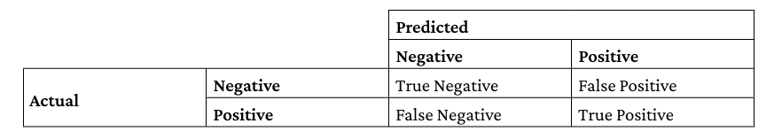

İşte hücrelerin nasıl tanımlandığı:

* **True Positive (TP)**: Bu hücre, doğru bir şekilde pozitif olarak tahmin edilen örnekleri içerir. Yani, modelin doğru bir şekilde pozitif sınıfı tahmin ettiği durumlar.
* **False Positive (FP)**: Bu hücre, aslında negatif olan ancak model tarafından pozitif olarak tahmin edilen örnekleri içerir.
* **False Negative (FN)**: Bu hücre, aslında pozitif olan ancak model tarafından negatif olarak tahmin edilen örnekleri içerir.
* **True Negative (TN)**: Bu hücre, doğru bir şekilde negatif olarak tahmin edilen örnekleri içerir. Yani, modelin doğru bir şekilde negatif sınıfı tahmin ettiği durumlar.

Bu hücreleri kullanarak, sınıflandırıcınızın nasıl çalıştığı hakkında daha hassas bilgiler elde edebilir ve modelinizi daha iyi ayarlayabilirsiniz. İlk olarak, doğruluk formülünü kolayca gözden geçirebiliriz:

**Doğruluk (Accuracy) Formülü**
$$ \text{Accuracy} = \frac{TP + TN}{TP + TN + FP + FN} $$

Ardından, ilk önemli metrik **precision (kesinlik)** veya **specificity (özgüllük)** olarak adlandırılır ve aslında pozitif vakaların doğruluğunu ölçer:

**Kesinlik (Precision) Formülü**
$$ \text{Precision} = \frac{TP}{TP + FP} $$

Hesaplamada sadece **true positives (TP)** ve **false positives (FP)** sayıları dikkate alınır. Temelde, bu metrik, modelin pozitif tahminlerde ne kadar doğru olduğunu gösterir. Açıkça, modeliniz yalnızca yüksek güvene sahip olduğu örneklerde pozitif tahmin yaparak yüksek skorlar alabilir. Bu ölçümün amacı da aslında şudur: Modeli, yalnızca kesin olduğunda ve bunu yapmak güvenliyse pozitif sınıfı tahmin etmeye zorlamak.

Ancak, eğer amacınız mümkün olduğunca fazla pozitif tahmin yapmaksa, o zaman **recall (duyarlılık)** veya **coverage (kapsama)** veya **sensitivity (hassasiyet)** ya da **true positive rate (doğru pozitif oranı)** metriklerini de takip etmeniz gerekir:

**Duyarlılık (Recall) Formülü**
$$ \text{Recall} = \frac{TP}{TP + FN} $$

Burada, **false negatives (FN)** hakkında da bilgi sahibi olmanız gerekecek. Bu iki metriğin ilginç olan yanı, örneklerin sınıflandırılmasına dayalı olmalarıdır ve bir sınıflandırma aslında olasılığa dayanır (bu genellikle pozitif ve negatif sınıf arasındaki 0.5 eşiğiyle belirlenir). Bu eşiği değiştirdiğinizde, bir metriği diğerinin pahasına iyileştirebilirsiniz. Örneğin, eşiği arttırırsanız, daha yüksek **precision** (kesinlik) elde edersiniz (sınıflandırıcı daha güvenlidir) ancak **recall** azalır. Eşiği düşürürseniz, daha düşük **precision** ancak daha yüksek **recall** elde edersiniz. Bu, **precision/recall trade-off (kesinlik/duyarlılık dengesi)** olarak bilinir.

Scikit-learn sitesi, bu dengeyi anlamanızı sağlayacak pratik bir bakış açısı sunar ([https://scikit-learn.org/stable/auto_examples/model_selection/plot_precision_recall.html](https://scikit-learn.org/stable/auto_examples/model_selection/plot_precision_recall.html)), burada **precision/recall** eğrisini izleyebilir ve bu iki metriğin nasıl değiştirilebileceğini anlayarak ihtiyaçlarınıza daha uygun bir sonuç elde edebilirsiniz.

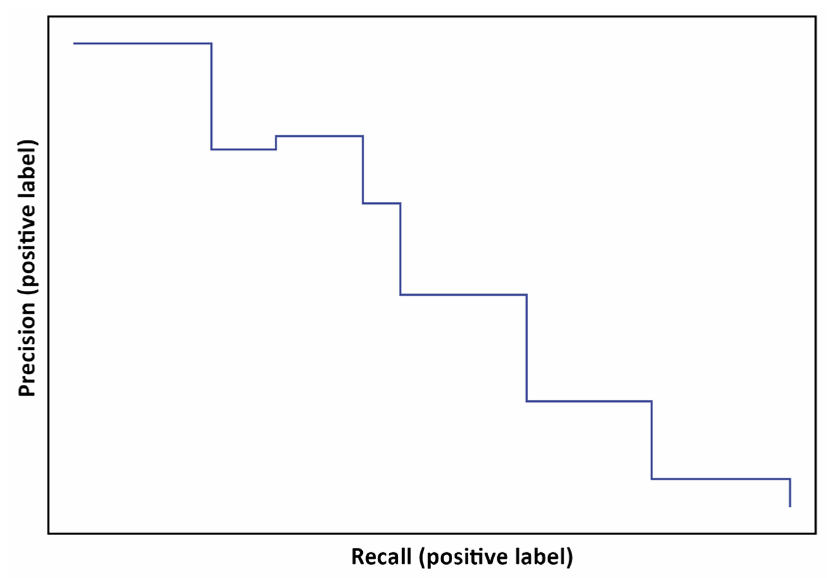

**Precision/Recall dengesine** bağlı bir metrik de **ortalama kesinlik (average precision)**'tir. Ortalama kesinlik, **recall** değerleri 0'dan 1'e kadar olan bir aralıkta (temelde eşiği 1'den 0'a değiştirirken) hesaplanan ortalama kesinliği ifade eder. Ortalama kesinlik, özellikle **nesne tespiti** ile ilgili görevlerde oldukça popülerdir ve bu konuyu biraz sonra tartışacağız, ancak aynı zamanda **tablo verisiyle yapılan sınıflandırma** için de oldukça faydalıdır.

Pratikte, **ortalama kesinlik**, model performansını çok nadir bir sınıf üzerinde daha hassas ve doğru bir şekilde izlemek istediğinizde değerli bir metrik haline gelir. Bu, genellikle **dolandırıcılık tespiti** gibi dengesiz veri setlerinde karşılaşılan bir durumdur.

Bu konuda daha spesifik bilgiler için Gael Varoquaux'nin tartışmasını okuyabilirsiniz:
[Gael Varoquaux'nin tartışması](http://gael-varoquaux.info/interpreting_ml_tuto/content/01_how_well/01_metrics.html#average-precision).

#### The F1 score *(F1 skoru)*

Bu noktada, **kesinlik** (precision) veya **duyarlılık** (recall) gibi metriklerin bir değerlendirme ölçütü olarak ideal bir seçim olmadığını muhtemelen fark etmişsinizdir, çünkü birini optimize ettiğinizde diğeri pahasına olur. Bu nedenle, yalnızca bir metrik kullanarak yapılan Kaggle yarışmaları yoktur. Bu metrikleri birleştirmeniz gerekir (örneğin, **ortalama kesinlik** gibi). **F1 skoru**, kesinlik ve duyarlılığın harmonik ortalaması olarak, genellikle en iyi çözüm olarak kabul edilir:

**F1 Skoru Formülü:**
$$ \text{F1} = \frac{2 \times \text{Precision} \times \text{Recall}}{\text{Precision} + \text{Recall}} $$

Eğer yüksek bir **F1 skoru** elde ediyorsanız, bu modelinizin **kesinlik** veya **duyarlılık** veya her ikisinde birden gelişme gösterdiği anlamına gelir. Bu metriğin kullanımına güzel bir örnek, **Quora Insincere Questions Classification** yarışmasında görülebilir:
[Quora Insincere Questions Classification Yarışması](https://www.kaggle.com/c/quora-insincere-questions-classification).

Bazı yarışmalarda, **F-beta skoru** da kullanılır. Bu, kesinlik ve duyarlılığın ağırlıklı harmonik ortalamasıdır ve **beta** değeri, **recall**'in birleşik skordaki ağırlığını belirler:

**F-beta Skoru Formülü:**
$$ \text{F}_\beta = \frac{(1 + \beta^2) \times (\text{Precision} \times \text{Recall})}{\beta^2 \times \text{Precision} + \text{Recall}} $$

Burada, **beta** parametresi, recall'un nasıl ağırlıklı olarak değerlendirileceğini belirler. **F1 skoru**, **beta = 1** olduğunda, yani **kesinlik** ve **duyarlılık** eşit derecede önemli kabul edildiğinde elde edilir.

Şimdi, **eşik** (threshold) ve **sınıflandırma olasılığı** kavramlarını zaten tanıttığımıza göre, yaygın kullanılan diğer iki sınıflandırma metriği olan **log loss** ve **ROC-AUC**'yi de tartışabiliriz.

#### Log loss and ROC-AUC *(Log kaybı ve ROC-AUC)*

**Log Loss** ile başlayalım, ki bu derin öğrenme modellerinde **cross-entropy** (çapraz entropi) olarak da bilinir. **Log loss**, tahmin edilen olasılık ile gerçek (ground truth) olasılık arasındaki farkı ölçer:

**Log Loss Formülü:**
$$ L = \sum_{i=1}^{n} \left[ y_i \cdot \log(\hat{y_i}) + (1 - y_i) \cdot \log(1 - \hat{y_i}) \right] $$

Burada, ( n ) örnek sayısını, ( y_i ) ith örneğin gerçek etiketini (0 veya 1) ve ( \hat{y_i} ) ise modelin ith örnek için tahmin ettiği olasılığı temsil eder.

Eğer bir yarışma **log loss** kullanıyorsa, bu, amacın bir örneğin pozitif sınıfa ait olma olasılığını mümkün olduğunca doğru bir şekilde tahmin etmek olduğu anlamına gelir. Gerçekten de log loss, birçok yarışmada kullanılan bir metriktir.

Örneğin, **Deepfake Detection Challenge** ([https://www.kaggle.com/c/deepfake-detection-challenge](https://www.kaggle.com/c/deepfake-detection-challenge)) veya daha eski **Quora Question Pairs** ([https://www.kaggle.com/c/quora-question-pairs](https://www.kaggle.com/c/quora-question-pairs)) gibi yarışmalarda log loss metriğini bulabilirsiniz.

**ROC (Receiver Operating Characteristic)** eğrisi, bir ikili sınıflandırıcının performansını değerlendirmek ve birden fazla sınıflandırıcıyı karşılaştırmak için kullanılan grafiksel bir diyagramdır. ROC-AUC metriği, bu eğrinin altındaki alanı ifade eder. ROC eğrisi, **true positive rate** (doğru pozitif oranı, yani recall) ile **false positive rate** (yanlış pozitif oranı, yani negatif örneklerin pozitif olarak sınıflandırılması oranı) arasındaki ilişkiyi gösterir. Ayrıca, doğru negatif oranının (negatif örneklerin doğru şekilde sınıflandırılma oranı) bir eksiği ile eşdeğerdir.

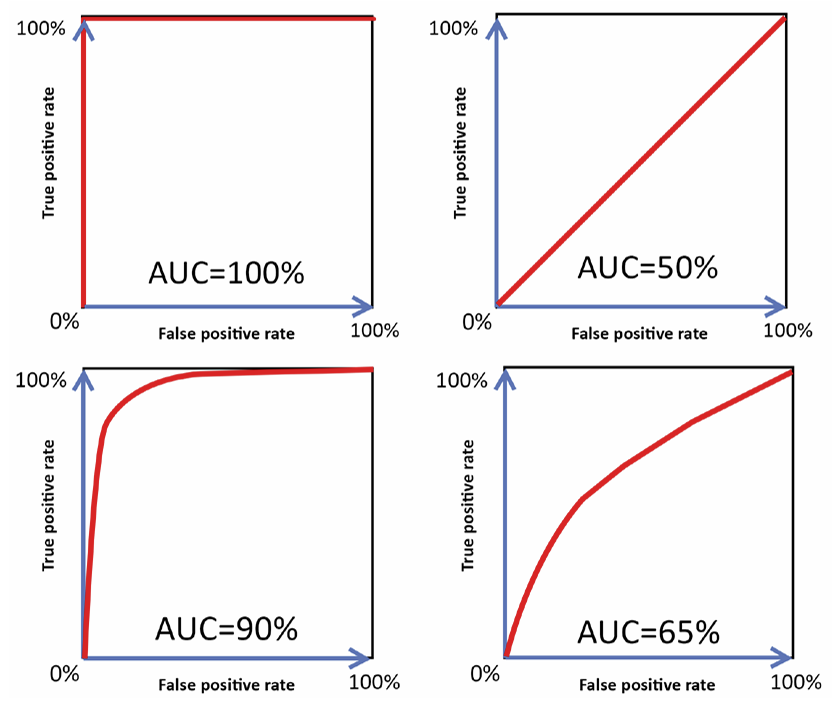

İyi bir sınıflandırıcıya ait **ROC eğrisi**, **false positive rate** (yanlış pozitif oranı) düşükken **true positive rate** (doğru pozitif oranı, yani recall) hızla artmalıdır. **ROC-AUC** değeri 0.9 ile 1.0 arasında olan bir model, çok iyi kabul edilir.

Kötü bir sınıflandırıcıyı, **ROC eğrisinin**, yukarıdaki şekilde, yalnızca rastgele bir sınıflandırıcının performansını temsil eden diyagonal ile çok benzer veya aynı olmasıyla fark edebilirsiniz. **ROC-AUC** skorları 0.5'e yakın olduğunda, sonuçlar neredeyse rastgele kabul edilir.

Farklı sınıflandırıcıları karşılaştırırken ve **AUC** kullanıyorsanız, **daha yüksek AUC** değeri olan sınıflandırıcı daha performanslıdır.

Eğer sınıflar dengeliyse veya çok fazla dengesiz değilse, **AUC**'deki artışlar, eğitimli modelin etkinliğiyle orantılıdır ve modelin **doğru pozitifler** için daha yüksek olasılıklar üretme yeteneği olarak düşünülebilir. Ayrıca, bu, örnekleri pozitiften negatife doğru daha düzgün sıralama yeteneği olarak da değerlendirilebilir. Ancak, pozitif sınıf nadir olduğunda, **AUC** başlangıçta yüksek olur ve artışlar, nadir sınıfı daha iyi tahmin etme açısından çok fazla şey ifade etmeyebilir. Bu durumda, daha önce de belirttiğimiz gibi, **ortalama kesinlik (average precision)** daha faydalı bir metrik olabilir.

> Son zamanlarda, **AUC** birçok farklı yarışmada kullanılmıştır. Bu üç yarışmaya göz atmanızı öneririz:
> 
> 
> 
> * **IEEE-CIS Fraud Detection**: [https://www.kaggle.com/c/ieee-fraud-detection](https://www.kaggle.com/c/ieee-fraud-detection)
> 
> * **Riiid Answer Correctness Prediction**: [https://www.kaggle.com/c/riiid-test-answer-prediction](https://www.kaggle.com/c/riiid-test-answer-prediction)
> 
> * **Jigsaw Multilingual Toxic Comment Classification**: [https://www.kaggle.com/c/jigsaw-multilingual-toxic-comment-classification](https://www.kaggle.com/c/jigsaw-multilingual-toxic-comment-classification)

**AUC ve ortalama kesinlik arasındaki ilişkiyi** daha ayrıntılı olarak açıklayan bir makale için şu kaynağa göz atabilirsiniz:
Su, W., Yuan, Y., ve Zhu, M. "A relationship between the average precision and the area under the ROC curve." Proceedings of the 2015 International Conference on The Theory of Information Retrieval, 2015.

#### Matthews correlation coefficient (MCC) *(Matthews korelasyon katsayısı)*

Binary sınıflandırma metriklerinin sonuna yaklaşırken, **Matthews korelasyon katsayısı** (MCC) önemli bir yere sahiptir. MCC, **VSB Power Line Fault Detection** ([https://www.kaggle.com/c/vsb-power-line-fault-detection](https://www.kaggle.com/c/vsb-power-line-fault-detection)) ve **Bosch Production Line Performance** ([https://www.kaggle.com/c/bosch-production-line-performance](https://www.kaggle.com/c/bosch-production-line-performance)) gibi yarışmalarda kullanılmıştır.

MCC formülü şu şekildedir:

$$
MCC = \frac{(TP \cdot TN) - (FP \cdot FN)}{\sqrt{(TP + FP)(TP + FN)(TN + FP)(TN + FN)}}
$$

Burada **TP** true positives (doğru pozitifler), **TN** true negatives (doğru negatifler), **FP** false positives (yanlış pozitifler) ve **FN** false negatives (yanlış negatifler) temsil eder. Bu, **precision** ve **recall** ile ilgili önceki açıklamalarda gördüğümüz aynı terminolojidir.

MCC, bir korelasyon katsayısı gibi davranır ve +1 (mükemmel tahmin) ile -1 (tersine tahmin) arasında değişir. Bu metrik, özellikle sınıflar oldukça dengesiz olduğunda bile sınıflandırmanın kalitesini ölçmek için kullanılabilir.

Formülün karmaşıklığına rağmen, **Neuron Engineer** adlı bir Kaggle kullanıcısı, bu metriğin daha anlaşılır bir formülle yeniden yapılandırılmasını sağlamıştır. Neuron Engineer'in reformüle ettiği MCC şu şekildedir:

İşte MCC (Matthews Korelasyon Katsayısı) formülünün basitleştirilmiş hali ve her bir bileşenin açıklamaları:

$$MCC = (Posprecision + Negprecision - 1) * PosNegRatio$$

Formüldeki her bir eleman şudur:

* **Posprecision**: Pozitif sınıfın kesinliği
  $$
  \text{Posprecision} = \frac{TP}{TP + FP}
  $$

* **Negprecision**: Negatif sınıfın kesinliği
  $$
  \text{Negprecision} = \frac{TN}{TN + FN}
  $$

* **PosNegRatio**: Pozitif ve negatif tahmin oranı
  $$
  \text{PosNegRatio} = \sqrt{\frac{\text{PosPredictionCount} \times \text{NegPredictionCount}}{\text{PosLabelCount} \times \text{NegLabelCount}}}
  $$

  Buradaki bileşenler şunlardır:

  * **PosPredictionCount**: Pozitif sınıf tahmin sayısı
    $$
    \text{PosPredictionCount} = TP + FP
    $$

  * **NegPredictionCount**: Negatif sınıf tahmin sayısı
    $$
    \text{NegPredictionCount} = TN + FN
    $$

  * **PosLabelCount**: Pozitif etiket sayısı
  * **NegLabelCount**: Negatif etiket sayısı

Bu reformülasyon, hem pozitif hem de negatif sınıfların doğruluğunu artırarak daha iyi bir performans elde edebileceğinizi gösteriyor. Ancak, bunun yeterli olmadığını da belirtiyor: Pozitif ve negatif tahminlerin, **gerçek dağılımla** orantılı olması gerekir. Aksi takdirde, modeliniz büyük bir şekilde cezalandırılır.

### Metrics for multi-class classification *(Çok sınıflı sınıflandırma metrikleri)*

**Çoklu Sınıf Sınıflandırması**na geçtiğimizde, daha önce incelediğimiz ikili sınıflandırma metriklerini her sınıf için ayrı ayrı uygularız ve sonra bu metrikleri, çoklu sınıf durumlarında yaygın olarak kullanılan bazı ortalama stratejileriyle özetleriz.

Örneğin, çözümünüzü **F1 skoru** üzerinden değerlendirmek istiyorsanız, üç olası ortalama seçeneğiniz vardır:

* **Makro ortalama (Macro averaging)**: Her sınıf için F1 skorunu hesaplar ve ardından tüm sonuçların ortalamasını alırsınız. Bu şekilde, her sınıf, pozitif vakalarının sıklığına veya sorununuz için ne kadar önemli olduğuna bakılmaksızın eşit şekilde değerlendirilir ve modelin her sınıfta kötü performans gösterdiğinde eşit cezalar verilmiş olur.

  $$
  \text{Macro-F1} = \frac{F1_{class1} + F1_{class2} + \dots + F1_{classn}}{N}
  $$

* **Mikro ortalama (Micro averaging)**: Bu yaklaşım, her sınıfın katkısını toplayarak birleştirilmiş bir F1 skoru hesaplar. Bu yöntem, hiçbir sınıfa özel bir favori veya ceza uygulamaz, çünkü tüm hesaplamalar her sınıfı dikkate almadan yapılır ve böylece sınıf dengesizliklerini daha doğru bir şekilde hesaba katar:

  $$
  \text{Micro-F1} = F1_{class1+class2+\dots+classn}
  $$

* **Ağırlıklı ortalama (Weighting)**: Makro ortalama gibi, her sınıf için F1 skoru hesaplanır, ancak ardından tüm F1 skorlarının, her sınıfın doğru etiket sayısına bağlı bir ağırlıklı ortalaması alınır. Bu ağırlık seti, her sınıfın pozitif vakalarının sıklığını veya o sınıfın sorununuz için önemini dikkate almanıza olanak tanır. Bu yaklaşım açıkça çoğunluk sınıflarına öncelik verir, çünkü bu sınıflar hesaplamalarda daha fazla ağırlık alır:

  $$
  \text{Weighted-F1} = \frac{F1_{class1} \cdot W_{class1} + F1_{class2} \cdot W_{class2} + \dots + F1_{classn} \cdot W_{classn}}

  {W_1 + W_2 + \dots + W_n = 1}
  $$

Kaggle yarışmalarında karşılaşabileceğiniz bazı yaygın çoklu sınıf metrikleri şunlardır:

* **Çoklu sınıf doğruluğu (Weighted Accuracy)**: **Bengali.AI Handwritten Grapheme Classification** ([Kaggle Yarışması](https://www.kaggle.com/c/bengaliai-cv19))
* **Çoklu sınıf log kaybı (Multiclass log loss)**: **Mechanisms of Action (MoA) Prediction** ([Kaggle Yarışması](https://www.kaggle.com/c/lish-moa/))
* **Makro-F1 ve Mikro-F1 (Macro-F1, Micro-F1)**: **University of Liverpool - Ion Switching** ([Kaggle Yarışması](https://www.kaggle.com/c/liverpool-ion-switching)), **Human Protein Atlas Image Classification** ([Kaggle Yarışması](https://www.kaggle.com/c/human-protein-atlas-image-classification/)), **TensorFlow 2.0 Question Answering** ([Kaggle Yarışması](https://www.kaggle.com/c/tensorflow2-question-answering))
* **Ortalama F1 (Mean-F1)**: **Shopee - Price Match Guarantee** ([Kaggle Yarışması](https://www.kaggle.com/c/shopee-product-matching/))

---

**Kareli Ağırlıklı Kappa (Quadratic Weighted Kappa)**, sıralı tahmin problemleri için akıllıca bir değerlendirme metriği olarak daha sonra inceleyeceğimiz bir diğer metriktir. En basit haliyle **Cohen Kappa skoru**, tahminlerinizin ve gerçeklerin arasındaki uyumu ölçer. Bu metrik aslında, **annotasyonlar arası uyumu** ölçmek için geliştirilmiştir, ancak oldukça esnek olup daha iyi kullanımlar bulmuştur.

**Annotasyonlar arası uyum** nedir? Bir etiketleme göreviniz olduğunu varsayalım: Fotoğrafları **kedi**, **köpek** veya **hiçbiri** olarak sınıflandırmak. Bir grup kişiye bu görevi verirseniz, yanlış etiketler alabilirsiniz, çünkü bir kişi (bu tür görevlerde "hakem" olarak adlandırılır) bir köpeği kedi olarak ya da tam tersini yanlış tanımlayabilir. Bu işi doğru yapmak için, aynı fotoğrafları etiketlemek için birden fazla hakem kullanmak ve ardından **Cohen Kappa skoru**na göre uyum düzeylerini ölçmek en akıllıca yoldur.

**Cohen Kappa**, iki etiketleyici arasındaki uyum düzeyini belirten bir skordur:

$$
\kappa = \frac{p_0 - p_e}{1 - p_e}
$$

Burada ( p_0 ) gözlemlenen relatif uyum oranını, ( p_e ) ise olasılık açısından tesadüfi uyum oranını ifade eder. **Karışıklık matrisi** terimlerini kullanarak bu şu şekilde yazılabilir:

$$
\kappa = \frac{2 \cdot (TP \cdot TN - FP \cdot FN)}{(TP + FP) \cdot (TN + FP) + (TP + FN) \cdot (FN + TN)}
$$

Bu formülün ilginç yanı, skoru oluştururken, uyumun sadece şans sonucu gerçekleşmiş olma olasılığını hesaba katmasıdır. Bu sayede, ölçüm en olası sınıflandırmalara göre düzeltilmiş olur. Metrik, **tam uyum** için 1, **tam karşıtlık** (tam uyumsuzluk) için -1 olarak tanımlanır. 0 civarındaki değerler, hakemler arasındaki uyum ve uyumsuzluğun tesadüfen gerçekleştiğini gösterir.

Bu, modelin çoğu durumda şansa karşı gerçekten daha iyi performans gösterip göstermediğini anlamanıza yardımcı olur.

> **Andrey Lukyanenko**
> 
> [https://www.kaggle.com/artgor](https://www.kaggle.com/artgor)
> 
> 
> 
> Bu bölümdeki ikinci röportajımız, **Notebooklar ve Tartışmalar Grandmaster'ı** ve **Yarışmalar Master'ı** Andrey Lukyanenko ile. Günlük işinde, **MTS Group**’ta bir **Makine Öğrenimi Mühendisi ve TechLead** olarak çalışmaktadır. Kaggle deneyimleri hakkında ilginç pek çok şey paylaştı!
> 
> 
> 
> **En sevdiğiniz yarışma türü nedir ve neden? Teknikler ve çözüm yaklaşımları açısından, Kaggle’daki uzmanlığınız nedir?**
> 
> Genel olarak başka veri setlerine/alanlara transfer edilebilecek kadar genel çözümler gerektiren yarışmaları tercih ediyorum. Farklı sinir ağı mimarilerini, en son teknikleri ve post-processing tekniklerini denemekle ilgileniyorum. Ters mühendislik veya "altın özellikler" yaratmak gibi yarışmalar hoşuma gitmiyor çünkü bu tür yaklaşımlar başka veri setlerinde uygulanamaz.
> 
> 
> 
> **Kaggle’da yarışırken, aynı zamanda Notebooks ve Discussions kategorilerinde Grandmaster oldunuz (ve 1. sıraya yerleştiniz). Bu iki hedefe yatırım yaptınız mı?**
> 
> Notebooklar yazmaya çok zaman ve emek harcadım, ancak Discussions Grandmaster sıralamam kendiliğinden oldu.
> 
> 
> 
> **Notebook sıralamasına nasıl başladınız?**
> 
> 2018’de **DonorsChoose.org Application Screening** adlı özel bir yarışma vardı. DonorsChoose, ülke genelindeki kamu okulu öğretmenlerinin öğrencileri için ihtiyaç duydukları malzemeleri ve deneyimleri talep etmelerini sağlayan bir fon. Kazanan çözümler, leaderboard’daki puanlardan ziyade, Notebook’a yapılan upvote sayısına göre belirlendi. Bu ilginç geldi ve yarışma için bir Notebook yazdım. Birçok katılımcı analizlerini sosyal medya üzerinden duyurdu, ben de aynı şekilde yaptım. Sonuçta ikinci sıraya yerleştim ve bir **Pixelbook** kazandım (hala kullanıyorum!). Bu başarı beni çok motive etti ve Notebook yazmaya devam ettim. İlk başta yalnızca analizimi paylaşmak ve geri bildirim almak istiyordum, çünkü analiz ve görselleştirme becerilerimi diğer insanlarla karşılaştırmak istiyordum. İnsanlar kernel’lerimi beğendi ve becerilerimi daha da geliştirmek istedim. Bir diğer motivasyonum ise hızlı bir **MVP** (minimum viable product) yapma becerimi geliştirmekti. Yeni bir yarışma başladığında, birçok kişi Notebook yazmaya başlar, eğer ilk olmanız gerekiyorsa, kaliteden ödün vermeden hızlı bir şekilde bunu yapabilmeniz gerekir. Bu zorlu, ancak eğlenceli ve ödüllendirici bir süreçti.
> 
> 
> 
> **2019’un Şubat ayında Notebook Grandmaster sıralamasına ulaştım ve bir süre 1. sırada kaldım. Şu anda Notebook yazma sıklığım azaldı ama yine de keyif alıyorum.**
> 
> Tartışmalar konusunda ise, aslında kendiliğinden gelişti. Notebook’larıma yapılan yorumları yanıtladım, katıldığım yarışmalarla ilgili fikirlerimi paylaştım ve tartışmalara katıldım, bu da sıralamamın sürekli artmasını sağladı.
> 
> 
> 
> **Karşılaştığınız özellikle zorlu bir yarışma hakkında bilgi verir misiniz? Bu görevi nasıl ele aldınız?**
> 
> Bu, **Predicting Molecular Properties** yarışmasıydı. Bu yarışmayı daha detaylı bir şekilde yazdım ve [burada](https://towardsdatascience.com/a-story-of-my-first-gold-medal-in-one-kaggle-competition-things-done-and-lessons-learned-c269d9c233d1) okuyabilirsiniz. Bu yarışma, moleküllerdeki atomlar arasındaki etkileşimleri tahmin etmeye yönelik bir yarışmaydı. **Nükleer Manyetik Rezonans (NMR)**, MRI’ye benzer ilkeler kullanarak proteinlerin ve moleküllerin yapısını ve dinamiklerini anlamaya yarayan bir teknoloji. Araştırmacılar, dünya çapında NMR deneyleri yaparak moleküllerin yapısı ve dinamikleri hakkında daha fazla bilgi edinmeye çalışıyor. Bu yarışmada, moleküldeki iki atom arasındaki manyetik etkileşimi tahmin etmeye çalıştık (skaler bağlama sabiti). Kuantum mekaniğinden gelen en son yöntemler, yalnızca 3D moleküler yapı verisi kullanarak bu bağlama sabitlerini hesaplayabiliyor. Ancak bu hesaplamalar kaynak açısından çok yoğun olduğu için her zaman kullanılabilir değil. Makine öğrenimi yaklaşımları bu değerleri tahmin edebilirse, bu gerçekten ilaç kimyacılarının yapısal içgörüleri daha hızlı ve daha ucuza elde etmelerine yardımcı olabilir.
> 
> 
> 
> Yarışmalara genellikle **EDA** (Exploratory Data Analysis) kernel’leri yazarım, bu yarışmada da aynı şekilde başladım. Kaggle yarışmalarında tabular veriler için yaygın bir yaklaşım **özellik mühendisliği** yapmak ve **gradient boosting modelleri** kullanmaktır. Erken denemelerimde **LGBM** kullandım, ancak grafikleri daha iyi kullanmanın bir yolunun olduğunu biliyordum. Alan bilgisi burada ciddi bir avantaj sağlayacaktı, bu yüzden bu bilgileri toplamaya başladım. Tabii ki, forumda yazan ve kernel’ler oluşturan birkaç aktif uzman fark ettim, bu yüzden onlardan her şeyi okudum. Bir gün, bu alandaki bir uzmandan bir e-posta aldım ve becerilerimizin birbirini tamamlayabileceğini düşündü. Genelde yarışmalara yalnız başıma çalışmayı tercih ederim, ama bu durumda güçlerimizi birleştirmek iyi bir fikir gibi görünüyordu. Bu karar çok iyi bir karar oldu! Zamanla harika bir ekip kurmayı başardık.
> 
> 
> 
> Bir süre sonra yarışmada **sinir ağlarının** potansiyelini fark ettik: Tanınmış bir Kaggle katılımcısı, **MPNN (Message Passing Neural Network)** modelinin bir örneğini paylaştı. Bir süre sonra bunu çalıştırmayı başardım ama sonuçlar bizim modellerimizden daha kötüydü. Yine de, ekibimiz bu modellerle yüksek hedeflere ulaşmak istiyorsa bu sinir ağlarıyla çalışmamız gerektiğini biliyordu. Christof’un yeni sinir ağlarını son derece hızlı bir şekilde kurma yeteneği inanılmazdı. Kısa süre sonra, yalnızca bu modelleri geliştirmeye odaklandık.
> 
> 
> 
> **Ekip olarak 8. sıraya yerleştik ve bu yarışma boyunca çok şey öğrendim.**
> 
> 
> 
> **Kaggle kariyerinize nasıl yardımcı oldu?**
> 
> Kaggle kesinlikle hem becerilerime hem de kişisel markama çok yardımcı oldu. Kaggle Notebook’ları yazmak, sadece **EDA** ve **ML** becerilerini öğrenmemi sağlamakla kalmadı, aynı zamanda yeni konuları ve görevleri hızla anlayabilme, yaklaşımlar arasında daha verimli bir şekilde iterasyon yapabilme yeteneği kazandırdı. Aynı zamanda, yaptığım işler takdir gördü ve bu bana bir görünürlük sağladı. İlk portföyümde ([erlemar.github.io](https://erlemar.github.io/)) birçok farklı Notebook vardı ve bunların yarısı eski Kaggle yarışmalarına dayalıydı. Bu kesinlikle ilk işimi bulmamda yardımcı oldu. Kaggle başarılarım, iyi şirketlerden işe alımcıları cezbetmemi sağladı, bazen mülakat sürecinin bazı adımlarını atlamama yardımcı oldu ve birkaç danışmanlık işi almama da yol açtı.
> 
> 
> 
> **Deneyimsiz Kaggle katılımcılarının genellikle göz ardı ettikleri şeyler nelerdir? Şu anda bildiğiniz, ilk başladığınızda bilseydiniz neyi farklı yapardınız?**
> 
> Deneyimsiz Kaggle katılımcılarını iki gruba ayırmak gerektiğini düşünüyorum: Veri bilimi konusunda deneyimsiz olanlar ve Kaggle’da deneyimsiz olanlar.
> 
> Veri bilimi konusunda deneyimsiz olanlar çeşitli hatalar yapar (ve bu normal, herkes bir yerden başlamak zorunda):
> 
> 
> 
> * **En ciddi sorunlardan biri:** Eleştirel düşünce eksikliği ve kendi araştırmalarını yapamama;
> 
> * Hangi araçları/yaklaşımları ne zaman kullanacaklarını bilememe;
> 
> * Kamuya açık Notebook’ları körü körüne alıp, nasıl çalıştığını anlamadan kullanma;
> 
> * Bir fikre takılıp kalma ve bir şey işe yaramadığında bile çok fazla zaman harcama;
> 
> * Denemeler başarısız olduğunda umutsuzluğa kapılma ve motivasyonu kaybetme.
> 
> 
> 
> Veri bilimi konusunda deneyimi olan ama Kaggle konusunda deneyimsiz olanlar içinse şunu söyleyebilirim: **Kaggle’ın zorluğunu küçümsemek** en ciddi hatalarından biridir. Kaggle’ın çok rekabetçi olduğunu, başarılı olmak için birçok farklı şey denemeniz gerektiğini, sadece yarışmalara özgü birçok numara olduğunu ve profesyonel olarak yarışmalara katılan insanlar olduğunu beklemiyorlar.
> 
> 
> 
> **Yarışmalarda geçmişte yaptığınız hatalar nelerdi?**
> 
> 
> 
> * Veriye yeterince dikkat etmemek. Bazen daha iyi özellikler üretemedim veya daha iyi post-processing uygulayamadım.
> 
> * Bir fikre çok fazla zaman harcamak çünkü bunun işe yarayacağını umuyordum (bu bir **sunk-cost** yanılgısı).
> 
> * Yeterince deneme yapmamak. Çaba karşılığını verir – yarışmaya yeterince zaman ve kaynak ayırmazsanız, leaderboard’da üst sıralarda yer alamazsınız.
> 
> * "Yanlış" yarışmalara katılmak. Sızdırma, ters mühendislik, vb. içeren yarışmalar oldu.
> 
> * Yanlış kişilerle takım kurmak. Bazı takım arkadaşlarım beklediğim kadar aktif değildi ve bu, takım sıralamamızı kötüleştirdi.
> 
> 
> 
> **Bir yarışmaya katılırken en önemli şey nedir?**
> 
> Bence, hedefinizi hatırlamak, bu yarışmaya ne kadar zaman ve çaba yatırmaya hazır olduğunuzu bilmek ve olası sonuçları düşünmek önemlidir. Bir yarışmaya katılırken birçok farklı hedefiniz olabilir:
> 
> 
> 
> * Para kazanmak ya da madalya almak;
> 
> * Yeni beceriler kazanmak veya mevcut becerileri geliştirmek;
> 
> * Yeni bir görev/alan üzerinde çalışmak;
> 
> * Ağ kurmak;
> 
> * PR yapmak;
> 
> * vb.
> 
> 
> 
> Tabii ki, birden fazla motivasyonunuz olabilir.
> 
> 
> 
> **Yarışma bittiğinde olacakları düşünmek önemli.** Yarışmaya çok yatırım yapabilir ve kazanabilirsiniz, ancak kaybedebilirsiniz de. Bu gerçeğe hazırlıklı mısınız? Kazanmak sizin için kritik mi? Belki daha fazla çaba harcamaya hazırlıklı olmanız gerekebilir; diğer taraftan belki uzun vadeli hedefleriniz var ve bir başarısız yarışma sizi fazla etkilemez.

### Metrics for object detection problems *(Nesne tespiti problemleri için metrikler)*

Son yıllarda, derin öğrenme yarışmaları Kaggle'da giderek daha yaygın hale geldi. Bu yarışmaların çoğu, görüntü tanıma veya doğal dil işleme görevlerine odaklanmış olup, şimdiye kadar incelediğimiz değerlendirme metriklerinden çok farklı metrikler kullanmayı gerektirmemiştir. Ancak, bazı özel problemler, doğru bir şekilde değerlendirilmesi için özel bir metrik kullanılmasını gerektirmiştir: bunlar, nesne tespiti ve segmentasyonla ilgili olanlardır.

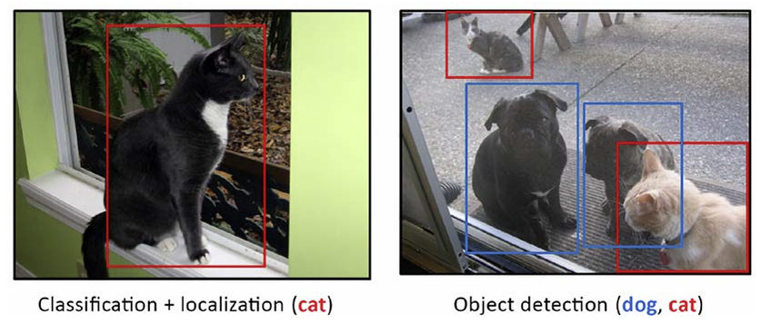

Nesne tespitinde, bir resmi sınıflandırmak yerine, resmin ilgili bölümlerini bulmanız ve bunları uygun şekilde etiketlemeniz gerekir. Örneğin, Şekil 5.4'te, bir nesne tespit sınıflandırıcısına, bir fotoğraf içinde köpeklerin veya kedilerin bulunduğu bölümleri yerleştirip her birini doğru etiketlemesi görevi verilmiştir. Sol taraftaki örnek, bir kedinin konumlandırılmasını, dikdörtgen bir kutu (bu kutuya **bounding box** denir) kullanarak gösteriyor. Sağdaki örnek ise, bir fotoğraf içinde birden fazla kedi ve köpeğin nasıl tespit edildiğini ve ardından doğru bir şekilde sınıflandırıldığını gösteriyor (mavi kutular köpekler için, kırmızı kutular ise kediler için).

Nesne tespitinde, bir nesnenin mekansal konumunu tanımlamak için **bounding box**'lar kullanılır; bu kutular, nesnenin bulunduğu dikdörtgen alanı tanımlar. Bir **bounding box** genellikle iki (x, y) koordinatıyla belirtilir: üst-sol köşe ve alt-sağ köşe. Bir makine öğrenimi algoritması açısından, bounding box'ların koordinatlarını bulmak, birden fazla hedefe uygulanan bir regresyon problemine karşılık gelir. Ancak, problemi sıfırdan çözmeyeceksiniz; bunun yerine genellikle **Mask R-CNN** ([https://arxiv.org/abs/1703.06870](https://arxiv.org/abs/1703.06870)), **RetinaNet** ([https://arxiv.org/abs/2106.05624v1](https://arxiv.org/abs/2106.05624v1)), **FPN** ([https://arxiv.org/abs/1612.03144v2](https://arxiv.org/abs/1612.03144v2)), **YOLO** ([https://arxiv.org/abs/1506.02640v1](https://arxiv.org/abs/1506.02640v1)), **Faster R-CNN** ([https://arxiv.org/abs/1506.01497v1](https://arxiv.org/abs/1506.01497v1)) veya **SSD** ([https://arxiv.org/abs/1512.02325](https://arxiv.org/abs/1512.02325)) gibi önceden oluşturulmuş ve çoğu zaman önceden eğitilmiş modellere başvuracaksınız.

**Segmentasyonda** ise, piksel seviyesinde bir sınıflandırma yapılır. Yani, eğer 320x200 boyutlarında bir resminiz varsa, aslında 64.000 piksel sınıflandırması yapmanız gerekir. Göreve bağlı olarak, her pikseli bir fotoğrafın içinde sınıflandırmanız gereken **semantik segmentasyon** olabilir ya da yalnızca belirli bir ilgi türündeki nesneleri (örneğin, Şekil 5.5'teki gibi bir kedi) temsil eden pikselleri sınıflandırmanız gereken **instance segmentasyon** olabilir.

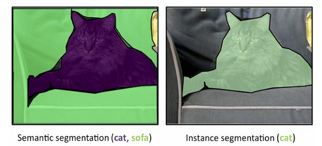

Bu görevler için özel metriklerin genel bir görünümüne başlayalım; çünkü her iki problemde de (nesne tespitinde dikdörtgen, segmentasyonda ise çokgen olan) bir resmin tamamını tahmin ediyorsunuz ve tahminlerinizi gerçek etiketlerle karşılaştırmanız gerekiyor, bu etiketler de yine alanlar olarak ifade ediliyor. Segmentasyon tarafında, en basit metrik **piksel doğruluğu**dur; adı üzerinde, bu metrik, piksel sınıflandırmasındaki doğruluğu ölçer.

Bu metrik mükemmel bir seçim değildir, çünkü **ikili ve çok sınıflı problemlerdeki doğruluk** gibi, eğer ilgili pikseller resmin çok küçük bir kısmını oluşturuyorsa, skoru yüksek görünebilir (sadece çoğunluk sınıfını tahmin edersiniz, bu da segmentasyon yapmadığınız anlamına gelir).

Bu nedenle, özellikle yarışmalarda daha sık kullanılan iki metrik vardır: **intersection over union** (IoU) ve **dice katsayısı** (Dice coefficient).

#### Intersection over union (IoU) *(Kesişim/Birleşim oranı)*

**Intersection over union (IoU)**, aynı zamanda **Jaccard indeksi** olarak da bilinir. Segmentasyon problemlerinde IoU kullanmak, karşılaştırmanız gereken iki resminiz olduğu anlamına gelir: biri sizin tahmininiz, diğeri ise genellikle **1** değeriyle doğru etiketleri (ground truth) temsil eden ve **0** ile diğer bölgeleri gösteren bir **binary maske**dir. Birden fazla nesne olduğunda, her bir nesne için ayrı bir maske olur ve her maske, nesnenin sınıfıyla etiketlenir.

Nesne tespiti problemlerinde IoU kullanıldığında ise, tahmin ve doğru etiketin (ground truth) dikdörtgen alanlarının sınırları vardır, bu sınırlar da köşe noktalarının koordinatlarıyla ifade edilir. Her bir sınıflandırılan sınıf için, tahmininiz ile doğru etiketin maskesi arasındaki örtüşen alanı hesaplar ve bunu, tahmininiz ile doğru etiket arasındaki birleşim alanına (yani her iki alanın toplamı) bölersiniz; bu toplam, herhangi bir örtüşmeyi dikkate alır. Bu şekilde, tahmin ettiğiniz alan fazla büyükse (payda daha büyük olur) veya çok küçükse (pay daha küçük olur) orantılı olarak cezalandırılırsınız.

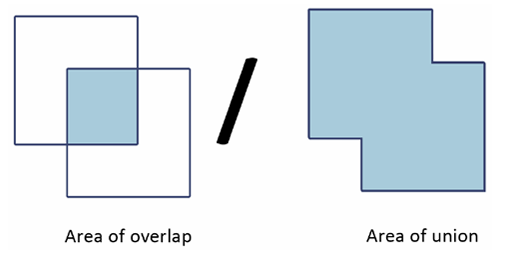

Şekil 5.6'da, hesaplamada yer alan alanların görsel bir temsilini görebilirsiniz. Karelerin daha fazla örtüştüğünü hayal ederek, metriklerin, tahmininiz doğru etiketi kapsasa bile, bunu aştığında (birleşim alanı büyüdüğünde) çözümünüzü nasıl etkili bir şekilde cezalandırdığını anlayabilirsiniz.

> İşte IoU'nun kullanıldığı bazı yarışmaların örnekleri:
> 
> 
> 
> * **TGS Salt Identification Challenge** ([Kaggle Yarışması](https://www.kaggle.com/c/tgs-salt-identification-challenge/)) — Intersection Over Union Nesne Segmentasyonu
> 
> * **iMaterialist (Fashion) 2019 at FGVC6** ([Kaggle Yarışması](https://www.kaggle.com/c/imaterialist-fashion-2019-FGVC6)) — Intersection Over Union Nesne Segmentasyonu ve Sınıflandırma
> 
> * **Airbus Ship Detection Challenge** ([Kaggle Yarışması](https://www.kaggle.com/c/airbus-ship-detection)) — Intersection Over Union Nesne Segmentasyonu Beta
> 
> 

#### Dice *(Dice katsayısı)*

Diğer yararlı metrik ise **Dice katsayısı**dır; bu, tahmin ile doğru etiket arasındaki örtüşen alanın iki katına çıkarılması ve ardından tahmin ile doğru etiket alanlarının toplamına bölünmesiyle hesaplanır.

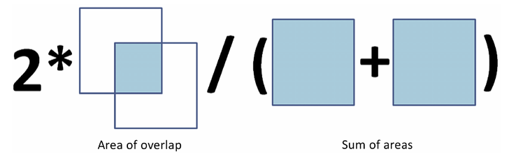

Bu durumda, **Jaccard indeksi**ne kıyasla, tahminin doğru etiketle örtüşen kısmı paydada dikkate alınmaz. Burada beklenti, örtüşen alanı maksimize ederken doğru alan boyutunu tahmin etmenizdir. Yine, tahmin ettiğiniz alanlar olması gerekenden daha büyükse cezalandırılırsınız. Aslında, bu iki metrik pozitif olarak korelasyonlu olup, tek bir sınıflandırma problemi için neredeyse aynı sonuçları üretir.

Farklar, aslında birden fazla sınıfla çalışırken ortaya çıkar. Hem IoU hem de Dice katsayısı ile birden fazla sınıf olduğunda, tüm sınıfların sonuçlarının ortalamasını alırsınız. Ancak, bunu yaparken, **IoU** metrik, bir sınıf tahmini yanlış olduğunda genel ortalamayı daha fazla cezalandırma eğilimindeyken, **Dice katsayısı** daha hoşgörülü olup, ortalama performansı temsil etme eğilimindedir.

> **Dice katsayısını kullanan bazı Kaggle yarışmalarının örnekleri** (genellikle tıbbi amaçlı yarışmalarda sıkça karşılaşılsa da, sadece orada değil, bulutlar ve arabalar gibi diğer alanlarda da kullanılabilir):
> 
> 
> 
> * **HuBMAP - Hacking the Kidney**: [Kaggle Yarışması](https://www.kaggle.com/c/hubmap-kidney-segmentation)
> 
> * **Ultrasound Nerve Segmentation**: [Kaggle Yarışması](https://www.kaggle.com/c/ultrasound-nerve-segmentation)
> 
> * **Understanding Clouds from Satellite Images**: [Kaggle Yarışması](https://www.kaggle.com/c/understanding_cloud_organization)
> 
> * **Carvana Image Masking Challenge**: [Kaggle Yarışması](https://www.kaggle.com/c/carvana-image-masking-challenge)

**IoU** ve **Dice katsayısı**, segmentasyon ve nesne tespiti alanındaki daha karmaşık metriklerin temelini oluşturur. IoU veya Dice için uygun bir eşik seviyesi (genellikle 0.5) seçerek, bir tespiti onaylayıp onaylamayacağınıza karar verebilirsiniz, dolayısıyla bir sınıflandırma yapabilirsiniz. Bu noktada, daha önce tartıştığımız sınıflandırma metriklerini (kesinlik, duyarlılık, F1 gibi) kullanabilirsiniz; bu, **Pascal VOC** ([http://host.robots.ox.ac.uk/pascal/VOC/voc2012](http://host.robots.ox.ac.uk/pascal/VOC/voc2012)) veya **COCO** ([https://cocodataset.org](https://cocodataset.org)) gibi popüler nesne tespiti ve segmentasyon yarışmalarında olduğu gibi yapılır.

### Metrics for multi-label classification and recommendation problems *(Çok etiketli sınıflandırma ve öneri problemleri için metrikler)*

**Öneri sistemleri**, veri analizi ve makine öğreniminin en popüler uygulamalarından biridir ve Kaggle'da bu tür öneri yaklaşımlarını kullanan birçok yarışma bulunmaktadır. Örneğin, **Quick, Draw! Doodle Recognition Challenge**, bir öneri sistemi olarak değerlendirilen bir tahmin yarışmasıydı. Ancak, Kaggle'daki diğer bazı yarışmalar gerçekten etkili öneri sistemleri oluşturmayı hedeflemiştir (örneğin, **Expedia Hotel Recommendations**: [Kaggle Yarışması](https://www.kaggle.com/c/expedia-hotel-recommendations)) ve **RecSYS**, öneri sistemleri konferansı ([https://recsys.acm.org/](https://recsys.acm.org/)), her yıl düzenlediği yarışmalardan birini Kaggle üzerinde gerçekleştirmiştir (RecSYS 2013: [Kaggle Yarışması](https://www.kaggle.com/c/yelp-recsys-2013)).

**MAP@K (Mean Average Precision at K)**, öneri sistemlerinin performansını değerlendirmek için tipik olarak tercih edilen metrik olup, Kaggle'da, öneri sistemleriyle ilgili yarışmaların çoğunda karşılaşacağınız en yaygın metriktir. Bunun yanı sıra, **P@K (precision at k)** veya **AP@K (average precision at k)** gibi bazı diğer metrikler de vardır; bunlar kayıp fonksiyonlarıdır, yani her bir tekil tahmin düzeyinde hesaplanırlar. Bu metriklerin nasıl çalıştığını anlamak, MAP@K'yi daha iyi anlamanızı sağlayabilir ve bu metriklerin hem önerilerde hem de çoklu etiketli sınıflandırmada nasıl performans gösterdiği konusunda size yardımcı olabilir.

Aslında, öneri sistemleriyle benzer şekilde, **çoklu etiketli sınıflandırmalar**, modelinizin bir dizi sınıf tahmini üretmesini ima eder. Bu tür sonuçlar, bazı **ikili sınıflandırma metriklerinin** ortalaması (örneğin, **Greek Media Monitoring Multilabel Classification** (WISE 2014), bu yarışma **ortalama F1 skoru**nu kullandı: [Kaggle Yarışması](https://www.kaggle.com/c/wise-2014)) ve öneri sistemlerine daha özgü metrikler, örneğin **MAP@K** gibi metrikler kullanılarak değerlendirilebilir. Sonuç olarak, hem öneri sistemleri hem de çoklu etiketli tahminler, bir **sıralama görevi** olarak ele alınabilir; bu, öneri sistemlerinde sıralanmış öneriler ve çoklu etiketli sınıflandırmada (belirli bir sıralama olmadan) etiketlerin bir setine dönüşür.

#### MAP@K *(MAP@K metriği)*

**MAP@K**, karmaşık bir metriktir ve birçok hesaplamadan türetilir. MAP@K metriğini tam olarak anlayabilmek için, önce en basit bileşeni olan **precision at k (P@K)** ile başlayalım. Bu durumda, bir örneğin tahmini, sıralanmış tahminler dizisi (en olasıdan en az olasılıklıya kadar) olduğundan, fonksiyon yalnızca en üstteki **k** tahmini dikkate alır ve ardından, doğru etiketle ne kadar eşleşme sağladığını hesaplar ve bu sayıyı **k**'ye böler. Kısacası, bu, **k** tahmini üzerinden ortalama alınmış bir doğruluk ölçüsüne oldukça benzer.

Biraz daha karmaşık bir hesaplama gerektiren ama kavramsal olarak basit olan **average precision at k (AP@K)**, **P@K**'nin **1**'den **k**'ye kadar olan tüm değerler üzerinde hesaplanıp ortalamasının alınmasıdır. Bu şekilde, metrik, tahminin ne kadar iyi çalıştığını genel olarak değerlendirir; ilk tahmin, ardından ilk iki tahmin, ve devam ederek **k** tahmine kadar.

Son olarak, **MAP@K**, tüm tahmin örnekleri için AP@K'nin ortalamasıdır ve bu metrik, tüm tahminleri değerlendirdiği için bir metriktir. İşte **MAP@5** formülasyonu, **Expedia Hotel Recommendations** yarışmasında ([https://www.kaggle.com/c/expedia-hotel-recommendations](https://www.kaggle.com/c/expedia-hotel-recommendations)) bulabileceğiniz formül:

Görüntüde, **MAP@5** metriği için kullanılan formülün bir versiyonu yer alıyor. Bu formül, öneri sistemlerinde doğruluğun değerlendirilmesi için kullanılır ve şu şekilde ifade edilebilir:

$$
\text{MAP@5} = \frac{1}{|U|} \sum_{u=1}^{|U|} \sum_{k=1}^{\min(5, n)} P(k)
$$

Bu formülde:

* **|U|**, kullanıcı sayısını,
* **P(k)**, k'ncı tahminin doğruluğunu,
* **n**, tahmin edilen öğe sayısını,
* **min(5, n)**, en fazla 5 tahmin yapılmasını belirler.

Bu açıklama biraz daha karmaşık olsa da, formül aslında **MAP@K**'nin tüm tahminler üzerindeki **AP@K** değerlendirmelerinin ortalamasını ifade ettiğini gösterir.

Bu özel metriklerin, regresyon ve sınıflandırma metrikleri üzerindeki genel bakışımızı tamamladıktan sonra, bir **Kaggle yarışmasında** değerlendirme metrikleriyle nasıl başa çıkılacağına dair tartışmaya geçelim.

### Optimizing evaluation metrics *(Değerlendirme metriklerini optimize etme)*

Şimdiye kadar tartıştıklarımızı özetleyecek olursak, **amaç fonksiyonu**, öğrenme algoritmanızın içinde, algoritmanın iç modelinin sağlanan verilere ne kadar iyi uyduğunu ölçen bir fonksiyondur. Amaç fonksiyonu ayrıca algoritmaya, ardışık iterasyonlar boyunca uyumunu iyileştirebilmesi için geri bildirim sağlar. Açıkça söylemek gerekirse, algoritmanın tüm çabaları, amaç fonksiyonuna dayanarak iyi performans göstermeye yönlendirilir. Eğer Kaggle değerlendirme metriği, algoritmanızın amaç fonksiyonu ile mükemmel bir şekilde örtüşüyorsa, en iyi sonuçları alırsınız.

Ne yazık ki, bu durum sıkça geçerli değildir. Çoğu zaman, sağlanan değerlendirme metriği yalnızca mevcut amaç fonksiyonlarıyla yaklaşık olarak elde edilebilir. İyi bir yaklaşık sonuç elde etmek veya tahminlerinizi değerlendirme kriterlerine göre daha iyi hale getirmek, Kaggle yarışmalarında iyi performans göstermek için sırrınızdır. Amaç fonksiyonunuz, değerlendirme metriğinizle örtüşmüyorsa, birkaç alternatifiniz vardır:

1. **Öğrenme algoritmanızı değiştirmek** ve değerlendirme metriğinizle uyumlu bir amaç fonksiyonu eklemek; ancak bu, tüm algoritmalar için mümkün değildir (örneğin, **LightGBM** ve **XGBoost** gibi algoritmalar, özel amaç fonksiyonları ayarlamanıza izin verir, ancak çoğu **Scikit-learn** modeli bunu desteklemez).

2. **Modelinizin hiperparametrelerini ayarlamak**, değerlendirme metriği kullanıldığında en iyi sonucu veren parametreleri seçmek.

3. **Sonuçlarınızı post-process etmek**, böylece değerlendirme kriterlerine daha yakın hale gelmesini sağlamak. Örneğin, tahminleriniz üzerinde dönüşümler yapan bir optimizasyon algoritması yazabilirsiniz (örneğin, **probabilite kalibrasyonu algoritmaları**, bu algoritmaları bölümün sonunda tartışacağız).

Yarışma metriğini, makine öğrenimi algoritmanıza entegre etmek, daha iyi tahminler elde etmenin gerçekten en etkili yöntemidir; ancak yalnızca birkaç algoritma, yarışma metriğini amaç fonksiyonu olarak kullanacak şekilde hacklenebilir. Bu nedenle, ikinci yaklaşım daha yaygın olanıdır ve birçok yarışma, modelinizin değerlendirme metriği üzerinde en iyi performansı gösterebilmesi için doğru hiperparametreleri bulma mücadelesine dönüşür.

Eğer değerlendirme fonksiyonunuz kodlanmışsa, doğru **cross-validation** yapmak veya uygun test setini seçmek büyük bir fark yaratacaktır. Eğer kodlanmış bir fonksiyonunuz yoksa, önce Kaggle tarafından sağlanan formülleri takip ederek uygun şekilde kodlamanız gerekir.

Her zaman, şu adımlar fark yaratacaktır:

* Değerlendirme metriği ve kodlanmış fonksiyonu hakkında arama motorlarından tüm ilgili bilgileri aramak
* En yaygın paketleri incelemek (örneğin, **Scikit-learn**: [model değerlendirme](https://scikit-learn.org/stable/modules/model_evaluation.html#model-evaluation) veya **TensorFlow**: [keras kayıpları](https://www.tensorflow.org/api_docs/python/tf/keras/losses))
* **GitHub projelerini** taramak (örneğin, **Ben Hammer’ın Metrics** projesi: [Ben Hammer Metrics GitHub](https://github.com/benhamner/Metrics))
* Forumlarda ve mevcut Kaggle Notebooks'larda (hem mevcut yarışma için hem de benzer yarışmalar için) sormak veya bakmak
* Ayrıca, daha önce belirttiğimiz gibi, **Meta Kaggle veri setini** sorgulamak ([Meta Kaggle](https://www.kaggle.com/kaggle/meta-kaggle)) ve **Competitions** tablosuna bakmak, aynı değerlendirme metriğini kullanan diğer Kaggle yarışmalarını bulmanıza yardımcı olacaktır ve bu size hemen kullanışlı kodlar ve fikirler sağlayacaktır.

Değerlendirme metriğiniz, algoritmanızın amaç fonksiyonu ile örtüşmediğinde, sahip olduğunuz alternatifleri daha ayrıntılı olarak tartışalım. **Özel metrikler** ile başlayalım.

### Custom metrics and custom objective functions *(Özel metrikler ve özel hedef fonksiyonları)*

**Amaç fonksiyonunuz, değerlendirme metriğinizle örtüşmediğinde ilk seçenek olarak**, yukarıda öğrendiğimiz gibi, kendi **özel amaç fonksiyonunuzu** yaratabilirsiniz, ancak sadece bazı algoritmalar, özel bir amaç fonksiyonunu kolayca entegre etmenize izin verir.

İyi haber şu ki, bu tür fonksiyonları ekleyebilen birkaç algoritma, Kaggle yarışmalarında ve veri bilimi projelerinde en etkili olanlar arasındadır. Tabii ki, kendi özel amaç fonksiyonunuzu oluşturmak biraz karmaşık görünebilir, ancak bu yaklaşım, bir yarışmada puanınızı artırmak için inanılmaz derecede ödüllendirici olabilir. Örneğin, **gradient boosting** algoritmalarında (**XGBoost**, **CatBoost**, **LightGBM**) ve **TensorFlow** veya **PyTorch** tabanlı tüm derin öğrenme modellerinde, kendi özel amaç fonksiyonlarınızı oluşturma seçeneğiniz vardır.

**TensorFlow** ve **PyTorch**'ta özel metrikler ve amaç fonksiyonları için harika öğreticiler bulabilirsiniz:

* [Custom Metrics in Keras and How Simple They Are to Use in TensorFlow2](https://towardsdatascience.com/custom-metrics-in-keras-and-how-simple-they-are-to-use-in-tensorflow2-2-6d079c2ca279)
* [Advanced Keras Custom Loss Functions](https://petamind.com/advanced-keras-custom-loss-functions/)
* [PyTorch Metric Learning Custom Loss Functions](https://kevinmusgrave.github.io/pytorch-metric-learning/extend/losses/)

Bu kaynaklar, size özel bir amaç veya değerlendirme fonksiyonu kodlamanın temel şablonlarını ve bazı kullanışlı önerileri sunacaktır.

> **Özel bir amaç fonksiyonu oluşturmak için ihtiyacınız olanı hemen almak isterseniz**, RNA tarafından yazılmış bu Notebook'u ([https://www.kaggle.com/bigironsphere](https://www.kaggle.com/bigironsphere)): [Loss Function Library Keras/PyTorch](https://www.kaggle.com/bigironsphere/loss-function-library-keras-pytorch/) inceleyebilirsiniz. Bu Notebook, farklı yarışmalarda kullanılan, **TensorFlow** ve **PyTorch** için çok sayıda özel kayıp fonksiyonu içermektedir.

**LightGBM, XGBoost veya CatBoost'ta özel bir kayıp fonksiyonu oluşturmanız gerektiğinde**, ilgili dokümantasyonlarında belirtildiği gibi, tahmin ve doğru etiketleri (ground truth) girdi olarak alan ve çıktılarında **gradient** ve **hessian** döndüren bir fonksiyon yazmanız gerekecektir.

> Gradient ve hessian'ın ne olduğunu daha iyi anlamak için şu Stack Overflow yazısını inceleyebilirsiniz: [Gradient ve Hessian Hesaplaması](https://stats.stackexchange.com/questions/231220/how-to-compute-the-gradient-and-hessian-of-logarithmic-loss-question-is-based).

Kod uygulama açısından, yapmanız gereken tek şey, fonksiyonu yaratmak ve gerekirse daha fazla parametre geçmek için **closures** kullanmaktır. İşte, **focal loss** adlı bir kayıp fonksiyonu örneği (bu kayıp, sınıf dengesizliğini dikkate alarak kayıp hesaplamalarına daha fazla ağırlık verir, Lin, T-Y. et al.'ın **Focal loss for dense object detection** adlı makalesinde açıklandığı gibi: [Focal Loss Makalesi](https://arxiv.org/abs/1708.02002)):

```python
from scipy.misc import derivative
import xgboost as xgb

def focal_loss(alpha, gamma):
    def loss_func(y_pred, y_true):
        a, g = alpha, gamma
        def get_loss(y_pred, y_true):
            p = 1 / (1 + np.exp(-y_pred))
            loss = (-(a * y_true + (1 - a)*(1 - y_true)) *
                    ((1 - (y_true * p + (1 - y_true) * (1 - p)))**g) *
                    (y_true * np.log(p) + (1 - y_true) * np.log(1 - p)))
            return loss
        partial_focal = lambda y_pred: get_loss(y_pred, y_true)
        grad = derivative(partial_focal, y_pred, n=1, dx=1e-6)
        hess = derivative(partial_focal, y_pred, n=2, dx=1e-6)
        return grad, hess
    return loss_func

xgb = xgb.XGBClassifier(objective=focal_loss(alpha=0.25, gamma=1))
```

Yukarıdaki kod örneğinde, **focal_loss** adlı yeni bir maliyet fonksiyonu tanımladık, ardından bunu bir **XGBoost** örneğine yerleştirdik. Bu örnek, focal loss'un düzgün çalışabilmesi için bazı parametrelerin (alpha ve gamma) doğru şekilde tanımlanmasını gerektirir. Fonksiyonun içinde bu parametrelerin doğrudan kodlanması yerine, parametreler fonksiyona girildiğinde bellekte saklanır ve **loss_func** fonksiyonu tarafından referans alınır.

Bir diğer ilginç nokta ise, SciPy’nin **derivative** fonksiyonu aracılığıyla, maliyet fonksiyonunun **gradient** ve **hessian**'ını hesaplamanın oldukça kolay olmasıdır. Eğer maliyet fonksiyonunuz türevlenebilir ise, herhangi bir hesaplama yapmanız gerekmez.

**Özel bir amaç fonksiyonu oluşturmak, matematiksel bilgi ve çok fazla çaba gerektirir**, ancak bunu başarmak, Kaggle yarışmalarında modelinizden maksimum sonucu almanızda gerçekten belirleyici olabilir.

Eğer kendi amaç fonksiyonunuzu oluşturmak işe yaramazsa, daha az iddialı olabilirsiniz, fonksiyonu **değerlendirme metriği** olarak kullanarak bunu doğrudan **optimizer** içinde kullanmak yerine, bir **özel değerlendirme metriği** olarak kodlayabilirsiniz. Modeliniz bu fonksiyonla doğrudan optimize edilmemiş olsa da, yine de hiperparametre optimizasyonu yaparak tahmin performansını iyileştirebilirsiniz. Bu, önceki bölümde tartıştığımız ikinci seçenektir.

Eğer sıfırdan bir metrik yazıyorsanız, bazen fonksiyonunuzun düzgün çalışabilmesi için belirli kodlama kurallarına uymanız gerektiğini unutmayın. Örneğin, **Scikit-learn** kullanıyorsanız, fonksiyonlarınızı **make_scorer** fonksiyonu ile dönüştürmeniz gerekir. **make_scorer** fonksiyonu, değerlendirme fonksiyonunuzu **Scikit-learn** API'si ile uyumlu hale getiren bir sarmalayıcıdır. Bu fonksiyon, bazı meta-bilgileri dikkate alarak fonksiyonunuzu sarar, örneğin, tahminler için eşik belirleme gerekip gerekmediği veya optimizasyonun yönü (skoru maksimize etmek mi yoksa minimize etmek mi istediğiniz gibi):

```python
from sklearn.metrics import make_scorer
from sklearn.metrics import average_precision_score

scorer = make_scorer(average_precision_score, 
                     average='weighted', greater_is_better=True, needs_proba=False)
```

Yukarıdaki örnekte, **average_precision_score** metriği kullanılarak bir scorer hazırlanmıştır, burada çok sınıflı sınıflandırma problemleriyle çalışırken **weighted** hesaplama kullanılması gerektiği belirtilmiştir.

> Değerlendirme metriğinizi optimize ediyorsanız, **grid search**, **random search** veya daha sofistike optimizasyon tekniklerini, örneğin **Bayesian optimizasyonu** kullanarak hiperparametrelerinizi optimize edebilir ve algoritmanızı, farklı bir maliyet fonksiyonu kullanıyor olsa bile, değerlendirme metriği için en iyi performansı gösterecek şekilde parametreleri bulabilirsiniz. Model doğrulamasını tartıştıktan sonra, Kaggle yarışmalarında parametre optimizasyonunu nasıl en iyi şekilde düzenleyeceğimizi ve en iyi sonuçları nasıl alacağımızı inceleyeceğiz.

### Post-processing your predictions *(Tahminleri sonradan işleme)*

**Post-processing ayarlaması**, tahminlerinizin, bir fonksiyon aracılığıyla, daha iyi bir değerlendirme sunacak şekilde dönüştürülmesini ifade eder. Kendi özel kayıp fonksiyonunuzu oluşturduktan veya değerlendirme metriği için optimize ettikten sonra, tahminleriniz üzerinde belirli bir fonksiyon kullanarak değerlendirme kriterinize uygun sonuçlar elde etmek için de performansınızı artırabilirsiniz. Örneğin, **Quadratic Weighted Kappa** metriğinden bahsedelim. Daha önce bu metrik, **ordinal değer** tahminlerinde kullanışlı olduğunu belirtmiştik. Kısaca hatırlamak gerekirse, orijinal **Kappa katsayısı**, algoritma ile gerçek etiket arasındaki uyumun, şansın etkisiyle düzeltilmiş bir ölçüsüdür. Bu, tahmin ile gerçek etiket arasındaki eşleşmenin, şans sonucu olup olmadığının olasılıkları ile düzeltilmiş bir doğruluk ölçüsüdür.

İşte önceki bölümlerde gördüğümüz orijinal **Kappa katsayısı** formülü:

$$
\kappa = \frac{p_0 - p_e}{1 - p_e}
$$

Formülde, **p0**, değerlendirenler arasındaki gözlemlenen göreli uyumu, **pe** ise şansla olan uyum olasılığını ifade eder. Burada sadece iki matrise ihtiyacınız vardır: birisi gözlemlenen puanlarla, diğeri ise şansla uyumlu beklenen puanlarla. Kappa katsayısı ağırlıklı olduğunda, ayrıca bir ağırlık matrisi de dikkate alınır ve formül şu hale gelir:

$$
\kappa = \frac{p_0 - p_e}{1 - p_e} \times p_p
$$

**pp** matrisi, hataları farklı şekilde ağırlamak için cezalandırmaları içerir ve bu, **ordinal tahminlerde** oldukça kullanışlıdır çünkü bu matris, tahminler gerçek etiketlerden daha fazla saparsa çok daha fazla ceza verebilir. **Kareli formu** kullanmak, yani sonucu kareye almak, cezalandırmayı daha da şiddetli hale getirir. Ancak, böyle bir metriği optimize etmek gerçekten kolay değildir, çünkü bunu bir maliyet fonksiyonu olarak uygulamak oldukça zordur. İşte burada **post-processing** yardıma gelir.

Bir örnek, **PetFinder.my Adoption Prediction** yarışmasında bulunabilir ([Kaggle Yarışması](https://www.kaggle.com/c/petfinder-adoption-prediction)). Bu yarışmada, sonuçlar 5 olası puana sahip olabilirdi (0, 1, 2, 3 veya 4), bunları ya bir sınıflandırma olarak ya da bir regresyon olarak ele alabilirsiniz. Eğer bir regresyon kullanıyorsanız, regresyon sonuçlarının post-processing dönüşümü, **Quadratic Weighted Kappa** metriği karşısında modelinizin performansını iyileştirebilir, bu da doğrudan **sınıflandırma** ile yapılan tahminlerden daha iyi sonuçlar verebilir.

**PetFinder** yarışmasında post-processing, regresyon sonuçlarını önce [0.5, 1.5, 2.5, 3.5] sınırlarını kullanarak tam sayılara dönüştürmekle başlayarak, daha iyi bir sınır seti bulmak için iteratif ince ayar yapmayı içeren bir optimizasyon sürecinden oluşuyordu. Bu sınırların ince ayarı, **SciPy optimize.minimize** gibi bir optimizasyon aracının kullanılmasıyla yapılmıştır ve bu, **Nelder-Mead algoritması**na dayanmaktadır. Optimizasyon aracı tarafından bulunan sınırlar, bir **cross-validation** şemasıyla doğrulandı. Bu post-processing hakkında daha fazla detayı, yarışma sırasında **Abhishek Thakur** tarafından yapılan şu gönderide okuyabilirsiniz: [PetFinder Post-Processing Discussion](https://www.kaggle.com/c/petfinder-adoption-prediction/discussion/76107).

> **PetFinder** yarışması dışında, birçok diğer yarışma, akıllı post-processing'in daha iyi sonuçlar ve sıralamalarla sonuçlanabileceğini göstermiştir. İşte bazı örnekler:
> 
> 
> 
> * [https://www.kaggle.com/khoongweihao/post-processing-technique-c-f-1st-place-jigsaw](https://www.kaggle.com/khoongweihao/post-processing-technique-c-f-1st-place-jigsaw)
> 
> * [https://www.kaggle.com/tomooinubushi/postprocessing-based-on-leakage](https://www.kaggle.com/tomooinubushi/postprocessing-based-on-leakage)
> 
> * [https://www.kaggle.com/saitodevel01/indoor-post-processing-by-cost-minimization](https://www.kaggle.com/saitodevel01/indoor-post-processing-by-cost-minimization)

Ne yazık ki, **post-processing** çoğunlukla kullandığınız metriğe bağlıdır (metriği anlamak, iyi bir post-processing tasarlamak için çok önemlidir) ve genellikle veriye özgüdür; örneğin, zaman serisi verileri ve sızıntılar gibi durumlarda. Bu nedenle, herhangi bir yarışma için doğru post-processing yöntemini bulmak çok zordur. Yine de, her zaman bu olasılığın farkında olun ve bir yarışmada post-processing'in sonuçları iyileştirdiğine dair herhangi bir ipucu arayın. Benzer yarışmalarda daha önceki post-processing ile ilgili her zaman ipuçları bulabilirsiniz ve forum tartışmaları yoluyla – eninde sonunda biri bu konuyu gündeme getirecektir.

### Predicted probability and its adjustment *(Tahmin edilen olasılığın ayarlanması)*

Yukarıdaki tartışmamızı tamamlamak için, doğru **olasılıkları** tahmin etmenin çok önemli olduğu durumları ele alacağız, ancak kullandığınız algoritmanın bu işi iyi yapıp yapmadığından emin olamıyorsunuz. Daha önce ayrıntılı olarak açıkladığımız gibi, **sınıflandırma olasılıkları** hem ikili hem de çoklu sınıf sınıflandırma problemleriyle ilgilidir ve genellikle **logaritmik kayıp** (diğer adıyla log loss, lojistik kayıp veya çapraz entropi kaybı) kullanılarak değerlendirilir ve optimize edilir (daha fazla ayrıntı için, sınıflandırma metrikleri ve çoklu sınıf sınıflandırma metrikleri başlıklarındaki önceki bölümlere bakabilirsiniz).

Ancak, sadece log kaybı ile değerlendirme yapmak veya optimize etmek yeterli olmayabilir. Doğru olasılık tahminleri elde etmeye çalışırken dikkat etmeniz gereken ana sorunlar şunlardır:

* Gerçekten olasılık tahmini yapmayan modeller
* Probleminizde sınıfların dengesiz dağılımı
* Eğitim veriniz ile test veriniz (hem public hem de private leaderboard’lar) arasında farklı sınıf dağılımı

İlk madde, modelinizin **belirtilen belirsizliğe göre sınıflandırma tahminlerinin kalitesini** kontrol etme ve doğrulama gerekliliğini tek başına sağlamaktadır. Aslında, **Scikit-learn** paketinde birçok algoritma, **predict_proba** yöntemi ile birlikte sunulsa da, bu, gerçek bir olasılık döndürecekleri konusunda zayıf bir teminattır.

Örneğin, **karar ağaçlarını** ele alalım. Karar ağaçları, tabular verileri modellemek için oldukça etkili bir yöntemdir ve **Scikit-learn**’deki sınıflandırma karar ağaçları, terminal yapraklarına dayalı olarak tahminler yapar. Yani, tahmin edilen olasılık, tahmin edilecek örneğin bulunduğu yaprağın sınıf dağılımına dayanır. Eğer ağaç tamamen büyütülmüşse, örneğin çok küçük bir yapraya sahip olma olasılığı yüksektir ve bu da tahmin edilen olasılığın çok yüksek olmasına yol açar. **max_depth**, **max_leaf_nodes** veya **min_samples_leaf** gibi parametreleri değiştirirseniz, ağacın büyümesine bağlı olarak tahmin edilen olasılık büyük ölçüde değişir.

Karar ağaçları, **bagging** modelleri ve **random forest** gibi topluluk modelleri için en yaygın temel modeldir, ayrıca **gradient boosting** modelleri (örneğin, **XGBoost**, **LightGBM**, ve **CatBoost**) de karar ağaçlarını kullanır. Ancak, aynı sebeplerden dolayı—gerçekten sağlam olasılık tahminleri yapmayan olasılık tahminleri—bu sorun, **destek vektör makineleri** (SVM) ve **k-en yakın komşu** (k-NN) gibi yaygın olarak kullanılan diğer modelleri de etkiler. Bu konular, **Otto Group Product Classification Challenge** yarışmasında ([https://www.kaggle.com/c/otto-group-product-classification-challenge/overview/](https://www.kaggle.com/c/otto-group-product-classification-challenge/overview/)) **Christophe Bourguignat** ve diğerleri tarafından gündeme getirildiğinde, **Scikit-learn**’e yeni eklenen **kalibrasyon fonksiyonları** kullanılarak kolayca çözüldü.

Kullanacağınız model dışında, probleminizdeki sınıflar arasında dengesizlik bulunması, modellerinizin hiç güvenilir olmamasına yol açabilir. Bu nedenle, dengesiz sınıflandırma problemlerinde iyi bir yaklaşım, **undersampling** veya **oversampling** stratejileri kullanarak sınıfları dengelemektir; ya da her sınıf için kaybı hesaplanırken algoritmanın uygulayacağı **özel ağırlıklar** belirlemektir. Bu stratejiler modelinizi daha performanslı hale getirebilir, ancak kesinlikle olasılık tahminlerinizi bozarlar ve bu tahminleri, leaderboard'da daha iyi bir model skoru elde etmek için ayarlamanız gerekebilir.

Son olarak, üçüncü önemli nokta, **test seti**nin nasıl dağıldığı ile ilgilidir. Bu tür bilgiler genellikle gizli tutulur, ancak çoğu zaman bunu tahmin etmenin yolları vardır (örneğin, **public leaderboard** sonuçlarına dayalı deneme yanılma yöntemi kullanarak, **Bölüm 1**'de **Kaggle ve Veri Bilimi Yarışmalarını Tanıtmak** başlığında bahsettiğimiz gibi).

Örneğin, bu durum, **iMaterialist Furniture Challenge** yarışmasında ([https://www.kaggle.com/c/imaterialist-challenge-furniture-2018/](https://www.kaggle.com/c/imaterialist-challenge-furniture-2018/)) ve daha popüler olan **Quora Question Pairs** yarışmasında ([https://www.kaggle.com/c/quora-question-pairs](https://www.kaggle.com/c/quora-question-pairs)) yaşanmıştır. Her iki yarışma da, test beklentilerine uygun olasılıkları ayarlamak için **post-processing** yapmanın nasıl olacağına dair çeşitli tartışmalar yaratmıştır (bu metodun kullanıldığına dair daha fazla bilgi için [Burada](https://swarbrickjones.wordpress.com/2017/03/28/cross-entropy-and-training-test-class-imbalance/) ve [Burada](https://www.kaggle.com/dowakin/probability-calibration-0-005-to-lb) tartışmaları bulabilirsiniz). Genel bir bakış açısıyla, sınıfları tahmin etmek için test dağılımı hakkında bir fikriniz olmasa bile, **eğitim verilerinden aldığınız öncülleri** kullanarak doğru olasılık tahmin etmek hala çok faydalıdır (ve karşıt bir delil elde edene kadar, bu, modelinizin taklit etmesi gereken olasılık dağılımıdır). Gerçekten de, tahmin edilen olasılık dağılımınız, eğitim setindekilerle uyuşuyorsa, tahmin edilen olasılıkları düzeltmek çok daha kolay olacaktır.

Tahmin edilen olasılıkların, hedefin eğitim dağılımıyla uyumsuz olduğu durumdaki çözüm, **Scikit-learn** tarafından sağlanan **calibration fonksiyonunu** kullanmaktır:

```python
sklearn.calibration.CalibratedClassifierCV(base_estimator=None, *, method='sigmoid', cv=None, n_jobs=None, ensemble=True)
```

Kalibrasyon fonksiyonunun amacı, tahmin edilen olasılıklarınıza bir **post-processing** fonksiyonu uygulayarak onları, gerçek etiketlerde gözlemlenen ampirik olasılıklarla daha yakın hale getirmektir. Modeliniz **Scikit-learn** tabanlıysa veya ona benzer şekilde çalışıyorsa, fonksiyon, modelinizi sarmalayacak ve tahminlerini doğrudan bir post-processing fonksiyonuna yönlendirecektir. Post-processing için iki yöntem arasından seçim yapabilirsiniz: ilki **sigmoid** yöntemi (diğer adıyla **Plat’s scaling**), bu sadece bir **lojistik regresyon**dur. İkinci yöntem ise **izotonik regresyon**, parametrik olmayan bir regresyondur; ancak dikkat edin, eğer örnek sayısı azsa aşırı öğrenmeye yatkındır.

Bu kalibratörü nasıl fit edeceğinizi de seçmeniz gerekir. Unutmayın ki bu bir modeldir ve modelinizin sonuçlarına uygulanır, bu yüzden tahminlerinizi sistematik olarak yeniden işlemekten kaçınarak aşırı öğrenmeden kaçınmalısınız. **Cross-validation** kullanabilir ve bir dizi model üreterek, bunları ortalayıp tahminlerinizi elde edebilirsiniz (**ensemble=True**). Aksi takdirde, genellikle bizim tercih ettiğimiz yaklaşım, **out-of-fold** tahminini kullanmak ve tüm mevcut verilerle bunu kalibre etmektir (**ensemble=False**).

**CalibratedClassifierCV**, çoğu durumu yönetebilecek olsa da, en iyi performansı test zamanında elde etmek için olasılık tahminlerini düzeltmenin ampirik bir yolunu da keşfetebilirsiniz. Kendi başınıza geliştirilmiş herhangi bir dönüşüm fonksiyonunu, hatta genetik algoritmalarla türetilmiş sofistike bir fonksiyonu kullanabilirsiniz. Tek sınırınız, bunu **cross-validation** ile test etmeniz ve **public leaderboard'dan iyi bir sonuç** almanızdır (ancak kesinlikle gerekli değildir, çünkü **yerel cross-validation** skoru daha güvenilir olmalıdır, bunu bir sonraki bölümde tartışacağız). Böyle bir stratejinin iyi bir örneğini, **Silogram** ([https://www.kaggle.com/psilogram](https://www.kaggle.com/psilogram)) **Microsoft Malware Classification Challenge** yarışmasında bulmuş ve **random forests** algoritmasının güvenilir olmayan olasılık çıktılarının üzerine, **grid search** ile belirlenen bir güç uygulayarak olasılıklarını doğru hale getirmiştir (daha fazla bilgi için [Burada](https://www.kaggle.com/c/malware-classification/discussion/13509) bulabilirsiniz).

> **Sudalai Rajkumar**
> 
> [https://www.kaggle.com/sudalairajkumar](https://www.kaggle.com/sudalairajkumar)
> 
> 
> 
> Bölümümüzün son röportajında, yarışmalarda, veri setlerinde ve not defterlerinde Grandmaster olan Sudalai Rajkumar (SRK) ile konuşuyoruz. Analytics Vidhya veri bilimi platformunda #1 sıralamasına sahip olan SRK, şu anda start-up’lar için bir AI/ML danışmanı olarak çalışıyor.
> 
> 
> 
> **Favori yarışma türünüz nedir ve neden? Kaggle'daki teknikleriniz ve çözüm yaklaşımlarınız hakkında ne söylersiniz?**
> 
> 
> 
> Favori yarışmalarım, iyi bir özellik mühendisliği gerektiren yarışmalardır. Bu da benim güçlü yönüm diyebilirim. Genellikle, veriyi derinlemesine anlamak için veri keşfi yapmaktan ilgi duyuyorum (bunu, basit keşif Not defterlerimden [https://www.kaggle.com/sudalairajkumar/code](https://www.kaggle.com/sudalairajkumar/code) görebilirsiniz) ve sonrasında bu veriye dayalı özellikler yaratıyorum.
> 
> 
> 
> **Bir Kaggle yarışmasına nasıl yaklaşırısınız? Bu yaklaşım, günlük işinizden ne kadar farklıdır?**
> 
> 
> 
> Bir yarışma için genel çerçeve, veri keşfi, doğru doğrulama yöntemini bulma, özellik mühendisliği, model kurma ve toplama/katmanlama (ensembling/stacking) aşamalarını içerir. Bunlar günlük işimde de yer alır. Ancak, günlük işimde bunun dışında daha fazla paydaş görüşmesi, veri toplama, veri etiketleme, model dağıtımı, model izleme ve veri hikayeleştirme gibi unsurlar da vardır.
> 
> 
> 
> **Girdiğiniz özellikle zor bir yarışmadan ve bu zorluğu nasıl aştığınızdan bahseder misiniz?**
> 
> 
> 
> Santander Ürün Önerisi, girdiğimiz hatırladığım bir yarışmadır. Rohan ile birlikte çok fazla özellik mühendisliği yaptık ve birden fazla model kurduk. Final toplama aşamasında, farklı ürünler için farklı ağırlıklar kullandık ve bazıları toplamda 1’e eşit değildi. Veri keşfi ve anlayışından yola çıkarak bu ağırlıkları manuel olarak seçtik ve bu bize yardımcı oldu. Bu deneyim, veri biliminin bilim olduğu kadar bir sanat olduğunu ve verinin/alanın problemleri çözmedeki önemini anlamamıza yardımcı oldu.
> 
> 
> 
> **Kaggle kariyerinize yardımcı oldu mu? Yardımcı olduysa nasıl?**
> 
> 
> 
> Kaggle kariyerimde çok önemli bir rol oynadı. Son iki işimi, büyük ölçüde Kaggle sayesinde kazandım. Ayrıca, Kaggle'daki başarılarım, veri bilimi alanındaki diğer önemli kişilerle kolayca bağlantı kurmama ve onlardan öğrenmeme yardımcı oldu. Şu anki AI/ML danışmanlık rolümde de, Kaggle’daki başarılarım büyük bir güvenilirlik sağlıyor.
> 
> 
> 
> **Deneyimsiz Kaggle kullanıcılarının genellikle göz ardı ettiği şeyler nedir? Başlangıçta bilseydiniz şimdi neyi farklı yapardınız?**
> 
> 
> 
> Veriyi derinlemesine anlamak. Çoğu zaman insanlar hemen model kurmaya başlıyorlar. Oysa veri keşfi yapmak, herhangi bir Kaggle yarışmasının başarısı için çok önemli bir rol oynar. Bu, doğru çapraz doğrulama yapmanıza, daha iyi özellikler oluşturmanıza ve veriden daha fazla değer elde etmenize yardımcı olur.
> 
> 
> 
> **Geçmişte katıldığınız yarışmalarda hangi hataları yaptınız?**
> 
> 
> 
> Çok uzun bir liste var, ama bunlar öğrenme fırsatlarıydı. Her yarışmada, denediğim 20-30 fikirden sadece biri işe yarayabiliyor. Bu hatalar/başarısızlıklar, gerçek başarıdan veya işe yarayan şeylerden çok daha fazla öğretici oldu. Örneğin, çok fazla overfitting (aşırı uyum sağlama) yapmayı birinci yarışmamda öğrendim; başlangıçtaki en iyi sıralamalardan, en kötü sıralamalara düşmüştüm. Ama bu ders, hayatım boyunca benimle kaldı.
> 
> 
> 
> **Veri analizi/makine öğrenimi için önerdiğiniz özel araçlar veya kütüphaneler var mı?**
> 
> 
> 
> Tabular (tablosal) veriler için genellikle XGBoost/LightGBM kullanıyorum. Son zamanlarda, erken benchmark (ilk performans testi) almak için açık kaynak AutoML kütüphaneleri ve Driverless AI de kullanıyorum. Derin öğrenme modelleri için ise Keras, Transformers ve PyTorch kullanıyorum.
> 
> 
> 
> **Bir yarışmaya girerken, birinin aklında tutması veya yapması gereken en önemli şey nedir?**
> 
> 
> 
> Tutarlılık en önemli şeydir. Her yarışmanın kendi iniş çıkışları olacaktır. Birkaç gün boyunca hiç ilerleme kaydedemeyebilirsiniz, ama pes etmemeli ve denemeye devam etmelisiniz. Bu sadece Kaggle yarışmaları için değil, her şey için geçerlidir.
> 
> 
> 
> **Başka yarışma platformlarını kullanıyor musunuz? Bunlar Kaggle ile nasıl karşılaştırılır?**
> 
> 
> 
> Analytics Vidhya DataHack platformu, Driven Data, CrowdAnalytix gibi diğer platformlarda da yer aldım. Onlar da oldukça iyi, ama Kaggle daha geniş çapta kabul görmüş ve küresel bir platform olduğu için, diğer platformlarla karşılaştırıldığında Kaggle’daki rekabet daha yüksektir.

### Summary *(Özet)*

Bu bölümde, Kaggle yarışmalarındaki değerlendirme metriklerini tartıştık. İlk olarak, bir değerlendirme metriğinin objektif fonksiyondan nasıl farklı olabileceğini açıkladık. Ayrıca, regresyon ve sınıflandırma problemleri arasındaki farklara da değindik. Her bir problem türü için, Kaggle yarışmalarında karşınıza çıkabilecek en yaygın metrikleri inceledik.

Sonrasında, daha önce hiçbir yarışmada karşılaşılmamış ve muhtemelen bir daha karşılaşmayacağınız metrikleri ele aldık. Son olarak, farklı yaygın metrikleri inceledik ve bunların önceki Kaggle yarışmalarında nasıl kullanıldığına dair örnekler verdik. Ardından, bir değerlendirme metriğini optimize etmek için birkaç strateji önerdik. Özellikle, kendi özel maliyet fonksiyonlarınızı kodlamayı denemenizi önerdik ve faydalı olabilecek bazı son işleme adımları hakkında tavsiyelerde bulunduk.

Şimdi, bir değerlendirme metriğinin Kaggle yarışmasındaki rolünü kavramış olmalısınız. Ayrıca, geçmiş yarışmaları inceleyerek ve bir metriğin nasıl çalıştığını tam anlamak suretiyle her yaygın veya yaygın olmayan metriği nasıl ele alacağınız konusunda bir stratejiniz olmalı. Bir sonraki bölümde, değerlendirme metriklerini nasıl kullanacağımızı ve Kaggle çözümünüzün performansını düzgün bir şekilde nasıl tahmin edeceğimizi, bir doğrulama stratejisi aracılığıyla tartışacağız.

---

## Chapter 6: Designing Good Validation *(Bölüm 6: İyi Bir Doğrulama Sistemi Tasarlama)*

Bir Kaggle yarışmasında, modelleme yaparken ve sonuçları gönderdikten sonra, liderlik tablosundan aldığınız sonuçları yüzeysel bir şekilde kabul etmek yeterli gibi görünebilir. Sonuçta, bir yarışmada önemli olanın sıralamanız olduğunu düşünebilirsiniz. Bu, yarışmalarda sıkça yapılan ve tekrarlanan yaygın bir hatadır. Gerçekte, yarışma sona erene kadar gerçek liderlik tablosunun (özel olan) nasıl göründüğünü bilemezsiniz ve bunun yerine yalnızca halka açık olan kısmına güvenmek tavsiye edilmez, çünkü bu genellikle yanıltıcı olabilir.

Bu bölümde, veri yarışmalarında doğrulamanın önemini tanıtacağız. Şunları öğreneceksiniz:

* Aşırı uyum (overfitting) nedir ve bir halka açık liderlik tablosu nasıl yanıltıcı olabilir?
* Korkunç sıralama değişiklikleri (shake-ups)
* Farklı doğrulama stratejileri
* Adversarial doğrulama
* Sızıntıları nasıl tespit edebilir ve bunlardan nasıl yararlanabilirsiniz?
* Son gönderilerinizi seçerken hangi stratejileri uygulamanız gerektiği

Modelleme sırasında performansınızı izlemek ve aşırı uyum yapıp yapmadığınızı ayırt etmek, sadece veri bilimi yarışmalarında değil, tüm veri bilimi projelerinde anahtar bir yetkinliktir. Modellerinizi doğru şekilde doğrulamak, bir Kaggle yarışmasından öğrenebileceğiniz ve profesyonel dünyada yeniden kullanabileceğiniz en önemli becerilerden biridir.

### Snooping on the leaderboard *(Liderlik tablosunu gözetlemek)*

Daha önce açıkladığımız gibi, her yarışmada Kaggle, test setini bir halkaya açık bölüm (genellikle şu anki liderlik tablosunda görülen) ve bir özel bölüm olarak ayırır. Özel bölüm, yarışma sonuçları için nihai puanları hesaplamak için kullanılır. Bu test bölümleri genellikle rastgele belirlenir (zaman serisi yarışmalarında ise zaman bazında belirlenir) ve tüm test seti, halka açık ve özel bölümler arasında herhangi bir ayrım yapılmadan yayınlanır.

> Son zamanlarda, belirli yarışmalarda test verilerinin çok dikkatlice incelenmesini engellemek amacıyla, Kaggle test verilerini geri çekmiş ve yalnızca bazı örneklerini sağlamış, gerçek test seti ise gönderim yapıldığında yerine konmuştur. Bu tür yarışmalara "Kod yarışmaları" denir çünkü burada aslında tahminler değil, tahminleri oluşturacak kodu içeren bir Notebook sunulmaktadır.

Buna göre, bir modelden türetilen bir gönderi, tüm test setini kapsayacaktır, ancak yalnızca halka açık bölüm hemen puanlanacak, özel bölümün puanlanması ise yarışma sona erene kadar bekleyecektir.

Bundan dolayı üç önemli nokta ortaya çıkmaktadır:

* Bir yarışmanın düzgün işleyebilmesi için eğitim verisi ve test verisi aynı dağılımdan gelmelidir. Ayrıca, test verisinin halka açık ve özel bölümleri, dağılım açısından birbirine benzer olmalıdır.
* Eğitim ve test verisi görünüşte aynı dağılımdan gelmiş olsa bile, her iki sette de yeterli örnek bulunmaması, eğitim verisi ile halka açık ve özel test verisi arasında uyumlu sonuçlar elde etmeyi zorlaştırabilir.
* Halka açık test verisi, bir veri bilimi projesinde olduğu gibi yalnızca son doğrulama için kullanılacak bir "holdout" test olarak değerlendirilmelidir. Bu yüzden, "adaptif aşırı uyum" denilen durumu engellemek için fazla sorgulanmamalıdır. Adaptif aşırı uyum, bir modelin belirli bir test seti üzerinde iyi çalışırken, diğer test setlerinde düşük performans göstermesi anlamına gelir.

Bu üç önemli noktayı akılda tutmak, bir yarışmanın dinamiklerini anlamak için çok önemlidir. Çoğu yarışmada, eğitim, halka açık ve özel test verilerinin birbirine nasıl bağlı olduğu hakkında tartışma forumlarında her zaman birçok soru vardır ve genellikle yüzlerce çözüm, yalnızca halka açık liderlik tablosu üzerindeki etkinliğine göre değerlendirilerek gönderilir.

Ayrıca, sıralamaları devrim niteliğinde değiştiren "shake-up" (sıralama değişikliği) tartışmalarına da sıkça rastlanır. Aslında, bunlar, daha önce halka açık liderlik tablosunda daha iyi pozisyonlar elde etmiş olan birçok kişinin hayal kırıklığına uğramasına neden olabilen, nihai sıralamaların yeniden düzenlenmesidir. Anektodal olarak, shake-up'lar genellikle eğitim verisi ile test seti arasındaki farklardan ya da test verisinin halka açık ve özel bölümleri arasındaki farklardan kaynaklandığına inanılır. Bunlar, rakiplerin beklenen yerel puanlarının liderlik tablosu geri bildirimiyle ne kadar ilişkilendiğine bakarak ex ante (yarışma başlamadan önce) ve iki sayıya dayalı yapılan analizlerle ex post (yarışma sona erdikten sonra) ölçülür:

* Genel bir shake-up sayısı, **mean(abs(private_rank-public_rank)/number_of_teams)** formülü ile hesaplanır.
* Sadece halka açık sıralamanın en üst %10'unu dikkate alarak hesaplanan üst sıralama shake-up sayısı.

> Bu ex post sayıları, ilk olarak Steve Donoho ([https://www.kaggle.com/breakfastpirate](https://www.kaggle.com/breakfastpirate)) tarafından geliştirilmiş ve Kaggle shake-up'larının en kötü sıralamalarını içeren bir liste hazırlamıştır (buna şu bağlantıdan ulaşabilirsiniz: [Kaggle shake-ups](https://www.kaggle.com/c/recruit-restaurant-visitor-forecasting/discussion/49106#278831)). Bu sayılar günümüzde, Chapter 5’te tartıştığımız Meta Kaggle veriseti kullanılarak çoğu Notebook tarafından kolayca yeniden oluşturulabilir (buna şu bağlantıdan erişebilirsiniz: [Meta Kaggle Competition Shake-up](https://www.kaggle.com/jtrotman/meta-kaggle-competition-shake-up)).

Örneğin, bu verilere bakarak RSNA Intracranial Hemorrhage Detection yarışmasının shake-up'ları nedeniyle ne kadar zorlayıcı olduğunu anlayabilirsiniz, özellikle de üst sıralamalarda.

Ancak, bir ex post değerlendirmesinin ötesinde, önceki shake-up'lardan edindiğimiz bazı dersler, Kaggle yarışmalarında size yardımcı olabilir. UC Berkeley'den bazı araştırmacılar da bu şekilde düşünüyor. 2019'da NIPS'te sundukları makalelerinde, Roelofs, Fridovich-Keil ve diğerleri, Kaggle yarışmalarındaki halka açık ve özel liderlik tablosu dinamiklerine dair içgörüler kazanmak amacıyla birkaç bin Kaggle yarışmasını incelediler. Her ne kadar sınırlı bir yarışma kümesine odaklansalar da (120 yarışma, belirli bir katılımcı sayısının üzerindeki, ikili sınıflandırmaya dayalı yarışmalar), bazı ilginç bulgular elde ettiler:

* Adaptif aşırı uyum çok azdır; diğer bir deyişle, halka açık sıralamalar genellikle açığa çıkan özel liderlik tablosunda tutar.
* Çoğu shake-up, rastgele dalgalanmalardan ve rakiplerin sıralamalarının çok yakın olduğu aşırı kalabalık sıralamalardan kaynaklanır; özel test setlerindeki küçük bir performans değişikliği, sıralamalarda büyük değişikliklere neden olabilir.
* Shake-up'lar, eğitim seti çok küçük olduğunda veya eğitim verisi bağımsız ve aynı dağılıma sahip değilse (i.i.d.) gerçekleşir.

> Tam makale, *Roelofs, R., Fridovich-Keil, S. et al. A meta-analysis of overfitting in machine learning. Proceedings of the 33rd International Conference on Neural Information Processing Systems. 2019* şu bağlantıdan bulunabilir: [Makale Linki](https://papers.nips.cc/paper/2019/file/ee39e503b6bedf0c98c388b7e8589aca-Paper.pdf).

Ancak, bizim uzun Kaggle yarışmalarındaki deneyimimize göre, adaptif aşırı uyum ile ilgili oldukça fazla problem gördük. Örneğin, Greg Park'ın ilk katıldığımız yarışmalardan birinin analizini okuyabilirsiniz: [Kaggle Psychopathy Postmortem](http://gregpark.io/blog/Kaggle-PsychopathyPostmortem/). Bu, pek çok Kaggle katılımcısı için yaygın ve sürekli bir sorun olduğu için, yalnızca halka açık liderlik tablosuna bakmak yerine daha sofistike bir strateji öneriyoruz:

* Her zaman güvenilir bir çapraz doğrulama sistemi kurarak yerel puanlama yapın.
* Duruma bağlı olarak en iyi doğrulama şemasını kullanarak i.i.d. olmayan dağılımları kontrol etmeye çalışın. Yarışma açıklamasında açıkça belirtilmedikçe, i.i.d. olmayan dağılımları fark etmek kolay bir iş değildir, ancak tartışmalardan veya stratifiye doğrulama şemaları kullanarak deney yaparak ipuçları elde edebilirsiniz (örneğin, belirli bir özelliğe göre sınıflandırma yapıldığında sonuçlar önemli ölçüde iyileşir).
* Yerel puanlama ile halka açık liderlik tablosunu ilişkilendirerek, ikisinin aynı yönde olup olmadığını anlamaya çalışın.
* Adversarial doğrulama kullanarak test dağılımının eğitim verisiyle benzer olup olmadığını kontrol edin.
* Özellikle küçük veri setleriyle çalışıyorsanız, çözümlerinizi toplama (ensembling) yöntemleriyle daha dayanıklı hale getirin.

Sonraki bölümlerde, bu fikirlerin her birini (toplama dışındaki, çünkü bu başka bir bölümün konusu) daha ayrıntılı olarak inceleyeceğiz ve özel test verisi üzerinde en iyi sonuçları elde etmek için size en iyi araçları ve stratejileri sağlayacağız.

### The importance of validation in competitions *(Yarışmalarda doğrulamanın önemi)*

Bir yarışmayı dikkatlice düşündüğünüzde, onu büyük bir deney sistemine benzetebilirsiniz. Kim en sistematik ve verimli şekilde bu deneyleri yapabilirse, o kazanır.

Gerçekten de, tüm teorik bilginize rağmen, aynı becerilere sahip olan yüzlerce ya da binlerce veri profesyoneliyle rekabet içinde olacaksınız. Üstelik, onlar da sizinle aynı veriyi kullanacaklar ve veriden öğrenmek için büyük ölçüde aynı araçları kullanacaklar (TensorFlow, PyTorch, Scikit-learn vb.). Bazılarının kesinlikle daha iyi hesaplama kaynaklarına erişimi olacak, ancak Kaggle Notebooks’un ve genel olarak düşen bulut bilişim fiyatlarının sayesinde bu fark artık o kadar geniş değil. Dolayısıyla, bilgi, veri, modeller ve kullanılabilir bilgisayarlar arasındaki farklara baktığınızda, diğer rakiplerle aranızdaki büyük performans farklılıklarını açıklayacak belirgin bir faktör bulamayabilirsiniz. Ancak, bazı katılımcılar sürekli olarak diğerlerinden daha iyi performans sergiliyor, bu da arka planda bazı başarı faktörlerinin olduğunu ima eder.

Röportajlarda ve buluşmalarda, bazı Kaggle katılımcıları bu başarı faktörünü “azim” olarak tanımlarken, bazıları “her şeyi denemek” diyor, bazıları ise “yarışmaya sahip olduğunuz her şeyi koyma isteği” olarak ifade ediyor. Bunlar biraz belirsiz ve sihirli gibi gelebilir. Biz ise buna **sistematik deney yapma** diyoruz. Bizim görüşümüze göre, başarılı bir katılımın anahtarı, gerçekleştirdiğiniz deneylerin sayısı ve bu deneyleri nasıl yönettiğinizde yatmaktadır. Ne kadar fazla deney yaparsanız, diğer katılımcılardan daha iyi bir çözüm bulma şansınız o kadar artar. Bu sayı, elbette bazı faktörlere bağlıdır, örneğin sahip olduğunuz zaman, hesaplama kaynaklarınız (ne kadar hızlı olursa o kadar iyi, ancak daha önce belirttiğimiz gibi bu, başlı başına güçlü bir ayırıcı değildir), ekip büyüklüğünüz ve ekip üyelerinin görevdeki katılımı gibi. Bu, genellikle başarı için anahtarlar olarak bildirilen azim ve katılım ile uyumludur.

Ancak, bunlar sonucu etkileyen tek faktörler değildir. Deneylerinizi nasıl yürüttüğünüzün de bir etkisi vardır. **Hızlıca başarısız olup ondan öğrenmek**, bir yarışmadaki önemli faktörlerden biridir. Tabii ki, hem başarısız olduğunuzda hem de başarılı olduğunuzda, deneyimlerinizden bir şeyler öğrenmek için dikkatlice düşünmeniz gerekir; yoksa yarışmanız sadece doğru çözümü bulma umuduyla rastgele bir deneme dizisine dönüşür.

Bu nedenle, **her şey eşit olduğunda**, doğru bir doğrulama stratejisine sahip olmak, başarılı Kaggle katılımcıları ile sadece liderlik tablosunu aşırı uyum sağlayan ve yarışma sonrası beklenenden daha düşük sıralamalarda kalanlar arasındaki büyük farkı yaratır.

> Doğrulama, modelinizin ürettiği hataları doğru bir şekilde değerlendirmeniz ve denemelerinizin sonucunda modelinizin performansının nasıl iyileştiğini ya da kötüleştiğini ölçmeniz için kullandığınız yöntemdir.

Genel olarak, doğru doğrulama seçmenin etkisi, genellikle daha nicel faktörler, örneğin en son, en güçlü GPU'ya sahip olmak ya da daha büyük bir ekibin gönderim yapması gibi faktörler lehine göz ardı edilir. Ancak, sadece denemelerin gücüne ve liderlik tablosundaki sonuçlarına güvenmek, “duvara çamur atmak ve bir şeyin tutmasını ummak” gibi bir şey olur (buna şu bağlantıdan bakabilirsiniz: [Kaggle Psychopathy Postmortem](http://gregpark.io/blog/Kaggle-Psychopathy-Postmortem/)). Bazen böyle bir strateji işe yarayabilir, ancak çoğu zaman işe yaramaz çünkü doğru yönde deneme yapma fırsatlarını kaçırırsınız ve o çamurun içinde parlayan mücevheri bile görmeniz mümkün olmaz. Örneğin, halka açık liderlik tablosunda şansınızı denemek için rastgele ve sistematik olmayan bir stratejiye fazla odaklanırsanız, harika çözümler üretmiş olsanız bile, nihai gönderiminizi doğru seçemeyebilir ve en iyi skoru elde eden çözümü özel test setinde kaçırabilirsiniz.

Doğru bir doğrulama stratejisi, hangi modellerinizin özel test setinde sıralama yapmak için gönderileceğine karar vermenize yardımcı olabilir. Halka açık liderlik tablosunda en iyi modellerinizi göndermeye yönelik büyük bir çekicilik olsa da, her zaman kendi doğrulama puanlarınızı dikkate alın. Nihai gönderimleriniz için, duruma göre ve liderlik tablosuna güvenip güvenmediğinize göre, en iyi modelinizi liderlik tablosuna göre ve en iyi modelinizi yerel doğrulama sonuçlarınıza göre seçin. Eğer liderlik tablosuna güvenmiyorsanız (özellikle eğitim örnekleriniz küçükse ya da örnekler i.i.d. değilse), en iyi iki doğrulama puanına sahip modelleri gönderin ve çok farklı iki model ya da toplama (ensemble) seçin. Bu şekilde, özel test setinde performans göstermeyen çözümleri seçme riskini azaltmış olursunuz.

**Doğrulama Deneylerinin Pratik Yönleri**

Bir deney sistemini kurmanın önemini belirttikten sonra, geriye kalan her şey, doğrulamanın pratik yönlerine dayanır. Gerçekten de, bir çözüm modellediğinizde bir dizi karşılıklı kararı verirsiniz:

1. **Verinizi nasıl işleyeceksiniz?**
2. **Hangi modeli uygulayacaksınız?**
3. **Modelin mimarisini nasıl değiştireceksiniz? (özellikle derin öğrenme modelleri için önemlidir)**
4. **Modelin hiperparametrelerini nasıl ayarlayacaksınız?**
5. **Tahminleri nasıl post-process (sonraki işleme) edeceksiniz?**

Halka açık liderlik tablosu özel tabloyla mükemmel bir şekilde ilişkili olsa bile, günlük gönderim sınırı (tüm yarışmalarda bulunan bir sınırlama) size yukarıda belirtilen alanların her birinde yapabileceğiniz olası testlerin yüzeyine bile dokunmanızı engeller. Doğru bir doğrulama sistemi, yaptığınız şeyin liderlik tablosunda işe yarayıp yaramayacağını önceden size söyler.

> **Dmitry Larko**
> 
> 
> 
> [https://www.kaggle.com/dmitrylarko](https://www.kaggle.com/dmitrylarko)
> 
> 
> 
> Dmitry Larko, Kaggle Yarışması Büyük Ustası ve H2O.ai'da baş veri bilimcisidir. Makine öğrenimi ve veri bilimi alanında on yılı aşkın bir deneyime sahiptir. Kaggle ile 2012 Aralık ayında tanışmış ve birkaç ay sonra ilk yarışmasına katılmıştır. Kaggle yarışmalarında doğrulama konusunda güçlü bir savunucudur, bunu röportajında da vurgulamıştır.
> 
> 
> 
> ---
> 
> 
> 
> **En sevdiğiniz yarışma türü nedir ve neden? Teknikler ve çözüm yaklaşımları açısından Kaggle'da uzmanlık alanınız nedir?**
> 
> 
> 
> Çoğunlukla tabular veri kümeleri için yarışmalara katıldım ama bilgisayarla görme (computer vision) yarışmalarını da seviyorum.
> 
> 
> 
> ---
> 
> 
> 
> **Bir Kaggle yarışmasına nasıl yaklaşırsınız? Bu yaklaşım, günlük işinizden ne kadar farklıdır?**
> 
> 
> 
> Her zaman basit başlayıp küçük ve daha basit modeller için bir gönderi hattı (submission pipeline) kurmayı hedeflerim. Buradaki önemli bir adım, fikirlerinizi sağlam bir şekilde doğrulamak için doğru bir doğrulama (validation) şeması oluşturmak. Ayrıca, veri üzerinde olabildiğince çok zaman geçirip analiz yapmanız her zaman iyi bir fikirdir.
> 
> 
> 
> Günlük işimde, bir AutoML platformu geliştiriyorum, bu yüzden Kaggle’da denediğim çoğu şey, bu platformun bir parçası olarak uygulanıyor.
> 
> 
> 
> ---
> 
> 
> 
> **Katıldığınız özellikle zorlayıcı bir yarışma hakkında bize bir şeyler anlatır mısınız ve görevi ele almak için hangi içgörüleri kullandınız?**
> 
> 
> 
> Aklıma herhangi bir şey gelmiyor ve aslında bunun çok önemli olduğunu düşünmüyorum, çünkü teknik olarak zorlayıcı olan bir şey, başkası için çok kolay olabilir. Teknik zorluklar çok önemli değil; önemli olan, bir yarışmanın bir maraton gibi olduğunu unutmamaktır, bir sprint değil. Ya da isterseniz bunu bir dizi sprintten oluşan bir maraton olarak görebilirsiniz. Bu yüzden tükenmemek çok önemli; iyi uyumak, egzersiz yapmak ve parkta yürüyüşe çıkmak, beyninizi yeni fikirlerle tazelemek için faydalıdır. Bir Kaggle yarışmasını kazanmak için, yaratıcılığınız, uzmanlığınız ve bazen de biraz şans gerekir.
> 
> 
> 
> ---
> 
> 
> 
> **Kaggle, kariyerinize yardımcı oldu mu? Olduysa, nasıl?**
> 
> 
> 
> Şu anki işimi, bir Kaggle Yarışması Büyük Ustası olmam sayesinde buldum. Mevcut işverenim için bu durum, alandaki uzmanlığımın yeterli bir kanıtıydı.
> 
> 
> 
> ---
> 
> 
> 
> **Tecrübesine göre, deneyimsiz Kaggle kullanıcıları genellikle neyi gözden kaçırıyor? İlk başladığınızda bilseydiniz şimdi neyi farklı yapardınız?**
> 
> 
> 
> Genellikle doğru doğrulama şemasını gözden kaçırıyorlar ve halk liderlik tablosundaki (public leaderboard) geri bildirimleri takip ediyorlar. Bu, çoğu durumda kötü sonuçlanır ve “shake-up” (sıralama çalkalanması) olarak bilinen duruma yol açar.
> 
> 
> 
> Ayrıca, keşifsel veri analizi (exploratory data analysis) yapmayı aceleyle geçip doğrudan model kurmaya başlıyorlar, bu da basit çözümlere ve ortalama liderlik tablosu skorlarına yol açar.
> 
> 
> 
> ---
> 
> 
> 
> **Geçmişte yarışmalarda yaptığınız hatalar nelerdir?**
> 
> 
> 
> Yaptığım ana hata, aslında deneyimsiz bir kişinin yapacağı aynı hatadır – liderlik tablosundaki skoru takip etmek ve iç doğrulama (internal validation) yerine ona odaklanmak. Her seferinde bunu yaptığımda, birkaç sıralama kaybettim.
> 
> 
> 
> ---
> 
> 
> 
> **Veri analizi veya makine öğrenimi için özellikle önerdiğiniz araçlar veya kütüphaneler var mı?**
> 
> 
> 
> Bunlar genellikle bilinen araçlardır. Tabular veri için: LightGBM, XGBoost, CatBoost; derin öğrenme için: PyTorch, PyTorch-Lightning, timm; ve herkes için Scikit-learn.
> 
> 
> 
> ---
> 
> 
> 
> **Bir yarışmaya katılırken dikkat edilmesi gereken en önemli şey nedir?**
> 
> 
> 
> Basit başlayın, her zaman doğrulama yapın; doğrulama skorunuza güvenin, liderlik tablosu skoruna değil.

#### Bias and variance *(Önyargı ve varyans)*

**İyi bir doğrulama sistemi**, eğitim setinizden aldığınız hata ölçümlerinden daha güvenilir metriklerle size yardımcı olur. Aslında, eğitim seti üzerinde elde edilen metrikler, her modelin kapasitesinden ve karmaşıklığından etkilenir. Bir modelin kapasitesini, verilerden öğrenmek için kullanabileceği belleği olarak düşünebilirsiniz.

Her modelin, verilerden alınan desenleri kaydetmesine yardımcı olan bir iç parametre seti vardır. Her modelin desenleri alma yeteneği farklıdır ve bazı modeller belirli kuralları veya ilişkileri tespit ederken, diğerleri farklı kuralları bulabilir. Bir model, verilerden desenleri çıkardıkça, bunları "belleğine" kaydeder.

Ayrıca, bir modelin kapasitesinden veya ifade gücünden bahsederken, bu durum genellikle sapma (bias) ve varyans (variance) ile ilgilidir. Bu durumda, bir modelin sapma ve varyansı, tahminlerle ilgilidir, ancak temel prensip doğrudan modelin ifade gücüyle ilişkilidir. Modeller, bir girdi (gözlemlenen veriler) ile bir sonuç (tahminler) arasında bir bağlantı kuran matematiksel fonksiyonlara indirgenebilir. Bazı matematiksel fonksiyonlar, sahip oldukları iç parametre sayısı ve bu parametreleri nasıl kullandıkları açısından diğerlerinden daha karmaşıktır:

* Eğer bir modelin matematiksel fonksiyonu, çözmeye çalıştığınız problemin karmaşıklığını yakalamak için yeterince karmaşık veya ifade gücü yüksek değilse, bundan **sapma (bias)** olarak bahsederiz, çünkü tahminleriniz modelin sınırlarıyla sınırlı ("biased") olacaktır.

* Eğer bir modelin temel matematiksel fonksiyonu, ele aldığınız problem için çok karmaşıksa, o zaman **varyans (variance)** problemi vardır, çünkü model, eğitim verilerindeki gereksiz detayları ve gürültüyü fazla kaydedecek ve tahminleri bu bilgilerden derinden etkilenecek, bu da tahminlerin düzensiz olmasına yol açacaktır.

Günümüzde, makine öğrenimi alanındaki ilerlemeler ve mevcut hesaplama kaynakları göz önüne alındığında, problem genellikle varyans kaynaklıdır. Çünkü derin sinir ağları ve gradyan artırma (gradient boosting) gibi en yaygın kullanılan çözümler, çoğu zaman karşılaşacağınız problemlerin çözülmesi için gerekenin çok ötesinde matematiksel bir ifade gücüne sahiptir.

Bir model, çıkarabileceği tüm yararlı desenleri elde ettikten sonra, eğer kapasitesini tüketmemişse, veriyle ilgili olmayan (genellikle gürültü olarak adlandırılır) özellikleri ve sinyalleri öğrenmeye başlar. İlk başta çıkarılan desenler, modelin test verisi üzerinde genelleme yapmasına ve daha doğru tahminlerde bulunmasına yardımcı olsa da, yalnızca eğitim seti hakkında öğrendiklerinin her biri yardımcı olmayacak; bunun yerine modelin performansını zarar verebilir. Eğitim setinin, genelleme değeri taşımayan unsurlarını öğrenme süreci **aşırı öğrenme (overfitting)** olarak adlandırılır.

Doğrulamanın temel amacı, bu değerin genelleştirilebilir kısmını, eğitim seti özelliklerine aşırı uyum sağlamanın neden olduğu kısmından ayıran bir puan veya kayıp değeri tanımlamaktır.

---

**İyi Doğrulama Tasarımı**

Bu, doğrulama kaybıdır (validation loss). Öğrenme eğrilerinin görselleştirildiği şu şekilde bir durumu görebilirsiniz:


**Eğer kayıp ölçümünü (loss measure) y-yakası üzerine ve modelin öğrenme çabasını (bu, sinir ağları için epoklar veya gradyan artırma için turlar olabilir) x-yakası üzerine grafiğe dökerseniz, öğrenmenin her zaman eğitim veri setinde gerçekleştiğini fark edeceksiniz, ancak bu her zaman diğer verilerde geçerli değildir.**

Aynı şey, hiperparametreleri değiştirdiğinizde, veriyi işlediğinizde veya tamamen farklı bir model seçtiğinizde de olur. Eğri şekli değişebilir, ancak her zaman aşırı öğrenmenin (overfitting) başladığı bir tatlı nokta olacaktır. Bu nokta, modeller arasında ve modelleme sürecinizde yaptığınız çeşitli seçimlere göre farklılık gösterebilir. Eğer aşırı öğrenmenin başladığı noktayı doğru bir doğrulama stratejisi ile doğru şekilde hesapladıysanız, modelinizin performansı kesinlikle liderlik tablosu sonuçlarıyla (hem halka açık hem de özel) korele olacaktır ve doğrulama metrikleriniz, herhangi bir gönderi yapmadan çalışmalarınızı değerlendirmeniz için bir proxy (temsilci) sağlayacaktır.

**Aşırı öğrenme (Overfitting) farklı seviyelerde karşınıza çıkabilir:**

* Eğitim verisi seviyesinde, eğer probleme çok karmaşık bir model kullanıyorsanız
* Doğrulama seti seviyesinde, modelinizi belirli bir doğrulama setine çok fazla göre ayarladığınızda
* Halka açık liderlik tablosu seviyesinde, eğer sonuçlarınız eğitimle beklediğinizden çok uzaksa
* Özel liderlik tablosu seviyesinde, halka açık liderlik tablosunda iyi sonuçlar elde etmenize rağmen, özel sonuçlarınız hayal kırıklığı yaratıyorsa

Anlam açısından biraz farklı olsalar da, hepsi de modelinizin genellenebilir olmadığını gösterir, tıpkı bu bölümde tarif ettiğimiz gibi.

### Trying different splitting strategies *(Farklı veri bölme stratejilerini denemek)*

Daha önce tartışıldığı gibi, doğrulama kaybı, eğitim setinin parçası olmayan bir veri örneğine dayanmaktadır. Bu, modelinizin tahmin etme konusundaki ne kadar iyi olduğunu belirten ampirik bir ölçüdür ve eğitim verilerinin desenlerini ne kadar ezberlediğini belirten eğitimde elde edilen sonuçlardan daha doğru bir ölçüdür. Doğrulama için kullanılan veri örneğini doğru bir şekilde seçmek, doğrulama stratejinizin temelini oluşturur.

Modelinizi doğrulamak ve performansını doğru şekilde ölçmek için birkaç seçeneğiniz vardır:

* İlk seçenek, bir holdout (ayırma) sistemi kullanmaktır. Ancak, bu, verilerinizi temsil eden bir örneklem seçme riskini taşır veya doğrulama holdout'unuza aşırı uyum sağlama riski içerir.

* İkinci seçenek, olasılıksal bir yaklaşım kullanmak ve sonuçlara varmak için bir dizi örneklem kullanmaktır. Olasılıksal yaklaşımlar arasında çapraz doğrulama, birer bir bırakma (LOO) ve bootstrap bulunmaktadır. Çapraz doğrulama stratejileri arasında, verinizin özelliğine bağlı olarak çeşitli numaralar vardır (basit rastgele örnekleme, katmanlı örnekleme, gruplar halinde örnekleme, zamanlı örnekleme).

Tüm bu stratejilerin ortak noktası, örnekleme stratejileridir. Bu stratejiler, küçük bir veri parçasına dayalı olarak genel bir ölçüm çıkarılmasına yardımcı olur (modelinizin performansı gibi). Örnekleme, istatistiğin temelidir ve kesin bir prosedür değildir, çünkü örnekleme yönteminiz, mevcut veriniz ve örnekleme sürecindeki rastlantısallık nedeniyle belirli durumların örnekleme dahil edilmesi, belirli bir hata payına yol açabilir.

**İyi Bir Doğrulama Tasarımı**

Örneğin, eğer taraflı bir örneklem kullanırsanız, doğrulama metriğiniz yanlış bir şekilde (aşırı veya eksik) tahmin edilebilir. Ancak, doğru bir şekilde tasarlanıp uygulanırsa, örnekleme stratejileri genel ölçümünüzün iyi bir tahminini sağlar.

Bu stratejilerin ortak bir diğer özelliği de bunların bölümler olmasıdır, yani her bir vaka, eğitim veya doğrulama olarak birbirinden dışlanmış şekilde ayrılır. Gerçekten de, çoğu modelin belirli bir ezberleme yeteneği olduğundan, aynı vakaların hem eğitim hem de doğrulama için kullanılması, modelin ezberleme yeteneklerini sergilemesine izin verdiği için şişirilmiş tahminlere yol açar; bunun yerine, modelin hiç görülmemiş örneklerde çalışacak desenler ve fonksiyonlar türetme yeteneği üzerinde değerlendirilmesini istiyoruz.

#### The basic train-test split *(Temel eğitim-test bölünmesi)*

İlk analiz edeceğimiz strateji, eğitim-test bölme (train-test split) stratejisidir. Bu stratejide, eğitim setinizin bir kısmını (aynı zamanda holdout olarak da bilinir) örnek alır ve bu kısmı, geri kalan verilerle eğittiğiniz tüm modeller için test seti olarak kullanırsınız.

Bu stratejinin büyük avantajı, çok basit olmasıdır: Verinizin bir kısmını seçer ve bu kısmı kullanarak modelinizin başarısını test edersiniz. Genellikle veriler %80/%20 oranında, eğitim seti lehine bölünür. Scikit-learn'de, bu yöntem train_test_split fonksiyonu ile uygulanır. Bu yöntemi birkaç açıdan ele alalım:

* Büyük veri setleriniz olduğunda, çıkardığınız test verisinin orijinal veri setinin dağılımına benzer (temsil edici) olmasını bekleyebilirsiniz. Ancak, çıkartma işlemi rastlantısal bir şekilde yapıldığı için her zaman temsili olmayan bir örnekleme çıkarma şansınız vardır. Özellikle, başladığınız eğitim örneğiniz küçükse bu şans artar. Çıkarılan holdout bölümünü, adversarial validasyon (bunun hakkında birkaç bölüm sonra daha fazla bilgi verilecektir) kullanarak karşılaştırmak, çabalarınızı doğru bir şekilde değerlendirdiğinizden emin olmanıza yardımcı olabilir.

* Ayrıca, test örneklemenizin temsil edici olmasını sağlamak için, özellikle eğitim verilerinizin hedef değişkenle nasıl ilişkilendiği konusunda, stratifikasyonu (katmanlı örnekleme) kullanabilirsiniz. Bu, belirli özelliklerin oranlarının örneklenen veride korunmasını sağlar. Bunu yapmak için train_test_split fonksiyonundaki **stratify** parametresini kullanabilir ve korumak istediğiniz sınıf dağılımını içeren bir dizi verebilirsiniz.

Bir temsilci holdout'a sahip olsanız bile, bazen basit bir train-test bölmesi, yarışmalarda çabalarınızı doğru bir şekilde takip etmek için yeterli olmayabilir.

Aslında, bu test setinde sürekli değerlendirme yaparken, seçimlerinizi bir tür adaptasyon aşırı uyumuna (diğer bir deyişle, eğitim setinin gürültüsünü yanlış bir şekilde sinyal olarak almak) yol açacak şekilde yönlendirebilirsiniz. Bu, özellikle sık sık halk liderliği tablosunda değerlendirme yapıldığında meydana gelir. Bu nedenle, olasılıksal bir değerlendirme, daha fazla hesaplama gerektirse de, bir yarışma için daha uygun bir yaklaşımdır.

#### Probabilistic evaluation methods *(Olasılıksal değerlendirme yöntemleri)*

Makine öğrenimi modelinin performansının olasılıksal değerlendirilmesi, bir dağılımdan alınan örneğin istatistiksel özelliklerine dayanır. Örnekleme yaparak, orijinal verinizin daha küçük bir kümesini oluşturmuş olursunuz ve bu kümenin, orijinal verinin aynı özelliklere sahip olması beklenir. Ayrıca, örneklemeye dokunulmayan kısım da bir örneklem oluşturur ve bu kısım da orijinal verinin özelliklerine sahip olmalıdır. Modelinizi bu örneklenmiş veriler üzerinde eğitip test ederek ve bu işlemi birçok kez tekrarlayarak, temelde modelinizin performansını ölçen bir istatistiksel tahminci yaratıyorsunuz. Her örneklemin içinde bir "hata" olabilir; yani, orijinal verinin gerçek dağılımını tam olarak temsil etmeyebilir. Ancak daha fazla örnekleme yaptıkça, bu birden fazla örneklemdeki tahmincilerinizin ortalaması, tahmin etmeye çalıştığınız ölçütün gerçek ortalamasına yakınsama gösterir (bu, olasılık teorisinde Büyük Sayılar Kanunu adı verilen bir teoremle açıklanan gözlemlenen bir sonuçtur).

Olasılıksal tahminciler, basit bir train-test bölmesine göre doğal olarak daha fazla hesaplama gerektirir, ancak doğru ölçütü, yani modelinizin genel performansını doğru bir şekilde tahmin ettiğinizden daha fazla emin olmanızı sağlar.

##### k-fold cross-validation *(k-katlı çapraz doğrulama)*

En yaygın kullanılan olasılıksal doğrulama yöntemi, k-katlı çapraz doğrulama (k-fold cross-validation) olup, modelinizin daha önce görmediği, aynı dağılımdan çekilmiş test verileri üzerindeki performansını doğru bir şekilde tahmin etme yeteneğiyle tanınır.

> Bu konu, Bates, S., Hastie, T., ve Tibshirani, R.'nin **Cross-validation: what does it estimate and how well does it do it?** başlıklı makalesinde açıkça açıklanmıştır (arXiv preprint arXiv:2104.00673, 2021, [makale bağlantısı](https://arxiv.org/pdf/2104.00673.pdf)).

k-katlı çapraz doğrulama, hem tahminsel modelleri karşılaştırmak hem de test seti üzerinde en iyi performansı gösterecek olan modelin hiperparametrelerini seçmek için başarıyla kullanılabilir.

k-katlı çapraz doğrulamanın pek çok farklı çeşidi olsa da, en basiti, Scikit-learn'deki **KFold** fonksiyonunda uygulanan versiyonudur. Bu yöntemde, mevcut eğitim veriniz k parçaya ayrılır. Ardından, k iterasyon için bu parçalardan birisi test seti olarak alınır, diğer k-1 parça ise modelin eğitimi için kullanılır.

k doğrulama skoru daha sonra ortalanır ve bu ortalama skor değeri, k-katlı doğrulama skoru olur; bu skor, modelinizin herhangi bir görülmemiş veri üzerindeki tahmin edilen ortalama performansını gösterir. Skorların standart sapması ise, tahminin ne kadar belirsiz olduğunu size bildirir. Şekil 6.2, 5-katlı çapraz doğrulamanın nasıl yapılandırıldığını gösterir.

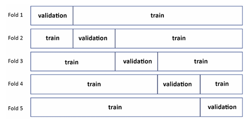

K-katlamalı çapraz doğrulama skorunun önemli bir yönü, modelinizin k-1 katından aynı miktarda veri ile eğitilmiş olarak ortalama skorunu tahmin etmesidir. Ancak sonrasında modelinizi tüm verinizle eğittiğinizde, önceki doğrulama tahmini geçerliliğini yitirir. K, örnek sayısı n'ye yaklaştıkça, modelinizin tüm eğitim seti üzerinde eğitilmiş haline ilişkin giderek daha doğru bir tahmin elde edersiniz; ancak her katın tahminleri arasındaki artan korelasyon nedeniyle, doğrulamanın tüm olasılık tahminlerini kaybedersiniz. Bu durumda, elde ettiğiniz sayı, modelinizin eğitim verisi üzerindeki performansını gösterir (ki bu hala karşılaştırma amaçları için yararlı bir tahmin olabilir, ancak modelinizin genelleme gücünü doğru şekilde tahmin etmenize yardımcı olmaz).

K = n'ye ulaştığınızda, bunun LOO (Leave-One-Out) doğrulama yöntemi olduğunu görürsünüz, bu yöntem birkaç örneğiniz olduğunda yararlıdır. Bu yöntem çoğunlukla tarafsız bir uyum ölçütüdür, çünkü mevcut verilerin neredeyse tamamını eğitmek için kullanır ve sadece bir örneği test için ayırır. Ancak, bu, görünmeyen verilerdeki beklenen performansın iyi bir tahmini değildir. Verisetindeki her bir testin tekrar edilmesi, birbirleriyle yüksek oranda korelasyonlu olur ve ortaya çıkan LOO metriği, modelin veri seti üzerindeki performansını daha çok temsil eder, bilinmeyen verilerdeki performansından ziyade.

Doğru k sayısı, sahip olduğunuz veriye ilişkin birkaç açıya bağlı olarak belirlenir:

* K küçükse (minimum 2'dir), her kat daha küçük olacak ve bu nedenle k-1 katında eğitilen bir model için öğrenmede daha fazla bias (sapma) olacaktır: daha küçük bir k ile doğrulanan model, daha büyük bir k ile eğitilen bir modele göre daha düşük performans gösterir.
* K daha büyükse, daha fazla veri olacaktır, ancak doğrulama tahminleriniz daha fazla korelasyon gösterir: K-katlamalı çapraz doğrulamanın, görünmeyen verilere olan performansı tahmin etme özelliklerini kaybedersiniz.

Genellikle, k 5, 7 veya 10 olarak belirlenir, nadiren 20 katlama kullanılır. K = 5 veya k = 10 genellikle bir yarışma için iyi bir seçenek olarak kabul edilir, çünkü 10 katlama daha fazla veriyi her eğitimde kullanır (mevcut verilerin %90'ı) ve bu nedenle modelinizin tüm veri kümesiyle yeniden eğitildiğinde beklenen performansını anlamada daha uygundur.

Bir yarışmadaki belirli bir veri seti için hangi k'nın seçileceğini karar verirken, iki perspektifi göz önünde bulundurmak faydalıdır.

İlk olarak, katlamalı sayının seçimi hedeflerinize göre olmalıdır:

* Amacınız performans tahmini yapmaksa, düşük biaslı (yanlılıksız) modeller gerekir (yani tahminlerde sistematik bir distorsiyon olmamalıdır). Bunu başarmak için daha yüksek sayıda katlama kullanmanız gerekir, genellikle 10 ila 20 arasında.
* Amacınız parametre ayarlaması yapmaksa, bias ve varyans karışımına ihtiyacınız vardır, bu nedenle orta sayıda katlama kullanmak uygundur, genellikle 5 ila 7 arasında.
* Son olarak, amacınız sadece değişken seçimi yapmak ve veri setinizi basitleştirmekse, düşük varyanslı tahminler (ya da anlaşmazlık yaşamamak) gerekir. Bu nedenle daha düşük sayıda katlama yeterlidir, genellikle 3 ila 5 arasında.

Mevcut verilerin boyutu oldukça büyükse, önerilen bantların alt tarafında kalmak güvenlidir.

İkinci olarak, sadece performans tahmini yapmayı amaçlıyorsanız, kullandığınız daha fazla katlamanın, doğrulama setinizde daha az örnek olacağı anlamına geldiğini ve bu nedenle her katın tahminlerinin daha fazla korelasyon göstereceğini unutmayın. Belirli bir noktadan sonra, k'yı artırmak, çapraz doğrulama tahminlerinizi görünmeyen test setlerine dair daha az öngörücü hale getirir ve modelinizin eğitim setindeki performansının tahmini olarak daha çok temsil eder. Bu, daha fazla katlama ile, sizin için doğru bir "out-of-fold" tahmini almanızı sağladığından, model birleştirme ve yığılma (stacking) gibi teknikler için daha faydalı olabilir.

> Kaggle yarışmalarında, k-katlamalı çapraz doğrulama genellikle sadece çözüm yaklaşımınızı doğrulamak ve modelinizin performansını anlamak için değil, aynı zamanda tahmininizi üretmek için de uygulanır. Çapraz doğrulama yaparken, alt örnekleme yapıyorsunuz ve verinin alt örneklerine dayalı olarak birden çok modelin sonuçlarını ortalamak, genellikle tüm mevcut verilerle eğitim yapmaktan daha etkili bir stratejidir. Bu, genellikle varyansla mücadele etmek için daha etkili bir yol olur (bunu daha detaylı olarak 9. Bölüm'de, "Blending ve Stacking Çözümleriyle Birleştirme" başlığında tartışacağız). Bu nedenle birçok Kaggle katılımcısı, çapraz doğrulama sırasında oluşturulan modelleri kullanarak test setinde bir dizi tahmin sağlar ve bunları ortaladığında en iyi çözümü elde eder.

**K-Katlamalı Çapraz Doğrulama Varyasyonları**

K-katlamalı çapraz doğrulama, rastgele örneklemeye dayandığı için bazı durumlarda uygun olmayan bölmeler verebilir:

* **Küçük sınıfların oranını korumanız gerektiğinde**, hem hedef seviyesinde hem de özellikler seviyesinde. Bu durum, hedef değişkeninizin oldukça dengesiz olduğu durumlarda yaygındır. Tipik örnekler arasında spam veri setleri (çünkü spam, normal e-posta hacminin küçük bir kısmıdır) veya bir kredi riski veri seti (düşük ihtimalle gerçekleşen bir kredi temerrüdü olayını tahmin etmek) bulunur.

* **Bir sayısal değişkenin dağılımını korumanız gerektiğinde**, hem hedef seviyesinde hem de özellikler seviyesinde. Bu durum, dağılımın oldukça çarpık olduğu veya uzun kuyruklar içerdiği regresyon problemlerinde yaygındır. Yaygın bir örnek, ev fiyatı tahmini olabilir, çünkü satışa çıkan bazı evler, ortalama evden çok daha yüksek fiyatlarla satılmaktadır.

* **Verileriniz bağımsız ve aynı dağılımda (i.i.d.) değilse**, özellikle zaman serisi tahmini yapıyorsanız.

İlk iki senaryoda çözüm, **stratifiye k-katlamalı doğrulama** (stratified k-fold) olacaktır. Bu yöntemde, örnekleme kontrol edilmiş bir şekilde yapılır ve korumak istediğiniz dağılımı korur. Eğer tek bir sınıfın dağılımını korumanız gerekiyorsa, Scikit-learn'deki `StratifiedKFold` fonksiyonunu kullanabilirsiniz. Bu fonksiyon, genellikle hedef değişkeniniz olan, ancak aynı zamanda dağılımını korumanız gereken başka bir özellik ile stratifikasyon değişkeni kullanarak, verilerinizi doğru bir şekilde bölmenize yardımcı olacak indeksler üretir. Aynı sonuca, sayısal bir değişken ile, onu önce diskretize ettikten sonra `pandas.cut` veya Scikit-learn’ün `KBinsDiscretizer` fonksiyonları ile de ulaşabilirsiniz.

Birden fazla değişken veya örtüşen etiketler (örneğin, çok etiketli sınıflandırma) ile stratifikasyon yapmanız gerektiğinde durum biraz daha karmaşık hale gelir.

Bu durumu, **Scikit-multilearn** paketinde bulabilirsiniz ([http://scikit.ml/](http://scikit.ml/)), özellikle birden fazla değişkenin birleşik oranlarını korumak istediğiniz sırayı kontrol etmenizi sağlayan **IterativeStratification** komutuyla ([http://scikit.ml/api/skmultilearn.model_selection.iterative_stratification.html](http://scikit.ml/api/skmultilearn.model_selection.iterative_stratification.html)). Bu, aşağıdaki makalelerde açıklanan algoritmayı uygular:

* Sechidis, K., Tsoumakas, G., ve Vlahavas, I. (2011). *On the stratification of multi-label data*. Machine Learning and Knowledge Discovery in Databases, 145-158. [Makale Linki](http://lpis.csd.auth.gr/publications/sechidis-ecmlpkdd-2011.pdf)
* Szymański, P. ve Kajdanowicz, T.; *Proceedings of the First International Workshop on Learning with Imbalanced Domains: Theory and Applications*, PMLR 74:22-35, 2017. [Makale Linki](http://proceedings.mlr.press/v74/szyma%C5%84ski17a.html)

Stratifikasyonu, bir sınıflandırma problemi değil de bir regresyon problemi ile uğraşıyorsanız da oldukça faydalı bir şekilde kullanabilirsiniz. Regresyon problemlerinde stratifikasyon kullanmak, regressor'ünüzün çapraz doğrulama sırasında hedef (veya prediktörler) değişkeninin, tüm örneklemdeki dağılıma benzer bir dağılımda eğitim yapmasını sağlar. Bu durumda, `StratifiedKFold`'un düzgün çalışması için sürekli hedefiniz yerine hedefinizin diskretize edilmiş bir proxy’sini kullanmanız gerekir.

Bunu başarmanın ilk ve en basit yolu, pandas `cut` fonksiyonunu kullanarak hedefinizi 10 veya 20 gibi yeterince büyük bir bin sayısına bölmektir:

```python
import pandas as pd
y_proxy = pd.cut(y_train, bins=10, labels=False)
```

Kullanılacak bin sayısını belirlemek için, Abhishek Thakur, mevcut örnek sayısına dayalı olarak **Sturges kuralını** kullanmayı tercih eder ve bu sayıyı pandas `cut` fonksiyonuna sağlar (bkz. [https://www.kaggle.com/abhishek/step-1-create-folds](https://www.kaggle.com/abhishek/step-1-create-folds)):

```python
import numpy as np
bins = int(np.floor(1 + np.log2(len(X_train))))
```

Alternatif bir yaklaşım, eğitim setindeki özelliklerin dağılımlarına odaklanmak ve bunları yeniden üretmeye çalışmaktır. Bu, eğitim setinin yalnızca hedef değişkeni ve herhangi bir tanımlayıcıyı hariç tutarak, özellikler üzerinde küme analizi (denetimsiz bir yaklaşım) yapılmasını gerektirir. Sonrasında, tahmin edilen kümeler strata olarak kullanılabilir. Bunun bir örneğini bu Not Defteri’nde görebilirsiniz ([https://www.kaggle.com/lucamassaron/are-you-doing-cross-validation-the-best-way](https://www.kaggle.com/lucamassaron/are-you-doing-cross-validation-the-best-way)), burada ilk olarak **PCA** (temel bileşen analizi) yapılır, korelasyonlar kaldırılır ve ardından **k-means** küme analizi yapılır. Kullanılacak küme sayısını, deneysel testler yaparak belirleyebilirsiniz.

---

**Uygunsuz Bölmeler İçin Çözümler**

K-katlamalı doğrulamanın uygun olmayan bölmeler verebileceği durumu tartışmaya devam edersek, işlerin karmaşıklaştığı üçüncü senaryo, **bağımsız ve aynı dağılımda olmayan (non-i.i.d.) verilerle** karşılaşıldığında yaşanır. Bu durum, örnekler arasında bir gruplaşma olduğunda meydana gelir. Bağımsız ve aynı dağılımda olmayan örneklerin sorunu, özellikler ve hedef değişkenin örnekler arasında birbirleriyle korelasyonlu olmasıdır (yani, sadece bir örneği biliyorsanız, tüm örnekleri tahmin etmek daha kolay olur). Gerçekten de, eğer aynı grup eğitim ve test setlerine bölünürse, modeliniz grupları ayırt etmeyi öğrenebilir, ancak hedefi öğrenmeyebilir ve bu da iyi bir doğrulama skoru elde etmenize ancak liderlik tablosunda çok kötü sonuçlar almanıza neden olabilir. Buradaki çözüm, **GroupKFold** kullanmaktır: bir gruplama değişkeni sağlayarak, her grubun ya eğitim setinde ya da doğrulama setinde yer almasını, ancak asla her iki set arasında bölünmemesini sağlarsınız.

Verilerinizdeki gruplamaları keşfetmek, verinizin bağımsız ve aynı dağılımda olmamasını sağlayan zor bir görev olabilir. Yarışma probleminiz tarafından belirtilmedikçe, veriyi araştırma (denetimsiz öğrenme teknikleri, örneğin küme analizi kullanarak) ve problemin domainini anlamanızı gerektirir. Örneğin, veriniz mobil telefon kullanımıyla ilgiliyse, bazı örneklerin aynı kullanıcıya ait olduğunu, özelliklerdeki benzer değer sıralamalarına bakarak fark edebilirsiniz.

Zaman serisi analizi de aynı sorunu sunar; veriler bağımsız ve aynı dağılımda olmadığı için, rastgele örneklemeyle doğrulama yapamazsınız çünkü farklı zaman dilimlerini karıştırmış olursunuz ve sonraki zaman dilimleri önceki zaman dilimlerinin izlerini taşıyabilir (bu, istatistikte *otokorelasyon* olarak adlandırılan bir özelliktir). Zaman serisi doğrulamasının en temel yaklaşımında, zamanı temel alarak eğitim ve doğrulama setlerini ayırabilirsiniz, bu, Şekil 6.3'te gösterildiği gibi:

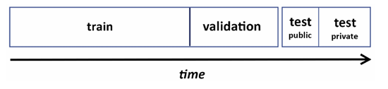

"Doğrulama yetenekleriniz sınırlı olacaktır, çünkü doğrulamanız belirli bir zamana dayanacaktır. Daha karmaşık bir yaklaşım için, Scikit-learn paketi (sklearn.model_selection.TimeSeriesSplit) tarafından sağlanan zaman dilimi doğrulamasını, TimeSeriesSplit'i kullanabilirsiniz. TimeSeriesSplit, zaman serisinin eğitim ve test kısımlarının zaman dilimini ayarlamanıza yardımcı olabilir.


Eğitim zaman dilimi durumunda, TimeSeriesSplit fonksiyonu, eğitim verilerinizi test zaman diliminden önceki tüm geçmiş verileri içerecek şekilde ayarlamanıza yardımcı olabilir veya sabit bir dönem geriye bakma süresiyle (örneğin, her zaman test zaman diliminden önceki üç ayı eğitim için kullanmak gibi) sınırlayabilirsiniz.

Şekil 6.4'te, büyüyen bir eğitim seti ve hareketli bir doğrulama seti içeren zaman tabanlı doğrulama stratejisinin yapısını görebilirsiniz."

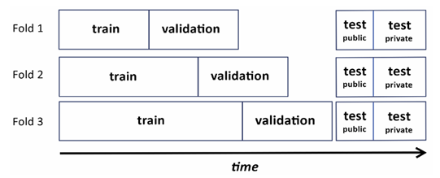

Şekil 6.5'te, eğitim setinin sabit bir geriye bakma süresi olduğu durumda stratejinin nasıl değiştiğini görebilirsiniz.

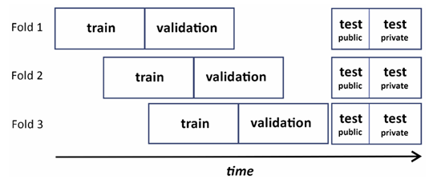

Deneyimlerimize göre, sabit bir bakış aralığı kullanmak, zaman serisi modellerinin değerlendirilmesinde daha adil bir sonuç sağlar çünkü her zaman aynı eğitim veri seti boyutuna güvenirsiniz.

Bunun yerine zamanla büyüyen bir eğitim seti boyutu kullanmak, model performansının zaman dilimlerine göre etkilerini, modeldeki azalan yanlılık ile karıştırmanıza neden olur (çünkü daha fazla örnek, daha az yanlılık anlamına gelir).

Son olarak, TimeSeriesSplit'in, eğitim ve test zamanları arasında önceden tanımlanmış bir boşluk bırakacak şekilde ayarlanabileceğini unutmayın. Bu, test setinizin belirli bir süre sonra (örneğin, eğitim verisinden bir ay sonra) olduğunu biliyorsanız ve modelinizin gelecekte bu kadar ileriye tahmin yapıp yapamayacağını test etmek istiyorsanız son derece kullanışlıdır.

**İç İçe Çapraz Doğrulama**

Bu noktada, iç içe çapraz doğrulamanın tanıtılması önemlidir. Şimdiye kadar yalnızca modelleri son performanslarına göre test etmeyi tartıştık, ancak çoğu zaman hiperparametrelerini ayarlarken ara performanslarını da test etmeniz gerekir. Gerçekten de, test setinizde model parametrelerinin nasıl çalıştığını test edemezsiniz ve ardından aynı veriyi nihai performansı değerlendirmek için kullanamazsınız. Çünkü test setinde en iyi çalışan parametreleri belirlemişsinizdir ve aynı test setindeki değerlendirme ölçütünüz çok iyimser olacaktır; farklı bir test setinde, muhtemelen aynı sonucu elde edemezsiniz. Bu durumda, çeşitli modellerin ve hiperparametrelerin performansını değerlendirmek için kullanılan **doğrulama seti** ile nihai model performansını tahmin etmek için kullanılan **test seti** arasındaki farkı ayırt etmeniz gerekir.

Eğer test-eğitim ayrımı kullanıyorsanız, bu, test kısmını iki yeni parçaya ayırarak yapılır. Yaygın olarak kullanılan ayrım 70/20/10'dur: eğitim, doğrulama ve test, sırasıyla (ancak farklı bir oran seçebilirsiniz). Eğer çapraz doğrulama kullanıyorsanız, iç içe çapraz doğrulama yapmanız gerekir; yani başka bir çapraz doğrulamanın bölünmesine dayalı olarak çapraz doğrulama yaparsınız. Temelde, her zamanki çapraz doğrulamanızı çalıştırırsınız, ancak farklı modelleri veya parametreleri değerlendirmek zorunda olduğunuzda, değerlendirme ve optimizasyon yapmak için eğitim verileriyle birlikte çapraz doğrulama yaparsınız.

Şekil 6.6'daki örnek, bu içsel ve dışsal çapraz doğrulama yapısını gösterir. Dışsal kısımda, değerlendirme ölçütünüzü test etmek için kullanılan veri kısmını belirlersiniz. İçsel kısımda ise, dışsal kısımdan gelen eğitim verileriyle, model seçimlerini optimize etmek ve hangi model veya hiperparametre değerlerinin seçileceğini belirlemek amacıyla eğitim/doğrulama bölünmeleri düzenlersiniz.

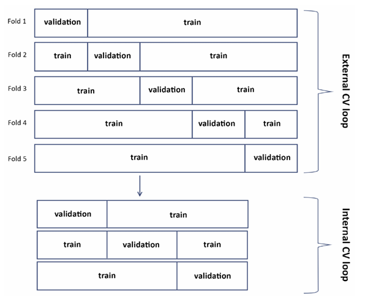

**Bu yaklaşımın avantajı, test ve parametre aramanızı tamamen güvenilir hale getirmesidir, ancak bunu yaparken birkaç problemle karşılaşırsınız:**

* Çapraz doğrulama ile ilk bölmeyi yaptıktan sonra, bir kez daha bölme yapmanız gerektiği için eğitim setiniz azalır.
* Daha önemlisi, çok sayıda model oluşturmanız gerekir: Eğer iki iç içe geçmiş 10 katlı çapraz doğrulama yaparsanız, 100 model çalıştırmanız gerekir.

Özellikle son sebepten dolayı bazı Kaggle yarışmacıları, iç içe çapraz doğrulamayı göz ardı eder ve model/parametre arama ile performans değerlendirmesi için aynı çapraz doğrulamayı kullanmayı ya da nihai değerlendirme için sabit bir test örneği kullanmayı tercih ederler. Deneyimlerimize göre bu yaklaşım da işe yarayabilir, ancak model performansının aşırı tahmin edilmesine ve aşırı uyum (overfitting) durumlarına yol açabilir. Bu durum, modelleme sürecinde kullanılan katman dışı (out-of-fold) tahminler oluşturuyorsanız daha belirgin hale gelebilir (ki bu konuyu bir sonraki bölümde ele alacağız). Biz her zaman, modellerinizi test etmek için en uygun metodolojiyi denemenizi öneriyoruz. Eğer amacınız modelinizin performansını doğru bir şekilde tahmin etmek ve tahminlerini başka modellerde yeniden kullanmaksa, iç içe çapraz doğrulama kullanmak, mümkün olduğunda size daha az aşırı uyumlu bir çözüm sunabilir ve bazı yarışmalarda fark yaratabilir.

**Katman Dışı Tahminler (OOF) Üretme**

Çapraz doğrulamanın ilginç bir uygulaması, değerlendirme metriğinizin performansını tahmin etmenin yanı sıra test tahminleri ve katman dışı tahminler (OOF) üretmektir. Gerçekten de, eğitim verinizin bazı bölümleri üzerinde eğitim yaparken ve geri kalanlar üzerinde tahminler yaparken şunları yapabilirsiniz:

* **Test seti üzerinde tahmin yapmak**: Tüm tahminlerin ortalaması, genellikle tüm veriler üzerinde aynı modeli tekrar eğitmekten daha etkili olabilir. Bu, blending ile ilişkili bir topluluk (ensemble) tekniğidir ve 9. Bölüm olan *Ensemble: Blending ve Stacking Çözümleri*'nde ele alınacaktır.

* **Doğrulama seti üzerinde tahmin yapmak**: Sonunda, tüm eğitim seti için tahminleriniz olacak ve bunları, orijinal eğitim verileriyle aynı sırada yeniden sıralayabilirsiniz. Bu tahminlere genellikle "katman dışı (OOF) tahminleri" denir ve oldukça faydalı olabilirler.

OOF tahminlerinin ilk kullanımı, performansınızı tahmin etmektir çünkü değerlendirme metriğinizi doğrudan OOF tahminleri üzerinde hesaplayabilirsiniz. Elde edilen performans, çapraz doğrulama tahminlerinden (örneklemeye dayalı) farklıdır; aynı olasılık özelliklerine sahip değildir, bu yüzden genelleme performansını ölçmek için geçerli bir yol değildir, ancak modelinizin eğitildiğiniz belirli set üzerinde nasıl performans gösterdiği hakkında size bilgi verebilir.

İkinci bir kullanım, tahminleri zemin gerçek değerleriyle veya farklı modellerden elde edilen diğer tahminlerle karşılaştırarak görselleştirmek ve bir grafik oluşturmak olabilir. Bu, her bir modelin nasıl çalıştığını ve tahminlerinin birbiriyle ne kadar korelasyonlu olduğunu anlamanıza yardımcı olacaktır.

Son kullanım ise meta özellikler veya meta tahminciler (meta-predictors) yaratmaktır. Bu konu, 9. Bölüm'de tam olarak ele alınacaktır, ancak burada şunu belirtmek önemlidir ki, OOF tahminleri çapraz doğrulamanın bir yan ürünü olup, çalıştıkları için kullanılır; çünkü çapraz doğrulama sırasında, modeliniz her zaman eğitim sırasında görmediği örnekler üzerinde tahmin yapar.

Her OOF tahmininin farklı bir veri seti üzerinde eğitilmiş bir model tarafından üretildiğinden, bu tahminler yanlılık içermez ve bunları aşırı uyum (overfitting) riskinden korkmadan kullanabilirsiniz (bununla ilgili bazı uyarılar bir sonraki bölümde tartışılacaktır).

OOF tahminlerini üretmenin iki yolu vardır:

* **Bir prosedür kodlayarak** doğrulama tahminlerini bir tahmin vektörüne kaydetmek ve bunları eğitim verilerindeki örneklerle aynı indeks konumuna yerleştirmek.
* **Scikit-learn fonksiyonu olan `cross_val_predict`'i kullanarak**, OOF tahminlerini otomatik olarak üretmek.

Bu ikinci tekniği, bu bölümün ilerleyen kısımlarında *adversarial validation*'ı incelediğimizde göreceğiz.

##### Subsampling *(Alt örnekleme)*

**k-katlı çapraz doğrulama dışında başka doğrulama stratejileri de vardır, ancak bunlar aynı genelleme özelliklerine sahip değildir.**

Zaten LOO'yu (Leave-One-Out) tartıştık, bu durum k = n olduğunda (burada n, örneklerin sayısıdır). Diğer bir seçenek ise **alt örnekleme**dir. Alt örnekleme, k-katlıya benzer, ancak sabit katlarınız yoktur; ihtiyacınız olduğuna düşündüğünüz kadarını kullanırsınız (başka bir deyişle, eğitilmiş bir tahminde bulunursunuz). Verinizi tekrar tekrar alt örneklerken, her seferinde örneklediğiniz veriyi eğitim verisi olarak kullanır, geri kalan veriyi ise doğrulama için bırakırsınız. Tüm alt örneklerin değerlendirme metriklerinin ortalamasını alarak, modelinizin performansları için bir doğrulama tahmini elde edersiniz.

k-katlı doğrulama gibi, tüm örneklerinizi sistematik olarak test ettiğiniz için, bunların hepsini test etme şansınızın iyi olabilmesi için oldukça fazla deneme yapmanız gerekir. Aynı sebeple, yeterli sayıda alt örnekleme uygulamazsanız, bazı örnekler diğerlerinden daha fazla test edilebilir. Bu tür bir doğrulamayı, Scikit-learn'deki **ShuffleSplit** kullanarak yapabilirsiniz.

##### The bootstrap *(Bootstrap yöntemi)*

Son olarak, hata dağılımını sonuçlandırmak için istatistiklerde geliştirilen bootstrap yöntemini kullanmayı deneyebilirsiniz; aynı nedenlerden ötürü, bu yöntem performans tahmini için de kullanılabilir. Bootstrap, verilerinizi örnekleme yaparak, yani yerine koyarak, aynı boyutta bir örneklem oluşturmanızı gerektirir.

Bu noktada bootstrap'ı iki farklı şekilde kullanabilirsiniz:

* İstatistiklerde olduğu gibi, bootstrap'ı birden çok kez uygulayarak modelinizi örnekler üzerinde eğitebilir ve eğitim verisi üzerinde değerlendirme metriğinizi hesaplayabilirsiniz. Bootstrap'ların ortalaması, nihai değerlendirmenizi sağlar.
* Alternatif olarak, alt örnekleme (subsampling) gibi, bootstrap edilmiş örneklemi eğitim için kullanabilir ve örnekleme yapılmayan veri kısmını test setiniz olarak bırakabilirsiniz.

Deneyimlerimize göre, bootstrap ile eğitim verisi üzerinde değerlendirme metriği hesaplamak, doğrusal modeller için modelin katsayılarını ve hata dağılımlarını tahmin etmek amacıyla istatistiklerde sıklıkla kullanılan bir yöntem olmasına rağmen, makine öğreniminde pek faydalı değildir. Çünkü birçok makine öğrenimi algoritması eğitim verilerine aşırı uyum sağlama eğilimindedir, bu nedenle eğitim verisi üzerinde geçerli bir metrik değerlendirmesi elde edilemez. Bu sebeple, Efron ve Tibshirani (bkz: Efron, B. ve Tibshirani, R. "Cross-validation'da iyileştirmeler: 632+ bootstrap yöntemi". *Journal of the American Statistical Association* 92.438 (1997): 548-560.) final doğrulama metriği olarak 632+ estimator'ını önermişlerdir.

Başlangıçta, basit bir versiyon olan 632 bootstrap’ı önermişlerdir:

$$
Err_{632} = 0.368 * err_{fit} + 0.632 * err_{bootstrap}
$$

Bu formülde, değerlendirme metriğiniz err, errfit eğitim verisi üzerinde hesapladığınız metrik ve errbootstrap ise bootstrap edilmiş veriler üzerinde hesapladığınız metriktir. Ancak, aşırı uyum sağlamış bir eğitim modelinde, errfit sıfıra yaklaşacak ve bu durumda estimator pek faydalı olmayacaktır. Bu yüzden, 632+ bootstrap’ın ikinci versiyonunu geliştirmişlerdir:

$$
Err_{.632} + (1 - w) * err_{fit} + w * err_{bootstrap}
$$

Burada w, şu şekilde tanımlanır:

$$
w = \frac{0.632}{1 - 0.632R}
$$
$$
R = \frac{err_{bootstrap} - err_{fit}}{\gamma - err_{fit}}
$$

Yeni bir parametre olan (\gamma) burada "no-information error rate" (bilgi içermeyen hata oranı) olarak tanımlanır ve hedefler ile prediktörlerin tüm olası kombinasyonları üzerinde tahmin modelini değerlendirerek tahmin edilir. Ancak, (\gamma)’yı hesaplamak pratikte imkansızdır, bu konuda Scikit-learn geliştiricilerinin ([https://github.com/scikit-learn/scikit-learn/issues/9153](https://github.com/scikit-learn/scikit-learn/issues/9153)) de tartıştığı gibi.

Statistiklerdeki klasik bootstrap kullanımının makine öğrenimine uygulanmasındaki sınırlamalar ve işlem zorlukları göz önüne alındığında, bunun yerine bootstrap'ın ikinci yöntemini kullanmak daha uygundur; bootstrap örnekleme yapılmamış verileri test verisi olarak kullanarak değerlendirme yapmaktır.

Bu şekilde bootstrap, çapraz doğrulamaya (cross-validation) bir alternatif olabilir. Ancak, subsampling gibi, çapraz doğrulama yöntemine göre daha fazla model inşa edilmesi ve test edilmesi gerekmektedir. Ancak, çapraz doğrulama metrik değerlendirmesinde yüksek varyans gösteren durumlar ile karşılaştığınızda, bootstrap’ı bu tür durumlar için daha yoğun test ve yeniden test yaparak model doğrulamanızda kullanmanız faydalı olacaktır.

Daha önce bu yöntem Scikit-learn'de uygulanmıştı ([https://github.com/scikit-learn/scikit-learn/blob/0.16.X/sklearn/cross_validation.py#L613](https://github.com/scikit-learn/scikit-learn/blob/0.16.X/sklearn/cross_validation.py#L613)), ancak sonrasında kaldırıldı. Çünkü Scikit-learn'deki bootstrap hem test verilerini hem de eğitim verilerini bootstrap'lamaktaydı. Şimdi bootstrap'ı bulamayacağınız için, kendi uygulamamızı kullanabilirsiniz. İşte örnek:

```python
import random
def Bootstrap(n, n_iter=3, random_state=None):
    """
    Yerine koyarak rastgele örnekleme yapan çapraz doğrulama jeneratörü.
    Her iterasyonda, [0, n) aralığındaki indekslerden bir bootstrap örneği oluşturulur
    ve fonksiyon elde edilen örneklem ve dışarıda kalan tüm indekslerin listesini döndürür.
    """
    if random_state:
        random.seed(random_state)
    for j in range(n_iter):
        bs = [random.randint(0, n-1) for i in range(n)]
        out_bs = list({i for i in range(n)} - set(bs))
        yield bs, out_bs
```

Sonuç olarak, bootstrap, çapraz doğrulamaya bir alternatif olarak değerlendirilebilir. İstatistik ve finans alanlarında daha yaygın kullanılsa da, makine öğreniminde altın kural genellikle k-kat çapraz doğrulama yaklaşımını kullanmaktır. Ancak, çapraz doğrulama metriğinizde çok yüksek bir varyans varsa ve daha yoğun test ve yeniden test yapmanız gerekiyorsa, bootstrap'ı unutmayın. Bu tür durumlarda bootstrap, modellerinizi doğrulamak için çok daha faydalı olacaktır.

> **Ryan Chesler**
> 
> [https://www.kaggle.com/ryches](https://www.kaggle.com/ryches)
> 
> 
> 
> Bölümün ikinci röportajı Ryan Chesler ile yapılmıştır. Kendisi bir *Discussions Grandmaster* ve *Notebooks ve Competitions Master* unvanlarına sahiptir. H2O.ai’de veri bilimcisidir ve aynı zamanda Meetup'ta San Diego Makine Öğrenimi grubunun organizatörlerinden birisidir ([https://www.meetup.com/San-Diego-Machine-Learning/](https://www.meetup.com/San-Diego-Machine-Learning/)). Yanıtlarının birkaçında doğrulamanın önemi vurgulanmıştır.
> 
> 
> 
> **En sevdiğiniz yarışma türü nedir ve neden? Kaggle'da hangi tekniklerde ve çözüm yaklaşımlarında uzmanlaştınız?**
> 
> Ben genellikle her tür yarışmaya katılmaya çalışırım. Belirli bir alanda uzmanlaşmak yerine farklı problemlerin çözümünü denemek daha ilgi çekici. En ilginç bulduğum yarışmalar, verilerden ve tahmin hatalarından derinlemesine çıkarımlar yapabileceğimiz yarışmalardır. Benim için hata analizi en aydınlatıcı süreçlerden birisidir; modelin nerelerde başarısız olduğunu anlamak ve modelin ya da girdi verisi temsilinin zayıf yönlerini düzeltmek için bir yol aramak çok önemlidir.
> 
> 
> 
> **Kaggle yarışmalarına nasıl yaklaşırısınız? Bu yaklaşım, günlük işinizle ne kadar farklıdır?**
> 
> Yaklaşımım her iki durumda da benzer. Birçok kişi, herhangi bir modelleme çabasına başlamadan önce keşifsel veri analizini tercih eder, ancak ben veriyi modelleme için hazırlama sürecinin genellikle yeterli olduğunu düşünüyorum. Tipik yaklaşımım, veriyi manuel olarak gözden geçirmek ve veriyi nasıl en iyi şekilde modelleyeceğim ve keşfedebileceğim farklı seçenekler hakkında bazı ön kararlar almak. Sonrasında modelimi kurarım, performansını değerlendiririm, ardından hataları analiz etmeye odaklanırım ve modelin nerelerde hata yaptığına dayanarak bir sonraki modelleme adımlarını düşünürüm.
> 
> 
> 
> **Kaggle kariyerinizde size yardımcı oldu mu? Eğer olduysa, nasıl?**
> 
> Evet, şu anki işimi bu sayede buldum. H2O’da çalışıyorum ve Kaggle başarılarına çok değer veriyorlar. Önceki işim de yarışmalarda iyi performans sergilememi beğeniyordu.
> 
> 
> 
> **Aynı zamanda San Diego'da 2000'den fazla katılımcısı olan bir meet-up’ın organizatörüsünüz. Bu, Kaggle deneyiminizle ilgili mi?**
> 
> Evet, kesinlikle ilgili. Çok az bilgiyle başladım ve ilk başta pek başarılı olamadığım bir Kaggle yarışmasına katıldım. Bir yerel meet-up'a katıldım ve burada birlikte çalışacak ve öğrenecek insanlarla tanıştım. O zamanlar, benden çok daha yüksek beceri seviyesine sahip insanlarla çalıştım ve bir yarışmada gerçekten iyi bir performans gösterdik, 4500+ takım arasında 3. olduk.
> 
> Bundan sonra grup eskisi kadar düzenli olmadı ve topluluğu devam ettirmek istedim, bu yüzden kendi grubumu oluşturdum ve kendi etkinliklerimi düzenlemeye başladım. Bunu yaklaşık 4 yıldır yapıyorum ve şimdi insanların öğretildiği ve onlara makine öğrenimine başlama konusunda yardımcı olduğum tarafında yer alıyorum. Başlangıçta sadece Kaggle yarışmalarına odaklandık ve takımlar kurmaya çalıştık, ancak zamanla kitap kulüpleri ve çeşitli ilgi alanlarına yönelik dersler yapmaya başladık. Başarılarımdan birçoğunu bu haftalık zamanı makine öğrenimini çalışmak ve düşünmek için ayırmaya borçluyum.
> 
> 
> 
> **Deneyiminize göre, deneyimsiz Kaggle katılımcıları genellikle hangi noktaları gözden kaçırıyor? İlk başladığınızda şimdi bildiğiniz şeyleri bilseydiniz, neyi daha iyi yapardınız?**
> 
> Deneyimlerime göre, birçok kişi bias-variance (yanlılık-çeşitlilik) ticaretini ve aşırı uyum sağlamayı (overfitting) çok fazla önemseme eğiliminde. Bu, insanların sürekli olarak çok fazla endişe duyduğu bir şeydir. Odak noktası, eğitim ve doğrulama performansını yakınlaştırmak değil, doğrulama performansını mümkün olduğunca iyi hale getirmektir.
> 
> 
> 
> **Geçmişte yarışmalarda hangi hataları yaptınız?**
> 
> Sürekli yaptığım hata yeterince keşif yapmamaktır. Bazen çok erken bir şekilde fikirlerimi göz ardı ederim, ancak sonradan bu fikirlerin performansı iyileştirmek için önemli olduğunu görürüm. Genellikle ilk denememde rekabetçi bir performansa yakın bir sonuç alabiliyorum ama iterasyon yaparak ve yeni şeyler deneyerek devam etmek farklı bir beceri gerektiriyor ve bunun üzerinde hala çalışıyorum.
> 
> 
> 
> **Veri analizi veya makine öğrenimi için kullanmanızı önerdiğiniz özel araçlar veya kütüphaneler var mı?**
> 
> Çoğunlukla standart araçları kullanırım: XGBoost, LightGBM, Pytorch, TensorFlow, Scikit-learn. Belirli bir araca ya da kütüphaneye özel bir bağlılığım yoktur, sadece probleme uygun olan ne varsa onu kullanırım.
> 
> 
> 
> **Bir yarışmaya katılırken birinin aklında tutması veya yapması gereken en önemli şey nedir?**
> 
> Bence en önemli şey, iyi bir doğrulama yapmaktır. Çoğu zaman insanların performanslarının iyileştiğini düşünerek kendilerini kandırdığını görüyorum, ancak sonra liderlik panosuna gönderdiklerinde bekledikleri gibi gitmediğini fark ediyorlar. Yeni görülmemiş verilerle varsayımları eşleştirmeyi ve yeni koşullara dayanıklı bir model inşa etmeyi öğrenmek önemli bir beceridir.

### Tuning your model validation system *(Model doğrulama sistemini ayarlamak)*

Bu noktada, tüm olası doğrulama stratejilerinin tam bir genel bakışını elde etmiş olmalısınız. Bir yarışmaya yaklaştığınızda, doğrulama stratejinizi belirler ve uygularsınız. Ardından, seçtiğiniz stratejinin doğru olup olmadığını test edersiniz.
Altın kural olarak, doğrulama stratejinizi belirlerken, yarışmanın organizatörlerinin veriyi eğitim, özel ve genel test setlerine ayırma yaklaşımını taklit etmeye çalışmalısınız. Kendinize şu soruları sorun: Organizatorler veriyi nasıl ayırmış? Rastgele bir örneklem mi almışlar? Verinin belirli bir dağılımını mı korumaya çalışmışlar? Test setleri gerçekten eğitim verisi ile aynı dağılımdan mı seçilmiş?
Bunlar, gerçek dünya projelerinde kendinize sormayacağınız sorulardır. Gerçek dünya projelerinde amacınız her koşulda genelleme yapabilmektir, ancak bir yarışma çok daha dar bir odakla, modelin verilen test setinde (özellikle özel test seti) nasıl performans gösterdiği üzerine yoğunlaşır. Başlangıçtan itibaren bu düşünceye odaklanırsanız, en iyi doğrulama stratejisini bulma şansınız daha yüksek olur ve bu da sizi yarışmada daha yüksek sıralara taşıyabilir.
Bu süreç deneme-yanılma yöntemidir, bu yüzden yarışma için en iyi doğrulama stratejisini bulmaya çalışırken, doğru yolda olup olmadığınızı anlamak için aşağıdaki iki tutarlılık kontrolünü sistematik olarak uygulayabilirsiniz:

1. **Yerel testlerinizin tutarlılığını kontrol etmelisiniz**. Yani, tek bir çapraz doğrulama katmanındaki hata oranlarının birbirinden çok farklı olmadığından emin olmalısınız veya basit bir eğitim-test bölmesi kullandığınızda, aynı sonuçların farklı eğitim-test bölmeleri kullanılarak tekrarlanabilir olup olmadığını kontrol etmelisiniz.
2. **Yerel doğrulama hatanızın, genel liderlik panosundaki sonuçlarla tutarlı olup olmadığını kontrol etmelisiniz**.
   Eğer ilk kontrolü geçemediyseniz, sorunun şu olasılıklardan biri olabileceğini göz önünde bulundurabilirsiniz:

* Eğitim veriniz çok az
* Veriniz çok çeşitli ve her bir eğitim parçası diğerlerinden çok farklı (örneğin, çok yüksek kardinaliteye sahip özellikleriniz varsa, yani çok fazla seviyeye sahip özellikler – zip kodları gibi – ya da çok değişken dış değerleriniz varsa).
  Her iki durumda da, modelinizin eğitimi için veriniz yetersizdir.
  Veri çok çeşitli göründüğü durumlarda bile, öğrenme eğrilerini çizmek, modelinizin daha fazla veriye ihtiyaç duyduğunu size gösterecektir.
  Bu durumda, daha basit bir algoritmaya geçmenin değerlendirme metriği üzerinde işe yaradığını keşfetmediğiniz sürece (bu durumda varyansı bias ile takas yaparak modelinizin performansını kötüleştirebilirsiniz, ancak her zaman böyle olmayabilir), en iyi seçeneğiniz kapsamlı bir doğrulama yaklaşımı kullanmak olacaktır. Bunu şu şekilde uygulayabilirsiniz:
* Daha büyük k değerleri kullanmak (bu, k = n olduğunda LOO'ya yaklaşır). Doğrulama sonuçlarınız artık modelinizin görülmemiş veriler üzerinde nasıl performans gösterdiğinden çok, daha büyük eğitim parçaları kullanarak daha kararlı değerlendirmeler yapmanız konusunda olacaktır.
* Farklı rastgele tohum başlangıçlarıyla seçilen farklı veri bölmeleri temelinde, birden fazla k-katlamalı doğrulamanın sonuçlarını ortalamak.
* Tekrarlı bootstrap kullanmak.
  Unutmayın ki, yerel doğrulama sonuçlarınızın kararsız olması durumunda, yalnızca siz bu sorunu yaşamıyorsunuzdur. Genellikle, bu sorun verinin kaynağı ve özelliklerinden dolayı yaygın bir problemdir. Tartışma forumlarına kulak vererek olası çözümler hakkında ipuçları alabilirsiniz. Örneğin, yüksek kardinaliteli özellikler için hedef kodlama (target encoding) iyi bir çözüm olabilir; aykırı değerlerle başa çıkmak için ise stratifikasyon yardımcı olabilir; ve benzeri.
  İlk kontrolü geçip ikinciyi geçemediyseniz, yerel çapraz doğrulamanız tutarlı ancak liderlik panosundaki sonuçlarla tutarsızsa, bu problemi fark edebilmeniz için tüm deneylerinizi, doğrulama test türlerini, kullanılan rastgele tohumları ve gönderilen tahminlerin liderlik panosundaki sonuçlarını dikkatlice not etmeniz gerekir. Bu şekilde, basit bir dağılım grafiği çizebilir ve doğrusal regresyon uyumlamayı ya da daha basit olarak, yerel sonuçlarınız ile ilişkili genel liderlik panosu skorları arasında bir korelasyon hesaplayabilirsiniz.
  Tüm bunları not almak ve analiz etmek zaman ve sabır gerektirir, ancak yarışmadaki performanslarınızın en önemli meta-analizini yapmak, sizi başarıya taşıyacak en önemli adımdır.
  Eğer uyuşmazlık, doğrulama skorunuzun sistematik olarak liderlik panosu skorlarından daha düşük ya da daha yüksek olması nedeniyle ortaya çıkıyorsa, doğrulama stratejinizde eksik bir şeyler olduğuna dair güçlü bir sinyal alıyorsunuz demektir. Ancak bu sorun, modelinizi geliştirmenizi engellemez. Modeliniz üzerinde çalışmaya devam edebilir ve ilerlemelerinizi liderlik panosunda görmek bekleyebilirsiniz, ancak bu her zaman orantılı olmayacaktır. Ancak sistematik farklar her zaman bir kırmızı bayrak anlamına gelir, bu da sizin yaptığınızla organizatörlerin modelinizi test etme yaklaşımı arasında bir fark olduğunu gösterir.

Çok daha kötü bir senaryo, yerel çapraz doğrulama skorlarınızın, liderlik panosundaki geri bildirimle hiçbiriyle korelasyon göstermediği durumdur. Bu gerçekten bir kırmızı bayraktır. Böyle bir durumla karşılaştığınızı fark ettiğinizde, derhal bir dizi test ve araştırma yaparak bunun nedenini anlamaya çalışmalısınız, çünkü bu durum, final sıralamanız için ciddi bir tehdit oluşturur. Böyle bir senaryoda birkaç olasılık vardır:

* Test setinin eğitim setinden farklı bir dağılımdan seçildiğini fark edebilirsiniz. Bu durumda, "adversarial validation" testi (bir sonraki bölümde tartışacağız) size bu konuda aydınlatıcı olabilir.
* Veriler bağımsız ve aynı dağılımdan (i.i.d.) değil, ancak bu durum açıkça belirtilmemiştir. Örneğin, The Nature Conservancy Fisheries Monitoring yarışmasında ([https://www.kaggle.com/c/the-nature-conservancy-fisheries-monitoring](https://www.kaggle.com/c/the-nature-conservancy-fisheries-monitoring)), eğitim setindeki görüntüler benzer durumlardan (balıkçı tekneleri) alınmıştı. Modelin, görüntülerin bağlamını öğrenmek yerine hedefi tanımamayı engellemek için bu görüntüleri nasıl düzenlemeniz gerektiğini kendiniz keşfetmeniz gerekiyordu (örneğin, Anokas'ın bu çalışmasına bakabilirsiniz: [https://www.kaggle.com/anokas/finding-boatids](https://www.kaggle.com/anokas/finding-boatids)).
* Özelliklerin çok değişkenli dağılımı aynı olabilir, ancak bazı gruplar test setinde farklı şekilde dağılabilir. Farklılıkları keşfedebilirseniz, eğitim setinizi ve doğrulamanızı buna göre ayarlayarak avantaj sağlayabilirsiniz. Bunun üzerinde çalışabilmek için, genel liderlik panosuna bakmanız gerekecek.
* Test verisi kaymış veya trendlenmiş olabilir; bu, genellikle zaman serisi tahminlerinde görülen bir durumdur. Yine, liderlik panosuna bakarak bazı olası post-processing işlemleri hakkında fikir sahibi olabilirsiniz. Örneğin, tahminlerinize bir çarpan uygulamak, test verisindeki azalan veya artan bir trendi taklit edebilir.

Daha önce tartıştığımız gibi, liderlik panosunu incelemek, özellikle kamu test setinin bileşimi hakkında ipuçları elde etmek amacıyla özel olarak tasarlanmış gönderimler yapma eylemidir. Bu, özel test seti kamu test setine benziyorsa özellikle iyi çalışır. İnceleme için genel bir yöntem yoktur, bu yüzden her yarışma ve problem türüne göre bir inceleme metodolojisi geliştirmeniz gerekir.

Örneğin, *Climbing the Kaggle Leaderboard by Exploiting the Log-Loss Oracle* ([https://export.arxiv.org/pdf/1707.01825](https://export.arxiv.org/pdf/1707.01825)) adlı makalede, Jacob, eğitim verisini bile indirmeden bir yarışmada nasıl dördüncü sıraya çıkılabileceğini açıklar.

Regresyon problemleriyle ilgili olarak, Kaggle tarafından düzenlenen *30 Days of ML* etkinliğinde, Hung Khoi, liderlik panosunu incelemenin, eğitim seti ile kamu test verisi arasındaki hedef sütununun ortalama ve standart sapma farklarını anlamasına nasıl yardımcı olduğunu açıklamıştır (bkz: [https://www.kaggle.com/c/30-days-of-ml/discussion/269541](https://www.kaggle.com/c/30-days-of-ml/discussion/269541)).

Aşağıdaki denklemi kullandı:

$$
RMSE^2 = MSE = variance + (mean - guessed\_value)^2
$$

Esasen, test hedefinin ortalamasını ve varyansını çözmek için yalnızca iki sunum gereklidir, çünkü iki bilinmeyen terim vardır – varyans ve ortalama.

Ayrıca, liderlik panosundan bilgi sorgulama hakkında bazı diğer fikirleri Chris Deotte'den ([https://www.kaggle.com/cdeotte](https://www.kaggle.com/cdeotte)) şu gönderisinde bulabilirsiniz: [https://www.kaggle.com/cdeotte/lb-probing-strategies-0-890-2nd-place](https://www.kaggle.com/cdeotte/lb-probing-strategies-0-890-2nd-place), bu gönderi "Don't Overfit II" yarışmasıyla ilgilidir ([https://www.kaggle.com/c/dont-overfit-ii](https://www.kaggle.com/c/dont-overfit-ii)).

> Liderlik panosundan bilgi sorgulamanın çift taraflı bir kılıç olduğunu hissetmek isterseniz, Zahar Chikishev’in LANL Deprem Tahmin Yarışması’ndan nasıl bilgi sorguladığını okuyabilirsiniz, sonuç olarak halkada birinci olduğu halde özel liderlik panosunda 87. sırada yer aldı: [https://towardsdatascience.com/how-to-lb-probe-on-kaggle-c0aa21458bfe](https://towardsdatascience.com/how-to-lb-probe-on-kaggle-c0aa21458bfe)

### Using adversarial validation *(Zıt doğrulama yöntemini kullanmak)*

Çapraz doğrulama, modelinizin, eğitim verisinden aynı dağılımdan gelen, görülmemiş veri setlerine ne kadar iyi genelleme yapabileceğini test etmenize olanak tanır. Umarım, bir Kaggle yarışmasında, modelinizin hem kamu (public) hem de özel (private) veri setlerinde tahmin yapması istendiği için, bu test verisinin eğitim verisiyle aynı dağılımdan geldiğini varsayabilirsiniz. Gerçek hayatta, bu her zaman böyle değildir.

Eğer test verisine aşırı uyum sağlamazsanız, çünkü kararınızı yalnızca liderlik panosu sonuçlarına dayandırmak yerine çapraz doğrulamanızı da göz önünde bulundurduysanız, yine de sonuçlardan şaşırabilirsiniz. Bu, test seti eğitim setinden biraz farklı olduğunda gerçekleşebilir. Aslında, hedef olasılığı ve bunun dağılımı ile öngörücü değişkenlerin buna nasıl bağlandığı, modelinizi eğitim sırasında, test verisi farklı olduğunda yerine getiremeyeceği belirli beklentiler hakkında bilgilendirir.

Bu nedenle, yalnızca liderlik panosuna aşırı uyum sağlamaktan kaçınmak yeterli değildir, ilk başta test verinizin eğitim verisiyle karşılaştırılabilir olup olmadığını araştırmak da önemlidir. Eğer farklılarsa, bu dağılım farklarını test verisi üzerinde hafifletme şansınız olup olmadığını bulmanız ve bu test seti üzerinde iyi performans gösteren bir model inşa etmeniz gerekecektir.

Adversarial doğrulama, eğitim ve test verisi arasındaki farkı tahmin etmek amacıyla geliştirilmiş bir tekniktir. Bu teknik, Kaggle katılımcıları arasında uzun zamandır söylenti olarak dolaşıyor ve takım takım aktarılmaya çalışılmıştı, ta ki Zygmunt Zając'ın FastML blogunda ([https://www.kaggle.com/zygmunt](https://www.kaggle.com/zygmunt)) paylaştığı bir yazı sayesinde halka açık hale gelene kadar.

Fikir basittir: Eğitim verinizi alın, hedefi (target) çıkarın, eğitim verinizi ve test verinizi birleştirin ve yeni bir ikili sınıflandırma hedefi oluşturun. Burada pozitif etiket test verisine atanır. Bu noktada, bir makine öğrenmesi sınıflandırıcısı çalıştırın ve ROC-AUC değerlendirme metriğiyle değerlendirin (bu metriği önceki "Yarışma Görevleri ve Metreleri Detaylandırma" bölümünde ele almıştık).

Eğer ROC-AUC değeri 0.5 civarındaysa, bu, eğitim ve test verisinin kolayca ayırt edilemediği ve muhtemelen aynı dağılımdan geldiği anlamına gelir. ROC-AUC değerleri 0.5'ten yüksek ve 1.0'a yakınsa, algoritmanın eğitim setinden neyin olduğunu ve test setinden neyin olduğunu anlamasının çok kolay olduğunu gösterir; böyle bir durumda, test setine kolayca genelleme yapmayı beklemeyin çünkü bu açıkça farklı bir dağılımdan gelmektedir.

> Sberbank Rus Konut Piyasası yarışması için yazılmış bir örnek Notebook'u burada bulabilirsiniz: [Adversarial Doğrulama ve Diğer Korkutucu Terimler](https://www.kaggle.com/konradb/adversarial-validation-and-other-scary-terms), bu, adversarial doğrulama ve yarışmalarda nasıl kullanıldığı hakkında pratik bir örnek sunmaktadır.

Verileriniz farklı türlerde olabilir (sayısal veya metin etiketleri gibi) ve eksik veriler olabilir, bu nedenle sınıflandırıcıyı başarıyla çalıştırmadan önce bazı veri işleme adımlarına ihtiyacınız olacak. Önerimiz, rastgele orman sınıflandırıcıyı kullanmanızdır çünkü:

* Gerçek olasılıkları vermez, ancak sonuçları sadece sıralı olarak sunar, bu da ROC-AUC skoru için mükemmel bir uyum sağlar.
* Rastgele orman, karar ağaçlarına dayalı esnek bir algoritmadır ve özellik seçimini kendisi yapabilir, farklı türdeki özelliklerle çalışabilir ve tüm verileri sayısal hale getirebilir. Ayrıca, aşırı uyuma karşı oldukça dayanıklıdır ve hiperparametreleri çok fazla düşünmek zorunda kalmazsınız.
* Verinin çoğu zaman işlenmesine gerek yoktur, çünkü ağaç tabanlıdır. Eksik veriler için, değerleri -999 gibi olasılığı düşük bir negatif değerle değiştirebilirsiniz ve metin değişkenlerini sayılara dönüştürebilirsiniz (örneğin, Scikit-learn etiket kodlayıcısı, `sklearn.preprocessing.LabelEncoder` kullanarak). Bu çözüm, one-hot encoding'den daha düşük performans gösterebilir ancak çok hızlıdır ve problem için yeterince iyi çalışacaktır.

Sınıflandırıcı kullanmak, test setinizi adversary doğrulama yoluyla değerlendirmek için en doğrudan yol olsa da, başka yaklaşımlar da kullanabilirsiniz. Bir yaklaşım, hem eğitim hem de test verilerini daha düşük boyutlu bir alana yerleştirmektir. Bu, NanoMathias tarafından yazılmış şu yazıda ([https://www.kaggle.com/nanomathias/distribution-of-test-vs-training-data](https://www.kaggle.com/nanomathias/distribution-of-test-vs-training-data)) ele alınmaktadır. Daha fazla ayar yapmayı gerektirse de, t-SNE ve PCA'ya dayalı bir yaklaşım, veriyi grafiksel olarak temsil etmenin yanı sıra anlaşılması kolay ve cazip bir şekilde sunulabilir. Çünkü beyinlerimiz sayısal verilere kıyasla görsel temsil edilen desenleri fark etmekte daha beceriklidir (görsel yeteneklerimiz üzerine detaylı bir tartışma için şu makaleye bakabilirsiniz: [https://onlinelibrary.wiley.com/doi/full/10.1002/qua.24480](https://onlinelibrary.wiley.com/doi/full/10.1002/qua.24480)).

> PCA ve t-SNE, verinizin boyutunu düşürmek ve görselleştirmek için kullanılabilecek tek araçlar değildir. UMAP ([https://github.com/lmcinnes/umap](https://github.com/lmcinnes/umap)), genellikle daha hızlı bir düşük boyutlu çözüm sunar ve net ve ayrılmış veri kümeleri sağlar. Varyasyonel oto-encoders (VAE), doğrusal olmayan boyut indirgeme işlemi yapabilir ve PCA'dan daha faydalı bir temsil sunabilir; ancak daha karmaşık bir kurulum ve ayar gerektirir.

#### Example implementation *(Uygulama örneği)*

Zygmunt'un orijinal makalesinde ve bağlantı verdiğimiz Not Defteri'nde, adversarial doğrulama (adversarial validation) örneklerine rastlayabilirsiniz. Ancak sizin için, Playground yarışması olan **Tabular Playground Series – Jan 2021** ([https://www.kaggle.com/c/tabular-playground-series-jan-2021](https://www.kaggle.com/c/tabular-playground-series-jan-2021)) verisi üzerinden yeni bir örnek oluşturduk.

Başlamak için bazı Python paketlerini içeri aktararak ve yarışmanın eğitim ve test verilerini alarak işlemlere başlıyoruz:

```python
import numpy as np
import pandas as pd
from sklearn.ensemble import RandomForestClassifier
from sklearn.model_selection import cross_val_predict
from sklearn.metrics import roc_auc_score

train = pd.read_csv("../input/tabular-playground-series-jan-2021/train.csv")
test = pd.read_csv("../input/tabular-playground-series-jan-2021/test.csv")
```

Veri hazırlığı oldukça kısa ve net. Tüm özellikler sayısal olduğundan, etiketleme yapmanıza gerek yok, ancak eksik değerleri (-1 genellikle uygun olur) doldurmanız gerekiyor. Ayrıca, hedef sütununu ve kimlik sütunlarını (id) düşürmeniz gerekli. Kimlik sütunu ardışık bir sayıya sahipse, adversarial doğrulama sonucu yüksek bir ROC-AUC skoru elde edebilirsiniz:

```python
train = train.fillna(-1).drop(["id", "target"], axis=1)
test = test.fillna(-1).drop(["id"], axis=1)

X = train.append(test)
y = [0] * len(train) + [1] * len(test)
```

Bu noktada, sadece verilerinizi kullanarak RandomForestClassifier ile tahminler üretmeniz gerekiyor. Bunun için **cross_val_predict** fonksiyonunu kullanıyoruz. Bu fonksiyon otomatik olarak bir çapraz doğrulama şeması oluşturur ve tahminleri doğrulama katmanında depolar:

```python
model = RandomForestClassifier()
cv_preds = cross_val_predict(model, X, y, cv=5, n_jobs=-1, method='predict_proba')
```

Sonuç olarak, doğrulama setinde modelin üzerinde overfitting yapmadığı (çünkü eğitilen veriye göre tahmin yapılmamıştır) ve hata tahmini için kullanılabilen, tarafsız tahminler elde edersiniz. **cross_val_predict**, modelinizi fit etmediği için, modelinize ait herhangi bir bilgi (örneğin, hangi özelliklerin önemli olduğu gibi) almazsınız. Böyle bir bilgiye ihtiyacınız varsa, önce modelinizi fit etmeniz gerekir:

```python
model.fit(X, y)
```

Son olarak, tahminler için ROC-AUC skorunu sorgulayabilirsiniz:

```python
print(roc_auc_score(y_true=y, y_score=cv_preds[:, 1]))
```

Yaklaşık 0.49-0.50 arasında bir değer elde etmeniz gerekir (cross_val_predict deterministik değildir, ancak sabit bir random_seed kullanırsanız sabit sonuçlar alabilirsiniz). Bu, eğitim verisi ile test verisinin kolayca ayırt edilemediği anlamına gelir. Dolayısıyla, her iki veri de aynı dağılımdan gelmektedir.

#### Handling different distributions of training and test data *(Eğitim ve test verilerindeki farklı dağılımlarla başa çıkma)*

ROC-AUC skoru 0.8 veya daha fazla olan bir test seti, eğitim verilerinizden çok farklı ve ayırt edilebilir olduğunu gösterir. Bu tür bir durumda, birkaç strateji uygulayarak bu farkı yönetebilirsiniz:

**Baskılama (Suppression):**

Bu yöntemle, test setindeki en önemli değişkenleri çıkararak eğitim verisi ile test verisinin dağılımlarını eşitlemeyi amaçlarsınız. Bunu yapmak için, modelinizi tüm verilerle eğitir ve ardından **feature_importances_** gibi araçlar ile değişkenlerin önem derecelerini ölçersiniz. Daha sonra, modelinizi tekrar eğitirken, en önemli değişkeni veriden çıkarırsınız. Bu işlemi, ROC-AUC skorunuz yaklaşık 0.5'lere düşene kadar tekrarlarsınız.

Ancak bu yöntemle karşılaşılan ana sorun, önemli değişkenlerin çoğunu veriden çıkarmak zorunda kalmanızdır. Bu durumda, modelinizin tahmin performansı önemli ölçüde düşer çünkü model, bilgilendirici özelliklerden yoksun olacaktır.

**Test Setine En Benzer Örneklerle Eğitim Yapmak:**

Bu yöntemde, odak noktanız değişkenlerde değil, **eğitim örnekleriniz** üzerindedir. Eğitim setinden yalnızca, test dağılımına en yakın olan örnekleri seçersiniz. Bu şekilde, eğitilen modeliniz yalnızca test setiyle uyumlu olur (ancak başka bir test verisi üzerinde genellenemez). Ancak bu yaklaşımda dikkat edilmesi gereken bir sınırlama vardır: Eğitim setindeki örneklerin sayısını azaltırsınız ve test dağılımına benzer olan örnek sayısı düşükse, modeliniz çok daha dar bir veri kümesiyle eğitilmiş olur. Bu da, eğitim örneklerinin yetersizliği nedeniyle modelin oldukça **önyargılı** olmasına neden olabilir.

Örneğin, eğitim verilerinde yalnızca test setindeki adverser (anormal) tahminlerin **0.5'ten büyük** olanlarını seçerseniz, eğitim verinizin boyutu oldukça küçülür. Bu durumda, modelinizin genelleme yeteneği azalır.

**Test Setini Taklit Ederek Doğrulama Yapmak:**

Bu stratejide, tüm verilerle modelinizi eğitirken, doğrulama amacıyla yalnızca **adverser tahminlerin 0.5'ten büyük** olduğu örnekleri seçersiniz. Bu doğrulama seti, modelin performansını **test seti üzerinde optimize etmek** için kullanılır.

Bu strateji, özellikle modelin **hyperparametrelerinin ve seçimlerinin** test setine göre en iyi şekilde ayarlanmasına yardımcı olur. Ancak dikkat edilmesi gereken bir diğer şey, test setini tam anlamıyla taklit etmeye çalışmanın, modelin başka durumlar için genellenebilirliğini kaybettirebilmesidir.

**Adversarial Doğrulama (Adversarial Validation) ile İlgili Ek Notlar:**

* Adversarial doğrulama, genellikle **yarışmalarda** performansınızı artırmaya yardımcı olur. Ancak her zaman işe yaramayabilir. Örneğin, Kaggle gibi platformlarda, **test setine tam erişiminiz olmadığı için adversarial doğrulama** kullanmak mümkün değildir.

* Adversarial doğrulama, test setinin **genel yapısını** anlamanızı sağlar, ancak **private** ve **public** test verisi arasındaki farkı anlamanıza yardımcı olamaz. Bu, genellikle **public leaderboard overfitting** sorununu ve takip eden sıralama değişikliklerini oluşturur.

* Gerçek dünyada, adversarial doğrulama birçok **pratik kullanım** sunar. Örneğin, test setinizi yanlış seçmeniz durumunda, bu yöntem size doğru test verilerini kullanıp kullanmadığınızı anlamanızı sağlar. Ayrıca, **modelin üretim ortamında** zamanla bozulabileceğini ve **concept drift** yaşandığını fark edebilirsiniz. Bu durumda, modelinizi yeniden eğitmeniz gerekebilir.

Sonuç olarak, adversarial doğrulama, doğru test verisini seçmek ve test setinizin eğitim verisinden farklılıklarını anlamak için güçlü bir araçtır. Ayrıca, zaman içinde verinizde meydana gelen değişikliklerin modelinizin tahmin gücünü nasıl etkileyebileceği konusunda size bilgi verir.


> Giuliano Janson
> 
> https://www.kaggle.com/adjgiulio
> 
> 
> 
> > Giuliano Janson, Kaggle'da *Competitions Grandmaster* unvanına sahip ve şu anda Zillow Group'ta makine öğrenimi ve doğal dil işleme (NLP) alanında kıdemli bir uygulamalı bilim insanı olarak görev yapıyor. Onunla yapılan bir röportajda, Kaggle’daki yarışmalar, veri sızıntıları, çapraz doğrulama ve yaratıcı özellik mühendisliği gibi konularda değerli bilgiler paylaşıyor. İşte önemli bazı noktalar:
> 
> 
> 
> **Favori Yarışma Türü**
> 
> 
> 
> Giuliano'nun en sevdiği yarışma tipi, çözmek için ilginç bir problem sunan, hafızaya sığacak büyüklükte fakat aşırı küçük olmayacak, yaratıcı özellik mühendisliği için fırsatlar tanıyan yarışmalardır. Bu tür yarışmalar, ona hem dikkatli bir analiz hem de yaratıcı bir yaklaşım sergileyebilme imkânı tanır.
> 
> 
> 
> **Kaggle Yarışmalarına Yaklaşım**
> 
> 
> 
> Bir Kaggle yarışmasını bir maraton gibi görür. İlk birkaç gün içinde en iyi puanlarının %90-95'ini alabilirken, kalan %5 için yoğun bir şekilde çalışmak gerekir. Günlük iş yaşamı ise farklıdır. Burada model performansı sadece bir faktördür. Zaman yönetimi, ölçeklenebilirlik, sürdürülebilirlik gibi faktörler de önemli olup, projenin zamanında hayata geçmesi için sürekli önceliklendirme yapılır.
> 
> 
> 
> **Zorlu Bir Yarışma Deneyimi**
> 
> 
> 
> Genentech Kanser Yarışması, Giuliano'nun kazandığı iki yarışmadan biridir. Bu yarışma, tıbbi verilerle ilgili ham veriler sundu ve burada veriyi doğru şekilde işlemek büyük bir zorluktu. Özellik mühendisliğinde, veri sızıntılarını tespit etme ve bunları kullanarak modelin performansını artırma konusunda önemli bir başarı elde etti. Veri sızıntısı, modelin yanlış sonuçlar üretmesine neden olabileceğinden çok dikkat edilmesi gereken bir konu.
> 
> 
> 
> **Kaggle'ın Kariyerine Etkisi**
> 
> 
> 
> Kaggle, Giuliano'ya iki ana açıdan fayda sağlamıştır: Modern makine öğrenimi tekniklerine erişim ve güçlü bir model doğrulama anlayışı geliştirme. Ayrıca Kaggle'da diğer yetenekli katılımcılarla işbirliği yaparak pek çok önemli ders almış ve bu deneyimlerini iş yerindeki diğer insanlarla da paylaşmaktadır.
> 
> 
> 
> **Yeni Başlayanların Sıklıkla Gözden Kaçırdığı Noktalar**
> 
> 
> 
> Yeni başlayanların en çok göz ardı ettiği konu doğru çapraz doğrulamanın önemi. İyi bir çapraz doğrulama çerçevesi, modelin iyileştirilmesini doğru ve objektif bir şekilde ölçmenizi sağlar. Yarışmalar uzun süreli olduğu için, başarılı olmak yalnızca iyi bir ilk fikre sahip olmakla değil, veriden gelen geribildirimle iterasyon yapabilme yeteneğiyle de ilgilidir.
> 
> 
> 
> **Hangi Araçları ve Kütüphaneleri Tavsiye Ediyor?**
> 
> 
> 
> Giuliano'nun tercih ettiği araçlar arasında **Pandas** ve **Scikit-learn** yer alıyor. Pandas, veri manipülasyonu ve keşfi için harika bir araçken, Scikit-learn ile hızlıca prototipler geliştirebilir. Nihai modelleri ise genellikle **XGBoost** ile kuruyor. Derin öğrenme içinse **Keras** kullanmayı tercih ediyor.
> 
> 
> 
> Bu gibi deneyimler, Kaggle’da başarılı olmak için gereken derin bilgi ve pratik deneyimi pekiştiriyor.

### Handling leakage *(Veri sızıntısını önleme)*

Kaggle yarışmalarında sonucu etkileyebilecek yaygın bir sorun **veri sızıntısı**dır. Genellikle basitçe **sızıntı** (leakage) olarak veya başka süslü isimlerle (örneğin, **golden features - altın özellikler**) anılan veri sızıntısı, eğitim aşamasında mevcut olan ancak **tahmin anında kullanılamayacak** bilgileri içerir. Böyle bir bilginin (sızıntının) varlığı, modelinizin eğitimde ve testte aşırı performans göstermesine izin vererek sizi yarışmada üst sıralara taşıyacak, ancak sponsörün bakış açısından bu bilgiye dayalı herhangi bir çözümü **kullanılmaz** veya en iyi ihtimalle **en iyi olmayan** hale getirecektir.

> Michael Kim'in ([https://www.kaggle.com/mikeskim](https://www.kaggle.com/mikeskim)) 2019'da Kaggle Days San Francisco'daki sunumunda belirttiği gibi, sızıntıyı "**gerçek hakkında bilgi, yapay ve kasıtsız olarak eğitim özellik verilerine veya eğitim meta verilerine dahil edildiğinde**" şeklinde tanımlayabiliriz.

Sponsor ve Kaggle ekibinin dikkatli kontrolüne rağmen, sızıntının beklenmedik bir şekilde ortaya çıkabilen **ince ve sinsi doğası** nedeniyle, Kaggle yarışmalarında sızıntı sıkça bulunur. Bu durum, her zaman bir yarışmada daha iyi puan almanın yollarını arayan Kaggle katılımcılarının yürüttüğü yoğun arama faaliyetinden kaynaklanmaktadır.

> **Veri sızıntısını, sızıntılı bir doğrulama stratejisiyle karıştırmayın.** Sızıntılı bir doğrulama stratejisinde, sorun, bazı bilgilerin eğitim verilerinden sızması nedeniyle doğrulama stratejinizi daha iyi doğrulama puanlarını destekleyecek şekilde düzenlemiş olmanızdır. Bu, yarışmanın kendisiyle ilgili değildir, ancak doğrulamanızı nasıl ele aldığınızla ilgilidir. Bu, verilerinizi (normalleştirme, boyutluluk azaltma, eksik değer doldurma) eğitim ve doğrulama veya test verilerini ayırmadan **önce** değiştiren herhangi bir ön işleme uygulamanız durumunda ortaya çıkar.
> Sızıntılı doğrulamayı önlemek için, verilerinizi manipüle etmek ve işlemek için **Scikit-learn** kullanıyorsanız, doğrulama verilerinizi kesinlikle herhangi bir **uyumlandırma (fitting) işleminden** hariç tutmalısınız. Uyumlama işlemleri, doğrulama için kullandığınız herhangi bir veriye uygulanırsa sızıntı oluşturma eğilimindedir. Bunu önlemenin en iyi yolu, hem veri işleme hem de modeli bir araya getirecek olan Scikit-learn **pipelines** ([https://scikit-learn.org/stable/modules/generated/sklearn.pipeline.Pipeline.html](https://scikit-learn.org/stable/modules/generated/sklearn.pipeline.Pipeline.html)) kullanmaktır, böylece verilerinize yanlışlıkla herhangi bir sızıntı oluşturan dönüşüm uygulama riskini ortadan kaldırırsınız.
> Buna karşılık, veri sızıntısı, doğrulama işlemlerinden kesinlikle kaynaklanmaz, ancak onları derinden etkiler. Bu bölüm esas olarak doğrulama stratejilerine ayrılmış olsa da, modellerinizi ve genelleme yeteneklerini derinden etkileyebileceği için veri sızıntısını tartışmayı gerekli görüyoruz.

Genel olarak konuşursak, sızıntı **özellik (feature)** veya **örnek (example)** düzeyinde ortaya çıkabilir. **Özellik sızıntısı** açık ara en yaygın olanıdır. Hedefin bir vekilinin (proxy) varlığından veya hedefin kendisine **sonradan gelen** bir özellikten kaynaklanabilir. Bir hedef vekili, etiketin kendisinin işlenmesinden veya test ayırma sürecinden türetilmiş herhangi bir şey olabilir; örneğin, tanımlayıcılar belirlenirken, belirli tanımlayıcılar (bir numaralandırma yayı gibi) belirli hedef yanıtlarıyla ilişkilendirilebilir, bu da doğru şekilde işlenen bilgiyle beslenirse modelin tahmin etmesini kolaylaştırır. Veri işlemenin sızıntıya neden olabileceği daha incelikli bir yol, yarışma organizatörlerinin eğitim ve test setlerini **ayırmadan önce birlikte işlemesidir**. Tarihsel olarak, Kaggle yarışmalarındaki sızıntılar şunlarda bulunmuştur:

1.  Organizasyon ekibinin **yanlış ele alınmış veri hazırlığı**, özellikle eğitim ve test verilerinin birleşimi üzerinde çalıştıklarında (örneğin, Loan Default Prediction'da, organizatörler başlangıçta **gelecekteki bilgileri sızdıran** toplu geçmiş verilere sahip özellikler kullandılar).
2.  **Satır sırasının** bir zaman endeksi veya belirli veri gruplarıyla bağlantılı olması (örneğin, Telstra Network Disruptions'da, bir özellikteki kayıtların sırası, veride bulunmayan ve çok tahmine dayalı olan bir vekil bilgiye, **konuma**, işaret ediyordu).
3.  **Sütun sırasının** bir zaman endeksiyle bağlantılı olması (sütunları satır olarak kullanarak ipuçları elde edebilirsiniz).
4.  **Ardışık satırlardaki özellik tekrarı**, korelasyonlu yanıtlara sahip örneklere işaret edebileceği için (Bosch Production Line Performance'da olduğu gibi).
5.  **Görüntü meta verileri** (Two Sigma Connect: Rental Listing Inquiries'da olduğu gibi).
6.  **Hash'ler** veya kodlamaların ve tanımlayıcıların diğer kolayca kırılabilir anonimleştirme uygulamaları.

**Sonradan gelen bilgiyle** ilgili sorun, zamanın etkilerini ve zaman boyunca uzanan neden-sonuç dizisini dikkate almadığımızda bilgiyle başa çıkma şeklimizden kaynaklanır. Geçmişe baktığımız için, şimdiki anda anlam ifade eden bazı değişkenlerin geçmişte bir değeri olmadığını sık sık unuturuz. Örneğin, yeni bir şirkete kredi için kredi puanı hesaplamanız gerekiyorsa, ödünç alınan paranın ödemelerinin sıklıkla geç olduğunu bilmek, borçlunun daha düşük güvenilirliğinin ve temsil ettiği daha yüksek riskin harika bir göstergesidir, ancak bunu parayı ödünç vermeden **önce** bilemezsiniz. Bu, projelerinizde şirket veritabanlarını analiz ederken de sıkça karşılaşacağınız bir sorundur: sorguladığınız veriler geçmiş durumları değil, **şimdiki durumları** temsil edecektir. Geçmiş bilgileri yeniden oluşturmak, yalnızca belirli bir zamanda mevcut olan bilgileri almak istediğinizi belirtemezseniz de zor bir görev olabilir. Bu nedenle, herhangi bir model oluşturmadan önce bu sızıntı yapan özellikleri bulmaya ve hariç tutmaya veya ayarlamaya büyük çaba harcanmalıdır.

Benzer sorunlar, aynı tür verilere (örneğin, bankacılık veya sigorta) dayalı Kaggle yarışmalarında da yaygındır, ancak verilerin yarışma için hazırlanmasına çok dikkat edildiğinden, daha incelikli yollarla ve biçimlerde ortaya çıkarlar. Genel olarak, bu sızıntı yapan özellikleri tespit etmek kolaydır, çünkü hedefle güçlü bir şekilde ilişkilidirler ve bir alan uzmanı nedenini çözebilir (örneğin, verilerin veritabanlarında hangi aşamada kaydedildiğini bilmek). Bu nedenle, yarışmalarda asla bu kadar bariz özellikler bulamazsınız, ancak sponsorun kontrolünden kaçan, genellikle dönüştürülmüş veya işlenmiş, bunların türevlerini bulursunuz. Özellikler, sponsorun işini korumak için genellikle anonimleştirildiğinden, diğerlerinin arasında gizlenmiş olarak kalırlar. Bu, **altın/sihirli özellikler** için bir dizi avın doğmasına neden olmuştur, yani sızıntının ortaya çıkması için veri kümesindeki mevcut özellikleri birleştirme arayışı.

> Corey Levison'ın aydınlatıcı bir yazısını buradan okuyabilirsiniz: [https://www.linkedin.com/pulse/winning-13th-place-kaggles-magic-competition-coreylevinson/](https://www.google.com/search?q=https://www.linkedin.com/pulse/winning-13th-place-kaggles-magic-competition-coreylevinson/). Bu, Santander Customer Transaction Prediction yarışmasının ekibi için nasıl sihirli özellikler avına dönüştüğünün hikayesini anlatıyor.
> 
> 
> 
> Başka bir iyi örnek dune\_dweller tarafından burada sunulmuştur: [https://www.kaggle.com/c/telstra-recruiting-network/discussion/19239\#109766](https://www.google.com/search?q=https://www.kaggle.com/c/telstra-recruiting-network/discussion/19239%23109766). dune\_dweller, verilerin nasıl sıralandığına bakarak, verilerin büyük olasılıkla zaman sırasına göre olduğunu buldu. Bu bilgiyi yeni bir özelliğe koymak puanı artırdı.

Sızıntının diğer ortaya çıkma yolu ise **eğitim örneği sızıntısıdır**. Bu, özellikle **i.i.d olmayan (bağımsız ve özdeş dağılımlı olmayan)** verilerde olur. Bu, bazı vakaların aynı dönemden (veya ardışık olanlardan) veya aynı gruptan olmaları nedeniyle kendi aralarında korelasyonlu olduğu anlamına gelir. Bu tür vakaların hepsi eğitim veya test verilerinde bir arada değil, aralarında ayrılmışlarsa, makine öğrenimi algoritmasının genel kurallar kullanmak yerine vakaları nasıl tespit edeceğini (ve tahminleri nasıl türeteceğini) öğrenme şansı yüksektir. Böyle bir durumun sıkça bahsedilen bir örneği, Prof. Andrew Ng'nin ekibini içerir (bkz. [https://twitter.com/nizkroberts/status/931121395748270080](https://twitter.com/nizkroberts/status/931121395748270080)). 2017'de, 30.000 hastadan alınan 100.000 röntgen görüntüsünden oluşan bir veri kümesi kullanarak bir makale yazdılar. Eğitim ve test verilerini ayırmak için rastgele bir bölme kullandılar, ancak aynı hastanın röntgenlerinin kısmen eğitim setinde ve kısmen test setinde olabileceğini fark etmediler. Nick Roberts gibi uygulayıcılar bu gerçeği fark ederek, modelin performanslarını şişirebilecek olası bir sızıntıya dikkat çekti ve bu da makalenin önemli ölçüde revize edilmesine yol açtı.

Kaggle yarışmasında veri sızıntısı olduğunda ne olur? Kaggle'ın bu konuda net politikaları vardır ve ya:

  * Yarışmanın olduğu gibi devam etmesine izin verir (özellikle sızıntının yalnızca küçük bir etkisi varsa)
  * Sızıntıyı setten kaldırır ve yarışmayı yeniden başlatır
  * Sızıntının bulunmadığı yeni bir test seti oluşturur

Özellikle, Kaggle bulunan herhangi bir sızıntıyı **kamuya açıklamayı** tavsiye eder, ancak bu zorunlu değildir veya yapılmazsa yaptırım uygulanmaz. Ancak, deneyimlerimize göre, bir yarışmada herhangi bir sızıntı varsa, yakında çok belirgin hale gelecek ve tartışma forumları sihirli şeyler ve benzerleri hakkında bir tartışmayla aydınlanmaya başlayacaktır. Forumlarda söylenenlere dikkat ederseniz ve farklı Kaggle katılımcıları tarafından sağlanan tüm ipuçlarını bir araya getirebilirseniz, kısa sürede bileceksiniz.

Ancak, bazı oyuncuların diğer yarışmacıları ciddi modellemeden uzaklaştırmak için sihirli özellikler hakkındaki tartışmaları bile kullanabileceğine lütfen dikkat edin. Örneğin, Santander Customer Transaction Prediction'da, bazı Kaggle katılımcılarının diğer katılımcıları aslında o kadar da sihirli olmayan sihirli özelliklere ilgi duymaya teşvik ettiği, çabalarını yanlış yöne yönlendirdiği ünlü bir durum vardı (tartışmaya buradan bakın: [https://www.kaggle.com/c/santander-customer-transaction-prediction/discussion/87057\#502362](https://www.google.com/search?q=https://www.kaggle.com/c/santander-customer-transaction-prediction/discussion/87057%23502362)).

Önerimiz, yarışma forumunda ortaya çıkan sızıntı ve sihirli özellikler hakkındaki tartışmaları dikkatlice okumanız ve yarışmaya katılma ilgi ve motivasyonlarınıza dayanarak araştırmayı sürdürüp sürdürmemeye ve bulunan herhangi bir sızıntıyı kullanıp kullanmamaya karar vermenizdir.

Herhangi bir sızıntıyı kullanmamak, nihai sıralamanıza gerçekten zarar verebilir, ancak öğrenme deneyiminizi kesinlikle bozacaktır (çünkü sızıntı bir çarpıtmadır ve onu kullanan modeller hakkında herhangi bir iddiada bulunamazsınız). Bir itibar kazanmak veya daha sonra bir işe alınma fırsatı için sponsora yaklaşmak amacıyla bir yarışmaya katılmıyorsanız, karşılaştığınız herhangi bir sızıntıyı kullanmanız tamamen normaldir. Aksi takdirde, onu görmezden gelin ve modelleriniz üzerinde sıkı çalışmaya devam edin (kim bilir; belki Kaggle sonunda yarışmayı sıfırlar veya düzeltir, sızıntıyı kullanan birçok kişinin büyük hayal kırıklığına uğramasına neden olur).

> Sızıntılar, yarışmadan yarışmaya çok farklıdır. Kaggle yarışmalarında gerçekleşen birkaç gerçek sızıntı hakkında fikir edinmek isterseniz, bu üç unutulmaz örneğe bakabilirsiniz:
> 
> 
> 
> * [https://www.kaggle.com/c/predicting-red-hat-business-value/discussion/22807](https://www.google.com/search?q=https://www.kaggle.com/c/predicting-red-hat-business-value/discussion/22807) Predicting Red Hat Business Value'dan, sorunun yarışmanın kusurlu bir eğitim/test bölme metodolojisinden kaynaklandığı yer.
> 
> * [https://www.kaggle.com/c/talkingdata-mobile-user-demographics/discussion/23403](https://www.google.com/search?q=https://www.kaggle.com/c/talkingdata-mobile-user-demographics/discussion/23403) TalkingData Mobile User Demographics'ten, bir dizi sorun ve i.i.d olmayan vakaların yarışmanın doğru eğitim/test bölmesini etkilediği yer.
> 
> * [https://www.kaggle.com/c/two-sigma-connect-rental-listing-inquiries/discussion/31870](https://www.google.com/search?q=https://www.kaggle.com/c/two-sigma-connect-rental-listing-inquiries/discussion/31870) Two Sigma Connect: Rental Listing Inquiries'dan, meta verilerin (her klasörün oluşturulma zamanı) işe yaradığı yer.


### Summary *(Özet)*

Bölümün sonuna gelmiş bulunuyoruz, bu nedenle doğrulama (validation) stratejinizi düzenleyebilmeniz ve bir yarışmanın sonuna göndereceğiniz birkaç uygun modelle ulaşabilmeniz için yolda tartıştığımız tavsiyeleri özetleyeceğiz.

Bu bölümde, öncelikle **halka açık liderlik tablosunun (public leaderboard) dinamiklerini** analiz ettik, uyarlanabilir aşırı öğrenme (adaptive overfitting) ve büyük değişiklikler (shake-ups) gibi sorunları araştırdık. Ardından, bir veri bilimi yarışmasında doğrulamanın önemini, **güvenilir bir sistem oluşturmayı**, bunu liderlik tablosuna göre ayarlamayı ve ardından çabalarınızın kaydını tutmayı tartıştık.

Çeşitli doğrulama stratejilerini tartıştık ve **hiperparametrelerinizi ayarlamanın** ve test verilerinizi veya doğrulama bölümlerinizi **düşmanca doğrulama (adversarial validation)** kullanarak kontrol etmenin en iyi yolunu da gördük.

Son olarak, **Kaggle yarışmalarında karşılaşılan bazı veri sızıntılarını (leakages)** tartıştık ve bunlarla nasıl başa çıkılacağına dair tavsiyeler sunduk.

İşte kapanış önerilerimiz:

* Daima yarışmanın ilk kısmını, **güvenilir bir doğrulama şeması oluşturmaya** ayırın. Olasılıksal doğası ve daha önce görülmemiş verilere genelleme yeteneği göz önüne alındığında, bir **eğitim-test bölmesinden (train-test split) ziyade k-katlı çapraz doğrulama (k-fold)** yöntemini tercih edin.
* Doğrulama şemanız **kararsızsa**, daha fazla kat (fold) kullanın veya farklı veri bölmeleriyle **birden çok kez çalıştırın**. Test setinizi daima düşmanca doğrulama kullanarak kontrol edin.
* Hem doğrulama şemanıza hem de liderlik tablosuna dayalı olarak **sonuçların kaydını tutun**. Olası optimizasyonlar ve çığır açıcı buluşlar (sihirli özellikler veya sızıntılar gibi) için **doğrulama puanınıza daha çok güvenin**.
* Bölümün başında açıkladığımız gibi, yarışmaya yapacağınız **nihai gönderimlerinize karar verirken doğrulama puanlarınızı kullanın**. Nihai gönderimleriniz için, duruma ve liderlik tablosuna güvenip güvenmediğinize bağlı olarak, **en iyi yerel çapraz doğrulama yapılmış modelleriniz** ve liderlik tablosunda iyi puan alan gönderimleriniz arasından seçim yapın, **birinciyi ikinciye tercih edin**.

---

Bu yolculuğumuzun bu noktasında, satırların örnekleri (examples) ve sütunların özellikleri (features) temsil ettiği matrisler halinde düzenlenmiş sayısal veya kategorik veriler olan **tablosal verilerle** yarışmalara nasıl yaklaşacağımızı tartışmaya hazırız. Bir sonraki bölümde, Kaggle tarafından tablosal veriler kullanılarak düzenlenen aylık bir yarışma olan **Tabular Playground Series**'i (Inversion tarafından organize edilmiştir: [https://www.kaggle.com/inversion](https://www.kaggle.com/inversion)) tartışacağız.

Ayrıca, bu yarışmalarda öne çıkmanıza yardımcı olacak **özellik mühendisliği (feature engineering), hedef kodlama (target encoding), gürültü giderici otomatik kodlayıcılar (denoising autoencoders)** ve tablosal veri sorunlarında kabul görmüş son teknoloji öğrenme algoritmalarına (XGBoost, LightGBM veya CatBoost gibi gradyan artırma algoritmaları) bir alternatif olarak **tablosal veriler için bazı sinir ağları** gibi bazı özel teknikleri tanıtacağız.

---

## Chapter 7: Modeling for Tabular Competitions *(Bölüm 7: Tablo Verisi Yarışmaları İçin Modellemede Yaklaşımlar)*

2017 yılına kadar, yarışma türleri arasında çok fazla ayrım yapmaya gerek yoktu ve yarışmaların büyük çoğunluğu **tablosal verilere** dayandığı için Kaggle forumlarında "tablosal yarışmalar" diye bir ifade bile bulamazdınız. Aniden bir şeyler değişti. Görece bir yarışma kıtlığının ardından (bkz. [https://www.kaggle.com/general/49904](https://www.kaggle.com/general/49904)), **derin öğrenme** (deep learning) yarışmaları üstünlük sağladı ve tablosal yarışmalar nadir hale gelerek pek çok kişiyi hayal kırıklığına uğrattı. O kadar nadir hale geldiler ki, Kaggle kısa süre önce sentetik verilere dayalı bir dizi tablosal yarışma başlatmak zorunda kaldı. Ne oldu?

2017-2018'e gelindiğinde, veri bilimi tam olgunluğa erişmişti ve birçok şirket kendi veri yolculuklarına başlamıştı. Veri bilimi hala sıcak bir konuydu, ancak artık o kadar da sıra dışı değildi. O zamanlar Kaggle'ı yıllardır dolduran sorunlara benzer sorunların çözümleri, birçok şirkette **standart bir uygulama** haline gelmişti. Bu koşullar altında, sponsorlar artık dışarıdan tablosal yarışmalar düzenlemeye daha az motive oldular, çünkü zaten aynı sorunlarla **içeride** baş ediyorlardı. Buna karşılık, derin öğrenme hala büyük ölçüde keşfedilmemiş bir alandır ve uzun bir süre daha öyle kalmaya devam edecektir, bu nedenle en son teknolojiyi zorlamak ve yeni bir şeyin ortaya çıkıp çıkmadığını görmek için yarışmalar başlatmak mantıklıdır.

Bu bölümde **tablosal yarışmaları** ele alacağız. Bazı ünlü tarihi yarışmalara değinecek ve ayrıca **Tabular Playground Series**'in daha yeni gerçekliğine odaklanacağız, çünkü tablosal problemler çoğu veri bilimci için standart uygulamadır ve Kaggle'dan gerçekten öğrenilecek çok şey vardır. **Keşifçi Veri Analizi (EDA)** ve **Özellik Mühendisliği (Feature Engineering)**, bu yarışmalardaki iki yaygın aktiviteyi tartışarak başlayacağız.

Özellik mühendisliği için temel stratejileri sunduktan sonra, **kategorik kodlama, özellik seçimi, hedef dönüşümleri ve sözde etiketleme (pseudo-labeling)** gibi birçok ilgili konuya genişleyeceğiz. Tablosal veriler için derin öğrenme metodolojilerine değinerek, **TabNet** gibi birkaç uzmanlaşmış derin sinir ağını tanıtacak ve bir **gürültü giderici otomatik kodlayıcıyı (denoising autoencoder)** göstereceğiz. Otomatik kodlayıcıların, gerçek dünya uygulamalarında hala marjinal olmasına rağmen, son Kaggle yarışmaları için neden bu kadar alakalı hale geldiğini açıklayacağız.

İşleyeceğimiz konular:
* **Tabular Playground Series**
* Tekrarlanabilirlik için **rastgele durum (random state) ayarlama**
* **EDA'nın önemi**
* Verilerinizin **boyutunu küçültme**
* **Özellik mühendisliği** uygulama
* **Sözde etiketleme (Pseudo-labeling)**
* **Otomatik kodlayıcılar** ile gürültü giderme
* Tablosal yarışmalar için **sinir ağları**

Bu bölüm, tablosal yarışmalarla ilgili her konuyu kapsamayacaktır, ancak veri biliminin özünü oluşturdukları için bunları diğer birçok kitapta kolayca bulabilirsiniz. Bu bölümün yapacağı şey, Kaggle'daki tablosal yarışmaları karakterize eden ve Kaggle forumları dışında başka bir yerde kolay kolay bulamayacağınız bir dizi özel teknik ve yaklaşım sunmaktır.

### The Tabular Playground Series *(Tabular Playground Serisi)*

Tablosal problemlere yönelik büyük talep nedeniyle, Kaggle çalışanları 2021'de bir deney başlattı ve **Tabular Playground Series** adını verdikleri aylık bir yarışma düzenledi. Yarışmalar, halka açık verileri veya önceki yarışmalardan elde edilen verileri kopyalayan **sentetik veri setlerine** dayanıyordu. Sentetik veriler, **CTGAN** adlı derin öğrenme üretken ağı sayesinde oluşturuldu.

> **CTGAN** kodunu [https://github.com/sdv-dev/CTGAN](https://github.com/sdv-dev/CTGAN) adresinde bulabilirsiniz. Ayrıca, tablosal verilerdeki satırların olasılık dağılımını modelleyerek ve ardından gerçekçi sentetik veriler üreterek nasıl çalıştığını açıklayan ilgili bir makale de mevcuttur (bkz. [https://arxiv.org/pdf/1907.00503v2.pdf](https://www.google.com/search?q=https://arxiv.org/pdf/1907.00503v2.pdf)).


> MIT girişimi olan **Synthetic Data Vault (SDV)** ([https://sdv.dev/](https://sdv.dev/)), CTGAN'ın arkasındaki teknolojiyi ve etrafındaki oldukça fazla sayıda aracı yarattı. Sonuç, işletmelerin gerçek verileri taklit eden sentetik veriler üretmesine yardımcı olmak için oluşturulmuş bir dizi açık kaynaklı yazılım sistemidir; veri bilimcilerinin gerçek verilere dayalı anonim veri setleri oluşturmasına ve ayrıca modelleme amaçları için mevcut olanları artırmasına yardımcı olabilir.

Kaggle, 2021'de puan, madalya veya ödül (yalnızca bazı promosyon ürünleri) sunmamasına rağmen birçok Kaggle kullanıcısının ilgisini çeken 13 oldukça başarılı yarışma başlattı. İşte 2021 listesi; belirli problemleri türe veya metriğe göre bulmak ve ilgili kaynakları (odaklanmış tartışmalar veya Notebook'lar gibi) aramak için kullanabilirsiniz:

| Ay | Problem | Değişkenler | Metrik | Eksik Veri |
| :--- | :--- | :--- | :--- | :--- |
| Ocak 2021 | Belirtilmemiş bir problem üzerine Regresyon | Sayısal | RMSE | Hayır |
| Şubat 2021 | Bir sigorta talebinin değerini tahmin eden Regresyon | Sayısal ve Kategorik | RMSE | Hayır |
| Mart 2021 | Bir sigorta talebini tahmin eden İkili Sınıflandırma | Sayısal ve Kategorik | AUC | Hayır |
| Nisan 2021 | Orijinal **Titanic** veri setine çok benzeyen bir kopyası üzerine İkili Sınıflandırma | Sayısal ve Kategorik | Doğruluk (Accuracy) | Evet |
| Mayıs 2021 | Listeleme ile ilgili çeşitli nitelikler verildiğinde bir e-ticaret ürünündeki kategoriyi tahmin eden Çoklu Sınıflandırma | Kategorik | Çoklu Sınıf LogLoss | Hayır |
| Haziran 2021 | Listeleme ile ilgili çeşitli nitelikler verildiğinde bir e-ticaret ürünündeki kategoriyi tahmin eden Çoklu Sınıflandırma | Sayısal ve Kategorik | Çoklu Sınıf LogLoss | Hayır |
| Temmuz 2021 | Çeşitli girdi sensör değerleri (örneğin, bir zaman serisi) aracılığıyla bir şehirdeki hava kirliliğini tahmin eden Çoklu Regresyon | Sayısal, Zaman | RMSLE | Evet |
| Ağustos 2021 | Bir kredi temerrüdü (loan default) ile ilişkili kaybı hesaplayan Regresyon | Sayısal | RMSE | Hayır |
| 30 Gün ML | Bir sigorta talebinin değeri üzerine Regresyon | Sayısal ve Kategorik | RMSE | Hayır |
| Eylül 2021 | Bir sigorta poliçesi için talepte bulunulup bulunulmayacağını tahmin eden İkili Sınıflandırma | Sayısal | AUC | Evet |
| Ekim 2021 | Çeşitli kimyasal özellikler verildiğinde moleküllerin biyolojik tepkisini tahmin eden İkili Sınıflandırma | Sayısal ve Kategorik | AUC | Hayır |
| Kasım 2021 | E-postadan çıkarılan çeşitli özellikler aracılığıyla spam e-postaları tanımlayan İkili Sınıflandırma | Sayısal | AUC | Hayır |
| Aralık 2021 | Orijinal Forest Cover Type Prediction yarışmasına dayanan Çoklu Sınıflandırma | Sayısal ve Kategorik | Çoklu Sınıflandırma Doğruluğu | Hayır |

Tabular Playground yarışmaları, daha sofistike ve zorlu problemlerle 2022'de de devam etti:

| Ay | Problem | Değişkenler | Metrik | Eksik Veri |
| :--- | :--- | :--- | :--- | :--- |
| Ocak 2022 | İki kurgusal bağımsız mağaza zincirinden Kaggle ürünlerinin satışlarını tahmin etme | Tarihler ve Kategorik | Simetrik Ortalama Mutlak Yüzde Hatası (SMAPE) | Hayır |
| Şubat 2022 | Veri sıkıştırma ve veri kaybı içeren bir genomik analiz tekniğinden elde edilen verileri kullanarak 10 farklı bakteri türünü sınıflandırma | Sayısal | Kategorizasyon Doğruluğu | Hayır |

Bu bölümün büyük bir kısmı, geçmişteki daha görkemli yarışmaları analiz etmek yerine, bu yarışmalarda ortaya çıkan kod ve tartışmalar gözlemlenerek yazılmıştır. Belirttiğimiz gibi, değişen profesyonel ortam göz önüne alındığında, tablosal yarışmaların gerçekten ortadan kalktığına ve geçmişten ziyade **şimdiki zamana ilişkin öneri ve ipuçlarını** okumanın sizin için daha yararlı olacağına inanıyoruz.

Kaggle puanları ve madalyaları içeren diğer tam teşekküllü yarışmalarda olduğu gibi, tablosal yarışmalarda da kitabın başka bir yerinde tartıştığımız basit ama çok etkili bir süreç (pipeline) izlemenizi öneririz:

  * **Keşifçi Veri Analizi (EDA)**
  * **Veri Hazırlama**
  * **Modelleme** (model doğrulaması için bir çapraz doğrulama stratejisi kullanarak)
  * **İşlem Sonrası (Post-processing)**
  * **Gönderim (Submission)**

Kural olarak, ayrıca **tekrarlanabilirliği** sağlamaya ve tüm modelleri (her bir katmandan/fold'dan), kullanılan parametrelerin listesini, tüm katman tahminlerini, katman dışı (out-of-fold) tahminlerin tümünü ve tüm veriler üzerinde eğitilmiş modellerden gelen tüm tahminleri kaydetmeye özen göstermelisiniz.

Tüm bu bilgileri, örneğin uygun etiketleme kullanarak, **MD5 karma değerlerini** takip ederek (ayrıntılar için bu Stack Overflow yanıtına bakabilirsiniz: [https://stackoverflow.com/questions/16874598/how-do-i-calculate-the-md5-checksum-of-a-file-in-python](https://stackoverflow.com/questions/16874598/how-do-i-calculate-the-md5-checksum-of-a-file-in-python)) ve her deneyden elde edilen **CV puanlarını ve liderlik tablosu sonuçlarını** izleyerek, kurtarılması ve yeniden yapılandırılması kolay olacak şekilde kaydetmelisiniz. Kaggle kullanıcılarının çoğu bunu .txt dosyaları veya Excel elektronik tabloları gibi basit araçlarla yapar, ancak aşağıdakiler gibi daha sofistike yollar da mevcuttur:

  * DVC ([https://dvc.org/](https://dvc.org/))
  * Weights and Biases ([https://wandb.ai/site](https://wandb.ai/site))
  * MLflow ([https://mlflow.org/](https://mlflow.org/))
  * Neptune ([https://neptune.ai/experiment-tracking](https://neptune.ai/experiment-tracking))

Sonuçta, önemli olan kullandığınız araç değil, **sonuçlardır**, bu yüzden bir yarışmanın heyecanı içinde bile deneylerinizde ve modellerinizde düzeni sağlamak için elinizden geleni yapın.

Devam etmeden önce, Kaggle'ın bu yarışmalar için verileri oluşturmak için kullandığı teknolojiyi de düşünün; **verilerin nasıl oluşturulduğunu doğru bir şekilde anlayabilirseniz**, önemli bir avantaj elde edersiniz. Buna ek olarak, sentetik verilerin nasıl çalıştığını anlamak, gerçek dünyada veri bilimi yapma şekliniz üzerinde gerçekten bir etki yaratabilir, çünkü size eğitim için daha çeşitli verileri kolayca elde etme yolu sunar.

> Örneğin, **Google Brain – Ventilator Pressure Prediction** yarışmasını ([https://www.kaggle.com/c/ventilator-pressure-prediction](https://www.kaggle.com/c/ventilator-pressure-prediction)) ele alalım. Bu yarışmada, mekanik ventilasyon kontrolü için makine öğrenimi geliştirmeniz gerekiyordu.
>
> Sağlanan verileri derin öğrenme ile modelleyerek iyi sonuçlar elde edebilmenize rağmen, verilerin sentetik kökeni göz önüne alındığında, **üretici sürecini tersine mühendislikle çözebilir** ve Jun Koda'nın ([https://www.kaggle.com/junkoda](https://www.kaggle.com/junkoda)) yaptığı ve gönderisinde açıkladığı gibi liderlik tablosunda en üst sıralarda yer alan bir sonuç elde edebilirdiniz: [https://www.kaggle.com/c/ventilator-pressure-prediction/discussion/285278](https://www.google.com/search?q=https://www.kaggle.com/c/ventilator-pressure-prediction/discussion/285278).

Yapay verileri kendi başınıza üretmek ve sentetik verileri anlamak hiç bu kadar kolay olmamıştı; Dariush Bahrami ([https://www.kaggle.com/dariushbahrami](https://www.kaggle.com/dariushbahrami)) tarafından orijinal olarak kodlanmış ve test edilmiş bir Notebook'tan türetilen bu Notebook'tan ([https://www.kaggle.com/lucamassaron/how-to-use-ctgan-to-generate-more-data](https://www.kaggle.com/lucamassaron/how-to-use-ctgan-to-generate-more-data)) doğrulayabilirsiniz.

### Setting a random state for reproducibility *(Tekrarlanabilirlik için rastgele durum belirleme)*

Tablosal bir yarışmada kullanabileceğiniz adımları ve modelleri tartışmaya başlamadan önce, yukarıda bahsettiğimiz **tekrarlanabilirlik** temasına geri dönmek faydalı olacaktır.

Kaggle Notebook'larında gördüğünüz çoğu komutta, **rastgele durum (random state)** olarak bir sayı, yani bir **çekirdek (seed)** bildiren bir parametre bulacaksınız. Bu ayar, sonuçlarınızın **tekrarlanabilirliği** için önemlidir. Birçok algoritma deterministik (belirlenimci) değil, rastgeleliğe dayandığı için, bir çekirdek ayarlayarak rastgele üreticinin davranışını etkiler, böylece rastgeleliğini **öngörülebilir** hale getirirsiniz: aynı rastgele çekirdek, aynı rastgele sayı dizisine karşılık gelir. Başka bir deyişle, aynı kodun her çalıştırılmasından sonra aynı sonuçları almanızı sağlar.

Bu nedenle, Scikit-learn'deki tüm makine öğrenimi algoritmalarında ve Scikit-learn uyumlu tüm modellerde (en popüler olanlardan bahsetmek gerekirse, örneğin **XGBoost, LightGBM** ve **CatBoost**) bir rastgele çekirdek ayarlama parametresi bulursunuz.

Sonuçların tekrarlanabilirliği, gerçek dünya projelerinde olduğu kadar Kaggle yarışmalarında da önemlidir. Gerçek dünyada, tekrarlanabilir bir modele sahip olmak, model geliştirmenin daha iyi izlenmesine ve tutarlılığa olanak tanır. Kaggle yarışmalarında, tekrarlanabilirlik, modellerinizdeki herhangi bir varyasyon kaynağını kontrol ettiğiniz için **hipotezleri daha iyi test etmenize** yardımcı olur. Örneğin, yeni bir özellik oluşturduysanız, bunu tekrarlanabilir bir sürece (pipeline) dahil etmek, özelliğin avantajlı olup olmadığını anlamanıza yardımcı olacaktır. Modeldeki herhangi bir iyileşmenin veya kötüleşmenin yalnızca özelliğe atfedilebileceğinden ve modeli en son çalıştırdığınızdan beri değişen bazı rastgele süreçlerin etkilerine atfedilemeyeceğinden emin olursunuz.

Yine, tekrarlanabilirlik **halka açık Notebook'larla** uğraşırken sizin avantajınıza kullanılabilir. Çoğu zaman, bu Notebook'lar **0, 1 veya 42** gibi sabit bir çekirdeğe sahip olacaktır. **42** değeri oldukça popülerdir çünkü Douglas Adam'ın *Otostopçunun Galaksi Rehberi*'ne bir göndermedir; kitapta, 7,5 milyon yıllık bir süre boyunca Deep Thought adlı devasa bir süper bilgisayar tarafından hesaplanan "Hayatın, Evrenin ve Her Şeyin Nihai Sorununa Cevap"tır. Şimdi, bir yarışmadaki herkes aynı rastgele çekirdeği kullanıyorsa, bunun çifte bir etkisi olabilir:

* Rastgele çekirdek, halka açık liderlik tablosuyla **çok iyi çalışıyor olabilir**, bu da **aşırı öğrenme (overfitting)** anlamına gelir.
* Birçok Kaggle kullanıcısı benzer sonuçlar üretecek ve bu da onların özel liderlik tablosundaki sıralamalarını aynı şekilde etkileyecektir.

Rastgele çekirdeği değiştirerek, aşırı öğrenmeyi önlemiş ve aynı zamanda **sıralamayı bozmuş** olursunuz; başka bir deyişle, herkesten farklı sonuçlar alırsınız, bu da sonuçta size bir avantaj sağlayabilir. Ek olarak, bir Kaggle yarışmasını kazanırsanız, modellerinizin kazanan gönderimi nasıl ürettiğini göstermeniz gerekir, bu nedenle ödülünüzü hızlı bir şekilde almak istiyorsanız her şeyin tamamen **tekrarlanabilir** olması çok önemlidir.

**TensorFlow** ve **PyTorch** modelleri açıkça bir rastgele çekirdek parametresi kullanmaz, bu nedenle bunların tam tekrarlanabilirliğini sağlamak daha zordur. Aşağıdaki kod parçacığı, çalıştırıldığında TensorFlow ve PyTorch modelleri için aynı rastgele çekirdeği ayarlar:

```python
def seed_everything(seed,
                    tensorflow_init=True,
                    pytorch_init=True):
    """
    Sonuçların tekrarlanabilirliği için temel parametreleri çekirdekler.
    """
    random.seed(seed)
    os.environ["PYTHONHASHSEED"] = str(seed)
    np.random.seed(seed)
    if tensorflow_init is True:
        tf.random.set_seed(seed)
    if pytorch_init is True:
        torch.manual_seed(seed)
        torch.cuda.manual_seed(seed)
        torch.backends.cudnn.deterministic = True
        torch.backends.cudnn.benchmark = False
```

Scikit-learn'e gelince, bunun yerine, izin verildiği durumlarda, **`random_state`** parametresini kullanarak rastgele çekirdeği doğrudan sınıfta veya fonksiyonda ayarlamak tavsiye edilir.

### The importance of EDA *(Keşifsel veri analizinin önemi)*

**EDA** terimi, modern istatistiksel metodolojinin en önde gelen temsilcilerinden biri olan **John W. Tukey**'in çalışmalarından gelmektedir. Tukey, 1977 tarihli *Exploratory Data Analysis* (dolayısıyla EDA kısaltması) adlı kitabında, EDA'yı veriyi keşfetme, kanıtları ortaya çıkarma ve daha sonra istatistiksel testlerle doğrulanabilecek **hipotezler geliştirme** yolu olarak düşünür.

Onun fikri, istatistiksel hipotezleri nasıl tanımladığımızın, yalnızca matematiksel hesaplamalara dayalı sıralı testlerden ziyade **gözlem ve muhakemeye** daha fazla dayanabileceğiydi. Bu fikir, makine öğrenimi dünyasına iyi bir şekilde tercüme edilir, çünkü bir sonraki bölümde tartışacağımız gibi, öğrenme algoritmalarının daha iyi ve daha verimli çalışabilmesi için veriler iyileştirilebilir ve önceden sindirilebilir.

Bir Kaggle yarışması için yapılan EDA'da şunları arayacaksınız:

  * **Eksik değerler** ve en önemlisi, hedef (target) ile ilişkili eksik değer **örüntüleri**.
  * **Çarpık (skewed) sayısal değişkenler** ve bunların olası dönüşümleri.
  * **Birlikte gruplandırılabilecek** kategorik değişkenlerdeki **nadir kategoriler**.
  * Hem tek değişkenli (univariate) hem de çok değişkenli (multivariate) **potansiyel aykırı değerler** (outliers).
  * **Yüksek düzeyde korelasyonlu** (hatta yinelenen) **özellikler**. Kategorik değişkenler için, **örtüşen kategorilere** odaklanın.
  * Problem için **en çok tahmin edici** olan özellikler.

Bunu, çeşitli tanımlayıcı analizler, grafikler ve çizelgeler aracılığıyla başarırsınız; önce her bir ayrı özelliği (istatistiksel terimlerle **tek değişkenli analiz**), ardından birkaç değişkeni eşleştirerek (**iki değişkenli analiz**, örneğin bir dağılım grafiğinde) ve son olarak daha fazla özelliği aynı anda birlikte ele alarak (**çok değişkenli yaklaşım**) incelersiniz.

-----

**🚀 Otomatik EDA Araçları**

Tembel hissediyorsanız veya nasıl ve nereden başlayacağınızdan emin değilseniz, başlangıçta **otomatik stratejilere** güvenmek size yardımcı olabilir. Örneğin, popüler bir hızlı EDA ücretsiz yazılım aracı olan **AutoViz** ([https://github.com/AutoViML/AutoViz](https://github.com/AutoViML/AutoViz)) size çok zaman kazandırabilir. Aşağıdaki komutu çalıştırarak onu Notebook'unuza kurabilirsiniz:

```bash
pip install git+git://github.com/AutoViML/AutoViz.git 
```

> AutoViz'in sizin için neler yapabileceğine dair daha net bir anlayış elde etmek için Dan Roth'un bu Medium makalesini ([https://towardsdatascience.com/autoviz-a-new-tool-for-automated-visualization-ec9c1744a6ad](https://www.google.com/search?q=https://towardsdatascience.com/autoviz-a-new-tool-for-automated-visualization-ec9c1744a6ad)) okuyabilir veya Georgii Vyshnia'nın ([https://www.kaggle.com/gvyshnya](https://www.kaggle.com/gvyshnya)) [https://www.kaggle.com/gvyshnya/automating-eda-and-feature-importance-detection](https://www.google.com/search?q=https://www.kaggle.com/gvyshnya/automating-eda-and-feature-importance-detection) gibi birkaç ilginç genel Notebook'a göz atabilirsiniz.
>
> İkinci bağlantıda, başka bir araç olan **Sweetviz**'e ([https://github.com/fbdesignpro/sweetviz](https://github.com/fbdesignpro/sweetviz)) de referanslar bulacaksınız. Sweetviz'in Titanic veri setine dayalı bir genel bakış makalesi ve eğitim içeriği vardır: [https://towardsdatascience.com/powerful-eda-exploratory-data-analysis-in-just-two-lines-of-code-using-sweetviz-6c943d32f34](https://towardsdatascience.com/powerful-eda-exploratory-data-analysis-in-just-two-lines-of-code-using-sweetviz-6c943d32f34). Kullanışlı bulabileceğiniz bir diğer popüler araç ise, bu makalede açıklandığı gibi, klasik istatistiksel tanımlayıcı istatistiklere ve görselleştirmeye daha fazla dayanan **Pandas Profiling**'dir ([https://github.com/pandas-profiling/pandas-profiling](https://github.com/pandas-profiling/pandas-profiling)): [https://medium.com/analytics-vidhya/pandas-profiling-5ecd0b977ecd](https://medium.com/analytics-vidhya/pandas-profiling-5ecd0b977ecd).

**💡 En Önemli İpucu: Özelleştirme**

Diğer Kaggle kullanıcılarının ilginç EDA Notebook'ları yayınlamasını beklemek de bir çözüm olabilir, bu yüzden her zaman Notebook bölümlerini takip edin; bazen değerli ipuçları ortaya çıkabilir. Bu, modelleme aşamanızı başlatmalı ve yarışmanın temel yapılması ve yapılmaması gerekenlerini anlamanıza yardımcı olmalıdır.

Ancak, unutmayın ki EDA, eldeki **probleme yüksek oranda özgü olduğunda** bir metadan çıkıp yarışma için bir **varlık (asset)** haline gelir; bu, otomatik çözümlerde asla bulamayacağınız ve genel Notebook'larda nadiren karşılaşacağınız bir şeydir. **Kendi EDA'nızı yapmalı** ve kilit, kazandıran içgörüleri toplamalısınız.

Tüm bunlar göz önüne alındığında, önerimiz, öğrenilmesi ve çalıştırılması gerçekten kolay oldukları için **otomatik araçlara** biraz bakmanızdır. Bu, size, onun yerine grafiklere bakarak ve olası içgörüler hakkında akıl yürüterek geçirebileceğiniz bolca zaman kazandıracaktır ve bu da rekabet performansınıza kesinlikle yardımcı olacaktır.

Ancak, bunu yaptıktan sonra, **Matplotlib** ve **Seaborn**'u almalı ve sağlanan veri türüne ve probleme bağlı olan standart dışı çizimler üzerinde kendiniz bir şeyler denemelisiniz.

> Örneğin, zaman içinde gerçekleştirilen bir dizi ölçüm size verilirse, daha iyi tahminler için açığa çıkarıcı içgörülere işaret edebilecek bir olgu olan, bir gözlem ile diğeri arasındaki farklı gecikmeleri göstererek, **tek kaydedilen zaman noktalarını çizmek** kadar **zamana dayalı sürekli fonksiyonu çizmek** de faydalıdır.

### Dimensionality reduction with t-SNE and UMAP *(t-SNE ve UMAP ile boyut indirgeme)*

EDA yaparken oluşturabileceğiniz pek çok olası grafik vardır ve amacımız bunların hepsini burada listelemek değildir, ancak çok spesifik ve verilere özel çizelgeler kadar bilgi sağlayabilecek, üzerinde birkaç söz harcamaya değer birkaç **boyut indirgeme grafiği** bulunmaktadır. Bunlar **t-SNE** ([https://lvdmaaten.github.io/tsne/](https://lvdmaaten.github.io/tsne/)) ve **UMAP** ([https://github.com/lmcinnes/umap)'tır](https://github.com/lmcinnes/umap)'tır).

t-SNE ve UMAP, veri bilimcileri tarafından sıklıkla kullanılan ve çok değişkenli verileri **daha düşük boyutlara yansıtmanıza** olanak tanıyan iki tekniktir. Genellikle karmaşık veri setlerini iki boyutta temsil etmek için kullanılırlar. 2 boyutlu UMAP ve t-SNE grafikleri, veri probleminiz için **aykırı değerlerin (outliers)** ve **ilgili kümelerin (clusters)** varlığını ortaya çıkarabilir.

> Zaman içinde gerçekleştirilen bir dizi ölçüm size verilirse, daha iyi tahminler için açığa çıkarıcı içgörülere işaret edebilecek bir olgu olan, bir gözlem ile diğeri arasındaki farklı gecikmeleri göstererek, tek kaydedilen zaman noktalarını çizmek kadar zamana dayalı sürekli fonksiyonu çizmek de faydalıdır.

Aslında, ortaya çıkan **2 boyutlu yansıtmanın dağılım grafiğini çizebilir** ve onu hedef değere göre renklendirebilirseniz, grafik size **alt gruplarla başa çıkmak için olası stratejiler** hakkında ipuçları verebilir.

Bir görüntü yarışmasıyla ilgili olmasına rağmen, UMAP ve t-SNE'nin verilerinizi daha iyi anlamanıza nasıl yardımcı olabileceğinin iyi bir örneği, Chris Deotte'nin SIIM-ISIC Melanoma Sınıflandırma yarışması için yaptığı analizdir (bkz. [https://www.kaggle.com/c/siim-isic-melanoma-classification/discussion/168028](https://www.kaggle.com/c/siim-isic-melanoma-classification/discussion/168028)). Bu örnekte, Chris eğitim ve test verilerini aynı düşük boyutlu yansıtmalarda ilişkilendirmiş, yalnızca test örneklerinin bulunduğu kısımları vurgulamıştır.

> UMAP ve t-SNE, verilerde bulunması zor olan örüntüleri keşfetmede paha biçilmez bir yardım sunsa da, onları modelleme çabalarınızda **özellikler** olarak da kullanabilirsiniz. Bu kullanımın ilginç bir örneği, Mike Kim'in t-SNE yansıtımlarını yarışma için eğitim özellikleri olarak kullandığı Otto Group Ürün Sınıflandırma Yarışması'nda gösterilmiştir ([https://www.kaggle.com/c/otto-group-product-classification-challenge/discussion/14295](https://www.google.com/search?q=https://www.kaggle.com/c/otto-group-product-classification-challenge/discussion/14295)).

-----

**⚠️ Dikkat Edilmesi Gerekenler ve İyileştirmeler**

*How to t-SNE Effectively* ([https://distill.pub/2016/misread-tsne/](https://distill.pub/2016/misread-tsne/)) makalesinde belirtildiği gibi, bu teknikleri doğru bir şekilde kullanmanız gerekir, çünkü **olmayan yerlerde kümeler ve örüntüler görmek kolaydır**. Aynı uyarı UMAP için de geçerlidir, çünkü yanlış okunabilecek grafikler de üretebilir. [https://pair-code.github.io/understanding-umap/](https://pair-code.github.io/understanding-umap/) gibi kılavuzlar, hem UMAP hem de t-SNE'nin gerçek dünya verileri üzerindeki performansı hakkında sağlam tavsiyeler sunarak öneriler ve uyarılar sağlar.

Bu tehlikelere rağmen, deneyimlerimize göre, bu yaklaşımlar PCA veya SVD gibi **doğrusal kombinasyonla varyans yeniden yapılandırmasına dayanan klasik yöntemlerden kesinlikle daha açıklayıcıdır**. Bu yaklaşımlarla karşılaştırıldığında, UMAP ve t-SNE, verilerin topografyasını korurken sonuçların görsel olarak çizilmesine izin vererek, boyutu aşırı derecede azaltmayı başarır. Yan etki olarak, uydurulmaları (fit) çok daha yavaştır. Ancak, NVIDIA, bir GPU destekli Notebook veya betik kullanarak hem UMAP hem de t-SNE sonuçlarını çok makul bir zaman diliminde geri döndüren ve etkili bir EDA aracı olarak kullanımlarına izin veren CUDA tabanlı **RAPIDS** paketini ([https://developer.nvidia.com/rapids](https://developer.nvidia.com/rapids)) yayınladı.

> Hem UMAP hem de t-SNE'yi bir RAPIDS uygulaması ve GPU ile veri keşif amaçlı uygulamanın yararlı bir örneğini 30 Gün ML yarışması için aşağıdaki bağlantıda bulabilirsiniz: [https://www.kaggle.com/lucamassaron/interesting-eda-tsne-umap/](https://www.google.com/search?q=https://www.kaggle.com/lucamassaron/interesting-eda-tsne-umap/).

Yukarıdaki örnek Notebook'un çıktısı olan şekilde, veri kümesini birden çok kümenin nasıl doldurduğunu görebilirsiniz, ancak bunların hiçbiri hedefle belirli bir ilişkiyi ortaya çıkaracak şekilde kabul edilemez:

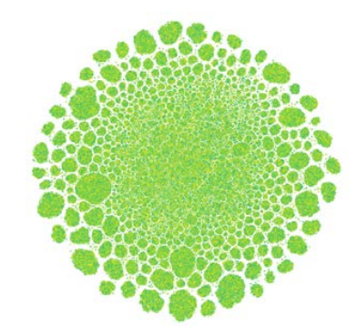

Başka bir Notebook'ta ([https://www.kaggle.com/lucamassaron/really-not-missing-at-random](https://www.google.com/search?q=https://www.kaggle.com/lucamassaron/really-not-missing-at-random)), aynı teknikler bunun yerine **eksik örneklere ait ikili göstergelere** uygulanmış ve belirli bir yanıt türünün hakim olduğu spesifik ve ayrı alanlara işaret eden düşündürücü figürler ortaya çıkarmıştır. Gerçekten de, o örnekte, eksik örnekler rastgele oluşmamış ve oldukça tahmin edici olmuştur:

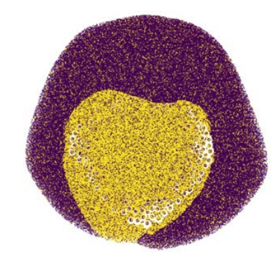

### Reducing the size of your data *(Veri boyutunu küçültme)*

**💾 Verilerinizin Boyutunu Küçültme (Bellek Kullanımını Azaltma)**

Kaggle Notebook'larında doğrudan çalışıyorsanız, bunların sınırlamaları oldukça can sıkıcı gelebilir ve bunlarla uğraşmak zaman kaybına neden olabilir. Bu sınırlamalardan biri, yürütmeyi durduracak ve betiği baştan başlatmaya zorlayacak olan **bellek yetersizliği (out-of-memory)** hatalarıdır. Bu, birçok yarışmada oldukça yaygındır. Ancak, verileri küçük yığınlar halinde diskten alıp işleyebileceğiniz metin veya görüntülere dayalı derin öğrenme yarışmalarının aksine, tablosal verilerle çalışan algoritmaların çoğu, **tüm verilerin bellekte işlenmesini** gerektirir.

En yaygın durum, Pandas'ın `read_csv` işlevi kullanılarak bir CSV dosyasından verileri yüklediğinizde, ancak **DataFrame'in özellik mühendisliği ve makine öğrenimi için Kaggle Notebook'unda işlenemeyecek kadar büyük** olmasıdır. Çözüm, kullandığınız Pandas DataFrame'in boyutunu **hiçbir bilgi kaybetmeden (kayıpsız sıkıştırma)** sıkıştırmaktır. Bu, Guillaume Martin'in çalışmasından türetilen aşağıdaki betik kullanılarak kolayca başarılabilir (orijinal Notebook'u burada bulabilirsiniz: [https://www.kaggle.com/gemartin/load-data-reduce-memory-usage](https://www.kaggle.com/gemartin/load-data-reduce-memory-usage)).

```python
def reduce_mem_usage(df, verbose=True):
    numerics = ['int16', 'int32', 'int64', 'float16', 'float32', 'float64']
    start_mem = df.memory_usage().sum() / 1024**2
    for col in df.columns:
        col_type = df[col].dtypes
        if col_type in numerics:
            c_min = df[col].min()
            c_max = df[col].max()
            if str(col_type)[:3] == 'int':
                if c_min > np.iinfo(np.int8).min and c_max < np.iinfo(np.int8).max:
                    df[col] = df[col].astype(np.int8)
                elif c_min > np.iinfo(np.int16).min and c_max < np.iinfo(np.int16).max:
                    df[col] = df[col].astype(np.int16)
                elif c_min > np.iinfo(np.int32).min and c_max < np.iinfo(np.int32).max:
                    df[col] = df[col].astype(np.int32)
                elif c_min > np.iinfo(np.int64).min and c_max < np.iinfo(np.int64).max:
                    df[col] = df[col].astype(np.int64)
            else: # float types
                if c_min > np.finfo(np.float32).min and c_max < np.finfo(np.float32).max:
                    df[col] = df[col].astype(np.float32)
                else:
                    df[col] = df[col].astype(np.float64)
    end_mem = df.memory_usage().sum() / 1024**2
    if verbose: print('Mem. usage decreased to {:5.2f} Mb ({:.1f}% reduction)'.format(end_mem, 100 * (start_mem - end_mem) / start_mem))
    return df
```

> Guillaume Martin, Kaggle'da böyle bir fikri öneren ilk kişi değildi. Pandas DataFrame'i sıkıştırma fikrine sahip ilk Kaggle kullanıcısı, Zillow yarışması sırasında bir küçültme işlevi yazan Arjan Groen'di ([https://www.kaggle.com/arjanso/reducing-dataframe-memory-size-by-65](https://www.kaggle.com/arjanso/reducing-dataframe-memory-size-by-65)).

-----

**🤔 Bu Yaklaşım Nasıl Çalışır?**

Bu betik, bir veri setindeki tüm **sayısal özelliklerin** belirli bir değer aralığında bulunması gerçeğinden yararlanır. Python'da bellekte kapladıkları bayt sayısına göre farklı türde tam sayı ve kayan noktalı sayısal değişkenler bulunduğundan, betik her özellikte bulunan değer aralığını, her bir sayısal tipin kabul edebileceği maksimum ve minimum değerle karşılaştırır. Bu, özelliği, kendi değer aralığıyla çalışan ve **en az bellek gerektiren sayısal tipe** ayarlamak için yapılır.

Bu yaklaşım, Kaggle Notebook'larında sorunsuz çalışır, ancak bazı uyarılarla birlikte. Sıkıştırma yoluyla her özellik için en uygun sayısal tipi ayarladıktan sonra, ayarlanan sayısal tiplerin kapasitesini aşan değerlerle sonuçlanabilecek herhangi bir **özellik mühendisliği** uygulayamazsınız, çünkü böyle bir işlem **hatalı sonuçlar** üretecektir. Önerimiz, bunu özellik mühendisliğinden **sonra** veya mevcut verilerinizi yeniden ölçeklendirmeyen büyük dönüşümlerden **önce** uygulamanızdır. Bunu **çöp toplama (garbage collection)** kitaplığı `gc` ve `gc.collect()` metodu ile birleştirmek, Kaggle Notebook'unuzun bellek durumunu iyileştirecektir.

Verilerinizin boyutunu azaltmanın (diğer şeylerin yanı sıra) başka bir yolu da özellik mühendisliğini (özellikle **özellik seçimi** ve **veri sıkıştırma**) kullanmaktır.

### Applying feature engineering *(Özellik mühendisliği uygulama)*

Gerçek dünyadaki projelerde, başarılı bir makine öğrenimi modeliyle vasat bir model arasındaki farkı yaratan şey çoğu zaman **modelin kendisi değil, veridir**.
Veriden bahsederken, kötü, iyi ve mükemmel veri arasındaki fark yalnızca **eksik değerlerin bulunmaması** veya **değerlerin güvenilirliği** (yani verinin “kalitesi”) ya da **mevcut örnek sayısı** (yani verinin “miktarı”) değildir. Deneyimlerimize göre, asıl farkı yaratan unsur, verinin içeriğinin **bilgi değeri**dir ve bu değer **özelliklerin (features)** türüyle temsil edilir.

**Özellikler**, veri bilimi projelerinin şekil verilen gerçek “ham maddesidir”, çünkü modellerin sınıfları ayırmak veya değerleri tahmin etmek için kullandıkları bilgi onlarda bulunur. Her modelin bir ifade gücü ve özellikleri tahminlere dönüştürme yeteneği vardır. Ancak eğer özellikler açısından yetersizseniz, hiçbir model sizi kurtaramaz ve daha iyi tahminler sunamaz. Modeller yalnızca verideki değeri görünür hale getirir — kendileri başlı başına sihirli değildir.

**Kaggle** üzerinde, nadir yarışmalar dışında tüm katılımcılar başlangıçta aynı veriye sahiptir. Bu noktada farkı yaratan, **veriyi nasıl işlediğinizdir**. Elinizdeki veriyi iyileştirebileceğinizi göz ardı etmek, birçok Kaggle katılımcısının yaptığı yaygın bir hatadır. **Özellik mühendisliği (feature engineering)**, veriyi modeller için daha yararlı bilgilere dönüştürmeye yönelik teknikler bütünüdür ve yarışmalarda daha iyi performans elde etmenin değişmez anahtarıdır. En güçlü modeller bile, verinin daha anlaşılır bir biçimde işlenmesini gerektirir.

Özellik mühendisliği aynı zamanda, genellikle konuya özel uzmanlık bilgisi olan **ön bilgileri** veriye dahil etmenin bir yoludur. Mevcut özellikleri toplamak, çıkarmak veya bölmek gibi işlemlerle, üzerinde çalıştığınız problemi daha iyi açıklayan göstergeler veya tahminler elde edebilirsiniz.

Özellik mühendisliğinin, Kaggle yarışmalarında o kadar önemli olmasa da, **gerçek dünya projelerinde değerli olabilecek başka amaçları** da vardır.
Birincisi, eğitim verisinin boyutunu azaltmaktır (bu, özellikle bellek sınırlamaları olan Kaggle Notebook ortamlarında da faydalı olabilir).
İkincisi ise, sonuç modelinin **yorumlanabilirliğini artırmaktır** — yani insanlar tarafından daha kolay anlaşılabilen özellikler kullanmak.

Her alan, uzmanları tarafından bilinen fakat kendiliğinden fark edilmeyen belirli **değişken dönüşümlerine** sahip olabilir. Örneğin, finans alanında, piyasa ve şirket verilerini temsil eden farklı özellik kümelerinde sinyali gürültüden ayırmak için **Kalman filtreleri** veya **dalgacık dönüşümleri (wavelet transformations)** gibi özel dönüşümler uygulanır.

Çok sayıda alan ve karmaşık özellik mühendisliği yöntemleri bulunduğundan, bu bölümde belirli alanlara özgü tekniklere girmeyeceğiz. Bunun yerine, **her türlü tablo (tabular) verisi yarışmasında uygulanabilecek en yaygın ve genel teknikleri** sunacağız.

#### Easily derived features *(Kolay türetilen özellikler)*

Dönüşümler yoluyla özellikler türetmek, **en basit ama genellikle en etkili** yaklaşımdır.
Örneğin, **özellik oranlarını** (bir özelliği diğerine bölmek) hesaplamak oldukça etkili olabilir, çünkü birçok algoritma (örneğin *gradient boosting*) bu tür bölme işlemlerini doğrudan taklit edemez veya (örneğin derin sinir ağları gibi) bunu yapmakta zorlanabilir.
Denemeye değer en yaygın dönüşümler aşağıda listelenmiştir:

---

* **Zaman Özelliklerinin İşlenmesi (Time Feature Processing):**

Bir tarihi bileşenlerine (yıl, ay, gün) ayırmak; yılı haftalara veya haftanın günlerine dönüştürmek; tarihler arasındaki farkları hesaplamak; önemli olaylarla (örneğin tatillerle) olan farkları hesaplamak.

Tarihler için başka bir yaygın dönüşüm, bir tarih veya saatten zamanla ilgili bileşenleri çıkarmaktır.
Zamanın sürekliliğini temsil etmek ve **periyodik özellikler** oluşturmak için **sinüs (sine)** ve **kosinüs (cosine)** tabanlı döngüsel sürekli dönüşümler de oldukça kullanışlıdır:

```python
cycle = 7
df['weekday_sin'] = np.sin(2 * np.pi * df['col1'].dt.dayofweek / cycle)
df['weekday_cos'] = np.cos(2 * np.pi * df['col1'].dt.dayofweek / cycle)
```

---

* **Sayısal Özellik Dönüşümleri (Numeric Feature Transformations):**

Özelliklerin ölçeklenmesi (scaling), normalizasyon, logaritmik veya üstel dönüşümler; tam sayı ve ondalık kısımların ayrılması; iki sayısal özelliğin toplanması, çıkarılması, çarpılması veya bölünmesi gibi işlemler yapılabilir.

Sayısal özelliklerin **standartlaştırma (z-score)** veya **normalizasyon (min-max scaling)** yoluyla ölçeklenmesi, özellikle **ölçek duyarlı algoritmalar** (örneğin sinir ağları) kullanıldığında mantıklı bir seçimdir.

---

* **Sayısal Özelliklerin Gruplandırılması (Binning):**

Bu yöntem, sürekli değişkenleri belirli aralıklara (bin) ayırarak **ayrık** hale getirmek için kullanılır.
Binning, verideki gürültü ve hataları azaltmaya yardımcı olur ve **binned** özellikler ile hedef değişken arasında doğrusal olmayan ilişkilerin kolayca modellenmesini sağlar. Özellikle one-hot encoding ile birlikte kullanıldığında etkilidir.
Örnek olarak şu Scikit-learn uygulamasına bakılabilir:
[https://scikit-learn.org/stable/modules/generated/sklearn.preprocessing.KBinsDiscretizer.html](https://scikit-learn.org/stable/modules/generated/sklearn.preprocessing.KBinsDiscretizer.html)

---

* **Kategorik Özellik Kodlama (Categorical Feature Encoding):**

One-hot encoding, iki veya üç kategorik özelliğin birleştirilmesi gibi işlemler ya da daha gelişmiş **target encoding** yöntemleri (ilerleyen bölümlerde anlatılacaktır) kullanılabilir.

---

* **Kategorik Özelliklerin Ayrıştırılması ve Birleştirilmesi:**

Örneğin, [Titanic yarışmasında](https://www.kaggle.com/c/titanic), isimleri ve soyisimleri ayırmak veya baş harflerini (örneğin unvanları) çıkarmak yeni özellikler oluşturmak için kullanılabilir.

---

* **Polinomial Özellikler (Polynomial Features):**

Mevcut özelliklerin üsse yükseltilmesiyle oluşturulan yeni özelliklerdir.
Örneğin Scikit-learn’de şu fonksiyon kullanılabilir:
[https://scikit-learn.org/stable/modules/generated/sklearn.preprocessing.PolynomialFeatures.html](https://scikit-learn.org/stable/modules/generated/sklearn.preprocessing.PolynomialFeatures.html)

---

* **Eksik Veriler ve Aykırı Değerlerin İşlenmesi (Missing Data & Outlier Treatment):**

Bu işlemler teknik olarak doğrudan özellik mühendisliği olmasa da, verideki sinyalleri daha görünür hale getirdikleri için özellikleri dönüştürmenin bir parçası sayılabilir.

* **Eksik Değerlerin Ele Alınması:**

Eksik değerleri belirten **ikili (binary) özellikler** oluşturmak yararlıdır; çünkü eksikliğin kendisi rastgele olmayabilir ve önemli bir nedeni olabilir.
Eksik veri, çoğu zaman verinin nasıl toplandığı hakkında bilgi verir ve başka bir değişkenin **dolaylı bir göstergesi (proxy)** gibi davranabilir.

Örneğin, nüfus sayımı anketlerinde bir kişi gelirini bildirmiyorsa, bu genellikle ya çok düşük ya da çok yüksek gelire sahip olduğunu ima eder.

Modelinizin gerektirmesi durumunda, eksik değerleri **ortalama (mean)**, **medyan (median)** veya **mod (mode)** ile doldurabilirsiniz.
Daha karmaşık yöntemlere genellikle gerek yoktur.

> Parul Pandey tarafından yazılmış olan bu kapsamlı rehbere başvurabilirsiniz ([https://www.kaggle.com/parulpandey](https://www.kaggle.com/parulpandey)):
👉 [Eksik Değerlerle Baş Etme Rehberi – Python’da Eksik Verilerin İşlenmesi](https://www.kaggle.com/parulpandey/a-guide-to-handling-missing-values-in-python).

Unutmayın ki bazı modeller, **eksik değerleri kendi başlarına işleyebilir** ve bunu birçok standart yaklaşımdan daha iyi yaparlar. Bunun nedeni, eksik değerlerin işlenmesinin bu modellerin **optimizasyon sürecinin bir parçası** olmasıdır.

Eksik değerleri kendi içinde ele alabilen modellerin tamamı **gradient boosting** algoritmalarıdır:

* **XGBoost:** [https://xgboost.readthedocs.io/en/latest/faq.html](https://xgboost.readthedocs.io/en/latest/faq.html)
* **LightGBM:** [https://lightgbm.readthedocs.io/en/latest/Advanced-Topics.html](https://lightgbm.readthedocs.io/en/latest/Advanced-Topics.html)
* **CatBoost:** [https://catboost.ai/docs/concepts/algorithm-missing-valuesprocessing.html](https://catboost.ai/docs/concepts/algorithm-missing-valuesprocessing.html)

---

* **Aykırı Değerlerin Sınırlandırılması veya Kaldırılması (Outlier Capping or Removal)**

Aykırı değerleri (outlier) veriden tamamen çıkarmak, belirli bir **maksimum veya minimum değere sınırlandırmak**, ya da doğrudan **değerlerini değiştirmek** mümkündür.
Bunu yapmak için, **Scikit-learn** kütüphanesinde yer alan çok değişkenli (multivariate) aykırı değer tespit modelleri gibi gelişmiş yöntemleri kullanabilirsiniz:
🔗 [https://scikit-learn.org/stable/modules/outlier_detection.html](https://scikit-learn.org/stable/modules/outlier_detection.html)

Daha basit bir yöntem olarak, **tek değişkenli (univariate)** yaklaşımlarla da aykırı değerleri bulabilirsiniz.
Bunun için, değerlerin ortalamadan **kaç standart sapma** uzakta olduğuna veya **çeyrekler arası aralık (IQR)** sınırlarından ne kadar uzak olduğuna bakılır.

Bu durumda şu kurallar uygulanabilir:

* **Üst aykırı değerler (upper outliers):** Q3 + 1.5 × IQR değerinden büyük olan noktalar,
* **Alt aykırı değerler (lower outliers):** Q1 – 1.5 × IQR değerinden küçük olan noktalar.

Aykırı değerleri belirledikten sonra, bu gözlemleri belirtmek için **ikili (binary) bir değişken** de oluşturabilirsiniz.

---

Tüm bu veri dönüşümleri, modellerinizin **tahmin performansını artırabilir**, ancak yarışmalarda **tek başına belirleyici** olmazlar.
Bu işlemler gerekli olsa da, yalnızca temel özellik mühendisliğine güvenemezsiniz.
Bir sonraki bölümlerde, verinizden **daha fazla değer çıkarmak için** daha karmaşık yöntemler ele alınacaktır.

#### Meta-features based on rows and columns *(Satır ve sütunlara dayalı meta-özellikler)*

Rekabetçi bir performans elde edebilmek için, **daha karmaşık özellik mühendisliği (feature engineering)** tekniklerine ihtiyacınız vardır. Başlamak için iyi bir nokta, **her satırın (örneğin her örneğin) kendi başına incelendiği özellikleri** ele almaktır:

* Sayısal değerlerin (veya bunların bir alt kümesinin) **ortalamasını, medyanını, toplamını, standart sapmasını, minimum veya maksimumunu** hesaplayın.
* **Eksik değerlerin sayısını** belirleyin.
* Satırlarda bulunan yaygın değerlerin **frekanslarını** hesaplayın (örneğin ikili (binary) özelliklerde pozitif değerlerin sayısını).
* Her satırı, **k-means** gibi bir kümeleme (clustering) analizinden elde edilen bir kümeye atayın.

Bu türden özelliklere **meta-özellikler (meta-features)** denir; çünkü bunlar, birden fazla özelliği temsil eden özet niteliklerdir. Meta-özellikler, algoritmanızın veri kümenizdeki farklı örnek türlerini daha kolay ayırt etmesini sağlar; çünkü belirli örnek gruplarını vurgular.

---

Meta-özellikler yalnızca satırlara değil, **sütunlara dayalı olarak** da oluşturulabilir.
Tek bir özelliğin üzerinde yapılan **toplama (aggregation)** ve **özetleme (summarization)** işlemleri, sayısal veya kategorik değişkenlerin değeri hakkında ek bilgi sağlamayı amaçlar.
Yani, “bu özellik değeri yaygın mı, yoksa nadir mi?” gibi sorulara yanıt verir.
Bu tür bilgileri modeller doğrudan çıkaramaz; çünkü bir kategorik değişkende değerlerin kaç kez tekrarlandığını “sayma” yeteneğine sahip değildir.

---

Meta-özellikler olarak, sütunlara ilişkin herhangi bir istatistiksel ölçüyü kullanabilirsiniz.
Bunlara örnek olarak: **mod, ortalama, medyan, toplam, standart sapma, minimum, maksimum, çarpıklık (skewness)** ve **basıklık (kurtosis)** sayılabilir.

Sütun bazlı meta-özellikleri oluşturmak için birkaç farklı yöntem uygulanabilir:

---

* **Frekans Kodlama (Frequency Encoding):**

Bir kategorik özelliğin değerlerinin veri setinde kaç kez tekrarlandığını sayın ve bu frekansla orijinal değeri değiştirerek yeni bir özellik oluşturun.
Ayrıca, belirli sayısal değerlerin sıklıkla tekrarlandığı durumlarda **sayısal özelliklere** de frekans kodlama uygulanabilir.

---

* **Gruplara Göre Frekans ve Sütun İstatistikleri:**

Bu yöntemde, verideki farklı **gruplar** dikkate alınarak yeni özellikler oluşturulur.
Gruplar, kümeleme analiziyle (örneğin k-means) oluşturulabilir veya doğrudan bir özellik üzerinden tanımlanabilir (örneğin yaşa göre yaş grupları, konuma göre bölgeler vb.).

Her grubun tanımlayıcı meta-özellikleri, o gruba ait örneklere atanır.
Bunu yapmak için **Pandas `groupby`** fonksiyonu kullanılabilir:
Bu fonksiyonla grup bazlı istatistikler hesaplanır ve daha sonra **gruplama değişkenine göre** orijinal veriye eklenir.

Bu yöntemdeki en zor kısım, veride **anlamlı gruplar** bulmaktır.

---

* **Grupların Birleştirilmesiyle Ek Frekans ve İstatistikler:**

Birden fazla grubu birleştirerek ek sütun istatistikleri veya frekanslar türetmek mümkündür.

---

Bu liste elbette tüm yöntemleri kapsamıyor; ancak size, **özellik düzeyinde** ve **satır düzeyinde** frekanslar ve istatistikler kullanarak yeni özellikler türetmenin yolları hakkında bir fikir verir.

---

* **Basit Bir Uygulama Örneği: Amazon Employee Access Challenge**

Aşağıda, **ROLE_TITLE** özelliğine frekans kodlaması uygulanan bir örnek verilmiştir:

```python
import pandas as pd
train = pd.read_csv("../input/amazon-employee-access-challenge/train.csv")

# Bir özelliğin frekans sayımı
feature_counts = train.groupby('ROLE_TITLE').size()
print(train['ROLE_TITLE'].apply(lambda x: feature_counts[x]))
```

Bu işlemin sonucunda, **ROLE_TITLE** değişkenindeki sınıflar, veri setinde görülme sıklıklarıyla (frekanslarıyla) değiştirilmiş olur.

Şimdi ise, **ROLE_TITLE** özelliğini **ROLE_DEPTNAME** (departman adı) değişkeniyle gruplayarak kodlayacağız; çünkü farklı unvanların bazı departmanlarda daha yaygın, bazılarında ise daha nadir olabileceğini varsayıyoruz.

Sonuç olarak, her iki özelliği (departman ve unvan) birleştirerek yeni bir özellik oluşturuyoruz ve bu birleşik değerin frekansını hesaplıyoruz:

```python
feature_counts = train.groupby(['ROLE_DEPTNAME', 'ROLE_TITLE']).size()
print(train[['ROLE_DEPTNAME', 'ROLE_TITLE']].apply(lambda x: feature_counts[x[0]][x[1]], axis=1))
```

Bu şekilde, verideki grupların ve kategorilerin birbiriyle ilişkisini yansıtan **daha bilgilendirici yeni özellikler** elde edilmiş olur.

Tüm çalışan kodları ve sonuçları bu Kaggle Notebook’ta bulabilirsiniz:
👉 [https://www.kaggle.com/lucamassaron/meta-features-and-target-encoding/](https://www.kaggle.com/lucamassaron/meta-features-and-target-encoding/)

#### Target encoding *(Hedef kodlama)*

Kategorik özelliklerle çalışmak genellikle zorlayıcı değildir, çünkü Scikit-learn tarafından sunulan bazı basit fonksiyonlar bu işlemi kolaylaştırır:

* **LabelEncoder**
* **OneHotEncoder**
* **OrdinalEncoder**

Bu fonksiyonlar, kategorileri sayısal özelliklere ve ardından ikili (binary) özelliklere dönüştürerek makine öğrenimi algoritmalarının bunları kolayca işlemesini sağlar.
Ancak, eğer kategorilerin sayısı çok fazlaysa, **one-hot encoding** stratejisiyle oluşturulan veri kümesi seyrek (sparse) hale gelir (yani çoğu değer sıfır olur) ve bu durum bilgisayarınızın veya Notebook’un belleği ve işlemcisi açısından yönetilmesi zor bir hale gelir.
Bu tür durumlarda, **yüksek kardinaliteli özellik (high-cardinality feature)** olarak adlandırılan bir özellikten bahsederiz ve bu tür veriler özel bir şekilde ele alınmalıdır.

Kaggle yarışmalarının erken dönemlerinden beri, yüksek kardinaliteli değişkenler genellikle **Micci-Barreca (2001)** tarafından önerilen bir kodlama yöntemi kullanılarak işlenmiştir:

> Micci-Barreca, D. *A preprocessing scheme for high-cardinality categorical attributes in classification and prediction problems.*
> *ACM SIGKDD Explorations Newsletter 3.1 (2001): 27–32.*

Bu yaklaşımın temel fikri, kategorik bir özelliğin sahip olduğu birçok kategoriyi, o kategoriye karşılık gelen beklenen hedef (target) değeriyle dönüştürmektir.

* Regresyon durumunda, bu kategoriye ait **ortalama beklenen değer**,
* İkili sınıflandırmada (binary classification), **koşullu olasılık (conditional probability)**,
* Çok sınıflı sınıflandırmada (multiclass classification) ise **her olası sonuç için koşullu olasılık** kullanılır.

Örneğin, **Titanic GettingStarted** yarışmasında ([https://www.kaggle.com/competitions/titanic](https://www.kaggle.com/competitions/titanic)), her yolcunun hayatta kalma olasılığını tahmin etmeniz gerekir.
Bu durumda, **gender (cinsiyet)** gibi bir kategorik özelliğe hedef kodlama (target encoding) uygulamak, cinsiyet değerini o cinsiyetin ortalama hayatta kalma olasılığıyla değiştirmek anlamına gelir.

Bu yöntemle, kategorik özellik, veriyi büyütmeden veya seyrekleştirmeden sayısal bir özelliğe dönüştürülmüş olur.
Kısaca, **hedef kodlama (target encoding)** budur — ve birçok durumda oldukça etkilidir, çünkü yüksek kardinaliteli özelliklere dayalı bir “tahmin” mantığına benzer şekilde çalışır.

Ancak, **stacked prediction** (yani başka bir modelin tahminini bir özellik olarak kullanma) yaklaşımına benzer şekilde, hedef kodlama da **aşırı öğrenme (overfitting)** riski taşır.
Bazı kategoriler çok nadirse, hedef kodlama neredeyse hedef etiketin doğrudan verilmesiyle eşdeğer hale gelir.
Bu riski önlemenin yolları vardır.

Uygulamanıza doğrudan dahil edebileceğiniz implementasyonu görmeden önce, **hedef kodlama (target encoding)** için kullanılan gerçek bir örneğe bakalım.
Aşağıdaki kod, **PetFinder.my Adoption Prediction** yarışmasında en yüksek puanlı gönderimlerden birinde kullanılmıştır:

```python
import numpy as np
import pandas as pd
from sklearn.base import BaseEstimator, TransformerMixin

class TargetEncode(BaseEstimator, TransformerMixin):
    
    def __init__(self, categories='auto', k=1, f=1, noise_level=0, random_state=None):
        if type(categories) == str and categories != 'auto':
            self.categories = [categories]
        else:
            self.categories = categories
        self.k = k
        self.f = f
        self.noise_level = noise_level
        self.encodings = dict()
        self.prior = None
        self.random_state = random_state
        
    def add_noise(self, series, noise_level):
        return series * (1 + noise_level * np.random.randn(len(series)))
```

Fonksiyonun **girdi parametreleri** şunlardır:

* **categories:** Hedef kodlama (target encoding) uygulamak istediğiniz sütun adları. `'auto'` olarak bırakılırsa, sınıf otomatik olarak string tipindeki sütunları seçer.
* **k (int):** Bir kategorinin ortalamasının dikkate alınabilmesi için gereken minimum örnek sayısı.
* **f (int):** Kategori ortalaması ile genel ortalama (prior probability) arasındaki **dengelenme (smoothing)** miktarını belirler.
* **noise_level:** Aşırı öğrenmeyi önlemek için hedef kodlamaya eklenecek **gürültü (noise)** miktarı. Küçük değerlerle başlamak gerekir.
* **random_state:** Gürültü seviyesi sıfırdan büyük olduğunda aynı kodlamayı yeniden üretebilmek için rastgelelik tohumu (seed).

Burada dikkat edilmesi gereken, **k** ve **f** parametrelerinin varlığıdır.
Bir kategorik özelliğin bir seviyesi için (örneğin bir şehir, bir ürün türü vb.), hedefi tahmin etmede yardımcı olabilecek yaklaşık bir değer arıyoruz.
Bu seviyeyi doğrudan gözlenen koşullu olasılıkla değiştirmek bir çözüm olabilir, ancak az gözlemli seviyelerde iyi çalışmaz.

Çözüm, **empirik Bayes yaklaşımı (empirical Bayesian approach)** kullanmaktır — yani, o seviyedeki gözlenen koşullu olasılığı (posterior) tüm örnekler üzerindeki genel olasılıkla (prior) birleştiririz.
Bu karışımı belirleyen faktör **lambda**’dır.

Pratikte, her kategori seviyesi için şu soruya cevap veririz:

> “Koşullu hedef değerini mi, genel ortalamayı mı, yoksa ikisinin karışımını mı kullanmalıyız?”

Bu dengeyi belirleyen şey **f parametresidir**, ve **k parametresi** (genellikle 1 veya 2 gibi küçük değerler) minimum gözlem sayısını ifade eder.

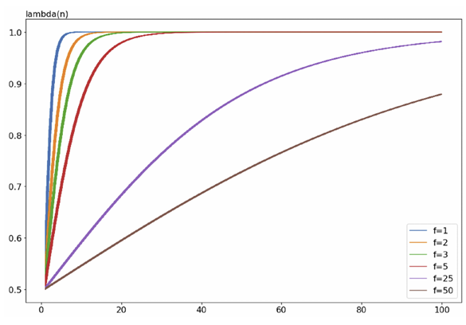

Grafikte görüldüğü gibi, x ekseni belirli bir kategorik seviyedeki örnek sayısını, y ekseni ise koşullu hedef değerinin ağırlığını temsil etmektedir. Küçük **f** değerleri, ortalama hedef değerini kullanmaktan koşullu değeri kullanmaya ani bir şekilde geçmeye eğilimlidir. Daha yüksek **f** değerleri ise, örnek sayısı büyük olmayan seviyeler dışında, koşullu değeri ortalama ile harmanlamaya meyillidir.

Dolayısıyla, sabit bir **k** için, yüksek **f** değerleri gözlenen empirik frekansa daha az güvenmeyi ve tüm hücreler için empirik olasılığa daha fazla dayanmayı ifade eder. **f** için doğru değer genellikle deneme-yanılma yoluyla (cross-validation ile desteklenmiş) bulunur, çünkü **f** parametresi kendi başına bir hiperparametre olarak düşünülebilir.

Tüm bu açıklamalardan sonra, sınıfın kullanımı aslında oldukça basittir. Target encoding uygulamak istediğiniz özelliklerin adlarını ve denemek istediğiniz parametreleri belirterek sınıfı başlatabilir ve eğitim verisine fit edebilirsiniz. Ardından, yalnızca fit edilen özellikleri target encoding uygulayarak başka herhangi bir veri üzerinde dönüşüm yapabilirsiniz:

```python
te = TargetEncode(categories='ROLE_TITLE')
te.fit(train, train['ACTION'])
te.transform(train[['ROLE_TITLE']])
```

Bu örnek, daha önce kullandığımız **Amazon Employee Access Challenge** verisi üzerinde çalışır ve yalnızca **ROLE_TITLE** özelliğini hedef kodlar.

> Kendi kodunuzu yazmak yerine, [scikit-learn-contrib/category_encoders](https://github.com/scikit-learn-contrib/category_encoders) paketindeki **TargetEncoder**’ı da kullanabilirsiniz ([TargetEncoder dokümantasyonu](http://contrib.scikit-learn.org/category_encoders/targetencoder.html)). Bu paket, bu bölümdeki kodla aynı şekilde çalışır ve kutudan çıktığı haliyle kullanılabilir.

### Using feature importance to evaluate your work *(Özellik önemini kullanarak çalışmanı değerlendirme)*

Aşırı özellik mühendisliği uygulamanın yan etkileri olabilir. Eğer çok fazla korelasyonlu özellik veya problem için önemsiz özellikler oluşturursanız, modellerin eğitimi çok uzun sürebilir ve sonuçlarınız kötüleşebilir. Bu, paradoks gibi görünse de, her değişkenin ölçüm veya kayıt hatalarından kaynaklanan bazı rastgele bileşenler (gürültü) taşımasıyla açıklanır. Model, yanlışlıkla bu gürültüyü sinyal olarak algılayabilir: kullandığınız değişken sayısı arttıkça, modelin gürültüyü sinyal yerine yakalama olasılığı da artar. Bu nedenle, yalnızca eğitim için kullandığınız veri setinde ilgili özellikleri tutmaya çalışmalısınız; özellik seçimini, özellik mühendisliği sürecinizin bir parçası olarak düşünün (budama aşaması).

Hangi özellikleri tutmanız gerektiğini belirlemek zor bir problemdir çünkü mevcut özellik sayısı arttıkça, olası kombinasyonların sayısı da artar. Özellik seçmenin çeşitli yolları vardır, ancak öncelikle seçim işleminin veri hazırlama hattınızın hangi aşamasında yapılması gerektiğini düşünmek önemlidir.

Deneyimlerimize dayanarak, özellik seçimini veri hazırlama hattınızın sonunda yapmanızı öneririz. Özellikler, varyanslarının bir kısmını diğer özelliklerle paylaşır, bu nedenle bunların etkinliğini tek tek test ederek değerlendiremezsiniz; doğru bir şekilde hangi özellikleri kullanmanız gerektiğini belirlemek için hepsini birlikte değerlendirmelisiniz.

Ayrıca, seçtiğiniz özelliklerin etkinliğini çapraz doğrulama (cross-validation) ile test etmelisiniz. Bu nedenle, tüm özellikleri hazırladıktan ve tutarlı bir pipeline ile çalışan bir modeliniz (tam optimize edilmiş olması gerekmez, ancak düzgün çalışmalı ve yarışma için kabul edilebilir sonuçlar vermelidir) olduktan sonra, hangi özelliklerin tutulacağını ve hangi özelliklerin çıkarılabileceğini test etmeye hazırsınız. Bu noktada, özellik seçimi için çeşitli yollar vardır:

* İstatistikte kullanılan klasik yaklaşımlar, her bir özelliği tahmin edici setine ekleyerek veya çıkararak test eden ileri ekleme (forward addition) veya geri eleme (backward elimination) yöntemlerine başvurur. Bu yaklaşım oldukça zaman alıcı olabilir çünkü her adımda her özellik için değişkenlerin iç önemini veya modelin performansına olan etkisini belirlemek için bir ölçüm yeniden hesaplanmak zorundadır.
* Regresyon modelleri için, lasso seçimi kullanmak, tüm önemli ve yinelemeli (korelasyonlu) özellikler hakkında ipucu verebilir (bu yöntem aslında yüksek korelasyonlu özellikleri bile tutabilir) ve stabilite seçimi (stability selection) prosedürünü kullanır. Stabilite seçiminde, hangi özelliklerin tutulması gerektiğini birden fazla kez test edersiniz (bagging prosedürü kullanarak) – her testte katsayıları sıfır olmayan özellikleri dikkate alırsınız – ve ardından en sık sıfır olmayan katsayıya sahip olanları tutmak için bir oylama sistemi uygularsınız.

> İşlemle ilgili daha fazla detayı bu depoda bulabilirsiniz: [https://github.com/scikit-learn-contrib/stability-selection](https://github.com/scikit-learn-contrib/stability-selection).

* Ağaç tabanlı modeller için, örneğin rastgele ormanlar (random forests) veya gradient boosting gibi modellerde, özellikleri sıralamanın yaygın yolları, bölünmelere dayalı saflık azalması veya hedef metriğindeki kazançtır. Bir eşik değeri en az önemli özellikleri elemek için kullanılabilir.
* Yine ağaç tabanlı modeller için, ancak diğer modellere kolayca genellenebilir şekilde, test tabanlı özellik rastgeleleştirmesi (veya basitçe rastgele özelliklerle karşılaştırmalar) modelin doğru tahmin yapmasına gerçekten yardımcı olan özellikleri, yalnızca gürültü veya gereksiz olanlardan ayırmaya yardımcı olur.

Özellikleri rastgeleleştirmenin önemli özellikleri seçmede nasıl yardımcı olduğunu gösteren bir örnek, Chris Deotte tarafından Ventilator Pressure Prediction yarışmasında sunulmuştur: [https://www.kaggle.com/cdeotte/lstm-feature-importance](https://www.kaggle.com/cdeotte/lstm-feature-importance). Bu Notebook, LSTM tabanlı bir sinir ağında özelliklerin rolünü test eder. İlk olarak, model oluşturulur ve temel performans kaydedilir. Daha sonra, özellikler tek tek karıştırılır ve model tekrar tahmin yapmak zorunda bırakılır. Eğer tahmin performansı kötüleşirse, bu, önemli bir özelliği karıştırdığınız ve dokunulmaması gerektiğini gösterir. Eğer performans aynı kalır veya artarsa, karıştırılan özellik model için etkili değildir veya hatta zararlı olabilir.

> Özellik öneminin değerlendirilmesinde “No Free Lunch” prensibi geçerlidir. Karıştırma işlemi yeniden eğitim gerektirmez; bu, yeni bir modelin eğitiminin zaman aldığı durumlarda büyük bir avantajdır. Ancak bazı durumlarda başarısız olabilir. Karıştırma, bazen değerlendirilmesi mantıksız olan gerçekçi olmayan giriş kombinasyonları oluşturabilir. Diğer durumlarda, yüksek korelasyonlu özelliklerin varlığı tarafından yanıltılabilir (birinin önemli, diğerinin önemsiz olduğunu yanlış değerlendirebilir). Bu durumda, özelliği karıştırmak yerine kaldırmak, modeli yeniden eğitmek ve performansını temel değerle karşılaştırmak en iyi çözümdür.

Karıştırılmış özelliklere dayanan başka bir yaklaşıma Boruta örnek verilebilir ([https://github.com/scikit-learn-contrib/boruta_py](https://github.com/scikit-learn-contrib/boruta_py)). Boruta, modelin geçerliliğini yinelemeli olarak test etmek için rastgele özellikler kullanır. Boruta seçme prosedürünün alternatif bir versiyonu olan BorutaShap ([https://github.com/Ekeany/Boruta-Shap](https://github.com/Ekeany/Boruta-Shap)), SHAP değerlerini kullanarak hem özellik seçimi hem de açıklanabilirlik sağlar. Elde edilen seçim genellikle basit kaldırma veya rastgeleleştirme turlarından daha güvenilirdir, çünkü özellikler, önemlerini istatistiksel olarak kanıtlayana kadar rastgele özelliklere karşı birden fazla kez test edilir. Boruta veya BorutaShap 100 iterasyona kadar sürebilir ve yalnızca ağaç tabanlı makine öğrenimi algoritmalarıyla gerçekleştirilebilir.

Doğrusal model için özellik seçiyorsanız, Boruta aslında aşırıya kaçabilir. Çünkü hem ana etkiler hem de diğer özelliklerle olan etkileşimler açısından özellikleri önemli kabul eder (doğrusal modelde yalnızca ana etkiler ve seçilmiş bir alt küme etkileşimler önemlidir). Yine de Boruta’yı doğrusal model seçimi için etkili şekilde kullanabilirsiniz; bunun için maksimum derinliği bir ağaç olarak ayarlanmış bir gradient boosting kullanarak yalnızca özelliklerin ana etkilerini dikkate alırsınız, etkileşimlerini değil.

BorutaShap ile özellik seçiminin ne kadar basit ve hızlı kurulduğunu görmek için, 30 Days of ML yarışmasında sunulan bu tutorial Notebook’a göz atabilirsiniz: [https://www.kaggle.com/lucamassaron/tutorial-feature-selection-with-boruta-shap](https://www.kaggle.com/lucamassaron/tutorial-feature-selection-with-boruta-shap).

> Bojan Tunguz
> 
> [https://www.kaggle.com/tunguz](https://www.kaggle.com/tunguz)
> 
> 
> 
> Bojan Tunguz, kesinlikle özellik mühendisliğinin önemini iyi anlayan bir Kaggle yarışmacısıdır (ve ayrıca XGBoost’un büyük bir hayranıdır). NVIDIA’da Makine Öğrenimi Modelleyicisi olarak edindiği deneyimlerini ve etkileyici şekilde Kaggle’da Dört Kat Grandmaster unvanını konuşmak için kendisiyle sohbet etmek istedik.
> 
> 
> 
> **En sevdiğiniz yarışma türü nedir ve neden? Kaggle’da teknik ve çözüm yaklaşımları açısından uzmanlık alanınız nedir?**
> 
> Her türlü kodsuz yarışmayı seviyorum. Bu yıllar içinde çok değişti. Eskiden görüntü yarışmalarına çok ilgiliydim, ancak bu yarışmalarda rekabetçi olabilmek için gereken mühendislik yığını yıllar içinde inanılmaz derecede karmaşık hale geldi. Bir süre NLP yarışmalarına da ilgim vardı, ama bunlar Kaggle’da her zaman nadir olmuştur. Ancak yıllar boyunca değişmeyen tek şey, tablo (tabular) veri problemlerine olan ilgim oldu. Bu problemler eskiden tipik Kaggle yarışma problemleriydi ama ne yazık ki artık neredeyse yok oldular. Hâlâ bu alanla çok ilgileniyorum ve bu alanda bazı temel araştırmalar yapmaya başladım. ML/DL’nin diğer alanlarına kıyasla tablo verilerinde makine öğrenimini geliştirme konusunda çok az ilerleme kaydedildi ve burada büyük fırsatlar olduğuna inanıyorum.
> 
> 
> 
> **Kaggle yarışmalarına nasıl yaklaşırısınız? Bu yaklaşım, günlük işinizle ne kadar farklı?**
> 
> Kaggle’ın oyun yönünü her zaman ciddiye aldım. Bu benim için, yeni Kaggle yarışmalarına genellikle çok eğlenceli bir şekilde başlamam anlamına geliyor – basit çözümler, esprili çözümler, diğer oyunculardan modifiye edilmiş çözümler, karışımlar vb. Bu yöntemler, problemi anlamama, hangi tür çözümlerin işe yaradığını görmeme ve birkaç basit hile ile ne kadar ilerleyebileceğimi test etmeme yardımcı oluyor. Bunun bir kısmı günlük modelleme çalışmalarımda da geçerli, ama orada eksik olan önemli bir unsur var – o da topluluktan ve lider tablodan gelen destek ve geri bildirim. Kendi başınıza veya küçük bir ekiple çalışırken, oluşturduğunuz çözümün en iyi olup olmadığını veya daha iyi bir çözümün mümkün olup olmadığını asla bilemezsiniz.
> 
> 
> 
> **Katıldığınız özellikle zor bir yarışmadan ve bu görevi nasıl çözdüğünüzden bahseder misiniz?**
> 
> Kaggle kariyerimdeki en zor ve en önemli yarışma, Home Credit Default Risk yarışmasıydı. Tüm zamanların ikinci en büyük Kaggle yarışmasıydı ve hayatımda özellikle zor bir dönemde gerçekleşti.
> 
> 
> 
> Kredi değerliliği (credit underwriting) çok zor bir veri bilimi problemidir ve çok zeki bir özellik mühendisliği ile güvenilir bir doğrulama şeması gerektirir. Benim kişisel içgörüm, özellik seçimi için basit lineer modellemeyi kullanmaktı ve bu genel modelimize yardımcı oldu. Ekibimiz bu yarışmayı kazandı ve bugün hâlâ bu zaferi Kaggle kariyerimin en önemli noktası olarak görüyorum.
> 
> 
> 
> **Kaggle kariyerinize yardımcı oldu mu? Nasıl?**
> 
> Kaggle, ML kariyerimin en büyük hızlandırıcısı oldu. Sahip olduğum dört ML işinden üçünün doğrudan Kaggle başarımın bir sonucu olduğunu söyleyebilirim. Kaggle başarısının bir kariyer için ne kadar önemli olabileceğini abartmak imkânsızdır.
> 
> 
> 
> **Deneyimsiz Kaggle katılımcıları genellikle neleri göz ardı ediyor? Başladığınızda bilmenizi istediğiniz şeyler nelerdi?**
> 
> Tüm ML problemlerinin, özellikle Kaggle yarışmalarının, uzun süre ya az değer verdiğim ya da yeterince önemsemediğim iki yönü vardır: özellik mühendisliği ve sağlam bir doğrulama stratejisi. ML kütüphanelerini ve algoritmalarını çok seviyorum ve genellikle mümkün olan en kısa sürede ML algoritmasını kurmaya başlıyorum. Ama model performansına en büyük etkiyi çok iyi özellikler sağlar. Ne yazık ki, özellik mühendisliği daha çok bir sanat ve daha az bir bilimdir ve genellikle modele ve veri setine bağlıdır. Daha ilginç özellik mühendisliği hilelerinin ve uygulamalarının çoğu standart ML kurslarında veya kaynaklarında nadiren öğretilir. Birçoğu öğretilmez ve özel problem bazlı içgörülere bağımlıdır. Ama özellik mühendisliğine varsayılan olarak odaklanma zihniyeti geliştirilebilir ve genellikle iyi hale gelmek yıllar alır.
> 
> 
> 
> **Kaggle için kullanmanızı önereceğiniz araç veya kütüphaneler var mı?**
> 
> XGBoost her şey için yeter!
> 
> 

### Pseudo-labeling *(Sahte etiketleme)*

Eğitim için kullanılan örnek sayısının fark yaratabileceği yarışmalarda, **sahte etiketleme (pseudo-labeling)**, test setinden alınan ek örnekler sayesinde skorlarınızı artırabilir. Fikir, tahminlerinden emin olduğunuz test seti örneklerini eğitim setinize eklemektir.

Kredi değerliliği (credit underwriting) çok zor bir veri bilimi problemidir ve çok akıllıca özellik mühendisliği ve güvenilir bir doğrulama şeması gerektirir. Benim kişisel içgörüm, özellik seçimi için basit lineer modellemeyi kullanmaktı ve bu genel modelimize yardımcı oldu. Ekibimiz bu yarışmayı kazandı ve bugün hâlâ bu zaferi Kaggle kariyerimin en önemli noktası olarak görüyorum.

Kaggle kariyerinize yardımcı oldu mu? Eğer olduysa, nasıl?
Kaggle, ML kariyerimin en büyük hızlandırıcısı oldu. Sahip olduğum dört ML işinden üçünün doğrudan Kaggle başarımın bir sonucu olduğunu söyleyebilirim. Kaggle başarısının bir kariyer için ne kadar önemli olabileceğini abartmak imkânsızdır.

Deneyimsiz Kaggle katılımcıları genellikle neleri göz ardı ediyor? Başladığınızda bilmenizi istediğiniz şeyler nelerdi?
Tüm ML problemlerinin, özellikle Kaggle yarışmalarının, uzun süre ya az değer verdiğim ya da yeterince önemsemediğim iki yönü vardır: **özellik mühendisliği** ve **sağlam bir doğrulama stratejisi**. ML kütüphanelerini ve algoritmalarını çok seviyorum ve genellikle mümkün olan en kısa sürede ML algoritmasını kurmaya başlıyorum. Ama model performansına en büyük etkiyi çok iyi özellikler sağlar. Ne yazık ki, özellik mühendisliği daha çok bir sanat ve daha az bir bilimdir ve genellikle modele ve veri setine bağlıdır. Daha ilginç özellik mühendisliği hilelerinin ve uygulamalarının çoğu standart ML kurslarında veya kaynaklarında nadiren öğretilir. Birçoğu öğretilmez ve özel problem bazlı içgörülere bağımlıdır. Ama özellik mühendisliğine varsayılan olarak odaklanma zihniyeti geliştirilebilir ve genellikle iyi hale gelmek yıllar alır.

Kaggle için kullanmanızı önereceğiniz araç veya kütüphaneler var mı?
**XGBoost her şey için yeter!**

---

Sahte etiketleme ilk olarak **Santander Customer Transaction Prediction** yarışmasında team Wizardry tarafından tanıtıldı (detaylar: [https://www.kaggle.com/c/santander-customer-transaction-prediction/discussion/89003](https://www.kaggle.com/c/santander-customer-transaction-prediction/discussion/89003)). Sahte etiketleme, modele daha fazla veri sağladığı için katsayılarını geliştirmesine yardımcı olur, ancak her zaman işe yaramayabilir. Öncelikle bazı yarışmalarda buna gerek yoktur; sahte etiketler eklemek sonucu değiştirmeyebilir ve eklenen gürültü varsa sonucu kötüleştirebilir.

> Ne yazık ki, sahte etiketlemenin bir yarışmada işe yarayıp yaramayacağını önceden kesin olarak bilmek mümkün değildir (bunu deneysel olarak test etmeniz gerekir). Öğrenme eğrilerini çizmek, daha fazla verinin faydalı olup olmayacağına dair ipucu verebilir (örnek: [https://scikit-learn.org/stable/auto_examples/model_selection/plot_learning_curve.html](https://scikit-learn.org/stable/auto_examples/model_selection/plot_learning_curve.html)).

İkinci olarak, test seti tahminlerinin hangi kısımlarını ekleyeceğinize veya tüm prosedürü en iyi sonuç için nasıl ayarlayacağınıza karar vermek kolay değildir. Genel prosedür şudur:

1. Modelinizi eğitin
2. Test setinde tahmin yapın
3. Güven ölçüsü belirleyin
4. Eklenecek test seti örneklerini seçin
5. Birleştirilmiş veri ile yeni bir model oluşturun
6. Bu modelle tahmin yapın ve gönderin

Örnek bir sahte etiketleme prosedürü Chris Deotte tarafından **Instant Gratification** yarışmasında sunulmuştur: [https://www.kaggle.com/cdeotte/pseudo-labeling-qda-0-969](https://www.kaggle.com/cdeotte/pseudo-labeling-qda-0-969)

Sahte etiketleme uygularken dikkate almanız gereken birkaç nokta:

* Eğitilebilir ve iyi tahminler üreten bir modeliniz olmalı; aksi takdirde sadece gürültü eklemiş olursunuz.
* Test setinde mükemmel tahminler mümkün olmadığından, iyi olanları kötü olanlardan ayırmanız gerekir. CV katlarıyla tahmin yapıyorsanız, tahminlerin standart sapmasını kontrol edin ve yalnızca standart sapması en düşük olan test örneklerini seçin. Olasılık tahmini yapıyorsanız, yalnızca yüksek veya düşük uç tahminleri kullanın (modelin daha emin olduğu durumlar).
* İkinci aşamada, eğitim örneklerini test örnekleriyle birleştirirken, test örneklerinin %50’den fazla olmamasına dikkat edin. İdeal olarak, %70 orijinal eğitim ve %30 sahte etiketli örnek en iyisidir. Çok fazla sahte etiket eklerseniz, yeni modeliniz orijinal veriden çok test örneklerinden öğrenir ve performans düşer.

> Sahte etiketlere tamamen güvenemeyeceğinizi unutmayın; test tahminlerini eğitim örnekleri olarak kullanmak verilerinizi kısmen bozmak demektir. Bu yöntem, sağladığı faydalar olumsuz etkilerden fazlaysa işe yarar.

* Eğer doğrulama ile erken durdurma, hiperparametre ayarlama veya model değerlendirme yapıyorsanız, sahte etiketleri doğrulamada kullanmayın. Yanıltıcı olabilir. Her zaman orijinal eğitim verisini kullanın.
* Mümkünse sahte etiketleri tahmin etmek için farklı bir model, final modeli eğitmek için ise orijinal ve sahte etiketlerle başka bir model kullanın. Böylece önceki modelden aynı bilgiyi tekrar etmeyip, sahte etiketlerden yeni bilgiler çıkarırsınız.

Özetle, sahte etiketleme daha çok bir sanattır. Bazı yarışmalarda fark yaratabilir, ancak iyi uygulanması gerekir. Bir kaynak olarak düşünün ve her zaman en az bir sahte etiket tabanlı gönderim deneyin.

### Denoising with autoencoders *(Otoenkoderlerle gürültü giderme)*

Otomatik kodlayıcılar (Autoencoders), başlangıçta doğrusal olmayan veri sıkıştırma (bir tür doğrusal olmayan PCA) ve görüntü gürültü giderme işlemleriyle daha çok tanınırken, Michael Jahrer’in ([https://www.kaggle.com/mjahrer](https://www.kaggle.com/mjahrer)) Porto Seguro’s Safe Driver Prediction yarışmasını ([https://www.kaggle.com/c/porto-seguro-safe-driver-prediction](https://www.kaggle.com/c/porto-seguro-safe-driver-prediction)) kazanmak için bunları başarılı bir şekilde kullanmasından sonra tabular veri yarışmalarında ilginç bir araç olarak tanınmaya başladı. Porto Seguro, özellikle gürültülü özelliklerle karakterize edilmiş, popüler bir sigorta tabanlı risk analiz yarışmasıydı ve 5.000’den fazla katılımcıya sahipti.

Michael Jahrer, sayısal verilerin sonraki sinir ağı denetimli öğrenme için daha iyi bir temsilini nasıl bulduğunu, gürültü giderici otomatik kodlayıcılar (Denoising Autoencoders - DAE) kullanarak açıklamaktadır. Bir DAE, ağın ortasındaki gizli katmanların aktivasyonlarına ve bilgiyi kodlayan orta katman aktivasyonlarına dayanarak çok sayıda yeni özellik üreten bir veri seti oluşturabilir.

Ünlü gönderisinde ([https://www.kaggle.com/c/porto-seguro-safe-driver-prediction/discussion/44629](https://www.kaggle.com/c/porto-seguro-safe-driver-prediction/discussion/44629)), Michael Jahrer, bir DAE’nin sadece gürültüyü kaldırmakla kalmayıp aynı zamanda otomatik olarak yeni özellikler oluşturabileceğini ve böylece özelliklerin temsilinin, görüntü yarışmalarında olduğu gibi öğrenildiğini anlatmaktadır. Gönderide, DAE yönteminin gizli sırrının sadece katmanlar değil, veriyi artırmak için eklenen gürültü olduğunu belirtmiştir. Ayrıca bu tekniğin, eğitim ve test verilerinin birleştirilmesini gerektirdiğini ve dolayısıyla yöntemin Kaggle yarışmasını kazanmanın ötesinde uygulamaları olmayacağını vurgulamıştır. Aslında, bu kazanma başarısından sonra teknik forumlardan ve çoğu yarışmadan kaybolmuş, ta ki Tabular Playground Series sırasında tekrar ortaya çıkana kadar.

DAE’ler teknik olarak bir kodlayıcı (encoder) ve bir çözücüden (decoder) oluşur. Kodlayıcı kısmı, eğitim verilerini giriş olarak alır ve ardından birkaç yoğun katman (dense layer) gelir. İdeal olarak, tüm eğitim bilgisini kodlayan bir gizli orta katman bulunur. Bu orta katmandaki düğüm sayısı orijinal giriş boyutundan küçükse, bir sıkıştırma yapılmış olur ve istatistiksel olarak giriş verisinin üretim sürecinin arkasındaki gizli boyutları temsil edersiniz; aksi takdirde, sadece fazlalıkları ortadan kaldırır ve gürültüyü sinyalden ayırırsınız (bu da kötü bir sonuç değildir).

Katmanın ikinci kısmı olan çözücü (decoder) kısmında ise katmanları tekrar genişleterek orijinal giriş boyutuna kavuşturursunuz. Çıktı, ağın geri yayılımı (backpropagation) için hata kaybını (error loss) hesaplamak üzere girişle karşılaştırılır.

Bu çözümlerden, DAE’lerin iki türde olduğunu çıkarabiliriz:
* **Bottleneck DAE’ler**: Görüntü işleme yöntemlerini taklit ederek, kodlayıcı kısmı çözücü kısımdan ayıran orta katmandaki aktivasyonları yeni özellik olarak alırsınız. Bu mimariler kum saati (hourglass) şekline sahiptir; önce katman katman nöron sayısını orta bottleneck katmanına kadar azaltır, ardından ikinci kısımda tekrar genişletirsiniz. Gizli katman sayısı her zaman tek sayıdır.

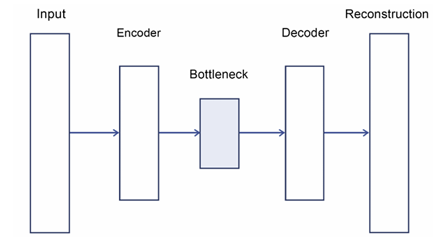

* **Derin yığın (deep stack) DAE’lerde**, kodlayıcı, çözücü veya orta katman ayrımı yapmadan tüm gizli katmanların aktivasyonları alınır. Bu mimarilerde katmanlar aynı boyuttadır. Gizli katman sayısı tek veya çift olabilir.


Bahsettiğimiz gibi, sıkça tartışılan önemli bir konu, DAE’nize (Denoising Autoencoder) biraz rastgele gürültü eklemektir. Her türlü DAE’yi eğitmeye yardımcı olmak için, eğitim verilerini artıracak ve aşırı parametreli sinir ağının sadece girdileri ezberlemesini (başka bir deyişle overfitting’i) önleyecek gürültüyü eklemeniz gerekir. Porto Seguro yarışmasında Michael Jahrer, swap noise adı verilen bir teknik kullanarak gürültü eklemiştir ve bunu şöyle açıklamıştır:

> Burada yukarıdaki tabloda “inputSwapNoise” olarak belirtilen belirli bir olasılık ile özellikten örnek alıyorum. 0.15, özelliklerin %15’inin başka bir satırdan alınan değerlerle değiştirilmesi anlamına geliyor.

Burada anlatılan, temel olarak mixup adı verilen bir veri artırma (augmentation) tekniğidir (bu yöntem görüntü artırmada da kullanılır: [https://arxiv.org/abs/1710.09412](https://arxiv.org/abs/1710.09412)). Tablo verileri için mixup uygularken, karıştırma olasılığını belirlersiniz. Bu olasılığa bağlı olarak, bir örnekteki bazı orijinal değerleri, aynı eğitim verisinden daha az veya daha çok benzer bir örnekten alınan değerlerle değiştirirsiniz.

Danzel, walkthrough’unda ([https://www.kaggle.com/springmanndaniel/1st-place-turn-your-data-into-daeta](https://www.kaggle.com/springmanndaniel/1st-place-turn-your-data-into-daeta)) bunun üç yaklaşımını açıklamaktadır: sütun bazlı, satır bazlı ve rastgele:

* **Sütun bazlı gürültü değişimi (column-wise noise swapping)**: Belirli sayıda sütundaki değerleri değiştirirsiniz. Değiştirilecek sütun oranı, mixup olasılığına göre belirlenir.
* **Satır bazlı gürültü değişimi (row-wise noise swapping)**: Her satırdaki belirli sayıda değeri değiştirirsiniz. Temelde, her satır aynı oranda değiştirilmiş değer içerir, ancak değiştirilen özellikler satırdan satıra farklılık gösterir.
* **Rastgele gürültü değişimi (random noise swapping)**: Değiştirilecek değer sayısını mixup olasılığına göre belirler ve tüm veri setinden rastgele seçersiniz (etki olarak satır bazlı değişime benzerdir).

Tıpkı pseudo-labeling’de olduğu gibi, DAE de bilimden çok bir sanattır; yani tamamen deneme-yanılma yöntemine dayanır. Her zaman işe yaramayabilir ve bir problemde işe yarayan detaylar başka bir problemde faydalı olmayabilir. Yarışmanız için iyi bir DAE elde etmek istiyorsanız, test edilmesi ve ayarlanması gereken bir dizi unsuru göz önünde bulundurmalısınız:

* DAE’nin mimarisi (derin yığın genellikle daha iyi çalışır, ancak katman başına birim sayısı ve katman sayısını belirlemeniz gerekir)
* Öğrenme oranı ve batch boyutu
* Loss (sayısal ve kategorik özelliklerin loss’larını ayırmak da faydalıdır)
* Durdurma noktası (en düşük loss her zaman en iyi sonuç değildir; mümkünse validation ve early stopping kullanın)

Probleme bağlı olarak, doğru mimariyi kurmak ve düzgün çalışacak şekilde ayarlamakta zorluk yaşayabilirsiniz. Ancak çabalarınız, nihai özel leaderboard’da yüksek bir sonuçla ödüllendirilebilir. Aslında, son tablo yarışmalarında DAE teknikleri, birçok kazanan gönderinin tarifinin bir parçası olarak görülmüştür:

* Danzel ([https://www.kaggle.com/springmanndaniel](https://www.kaggle.com/springmanndaniel)), [https://www.kaggle.com/c/tabular-playground-series-jan-2021/discussion/216037](https://www.kaggle.com/c/tabular-playground-series-jan-2021/discussion/216037) adresinde üç adet 1,500 nöronlu gizli katmanın ağırlıklarını kullanarak, orijinal 14 sütunu 4,500 sütuna genişlettiğini bildirmiştir. Bu yeni işlenmiş veri seti, diğer sinir ağları ve gradient boosting modelleri için girdi olarak kullanılmıştır.
* Ren Zhang ([https://www.kaggle.com/ryanzhang](https://www.kaggle.com/ryanzhang)), çözümünü ([https://www.kaggle.com/c/tabular-playground-series-feb-2021/discussion/222745](https://www.kaggle.com/c/tabular-playground-series-feb-2021/discussion/222745)) paylaşmış ve kodunu ([https://github.com/ryancheunggit/Denoise-Transformer-AutoEncoder](https://github.com/ryancheunggit/Denoise-Transformer-AutoEncoder)) açıklamıştır. Tipik lineer ve ReLU aktivasyonlu gizli katmanlar yerine stacked transformer encoder kullandığını ve uygun bir DAE’yi eğitmenin 20 saate kadar sürebileceğini belirtmiştir. Bu yaklaşımda, veriye rastgele gürültü eklemeyi (gürültü maskesi kullanarak) ve loss’u yalnızca orijinal veriyi yeniden oluşturma hatasından değil, aynı zamanda gürültü maskesinden hesaplamayı önermiştir. Bu birleşik loss, ağın daha iyi yakınsamasına yardımcı olur.
* JianTT ([https://www.kaggle.com/jiangtt](https://www.kaggle.com/jiangtt)), özellikle yeni gözlemler oluşturmak için gürültü eklemenin, eksiksiz bir DAE oluşturmadan daha iyi algoritmalar eğitmek için faydalı olabileceğini fark etmiştir: [https://www.kaggle.com/c/tabular-playground-series-apr-2021/discussion/235739](https://www.kaggle.com/c/tabular-playground-series-apr-2021/discussion/235739).

> Kendi DAE’nizi kurmak için çok fazla zaman harcamak istemiyorsanız, ama yarışmada işe yarayıp yaramayacağını keşfetmek istiyorsanız, önceden hazırlanmış birkaç çözümü deneyebilirsiniz. Öncelikle Hung Khoi’nin PyTorch ağı için hazırladığı Notebook’a ([https://www.kaggle.com/hungkhoi/train-denoise-transformer-autoencoder](https://www.kaggle.com/hungkhoi/train-denoise-transformer-autoencoder)) bakabilir ve ihtiyacınıza göre uyarlayabilirsiniz. Ya da Jeong-Yoon Lee’nin Kaggler kütüphanesini ([https://www.kaggle.com/jeongyoonlee](https://www.kaggle.com/jeongyoonlee)) kullanabilirsiniz. Jeong-Yoon Lee Notebook’unda, bunun Tabular Playground yarışmalarından birinde nasıl çalıştığını göstermektedir: [https://www.kaggle.com/jeongyoonlee/dae-with-2-lines-of-code-with-kaggler](https://www.kaggle.com/jeongyoonlee/dae-with-2-lines-of-code-with-kaggler).

### Neural networks for tabular competitions *(Tablo verisi yarışmaları için sinir ağları)*

DAE’li sinir ağlarını tartıştıktan sonra, bu bölümü sinir ağlarının tablo yarışmalarında daha genel olarak nasıl yardımcı olabileceğini ele alarak tamamlamamız gerekiyor. Gradient boosting çözümleri hâlâ tablo yarışmalarında (ve gerçek dünya projelerinde) açık ara önde olsa da, bazen sinir ağları gradient boosting modellerinin yakalayamadığı sinyalleri yakalayabilir ve tek başına mükemmel modeller veya bir ensemble içinde öne çıkan modeller olabilir.

> Geçmişin ve günümüzün birçok Grandmaster’ının sıkça belirttiği gibi, farklı modelleri (örneğin bir sinir ağı ve bir gradient boosting modeli) bir araya getirmek, tablo verisi problemlerinde tek başına kullanılan modellerden her zaman daha iyi sonuçlar verir. Kaggle’da daha önce birinci olan Owen Zhang, sinir ağları ve GBM’lerin bir yarışmada daha iyi sonuçlar için nasıl uyumlu bir şekilde birleştirilebileceğini şu röportajda ayrıntılı şekilde tartışıyor: [https://www.youtube.com/watch?v=LgLcfZjNF44](https://www.youtube.com/watch?v=LgLcfZjNF44)

Bir tablo yarışması için hızlıca bir sinir ağı kurmak artık göz korkutucu bir zorluk değil. TensorFlow/Keras ve PyTorch gibi kütüphaneler işleri kolaylaştırıyor ve TabNet gibi önceden hazırlanmış ağların kütüphanelerde paketlenmiş olması işleri daha da kolaylaştırıyor.

Kendi ağınızı hızlı bir şekilde oluşturmaya başlamak için çeşitli kaynakları kullanabilirsiniz. Özellikle, yayınladığımız **Machine Learning Using TensorFlow Cookbook** kitabına ([https://www.packtpub.com/product/machine-learning-using-tensorflow-cookbook/9781800208865](https://www.packtpub.com/product/machine-learning-using-tensorflow-cookbook/9781800208865)) başvurmanızı şiddetle öneririz; çünkü kitabın bir bölümü, tablo verileri için TensorFlow ile DNN (Derin Sinir Ağları) kurmayı kapsamlı şekilde ele alıyor (Bölüm 7, Predicting with Tabular Data). Kitapta ayrıca Kaggle’da TensorFlow kullanımıyla ilgili birçok öneri ve tarif de bulabilirsiniz.

Bunun dışında, konuyu tanıtmak için bazı çevrimiçi kaynaklara da başvurabilirsiniz. 30 Days of ML yarışmasında önerilen kaynaklar şunlardır:

* TensorFlow’u tablo verileri için nasıl kullanacağınızı anlatan videoyu izleyin: [https://www.youtube.com/watch?v=nQgUt_uADSE](https://www.youtube.com/watch?v=nQgUt_uADSE)
* GitHub’daki eğitim kodunu kullanın: [https://github.com/lmassaron/deep_learning_for_tabular_data](https://github.com/lmassaron/deep_learning_for_tabular_data)
* En önemlisi, yarışmada uygulanan eğitim Notebook’una göz atın: [https://www.kaggle.com/lucamassaron/tutorial-tensorflow-2-x-for-tabular-data](https://www.kaggle.com/lucamassaron/tutorial-tensorflow-2-x-for-tabular-data)

Bu çözümleri kurarken göz önünde bulundurmanız gereken temel noktalar şunlardır:

* ReLU yerine GeLU, SeLU veya Mish gibi aktivasyon fonksiyonlarını kullanın; birçok çalışmada tablo verilerini modellemek için daha uygun olduğu belirtilmiştir ve kendi deneyimlerimiz de genellikle daha iyi performans gösterdiklerini doğrulamaktadır.
* Batch boyutu ile denemeler yapın.
* Mixup ile veri artırmayı (augmentation) kullanın (autoencoder bölümünde tartışılmıştı).
* Sayısal özelliklerde quantile dönüşümü kullanın ve bunun sonucunda uniform veya Gaussian dağılımları zorlayın.
* Embedding katmanlarından faydalanın, ancak embeddinglerin her şeyi modellemediğini unutmayın. Aslında, embeddingler gömülü özelliğin diğer tüm özelliklerle etkileşimlerini kaçırır (bu yüzden bu etkileşimleri doğrudan feature engineering ile ağa dahil etmelisiniz).

Özellikle, embedding katmanlarının yeniden kullanılabilir olduğunu unutmayın. Aslında, sadece giriş (yüksek kardinaliteli değişkenin seyrek one-hot kodlaması) ile düşük boyutlu yoğun bir vektör arasındaki matris çarpımından oluşur. Eğitilmiş bir sinir ağının embeddingini kaydederek, aynı özelliği dönüştürebilir ve ortaya çıkan embeddingleri gradient boosting’tan lineer modellere kadar birçok farklı algoritmada kullanabilirsiniz.

24 seviyeli kategorik bir değişkeni içeren süreci daha iyi anlamak için Şekil 7.6’daki diyagrama bakın. Grafikte, bir kategorik özelliğin değerinin metin veya tamsayıdan, bir sinir ağının işleyebileceği bir değerler vektörüne nasıl dönüştürüldüğü gösterilmektedir.

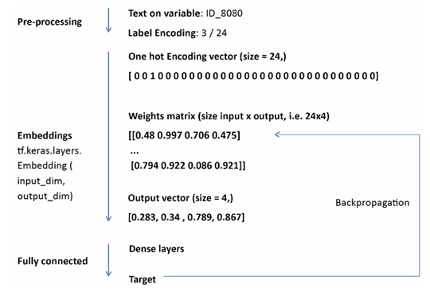

Her şey, özelliğin kaç farklı değere sahip olduğunu bilmekle başlar. Bu, sözlük boyutunu oluşturur ve önemli bir bilgidir. Bu örnekte, 24 farklı değere sahip bir özellik ele alınmıştır. Bu bilgi, her olası özellik değerini temsil eden 24 boyutlu bir one-hot kodlamalı vektör oluşturmamızı sağlar. Elde edilen vektör, satır boyutu one-hot vektörünün boyutuna, sütun boyutu ise çıktı boyutlarına karşılık gelen bir matris ile çarpılır. Bu şekilde, vektör-matris çarpımıyla kategorik değişkenin girdisi çok boyutlu sayısal bir vektöre dönüştürülür. Çarpmanın etkinliği, sinir ağının geri yayılım (backpropagation) algoritması tarafından sağlanır; algoritma matrisin her değerini güncelleyerek çarpımdan en öngörücü sonucu elde eder.

Eğer TensorFlow veya PyTorch ile kendi derin sinir ağınızı kurmak istemiyorsanız, birkaç hazır mimari çözümden faydalanabilirsiniz. Bu çözümlerin tümü “out-of-the-box” yani kutudan çıktığı gibi kullanılabilir; ya paketlenmişlerdir ya da diğer Kaggle kullanıcıları orijinal makalelere dayanarak kodlamışlardır. Tablo yarışmalarındaki başarılarına dayanarak, kendiniz bir tablo yarışmasına girerken deneyebileceğiniz başlıca çözümler şunlardır:

* **TabNet**: Google araştırmacıları tarafından geliştirilmiş bir ağdır (Arık, S. O. ve Pfister, T. TabNet: Attentive interpretable tabular learning. arXiv 2020. [https://www.aaai.org/AAAI21Papers/AAAI-1063.ArikS.pdf](https://www.aaai.org/AAAI21Papers/AAAI-1063.ArikS.pdf)). İlgili özellikleri seçip işleme ve hem kategorik hem sayısal özelliklerle akıllıca başa çıkma sözü verir. Ayarlanacak çok hiperparametresi yoktur, ancak sonuçlar ayarlanmamış ve ayarlanmış bir ağ arasında büyük farklılık gösterebilir (bu yüzden en iyi performans için biraz zaman harcamak gerekir). Uygulamalar arasında mükemmel **pytorch-tabnet** paketi ([https://github.com/dreamquark-ai/tabnet](https://github.com/dreamquark-ai/tabnet)) veya Yirun Zhang tarafından kodlanmış uygulamalar ([https://www.kaggle.com/gogo827jz](https://www.kaggle.com/gogo827jz)) yer alır. Bu uygulamalar Mechanism of Action (MoA) Prediction yarışması için tasarlanmıştır.

* **Neural Oblivious Decision Ensembles (NODE)**: Sinir ağında karar ağacının nasıl çalıştığını taklit etmeye çalışan bir mimaridir (Popov, S., Morozov, S., ve Babenko, A. Neural oblivious decision ensembles for deep learning on tabular data. arXiv preprint arXiv:1909.06312, 2019. [https://arxiv.org/abs/1909.06312](https://arxiv.org/abs/1909.06312)). TensorFlow için Yirun Zhang’ın sunduğu uygulamayı kullanabilirsiniz: [https://www.kaggle.com/gogo827jz/moa-neural-oblivious-decision-ensembles-tf-keras](https://www.kaggle.com/gogo827jz/moa-neural-oblivious-decision-ensembles-tf-keras) veya PyTorch için: [https://www.kaggle.com/gogo827jz/moa-public-pytorch-node](https://www.kaggle.com/gogo827jz/moa-public-pytorch-node)

* **Diğer modeller**: Wide & Deep, DeepFM, xDeepFM, AutoInt gibi geniş bir model yelpazesi mevcuttur; bunların çoğu faktorizasyon makinelerine dayanır ve genellikle tıklama oranı tahmini için tasarlanmıştır. Tüm bu sinir ağlarını kendiniz kurmak zorunda değilsiniz; **DeepCTR** ([https://github.com/shenweichen/DeepCTR](https://github.com/shenweichen/DeepCTR)) veya **DeepTables** ([https://github.com/DataCanvasIO/deeptables](https://github.com/DataCanvasIO/deeptables)) gibi paketlere güvenebilirsiniz. Bu paketler, Categorical Feature Encoding Challenge II yarışmasında ikinci ve birinci olan Changhao Lee ([https://www.kaggle.com/leechh](https://www.kaggle.com/leechh)) ve Jian Yang ([https://www.kaggle.com/jackguagua](https://www.kaggle.com/jackguagua)) tarafından önerilmiştir.

Sonuç olarak, kategorik özellikler için embedding katmanları ve sayısal özellikler için dense katmanları birleştirerek kendi tablo verisi sinir ağınızı oluşturabilirsiniz. Ancak bu işe yaramazsa, iyi yazılmış paketlerin sağladığı geniş çözümlere her zaman güvenebilirsiniz. Yeni bir paket çıktığında gözünüz açık olsun; hem Kaggle yarışmalarında hem de gerçek dünya projelerinde performansınızı artırabilir. Ayrıca deneyimlerimize dayanarak bir tavsiye: Bir tablo yarışmasında sinir ağının en iyi model olmasını beklemeyin; bu nadiren olur. Bunun yerine, klasik tablo veri modellerinden (gradient boosting modelleri ve sinir ağları gibi) çözümleri harmanlayın; çünkü bu modeller veriden farklı sinyalleri yakalar ve bir ensemble içinde birleştirilebilir.

> Jean-François Puget
> 
> [https://www.kaggle.com/cpmpml](https://www.kaggle.com/cpmpml)
> 
> 
> 
> Jean-François Puget, namı diğer CPMP ile reproducibility (tekrarlanabilirlik) konusunun önemi, veri ile çalışma yöntemleri, en iyi yarışması ve daha fazlası hakkında konuştuk. Kaggle’da Competitions ve Discussions Grandmaster’ı ve NVIDIA RAPIDS’te Distinguished Engineer olarak birçok değerli görüş paylaştı. Editör özellikle onun bilimsel yöntemle ilgili söylediklerini çok beğendi.
> 
> 
> 
> **En sevdiğiniz yarışma türü nedir ve neden? Kaggle’da teknikler ve çözüm yaklaşımları açısından uzmanlık alanınız nedir?**
> 
> Bilimsel bir temele sahip yarışmaları ya da kendimle ilişki kurabileceğim bir temeli olan yarışmaları severim. Anonim veya sentetik verilerden hoşlanmam, ancak veri çok hassas bir fizik simülasyonu ile üretilmişse kabul edebilirim. Genel olarak, çok az bilgi sahibi olduğum alanlardaki Kaggle yarışmalarını severim; çünkü en çok öğrenme fırsatını burada buluyorum. Bu, sıralama puanı kazanmak için en etkili yol değil ama en çok eğlendiğim yol.
> 
> 
> 
> **Bir Kaggle yarışmasına nasıl yaklaşılır? Bu yaklaşım, günlük işinizde yaptıklarınızdan ne kadar farklı?**
> 
> Veriye bakarak ve mümkün olduğunca iyi anlayarak başlarım. Özellikle öngörücü desenleri bulmaya çalışırım. Sıklıkla iki özelliği veya türetilmiş özellikleri x ve y eksenine, üçüncü bir özelliği ise renk kodlaması için kullanarak örnekleri çizerim. Üç özellikten biri hedef olabilir. Görselleştirme çok kullanırım; çünkü insan görselliğinin veri analizinde en iyi araç olduğuna inanıyorum.
> 
> 
> 
> İkinci olarak, model veya pipeline performansını değerlendirmeye zaman ayırırım. Model performansını olabildiğince doğru bir şekilde değerlendirebilmek son derece önemlidir. Değerlendirme genellikle k-fold cross-validation’ın bir çeşididir, ancak fold tanımı yarışma türüne göre uyarlanabilir (örneğin tahmin yarışmalarında zaman bazlı fold’lar, örnekler bir şekilde bağlantılıysa group k-fold, ör. aynı kullanıcı ID’sine sahip aksiyonlar).
> 
> 
> 
> Ardından, veri girişinden submission’a kadar giden bir baseline pipeline oluşturur ve test ederim. Kod yarışmalarında, pipeline’ın doğru çalıştığını test etmek kritik önemdedir.
> 
> 
> 
> Daha sonra daha karmaşık modelleri (derin öğrenme kullanıyorsam) veya daha fazla özelliği (XGBoost veya RAPIDS/sklearn modelleri kullanıyorsam) denerim. Bunları submit ederek lokal değerlendirme skorum ile public test skorunun korelasyonunu gözlemlerim. Korelasyon iyiyse submit sayısını azaltırım.
> 
> 
> 
> Birkaç hafta sonra hiperparametre ayarlaması yaparım, ama bunu yalnızca bir kez ya da belki yarışma sonuna yakın ikinci kez yaparım. Çünkü hiperparametre ayarlaması overfitting’e neden olabilecek en kolay yollardan biridir ve overfitting konusunda çok dikkatliyim.
> 
> 
> 
> **Girdiğiniz özellikle zor bir yarışmadan ve bu görevi çözmek için kullandığınız yöntemlerden bahseder misiniz?**
> 
> En gurur duyduğum yarışmalardan biri, TalkingData AdTracking Fraud Detection Challenge’dir. Çok büyük bir tıklama geçmişi vardı ve hangi tıklamaların uygulama indirmelerine yol açtığını tahmin etmemiz gerekiyordu. Özellikler çok az, satır sayısı çok fazlaydı (yaklaşık yarım milyar). O zamanlar yalnızca 64 GB makinam vardı ve yeni özellikler oluşturup değerlendirmek için çok verimli bir yöntem uygulamak zorundaydım.
> 
> 
> 
> Bazı çıkarımlarım oldu:
> 
> 
> 
> 1. Uygulama indirmeye yol açan tıklama, kullanıcının uygulama indirme sayfasındaki son tıklamaydı. Bu nedenle “aynı kullanıcı ve uygulama için bir sonraki tıklamaya kadar geçen süre” en önemli özellikti.
> 
> 2. Aynı kullanıcı ve uygulamadan aynı zaman damgasına sahip birçok tıklama vardı; indirme olan varsa, bunun son tıklama olduğunu varsaydım.
> 
> 3. Özellik değerlerinin eşzamanlılıklarını tahmin etmek için matris faktorizasyonu kullandım. O zaman Keras’ta bir libFM modeli uyguladım ve latent vektörleri özellik olarak eklemek faydalı oldu.
> 
> 
> 
> Bunu uygulayan tek diğer ekip, yarışmayı kazanan ekipti. Bununla, Grandmaster olmayan birisi olarak ekipler arasında 6. oldum.
> 
> 
> 
> **Kaggle kariyerinize yardımcı oldu mu? Eğer evet ise, nasıl?**
> 
> Kaggle bana iki kez yardımcı oldu:
> 
> 
> 
> 1. IBM’de Kaggle, SOTA makine öğrenimi uygulamaları hakkında büyük bir bilgi kaynağıydı. Bu bilgiyi IBM’in makine öğrenimi araçlarını (Watson Studio ve Watson Machine Learning) geliştirmek için kullandım. Örneğin, 2016’da IBM’in Python paketlerini desteklemesini sağladım; o dönemde IBM tamamen Java/Scala ağırlıklıydı. Ben olmasaydım, IBM Spark ve Scala’ya yatırım yapacak ve Python dalgasını tamamen kaçıracaktı. Ayrıca IBM’in yalnızca Spark ML veya TensorFlow’u desteklemek istediği dönemde XGBoost’u erken desteklemeleri için zorladım.
> 
> 2. İkinci olarak, şu anki işimi elde etmemde Kaggle yardımcı oldu. NVIDIA, Kaggle yarışma Grandmaster’larını sosyal varlıkları güçlü olan kişileri arıyordu ve bu kişiler NVIDIA stack’ini ve RAPIDS GPU hızlandırmalı ML paketini tanıtmak için çalışıyordu.
> 
> 
> 
> **Deneyimsiz Kaggle kullanıcıları genellikle neyi gözden kaçırıyor? Başladığınızda bilmek istediğiniz bir şey var mıydı?**
> 
> Kagglers ile diğer veri bilimciler arasındaki fark, model performansını değerlendirme konusudur. Eğer bunu bilmezlerse, public leaderboard’da iyi görünen ancak private leaderboard’da kötü performans gösteren submission’lar seçerler. Private leaderboard’da iyi performans gösteren modelleri kurmayı bilen bir Kaggler, yeni veride de iyi performans gösteren, yani overfit olmayan modelleri kurmayı öğrenir.
> 
> 
> 
> Deneyimsiz Kagglers sık sık “X yöntemi/bu model bu yarışmada işe yarar mı?” diye sorar. Benim cevabım her zaman: “Deneyin ve işe yarayıp yaramadığını görün.” Makine öğrenimin deneysel bir bilim olduğunu çoğu kişi kaçırıyor. İyi modeller kurmak için bilimsel yöntem izlenmelidir:
> 
> 
> 
> * Hipotez oluşturun (örn. bu özellik veya bu NN katmanı pipeline performansını artıracak)
> 
> * Hipotezi test etmek için bir deney yürütün (değiştirilen pipeline’ı eğitin)
> 
> * Deney sonuçlarını analiz edin (CV skoru öncekinden daha iyi mi? Nerede daha iyi? Nerede kötü?)
> 
> 
> 
> Her deney, bir hipotezi doğrulamak veya reddetmek için yapılmalıdır ve her deney yalnızca bir değişkeni değiştirmelidir. Deneyimsiz kişiler genellikle birçok şeyi aynı anda değiştirir ve neyin işe yaradığını çıkaramaz.
> 
> 
> 
> **Veri analizi ve makine öğrenimi için önereceğiniz araçlar veya kütüphaneler var mı?**
> 
> 
> 
> * Veri keşfi için çoğunlukla **Matplotlib** kullanırım.
> 
> * Küçük veri setlerinde **Pandas**, büyük veri setlerinde **cuDF (RAPIDS)** ile veri işleme yaparım.
> 
> * Makine öğrenimi için **cuML (RAPIDS)**, GPU hızlandırmalı **XGBoost** ve **PyTorch** kullanırım.
> 
> * Mümkünse önceden eğitilmiş modelleri kullanırım; örneğin Hugging Face’den NLP modelleri veya **timm** paketinden görüntü sınıflandırma modelleri.
> 
> 
> 
> **Bir yarışmaya katılırken en önemli şey nedir?**
> 
> Yarışmaya yeterince zaman ayırabileceğinizden emin olun.

### Summary *(Özet)*

Bu bölümde, Kaggle’daki tabular (tablo tabanlı) yarışmaları ele aldık. Tablo tabanlı bir yarışmada uygulanabilecek bilgilerin çoğu standart veri bilimi bilgi ve uygulamalarıyla örtüştüğü için, dikkatimiz daha çok Kaggle’a özgü tekniklere odaklandı.

Yeni tanıtılan **Tabular Playground Series**’den başlayarak, reproducibility (tekrarlanabilirlik), EDA (Exploratory Data Analysis – Keşifsel Veri Analizi), feature engineering (özellik mühendisliği), feature selection (özellik seçimi), target encoding (hedef kodlama), pseudo-labeling (sahte etiketleme) ve tablo veri setlerine uygulanan neural network (sinir ağı) konularına değindik.

**EDA**, bir yarışmayı kazanmak için içgörü elde etmek istiyorsanız kritik bir aşamadır. Ancak oldukça yapısızdır ve sahip olduğunuz veri türüne güçlü şekilde bağlıdır. Genel EDA önerilerinin yanı sıra, tüm veri setinizi bir bakışta özetleyebilecek **t-SNE** ve **UMAP** gibi tekniklere de dikkatinizi çektik.

Bir sonraki aşama olan **feature engineering**, üzerinde çalıştığınız veri türüne güçlü bir şekilde bağlıdır. Bu nedenle, belirli durumunuza uygulayabileceğiniz bir dizi olası özellik mühendisliği fikri sunduk.

**Feature selection** konusunda kısa bir genel bakışın ardından, hemen hemen her makine öğrenimi algoritmasına uygulanabilecek **özellik önemi** ve **rastgeleleştirme** temelli tekniklere dikkatinizi çektik.

Otomatik olarak işlenemeyeceğini vurgulamak istediğimiz **target encoding**’i açıkladıktan sonra, muhtemelen gerçek dünya projelerinizde uygulamayacağınız ama Kaggle yarışmalarında çok iyi çalışabilecek özel tekniklere geçtik: **pseudo-labeling** ve tablo yarışmaları için **denoising autoencoder**.

Son olarak, kategorik özelliklerin sinir ağlarında embedding katmanları kullanılarak nasıl işlenebileceğini tartıştıktan sonra, tablo verileri için kullanılabilecek hazır sinir ağı mimarilerinin kısa bir özetini verdik.

Bir sonraki bölümde, tabular yarışmalara katılırken bilmeniz gereken tüm tekniklerin incelemesini **hyperparameter optimizasyonu** konusunu tartışarak tamamlayacağız.

---

## Chapter 8: Hyperparameter Optimization *(Bölüm 8: Hiperparametre Optimizasyonu)*

Bir Kaggle çözümünün performansı, yalnızca seçtiğiniz öğrenme algoritmasının türü ile belirlenmez. Verilerin ve kullandığınız özelliklerin yanı sıra, algoritmanın **hyperparameter**’ları (eğitim öncesinde sabitlenmesi gereken ve eğitim sırasında öğrenilemeyen algoritma parametreleri) da performansı güçlü bir şekilde etkiler. Tablo veri yarışmalarında doğru değişkenleri/verileri/özellikleri seçmek en etkili yöntemdir; ancak hyperparameter optimizasyonu, türü ne olursa olsun tüm yarışmalarda etkilidir. Aslında, veri ve algoritma sabit olduğunda, hyperparameter optimizasyonu algoritmanın tahmin performansını artırmanın ve leaderboard’da yükselmenin tek güvenilir yoludur. Ayrıca, hyperparameter optimizasyonu **ensemble** yöntemlerinde de faydalıdır; çünkü optimize edilmiş modellerin birleşiminden oluşan bir ensemble, optimize edilmemiş modellerin birleşiminden her zaman daha iyi performans gösterir.

Hyperparameter’ları manuel olarak ayarlamanın mümkün olduğunu duyabilirsiniz; özellikle seçimlerinizin algoritma üzerindeki etkilerini biliyor ve anlıyorsanız. Birçok Kaggle Grandmaster ve Master, yarışmalarda modellerini doğrudan ayarlamaya sıklıkla güvendiklerini belirtmiştir. Bu kişiler, en önemli hyperparameter’lar üzerinde **bisection (ikiye bölme) yöntemi** tarzında çalışır, bir parametrenin değer aralığını gittikçe daraltarak en iyi sonucu üreten değeri bulurlar. Ardından diğer parametreye geçerler. Bu yöntem, her parametre için tek bir minimum varsa ve parametreler birbirinden bağımsızsa oldukça iyi çalışır. Bu durumda arama, çoğunlukla deneyim ve öğrenme algoritmalarına dair bilgi ile yönlendirilir.

Ancak deneyimlerimize göre, Kaggle’da karşılaşacağınız çoğu görevde durum böyle değildir. Problemlerin ve kullanılan algoritmaların karmaşıklığı, yalnızca bir arama algoritmasının sağlayabileceği sistematik bir yaklaşım gerektirir. Bu nedenle, bu bölümü yazmaya karar verdik.

Bu bölümde, **cross-validation** yaklaşımınızı test setine genellenebilecek en iyi hyperparameter’ları bulacak şekilde nasıl genişletebileceğinizi inceleyeceğiz. Amaç, yarışmalarda karşılaştığınız zaman ve kaynak kısıtlamalarını yönetmektir. Bu nedenle, sahip olduğunuz kaynaklara göre karmaşık modeller ve veri problemleri için optimize edilmiş **Bayesian optimizasyon** yöntemlerine odaklanacağız. Yalnızca önceden tanımlanmış hyperparameter’lar için en iyi değerleri aramakla sınırlı kalmayacak, aynı zamanda **sinir ağı mimarisi** sorununa da değineceğiz.

Ele alacağımız konular şunlardır:

* Temel optimizasyon teknikleri
* Ana parametreler ve nasıl kullanılacağı
* Bayesian optimizasyon

Hadi başlayalım!

### Basic optimization techniques *(Temel optimizasyon teknikleri)*

Hyperparameter optimizasyonunun temel algoritmaları, Scikit-learn paketinde bulunan **grid search** ve **random search**’tir. Son zamanlarda, Scikit-learn katkıcıları, hem grid search hem de random search stratejilerinin performansını artırmak için **halving algoritmasını** da eklemişlerdir.

Bu bölümde, bu temel tekniklerin hepsini ele alacağız. Bunları öğrenerek, yalnızca bazı özel problemler için etkili optimizasyon araçlarına sahip olmakla kalmayacak (örneğin, SVM’ler genellikle grid search ile optimize edilir), aynı zamanda hyperparameter optimizasyonunun temel mantığını da kavrayacaksınız.

Başlamak için, gerekli bileşenlerin neler olduğunu belirlemek çok önemlidir:

* Hyperparameter’ları optimize edilmesi gereken bir model
* Her hyperparameter için aranacak değerlerin sınırlarını içeren bir **arama alanı**
* Bir **cross-validation** şeması
* Bir **değerlendirme metriği** ve buna ait skor fonksiyonu

Tüm bu öğeler, aradığınız çözümü belirlemek için **arama yöntemi** içinde bir araya gelir. Hadi nasıl çalıştığını inceleyelim.

#### Grid search *(Izgara araması)*

**Grid search**, hyperparameter’ları eksiksiz bir şekilde tarayan bir yöntemdir ve yüksek boyutlu uzaylarda uygulanabilirliği sınırlıdır. Her parametre için test etmek istediğiniz bir değer kümesi seçersiniz ve ardından bu kümedeki tüm olası kombinasyonları denersiniz. Bu nedenle “eksiksiz” (exhaustive) olarak adlandırılır: her şeyi denersiniz. Oldukça basit bir algoritmadır ve boyutsallık lanetine (curse of dimensionality) maruz kalır, ancak olumlu tarafı, **embarrassingly parallel** olmasıdır (bu bilgisayar bilimi teriminin tanımı için bkz. [link](https://www.cs.iusb.edu/~danav/teach/b424/b424_23_embpar.html)). Bu, yeterli sayıda işlemciniz varsa, optimal ayarlamayı çok hızlı bir şekilde elde edebileceğiniz anlamına gelir.

Örnek olarak, bir sınıflandırma problemi ve **support-vector machine (SVM)** sınıflandırmasını ele alalım. SVM’ler, hem sınıflandırma hem de regresyon problemleri için, grid search’ün en çok kullanılacağı makine öğrenmesi algoritmalarından biridir. Scikit-learn’ün **make_classification** fonksiyonunu kullanarak hızlıca bir sınıflandırma veri seti oluşturabiliriz:

```python
from sklearn.datasets import make_classification
from sklearn.model_selection import train_test_split

X, y = make_classification(n_samples=300, n_features=50,
                           n_informative=10,
                           n_redundant=25, n_repeated=15,
                           n_clusters_per_class=5,
                           flip_y=0.05, class_sep=0.5,
                           random_state=0)
```

Sonraki adım olarak, temel bir SVC algoritması tanımlar ve arama alanını belirleriz. SVC’nin kernel fonksiyonu (SVM’de girdi verilerini dönüştüren iç fonksiyon) farklı hyperparameter’ları belirlediği için, kernel tipine bağlı olarak kullanılacak parametrelerin iki farklı sözlüğünü içeren bir liste sağlarız. Ayrıca değerlendirme metriğini de belirleriz (bu örnekte hedef dengeli olduğundan **accuracy** kullanıyoruz):

```python
from sklearn import svm
svc = svm.SVC(probability=True, random_state=1)

from sklearn import model_selection
search_grid = [
    {'C': [1, 10, 100, 1000], 'kernel': ['linear']},
    {'C': [1, 10, 100, 1000], 'gamma': [0.001, 0.0001], 'kernel': ['rbf']}
]

scorer = 'accuracy'
```

Örneğimizde, lineer kernel gamma parametresinin ayarlanmasını gerektirmez, ancak radial basis function (RBF) kernel için bu parametre çok önemlidir. Bu nedenle iki sözlük sağlıyoruz: ilki lineer kernel için, ikincisi RBF kernel için. Her sözlük yalnızca ilgili kernel ve bu kernel için geçerli parametre aralıklarını içerir.

Değerlendirme metriğinin, algoritmanın optimize ettiği **maliyet fonksiyonundan** farklı olabileceğini unutmamak önemlidir. Bölüm 5’te tartışıldığı gibi, bazı yarışmalarda değerlendirme metriği farklı olabilir, ancak algoritmanın maliyet fonksiyonu değiştirilemez. Bu durumlarda, hyperparameter’ları değerlendirme metriğine göre ayarlamak, iyi performans gösteren bir model elde etmeye yardımcı olabilir. Optimal hyperparameter seti, bu kısıtlar altında en iyi değerlendirme metriğini döndürecektir. Teorik olarak en iyi sonuç olmayabilir, ama genellikle ona yakın olur.

Tüm bu bileşenler (model, arama alanı, değerlendirme metriği, cross-validation şeması) **GridSearchCV** örneğinde birleştirilir ve model veriye uyarlanır:

```python
search_func = model_selection.GridSearchCV(estimator=svc, 
                                           param_grid=search_grid,
                                           scoring=scorer, 
                                           n_jobs=-1,
                                           cv=5)

search_func.fit(X, y)
print(search_func.best_params_)
print(search_func.best_score_)
```

Bir süre sonra, kullandığınız makineye bağlı olarak, **cross-validated** sonuçlara göre en iyi kombinasyonu elde edeceksiniz.

Özetle, grid search çok basit bir optimizasyon algoritmasıdır ve çok çekirdekli bilgisayarların avantajını kullanabilir. Çok az ayarlama gerektiren algoritmalarla (SVM, ridge veya lasso regresyonları gibi) iyi çalışabilir, ancak diğer durumlarda uygulanabilirliği sınırlıdır. Öncelikle, yalnızca **diskret seçimler** ile hyperparameter optimizasyonunu sınırlıdır (yani sınırlı bir değer kümesi gerekir). Ayrıca, birden fazla hyperparameter’ın ayarlanması gereken algoritmalarda etkili olmasını bekleyemezsiniz. Bunun nedeni, arama alanının karmaşıklığının hızla artması ve çoğu parametre değerinin soruna uygun olmadan **kör bir şekilde** denenmesinden kaynaklanan hesaplama verimsizliğidir.

#### Random search *(Rastgele arama)*

**Random search**, arama alanını rastgele örnekleyen bir yöntemdir ve yüksek boyutlu uzaylarda uygulanabilirliği vardır; bu nedenle pratikte yaygın olarak kullanılır. Ancak random search’ün dezavantajı, bir önceki denemelerden elde edilen bilgiyi bir sonraki ayarı seçmek için kullanmamasıdır (bu sorun, grid search için de geçerlidir). Ayrıca, en iyi çözümü mümkün olan en hızlı şekilde bulmak için yapabileceğiniz tek şey, doğru hyperparameter’ları yakalayabilmeyi ummaktır.

Random search inanılmaz derecede iyi çalışır ve anlaşılması oldukça basittir. Rastgeleliğe dayanmasına rağmen, yalnızca şansa bağlı değildir; başlangıçta öyle görünse de istatistikteki rastgele örnekleme gibi çalışır. Teknikteki ana nokta şudur: yeterince rastgele test yaparsanız, benzer performans gösteren kombinasyonların hafifçe farklı varyasyonlarını denemekle enerji harcamadan doğru parametreleri bulma olasılığınız yüksektir.

Birçok AutoML sistemi, ayarlanacak çok fazla parametre olduğunda random search’e dayanır (bkz. Golovin, D. ve ark., *Google Vizier: A Service for Black-Box Optimization*, 2017). Genel bir kural olarak, hyperparameter optimizasyon probleminizin boyutu yeterince yüksekse (örneğin 16’nın üzerinde), random search’e bakmayı düşünebilirsiniz.

Aşağıda, önceki örneği random search kullanarak çalıştırıyoruz:

```python
import scipy.stats as stats
from sklearn.utils.fixes import loguniform

search_dict = {
    'kernel': ['linear', 'rbf'], 
    'C': loguniform(1, 1000),
    'gamma': loguniform(0.0001, 0.1)
}

scorer = 'accuracy'

search_func = model_selection.RandomizedSearchCV(
    estimator=svc,
    param_distributions=search_dict,
    n_iter=6,
    scoring=scorer,
    n_jobs=-1,
    cv=5
)

search_func.fit(X, y)
print(search_func.best_params_)
print(search_func.best_score_)
```

Dikkat edin, artık farklı kernel’ler için ayrı arama alanlarında çalıştırmaya gerek yok. Grid search’ün aksine, burada her parametre, etkisiz olanlar dahil, sistematik olarak test edilmez; bu da hesaplama süresi gerektirir. Burada aramanın verimliliği, test edilen hyperparameter kümesinden etkilenmez. Arama, ilgisiz parametrelere bağlı değildir; şansa dayalıdır. Seçilen kernel için birçok parametre arasından yalnızca bir geçerli parametreyi test etseniz bile her deneme faydalıdır.

#### Halving search *(Yarıya indirme araması)*

Dediğimiz gibi, hem grid search hem de random search bilgiye dayalı olmayan bir şekilde çalışır: bazı testler belirli hyperparameter’ların sonucu etkilemediğini veya belirli değer aralıklarının etkisiz olduğunu ortaya çıkarsa bile, bu bilgi sonraki aramalara aktarılmaz.

Bu nedenle, Scikit-learn yakın zamanda **HalvingGridSearchCV** ve **HalvingRandomSearchCV** tahmin edicilerini tanıttı. Bunlar, grid search ve random search stratejilerini ardışık yarıya indirme (successive halving) yöntemiyle parametre arama için kullanılabilir.

**Halving** yönteminde, başlangıç turunda çok sayıda hyperparameter kombinasyonu değerlendirilir, ancak küçük miktarda hesaplama kaynağı kullanılır. Bu, testleri eğitim verinizden seçilen küçük bir alt örnek üzerinde çalıştırarak gerçekleştirilir. Daha küçük bir eğitim seti, test edilmesi için daha az hesaplama gerektirir; böylece daha az kaynak (özellikle zaman) kullanılır, ancak performans tahminleri daha az hassas olur. Bu başlangıç turu, problem üzerinde daha iyi performans gösteren bir hyperparameter alt kümesinin seçilmesini sağlar ve ikinci turda eğitim seti boyutu artırılır.

Sonraki turlar benzer şekilde ilerler: test edilen değer aralığı daraltıldıkça, aranan eğitim seti alt kümeleri giderek büyütülür (bu, testin çalıştırılması için daha fazla zaman gerektirir, ancak daha hassas performans tahmini sağlar) ve aday sayısı yarıya indirilmeye devam eder.

Önceki probleme uygulanan bir örnek şöyle:

```python
from sklearn.experimental import enable_halving_search_cv
from sklearn.model_selection import HalvingRandomSearchCV

search_func = HalvingRandomSearchCV(
    estimator=svc,
    param_distributions=search_dict,
    resource='n_samples',
    max_resources=100,
    aggressive_elimination=True,
    scoring=scorer,
    n_jobs=-1,
    cv=5,
    random_state=0
)

search_func.fit(X, y)
print(search_func.best_params_)
print(search_func.best_score_)
```

Bu şekilde, halving yöntemi adayların seçimi yoluyla ardışık optimizasyon adımlarına bilgi sağlar. Sonraki bölümlerde, hyperparameter uzayında daha hassas ve verimli bir arama yapmak için daha akıllı yöntemleri tartışacağız.

> Kazuki Onodera
> 
> [https://www.kaggle.com/onodera](https://www.kaggle.com/onodera)
> 
> 
> 
> Başka bir Kaggler ile kısa bir röportaj yapalım. Kazuki Onodera, **Competitions Grandmaster** ve **Discussions Master** unvanlarına sahip, yaklaşık 7 yıllık yarışma deneyimi olan bir Kaggle kullanıcısıdır. Ayrıca NVIDIA’da Kıdemli Derin Öğrenme Veri Bilimcisi olarak çalışmakta ve NVIDIA KGMON (Kaggle Grandmasters of NVIDIA) ekibinin bir üyesidir.
> 
> 
> 
> **En sevdiğiniz yarışma türü nedir ve neden? Teknikler ve çözüm yaklaşımları açısından Kaggle’daki uzmanlık alanınız nedir?**
> 
> Instacart Market Basket Analysis. Bu yarışma, Kaggle topluluğu için oldukça zorluydu çünkü kullanıcıların önceki siparişlerine dayanarak bir sonraki siparişlerinde hangi ürünlerin olacağını tahmin etmek için anonimleştirilmiş veriler kullanılıyordu. Bu yarışmayı sevme sebebim, özellik mühendisliğini çok seviyor olmam ve diğerlerinin aklına gelmeyen ilginç ve iyi özellikler geliştirebilmem. Bu sayede yarışmada ikinci olabildim.
> 
> 
> 
> **Bir Kaggle yarışmasına nasıl yaklaşıyorsunuz? Bu yaklaşım, günlük işinizde yaptıklarınızdan ne kadar farklı?**
> 
> Bir modelin nasıl çalıştığını hayal etmeye çalışıyorum ve yanlış negatifler ile yanlış pozitiflere derinlemesine bakıyorum. Günlük işimde yaptıklarımla aynı.
> 
> 
> 
> **Girdiğiniz özellikle zorlu bir yarışmadan bahseder misiniz ve görevi çözmek için hangi içgörüleri kullandınız?**
> 
> Human Protein Atlas - Single Cell Classification. Bu yarışma aslında bir tür instance segmentation yarışmasıydı, fakat maskeler sağlanmamıştı. Bu yüzden zayıf denetimli çok etiketli bir sınıflandırma problemine dönüştü. Etiket gürültüsünü temizlemek için iki aşamalı bir pipeline oluşturdum.
> 
> 
> 
> **Kaggle kariyerinize katkıda bulundu mu? Eğer öyleyse, nasıl?**
> 
> Evet. Şu anda NVIDIA KGMON ekibinde çalışıyorum. Kaggle, tablo verisi, görsel, doğal dil ve sinyal verisi gibi farklı veri türlerinde, ayrıca sektör ve alan açısından farklı yarışmalar (sanayi, finans, astronomi, patoloji, spor, perakende vb.) düzenliyor. Bu tür verilere erişim ve deneyim edinmek için en uygun yer kesinlikle Kaggle.
> 
> 
> 
> **Deneyimsiz Kaggle kullanıcıları genellikle neyi gözden kaçırıyor? Başladığınızda bilseydiniz iyi olurdu dediğiniz şey nedir?**
> 
> Hedef analizi. Ayrıca seed averaging de oldukça göz ardı ediliyor: her zaman basit ama güçlü.
> 
> 
> 
> **Geçmişte yarışmalarda yaptığınız hatalar nelerdi?**
> 
> Hedef analizi. En iyi takımlar her zaman hedefi diğerlerinden daha iyi analiz eder, bu yüzden bir yarışmada daha iyi bir yerde olamıyorsam, en iyi çözümleri okuyorum; çünkü bu çözümler bana yarışma sırasında kaçırdığım veri bilgilerini açıklıyor.
> 
> 
> 
> **Veri analizi veya makine öğrenimi için önerdiğiniz özel araçlar veya kütüphaneler var mı?**
> 
> Sadece Python ve Jupyter Notebook.
> 
> 
> 
> **Bir yarışmaya katılırken insanların akılda tutması gereken en önemli şey nedir?**
> 
> Bir yenilgiden öğrenebiliyorsanız, aslında kaybetmemişsiniz demektir.
> 
> 
> 
> **Başka yarışma platformlarını kullanıyor musunuz? Kaggle ile nasıl karşılaştırılırlar?**
> 
> KDD Cup ve RecSys. Her ikisi de ilginç ve zorlu olma açısından minimum gereksinimleri karşılıyor.
> 
> 

### Key parameters and how to use them *(Temel parametreler ve nasıl kullanılacakları)*

Bir sonraki sorun, kullandığınız her model türü için doğru hiperparametre setini kullanmaktır. Özellikle optimizasyonunuzu verimli yapmak için, her farklı algoritma için hangi hiperparametre değerlerini test etmenin gerçekten anlamlı olduğunu bilmeniz gerekir.

Bu bölümde, Kaggle yarışmalarında, özellikle tablo verisi yarışmalarında, en yaygın olarak kullanılan modelleri inceleyecek ve en iyi sonuçları elde etmek için ayarlamanız gereken hiperparametreleri tartışacağız. Genel tablo verisi problemleri için klasik makine öğrenimi modelleri ile (parametre alanı açısından çok daha talepkar olan) gradient boosting modelleri arasında ayrım yapacağız.

Sinir ağlarına gelince, standart modelleri tanıtırken ayarlanması gereken bazı özel parametreler hakkında fikir verebiliriz (örneğin, TabNet sinir modeli düzgün çalışması için bazı özel parametrelere ihtiyaç duyar). Ancak, Kaggle yarışmalarında derin sinir ağları optimizasyonunun çoğu standart modeller üzerinde değil, özel olarak geliştirilmiş modeller üzerinde yapılmaktadır. Dolayısıyla, öğrenme oranı ve batch boyutu gibi temel öğrenme parametreleri dışında, sinir ağlarında optimizasyon modelinizin sinir mimarisinin özel özelliklerine dayanmaktadır. Bu problemi ad hoc (duruma özel) bir şekilde ele almanız gerekir. Bölümün sonunda, KerasTuner kullanarak bir sinir mimarisi arama (NAS) örneğini tartışacağız ([https://keras.io/keras_tuner/](https://keras.io/keras_tuner/)).

#### Linear models *(Doğrusal modeller)*

Ayarlanması gereken lineer modeller genellikle düzenlemeli (regularized) lineer regresyon veya lojistik regresyon modelleridir:

* **C**: Aramanız gereken değer aralığı `np.logspace(-4, 4, 10)`’dur; daha küçük değerler daha güçlü regularizasyon uygular.
* **alpha**: Aramanız gereken değer aralığı `np.logspace(-2, 2, 10)`’dur; daha küçük değerler daha güçlü regularizasyon uygular, daha büyük değerler ise daha güçlü regularizasyon uygular. Ayrıca, Lasso kullanırken daha yüksek değerlerin işlenmesinin daha fazla zaman aldığını unutmayın.
* **l1_ratio**: Seçebileceğiniz değerler `[.1, .5, .7, .9, .95, .99, 1]` listesindendir; yalnızca Elastic Net için geçerlidir.

Scikit-learn’de, algoritmaya bağlı olarak, ya hiperparametre **C** (lojistik regresyon için) ya da **alpha** (Lasso, Ridge, Elastic Net için) bulunur.

#### Support-vector machines *(Destek vektör makineleri)*

SVM’ler, sınıflandırma ve regresyon için güçlü ve ileri düzey gözetimli öğrenme teknikleri ailesidir ve hem lineer hem de lineer olmayan modelleri otomatik olarak uyarlayabilir. Scikit-learn, SVM sınıflandırma ve regresyon uygulamalarının eksiksiz bir kütüphanesi olan **LIBSVM** ve özellikle büyük veri kümeleri, özellikle seyrek metin tabanlı veri kümeleri için uygun, ölçeklenebilir bir lineer sınıflandırma kütüphanesi olan **LIBLINEAR**’a dayalı bir uygulama sunar. SVM optimizasyonunda, sınıflandırma problemlerinde hedef sınıfları ayırmak için sınıflar arasındaki mümkün olan en geniş marj ile karakterize edilen bir karar sınırı kullanılır.

Varsayılan parametrelerle SVM’ler iyi çalışsa da çoğu zaman optimal değildir ve en iyi değerleri bulmak için çeşitli değer kombinasyonlarını çapraz doğrulama ile test etmeniz gerekir. Öncelik sırasına göre ayarlanması gereken parametreler şunlardır:

* **C**: Ceza değeri. Azaltılması sınıflar arasındaki marjı büyütür, böylece daha fazla gürültüyü görmezden gelir ancak modelin genellenebilirliğini artırır. Genellikle en iyi değer aralığı `np.logspace(-3, 3, 7)`’dir.
* **kernel**: SVM’de doğrusal olmayan yapının nasıl uygulanacağını belirler ve `'linear'`, `'poly'`, `'rbf'`, `'sigmoid'` veya özel bir kernel olarak ayarlanabilir. En yaygın kullanılan değer kesinlikle `'rbf'`’dir.
* **degree**: `kernel='poly'` ile çalışır ve polinom genişlemesinin boyutunu belirtir. Diğer kernel’ler tarafından göz ardı edilir. Genellikle 2 ile 5 arası değerler en iyi sonucu verir.
* **gamma**: `'rbf'`, `'poly'` ve `'sigmoid'` için bir katsayıdır. Yüksek değerler veriye daha iyi uyum sağlar, ancak aşırı öğrenmeye (overfitting) yol açabilir. Gamma’yı, tek bir örneğin model üzerindeki etkisi olarak düşünebiliriz. Düşük değerler, her bir örneğin etkisinin daha geniş alana yayılmasını sağlar; bu da SVM eğri çizgisinin lokal noktalardan daha az etkilenmesine ve daha düzgün bir karar sınırı elde edilmesine yol açar. Yüksek gamma değerleri ise eğrinin lokal noktaların düzenini daha çok dikkate almasına sebep olur ve daha düzensiz, kıvrımlı bir karar eğrisi ortaya çıkar. Önerilen grid search aralığı `np.logspace(-3, 3, 7)`’dir.
* **nu**: `nuSVR` ve `nuSVC` ile regresyon ve sınıflandırmada, marja yakın ve yanlış sınıflandırılmış eğitim noktaları için tolerans belirler. Yanlış sınıflandırılmış noktaları göz ardı etmeye yardımcı olur ve karar eğrisinin daha düzgün olmasını sağlar. [0,1] aralığında olmalıdır çünkü eğitim setine göre oransaldır. Temel olarak **C** gibi davranır; yüksek oranlar marjı büyütür.
* **epsilon**: SVR’nin kabul edeceği hata miktarını belirler; algoritmanın eğitiminde bir örneğin yanlış tahmini için ceza uygulanmayan geniş bir epsilon aralığı tanımlar. Önerilen aralık `np.logspace(-4, 2, 7)`’dir.
* **penalty, loss ve dual**: `LinearSVC` için bu parametreler `('l1', 'squared_hinge', False)`, `('l2', 'hinge', True)`, `('l2', 'squared_hinge', True)` ve `('l2', 'squared_hinge', False)` kombinasyonlarını alabilir. `('l2', 'hinge', True)` kombinasyonu, `SVC(kernel='linear')` ile eşdeğerdir.

SVM’nin ayarlanacak çok fazla hiperparametresi var gibi görünebilir, ancak birçok ayar yalnızca belirli implementasyonlara veya kernel’lere özgüdür; bu nedenle yalnızca ilgili parametreleri seçmeniz yeterlidir.

#### Random forests and extremely randomized trees *(Rastgele ormanlar ve aşırı rastgele ağaçlar)*

Leo Breiman ve Adele Cutler, rastgele orman (random forest) algoritmasının temel fikrini ilk olarak geliştirmişlerdir ve algoritmanın adı bugün hâlâ onların tescilli markasıdır (algoritma açık kaynak olmasına rağmen). Scikit-learn’de rastgele ormanlar **RandomForestClassifier** veya **RandomForestRegressor** sınıfları ile uygulanır.

Rastgele orman, Leo Breiman tarafından geliştirilen bagging yöntemine benzer şekilde çalışır, ancak yalnızca ikili bölünme karar ağaçlarını kullanır ve bu ağaçlar uçlarına kadar büyütülür. Ayrıca her modelde kullanılacak örnekleri **bootstrap** yöntemiyle seçer. Ağaç büyütülürken, her dalın bölünmesinde, bölünmede dikkate alınacak değişkenler de rastgele seçilir.

İşte algoritmanın kalbindeki sır budur: Farklı örnekler ve farklı değişkenler nedeniyle birbirinden çok farklı ağaçları bir araya getirir. Bu ağaçlar farklı oldukları için aynı zamanda **korelasyonsuzdur**. Bu faydalıdır çünkü sonuçlar birleştirildiğinde, dağılımın uç değerleri birbirini dengeler ve varyans azalır. Başka bir deyişle, bagging algoritmaları tahminlerde belirli bir çeşitlilik düzeyi sağlar ve tek bir öğrenicinin (örneğin bir karar ağacının) keşfetmeyeceği kuralları geliştirmelerine olanak tanır. Bu çeşitlilik, bireysel ağaçların ortalamasının tahmin performansını artıran bir dağılım oluşturulmasına yardımcı olur.

**Extra Trees** (aşırı rastgeleleştirilmiş ağaçlar), Scikit-learn’de **ExtraTreesClassifier/ExtraTreesRegressor** sınıflarıyla temsil edilir ve daha rastgele bir rastgele orman türüdür. Tahminlerde daha düşük varyans üretirken, estimatörlerde daha yüksek bias (sapma) ortaya çıkar. Ancak CPU verimliliği açısından Extra Trees, rastgele ormanlara kıyasla önemli bir hız kazanımı sağlayabilir; bu nedenle hem örnek sayısı hem de özellik sayısı açısından büyük veri kümeleriyle çalışırken ideal olabilir. Bu daha yüksek bias ama daha hızlı performansın nedeni, Extra Tree’da bölünmelerin rastgele oluşturulmasıdır. Rastgele ormanlarda, bir dalı bölmek için rastgele seçilen özellikler arasında en iyi değerleri bulmak için dikkatli bir arama yapılır. Buna karşılık, Extra Trees’da hem bölünmede kullanılacak özellikler hem de bölünme değeri tamamen rastgele seçilir. Bu nedenle hesaplama maliyeti düşüktür, ancak seçilen rastgele bölünme her zaman en etkili olan olmayabilir (işte bias burada ortaya çıkar).

Her iki algoritma için de ayarlanması gereken temel hiperparametreler şunlardır:

* **max_features**: Her bölünmede kullanılacak örneklenmiş özellik sayısıdır ve algoritmanın performansını belirleyebilir. Düşük değer daha hızlı çalışmayı sağlar, ancak bias artar.
* **min_samples_leaf**: Ağaçların derinliğini belirler. Büyük değerler varyansı azaltır ve bias’ı artırır.
* **bootstrap**: Bootstrapping uygulanıp uygulanmayacağını belirten Boolean parametredir.
* **n_estimators**: Ağaç sayısıdır. Daha fazla ağaç genellikle daha iyidir, ancak veri problemine bağlı olarak belli bir noktadan sonra getiriler azalır. Ayrıca hesaplama maliyeti artar; bu, mevcut kaynaklarınızı göz önünde bulundurmayı gerektirir.

Extra Trees, özellikle verileriniz oldukça gürültülü olduğunda rastgele ormanlara iyi bir alternatiftir. Bölünmelerin rastgele seçimi nedeniyle bazı varyans azalımı karşılığında daha yüksek bias verirler ve bu sayede rastgele ormanda baskın olabilecek önemli ancak gürültülü özelliklerde daha az aşırı öğrenme (overfitting) eğilimi gösterirler.

#### Gradient tree boosting *(Gradyan ağaç güçlendirmesi)*

Gradyan ağaç güçlendirme (Gradient Tree Boosting) veya gradyan artırmalı karar ağaçları (GBDT), **boosting** yönteminin geliştirilmiş bir versiyonudur (boosting, zayıf öğreniciler dizisini verilerin yeniden ağırlıklandırılmış versiyonlarına uygulayarak çalışır). AdaBoost gibi, GBDT de bir **gradyan iniş fonksiyonuna** dayanır. Algoritma, topluluk (ensemble) tabanlı modeller ailesinin en yetkinlerinden biri olduğunu kanıtlamıştır; ancak **tahminlerde artan varyans**, **verideki gürültüye karşı daha yüksek hassasiyet** (her iki sorun da alt örnekleme, subsampling, ile hafifletilebilir) ve **paralel olmayan işlemler nedeniyle yüksek hesaplama maliyetleri** ile karakterizedir.

Derin öğrenme dışında, gradyan güçlendirme en gelişmiş makine öğrenimi algoritmalarından biridir. Jerome Friedman tarafından geliştirilen AdaBoost ve ilk gradyan güçlendirme uygulamasından bu yana, algoritmanın çeşitli başka sürümleri ortaya çıkmıştır; en güncel olanlar **XGBoost**, **LightGBM** ve **CatBoost**’tur.

#### LightGBM *(LightGBM algoritması)*

Yüksek performanslı **LightGBM** algoritması ([https://github.com/Microsoft/LightGBM](https://github.com/Microsoft/LightGBM)), birden fazla bilgisayarda dağıtık olarak çalışabilir ve büyük veri setlerini hızlı bir şekilde işleyebilir. Microsoft’taki bir ekip tarafından GitHub’da açık kaynak proje olarak geliştirilmiştir (ayrıca akademik bir makale de mevcuttur: [https://papers.nips.cc/paper/2017/hash/6449f44a102fde848669bdd9eb6b76fa-Abstract.html](https://papers.nips.cc/paper/2017/hash/6449f44a102fde848669bdd9eb6b76fa-Abstract.html)).

LightGBM, XGBoost gibi karar ağaçlarına dayanır, ancak farklı bir strateji izler. XGBoost, bir değişkene göre dallanma yapar ve o değişkende farklı ağaç dallanmalarını keşfeder (**seviye-odaklı ağaç büyüme stratejisi**), LightGBM ise tek bir dallanmaya odaklanır ve oradan dallanmayı sürdürerek daha iyi bir uyum sağlar (**yaprak-odaklı ağaç büyüme stratejisi**). Bu sayede LightGBM, veriye hızlıca iyi bir uyum sağlar ve XGBoost’a kıyasla alternatif çözümler üretebilir (bu, tahminlerin varyansını azaltmak için iki çözümü birleştirmeyi planlıyorsanız avantajlıdır). Algoritmik olarak düşünürsek, bir karar ağacının dallanma yapısını bir grafik olarak hayal edersek, **XGBoost genişlik öncelikli arama (BFS)**, **LightGBM derinlik öncelikli arama (DFS)** uygular.

LightGBM’i ayarlamak başlangıçta göz korkutucu görünebilir; ayarlanabilecek **yüzden fazla parametre** vardır. Bu parametreleri buradan inceleyebilirsiniz:

* GitHub: [https://github.com/Microsoft/LightGBM/blob/master/docs/Parameters.rst](https://github.com/Microsoft/LightGBM/blob/master/docs/Parameters.rst)
* Dokümantasyon: [https://lightgbm.readthedocs.io/en/latest/Parameters.html](https://lightgbm.readthedocs.io/en/latest/Parameters.html)

Genel olarak, sonuçları en çok etkileyen ve odaklanmanız gereken başlıca hiperparametreler şunlardır:

* **n_estimators**: 10–10.000 arasında bir tamsayı; yineleme sayısını belirler.
* **learning_rate**: 0.01–1.0 arasında bir gerçek sayı, genellikle log-uniform dağılımdan örneklenir. Algoritmanın tüm iterasyonlarının ağırlıklarını hesaplayan gradyan iniş adım boyutunu temsil eder.
* **max_depth**: 1–16 arasında bir tamsayı; özelliklerdeki maksimum dallanma sayısını belirler. 0’dan küçük değer verilirse maksimum olası dallanma sağlanır, bu genellikle aşırı uyum (overfitting) riskini artırır.
* **num_leaves**: 2–2^max_depth arasında bir tamsayı; her ağacın alacağı maksimum yaprak sayısını belirler.
* **min_data_in_leaf**: 0–300 arasında bir tamsayı; bir yapraktaki minimum veri sayısını belirler.
* **min_gain_to_split**: 0–15 arasında bir float; ağacın dallanma yapması için gereken minimum kazancı ayarlar. Gereksiz dallanmaları önleyerek overfitting’i azaltır (XGBoost’ta gamma parametresine karşılık gelir).
* **max_bin**: 32–512 arasında bir tamsayı; özellik değerlerinin kaç binde gruplanacağını belirler. 255’in üstünde değerler overfitting riskini artırır.
* **subsample**: 0.01–1.0 arasında bir gerçek sayı; eğitimde kullanılacak örnek oranını temsil eder.
* **subsample_freq**: 0–10 arasında bir tamsayı; algoritmanın örnekleri kaç iterasyonda bir alt örnekleyeceğini belirler. 0 ise subsample parametresi göz ardı edilir (varsayılan 0’dır).
* **feature_fraction**: 0.1–1.0 arasında bir gerçek sayı; alt örnekleme ile kullanılacak özelliklerin oranını belirler. Bu, eğitimde rastgeleliği artırarak gürültü ve multicollinearity ile mücadele eder.
* **subsample_for_bin**: 30’dan örnek sayısına kadar bir tamsayı; histogram binleri için örnek alınacak veri sayısını belirler.
* **reg_lambda**: 0–100 arasında bir gerçek sayı; L2 düzenlileştirmeyi belirler. Parametre ölçeğe duyarlıdır, genellikle log-uniform dağılımdan örneklenir.
* **reg_alpha**: 0–100 arasında bir gerçek sayı; L1 düzenlileştirmeyi belirler, genellikle log-uniform dağılımdan örneklenir.
* **scale_pos_weight**: 1e-6–500 arasında bir gerçek sayı; pozitif örnekleri ağırlıklandırır (dolayısıyla etkili olarak upsampling veya downsampling yapar), negatif örnekler 1 değeri ile tutulur.

LightGBM’de çok sayıda hiperparametre bulunmasına rağmen, aslında yalnızca birkaç tanesi büyük etkiye sahiptir. Sabit iterasyon ve öğrenme hızı için en etkili olanlar: **feature_fraction, num_leaves, subsample, reg_lambda, reg_alpha, min_data_in_leaf**. Bu konu hakkında Kaggle Grandmaster **Kohei Ozaki** tarafından yazılmış blog yazısı: [https://medium.com/optuna/lightgbm-tuner-new-optuna-integration-for-hyperparameter-optimization-8b7095e99258](https://medium.com/optuna/lightgbm-tuner-new-optuna-integration-for-hyperparameter-optimization-8b7095e99258). Ozaki, Optuna için hızlı bir hiperparametre ayarlama prosedürü oluştururken bu bilgiden faydalanır.

#### XGBoost *(XGBoost algoritması)*

**XGBoost** ([https://github.com/dmlc/XGBoost](https://github.com/dmlc/XGBoost)), eXtreme Gradient Boosting’in kısaltmasıdır. Açık kaynaklı bir projedir ve Scikit-learn’ün bir parçası değildir; ancak son zamanlarda bir Scikit-learn sarmalayıcı (wrapper) arayüzü eklenmiştir, bu sayede XGBoost’u Scikit-learn tarzı veri pipeline’larına entegre etmek kolaylaşmıştır.

XGBoost algoritması, 2015 yılında Kaggle ve KDD Cup 2015 gibi veri bilimi yarışmalarında popülerlik kazanmıştır. Algoritmanın yaratıcısı Tianqi Chen, Tong He ve Carlos Guestrin’in makalelerinde belirttiği gibi, 2015’te Kaggle’da düzenlenen 29 yarışmadan 17’sinin kazanan çözümü XGBoost’u ya tek başına ya da birden fazla modelden oluşan bir ensemble içinde kullanmıştır. O tarihten sonra algoritma veri bilimi topluluğu arasında popülaritesini korumuş, ancak LightGBM ve CatBoost gibi diğer GBM uygulamalarının getirdiği yeniliklerle yarışmakta zaman zaman zorlanmıştır.

XGBoost, hem doğruluk hem de hesaplama verimliliği açısından iyi performans göstermesinin yanı sıra, çok çekirdekli işlemciler ve dağıtık makineler kullanarak ölçeklenebilir bir çözümdür.

XGBoost, ilk tree-boost GBM algoritmasına yapılan önemli iyileştirmeler sayesinde GBM algoritmalarının yeni neslini temsil eder:

* **Sparsity-awareness (seyreklik farkındalığı)**: Seyrek matrislerden faydalanabilir, böylece hem bellek tasarrufu sağlar (yoğun matris gerekmez) hem de işlem süresini kısaltır (sıfır değerler özel olarak işlenir).
* **Yaklaşık ağaç öğrenimi (weighted quantile sketch)**: Klasik dallanma kesitlerinin tüm olası kombinasyonlarını araştırmaya göre benzer sonuçları çok daha kısa sürede üretir.
* **Tek makinada paralel hesaplama**: En iyi bölünmeyi ararken çoklu iş parçacığı kullanır; benzer şekilde, birden fazla makinede dağıtık hesaplamalar yapılabilir.
* **Out-of-core hesaplama**: Tek bir makinede, sütun blokları olarak adlandırılan veri depolama çözümü kullanır. Bu yöntem, veriyi diskte sütunlar halinde düzenleyerek optimizasyon algoritmasının (sütun vektörleri üzerinde çalışır) beklediği şekilde hızlı veri çekimi sağlar.

XGBoost ayrıca eksik verilerle etkili bir şekilde başa çıkabilir. Standart karar ağaçlarına dayalı diğer ağaç ensemble’ları, eksik verileri işlemden önce örneğin negatif bir değer gibi özel bir değerle doldurmak zorundadır; XGBoost bunu gereksiz kılarak uygun dallanmayı doğrudan oluşturabilir.

XGBoost parametreleri ([https://xgboost.readthedocs.io/en/latest/parameter.html](https://xgboost.readthedocs.io/en/latest/parameter.html)) arasında, yarışmalarda ve projelerde sıkça kullanılan başlıca parametreler şunlardır:

* **n_estimators**: Genellikle 10–5.000 arası bir tamsayı.
* **learning_rate**: 0.01–1.0 arası bir gerçek sayı, log-uniform dağılımdan örneklenmesi önerilir.
* **min_child_weight**: Genellikle 1–10 arası bir tamsayı.
* **max_depth**: Genellikle 1–50 arası bir tamsayı.
* **max_delta_step**: Genellikle 0–20 arası bir tamsayı; her yaprak çıktısı için izin verilen maksimum delta adımını temsil eder.
* **subsample**: 0.1–1.0 arası bir gerçek sayı; örneklerin alt örneklenme oranını belirtir.
* **colsample_bytree**: 0.1–1.0 arası bir gerçek sayı; ağaç başına sütun alt örnekleme oranını belirtir.
* **colsample_bylevel**: 0.1–1.0 arası bir gerçek sayı; ağaçtaki her seviyede sütun alt örnekleme oranını belirtir.
* **reg_lambda**: 1e-9–100 arası bir gerçek sayı, L2 düzenlileştirmeyi kontrol eder; log-uniform dağılımdan örneklenmesi tercih edilir.
* **reg_alpha**: 1e-9–100 arası bir gerçek sayı, L1 düzenlileştirmeyi kontrol eder; log-uniform dağılımdan örneklenmesi tercih edilir.
* **gamma**: Ağacın dallanması için gereken minimum kayıp azaltımını belirtir; 1e-9–0.5 arası bir gerçek sayı olmalı, log-uniform dağılımdan örneklenmesi önerilir.
* **scale_pos_weight**: 1e-6–500 arası bir gerçek sayı; pozitif sınıf için ağırlığı temsil eder, log-uniform dağılımdan örneklenmesi önerilir.

LightGBM’de olduğu gibi, XGBoost’un da ayarlanması gereken birçok benzer hiperparametresi vardır. Dolayısıyla LightGBM için yapılan tüm değerlendirmeler XGBoost için de geçerlidir.

#### CatBoost *(CatBoost algoritması)*

2017 Temmuz’unda, Rus arama motoru Yandex, başka bir ilginç GBM algoritmasını kamuya açtı: **CatBoost** ([https://catboost.ai/](https://catboost.ai/)). Adı, “Category” ve “Boosting” kelimelerinin birleştirilmesinden gelir. Aslında güçlü yönü, çoğu ilişkisel veritabanında yer alan bilgilerin büyük kısmını oluşturan kategorik değişkenleri işleyebilme yeteneğidir. Bunu, **one-hot encoding** ve **target encoding** yöntemlerini harmanlayarak gerçekleştirir. Target encoding, kategorik seviyeleri, üzerinde çalışılan probleme uygun sayısal bir değer atayarak ifade etme yöntemidir; bunun detayları **Bölüm 7, Tabular Competitions için Modelleme** kısmında bulunabilir.

CatBoost’un kategorik değişkenleri kodlamak için kullandığı fikir yeni değildir; aslında bu, daha önce özellikle veri bilimi yarışmalarında kullanılan bir tür **feature engineering** (özellik mühendisliği) yöntemidir. **Target encoding**, aynı zamanda **likelihood encoding**, **impact coding** veya **mean encoding** olarak da bilinir ve temel olarak etiketlerinizi hedef değişkenle olan ilişkilerine göre sayıya dönüştürmenin bir yoludur. Eğer regresyon problemi varsa, etiketler tipik hedef değerinin ortalamasına göre dönüştürülebilir; sınıflandırmada ise, bir etiket için hedef sınıfın olasılığıdır (her kategori değeri için hedefin koşullu olasılığı). Basit ve akıllıca bir özellik mühendisliği hilesi gibi görünse de, çoğunlukla **overfitting (aşırı öğrenme)** riski taşır çünkü hedeften alınan bilgi tahminleyicilere dahil edilir.

CatBoost’un oldukça fazla parametresi vardır ([https://catboost.ai/en/docs/references/training-parameters/](https://catboost.ai/en/docs/references/training-parameters/)). Biz tartışmamızı en önemli sekiz parametre ile sınırladık:

* **iterations**: Genellikle 10–1.000 arası bir tamsayı; problem durumuna göre artabilir.
* **depth**: 1–8 arası bir tamsayı; genellikle daha yüksek değerler daha uzun eğitim süresi gerektirir ve daha iyi sonuçlar üretmez.
* **learning_rate**: 0.01–1.0 arası bir gerçek sayı; log-uniform dağılımdan örneklenmesi önerilir.
* **random_strength**: 1e-9–10.0 arası log-lineer örneklenen bir gerçek sayı; dallanma puanlamasında rastgelelik seviyesini belirtir.
* **bagging_temperature**: 0.0–1.0 arası bir gerçek sayı; Bayesian bootstrap’u ayarlar.
* **border_count**: 1–255 arası bir tamsayı; sayısal özellikler için bölünmeleri belirtir.
* **l2_leaf_reg**: 2–30 arası bir tamsayı; L2 düzenlileştirme için değeri belirtir.
* **scale_pos_weight**: 0.01–10.0 arası bir gerçek sayı; pozitif sınıfın ağırlığını temsil eder.

CatBoost, sadece başka bir GBM uygulaması gibi görünse de, kullanılan farklı parametrelerle de görülebileceği üzere, yarışmalarda hem **tek model çözümü** hem de **daha büyük bir ensemble içinde** büyük avantaj sağlayabilecek birçok farklılığa sahiptir.

#### HistGradientBoosting *(Histogram tabanlı gradyan güçlendirme)*

Son zamanlarda, Scikit-learn, LightGBM’in **binned data** ve histogramlarından esinlenerek yeni bir gradient boosting sürümü tanıttı (EuroPython’daki Olivier Grisel sunumuna bakabilirsiniz: [https://www.youtube.com/watch?v=urVUlKbQfQ4](https://www.youtube.com/watch?v=urVUlKbQfQ4)). Bu algoritma, sınıflandırıcı (**HistGradientBoostingClassifier**) veya regresör (**HistGradientBoostingRegressor**) olarak kullanılabilir. Farklı modellerle ensemble oluşturmak için uygundur ve ayarlanması gereken hiperparametreler çok daha kısa ve temel bir aralıkta sunulmuştur:

* **learning_rate**: 0.01–1.0 arası bir gerçek sayı; genellikle log-uniform dağılımdan örneklenir.
* **max_iter**: 10–10.000 arası bir tamsayı.
* **max_leaf_nodes**: 2–500 arası bir tamsayı; **max_depth** ile etkileşimlidir. Tavsiye edilen, iki parametreden yalnızca birini ayarlamak ve diğerini **None** bırakmaktır.
* **max_depth**: 2–12 arası bir tamsayı.
* **min_samples_leaf**: 2–300 arası bir tamsayı.
* **l2_regularization**: 0.0–100.0 arası bir gerçek sayı.
* **max_bins**: 32–512 arası bir tamsayı.

Scikit-learn’ün **HistGradientBoosting** algoritması, LightGBM veya XGBoost’tan çok farklı olmasa da, bir yarışmada GBM’leri uygulamak için farklı bir yol sunar. HistGradientBoosting ile oluşturulan modeller, **blending** ve **stacking** gibi birden fazla tahminin ensemble edilmesinde katkı sağlayabilir.

Bu bölümün sonunda, en yaygın makine öğrenimi algoritmalarına (sadece derin öğrenme çözümleri hariç) ve ayarlanması gereken en önemli hiperparametrelere daha aşina olmalısınız. Bu bilgiler, Kaggle yarışmalarında etkileyici çözümler oluşturmanızda yardımcı olacaktır. Temel optimizasyon stratejilerini, kullanılabilir algoritmaları ve bunların anahtar hiperparametrelerini bilmek yalnızca bir başlangıçtır. Bir sonraki bölümde, **Bayesian optimizasyon** kullanarak hiperparametreleri daha optimal şekilde ayarlamayı derinlemesine ele alacağız.

> Alberto Danese
> 
> [https://www.kaggle.com/albedan](https://www.kaggle.com/albedan)
> 
> 
> 
> Bu bölümün ikinci röportajı, İtalyan kredi kartı ve dijital ödeme şirketi Nexi’de Veri Bilimi Müdürü olan Alberto Danese ile. 2015 yılında Kaggle’a katılmış bir **Competitions Grandmaster** olan Danese, çoğu altın madalyasını bireysel olarak kazanmıştır.
> 
> 
> 
> **Favori yarışma türünüz hangisi ve neden? Kaggle’da teknik ve çözüm yaklaşımı açısından uzmanlık alanınız nedir?**
> 
> Finans sektöründe çalıştım ve çoğunlukla yapılandırılmış verilerle ilgilendim, bu nedenle bu kategoriye ait yarışmaları tercih ediyorum. Verinin ne hakkında olduğunu pratik olarak anlamak ve veriden her bir bilgiyi çıkarmak için akıllıca özellik mühendisliği yapmaktan keyif alıyorum.
> 
> Teknik açıdan, klasik ML kütüphaneleri ve özellikle **Gradient Boosting Decision Trees** konusunda deneyimim var: en yaygın kütüphaneler (**XGBoost, LightGBM, CatBoost**) her zaman ilk tercihimdir.
> 
> 
> 
> **Bir Kaggle yarışmasına nasıl yaklaşıyorsunuz? Bu yaklaşım, günlük işinizde yaptıklarınızdan ne kadar farklı?**
> 
> Veriyi keşfetmeye ve sponsorun makine öğrenimi ile gerçekten çözmek istediği problemi anlamaya çok zaman harcarım. Yeni başlayanların düşündüğünün aksine, ML algoritmasının spesifik “ayarlamaları”na fazla zaman harcamam – ve görünüşe göre bu yaklaşım işe yarıyor!
> 
> Günlük işimde veri anlayışı da çok önemli, ancak Kaggle yarışmalarında tamamen eksik olan bazı ek aşamalar var:
> 
> 
> 
> * ML ile çözülmesi gereken bir iş problemi tanımlamak (iş birimindeki meslektaşlarla birlikte)
> 
> * Veriyi bulmak, bazen harici veri sağlayıcılardan da
> 
> * ML kısmı tamamlandığında, bunu üretime almak ve gelişimlerini yönetmek
> 
> 
> 
> **Katıldığınız özellikle zor bir yarışmayı ve bu görevi çözmek için kullandığınız içgörüleri anlatır mısınız?**
> 
> Grandmaster olduğum **TalkingData AdTracking Fraud Detection Challenge** yarışmasını çok sevdim. Konu oldukça ilginçti (click-farm dolandırıcılığıyla mücadele) ve büyük hacimler (100M’den fazla etiketli satır) nedeniyle verimli özellik mühendisliği yapmamı zorunlu kıldı. Ayrıca, farklı yaklaşımları test etmek için hesaplama sürelerini azaltmak ve lag/lead özellikleri ile diğer pencere fonksiyonlarını en iyi şekilde kullanarak klasik bir ML problemine zaman serisi benzeri bir yapı kazandırmak zorundaydım.
> 
> 
> 
> **Kaggle kariyerinize yardımcı oldu mu? Nasıl?**
> 
> Kesinlikle! Büyük ve doğrulanabilir sonuçlar elde edebilmek, özgeçmişte öne çıkmanızı sağlar. 2016’da Cerved (bir pazarlama istihbarat şirketi) tarafından işe alındığımda, işe alım yöneticisi Kaggle’ın ne olduğunu çok iyi biliyordu – ve görüşmede gerçek dünya projelerinden bahsedebilmek çok değerliydi. Kesinlikle Kaggle, kariyerimin gelişiminde önemli bir rol oynadı.
> 
> 
> 
> **Deneyiminize göre, acemi Kagglers genellikle neyi gözden kaçırıyor? İlk başladığınızda bilseydiniz iyi olurdu dediğiniz şey nedir?**
> 
> Herkesin genellikle kodlamaya başladığını, bir public kernel’i forkladığını ve birkaç satır veya parametre değiştirdiğini düşünüyorum. Başlangıçta bu tamamen normal! Ancak kodlamadan önce veriyi incelemeye ve problemi anlamaya ciddi zaman ayırmak gerekir.
> 
> 
> 
> **Geçmişte yarışmalarda yaptığınız hatalar nelerdir?**
> 
> Belki hata sayılmaz ama genellikle solo yarışmayı tercih ettim: bir yandan her yönüyle ilgilenmek zorunda olduğunuz için iyi, zamanınızı istediğiniz gibi yönetebilirsiniz. Ancak birkaç yarışmada takım arkadaşlarıyla çalışmak da çok keyifliydi; muhtemelen daha sık takım kurmayı düşünmeliyim, çünkü iş birliği çok şey öğretiyor.
> 
> 
> 
> **Veri analizi veya makine öğrenimi için önerdiğiniz özel araç veya kütüphaneler var mı?**
> 
> Alışılmışların dışında, her zaman **data.table** (R versiyonundan itibaren) hayranı oldum: yeterince takdir edilmiyor bence! Büyük veriyle yerel bir makinede çalışmak için gerçekten harika bir paket.
> 
> 
> 
> **Bir yarışmaya katılırken akılda tutulması gereken en önemli şey nedir?**
> 
> Önce problemi ve veriyi anlayın: hemen kodlamaya başlamayın!

### Bayesian optimization *(Bayesyen optimizasyon)*

Grid search’ü geride bıraktığımızda (ki bu yalnızca deney alanı sınırlı olduğunda uygulanabilir), uygulayıcıların genellikle tercih ettiği yöntem **random search optimizasyonu** uygulamak veya daha karmaşık bir kurulum gerektiren **Bayesian optimizasyon (BO)** tekniğini denemektir.

Bayesian optimizasyon kavramı, Snoek, J., Larochelle, H. ve Adams, R. P. tarafından **“Practical Bayesian Optimization of Machine Learning Algorithms”** ([http://export.arxiv.org/pdf/1206.2944](http://export.arxiv.org/pdf/1206.2944)) adlı makalede tanıtılmıştır. Temel fikir şudur: **Gerçek amaç fonksiyonu yerine bir vekil fonksiyon (surrogate function) optimize edilir**. Grid search ve random search ise doğrudan gerçek amaç fonksiyonunu optimize eder. Bu yaklaşım, gradyanlar yoksa, gerçek amaç fonksiyonunu test etmek maliyetliyse (aksi takdirde random search tercih edilir) veya arama alanı karmaşık ve gürültülü ise kullanılır.

Bayesian arama, **keşif (exploration)** ile **sömürü (exploitation)** arasında bir denge kurar. Başlangıçta rastgele keşif yaparak vekil fonksiyonu eğitir. Bu vekil fonksiyon temel alınarak, arama, tahminleyicinin nasıl çalıştığına dair ilk yaklaşık bilgiyi kullanarak daha faydalı örnekler seçer ve maliyet fonksiyonunu minimize eder. Bayesian yaklaşımı adında belirtildiği gibi, optimizasyon sırasında daha akıllıca kararlar almak için **öncül bilgiler (priors)** kullanılır. Böylece, gerekli değerlendirme sayısını sınırlayarak minimizasyon daha hızlı gerçekleştirilir.

Bayesian optimizasyon, bir gözlemin ne kadar faydalı olacağını belirlemek için bir **acquisition function (edinim fonksiyonu)** kullanır. Keşif ve sömürü arasındaki dengeyi yönetmek için algoritma, herhangi bir noktanın denenmesinin ne kadar faydalı olacağını tek bir ölçü ile sağlar.

Genellikle Bayesian optimizasyon **Gaussian süreçleri (Gaussian processes)** ile desteklenir. Gaussian süreçleri, arama alanı düzgün ve tahmin edilebilir bir yanıt verdiğinde daha iyi performans gösterir. Arama alanı daha karmaşıksa, alternatif olarak **ağaç algoritmaları** (ör. random forests) veya tamamen farklı bir yaklaşım olan **Tree Parzen Estimators (TPE)** / **Tree-structured Parzen Estimators** kullanılabilir.

TPE’ler, parametrelerin başarısını tahmin eden bir model kurmak yerine, deneylerden elde edilen ardışık yaklaşımlara dayanarak **en iyi performans gösteren parametrelerin çok değişkenli dağılımını tahmin eder**. Böylece TPE’ler, parametreleri doğrudan bir ML modeli üzerinden (Gaussian süreçleri gibi) almak yerine, olasılıksal bir dağılımdan örnekleyerek en iyi parametre setini elde eder.

Bu yaklaşımları inceleyeceğiz: önce **Gaussian süreçlerine dayalı** Scikit-optimize ve KerasTuner (Scikit-optimize ayrıca random forests, KerasTuner ise multi-armed bandits kullanabilir), ardından esas olarak **TPE tabanlı Optuna** (farklı stratejiler de sunar: [https://optuna.readthedocs.io/en/stable/reference/samplers.html](https://optuna.readthedocs.io/en/stable/reference/samplers.html)) ele alınacak.

> Bayesian optimizasyon, hiperparametre ayarlamada **en gelişmiş yöntem** olarak kabul edilse de, daha karmaşık parametre alanlarında zaman ve hesaplama açısından **random search ile bulunan bir çözüme göre avantaj sağlamayabileceğini** unutmamak gerekir. Örneğin Google Cloud Machine Learning Engine hizmetlerinde Bayesian optimizasyon, en fazla 16 parametreli problemlerle sınırlıdır; daha fazla parametre olduğunda **random sampling** kullanılır.

#### Using Scikit-optimize *(Scikit-optimize kullanımı)*

Scikit-optimize (skopt), **Scikit-learn ile aynı API kullanılarak geliştirilmiş** ve **NumPy ile SciPy fonksiyonlarından yoğun şekilde yararlanılmıştır**. Ayrıca, Scikit-learn projesine katkıda bulunan bazı kişiler (ör. Gilles Louppe) tarafından oluşturulmuştur.

Gaussian süreç algoritmalarına dayalı bu paket, iyi bir şekilde bakım yapılmaktadır; ancak bazen Scikit-learn, NumPy veya SciPy tarafındaki güncellemeleri yakalamak için geri kalması gerekebilir. Örneğin yazım sırasında, Kaggle Notebooks üzerinde düzgün çalıştırmak için bu paketlerin eski sürümlerine dönmek gerekebilir (detaylar GitHub’da: [https://github.com/scikit-optimize/scikit-optimize/issues/981](https://github.com/scikit-optimize/scikit-optimize/issues/981)).

Paket **sezgisel bir API’ye sahiptir** ve işlevlerini kendi optimizasyon stratejilerinizde kullanmak oldukça kolaydır. Skopt ayrıca **grafiksel görselleştirmeleriyle** de tanınır. Örneğin, optimizasyon sürecinin sonuçlarını görselleştirerek (`plot_objective` fonksiyonu ile) arama alanını yeniden tanımlayıp, optimizasyonun problem için nasıl çalıştığını açıklayabilirsiniz.

Örnekler için başvurulan Kaggle Notebooks:

* [https://www.kaggle.com/lucamassaron/tutorial-bayesian-optimization-with-lightgbm](https://www.kaggle.com/lucamassaron/tutorial-bayesian-optimization-with-lightgbm)
* [https://www.kaggle.com/lucamassaron/scikit-optimize-for-lightgbm](https://www.kaggle.com/lucamassaron/scikit-optimize-for-lightgbm)

Bu örnekte, **30 Days of ML** yarışması üzerinden bir optimizasyon problemini nasıl hızlıca çözebileceğimizi göstereceğiz. Bu yarışma, katılımcılara yeni beceriler kazandırmayı ve 30 gün süren bir yarışmada uygulamayı amaçlamaktadır. Yarışma, bir sigorta talebinin değerini tahmin etmeyi hedeflediği için **regresyon problemi** olarak sınıflandırılır. Daha fazla bilgi ve veri indirmek için: [https://www.kaggle.com/thirty-days-of-ml](https://www.kaggle.com/thirty-days-of-ml)

---

* Adım 1: Kütüphaneleri yüklemek

```python
# Temel kütüphaneler
import numpy as np
import pandas as pd
from time import time
import pprint
import joblib
from functools import partial

# Uyarıları gizlemek
import warnings
warnings.filterwarnings("ignore")

# Sınıflandırıcılar
import lightgbm as lgb

# Model seçimi
from sklearn.model_selection import KFold

# Metrikler
from sklearn.metrics import mean_squared_error, make_scorer

# Skopt fonksiyonları
from skopt import BayesSearchCV
from skopt.callbacks import DeadlineStopper, DeltaYStopper
from skopt.space import Real, Categorical, Integer
```

* Adım 2: Veriyi yüklemek ve hazırlamak

```python
# Veriyi yükleme
X = pd.read_csv("../input/30-days-of-ml/train.csv")
X_test = pd.read_csv("../input/30-days-of-ml/test.csv")

# Hedef ve indeks ayarlama
y = X.target
X = X.set_index('id').drop('target', axis='columns')
X_test = X_test.set_index('id')

# Kategorik verileri sayısal hale getirme
categoricals = [item for item in X.columns if 'cat' in item]
cat_values = np.unique(X[categoricals].values)
cat_dict = dict(zip(cat_values, range(len(cat_values))))
X[categoricals] = X[categoricals].replace(cat_dict).astype('category')
X_test[categoricals] = X_test[categoricals].replace(cat_dict).astype('category')
```

* Adım 3: Raporlama fonksiyonunu tanımlamak

```python
def report_perf(optimizer, X, y, title="model", callbacks=None):
    """
    Optimizer performansını ve süreyi raporlamak için bir wrapper
    """
    start = time()
    if callbacks is not None:
        optimizer.fit(X, y, callback=callbacks)
    else:
        optimizer.fit(X, y)
    
    d = pd.DataFrame(optimizer.cv_results_)
    best_score = optimizer.best_score_
    best_score_std = d.iloc[optimizer.best_index_].std_test_score
    best_params = optimizer.best_params_
    
    print((title + " took %.2f seconds, candidates checked: %d, best CV score: %.3f ± %.3f") %
          (time() - start, len(optimizer.cv_results_['params']), best_score, best_score_std))
    print('Best parameters:')
    pprint.pprint(best_params)
    print()
    
    return best_params
```

* Adım 4: Değerlendirme metriği, doğrulama stratejisi ve model

```python
scoring = make_scorer(partial(mean_squared_error, squared=False), greater_is_better=False)
kf = KFold(n_splits=5, shuffle=True, random_state=0)

reg = lgb.LGBMRegressor(
    boosting_type='gbdt',
    metric='rmse',
    objective='regression',
    n_jobs=1,
    verbose=-1,
    random_state=0
)
```

* Adım 5: Hiperparametre arama alanını tanımlamak

```python
search_spaces = {
    'learning_rate': Real(0.01, 1.0, 'log-uniform'),
    'n_estimators': Integer(30, 5000),
    'num_leaves': Integer(2, 512),
    'max_depth': Integer(-1, 256),
    'min_child_samples': Integer(1, 256),
    'max_bin': Integer(100, 1000),
    'subsample': Real(0.01, 1.0, 'uniform'),
    'subsample_freq': Integer(0, 10),
    'colsample_bytree': Real(0.01, 1.0, 'uniform'),
    'min_child_weight': Real(0.01, 10.0, 'uniform'),
    'reg_lambda': Real(1e-9, 100.0, 'log-uniform'),
    'reg_alpha': Real(1e-9, 100.0, 'log-uniform'),
}
```

* Adım 6: Bayesian optimizasyonunu başlatmak

```python
opt = BayesSearchCV(
    estimator=reg,
    search_spaces=search_spaces,
    scoring=scoring,
    cv=kf,
    n_iter=60,           # Maksimum deneme sayısı
    n_jobs=-1,           # İşlem sayısı
    iid=False,           # CV skoruna göre optimize et
    return_train_score=False,
    refit=False,
    optimizer_kwargs={'base_estimator': 'GP'},  # Gaussian Processes
    random_state=0
)

# Kontroller
overdone_control = DeltaYStopper(delta=0.0001)   # Kazanç çok az ise dur
time_limit_control = DeadlineStopper(total_time=60*60*6)  # 6 saat limit

best_params = report_perf(opt, X, y, 'LightGBM_regression',
                          callbacks=[overdone_control, time_limit_control])
```

Bu örnekte, **Bayesian optimizasyon** keşif ve sömürü stratejilerini birleştirdiği için, herhangi bir zamanda durdurulsa bile o ana kadar bulunan **en iyi çözümü** döndürür. Ancak bu, mutlaka **en iyi teorik çözüm** olduğu anlamına gelmez; çünkü acquisition function, vekil fonksiyon ve belirsizlik aralıklarına göre **en umut verici bölgeleri önceliklendirir**.

#### Customizing a Bayesian optimization search *(Bayesyen aramayı özelleştirme)*

Scikit-optimize tarafından sunulan **BayesSearchCV** fonksiyonu kesinlikle kullanışlıdır; çünkü bir hiperparametre aramasının tüm öğelerini kendi başına sarar ve düzenler. Ancak, bazı sınırlamaları da vardır. Örneğin, bir yarışmada şu durumlarda faydalı olabilir:

* Her arama iterasyonu üzerinde daha fazla kontrol sahibi olmak (örneğin, rastgele arama ile Bayesian aramayı karıştırmak)
* Algoritmalarda erken durdurmayı uygulayabilmek
* Doğrulama stratejinizi daha fazla özelleştirmek
* Çalışmayan deneyleri erken durdurmak (örneğin, tüm katların ortalamasını beklemek yerine, tek bir çapraz doğrulama katının performansını hemen değerlendirmek)
* Benzer performans gösteren hiperparametre setlerinden kümeler oluşturmak (örneğin, yalnızca kullanılan hiperparametreler farklı olan birden fazla model oluşturmak ve bunları bir *blending ensemble* için kullanmak)

Bu görevlerin her biri, BayesSearchCV’nin dahili prosedürünü değiştirebilseydiniz çok karmaşık olmazdı. Neyse ki, Scikit-optimize bunu yapmanıza izin veriyor. Aslında, BayesSearchCV’nin ve paketteki diğer sarıcıların arkasında, kendi arama fonksiyonunuzun bağımsız bir parçası olarak kullanabileceğiniz belirli minimize fonksiyonları vardır:

* **gp_minimize**: Gauss süreçleri kullanarak Bayesian optimizasyonu
* **forest_minimize**: Rastgele ormanlar veya aşırı rastgeleleştirilmiş ağaçlar kullanarak Bayesian optimizasyonu
* **gbrt_minimize**: Gradient boosting kullanarak Bayesian optimizasyonu
* **dummy_minimize**: Sadece rastgele arama

Aşağıdaki örnekte, önceki aramayı kendi özel arama fonksiyonumuzu kullanarak değiştireceğiz. Yeni özel fonksiyon, eğitim sırasında erken durdurmayı kabul edecek ve kat doğrulama sonuçlarından biri iyi performans göstermiyorsa deneyleri budayacaktır.

> Örneğin çalışır hâli, Kaggle Notebook’ta bulunabilir: [Hacking Bayesian Optimization](https://www.kaggle.com/lucamassaron/hacking-bayesian-optimization).

Önceki örnekte olduğu gibi, gerekli paketleri import ederek başlıyoruz:

```python
# Temel kütüphaneler
import numpy as np
import pandas as pd
from time import time
import pprint
import joblib
from functools import partial
import warnings
warnings.filterwarnings("ignore")  # skopt verbosity nedeniyle uyarıları kapatma

# Sınıflandırıcı/Regresör
from xgboost import XGBRegressor

# Model seçimi
from sklearn.model_selection import KFold, StratifiedKFold, cross_val_score, train_test_split

# Ölçütler
from sklearn.metrics import mean_squared_error, make_scorer

# Skopt fonksiyonları
from skopt import BayesSearchCV
from skopt.callbacks import DeadlineStopper, DeltaYStopper
from skopt.space import Real, Categorical, Integer
from skopt import gp_minimize, forest_minimize, gbrt_minimize, dummy_minimize
from skopt.utils import use_named_args  # Parametre listesini isimlendirilmiş argümanlara çeviren decorator

# Veri işleme
from sklearn.preprocessing import OrdinalEncoder
```

Verileri, **30 Days of ML** yarışmasından yükleyelim:

```python
X_train = pd.read_csv("../input/30-days-of-ml/train.csv")
X_test = pd.read_csv("../input/30-days-of-ml/test.csv")

y_train = X_train.target
X_train = X_train.set_index('id').drop('target', axis='columns')
X_test = X_test.set_index('id')

# Kategorik değişkenleri belirleme
categoricals = [item for item in X_train.columns if 'cat' in item]

# Kategorik verileri OrdinalEncoder ile işleme
ordinal_encoder = OrdinalEncoder()
X_train[categoricals] = ordinal_encoder.fit_transform(X_train[categoricals])
X_test[categoricals] = ordinal_encoder.transform(X_test[categoricals])
```

Şimdi hiperparametre araması için gerekli tüm öğeleri ayarlıyoruz: scoring fonksiyonu, doğrulama stratejisi, arama alanı ve optimize edilecek makine öğrenimi modeli. Scoring fonksiyonu ve doğrulama stratejisi, daha sonra Bayesian optimizasyonunun minimize etmeye çalışacağı **objective function**’ın temel öğeleri olacak:

```python
# Scoring fonksiyonu
scoring = partial(mean_squared_error, squared=False)

# CV stratejisi
kf = KFold(n_splits=5, shuffle=True, random_state=0)

# Arama alanı
space = [
    Real(0.01, 1.0, 'uniform', name='learning_rate'),
    Integer(1, 8, name='max_depth'),
    Real(0.1, 1.0, 'uniform', name='subsample'),
    Real(0.1, 1.0, 'uniform', name='colsample_bytree'),  
    Real(0, 100., 'uniform', name='reg_lambda'),
    Real(0, 100., 'uniform', name='reg_alpha'),
    Real(1, 30, 'uniform', name='min_child_weight')
]

model = XGBRegressor(n_estimators=10_000, booster='gbtree', random_state=0)
```

Bu sefer **n_estimators** parametresini arama alanına dahil etmedik; bunun yerine model örneği oluştururken yüksek bir değer verdik, çünkü modelin erken durdurulmasını doğrulama setine göre yapmayı planlıyoruz.

---

Devamında, objective function’ı tanımlayacağız. Bu fonksiyon, optimize edilecek parametreleri alacak ve skoru döndürecek. Ancak aynı zamanda hazırladığınız arama öğelerini de kabul etmelidir. İyi bir uygulama olarak, bu öğeleri fonksiyonun içine almak daha avantajlıdır; böylece öğeler değişmez olur ve fonksiyonla birlikte taşınabilir.

```python
# Minimize edilecek objective function
def make_objective(model, X, y, space, cv, scoring, validation=0.2):
    @use_named_args(space)
    def objective(**params):
        model.set_params(**params)
        print("\nTesting: ", params)
        validation_scores = list()
        for k, (train_index, test_index) in enumerate(kf.split(X, y)):
            val_index = list()
            train_examples = int(train_examples * (1 - validation))
            train_index, val_index = (train_index[:train_examples], train_index[train_examples:])
            start_time = time()
            model.fit(
                X.iloc[train_index,:], y[train_index],
                early_stopping_rounds=50,
                eval_set=[(X.iloc[val_index,:], y[val_index])], 
                verbose=0
            )
            end_time = time()
            
            rounds = model.best_iteration
            test_preds = model.predict(X.iloc[test_index,:])
            test_score = scoring(y[test_index], test_preds)
            print(f"CV Fold {k+1} rmse:{test_score:0.5f}-{rounds} rounds - it took {end_time-start_time:0.0f} secs")
            validation_scores.append(test_score)

            # Erken durdurma kontrolü
            if len(history[k]) >= 10:
                threshold = np.percentile(history[k], q=25)
                if test_score > threshold:
                    print(f"Early stopping for under-performing fold: threshold is {threshold:0.5f}")
                    return np.mean(validation_scores)
            history[k].append(test_score)
        return np.mean(validation_scores)
    return objective
```

Bu fonksiyon, veri ve modeli kullanarak çapraz doğrulama yapar ve erken durdurma uygular. Daha sonra tüm bu öğeleri **make_objective** ile birleştirip yalnızca parametreleri alan bir fonksiyon elde ediyoruz:

```python
objective = make_objective(model, X_train, y_train, space=space, cv=kf, scoring=scoring)
```

Ayrıca her iterasyonu kaydedecek bir callback fonksiyonu hazırlıyoruz:

```python
def onstep(res):
    global counter
    x0 = res.x_iters   
    y0 = res.func_vals
    print('Last eval: ', x0[-1], ' - Score ', y0[-1])
    print('Current iter: ', counter, ' - Best Score ', res.fun, ' - Best Args: ', res.x)
    joblib.dump((x0, y0), 'checkpoint.pkl') 
    counter += 1
```

Başlangıç için rastgele arama ile birkaç deney oluşturuyoruz:

```python
counter = 0
history = {i:list() for i in range(5)}
used_time = 0

gp_round = dummy_minimize(func=objective,
                          dimensions=space,
                          n_calls=30,
                          callback=[onstep],
                          random_state=0)
```

Kaydedilen deneyleri geri çağırabilir ve Bayes optimizasyonunu devam ettirebiliriz:

```python
x0, y0 = joblib.load('checkpoint.pkl')
gp_round = gp_minimize(func=objective,
                       x0=x0,
                       y0=y0,
                       dimensions=space,
                       acq_func='gp_hedge',
                       n_calls=30,
                       n_initial_points=0,
                       callback=[onstep],
                       random_state=0)
```

Son olarak, en iyi skoru ve hiperparametre setini yazdırabiliriz:

```python
x0, y0 = joblib.load('checkpoint.pkl')
print(f"Best score: {gp_round.fun:0.5f}")
print("Best hyperparameters:")
for sp, x in zip(gp_round.space, gp_round.x):
    print(f"{sp.name:25} : {x}")
```

Bu parametreler ile modelimizi yeniden eğitip yarışmada kullanabiliriz. Ayrıca sonuçları analiz edip benzer performans gösteren ancak farklı parametre setlerine sahip modelleri gruplayabiliriz; bu da **blending** için idealdir ve daha çeşitli bir model seti oluşturur.

#### Extending Bayesian optimization to neural architecture search *(Bayesyen optimizasyonu sinir ağı mimarisi aramasına genişletme)*

#### Creating lighter and faster models with KerasTuner *(KerasTuner ile daha hafif ve hızlı modeller oluşturma)*

#### The TPE approach in Optuna *(Optuna’daki TPE yaklaşımı)*

### Summary *(Özet)*

---

## Chapter 9: Ensembling with Blending and Stacking Solutions *(Bölüm 9: Karıştırma ve Yığınlama (Ensemble) Çözümleri)*

### A brief introduction to ensemble algorithms *(Topluluk (ensemble) algoritmalarına kısa bir giriş)*

### Averaging models into an ensemble *(Modelleri ortalama alarak birleştirme)*

#### Majority voting *(Çoğunluk oylaması)*

#### Averaging of model predictions *(Model tahminlerinin ortalaması)*

#### Weighted averages *(Ağırlıklı ortalamalar)*

#### Averaging in your cross-validation strategy *(Çapraz doğrulama stratejinde ortalama alma)*

#### Correcting averaging for ROC-AUC evaluations *(ROC-AUC değerlendirmeleri için ortalamayı düzeltme)*

### Blending models using a meta-model *(Meta-model kullanarak modelleri karıştırma)*

#### Best practices for blending *(Karıştırma için en iyi uygulamalar)*

### Stacking models together *(Modelleri yığınlama)*

#### Stacking variations *(Yığınlama varyasyonları)*

### Creating complex stacking and blending solutions *(Karmaşık karıştırma ve yığınlama çözümleri oluşturma)*

### Summary *(Özet)*

---

## Chapter 10: Modeling for Computer Vision *(Bölüm 10: Bilgisayarlı Görü (Computer Vision) için Modellemede Yaklaşımlar)*

### Augmentation strategies *(Veri artırma stratejileri)*

#### Keras built-in augmentations *(Keras’ın yerleşik artırmaları)*

#### ImageDataGenerator approach *(ImageDataGenerator yaklaşımı)*

#### Preprocessing layers *(Ön işleme katmanları)*

#### albumentations *(Albumentations kütüphanesi)*

### Classification *(Sınıflandırma)*

### Object detection *(Nesne tespiti)*

### Semantic segmentation *(Anlamsal segmentasyon)*

### Summary *(Özet)*

---

## Chapter 11: Modeling for NLP *(Bölüm 11: Doğal Dil İşleme (NLP) için Modellemede Yaklaşımlar)*

### Sentiment analysis *(Duygu analizi)*

### Open domain Q&A *(Açık alan soru-cevap)*

### Text augmentation strategies *(Metin artırma stratejileri)*

#### Basic techniques *(Temel teknikler)*

#### nlpaug *(nlpaug kütüphanesi)*

### Summary *(Özet)*

---

## Chapter 12: Simulation and Optimization Competitions *(Bölüm 12: Simülasyon ve Optimizasyon Yarışmaları)*

### Connect X *(Connect X oyunu)*

### Rock-paper-scissors *(Taş-kağıt-makas)*

### Santa competition 2020 *(Santa yarışması 2020)*

### The name of the game *(Oyunun özü)*

### Summary *(Özet)*

---

# Part III: Leveraging Competitions for Your Career *(Bölüm III: Yarışmaları Kariyerinde Avantaja Dönüştürme)*

## Chapter 13: Creating Your Portfolio of Projects and Ideas *(Bölüm 13: Proje ve Fikir Portföyü Oluşturma)*

### Building your portfolio with Kaggle *(Kaggle ile portföy oluşturma)*

### Leveraging Notebooks and discussions *(Defterler ve tartışmalardan yararlanma)*

### Leveraging Datasets *(Veri setlerinden yararlanma)*

### Arranging your online presence beyond Kaggle *(Kaggle dışında çevrimiçi varlığını düzenleme)*

#### Blogs and publications *(Bloglar ve yayınlar)*

#### GitHub *(GitHub)*

### Monitoring competition updates and newsletters *(Yarışma güncellemelerini ve bültenleri takip etme)*

### Summary *(Özet)*

---

## Chapter 14: Finding New Professional Opportunities *(Bölüm 14: Yeni Profesyonel Fırsatlar Bulmak)*

### Building connections with other competition data scientists *(Diğer yarışmacı veri bilimcilerle bağlantı kurma)*

### Participating in Kaggle Days and other Kaggle meetups *(Kaggle Days ve diğer Kaggle buluşmalarına katılma)*

### Getting spotted and other job opportunities *(Fark edilmek ve diğer iş fırsatları)*

#### The STAR approach *(STAR yaklaşımı)*

### Summary (and some parting words) *(Özet ve kapanış notları)*

---

## Other Books You May Enjoy *(Hoşunuza Gidebilecek Diğer Kitaplar)*

## Index *(Dizin)*
