# Part I: Introduction to Competitions *(Bölüm I: Yarışmalara Giriş)*

## Chapter 1: Introducing Kaggle and Other Data Science Competitions *(Bölüm 1: Kaggle ve Diğer Veri Bilimi Yarışmalarına Giriş)*

Veri bilimi yarışmaları uzun zamandır var ve zaman içinde giderek artan bir başarı elde ettiler. Tutkulu bir yarışmacı topluluğundan doğan bu yarışmalar, giderek daha fazla ilgi çekmeye ve milyonlarca veri bilimciden oluşan çok daha geniş bir kitleye ulaşmaya başladı. En popüler veri bilimi yarışma platformu olan **Kaggle**’da uzun yıllardır yarışmacı olarak yer aldığımız için, bu değişimlerin tümüne yıllar boyunca doğrudan tanıklık ettik ve bizzat deneyimledik.

Bugün, Kaggle ve diğer yarışma platformları hakkında bilgi ararsanız, çok sayıda **buluşma (meetup)**, **tartışma paneli**, **podcast**, **röportaj** ve hatta bu tür yarışmalarda nasıl kazanılacağını anlatan **çevrimiçi kurslar** bulabilirsiniz. (Genellikle bu kurslar size azim, hesaplama kaynakları ve harcanan zamanın doğru karışımını kullanmanızı tavsiye eder.) Ancak, şu anda okumakta olduğunuz kitap dışında, bu kadar çok veri bilimi yarışmasını nasıl yöneteceğinizi ve onlardan nasıl en iyi şekilde yararlanabileceğinizi — yalnızca puan veya sıralama açısından değil, **profesyonel deneyim** bakımından da — sistematik bir şekilde anlatan bir rehber bulmanız oldukça zordur.

Bu kitapta amacımız, Kaggle veya diğer veri bilimi yarışmalarında nasıl yüksek puan alacağınızı anlatan birkaç ipucu vermek değil. Bunun yerine, **Kaggle’da daha etkili yarışmanız** ve yarışma deneyimlerinizden — özellikle de profesyonel hayatınız açısından — **en fazla faydayı elde etmeniz** için kapsamlı bir rehber sunmak istiyoruz. Kitap içeriğine, **Kaggle Master** ve **Grandmaster**’larla yapılan röportajlar da eşlik ediyor. Bu röportajların size Kaggle’da yarışmanın belirli yönleri hakkında farklı bakış açıları ve içgörüler sunacağını ve rekabetçi veri bilimi yaparken kendinizi sınama ve öğrenme biçiminize ilham vereceğini umuyoruz.

Bu kitabın sonunda, **kendi deneyimlerimizden**, **yarışmalardan edindiğimiz bilgilerden** ve **kaynaklardan** doğrudan derlediğimiz bilgileri içselleştirmiş olacaksınız. Böylece yarışmadan yarışmaya öğrenmenizi ve gelişmenizi sağlayacak bir yol haritasına sahip olacaksınız.

Başlangıç noktası olarak, bu bölümde şunları inceleyeceğiz:

* Rekabetçi programlamanın nasıl veri bilimi yarışmalarına evrildiğini,
* Neden Kaggle platformunun bu tür yarışmalar için en popüler site olduğunu,
* Ve bu platformun nasıl çalıştığını.

Bu bölümde aşağıdaki konuları ele alacağız:

* Veri bilimi yarışma platformlarının yükselişi
* **Common Task Framework** (Ortak Görev Çerçevesi) paradigması
* Kaggle platformu ve bazı alternatifleri
* Bir Kaggle yarışmasının nasıl işlediği: aşamaları, yarışma türleri, gönderim ve liderlik tablosu dinamikleri, hesaplama kaynakları, ağ oluşturma ve daha fazlası

### The rise of data science competition platforms *(Veri bilimi yarışma platformlarının yükselişi)*

Rekabetçi programlamanın köklü bir geçmişi vardır; 1970’lerde düzenlenen ilk **ICPC (International Collegiate Programming Contest – Uluslararası Üniversitelerarası Programlama Yarışması)** ile başlamıştır. İlk ICPC’de, üniversitelerden ve şirketlerden gelen küçük takımlar, bir dizi problemi bilgisayar programı kullanarak çözmeleri gereken bir yarışmaya katılıyordu (başlangıçta katılımcılar **FORTRAN** dilinde kodlama yapıyordu). İyi bir final sıralaması elde etmek için takımların güçlü **takım çalışması**, **problem çözme** ve **programlama** becerileri sergilemeleri gerekiyordu.

Bu tür bir yarışmanın yoğun atmosferinde yer almak ve işe alım yapan şirketlerin dikkatini çekme fırsatı, öğrencilere büyük bir motivasyon sağladı ve yarışmanın yıllar boyunca popüler kalmasına neden oldu. ICPC finalistleri arasında, günümüzde oldukça tanınmış isimler vardır: **Adam D’Angelo** (Facebook’un eski CTO’su ve Quora’nın kurucusu), **Nikolai Durov** (Telegram Messenger’ın kurucu ortağı) ve **Matei Zaharia** (Apache Spark’ın yaratıcısı). Bu isimlerin yanı sıra birçok profesyonel aynı ortak deneyimi paylaşır: bir ICPC yarışmasına katılmışlardır.

ICPC’nin ardından, özellikle 2000 yılından sonra uzaktan katılımın kolaylaşmasıyla programlama yarışmaları büyük bir gelişme gösterdi. Bu sayede uluslararası yarışmaların düzenlenmesi hem daha kolay hem de daha düşük maliyetli hale geldi. Bu yarışmaların çoğunun formatı benzerdir: bir dizi problem verilir ve katılımcıların bunları çözmek için kod yazması gerekir. Kazananlar sadece ödül kazanmakla kalmaz, aynı zamanda işe alım yapan şirketlerin dikkatini çeker veya kendi alanlarında tanınır hale gelirler.

Rekabetçi programlamadaki problemler genellikle **kombinatorik**, **sayı teorisi**, **graf teorisi**, **algoritmik oyun teorisi**, **hesaplamalı geometri**, **dizgi analizi** ve **veri yapıları** gibi konulardan oluşur. Son yıllarda ise **yapay zekâ** ile ilgili problemler de bu yarışmalarda yer almaya başlamıştır. Özellikle **KDD Cup**’ın (Knowledge Discovery and Data Mining Cup – Bilgi Keşfi ve Veri Madenciliği Yarışması) başlatılmasından sonra bu tür problemler oldukça popüler hale gelmiştir. Bu yarışma, her yıl **Association for Computing Machinery (ACM)** tarafından düzenlenen konferans kapsamında **Özel İlgi Grubu (SIG)** tarafından yürütülmektedir. (Kaynak: [https://kdd.org/conferences](https://kdd.org/conferences))

İlk **KDD Cup**, 1997 yılında düzenlenmiş ve **doğrudan pazarlamada lift eğrisi optimizasyonu** konusundaki bir problemi içermiştir. Bu yarışma, günümüzde hâlâ devam eden uzun bir yarışma serisinin başlangıcını oluşturmuştur. Veri kümeleri, yönergeler ve kazananlar dâhil olmak üzere tüm arşivlere şu adresten ulaşabilirsiniz: [https://www.kdd.org/kdd-cup](https://www.kdd.org/kdd-cup). Yazım sırasında en son mevcut olan yarışma ise [https://ogb.stanford.edu/kddcup2021/](https://ogb.stanford.edu/kddcup2021/).
KDD Cup yarışmaları, en iyi uygulamaları belirlemede oldukça etkili olmuştur. Birçok makalede yarışma çözümleri, teknikler ve veri kümeleri paylaşılmış, bu da araştırmacılar ve uygulayıcılar için **deney**, **eğitim** ve **karşılaştırma (benchmarking)** açısından büyük fayda sağlamıştır.

Hem rekabetçi programlama etkinliklerinin hem de KDD Cup’ın başarısı, şirketleri (örneğin **Netflix**) ve girişimcileri (örneğin Kaggle’ın kurucusu **Anthony Goldbloom**) **veri bilimi yarışma platformları** kurmaya teşvik etti. Bu platformlar, şirketlerin çözülmesi zor veri bilimi problemlerini kitle kaynaklı çözümlerle çözebilmesine olanak tanıdı. Gerçekten de veri bilimi alanında her problem için işe yarayan tek bir “altın” yöntem yoktur; çoğu zaman, **“deneyebileceğin her şeyi dene”** yaklaşımı gerekir.

Aslında, uzun vadede hiçbir algoritma tüm problemler için diğerlerini alt edemez. Bu durum, **David Wolpert** ve **William Macready** tarafından ortaya konan **No Free Lunch Teoremi (Bedava Öğle Yemeği Yok Teoremi)** ile açıklanır. Bu teoreme göre, her makine öğrenimi algoritması yalnızca çözümü içeren bir hipotez uzayına sahipse başarılı olur. Dolayısıyla, bir algoritmanın belirli bir problemi en iyi şekilde çözebileceğini önceden bilemezsiniz; bunu öğrenmenin tek yolu, algoritmayı doğrudan o problem üzerinde test etmektir.
Makine öğreniminde herhangi bir “kutsal kâse” veya teorik kestirme yoktur — yalnızca **ampirik deneyler** size neyin işe yaradığını gösterebilir.

Bu konuda daha fazla bilgi edinmek için **No Free Lunch Teoremi** üzerine kuramsal açıklamaları inceleyebilirsiniz. Aşağıda bu konuyu detaylı anlatan bir makaleye bağlantı verilmiştir:
👉 [Analytics India Magazine – What are the No Free Lunch Theorems in Data Science?](https://analyticsindiamag.com/what-are-the-no-free-lunch-theorems-in-data-science/)

Bu tür durumlarda **crowdsourcing (kitle kaynak kullanımı)** mükemmel bir yöntemdir; çünkü algoritmaları ve veri dönüşümlerini kapsamlı bir şekilde test etmeniz gerekir, ancak bunu yapacak insan gücü ve işlem gücünüz yoktur. Bu nedenle, hükümetler ve şirketler belirli alanlarda ilerleme kaydetmek için yarışmalara başvurur:

* **Kamu tarafında:** ABD’nin **DARPA** kuruluşu tarafından düzenlenen yarışmalarda; **otonom araçlar**, **robotik operasyonlar**, **makine çevirisi**, **konuşmacı tanıma**, **parmak izi tanıma**, **bilgi erişimi**, **OCR (Optik Karakter Tanıma)**, **otomatik hedef tanıma** gibi birçok alanda yarışmalar düzenlenmiştir.
* **Şirket tarafında:** Örneğin **Netflix**, kullanıcıların film tercihlerinin tahmin edilmesini iyileştirmek amacıyla düzenlenen bir yarışmanın sonucuna göre algoritmasını geliştirmiştir.

**Netflix Yarışması (Netflix Prize)**, mevcut **öneri sistemini** (collaborative filtering) geliştirmeyi amaçlıyordu. Yarışmanın hedefi, bir kullanıcının bir filme vereceği puanı, yalnızca daha önce puanladığı filmlerden yola çıkarak tahmin etmekti — yani kullanıcı kimliği veya film açıklamaları hakkında hiçbir bilgi yoktu (bunların tümü kimlik kodlarıyla değiştirilmişti). Katılımcılardan, mevcut puan geçmişini akıllıca kullanarak tahmin yapan modeller geliştirmeleri istendi.
**1.000.000 ABD Doları** tutarındaki büyük ödül, yalnızca geliştirilen modelin Netflix’in mevcut algoritması **Cinematch**’i belirli bir eşiğin üzerinde iyileştirmesi durumunda verilecekti.

Yarışma 2006’dan 2009’a kadar sürdü ve kazanan takım, önceki yarışmalardan birçok takımın birleşmesiyle oluştu: **Commendo Research & Consulting GmbH**’den **Andreas Töscher** ve **Michael Jahrer** (aynı zamanda Kaggle’da da tanınan yarışmacılar), **AT&T Labs**’tan iki araştırmacı ve **Yahoo!**’dan iki araştırmacı.
Yarışmayı kazanmak, o kadar büyük bir hesaplama gücü ve farklı çözümlerin birleştirilmesini (ensemble) gerektirdi ki, takımlar rekabeti sürdürebilmek için birleşmek zorunda kaldılar. Sonuçta, **Netflix** bu çözümü doğrudan uygulamak yerine, yarışmadan elde edilen en değerli içgörüleri alıp mevcut **Cinematch algoritmasını** geliştirmede kullandı.
Bu konuda daha fazla bilgi için şu **Wired** makalesini okuyabilirsiniz:
👉 [https://www.wired.com/2012/04/netflix-prize-costs/](https://www.wired.com/2012/04/netflix-prize-costs/)

Netflix yarışmasının sonunda önemli olan şey, çözümün kendisi değil, **Netflix’in iş modelinin DVD kiralamadan çevrimiçi yayın platformuna geçmesiyle** birlikte elde edilen **bilgi ve deneyimdi**. Yarışmadan hem katılımcılar (öneri sistemleri alanında büyük bir ün kazandılar) hem de Netflix (geliştirilmiş öneri sistemi bilgisini yeni iş modeline aktardı) büyük fayda sağladı.

#### The Kaggle competition platform *(Kaggle yarışma platformu)*

**Netflix dışındaki birçok şirket de veri bilimi yarışmalarından fayda sağlamıştır.** Liste oldukça uzundur, ancak yarışmayı düzenleyen şirketlerin açık bir şekilde fayda elde ettiğini bildirdiği birkaç örneği verebiliriz. Örneğin:

* **Allstate** adlı sigorta şirketi, yüzlerce veri bilimcinin katıldığı bir yarışma sayesinde ([https://www.kaggle.com/c/ClaimPredictionChallenge](https://www.kaggle.com/c/ClaimPredictionChallenge)), kendi uzmanları tarafından geliştirilen aktüeryal modellerini önemli ölçüde iyileştirebilmiştir.
* Başka iyi belgelenmiş bir örnek olarak, **General Electric**, havayolu uçuşlarının varış zamanlarını tahmin etmede kullanılan sektör standardı performans ölçütüne göre (kök ortalama kare hatası – *root mean squared error* metriğiyle ölçülür) %40’lık bir gelişme sağlamıştır. Bu başarı, benzer bir yarışma sayesinde elde edilmiştir ([https://www.kaggle.com/c/flight](https://www.kaggle.com/c/flight)).

**Kaggle yarışma platformu** bugüne kadar yüzlerce yarışma düzenlemiştir ve bu iki örnek, platformu başarıyla kullanan şirketlerden yalnızca birkaçıdır.
Şimdi, belirli yarışmaların ötesine geçip bu kitabın da merkezinde yer alan **Kaggle şirketi** hakkında konuşalım.

##### A history of Kaggle *(Kaggle’ın tarihçesi)*

**Kaggle**, ilk adımlarını **Şubat 2010’da**, ekonomist ve ekonometrikçi olarak eğitim almış Avustralyalı **Anthony Goldbloom** sayesinde attı. Goldbloom, Avustralya Hazine Bakanlığı’nda (*Department of the Treasury*) ve Avustralya Merkez Bankası’nın (*Reserve Bank of Australia*) Araştırma Departmanı’nda çalıştıktan sonra, Londra’da haftalık uluslararası dergi **The Economist**’te staj yaptı.

The Economist’te çalıştığı dönemde “**büyük veri (big data)**” üzerine bir makale yazma fırsatı buldu. Bu makale, onun aklına **ilginç makine öğrenimi problemlerini çözmek için en iyi analitik uzmanları kitlesel katılımla (crowdsourcing) bir araya getirecek bir yarışma platformu kurma fikrini** getirdi ([kaynak](https://www.smh.com.au/technology/from-bondi-to-the-big-bucks-the-28yearold-whos-making-datascience-a-sport-20111104-1myq1.html)).

Bu platformun iş fikrinde “crowdsourcing” dinamiklerinin önemli bir rol oynamasından dolayı, Goldbloom platformun adını **Kaggle** koydu. Bu isim, İngilizce “**gaggle**” (kaz sürüsü) kelimesine bir gönderme yapıyor; kaz figürü de zaten Kaggle platformunun sembolüdür.

Goldbloom, daha sonra **ABD’nin Silikon Vadisi’ne taşındı** ve Kaggle girişimi, iki tanınmış risk sermayesi şirketi olan **Khosla Ventures** ve **Index Ventures** tarafından yönetilen bir yatırım turunda **11,25 milyon dolar** tutarında **A Serisi yatırım** aldı. İlk yarışmalar başlatıldı, topluluk hızla büyüdü ve bazı erken dönem yarışmacılar dikkat çekici başarılara ulaştı. Bunlardan biri olan **Jeremy Howard**, Avustralyalı bir veri bilimci ve girişimciydi. Kaggle’da birkaç yarışma kazandıktan sonra şirketin **Başkanı (President)** ve **Baş Bilimcisi (Chief Scientist)** oldu.

Jeremy Howard, **Aralık 2013’te** görevinden ayrıldı ve daha sonra **fast.ai** ([www.fast.ai](http://www.fast.ai)) adlı yeni bir girişim kurdu. Bu girişim, **makine öğrenimi kursları** ve **geliştiriciler için derin öğrenme (deep learning) kütüphanesi** sunmaktadır.

O dönemde öne çıkan diğer bazı **Kaggle yarışmacıları (Kagglers)** arasında **Jeremy Achin** ve **Thomas de Godoy** da bulunuyordu. Platformda **ilk 20 küresel sıralama** arasına girdikten sonra emekli olmaya karar verdiler ve **DataRobot** adlı kendi şirketlerini kurdular. Kısa süre sonra, geliştirdikleri yazılıma en iyi makine öğrenimi bilgilerini ve uygulamalarını kazandırmak amacıyla **Kaggle yarışmalarında başarılı olmuş katılımcıları işe almaya** başladılar. Bugün **DataRobot**, **AutoML (otomatik makine öğrenimi)** çözümleri geliştiren önde gelen şirketlerden biridir.

Kaggle yarışmaları, giderek artan bir ilgiyle büyümeye devam etti. **Derin öğrenmenin “babası” Geoffrey Hinton**, 2012’de **Merck** tarafından düzenlenen bir Kaggle yarışmasına katıldı ve kazandı ([kaynak](https://www.kaggle.com/c/MerckActivity/overview/winners)).

Ayrıca Kaggle, **François Chollet**’nin derin öğrenme kütüphanesi **Keras**’ı tanıttığı **Otto Group Product Classification Challenge** ([bağlantı](https://www.kaggle.com/c/otto-group-product-classification-challenge/discussion/13632)) yarışmasının ve **Tianqi Chen**’in **XGBoost** adlı daha hızlı ve daha doğru bir **gradient boosting** algoritmasını tanıttığı **Higgs Boson Machine Learning Challenge** ([bağlantı](https://www.kaggle.com/c/higgs-boson/discussion/10335)) yarışmasının da düzenlendiği platformdur.

François Chollet ayrıca **Quora** sitesinde “Kaggle yarışmalarında neden Keras bu kadar başarılı oldu?” sorusuna verdiği cevapta, Kaggle yarışmalarında başarılı olmanın özünü mükemmel bir şekilde açıklamıştır ([kaynak](https://www.quora.com/Why-has-Keras-been-so-successful-lately-at-Kaggle-competitions)).
Ona göre, **çok sayıda denemeyi hızlı şekilde yapmak ve teoriden ziyade ampirik kanıtlarla yönlenmek**, Kaggle’da başarılı olmanın temelidir. Biz de onun belirttiği noktaların dışında başka bir “gizli sır” olduğuna inanmıyoruz.

François Chollet ayrıca Kaggle’da kendi yarışmasını da düzenlemiştir ([Abstraction and Reasoning Challenge](https://www.kaggle.com/c/abstraction-and-reasoning-challenge/)) — bu yarışma, **dünyanın ilk genel yapay zekâ (general AI) yarışması** olarak kabul edilir.

Yarışma üstüne yarışma geldikçe, Kaggle etrafındaki topluluk büyümeye devam etti ve **2017 yılında 1 milyon kullanıcıya** ulaştı. Aynı yıl, **Google Baş Bilimcisi Fei-Fei Li**, **Google Next** etkinliğinde yaptığı açılış konuşmasında **Google’ın Kaggle’ı satın alacağını** duyurdu.
O tarihten bu yana **Kaggle, Google çatısı altında** faaliyet göstermektedir.

Bugün, **Kaggle topluluğu hâlâ aktif ve büyümeye devam ediyor.**
Anthony Goldbloom’un bir tweet’inde ([kaynak](https://twitter.com/antgoldbloom/status/1400119591246852096)) belirttiği üzere, kullanıcıların büyük bir kısmı sadece yarışmalara katılmakla kalmıyor; aynı zamanda **Kaggle’ın herkese açık veri setlerini indiriyor** (Kaggle artık önemli bir **veri merkezi** haline gelmiştir), **Python veya R ile herkese açık Notebooks oluşturuyor** ya da **platformun sunduğu kurslardan yeni bir şeyler öğreniyor.**

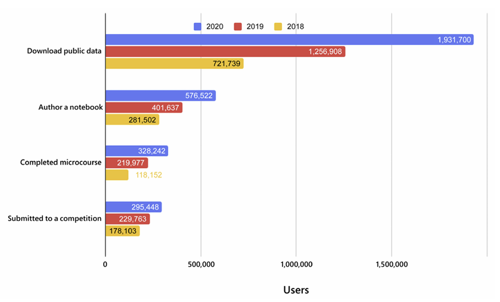

Yıllar boyunca Kaggle, katılımcılarına aşağıdaki gibi **daha pek çok fırsat** sunmuştur:

* **Kendi şirketlerini kurmak**
* **Makine öğrenimi yazılımları ve paketleri başlatmak**
* **Dergilerde röportajlar yapmak** ([kaynak](https://www.wired.com/story/solve-these-tough-data-problems-and-watch-job-offers-roll-in/))
* **Makine öğrenimi kitapları yazmak** ([kaynak](https://twitter.com/antgoldbloom/status/745662719588589568))
* **Hayallerindeki işi bulmak**

Ve en önemlisi, **veri bilimi ile ilgili beceriler ve teknik detaylar hakkında daha fazla bilgi edinmek**.

#### Other competition platforms *(Diğer yarışma platformları)*

Bu kitap Kaggle’daki yarışmalara odaklansa da, birçok veri yarışmasının özel platformlarda veya diğer yarışma platformlarında düzenlendiğini unutmamak gerekir. Aslında, bu kitapta bulacağınız bilgilerin çoğu diğer yarışmalar için de geçerlidir; çünkü temelde hepsi benzer prensiplerle çalışır ve katılımcılara sağladıkları faydalar da aşağı yukarı aynıdır.

Birçok diğer platform belirli ülkelere odaklanmış ya da yalnızca belirli türde yarışmalarda uzmanlaşmıştır. Yine de, tamlık açısından, en azından deneyim ve bilgimizin bulunduğu bazılarını kısaca tanıtmakta fayda var:

• **DrivenData** ([https://www.drivendata.org/competitions/](https://www.drivendata.org/competitions/)) sosyal problemlere yönelik yarışmalar düzenleyen bir kitle kaynaklı (crowdsourcing) yarışma platformudur (bkz. [https://www.drivendata.co/blog/intro-to-machine-learning-social-impact/](https://www.drivendata.co/blog/intro-to-machine-learning-social-impact/)). Şirketin kendisi, dünyanın en büyük sorunlarıyla mücadele eden kuruluşlara veri bilimi çözümleri sunmayı amaçlayan bir sosyal girişimdir. Veri bilimciler, sosyal fayda için algoritmalar geliştirir. Örneğin, [https://www.engadget.com/facebook-ai-hate-speechcovid-19-160037191.html](https://www.engadget.com/facebook-ai-hate-speechcovid-19-160037191.html) adresindeki makalede okuyabileceğiniz gibi, Facebook nefret söylemi ve yanlış bilgiyle mücadele için düzenlediği yarışmada DrivenData’yı seçmiştir.

• **Numerai** ([https://numer.ai/](https://numer.ai/)) San Francisco merkezli, yapay zekâ destekli bir kitle kaynaklı hedge fonudur. Katılımcılar her hafta fonun anonimleştirilmiş verileri üzerinde tahmin modelleri gönderir ve şirketin kendi kripto para birimi olan *Numeraire* ile ödüller kazanırlar.

• **CrowdANALYTIX** ([https://www.crowdanalytix.com/community](https://www.crowdanalytix.com/community)) artık eskisi kadar aktif olmasa da, bir süre önce birçok zorlu yarışmaya ev sahipliği yapmıştır (bkz. [https://towardsdatascience.com/how-i-won-topfive-in-a-deep-learning-competition-753c788cade1](https://towardsdatascience.com/how-i-won-topfive-in-a-deep-learning-competition-753c788cade1)). Ayrıca topluluk blogu, bu platformda ne tür zorluklarla karşılaşabileceğinize dair fikir edinmek için oldukça ilginçtir: [https://www.crowdanalytix.com/jq/communityBlog/listBlog.html](https://www.crowdanalytix.com/jq/communityBlog/listBlog.html).

• **Signate** ([https://signate.jp/competitions](https://signate.jp/competitions)) Japonya merkezli bir veri bilimi yarışma platformudur. Birçok yarışmaya ev sahipliği yapar ve Kaggle’a benzer bir sıralama sistemi sunar ([https://signate.jp/users/rankings](https://signate.jp/users/rankings)).

• **Zindi** ([https://zindi.africa/competitions](https://zindi.africa/competitions)) Afrika merkezli bir veri bilimi yarışma platformudur. Afrika’nın en acil sosyal, ekonomik ve çevresel sorunlarını çözmeye odaklı yarışmalar düzenler.

• **Alibaba Cloud** ([https://www.alibabacloud.com/campaign/tianchi-competitions](https://www.alibabacloud.com/campaign/tianchi-competitions)) Çin merkezli bir bulut bilişim ve yapay zekâ sağlayıcısıdır. SIGKDD, IJCAI-PRICAI ve CVPR gibi akademik konferanslarla ortaklaşa düzenlenen *Tianchi Academic* yarışmalarını başlatmıştır. Görsel tabanlı 3D şekil tanıma, 3D nesne yeniden oluşturma ve örnek segmentasyonu gibi zorluklar içeren yarışmalar düzenler.

• **Analytics Vidhya** ([https://datahack.analyticsvidhya.com/](https://datahack.analyticsvidhya.com/)) Hindistan’ın en büyük veri bilimi topluluğudur ve veri bilimi hackathon’ları için bir platform sunar.

• **CodaLab** ([https://codalab.lri.fr/](https://codalab.lri.fr/)) 2013 yılında Microsoft ve Stanford Üniversitesi’nin ortak girişimiyle kurulmuş, Fransa merkezli bir veri bilimi yarışma platformudur. Bilgi paylaşımı ve yeniden üretilebilir modelleme için **Worksheets** ([https://worksheets.codalab.org/](https://worksheets.codalab.org/)) adlı ücretsiz bulut tabanlı bir defter sunar.

Diğer daha küçük platformlar arasında İsviçre’deki École Polytechnique Fédérale de Lausanne tarafından geliştirilen **CrowdAI** ([https://www.crowdai.org/](https://www.crowdai.org/)), **InnoCentive** ([https://www.innocentive.com/](https://www.innocentive.com/)), biyomedikal görüntüleme için **Grand-Challenge** ([https://grand-challenge.org/](https://grand-challenge.org/)), **DataFountain** ([https://www.datafountain.cn/business?lang=en-US](https://www.datafountain.cn/business?lang=en-US)), **OpenML** ([https://www.openml.org/](https://www.openml.org/)) gibi platformlar yer alır. Ayrıca, Rus topluluğu **Open Data Science** ([https://ods.ai/competitions](https://ods.ai/competitions)) sitesinde devam eden büyük yarışmaların kapsamlı bir listesini bulabilir ve zaman zaman yeni yarışma platformlarını keşfedebilirsiniz.

Kaggle, hâlâ en ilginç yarışmaları bulabileceğiniz ve yarışma çabalarınızla en geniş tanınırlığı elde edebileceğiniz en iyi platformdur. Ancak, Kaggle dışındaki bir yarışmayı seçmek de anlamlı olabilir; özellikle kişisel veya profesyonel ilgi alanlarınıza uyan bir yarışma bulduğunuzda. Gördüğünüz gibi, Kaggle dışında da oldukça fazla alternatif ve fırsat mevcut. Bu da, Kaggle ile birlikte diğer yarışma platformlarını da dikkate alarak, ilginizi çekebilecek özel veri veya temalı bir yarışma bulma olasılığınızı artırır.

Ayrıca, bu tür platformlarda rekabetin genellikle daha az olduğunu (dolayısıyla daha iyi bir sıralama veya ödül kazanma şansınızın daha yüksek olabileceğini) bekleyebilirsiniz; ancak katılımcılar arasında bilgi paylaşımının Kaggle’daki kadar zengin olmadığını da unutmamalısınız.

### Introducing Kaggle *(Kaggle’a giriş)*

Bu noktada, özellikle **Kaggle**’ın nasıl çalıştığını daha derinlemesine incelememiz gerekiyor.
Aşağıdaki paragraflarda, Kaggle platformunun ve yarışmalarının çeşitli yönlerini ele alacağız ve Kaggle’daki bir yarışmada yer almanın ne anlama geldiğine dair bir fikir edineceksiniz.
Daha sonra, kitabın geri kalan bölümlerinde bu konuların çoğuna çok daha ayrıntılı biçimde geri dönerek, ek öneriler ve stratejilerle birlikte tartışacağız.

#### Stages of a competition *(Bir yarışmanın aşamaları)*

Kaggle’daki bir yarışma, farklı adımlardan oluşacak şekilde düzenlenir.
Bu adımların her birine göz atarak, bir veri bilimi yarışmasının nasıl işlediğini ve sizden neler beklenebileceğini daha iyi anlayabilirsiniz.

Bir yarışma başlatıldığında, genellikle sosyal medyada — örneğin Kaggle’ın Twitter hesabında ([https://twitter.com/kaggle](https://twitter.com/kaggle)) — yarışmayı duyuran paylaşımlar yapılır. Ayrıca, **Competitions** sayfasında ([https://www.kaggle.com/competitions](https://www.kaggle.com/competitions)) **Active Competitions** (aktif yarışmalar) bölümünde yeni bir sekme görünür.

Belirli bir yarışmanın sekmesine tıkladığınızda, o yarışmanın sayfasına yönlendirilirsiniz. İlk bakışta, yarışmanın ödül verip vermediğini (ve yarışmaya katılmanın bir sonucu olarak puan ve madalya kazandırıp kazandırmadığını), şu anda kaç takımın katıldığını ve çözümünüz üzerinde çalışmak için ne kadar süreniz kaldığını görebilirsiniz.

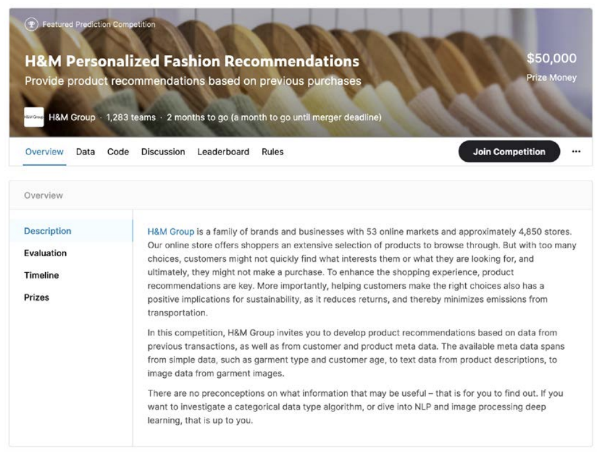

Orada, öncelikle **Overview (Genel Bakış)** menüsünü inceleyebilirsiniz. Bu menü size şu konularda bilgi verir:

* Yarışmanın konusu
* Değerlendirme metriği (modellerinizin değerlendirileceği ölçüt)
* Yarışmanın zaman çizelgesi
* Ödüller
* Yasal veya yarışma gereklilikleri

Genellikle zaman çizelgesi çok dikkat edilmeyen bir kısımdır, ancak kontrol etmeniz gereken ilk şeylerden biri olmalıdır; çünkü yalnızca yarışmanın ne zaman başlayıp biteceğini değil, aynı zamanda **kural kabul etme son tarihini** de gösterir. Bu tarih genellikle yarışma kapanmadan **7 ila 14 gün önce** olur ve yarışmaya katılabileceğiniz (kuralları kabul edebileceğiniz) son günü belirtir.

Ayrıca bir **takım birleştirme son tarihi (team merger deadline)** de bulunur: Bu tarihten önce istediğiniz herhangi bir zamanda ekibinizi başka bir yarışmacının ekibiyle birleştirebilirsiniz; ancak bu tarihten sonra artık mümkün değildir.

**Rules (Kurallar)** menüsü de sıklıkla göz ardı edilir (çoğu kişi doğrudan **Data** kısmına geçer), ancak kontrol edilmesi önemlidir çünkü yarışmanın gereklilikleri hakkında bilgi verir. Kurallar kısmından edinebileceğiniz önemli bilgiler arasında şunlar yer alır:

* Ödül almaya uygun olup olmadığınız
* Puanınızı artırmak için harici veri kullanıp kullanamayacağınız
* Günde kaç tane gönderim (çözüm testi) yapabileceğiniz
* Kaç tane nihai çözüm seçebileceğiniz

Kuralları kabul ettikten sonra, **Data** menüsünden verileri indirebilir veya doğrudan **Code** menüsünden Kaggle Notebooks (çevrimiçi, bulut tabanlı defterler) üzerinde çalışmaya başlayabilirsiniz. Burada diğerlerinin paylaştığı kodları yeniden kullanabilir veya sıfırdan kendi kodunuzu oluşturabilirsiniz.

Eğer verileri indirmeye karar verirseniz, **Kaggle API**’sini de kullanabileceğinizi unutmayın. Bu API, indirme ve gönderim işlemlerini neredeyse otomatik hale getirmenize yardımcı olur. Yerel bilgisayarınızda veya bulut sunucunuzda modellerinizi çalıştırıyorsanız, bu araç oldukça faydalıdır. API hakkında daha fazla bilgiyi şu adreste bulabilirsiniz:
👉 [https://www.kaggle.com/docs/api](https://www.kaggle.com/docs/api)
Kaynak koduna ise GitHub üzerinden ulaşabilirsiniz:
👉 [https://github.com/Kaggle/kaggle-api](https://github.com/Kaggle/kaggle-api)

Kaggle’ın GitHub deposunu daha yakından incelerseniz, **Kaggle Notebooks** (çevrimiçi defterler) için kullanılan tüm **Docker imajlarını** da bulabilirsiniz.

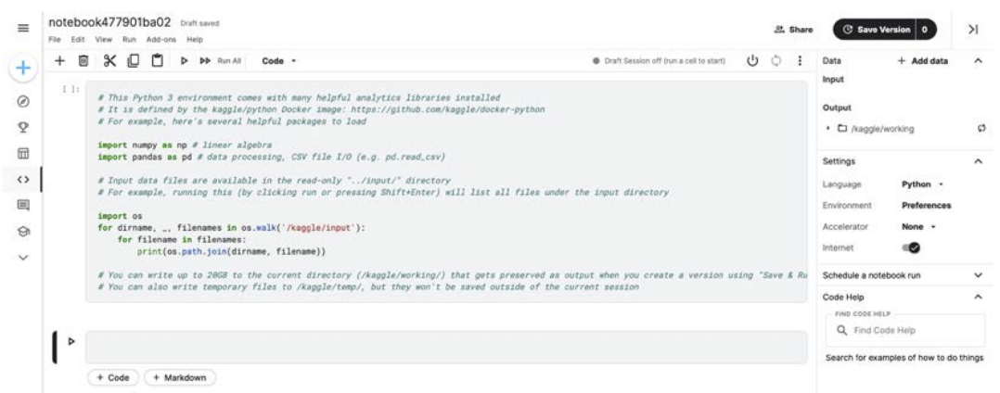

Bu noktada, çözümünüzü geliştirirken **tek başınıza devam etmemenizi**, diğer yarışmacılarla **Discussion (Tartışma)** forumu üzerinden iletişime geçmenizi içtenlikle tavsiye ederiz. Bu forumda yarışmaya özgü sorular sorabilir ve diğer katılımcıların sorularını yanıtlayabilirsiniz.
Çoğu zaman burada, veriyle ilgili belirli problemlere dair faydalı ipuçları veya kendi çözümünüzü geliştirmeye yardımcı olabilecek fikirler bulabilirsiniz.
Birçok başarılı Kaggle kullanıcısı (*Kaggler*), forumlarda edindikleri fikirlerin kendilerine daha iyi performans sağladığını ve daha da önemlisi, veri bilimi modelleme konusunda çok şey öğrenmelerine yardımcı olduğunu belirtmiştir.

Çözümünüz hazır olduğunda, yarışmanın yönergelerine uygun şekilde **Kaggle değerlendirme sistemine** gönderebilirsiniz.
Bazı yarışmalar çözümleri **CSV dosyası** olarak kabul ederken, bazıları **Kaggle Notebook** üzerinde kod yazmanızı ve sonuçları orada üretmenizi ister.
Yarışma süresince çözüm göndermeye devam edebilirsiniz.

Her gönderim yaptığınızda, kısa bir süre sonra **liderlik tablosu (leaderboard)** size bir puan ve yarışmacılar arasındaki konumunuzu gösterecektir (bekleme süresi, puan hesaplaması için gereken işlem süresine bağlı olarak değişir).
Ancak bu sıralama yalnızca yaklaşık bir göstergedir; çünkü modelinizin performansını, test verisinin yalnızca bir kısmı olan **public test set (genel test kümesi)** üzerinde yansıtır. Bu kümedeki sonuçlar yarışma boyunca herkesin görebileceği şekilde paylaşılır.

Yarışma kapanmadan önce, her yarışmacı **nihai değerlendirme** için kendi çözümleri arasından belirli bir sayıda (genellikle iki) çözüm seçebilir.

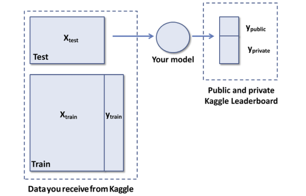

Yarışma ancak kapandıktan sonra, yarışmacıların değerlendirilmesini istedikleri modeller temel alınarak, **test veri setinin başka bir kısmı** olan **private test set (özel test kümesi)** üzerindeki puanları açıklanır.
Bu yeni sıralama tablosu **private leaderboard (özel liderlik tablosu)** olarak adlandırılır ve yarışmanın **nihai, gerçek puanlarını** gösterir; ancak bu sıralama henüz **resmî ve kesin** değildir.

Gerçekte, Kaggle ekibi her şeyin doğru olduğunu ve tüm yarışmacıların yarışma kurallarına uyduğunu kontrol etmek için bir süre ayırır.
Bir süre sonra (ve bazen bazı yarışmacıların diskalifiye edilmesine bağlı olarak sıralamalarda değişiklikler olduktan sonra), **private leaderboard** resmî ve kesin hale gelir.
Kazananlar açıklanır ve birçok katılımcı, yarışma tartışma forumunda kendi stratejilerini, çözümlerini ve kodlarını paylaşır.

Bu noktada, diğer katılımcıların çözümlerini incelemek ve kendi yaklaşımınızı geliştirmeye çalışmak tamamen size kalmıştır.
Bunu yapmanızı **şiddetle tavsiye ederiz**, çünkü bu süreç Kaggle’daki en önemli öğrenme kaynaklarından bir diğeridir.

#### Types of competitions and examples *(Yarışma türleri ve örnekleri)*

Kaggle yarışmaları, **yarışma kategorilerine** göre sınıflandırılır ve her kategori, yarışma biçimi ve beklentiler açısından farklılık gösterir.
Veri türü, problem zorluğu, verilen ödüller ve yarışma dinamikleri bu kategoriler içinde oldukça çeşitlidir; bu nedenle her kategorinin ne anlama geldiğini önceden anlamak önemlidir.

Kaggle’daki yarışmaları filtrelemek için kullanabileceğiniz **resmî kategoriler** şunlardır:

* **Featured**
* **Masters**
* **Annuals**
* **Research**
* **Recruitment**
* **Getting Started**
* **Playground**
* **Analytics**
* **Community**

---

> 🏆 Featured (Öne Çıkan) Yarışmalar

Bunlar en yaygın yarışma türüdür. Genellikle sponsor bir şirketin iş ile ilgili bir problemini içerir ve en iyi performans gösterenlere ödül verilir.
Kazananlar, çözümlerinin **lisanssız (non-exclusive)** kullanım hakkını sponsor şirkete verirler; ayrıca ayrıntılı bir rapor hazırlamaları ve bazen sponsor şirketle toplantılara katılmaları gerekebilir.

Kaggle’da neredeyse her zaman Featured yarışmalara rastlayabilirsiniz. Günümüzde çoğu, **yapılandırılmamış veriler** (metin, görüntü, video, ses gibi) üzerinde derin öğrenme yöntemlerinin uygulanmasına yöneliktir.
Geçmişte ise daha çok **tablo biçiminde veriler (tabular data)** üzerine kurulu yarışmalar yapılırdı — yani veritabanlarında bulunan yapılandırılmış veriler üzerinde çalışan problemlerdi.
İlk zamanlarda rastgele ormanlar (random forests), daha sonra ise akıllı özellik mühendisliğiyle birlikte **gradient boosting** yöntemleri çok başarılı sonuçlar vermiştir.
Ancak günümüzde, gelişmiş yazılımlar ve **AutoML** araçları sayesinde bu tür problemlerde yarışmalardan elde edilen gelişmeler genellikle marjinaldir.
Buna karşılık, **yapılandırılmamış veri** dünyasında iyi bir derin öğrenme çözümü hâlâ büyük fark yaratabilir.
Örneğin, **BERT** gibi önceden eğitilmiş ağlar, birçok NLP görevinde önceki standartlara göre çift haneli performans artışları sağlamıştır.

---

> 🧠 Masters (Ustalar) Yarışmaları

Artık daha az düzenlenmektedir, ancak bunlar **özel (invite-only)** yarışmalardır.
Amaç, yalnızca uzmanlar (genellikle Kaggle sıralamasında **Master** veya **Grandmaster** unvanına sahip yarışmacılar) için yarışmalar düzenlemektir.

---

> 📅 Annuals (Yıllık) Yarışmalar

Her yıl belirli dönemlerde düzenlenen yarışmalardır.
Bunlar arasında:

* **Santa Claus Competitions** (genellikle algoritmik optimizasyon problemleri üzerine),
* **March Machine Learning Mania** (2014’ten beri her yıl ABD Kolej Basketbol Turnuvaları sırasında düzenlenir) bulunur.

---

> 🔬 Research (Araştırma) Yarışmaları

Bu yarışmaların amacı ticari değil, **bilimsel veya araştırma odaklıdır**, bazen de kamu yararına hizmet eder.
Bu nedenle genellikle para ödülü sunmazlar.
Ayrıca kazananlardan çözümlerini **açık kaynak (open-source)** olarak paylaşmaları istenebilir.

Örneğin, **Google Landmark Recognition 2020** ([https://www.kaggle.com/c/landmark-recognition-2020](https://www.kaggle.com/c/landmark-recognition-2020)) yarışmasında, ünlü (veya pek tanınmamış) yapıtların fotoğraflarını tanımlamak hedeflenmiştir.

---

> 💼 Recruitment (İşe Alım) Yarışmaları

Bu yarışmalar, sponsor şirketlerin **potansiyel iş adaylarının yeteneklerini test etmek** için düzenlenir.
Genellikle tek kişilik takımlarla sınırlıdır ve en iyi performans gösteren yarışmacılara **iş görüşmesi** ödülü sunulur.
Yarışma sonunda, değerlendirilmek isteyen yarışmacıların **özgeçmişlerini (CV)** yüklemeleri gerekir.

Örnekler:

* **Facebook Recruiting Competition** ([https://www.kaggle.com/c/FacebookRecruiting](https://www.kaggle.com/c/FacebookRecruiting))
* **Yelp Recruiting Competition** ([https://www.kaggle.com/c/yelp-recruiting](https://www.kaggle.com/c/yelp-recruiting))

---

> 🚀 Getting Started (Başlangıç) Yarışmaları

Bu yarışmalar ödül sunmaz, ancak **yeni başlayanların** Kaggle prensiplerine ve dinamiklerine alışmaları için **kolay ve öğretici problemler** içerir.
Genellikle **yarı kalıcıdırlar** ve liderlik tabloları zaman zaman yenilenir.
Makine öğrenmesine giriş yapmak istiyorsanız, bu yarışmalar mükemmel bir başlangıç noktasıdır; çünkü oldukça **işbirlikçi bir ortam** sunarlar ve veri işleme ile model oluşturma adımlarını gösteren birçok **Kaggle Notebook** mevcuttur.

Bazı ünlü Getting Started yarışmaları:

* [Digit Recognizer](https://www.kaggle.com/c/digit-recognizer)
* [Titanic — Machine Learning from Disaster](https://www.kaggle.com/c/titanic)
* [House Prices — Advanced Regression Techniques](https://www.kaggle.com/c/house-prices-advanced-regression-techniques)

---

> 🎮 Playground (Oyun Alanı) Yarışmaları

Bu yarışmalar **Getting Started** yarışmalarından biraz daha zordur, ancak hâlâ öğrenme ve pratik yapma odaklıdır.
Tam ölçekli Featured yarışmalar kadar baskı oluşturmazlar, fakat bazen rekabet oldukça kızışabilir.
Ödüller genellikle **Kaggle logolu hediyelikler (swag: kupa, tişört, çorap vb.)** veya küçük miktarlarda paradır.

Ünlü bir Playground yarışması örneği:

* [Dogs vs. Cats](https://www.kaggle.com/c/dogs-vs-cats) — köpekleri ve kedileri ayırt eden bir algoritma geliştirme görevi.

---

> 📊 Analytics (Analiz) Yarışmaları

Bu yarışmalarda değerlendirme **niteliksel (qualitative)** olup, katılımcılardan fikirler, çözüm taslakları, PowerPoint sunumları, grafikler vb. hazırlamaları beklenir.

---

> 👥 Community (Topluluk) Yarışmaları

Eskiden **InClass** olarak bilinen bu yarışmalar, **akademik kurumlar** veya bireysel **Kaggler’lar** tarafından düzenlenir.
Topluluk yarışmalarının duyurusu için:
🔗 [https://www.kaggle.com/product-feedback/294337](https://www.kaggle.com/product-feedback/294337)
Kendi yarışmanızı düzenleme rehberleri için:
🔗 [https://www.kaggle.com/c/about/host](https://www.kaggle.com/c/about/host)
🔗 [https://www.kaggle.com/community-competitions-setup-guide](https://www.kaggle.com/community-competitions-setup-guide)


> **Parul Pandey**
> 
> [https://www.kaggle.com/parulpandey](https://www.kaggle.com/parulpandey)
> 
> 
> 
> Kaggle Notebooks Grandmaster’ı, Datasets Master’ı ve H2O.ai’de veri bilimci olan **Parul Pandey** ile analitik yarışmalar ve deneyimleri hakkında konuştuk.
> 
> ---
> 
> **En sevdiğin yarışma türü nedir ve neden? Kaggle’da teknikler ve çözüm yaklaşımları açısından uzmanlık alanın nedir?**
> 
> Veri analizi yapmanızı ve sonunda kapsamlı bir analiz raporu sunmanızı gerektiren **Veri Analitiği yarışmalarını** gerçekten çok seviyorum. Bunlara *Data Science for Good* (DS4G) yarışmaları, spor analitiği yarışmaları (örneğin NFL) ve genel anket temelli yarışmalar dâhildir. Geleneksel yarışmalardan farklı olarak, bu tür yarışmalarda performansınızı başkalarıyla kıyaslayabileceğiniz bir **liderlik tablosu (leaderboard)** bulunmaz; ayrıca madalya veya puan da kazanmazsınız.
> 
> Öte yandan bu yarışmalar, veri biliminin çok yönlü alanlarına – veri temizleme, veri madenciliği, görselleştirme ve içgörü iletimi gibi – dokunan uçtan uca çözümler gerektirir. Bu tür problemler, gerçek hayattaki senaryoları taklit etmenizi ve kendi içgörünüzü, bakış açınızı sunmanızı sağlar. Tek bir “en iyi” çözüm olmayabilir, ancak bu size çeşitli yaklaşımları tartıp değerlendirerek kendi çözümünüze entegre etme fırsatı verir.
> 
> ---
> 
> **Bir Kaggle yarışmasına nasıl yaklaşıyorsun? Bu yaklaşım, günlük işinden ne kadar farklı?**
> 
> İlk adımım her zaman **EDA (keşifsel veri analizi)** yapmaktır. Bu, iş rutinimin de bir parçasıdır. Genellikle verideki tutarsızlıkları, eksik değerleri, aykırı noktaları vb. belirlemek için veriyi incelerim; çünkü bunlar ileride sorun yaratabilir. Sonra **iyi ve güvenilir bir çapraz doğrulama stratejisi** oluştururum. Ardından tartışma forumlarını okur ve diğer kullanıcıların paylaştığı Notebook’lara göz atarım. Bu genelde iyi bir başlangıç noktası olur; sonra önceki deneyimlerimden edindiğim şeyleri bu sürece eklerim. Ayrıca **model performansını izlemek** de çok önemlidir.
> 
> Analitik yarışmalar söz konusu olduğunda ise problemi genellikle birkaç adıma ayırmayı severim. Örneğin, ilk kısım problemi anlamakla ilgilidir ve bu birkaç gün sürebilir. Sonrasında veriyi keşfederim, ardından temel bir başlangıç çözümü oluştururum. Daha sonra bu çözümü, her seferinde bir parça ekleyerek geliştiririm. Bu, Lego parçalarını tek tek ekleyerek son eseri oluşturmak gibidir.
> 
> ---
> 
> **Katıldığın zorlu bir yarışmadan ve bu görevi nasıl ele aldığından bahseder misin?**
> 
> Daha önce de belirttiğim gibi genellikle Analitik yarışmalara katılmayı tercih ediyorum, ama bazen klasik yarışmalarda da şansımı deniyorum. Özellikle **Environmental Insights Explorer** adlı *Data Science for Good* yarışması ([https://www.kaggle.com/c/ds4g-environmental-insightsexplorer](https://www.kaggle.com/c/ds4g-environmental-insightsexplorer)) çok ilgimi çekmişti. Görev, mevcut metodolojilerdeki emisyon katsayılarını hesaplamak yerine, **uzaktan algılama (remote sensing)** tekniklerini kullanarak çevresel emisyonları anlamaktı.
> 
> Beni en çok etkileyen şey, bu yarışmanın ele aldığı konuydu. Gezegenimiz iklim değişikliğiyle mücadele ediyor ve bu yarışma tam da bu konuya odaklanmıştı. Yarışma için araştırma yaparken, **uydu görüntüleme teknolojilerindeki ilerlemeyi** görünce hayran kaldım. Bu sayede bu konuyu daha derinlemesine anlama fırsatı buldum. Landsat, Modis ve Sentinel gibi uyduların nasıl çalıştığını ve bu verilerin nasıl erişilebilir hale getirildiğini öğrendim. Bu yarışma, önceden çok az bilgim olan bir alan hakkında bilgi edinmemi sağlayan harika bir deneyimdi.
> 
> ---
> 
> **Yarışma biçimleri üzerine**
> 
> Kaggle yarışmalarının kendi içinde farklı biçimleri de vardır. En yaygın olanı, katılımcının çözümünü sunup değerlendirildiği **“basit format”tır.** Daha gelişmiş olan **iki aşamalı yarışmalarda**, yarışma ikiye ayrılır: İlk kısım tamamlandıktan sonra ikinci kısma özel bir veri seti yalnızca ilk kısım katılımcılarına verilir. Bu format, yarışmacıların hile yapma ihtimalini azaltmak için tasarlanmıştır; çünkü değerlendirme, yalnızca kısa bir süreliğine erişilebilen, daha önce hiç görülmemiş bir test setinde yapılır. Bu nedenle katılımcıların deneme sayısı ve zamanı daha sınırlıdır.
> 
> ---
> 
> **Deneyimsiz Kaggle kullanıcıları genellikle neyi gözden kaçırıyor? Başladığında bilmek isteyeceğin şey ne olurdu?**
> 
> Kaggle’daki ilk yıllarımda yaptığım bazı hatalardan bahsedebilirim.
> 
> Öncelikle, çoğu yeni başlayan **Kaggle’ı sadece yarışma platformu** olarak görür. Eğer yarışmaları seviyorsanız, burada fazlasıyla var; ama Kaggle aynı zamanda başka alanlarda da katkı yapabileceğiniz bir platformdur. Kod yazabilir, başkalarıyla paylaşabilir, sağlıklı tartışmalara katılabilir ve ağınızı genişletebilirsiniz. Toplulukla kaliteli veri setleri oluşturup paylaşabilirsiniz. Başlangıçta Kaggle’ı yalnızca veri seti indirmek için kullanıyordum; ancak birkaç yıl önce aktif oldum. Geriye dönüp baktığımda, daha önce ne kadar yanıldığımı görüyorum.
> 
> Birçok kişi yarışmalardan çekiniyor. Önce platforma alışıp, sonra yavaş yavaş yarışmalara katılabilirsiniz.
> 
> Ayrıca birçok kişi **tek başına çalıştığı için motivasyonunu kaybedip bırakıyor.** Kaggle’da takım kurmanın birçok görünmeyen avantajı var. Takım çalışması öğrenmenizi, deneyim paylaşmanızı ve sınırlı bir zaman diliminde ortak bir hedefe ulaşmayı öğretir.
> 
> ---
> 
> **Başka yarışma platformları da kullanıyor musun? Bunlar Kaggle ile nasıl kıyaslanır?**
> 
> Şu anda zamanımın çoğunu Kaggle’a ayırıyorum, ancak geçmişte **Zindi** adlı platformu da kullandım. Zindi, Afrika odaklı veri bilimi yarışmalarına yoğunlaşan bir platform. Afrika’ya özel veri setlerine erişmek için harika bir yer.
> 
> Kaggle çok yönlü bir platform olsa da, dünyanın farklı bölgelerinden gelen problem ifadeleri konusunda eksiklikler var. Son zamanlarda bu çeşitlilik artmaya başladı; örneğin **chaii yarışması** – Hint dillerine odaklanan bir NLP yarışması – buna iyi bir örnektir. Benzer şekilde, farklı ülkelere odaklanan yarışmaların da hem araştırma hem de genel veri bilimi topluluğu için faydalı olacağını düşünüyorum.

Kaggle yarışmalarının bu sınıflandırmasının ötesinde, yarışmaların farklı **formatlarda** düzenlenebileceğini de dikkate almak gerekir.
En yaygın format, daha önce açıklandığı gibi, bir çözüm sunduğunuz ve bu çözümün değerlendirildiği **“basit (simple)” formattır.**
Daha gelişmiş olan **iki aşamalı yarışma (two-stage competition)** formatında ise yarışma iki bölüme ayrılır. Son veri seti yalnızca ilk bölüm tamamlandıktan sonra ve sadece bu ilk bölüme katılan yarışmacılara sunulur.
Bu iki aşamalı yarışma formatı, bazı yarışmacıların **hile yapma veya kuralları ihlal etme olasılığını azaltmak** amacıyla ortaya çıkmıştır; çünkü değerlendirme, yalnızca kısa bir süre için erişilebilen ve daha önce hiç test edilmemiş bir test seti üzerinde yapılır.
Orijinal Kaggle yarışma formatının aksine, bu durumda yarışmacıların **çok daha az zamanı** ve test setindeki örüntüleri (pattern) keşfetmek için **çok daha az sayıda gönderim hakkı** vardır.

Aynı nedenle, son zamanlarda **Code yarışmaları** da ortaya çıkmıştır.
Bu yarışmalarda tüm gönderimler doğrudan bir **Kaggle Notebook** üzerinden yapılır ve herhangi bir dış dosya yükleme seçeneği devre dışı bırakılmıştır.

Kaggle yarışma kariyerlerinin farklı aşamalarında olan kullanıcıların her tür yarışmaya katılmasında hiçbir kısıtlama yoktur.
Ancak, **veri bilimi konusundaki deneyim düzeyinize** ve **hesaplama kaynaklarınıza** bağlı olarak, belirli yarışma türleri veya formatları lehine veya aleyhine bazı önerilerimiz vardır:

* **Tamamen yeni başlayanlar** için, *Getting Started* veya *Playground* yarışmaları iyi bir başlangıç noktasıdır.
  Bu yarışmalar, yüksek rekabet baskısı olmadan Kaggle’ın nasıl çalıştığını öğrenmenizi sağlar.
  Bununla birlikte, birçok yeni başlayan da *Featured* veya *Research* yarışmalarından başlamış ve rekabet baskısının altında daha hızlı öğrendiklerini fark etmiştir.
  Bu nedenle önerimiz, **öğrenme tarzınıza göre karar vermenizdir:**

  * Bazı Kaggle kullanıcıları keşfederek ve iş birliği yaparak öğrenir (*Getting Started* veya *Playground* yarışmaları bu kişiler için idealdir).
  * Diğerleri ise hızlı tempolu bir yarışmanın rekabet ortamında motive olur.

* *Featured* ve *Research* yarışmalarında ise şunu da göz önünde bulundurmak gerekir:
  Bu yarışmalar genellikle yapay zekâ ve makine öğrenmesinin **uç (deneysel) uygulamalarıyla** ilgilidir.
  Dolayısıyla bu yarışmalarda başarılı olabilmek için ya bu alanda **sağlam bir altyapıya sahip olmanız** ya da yarışmanın uygulama alanıyla ilgili araştırmaları öğrenmeye istekli olmanız gerekir.

Son olarak, çoğu yarışmanın, birçok veri bilimcisinin iş yerinde erişemediği **hesaplama kaynaklarına** ihtiyaç duyduğunu unutmayın.
Kaggle dışındaki bulut platformlarını kullanırsanız bu, **artan maliyetlere** yol açabilir.
Bu nedenle, **Code yarışmaları** veya **zaman ve kaynak sınırlamaları olan yarışmalar**, tüm katılımcıları aynı kaynak düzeyine getirmeyi amaçladıkları için çabalarınızı yoğunlaştırmak açısından ideal bir seçenek olabilir.

#### Submission and leaderboard dynamics *(Gönderim ve liderlik tablosu dinamikleri)*

Kaggle’ın çalışma biçimi basit görünebilir: Test seti katılımcılardan gizlenir; modelinizi eğitirsiniz; eğer modeliniz test setindeki sonuçları en iyi şekilde tahmin ederse yüksek puan alır ve muhtemelen kazanırsınız.
Ne yazık ki, bu tanım Kaggle yarışmalarının iç işleyişini **fazla basitleştirilmiş** bir şekilde açıklar.
Bu açıklama, yarışmacıların doğrudan ve dolaylı etkileşimleriyle ilgili dinamikleri ya da karşı karşıya olduğunuz problemin, eğitim ve test setinin **ince ayrıntılarını (nüanslarını)** dikkate almaz.

##### Explaining the Common Task Framework paradigm *(Ortak Görev Çerçevesi paradigmasının açıklanması)*

Kaggle’ın nasıl çalıştığına dair daha kapsamlı bir açıklama, **Stanford Üniversitesi İstatistik Profesörü David Donoho** tarafından *50 Years of Data Science* (Veri Biliminin 50 Yılı) adlı makalesinde verilmiştir.
Bu makale ilk olarak *Journal of Computational and Graphical Statistics* dergisinde yayımlanmış, ardından MIT Bilgisayar Bilimi ve Yapay Zekâ Laboratuvarı sitesinde paylaşılmıştır (bkz. [http://courses.csail.mit.edu/18.337/2015/docs/50YearsDataScience.pdf](http://courses.csail.mit.edu/18.337/2015/docs/50YearsDataScience.pdf)).

Profesör Donoho doğrudan Kaggle’dan değil, genel olarak **veri bilimi yarışma platformlarından** bahseder.
Bilgisayarlı dilbilimci **Mark Liberman**’dan alıntı yaparak, veri bilimi yarışmalarını ve platformlarını **“Common Task Framework (CTF)” — Ortak Görev Çerçevesi** paradigmasının bir parçası olarak tanımlar.
Bu paradigma, son on yıllarda birçok alanda veri biliminin sessiz ama istikrarlı bir şekilde ilerlemesini sağlamıştır.

Donoho, CTF’nin veri bilimi problemlerine **ampirik (deneysel)** açıdan çözüm getirmede son derece etkili olduğunu söyler ve bunu desteklemek için **Netflix yarışması** ile çeşitli **DARPA yarışmalarını** başarılı örnekler olarak gösterir.
CTF paradigması, birçok alanda en iyi çözümleri yeniden şekillendirmeye katkıda bulunmuştur.

---

**CTF’nin bileşenleri ve “gizli sosu”**

Bir CTF, bazı bileşenlerden ve “gizli bir sostan” oluşur.
Bileşenler şunlardır:

1. Herkese açık bir veri seti ve bununla ilişkili bir tahmin görevi,
2. Bu göreve en iyi tahmini üretmek için ortak bir amaçla çalışan yarışmacılar,
3. Katılımcıların tahminlerini adil ve objektif biçimde puanlayan, ancak çözüme dair fazla ipucu vermeyen (ya da en azından bunu sınırlayan) bir değerlendirme sistemi.

Bu sistem, görev açık şekilde tanımlandığında ve veri kaliteli olduğunda en iyi şekilde çalışır.
Zaman içinde çözümlerin performansı küçük artışlarla gelişir ve sonunda bir **asimptota (doyum noktasına)** ulaşır.
Bu süreç, katılımcılar arasında belli bir düzeyde paylaşımın teşvik edilmesiyle hızlanabilir.
Kaggle’da bu paylaşım; **tartışmalar, paylaşılan Kaggle Notebook’ları** ve **Datasets** bölümündeki ek veriler aracılığıyla gerçekleşir.

CTF paradigmasına göre, bir yarışmadaki **rekabet baskısı**, çözümlerin sürekli olarak gelişmesi için tek başına yeterlidir.
Bu rekabet baskısı, katılımcılar arasında belli ölçüde **bilgi paylaşımıyla** birleştiğinde, gelişme çok daha hızlı gerçekleşir.
İşte bu nedenle Kaggle, paylaşımı teşvik eden birçok ödül ve mekanizma getirmiştir.

---

**CTF’nin gizli sosu: rekabetin kendisi**

CTF paradigmasındaki “gizli sos”, **bizzat yarışmanın kendisidir**.
Bu yapı, ampirik performansın artırılmasının hedeflendiği pratik bir problem çerçevesinde, her zaman yeni **ölçütlerin (benchmark)**, **veri ve modelleme çözümlerinin**, ve genel anlamda **makine öğrenmesinin daha iyi uygulanma biçimlerinin** ortaya çıkmasını sağlar.

Bir yarışma, dolayısıyla bir tahmin problemini çözmenin yeni yollarını, **özellik mühendisliği (feature engineering)** için yeni yöntemleri ve yeni **algoritmik veya modelleme çözümlerini** sunabilir.
Örneğin, **derin öğrenme (deep learning)** yalnızca akademik araştırmalardan doğmamıştır; tersine, etkinliğini kanıtlayan başarılı yarışmalar sayesinde büyük bir ivme kazanmıştır.
(Örneğin, Geoffrey Hinton ekibinin kazandığı **Merck yarışmasını** hatırlayalım: [https://www.kaggle.com/c/MerckActivity/overview/winners](https://www.kaggle.com/c/MerckActivity/overview/winners)).

---

**CTF ve açık yazılım hareketi**

**Açık kaynak yazılım hareketi** ile birleştiğinde (örneğin Scikit-learn, TensorFlow veya PyTorch gibi güçlü analitik araçlara herkesin erişebilmesi), CTF paradigması çok daha iyi sonuçlar üretir.
Bunun nedeni, tüm yarışmacıların başlangıçta **aynı düzeyde olanaklara sahip** olmasıdır.

Ancak, bir yarışmadaki çözümün **özel donanım veya yüksek işlem gücüne** dayanması, elde edilebilecek sonuçları sınırlayabilir.
Çünkü bu durum, bu tür kaynaklara erişimi olmayan yarışmacıların doğru şekilde katılım göstermesini ya da diğer katılımcılar üzerinde **rekabet baskısı** oluşturarak dolaylı katkı sağlamasını engelleyebilir.

İşte bu nedenle Kaggle, yarışmalara katılanlar için **ücretsiz bulut hizmetleri** (örneğin **Kaggle Notebooks**) sunmaya başlamıştır.
Bu uygulama, özellikle donanım yoğun yarışmalarda (örneğin derin öğrenme yarışmaları gibi) bazı farkları azaltabilir ve genel anlamda rekabeti artırabilir.

##### Understanding what can go wrong in a competition *(Bir yarışmada nelerin ters gidebileceğini anlamak)*

**CTF Paradigması ve Yarışma Başarısızlıklarının Nedenleri**

CTF paradigmasına dair önceki açıklamamızı göz önünde bulundurursak, bir yarışmanın tek ihtiyacı uygun bir platformda düzenlenmekmiş gibi görünebilir. Böyle olursa, katılımcılar için olumlu bir katılım ve sponsor şirket için olağanüstü modeller gibi iyi sonuçların kendiliğinden ortaya çıkacağını düşünebilirsiniz.

Ancak, hem katılımcılar hem de yarışmayı düzenleyen kurum açısından **hayal kırıklığına yol açabilecek** bazı durumlar da meydana gelebilir:

* Veri sızıntısı (data leakage)
* Liderlik tablosu üzerinden çözüm denemesi (probing)
* Aşırı uyum (overfitting) ve buna bağlı liderlik tablosu değişimleri
* Özel paylaşım (private sharing)

---

**Veri Sızıntısı (Data Leakage)**

**Veri sızıntısı**, çözümün bir kısmının bizzat verinin kendisinden geri izlenebilmesi durumudur.
Örneğin, bazı değişkenler hedef değişkenden (target variable) sonra oluşmuş olabilir ve bu da hedef hakkında bilgi sızdırır.

Bu durum, örneğin dolandırıcılık tespitinde, dolandırıcılık gerçekleştikten sonra güncellenen değişkenleri kullandığınızda; veya satış tahmini yaparken, bir ürünün **gerçek dağıtım bilgilerini** işlediğinizde (daha fazla dağıtım → daha fazla talep → daha fazla satış) ortaya çıkar.

Başka bir örnek de, **eğitim ve test örneklerinin tahmin edilebilir bir sırada düzenlenmiş olması** ya da örnek kimliklerinin (identifier) değerlerinin çözüme dair ipuçları içermesidir.
Örneğin, kimlik numarası hedef değişkenin sırasına göre belirlenmişse ya da kimlik değeri zamanla ilişkiliyse ve zaman hedef değişkenin olasılığını etkiliyorsa bu da bir sızıntıdır.

Bu tür veri sızıntılarına, bazı yarışmacılar tarafından **“altın özellikler (golden features)”** adı verilir — çünkü verideki bu tür küçük ipuçlarını fark etmek, katılımcılar için adeta altın değerinde ödüller kazandırabilir.
Ancak bu durum genellikle **yeniden kullanılabilir olmayan çözümler** üretir.
Bu da sponsor için **optimal olmayan sonuçlar** anlamına gelir, ancak en azından sponsor hangi değişkenlerin sızıntıya yol açabileceğini öğrenmiş olur.

---

**Liderlik Tablosu Üzerinden Çözüm Denemesi (Leaderboard Probing)**

Bir diğer problem, **liderlik tablosu üzerinden çözümü test etmek veya “deşifre etmek”** olasılığıdır.
Bu durumda, yarışmacılar değerlendirme metriklerinden yararlanarak sürekli denemeler yapabilir ve bu yolla çözüm hakkında bilgi elde edebilir.
Yine bu tür çözümler, farklı koşullarda tamamen **kullanılamaz** hale gelir.

Bunun açık bir örneği **“Don’t Overfit II”** yarışmasında yaşanmıştır.
Kazanan katılımcı **Zachary Mayers**, her bir değişkeni tek tek göndererek her birinin model üzerindeki etkisini analiz etmiş ve bu yolla modelinin katsayılarını doğru tahmin edebilmiştir.
(Zach’ın detaylı çözümünü burada okuyabilirsiniz: [https://www.kaggle.com/c/dont-overfit-ii/discussion/91766](https://www.kaggle.com/c/dont-overfit-ii/discussion/91766))

Genellikle **zaman serisi problemleri** veya test verisinde sistematik değişimler olan diğer problemler, bu tür probing’den ciddi şekilde etkilenebilir.
Çünkü bu durum, yarışmacıların tahminlerini örneğin sabit bir sayı ile çarpmak gibi bir **son işleme (post-processing)** adımıyla puanlarını artırmalarına olanak tanıyabilir.

---

**Liderlik Tablosuna Aşırı Güvenme ve Aşırı Uyum (Overfitting)**

Liderlik tablosuna aşırı güvenmek, bir başka tür **aşırı uyum (overfitting)** örneğidir.
Katılımcılar kendi doğrulama testlerinden çok liderlik tablosundaki geri bildirimlere göre hareket ettiklerinde bu durum ortaya çıkar.

Bazen bu durum yarışmanın **tamamen başarısız olmasına**, yani nihai liderlik tablosunda **beklenmedik ve rastlantısal sıralama değişikliklerine (shake-up)** yol açabilir.
Böyle bir durumda kazanan çözümler, aslında probleme uygun olmayan veya tamamen tesadüfi çözümler olabilir.

Bu tür olaylar, **eğitim seti ile test seti arasındaki farkları analiz eden** bazı tekniklerin geliştirilmesine yol açmıştır.
Bu tür analizlere **adversarial testing** denir ve liderlik tablosuna ne kadar güvenileceği veya eğitim ve test setleri arasında tamamen kaçınılması gereken özellikler olup olmadığı konusunda fikir verir.
Örnek olarak, **Bojan Tunguz**’un şu Notebook’una göz atabilirsiniz:
[https://www.kaggle.com/tunguz/adversarial-ieee](https://www.kaggle.com/tunguz/adversarial-ieee).

---

**Overfitting’e Karşı Savunma Stratejileri**

Liderlik tablosuna aşırı uyumu önlemenin bir başka yolu, **güvenli stratejiler** kullanmaktır.
Örneğin, genellikle her katılımcının **final değerlendirmesi için iki çözüm** göndermesine izin verilir.
Bu durumda iyi bir strateji, birini liderlik tablosuna göre en başarılı olan çözüm olarak, diğerini ise **kendi çapraz doğrulama testlerinde** en iyi performans gösteren çözüm olarak göndermektir.

Liderlik tablosu probing’i ve overfitting’i önlemek için Kaggle, daha önce de bahsettiğimiz gibi, **iki aşamalı değerlendirme sistemi** içeren **Code yarışmalarına** yönelik çeşitli yenilikler getirmiştir.
Bu yarışmalarda katılımcılar test verisini hiç görmedikleri için, kendi **yerel doğrulama testlerine** daha fazla önem vermek zorunda kalırlar.

---

**Özel Paylaşım (Private Sharing) ve Etik Dışı Davranışlar**

Bir yarışmayı bozabilecek bir diğer unsur, **özel paylaşım (private sharing)** yani fikir ve çözümlerin yalnızca kapalı bir grup arasında paylaşılmasıdır.
Buna ek olarak, **birden fazla hesapla yarışmak**, **birden fazla takıma katılıp fikir çalmak** gibi etik dışı davranışlar da olabilir.

Bu tür durumlar, bazı katılımcılar için avantaj yaratırken çoğunluk için dezavantaj doğurur — yani **bilgi asimetrisi** oluşur.
Böylece, yarışma boyunca paylaşım eksik kalır ve az sayıda takım tam rekabet baskısı yaratabilir.

Ayrıca, bu tür durumlar katılımcıların farkına vardığında (örneğin şu tartışmaya bakılabilir: [https://www.kaggle.com/c/ashrae-energy-prediction/discussion/122503](https://www.kaggle.com/c/ashrae-energy-prediction/discussion/122503)), yarışmaya ve sonraki yarışmalara olan güven ve katılım da azalabilir.

#### Computational resources *(Hesaplama kaynakları)*

Bazı yarışmalar, **üretim ortamında uygulanabilir çözümler** elde edebilmek için belirli sınırlamalar getirir.
Örneğin, **Bosch Production Line Performance** yarışması ([https://www.kaggle.com/c/bosch-production-line-performance](https://www.kaggle.com/c/bosch-production-line-performance)) çözüm modelleri için **çalışma süresi**, **çıktı dosyası boyutu** ve **bellek kullanımı** açısından katı sınırlamalara sahipti.

**Notebook tabanlı yarışmalar** (önceden *Kernel-Only* yarışmaları olarak biliniyordu), hem eğitimin hem de çıkarımın (inference) **Kaggle Notebooks** üzerinde gerçekleştirilmesini zorunlu kılar.
Bu durumda, kullanmanız gereken kaynaklarla ilgili bir sorun oluşmaz; çünkü **Kaggle size tüm gerekli donanım kaynaklarını sağlar**.
Bu yaklaşım aynı zamanda, **tüm katılımcıların aynı başlangıç noktasında yarışmasını** sağlamak amacıyla da tasarlanmıştır.

Sorunlar, yalnızca **çıkarım (inference)** aşamasında Notebook kullanımını zorunlu kılan yarışmalarda ortaya çıkar.
Bu tür yarışmalarda modellerinizi kendi bilgisayarınızda eğitebilir, ancak **test aşamasında** model sayısı ve karmaşıklığı açısından sınırlamalara tabi olursunuz.

Günümüzde yarışmaların çoğu **derin öğrenme (deep learning)** çözümleri gerektirdiğinden, **rekabetçi sonuçlar elde edebilmek için GPU gibi özel donanımlara** ihtiyaç duyacağınızı bilmelisiniz.

Günümüzde nadirleşmiş olsa da, bazı **tabular veri yarışmalarında** bile, **çok çekirdekli işlemcilere** ve **yüksek belleğe** sahip güçlü bir makineye ihtiyacınız olduğunu fark edeceksiniz.
Bu kaynaklar, **özellik mühendisliği (feature engineering)** uygulamak, **deneyler yürütmek** ve **modelleri hızlı bir şekilde inşa etmek** için gereklidir.

Standartlar hızla değiştiği için, tüm katılımcılarla aynı seviyede rekabet edebilmek adına **net bir donanım standardı tanımlamak zordur**.
Ancak, diğer yarışmacıların hangi makineleri kullandığına bakarak güncel standartlar hakkında fikir edinebilirsiniz — ister kendi bilgisayarları olsun, ister bulut tabanlı makineler.

Örneğin, **HP**, marka görünürlüğü karşılığında bazı seçilmiş Kaggle yarışmacılarına **HP Z4 veya Z8** makineleri hediye ettiği bir program başlatmıştır.
Bir **Z8 makinesi**,

* 72 çekirdeğe kadar CPU,
* 3 TB bellek,
* 48 TB depolama (çoğunluğu SSD),
* ve genellikle **çift NVIDIA RTX GPU** barındırır.

Bu düzeyde bir sistemin birçok kişi için erişilemez olduğunu anlamak zor değildir.
Benzer özelliklerde bir makineyi kısa süreliğine bile **Google Cloud (GCP)** veya **Amazon AWS** gibi platformlarda kiralamak bile **yüksek maliyetler** doğurabilir.

Bu nedenle, **Kaggle’da üst sıralara tırmanma yolculuğunuza başlarken**, en iyi yaklaşım **Kaggle’ın ücretsiz sunduğu altyapıyı**, yani **Kaggle Notebooks’u (önceki adıyla Kaggle Kernels)** kullanmaktır.

##### Kaggle Notebooks *(Kaggle Defterleri)*

**Kaggle Notebooks**, bulut makinelerinde çalışan **Docker konteynerleri** tabanlı, sürümlenebilir (versioned) hesaplama ortamlarıdır.
Bu ortamlar, **R** ve **Python** dillerinde hem **script** hem de **notebook** yazıp çalıştırmanıza olanak tanır.

Kaggle Notebooks:

* **Kaggle ortamına entegredir:** Bu sayede doğrudan notebook’tan yarışmaya gönderim (submission) yapabilir ve hangi gönderimin hangi notebook’tan geldiğini takip edebilirsiniz.
* **Çoğu veri bilimi paketini önceden yüklü olarak içerir.**
* **Kısıtlı özelleştirme olanağı sunar:** Dosya indirebilir ve ek Python/R paketleri yükleyebilirsiniz.

Temel **Kaggle Notebook**, yalnızca CPU tabanlıdır. Ancak, isterseniz:

* **NVIDIA Tesla P100 GPU**,
* veya **TPU v3-8** (özellikle derin öğrenme görevleri için optimize edilmiş donanım hızlandırıcısı)
  desteğiyle güçlendirilmiş sürümleri de kullanabilirsiniz.

Her yarışmanın bulut maliyeti, **işlenecek veri miktarına**, **kurduğunuz model sayısına ve türüne** bağlıdır.
Kaggle yarışmalarında, **GCP (Google Cloud Platform)** veya **AWS** üzerinde kullanılmak üzere genellikle **200 – 500 ABD Doları** aralığında **ücretsiz bulut kredisi** dağıtılır.

Kaggle Notebooks, belirli **kullanım ve süre sınırlamaları** altında çalışır; ancak bu sınırlar dahilinde yarışmalarda **temel modellerinizi geliştirmek için yeterli hesaplama gücünü** sağlar.

| Notebook türü | CPU çekirdeği | Bellek | Aynı anda çalıştırılabilen notebook sayısı | Haftalık kota |
| ------------- | ------------- | ------ | ------------------------------------------ | ------------- |
| **CPU**       | 4             | 16 GB  | 10                                         | Sınırsız      |
| **GPU**       | 2             | 13 GB  | 2                                          | 30 saat       |
| **TPU**       | 4             | 16 GB  | 2                                          | 30 saat       |

* **CPU ve GPU notebook’ları**, **maksimum 12 saat** boyunca kesintisiz çalışabilir.
* **TPU notebook’ları** ise **en fazla 9 saat** boyunca çalıştırılabilir.
  Bu süreler dolduğunda, diske kaydedilmemiş hiçbir çıktı alınamaz.

Kullanıcıların **20 GB kalıcı disk alanı** bulunur (model ve sonuçları saklamak için).
Buna ek olarak, geçici dosyalar için **20 GB’tan fazla geçici (scratchpad) alan** kullanılabilir.

Bazı durumlarda, Kaggle’ın sunduğu **GPU destekli makineler** yeterli olmayabilir.
Örneğin, **Deepfake Detection Challenge** yarışmasında ([https://www.kaggle.com/c/deepfake-detection-challenge](https://www.kaggle.com/c/deepfake-detection-challenge)) yaklaşık **500 GB video verisi** işlenmesi gerekiyordu.

Bu, iki açıdan zorluk yaratıyordu:

1. Haftalık **30 saatlik kullanım süresi** sınırlaması,
2. Aynı anda **en fazla iki GPU destekli makine** çalıştırılabilmesi.

Kodunuzu **GPU yerine TPU kullanacak şekilde optimize ederek** (bunun için rehber: [https://www.kaggle.com/docs/tpu](https://www.kaggle.com/docs/tpu)) süreyi iki katına çıkarabilirsiniz.
Ancak bu bile, **büyük veri setlerine sahip yarışmalarda** (örneğin Deepfake Detection Challenge gibi) **hızlı denemeler** yapmak için yeterli olmayabilir.

Bu nedenle, **Bölüm 3: Kaggle Notebooks ile Çalışmak ve Öğrenmek** kısmında, bu tür sınırlamalarla nasıl başa çıkabileceğinize dair **ipuçları** vereceğiz.
Amaç, **yüksek performanslı donanım satın almadan** tatmin edici sonuçlar elde etmenize yardımcı olmaktır.

Ayrıca, **Kaggle Notebooks’u GCP ile entegre etme** yöntemlerini göstereceğiz.
Alternatif olarak, **Bölüm 2: Datasets ile Verileri Organize Etmek** kısmında, tüm çalışmalarınızı **Google Colab** gibi başka bir bulut tabanlı ortama nasıl taşıyabileceğinizi anlatacağız.

#### Teaming and networking *(Takım kurma ve ağ oluşturma)*

Hesaplama gücü (computational power) önemli bir rol oynasa da, bir Kaggle yarışmasında **gerçek farkı yaratan unsur, insan uzmanlığı ve yeteneğidir.**
Bir yarışmanın başarılı bir şekilde yürütülebilmesi bazen bir **takımın ortak çalışmasını** gerektirir.

**Recruitment (İşe Alım)** yarışmaları hariç — ki bu yarışmalarda sponsor şirket, katılımcıların bireysel yeteneklerini daha iyi değerlendirebilmek için yalnız katılım talep edebilir — Kaggle’da genellikle **takım kurmaya dair herhangi bir kısıtlama yoktur.**
Bir takım genellikle **en fazla beş kişiden** oluşabilir.

Takım kurmanın birçok avantajı vardır; çünkü **farklı becerilerin birleşmesi**, daha iyi çözümler üretilmesini sağlar.
Bir ekip, **probleme daha fazla zaman ayırabilir** ve her üyenin sahip olduğu farklı uzmanlık alanları (örneğin modelleme, veri ön işleme, görselleştirme) ortak hedefe katkı sağlar.
Her veri bilimcisi aynı becerilere veya aynı seviyede uzmanlığa sahip değildir; dolayısıyla ekip içindeki **beceri çeşitliliği**, yarışma performansını artırır.

Yine de, takım çalışmasının dezavantajları da vardır.
**Farklı bireyleri ortak bir hedef doğrultusunda koordine etmek her zaman kolay değildir** ve bazen verimsiz durumlar yaşanabilir.

Yaygın sorunlardan biri, bazı ekip üyelerinin **aktif katılım göstermemesi** veya **tamamen pasif kalmasıdır.**
Ancak en kötü senaryo, ekip üyelerinden birinin yarışma kurallarını ihlal etmesidir; bu durumda **tüm ekip diskalifiye edilebilir.**
Daha da kötüsü, bazen bir ekip üyesi **diğer bir takıma avantaj sağlamak için casusluk** bile yapabilir — ki bu durum geçmişte yaşanmıştır.

Olumsuzluklara rağmen, Kaggle’da takım olmak harika bir fırsattır.
Diğer veri bilimcileriyle tanışmak, **ortak bir amaç için iş birliği yapmak** ve **bireysel olarak elde edilemeyecek sonuçlara ulaşmak** için önemli bir deneyimdir.

Ayrıca Kaggle, **takım katılımcılarını bireysel katılımcılara göre ödüllendirme açısından avantajlı** kılar.
Küçük takımlar, ödül havuzundan **eşit paydan daha yüksek bir yüzde** alabilir.

Takım kurmak, Kaggle’da **ağ kurmanın (networking)** tek yolu değildir, ancak katılımcılar için kesinlikle **daha faydalı ve etkileşimli** bir yoldur.
Bunun dışında, **forum tartışmaları**, **dataset paylaşımı** ve **notebook paylaşımı** aracılığıyla da diğer katılımcılarla bağlantı kurabilirsiniz.
Bu olanaklar, **diğer veri bilimcileriyle tanışmanıza** ve **toplulukta tanınmanıza** yardımcı olur.

Kaggle platformunun dışında da Kaggle topluluğuyla iletişim kurabileceğiniz birçok ortam bulunmaktadır.
Öncelikle, **Slack kanalları** oldukça faydalıdır.

Örneğin, **KaggleNoobs** ([https://www.kaggle.com/getting-started/20577](https://www.kaggle.com/getting-started/20577)) adlı kanal 2016 yılında açılmıştır ve Kaggle yarışmaları üzerine birçok tartışmayı barındırır.
Burada, **kod veya model ile ilgili özel bir probleminiz varsa**, size yardımcı olabilecek destekleyici bir topluluk vardır.

Bunun dışında da birçok Slack kanalı, **Kaggle yarışmaları** ve **veri bilimi konularında görüş alışverişi** yapmak için kurulmuştur.
Bazıları **bölgesel veya ulusal düzeyde** organize edilmiştir; örneğin:

* **Japon topluluğu:** [Kaggler-ja](http://kaggler-ja-wiki.herokuapp.com/)
* **Rus topluluğu:** [Open Data Science Network (ODS)](https://ods.ai/) — 2015 yılında kurulmuş, daha sonra **Rusça bilmeyen katılımcılara da açılmıştır.**

**ODS Network**, yalnızca bir Slack kanalı değildir; aynı zamanda:

* **Yarışma kazanma stratejileri üzerine kurslar**,
* **Etkinlikler**,
* **Tüm veri bilimi platformlarında aktif yarışmalar hakkında raporlar**
  da sunar.
  (Bkz. [https://ods.ai/competitions](https://ods.ai/competitions))

Slack dışında, **Kaggle temalı yerel buluşmalar (meetup)** da giderek yaygınlaşmaktadır.
Bazıları belirli yarışmalar etrafında, bazıları ise genel Kaggle topluluğu odağında düzenlenir.
Bazıları **geçici**, bazıları ise **düzenli ve kalıcı etkinlikler** haline gelmiştir.

Bu buluşmalar genellikle, **deneyimlerini paylaşmak isteyen yarışmacıların sunumları** etrafında şekillenir.
Katılımcılar, bu tür etkinliklerde **diğer Kaggle kullanıcılarıyla yüz yüze tanışabilir**, **fikir alışverişinde bulunabilir** ve **ortak yarışma ekipleri kurabilir.**

Bu alanda özellikle **Kaggle Days** ([https://kaggledays.com/](https://kaggledays.com/)) etkinliklerinden bahsetmek gerekir.
Bu etkinlikler, **Maria Parysz** ve **Paweł Jankiewicz** tarafından organize edilmiştir.

**Kaggle Days**, dünyanın dört bir yanında düzenlenen (bkz. [https://kaggledays.com/about-us/](https://kaggledays.com/about-us/)) konferanslar aracılığıyla **Kaggle uzmanlarını bir araya getirmeyi** amaçlar.
Ayrıca, farklı ülkelerde hâlâ aktif olan **yerel Kaggle meetup ağları** da oluşturmuştur (bkz. [https://kaggledays.com/meetups/](https://kaggledays.com/meetups/)).

> Paweł Jankiewicz ile Röportaj
> 
> 
> 
> **Profil:** [Paweł Jankiewicz](https://www.kaggle.com/paweljankiewicz)
> 
> Paweł, **Kaggle Competitions Grandmaster** ve **LogicAI’nin kurucu ortaklarından** biridir. Kaggle deneyimleri hakkında kendisiyle konuşma fırsatı bulduk.
> 
> 
> 
> **Soru:** En sevdiğiniz yarışma türü nedir ve neden? Kaggle’da teknikler ve çözüm yaklaşımları açısından uzmanlık alanınız nedir?
> 
> 
> 
> En sevdiğim yarışma türü **kod yarışmalarıdır**. Çünkü sınırlı bir ortamda çalışmak, farklı türde bütçeleri düşünmeye zorlar: zaman, CPU, bellek. Önceki yarışmalarda çoğu zaman **3-4 güçlü sanal makine** kullanmam gerekiyordu. Bunu sevmiyordum; çünkü kazanç için bu kadar kaynak kullanmak, yarışmayı adaletsiz hale getiriyor.
> 
> 
> 
> **Soru:** Bir Kaggle yarışmasına nasıl yaklaşıyorsunuz? Bu yaklaşım, günlük işinizle ne kadar farklı?
> 
> 
> 
> Her yarışmaya biraz farklı yaklaşırım. Her yarışma için **mümkün olduğunca çok deney oluşturmayı sağlayan bir çerçeve (framework) kurarım.**
> 
> 
> 
> Örneğin, bir yarışmada **derin öğrenme konvolüsyonel sinir ağı (CNN)** kurmamız gerekiyordu. Ben, ağları **C4-MP4-C3-MP3** formatında yapılandırmayı sağlayan bir yöntem geliştirdim (her harf farklı bir katmanı temsil ediyordu).
> 
> Bu olay yıllar önce oldu; artık muhtemelen sinir ağları yapılandırması, **backbone model seçimiyle** yapılıyor. Ama kural hâlâ geçerli: **Pipeline’daki en hassas bölümleri hızlıca değiştirebileceğiniz bir çerçeve oluşturmalısınız.**
> 
> 
> 
> Günlük iş, modelleme yaklaşımı ve doğru validasyon açısından Kaggle yarışmalarıyla benzerlik gösterir.
> 
> Kaggle yarışmalarından öğrendiğim en önemli şey: **validasyonun önemi ve veri sızıntısını (data leakage) önlemenin gerekliliği.**
> 
> Örneğin, veri sızıntıları çok sayıda yarışmada görülüyor; ve bunları hazırlayan kişiler alanın en iyileri. Bu durum, üretimde kullanılan modellerin **%80’den fazlasının doğru şekilde validasyon edilmediğini** düşündürüyor (kişisel görüş).
> 
> 
> 
> Günlük iş ile farklılık: kimse size **modelleme problemini nasıl tanımlayacağınızı** söylemez.
> 
> Örneğin:
> 
> 
> 
> 1. Raporlayacağınız veya optimize edeceğiniz metrik **RMSE, RMSLE, SMAPE, MAPE** hangisi olmalı?
> 
> 2. Problem zaman bazlıysa, modeli en gerçekçi şekilde değerlendirmek için veriyi nasıl bölmelisiniz?
> 
> 
> 
> Bunlar sadece iş açısından önemli olan noktalar değil; ayrıca **seçimlerinizi açıklayabilme ve neden yaptığınızı anlatabilme** becerisine de sahip olmalısınız.
> 
> 
> 
> **Soru:** Katıldığınız en zorlu yarışma hangisiydi ve problemi çözmek için hangi yaklaşımları kullandınız?
> 
> 
> 
> **Paweł’ın Cevabı:**
> 
> En zorlu ve ilginç yarışma, **Mercari Price Prediction Code** yarışmasıydı.
> 
> Diğer yarışmalardan farklıydı çünkü **sadece 1 saat hesaplama süresi ve 4 çekirdek ile 16 GB bellek** ile sınırlıydı. Bu kısıtları aşmak, yarışmanın en heyecan verici kısmıydı.
> 
> 
> 
> Bu yarışmadan öğrendiğim: **tabular veri için ağlara daha fazla güvenmek** gerekir.
> 
> Takım arkadaşım **Konstantin Lopukhin** ile birleşmeden önce, karmaşık modellerim vardı (neural network’ler ve bazı boosting algoritmaları).
> 
> Birleştiğimizde, Konstantin sadece **çok optimize edilmiş tek bir mimari** kullanıyordu (epoch sayısı, öğrenme hızı vb.).
> 
> 
> 
> Bu yarışmada ayrıca, **sadece çözümleri ortalamak yeterli değildi.**
> 
> Workflow’u yeniden organize edip, **tek bir uyumlu çözüm** üretmemiz gerekiyordu. Çözümlerimizi birleştirmemiz **3 hafta** sürdü.
> 
> 
> 
> **Soru:** Tecrübesiz Kaggle katılımcıları genellikle neyi gözden kaçırır?
> 
> 
> 
> **Yazılım mühendisliği becerileri (software engineering skills)** genellikle fazla önemsenmez.
> 
> Her yarışma ve problem biraz farklıdır ve çözümü **düzene sokacak bir framework** gerektirir.
> 
> Örnek: [https://github.com/bestfitting/instance_level_recognition](https://github.com/bestfitting/instance_level_recognition)
> 
> İyi kod organizasyonu, **daha hızlı iterasyon ve daha fazla deneme** yapmanıza olanak sağlar.
> 
> 
> 
> **Paweł’ın Tavsiyesi:**
> 
> En önemli şey **yarışmadan keyif almak.**

#### Performance tiers and rankings *(Performans seviyeleri ve sıralamalar)*

Parasal ödüller ve kupa, tişört, hoodie veya sticker gibi maddi ödüllerin yanı sıra, Kaggle birçok **maddi olmayan ödül** de sunar.

Kagglers yarışmalar sırasında çok **zaman ve çaba harcar** (yarışmada kullandıkları beceriler, genel nüfus arasında oldukça nadirdir). Parasal ödüller genellikle sadece en iyi birkaç Kaggle katılımcısının çabasını karşılar, çoğu zaman sadece **birinciyi**. Diğer katılımcılar ise saatlerce gönüllü çalışır ama karşılığında çok az şey alır. Uzun vadede, somut bir ödül olmadan yarışmalara katılmak, **ilgi kaybına ve motivasyon düşüşüne** yol açabilir.

Bu nedenle Kaggle, yarışmacıları **madalya ve puan temelli bir onur sistemiyle** ödüllendirmeyi bulmuştur. Amaç: ne kadar çok madalya ve puan kazanırsanız, becerileriniz o kadar tanınır ve iş arayışı veya diğer ilgili aktivitelerde fırsatlar elde edebilirsiniz.

Kaggle’de bir **genel lider tablosu** vardır. Bu tablo, tüm bireysel yarışmaların lider tablolarını birleştirir: [https://www.kaggle.com/rankings](https://www.kaggle.com/rankings).

* Her yarışmadaki pozisyonunuza göre puan kazanırsınız.
* Bu puanlar toplandığında genel lider tablosundaki sıralamanızı belirler.

İlk bakışta puan hesaplama formülü karmaşık görünebilir:

[
\left[ \frac{100000}{\sqrt{N_{\text{total}}}} \right] * [RRR - 0.75] * [\log_{10}(1 + \log_{10}(N_{\text{total}}))] * [e^{-t/500}]
]

Ama aslında puanlar **temel birkaç unsur** üzerine kuruludur:

* Yarışmadaki sıralamanız
* Takım büyüklüğünüz
* Yarışmanın popülerliği
* Yarışmanın yaşı

**İpuçları:**

* Popüler yarışmalarda yüksek sıralama, daha çok puan kazandırır.
* Takım büyüklüğü **doğrusal olmayan bir şekilde** puanları etkiler. Formüldeki **ters kare kök** nedeniyle, takım büyüdükçe kaybedilen puan oranı artar.
* Takımınız **küçük (2-3 kişi)** ise işbirliği ve hesaplama avantajı açısından daha iyidir.
* Puanlar **zamanla azalır**; lineer olmasa da, bir yıl sonra kazandığınız puanların çoğu kaybolur.

Yine de, profilinizde **ulaştığınız en yüksek sıralamayı** her zaman saklarsınız.

Daha kalıcı olan, Kaggle’daki dört alanı kapsayan **madalya sistemidir**:

* **Competitions (Yarışmalar)**
* **Notebooks (Not Defterleri)**
* **Discussion (Forum Katkıları)**
* **Datasets (Veri Setleri)**

**Competitions:** Madalyalar, lider tablodaki sıralamanıza göre verilir.
**Diğer üç alan:** Madalyalar, diğer katılımcıların **upvote’ları** ile verilir. (Upvote’lar popülerliğe bağlı ve daha az objektif olabilir.)

Daha fazla madalya kazandıkça **Kaggle uzmanlık sıralamaları** yükselir:

* **Novice (Acemi)**
* **Contributor (Katılımcı)**
* **Expert (Uzman)**
* **Master (Usta)**
* **Grandmaster (Büyük Usta)**

Detaylı bilgi ve gerekli madalya sayıları için: [https://www.kaggle.com/progression](https://www.kaggle.com/progression)

> Not: Bu sıralamalar **her zaman görecelidir** ve zamanla değişebilir. Birkaç yıl önce puanlama sistemi ve sıralamalar oldukça farklıydı. Muhtemelen gelecekte de, üst sıralar **daha nadir ve değerli** olacak şekilde değiştirilecektir.

#### Criticism and opportunities *(Eleştiriler ve fırsatlar)*

Kaggle, başladığı günden bu yana pek çok eleştiri aldı. Veri bilimi yarışmalarına katılmak hâlâ tartışmalı bir konu olup, bu konuda hem olumlu hem de olumsuz pek çok farklı görüş bulunmaktadır.

**Olumsuz eleştiriler açısından:**

* Kaggle, makine öğreniminin gerçekte ne olduğuna dair yanlış bir algı yaratıyor çünkü sadece liderlik tablosu dinamiklerine odaklanıyor.
* Kaggle, aslında sadece biraz daha yüksek doğruluk elde etmek için birçok modeli bir araya getirip hiperparametre optimizasyonu yapmak üzerine kurulu bir oyun gibi (gerçekte test setine fazla uyum sağlama/overfitting yapıyor).
* Kaggle, puan ve dikkat çekme umuduyla her şeyi denemeye hazır deneyimsiz meraklılarla dolu.
* Sonuç olarak, yarışma çözümleri çok karmaşık ve genellikle yalnızca test setine özgü olup uygulanması zor.

Birçok kişi Kaggle ve diğer veri bilimi yarışma platformlarını gerçek veri bilimine oldukça uzak olarak görüyor. Eleştirmenlerin vurguladığı nokta şudur: İş problemleri boşluktan ortaya çıkmaz ve nadiren önceden iyi hazırlanmış bir veri setine sahip olursunuz; çünkü genellikle bunu, iş gereksinimlerini ve problem anlayışını geliştirerek oluşturursunuz. Ayrıca, birçok eleştirmen, kazanan çözümlerin kaynak sınırlamaları veya teknik borç gibi kısıtlamalarla sınırlandırılamayacağı için Kaggle katılımcılarının üretim odaklı modeller yaratmada yeterince öğrenmediğini vurguluyor (her yarışma için bu doğru olmasa da).

Tüm bu eleştiriler, nihayetinde Kaggle sıralamalarının işveren gözünde diğer deneyim türleriyle karşılaştırılabilirliği ile ilgilidir; özellikle veri bilimi eğitimi ve iş deneyimi ile kıyaslandığında. Süregelen bir mit, Kaggle yarışmalarının size iş bulmada veya daha iyi bir iş elde etmede yardımcı olmayacağı ve Kaggle’a katılmayan veri bilimcilerden sizi farklı bir seviyeye taşıyamayacağıdır.

Bizim görüşümüz, Kaggle sıralamalarının Kaggle topluluğunun ötesinde otomatik bir değeri olmadığına dair bu inanışın yanıltıcı olduğudur. Örneğin, iş ararken Kaggle size veri ve problem modelleme ile etkili model test etme konusunda çok faydalı beceriler kazandırabilir. Ayrıca, sizi mevcut deneyim ve konfor alanınızın ötesinde birçok teknik ve farklı veri/iş problemleriyle tanıştırabilir; ancak bir şirkette veri bilimci olarak başarılı olmanız için gereken her şeyi tek başına sağlayamaz.

Kaggle’ı öğrenmek için (web sitesinde yalnızca öğrenmeye ayrılmış “Courses” bölümü de vardır) ve iş arayışında kendinizi diğer adaylardan farklı kılmak için kullanabilirsiniz; fakat bunun nasıl değerlendirileceği şirketten şirkete oldukça değişir. Yine de, Kaggle’da öğrendikleriniz kariyeriniz boyunca kesinlikle faydalı olacaktır ve veri modelleme ile karmaşık ve alışılmadık problemleri çözmeniz gerektiğinde size bir avantaj sağlayacaktır. Kaggle yarışmalarına katılarak modelleme ve doğrulama konusunda güçlü yetkinlikler kazanırsınız. Ayrıca, diğer veri bilimcilerle ağ kurabilir, bu sayede bir iş referansı elde etmeniz kolaylaşır ve kendi becerilerinizin ötesinde zor problemleri çözmek için başkalarının yetkinliklerinden ve görüşlerinden faydalanabilirsiniz.

Bu nedenle, bizim görüşümüze göre Kaggle, veri bilimci olarak kariyerinize dolaylı yollardan pek çok şekilde katkı sağlar. Elbette, bazen Kaggle, başarılarınız üzerinden doğrudan bir iş teklifi almanıza yardımcı olabilir; fakat çoğu zaman Kaggle, önce bir aday olarak, sonra bir uygulayıcı olarak başarılı olmanız için gereken entelektüel beceri ve deneyimi sağlar.

Aslında, Kaggle’da bir süre veri ve modellerle uğraştıktan sonra, farklı veri setleri, problemler ve bunlarla başa çıkma yöntemlerini zaman baskısı altında görmüş olursunuz; bu da benzer problemlerle gerçek ortamda karşılaştığınızda hızlı ve etkili çözümler bulma konusunda sizi yetkin kılar.

İşte bu beceri gelişimi fırsatı, bizi bu kitabı yazmaya motive eden ve kitabın temel amacını oluşturan şeydir. Burada yalnızca Kaggle yarışmalarını kazanma veya yüksek puan alma rehberi bulamayacaksınız; fakat yarışmalarda daha iyi nasıl rekabet edeceğinizi ve yarışma deneyimlerinden en iyi şekilde nasıl faydalanacağınızı öğreneceksiniz.

Kaggle ve diğer yarışma platformlarını akıllıca kullanın. Kaggle bir sihirli anahtar değildir – bir yarışmada birinci olmak, yüksek maaş veya Kaggle topluluğu dışında şan getirmez. Ancak, yarışmalara düzenli olarak katılmak, veri bilimi iş arayışınızda ilgi ve tutkuyu göstermek ve bazı özel becerileri geliştirerek sizi diğer veri bilimcilerden farklı kılmak için stratejik bir karttır; ayrıca sizi AutoML çözümlerine karşı modası geçmiş hâle getirmez.

Eğer kitabın ilerleyen bölümlerini takip ederseniz, bunu nasıl yapacağınızı göstereceğiz.

### Summary *(Özet)*

Bu başlangıç bölümünde, öncelikle veri bilimi yarışma platformlarının nasıl ortaya çıktığını ve hem yarışmacılar hem de bu platformları işleten kurumlar açısından nasıl işlediğini tartıştık; özellikle Profesör David Donoho tarafından ele alınan ikna edici CTF (Capture The Flag) paradigmasına atıfta bulunduk.

Kaggle’ın nasıl çalıştığını örneklerle gösterdik, aynı zamanda diğer kayda değer yarışma platformlarından da bahsederek, Kaggle dışındaki meydan okumaları da denemenin size nasıl fayda sağlayabileceğini anlattık. Kaggle ile ilgili olarak, bir yarışmanın farklı aşamalarının nasıl işlediğini, yarışmaların birbirinden nasıl farklılaştığını ve Kaggle platformunun size sunabileceği kaynakları detaylı şekilde ele aldık.

Bir sonraki birkaç bölümde, Kaggle’ı daha ayrıntılı olarak incelemeye başlayacağız; bunun ilk adımı olarak veri setleri (Datasets) ile nasıl çalışılacağını ele alacağız.

---

## Chapter 2: Organizing Data with Datasets *(Bölüm 2: Veri Setleriyle Veriyi Düzenleme)*

Arthur Conan Doyle’un *The Adventure of the Copper Beeches* (Bakır Kayın Ağaçlarının Macerası) adlı hikâyesinde Sherlock Holmes, “Veri! Veri! Veri! Kil olmadan tuğla yapamam.” diye bağırır. Edebiyatın en ünlü dedektifine bu kadar iyi hizmet eden bu bakış açısı, her veri bilimcinin benimsemesi gereken bir yaklaşım olmalıdır. Bu nedenle, kitabın daha teknik bölümüne veri odaklı bir bölümle başlıyoruz: özellikle Kaggle bağlamında, amaçlarımız doğrultusunda Kaggle Datasets (Veri Setleri) fonksiyonunun gücünden yararlanmayı ele alacağız.

Bu bölümde şu konuları ele alacağız:

* Bir veri seti oluşturma
* Veriyi toplama
* Veri setleriyle çalışma
* Kaggle Datasets’i Google Colab’de kullanma
* Hukuki uyarılar

### Setting up a dataset *(Bir veri seti oluşturma)*

İlke olarak, kullanabileceğiniz herhangi bir veriyi Kaggle’a yükleyebilirsiniz (sınırlamalara tabi; daha sonra “Hukuki Uyarılar” bölümüne bakınız). Yazının hazırlandığı tarihteki özel sınırlamalar, her özel veri seti için 100 GB ve toplam kota olarak 100 GB’dır. Tek bir veri seti için boyut sınırının sıkıştırılmamış hâliyle hesaplandığını unutmayın; sıkıştırılmış versiyonları yüklemek aktarımı hızlandırır ancak sınırlamalara karşı bir avantaj sağlamaz. Veri setleri ile ilgili en güncel dokümantasyonu bu bağlantıdan kontrol edebilirsiniz: [Kaggle Datasets Documentation](https://www.kaggle.com/docs/datasets).

Kaggle kendini “veri biliminin evi” olarak tanıtır ve sitede bulunan etkileyici veri seti koleksiyonu bu iddiaya büyük ölçüde güvenilirlik kazandırır. Sadece petrol fiyatlarından anime önerilerine kadar çeşitli konularda veri bulmakla kalmazsınız; verilerin ne kadar hızlı bir şekilde siteye ulaştığı da etkileyicidir. Örneğin, Anthony Fauci’nin e-postaları 2021 Mayıs ayında Bilgi Edinme Hakkı Yasası kapsamında yayımlandığında ([link](https://www.washingtonpost.com/politics/interactive/2021/tony-fauci-emails/)), yalnızca 48 saat içinde bir Kaggle veri seti olarak yüklenmişti.

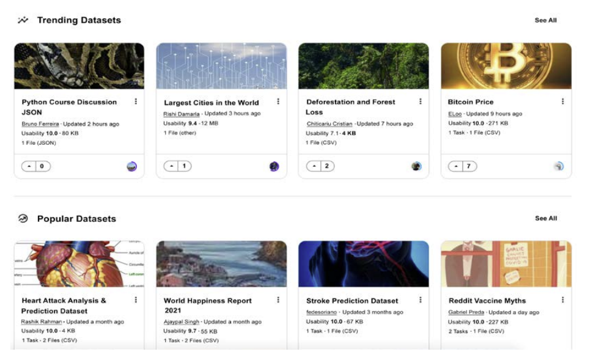

Projeniz için verileri bir veri setine yüklemeden önce, mevcut içerikleri kontrol ettiğinizden emin olun.
Bazı popüler uygulamalar için (görüntü sınıflandırma, NLP, finansal zaman serileri) verilerin zaten orada depolanmış olma ihtimali vardır.

Bu giriş için, projenizde kullanacağınız veri türünün henüz orada bulunmadığını varsayalım; bu durumda yeni bir veri seti oluşturmanız gerekir. Sol taraftaki üç çizgili menüye gidip “Data” (Veri) seçeneğine tıkladığınızda, Datasets (Veri Setleri) sayfasına yönlendirileceksiniz:

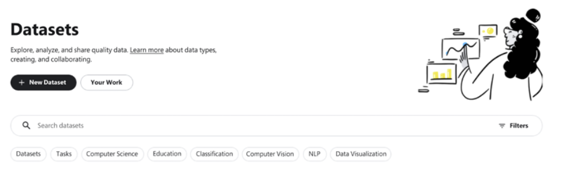

“+ New Dataset” (Yeni Veri Seti) seçeneğine tıkladığınızda, sizden temel bilgileri girmeniz istenecektir: veriyi yüklemek ve bir başlık vermek.

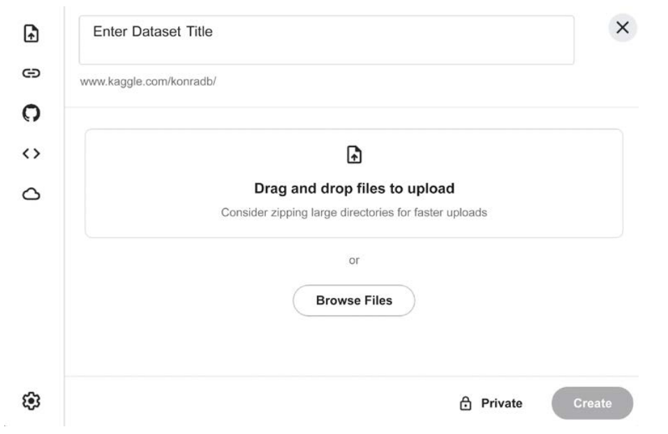

Sol taraftaki simgeler, veri setiniz için kullanabileceğiniz farklı kaynaklara karşılık gelir. Bunları sayfada gösterildikleri sırayla açıklıyoruz:

* Yerel bir sürücüden dosya yükleme (şekilde gösterilmiştir)
* Uzak bir URL’den oluşturma
* Bir GitHub deposunu içe aktarma
* Mevcut bir Notebook’tan çıktı dosyalarını kullanma
* Google Cloud Storage dosyasını içe aktarma

GitHub seçeneği ile ilgili önemli bir nokta: Bu özellik, özellikle deneysel kütüphaneler söz konusu olduğunda oldukça kullanışlıdır. Henüz mevcut olmayan işlevsellikler sunmalarına sıkça rağmen, bu kütüphaneler genellikle Kaggle ortamına dahil edilmez; bu nedenle, kodunuzda böyle bir kütüphaneyi kullanmak istiyorsanız, aşağıda gösterildiği gibi veri seti olarak içe aktarabilirsiniz:

1. Datasets (Veri Setleri) sayfasına gidin ve “+ New Dataset” (Yeni Veri Seti) seçeneğine tıklayın.
2. GitHub simgesini seçin.
3. Depo bağlantısını ve veri seti için başlığı girin.
4. Sağ alt köşedeki “Create” (Oluştur) butonuna tıklayın.

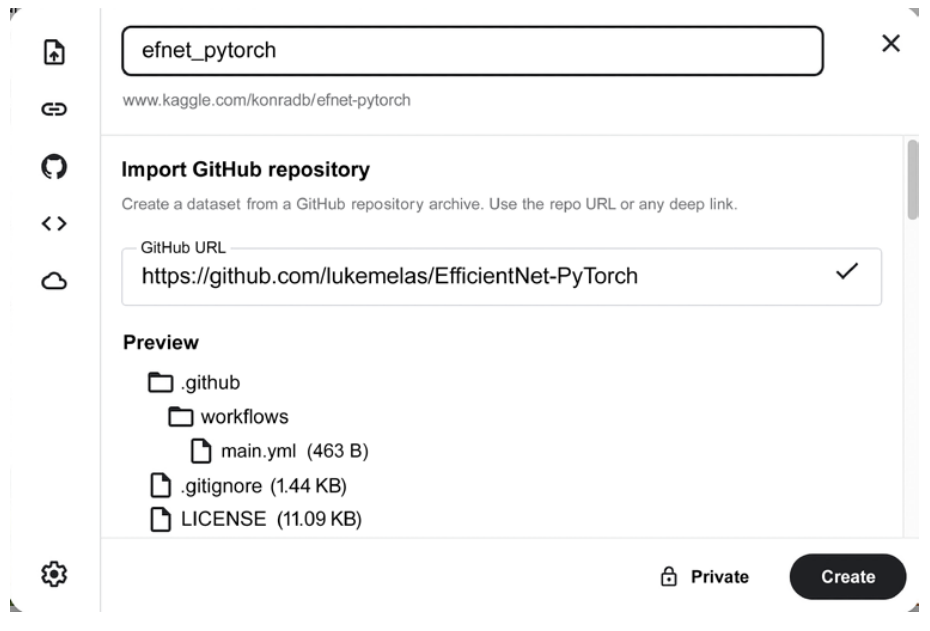

“Create” (Oluştur) butonunun yanında bir de “Private” (Özel) olarak işaretlenmiş başka bir buton vardır. Varsayılan olarak oluşturduğunuz herhangi bir veri seti özeldir: yalnızca siz, yani veri setinin yaratıcısı, onu görüntüleyip düzenleyebilirsiniz. Veri seti oluşturma aşamasında bu ayarı varsayılan hâlde bırakmak ve yalnızca daha sonraki bir aşamada veri setini halka açmak (ya belirli bir katkıda bulunanlar listesi için ya da herkes için) muhtemelen iyi bir fikirdir.

Kaggle’ın popüler bir platform olduğunu ve birçok kişinin veri setlerini – özel olanlar da dahil – yüklediğini unutmayın; bu nedenle, veri setiniz için genel olmayan bir başlık düşünmeye çalışın. Bu, veri setinizin gerçekten fark edilme şansını artıracaktır.

Tüm adımları tamamlayıp “Create” (Oluştur) butonuna tıkladığınızda, voilà! İlk veri setiniz hazır. Ardından “Data” sekmesine gidebilirsiniz:

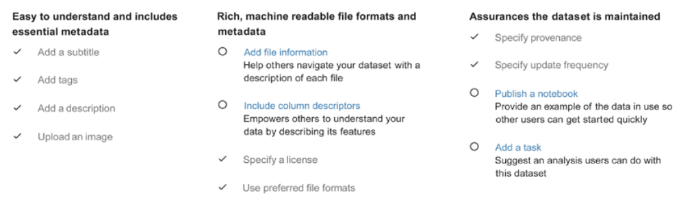

Yukarıdaki ekran görüntüsü, veri setinizle ilgili sağlayabileceğiniz farklı bilgileri göstermektedir; sağladığınız bilgi ne kadar çok olursa, kullanılabilirlik indeksi o kadar yüksek olur. Bu indeks, veri setinizin ne kadar iyi tanımlandığını özetleyen sentetik bir ölçüdür. Yüksek kullanılabilirlik indeksine sahip veri setleri, arama sonuçlarında daha üst sıralarda görünür. Her veri seti için kullanılabilirlik indeksi, dokümantasyon seviyesi, Notebooks gibi ilgili kamuya açık içeriklerin referans olarak bulunabilirliği, dosya türleri ve temel meta verilerin kapsanması gibi çeşitli faktörlere dayanır.

İlke olarak, yukarıdaki görselde gösterilen tüm alanları doldurmak zorunda değilsiniz; yeni oluşturduğunuz veri seti bunlar olmadan da tamamen kullanılabilir (ve eğer özel bir veri seti ise, muhtemelen önemsemezsiniz; sonuçta içeriğini siz biliyorsunuz). Ancak, topluluk görgü kuralları, veri setlerinizi halka açtığınızda bilgileri doldurmanızı önerir: ne kadar çok bilgi belirtirseniz, veri başkaları için o kadar kullanışlı olur.

### Gathering the data *(Veri toplama)*

Hukuki boyutlar dışında, veri setlerinde saklayabileceğiniz içerik türü konusunda gerçek bir sınır yoktur: tablo verileri, görseller, metin; eğer boyut gereksinimlerine uyuyorsa, bunları saklayabilirsiniz. Bu, diğer kaynaklardan elde edilen verileri de kapsar; yazının hazırlandığı tarihte popüler veri setleri arasında hashtag veya konuya göre toplanmış tweetler yer almaktadır:

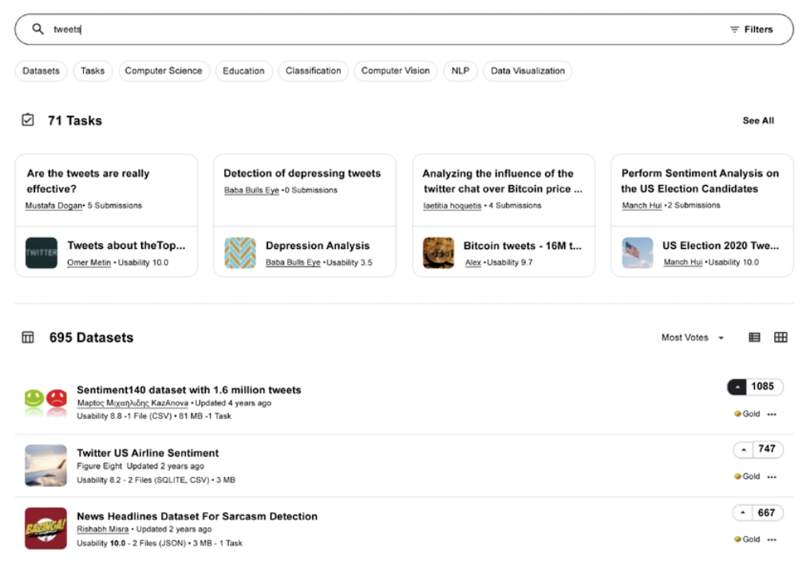

Sosyal medyadan (Twitter, Reddit ve benzeri) veri toplamak için kullanılan farklı çerçevelerin tartışılması, bu kitabın kapsamı dışındadır.

> **Andrew Maranhão**
> 
> [https://www.kaggle.com/andrewmvd](https://www.kaggle.com/andrewmvd)
> 
> 
> 
> Andrew Maranhão (diğer adıyla Larxel), Datasets Grandmaster (yazının hazırlandığı sırada Datasets’te bir numara) ve São Paulo’daki Hospital Albert Einstein’da Kıdemli Veri Bilimci, bize Datasets başarısına nasıl ulaştığını, veri seti oluşturma ipuçlarını ve Kaggle’daki genel deneyimlerini anlattı.
> 
> 
> 
> **En sevdiğiniz yarışma türü nedir ve neden? Kaggle’da teknikler ve çözüm yaklaşımları açısından uzmanlık alanınız nedir?**
> 
> Genellikle en sevdiğim alan tıbbi görüntülemedir. Hem işimle hem de amacımla örtüşüyor. Tıbbi yarışmalarda NLP dil ile sınırlıdır, tablo verileri hastaneler arasında büyük farklılık gösterir, fakat görüntüleme çoğunlukla aynıdır; bu nedenle bu bağlamda yapılan herhangi bir gelişme, dünya genelinde birçok ülke için fayda sağlayabilir ve bu etki potansiyelini seviyorum. Ayrıca NLP ve tablo verilerini de severim, ama sanırım bu oldukça standart bir tercih.
> 
> 
> 
> **Katıldığınız özellikle zorlayıcı bir yarışmayı ve bu görevi çözmek için kullandığınız yöntemleri anlatır mısınız?**
> 
> Bir tüberküloz tespit yarışmasında, yaklaşık 1.000 röntgen görüntüsü vardı; bu sayı, hastalığın tüm belirtilerini yakalamak için oldukça küçüktü. Bunu telafi etmek için iki fikir geliştirdim:
> 
> 
> 
> 1. Dış veri ile pnömoni tespiti için ön eğitim (~20k görüntü), çünkü pnömoni tüberküloz ile karıştırılabilir.
> 
> 2. Akciğer anomalilerinin çok etiketli sınıflandırması (~600k görüntü) üzerinde ön eğitim ve basit bir SSD ile sınıflandırma etiketlerinin bounding box anotasyonlarını oluşturmak için grad-CAM kullanımı.
> 
> 
> 
> Sonuçta, bu iki yaklaşımın basit bir karışımı, ikinci sıradaki takımın sonucuna göre %22 daha iyi bir performans sağladı. Bu yarışma, yaklaşık 100 takımın katıldığı bir tıbbi kongrede gerçekleşti.
> 
> 
> 
> **Dataset Grandmaster oldunuz ve Datasets’te 1 numara oldunuz. Veri setleri için konu seçimi, veri bulma, toplama ve yayımlama süreciniz nasıl işliyor?**
> 
> Bu büyük bir soru; parçalar hâlinde açıklamaya çalışayım:
> 
> 
> 
> 1. **Kendinize bir amaç belirleyin**
> 
>    Konu seçerken aklımda tuttuğum ilk şey, bunu yapmamın temel nedenidir. Derin bir amaç olduğunda, mükemmel veri setleri bir sonuç olarak ortaya çıkar, hedef olarak değil.
> 
> 
> 
> 2. **Harika bir veri seti, harika bir sorunun vücut bulmuş hâlidir**
> 
>    En iyi veri setlerinde ortak temalar:
> 
> 
> 
> * Cesur ve ilgili bir soru, büyük potansiyele sahip
> 
> * Veriler iyi toplanmış, kalite kontrolü yapılmış ve iyi belgelenmiş
> 
> * Mevcut donanım için yeterli veri ve çeşitlilik
> 
> * Veriye sürekli katkıda bulunan aktif bir topluluk
> 
> 
> 
> 3. **Sadece başarıya odaklanmayın; başarı için süreci oluşturun**
> 
>    Kalite, nicelikten çok daha önemlidir. Grandmaster olmak için sadece 15 veri setine ihtiyacınız vardır ve öne çıkan veri setleri az ve iyi hazırlanmış olmalıdır. Ayrıca veri setlerinin bakım ve sürekli geliştirme gerektirdiğini unutmayın. Topluluk desteği de çok önemlidir; veri setinizi analiz edenlerin ihtiyaçlarını ve seçimlerini anlamak, ön işleme adımlarınızı ve belgelerinizi geliştirebilir.
> 
> 
> 
> **Örnek süreç:**
> 
> Sosyal refahı artırmak istiyorsunuz → hedef: ırksal eşitlik → konular: Black Lives Matter hareketi → soru: Milyonlarca sesin ne dediğini nasıl anlayabilirim? → veri türü: NLP → veri toplama: haber makaleleri, YouTube yorumları, tweetler → ön işleme ve anonimleştirme → yayınlama → topluluk desteği ve geliştirme.
> 
> 
> 
> 4. **İyi iş yapmak, kontrolünüzde olan tek şeydir**
> 
>    Grandmaster olmanızı başkaları sağlar; oylar her zaman çabaya veya etkiye dönüşmez. Önemli olan sizin çabanız, öğrenmeniz ve denemenizdir.
> 
> 
> 
> **Veri analizi veya makine öğrenimi için önerdiğiniz araçlar/lisanslar nelerdir?**
> 
> LightGBM, CatBoost, Optuna, Streamlit, Gradio, FastAPI, Plotly, PyTorch gibi kütüphaneleri öneriyor. Ayrıca, kendi çözümlerinizi uygulamak, derinlemesine bilgi edinmek açısından çok değerli.
> 
> 
> 
> **Deneyimsiz Kagglers neyi sıklıkla gözden kaçırır?**
> 
> 
> 
> * Yarışmanın sonunda bilgiyi tam olarak absorbe etmek
> 
> * Bitmiş yarışmalarda kazanan çözümleri tekrar etmek
> 
> 
> 
> **Kaggle kariyerinize nasıl katkı sağladı?**
> 
> Kaggle bilgi, deneyim ve portföy kazandırdı. İlk veri bilimi işim büyük ölçüde Kaggle ve DrivenData yarışmaları sayesinde oldu.
> 
> 
> 
> **Portföyünüzü potansiyel işverenlere göstermek için Kaggle deneyimlerinizi kullandınız mı?**
> 
> Kesinlikle. İlk işimi Kaggle portföyü sayesinde aldım. Portföy, eğitim geçmişinden daha iyi veri bilimi bilgisi ve deneyimi temsil eder.
> 
> 
> 
> **Başka yarışma platformları kullanıyor musunuz? Kaggle ile karşılaştırması nasıl?**
> 
> DrivenData ve AICrowd’u da kullanıyorum. Kaggle daha büyük ve aktif bir topluluk sunuyor, donanım ve veri/Notebook özellikleri ile en iyi seçenek. Ancak diğer platformlar da ilginç ve çeşitli zorluklar sunuyor.
> 
> 
> 
> **Bir yarışmaya girerken en önemli şey nedir?**
> 
> Gelişim odaklıysanız, ilginizi çeken ve daha önce yapmadığınız bir konuyu seçin. Derinlik ve çeşitlilik kritik; derinlik, odaklanarak ve en iyinizi vererek; çeşitlilik ise daha önce yapmadığınız veya farklı yaptığınız şeyleri deneyerek elde edilir.

### Working with datasets *(Veri setleriyle çalışma)*

Bir veri seti oluşturduktan sonra, muhtemelen onu analizlerinizde kullanmak isteyeceksiniz. Bu bölümde, bunu yapmanın farklı yöntemlerini ele alıyoruz.

Muhtemelen en önemli yöntem, veri setinizi birincil kaynak olarak kullanacağınız bir Notebook başlatmaktır. Bunu yapmak için veri seti sayfasına gidip ardından **New Notebook** üzerine tıklayabilirsiniz.

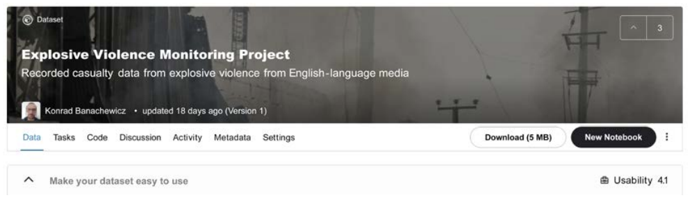

Bunu yaptıktan sonra, Notebook sayfanıza yönlendirileceksiniz:

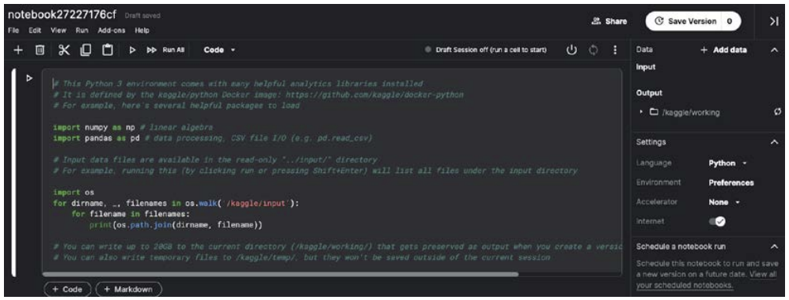

İşte bununla ilgili birkaç ipucu:

* Alfasayısal başlık otomatik olarak oluşturulur; üzerine tıklayarak düzenleyebilirsiniz.
* Sağ tarafta, **Data** altında Notebook’unuza bağlı veri kaynaklarının listesini görürsünüz; seçtiğim veri setine **../input/** veya **/kaggle/input/** üzerinden erişilebilir.
* Açılış bloğu (içe aktarılan paketler, açıklayıcı yorumlar ve mevcut dosyaların listesi) yeni bir Python Notebook’a otomatik olarak eklenir.

Bu temel kurulumla, analiziniz için bir Notebook yazmaya başlayabilir ve veri setinizi veri kaynağı olarak kullanabilirsiniz. Notebook’ları daha ayrıntılı olarak **Bölüm 4: Tartışma Forumlarından Yararlanmak** kısmında ele alacağız.

### Using Kaggle Datasets in Google Colab *(Google Colab’da Kaggle veri setlerini kullanma)*

Kaggle Notebook’ları ücretsizdir, ancak sınırsız değildir (buna Bölüm 4’te daha ayrıntılı değineceğiz) ve karşılaşabileceğiniz ilk sınırlama muhtemelen **zaman limitidir**. Popüler bir alternatif, tamamen bulutta çalışan ücretsiz bir Jupyter Notebook ortamı olan **Google Colab**’a geçmektir: [https://colab.research.google.com](https://colab.research.google.com).

Hesaplamaları Colab’a taşıdıktan sonra bile Kaggle veri setlerine erişmek isteyebiliriz; bu yüzden onları Colab’a aktarmak oldukça kullanışlı bir özelliktir. Bu bölümün geri kalanında, Kaggle Datasets’i Colab üzerinden kullanmak için gerekli adımları ele alacağız.

İlk olarak, Kaggle’a zaten kayıtlı olduğumuzu varsayarak, **API token** (giriş oturumu, kullanıcı kimliği, yetkiler vb. için güvenlik bilgilerini içeren erişim belirteci) oluşturmak için hesap sayfasına gideriz:

1. Hesabınıza gidin: [https://www.kaggle.com/USERNAME/account](https://www.kaggle.com/USERNAME/account)

**Create New API Token** butonuna tıklayın.

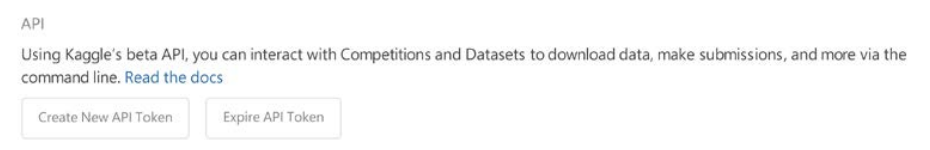

Bir **kaggle.json** dosyası oluşturulacak; bu dosya kullanıcı adınızı ve API token’ınızı içerir.

2. Google Drive’ınızda **Kaggle** adında bir klasör oluşturun ve **.json** dosyasını bu klasöre yükleyin.

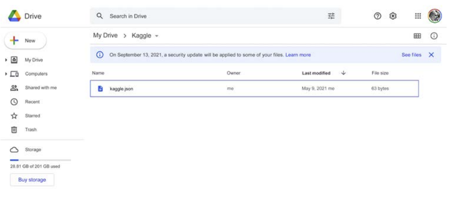

3. İşlem tamamlandıktan sonra, yeni bir Colab defteri oluşturmanız ve Google Drive’ınızı bağlamanız gerekir. Bunu yapmak için defterde aşağıdaki kodu çalıştırın:

```python
from google.colab import drive
drive.mount('/content/gdrive')
```

4. URL isteminden yetkilendirme kodunu alın ve açılan boş kutuya girin, ardından aşağıdaki kodu çalıştırarak `.json` yapılandırma dosyasının yolunu belirtin:

```python
import os
# content/gdrive/My Drive/Kaggle is the path where kaggle.json is
# present in the Google Drive
os.environ['KAGGLE_CONFIG_DIR'] = "/content/gdrive/My Drive/Kaggle"
# change the working directory
%cd /content/gdrive/My Drive/Kaggle
# check the present working directory using the pwd command
```

5. Artık veri setini indirebiliriz. Bunun için Kaggle’daki veri seti sayfasına gidin, **New Notebook** yanındaki üç noktaya tıklayın ve **Copy API command** seçeneğini seçin:

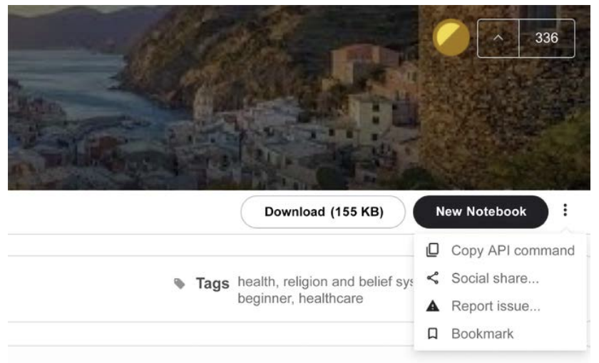

6. Veri setini indirmek için API komutunu çalıştırın (komutların detaylarıyla ilgilenenler resmi dokümantasyona bakabilir: [https://www.kaggle.com/docs/api](https://www.kaggle.com/docs/api)):

```python
!kaggle datasets download -d ajaypalsinghlo/world-happinessreport-2021
```
7. Veri seti, Kaggle klasörüne bir .zip arşivi olarak indirilecektir – arşivi açın ve kullanıma hazır hale gelmiş olacaktır.

Yukarıdaki listeden de görebileceğiniz gibi, bir Kaggle veri setini Colab’da kullanmak oldukça basit bir süreçtir – tek ihtiyacınız olan bir API token’ıdır ve bu geçiş size Kaggle’ın sağladığından daha fazla GPU saatini kullanma imkânı verir.

### Legal caveats *(Yasal uyarılar)*

Sadece bazı verileri Kaggle’a yükleyebilmeniz, bunu yapmanız gerektiği anlamına gelmez. Mükemmel bir örnek, **People of Tinder** veri setidir. 2017’de bir geliştirici, Tinder API’sini kullanarak web sitesinden yarı-özel profilleri çekmiş ve veriyi Kaggle’a yüklemişti. Bu durum ortaya çıktıktan sonra, Kaggle veri setini kaldırdı. Tam hikâyeyi şuradan okuyabilirsiniz: [Forbes makalesi](https://www.forbes.com/sites/janetwburns/2017/05/02/tinder-profiles-have-been-looted-again-this-time-for-teaching-ai-to-genderize-faces/?sh=1afb86b25454).

Genel olarak, Kaggle’a herhangi bir şey yüklemeden önce kendinize şu iki soruyu sorun:

1. **Telif hakkı açısından izinli mi?** Lisansları her zaman kontrol edin. Şüphe durumunda [Open Definition Guide](https://opendefinition.org/guide/data/) veya Kaggle ile iletişime geçebilirsiniz.
2. **Bu veri setiyle ilgili gizlilik riskleri var mı?** Belirli bilgileri paylaşmak, teknik olarak yasadışı olmasa da, başka bir kişinin gizliliğine zarar verebilir.

Bu sınırlamalar aslında sağduyuya dayanmaktadır, bu yüzden Kaggle’daki çalışmalarınızı engellemesi pek olası değildir.

### Summary *(Özet)*

Bu bölümde, Kaggle platformunda verileri depolamanın ve kullanmanın standart yolu olan **Kaggle Datasets**’i tanıttık. Veri seti oluşturmayı, Kaggle dışındaki ortamlarda çalışma yöntemlerini ve en önemli işlevi olan **veri setini Notebook’ta kullanmayı** ele aldık. Bu, bir sonraki bölümde odaklanacağımız **Kaggle Notebooks** konusuna geçiş için güzel bir köprü oluşturuyor.

---

## Chapter 3: Working and Learning with Kaggle Notebooks *(Bölüm 3: Kaggle Notebooks ile Çalışmak ve Öğrenmek)*

Kaggle Notebooks — yakın zamana kadar **Kernels** olarak adlandırılıyordu — tarayıcı üzerinden çalışan ve ücretsiz olan **Jupyter Notebook**’lardır. Bu, internet bağlantısı olan herhangi bir cihazdan deneylerinizi çalıştırabileceğiniz anlamına gelir; ancak mobil telefondan daha büyük bir cihaz kullanmak muhtemelen daha iyi olacaktır. Ortamın teknik özellikleri (yazım tarihi itibarıyla) Kaggle web sitesinden alınmıştır; en güncel sürümü **[https://www.kaggle.com/docs/notebooks](https://www.kaggle.com/docs/notebooks)** adresinden doğrulanabilir:

* CPU/GPU için 12 saat çalışma süresi, TPU için 9 saat
* 20 GB otomatik kaydedilen disk alanı (/kaggle/working)
* Ek geçici disk alanı ( /kaggle/working dışında) — bu alan mevcut oturum dışında kaydedilmez

**CPU özellikleri:**

* 4 CPU çekirdeği
* 16 GB RAM

**GPU özellikleri:**

* 2 CPU çekirdeği
* 13 GB RAM

**TPU özellikleri:**

* 4 CPU çekirdeği
* 16 GB RAM

Bu bölümde ele alacağımız konular:

* Notebook kurulumunu yapmak
* Notebook’unuzu çalıştırmak
* Notebook’ları GitHub’a kaydetmek
* Notebook’lardan en iyi şekilde faydalanmak
* Kaggle Learn kursları

Hadi başlayalım. İlk yapmamız gereken, bir Notebook’un nasıl kurulacağını öğrenmek.

### Setting up a Notebook *(Bir defter oluşturma)*

Bir Notebook oluşturmanın iki temel yöntemi vardır: **ana sayfadan** veya **bir Dataset üzerinden**.

İlk yöntemi kullanmak için:

1. [https://www.kaggle.com/](https://www.kaggle.com/) adresindeki ana sayfada, sol menüdeki **Code** bölümüne gidin.
2. Ardından **+ New Notebook** butonuna tıklayın.

Bu yöntem, kendi veri setinizi yüklemeyi içeren bir deneme planlıyorsanız tercih edilen yöntemdir.

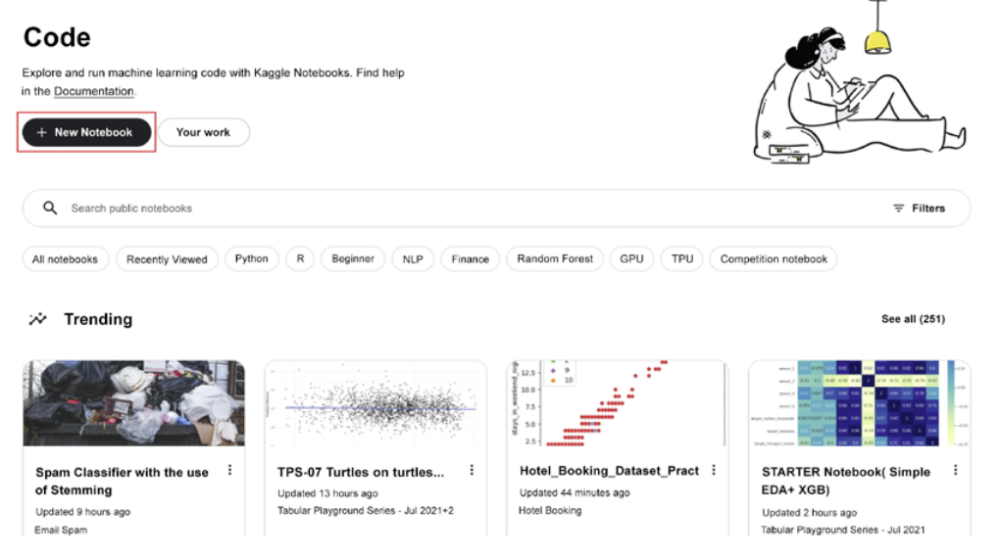

Alternatif olarak, ilgilendiğiniz Dataset’in sayfasına gidip oradaki **New Notebook** butonuna tıklayabilirsiniz; bu yöntemi bir önceki bölümde görmüştük.

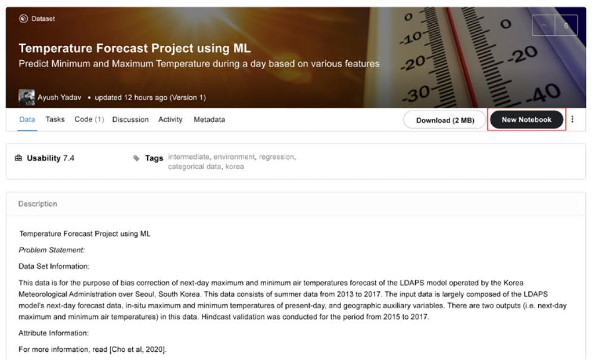

Hangi yöntemi seçerseniz seçin, **New Notebook** butonuna tıkladıktan sonra Notebook sayfanıza yönlendirileceksiniz:

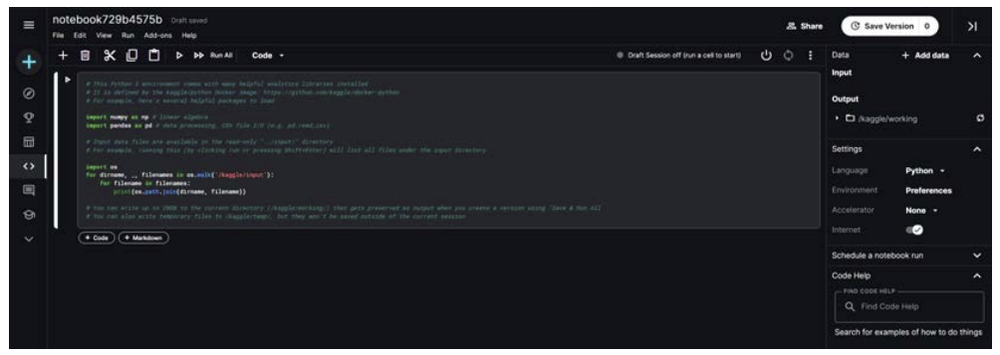

Yukarıda gösterilen yeni Notebook sayfasının sağ tarafında, ayarlanabilecek birkaç farklı ayar bulunmaktadır:

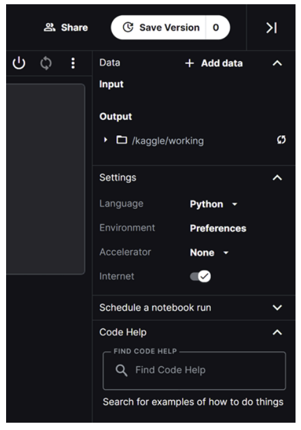

Ayarları kısaca ele alalım:

1. **Kodlama Dili (Language)**:
   Kaggle ortamı, yazıldığı tarihte yalnızca Python ve R dillerini destekliyor. Yeni bir Notebook varsayılan olarak Python ile açılır. R kullanmak isterseniz açılır menüden R’yi seçebilirsiniz.

2. **Ortam (Environment)**:
   Bu seçenek, Notebook’un hangi Docker ortamında çalışacağını belirler.

   * **Latest Docker**: En güncel ortamı kullanır; hızlı güncellemeler alırsınız ama bağımlılıklar bozulabilir (riskli).
   * **Original Kaggle environment**: Kaggle tarafından sağlanan orijinal ortamı kullanır (güvenli ve varsayılan).

3. **Hızlandırıcı (Accelerator)**:
   Kodun hangi donanımda çalışacağını seçmenizi sağlar:

   * **CPU**: Hızlandırmasız
   * **GPU**: Derin öğrenme uygulamaları için gereklidir
   * **TPU**: TPU’ya taşımak için veri işleme ve kodda daha kapsamlı değişiklik gerekir

   CPU, GPU veya TPU arasında geçiş yapabilirsiniz; fakat geçiş yaptığınızda ortam yeniden başlatılır ve tüm kodu baştan çalıştırmanız gerekir.

4. **İnternet (Internet) Açma/Kapama**:
   İnternete erişimi açıp kapatmanızı sağlar. Örneğin, ek paket yüklemek gerektiğinde internet açık olmalıdır. Bazı yarışmalarda, teslim sırasında internetin kapalı olması zorunludur.

Ayrıca, mevcut bir Notebook’u (kendinizin veya başkasının oluşturduğu) **kopyalayıp düzenleyebilirsiniz**. Bunun için Notebook sayfasının sağ üstündeki **Copy and Edit** butonuna tıklamanız yeterlidir. Kaggle’da bu işlem **forking** olarak adlandırılır.

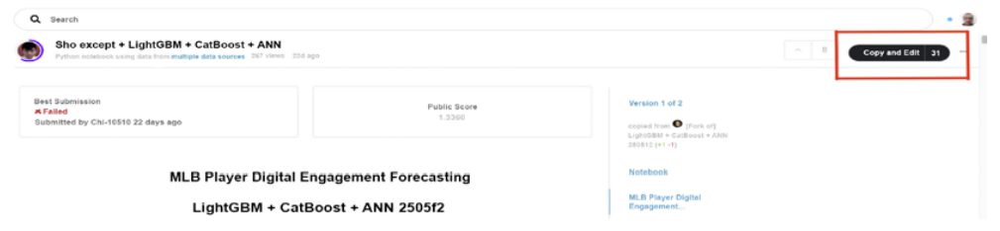

> Bir görgü notu: Eğer daha önce bir Kaggle yarışmasına katıldıysanız, sıralama tablosunun (leaderboard) iyi puan alan Notebook’ların kopyalarıyla (forks of forks) dolu olduğunu fark etmişsinizdir. Başkasının çalışması üzerine inşa etmek yanlış değildir; ancak bunu yaparken **orijinal yazara oy vermeyi (upvote) ve referans alınan çalışmanın sahibine açıkça kredi vermeyi** unutmayın.

Oluşturduğunuz bir Notebook varsayılan olarak **özel**dir (sadece siz görebilirsiniz). Eğer başkalarının erişmesini istiyorsanız iki seçenek vardır:

1. **İşbirlikçileri eklemek (adding collaborators):** Sadece açıkça eklenen kullanıcılar Notebook’u görebilir veya düzenleyebilir.
2. **Notebook’u herkese açık yapmak (making public):** Bu durumda herkes Notebook’u görebilir.

### Running your Notebook *(Defterinizi çalıştırma)*

Tüm kodlamalar tamamlandı, Notebook sorunsuz çalışıyor gibi görünüyor ve çalıştırmaya hazırsınız. Bunu yapmak için, Notebook sayfanızın **sağ üst köşesine** gidin ve **Save Version** (Sürümü Kaydet) düğmesine tıklayın.

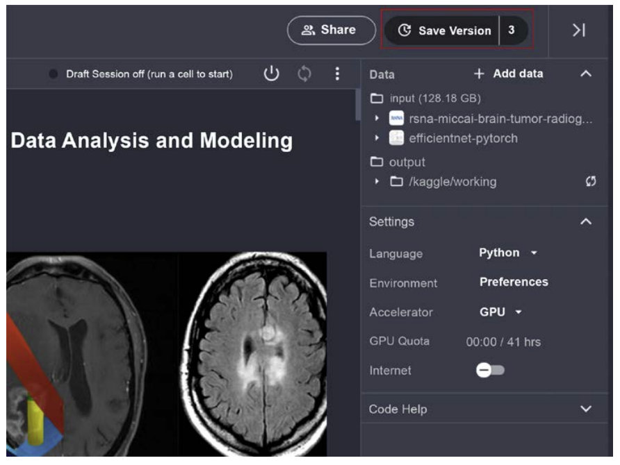

**Save & Run All** genellikle tüm scripti çalıştırmak için kullanılır, ancak **Quick Save** seçeneği de vardır; bu, script henüz gönderime hazır olmadan önce ara bir sürümü kaydetmek için kullanılabilir.

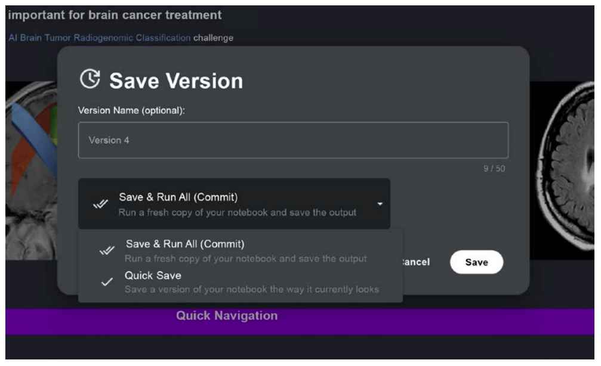

Scriptinizi başlattıktan sonra, sol alt köşeye gidip **Active Events** (Aktif Etkinlikler) butonuna tıklayabilirsiniz. Bu bölüm, çalışmakta olan Notebook sürümlerinizin durumunu ve ilerlemesini izlemenizi sağlar.

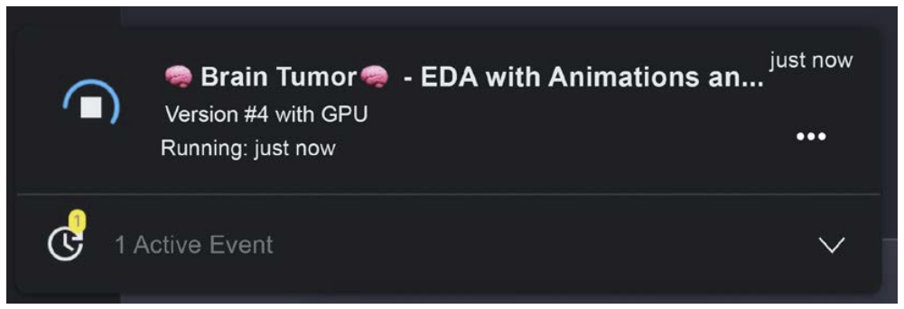

Bu şekilde, Notebook’larınızın çalışma durumunu takip edebilirsiniz. Normal bir yürütme sırasında **Running** mesajı görünür; aksi durumda **Failed** olarak görüntülenir.

Eğer herhangi bir nedenle (örneğin en güncel veriyi kullanmayı unuttuğunuzu fark ederseniz) çalışan bir oturumu sonlandırmak isterseniz, **Active Events** altında script girişinizin sağ tarafındaki üç noktaya tıklayabilirsiniz. Bu işlem size aşağıdaki şekilde bir açılır pencere (pop-up) gösterecektir ve oturumu durdurmanıza olanak tanır.

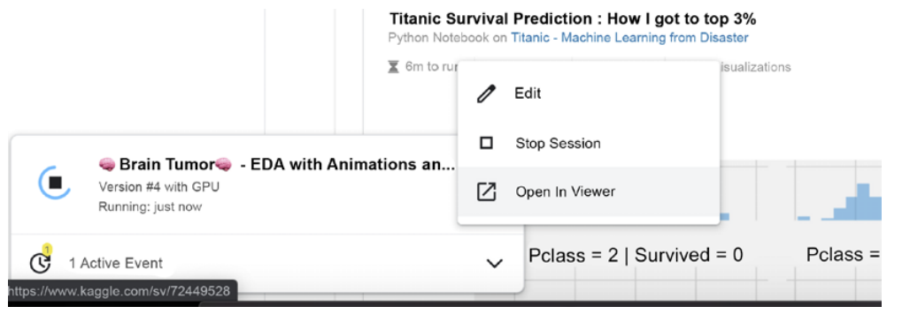

### Saving Notebooks to GitHub *(Defterleri GitHub’a kaydetme)*

Yakın zamanda eklenen bir özellik (bkz. [https://www.kaggle.com/product-feedback/295170](https://www.kaggle.com/product-feedback/295170)), kodunuzu veya Notebook’unuzu GitHub sürüm kontrol deposuna ([https://github.com/](https://github.com/)) kaydetmenize olanak tanır. Çalışmanızı hem **public** hem de **private** depolara kaydedebilirsiniz ve bu işlem, kodunuzun bir versiyonunu kaydettiğinizde otomatik olarak gerçekleşir.

Bu özellik, hem Kaggle takım arkadaşlarınızla çalışmalarınızı paylaşmak hem de çalışmalarınızı daha geniş bir kitleye sergilemek için oldukça faydalı olabilir.

Bu özelliği etkinleştirmek için:

1. Notebook’unuzu açın.
2. Üst menüden **File** menüsüne gidin.
3. **Link to GitHub** seçeneğini tıklayın.

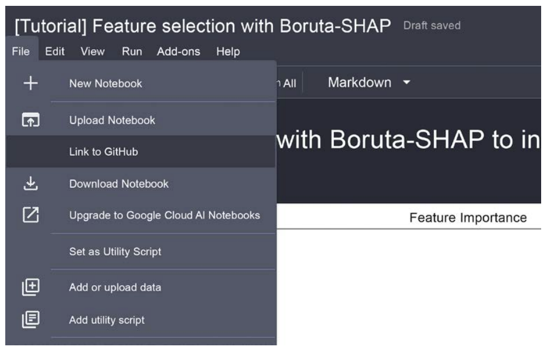

Bu seçeneği seçtikten sonra, GitHub hesabınızı Notebook ile bağlamanız gerekecek. İlk kez bağlama işlemi yaptığınızda, açıkça **bağlantı izinleri** sorulacaktır. Sonraki yeni Notebook’larda ise bu işlem otomatik olarak gerçekleştirilecektir.

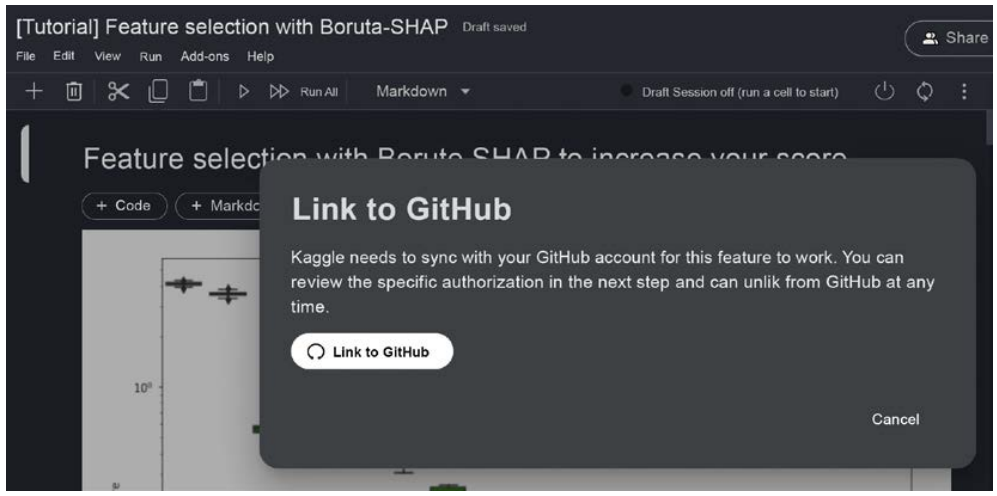

Notebook’unuzu ancak bağladıktan sonra, kaydettiğinizde çalışmanızı seçtiğiniz bir GitHub deposuyla senkronize etme izniniz olur.

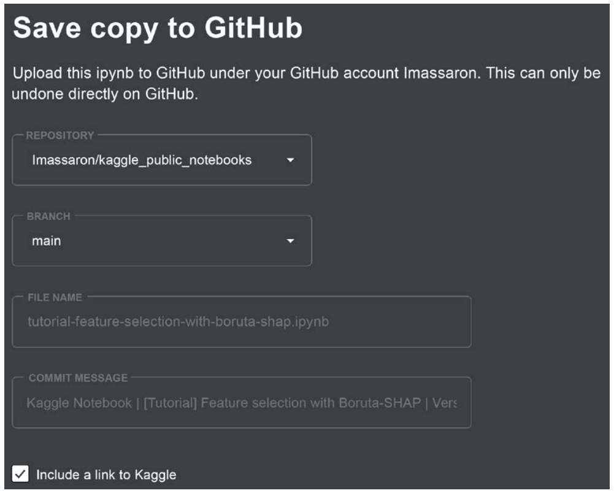

Bir depo ve dal (branch) seçtikten sonra, çalışmanızın farklı geliştirme aşamalarını saklamanıza olanak tanır ve depoya göndereceğiniz dosyanın adını değiştirebilir ve commit mesajını düzenleyebilirsiniz.

Artık belirli bir Notebook’u GitHub ile senkronize etmek istemiyorsanız, tek yapmanız gereken Dosya menüsünden **Unlink from GitHub** seçeneğini tıklamaktır.

Son olarak, Kaggle’ın GitHub hesabınıza bağlanmasını tamamen durdurmak isterseniz, hesaplarınızı ya Kaggle’daki **My linked accounts** sayfasından ya da GitHub’daki [ayarlar](https://github.com/settings/applications) sayfasından ayırabilirsiniz.

### Getting the most out of Notebooks *(Defterlerden en iyi şekilde yararlanma)*

Kaggle, belirli miktarda kaynakları ücretsiz olarak sağlar ve bu kotlar haftalık olarak sıfırlanır. GPU ve TPU kullanımı için belli bir saat hakkınız vardır; TPU için bu süre 30 saattir, GPU için ise haftadan haftaya değişen bir kota uygulanır (resmî açıklamayı ve “floating” kotalar politikasını [buradan](https://www.kaggle.com/product-feedback/173129) inceleyebilirsiniz).

Kendi kullanımınızı her zaman profilinizden takip edebilirsiniz.

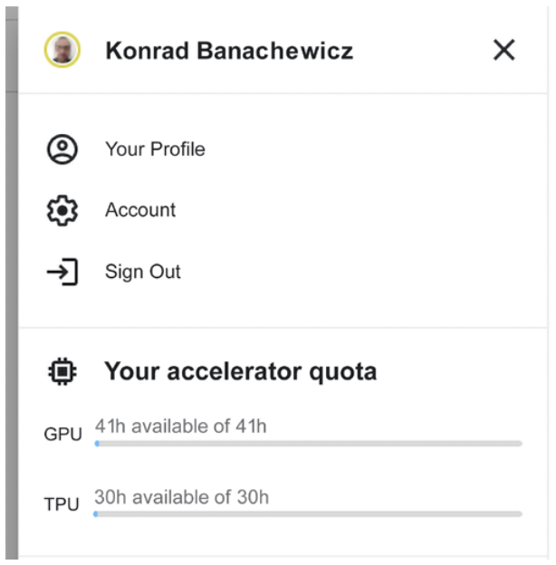

İlk bakışta kaynak miktarları büyük görünebilir, ancak bu izlenim yanıltıcı olabilir; kotanızı oldukça hızlı bir şekilde tüketmek kolaydır. Kaynak kullanımını kontrol etmenize yardımcı olacak bazı pratik öneriler:

* Kota sayacı (GPU veya TPU gibi seçtiğiniz hızlandırıcıyı ne kadar süre kullandığınızı ölçen sayaç) Notebook’u başlattığınız anda çalışmaya başlar.
* Bu nedenle, öncelikle ayarlardan GPU’nun devre dışı olduğundan emin olun (bkz. Şekil 3.6). Önce temel kodu yazın, sözdizimini kontrol edin ve yalnızca GPU gerektiren kod parçalarını eklediğinizde GPU’yu etkinleştirin. Hatırlatma: Hızlandırıcıyı değiştirdiğinizde Notebook yeniden başlatılır.
* Kodun tamamını küçük bir veri alt kümesi üzerinde çalıştırmak genellikle iyi bir fikirdir; böylece çalıştırma süresini tahmin edebilir ve kotayı aşarak kodun çökmesi riskini en aza indirirsiniz.

Bazen Kaggle’ın ücretsiz olarak sağladığı kaynaklar, yapılacak iş için yeterli olmayabilir ve daha güçlü bir makineye geçmeniz gerekir. Örneğin, yakın zamanda yapılan bir tümör sınıflandırma yarışması: [RSNA-MICCAI Brain Tumor Radiogenomic Classification](https://www.kaggle.com/c/rsna-miccai-brain-tumor-radiogenomic-classification/data).

Eğer ham veriniz 100GB’dan büyükse, ya görüntüleri yeniden boyutlandırmalı/aşağı örneklemeli (bu model performansını olumsuz etkileyebilir) ya da yüksek çözünürlüklü görüntüleri işleyebilecek bir ortamda model eğitmelisiniz. Bütün ortamı kendiniz kurabilirsiniz (örnek olarak, Bölüm 2’deki “Google Colab’da Kaggle Datasets Kullanımı” kısmına bakabilirsiniz) veya Notebooks çerçevesinde kalıp, altyapı makinesini değiştirebilirsiniz. İşte burada Google Cloud AI Notebooks devreye girer.

### Upgrading to Google Cloud Platform (GCP) *(Google Cloud Platform’a (GCP) yükseltme)*

GCP’ye (Google Cloud Platform) geçmenin bariz avantajı, daha güçlü donanıma erişim sağlamaktır: Kaggle tarafından sağlanan Tesla P100 GPU birçok uygulama için yeterli olsa da performans açısından en üst seviye değildir ve 16 GB RAM de özellikle büyük NLP modelleri veya yüksek çözünürlüklü görüntü işleme gibi kaynak yoğun uygulamalarda sınırlayıcı olabilir. Çalıştırma süresindeki iyileşme, geliştirme döngüsünde daha hızlı iterasyon imkânı sağlarken, bunun bir maliyeti vardır: Ne kadar harcamaya hazır olduğunuzu belirlemeniz gerekir. Güçlü bir makine ile veri işlemek söz konusu olduğunda zaman, kelimenin tam anlamıyla paradır.

Notebook’unuzu GCP ortamına taşımak için, sağ taraftaki yan menüden **Upgrade to Google Cloud AI Notebooks** seçeneğine tıklayın.

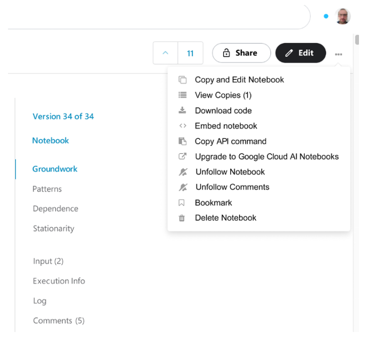

Şu ifadeyle karşılanacaksınız:

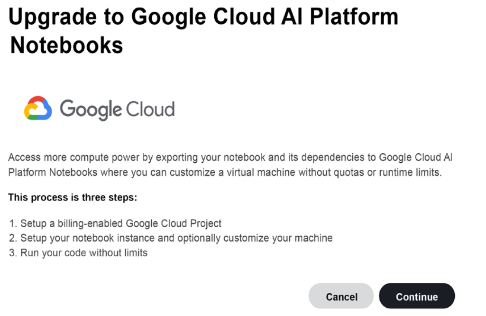

“Devam Et”e tıkladığınızda, faturalandırma seçeneklerinizi yapılandırmanız gereken Google Cloud Platform konsoluna yönlendirileceksiniz. Hatırlatma: GCP ücretsiz değildir. İlk kez kullanıyorsanız, gerekli adımlar boyunca size rehberlik edecek bir öğreticiyi (tutorial) tamamlamanız gerekecektir.

### One step beyond *(Bir adım öteye geçmek)*

Bu bölümün önceki kısımlarında da belirtildiği gibi, **Kaggle Notebooks** (Kaggle Defterleri) eğitim ve yarışmalara katılım için harika bir araçtır; ancak aynı zamanda bir başka son derece faydalı amaca da hizmet eder: **veri bilimi becerilerinizi sergileyebileceğiniz bir portföyün parçası** olarak kullanılabilirler.

Bir veri bilimi portföyü oluştururken dikkate alınabilecek birçok potansiyel kriter vardır (markalaşma, hedef kitleye ulaşma, potansiyel işvereninize kendinizi tanıtma vb.); ancak kimse portföyünüzü bulamazsa, bunların hiçbirinin önemi kalmaz. Kaggle, Google’ın bir parçası olduğu için Notebooks (defterler), dünyanın en popüler arama motoru tarafından dizine eklenir; dolayısıyla biri kodunuzla ilgili bir konuyu aradığında, çalışmanız arama sonuçlarında görünebilir.

Aşağıda kişisel bir örnek gösteriyorum: birkaç yıl önce bir yarışma için bir Notebook yazmıştım. Üzerinde çalışmak istediğim problem, **adversarial validation** (karşıt doğrulama) idi. (Bu konuya aşina olmayanlar için kısa bir açıklama: eğitim ve test veri kümelerinizin benzer bir dağılıma sahip olup olmadığını anlamanın oldukça kolay bir yolu, onları ayırt etmeyi öğrenen ikili bir sınıflandırıcı oluşturmaktır; bu kavram 6. Bölüm’de, *İyi Bir Doğrulama Tasarlama* kısmında daha ayrıntılı olarak ele alınmıştır.)

Bu bölümü yazarken, o defteri aramayı denedim ve tahmin edin ne oldu — arama sonuçlarında oldukça üst sıralarda göründü. (Dikkat ederseniz, arama sorguma “Kaggle” veya adım gibi kişisel bilgiler eklemedim.)

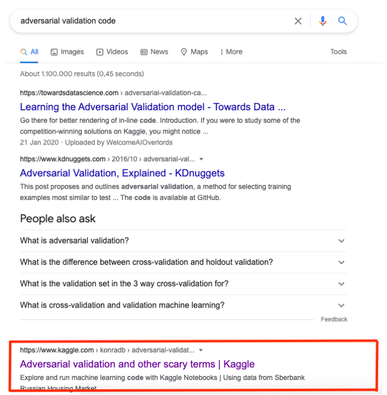

Notebooks kullanarak becerilerinizi sergilemenin diğer avantajlarına geçelim: **Competitions (Yarışmalar)**, **Datasets (Veri Kümeleri)** ve **Discussions (Tartışmalar)** bölümlerinde olduğu gibi, **Notebooks** da oy (vote) ve madalya (medal) alabilir. Bu sayede Kaggle’daki ilerleme sisteminde ve sıralamalarda yerinizi alabilirsiniz.

Yarışmalara hiç katılmadan da, yalnızca topluluk tarafından beğenilen yüksek kaliteli kodlara odaklanarak **Expert (Uzman)**, **Master (Usta)** veya **Grandmaster (Büyük Usta)** unvanlarına ulaşabilirsiniz.

İlerleme gereksinimlerinin en güncel hâlini [https://www.kaggle.com/progression](https://www.kaggle.com/progression) adresinde bulabilirsiniz; aşağıda ise **Expert** ve **Master** seviyeleriyle ilgili bir özet yer almaktadır:

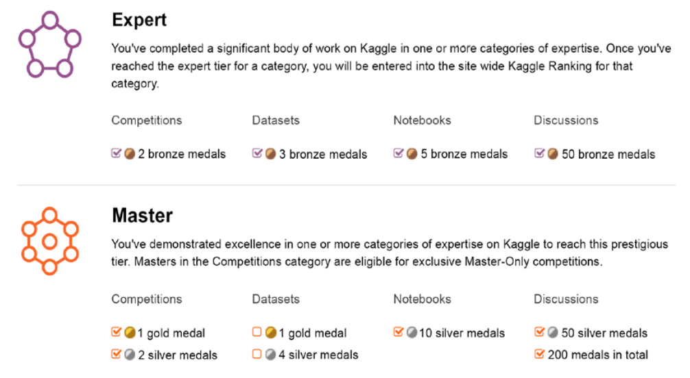

**Notebooks** kategorisinde ilerlemek zorlu bir deneyim olabilir; **Competitions (Yarışmalar)** bölümüne göre biraz daha kolay olsa da, **Discussions (Tartışmalar)** bölümünden kesinlikle daha zordur. En popüler Notebooks genellikle belirli bir yarışmayla bağlantılı olanlardır: **keşifsel veri analizi (exploratory data analysis)**, **uçtan uca kavramsal kanıt çözümleri (end-to-end proof of concept)** ve **liderlik tablosu kovalamaca (leaderboard chasing)** gibi konulara odaklanırlar.

Ne yazık ki, sıkça rastlanan bir uygulama da şudur: bazı kişiler en yüksek puanı alan herkese açık bir Notebook’u kopyalar (clone eder), birkaç parametreyi değiştirerek skoru biraz artırır ve ardından bunu büyük beğeniyle (upvote’lar bir beğeni ölçüsü olarak kabul edilirse) yayımlar. Bu durum, okuyucunun Kaggle’da kaliteli çalışmalar yayımlama isteğini kırmak için söylenmemektedir — çünkü Kaggle topluluğunun büyük bir kısmı yenilikçi çalışmaları gerçekten takdir eder ve uzun vadede kalite her zaman öne çıkar — ancak **beklentilerin gerçekçi bir şekilde ayarlanması** gerekir.

Kaggle profilinizin takipçileri (followers) olur ve **LinkedIn** veya **GitHub** gibi diğer profesyonel ağlarla bağlantı kurma olanağı sunar; böylece topluluk içinde kazandığınız bağlantıları **fırsata dönüştürebilirsiniz**.

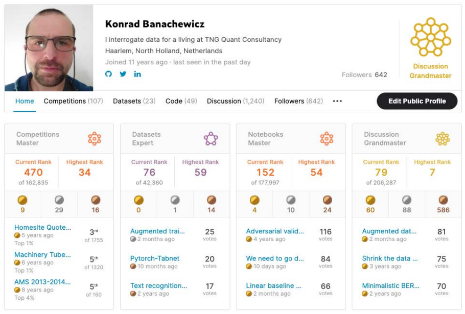

Günümüzde “topluluk oluşturma” iddialarına karşı kuşkucu olmak oldukça kolaydır, ancak **Kaggle** söz konusu olduğunda bu durum gerçekten doğrudur. Kaggle’ın veri bilimi dünyasındaki marka bilinirliği, hem uygulayıcılar (practitioners) hem de işini gerçekten iyi yapan işe alım uzmanları (recruiters) arasında rakipsizdir.

Pratikte bu şu anlama gelir: **yeterince iyi bir Kaggle profili**, sizi zaten “kapıdan içeri sokabilir” — ki hepimizin bildiği gibi, bu genellikle en zor adımdır.

> **Martin Henze**
> 
> [https://www.kaggle.com/headsortails](https://www.kaggle.com/headsortails)
> 
> 
> 
> Martin Henze, yani “Heads or Tails” ile konuşma fırsatını bulduk. Kendisi Notebooks ve Discussion alanlarında bir **Kaggle Grandmaster** (büyük usta) ve **Edison Software**’da bir veri bilimci. Martin aynı zamanda, her hafta gözden kaçmış en iyi Notebooks’ları bir araya getirdiği **“Notebooks of the Week: Hidden Gems”** adlı koleksiyonun yazarı. Yeni “Hidden Gems” paylaşımlarından haberdar olmak için Kaggle profilini veya Twitter ve LinkedIn hesaplarını takip edebilirsiniz.
> 
> 
> 
> ---
> 
> 
> 
> En sevdiğin yarışma türü hangisi ve neden? Teknik açıdan ya da çözüm yaklaşımı açısından Kaggle’daki uzmanlık alanın nedir?
> 
> 
> 
> Uzun bir süre boyunca odak noktam, sıralama tablolarındaki tahminlerden ziyade **EDA (exploratory data analysis – keşifsel veri analizi)** not defterleri oldu. Kaggle’dan önceki deneyimlerimin çoğu tablo (tabular) verilerleydi ve EDA not defterlerimin büyük çoğunluğu da yeni başlayan tablo tabanlı yarışmalardan karmaşık içgörüler çıkarmak üzerineydi. Bunu hâlâ Kaggle’daki uzmanlık alanım olarak görüyorum ve not defterlerimin yapısını, veri görselleştirmelerini ve anlatım biçimini tasarlamaya çok zaman harcadım.
> 
> 
> 
> ---
> 
> 
> 
> Bir Kaggle yarışmasına nasıl yaklaşıyorsun? Bu yaklaşım günlük işinde yaptıklarından ne kadar farklı?
> 
> 
> 
> Kaggle her ne kadar tablo tabanlı yarışmalardan uzaklaşmış olsa da, ben hâlâ bir yarışmadaki en önemli unsurun **verinin kendisi** olduğuna inanıyorum. Model mimarilerine ve hiperparametre ayarlamalarına fazla erken odaklanmak kolaydır. Ancak birçok yarışmada başarıya ulaşmanın anahtarı, verisetinin ayrıntılı şekilde anlaşılmasına dayanan veri merkezli bir yaklaşımdır. Bu; görüntü verisi, NLP, zaman serisi ya da başka veri türleri için de geçerlidir.
> 
> Bu yüzden, her zaman kapsamlı bir **EDA** ile başlarım; ardından basit bir temel model, bir çapraz doğrulama (CV) çerçevesi kurar ve bu yapının karmaşıklığını yavaş yavaş artırırım.
> 
> 
> 
> Günlük veri bilimi işimle en büyük fark muhtemelen şu: Deneyimli Kaggle katılımcılarının, yeni bir yarışmanın ilk haftasında kurduğu temel modeller, endüstride üretime alınacak düzeyde kabul edilir. Çoğu durumda, o ilk birkaç günün sonunda nihai kazananın puanına %80 oranında yaklaşmış oluruz.
> 
> Elbette Kaggle’daki eğlence ve zorluk, o son birkaç yüzde puanlık farkı yaratacak yaratıcı yollar bulmaktır. Ancak bir şirkette, o zamanı genellikle yeni bir projeye başlamak için harcamak daha verimlidir.
> 
> 
> 
> ---
> 
> 
> 
> Kaggle kariyerine yardımcı oldu mu? Olduysa nasıl?
> 
> 
> 
> Kaggle kariyerimi olağanüstü derecede şekillendirdi ve destekledi. Kaggle topluluğundaki harika deneyimim beni akademiden endüstriye geçmeye motive etti. Şu anda bir teknoloji girişiminde veri bilimci olarak çalışıyorum ve Kaggle yarışmaları aracılığıyla becerilerimi sürekli geliştiriyorum.
> 
> 
> 
> Benim durumumda, kapsamlı Kaggle Notebooks’ları oluşturma odağım çok faydalı oldu; çünkü bunları kolayca **portföyüm** olarak kullanabildim.
> 
> Bir işe alım yöneticisinin gerçekten bu kaynaklara ne kadar baktığını bilmiyorum ama sıklıkla “Grandmaster” unvanımın, doktora (PhD) derecemden daha fazla kapı açtığı izlenimini edindim. Ya da belki ikisinin birleşimi işe yaradı.
> 
> Her durumda, herkese kamuya açık bir Notebooks portföyüne sahip olmayı tavsiye ederim. Ayrıca iş arayışım sırasında, Kaggle’da öğrendiğim stratejileri ev ödevi tarzı değerlendirmelerde uyguladım ve bunlar bana çok yardımcı oldu.
> 
> 
> 
> ---
> 
> 
> 
> Deneyimsiz Kaggle katılımcılarının sıklıkla gözden kaçırdığı şey nedir? Başlarken bilmediğin ama şimdi bildiğin bir şey var mı?
> 
> 
> 
> Hepimiz sürekli deneyim kazanıyoruz. On yıl, beş yıl ya da bir yıl öncesine göre hepimiz daha bilgeyiz.
> 
> Bunu bir kenara koyarsak, sıklıkla gözden kaçan en önemli şeylerden biri, **ne yaptığınıza dair bir planınızın olması** ve bu planı **uygulayıp belgelemeniz** gerektiğidir.
> 
> Yeni başlayan Kaggle katılımcılarının bunu atlaması anlaşılır bir durum, çünkü her şey yeni, karmaşık ve kafa karıştırıcıdır. Kaggle’a ilk katıldığımda benim için de öyleydi: forumlar, veri setleri, yarışmalar, kurslar… Hepsi birbirine karışıyordu.
> 
> Ve yarışmalar bazen gerçekten göz korkutucu: *Nöronal Hücre Segmentasyonu*, *Borsa Oynaklığı Tahmini*… Bunlar ne ki?
> 
> Ama yarışmalar aynı zamanda başlamanın da en iyi yoludur.
> 
> 
> 
> Bir yarışma başladığında aslında kimsenin tam bir fikri yoktur. Belki konuyla neredeyse aynı konuda doktora yapmış biri vardır ama bu nadirdir. Geri kalan herkes sıfırdan başlar.
> 
> Veriyi inceleyerek, kayıp fonksiyonlarıyla oynayarak, basit başlangıç modelleri çalıştırarak öğrenirsiniz.
> 
> Bir yarışmaya en başında katıldığınızda, bu öğrenme sürecini hızlandırılmış bir şekilde, topluluğun bir parçası olarak yaşarsınız. Topluluktaki diğerleri size tonlarca fikir sağlar. Ama yine de bir **planınızın** olması gerekir.
> 
> 
> 
> Plan önemlidir; çünkü bazen sadece rastgele deneyler çalıştırır, GPU belleğinin dolduğunu görüp mutlu olursunuz ama sonra en iyi modeli hangisiydi unutur, yerel doğrulama ile lider tablosu arasında korelasyon var mıydı hatırlamazsınız.
> 
> Bu yüzden ne yapacağınızı yazın ve sonuçları kaydedin.
> 
> Bunun için otomatik loglama araçları giderek artıyor ama basit bir özel betik (script) ile de yapılabilir.
> 
> 
> 
> Makine öğrenimi hâlâ büyük ölçüde **deneysel bir bilimdir**, ve verimli deneylerin anahtarı onları iyi planlamak ve sonuçları yazarak karşılaştırabilmektir.
> 
> 
> 
> ---
> 
> 
> 
> Geçmişte yarışmalarda yaptığın hatalar nelerdi?
> 
> 
> 
> Birçok hata yaptım ve onlardan ders çıkarmayı başardığımı umuyorum.
> 
> Sağlam bir **çapraz doğrulama (CV) çerçevesi** kurmamak bunlardan biriydi.
> 
> Eğitim ve test setleri arasındaki farkları hesaba katmamak, çok fazla EDA yapıp model kurulumunu ihmal etmek — bu ilk birkaç yarışmadaki “imza hatam” olabilir.
> 
> Yeterince EDA yapmayıp önemli bir şeyi kaçırmak — evet, onu da yaptım.
> 
> Finalde göndereceğim iki modeli seçmeyi unutmak — çok fark yaratmadı ama bir daha asla unutmam.
> 
> 
> 
> Ama hatalarla ilgili önemli nokta şu: Deney ve plan konusundaki önceki düşüncemle aynı.
> 
> Hatalar **öğreniyorsanız** ve sizi geliştirmeye yardımcı oluyorsa sorun değildir.
> 
> Tabii ki öngörüyle önlenebilecek basit hatalardan kaçınmak istersiniz.
> 
> Ama makine öğreniminde (ve bilimde!) başarısızlık sürecin bir parçasıdır.
> 
> Her şey her zaman işe yaramayacaktır — ve bu normaldir.
> 
> Ancak aynı hataları tekrar tekrar yapmak istemezsiniz.
> 
> Dolayısıyla gerçek hata, hatalarınızdan **ders almamaktır**.
> 
> Bu hem Kaggle yarışmaları hem de hayat için geçerlidir.
> 
> 
> 
> ---
> 
> 
> 
> Veri analizi veya makine öğrenimi için önerdiğin araçlar veya kütüphaneler var mı?
> 
> 
> 
> Evet, günümüzde giderek daha fazla **Python** kullanıyoruz; ancak tablo verileriyle çalışmak ve veri görselleştirmek söz konusu olduğunda hâlâ **R** ve **tidyverse** (ör. `dplyr`, `ggplot2`, `lubridate`) tercih ediyorum.
> 
> Yeni **tidymodels** çerçevesi de `sklearn`’e ciddi bir rakip.
> 
> Sıkı bir Python hayranı olsanız bile, zaman zaman `pandas` ve benzeri araçların ötesine bakmak faydalıdır.
> 
> Farklı araçlar farklı bakış açıları ve daha fazla yaratıcılık getirir.
> 
> 
> 
> Derin öğrenim açısından **PyTorch**’u en sezgisel buluyorum, özellikle de **FastAI** arayüzüyle birlikte.
> 
> Ve tabii ki günümüzde herkesin sevdiği **Hugging Face** — hem de çok haklı sebeplerle.
> 
> 
> 
> ---
> 
> 
> 
> Bir yarışmaya katılırken akılda tutulması veya yapılması gereken en önemli şey nedir?
> 
> 
> 
> En önemlisi **eğlenmek** ve **bir şeyler öğrenmek**.
> 
> Bir yarışma sırasında ve sonrasında paylaşılan o kadar çok değerli bilgi ve deneyim var ki, bunlardan yararlanmamak büyük bir kayıp olur.
> 
> Sadece kazanmak isteseniz bile, bunu ancak öğrenerek, deneyerek ve topluluğun desteğinden faydalanarak başarabilirsiniz.
> 
> Ama Kaggle, lider tablolarından çok daha fazlasıdır; topluluğa katkı yapmaya başladığınızda, çok daha bütünsel bir şekilde gelişirsiniz.
> 
> Buna garanti verebilirim.
> 
> 

### Kaggle Learn courses *(Kaggle Learn kursları)*

Kaggle hakkında pek çok şey bilgi edinme ile ilgilidir. İster bir yarışmada öğrendikleriniz, ister hızla büyüyen veri seti deposunda bulduğunuz veriler, isterse de henüz keşfedilmemiş bir model sınıfını gösteren bir şey olsun, her zaman öğrenilecek yeni bir şey vardır. Bu koleksiyona en yeni eklenen şey, Kaggle Learn etiketinde toplanan kurslardır: [https://www.kaggle.com/learn](https://www.kaggle.com/learn). Bu kurslar, Kaggle tarafından "bağımsız veri bilimi projeleri yapmanız için gerekli becerileri kazanmanın en hızlı yolu" olarak tanıtılmaktadır; ana tema, çeşitli konularda hızlı bir giriş kursu sunmaktır. Her kurs, küçük bölümlere ayrılmıştır ve ardından kodlama uygulama soruları gelir. Kurslar, gerekli teori ve açıklamaların, kod yazıp uygulamanız gereken kısımlarla iç içe geçtiği Notebooks kullanılarak sunulmaktadır.

Aşağıda, en kullanışlı olanlarının kısa bir özeti yer almaktadır:

• **Intro to ML / Intermediate ML**: [https://www.kaggle.com/learn/intro-to-machine-learning](https://www.kaggle.com/learn/intro-to-machine-learning) ve [https://www.kaggle.com/learn/intermediate-machine-learning](https://www.kaggle.com/learn/intermediate-machine-learning)
Bu iki kurs, birbirini tamamlayan birer parça olarak görülebilir: ilki, makine öğrenmesinde kullanılan farklı model sınıflarını tanıtarak başlar ve ardından farklı modeller için ortak olan konuları (aşırı/eksik öğrenme veya model doğrulama gibi) tartışır. İkincisi, özellik mühendisliğine daha derinlemesine bir bakış sunar, eksik değerlerle başa çıkma ve kategorik değişkenleri ele alma gibi konuları işler. Makine öğrenmesine yeni başlayanlar için faydalıdır.

• **pandas**: [https://www.kaggle.com/learn/pandas](https://www.kaggle.com/learn/pandas)
Bu kurs, modern veri biliminin en temel araçlarından birine hızlı bir giriş sağlar. İlk olarak veri oluşturma, okuma ve yazma konularını öğrenirsiniz, ardından veri temizleme (indeksleme, seçme, birleştirme, gruplama vb.) üzerine çalışırsınız. Hem yeni başlayanlar (pandas'ın fonksiyonelliği zaman zaman bunaltıcı olabilir) hem de uygulayıcılar (yeniden gözden geçirme/referans olarak) için faydalıdır.

• **Game AI**: [https://www.kaggle.com/learn/intro-to-game-ai-and-reinforcement-learning](https://www.kaggle.com/learn/intro-to-game-ai-and-reinforcement-learning)
Bu kurs, Kaggle’ın öğrenme modüllerinde sunulan teknoloji odaklı kısmın güzel bir tamamlayıcısıdır. Bir oyun oynama ajanı yazacak, performansını inceleyecek ve minimax algoritmasını kullanacaksınız. Bu kurs, muhtemelen pekiştirmeli öğrenmeye yönelik bir uygulamalı tanıtım olarak görülmelidir.

• **Machine Learning Explainability**: [https://www.kaggle.com/learn/machine-learning-explainability](https://www.kaggle.com/learn/machine-learning-explainability)
Modeller oluşturmak eğlenceli olabilir, ancak gerçek dünyada herkes veri bilimcisi değildir, bu yüzden yaptıklarınızı başkalarına açıklamanız gereken bir durumda olabilirsiniz. İşte bu noktada model açıklanabilirliği üzerine olan bu mini kurs devreye giriyor: üç farklı yöntemle (permutasyon önemi, SHAP ve kısmi bağımlılık grafikleri) özelliklerinizi nasıl değerlendireceğinizi öğrenirsiniz. Özellikle ticari bir ortamda ML ile çalışan herkes için son derece faydalıdır; burada projeler, mesajın ne kadar iyi iletildiğine bağlı olarak varlıklarını sürdürebilir.

• **AI Ethics**: [https://www.kaggle.com/learn/intro-to-ai-ethics](https://www.kaggle.com/learn/intro-to-ai-ethics)
Bu son kurs, sunumun oldukça ilginç bir eklemesi olarak karşımıza çıkıyor: AI sistemlerinin ahlaki tasarımına rehberlik edecek pratik araçları tartışmaktadır. AI modellerindeki önyargıyı nasıl tanıyacağınızı, AI adaleti kavramını incelemenizi ve ML model bilgilerini nasıl ileterek şeffaflığı artıracağınızı öğrenirsiniz. Uygulayıcılar için çok faydalıdır, çünkü "sorumlu yapay zeka" artık daha sık duyacağımız bir kavram olacaktır.

Kaggle tarafından oluşturulan orijinal içeriğin dışında, platformda kullanıcılar tarafından oluşturulmuş Notebooks aracılığıyla başka öğrenme fırsatları da bulunmaktadır; okuyucuların bunları kendi başlarına keşfetmeleri teşvik edilir.

> **Andrada Olteanu**
> 
> [https://www.kaggle.com/andradaolteanu](https://www.kaggle.com/andradaolteanu)
> 
> Andrada Olteanu, Kaggle Notebooks Grandmaster'larından biridir ve Notebooks'tan öğrenmeyi çok teşvik etmektedir. Andrada, Z by HP Global Data Science Ambassador, Endava'da Veri Bilimci ve Weights & Biases'ta Dev Expert olarak görev yapmaktadır. Andrada ile Notebook yarışmaları, kariyeri ve daha fazlası hakkında sohbet ettik.
> 
> 
> 
> **Favori yarışma türünüz nedir ve neden? Kaggle'da teknikler ve çözüm yaklaşımları açısından uzmanlık alanınız nedir?**
> 
> Kaggle'daki uzmanlığım, verileri görselleştirme konusunda yoğunlaşıyor, çünkü bu alan bana sanatı ve yaratıcılığı verilerle birleştirme imkanı veriyor.
> 
> Kesinlikle favori bir yarışma türüm yok, ama daha çok zaman zaman değişim yapmak ve ilginç bulduğum yarışmaları seçmek hoşuma gidiyor.
> 
> Kaggle’ın güzelliği, bir kişinin Veri Biliminin birçok alanını (bilgisayarla görme, NLP, keşifsel veri analizi ve istatistik, zaman serileri vb.) öğrenebilmesinin yanı sıra birçok konuya (spor, tıp, finans ve kripto paralar, dünya çapındaki olaylar vb.) da aşina olma fırsatı sunmasıdır.
> 
> Ayrıca, örneğin metin verileriyle daha fazla deneyim kazanmak isteyen biri için, neredeyse her zaman bir Kaggle Yarışması'nda NLP gereksinimi vardır. Ya da ses dosyalarıyla nasıl ön işleme yapılacağı ve modellerin nasıl kurulacağı öğrenmek isteyen biri için de bu beceriyi geliştirecek yarışmalar bulunabilir.
> 
> 
> 
> **Katıldığınız özellikle zorlu bir yarışmadan ve görevi ele almak için kullandığınız içgörülerden bahseder misiniz?**
> 
> Katıldığım en zorlu “yarışma” Kaggle’ın “Veri Bilimi ve Makine Öğrenimi Yıllık Anketi”ydi. Bu bir “gerçek” yarışma değil – yani bir liderlik tablosu ve ağır makine öğrenimi gerekmiyor – ancak benim için katıldığım ve en çok şey öğrendiğim yarışmalardan biriydi.
> 
> Bu bir Notebook yarışmasıdır ve katılımcıların kazanmak için yaratıcı olmaları gerekmektedir. Bu yarışmaya 2 yıl üst üste katıldım. İlk yıl (2020), daha “temel” görselleştirme becerilerimi test etti ve bana kutunun dışına çıkmamı sağladı (3. oldum); ikinci yıl (2021), 4 ay boyunca D3 öğrenerek bu alandaki görselleştirme becerilerimi bir üst seviyeye çıkarmayı hedefledim (hala incelemede; şu ana kadar “Erken Notebook Ödülü”nü kazandım). Burada verebileceğim en iyi içgörüler şunlar:
> 
> • Öncelikle veriye kaybolmayın ve olabildiğince doğru grafikler oluşturmaya çalışın; gerekirse, neyi temsil ettiğinizin net ve öz olduğundan emin olmak için çift doğrulama yöntemleri oluşturun. Güzel bir grafiğin yanıltıcı içgörüler sunduğu bir şeyden daha kötü bir şey yoktur.
> 
> • Çevrenizde ilham kaynağı arayın: doğadan, filmlerden, işinizden. Görselleştirmelerinizi canlandırmak için harika temalar ve ilginç yollar bulabilirsiniz.
> 
> 
> 
> **Kaggle kariyerinize yardımcı oldu mu? Yardımcı olduysa nasıl?**
> 
> Evet. Mühim ölçüde. Şu anda bulunduğum noktada Kaggle'a büyük bir borcum olduğunu düşünüyorum ve bunun için sonsuza dek minnettarım. Kaggle sayesinde Z by HP Ambassador'ı oldum; ayrıca harika bir makine öğrenimi deney platformu olan Weights & Biases'ı keşfettim ve şu anda onların gururlu bir Dev Expert'ıyım. Son olarak, bu platform sayesinde şu anda Endava'da Lead Data Scientist olarak görev yapan kişiyle tanıştım, o beni işe aldı ve o zamandan beri onunla çalışıyorum. Kısacası, Endava'daki pozisyonum ve HP ile Weights & Biases gibi 2 büyük şirketle olan bağlantılarım, Kaggle platformundaki faaliyetlerimin doğrudan bir sonucu.
> 
> Bence Kaggle'ın en gözden kaçan yönü, topluluktur. Kaggle, birbirleriyle bağlantı kurup etkileşimde bulunabilecek ve birbirlerinden öğrenebilecek dev bir insan havuzuna sahiptir.
> 
> Bunun en iyi şekilde nasıl değerlendirileceğiyle ilgili bir örnek: Kaggle’daki her bölümden (Yarışmalar, Veri Setleri, Notebooks – ve eğer isterseniz, Tartışmalar) ilk 100 kişiyi alın ve profilinde bu bilgiyi paylaşan herkesin Twitter/LinkedIn hesaplarını takip edin. Bu şekilde, bu harika insanlarla düzenli olarak etkileşimde bulunabilir, içgörü ve bilgilerinden faydalanabilirsiniz.
> 
> 
> 
> **Geçmişte yarışmalarda yaptığınız hatalar nelerdi?**
> 
> Geçmişte yarışmalarda yaptığım en büyük hata, onlara katılmamaktı. Bence bu, başlangıç seviyesindeki kullanıcıların platforma girdiğinde yaptıkları en büyük ve en temel hatadır.
> 
> Korku nedeniyle (ve burada kişisel deneyimimden konuşuyorum), hazır olmadıklarını veya nasıl başlayacaklarını bilmediklerini düşünüyorlar. Neyse ki, basit bir sistem takip ederseniz, herhangi bir yarışmaya katılmak oldukça kolay hale gelir:
> 
> • İlginizi çeken herhangi bir yarışmaya katılın.
> 
> • Tanıtım sayfasını ve verileri keşfedin.
> 
> • Başlamak için fikriniz yoksa, endişelenmeyin! “Kod” kısmına girin ve çok fazla oy almış, ya da deneyimli kişiler tarafından yapılmış Notebooks'ları inceleyin, örneğin Grandmasters.
> 
> Bir “kodla birlikte çalış” Notebook’u yapmaya başlayın, burada başkalarının ne yaptığını inceleyin ve “kopyalayın,” araştırın ve kendiniz geliştirmeye çalışın. Bence bu, öğrenmenin en iyi yoludur – hiç takılmazsınız ve belirli bir projede yaparak öğrenirsiniz.
> 
> 
> 
> **Bir yarışmaya katılırken akılda tutulması gereken en önemli şey nedir?**
> 
> Unutulmaması gereken en önemli şey, başarısız olmanın tamamen normal olduğudur, çünkü genellikle en iyi öğrenme yolu budur.
> 
> Ayrıca her zaman Yarışma Grandmasters’larından öğrenmeyi unutmamalıdırlar, çünkü genellikle, bir kişinin aklına gelmeyecek makine öğrenimi tekniklerini paylaşan ve açıklayan kişilerdir. Bir şeyi öğrenmenin en iyi yolu, zaten “başarısını” kanıtlamış olanları incelemektir, böylece başarı yolunuz daha az engebeli, daha rahat, pürüzsüz ve hızlı olur. Gerçekten hayran olduğunuz 2-3 Grandmaster’ı seçin ve onları öğretmenleriniz yapın; onların Notebooks’larını inceleyin, birlikte kod yazın ve olabildiğince çok şey öğrenin.
> 
> 
> 
> **Başka yarışma platformları kullanıyor musunuz? Kaggle ile nasıl karşılaştırırsınız?**
> 
> Hiç başka bir yarışma platformu kullanmadım – çünkü bence Kaggle her şeyi sunuyor.

### Summary *(Özet)*

Bu bölümde, eğitim ve deney yapma amacıyla kullanılabilen, ayrıca veri bilimi proje portföyünüzü tanıtmak için de kullanılabilen çok amaçlı, açık kodlama ortamları olan Kaggle Notebooks'tan bahsettik. Artık kendi Notebook'unuzu oluşturma, mevcut kaynakları verimli bir şekilde kullanma ve sonuçları yarışmalar veya bireysel projeleriniz için kullanma aşamasına geldiniz.

Bir sonraki bölümde, Kaggle'da fikir ve görüşlerinizi paylaşmanın birincil yolu olan tartışma forumlarını tanıtacağız.

---

## Chapter 4: Leveraging Discussion Forums *(Bölüm 4: Tartışma Forumlarını Etkin Kullanma)*

Tartışma forumları, Kaggle'daki bilgi alışverişinin birincil aracıdır. İster devam eden bir yarışmayı tartışmak, ister bir Veri Seti hakkında konuşmak, isterse yeni bir yaklaşım sunan bir Notebook'u ele almak olsun, Kaggle kullanıcıları her zaman bir şeyler hakkında konuşurlar.

Bu bölümde, tartışma forumlarını tanıtıyoruz: nasıl organize olduklarını ve içindeki bilgilerin nasıl kullanılacağını düzenleyen davranış kurallarını. Aşağıdaki konuları ele alacağız:
• Forumların nasıl çalıştığı
• Örnek yarışmalar için tartışma yaklaşımları
• İnternette uygun davranış (Netik)

### How forums work *(Forumlar nasıl çalışır)*

Tartışma forumuna birkaç farklı şekilde girebilirsiniz. En doğrudan yol, sol paneldeki **Tartışmalar** sekmesine tıklamaktır:

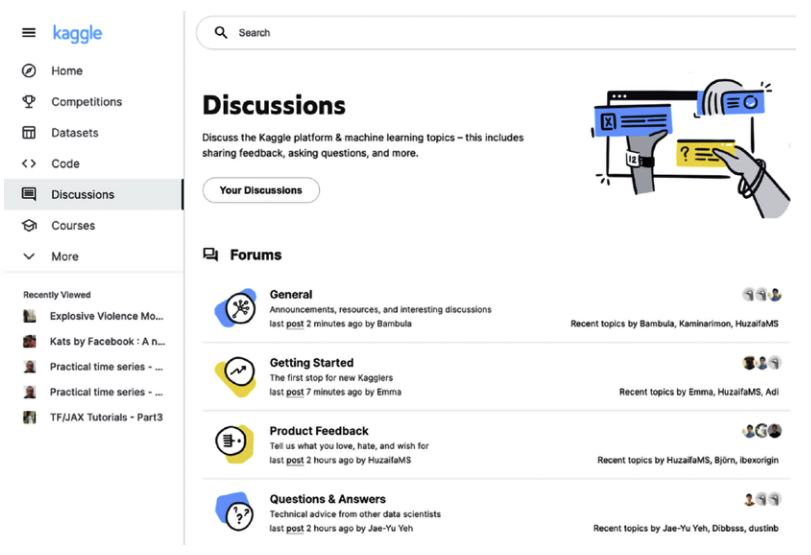

Üst kısımda, genel konuların bir araya getirildiği **Forumlar** bulunur. Bunlara göz atmak, ister ilk yarışmanıza katılıyor olun, ister bir öneriniz olsun, ister sadece kafanız karıştığı için genel bir soru sormak isteyin, oldukça faydalıdır.

Forumların altında, **Kaggle genelinde yapılan tartışmaların birleşik görünümünü** bulabilirsiniz. Bunlar çoğunlukla yarışmalarla ilgili sohbetlerdir (çünkü Kaggle’daki etkinliğin büyük kısmını yarışmalar oluşturur), ancak bazen Notebooks (defterler) veya dikkat çekici veri kümeleriyle ilgili konuşmalar da yer alır. Varsayılan olarak bu tartışmalar **"Hotness" (Popülerlik)** sırasına göre listelenir; yani katılımı en yüksek ve en aktif olanlar üst sıralarda görünür.

Bu bölüm, alanın dinamik doğasına daha uygun içerikleri bulabileceğiniz yerdir: Kaggle’ın farklı alt bölümlerinden gelen tartışmaların bir koleksiyonu olup, belirli ölçütlere göre **filtreleme yapma** olanağı da sunar.

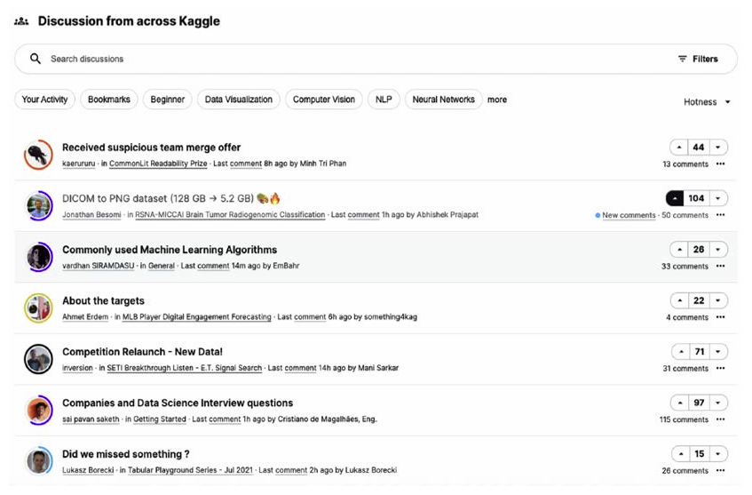

İlgi alanlarınıza bağlı olarak, içerikleri **filtreleri kullanarak kişiselleştirmeye** başlayabilirsiniz. Tercihlerinize göre şu ölçütlere göre filtreleme yapabilirsiniz:

• **RECENCY (Güncellik):** Takip ettiğiniz bilgilerin zaman aralığını kontrol etmenizi sağlar.
• **MY ACTIVITY (Benim Etkinliğim):** Tüm forumlardaki yorumlarınızın, paylaşımlarınızın ve görüntülemelerinizin genel bir özetini verir; birden fazla tartışmaya aynı anda katılıyorsanız oldukça kullanışlıdır.
• **ADMIN (Yönetici):** Kaggle yöneticilerinin duyurularına hızlı bir genel bakış sağlar.
• **TYPES (Türler):** Tartışmalar genel forumlarda, belirli yarışmalarda veya veri kümeleri etrafında gerçekleşebilir.
• **TAGS (Etiketler):** Her yerde bulunmasa da birçok tartışma etiketlenmiştir; bu işlev, kullanıcıların bu özelliği kullanarak belirli konulara göre filtreleme yapmasına olanak tanır.

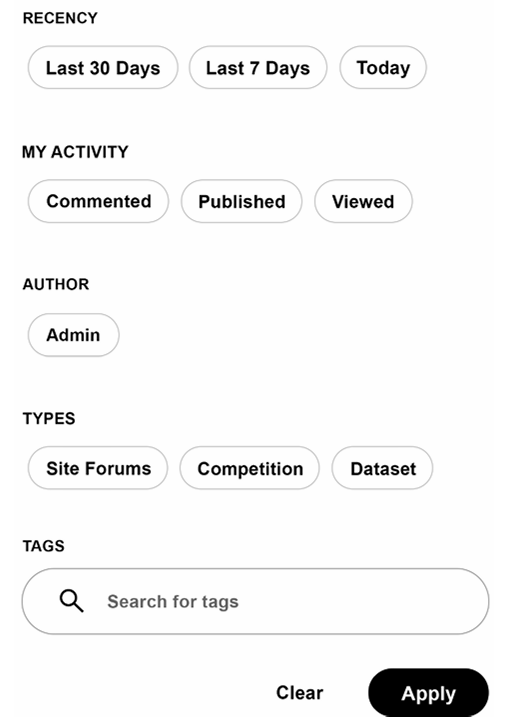

Aşağıdaki şekil, **Beginner (Yeni Başlayan)** etiketiyle filtrelenmiş tartışmaların örnek bir çıktısını göstermektedir.

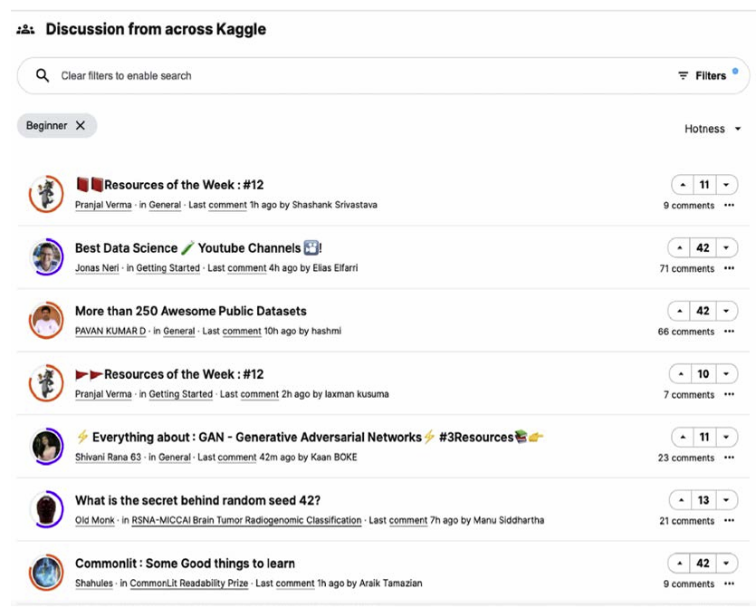

Alternatif olarak, belirli bir konuya da odaklanabilirsiniz; örneğin **bilgisayarla görme (computer vision)** gibi konular büyük ilgi çektiğinden, konuları **sıralamak** faydalı olabilir. Konuları şu ölçütlere göre sıralayabilirsiniz:

* **Hotness (Popülerlik):** En fazla ilgi ve katılım gören konular üstte gösterilir.
* **Recent Comments (Son Yorumlar):** En son yorum yapılan konulara göre sıralar.
* **Recently Posted (Yeni Paylaşılanlar):** Yakın zamanda oluşturulan konulara öncelik verir.
* **Most Votes (En Çok Oy Alanlar):** En fazla oyu almış konuları üstte gösterir.
* **Most Comments (En Çok Yorum Alanlar):** En fazla yorum yapılan konuları sıralar.

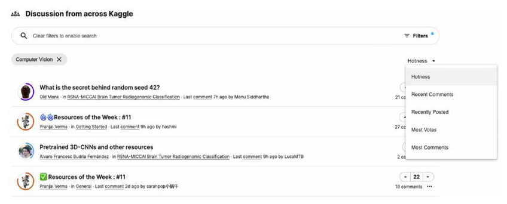

İnsanlar **Kaggle’a** farklı nedenlerle gelirler; ancak **Notebooks**’ların popülaritesinin artmasına rağmen, **yarışmalar** hâlâ temel çekim noktası olmaya devam etmektedir. Her Kaggle yarışmasının kendine ait özel bir **tartışma forumu** vardır. Bu foruma, yarışmanın sayfasına gidip **Discussion (Tartışma)** sekmesini seçerek erişebilirsiniz.

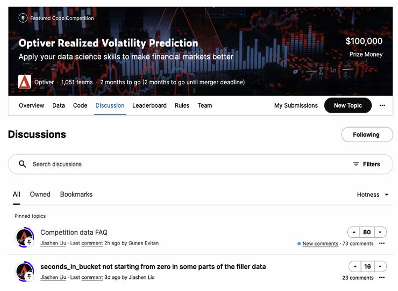

Eskiden bu her zaman böyle değildi, ancak günümüzde neredeyse tüm yarışmaların, kendilerine ait tartışma forumlarının en üst kısmına sabitlenmiş bir **SSS (Sıkça Sorulan Sorular)** konusu bulunmaktadır. Bu bölümden başlamak iki temel nedenle iyi bir fikirdir:

• **Zamandan tasarruf edersiniz;** en popüler soruların yanıtları büyük olasılıkla burada yer alır.
• **Gereksiz veya yinelenen sorular sormaktan kaçınırsınız,** böylece forumdaki herkes için daha iyi bir deneyim sağlanmış olur.

**Notebooks**’larda olduğu gibi, tartışma forumlarında da daha sonra tekrar bakmak üzere **özellikle önemli konuları yer imlerine ekleme (bookmark)** seçeneği bulunur.


Yer işareti eklediğiniz (bookmarkladığınız) tüm konuların genel bir özetini, **profil sayfanızda** bulabilirsiniz.

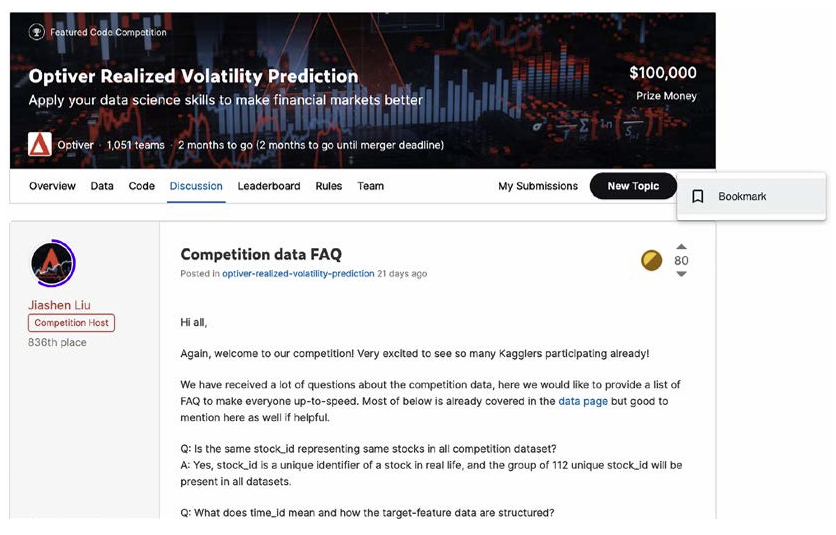

### Example discussion approaches *(Tartışma örnekleri ve yaklaşımlar)*

Bir yarışmada kendinizi bir noktada kaybolmuş hissetmeniz tamamen normaldir: Geldiniz, birkaç fikir denediniz, sıralamada bir ilerleme kaydettiniz ve sonra Kaggle versiyonu ile koşucuların duvarına çarptınız. İşte bu noktada tartışma forumları başvurulacak yerdir.

Örnek olarak, Optiver Realized Volatility Prediction yarışmasına bakalım ([https://www.kaggle.com/c/optiver-realized-volatility-prediction](https://www.kaggle.com/c/optiver-realized-volatility-prediction)). Organizasyon tarafından şöyle tanımlanmış:

> İlk üç ay boyunca, farklı sektörlerde yüzlerce hisse senedi için kısa vadeli volatiliteyi tahmin eden modeller geliştireceksiniz. Elinizde yüz milyonlarca detaylı finansal veri olacak ve bu verilerle 10 dakikalık periyotlar için volatiliteyi tahmin eden bir model tasarlayacaksınız. Modelleriniz, eğitim sonrası üç aylık değerlendirme döneminde gerçek piyasa verileriyle karşılaştırılarak değerlendirilecektir.

Burada ele alınacak çok şey var; bu yüzden bu zorluğun ana bileşenlerini inceleyip, tartışma forumları aracılığıyla nasıl yaklaşılabileceğini göstereceğiz. Öncelikle, bu yarışmaya katılım belirli bir finansal bilgi gerektiriyor; belki deneyimli bir trader seviyesinde olmanız gerekmiyor, ama volatilitenin farklı hesaplama yöntemlerini anlamak, çoğu Kaggle katılımcısı için oldukça karmaşıktır. Neyse ki organizatörler yarışma boyunca oldukça aktifti ve yeni başlayanlar için kaynaklar sundular: [https://www.kaggle.com/c/optiver-realized-volatility-prediction/discussion/273923](https://www.kaggle.com/c/optiver-realized-volatility-prediction/discussion/273923)

Eğer başlangıç bilgisi yeterli değilse, kamuya açık şekilde sorularınızı sormaktan çekinmeyin, örneğin:
[https://www.kaggle.com/c/optiver-realized-volatility-prediction/discussion/263039](https://www.kaggle.com/c/optiver-realized-volatility-prediction/discussion/263039)
veya
[https://www.kaggle.com/c/optiver-realized-volatility-prediction/discussion/250612](https://www.kaggle.com/c/optiver-realized-volatility-prediction/discussion/250612)

Yarışma ilerledikçe, katılımcılar problemi çözmek için giderek daha sofistike modeller geliştirmeye başladılar. Burada bir denge kurmak gerekiyor: bir yandan, veteriner katılımcılardan öğrendiklerinizi paylaşarak geri vermek isteyebilirsiniz; diğer yandan, tüm harika kodlarınızı Notebook olarak paylaşarak potansiyel avantajınızı kaybetmek istemezsiniz. Makul bir orta yol, örneğin forumda özellik fikirlerinizi paylaşmak olabilir: [https://www.kaggle.com/c/optiver-realized-volatility-prediction/discussion/273915](https://www.kaggle.com/c/optiver-realized-volatility-prediction/discussion/273915)

Son yıllarda, daha fazla yarışma sabit test veri seti formatından uzaklaşıp farklı yaklaşımlar getirdi: bazıları Kaggle API kullanımını zorunlu kılıyor (Notebook üzerinden gönderim yapmanız gerekiyor), bazıları ise eğitim ve canlı veri değerlendirmesi olarak özel bir zaman çizelgesi sunuyor. Optiver yarışması da böyleydi:

> Final gönderim tarihinden sonra, seçilen notebook’lar üzerinde piyasa verisi güncellemelerine bağlı olarak sıralama tablosu periyodik olarak güncellenecektir. Güncellemeler yaklaşık iki haftada bir yapılacak ve tatil dönemlerinden kaçınmak için ayarlamalar yapılacaktır.

Bu kurulum, modellerin yeniden eğitilmesi ve güncellenmesi konusunda bazı zorluklar yarattı. Bu tür bir durumla karşılaşırsanız, katılımcıların yaptığı gibi sorular sormaktan çekinmeyin: [https://www.kaggle.com/c/optiver-realized-volatility-prediction/discussion/249752](https://www.kaggle.com/c/optiver-realized-volatility-prediction/discussion/249752)

Eğitilen modeliniz için bir doğrulama şeması her zaman önemli bir konudur ve genellikle “CV vs LB” (çapraz doğrulama vs sıralama tablosu) tartışması ile bağlantılıdır. Optiver yarışması da bu kuralın istisnası değildi: [https://www.kaggle.com/c/optiver-realized-volatility-prediction/discussion/250650](https://www.kaggle.com/c/optiver-realized-volatility-prediction/discussion/250650)

Eğer ilgili başlık zaten yoksa – ve bunu kontrol etmek her zaman iyi bir fikirdir – tek model performansıyla ilgili bir başlığı düşünmek isteyebilirsiniz. Er ya da geç herkes model ansambllarını kullanmaya başlar, ancak iyi tek model bileşenleri olmadan bunlar çok verimli değildir.

Eğer problemi çözmenin daha iyi bir yolunu bulduysanız, paylaşmak genellikle iyi bir fikirdir. Ya başkaları için faydalı bir şey yapmış olursunuz, ya da neden yanlış olduğunuzu öğrenirsiniz (zaman ve çaba tasarrufu sağlar); her iki durumda da kazançlı çıkarsınız: [https://www.kaggle.com/c/optiver-realized-volatility-prediction/discussion/260694](https://www.kaggle.com/c/optiver-realized-volatility-prediction/discussion/260694)

Bunun dışında, diğer katılımcıların ne yaptığına göz atmak ve topluluk içinde bilgi paylaşımına katkıda bulunmak kişisel fayda sağlar ve özellikle yeni başlayanlar için yararlıdır: [https://www.kaggle.com/c/optiver-realized-volatility-prediction/discussion/250695](https://www.kaggle.com/c/optiver-realized-volatility-prediction/discussion/250695)

Tüm bu konulara göz attıysanız, hâlâ “Önemli bir şeyi mi kaçırıyorum?” diye düşünebilirsiniz. Kaggle, bu tür soruları sormanın tamamen kabul edildiği bir platformdur: [https://www.kaggle.com/c/optiver-realized-volatility-prediction/discussion/262203](https://www.kaggle.com/c/optiver-realized-volatility-prediction/discussion/262203)

Diğer yarışmalara göz atalım. Daha önce doğrulama konusundan bahsettik; bu genellikle bilgi sızıntısı ve aşırı uyum (overfitting) ile bağlantılıdır. Sızıntılar, doğrulama şemalarının tasarlanmasına ayrılmış olan 6. bölümde ayrıntılı olarak ele alınmıştır. Burada, forumlar aracılığıyla nasıl ele alındığını kısaca inceleyeceğiz. Kaggle, meraklı katılımcılardan oluşan bir topluluk olduğundan, sızıntı şüphesi varsa, biri konuyu muhtemelen gündeme getirir.

Örneğin, dosya adları veya kayıt ID’leri zaman damgaları içerebilir, bu da geleceğe bakmak ve hatalı şekilde düşük hata metriği elde etmek için tersine mühendislik yapılabileceği anlamına gelir. Bu durum, Two Sigma Connect yarışmasında yaşanmıştır: [https://www.kaggle.com/c/two-sigma-connect-rental-listing-inquiries/discussion/31870#176513](https://www.kaggle.com/c/two-sigma-connect-rental-listing-inquiries/discussion/31870#176513)

Başka bir örnek, Airbus Ship Detection Challenge’dır, katılımcıların uydu görüntülerinde gemileri bulması gerekiyordu. Test görüntülerinin önemli bir kısmı, eğitim görüntülerinden rastgele kırpılmıştı ve eşleştirmek oldukça kolaydı: [https://www.kaggle.com/c/airbus-ship-detection/discussion/64355#377037](https://www.kaggle.com/c/airbus-ship-detection/discussion/64355#377037)

Santander tarafından düzenlenen yarışmalar da oldukça ünlüdür. Şirketin düzenlediği üç yarışmadan ikisinde veri sızıntısı yaşanmıştır: [https://www.kaggle.com/c/santander-value-prediction-challenge/discussion/61172](https://www.kaggle.com/c/santander-value-prediction-challenge/discussion/61172)

Sonraki adımlar yarışmadan yarışmaya değişir: Bazı durumlarda Kaggle, yarışmayı yeni veya temizlenmiş verilerle yeniden başlatmıştır; bazen ise minimal etki algıladıkları için devam ettirmiştir. Örneğin, Predicting Red Hat Business Value yarışmasında böyle bir durum yaşanmıştır: [https://www.kaggle.com/c/predicting-red-hat-business-value/discussion/23788](https://www.kaggle.com/c/predicting-red-hat-business-value/discussion/23788)

Veri sızıntıları yarışmayı ciddi şekilde bozabilir, ancak iyi haber şu ki, son 2-3 yılda Kaggle’da sızıntılar neredeyse tamamen ortadan kalkmıştır – dolayısıyla bu bölüm, bir kez okunacak ama platformdaki deneyiminizin sürekli bir parçası olmayacaktır.

Platformdaki deneyim konusuna gelince, bu Grandmaster röportajına mükemmel bir geçiştir.

> **Yifan Xie**
> 
> [https://www.kaggle.com/yifanxie](https://www.kaggle.com/yifanxie)
> 
> 
> 
> Yifan Xie, **Discussions ve Competitions Master** unvanına sahip ve aynı zamanda **Arion.ai**’nin kurucu ortağıdır. İşte yarışmalara katılma ve diğer Kaggle kullanıcılarıyla çalışma konusundaki görüşleri:
> 
> 
> 
> **En sevdiğin yarışma türü nedir ve neden? Teknikler ve çözüm yaklaşımları açısından Kaggle’da uzmanlığın nedir?**
> 
> Aslında özel bir favorim yok; her tür problemi çözmeyi seviyorum. Teknik açıdan, çoğu veri problemi üzerinde hızlıca uygulanabilecek tipik teknikleri ve algoritmaları kapsayan sağlam bir **makine öğrenimi pipeline’ı** geliştirdim. Bunu, iş rutinleri ve teknik araçlar açısından standartlaştırmaya odaklanmış bir **rekabet avantajı** olarak görüyorum. Bu sayede daha hızlı iterasyonlar yapabiliyor ve veri deneyleri sırasında verimliliği artırabiliyorum; bu da Kaggle için temel bir bileşendir.
> 
> 
> 
> **Kaggle yarışmalarına nasıl yaklaşırısın? Bu yaklaşım günlük işlerinden ne kadar farklı?**
> 
> Zamanla, büyük veri projelerimin çoğu için **bilgi yönetimi ve toplama** konusunda özel bir yöntem geliştirdim. Bu yaklaşım, iş projeleri, Kaggle yarışmaları ve diğer yan projeler için uygulanabilir. Genellikle yararlı bilgileri (bookmark’lar, veri sözlükleri, yapılacaklar listesi, komutlar, deney sonuçları) her yarışma için standart bir formatta toplarım ve bir takımda yarışıyorsam bu bilgileri takım arkadaşlarımla paylaşırım.
> 
> 
> 
> **Girdiğin özellikle zor bir yarışmadan ve bu görevi çözmek için kullandığın içgörülerden bahseder misin?**
> 
> Benim için yarışmanın **genel bağlamını anlamak** her zaman faydalı olmuştur; örneğin, verinin ortaya çıkmasına neden olan sosyal/mühendislik/finans süreçleri nedir? Deepfake Detection Challenge gibi bireysel veri noktalarının anlamlı şekilde gözlemlenebildiği yarışmalarda, genellikle **Streamlit** kullanarak özel bir dashboard hazırlardım. Bu dashboard ile bireysel veri noktalarını (örneğin gerçek ve sahte video çiftleri) kontrol edebilir ve basit istatistik toplama ile veriyi daha iyi anlayabilirdim.
> 
> 
> 
> **Kaggle kariyerine yardımcı oldu mu? Eğer olduysa, nasıl?**
> 
> Kaggle, şu anki kariyerimde, veri bilimi danışmanlık firmasında eş sahip olarak yer almamda en büyük katkıyı sağlayan platform oldu diyebilirim. Yıllar içinde farklı alanlardaki veri problemlerini çözmek için gerekli **beceri ve metodolojiyi** kazanmamı sağladı. Hem müşterilerim hem de ekip arkadaşlarım, Kaggle yarışmalarında kurduğum takımlardan tanıştığım kişiler. Bu platform, bilgi kaynağı olarak her zaman çok faydalı oldu; günümüzde daha az aktif olsam da.
> 
> 
> 
> **Deneyimsiz Kaggle kullanıcıları genellikle neyi gözden kaçırır? Başladığında bilmek istediğin şey neydi?**
> 
> Yeni başlayanların sık yaptığı hata, **kritik teknik olmayan konuları** göz ardı etmeleridir: takım kuralları, veri kullanımı, özel bilgilerin paylaşımı, masum sebeplerle birden fazla hesap kullanımı vb. Bu tür hatalar, çoğu zaman aylardır süren yarışma çalışmalarını tamamen geçersiz kılabilir.
> 
> 
> 
> Başladığımda bilmek istediğim bir diğer şey ise, **günlük public leaderboard pozisyonuna takılmamak** olurdu. Bu gereksiz baskı yaratır ve overfitting’e yol açar.
> 
> 
> 
> **Veri analizi veya makine öğrenimi için önereceğin araç veya kütüphaneler var mı?**
> 
> Standart araçlar: **Scikit-learn, XGB/LGB, PyTorch** vb.
> 
> Ancak temel kullanımın ötesinde herkesin **NumPy’yi** iyi öğrenmesini öneririm; özellikle verileri daha gelişmiş şekilde sıralamak ve alt kümelere ayırmak için. Pandas kolaylaştırır, ama NumPy ile daha verimli yöntemler uygulanabilir.
> 
> 
> 
> **Yarışmaya girerken akılda tutulması gereken en önemli şey nedir?**
> 
> Bana göre veri bilimi ile ilgili işleri yapmanın dört nedeni vardır: **kar, bilgi, eğlence ve iyilik**. Kaggle benim için her zaman **büyük bir bilgi kaynağı** ve hatırlanacak bir hafıza deposu olmuştur. Bu yüzden önerim: **Sıralamanın geçici, bilginin ve hafızanın kalıcı olduğunu hatırlayın.**
> 
> 
> 
> **Başka yarışma platformları kullanıyor musun? Kaggle ile karşılaştırınca?**
> 
> Numerai’da oldukça aktifim. Dört nedenim açısından, Numerai daha çok **kar amacıyla** oluyor çünkü ödemeyi kripto para ile yapıyorlar. Daha çok **bireysel çaba** gerektiriyor; takım kurmak çok avantaj sağlamıyor.
> 
> 
> 
> Numerai, yoğun iş takvimimde **Kaggle’dan daha sürdürülebilir** bir etkinlik çünkü her turda eğitim verisi genellikle değişmiyor. İlk modeller kurulduktan sonra tahmin ve gönderim süreçlerini **yüksek derecede otomatikleştirebilirim**. Ayrıca Numerai, tabular veri setleri için özel makine öğrenimi pipeline’ları geliştirmek isteyenler için daha uygun bir platform.

### Netiquette *(İnternet görgü kuralları)*

İnternette 15 dakikadan uzun süre vakit geçiren herkes bunu bilir: Bir tartışma sırasında, konunun ne kadar masum olursa olsun, insanların duygusal tepkiler vermesi ve sohbetin medeni sınırların dışına taşması her zaman mümkündür. Kaggle da bu kuralın istisnası değildir; bu yüzden topluluğun **uygun davranış kuralları** vardır: [https://www.kaggle.com/community-guidelines](https://www.kaggle.com/community-guidelines).

Bu kurallar yalnızca tartışmalara değil, **Notebooks** ve diğer iletişim biçimlerine de uygulanır. Kaggle’da etkileşimde bulunurken akılda tutulması gereken başlıca noktalar şunlardır:

* **Zihinsel okuma yanılgısına düşmeyin:** Scott Adams’ın adlandırdığı bu yanılgı, insanların ne düşündüğünü varsayma eğilimidir. Kaggle, dünyanın dört bir yanından gelen çok çeşitli bir topluluktur (çoğu için İngilizce ikinci dil), bu nedenle nüansı korumak büyük bir zorluktur. Varsayımlarda bulunmayın ve mümkün olduğunca netleştirmeye çalışın.
* **Şahsi saldırılardan kaçının:** Godwin’in yasası boşuna yoktur. Özellikle korunan ve değiştirilemez özelliklere yönelik referanslar kesinlikle yasaktır.
* **Aşağılamalardan kaçının:** Deneyimleriniz farklı olabilir, ancak internetin 1990’larda “RTFM” demenin normal olduğu vahşi batı ortamı artık yok. Aşağılamalar insanları uzaklaştırır.
* **İlerleme sistemini manipüle etmeye çalışmayın:** Kaggle madalyalarının verildiği bu sistemin manipülasyonu, açıkça oy istemekten, gizli anlaşmalara, hatta doğrudan hileye kadar platform kötüye kullanımının tüm yelpazesini kapsar.

Kısaca, başkalarına kendinize davranılmasını istediğiniz şekilde davranın, her şey yolunda gider.

### Summary *(Özet)*

Bu bölümde, Kaggle platformunda iletişimin birincil yolu olan **tartışma forumlarını** ele aldık. Forum mekaniklerini gösterdik, tartışmaların daha gelişmiş yarışmalarda nasıl kullanılabileceğine dair örnekler sunduk ve tartışma **netiketi**ni kısaca özetledik.

Bu, kitabın ilk ve giriş niteliğindeki bölümünün sonunu işaret ediyor. Bir sonraki bölüm, Kaggle’dan elde edeceğiniz verimi **maksimize etme** konusunda daha derin bir incelemenin başlangıcını oluşturuyor ve yarışmalarda karşılaşmanız gereken çok çeşitli görevler ve metriklerle başa çıkmayı ele alıyor.

---

# Part II: Sharpening Your Skills for Competitions *(Bölüm II: Yarışmalar İçin Becerilerini Geliştirme)*

## Chapter 5: Competition Tasks and Metrics *(Bölüm 5: Yarışma Görevleri ve Ölçütleri)*

Bir yarışmada, işe hedef metriği inceleyerek başlarsınız. Modelinizin hatalarının nasıl değerlendirildiğini anlamak, her yarışmada yüksek puan alabilmek için kritik öneme sahiptir. Tahminleriniz Kaggle platformuna gönderildiğinde, hedef metrik temel alınarak gerçek değerle karşılaştırılır.

Örneğin, Titanic yarışmasında ([https://www.kaggle.com/c/titanic/](https://www.kaggle.com/c/titanic/)) tüm gönderimleriniz doğruluk (accuracy) temelinde değerlendirilir; yani, hayatta kalan yolcuları doğru tahmin etme yüzdesi. Organizasyon bu metriği seçmiştir çünkü yarışmanın amacı, benzer koşullar altında bir yolcunun hayatta kalma olasılığını tahmin edebilen bir model bulmaktır.

Başka bir bilgi yarışmasında, House Prices - Advanced Regression Techniques ([https://www.kaggle.com/c/house-prices-advanced-regression-techniques](https://www.kaggle.com/c/house-prices-advanced-regression-techniques)), çalışmalarınız tahmininiz ile gerçek değer arasındaki ortalama fark temelinde değerlendirilir. Bu, logaritmayı almayı, karesini almayı ve karekökünü hesaplamayı içerir; çünkü modelden, satışta olan bir evin fiyat sırasını olabildiğince doğru bir şekilde tahmin etmesi beklenir.

Gerçek dünyadaki veri bilimi projelerinde de hedef metrikler, projenin başarısı için kritiktir; ancak gerçek dünya ile Kaggle yarışmaları arasında bazı farklılıklar vardır. Özetle, gerçek dünyada işler daha karmaşıktır. Gerçek dünya projelerinde modeliniz genellikle yalnızca bir değil, birden fazla metrikle değerlendirilecektir. Sıklıkla bazı değerlendirme metrikleri, test için kullandığınız gerçek değerlerle tahminlerinizin performansı ile doğrudan ilişkili olmayabilir.

Örneğin, çalıştığınız bilgi alanı, projenin kapsamı, modelinizin dikkate aldığı özellik sayısı, genel bellek kullanımı, özel donanım gereksinimleri (ör. GPU), tahmin sürecinin gecikmesi, modelin karmaşıklığı ve diğer birçok faktör, yalnızca tahmin performansından daha fazla önem taşıyabilir.

Gerçek dünyadaki problemler, düşündüğünüzden çok daha fazla iş ve teknik altyapı kaygıları tarafından şekillendirilir.

Yine de, hem gerçek dünya projelerinde hem de Kaggle yarışmalarında temel prensip aynıdır: Çalışmanız belirli kriterlere göre değerlendirilecektir. Bu kriterlerin detaylarını anlamak, modelinizi akıllıca optimize etmek veya parametrelerini bu kriterlere göre seçmek başarı getirir. Kaggle’da model değerlendirmesinin nasıl yapıldığını öğrenebilirseniz, gerçek dünyadaki veri bilimi işiniz de bundan fayda sağlar.

Bu bölümde, belirli problem türleri için değerlendirme metriklerinin, veri bilimi yarışmalarında model çözümü oluştururken nasıl hareket edebileceğinizi güçlü bir şekilde etkilediğini detaylı olarak inceleyeceğiz. Ayrıca, Kaggle yarışmalarında bulunan çeşitli metrikleri ele alarak, hangi metriklerin daha önemli olduğunu anlamanızı sağlayacağız ve yan not olarak metriklerin tahmin performansı üzerindeki farklı etkilerini ve bunları projelerinize nasıl doğru şekilde aktarabileceğinizi tartışacağız.

Bu bölümde ele alınacak konular:

* Değerlendirme metrikleri ve amaç fonksiyonları
* Temel görev türleri: regresyon, sınıflandırma ve sıralı (ordinal)
* Meta Kaggle veri seti
* Daha önce görülmemiş metriklerin ele alınması
* Regresyon metrikleri (standart ve ordinal)
* İkili sınıflandırma metrikleri (etiket tahmini ve olasılık)
* Çok sınıflı sınıflandırma metrikleri
* Nesne tespit problemleri için metrikler
* Çok etiketli sınıflandırma ve öneri sistemleri metrikleri
* Değerlendirme metriklerini optimize etme

### Evaluation metrics and objective functions *(Değerlendirme metrikleri ve hedef fonksiyonlar)*

Bir Kaggle yarışmasında, değerlendirme metriğini yarışmanın **Overview (Genel Bakış)** sayfasının sol menüsünden bulabilirsiniz. **Evaluation (Değerlendirme)** sekmesini seçtiğinizde, metriğe ilişkin detayları görebilirsiniz. Bazen burada metrik formülü, metrikle ilgili yeniden üretim kodu ve metrik hakkında bazı tartışmalar da bulunur. Aynı sayfada, ayrıca gönderim dosyası formatı hakkında açıklamalar yer alır; dosyanın başlık satırı ve birkaç örnek satır gösterilir.

Değerlendirme metriği ile gönderim dosyası arasındaki ilişki önemlidir, çünkü metrik esasen modelinizi eğitip tahminleri ürettikten sonra işler. Dolayısıyla ilk adım olarak, **değerlendirme metriği ile amaç fonksiyonu arasındaki farkı** anlamalısınız.

Temel olarak özetlersek:

* **Amaç fonksiyonu (objective function)**, modelinizi eğitirken kullanılır; hata minimizasyonu veya skor maksimizasyonu sürecinde yer alır.
* **Değerlendirme metriği (evaluation metric)** ise model eğitildikten sonra bir skor sağlar. Bu nedenle doğrudan modelin veriyle uyumunu etkilemez, ancak dolaylı olarak etkiler: en iyi hiperparametre ayarlarını seçmenize ve rekabet eden modeller arasında en iyi modelleri belirlemenize yardımcı olur.

Bölümün geri kalanında, bunun bir Kaggle yarışmasını nasıl etkileyebileceğini ve neden yarışmadaki değerlendirme metriğinin analizinin ilk adımınız olması gerektiğini göstereceğiz. Önce, tartışma forumlarında sıkça karşılaşabileceğiniz bazı terimleri ele alalım.

Genellikle **objective function, cost function ve loss function** terimlerini birbirinin yerine duyarız, ama hepsi tam olarak aynı şey değildir:

* **Loss function (Kayıp fonksiyonu):** Tek bir veri noktası üzerine tanımlanır ve modelin tahmini ile gerçek değer arasındaki ceza miktarını hesaplar.
* **Cost function (Maliyet fonksiyonu):** Eğitim için kullanılan tüm veri setini (veya bir batch’ini) dikkate alır ve veri noktalarının kayıp fonksiyonları üzerinden toplam veya ortalama hesaplar. L1 veya L2 ceza terimleri gibi ek kısıtlamaları içerebilir. Maliyet fonksiyonu doğrudan eğitim sürecini etkiler.
* **Objective function (Amaç fonksiyonu):** Makine öğrenimi eğitiminde optimizasyon kapsamıyla ilgili en genel terimdir; maliyet fonksiyonlarını içerir ama onlarla sınırlı değildir. Örneğin, tahmin edilen modelin katsayılarının seyrek olmasını veya katsayı değerlerinin minimize edilmesini gerektiren L1/L2 regularizasyonları gibi hedefleri de içerebilir. Loss ve cost fonksiyonları genellikle minimizasyona dayalı iken, amaç fonksiyonu nötrdür ve hem maximizasyon hem minimizasyon amaçlı optimizasyonu kapsayabilir.

Benzer şekilde, değerlendirme metriklerinde de **scoring function (skor fonksiyonu)** ve **error function (hata fonksiyonu)** terimlerini duyabilirsiniz:

* **Scoring function:** Fonksiyonun skoru yüksek olduğunda tahminler daha iyi kabul edilir; bu bir **maksimizasyon** sürecini ifade eder.
* **Error function:** Fonksiyonun hata değeri daha küçük olduğunda tahminler daha iyi kabul edilir; bu bir **minimizasyon** sürecini ifade eder.

### Basic types of tasks *(Temel görev türleri)*

Tüm amaç fonksiyonları her problem için uygun değildir. Genel bir bakış açısıyla, Kaggle yarışmalarında iki tür problem bulursunuz: **regresyon görevleri** ve **sınıflandırma görevleri**.

Son zamanlarda, bazı yarışmalarda **reinforcement learning (RL – pekiştirmeli öğrenme)** görevleri de görülmüştür. Ancak RL, değerlendirme için metrik kullanmaz; bunun yerine, çözümleri sizin çözümünüz kadar iyi olduğu varsayılan diğer katılımcılarla doğrudan karşılaştırmalardan türetilen bir sıralamaya dayanır. Bu karşılaştırmada diğer katılımcılardan daha iyi performans gösterirseniz sıralamanız yükselir, daha kötü performans gösterirseniz düşer.

RL metrik kullanmadığı için, biz hâlâ **regresyon-sınıflandırma ikiliğini** temel alacağız. Ancak **ordinal görevler** (sıralı etiketleri, genellikle tamsayılarla temsil edilen, tahmin ettiğiniz görevler) bu kategorilere tam olarak uymayabilir. Ordinal görevler, regresyon veya sınıflandırma yaklaşımlarından biriyle başarıyla ele alınabilir.

#### Regression *(Regresyon)*

**Regresyon**, gerçek bir sayı tahmin edebilen bir model kurmanızı gerektirir; çoğunlukla pozitif bir sayı tahmin edilir, ancak negatif sayı tahmini yapılan örnekler de olmuştur.

Regresyon problemlerine klasik bir örnek, **House Prices - Advanced Regression Techniques** yarışmasıdır; çünkü burada bir evin değerini tahmin etmeniz gerekir.

Bir regresyon görevinde değerlendirme, tahminleriniz ile gerçek değerler arasındaki **farkın ölçülmesi** ile yapılır. Bu fark farklı yollarla değerlendirilebilir:

* **Karesini almak**, yani hataları daha büyük olan tahminleri daha fazla cezalandırmak,
* **Logaritma uygulamak**, yani yanlış ölçeklerdeki tahminleri cezalandırmak için.

#### Classification *(Sınıflandırma)*

Kaggle’da bir **sınıflandırma (classification)** görevi ile karşılaştığınızda dikkate alınması gereken daha fazla nüans vardır. Sınıflandırma, aslında **ikili (binary), çok sınıflı (multi-class) veya çok etiketli (multi-label)** olabilir.

* **İkili sınıflandırma (binary problems):**
  Bir örneğin belirli bir sınıfa ait olup olmadığını tahmin etmeniz gerekir (genellikle “pozitif sınıf” olarak adlandırılır ve “negatif sınıf” ile karşılaştırılır).
  Burada değerlendirme, doğrudan sınıf tahminine dayanabilir veya sınıfın olasılığının tahmin edilmesini gerektirebilir.
  Örnek: **Titanic** yarışması; burada ikili bir sonuç tahmin edersiniz: hayatta kalma veya kalmama. Yarışma çoğu zaman sadece tahmini ister, ancak bazı alanlarda—özellikle tıp uygulamalarında—pozitif tahminleri farklı seçenekler ve durumlar arasında sıralamak gerekebilir, bu yüzden olasılık tahmini gerekir.

* **Dengesiz sınıflar (imbalanced classes):**
  İkili sınıflandırmada doğru eşleşmelerin sayısını doğrudan saymak mantıklı görünse de, pozitif ve negatif sınıflar arasında örnek sayısı farklı olduğunda bu yöntem iyi çalışmaz.
  Dengesiz sınıf dağılımı, model geliştirmelerini doğru şekilde takip edebilmek için **dengeyi dikkate alan değerlendirme metrikleri** gerektirir.

* **Çok sınıflı sınıflandırma (multi-class):**
  İki sınıftan fazlası varsa, bu bir **çok sınıflı tahmin problemi**dir. Bu durumda, modelin genel performansını izlemek ve sınıflar arasındaki performansın karşılaştırılabilir olmasını sağlamak için uygun metrikler kullanmak gerekir.
  Örnek: **Leaf Classification** yarışması; burada her yaprak örneğinin doğru bitki türü ile eşleştirilmesi gerekir.

* **Çok etiketli sınıflandırma (multi-label):**
  Eğer her örnek için birden fazla sınıf tahmin edilebiliyorsa, bu bir **çok etiketli problem**dir. Bu durumda, modelin doğru sınıfları, doğru sayı ve karışımı tahmin edip etmediğini kontrol etmek için ek değerlendirmeler gerekir.
  Örnek: **Greek Media Monitoring Multilabel Classification (WISE 2014)**; burada her makale, işlediği tüm konularla ilişkilendirilmeliydi.

#### Ordinal *(Sıralı veriler)*

Bir **ordinal ölçekli tahmin probleminde**, tam sayı şeklinde etiketleri tahmin etmeniz gerekir; bu etiketler doğal olarak sıralıdır.
Örnek: Bir depremin büyüklüğü ordinal bir ölçektedir.
Ayrıca, pazarlama araştırmaları anketlerinden elde edilen veriler de sıklıkla ordinal ölçekle kaydedilir (örneğin, tüketici tercihleri veya fikir uyumu).

Ordinal ölçek **sıralı değerlerden** oluştuğu için, ordinal görevler hem regresyon hem de sınıflandırma yöntemleriyle çözülebilir; yani adeta bu iki yöntem arasında bir geçiş niteliğindedir.

* **Çok sınıflı problem olarak yaklaşmak:**
  Ordinal görevi çok sınıflı bir problem gibi ele almak en yaygın yaklaşımdır. Bu durumda, bir tam sayı değeri (sınıf etiketi) tahmin edersiniz, ancak tahmin **sınıfların sıralı olduğunu dikkate almaz**.
  Eğer sınıflar için tahmin olasılıklarını incelerseniz, problem üzerinde çok sınıflı bir yaklaşımın eksiklerini fark edebilirsiniz. Olasılıklar genellikle tüm olası değerler boyunca dağılır; bu, **çok modlu ve genellikle simetrik olmayan bir dağılım** oluşturur. Halbuki doğru yaklaşımda, maksimum olasılığa sahip sınıf etrafında **Gaussian benzeri bir dağılım** beklenir.

* **Regresyon problemine dönüştürmek:**
  Ordinal tahmin problemini regresyon olarak ele alıp ardından post-processing yapmak başka bir yaklaşımdır. Bu yöntemle, sınıflar arasındaki sıralama dikkate alınır, ancak tahmin çıktısı hemen değerlendirme metriğinde kullanılabilir değildir.
  Regresyonda çıktı bir tam sayı değil, **float bir sayı**dır ve bu sayı ordinal dağılımınızdaki tam sayılar arasındaki tüm değerleri (ve hatta bazen sınırların dışındaki değerleri) içerebilir. Çıktı değerlerini kırpıp birim yuvarlamasıyla tam sayıya dönüştürmek işe yarayabilir, ancak bu yöntem bazı hatalara yol açabilir ve daha sofistike bir post-processing gerekebilir (bunun detayları ilerleyen bölümlerde ele alınacaktır).

Şimdi muhtemelen merak ediyorsunuz: **Kaggle’da başarılı olmak için hangi değerlendirme metriklerini bilmemiz gerekir?**
Açıkça, her zaman katıldığınız yarışmanın **değerlendirme metriğini** iyi bilmelisiniz. Ancak bazı metrikler diğerlerinden daha yaygındır; bu bilgiyi kendi avantajınıza kullanabilirsiniz.

* **Sık kullanılan metrikler nelerdir?**
* **Benzer değerlendirme metrikleri kullanan yarışmalardan ipuçlarını nasıl bulabilirsiniz?**

Bunun cevabı: **Meta Kaggle veri setini** incelemektir.

### The Meta Kaggle dataset *(Meta Kaggle veri seti)*

**Meta Kaggle veri seti** ([https://www.kaggle.com/kaggle/meta-kaggle](https://www.kaggle.com/kaggle/meta-kaggle)), Kaggle topluluğu ve aktiviteleri hakkında zengin veri içeren, Kaggle tarafından yayımlanmış bir halka açık veri setidir.
Veri seti, **Competitions, Datasets, Notebooks ve Discussions** gibi Kaggle’daki kamuya açık aktiviteleri içeren CSV tablolarından oluşur.

Kullanımı oldukça basittir:

1. Bir **Kaggle Notebook** başlatın (Bölüm 2 ve 3’te gördüğünüz gibi).
2. Notebook’a **Meta Kaggle veri setini** ekleyin.
3. Verileri analiz etmeye başlayın.

CSV tabloları günlük olarak güncellenir, bu yüzden analizlerinizi sık sık yenilemeniz gerekir, ama çıkaracağınız içgörüler buna değecektir.

Bu kitapta, Meta Kaggle veri setine hem **yarışmalardaki dinamikler için ilginç örnekler bulmak** hem de **öğrenme ve yarışma stratejileriniz için faydalı örnekler çıkarmak** için atıfta bulunacağız.

Burada veri setini, **son yedi yılda hangi değerlendirme metriklerinin en sık kullanıldığını** anlamak için kullanacağız. Bu metrikleri görerek:

* Herhangi bir yarışmaya sağlam bir temel ile başlayabilir,
* Ardından tartışma forumlarından elde ettiğiniz bilgilerle metrik hakkında yarışmaya özgü ince ayrıntıları öğrenebilirsiniz.

---

Aşağıdaki kod, **yıllara göre kullanılan metriklerin ve sayılarını tablo hâline getirmek** için gerekli örnek kodu göstermektedir. Kod, doğrudan Kaggle platformunda çalışacak şekilde tasarlanmıştır:

```python
import numpy as np
import pandas as pd

# Competitions CSV tablosunu oku
comps = pd.read_csv("/kaggle/input/meta-kaggle/Competitions.csv")

# İlgilenilen sütunlar
evaluation = ['EvaluationAlgorithmAbbreviation',
              'EvaluationAlgorithmName',
              'EvaluationAlgorithmDescription',]

compt = ['Title', 'EnabledDate', 'HostSegmentTitle']

# Analiz için kopya DataFrame oluştur
df = comps[compt + evaluation].copy()
df['year'] = pd.to_datetime(df.EnabledDate).dt.year.values
df['comps'] = 1

# 2015 ve sonrası yarışmaları seç
time_select = df.year >= 2015

# Featured ve Research türündeki yarışmalar
competition_type_select = df.HostSegmentTitle.isin(['Featured', 'Research'])

# Pivot tablo oluştur ve yıllara göre metrik sayısını hesapla
pd.pivot_table(df[time_select & competition_type_select],
               values='comps',
               index=['EvaluationAlgorithmAbbreviation'],
               columns=['year'],
               fill_value=0.0,
               aggfunc=np.sum,
               margins=True
              ).sort_values(by=('All'), ascending=False).iloc[1:, :].head(20)
```

Kodun işleyişi:

1. Competitions CSV’si okunur.
2. Sadece analiz için gerekli sütunlar seçilir: **değerlendirme algoritması, yarışma adı, başlama tarihi ve yarışma türü**.
3. Satırlar, 2015 sonrası ve **Featured veya Research türündeki yarışmalar** ile sınırlanır (en yaygın olanlar).
4. **Pivot tablo** ile değerlendirme algoritmaları yıllara göre gruplanır ve her birinin kaç yarışmada kullanıldığı sayılır.
5. Son olarak **en çok kullanılan 20 algoritma** görüntülenir.

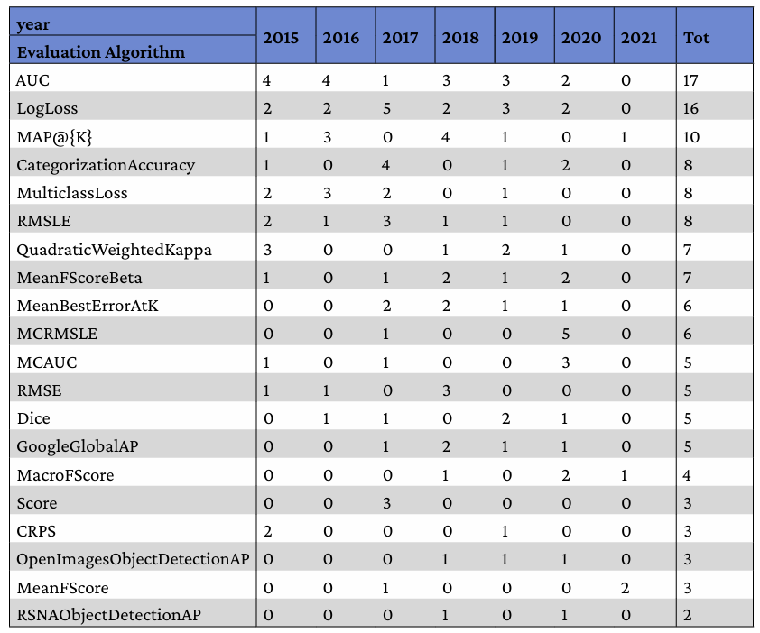

Aynı tabloları oluşturmak için az önce başlattığımız değişkenleri kullanarak, ayrıca veriyi kontrol edip seçtiğiniz metriğin kullanıldığı yarışmaları da bulabilirsiniz:

```python
metric = 'AUC'
metric_select = df['EvaluationAlgorithmAbbreviation'] == metric
print(df[time_select & competition_type_select & metric_select][['Title', 'year']])
```

Yukarıdaki örnekte, AUC metriğini kullanan yarışmaları temsil etmeye karar verdik. Sadece seçtiğiniz metriği temsil eden string’i değiştirmeniz yeterlidir; böylece ortaya çıkan liste buna göre güncellenecektir.

Tabloya geri dönersek, Kaggle’da düzenlenen yarışmalarda en popüler değerlendirme metriklerini inceleyebiliriz:

* İlk iki metrik birbirine ve ikili olasılık sınıflandırma problemlerine yakından ilişkilidir. AUC metriği, modelinizin tahmin ettiği olasılıkların pozitif örnekleri yüksek olasılıkla tahmin etme eğilimini ölçmeye yardımcı olur. Log Loss ise tahmin edilen olasılıkların gerçek değerlerden ne kadar uzak olduğunu ölçer (ve Log Loss’u optimize ettikçe AUC metriğini de optimize etmiş olursunuz).
* 3\. sırada MAP@{K} bulunur; bu metrik öneri sistemleri ve arama motorlarında yaygın olarak kullanılır. Kaggle yarışmalarında bu metrik, çoğunlukla bilgi getirme (information retrieval) değerlendirmeleri için kullanılmıştır. Örneğin, **Humpback Whale Identification** yarışmasında ([https://www.kaggle.com/c/humpback-whale-identification](https://www.kaggle.com/c/humpback-whale-identification)) bir balinayı tam olarak tanımlamanız gerekir ve beş tahmin hakkınız vardır. Başka bir örnek, **Quick, Draw! Doodle Recognition Challenge** yarışmasıdır ([https://www.kaggle.com/c/quickdraw-doodle-recognition/](https://www.kaggle.com/c/quickdraw-doodle-recognition/)), burada çizilen bir karenin içeriğini tahmin etmeniz gerekir ve üç deneme hakkınız vardır. Temelde, MAP@{K} metriği kullanıldığında, sadece doğru tahmin yapıp yapmadığınız değil, aynı zamanda doğru tahmininizin belirli bir sayıda (“K” adıyla belirtilen) yanlış tahmin arasında olup olmadığı da değerlendirilir.
* 6\. sırada bir regresyon metriği olan RMSLE (Root Mean Squared Logarithmic Error) yer alır ve 7. sırada Quadratic Weighted Kappa bulunur; bu metrik, ardışık tamsayı tahminleri gerektiren problemler (ordinal ölçek problemleri) için özellikle faydalıdır.

Listeye göz attığınızda, karşılaşacağınız metriklerin çoğunun makine öğrenmesi ders kitaplarında sıkça tartışılan metrikler olduğunu göreceksiniz. Önümüzdeki birkaç bölümde, daha önce hiç karşılaşmadığınız bir metriği gördüğünüzde ne yapmanız gerektiğini tartıştıktan sonra, regresyon ve sınıflandırma yarışmalarında en yaygın olarak kullanılan metrikleri gözden geçireceğiz.

### Handling never-before-seen metrics *(Daha önce görülmemiş metriklerle başa çıkma)*

İlerlemeye başlamadan önce, en popüler 20 metriği gösteren tablonun yarışmalarda kullanılan tüm metrikleri kapsamadığını göz önünde bulundurmalıyız. Son yıllarda yalnızca bir kez kullanılmış metrikler de vardır.

**Yarışma Görevleri ve Metrikler**

Önceki kod sonuçlarını kullanarak, bu nadir kullanılan metriklerin neler olduğunu bulmaya devam edelim:

```python
counts = (df[time_select & competition_type_select]
          .groupby('EvaluationAlgorithmAbbreviation'))
total_comps_per_year = (df[time_select & competition_type_select]
                        .groupby('year').sum())
single_metrics_per_year = (counts.sum()[counts.sum().comps == 1]
                           .groupby('year').sum())
single_metrics_per_year
table = (total_comps_per_year.rename(columns={'comps': 'n_comps'})
         .join(single_metrics_per_year / total_comps_per_year)
         .rename(columns={'comps': 'pct_comps'}))
print(table)
```

Sonuç olarak, her yıl için aşağıdaki tabloyu elde ederiz. Bu tabloda, her yıl kaç yarışmanın daha sonra bir daha kullanılmamış bir metrik kullandığını (`n_comps`) ve bu yarışmaların toplam yarışmalara oranını (`pct_comps`) görebiliriz:

| year | n_comps | pct_comps |
| ---- | ------- | --------- |
| 2015 | 28      | 0.179     |
| 2016 | 19      | 0.158     |
| 2017 | 34      | 0.177     |
| 2018 | 35      | 0.229     |
| 2019 | 36      | 0.278     |
| 2020 | 43      | 0.302     |
| 2021 | 8       | 0.250     |

Daha sonra bir daha kullanılmamış metriklerin payına baktığımızda, bu oranın yıl geçtikçe arttığını ve son yıllarda %25–%30 seviyelerine ulaştığını hemen fark ederiz. Bu, genellikle her üç veya dört yarışmadan birinin size metrikleri baştan öğrenip anlamayı gerektirdiğini gösterir.

Geçmişte kullanılmış ve bir daha tekrar edilmeyen metriklerin listesini şu kısa kodla alabilirsiniz:

```python
print(counts.sum()[counts.sum().comps == 1].index.values)
```

Bu kodu çalıştırdığınızda, benzer bir liste elde edersiniz:

```
['AHD@{Type}', 'CVPRAutoDrivingAveragePrecision', 'CernWeightedAuc',
 'FScore_1', 'GroupMeanLogMAE', 'ImageNetObjectLocalization',
 'IndoorLocalization', 'IntersectionOverUnionObjectSegmentationBeta',
 'IntersectionOverUnionObjectSegmentationWithClassification',
 'IntersectionOverUnionObjectSegmentationWithF1', 'Jaccard',
 'JaccardDSTLParallel', 'JigsawBiasAUC', 'LaplaceLogLikelihood',
 'LevenshteinMean', 'Lyft3DObjectDetectionAP', 'M5_WRMSSE', 'MASpearmanR',
 'MCRMSE', 'MCSpearmanR', 'MWCRMSE', 'MeanColumnwiseLogLoss',
 'MulticlassLossOld', 'NDCG@{K}', 'NQMicroF1', 'NWRMSLE', 'PKUAutoDrivingAP',
 'R2Score', 'RValue', 'RootMeanSquarePercentageError', 'SIIMDice', 'SMAPE',
 'SantaResident', 'SantaRideShare', 'SantaWorkshopSchedule2019', 'TrackML',
 'TravelingSanta2', 'TwoSigmaNews', 'WeightedAUC', 'WeightedMulticlassLoss',
 'WeightedPinballLoss', 'WeightedRowwisePinballLoss', 'YT8M_MeanAveragePrecisionAtK',
 'ZillowMAE', 'football', 'halite', 'mab']
```

Yakından incelendiğinde, listede derin öğrenme ve pekiştirmeli öğrenme yarışmalarına ilişkin birçok metrik bulabilirsiniz.

Peki, daha önce hiç karşılaşmadığınız bir metrikle karşılaştığınızda ne yapmalısınız?

* Tabii ki, Kaggle tartışma forumlarındaki paylaşımlara güvenebilirsiniz; burada her zaman iyi fikirler ve size yardımcı olacak birçok Kaggle katılımcısı bulabilirsiniz.
* Ancak metriği kendi başınıza anlamak istiyorsanız, Google’da arama yapmanın yanı sıra, değerlendirme fonksiyonunu kendi kodunuzla denemeyi tavsiye ederiz. Bunu mükemmel olmasa bile yapabilir, modelin farklı hata türlerine karşı metrik nasıl tepki veriyor simüle edebilirsiniz. Ayrıca metrik fonksiyonunu yarışma eğitim verisi örnekleri üzerinde veya sizin hazırladığınız sentetik veri üzerinde test edebilirsiniz.

Bazı Kaggle kullanıcılarının bu yaklaşımı nasıl kullandığına örnekler:

* **Carlo Lepelaars** ile Spearman’s Rho: [Link](https://www.kaggle.com/carlolepelaars/understanding-the-metric-spearman-s-rho)
* **Carlo Lepelaars** ile Quadratic Weighted Kappa: [Link](https://www.kaggle.com/carlolepelaars/understanding-the-metric-quadratic-weighted-kappa)
* **Rohan Rao** ile Laplace Log Likelihood: [Link](https://www.kaggle.com/rohanrao/osic-understanding-laplace-log-likelihood)

Bu yaklaşım, değerlendirme süreci hakkında daha derin bir anlayış kazandırır ve sadece Google ve forumlardan gelen cevaplara güvenen rakiplere karşı size avantaj sağlar.

> **Rohan Rao**
> 
> [Kaggle Profili](https://www.kaggle.com/rohanrao)
> 
> 
> 
> Farklı metrikleri keşfetmeye başlamadan önce, Quadruple Grandmaster ve H2O.ai’de Kıdemli Veri Bilimcisi olan Rohan Rao (namı diğer Vopani) ile Kaggle’daki başarılarını ve bizlerle paylaşmak istediği bilgeliği konuşalım.
> 
> 
> 
> **En sevdiğiniz yarışma türü nedir ve neden? Kaggle’da teknikler ve çözüm yaklaşımları açısından uzmanlığınız nedir?**
> 
> Farklı yarışma türleriyle ilgilenmeyi seviyorum, ama en favorim kesinlikle zaman serisi yarışmaları. Endüstrideki tipik zaman serisi yaklaşımlarını ve kavramlarını pek sevmiyorum, bu yüzden çözümleri alışılmışın dışında, yenilikçi bir şekilde kurmayı tercih ediyorum ve bu bana çok başarılı sonuçlar getirdi.
> 
> 
> 
> **Bir Kaggle yarışmasına nasıl yaklaşıyorsunuz? Bu yaklaşım, günlük işinizden ne kadar farklı?**
> 
> Her Kaggle yarışması için tipik iş akışım şöyle:
> 
> 
> 
> * Problem tanımını anlamak ve kurallar, format, zaman çizelgesi, veri setleri, metrikler ve teslimatlar ile ilgili tüm bilgileri okumak.
> 
> * Veriye derinlemesine dalmak. Veriyi her açıdan inceleyip dilimleyip görselleştirerek her türlü soruya cevap verebilecek hâle gelmek.
> 
> * Basit bir pipeline ve temel bir model kurup, sürecin çalıştığını doğrulamak için bir gönderim yapmak.
> 
> * Özellik mühendisliği yapmak, hiperparametreleri ayarlamak ve hangi modellerin genellikle işe yaradığını anlamak için çeşitli modellerle denemeler yapmak.
> 
> * Veriyi analiz etmeye, forum tartışmalarını okumaya ve özellikleri ile modelleri sürekli olarak geliştirmeye devam etmek. Belki bir noktada ekip kurmak.
> 
> * Birden fazla modeli ensemble yapmak ve hangi gönderimleri final olarak kullanacağınıza karar vermek.
> 
> 
> 
> Günlük veri bilimi çalışmalarımda bunların çoğu da gerçekleşiyor. Ama ek olarak iki kritik unsur var:
> 
> 
> 
> * Problem tanımı için veri setlerini hazırlamak ve düzenlemek.
> 
> * Nihai model veya çözümü üretime almak.
> 
> 
> 
> Geçmişte çalıştığım projelerin çoğunda zamanımın büyük kısmı bu iki aktiviteye harcandı.
> 
> 
> 
> **Kaggle kariyerinize yardımcı oldu mu? Olduysa nasıl?**
> 
> Makine öğrenmesinde öğrendiğim şeylerin büyük çoğunluğu Kaggle’dan geldi. Topluluk, platform ve içerik gerçekten paha biçilemez; öğrenilecek inanılmaz miktarda bilgi var.
> 
> Kaggle yarışmalarına katılmak, sorunları anlamak, yapılandırmak ve çözmek konusunda bana büyük güven kazandırdı. Bu deneyimi, Kaggle dışında çalıştığım şirketler ve projelerde başarıyla uygulayabildim.
> 
> Birçok işe alım görevlisi, Kaggle’daki başarılarımı (özellikle yarışmalarda) görerek benimle iletişime geçti. Bu, adayın veri bilimi problemlerini çözme yeteneğini gösteren iyi bir göstergedir ve yeteneklerinizi sergilemek ve portföy oluşturmak için harika bir platformdur.
> 
> 
> 
> **Geçmişte yarışmalarda yaptığınız hatalar oldu mu?**
> 
> Her yarışmada bazı hatalar yaptım! Böylece öğrenip gelişiyorsunuz. Bazen bir kod hatası, bazen yanlış bir doğrulama kurulumu, bazen de yanlış bir gönderim seçimi olabiliyor.
> 
> Önemli olan bu hatalardan ders almak ve tekrar etmemeyi sağlamaktır. Bu süreci tekrar etmek, Kaggle’daki genel performansınızı otomatik olarak artırır.
> 
> 
> 
> **Veri analizi veya makine öğrenmesi için önerdiğiniz özel araçlar veya kütüphaneler var mı?**
> 
> Hiçbir teknolojiye “bağlanmamak” gerektiğine inanıyorum. En iyi çalışan, en rahat ve en etkili olanı kullanın, ama sürekli olarak yeni araçlar ve kütüphaneler öğrenmeye açık olun.

### Metrics for regression (standard and ordinal) *(Regresyon için metrikler - standart ve sıralı)*

Regresyon problemleriyle çalışırken, yani sürekli bir değeri tahmin etmeyi gerektiren (eksi sonsuzdan artı sonsuza kadar değişebilen) problemlerle uğraşırken, en yaygın kullanılan hata ölçüleri RMSE (karekök ortalama kare hata) ve MAE (ortalama mutlak hata) yöntemleridir. Ancak, RMSLE veya MCRMSLE gibi biraz farklı hata ölçüleri de faydalı olabilir.

#### Mean squared error (MSE) and R² *(Ortalama kare hata (MSE) ve R²)*

Karekök ortalama kare hata (RMSE), ortalama kare hatanın (MSE) kareköküdür. MSE, aslında regresyon çalışmasını öğrenirken tanıştığınız eski iyi hata kareleri toplamının (SSE) ortalamasından başka bir şey değildir.

**MSE formülü şu şekildedir:**

$$
MSE = \frac{1}{n} \sum_{i=1}^{n} (\hat{y_i} - y_i)^2
$$

Formülün işleyişini açıklayalım:

* (n) gözlem sayısını gösterir.
* (y_i) gerçek değer (ground truth), (\hat{y_i}) ise modelin tahminidir.
* Önce tahminler ile gerçek değerler arasındaki farkı alırsınız.
* Farkları kareye alırsınız (pozitif ya da sıfır olur).
* Tüm kareleri toplarsınız; işte bu sizin SSE’nizdir.
* Son olarak, SSE’yi tahmin sayısına bölerek ortalama değeri (MSE) elde edersiniz.

Genellikle tüm regresyon modelleri SSE’yi minimize eder, bu yüzden MSE’yi veya MSE’den türetilmiş R² (determinasyon katsayısı) gibi metrikleri minimize etmekte büyük sorun yaşamazsınız. R² şöyle hesaplanır:

$$
R^2 = 1 - \frac{\sum_{i=1}^{n} (\hat{y_i} - y_i)^2}{\sum_{i=1}^{n} (y_i - \bar{y})^2}
$$

Burada SSE (hata kareleri toplamı), toplam kareler toplamına (SST) karşılaştırılır. SST, aslında hedef değişkenin varyansıdır ve şu şekilde tanımlanır:

$$
SST = \sum_{i=1}^{n} (y_i - \bar{y})^2
$$

Başka bir deyişle, R² modelin hata karelerini, en basit model olan hedefin ortalamasıyla karşılaştırır. SSE ve SST aynı ölçeğe sahip olduğu için R², hedef değişkeni dönüştürmenin tahminleri iyileştirip iyileştirmediğini anlamanıza yardımcı olabilir.

> Unutmayın: min-max ölçekleme veya standardizasyon gibi lineer dönüşümler, herhangi bir regresyon modelinin performansını değiştirmez; çünkü bunlar hedefin lineer dönüşümüdür. Ancak karekök, küp kök, logaritma, üs alma gibi **lineer olmayan dönüşümler** ve bunların kombinasyonları, regresyon modelinizin değerlendirme metriği üzerindeki performansını kesinlikle değiştirebilir (doğru dönüşümü seçerseniz genellikle daha iyi olur).

MSE, aynı probleme uygulanan regresyon modellerini karşılaştırmak için mükemmel bir araçtır. Ancak kötü haber şu ki, Kaggle yarışmalarında genellikle MSE kullanılmaz; RMSE tercih edilir. Çünkü MSE’nin karekökünü almak, değerleri hedefin orijinal ölçeğine yaklaştırır ve modelinizin performansını gözle kontrol etmek kolaylaşır. Ayrıca, farklı veri problemleri veya yarışmalar arasında aynı regresyon modelini değerlendiriyorsanız, R² daha kullanışlıdır; çünkü MSE ile tamamen ilişkili olup 0 ile 1 arasında değer alır ve tüm karşılaştırmaları kolaylaştırır.

#### Root mean squared error (RMSE) *(Kök ortalama kare hata (RMSE))*

RMSE (Karekök Ortalama Kare Hata), MSE’nin karekökü olmakla birlikte bazı ince farklılıklar ortaya çıkar. Formülü şu şekildedir:

$$
RMSE = \sqrt{\frac{1}{n} \sum_{i=1}^{n} (\hat{y_i} - y_i)^2}
$$

Bu formülde:

* (n) gözlem sayısını gösterir.
* (y_i) gerçek değer (ground truth), (\hat{y_i}) ise modelin tahminidir.

MSE’de, büyük tahmin hataları kare alma işlemi nedeniyle çok fazla cezalandırılır. RMSE’de ise bu etki karekök sayesinde biraz azaltılır. Ancak yine de uç değerler (outlier) performansı ciddi şekilde etkileyebilir; MSE veya RMSE ile değerlendiriyor olmanız fark etmez.

Sonuç olarak, probleme bağlı olarak, MSE’yi hedef fonksiyonu olarak kullanan bir algoritmayla daha iyi bir uyum elde edebilirsiniz. Bunun için önce hedef değişkenin karekökünü almak (pozitif değerler gerektirir), ardından sonuçları kareye almak işe yarayabilir. Scikit-learn’daki **TransformedTargetRegressor** gibi fonksiyonlar, regresyon hedefinizi uygun şekilde dönüştürmenize yardımcı olarak değerlendirme metriğinize göre daha iyi uyumlu sonuçlar almanızı sağlar.

> Son zamanlarda RMSE’nin kullanıldığı bazı yarışmalar şunlardır:
> 
> 
> 
> * **Avito Demand Prediction Challenge**: [Kaggle linki](https://www.kaggle.com/c/avitodemand-prediction)
> 
> * **Google Analytics Customer Revenue Prediction**: [Kaggle linki](https://www.kaggle.com/c/ga-customer-revenue-prediction)
> 
> * **Elo Merchant Category Recommendation**: [Kaggle linki](https://www.kaggle.com/c/elo-merchant-category-recommendation)

#### Root mean squared log error (RMSLE) *(Kök ortalama log kare hata (RMSLE))*

MSE’nin bir diğer yaygın dönüşümü, **karekök ortalama log hatası (RMSLE)**’dir. **MCRMSLE**, COVID-19 tahmin yarışmalarında popüler olan bir varyanttır ve birden fazla hedef değişken olduğunda her bir hedefin RMSLE değerlerinin sütun bazında ortalamasını alır.

RMSLE formülü şu şekildedir:

$$
RMSLE = \sqrt{\frac{1}{n} \sum_{i=1}^{n} (\log(\hat{y_i}+1) - \log(y_i+1))^2}
$$

Formülde:

* (n) gözlem sayısını gösterir.
* (y_i) gerçek değer (ground truth), (\hat{y_i}) ise modelin tahminidir.

Logaritmik dönüşüm, tahminlerinize ve gerçek değerlere uygulanır; ardından kare alma, ortalama alma ve karekök işlemleri yapılır. Bu sayede, özellikle büyük değerler için tahmin edilen ve gerçek değerler arasındaki büyük farklar çok fazla cezalandırılmaz. Yani RMSLE kullanırken en çok önem verdiğiniz şey, tahminlerinizin ölçeğinin gerçek değerlerin ölçeğiyle ne kadar uyumlu olduğudur.

RMSE’de olduğu gibi, regresyon algoritmaları RMSLE’yi daha iyi optimize edebilir. Bunun için hedef değişkene logaritmik dönüşüm uygulayıp modeli eğitmek ve ardından ters dönüşüm olarak üstel fonksiyonu kullanmak gerekir.

> Son dönemde RMSLE kullanılan bazı Kaggle yarışmaları:
> 
> 
> 
> * **ASHRAE - Great Energy Predictor III**: [Kaggle linki](https://www.kaggle.com/c/ashrae-energy-prediction)
> 
> * **Santander Value Prediction Challenge**: [Kaggle linki](https://www.kaggle.com/c/santander-value-prediction-challenge)
> 
> * **Mercari Price Suggestion Challenge**: [Kaggle linki](https://www.kaggle.com/c/mercari-price-suggestion-challenge)
> 
> * **Sberbank Russian Housing Market**: [Kaggle linki](https://www.kaggle.com/olgabelitskaya/sberbank-russian-housing-market)
> 
> * **Recruit Restaurant Visitor Forecasting**: [Kaggle linki](https://www.kaggle.com/c/recruit-restaurant-visitor-forecasting)

Şu anda, Kaggle yarışmalarında regresyon için en yaygın kullanılan değerlendirme metriği **RMSLE**’dir.

#### Mean absolute error (MAE) *(Ortalama mutlak hata (MAE))*

**MAE (Mean Absolute Error – Ortalama Mutlak Hata)**, tahminler ile gerçek değerler arasındaki farkın **mutlak değerini** alır. Formülü şu şekildedir:

$$
MAE = \frac{1}{n} \sum_{i=1}^{n} |\hat{y_i} - y_i|
$$

Formülde:

* ($n$) gözlem sayısını gösterir,
* ($y_i$) gerçek değer (ground truth),
* ($\hat{y_i}$) modelin tahminidir.

**Özellikleri ve avantajları:**

* MAE, **outlier’lara (aykırı değerlere) karşı duyarlı değildir**, çünkü hatalar karelenmez. Bu nedenle outlier içeren veri setlerinde MAE sıklıkla tercih edilen bir değerlendirme metriğidir.
* Birçok algoritma, MAE’yi doğrudan **objective function** olarak kullanabilir. Eğer algoritma bunu doğrudan desteklemiyorsa, hedef değişkene karekök uygulayıp ardından tahminleri karesini alarak dolaylı optimizasyon yapılabilir.

**Dezavantajları:**

* MAE ile optimize etmek, daha yavaş **convergence** (yakınsama) sağlar. Bunun nedeni, MAE ile aslında hedefin ortalaması yerine **medyanını** tahmin etmeye çalışmanızdır (L1 normu). Oysa MSE ile optimize edildiğinde hedefin ortalaması (L2 normu) minimize edilir.
* Bu durum optimizasyon sürecini daha karmaşık hale getirir ve eğitim süresi, gözlem sayısına bağlı olarak üstel biçimde artabilir. Örneğin, MAE kriteri ile bir Random Forest regressor eğitmek, MSE kriterine göre çok daha yavaş olabilir ([Stack Overflow örneği](https://stackoverflow.com/questions/57243267/why-is-training-a-random-forest-regressor-with-mae-criterion-so-slow-compared-to)).

> **MAE kullanılan önemli yarışmalar:**
> 
> 
> 
> * **LANL Earthquake Prediction**: [Kaggle linki](https://www.kaggle.com/c/LANL-Earthquake-Prediction)
> 
> * **How Much Did It Rain? II**: [Kaggle linki](https://www.kaggle.com/c/how-much-did-it-rain-ii)

Tahmin yarışmalarında (forecasting competitions), kullanılan regresyon ölçütleri büyük ölçüde benzerdir. Örneğin:

* **M5 Forecasting Competition**: [Link](https://mofc.unic.ac.cy/m5-competition/)
* Diğer M serisi yarışmalar: [Hyndsight özetleri](https://robjhyndman.com/hyndsight/forecasting-competitions/)

Forecasting yarışmalarında bazen daha özel ölçütler de kullanılır, örneğin:

* **Weighted Root Mean Squared Scaled Error (WRMSSE)**: [Kaggle linki](https://www.kaggle.com/c/m5-forecasting-accuracy/overview/evaluation)
* **Symmetric Mean Absolute Percentage Error (sMAPE)**: [Kaggle linki](https://www.kaggle.com/c/demand-forecasting-kernels-only/overview/evaluation)

Ancak, temel olarak bunlar RMSE veya MAE’nin varyasyonlarıdır ve doğru hedef dönüşümleri ile yönetilebilirler.

### Metrics for classification (label prediction and probability) *(Sınıflandırma metrikleri - etiket tahmini ve olasılık)*

Regresyon problemleri için metrikleri tartıştıktan sonra, şimdi sınıflandırma problemleri için metrikleri açıklamaya geçiyoruz; önce ikili sınıflandırma problemlerinden başlıyoruz (iki sınıftan birini tahmin etmeniz gerektiğinde), sonra çok sınıflı sınıflandırmaya (iki sınıftan fazla olduğunda) ve en sonunda çok etiketli sınıflandırmaya (sınıfların birbirinin üzerine bindiği durumlarda).

#### Accuracy *(Doğruluk)*

İkili bir sınıflandırıcının performansını analiz ederken, en yaygın ve erişilebilir metrik **doğruluk (accuracy)** olarak kullanılır. **Yanlış sınıflandırma hatası**, modelinizin bir örnek için yanlış sınıfı tahmin etmesi durumudur. Doğruluk ise yanlış sınıflandırma hatasının tamamlayıcısıdır ve doğru tahmin edilen örneklerin sayısının toplam tahmin sayısına bölünmesiyle hesaplanabilir:

$$
\text{Accuracy} = \frac{\text{Correct Answers}}{\text{Total Answers}}
$$

> Bu metrik, örneğin **Cassava Leaf Disease Classification** ([https://www.kaggle.com/c/cassava-leaf-disease-classification](https://www.kaggle.com/c/cassava-leaf-disease-classification)) ve **Text Normalization Challenge - English Language** ([https://www.kaggle.com/c/text-normalization-challenge-english-language](https://www.kaggle.com/c/text-normalization-challenge-english-language)) gibi yarışmalarda kullanılmıştır. Bu yarışmalarda doğru bir tahmin, yalnızca tahmin edilen metin gerçek metinle tamamen eşleştiğinde sayılmıştır.

Bir metrik olarak doğruluk, modelin gerçek dünyadaki etkili performansına güçlü bir şekilde odaklanır; modelin beklendiği gibi çalışıp çalışmadığını gösterir. Ancak, eğer amacınız modeli değerlendirmek, karşılaştırmak ve yaklaşımınızın gerçekten ne kadar etkili olduğunu net bir şekilde görmekse, doğruluğu kullanırken dikkatli olmanız gerekir. Çünkü sınıflar **dengesiz** olduğunda (farklı frekanslara sahip olduğunda) yanlış sonuçlara yol açabilir. Örneğin, bir sınıf verinin yalnızca %10’unu oluşturuyorsa, yalnızca çoğunluk sınıfını tahmin eden bir model %90 doğruluk gösterebilir; yüksek doğruluk görünmesine rağmen oldukça işe yaramaz olur.

Böyle bir problemi nasıl fark edebilirsiniz? Bunu **karışıklık matrisi (confusion matrix)** kullanarak kolayca görebilirsiniz. Karışıklık matrisinde, gerçek sınıflar satırlara, tahmin edilen sınıflar sütunlara yerleştirilerek iki yönlü bir tablo oluşturulur. Scikit-learn’ün **confusion_matrix** fonksiyonu ile basitçe oluşturabilirsiniz:

```python
sklearn.metrics.confusion_matrix(
    y_true, y_pred, *, labels=None, sample_weight=None,
    normalize=None
)
```

Sadece **y_true** ve **y_pred** vektörlerini sağlamak anlamlı bir tablo oluşturmak için yeterlidir, fakat satır/sütun etiketleri, örnekler için ağırlıklar ve normalize etme seçenekleri de eklenebilir. Normalize işlemi, gerçek örnekler (satırlar), tahmin edilen örnekler (sütunlar) veya tüm örnekler üzerinde yapılabilir.

Mükemmel bir sınıflandırıcı, tüm örnekleri matrisin ana köşegeninde toplar. Eğer köşegendeki hücrelerde çok az veya hiç örnek yoksa, bu durum tahminleyicinin geçerliliğiyle ilgili ciddi sorunları gösterir.

Nasıl çalıştığını daha iyi anlamak için Scikit-learn tarafından sunulan grafiksel örneği inceleyebilirsiniz:
[Scikit-learn plot_confusion_matrix örneği](https://scikit-learn.org/stable/auto_examples/model_selection/plot_confusion_matrix.html#sphx-glr-auto-examples-model-selection-plot-confusion-matrix-py)

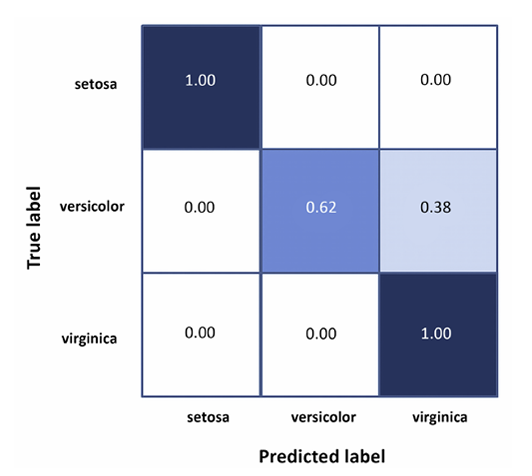

Doğruluğun kullanılabilirliğini artırmak için, her sınıfa göre doğruluğu dikkate alıp bunların ortalamasını almayı deneyebilirsiniz; ancak, **precision (kesinlik)**, **recall (duyarlılık)** ve **F1-score** gibi diğer metriklere güvenmek genellikle daha faydalı olacaktır.

#### Precision and recall *(Kesinlik ve duyarlılık)*

#### The F1 score *(F1 skoru)*

#### Log loss and ROC-AUC *(Log kaybı ve ROC-AUC)*

#### Matthews correlation coefficient (MCC) *(Matthews korelasyon katsayısı)*

### Metrics for multi-class classification *(Çok sınıflı sınıflandırma metrikleri)*

### Metrics for object detection problems *(Nesne tespiti problemleri için metrikler)*

#### Intersection over union (IoU) *(Kesişim/Birleşim oranı)*

#### Dice *(Dice katsayısı)*

### Metrics for multi-label classification and recommendation problems *(Çok etiketli sınıflandırma ve öneri problemleri için metrikler)*

#### MAP@K *(MAP@K metriği)*

### Optimizing evaluation metrics *(Değerlendirme metriklerini optimize etme)*

### Custom metrics and custom objective functions *(Özel metrikler ve özel hedef fonksiyonları)*

### Post-processing your predictions *(Tahminleri sonradan işleme)*

### Predicted probability and its adjustment *(Tahmin edilen olasılığın ayarlanması)*

### Summary *(Özet)*

---

## Chapter 6: Designing Good Validation *(Bölüm 6: İyi Bir Doğrulama Sistemi Tasarlama)*

### Snooping on the leaderboard *(Liderlik tablosunu gözetlemek)*

### The importance of validation in competitions *(Yarışmalarda doğrulamanın önemi)*

### Bias and variance *(Önyargı ve varyans)*

### Trying different splitting strategies *(Farklı veri bölme stratejilerini denemek)*

#### The basic train-test split *(Temel eğitim-test bölünmesi)*

#### Probabilistic evaluation methods *(Olasılıksal değerlendirme yöntemleri)*

#### k-fold cross-validation *(k-katlı çapraz doğrulama)*

#### Subsampling *(Alt örnekleme)*

#### The bootstrap *(Bootstrap yöntemi)*

### Tuning your model validation system *(Model doğrulama sistemini ayarlamak)*

### Using adversarial validation *(Zıt doğrulama yöntemini kullanmak)*

#### Example implementation *(Uygulama örneği)*

### Handling different distributions of training and test data *(Eğitim ve test verilerindeki farklı dağılımlarla başa çıkma)*

### Handling leakage *(Veri sızıntısını önleme)*

### Summary *(Özet)*

---

## Chapter 7: Modeling for Tabular Competitions *(Bölüm 7: Tablo Verisi Yarışmaları İçin Modellemede Yaklaşımlar)*

### The Tabular Playground Series *(Tabular Playground Serisi)*

### Setting a random state for reproducibility *(Tekrarlanabilirlik için rastgele durum belirleme)*

### The importance of EDA *(Keşifsel veri analizinin önemi)*

### Dimensionality reduction with t-SNE and UMAP *(t-SNE ve UMAP ile boyut indirgeme)*

### Reducing the size of your data *(Veri boyutunu küçültme)*

### Applying feature engineering *(Özellik mühendisliği uygulama)*

#### Easily derived features *(Kolay türetilen özellikler)*

#### Meta-features based on rows and columns *(Satır ve sütunlara dayalı meta-özellikler)*

#### Target encoding *(Hedef kodlama)*

### Using feature importance to evaluate your work *(Özellik önemini kullanarak çalışmanı değerlendirme)*

### Pseudo-labeling *(Sahte etiketleme)*

### Denoising with autoencoders *(Otoenkoderlerle gürültü giderme)*

### Neural networks for tabular competitions *(Tablo verisi yarışmaları için sinir ağları)*

### Summary *(Özet)*

---

## Chapter 8: Hyperparameter Optimization *(Bölüm 8: Hiperparametre Optimizasyonu)*

### Basic optimization techniques *(Temel optimizasyon teknikleri)*

#### Grid search *(Izgara araması)*

#### Random search *(Rastgele arama)*

#### Halving search *(Yarıya indirme araması)*

### Key parameters and how to use them *(Temel parametreler ve nasıl kullanılacakları)*

#### Linear models *(Doğrusal modeller)*

#### Support-vector machines *(Destek vektör makineleri)*

#### Random forests and extremely randomized trees *(Rastgele ormanlar ve aşırı rastgele ağaçlar)*

#### Gradient tree boosting *(Gradyan ağaç güçlendirmesi)*

#### LightGBM *(LightGBM algoritması)*

#### XGBoost *(XGBoost algoritması)*

#### CatBoost *(CatBoost algoritması)*

#### HistGradientBoosting *(Histogram tabanlı gradyan güçlendirme)*

### Bayesian optimization *(Bayesyen optimizasyon)*

#### Using Scikit-optimize *(Scikit-optimize kullanımı)*

#### Customizing a Bayesian optimization search *(Bayesyen aramayı özelleştirme)*

#### Extending Bayesian optimization to neural architecture search *(Bayesyen optimizasyonu sinir ağı mimarisi aramasına genişletme)*

#### Creating lighter and faster models with KerasTuner *(KerasTuner ile daha hafif ve hızlı modeller oluşturma)*

#### The TPE approach in Optuna *(Optuna’daki TPE yaklaşımı)*

### Summary *(Özet)*

---

## Chapter 9: Ensembling with Blending and Stacking Solutions *(Bölüm 9: Karıştırma ve Yığınlama (Ensemble) Çözümleri)*

### A brief introduction to ensemble algorithms *(Topluluk (ensemble) algoritmalarına kısa bir giriş)*

### Averaging models into an ensemble *(Modelleri ortalama alarak birleştirme)*

#### Majority voting *(Çoğunluk oylaması)*

#### Averaging of model predictions *(Model tahminlerinin ortalaması)*

#### Weighted averages *(Ağırlıklı ortalamalar)*

#### Averaging in your cross-validation strategy *(Çapraz doğrulama stratejinde ortalama alma)*

#### Correcting averaging for ROC-AUC evaluations *(ROC-AUC değerlendirmeleri için ortalamayı düzeltme)*

### Blending models using a meta-model *(Meta-model kullanarak modelleri karıştırma)*

#### Best practices for blending *(Karıştırma için en iyi uygulamalar)*

### Stacking models together *(Modelleri yığınlama)*

#### Stacking variations *(Yığınlama varyasyonları)*

### Creating complex stacking and blending solutions *(Karmaşık karıştırma ve yığınlama çözümleri oluşturma)*

### Summary *(Özet)*

---

## Chapter 10: Modeling for Computer Vision *(Bölüm 10: Bilgisayarlı Görü (Computer Vision) için Modellemede Yaklaşımlar)*

### Augmentation strategies *(Veri artırma stratejileri)*

#### Keras built-in augmentations *(Keras’ın yerleşik artırmaları)*

#### ImageDataGenerator approach *(ImageDataGenerator yaklaşımı)*

#### Preprocessing layers *(Ön işleme katmanları)*

#### albumentations *(Albumentations kütüphanesi)*

### Classification *(Sınıflandırma)*

### Object detection *(Nesne tespiti)*

### Semantic segmentation *(Anlamsal segmentasyon)*

### Summary *(Özet)*

---

## Chapter 11: Modeling for NLP *(Bölüm 11: Doğal Dil İşleme (NLP) için Modellemede Yaklaşımlar)*

### Sentiment analysis *(Duygu analizi)*

### Open domain Q&A *(Açık alan soru-cevap)*

### Text augmentation strategies *(Metin artırma stratejileri)*

#### Basic techniques *(Temel teknikler)*

#### nlpaug *(nlpaug kütüphanesi)*

### Summary *(Özet)*

---

## Chapter 12: Simulation and Optimization Competitions *(Bölüm 12: Simülasyon ve Optimizasyon Yarışmaları)*

### Connect X *(Connect X oyunu)*

### Rock-paper-scissors *(Taş-kağıt-makas)*

### Santa competition 2020 *(Santa yarışması 2020)*

### The name of the game *(Oyunun özü)*

### Summary *(Özet)*

---

# Part III: Leveraging Competitions for Your Career *(Bölüm III: Yarışmaları Kariyerinde Avantaja Dönüştürme)*

## Chapter 13: Creating Your Portfolio of Projects and Ideas *(Bölüm 13: Proje ve Fikir Portföyü Oluşturma)*

### Building your portfolio with Kaggle *(Kaggle ile portföy oluşturma)*

### Leveraging Notebooks and discussions *(Defterler ve tartışmalardan yararlanma)*

### Leveraging Datasets *(Veri setlerinden yararlanma)*

### Arranging your online presence beyond Kaggle *(Kaggle dışında çevrimiçi varlığını düzenleme)*

#### Blogs and publications *(Bloglar ve yayınlar)*

#### GitHub *(GitHub)*

### Monitoring competition updates and newsletters *(Yarışma güncellemelerini ve bültenleri takip etme)*

### Summary *(Özet)*

---

## Chapter 14: Finding New Professional Opportunities *(Bölüm 14: Yeni Profesyonel Fırsatlar Bulmak)*

### Building connections with other competition data scientists *(Diğer yarışmacı veri bilimcilerle bağlantı kurma)*

### Participating in Kaggle Days and other Kaggle meetups *(Kaggle Days ve diğer Kaggle buluşmalarına katılma)*

### Getting spotted and other job opportunities *(Fark edilmek ve diğer iş fırsatları)*

#### The STAR approach *(STAR yaklaşımı)*

### Summary (and some parting words) *(Özet ve kapanış notları)*

---

## Other Books You May Enjoy *(Hoşunuza Gidebilecek Diğer Kitaplar)*

## Index *(Dizin)*
