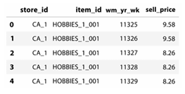

# Bölüm 1: En Ünlü Tablosal Yarışma – Porto Seguro'nun Güvenli Sürücü Tahmini *(Chapter 1: The Most Renowned Tabular Competition – Porto Seguro’s Safe Driver Prediction)*

Herhangi bir Kaggle yarışmasında liderlik tablosunun zirvesine nasıl ulaşılacağını öğrenmek sabır, **azim** ve en iyi sonuçları elde etmek için rekabet etmenin en iyi yolunu öğrenmek için **birçok deneme** gerektirir. Bu nedenle, geçmişteki bazı Kaggle yarışmalarını deneyerek ve tartışmaları okuyarak, not defterlerini (notebooks) yeniden kullanarak, **özellik mühendisliği** (feature engineering) yaparak ve çeşitli modelleri eğiterek liderlik tablosunun zirvesine nasıl ulaşılacağını öğrenerek bu becerileri daha hızlı geliştirmenize yardımcı olabilecek bir çalışma kitabı düşündük.

En ünlü tablo (tabular) yarışmalarından biri olan **Porto Seguro’s Safe Driver Prediction** ile başlıyoruz. Bu yarışmada, sigortacılıkta yaygın bir sorunu çözmeniz ve önümüzdeki yıl kimin araç sigortası talebinde bulunacağını bulmanız isteniyor. Böyle bir bilgi, talepte bulunma olasılığı daha yüksek olan sürücüler için sigorta ücretini artırmak ve olasılığı daha düşük olanlar için düşürmek açısından faydalıdır.

Bu yarışmayı çözmek için gerekli olan temel içgörüleri ve teknik detayları açıklarken, size gerekli kodu gösterecek ve **The Kaggle Book**’ta bulunan konuları incelemenizi ve soruları yanıtlamanızı isteyeceğiz. Öyleyse, daha fazla gecikmeden, bu yeni öğrenme yolunuza başlayalım.

Bu bölümde şunları öğreneceksiniz:

  * Bir **LightGBM** modelini nasıl ayarlayacağınız (tune) ve eğiteceğiniz
  * Bir **gürültü giderici otomatik kodlayıcıyı (denoising autoencoder)** nasıl oluşturacağınız ve bunu bir sinir ağını beslemek için nasıl kullanacağınız
  * Birbirinden oldukça farklı olan modelleri **etkili bir şekilde nasıl harmanlayacağınız (blend)**

> Bu bölümdeki tüm kod dosyaları **[https://packt.link/kwbchp1](https://www.google.com/search?q=https://packt.link/kwbchp1)** adresinde bulunabilir.

## Yarışmayı ve veriyi anlama *(Understanding the competition and the data)*

Porto Seguro, Brezilya'nın (Brezilya ve Uruguay'da faaliyet gösteren) üçüncü büyük sigorta şirketidir; otomobil sigortası teminatının yanı sıra pek çok başka sigorta ürünü de sunmaktadır ve son 20 yıldır fiyatlarını belirlemek ve otomatik sigorta teminatını daha fazla sürücü için daha erişilebilir kılmak amacıyla analitik yöntemler ve makine öğrenimi kullanmaktadır. Görevlerini başarmanın yeni yollarını keşfetmek amacıyla, Kaggle kullanıcılarının (Kagglers) bazı temel analitik problemlerine yeni ve daha iyi çözümler bulmalarını bekleyerek bir yarışmaya ([https://www.kaggle.com/competitions/porto-seguro-safe-driver-prediction](https://www.kaggle.com/competitions/porto-seguro-safe-driver-prediction)) sponsor olmuşlardır.

Yarışma, Kaggle kullanıcılarının, bir sürücünün önümüzdeki yıl bir otomobil sigortası talebi başlatma olasılığını tahmin eden bir model oluşturmasını amaçlamaktadır ki bu oldukça yaygın bir görev türüdür (sponsor bunu "sigortacılık için klasik bir meydan okuma" olarak bahsetmektedir). Talepte bulunma olasılığı hakkındaki bu tür bilgiler, bir sigorta şirketi için oldukça değerli olabilir. Böyle bir model olmadan, sigorta şirketleri müşterilerine risklerine bakılmaksızın yalnızca sabit bir prim uygulayabilir veya kötü performans gösteren bir modele sahiplerse, onlara **uygunsuz bir prim** uygulayabilirler. Müşterilerin riskini profilendirmedeki yanlışlıklar, iyi sürücülere daha yüksek sigorta maliyeti yüklenmesine ve kötü sürücüler için fiyatın düşürülmesine yol açabilir. Bunun şirket üzerindeki etkisi iki yönlü olacaktır: iyi sürücüler sigortalarını başka yerlerde arayacak ve şirketin portföyü kötü sürücülerle aşırı yüklenecektir (teknik olarak, şirketin **kötü bir hasar oranı** olacaktır: [https://www.investopedia.com/terms/l/loss-ratio.asp](https://www.investopedia.com/terms/l/loss-ratio.asp)). Bunun yerine, şirket talep olasılığını doğru bir şekilde tahmin edebilirse, müşterilerinden **adil bir fiyat** isteyebilir, böylece pazar paylarını artırabilir, daha memnun müşterilere ve daha dengeli bir müşteri portföyüne (daha iyi hasar oranı) sahip olabilir ve rezervlerini (şirketin talepleri ödemek için ayırdığı para) daha iyi yönetebilir.

Bunu yapmak için, sponsor eğitim ve test veri kümeleri sağlamıştır ve veri kümesi çok büyük olmadığı ve çok iyi hazırlanmış göründüğü için yarışma herkes için idealdi.

Verilerin sunulmasına ayrılmış olan yarışma sayfasında ([https://www.kaggle.com/competitions/porto-seguro-safe-driver-prediction/data](https://www.kaggle.com/competitions/porto-seguro-safe-driver-prediction/data)) belirtildiği gibi:

> Benzer gruplara ait özellikler, özellik adlarında bu şekilde etiketlenmiştir (örneğin, ind, reg, car, calc).
>
> Ek olarak, özellik adları ikili (binary) özellikleri belirtmek için **bin** ve kategorik özellikleri belirtmek için **cat** sonekini içerir. Bu tanımlamalara sahip olmayan özellikler ya sürekli (continuous) ya da sıralıdır (ordinal). **-1** değerleri, özelliğin gözlemde **eksik** olduğunu gösterir. **Hedef (target)** sütunu, poliçe sahibi için bir talep açılıp açılmadığını gösterir.

Yarışma için veri hazırlığı, herhangi bir bilgi sızıntısını (leak) önlemek için dikkatlice yapılmıştır ve özelliklerin anlamı hakkında gizlilik korunmuş olsa da, kullanılan farklı etiketlerin motorlu taşıt sigortası modellemesinde yaygın olarak kullanılan belirli özellik türlerine atıfta bulunduğu oldukça açıktır:

  * **ind**: "Bireysel özellikler" (individual characteristics)
  * **car**: "Araba özellikleri" (car characteristics)
  * **calc**: "Hesaplanmış özellikler" (calculated features)
  * **reg**: "Bölgesel/coğrafi özellikler" (regional/geographic features)

Bireysel özelliklere gelince, yarışma sırasında anlamları hakkında çok fazla spekülasyon yapılmıştır. Örneğin şuraya bakınız:

  * [https://www.kaggle.com/competitions/porto-seguro-safe-driver-prediction/discussion/41489](https://www.google.com/search?q=https://www.kaggle.com/competitions/porto-seguro-safe-driver-prediction/discussion/41489), burada Raddar, **ps\_car\_13** özelliğinin iki yılda bir zorunlu araç muayeneleri arasında kat edilen mesafeyi temsil edebileceğini öne sürmektedir.
  * [https://www.kaggle.com/competitions/porto-seguro-safe-driver-prediction/discussion/41488](https://www.kaggle.com/competitions/porto-seguro-safe-driver-prediction/discussion/41488), burada Raddar, **ps\_car\_12** özelliğinin bunun yerine motor silindir hacmini temsil edebileceğini öne sürmektedir.
  * [https://www.kaggle.com/competitions/porto-seguro-safe-driver-prediction/discussion/41057](https://www.kaggle.com/competitions/porto-seguro-safe-driver-prediction/discussion/41057), burada bazı özelliklerin Porto Seguro'nun çevrimiçi teklif formundan türetildiği yönündeki öneriyi okuyabilirsiniz.

Tüm bu ve daha fazla çabaya rağmen, sonunda özelliklerin çoğunun anlamı şimdiye kadar bir **gizem olarak kalmıştır**.

Bu yarışmanın ilginç gerçekleri şunlardır:

1.  Veriler, özellikler anonim olsa da, **gerçek dünyadan** alınmıştır.
2.  Veriler, herhangi bir tür sızıntı olmaksızın **çok iyi hazırlanmıştır** (burada sihirli özellikler yoktur – sihirli özellik, becerikli bir işlemle Kaggle yarışmasında modellerinize yüksek tahmin gücü sağlayabilen bir özelliktir).
3.  Test veri seti sadece eğitim veri setiyle aynı kategorik seviyeleri tutmakla kalmaz; aynı zamanda aynı dağılımdan geliyormuş gibi görünmektedir, ancak Yuya Yamamoto, verilerin t-SNE ile ön işlenmesinin düşmanca doğrulama (adversarial validation) testinin başarısız olmasına yol açtığını iddia etmektedir ([https://www.kaggle.com/competitions/porto-seguro-safe-driver-prediction/discussion/44784](https://www.kaggle.com/competitions/porto-seguro-safe-driver-prediction/discussion/44784)).

> 📝 Alıştırma 1
> 
> 
> 
> İlk alıştırma olarak, **The Kaggle Book**'taki **düşmanca doğrulama (adversarial validation)** ile ilgili içeriklere ve koda (sayfa 179'dan başlayarak) atıfta bulunarak, eğitim ve test verilerinin **büyük olasılıkla aynı veri dağılımından** kaynaklandığını kanıtlayınız.
> 
> 
> 
> **Alıştırma Notları** (Size yardımcı olacak tüm notları veya çalışmaları buraya yazınız):

Tilii (Mensur Dlakic, Montana Eyalet Üniversitesi'nde Doçent: [https://www.kaggle.com/competitions/porto-seguro-safe-driver-prediction/discussion/42197](https://www.google.com/search?q=https://www.kaggle.com/competitions/porto-seguro-safe-driver-prediction/discussion/42197)) tarafından yapılan ilginç bir paylaşım, t-SNE kullanarak şunu göstermektedir: "**Sigorta parametreleri açısından çok benzer olan birçok insan vardır, ancak bunlardan bazıları talepte bulunacak, bazıları ise bulunmayacaktır**." Tilii'nin bahsettiği şey, sigortacılıkta olanlara oldukça tipiktir; belirli öncüller (sigorta parametreleri) için bir şeyin olma olasılığı aynıdır, ancak o olay, olaylar dizisini ne kadar süre gözlemlediğimize bağlı olarak gerçekleşir veya gerçekleşmez.

Örneğin, sigortacılıkta IoT ve telematik verilerini ele alalım. Bir sürücünün gelecekte talepte bulunup bulunmayacağını tahmin etmek için sürüş davranışını analiz etmek oldukça yaygındır. Gözlem süreniz **çok kısaysa** (örneğin, bu yarışmada olduğu gibi bir yıl), çok kötü sürücülerin bile bir talepte bulunmaması söz konusu olabilir, çünkü kötü bir sürücü için bile böyle bir olayın kısa bir zaman diliminde meydana gelme olasılığı düşüktür.

Benzer fikirler, Andy Harless ([https://www.kaggle.com/competitions/porto-seguro-safe-driver-prediction/discussion/42735](https://www.google.com/search?q=https://www.kaggle.com/competitions/porto-seguro-safe-driver-prediction/discussion/42735)) tarafından tartışılmaktadır; Harless, bunun yerine yarışmanın gerçek görevinin "kazaya daha yatkın olan sürücüleri belirleyen **gizli bir sürekli değişkenin değerini tahmin etmek**" olduğunu savunur, çünkü aslında "**talepte bulunmak bir sürücünün özelliği değil; şansın bir sonucudur**."

## Değerlendirme metriğini anlama
*(Understanding the evaluation metric)*

Elbette, metninizi Türkçeye çevirdim:

-----

Yarışmada kullanılan metrik, **normalleştirilmiş Gini katsayısıdır** (ekonomide kullanılan benzer Gini katsayısı/endeksinden almıştır) ve daha önce başka bir yarışmada, Allstate Claim Prediction Challenge'da ([https://www.kaggle.com/competitions/ClaimPredictionChallenge](https://www.google.com/search?q=https://www.kaggle.com/competitions/ClaimPredictionChallenge)) kullanılmıştır. Bu yarışmadan, metriğin ne hakkında olduğuna dair çok net bir açıklama alabiliriz:

> Bir giriş gönderdiğinizde, gözlemler "en büyük tahminden" "en küçük tahmine" doğru sıralanır. Tahminlerinizin devreye girdiği tek adım budur, bu nedenle yalnızca tahminlerinizin belirlediği sıra önemlidir. Gözlemleri soldan sağa, en büyük tahminler solda olacak şekilde düzenlenmiş olarak görselleştirin. Ardından soldan sağa hareket ederek şunu sorarız: "**Verinin en soldaki %x'lik kısmında, gerçekten gözlemlenen kaybın ne kadarını biriktirdiniz?**" Bir model olmadan, tahminlerin %10'unda kaybın %10'unu biriktirmeyi beklersiniz, bu nedenle model olmaması (veya bir "sıfır" modeli) düz bir çizgiye ulaşır. **Sizin eğriniz ile bu düz çizgi arasındaki alana Gini katsayısı diyoruz.**
>
> "Mükemmel" bir model için ulaşılabilecek maksimum bir alan vardır. Biz, modelinizin Gini katsayısını mükemmel modelin Gini katsayısına bölerek **normalleştirilmiş Gini katsayısını** kullanacağız.

Daha iyi bir açıklama da Kilian Batzner'ın not defterinde (notebook) sağlanmıştır: [https://www.kaggle.com/code/batzner/gini-coefficient-an-intuitive-explanation](https://www.kaggle.com/code/batzner/gini-coefficient-an-intuitive-explanation). Kilian, net çizimler ve bazı basit örnekler kullanarak, sigorta şirketlerinin aktüerya departmanları tarafından rutin olarak kullanılan, ancak çok yaygın olmayan bu metriği anlamlandırmaya çalışmaktadır.

Bu metrik, yaklaşık olarak $2 \cdot \text{ROC-AUC} - 1$ formülüne karşılık geldiği için **ROC-AUC skoru** veya **Mann–Whitney U non-parametrik istatistiksel testi** (U istatistiği, alıcı işletim karakteristiği eğrisi altındaki alana – AUC'ye eşdeğer olduğundan) ile yaklaştırılabilir. Dolayısıyla, **ROC-AUC'yi maksimize etmek, normalleştirilmiş Gini katsayısını maksimize etmekle aynıdır** (bir referans için Wikipedia girişindeki *Diğer istatistiksel ölçümlerle ilişki* bölümüne bakınız: [https://en.wikipedia.org/wiki/Gini\_coefficient](https://en.wikipedia.org/wiki/Gini_coefficient)).

Metrik, ayrıca ölçeklenmiş tahmin sırası (rank) ile ölçeklenmiş hedef değerinin kovaryansı olarak da yaklaşık olarak ifade edilebilir, bu da daha anlaşılır bir sıra ilişkisi ölçütü sağlar (bkz. Dmitriy Guller: [https://www.kaggle.com/competitions/porto-seguro-safe-driver-prediction/discussion/40576](https://www.kaggle.com/competitions/porto-seguro-safe-driver-prediction/discussion/40576)).

**Amaç fonksiyonu** (objective function) açısından bakıldığında, bir sınıflandırma probleminde yapacağınız gibi **ikili log-kaybı** (binary log-loss) için optimizasyon yapabilirsiniz. Ne ROC-AUC ne de normalleştirilmiş Gini katsayısı türevlenebilir değildir ve bunlar yalnızca doğrulama kümesi üzerindeki metrik değerlendirmesi için kullanılabilir (örneğin, erken durdurma veya bir sinir ağında öğrenme hızını azaltma için). Ancak, log-kaybı için optimizasyon yapmak her zaman ROC-AUC'yi ve normalleştirilmiş Gini katsayılarını iyileştirmez ve ikisi de doğrudan türevlenebilir değildir.

> Aslında türevlenebilir bir ROC-AUC yaklaştırması mevcuttur. Bunun nasıl çalıştığını Toon Calders ve Szymon Jaroszewicz'in *Efficient AUC Optimization for Classification* adlı çalışmasında okuyabilirsiniz. European Conference on Principles of Data Mining and Knowledge Discovery. Springer, Berlin, Heidelberg, 2007: [https://link.springer.com/content/pdf/10.1007/978-3-540-74976-9\_8.pdf](https://link.springer.com/content/pdf/10.1007/978-3-540-74976-9_8.pdf).

Ancak, yarışmada bir amaç fonksiyonu olarak log-kaybından farklı bir şey kullanmaya ve değerlendirme metriği olarak ROC-AUC veya normalleştirilmiş Gini katsayısından başka bir şey kullanmaya gerek olmadığı anlaşılmaktadır.

Kaggle Not Defterleri arasında normalleştirilmiş Gini katsayısını hesaplamak için aslında birkaç Python uygulaması bulunmaktadır. Burada, CPMP'nin ([https://www.kaggle.com/code/cpmpml/extremely-fast-gini-computation/notebook](https://www.google.com/search?q=https://www.kaggle.com/code/cpmpml/extremely-fast-gini-computation/notebook)) **Numba** kullanarak hesaplamaları hızlandıran çalışmasını kullandık ve öneriyoruz: bu hem kesin hem de hızlıdır.

> 📝 Alıştırma 2
> 
> 
> 
> **The Kaggle Book**'un 5. bölümünde (sayfa 95 ve sonrası), özellikle yeni ve genellikle bilinmeyen yarışma metrikleriyle nasıl başa çıkılacağını açıklamıştık.
> 
> 
> 
> Bir alıştırma olarak, Kaggle'da **normalleştirilmiş Gini katsayısını** bir değerlendirme metriği olarak kullanan **kaç yarışma** olduğunu bulabilir misiniz?
> 
> 
> 
> **Alıştırma Notları** (Size yardımcı olacak tüm notları veya çalışmaları buraya yazınız):

## Michael Jahrer'ın en iyi çözüm fikirlerini inceleme *(Examining the top solution ideas from Michael Jahrer)*

Michael Jahrer ([https://www.kaggle.com/mjahrer](https://www.kaggle.com/mjahrer), yarışma Büyük Ustası ve Netflix Ödülü'nün "BellKor's Pragmatic Chaos" ekibindeki kazananlarından biri), yarışma boyunca halka açık liderlik tablosunu uzun süre ve belirgin bir farkla önde götürdü ve özel çözümler nihayet açıklandığında kazanan ilan edildi.

Kısa süre sonra, tartışma forumunda, **gürültü giderici otomatik kodlayıcıları (denoising autoencoders)** ve sinir ağlarını akıllıca kullanması nedeniyle birçok Kaggler için bir referans haline gelen çözümünün kısa bir özetini yayınladı ([https://www.kaggle.com/competitions/porto-seguro-safe-driver-prediction/discussion/44629](https://www.kaggle.com/competitions/porto-seguro-safe-driver-prediction/discussion/44629)). Michael, çözümüne ilişkin herhangi bir Python kodu eklememiş olsa da (kodlama çalışmasını doğrudan C++/CUDA ile Python kullanmadan yazılmış "eski usul" ve "düşük seviyeli" olarak tanımlamıştır), yazıları kullandığı modellere, hiperparametrelerine ve mimarilerine dair referanslar açısından oldukça zengindir.

Öncelikle Michael, çözümünün altı modelin bir karışımından (bir LightGBM modeli ve beş sinir ağı) oluştuğunu açıklamaktadır. Ayrıca, muhtemelen **aşırı öğrenme (overfitting)** nedeniyle, karışıma her bir modelin katkısını ağırlıklandırmanın (ayrıca doğrusal ve doğrusal olmayan yığınlama (stacking) yapmanın) bir avantaj sağlamadığı için, yalnızca farklı tohumlardan (seed) oluşturulmuş, **eşit ağırlığa sahip** modellerin bir karışımına başvurduğunu belirtmektedir.

Bu içgörü, Michael'ın yaklaşımını çoğaltma görevimizi çok daha kolay hale getiriyor, çünkü kendisi ayrıca, **yalnızca LightGBM sonuçlarını oluşturduğu sinir ağlarından biriyle karıştırmanın (blending)** bile yarışmada birinciliği garantilemek için yeterli olacağını da belirtmiştir.

Bu içgörü, alıştırma çalışmamızı bir sürü model yerine, iki iyi tekil modelle sınırlayacaktır. Buna ek olarak, Michael, bazı sütunları çıkarmak ve kategorik özellikleri **tek-sıcak kodlama (one-hot encoding)** dışında çok az veri işleme yaptığını da belirtmiştir.

## Bir LightGBM gönderimi oluşturma *(Building a LightGBM submission)*

Alıştırmamız LightGBM tabanlı bir çözüm üzerinde çalışmakla başlıyor. Kodu, Kaggle Notebooks'u kullanarak hemen yürütülmeye hazır şekilde şu adreste bulabilirsiniz: [https://www.kaggle.com/code/lucamassaron/workbook-lgb](https://www.kaggle.com/code/lucamassaron/workbook-lgb). Kodu kolayca erişilebilir hale getirmiş olsak da, bunun yerine kodu doğrudan kitaptan yazmanızı veya kopyalamanızı ve hücre hücre çalıştırmanızı öneriyoruz; her bir kod satırının ne yaptığını anlamak ve çözümü kişiselleştirmek, performansını daha da artırabilir.

> LightGBM kullanırken, **GPU veya TPU hızlandırıcılarından hiçbirini açmanıza gerek yoktur ve açmamalısınız**. GPU hızlandırması yalnızca LightGBM'nin GPU sürümünü yüklediyseniz yardımcı olabilir. Bu tür GPU hızlandırmalı bir sürümü Kaggle Notebooks'a nasıl kuracağınıza dair çalışma ipuçlarını şu örnekte bulabilirsiniz: [https://www.kaggle.com/code/lucamassaron/gpu-accelerated-lightgbm](https://www.kaggle.com/code/lucamassaron/gpu-accelerated-lightgbm).

Anahtar paketleri (hiperparametre optimizasyonu için NumPy, pandas ve Optuna, LightGBM ve bazı yardımcı fonksiyonlar) içe aktararak başlıyoruz. Ayrıca bir konfigürasyon sınıfı tanımlıyor ve onu örneklendiriyoruz. Konfigürasyon sınıfında tanımlanan parametreleri, kodun ilerleyişi sırasında keşfederken tartışacağız. Burada önemli olan nokta, tüm parametrelerinizi içeren bir sınıf kullanarak, onları kod boyunca tutarlı bir şekilde değiştirmenizin daha kolay olacağıdır. Yarışmanın hararetinde, kodun birden fazla yerinde atıfta bulunulan bir parametreyi güncellemeyi unutmak kolaydır ve parametreler hücrelere ve fonksiyonlara dağılmışsa bunları ayarlamak her zaman zordur. Bir konfigürasyon sınıfı, size çok çaba kazandırabilir ve yol boyunca hatalardan koruyabilir:

```python
import numpy as np
import pandas as pd
import optuna
import lightgbm as lgb
from path import Path
from sklearn.model_selection import StratifiedKFold

class Config:
    input_path = Path('../input/porto-seguro-safe-driver-prediction')
    optuna_lgb = False
    n_estimators = 1500
    early_stopping_round = 150
    cv_folds = 5
    random_state = 0
    params = {'objective': 'binary',
              'boosting_type': 'gbdt',
              'learning_rate': 0.01,
              'max_bin': 25,
              'num_leaves': 31,
              'min_child_samples': 1500,
              'colsample_bytree': 0.7,
              'subsample_freq': 1,
              'subsample': 0.7,
              'reg_alpha': 1.0,
              'reg_lambda': 1.0,
              'verbosity': 0,
              'random_state': 0}

config = Config()
```

Bir sonraki adım, eğitim, test ve örnek gönderim veri setlerini içe aktarmayı gerektirir. Bunu pandas'ın `read_csv` fonksiyonunu kullanarak yapıyoruz. Ayrıca, yüklenen `DataFrame`'lerin indeksini her bir veri örneğinin tanımlayıcısına (`id` sütununa) ayarlıyoruz.

Benzer gruplara ait özellikler etiketlendiği (`ind`, `reg`, `car` ve `calc` etiketlerini kullanarak) ve ayrıca ikili (binary) ve kategorik özellikler kolayca bulunabildiği (etiketlerinde sırasıyla `bin` ve `cat` etiketlerini kullanırlar), bunları numaralandırabilir ve listelere kaydedebiliriz:

```python
train = pd.read_csv(config.input_path / 'train.csv', index_col='id')
test = pd.read_csv(config.input_path / 'test.csv', index_col='id')
submission = pd.read_csv(config.input_path / 'sample_submission.csv', 
index_col='id')
calc_features = [feat for feat in train.columns if "_calc" in feat]
cat_features = [feat for feat in train.columns if "_cat" in feat]
```

Daha sonra, sadece hedefi (0'lar ve 1'lerden oluşan ikili bir hedef) çıkarır ve eğitim veri setinden kaldırırız:

```python
target = train["target"]
train = train.drop("target", axis="columns")
```

Bu noktada, Michael Jahrer'in de işaret ettiği gibi, `calc` özelliklerini silebiliriz. Bu fikir, özellikle not defterlerinde yarışma sırasında çokça yinelenmiştir ([https://www.kaggle.com/competitions/porto-seguro-safe-driver-prediction/discussion/41970](https://www.google.com/search?q=https://www.kaggle.com/competitions/porto-seguro-safe-driver-prediction/discussion/41970)), çünkü bunları silmenin hem yerel çapraz doğrulama skorunu hem de halka açık liderlik tablosu skorunu iyileştirdiği deneysel olarak doğrulanabilmiştir (genel bir kural olarak, özellik seçimi sırasında her ikisini de takip etmek önemlidir). Ayrıca, bu özellikler gradyan artırma (gradient boosting) modellerinde de kötü performans göstermiştir (önemleri her zaman ortalamanın altındadır).

Tartışabiliriz ki, bu özellikler mühendislik ürünü özellikler oldukları için, orijinal özelliklerine göre yeni bir bilgi içermezler, ancak onları içeren eğitilmiş herhangi bir modele sadece gürültü katarlar:

```python
train = train.drop(calc_features, axis="columns")
test = test.drop(calc_features, axis="columns")
```

> 📝 Alıştırma 3
> 
> 
> 
> **The Kaggle Book**'un 220. sayfasında (Çalışmanızı değerlendirmek için özellik önemini kullanma başlığı altında) sağlanan önerilere dayanarak, bir alıştırma olarak:
> 
> 
> 
> 1.  Bu yarışma için **kendi özellik seçimi** not defterinizi (notebook) kodlayın.
> 
> 2.  **Hangi özelliklerin tutulması** ve **hangilerinin atılması** gerektiğini kontrol edin.
> 
> 
> 
> **Alıştırma Notları** (Size yardımcı olacak tüm notları veya çalışmaları buraya yazınız):

Kategorik özellikler bunun yerine **tek-sıcak kodlama (one-hot encoded)** ile işlenir. Eğitim ve test veri setlerinde aynı etiketler bulunduğundan (Porto Seguro ekibi tarafından düzenlenen dikkatli bir eğitim/test ayrımının sonucu), olağan scikit-learn `OneHotEncoder` ([https://scikit-learn.org/stable/modules/generated/sklearn.preprocessing.OneHotEncoder.html](https://scikit-learn.org/stable/modules/generated/sklearn.preprocessing.OneHotEncoder.html)) yerine, pandas'ın `get_dummies` fonksiyonunu ([https://pandas.pydata.org/docs/reference/api/pandas.get\_dummies.html](https://pandas.pydata.org/docs/reference/api/pandas.get_dummies.html)) kullanacağız. Pandas fonksiyonu, özellikler ve seviyeleri eğitim ve test setleri arasında farklılık gösterirse farklı kodlamalar üretebileceği için, tek-sıcak kodlamanın her ikisi için de aynı olmasını sağlayan bir kontrol (`assert`) ekliyoruz:

```python
train = pd.get_dummies(train, columns=cat_features)
test = pd.get_dummies(test, columns=cat_features)
assert((train.columns==test.columns).all())
```

Kategorik özelliklerin tek-sıcak kodlanması, veri işleme aşamasını tamamlar. Daha önce tartıştığımız gibi, değerlendirme metriğimiz olan **normalleştirilmiş Gini katsayısını** tanımlamaya geçiyoruz. Daha önce bahsedilen CPMP tarafından önerilen son derece hızlı Gini hesaplama kodunu kullanacağız.

Bir LightGBM modeli kullanacağımız için, **GBM algoritmasına** eğitim ve doğrulama veri setlerinin değerlendirmesini onunla çalışabilecek bir biçimde döndürmek üzere uygun bir sarmalayıcı (`gini_lgb`) eklememiz gerekiyor (bkz. [https://lightgbm.readthedocs.io/en/latest/pythonapi/lightgbm.Booster.html?highlight=higher\_better\#lightgbm.Booster.eval](https://www.google.com/search?q=https://lightgbm.readthedocs.io/en/latest/pythonapi/lightgbm.Booster.html%3Fhighlight%3Dhigher_better%23lightgbm.Booster.eval) – Her değerlendirme fonksiyonu iki parametre kabul etmeli: `preds`, `eval_data` ve `(eval_name, eval_result, is_higher_better)` veya bu tür demetlerin bir listesini döndürmelidir):

```python
from numba import jit
@jit
def eval_gini(y_true, y_pred):
    y_true = np.asarray(y_true)
    y_true = y_true[np.argsort(y_pred)]
    ntrue = 0
    gini = 0
    delta = 0
    n = len(y_true)
    for i in range(n-1, -1, -1):
        y_i = y_true[i]
        ntrue += y_i
        gini += y_i * delta
        delta += 1 - y_i
    gini = 1 - 2 * gini / (ntrue * (n - ntrue))
    return gini

def gini_lgb(y_true, y_pred):
    eval_name = 'normalized_gini_coef'
    eval_result = eval_gini(y_true, y_pred)
    is_higher_better = True
    return eval_name, eval_result, is_higher_better
```

Eğitim parametrelerine gelince, Michael Jahrer'in paylaşımında ([https://www.kaggle.com/competitions/porto-seguro-safe-driver-prediction/discussion/44629](https://www.kaggle.com/competitions/porto-seguro-safe-driver-prediction/discussion/44629)) önerdiği parametrelerin mükemmel çalıştığını gördük.

Eğer `Config` sınıfındaki `optuna_lgb` bayrağını `True` olarak ayarlarsanız, Optuna ([https://optuna.org/](https://optuna.org/)) ile bir arama yaparak aynı parametreleri veya benzer performans gösteren parametreleri bulmaya çalışabilirsiniz. Burada optimizasyon, eğitim verileri üzerinde beş katlı çapraz doğrulama testine dayanarak öğrenme oranı (learning rate) ve düzenlileştirme (regularization) parametreleri gibi temel parametreler için en iyi değerleri bulmaya çalışır. İşleri hızlandırmak için, doğrulamanın kendisinde **erken durdurma (early stopping)** dikkate alınır (ki bunun, doğrulama katmanını daha iyi aşırı öğrenebilecek bazı parametrelerin seçilmesini destekleyebileceğinin farkındayız – iyi bir alternatif, erken durdurma geri çağrısını kaldırmak ve eğitim için sabit bir tur sayısı tutmaktır):

```python
if config.optuna_lgb:
        
    def objective(trial):
        params = {
    'learning_rate': trial.suggest_float("learning_rate", 0.01, 1.0),
    'num_leaves': trial.suggest_int("num_leaves", 3, 255),
    'min_child_samples': trial.suggest_int("min_child_samples", 
                                           3, 3000),
    'colsample_bytree': trial.suggest_float("colsample_bytree", 
                                            0.1, 1.0),
    'subsample_freq': trial.suggest_int("subsample_freq", 0, 10),
    'subsample': trial.suggest_float("subsample", 0.1, 1.0),
    'reg_alpha': trial.suggest_loguniform("reg_alpha", 1e-9, 10.0),
    'reg_lambda': trial.suggest_loguniform("reg_lambda", 1e-9, 10.0),
        }

        score = list()
        skf = StratifiedKFold(n_splits=config.cv_folds, shuffle=True, 
                              random_state=config.random_state)
        
        for train_idx, valid_idx in skf.split(train, target):
            X_train = train.iloc[train_idx]
            y_train = target.iloc[train_idx]
            X_valid = train.iloc[valid_idx] 
            y_valid = target.iloc[valid_idx]
            
            model = lgb.LGBMClassifier(**params,
                                    n_estimators=1500,
                                    early_stopping_round=150,
                                    force_row_wise=True)
            callbacks=[lgb.early_stopping(stopping_rounds=150, 
                                          verbose=False)]
            
            model.fit(X_train, y_train, 
                      eval_set=[(X_valid, y_valid)],  
                      eval_metric=gini_lgb, callbacks=callbacks)
            
            score.append(
                model.best_score_['valid_0']['normalized_gini_coef'])
                
        return np.mean(score)
    
    study = optuna.create_study(direction="maximize")
    study.optimize(objective, n_trials=300)
    
    print("Best Gini Normalized Score", study.best_value)
    print("Best parameters", study.best_params)
    
    params = {'objective': 'binary',
              'boosting_type': 'gbdt',
              'verbosity': 0,
              'random_state': 0}
              
    params.update(study.best_params)
    
else:
    params = config.params
```

Yarışma sırasında Tilii, **Boruta** ([https://github.com/scikit-learn-contrib/boruta\_py](https://github.com/scikit-learn-contrib/boruta_py)) kullanarak özellik elemesini test etti. Çekirdeğini (kernel) burada bulabilirsiniz: [https://www.kaggle.com/code/tilii7/boruta-feature-elimination/notebook](https://www.google.com/search?q=https://www.kaggle.com/code/tilii7/boruta-feature-elimination/notebook). Kontrol edebileceğiniz gibi, Boruta tarafından onaylanmış bir özellik olarak kabul edilen **hiçbir `calc_` özelliği yoktur**.

> 📝 Alıştırma 4
> 
> 
> 
> **The Kaggle Book**'ta, **hiperparametre optimizasyonunu** (sayfa 241 ve sonrası) açıklıyor ve LightGBM modeli için bazı temel hiperparametreler sağlıyoruz.
> 
> 
> 
> Bir alıştırma olarak:
> 
> 
> 
> Gerektiğini düşündüğünüz yerlerde araştırılan parametreleri azaltarak veya artırarak **Optuna** ile hiperparametre aramasını iyileştirmeye çalışın ve ayrıca scikit-learn'den **rastgele arama (random search)** veya **yarılamalı arama (halving search)** gibi alternatif optimizasyon yöntemlerini deneyin (sayfa 245–246).
> 
> 
> 
> **Alıştırma Notları** (Size yardımcı olacak tüm notları veya çalışmaları buraya yazınız):

En iyi parametrelerimizi elde ettiğimizde (ya da sadece Jahrer'in parametrelerini denediğimizde), **eğitim yapmaya ve tahmin etmeye** hazırız. En iyi çözümün önerdiği gibi, stratejimiz **her çapraz doğrulama (cross-validation) katmanında** bir model eğitmek ve bu katmanı, test tahminlerinin ortalamasına katkıda bulunmak için kullanmaktır. Aşağıdaki kod parçası, hem test tahminlerini hem de sonuçları bir araya getirmek için faydalı olacak eğitim veri setindeki **katman dışı (out-of-fold)** tahminleri üretecektir:

```python
preds = np.zeros(len(test))
oof = np.zeros(len(train))
metric_evaluations = list()
skf = StratifiedKFold(n_splits=config.cv_folds, shuffle=True, random_
                      state=config.random_state)
                      
for idx, (train_idx, valid_idx) in enumerate(skf.split(train, 
                                                       target)):
    print(f"CV fold {idx}")
    X_train, y_train = train.iloc[train_idx], target.iloc[train_idx]
    X_valid, y_valid = train.iloc[valid_idx], target.iloc[valid_idx]
    
    model = lgb.LGBMClassifier(**params,
                               n_estimators=config.n_estimators,
                    early_stopping_round=config.early_stopping_round,
                               force_row_wise=True)
    
    callbacks=[lgb.early_stopping(stopping_rounds=150), 
               lgb.log_evaluation(period=100, show_stdv=False)]
                                                                                           
    model.fit(X_train, y_train, 
              eval_set=[(X_valid, y_valid)], 
              eval_metric=gini_lgb, callbacks=callbacks)
              
    metric_evaluations.append(
                model.best_score_['valid_0']['normalized_gini_coef'])
    
    # Test tahminlerini toplama
    preds += (model.predict_proba(test,  
              num_iteration=model.best_iteration_)[:,1] 
              / skf.n_splits)
              
    # Katman dışı tahminleri kaydetme
    oof[valid_idx] = model.predict_proba(X_valid, 
                    num_iteration=model.best_iteration_)[:,1]
```

Model eğitimi çok uzun sürmemelidir. Sonunda, çapraz doğrulama prosedürü sırasında elde edilen **Normalleştirilmiş Gini Katsayısını** alabilirsiniz:

```python
print(f"LightGBM CV normalized Gini coefficient: 
{np.mean(metric_evaluations):0.3f}
        ({np.std(metric_evaluations):0.3f})")
```

Sonuçlar oldukça cesaret vericidir çünkü ortalama skor **0.289**'dur ve değerlerin standart sapması oldukça küçüktür:

```
LightGBM CV Gini Normalized Score: 0.289 (0.015)
```

Geriye kalan tek şey, katman dışı (out-of-fold) ve test tahminlerini bir gönderi (submission) olarak kaydetmek ve sonuçları herkese açık ve özel liderlik tablolarında doğrulamaktır:

```python
submission['target'] = preds
submission.to_csv('lgb_submission.csv')
oofs = pd.DataFrame({'id':train_index, 'target':oof})
oofs.to_csv('lgb_oof.csv', index=False)
```

Elde edilen herkese açık skor **yaklaşık 0.28442** olmalıdır. İlişkili özel skor ise **yaklaşık 0.29121** olup, sizi final liderlik tablosunda **29. sıraya** yerleştirir. Oldukça iyi bir sonuç, ancak bunu hala farklı bir modelle, yani bir **sinir ağıyla harmanlamamız (blend)** gerekiyor.

Eğitim setini **bagging** yapmak (yani, eğitim verilerinin birden fazla önyüklemesini almak ve önyüklemelere dayalı birden fazla model eğitmek), Michael Jahrer'in kendi gönderisinde belirttiği gibi, performansı artırmalıdır, ancak bu artış çok fazla değildir.

## Bir gürültü giderici otomatik kodlayıcı (denoising autoencoder) ve bir DNN kurma *(Setting up a denoising autoencoder and a DNN)*

Bir sonraki adım, ondan öğrenip tahmin edebilecek bir **gürültü giderici otomatik kodlayıcı (Denoising Autoencoder - DAE)** ve bir **sinir ağı (Neural Network)** kurmaktır. Çalışan kodu şu not defterinde bulabilirsiniz: [https://www.kaggle.com/code/lucamassaron/workbook-dae](https://www.kaggle.com/code/lucamassaron/workbook-dae). Not defteri GPU modunda çalıştırılabilir (Kaggle Notebook'ta hızlandırıcıları açarsanız daha hızlı olacaktır), ancak bazı küçük değişikliklerle CPU modunda da çalışabilir.

Gürültü giderici otomatik kodlayıcıların Kaggle yarışmalarında kullanılması hakkında daha fazlasını **The Kaggle Book**'un 230. sayfasından itibaren okuyabilirsiniz.

Porto Seguro's Safe Driver Prediction Yarışması 18

Aslında, yarışmada Michael Jahrer'in yaklaşımını DAE'ler kullanarak yeniden üreten hiçbir örnek yoktur, bu yüzden OsciiArt tarafından kodlanmış ([https://www.kaggle.com/code/osciiart/denoising-autoencoder](https://www.kaggle.com/code/osciiart/denoising-autoencoder)) başka bir yarışmadaki bir TensorFlow uygulamasından bir örnek aldık.

Burada, gerekli tüm paketleri, özellikle **TensorFlow** ve **Keras'ı** içe aktararak başlıyoruz. Birden fazla sinir ağı oluşturacağımız için, **deneysel `set_memory_growth`** komutunu kullanarak TensorFlow'a mevcut tüm GPU belleğini kullanmamasını söylüyoruz. Bu, yol boyunca bellek taşması sorunları yaşamamızı önlemeye yardımcı olacaktır. Ayrıca **Leaky ReLU** aktivasyonunu özel bir aktivasyon olarak kaydediyoruz, böylece Keras katmanlarında bir dize ile aktivasyon olarak bahsedebiliriz:

```python
import numpy as np
import pandas as pd
from matplotlib import pyplot as plt
from path import Path
import gc
import optuna
from sklearn.model_selection import StratifiedKFold
from scipy.special import erfinv
import tensorflow as tf

gpus = tf.config.experimental.list_physical_devices('GPU')
for gpu in gpus:
    tf.config.experimental.set_memory_growth(gpu, True)
    
from tensorflow import keras
from tensorflow.keras import backend as K
from tensorflow.keras.layers import Input, Dense, BatchNormalization, Dropout
from tensorflow.keras.models import Model, load_model
from tensorflow.keras.callbacks import EarlyStopping, ReduceLROnPlateau
from tensorflow.keras.regularizers import l2
from tensorflow.keras.metrics import AUC
from tensorflow.keras.utils import get_custom_objects

from tensorflow.keras.layers import Activation, LeakyReLU
get_custom_objects().update({'leaky-relu': Activation(LeakyReLU(alpha=0.2))})
```

Birden fazla sinir ağı oluşturma ve belleğimizin tükenmemesi niyetimizle ilgili olarak, ayrıca GPU'daki belleği temizlemek ve artık ihtiyaç duyulmayan modelleri kaldırmak için basit bir fonksiyon tanımlıyoruz:

```python
def gpu_cleanup(objects):
    if objects:
        del(objects)
    K.clear_session()
    gc.collect()
```

Ayrıca, gürültü giderici otomatik kodlayıcı ve sinir ağıyla ilgili birden fazla parametreyi dikkate almak için **Config sınıfını yeniden yapılandırıyoruz**. LightGBM hakkında daha önce belirtildiği gibi, tüm parametreleri tek bir yerde tutmak, bunları tutarlı bir şekilde değiştirmeniz gerektiğinde süreci basitleştirir:

```python
class Config:
    input_path = Path('../input/porto-seguro-safe-driver-prediction')
    dae_batch_size = 128
    dae_num_epoch = 50
    dae_architecture = [1500, 1500, 1500]
    reuse_autoencoder = False
    batch_size = 128
    num_epoch = 150
    units = [64, 32]
    input_dropout=0.06
    dropout=0.08
    regL2=0.09
    activation='selu'
    
    cv_folds = 5
    nas = False
    random_state = 0
    
config = Config()
```

Daha önce gösterildiği gibi, veri setlerini yüklüyor ve `calc` özelliklerini kaldırarak ve kategorik olanları tek-sıcak kodlayarak özellikleri işlemeye devam ediyoruz. Michael Jahrer'in çözümünde belirttiği gibi, eksik durumları **-1** değeriyle bırakıyoruz:

```python
train = pd.read_csv(config.input_path / 'train.csv', index_col='id')
test = pd.read_csv(config.input_path / 'test.csv', index_col='id')
submission = pd.read_csv(config.input_path / 'sample_submission.csv', 
index_col='id')
calc_features = [feat for feat in train.columns if "_calc" in feat]
cat_features = [feat for feat in train.columns if "_cat" in feat]
target = train["target"]
train = train.drop("target", axis="columns")
train = train.drop(calc_features, axis="columns")
test = test.drop(calc_features, axis="columns")
train = pd.get_dummies(train, columns=cat_features)
test = pd.get_dummies(test, columns=cat_features)
assert((train.columns==test.columns).all())
```

Ancak, sinir ağlarıyla uğraştığımız için, ikili veya tek-sıcak kodlanmış kategorik olmayan **tüm özellikleri normalleştirmemiz** gerekiyor. Normalleştirme, **yeniden ölçeklendirme** (sınırlı bir değer aralığı ayarlama) ve **merkezleme** (dağılımınızın belirli bir değere, genellikle sıfıra, merkezlenmesi) anlamına gelir.

Normalleştirme, hem otomatik kodlayıcının hem de sinir ağının optimizasyon algoritmasının daha hızlı iyi bir çözüme yakınsamasını sağlayacaktır çünkü optimizasyon sırasında kayıp fonksiyonunun **salınım tehlikesini azaltır**. Ek olarak, normalleştirme, girişin aktivasyon fonksiyonları aracılığıyla yayılmasını kolaylaştırır.

İstatistiksel normalleştirme (değerlerinizin dağılımını sıfır ortalama ve birim standart sapmaya getirme) yerine, **GaussRank** (Gauss Sıralaması), değişkenlerin dağılımını dönüştürülmüş bir Gauss dağılımına dönüştürmeye de olanak tanıyan bir prosedürdür. *Batch Normalization: Accelerating Deep Network Training by Reducing Internal Covariate Shift* ([https://arxiv.org/pdf/1502.03167.pdf](https://arxiv.org/pdf/1502.03167.pdf)) gibi bazı makalelerde de belirtildiği gibi, sinir ağları kendilerine bir Gauss girişi sağlarsanız daha da iyi performans gösterirler. Bu NVIDIA blog gönderisine ([https://developer.nvidia.com/blog/gauss-rank-transformation-is-100x-faster-with-rapids-and-cupy/](https://developer.nvidia.com/blog/gauss-rank-transformation-is-100x-faster-with-rapids-and-cupy/)) göre, GaussRank, özellikler zaten normal dağılmışsa veya aşırı asimetrikse (bu durumlarda dönüşümün uygulanması performansın kötüleşmesine neden olabilir) hariç, çoğu zaman işe yarar:

```python
print("Applying GaussRank to columns: ", end='')
to_normalize = list()
for k, col in enumerate(train.columns):
    if '_bin' not in col and '_cat' not in col and '_missing' not in col:
        to_normalize.append(col)
print(to_normalize)

def to_gauss(x): return np.sqrt(2) * erfinv(x) 
def normalize(data, norm_cols):
    n = data.shape[0]
    for col in norm_cols:
        sorted_idx = data[col].sort_values().index.tolist()
        uniform = np.linspace(start=-0.99, stop=0.99, num=n)
        normal = to_gauss(uniform)
        normalized_col = pd.Series(index=sorted_idx, data=normal)
        data[col] = normalized_col
    return data

train = normalize(train, to_normalize)
test = normalize(test, to_normalize)
```

GaussRank dönüşümünü, veri setimizdeki tüm sayısal özellikler üzerinde, eğitim ve test özellikleri üzerinde ayrı ayrı uygulayabiliriz:

```
Applying GaussRank to columns: ['ps_ind_01', 'ps_ind_03', 'ps_ind_14', 'ps_ind_15', 'ps_reg_01', 'ps_reg_02', 'ps_reg_03', 'ps_car_11', 'ps_car_12', 'ps_car_13', 'ps_car_14', 'ps_car_15']
```

Özellikleri normalleştirirken, verilerimizi basitçe **NumPy array'ine** ve GPU için ideal giriş olan `float32` değerlerine dönüştürüyoruz:

```python
features = train.columns
train_index = train.index
test_index = test.index
train = train.values.astype(np.float32)
test = test.values.astype(np.float32)
```

Daha sonra, değerlendirme fonksiyonu, normalleştirilmiş Gini katsayısı (daha önce açıklanan koda dayanarak) ve bir Keras modelinin eğitim ve doğrulama setleri üzerindeki uygunluk geçmişini faydalı bir şekilde temsil eden bir çizim fonksiyonu gibi bazı kullanışlı fonksiyonları hazırlıyoruz:

```python
def plot_keras_history(history, measures):
    rows = len(measures) // 2 + len(measures) % 2
    fig, panels = plt.subplots(rows, 2, figsize=(15, 5))
    plt.subplots_adjust(top = 0.99, bottom=0.01, 
                        hspace=0.4, wspace=0.2)
    try:
        panels = [item for sublist in panels for item in sublist]
    except:
        pass
    for k, measure in enumerate(measures):
        panel = panels[k]
        panel.set_title(measure + ' history')
        panel.plot(history.epoch, history.history[measure],  
                   label="Train "+measure)
        try:
            panel.plot(history.epoch,  
                       history.history["val_"+measure], 
                       label="Validation "+measure)
        except:
            pass
        panel.set(xlabel='epochs', ylabel=measure)
        panel.legend()
    plt.show(fig)
    
from numba import jit
@jit
def eval_gini(y_true, y_pred):
    y_true = np.asarray(y_true)
    y_true = y_true[np.argsort(y_pred)]
    ntrue = 0
    gini = 0
    delta = 0
    
    n = len(y_true)
    for i in range(n-1, -1, -1):
        y_i = y_true[i]
        ntrue += y_i
        gini += y_i * delta
        delta += 1 - y_i
    gini = 1 - 2 * gini / (ntrue * (n - ntrue))
    return gini
```

Sonraki fonksiyonlar aslında biraz daha karmaşık ve hem gürültü giderici otomatik kodlayıcının hem de denetimli sinir ağının işleyişiyle daha alakalıdır. `batch_generator`, veri yığınlarının karıştırılmış halde, yığın boyutuna (batch size) göre sağlayan bir jeneratör oluşturacak bir fonksiyondur. Aslında bağımsız bir jeneratör olarak değil, yakında açıklayacağımız daha karmaşık bir yığın jeneratörünün, **`mixup_generator`'ın**, bir parçası olarak kullanılır:

```python
def batch_generator(x, batch_size, shuffle=True, random_state=None):
    batch_index = 0
    n = x.shape[0]
    while True:
        if batch_index == 0:
            index_array = np.arange(n)
            if shuffle:
                np.random.seed(seed=random_state)
                index_array = np.random.permutation(n)
        current_index = (batch_index * batch_size) % n
        if n >= current_index + batch_size:
            current_batch_size = batch_size
            batch_index += 1
        else:
            current_batch_size = n - current_index
            batch_index = 0
        batch = x[index_array[current_index: current_index + current_batch_size]]
        yield batch
```

`mixup_generator`, DAE'nin eğitim veri setini **aşırı öğrenmesini (overfitting)** önlemek için **bir miktar gürültü oluşturmak** ve veriyi zenginleştirmek amacıyla değerlerinin kısmen değiştirildiği veri yığınlarını döndüren bir jeneratördür. Bu jeneratöre, veri setine rastgele değerler enjekte etmenin ve eğitim için kullanılacak çok daha fazla örnek oluşturmanın bir yolu olarak bakabilirsiniz. Michael Jahrer tarafından önerildiği gibi, özelliklerin **%15'lik sabit bir takas oranına (swap rate)** göre çalışır, bu da her yığında örneğin %15'inin rastgele değerlerden oluşacağı anlamına gelir. Rastgele seçilen değerlerin aynı özelliklerden rastgele olarak seçilmiş olması da önemlidir, çünkü bu, yer değiştiren rastgele değerlerin tamamen rastgele olmadığı, orijinal özelliklerin dağılımından geldiği anlamına gelir.

Fonksiyon, iki farklı veri yığını üretir: biri modele verilecek ve diğeri ise serbest bırakılacak yığındaki değiştirilecek değer için bir kaynak olarak kullanılacaktır. Temel olasılığı takas oranı olan rastgele bir seçime dayanarak, her yığında belirli sayıda özellik iki yığın arasında takas edilecektir.

Bu, DAE'nin her zaman aynı özelliklere güvenemeyeceği (çünkü zaman zaman rastgele takas edilebilirler), bunun yerine aralarındaki ilişkileri bulmak ve sürecin sonunda veriyi doğru bir şekilde yeniden yapılandırmak için **özelliklerin tamamına odaklanması** gerektiği anlamına gelir (bir anlamda dropout'a benzer bir şey):

```python
def mixup_generator(X, batch_size, swaprate=0.15, shuffle=True, random_state=None):
    if random_state is None:
        random_state = np.randint(0, 999)
    num_features = X.shape[1]
    num_swaps = int(num_features * swaprate)    
    generator_a = batch_generator(X, batch_size, shuffle, random_state)
    generator_b = batch_generator(X, batch_size, shuffle, random_state + 1)
    while True:
        batch = next(generator_a)
        mixed_batch = batch.copy()
        effective_batch_size = batch.shape[0]
        alternative_batch = next(generator_b)
        assert((batch != alternative_batch).any())
        for i in range(effective_batch_size):
            swap_idx = np.random.choice(num_features, num_swaps, replace=False)
            mixed_batch[i, swap_idx] = alternative_batch[i, swap_idx]
        yield (mixed_batch, batch)
```

`get_DAE`, gürültü giderici otomatik kodlayıcıyı oluşturan fonksiyondur. Mimarinin tanımlanması için bir parametre kabul eder; bu durumda (Michael Jahrer'in çözümünün önerdiği gibi) her biri 1.500 düğüme sahip üç katman olarak ayarlanmıştır. İlk katman bir **kodlayıcı (encoder)**, ikincisi verideki bilgiyi ifade edebilen gizli özellikleri ideal olarak içeren bir **darboğaz katmanı (bottleneck layer)** ve son katman ise başlangıçtaki girdi verilerini yeniden yapılandırabilen bir **kod çözme katmanıdır (decoding layer)**. Üç katmanın bir `relu` aktivasyon fonksiyonu, yanlılık (bias) yok ve her biri bir **toplu normalleştirme (batch normalization)** katmanı ile takip edilmektedir. Yeniden yapılandırılmış girdi verilerine sahip nihai çıktı, doğrusal (linear) bir aktivasyona sahiptir. Eğitim, standart ayarlarla bir **adam iyileştirici** (optimizer) kullanılarak optimize edilir (optimize edilen maliyet fonksiyonu **ortalama karesel hatadır – mse**):

```python
def get_DAE(X, architecture=[1500, 1500, 1500]):
    features = X.shape[1]
    inputs = Input((features,))
    for i, nodes in enumerate(architecture):
        layer = Dense(nodes, activation='relu', 
                      use_bias=False, name=f"code_{i+1}")
        if i==0:
            x = layer(inputs)
        else:
            x = layer(x)
        x = BatchNormalization()(x)
    outputs = Dense(features, activation='linear')(x)
    model = Model(inputs=inputs, outputs=outputs)
    model.compile(optimizer='adam', loss='mse', 
                  metrics=['mse', 'mae'])
    return model
```

`extract_dae_features` fonksiyonu burada sadece eğitim amaçlı rapor edilmiştir. Fonksiyon, eğitilmiş gürültü giderici otomatik kodlayıcının belirli katmanlarının değerlerinin çıkarılmasına yardımcı olur. Çıkarım, DAE giriş katmanını ve istenen çıkış katmanını birleştirerek **yeni bir model oluşturarak** çalışır. Basit bir tahmin (`predict`) daha sonra ihtiyacımız olan değerleri çıkaracaktır (tahmin, ayrıca herhangi bir bellek gereksinimine uyacak şekilde tercih edilen yığın boyutunu ayarlamamıza da olanak tanır).

Yarışma durumunda, gözlem sayısı ve otomatik kodlayıcıdan çıkarılacak özellik sayısı göz önüne alındığında, bu fonksiyonu kullanırsak, ortaya çıkan yoğun matrisin bir Kaggle Notebook'un belleği tarafından işlenmesi **çok büyük** olacaktır. Bu nedenle, stratejimiz orijinal veriyi otomatik kodlayıcı düğüm değerlerine (darboğaz katmanına) dönüştürmek değil, bunun yerine otomatik kodlayıcıyı, **dondurulmuş katmanlarıyla darboğaz katmanına kadar denetimli sinir ağıyla birleştirmek** olacaktır, ki bunu yakında tartışacağız:

```python
def extract_dae_features(autoencoder, X, layers=[3], batch_size=128):
    data = []
    for layer in layers:
        if layer==0:
            data.append(X)
        else:
            get_layer_output = Model([autoencoder.layers[0].input], 
                                  [autoencoder.layers[layer].output])
            layer_output = get_layer_output.predict(X, 
                                              batch_size= batch_size)
            data.append(layer_output)
    data = np.hstack(data)
    return data
```

DAE ile çalışmayı tamamlamak için, önceki tüm fonksiyonları denetimsiz bir eğitim prosedürüne (en azından bir doğrulama setinde ayarlanmış bir erken durdurma monitörü olduğu için kısmen denetimsiz) saran son bir fonksiyona sahibiz. Fonksiyon, `mix-up` jeneratörünü ayarlar, gürültü giderici otomatik kodlayıcı mimarisini oluşturur ve ardından, aşırı öğrenme belirtileri varsa erken durdurma için bir doğrulama setindeki uygunluğunu izleyerek onu eğitir. Son olarak, eğitilmiş DAE'yi döndürmeden önce, eğitim ve doğrulama uygunluğunun bir grafiğini çizer ve modeli diske kaydeder.

Bu model üzerinde bir tohum (seed) belirlemeye çalışsak bile, LightGBM modelinin aksine, sonuçlar **aşırı derecede değişkendir** ve nihai birleştirme (ensemble) sonuçlarını etkileyebilir. Sonuç yüksek puanlı olsa da, herkese açık ve özel liderlik tablolarında (herkese açık sonuçlar özel liderlik tablosuyla çok koreledir) daha yüksek veya daha düşük sıralamaya inebilir ve herkese açık sonuçlarına dayanarak her zaman en iyi nihai gönderimi seçmeniz kolay olacaktır:

```python
def autoencoder_fitting(X_train, X_valid, filename='dae',  
                        random_state=None, suppress_output=False):
    if suppress_output:
        verbose = 0
    else:
        verbose = 2
    print("Fitting a denoising autoencoder")
    tf.random.set_seed(seed=random_state)
    generator = mixup_generator(X_train, 
                                batch_size=config.dae_batch_size, 
                                swaprate=0.15, 
                                random_state=config.random_state)
    dae = get_DAE(X_train, architecture=config.dae_architecture)
    steps_per_epoch = np.ceil(X_train.shape[0] / 
                              config.dae_batch_size)
    early_stopping = EarlyStopping(monitor='val_mse', 
                                mode='min', 
                                patience=5, 
                                restore_best_weights=True,
                                verbose=0)
    history = dae.fit(generator,
                    steps_per_epoch=steps_per_epoch,
                    epochs=config.dae_num_epoch,
                    validation_data=(X_valid, X_valid),
                    callbacks=[early_stopping],
                    verbose=verbose)
    if not suppress_output: plot_keras_history(history, 
                                           measures=['mse', 'mae'])
    dae.save(filename)
    return dae
```

DAE ile uğraştıktan sonra, talep beklentilerimizi tahmin etmesi gereken **denetimli sinir modelini** de tanımlama şansını değerlendiriyoruz. İlk adım olarak, çalışmanın tek bir katmanını tanımlamak için bir fonksiyon tanımlıyoruz:

  * **Rastgele normal başlatma**, çünkü ampirik olarak bu problemde daha iyi sonuçlara yakınsadığı bulunmuştur.
  * L2 düzenlileştirmesi ve özelleştirilebilir bir aktivasyon fonksiyonu olan **yoğun bir katman (dense layer)**.
  * Mimariden kolayca dahil edilebilen veya hariç tutulabilen ayarlanabilir bir **dropout katmanı**.

İşte yoğun blokları oluşturma kodu:

```python
def dense_blocks(x, units, activation, regL2, dropout):
    kernel_initializer = keras.initializers.RandomNormal(mean=0.0, 
                                stddev=0.1, seed=config.random_state)
    for k, layer_units in enumerate(units):
        if regL2 > 0:
            x = Dense(layer_units, activation=activation, 
                      kernel_initializer=kernel_initializer, 
                      kernel_regularizer=l2(regL2))(x)
        else:
            x = Dense(layer_units, 
                      kernel_initializer=kernel_initializer, 
                      activation=activation)(x)
        if dropout > 0:
            x = Dropout(dropout)(x)
    return x
```

Daha önce fark etmiş olabileceğiniz gibi, tek bir katmanı tanımlayan fonksiyon oldukça özelleştirilebilir. Aynısı, içindeki katman ve birim sayısı, dropout olasılıkları, düzenlileştirme ve aktivasyon türü için girdileri alan sarmalayıcı mimari fonksiyonu için de geçerlidir. Fikir, bir **sinir mimarisi araması (Neural Architecture Search - NAS)** çalıştırabilmek ve problemimizde hangi konfigürasyonun daha iyi performans göstereceğini bulmaktır.

Fonksiyonla ilgili son bir not olarak, girdiler arasında eğitilmiş DAE'yi sağlamak gereklidir, çünkü girişleri sinir ağı model girişleri olarak kullanılırken, ilk katmanları DAE'nin **darboğaz katmanına** (DAE mimarisindeki orta katman) bağlanır. Bu şekilde, iki modeli fiilen tek bir modelde birleştirmiş oluruz (ancak DAE ağırlıkları zaten dondurulmuştur ve eğitilemez).

Bu çözüm, tüm eğitim verilerinizi dönüştürmek zorunda kalmamak, bunun yerine yalnızca sinir ağının işlediği tek yığınları dönüştürmek için tasarlanmıştır, böylece sistem belleğinden tasarruf edilir:

```python
def dnn_model(dae, units=[4500, 1000, 1000], 
            input_dropout=0.1, dropout=0.5,
            regL2=0.05,
            activation='relu'):
    inputs = dae.get_layer("code_2").output
    if input_dropout > 0:
        x = Dropout(input_dropout)(inputs)
    else:
        x = tf.keras.layers.Layer()(inputs)
    x = dense_blocks(x, units, activation, regL2, dropout)
    outputs = Dense(1, activation='sigmoid')(x)
    model = Model(inputs=dae.input, outputs=outputs)
    model.compile(optimizer=keras.optimizers.Adam(learning_rate=0.001),
                loss=keras.losses.binary_crossentropy,
                metrics=[AUC(name='auc')])
    return model
```

Eğitim sürecine yönelik, tüm ardışık düzeni bir çapraz doğrulama katmanında eğitmek için tüm adımları içeren bir sarmalayıcı ile bitiriyoruz:

```python
def model_fitting(X_train, y_train, X_valid, y_valid, autoencoder, 
                 filename, random_state=None, suppress_output=False):
    if suppress_output:
            verbose = 0
    else:
            verbose = 2
    print("Fitting model")
    
    early_stopping = EarlyStopping(monitor='val_auc', 
                                    mode='max', 
                                    patience=10, 
                                    restore_best_weights=True,
                                    verbose=0)
    
    rlrop = ReduceLROnPlateau(monitor='val_auc', 
                                mode='max',
                                patience=2,
                                factor=0.75,
                                verbose=0)
        
    tf.random.set_seed(seed=random_state)
    model = dnn_model(autoencoder,
                    units=config.units,
                    input_dropout=config.input_dropout,
                    dropout=config.dropout,
                    regL2=config.regL2,
                    activation=config.activation)
        
    history = model.fit(X_train, y_train, 
                            epochs=config.num_epoch, 
                            batch_size=config.batch_size, 
                            validation_data=(X_valid, y_valid),
                            callbacks=[early_stopping, rlrop],
                            shuffle=True,
                            verbose=verbose)
    model.save(filename)
        
    if not suppress_output:  
        plot_keras_history(history, measures=['loss', 'auc'])
    return model, history
```

DAE uygulamamız, arkasındaki fikir aynı olmasına rağmen, Jahrer'inkinden kesinlikle farklı olduğu için, denetimli sinir ağının mimarisi hakkındaki gözlemlerine tamamen güvenemeyiz ve LightGBM modelindeki en iyi hiperparametreleri aradığımız gibi ideal göstergeleri aramalıyız. Optuna'yı kullanarak ve ağı yapılandırmak için ayarladığımız birden fazla parametreden yararlanarak, bu kod parçasını birkaç saat çalıştırabilir ve neyin daha iyi çalışabileceği hakkında bir fikir edinebiliriz.

Deneylerimizde şunları bulduk:

  * Sırasıyla 64 ve 32 düğümlü, **daha az düğüme sahip iki katmanlı bir ağ** kullanmalıyız.
  * **Giriş dropout'u, katmanlar arasındaki dropout ve biraz L2 düzenlileştirmesi** yardımcı olur.
  * **SELU aktivasyon fonksiyonunu** kullanmak daha iyidir.

İşte tüm optimizasyon deneylerini çalıştırmak için kod parçası:

```python
if config.nas is True:
    def evaluate():
        metric_evaluations = list()
        skf = StratifiedKFold(n_splits=config.cv_folds, shuffle=True, 
random_state=config.random_state)
        for k, (train_idx, valid_idx) in enumerate(skf.split(train, 
target)):
            
            X_train, y_train = train[train_idx, :], target[train_idx]
            X_valid, y_valid = train[valid_idx, :], target[valid_idx]
            if config.reuse_autoencoder:
                autoencoder = load_model(f"./dae_fold_{k}")
            else:
                autoencoder = autoencoder_fitting(X_train, X_valid,
                                                filename=f'./dae_fold_{k}', 
                                                random_state=config.random_state,
                                                suppress_output=True)
            
            model, _ = model_fitting(X_train, y_train, X_valid, y_valid,
                                        autoencoder=autoencoder,
                                        filename=f"dnn_model_fold_{k}", 
                                        random_state=config.random_state,
                                        suppress_output=True)
            
            val_preds = model.predict(X_valid, batch_size=128, verbose=0)
            best_score = eval_gini(y_true=y_valid, y_pred=np.ravel(val_preds))
            metric_evaluations.append(best_score)
            gpu_cleanup([autoencoder, model])
        return np.mean(metric_evaluations)
    
    def objective(trial):
        params = {
 'first_layer': trial.suggest_categorical("first_layer", 
[8, 16, 32, 64, 128, 256, 512]),
 'second_layer': trial.suggest_categorical("second_layer", 
[0, 8, 16, 32, 64, 128, 256]),
 'third_layer': trial.suggest_categorical("third_layer", 
[0, 8, 16, 32, 64, 128, 256]),
 'input_dropout': trial.suggest_float("input_dropout", 0.0, 
0.5),
 'dropout': trial.suggest_float("dropout", 0.0, 0.5),
 'regL2': trial.suggest_uniform("regL2", 0.0, 0.1),
 'activation': trial.suggest_categorical("activation", 
['relu', 'leaky-relu', 'selu'])
        }
        config.units = [nodes for nodes in [params['first_layer'], 
params['second_layer'], params['third_layer']] if nodes > 0]
        config.input_dropout = params['input_dropout']
        config.dropout = params['dropout']
        config.regL2 = params['regL2']
        config.activation = params['activation']
        return evaluate()
    
    study = optuna.create_study(direction="maximize")
    study.optimize(objective, n_trials=60)
    
    print("Best Gini Normalized Score", study.best_value)
    print("Best parameters", study.best_params)
    
    config.units = [nodes for nodes in [study.best_params['first_layer'], 
study.best_params['second_layer'], study.best_params['third_layer']] if 
nodes > 0]
    config.input_dropout = study.best_params['input_dropout']
    config.dropout = study.best_params['dropout']
    config.regL2 = study.best_params['regL2']
    config.activation = study.best_params['activation']
```

> 📝 Alıştırma 5
> 
> 
> 
> Eğer **NAS (Sinir Mimarisi Araması)** hakkında daha fazla bilgi arıyorsanız, **The Kaggle Book**'un 276. sayfasından itibaren inceleyebilirsiniz. DAE ve denetimli sinir ağı söz konusu olduğunda, Michael Jahrer'in çözümünden kesinlikle farklı bir şey uyguladığımız için, **en iyi mimariyi aramak kritiktir**.
> 
> 
> 
> Bir alıştırma olarak, Keras'ın yaratıcısı François Chollet'in katkısını içeren, sinir ağlarını optimize etmek için hızlı bir çözüm olan **KerasTuner**'ı (The Kaggle Book'un 285. sayfasından itibaren bulabilirsiniz) kullanarak hiperparametre aramasını iyileştirmeye çalışın.
> 
> 
> 
> **Alıştırma Notları** (Size yardımcı olacak tüm notları veya çalışmaları buraya yazınız):

Her şeyi nihayet hazır hale getirdikten sonra, eğitime başlamaya hazırız. GPU'lu bir Kaggle Notebook'ta yaklaşık bir saat içinde, eksiksiz test ve katman dışı (out-of-fold) tahminleri elde edebilirsiniz:

```python
preds = np.zeros(len(test))
oof = np.zeros(len(train))
metric_evaluations = list()
skf = StratifiedKFold(n_splits=config.cv_folds, shuffle=True, random_
                      state=config.random_state)
for k, (train_idx, valid_idx) in enumerate(skf.split(train, target)):
    print(f"CV fold {k}")
    X_train, y_train = train[train_idx, :], target[train_idx]
    X_valid, y_valid = train[valid_idx, :], target[valid_idx]
    
    if config.reuse_autoencoder:
        print("restoring previously trained dae")
        autoencoder = load_model(f"./dae_fold_{k}")
    else:
        autoencoder = autoencoder_fitting(X_train, X_valid,
                                        filename=f'./dae_fold_{k}', 
                                        random_state=config.random_state)
        
    model, history = model_fitting(X_train, y_train, X_valid, y_valid,
                                autoencoder=autoencoder,
                                filename=f"dnn_model_fold_{k}", 
                                random_state=config.random_state)
                                
    val_preds = model.predict(X_valid, batch_size=128)
    best_score = eval_gini(y_true=y_valid, 
                           y_pred=np.ravel(val_preds))
    best_epoch = np.argmax(history.history['val_auc']) + 1
    
    print(f"[best epoch is {best_epoch}]\tvalidation_0-gini_dnn: {best_score:0.5f}\n")
    
    metric_evaluations.append(best_score)
    
    # Test tahminlerini toplama
    preds += (model.predict(test, batch_size=128).ravel() / skf.n_splits)
    
    # Katman dışı tahminleri kaydetme
    oof[valid_idx] = model.predict(X_valid, batch_size=128).ravel()
    
    # GPU belleğini temizleme
    gpu_cleanup([autoencoder, model])
```

LightGBM modelinde yaptığımız gibi, ortalama katman normalleştirilmiş Gini katsayısına bakarak sonuçlar hakkında bir fikir edinebiliriz:

```python
print(f"DNN CV normalized Gini coefficient: {np.mean(metric_evaluations):0.3f} ({np.std(metric_evaluations):0.3f})")
```

Sonuçlar, LightGBM kullanılarak daha önce elde edilenlerle tamamen uyumlu olmayacaktır:

```
DNN CV Gini Normalized Score: 0.276 (0.015)
```

Gönderi dosyasını oluşturmak ve göndermek, yaklaşık **0.27737'lik bir herkese açık skor** ve yaklaşık **0.28471'lik bir özel skor** ile sonuçlanacaktır (daha önce bahsettiğimiz gibi sonuçlar büyük ölçüde değişebilir) – **çok yüksek bir skor değil**:

```python
submission['target'] = preds
submission.to_csv('dnn_submission.csv')
oofs = pd.DataFrame({'id':train_index, 'target':oof})
oofs.to_csv('dnn_oof.csv', index=False)
```

Sinir ağından elde edilen zayıf sonuçlar, sinir ağlarının tablo problemlerinde yetersiz performans gösterdiği fikrini doğrular gibi görünmektedir. Ancak, bir Kaggler olarak, liderlik tablosunda başarılı bir yer edinmek için **tüm modellerin faydalı olduğunu** biliyoruz; sadece onları en iyi nasıl kullanacağımızı bulmamız gerekiyor. Kesinlikle, bir otomatik kodlayıcı ile beslenen bir sinir ağı, verilerdeki gürültüden daha az etkilenen ve bilgiyi bir GBM'den farklı bir şekilde işleyen bir çözüm üretmiştir.

## Sonuçları birleştirme *(Ensembling the results)*

Artık iki modelimiz olduğuna göre, geriye kalan tek şey onları **harmanlamak (mix)** ve sonuçları iyileştirip iyileştiremeyeceğimizi görmektir. Jahrer'in önerdiği gibi doğrudan bir **karışım (blend)** kullanıyoruz, ancak kendimizi sadece ikisinin ortalamasını üretmekle sınırlandırmayacağız (çünkü yaklaşımımız sonuçta Jahrer'inkinden biraz farklı oldu) ve karışım için **en uygun ağırlıkları** bulmaya da çalışacağız. Katman dışı (out-of-fold) tahminleri içe aktararak ve değerlendirme fonksiyonumuzu hazırlayarak başlıyoruz:

```python
import pandas as pd
import numpy as np

from numba import jit
@jit
def eval_gini(y_true, y_pred):
    y_true = np.asarray(y_true)
    y_true = y_true[np.argsort(y_pred)]
    ntrue = 0
    gini = 0
    delta = 0
    n = len(y_true)
    for i in range(n-1, -1, -1):
        y_i = y_true[i]
        ntrue += y_i
        gini += y_i * delta
        delta += 1 - y_i
    gini = 1 - 2 * gini / (ntrue * (n - ntrue))
    return gini

lgb_oof = pd.read_csv("../input/workbook-lgb/lgb_oof.csv")
dnn_oof = pd.read_csv("../input/workbook-dae/dnn_oof.csv")
target = pd.read_csv("../input/porto-seguro-safe-driver-prediction/train.csv", usecols=['id','target'])
```

Bu yapıldıktan sonra, LightGBM'in katman dışı tahminlerini ve sinir ağının tahminlerini **sıralara (rank)** dönüştürüyoruz. Bunu yapıyoruz çünkü normalleştirilmiş Gini katsayısı sıralamaya dayanır (tıpkı bir ROC-AUC değerlendirmesi gibi) ve dolayısıyla sıralamaları harmanlamak, tahmin edilen olasılıkları harmanlamaktan daha iyi çalışır:

```python
lgb_oof_ranks = (lgb_oof.target.rank() / len(lgb_oof))
dnn_oof_ranks = (dnn_oof.target.rank() / len(dnn_oof))
```

Şimdi, iki modeli farklı ağırlıklar kullanarak birleştirerek katman dışı veriler için daha iyi bir değerlendirme elde edip edemeyeceğimizi test ediyoruz:

```python
baseline = eval_gini(y_true=target.target, y_pred=lgb_oof_ranks)
print(f"starting from a oof lgb baseline {baseline:0.5f}\n")
best_alpha = 1.0
for alpha in [0.1, 0.2, 0.3, 0.4, 0.5, 0.6, 0.7, 0.8, 0.9]:
    ensemble = alpha * lgb_oof_ranks + (1.0 - alpha) * dnn_oof_ranks
    score = eval_gini(y_true=target.target, y_pred=ensemble)
    print(f"lgd={alpha:0.1f} dnn={(1.0 - alpha):0.1f} -> {score:0.5f}")
    
    if score > baseline:
        baseline = score
        best_alpha = alpha
        
print(f"\nBest alpha is {best_alpha:0.1f}")
```

Hazır olduğumuzda, kod parçasını çalıştırarak ilginç sonuçlar elde edebiliriz:

```
starting from a oof lgb baseline 0.28850
lgd=0.1 dnn=0.9 -> 0.27352
lgd=0.2 dnn=0.8 -> 0.27744
lgd=0.3 dnn=0.7 -> 0.28084
lgd=0.4 dnn=0.6 -> 0.28368
lgd=0.5 dnn=0.5 -> 0.28595
lgd=0.6 dnn=0.4 -> 0.28763
lgd=0.7 dnn=0.3 -> 0.28873
lgd=0.8 dnn=0.2 -> 0.28923
lgd=0.9 dnn=0.1 -> 0.28916

Best alpha is 0.8
```

Görünüşe göre, **LightGBM modeline güçlü bir ağırlık (0.8)** ve sinir ağına daha zayıf bir ağırlık (0.2) harmanlamak, daha da iyi performans gösteren bir model ortaya çıkaracaktır. Bu hipotezi, modeller için aynı ağırlıkların bir karışımını ve bulduğumuz ideal ağırlıkları ayarlayarak hemen deniyoruz:

```python
lgb_submission = pd.read_csv("../input/workbook-lgb/lgb_submission.csv")
dnn_submission = pd.read_csv("../input/workbook-dae/dnn_submission.csv")
submission = pd.read_csv(
 "../input/porto-seguro-safe-driver-prediction/sample_submission.csv")
```

Önce, Michael Jahrer tarafından kullanılan strateji olan **eşit ağırlıklı çözümü** deniyoruz:

```python
lgb_ranks = (lgb_submission.target.rank() / len(lgb_submission))
dnn_ranks = (dnn_submission.target.rank() / len(dnn_submission))
submission.target = lgb_ranks * 0.5 + dnn_ranks * 0.5
submission.to_csv("equal_blend_rank.csv", index=False)
```

Bu, nihai liderlik tablosunda 50. pozisyon civarında olan bir **0.28393'lük herkese açık skor** ve **0.29093'lük özel skor** ile sonuçlanır, ki bu beklentilerimizden biraz uzaktır. Şimdi, katman dışı tahminlerin bulmamıza yardımcı olduğu ağırlıkları kullanmayı deneyelim:

```python
lgb_ranks = (lgb_submission.target.rank() / len(lgb_submission))
dnn_ranks = (dnn_submission.target.rank() / len(dnn_submission))
submission.target = lgb_ranks * best_alpha +  dnn_ranks * (1.0 - best_alpha)
submission.to_csv("blend_rank.csv", index=False)
```

Burada sonuçlar, **0.28502'lik herkese açık skor** ve **0.29192'lik özel skor** ile sonuçlanır, bu da nihai liderlik tablosunda **yedinci pozisyon** civarına denk gelir. Gerçekten de çok daha iyi bir sonuçtur, çünkü LightGBM iyi bir modeldir, ancak muhtemelen verilere **gürültüsü giderilmiş veriler** üzerinde eğitilmiş sinir ağından bazı bilgiler eklenerek sağlanabilecek bazı nüansları kaçırmaktadır.

-----

> 📝 Alıştırma 6
> 
> 
> 
> CPMP'nin çözümünde ([https://www.kaggle.com/competitions/porto-seguro-safe-driver-prediction/discussion/44614](https://www.google.com/search?q=https://www.kaggle.com/competitions/porto-seguro-safe-driver-prediction/discussion/44614)) işaret ettiği gibi, çapraz doğrulamanızı nasıl oluşturduğunuza bağlı olarak, **"katmanlar arasında Gini skorlarında büyük bir varyasyon"** yaşayabilirsiniz. Bu nedenle, CPMP, birden fazla çapraz doğrulama için **birçok farklı tohum (seed)** kullanarak ve sonuçları ortalayarak tahminlerin varyansını azaltmayı önermektedir.
> 
> 
> 
> Bir alıştırma olarak, özellikle **gürültü giderici otomatik kodlayıcı** için daha kararlı tahminler oluşturmak üzere kullandığımız kodu değiştirmeye çalışın.
> 
> 
> 
> **Alıştırma Notları** (Size yardımcı olacak tüm notları veya çalışmaları buraya yazınız):


## Özet *(Summary)*

Bu ilk bölümde, klasik bir tablo (tabular) yarışmasıyla ilgilendiniz. Yarışmanın not defterlerini ve tartışmalarını okuyarak, kolayca harmanlanabilen sadece iki modeli içeren basit bir çözüm ortaya çıkardık. Özellikle, tablo verileri için sinir ağlarıyla çalışırken özellikle yararlı olan **alternatif veri işleme** üretmek amacıyla bir **gürültü giderici otomatik kodlayıcının (denoising autoencoder)** nasıl kullanılacağına dair bir örnek sunduk. Geçmiş yarışmalardaki çözümleri anlayıp çoğaltarak, Kaggle yarışmalarındaki temel yetkinliklerinizi hızla geliştirebilir ve daha yeni yarışma ve meydan okumalarda sürekli olarak daha yüksek performans gösterme yeteneği kazanabilirsiniz.

Bir sonraki bölümde, bu kez **zaman serileriyle** ilgili karmaşık bir tahmin problemine odaklanan Kaggle'dan başka bir tablo yarışmasını inceleyeceğiz.

---

# Bölüm 2: Makridakis Yarışmaları – Doğruluk ve Belirsizlik İçin Kaggle'daki M5 *(Chapter 2: The Makridakis Competitions – M5 on Kaggle for Accuracy and Uncertainty)*

Elbette, metninizi Türkçeye çevirdim:

---

## 📅 M Yarışmaları ve M5 Kaggle Yarışması

1982'den beri, **Spyros Makridakis** ([https://mofc.unic.ac.cy/dr-spyros-makridakis/](https://mofc.unic.ac.cy/dr-spyros-makridakis/)) mevcut ve yeni tahmin yöntemlerinin farklı tahmin problemlerine karşı etkinliğini karşılaştırmak amacıyla **M Yarışmaları** adı verilen tahmin meydan okumalarına dünyanın her yerinden araştırmacı gruplarını dahil etmiştir. Bu nedenle, M Yarışmaları her zaman hem akademisyenlere hem de uygulayıcılara tamamen açık olmuştur.

Bu yarışmalar muhtemelen **tahmin topluluğunda en çok alıntı yapılan ve atıfta bulunulan** etkinliklerdir ve tahmin yöntemlerindeki sürekli değişen teknoloji haritasını her zaman öne çıkarmışlardır. Önceki her M Yarışması, hem araştırmacılara hem de uygulayıcılara tahmin araçlarını eğitmek ve test etmek için faydalı veriler sağlamanın yanı sıra, tahmin yapılış biçiminde devrim yaratan bir dizi keşif ve yaklaşım sunmuştur.

En sonuncusu olan **M5 Yarışması** (bu bölüm yazılırken M6 devam etmektedir) Kaggle'da düzenlenmiştir ve perakende ürünlerinin bir dizi hacim tahminini çözmeye çalışırken **gradyan artırma (gradient-boosting) yöntemlerinin kullanışlılığını** vurgulamada özellikle önemli olduğunu kanıtlamıştır. Bu bölümde, doğruluk parkuruna (accuracy track) odaklanarak, Kaggle yarışmalarından bir zaman serisi problemiyle ilgileniyoruz ve en üst sıralarda yer alan, ancak en basit ve en anlaşılır çözümlerden birini çoğaltarak, okuyucularımıza Kaggle'da ortaya çıkabilecek gelecekteki herhangi bir tahmin yarışmasını başarıyla ele almak için kod ve fikirler sunmayı amaçlıyoruz.

> Yarışma sayfaları dışında, yarışma ve dinamikleri hakkında Uluslararası Tahmin Dergisi'nden aşağıdaki makalelerde çok sayıda bilgi bulduk:
>
> * Makridakis, Spyros, Evangelos Spiliotis ve Vassilios Assimakopoulos. M5 yarışması: Arka plan, organizasyon ve uygulama. International Journal of Forecasting (2021).
> * Makridakis, Spyros, Evangelos Spiliotis ve Vassilios Assimakopoulos. M5 doğruluk yarışması: Sonuçlar, bulgular ve çıkarımlar. International Journal of Forecasting (2022).
> * Makridakis, Spyros, vd. M5 Belirsizlik yarışması: Sonuçlar, bulgular ve çıkarımlar. International Journal of Forecasting (2021).

Bu bölümde şunları öğreneceksiniz:

* Yarışmanın zaman serisi verileri ve değerlendirme metriği
* Belirli tarihler ve zaman ufukları (time horizons) için tahminlerin hesaplanması
* Farklı zaman pencerelerinden gelen tahminlerin birleştirilmesi (Assembling)

> Bu bölümdeki tüm kod dosyalarını [https://packt.link/kwbchp2](https://packt.link/kwbchp2) adresinde bulabilirsiniz.

## Yarışmayı ve veriyi anlama *(Understanding the competition and the data)*

Yarışma ([https://www.kaggle.com/competitions/m5-forecasting-accuracy](https://www.kaggle.com/competitions/m5-forecasting-accuracy)) Mart'tan Haziran 2020'ye kadar sürdü ve Kaggle'da 7.000'den fazla katılımcı yer aldı. Organizatörler, yarışmayı iki ayrı parkur halinde düzenledi: biri noktasal tahmin (doğruluk parkuru) ve diğeri farklı güven aralıklarında güvenilir değerleri tahmin etmek için (belirsizlik parkuru). Bu bölümde odak noktamız, doğruluk parkuru için en iyi gönderimlerden birini çoğaltmaya çalışmak ve aynı zamanda belirsizlik parkurunun da önünü açmak olacak (çünkü o da doğruluk tahminlerine dayanıyor).

Walmart verileri sağladı. Veriler, üç ABD eyaletine yayılmış (zaman serileri birbiriyle bir miktar ilişkilidir) departmanlara, kategorilere ve mağazalara göre hiyerarşik olarak düzenlenmiş 42.840 günlük satış zaman serisinden oluşuyordu. Satışlarla birlikte Walmart, kalemlerin fiyatları, bazı takvim bilgileri, ilgili promosyonlar veya satışları etkileyen diğer olayların varlığı gibi eşlik eden bilgileri (tahmin problemlerinde genellikle sık sağlanmayan dışsal değişkenler) de sağladı.

Kaggle dışında, veriler önceki M Yarışmasından veri setleriyle birlikte şu adreste mevcuttur: [https://forecasters.org/resources/time-series-data/](https://forecasters.org/resources/time-series-data/).

Yarışmanın ilginç bir yönü, hem hızlı hareket eden hem de yavaş hareket eden tüketim malları satışlarıyla ilgilenmesiydi; özellikle yavaş hareket eden mallar, aralıklı satışların (intermittent sales) birçok örneğini sunuyordu (satışlar çoğu zaman sıfırdır, ancak nadir durumlar dışında). Aralıklı seriler, birçok sektörde yaygın olmasına rağmen, birçok uygulayıcı için tahmin etmede hala zorlu bir durumdur.

Yarışma takvimi iki bölüm halinde düzenlenmiştir. İlk bölümde, Mart 2020 başından 1 Haziran'a kadar, yarışmacılar 1.913. güne kadar olan günler aralığında modeller eğitebilir ve herkese açık test setinde (1.914. günden 1.941. güne kadar) gönderimlerini puanlayabilirlerdi. Bu tarihten sonra, 1 Temmuz'daki yarışmanın sonuna kadar, herkese açık test seti eğitim setinin bir parçası olarak kullanıma sunuldu ve katılımcıların 1.942. günden 1.969. güne kadar tahmin yapmak için modellerini ayarlamalarına olanak sağlandı (28 günlük, yani dört haftalık bir zaman penceresi). O dönemde, gönderimler liderlik tablosunda puanlanmadı.

Yarışmanın böyle bir düzenlemesinin ardındaki mantık, ekiplerin başlangıçta modellerini liderlik tablosunda test etmelerine ve en iyi performans gösteren yöntemlerini not defterlerinde ve tartışmalarda paylaşmaları için zemin oluşturmaktı. İlk aşamadan sonra, organizatörler, liderlik tablosunun aşırı öğrenme (overfitting) amaçları veya modellerin hiperparametre ayarı için kullanılmasını engellemek istediler ve gerçek dünyada olacağı gibi bir tahmin durumunu taklit etmek istediler. Ek olarak, nihai olarak yalnızca tek bir gönderimi seçme gerekliliği, aynı gerçekçilik ihtiyacını yansıtıyordu. Gerçek dünyada, bir MLOps şampiyon/meydan okuyucu stratejisi benimseseniz bile (bkz. [https://www.datarobot.com/blog/introducing-mlops-champion-challenger-models/](https://www.datarobot.com/blog/introducing-mlops-champion-challenger-models/)), belli bir noktada, kararlarınız için hangi modele güveneceğinize karar vermeniz gerekir ve seçimin sonucunu ancak ondan sonra alırsınız.

Verilere gelince, verilerin Walmart tarafından sağlandığını ve ABD pazarını temsil ettiğini belirtmiştik: Kaliforniya, Wisconsin ve Teksas'taki 10 mağazadan kaynaklanmıştır. Spesifik olarak, veriler 3.049 ürünün satışlarından oluşuyordu; bu ürünler 3 kategoriye (hobiler, yiyecek ve ev eşyaları) ayrılmıştı ve bu kategoriler de her biri 7 departmana daha fazla bölünebiliyordu. Böyle bir hiyerarşik yapı kesinlikle bir meydan okumadır çünkü satış dinamiklerini ABD pazarı, eyalet pazarı, tek bir mağaza, ürün kategorisi, kategori departmanı ve son olarak belirli bir ürün düzeyinde modelleyebilirsiniz. Tüm bu seviyeler, ikinci parkurda, belirsizlik parkurunda tahmin edilmesi gereken farklı toplamlar (aggregates) olarak da birleşebilir:

| Seviye ID | Seviye Açıklaması | Toplama Seviyesi | Seri Sayısı |
| :---: | :--- | :--- | :---: |
| 1 | Tüm ürünler, tüm mağazalar ve eyaletler için toplanmış | Toplam | 1 |
| 2 | Tüm ürünler, her eyalet için toplanmış | Eyalet | 3 |
| 3 | Tüm ürünler, her mağaza için toplanmış | Mağaza | 10 |
| 4 | Tüm ürünler, her kategori için toplanmış | Kategori | 3 |
| 5 | Tüm ürünler, her departman için toplanmış | Departman | 7 |
| 6 | Tüm ürünler, her eyalet ve kategori için toplanmış | Eyalet-Kategori | 9 |
| 7 | Tüm ürünler, her mağaza ve kategori için toplanmış | Mağaza-Kategori | 30 |
| 8 | Tüm ürünler, her eyalet ve departman için toplanmış | Eyalet-Departman | 21 |
| 9 | Tüm ürünler, her mağaza ve departman için toplanmış | Mağaza-Departman | 70 |
| 10 | Her ürün, tüm mağazalar/eyaletler için toplanmış | Ürün | 3,049 |
| 11 | Her ürün, her eyalet için toplanmış | Ürün-Eyalet | 9,147 |
| 12 | Her ürün, her mağaza için toplanmış | Ürün-Mağaza | 30,490 |
| **Toplam** | | | **42,840** |

Zaman açısından bakıldığında, ayrıntı düzeyi günlük satış kaydıdır ve **29 Ocak 2011'den 19 Haziran 2016'ya kadar** olan dönemi kapsar, bu da toplamda 1.969 güne eşittir: 1.913 gün eğitim için, 28 gün doğrulama için (herkese açık liderlik tablosu) ve 28 gün test için (özel liderlik tablosu). **28 günlük bir tahmin ufku**, perakende sektöründe çoğu mal için stokları ve yeniden sipariş işlemlerini yönetmek için uygun ufuk olarak kabul edilmektedir.

Yarışma için aldığınız farklı verileri inceleyelim. `sales_train_evaluation.csv`, `sell_prices.csv` ve `calendar.csv` dosyalarını alırsınız. Zaman serilerini tutan dosya `sales_train_evaluation.csv`'dir. Tanımlayıcı görevi gören alanlardan (`item_id`, `dept_id`, `cat_id`, `store_id` ve `state_id`) ve bu günlerin satışlarını temsil eden `d_1`'den `d_1941`'e kadar olan sütunlardan oluşur:


`sell_prices.csv` dosyası ise **kalemlerin fiyatları** hakkındaki bilgileri içerir. Buradaki zorluk, `wm_yr_wk`'yi (haftanın kimliği) eğitim verilerindeki sütunlarla **birleştirmektir (join)**:




## Değerlendirme Metriğini Anlama *(Understanding the Evaluation Metric)*

## Monsaraida'nın 4. sıradaki çözüm fikirlerini inceleme *(Examining the 4th place solution’s ideas from Monsaraida)*

## Belirli tarihler ve zaman ufukları (time horizons) için tahminleri hesaplama *(Computing predictions for specific dates and time horizons)*

## Herkese açık (public) ve özel (private) tahminleri bir araya getirme *(Assembling public and private predictions)*

## Özet *(Summary)*

---

# Bölüm 3: Görsel Yarışma: Manyok Yaprağı Hastalığı Yarışması *(Chapter 3: Vision Competition: Cassava Leaf Disease Competition)*

## Veriyi ve metrikleri anlama *(Understanding the data and metrics)*

## Bir temel model (baseline model) oluşturma *(Building a baseline model)*

## En iyi çözümlerden ders alma *(Learning from top solutions)*

### Ön eğitim *(Pretraining)*

### Test zamanı artırımı *(Test time augmentation)*

### Dönüştürücüler *(Transformers)*

### Birleştirme *(Ensembling)*

## Kapsamlı bir çözüm *(A complete solution)*

## Özet *(Summary)*

---

# Bölüm 4: NLP Yarışması – Google Quest Soru-Cevap Etiketleme *(Chapter 4: NLP Competition – Google Quest Q&A Labeling)*

## Temel çözüm *(The baseline solution)*

## En iyi çözümlerden ders alma *(Learning from top solutions)*

## Özet *(Summary)*