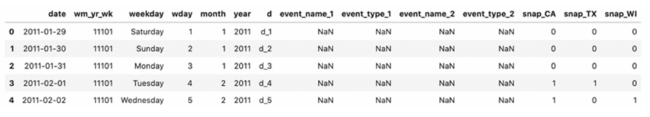
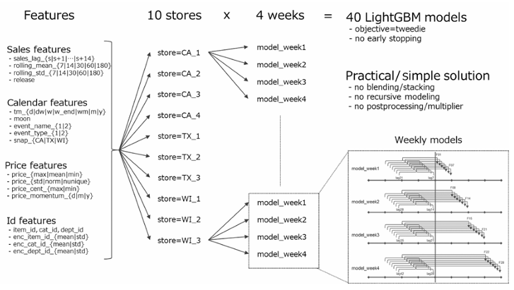
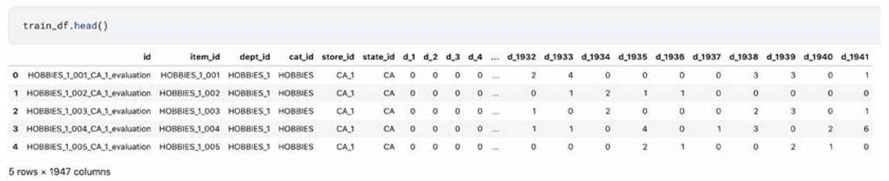
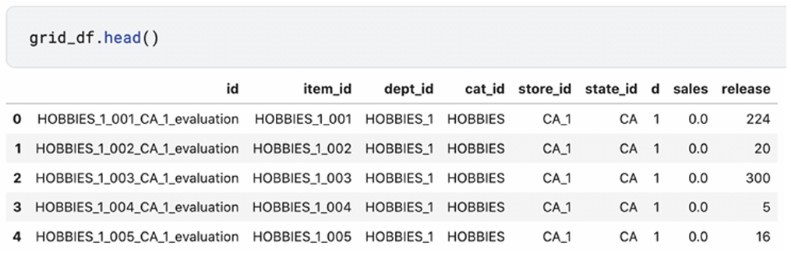
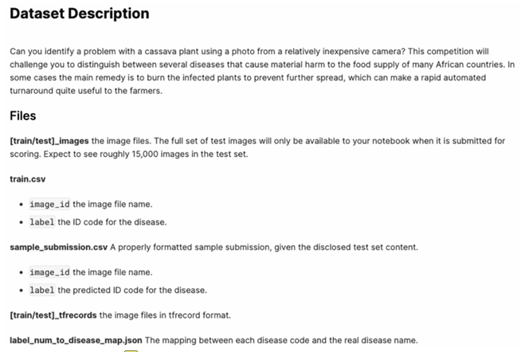
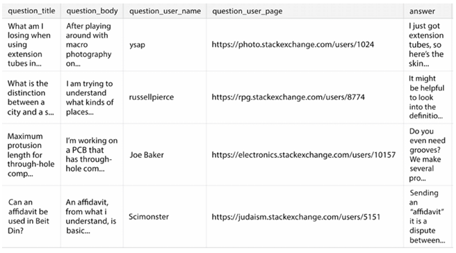

# Bölüm 1: En Ünlü Tablosal Yarışma – Porto Seguro'nun Güvenli Sürücü Tahmini *(Chapter 1: The Most Renowned Tabular Competition – Porto Seguro’s Safe Driver Prediction)*

Herhangi bir Kaggle yarışmasında liderlik tablosunun zirvesine nasıl ulaşılacağını öğrenmek sabır, **azim** ve en iyi sonuçları elde etmek için rekabet etmenin en iyi yolunu öğrenmek için **birçok deneme** gerektirir. Bu nedenle, geçmişteki bazı Kaggle yarışmalarını deneyerek ve tartışmaları okuyarak, not defterlerini (notebooks) yeniden kullanarak, **özellik mühendisliği** (feature engineering) yaparak ve çeşitli modelleri eğiterek liderlik tablosunun zirvesine nasıl ulaşılacağını öğrenerek bu becerileri daha hızlı geliştirmenize yardımcı olabilecek bir çalışma kitabı düşündük.

En ünlü tablo (tabular) yarışmalarından biri olan **Porto Seguro’s Safe Driver Prediction** ile başlıyoruz. Bu yarışmada, sigortacılıkta yaygın bir sorunu çözmeniz ve önümüzdeki yıl kimin araç sigortası talebinde bulunacağını bulmanız isteniyor. Böyle bir bilgi, talepte bulunma olasılığı daha yüksek olan sürücüler için sigorta ücretini artırmak ve olasılığı daha düşük olanlar için düşürmek açısından faydalıdır.

Bu yarışmayı çözmek için gerekli olan temel içgörüleri ve teknik detayları açıklarken, size gerekli kodu gösterecek ve **The Kaggle Book**’ta bulunan konuları incelemenizi ve soruları yanıtlamanızı isteyeceğiz. Öyleyse, daha fazla gecikmeden, bu yeni öğrenme yolunuza başlayalım.

Bu bölümde şunları öğreneceksiniz:

  * Bir **LightGBM** modelini nasıl ayarlayacağınız (tune) ve eğiteceğiniz
  * Bir **gürültü giderici otomatik kodlayıcıyı (denoising autoencoder)** nasıl oluşturacağınız ve bunu bir sinir ağını beslemek için nasıl kullanacağınız
  * Birbirinden oldukça farklı olan modelleri **etkili bir şekilde nasıl harmanlayacağınız (blend)**

> Bu bölümdeki tüm kod dosyaları **[https://packt.link/kwbchp1](https://www.google.com/search?q=https://packt.link/kwbchp1)** adresinde bulunabilir.

## Yarışmayı ve veriyi anlama *(Understanding the competition and the data)*

Porto Seguro, Brezilya'nın (Brezilya ve Uruguay'da faaliyet gösteren) üçüncü büyük sigorta şirketidir; otomobil sigortası teminatının yanı sıra pek çok başka sigorta ürünü de sunmaktadır ve son 20 yıldır fiyatlarını belirlemek ve otomatik sigorta teminatını daha fazla sürücü için daha erişilebilir kılmak amacıyla analitik yöntemler ve makine öğrenimi kullanmaktadır. Görevlerini başarmanın yeni yollarını keşfetmek amacıyla, Kaggle kullanıcılarının (Kagglers) bazı temel analitik problemlerine yeni ve daha iyi çözümler bulmalarını bekleyerek bir yarışmaya ([https://www.kaggle.com/competitions/porto-seguro-safe-driver-prediction](https://www.kaggle.com/competitions/porto-seguro-safe-driver-prediction)) sponsor olmuşlardır.

Yarışma, Kaggle kullanıcılarının, bir sürücünün önümüzdeki yıl bir otomobil sigortası talebi başlatma olasılığını tahmin eden bir model oluşturmasını amaçlamaktadır ki bu oldukça yaygın bir görev türüdür (sponsor bunu "sigortacılık için klasik bir meydan okuma" olarak bahsetmektedir). Talepte bulunma olasılığı hakkındaki bu tür bilgiler, bir sigorta şirketi için oldukça değerli olabilir. Böyle bir model olmadan, sigorta şirketleri müşterilerine risklerine bakılmaksızın yalnızca sabit bir prim uygulayabilir veya kötü performans gösteren bir modele sahiplerse, onlara **uygunsuz bir prim** uygulayabilirler. Müşterilerin riskini profilendirmedeki yanlışlıklar, iyi sürücülere daha yüksek sigorta maliyeti yüklenmesine ve kötü sürücüler için fiyatın düşürülmesine yol açabilir. Bunun şirket üzerindeki etkisi iki yönlü olacaktır: iyi sürücüler sigortalarını başka yerlerde arayacak ve şirketin portföyü kötü sürücülerle aşırı yüklenecektir (teknik olarak, şirketin **kötü bir hasar oranı** olacaktır: [https://www.investopedia.com/terms/l/loss-ratio.asp](https://www.investopedia.com/terms/l/loss-ratio.asp)). Bunun yerine, şirket talep olasılığını doğru bir şekilde tahmin edebilirse, müşterilerinden **adil bir fiyat** isteyebilir, böylece pazar paylarını artırabilir, daha memnun müşterilere ve daha dengeli bir müşteri portföyüne (daha iyi hasar oranı) sahip olabilir ve rezervlerini (şirketin talepleri ödemek için ayırdığı para) daha iyi yönetebilir.

Bunu yapmak için, sponsor eğitim ve test veri kümeleri sağlamıştır ve veri kümesi çok büyük olmadığı ve çok iyi hazırlanmış göründüğü için yarışma herkes için idealdi.

Verilerin sunulmasına ayrılmış olan yarışma sayfasında ([https://www.kaggle.com/competitions/porto-seguro-safe-driver-prediction/data](https://www.kaggle.com/competitions/porto-seguro-safe-driver-prediction/data)) belirtildiği gibi:

> Benzer gruplara ait özellikler, özellik adlarında bu şekilde etiketlenmiştir (örneğin, ind, reg, car, calc).
>
> Ek olarak, özellik adları ikili (binary) özellikleri belirtmek için **bin** ve kategorik özellikleri belirtmek için **cat** sonekini içerir. Bu tanımlamalara sahip olmayan özellikler ya sürekli (continuous) ya da sıralıdır (ordinal). **-1** değerleri, özelliğin gözlemde **eksik** olduğunu gösterir. **Hedef (target)** sütunu, poliçe sahibi için bir talep açılıp açılmadığını gösterir.

Yarışma için veri hazırlığı, herhangi bir bilgi sızıntısını (leak) önlemek için dikkatlice yapılmıştır ve özelliklerin anlamı hakkında gizlilik korunmuş olsa da, kullanılan farklı etiketlerin motorlu taşıt sigortası modellemesinde yaygın olarak kullanılan belirli özellik türlerine atıfta bulunduğu oldukça açıktır:

  * **ind**: "Bireysel özellikler" (individual characteristics)
  * **car**: "Araba özellikleri" (car characteristics)
  * **calc**: "Hesaplanmış özellikler" (calculated features)
  * **reg**: "Bölgesel/coğrafi özellikler" (regional/geographic features)

Bireysel özelliklere gelince, yarışma sırasında anlamları hakkında çok fazla spekülasyon yapılmıştır. Örneğin şuraya bakınız:

  * [https://www.kaggle.com/competitions/porto-seguro-safe-driver-prediction/discussion/41489](https://www.google.com/search?q=https://www.kaggle.com/competitions/porto-seguro-safe-driver-prediction/discussion/41489), burada Raddar, **ps\_car\_13** özelliğinin iki yılda bir zorunlu araç muayeneleri arasında kat edilen mesafeyi temsil edebileceğini öne sürmektedir.
  * [https://www.kaggle.com/competitions/porto-seguro-safe-driver-prediction/discussion/41488](https://www.kaggle.com/competitions/porto-seguro-safe-driver-prediction/discussion/41488), burada Raddar, **ps\_car\_12** özelliğinin bunun yerine motor silindir hacmini temsil edebileceğini öne sürmektedir.
  * [https://www.kaggle.com/competitions/porto-seguro-safe-driver-prediction/discussion/41057](https://www.kaggle.com/competitions/porto-seguro-safe-driver-prediction/discussion/41057), burada bazı özelliklerin Porto Seguro'nun çevrimiçi teklif formundan türetildiği yönündeki öneriyi okuyabilirsiniz.

Tüm bu ve daha fazla çabaya rağmen, sonunda özelliklerin çoğunun anlamı şimdiye kadar bir **gizem olarak kalmıştır**.

Bu yarışmanın ilginç gerçekleri şunlardır:

1.  Veriler, özellikler anonim olsa da, **gerçek dünyadan** alınmıştır.
2.  Veriler, herhangi bir tür sızıntı olmaksızın **çok iyi hazırlanmıştır** (burada sihirli özellikler yoktur – sihirli özellik, becerikli bir işlemle Kaggle yarışmasında modellerinize yüksek tahmin gücü sağlayabilen bir özelliktir).
3.  Test veri seti sadece eğitim veri setiyle aynı kategorik seviyeleri tutmakla kalmaz; aynı zamanda aynı dağılımdan geliyormuş gibi görünmektedir, ancak Yuya Yamamoto, verilerin t-SNE ile ön işlenmesinin düşmanca doğrulama (adversarial validation) testinin başarısız olmasına yol açtığını iddia etmektedir ([https://www.kaggle.com/competitions/porto-seguro-safe-driver-prediction/discussion/44784](https://www.kaggle.com/competitions/porto-seguro-safe-driver-prediction/discussion/44784)).

> 📝 Alıştırma 1
> 
> 
> 
> İlk alıştırma olarak, **The Kaggle Book**'taki **düşmanca doğrulama (adversarial validation)** ile ilgili içeriklere ve koda (sayfa 179'dan başlayarak) atıfta bulunarak, eğitim ve test verilerinin **büyük olasılıkla aynı veri dağılımından** kaynaklandığını kanıtlayınız.
> 
> 
> 
> **Alıştırma Notları** (Size yardımcı olacak tüm notları veya çalışmaları buraya yazınız):

Tilii (Mensur Dlakic, Montana Eyalet Üniversitesi'nde Doçent: [https://www.kaggle.com/competitions/porto-seguro-safe-driver-prediction/discussion/42197](https://www.google.com/search?q=https://www.kaggle.com/competitions/porto-seguro-safe-driver-prediction/discussion/42197)) tarafından yapılan ilginç bir paylaşım, t-SNE kullanarak şunu göstermektedir: "**Sigorta parametreleri açısından çok benzer olan birçok insan vardır, ancak bunlardan bazıları talepte bulunacak, bazıları ise bulunmayacaktır**." Tilii'nin bahsettiği şey, sigortacılıkta olanlara oldukça tipiktir; belirli öncüller (sigorta parametreleri) için bir şeyin olma olasılığı aynıdır, ancak o olay, olaylar dizisini ne kadar süre gözlemlediğimize bağlı olarak gerçekleşir veya gerçekleşmez.

Örneğin, sigortacılıkta IoT ve telematik verilerini ele alalım. Bir sürücünün gelecekte talepte bulunup bulunmayacağını tahmin etmek için sürüş davranışını analiz etmek oldukça yaygındır. Gözlem süreniz **çok kısaysa** (örneğin, bu yarışmada olduğu gibi bir yıl), çok kötü sürücülerin bile bir talepte bulunmaması söz konusu olabilir, çünkü kötü bir sürücü için bile böyle bir olayın kısa bir zaman diliminde meydana gelme olasılığı düşüktür.

Benzer fikirler, Andy Harless ([https://www.kaggle.com/competitions/porto-seguro-safe-driver-prediction/discussion/42735](https://www.google.com/search?q=https://www.kaggle.com/competitions/porto-seguro-safe-driver-prediction/discussion/42735)) tarafından tartışılmaktadır; Harless, bunun yerine yarışmanın gerçek görevinin "kazaya daha yatkın olan sürücüleri belirleyen **gizli bir sürekli değişkenin değerini tahmin etmek**" olduğunu savunur, çünkü aslında "**talepte bulunmak bir sürücünün özelliği değil; şansın bir sonucudur**."

## Değerlendirme metriğini anlama
*(Understanding the evaluation metric)*

Elbette, metninizi Türkçeye çevirdim:

-----

Yarışmada kullanılan metrik, **normalleştirilmiş Gini katsayısıdır** (ekonomide kullanılan benzer Gini katsayısı/endeksinden almıştır) ve daha önce başka bir yarışmada, Allstate Claim Prediction Challenge'da ([https://www.kaggle.com/competitions/ClaimPredictionChallenge](https://www.google.com/search?q=https://www.kaggle.com/competitions/ClaimPredictionChallenge)) kullanılmıştır. Bu yarışmadan, metriğin ne hakkında olduğuna dair çok net bir açıklama alabiliriz:

> Bir giriş gönderdiğinizde, gözlemler "en büyük tahminden" "en küçük tahmine" doğru sıralanır. Tahminlerinizin devreye girdiği tek adım budur, bu nedenle yalnızca tahminlerinizin belirlediği sıra önemlidir. Gözlemleri soldan sağa, en büyük tahminler solda olacak şekilde düzenlenmiş olarak görselleştirin. Ardından soldan sağa hareket ederek şunu sorarız: "**Verinin en soldaki %x'lik kısmında, gerçekten gözlemlenen kaybın ne kadarını biriktirdiniz?**" Bir model olmadan, tahminlerin %10'unda kaybın %10'unu biriktirmeyi beklersiniz, bu nedenle model olmaması (veya bir "sıfır" modeli) düz bir çizgiye ulaşır. **Sizin eğriniz ile bu düz çizgi arasındaki alana Gini katsayısı diyoruz.**
>
> "Mükemmel" bir model için ulaşılabilecek maksimum bir alan vardır. Biz, modelinizin Gini katsayısını mükemmel modelin Gini katsayısına bölerek **normalleştirilmiş Gini katsayısını** kullanacağız.

Daha iyi bir açıklama da Kilian Batzner'ın not defterinde (notebook) sağlanmıştır: [https://www.kaggle.com/code/batzner/gini-coefficient-an-intuitive-explanation](https://www.kaggle.com/code/batzner/gini-coefficient-an-intuitive-explanation). Kilian, net çizimler ve bazı basit örnekler kullanarak, sigorta şirketlerinin aktüerya departmanları tarafından rutin olarak kullanılan, ancak çok yaygın olmayan bu metriği anlamlandırmaya çalışmaktadır.

Bu metrik, yaklaşık olarak $2 \cdot \text{ROC-AUC} - 1$ formülüne karşılık geldiği için **ROC-AUC skoru** veya **Mann–Whitney U non-parametrik istatistiksel testi** (U istatistiği, alıcı işletim karakteristiği eğrisi altındaki alana – AUC'ye eşdeğer olduğundan) ile yaklaştırılabilir. Dolayısıyla, **ROC-AUC'yi maksimize etmek, normalleştirilmiş Gini katsayısını maksimize etmekle aynıdır** (bir referans için Wikipedia girişindeki *Diğer istatistiksel ölçümlerle ilişki* bölümüne bakınız: [https://en.wikipedia.org/wiki/Gini\_coefficient](https://en.wikipedia.org/wiki/Gini_coefficient)).

Metrik, ayrıca ölçeklenmiş tahmin sırası (rank) ile ölçeklenmiş hedef değerinin kovaryansı olarak da yaklaşık olarak ifade edilebilir, bu da daha anlaşılır bir sıra ilişkisi ölçütü sağlar (bkz. Dmitriy Guller: [https://www.kaggle.com/competitions/porto-seguro-safe-driver-prediction/discussion/40576](https://www.kaggle.com/competitions/porto-seguro-safe-driver-prediction/discussion/40576)).

**Amaç fonksiyonu** (objective function) açısından bakıldığında, bir sınıflandırma probleminde yapacağınız gibi **ikili log-kaybı** (binary log-loss) için optimizasyon yapabilirsiniz. Ne ROC-AUC ne de normalleştirilmiş Gini katsayısı türevlenebilir değildir ve bunlar yalnızca doğrulama kümesi üzerindeki metrik değerlendirmesi için kullanılabilir (örneğin, erken durdurma veya bir sinir ağında öğrenme hızını azaltma için). Ancak, log-kaybı için optimizasyon yapmak her zaman ROC-AUC'yi ve normalleştirilmiş Gini katsayılarını iyileştirmez ve ikisi de doğrudan türevlenebilir değildir.

> Aslında türevlenebilir bir ROC-AUC yaklaştırması mevcuttur. Bunun nasıl çalıştığını Toon Calders ve Szymon Jaroszewicz'in *Efficient AUC Optimization for Classification* adlı çalışmasında okuyabilirsiniz. European Conference on Principles of Data Mining and Knowledge Discovery. Springer, Berlin, Heidelberg, 2007: [https://link.springer.com/content/pdf/10.1007/978-3-540-74976-9\_8.pdf](https://link.springer.com/content/pdf/10.1007/978-3-540-74976-9_8.pdf).

Ancak, yarışmada bir amaç fonksiyonu olarak log-kaybından farklı bir şey kullanmaya ve değerlendirme metriği olarak ROC-AUC veya normalleştirilmiş Gini katsayısından başka bir şey kullanmaya gerek olmadığı anlaşılmaktadır.

Kaggle Not Defterleri arasında normalleştirilmiş Gini katsayısını hesaplamak için aslında birkaç Python uygulaması bulunmaktadır. Burada, CPMP'nin ([https://www.kaggle.com/code/cpmpml/extremely-fast-gini-computation/notebook](https://www.google.com/search?q=https://www.kaggle.com/code/cpmpml/extremely-fast-gini-computation/notebook)) **Numba** kullanarak hesaplamaları hızlandıran çalışmasını kullandık ve öneriyoruz: bu hem kesin hem de hızlıdır.

> 📝 Alıştırma 2
> 
> 
> 
> **The Kaggle Book**'un 5. bölümünde (sayfa 95 ve sonrası), özellikle yeni ve genellikle bilinmeyen yarışma metrikleriyle nasıl başa çıkılacağını açıklamıştık.
> 
> 
> 
> Bir alıştırma olarak, Kaggle'da **normalleştirilmiş Gini katsayısını** bir değerlendirme metriği olarak kullanan **kaç yarışma** olduğunu bulabilir misiniz?
> 
> 
> 
> **Alıştırma Notları** (Size yardımcı olacak tüm notları veya çalışmaları buraya yazınız):

## Michael Jahrer'ın en iyi çözüm fikirlerini inceleme *(Examining the top solution ideas from Michael Jahrer)*

Michael Jahrer ([https://www.kaggle.com/mjahrer](https://www.kaggle.com/mjahrer), yarışma Büyük Ustası ve Netflix Ödülü'nün "BellKor's Pragmatic Chaos" ekibindeki kazananlarından biri), yarışma boyunca halka açık liderlik tablosunu uzun süre ve belirgin bir farkla önde götürdü ve özel çözümler nihayet açıklandığında kazanan ilan edildi.

Kısa süre sonra, tartışma forumunda, **gürültü giderici otomatik kodlayıcıları (denoising autoencoders)** ve sinir ağlarını akıllıca kullanması nedeniyle birçok Kaggler için bir referans haline gelen çözümünün kısa bir özetini yayınladı ([https://www.kaggle.com/competitions/porto-seguro-safe-driver-prediction/discussion/44629](https://www.kaggle.com/competitions/porto-seguro-safe-driver-prediction/discussion/44629)). Michael, çözümüne ilişkin herhangi bir Python kodu eklememiş olsa da (kodlama çalışmasını doğrudan C++/CUDA ile Python kullanmadan yazılmış "eski usul" ve "düşük seviyeli" olarak tanımlamıştır), yazıları kullandığı modellere, hiperparametrelerine ve mimarilerine dair referanslar açısından oldukça zengindir.

Öncelikle Michael, çözümünün altı modelin bir karışımından (bir LightGBM modeli ve beş sinir ağı) oluştuğunu açıklamaktadır. Ayrıca, muhtemelen **aşırı öğrenme (overfitting)** nedeniyle, karışıma her bir modelin katkısını ağırlıklandırmanın (ayrıca doğrusal ve doğrusal olmayan yığınlama (stacking) yapmanın) bir avantaj sağlamadığı için, yalnızca farklı tohumlardan (seed) oluşturulmuş, **eşit ağırlığa sahip** modellerin bir karışımına başvurduğunu belirtmektedir.

Bu içgörü, Michael'ın yaklaşımını çoğaltma görevimizi çok daha kolay hale getiriyor, çünkü kendisi ayrıca, **yalnızca LightGBM sonuçlarını oluşturduğu sinir ağlarından biriyle karıştırmanın (blending)** bile yarışmada birinciliği garantilemek için yeterli olacağını da belirtmiştir.

Bu içgörü, alıştırma çalışmamızı bir sürü model yerine, iki iyi tekil modelle sınırlayacaktır. Buna ek olarak, Michael, bazı sütunları çıkarmak ve kategorik özellikleri **tek-sıcak kodlama (one-hot encoding)** dışında çok az veri işleme yaptığını da belirtmiştir.

## Bir LightGBM gönderimi oluşturma *(Building a LightGBM submission)*

Alıştırmamız LightGBM tabanlı bir çözüm üzerinde çalışmakla başlıyor. Kodu, Kaggle Notebooks'u kullanarak hemen yürütülmeye hazır şekilde şu adreste bulabilirsiniz: [https://www.kaggle.com/code/lucamassaron/workbook-lgb](https://www.kaggle.com/code/lucamassaron/workbook-lgb). Kodu kolayca erişilebilir hale getirmiş olsak da, bunun yerine kodu doğrudan kitaptan yazmanızı veya kopyalamanızı ve hücre hücre çalıştırmanızı öneriyoruz; her bir kod satırının ne yaptığını anlamak ve çözümü kişiselleştirmek, performansını daha da artırabilir.

> LightGBM kullanırken, **GPU veya TPU hızlandırıcılarından hiçbirini açmanıza gerek yoktur ve açmamalısınız**. GPU hızlandırması yalnızca LightGBM'nin GPU sürümünü yüklediyseniz yardımcı olabilir. Bu tür GPU hızlandırmalı bir sürümü Kaggle Notebooks'a nasıl kuracağınıza dair çalışma ipuçlarını şu örnekte bulabilirsiniz: [https://www.kaggle.com/code/lucamassaron/gpu-accelerated-lightgbm](https://www.kaggle.com/code/lucamassaron/gpu-accelerated-lightgbm).

Anahtar paketleri (hiperparametre optimizasyonu için NumPy, pandas ve Optuna, LightGBM ve bazı yardımcı fonksiyonlar) içe aktararak başlıyoruz. Ayrıca bir konfigürasyon sınıfı tanımlıyor ve onu örneklendiriyoruz. Konfigürasyon sınıfında tanımlanan parametreleri, kodun ilerleyişi sırasında keşfederken tartışacağız. Burada önemli olan nokta, tüm parametrelerinizi içeren bir sınıf kullanarak, onları kod boyunca tutarlı bir şekilde değiştirmenizin daha kolay olacağıdır. Yarışmanın hararetinde, kodun birden fazla yerinde atıfta bulunulan bir parametreyi güncellemeyi unutmak kolaydır ve parametreler hücrelere ve fonksiyonlara dağılmışsa bunları ayarlamak her zaman zordur. Bir konfigürasyon sınıfı, size çok çaba kazandırabilir ve yol boyunca hatalardan koruyabilir:

```python
import numpy as np
import pandas as pd
import optuna
import lightgbm as lgb
from path import Path
from sklearn.model_selection import StratifiedKFold

class Config:
    input_path = Path('../input/porto-seguro-safe-driver-prediction')
    optuna_lgb = False
    n_estimators = 1500
    early_stopping_round = 150
    cv_folds = 5
    random_state = 0
    params = {'objective': 'binary',
              'boosting_type': 'gbdt',
              'learning_rate': 0.01,
              'max_bin': 25,
              'num_leaves': 31,
              'min_child_samples': 1500,
              'colsample_bytree': 0.7,
              'subsample_freq': 1,
              'subsample': 0.7,
              'reg_alpha': 1.0,
              'reg_lambda': 1.0,
              'verbosity': 0,
              'random_state': 0}

config = Config()
```

Bir sonraki adım, eğitim, test ve örnek gönderim veri setlerini içe aktarmayı gerektirir. Bunu pandas'ın `read_csv` fonksiyonunu kullanarak yapıyoruz. Ayrıca, yüklenen `DataFrame`'lerin indeksini her bir veri örneğinin tanımlayıcısına (`id` sütununa) ayarlıyoruz.

Benzer gruplara ait özellikler etiketlendiği (`ind`, `reg`, `car` ve `calc` etiketlerini kullanarak) ve ayrıca ikili (binary) ve kategorik özellikler kolayca bulunabildiği (etiketlerinde sırasıyla `bin` ve `cat` etiketlerini kullanırlar), bunları numaralandırabilir ve listelere kaydedebiliriz:

```python
train = pd.read_csv(config.input_path / 'train.csv', index_col='id')
test = pd.read_csv(config.input_path / 'test.csv', index_col='id')
submission = pd.read_csv(config.input_path / 'sample_submission.csv', 
index_col='id')
calc_features = [feat for feat in train.columns if "_calc" in feat]
cat_features = [feat for feat in train.columns if "_cat" in feat]
```

Daha sonra, sadece hedefi (0'lar ve 1'lerden oluşan ikili bir hedef) çıkarır ve eğitim veri setinden kaldırırız:

```python
target = train["target"]
train = train.drop("target", axis="columns")
```

Bu noktada, Michael Jahrer'in de işaret ettiği gibi, `calc` özelliklerini silebiliriz. Bu fikir, özellikle not defterlerinde yarışma sırasında çokça yinelenmiştir ([https://www.kaggle.com/competitions/porto-seguro-safe-driver-prediction/discussion/41970](https://www.google.com/search?q=https://www.kaggle.com/competitions/porto-seguro-safe-driver-prediction/discussion/41970)), çünkü bunları silmenin hem yerel çapraz doğrulama skorunu hem de halka açık liderlik tablosu skorunu iyileştirdiği deneysel olarak doğrulanabilmiştir (genel bir kural olarak, özellik seçimi sırasında her ikisini de takip etmek önemlidir). Ayrıca, bu özellikler gradyan artırma (gradient boosting) modellerinde de kötü performans göstermiştir (önemleri her zaman ortalamanın altındadır).

Tartışabiliriz ki, bu özellikler mühendislik ürünü özellikler oldukları için, orijinal özelliklerine göre yeni bir bilgi içermezler, ancak onları içeren eğitilmiş herhangi bir modele sadece gürültü katarlar:

```python
train = train.drop(calc_features, axis="columns")
test = test.drop(calc_features, axis="columns")
```

> 📝 Alıştırma 3
> 
> 
> 
> **The Kaggle Book**'un 220. sayfasında (Çalışmanızı değerlendirmek için özellik önemini kullanma başlığı altında) sağlanan önerilere dayanarak, bir alıştırma olarak:
> 
> 
> 
> 1.  Bu yarışma için **kendi özellik seçimi** not defterinizi (notebook) kodlayın.
> 
> 2.  **Hangi özelliklerin tutulması** ve **hangilerinin atılması** gerektiğini kontrol edin.
> 
> 
> 
> **Alıştırma Notları** (Size yardımcı olacak tüm notları veya çalışmaları buraya yazınız):

Kategorik özellikler bunun yerine **tek-sıcak kodlama (one-hot encoded)** ile işlenir. Eğitim ve test veri setlerinde aynı etiketler bulunduğundan (Porto Seguro ekibi tarafından düzenlenen dikkatli bir eğitim/test ayrımının sonucu), olağan scikit-learn `OneHotEncoder` ([https://scikit-learn.org/stable/modules/generated/sklearn.preprocessing.OneHotEncoder.html](https://scikit-learn.org/stable/modules/generated/sklearn.preprocessing.OneHotEncoder.html)) yerine, pandas'ın `get_dummies` fonksiyonunu ([https://pandas.pydata.org/docs/reference/api/pandas.get\_dummies.html](https://pandas.pydata.org/docs/reference/api/pandas.get_dummies.html)) kullanacağız. Pandas fonksiyonu, özellikler ve seviyeleri eğitim ve test setleri arasında farklılık gösterirse farklı kodlamalar üretebileceği için, tek-sıcak kodlamanın her ikisi için de aynı olmasını sağlayan bir kontrol (`assert`) ekliyoruz:

```python
train = pd.get_dummies(train, columns=cat_features)
test = pd.get_dummies(test, columns=cat_features)
assert((train.columns==test.columns).all())
```

Kategorik özelliklerin tek-sıcak kodlanması, veri işleme aşamasını tamamlar. Daha önce tartıştığımız gibi, değerlendirme metriğimiz olan **normalleştirilmiş Gini katsayısını** tanımlamaya geçiyoruz. Daha önce bahsedilen CPMP tarafından önerilen son derece hızlı Gini hesaplama kodunu kullanacağız.

Bir LightGBM modeli kullanacağımız için, **GBM algoritmasına** eğitim ve doğrulama veri setlerinin değerlendirmesini onunla çalışabilecek bir biçimde döndürmek üzere uygun bir sarmalayıcı (`gini_lgb`) eklememiz gerekiyor (bkz. [https://lightgbm.readthedocs.io/en/latest/pythonapi/lightgbm.Booster.html?highlight=higher\_better\#lightgbm.Booster.eval](https://www.google.com/search?q=https://lightgbm.readthedocs.io/en/latest/pythonapi/lightgbm.Booster.html%3Fhighlight%3Dhigher_better%23lightgbm.Booster.eval) – Her değerlendirme fonksiyonu iki parametre kabul etmeli: `preds`, `eval_data` ve `(eval_name, eval_result, is_higher_better)` veya bu tür demetlerin bir listesini döndürmelidir):

```python
from numba import jit
@jit
def eval_gini(y_true, y_pred):
    y_true = np.asarray(y_true)
    y_true = y_true[np.argsort(y_pred)]
    ntrue = 0
    gini = 0
    delta = 0
    n = len(y_true)
    for i in range(n-1, -1, -1):
        y_i = y_true[i]
        ntrue += y_i
        gini += y_i * delta
        delta += 1 - y_i
    gini = 1 - 2 * gini / (ntrue * (n - ntrue))
    return gini

def gini_lgb(y_true, y_pred):
    eval_name = 'normalized_gini_coef'
    eval_result = eval_gini(y_true, y_pred)
    is_higher_better = True
    return eval_name, eval_result, is_higher_better
```

Eğitim parametrelerine gelince, Michael Jahrer'in paylaşımında ([https://www.kaggle.com/competitions/porto-seguro-safe-driver-prediction/discussion/44629](https://www.kaggle.com/competitions/porto-seguro-safe-driver-prediction/discussion/44629)) önerdiği parametrelerin mükemmel çalıştığını gördük.

Eğer `Config` sınıfındaki `optuna_lgb` bayrağını `True` olarak ayarlarsanız, Optuna ([https://optuna.org/](https://optuna.org/)) ile bir arama yaparak aynı parametreleri veya benzer performans gösteren parametreleri bulmaya çalışabilirsiniz. Burada optimizasyon, eğitim verileri üzerinde beş katlı çapraz doğrulama testine dayanarak öğrenme oranı (learning rate) ve düzenlileştirme (regularization) parametreleri gibi temel parametreler için en iyi değerleri bulmaya çalışır. İşleri hızlandırmak için, doğrulamanın kendisinde **erken durdurma (early stopping)** dikkate alınır (ki bunun, doğrulama katmanını daha iyi aşırı öğrenebilecek bazı parametrelerin seçilmesini destekleyebileceğinin farkındayız – iyi bir alternatif, erken durdurma geri çağrısını kaldırmak ve eğitim için sabit bir tur sayısı tutmaktır):

```python
if config.optuna_lgb:
        
    def objective(trial):
        params = {
    'learning_rate': trial.suggest_float("learning_rate", 0.01, 1.0),
    'num_leaves': trial.suggest_int("num_leaves", 3, 255),
    'min_child_samples': trial.suggest_int("min_child_samples", 
                                           3, 3000),
    'colsample_bytree': trial.suggest_float("colsample_bytree", 
                                            0.1, 1.0),
    'subsample_freq': trial.suggest_int("subsample_freq", 0, 10),
    'subsample': trial.suggest_float("subsample", 0.1, 1.0),
    'reg_alpha': trial.suggest_loguniform("reg_alpha", 1e-9, 10.0),
    'reg_lambda': trial.suggest_loguniform("reg_lambda", 1e-9, 10.0),
        }

        score = list()
        skf = StratifiedKFold(n_splits=config.cv_folds, shuffle=True, 
                              random_state=config.random_state)
        
        for train_idx, valid_idx in skf.split(train, target):
            X_train = train.iloc[train_idx]
            y_train = target.iloc[train_idx]
            X_valid = train.iloc[valid_idx] 
            y_valid = target.iloc[valid_idx]
            
            model = lgb.LGBMClassifier(**params,
                                    n_estimators=1500,
                                    early_stopping_round=150,
                                    force_row_wise=True)
            callbacks=[lgb.early_stopping(stopping_rounds=150, 
                                          verbose=False)]
            
            model.fit(X_train, y_train, 
                      eval_set=[(X_valid, y_valid)],  
                      eval_metric=gini_lgb, callbacks=callbacks)
            
            score.append(
                model.best_score_['valid_0']['normalized_gini_coef'])
                
        return np.mean(score)
    
    study = optuna.create_study(direction="maximize")
    study.optimize(objective, n_trials=300)
    
    print("Best Gini Normalized Score", study.best_value)
    print("Best parameters", study.best_params)
    
    params = {'objective': 'binary',
              'boosting_type': 'gbdt',
              'verbosity': 0,
              'random_state': 0}
              
    params.update(study.best_params)
    
else:
    params = config.params
```

Yarışma sırasında Tilii, **Boruta** ([https://github.com/scikit-learn-contrib/boruta\_py](https://github.com/scikit-learn-contrib/boruta_py)) kullanarak özellik elemesini test etti. Çekirdeğini (kernel) burada bulabilirsiniz: [https://www.kaggle.com/code/tilii7/boruta-feature-elimination/notebook](https://www.google.com/search?q=https://www.kaggle.com/code/tilii7/boruta-feature-elimination/notebook). Kontrol edebileceğiniz gibi, Boruta tarafından onaylanmış bir özellik olarak kabul edilen **hiçbir `calc_` özelliği yoktur**.

> 📝 Alıştırma 4
> 
> 
> 
> **The Kaggle Book**'ta, **hiperparametre optimizasyonunu** (sayfa 241 ve sonrası) açıklıyor ve LightGBM modeli için bazı temel hiperparametreler sağlıyoruz.
> 
> 
> 
> Bir alıştırma olarak:
> 
> 
> 
> Gerektiğini düşündüğünüz yerlerde araştırılan parametreleri azaltarak veya artırarak **Optuna** ile hiperparametre aramasını iyileştirmeye çalışın ve ayrıca scikit-learn'den **rastgele arama (random search)** veya **yarılamalı arama (halving search)** gibi alternatif optimizasyon yöntemlerini deneyin (sayfa 245–246).
> 
> 
> 
> **Alıştırma Notları** (Size yardımcı olacak tüm notları veya çalışmaları buraya yazınız):

En iyi parametrelerimizi elde ettiğimizde (ya da sadece Jahrer'in parametrelerini denediğimizde), **eğitim yapmaya ve tahmin etmeye** hazırız. En iyi çözümün önerdiği gibi, stratejimiz **her çapraz doğrulama (cross-validation) katmanında** bir model eğitmek ve bu katmanı, test tahminlerinin ortalamasına katkıda bulunmak için kullanmaktır. Aşağıdaki kod parçası, hem test tahminlerini hem de sonuçları bir araya getirmek için faydalı olacak eğitim veri setindeki **katman dışı (out-of-fold)** tahminleri üretecektir:

```python
preds = np.zeros(len(test))
oof = np.zeros(len(train))
metric_evaluations = list()
skf = StratifiedKFold(n_splits=config.cv_folds, shuffle=True, random_
                      state=config.random_state)
                      
for idx, (train_idx, valid_idx) in enumerate(skf.split(train, 
                                                       target)):
    print(f"CV fold {idx}")
    X_train, y_train = train.iloc[train_idx], target.iloc[train_idx]
    X_valid, y_valid = train.iloc[valid_idx], target.iloc[valid_idx]
    
    model = lgb.LGBMClassifier(**params,
                               n_estimators=config.n_estimators,
                    early_stopping_round=config.early_stopping_round,
                               force_row_wise=True)
    
    callbacks=[lgb.early_stopping(stopping_rounds=150), 
               lgb.log_evaluation(period=100, show_stdv=False)]
                                                                                           
    model.fit(X_train, y_train, 
              eval_set=[(X_valid, y_valid)], 
              eval_metric=gini_lgb, callbacks=callbacks)
              
    metric_evaluations.append(
                model.best_score_['valid_0']['normalized_gini_coef'])
    
    # Test tahminlerini toplama
    preds += (model.predict_proba(test,  
              num_iteration=model.best_iteration_)[:,1] 
              / skf.n_splits)
              
    # Katman dışı tahminleri kaydetme
    oof[valid_idx] = model.predict_proba(X_valid, 
                    num_iteration=model.best_iteration_)[:,1]
```

Model eğitimi çok uzun sürmemelidir. Sonunda, çapraz doğrulama prosedürü sırasında elde edilen **Normalleştirilmiş Gini Katsayısını** alabilirsiniz:

```python
print(f"LightGBM CV normalized Gini coefficient: 
{np.mean(metric_evaluations):0.3f}
        ({np.std(metric_evaluations):0.3f})")
```

Sonuçlar oldukça cesaret vericidir çünkü ortalama skor **0.289**'dur ve değerlerin standart sapması oldukça küçüktür:

```
LightGBM CV Gini Normalized Score: 0.289 (0.015)
```

Geriye kalan tek şey, katman dışı (out-of-fold) ve test tahminlerini bir gönderi (submission) olarak kaydetmek ve sonuçları herkese açık ve özel liderlik tablolarında doğrulamaktır:

```python
submission['target'] = preds
submission.to_csv('lgb_submission.csv')
oofs = pd.DataFrame({'id':train_index, 'target':oof})
oofs.to_csv('lgb_oof.csv', index=False)
```

Elde edilen herkese açık skor **yaklaşık 0.28442** olmalıdır. İlişkili özel skor ise **yaklaşık 0.29121** olup, sizi final liderlik tablosunda **29. sıraya** yerleştirir. Oldukça iyi bir sonuç, ancak bunu hala farklı bir modelle, yani bir **sinir ağıyla harmanlamamız (blend)** gerekiyor.

Eğitim setini **bagging** yapmak (yani, eğitim verilerinin birden fazla önyüklemesini almak ve önyüklemelere dayalı birden fazla model eğitmek), Michael Jahrer'in kendi gönderisinde belirttiği gibi, performansı artırmalıdır, ancak bu artış çok fazla değildir.

## Bir gürültü giderici otomatik kodlayıcı (denoising autoencoder) ve bir DNN kurma *(Setting up a denoising autoencoder and a DNN)*

Bir sonraki adım, ondan öğrenip tahmin edebilecek bir **gürültü giderici otomatik kodlayıcı (Denoising Autoencoder - DAE)** ve bir **sinir ağı (Neural Network)** kurmaktır. Çalışan kodu şu not defterinde bulabilirsiniz: [https://www.kaggle.com/code/lucamassaron/workbook-dae](https://www.kaggle.com/code/lucamassaron/workbook-dae). Not defteri GPU modunda çalıştırılabilir (Kaggle Notebook'ta hızlandırıcıları açarsanız daha hızlı olacaktır), ancak bazı küçük değişikliklerle CPU modunda da çalışabilir.

Gürültü giderici otomatik kodlayıcıların Kaggle yarışmalarında kullanılması hakkında daha fazlasını **The Kaggle Book**'un 230. sayfasından itibaren okuyabilirsiniz.

Porto Seguro's Safe Driver Prediction Yarışması 18

Aslında, yarışmada Michael Jahrer'in yaklaşımını DAE'ler kullanarak yeniden üreten hiçbir örnek yoktur, bu yüzden OsciiArt tarafından kodlanmış ([https://www.kaggle.com/code/osciiart/denoising-autoencoder](https://www.kaggle.com/code/osciiart/denoising-autoencoder)) başka bir yarışmadaki bir TensorFlow uygulamasından bir örnek aldık.

Burada, gerekli tüm paketleri, özellikle **TensorFlow** ve **Keras'ı** içe aktararak başlıyoruz. Birden fazla sinir ağı oluşturacağımız için, **deneysel `set_memory_growth`** komutunu kullanarak TensorFlow'a mevcut tüm GPU belleğini kullanmamasını söylüyoruz. Bu, yol boyunca bellek taşması sorunları yaşamamızı önlemeye yardımcı olacaktır. Ayrıca **Leaky ReLU** aktivasyonunu özel bir aktivasyon olarak kaydediyoruz, böylece Keras katmanlarında bir dize ile aktivasyon olarak bahsedebiliriz:

```python
import numpy as np
import pandas as pd
from matplotlib import pyplot as plt
from path import Path
import gc
import optuna
from sklearn.model_selection import StratifiedKFold
from scipy.special import erfinv
import tensorflow as tf

gpus = tf.config.experimental.list_physical_devices('GPU')
for gpu in gpus:
    tf.config.experimental.set_memory_growth(gpu, True)
    
from tensorflow import keras
from tensorflow.keras import backend as K
from tensorflow.keras.layers import Input, Dense, BatchNormalization, Dropout
from tensorflow.keras.models import Model, load_model
from tensorflow.keras.callbacks import EarlyStopping, ReduceLROnPlateau
from tensorflow.keras.regularizers import l2
from tensorflow.keras.metrics import AUC
from tensorflow.keras.utils import get_custom_objects

from tensorflow.keras.layers import Activation, LeakyReLU
get_custom_objects().update({'leaky-relu': Activation(LeakyReLU(alpha=0.2))})
```

Birden fazla sinir ağı oluşturma ve belleğimizin tükenmemesi niyetimizle ilgili olarak, ayrıca GPU'daki belleği temizlemek ve artık ihtiyaç duyulmayan modelleri kaldırmak için basit bir fonksiyon tanımlıyoruz:

```python
def gpu_cleanup(objects):
    if objects:
        del(objects)
    K.clear_session()
    gc.collect()
```

Ayrıca, gürültü giderici otomatik kodlayıcı ve sinir ağıyla ilgili birden fazla parametreyi dikkate almak için **Config sınıfını yeniden yapılandırıyoruz**. LightGBM hakkında daha önce belirtildiği gibi, tüm parametreleri tek bir yerde tutmak, bunları tutarlı bir şekilde değiştirmeniz gerektiğinde süreci basitleştirir:

```python
class Config:
    input_path = Path('../input/porto-seguro-safe-driver-prediction')
    dae_batch_size = 128
    dae_num_epoch = 50
    dae_architecture = [1500, 1500, 1500]
    reuse_autoencoder = False
    batch_size = 128
    num_epoch = 150
    units = [64, 32]
    input_dropout=0.06
    dropout=0.08
    regL2=0.09
    activation='selu'
    
    cv_folds = 5
    nas = False
    random_state = 0
    
config = Config()
```

Daha önce gösterildiği gibi, veri setlerini yüklüyor ve `calc` özelliklerini kaldırarak ve kategorik olanları tek-sıcak kodlayarak özellikleri işlemeye devam ediyoruz. Michael Jahrer'in çözümünde belirttiği gibi, eksik durumları **-1** değeriyle bırakıyoruz:

```python
train = pd.read_csv(config.input_path / 'train.csv', index_col='id')
test = pd.read_csv(config.input_path / 'test.csv', index_col='id')
submission = pd.read_csv(config.input_path / 'sample_submission.csv', 
index_col='id')
calc_features = [feat for feat in train.columns if "_calc" in feat]
cat_features = [feat for feat in train.columns if "_cat" in feat]
target = train["target"]
train = train.drop("target", axis="columns")
train = train.drop(calc_features, axis="columns")
test = test.drop(calc_features, axis="columns")
train = pd.get_dummies(train, columns=cat_features)
test = pd.get_dummies(test, columns=cat_features)
assert((train.columns==test.columns).all())
```

Ancak, sinir ağlarıyla uğraştığımız için, ikili veya tek-sıcak kodlanmış kategorik olmayan **tüm özellikleri normalleştirmemiz** gerekiyor. Normalleştirme, **yeniden ölçeklendirme** (sınırlı bir değer aralığı ayarlama) ve **merkezleme** (dağılımınızın belirli bir değere, genellikle sıfıra, merkezlenmesi) anlamına gelir.

Normalleştirme, hem otomatik kodlayıcının hem de sinir ağının optimizasyon algoritmasının daha hızlı iyi bir çözüme yakınsamasını sağlayacaktır çünkü optimizasyon sırasında kayıp fonksiyonunun **salınım tehlikesini azaltır**. Ek olarak, normalleştirme, girişin aktivasyon fonksiyonları aracılığıyla yayılmasını kolaylaştırır.

İstatistiksel normalleştirme (değerlerinizin dağılımını sıfır ortalama ve birim standart sapmaya getirme) yerine, **GaussRank** (Gauss Sıralaması), değişkenlerin dağılımını dönüştürülmüş bir Gauss dağılımına dönüştürmeye de olanak tanıyan bir prosedürdür. *Batch Normalization: Accelerating Deep Network Training by Reducing Internal Covariate Shift* ([https://arxiv.org/pdf/1502.03167.pdf](https://arxiv.org/pdf/1502.03167.pdf)) gibi bazı makalelerde de belirtildiği gibi, sinir ağları kendilerine bir Gauss girişi sağlarsanız daha da iyi performans gösterirler. Bu NVIDIA blog gönderisine ([https://developer.nvidia.com/blog/gauss-rank-transformation-is-100x-faster-with-rapids-and-cupy/](https://developer.nvidia.com/blog/gauss-rank-transformation-is-100x-faster-with-rapids-and-cupy/)) göre, GaussRank, özellikler zaten normal dağılmışsa veya aşırı asimetrikse (bu durumlarda dönüşümün uygulanması performansın kötüleşmesine neden olabilir) hariç, çoğu zaman işe yarar:

```python
print("Applying GaussRank to columns: ", end='')
to_normalize = list()
for k, col in enumerate(train.columns):
    if '_bin' not in col and '_cat' not in col and '_missing' not in col:
        to_normalize.append(col)
print(to_normalize)

def to_gauss(x): return np.sqrt(2) * erfinv(x) 
def normalize(data, norm_cols):
    n = data.shape[0]
    for col in norm_cols:
        sorted_idx = data[col].sort_values().index.tolist()
        uniform = np.linspace(start=-0.99, stop=0.99, num=n)
        normal = to_gauss(uniform)
        normalized_col = pd.Series(index=sorted_idx, data=normal)
        data[col] = normalized_col
    return data

train = normalize(train, to_normalize)
test = normalize(test, to_normalize)
```

GaussRank dönüşümünü, veri setimizdeki tüm sayısal özellikler üzerinde, eğitim ve test özellikleri üzerinde ayrı ayrı uygulayabiliriz:

```
Applying GaussRank to columns: ['ps_ind_01', 'ps_ind_03', 'ps_ind_14', 'ps_ind_15', 'ps_reg_01', 'ps_reg_02', 'ps_reg_03', 'ps_car_11', 'ps_car_12', 'ps_car_13', 'ps_car_14', 'ps_car_15']
```

Özellikleri normalleştirirken, verilerimizi basitçe **NumPy array'ine** ve GPU için ideal giriş olan `float32` değerlerine dönüştürüyoruz:

```python
features = train.columns
train_index = train.index
test_index = test.index
train = train.values.astype(np.float32)
test = test.values.astype(np.float32)
```

Daha sonra, değerlendirme fonksiyonu, normalleştirilmiş Gini katsayısı (daha önce açıklanan koda dayanarak) ve bir Keras modelinin eğitim ve doğrulama setleri üzerindeki uygunluk geçmişini faydalı bir şekilde temsil eden bir çizim fonksiyonu gibi bazı kullanışlı fonksiyonları hazırlıyoruz:

```python
def plot_keras_history(history, measures):
    rows = len(measures) // 2 + len(measures) % 2
    fig, panels = plt.subplots(rows, 2, figsize=(15, 5))
    plt.subplots_adjust(top = 0.99, bottom=0.01, 
                        hspace=0.4, wspace=0.2)
    try:
        panels = [item for sublist in panels for item in sublist]
    except:
        pass
    for k, measure in enumerate(measures):
        panel = panels[k]
        panel.set_title(measure + ' history')
        panel.plot(history.epoch, history.history[measure],  
                   label="Train "+measure)
        try:
            panel.plot(history.epoch,  
                       history.history["val_"+measure], 
                       label="Validation "+measure)
        except:
            pass
        panel.set(xlabel='epochs', ylabel=measure)
        panel.legend()
    plt.show(fig)
    
from numba import jit
@jit
def eval_gini(y_true, y_pred):
    y_true = np.asarray(y_true)
    y_true = y_true[np.argsort(y_pred)]
    ntrue = 0
    gini = 0
    delta = 0
    
    n = len(y_true)
    for i in range(n-1, -1, -1):
        y_i = y_true[i]
        ntrue += y_i
        gini += y_i * delta
        delta += 1 - y_i
    gini = 1 - 2 * gini / (ntrue * (n - ntrue))
    return gini
```

Sonraki fonksiyonlar aslında biraz daha karmaşık ve hem gürültü giderici otomatik kodlayıcının hem de denetimli sinir ağının işleyişiyle daha alakalıdır. `batch_generator`, veri yığınlarının karıştırılmış halde, yığın boyutuna (batch size) göre sağlayan bir jeneratör oluşturacak bir fonksiyondur. Aslında bağımsız bir jeneratör olarak değil, yakında açıklayacağımız daha karmaşık bir yığın jeneratörünün, **`mixup_generator`'ın**, bir parçası olarak kullanılır:

```python
def batch_generator(x, batch_size, shuffle=True, random_state=None):
    batch_index = 0
    n = x.shape[0]
    while True:
        if batch_index == 0:
            index_array = np.arange(n)
            if shuffle:
                np.random.seed(seed=random_state)
                index_array = np.random.permutation(n)
        current_index = (batch_index * batch_size) % n
        if n >= current_index + batch_size:
            current_batch_size = batch_size
            batch_index += 1
        else:
            current_batch_size = n - current_index
            batch_index = 0
        batch = x[index_array[current_index: current_index + current_batch_size]]
        yield batch
```

`mixup_generator`, DAE'nin eğitim veri setini **aşırı öğrenmesini (overfitting)** önlemek için **bir miktar gürültü oluşturmak** ve veriyi zenginleştirmek amacıyla değerlerinin kısmen değiştirildiği veri yığınlarını döndüren bir jeneratördür. Bu jeneratöre, veri setine rastgele değerler enjekte etmenin ve eğitim için kullanılacak çok daha fazla örnek oluşturmanın bir yolu olarak bakabilirsiniz. Michael Jahrer tarafından önerildiği gibi, özelliklerin **%15'lik sabit bir takas oranına (swap rate)** göre çalışır, bu da her yığında örneğin %15'inin rastgele değerlerden oluşacağı anlamına gelir. Rastgele seçilen değerlerin aynı özelliklerden rastgele olarak seçilmiş olması da önemlidir, çünkü bu, yer değiştiren rastgele değerlerin tamamen rastgele olmadığı, orijinal özelliklerin dağılımından geldiği anlamına gelir.

Fonksiyon, iki farklı veri yığını üretir: biri modele verilecek ve diğeri ise serbest bırakılacak yığındaki değiştirilecek değer için bir kaynak olarak kullanılacaktır. Temel olasılığı takas oranı olan rastgele bir seçime dayanarak, her yığında belirli sayıda özellik iki yığın arasında takas edilecektir.

Bu, DAE'nin her zaman aynı özelliklere güvenemeyeceği (çünkü zaman zaman rastgele takas edilebilirler), bunun yerine aralarındaki ilişkileri bulmak ve sürecin sonunda veriyi doğru bir şekilde yeniden yapılandırmak için **özelliklerin tamamına odaklanması** gerektiği anlamına gelir (bir anlamda dropout'a benzer bir şey):

```python
def mixup_generator(X, batch_size, swaprate=0.15, shuffle=True, random_state=None):
    if random_state is None:
        random_state = np.randint(0, 999)
    num_features = X.shape[1]
    num_swaps = int(num_features * swaprate)    
    generator_a = batch_generator(X, batch_size, shuffle, random_state)
    generator_b = batch_generator(X, batch_size, shuffle, random_state + 1)
    while True:
        batch = next(generator_a)
        mixed_batch = batch.copy()
        effective_batch_size = batch.shape[0]
        alternative_batch = next(generator_b)
        assert((batch != alternative_batch).any())
        for i in range(effective_batch_size):
            swap_idx = np.random.choice(num_features, num_swaps, replace=False)
            mixed_batch[i, swap_idx] = alternative_batch[i, swap_idx]
        yield (mixed_batch, batch)
```

`get_DAE`, gürültü giderici otomatik kodlayıcıyı oluşturan fonksiyondur. Mimarinin tanımlanması için bir parametre kabul eder; bu durumda (Michael Jahrer'in çözümünün önerdiği gibi) her biri 1.500 düğüme sahip üç katman olarak ayarlanmıştır. İlk katman bir **kodlayıcı (encoder)**, ikincisi verideki bilgiyi ifade edebilen gizli özellikleri ideal olarak içeren bir **darboğaz katmanı (bottleneck layer)** ve son katman ise başlangıçtaki girdi verilerini yeniden yapılandırabilen bir **kod çözme katmanıdır (decoding layer)**. Üç katmanın bir `relu` aktivasyon fonksiyonu, yanlılık (bias) yok ve her biri bir **toplu normalleştirme (batch normalization)** katmanı ile takip edilmektedir. Yeniden yapılandırılmış girdi verilerine sahip nihai çıktı, doğrusal (linear) bir aktivasyona sahiptir. Eğitim, standart ayarlarla bir **adam iyileştirici** (optimizer) kullanılarak optimize edilir (optimize edilen maliyet fonksiyonu **ortalama karesel hatadır – mse**):

```python
def get_DAE(X, architecture=[1500, 1500, 1500]):
    features = X.shape[1]
    inputs = Input((features,))
    for i, nodes in enumerate(architecture):
        layer = Dense(nodes, activation='relu', 
                      use_bias=False, name=f"code_{i+1}")
        if i==0:
            x = layer(inputs)
        else:
            x = layer(x)
        x = BatchNormalization()(x)
    outputs = Dense(features, activation='linear')(x)
    model = Model(inputs=inputs, outputs=outputs)
    model.compile(optimizer='adam', loss='mse', 
                  metrics=['mse', 'mae'])
    return model
```

`extract_dae_features` fonksiyonu burada sadece eğitim amaçlı rapor edilmiştir. Fonksiyon, eğitilmiş gürültü giderici otomatik kodlayıcının belirli katmanlarının değerlerinin çıkarılmasına yardımcı olur. Çıkarım, DAE giriş katmanını ve istenen çıkış katmanını birleştirerek **yeni bir model oluşturarak** çalışır. Basit bir tahmin (`predict`) daha sonra ihtiyacımız olan değerleri çıkaracaktır (tahmin, ayrıca herhangi bir bellek gereksinimine uyacak şekilde tercih edilen yığın boyutunu ayarlamamıza da olanak tanır).

Yarışma durumunda, gözlem sayısı ve otomatik kodlayıcıdan çıkarılacak özellik sayısı göz önüne alındığında, bu fonksiyonu kullanırsak, ortaya çıkan yoğun matrisin bir Kaggle Notebook'un belleği tarafından işlenmesi **çok büyük** olacaktır. Bu nedenle, stratejimiz orijinal veriyi otomatik kodlayıcı düğüm değerlerine (darboğaz katmanına) dönüştürmek değil, bunun yerine otomatik kodlayıcıyı, **dondurulmuş katmanlarıyla darboğaz katmanına kadar denetimli sinir ağıyla birleştirmek** olacaktır, ki bunu yakında tartışacağız:

```python
def extract_dae_features(autoencoder, X, layers=[3], batch_size=128):
    data = []
    for layer in layers:
        if layer==0:
            data.append(X)
        else:
            get_layer_output = Model([autoencoder.layers[0].input], 
                                  [autoencoder.layers[layer].output])
            layer_output = get_layer_output.predict(X, 
                                              batch_size= batch_size)
            data.append(layer_output)
    data = np.hstack(data)
    return data
```

DAE ile çalışmayı tamamlamak için, önceki tüm fonksiyonları denetimsiz bir eğitim prosedürüne (en azından bir doğrulama setinde ayarlanmış bir erken durdurma monitörü olduğu için kısmen denetimsiz) saran son bir fonksiyona sahibiz. Fonksiyon, `mix-up` jeneratörünü ayarlar, gürültü giderici otomatik kodlayıcı mimarisini oluşturur ve ardından, aşırı öğrenme belirtileri varsa erken durdurma için bir doğrulama setindeki uygunluğunu izleyerek onu eğitir. Son olarak, eğitilmiş DAE'yi döndürmeden önce, eğitim ve doğrulama uygunluğunun bir grafiğini çizer ve modeli diske kaydeder.

Bu model üzerinde bir tohum (seed) belirlemeye çalışsak bile, LightGBM modelinin aksine, sonuçlar **aşırı derecede değişkendir** ve nihai birleştirme (ensemble) sonuçlarını etkileyebilir. Sonuç yüksek puanlı olsa da, herkese açık ve özel liderlik tablolarında (herkese açık sonuçlar özel liderlik tablosuyla çok koreledir) daha yüksek veya daha düşük sıralamaya inebilir ve herkese açık sonuçlarına dayanarak her zaman en iyi nihai gönderimi seçmeniz kolay olacaktır:

```python
def autoencoder_fitting(X_train, X_valid, filename='dae',  
                        random_state=None, suppress_output=False):
    if suppress_output:
        verbose = 0
    else:
        verbose = 2
    print("Fitting a denoising autoencoder")
    tf.random.set_seed(seed=random_state)
    generator = mixup_generator(X_train, 
                                batch_size=config.dae_batch_size, 
                                swaprate=0.15, 
                                random_state=config.random_state)
    dae = get_DAE(X_train, architecture=config.dae_architecture)
    steps_per_epoch = np.ceil(X_train.shape[0] / 
                              config.dae_batch_size)
    early_stopping = EarlyStopping(monitor='val_mse', 
                                mode='min', 
                                patience=5, 
                                restore_best_weights=True,
                                verbose=0)
    history = dae.fit(generator,
                    steps_per_epoch=steps_per_epoch,
                    epochs=config.dae_num_epoch,
                    validation_data=(X_valid, X_valid),
                    callbacks=[early_stopping],
                    verbose=verbose)
    if not suppress_output: plot_keras_history(history, 
                                           measures=['mse', 'mae'])
    dae.save(filename)
    return dae
```

DAE ile uğraştıktan sonra, talep beklentilerimizi tahmin etmesi gereken **denetimli sinir modelini** de tanımlama şansını değerlendiriyoruz. İlk adım olarak, çalışmanın tek bir katmanını tanımlamak için bir fonksiyon tanımlıyoruz:

  * **Rastgele normal başlatma**, çünkü ampirik olarak bu problemde daha iyi sonuçlara yakınsadığı bulunmuştur.
  * L2 düzenlileştirmesi ve özelleştirilebilir bir aktivasyon fonksiyonu olan **yoğun bir katman (dense layer)**.
  * Mimariden kolayca dahil edilebilen veya hariç tutulabilen ayarlanabilir bir **dropout katmanı**.

İşte yoğun blokları oluşturma kodu:

```python
def dense_blocks(x, units, activation, regL2, dropout):
    kernel_initializer = keras.initializers.RandomNormal(mean=0.0, 
                                stddev=0.1, seed=config.random_state)
    for k, layer_units in enumerate(units):
        if regL2 > 0:
            x = Dense(layer_units, activation=activation, 
                      kernel_initializer=kernel_initializer, 
                      kernel_regularizer=l2(regL2))(x)
        else:
            x = Dense(layer_units, 
                      kernel_initializer=kernel_initializer, 
                      activation=activation)(x)
        if dropout > 0:
            x = Dropout(dropout)(x)
    return x
```

Daha önce fark etmiş olabileceğiniz gibi, tek bir katmanı tanımlayan fonksiyon oldukça özelleştirilebilir. Aynısı, içindeki katman ve birim sayısı, dropout olasılıkları, düzenlileştirme ve aktivasyon türü için girdileri alan sarmalayıcı mimari fonksiyonu için de geçerlidir. Fikir, bir **sinir mimarisi araması (Neural Architecture Search - NAS)** çalıştırabilmek ve problemimizde hangi konfigürasyonun daha iyi performans göstereceğini bulmaktır.

Fonksiyonla ilgili son bir not olarak, girdiler arasında eğitilmiş DAE'yi sağlamak gereklidir, çünkü girişleri sinir ağı model girişleri olarak kullanılırken, ilk katmanları DAE'nin **darboğaz katmanına** (DAE mimarisindeki orta katman) bağlanır. Bu şekilde, iki modeli fiilen tek bir modelde birleştirmiş oluruz (ancak DAE ağırlıkları zaten dondurulmuştur ve eğitilemez).

Bu çözüm, tüm eğitim verilerinizi dönüştürmek zorunda kalmamak, bunun yerine yalnızca sinir ağının işlediği tek yığınları dönüştürmek için tasarlanmıştır, böylece sistem belleğinden tasarruf edilir:

```python
def dnn_model(dae, units=[4500, 1000, 1000], 
            input_dropout=0.1, dropout=0.5,
            regL2=0.05,
            activation='relu'):
    inputs = dae.get_layer("code_2").output
    if input_dropout > 0:
        x = Dropout(input_dropout)(inputs)
    else:
        x = tf.keras.layers.Layer()(inputs)
    x = dense_blocks(x, units, activation, regL2, dropout)
    outputs = Dense(1, activation='sigmoid')(x)
    model = Model(inputs=dae.input, outputs=outputs)
    model.compile(optimizer=keras.optimizers.Adam(learning_rate=0.001),
                loss=keras.losses.binary_crossentropy,
                metrics=[AUC(name='auc')])
    return model
```

Eğitim sürecine yönelik, tüm ardışık düzeni bir çapraz doğrulama katmanında eğitmek için tüm adımları içeren bir sarmalayıcı ile bitiriyoruz:

```python
def model_fitting(X_train, y_train, X_valid, y_valid, autoencoder, 
                 filename, random_state=None, suppress_output=False):
    if suppress_output:
            verbose = 0
    else:
            verbose = 2
    print("Fitting model")
    
    early_stopping = EarlyStopping(monitor='val_auc', 
                                    mode='max', 
                                    patience=10, 
                                    restore_best_weights=True,
                                    verbose=0)
    
    rlrop = ReduceLROnPlateau(monitor='val_auc', 
                                mode='max',
                                patience=2,
                                factor=0.75,
                                verbose=0)
        
    tf.random.set_seed(seed=random_state)
    model = dnn_model(autoencoder,
                    units=config.units,
                    input_dropout=config.input_dropout,
                    dropout=config.dropout,
                    regL2=config.regL2,
                    activation=config.activation)
        
    history = model.fit(X_train, y_train, 
                            epochs=config.num_epoch, 
                            batch_size=config.batch_size, 
                            validation_data=(X_valid, y_valid),
                            callbacks=[early_stopping, rlrop],
                            shuffle=True,
                            verbose=verbose)
    model.save(filename)
        
    if not suppress_output:  
        plot_keras_history(history, measures=['loss', 'auc'])
    return model, history
```

DAE uygulamamız, arkasındaki fikir aynı olmasına rağmen, Jahrer'inkinden kesinlikle farklı olduğu için, denetimli sinir ağının mimarisi hakkındaki gözlemlerine tamamen güvenemeyiz ve LightGBM modelindeki en iyi hiperparametreleri aradığımız gibi ideal göstergeleri aramalıyız. Optuna'yı kullanarak ve ağı yapılandırmak için ayarladığımız birden fazla parametreden yararlanarak, bu kod parçasını birkaç saat çalıştırabilir ve neyin daha iyi çalışabileceği hakkında bir fikir edinebiliriz.

Deneylerimizde şunları bulduk:

  * Sırasıyla 64 ve 32 düğümlü, **daha az düğüme sahip iki katmanlı bir ağ** kullanmalıyız.
  * **Giriş dropout'u, katmanlar arasındaki dropout ve biraz L2 düzenlileştirmesi** yardımcı olur.
  * **SELU aktivasyon fonksiyonunu** kullanmak daha iyidir.

İşte tüm optimizasyon deneylerini çalıştırmak için kod parçası:

```python
if config.nas is True:
    def evaluate():
        metric_evaluations = list()
        skf = StratifiedKFold(n_splits=config.cv_folds, shuffle=True, 
random_state=config.random_state)
        for k, (train_idx, valid_idx) in enumerate(skf.split(train, 
target)):
            
            X_train, y_train = train[train_idx, :], target[train_idx]
            X_valid, y_valid = train[valid_idx, :], target[valid_idx]
            if config.reuse_autoencoder:
                autoencoder = load_model(f"./dae_fold_{k}")
            else:
                autoencoder = autoencoder_fitting(X_train, X_valid,
                                                filename=f'./dae_fold_{k}', 
                                                random_state=config.random_state,
                                                suppress_output=True)
            
            model, _ = model_fitting(X_train, y_train, X_valid, y_valid,
                                        autoencoder=autoencoder,
                                        filename=f"dnn_model_fold_{k}", 
                                        random_state=config.random_state,
                                        suppress_output=True)
            
            val_preds = model.predict(X_valid, batch_size=128, verbose=0)
            best_score = eval_gini(y_true=y_valid, y_pred=np.ravel(val_preds))
            metric_evaluations.append(best_score)
            gpu_cleanup([autoencoder, model])
        return np.mean(metric_evaluations)
    
    def objective(trial):
        params = {
 'first_layer': trial.suggest_categorical("first_layer", 
[8, 16, 32, 64, 128, 256, 512]),
 'second_layer': trial.suggest_categorical("second_layer", 
[0, 8, 16, 32, 64, 128, 256]),
 'third_layer': trial.suggest_categorical("third_layer", 
[0, 8, 16, 32, 64, 128, 256]),
 'input_dropout': trial.suggest_float("input_dropout", 0.0, 
0.5),
 'dropout': trial.suggest_float("dropout", 0.0, 0.5),
 'regL2': trial.suggest_uniform("regL2", 0.0, 0.1),
 'activation': trial.suggest_categorical("activation", 
['relu', 'leaky-relu', 'selu'])
        }
        config.units = [nodes for nodes in [params['first_layer'], 
params['second_layer'], params['third_layer']] if nodes > 0]
        config.input_dropout = params['input_dropout']
        config.dropout = params['dropout']
        config.regL2 = params['regL2']
        config.activation = params['activation']
        return evaluate()
    
    study = optuna.create_study(direction="maximize")
    study.optimize(objective, n_trials=60)
    
    print("Best Gini Normalized Score", study.best_value)
    print("Best parameters", study.best_params)
    
    config.units = [nodes for nodes in [study.best_params['first_layer'], 
study.best_params['second_layer'], study.best_params['third_layer']] if 
nodes > 0]
    config.input_dropout = study.best_params['input_dropout']
    config.dropout = study.best_params['dropout']
    config.regL2 = study.best_params['regL2']
    config.activation = study.best_params['activation']
```

> 📝 Alıştırma 5
> 
> 
> 
> Eğer **NAS (Sinir Mimarisi Araması)** hakkında daha fazla bilgi arıyorsanız, **The Kaggle Book**'un 276. sayfasından itibaren inceleyebilirsiniz. DAE ve denetimli sinir ağı söz konusu olduğunda, Michael Jahrer'in çözümünden kesinlikle farklı bir şey uyguladığımız için, **en iyi mimariyi aramak kritiktir**.
> 
> 
> 
> Bir alıştırma olarak, Keras'ın yaratıcısı François Chollet'in katkısını içeren, sinir ağlarını optimize etmek için hızlı bir çözüm olan **KerasTuner**'ı (The Kaggle Book'un 285. sayfasından itibaren bulabilirsiniz) kullanarak hiperparametre aramasını iyileştirmeye çalışın.
> 
> 
> 
> **Alıştırma Notları** (Size yardımcı olacak tüm notları veya çalışmaları buraya yazınız):

Her şeyi nihayet hazır hale getirdikten sonra, eğitime başlamaya hazırız. GPU'lu bir Kaggle Notebook'ta yaklaşık bir saat içinde, eksiksiz test ve katman dışı (out-of-fold) tahminleri elde edebilirsiniz:

```python
preds = np.zeros(len(test))
oof = np.zeros(len(train))
metric_evaluations = list()
skf = StratifiedKFold(n_splits=config.cv_folds, shuffle=True, random_
                      state=config.random_state)
for k, (train_idx, valid_idx) in enumerate(skf.split(train, target)):
    print(f"CV fold {k}")
    X_train, y_train = train[train_idx, :], target[train_idx]
    X_valid, y_valid = train[valid_idx, :], target[valid_idx]
    
    if config.reuse_autoencoder:
        print("restoring previously trained dae")
        autoencoder = load_model(f"./dae_fold_{k}")
    else:
        autoencoder = autoencoder_fitting(X_train, X_valid,
                                        filename=f'./dae_fold_{k}', 
                                        random_state=config.random_state)
        
    model, history = model_fitting(X_train, y_train, X_valid, y_valid,
                                autoencoder=autoencoder,
                                filename=f"dnn_model_fold_{k}", 
                                random_state=config.random_state)
                                
    val_preds = model.predict(X_valid, batch_size=128)
    best_score = eval_gini(y_true=y_valid, 
                           y_pred=np.ravel(val_preds))
    best_epoch = np.argmax(history.history['val_auc']) + 1
    
    print(f"[best epoch is {best_epoch}]\tvalidation_0-gini_dnn: {best_score:0.5f}\n")
    
    metric_evaluations.append(best_score)
    
    # Test tahminlerini toplama
    preds += (model.predict(test, batch_size=128).ravel() / skf.n_splits)
    
    # Katman dışı tahminleri kaydetme
    oof[valid_idx] = model.predict(X_valid, batch_size=128).ravel()
    
    # GPU belleğini temizleme
    gpu_cleanup([autoencoder, model])
```

LightGBM modelinde yaptığımız gibi, ortalama katman normalleştirilmiş Gini katsayısına bakarak sonuçlar hakkında bir fikir edinebiliriz:

```python
print(f"DNN CV normalized Gini coefficient: {np.mean(metric_evaluations):0.3f} ({np.std(metric_evaluations):0.3f})")
```

Sonuçlar, LightGBM kullanılarak daha önce elde edilenlerle tamamen uyumlu olmayacaktır:

```
DNN CV Gini Normalized Score: 0.276 (0.015)
```

Gönderi dosyasını oluşturmak ve göndermek, yaklaşık **0.27737'lik bir herkese açık skor** ve yaklaşık **0.28471'lik bir özel skor** ile sonuçlanacaktır (daha önce bahsettiğimiz gibi sonuçlar büyük ölçüde değişebilir) – **çok yüksek bir skor değil**:

```python
submission['target'] = preds
submission.to_csv('dnn_submission.csv')
oofs = pd.DataFrame({'id':train_index, 'target':oof})
oofs.to_csv('dnn_oof.csv', index=False)
```

Sinir ağından elde edilen zayıf sonuçlar, sinir ağlarının tablo problemlerinde yetersiz performans gösterdiği fikrini doğrular gibi görünmektedir. Ancak, bir Kaggler olarak, liderlik tablosunda başarılı bir yer edinmek için **tüm modellerin faydalı olduğunu** biliyoruz; sadece onları en iyi nasıl kullanacağımızı bulmamız gerekiyor. Kesinlikle, bir otomatik kodlayıcı ile beslenen bir sinir ağı, verilerdeki gürültüden daha az etkilenen ve bilgiyi bir GBM'den farklı bir şekilde işleyen bir çözüm üretmiştir.

## Sonuçları birleştirme *(Ensembling the results)*

Artık iki modelimiz olduğuna göre, geriye kalan tek şey onları **harmanlamak (mix)** ve sonuçları iyileştirip iyileştiremeyeceğimizi görmektir. Jahrer'in önerdiği gibi doğrudan bir **karışım (blend)** kullanıyoruz, ancak kendimizi sadece ikisinin ortalamasını üretmekle sınırlandırmayacağız (çünkü yaklaşımımız sonuçta Jahrer'inkinden biraz farklı oldu) ve karışım için **en uygun ağırlıkları** bulmaya da çalışacağız. Katman dışı (out-of-fold) tahminleri içe aktararak ve değerlendirme fonksiyonumuzu hazırlayarak başlıyoruz:

```python
import pandas as pd
import numpy as np

from numba import jit
@jit
def eval_gini(y_true, y_pred):
    y_true = np.asarray(y_true)
    y_true = y_true[np.argsort(y_pred)]
    ntrue = 0
    gini = 0
    delta = 0
    n = len(y_true)
    for i in range(n-1, -1, -1):
        y_i = y_true[i]
        ntrue += y_i
        gini += y_i * delta
        delta += 1 - y_i
    gini = 1 - 2 * gini / (ntrue * (n - ntrue))
    return gini

lgb_oof = pd.read_csv("../input/workbook-lgb/lgb_oof.csv")
dnn_oof = pd.read_csv("../input/workbook-dae/dnn_oof.csv")
target = pd.read_csv("../input/porto-seguro-safe-driver-prediction/train.csv", usecols=['id','target'])
```

Bu yapıldıktan sonra, LightGBM'in katman dışı tahminlerini ve sinir ağının tahminlerini **sıralara (rank)** dönüştürüyoruz. Bunu yapıyoruz çünkü normalleştirilmiş Gini katsayısı sıralamaya dayanır (tıpkı bir ROC-AUC değerlendirmesi gibi) ve dolayısıyla sıralamaları harmanlamak, tahmin edilen olasılıkları harmanlamaktan daha iyi çalışır:

```python
lgb_oof_ranks = (lgb_oof.target.rank() / len(lgb_oof))
dnn_oof_ranks = (dnn_oof.target.rank() / len(dnn_oof))
```

Şimdi, iki modeli farklı ağırlıklar kullanarak birleştirerek katman dışı veriler için daha iyi bir değerlendirme elde edip edemeyeceğimizi test ediyoruz:

```python
baseline = eval_gini(y_true=target.target, y_pred=lgb_oof_ranks)
print(f"starting from a oof lgb baseline {baseline:0.5f}\n")
best_alpha = 1.0
for alpha in [0.1, 0.2, 0.3, 0.4, 0.5, 0.6, 0.7, 0.8, 0.9]:
    ensemble = alpha * lgb_oof_ranks + (1.0 - alpha) * dnn_oof_ranks
    score = eval_gini(y_true=target.target, y_pred=ensemble)
    print(f"lgd={alpha:0.1f} dnn={(1.0 - alpha):0.1f} -> {score:0.5f}")
    
    if score > baseline:
        baseline = score
        best_alpha = alpha
        
print(f"\nBest alpha is {best_alpha:0.1f}")
```

Hazır olduğumuzda, kod parçasını çalıştırarak ilginç sonuçlar elde edebiliriz:

```
starting from a oof lgb baseline 0.28850
lgd=0.1 dnn=0.9 -> 0.27352
lgd=0.2 dnn=0.8 -> 0.27744
lgd=0.3 dnn=0.7 -> 0.28084
lgd=0.4 dnn=0.6 -> 0.28368
lgd=0.5 dnn=0.5 -> 0.28595
lgd=0.6 dnn=0.4 -> 0.28763
lgd=0.7 dnn=0.3 -> 0.28873
lgd=0.8 dnn=0.2 -> 0.28923
lgd=0.9 dnn=0.1 -> 0.28916

Best alpha is 0.8
```

Görünüşe göre, **LightGBM modeline güçlü bir ağırlık (0.8)** ve sinir ağına daha zayıf bir ağırlık (0.2) harmanlamak, daha da iyi performans gösteren bir model ortaya çıkaracaktır. Bu hipotezi, modeller için aynı ağırlıkların bir karışımını ve bulduğumuz ideal ağırlıkları ayarlayarak hemen deniyoruz:

```python
lgb_submission = pd.read_csv("../input/workbook-lgb/lgb_submission.csv")
dnn_submission = pd.read_csv("../input/workbook-dae/dnn_submission.csv")
submission = pd.read_csv(
 "../input/porto-seguro-safe-driver-prediction/sample_submission.csv")
```

Önce, Michael Jahrer tarafından kullanılan strateji olan **eşit ağırlıklı çözümü** deniyoruz:

```python
lgb_ranks = (lgb_submission.target.rank() / len(lgb_submission))
dnn_ranks = (dnn_submission.target.rank() / len(dnn_submission))
submission.target = lgb_ranks * 0.5 + dnn_ranks * 0.5
submission.to_csv("equal_blend_rank.csv", index=False)
```

Bu, nihai liderlik tablosunda 50. pozisyon civarında olan bir **0.28393'lük herkese açık skor** ve **0.29093'lük özel skor** ile sonuçlanır, ki bu beklentilerimizden biraz uzaktır. Şimdi, katman dışı tahminlerin bulmamıza yardımcı olduğu ağırlıkları kullanmayı deneyelim:

```python
lgb_ranks = (lgb_submission.target.rank() / len(lgb_submission))
dnn_ranks = (dnn_submission.target.rank() / len(dnn_submission))
submission.target = lgb_ranks * best_alpha +  dnn_ranks * (1.0 - best_alpha)
submission.to_csv("blend_rank.csv", index=False)
```

Burada sonuçlar, **0.28502'lik herkese açık skor** ve **0.29192'lik özel skor** ile sonuçlanır, bu da nihai liderlik tablosunda **yedinci pozisyon** civarına denk gelir. Gerçekten de çok daha iyi bir sonuçtur, çünkü LightGBM iyi bir modeldir, ancak muhtemelen verilere **gürültüsü giderilmiş veriler** üzerinde eğitilmiş sinir ağından bazı bilgiler eklenerek sağlanabilecek bazı nüansları kaçırmaktadır.

-----

> 📝 Alıştırma 6
> 
> 
> 
> CPMP'nin çözümünde ([https://www.kaggle.com/competitions/porto-seguro-safe-driver-prediction/discussion/44614](https://www.google.com/search?q=https://www.kaggle.com/competitions/porto-seguro-safe-driver-prediction/discussion/44614)) işaret ettiği gibi, çapraz doğrulamanızı nasıl oluşturduğunuza bağlı olarak, **"katmanlar arasında Gini skorlarında büyük bir varyasyon"** yaşayabilirsiniz. Bu nedenle, CPMP, birden fazla çapraz doğrulama için **birçok farklı tohum (seed)** kullanarak ve sonuçları ortalayarak tahminlerin varyansını azaltmayı önermektedir.
> 
> 
> 
> Bir alıştırma olarak, özellikle **gürültü giderici otomatik kodlayıcı** için daha kararlı tahminler oluşturmak üzere kullandığımız kodu değiştirmeye çalışın.
> 
> 
> 
> **Alıştırma Notları** (Size yardımcı olacak tüm notları veya çalışmaları buraya yazınız):


## Özet *(Summary)*

Bu ilk bölümde, klasik bir tablo (tabular) yarışmasıyla ilgilendiniz. Yarışmanın not defterlerini ve tartışmalarını okuyarak, kolayca harmanlanabilen sadece iki modeli içeren basit bir çözüm ortaya çıkardık. Özellikle, tablo verileri için sinir ağlarıyla çalışırken özellikle yararlı olan **alternatif veri işleme** üretmek amacıyla bir **gürültü giderici otomatik kodlayıcının (denoising autoencoder)** nasıl kullanılacağına dair bir örnek sunduk. Geçmiş yarışmalardaki çözümleri anlayıp çoğaltarak, Kaggle yarışmalarındaki temel yetkinliklerinizi hızla geliştirebilir ve daha yeni yarışma ve meydan okumalarda sürekli olarak daha yüksek performans gösterme yeteneği kazanabilirsiniz.

Bir sonraki bölümde, bu kez **zaman serileriyle** ilgili karmaşık bir tahmin problemine odaklanan Kaggle'dan başka bir tablo yarışmasını inceleyeceğiz.

---

# Bölüm 2: Makridakis Yarışmaları – Doğruluk ve Belirsizlik İçin Kaggle'daki M5 *(Chapter 2: The Makridakis Competitions – M5 on Kaggle for Accuracy and Uncertainty)*

Elbette, metninizi Türkçeye çevirdim:

---

## 📅 M Yarışmaları ve M5 Kaggle Yarışması

1982'den beri, **Spyros Makridakis** ([https://mofc.unic.ac.cy/dr-spyros-makridakis/](https://mofc.unic.ac.cy/dr-spyros-makridakis/)) mevcut ve yeni tahmin yöntemlerinin farklı tahmin problemlerine karşı etkinliğini karşılaştırmak amacıyla **M Yarışmaları** adı verilen tahmin meydan okumalarına dünyanın her yerinden araştırmacı gruplarını dahil etmiştir. Bu nedenle, M Yarışmaları her zaman hem akademisyenlere hem de uygulayıcılara tamamen açık olmuştur.

Bu yarışmalar muhtemelen **tahmin topluluğunda en çok alıntı yapılan ve atıfta bulunulan** etkinliklerdir ve tahmin yöntemlerindeki sürekli değişen teknoloji haritasını her zaman öne çıkarmışlardır. Önceki her M Yarışması, hem araştırmacılara hem de uygulayıcılara tahmin araçlarını eğitmek ve test etmek için faydalı veriler sağlamanın yanı sıra, tahmin yapılış biçiminde devrim yaratan bir dizi keşif ve yaklaşım sunmuştur.

En sonuncusu olan **M5 Yarışması** (bu bölüm yazılırken M6 devam etmektedir) Kaggle'da düzenlenmiştir ve perakende ürünlerinin bir dizi hacim tahminini çözmeye çalışırken **gradyan artırma (gradient-boosting) yöntemlerinin kullanışlılığını** vurgulamada özellikle önemli olduğunu kanıtlamıştır. Bu bölümde, doğruluk parkuruna (accuracy track) odaklanarak, Kaggle yarışmalarından bir zaman serisi problemiyle ilgileniyoruz ve en üst sıralarda yer alan, ancak en basit ve en anlaşılır çözümlerden birini çoğaltarak, okuyucularımıza Kaggle'da ortaya çıkabilecek gelecekteki herhangi bir tahmin yarışmasını başarıyla ele almak için kod ve fikirler sunmayı amaçlıyoruz.

> Yarışma sayfaları dışında, yarışma ve dinamikleri hakkında Uluslararası Tahmin Dergisi'nden aşağıdaki makalelerde çok sayıda bilgi bulduk:
>
> * Makridakis, Spyros, Evangelos Spiliotis ve Vassilios Assimakopoulos. M5 yarışması: Arka plan, organizasyon ve uygulama. International Journal of Forecasting (2021).
> * Makridakis, Spyros, Evangelos Spiliotis ve Vassilios Assimakopoulos. M5 doğruluk yarışması: Sonuçlar, bulgular ve çıkarımlar. International Journal of Forecasting (2022).
> * Makridakis, Spyros, vd. M5 Belirsizlik yarışması: Sonuçlar, bulgular ve çıkarımlar. International Journal of Forecasting (2021).

Bu bölümde şunları öğreneceksiniz:

* Yarışmanın zaman serisi verileri ve değerlendirme metriği
* Belirli tarihler ve zaman ufukları (time horizons) için tahminlerin hesaplanması
* Farklı zaman pencerelerinden gelen tahminlerin birleştirilmesi (Assembling)

> Bu bölümdeki tüm kod dosyalarını [https://packt.link/kwbchp2](https://packt.link/kwbchp2) adresinde bulabilirsiniz.

## Yarışmayı ve veriyi anlama *(Understanding the competition and the data)*

Yarışma ([https://www.kaggle.com/competitions/m5-forecasting-accuracy](https://www.kaggle.com/competitions/m5-forecasting-accuracy)) Mart'tan Haziran 2020'ye kadar sürdü ve Kaggle'da 7.000'den fazla katılımcı yer aldı. Organizatörler, yarışmayı iki ayrı parkur halinde düzenledi: biri noktasal tahmin (doğruluk parkuru) ve diğeri farklı güven aralıklarında güvenilir değerleri tahmin etmek için (belirsizlik parkuru). Bu bölümde odak noktamız, doğruluk parkuru için en iyi gönderimlerden birini çoğaltmaya çalışmak ve aynı zamanda belirsizlik parkurunun da önünü açmak olacak (çünkü o da doğruluk tahminlerine dayanıyor).

Walmart verileri sağladı. Veriler, üç ABD eyaletine yayılmış (zaman serileri birbiriyle bir miktar ilişkilidir) departmanlara, kategorilere ve mağazalara göre hiyerarşik olarak düzenlenmiş 42.840 günlük satış zaman serisinden oluşuyordu. Satışlarla birlikte Walmart, kalemlerin fiyatları, bazı takvim bilgileri, ilgili promosyonlar veya satışları etkileyen diğer olayların varlığı gibi eşlik eden bilgileri (tahmin problemlerinde genellikle sık sağlanmayan dışsal değişkenler) de sağladı.

Kaggle dışında, veriler önceki M Yarışmasından veri setleriyle birlikte şu adreste mevcuttur: [https://forecasters.org/resources/time-series-data/](https://forecasters.org/resources/time-series-data/).

Yarışmanın ilginç bir yönü, hem hızlı hareket eden hem de yavaş hareket eden tüketim malları satışlarıyla ilgilenmesiydi; özellikle yavaş hareket eden mallar, aralıklı satışların (intermittent sales) birçok örneğini sunuyordu (satışlar çoğu zaman sıfırdır, ancak nadir durumlar dışında). Aralıklı seriler, birçok sektörde yaygın olmasına rağmen, birçok uygulayıcı için tahmin etmede hala zorlu bir durumdur.

Yarışma takvimi iki bölüm halinde düzenlenmiştir. İlk bölümde, Mart 2020 başından 1 Haziran'a kadar, yarışmacılar 1.913. güne kadar olan günler aralığında modeller eğitebilir ve herkese açık test setinde (1.914. günden 1.941. güne kadar) gönderimlerini puanlayabilirlerdi. Bu tarihten sonra, 1 Temmuz'daki yarışmanın sonuna kadar, herkese açık test seti eğitim setinin bir parçası olarak kullanıma sunuldu ve katılımcıların 1.942. günden 1.969. güne kadar tahmin yapmak için modellerini ayarlamalarına olanak sağlandı (28 günlük, yani dört haftalık bir zaman penceresi). O dönemde, gönderimler liderlik tablosunda puanlanmadı.

Yarışmanın böyle bir düzenlemesinin ardındaki mantık, ekiplerin başlangıçta modellerini liderlik tablosunda test etmelerine ve en iyi performans gösteren yöntemlerini not defterlerinde ve tartışmalarda paylaşmaları için zemin oluşturmaktı. İlk aşamadan sonra, organizatörler, liderlik tablosunun aşırı öğrenme (overfitting) amaçları veya modellerin hiperparametre ayarı için kullanılmasını engellemek istediler ve gerçek dünyada olacağı gibi bir tahmin durumunu taklit etmek istediler. Ek olarak, nihai olarak yalnızca tek bir gönderimi seçme gerekliliği, aynı gerçekçilik ihtiyacını yansıtıyordu. Gerçek dünyada, bir MLOps şampiyon/meydan okuyucu stratejisi benimseseniz bile (bkz. [https://www.datarobot.com/blog/introducing-mlops-champion-challenger-models/](https://www.datarobot.com/blog/introducing-mlops-champion-challenger-models/)), belli bir noktada, kararlarınız için hangi modele güveneceğinize karar vermeniz gerekir ve seçimin sonucunu ancak ondan sonra alırsınız.

Verilere gelince, verilerin Walmart tarafından sağlandığını ve ABD pazarını temsil ettiğini belirtmiştik: Kaliforniya, Wisconsin ve Teksas'taki 10 mağazadan kaynaklanmıştır. Spesifik olarak, veriler 3.049 ürünün satışlarından oluşuyordu; bu ürünler 3 kategoriye (hobiler, yiyecek ve ev eşyaları) ayrılmıştı ve bu kategoriler de her biri 7 departmana daha fazla bölünebiliyordu. Böyle bir hiyerarşik yapı kesinlikle bir meydan okumadır çünkü satış dinamiklerini ABD pazarı, eyalet pazarı, tek bir mağaza, ürün kategorisi, kategori departmanı ve son olarak belirli bir ürün düzeyinde modelleyebilirsiniz. Tüm bu seviyeler, ikinci parkurda, belirsizlik parkurunda tahmin edilmesi gereken farklı toplamlar (aggregates) olarak da birleşebilir:

| Seviye ID | Seviye Açıklaması | Toplama Seviyesi | Seri Sayısı |
| :---: | :--- | :--- | :---: |
| 1 | Tüm ürünler, tüm mağazalar ve eyaletler için toplanmış | Toplam | 1 |
| 2 | Tüm ürünler, her eyalet için toplanmış | Eyalet | 3 |
| 3 | Tüm ürünler, her mağaza için toplanmış | Mağaza | 10 |
| 4 | Tüm ürünler, her kategori için toplanmış | Kategori | 3 |
| 5 | Tüm ürünler, her departman için toplanmış | Departman | 7 |
| 6 | Tüm ürünler, her eyalet ve kategori için toplanmış | Eyalet-Kategori | 9 |
| 7 | Tüm ürünler, her mağaza ve kategori için toplanmış | Mağaza-Kategori | 30 |
| 8 | Tüm ürünler, her eyalet ve departman için toplanmış | Eyalet-Departman | 21 |
| 9 | Tüm ürünler, her mağaza ve departman için toplanmış | Mağaza-Departman | 70 |
| 10 | Her ürün, tüm mağazalar/eyaletler için toplanmış | Ürün | 3,049 |
| 11 | Her ürün, her eyalet için toplanmış | Ürün-Eyalet | 9,147 |
| 12 | Her ürün, her mağaza için toplanmış | Ürün-Mağaza | 30,490 |
| **Toplam** | | | **42,840** |

Zaman açısından bakıldığında, ayrıntı düzeyi günlük satış kaydıdır ve **29 Ocak 2011'den 19 Haziran 2016'ya kadar** olan dönemi kapsar, bu da toplamda 1.969 güne eşittir: 1.913 gün eğitim için, 28 gün doğrulama için (herkese açık liderlik tablosu) ve 28 gün test için (özel liderlik tablosu). **28 günlük bir tahmin ufku**, perakende sektöründe çoğu mal için stokları ve yeniden sipariş işlemlerini yönetmek için uygun ufuk olarak kabul edilmektedir.

Yarışma için aldığınız farklı verileri inceleyelim. `sales_train_evaluation.csv`, `sell_prices.csv` ve `calendar.csv` dosyalarını alırsınız. Zaman serilerini tutan dosya `sales_train_evaluation.csv`'dir. Tanımlayıcı görevi gören alanlardan (`item_id`, `dept_id`, `cat_id`, `store_id` ve `state_id`) ve bu günlerin satışlarını temsil eden `d_1`'den `d_1941`'e kadar olan sütunlardan oluşur:


`sell_prices.csv` dosyası ise **kalemlerin fiyatları** hakkındaki bilgileri içerir. Buradaki zorluk, `wm_yr_wk`'yi (haftanın kimliği) eğitim verilerindeki sütunlarla **birleştirmektir (join)**:


Son dosya olan **`calendar.csv`**, satışları etkilemiş olabilecek olaylarla ilgili verileri içerir:



Yine, temel zorluk verileri eğitim tablosundaki sütunlarla birleştirmek gibi görünüyor. Ancak, burada sütunları (`d` alanı) `wm_yr_wk` ile bağlamak için kolay bir anahtar bulabilirsiniz. Ek olarak, tabloda belirli günlerde meydana gelebilecek farklı olayların yanı sıra, düşük gelirli ailelere yardımcı olmak için beslenme yardımı avantajlarının kullanılabileceği özel günler olan **Ek Beslenme Yardımı Programı (SNAP) günleri** de temsil edilmiştir.

## Değerlendirme Metriğini Anlama *(Understanding the Evaluation Metric)*

Doğruluk yarışması yeni bir değerlendirme metriği tanıttı: **Ağırlıklı Ortalama Karekök Ölçekli Hata (Weighted Root Mean Squared Scaled Error - WRMSSE)**. İlk olarak, incelenen bireysel zaman serilerinin **RMSSE'si (Root Mean Squared Scaled Error)** ile başlarsınız. Bu metrik, nokta tahminlerinin, tahmin edilen serinin gerçekleşen değerlerinin ortalaması etrafındaki sapmasını değerlendirir:

$$RMSSE = \sqrt{\frac{1}{h}\frac{\sum_{t=n+1}^{n+h} (Y_t - \hat{Y}_t)^2}{\frac{1}{n-1} \sum_{t=2}^{n} (Y_t - Y_{t-1})^2}}$$

Burada:

* $n$ eğitim örneğinin uzunluğudur
* $h$ tahmin ufkudur (bizim durumumuzda, $h = 28$)
* $Y_t$ $t$ anındaki satış değeridir; $\hat{Y}_{t}$ $t$ anındaki tahmin edilen değerdir.

Yarışmadaki tüm 42.840 zaman serisi için RMSSE tahmin edildikten sonra, Ağırlıklı RMSSE (Weighted RMSSE) şu şekilde hesaplanacaktır:

$$
WRMSSE = \sum_{i=1}^{42,840} w_i * RMSSE
$$

Burada $w_i$, yarışmadaki $i$. serinin ağırlığıdır.

Yarışma kılavuzlarında ([https://mofc.unic.ac.cy/m5-competition/](https://mofc.unic.ac.cy/m5-competition/)), RMSSE ve WRMSSE ile ilgili olarak şunlar belirtilmiştir:

  * RMSSE'nin paydası, yalnızca incelenen ürün(ler)in aktif olarak satıldığı zaman dilimleri için, yani değerlendirilen seri için gözlemlenen ilk **sıfır olmayan talebi** takip eden dönemler için hesaplanır.
  * Ölçü **ölçekten bağımsızdır**, yani farklı ölçeklere sahip seriler arasındaki tahminleri karşılaştırmak için etkili bir şekilde kullanılabilir, böylece modelin etkinliğini farklı satış miktarlarına sahip ürünler arasında karşılaştırabilirsiniz.
  * Diğer ölçülerin aksine, sıfıra eşit veya sıfıra yakın olabilecek değerlere bölme işlemlerine dayanmadığı için güvenle hesaplanabilir (örneğin, $Y_t = 0$ olduğunda yüzde hatalarında veya ölçeklendirme için kullanılan karşılaştırma ölçütünün hatası sıfır olduğunda göreceli hatalarda olduğu gibi).
  * Ölçü, pozitif ve negatif tahmin hatalarını, ayrıca büyük ve küçük tahminleri **eşit olarak cezalandırır**, bu nedenle simetriktir.
  * Her serinin ağırlığı, veri setinin eğitim örneğinin **son 28 gözlemine** göre, yani her serinin o belirli dönemde sergilediği **kümülatif fiili dolar satışlarına** göre hesaplanacaktır (satılan birimlerin ilgili fiyatlarıyla çarpımının toplamı).
  * **Daha düşük bir WRMSSE daha iyidir.**

Bunun altında yatan işleyişe dair iyi bir açıklama Alexander Soare'un şu gönderisinde ([https://www.kaggle.com/alexandersoare](https://www.kaggle.com/alexandersoare)) sunulmuştur: [https://www.kaggle.com/competitions/m5-forecasting-accuracy/discussion/137019](https://www.google.com/search?q=https://www.kaggle.com/competitions/m5-forecasting-accuracy/discussion/137019). Değerlendirme metriğini dönüştürdükten sonra, Alexandre daha iyi performansları, **tahminlerdeki hata ile satış değerlerinin günden güne değişimi arasındaki oranın iyileştirilmesine** bağlamaktadır.

Hata, günlük varyasyonlarla aynıysa (**oran=1**), modelin geçmişteki varyasyonlara dayalı rastgele bir tahminden çok daha iyi olmadığı muhtemeldir. Oranınız rastgele bir tahminden daha iyiyse, **kuadratik bir şekilde** WRMSSE'ye dönüştürülür (formüldeki karekök nedeniyle). Sonuç olarak, 0.7'lik bir oran, 0.5'lik bir WRMSSE'ye karşılık gelir ve 0.5'lik bir oran, 0.25'lik bir WRMSSE'ye karşılık gelir.

Yarışma sırasında, Kaggle katılımcıları modellerini doğrudan liderlik tablosunda değerlendirdiler, ancak metriği doğrudan bir amaç fonksiyonu olarak kullanmak için de birçok girişimde bulunuldu. Öncelikle, **Tweedie kaybı** (hem XGBoost hem de LightGBM'de uygulanan), çoğu ürün için çarpık satış dağılımlarını (birçoğu aralıklı satışlara da sahipti ve bu da Tweedie kaybı tarafından güzelce ele alınır) ele alabildiği için problem için oldukça iyi çalıştı. İşte Tweedie kaybı formülü:

$$
\text{Loss} = - \sum_{i} \left( x_i * \frac{\tilde{x}_i^{1-p}}{1-p} + \frac{\tilde{x}_i^{2-p}}{2-p} \right)
$$

Formülde, $x_i$ gerçek hedefi; $\tilde{x}_i$ ise tahmin edilen değeri temsil eder. Formül ve uygulanması hakkında daha fazla bilgiyi şu makalede bulabilirsiniz: [https://towardsdatascience.com/tweedie-loss-function-for-right-skewed-data-2c5ca470678f](https://www.google.com/search?q=https://towardsdatascience.com/tweedie-loss-function-for-right-skewed-data-2c5ca470678f).

Poisson ve Gamma dağılımları, Tweedie dağılımının uç durumları olarak kabul edilebilir: güç parametresi $p$'ye bağlı olarak, $p = 1$ olduğunda bir **Poisson dağılımı** ve $p = 2$ olduğunda bir **Gamma dağılımı** elde edersiniz. Bu güç parametresi, dağılımın ortalamasını ve varyansını şu formülle birbirine bağlayan yapıştırıcıdır:

$$
Var(x) = \Phi \mu^p
$$

Burada $\Phi$ dağılım parametresi ve $\mu$ ortalamadır.

1 ile 2 arasında bir güç değeri ($p$) kullanarak, aslında **Poisson ve Gamma dağılımlarının bir karışımını** elde edersiniz, ki bu da yarışma problemine çok iyi uyum sağlayabilir. GBM çözümü kullanan yarışmaya katılan Kaggle katılımcılarının çoğu aslında **Tweedie kaybına** başvurdu.

Tweedie'nin başarısına rağmen, bazı diğer Kaggle katılımcıları, modelleri için WRMSSE'ye daha çok benzeyen bir amaç kaybı (objective loss) uygulamak için ilginç yollar buldular:

* Martin Kovacevic Buvinic, **asimetrik kaybı** ile: [https://www.kaggle.com/code/ragnar123/simple-lgbm-groupkfold-cv/notebook](https://www.google.com/search?q=https://www.kaggle.com/code/ragnar123/simple-lgbm-groupkfold-cv/notebook)
* Timetraveller, LightGBM'de uygulanacak herhangi bir türevlenebilir sürekli kayıp fonksiyonu için gradyan ve Hessian elde etmek üzere **PyTorch Autograd** kullanarak: [https://www.kaggle.com/competitions/m5-forecasting-accuracy/discussion/152837](https://www.google.com/search?q=https://www.kaggle.com/competitions/m5-forecasting-accuracy/discussion/152837)

## Monsaraida'nın 4. sıradaki çözüm fikirlerini inceleme *(Examining the 4th place solution’s ideas from Monsaraida)*

Elbette, metninizi Türkçeye çevirdim:

-----

Yarışma için mevcut birçok çözüm bulunmaktadır ve bunların çoğu yarışmanın Kaggle tartışma sayfalarında bulunabilir. Her iki zorluğun (accuracy ve uncertainty) ilk beş yöntemi de yarışma organizatörleri tarafından (biri özel mülkiyet hakları nedeniyle hariç) toplanmış ve yayınlanmıştır: [https://github.com/Mcompetitions/M5-methods](https://github.com/Mcompetitions/M5-methods) (bu arada, kazanan gönderimlerin sonuçlarını yeniden üretmek, bir yarışma ödülünün toplanması için bir ön koşuldu).

Dikkat çekici bir şekilde, yarışmaların üst sıralarında yer alan tüm Kaggle katılımcıları, işlenecek ve tahmin edilecek çok sayıdaki zaman serisi nedeniyle yarışmada avantaj sağlayan daha az bellek kullanımı ve hesaplama hızı nedeniyle, tek model türleri olarak veya harmanlanmış/yığınlanmış (blended/stacked) topluluklarda **LightGBM'i** kullanmışlardır. Ancak başarısının başka nedenleri de vardır. ARIMA'ya dayalı klasik yöntemlerin aksine, otokorelasyon analizine güvenmeyi ve problemdeki her bir seri için spesifik olarak parametreleri bulmayı gerektirmez. Ek olarak, derin öğrenmeye dayalı yöntemlerden farklı olarak, karmaşık sinir mimarilerini iyileştirmeye veya çok sayıda hiperparametreyi ayarlamaya çalışmayı gerektirmez. Zaman serisi problemlerinde gradyan artırma yöntemlerinin (yalnızca LightGBM değil, örneğin XGBoost da) gücü, **özellik mühendisliğine** (zaman gecikmeleri, hareketli ortalamalar ve serinin niteliklerinin gruplandırılmasından elde edilen ortalamalara dayanarak), doğru amaç fonksiyonunu seçmeye ve hiperparametre ayarlamaya dayanır. Bu yöntemler, yeterince uzun zaman serileri söz konusu olduğunda klasik yöntemlerden daha etkilidir. Daha kısa seriler için, daha karmaşık yöntemler aşırı öğrenmeye (overfitting) eğilimli olduğu için, otoregresif (AR), hareketli ortalamalar (MA) ve ARMA/ARIMA gibi klasik standart ve doğrusal istatistiksel yöntemler hala önerilen tercihtir.

LightGBM ve XGBoost'un yarışmadaki derin öğrenme çözümlerine göre bir diğer avantajı da **Tweedie kaybının hazır bulunmasıydı**. Ek olarak, DNN'lere göre diğer avantajlar arasında, herhangi bir özellik ölçeklendirmesi gerektirmemesi (derin öğrenme ağları kullandığınız ölçeklendirmeye özellikle duyarlıdır) ve özellik mühendisliğini test ederken daha hızlı yinelemelere izin veren **eğitim hızları** yer almaktadır.

> Mevcut tüm bu çözümler arasında, Japon bilgisayar bilimcisi **Monsaraida (Masanori Miyahara)** tarafından önerilen çözümü en ilginç bulduk. Kendisi, özel liderlik tablosunda **0.53583'lük bir skorla dördüncü sırada** yer alan basit ve anlaşılır bir çözüm önerdi. Çözüm, önceden seçim yapılmaksızın sadece genel özellikleri (satış istatistikleri, takvimler, fiyatlar ve tanımlayıcılar gibi) kullanmaktadır.

Ayrıca, aynı türden sınırlı sayıda model kullanarak, **LightGBM gradyan artırmayı** kullanmaktadır; herhangi bir harmanlama, tahminlerin hiyerarşik olarak ilişkili diğer tahminleri beslediği özyinelemeli modelleme veya test setine daha iyi uyması için sabitler seçen çarpanlar gibi yöntemlere başvurmamıştır.

İşte M Tahmin Yarışmalarına sunduğu çözüm sunumundan ([https://github.com/Mcompetitions/M5-methods/tree/master/Code%20of%20Winning%20Methods/A4](https://www.google.com/search?q=https://github.com/Mcompetitions/M5-methods/tree/master/Code%2520of%2520Winning%2520Methods/A4)) alınmış bir şema; burada, **ileriye bakılacak dört haftanın her biri için on mağazanın her birini ele aldığını** not edebiliriz, bu da sonuçta **40 model** üretmeye karşılık gelir:



> 👨‍💻 Masanori Miyahara (Monsaraida)
> 
> 
> 
> **[https://www.kaggle.com/monsaraida](https://www.kaggle.com/monsaraida)**
> 
> 
> 
> İncelikle hazırlanmış çözümü ve Kaggle geçmişi hakkında meraklanarak Masanori Miyahara (Monsaraida) ile iletişime geçtik. Kendisi bize nazikçe yanıt verdi ve bilgisayar bilimleri diplomasına sahip olduğunu, şimdiye kadar bir Japon şirketi için yazılım geliştirme ve veri analizi projelerinde proje lideri olarak çalıştığını anlattı. Başlangıçta, işinde sıkça kullanmadığı çeşitli veri tekniklerini denemesine olanak tanıyacağı için Kaggle ile ilgilenmişti.
> 
> 
> 
> **En sevdiğiniz yarışma türü nedir ve neden? Teknikler ve çözüm yaklaşımları açısından Kaggle'daki uzmanlık alanınız nedir?**
> 
> 
> 
> Birkaç görüntü verisi ve doğal dil işleme yarışmasına katıldım, ancak en sık tablo verileri yarışmalarına katılıyorum. Bence tablo verileri yarışmaları, bilgi işlem kaynaklarına sahip olmasanız bile katılmanın kolay olması, bir deneyi hızlıca bitirip bol bol deneme yanılma yapabilmeniz nedeniyle, kısa bir süre yoğunlaşmak için uygun. (Genellikle çocuk bakımı ve iş nedeniyle meşgulüm, bu yüzden tatillerde veya hafta sonlarında yarışmalarla toplu olarak ilgilenme eğilimindeyim.) Ayrıca, verileri dikkatlice keşfederek ve alan bilginize dayalı orijinal fikirler deneyerek sıralamanızı kademeli olarak yükseltebileceğiniz için, ileri düzey makine öğrenimi bilginiz olmasa bile tablo verileri yarışmaları eğlenceli olabilir.
> 
> 
> 
> **Bir Kaggle yarışmasına nasıl yaklaşırsınız? Eğer veri biliminde çalışıyorsanız, bu yaklaşım günlük işinizde yaptıklarınızdan ne kadar farklıdır?**
> 
> 
> 
> Benim için bir Kaggle yarışmasına katılmak, bir video oyunu alıp oynamaya veya bir geziye çıkmaya benzer; bu tamamen bir hobidir. Bir veri seti veya problemle ilgilenirsem, tatilde veya hafta sonlarında yarışma üzerinde çalışmak için kendime yalnız zaman yaratırım. Genellikle yarışmalara tek başıma katılırım. Bunun nedeni, çocuk bakımı veya iş nedeniyle yarışmalara zaman ayıramadığım için ekip üyelerimi zor durumda bırakmak istemememdir. Öte yandan, iş hayatında, müşterilerin sorunlarını anlamak ve çözmek için sistematik olarak bir ekip olarak çalışırız. En önemli şey müşteriye değer sağlamaktır ve bir tahmin modelinin doğruluğunu aşırıya taşıyacak az fırsat vardır. İş hayatında tekrarlanabilirlik, istikrar, sürdürülebilirlik ve maliyet performansı da gereklidir. Kaggle'da ise, doğruluğu sadece %0.1 bile olsa artırmak için her şey yapılmalıdır ve doğruluk dışındaki faktörler genellikle daha az kritiktir.
> 
> 
> 
> **Kaggle kariyerinize yardımcı oldu mu? Eğer öyleyse, nasıl?**
> 
> 
> 
> Kaggle benim için bir hobi, bu yüzden kariyerime yardımcı olacağını düşündüğüm için üzerinde çalışmıyorum. Ancak, sonuç olarak kariyerim için faydalı oluyor. Son zamanlarda Kaggle, Japonya'da çok popüler hale geldi ve birçok kişi ilgileniyor. İnsanlara Kaggle'da yarışmalarla çalıştığımı söylediğimde bana güveniyorlar ve sık sık veri analizi konusunda benden tavsiye istiyorlar. Ayrıca, aşırı öğrenmeyi önleyen ve gerçek dünya ortamında doğruluğu garanti eden doğrulama stratejileri hakkında Kaggle'dan çok şey öğrendim ve bu, işimde çok faydalı oldu. İş hayatında yanlış bir doğrulama stratejisi çok zarar verici olabilir, ancak Kaggle'da sadece bir madalyayı kaçırabilirim. Dahası, Kaggle deneyimi, verileri kısa bir kontrol ettikten sonra bile doğruluğu artırmak için ne kadar zaman harcamam gerektiğini tahmin etmemi sağladı.
> 
> 
> 
> **Deneyimlerinize göre, deneyimsiz Kaggle katılımcıları genellikle neyi gözden kaçırır? Şimdi bildiğiniz ama ilk başladığınızda bilmek istediğiniz şey nedir?**
> 
> 
> 
> Bu benim kişisel görüşüm, ama bir şey öğrenirken, sevdiğiniz, zamanın nasıl geçtiğini unutup tutkuyla bağlanabileceğiniz bir şey üzerinde çalışmanın çok daha verimli olduğuna inanıyorum. Bazen bana şu soru sorulur: "Kaggle yarışmasına başlamadan önce yeterli bilgi edinmek için Python mı çalışmalıyım yoksa bir makine öğrenimi ders kitabı mı okumalıyım?" Bence mevcut yarışmaya yine de katılmalısınız. Bir yarışmaya katıldığınızda ve tahminlerinizi gönderdiğinizde, nerede sıralandığınızı bilecek ve sıralamanızı yükseltmek isteyeceksiniz. Sıralamanızı yükseltmek için kodlama becerilerine ve makine öğrenimi ve veri analizi bilgisine ihtiyacınız olacak ve bunun için gerekli bilgileri öğrenmeye başlamalısınız. Net bir hedefiniz olduğu için verimli bir şekilde öğrenebilirsiniz ve öğrendiklerinizin sonuçları hemen sıralamanıza yansıyacak, bu da sizi motive edecektir.
> 
> 
> 
> **Veri analizi/makine öğrenimi için kullanmayı önereceğiniz belirli araçlar veya kütüphaneler var mı?**
> 
> 
> 
> Elbette, pandas/scikit-learn/LightGBM/XGBoost gibi veri analizi ve makine öğrenimi kütüphaneleri önerilir, ancak MLflow gibi deney yönetimi araçlarının da verimli deneyler için gerekli olduğunu düşünüyorum. Bir deney yönetimi aracı olmadan tekrar tekrar deneme-yanılma deneyleri yaparsanız, deneysel koşulların ve ayarların izini kaybedersiniz. Özellikle yarışmanın ikinci yarısında, bir deney yönetimi aracıyla tekrarlanabilirliği sağlayarak deneyleri verimli bir şekilde yürütebilirsiniz.
> 
> 
> 
> **Bir yarışmaya girerken akılda tutulması/yapılması gereken en önemli şey nedir?**
> 
> 
> 
> Bence en önemli şey **Kaggle'dan keyif almaktır**. Kaggle'dan keyif almanın birçok yolu vardır: yarışmadan keyif almak, yeni verilerden ve alan bilgisinden keyif almak, en son tekniklerden ve araçlardan keyif almak, başkalarıyla yapılan tartışmalardan keyif almak vb. Sonuç ne olursa olsun, eğlenerek harcanan zaman ve edinilen bilgi çok değerlidir.

Monsaraida'nın çözümünü, gerçek dünya tahmin projesinde olduğu gibi, basit ve pratik tuttuğu göz önüne alındığında, bu bölümde onun örneğini, Kaggle not defterlerinde çalışacak şekilde kodunu yeniden düzenleyerek çoğaltmaya çalışacağız (kodu birden fazla not defterine bölerek bellek ve çalışma süresi sınırlamalarını aşacağız). Bu şekilde, okuyuculara tahmin problemlerine yaklaşmak için **gradyan artırmaya dayalı basit ve etkili bir yol** sunmayı amaçlıyoruz.

## Belirli tarihler ve zaman ufukları (time horizons) için tahminleri hesaplama *(Computing predictions for specific dates and time horizons)*

Monsaraida'nın çözümünü çoğaltma planı, eğitim ve test veri setleri için gerekli işlenmiş verileri ve tahminler için LightGBM modellerini üretmek üzere girdi parametreleriyle özelleştirilebilir bir not defteri oluşturmaktır. Modeller, geçmişteki veriler verildiğinde, gelecekteki belirli bir gün sayısındaki değerleri tahmin etmeyi öğrenmek üzere eğitilecektir. En iyi sonuçlar, her modelin gelecekteki belirli bir hafta aralığındaki değerleri tahmin etmeyi öğrenmesiyle elde edilebilir. 28 gün sonrasına kadar tahmin etmemiz gerektiğinden, gelecekteki **+1. günden +7. güne** kadar tahmin eden bir modele, ardından **+8. günden +14. güne** kadar tahmin edebilen başka bir modele, **+15. günden +21. güne** kadar bir başkasına ve son olarak **+22. günden +28. güne** kadar olan tahminleri ele alabilecek bir diğerine ihtiyacımız var. Bu zaman aralıklarının her biri için bir Kaggle not defterine ihtiyacımız olacak, yani **dört not defterine** ihtiyacımız var. Bu not defterlerinin her biri, yarışmanın parçası olan **10 mağazanın her biri için** gelecekteki zaman aralığını tahmin etmek üzere eğitilecektir. Toplamda, her not defteri on model üretecektir. Hep birlikte, not defterleri tüm gelecek aralıklarını ve tüm mağazaları kapsayan **40 model** üretecektir.

Hem herkese açık liderlik tablosu hem de özel liderlik tablosu için tahmin yapmamız gerektiğinden, bu süreci iki kez tekrarlamak gereklidir; herkese açık test seti gönderimi için eğitimi **1.913. günde** durdurmak (1.914'ten 1.941'e kadar olan günleri tahmin etmek) ve özel gönderim için **1.941. günde** durdurmak (1.942'den 1.969'a kadar olan günleri tahmin etmek).

CPU tabanlı Kaggle not defterlerini çalıştırmaya yönelik mevcut sınırlamalar göz önüne alındığında, bu sekiz not defterinin tamamı paralel olarak çalıştırılabilir (tüm süreç yaklaşık 6 buçuk saat sürer). Her not defteri, adında son eğitim gününe ve ileriye dönük ufuk gün sayısına ilişkin parametre değerlerini içererek diğerlerinden ayırt edilebilir. Bu not defterlerinden birine örnek olarak [https://www.kaggle.com/code/lucamassaron/m5-train-day-1941-horizon-7](https://www.kaggle.com/code/lucamassaron/m5-train-day-1941-horizon-7) adresinden ulaşılabilir.

Şimdi, kodun nasıl düzenlendiğini ve Monsaraida'nın çözümünden neler öğrenebileceğimizi birlikte inceleyelim.

Sadece gerekli paketleri içe aktararak başlıyoruz. NumPy ve pandas dışında, tek veri bilimi uzmanlık paketi olarak LightGBM'i fark edebilirsiniz. Ayrıca `gc` (çöp toplama) kullanacağımızı da fark edebilirsiniz: bunun nedeni, betik tarafından kullanılan bellek miktarını sınırlamamız gerekmesi ve kullanılmayan belleği sık sık toplamamız ve geri dönüştürmemizdir. Bu stratejinin bir parçası olarak, modelleri ve veri yapılarını bellekte tutmak yerine sık sık diske kaydederiz:

```python
import numpy as np
import pandas as pd
import os
import random
import math
from decimal import Decimal as dec
import datetime
import time
import gc
import lightgbm as lgb
import pickle
import warnings
warnings.filterwarnings("ignore", category=UserWarning)
```

Bellek kullanımını sınırlama stratejisinin bir parçası olarak, Kaggle kitabında açıklanan ve başlangıçta Arjan Groen tarafından Zillow yarışması sırasında geliştirilen pandas DataFrame bellek ayak izini azaltma fonksiyonuna başvuruyoruz (tartışmayı okuyun: [https://www.kaggle.com/competitions/tabular-playground-series-dec-2021/discussion/291844](https://www.google.com/search?q=https://www.kaggle.com/competitions/tabular-playground-series-dec-2021/discussion/291844)):

```python
def reduce_mem_usage(df, verbose=True):
    numerics = ['int16', 'int32', 'int64', 'float16', 'float32', 'float64']
    start_mem = df.memory_usage().sum() / 1024**2    
    for col in df.columns:
        col_type = df[col].dtypes
        if col_type in numerics:
            c_min = df[col].min()
            c_max = df[col].max()
            if str(col_type)[:3] == 'int':
                if c_min > np.iinfo(np.int8).min and c_max < np.iinfo(np.int8).max:
                    df[col] = df[col].astype(np.int8)
                elif c_min > np.iinfo(np.int16).min and c_max < np.iinfo(np.int16).max:
                    df[col] = df[col].astype(np.int16)
                elif c_min > np.iinfo(np.int32).min and c_max < np.iinfo(np.int32).max:
                    df[col] = df[col].astype(np.int32)
                elif c_min > np.iinfo(np.int64).min and c_max < np.iinfo(np.int64).max:
                    df[col] = df[col].astype(np.int64)  
            else:
                if c_min > np.finfo(np.float32).min and c_max < np.finfo(np.float32).max:
                    df[col] = df[col].astype(np.float32)
                else:
                    df[col] = df[col].astype(np.float64)    
    end_mem = df.memory_usage().sum() / 1024**2
    if verbose: print('Mem. usage decreased to {:5.2f} Mb ({:.1f}% reduction)'.format(end_mem, 100 * (start_mem - end_mem) / start_mem))
    return df
```

Bu çözüm için fonksiyonları tanımlamaya devam ediyoruz, çünkü çözümü daha küçük parçalara ayırmak yardımcı olur ve bir fonksiyondan döndüğünüzde kullanılan tüm değişkenleri temizlemek daha kolaydır (yalnızca diske kaydettiklerinizi tutarsınız). Bir sonraki fonksiyonumuz, mevcut tüm verileri yüklememize ve sıkıştırmamıza yardımcı olur:

```python
def load_data():
    train_df = reduce_mem_usage(pd.read_csv("../input/m5-forecasting-accuracy/sales_train_evaluation.csv"))
    prices_df = reduce_mem_usage(pd.read_csv("../input/m5-forecasting-accuracy/sell_prices.csv"))
    calendar_df = reduce_mem_usage(pd.read_csv("../input/m5-forecasting-accuracy/calendar.csv"))
    submission_df = reduce_mem_usage(pd.read_csv("../input/m5-forecasting-accuracy/sample_submission.csv"))
    return train_df, prices_df, calendar_df, submission_df
```

Fonksiyon tanımlandıktan sonra, onu çalıştırıyoruz:

```python
train_df, prices_df, calendar_df, submission_df = load_data()
```

Fiyatlar, hacimler ve takvim bilgileriyle ilgili verileri almak için kodu hazırladıktan sonra, `item_id`, `dept_id`, `cat_id`, `state_id` ve `store_id`'ye satır anahtarı, bir gün sütunu ve hacimleri içeren bir değerler sütunu olarak sahip olacak temel bir bilgi tablosu oluşturma rolüne sahip olacak ilk işleme fonksiyonunu hazırlamaya geçiyoruz. Bu, tüm günlerin veri sütunlarına sahip satırlardan başlayarak pandas'ın `melt` komutu ([https://pandas.pydata.org/pandas-docs/stable/reference/api/pandas.melt.html](https://pandas.pydata.org/pandas-docs/stable/reference/api/pandas.melt.html)) kullanılarak gerçekleştirilir.

Komut, DataFrame'in indeksini referans olarak alır ve ardından kalan tüm özellikleri seçer, adlarını bir sütuna ve değerlerini başka bir sütuna yerleştirir (`var_name` ve `value_name` parametreleri bu yeni sütunların adını tanımlamanıza yardımcı olur). Bu şekilde, belirli bir ürüne ait belirli bir mağazadaki satış serisini temsil eden bir satırı, her biri tek bir günü temsil eden birden çok satıra açabilirsiniz. Açılmış sütunların konum sırasının korunması, zaman serinizin artık dikey eksende uzanmasını garanti eder (bu nedenle üzerine hareketli ortalamalar gibi daha fazla dönüşüm uygulayabilirsiniz).

Ne olduğunu size fikir vermek için, `pd.melt` dönüşümünden önceki `train_df`'yi burada görebilirsiniz. Farklı günlerin hacimlerinin nasıl sütun özellikleri olduğuna dikkat edin:



Dönüşümden sonra, sütunların satırlara dönüştürüldüğü ve günlerin artık yeni bir sütunda bulunduğu bir `grid_df` elde edersiniz:



Elbette, metninizi Türkçeye çevirdim:

-----

`d` özelliği, indekste yer almayan sütunlara, esasen `d_1`'den `d_1935`'e kadar olan tüm özelliklere referansı içerir. Bu, veri setindeki satır sayısının 1.935 kat artması anlamına gelir. Değerlerinden basitçe `d_` önekini kaldırıp bunları tam sayıya dönüştürerek artık bir **gün özelliğine** sahip olursunuz.

Bunun dışında, kod parçacığı satırların bir tutma kümesini (holdout) de ayırır. Bu tutma kümesi sizin **doğrulama setinizdir**. Doğrulama stratejisi, eğitim verilerinin bir kısmını zamana dayalı olarak ayırmaya dayanır. Eğitim kısmına, sağladığınız tahmin ufkuna (gelecekte tahmin etmek istediğiniz gün sayısı) göre tahminleriniz için gerekli satırları da ekleyecektir.

İşte temel özellik şablonumuzu oluşturan fonksiyon. Giriş olarak `train_df` DataFrame'ini, eğitimin bittiği günün sayısını ve tahmin ufkunu alır:

```python
def generate_base_grid(train_df, end_train_day_x, predict_horizon):
    index_columns = ['id', 'item_id', 'dept_id', 'cat_id', 'store_id', 'state_id']
    
    # Veri setini uzun formata dönüştür (melt)
    grid_df = pd.melt(train_df, id_vars=index_columns, var_name='d', value_name='sales')
    grid_df = reduce_mem_usage(grid_df, verbose=False)
    
    # Orijinal gün sütununu sakla ve sayıya dönüştür
    grid_df['d_org'] = grid_df['d']
    grid_df['d'] = grid_df['d'].apply(lambda x: x[2:]).astype(np.int16)
    
    # Doğrulama (holdout) setini ayır
    time_mask = (grid_df['d'] > end_train_day_x) &  (grid_df['d'] <= end_train_day_x + predict_horizon)
    holdout_df = grid_df.loc[time_mask, ["id", "d", "sales"]].reset_index(drop=True)
    holdout_df.to_feather(f"holdout_df_{end_train_day_x}_to_{end_train_day_x + predict_horizon}.feather")
    del(holdout_df)
    gc.collect()
    
    # Eğitim verilerini son eğitim gününe kadar filtrele
    grid_df = grid_df[grid_df['d'] <= end_train_day_x]
    
    # d sütununu orijinal 'd_xxx' formatına geri çevir
    grid_df['d'] = grid_df['d_org']
    grid_df = grid_df.drop('d_org', axis=1)
    
    # Tahmin ufku için boş satırları ekle (NaN satışlarla)
    add_grid = pd.DataFrame()
    for i in range(predict_horizon):
        temp_df = train_df[index_columns]
        temp_df = temp_df.drop_duplicates()
        temp_df['d'] = 'd_' + str(end_train_day_x + i + 1)
        temp_df['sales'] = np.nan
        add_grid = pd.concat([add_grid, temp_df])
    
    grid_df = pd.concat([grid_df, add_grid])
    grid_df = grid_df.reset_index(drop=True)
    
    # İndeks sütunlarını kategori tipine dönüştür
    for col in index_columns:
        grid_df[col] = grid_df[col].astype('category')
    
    grid_df = reduce_mem_usage(grid_df, verbose=False)
    # Sonuç DataFrame'i diske kaydet
    grid_df.to_feather(f"grid_df_{end_train_day_x}_to_{end_train_day_x + predict_horizon}.feather")
    del(grid_df)
    gc.collect()
```

Temel özellik şablonunu oluşturma fonksiyonunu hallettikten sonra, pandas DataFrame'leri için bellek alanından tasarruf etmeye ve büyük veri setlerini işlerken bellek hatalarını önlemeye yardımcı olacak bir birleştirme (merge) fonksiyonu hazırlıyoruz. İki DataFrame (`df1` ve `df2`) ve birleştirilmesi gereken yabancı anahtarlar kümesi verildiğinde, fonksiyon yeni bir birleştirilmiş nesne oluşturmadan sadece mevcut `df1` DataFrame'ini genişleterek `df1` ve `df2` arasında bir sol dış birleştirme (left outer join) uygular.

Fonksiyon ilk olarak `df1`'den yabancı anahtarları çıkararak çalışır, ardından çıkarılan anahtarları `df2` ile birleştirir. Bu şekilde, fonksiyon `df1` ile aynı sırada olan `merged_gf` adlı yeni bir DataFrame oluşturur. Bu noktada, `merged_gf` sütunlarını `df1`'e atarız. Dahili olarak, `df1` dahili veri yapılarına referansı `merged_gf`'den alacaktır. Böyle bir yaklaşım, yalnızca gerekli kullanılan veriler her an oluşturulduğu için bellek kullanımını en aza indirmeye yardımcı olur (belleği doldurabilecek kopyalar yoktur). Fonksiyon `df1`'i döndürdüğünde, `merged_gf` artık `df1` tarafından kullanılan veriler hariç iptal edilir.

İşte bu yardımcı fonksiyonun kodu:

```python
def merge_by_concat(df1, df2, merge_on):
    merged_gf = df1[merge_on]
    merged_gf = merged_gf.merge(df2, on=merge_on, how='left')
    new_columns = [col for col in list(merged_gf) 
                   if col not in merge_on]
    df1[new_columns] = merged_gf[new_columns]
    return df1
```

Bu gerekli adımdan sonra, verileri işlemek için yeni bir fonksiyon programlamaya devam ediyoruz. Bu sefer fiyat verilerini, yani her ürünün her mağaza için tüm haftalardaki fiyatlarını içeren bir veri kümesini ele alıyoruz. Bir mağazada yeni bir ürünün görünüp görünmediğini anlamak önemli olduğundan, fonksiyon fiyat mevcudiyetinin ilk tarihini (fiyat tablosundaki haftanın kimliğini temsil eden `wm_yr_wk` özelliğini kullanarak) alır ve bunu özellik şablonumuza kopyalar.

İşte yayın tarihlerini işleme kodu:

```python
def calc_release_week(prices_df, end_train_day_x, predict_horizon):
    index_columns = ['id', 'item_id', 'dept_id', 'cat_id', 'store_id', 'state_id']
    
    grid_df = pd.read_feather(f"grid_df_{end_train_day_x}_to_{end_train_day_x + predict_horizon}.feather")
    
    # Mağaza ve ürün bazında ilk (minimum) fiyatın görüldüğü haftayı bul
    release_df = prices_df.groupby(['store_id', 'item_id'])['wm_yr_wk'].agg(['min']).reset_index()
    release_df.columns = ['store_id', 'item_id', 'release']
    
    # grid_df'ye bu "yayınlanma" haftasını ekle
    grid_df = merge_by_concat(grid_df, release_df, ['store_id', 'item_id'])
    
    del release_df
    grid_df = reduce_mem_usage(grid_df, verbose=False)
    gc.collect()
    
    # Takvim verilerini (wm_yr_wk ve d sütunlarını) grid_df'ye ekle
    grid_df = merge_by_concat(grid_df, calendar_df[['wm_yr_wk', 'd']], ['d'])
 
    grid_df = grid_df.reset_index(drop=True)
    # Haftaları normalize et (ilk haftadan itibaren kaç hafta geçtiğini bul)
    grid_df['release'] = grid_df['release'] - grid_df['release'].min()
    grid_df['release'] = grid_df['release'].astype(np.int16)
    grid_df = reduce_mem_usage(grid_df, verbose=False)
    
    # Güncellenmiş DataFrame'i diske kaydet
    grid_df.to_feather(f"grid_df_{end_train_day_x}_to_{end_train_day_x + predict_horizon}.feather")
    
    del(grid_df)
    gc.collect()
```

Ürünün bir mağazada görünme gününü hallettikten sonra, fiyatlarla ilgilenmeye devam ediyoruz. Her mağazadaki her bir ürün için temel fiyat özelliklerini hazırlıyoruz, bunlar:

  * Gerçek fiyat (maksimuma göre normalize edilmiş)
  * Maksimum fiyat
  * Minimum fiyat
  * Ortalama fiyat
  * Fiyatın standart sapması
  * Ürünün aldığı farklı fiyat sayısı
  * Mağazada aynı fiyata sahip ürün sayısı

Fiyatların bu temel tanımlayıcı istatistiklerinin yanı sıra, bir mağazadaki her ürün için farklı zaman ayrıntılarına dayalı olarak fiyat dinamiklerini tanımlayan bazı özellikler de ekliyoruz:

  * **Gün momentumu**, yani gerçek fiyatın bir önceki günkü fiyatına oranı
  * **Ay momentumu**, yani gerçek fiyatın aynı aydaki ortalama fiyatına oranı
  * **Yıl momentumu**, yani gerçek fiyatın aynı yıldaki ortalama fiyatına oranı

> 📝 Alıştırma 1
> 
> 
> 
> Daha fazla fiyata dayalı özellik oluşturabilir misiniz? Örneğin, ortalama ve varyans dışındaki diğer tanımlayıcı istatistikleri kullanarak veya başka zaman ayrıntılarını (örneğin, hafta veya üç aylık dönem bazlı) işleyerek?
> 
> 
> 
> **Alıştırma Notları** (Size yardımcı olacak tüm notları veya çalışmaları buraya yazınız):

Burada zaman serisi özellik işleme için iki ilginç ve temel pandas metodu kullanıyoruz:

  * **`shift`**: Bu, indeksi $n$ adım ileri veya geri hareket ettirebilir ([https://pandas.pydata.org/pandas-docs/stable/reference/api/pandas.DataFrame.shift.html](https://pandas.pydata.org/pandas-docs/stable/reference/api/pandas.DataFrame.shift.html))
  * **`transform`**: Bu, her gruba uygulandığında, aynı indeksli bir özelliği dönüştürülmüş değerlerle doldurur ([https://pandas.pydata.org/docs/reference/api/pandas.core.groupby.DataFrameGroupBy.transform.html](https://pandas.pydata.org/docs/reference/api/pandas.core.groupby.DataFrameGroupBy.transform.html))

Ayrıca, ürünün **psikolojik fiyat eşiklerinde** satıldığı bir durumu ortaya çıkarmak amacıyla fiyatın ondalık kısmı bir özellik olarak işlenir (örneğin, $19.99 veya $2.98 - şu tartışmaya bakınız: [https://www.kaggle.com/competitions/m5-forecasting-accuracy/discussion/145011](https://www.kaggle.com/competitions/m5-forecasting-accuracy/discussion/145011)). `math.modf` fonksiyonu ([https://docs.python.org/3.8/library/math.html\#math.modf](https://docs.python.org/3.8/library/math.html#math.modf)) herhangi bir kayan noktalı sayıyı kesirli ve tam sayı kısımlarına (iki öğeli bir demet) ayırdığı için bunu yapmaya yardımcı olur.

Son olarak, ortaya çıkan tablo diske kaydedilir.

İşte fiyatlar üzerindeki tüm özellik mühendisliğini yapan fonksiyon:

```python
def generate_grid_price(prices_df, calendar_df, end_train_day_x, predict_horizon):
    grid_df = pd.read_feather(f"grid_df_{end_train_day_x}_to_{end_train_day_x + predict_horizon}.feather")
    
    # Fiyat tanımlayıcı istatistiklerini hesapla (transform kullanarak)
    prices_df['price_max'] = prices_df.groupby(['store_id', 'item_id'])['sell_price'].transform('max')
    prices_df['price_min'] = prices_df.groupby(['store_id', 'item_id'])['sell_price'].transform('min')
    prices_df['price_std'] = prices_df.groupby(['store_id', 'item_id'])['sell_price'].transform('std')
    prices_df['price_mean'] = prices_df.groupby(['store_id', 'item_id'])['sell_price'].transform('mean')
    prices_df['price_norm'] = prices_df['sell_price'] / prices_df['price_max']
    prices_df['price_nunique'] = prices_df.groupby(['store_id', 'item_id'])['sell_price'].transform('nunique')
    prices_df['item_nunique'] = prices_df.groupby(['store_id', 'sell_price'])['item_id'].transform('nunique')
    
    calendar_prices = calendar_df[['wm_yr_wk', 'month', 'year']]
    calendar_prices = calendar_prices.drop_duplicates(subset=['wm_yr_wk'])
    prices_df = prices_df.merge(calendar_prices[['wm_yr_wk', 'month', 'year']], on=['wm_yr_wk'], how='left')
    del calendar_prices
    gc.collect()
    
    # Fiyat momentumu özelliklerini hesapla (shift ve transform kullanarak)
    prices_df['price_momentum'] = prices_df['sell_price'] / prices_df.groupby(['store_id', 'item_id'])['sell_price'].transform(lambda x: x.shift(1))
    prices_df['price_momentum_m'] = prices_df['sell_price'] / prices_df.groupby(['store_id', 'item_id', 'month'])['sell_price'].transform('mean')
    prices_df['price_momentum_y'] = prices_df['sell_price'] / prices_df.groupby(['store_id', 'item_id', 'year'])['sell_price'].transform('mean')
    
    # Ondalık (kuruş) fiyat özelliklerini oluştur
    prices_df['sell_price_cent'] = [math.modf(p)[0] for p in prices_df['sell_price']]
    prices_df['price_max_cent'] = [math.modf(p)[0] for p in prices_df['price_max']]
    prices_df['price_min_cent'] = [math.modf(p)[0] for p in prices_df['price_min']]
    
    del prices_df['month'], prices_df['year']
    prices_df = reduce_mem_usage(prices_df, verbose=False)
    gc.collect()
    
    # Ana tabloya birleştir
    original_columns = list(grid_df)
    grid_df = grid_df.merge(prices_df, on=['store_id', 'item_id', 'wm_yr_wk'], how='left')
    del(prices_df)
    gc.collect()
    
    # Yeni sütunları seç ve kaydet
    keep_columns = [col for col in list(grid_df) if col not in original_columns]
    grid_df = grid_df[['id', 'd'] + keep_columns]
    grid_df = reduce_mem_usage(grid_df, verbose=False)
    grid_df.to_feather(f"grid_price_{end_train_day_x}_to_{end_train_day_x + predict_horizon}.feather")
    del(grid_df)
    gc.collect()
```

Bir sonraki fonksiyon, bunun yerine ayın evresini hesaplar ve sekiz evresinden birini döndürür (yeni aydan hilale kadar). Ay evreleri satışları doğrudan etkilemese de (hava koşulları etkiler, ancak verilerde hava bilgisi yok), periyodik alışveriş davranışlarına iyi uyum sağlayabilecek **29 buçuk günlük periyodik bir döngüyü** temsil ederler.

Ay evrelerinin neden bir tahmin edici olarak işe yarayabileceğine dair farklı hipotezlerin yer aldığı ilginç bir tartışma, bu yarışma gönderisinde bulunmaktadır: [https://www.kaggle.com/competitions/m5-forecasting-accuracy/discussion/154776](https://www.google.com/search?q=https://www.kaggle.com/competitions/m5-forecasting-accuracy/discussion/154776):

```python
def get_moon_phase(d):  # 0=new, 4=full; 4 days/phase
    diff = datetime.datetime.strptime(d, '%Y-%m-%d') - datetime.datetime(2001, 1, 1)
    days = dec(diff.days) + (dec(diff.seconds) / dec(86400))
    lunations = dec("0.20439731") + (days * dec("0.03386319269"))
    phase_index = math.floor((lunations % dec(1) * dec(8)) + dec('0.5'))
    return int(phase_index) & 7
```

Ay evresi fonksiyonu, zamana dayalı özellikler oluşturmak için genel bir fonksiyonun parçasıdır. Fonksiyon, takvim veri seti bilgilerini alır ve özellikler arasına yerleştirir. Bu bilgiler, olayları ve bunların türünü, ayrıca temel malların satışlarını daha da artırabilecek **SNAP** (Ek Beslenme Yardımı Programı) dönemlerinin bir göstergesini içerir. Fonksiyon ayrıca gün, ay, yıl, haftanın günü, ayın haftası ve hafta sonu olup olmadığı gibi sayısal özellikler de üretir. İşte kod:

```python
def generate_grid_calendar(calendar_df, end_train_day_x, predict_horizon):
    
    grid_df = pd.read_feather(
                f"grid_df_{end_train_day_x}_to_{end_train_day_x +      
                predict_horizon}.feather")
    grid_df = grid_df[['id', 'd']]
    gc.collect()

    # Ay evresini hesapla ve takvim verisine ekle
    calendar_df['moon'] = calendar_df.date.apply(get_moon_phase)
    
    # Takvimi kısmen birleştir
    icols = ['date',
 'd',
 'event_name_1',
 'event_type_1',
 'event_name_2',
 'event_type_2',
 'snap_CA',
 'snap_TX',
 'snap_WI',
 'moon',
             ]
    grid_df = grid_df.merge(calendar_df[icols], on=['d'], how='left')
    
    # Olay ve SNAP sütunlarını kategori tipine dönüştür
    icols = ['event_name_1',
 'event_type_1',
 'event_name_2',
 'event_type_2',
 'snap_CA',
 'snap_TX',
 'snap_WI']
    for col in icols:
        grid_df[col] = grid_df[col].astype('category')
        
    # Tarih bazlı sayısal özellikleri oluştur
    grid_df['date'] = pd.to_datetime(grid_df['date'])
    grid_df['tm_d'] = grid_df['date'].dt.day.astype(np.int8)
    grid_df['tm_w'] = grid_df['date'].dt.isocalendar().week.astype(np.int8)
    grid_df['tm_m'] = grid_df['date'].dt.month.astype(np.int8)
    grid_df['tm_y'] = grid_df['date'].dt.year
    grid_df['tm_y'] = (grid_df['tm_y'] - grid_df['tm_y'].min()).astype(np.int8)
    grid_df['tm_wm'] = grid_df['tm_d'].apply(lambda x: math.ceil(x / 7)).astype(np.int8)
    grid_df['tm_dw'] = grid_df['date'].dt.dayofweek.astype(np.int8)
    grid_df['tm_w_end'] = (grid_df['tm_dw'] >= 5).astype(np.int8)
    
    del(grid_df['date'])
    grid_df = reduce_mem_usage(grid_df, verbose=False)
    
    # Sonucu kaydet
    grid_df.to_feather(f"grid_calendar_{end_train_day_x}_to_{end_train_day_x + predict_horizon}.feather")
    
    del(grid_df)
    del(calendar_df)
    gc.collect()
```

Aşağıdaki fonksiyon bunun yerine sadece `wm_yr_wk` özelliğini kaldırır ve `d` (gün) özelliğini sayısal bir özelliğe dönüştürür. Bu, sonraki özellik dönüşüm fonksiyonları için gerekli bir adımdır:

```python
def modify_grid_base(end_train_day_x, predict_horizon):
    grid_df = pd.read_feather(f"grid_df_{end_train_day_x}_to_{end_train_day_x + predict_horizon}.feather")
    grid_df['d'] = grid_df['d'].apply(lambda x: x[2:]).astype(np.int16)
    del grid_df['wm_yr_wk']
    grid_df = reduce_mem_usage(grid_df, verbose=False)
    grid_df.to_feather(f"grid_df_{end_train_day_x}_to_{end_train_day_x + predict_horizon}.feather")
    del(grid_df)
    gc.collect()
```

Son iki özellik oluşturma fonksiyonumuz, zaman serileri için daha gelişmiş özellik mühendisliği üretecektir. İlk fonksiyon hem **gecikmeli satışları (lagged sales)** hem de **hareketli ortalamalarını** üretecektir. İlk olarak, `shift` metodu kullanılarak geçmişe dönük 15 güne kadar bir gecikmeli satış aralığı oluşturulacaktır. Daha sonra, `shift`, `rolling` ([https://pandas.pydata.org/docs/reference/api/pandas.DataFrame.rolling.html](https://pandas.pydata.org/docs/reference/api/pandas.DataFrame.rolling.html)) ile birlikte kullanılarak 7, 14, 30, 60 ve 180 günlük pencerelerle hareketli ortalamalar oluşturulacaktır.

`shift` komutu gereklidir çünkü indeksi hareket ettirerek hesaplamalarınız için her zaman **mevcut verileri** dikkate almanızı sağlar. Dolayısıyla, tahmin ufkunuz yedi güne kadar çıkıyorsa, hesaplamalar sadece yedi gün önceki mevcut verileri dikkate alacaktır. Ardından, `rolling` komutu, özetlenebilecek (bu durumda ortalama ile) bir hareketli gözlem penceresi oluşturacaktır. Bir dönem üzerindeki ortalamaya (hareketli pencere) sahip olmak ve bunun evrimlerini takip etmek, eğilimlerdeki herhangi bir değişikliği daha iyi tespit etmenize yardımcı olacaktır, çünkü zaman pencereleri boyunca tekrarlanmayan modeller dengelenecektir. Bu, gürültüyü ve ilgi çekmeyen modelleri kaldırmak için zaman serisi analizinde yaygın bir stratejidir. Örneğin, yedi günlük hareketli ortalama ile tüm günlük modelleri iptal edecek ve sadece satışlarınızın haftalık bazda neler olduğunu göstereceksiniz.

> 📝 Alıştırma 2
> 
> 
> 
> Farklı hareketli ortalama pencereleriyle denemeler yapabilir misiniz? Ayrıca farklı stratejiler denemek de yardımcı olabilir. Örneğin, zaman serilerine adanmış olan Tabular Playground Ocak 2022'yi ([https://www.kaggle.com/competitions/tabular-playground-series-jan-2022](https://www.kaggle.com/competitions/tabular-playground-series-jan-2022)) keşfederek daha fazla fikir bulabilirsiniz, çünkü çözümlerin çoğu gradyan artırma kullanılarak oluşturulmuştur.
> 
> 
> 
> **Alıştırma Notları** (Size yardımcı olacak tüm notları veya çalışmaları buraya yazınız):

İşte **gecikme (lag) ve hareketli ortalama** özelliklerini oluşturan kod:

```python
def generate_lag_feature(end_train_day_x, predict_horizon):
    grid_df = pd.read_feather(f"grid_df_{end_train_day_x}_to_{end_train_day_x + predict_horizon}.feather")
    grid_df = grid_df[['id', 'd', 'sales']]
    num_lag_day_list = []
    num_lag_day = 15
    
    # Gecikme (lag) günleri listesini oluştur (tahmin ufkundan başlayarak 15 gün öncesine kadar)
    for col in range(predict_horizon, predict_horizon + num_lag_day):
        num_lag_day_list.append(col)
        
    # Gecikmeli satış özelliklerini oluştur
    grid_df = grid_df.assign(**{
        '{}_lag_{}'.format('sales', l): grid_df.groupby(['id'])['sales'].transform(lambda x: x.shift(l))
        for l in num_lag_day_list
    })
    
    # Bellek kullanımını optimize et
    for col in list(grid_df):
        if 'lag' in col:
            grid_df[col] = grid_df[col].astype(np.float16)
            
    # Hareketli ortalama pencerelerini tanımla
    num_rolling_day_list = [7, 14, 30, 60, 180]
    
    # Hareketli ortalama ve standart sapma özelliklerini oluştur
    for num_rolling_day in num_rolling_day_list:
        grid_df['rolling_mean_' + str(num_rolling_day)] = grid_df.groupby(['id'])['sales'].transform(
            lambda x: x.shift(predict_horizon).rolling(num_rolling_day).mean()).astype(np.float16)
        grid_df['rolling_std_' + str(num_rolling_day)] = grid_df.groupby(['id'])['sales'].transform(
            lambda x: x.shift(predict_horizon).rolling(num_rolling_day).std()).astype(np.float16)
            
    grid_df = reduce_mem_usage(grid_df, verbose=False)
    
    # Sonucu diske kaydet
    grid_df.to_feather(f"lag_feature_{end_train_day_x}_to_{end_train_day_x + predict_horizon}.feather")
    del(grid_df)
    gc.collect()
```

İkinci gelişmiş özellik mühendisliği fonksiyonu ise, eyalet, mağaza, kategori, departman ve satılan ürün arasındaki belirli değişken gruplarını alıp bunların **ortalama (mean)** ve **standart sapmasını (standard deviation)** temsil eden bir **kodlama fonksiyonudur**. Bu gömülmeler (embeddings) **zamandan bağımsızdır** (zaman, gruplandırmanın bir parçası değildir) ve eğitim algoritmasının ürünlerin, kategorilerin ve mağazaların (ve bunların kombinasyonlarının) kendi aralarında nasıl farklılaştığını ayırt etmesine yardımcı olma rolüne sahiptir.

> 📝 Alıştırma 3
> 
> 
> 
> Önerilen gömülmeler (embeddings), **Kaggle Kitabı'nın 216. sayfasında** açıklandığı gibi **hedef kodlama (target encoding)** kullanılarak da hesaplanabilir. Hedef kodlama gömülmelerini uygulayabilir ve daha iyi sonuçları nasıl elde edeceğinizi bulabilir misiniz?
> 
> 
> 
> **Alıştırma Notları** (Size yardımcı olacak tüm notları veya çalışmaları buraya yazınız):

Kod, özellikleri gruplayarak, tanımlayıcı istatistiklerini (bizim durumumuzda ortalama veya standart sapma) hesaplayarak ve ardından sonuçları daha önce tartıştığımız **`transform`** metodunu kullanarak veri setine uygulayarak çalışır:

```python
def generate_target_encoding_feature(end_train_day_x, predict_horizon):
    grid_df = pd.read_feather(f"grid_df_{end_train_day_x}_to_{end_train_day_x + predict_horizon}.feather")
    
    # İleriye dönük tahmin yapılacak günlerdeki 'sales' değerlerini NaN yap (hedef sızıntısını önlemek için)
    grid_df.loc[grid_df['d'] > (end_train_day_x - predict_horizon), 'sales'] = np.nan
    base_cols = list(grid_df)
    
    # Gruplandırma kombinasyonları
    icols = [
        ['state_id'],
        ['store_id'],
        ['cat_id'],
        ['dept_id'],
        ['state_id', 'cat_id'],
        ['state_id', 'dept_id'],
        ['store_id', 'cat_id'],
        ['store_id', 'dept_id'],
        ['item_id'],
        ['item_id', 'state_id'],
        ['item_id', 'store_id']
    ]
    
    # Her bir gruplandırma için ortalama ve standart sapma (hedef kodlama) hesapla
    for col in icols:
        col_name = '_' + '_'.join(col) + '_'
        grid_df['enc' + col_name + 'mean'] = grid_df.groupby(col)['sales'].transform('mean').astype(np.float16)
        grid_df['enc' + col_name + 'std'] = grid_df.groupby(col)['sales'].transform('std').astype(np.float16)
        
    # Yeni oluşturulan özellikleri seç
    keep_cols = [col for col in list(grid_df) if col not in base_cols]
    grid_df = grid_df[['id', 'd'] + keep_cols]
    
    grid_df = reduce_mem_usage(grid_df, verbose=False)
    
    # Sonucu diske kaydet
    grid_df.to_feather(f"target_encoding_{end_train_day_x}_to_{end_train_day_x + predict_horizon}.feather")
    del(grid_df)
    gc.collect()
```

Özellik mühendisliği bölümünü tamamladıktan sonra, şimdi özellikleri oluştururken diskte sakladığımız tüm dosyaları bir araya getirmeye geçiyoruz. Aşağıdaki fonksiyon sadece temel özellikler, fiyat özellikleri, takvim özellikleri, gecikme/hareketli ve gömülü özelliklerin farklı veri setlerini yükler ve hepsini birleştirir. Kod daha sonra yalnızca belirli bir mağazaya ait satırları filtreler ve ayrı bir veri seti olarak kaydeder.

Böyle bir yaklaşım, **belirli bir zaman aralığı için tahmin yapmayı amaçlayan belirli bir mağaza üzerinde eğitilmiş bir modele sahip olma** stratejisiyle eşleşir:

```python
def assemble_grid_by_store(train_df, end_train_day_x, predict_horizon):
    # Temel, fiyat ve takvim özelliklerini birleştir
    grid_df = pd.concat([pd.read_feather(f"grid_df_{end_train_day_x}_to_{end_train_day_x + predict_horizon}.feather"),
                         pd.read_feather(f"grid_price_{end_train_day_x}_to_{end_train_day_x + predict_horizon}.feather").iloc[:, 2:],
                         pd.read_feather(f"grid_calendar_{end_train_day_x}_to_{end_train_day_x + predict_horizon}.feather").iloc[:, 2:]],
                         axis=1)
    gc.collect()
    
    store_id_set_list = list(train_df['store_id'].unique())
    index_store = dict()
    
    # Her mağaza için veriyi ayır ve kaydet
    for store_id in store_id_set_list:
        extract = grid_df[grid_df['store_id'] == store_id]
        index_store[store_id] = extract.index.to_numpy() # Orijinal indeksi sakla
        extract = extract.reset_index(drop=True)
        extract.to_feather(f"grid_full_store_{store_id}_{end_train_day_x}_to_{end_train_day_x + predict_horizon}.feather")
        
    del(grid_df)
    gc.collect()
    
    # Hedef kodlama özelliklerini birleştir
    mean_features = [
 'enc_cat_id_mean', 'enc_cat_id_std',
 'enc_dept_id_mean', 'enc_dept_id_std',
 'enc_item_id_mean', 'enc_item_id_std'
        ]
    df2 = pd.read_feather(f"target_encoding_{end_train_day_x}_to_{end_train_day_x + predict_horizon}.feather")[mean_features]
    
    for store_id in store_id_set_list:
        df = pd.read_feather(f"grid_full_store_{store_id}_{end_train_day_x}_to_{end_train_day_x + predict_horizon}.feather")
        # Yalnızca ilgili satırları (saklanan indekslere göre) df2'den al ve birleştir
        df = pd.concat([df, df2[df2.index.isin(index_store[store_id])].reset_index(drop=True)], axis=1)
        df.to_feather(f"grid_full_store_{store_id}_{end_train_day_x}_to_{end_train_day_x + predict_horizon}.feather")
        
    del(df2)
    gc.collect()
    
    # Gecikme özelliklerini birleştir
    df3 = pd.read_feather(f"lag_feature_{end_train_day_x}_to_{end_train_day_x + predict_horizon}.feather").iloc[:, 3:]
    
    for store_id in store_id_set_list:
        df = pd.read_feather(f"grid_full_store_{store_id}_{end_train_day_x}_to_{end_train_day_x + predict_horizon}.feather")
        # Yalnızca ilgili satırları (saklanan indekslere göre) df3'ten al ve birleştir
        df = pd.concat([df, df3[df3.index.isin(index_store[store_id])].reset_index(drop=True)], axis=1)
        df.to_feather(f"grid_full_store_{store_id}_{end_train_day_x}_to_{end_train_day_x + predict_horizon}.feather")
        
    del(df3)
    del(store_id_set_list)
    gc.collect()
```

Aşağıdaki fonksiyon ise, bir öncekinden yapılan seçimi daha fazla işleyerek kullanılmayan özellikleri kaldırır ve sütunları yeniden sıralar, eğitilecek bir model için verileri döndürür:

```python
def load_grid_by_store(end_train_day_x, predict_horizon, store_id):
    df = pd.read_feather(f"grid_full_store_{store_id}_{end_train_day_x}_to_{end_train_day_x + predict_horizon}.feather")
    
    # Kaldırılacak ve etkinleştirilecek özellikleri belirle
    remove_features = ['id', 'state_id', 'store_id', 'date', 'wm_yr_wk', 'd', 'sales']
    enable_features = [col for col in list(df) if col not in remove_features]
    
    # Gerekli sütunları yeniden sırala
    df = df[['id', 'd', 'sales'] + enable_features]
    
    df = reduce_mem_usage(df, verbose=False)
    gc.collect()
    return df, enable_features
```

Son olarak, artık **eğitim aşamasıyla** ilgilenebiliriz. Aşağıdaki kod parçacığı, Monsaraida'nın problem üzerinde en etkili olduğunu açıkladığı eğitim parametrelerini tanımlayarak başlar. Eğitim süresi nedenleriyle, artırma türünü değiştirerek **Gradyan Artırma Karar Ağacı (GBDT)** yerine **Gradyan Tabanlı Tek Taraflı Örnekleme (GOSS)** kullanmayı seçtik, çünkü bu, performanstan çok fazla kayıp olmadan eğitimi gerçekten hızlandırabilir. Modele iyi bir hız artışı, ayrıca `subsample` parametresi ve `feature fraction` ile de sağlanır: gradyan artırmanın her öğrenme adımında, örneklerin sadece yarısı ve özelliklerin sadece yarısı dikkate alınacaktır.

> LightGBM'i doğru derleme seçenekleriyle makinenizde derlemek de hızınızı artırabilir, bu ilginç yarışma tartışmasında açıklandığı gibi: [https://www.kaggle.com/competitions/m5-forecasting-accuracy/discussion/148273](https://www.google.com/search?q=https://www.kaggle.com/competitions/m5-forecasting-accuracy/discussion/148273).

Güç değeri 1.1 olan **Tweedie kaybı** (dolayısıyla Poisson'a daha yakın bir temel dağılıma sahip), **aralıklı serileri** (sıfır satışların baskın olduğu yerlerde) modellemede özellikle etkili görünmektedir. Kullanılan metrik sadece **karekök ortalama karesel hatadır (root mean squared error)** (yarışma metriğini temsil etmek için özel bir metrik kullanmaya gerek yoktur). Ayrıca Kaggle not defterinde bellekten tasarruf etmek için `force_row_wise` parametresini kullanıyoruz. Diğer tüm parametreler, Monsaraida'nın çözümünde sunduklarıyla tamamen aynıdır (ancak `goss` artırma türüyle uyumsuzluğu nedeniyle devre dışı bırakılan alt örnekleme parametresi hariç).

> 📝 Alıştırma 4
> 
> 
> 
> Tweedie kaybı başka hangi Kaggle yarışmasında faydalı olmuştur? Meta Kaggle veri setindeki ([https://www.kaggle.com/datasets/kaggle/meta-kaggle](https://www.kaggle.com/datasets/kaggle/meta-kaggle)) **ForumTopics** ve **ForumMessages** CSV tablolarını keşfederek bu kayıp (loss) ve kullanımına dair faydalı tartışmalar bulabilir misiniz?
> 
> 
> 
> **Alıştırma Notları** (Size yardımcı olacak tüm notları veya çalışmaları buraya yazınız):

Eğitim parametrelerini tanımladıktan sonra, sadece mağazalar üzerinde döngü kuruyoruz, her seferinde tek bir mağazanın eğitim verilerini yüklüyor ve LightGBM modelini eğitiyoruz. Her model daha sonra **pickle dump** ile kaydedilir. Ayrıca, her bir modelden **özellik önemini (feature importance)** çıkarıyoruz, bu bilgiyi bir dosyada birleştirmek ve ardından toplamak amacıyla, böylece o tahmin ufku için her özellik bazında **tüm mağazalardaki ortalama önemi** elde ediyoruz.

> 📝 Alıştırma 5
> 
> 
> 
> Her modelden gelen farklı **özellik önem raporlarını** analiz edin. Bunları çizdirip **ortak örüntüler** arayabilir misiniz? Modelin, zamanda gittikçe **daha uzak tahminlerle** uğraşmak zorunda kaldıkça gösterdiği davranış hakkında ne anlayabilirsiniz?
> 
> 
> 
> **Alıştırma Notları** (Size yardımcı olacak tüm notları veya çalışmaları buraya yazınız):

İşte belirli bir tahmin ufku için tüm modelleri eğitmek üzere hazırlanmış **tam fonksiyon**:

```python
def train(train_df, seed, end_train_day_x, predict_horizon):
    lgb_params = {
        'boosting_type': 'goss', # Gradyan Tabanlı Tek Taraflı Örnekleme (daha hızlı)
        'objective': 'tweedie',
        'tweedie_variance_power': 1.1, # Poisson'a yakın
        'metric': 'rmse',
        #'subsample': 0.5, # GOSS ile uyumsuz olduğu için devre dışı
        #'subsample_freq': 1,
        'learning_rate': 0.03,
        'num_leaves': 2 ** 11 - 1,
        'min_data_in_leaf': 2 ** 12 - 1,
        'feature_fraction': 0.5, # Özelliklerin %50'si kullanılır
        'max_bin': 100,
        'boost_from_average': False,
        'num_boost_round': 1400,
        'verbose': -1,
        'num_threads': os.cpu_count(),
        'force_row_wise': True, # Bellek tasarrufu için
    }
    
    # Rastgelelik tohumlarını ayarla
    random.seed(seed)
    np.random.seed(seed)
    os.environ['PYTHONHASHSEED'] = str(seed)
    lgb_params['seed'] = seed
    
    store_id_set_list = list(train_df['store_id'].unique())
    print(f"training stores: {store_id_set_list}")
    feature_importance_all_df = pd.DataFrame()
    
    for store_index, store_id in enumerate(store_id_set_list):
        print(f'now training {store_id} store')
        
        # Mağazaya göre veriyi yükle
        grid_df, enable_features = load_grid_by_store(end_train_day_x, predict_horizon, store_id)
        
        # Eğitim ve doğrulama maskelerini oluştur
        train_mask = grid_df['d'] <= end_train_day_x
        valid_mask = train_mask & (grid_df['d'] > (end_train_day_x - predict_horizon))
        preds_mask = grid_df['d'] > (end_train_day_x - 100) # Tahminler için son 100 günü al
        
        # LightGBM veri setlerini oluştur
        train_data = lgb.Dataset(grid_df[train_mask][enable_features],
                                 label=grid_df[train_mask]['sales'])
        valid_data = lgb.Dataset(grid_df[valid_mask][enable_features],
                                 label=grid_df[valid_mask]['sales'])
                                 
        # İlerideki tahminler için veri setinin bir kısmını kaydet
        grid_df = grid_df[preds_mask].reset_index(drop=True)
        grid_df.to_feather(f'test_{store_id}_{predict_horizon}.feather')
        del(grid_df)
        gc.collect()
        
        # LightGBM modelini eğit
        estimator = lgb.train(lgb_params,
                              train_data,
                              valid_sets=[valid_data],
                              callbacks=[lgb.log_evaluation(period=100, show_stdv=False)],
                              )
                              
        # Özellik önemini çıkar ve kaydet
        model_name = str(f'lgb_model_{store_id}_{predict_horizon}.bin')
        feature_importance_store_df = pd.DataFrame(sorted(zip(enable_features, estimator.feature_importance())),
                                                   columns=['feature_name', 'importance'])
        feature_importance_store_df = feature_importance_store_df.sort_values('importance', ascending=False)
        feature_importance_store_df['store_id'] = store_id
        feature_importance_store_df.to_csv(f'feature_importance_{store_id}_{predict_horizon}.csv', index=False)
        
        # Tüm mağazaların özellik önemini birleştir
        feature_importance_all_df = pd.concat([feature_importance_all_df, feature_importance_store_df])
        
        # Modeli kaydet (pickle)
        pickle.dump(estimator, open(model_name, 'wb'))
        
        del([train_data, valid_data, estimator])
        gc.collect()
        
    # Tüm mağazaların birleştirilmiş özellik önemini kaydet
    feature_importance_all_df.to_csv(f'feature_importance_all_{predict_horizon}.csv', index=False)
    
    # Ortalama özellik önemini hesapla ve kaydet
    feature_importance_agg_df = feature_importance_all_df.groupby('feature_name')['importance'].agg(['mean', 'std']).reset_index()
    feature_importance_agg_df.columns = ['feature_name', 'importance_mean', 'importance_std']
    feature_importance_agg_df = feature_importance_agg_df.sort_values('importance_mean', ascending=False)
    feature_importance_agg_df.to_csv(f'feature_importance_agg_{predict_horizon}.csv', index=False)
```

Son fonksiyon da hazırlandığına göre, tüm gerekli kodlar işlem hattımız için hazır demektir. Tüm operasyonları bir araya getiren fonksiyon için, girdi veri setlerine (zaman serisi veri seti, fiyat veri seti ve takvim bilgileri) son eğitim günü (herkese açık liderlik tablosunda tahmin için 1.913, özel liderlik tablosu için 1.941) ve tahmin ufku (7, 14, 21 veya 28 gün olabilir) ile birlikte ihtiyacımız var:

```python
def train_pipeline(train_df, prices_df, calendar_df,  
                   end_train_day_x_list, prediction_horizon_list):
    for end_train_day_x in end_train_day_x_list:
        for predict_horizon in prediction_horizon_list:
            print(f"end training point day: {end_train_day_x} - prediction horizon: {predict_horizon} days")
            
            # Veri hazırlama
            generate_base_grid(train_df, end_train_day_x, predict_horizon)
            calc_release_week(prices_df, end_train_day_x, predict_horizon)
            generate_grid_price(prices_df, calendar_df, end_train_day_x, predict_horizon)
            generate_grid_calendar(calendar_df, end_train_day_x, predict_horizon)
            modify_grid_base(end_train_day_x, predict_horizon)
            generate_lag_feature(end_train_day_x, predict_horizon)
            generate_target_encoding_feature(end_train_day_x, predict_horizon)
            assemble_grid_by_store(train_df, end_train_day_x, predict_horizon)
            
            # Modelleme
            train(train_df, seed, end_train_day_x, predict_horizon)
```

Kaggle not defterlerinin sınırlı bir çalışma süresi ve sınırlı miktarda hem bellek hem de disk alanı olduğundan, önerilen stratejimiz, burada sunulan kodla dört not defterini çoğaltmak ve bunları farklı tahmin ufku parametreleriyle eğitmektir. Not defterleri için aynı adı kullanmak, ancak tahmin parametresinin değerini içeren bir kısmı eklemek, modelleri daha sonra başka bir not defterinde harici veri setleri olarak toplama ve işleme konusunda yardımcı olacaktır. Bu not defterlerinin her birinin standart bir Kaggle not defterinde çalışması yaklaşık **6 buçuk saat** sürecektir.

İşte ilk not defteri, **m5-train-day-1941-horizon-7** ([https://www.kaggle.com/code/lucamassaron/m5-train-day-1941-horizon-7](https://www.kaggle.com/code/lucamassaron/m5-train-day-1941-horizon-7)):

```python
end_train_day_x_list = [1941]
prediction_horizon_list = [7]
seed = 42
train_pipeline(train_df, prices_df, calendar_df, end_train_day_x_list, prediction_horizon_list)
```

İkinci not defteri, **m5-train-day-1941-horizon-14** ([https://www.kaggle.com/code/lucamassaron/m5-train-day-1941-horizon-14](https://www.google.com/search?q=https://www.kaggle.com/code/lucamassaron/m5-train-day-1941-horizon-14)):

```python
end_train_day_x_list = [1941]
prediction_horizon_list = [14]
seed = 42
train_pipeline(train_df, prices_df, calendar_df, end_train_day_x_list, prediction_horizon_list)
```

Üçüncü not defteri, **m5-train-day-1941-horizon-21** ([https://www.kaggle.com/code/lucamassaron/m5-train-day-1941-horizon-21](https://www.google.com/search?q=https://www.kaggle.com/code/lucamassaron/m5-train-day-1941-horizon-21)):

```python
end_train_day_x_list = [1941]
prediction_horizon_list = [21]
seed = 42
train_pipeline(train_df, prices_df, calendar_df, end_train_day_x_list, prediction_horizon_list)
```

Ve nihayet sonuncusu, **m5-train-day-1941-horizon-28** ([https://www.kaggle.com/code/lucamassaron/m5-train-day-1941-horizon-28](https://www.google.com/search?q=https://www.kaggle.com/code/lucamassaron/m5-train-day-1941-horizon-28)):

```python
end_train_day_x_list = [1941]
prediction_horizon_list = [28]
seed = 42
train_pipeline(train_df, prices_df, calendar_df, end_train_day_x_list, prediction_horizon_list)
```

Eğer yeterli disk alanı ve bellek kaynaklarına sahip yerel bir bilgisayarda çalışıyorsanız, tüm dört tahmin ufkunu içeren listeyi, yani `[7, 14, 21, 28]`'i girdi olarak kullanarak hepsini birlikte çalıştırabilirsiniz. Şimdi, tahminimizi gönderebilmemizden önceki son adım, tahminleri bir araya getirmektir.

## Herkese açık (public) ve özel (private) tahminleri bir araya getirme *(Assembling public and private predictions)*

Hem herkese açık hem de özel liderlik tabloları için tahminleri nasıl bir araya getirdiğimize dair bir örneği burada görebilirsiniz:

  * **Herkese açık liderlik tablosu örneği**: [https://www.kaggle.com/lucamassaron/m5-predict-public-leaderboard](https://www.google.com/search?q=https://www.kaggle.com/lucamassaron/m5-predict-public-leaderboard)
  * **Özel liderlik tablosu örneği**: [https://www.kaggle.com/code/lucamassaron/m5-predict-private-leaderboard](https://www.kaggle.com/code/lucamassaron/m5-predict-private-leaderboard)

Herkese açık ve özel gönderimler arasında değişen tek şey, **farklı son eğitim günüdür**: bu, hangi günleri tahmin edeceğimizi belirler. Herkese açık liderlik tablosu not defterinde son eğitim günü **1.913** olarak ayarlanmıştır ve özel olanda **1.941** olarak ayarlanmıştır.

Aslında, sadece doğrulama amaçları için, geçmiş tutma (holdout) doğrulama setleri oluşturmak üzere şu tarihleri kullanarak herkese açık sürüm not defterinin başka versiyonlarını oluşturabilirsiniz: **[1885, 1857, 1829, 1577]**. Böylece not defteri, modelin tahmin yeteneğini doğrulamak için yerel olarak test edebileceğiniz tahminler üretecektir.

> 📝 Alıştırma 6
> 
> 
> 
> Lütfen **farklı tutma (holdout) sürelerini** deneyin ve doğrulama skorlarını kaydedin. Model nasıl davranıyor? Geçmişte de iyi çalıştığı (sağlam bir çözüm olduğu) **doğrulandı mı**?
> 
> 
> 
> **Alıştırma Notları** (Size yardımcı olacak tüm notları veya çalışmaları buraya yazınız):

Bu sonuç kodu parçacığında, LightGBM gibi gerekli paketleri yükledikten sonra, her bir **eğitim bitiş günü** ve her bir **tahmin ufku** için doğru not defterini verileriyle birlikte kurtarıyoruz. Ardından, tüm mağazalar üzerinde döngü kuruyor ve önceki tahmin ufkundan şimdiki tahmin ufkuna kadar olan zaman aralığındaki tüm ürünler için satışları tahmin ediyoruz. Bu şekilde, her model sadece eğitildiği tek bir hafta için tahmin yapacaktır:

```python
import numpy as np
import pandas as pd
import os
import random
import math
from decimal import Decimal as dec
import datetime
import time
import gc
import lightgbm as lgb
import pickle
import warnings
warnings.filterwarnings("ignore", category=UserWarning)

store_id_set_list = ['CA_1', 'CA_2', 'CA_3', 'CA_4', 'TX_1', 'TX_2', 
'TX_3', 'WI_1', 'WI_2', 'WI_3']
end_train_day_x_list = [1913, 1941]
prediction_horizon_list = [7, 14, 21, 28]
pred_v_all_df = list()

for end_train_day_x in end_train_day_x_list:
    previous_prediction_horizon = 0
    for prediction_horizon in prediction_horizon_list:
        notebook_name = f"../input/m5-train-day-{end_train_day_x}-horizon-{prediction_horizon}"
        pred_v_df = pd.DataFrame()
        
        for store_index, store_id in enumerate(store_id_set_list):
            
            # Modeli yükle
            model_path = str(f'{notebook_name}/lgb_model_{store_id}_{prediction_horizon}.bin')
            print(f'loading {model_path}')
            estimator = pickle.load(open(model_path, 'rb'))
            
            # Test verisini yükle
            base_test = pd.read_feather(f"{notebook_name}/test_{store_id}_{prediction_horizon}.feather")
            enable_features = [col for col in base_test.columns if col not in ['id', 'd', 'sales']]
            
            # Her gün için tahmin yap
            for predict_day in range(previous_prediction_horizon + 1, prediction_horizon + 1):
                print('[{3} -> {4}] predict {0}/{1} {2} day {5}'.format(
                    store_index + 1, len(store_id_set_list), store_id,
                    previous_prediction_horizon + 1, prediction_horizon, 
predict_day))
                    
                mask = base_test['d'] == (end_train_day_x + predict_day)
                # Tahmin yap ve sonucu 'sales' sütununa yerleştir (Özyinelemeli tahmin)
                base_test.loc[mask, 'sales'] = estimator.predict(base_test[mask][enable_features])
                
            # İlgili tahmin ufkundaki sonuçları al
            temp_v_df = base_test[
                (base_test['d'] >= end_train_day_x + previous_prediction_horizon + 1) &
                (base_test['d'] < end_train_day_x + prediction_horizon + 1)
                ][['id', 'd', 'sales']]
                
            if len(pred_v_df)!=0:
                pred_v_df = pd.concat([pred_v_df, temp_v_df])
            else:
                pred_v_df = temp_v_df.copy()
            del(temp_v_df)
            gc.collect()
            
        previous_prediction_horizon = prediction_horizon
        pred_v_all_df.append(pred_v_df)

pred_v_all_df = pd.concat(pred_v_all_df)
```

Tüm tahminler toplandıktan sonra, hem gerekli satırlar hem de sütun formatı için (Kaggle, ilerleyen sütunlarda günlük satışlarla doğrulama veya test dönemlerindeki ürünler için ayrı satırlar bekler) **örnek gönderim dosyasını** referans alarak bunları birleştiriyoruz:

```python
submission = pd.read_csv("../input/m5-forecasting-accuracy/sample_submission.csv")

# Gün numarasını başlangıç noktasına göre ayarla (Örn: 1914 -> 1)
pred_v_all_df.d = pred_v_all_df.d - end_train_day_x_list[0] # Burada 1913 kullanılırsa F1-F28, 1941 kullanılırsa F29-F56

# Uzun formattan geniş formata dönüştür (pivot)
pred_h_all_df = pred_v_all_df.pivot(index='id', columns='d', values='sales')
pred_h_all_df = pred_h_all_df.reset_index()

# Sütun adlarını gönderim formatıyla eşleştir
pred_h_all_df.columns = submission.columns

# Tahminleri örnek gönderim dosyasıyla birleştir ve NaN'ları 0 ile doldur
submission = submission[['id']].merge(pred_h_all_df, on=['id'], how='left').fillna(0)

submission.to_csv("m5_predictions.csv", index=False)
```

Bu çözüm, özel liderlik tablosunda yaklaşık **0.54907** puana ulaşarak **12. sıra** almıştır, bu da final sıralamasında altın madalya alanına girdiği anlamına gelir. Monsaraida'nın LightGBM parametrelerine geri dönmek (örneğin, artırma parametresi için `goss` yerine `gbdt` kullanmak) daha da yüksek performanslar sağlayabilir (ancak kodu yerel bir bilgisayarda veya Google Cloud Platform'da çalıştırmanız gerekir).

> 📝 Alıştırma 7
> 
> 
> 
> Eğer yerel bir makineniz veya bulut bilişim kaynağınız varsa ve 12 saati aşabilecek bir eğitimi bekleyebilirseniz, bir alıştırma olarak, aynı iterasyon sayısıyla LightGBM eğitimini **`goss`** yerine **`gbdt`** olarak ayarlanmış `boosting` parametresiyle karşılaştırmayı deneyin. Performans ve eğitim süresi arasındaki fark ne kadardır?
> 
> 
> 
> **Alıştırma Notları** (Size yardımcı olacak tüm notları veya çalışmaları buraya yazınız):

## Özet *(Summary)*

Bu ikinci bölümde, oldukça karmaşık bir zaman serisi yarışmasını ele aldık; bu nedenle denediğimiz en kolay üst çözüm bile aslında oldukça karmaşık ve oldukça fazla işleme fonksiyonu kodlamayı gerektiriyor. Bu bölümü tamamladıktan sonra, zaman serilerinin nasıl işleneceği ve gradyan artırma (gradient boosting) kullanılarak nasıl tahmin edileceği konusunda daha iyi bir fikre sahip olmalısınız. Elinizde yeterli veri olduğunda, bu problemde olduğu gibi, geleneksel yöntemler yerine **gradyan artırma çözümlerini tercih etmek**; hiyerarşik korelasyonlar, aralıklı seriler ve olaylar, fiyatlar veya piyasa koşulları gibi ortak değişkenlerin (covariates) mevcudiyeti gibi karmaşık sorunlar için güçlü çözümler oluşturmanıza yardımcı olacaktır.

İlerleyen bölümlerde, görüntüler ve metinlerle ilgili daha da karmaşık Kaggle yarışmalarıyla mücadele edeceksiniz. En yüksek puan alan çözümleri yeniden oluşturarak ve iç işleyişlerini anlayarak ne kadar çok şey öğrenebileceğinize şaşıracaksınız.

---

# Bölüm 3: Görsel Yarışma: Manyok Yaprağı Hastalığı Yarışması *(Chapter 3: Vision Competition: Cassava Leaf Disease Competition)*

Bu bölümde, **tablo verileri alanından ayrılıp görüntü işleme** üzerine odaklanacağız. Sınıflandırma yarışmalarında başarılı olmak için gerekli adımları göstermek amacıyla, **Manyok Yaprağı Hastalığı (Cassava Leaf Disease)** yarışmasının verilerini kullanacağız: [https://www.kaggle.com/competitions/cassava-leaf-disease-classification](https://www.kaggle.com/competitions/cassava-leaf-disease-classification).

Bir Kaggle yarışmasına başlarken yapılması gereken ilk şey, açıklamayı düzgünce okumaktır:

> "Afrika'daki en büyük ikinci karbonhidrat kaynağı olan manyok, zorlu koşullara dayanabildiği için **küçük çiftçiler tarafından yetiştirilen kilit bir gıda güvenliği mahsulüdür**. Sahra Altı Afrika'daki hane halkı çiftliklerinin en az %80'i bu nişastalı kökü yetiştiriyor, ancak **viral hastalıklar kötü verimin başlıca kaynağıdır**. Veri biliminin yardımıyla, yaygın hastalıkların tanımlanması ve böylece tedavi edilebilmesi mümkün olabilir."

Görüldüğü gibi, bu yarışma önemli bir gerçek hayat sorunuyla ilgilidir:

> "Mevcut hastalık tespit yöntemleri, çiftçilerin bitkileri görsel olarak incelemesi ve teşhis etmesi için hükümet tarafından finanse edilen ziraat uzmanlarından yardım istemesini gerektiriyor. Bu durum, **emek yoğun, arzı düşük ve maliyetli** olmasından muzdariptir. Ek bir zorluk olarak, Afrikalı çiftçilerin yalnızca **düşük bant genişliğine sahip mobil kalitede kameralara** erişimi olabileceğinden, çiftçiler için etkili çözümlerin önemli kısıtlamalar altında iyi performans göstermesi gerekir."

Bu paragraf – özellikle son cümle – beklentileri belirliyor: veriler çeşitli kaynaklardan geldiği için, görüntü kalitesi ve (muhtemelen) **dağılım kayması (distribution shift)** ile ilgili bazı zorluklarla karşılaşmamız muhtemeldir.

> "Göreviniz, her manyok görüntüsünü **dört hastalık kategorisinden birine veya sağlıklı bir yaprağı** gösteren beşinci bir kategoriye göre sınıflandırmaktır. Sizin yardımınızla çiftçiler hastalıklı bitkileri hızla tespit edebilir, potansiyel olarak telafisi mümkün olmayan hasara yol açmadan mahsullerini kurtarabilirler."

Bu kısım oldukça önemlidir: bunun bir **sınıflandırma yarışması** olduğunu ve sınıf sayısının az olduğunu (bu durumda 5) belirtir.

Bu bölümde şunları öğreneceksiniz:

* Yarışma verileri ve metrikleri
* Bir **temel modelin (baseline model)** nasıl oluşturulacağı
* En iyi çözümlerden elde edilen içgörüler

Giriş aşamasını tamamladığımıza göre, şimdi verilere bir göz atalım.

> Bu bölümün kod dosyaları [https://packt.link/kwbchp3](https://packt.link/kwbchp3) adresinde bulunabilir.

## Veriyi ve metrikleri anlama *(Understanding the data and metrics)*

Bu yarışmanın **Veri (Data)** sekmesine girdiğimizde, sağlanan verilerin özetini görüyoruz:



Bundan ne anlayabiliriz?

* Veriler oldukça **basit bir formattadır** ve organizatörler hastalık adları ile sayısal kodlar arasındaki **eşleştirmeyi** bile sağlamıştır.
* Verilere **TFRecord** formatında sahibiz, bu da bir **TPU** kullanmak isteyen herkes için iyi bir haberdir.
* Sağlanan test seti, değerlendirme için kullanılan asıl test setinin yalnızca küçük bir alt kümesidir ve gönderim değerlendirme zamanında ilki ikincisiyle değiştirilir. Bu, değerlendirme sırasında **önceden eğitilmiş bir modelin yüklenmesi ve çıkarım (inference) için kullanılması** stratejisinin tercih edildiğini gösterir.

**🎯 Değerlendirme Metriği ve Zorluklar**

**Kategorizasyon doğruluğu (accuracy)** ([https://developers.google.com/machine-learning/crash-course/classification/accuracy](https://developers.google.com/machine-learning/crash-course/classification/accuracy)) değerlendirme metriği olarak seçilmiştir:

$$\text{doğruluk} = \frac{\text{doğru tahmin sayısı}}{\text{toplam tahmin sayısı}}$$

Bu metrik, girdi olarak **ayrık (discrete) değerler** alır, bu da potansiyel **topluluk oluşturma (ensembling) stratejilerinin** biraz daha karmaşık hale geldiği anlamına gelir. Topluluk oluşturma, daha doğru bir tahmin oluşturmak için birden fazla modelin tahminlerini birleştirme sürecidir.

Sınıflandırma etiketleri gibi ayrık değerlere sahip metrikleri topluluk oluşturma, gerçek değerli sayılar gibi sürekli (continuous) değerlere sahip metrikleri topluluk oluşturmaktan daha zor olabilir. Bunun nedeni, birleştirilen modellerin çıktısının birleştirilebilmesi için aynı tipte olması gerektiğidir ve ayrık değerleri birleştirmek, sürekli değerleri birleştirmekten daha zordur.

Örneğin, sınıflandırma modellerini topluluk oluştururken, bireysel modellerin çıktıları, sınıflandırma etiketlerinin ayrık doğasını koruyacak şekilde birleştirilmelidir. Bu zor olabilir, çünkü birden fazla modelin çıktılarının hem doğru hem de sınıflandırma etiketlerinin ayrık doğasını koruyacak şekilde nasıl birleştirileceği her zaman net değildir. Buna karşılık, regresyon modellerini topluluk oluştururken, bireysel modellerin çıktıları basitçe tahminlerin **ortalaması alınarak** birleştirilebilir, bu da çıktının sürekli doğasını koruyan basit bir işlemdir.

**📉 Kayıp Fonksiyonu ve Metrik Farkı**

**Kayıp fonksiyonu (loss function)**, eğitim sırasında öğrenme fonksiyonunu optimize etmek için uygulanır ve **gradyan iniş (gradient descent)** tabanlı yöntemleri kullanmak istediğimiz sürece, bunun **sürekli** olması gerekir. Öte yandan, **değerlendirme metriği** eğitimden sonra genel performansı ölçmek için kullanılır ve bu nedenle **ayrık** olabilir.

### 📉 Kayıp Fonksiyonu ve Metrik Farkı

**Kayıp fonksiyonu (loss function)**, eğitim sırasında öğrenme fonksiyonunu optimize etmek için uygulanır ve **gradyan iniş (gradient descent)** tabanlı yöntemleri kullanmak istediğimiz sürece, bunun **sürekli** olması gerekir. Öte yandan, **değerlendirme metriği** eğitimden sonra genel performansı ölçmek için kullanılır ve bu nedenle **ayrık** olabilir.

> 📝 Alıştırma 1
> 
> 
> 
> Bir model oluşturmadan, **temel bir Keşifçi Veri Analizi (EDA)** yapmak için bir kod yazın.
> 
> 
> 
> Sınıflandırma problemimizdeki sınıfların **kardinalitesini** (sayısal dağılımını) karşılaştırın.
> 
> 
> 
> **Alıştırma Notları** (Size yardımcı olacak tüm notları veya çalışmaları buraya yazınız):

Normalde, bu aynı zamanda **dağılım kaymasını (distribution shift)** kontrol etme anı olacaktır: bu, bir makine öğrenimi modeli için eğitim ve test verilerinin altında yatan dağılımındaki farktır. Görüntü sınıflandırması bağlamında, bu durum çeşitli şekillerde ortaya çıkabilir: eğitim verileri belirli bir türde veya belirli bir konumdan alınan görüntüler içerebilirken, test verileri bir şekilde farklı olan görüntüler içerebilir. Bu, modelin eğitim verilerinde iyi performans gösterdiği, ancak test verilerinde kötü performans gösterdiği bir duruma yol açabilir, çünkü model test setinde bulunan görüntü türlerinin örneklerini görmemiştir.

Bu sorunu çözmek için, eğitim ve test verilerinin, model dağıtıldığında karşılaşacağı verilerin gerçek dünya dağılımını temsil ettiğinden emin olmak önemlidir. Uygulamada **kavram kaymasının (concept drift)** etkisini azaltmaya yönelik üç ana yaklaşım vardır:

* **Düzenlileştirme (Regularization)**: Verilerdeki dağılımsal değişikliklerin etkisini azaltmaya yardımcı olur.
* **Dağılımdaki değişiklikleri taklit etmek için tasarlanmış artırmalar (Augmentations)**: Örneğin, test verilerinin daha düşük kaliteli kameralarla çekilmiş görüntüler içerebileceğinden şüpheleniyorsak, orijinal fotoğraflara gürültü ekleyebiliriz.
* **Çekişmeli doğrulama (Adversarial validation)**: Veri kümeleri arasındaki kavram kaymasını tespit etmek için popüler bir teknik olan çekişmeli doğrulama tartışması için lütfen The Kaggle Book'un 6. Bölümüne bakınız.

Ancak, bu durumda veri setinin tamamına erişimimiz olmadığı için, bu adım atlanmış ve esas olarak açıklamanın eksiksizliği için bahsedilmiştir.

## Bir temel model (baseline model) oluşturma *(Building a baseline model)*

Yaklaşımımıza bir **temel çözüm (baseline solution)** oluşturarak başlıyoruz. Uçtan uca çözümü çalıştıran not defteri şurada mevcuttur: [https://www.kaggle.com/code/konradb/ch3-end-to-end-image-classification](https://www.google.com/search?q=https://www.kaggle.com/code/konradb/ch3-end-to-end-image-classification).

Diğer yarışmalar için bir başlangıç noktası olarak faydalı olsa da, bu bölümde açıklanan akışı takip etmek, yani kodu hücre hücre kopyalamak daha öğreticidir, böylece daha iyi anlayabilir (ve tabii ki geliştirebilirsiniz – sonuçta buna bir nedeni var: temel çözüm deniyor):

```python
import numpy as np
import pandas as pd
import matplotlib.pyplot as plt
import seaborn as sns
import datetime
from sklearn.model_selection import train_test_split
from sklearn.metrics import accuracy_score
import tensorflow as tf
from tensorflow.keras import models, layers
from tensorflow.keras.preprocessing import image
from tensorflow.keras.preprocessing.image import ImageDataGenerator
from tensorflow.keras.callbacks import ModelCheckpoint, EarlyStopping, ReduceLROnPlateau
from tensorflow.keras.applications import EfficientNetB0
from tensorflow.keras.optimizers import Adam
# ignoring warnings
import warnings
warnings.simplefilter("ignore")
import os, cv2, json
from PIL import Image
```

Gerekli paketleri içe aktararak başlıyoruz – tarzda kişisel farklılıklar doğal olsa da, bizim görüşümüz, içe aktarmaları tek bir yerde toplamanın, yarışma ilerledikçe ve daha ayrıntılı çözümlere doğru ilerledikçe kodun bakımını kolaylaştırdığı yönündedir.

Ayrıca, öğrenme sürecimizi karakterize eden tüm parametreler için bir yer tutucu olan bir **yapılandırma sınıfı (configuration class)** oluşturuyoruz:

```python
class CFG:    
    # config
    WORK_DIR = '../input/cassava-leaf-disease-classification'
    BATCH_SIZE = 8
    EPOCHS = 5
    TARGET_SIZE = 256
    NCLASSES = 5
```

Bileşenler şunları içerir:

  * **`WORK_DIR`** (Veri Klasörü): Çoğunlukla modelleri bazen Kaggle dışında (örneğin Google Colab'de veya yerel makinenizde) eğitiyorsanız kullanışlıdır.
  * **`BATCH_SIZE`**: Eğitim sürecinizi optimize etmek (veya kısıtlı bellek ortamında büyük görüntüler için mümkün kılmak) istiyorsanız bazen ayarlanması gereken bir parametredir.
  * **`EPOCHS`**: Hata ayıklama (debugging) için faydalıdır: çözümünüzün baştan sona sorunsuz çalıştığını doğrulamak için az sayıda epoch ile başlayın ve uygun bir çözüme doğru ilerledikçe artırın.
  * **`TARGET_SIZE`**: Görüntülerinizi yeniden boyutlandırmak istediğiniz boyutu tanımlar.
  * **`NCLASSES`**: Sınıflandırma probleminizdeki olası sınıf sayısına karşılık gelir.

Bir çözüm kodlamak için iyi bir uygulama, önemli parçaları fonksiyonlar içine kapsüllemektir – ve eğitilebilir modelimizi oluşturmak kesinlikle önemli olarak nitelendirilir:

```python
def create_model():
    conv_base = EfficientNetB0(include_top = False, weights = None,
                               input_shape = (CFG.TARGET_SIZE, CFG.TARGET_SIZE, 3))
    model = conv_base.output
    model = layers.GlobalAveragePooling2D()(model)
    model = layers.Dense(CFG.NCLASSES, activation = "softmax")(model)
    model = models.Model(conv_base.input, model)
    model.compile(optimizer = Adam(lr = 0.001),
                  loss = "sparse_categorical_crossentropy",
                  metrics = ["acc"])
    return model
```

Bu adımla ilgili birkaç not:

* Daha etkileyici seçenekler mevcut olsa da, **hızla üzerinde tekrar yapılabilen (iterated upon)** hızlı bir modelle başlamak pratiktir. **EfficientNet** ([https://paperswithcode.com/method/efficientnet](https://paperswithcode.com/method/efficientnet)) mimarisi bu gereksinime oldukça iyi uyar.
* **Düzenlileştirme (regularization)** amaçları için bir **havuzlama katmanı (pooling layer)** ekliyoruz.
* Bir **sınıflandırma başlığı (classification head)** ekleyin – sınıflandırıcı için olası sonuç sayısını belirten `CFG.NCLASSES` ile bir **Dense** katmanı.
* Son olarak, bu yarışmanın gereksinimlerine karşılık gelen **kayıp (loss)** ve **metrikler** ile modeli derliyoruz.

> 📝 Alıştırma 2
> 
> 
> 
> Kayıp (loss) ve metrik için olası seçimleri inceleyin – faydalı bir rehber şurada bulunmaktadır: [https://keras.io/api/losses/](https://keras.io/api/losses/).
> 
> 
> 
> Diğer makul seçenekler neler olurdu?
> 
> 
> 
> **Alıştırma Notları** (Size yardımcı olacak tüm notları veya çalışmaları buraya yazınız):

Sıradaki adım **veri** aşamasıdır:

```python
train_labels = pd.read_csv(os.path.join(CFG.WORK_DIR, "train.csv"))
STEPS_PER_EPOCH = len(train_labels)*0.8 / CFG.BATCH_SIZE
VALIDATION_STEPS = len(train_labels)*0.2 / CFG.BATCH_SIZE

# Sınıf etiketini string (dize) türüne dönüştür
train_labels.label = train_labels.label.astype('str')

# Eğitim için veri artırma (Data Augmentation) tanımla
train_datagen = ImageDataGenerator(validation_split = 0.2, preprocessing_function = None,
                                     rotation_range = 45, zoom_range = 0.2,
                                     horizontal_flip = True, vertical_flip = True,
                                     fill_mode = 'nearest', shear_range = 0.1,
                                     height_shift_range = 0.1, width_shift_range = 0.1)
                                     
# Eğitim veri üreteci (generator)
train_generator = train_datagen.flow_from_dataframe(train_labels, 
                         directory = os.path.join(CFG.WORK_DIR, "train_images"),
                         subset = "training", x_col = "image_id",
                         y_col = "label", target_size = (CFG.TARGET_SIZE, CFG.TARGET_SIZE),
                         batch_size = CFG.BATCH_SIZE, class_mode = "sparse")

# Doğrulama için veri üreteci tanımla (Artırma olmadan)
validation_datagen = ImageDataGenerator(validation_split = 0.2)
validation_generator = validation_datagen.flow_from_dataframe(train_labels,
                         directory = os.path.join(CFG.WORK_DIR, "train_images"),
                         subset = "validation", x_col = "image_id",
                         y_col = "label", target_size = (CFG.TARGET_SIZE, CFG.TARGET_SIZE),
                         batch_size = CFG.BATCH_SIZE, class_mode = "sparse")
```

Ardından, modeli kuruyoruz – yukarıda tanımladığımız fonksiyon sayesinde bu oldukça basittir:

```python
model = create_model()
model.summary()
```

**🧠 Callbacks (Geri Çağırmalar) Kurulumu**

Modele eğitim vermeye geçmeden önce, **geri çağırmalara (callbacks)** biraz dikkat ayırmalıyız:

```python
model_save = ModelCheckpoint('./EffNetB0_512_8_best_weights.h5', 
                             save_best_only = True, 
                             save_weights_only = True,
                             monitor = 'val_loss', 
                             mode = 'min', verbose = 1)

early_stop = EarlyStopping(monitor = 'val_loss', min_delta = 0.001, 
                           patience = 5, mode = 'min', verbose = 1,
                           restore_best_weights = True)
                           
reduce_lr = ReduceLROnPlateau(monitor = 'val_loss', factor = 0.3, 
                              patience = 2, min_delta = 0.001, 
                              mode = 'min', verbose = 1)
```

Bahsetmeye değer bazı noktalar:

* **`ModelCheckpoint`**: Yalnızca en iyi modelin ağırlıklarını tuttuğumuzdan emin olmak için kullanılır; bu durumda en iyi olma durumu izlenecek metrik (bu örnekte doğrulama kaybı - **`val_loss`**) tarafından belirlenir.

* **`EarlyStopping`** (Erken Durdurma): Keras'ta, bir derin öğrenme modelinin doğrulama kümesindeki performansı iyileşmeyi bıraktığında eğitimi otomatik olarak durdurmak için kullanılan bir yöntemdir. Bu, eğitim sürecinin modelin eğitim verilerine aşırı uyum sağlamasından (overfitting) önce sonlandırılmasına olanak tanıdığı için faydalı olabilir, aksi takdirde yeni, görülmemiş verilerde düşük performansa yol açabilir. `EarlyStopping` geri çağırması, genellikle bir derin öğrenme modelinin performansını artırmak için düzenlileştirme ve öğrenme oranı çizelgeleri gibi diğer tekniklerle birlikte kullanılır.

* **`ReduceLROnPlateau`** (Platoda Öğrenme Oranını Azaltma): Keras'ta, modelin doğrulama kümesindeki performansı **platoya ulaştığında** öğrenme oranını azaltan bir öğrenme oranı çizelgesidir. Bu, modelin performansının belirli bir epoch sayısından sonra iyileşmeyi durdurduğu anlamına gelir. Bu olduğunda, `ReduceLROnPlateau` şeması, öğrenme oranını belirtilen bir faktör kadar azaltır, modelin öğrenmeye devam etmesine ancak daha yavaş bir tempoda izin verir. Bu, modelin aşırı uyum sağlamasını önlemeye yardımcı olabilir ve ayrıca modelin bir çözüme daha hızlı yakınsamasına da yardımcı olabilir.

> 📝 Alıştırma 3
> 
> 
> 
> Yukarıdaki kurulumda hangi parametreleri değiştirmek **mantıklı** olur ve hangileri varsayılan değerlerinde bırakılabilir?
> 
> 
> 
> **Alıştırma Notları** (Size yardımcı olacak tüm notları veya çalışmaları buraya yazınız):

Hiperparametre ayarlaması (hyperparameter tuning) için TensorFlow ile mükemmel bir başlangıç noktası resmi dokümantasyonda bulunabilir:

[https://www.tensorflow.org/tutorials/keras/keras\_tuner](https://www.tensorflow.org/tutorials/keras/keras_tuner)

Bu kurulumla, modeli eğitebiliriz:

```python
history = model.fit(
    train_generator,
    steps_per_epoch = STEPS_PER_EPOCH,
    epochs = CFG.EPOCHS,
    validation_data = validation_generator,
    validation_steps = VALIDATION_STEPS,
    callbacks = [model_save, early_stop, reduce_lr]
)
```

Eğitim tamamlandıktan sonra, test setindeki her bir görüntü için görüntü sınıfı tahminini oluşturmak üzere modeli kullanabiliriz. Hatırlayın ki, bu yarışmada, herkese açık (görünür) test seti tek bir görüntüden oluşuyordu ve tam olanın boyutu bilinmiyordu – bu nedenle gönderim DataFrame'ini oluşturmak için biraz dolambaçlı bir yönteme ihtiyaç duyuluyordu:

```python
submit_df = pd.read_csv(os.path.join(CFG.WORK_DIR, "sample_submission.csv"))
preds = []

# Gönderim dosyasındaki her bir image_id için döngü
for image_id in submit_df.image_id:
    # Görüntüyü yükle ve yeniden boyutlandır
    image = Image.open(os.path.join(CFG.WORK_DIR, "test_images", image_id))
    image = image.resize((CFG.TARGET_SIZE, CFG.TARGET_SIZE))
    
    # Modele beslemek için boyutu genişlet (batch boyutu ekle)
    image = np.expand_dims(image, axis = 0)
    
    # Tahmin yap ve en yüksek olasılığa sahip sınıf indeksini kaydet
    preds.append(np.argmax(model.predict(image)))

submit_df ['label'] = preds
submit_df.to_csv('submission.csv', index = False)
```

Bu bölümde, görüntü sınıflandırmasına odaklanan bir yarışmada nasıl rekabet etmeye başlanacağını gösterdik – bu yaklaşımı, temel Keşifçi Veri Analizinden (EDA) işlevsel bir gönderime hızlıca geçmek için kullanabilirsiniz. Ancak, bunun gibi basit bir yaklaşımın çok rekabetçi sonuçlar üretmesi olası değildir.

Bu nedenle, bir sonraki bölümde, en yüksek puan alan çözümlerde kullanılan daha özelleşmiş teknikleri tartışıyoruz.

## En iyi çözümlerden ders alma *(Learning from top solutions)*

Bu bölümde, temel çözüm seviyesinin üzerine çıkmamızı sağlayacak **en iyi çözümlerin** yönlerini bir araya getiriyoruz. Bu yarışmadaki liderlik tablolarının (hem herkese açık hem de özel) oldukça yakın olduğunu unutmayın; bu durum, birkaç faktörün birleşiminden kaynaklanıyordu:

* **Gürültülü veri (Noisy data)**: Eğitim verisinin büyük bir kısmını doğru bir şekilde tanımlayarak %0.89 doğruluğa ulaşmak kolaydı ve ardından gelen her yeni doğru tahmin, yalnızca küçük bir yukarı hareket sağlıyordu.
* **Veri boyutunun sınırlı olması**.

### Ön eğitim *(Pretraining)*

**📈 Sınırlı Veri Boyutuna Çözüm: Ön Eğitim**

Sınırlı veri boyutu sorununa ilk ve en belirgin çözüm, daha fazla veri kullanarak **ön eğitim (pretraining)** yapmaktı. Bir derin öğrenme modelini daha fazla veri üzerinde ön eğitmek  faydalı olabilir, çünkü bu, modelin verinin **daha iyi temsillerini** öğrenmesine yardımcı olabilir, bu da modelin sonraki görevlerdeki performansını artırabilir. Bir derin öğrenme modeli büyük bir veri kümesi üzerinde eğitildiğinde, o görevle ilgili **faydalı özellikleri** veriden çıkarmayı öğrenebilir. Bu, model için güçlü bir temel sağlayarak, daha küçük ve spesifik bir veri kümesi üzerinde **ince ayar (fine-tuning)** yapıldığında daha etkili öğrenmesine olanak tanır.

Ek olarak, büyük bir veri kümesi üzerinde ön eğitim, modelin yeni, görülmemiş verilere **daha iyi genelleme** yapmasına yardımcı olabilir. Model, ön eğitim sırasında geniş bir örnek yelpazesi gördüğü için, bazı açılardan eğitim verilerinden farklı olabilecek yeni verilere daha iyi uyum sağlayabilir. Bu, özellikle çok sayıda parametreye sahip olabilen ve sıfırdan etkili bir şekilde eğitilmesi zor olabilen derin öğrenme modelleriyle çalışırken önemli olabilir.

**📅 Önceki Yarışma Verilerinden Yararlanma**

Manyok yarışması bir yıl önce de düzenlenmişti: [https://www.kaggle.com/competitions/cassava-disease/overview](https://www.kaggle.com/competitions/cassava-disease/overview).

Minimum ayarlamalarla, **2019 sürümünden** elde edilen veriler mevcut yarışma bağlamında kullanılabilirdi. Birkaç yarışmacı bu konuya değinmiştir:

* **TFRecords** formatında birleştirilmiş bir **2019 + 2020 veri kümesi** Kaggle forumunda yayınlandı: [https://www.kaggle.com/competitions/cassava-leaf-disease-classification/discussion/199131](https://www.google.com/search?q=https://www.kaggle.com/competitions/cassava-leaf-disease-classification/discussion/199131)
* 2019 sürümünün **kazanan çözümü** yararlı bir başlangıç noktası olarak hizmet etti: [https://www.kaggle.com/competitions/cassava-leaf-disease-classification/discussion/216985](https://www.google.com/search?q=https://www.kaggle.com/competitions/cassava-leaf-disease-classification/discussion/216985)
* 2019 verileri üzerinde tahminler oluşturmak ve veri kümesini büyütmek için **sözde etiketler (pseudo-labels)** kullanmanın bazı (küçük) iyileştirmeler sağladığı bildirildi: [https://www.kaggle.com/competitions/cassava-leaf-disease-classification/discussion/203594](https://www.google.com/search?q=https://www.kaggle.com/competitions/cassava-leaf-disease-classification/discussion/203594)

### Test zamanı artırımı *(Test time augmentation)*

**Test Zamanı Artırımı (TTA)** arkasındaki fikir, test görüntüsüne farklı dönüşümler uygulamaktır: döndürmeler, çevirmeler ve ötelemeler. Bu, test görüntüsünün birkaç farklı versiyonunu oluşturur ve bunların her biri için bir tahmin üretiriz. Ortaya çıkan sınıf olasılıkları, daha güvenilir bir yanıt elde etmek için daha sonra **ortalaması alınır**.  Bu tekniğin mükemmel bir gösterimi Andrew Khael'in bir not defterinde verilmiştir: [https://www.kaggle.com/code/andrewkh/test-time-augmentation-tta-worth-it](https://www.kaggle.com/code/andrewkh/test-time-augmentation-tta-worth-it).

TTA, Manyok yarışmasındaki en iyi çözümler tarafından yaygın olarak kullanılmıştır. En iyi üç özel liderlik tablosu sonucu buna mükemmel bir örnektir: [https://www.kaggle.com/competitions/cassava-leaf-disease-classification/discussion/221150](https://www.google.com/search?q=https://www.kaggle.com/competitions/cassava-leaf-disease-classification/discussion/221150).

### Dönüştürücüler *(Transformers)*

Yarışma boyunca **ResNeXt** ve **EfficientNet** gibi daha yaygın bilinen mimariler çokça kullanılmış olsa da, sıkışık bir liderlik tablosunda ilerleme arayışındaki birçok yarışmacıya ekstra avantaj sağlayan şey, daha yeni olanların eklenmesiydi.

**Transformer'lar**, 2017'de Doğal Dil İşleme (NLP) için devrim niteliğinde bir mimari olarak ortaya çıktı (eğer bir şekilde her şeyi başlatan makaleyi kaçırdıysanız, işte burada: [https://arxiv.org/abs/1706.03762](https://arxiv.org/abs/1706.03762)) ve öyle muazzam bir başarı elde ettiler ki, kaçınılmaz olarak birçok kişi bunların başka modalitelere de uygulanıp uygulanamayacağını merak etmeye başladı – **görüntü (vision)** bariz bir adaydı.

Uygun bir şekilde adlandırılan **Vision Transformer (ViT)**, ilk ortaya çıkışlarından birini Manyok yarışmasında bir Kaggle yarışmasında yaptı. 

ViT için mükemmel bir eğitim (tutorial) kamuya açıklandı: [https://www.kaggle.com/code/abhinand05/vision-transformer-vit-tutorial-baseline](https://www.kaggle.com/code/abhinand05/vision-transformer-vit-tutorial-baseline).

### Birleştirme *(Ensembling)*

**🤝 Topluluk Oluşturma (Ensembling)**

Topluluk oluşturma (Ensembling), Kaggle'da çok popülerdir (daha ayrıntılı bir açıklama için The Kaggle Book'un 9. Bölümüne bakınız) ve Manyok yarışması da bir istisna değildi. Anlaşıldığı üzere, **çeşitli mimarileri** birleştirmek (sınıf olasılıklarının ortalamasını alarak) çok faydalı oldu: **EfficientNet, ResNext ve ViT** birbirinden yeterince farklıdır, bu nedenle tahminleri birbirini tamamlar.

Bir makine öğrenimi topluluğu oluştururken, birbirinden farklı modelleri birleştirmek faydalıdır, çünkü bu, topluluğun genel performansını iyileştirmeye yardımcı olabilir.

Topluluk oluşturma, daha doğru bir tahmin oluşturmak için birden fazla modelin tahminlerini birleştirme sürecidir. Farklı güçlü ve zayıf yönlere sahip modelleri birleştirerek, topluluk daha doğru tahminler yapmak için her bir bireysel modelin güçlü yönlerinden yararlanabilir.

Örneğin, bir topluluktaki bireysel modellerin tümü aynı algoritma türüne dayanıyorsa, belirli veri türlerinde hepsi benzer hatalar yapabilir. Farklı algoritmalar kullanan modelleri birleştirerek, topluluk potansiyel olarak her bir bireysel modelin yaptığı hataları düzeltebilir ve bu da daha iyi genel performansa yol açar. Ek olarak, farklı veriler üzerinde veya farklı parametreler kullanılarak eğitilmiş modelleri birleştirerek, topluluk potansiyel olarak verideki temel varyasyonun daha fazlasını yakalayabilir ve bu da daha doğru tahminlere yol açar.

**🧱 Yığınlama (Stacking)**

Başka bir önemli yaklaşım da **yığınlamaydı (stacking)**, yani modelleri iki aşamada kullanmaktı. İlk olarak, çeşitli modellerden çok sayıda tahmin oluşturulur ve bunlar daha sonra ikinci seviye bir model için girdi olarak kullanılır: [https://www.kaggle.com/competitions/cassava-leaf-disease-classification/discussion/220751](https://www.google.com/search?q=https://www.kaggle.com/competitions/cassava-leaf-disease-classification/discussion/220751).

Kazanan çözüm farklı bir yaklaşım içeriyordu (nihai karıştırmada daha az modelle), ancak aynı temel mantığa dayanıyordu: [https://www.kaggle.com/competitions/cassava-leaf-disease-classification/discussion/221957](https://www.kaggle.com/competitions/cassava-leaf-disease-classification/discussion/221957).

## Kapsamlı bir çözüm *(A complete solution)*

Bu bölümün daha önceki kısımlarında, bir görüntü sınıflandırma yarışması için temel bir çözümle nasıl başlanacağını açıklamıştık. Bu bölümde, **Abhishek** ([https://www.kaggle.com/abhishek](https://www.kaggle.com/abhishek)) ve **Tanul** ([https://www.kaggle.com/tanulsingh077](https://www.kaggle.com/tanulsingh077)) gibi rockstar'ların yer aldığı bir topluluk ekibinin, yukarıda tartıştığımız bileşenlerin zekice yapılandırılmış bir uygulamasıyla nasıl bir **gümüş madalya bölgesi çözümüne** (36. sıra) ulaştığını gösteriyoruz. Çözümlerini özetleyen gönderiye buradan ulaşılabilir: [https://www.kaggle.com/competitions/cassava-leaf-disease-classification/discussion/220628](https://www.google.com/search?q=https://www.kaggle.com/competitions/cassava-leaf-disease-classification/discussion/220628).

Onların nihai çözümü üç modelin birleşimiydi: **EfficientNet-B7, EfficientNet-B3a ve SE-ResNext50**. Modeller, şu not defterinde açıklanan işlem hattını takip etti: [https://www.kaggle.com/code/abhishek/tez-faster-and-easier-training-for-leaf-detection/](https://www.google.com/search?q=https://www.kaggle.com/code/abhishek/tez-faster-and-easier-training-for-leaf-detection/). Bu not defterinde dikkat çekici olan bir şey, **tez**'i kullanmasıdır: Abhishek tarafından geliştirilen bir PyTorch eğiticisi (trainer) ([https://github.com/abhishekkrthakur/tez](https://github.com/abhishekkrthakur/tez)). Tez'in ardındaki fikir, **yineleyici (boilerplate) koda** olan ihtiyacı ortadan kaldırarak PyTorch modellerinin oluşturulmasını ve dağıtılmasını basitleştirmektir. Bu amaç, işlem hattının temel bileşenlerinin standartlaştırılmasıyla, öncelikle model sınıfı ile, elde edilir.

Aşağıda, [https://www.kaggle.com/code/abhishek/tez-faster-and-easier-training-for-leaf-detection/](https://www.google.com/search?q=https://www.kaggle.com/code/abhishek/tez-faster-and-easier-training-for-leaf-detection/) adresinde gösterilen çözümün bazı kısımlarını tartışıyoruz:

```python
class LeafModel(tez.Model):
    def __init__(self, num_classes):
        super().__init__()
        self.effnet = EfficientNet.from_pretrained("efficientnet-b4")
        self.dropout = nn.Dropout(0.1)
        self.out = nn.Linear(1792, num_classes)
        self.step_scheduler_after = "epoch"

    def monitor_metrics(self, outputs, targets):
        if targets is None:
            return {}
        outputs = torch.argmax(outputs, dim=1).cpu().detach().numpy()
        targets = targets.cpu().detach().numpy()
        accuracy = metrics.accuracy_score(targets, outputs)
        return {"accuracy": accuracy}

    def fetch_optimizer(self):
        opt = torch.optim.Adam(self.parameters(), lr=3e-4)
        return opt

    def fetch_scheduler(self):
        sch = torch.optim.lr_scheduler.CosineAnnealingWarmRestarts(
            self.optimizer, T_0=10, T_mult=1, eta_min=1e-6, last_epoch=-1
        )
        return sch

    def forward(self, image, targets=None):
        batch_size, _, _, _ = image.shape
        x = self.effnet.extract_features(image)
        x = F.adaptive_avg_pool2d(x, 1).reshape(batch_size, -1)
        outputs = self.out(self.dropout(x))

        if targets is not None:
            loss = nn.CrossEntropyLoss()(outputs, targets)
            metrics = self.monitor_metrics(outputs, targets)
            return outputs, loss, metrics
        return outputs, None, None
```

Bu kod ne yapıyor? Bileşenlere göz atalım:

1.  İlk blok, modeli PyTorch tarzında tanımlar: **önceden eğitilmiş gövde**, ardından **dropout düzenlileştirmesi** ve görevimize uygun bir **sınıflandırma başlığı**.
2.  Bunu, bizim durumumuzda modelin doğruluğunu döndüren **`monitor_metrics`** metodu takip eder.
3.  Bundan sonraki iki metot isteğe bağlıdır (varsayılan iyileştirici (optimizer) değerleri genellikle kabul edilebilir; ayarlanması gereken en önemli parametre **öğrenme oranıdır**).
4.  Son olarak, modelimizin girdiden çıktıya nasıl çalışacağını tanımlayan **`forward`** metodu bulunur.

Tez gibi bir çatının avantajı, modellerde tekrarlanabilir bir yapıyı zorunlu kılması ve böylece **yineleyici koddan kurtulmamızı** sağlamasıdır.

**🖼️ `ImageDataset` Kullanımı**

Bu çözümde gösterilen Tez'in bir diğer kullanışlı özelliği de **`ImageDataset`** işlevselliğidir – bu, scikit-learn tarzına alışkın yeni başlayanlar için zaman zaman bunaltıcı olabilen veri yapısı oluşturma sürecini basitleştirir:

```python
image_path = "../input/cassava-leaf-disease-classification/train_images/"
train_image_paths = [os.path.join(image_path, x) for x in df_train.image_id.values]
valid_image_paths = [os.path.join(image_path, x) for x in df_valid.image_id.values]
train_targets = df_train.label.values
valid_targets = df_valid.label.values

# train_aug ve valid_aug'un daha önce tanımlandığını varsayıyoruz
train_dataset = ImageDataset(
    image_paths=train_image_paths,
    targets=train_targets,
    resize=None,
    augmentations=train_aug,
)

valid_dataset = ImageDataset(
    image_paths=valid_image_paths,
    targets=valid_targets,
    resize=None,
    augmentations=valid_aug,
)
```

Veri setini katlamalara (folds) göre böldükten sonra, sadece **`ImageDataset`** sınıfının iki örneğini oluştururuz ve veri işleme, kullanıcının minimum katılımıyla perde arkasında halledilir. Bu, PyTorch hata ayıklaması yerine asıl modelleme görevine konsantre olmamızı sağlar.

**🚀 Model Eğitimi**

Model eğitimi çok basittir ve esnektir – özellikle, erken durdurma gibi geri çağırmaları (callbacks) dahil etmek, daha önce Keras/TensorFlow modelleme yaklaşımını denemiş olan herkes için tanıdık gelecektir:

```python
model = LeafModel(num_classes=dfx.label.nunique())
es = EarlyStopping(
    monitor="valid_loss", model_path="model.bin", patience=3, mode="min"
)
model.fit(
    train_dataset,
    valid_dataset=valid_dataset,
    train_bs=32,
    valid_bs=64,
    device="cuda",
    epochs=10,
    callbacks=[es],
    fp16=True,
)
model.save("model.bin")
```

Bu bölümde, temel çözümümüzde tanıttığımız temel fikirleri alan, bir PyTorch eğiticisi kullanan ve **daha yüksek çözünürlüklü görüntüler üzerinde eğitilmiş farklı mimarileri topluluk oluşturan** ve olağanüstü iyi performans gösteren bir gümüş madalya bölgesi çözümünün parçalarını gösterdik.

> 📝 Alıştırma 4
> 
> 
> 
> Üç farklı model (mimari) eğittiğinizi varsayalım. **Çoğunluk oyu (majority vote)** yönteminin, **sınıf olasılık vektörlerini birleştirmeye** göre daha düşük performans verebileceği durumlar düşünebilir misiniz? Sınıf ilişkisini gösteren olasılık vektörlerini birleştirmenin farklı yolları nelerdir?
> 
> 
> 
> **İpucu**: Çoğunluk oyu yönteminin, noktasal ortalama (pointwise mean), medyan veya diğer konum ölçülerinden neden farklı bir performansa yol açabileceğini karşılaştırarak başlayın.
> 
> 
> 
> **Alıştırma Notları** (Size yardımcı olacak tüm notları veya çalışmaları buraya yazınız):

## Özet *(Summary)*

Bu bölümde, bir görüntü sınıflandırma yarışması için temel bir çözümle nasıl başlanacağını açıkladık ve rekabetçi (madalya) bölgesine geçmek için bir dizi olası uzantıyı tartıştık. Bir sonraki bölümde, metin sınıflandırma yarışmasında doğru bir yolculuğa nasıl başlanacağını göstererek, **Doğal Dil İşleme (NLP)** ile benzer bir yolculuğa çıkacağız.

---

# Bölüm 4: NLP Yarışması – Google Quest Soru-Cevap Etiketleme *(Chapter 4: NLP Competition – Google Quest Q&A Labeling)*

Bu bölümde, **Doğal Dil İşleme (NLP)** uygulamaları, özellikle de **metin sınıflandırması** hakkında konuşacağız. Yaklaşımımızı göstermek amacıyla, **Google Quest Soru-Cevap Etiketleme** yarışmasının verilerini kullanacağız: [https://www.kaggle.com/competitions/google-quest-challenge](https://www.kaggle.com/competitions/google-quest-challenge).

Bu yarışma ne hakkındaydı? İşte resmi açıklama:

> Bilgisayarlar, tek ve doğrulanabilir cevapları olan soruları yanıtlama konusunda gerçekten iyidir. Ancak insanlar, genellikle görüş, tavsiye veya kişisel deneyimlerle ilgili soruları yanıtlama konusunda hala daha iyidir.
>
> İnsanlar, derin, çok boyutlu bir bağlam anlayışı gerektiren **öznel sorulara** yanıt vermede daha iyidir – bilgisayarların henüz iyi yapması için eğitilmediği bir şey... Sorular birçok biçimde olabilir; bazılarının çok cümleli açıklamaları varken, diğerleri basit bir merak veya tam olarak geliştirilmiş bir problem olabilir. Birden fazla amacı olabilir veya tavsiye ve görüş arayabilirler. Bazıları yararlı, bazıları ilginç olabilir. Bazıları ise basitçe doğru veya yanlıştır.
>
> Ne yazık ki, veri ve tahmine dayalı modellerin eksikliği nedeniyle daha iyi öznel soru-cevap algoritmaları oluşturmak zordur. Bu nedenle, kitlesel kaynak (crowdsourcing) yoluyla NLP ve diğer ML bilimi türlerini ilerletmeye adanmış bir grup olan Google Research'teki **CrowdSource ekibi**, bu kalite puanlama yönlerinin birçoğu hakkında veri toplamıştır.
>
> Bu yarışmada, **soru-cevabın farklı öznel yönleri için tahmine dayalı algoritmalar oluşturmak** üzere bu yeni veri setini kullanmaya davet ediliyorsunuz. Soru-cevap çiftleri, "sağduyulu" bir yaklaşımla yaklaşık 70 farklı web sitesinden toplandı. Derecelendirmecilerimiz minimum rehberlik ve eğitim aldı ve büyük ölçüde istemlerin öznel yorumlarına güvendiler. Bu nedenle, her istem, derecelendirmecilerin görevi tamamlamak için sadece sağduyularını kullanabilmeleri için en sezgisel şekilde hazırlandı. Karmaşık ve anlaşılması zor derecelendirme yönergelerine olan bağımlılığımızı azaltarak, bu veri setinin yeniden kullanım değerini artırmayı umuyoruz. Ne görüyorsanız, onu alırsınız!
>
> Bu öznel etiketlerin güvenilir bir şekilde tahmin edilebileceğini göstermek, bu araştırma alanına yeni bir ışık tutabilir. Bu yarışmanın sonuçları, gelecekteki akıllı Soru-Cevap sistemlerinin nasıl inşa edileceğini bilgilendirecek ve umarız bu sistemlerin daha insana benzer hale gelmesine katkıda bulunacaktır.

Bu girişten ne çıkarabiliriz? Birincisi, burada oluşturacağımız algoritmaların, insan değerlendiricinin verdiği geri bildirimi taklit etmesi gerekiyor; bu geri bildirim temel doğruluk (ground truth) verimizi oluşturduğundan, etiketlerde bir miktar **gürültü (noise)** bekleyebiliriz. İkincisi, tahmin edilecek her cevabın **birden çok yönü** var ve bunlar değerlendiriciler arasında **ortalaması alınmış** durumda; bu da problemimizin **çok değişkenli regresyon (multivariate regression)** ile iyi temsil edilme olasılığının yüksek olduğu anlamına geliyor.

Bu bölümü, önceki bilgisayarla görme problemleri hakkındaki bölüme benzer şekilde yapılandırdık:

* **Temel bir çözümün (baseline solution)** nasıl oluşturulacağına dair tartışma.
* Ardından **en iyi performans gösteren çözümleri** inceleme.

Bu bölümün kodu [https://packt.link/kwbchp4](https://packt.link/kwbchp4) adresinde bulunabilir.

## Temel çözüm *(The baseline solution)*

Elbette, metninizi çevirdim:

-----

Yıl 2023, yani NLP'deki hemen hemen her şey bir **Transformer** mimarisiyle başlıyor – ve uygulama söz konusu olduğunda, **Hugging Face (HF)** alana hakim. HF'nin **Transformers** kütüphanesi, en son teknoloji NLP modellerini uygulamak için popüler bir açık kaynak kütüphanesidir. PyTorch kütüphanesinin üzerine inşa edilmiştir ve dil çevirisi, metin sınıflandırması ve dil üretimi gibi çeşitli NLP görevleriyle çalışmak için yüksek seviyeli bir arayüz sağlar.

Transformers kütüphanesinin ana özelliklerinden biri, büyük **önceden eğitilmiş dil modellerinde** belirli görevlere göre **ince ayar (fine-tune)** yapma yeteneği sağlamasıdır. BERT'in birden fazla varyantı ile GPT'yi içeren bu modeller, devasa veri kümeleri üzerinde eğitilmiştir ve doğal dilin kalıplarını ve yapısını yüksek doğrulukla yakalayabilirler. Bu modellerde belirli bir göreve göre ince ayar yaparak, kullanıcılar nispeten az eğitim verisiyle güçlü sonuçlar elde etmek için modelin önceden eğitilmiş bilgisinden yararlanabilirler. Kütüphane ayrıca, metin verilerini ön işleme ve son işleme için geniş bir araç yelpazesi ile modelleri eğitmek ve değerlendirmek için yardımcı programları içerir.

Kodumuz, Transformers kütüphanesinin en son sürümünü kurarak ve içe aktararak başlar:

```bash
!pip install transformers
import transformer
```

Gerekli içe aktarmaları takip ediyoruz:

```python
import sys, glob, torch, random
import os, re, gc, pickle, string
import numpy as np
import pandas as pd
from scipy import stats
from transformers import DistilBertTokenizer, DistilBertModel
import math
from scipy.stats import spearmanr, rankdata
from os.path import join as path_join
from numpy.random import seed
from urllib.parse import urlparse
from sklearn.preprocessing import OneHotEncoder

seed(42)
random.seed(42)
```

Sırada, scikit-learn'den farklı işlevleri bir araya getiren içe aktarmalar grubu geliyor. Bunlar, **özellik çıkarma (feature extraction)** ve **normalleştirme** için kullanılacaktır:

```python
import nltk
from nltk.corpus import stopwords
from sklearn.base import clone
from sklearn.pipeline import Pipeline, FeatureUnion
from sklearn.preprocessing import StandardScaler, PowerTransformer, RobustScaler, KBinsDiscretizer, QuantileTransformer
from sklearn.feature_extraction.text import TfidfVectorizer
from sklearn.compose import ColumnTransformer
from sklearn.model_selection import StratifiedKFold, GridSearchCV, KFold, GroupKFold
from sklearn.multioutput import MultiOutputRegressor
from sklearn.impute import SimpleImputer
from sklearn.metrics import make_scorer
from sklearn.multiclass import OneVsRestClassifier
from sklearn.linear_model import LinearRegression, Ridge
from sklearn.svm import LinearSVR, SVR
eng_stopwords = set(stopwords.words("english"))
import tensorflow as tf
import tensorflow_hub as hub
```

Bazı genel ayarları belirtiyoruz:

```python
# settings
data_dir = '../input/google-quest-challenge/'
RANDOM_STATE = 42
import datetime
```

Temel bir çözüm oluşturma stratejimiz, veriyi özetleyen geniş bir **özellik alanı** oluşturmaktır – bu nedenle, öncelikle veri setini incelemek iyi bir başlangıç adımıdır. Şekil 4.1, veri setinin ilk birkaç satırını bir örnek olarak göstermektedir:



Her satır için, **soru başlığı**, **soru gövdesi** ve **cevaba** – ardından insan değerlendiriciler tarafından ifade edilen görüşleri özetleyen (aşağıda bildirilen) hedef sütunlar yer almaktadır.

İlgilendiğimiz hedef sütunları belirtiyoruz:

```
target_cols = ['question_asker_intent_understanding', 'question_body_critical', 
'question_conversational', 'question_expect_short_answer', 
'question_fact_seeking', 'question_has_commonly_accepted_answer', 
'question_interestingness_others', 'question_interestingness_self', 
'question_multi_intent', 'question_not_really_a_question', 
'question_opinion_seeking', 'question_type_choice', 
'question_type_compare', 'question_type_consequence', 
'question_type_definition', 'question_type_entity', 
'question_type_instructions', 'question_type_procedure', 
'question_type_reason_explanation', 'question_type_spelling', 
'question_well_written', 'answer_helpful', 
'answer_level_of_information', 'answer_plausible', 
'answer_relevance', 'answer_satisfaction', 
'answer_type_instructions', 'answer_type_procedure', 
'answer_type_reason_explanation', 'answer_well_written']
```

Bu hedeflerin anlamı ve yorumlanmasının tam açıklaması için, yarışmanın Veri bölümüne göz atın: `https://www.kaggle.com/c/google-quest-challenge/data`

Daha önce belirtildiği gibi, soru bileşenlerinden öznitelikleri (feature) çıkarmaya odaklanacağız ve bunu yapmak için bazı yardımcı fonksiyonlara ihtiyacımız var. Bir metin parçasında yapabileceğiniz en basit şeylerden biriyle başlıyoruz, yani kelimeleri saymak:

```python
def word_count(xstring):
    return xstring.split().str.len()
```

Ardından, dikkatimizi yarışma metriğine çeviriyoruz: **Spearman korelasyonu**, iki değişken arasındaki istatistiksel ilişkinin bir ölçüsüdür. İki değişken arasındaki ilişkinin gücünü ve yönünü belirlemek için kullanılan parametrik olmayan bir testtir. Özellikle, iki değişkenin ne ölçüde ilişkili olduğunu ve aralarındaki ilişkinin pozitif (yani, bir değişken arttıkça diğer değişken de artar) mı yoksa negatif (yani, bir değişken arttıkça diğer değişken azalır) mi olduğunu ölçer. Spearman korelasyon katsayısı, **Yunanca rho (${\rho}$) harfiyle gösterilir**, her bir veri noktası için iki değişkenin sıralamaları arasındaki fark alınarak, farkların karesi alınarak ve toplanarak hesaplanır. Katsayı -1 ile 1 arasında değişebilir; 0 değişkenler arasında ilişki olmadığını, 1 mükemmel pozitif korelasyonu ve -1 mükemmel negatif korelasyonu gösterir. 1'e veya -1'e yakın bir Spearman korelasyon katsayısı, değişkenler arasında güçlü bir ilişki olduğunu, 0'a daha yakın bir katsayı ise daha zayıf bir ilişki olduğunu gösterir. Spearman korelasyon katsayısı formülü aşağıdaki gibidir:

$$\rho(X, Y) = \frac{cov(R(X), R(Y))}{\sigma(R(X))\sigma(R(Y))}$$

burada:

* **$R(X)$ ve $R(Y)$** ilgili $X$ ve $Y$ değişkenlerinin sıralamalara dönüştürülmüş halleridir: [https://en.wikipedia.org/wiki/Ranking](https://en.wikipedia.org/wiki/Ranking)
* **$cov$** sıralama değişkenlerinin **kovaryansıdır**.
* **$\sigma(R(X))$ ve $\sigma(R(Y))$** sıralama değişkenlerinin **standart sapmalarıdır**.

Spearman korelasyonu, veriler normal dağılmadığında veya değişkenler arasındaki ilişki **doğrusal olmadığında** sıklıkla kullanılır – ki bu durum, birim aralığına normalize edilmiş ve neredeyse kesin olarak metnin özellikleriyle doğrusal olmayan bir şekilde ilişkili olan hedeflerimiz için geçerlidir. Ayrıca, **sıralı verilerle** (ordinal data) veya sürekli bir ölçekte ölçülmek yerine **sıralanmış** veya düzenlenmiş verilerle çalışırken de faydalıdır:

```python
def spearman_corr(y_true, y_pred):
    if np.ndim(y_pred) == 2:
        corr = np.mean([stats.spearmanr(y_true[:, i], y_pred[:, i])[0] 
for i in range(y_true.shape[1])])
    else:
        corr = stats.spearmanr(y_true, y_pred)[0]
    return corr
```

```python
custom_scorer = make_scorer(spearman_corr, greater_is_better=True)
```

Son kısım, yani fonksiyonumuzu bir **puanlayıcıya (scorer)** dönüştürme, Spearman korelasyonunu bir **scikit-learn** hattı (pipeline) içinde kullanmak istersek gereklidir; `make_scorer` bir puanlama fonksiyonu alır ve tahmin edicinin (estimator) bir çıktısını değerlendiren çağrılabilir bir nesne (callable) döndürür.

> Alıştırma 1
> 
> 
> 
> Yarışma metriği, bu yarışmadaki birçok katılımcı için yeniydi; bu nedenle, diğer metriklerden farkına dair çok sayıda tartışma ve araştırma yarattı. Yarışma forumunda **Spearman korelasyonuna** odaklanan tartışmaları keşfedin.
> 
> 
> 
> **Alıştırma Notları (size yardımcı olacak notları veya çalışmaları yazın):**

Daha sonra, $l$'den $n$ boyutunda ardışık parçalar çıkarmak için küçük bir yardımcı fonksiyon oluşturuyoruz. Bu, daha sonra **bellek sorunlarına yol açmadan** metin gövdemiz için gömülü vektörler (embeddings) oluşturmamıza yardımcı olacaktır:

```python
def chunks(l, n):
    for i in range(0, len(l), n):
        yield l[i:i + n]
```

Kullanacağımız öznitelik setinin bir kısmı, önceden eğitilmiş modellerden elde edilen gömülü vektörlerdir (embeddings). Amacımızın bir başlangıç çözümü (**baseline**) oluşturmak olduğunu hatırlayın – ancak son yıllarda büyük dil modellerinin kullanılabilirliği, NLP'de bir başlangıç çözümünün anlamını yeniden tanımladı. İlk çözümümüzü **BERT benzeri bir model** üzerine kurabilir miyiz?

Gömülü vektörler oluşturmak için bir fonksiyon tanımlayarak, jetonlaştırıcıyı (tokenizer) ve modeli içe aktararak başlıyor ve ardından külliyatı (corpus) parçalar halinde işliyor, her bir soru/cevabı sabit boyutlu bir gömülü vektöre kodluyoruz.

Bir NLP modelinde, **jetonlaştırıcı (tokenizer)**, girdi metnini modele beslenebilecek bireysel jetonlara (**kelimeler veya alt kelimeler**) ayırmaktan sorumludur. Jetonlaştırıcı, önce girdi metnini ayırıcı olarak boşluk ve noktalama işaretlerini kullanarak kelimelere ayırır ve ardından **BERT modelinin kelime dağarcığını** kullanarak her kelimeyi karşılık gelen jetonuna dönüştürür. Bu sürece **jetonlaştırma (tokenization)** denir ve metin verilerini bir BERT modeline girdi olarak hazırlamada kritik bir adımdır. Jetonlaştırıcı ayrıca her cümlenin sonuna özel jetonlar ekleyerek girdi metninin yapısını belirtir. Jetonlaştırıcının çıktısı, cümleyi doğrudan BERT modeline beslenebilecek bir jeton dizisi olarak temsil eder:

```python
def fetch_vectors(string_list, batch_size=64):
    DEVICE = torch.device("cuda")
    tokenizer = transformers.DistilBertTokenizer.from_pretrained("../input/distilbertbaseuncased/")
    model = transformers.DistilBertModel.from_pretrained("../input/distilbertbaseuncased/")
    model.to(DEVICE)
    fin_features = []
    for data in chunks(string_list, batch_size):
        tokenized = []
        for x in data:
            x = " ".join(x.strip().split()[:300])
            tok = tokenizer.encode(x, add_special_tokens=True)
            tokenized.append(tok[:512])
        max_len = 512
        padded = np.array([i + [0] * (max_len - len(i)) for i in tokenized])
        attention_mask = np.where(padded != 0, 1, 0)
        input_ids = torch.tensor(padded).to(DEVICE)
        attention_mask = torch.tensor(attention_mask).to(DEVICE)
        with torch.no_grad():
            last_hidden_states = model(input_ids, attention_mask=attention_mask)
        features = last_hidden_states[0][:, 0, :].cpu().numpy()
        fin_features.append(features)
    fin_features = np.vstack(fin_features)
    return fin_features
```

> Alıştırma 2
> 
> 
> 
> Transformers kütüphanesinde kullanılan farklı jetonlaştırıcılar (Tokenizers) arasındaki farkları inceleyin: **Byte-Pair (BPE)**, **WordPiece** ve **SentencePiece**. Burada başka bir seçim daha iyi olabilir miydi? İpucu: Hugging Face dokümantasyonu ile başlayın.
> 
> 
> 
> **Alıştırma Notları (size yardımcı olacak notları veya çalışmaları yazın):**

Fonksiyonun anlaşılması zor olabilir, bu yüzden **akıştaki ana adımların** bir açıklaması aşağıdadır:

1.  Belirteçleyiciyi (**tokenizer**) ve modeli bir **kontrol noktasından (checkpoint)** yükleyin.
2.  Girdi dizileri (**input strings**) arasında, küçük **yığınlar (batch)** halinde döngü yapın (bu, `batch_size` argümanı tarafından belirlenir).
3.  Girdi verilerini kelimelere ayırın ve elde edilen koleksiyonu **300 öğede kesin (truncate)**.
4.  Girdi verilerini **belirteçlere ayırın (tokenize)**.
5.  Belirteçlere ayrılmış girdi verilerini **doldurun (pad)**, böylece tüm diziler, dizilerin maksimum uzunluğuyla aynı uzunluğa sahip olur.
6.  Doldurulmuş veri için **maskeyi oluşturun**.
7.  Girdi kimliklerini (**input IDs**) ve **dikkat maskesini (attention mask)** tensörlere dönüştürün.

Fonksiyon hakkında daha fazla bilgi için, yarışma sırasında bu fonksiyonun oluşturulmasına ilham veren gönderi en iyi tavsiyemdir: [https://jalammar.github.io/a-visual-guide-to-using-bert-for-the-first-time/](https://jalammar.github.io/a-visual-guide-to-using-bert-for-the-first-time/).

-----

**Veri İşleme ve Özellik Oluşturma**

Dosyaları okuduktan sonra, şimdi verileri işlemeye ve **özellikleri (features)** oluşturmaya geçebiliriz:

```python
xtrain = pd.read_csv(data_dir + 'train.csv')
xtest = pd.read_csv(data_dir + 'test.csv')
```

Üç girdi bileşenindeki (**başlık, gövde ve cevap**) kelimeleri sayarak başlıyoruz – bu, basit ama çok kullanışlı ve sıkça kullanılan bir özelliktir:

```python
for colname in ['question_title', 'question_body', 'answer']:
    newname = colname + '_word_len'
    xtrain[newname] = xtrain[colname].str.split().str.len()
    xtest[newname] = xtest[colname].str.split().str.len()
del newname, colname
```

> **Alıştırma 3**
> 
> 
> 
> Önceki kodu hızlandırmanın bir yolunu düşünebilir misiniz?
> 
> 
> 
> **Alıştırma Notları** (Size yardımcı olacak notları veya çalışmaları buraya yazın):

Bir diğer faydalı özellik de **sözcüksel çeşitliliktir (lexical diversity)**: bir metinde kullanılan kelime dağarcığının zenginliğini ölçen bir ölçüttür. Tipik olarak, bir metindeki **benzersiz kelime sayısının** o metindeki **toplam kelime sayısına** bölünmesiyle hesaplanır. Doğrudan NLP'de metin sınıflandırmasıyla ilgili olmasa da, belirli durumlarda çok önemli bir faktör olabilir. Örneğin, bir metin çok sınırlı bir kelime dağarcığı içeriyorsa, duygu sınıflandırması yapmak veya insan değerlendiriciler tarafından atanan özellikleri tahmin etmek zor olabilir. İyi bir sınıflandırma modelinin, geniş bir sözcüksel çeşitliliğe sahip girdiyi işleyebilmesi gerekir, ancak bazı durumlarda yüksek sözcüksel çeşitlilik faydalı olabilir:

```python
colname = 'answer'
xtrain[colname+'_div'] = xtrain[colname].apply(lambda s: len(set(s.split())) / len(s.split()))
xtest[colname+'_div'] = xtest[colname].apply(lambda s: len(set(s.split())) / len(s.split()))
```

Tamamen **tanımlayıcı istatistiklerden** başka birçok özellik biçimi çıkarmak mümkündür ve bunların çoğu oldukça açıklayıcı olduğundan, bunları en az yorumla sunuyoruz:

**Alan Bileşenleri (Domain Components)**

```python
for df in [xtrain, xtest]:
    
    df['domcom'] = df['question_user_page'].apply(lambda s: s.split('://')[1].split('/')[0].split('.'))
    # bileşenleri say
    df['dom_cnt'] = df['domcom'].apply(lambda s: len(s))
    # bazı alan adlarının isimlerinde daha az bileşen olması durumunda uzunluğu doldur
    df['domcom'] = df['domcom'].apply(lambda s: s + ['none', 'none'])
    # bileşenler
    for ii in range(0,4):
        df['dom_'+str(ii)] = df['domcom'].apply(lambda s: s[ii])
    
# temizlik
xtrain.drop('domcom', axis = 1, inplace = True)
xtest.drop('domcom', axis = 1, inplace = True)
```

**Paylaşılan Öğeler: Soru ve Cevap Kaç Kelime Paylaşıyor?**

```python
for df in [xtrain, xtest]:
    df['q_words'] = df['question_body'].apply(lambda s: [f for f in s.split() if f not in eng_stopwords] )
    df['a_words'] = df['answer'].apply(lambda s: [f for f in s.split() if f not in eng_stopwords] )
    df['qa_word_overlap'] = df.apply(lambda s: len(np.intersect1d(s['q_words'], s['a_words'])), axis = 1)
    df['qa_word_overlap_norm1'] = df.apply(lambda s: s['qa_word_overlap']/(1 + len(s['a_words'])), axis = 1)
    df['qa_word_overlap_norm2'] = df.apply(lambda s: s['qa_word_overlap']/(1 + len(s['q_words'])), axis = 1)
    df.drop(['q_words', 'a_words'], axis = 1, inplace = True)
```

**Metindeki Karakter, Duraklama Kelimesi, Noktalama ve Büyük Harf Sayıları**

```python
for df in [xtrain, xtest]:
 ## Metindeki Karakter Sayısı ##
    df["question_title_num_chars"] = df["question_title"].apply(lambda x: len(str(x)))
    df["question_body_num_chars"] = df["question_body"].apply(lambda x: len(str(x)))
    df["answer_num_chars"] = df["answer"].apply(lambda x: len(str(x)))
 ## Metindeki Duraklama Kelimesi (Stopword) Sayısı ##
    df["question_title_num_stopwords"] = df["question_title"].apply(lambda x: len([w for w in str(x).lower().split() if w in eng_stopwords]))
    df["question_body_num_stopwords"] = df["question_body"].apply(lambda x: len([w for w in str(x).lower().split() if w in eng_stopwords]))
    df["answer_num_stopwords"] = df["answer"].apply(lambda x: len([w for w in str(x).lower().split() if w in eng_stopwords]))
 ## Metindeki Noktalama İşareti Sayısı ##
    df["question_title_num_punctuations"] =df['question_title'].apply(lambda x: len([c for c in str(x) if c in string.punctuation]) )
    df["question_body_num_punctuations"] =df['question_body'].apply(lambda x: len([c for c in str(x) if c in string.punctuation]) )
    df["answer_num_punctuations"] =df['answer'].apply(lambda x: len([c for c in str(x) if c in string.punctuation]) )
 ## Metindeki Tamamı Büyük Harfli Kelime Sayısı ##
    df["question_title_num_words_upper"] = df["question_title"].apply(lambda x: len([w for w in str(x).split() if w.isupper()]))
    df["question_body_num_words_upper"] = df["question_body"].apply(lambda x: len([w for w in str(x).split() if w.isupper()]))
    df["answer_num_words_upper"] = df["answer"].apply(lambda x: len([w for w in str(x).split() if w.isupper()]))
```

Bu şekilde çıkarılan özelliklerin tam listesi için, kitabın deposunda bulunan ilgili not defterine bakınız: [https://github.com/PacktPublishing/The-Kaggle-Workbook](https://github.com/PacktPublishing/The-Kaggle-Workbook).

-----

**Gömülü Uzayda (Embedding Space) Mesafeler**

Şimdi, girdi bileşenleri arasındaki **gömülü uzaydaki mesafelere** dayanan başka bir özellik grubu oluşturmaya geçiyoruz. Metin parçaları için hızlı ve kaliteli gömülmeler (embeddings) oluşturmanın bir yolu, bir **cümle kodlayıcı (sentence encoder)** kullanmaktır.

**Evrensel Cümle Kodlayıcı (Universal Sentence Encoder - USE)**, doğal dil cümlelerini yüksek boyutlu bir uzaya eşleyen, **semantik olarak benzer cümlelerin birbirine yakın** olduğu bir Google tarafından geliştirilmiş makine öğrenimi modelidir. Çeşitli doğal dil metinlerinden oluşan büyük bir veri kümesi üzerinde eğitilmiştir ve belge sınıflandırması, dil çevirisi ve bilgi erişimi gibi çeşitli NLP görevleri için kullanılabilir.

USE, değişken uzunluktaki bir girdi dizisini sabit uzunlukta bir vektör temsiline kodlamak için dikkat mekanizmalarını kullanan bir **kodlayıcı-kod çözücü (encoder-decoder)** model türüdür ve bu vektör daha sonra değişken uzunlukta bir çıktı dizisine geri çözülür. Kodlayıcı, girdi cümlesini işler ve anlamının bir temsilini oluşturur, bu da daha sonra kod çözücü tarafından çıktı dizisini oluşturmak için kullanılır.

USE, geniş bir doğal dil cümlesi yelpazesini kompakt ve anlamlı bir vektör temsiline eşlemek üzere eğitilmiştir ve çeşitli dilleri ve cümle yapılarını ele alabilecek şekilde tasarlanmıştır. Dil çevirisi, metin sınıflandırması ve bilgi erişimi dahil olmak üzere çeşitli uygulamalarda kullanılabilir. USE hakkında daha fazla bilgi için resmi proje sayfasına göz atın: [https://tfhub.dev/google/universal-sentence-encoder-large/5](https://tfhub.dev/google/universal-sentence-encoder-large/5):

```python
module_url = "../input/universalsentenceencoderlarge4/"
embed = hub.load(module_url)
embeddings_train = {}
embeddings_test = {}
for text in ['question_title', 'question_body', 'answer']:
    train_text = xtrain[text].str.replace('?', '.').str.replace('!', '.').tolist()
    test_text = xtest[text].str.replace('?', '.').str.replace('!', '.').tolist()
    curr_train_emb = []
    curr_test_emb = []
    batch_size = 4
    ind = 0
    while ind*batch_size < len(train_text):
        curr_train_emb.append(embed(train_text[ind*batch_size: (ind + 1)*batch_size])["outputs"].numpy())
        ind += 1
    ind = 0
    while ind*batch_size < len(test_text):
        curr_test_emb.append(embed(test_text[ind*batch_size: (ind + 1)*batch_size])["outputs"].numpy())
        ind += 1    
    embeddings_train[text + '_embedding'] = np.vstack(curr_train_emb)
    embeddings_test[text + '_embedding'] = np.vstack(curr_test_emb)
    print(text)
del embed
```

Başlık, soru ve cevap bileşenleri için gömülmeleri oluşturduktan sonra, gömülü uzaydaki aralarındaki mesafeleri hesaplayabiliriz:

```python
l2_dist = lambda x, y: np.power(x - y, 2).sum(axis=1)
cos_dist = lambda x, y: (x*y).sum(axis=1)

dist_features_train = np.array([
    l2_dist(embeddings_train['question_title_embedding'], embeddings_train['answer_embedding']),
    l2_dist(embeddings_train['question_body_embedding'], embeddings_train['answer_embedding']),
    l2_dist(embeddings_train['question_body_embedding'], embeddings_train['question_title_embedding']),
    cos_dist(embeddings_train['question_title_embedding'], embeddings_train['answer_embedding']),
    cos_dist(embeddings_train['question_body_embedding'], embeddings_train['answer_embedding']),
    cos_dist(embeddings_train['question_body_embedding'], embeddings_train['question_title_embedding'])
 ]).T

dist_features_test = np.array([
    l2_dist(embeddings_test['question_title_embedding'], embeddings_test['answer_embedding']),
    l2_dist(embeddings_test['question_body_embedding'], embeddings_test['answer_embedding']),
    l2_dist(embeddings_test['question_body_embedding'], embeddings_test['question_title_embedding']),
    cos_dist(embeddings_test['question_title_embedding'], embeddings_test['answer_embedding']),
    cos_dist(embeddings_test['question_body_embedding'], embeddings_test['answer_embedding']),
    cos_dist(embeddings_test['question_body_embedding'], embeddings_test['question_title_embedding'])
 ]).T

del embeddings_train, embeddings_test

for ii in range(0,6):
    xtrain['dist'+str(ii)] = dist_features_train[:,ii]
    xtest['dist'+str(ii)] = dist_features_test[:,ii]
```

> **Alıştırma 4**
> 
> 
> 
> Önceki kodu hızlandırma yollarını inceleyin. İpucu: **liste içerme (list comprehension)**.
> 
> 
> 
> Ayrıca, önceki koddaki vektör çiftleri arasında hesaplanabilecek **başka hangi uzaklık metrikleri (distance metrics)** vardır?
> 
> 
> 
> **Alıştırma Notları** (Size yardımcı olacak notları veya çalışmaları buraya yazın):

Özellik hazırlama kısmını tamamladıktan sonra, **modelleme ardışık düzenimizi (modeling pipeline)** oluşturmaya geçebiliriz. **Scikit-learn**'de, ardışık düzenler (`pipelines`), `fit` ve `transform` üye işlevlerini uygulayan nesnelere bir dizi işlemi sıralı olarak uygulamak için kullanılır. Bu, birden çok adımı tek bir scikit-learn tahmincisine (`estimator`) dönüştürmek için çok kullanışlıdır, böylece her adımı ayrı ayrı eğitmek yerine, birden çok adımı içeren bir modeli **tek bir çağrıda** eğitebilirsiniz. Biz de bu yaklaşımı, metin verilerini ön işlemek, özellik çıkarmak ve tahmine dayalı bir model tahmin etmek için kullanacağız.

-----

**TfidfVectorizer ile Metin Vektörleştirme**

Özellik çıkarma ardışık düzenimizin önemli bir bileşeni **TfidfVectorizer**'dır: **Terim Sıklığı-Ters Belge Sıklığı (Term Frequency-Inverse Document Frequency - TF-IDF)**, NLP'de yaygın olarak kullanılan bir metin verilerini vektörleştirme yöntemidir.

**TF-IDF vektörleyici**, girdi metnini tek tek kelimelere (veya alt kelimelere) ayırarak (**tokenize** ederek) çalışır ve ardından puanı hesaplar – bu puan, bir kelimenin belgede kaç kez göründüğünü ölçen **Terim Sıklığı (Term Frequency - TF)** ile kelimenin külliyattaki (**corpus**) nadirliğini ölçen **Ters Belge Sıklığı'nın (Inverse Document Frequency - IDF)** bir çarpımıdır. Metindeki her kelime için bunları birleştirerek, daha sonra bir makine öğrenimi modeline girdi olarak kullanılabilecek metnin bir **vektör temsilini** oluşturabiliriz.

Aşağıda, (başlık, soru ve cevap) kümesinden farklı alanlar için sayısız ardışık düzeni tanımlıyoruz – yalnızca girdinin **metinsel temsilinin** ele alınmasına odaklanarak.

-----

**Ardışık Düzenlerin Tanımlanması**

Başlık alanı için iki dönüşüm oluşturarak başlıyoruz: biri **kelime düzeyinde** ve diğeri **karakter düzeyinde**. Ortaya çıkan vektörlerin boyutunu kontrol etmek için, kelime düzeyindeki dönüşümü 25.000, karakter düzeyindeki dönüşümü ise 5.000 özellikle sınırlandırıyoruz. `max_features` parametresi, **TfidfVectorizer**'ın daha önce açıklanan TF-IDF matrisini oluştururken yalnızca en sık kullanılan ilk `max_features` kelimeyi/karakteri dikkate alacağı anlamına gelir:

```python
limit_word = 25000
limit_char = 5000

# Başlık Alanı (Question Title)
title_col = 'question_title'
title_transformer = Pipeline([
    ('tfidf', TfidfVectorizer(lowercase = False, 
max_df = 0.3, min_df = 1,  
binary = False, use_idf = True, 
smooth_idf = False,
           ngram_range = (1,2), stop_words = 'english', 
           token_pattern = '(?u)\\b\\w+\\b' , 
max_features = limit_word ))
])
title_transformer2 = Pipeline([
    ('tfidf2',  TfidfVectorizer( sublinear_tf=True,
    strip_accents='unicode', analyzer='char',
    stop_words='english', ngram_range=(1, 4), 
max_features= limit_char))   
])

# Soru Gövdesi Alanı (Question Body)
body_col = 'question_body'
body_transformer = Pipeline([
    ('tfidf',TfidfVectorizer(lowercase = False, max_df = 0.3, min_df = 1,
                             binary = False, use_idf = True, smooth_idf = False,
                             ngram_range = (1,2), stop_words = 'english', 
                             token_pattern = '(?u)\\b\\w+\\b' , max_features = limit_word ))
])
body_transformer2 = Pipeline([
    ('tfidf2',  TfidfVectorizer( sublinear_tf=True,
    strip_accents='unicode', analyzer='char',
    stop_words='english', ngram_range=(1, 4), max_features= limit_char))   
])

# Cevap Alanı (Answer)
answer_col = 'answer'
answer_transformer = Pipeline([
    ('tfidf', TfidfVectorizer(lowercase = False, max_df = 0.3, min_df = 1,
                             binary = False, use_idf = True, smooth_idf = False,
                             ngram_range = (1,2), stop_words = 'english', 
                             token_pattern = '(?u)\\b\\w+\\b' , max_features = limit_word ))
])
answer_transformer2 = Pipeline([
    ('tfidf2',  TfidfVectorizer( sublinear_tf=True,
    strip_accents='unicode', analyzer='char',
    stop_words='english', ngram_range=(1, 4), max_features= limit_char))   
])
```

> **Alıştırma 5**
> 
> 
> 
> **TfidfVectorizer** için farklı argümanların model performansı üzerindeki etkisini araştırın.
> 
> 
> 
> **Alıştırma Notları** (Size yardımcı olacak notları veya çalışmaları buraya yazın):

Oluşturduğumuz özellik uzayımız, daha önce yarattığımız **tanımlayıcı istatistikler** ve **gömülmeler (embeddings) arasındaki mesafeler** gibi birden fazla sayısal özellik içerir ve bunların, aşikâr nedenlerle, metin alanlarından biraz daha farklı bir şekilde işlenmesi gerekir:

```python
num_cols = [
    'question_title_word_len', 'question_body_word_len', 'answer_word_len',
    'answer_div', 'question_title_num_chars', 'question_body_num_chars',
    'answer_num_chars', 'question_title_num_stopwords', 'question_body_num_stopwords',
    'answer_num_stopwords', 'question_title_num_punctuations', 'question_body_num_punctuations',
    'answer_num_punctuations', 'question_title_num_words_upper', 'question_body_num_words_upper',
    'answer_num_words_upper', 'dist0', 'dist1', 'dist2', 'dist3', 'dist4', 'dist5'
]
```

Sayısal sütunlara hafif bir işleme uyguluyoruz:

* **SimpleImputer**: Bir veri setindeki eksik değerleri atamak için kullanılan bir scikit-learn sınıfıdır. Eksik değerleri sabit bir değer, ortalama veya medyan değerini kullanarak atama gibi temel stratejiler sunar.
* **PowerTransformer**: Veri üzerinde bir kuvvet dönüşümü gerçekleştirir, bu da **varyansı stabilize etme** ve veri dağılımını **Gauss'a (normale) yakınlaştırma** amacına hizmet eder (bu özelliklere doğrusal bir model uygulamak istersek faydalıdır).

```python
num_transformer = Pipeline([
    ('impute', SimpleImputer(strategy='constant', fill_value=0)),
    ('scale', PowerTransformer(method='yeo-johnson'))
])
```

-----

Son olarak, daha önce oluşturulan **kategorik sütunlarımız** var:

```python
cat_cols = [
    'dom_0', 'dom_1', 'dom_2', 
    'dom_3', 'category', 
    'is_question_no_name_user',
    'is_answer_no_name_user',
    'dom_cnt'
]
cat_transformer = Pipeline([
    ('impute', SimpleImputer(strategy='constant', fill_value='')),
    ('encode', OneHotEncoder(handle_unknown='ignore'))
])
```

-----

**Tüm Özellikleri Birleştirme: ColumnTransformer**

Yukarıdaki tüm öğeleri, özellik uzayımızın tüm içeriğini işleyen tek bir dönüştürücüde birleştirebiliriz:

```python
preprocessor = ColumnTransformer(
    transformers = [
        ('title', title_transformer, title_col),
        ('title2', title_transformer2, title_col),
        ('body', body_transformer, body_col),
        ('body2', body_transformer2, body_col),
        ('answer', answer_transformer, answer_col),
        ('answer2', answer_transformer2, answer_col),
        ('num', num_transformer, num_cols),
        ('cat', cat_transformer, cat_cols)
    ]
)
```

-----

**Modelleme Ardışık Düzeni**

Son olarak, tüm bu özellikleri kullanmak için gerçek bir regresyon modeline ihtiyacımız var. Bu basit bir temel çizgi (**baseline**) olduğu için, **ridge regresyonunu** seçiyoruz: hatırlatmak gerekirse, **L2 düzenlileştirmesi (L2 regularization)** kullanarak modelin genellemesini iyileştiren ve **aşırı uydurmayı (overfitting) önleyen** bir doğrusal regresyon modelidir. L2 düzenlileştirmesi, modelin kayıp fonksiyonuna, **karelenmiş ağırlıkların toplamıyla orantılı** bir ceza terimi ekler. Sonuç olarak, model "daha küçük ağırlıklar" kullanmaya teşvik edilir, bu da yorumlanabilirliği de artırabilir.

$$\text{Kayıp} = \sum_{i=1}^{n} (y_i - \hat{y}_i)^2 + \alpha \sum_{j=1}^{p} w_j^2$$

```python
pipeline = Pipeline([
    ('preprocessor', preprocessor),
    ('estimator',Ridge(random_state=RANDOM_STATE))
])
```

> **Alıştırma 6**
> 
> 
> 
> Doğrusal bir modeli düzenlileştirmek (**regularize**) için **ridge** regresyonu dışında hangi olasılıklara sahibiz?
> 
> 
> 
> **Alıştırma Notları** (Size yardımcı olacak notları veya çalışmaları buraya yazın):

Modeli uydurmak için, kimlik sütununu veya hedefleri ayırmak gibi temel hazırlıkları yapıyoruz:

```python
# hazırlık
id_train = xtrain['qa_id']
ytrain = xtrain[target_cols]
xtrain.drop(target_cols + ['qa_id'], axis = 1, inplace = True)
id_test = xtest['qa_id'] 
xtest.drop('qa_id', axis = 1, inplace = True)

dropcols = ['question_user_name', 'question_user_page',
 'answer_user_name', 'answer_user_page','url','host']
xtrain.drop(dropcols, axis = 1, inplace = True)
xtest.drop(dropcols, axis = 1, inplace = True)
```

**Model Performansının Değerlendirilmesi**

Temel modelimizin performansını **Kıvrım Dışı (Out-of-Fold - OOF) çapraz doğrulama** kullanarak değerlendireceğiz. OOF, bir makine öğrenimi modelinin performansını, mevcut verinin bir kısmında modeli eğiterek ve kalan kısmında değerlendirerek tahmin etmek için kullanılan bir yöntemdir. Bu, modelin **genelleme performansının**, yani modelin yeni, görülmeyen verilerde ne kadar iyi performans göstereceğinin bir tahminini elde etmenin bir yoludur.

OOF çapraz doğrulama, mevcut veriyi, tipik olarak 5 veya 10 gibi bir dizi kıvrıma (**fold**) bölmeyi ve her seferinde verinin farklı bir alt kümesinde modeli eğitmeyi, bir kıvrımı doğrulama kümesi olarak bırakmayı ve diğer kıvrımları eğitim için kullanmayı içerir. Bu süreç, her kıvrım bir kez doğrulama kümesi olarak kullanılana kadar tekrarlanır ve tüm kıvrımlardaki ortalama performans, **OOF performansı** olarak alınır.

Veriyi kıvrımlara ayırmak birden fazla şekilde yapılabilir – bu örnekte, soruların benzersiz olmadığı gerçeğini hesaba katmamız gerekir, yani birden çok kayıt farklı cevaplarla aynı soruya karşılık gelebilir (ve dolayısıyla insan değerlendiriciler tarafından farklı şekilde değerlendirilebilir). Bu, her sorunun yalnızca bir kıvrımda göründüğünden emin olmamız gerektiği anlamına gelir ve bu amaçla **GroupKFold** kullanıyoruz. Bu doğrulama kıvrımlarını hesaplama şekli, veri gruplara ayrıldığında kullanılan bir k-katlı çapraz doğrulama varyasyonudur (örneğin, her örnek belirli bir sınıfa ait olduğunda):

```python
nfolds = 5
mvalid = np.zeros((xtrain.shape[0], len(target_cols)))
mfull = np.zeros((xtest.shape[0], len(target_cols)))
kf = GroupKFold(n_splits= nfolds).split(X=xtrain.question_body, 
groups=xtrain.question_body)
```

Bu kod ilk olarak veriyi scikit-learn'den `KFold` sınıfını kullanarak beş kıvrıma ayırır, ardından her adımda (1'den `nfolds`'a kadar) döngü yapar, veriyi eğitim ve doğrulama kümelerine ayırır ve modeli eğitim verisine uydurur. Model daha sonra doğrulama verisi üzerinde değerlendirilir ve skor, skor listesine eklenir. Son olarak, tüm kıvrımların ortalama skoru hesaplanır ve `mean_score` değişkeninde saklanır. Bu ortalama skor, modelin OOF performansının bir tahmini olarak kullanılabilir.

**OOF Model Performansını Hesaplama Prosedürü**

OOF model performansını hesaplamak için standart bir prosedür izliyoruz:

1.  Her kıvrım için, eğitim/doğrulama kümelerini oluşturun.
2.  Bu ayırımda, hedef sütunların her biri için bir ridge regresyon modeli tahmin edin.
3.  Tahminleri depolayın.
4.  Daha sonra yeniden kullanmak için modeli bir **pickle** dosyasına kaydedin.

Bu son nokta için birkaç söz söylemek gerekir: **pickle formatı**, Python'da nesneleri seri hale getirmenin yaygın bir yoludur ve tekrarlayan iş akışınızı hızlandırmanın mükemmel derecede makul bir yoludur (böylece ardışık düzeni her seferinde yeniden uydurmak zorunda kalmazsınız). Pickle'ı işbirlikçi bir ortamda kullanmaya başladığınız anda, dikkate alınması gereken iki husus vardır:

  * Pickle insan tarafından okunabilir değildir ve farklı Python sürümleri veya pickle nesnelerini oluşturmak için kullanılan kütüphaneler arasında geriye dönük uyumluluğu garanti edilmez.
  * Pickle formatı, kötü niyetli saldırılara karşı savunmasızdır, çünkü kötü amaçlı olarak hazırlanmış bir pickle dosyası, dosya açıldığında yürütülen rastgele kod içerebilir.

Aşağıdaki kod parçası, model performansının kıvrım dışı tahminler üzerinde nasıl hesaplandığını gösterir:

  * Her kıvrım için, veriyi eğitim ve test veri kümelerine ayırırız: ilki modeli uydurmak, ikincisi ise performans değerlendirmesi için kullanılır.
  * Her sütun için ayrı bir ardışık düzen (ön işleme + ridge regresyon modeli) uydururuz.
  * Bu kıvrım için eğitilmiş model uygun bir pickle dosyasına kaydedilir.
  * Tahminler, sırasıyla skoru hesaplamak ve bir gönderi hazırlamak için daha sonra kullanılmak üzere `mvalid`/`mfull` dizilerinde depolanır.

```python
for ind, (train_index, test_index) in enumerate(kf):
 # ayır
    x0, x1 = xtrain.loc[train_index], xtrain.loc[test_index]
    y0, y1 = ytrain.loc[train_index], ytrain.loc[test_index]
    for ii in range(0, ytrain.shape[1]):
        # modeli uydur
        be = clone(pipeline)
        be.fit(x0, np.array(y0)[:,ii])
        filename = 'ridge_f' + str(ind) + '_c' + str(ii) + '.pkl'
        pickle.dump(be, open(filename, 'wb'))
        # tahmini park et
        mvalid[test_index, ii] = be.predict(x1)
        mfull[:,ii] += be.predict(xtest)/nfolds
    print('---')
```

**Performansın Raporlanması**

Modelimizin performansını, OOF tahminlerinin her sütunu için **Spearman korelasyonunu** (yarışma metriğimiz) hesaplayarak ve ardından tüm sütunlarda ortalama alarak değerlendirebiliriz:

```python
corvec = np.zeros((ytrain.shape[1],1))
for ii in range(0, ytrain.shape[1]):
    mvalid[:,ii] = rankdata(mvalid[:,ii])/mvalid.shape[0]
    mfull[:,ii] = rankdata(mfull[:,ii])/mfull.shape[0]
    corvec[ii] = stats.spearmanr(ytrain[ytrain.columns[ii]], mvalid[:,ii])[0]
print(corvec.mean())
# 0.3041
```

Yarışma metriği için elde edilen sonuç **0.3041**'dir.

> **Alıştırma 7**
> 
> 
> 
> Farklı kat sayısı için model performansı nasıl değişir? Düşük bir kat sayısı (örneğin, **3**) ve yüksek bir kat sayısı (örneğin, **10**) kullanarak inceleyin.
> 
> 
> 
> **Alıştırma Notları (size yardımcı olacak notları veya çalışmaları yazın):**

Bu bölümde, nispeten basit yöntemler kullanarak bir **temel çözüm (baseline solution)** oluşturmayı gösterdik: metin alanları üzerindeki **tanımlayıcı istatistikler** ve ilgili göreve ayarlanmamış, **önceden eğitilmiş bir modelden** elde edilen gömülü gösterimlerin (embedding) birleşimi. Bir madalya bölgesine ulaşmak için yeterli olmasa da, bu yaklaşım, bir sonraki bölüm için yararlı bir temel teşkil etmektedir: **en iyi çözümleri** ve bu çözümlerin problemimiz hakkında verdiği **içgörüleri** analiz etmek.

## En iyi çözümlerden ders alma *(Learning from top solutions)*

Yukarıda açıklanan temel yaklaşım iyi bir başlangıç noktasıdır, peki yarışmanın kendisinde nasıl bir performans sergilemiştir? Görünüşe göre oldukça iyi: Chris Deotte ([https://www.kaggle.com/cdeotte](https://www.kaggle.com/cdeotte)) **meta özelliklerle** başladı ve bir ara **LightGBM** modeli kurarak, model oluşturma sürecindeki sonraki adımlarına ışık tutan bazı ilginç ilişkileri keşfedebildi: [https://www.kaggle.com/competitions/google-quest-challenge/discussion/130041](https://www.kaggle.com/competitions/google-quest-challenge/discussion/130041).

-----

Chris tarafından önerilen çözümden (özel liderlik tablosunda gümüş madalya bölgesinin bir sıra altında yer aldı) elde edilen ikinci ilginç içgörü, **işlem sonrası (post-processing)** idi: Kapsamlı çapraz doğrulama (cross-validation) ile, farklı sütunlar için tahminleri **kırpma (clipping)** için uygun aralıkları belirledi. Bu strateji, yarışma metriğini önemli ölçüde iyileştirdi:

```
clippings = {
 'question_has_commonly_accepted_answer':[0,0.6],
 'question_conversational':[0.15,1],
 'question_multi_intent':[0.1,1],
 'question_type_choice':[0.1,1],
 'question_type_compare':[0.1,1],
 'question_type_consequence':[0.08,1],
 'question_type_definition':[0.1,1],
 'question_type_entity':[0.13,1]
}
```

-----

Bu yarışmadaki tüm yüksek performanslı çözümler, bir **BERT-tipi model** eğitmeyi içeriyordu; bu yaklaşımı keşfedenler için mükemmel bir not defteri, **akensert** ([https://www.kaggle.com/akensert](https://www.kaggle.com/akensert)) tarafından yayımlanan çözümdür. Kendisi, **TensorFlow'da** sıfırdan eksiksiz bir **BERT ardışık düzeni (pipeline)** oluşturmayı göstermiştir: [https://www.kaggle.com/code/akensert/quest-bert-base-tf20?scriptVersionId=39570432](https://www.google.com/search?q=https://www.kaggle.com/code/akensert/quest-bert-base-tf20%3FscriptVersionId%3D39570432).

-----

Son olarak, bu bölümü mutlaka okunması gereken bir yazıyla kapatıyoruz: **Dmytro Danevskyi** ([https://www.kaggle.com/ddanevskyi](https://www.kaggle.com/ddanevskyi)), **Yury Kashnitsky** ([https://www.kaggle.com/kashnitsky](https://www.kaggle.com/kashnitsky)), **Oleg Yaroshevskiy** ([https://www.kaggle.com/yaroshevskiy](https://www.kaggle.com/yaroshevskiy)) ve **Dmitry Abulkhanov** ([https://www.kaggle.com/dmitriyab)'dan](https://www.kaggle.com/dmitriyab)'dan) oluşan kazanan takım **"bibimorph"** ile yapılan bir röportaj. Röportaj, Medium'da yayımlanmıştır: [https://medium.com/kaggle-blog/the-3-ingredients-to-our-success-winners-dish-on-their-solution-to-googles-quest-q-a-labeling-c1a63014b88](https://medium.com/kaggle-blog/the-3-ingredients-to-our-success-winners-dish-on-their-solution-to-googles-quest-q-a-labeling-c1a63014b88) ve detaylı incelenmeye kesinlikle değerdir.

-----

**🥇 Kazananların En Önemli Tespitleri**

Kazananlar tarafından paylaşılan en önemli noktaları ve bulguları özetleyelim.

**1\. Dil Modeli Ön Eğitimi**

  * **Transfer öğrenimi**, takım performansı için kilit noktaydı; yarışmada mevcut olan **küçük veri seti**, etiketsiz verilerden yararlanmanın çok önemli olduğu anlamına geliyordu.
  * Özellikle, ekip, bir BERT modelini **Maskeli Dil Modeli (MLM)** görevi aracılığıyla ince ayar yapmak için bir **Stack Overflow külliyatı (corpus)** kullandı. MLM hakkında daha fazla bilgiyi BERT makalesinde bulabilirsiniz: [https://arxiv.org/abs/1810.04805](https://arxiv.org/abs/1810.04805).
  * Harici külliyat üzerinde özel olarak tasarladıkları **yardımcı hedefler (auxiliary targets)** eklediler.
  * **Transfer öğrenimi** ve **alan uyarlamasının (domain adaptation)** birleşimi, başarılarında etkili oldu.

-----

**2\. Sözde Etiketleme (Pseudo-labeling)**

Bir sonraki önemli bileşen, şu adımları takip eden **sözde etiketleme** idi:

1.  Modeli etiketli verilerle eğitin.
2.  Etiketsiz veriler için etiketleri tahmin edin; bu tahminlere **sözde etiketler (pseudo-labels)** denir.
3.  Modeli mevcut tüm verileri kullanarak yeniden eğitin ve orijinal verileri sözde etiketlerle birleştirin.

> **Alıştırma 8**
> 
> 
> 
> **Sözde etiketlemeyi (pseudo-labeling)** araştırın ve **işe yaramayabileceği**, yani sözde etiketleme uygulamasının bir sonucu olarak performansın **kötüleşebileceği** bir durumu düşünün.
> 
> 
> 
> **Alıştırma Notları (size yardımcı olacak notları veya çalışmaları yazın):**

Son olarak, tahminleri **işlem sonrası aşamaya (post-process)** tabi tutun. Yarışma metriği (**Spearman korelasyonu**) sıralamalar cinsinden tanımlandığı için, örneklemdeki gözlemlerin eşit olmasına (yani **beraberliklerin** bulunmasına) karşı duyarlıdır. Takım, bu sorunun üstesinden, modelden gelen tahminleri verinin dağılımını taklit edecek şekilde **gruplara ayırarak (bucketing)** gelmiştir:

```python
# Nihai karışıma işlem sonrası uygulama
def postprocess_single(target, ref):
    """
    Buradaki fikir, belirli bir tahmin edilen sütunun dağılımını, 
    eğitim veri setindeki karşılık gelen sütunun (burada ref olarak adlandırılır) 
    dağılımıyla eşleştirmektir.
    """
    ids = np.argsort(target)
    counts = sorted(Counter(ref).items(), key=lambda s: s[0])
    scores = np.zeros_like(target)
    last_pos = 0
    v = 0
    for value, count in counts:
        next_pos = last_pos + int(round(count / len(ref) * len(target)))
        if next_pos == last_pos:
            next_pos += 1
        cond = ids[last_pos:next_pos]
        scores[cond] = v
        last_pos = next_pos
        v += 1
    return scores / scores.max()
```

-----

Yukarıdaki işlev, katılımcılardan birinin GitHub deposundan alınmıştır: [https://github.com/oleg-yaroshevskiy/quest\_qa\_labeling/blob/yorko/step11\_final/blending\_n\_postprocessing.py\#L48](https://www.google.com/search?q=https://github.com/oleg-yaroshevskiy/quest_qa_labeling/blob/yorko/step11_final/blending_n_postprocessing.py%23L48):

1.  Hedef sütunu dizinine göre sıralayarak başlar ve benzersiz değerlerin sayılarının, değerlerin kendilerine göre sıralanmış bir listesini oluşturur.
2.  İşlev, sayımlar listesi boyunca yineleme yapar ve her sayım için, değiştirilmesi gereken hedefin içindeki bir sonraki konumu hesaplar.
3.  Daha sonra, mevcut değeri hedef sütunun dilimine atar ve değeri, son değiştirilen konumla birlikte artırır.
4.  Ortaya çıkan dizi, maksimum değeri **1 olacak şekilde normalize edilir**.

-----

Röportajı okumak ve verilen bağlantıları takip etmek, gerçek çözümü kodla incelemek için gerekli bilgiyle sizi donatır; kazanan çözümü yarışma forumunda özetleyen gönderi buradadır: [https://www.kaggle.com/competitions/google-quest-challenge/discussion/129840](https://www.google.com/search?q=https://www.kaggle.com/competitions/google-quest-challenge/discussion/129840).

Temel ardışık düzen (pipeline) ise [https://www.kaggle.com/code/phoenix9032/pytorch-bert-plain/notebook](https://www.google.com/search?q=https://www.kaggle.com/code/phoenix9032/pytorch-bert-plain/notebook) adresinde bulunabilir.

-----

**🧪 Deney Yapılandırması**

Dikkate değer bir unsur, deneyime yönelik yapılandırılmış yaklaşımdır: ardışık düzen (pipeline) yapılandırması için bir sınıf tanımlanması:

```python
class PipeLineConfig:
    def __init__(self, lr, warmup,accum_steps, epochs, seed, expname,head_
                 tail,freeze,question_weight,answer_weight,fold,train):
        self.lr = lr
        self.warmup = warmup
        self.accum_steps = accum_steps
        self.epochs = epochs
        self.seed = seed
        self.expname = expname
        self.head_tail = head_tail
        self.freeze = freeze
        self.question_weight = question_weight
        self.answer_weight =answer_weight
        self.fold = fold
        self.train = train
```

Bu tanımlandıktan sonra, hem deneyin **tekrarlanabilirliğini** hem de farklı modeller arasında hızlı **yinelemeleri** sağlayabiliriz.

> **Alıştırma 9**
> 
> 
> 
> Yukarıda bağlantısı verilen not defterini kendi çözümünüz için bir temel olarak kullanın. Temel mekanikleri anladığınızdan emin olarak, **blok blok çalıştırın**.
> 
> 
> 
> **Alıştırma Notları (size yardımcı olacak notları veya çalışmaları yazın):**

## Özet *(Summary)*

Bu bölümde, NLP yarışmalarına, özellikle **Google Quest Soru-Cevap Etiketleme** yarışmasına yönelik bir yaklaşımı inceledik. İşe, eski yöntemleri (metin alanlarının özet/tanımlayıcı özellikleri) önceden eğitilmiş bir modelden gelen gömülü gösterimlerle (embedding) birleştiren bir **temel çözüm (baseline)** ile başladık. Bu, ilgili zorluklara dair temel bir anlayış sağladı ve ardından yarışmada iyi performans gösteren daha **gelişmiş çözümleri** tartıştık. Bu bölüm size NLP sınıflandırma yarışmalarına nasıl yaklaşılacağına dair bir anlayış sunmalıdır; alana yeni başlayanlar temel çözümlerden faydalanırken, daha deneyimli Kaggle kullanıcıları yayımlanan madalyalı yaklaşımların sağladığı rehberlikten yararlanabilirler.